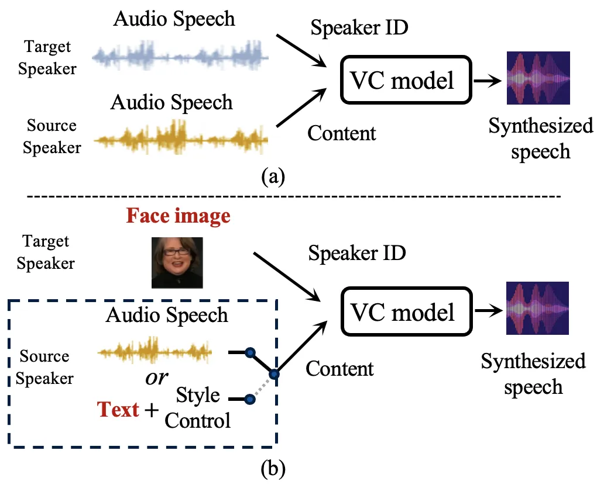
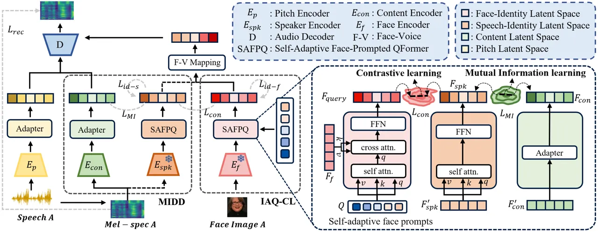
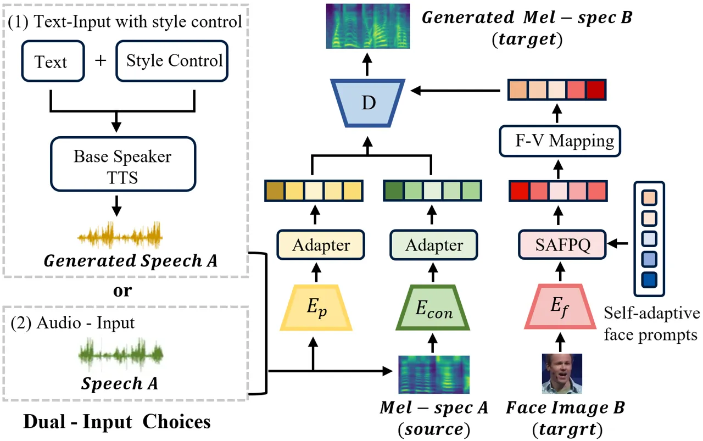
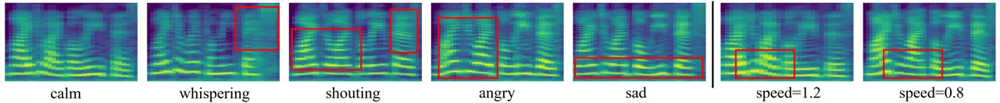
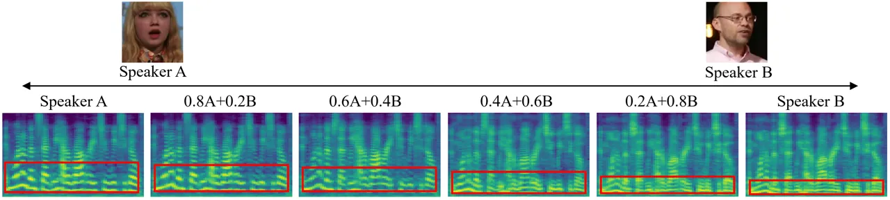
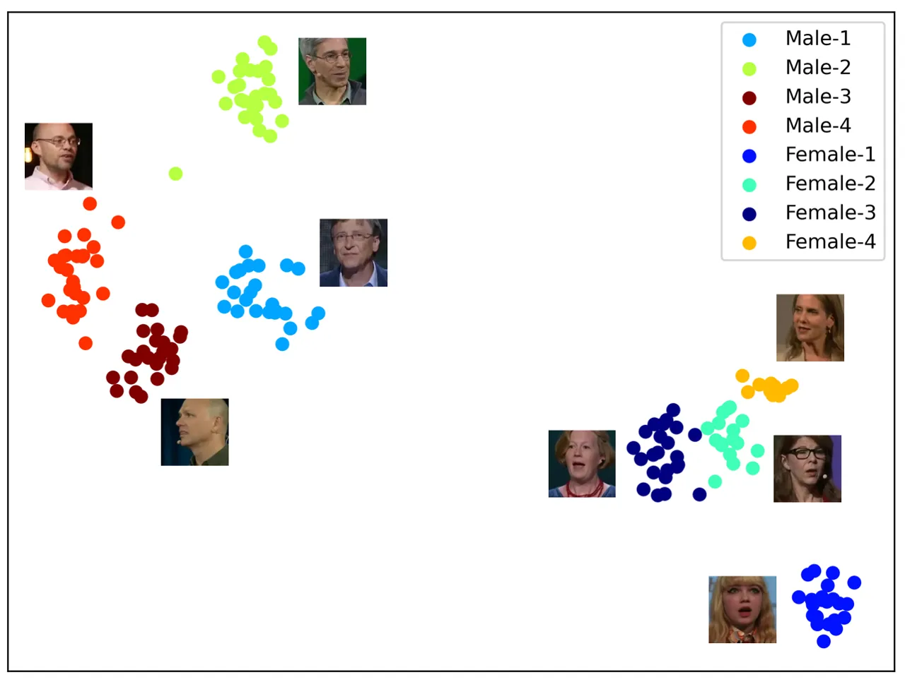
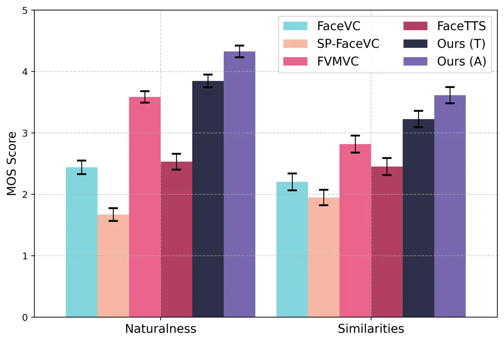
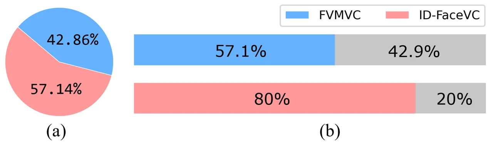
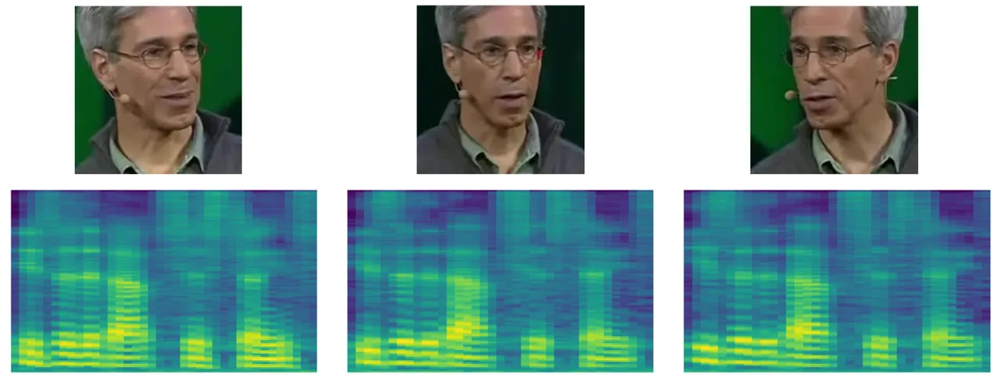
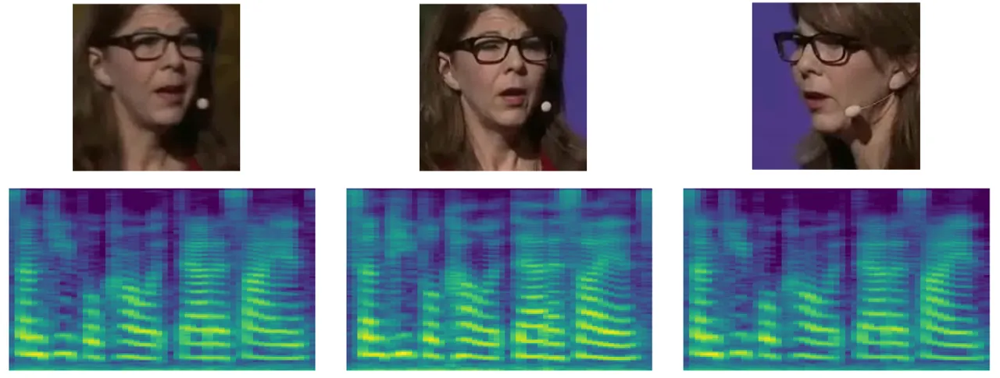

# Seeing Your Speech Style: A Novel Zero-Shot Identity-Disentanglement Face-based Voice Conversion

Yan Rong    Li Liu ^(†)^(†)thanks: Corresponding Author:
avrillliu@hkust-gz.edu.cn.

###### Abstract

> Face-based Voice Conversion (FVC) is a novel task that leverages
> facial images to generate the target speaker’s voice style. Previous
> work has two shortcomings: (1) suffering from obtaining facial
> embeddings that are well-aligned with the speaker’s voice identity
> information, and (2) inadequacy in decoupling content and speaker
> identity information from the audio input. To address these issues, we
> present a novel FVC method, Identity-Disentanglement Face-based Voice
> Conversion (ID-FaceVC), which overcomes the above two limitations.
> More precisely, we propose an Identity-Aware Query-based Contrastive
> Learning (IAQ-CL) module to extract speaker-specific facial features,
> and a Mutual Information-based Dual Decoupling (MIDD) module to purify
> content features from audio, ensuring clear and high-quality voice
> conversion. Besides, unlike prior works, our method can accept either
> audio or text inputs, offering controllable speech generation with
> adjustable emotional tone and speed. Extensive experiments demonstrate
> that ID-FaceVC achieves state-of-the-art performance across various
> metrics, with qualitative and user study results confirming its
> effectiveness in naturalness, similarity, and diversity. Project
> website with audio samples and code can be found at
> https://id-facevc.github.io.

The Hong Kong University of Science and Technology (Guangzhou)

## Introduction

Voice Conversion (VC) (Choi, Lee, and Lee 2024; Yao et al. 2024) aims to
change the speaker identity in speech from a source speaker to that of a
target speaker, while preserving the linguistic content. However, audio
from the target speaker is not always available in some scenarios (e.g.,
digital humans, historical figures). Instead, some studies have explored
an alternative approach by generating the identity information of unseen
speakers’ voices from their facial images (Mavica and Barenholtz 2013;
Smith et al. 2016), known as Zero-Shot Face-based Voice Conversion
(ZS-FVC). Recently, this has become a promising research topic with
potential applications in various scenarios, such as generating voices
that match character appearances in automated film dubbing (Cong et al. 2024) and personalized virtual assistants (Park et al. 2024).



Figure 1: (a) Traditional voice conversion (VC) paradigm. (b) Our novel
ZS-FVC paradigm, which accepts either audio or text as input and allows
control over the emotional tone and speed of the generated speech.

In the literature, great progress in this domain has been achieved by
prior work (Goto et al. 2020; Lu et al. 2021; Sheng et al. 2023; Weng,
Shuai, and Cheng 2023). The fundamental challenge is to accurately map
identity information between faces and voices. Specifically, this
involves (1) acquisition of facial embeddings that are well-aligned with
the speaker’s voice identity, and (2) decoupling of content and speaker
identity information from the audio input.

For the first challenge, the current state-of-the-art (SOTA) work FVMVC
(Sheng et al. 2023) used FaceNet (Schroff, Kalenichenko, and Philbin 2015) to extract general facial features and mapped them through a
memory net. Another SOTA work, SP-FaceVC (Weng, Shuai, and Cheng 2023)
averaged all frames to achieve consistent facial embeddings. However,
these methods focus on general facial features rather than
speaker-specific features, which include substantial non-specific,
identity-irrelevant information (e.g., facial expressions, head angles,
background). As a result, the models become highly dependent on the
training data and lack the ability to locate unique voice
characteristics among different speakers, leading to the production of
general voices. For the second challenge, FVMVC attempted feature
decoupling through a mixed supervision strategy, relying heavily on the
quality and scope of the supervision voices. However, in practical
scenarios, it is often difficult to acquire adequate and balanced
supervision, leading to suboptimal decoupling performance. SP-FaceVC
used a low-pass filtering strategy in data pre-processing to eliminate
high-frequency elements from audio signals, aiming to reduce style
features linked to the speaker identity. Despite its simplicity, this
hard filtering approach risks indiscriminately filtering out some key
voice details, thereby affecting the naturalness and expressiveness of
the synthesized voice and potentially introducing noise and other
artifacts.

To address the above two challenges, we introduce a novel zero-shot
Identity-Disentanglement Face-based Voice Conversion (ID-FaceVC) method.
For the first challenge, instead of adopting static encoding methods
that generalize facial features, we design an Identity-Aware Query-based
Contrastive Learning (IAQ-CL) module to precisely extract the most
identity-relevant facial features. Specifically, we propose a
Self-Adaptive Face-Prompted QFormer (SAFPQ), which employs a set of
learnable self-adaptive face prompts to query identity-relevant facial
features from a frozen Contrastive Language-Image Pretraining (CLIP)
visual encoder (Radford et al. 2021). Indeed, the SAFPQ functions as an
information bottleneck, efficiently filters and maps facial features to
produce speech-relevant facial features, which are then subjected to
contrastive learning with identity features extracted from audio.

|                                         |                  |                 |
| --------------------------------------- | ---------------- | --------------- |
| Methods                                 | Input Modalities | Controllability |
| Face2Speech (Goto et al. 2020)          | Text             | ✗               |
| FaceVC (Lu et al. 2021)                 | Audio            | ✗               |
| FVMVC (Sheng et al. 2023)               | Audio            | ✗               |
| SP-FaceVC (Weng, Shuai, and Cheng 2023) | Audio            | ✗               |
| FaceTTS (Lee, Chung, and Chung 2023)    | Text             | ✗               |
| Ours (ID-FaceVC)                        | Audio / Text     | ✓               |

Table 1: Comparison of input ways and controllability with previous
studies.

For the second challenge, rather than using implicit supervision or hard
filters, we design a novel Mutual Information-based Dual Decoupling
(MIDD) module to purify the extracted content features. This module
decomposes speech into subspaces representing different attributes and
minimizes the overlapping information between speaker identity and
content features through Mutual Information (MI) constraints.
Additionally, inspired by (Peng et al. 2023; Park et al. 2024), we
implement the fine-grained speaker identity supervision to fully
leverage speaker identity information, compelling the model to learn the
subtle distinctions between different speakers and preventing model
collapse.

In addition, previous approaches that employed the target speaker’s
voice as input (Lu et al. 2021; Sheng et al. 2023; Weng, Shuai, and
Cheng 2023), as depicted in Table 1, suffer from limitations in
practical applications due to the occasional unavailability of the
reference audio. Some existing works have utilized text as the input for
speech generation (Goto et al. 2020; Lee, Chung, and Chung 2023), but
their outputs lack the flexibility to manipulate speech style and often
produce speech in a “machine” manner. In this work, we first incorporate
text as an alternative modality during the inference stage and introduce
a style-controllable strategy that allows for control over the emotion
and speed of the generated speech, thereby enabling the generation of
natural, rhythmical, and controllable speech from text.

In summary, the main contributions of this work are as follows.

- •
  A novel paradigm named ID-FaceVC is proposed for zero-shot face-based
  voice conversion that can accept either audio or text as input,
  allowing control over the emotional tone and speed of the generated
  speech. To the best of our knowledge, this is the first attempt to
  explore dual-input controllable face-based voice conversion.
- •
  We design an IAQ-CL module, containing a new Self-Adaptive
  Face-Prompted QFormer to query facial features most relevant to
  speaker identity and forces the model to learn the subtle differences
  between speakers.
- •
  We propose an effective mutual information-based MIDD module to
  completely decouple content and speaker identity from audio features.
- •
  Extensive experimental results demonstrate that our method achieves
  SOTA performance across multiple metrics. Qualitative and user study
  results further validate the effectiveness of the proposed model in
  terms of naturalness, similarity, and diversity.



Figure 2: Overview of the proposed ID-FaceVC. The Adapter is a Feed
Forward Network used to adjust vector dimensions. The embeddings
$`F_{f}`$, $`F_{spk}^{’}`$, $`F_{con}^{’}`$ correspond to the face,
speaker, and content features extracted by $`E_{f}`$, $`E_{spk}`$,
$`E_{con}`$, respectively.

## Related Work

### Evidence of Face-Voice Correlation

Facial and vocal characteristics are closely linked to individual
identity. Studies have demonstrated a natural synergy between these
features, collectively providing concordant source identity information
(Smith et al. 2016). Features of a voice can be inferred from facial
structures (Krauss, Freyberg, and Morsella 2002; Mavica and Barenholtz
2013). For example, vocal pitch and intonation may be associated with
facial features like jaw width and eyebrow density, which together
create a distinct identity signature. Recently, several studies have
exploited the strong similarity between voice and face for novel
applications, such as reconstructing a speaker’s face from their voice
(Wang et al. 2023; Oh et al. 2019; Wen, Raj, and Singh 2019; Duarte
et al. 2019). Our research explores the inverse of this process,
generating diverse vocal styles from various facial images.

### Face-based Voice Conversion

Prior research has validated the potential for synthesizing speech from
facial features. Face2Speech (Goto et al. 2020) pioneered this field
with a three-stage training strategy and a supervised generalized
end-to-end loss to generate speech that reflects speaker facial
characteristics. Building on this foundation, subsequent works proposed
more adaptable loss functions (Wang et al. 2022) and more sophisticated
network designs (Lee, Chung, and Chung 2023) to enhance the quality of
the synthesized speech. These methodologies typically employ text as the
input to avoid entanglement issues. FaceVC (Lu et al. 2021) developed a
three-stage model that leverages a bottleneck adjustment strategy and a
straightforward MSE loss to extract necessary content embeddings from
audio. However, this model struggles to capture the complex mappings
between speech and facial domains, often defaulting to predicting an
“average voice” across variations, making it unsuitable for zero-shot
applications. The most advanced approaches in this field, FVMVC (Sheng
et al. 2023) and SP-FaceVC (Weng, Shuai, and Cheng 2023), improved upon
FaceVC through memory-based feature mapping and rigorous data
preprocessing.

Nevertheless, these methods still have considerable potential for
improvement in achieving well-aligned facial embeddings with speech and
effectively decoupling content from speaker identity in audio features.

## Our Method

Our proposed ID-FaceVC employs an end-to-end training approach. It
comprises three main components: ID-Aware Query-based Contrastive
Learning module, Mutual Information-based Dual Decoupling module, and
Alternative Text-Input with Style Control module.

### ID-Aware Query-based Contrastive Learning

We design the IAQ-CL module to extract facial features that are
well-aligned with the speaker’s voice identity. This module includes
Self-Adaptive Face-Prompted QFormer and face-related speaker identity
supervision.

#### Self-Adaptive Face-Prompted QFormer.

Considering the inherent limitation of CNN-based architectures in
handling the diversity of facial features, we instead employ a frozen
CLIP visual encoder (Radford et al. 2021) to extract features from
facial images. For the frame-wise visual embeddings extracted by the
CLIP visual encoder, we compute the arithmetic mean to obtain average
frame-level facial features, rather than randomly selecting a single
frame as the facial embedding, to reduce potential sampling bias.

Due to the high-dimensional and redundant nature of CLIP visual
features, facial embeddings contain abundant information, including
facial expressions, head poses, and backgrounds, with only a small
portion related to the speaker’s style. Therefore, we propose the SAFPQ
to filter the most speech-relevant features, as illustrated in Figure 2.
Unlike the vanilla Query Transformer (QFormer) (Li et al. 2023), our
model better integrates identity information from both face and voice
domains, resulting in a more cohesive representation. The SAFPQ
functions as an information bottleneck, filtering out redundant facial
features while emphasizing those crucial for speech. In the inference
stage, the self-adaptive face prompts retrieves identity-relevant facial
features from input facial embeddings, facilitating the prediction of
the speaker’s style from unseen facial images.

To be specific, we initialize a set of learnable self-adaptive face
prompts. The most informative prompts are highlighted through a
self-attention mechanism that integrates the information from a global
perspective. Subsequently, the face prompts interact with facial
embeddings via cross-attention to retrieve features relevant to the
identity information. Finally, a fully connected layer fuses these
retrieved features. The process are defined as follows:

```math
A_{self}=\operatorname{softmax}\left(\frac{\mathbf{Q}W_{q}^{\text{self }}\left(\mathbf{Q}W_{k}^{\text{self }}\right)^{T}}{\sqrt{d_{k}}}\right)\mathbf{Q}W_{v}^{\text{self }}, \tag{1}
```

```math
A_{cross}=\operatorname{softmax}\left(\frac{A_{self}W_{q}^{\text{cross}}\left(F_{f}W_{k}^{\text{cross}}\right)^{T}}{\sqrt{d_{k}}}\right)F_{f}W_{v}^{\text{cross}}, \tag{2}
```

```math
F_{query}=\operatorname{FFN}(A_{cross}), \tag{3}
```

where $`W_{q}^{\text{self}}`$, $`W_{k}^{\text{self}}`$,
$`W_{v}^{\text{self}}`$ are the learnable weights for the
self-attention, and $`W_{q}^{\text{cross}}`$, $`W_{k}^{\text{cross}}`$,
$`W_{v}^{\text{cross}}`$ are the learnable weights for the
cross-attention. $`Q`$ is the self-adaptive face prompts, $`d_{k}`$ is
the dimension of the key, $`F_{f}`$ is the facial embedding extracted by
the CLIP, and $`F_{query}`$ represents the final queried facial
features.

Recall that our objective is to extract features highly relevant to the
speaker’s identity, ensuring that the retrieved facial embeddings
closely match the style features in speech. We employ contrastive
learning to measure the distance between these two features, thereby
optimizing the self-adaptive face prompts. This encourages the speech
style and facial embeddings from the same speaker to be as similar as
possible, while those from different speakers are distinctly separated.
The formulation for this process is as follows:

```math
L_{con}=-\frac{1}{N}\sum_{i=1}^{N}\sum_{j=1}^{N}y_{i,j}\log\left(\frac{\exp(\operatorname{sim}(i,j)/\tau)}{\sum_{k=1}^{N}\exp(\operatorname{sim}(i,k)/\tau)}\right), \tag{4}
```

where $`N`$ is the number of samples in a batch, $`\tau`$ is a
temperature hyperparameter, $`i`$ is a fixed index for facial
embeddings, $`j`$ and $`k`$ are indices for speech embeddings, and
$`y_{i,j}`$ is an indicator function. If samples $`i`$ and $`j`$ belong
to the same speaker, then $`y_{i,j}=1`$; otherwise, $`y_{i,j}=0`$.



Figure 3: The inference stage of ID-FaceVC. Text is introduced as an
alternative modality to produce natural, rhythmic, and controllable
speech.

#### Face-related Speaker-identity Supervision.

To distinguish key facial features between different speakers, inspired
by (Peng et al. 2023), we design a fine-grained speaker identity
supervision mechanism to enhance our model’s capability. This
supervision ensures that facial features should maintain consistency for
the same speaker while exhibiting distinctiveness between different
speakers. The formulation can be expressed as:

```math
L_{id-f}=-\frac{1}{N}\sum_{n=1}^{N}\sum_{i=1}^{C}t_{ni}\cdot\log\left(p_{ni}\right), \tag{5}
```

where $`C`$ represents the number of distinct speakers and $`t_{ni}`$
denotes the one-hot encoded target label for the $`n`$-th sample (where
$`t_{ni}=1`$ if the sample belongs to the $`i`$-th speaker, otherwise
$`t_{ni}=0`$). $`p_{ni}`$ is the softmax probabilities that the $`n`$-th
sample’s $`F_{query}`$ belong to the $`i`$-th speaker.

During the inference, ID-FaceVC is able to generate consistent style
speech for different facial images of the same speaker and diverse style
speech for different speakers.

### Mutual Information-based Dual Decoupling

We propose the MIDD module to achieve precise representation of
different disentangled latent spaces and purification of speech content
information. It includes Disentangled Latent Space and Mutual
Information-based Decoupling.

#### Disentangled Latent Space.

The core of achieving robust content representation is the removal of
non-content-related features. A natural idea is to decompose speech into
distinct subspaces that represent various attributes. Thus, we use two
different encoders to separately extract a compact speaker style code
$`F_{spk}`$ and a continuous content code $`F_{con}`$ from the mel
spectrogram. Specifically, to fully leverage the powerful
representational capabilities of large models, we employ the Contrastive
Language-Audio Pretraining (CLAP) (Wu et al. 2023) audio encoder as our
speaker encoder. As depicted in Figure 2, the features obtained from the
CLAP are processed through SAFPQ, following the same procedure as facial
embedding handling but without the cross-attention module. For the
content encoder, we adopt vector quantization (Bitton, Esling, and
Harada 2020) and contrastive predictive coding (Oord, Li, and Vinyals 2018) techniques, commonly used in voice conversion tasks, to extract
the content embeddings $`F_{con}`$.

#### Mutual Information-based Decoupling.

Given the diversity of speech styles, merely constructing two separate
latent spaces may not ensure sufficient feature decoupling. Previous
decoupling methods, such as inter-speaker supervision (Schroff,
Kalenichenko, and Philbin 2015), still result in certain overlaps among
features. To address this issue, we utilize MI, which can measure the
overall dependency between variables and capture both linear and
non-linear relationships (Veyrat-Charvillon and Standaert 2009), as a
metric to evaluate the correlation between speaker embeddings and
content embeddings extracted from speech. However, due to the high
dimensionality and unknown distributions of the variables, directly
calculating probability distributions in MI is impractical. To solve
this, we employ a variational upper bound technique (Cheng et al. 2020),
to establish parameterized conditional distributions, which aids in
controlling the minimization process by estimating the upper bound of
MI:

```math
L_{MI}=\frac{1}{N^{2}}\sum_{i=1}^{N}\sum_{j=1}^{N}\log\frac{q\left(F_{\mathrm{con},i}\mid F_{\mathrm{spk},i}\right)}{q\left(F_{\mathrm{con},j}\mid F_{\mathrm{spk},i}\right)}, \tag{6}
```

where $`F_{\text{spk},i}`$ denotes the speaker style embeddings for the
$`i`$-th sample, $`F_{\text{con},i}`$ and $`F_{\text{con},j}`$ represent
the content embeddings for the $`i`$-th and $`j`$-th samples,
respectively.

By minimizing the overlap information between the extracted style
features and content features, we successfully establish a speaker style
space related to identity and a content space associated with semantics.

In addition, similar to Eq. (5), we apply speech-related
speaker-identity supervision $`L_{id-s}`$ to the style features
extracted from speech. In this context, $`p_{ni}`$ in represents the
softmax probability that the speaker feature $`F_{spk}`$ of the $`n`$-th
sample belongs to the $`i`$-th speaker, while other variables remain
consistent with Eq. (5). The joint speaker-identity supervision for both
facial and speech features enforces the model to recognize the
consistency within the same speaker’s identity and the diversity across
different speakers’ identities. These two loss functions prevent the
generation of overly similar outputs, thereby protecting against mode
collapse.

|                  |                                         |                    |                    |                    |                   |                         |                    |
| ---------------- | --------------------------------------- | ------------------ | ------------------ | ------------------ | ----------------- | ----------------------- | ------------------ |
| Input Modalities | Methods                                 | Naturalness        |                    |                    | Similarity        | Consistency & Diversity |                    |
|                  |                                         | UTMOS $`\uparrow`$ | WER $`\downarrow`$ | CER $`\downarrow`$ | SECS $`\uparrow`$ | SEC $`\uparrow`$        | SED $`\downarrow`$ |
| Audio Input      | FaceVC (Lu et al. 2021)                 | 2.155              | 16.67%             | 10.79%             | 0.702             | 0.986                   | 0.965              |
|                  | SP-FaceVC (Weng, Shuai, and Cheng 2023) | 1.831              | 29.17%             | 19.67%             | 0.723             | 0.988                   | 0.912              |
|                  | FVMVC (Sheng et al. 2023)               | 3.023              | 21.79%             | 15.02%             | 0.678             | 0.987                   | 0.835              |
|                  | Ours (ID-FaceVC)                        | 3.286              | 12.11%             | 7.86%              | 0.713             | 0.988                   | 0.832              |
| Text Input       | FaceTTS (Lee, Chung, and Chung 2023)    | 2.102              | 14.31%             | 8.70%              | 0.701             | 0.987                   | 0.912              |
|                  | Ours (ID-FaceVC)                        | 3.454              | 5.02%              | 2.69%              | 0.704             | 0.989                   | 0.844              |

Table 2: Comparison with SOTA methods. Best performances are highlighted
in bold, while second-best are underlined.



Figure 4: Mel-spectrogram visualizations of voices generated from text
inputs under different emotions and speeds. The red boxes highlight
areas with significant changes compared with the “calm” state.

### Alternative Text-Input with Style Control

In addition to audio inputs, text serves as a more flexible modality in
practical applications because it does not require prior recording of a
source speaker’s speech. In this work, as illustrated in Figure 3, we
introduce text as an alternative option to specify the content of
generated audio, which broadens the applicability and accessibility of
our framework.

The transition from text to audio often results in monotonous narrations
due to the absence of references for emotion, accent, and rhythm. To
address this issue, inspired by the OpenVoice (Qin et al. 2023), we
develop a style control strategy that uses the base speaker TTS as a
bridge to generate an intermediate single-speaker audio. This audio can
be flexibly manipulated in terms of speed and emotion through style
control parameters. The choice of base speaker TTS is flexible, allowing
for either a single-speaker or multi-speaker TTS, as the timbre produced
by the TTS is not our focus. In this task, we select the VITS (Kim,
Kong, and Son 2021) model as the base speaker TTS, which accepts both
text and style control inputs. The audio generated through this process
then serves as the source speaker audio input into our network, where a
content encoder extracts the speech content, and a pitch encoder
captures the pitch information. Together with the speaker style
information inferred from unseen speaker facial images, we generate the
final audio output.

In the inference, when using text as input, the flexible control of
speech and the injection of timbre inference are separated, allowing for
a straightforward and training-free implementation of face-based
controllable voice conversion.

### Training Loss

We utilize L2 loss to evaluate the quality of the reconstructed mel
spectrograms. The formula for this is as follows:

```math
L_{rec}=\|Mel-\hat{Mel}\|_{2}^{2}, \tag{7}
```

where $`Mel`$ and $`\hat{Mel}`$ represent the Mel spectrogram input to
the network and the Mel spectrogram reconstructed by the model,
respectively. Additionally, we follow the training setup described in
FVMVC (Sheng et al. 2023), incorporating both inter-speaker supervision
loss and face-voice mapping loss, collectively referred to as $`L_{F}`$.

The total training loss is defined as follows:

```math
\mathcal{L}=L_{rec}+\lambda_{1}L_{con}+\lambda_{2}L_{MI}+\lambda_{3}L_{id-f}+\lambda_{4}L_{id-s}+\lambda_{5}L_{F}, \tag{8}
```

where $`\lambda_{1}`$ is the weight of $`L_{con}`$ (in Eq. (4)),
$`\lambda_{2}`$ is the weight of $`L_{MI}`$ (in Eq. (6)),
$`\lambda_{3}`$ is the weight of $`L_{id-f}`$ (in Eq. (5)),
$`\lambda_{4}`$ is the weight of $`L_{id-s}`$, and $`\lambda_{5}`$ is
the weight of $`L_{F}`$.

## Experiment and Result

### Experimental Setup

#### Datasets.

To the best of our knowledge, current ZS-FVC methods utilized the LRS3
(Afouras, Chung, and Zisserman 2018) dataset, which comprises over 400
hours of TED talks collected from YouTube, for training. For a fair
comparison, we follow the same dataset setup. More precisely, we
selected the paired data from the top 200 speakers by video count,
resulting in 11,430 videos for training and 5,173 videos for validation.
For testing, we randomly selected 16 previously unseen speakers,
including 8 target speakers (4 male, 4 female) and 8 source speakers (4
male, 4 female).

#### Implementation Details.

We employ the MTCNN (Zhang et al. 2016) to detect and align faces in
each video frame. Facial features are extracted using the ViT-B/32 from
CLIP, with outputs from the penultimate layer utilized to enhance
generalization over the final layer. Audio is extracted from video clips
via FFmpeg (Yamamoto, Song, and Kim 2020), and the HTSAT-base from CLAP
serves as the speaker feature extractor. Training is conducted on a
single Nvidia-A800 GPU with a batch size of 256 for 2000 epochs. F-V
mapping is a memory-based feature mapping module, following the setup of
FVMVC (Sheng et al. 2023). For the vocoder, we utilize a pretrained
ParallelWaveGAN (Yamamoto, Song, and Kim 2020). Loss weights specified
in Eq. (8) are set at $`\lambda_{1}=0.1`$, $`\lambda_{2}=0.01`$,
$`\lambda_{3}=0.1`$, $`\lambda_{4}=0.1`$, and $`\lambda_{5}=1`$.



Figure 5: The mel-spectrograms of voices generated by mixed facial
embeddings. From left to right, as the weight of male facial embeddings
increases, the voice characteristics gradually shift from female to
male, and the fundamental frequency decreases.



Figure 6: The t-SNE visualization of speaker embeddings form generated
speech. Each point represents a voice sample, with nearby images showing
the faces of the speakers.

### Evaluation Metrics

#### Subjective Metrics.

We evaluate the Mean Opinion Score (MOS) for speech naturalness (nMOS)
and speaker similarity (sMOS) with ratings from 8 listeners. Ratings are
assigned using a five-point scale: 1=Bad, 2=Poor, 3=Fair, 4=Good,
5=Excellent. Additionally, we conduct two preference tests to assess the
alignment between generated speech and facial images: (1) selecting the
generated speech that best matches a given face, and (2) selecting the
facial image that best matches the style of a given generated speech.

#### Objective Metrics.

We utilize the UTMOS (Saeki et al. 2022) to evaluate the overall quality
of the generated speech, serving as an objective alternative to the
nMOS. The robustness and content consistency of the generated speech are
quantified using the word error rate (WER) and character error rate
(CER), which are calculated using the Whisper (Radford et al. 2023).
Additionally, speaker embeddings extracted via Resemblyzer are used to
compute the speaker encoder cosine similarity (SECS) between the
generated speech and the true style speech of the same speaker. Due to
the absence of the paired speech data, SECS does not ensure content
consistency in a pair, but the relative SECS scores across models
indicate the ability to accurately map facial images to speaker styles.
Moreover, we have developed metrics for speaker embedding consistency
(SEC), which measure the uniformity of speech outputs from different
facial angles of the same speaker, and speaker embedding diversity
(SED), which assess the variability among speech outputs from different
speakers.

### Quantitative Result and Analysis

#### Comparison with SOTA Methods.

We evaluate our method against four recent face-to-speech generation
methods, as outlined in Table 2. Among these, FaceVC (Lu et al. 2021),
SP-FaceVC (Weng, Shuai, and Cheng 2023), and FVMVC (Sheng et al. 2023)
control speech content using audio from the source speaker, while
FaceTTS (Lee, Chung, and Chung 2023) uses text as input. Our approach
exhibits a notable improvement on the UTMOS metric, indicating enhanced
audio quality. Notably, our method achieves lower WER and CER,
benefiting from the efficient content refinement implemented by MIDD.
Although our method slightly trails SP-FaceVC in terms of the SECS
metric, it surpasses all other methods evaluated. It is important to
highlight that SP-FaceVC scores 0.912 on the SED metric, indicating a
high level of timbral convergence among different speakers, which
suggests a tendency toward generating an “average” timbre. In contrast,
our method demonstrates superior performance on the SED metric,
effectively capturing the most task-relevant facial features.
Additionally, our results on the SEC metric highlight the robustness of
our method to variations in facial embeddings.

|        |      |              |              |                    |                    |                    |                   |
| ------ | ---- | ------------ | ------------ | ------------------ | ------------------ | ------------------ | ----------------- |
| IAQ-CL | MIDD | $`L_{id-f}`$ | $`L_{id-s}`$ | UTMOS $`\uparrow`$ | WER $`\downarrow`$ | CER $`\downarrow`$ | SECS $`\uparrow`$ |
|        |      |              |              | 2.945              | 15.29%             | 10.04%             | 0.693             |
| ✓      |      |              |              | 3.227              | 18.04%             | 11.57%             | 0.726             |
| ✓      | ✓    |              |              | 3.266              | 12.70%             | 8.63%              | 0.709             |
| ✓      | ✓    | ✓            |              | 3.236              | 12.25%             | 7.97%              | 0.709             |
| ✓      | ✓    |              | ✓            | 3.221              | 12.01%             | 8.01%              | 0.712             |
| ✓      | ✓    | ✓            | ✓            | 3.286              | 12.11%             | 7.86%              | 0.713             |

Table 3: Results of ablation studies on different model components. Best
performances are highlighted in bold, while second-best performances are
underlined.

#### Ablation Studies.

We investigate the impact of different model components on ID-FaceVC by
conducting the following ablation studies: (1) w/o IAQ-CL: Randomly
selects a facial frame from a video and uses FaceNet to generate a
512-dimensional vector, which is then fused through self-attention
mechanisms and linear layers. (2) w/o MIDD: Directly extracts speaker
embeddings by the Resemblyzer and maps these features to face embeddings
using self-attention mechanisms and linear layers. (3) w/o $`L_{id-f}`$
and (4) w/o $`L_{id-s}`$: Omits the corresponding loss function.
Experimental results are shown in Table 3.

In contrast to using static encoders for direct facial feature
extraction, the IAQ-CL module significantly improves voice generation
quality and face-to-voice mapping by effectively capturing facial
features relevant to speaking styles. The MIDD module efficiently
purifies the extracted content information, enhancing the clarity of the
generated speech. Although there is a slight reduction in the SECS, this
likely results from a trade-off with some intonation-related style
features while preserving semantic content. This focus on content plays
a crucial role in the clear expression of voice content. Additionally,
supervision based on both facial and voice characteristics of speakers
further strengthens the model’s ability to distinguish critical
features, thus improving generalization across different speakers.

### Qualitative Result and Analysis

#### Visualization of Controllable Speech.

For text-based input, we visualize the Mel spectrograms under various
emotional states and speaking speeds, as depicted in Figure 4. In the
“whispering” state, the generated audio exhibits a more dispersed energy
pattern with an increase in high-frequency components due to the
incomplete vibration of vocal cords typical in whispering. In contrast,
in the “angry” state, the speaker’s voice shows greater fluctuations and
intensity, with a quicker frequency and broader dynamic range. As the
speaking speed increases, the spectral energy distribution becomes more
compact, reducing the intervals between syllables. Conversely, when the
speed decreases, the energy distribution expands, and syllables
lengthen. These observations demonstrate that ID-FaceVC performs well in
controlling different emotions and speaking speeds.



Figure 7: User study results for naturalness and similarity metrics.
Ours (T) and Ours (A) represent ID-FaceVC with text and audio inputs,
respectively.

#### Style Manipulation.

We interpolate facial embeddings from two different speakers to generate
various voice outputs, as shown in Figure 5. As the facial embeddings
transition from female to male, the fundamental frequency of the
generated voice gradually decreases, and the harmonic distribution
becomes denser. The voices in the intermediate transition phase not only
retain high-frequency harmonic features typical of female voices but
also incorporate low-frequency characteristics of male voices,
illustrating a smooth transition in voice characteristics from female to
male. This demonstrates our model’s ability to precisely control voice
output based on varying facial features.

#### Distribution of Speaker Embedding.

For the generated speech, we use the Resemblyzer to extract speaker
embeddings and visualize them using t-SNE, as depicted in Figure 6.
Voice samples generated from the same facial image form tight clusters,
indicating that our model successfully maps unique vocal styles to
different faces. Notably, embeddings for speakers of different genders
display distinct distributions, with those of the same gender and
similar ages showing closely matched speaker embeddings. This
demonstrates our model’s capability to effectively capture the most
speech-relevant features from facial images.

#### Visualization of Different Face Angles.

We randomly selected two speakers and three facial images of each,
captured from various angles, to perform ZS-FVC, as shown in Appendix
Figure 9. Regardless of the facial expressions and angles, the voices
generated by the model remained consistent across different images of
the same speaker. This consistency is attributed to the model’s ability
to effectively align identity-related features in the faces with
style-related features in the voice, demonstrating robustness to camera
positions, backgrounds, and other noise.



Figure 8: Results of the preference test. (a) Given a facial image,
preference results for choosing the more matching speech between outputs
from FVMVC and ID-FaceVC. (b) Accuracy of selecting the more matching
facial image given the model-generated speech.

### User Study

We evaluated the naturalness and similarity of generated speech through
a user study involving eight experts. Each expert rated 27 sets of audio
samples, with each set containing six comparative groups. As depicted in
Figure 7, our method consistently outperforms current SOTA approaches in
both naturalness and similarity, while also exhibiting smaller
confidence intervals. These findings demonstrate that ID-FaceVC reliably
produces high-quality outputs with enhanced stability.

We further validate our model’s ability to map facial features to speech
characteristics through preference tests. To increase the challenge of
the experiment, we conduct gender-matched tests, selecting face and
audio samples from individuals of the same gender. As depicted in Figure
8, in the face-based preference test, 57.14% of evaluators believe that
ID-FaceVC produces results that better match the given facial images. In
the voice-based preference test, evaluators correctly identify the match
22.9% more often when the speech is generated by ID-FaceVC rather than
FVMVC, demonstrating that the speech generated by ID-FaceVC more
accurately aligns with the corresponding facial images.

## Conclusion

In this work, we introduce a novel ID-FaceVC framework, effectively
generating speech that aligns with facial identity features. Our
framework includes the IAQ-CL and MIDD modules to precisely map facial
features to speech. Additionally, we incorporate text as an alternative
modality for controlling speech content and employ a style controllable
strategy that ensures speech generated from text is natural, rhythmic,
and controllable. Both quantitative and qualitative experiments validate
the overall effectiveness of our framework and the individual modules.
Future work aims to expand beyond audio generation to include expressive
facial animations, transitioning from merely “audible” to “both audible
and visible.”

## References

- Afouras, Chung, and Zisserman (2018) Afouras, T.; Chung, J. S.; and
  Zisserman, A. 2018. LRS3-TED: a large-scale dataset for visual speech
  recognition. _arXiv preprint arXiv:1809.00496_.
- Bitton, Esling, and Harada (2020) Bitton, A.; Esling, P.; and
  Harada, T. 2020. Vector-quantized timbre representation. _arXiv
  preprint arXiv:2007.06349_.
- Cheng et al. (2020) Cheng, P.; Hao, W.; Dai, S.; Liu, J.; Gan, Z.; and
  Carin, L. 2020. Club: A contrastive log-ratio upper bound of mutual
  information. In _International conference on machine learning_,
  1779–1788.
- Choi, Lee, and Lee (2024) Choi, H.-Y.; Lee, S.-H.; and Lee,
  S.-W. 2024. Dddm-vc: Decoupled denoising diffusion models with
  disentangled representation and prior mixup for verified robust voice
  conversion. In _Proceedings of the AAAI Conference on Artificial
  Intelligence_, volume 38, 17862–17870.
- Cong et al. (2024) Cong, G.; Qi, Y.; Li, L.; Beheshti, A.; Zhang, Z.;
  Hengel, A. v. d.; Yang, M.-H.; Yan, C.; and Huang, Q. 2024.
  StyleDubber: Towards Multi-Scale Style Learning for Movie Dubbing.
  _arXiv preprint arXiv:2402.12636_.
- Duarte et al. (2019) Duarte, A. C.; Roldan, F.; Tubau, M.; Escur, J.;
  Pascual, S.; Salvador, A.; Mohedano, E.; McGuinness, K.; Torres, J.;
  and Giro-i Nieto, X. 2019. WAV2PIX: Speech-conditioned Face Generation
  using Generative Adversarial Networks. In _IEEE International
  Conference on Acoustics, Speech and Signal Processing_, volume 2019,
  8633–8637.
- Goto et al. (2020) Goto, S.; Onishi, K.; Saito, Y.; Tachibana, K.; and
  Mori, K. 2020. Face2Speech: Towards Multi-Speaker Text-to-Speech
  Synthesis Using an Embedding Vector Predicted from a Face Image. In
  _Conference of the International Speech Communication Association_,
  1321–1325.
- Kim, Kong, and Son (2021) Kim, J.; Kong, J.; and Son, J. 2021.
  Conditional variational autoencoder with adversarial learning for
  end-to-end text-to-speech. In _International Conference on Machine
  Learning_, 5530–5540.
- Krauss, Freyberg, and Morsella (2002) Krauss, R. M.; Freyberg, R.; and
  Morsella, E. 2002. Inferring speakers’ physical attributes from their
  voices. _Journal of experimental social psychology_, 38(6): 618–625.
- Lee, Chung, and Chung (2023) Lee, J.; Chung, J. S.; and Chung,
  S.-W. 2023. Imaginary voice: Face-styled diffusion model for
  text-to-speech. In _IEEE International Conference on Acoustics, Speech
  and Signal Processing_, 1–5.
- Li et al. (2023) Li, J.; Li, D.; Savarese, S.; and Hoi, S. 2023.
  Blip-2: Bootstrapping language-image pre-training with frozen image
  encoders and large language models. In _International conference on
  machine learning_, 19730–19742.
- Lu et al. (2021) Lu, H.-H.; Weng, S.-E.; Yen, Y.-F.; Shuai, H.-H.; and
  Cheng, W.-H. 2021. Face-based voice conversion: Learning the voice
  behind a face. In _Proceedings of the 29th ACM International
  Conference on Multimedia_, 496–505.
- Mavica and Barenholtz (2013) Mavica, L. W.; and Barenholtz, E. 2013.
  Matching voice and face identity from static images. _Journal of
  Experimental Psychology: Human Perception and Performance_,
  39(2): 307.
- Oh et al. (2019) Oh, T.-H.; Dekel, T.; Kim, C.; Mosseri, I.; Freeman,
  W. T.; Rubinstein, M.; and Matusik, W. 2019. Speech2face: Learning the
  face behind a voice. In _Proceedings of the IEEE/CVF conference on
  computer vision and pattern recognition_, 7539–7548.
- Oord, Li, and Vinyals (2018) Oord, A. v. d.; Li, Y.; and
  Vinyals, O. 2018. Representation learning with contrastive predictive
  coding. _arXiv preprint arXiv:1807.03748_.
- Park et al. (2024) Park, J. H.; Maeng, J.-G.; Bak, T.; and Joo,
  Y.-S. 2024. SYNTHE-SEES: Face Based Text-to-Speech for Virtual
  Speaker. In _IEEE International Conference on Acoustics, Speech and
  Signal Processing_, 10321–10325.
- Peng et al. (2023) Peng, Z.; Wu, H.; Song, Z.; Xu, H.; Zhu, X.; He,
  J.; Liu, H.; and Fan, Z. 2023. Emotalk: Speech-driven emotional
  disentanglement for 3d face animation. In _Proceedings of the IEEE/CVF
  International Conference on Computer Vision_, 20687–20697.
- Qin et al. (2023) Qin, Z.; Zhao, W.; Yu, X.; and Sun, X. 2023.
  Openvoice: Versatile instant voice cloning. _arXiv preprint
  arXiv:2312.01479_.
- Radford et al. (2021) Radford, A.; Kim, J. W.; Hallacy, C.; Ramesh,
  A.; Goh, G.; Agarwal, S.; Sastry, G.; Askell, A.; Mishkin, P.; Clark,
  J.; et al. 2021. Learning transferable visual models from natural
  language supervision. In _International conference on machine
  learning_, 8748–8763.
- Radford et al. (2023) Radford, A.; Kim, J. W.; Xu, T.; Brockman, G.;
  McLeavey, C.; and Sutskever, I. 2023. Robust speech recognition via
  large-scale weak supervision. In _International conference on machine
  learning_, 28492–28518.
- Saeki et al. (2022) Saeki, T.; Xin, D.; Nakata, W.; Koriyama, T.;
  Takamichi, S.; and Saruwatari, H. 2022. Utmos: Utokyo-sarulab system
  for voicemos challenge 2022. _arXiv preprint arXiv:2204.02152_.
- Schroff, Kalenichenko, and Philbin (2015) Schroff, F.; Kalenichenko,
  D.; and Philbin, J. 2015. Facenet: A unified embedding for face
  recognition and clustering. In _Proceedings of the IEEE conference on
  computer vision and pattern recognition_, 815–823.
- Sheng et al. (2023) Sheng, Z.-Y.; Ai, Y.; Chen, Y.-N.; and Ling,
  Z.-H. 2023. Face-Driven Zero-Shot Voice Conversion with Memory-based
  Face-Voice Alignment. In _Proceedings of the 31st ACM International
  Conference on Multimedia_, 8443–8452.
- Smith et al. (2016) Smith, H. M.; Dunn, A. K.; Baguley, T.; and
  Stacey, P. C. 2016. Concordant cues in faces and voices: Testing the
  backup signal hypothesis. _Evolutionary Psychology_,
  14(1): 1474704916630317.
- Veyrat-Charvillon and Standaert (2009) Veyrat-Charvillon, N.; and
  Standaert, F.-X. 2009. Mutual information analysis: how, when and why?
  In _International Workshop on Cryptographic Hardware and Embedded
  Systems_, 429–443. Springer.
- Wang et al. (2023) Wang, J.; Liu, L.; Wang, J.; and Cheng, H. V. 2023.
  Realistic Speech-to-Face Generation with Speech-Conditioned Latent
  Diffusion Model with Face Prior. _arXiv preprint arXiv:2310.03363_.
- Wang et al. (2022) Wang, J.; Wang, Z.; Hu, X.; Li, X.; Fang, Q.; and
  Liu, L. 2022. Residual-guided personalized speech synthesis based on
  face image. In _IEEE International Conference on Acoustics, Speech and
  Signal Processing_, 4743–4747.
- Wen, Raj, and Singh (2019) Wen, Y.; Raj, B.; and Singh, R. 2019. Face
  reconstruction from voice using generative adversarial networks.
  _Advances in neural information processing systems_, 32.
- Weng, Shuai, and Cheng (2023) Weng, S.-E.; Shuai, H.-H.; and Cheng,
  W.-H. 2023. Zero-shot face-based voice conversion: bottleneck-free
  speech disentanglement in the real-world scenario. In _Proceedings of
  the AAAI Conference on Artificial Intelligence_, volume 37,
  13718–13726.
- Wu et al. (2023) Wu, Y.; Chen, K.; Zhang, T.; Hui, Y.;
  Berg-Kirkpatrick, T.; and Dubnov, S. 2023. Large-scale contrastive
  language-audio pretraining with feature fusion and keyword-to-caption
  augmentation. In _IEEE International Conference on Acoustics, Speech
  and Signal Processing_, 1–5.
- Yamamoto, Song, and Kim (2020) Yamamoto, R.; Song, E.; and Kim,
  J.-M. 2020. Parallel WaveGAN: A fast waveform generation model based
  on generative adversarial networks with multi-resolution spectrogram.
  In _IEEE International Conference on Acoustics, Speech and Signal
  Processing_, 6199–6203.
- Yao et al. (2024) Yao, J.; Yang, Y.; Lei, Y.; Ning, Z.; Hu, Y.; Pan,
  Y.; Yin, J.; Zhou, H.; Lu, H.; and Xie, L. 2024. Promptvc: Flexible
  stylistic voice conversion in latent space driven by natural language
  prompts. In _IEEE International Conference on Acoustics, Speech and
  Signal Processing_, 10571–10575.
- Zhang et al. (2016) Zhang, K.; Zhang, Z.; Li, Z.; and Qiao, Y. 2016.
  Joint face detection and alignment using multitask cascaded
  convolutional networks. _IEEE signal processing letters_, 23(10):
  1499–1503.

## Appendix

### Visualization of Different Face Angles.

As shown in Appendix Figure 9, the speech styles generated by ID-FaceVC
from different facial images of the same target speaker show
consistency.



(a)



(b)

Figure 9: Mel-spectrograms of speech generated from facial images of two
target speakers, captured at different angles and against various
backgrounds.
