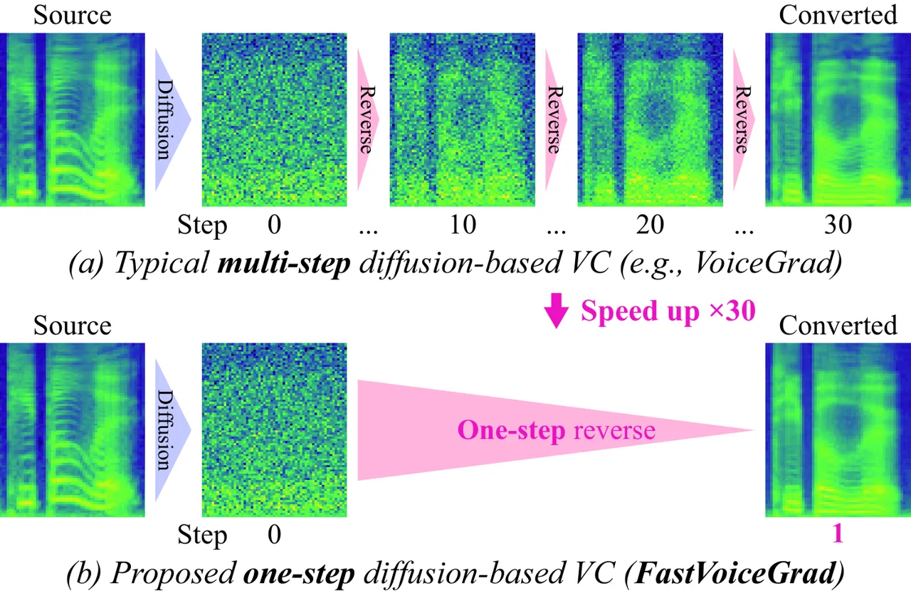

# FastVoiceGrad: One-step Diffusion-Based Voice Conversion with Adversarial Conditional Diffusion Distillation

Takuhiro Kaneko    Hirokazu Kameoka    Kou Tanaka    Yuto Kondo

###### Abstract

Diffusion-based voice conversion (VC) techniques such as VoiceGrad have
attracted interest because of their high VC performance in terms of
speech quality and speaker similarity. However, a notable limitation is
the slow inference caused by the multi-step reverse diffusion.
Therefore, we propose FastVoiceGrad, a novel one-step diffusion-based VC
that reduces the number of iterations from dozens to one while
inheriting the high VC performance of the multi-step diffusion-based VC.
We obtain the model using adversarial conditional diffusion distillation
(ACDD), leveraging the ability of generative adversarial networks and
diffusion models while reconsidering the initial states in sampling.
Evaluations of one-shot any-to-any VC demonstrate that FastVoiceGrad
achieves VC performance superior to or comparable to that of previous
multi-step diffusion-based VC while enhancing the inference speed.¹¹ 1
Audio samples are available at
[https://www.kecl.ntt.co.jp/people/kaneko.takuhiro/projects/fastvoicegrad/](https://www.kecl.ntt.co.jp/people/kaneko.takuhiro/projects/fastvoicegrad/).

###### keywords

voice conversion, diffusion model, generative adversarial networks,
knowledge distillation, efficient model

^(†)^(†)address: NTT Corporation, Japan^(†)^(†)email:
takuhiro.kaneko@ntt.com

## 1 Introduction

Voice conversion (VC) is a technique for converting one voice into
another without changing linguistic contents. VC began to be studied in
a parallel setting, in which mappings between the source and target
voices are learned in a supervised manner using a parallel corpus.
However, this approach encounters difficulties in collecting a parallel
corpus. Alternatively, non-parallel VC, which learns mappings without a
parallel corpus, has attracted significant interest. In particular, the
emergence of deep generative models has ushered in breakthroughs. For
example, (variational) autoencoder (VAE/AE) \[1\]-based VC \[2, 3, 4, 5,
6, 7, 8, 9\], generative adversarial network (GAN) \[10\]-based VC \[11,
12, 13, 14, 15, 16\], flow \[17\]-based VC \[18\], and
diffusion \[19\]-based VC \[20, 21, 22\] have demonstrated impressive
results.



Figure 1: Comparison between (a) typical multi-step diffusion-based VC
(e.g., VoiceGrad \[20\]) and (b) proposed one-step diffusion-based VC
(FastVoiceGrad). FastVoiceGrad reduces the required number of iterations
from dozens to one and improves the inference speed (e.g., $`\times 30`$
in this example).

Among these models, this paper focuses on diffusion-based VC because
it \[20, 22\] outperforms representative VC models (e.g., \[14, 6, 8, 9,
23\]) and has a significant potential for development owing to
advancements in diffusion models in various fields (e.g., image
synthesis \[24, 25, 26\] and speech synthesis \[27, 28\]). Despite these
appealing properties, its limitation is the slow inference caused by an
iterative reverse diffusion process to transform noise into acoustic
features (e.g., the mel spectrogram²² 2 For ease of reading, we
hereafter focus on the mel spectrogram as a conversion target but other
acoustic features can be equally applied.) as shown in Figure 1(a). This
requires at least approximately five iterations, typically dozens of
iterations, to obtain sufficiently high-quality speech. This is
disadvantageous compared to other deep generative model-based VC (e.g.,
VAE-based VC and GAN-based VC discussed above) because they can
accomplish VC through a one-step feedforward process.

To overcome this limitation, we propose FastVoiceGrad, a novel one-step
diffusion-based VC model that inherits strong VC capabilities from a
multi-step diffusion-based VC model (e.g., VoiceGrad \[20\]), while
reducing the required number of iterations from dozens to one, as
depicted in Figure 1(b). To construct this efficient model, we propose
adversarial conditional diffusion distillation (ACDD), which is inspired
by adversarial diffusion distillation (ADD) \[29\] proposed in image
synthesis, and distills a multi-step teacher diffusion model into a
one-step student diffusion model while exploiting the abilities of
GANs \[10\] and diffusion models \[19\]. Note that ADD and ACDD differ
in two aspects: (1) ADD addresses a generation task (i.e., generating
data from random noise), while ACDD addresses a conversion task (i.e.,
generating target data from source data); and (2) ADD is applied to
images, while ACDD is applied to acoustic features. Owing to these
differences, we (1) reconsider the initial states in sampling
(Section 3.1) and (2) explore the optimal configurations for VC
(Section 3.2).

In the experiments, we examined the effectiveness of FastVoiceGrad for
one-shot any-to-any VC, in which we used an any-to-any extension of
VoiceGrad \[20\] as a teacher model and distilled it into FastVoiceGrad.
Experimental evaluations indicated that FastVoiceGrad outperforms
VoiceGrad with the same step (i.e., one-step) reverse diffusion process,
and has performance comparable to VoiceGrad with a 30-step reverse
diffusion process. Furthermore, we demonstrate that FastVoiceGrad is
superior to or comparable to DiffVC \[22\], another representative
diffusion-based VC, while improving the inference speed.

The remainder of this paper is organized as follows: Section 2 reviews
VoiceGrad, which is the baseline. Section 3 describes the proposed
FastVoiceGrad. Section 4 presents our experimental results. Finally,
Section 5 concludes the paper with a discussion on future research.

## 2 Preliminary: VoiceGrad

VoiceGrad \[20\] is a pioneering diffusion-based VC model that includes
two variants: a denoising score matching (DSM) \[30\]-based and
denoising diffusion probabilistic model (DDPM) \[25\]-based models. The
latter can achieve a VC performance comparable to that of the former
while reducing the number of iterations from hundreds to approximately
ten \[20\]. Thus, this study focuses on the DDPM-based model. The
original VoiceGrad was formulated for any-to-many VC. However, we
formulated it for any-to-any VC as a more general formulation. The main
difference is that speaker embeddings are extracted using a speaker
encoder instead of speaker labels, while the others remain almost the
same.

Overview. DDPM \[25\] represents a data-to-noise (diffusion) process
using a gradual nosing process, i.e.,
$`\bm{x}_{0}\rightarrow\bm{x}_{1}\rightarrow\dots\rightarrow\bm{x}_{T}`$,
where $`T`$ is the number of steps ($`T=1000`$ in practice),
$`\bm{x}_{0}`$ represents real data (mel spectrogram in our case), and
$`\bm{x}_{T}`$ indicates noise
$`\bm{x}_{T}\sim\mathcal{N}(\bm{0},\bm{I})`$. By contrast, it performs a
noise-to-data (reverse diffusion) process, that is,
$`\bm{x}_{T}\rightarrow\bm{x}_{T-1}\rightarrow\dots\rightarrow\bm{x}_{0}`$,
using a gradual denoising process via a neural network. The details of
each process are as follows:

Diffusion process. Assuming a Markov chain, a one-step diffusion process
$`q(\bm{x}_{t}|\bm{x}_{t-1})`$ ($`t\in\{1,\dots,T\}`$) is defined as
follows:

```math
\displaystyle q(\bm{x}_{t}|\bm{x}_{t-1})=\mathcal{N}(\bm{x}_{t};\sqrt{\alpha_{t}}\bm{x}_{t-1},\beta_{t}\mathbf{I}), \tag{1}
```

where $`\alpha_{t}=1-\beta_{t}`$. Owing to the reproductivity of the
normal distribution, $`q(\bm{x}_{t}|\bm{x}_{0})`$ can be obtained
analytically as follows:

```math
\displaystyle q(\bm{x}_{t}|\bm{x}_{0})=\mathcal{N}(\bm{x}_{t};\sqrt{\bar{\alpha_{t}}}\bm{x}_{0},(1-\bar{\alpha_{t}})\mathbf{I}), \tag{2}
```

where $`\bar{\alpha}_{t}=\prod_{i=1}^{t}\alpha_{i}`$. Using a
reparameterization trick \[1\], Equation (2) can be rewritten as

```math
\displaystyle\bm{x}_{t}=\sqrt{\bar{\alpha_{t}}}\bm{x}_{0}+\sqrt{1-\bar{\alpha_{t}}}\bm{\epsilon}, \tag{3}
```

where $`\bm{\epsilon}\sim\mathcal{N}(\mathbf{0},\mathbf{I})`$. In
practice, $`\beta_{t}`$ is fixed at constant values \[25\] with a
predetermined noise schedule (e.g., a cosine schedule \[26\]).

Reverse diffusion process. A one-step reverse diffusion process
$`p_{\theta}(\bm{x}_{t-1}|\bm{x}_{t})`$ is defined as follows:

```math
\displaystyle p_{\theta}(\bm{x}_{t-1}|\bm{x}_{t})=\mathcal{N}(\bm{x}_{t-1};\bm{\mu}_{\theta}(\bm{x}_{t},t,\bm{s},\bm{p}),\sigma_{t}^{2}\mathbf{I}), \tag{4}
```

where $`\bm{\mu}_{\theta}`$ indicates the output of a model that is
parameterized using $`\theta`$, conditioned on $`t`$, speaker embedding
$`\bm{s}`$, and phoneme embedding $`\bm{p}`$, and
$`\sigma_{t}^{2}=\frac{1-\bar{\alpha}_{t-1}}{1-\bar{\alpha_{t}}}\beta_{t}`$.
Unless otherwise specified, $`\bm{x}_{0}`$, $`\bm{s}`$, and $`\bm{p}`$
are extracted from the same waveform. Through reparameterization \[1\],
Equation (4) can be rewritten as

```math
\displaystyle\bm{x}_{t-1}=\bm{\mu}_{\theta}(\bm{x}_{t},t,\bm{s},\bm{p})+\sigma_{t}\bm{z}, \tag{5}
```

where $`\bm{z}\sim\mathcal{N}(\textbf{0},\textbf{I})`$.

Training process. The training objective of DDPM is to minimize the
variational bound on the negative log-likelihood
$`\mathbb{E}[-\log p_{\theta}(\bm{x}_{0})]`$:

```math
\displaystyle\mathcal{L}_{\mathrm{DDPM}}(\theta)=\mathbb{E}_{q(\bm{x}_{1:T}|\bm{x}_{0})}\left[-\log\frac{p_{\theta}(\bm{x}_{0:T})}{q(\bm{x}_{1:T}|\bm{x}_{0})}\right]. \tag{6}
```

Using Equation (3) and the following reparameterization

```math
\displaystyle\hskip-5.69054pt\bm{\mu}_{\theta}(\bm{x}_{t},t,\bm{s},\bm{p})=\frac{1}{\sqrt{\alpha_{t}}}\left(\bm{x}_{t}-\frac{1-\alpha_{t}}{\sqrt{1-\bar{\alpha_{t}}}}\bm{\epsilon}_{\theta}(\bm{x}_{t},t,\bm{s},\bm{p})\right), \tag{7}
```

Equation (6) can be rewritten as follows:

```math
\displaystyle\mathcal{L}_{\mathrm{DDPM}}(\theta)=\sum_{t=1}^{T}w_{t}\mathbb{E}_{\bm{x}_{0},\bm{\epsilon}}[\lVert\bm{\epsilon}-\bm{\epsilon}_{\theta}(\bm{x}_{t},t,\bm{s},\bm{p})\rVert_{1}], \tag{8}
```

where $`\bm{\epsilon}_{\theta}`$ represents a noise predictor that
predicts $`\bm{\epsilon}`$ using $`\bm{x}_{t}`$, $`t`$, $`\bm{s}`$, and
$`\bm{p}`$. See \[25\] for detailed derivations of Equations (6)–(8).
Here, $`w_{t}`$ is a constant and is set to $`1`$ in practice for better
training \[25\]. In the original DDPM \[25\], the L2 loss is used in
Equation (8); however, we use the L1 loss according to \[27, 20\], which
shows that the L1 loss is better than the L2 loss.

Conversion process. When $`\bm{\epsilon}_{\theta}`$ is trained,
VoiceGrad can convert the given source mel-spectrogram
$`\bm{x}_{0}^{src}`$ into a target mel-spectrogram $`\bm{x}_{0}^{tgt}`$
using Algorithm 1. Here, we use the superscripts $`{src}`$ and $`{tgt}`$
to indicate that the data are related to the source and target speakers,
respectively. In this algorithm, a target speaker embedding
$`\bm{s}^{tgt}`$ and a source phoneme embedding $`\bm{p}^{src}`$ are
used as auxiliary information. To accelerate sampling \[26\], we use the
subsequence $`\{S_{K},\dots,S_{1}\}`$ as a sequence of $`t`$ values
instead of $`\{T,\dots,1\}`$, where $`K\leq T`$. Owing to this change,
$`\alpha_{S_{k}}`$ is redefined as
$`\alpha_{S_{k}}=\frac{\bar{\alpha}_{S_{k}}}{\bar{\alpha}_{S_{k-1}}}`$
for $`k>1`$ and $`\alpha_{S_{k}}=\bar{\alpha}_{S_{k}}`$ for $`k=1`$.
$`\sigma_{S_{k}}`$ is modified accordingly. Note that VC is a conversion
task and not a generation task; therefore, $`\bm{x}_{0}^{src}`$ is used
as an initial value of $`\bm{x}`$ (line 1) instead of random noise
$`\bm{x}_{T}\sim\mathcal{N}(\textbf{0},\textbf{I})`$, which is typically
used in a generation task. For the same reason, the initial value of
$`t`$ is adjusted from $`T`$ to $`S_{K}<T`$ (line 2) to initiate the
reverse diffusion process from the midterm state rather than from the
noise.

0:  $`\bm{x}_{0}^{src}`$, $`\bm{s}^{tgt}`$, $`\bm{p}^{src}`$

1:  $`\bm{x}\leftarrow\bm{x}_{0}^{src}`$

2:  for $`t=S_{K},\dots,S_{1}`$ do

3:   $`\bm{z}\sim\mathcal{N}(\mathbf{0},\mathbf{I})`$ if $`t>S_{1}`$
else $`\bm{z}=\textbf{0}`$

4:
  $`\bm{x}\leftarrow\frac{1}{\sqrt{\alpha_{t}}}\left(\bm{x}-\frac{1-\alpha_{t}}{\sqrt{1-\bar{\alpha_{t}}}}\bm{\epsilon}_{\theta}(\bm{x},t,\bm{s}^{tgt},\bm{p}^{src})\right)+\sigma_{t}\bm{z}`$

5:  end for

6:  $`\bm{x}_{0}^{tgt}\leftarrow\bm{x}`$

7:  return $`\bm{x}_{0}^{tgt}`$

Algorithm 1 Conversion process in VoiceGrad \[20\]

## 3 Proposal: FastVoiceGrad

### 3.1 Rethinking initial states in sampling

In Algorithm 1, the two crucial factors that affect the inheritance of
source speech are the initial values of (1) $`\bm{x}`$ and (2) $`t`$.

Rethinking the initial value of $`\bm{x}`$. When the initial value of
$`\bm{x}`$ is set to $`\bm{x}\sim\mathcal{N}(\mathbf{0},\mathbf{I})`$ (a
strategy used in generation), no gap occurs between training and
inference; however, we cannot inherit the source information, that is,
$`\bm{x}_{0}^{src}`$, which is useful for VC to preserve the content. In
contrast, when $`\bm{x}_{0}^{src}`$ is directly used as the initial
value of $`\bm{x}`$ (the strategy used in VoiceGrad), we can inherit the
source information, but a gap occurs between training and inference.
Considering both aspects, we propose the use of a diffused source
mel-spectrogram $`\bm{x}_{S_{K}}^{src}`$, defined as

```math
\displaystyle\bm{x}_{S_{K}}^{src}=\sqrt{\bar{\alpha}_{S_{K}}}\bm{x}_{0}^{src}+\sqrt{1-\bar{\alpha}_{S_{K}}}\bm{\epsilon}. \tag{9}
```

In line 1 of Algorithm 1, $`\bm{x}_{S_{K}}^{src}`$ is used instead of
$`\bm{x}_{0}^{src}`$. The effect of this replacement is discussed in the
next paragraph.

Figure 2: Relationship between DNSMOS and $`S_{K}`$ and that between SVA
and $`S_{K}`$. Clean source $`\bm{x}_{0}^{src}`$ (blue line) and
diffused source $`\bm{x}_{S_{K}}^{src}`$ (orange line) were used as
initial values of $`\bm{x}`$. The scores were calculated for $`S_{K}`$
sampled per 50 steps.

Rethinking the initial value of $`t`$ (i.e., $`S_{K}`$). As $`S_{K}`$ is
closer to $`T`$, $`\bm{x}`$ can be transformed to a greater extent under
the assumption that it contains more noise, but can corrupt essential
information. As this is a nontrivial tradeoff, it is empirically
investigated. Figure 2 shows the relationship between $`S_{K}`$ and
DNSMOS \[31\] (corresponding to speech quality) and that between
$`S_{K}`$ and speaker verification accuracy (SVA) \[32\] (corresponding
to speaker similarity). We present the results for two cases in which
$`\bm{x}_{0}^{src}`$ and $`\bm{x}_{S_{K}}^{src}`$ are used as the
initial values of $`\bm{x}`$. $`K`$ was set to $`1`$; that is, one-step
reverse diffusion was conducted. We observe that SVA improves as
$`S_{K}`$ increases because $`\bm{x}`$ is largely transformed toward the
target speaker in this case. When $`\bm{x}`$ was initialized with
$`\bm{x}_{0}^{src}`$, DNSMOS worsens as $`S_{K}`$ increases. In
contrast, when $`\bm{x}`$ was initialized with $`\bm{x}_{S_{K}}^{src}`$,
DNSMOS worsens once but then becomes better, possibly because, in the
latter case, the gap between training and inference is alleviated via a
diffusion process (Equation (9)) as $`S_{K}`$ increases. Both scores
decreasd significantly when $`S_{K}=1000`$, where $`\bm{x}`$ was
denoised under the assumption that $`\bm{x}`$ is noise. These results
indicate that the one-step reverse diffusion should begin under the
assumption that $`\bm{x}`$ contains the source information, albeit in
extremely small amounts.³³ 3 Note that, if $`K`$ is sufficiently large,
adequate speech can be obtained even with $`S_{K}=1000`$ at the expense
of speed. A comparison of the results for $`\bm{x}_{0}^{src}`$ and
$`\bm{x}_{S_{K}}^{src}`$ indicates that $`\bm{x}_{S_{K}}^{src}`$ is
superior, particularly when considering the SVA. Based on these results,
we used $`\bm{x}_{S_{K}}^{src}`$ with $`S_{K}=950`$ in the subsequent
experiments. Figure 1 shows the results for this setting.

### 3.2 Adversarial conditional diffusion distillation

Owing to the difficulty in learning a one-step diffusion model
comparable to a multi-step model from scratch, we used a model
pretrained using the standard VoiceGrad as an initial model and improved
it through ACDD. Inspired by ADD \[29\], which was proposed for image
generation, we used adversarial loss and score distillation loss in
distillation.

Adversarial loss. Initially, we considered directly applying a
discriminator to the mel spectrogram, similar to the previous GAN-based
VC (e.g., \[15, 16\]). However, we could not determine an optimal
discriminator to eliminate the buzzy sound in the waveform. Therefore,
we converted the mel spectrogram into a waveform using a neural vocoder
$`\mathcal{V}`$ (with frozen parameters) and applied a discriminator
$`\mathcal{D}`$ in the waveform domain. More specifically, adversarial
loss (particularly least-squares GAN \[33\]-based loss) is expressed as
follows:

```math
\displaystyle\mathcal{L}_{\mathrm{adv}}(\mathcal{D}) \displaystyle=\mathbb{E}_{\bm{x}_{0}}[(\mathcal{D}(\mathcal{V}(\bm{x}_{0}))-1)^{2}+(\mathcal{D}(\mathcal{V}(\bm{x}_{\theta})))^{2}], \tag{10}
```

```math
\displaystyle\mathcal{L}_{\mathrm{adv}}(\theta) \displaystyle=\mathbb{E}_{\bm{x}_{0}}[(\mathcal{D}(\mathcal{V}(\bm{x}_{\theta}))-1)^{2}], \tag{11}
```

where $`\bm{x}_{0}`$ represents a mel spectrogram extracted from real
speech. $`\bm{x}_{\theta}`$ represents a mel spectrogram generated using
$`\bm{x}_{\theta}=\bm{\mu}_{\theta}(\bm{x}_{S_{k}},S_{K},\bm{s},\bm{p})`$
(one-step denoising prediction defined in Equation (7)), where
$`\bm{x}_{S_{K}}`$ is the $`S_{K}`$-step diffused $`\bm{x}_{0}`$ via
Equation (9). The adversarial loss is used to improve the reality of
$`\bm{x}_{\theta}`$ through adversarial training.

Furthermore, following the training of a neural vocoder \[34, 35\], we
used the feature matching (FM) loss, defined as

```math
\displaystyle\mathcal{L}_{\mathrm{FM}}(\theta)=\mathbb{E}_{\bm{x}_{0}}\left[\sum_{l=1}^{L}\frac{1}{N_{l}}\lVert\mathcal{D}_{l}(\mathcal{V}(\bm{x}_{0}))-\mathcal{D}_{l}(\mathcal{V}(\bm{x}_{\theta}))\rVert_{1}\right], \tag{12}
```

where $`L`$ indicates the number of layers in $`\mathcal{D}`$.
$`\mathcal{D}_{l}`$ and $`N_{l}`$ denote the features and the number of
features in the $`l`$-th layer of $`\mathcal{D}`$, respectively.
$`\mathcal{L}_{\mathrm{FM}}(\theta)`$ bears $`\bm{x}_{\theta}`$ closer
to $`\bm{x}_{0}`$ in the discriminator feature space.

Score distillation loss. The score distillation loss \[29\] is
formulated as follows:

```math
\displaystyle\mathcal{L}_{\mathrm{dist}}(\theta)=\mathbb{E}_{t,\bm{x}_{0}}[c(t)\lVert\bm{x}_{\phi}-\bm{x}_{\theta}\rVert_{1}], \tag{13}
```

where $`\bm{x}_{\phi}`$ is one-step denoising prediction (Equation (7))
generated by a teacher diffusion model parameterized with $`\phi`$
(frozen in training):
$`\bm{x}_{\phi}=\bm{\mu}_{\phi}(\mathrm{sg}(\bm{x}_{\theta,t}),t,\bm{s},\bm{p})`$.
Here, $`\mathrm{sg}`$ denotes the stop-gradient operation,
$`\bm{x}_{\theta,t}`$ is the $`t`$-step diffused $`\bm{x}_{\theta}`$ via
Equation (3), and $`t\in\{1,\dots,T\}`$. $`c(t)`$ is a weighting term
and is set to $`\alpha_{t}`$ in practice to allow higher noise levels to
contribute less \[29\]. $`\mathcal{L}_{\mathrm{dist}}(\theta)`$
encourages $`\bm{x}_{\theta}`$ (student output) to match
$`\bm{x}_{\phi}`$ (teacher output).

Total loss. The total loss is expressed as follows:

```math
\displaystyle\hskip-5.69054pt\mathcal{L}_{\mathrm{ACDD}}(\theta) \displaystyle=\mathcal{L}_{\mathrm{adv}}(\theta)+\lambda_{\mathrm{FM}}\mathcal{L}_{\mathrm{FM}}(\theta)+\lambda_{\mathrm{dist}}\mathcal{L}_{\mathrm{dist}}(\theta), \tag{14}
```

```math
\displaystyle\hskip-5.69054pt\mathcal{L}_{\mathrm{ACDD}}(\mathcal{D}) \displaystyle=\mathcal{L}_{\mathrm{adv}}(\mathcal{D}), \tag{15}
```

where $`\lambda_{\mathrm{FM}}`$ and $`\lambda_{\mathrm{dist}}`$ are
weighting hyperparameters set to $`2`$ and $`45`$, respectively, in the
experiments. $`{\theta}`$ and $`\mathcal{D}`$ are optimized by
minimizing $`\mathcal{L}_{\mathrm{ACDD}}(\theta)`$ and
$`\mathcal{L}_{\mathrm{ACDD}}(\mathcal{D})`$, respectively.

## 4 Experiments

### 4.1 Experimental settings

Data. We examined the effectiveness of FastVoiceGrad on one-shot
any-to-any VC using the VCTK dataset \[36\], which included the speeches
of 110 English speakers. To evaluate the unseen-to-unseen scenarios, we
used 10 speakers and 10 sentences for testing, whereas the remaining 100
speakers and approximately 390 sentences were used for training.
Following DiffVC \[22\], audio clips were downsampled at 22.05kHz, and
80-dimensional log-mel spectrograms were extracted from the audio clips
with an FFT size of 1024, hop length of 256, and window length of 1024.
These mel spectrograms were used as conversion targets.

Comparison models. We used VoiceGrad \[20\] (Section 2) as the main
baseline and distilled it into FastVoiceGrad. A diffusion model has a
tradeoff between speed and quality according to the number of reverse
diffusion steps ($`K`$). To investigate this effect, we examined three
variants: VoiceGrad-1, VoiceGrad-6, and VoiceGrad-30, which are
VoiceGrad with $`K=1`$, $`K=6`$, and $`K=30`$, respectively. VoiceGrad-1
is as fast as FastVoiceGrad, whereas the others are slower. For an
ablation study, we examined FastVoiceGrad*(adv) and
FastVoiceGrad*(dist), in which score distillation and adversarial losses
were ablated, respectively. As another strong baseline, we examined
DiffVC \[22\], which has demonstrated superior quality compared to
representative one-shot VC models \[8, 9, 23\]. Based on \[22\], we used
two variants: DiffVC-6 and DiffVC-30, that is, DiffVC with six and 30
reverse diffusion steps, respectively.

Implementation. VoiceGrad and FastVoiceGrad were implemented while
referring to \[20\]. We implemented $`\bm{\epsilon}_{\theta}`$ using
U-Net \[37\], which consisted of 12 one-dimensional convolution layers
of 512 hidden channels with two downsampling/upsampling, gated linear
unit (GLU) activation \[38\], and weight normalization \[39\]. The two
main changes from \[20\] were that speaker embedding $`\bm{s}`$ was
extracted by a speaker encoder \[40\] instead of a speaker label, and
$`t`$ was encoded by sinusoidal positional embedding \[41\] instead of
one-hot embedding. We extracted $`\bm{p}`$ using a bottleneck feature
extractor (BNE) \[23\]. We implemented $`\mathcal{V}`$ and
$`\mathcal{D}`$ using the modified HiFi-GAN-V1 \[35\], in which a
multiscale discriminator \[34\] was replaced with a multiresolution
discriminator \[42\] that showed better performance in speech
synthesis \[42\]. We trained VoiceGrad using the Adam optimizer \[43\]
with a batch size of 32, learning rate of 0.0002, and momentum terms
$`(\beta_{1},\beta_{2})=(0.9,0.999)`$ for 500 epochs. We trained
FastVoiceGrad using the Adam optimizer \[43\] with a batch size of 32,
learning rate of 0.0002, and momentum terms
$`(\beta_{1},\beta_{2})=(0.5,0.9)`$ for 100 epochs. We implemented
DiffVC using the official code.⁴⁴ 4
[https://github.com/huawei-noah/Speech-Backbones/tree/main/DiffVC](https://github.com/huawei-noah/Speech-Backbones/tree/main/DiffVC)

Evaluation. We conducted mean opinion score (MOS) tests to evaluate
perceptual quality. We used 90 different speaker/sentence pairs for the
subjective evaluation. For the speech quality test (qMOS), nine
listeners assessed the speech quality on a five-point scale: 1 = bad, 2
= poor, 3 = fair, 4 = good, and 5 = excellent. For the speaker
similarity test (sMOS), ten listeners evaluated speaker similarity on a
four-point scale: 1 = different (sure), 2 = different (not sure), 3 =
same (not sure), and 4 = same (sure), in which the evaluated speech was
played after the target speech (with a different sentence). As objective
metrics, we used UTMOS \[44\], DNSMOS \[31\], and character error rate
(CER) \[45\] to evaluate speech quality. We used DNSMOS (MOS sensitive
to noise) in addition to UTMOS (which achieved the highest score in the
VoiceMOS Challenge 2022 \[46\]) because we found that UTMOS is
insensitive to speech with noise, which typically occurs when using a
diffusion model with a few reverse diffusion steps. We evaluated speaker
similarity using SVA \[32\], in which we verified whether converted and
target speech are uttered by the same speaker. We used 8,100 different
speaker/sentence pairs for objective evaluation. The audio samples are
available from the link indicated on the first page of this manuscript.1

### 4.2 Experimental results

Table 1 summarizes these results. We observed that FastVoiceGrad not
only outperformed the ablated FastVoiceGrads (FastVoiceGrad*(adv) and
FastVoiceGrad*(dist)) and VoiceGrad-1, which have the same speed, but
was also superior to or comparable to VoiceGrad-6 and VoiceGrad-30, of
which calculation costs were as six and 30 times as FastVoiceGrad,
respectively. Furthermore, FastVoiceGrad was superior to or comparable
to DiffVCs (DiffVC-6 and DiffVC-30) in terms of all metrics.⁵⁵ 5 On the
Mann–Whitney U test ($`p`$-value $`>0.05`$), FastVoiceGrad is not
significantly different from VoiceGrad-30/6 and DiffVC-30 but
significantly better than the other baselines for qMOS, and
FastVoiceGrad is significantly better than all baselines for sMOS. For a
single A100 GPU, the real-time factors of mel-spectrogram conversion and
total VC (including feature extraction and waveform synthesis) for
FastVoiceGrad are 0.003 and 0.060, respectively, which are faster than
those for DiffVC-6 (fast variant), which are 0.094 and 0.135,
respectively. These results indicate that FastVoiceGrad can enhance the
inference speed while achieving high VC performance.

### 4.3 Application to another dataset

|                       |                  |                  |                   |                    |                   |                 |
| --------------------- | ---------------- | ---------------- | ----------------- | ------------------ | ----------------- | --------------- |
| Model                 | qMOS$`\uparrow`$ | sMOS$`\uparrow`$ | UTMOS$`\uparrow`$ | DNSMOS$`\uparrow`$ | CER$`\downarrow`$ | SVA$`\uparrow`$ |
| Ground truth          | 4.24$`\pm`$0.11  | 3.47$`\pm`$0.12  | 4.14              | 3.75               | 1.21              | 100.0           |
| DiffVC-6              | 3.34$`\pm`$0.12  | 2.29$`\pm`$0.14  | 3.80              | 3.68               | 6.23              | 65.0            |
| DiffVC-30             | 3.69$`\pm`$0.11  | 2.28$`\pm`$0.14  | 3.76              | 3.75               | 6.84              | 66.1            |
| VoiceGrad-1           | 3.00$`\pm`$0.10  | 2.27$`\pm`$0.15  | 3.72              | 3.68               | 2.11              | 80.4            |
| VoiceGrad-6           | 3.74$`\pm`$0.10  | 2.26$`\pm`$0.16  | 3.93              | 3.74               | 2.13              | 81.5            |
| VoiceGrad-30          | 3.95$`\pm`$0.11  | 2.42$`\pm`$0.16  | 3.88              | 3.77               | 2.20              | 82.9            |
| FastVoiceGrad         | 3.86$`\pm`$0.09  | 2.68$`\pm`$0.16  | 3.96              | 3.77               | 1.89              | 83.0            |
| FastVoiceGrad\_(adv)  | 3.47$`\pm`$0.12  | 2.30$`\pm`$0.15  | 3.62              | 3.81               | 2.96              | 72.7            |
| FastVoiceGrad\_(dist) | 3.07$`\pm`$0.11  | 2.11$`\pm`$0.14  | 3.98              | 3.67               | 2.01              | 76.7            |

Table 1: Comparison of qMOS with 95% confidence interval, sMOS with 95%
confidence interval, UTMOS, DNSMOS, CER \[%\], and SVA \[%\] for VCTK.

|                       |                   |                    |                   |                 |
| --------------------- | ----------------- | ------------------ | ----------------- | --------------- |
| Model                 | UTMOS$`\uparrow`$ | DNSMOS$`\uparrow`$ | CER$`\downarrow`$ | SVA$`\uparrow`$ |
| Ground truth^(†)      | 4.06              | 3.70               | 0.87              | –               |
| DiffVC-6              | 3.57              | 3.54               | 2.26              | 77.5            |
| DiffVC-30             | 3.65              | 3.68               | 2.53              | 77.2            |
| VoiceGrad-1           | 3.07              | 3.29               | 1.37              | 76.2            |
| VoiceGrad-6           | 3.83              | 3.67               | 1.44              | 78.6            |
| VoiceGrad-30          | 3.77              | 3.74               | 1.52              | 77.8            |
| FastVoiceGrad         | 3.94              | 3.75               | 1.31              | 80.0            |
| FastVoiceGrad\_(adv)  | 3.48              | 3.74               | 1.74              | 73.9            |
| FastVoiceGrad\_(dist) | 4.03              | 3.53               | 1.33              | 78.1            |

Table 2: Comparison of UTMOS, DNSMOS, CER \[%\], and SVA \[%\] for
LibriTTS. ^(†)Ground-truth converted speech does not necessarily exist
in LibriTTS; therefore, alternatively, source speech was used for
evaluation.

To confirm this generality, we evaluated FastVoiceGrad on the LibriTTS
dataset \[47\]. We used the same networks and training settings as those
for the VCTK dataset, except that the training epochs for VoiceGrad and
FastVoiceGrad were reduced to 300 and 50, respectively, owing to an
increase in the amount of training data. Table 2 summarizes the results.
The same tendencies were observed in that FastVoiceGrad not only
outperformed VoiceGrad-1 (a model with the same speed) but was also
superior to or comparable to the other baselines.

## 5 Conclusion

We proposed FastVoiceGrad, a one-step diffusion-based VC model that can
achieve VC performance comparable to or superior to multi-step
diffusion-based VC models while reducing the number of iterations to
one. The experimental results demonstrated the importance of carefully
setting of the initial states in sampling and the necessity of the joint
use of GANs and diffusion models in distillation. Future research should
include applications to advanced VC tasks (e.g., emotional VC and accent
correction) and an extension to real-time implementation.

## 6 Acknowledgements

This work was supported by JST CREST Grant Number JPMJCR19A3, Japan.

## References

- \[1\] D. P. Kingma and M. Welling, “Auto-encoding variational Bayes,”
  in _ICLR_, 2014.
- \[2\] C.-C. Hsu, H.-T. Hwang, Y.-C. Wu, Y. Tsao, and H.-M. Wang,
  “Voice conversion from non-parallel corpora using variational
  auto-encoder,” in _APSIPA ASC_, 2016.
- \[3\] H. Kameoka, T. Kaneko, K. Tanaka, and N. Hojo, “ACVAE-VC:
  Non-parallel voice conversion with auxiliary classifier variational
  autoencoder,” _IEEE/ACM Trans. Audio Speech Lang. Process._, vol. 27,
  no. 9, pp. 1432–1443, 2019.
- \[4\] P. L. Tobing, Y.-C. Wu, T. Hayashi, K. Kobayashi, and T. Toda,
  “Non-parallel voice conversion with cyclic variational autoencoder,”
  in _Interspeech_, 2019.
- \[5\] K. Tanaka, H. Kameoka, and T. Kaneko, “PRVAE-VC: Non-parallel
  many-to-many voice conversion with perturbation-resistant variational
  autoencoder,” in _SSW_, 2023.
- \[6\] K. Qian, Y. Zhang, S. Chang, X. Yang, and M. Hasegawa-Johnson,
  “AutoVC: Zero-shot voice style transfer with only autoencoder loss,”
  in _ICML_, 2019.
- \[7\] J.-c. Chou, C.-c. Yeh, and H.-y. Lee, “One-shot voice conversion
  by separating speaker and content representations with instance
  normalization,” in _Interspeech_, 2019.
- \[8\] Y.-H. Chen, D.-Y. Wu, T.-H. Wu, and H.-y. Lee, “AGAIN-VC: A
  one-shot voice conversion using activation guidance and adaptive
  instance normalization,” in _ICASSP_, 2021.
- \[9\] D. Wang, L. Deng, Y. T. Yeung, X. Chen, X. Liu, and H. Meng,
  “VQMIVC: Vector quantization and mutual information-based unsupervised
  speech representation disentanglement for one-shot voice conversion,”
  in _Interspeech_, 2021.
- \[10\] I. Goodfellow, J. Pouget-Abadie, M. Mirza, B. Xu,
  D. Warde-Farley, S. Ozair, A. Courville, and Y. Bengio, “Generative
  adversarial nets,” in _NIPS_, 2014.
- \[11\] T. Kaneko and H. Kameoka, “CycleGAN-VC: Non-parallel voice
  conversion using cycle-consistent adversarial networks,” in
  _EUSIPCO_, 2018.
- \[12\] H. Kameoka, T. Kaneko, K. Tanaka, and N. Hojo, “StarGAN-VC:
  Non-parallel many-to-many voice conversion using star generative
  adversarial networks,” in _SLT_, 2018.
- \[13\] T. Kaneko, H. Kameoka, K. Tanaka, and N. Hojo, “StarGAN-VC2:
  Rethinking conditional methods for StarGAN-based voice conversion,” in
  _Interspeech_, 2019.
- \[14\] H. Kameoka, T. Kaneko, K. Tanaka, and N. Hojo, “Non-parallel
  voice conversion with augmented classifier star generative adversarial
  networks,” _IEEE/ACM Trans. Audio Speech Lang. Process._, vol. 28, pp.
  2982–2995, 2020.
- \[15\] T. Kaneko, H. Kameoka, K. Tanaka, and N. Hojo,
  “MaskCycleGAN-VC: Learning non-parallel voice conversion with filling
  in frames,” in _ICASSP_, 2021.
- \[16\] Y. A. Li, A. Zare, and N. Mesgarani, “StarGANv2-VC: A diverse,
  unsupervised, non-parallel framework for natural-sounding voice
  conversion,” in _Interspeech_, 2021.
- \[17\] L. Dinh, D. Krueger, and Y. Bengio, “NICE: Non-linear
  independent components estimation,” in _ICLR Workshop_, 2015.
- \[18\] J. Serrà, S. Pascual, and C. S. Perales, “Blow: a single-scale
  hyperconditioned flow for non-parallel raw-audio voice conversion,” in
  _NeurIPS_, 2019.
- \[19\] J. Sohl-Dickstein, E. Weiss, N. Maheswaranathan, and
  S. Ganguli, “Deep unsupervised learning using nonequilibrium
  thermodynamics,” in _ICML_, 2015.
- \[20\] H. Kameoka, T. Kaneko, K. Tanaka, N. Hojo, and S. Seki,
  “VoiceGrad: Non-parallel any-to-many voice conversion with annealed
  langevin dynamics,” _IEEE/ACM Trans. Audio Speech Lang. Process._,
  vol. 32, pp. 2213–2226, 2024.
- \[21\] S. Liu, Y. Cao, D. Su, and H. Meng, “DiffSVC: A diffusion
  probabilistic model for singing voice conversion,” in _ASRU_, 2021.
- \[22\] V. Popov, I. Vovk, V. Gogoryan, T. Sadekova, M. Kudinov, and
  J. Wei, “Diffusion-based voice conversion with fast maximum likelihood
  sampling scheme,” in _ICLR_, 2022.
- \[23\] S. Liu, Y. Cao, D. Wang, X. Wu, X. Liu, and H. Meng,
  “Any-to-many voice conversion with location-relative
  sequence-to-sequence modeling,” _IEEE/ACM Trans. Audio Speech Lang.
  Process._, vol. 29, pp. 1717–1728, 2021.
- \[24\] Y. Song and S. Ermon, “Generative modeling by estimating
  gradients of the data distribution,” in _NeurIPS_, 2019.
- \[25\] J. Ho, A. Jain, and P. Abbeel, “Denoising diffusion
  probabilistic models,” in _NeurIPS_, 2020.
- \[26\] A. Q. Nichol and P. Dhariwal, “Improved denoising diffusion
  probabilistic models,” in _ICML_, 2021.
- \[27\] N. Chen, Y. Zhang, H. Zen, R. J. Weiss, M. Norouzi, and
  W. Chan, “WaveGrad: Estimating gradients for waveform generation,” in
  _ICLR_, 2021.
- \[28\] Z. Kong, W. Ping, J. Huang, K. Zhao, and B. Catanzaro,
  “DiffWave: A versatile diffusion model for audio synthesis,” in
  _ICLR_, 2021.
- \[29\] A. Sauer, D. Lorenz, A. Blattmann, and R. Rombach, “Adversarial
  diffusion distillation,” _arXiv preprint arXiv:2311.17042_, 2023.
- \[30\] P. Vincent, “A connection between score matching and denoising
  autoencoders,” _Neural Comput._, vol. 23, no. 7, pp. 1661–1674, 2011.
- \[31\] C. K. Reddy, V. Gopal, and R. Cutler, “DNSMOS: A non-intrusive
  perceptual objective speech quality metric to evaluate noise
  suppressors,” in _ICASSP_, 2021.
- \[32\] B. Desplanques, J. Thienpondt, and K. Demuynck, “ECAPA-TDNN:
  Emphasized channel attention, propagation and aggregation in TDNN
  based speaker verification,” in _Interspeech_, 2020.
- \[33\] X. Mao, Q. Li, H. Xie, R. Y. Lau, Z. Wang, and S. P. Smolley,
  “Least squares generative adversarial networks,” in _ICCV_, 2017.
- \[34\] K. Kumar, R. Kumar, T. de Boissiere, L. Gestin, W. Z. Teoh,
  J. Sotelo, A. de Brébisson, Y. Bengio, and A. Courville, “MelGAN:
  Generative adversarial networks for conditional waveform synthesis,”
  in _NeurIPS_, 2019.
- \[35\] J. Kong, J. Kim, and J. Bae, “HiFi-GAN: Generative adversarial
  networks for efficient and high fidelity speech synthesis,” in
  _NeurIPS_, 2020.
- \[36\] J. Yamagishi, C. Veaux, and K. MacDonald, “CSTR VCTK Corpus:
  English multi-speaker corpus for CSTR voice cloning toolkit (version
  0.92),” 2019.
- \[37\] O. Ronneberger, P. Fischer, and T. Brox, “U-net: Convolutional
  networks for biomedical image segmentation,” in _MICCAI_, 2015.
- \[38\] Y. N. Dauphin, A. Fan, M. Auli, and D. Grangier, “Language
  modeling with gated convolutional networks,” in _ICML_, 2017.
- \[39\] T. Salimans and D. P. Kingma, “Weight normalization: A simple
  reparameterization to accelerate training of deep neural networks,” in
  _NIPS_, 2016.
- \[40\] Y. Jia, Y. Zhang, R. J. Weiss, Q. Wang, J. Shen, F. Ren,
  Z. Chen, P. Nguyen, R. Pang, I. L. Moreno, and Y. Wu, “Transfer
  learning from speaker verification to multispeaker text-to-speech
  synthesis,” in _NeurIPS_, 2018.
- \[41\] A. Vaswani, N. Shazeer, N. Parmar, J. Uszkoreit, L. Jones,
  A. N. Gomez, Ł. Kaiser, and I. Polosukhin, “Attention is all you
  need,” in _NIPS_, 2017.
- \[42\] W. Jang, D. Lim, J. Yoon, B. Kim, and J. Kim, “UnivNet: A
  neural vocoder with multi-resolution spectrogram discriminators for
  high-fidelity waveform generation,” in _Interspeech_, 2021.
- \[43\] D. Kingma and J. Ba, “Adam: A method for stochastic
  optimization,” in _ICLR_, 2015.
- \[44\] T. Saeki, D. Xin, W. Nakata, T. Koriyama, S. Takamichi, and
  H. Saruwatari, “UTMOS: UTokyo-SaruLab system for VoiceMOS Challenge
  2022,” in _Interspeech_, 2022.
- \[45\] A. Baevski, Y. Zhou, A. Mohamed, and M. Auli, “wav2vec 2.0: A
  framework for self-supervised learning of speech representations,” in
  _NeurIPS_, 2020.
- \[46\] W.-C. Huang, E. Cooper, Y. Tsao, H.-M. Wang, T. Toda, and
  J. Yamagishi, “The VoiceMOS Challenge 2022,” in _Interspeech_, 2022.
- \[47\] H. Zen, V. Dang, R. Clark, Y. Zhang, R. J. Weiss, Y. Jia,
  Z. Chen, and Y. Wu, “LibriTTS: A corpus derived from LibriSpeech for
  text-to-speech,” in _Interspeech_, 2019.
