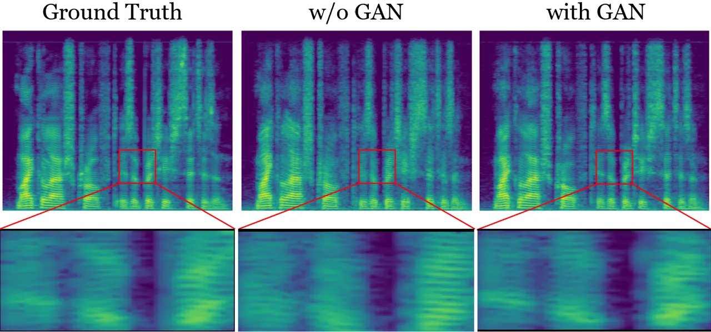
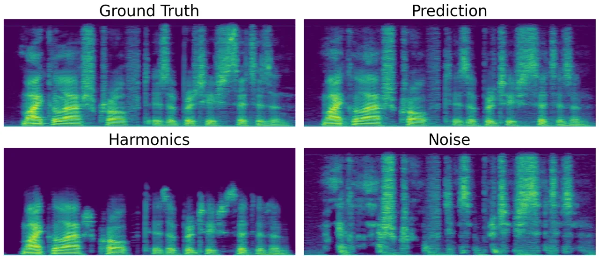
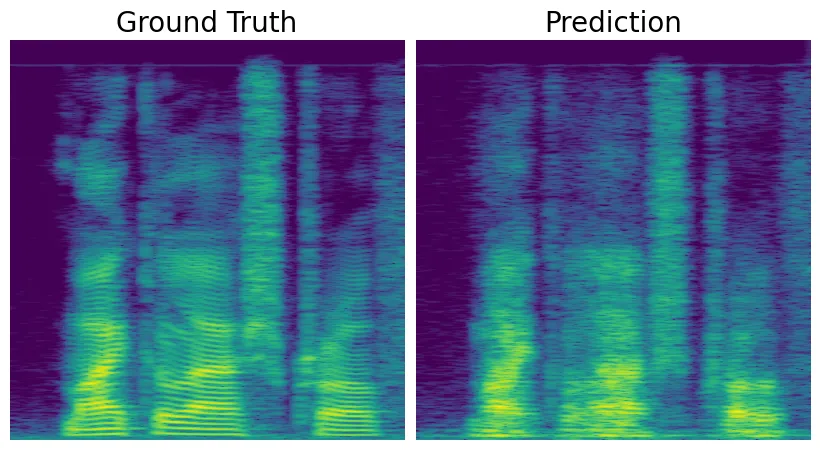
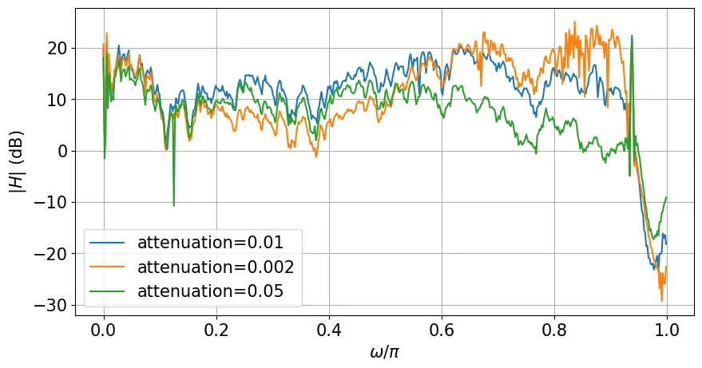

# Fast, High-Quality and Parameter-Efficient Articulatory Synthesis using Differentiable DSP

Yisi Liu    Bohan Yu    Drake Lin    Peter Wu    Cheol Jun Cho    Gopala
Krishna Anumanchipalli

###### Abstract

Articulatory trajectories like electromagnetic articulography (EMA)
provide a low-dimensional representation of the vocal tract filter and
have been used as natural, grounded features for speech synthesis.
Differentiable digital signal processing (DDSP) is a parameter-efficient
framework for audio synthesis. Therefore, integrating low-dimensional
EMA features with DDSP can significantly enhance the computational
efficiency of speech synthesis. In this paper, we propose a fast,
high-quality, and parameter-efficient DDSP articulatory vocoder that can
synthesize speech from EMA, F0, and loudness. We incorporate several
techniques to solve the harmonics / noise imbalance problem, and add a
multi-resolution adversarial loss for better synthesis quality. Our
model achieves a transcription word error rate (WER) of $`6.67\%`$ and a
mean opinion score (MOS) of 3.74, with an improvement of $`1.63\%`$ and
0.16 compared to the state-of-the-art (SOTA) baseline. Our DDSP vocoder
is 4.9x faster than the baseline on CPU during inference, and can
generate speech of comparable quality with only 0.4M parameters, in
contrast to the 9M parameters required by the SOTA.

###### Index Terms: 

Neural vocoder, articulatory synthesis, DDSP, computational efficiency,
parameter-efficient, high-quality

^(†)^(†)address: UC Berkeley  
louis_liu@berkeley.edu

## 1 Introduction

Articulatory synthesis is the task of generating speech audio from
articulatory features, i.e., the physical movements of human
articulators, often measured as electromagnetic articulography (EMA).
Since the articulatory features are physically grounded \[1\],
EMA-to-speech vocoders are more interpretable than mel-spectrogram-based
vocoders \[2\]. Articulatory vocoders are also highly controllable,
allowing for nuanced adjustments in speech generation \[2, 3\]. Given
these unique characteristics, articulatory synthesis has many
applications including helping patients with vocal cord disorders
communicate better \[4, 5\], decoding brain signals to speech waveforms
\[6\], and augmenting silent speech systems \[4\].

However, to our knowledge, there has been little investigation into the
parameter efficiency of articulatory synthesis models, which is
important for applications on edge devices, where the memory and
computation are limited. Smaller models may also have faster inference
speed, which also opens up new possibilities for faster real-time
applications. Since articulatory synthesis is mostly utilized in
clinical domains, a high-speed low-footprint synthesis model is crucial
for maximizing accessibility.

We utilize differentiable digital signal processing (DDSP) \[7\] to
achieve efficient articulatory synthesis while maintaining high-fidelity
audio generation. A DDSP model consists of a neural network encoder and
traditional digital signal processing (DSP) modules. The encoder
transforms input features, such as F0, loudness, and spectral features,
into control signals like filter coefficients and harmonic amplitudes.
DSP modules then generate audio from these control signals. The
differentiability of DSP modules allows for end-to-end training, hence
the term “Differentiable DSP”. DDSP models are light-weight since they
utilize the strong inductive bias of known signal-processing modules to
explicitly model the speech generation process \[8\]. Consequently, DDSP
models only need to learn control signals rather than raw waveforms,
delegating synthesis to DSP modules.

In this paper, we introduce a novel articulatory synthesis approach
using DDSP with the Harmonic-plus-Noise (H+N) model to convert
articulatory features (EMA, F0, loudness) into speech. To our knowledge,
this is the first application of DDSP to articulatory synthesis. Our
model achieves a word error rate (WER) of 6.67% and a mean opinion score
(MOS) of 3.74, improving the state-of-the-art (SOTA) result by 1.63% and
0.16, respectively. It is also 4.9x faster during CPU inference.
Additionally, a 0.4M parameter version of our model matches the quality
and intelligibility of the previous 9M-parameter SOTA. Codes and audio
samples are available at
[tinyurl.com/ddsp-vocoder](https://tinyurl.com/ddsp-vocoder).

## 2 Related Work

### 2.1 Articulatory Synthesis

Articulatory synthesis with traditional digital signal processing
methods has long been investigated \[9, 10, 11, 12\]. In the deep
learning era, there are generally three methods for articulatory
synthesis: (1) predicting the acoustic parameters first and then using
traditional signal-processing-based vocoders, e.g. WORLD \[13\], to
synthesize speech \[14, 15\]; (2) predicting intermediate spectrograms
and then utilizing GAN-based vocoders \[16, 17\] to convert spectrograms
to speech signals \[4, 18\]; (3) directly synthesizing speech from
articulatory features with HiFi-CAR \[2, 3, 17, 19\]. Among them, \[2\]
is the SOTA model in terms of synthesis intelligibility and inference
speed, and \[3\] extends it to a universal articulatory vocoder.
However, there is still scope for improving parameter efficiency and
synthesis quality.

### 2.2 Differentiable Digital Signal Processing

There are two main architectures of DDSP synthesizers: (1) the
source-filter model \[20, 21, 22\], and (2) the Harmonic-plus-Noise
(H+N) model \[23, 24, 25\]. Since H+N models are strictly more
expressive than source-filter models \[7\], we investigate the H+N model
in this paper. The H+N model divides speech into two components:
harmonics, which represent the periodic part of speech produced by vocal
cord vibrations; and noise, which models the aperiodic component of
speech produced by airflow in the vocal tract. DDSP has wide-spread
applications in music generation \[7, 26\], timbre transfer\[27, 28\],
singing voice synthesis\[29, 30\], and speech synthesis \[20, 21, 22,
23, 24, 25\].

## 3 Methods

Figure 1: Overall model architecture. Only the green modules are
trainable. The gray blocks are control signals. F0 is pitch, L is
loudness, a\[n\] is the global amplitude, c\[n\] is the harmonic
distribution, and H\[n\] is the filter frequency response.

Following \[7\], our proposed model mainly consists of two parts: an
encoder and a DSP generator. The overall model architecture can be found
in Figure 1. Note that F0 and loudness are pre-computed from the
corresponding utterance.

### 3.1 Encoder

Figure 2: Encoder architecture. Loudness is fed into the loudness FiLM
module as the condition.

The encoder architecture is shown in Figure 2. Inspired by \[31\], we
use a dilated convolution network as the encoder. The input to the
encoder is F0, loudness, and EMA, all sampled at $`f_{model}`$ = 200Hz.
The input features are first concatenated along the channel dimension,
then processed by 4 dilated convolution stacks, while keeping the same
time steps. In each stack there are 5 ResBlocks \[32\] with dilations
\[1, 2, 4, 8, 16\] respectively. The output is fed to a loudness
conditioning FiLM \[33\] layer, which takes in loudness as the condition
and generates the affine transformation parameters to modulate the
output features of dilated convolution stacks. FiLM helps to balance the
amplitudes of harmonics and filtered noise, which will be mentioned in
section 3.2.

The loudness FiLM output is processed by two multilayer perceptrons
(MLPs). The first MLP produces $`2(K+1)`$-dimensional output: the first
$`K+1`$ dimensions control sine waves, and the other $`K+1`$ control
cosine waves. Each $`K+1`$ dimensional control signal comprises a global
amplitude $`a[n]`$ and a $`K`$-dimensional time-varying harmonic
distribution $`\textbf{c}[n]`$. Here, $`K`$ represents the total number
of harmonics used. Harmonics exceeding the Nyquist frequency in
$`\textbf{c}[n]`$ are set to -1e20 to avoid aliasing and then normalized
via softmax. The other MLP output is the time-varying filter frequency
response $`\textbf{H}[n]`$, an $`M`$-dimensional vector per time point
$`n`$. To stabilize training, an exponential sigmoid nonlinearity,
$`\text{exp-sigmoid}(x)=2.0\cdot\text{sigmoid}(x)^{\log 10}+10^{-7}`$,
is applied to $`a[n]`$ and $`\textbf{H}[n]`$, as per \[7\].

### 3.2 Digital Signal Processing (DSP) Generator

For the DSP modules, we iterated on the DSP generators of \[7\]. The
outputs of the encoder from section 3.1 control two DSP modules: a
harmonic oscillator and a filtered noise generator. The harmonic
oscillator generates the voiced components of speech while the filtered
noise generator synthesizes the unvoiced components. The outputs of
these two modules are added to get the raw synthesized speech, which
will be filtered by the post convolution (post conv) layer to generate
the final synthesized speech.

#### 3.2.1 Harmonic Oscillator

Unlike the harmonic oscillator in \[7\], where only the sine harmonic
waves are used, we propose to use both the corresponding sine harmonics
and cosine harmonics to better approximate Fourier series for higher
expressivity. The harmonic oscillator generates a sum of sine and cosine
waves whose frequencies are multiples of F0. The $`k`$-th harmonic
$`x_{k}`$ is controlled by global amplitudes $`a[n],\tilde{a}[n]`$,
harmonic weights $`c_{k}[n],\tilde{c}_{k}[n]`$, and a frequency contour
$`f_{k}[n]`$, as shown below in equation 1.

```math
x_{k}[n]=a[n]c_{k}[n]\sin(\phi_{k}[n])+\tilde{a}[n]\tilde{c}_{k}[n]\cos(\phi_{k}[n]) \tag{1}
```

$`\phi_{k}[n]=2\pi\sum_{m=0}^{n}f_{k}[m]`$ is the instantaneous phase
and $`f_{k}[n]=kF_{0}[n]`$ is the integer multiple of F0. The harmonic
distribution $`\textbf{c}[n]`$ (or $`\tilde{\textbf{c}}[n]`$ for cosine
waves) output from the encoder has $`K`$ values
$`(c_{1}[n],c_{2}[n],...,c_{K}[n])^{T}`$ for each time point $`n`$ and
satisfy

```math
\sum_{k=0}^{K}c_{k}[n]=1\quad\text{and}\quad c_{k}[n]\geq 0 \tag{2}
```

Thus, the harmonic oscillator output can be calculated as

```math
x[n]=\sum_{k=1}^{K}(a[n]c_{k}[n]\sin(\phi_{k}[n])+\tilde{a}[n]\tilde{c}_{k}[n]\cos(\phi_{k}[n])) \tag{3}
```

Since $`a[n],\tilde{a}[n],F_{0}[n],\textbf{c}[n],\tilde{\textbf{c}}[n]`$
are all sampled at $`f_{model}`$ = 200Hz, we need to first upsample them
back to the sampling frequency $`f_{s}`$ = 16kHz of the speech signals
before calculating the above equations, i.e. upsample by a factor of
$`u`$ = 80. Here $`u`$ is also the frame size. We upsample using the
traditional signal-processing method by first inserting $`u-1`$ zeros
between every two samples and then convolving with a Hann window of size
$`2u+1`$.

#### 3.2.2 Filtered Noise Generator

This module generates noise signals filtered by learned linear
time-varying finite impulse response (LTV-FIR) filters. To avoid complex
numbers, we treat $`\textbf{H}[n]`$ as half of a zero-phase filter’s
transfer function, which is real and symmetric. We perform an inverse
fast Fourier transform (FFT) to obtain zero-phase filter coefficients,
shift them to form a causal, linear-phase filter, and apply a Hann
window to balance time-frequency resolution, resulting in
$`\textbf{h}[n]`$, which is then multiplied by an attenuation
hyperparameter $`\gamma`$ to balance the filtered noise and harmonics.
The filtered noise output is produced by convolving each
$`\textbf{h}[n]`$ with a noise signal of length $`u`$ (a noise frame)
and performing overlap-and-add with a hop size of $`u`$. Noise is
generated from a uniform distribution between $`[-1,1]`$, and all
convolutions are computed via FFT.

### 3.3 Post Convolution Layer

To further balance the noise and harmonics amplitudes, we introduce a
post convolution (post conv) layer, which is a learnable 1D convolution
layer without bias. Unlike the 1D convolution reverb module in \[7\],
which models reverberation or room acoustics, here the post conv layer
acts as a filter to suppress the noise level or to compensate for the
noise amplitudes depending on the previous amplitude balancing design
choices. We explore this further in Section 5.2.

### 3.4 Loss Functions

#### 3.4.1 Multi-Scale Spectral Loss



Figure 3: The spectrograms of the ground truth speech, synthesized
speech without GAN, and synthesized speech with GAN. As shown in the
boxed regions, without GAN the spectrogram energy bands are averaged
out, while with GAN the finer structures are better preserved.

We use the multi-scale spectral loss as defined in \[7\]:

```math
\mathcal{L}_{MSS}=\sum_{i\in W}||S_{i}-\hat{S}_{i}||_{1}+\alpha||\log S_{i}-\log\hat{S}_{i}||_{1} \tag{4}
```

where $`S`$ and $`\hat{S}`$ are the magnitude spectrograms of the ground
truth audio and the generated audio respectively. $`\alpha`$ is chosen
to be $`1`$ in this paper. $`W`$ = \[2048, 1024, 512, 256, 128, 64\] is
the set of FFT sizes, and the frame overlap is set to be $`75\%`$.

#### 3.4.2 Multi-Resolution Adversarial Loss

As mentioned in \[21\], training only with multi-scale spectral loss for
audio often results in over-smoothed spectrogram predictions. L1 / L2
losses aim to reduce large discrepancies and capture the low-frequency
components of spectrograms, averaging out rapid changes in spectral
details which results in muffled-sounding audio, as shown in Figure 3.

To capture the finer details of spectrograms, following the work of
\[34\], we utilize multi-resolution spectrogram discriminators. We treat
each input spectrogram as a one-channel image, and perform 2D strided
convolution for discrimination. Note that the input spectrograms are
calculated from acoustics with different parameters, such as window
size, hop size, and number of points for FFT, so that the discriminators
have access to spectrograms of the same utterance with multiple
resolutions.

For each sub-discriminator, the adversarial loss is calculated as Least
Squares GAN (LSGAN) described in \[35\]:

```math
\displaystyle\min\limits_{D_{i}}\mathcal{L}_{LSGAN}(D_{i};G) \displaystyle=\frac{1}{2}\mathbb{E}_{x\sim p_{\text{data}}(x)}[(D_{i}(S(x))-1)^{2}]
```

```math
\displaystyle+\frac{1}{2}\mathbb{E}_{z\sim p_{z}(z)}[(D_{i}(S(G(z))))^{2}] \tag{5}
```

```math
\min\limits_{G}\mathcal{L}_{LSGAN}(G;D_{i})=\mathbb{E}_{z\sim p_{z}(z)}[(D_{i}(S(G(z)))-1)^{2}] \tag{6}
```

where $`S`$ is the magnitude STFT, $`D_{i}`$ is the i-th
sub-discriminator, $`G`$ is the DDSP vocoder, $`x`$ is the ground truth
audio, and $`z`$ is the input features.

The loss functions for the generator and discriminator are:

```math
\mathcal{L}(G)=\mathcal{L}_{MSS}+\frac{\lambda}{R}\sum_{i=1}^{R}\mathcal{L}_{LSGAN}(G;D_{i}) \tag{7}
```

```math
\mathcal{L}(D)=\frac{1}{R}\sum_{i=1}^{R}\mathcal{L}_{LSGAN}(D_{i};G) \tag{8}
```

where $`R`$ is the total number of sub-discriminators, which is also the
total number of resolutions, and $`\lambda`$ controls the weight of the
LSGAN loss.

## 4 Results

| Model Name               | WER$`\downarrow`$ | PESQ$`\uparrow`$ | M-STFT$`\downarrow`$ | UTMOS$`\uparrow`$ | MOS$`\uparrow`$ |
| ------------------------ | ----------------- | ---------------- | -------------------- | ----------------- | --------------- |
| Ground Truth (MNGU0)     | 6.589             | \-               | \-                   | 4.134 ± 0.170     | 3.910 ± 0.715   |
| HiFi-CAR (MNGU0)         | 8.305             | 2.138            | 1.331                | 3.836 ± 0.202     | 3.575 ± 0.935   |
| DDSP (MNGU0)             | 6.673             | 2.172            | 1.298                | 3.868 ± 0.182     | 3.735 ± 0.892   |
| Ground Truth (LJ Speech) | 4.317             | \-               | \-                   | 4.376 ± 0.123     | 4.165 ± 0.706   |
| HiFi-CAR (LJ Speech)     | 4.557             | 1.962            | 1.296                | 3.795 ± 0.323     | 3.955 ± 0.838   |
| DDSP (LJ Speech)         | 4.536             | 2.044            | 1.238                | 3.819 ± 0.332     | 4.025 ± 0.815   |

Table 1: Model performance on MNGU0 and LJ Speech dataset. For UTMOS and
MOS, the standard deviation is also reported.

### 4.1 Datasets

#### 4.1.1 MNGU0 EMA Dataset

We experiment with the MNGU0 EMA dataset \[36\], comprising 75 minutes
of 16 kHz male speech with 200 Hz EMA recordings. The 12-dimensional EMA
features capture the x and y coordinates of jaw, upper and lower lips,
and tongue (tip, blade, and dorsum) movements. F0 is extracted from the
speech using CREPE \[37\] with a 5ms hop size, and loudness is computed
as the maximum absolute amplitude of each 5ms speech frame \[38, 39\].
Consequently, EMA, F0, and loudness are all sampled at 200 Hz. During
training, we randomly crop 1-second segments of aligned EMA, F0, and
loudness for input, and their corresponding waveforms as targets. The
dataset is split into 1129 training utterances (71.3 minutes) and 60
test samples (3.7 minutes), with 60 training utterances used for
validation.

#### 4.1.2 LJ Speech Pseudo-Labelled Dataset

To evaluate our model with a substantial amount of training data, we use
the LJ Speech dataset \[40\], containing 24 hours of 22050 Hz female
speech. As it lacks EMA data, we generate pseudo EMA labels using the
acoustic-to-articulatory inversion (AAI) model from \[3, 41, 42\]. EMA
features are linearly interpolated from 50 Hz to 200 Hz, and waveforms
are resampled to 16 kHz. Other features follow the MNGU0 settings. We
use a 90%/5%/5% train/validation/test split, corresponding to 21.5,
1.25, and 1.25 hours, respectively.

### 4.2 Experimental Setup

For our DDSP model, we choose the kernel size of ResBlocks to be 3 with
2 convolution layers inside, the hidden dimension of the dilated
convolution stacks to be 256, with $`K=50`$ harmonics, $`M=65`$
frequency bands, and attenuation $`\gamma=0.01`$. The loudness FiLM
module consists of three 1D convolution layers with kernel size 3, and
the post convolution layer has a kernel size of 1025. This results in a
total of 9.0M parameters. The multi-resolution discriminator uses
$`R=6`$ with FFT sizes \[2048, 1024, 512, 256, 128, 64\] and 75% frame
overlap. Weight normalization \[43\] is applied to all
sub-discriminators.

We use the Adam optimizer with $`\beta_{1}=0.9`$, $`\beta_{2}=0.999`$,
and distinct learning rates: $`3\times 10^{-4}`$ for the generator and
$`3\times 10^{-6}`$ for the discriminator. The batch size is 32, with
$`\lambda=5`$. For MNGU0 dataset, there are 6400 training epochs. The
learning rates are multiplied by $`0.3`$ at epoch milestones \[2400,
4800\]. For LJ Speech dataset, the total number of epochs is 1280, with
epoch milestones = \[480, 960\]. The HiFi-CAR baseline (13.5M) \[2\] is
trained with its original configuration and adapted to our input
features.

### 4.3 Metrics

We use both objective and subjective metrics to evaluate model
performance. Objective metrics include: (1) word error rate (WER), which
is calculated on the transcription of the synthesized test set speech
using the SOTA speech recognition model Whisper-Large \[44\]; A lower
WER indicates higher intelligibility of the synthesized speech; (2)
Multi-resolution STFT (M-STFT) \[16\]\[45\], which measures the
difference between the spectrograms of the ground truth and the
prediction across multiple resolutions; (3) perceptual evaluation of
speech quality (PESQ) \[46\], a widely adopted automated method for
assessing voice quality; and (4) UTMOS \[47\], a machine-evaluated mean
opinion score (MOS). We use the conventional 5-scale MOS test as the
subjective metric. Each model receives 200 unique ratings.

### 4.4 Synthesis Quality

The subjective and objective quality metrics for DDSP and HiFi-CAR are
listed in Table 1. For MNGU0, our DDSP model is consistently better than
the baseline in every metric, with a boost in WER by 1.63$`\%`$ and a
significant improvement in MOS (+0.16). This indicates that our DDSP
model has a strong and appropriate inductive bias for the inner periodic
structure of speech signals and is capable of generating high-fidelity
speech. For LJ Speech, with substantially more training data, our model
is still better in all metrics. This also indicates that our model is
effectively compatible with the inverted EMA from the AAI model.

### 4.5 Parameter Efficiency

Figure 4: WER and UTMOS against model size.

To evaluate parameter efficiency, we retrain the models using the same
configurations as in section 4.2, but with varying parameter counts
(nparams): \[9M, 4.5M, 2.3M, 1.1M, 0.6M, 0.4M\]. For each nparams, we
train the model with three random seeds (324, 928, 1024) and evaluate
the combined synthesized test set speech. To maintain the receptive
field size, we reduce nparams by decreasing the hidden dimension. The
results are shown in Figure 4. Our DDSP model shows no significant
performance decline as model size decreases, outperforming HiFi-CAR at
all nparams configurations. In contrast, HiFi-CAR’s performance drops
drastically below 1.1M nparams. Notably, our smallest model (0.4M) is
comparable to HiFi-CAR (9M), highlighting our DDSP model’s high
parameter efficiency and potential for edge device applications.

### 4.6 Inference Speed

| Model name     | Params.$`\downarrow`$ | Inference Time \[s\]$`\downarrow`$ |
| -------------- | --------------------- | ---------------------------------- |
| HiFi-CAR (13M) | 13.5M                 | 0.1805 ± 0.0480                    |
| HiFi-CAR (9M)  | 9.1M                  | 0.1445 ± 0.0117                    |
| DDSP           | 9.0M                  | 0.0368 ± 0.0065                    |

Table 2: Model sizes and CPU inference time for 1s of input.

We test the inference speed of DDSP, HiFi-CAR (13M), and HiFi-CAR (9M)
on an Apple M1 CPU by varying the input length $`N`$ from 0.5s to 10s,
with 0.5s intervals. For each $`N`$, we average the inference time over
50 utterances of the same length $`N`$, normalizing by $`N`$. Table 2
reports the model sizes and the mean and standard deviation of the
average inference time for 1s of input. Our model is 1.5x smaller and
4.9x faster than HiFi-CAR (13M). Notably, HiFi-CAR (9M) is still 3.9x
slower than DDSP despite having the same model size. Furthermore, as
shown in Figure 4, HiFi-CAR (9M) consistently underperforms compared to
DDSP in both WER and UTMOS. This demonstrates that our DDSP model is
fast and lightweight without sacrificing synthesis quality.

### 4.7 Ablation Study

| Model Name    | WER$`\downarrow`$ | PESQ$`\uparrow`$ | M-STFT$`\downarrow`$ | UTMOS$`\uparrow`$ | MOS$`\uparrow`$ |
| ------------- | ----------------- | ---------------- | -------------------- | ----------------- | --------------- |
| DDSP (MNGU0)  | 6.673             | 2.172            | 1.298                | 3.868 ± 0.182     | 3.735 ± 0.892   |
| w/o GAN loss  | 6.064             | 2.279            | 1.264                | 2.129 ± 0.435     | 3.100 ± 1.020   |
| w/o cosine    | 10.379            | 1.823            | 1.410                | 3.090 ± 0.214     | 3.295 ± 1.038   |
| w/o post conv | 10.335            | 1.940            | 1.364                | 3.426 ± 0.179     | 3.460 ± 0.974   |
| w/o FiLM      | 7.375             | 2.100            | 1.315                | 3.829 ± 0.195     | 3.485 ± 0.905   |

Table 3: Ablation study.

We perform an ablation study on the GAN loss, additional cosine
harmonics, post conv layer, and loudness FiLM using the MNGU0 dataset,
with all models trained under the same configuration as the original
model. The results, summarized in Table 3, show that removing any module
decreases performance, except for the GAN loss. Without the GAN loss,
similarity metrics like PESQ and M-STFT improve, as the model is trained
solely on reconstruction loss ($`\mathcal{L}_{MSS}`$ in Section 3.4.1),
leading to predictions more similar to the ground truth on average but
perceptually over-smoothed, as mentioned in Section 3.4.2 and supported
by significant drops in UTMOS (-1.739) and MOS (-0.64). The absence of
additional cosine harmonics causes substantial performance drops across
all metrics, underscoring their importance in speech modeling. The post
conv layer is essential for balancing noise and harmonics amplitudes.
Omitting the loudness FiLM module results in a small yet noticeable
performance decline.

## 5 Discussion

### 5.1 Speech Decomposition



Figure 5: Decomposed spectrograms of the utterance “Michael Ashcroft is
a British citizen.”

Since the synthesized speech is the sum of harmonics and filtered noise,
we can decompose the output and visualize each component via
spectrograms (Figure 5). The harmonics spectrogram shows distinct
frequency bands and higher energy, reflecting the quasi-periodic nature
of voiced sounds generated by the harmonic oscillator. In contrast, the
noise spectrogram displays higher frequency components with a dispersed
energy distribution along the frequency axis, modeling the unvoiced,
noise-like sounds such as fricatives and consonants.

### 5.2 Noise / Harmonics Balance



Figure 6: The spectrograms of the ground truth and the
amplitude-imbalanced audio. The predicted spectrogram has lost all
harmonic structures.



Figure 7: The frequency responses of the learned post conv filters using
different attenuation hyperparameters.

One challenge in achieving a high-quality vocoder using our DDSP model
is balancing the amplitudes of harmonics and noise. We employ three
methods to address this issue: the attenuation hyperparameter
$`\gamma`$, the post conv layer, and the loudness FiLM module. Among
these methods, the attenuation and the post conv layer are particularly
crucial. If there is no attenuation at all, i.e. $`\gamma=1`$, the model
will only learn the filtered noise as shown in Figure 6. Although on
average the energy distribution seems correct, the predicted spectrogram
has lost all finer harmonic structures, while for the ground truth,
there are clear and detailed harmonic stripes.

We have also analyzed the frequency responses of the learned post conv
filters when trained with different levels of attenuation, as shown in
Figure 7. The attenuation parameter $`\gamma`$ influences the noise
energy: higher $`\gamma`$ results in greater noise amplitude. Given that
harmonic energy is concentrated in the lower frequencies while noise has
high energy in the higher frequency range, the post conv filter should
suppress high-frequency components to balance the noise and harmonics
amplitudes when $`\gamma`$ is large. This is evidenced in Figure 7,
where the gain $`|H|`$ decreases in the high-frequency range
($`\omega>0.4\pi`$) as $`\gamma`$ increases. This demonstrates that the
attenuation and post conv filter together effectively balance the noise
and harmonics amplitudes.

## 6 Conclusion

In this paper, we present a DDSP articulatory vocoder based on
harmonic-plus-noise model. With the strong inductive bias of DDSP, we
show that our model is parameter-efficient, fast, and capable of
synthesizing high-quality speech from EMA, F0 and loudness. For future
work, we plan to explore the multi-speaker capabilities of our DDSP
vocoder.

## 7 Acknowledgements

This research is supported by the following grants to PI Anumanchipalli:
NSF award 2106928, Google Research Scholar Award, Rose Hills Foundation
and UC Noyce Foundation.

## References

- \[1\] Catherine P. Browman and Louis Goldstein, “Articulatory
  phonology: An overview,” Phonetica, vol. 49, no. 3-4, pp.
  155–180, 1992.
- \[2\] Peter Wu, Shinji Watanabe, Louis Goldstein, Alan W Black, and
  Gopala Krishna Anumanchipalli, “Deep speech synthesis from
  articulatory representations,” in Interspeech, 2022.
- \[3\] Cheol Jun Cho, Peter Wu, Tejas S. Prabhune, Dhruv Agarwal, and
  Gopala K. Anumanchipalli, “Articulatory encodec: Vocal tract
  kinematics as a codec for speech,” arXiv preprint
  arXiv:2406.12998, 2024.
- \[4\] Yu-Wen Chen, Kuo-Hsuan Hung, Shang-Yi Chuang, Jonathan Sherman,
  Wen-Chin Huang, Xugang Lu, and Yu Tsao, “Ema2s: An end-to-end
  multimodal articulatory-to-speech system,” in IEEE International
  Symposium on Circuits and Systems (ISCAS), 2021, pp. 1–5.
- \[5\] Yuqin Lin, Longbiao Wang, Jianwu Dang, Sheng Li, and Chenchen
  Ding, “End-to-end articulatory modeling for dysarthric articulatory
  attribute detection,” in ICASSP, 2020, pp. 7349–7353.
- \[6\] Gopala K Anumanchipalli, Josh Chartier, and Edward F Chang,
  “Speech synthesis from neural decoding of spoken sentences,” Nature,
  vol. 568, no. 7753, pp. 493–498, 2019.
- \[7\] Jesse Engel, Lamtharn (Hanoi) Hantrakul, Chenjie Gu, and Adam
  Roberts, “Ddsp: Differentiable digital signal processing,” in
  International Conference on Learning Representations, 2020.
- \[8\] Ben Hayes, Jordie Shier, György Fazekas, Andrew McPherson, and
  Charalampos Saitis, “A review of differentiable digital signal
  processing for music & speech synthesis,” arXiv preprint
  arXiv:2308.15422, 2023.
- \[9\] Homer Dudley, R.R. Riesz, and S.S.A. Watkins, “A synthetic
  speaker,” Journal of the Franklin Institute, vol. 227, no. 6, pp.
  739–764, 1939.
- \[10\] Kenneth N. Stevens, S. E. Kasowski, and C. Gunnar M. Fant, “An
  electrical analog of the vocal tract,” Journal of the Acoustical
  Society of America, vol. 25, pp. 734–742, 1953.
- \[11\] Shinji Maeda, “A digital simulation method of the vocal-tract
  system,” Speech communication, vol. 1, no. 3-4, pp. 199–229, 1982.
- \[12\] Peter Birkholz, “Modeling consonant-vowel coarticulation for
  articulatory speech synthesis,” PLoS ONE, vol. 8, 2013.
- \[13\] Masanori MORISE, Fumiya YOKOMORI, and Kenji OZAWA, “World: A
  vocoder-based high-quality speech synthesis system for real-time
  applications,” IEICE Transactions on Information and Systems, vol.
  E99.D, no. 7, pp. 1877–1884, 2016.
- \[14\] Beiming Cao, Myungjong Kim, Jun Wang, Jan P. H. van Santen, Ted
  Mau, and Jun Wang, “Articulation-to-speech synthesis using
  articulatory flesh point sensors’ orientation information,” in
  Interspeech, 2018.
- \[15\] Fumiaki Taguchi and Tokihiko Kaburagi, “Articulatory-to-speech
  Conversion Using Bi-directional Long Short-term Memory,” in
  Interspeech, 2018, pp. 2499–2503.
- \[16\] Ryuichi Yamamoto, Eunwoo Song, and Jae-Min Kim, “Parallel
  wavegan: A fast waveform generation model based on generative
  adversarial networks with multi-resolution spectrogram,” in ICASSP,
  2020, pp. 6199–6203.
- \[17\] Jungil Kong, Jaehyeon Kim, and Jaekyoung Bae, “Hifi-gan:
  Generative adversarial networks for efficient and high fidelity speech
  synthesis,” Advances in Neural Information Processing Systems, vol.
  33, pp. 17022–17033, 2020.
- \[18\] Miseul Kim, Zhenyu Piao, Jihyun Lee, and Hong-Goo Kang, “Style
  modeling for multi-speaker articulation-to-speech,” in ICASSP, 2023,
  pp. 1–5.
- \[19\] Max Morrison, Rithesh Kumar, Kundan Kumar, Prem Seetharaman,
  Aaron Courville, and Yoshua Bengio, “Chunked autoregressive gan for
  conditional waveform synthesis,” in ICLR, 2022.
- \[20\] Xin Wang, Shinji Takaki, and Junichi Yamagishi, “Neural
  source-filter waveform models for statistical parametric speech
  synthesis,” IEEE/ACM Transactions on Audio, Speech, and Language
  Processing, vol. 28, pp. 402–415, 2019.
- \[21\] Prabhav Agrawal, Thilo Koehler, Zhiping Xiu, Prashant Serai,
  and Qing He, “Ultra-lightweight neural differential dsp vocoder for
  high quality speech synthesis,” arXiv preprint arXiv:2401.10460, 2024.
- \[22\] Zhijun Liu, Kuan Chen, and Kai Yu, “Neural homomorphic
  vocoder.,” in INTERSPEECH, 2020, pp. 240–244.
- \[23\] Shahan Nercessian, “Differentiable world synthesizer-based
  neural vocoder with application to end-to-end audio style transfer,”
  arXiv preprint arXiv:2208.07282, 2022.
- \[24\] Giorgio Fabbro, Vladimir Golkov, Thomas Kemp, and Daniel
  Cremers, “Speech synthesis and control using differentiable
  dsp,” 2020.
- \[25\] Shahan Nercessian, “End-to-end zero-shot voice conversion using
  a ddsp vocoder,” in IEEE Workshop on Applications of Signal Processing
  to Audio and Acoustics (WASPAA). IEEE, 2021, pp. 1–5.
- \[26\] Yi Zhao, Xin Wang, Lauri Juvela, and Junichi Yamagishi,
  “Transferring neural speech waveform synthesizers to musical
  instrument sounds generation,” ICASSP, pp. 6269–6273, 2019.
- \[27\] Michael Michelashvili and Lior Wolf, “Hierarchical
  timbre-painting and articulation generation,” in International Society
  for Music Information Retrieval Conference, 2020.
- \[28\] Ben Hayes, Charalampos Saitis, and György Fazekas, “Neural
  waveshaping synthesis,” arXiv preprint arXiv:2107.05050, 2021.
- \[29\] Juan Alonso and Cumhur Erkut, “Latent space explorations of
  singing voice synthesis using ddsp,” arXiv preprint
  arXiv:2103.07197, 2021.
- \[30\] Takenori Yoshimura, Shinji Takaki, Kazuhiro Nakamura, Keiichiro
  Oura, Yukiya Hono, Kei Hashimoto, Yoshihiko Nankaku, and Keiichi
  Tokuda, “Embedding a differentiable mel-cepstral synthesis filter to a
  neural speech synthesis system,” in ICASSP, 2023, pp. 1–5.
- \[31\] Yusong Wu, Ethan Manilow, Yi Deng, Rigel Swavely, Kyle Kastner,
  Tim Cooijmans, Aaron Courville, Cheng-Zhi Anna Huang, and Jesse Engel,
  “Midi-ddsp: Detailed control of musical performance via hierarchical
  modeling,” in International Conference on Learning
  Representations, 2021.
- \[32\] Kaiming He, Xiangyu Zhang, Shaoqing Ren, and Jian Sun, “Deep
  residual learning for image recognition,” in Proceedings of the IEEE
  conference on computer vision and pattern recognition, 2016, pp.
  770–778.
- \[33\] Ethan Perez, Florian Strub, Harm de Vries, Vincent Dumoulin,
  and Aaron C. Courville, “Film: Visual reasoning with a general
  conditioning layer,” in AAAI Conference on Artificial
  Intelligence, 2017.
- \[34\] Won Jang, Daniel Chung Yong Lim, Jaesam Yoon, Bongwan Kim, and
  Juntae Kim, “Univnet: A neural vocoder with multi-resolution
  spectrogram discriminators for high-fidelity waveform generation,” in
  Interspeech, 2021.
- \[35\] Xudong Mao, Qing Li, Haoran Xie, Raymond YK Lau, Zhen Wang, and
  Stephen Paul Smolley, “Least squares generative adversarial networks,”
  in Proceedings of the IEEE international conference on computer
  vision, 2017, pp. 2794–2802.
- \[36\] K. Richmond, P. Hoole, and S. King, “Announcing the
  electromagnetic articulography (day 1) subset of the mngu0
  articulatory corpus,” in Interspeech, 2011, pp. 1505–1508.
- \[37\] Jong Wook Kim, Justin Salamon, Peter Qi Li, and Juan Pablo
  Bello, “Crepe: A convolutional representation for pitch estimation,”
  ICASSP, pp. 161–165, 2018.
- \[38\] Cecilia Jarne, “A heuristic approach to obtain signal envelope
  with a simple software implementation,” Anales AFA, vol. 29, 07 2018.
- \[39\] Alexis Deighton MacIntyre, Ceci Qing Cai, and Sophie K Scott,
  “Pushing the envelope: Evaluating speech rhythm with different
  envelope extraction techniques,” The Journal of the Acoustical Society
  of America, vol. 151, no. 3, pp. 2002–2026, 2022.
- \[40\] Keith Ito and Linda Johnson, “The lj speech dataset,”
  [https://keithito.com/LJ-Speech-Dataset/](https://keithito.com/LJ-Speech-Dataset/), 2017.
- \[41\] Cheol Jun Cho, Peter Wu, Abdelrahman Mohamed, and Gopala K.
  Anumanchipalli, “Evidence of vocal tract articulation in
  self-supervised learning of speech,” in ICASSP, 2023, pp. 1–5.
- \[42\] Cheol Jun Cho, Abdelrahman Mohamed, Alan W Black, and Gopala K
  Anumanchipalli, “Self-supervised models of speech infer universal
  articulatory kinematics,” in ICASSP. IEEE, 2024, pp. 12061–12065.
- \[43\] Tim Salimans and Durk P Kingma, “Weight normalization: A simple
  reparameterization to accelerate training of deep neural networks,”
  Advances in neural information processing systems, vol. 29, 2016.
- \[44\] Alec Radford, Jong Wook Kim, Tao Xu, Greg Brockman, Christine
  McLeavey, and Ilya Sutskever, “Robust speech recognition via
  large-scale weak supervision,” in International Conference on Machine
  Learning. PMLR, 2023, pp. 28492–28518.
- \[45\] Christian J. Steinmetz and Joshua D. Reiss, “auraloss: Audio
  focused loss functions in PyTorch,” in Digital Music Research Network
  One-day Workshop (DMRN+15), 2020.
- \[46\] A.W. Rix, J.G. Beerends, M.P. Hollier, and A.P. Hekstra,
  “Perceptual evaluation of speech quality (pesq)-a new method for
  speech quality assessment of telephone networks and codecs,” in
  ICASSP, 2001, vol. 2, pp. 749–752 vol.2.
- \[47\] Takaaki Saeki, Detai Xin, Wataru Nakata, Tomoki Koriyama,
  Shinnosuke Takamichi, and Hiroshi Saruwatari, “Utmos: Utokyo-sarulab
  system for voicemos challenge 2022,” arXiv preprint
  arXiv:2204.02152, 2022.
