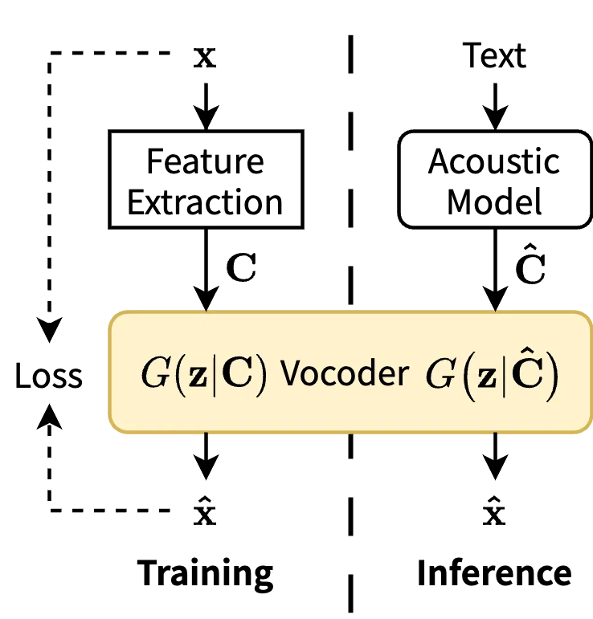
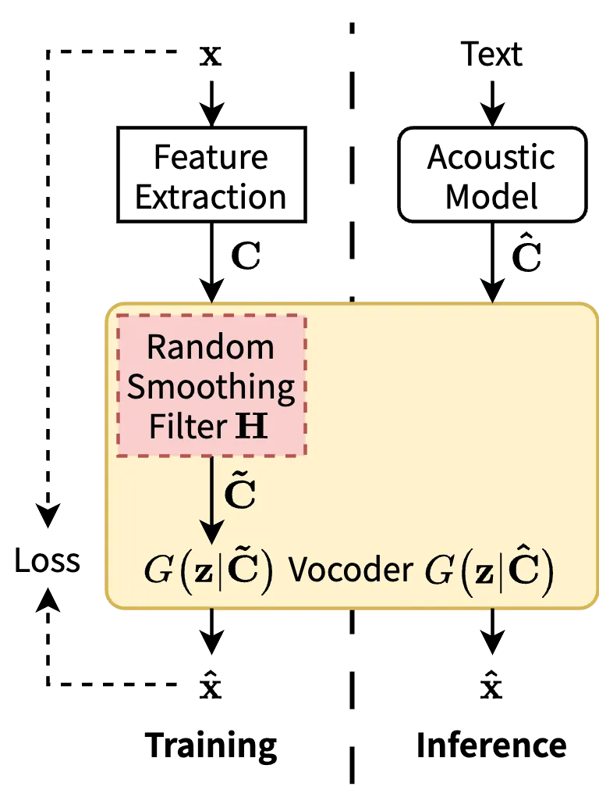
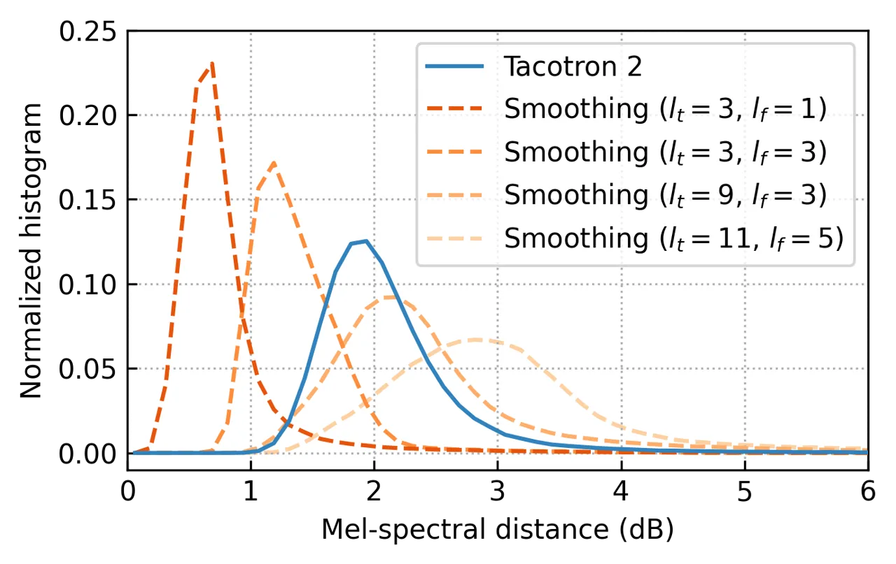
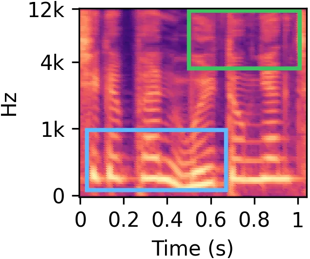
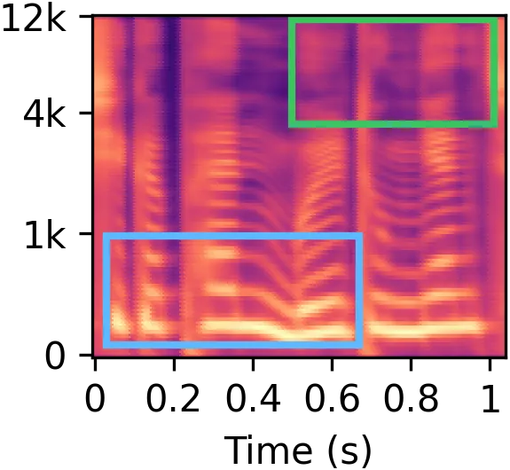
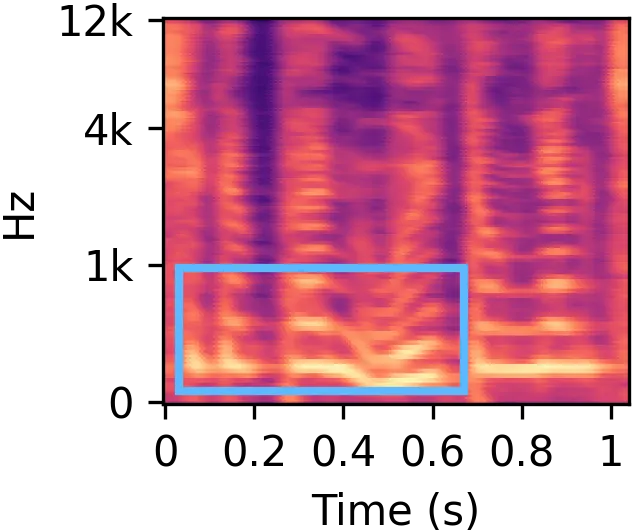
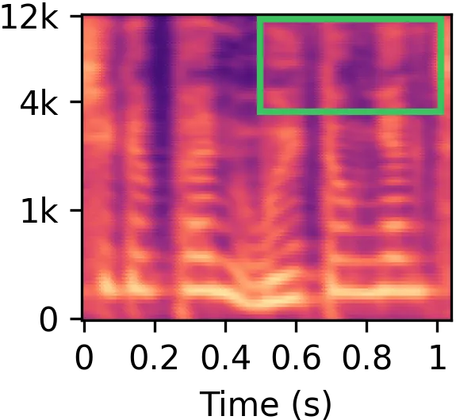
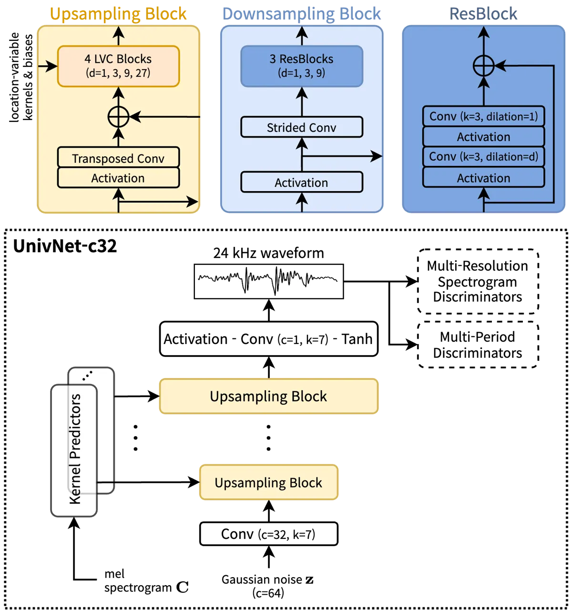
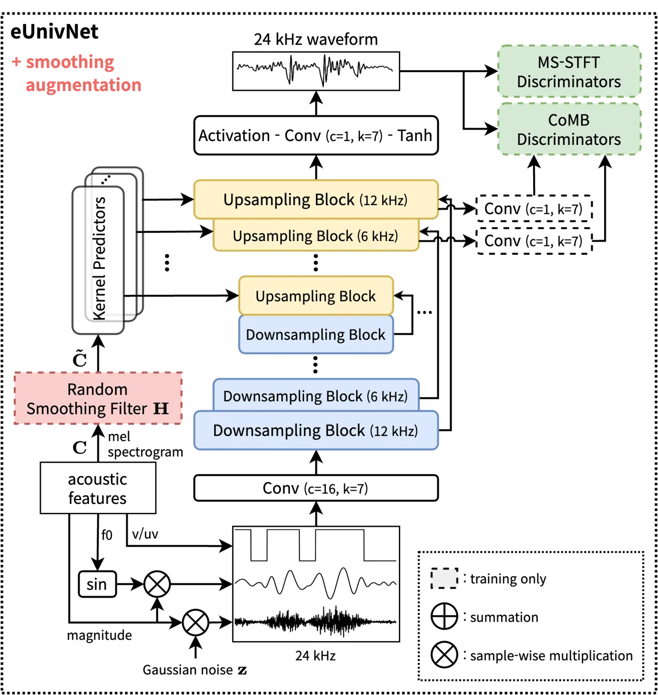

# Training Universal Vocoders with Feature Smoothing-Based Augmentation Methods for High-Quality TTS Systems

Jeongmin Liu    Eunwoo Song

###### Abstract

While universal vocoders have achieved proficient waveform generation
across diverse voices, their integration into text-to-speech (TTS) tasks
often results in degraded synthetic quality. To address this challenge,
we present a novel augmentation technique for training universal
vocoders. Our training scheme randomly applies linear smoothing filters
to input acoustic features, facilitating vocoder generalization across a
wide range of smoothings. It significantly mitigates the
training-inference mismatch, enhancing the naturalness of synthetic
output even when the acoustic model produces overly smoothed features.
Notably, our method is applicable to any vocoder without requiring
architectural modifications or dependencies on specific acoustic models.
The experimental results validate the superiority of our vocoder over
conventional methods, achieving 11.99% and 12.05% improvements in mean
opinion scores when integrated with Tacotron 2 and FastSpeech 2 TTS
acoustic models, respectively.

###### keywords

universal vocoder, text-to-speech, UnivNet

^(†)^(†)address: ¹NAVER Cloud Corp., Seongnam, Korea^(†)^(†)email:
jeongmin.liu@navercorp.com, eunwoo.song@navercorp.com

## 1 Introduction

Recent advancements in modeling capacity have led to the development of
universal vocoders capable of generating high-fidelity speech waveforms.
Trained on diverse audio samples recorded from various environments,
these vocoding models accommodate a wide spectrum of voices, languages,
and styles \[1, 2, 3\]. However, integrating them with text-to-speech
(TTS) acoustic models remains challenging due to separate training
processes, potentially resulting in degraded synthesis quality caused by
the acoustic model’s tendency to produce overly smoothed features.

One straightforward solution is to fine-tune the vocoder using acoustic
features generated by the corresponding acoustic model \[4\]. However,
this approach compromises the vocoder’s universality, because different
acoustic models trained by different speakers or styles necessitate
distinct fine-tuned vocoders, requiring substantial deployment resources
and time. Alternatively, fully end-to-end TTS models have been proposed
\[5, 6, 7\], whereby the joint training of the acoustic and vocoding
models can avoid the training-inference mismatch problem. However, this
approach may lose the flexibility to control the acoustic
characteristics of output speech, as the model often relies on implicit
latent representations instead of explicit acoustic features.

To address these limitations, we propose a novel feature augmentation
strategy to preserve the vocoder’s universality while mitigating quality
loss within the TTS framework. This method involves applying linear
smoothing filters to input acoustic features, approximating their
distributions with those generated by the acoustic model (i.e., smoothed
along the time and frequency axes). Specifically, the size of the
smoothing filters is randomly selected for every training step, exposing
the target vocoder to various levels of smoothing. Consequently, the
vocoder gains enhanced adaptability to the acoustic model’s
over-smoothing problem without necessitating fine-tuning or
architectural modifications.

Our proposed method offers the advantage of applicability to any type of
universal vocoder. In particular, we focus on the UnivNet model \[1\], a
generative adversarial network (GAN)-based universal neural vocoder. We
enhance its performance with the additional harmonic-noise (HN)
architecture \[8, 9, 10\] for stable harmonic production and two
discriminators, namely, multi-scale short-time Fourier transform
(MS-STFT) \[11\] and collaborative multi-band (CoMB) \[12\], for
improving training accuracy. The experimental results demonstrate that
our universal vocoder trained with the proposed method outperforms the
traditional approaches across different TTS systems.



(a)



(b)

Figure 1: Block diagram of the vocoding process in the TTS framework:
(a) conventional and (b) proposed methods.

## 2 Methods

### 2.1 Neural vocoders

GAN-based neural vocoders \[13, 14\] are generative models that comprise
a generator $`G`$ and a discriminator $`D`$ \[15\]. As illustrated in
Figure 1(a), these models are designed to learn the distribution of
time-domain speech waveforms $`\mathbf{x}`$ conditioned on their
corresponding ground-truth acoustic features $`\mathbf{C}`$, with the
following objectives:

```math
\displaystyle\min_{G}\mathbb{E}_{\mathbf{z}\sim\mathcal{N}(\mathbf{0},\mathbf{I}),(\mathbf{x},\mathbf{C})}\left[L_{G}(\mathbf{z},\mathbf{x},\mathbf{C})\right], \tag{1}
```

```math
\displaystyle\min_{D}\mathbb{E}_{\mathbf{z}\sim\mathcal{N}(\mathbf{0},\mathbf{I}),(\mathbf{x},\mathbf{C})}\left[L_{D}(\mathbf{z},\mathbf{x},\mathbf{C})\right], \tag{2}
```

where $`L_{G}`$ and $`L_{D}`$ are the following losses of the generator
and the discriminator, respectively:

```math
\displaystyle L_{G}(\mathbf{z},\mathbf{x},\mathbf{C}) \displaystyle=d\left[D(G(\mathbf{z}|\mathbf{C})),1\right]+\lambda L_{\mathrm{aux}}(G(\mathbf{z}|\mathbf{C}),\mathbf{x}), \tag{3}
```

```math
\displaystyle L_{D}(\mathbf{z},\mathbf{x},\mathbf{C}) \displaystyle=d\left[D(\mathbf{x}),1\right]+d\left[D(G(\mathbf{z}|\mathbf{C})),0\right], \tag{4}
```

where $`d`$ is a distance function (e.g., $`L_{2}`$ distance), and
$`\lambda`$ is the weight for an auxiliary loss $`L_{\mathrm{aux}}`$.



Figure 2: Normalized histograms of the mel-spectral distance (MSD)
between the ground-truth mel-spectrograms and those generated by
Tacotron 2, or simulated using different sizes of smoothing filters.
These results were obtained from the test set.

### 2.2 Proposed smoothing augmentation method

Previous research has demonstrated the technical feasibility of
universal vocoding through the utilization of numerous training samples
\[1, 2, 3\]. However, TTS systems often struggle to produce high-quality
speech due to the exposure bias problem. This issue arises because the
vocoder, having been trained solely on ground-truth mel-spectrograms,
lacks robustness in handling the over-smoothing tendencies of acoustic
models.

To address this challenge, we propose a smoothing augmentation method
designed to mitigate the exposure bias problem effectively within the
TTS framework. As shown in Figure 1(b), the key idea is to train the
universal vocoder conditioned on smoothed mel-spectrograms that closely
mimic the distribution of those generated by the acoustic models. To
approximate the target distribution, we simulate the conditional
acoustic feature by applying a linear smoothing filter, as follows:

```math
\mathbf{\tilde{C}}=\mathbf{H}*\mathbf{C}, \tag{5}
```

where $`*`$ denotes the 2-dimensional convolution operation and
$`\mathbf{H}`$ represents the smoothing filter designed to cover a range
of smoothings from the acoustic models. Instead of using ground-truth
mel-spectrograms, the universal vocoder is conditioned on these smoothed
features and optimized with modified objectives, as follows:

```math
\displaystyle\min_{G}\mathbb{E}_{\mathbf{z},(\mathbf{x},\mathbf{\tilde{C}})}\left[L_{G}(\mathbf{z},\mathbf{x},\mathbf{\tilde{C}})\right], \tag{6}
```

```math
\displaystyle\min_{D}\mathbb{E}_{\mathbf{z},(\mathbf{x},\mathbf{\tilde{C}})}\left[L_{D}(\mathbf{z},\mathbf{x},\mathbf{\tilde{C}})\right]. \tag{7}
```

This process does not require any fine-tuning procedure or modification
of the network architecture, allowing compact training without
additional deployment resources. Furthermore, as our training scheme
exposes the vocoder to a diverse range of smoothings, the model becomes
more generalized to the acoustic model’s smoothing errors in the
generation step. Thus, the entire TTS system is empowered to produce
more natural speech outputs.



(a)




(b)



(c)




(d)

Figure 3: Mel-spectrograms of (a) ground-truth speech, (b) generated by
the Tacotron 2 acoustic model, (c) simulated using the smoothing filter
($`l_{t}`$=5, $`l_{f}`$=1), and (d) simulated using another filter
($`l_{t}`$=5, $`l_{f}`$=3). The rectangular areas highlight instances in
which our method simulates smoothings similar to those that occurred by
the acoustic model.



(a)



(b)

Figure 4: The UnivNet architectures: (a) the vanilla UnivNet-c32 model
and (b) the proposed eUnivNet model. The notations $`c`$ and $`k`$
denote the number of channels and the kernel size of the convolution
layer, respectively.

#### 2.2.1 Filter design

Among various types of smoothing filters, i.e., $`\mathbf{H}`$ in
Equation (5), we employ a 2-dimensional triangular¹¹ 1 In our
preliminary experiments, it was noticeable that any type of linear LPF,
e.g., rectangular LPF, could be used to compose $`\mathbf{H}`$. low-pass
filter (LPF), defined as follows:

```math
h_{t,f}=\frac{\left\lceil l_{t}/2\right\rceil-\big|\,t-\left\lceil l_{t}/2\right\rceil\big|}{\left\lceil l_{t}/2\right\rceil^{2}}\cdot\frac{\left\lceil l_{f}/2\right\rceil-\big|\,f-\left\lceil l_{f}/2\right\rceil\big|}{\left\lceil l_{f}/2\right\rceil^{2}}, \tag{8}
```

where $`l_{t}`$ and $`l_{f}`$ denote the filter sizes along time frame
$`t`$ and frequency bin $`f`$, respectively.

To enhance the vocoder’s robustness across a diverse range of
smoothings, it is crucial to randomly vary the filter sizes $`l_{t}`$
and $`l_{f}`$ for every training step. Specifically, these parameters
are randomly sampled based on the following distributions:

```math
l_{t}\sim p(l;N_{t}),\ l_{f}\sim p(l;N_{f}), \tag{9}
```

where $`N_{t}`$ and $`N_{f}`$ denote the numbers of possible candidates
for $`l_{t}`$ and $`l_{f}`$, respectively; $`p(l;N)`$ denotes a
distribution that is mostly uniform, except for the non-smoothing case
($`l`$=1), as follows:

```math
\displaystyle p(l;N)=\begin{cases}p_{g}&\text{for }\ l=1,\\
p_{s}&\text{for }\ l\in\{3,5,\cdots,2N-1\},\end{cases} \tag{10}
```

```math
\displaystyle\text{where }\ p_{g}+(N-1)p_{s}=1. \tag{11}
```

While $`p_{g}`$ and $`p_{s}`$ can have the same value, our early
experiments indicated that increasing $`p_{g}`$ beyond $`p_{s}`$, such
as $`p_{g}`$=$`2/3`$, yielded improvements in the vocoder’s synthetic
quality. Notably, we set the filter sizes $`l_{t}`$ and $`l_{f}`$ to odd
numbers to ensure symmetric filters.

#### 2.2.2 Analysis of smoothing augmentation

To validate the generalization capacity of our proposed method, we
examined the mel-spectral distance (MSD; dB), defined as the L2-norm of
mel-spectral frames between the ground-truth mel-spectrogram and those
predicted by the acoustic model or simulated by our smoothing filters.
In Figure 2, the orange dashed lines depict examples of MSD histograms
corresponding to distinct sizes of smoothing filters. The random
sampling of these filter sizes during training guides the vocoder to
accommodate various levels of smoothing. We believe that this enables
the vocoder to effectively manage the overly smoothed features generated
by acoustic models such as Tacotron 2 \[4\], as indicated by the blue
solid line. This observation is further supported by the
mel-spectrograms presented in Figure 3, where the simulated features
exhibit tendencies similar to those generated by the Tacotron 2 acoustic
model.

|           |          |                |     |     |     |                    |                 |                 |                 |                 |
| --------- | -------- | -------------- | --- | --- | --- | ------------------ | --------------- | --------------- | --------------- | --------------- |
| System    | Acoustic | Vocoder        | ST  | FT  | SA  | MOS ($`\uparrow`$) |                 |                 |                 |                 |
|           | Model    |                |     |     |     | F1                 | F2              | M1              | M2              | Average         |
| S1        | T2       | eUnivNet       | ✓   | -   | -   | 3.93$`\pm`$0.11    | 3.54$`\pm`$0.11 | 3.59$`\pm`$0.12 | 3.64$`\pm`$0.12 | 3.67$`\pm`$0.06 |
| S2        | T2       | eUnivNet       | -   | ✓   | -   | 4.48$`\pm`$0.09    | 4.10$`\pm`$0.11 | 4.26$`\pm`$0.11 | 4.10$`\pm`$0.12 | 4.23$`\pm`$0.05 |
| S3        | T2       | eUnivNet       | ✓   | -   | ✓   | 4.30$`\pm`$0.10    | 3.93$`\pm`$0.11 | 4.07$`\pm`$0.11 | 4.13$`\pm`$0.11 | 4.11$`\pm`$0.05 |
| S4        | T2       | eUnivNet-HN-G  | ✓   | -   | ✓   | 3.77$`\pm`$0.12    | 3.31$`\pm`$0.13 | 3.43$`\pm`$0.13 | 3.69$`\pm`$0.12 | 3.55$`\pm`$0.06 |
| S5        | T2       | eUnivNet-M/C-D | ✓   | -   | ✓   | 3.90$`\pm`$0.11    | 3.69$`\pm`$0.11 | 3.73$`\pm`$0.11 | 3.48$`\pm`$0.12 | 3.70$`\pm`$0.06 |
| S6        | T2       | UnivNet-c32    | ✓   | -   | ✓   | 3.72$`\pm`$0.11    | 3.57$`\pm`$0.12 | 3.53$`\pm`$0.13 | 3.62$`\pm`$0.12 | 3.61$`\pm`$0.06 |
| S7        | FS2      | eUnivNet       | ✓   | -   | -   | 3.44$`\pm`$0.13    | 2.86$`\pm`$0.12 | 2.93$`\pm`$0.14 | 3.06$`\pm`$0.12 | 3.07$`\pm`$0.06 |
| S8        | FS2      | eUnivNet       | ✓   | -   | ✓   | 3.84$`\pm`$0.12    | 3.14$`\pm`$0.11 | 3.28$`\pm`$0.12 | 3.51$`\pm`$0.12 | 3.44$`\pm`$0.06 |
| S9        | T2       | HiFi-GAN V1    | ✓   | -   | -   | 2.54$`\pm`$0.13    | 2.24$`\pm`$0.13 | 1.98$`\pm`$0.12 | 2.23$`\pm`$0.12 | 2.25$`\pm`$0.06 |
| S10       | T2       | HiFi-GAN V1    | ✓   | -   | ✓   | 3.87$`\pm`$0.10    | 3.66$`\pm`$0.11 | 3.60$`\pm`$0.12 | 3.55$`\pm`$0.11 | 3.67$`\pm`$0.06 |
| Recording | -        | -              | -   | -   | -   | 4.48$`\pm`$0.10    | 4.37$`\pm`$0.11 | 4.27$`\pm`$0.12 | 4.23$`\pm`$0.10 | 4.34$`\pm`$0.06 |

Table 1: TTS naturalness MOS results with 95% confidence intervals with
respect to different training strategies (seen cases): conventional
separate training (ST), fine-tuning (FT) by generated features, and the
proposed smoothing augmentation (SA) method.

## 3 Experiments

### 3.1 Datasets

The universal vocoder was trained on an internal dataset comprising
recordings in five languages (Korean, Japanese, Mandarin Chinese,
English, and Spanish) spoken by 73 speakers. The dataset contained
219,407 utterances (about 269 hours), with 5% reserved for validation.
Each waveform was sampled at 24 kHz and quantized by 16 bits. For
acoustic model training, we randomly selected four Korean speakers (two
female, F1 and F2, and two male, M1 and M2) from the vocoder’s training
dataset (seen speakers) and two Korean speakers (one female, F3, and one
male, M3) not included in the training set (unseen speakers). The corpus
for seen speakers comprised 4,600 utterances (about 7.7 hours), while
the corpus for unseen speakers contained 2,400 utterances (about 3.6
hours). Validation and testing utilized 6% and 3% of each corpus,
respectively.

We extracted 100-dimensional mel-spectrograms, covering 0 to 12 kHz,
with a 256-length frame shift and a 1,024-length Hann window.
Additionally, log-F0 and voicing flags, extracted using the PYIN
algorithm \[16\], were included to compose 102-dimensional acoustic
features. Before training, all acoustic features were globally
normalized using the mean and variance of the training set.

|                    |      |       |                       |                      |
| ------------------ | ---- | ----- | --------------------- | -------------------- |
| Vocoder            | HN-G | M/C-D | Model                 | Inference            |
|                    |      |       | Size ($`\downarrow`$) | Speed ($`\uparrow`$) |
| eUnivNet (ours)    | ✓    | ✓     | 5.32 M                | $`\times`$2.54       |
| eUnivNet-HN-G      | ✓    | -     | 5.32 M                | $`\times`$2.54       |
| eUnivNet-M/C-D     | -    | ✓     | 5.30 M                | $`\times`$2.83       |
| UnivNet-c32 \[1\]  | -    | -     | 14.79 M               | $`\times`$1.47       |
| HiFi-GAN V1 \[17\] | -    | -     | 14.00 M               | $`\times`$0.48       |

Table 2: Vocoding model details, including model size and inference
speed: The abbreviations HN-G and M/C-D represent HN-generator and
MS-STFT/CoMB discriminators, respectively. The inference speed indicates
how many times faster a model can generate waveforms than real-time. The
evaluation was conducted on a single core of Intel Xeon Gold 5120 2.20
GHz.

### 3.2 Model details

#### 3.2.1 Vocoding model

Despite the availability of many state-of-the-art vocoders, we opted for
the UnivNet model \[1\], thanks to its competitive synthetic quality and
fast generation speed. Our model followed the overall setup of the
original UnivNet-c16 model²² 2 We used an open-source implementation at
the following URL:  
[https://github.com/maum-ai/univnet/](https://github.com/maum-ai/univnet/).
, but we enhanced it by incorporating the following techniques, as
depicted in Figure 4b: First, we introduced a harmonic-noise (HN) model
into the generator \[8, 9, 10\]. The model received three inputs
composed of F0-dependent sinusoidal, Gaussian noise, and a sequence of
voicing information to enable the generator to efficiently learn the
periodic and aperiodic behavior of the target waveform. We employed
U-Net-style downsampling blocks \[18\] to align the sample-level inputs
with the frame-level mel-spectrogram. Second, the discriminators were
replaced with MS-STFT and CoMB discriminators, extending the vocoder’s
capabilities to capture complex audio features. The MS-STFT
discriminator \[11\] facilitated analysis in the complex STFT domain,
while the CoMB discriminator \[12\] allowed the capturing of the
frequency band-wise periodic attributes of the target voice. These
modifications were integrated into the model following their official
implementations \[11, 12\]. Additionally, adjustments were made to the
upsampling ratios of the upsampling blocks from {8,8,4} to {8,8,2,2} to
connect the last two blocks to the CoMB discriminator. Last, all
activation functions in the generator were replaced with the Snake
function \[19\], known for its effectiveness in handling periodic
signals \[2\]. We defined our enhanced vocoder as an eUnivNet for the
remaining parts of the experiments.

The generator and discriminators were trained for 600k steps using the
AdamW optimizer \[20\]. During training, the model was conditioned on
the ground-truth acoustic features for the first 450k steps and the
features with randomly smoothed mel-spectrograms derived from our
proposed method for the remaining 150k steps. When sampling the size of
smoothing filters in Equation (9), we used six and three candidates for
$`N_{t}`$ and $`N_{f}`$, respectively. Additional training parameters
included a weight decay of 0.01, a batch size of 32, and an
exponentially decayed learning rate from $`10^{-4}`$ with a decay rate
of 0.99 per epoch.

#### 3.2.2 Acoustic model

To generate acoustic features from the text, we employed Tacotron 2 (T2)
with a phoneme-alignment approach \[21\] due to its stable generation
and competitive synthetic quality. The model received 364-dimensional
phoneme-level linguistic features as inputs and predicted the
corresponding phoneme duration through a combination of three fully
connected layers and one long short-term memory (LSTM) network. By
utilizing this predicted duration, the linguistic features were
upsampled to the frame level and transformed into high-level context
features via three convolutional layers, followed by a bi-directional
LSTM network. Consequently, the T2 decoder autoregressively decoded
those context features to reconstruct the target acoustic features. The
model was initialized by Xavier initializer \[22\] and trained by Adam
optimizer \[23\].

To faithfully evaluate the generalization capacity of the proposed
method, we included a FastSpeech 2 (FS2) acoustic model \[24\] as the
baseline. The FS2 model was trained similarly to the T2 model, but it
used non-autoregressive encoder and decoder. More detailed setups for
training the T2 and FS2 models were given in conventional work \[25\].

### 3.3 Evaluations

We performed naturalness mean opinion score (MOS) tests to evaluate the
TTS quality of the proposed method. Twenty native Korean listeners were
asked to rate the synthetic quality using 5-point responses: 1=Bad,
2=Poor, 3=Fair, 4=Good, and 5=Excellent. For each speaker, we randomly
selected 10 utterances³³ 3 Generated audio samples are available at the
following URL:  
[https://sytronik.github.io/demos/voc_smth_aug](https://sytronik.github.io/demos/voc_smth_aug).
from the test set (in total, 10 utterances$`\times`$4
speakers$`\times`$20 listeners=800 hits for each system). The speech
samples were synthesized by the different vocoders, as described in
Table 2.

Table 1 shows the evaluation results with respect to various systems,
and the analytic results are summarized as follows: Compared to the
vanilla UnivNet-c32 (S6), our eUnivNet model (S3) performed
significantly better despite having half the number of convolutional
channels (e.g., 32 vs. 16). This highlights the importance of employing
the HN-generator (S4) and the MS-STFT/CoMB discriminators (S5) to
improve synthetic quality. Noteworthily, although the overall MOS score
of the eUnivNet-HN-G model was lower than that of the vanilla
UnivNet-c32, it offered benefits in terms of lower model size (36.0%)
and fast inference speed (172.8%), as described in Table 2.

Among the eUnivNet-based vocoders (S1, S2, and S3), the conventional
training method (S1), i.e., separated from the acoustic model, performed
the worst due to the exposure bias problem. Fine-tuning the vocoder with
the generated features (S2) significantly addressed this limitation, but
required time-consuming deployment resources, such as generating all
features in the training set and retraining the vocoder
speaker-dependently. Conversely, a single model trained solely with our
smoothing augmentation method (S3) provided competitive synthetic
quality without any dependency related to the speaker or acoustic model.

The generalized performance was verified by changing the acoustic model
(S7 vs. S8) and the vocoder (S9 vs. S10). The proposed method
significantly improved the naturalness of synthesized speech. This trend
was also observed in the other experiments in Table 3, where the
proposed method robustly generated unseen speakers’ voices compared to
conventional methods.

|           |                    |                 |                 |
| --------- | ------------------ | --------------- | --------------- |
| System    | MOS ($`\uparrow`$) |                 |                 |
|           | F3                 | M3              | Average         |
| S1        | 3.10$`\pm`$0.13    | 3.49$`\pm`$0.12 | 3.29$`\pm`$0.09 |
| S3        | 3.67$`\pm`$0.13    | 3.86$`\pm`$0.11 | 3.76$`\pm`$0.08 |
| Recording | 3.99$`\pm`$0.12    | 4.39$`\pm`$0.11 | 4.19$`\pm`$0.08 |

Table 3: TTS naturalness MOS results with 95% confidence intervals
(unseen cases).

## 4 Conclusion

This paper proposes a novel feature smoothing augmentation method for
training universal vocoders aimed at mitigating the mismatch between the
acoustic model and the vocoder within the TTS framework. Our method
introduced random linear filters to augment acoustic features, thereby
approximating their distributions to those generated by acoustic models.
This approach enhances the generalization capacity of universal
vocoders, enabling the generation of high-quality speech outputs even
when the acoustic model produces overly smoothed features. The
experimental results verified the superiority of our vocoder over
conventional methods. Future research directions should explore
extending this framework to other generation tasks, such as singing
voice synthesis and music/audio generation.

## 5 Acknowledgements

We would like to thank Min-Jae Hwang, Meta AI, Seattle, WA, USA, for the
helpful discussion. This work was supported by Voice, NAVER Cloud Corp.,
Seongnam, Korea.

## References

- \[1\] W. Jang, D. Lim, J. Yoon, B. Kim, and J. Kim, “UnivNet: A neural
  vocoder with multi-resolution spectrogram discriminators for
  high-fidelity waveform generation,” in _Proc. INTERSPEECH_, 2021, pp.
  2207–2211.
- \[2\] S. gil Lee, W. Ping, B. Ginsburg, B. Catanzaro, and S. Yoon,
  “BigVGAN: A universal neural vocoder with large-scale training,” in
  _Proc. ICLR_, 2023.
- \[3\] K. Song, Y. Zhang, Y. Lei, J. Cong, H. Li, L. Xie, G. He, and
  J. Bai, “DSPGAN: A GAN-based universal vocoder for high-fidelity TTS
  by time-frequency domain supervision from DSP,” in _Proc. ICASSP_,
  2023, pp. 1–5.
- \[4\] J. Shen, R. Pang, R. J. Weiss, M. Schuster, N. Jaitly, Z. Yang,
  Z. Chen, Y. Zhang, Y. Wang, R. Skerrv-Ryan, R. A. Saurous,
  Y. Agiomvrgiannakis, and Y. Wu, “Natural TTS synthesis by conditioning
  WaveNet on mel spectrogram predictions,” in _Proc. ICASSP_, 2018, pp.
  4779–4783.
- \[5\] J. Kim, J. Kong, and J. Son, “Conditional variational
  autoencoder with adversarial learning for end-to-end text-to-speech,”
  in _Proc. ICML_, 2021, pp. 5530–5540.
- \[6\] D. Lim, S. Jung, and E. Kim, “JETS: Jointly training FastSpeech2
  and HiFi-GAN for end to end text to speech,” in _Proc. INTERSPEECH_,
  2022, pp. 21–25.
- \[7\] X. Tan, J. Chen, H. Liu, J. Cong, C. Zhang, Y. Liu, X. Wang,
  Y. Leng, Y. Yi, L. He, S. Zhao, T. Qin, F. Soong, and T.-Y. Liu,
  “NaturalSpeech: End-to-end text-to-speech synthesis with human-level
  quality,” _IEEE Trans. Pattern Analysis and Machine Intelligence_, pp.
  1–12, 2024.
- \[8\] M.-J. Hwang, R. Yamamoto, E. Song, and J.-M. Kim, “High-fidelity
  Parallel WaveGAN with multi-band harmonic-plus-noise model,” in _Proc.
  INTERSPEECH_, 2021, pp. 2227–2231.
- \[9\] S. Xu, W. Zhao, and J. Guo, “RefineGAN: Universally generating
  waveform better than ground truth with highly accurate pitch and
  intensity responses,” in _Proc. INTERSPEECH_, 2022, pp. 1591–1595.
- \[10\] R. Huang, C. Cui, F. Chen, Y. Ren, J. Liu, Z. Zhao, B. Huai,
  and Z. Wang, “SingGAN: Generative adversarial network for
  high-fidelity singing voice generation,” in _Proc. ACM Multimedia_,
  2022, pp. 2525–2535.
- \[11\] A. Défossez, J. Copet, G. Synnaeve, and Y. Adi, “High fidelity
  neural audio compression,” _Transactions on Machine Learning
  Research_, 2023.
- \[12\] T. Bak, J. Lee, H. Bae, J. Yang, J.-S. Bae, and Y.-S. Joo,
  “Avocodo: Generative adversarial network for artifact-free vocoder,”
  in _Proc. AAAI_, vol. 37, no. 11, Jun. 2023, pp. 12 562–12 570.
- \[13\] K. Kumar, R. Kumar, T. de Boissiere, L. Gestin, W. Z. Teoh,
  J. Sotelo, A. de Brébisson, Y. Bengio, and A. C. Courville, “MelGAN:
  Generative adversarial networks for conditional waveform synthesis,”
  in _Proc. NeurIPS_, 2019, pp. 14 881–14 892.
- \[14\] R. Yamamoto, E. Song, and J. Kim, “Parallel WaveGAN: A fast
  waveform generation model based on generative adversarial networks
  with multi-resolution spectrogram,” in _Proc. ICASSP_, 2020, pp.
  6199–6203.
- \[15\] I. Goodfellow, J. Pouget-Abadie, M. Mirza, B. Xu,
  D. Warde-Farley, S. Ozair, A. Courville, and Y. Bengio, “Generative
  adversarial nets,” in _Proc. NeurIPS_, 2014.
- \[16\] M. Mauch and S. Dixon, “PYIN: A fundamental frequency estimator
  using probabilistic threshold distributions,” in _Proc. ICASSP_, 2014,
  pp. 659–663.
- \[17\] J. Kong, J. Kim, and J. Bae, “HiFi-GAN: Generative adversarial
  networks for efficient and high fidelity speech synthesis,” in _Proc.
  NeurIPS_, 2020, pp. 17 022–17 033.
- \[18\] O. Ronneberger, P. Fischer, and T. Brox, “U-Net: Convolutional
  networks for biomedical image segmentation,” in _Proc. MICCAI_, 2015,
  pp. 234–241.
- \[19\] L. Ziyin, T. Hartwig, and M. Ueda, “Neural networks fail to
  learn periodic functions and how to fix it,” in _Proc. NeurIPS_, 2020,
  pp. 1583–1594.
- \[20\] I. Loshchilov and F. Hutter, “Decoupled weight decay
  regularization,” in _Proc. ICLR_, 2019.
- \[21\] T. Okamoto, T. Toda, Y. Shiga, and H. Kawai, “Tacotron-based
  acoustic model using phoneme alignment for practical neural
  text-to-speech systems,” in _Proc. ASRU_, 2019, pp. 214–221.
- \[22\] X. Glorot and Y. Bengio, “Understanding the difficulty of
  training deep feedforward neural networks,” in _Proc. AISTATS_, 2010,
  pp. 249–256.
- \[23\] D. P. Kingma and J. Ba, “Adam: A method for stochastic
  optimization,” _CoRR_, vol. abs/1412.6980, 2014. \[Online\].
  Available:
  [http://arxiv.org/abs/1412.6980](http://arxiv.org/abs/1412.6980)
- \[24\] Y. Ren, C. Hu, T. Qin, S. Zhao, Z. Zhao, and T.-Y. Liu,
  “FastSpeech 2: Fast and high-quality end-to-end text-to-speech,” in
  _Proc. ICLR_, 2021.
- \[25\] M.-J. Hwang, R. Yamamoto, E. Song, and J.-M. Kim, “TTS-by-TTS:
  TTS-driven data augmentation for fast and high-quality speech
  synthesis,” in _Proc. ICASSP_, 2021, pp. 6598–6602.
