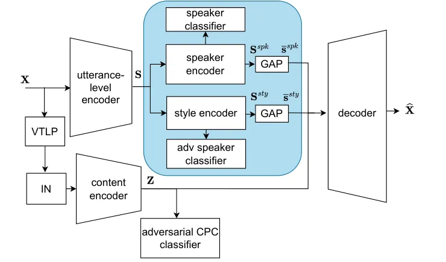

# Speaker and Style Disentanglement of Speech Based on Contrastive Predictive Coding Supported Factorized Variational Autoencoder

Yuying Xie¹, Michael Kuhlmann², Frederik Rautenberg² , Zheng-Hua Tan¹,
Reinhold Haeb-Umbach² Affiliation: 1. Department of Electronic Systems,
Aalborg University, Denmark  
2. Department of Communications Engineering, Paderborn University,
Germany

###### Abstract

Speech signals encompass various information across multiple levels
including content, speaker, and style. Disentanglement of these
information, although challenging, is important for applications such as
voice conversion. The contrastive predictive coding supported factorized
variational autoencoder achieves unsupervised disentanglement of a
speech signal into speaker and content embeddings by assuming speaker
info to be temporally more stable than content-induced variations.
However, this assumption may introduce other temporal stable information
into the speaker embeddings, like environment or emotion, which we call
style. In this work, we propose a method to further disentangle
non-content features into distinct speaker and style features, notably
by leveraging readily accessible and well-defined speaker labels without
the necessity for style labels. Experimental results validate the
proposed method’s effectiveness on extracting disentangled features,
thereby facilitating speaker, style, or combined speaker-style
conversion.

###### Index Terms: 

disentangled representation learning, voice conversion

## I Introduction

Disentangled representation learning aims to extract features which can
represent different attributes in the observed data. In speech signal
processing, disentangled representation learning offers solutions
extensively \[1, 2, 3, 4, 5, 6, 7, 8, 9\], including voice conversion.
One essential property of speech is that the speaker’s traits should
remain consistent within a single utterance, while the content rapidly
varies over time. This characteristic then can serve as a prior for
developing an end-to-end voice conversion model to extract disentangled
content and speaker features separately, as voice conversion aims to
change the speaker trait and preserve the content of an utterance.

Ebbers et al. \[1\] assume that the utterance-level information at the
current frame is similar to that from the frames 1s before and after in
the same utterance, and different between utterances in a batch. This
assumption is then introduced as inductive bias in the factorized
variational autoencoder (FVAE) to disentangle speaker from content
information via a completely unsupervised fashion, requiring neither
speaker labels nor a transcription. Specifically, during training,
contrastive predictive coding (CPC) loss \[10\] is applied on the
utterance-level embeddings, by regarding feature of current frame as
anchor, features from the same utterance as positive pairs and from
other utterance in the batch as negative pairs. Adversarial training is
working on the content embedding for independence of extracted
utterance-level and content features. The extracted utterance-level
feature in FVAE are used to represent speaker identity only.

Even though utterance-level feature is used for speaker identity
representation widely \[11\], it can also contain other temporally
stable information. For instance, channel, emotion, or environment
(e.g., room impulse response) information, should be similarly stable as
speaker properties in one utterance. Results in the works \[12, 13\]
about speaker embedding extraction also prove this point. For instance,
Xia et al. \[12\] utilize momentum contrastive (MoCo) \[14\] learning on
speaker embedding extraction. Results on the Voxceleb test set show that
extracted features cluster not only on speaker identity, but also on
session id. Besides, Cho et al. \[13\] apply DIstillation with NO labels
(DINO) \[15\] to extract utterance-level embeddings, and results show
that the extracted embeddings can not only represent speakers, but also
emotions.

Inspired by the fact that not only speaker traits change on the
utterance-level, this work further disentangles the utterance-level
features from FVAE \[1\] into speaker embedding and other temporally
stable embeddings. We call the other temporally stable embeddings as
‘style’ embeddings hereafter.

The contribution of this work is as follows: First, we posited that the
speech signal is generated from three factors: speaker identity, style
and content. Second, this work extracts features representing these
three factors in a hierarchical disentanglement manner. The proposed
method only needs speaker labels, which are cheap and easy to access.
Third, the proposed method is applicable to different definitions of
style embeddings. In this work, acoustic environment and emotion have
been chosen as different cases. For the environment case, the
performance of the proposed method is tested on both synthetic datasets
and real unseen challenging datasets. For emotion, we evaluate the
performance on a cross-language dataset. Finally, we also investigated
the application of the proposed method in style and speaker conversion
using real-recorded datasets, both in clean and reverberant conditions.
[Demos showcasing these applications are
provided.](https://yuxi6842.github.io/speaker_style_disen.github.io/)¹¹
1
[https://yuxi6842.github.io/speaker_style_disen.github.io/](https://yuxi6842.github.io/speaker_style_disen.github.io/)

## II Related work

For fine-grained style control in speech synthesis and conversion, style
disentanglement is applied to obtain more expressive embeddings. Li et
al. \[6\] propose a Tacotron2-based framework for cross-speaker and
cross-emotion speech synthesis. Disentanglement is applied to get
speaker-irrelavant and emotion-discriminative embeddings for emotion
control. Although the model proposed in \[6\] can achieve cross-speaker
emotion synthesis, only three speakers are contained in total. Du et
al. \[3\] uses disentanglement to obtain speaker, content and emotion
embeddings simultaneously for expressive voice conversion. While the
model in \[3\] uses mutual information loss for disentanglement, the
evaluation is not sufficiently comprehensive, especially lacking in
disentanglement analysis. Besides, the extracted speaker features
perform speaker verification poorly in \[3\]. Except for emotion,
environment information like noise and reverberation has also been
chosen as another controllable factor. Omran et al. \[16\] shows an
information bottleneck (IB) based way to split speech and noise or
reverberation. Masking is used on specific dimensions in the latent
variable space, while reconstruction loss controls the particular
information flow. However, similar to other IB based methods, the
performance depends heavily on bottleneck design in \[16\]. Another work
in \[17\] uses disentanglement to realize environment conversion, in
which only four seen environments are considered in their work.

## III Proposed method

### III-A Theoretical Explanation

Disentanglement aims to find codes to represent underlying causal
factors \[18\]. The original FVAE actually assumes the log-mel feature
$`\mathbf{X}=[\mathbf{x}_{1},\ldots,\mathbf{x}_{T}]`$ is generated from
independent latent variables $`\mathbf{S}`$ and $`\mathbf{Z}`$ via a
random generative process:

```math
\mathbf{X}=g_{1}(\mathbf{S},\mathbf{Z}), \tag{1}
```

in which $`\mathbf{S}`$ and $`\mathbf{Z}`$ represent the utterance-level
characteristic and content, respectively.

(a) inference process

(b) generation process

Fig. 1: Graphical illustration of the proposed method. The inference
process follows a hierarchical structure.

In this work, we further assume latent variable $`\mathbf{S}`$ is
generated from a random process with

```math
\mathbf{S}=g_{2}(\mathbf{S}^{\textrm{spk}},\mathbf{S}^{\textrm{sty}}), \tag{2}
```

in which $`\mathbf{S}^{\textrm{spk}}`$ and $`\mathbf{S}^{\textrm{sty}}`$
are independent latent variables to denote speaker identity and style in
one utterance. Thus eq (1) can also be written as:

```math
\mathbf{X}=g_{1}(\mathbf{S},\mathbf{Z})=g_{1}(g_{2}(\mathbf{S}^{\textrm{spk}},\mathbf{S}^{\textrm{sty}}),\mathbf{Z}), \tag{3}
```

and can be further simplified as:

```math
\mathbf{X}=g(\mathbf{S}^{\textrm{spk}},\mathbf{S}^{\textrm{sty}},\mathbf{Z}). \tag{4}
```

Generation process of the proposed method illustrated in fig 1b is
learned as eq. (4). Meanwhile, inference process in the proposed method
is based on eq (3) following a hierarchical structure as in fig 1a. The
first step, inherited from FVAE, learns to decompose observation
$`\mathbf{X}`$ into latent variables $`\mathbf{S}`$ and $`\mathbf{Z}`$
according to the data inherent properties. The second step further
disentangles $`\mathbf{S}`$ into $`\mathbf{S}^{\textrm{sty}}`$ and
$`\mathbf{S}^{\textrm{spk}}`$ by introducing low-cost speaker labels in
training. Adversarial learning is applied in both steps to achieve
independence. As self-supervised learning method have been used in the
first disentanglement step, the proposed hierarchical structure reduces
the labeling cost of disentangling multiple factors.

### III-B Structure



Fig. 2: Diagram of the proposed method. Highlighted in blue is the
proposed disentanglement in speaker and style properties. VTLP stands
for vocal tract length perturbation, IN for instance normalization, CPC
for contrastive predictive coding, and GAP for global average pooling.

The structure of the proposed method is shown in fig. 2. Compared with
FVAE, the new component, the proposed disentanglement module is
highlighted in blue in fig. 2. The proposed module contains a speaker
encoder, a speaker classifier, a style encoder and an adversarial
speaker classifier. Additionally, like FVAE, both vocal tract length
perturbation (VTLP) \[19\] and instance normalization (IN) \[20\] are
used to partially remove speaker information at the content encoder’s
input. The utterance-level encoder, the content encoder, the adversarial
CPC classifier, and the decoder are same with  \[1\].

The first disentanglement step, inherited from FVAE, is applied on
$`\mathbf{X}`$ to get utterance-level feature
$`\mathbf{S}=[\mathbf{s}_{1},\ldots,\mathbf{s}_{T}]`$ and content
feature $`\mathbf{Z}=[\mathbf{z}_{1},\ldots,\mathbf{z}_{N}]`$. The
contrastive learning method is firstly applied to $`\mathbf{S}`$, to
ensure that the extracted utterance-level feature is temporally stable
in one utterance. Regarding embedding $`\mathbf{s}_{t}`$ as an anchor,
$`\mathbf{s}_{t+\tau}`$ from the same utterance as the positive pair,
and $`\tilde{\mathbf{s}}_{t+\tau}`$ from other utterances in the
training batch $`\mathcal{B}`$ as the negative pair, CPC loss is then
calculated on $`\mathbf{S}`$ as:

```math
L_{\mathrm{cpc}}=-\frac{1}{T-\tau}\sum_{t=1}^{T-\tau}\frac{\mathrm{exp}({\mathbf{s}_{t+\tau}^{\mathrm{T}}\cdot\mathbf{s}_{t}})}{\sum_{\mathcal{B}}\mathrm{exp}({\tilde{\mathbf{s}}_{t+\tau}^{\mathrm{T}}\cdot\mathbf{s}_{t}})}\, \tag{5}
```

in which $`T`$ is the frame length of input sequence $`\mathbf{X}`$, and
$`\tau=80`$ (corresponding to 1s) is the time lag. Variational
autoencoder (VAE) \[21\] is applied on modeling content embedding
$`\mathbf{Z}`$ as an information bottleneck approach for improving
disentanglement. The length of extracted $`\mathbf{Z}`$ is $`N`$.
$`N\leq T`$ as there may be downsampling in content encoder. Each vector
$`\mathbf{z}_{n}`$ in $`\mathbf{Z}`$ is regarded as a stochastic
variable with prior
$`p(\mathbf{z}_{n})=\mathcal{N}(\mathbf{0},\mathbf{I})`$ and posterior
$`q(\mathbf{z}_{n})=\mathcal{N}(\bm{\mu}_{n},\textrm{diag}(\bm{\sigma}_{n}^{2}))`$.
Parameters of $`q(\mathbf{z}_{n})`$ are generated from the content
encoder and optimized with KL divergence:

```math
L_{\mathrm{kld}}=\frac{1}{N}\sum_{n=1}^{N}\mathrm{KL}(q(\mathbf{z}_{n})\|p(\mathbf{z}_{n})). \tag{6}
```

Besides, an adversarial CPC classifier is applied on $`\mathbf{Z}`$ for
independence of $`\mathbf{S}`$, cf.  \[1\].

The second disentanglement is then operated on the frame-wise
utterance-level features $`\mathbf{S}`$ via the proposed new module.
Speaker and style encoders have same structure built on one-dimensional
CNN layers. Denote
$`{\mathbf{S}^{\textrm{spk}}=[\mathbf{s}^{\textrm{spk}}_{1},\ldots,\mathbf{s}^{\textrm{spk}}_{T}]}`$
and
$`\mathbf{S}^{\textrm{sty}}=[\mathbf{s}^{\textrm{sty}}_{1},\ldots,\mathbf{s}^{\textrm{sty}}_{T}]`$
as the output from speaker encoder and style encoder. Speaker
classification then works frame-wisely on
$`\mathbf{s}^{\textrm{spk}}_{t}`$ to encourage extracting speaker
information alone. Meanwhile, frame-wise adversarial speaker
classification is applied on $`\mathbf{s}^{\textrm{sty}}_{t}`$ to ensure
that the extracted style embedding is less dependent on speaker trait.
Gradient reversal layer \[22\] is applied between the output layer of
the style encoder and the adversarial speaker classifier. Cross-entropy
loss is used here for classification on both
$`\mathbf{s}^{\textrm{spk}}_{t}`$ and $`\mathbf{s}^{\textrm{sty}}_{t}`$.
To get aggregated information over time and discard unnecessary details,
vectors $`\overline{\mathbf{s}}^{\textrm{spk}}`$ and
$`\overline{\mathbf{s}}^{\textrm{sty}}`$ are obtained by applying global
average pooling (GAP) on $`\mathbf{S}^{\textrm{spk}}`$ and
$`\mathbf{S}^{\textrm{sty}}`$.

The decoder takes as input a matrix where
$`\overline{\mathbf{s}}^{\textrm{spk}}`$ and
$`\overline{\mathbf{s}}^{\textrm{sty}}`$ are repeated $`N`$ times along
the time axis and then concatenated with the content embedding
$`\mathbf{Z}`$. To get sharper, less-oversmoothed output, reconstruction
loss here is XSigmoid function \[23\]:

```math
L_{\mathrm{rec}}=\frac{1}{T}\sum_{t}\||\mathrm{\hat{\mathbf{x}}}_{t}-\mathrm{\mathbf{x}}_{t}|\left(2\sigma(\mathrm{\hat{\mathbf{x}}}_{t}-\mathrm{\mathbf{x}}_{t}\right)-1)\|_{1}\,, \tag{7}
```

in which $`\sigma(\cdot)`$ is the sigmoid function.

Denote $`\bm{\theta}_{\mathrm{enc}}^{\mathrm{utt}}`$,
$`\bm{\theta}_{\mathrm{enc}}^{\mathrm{spk}}`$,
$`\bm{\theta}_{\mathrm{enc}}^{\mathrm{sty}}`$,
$`\bm{\theta}_{\mathrm{enc}}^{\mathrm{cont}}`$ are the parameter sets of
utterance encoder, speaker encoder, style encoder and content encoder.
And the union of all encoders’ parameter sets as
$`\bm{\theta}_{\mathrm{enc}}=\bm{\theta}_{\mathrm{enc}}^{\mathrm{utt}}\cup\bm{\theta}_{\mathrm{enc}}^{\mathrm{spk}}\cup\bm{\theta}_{\mathrm{enc}}^{\mathrm{sty}}\cup\bm{\theta}_{\mathrm{enc}}^{\mathrm{cont}}`$.
The parameter sets of speaker classifier and adversarial speaker
classifier are $`\bm{\theta}_{\mathrm{clf}}^{\mathrm{spk}}`$,
$`\bm{\theta}_{\mathrm{adv\_clf}}^{\mathrm{spk}}`$, while the parameter
set of decoder is $`\bm{\theta}_{\mathrm{dec}}`$ The total loss function
is then written as:

```math
\displaystyle L(\bm{\theta}_{\mathrm{enc}},\bm{\theta}_{\mathrm{dec}},\bm{\theta}^{\mathrm{spk}}_{\mathrm{clf}},\bm{\theta}^{\mathrm{spk}}_{\mathrm{adv\_clf}}) \tag{8}
```

```math
\displaystyle=L_{\mathrm{rec}}(g_{\hat{\mathbf{X}}}(\mathbf{X};\bm{\theta}_{\mathrm{enc}},\bm{\theta}_{\mathrm{dec}}),\mathbf{X})+\lambda_{s}L_{\mathrm{cpc}}(g_{\mathbf{S}}(\mathbf{X};\bm{\theta}_{\mathrm{enc}}^{\mathrm{utt}}))
```

```math
\displaystyle+\beta L_{\mathrm{kld}}(g_{\mathbf{Z}}(\mathbf{X};\bm{\theta}_{\mathrm{enc}}^{\mathrm{cont}}))-\lambda_{z}L_{\mathrm{cpc}}(R(g_{\mathbf{Z}}(\mathbf{X};\bm{\theta}_{\mathrm{enc}}^{\mathrm{cont}})))
```

```math
\displaystyle+L_{\mathrm{CE}}(g_{\mathbf{P}^{\mathrm{spk}}}(g_{\mathbf{S}^{\mathrm{spk}}}(\mathbf{X};\bm{\theta}_{\mathrm{enc}}^{\mathrm{utt}},\bm{\theta}_{\mathrm{enc}}^{\mathrm{spk}});\bm{\theta}_{\mathrm{clf}}^{\mathrm{spk}}),\mathbf{Y})
```

```math
\displaystyle-L_{\mathrm{CE}}(g_{\mathbf{P}^{\mathrm{sty}}}(R(g_{\mathbf{S}^{\mathrm{sty}}}(\mathbf{X};\bm{\theta}_{\mathrm{enc}}^{\mathrm{utt}},\bm{\theta}_{\mathrm{enc}}^{\mathrm{sty}}));\bm{\theta}_{\mathrm{adv\_clf}}^{\mathrm{spk}}),\mathbf{Y}),
```

in which $`\mathbf{Y}`$ is the true speaker label one-hot matrix,
$`\mathbf{P}^{\mathrm{spk}}`$ and $`\mathbf{P}^{\mathrm{sty}}`$ are
speaker label predictions from speaker classifier and adversarial
speaker classifier. Mapping $`g_{\mathbf{y}}(\mathbf{x};\bm{\theta})`$
denotes that $`\mathbf{y}=g_{\mathbf{y}}(\mathbf{x};\bm{\theta})`$,
where $`\mathbf{x}`$ is the input and $`\bm{\theta}`$ is the parameter
set in the corresponding neural networks. For a better illustration of
forward and backward behavior, gradient reversal layer is represented
via a ’pseudo-function’ $`R(\cdot)`$ as \[24\]:

```math
R(\mathbf{x})=\mathbf{x},\frac{\mathrm{d}R(\mathbf{x})}{\mathrm{d}\mathbf{x}}=-\mathbf{I}, \tag{9}
```

where $`\mathbf{I}`$ is an identity matrix. To balance the terms,
$`\lambda_{s}`$, $`\lambda_{z}`$ and $`\beta`$ are coeffients in the
total loss function.

## IV Experiments

### IV-A Datasets

For testing the separation of speaker from environment information, the
model is trained and tested with artificially reverberated data.
Besides, an unseen real-recorded dataset is chosen for testing only. For
the case of separating speaker from emotion information, a
cross-language emotion dataset is used for training and testing.

LibriSpeech: The clean speech dataset of this work is based on
LibriSpeech \[25\]. The subsets train-clean-360 (921 speakers),
train-clean-100 (251 speakers) and test-clean (40 speakers) are used and
convolved with real-recorded RIRs.

LibriSpeech + Aachen Impulse Response (AIR): The AIR dataset \[26\]
contains 107 real RIR recordings, and is used for data augumentation on
the training dataset. Each utterance from the LibriSpeech training set
is convolved with 4 different randomly selected RIRs from AIR. Thus, the
training dataset in the environment case is 4 times larger than the
LibriSpeech training set.

VOiCES: To evaluate the performance on speaker verification,
VOiCES \[27\] is chosen in this work for testing only. This dataset is
recorded in four different rooms, with differently-located microphones
and various directions of arrival between microphones and speakers. In
this work, only the speech dataset without noise from VOiCES_devkit is
used for evaluation on real challenging acoustic environment.

Emotion dataset: The emotional speech dataset (ESD) \[28\] contains
studio-quality recordings of 10 English and 10 Mandarin speakers in
neutral style and four acted emotions (happy, angry, sad, and surprise).
Each speaker utters the same 350 utterances in all five styles,
totalling 35,000 utterances. The subset which contains all 10 English
speakers and 4 styles (neutral, happy, angry, and sad) is used for
training, validation and evaluation (seen condition) firstly, with split
of 85%/10%/5%, respectively. Besides, the remaining style, surprise, is
used for evaluation as an unseen emotion. Moreover, the Mandarin subset
is used for evaluation when both speaker and language are unseen.

|           |                 |                                                               |       |            |       |            |       |                              |       |
| --------- | --------------- | ------------------------------------------------------------- | ----- | ---------- | ----- | ---------- | ----- | ---------------------------- | ----- |
| Framework | Embedding       | Speaker Verification Equal Error Rate (EER)(%) $`\downarrow`$ |       |            |       |            |       | Emo Rec Acc.(%) $`\uparrow`$ |       |
|           |                 | Engl., w/o. surprise                                          |       | Engl., all |       | Mand., all |       | Engl.                        | Mand. |
|           |                 | WE                                                            | AE    | WE         | AE    | WE         | AE    |                              |       |
| FVAE      | utterance-level | 0.14                                                          | 0.27  | 0.28       | 0.63  | 12.69      | 31.89 | 89.43                        | 31.36 |
| Proposed  | speaker         | 0.00                                                          | 0.00  | 0.21       | 0.44  | 14.65      | 26.35 | 91.36                        | 23.64 |
|           | style           | 1.82                                                          | 11.62 | 2.24       | 11.86 | 16.10      | 41.84 | 92.27                        | 30.57 |

TABLE I: Speaker verification and speech emotion recognition (Emo Rec)
results on ESD. We measure the EER when same speaker pairs are compared
with the same emotion (within-emotion, WE) or with different emotion
(across-emotion, AE).

### IV-B Implementation Details

Following \[1\], each update of the encoders, speaker classifier and
decoder is followed by three exclusive updates of the adversarial CPC
and adversarial speaker classifier. We set $`\beta=0.01`$ and
$`\lambda_{s}=\lambda_{z}=1`$. We use the Adam optimizer and a learning
rate of $`5\times 10^{-4}`$. Both FVAE and proposed method use eq (7) as
reconstruction loss for fair.

Environment Training is based on the ’LibriSpeech + AIR’ set with eq (8)
as loss function. The utterance-level encoder, content encoder and
decoder in this work have the same structure as in \[1\]. The speaker
encoder and style encoder both contain 3 one-dimensional CNN layers with
stride equal to 1 and kernel size equal to 5 for all layers. The
extracted speaker embedding and style embedding have both a dimension of 128. The speaker classifier contains one fully-connected (FC) layer,
while the adversarial speaker classifier contains three FC layers with
128 hidden units each. The other settings are the same as in \[1\].

Emotion Training on ESD is performed for 100,000 iterations. The
networks are configured in the same way as in environment case, except
for the input of content encoder: Inspired by HuBERT \[29\], features
from a CNN-based waveform extractor are used to replace the mel
spectrogram. The whole model is firstly pre-trained on LibriTTS \[30\].
Then fixed the content encoder, and fine-tuned the other modules in the
whole model on ESD. The loss functions for pretraining and fine-tuning
are the same, i.e. eq (8).

|                    |                        |                        |               |
| ------------------ | ---------------------- | ---------------------- | ------------- |
| Framework          |                        | EER (%) $`\downarrow`$ |               |
|                    |                        | WC                     | AC            |
| LibriSpeech        | FVAE                   | $`2.44`$               | $`6.09`$      |
|                    | proposed(before disen) | $`2.96`$               | $`6.82`$      |
|                    | proposed (speaker)     | $`\bm{1.50}`$          | $`\bm{4.65}`$ |
|                    | proposed (style)       | $`18.65`$              | $`24.29`$     |
| VOiCES (test only) | proposed(before disen) | $`20.6`$               |               |
|                    | proposed (speaker)     | $`12.5`$               |               |
|                    | proposed (style)       | $`25.7`$               |               |

TABLE II: Speaker verification results under environment case. For
LibriSpeech dataset, EER is calculated when same speaker pairs are
selected within the same chapter (WC) and across chapter (AC).

### IV-C Evaluation under Environment Case

We firstly use t-SNE plots to visualize the extracted style and speaker
embeddings. Results are shown in fig 3. The example shown is taken from
the LibriSpeech test-clean set, convolved with 4 different RIRs from the
AIR dataset. These figures show that the style and speaker features form
well-defined clusters according to their style and speaker labels,
respectively, while speakers are spread across style clusters, and
RIR-labels across speaker clusters. This demonstrates that the proposed
second disentanglement can separate speaker and environment information
well.

(a) style embeddings with colors denoting RIR labels

(b) speaker embeddings with colors denoting RIR labels

(c) style embeddings with colors denoting speaker labels

(d) speaker embeddings with colors denoting speaker labels

Fig. 3: t-SNE plots of embeddings under environment case. One can
clearly see that style embeddings cluster according to RIR labels and
speaker embeddings according to speaker labels.

Moreover, we test the extracted embeddings performance via speaker
verification tests on the LibriSpeech test-clean set and VOiCES dev-kit
dataset. Evaluation is based on equal error rate (EER) according to
cosine similarity. Results are shown in table II. When dealing with
Librispeech test set, we found that there is slight recording
environment change between some chapters in the original dataset. Thus,
EER is calculated separately for the case when same speaker pairs are
selected within the same chapter (WC) and when selected across chapters
(AC), with the latter giving larger EERs. Compared with original FVAE,
the proposed speaker embeddings after the second disentanglement step
result in an improvement in EER by a margin on the clean LibriSpeech
dataset, cf. table II. Even though the proposed speaker embeddings
reduce the gap between WC and AC, the exist of the gap may because:
compared to the generated data, environmental changes in LibriSpeech can
be negligible.

Besides, the proposed method shows effective disentanglement on VOiCES
dev-kit dataset. The speaker embedding from proposed second
disentanglement shows large improvement with an EER of $`12.5\%`$
compared with $`20.6\%`$ before the second disentanglement. Even though
VOiCES is unseen during training, this result illustrates that the
second disentanglement can help on extracting more robust speaker
embeddings under challenging realistic situation.

### IV-D Evaluation under Emotion Case

Both speaker verification and speech emotion recognition results are
shown in table I. To check how the extracted features influenced by
emotion, we calculate EER in speaker verification experiment under two
different scenarios when positive speaker utterance pairs have the same
emotion (within-emotion, WE) or not (across-emotion, AE). For emotion
recognition, we train a 3-layer FC classifier on the embeddings using
the English speaker subset with all 5 emotional states.

In speaker verification experiments, when speaker and language are seen
in training, speaker embedding performs superior compared with
utterance-level features and style embedding. Meanwhile, the evaluation
of unseen speakers and language (Mandarin) subset, reveals that speaker
embedding demonstrates stability and is less prone to the impact of
emotional factors in speech. This is especially evident when positive
pairs in speaker verification involve varying emotions. For speech
emotion recognition, style embedding shows slightly better performance
when language and speaker are seen during training, and comparable
performance with utterance-level features in Mandarin subset.

## V Conclusion

Inspired by the existing results that the utterance-level feature
contains not only speaker identity, but other style attributes, this
work proposed a hierarchical disentanglement method based on FVAE.
Particularly, the utterance-level embedding from FVAE is further
decomposed into speaker and style features in this work. Training of
this disentanglement framework needs speaker labels only, which are easy
to get. We evaluated the proposed method under two cases of style:
environment and emotion. For the environment case, the extracted style
embeddings show clusters on RIR labels. The extracted speaker embeddings
perform well for speaker verification, when tested on a clean speech
dataset and a real-recorded reverberation dataset, indicating the
effectiveness of the proposed method. The findings from the emotion
dataset demonstrate that the extracted speaker embeddings become more
distinctive in terms of speaker identification and less susceptible to
emotional variations. We hope this work may contribute to future work
including multi-factor voice conversion, and conversion under
challenging environments.

## References

- \[1\] Janek Ebbers, Michael Kuhlmann, et al., “Contrastive predictive
  coding supported factorized variational autoencoder for unsupervised
  learning of disentangled speech representations,” in ICASSP, 2021.
- \[2\] Berrak Sisman et al., “An overview of voice conversion and its
  challenges: From statistical modeling to deep learning,” IEEE/ACM
  TASLP, vol. 29, pp. 132–157, 2021.
- \[3\] Zongyang Du, Berrak Sisman, et al., “Disentanglement of
  Emotional Style and Speaker Identity for Expressive Voice Conversion,”
  in Interspeech, 2022.
- \[4\] Nana Hou et al., “Learning disentangled feature representations
  for speech enhancement via adversarial training,” in ICASSP, 2021.
- \[5\] Mufan Sang et al., “Deaan: Disentangled embedding and
  adversarial adaptation network for robust speaker representation
  learning,” in ICASSP, 2021.
- \[6\] Tao Li, Xinsheng Wang, et al., “Cross-speaker emotion
  disentangling and transfer for end-to-end speech synthesis,” IEEE/ACM
  TASLP, vol. 30, pp. 1448–1460, 2022.
- \[7\] Kaizhi Qian et al., “Autovc: Zero-shot voice style transfer with
  only autoencoder loss,” in ICML, 2019.
- \[8\] Kaizhi Qian et al., “Unsupervised speech decomposition via
  triple information bottleneck,” in ICML, 2020.
- \[9\] Haoran Sun et al., “Random cycle loss and its application to
  voice conversion,” IEEE TPAMI, vol. 45, no. 8, pp. 10331–10345, 2023.
- \[10\] Aaron van den Oord et al., “Representation learning with
  contrastive predictive coding,” arXiv preprint arXiv:1807.03748, 2018.
- \[11\] Brecht Desplanques, Jenthe Thienpondt, and Kris Demuynck,
  “ECAPA-TDNN: Emphasized Channel Attention, Propagation and Aggregation
  in TDNN Based Speaker Verification,” in Interspeech, 2020.
- \[12\] Wei Xia et al., “Self-supervised text-independent speaker
  verification using prototypical momentum contrastive learning,” in
  ICASSP, 2021.
- \[13\] Jaejin Cho, Raghavendra Pappagari, et al., “Non-contrastive
  self-supervised learning of utterance-level speech representations,”
  in Interspeech, 2022.
- \[14\] Kaiming He et al., “Momentum contrast for unsupervised visual
  representation learning,” in CVPR, 2020.
- \[15\] Mathilde Caron et al., “Emerging properties in self-supervised
  vision transformers,” in ICCV, 2021.
- \[16\] Ahmed Omran, Neil Zeghidour, et al., “Disentangling speech from
  surroundings with neural embeddings,” in ICASSP, 2023.
- \[17\] Xulong Zhang, Jianzong Wang, Ning Cheng, and Jing Xiao,
  “Metaspeech: Speech effects switch along with environment for
  metaverse,” in 2022 18th International Conference on Mobility, Sensing
  and Networking (MSN). IEEE, 2022, pp. 841–846.
- \[18\] Yoshua Bengio, Aaron Courville, and Pascal Vincent,
  “Representation learning: A review and new perspectives,” IEEE TPAMI,
  vol. 35, no. 8, pp. 1798–1828, 2013.
- \[19\] Navdeep Jaitly and Geoffrey E Hinton, “Vocal tract length
  perturbation (vtlp) improves speech recognition,” in Proc. ICML
  Workshop on Deep Learning for Audio, Speech and Language, 2013.
- \[20\] Dmitry Ulyanov, Andrea Vedaldi, and Victor Lempitsky, “Instance
  normalization: The missing ingredient for fast stylization,” arXiv
  preprint arXiv:1607.08022, 2016.
- \[21\] Diederik P Kingma and Max Welling, “Auto-encoding variational
  bayes,” arXiv preprint arXiv:1312.6114, 2013.
- \[22\] Yaroslav Ganin and Victor Lempitsky, “Unsupervised domain
  adaptation by backpropagation,” in ICML, 2015.
- \[23\] Gustavo Teodoro Döhler Beck et al., “Wavebender gan: An
  architecture for phonetically meaningful speech manipulation,” in
  ICASSP, 2022.
- \[24\] Yaroslav Ganin et al., “Domain-adversarial training of neural
  networks,” Journal of Machine Learning Research, vol. 17, no. 59, pp.
  1–35, 2016.
- \[25\] Vassil Panayotov et al., “Librispeech: An asr corpus based on
  public domain audio books,” in ICASSP, 2015.
- \[26\] Marco Jeub, Magnus Schafer, and Peter Vary, “A binaural room
  impulse response database for the evaluation of dereverberation
  algorithms,” in 2009 16th International Conference on Digital Signal
  Processing, 2009.
- \[27\] Colleen Richey et al., “Voices obscured in complex
  environmental settings (voices) corpus,” 2018.
- \[28\] Kun Zhou et al., “Seen and unseen emotional style transfer for
  voice conversion with a new emotional speech dataset,” in
  ICASSP, 2021.
- \[29\] Wei-Ning Hsu et al., “Hubert: Self-supervised speech
  representation learning by masked prediction of hidden units,”
  IEEE/ACM TASLP, vol. 29, pp. 3451–3460, 2021.
- \[30\] Heiga Zen et al., “Libritts: A corpus derived from librispeech
  for text-to-speech,” arXiv preprint arXiv:1904.02882, 2019.
