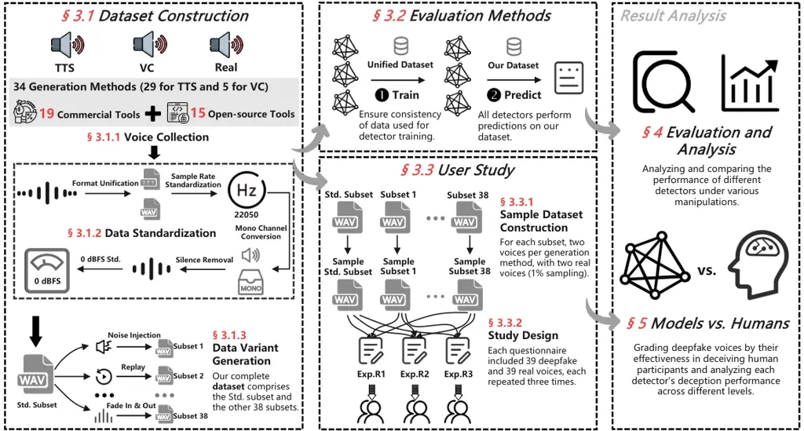
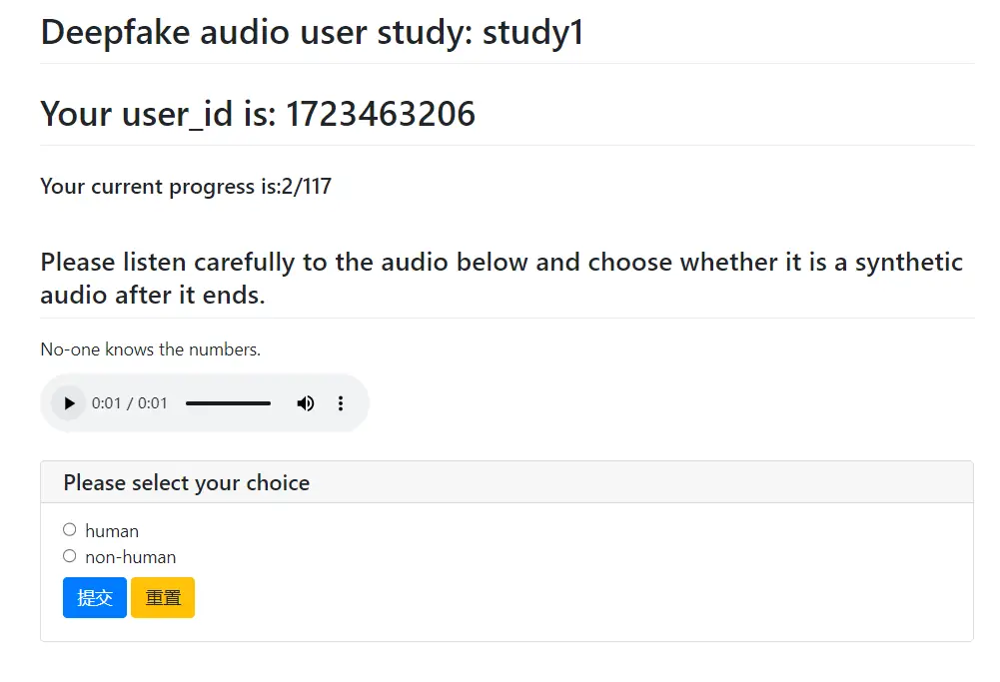
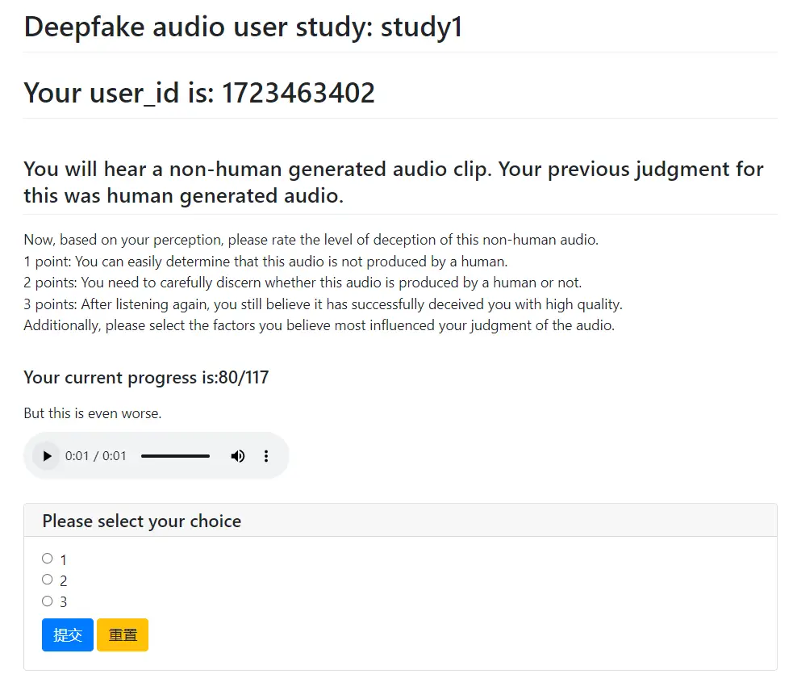
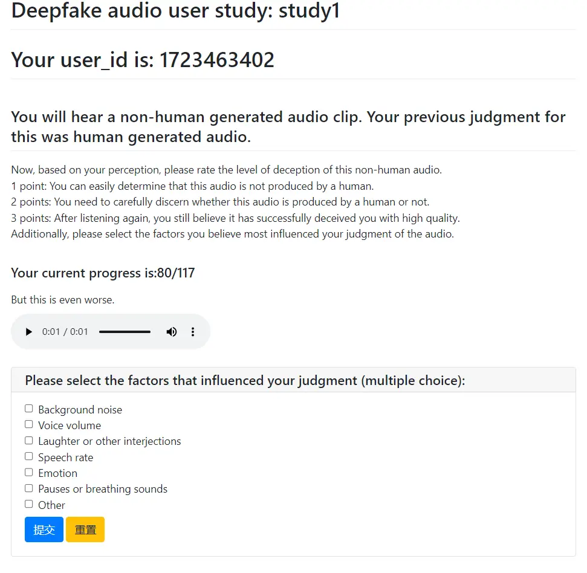
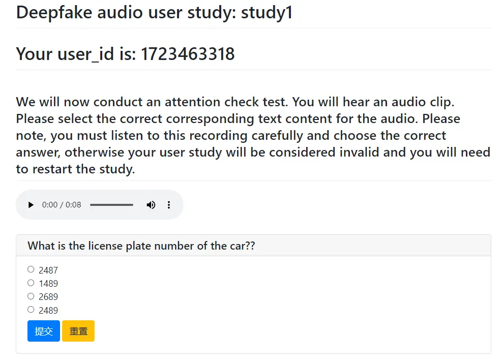
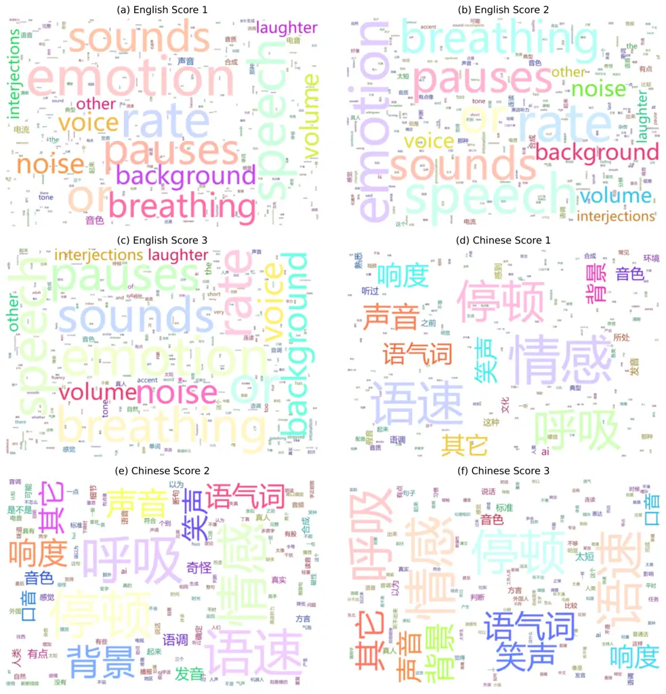
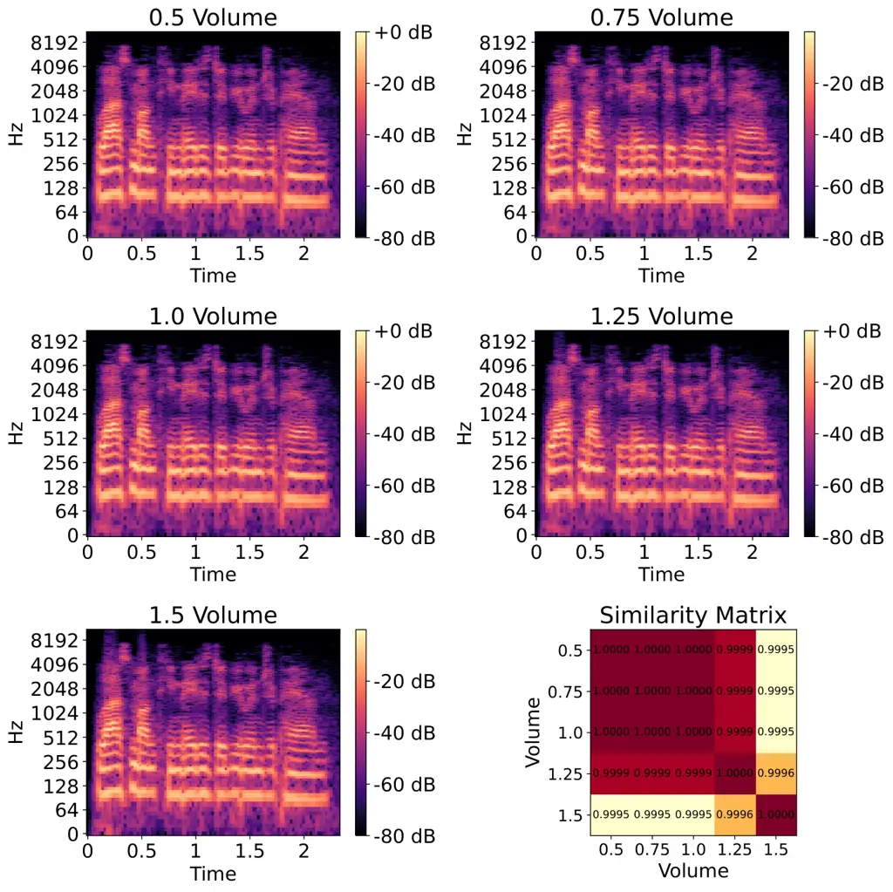

# VoiceWukong: Benchmarking Deepfake Voice Detection

Ziwei Yan¹¹footnotemark: 1 Affiliation: Huazhong University of Science
and Technology Email: <yandoit@hust.edu.cn>    Yanjie Zhao
^(†)^(†)thanks: Ziwei Yan and Yanjie Zhao contributed equally to this
work. Affiliation: Huazhong University of Science and Technology
Email: <yanjie_zhao@hust.edu.cn>    Haoyu Wang ^(†)^(†)thanks: Haoyu
Wang is the corresponding author (haoyuwang@hust.edu.cn).
Affiliation: Huazhong University of Science and Technology
Email: <haoyuwang@hust.edu.cn>

###### Abstract

With the rapid advancement of technologies like text-to-speech (TTS) and
voice conversion (VC), detecting deepfake voices has become increasingly
crucial. However, both academia and industry lack a comprehensive and
intuitive benchmark for evaluating detectors. Existing datasets are
limited in language diversity and lack many manipulations encountered in
real-world production environments.

To fill this gap, we propose VoiceWukong, a benchmark designed to
evaluate the performance of deepfake voice detectors. To build the
dataset, we first collected deepfake voices generated by 19 advanced and
widely recognized commercial tools and 15 open-source tools. We then
created 38 data variants covering six types of manipulations,
constructing the evaluation dataset for deepfake voice detection.
VoiceWukong thus includes 265,200 English and 148,200 Chinese deepfake
voice samples. Using VoiceWukong, we evaluated 12 state-of-the-art
detectors. AASIST2 achieved the best equal error rate (EER) of 13.50%,
while all others exceeded 20%. Our findings reveal that these detectors
face significant challenges in real-world applications, with
dramatically declining performance. In addition, we conducted a user
study with more than 300 participants. The results are compared with the
performance of the 12 detectors and a multimodel large language model
(MLLM), i.e., Qwen2-Audio, where different detectors and humans exhibit
varying identification capabilities for deepfake voices at different
deception levels, while the LALM demonstrates no detection ability at
all. Furthermore, we provide a leaderboard for deepfake voice detection,
publicly available at
[https://voicewukong.github.io](https://voicewukong.github.io).

## 1 Introduction

The rapid development of technologies such as TTS (Text-to-Speech) and
VC (Voice Conversion) has brought great convenience to people in areas
like entertainment and accessibility services. However, it is a
double-edged sword. Illegal actors may exploit deepfake voices for
various criminal activities. For example, in 2019, criminals used
AI-based software to impersonate the voice of a U.K.-based energy firm’s
chief executive and requested a fraudulent transfer of €220,000 \[3\].
To counter the growing threats posed by deepfake voice technology,
researchers are actively developing deepfake voice detection methods and
creating open-source datasets for evaluation. For instance, traditional
pipeline detection methods like LFCC-LCNN \[69\], the one-class
learning-based detection method \[79\], emerging end-to-end detection
models such as AASIST \[30\] and RawNet2 \[59\], as well as open-source
deepfake voice datasets like ASVspoof \[63, 73\], have all garnered
widespread attention.

Unfortunately, academic deepfake voice detection methods often excel on
specific datasets but fall short in real-world scenarios \[47\]. The
rise of commercial tools and the latest generative models has produced
increasingly convincing synthetic voices, outpacing current detection
capabilities \[49\]. A key issue is the reliance on outdated or generic
datasets for evaluation, which fail to reflect the sophistication of
modern deepfake technologies. In practical applications, detectors
struggle with poor generalization to unknown attacks and lack
large-scale in-the-wild datasets \[76\]. Additionally, most methods
focus solely on original content, overlooking the impact of
post-processing manipulations (such as noise injection) on detection
accuracy \[72\]. Given these challenges, there is a pressing need for a
comprehensive benchmark to objectively evaluate various detection
methods, thereby bridging the gap between academic research and
real-world applications.

To address this gap, we introduce VoiceWukong, a comprehensive deepfake
voice detection benchmark that incorporates various voice manipulations.
VoiceWukong focuses on English and Chinese, the two most widely spoken
languages globally, and features voices synthesized by advanced
commercial tools and open-source models. We evaluated 12
state-of-the-art detection models, visually presenting their performance
differences. Our fine-grained analysis of detector performance across
different manipulations reveals potential avenues for optimization and
improvement. Recognizing that humans are the primary targets of
deepfakes, we conducted a user study involving over 300 participants.
Based on the results, we classified deepfake voices into three levels.
We then analyzed the performance of the detectors at each level,
comparing the detection capabilities of users versus automated systems
for these synthesized voices.

Our main contributions can be summarized as follows:

- •
  A dataset addressing gaps. Our dataset encompasses both English and
  Chinese languages, leveraging 19 advanced commercial tools and 15
  open-source models. Through six types of manipulations, it has
  accumulated 38 data variants, resulting in a total of 265,200 English
  and 148,200 Chinese deepfake voice samples. To our knowledge, this
  dataset is the first to extensively incorporate manipulation variants
  and compile the largest collection of commercially generated voice
  samples.
- •
  A comprehensive benchmark. We evaluated 12 advanced deepfake voice
  detectors using VoiceWukong. Results show that most detectors have an
  equal error rate (EER) above 20%, with three detectors exhibiting
  random performance on either the Chinese or English dataset.
  AASIST2 \[60\] achieved the best EER (13.50% for English and 13.54%
  for Chinese), yet this falls significantly short of the 0.82% EER
  reported on its original evaluation dataset, underscoring the
  challenges these detectors face in real-world applications. We further
  compared detector performance and conducted a fine-grained analysis to
  identify specific manipulations that cause performance degradation for
  each detector.
- •
  A large-scale user study. We conducted a user study involving over 300
  participants to categorize deepfake voices into three levels of
  increasing difficulty (levels 0-2) based on their actual deception
  effectiveness. We then evaluated the performance of the 12 detectors
  and a multimodel large language model (MLLM), Qwen2-audio \[14\],
  across these levels. Results show that humans have false acceptance
  rates (FARs) of 18.97% for level 0 deepfakes in English and 4.20% in
  Chinese, outperforming most detectors. For level 2 deepfake voices,
  human FARs exceed 82% in both languages, falling behind most
  detectors. Qwen2-audio has an F1-Score of zero on the English dataset,
  indicating its inability to detect deepfake voices. We also examined
  human-focused features in deepfake voice detection to enhance
  detector-human collaboration in identifying synthetic audio.

## 2 Background and Related Work

|              |                        |               |        |                              |               |               |        |                         |     |        |             |
| ------------ | ---------------------- | ------------- | ------ | ---------------------------- | ------------- | ------------- | ------ | ----------------------- | --- | ------ | ----------- |
| Dataset      | FoR                    | ASVspoof 2019 |        | WaveFake                     | ASVspoof2021  |               |        | ADD 2022                |     |        | In-the-Wild |
| Year         | 2019                   | 2019          |        | 2021                         | 2021          |               |        | 2022                    |     |        | 2022        |
| Language     | English                | English       |        | English & Japanese           | English       |               |        | Chinese                 |     |        | English     |
| Corpus       | A phrase dataset \[2\] | VCTK \[65\]   |        | LJSpeech \[1\] & JSUT \[55\] | VCTK & Other¹ |               |        | AI-1,3,4 \[8, 54, 22\]² |     |        | -           |
| Subset       | -                      | LA            | PA     | -                            | LA            | PA            | DF     | LF                      | PF  | FG-D   | -           |
| Types        | TTS                    | TTS,VC        | Replay | TTS                          | TTS,VC        | Replay        | TTS,VC | TTS,VC                  | PF³ | TTS,VC | TTS         |
| Goal         | DD                     | ASV           | ASV    | DD                           | ASV           | ASV           | DD     | DD                      | DD  | DD     | DD          |
| Manipulation | -                      | -             | -      | -                            | Trans⁴        | Noisy, Reverb | -      | Noisy                   | -   | -      | Noisy       |
| Commercial   | 6                      | 0             | -      | 0                            | 0             | -             | 0      | -                       | -   | -      | -           |
| Academic     | 1                      | 17            | -      | 7                            | 13            | -             | \>100  | -                       | -   | -      | -           |

1: Other undisclosed corpora.

2: AI-1, AI-3, and AI-4 represent AISHELL-1, AISHELL-3, and AISHELL-4,
respectively.

3: PF represents partially fake that generated by manipulating only a
few words in the original bonafide utterances with real or synthesized
voices.

4: The LA part of ASVspoof2021 transmitted the original voice through
various telephone systems.

Table 1: The details of commonly used deepfake voice datasets. Note
that, various datasets have issues such as single language and lack of
manipulations.

### 2.1 Deepfake Voice Detection

Deepfake voice detectors primarily fall into two categories: traditional
pipeline detectors and the increasingly researched end-to-end
detectors \[76\]. The pipeline consists of a frontend feature extractor
and a backend classifier. The classifier determines authenticity based
on the features extracted by the feature extractor. Common features
include spectral features represented by mel frequency cepstral
coefficient (MFCC) \[9\], linear frequency cepstral coefficients
(LFCC) \[62\], constant-Q transform (CQT) \[11\]; supervised embedding
features \[48\]; and self-supervised embedding features represented by
Wav2vec based features \[60\], XLS-R \[5\] based features \[45\].
Moreover, researchers have also attempted to explore some
non-traditional features. Wang et al. \[67\] analyzed pop noise from
close microphone speaking to detect deepfake voices. Doan et al. \[19\]
detected deepfakes by evaluating the correlation between breathing,
talking (speaking), and silence sounds. Common backend classifiers
include traditional classifiers represented by GMM-based
classifiers \[16\], and deep learning classifiers represented by
ResNet \[27\] based classifiers \[64\], Res2Net \[23\] based
classifiers \[36\], and DARTS \[40\] based classifiers \[24\].

End-to-end detectors have also garnered widespread attention in the
research community. RawNet2 \[31\] is a neural network designed for
end-to-end speech recognition and speaker verification that directly
processes raw audio waveforms. Tak et al. \[59\] were the first to apply
RawNet2 to anti-spoofing. Wang et al. \[70\] proposed a joint
optimization approach based on the weighted additive angular margin loss
to extend and optimize the RawNet2 based deepfake voice detector. Tak et
al. \[57\] leveraged the merit of graph attention networks (GATs) to
learn the relationships between cues located in different sub-bands or
different temporal intervals \[61\], proposing RawGAT-ST, which achieved
excellent performance on ASVspoof2019. RawGAT-ST uses a pair of parallel
graphs to simultaneously model temporal and spectral information, then
combines them with element-wise multiplication. Jung et al. \[30\]
proposed integrating these two heterogeneous graphs with
heterogeneity-aware techniques and developed the AASIST, which achieved
superior performance on ASVspoof2019.

Unfortunately, most existing detectors are limited to pursuing
performance on a single dataset, neglecting many challenges encountered
in real-world applications. Ba et al. \[4\] highlighted these
limitations in cross-language detection and proposed adaptation
strategies. Zhang et al. \[78\] pointed out the insufficiency of models
in adapting to unknown new attacks and conducted research on continual
learning in deepfake voice detection. Wang et al. \[68\] and Wu et
al. \[72\] considered the impact of manipulations on detector
robustness, an aspect that most people have not taken into account.

### 2.2 Benchmarks and Datasets

Benchmarks. Recent research in deepfake detection has primarily focused
on benchmarking face detection methods. Notable contributions include
the CDDB benchmark by Li et al.\[37\], which simulates real-world
scenarios, and the comprehensive evaluation by Deng et al.\[17\] using
multiple generation methods and detection metrics. Pei et al. \[50\]
provided a thorough survey and evaluation of deepfake face generation
and detection techniques across various datasets and sub-fields. In the
voice domain, Zang et al. \[77\] introduced CtrSVDD, a large-scale
benchmark for detecting singing voice synthesis models. To the best of
our knowledge, VoiceWukong is the first comprehensive and in-depth
benchmark focusing on deepfake voice detection.

Datasets. The commonly used evaluation datasets for deepfake voice
detectors include FoR \[53\], ASVspoof2019 \[63\], WaveFake \[21\],
ASVspoof2021 \[73\], ADD2022 \[74\], and In-the-Wild \[47\], as shown in
Table 1. ASVspoof2019 is constructed for automatic speaker verification
(ASV) tasks and includes a replay subset (ASVspoof2019-PA). It has
received a lot of attention in the field of deepfake detection (DD).
ASVspoof2021 builds upon ASVspoof2019 by adding a section specifically
for deepfake detection (ASVspoof2021-DF). Only WaveFake is constructed
across multiple languages, but it does not focus on the most widely used
languages. In-the-wild has a limited scope, focusing only on deepfake
voices of celebrities and politicians. FoR is derived from seven
open-source and commercial methods. Only a few datasets include
manipulations like noise (ASVspoof2021, ADD2022, In-the-wild) and replay
attacks (ASVspoof2019, ASVspoof2021). Overall, our dataset offers the
broadest coverage of commercial tools, encompasses the widest range of
voice manipulation variants, and targets the most representative
languages.

### 2.3 Threat Model

The threat model in this study focuses on the malicious use of deepfake
voice technology such as fraud and impersonation. Adversaries are
assumed to have access to advanced commercial and open-source voice
synthesis tools, enabling them to generate highly convincing synthetic
voices in English and Chinese, and employ post-processing techniques to
enhance realism and evade detection. The rapid advancement of voice
synthesis technology presents a growing threat, often outpacing the
development of detectors \[49\]. Current academic detectors may fail in
the real world due to poor generalization and outdated datasets,
creating a gap between lab results and practical effectiveness against
sophisticated deepfake voices. Our goal is to bridge this gap by
providing a comprehensive benchmark that reflects real-world threats,
evaluates state-of-the-art detection methods, and incorporates human
perception in assessing deepfake voice detection effectiveness.



Figure 1: The overall workflow of the VoiceWukong benchmark
construction.

## 3 Benchmark Construction

In this section, we introduce the construction process of VoiceWukong,
as illustrated in Figure 1. § 3.1 introduces the dataset construction
process. § 3.2 presents our unified training and evaluation of
detectors. § 3.3 details our large-scale user study. Finally, § 3.4
discusses the evaluation metrics used in VoiceWukong.

### 3.1 Dataset Construction

#### 3.1.1 Voice Collection

Generation Methods. Since TTS and VC are mainstream methods for
generating deepfake voices \[34\], our dataset focuses on these two
types. We collected 15 open-source generation models that are either
prominent in the research field or have the highest star ratings on
GitHub. Given that adversaries might use commercial tools to synthesize
deepfake voices in real-world scenarios, we additionally collected 19
such tools capable of generating deepfake voices for research purposes
and paid the necessary fees for their use. We carefully examined the
terms of service for each commercial tool to confirm their
permissibility for research purposes. VoiceWukong is a non-commercial
resource, thereby safeguarding against any potential infringement of
intellectual property rights. To our knowledge, our dataset involves the
most extensive range of commercial tools. The 34 methods (29 for TTS and
5 for VC) are listed in Table 7 in the Appendix, all supporting English
and 19 supporting Chinese.

Generation Process. VoiceWukong encompasses English and Chinese, the two
most widely used languages globally. Deepfake voice generation utilizes
the English VCTK \[65\] and Chinese MAGICDATA \[44\] datasets. VCTK is
widely used in voice cloning and conversion research, featuring diverse
English textual content. MAGICDATA is a large-scale Mandarin speech
dataset with extensive read speech data, covering domains like news,
dialogues, and question-answering. After deduplication and length
filtering (5-30 words for English, 5-35 characters for Chinese), we
selected 100 sentences each from VTCK and MAGICDATA for fixed-text
generation, and extracted 3,400 English and 1,900 Chinese sentences for
random-text generation. For each method, we produced 200 deepfake voices
per supported language: 100 with fixed text and 100 with random text.
Methods with 10 or more speakers yielded 10 fixed-text and 10
random-text voices per speaker from 10 speakers. For methods with fewer
speakers, we distributed the 200 voices evenly among available speakers.
Generation was automated for open-source models and API-based tools,
while web-based tools required manual input. For the five open-source VC
models, we provided corresponding original voices. In total, we
collected 6,800 English deepfake voices across 34 methods and 3,800
Chinese deepfake voices across 19 Chinese-supporting methods.

Real Voice Collection. We also collected real voices from the VCTK and
MAGICDATA datasets. To ensure data balance, we randomly selected text
content not present in any deepfake voices and collected an equal number
of real voices: 6,800 from VCTK and 3,800 from MAGICDATA.

#### 3.1.2 Data Standardization

Inspired by previous research \[53\], the diversity of our dataset
sources necessitates data standardization to eliminate biases. We
implemented a standardized preprocessing pipeline for all voice samples,
which included converting files to WAV format, resampling to 22,050 Hz,
transforming to Mono channel, trimming silent segments from the
beginning and end, and normalizing the volume to 0 dBFS.

Format Unification. Our collection methods include various open-source
models and commercial tools, resulting in non-uniform audio formats,
mainly WAV and MP3. To eliminate format bias, we used pydub¹¹ 1
[https://github.com/jiaaro/pydub](https://github.com/jiaaro/pydub) to
convert all audio files to WAV format, as it supports conversion between
multiple formats with minimal loss.

Sample Rate Standardization. Regarding sample rates, the voices from
different sources also vary. To evaluate the impact of sample rate
changes on detectors, we standardized all data to a sample rate of
22,050 Hz. This rate captures frequencies up to 11,025 Hz, which is
sufficient for the main spectral range of human speech (300 Hz to
3,400 Hz). It provides adequate frequency resolution while saving space
and improving processing efficiency compared to higher rates like
44,100 Hz and 48,000 Hz. We used the commonly applied librosa²² 2
[https://github.com/librosa/librosa](https://github.com/librosa/librosa)
for resampling all voice files to 22,050 Hz.

Mono Channel Conversion. Since the VCTK dataset uses two microphones for
recording, we consistently used its data from Microphone 2.
Additionally, the channel settings vary across different audio sources.
To avoid the impact of different channels on the detectors, we used
librosa to convert all voice files to Mono, eliminating bias.

Silence Removal. Real speech recordings often include silent segments at
the beginning and end, which speech synthesis methods may not always
replicate. To eliminate bias, we removed these silent parts from all
voice files. A Python script was used to calculate the smoothed energy
envelope of each voice, removing segments below the 20th percentile at
the beginning and end.

Volume Normalization to 0 dBFS. When collecting voices from various
commercial tools, some offer volume adjustment features while others do
not. Moreover, the volume levels of voices generated by open-source
models may vary. To eliminate the impact of volume differences on
detection results, we normalize all voices to 0 dBFS.

#### 3.1.3 Data Variant Generation

To cover various real-world scenarios that detectors might encounter, we
applied additional manipulations to the standardized datasets. These
manipulations reflect basic techniques malicious actors could use on
deepfake voices and include six types: noise injection (NI), volume
control (VC), time stretching (TS), sample rate changes (SR), replay
(RE), and fade in & out (FD) effects. Except for replay, each type
underwent fine-grained manipulations to create multiple variants.

Noise Injection \[53, 15\]. ESC-50 \[51\] is a widely recognized
environmental sound classification dataset that divides sounds into five
categories: animal sounds, natural soundscapes and water sounds, human
(non-speech) sounds, interior/domestic sounds, and exterior/urban
noises, each containing 400 five-second recordings. For each voice in
our standardized dataset, we randomly selected a noise audio from each
category and injected noise at Signal-to-Noise Ratios (SNRs) of 15 dB,
20 dB, and 25 dB. We also added Gaussian white noise to each voice using
the same SNR settings.

Volume Control \[71\]. To examine if varying volume levels affect
deepfake voice detection, we applied multiple volume adjustments to the
standardized dataset. Since we were unaware of the adjustment outcomes,
we conducted listening tests to ensure the voice content remained
clearly audible. We set the lowest volume at 0.5 times and the highest
at 1.5 times the standardized dataset, with intermediate levels at 0.75
and 1.25 times the original volume.

Time Stretching \[20\]. Time stretching is a technique that changes the
playback speed of audio without altering its other attributes,
effectively adjusting the speech rate. We applied time stretching to the
standardized dataset at 0.8, 0.9, 1.1, and 1.2 times the original speed
to examine the impact of accelerated and decelerated playback on
deepfake voice detection.

Voice Resampling. Generally, a higher sample rate \[33\] provides
greater detail and quality in voice, making it sound more realistic and
natural. However, higher sample rates also increase storage
requirements. Therefore, generation tools often balance sample rates
based on their needs. Lower sample rates lose some high-frequency
information, potentially impacting detectors that rely on this data. We
previously set 22,050 Hz as the sample rate for our standardized dataset
and further resampled it at higher rates of 32,000 Hz and 44,100 Hz.

Replay \[71\]. Replay attacks \[66\] have long been exploited as a
simple yet highly challenging method to test system robustness. To
assess the robustness of different detectors against replay attacks, we
re-recorded the standardized dataset. We played all voices at maximum
volume on a Lenovo Xiaoxin Pro14 2023 laptop and recorded them
simultaneously with a Deli 14870 omnidirectional microphone placed 1
meter away at the same height. The recordings were conducted in a quiet,
unoccupied indoor environment.

Fade In & Out. Fade in and fade out are common voice editing techniques
that create smooth transitions and more natural voice connections \[43,
42\]. Fade in gradually increases the volume from zero at the beginning
of a voice clip, while fade out gradually decreases it to zero at the
end, creating a smooth transition and more natural voice connections.
This is a common voice editing technique. We applied fade in & out to
each voice in the standardized dataset using three fade shapes: linear,
logarithmic, and exponential at ratios of 0.1, 0.2, and 0.3.

|                |         |             |         |                    |         |
| -------------- | ------- | ----------- | ------- | ------------------ | ------- |
| English Voices | 530,400 | Fake Voices | 265,200 | Fixed-text Voices  | 132,600 |
|                |         |             |         | Random-text Voices | 132,600 |
|                |         | Real Voices | 265,200 | \-                 |         |
| Chinese Voices | 296,400 | Fake Voices | 148,200 | Fixed-text Voices  | 74,100  |
|                |         |             |         | Random-text Voices | 74,100  |
|                |         | Real Voices | 148,200 | \-                 |         |
| Total          | 826,800 | \-          |         |                    |         |

Table 2: Overview of our dataset. Within the deepfake voices, random and
fixed text accounts for half.

Using six types of manipulations, we generated 38 variants of the
standardized (std.) subset, resulting in a total of 39 subsets. As shown
in Table 2, our dataset construction process yielded 265,200 English and
148,200 Chinese deepfake voices, along with an equal number of real
voices.

### 3.2 Evaluation Methods

We now describe the evaluation of existing deepfake voice detectors
using our constructed dataset. Our detector selection process is
detailed in § 4.1. All detectors are trained on the ASVspoof2019-LA
dataset (if necessary). We use published pre-trained models when
available, or retrain models using the original authors’ hyperparameters
and settings, selecting the best-performing checkpoint for evaluation.
This approach preserves each detector’s optimal performance as
determined by its creators. During evaluation, we maintain the input
sequence length specified by the original authors, rather than fixing
the voice sampling duration, due to differences in sample rates between
our dataset and ASVspoof2019. This ensures consistency between training
and evaluation sequence lengths, enabling fair comparisons across
detectors. This methodology allows us to compare each detector’s
performance while maintaining its peak capabilities and avoiding
inconsistencies that could arise from fixed sampling durations.

### 3.3 User Study

To examine the real-world deception effectiveness of deepfake voices
generated by the selected methods and manipulation variants, we
conducted a user study involving 318 participants. Based on the
deception performance of these voices in the study, we divided the
dataset into three levels to enable further evaluation of detectors in
§ 5.2. This section outlines the data sampling, study design, and
grading method, while ethical considerations and participant details are
provided in Appendix § .1 and § .2.

#### 3.3.1 Sample Dataset Construction

Given our dataset’s large scale, we sampled 1% for the user study,
balancing practicality with comprehensive representation. We focused on
the random text portion to avoid potential bias from repeated content in
the fixed text samples. As illustrated in Figure 1, our sampling process
was: 1) For each subset, we randomly selected two random-text deepfake
voices per generation method, ensuring unique texts across subsets. 2)
We then sampled an equal number of real voices from the same subset.
This approach resulted in 38 Chinese deepfake and 38 real voices
(corresponding to the 19 generation methods supporting Chinese), as well
as 68 English deepfake and 68 real voices (34 generation methods) per
subset. With a total of 39 subsets, our final sample dataset comprised
2,964 Chinese voices and 5,304 English voices.

#### 3.3.2 Study Design

Questionnaire Setup. To maintain full control over the dataset, we set
up a questionnaire on our server and provided each participant with a
unique link to access the survey. At the start, users were required to
read instructions that explicitly directed them to use headphones to
minimize environmental noise and interference. Participants could only
proceed after reading, understanding, and agreeing to these
instructions. Furthermore, the response time for the entire
questionnaire was strictly limited. Questionnaires completed in less
than 25 minutes or more than two hours were considered invalid. For each
subset within the sample dataset, we randomly paired one deepfake voice
with one real voice. To construct each questionnaire, we randomly
selected one unused pair from each subset, resulting in 78 voices per
questionnaire. This ensured that every voice from the sample dataset
appeared in each questionnaire round. After one round of questionnaire
generation, we produced 38 different questionnaires for the Chinese
dataset and 68 for the English dataset. We conducted three rounds of
data collection, ultimately generating 114 Chinese questionnaires and
204 English questionnaires.

Tasks. The user study is structured around three distinct tasks. In the
first task, participants are presented with randomly selected voice
samples and asked to determine their origin. As illustrated in Figure 5
in the Appendix, users listen to each voice and must categorize it as
either “Human” or “Not human”. They are required to make a selection
before proceeding and are not permitted to revise their previous
choices. Upon completion of the initial assessment, the second task
commences. Participants revisit each deepfake voice sample, with their
earlier judgments displayed as a reminder. They are then tasked with
evaluating the generation quality on a three-point scale: 1 indicates an
easily detectable deepfake, 2 suggests a deepfake identifiable upon
close scrutiny, and 3 represents a voice indistinguishable from a
genuine human recording. Following this evaluation, participants are
prompted to identify the factors that influenced their decision-making
process. They can select from predefined options such as volume and
background noise or provide custom responses. The third task serves as
an attention check for participants. Additionally, attention tests are
embedded once within both the first and second tasks. These tests
require participants to listen to a specific recording and answer
content-related questions. Incorrect responses result in immediate
termination of the questionnaire to prevent random guessing, and these
participants are subsequently disqualified from the study.

Deepfake Voice Deception Grading. We developed a systematic approach to
grade deepfake voices based on their effectiveness in deceiving human
participants. The grading process for deepfake voices produced by a
specific tool under particular manipulation conditions was as follows.
Our study consisted of three experimental rounds (as illustrated in
Figure 1), each considered a separate experiment within our overall
investigation. For each round, we collected responses from 38 Chinese
and 68 English questionnaires. As noted in § 3.3.1, each generation
method was represented by two deepfake voice samples from each subset.
We analyzed the deception outcomes for each experimental round,
classifying them into three distinct scenarios corresponding to
different deception levels (0 to 2): no voices successfully deceiving
humans (level 0), one voice successfully deceiving humans (level 1), or
two voices successfully deceiving humans (level 2). The final grade for
a generation method under specific conditions was determined by the
majority outcome across the three experimental rounds. In cases of
evenly distributed results (i.e., one round each at levels 0, 1, and 2,
regardless of order), we assigned a final level of 1.

### 3.4 Metrics

In VoiceWukong, we employ a comprehensive set of quantitative metrics to
analyze the performance of various detectors. These metrics include
False Acceptance Rate (FAR), False Rejection Rate (FRR), Equal Error
Rate (EER) \[46\], Accuracy (ACC), F1-score, and Area Under the Curve
(AUC). This diverse array of metrics provides a thorough evaluation of
each detector’s prediction results, offering insights into different
aspects of their performance.

Let $`\theta`$ be the score threshold at which the detector classifies a
voice as genuine. The $`FRR(\theta)`$ and the $`FAR(\theta)`$ of the
detector at the threshold $`\theta`$ are defined as follows:

```math
\displaystyle FAR(\theta) \displaystyle=\frac{\sum\{fake\ voices\ with\ score>\theta\}}{\sum\{fake\ voices\}} \tag{1}
```

```math
\displaystyle FRR(\theta) \displaystyle=\frac{\sum\{real\ voices\ with\ score<\theta\}}{\sum\{genuine\ voices\}} \tag{2}
```

Equation 1and Equation 2 are respectively decreasing and increasing
functions of the threshold $`\theta`$. The EER is defined in Equation 3
as the error rate at the specific threshold $`\theta_{eer}`$, where
$`FAR(\theta_{eer})`$ and $`FRR(\theta_{eer})`$ are equal.

```math
\displaystyle EER \displaystyle=FAR(\theta_{eer})=FRR(\theta_{eer}) \tag{3}
```

```math
\displaystyle TAR(\theta) \displaystyle=\frac{\sum\{real\ voices\ with\ score>\theta\}}{\sum\{genuine\ voices\}} \tag{4}
```

The AUC represents the area under the Receiver Operating Characteristic
(ROC) curve. The ROC curve describes the trade-off between the False
Acceptance Rate (FAR) and the True Acceptance Rate (TAR) (defined in
Equation 4) of a detector at various decision thresholds ($`\theta`$).
AUC values range from 0 to 1, with higher values indicating better
detector performance. An AUC close to 0.5 suggests the detector’s
performance is comparable to random guessing. ACC describes the
detector’s correct prediction rate on the dataset, as defined in
Equation 5. The F1-Score reflects the detector’s sensitivity to FAR and
FRR. Together with ACC, it provides a more comprehensive analysis of
detector performance on manipulation subsets (§ 4). The definition of
F1-score is given in Equation 6.

```math
\displaystyle ACC(\theta) \displaystyle=\frac{\sum\{voices\ with\ correct\ score\}}{\sum\{\text{fake voices}\}+\sum\{\text{real voices}\}} \tag{5}
```

```math
\displaystyle F1\text{-}Score(\theta) \displaystyle=\frac{(1-FAR(\theta))+(1-FRR(\theta))}{2\cdot(1-FAR(\theta))\cdot(1-FRR(\theta))} \tag{6}
```

In the subsequent sections of this paper, all discussed metrics are
under the condition of $`\theta=\theta_{eer}`$.

|            |                    |                        |                 |                     |                  |             |
| ---------- | ------------------ | ---------------------- | --------------- | ------------------- | ---------------- | ----------- |
|            | AASIST \[30\]      | RawNet2 \[59\]         | RawBoost \[58\] | OC-Softmax \[79\]   | RawGAT-ST \[57\] | CLAD \[72\] |
| EN-EER     | 28.16              | 25.22                  | 23.48           | 32.37               | 25.63            | 20.00       |
| CN-EER     | 51.88              | 33.23                  | 26.55           | 28.86               | 35.49            | 33.05       |
| Difference | -23.69             | -8.01                  | -3.07           | +3.51               | -9.87            | -13.05      |
|            |                    |                        |                 |                     |                  |             |
| EN-FAR     | 17.88              | 80.74                  | 47.24           | 99.47               | 15.25            | 44.24       |
| EN-FRR     | 55.34              | 12.65                  | 32.63           | 0.00                | 68.28            | 17.99       |
| Difference | -37.45             | +68.09                 | +14.60          | +99.47              | -53.03           | +17.99      |
|            |                    |                        |                 |                     |                  |             |
| CN-FAR     | 54.97              | 93.95                  | 53.68           | 93.97               | 30.21            | 77.61       |
| CN-FRR     | 24.13              | 2.39                   | 18.37           | 1.34                | 50.29            | 10.97       |
| Difference | +30.84             | +91.55                 | +35.32          | +92.63              | -20.08           | +66.63      |
|            |                    |                        |                 |                     |                  |             |
|            | Res-TSSDNet \[29\] | RawNet2-Vocoder \[56\] | AASIST2 \[60\]  | Raw PC-DARTS \[25\] | RawBMamba \[10\] | SAMO \[10\] |
| EN-EER     | 50.01              | 27.54                  | 13.50           | 27.93               | 27.43            | 25.57       |
| CN-EER     | 49.91              | 37.01                  | 13.54           | 29.99               | 32.48            | 48.72       |
| Difference | +0.15              | -9.47                  | -0.04           | -2.07               | -5.02            | -23.15      |
|            |                    |                        |                 |                     |                  |             |
| EN-FAR     | 91.26              | 61.10                  | 5.62            | 99.65               | 93.51            | 29.71       |
| EN-FRR     | 9.03               | 32.74                  | 72.59           | 0.00                | 1.37             | 26.25       |
| Difference | +82.23             | +28.37                 | -66.97          | +99.64              | +92.15           | -14.72      |
|            |                    |                        |                 |                     |                  |             |
| CN-FAR     | 49.58              | 85.84                  | 13.39           | 99.53               | 94.74            | 46.13       |
| CN-FRR     | 49.97              | 9.74                   | 33.79           | 0.05                | 4.84             | 37.13       |
| Difference | -0.39              | +76.10                 | -20.39          | +99.47              | +89.89           | +9.00       |

Table 3: The EER (%) values of all detectors, the difference between EER
values on the English and Chinese datasets, and their FARs (%), FRRs (%)
at the equal error point on the replay subset, as well as the difference
between these two values. The numerical values appear in the following
order: EER on the English dataset, EER on the Chinese dataset, the
difference between these two, FAR on the English replay subdataset, FRR
on the English replay subset, the difference between FAR and FRR on the
English replay subset, FAR on the Chinese replay subset, FRR on the
Chinese replay subset, and the difference between FAR and FRR on the
Chinese replay subset.

## 4 Evaluation and Analysis

### 4.1 Evaluated Detectors

We collected 12 open-source detectors that have gained significant
attention in deepfake voice detection or demonstrated excellent
performance in their original publications. Our focus was primarily on
end-to-end detectors rather than traditional pipeline detectors, as the
latter often require complex and time-intensive feature extraction
processes for large-scale datasets. The selected detectors include
AASIST \[30\] and RawNet2 \[59\], used as baselines in well-known
challenges \[73, 74, 32, 75\], along with RawBoost \[58\],
OC-Softmax \[79\], RawGAT-ST \[57\], SAMO \[18\], Res-TSSDNet \[29\],
RawNet2-Vocoder \[56\], AASIST2 \[60\], Raw PC-DARTS \[25\] and the
latest detectors RawBMamba \[10\] and CLAD \[72\]. We evaluate all
detectors on our dataset as described in § 3.2.

### 4.2 Evaluation Results

We examine the overall performance of various detectors. Table 3 shows
the EER values for all detectors on our dataset. On the English dataset,
EERs range from 13.50% to 50.01%, and on the Chinese dataset, from
13.54% to 51.88%. The best-performing detector is AASIST2, with the
lowest EER on both datasets: 13.50% for English and 13.54% for Chinese,
while all other detectors have EERs above 20%. The worst performer on
the English dataset is Res-TSSDNet (50.01% EER), while on the Chinese
dataset, AASIST has the highest EER at 51.88%. Most detectors perform
better on the English dataset than on the Chinese dataset, likely due to
their training on English data. EER differences between datasets
indicate varying adaptability in cross-lingual detection. AASIST2 has
the smallest EER difference (-0.04%) between the English and Chinese
datasets, while AASIST shows the largest (-23.69%). SAMO also has a
significant gap, with its English EER 23.15 percentage points lower than
its Chinese EER, second only to AASIST. Interestingly, OC-Softmax
performs better on the Chinese dataset, with its EER 3.51 percentage
points lower. Res-TSSDNet has EER values close to 50% on both datasets,
indicating poor performance across languages. On the English dataset,
aside from AASIST2 (best) and Res-TSSDNet (worst), most detectors have
similar EERs around 25%. However, on the Chinese dataset, performance
differences are more pronounced, highlighting variations in
cross-lingual detection capabilities among detectors.

(a) Top 1-4 AUC scores on English dataset.

(b) Top 5-8 AUC scores on English dataset.

(c) Top 9-12 AUC scores on English dataset.

(d) Top 1-4 AUC scores on Chinese dataset.

(e) Top 5-8 AUC scores on Chinese dataset.

(f) Top 9-12 AUC scores on Chinese dataset.

Figure 2: ROC curves for all detectors. (a), (b), and (c) show the
performance of various detectors on the English dataset, while (d), (e),
and (f) show their performance on the Chinese dataset.

We further assess each detector’s robustness using AUC scores across
different discrimination thresholds. Figure 2 presents the AUC scores
and ROC curves for each detector’s predictions. As shown in 2(a) and
2(d), only AASIST2 achieved AUC scores above 0.9 on both language
datasets. On the English dataset, four detectors (CLAD, RawBoost,
RawGAT-ST, and RawNet2) have AUC scores between 0.8 and 0.9, while all
other detectors, except Res-TSSDNet, fall between 0.7 and 0.8. On the
Chinese dataset, only RawBoost has an AUC score above 0.8, while five
other detectors (OC-Softmax, CLAD, RawNet2, RawBmamba and
RawNet2-Vocoder) scoring between 0.7 and 0.8. Notably, AASIST2, CLAD,
and RawBoost consistently rank in the top four for AUC scores in both
languages. Res-TSSDNet performs poorly on both datasets, with AUC scores
close to 0.5 (2(c) and 2(f)). On the Chinese dataset, SAMO and AASIST
also show similarly poor performance. The ROC curves for these detectors
nearly overlap with the random prediction line, indicating extremely
poor performance. Res-TSSDNet shows similar performance on both
languages, which we discuss further in Appendix § .3. Interestingly, Raw
PC-DARTS exhibits reverse prediction behavior under certain thresholds
on both datasets (2(c) and 2(e)), as its ROC curves cross the random
prediction line. 2(f) shows that SAMO and AASIST also display this
phenomenon on the Chinese dataset.

Among the 12 evaluated detectors, AASIST2 demonstrates the best overall
performance and robustness. However, its EER on our dataset
significantly underperforms compared to the 0.82% reported in the
original paper. Other detectors also show notable discrepancies from
their originally reported performances, for instance, RawBoost’s best
EER was 5.31% in the original paper but reached 23.48% in VoiceWukong.
These findings raise concerns about the practical effectiveness of
deepfake voice detection in real-world scenarios.

### 4.3 Effect of Manipulations

We analyze the detectors’ performance across various manipulated subsets
of our dataset, using each detector’s performance on the standardized
(std.) subset as a baseline. This approach helps identify specific
differences under various manipulations and reveals potential
optimization methods. Table 8 and Table 9 in the Appendix present the
ACCs and F1-Scores for all detectors at $`\theta_{eer}`$ on various
subsets. Due to space constraints, we focus on the top four detectors by
AUC score in both languages, while discussing the remaining detectors
only for their unique performance characteristics.

Analysis of the std. subset performance reveals AASIST2 as the standout
performer, achieving ACCs above 90% on both language datasets (Table 8
and Table 9). On the English dataset, most detectors exceed 80% ACC,
with CLAD peaking at 85.25%. Only RawNet2 and AASIST fall slightly below
80%. The Chinese dataset shows a general performance decline, except for
OC-Softmax. AASIST experiences the most severe drop to 48.72% ACC.
Notably, CLAD, despite ranking fourth in AUC score, achieves only 68.67%
ACC on the Chinese std. subset. These results align with the AUC
performance evaluation in § 4.2, highlighting varied cross-lingual
detection capabilities.

Effect of Noise Injection. Figure 3 illustrates ACC differences between
15 dB noise-injected and std. subsets for the top four detectors. All
detectors show ACC declines across both datasets, with some interesting
exceptions. SAMO experiences a significant drop on the English dataset
but a slight increase on the Chinese dataset post-noise injection.
Different noise types impact detectors variably. For instance, Human
noise notably affects AASIST, while Gaussian noise has the least impact.
Conversely, RawBoost is most affected by Gaussian noise and least by
Interior noise. The top four detectors show similar patterns of noise
impact across languages. AASIST2 is least affected by noise on the
English dataset, while CLAD is most resilient on the Chinese dataset.
Overall, when facing noise injection, most detectors may experience a
very significant performance decline. Only AASIST2 is the least
affected, with a maximum ACC drop of 5.434% on the Chinese dataset with
Animal-type noise injection. The impact varies across different noise
types and detectors, underscoring the complexity of noise effects on
deepfake voice detection.

(a) ACC differences for English dataset: the top four AUC-ranked
detectors and SAMO on SNR 15dB noise-injected vs. std. subsets

(b) ACC differences for Chinese dataset: the top four AUC-ranked
detectors and SAMO on SNR 15dB noise-injected vs. std. subsets

Figure 3: ACC differences: the top four AUC-ranked detectors and SAMO on
SNR 15dB noise-injected vs. std. subsets

The higher the SNR, the smaller the impact of noise on the voice, and
the higher the quality of the voice. To explore the impact of different
SNRs on the performance of the detectors, in the manually injected noise
experiments, we set different SNRs of 15dB, 20dB, and 25dB for each type
of noise. Figure 7 in the Appendix shows the ACC of the top four
AUC-ranked detectors under different SNRs. On the English dataset, for
all the detectors evaluated in this work except Res-TSSDNet, the
prediction ACC increases with the increase of SNR. On the Chinese
dataset, except for AASIST, Res-TSSDnet, and SAMO, the ACCs of the
remaining detectors also increases with the increase of the SNR, and
only RawBmamba shows the opposite trend under Gaussian noise injection.
The impact of SNRs on different detectors varies. As shown in 7(a), the
ACC change of AASIST2 is minimal under different SNRs, while CLAD,
RawBoost, and RawGat-ST show more significant changes. The difference in
data language can also lead to different performance of the detectors
under changes in SNRs. On the English dataset, CLAD shows a significant
change in ACC, but on the Chinese dataset, this change is minimal.

Effect of Volume Control. For all detectors, the impact of volume
control on detection performance shows no clear linear relationship
based on the ACCs and F1-Scores results in Table 8 and Table 9.
Generally, volume control mainly adjusts the amplitude of the voice
without significantly affecting other important features, such as
spectral characteristics and timbre. Figure 9 in the Appendix shows the
cosine similarity of spectrograms calculated for the same voice at
different volume levels, further confirming this point. Detectors
typically rely on specific features to identify deepfake voices. During
data collection, the range of volume adjustments was determined through
human listening tests to ensure that the voice content remained audible.
Therefore, the impact on features is even more limited, resulting in
relatively stable performance across all detectors when facing volume
control.

Effect of Time Stretching. Figure 4 shows the ACCs of various detectors
under different factors of time stretching. Although the AASIST2
performs exceptionally well in noise injection scenarios, it exhibits
the most significant performance degradation among the top four
AUC-ranked detectors when faced with time-stretching manipulations.
Moreover, the detection performance of AASIST2 worsens as the magnitude
of time stretching increases. In the English dataset, the performance of
the other three detectors remains relatively stable, with CLAD being the
most consistent detector. Similarly, in the Chinese dataset, the three
detectors other than AASIST2 also demonstrate stable performance, with
the OC-Softmax showing the best results. AASIST2 relies on the frontend
features of wav2vec 2.0 \[6\], which is sensitive to temporal
information. Time-stretching manipulations can cause shifts or
distortions in some key temporally related features. Consequently,
AASIST2 has relatively weak resistance to time stretching interference,
resulting in a noticeable decline in performance.

Figure 4: The ACC changes of the top four AUC-ranked detectors under
different time stretching factors. AASIST2 showed a performance that was
strikingly different from previous evaluations. Its performance
fluctuated severely under time stretching.

Effect of Voice Resampling. As shown in the Table 8 and Table 9, in
terms of ACCs and F1-Scores, all detectors, except for Raw PC-DARTS and
those detectors with near-random prediction AUC on their respective
language datasets, experienced severe performance degradation after
voice resampling. In the English dataset, CLAD and RawNet2 saw their
F1-Scores drop below 30% (29.75% and 25.85% respectively) at a sample
rate of 44100 Hz. In contrast, Raw PC-DARTS maintained ACCs and
F1-Scores close to the std. subset for both English and Chinese
datasets. When resampling from the std. subset to higher sampling rates,
more feature information is lost in the same length of sampling
sequence. We speculate that this is the main reason for the performance
decline of most detectors when facing resampling. Raw PC-DARTS employs
learnable Sinc filters, which suggests that it can still extract key
features when confronted with different sample rates. This also explains
its outstanding performance stability when dealing with resampled
datasets.

Effect of Replay. As observed from the Table 8 and Table 9, all
detectors show a significant decrease in ACCs and F1-Scores when faced
with replay subset. We further analyzed this using the FARs and FRRs of
each detector. Table 3 presents the FARs, FRRs, and the difference
between them for each detector on the replay subset. RawNet2, Raw
PC-DARTS, OC-Softmax, and RawBMamba exhibit FAR values significantly
higher than their FRR values in both languages. This indicates that
these detectors are highly likely to classify replayed voices as real
voices, demonstrating a clear lack of defense against easily
implementable replay attacks. CLAD shows a FAR 17.99 percentage points
higher than its FRR in the English dataset, but this difference
increases to 66.63 in the Chinese dataset, suggesting the detector’s
vulnerability to replay attacks. In contrast, AASIST2 and RawGAT-ST have
FAR values noticeably lower than their FRR values in both languages.
This implies that these two detectors tend to classify replayed voices
as deepfake voices, making them more suitable for hindering deepfake
voices that have undergone replay operations.

Effect of Fade In & Out. Observing the statistical data in the fade-in
and fade-out parts of the Table 8 and Table 9, we observed that on the
English dataset, AASIST2, CLAD, and RooBoost show no significant changes
in ACCs when facing linear and exponential fade-in and fade-out. The
proportion of fade influences the ACC, but the impact is minimal.
However, when facing logarithmic fade, the performance decline of these
three detectors is more noticeable. From the changes in FARs and FRRs,
we can infer that the detectors tend to classify deepfake voices as real
voices. RawGAT-ST consistently performs the worst among the top four
AUC-ranked detectors. Its ACC declines noticeably in all three shapes of
fade, with the decline becoming more pronounced as the proportion
increases. It also shows a more severe tendency to misclassify deepfake
voices as real voices. On the Chinese dataset, most detectors exhibited
lower performance compared to their results on the English dataset, and
the overall trend of changes is consistent with that of the English
dataset. Interestingly, OC-Softmax shows surprisingly stable ACCs on the
Chinese dataset, outperforming its performance on the English dataset.
In total, AASIST2 demonstrates the best robustness when facing fade in &
out. Logarithmic fade has the most significant impact on detectors’
performance. When the proportion of logarithmic fade increases to 0.3,
some detectors like RawGAT-ST tend to largely classify deepfake voices
as real voices, while linear fade has the least impact. Detectors show
noticeable performance differences across datasets of different
languages.

## 5 Models vs. Humans

This section analyzes user study results, categorizing deepfake voices
by deception levels (§ 3.3.2). We assess each detector’s performance
across these levels. Additionally, given large language models (LLMs)’
versatility in various tasks \[28\], we explore an open-source
multimodal LLM (MLLM)’s potential for deepfake voice identification.

### 5.1 User Study Results and Deception Levels

Observing the overall performance of participants across the sample
dataset, we compiled the statistics from the three user study
experimental rounds and their average results, as shown in Table 4. For
English, participants achieved average ACC of 56.69% and F1-Score of
60.61%. For Chinese, average ACC was 77.94% with F1-Score of 79.33%.
Results were consistent across rounds, indicating stable human
discernment of deepfake voices. Therefore, we can use the actual
deception results of deepfake voices on users from the user study to
grade the deepfake voices. Using the method in § 3.3, we created voice
combinations and classified them into deception levels 0-2 based on
human deception success. For English, 1,326 combinations were produced
(210 level 0, 829 level 1, 287 level 2). For Chinese, 741 combinations
were created (440 level 0, 184 level 1, 117 level 2). Table 5 displays
participants’ FARs for these three deception levels.

|         |         |          |         |          |
| ------- | ------- | -------- | ------- | -------- |
| No.     | English |          | Chinese |          |
|         | ACC     | F1-Score | ACC     | F1-Score |
| Exp.R1  | 59.28   | 62.30    | 78.20   | 80.06    |
| Exp.R2  | 55.90   | 59.51    | 78.10   | 78.94    |
| Exp.R3  | 54.92   | 60.01    | 77.50   | 79.01    |
| Average | 56.69   | 60.61    | 77.94   | 79.33    |

Table 4: The results of the three user study experimental rounds.
Results are consistent in both languages, indicating that participants’
judgment abilities remain stable.

|           |             |             |                 |          |              |           |       |
| --------- | ----------- | ----------- | --------------- | -------- | ------------ | --------- | ----- |
|           | Human       | AASIST      | RawNet2         | RawBoost | OC-Softmax   | RawGAT-ST | CLAD  |
| EN-Level0 | 18.97       | 28.33       | 25.71           | 23.81    | 30.48        | 24.04     | 17.62 |
| EN-Level1 | 51.67       | 28.65       | 26.48           | 26.54    | 32.31        | 26.90     | 22.56 |
| EN-Level2 | 82.64       | 30.14       | 29.27           | 24.74    | 35.54        | 26.13     | 24.39 |
| CN-Level0 | 4.20        | 57.84       | 29.20           | 14.20    | 22.72        | 33.18     | 33.75 |
| CN-Level1 | 50.54       | 47.01       | 46.20           | 47.28    | 40.76        | 47.28     | 41.03 |
| CN-Level2 | 87.61       | 33.76       | 48.29           | 47.44    | 48.72        | 45.73     | 34.62 |
|           |             |             |                 |          |              |           |       |
|           | Qwen-audio2 | Res-TSSDNet | RawNet2-Vocoder | AASIST2  | Raw PC-DARTS | RawBmamba | SAMO  |
| EN-Level0 | 31.67       | 42.86       | 26.43           | 9.52     | 27.62        | 26.19     | 24.76 |
| EN-Level1 | 32.15       | 51.69       | 29.07           | 14.60    | 28.59        | 29.07     | 27.20 |
| EN-Level2 | 32.06       | 54.36       | 30.14           | 18.29    | 32.75        | 29.97     | 28.92 |
| CN-Level0 | 34.87       | 48.30       | 29.32           | 9.55     | 21.82        | 30.91     | 56.02 |
| CN-Level1 | 28.80       | 48.91       | 50.82           | 27.17    | 44.84        | 44.02     | 45.92 |
| CN-Level2 | 28.63       | 45.30       | 48.29           | 25.64    | 49.57        | 35.90     | 33.33 |
|           |             |             |                 |          |              |           |       |

Table 5: FARs (%) of humans and various detectors on different levels of
deepfake voices. Rows 2-4 and 9-11 of the table show the results on the
English dataset, while the other rows present the results on the Chinese
dataset.

### 5.2 Performance Analysis by Deception Levels

We reassessed each detector’s vulnerability to deception using the
sample dataset mirroring the user study. We employed each detector’s EER
equal error point as the discrimination threshold (§ 4.2). For detectors
with near-random AUC scores, we provide data performance without further
discussion. Additionally, we evaluated Qwen2-Audio \[14\], a multimodal
LLM (MLLM), to explore its potential in deepfake voice detection.

We analyzed detectors’ FARs on voices graded by user study results, as
shown in Table 5. A higher FAR indicates poorer performance. We found
that for both Chinese and English datasets, on level 0 deepfake voices
which are difficult to deceive humans, most detectors’ FARs are higher
than human performance. This means that deepfake voices easily
identified as fake by humans are more likely to deceive the detectors,
potentially misleading humans in practical applications. For the English
dataset, we noticed that except for RawBoost and RawGAT-ST, detectors’
FARs increased with deepfake voice levels, though not significantly. For
level 1 and level 2 deepfake voices, the detectors’ performance was
notably better than humans’. For the Chinese dataset, all detectors
showed a significant FAR increase from level 0 to 1, but less pronounced
from level 1 to 2. Notably, AASIST2, RawBMamba, RawGAT-ST, and
RawNet2-Vocoder performed better on level 2 than level 1. At levels 1
and 2, all detectors outperformed humans, but at level 1, most
detectors’ FARs (40%-50%) were not significantly better than human
performance, except AASITS2 (27.17% FAR). In summary, most detectors
performed poorly on deepfake voices that are difficult to deceive
humans. While they provide some assistance in detecting deepfake voices
that humans find difficult to judge, the best FAR achieved was just
25.64%.

The MLLM, Qwen-audio2, exhibits relatively consistent FARs across
various deception levels in both languages (Table 5). However, its
performance is poor, with an F1-score of only 33.16% on the Chinese
dataset and 0% on the English dataset. Interestingly, while MLLMs
demonstrate superior capabilities in voice analysis, they struggle with
detection tasks. This gap reveals that analysis proficiency doesn’t
guarantee deepfake voice detection capability.

### 5.3 Focus Analysis

Factors Affecting Human Judgment. Based on the participants’ ratings of
the quality of deepfake voices in the questionnaire (see § 3.3.2), we
analyze the influencing factors chosen by humans when judging deepfake
voices of varying deception levels. Figure 8 in the Appendix shows the
word clouds created using TF-IDF weights for the influencing factors at
different levels. We found that the influencing factors provided by
participants did not vary significantly across different scores.
High-frequency factors like speech rate, emotion, pauses, and breathing
were consistently highlighted in both English and Chinese datasets,
while background noise, volume, interjections, and laughter received
less attention. Timbre was also frequently mentioned as a key attribute.
The timbre attribute is usually associated with specific speakers. In
the voice collection process (see § 3.1), it cannot be guaranteed that
all timbres are unfamiliar to the participants. Participants may have
encountered some of these timbres on social media or through other
channels, and this familiarity could potentially help them in judging
deepfake voices.

Divergence in Feature Recognition: Models vs. Humans. Detectors
typically use specific feature extractors (such as OC-Softmax) or
data-driven deep learning models (such as AASIST2, which uses wav2vec
2.0) to learn features that distinguish deepfake voices from real
voices. However, the features learned by these models do not always
effectively reflect attributes that humans focus on, such as emotions.
Deepfake voices that are easily recognizable by humans often exhibit
noticeable differences from real voices in these human-perceived
attributes. However, unless the detector’s feature extraction can
capture these attributes (e.g., the wav2vec 2.0 is widely applied in
emotion recognition tasks), the detector may struggle to distinguish
such deepfake voices from real voices, as these deepfake voices might
resemble the average performance of voice features the model focuses on.
Conversely, for high-quality deepfake voices that are difficult for
humans to identify, although they may be similar to real voices in
human-perceived attributes, the model’s feature extractor might capture
subtler differences than human perception. This may explain the
interesting phenomenon in § 5.2: most detectors perform poorly when
handling low-quality deepfake voices that are easily identifiable by
humans but tend to outperform humans when dealing with high-quality
deepfake voices that are challenging to discern.

## 6 Discussion

### 6.1 Threats to Validity

Overlap Algorithms. During voice collection (see § 3.1.1), we are
unaware of the underlying algorithms used by different commercial tools.
As a result, their algorithms may overlap with the open-source models we
identified. Without public disclosure, avoiding this overlap is
challenging. Fortunately, our experimental results do not indicate
significant issues.

Different Sample Rates. Our dataset (including subsets under resample
manipulation) has a different sample rate (see § 3.1.2) from the
training dataset, which could lead to significant performance
differences for sampling rate-sensitive detectors compared to the
results reported in the original paper, thereby affecting our
evaluation.

Different Voice Duration. Differences in voice duration between our
evaluation and training datasets (see § 3.2) could impact detector
performance. However, in real-world scenarios, data duration is
unpredictable and should not be an excuse for performance decline.

Participants’ Random Choices. Despite adding attention tests to our user
study (as mentioned in § 3.3.2), it is still impossible to completely
prevent participants from making random choices for certain deepfake
voices, which could affect the grading of deepfake voices. However, our
statistical analysis of the F1-Scores and ACCs (see § 5.1) across three
experimental rounds showed that the results were very consistent,
indicating that our user study effectively reflected the participants’
judgment ability.

### 6.2 Diverse Data Challenges

Datasets with a wide range of generation methods are crucial. Existing
deepfake voice datasets, such as ASVspoof2021, excel in this by
including voices generated by hundreds of algorithms. However, they
share a common issue: a bias towards a single language and a lack of
consideration for real-world voice manipulations. Our evaluation shows
that detectors trained on a single language suffer significant
performance drops with languages outside their training set and degrade
further when facing certain manipulations. This suggests that detectors
performing well on specific datasets may struggle with real-world
deepfake voice detection. Although our work considers a variety of
manipulations, it cannot cover all potential voice variations in
practical scenarios. In an era where people with diverse native
languages can easily communicate and where generating deepfake voices is
low-cost, it is crucial to consider the diversity of deepfake voice
datasets. Developing detection methods that do not rely on
language-specific features and enhancing detector robustness against
various manipulations are vital for real-world deployment.

### 6.3 Human Focus: Key to Deepfake Detection

We categorized deepfake voices into three levels based on their ability
to deceive humans, aiming to differentiate their quality. Results on the
English dataset show that detector performance declines as the deception
level increases, though the overall decline is not significant.
Interestingly, detectors are more easily fooled by deepfake voices with
low deception levels for humans, while they perform better on those with
high deception levels. This suggests that when humans can accurately
judge deepfake voices, relying solely on detectors may yield misleading
results. Human judgment of deepfake voices is a complex process.
Although we did not explore this process in detail, we asked
participants to identify factors influencing their decisions. The
findings reveal common focus areas—such as emotion, speech rate, and
pauses—when humans evaluate deepfake voices. The ultimate goal of
detectors is to help humans avoid deception. Future research should
explore how to better align detector performance with human judgment,
whether incorporating common human judgment features can reduce
detectors’ errors for low-deception deepfakes, and how to enhance
overall detector effectiveness.

## 7 Conclusion

Our benchmark VoiceWukong fills the current gap in systematic and
intuitive evaluation for deepfake voice detection. We collected a large
set of deepfake voices in English and Chinese using a wide range of
commercial tools and advanced open-source methods. Through manipulation,
we addressed the limitations of existing datasets that are restricted to
a single language or lack variation. We demonstrated the performance
differences of various detectors under different manipulations,
revealing that even the most advanced detectors still face significant
challenges in real-world applications. We also conducted a large-scale
user study and found that detectors might mislead humans when dealing
with deepfake voices of low deception, and identified the key features
humans rely on to distinguish deepfake voices.

## References

- \[1\] The LJ speech dataset.
  [https://keithito.com/LJ-Speech-Dataset/](https://keithito.com/LJ-Speech-Dataset/).
  Accessed: 2024-9-2.
- \[2\] Fra.Txt details.
  [https://www.kaggle.com/code/jasoncallaway/fra-txt-details](https://www.kaggle.com/code/jasoncallaway/fra-txt-details),
  September 2018. Accessed: 2024-9-2.
- \[3\] Fraudsters used AI to mimic CEO’s voice in unusual cybercrime
  case.
  [https://www.wsj.com/articles/fraudsters-use-ai-to-mimic-ceos-voice-in-unusual-cybercrime-case-11567157402](https://www.wsj.com/articles/fraudsters-use-ai-to-mimic-ceos-voice-in-unusual-cybercrime-case-11567157402),
  August 2019. Accessed: 2024-6-7.
- \[4\] Zhongjie Ba, Qing Wen, Peng Cheng, Yuwei Wang, Feng Lin, Li Lu,
  and Zhenguang Liu. Transferring audio deepfake detection capability
  across languages. In Proceedings of the ACM Web Conference 2023, WWW
  ’23, page 2033–2044, New York, NY, USA, 2023. Association for
  Computing Machinery.
- \[5\] Arun Babu, Changhan Wang, Andros Tjandra, Kushal Lakhotia,
  Qiantong Xu, Naman Goyal, Kritika Singh, Patrick Von Platen, Yatharth
  Saraf, Juan Pino, et al. Xls-r: Self-supervised cross-lingual speech
  representation learning at scale. arXiv preprint
  arXiv:2111.09296, 2021.
- \[6\] Alexei Baevski, Henry Zhou, Abdelrahman Mohamed, and Michael
  Auli. wav2vec 2.0: A framework for self-supervised learning of speech
  representations, 2020.
- \[7\] James Betker. Better speech synthesis through scaling, 2023.
- \[8\] Hui Bu, Jiayu Du, Xingyu Na, Bengu Wu, and Hao Zheng. Aishell-1:
  An open-source mandarin speech corpus and a speech recognition
  baseline. In 2017 20th conference of the oriental chapter of the
  international coordinating committee on speech databases and speech
  I/O systems and assessment (O-COCOSDA), pages 1–5. IEEE, 2017.
- \[9\] Lian-Wu Chen, Wu Guo, and Li-Rong Dai. Speaker verification
  against synthetic speech. In 2010 7th International Symposium on
  Chinese Spoken Language Processing, pages 309–312. IEEE, 2010.
- \[10\] Yujie Chen, Jiangyan Yi, Jun Xue, Chenglong Wang, Xiaohui
  Zhang, Shunbo Dong, Siding Zeng, Jianhua Tao, Lv Zhao, and Cunhang
  Fan. Rawbmamba: End-to-end bidirectional state space model for audio
  deepfake detection. arXiv preprint arXiv:2406.06086, 2024.
- \[11\] Xingliang Cheng, Mingxing Xu, and Thomas Fang Zheng. Replay
  detection using cqt-based modified group delay feature and resnewt
  network in asvspoof 2019. In 2019 Asia-Pacific Signal and Information
  Processing Association Annual Summit and Conference (APSIPA ASC),
  pages 540–545. IEEE, 2019.
- \[12\] Ha-Yeong Choi, Sang-Hoon Lee, and Seong-Whan Lee. Diff-hiervc:
  Diffusion-based hierarchical voice conversion with robust pitch
  generation and masked prior for zero-shot speaker adaptation, 2023.
- \[13\] Ha-Yeong Choi, Sang-Hoon Lee, and Seong-Whan Lee. Dddm-vc:
  Decoupled denoising diffusion models with disentangled representation
  and prior mixup for verified robust voice conversion. In Proceedings
  of the AAAI Conference on Artificial Intelligence, volume 38, pages
  17862–17870, 2024.
- \[14\] Yunfei Chu, Jin Xu, Qian Yang, Haojie Wei, Xipin Wei, Zhifang
  Guo, Yichong Leng, Yuanjun Lv, Jinzheng He, Junyang Lin, et al.
  Qwen2-audio technical report. arXiv preprint arXiv:2407.10759, 2024.
- \[15\] Emanuele Conti, Davide Salvi, Clara Borrelli, Brian Hosler,
  Paolo Bestagini, Fabio Antonacci, Augusto Sarti, Matthew C Stamm, and
  Stefano Tubaro. Deepfake speech detection through emotion recognition:
  a semantic approach. In ICASSP 2022-2022 IEEE International Conference
  on Acoustics, Speech and Signal Processing (ICASSP), pages 8962–8966.
  IEEE, 2022.
- \[16\] Phillip L De Leon, Bryan Stewart, and Junichi Yamagishi.
  Synthetic speech discrimination using pitch pattern statistics derived
  from image analysis. In Proc. Interspeech: Portland, Oregon,
  USE. 2012.
- \[17\] Jingyi Deng, Chenhao Lin, Pengbin Hu, Chao Shen, Qian Wang,
  Qi Li, and Qiming Li. Towards benchmarking and evaluating deepfake
  detection. IEEE Transactions on Dependable and Secure Computing, pages
  1–16, 2024.
- \[18\] Siwen Ding, You Zhang, and Zhiyao Duan. Samo: Speaker attractor
  multi-center one-class learning for voice anti-spoofing. In ICASSP
  2023-2023 IEEE International Conference on Acoustics, Speech and
  Signal Processing (ICASSP), pages 1–5. IEEE, 2023.
- \[19\] Thien-Phuc Doan, Long Nguyen-Vu, Souhwan Jung, and Kihun Hong.
  Bts-e: Audio deepfake detection using breathing-talking-silence
  encoder. In ICASSP 2023-2023 IEEE International Conference on
  Acoustics, Speech and Signal Processing (ICASSP), pages 1–5.
  IEEE, 2023.
- \[20\] Jonathan Driedger and Meinard Müller. A review of time-scale
  modification of music signals. Applied Sciences, 6(2):57, 2016.
- \[21\] Joel Frank and Lea Schönherr. Wavefake: A data set to
  facilitate audio deepfake detection. arXiv preprint
  arXiv:2111.02813, 2021.
- \[22\] Yihui Fu, Luyao Cheng, Shubo Lv, Yukai Jv, Yuxiang Kong, Zhuo
  Chen, Yanxin Hu, Lei Xie, Jian Wu, Hui Bu, et al. Aishell-4: An open
  source dataset for speech enhancement, separation, recognition and
  speaker diarization in conference scenario. arXiv preprint
  arXiv:2104.03603, 2021.
- \[23\] Shang-Hua Gao, Ming-Ming Cheng, Kai Zhao, Xin-Yu Zhang,
  Ming-Hsuan Yang, and Philip Torr. Res2net: A new multi-scale backbone
  architecture. IEEE transactions on pattern analysis and machine
  intelligence, 43(2):652–662, 2019.
- \[24\] Wanying Ge, Michele Panariello, Jose Patino, Massimiliano
  Todisco, and Nicholas Evans. Partially-connected differentiable
  architecture search for deepfake and spoofing detection. arXiv
  preprint arXiv:2104.03123, 2021.
- \[25\] Wanying Ge, Jose Patino, Massimiliano Todisco, and Nicholas
  Evans. Raw differentiable architecture search for speech deepfake and
  spoofing detection. arXiv preprint arXiv:2107.12212, 2021.
- \[26\] Houjian Guo, Chaoran Liu, Carlos Toshinori Ishi, and Hiroshi
  Ishiguro. Quickvc: Any-to-many voice conversion using inverse
  short-time fourier transform for faster conversion. arXiv preprint
  arXiv:2302.08296, 2023.
- \[27\] Kaiming He, Xiangyu Zhang, Shaoqing Ren, and Jian Sun. Deep
  residual learning for image recognition. In Proceedings of the IEEE
  conference on computer vision and pattern recognition, pages
  770–778, 2016.
- \[28\] Xinyi Hou, Yanjie Zhao, Yue Liu, Zhou Yang, Kailong Wang,
  Li Li, Xiapu Luo, David Lo, John Grundy, and Haoyu Wang. Large
  language models for software engineering: A systematic literature
  review. arXiv preprint arXiv:2308.10620, 2023.
- \[29\] Guang Hua, Andrew Beng Jin Teoh, and Haijian Zhang. Towards
  end-to-end synthetic speech detection. IEEE Signal Processing Letters,
  28:1265–1269, 2021.
- \[30\] Jee-weon Jung, Hee-Soo Heo, Hemlata Tak, Hye-jin Shim, Joon Son
  Chung, Bong-Jin Lee, Ha-Jin Yu, and Nicholas Evans. Aasist: Audio
  anti-spoofing using integrated spectro-temporal graph attention
  networks. In ICASSP 2022 - 2022 IEEE International Conference on
  Acoustics, Speech and Signal Processing (ICASSP), pages
  6367–6371, 2022.
- \[31\] Jee-weon Jung, Seung-bin Kim, Hye-jin Shim, Ju-ho Kim, and
  Ha-Jin Yu. Improved rawnet with feature map scaling for
  text-independent speaker verification using raw waveforms. Proc.
  Interspeech, pages 3583–3587, 2020.
- \[32\] Jee-weon Jung, Hemlata Tak, Hye-jin Shim, Hee-Soo Heo, Bong-Jin
  Lee, Soo-Whan Chung, Ha-Jin Yu, Nicholas Evans, and Tomi Kinnunen.
  Sasv 2022: The first spoofing-aware speaker verification challenge.
  arXiv preprint arXiv:2203.14732, 2022.
- \[33\] Zahra Khanjani, Gabrielle Watson, and Vandana P Janeja. How
  deep are the fakes? focusing on audio deepfake: A survey. arXiv
  preprint arXiv:2111.14203, 2021.
- \[34\] Zahra Khanjani, Gabrielle Watson, and Vandana P Janeja. Audio
  deepfakes: A survey. Frontiers in Big Data, 5:1001063, 2023.
- \[35\] Jaehyeon Kim, Jungil Kong, and Juhee Son. Conditional
  variational autoencoder with adversarial learning for end-to-end
  text-to-speech, 2021.
- \[36\] Juntae Kim and Sung Min Ban. Phase-aware spoof speech detection
  based on res2net with phase network. In ICASSP 2023-2023 IEEE
  International Conference on Acoustics, Speech and Signal Processing
  (ICASSP), pages 1–5. IEEE, 2023.
- \[37\] Chuqiao Li, Zhiwu Huang, Danda Pani Paudel, Yabin Wang, Mohamad
  Shahbazi, Xiaopeng Hong, and Luc Van Gool. A continual deepfake
  detection benchmark: Dataset, methods, and essentials. In Proceedings
  of the IEEE/CVF Winter Conference on Applications of Computer Vision
  (WACV), pages 1339–1349, January 2023.
- \[38\] Yinghao Aaron Li, Cong Han, Vinay S. Raghavan, Gavin Mischler,
  and Nima Mesgarani. Styletts 2: Towards human-level text-to-speech
  through style diffusion and adversarial training with large speech
  language models, 2023.
- \[39\] Yinghao Aaron Li, Ali Zare, and Nima Mesgarani. Starganv2-vc: A
  diverse, unsupervised, non-parallel framework for natural-sounding
  voice conversion, 2021.
- \[40\] Hanxiao Liu, Karen Simonyan, and Yiming Yang. Darts:
  Differentiable architecture search. arXiv preprint
  arXiv:1806.09055, 2018.
- \[41\] Songxiang Liu, Dan Su, and Dong Yu. Diffgan-tts: High-fidelity
  and efficient text-to-speech with denoising diffusion gans, 2022.
- \[42\] Lucian Lupşa-Tătaru. Novel technique of customizing the audio
  fade-out shape. Applied Computer Science, 14(3), 2018.
- \[43\] Lucian Lupşa-Tătaru. Implementing the fade-in audio effect for
  real-time computing. Applied Computer Science, 15(2), 2019.
- \[44\] Magic Data Technology Co., Ltd. Magicdata mandarin chinese read
  speech corpus, 05 2019.
- \[45\] Juan M Martín-Doñas and Aitor Álvarez. The vicomtech audio
  deepfake detection system based on wav2vec2 for the 2022 add
  challenge. In ICASSP 2022-2022 IEEE International Conference on
  Acoustics, Speech and Signal Processing (ICASSP), pages 9241–9245.
  IEEE, 2022.
- \[46\] Victoria Mingote, Antonio Miguel, Dayana Ribas, Alfonso Ortega
  Giménez, and Eduardo Lleida. Optimization of false
  acceptance/rejection rates and decision threshold for end-to-end
  text-dependent speaker verification systems. In INTERSPEECH, pages
  2903–2907, 2019.
- \[47\] Nicolas M Müller, Pavel Czempin, Franziska Dieckmann, Adam
  Froghyar, and Konstantin Böttinger. Does audio deepfake detection
  generalize? arXiv preprint arXiv:2203.16263, 2022.
- \[48\] Jiahui Pan, Shuai Nie, Hui Zhang, Shulin He, Kanghao Zhang,
  Shan Liang, Xueliang Zhang, and Jianhua Tao. Speaker
  recognition-assisted robust audio deepfake detection. In Interspeech,
  pages 4202–4206, 2022.
- \[49\] Yogesh Patel, Sudeep Tanwar, Rajesh Gupta, Pronaya
  Bhattacharya, Innocent Ewean Davidson, Royi Nyameko, Srinivas Aluvala,
  and Vrince Vimal. Deepfake generation and detection: Case study and
  challenges. IEEE Access, 2023.
- \[50\] Gan Pei, Jiangning Zhang, Menghan Hu, Zhenyu Zhang, Chengjie
  Wang, Yunsheng Wu, Guangtao Zhai, Jian Yang, Chunhua Shen, and Dacheng
  Tao. Deepfake generation and detection: A benchmark and survey, 2024.
- \[51\] Karol J Piczak. Esc: Dataset for environmental sound
  classification. In Proceedings of the 23rd ACM international
  conference on Multimedia, pages 1015–1018, 2015.
- \[52\] Zengyi Qin, Wenliang Zhao, Xumin Yu, and Xin Sun. Openvoice:
  Versatile instant voice cloning. arXiv preprint
  arXiv:2312.01479, 2023.
- \[53\] Ricardo Reimao and Vassilios Tzerpos. For: A dataset for
  synthetic speech detection. In 2019 International Conference on Speech
  Technology and Human-Computer Dialogue (SpeD), pages 1–10. IEEE, 2019.
- \[54\] Yao Shi, Hui Bu, Xin Xu, Shaoji Zhang, and Ming Li. Aishell-3:
  A multi-speaker mandarin tts corpus and the baselines. arXiv preprint
  arXiv:2010.11567, 2020.
- \[55\] Ryosuke Sonobe, Shinnosuke Takamichi, and Hiroshi Saruwatari.
  Jsut corpus: free large-scale japanese speech corpus for end-to-end
  speech synthesis. arXiv preprint arXiv:1711.00354, 2017.
- \[56\] Chengzhe Sun, Shan Jia, Shuwei Hou, and Siwei Lyu.
  Ai-synthesized voice detection using neural vocoder artifacts. In
  Proceedings of the IEEE/CVF Conference on Computer Vision and Pattern
  Recognition, pages 904–912, 2023.
- \[57\] Hemlata Tak, Jee-weon Jung, Jose Patino, Madhu Kamble,
  Massimiliano Todisco, and Nicholas Evans. End-to-end spectro-temporal
  graph attention networks for speaker verification anti-spoofing and
  speech deepfake detection. arXiv preprint arXiv:2107.12710, 2021.
- \[58\] Hemlata Tak, Madhu Kamble, Jose Patino, Massimiliano Todisco,
  and Nicholas Evans. Rawboost: A raw data boosting and augmentation
  method applied to automatic speaker verification anti-spoofing. In
  ICASSP 2022-2022 IEEE International Conference on Acoustics, Speech
  and Signal Processing (ICASSP), pages 6382–6386. IEEE, 2022.
- \[59\] Hemlata Tak, Jose Patino, Massimiliano Todisco, Andreas
  Nautsch, Nicholas Evans, and Anthony Larcher. End-to-end anti-spoofing
  with rawnet2. In ICASSP 2021-2021 IEEE International Conference on
  Acoustics, Speech and Signal Processing (ICASSP), pages 6369–6373.
  IEEE, 2021.
- \[60\] Hemlata Tak, Massimiliano Todisco, Xin Wang, Jee-weon Jung,
  Junichi Yamagishi, and Nicholas Evans. Automatic speaker verification
  spoofing and deepfake detection using wav2vec 2.0 and data
  augmentation. arXiv preprint arXiv:2202.12233, 2022.
- \[61\] Hemlata Tak, Jee weon Jung, Jose Patino, Massimiliano Todisco,
  and Nicholas Evans. Graph attention networks for anti-spoofing, 2021.
- \[62\] Xiaohai Tian, Zhizheng Wu, Xiong Xiao, Eng Siong Chng, and
  Haizhou Li. Spoofing detection from a feature representation
  perspective. In 2016 IEEE International conference on acoustics,
  speech and signal processing (ICASSP), pages 2119–2123. IEEE, 2016.
- \[63\] Massimiliano Todisco, Xin Wang, Ville Vestman, Md Sahidullah,
  Héctor Delgado, Andreas Nautsch, Junichi Yamagishi, Nicholas Evans,
  Tomi Kinnunen, and Kong Aik Lee. Asvspoof 2019: Future horizons in
  spoofed and fake audio detection. arXiv preprint
  arXiv:1904.05441, 2019.
- \[64\] Anton Tomilov, Aleksei Svishchev, Marina Volkova, Artem
  Chirkovskiy, Alexander Kondratev, and Galina Lavrentyeva. Stc
  antispoofing systems for the asvspoof2021 challenge. In Proc. ASVspoof
  2021 Workshop, pages 61–67, 2021.
- \[65\] Christophe Veaux, Junichi Yamagishi, Kirsten MacDonald, et al.
  Superseded-cstr vctk corpus: English multi-speaker corpus for cstr
  voice cloning toolkit. 2016.
- \[66\] Jesús Villalba and Eduardo Lleida. Speaker verification
  performance degradation against spoofing and tampering attacks. In
  FALA workshop, pages 131–134, 2010.
- \[67\] Qian Wang, Xiu Lin, Man Zhou, Yanjiao Chen, Cong Wang, Qi Li,
  and Xiangyang Luo. Voicepop: A pop noise based anti-spoofing system
  for voice authentication on smartphones. In IEEE INFOCOM 2019-IEEE
  Conference on Computer Communications, pages 2062–2070. IEEE, 2019.
- \[68\] Run Wang, Felix Juefei-Xu, Yihao Huang, Qing Guo, Xiaofei Xie,
  Lei Ma, and Yang Liu. Deepsonar: Towards effective and robust
  detection of ai-synthesized fake voices. In Proceedings of the 28th
  ACM International Conference on Multimedia, MM ’20, page 1207–1216,
  New York, NY, USA, 2020. Association for Computing Machinery.
- \[69\] Xin Wang and Junich Yamagishi. A comparative study on recent
  neural spoofing countermeasures for synthetic speech detection. arXiv
  preprint arXiv:2103.11326, 2021.
- \[70\] Zhenyu Wang and John HL Hansen. Audio anti-spoofing using a
  simple attention module and joint optimization based on additive
  angular margin loss and meta-learning. arXiv preprint
  arXiv:2211.09898, 2022.
- \[71\] Thomas Wilmering, David Moffat, Alessia Milo, and Mark B
  Sandler. A history of audio effects. Applied Sciences,
  10(3):791, 2020.
- \[72\] Haolin Wu, Jing Chen, Ruiying Du, Cong Wu, Kun He, Xingcan
  Shang, Hao Ren, and Guowen Xu. Clad: Robust audio deepfake detection
  against manipulation attacks with contrastive learning. arXiv preprint
  arXiv:2404.15854, 2024.
- \[73\] Junichi Yamagishi, Xin Wang, Massimiliano Todisco,
  Md Sahidullah, Jose Patino, Andreas Nautsch, Xuechen Liu, Kong Aik
  Lee, Tomi Kinnunen, Nicholas Evans, et al. Asvspoof 2021: accelerating
  progress in spoofed and deepfake speech detection. In ASVspoof 2021
  Workshop-Automatic Speaker Verification and Spoofing Coutermeasures
  Challenge, 2021.
- \[74\] Jiangyan Yi, Ruibo Fu, Jianhua Tao, Shuai Nie, Haoxin Ma,
  Chenglong Wang, Tao Wang, Zhengkun Tian, Ye Bai, Cunhang Fan, et al.
  Add 2022: the first audio deep synthesis detection challenge. In
  ICASSP 2022-2022 IEEE International Conference on Acoustics, Speech
  and Signal Processing (ICASSP), pages 9216–9220. IEEE, 2022.
- \[75\] Jiangyan Yi, Jianhua Tao, Ruibo Fu, Xinrui Yan, Chenglong Wang,
  Tao Wang, Chu Yuan Zhang, Xiaohui Zhang, Yan Zhao, Yong Ren, et al.
  Add 2023: the second audio deepfake detection challenge. arXiv
  preprint arXiv:2305.13774, 2023.
- \[76\] Jiangyan Yi, Chenglong Wang, Jianhua Tao, Xiaohui Zhang,
  Chu Yuan Zhang, and Yan Zhao. Audio deepfake detection: A survey.
  arXiv preprint arXiv:2308.14970, 2023.
- \[77\] Yongyi Zang, Jiatong Shi, You Zhang, Ryuichi Yamamoto, Jionghao
  Han, Yuxun Tang, Shengyuan Xu, Wenxiao Zhao, Jing Guo, Tomoki Toda,
  and Zhiyao Duan. Ctrsvdd: A benchmark dataset and baseline analysis
  for controlled singing voice deepfake detection, 2024.
- \[78\] XiaoHui Zhang, Jiangyan Yi, Chenglong Wang, Chu Yuan Zhang,
  Siding Zeng, and Jianhua Tao. What to remember: Self-adaptive
  continual learning for audio deepfake detection. Proceedings of the
  AAAI Conference on Artificial Intelligence, 38(17):19569–19577,
  Mar. 2024.
- \[79\] You Zhang, Fei Jiang, and Zhiyao Duan. One-class learning
  towards synthetic voice spoofing detection. IEEE Signal Processing
  Letters, 28:937–941, 2021.
- \[80\] Ziqiang Zhang, Long Zhou, Chengyi Wang, Sanyuan Chen, Yu Wu,
  Shujie Liu, Zhuo Chen, Yanqing Liu, Huaming Wang, Jinyu Li, et al.
  Speak foreign languages with your own voice: Cross-lingual neural
  codec language modeling. arXiv preprint arXiv:2303.03926, 2023.

## APPENDIX

### .1 Ethics and Artifact Availability

Ethics. As mentioned in § 3.1.1, for each commercial tool, we carefully
examined their terms of service to ensure they can be used for research
purposes. We paid the necessary usage fees and ensured that VoiceWukong
is non-commercial, thereby protecting their intellectual property.
Before recruiting participants, we obtained the approval from our
institution as an exempt study. We only collected participants’ gender
and age, without any identifiable or sensitive information, qualifying
for exemption. As stated in § 3.3.2, our instructions clearly informed
participants of the requirements and time limits, and they were free to
withdraw at any time without restrictions.

Artifact Availability. Our artifact including dataset, user study
results, weighted models for experimental evaluation, and original
outputs can be accessed through our leaderboard (available at
[https://voicewukong.github.io/](https://voicewukong.github.io/)).

### .2 Participants

All participants were at least 18 years old and had a minimum of an
undergraduate degree. We ensured that each participant was fluent in
either English or Chinese to prevent language unfamiliarity from
affecting their judgment of deepfake voices. Each participant received
\$5 for their participation. A total of 318 participants successfully
completed the questionnaire within the specified time limit: 114
completed the Chinese questionnaire and 204 completed the English
version. The participant pool had an average age of 22.40 years,
comprising 64.47% males and 35.53% females. Detailed information about
the participants for both Chinese and English questionnaires is shown in
Table 6.



(a)



(b)



(c)



(d)

Figure 5: Examples of the three tasks in the questionnaire. The figure
shows examples from the English questionnaire. The tasks in the Chinese
questionnaire are the same, only the language changed.

|                                   |                      |                                   |                      |
| --------------------------------- | -------------------- | --------------------------------- | -------------------- |
| English                           |                      | Chinese                           |                      |
| Sample size                       | $`204`$              | Sample size                       | $`114`$              |
| $`\text{Age}_{\textit{avg}}`$(SD) | $`22.15`$ ($`1.89`$) | $`\text{Age}_{\textit{avg}}`$(SD) | $`22.84`$ ($`2.93`$) |
| $`\text{Age}_{\textit{max}}`$     | $`29`$               | $`\text{Age}_{\textit{max}}`$     | $`29`$               |
| $`\text{Age}_{\textit{min}}`$     | $`18`$               | $`\text{Age}_{\textit{min}}`$     | $`20`$               |
| Female (%)                        | $`34.8\%`$           | Female (%)                        | $`36.84\%`$          |
| Male (%)                          | $`65.20\%`$          | Male (%)                          | $`63.16\%`$          |
| Non-binary (%)                    | 0                    | Non-binary (%)                    | 0                    |

Table 6: Details of participants grouped by English and Chinese
language. The average age of the English group was 22.15, while for the
Chinese group it was 22.84. The maximum age for both groups was 29 years
old. The minimum age for the English group was 18 years old, and for the
Chinese group, it was 20 years old.

Figure 6: The distribution of evaluation scores for Res-TSSDNet on the
std. subset.

### .3 Futher discussion about Res-TSSDNet

Res-TSSDNet has an ACC of less than 50%, which is the lowest among all
the detectors. Its ACC is also just over 50% (50.86%) on the Chinese
dataset, as shown in Figure 6. The prediction scores of Res-TSSDNet for
deepfake voices and real voices are concentrated in two separate,
disconnected score ranges on both language datasets, which indicates it
lacks generalization capability and the ability to distinguish deepfake
voices on our dataset, resulting in an ACC close to random prediction.

|                    |                   |            |            |                                                                                                                  |
| ------------------ | ----------------- | ---------- | ---------- | ---------------------------------------------------------------------------------------------------------------- |
| Method             | Languages         | Fake Types | Commercial | Link                                                                                                             |
| XTTS_v2            | English & Chinese | TTS        |            | [https://github.com/coqui-ai/TTS](https://github.com/coqui-ai/TTS)                                               |
| OpenVoice \[52\]   | English & Chinese | TTS        |            | [https://github.com/myshell-ai/OpenVoice](https://github.com/myshell-ai/OpenVoice)                               |
| Open-AI API        | English           | TTS        | ✓          | [https://platform.openai.com/docs/guides/text-to-speech](https://platform.openai.com/docs/guides/text-to-speech) |
| Tortoise-TTS \[7\] | English           | TTS        |            | [https://github.com/neonbjb/tortoise-tts](https://github.com/neonbjb/tortoise-tts)                               |
| StyleTTS_v2 \[38\] | English           | TTS        |            | [https://github.com/yl4579/StyleTTS2?tab=readme-ov-file](https://github.com/yl4579/StyleTTS2?tab=readme-ov-file) |
| VALL-E X \[80\]    | English           | TTS        |            | [https://github.com/Plachtaa/VALL-E-X](https://github.com/Plachtaa/VALL-E-X)                                     |
| Unmuxr             | English & Chinese | TTS        | ✓          | [https://app.unmixr.com/studio](https://app.unmixr.com/studio)                                                   |
| Elevenlabs         | English           | TTS        | ✓          | [https://elevenlabs.io/app/speech-synthesis](https://elevenlabs.io/app/speech-synthesis)                         |
| Play               | English           | TTS        | ✓          | [https://play.ht/](https://play.ht/)                                                                             |
| GPT-Sovits         | English & Chinese | TTS        |            | [https://github.com/RVC-Boss/GPT-SoVITS](https://github.com/RVC-Boss/GPT-SoVITS)                                 |
| Vits \[35\]        | English           | TTS        |            | [https://github.com/jaywalnut310/vits/tree/main](https://github.com/jaywalnut310/vits/tree/main)                 |
| VoiceMaker         | English & Chinese | TTS        | ✓          | [https://voicemaker.in/](https://voicemaker.in/)                                                                 |
| Voiser             | English & Chinese | TTS        | ✓          | [https://voiser.net/account/text-to-speech/](https://voiser.net/account/text-to-speech/)                         |
| Textmagic          | English           | TTS        | ✓          | [https://freetools.textmagic.com/text-to-speech](https://freetools.textmagic.com/text-to-speech)                 |
| Bark               | English & Chinese | TTS        |            | [https://github.com/suno-ai/bark?tab=readme-ov-file](https://github.com/suno-ai/bark?tab=readme-ov-file)         |
| FreeTTS            | English & Chinese | TTS        | ✓          | [https://freetts.com/](https://freetts.com/)                                                                     |
| Voxify             | English & Chinese | TTS        | ✓          | [https://voxify.ai/](https://voxify.ai/)                                                                         |
| AiVOOV             | English & Chinese | TTS        | ✓          | [https://aivoov.com/](https://aivoov.com/)                                                                       |
| speakperfect       | English           | TTS        | ✓          | [https://speakperfect.co/](https://speakperfect.co/)                                                             |
| Diffgan-TTS \[41\] | English           | TTS        |            | [https://github.com/keonlee9420/DiffGAN-TTS](https://github.com/keonlee9420/DiffGAN-TTS)                         |
| Fakeyou            | English           | TTS        | ✓          | [https://fakeyou.com/tts](https://fakeyou.com/tts)                                                               |
| ChatTTS            | English & Chinese | TTS        |            | [https://github.com/2noise/ChatTTS](https://github.com/2noise/ChatTTS)                                           |
| DDDM-VC \[13\]     | English           | VC         |            | [https://github.com/hayeong0/DDDM-VC.git](https://github.com/hayeong0/DDDM-VC.git)                               |
| Diff-HierVC \[12\] | English           | VC         |            | [https://github.com/hayeong0/Diff-HierVC](https://github.com/hayeong0/Diff-HierVC)                               |
| QuickVC \[26\]     | English           | VC         |            | [https://github.com/quickvc/QuickVC-VoiceConversion](https://github.com/quickvc/QuickVC-VoiceConversion)         |
| StarGan_v2 \[39\]  | English & Chinese | VC         |            | [https://github.com/Ydoit/StarGANv2-VC](https://github.com/Ydoit/StarGANv2-VC)                                   |
| RVC \[39\]         | English & Chinese | VC         |            | [https://huggingface.co/lj1995/VoiceConversionWebUI](https://huggingface.co/lj1995/VoiceConversionWebUI)         |
| Resemble-AI        | English           | TTS        | ✓          | [https://app.resemble.ai/](https://app.resemble.ai/)                                                             |
| TextToVoice        | English & Chinese | TTS        | ✓          | [https://www.texttovoice.online/](https://www.texttovoice.online/)                                               |
| AnyToSpeech        | English           | TTS        | ✓          | [https://anytospeech.com/](https://anytospeech.com/)                                                             |
| Audyo              | English & Chinese | TTS        | ✓          | [https://www.audyo.ai/](https://www.audyo.ai/)                                                                   |
| NaturalReader      | English & Chinese | TTS        | ✓          | [https://www.naturalreaders.com/online/](https://www.naturalreaders.com/online/)                                 |
| Speechgen          | English & Chinese | TTS        | ✓          | [https://speechgen.io/](https://speechgen.io/)                                                                   |
| Google API         | English & Chinese | TTS        | ✓          | [https://cloud.google.com/text-to-speech](https://cloud.google.com/text-to-speech)                               |

Table 7: The list of generation methods. It includes 19 commercial tools
and 15 open-source tools, among which 19 methods support Chinese
deepfake voice generation. 29 are dedicated to TTS synthesis and 5
specialize in VC.

(a) ACCs of the top four AUC-ranked detectors under noise injection at
different SNR levels on the English dataset.

(b) ACCs of the top four AUC-ranked detectors under noise injection at
different SNR levels on the Chinese dataset.

Figure 7: ACCs of the top four AUC-ranked detectors under noise
injection at different SNR levels.



Figure 8: Word clouds of influencing factors given by participants,
weighted by TF-IDF. Subplots (a), (b), and (c) show results from the
English dataset, while the remaining figures present results from the
Chinese dataset.



Figure 9: Spectrograms of the same voice at different volume levels and
the cosine similarity between these spectrograms. The spectrograms’
similarity of voices with different volume levels remains extremely
high.

|             |          |         |          |       |           |            |         |           |              |                 |       |        |             |
| ----------- | -------- | ------- | -------- | ----- | --------- | ---------- | ------- | --------- | ------------ | --------------- | ----- | ------ | ----------- |
| Types       | Metrics  | AASIST2 | RowBoost | CLAD  | RawGAT-ST | OC-Softmax | RawNet2 | RawBmamba | Raw PC-DARTS | RawNet2-Vocoder | SAMO  | AASIST | Res-TSSDNet |
| Std.        | ACC      | 91.24   | 83.69    | 85.25 | 82.35     | 80.43      | 79.9    | 83.05     | 84.78        | 81.4            | 81.93 | 78.51  | 49.48       |
|             | F1-Score | 91.67   | 83.83    | 86.37 | 83.48     | 82.52      | 80.08   | 83.07     | 86.72        | 81.15           | 83.79 | 81.17  | 14.51       |
| NI(G-15dB)  | ACC      | 90.19   | 63.95    | 76.92 | 55.96     | 50.0       | 72.07   | 53.45     | 51.63        | 54.58           | 60.79 | 55.91  | 49.72       |
|             | F1-Score | 90.81   | 68.03    | 73.23 | 28.21     | 66.67      | 76.95   | 68.24     | 67.4         | 67.13           | 38.89 | 22.75  | 15.22       |
| NI(G-20dB)  | ACC      | 90.71   | 75.18    | 81.82 | 73.95     | 50.08      | 78.73   | 52.67     | 51.32        | 65.49           | 75.32 | 73.66  | 50.26       |
|             | F1-Score | 91.2    | 75.72    | 82.06 | 68.44     | 66.7       | 80.58   | 67.46     | 67.26        | 71.54           | 72.16 | 67.69  | 15.56       |
| NI(G-25dB)  | ACC      | 90.89   | 80.7     | 82.56 | 79.96     | 50.13      | 80.38   | 52.54     | 52.48        | 74.3            | 80.21 | 82.18  | 49.93       |
|             | F1-Score | 91.36   | 80.83    | 83.65 | 78.9      | 66.72      | 81.34   | 62.24     | 67.78        | 76.57           | 81.22 | 82.23  | 15.15       |
| NI(N-15dB)  | ACC      | 89.93   | 69.71    | 70.6  | 69.05     | 53.91      | 74.29   | 64.33     | 53.43        | 67.43           | 65.4  | 64.48  | 50.1        |
|             | F1-Score | 90.26   | 67.14    | 63.04 | 60.7      | 34.49      | 71.96   | 57.73     | 18.31        | 64.59           | 51.97 | 51.51  | 15.51       |
| NI(N-20dB)  | ACC      | 90.59   | 76.69    | 80.54 | 79.06     | 54.58      | 78.92   | 69.58     | 55.3         | 75.32           | 78.09 | 75.1   | 49.47       |
|             | F1-Score | 91.03   | 75.11    | 80.28 | 78.06     | 39.44      | 78.61   | 64.89     | 26.59        | 74.49           | 77.03 | 74.04  | 14.34       |
| NI(N-25dB)  | ACC      | 90.47   | 81.0     | 81.9  | 81.73     | 57.99      | 79.73   | 75.22     | 59.05        | 78.91           | 80.58 | 77.7   | 50.11       |
|             | F1-Score | 91.0    | 80.44    | 83.1  | 82.34     | 48.01      | 79.82   | 72.33     | 38.25        | 78.65           | 81.88 | 79.3   | 15.49       |
| NI(I-15dB)  | ACC      | 89.26   | 71.13    | 74.89 | 69.94     | 58.83      | 74.53   | 66.15     | 58.54        | 70.23           | 67.68 | 68.4   | 49.89       |
|             | F1-Score | 89.42   | 67.2     | 71.24 | 62.92     | 46.83      | 71.72   | 58.34     | 36.68        | 67.57           | 58.44 | 63.07  | 14.76       |
| NI(I-20dB)  | ACC      | 90.24   | 75.87    | 81.53 | 77.66     | 60.93      | 78.44   | 71.69     | 61.05        | 76.57           | 76.84 | 74.88  | 49.98       |
|             | F1-Score | 90.5    | 73.48    | 81.5  | 76.27     | 51.86      | 77.77   | 67.0      | 43.83        | 75.67           | 75.49 | 74.6   | 15.44       |
| NI(I-25dB)  | ACC      | 90.46   | 80.62    | 82.65 | 80.82     | 63.6       | 79.64   | 76.71     | 63.79        | 79.45           | 80.04 | 77.34  | 49.85       |
|             | F1-Score | 90.83   | 79.74    | 83.66 | 81.19     | 58.07      | 79.61   | 74.38     | 51.65        | 79.1            | 81.01 | 79.01  | 15.09       |
| NI(E-15dB)  | ACC      | 89.23   | 68.91    | 65.26 | 69.14     | 54.4       | 72.53   | 61.98     | 56.87        | 66.04           | 63.03 | 62.82  | 49.85       |
|             | F1-Score | 89.59   | 66.64    | 50.66 | 60.94     | 27.7       | 68.94   | 45.95     | 34.37        | 59.96           | 45.55 | 46.43  | 14.45       |
| NI(E-20dB)  | ACC      | 89.65   | 76.99    | 79.39 | 80.23     | 56.48      | 78.25   | 70.77     | 60.67        | 75.16           | 78.94 | 76.1   | 49.54       |
|             | F1-Score | 90.19   | 75.67    | 78.08 | 79.68     | 37.32      | 77.67   | 64.56     | 46.26        | 73.52           | 77.9  | 75.04  | 13.84       |
| NI(E-25dB)  | ACC      | 89.95   | 81.24    | 82.06 | 82.09     | 60.58      | 79.35   | 77.54     | 65.93        | 78.98           | 81.14 | 78.15  | 49.81       |
|             | F1-Score | 90.56   | 80.84    | 83.03 | 82.77     | 50.02      | 79.39   | 75.3      | 58.24        | 78.45           | 82.5  | 79.89  | 14.27       |
| NI(H-15dB)  | ACC      | 87.34   | 67.57    | 75.07 | 70.58     | 58.41      | 72.76   | 63.02     | 57.06        | 69.48           | 67.79 | 69.41  | 49.79       |
|             | F1-Score | 87.11   | 61.44    | 71.01 | 63.88     | 43.27      | 68.61   | 48.95     | 31.37        | 65.8            | 58.12 | 62.88  | 14.26       |
| NI(H-20dB)  | ACC      | 89.57   | 74.1     | 81.38 | 78.24     | 58.93      | 78.01   | 69.58     | 60.3         | 76.04           | 77.07 | 76.74  | 49.73       |
|             | F1-Score | 89.79   | 70.65    | 81.06 | 77.14     | 47.55      | 77.07   | 61.94     | 41.14        | 74.9            | 75.82 | 76.55  | 14.18       |
| NI(H-25dB)  | ACC      | 90.29   | 78.98    | 83.14 | 81.52     | 62.01      | 79.45   | 75.72     | 64.85        | 79.28           | 80.1  | 78.77  | 49.99       |
|             | F1-Score | 90.63   | 77.58    | 83.88 | 82.12     | 54.57      | 79.37   | 72.46     | 52.72        | 78.82           | 81.17 | 80.42  | 14.91       |
| NI(A-15dB)  | ACC      | 89.29   | 67.9     | 72.6  | 68.76     | 58.38      | 74.49   | 67.65     | 60.41        | 70.83           | 69.18 | 69.57  | 49.34       |
|             | F1-Score | 89.49   | 62.72    | 67.01 | 60.43     | 43.93      | 71.56   | 58.21     | 42.91        | 67.23           | 61.36 | 63.41  | 14.07       |
| NI(A-20dB)  | ACC      | 89.96   | 75.09    | 80.76 | 78.06     | 60.9       | 78.45   | 75.21     | 65.48        | 77.12           | 78.54 | 77.29  | 50.19       |
|             | F1-Score | 90.39   | 72.46    | 80.25 | 76.76     | 51.46      | 77.85   | 71.93     | 55.45        | 75.9            | 78.04 | 77.26  | 15.39       |
| NI(A-25dB)  | ACC      | 90.43   | 79.93    | 83.02 | 81.55     | 64.51      | 79.35   | 79.8      | 71.02        | 79.26           | 80.68 | 78.4   | 50.22       |
|             | F1-Score | 90.95   | 78.98    | 83.79 | 82.08     | 59.72      | 79.35   | 78.65     | 67.1         | 78.69           | 81.92 | 80.02  | 15.16       |
| VC(0.5)     | ACC      | 90.14   | 84.68    | 85.82 | 81.03     | 80.16      | 80.13   | 82.07     | 83.62        | 84.51           | 79.96 | 79.17  | 50.24       |
|             | F1-Score | 90.77   | 84.83    | 87.11 | 83.54     | 82.26      | 80.83   | 83.84     | 85.87        | 85.39           | 82.77 | 82.19  | 64.66       |
| VC(0.75)    | ACC      | 90.79   | 84.08    | 85.51 | 82.45     | 80.11      | 79.71   | 83.58     | 84.37        | 83.29           | 81.9  | 79.04  | 49.65       |
|             | F1-Score | 91.32   | 84.2     | 86.74 | 83.97     | 82.31      | 80.02   | 84.29     | 86.42        | 83.39           | 83.97 | 81.72  | 64.25       |
| VC(1.25)    | ACC      | 91.36   | 83.29    | 84.68 | 81.99     | 80.65      | 80.67   | 82.1      | 84.26        | 79.94           | 81.79 | 77.68  | 50.01       |
|             | F1-Score | 91.74   | 83.53    | 85.74 | 83.05     | 82.81      | 80.83   | 81.47     | 86.32        | 79.78           | 83.55 | 80.67  | 64.52       |
| VC(1.5)     | ACC      | 91.35   | 82.67    | 84.11 | 81.63     | 80.82      | 81.84   | 80.66     | 83.44        | 78.01           | 81.73 | 77.41  | 49.55       |
|             | F1-Score | 91.68   | 83.06    | 85.11 | 82.46     | 82.9       | 81.97   | 79.35     | 85.71        | 78.17           | 83.29 | 80.46  | 64.26       |
| TS(0.90)    | ACC      | 59.87   | 80.96    | 84.15 | 77.43     | 79.21      | 74.2    | 78.35     | 82.65        | 68.2            | 67.96 | 62.93  | 49.96       |
|             | F1-Score | 35.1    | 80.92    | 83.78 | 76.39     | 81.33      | 71.11   | 75.81     | 85.17        | 61.47           | 58.7  | 50.07  | 64.69       |
| TS(0.95)    | ACC      | 72.03   | 81.65    | 85.56 | 81.12     | 79.99      | 75.91   | 79.88     | 83.76        | 69.35           | 75.21 | 70.69  | 50.07       |
|             | F1-Score | 63.18   | 81.29    | 85.6  | 81.14     | 81.94      | 73.98   | 77.95     | 85.98        | 63.12           | 71.95 | 65.86  | 64.66       |
| TS(1.05)    | ACC      | 74.32   | 80.65    | 86.17 | 82.27     | 80.25      | 78.07   | 77.67     | 84.96        | 70.84           | 79.28 | 75.64  | 50.18       |
|             | F1-Score | 67.08   | 79.48    | 86.15 | 82.18     | 81.8       | 76.53   | 74.54     | 86.86        | 64.79           | 77.89 | 73.78  | 64.66       |
| TS(1.10)    | ACC      | 59.65   | 77.46    | 84.19 | 79.88     | 80.96      | 76.66   | 72.08     | 84.9         | 66.29           | 72.42 | 69.12  | 49.87       |
|             | F1-Score | 33.67   | 74.62    | 83.28 | 78.5      | 82.23      | 73.73   | 64.77     | 86.81        | 56.06           | 65.88 | 61.03  | 64.47       |
| SR(32K)     | ACC      | 82.32   | 69.66    | 74.64 | 65.94     | 77.4       | 65.35   | 69.86     | 87.02        | 64.19           | 69.98 | 55.09  | 50.01       |
|             | F1-Score | 81.58   | 71.52    | 70.75 | 63.11     | 80.08      | 59.14   | 70.04     | 88.27        | 65.86           | 68.22 | 41.0   | 49.98       |
| SR(44.1K)   | ACC      | 75.84   | 50.1     | 57.88 | 49.92     | 57.13      | 51.46   | 54.74     | 84.65        | 46.18           | 57.22 | 49.01  | 50.2        |
|             | F1-Score | 76.27   | 53.24    | 29.75 | 33.47     | 57.08      | 25.86   | 47.95     | 85.8         | 53.76           | 39.42 | 2.58   | 65.13       |
| RE          | ACC      | 60.9    | 60.07    | 64.76 | 58.24     | 50.26      | 53.31   | 52.56     | 50.18        | 53.08           | 62.93 | 63.39  | 49.85       |
|             | F1-Score | 41.21   | 62.78    | 67.67 | 43.17     | 66.78      | 65.17   | 67.52     | 66.75        | 58.91           | 59.99 | 54.95  | 64.46       |
| FD(LE-0.1)  | ACC      | 91.14   | 84.62    | 85.51 | 81.07     | 81.34      | 79.51   | 83.97     | 86.49        | 80.76           | 81.13 | 77.76  | 50.57       |
|             | F1-Score | 91.64   | 84.98    | 86.72 | 82.54     | 83.12      | 79.77   | 84.35     | 87.9         | 80.43           | 83.49 | 80.96  | 65.01       |
| FD(LE-0.2)  | ACC      | 90.9    | 84.57    | 85.43 | 78.88     | 81.8       | 79.07   | 84.45     | 86.18        | 79.24           | 79.38 | 76.92  | 50.1        |
|             | F1-Score | 91.47   | 85.3     | 86.75 | 81.3      | 83.6       | 79.4    | 85.53     | 87.68        | 79.5            | 82.4  | 80.57  | 64.63       |
| FD(LE-0.3)  | ACC      | 90.58   | 84.02    | 85.18 | 75.46     | 81.83      | 77.48   | 83.02     | 85.94        | 76.26           | 77.0  | 75.46  | 50.41       |
|             | F1-Score | 91.19   | 85.11    | 86.57 | 79.21     | 83.65      | 78.01   | 84.82     | 87.52        | 77.39           | 80.83 | 79.7   | 64.85       |
| FD(E-0.1)   | ACC      | 91.12   | 84.56    | 85.23 | 79.96     | 80.62      | 79.06   | 84.46     | 86.91        | 80.22           | 80.65 | 77.35  | 49.7        |
|             | F1-Score | 91.64   | 85.06    | 86.34 | 81.77     | 81.8       | 79.45   | 85.05     | 87.96        | 79.97           | 83.18 | 80.8   | 64.35       |
| FD\[E-0.2\] | ACC      | 90.74   | 82.52    | 84.22 | 70.6      | 79.74      | 74.38   | 82.35     | 86.23        | 75.24           | 74.97 | 72.39  | 50.07       |
|             | F1-Score | 91.32   | 84.01    | 85.56 | 76.12     | 80.68      | 76.06   | 84.33     | 87.37        | 76.45           | 79.41 | 77.76  | 64.61       |
| FD(E-0.3\]  | ACC      | 90.57   | 77.92    | 82.65 | 60.99     | 78.4       | 66.08   | 75.44     | 84.99        | 67.32           | 69.15 | 66.98  | 49.93       |
|             | F1-Score | 91.17   | 80.85    | 84.24 | 71.03     | 79.09      | 70.22   | 79.96     | 86.39        | 71.21           | 75.9  | 74.62  | 64.54       |
| FD(LG-0.1)  | ACC      | 91.22   | 83.49    | 83.58 | 76.51     | 75.91      | 76.82   | 84.05     | 84.51        | 79.1            | 77.9  | 74.09  | 50.13       |
|             | F1-Score | 91.69   | 84.32    | 84.55 | 79.42     | 75.05      | 77.84   | 85.07     | 84.97        | 79.02           | 81.21 | 78.7   | 64.68       |
| FD(LG-0.2)  | ACC      | 90.46   | 73.33    | 78.03 | 59.44     | 71.65      | 62.48   | 72.26     | 82.63        | 68.51           | 66.81 | 64.1   | 49.75       |
|             | F1-Score | 91.06   | 77.7     | 80.31 | 70.08     | 69.94      | 68.49   | 77.84     | 84.25        | 71.65           | 74.35 | 72.98  | 64.35       |
| FD(LG-0.3)  | ACC      | 88.65   | 64.71    | 71.47 | 55.1      | 64.42      | 55.02   | 59.89     | 79.27        | 59.42           | 62.07 | 62.3   | 49.79       |
|             | F1-Score | 89.52   | 72.33    | 75.87 | 68.06     | 60.16      | 63.5    | 71.17     | 82.27        | 65.68           | 71.89 | 72.05  | 64.41       |

Table 8: Detectors’ ACCs (%) and F1-Scores (%) on various subsets in the
English dataset. In the Noise Injection (NI) manipulation, “G”
represents Gaussian, “N” represents Natural, “I” represents Interior,
“E” represents Exterior, “H” represents Human, and “A” represents
Animal. In the Fade In & Out (FD) manipulation, “LE” represents linear
fade, “E” represents exponential fade, and “LG” represents logarithmic
fade.

|             |          |         |          |       |           |            |         |           |              |                 |       |        |             |
| ----------- | -------- | ------- | -------- | ----- | --------- | ---------- | ------- | --------- | ------------ | --------------- | ----- | ------ | ----------- |
| Types       | Metrics  | AASIST2 | RowBoost | CLAD  | RawGAT-ST | OC-Softmax | RawNet2 | RawBmamba | Raw PC-DARTS | RawNet2-Vocoder | SAMO  | AASIST | Res-TSSDNet |
| Std.        | ACC      | 90.07   | 79.54    | 68.68 | 71.45     | 81.16      | 70.67   | 76.22     | 81.38        | 70.53           | 51.47 | 48.72  | 50.86       |
|             | F1-Score | 90.24   | 78.5     | 70.5  | 72.06     | 82.56      | 68.89   | 75.47     | 83.5         | 67.6            | 55.16 | 52.73  | 50.9        |
| NI(G-15dB)  | ACC      | 88.7    | 62.45    | 66.29 | 61.04     | 50.04      | 60.87   | 50.28     | 51.53        | 45.55           | 52.49 | 49.59  | 49.86       |
|             | F1-Score | 89.15   | 70.12    | 60.22 | 50.06     | 66.68      | 68.95   | 66.55     | 67.24        | 61.14           | 35.37 | 25.37  | 48.89       |
| NI(G-20dB)  | ACC      | 89.39   | 72.93    | 66.05 | 64.37     | 50.16      | 67.67   | 48.47     | 51.55        | 50.32           | 52.24 | 47.82  | 50.08       |
|             | F1-Score | 89.56   | 74.94    | 65.12 | 55.88     | 66.74      | 70.95   | 65.0      | 67.22        | 60.79           | 49.75 | 38.09  | 50.24       |
| NI(G-25dB)  | ACC      | 89.17   | 77.22    | 66.91 | 67.24     | 50.91      | 70.29   | 41.26     | 53.71        | 60.38           | 52.04 | 48.21  | 50.5        |
|             | F1-Score | 89.25   | 77.23    | 67.78 | 63.15     | 67.07      | 71.03   | 54.41     | 67.98        | 64.69           | 54.19 | 46.19  | 50.49       |
| NI(N-15dB)  | ACC      | 87.95   | 69.64    | 67.39 | 63.18     | 56.92      | 67.2    | 60.78     | 54.33        | 60.32           | 54.88 | 46.79  | 49.11       |
|             | F1-Score | 88.11   | 69.41    | 62.09 | 56.03     | 38.11      | 64.37   | 55.11     | 23.16        | 59.27           | 38.91 | 36.29  | 48.98       |
| NI(N-20dB)  | ACC      | 88.25   | 75.66    | 69.07 | 68.55     | 60.41      | 70.16   | 65.91     | 56.39        | 65.96           | 52.66 | 46.21  | 49.78       |
|             | F1-Score | 88.48   | 74.41    | 68.76 | 66.41     | 46.83      | 68.44   | 61.96     | 32.28        | 64.86           | 50.17 | 46.32  | 49.89       |
| NI(N-25dB)  | ACC      | 88.78   | 78.26    | 69.11 | 71.41     | 63.96      | 71.0    | 71.79     | 59.89        | 69.89           | 52.51 | 46.79  | 50.79       |
|             | F1-Score | 89.06   | 76.94    | 71.12 | 71.3      | 55.77      | 69.57   | 69.08     | 42.84        | 68.71           | 54.96 | 50.4   | 50.7        |
| NI(I-15dB)  | ACC      | 86.75   | 72.46    | 67.82 | 65.36     | 62.99      | 69.0    | 65.05     | 59.26        | 64.37           | 54.37 | 46.83  | 49.59       |
|             | F1-Score | 86.51   | 70.53    | 64.81 | 60.58     | 51.89      | 65.65   | 58.87     | 39.93        | 63.2            | 42.45 | 41.44  | 49.66       |
| NI(I-20dB)  | ACC      | 88.08   | 76.66    | 69.13 | 69.87     | 66.26      | 70.91   | 69.84     | 61.97        | 69.01           | 53.07 | 46.42  | 50.55       |
|             | F1-Score | 88.03   | 74.87    | 69.47 | 68.05     | 59.07      | 68.71   | 66.23     | 47.17        | 67.74           | 51.32 | 47.54  | 50.68       |
| NI(I-25dB)  | ACC      | 89.0    | 78.47    | 68.62 | 71.66     | 69.34      | 71.39   | 73.84     | 64.79        | 71.07           | 52.7  | 46.89  | 48.95       |
|             | F1-Score | 89.1    | 76.94    | 70.47 | 71.76     | 65.06      | 69.66   | 71.86     | 55.04        | 69.7            | 54.72 | 50.84  | 48.87       |
| NI(E-15dB)  | ACC      | 86.92   | 67.92    | 65.51 | 59.91     | 57.22      | 65.91   | 59.04     | 55.29        | 59.14           | 52.41 | 47.13  | 50.62       |
|             | F1-Score | 87.09   | 67.99    | 55.67 | 51.18     | 33.26      | 61.85   | 43.02     | 36.53        | 53.59           | 32.05 | 30.65  | 50.82       |
| NI(E-20dB)  | ACC      | 87.38   | 74.66    | 68.55 | 67.96     | 62.21      | 69.33   | 66.26     | 59.14        | 65.83           | 51.07 | 46.13  | 49.66       |
|             | F1-Score | 87.72   | 73.12    | 66.45 | 65.44     | 46.87      | 66.95   | 58.46     | 47.98        | 62.17           | 47.36 | 43.08  | 49.82       |
| NI(E-25dB)  | ACC      | 87.68   | 77.62    | 68.63 | 70.63     | 67.3       | 70.53   | 72.58     | 62.86        | 69.43           | 51.5  | 46.46  | 50.41       |
|             | F1-Score | 88.09   | 76.24    | 69.85 | 70.18     | 59.51      | 68.74   | 69.09     | 56.08        | 66.71           | 53.79 | 48.57  | 50.62       |
| NI(H-15dB)  | ACC      | 84.93   | 69.3     | 68.03 | 65.61     | 62.36      | 69.38   | 64.04     | 58.04        | 63.3            | 53.36 | 47.93  | 48.71       |
|             | F1-Score | 84.26   | 66.17    | 63.27 | 60.32     | 49.57      | 65.39   | 53.56     | 35.64        | 60.53           | 40.63 | 40.33  | 48.76       |
| NI(H-20dB)  | ACC      | 86.51   | 74.32    | 68.46 | 69.32     | 65.13      | 70.63   | 68.93     | 61.01        | 67.92           | 52.71 | 46.66  | 50.89       |
|             | F1-Score | 86.27   | 71.78    | 67.36 | 67.43     | 56.49      | 68.23   | 63.07     | 44.85        | 65.64           | 50.22 | 46.92  | 51.04       |
| NI(H-25dB)  | ACC      | 87.39   | 77.34    | 68.34 | 71.57     | 67.8       | 70.62   | 72.55     | 64.63        | 69.79           | 52.24 | 47.62  | 50.17       |
|             | F1-Score | 87.39   | 75.42    | 69.06 | 71.61     | 61.94      | 68.82   | 69.28     | 54.24        | 67.72           | 53.84 | 50.82  | 50.4        |
| NI(A-15dB)  | ACC      | 84.63   | 68.67    | 66.58 | 63.93     | 63.2       | 68.25   | 67.0      | 59.75        | 63.93           | 52.82 | 46.99  | 50.05       |
|             | F1-Score | 84.54   | 66.69    | 61.22 | 57.5      | 51.53      | 64.8    | 59.9      | 44.95        | 60.13           | 44.23 | 39.75  | 50.04       |
| NI(A-20dB)  | ACC      | 86.57   | 74.18    | 67.75 | 68.67     | 67.38      | 70.38   | 71.93     | 63.92        | 67.63           | 51.68 | 45.55  | 50.21       |
|             | F1-Score | 86.79   | 72.07    | 66.61 | 66.43     | 60.22      | 68.32   | 68.84     | 56.02        | 64.79           | 51.04 | 44.66  | 50.11       |
| NI(A-25dB)  | ACC      | 87.49   | 76.88    | 68.66 | 71.03     | 70.18      | 70.53   | 74.39     | 67.68        | 69.53           | 51.55 | 46.82  | 49.83       |
|             | F1-Score | 87.81   | 75.17    | 69.48 | 70.74     | 66.62      | 68.87   | 72.86     | 64.57        | 66.9            | 54.15 | 48.81  | 50.01       |
| VC(0.5)     | ACC      | 89.01   | 81.01    | 71.46 | 70.37     | 80.96      | 73.08   | 76.54     | 79.74        | 72.49           | 55.87 | 54.29  | 49.93       |
|             | F1-Score | 89.41   | 80.02    | 73.41 | 74.14     | 82.11      | 74.09   | 78.43     | 82.26        | 73.07           | 62.22 | 61.8   | 49.95       |
| VC(0.75)    | ACC      | 89.61   | 80.2     | 69.76 | 71.83     | 81.14      | 70.99   | 77.01     | 80.75        | 71.72           | 54.42 | 50.17  | 50.17       |
|             | F1-Score | 89.88   | 79.15    | 71.56 | 73.48     | 82.55      | 70.21   | 77.22     | 83.03        | 69.69           | 58.61 | 55.36  | 50.31       |
| VC(1.25)    | ACC      | 90.13   | 79.63    | 67.8  | 72.43     | 81.37      | 71.09   | 75.8      | 80.92        | 69.41           | 50.26 | 48.33  | 49.88       |
|             | F1-Score | 90.23   | 78.78    | 69.82 | 73.0      | 82.92      | 68.59   | 74.2      | 83.21        | 67.26           | 53.99 | 53.0   | 49.99       |
| VC(1.5)     | ACC      | 90.38   | 78.76    | 67.16 | 72.72     | 81.41      | 71.54   | 75.05     | 79.87        | 67.66           | 48.71 | 47.63  | 50.39       |
|             | F1-Score | 90.37   | 78.18    | 69.46 | 72.97     | 82.98      | 68.58   | 72.78     | 82.47        | 66.72           | 52.25 | 52.35  | 50.32       |
| TS(0.90)    | ACC      | 77.3    | 76.76    | 72.83 | 67.66     | 80.74      | 76.47   | 77.84     | 77.86        | 69.34           | 59.28 | 55.46  | 50.82       |
|             | F1-Score | 71.76   | 75.81    | 69.32 | 64.56     | 82.26      | 75.42   | 74.6      | 81.02        | 64.95           | 50.79 | 42.93  | 50.89       |
| TS(0.95)    | ACC      | 82.92   | 78.37    | 71.62 | 68.43     | 81.75      | 74.47   | 77.01     | 79.55        | 68.93           | 55.51 | 52.57  | 50.7        |
|             | F1-Score | 80.6    | 77.04    | 68.86 | 65.97     | 82.96      | 72.83   | 73.75     | 82.13        | 63.49           | 50.13 | 43.65  | 50.69       |
| TS(1.05)    | ACC      | 82.53   | 78.45    | 72.13 | 69.84     | 81.96      | 72.5    | 76.59     | 81.51        | 68.62           | 55.96 | 53.11  | 50.78       |
|             | F1-Score | 79.59   | 76.14    | 68.75 | 67.29     | 82.78      | 69.35   | 73.0      | 83.53        | 61.39           | 51.29 | 45.77  | 50.78       |
| TS(1.10)    | ACC      | 70.33   | 75.68    | 71.75 | 68.05     | 81.92      | 73.42   | 74.79     | 80.95        | 66.54           | 59.83 | 56.36  | 48.63       |
|             | F1-Score | 58.66   | 71.68    | 65.52 | 63.06     | 82.58      | 69.34   | 69.35     | 83.08        | 56.58           | 48.7  | 42.5   | 48.66       |
| SR(32K)     | ACC      | 87.33   | 66.96    | 65.76 | 55.05     | 74.09      | 57.72   | 66.21     | 83.21        | 55.34           | 49.43 | 45.51  | 51.34       |
|             | F1-Score | 88.14   | 70.11    | 61.97 | 56.21     | 76.93      | 59.1    | 65.42     | 84.18        | 57.46           | 50.01 | 40.31  | 51.57       |
| SR(44.1K)   | ACC      | 74.61   | 52.66    | 65.5  | 41.01     | 62.21      | 54.07   | 62.05     | 80.53        | 45.45           | 48.43 | 60.57  | 48.62       |
|             | F1-Score | 79.38   | 61.33    | 52.84 | 39.3      | 67.05      | 58.56   | 62.03     | 80.87        | 56.67           | 38.22 | 48.94  | 48.69       |
| RE          | ACC      | 76.41   | 63.97    | 55.71 | 59.75     | 52.34      | 51.83   | 50.21     | 50.21        | 52.21           | 58.37 | 60.45  | 50.22       |
|             | F1-Score | 73.73   | 69.38    | 66.78 | 55.26     | 67.43      | 66.96   | 65.65     | 66.75        | 65.38           | 60.16 | 65.73  | 50.13       |
| FD(LE-0.1)  | ACC      | 89.66   | 79.83    | 68.3  | 70.18     | 82.22      | 69.89   | 75.97     | 83.75        | 69.43           | 48.57 | 48.12  | 48.64       |
|             | F1-Score | 89.81   | 79.0     | 70.15 | 71.42     | 83.37      | 68.47   | 75.56     | 84.96        | 67.04           | 54.21 | 52.96  | 48.5        |
| FD(LE-0.2)  | ACC      | 89.63   | 79.14    | 67.66 | 65.16     | 82.66      | 67.8    | 74.82     | 83.34        | 63.67           | 47.22 | 47.0   | 50.26       |
|             | F1-Score | 89.83   | 78.86    | 69.71 | 68.62     | 83.71      | 67.39   | 75.2      | 84.62        | 63.36           | 53.85 | 52.51  | 50.25       |
| FD(LE-0.3)  | ACC      | 89.95   | 77.24    | 67.37 | 58.96     | 82.25      | 64.93   | 72.51     | 82.34        | 58.53           | 46.07 | 45.7   | 50.22       |
|             | F1-Score | 90.15   | 77.69    | 69.66 | 65.55     | 83.27      | 65.83   | 74.07     | 83.73        | 60.39           | 53.87 | 52.07  | 50.14       |
| FD(E-0.1)   | ACC      | 89.51   | 79.41    | 67.63 | 67.93     | 82.99      | 67.82   | 75.22     | 84.5         | 67.66           | 47.8  | 47.09  | 50.05       |
|             | F1-Score | 89.65   | 78.83    | 69.43 | 70.08     | 83.79      | 67.19   | 75.17     | 85.28        | 65.87           | 53.96 | 52.41  | 50.05       |
| FD\[E-0.2\] | ACC      | 89.62   | 73.51    | 65.22 | 52.58     | 82.87      | 58.88   | 68.92     | 82.72        | 56.89           | 44.29 | 43.64  | 50.78       |
|             | F1-Score | 89.82   | 75.04    | 67.83 | 62.19     | 83.56      | 62.28   | 71.75     | 83.77        | 59.24           | 52.8  | 51.1   | 50.81       |
| FD(E-0.3\]  | ACC      | 89.32   | 66.22    | 63.07 | 47.55     | 82.41      | 52.71   | 61.2      | 79.99        | 48.83           | 43.14 | 41.62  | 50.37       |
|             | F1-Score | 89.59   | 70.46    | 66.68 | 60.49     | 82.96      | 59.52   | 67.96     | 81.48        | 55.48           | 53.15 | 50.63  | 50.28       |
| FD(LG-0.1)  | ACC      | 89.24   | 76.49    | 64.68 | 60.71     | 83.09      | 62.89   | 71.54     | 82.68        | 64.86           | 45.61 | 44.28  | 51.04       |
|             | F1-Score | 89.35   | 76.83    | 67.05 | 65.91     | 83.37      | 64.31   | 72.85     | 83.38        | 63.99           | 52.92 | 51.15  | 50.88       |
| FD(LG-0.2)  | ACC      | 86.97   | 61.13    | 55.97 | 47.13     | 81.72      | 50.07   | 56.21     | 76.43        | 50.28           | 41.87 | 40.75  | 50.38       |
|             | F1-Score | 87.64   | 67.34    | 62.63 | 60.06     | 82.17      | 58.0    | 65.06     | 78.59        | 55.74           | 51.86 | 49.92  | 50.3        |
| FD(LG-0.3)  | ACC      | 81.91   | 55.04    | 50.22 | 45.68     | 79.53      | 47.08   | 48.47     | 72.26        | 44.92           | 41.53 | 39.79  | 49.49       |
|             | F1-Score | 83.7    | 64.09    | 60.38 | 59.85     | 79.83      | 56.95   | 61.85     | 75.43        | 53.59           | 53.31 | 49.88  | 49.31       |

Table 9: Detectors’ ACCs (%) and F1-Scores (%) on various subsets in the
Chinese dataset. The subsets in this table are consistent with those in
Table 8.
