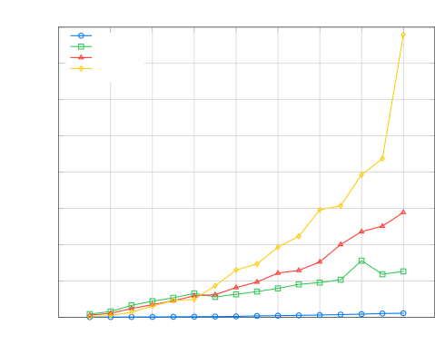
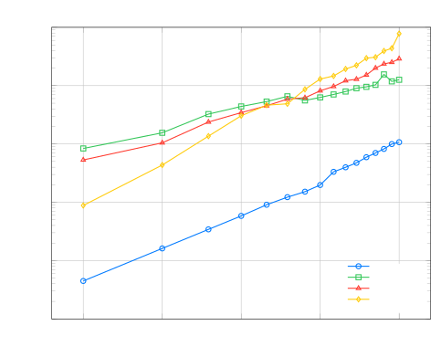

# Super Monotonic Alignment Search

Junhyeok Lee\sthanksWork done at Supertone Inc    Hyeongju Kim

###### Abstract

Monotonic alignment search (MAS), introduced by Glow-TTS, is one of the
most popular algorithm in text-to-speech to estimate unknown alignments
between text and speech. Since this algorithm needs to search for the
most probable alignment with dynamic programming by caching all possible
paths, the time complexity of the algorithm is $`O(T\times S)`$, where
$`T`$ is the length of text and $`S`$ is the length of speech
representation. The authors of Glow-TTS run this algorithm on CPU, and
while they mentioned it is difficult to parallelize, we found that MAS
can be parallelized in text length dimension and CPU execution consumes
an inordinate amount of time for inter-device copy. Therefore, we
implemented a Triton kernel and PyTorch JIT script to accelerate MAS on
GPU without inter-device copy. As a result, Super-MAS Triton kernel is
up to 72 times faster in the extreme-length case. The code is available
at
[https://github.com/supertone-inc/super-monotonic-align](https://github.com/supertone-inc/super-monotonic-align).

###### Index Terms: 

GPU Kernel Optimization, Text-Speech Alignment, Dynamic Programming,
Triton Kernel

^(†)^(†)address: ¹ Center for Language and Speech Processing, Johns
Hopkins University, Baltimore, MD, USA  
² Supertone Inc., Seoul, Republic of Korea

## 1 Introduction

GPU optimization plays a pivotal role in advancing modern speech
processing and text-to-speech (TTS) systems, where large-scale models
and real-time requirements demand considerable computational power and
memory efficiency. Popular frameworks such as PyTorch \[14\] facilitate
rapid prototyping, and emerging tools like torch.compile further
accelerate workflows by capturing model graphs for optimized
execution.To further increase efficiency, developers leverage CUDA
\[12\] for low-level parallelization, as well as Triton-Lang \[15\] to
write custom GPU kernels in a more flexible manner. Techniques like
FlashAttention \[6, 7\] exemplify specialized kernel optimizations that
reduce memory overhead and accelerate attention modules in
Transformer-based architectures \[16\], a common backbone for speech
recognition and TTS tasks. Despite these advances, the inherent
variability in the lengths of speech and text sequences during TTS
training poses unique challenges for dynamic-length data. In particular,
static graph optimization via compilation typically manages
dynamic-length data by padding sequences to fixed sizes, which is
commonly powers of two, to reduce the number of total required
compilations. However, this approach is not suitable for TTS, where
variability along two dimensions can lead to a number of compilations
that exceeds the available cache size or force inefficient heavy zero
paddings.

Monotonic alignment search (MAS) is an algorithm introduced by Kim et
al. \[9\], which is applied to estimate unknown alignments between text
and speech in a self-supervised manner. Since this algorithm only needs
text and speech pairs, many non-autoregressive TTS models are utilizing
MAS during training \[9, 10, 11, 17\]. While original MAS utilized mel
spectrogram, there are other studies \[11, 17\] utilizing Yingram \[2\]
or NANSY feature \[3\] to MAS, we use the term speech representation
instead of mel spectrogram. Since this algorithm needs to search for the
most probable alignment with dynamic programming by caching all paths,
the time complexity of the algorithm is $`O(T\times S)`$, where $`T`$ is
the length of text and $`S`$ is the length of speech representation.
Official implementation of MAS¹¹ 1
https://github.com/jaywalnut310/glow-tts is implemented with Cython
\[1\] and calculated on CPU with nested loops, while the authors
mentioned it is difficult to parallelize. However, we found that MAS can
be parallelized in text length dimension and CPU execution is needed to
copy large-size tensors between CPU and GPU, which consumes an
inordinate amount of time. Furthermore, since MAS is computed at every
training iteration, it can become a significant bottleneck when training
with long text and speech inputs. Therefore, we implemented MAS with
Triton kernel \[15\] and PyTorch JIT script \[14\] to accelerate MAS on
GPU without the nested loops and inter-device copy. Finally, Super-MAS
Triton kernel is at least 19 times faster and up to 72 times faster than
the original Cython implementation.

Figure 1: Top Left: Memory hierarchy with bandwidth & memory size of
Ampere architecture-based GPUs \[4, 5, 6\]. Top Right: Cython
implementation of MAS including nested loops and inter-device copy.
Bottom: Triton kernel implementation of MAS without nested loops or
inter-device copy. The x-axis represents the speech length domain, while
the y-axis represents the text length domain. Black block refers to the
maximum negative value. The batch domain is not included for simplicity
since both implementations run it in parallel.

## 2 Monotonic Alignment Search

The original MAS calculation employs CPU executed nested loops as shown
in Algorithm 1. According to the Kim et al. \[9\], the procedure has a
time complexity of $`O(T\times S)`$. Although the algorithm is not well
suited to parallelization, it remains fast enough to run entirely on the
CPU, requiring less than 20 ms per iteration—under 2 % of the total
training time. Moreover, MAS is only needed during training because the
duration predictor provides the alignment at inference.

Despite these observations, our investigation uncovered several issues
with the existing MAS implementation that warrant further discussion:

1.  1.  MAS can be parallelized in the text length dimension, while the
        original implementation uses nested loops.
2.  2.  CPU execution consumes an inordinate amount of time for large inputs
        due to the need to copy large tensors between CPU and GPU.
3.  3.  The time proportion spent on MAS increases as the length of the
        input text–speech pairs grows.
4.  4.  The hard-coded value of max_neg_val at -1e9 is insufficient to
        prevent alignment mismatches.

As mentioned in the introduction, the nested loops in the original MAS
can be eliminated by parallelizing along the text length dimension,
which corresponds to the inner loop. Algorithm 2 presents a parallelized
version of MAS. In the original implementation, the forward loop
iterates over $`j`$ from 2 to $`S`$ (outer loop) and $`i`$ from 2 to
$`T`$ (inner loop). Since the iterations in the inner loop are
independent, they can be vectorization through text length dimension for
the parallel execution. With this parallelization, contrary to the
statement from Glow-TTS, GPU computation becomes more efficient than CPU
computation. For brevity, $`q_{i,j}`$ denotes the log-likelihood matrix
rather than $`\log\mathcal{N}(z_{j};\mu_{i},\sigma_{i})`$. In addition,
inspired by FlashAttention \[6\], we perform the computation inplace by
using the same memory location in $`q`$, thereby preventing the
allocation of new memory for the large intermediate tensors $`Q`$. We
implement this parallelized MAS in two frameworks to calculate on GPU,
Triton-Lang \[15\] and PyTorch JIT script \[14\]. Similar to the
original implementation, the output alignment sizes of all
implementations remain identical to the input log-likelihood sizes.

Although the MAS algorithm specifies masking certain values to negative
infinity, the original implementation uses a hard-coded value of
max_neg_val set to $`-1\times 10^{9}`$. While this could be replaced by
infinity using -torch.inf in PyTorch or Triton, practical difficulties
arise in Cython. Consequently, we opted to use a larger value for
max_neg_val, specifically $`-1\times 10^{32}`$, for all implementations.

### 2.1 Triton Kernel

Figure 1 provides a detailed illustration of how the Triton kernel
calculates MAS. In contrast to the Cython implementation, which
parallelizes the batch dimension using a parallel for loop prange,
Triton parallelizes the computation via a batch dimension–wise grid.
Because Triton requires the calculation block size to be a power of 2,
we set it to the smallest power of 2 greater than $`T`$ and mask any
excluded region using the constant max_neg_val. The described algorithm
is accelerated through Triton’s just-in-time (JIT) compilation, which
optimizes the execution at runtime. We named this optimized kernel
Super-MAS.

While the Triton kernel loads the block from GPU DRAM (HBM or GDDR) to
GPU SRAM (L1 or L2 cache), it also has the capability to mask a region
by assigning a specific value. Therefore, unlike the Cython
implementation, which starts with complex initialization by computing
the cumulative sum for the first row and column, the Triton kernel only
requires initializing the first column, thereby simplifying the
initialization process.

Input: log-likelihood matrix $`q_{1:T,1:S}`$, the speech representation
length $`S`$, the text length $`T`$

Output: monotonic alignment $`A^{*}`$

Initialize $`Q_{1:T,1:S}\leftarrow-\infty`$, a cache to store the
maximum log-likelihood calculations

Compute the first row $`Q_{1,j}\leftarrow\sum_{k=1}^{j}{q_{i,k}}`$, for
all $`j`$

for $`j=2`$ to $`S`$ do

  for $`i=2`$ to $`\min(j,T)`$ do

   $`Q_{i,j}\leftarrow\max(Q_{i-1,j-1},Q_{i,j-1})+q_{i,j}`$

  end for

end for

Initialize $`A^{*}(S)\leftarrow T`$

for $`j=S-1`$ to $`1`$ do

  $`A^{*}(j)\leftarrow\mathrm{argmax}_{i\in\{A^{*}(j+1)-1,A^{*}(j+1)\}}Q_{i,j}`$

end for

Algorithm 1 Original Monotonic Alignment Search

A forward loop iterates over each column $`j`$ of the log-likelihood
matrix, starting from the second column. In each iteration, the function
loads log-likelihood block from the current text position, denoted as
$`q_{1:T,j-1}`$, as well as from the previous text position, represented
by $`q_{0:T-1,j-1}`$, effectively processing block of data concurrently.
These blocks are then compared in element-wise, and the current block
$`q_{1:T,j}`$ is updated inplace by adding the maximum of the two values
to the corresponding element in the log-likelihood matrix, thereby
computing the maximum likelihood for reaching that positions. By
processing data in blocks, the algorithm eliminates the inner loop and
achieves the same computation more efficiently by parallelization.

Instead of original implementation allocates cumulative log-likelihood
matrix separately to $`Q_{1:T,1:S}`$, we update it directly to
$`q_{1:T,1:S}`$ to reduce overhead caused by additional memory
allocation. Similarly, to reduce additional memory allocation for
alignment, we initially implemented a kernel to store a path matrix
$`A^{*}`$ directly to $`q`$, we discovered that this approach is slow
especially due to overwriting all values with zeros in certain regions.
This kernel resulted in significantly slower performance compared to our
optimized implementation, so we held additional memory allocation for
$`A^{*}`$ at the beginning and initialize it with zeros.

A backward loop iterates over each column $`j`$ to reconstruct the
maximum path $`A^{*}`$. To update only the alignment
$`A*(j)\leftarrow\mathrm{argmax}_{i\in\{A^{*}(j+1)-1,A^{*}(j+1)\}}q_{i,j}`$,
we initialize the maximum path matrix $`A^{*}(j)\in\mathbb{R}^{T,S}`$ as
a full zero matrix. The function then updates the path matrix by marking
the elements along the maximum path based on comparisons between the
left and those diagonally left-down in the value matrix.

The algorithm efficiently computes the maximum path by using
parallelization to improve computational speed, leveraging the GPU’s
capabilities. Since the Triton kernel reuses the memory space of the
given log-likelihood matrix by in-place computation, no additional
memory is allocated and no memory overhead occurs. Furthermore, unlike
the original Cython implementation, Super-MAS does not involve any
inter-device communication between CPU and GPU memory.

|           | 128     | 256     | 384     | 512     | 640     | 768    | 896    | 1024    | 1152    | 1280    | 1408    | 1536    | 1664    | 1792    | 1920    | 2048   |
| --------- | ------- | ------- | ------- | ------- | ------- | ------ | ------ | ------- | ------- | ------- | ------- | ------- | ------- | ------- | ------- | ------ |
| Super-MAS | 00.4475 | 001.617 | 003.430 | 005.839 | 009.071 | 012.25 | 015.20 | 0019.78 | 0033.28 | 0039.80 | 0047.46 | 0059.24 | 0070.07 | 0082.21 | 0099.63 | 0107.2 |
| JIT_v1    | 83.74   | 155.4   | 325.3   | 440.0   | 532.9   | 656.0  | 558.0  | 0628.0  | 0706.0  | 0792.9  | 0903.8  | 0953.9  | 1031.   | 1558.   | 1183.   | 1262.  |
| JIT_v2    | 53.22   | 104.6   | 237.8   | 344.7   | 452.1   | 587.2  | 620.1  | 0815.9  | 0968.5  | 1215\.  | 1290\.  | 1524\.  | 2004\.  | 2359\.  | 2512\.  | 2890\. |
| Cython    | 08.819  | 043.53  | 136.3   | 305.0   | 462.4   | 488.2  | 863.9  | 1299\.  | 1467\.  | 1930\.  | 2232\.  | 2959\.  | 3074\.  | 3931\.  | 4374\.  | 7793\. |

Table 1: MAS execution times (ms). The fastest execution time is
highlighted in bold, while the second fastest is underlined.

Figure 2: MAS benchmark results in linear scale (left) and log scale
(right). The batch size is fixed as 32, and the speech length is set to
four times of text length.

### 2.2 PyTorch JIT Script

PyTorch also provides a JIT compiler called TorchScript, which returns
the Script function \[14\]. With PyTorch JIT Script, we implement
parallelized MAS in two versions, while writing to the path tensor is
slower in small tensor size. Different from Triton and Cython
implementation, they calculate batch dimensions together as a
parallelization.

Input: log-likelihood matrix $`q_{1:T,1:S}`$, the speech representation
length $`S`$, the text length $`T`$

Output: monotonic alignment $`A^{*}`$

Initialize the first column $`q_{2:S,1}\leftarrow-\infty`$, as each text
segment should correspond to at least one speech representation.

$`q_{0,1:S}\leftarrow-\infty`$ (omitted in Triton)

for $`j=2`$ to $`S`$ do

  Inner for loop has been replaced by parallel processing

  $`q_{1:T,j}\leftarrow\max(q_{0:T-1,j-1},q_{1:T,j-1})+q_{1:T,j}`$

end for

Initialize $`A^{*}(S)\leftarrow T`$

for $`j=S-1`$ to $`1`$ do

  $`A^{*}(j)\leftarrow\mathrm{argmax}_{i\in\{A^{*}(j+1)-1,A^{*}(j+1)\}}q_{i,j}`$

end for

Algorithm 2 Parallelized Monotonic Alignment Search

Unlike the Triton kernel, during the forward loop, the JIT scripts slice
the $`j`$th column from $`q`$ as $`q_{1:T,j}`$, and use torch.roll to
shift the index and masking first index to the maximum negative value.
JIT_v1 is fully computed with pytorch tensor on the GPU, while JIT_v2
calculates the forward loop on the GPU, copy it to the CPU, backward
loop on CPU, and sends the result to the GPU. Both versions share the
same forward loop and differ only in the implementation of the backward
loop.

Recently, PyTorch has supported static graph compilation for dynamic
shapes \[8\]. However, applying multiple static graph compilations is
challenging for TTS tasks, as both the text length and the speech length
vary. Therefore, we did not attempt a compiled implementation in our
experiments.

## 3 Experiments

To evaluate the performance of our Super-MAS kernel and JIT scripts, we
run benchmarks in the identical system. The benchmark was run on a
system with Intel Xeon Gold 6226R CPU and NVIDIA RTX 3090 GPU. The
implementation requires PyTorch, tested with version torch==2.3.0+cu121,
Triton-Lang, tested with version triton==2.3.0, and Cython, tested with
version Cython==0.29.36.

During the benchmark, we generate a random log-likelihood tensor of size
$`[B,T,S]`$, where $`B`$ is the batch size, $`T`$ is the text length,
and $`S`$ is the speech length. We fix $`B`$ to 32, and $`S`$ to four
times $`T`$ from the static of LibriTTS dataset. This constraints make
$`T`$ being the only variable during the benchmark, and the time
complexity of the algorithm to $`O(T^{2})`$. The benchmark was conducted
using Triton’s triton.testing.perf_report. For each test, we warm up the
system with 25 steps and then measure the average time over 500
repetitions. Please refer to [our GitHub
repository](https://github.com/supertone-inc/super-monotonic-align) for
the detailed setup and benchmark processes.

## 4 Results

Table 1 and Figure 2 illustrate the execution time results obtained from
the benchmark. The Super-MAS Triton implementation demonstrates a
remarkable performance improvement by being at least 19 times faster,
and in extremely long cases, up to 72 times faster than the Cython
implementation. This substantial speedup is achieved through an
optimized kernel design that parallelization of the algorithm,
efficiently reuses the memory space of the provided log-likelihood
matrix, thereby eliminating unnecessary memory allocation and overhead.

In addition to the Triton implementation, the PyTorch JIT
implementations also outperform the Cython implementation, particularly
when handling large-sized tensors. Notably, version v1 of the PyTorch
JIT implementation exhibits superior performance because it avoids any
inter-device data copying between CPU and GPU memory. This design choice
minimizes the communication overhead that can otherwise degrade
performance when processing large volumes of data.

As shown in Figure 2, other implementations exhibit fluctuating runtimes
and cannot be treated as line on the log-scale plot. However, Triton
implementations forms a straight line in the log-scale graph which is
indicating stable time expectations and minimal overhead.

Overall, these results underscore the effectiveness of our
implementations in accelerating MAS computations during TTS model
training. The significant reduction in execution time not only enhances
computational efficiency but also contributes to a considerable decrease
in overall training time, which is especially beneficial given that TTS
models are typically almost millions of iterations.

For a rough estimation, consider Glow-TTS, which is trained on LibriTTS
\[18\] and uses the same batch size as our benchmark \[9\]. According to
Kim et al. \[9\], the MAS computation in Glow-TTS takes less than 20 ms.
Assuming that the average iteration involves cases where $`128<T<256`$,
and given that the maximum text length is reported as 190 characters
\[9\], we can derive an upper bound for the MAS time difference as 20
ms - 1.617 ms = 18.383 ms. Since the multi-speaker model was trained for
960k steps, this results in a total time saving of approximately less
than 4.4 hours in 12 days, which corresponds to reduce 1.5% of total
training time. Since this calculation is based on a subset of the
LibriTTS dataset containing samples with text lengths shorter than 190
characters, the estimated time savings are reflective of performance on
relatively short sequences. In practice, when our method is applied to
longer speech datasets that include extended text sequences, such as
LibriSpeech-Long \[13\], the computational load increases as quadratic
scales, leading to significantly greater time savings due to the higher
overhead associated with processing longer inputs.

## 5 Conclusion

In this paper, we implemented parallelized MAS in multiple frameworks
and versions. Our Super-MAS Triton kernel shows the best time, achieving
at least 19 times faster and up to 72 times performance than the
original Cython implementation. Since MAS is computed at every iteration
on-the-fly during TTS model training, which typically involves almost 1
M steps, this kernel can reduce the overall training by at least 1.5 %.
This result underscore the critical role of GPU-level optimization in
modern speech and TTS systems, where even seemingly small computation
components can become bottlenecks without careful kernel design. Our
kernel, which is focused solely on optimizing MAS, does not currently
incorporate kernel fusion techniques for calculating the log-likelihood
or for multiplying the MAS path with the text to generate the aligned
text-grid. Therefore, there remains significant potential for further
optimizing the training process of TTS models by leveraging MAS. We
believe this work can be utilized in various applications, including
future non-autoregressive TTS models, alignment estimation for automatic
speech recognition models, and other scenarios requiring monotonic
alignment.

## References

- \[1\] S. Behnel, R. Bradshaw, C. Citro, L. Dalcin, D. S. Seljebotn,
  and K. Smith (2011) Cython: the best of both worlds. Computing in
  Science & Engineering 13 (2), pp. 31–39. Cited by: §1.
- \[2\] H. Choi, J. Lee, W. Kim, J. H. Lee, H. Heo, and K. Lee (2021)
  Neural Analysis and Synthesis: Reconstructing Speech from
  Self-Supervised Representations. In NeurIPS, Cited by: §1.
- \[3\] H. Choi, J. Yang, J. Lee, and H. Kim (2023) NANSY++: unified
  voice synthesis with neural analysis and synthesis. In ICLR, Cited by:
  §1.
- \[4\] N. Corporation (2020) NVIDIA a100 tensor core gpu architecture.
  Note:
  [https://images.nvidia.com/aem-dam/en-zz/Solutions/data-center/nvidia-ampere-architecture-whitepaper.pdf](https://images.nvidia.com/aem-dam/en-zz/Solutions/data-center/nvidia-ampere-architecture-whitepaper.pdf)
  Cited by: Figure 1, Figure 1.
- \[5\] N. Corporation (2020) NVIDIA ampere ga102 gpu architecture.
  Note:
  [https://www.nvidia.com/content/PDF/nvidia-ampere-ga-102-gpu-architecture-whitepaper-v2.pdf](https://www.nvidia.com/content/PDF/nvidia-ampere-ga-102-gpu-architecture-whitepaper-v2.pdf)
  Cited by: Figure 1, Figure 1.
- \[6\] T. Dao, D. Fu, S. Ermon, A. Rudra, and C. Ré (2022)
  FlashAttention: fast and memory-efficient exact attention with
  io-awareness. In NeurIPS, Vol. 35, pp. 16344–16359. Cited by: Figure
  1, Figure 1, §1, §2.
- \[7\] T. Dao (2024) FlashAttention-2: faster attention with better
  parallelism and work partitioning. In ICLR, External Links:
  [Link](https://openreview.net/forum?id=mZn2Xyh9Ec) Cited by: §1.
- \[8\] P. Docs (2024) Dynamic shapes. External Links:
  [Link](https://pytorch.org/docs/stable/torch.compiler_dynamic_shapes.html)
  Cited by: §2.2.
- \[9\] J. Kim, S. Kim, J. Kong, and S. Yoon (2020) Glow-TTS: A
  Generative Flow for Text-to-Speech via Monotonic Alignment Search. In
  NeurIPS, Vol. 33, pp. 8067–8077. Cited by: §1, §2, §4.
- \[10\] J. Kim, J. Kong, and J. Son (2021) Conditional Variational
  Autoencoder with Adversarial Learning for End-to-End Text-to-Speech.
  In ICML, pp. 5530–5540. Cited by: §1.
- \[11\] J. Lee, W. Jung, H. Cho, J. Kim, and J. Kim (2023) PITS:
  variational pitch inference without fundamental frequency for
  end-to-end pitch-controllable TTS. In ICML 2023 Workshop on Structured
  Probabilistic Inference & Generative Modeling, Cited by: §1.
- \[12\] NVIDIA, P. Vingelmann, and F. H.P. Fitzek (2020) CUDA, release:
  10.2.89. External Links:
  [Link](https://developer.nvidia.com/cuda-toolkit) Cited by: §1.
- \[13\] S. J. Park, J. Salazar, A. Jansen, K. Kinoshita, Y. M. Ro,
  and R. J. Skerry-Ryan (2024) Long-form speech generation with spoken
  language models. CoRR abs/2412.18603. Cited by: §4.
- \[14\] A. Paszke, S. Gross, F. Massa, A. Lerer, J. Bradbury, G.
  Chanan, T. Killeen, Z. Lin, N. Gimelshein, L. Antiga, A. Desmaison, A.
  Köpf, E. Yang, Z. DeVito, M. Raison, A. Tejani, S. Chilamkurthy, B.
  Steiner, L. Fang, J. Bai, and S. Chintala (2019) PyTorch: an
  imperative style, high-performance deep learning library. In NeurIPS,
  Cited by: §1, §1, §2.2, §2.
- \[15\] P. Tillet, H. T. Kung, and D. Cox (2019) Triton: an
  intermediate language and compiler for tiled neural network
  computations. In Proceedings of the 3rd ACM SIGPLAN International
  Workshop on Machine Learning and Programming Languages, MAPL 2019,
  pp. 10–19. Cited by: §1, §1, §2.
- \[16\] A. Vaswani, N. Shazeer, N. Parmar, J. Uszkoreit, L.
  Jones, A. N. Gomez, L. Kaiser, and I. Polosukhin (2017) Attention is
  all you need. In NeurIPS, Vol. 30, pp. . Cited by: §1.
- \[17\] J. Yang, J. Lee, H. Choi, S. Ji, H. Kim, and J. Lee (2024)
  DualSpeech: Enhancing Speaker-Fidelity and Text-Intelligibility
  Through Dual Classifier-Free Guidance. In Interspeech 2024,
  pp. 4423–4427. External Links:
  [Document](https://dx.doi.org/10.21437/Interspeech.2024-2005) Cited
  by: §1.
- \[18\] H. Zen, V. Dang, R. Clark, Y. Zhang, R. J. Weiss, Y. Jia, Z.
  Chen, and Y. Wu (2019) LibriTTS: A Corpus Derived from LibriSpeech for
  Text-to-Speech. In Proc. Interspeech, pp. 1526–1530. External Links:
  [Document](https://dx.doi.org/10.21437/Interspeech.2019-2441) Cited
  by: §4.
