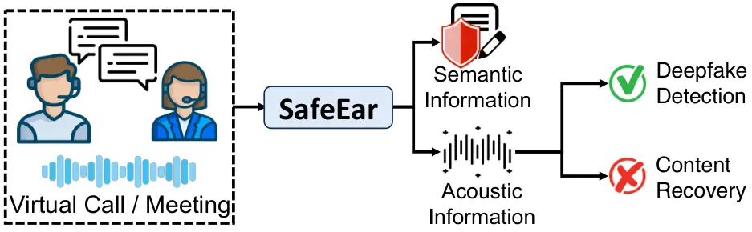
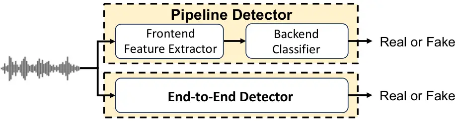
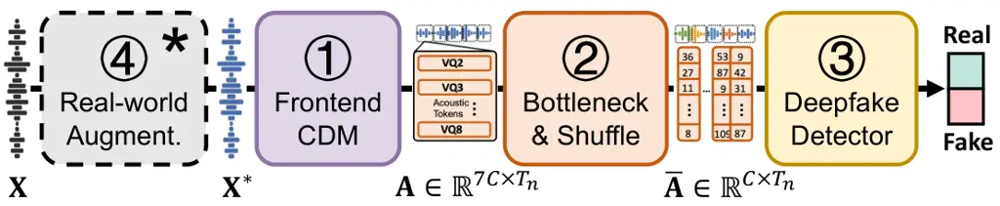
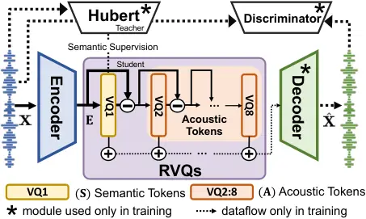
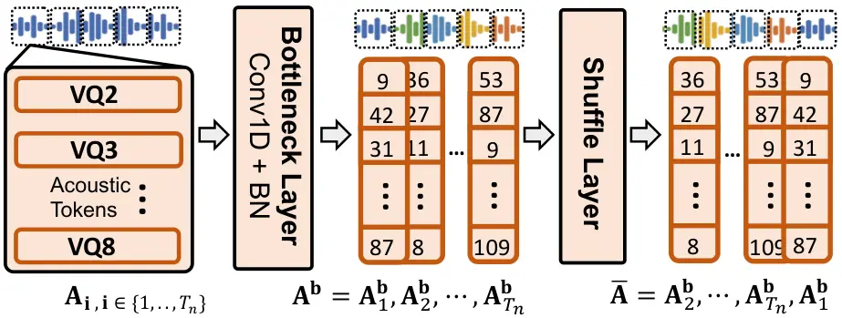
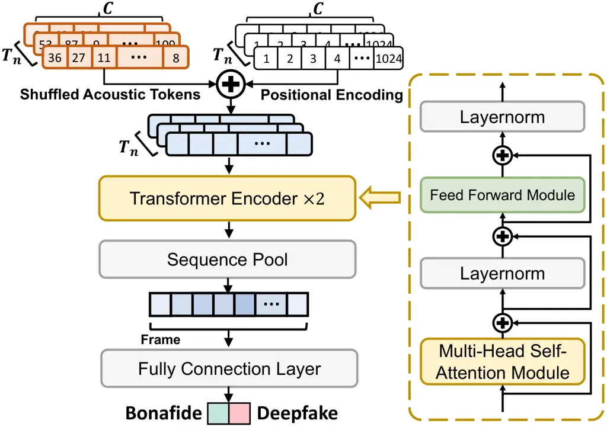

# SafeEar: Content Privacy-Preserving Audio Deepfake Detection

Conference: Proceedings of the 2024 ACM SIGSAC Conference on Computer
and Communications Security; October 14–18, 2024; Salt Lake City, UT,
USA.Proceedings of the 2024 ACM SIGSAC Conference on Computer and
Communications Security (CCS ’24), October 14–18, 2024, Salt Lake City,
UT,
USAISBN: 979-8-4007-0636-3/24/10DOI: [10.1145/3658644.3670285](https://doi.org/)CCS: Computing
methodologies Artificial intelligenceCCS: Security and privacy Usability
in security and privacy

Xinfeng Li Note: Equal Contribution. Affiliation: Zhejiang University,
HangZhou, Zhejiang, China, 310058 email: [xinfengli@zju.edu.cn](mailto:)
, Kai Li Affiliation:  Tsinghua University, Beijing, China email:
[tsinghua.kaili@gmail.com](mailto:) , Yifan Zheng Affiliation:  Zhejiang
University, HangZhou, Zhejiang, China, 310058 email:
[zhengyf@zju.edu.cn](mailto:) , Chen Yan Note: Chen Yan is the
Corresponding Author. Affiliation:  Zhejiang University, HangZhou,
Zhejiang, China, 310058 email: [yanchen@zju.edu.cn](mailto:) , Xiaoyu Ji
Affiliation: Zhejiang University, HangZhou, Zhejiang, China, 310058
email: [xji@zju.edu.cn](mailto:) and Wenyuan Xu Affiliation: Zhejiang
University, HangZhou, Zhejiang, China, 310058 email:
[wyxu@zju.edu.cn](mailto:)

© rightsretained

###### Abstract.

Text-to-Speech (TTS) and Voice Conversion (VC) models have exhibited
remarkable performance in generating realistic and natural audio.
However, their dark side, audio deepfake poses a significant threat to
both society and individuals. Existing countermeasures largely focus on
determining the genuineness of speech based on complete original audio
recordings, which however often contain private content. This oversight
may refrain deepfake detection from many applications, particularly in
scenarios involving sensitive information like business secrets. In this
paper, we propose SafeEar, a novel framework that aims to detect
deepfake audios without relying on accessing the speech content within.
Our key idea is to devise a neural audio codec into a novel decoupling
model that well separates the semantic and acoustic information from
audio samples, and only use the acoustic information (e.g., prosody and
timbre) for deepfake detection. In this way, no semantic content will be
exposed to the detector. To overcome the challenge of identifying
diverse deepfake audio without semantic clues, we enhance our deepfake
detector with real-world codec augmentation. Extensive experiments
conducted on four benchmark datasets demonstrate SafeEar’s effectiveness
in detecting various deepfake techniques with an equal error rate (EER)
down to 2.02%. Simultaneously, it shields five-language speech content
from being deciphered by both machine and human auditory analysis,
demonstrated by word error rates (WERs) all above 93.93% and our user
study. Furthermore, our benchmark constructed for anti-deepfake and
anti-content recovery evaluation helps provide a basis for future
research in the realms of audio privacy preservation and deepfake
detection.

###### Keywords: 

Privacy Preservation; Audio Deepfake Detection

## 1. Introduction

Recent advances in text-to-speech (TTS) and voice conversion (VC)
technologies have enabled the generation of highly realistic and
natural-sounding speech, imitating specific individuals saying things
they never actually said. However, such technologies have been misused
to create audio deepfakes, posing significant security threats. For
instance, deepfakes disseminated on the Internet can manipulate public
opinion, serving purposes like propaganda, defamation, or
terrorism (Suwajanakorn et al., 2017; Meaker, 2023). Besides, audio
deepfake fraud in calls and virtual meetings, including a notable UK
case where \$35 million was stolen using a cloned CEO’s voice (Brewster,
2022), has financially affected 7. 7% individuals, according to a 2023
McAfee survey (McAfee, 2023). These have spurred the development of
diverse audio deepfake detection models, designed to discern synthetic
from genuine voices and promptly alert potential victims. However,
existing works (Jung et al., 2022; Tak et al., 2021; Liu et al., 2023a;
Wang and Yamagishi, 2021; challenge organizers, 2021) typically take
audio waveforms or spectral features (e.g., LFCC (Pal et al., 2022)) as
inputs, which require accessing complete speech information. These
approaches, while efficient, raise substantial privacy concerns due to
the potential exposure of private speech content, particularly in
virtual communications that involve user privacy like business secrets
or medical conditions (Haselton, 2019). Thus, despite current detectors’
utility in thwarting deepfakes, there is natural hesitancy in using them
due to the risk of content leakage.



Figure 1. SafeEar framework decouples speech samples into semantic and
acoustic information. By using acoustic-only information, SafeEar
achieves reliable deepfake detection while protecting user content
privacy from recovery attacks.

In this paper, we introduce SafeEar ¹¹ 1 Our demo, code, and dataset are
available on
[https://SafeEarWeb.github.io/Project/](https://SafeEarWeb.github.io/Project/).,
a novel framework designed to effectively detect audio deepfakes while
preserving content privacy. As shown in Figure 1, the key idea of
SafeEar is to decouple speech into semantic and acoustic information.
This approach enables reliable deepfake detection using processed
acoustic information while preventing potential adversaries from
accessing the semantic content, even if they employ advanced automatic
speech recognition (ASR) models or human auditory analysis. Thus,
SafeEar is particularly suited for third-party audio service scenarios
where an honest-but-curious server might offer reliable deepfake
detection service, yet unethically eavesdrops user speech content. For
detection services operated on trusted local devices, the SafeEar
framework also provides an extra layer of protection for user privacy.

To our knowledge, this is the first work to develop a content
privacy-preserving audio deepfake detection framework. SafeEar is
inspired by the intuition that audio deepfakes aim to replicate a
speaker’s timbre and prosody disregarding the speech content. In
contrast, speech recognition systems focus on extracting semantic
content, independent of the speaker-related features. This dichotomy
indicates that these two tasks may rely on mutually independent
features, suggesting the potential for designing an effective audio
deepfake detector analyzing only acoustic information without exposing
semantic content. However, materializing SafeEar is challenging in two
aspects.

How to protect content privacy from recovery by adversaries? SafeEar
aims to safeguard speech content privacy against both machine-based and
human auditory analysis. Prior works using adversarial examples (Carlini
and Wagner, 2018; Li et al., 2023c; Zheng et al., 2023) for ASR model
disruption have shown limited effectiveness against human listeners.
SafeEar tackles this by decoupling speech into semantic and acoustic
tokens and provides only acoustic tokens to the detector, where tokens
mean the discrete representations of information (van den Oord et al.,
2017). Consequently, although content recovery adversaries can receive a
series of acoustic tokens, the lack of semantic clues hinder their
recovery of understandable content. This approach, along with randomly
shuffling the acoustic tokens, further obfuscates the contextual
patterns that both machine-based and human auditory analysis rely on for
content comprehension (Li et al., 2023a). SafeEar also defends against a
range of adversaries who might use decoders to transform acoustic tokens
into speech waveforms and analyze them.

How to deliver accurate deepfake detection merely based on acoustic
tokens? The challenge lies in the absence of semantic information and
the disrupted acoustic patterns (e.g., timbre and prosody) due to
shuffling. These content protection strategies may complicate the
identification of clues necessary to differentiate genuine from
synthetic audio. We address this by developing a Transformer-based
detector and identifying its optimal number of multi-head self-attention
(MHSA) (Vaswani et al., 2017) for processing acoustic-only inputs. This
adaptation allows the deepfake detector to better capture dynamic
spatial weighting and local-global feature interactions. Additionally,
deepfakes can occur across various communication platforms, which can
degrade the deepfake-and-genuine gap due to the effects of codec
compression like G.722 (Mermelstein, 1988) and OPUS (Valin et al., 2012)
during audio transmission. To address this, we strategically integrate
several representative codecs into our training pipeline to counteract
the disruptive effects of codecs, ensuring SafeEar’s accuracy and
reliability across diverse real-world scenarios.

We construct a comprehensive benchmark to compare the performance of
SafeEar and other systems in deepfake detection and content privacy
protection. This benchmark comprises four datasets, including three
standard datasets—ASVspoof 2019 (Wang et al., 2020), ASVspoof
2021 (Yamagishi et al., 2021) for deepfake detection,
Librispeech (Panayotov et al., 2015) for content protection, and
CVoiceFake we established for both aspects. CVoiceFake is a multilingual
deepfake dataset sourced from the CommonVoice dataset (Ardila et al., 2020) with over 1.25 million bonafide and deepfake voice samples in five
languages. CVoiceFake also includes ground-truth textual transcriptions,
making it also an ideal benchmark against content recovery attacks. To
our knowledge, CVoiceFake fills the gap in cross-language deepfake
datasets (Yi et al., 2023), and we hope it can serve as a basis to
assist future research in this area.

Based on the above benchmark datasets, our extensive experiments focus
on two critical tasks: deepfake detection and content protection. For
the deepfake detection task, we benchmark SafeEar against eight baseline
detectors across three deepfake datasets, which feature a variety of
deepfake speech samples generated using popular TTS and VC technologies.
Specifically, SafeEar achieves comparable performance with top-tier
deepfake detectors based solely on acoustic information, with an optimal
equal error rate (EER) as low as 2.02%. Regarding the content protection
task, we evaluate SafeEar’s efficacy against three levels of content
recovery adversaries: naive (CRA1), knowledgeable (CRA2), and adaptive
(CRA3), thwarting all content recovery attempts with word error rates
(WERs) above 93.93%. SafeEar also demonstrates robustness in
safeguarding speech content in English and four extra unseen languages,
suggesting its potential for wider application. The benchmark and
experiment audio samples can be found on our demo website (saf, 2024).

Summary of Contributions. Our technical and experimental contributions
are as follows:

- $`\bullet`$
  To our knowledge, we make the first attempt to investigate and
  validate the feasibility of achieving audio deepfake detection while
  preserving speech content privacy.
- $`\bullet`$
  We propose SafeEar, a novel privacy-preserving deepfake detection
  framework that devises a neural audio codec into a semantic-acoustic
  information decoupling model, ensuring content privacy. We further
  develop an advanced detector that achieves effective deepfake
  detection with only acoustic information.
- $`\bullet`$
  We construct CVoiceFake and establish a comprehensive benchmark
  focusing on the deepfake detection and content privacy preservation
  tasks. Our experiments demonstrate the effectiveness of SafeEar in
  detecting deepfake audio under various impact factors and in thwarting
  multiple content recovery attacks.

## 2. Background

### 2.1. Audio Deepfake Generation

Deepfake audios are generated using either text-to-speech (TTS) or voice
conversion (VC), where the deployment of deep neural networks (DNN)
gradually becomes a dominant method that achieves much better voice
quality.

Text-to-Speech: TTS has a long history and recently advances remarkably
due to the evolution of deep learning techniques (Zen et al., 2013; Fan
et al., 2014; Li et al., 2019). A typical TTS system can be decomposed
into three main components: (1) A frontend text analysis module (Tan
et al., 2021) that converts character into phoneme or linguistic
features; (2) An acoustic model (Ren et al., 2019; Li et al., 2019;
Chunhui et al., 2023) that generates speech features such as Mel filter
banks (FBank) or Mel-frequency cepstrum coefficient (MFCC), from either
linguistic features or characters/phonemes; (3) A vocoder model (Morise
et al., 2016; Griffin and Lim, 1984; Kumar et al., 2019; Wang et al., 2022) that generates waveform from either linguistic features or
acoustic features. Additionally, recent progress such as fully
end-to-end models (Ren et al., 2021; Kim et al., 2021) that directly
convert characters/phonemes into waveform, are able to generate high
quality audio even close to the human level.

Voice Conversion: VC aims to change some properties of speech, such as
speaker identity, emotion, and accents, while reserving the semantic
content (Sisman et al., 2021). Unlike TTS, the inputs to the VC system
is another audio waveform instead of text. VC systems can be roughly
categorized into two types regarding the requirement of training data:
(1) parallel training data systems require the speech of the same
semantic content to be available from both source and target
speakers (Tian et al., 2017); (2) non-parallel training data systems
reduce the difficulty of data collection, as no parallel training data
is needed. In this scenario, a trainable module designed for
disentangling speaker-related features from speech features (Kaneko and
Kameoka, 2017) is necessary to extract pure semantic information, which
can be composed with the identity information of other speakers to
realize voice conversion.

### 2.2. Audio Deepfake Detection

Audio deepfake detection is a critical machine learning task that
focuses on identifying real utterances from fake ones. An increasing
number of attempts (Yi et al., 2023; Jung et al., 2022; Tak et al., 2021) have been made to further the development of audio deepfake
detection. As shown in Figure 2, existing mainstream studies on audio
deepfake detection can be categorized into two types of solutions:
pipeline detector and end-to-end detector. The pipeline solution (Pal
et al., 2022; Wang and Yamagishi, 2021; challenge organizers, 2021; Zeng
et al., 2022), consisting of a frontend feature extractor and backend
classifier is well established. It extracts spectral features like MFCC
and LFCC (Pal et al., 2022; Wang and Yamagishi, 2021), or token-level
Wav2Vec2 features (Xie et al., 2021). In recent years, end-to-end
approaches (Jung et al., 2022; Tak et al., 2021; Zeng et al., 2024) have
attracted more and more attention, which integrates the feature
extraction and classification into a single model. This unified approach
optimizes the model using raw audio waveforms alongside corresponding
real-or-fake labels. SafeEar lies in the pipeline detector group, which
fills a gap in privacy-preserving deepfake detection methods.



Figure 2. Mainstream solutions on audio deepfake detection: pipeline and
end-to-end detector.

### 2.3. Speech Representation Decoupling

Speech information can be roughly decomposed into three components:
content, speaker, and prosody (Liu et al., 2023b). Content is semantic
information, which can be expressed using text or phonemes. Speaker and
prosody features constitute the acoustic information. The former
reflects speaker’s characteristics such as timbre and volume, while
prosody involves intonation, stress, and rhythm of speech, reflecting
how the speaker says the content. Prior speech representation
disentanglement methods mostly leverage a dual-encoder strategy (Qian
et al., 2019), where speech is fed into parallel content and speaker
encoders to obtain distinct representations. However, this strategy
heavily relies on prior knowledge of given languages and speakers and
potentially overlooks certain speech information like prosody, which may
result in suboptimal decoupling, potentially leading to content leakage
or insufficient detection clues. To tackle this issue, SafeEar presents
a novel neural audio codec-based decoupling model that hierarchically
decouples speech into semantic and acoustic tokens. It enables content
privacy-preserving deepfake detection solely based on acoustic
information. In-depth details of our design are elaborated in §4.

## 3. Threat Model

In this section, we introduce the application scenarios relevant to the
SafeEar framework, and identify two malicious entities posing threats to
users, i.e., the deepfake adversary (DA) and the content recovery
adversary (CRA).

### 3.1. Adversary Models

Application Scenarios. Third-party audio services have become popular in
the market because of their advantages in providing specialized
functionalities and flexible usage. However, the privacy concern of
sharing raw audio with a third party is one of the primary factors
preventing users from fully trusting these services, even if the service
provider claims to not collect any data. For example, a deepfake
detection service provider could be an honest-but-curious content
recovery adversary (CRA), detecting deepfake audio to alert victims
timely while unethically eavesdropping on conversation content.

The SafeEar framework is designed to relieve such privacy concerns,
especially in using third-party audio services. Its frontend decoupling
model can be examined and deployed by an entity that is already trusted
in processing the raw audio data (e.g., the user’s smartphone).
Meanwhile, the backend deepfake detector can be operated by any
untrusted entities (i.e., detection service providers). In this way,
both the detection service and potential adversaries gain access only to
the privacy-preserving acoustic tokens, rather than raw audio or
unprotected features, which could be easily exploited to recover speech
content.

Deepfake Adversary (DA). The DA’s goal is to generate audio that
convincingly impersonates real human speakers (TTS) or mimics
individuals familiar to the victim (VC). Employing sophisticated TTS and
VC models, the adversary can acquire multiple speech samples from a
target, using them for voice cloning or create realistic speech for
various roles, such as customer service representatives. Moreover, The
DA may engage in fraudulent activities on widely used instant
communication platforms globally. This introduces two primary detection
challenges: (1) Variations in audio codecs across transmission channels
can result in different degrees of compression for genuine and deepfake
voices, blurring the distinction between them. (2) Deepfake audio in
different languages may present unique detection patterns. Our work does
not consider DAs that create adversarial examples to bypass detectors,
as it is typically impractical for adversaries to gain knowledge of
proprietary, black-box detection systems. Extensive experiments on
deepfake detection using three benchmark datasets are detailed in §6.

Content Recovery Adversary (CRA). The CRA seeks to extract intelligible
speech content from the acoustic tokens decoupled and shuffled by
SafeEar. Such an adversary could be an honest-but-curious deepfake
detection service provider, with prior knowledge of SafeEar’s algorithm.
While adversaries receive only the sequences of discrete acoustic
tokens, they are capable of reconstructing this feature sequence into
speech waveforms using SafeEar’s decoder. Adversaries may also train
state-of-the-art ASR models from scratch, and utilize off-the-shelf
commercial or local ASR models, to convert the received acoustic tokens
into coherent text, or employ human auditory analysis for content
recovery. However, they cannot access semantic tokens as SafeEar does
not provide this data. We conduct a comprehensive evaluation of SafeEar
against three levels of content recovery adversaries, as elaborated in
§7.

### 3.2. Defense Goal

To address the growing concern of deepfake audio in virtual
communications, users require detectors to provide reliable alerts.
However, there is a natural hesitancy in using them due to the risk of
speech content leakage. SafeEar aims to alleviate this concern by
extracting the content-irrelevant features, which can safeguard user
content privacy while being suitable for effective detection. SafeEar’s
design shall meet two key requirements:

Deepfake Detection: The deepfake detection model in SafeEar should be
finely tuned to work with content-irrelevant features, guaranteeing
reliable and accurate detection of deepfake audio.

Content Protection: Features extracted by SafeEar should be resistant
against content recovery attempts by CRAs, regardless of whether they
employ machine-based or human auditory methods.

## 4. Design Details

### 4.1. Overview of SafeEar

Key Idea. We aim to propose a framework that achieves two seemingly
contradictory objectives: effective deepfake detection and prevention of
any attempts at content recovery. Our key idea is to design a novel
frontend feature extractor that can decompose speech information into
mutually independent discrete representations, i.e., semantic and
acoustic tokens, where only the latter being analyzed by subsequent
deepfake detectors. Such acoustic tokens can enable effective deepfake
detection, but nullify recovery attempts by both machine and human
auditory analysis.

Intuition Behind SafeEar. The idea of SafeEar is rooted in a critical
insight: audio deepfake technology primarily concentrates on capturing
the unique vocal attributes of a target speaker, such as timbre,
loudness, rhythm, and pitch, which constitute acoustic information (Liu
et al., 2023b). However, this technology typically overlooks the actual
speech content. In fact, several studies have already confirmed the
significance of acoustic features in detecting deepfake audios, e.g.,
timbre (Chaiwongyen et al., 2022), pitch and loudness (Li et al.,
2022a). In contrast, the core of speech comprehension, both in humans
and as modeled in ASR systems, lies in accurately transcribing the
semantic content, irrespective of variations in the speaker’s acoustic
patterns (Yasmin et al., 2023). The above understanding leads us to
believe that developing a deepfake audio detector merely based on
acoustic information is feasible. Acoustic information’s devoid of
semantic content exploitable by adversaries, inherently preserves
content privacy.

Challenges. To realize SafeEar, we faces two challenges. Challenge 1:
How to design a novel decoupling module that well extracts and secures
acoustic tokens, protecting speech content from recovery by machine and
human auditory analysis? Challenge 2: How to ensure reliable detection
against various real-world deepfake audio, despite relying only on
acoustic tokens?



Figure 3. Overview of the SafeEar framework. In the inference phase, we
just need to remove ④.

Methodology Outline. As shown in Figure 3, to address Challenge 1, we
carefully devise a neural codec architecture (§4.2, ① in Figure 3) to
flexibly decompose the audio signal
$`\mathbf{X}\in\mathbb{R}^{1\times T}`$ into semantic tokens
$`\mathbf{S}\in\mathbb{R}^{C\times T_{n}}`$ and acoustic tokens
$`\mathbf{A}\in\mathbb{R}^{7C\times T_{n}}`$, where $`C`$ denotes the
token dimension, and $`T`$ and $`T_{n}`$ represent the length of the
audio and token, respectively. We combine a bottleneck and shuffle layer
(§4.3, ② in Figure 3) to secure the tokens as
$`\mathbf{\overline{A}}\in\mathbb{R}^{C\times T_{n}}`$, thereby the
original content cannot be reconstructed. For Challenge 2, we finely
tune our backend detector (§4.4, ③ in Figure 3) with optimal number of
self-attention heads, as well as mimicking real-world codec
transformation from $`\mathbf{X}`$ to $`\mathbf{X^{*}}`$ for the
detector training (§4.5, ④ in Figure 3).

### 4.2. Codec-based Decoupling Model (CDM)

Recent advancements in neural audio codecs such as
SpeechTokenizer (Zhang et al., 2023), Encodec (Défossez et al., 2022a)
and VALL-E (Wang et al., 2023a) have provided evidence of the advantages
of multi-layer residual vector quantizers (RVQs) in accurately
representing speech with discrete speech tokens for high-quality and
efficient audio transmission, regardless of sound type or language.²² 2
More description of audio codecs are provided in Appendix A.. We aim to
develop the neural codec architecture into an effective decoupling model
that separates mixed speech tokens into standalone semantic and acoustic
tokens. As illustrated in Figure 4, our proposed decoupling model based
on the codec architecture (CDM) comprises three core components: an
encoder-decoder architecture, a HuBERT-equipped RVQs module, and a
discriminator. The encoder-decoder’s primary function of precisely
reconstructing the original audio compels the encoder to extract the key
features from speech signals. The HuBERT-equipped RVQs further decouple
these features and hierarchically quantize them into discrete semantic
and acoustic tokens. The discriminator enforces that the encoder and
RVQs optimize their learned representations, aiming for comprehensive
retention of the original audio’s details. Through this structure, we
can achieve effective decoupling of speech signals. The decoupled
semantic and acoustic audio samples can be found on our demo page (saf,
2024).



Figure 4. Frontend codec-based decoupling model (①) of SafeEar.

Encoder-Decoder Architecture. To extract information-rich features
$`\mathbf{E}\in\mathbb{R}^{C\times T_{n}}`$ from the raw audio
$`\mathbf{X}`$, we follow the default configuration of Encodec (Défossez
et al., 2022a) to use the convolutional-based encoder-decoder
architecture for detailed speech signal capture. As shown in Figure 4,
although we remove the decoder during inference, it is vital for
training to compel the audio codec to faithfully replicate the original
audio, thus preserving the integrity and accuracy of the encoder’s
learned representation $`\mathbf{E}`$. In our design, we use the
exponential linear unit (ELU) with layer normalization in each
convolutional layer to enhance the nonlinear representations as well as
the model’s stability, and the decoder’s structure mirrors that of the
encoder. Moreover, to enhance the capability of semantic modeling, we
replace Encodec’s two-layer LSTM with a Bidirectional LSTM (Bi-LSTM).
This modification allows for more precise capture of information across
the audio feature space, producing as output a compound representation
of essential semantic and acoustic properties of the raw audio for
further processing. This design helps to improve the performance of RVQs
feature decoupling.

HuBERT-equipped RVQs for Decoupling. In CDM, we utilize Residual Vector
Quantizers (RVQs) to effectively decouple semantic and acoustic tokens
from the encoder’s output $`\mathbf{E}`$. The RVQs employ cascaded
vector quantization (VQ) layers, which project the input vector onto a
predefined codebook to obtain a quantized representation. To effectively
achieve decoupling, we have specifically designed and adjusted the RVQs,
dividing it into two main parts: the semantic token part (VQ1) and the
acoustic token part (VQ2$`\sim`$VQ8).

In the semantic token part, we aim to modify the first quantizer (VQ1)
to capture the semantic information from speech, serving a
content-centric role. Specifically, we introduce a knowledge
distillation approach, i.e., employing the well-established HuBERT (Hsu
et al., 2021) as our semantic teacher of VQ1. Since HuBERT can well
represent given speech as semantic-only features (Mohamed et al., 2022),
we employ the average representation across all HuBERT layers as the
semantic supervision signal, which can encourage the semantic student
VQ1 to learn a very close content representation via:

```math
\mathcal{L}_{distill}=\frac{1}{T_{n}}\sum_{t=1}^{T_{n}}\log\sigma(\cos{(\mathbf{W}\cdot\mathbf{S}_{t},\mathbf{H}_{t})})\vskip-5.0pt \tag{1}
```

where $`\mathbf{S}_{t}`$ is the VQ1 layer’s quantized output and
$`\mathbf{H}_{t}`$ is the semantic supervision signal at timestep $`t`$.
$`\cos(\cdot)`$ is cosine similarity. $`\sigma(\cdot)`$ denotes sigmoid
activation. $`\mathbf{W}`$ is the projection matrix.

Subsequently, in the acoustic token part, VQ1’s semantic tokens
$`\mathbf{S}`$ will be stripped away from the full-information encoder’s
output $`\mathbf{E}`$, resulting in purified acoustic information devoid
of semantic information. These features are then passed to the
subsequent seven quantizers (VQ2$`\sim`$VQ8), each further refining the
acoustic information to enhance the feature representation of the sound.
Through this layered and progressively refined processing, RVQs can
handle complex sound data more efficiently. Ultimately, the outputs of
all quantizers (VQ1$`\sim`$VQ8) are accumulated to form the input for
the decoder. This accumulation process effectively recombines the
semantic and acoustic information, enabling the decoder to reconstruct
the original audio accurately. This design allows RVQs to effectively
decouple audio content’s semantic and acoustic properties while
maintaining efficient encoding. Please note that our design facilitates
the cross-language decoupling, i.e., the VQ1 inherently takes the main
information, so that despite our “semantic teacher” signal does not take
the non-English corpus into account. SafeEar can also retain primary
information in the VQ1 and the VQ2$`\sim`$VQ8 mainly describe speech
details.

Discriminator. Given the minimal differences between genuine and
deepfake audio, our method is grounded in GAN-like adversarial training
principles. By engaging discriminators and codec reconstruction in a
mutually reinforcement iterative process, we force the encoder and RVQs
to learn subtle speech representations, ensuring the preservation of
fine-grained deepfake clues following feature decoupling. Specifically,
we adopt the same three discriminators as HiFi-Codec (Yang et al., 2023)
that consist of the multi-scale STFT (MS-STFT) (Chen et al., 2022b; Chen
et al., 2023a), the multi-periodic (MPD), and the multi-scale (MSD)
discriminators. The MS-STFT discriminator analyzes complex-valued
multi-scale STFTs, where real and imaginary parts are concatenated as
input, to make spectrogram-level reconstruction results as similar as
the original one (Chen et al., 2022a; Chen et al., 2023b). In contrast,
the MPD and MSD focus on making the waveform-level reconstruction
results as similar as the original one, i.e., the periodic elements and
long-term patterns in the audio. These discriminators employ various
sub-discriminators to analyze audio samples of different sizes and
segments, ensuring the accuracy and integrity of the reconstructed
audio. Due to the page limitations, we detail their objective functions
as adversarial loss in Appendix C.

### 4.3. Bottleneck & Shuffle Layer

As shown in Figure 5, the frontend CDM of SafeEar initially encodes
waveform inputs into discrete acoustic tokens, $`\mathbf{A}`$, with each
frame denoted as $`\mathbf{A}_{i}`$. The bottleneck layer aims to reduce
the dimensions of acoustic tokens $`\mathbf{A}`$ from
$`\mathbb{R}^{7C\times T_{n}}`$ to a more compact space
$`\mathbf{A}^{b}\in\mathbb{R}^{C\times T_{n}}`$ by using 1D convolution
and batch normalization. This layer serves a dual purpose: first, it
enhances computational efficiency and reduces trainable parameters,
facilitating subsequent layers to operate on a compact representation;
second, it acts as a regularizer, avoiding over-fitting by limiting the
amount of acoustic tokens and stabilizing it via batch normalization,
before analyzed by the deepfake detector.



Figure 5. Bottlneck & Shuffle layers (②) of SafeEar.

In addition to decoupling speech information, the shuffle layer serves
to augment content protection by further scrambling the condensed
acoustic tokens $`\mathbf{A}^{b}`$. As shown in Figure 5, By randomly
rearranging the elements across the temporal dimension $`T_{n}`$, this
layer nullifies speech comprehension that is highly dependent on the
temporal order of phonemes and words (Li et al., 2023a). We empirically
set a shuffling window of 1 second, corresponding to 50 frames, to
obscure word-level intelligibility (as each token representation is
extracted from a 20ms waveform). Thereby, the likelihood of attackers
deciphering and correcting these sequences is extremely low, given the
sheer number of possible permutations for a 4-second audio ($`50!^{4}`$,
approximately $`8.56\times 10^{257}`$, details are discussed in §8). Our
experiments also confirm the dual content protection by decoupling and
shuffling, thwarting the advanced ASR techniques and human auditory
analysis.

### 4.4. Acoustic-only Deepfake Detector

Recent studies (Yi et al., 2023; Liu et al., 2023a) have indicated that
the potential of Transformers in audio deepfake detection using
full-information audio waveforms. In our scenario, however, the absence
of semantic information combined with shuffling-induced acoustic
patterns disorder (e.g., timbre and prosody) presents a unique challenge
in detection. To this regard, we develop a Transformer-based detector
and determine its optimal 8 heads for Multi-Head Self-Attention (MHSA)
mechanism (Vaswani et al., 2017). This configuration allows the model to
more effectively engage in long-range feature interaction and dynamic
spatial weighting. It adeptly captures the slight differences between
bonafide and deepfake audio. Moreover, it leverages parallel
computation, allowing each attention head to independently process
different aspects of the input feature space (Li et al., 2023d). The
aggregated features then form an attention spectrum, which is crucial
for adaptively modulating features to more accurately detect deepfakes.

As shown in Figure 6, we propose the Acoustic-only Deepfake Detector
(ADD), which focuses on determining the genuineness of audio by
analyzing only the shuffled acoustic tokens $`\mathbf{\overline{A}}`$.
Specifically, we first apply positional encoding to the sequence of
shuffled acoustic tokens $`\mathbf{\overline{A}}`$ using sine and cosine
alternating functions to enhance the MHSA modelling capabilities:

```math
\displaystyle\text{PE}(\mathbf{\overline{A}},2i)=\sin[\frac{\mathbf{\overline{A}}}{10000^{(\frac{2i}{C})}}];\text{PE}(\mathbf{\overline{A}},2i+1)=\cos[\frac{\mathbf{\overline{A}}}{10000^{(\frac{2i}{C})}}]. \tag{2}
```

where $`C`$ denotes the token dimensions. We then feed
$`\mathbf{\overline{A}}`$ into two sets of transformer encoders to
process the sequence as a whole and capture global dependencies. Each
set comprises two Feed-Forward Networks (FFNs), Multi-Head
Self-Attention (MHSA), and Layernorm modules. The output from the
Transformer encoders is finally directed to a fully connection layer,
which determines whether the audio is a deepfake.



Figure 6. Acoustic-only deepfake detector (③) of SafeEar.

### 4.5. Real-world Augmentation

It is noteworthy that the deepfake-and-bonafide gap in waveform can be
degraded by real-world factors. Although studies have shown negligible
differences in audible audio patterns across microphones (Li et al.,
2023b; Hu et al., 2021), we identify that codec transformations in
real-world telecom channels pose a significant challenge in
distinguishing genuine from deepfake audio. To address this challenge,
we have strategically incorporated a few representative codecs into our
training pipeline. These include OPUS (Valin et al., 2012), known for
its versatility and efficiency across audio types, and
G.722 (Mermelstein, 1988), renowned for high-quality voice transmission.
We also utilize GSM for its widespread application in mobile
communication, and both $`\mu`$-law and A-law (Harada et al., 2010)
codecs, prevalent in North American, European, and international
telephone networks. Additionally, we incorporate the MP3 codec (Shlien,
1994), a popular lossy compression technique in digital audio but
introducing distortions and artifacts. Our diverse codecs integration
strategy enables SafeEar to handle unique distortions each codec
introduces and potentially generalize to more unseen coding
technologies. The enhanced training process promote SafeEar maintains
high accuracy and reliability in various real-world scenarios, where
codec-induced variations are prevalent. Our augmentation excludes
physical multi-channel information (Zhang et al., 2021a; Li et al.,
2022b; Li and Luo, 2023) that is inapplicable to aid audio transmitted
over the line.

### 4.6. SafeEar Prototype

We have implemented a prototype of SafeEar using Pytorch 2.1 (Paszke
et al., 2019). During the training phase, we initially train SafeEar’s
codec-based decoupling model on LibriSpeech dataset (Panayotov et al., 2015) utilizing four RTX 3090 GPUs (NVIDIA), adhering to the procedure
outlined in Equation 3. We set the training epoch to 20. The maximum
learning rate was set to $`4\times 10^{-4}`$, and the batch size of each
GPU was 20. To better decouple the semantic and acoustic information of
the input audio, we introduce multiple loss functions, including
distillation loss $`\mathcal{L}_{\text{distill}}`$, reconstruction loss
$`\mathcal{L}_{\text{rec}}`$, perceptual loss
$`\mathcal{L}_{\text{G}}`$, and $`\mathcal{L}_{\text{feat}}`$
implemented via a discriminator, and RVQ commitment loss
$`\mathcal{L}_{\text{c}}`$. The detailed loss functions are given in
Appendix C. The CDM model’s generator part is trained to optimize the
following loss:

```math
\mathcal{L}_{\text{gen}}=\lambda_{\text{d}}\mathcal{L}_{\text{distill}}+\lambda_{\text{r}}\mathcal{L}_{\text{rec}}+\lambda_{\text{G}}\mathcal{L}_{\text{G}}+\lambda_{\text{f}}\mathcal{L}_{\text{feat}}+\lambda_{\text{c}}\mathcal{L}_{\text{c}} \tag{3}
```

where we set coefficients similar to HiFiGAN (Kong et al., 2020), with
specific values
$`\lambda_{\text{d}}=1,\lambda_{\text{r}}=1,\lambda_{\text{G}}=3,\lambda_{\text{f}}=3,\lambda_{\text{c}}=1`$.

For the acoustic-only deepfake detector, we set the embedding dimensions
to 1024, and the dropout rate in the model to 0.1. If not stated
otherwise, we inverse SafeEar’s acoustic token sequences within each 1s
segment as the default shuffle approach. For the Transformer settings in
the detector, we set the number of layers in the Transformer encoder to
2, the number of MHSA’s heads to 8, and the positional encoding to be
“sinusoidal". We use BCE loss function and AdamW optimizer to optimize
the detection model parameters with a learning rate of
$`3\times 10^{-4}`$ and weight decay set to $`1\times 10^{-4}`$.
Additionally, in each iteration of the training, we randomly extract a
4-second segment from speech samples and use one 3090 GPU.

## 5. Benchmark Construction

We develop a comprehensive benchmark to evaluate different systems in
terms of defending against deepfake adversaries (DA), and content
recovery adversaries (CRA). The benchmark includes three deepfake
datasets (§5.1), two anti-content recovery datasets (§5.2).

### 5.1. Comprehensive Deepfake Datasets

To ensure our deepfake benchmark datasets cover a broad spectrum of
TTS/VC techniques, we select the well-recognized ASVspoof 2019 (Wang
et al., 2020) and ASVspoof 2021 (Yamagishi et al., 2021) databases.
Additionally, seeing the need for a cross-language deepfake
benchmark (Yi et al., 2023), we establish a large-scale multilingual
deepfake dataset using the CommonVoice corpus, in English, Chinese,
German, French, and Italian (Ardila et al., 2020). This dataset
complements English-only ASVspoof 2019 and 2021 databases, forming a
comprehensive benchmark (see Table 1).

#### 5.1.1. ASVspoof 2019 (Wang et al., 2020):

The ASVspoof 2019 LA subset comprises deepfake samples generated by 19
distinct TTS and VC systems. Adhering to the official guidelines, we use
6 deepfakes for training and the remaining 13 unseen deepfakes for
testing.

#### 5.1.2. ASVspoof 2021 (Yamagishi et al., 2021):

While sourced from ASVspoof 2019, the ASVspoof 2021 LA subset includes
deepfake samples under more realistic conditions, where both bonafide
and deepfake voice data are transmitted via telecom channels, e.g.,
VoIP. Its codec selection spans from traditional (e.g., a-law (Harada
et al., 2010)) and modern IP streaming codecs (e.g., OPUS (Valin et al.,
2012)) in use today, indicating mainstream usage.

#### 5.1.3. Multilingual CVoiceFake:

Current deepfake datasets are mainly single language-based and most of
them are English deepfake audio datasets like ASVspoof 2019 & 2021, and
few of them encompass other languages, e.g., German or French. To
facilitate cross-language deepfake detection research, we develop
CVoiceFake, an extensive multilingual audio deepfake dataset comprising
English, Chinese, German, French, and Italian, which is sourced from the
widely used CommonVoice dataset (Ardila et al., 2020). CVoiceFake also
provides ground-truth transcriptions for each audio, making it an ideal
benchmark for both deepfake detection (§6) and content protection
evaluation (§7). In alignment with deepfake techniques that adversaries
likely use in real-world attacks, we employ five representative neural
and digital signal processing (DSP) speech synthesis methods to yield
deepfake samples, demo audio of which are available on website (saf,
2024):

- $`\bullet`$
  Parallel WaveGAN (Yamamoto et al., 2020): As a non-autoregressive
  vocoder-based model, Parallel WaveGAN produces high-fidelity audio
  rapidly, ideal for efficient and quality deepfake generation.
- $`\bullet`$
  Multi-band MelGAN (Yang et al., 2021): Multi-band MelGAN is a variant
  of MelGAN (Kumar et al., 2019) that divides the frequency spectrum
  into sub-bands for faster and more stable multilingual vocoder
  training, enhancing the robustness and scalability of the dataset.
- $`\bullet`$
  Style MelGAN (Mustafa et al., 2021): Style MelGAN is designed to
  capture fine prosodic and stylistic nuances of speech, making it
  particularly compelling for deepfake applications that require high
  levels of expressivity and variation in speech synthesis.
- $`\bullet`$
  Griffin-Lim (Griffin and Lim, 1984): This algorithm reconstructs
  waveforms from spectrograms using an iterative phase estimation
  method. Though less high-fidelity than neural vocoders, it serves as a
  traditional baseline for comparing deepfake generation.
- $`\bullet`$
  WORLD (Morise et al., 2016): WORLD is a statistical parameter-based
  voice synthesis system that offers fine control over the spectral and
  prosodic features of the synthesized audio. Its fine manipulation is
  useful for crafting the nuanced variations needed in deepfake
  datasets.

In addition to utilizing high-fidelity vocoders for deepfake generation,
we also implement MP3 compression on all genuine and synthesized speech
samples. This step replicates the prevalent lossy media encoding used in
social media platforms to enhance storage efficiency, thereby
complementing the ASVspoof 2021’s emphasis on the effects of
transmission codecs. Overall, our benchmark integrates a comprehensive
multilingual deepfake dataset, which features a range of deepfake
generation methods and considers real-world encoding impacts.

### 5.2. Anti-Content Recovery Datasets

Our benchmark also includes multilingual datasets to assess the
performance of SafeEar in protecting user content privacy. The lack of
ground-truth text references in ASVspoof challenge samples limits
accurate evaluation of anti-content recovery adversaries (CRA). We opt
to utilize the widely adopted datasets in ASR tasks—LibriSpeech
(English), and reuse CVoiceFake (English, Chinese, German, French, and
Italian). Details are given in Table 1.

#### 5.2.1. LibriSpeech (Panayotov et al., 2015):

We utilize the train clean-100, clean-360, and other-500 subsets,
totally extensive 960-hour corpus, for training CRA’s ASR models. Then
we test CRA’s recovery ability using dev-clean, test-clean, and
test-other subsets. These subsets offer a diverse range of accents and
speaking styles in English, serving as a basis for evaluating the
adversary’s ability to reconstruct speech and compromise content
privacy.

#### 5.2.2. Multilingual CVoiceFake:

We reuse our developed CVoiceFake dataset since it offers ground-truth
transcriptions of each audio, and we employ their original uncompressed
version. This presents an optimal condition for the CRA to infer speech
content. SafeEar’s successful privacy protection in this context
highlights its robustness against CRA across diverse linguistic
backgrounds.

|          |                           |           |           |         |                     |
| -------- | ------------------------- | --------- | --------- | ------- | ------------------- |
| Task^(‡) | Dataset                   | Char.^(♮) | Lang.^(⋆) | Samples | Duration (s)        |
| T1       | ASVspoof 2019             | clean     | En        | 96,617  | 0.470$`\sim`$16.548 |
| T1       | ASVspoof 2021             | telecom   | En        | 173,556 | 0.355$`\sim`$13.402 |
| T1 + T2  | CVoiceFake (Multilingual) | media     | En        | 257,581 | 0.972$`\sim`$10.692 |
|          |                           |           | Cn        | 254,116 | 1.512$`\sim`$19.656 |
|          |                           |           | De        | 239,127 | 1.476$`\sim`$11.124 |
|          |                           |           | Fr        | 284,351 | 0.792$`\sim`$11.808 |
|          |                           |           | It        | 219,718 | 0.792$`\sim`$14.112 |
| T2       | Librispeech               | clean     | En        | 289,503 | 1.285$`\sim`$34.955 |

- (1) $`\ddagger`$: T1 means Task 1, which serves as a benchmark to
  assess anti-deepfake adversary; T2 means Task 2, which serves as a
  benchmark to assess anti-content recovery adversary. (2) $`\natural`$:
  Char means the characteristics of the dataset, where “telecom” means
  using telecom codecs and “media” means using the MP3 codec for
  evaluating real-world factors. (3) $`\star`$: En: English, Cn:
  Chinese, De: German, Fr: French, and It: Italian.

Table 1. Statistics of benchmark datasets.

## 6. Evaluation: Deepfake Detection

In this section, we focus on the task 1 (T1): anti-deepfake adversary,
involving a comparative analysis of SafeEar against eight baselines
across three deepfake benchmark datasets. We also investigate different
impact factors, i.e., transmission codecs, deepfake techniques, and
unseen-language deepfakes.

### 6.1. Experiment Setup

Baselines. We choose 8 representative baselines including end-to-end
detectors—AASIST (Jung et al., 2022), RawNet 2 (Tak et al., 2021), and
Rawformer (Liu et al., 2023a)—take raw waveforms as input, as well as
representative pipeline detectors—LFCC + SE-ResNet34 (Pal et al., 2022),
LFCC + LCNN-LSTM (Wang and Yamagishi, 2021), LFCC + GMM (challenge
organizers, 2021), and CQCC + GMM (challenge organizers, 2021). These
baseline choice draws upon the recent state-of-the-art findings and
official countermeasures provided by the ASVspoof challenge community.
We also implement a frontend Wav2Vec2 feature-based system whose
Transformer-based detector is configured the same as SafeEar for a fair
comparison.

Metrics. We follow two standard metrics for audio deepfake
detection (Nautsch et al., 2021). (1) Equal Error Rate (EER): it
characterizes the point at which the false acceptance rate equals the
false rejection rate in deepfake detection; a system with lower EER
exhibits more precise detection capability. (2) Tandem Detection Cost
Function (t-DCF): Unlike EER, it quantifies the cost-risk balance of
false acceptances and false rejections, considering the prior
probabilities of encountering bonafide versus deepfake utterances; a
lower t-DCF indicates a better performance. Detailed formulations are in
Appendix D.

|          |                        |                       |                     |                       |                     |
| -------- | ---------------------- | --------------------- | ------------------- | --------------------- | ------------------- |
| Type^(‡) | Method                 | ASVspoof 2019         |                     | ASVspoof 2021         |                     |
|          |                        | EER (%)$`\downarrow`$ | t-DCF$`\downarrow`$ | EER (%)$`\downarrow`$ | t-DCF$`\downarrow`$ |
| E2E      | AASIST                 | 1.20                  | 0.034               | 9.15                  | 0.437               |
|          | RawNet 2               | 5.64                  | 0.130               | 9.50                  | 0.426               |
|          | Rawformer              | 1.05                  | 0.034               | 8.72                  | 0.397               |
| pipe     | LFCC + SE-ResNet34     | 4.80                  | 0.098               | 10.39                 | 0.355               |
|          | LFCC + LCNN-LSTM       | 5.06                  | 0.156               | 9.26                  | 0.345               |
|          | LFCC + GMM             | 8.09                  | 0.212               | 19.30                 | 0.576               |
|          | CQCC + GMM             | 9.57                  | 0.237               | 15.62                 | 0.497               |
|          | Wav2Vec2 + Transformer | 3.82                  | 0.184               | 6.64                  | 0.330               |
|          | SafeEar (Ours)         | 3.10                  | 0.149               | 7.22                  | 0.336               |

- $`\ddagger`$: E2E: An end-to-end detector takes speech’s raw waveform
  as input; pipe: A pipeline detector employs a frontend module to
  extract speech representation, such as LFCC, CQCC, and Wav2Vec2, then
  feeding it to a backend classifier like SE-ResNet34, LCNN-LSTM, GMM,
  and Transformer.

Table 2. \[T1\] Overall Performance of SafeEar compared with baselines
on ASVspoof 2019 & 2021 datasets.

| Method         | CVoiceFake EER (%) $`\downarrow`$ |         |        |        |         |         |
| -------------- | --------------------------------- | ------- | ------ | ------ | ------- | ------- |
|                | English                           | Chinese | German | French | Italian | Average |
| AASIST         | 1.63                              | 1.50    | 1.63   | 2.79   | 1.89    | 1.89    |
| Rawformer      | 1.13                              | 1.50    | 1.13   | 1.85   | 0.81    | 1.28    |
| Wav2Vec2       | 12.33                             | 10.17   | 12.33  | 13.59  | 9.45    | 11.57   |
| SafeEar (Ours) | 2.01                              | 1.63    | 1.77   | 2.80   | 1.89    | 2.02    |

- $`\ddagger`$: Wav2Vec2: simplified for Wav2Vec2 + Transformer.

Table 3. \[T1\] Overall Performance of SafeEar compared with baselines
on the CVoiceFake dataset.

### 6.2. Overall Performance

We present the overall performance comparison of SafeEar with 8 baseline
detectors, as detailed in Table 2 for English ASVspoof 2019 and 2021,
and in Table 3 for multilingual CVoiceFake. Note that for each baseline
system, we have replicated and verified their performance, and herein
report the official results.  
ASVspoof 2019 and 2021 (English). Table 2 demonstrates that SafeEar
outperforms the majority of baselines on these two datasets. In the
ASVspoof 2019 dataset, SafeEar achieves a lower EER of 3.10% than the
average 4.90% EER of all other baselines and a comparable t-DCF of
0.149. In the more challenging ASVspoof 2021 dataset, although we
observe a general degradation, SafeEar’s superiority is even more
pronounced by achieving an EER of 7.22% and t-DCF of 0.336, surpassing
an average 11.07% EER and 0.420 t-DCF across all baselines. We make
three key observations. Firstly, on ASVspoof 2019, four detection
systems surpass the state-of-the-art 4.04% EER reported in (Nautsch
et al., 2021), i.e., AASIST, Rawformer, Wav2Vec2 + Transformer, and
SafeEar. Notably, we supply acoustic-only tokens to other pipeline
detectors, while the results demonstrate a marked degradation in
performance: SE-ResNet34 decreases from 4.80% to 6.09%, LCNN-LSTM from
5.06% to 10.41%, and GMM from 8.09% to 15.73%. We envision that this
decline is due to the classifier architectures being not designed for
reliably extracting deepfake clues from shuffled and semantically-devoid
tokens, indicating the effectiveness of SafeEar’s tailored deepfake
detector.

On ASVspoof 2021, SafeEar outperforms most systems and exhibits
comparable EER and t-DCF with Wav2Vec2 + Transformer, suggesting the
effectiveness of SafeEar in resisting diverse audio deepfakes that are
transmitted through varying channels. Secondly, end-to-end models
exhibit superior performance on ASVspoof 2019 due to their full leverage
of speech information, enabling optimal speech representations for
deepfake detection. However, they exhibit under-generalization on
ASVspoof 2021, and raise privacy concerns due to their need of complete
speech recordings. Lastly, the Wav2Vec2-based system maintains
consistent performance, likely due to its extensive pretraining on
diverse audio inputs, offering a transferable speech representation.
However, this advantage also presents a risk, because content recovery
adversaries could easily exploit such features for decoding intelligible
content as we elaborate in Task 2 (§7).  
CVoiceFake (Multiligual). Given the widespread misuse of deepfakes in
the context of different languages, we compare SafeEar against above
three top baseline systems: AASIST, Rawformer, and Wav2Vec2 +
Transformer. For a fair comparison, we randomly select 80% speech
samples from each language subset for training, reserving the remaining
20% for testing. As shown in Table 3, SafeEar achieves an average EER of
2.02%, comparable to the performance of full-information-based AASIST
and Rawformer, suggesting its multi-language detection ability. We
consider Wav2Vec2’s suboptimal performance on CVoiceFake is attributed
to its incompatibility with excessively low MP3 bitrates like
48 kbit/sec (Yamagishi et al., 2021), impeding its feature extraction,
whereas SafeEar leverages robust neural codec architectures (Défossez
et al., 2022a) that maintain reliable acoustic tokens extraction even at
low bitrates.

### 6.3. Different Transmission Codecs

Given the potential for fraudulent activities executing through diverse
communication tools worldwide, we see the importance of robust detection
across different telecom channels. For a fair comparison, we employ the
identical real-world augmentation strategy as detailed in §4.5 to train
each detector, as shown in Table 4. Then we evaluate the impact of
telecom channels using 6 representative codecs officially set in the
ASVspoof 2021 challenge, including a-law, G722, GSM, OPUS, unknown,
$`\mu`$-law, and a no codec scenario for baseline comparison. We observe
despite there are slight performance gap against Rawformer, SafeEar is
on par with Wav2Vec2 across most codecs and generally outperforms the
end-to-end AASIST. Another finding is a consistent decline in
performance when detecting unknown codecs. This decline is likely due to
the sequential compressions these codecs undergo across multiple telecom
channels, resulting in a more significant loss of signal fidelity
compared to mainstream codecs.

| Method         | ASVspoof 2021 EER (%) $`\downarrow`$ |       |      |       |         |             |      |
| -------------- | ------------------------------------ | ----- | ---- | ----- | ------- | ----------- | ---- |
|                | a-law                                | G.722 | GSM  | OPUS  | unknown | $`\mu`$-law | /    |
| AASIST         | 7.17                                 | 10.07 | 8.15 | 19.86 | 17.18   | 7.17        | 8.31 |
| Rawformer      | 2.64                                 | 2.28  | 3.91 | 3.23  | 5.73    | 2.5         | 2.36 |
| Wav2Vec2       | 4.89                                 | 4.39  | 6.16 | 4.28  | 6.5     | 4.46        | 4.04 |
| SafeEar (Ours) | 6.13                                 | 4.35  | 8.19 | 4.96  | 9.74    | 6.25        | 4.06 |

Table 4. \[T1\] Comparison of SafeEar and baselines in detecting
deepfakes transmitted via different channels.

### 6.4. Different Deepfake Techniques

We compare SafeEar with baselines on a spectrum of prevalent deepfake
vocoders and analyzes the individual performance in Table 5. SafeEar
shows remarkable vocoder-agnostic detection capability across all tested
cases, hitting overall 2.02% comparable to AASIST and Rawformer and
surpassing Wav2Vec2 significantly. In real-life scenarios, deepfake
adversaries are likely to employ advanced neural vocoders, such as
Multiband-MelGAN, Parallel-WaveGAN, and Style-MelGAN to produce highly
convincing synthetic speech. SafeEar can even hit 0.61% EER,
highlighting its efficacy to thwart sophisticated deepfake methods. We
validate higher EERs in the classical deepfake technique, Griffin-Lim,
is caused by that the attention of model is trained to focus on minor
artifacts existed in other four advanced vocoders, thus leading to minor
degradation. For instance, our further individual training on
Griffin-Lim, denoting SafeEar can detect it with 2.01% EER. We envision
that a holistic system can ensemble different detectors trained on
individual deepfake technologies.

[TABLE]

Table 5. \[T1\] Comparison of SafeEar and baselines in detecting
deepfakes created by different synthetic techniques.

### 6.5. Unseen-Language Deepfake Detection

With a numerous user base engaging in virtual communications daily,
SafeEar may encounter deepfake speech spoken in unseen languages. We
consider a challenging scenario where SafeEar’s transformer detector is
trained only in one language and then identifies deepfake audios across
all five languages. Table 6 demonstrates that without a comprehensive
training with multi-language data, the performance of the
Transformer-based detector degrades. For instance, the detector trained
on English obtains 15.92% EER on French and 9.70% average EER across
five languages, while the optimal average EER is down to 2.02% as shown
in Table 3. We also find that the choice of training language impacts to
a certain degree. For instance, the detector trained on Chinese data
achieves an average EER of 5.19%, lower than other settings, like 9.70%
(English). These findings highlight the necessity for more multilingual
datasets to develop practical deepfake detection approaches.

| SafeEar | CVoiceFake EER (%) $`\downarrow`$ |         |        |        |         |         |
| ------- | --------------------------------- | ------- | ------ | ------ | ------- | ------- |
|         | English                           | Chinese | German | French | Italian | Average |
| English | 5.05                              | 10.36   | 3.94   | 15.92  | 13.25   | 9.70    |
| Chinese | 6.68                              | 2.75    | 5.42   | 6.45   | 4.65    | 5.19    |
| German  | 5.98                              | 9.07    | 1.33   | 14.76  | 11.93   | 8.61    |
| French  | 11.62                             | 6.56    | 9.87   | 6.56   | 6.89    | 8.30    |
| Italian | 7.81                              | 4.54    | 7.40   | 6.06   | 3.57    | 5.88    |

Table 6. \[T1\] Unseen language Detection Analysis.

## 7. Evaluation: Content Protection

In this section, we focus on the task 2 (T2): anti-content recovery
adversaries. We consider three kinds of content recovery adversaries,
i.e., naive (CRA1), knowledgeable (CRA2), and adaptive (CRA3), with
different knowledge and capabilities.

### 7.1. Experiment Setup

Adversary Definition. We define three content recovery adversaries that
pose threats to SafeEar:

- $`\bullet`$
  Naive content recovery adversary (CRA1): The adversary lacks knowledge
  of SafeEar’s internal parameters. However, CRA1 can emulate user
  interactions with SafeEar to input known speech, thereby acquiring a
  substantial dataset of pairs of SafeEar’s tokens and ground-truth
  text. In our evaluation, CRA1 can acquire an extensive 960-hour
  Librispeech corpus to train advanced ASR models for recovering text
  from received tokens.
- $`\bullet`$
  Knowledgeable content adversary (CRA2): In contrast, CRA2 is assumed
  to have the knowledge of SafeEar’s algorithm and can replicate its
  decoder. With this knowledge, CRA2 does not need to collect numerous
  data for ASR training. Instead, CRA2 can reconstruct speech waveform
  from an individual speech sample’s acoustic tokens and apply advanced
  ASR models or human auditory analysis for recognizing content.
- $`\bullet`$
  Adaptive content adversary (CRA3): We assume this most advanced
  adversary can even deduce the shuffled order of a given token sequence
  and rectify it with a few attempts, allowing CRA3 to derive the
  original acoustic token sequence and then recover content as CRA2
  does.

Baselines. We envision that content recovery adversaries can employ 7
state-of-the-art ASR systems, including local and commercial ASRs. For
CRA1, we compare the content recovery efficacy based on SafeEar and
other inputs, leveraging the leading Bi-LSTM (Graves et al., 2013) and
Conformer (Gulati et al., 2020) ASR architectures. For CRA2, we utilize
the well-recognized local Wav2Vec2 (Ravanelli et al., 2021) and 4
commercial ASRs (Cloud, \[n. d.\]; iFlytek Cloud, 2024; Azure, 2024;
Transcribe, 2024) to compare SafeEar and other from CRA2’s reconstructed
speech waveforms as inputs. For CRA3, we keep the same setting as CRA2
yet this most advanced adversary can rectify shuffled acoustic tokens
before speech reconstruction.

Metrics. (1) Word/Character Error Rate (WER/CER): they measure the
accuracy of content recovery from processed audio by indicating the
proportion of words or characters incorrectly transcribed by an ASR
system. A higher WER/CER denotes a better privacy-preserving ability
against content recovery attacks. Note that WER can exceed 100% because
its upper bound is $`max(N1,N2)/N1`$ (Morris et al., 2004), where N1 and
N2 are the number of words in ground-truth and ASR transcription. (2)
Short-Time Objective Intelligibility (STOI) (Taal et al., 2011): it
indicates speech signal intelligibility with its range quantified from 0
to 1 to represent the percentage of words that are correctly understood.
A lower STOI means a better privacy-preserving ability. (3) Subjective
Assessment: we conduct a user study in §7.5 that includes three
sub-metrics—ASR effectiveness, human intelligibility, and human WER.

### 7.2. Anti-Naive Adversary (CRA1)

In this part, we assess SafeEar’s efficacy in multi-language content
protection against recovery attacks (CRA1). These adversaries can gather
shuffled acoustic tokens and corresponding ground-truth text pairs from
SafeEar to train advanced Bi-LSTM and Conformer models. Given that
advanced end-to-end detectors like AASIST and Rawformer, which take raw
waveforms as inputs, alongside the Wav2Vec2-based pipeline detector, we
include both input types for evaluation. Additionally, SafeEar’s
capacity for semantic-acoustic decoupling is evaluated, using its
semantic tokens as a baseline for comparison.

CRA1—English Content Protection. Table 7 demonstrates that CRA1 can
easily infer users’ speech content when receiving raw waveform and
Wav2Vec2 feature inputs, with all WERs below 10.46%. Bi-LSTM and
Conformer separately transcribe Wav2Vec2 and waveforms better, with
minimal 1.78% and 2.55% WERs. As for semantic tokens, all WERs below
19.61% and a minimum WER of 6.68% indicates that SafeEar well decouples
semantic information from speech. In contrast, the acoustic tokens
effective in deepfake detection, yet inapplicable for conversion back
into intelligible content, even when CRA1 trains both ASR models using
960-hour Librispeech dataset over multiple epochs. As shown in Figure 7,
during the training of ASR models based on acoustic tokens, the
validation WER curves of SafeEar remain high and do not converge,
keeping 90.40% WER higher than the Wav2Vec2-based system, highlighting
SafeEar’s resilience against content recovery attacks. Finally, the WERs
and CERs are still too high: 93.93$`\sim`$106.2% and
72.74$`\sim`$97.12%, respectively, far surpassing the unacceptable WER
threshold of over 45% as reported in (Munteanu et al., 2006). The
results of our user study (see §7.5) also confirms that these
ASR-transcribed text are unintelligible.

| ASR Architecture | Input$`\natural`$ | Libri. dev-clean    |                     | Libri. test-clean   |                     |
| ---------------- | ----------------- | ------------------- | ------------------- | ------------------- | ------------------- |
|                  |                   | WER (%)$`\uparrow`$ | CER (%)$`\uparrow`$ | WER (%)$`\uparrow`$ | CER (%)$`\uparrow`$ |
| Bi-LSTM          | Waveform          | 10.01               | 3.15                | 10.46               | 3.40                |
|                  | Wav2Vec2          | 1.78                | 0.48                | 1.99                | 0.52                |
|                  | Semantic          | 19.03               | 5.79                | 19.61               | 5.84                |
|                  | SafeEar           | 100.2               | 94.85               | 101.4               | 97.12               |
| Conformer        | Waveform          | 4.69                | 1.79                | 2.55                | 0.86                |
|                  | Wav2Vec2          | 3.09                | 1.05                | 2.25                | 0.82                |
|                  | Semantic          | 11.64               | 4.92                | 6.68                | 3.11                |
|                  | SafeEar           | 93.93               | 72.74               | 106.2               | 78.76               |

- $`\natural`$: Semantic means $`\mathbf{S}`$ from VQ1; SafeEar means
  acoustic tokens (VQ2$`\sim`$VQ8) goes through bottleneck & shuffle
  layer as $`\mathbf{\overline{A}}`$.

Table 7. \[T2\] English (Seen language) content protection against naive
adversary’s recovery attacks (CRA1).

Figure 7. WER curves validated on the dev-clean set during training
(CRA1).

| ASR Architecture | Input    | CVoiceFake WER (%) $`\uparrow`$ |         |        |        |         |
| ---------------- | -------- | ------------------------------- | ------- | ------ | ------ | ------- |
|                  |          | English                         | Chinese | German | French | Italian |
| Conformer        | Wav2Vec2 | 15.69                           | 19.03   | 8.93   | 10.24  | 8.38    |
|                  | SafeEar  | 98.23                           | 94.82   | 108.2  | 104.6  | 99.36   |

Table 8. \[T2\] Multilingual (Unseen language) content protection
against naive adversary’s recovery attacks (CRA1).

CRA1—Unseen Language Content Protection. As SafeEar’s semantic-acoustic
decoupling ability derives from the English-based HuBERT teacher, we
evaluate its effectiveness in protecting unseen-language content,
including Chinese, German, French, and Italian. We keep Wav2Vec2 with
the lowest WER in Table 7 as a baseline comparison. Table 8 shows that
CRA1 can train Wav2Vec2-based ASRs (Ravanelli et al., 2021) to obtain
acceptable WERs with audio recorded in non-ideal conditions, while
SafeEar well impedes adversaries in training usable ASRs. This is
evidenced by all WERs exceeding 94.82%, suggesting a substantial error
rate in recovered information. We attribute the zero-shot speech
disentanglement ability to two reasons: First, neural codec models
possess the language-agnostic properties for compression and
decompression, making them suitable for various instant communication
platforms. SafeEar, built on this foundation, succeeds cross-language
ability. Second, as detailed in §4.2, the RVQs architecture of SafeEar’s
frontend CDM facilitates primary information retained in its VQ1, and
the VQ2$`\sim`$VQ8 mainly describe speech details like prosody and
timbre. Third, we consider that the shuffle operation also interferes
ASRs to transcribe.

| ASR Model^(‡) | Input^(♮) | Libri. test-clean   |                     | Libri. test-other   |                     |
| ------------- | --------- | ------------------- | ------------------- | ------------------- | ------------------- |
|               |           | WER (%)$`\uparrow`$ | CER (%)$`\uparrow`$ | WER (%)$`\uparrow`$ | CER (%)$`\uparrow`$ |
| Wav2Vec2      | Original  | 3.15                | 0.88                | 7.68                | 2.72                |
|               | Coded     | 3.82                | 1.17                | 11.83               | 4.86                |
|               | SafeEar   | 101.1               | 91.99               | 101.46              | 93.19               |
| Iflytek API   | Original  | 8.09                | 4.25                | 13.80               | 6.94                |
|               | Coded     | 17.82               | 14.18               | 24.36               | 16.71               |
|               | SafeEar   | 98.59               | 93.10               | 99.54               | 93.62               |
| Tecent API    | Original  | 4.65                | 3.07                | 8.14                | 4.56                |
|               | Coded     | 14.74               | 13.13               | 18.56               | 14.12               |
|               | SafeEar   | 99.52               | 99.40               | 99.68               | 99.62               |
| Azure API     | Original  | 5.14                | 3.25                | 10.58               | 6.43                |
|               | Coded     | 5.68                | 3.51                | 14.56               | 8.95                |
|               | SafeEar   | 100.0               | 99.98               | 100.0               | 100.0               |
| Amazon API    | Original  | 4.98                | 3.24                | 8.56                | 4.80                |
|               | Coded     | 15.00               | 13.33               | 19.06               | 14.25               |
|               | SafeEar   | 99.86               | 95.54               | 99.70               | 95.07               |

- (i) $`\ddagger`$: Here Wav2Vec2 denotes the open-source ASR
  model (Fairseq, 2020). (ii) $`\natural`$: Original means uncompressed
  audio; Coded means the audio go through the OPUS codec
  processing (Valin et al., 2012).

Table 9. \[T2\] English content protection against knowledgeable
adversary’s recovery attacks (CRA2).

### 7.3. Anti-Knowledgeable Adversary (CRA2)

In this part, we evaluate the resistance of SafeEar against
knowledgeable content adversaries (CRA2), who can reconstruct received
tokens into speech waveforms and employ off-the-shelf ASR models or even
human auditory to analyze speech content across different languages.

CRA2—English Content Protection. To comprehensively evaluate CRA2’s
ability to recover content, we select the best local ASR, i.e.,
Wav2Vec2 (Fairseq, 2020) and four commercial ASR APIs out of multiple
off-the-shelf candidates. As illustrated in Table 9, the original speech
waveforms serve as an optimal baseline, based on which, CRA2 can obtain
a low transcription WERs of 3.15% and 7.68% on two subsets. In the
“Coded” reference group where audio samples are processed by the
representative telecom codec—OPUS, CRA2 maintains comparable WERs as low
as 3.82% and 11.83%, respectively. This results confirms that CRA2 can
easily eavesdrop speech content within virtual calls or meetings despite
distortion exists. In contrast, SafeEar significantly safeguards the
actual speech content by shuffled acoustic tokens, resulting in an
average WER above 99.94%, a level too high for adversaries to
meaningfully interpret the content. Additionally, as shown in Table 11,
the STOI metric, used for assessing the objective intelligibility of
CRA2’s reconstructed speech samples, further substantiate inefficacy of
CRA2 in understanding data anonymized by SafeEar, with values of 0.0018
and 0.0015, significantly lower than 0.8698 and 0.8719 of “Coded”.

| ASR Model^(‡) | Input    | CVoiceFake WER (%) $`\uparrow`$ |         |        |        |         |
| ------------- | -------- | ------------------------------- | ------- | ------ | ------ | ------- |
|               |          | English                         | Chinese | German | French | Italian |
| Wav2Vec2      | Original | 15.69                           | 19.03   | 8.93   | 10.24  | 8.38    |
|               | SafeEar  | 108.47                          | 90.89   | 129.49 | 113.65 | 101.51  |
| Iflytek API   | Original | 18.11                           | 7.83    | 18.63  | 25.58  | 31.09   |
|               | SafeEar  | 100.39                          | 97.02   | 99.66  | 108.8  | 101.54  |
| Tencent API   | Original | 11.05                           | 7.09    | -      | 10.43  | -       |
|               | SafeEar  | 97.53                           | 100.0   | -      | 99.66  | -       |
| Azure API     | Original | 10.47                           | 10.48   | 14.99  | 20.83  | 8.29    |
|               | SafeEar  | 100.0                           | 100.0   | 100.0  | 100.29 | 99.98   |
| Amazon API    | Original | 10.45                           | 20.44   | 13.60  | 10.99  | 5.93    |
|               | SafeEar  | 99.64                           | 96.06   | 99.63  | 99.68  | 99.55   |

- $`\ddagger`$: Wav2Vec2 denotes the open-source ASR model (SpeechBrain,
  \[n. d.\]); Tecent ASR API does not support German and Italian
  transcription.

Table 10. \[T2\] Unseen-language content protection against
knowledgeable adversary’s recovery attacks (CRA2).

CRA2—Unseen Language Content Protection. CRA2 may employ established ASR
models for different languages to conduct content recovery across
diverse linguistic contexts. We report SafeEar’s effectiveness in
protecting content in unseen languages against CRA2 in Table 10,
omitting the coded setting due to its results being very close to the
original audio. Results indicate that CRA2 can recover meaningful
content from multilingual original audio with slightly higher WER due to
audio’s lower quality. However, SafeEar still safeguards content
privacy, maintaining all WERs above 90.89% and averaging 102.63% across
five ASR models. As shown in Table 11, the objective STOI values for
SafeEar all approach 0, ranging between 0.0031 and 0.0106. In contrast,
the STOI values for the “Coded” condition consistently exceed 0.7326.
This remarkable contrast confirms the efficacy of SafeEar in
unseen-language content protection. Moreover, these results conform with
the subjective intelligibility of our user study (see §7.5).

|            |                           |         |                          |        |        |         |        |
| ---------- | ------------------------- | ------- | ------------------------ | ------ | ------ | ------- | ------ |
| STOI^(♮)   | Librispeech$`\downarrow`$ |         | CVoiceFake$`\downarrow`$ |        |        |         |        |
| test-clean | test-other                | English | Chinese                  | German | French | Italian |        |
| Coded      | 0.8698                    | 0.8179  | 0.8902                   | 0.7844 | 0.7494 | 0.7809  | 0.7326 |
| SafeEar    | 0.0018                    | 0.0015  | 0.0036                   | 0.0018 | 0.0106 | 0.0031  | 0.0051 |

- (i) $`\natural`$: The calculation of STOI, which ranges from 0 to 1,
  is conducted using the original waveform as a reference.

Table 11. \[T2\] Speech objective intelligibility (STOI).

### 7.4. Anti-Adaptive Adversary (CRA3)

In this part, we explore whether SafeEar can safeguard speech content
from recovery by the most adaptive adversary (CRA3). This evaluation
also serves as an ablation study that examines the standalone content
protection ability of acoustic tokens. CRA3 adversaries are
distinguished from CRA1 and CRA2 by their ability to rectify the correct
temporal sequence of acoustic tokens $`\mathbf{A}`$, denoted as
“SafeEar\*”, even after random shuffling to $`\mathbf{\overline{A}}`$.
For direct comparison, we put above three types of audio samples on our
website (saf, 2024). As shown in Figure 8, an overall decrease in
WER/CERs compared to SafeEar (CRA2) is observed, indicating CRA3’s
slight improvement in content comprehension. However, these rates remain
too high to comprehend, due to acoustic tokens’ devoid of semantic
information. Furthermore, we envision that an adaptive adversary would
repeatedly listen to the correct-order speech to interpret it. To
explore this, we have established a user study in §7.5, including three
aspects of subjective assessment.

(a)

(b)

Figure 8. Adaptive adversary’s (CRA3) recovery performance on different
datasets compared with CRA2.

### 7.5. User Study

To validate SafeEar’s content protection against machine-based and human
auditory analysis, we conduct a user study, which is approved by the
Institutional Review Board (IRB) of our institute.

Setup. We have recruited 68 participants, aged 21$`\sim`$35 years and
comprising 51 males and 17 females with bilingual proficiency in English
and Chinese. Our user study includes two sets of questions: (1) ASR
effectiveness. To evaluate whether human adversaries can extract
meaningful information from content transcribed by both self-trained and
off-the-shelf ASR models, we set a metric, named ASR effectiveness.
Participants are asked to rate on a scale of 1$`\sim`$10 points (1
indicating no correlation, and 10 indicating exact match) their ability
to deduce the original text from machine-transcribed results. (2)
Intelligibility & Human WER: To assess whether SafeEar can shield speech
reconstruction from human auditory analysis. Participants are asked to
listen to audio samples and rate their clarity on a scale of 1 to 10 (1
being entirely unintelligible, and 10 being crystal clear).
Subsequently, they manually transcribed the speech content for human-ear
WER calculation. Participants were required to act themselves as content
recovery adversaries (CRA), and answered all questions under a quiet
environment to better emulate the optimal content recovery performance.

Results. Figure 9 illustrates the findings on the three pivotal metrics.
We categorized and analyzed the results based on different levels of
test speech sample reconstruction: Original, SafeEar (CRA2), and
SafeEar\* (CRA3). In line with above experiments, original speech
samples represented baseline performance of existing deepfake detectors
without content privacy protection. The study reveals that participants
can discern actual content from ASR-transcribed text, evidenced by high
average scores of 8.99 in ASR effectiveness and 9.38 in intelligibility.
Manual transcription attempts yield acceptable 24.45% and 11.32% WER in
English and Chinese, respectively, where the accuracy is slightly
affected by the variance of individual auditory abilities. In contrast,
metrics significantly drops under SafeEar protection in CRA2 and CRA3
scenarios. As speech samples are reconstructed from shuffled
acoustic-only information in CRA2 cases, participants struggled to
deduce content from meaningless transcriptions, resulting in average
scores of 1.31 in ASR effectiveness and 1.10 in intelligibility, with
human WERs soaring to 98.31% and 99.75%. Although adversaries may
reconstruct the acoustic tokens with correct order into speech (CRA3),
participant responses confirm the failure of both machine and human
auditory analysis, with negligible improvements (1.40 in ASR
effectiveness, 1.60 in intelligibility, and persistently high WERs).
Consequently, SafeEar well safeguards content privacy against both
machine and human auditory analysis.

| Human WER$`\uparrow`$ | Original | SafeEar (CRA2) | SafeEar\* (CRA3) |
| --------------------- | -------- | -------------- | ---------------- |
| English               | 24.45%   | 98.31%         | 96.37%           |
| Chinese               | 11.32%   | 99.75%         | 98.92%           |

Figure 9. Results of the user study: ASR effectiveness, Intelligibility,
and Human WER metrics vary with three types of speech—Original, SafeEar
(CRA2), and SafeEar\* (CRA3).

## 8. Discussion

Overhead Analysis of SafeEar. We evaluate SafeEar’s overhead by
comparing its real-time factor (RTF) and floating point operations per
second (FLOPs) against established baselines on the identical hardware
platform. RTF, defined as $`RTF=T_{detect}/T_{audio}`$, measures the
model’s speed in processing audio inputs, where $`T_{audio}`$ is the
duration of the original audio and $`T_{detect}`$ represents the
detection latency. FLOPs reflects the computational complexity of the
model—lower FLOPs correspond to lower complexity. As Table 12
demonstrates, all methods achieve low RTFs in detecting audio deepfakes.
While SafeEar operates at roughly 2$`\sim`$3 times the latency of
non-privacy-centric methods like AASIST, it significantly outperforms
traditional cryptographic methods, which exhibit at least a 100-fold
increase in latency over plaintext computations (Chouchane et al.,
2021). Regarding FLOPs, despite SafeEar having slightly higher FLOPs at
62.76T, it remains comparable with other methods. Overall, SafeEar
introduces acceptable additional cost, balancing privacy protection with
computational efficiency. We envision that future engineering efforts in
model architecture could lead to improvements in overhead.

| Method               | RTF $`\downarrow`$ | FLOPs $`\downarrow`$ |
| -------------------- | ------------------ | -------------------- |
| AASIST               | 0.0155             | 45.49T               |
| Wav2vec2+Transformer | 0.0111             | 47.05T               |
| SafeEar (Ours)       | 0.0366             | 62.76T               |

Table 12. Additional cost of SafeEar compared with baseline methods: RTF
and FLOPs.

Limitation. (1) For deepfake detection, although SafeEar demonstrates
comparable performance with state-of-the-art detectors, it shares a
prevalent limitation in current ML-based detection methods in terms of
explainability. (2) For content privacy, though SafeEar exhibits
resilience against various adversaries, as substantiated by our
experiments and probabilistic analysis, it is difficult to provide a
strong mathematical guarantee since SafeEar employs a non-cryptographic
approach.

Probabilistic Perspective Protection. Despite lacking strong
mathematical guarantees, SafeEar protects user content privacy from the
probabilistic perspective. Our shuffle layer enhances the CDM that
decouples and protects semantic information from exposure to the
detection model, forming a dual-layer content privacy protection.
Specifically, the shuffle algorithm creates innumerable combinations;
for a one-second window of 50 frames, the potential permutations number
$`50!`$ (50 factorial), approximately $`3.0414\times 10^{64}`$.
Extending this to the entire sequence of acoustic tokens
$`\mathbf{A}^{b}\in\mathbb{R}^{C\times T_{n}}`$, where $`T_{n}`$ is the
total number of temporal frames, the complexity expands exponentially as
$`P_{total}=(50!)^{T_{n}/50}`$. Consequently, the probability of
correctly reconstructing a shuffled acoustic token sequence
$`\mathbf{\overline{A}}`$ to its original order $`\mathbf{A}`$ declines
dramatically. For instance, the likelihood of correctly assembling a
4-second audio segment (200 frames) is extremely low, with the
probability calculated at
$`P_{\mathbf{A}}=\frac{1}{(50!)^{4}}=1.1687\times 10^{-258}`$. This
indicates that our shuffle layer acts as a formidable barrier against
content recovery, effectively complementing the protective capabilities
of the CDM.

Advantages of SafeEar. The processing of raw data and the decoupling
steps in SafeEar are lightweight enough to operate on local user
devices. However, deepfake detection typically (1) relies on the storage
and sharing of confidential audios and (2) needs to be maintained as any
large-scale ML model, as in, re-trained and fine-tuned iteratively.

Regarding privacy, if we as a community only develop end-to-end
detectors, we remain reliant on raw audios for training, fine-tuning,
and validation, and which potentially can be leaked from the trained
model. By removing semantic tokens while still on the user’s device, the
whole detection approach can work on acoustic-only inputs. SafeEar
demonstrates both feasible and operationally effective. This aligns with
the concept of “data minimization”: if semantic information is not
essential for detection, it is prudent to construct a system that
obviates its usage. Our talk with mobile vendors has indicated that
SafeEar is recognized as a valuable and attractive feature, enhancing
user trust by adding an additional layer of protection to alleviate
users’ trust issues towards service/mobile vendors.

For detection services typically operated by third parties, our method
is especially pertinent. It maintains privacy while offering flexible
and reliable detection, and can further enable robust decision-making on
servers by integrating multiple detection models, which would be
computationally heavy if deployed on local user devices. The SafeEar
framework facilitates timely adaptation to deepfake advancements with
lower maintenance costs compared to adapting various local devices,
thereby safeguarding users from new deepfake risks due to delayed
service updates.

Dataset for Future Research. Like the ASVspoof 2019 and 2021 datasets,
we plan to release our multilingual CVoiceFake dataset on (saf, 2024) to
facilitate research on deepfake detection. The access to CVoiceFake will
be granted exclusively to requests adhering to ethical research
standards and approved by IRB, for reducing the risk of misusing
realistic synthetic audio. Moreover, we advocate for future research to
tackle privacy violations in existing applications, establishing
privacy-centric intelligent services.

## 9. Related Work

Defense against Audio Deepfake. In the realm of audio deepfake defense,
strategies can be divided into three classes: proactive voiceprint
anonymization to thwart unauthorized synthesis (Yu et al., 2023),
liveness detection leveraging physical properties (Yan et al., 2019; Li
et al., 2023e), and machine learning (ML)-enabled deepfake
detection (Jung et al., 2022; Tak et al., 2021; Liu et al., 2023a; Pal
et al., 2022; Wang and Yamagishi, 2021; challenge organizers, 2021). The
research community largely concentrates on ML-based detection systems,
given their ease deployment, superior performance and, general
applicability. To enable accurate ML-based detection systems, prior
works extensively explore three aspects: (1) discriminative feature
extraction, especially spectral features like MFCC and LFCC (Pal et al.,
2022; Wang and Yamagishi, 2021), and deep learning features like
Wav2Vec2 (Xie et al., 2021); (2) classification algorithms, e.g.,
SVM (Alegre et al., 2012), GMM (challenge organizers, 2021), CNN (Pal
et al., 2022), GNN (Jung et al., 2022), and Transformer (Liu et al.,
2023a); (3) generalization methods, e.g., investigating novel loss
functions (Chen et al., 2020; Zhang et al., 2021b) and using continual
learning strategy (Zeng et al., 2023) to deal with out-of-domain dataset
in real-life scenarios. However, to the best of our knowledge, existing
audio deepfake detection systems largely neglect the preservation of
speech content privacy. The only exception is a proof-of-concept study
employing secure multi-party computation (SMPC), which lacks
practicality due to its overly simplistic one-layer architecture and
significant latency (Chouchane et al., 2021).

Speech Privacy Preservation. Speech privacy preservation efforts are
mainly focused on safeguarding speaker voiceprints and speech content.
Most existing methods focus on speaker voiceprint protection using
signal processing (SP)-based and ML-based anonymization methods.
SP-based approaches typically involve random perturbations of speech
features like MFCC, pitch, and tempo (Patino et al., 2021), or employ
uniform transformations (Xiao et al., 2023). However, these methods
often suffer from limited generalizability on out-of-domain speech,
leading to compromised quality and unnatural speech output. ML-based
strategies include employing TTS/VC systems for voiceprint
alteration (Justin et al., 2015) or mapping speeches to an anonymized
and average voiceprint style (Bahmaninezhad et al., 2018; Wang et al.,
2023b). Additionally, adversarial examples (AE) have proven effective in
misguiding traditional speaker verification systems (Deng et al., 2023;
Ze et al., 2022; Li et al., 2024). Yet, none of these approaches
adequately protect speech content, particularly from human auditory
analysis. While Preech (Ahmed et al., 2020) considers protecting partial
content privacy by using an extra local ASR model to substitute
sensitive words, it may fail to identify sensitive content in noisy
environments. Moreover, its TTS/VC-based dummy word injection strategy
results in an unnatural blend of genuine and synthesized speech
segments, which could hinder deepfake detection efforts.

Our Approach. SafeEar fills a critical void in the realm of
privacy-preserving audio deepfake detection. It ensures the
confidentiality of content by decoupling semantic and acoustic tokens,
subsequently shuffling the latter to provide a dual layer of protection.
Employing solely shuffled acoustic tokens, SafeEar effectively detects
deepfakes through the implementation of real-world codec augmentation
strategies.

## 10. Conclusion

In this paper, we investigate the intersections of deepfake detection
and privacy preservation. Specifically, we introduce SafeEar, a novel
framework that realizes effective audio deepfake detection while
preserving speech content privacy. The key idea of SafeEar lies in
decoupling speech information into discrete semantic and acoustic
tokens, and further adopting the shuffling method to form a dual
protection against machine and human analysis. We enhance the
acoustic-only deepfake detector with optimal MHSA’s heads and real-world
codec augmentation to enable effective deepfake detection only based on
the shuffled acoustic tokens. The efficacy of SafeEar is validated
through extensive testing on our established benchmark, achieving an EER
of 2.02%. It can also protect multilingual content from a series of
content recovery adversaries, as evidenced by the 93.9% WERs alongside
our user study.

## References

- saf (2024) 2024. SafeEar Website.
  [https://SafeEarWeb.github.io/Project/](https://SafeEarWeb.github.io/Project/).
- Ahmed et al. (2020) Shimaa Ahmed, Amrita Roy Chowdhury, Kassem Fawaz,
  and Parmesh Ramanathan. 2020. Preech: A System for Privacy-Preserving
  Speech Transcription. In _29th USENIX Security Symposium, USENIX
  Security_. 2703–2720.
- Alegre et al. (2012) Federico Alegre, Ravichander Vipperla, and
  Nicholas W. D. Evans. 2012. Spoofing Countermeasures for the
  Protection of Automatic Speaker Recognition Systems Against Attacks
  With Artificial Signals. In _13th Annual Conference of the
  International Speech Communication Association, INTERSPEECH 2012_.
  1688–1691.
- Ardila et al. (2020) R. Ardila, M. Branson, K. Davis, M. Henretty, M.
  Kohler, J. Meyer, R. Morais, L. Saunders, F. M. Tyers, and G.
  Weber. 2020. Common Voice: A Massively-Multilingual Speech Corpus. In
  _Proceedings of the 12th Conference on Language Resources and
  Evaluation (LREC 2020)_. 4211–4215.
- Azure (2024) Microsoft Azure. 2024. Azure Speech-to-Text.
  [https://azure.microsoft.com/en-us/services/cognitive-services/speech-to-text/](https://azure.microsoft.com/en-us/services/cognitive-services/speech-to-text/).
- Bahmaninezhad et al. (2018) Fahimeh Bahmaninezhad, Chunlei Zhang, and
  John H. L. Hansen. 2018. Convolutional Neural Network Based Speaker
  De-Identification. In _Odyssey 2018: The Speaker and Language
  Recognition Workshop, 26-29 June 2018, Les Sables d’Olonne_. 255–260.
- Beukelman et al. (1998) David R Beukelman, Pat Mirenda, et al. 1998.
  _Augmentative and Alternative Communication_. Paul H. Brookes
  Baltimore.
- Borsos et al. (2023) Zalán Borsos, Raphaël Marinier, Damien Vincent,
  Eugene Kharitonov, Olivier Pietquin, Matthew Sharifi, Dominik Roblek,
  Olivier Teboul, David Grangier, Marco Tagliasacchi, and Neil
  Zeghidour. 2023. AudioLM: A Language Modeling Approach to Audio
  Generation. _IEEE ACM Trans. Audio Speech Lang. Process._ 31 (2023),
  2523–2533.
- Brewster (2022) Thomas Brewster. 2022. Fraudsters Cloned Company
  Director’s Voice In \$35 Million Bank Heist, Police Find.
  [https://www.forbes.com/sites/thomasbrewster/2021/10/14/huge-bank-fraud-uses-deep-fake-voice-tech-to-steal-millions](https://www.forbes.com/sites/thomasbrewster/2021/10/14/huge-bank-fraud-uses-deep-fake-voice-tech-to-steal-millions).
- Carlini and Wagner (2018) Nicholas Carlini and David A. Wagner. 2018.
  Audio Adversarial Examples: Targeted Attacks on Speech-to-Text. In
  _2018 IEEE Security and Privacy Workshops, SP Workshops 2018_. 1–7.
- Chaiwongyen et al. (2022) Anuwat Chaiwongyen, Norranat Songsriboonsit,
  Suradej Duangpummet, Jessada Karnjana, Waree Kongprawechnon, and
  Masashi Unoki. 2022. Contribution of Timbre and Shimmer Features to
  Deepfake Speech Detection. In _2022 Asia-Pacific Signal and
  Information Processing Association Annual Summit and Conference
  (APSIPA ASC)_. IEEE, 97–103.
- challenge organizers (2021) ASVspoof2021 challenge organizers. 2021.
  ASVspoof 2021 Baseline CM.
  [https://github.com/asvspoof-challenge/2021](https://github.com/asvspoof-challenge/2021).
- Chen et al. (2023a) Jun Chen, Wei Rao, Zilin Wang, Jiuxin Lin, Zhiyong
  Wu, Yannan Wang, Shidong Shang, and Helen Meng. 2023a. Inter-subnet:
  Speech Enhancement with Subband Interaction. In _ICASSP 2023-2023 IEEE
  International Conference on Acoustics, Speech and Signal Processing
  (ICASSP)_. IEEE, 1–5.
- Chen et al. (2022a) Jun Chen, Wei Rao, Zilin Wang, Zhiyong Wu, Yannan
  Wang, Tao Yu, Shidong Shang, and Helen Meng. 2022a. Speech Enhancement
  with Fullband-Subband Cross-Attention Network. _arXiv preprint
  arXiv:2211.05432_ (2022).
- Chen et al. (2023b) Jun Chen, Yupeng Shi, Wenzhe Liu, Wei Rao, Shulin
  He, Andong Li, Yannan Wang, Zhiyong Wu, Shidong Shang, and Chengshi
  Zheng. 2023b. Gesper: A Unified Framework for General Speech
  Restoration. In _ICASSP 2023-2023 IEEE International Conference on
  Acoustics, Speech and Signal Processing (ICASSP)_. IEEE, 1–2.
- Chen et al. (2022b) Jun Chen, Zilin Wang, Deyi Tuo, Zhiyong Wu, Shiyin
  Kang, and Helen Meng. 2022b. Fullsubnet+: Channel Attention Fullsubnet
  with Complex Spectrograms for Speech Enhancement. In _ICASSP 2022-2022
  IEEE International Conference on Acoustics, Speech and Signal
  Processing (ICASSP)_. IEEE, 7857–7861.
- Chen et al. (2020) Tianxiang Chen, Avrosh Kumar, Parav Nagarsheth,
  Ganesh Sivaraman, and Elie Khoury. 2020. Generalization of Audio
  Deepfake Detection. In _Odyssey 2020: The Speaker and Language
  Recognition Workshop, 1-5 November 2020_. 132–137.
- Chouchane et al. (2021) Oubaïda Chouchane, Baptiste Brossier, Jorge
  Esteban Gamboa Gamboa, Thomas Lardy, Hemlata Tak, Orhan Ermis,
  Madhu R. Kamble, Jose Patino, Nicholas W. D. Evans, Melek Önen, and
  Massimiliano Todisco. 2021. Privacy-Preserving Voice Anti-Spoofing
  Using Secure Multi-Party Computation. In _22nd Annual Conference of
  the International Speech Communication Association, Interspeech 2021_.
  856–860.
- Chunhui et al. (2023) Wang Chunhui, Chang Zeng, and Xing He. 2023.
  Xiaoicesing 2: A High-Fidelity Singing Voice Synthesizer Based on
  Generative Adversarial Network. In _Proc. INTERSPEECH 2023_.
  5401–5405.
  [https://doi.org/10.21437/Interspeech.2023-119](https://doi.org/10.21437/Interspeech.2023-119)
- Cloud (\[n. d.\]) Tecent Cloud. \[n. d.\].
  [https://cloud.tencent.com/product/asr](https://cloud.tencent.com/product/asr).
- Community (\[n. d.\]) Xiph Community. \[n. d.\].
  [https://xiph.org/vorbis/](https://xiph.org/vorbis/).
- Défossez et al. (2022a) Alexandre Défossez, Jade Copet, Gabriel
  Synnaeve, and Yossi Adi. 2022a. High Fidelity Neural Audio
  Compression. abs/2210.13438 (2022). arXiv:2210.13438
- Défossez et al. (2022b) Alexandre Défossez, Jade Copet, Gabriel
  Synnaeve, and Yossi Adi. 2022b. High Fidelity Neural Audio
  Compression. abs/2210.13438 (2022). arXiv:2210.13438
- Deng et al. (2023) Jiangyi Deng, Fei Teng, Yanjiao Chen, Xiaofu Chen,
  Zhaohui Wang, and Wenyuan Xu. 2023. V-Cloak: Intelligibility-,
  Naturalness- & Timbre-Preserving Real-Time Voice Anonymization. In
  _32nd USENIX Security Symposium, USENIX Security 2023, Anaheim_.
  5181–5198.
- Fairseq (2020) Fairseq. 2020. Wav2vec2 V2.0.
  [https://github.com/facebookresearch/fairseq/tree/main/examples/wav2vec](https://github.com/facebookresearch/fairseq/tree/main/examples/wav2vec).
- Fan et al. (2014) Yuchen Fan, Yao Qian, Feng-Long Xie, and Frank K.
  Soong. 2014. TTS Synthesis With Bidirectional LSTM Based Recurrent
  Neural Networks. In _15th Annual Conference of the International
  Speech Communication Association, INTERSPEECH 2014_. 1964–1968.
- Graves et al. (2013) Alex Graves, Navdeep Jaitly, and Abdel-rahman
  Mohamed. 2013. Hybrid speech recognition with Deep Bidirectional LSTM.
  In _2013 IEEE Workshop on Automatic Speech Recognition and_. 273–278.
- Griffin and Lim (1984) Daniel Griffin and Jae Lim. 1984. Signal
  Estimation From Modified Short-Time Fourier Transform. _IEEE
  Transactions on acoustics, speech, and signal processing_ 32, 2
  (1984), 236–243.
- Gulati et al. (2020) Anmol Gulati, James Qin, Chung-Cheng Chiu, Niki
  Parmar, Yu Zhang, Jiahui Yu, Wei Han, Shibo Wang, Zhengdong Zhang,
  Yonghui Wu, and Ruoming Pang. 2020. Conformer: Convolution-augmented
  Transformer for Speech Recognition. In _21st Annual Conference of the
  International Speech Communication Association, Interspeech 2020_.
  5036–5040.
- Harada et al. (2010) Noboru Harada, Yutaka Kamamoto, Takehiro Moriya,
  Yusuke Hiwasaki, Michael A. Ramalho, Lorin Netsch, Jacek Stachurski,
  Lei Miao, Hervé Taddei, and Fengyan Qi. 2010. Emerging ITU-T Standard
  G.711.0 - Lossless Compression of G.711 Pulse Code Modulation. In
  _Proceedings of the IEEE International Conference on Acoustics,
  Speech, and Signal Processing, ICASSP 2010, 14-19 March 2010, Sheraton
  Dallas Hotel_. 4658–4661.
- Haselton (2019) Todd Haselton. 2019. Google admits partners leaked
  more than 1,000 private conversations with Google Assistant.
  [https://www.cnbc.com/2019/07/11/google-admits-leaked-private-voice-conversations.html](https://www.cnbc.com/2019/07/11/google-admits-leaked-private-voice-conversations.html).
- Hinton et al. (2012) Geoffrey Hinton, Li Deng, Dong Yu, George E Dahl,
  Abdel-rahman Mohamed, Navdeep Jaitly, Andrew Senior, Vincent
  Vanhoucke, Patrick Nguyen, Tara N Sainath, et al. 2012. Deep Neural
  Networks for Acoustic Modeling in Speech Recognition: The Shared Views
  of Four Research Groups. _IEEE Signal processing magazine_ 29, 6
  (2012), 82–97.
- Hsu et al. (2021) Wei-Ning Hsu, Benjamin Bolte, Yao-Hung Hubert Tsai,
  Kushal Lakhotia, Ruslan Salakhutdinov, and Abdelrahman Mohamed. 2021.
  HuBERT: Self-Supervised Speech Representation Learning by Masked
  Prediction of Hidden Units. _IEEE ACM Trans. Audio Speech Lang.
  Process._ 29 (2021), 3451–3460.
- Hu et al. (2021) Xiaolin Hu, Kai Li, Weiyi Zhang, Yi Luo, Jean-Marie
  Lemercier, and Timo Gerkmann. 2021. Speech Separation Using an
  Asynchronous Fully Recurrent Convolutional Neural Network. In
  _Advances in Neural Information Processing Systems 34: Annual
  Conference on Neural Information Processing Systems 2021, NeurIPS_.
  22509–22522.
- iFlytek Cloud (2024) iFlytek Cloud. 2024. Xunfei Speech-to-Text.
  [https://global.xfyun.cn/products/lfasr](https://global.xfyun.cn/products/lfasr).
- Jung et al. (2022) Jee-weon Jung, Hee-Soo Heo, Hemlata Tak, Hye-jin
  Shim, Joon Son Chung, Bong-Jin Lee, Ha-Jin Yu, and Nicholas W. D.
  Evans. 2022. AASIST: Audio Anti-Spoofing Using Integrated
  Spectro-Temporal Graph Attention Networks. In _IEEE International
  Conference on Acoustics, Speech and Signal Processing, ICASSP 2022_.
  6367–6371.
- Justin et al. (2015) Tadej Justin, Vitomir Struc, Simon Dobrisek,
  Bostjan Vesnicer, Ivo Ipsic, and France Mihelic. 2015. Speaker
  De-Identification Using Diphone Recognition and Speech Synthesis. In
  _11th IEEE International Conference and Workshops on Automatic Face
  and Gesture Recognition, FG 2015_. 1–7.
- Kaneko and Kameoka (2017) Takuhiro Kaneko and Hirokazu Kameoka. 2017.
  Parallel-Data-Free Voice Conversion Using Cycle-Consistent Adversarial
  Networks. abs/1711.11293 (2017). arXiv:1711.11293
- Kim et al. (2021) Jaehyeon Kim, Jungil Kong, and Juhee Son. 2021.
  Conditional Variational Autoencoder with Adversarial Learning for
  End-to-End Text-to-Speech. In _Proceedings of the 38th International
  Conference on Machine Learning, ICML 2021, 18-24 July 2021_
  _(Proceedings of Machine Learning Research, Vol. 139)_. 5530–5540.
- Kong et al. (2020) Jungil Kong, Jaehyeon Kim, and Jaekyoung Bae. 2020.
  HiFi-GAN: Generative Adversarial Networks for Efficient and High
  Fidelity Speech Synthesis. In _Advances in Neural Information
  Processing Systems 33: Annual Conference on Neural Information
  Processing Systems 2020, NeurIPS 2020_.
- Kumar et al. (2019) Kundan Kumar, Rithesh Kumar, Thibault de
  Boissiere, Lucas Gestin, Wei Zhen Teoh, Jose Sotelo, Alexandre de
  Brébisson, Yoshua Bengio, and Aaron C. Courville. 2019. MelGAN:
  Generative Adversarial Networks for Conditional Waveform Synthesis. In
  _Advances in Neural Information Processing Systems 32: Annual
  Conference on Neural Information Processing Systems 2019, NeurIPS
  2019, December 8-14, 2019, Vancouver, BC_. 14881–14892.
- Li et al. (2022b) Kai Li, Xiaolin Hu, and Yi Luo. 2022b. On the Use of
  Deep Mask Estimation Module for Neural Source Separation Systems. In
  _23rd Annual Conference of the International Speech Communication
  Association, Interspeech 2022_. 5328–5332.
- Li and Luo (2023) Kai Li and Yi Luo. 2023. On The Design and Training
  Strategies for Rnn-Based Online Neural Speech Separation Systems. In
  _IEEE International Conference on Acoustics, Speech and Signal
  Processing ICASSP 2023_. 1–5.
- Li et al. (2023d) Kai Li, Runxuan Yang, and Xiaolin Hu. 2023d. An
  Efficient Encoder-Decoder Architecture With Top-Down Attention For
  Speech Separation. In _The Eleventh International Conference on
  Learning Representations, ICLR 2023_.
- Li et al. (2022a) Menglu Li, Yasaman Ahmadiadli, and Xiao-Ping Zhang.
  2022a. A Comparative Study on Physical and Perceptual Features for
  Deepfake Audio Detection. In _DDAM at MM 2022: Proceedings of the 1st
  International Workshop on Deepfake Detection for Audio Multimedia,
  Lisboa_. 35–41.
- Li et al. (2019) Naihan Li, Shujie Liu, Yanqing Liu, Sheng Zhao, and
  Ming Liu. 2019. Neural Speech Synthesis with Transformer Network. In
  _The Thirty-Third AAAI Conference on Artificial Intelligence, AAAI
  2019, The Thirty-First Innovative Applications of Artificial
  Intelligence Conference, IAAI 2019, The Ninth AAAI Symposium on
  Educational Advances in Artificial Intelligence, EAAI 2019_.
  6706–6713.
- Li et al. (2023b) Xinfeng Li, Xiaoyu Ji, Chen Yan, Chaohao Li, Yichen
  Li, Zhenning Zhang, and Wenyuan Xu. 2023b. Learning Normality is
  Enough: A Software-based Mitigation against Inaudible Voice Attacks.
  In _32nd USENIX Security Symposium, USENIX Security 2023, Anaheim_.
  2455–2472.
- Li et al. (2023c) Xinfeng Li, Chen Yan, Xuancun Lu, Zihan Zeng, Xiaoyu
  Ji, and Wenyuan Xu. 2023c. Inaudible Adversarial Perturbation:
  Manipulating the Recognition of User Speech in Real Time.
  abs/2308.01040 (2023). arXiv:2308.01040
- Li et al. (2024) Xinfeng Li, Junning Ze, Chen Yan, Yushi Cheng, Xiaoyu
  Ji, and Wenyuan Xu. 2024. Enrollment-Stage Backdoor Attacks on Speaker
  Recognition Systems via Adversarial Ultrasound. _IEEE Internet Things
  J._ 11, 8 (2024), 13108–13124.
- Li et al. (2023e) Xinfeng Li, Zhicong Zheng, Chen Yan, Chaohao Li,
  Xiaoyu Ji, and Wenyuan Xu. 2023e. Towards Pitch-Insensitive Speaker
  Verification via Soundfield. _IEEE Internet of Things Journal_ (2023).
- Li et al. (2023a) Yuanning Li, Gopala K Anumanchipalli, Abdelrahman
  Mohamed, Peili Chen, Laurel H Carney, Junfeng Lu, Jinsong Wu, and
  Edward F Chang. 2023a. Dissecting Neural Computations in the Human
  Auditory Pathway Using Deep Neural Networks for Speech. _Nature
  Neuroscience_ 26, 12 (2023), 2213–2225.
- Liu et al. (2023b) Haogeng Liu, Tao Wang, Ruibo Fu, Jiangyan Yi,
  Zhengqi Wen, and Jianhua Tao. 2023b. UnifySpeech: A Unified Framework
  for Zero-shot Text-to-Speech and Voice Conversion. abs/2301.03801
  (2023). arXiv:2301.03801
- Liu et al. (2023a) Xiaohui Liu, Meng Liu, Longbiao Wang, Kong Aik Lee,
  Hanyi Zhang, and Jianwu Dang. 2023a. Leveraging Positional-Related
  Local-Global Dependency for Synthetic Speech Detection. In _IEEE
  International Conference on Acoustics, Speech and Signal Processing
  ICASSP 2023_. 1–5.
- McAfee (2023) McAfee. 2023.
  [https://www.mcafee.com/blogs/privacy-identity-protection/artificial-imposters-cybercriminals-turn-to-ai-voice-cloning-for-a-new-breed-of-scam](https://www.mcafee.com/blogs/privacy-identity-protection/artificial-imposters-cybercriminals-turn-to-ai-voice-cloning-for-a-new-breed-of-scam).
- Meaker (2023) Morgan Meaker. 2023. Deepfake Audio Is a Political
  Nightmare.
  [https://www.wired.com/story/deepfake-audio-keir-starmer](https://www.wired.com/story/deepfake-audio-keir-starmer).
- Mermelstein (1988) Paul Mermelstein. 1988. G.722, a New CCITT Coding
  Standard for Digital Transmission of Wideband Audio Signals. _IEEE
  Commun. Mag._ 26, 1 (1988), 8–15.
- Mohamed et al. (2022) Abdelrahman Mohamed, Hung-yi Lee, Lasse
  Borgholt, Jakob D. Havtorn, Joakim Edin, Christian Igel, Katrin
  Kirchhoff, Shang-Wen Li, Karen Livescu, Lars Maaløe, Tara N. Sainath,
  and Shinji Watanabe. 2022. Self-Supervised Speech Representation
  Learning: A Review. _IEEE J. Sel. Top. Signal Process._ 16, 6 (2022),
  1179–1210.
- Morise et al. (2016) Masanori Morise, Fumiya Yokomori, and Kenji
  Ozawa. 2016. WORLD: A Vocoder-Based High-Quality Speech Synthesis
  System for Real-Time Applications. _IEICE Trans. Inf. Syst._ 99-D, 7
  (2016), 1877–1884.
- Morris et al. (2004) Andrew Cameron Morris, Viktoria Maier, and
  Phil D. Green. 2004. From WER and RIL to MER and WIL: Improved
  Evaluation Measures For Connected Speech Recognition. In _8th
  International Conference on Spoken Language Processing,
  INTERSPEECH-ICSLP 2004_. 2765–2768.
- Munteanu et al. (2006) Cosmin Munteanu, Ronald Baecker, Gerald Penn,
  Elaine G. Toms, and David James. 2006. The Effect of Speech
  Recognition Accuracy Rates on the Usefulness And Usability of Webcast
  Archives. In _Proceedings of the 2006 Conference on Human Factors in
  Computing Systems, CHI 2006, Montréal, Québec_. 493–502.
- Mustafa et al. (2021) Ahmed Mustafa, Nicola Pia, and Guillaume
  Fuchs. 2021. StyleMelGAN: An Efficient High-Fidelity Adversarial
  Vocoder with Temporal Adaptive Normalization. In _IEEE International
  Conference on Acoustics, Speech and Signal Processing, ICASSP 2021_.
  6034–6038.
- Nautsch et al. (2021) Andreas Nautsch, Xin Wang, Nicholas W. D. Evans,
  Tomi H. Kinnunen, Ville Vestman, Massimiliano Todisco, Héctor Delgado,
  Md. Sahidullah, Junichi Yamagishi, and Kong Aik Lee. 2021. ASVspoof
  2019: Spoofing Countermeasures for the Detection of Synthesized,
  Converted and Replayed Speech. _IEEE Trans. Biom. Behav. Identity
  Sci._ 3, 2 (2021), 252–265.
- Pal et al. (2022) Monisankha Pal, Aditya Raikar, Ashish Panda, and
  Sunil Kumar Kopparapu. 2022. Synthetic Speech Detection Using
  Meta-Learning With Prototypical Loss. abs/2201.09470 (2022).
  arXiv:2201.09470
- Panayotov et al. (2015) Vassil Panayotov, Guoguo Chen, Daniel Povey,
  and Sanjeev Khudanpur. 2015. Librispeech: An ASR Corpus Based on
  Public Domain Audio Books. In _2015 IEEE International Conference on
  Acoustics, Speech and Signal Processing, ICASSP 2015_. 5206–5210.
- Paszke et al. (2019) Adam Paszke, Sam Gross, Francisco Massa, Adam
  Lerer, James Bradbury, Gregory Chanan, Trevor Killeen, Zeming Lin,
  Natalia Gimelshein, Luca Antiga, Alban Desmaison, Andreas Köpf,
  Edward Z. Yang, Zachary DeVito, Martin Raison, Alykhan Tejani, Sasank
  Chilamkurthy, Benoit Steiner, Lu Fang, Junjie Bai, and Soumith
  Chintala. 2019. PyTorch: An Imperative Style, High-Performance Deep
  Learning Library. In _Advances in Neural Information Processing
  Systems 32: Annual Conference on Neural Information Processing Systems
  2019, NeurIPS 2019, December 8-14, 2019, Vancouver, BC_. 8024–8035.
- Patino et al. (2021) Jose Patino, Natalia A. Tomashenko, Massimiliano
  Todisco, Andreas Nautsch, and Nicholas W. D. Evans. 2021. Speaker
  Anonymisation Using the McAdams Coefficient. In _22nd Annual
  Conference of the International Speech Communication Association,
  Interspeech 2021_. 1099–1103.
- Qian et al. (2019) Kaizhi Qian, Yang Zhang, Shiyu Chang, Xuesong Yang,
  and Mark Hasegawa-Johnson. 2019. AutoVC: Zero-Shot Voice Style
  Transfer with Only Autoencoder Loss. In _Proceedings of the 36th
  International Conference on Machine Learning, ICML 2019, 9-15 June
  2019_ _(Proceedings of Machine Learning Research, Vol. 97)_.
  5210–5219.
- Ravanelli et al. (2021) Mirco Ravanelli, Titouan Parcollet, Peter
  Plantinga, Aku Rouhe, Samuele Cornell, Loren Lugosch, Cem Subakan,
  Nauman Dawalatabad, Abdelwahab Heba, Jianyuan Zhong, Ju-Chieh Chou,
  Sung-Lin Yeh, Szu-Wei Fu, Chien-Feng Liao, Elena Rastorgueva, François
  Grondin, William Aris, Hwidong Na, Yan Gao, Renato De Mori, and Yoshua
  Bengio. 2021. SpeechBrain: A General-Purpose Speech Toolkit.
  abs/2106.04624 (2021). arXiv:2106.04624
- Ren et al. (2021) Yi Ren, Chenxu Hu, Xu Tan, Tao Qin, Sheng Zhao, Zhou
  Zhao, and Tie-Yan Liu. 2021. FastSpeech 2: Fast and High-Quality
  End-to-End Text to Speech. In _9th International Conference on
  Learning Representations, ICLR 2021_.
- Ren et al. (2019) Yi Ren, Yangjun Ruan, Xu Tan, Tao Qin, Sheng Zhao,
  Zhou Zhao, and Tie-Yan Liu. 2019. FastSpeech: Fast, Robust and
  Controllable Text to Speech. In _Advances in Neural Information
  Processing Systems 32: Annual Conference on Neural Information
  Processing Systems 2019, NeurIPS 2019, December 8-14, 2019, Vancouver,
  BC_. 3165–3174.
- Shlien (1994) Seymour Shlien. 1994. Guide to MPEG-1 Audio Standard.
  _IEEE Trans. Broadcast._ 40, 4 (1994), 206–218.
- Sisman et al. (2021) Berrak Sisman, Junichi Yamagishi, Simon King, and
  Haizhou Li. 2021. An Overview of Voice Conversion and Its Challenges:
  From Statistical Modeling to Deep Learning. _IEEE ACM Trans. Audio
  Speech Lang. Process._ 29 (2021), 132–157.
- SpeechBrain (\[n. d.\]) SpeechBrain. \[n. d.\].
  [https://huggingface.co/speechbrain](https://huggingface.co/speechbrain).
- Suwajanakorn et al. (2017) Supasorn Suwajanakorn, Steven M. Seitz, and
  Ira Kemelmacher-Shlizerman. 2017. Synthesizing Obama: Learning Lip
  Sync From Audio. _ACM Trans. Graph._ 36, 4 (2017), 95:1–95:13.
- Taal et al. (2011) Cees H. Taal, Richard C. Hendriks, Richard
  Heusdens, and Jesper Jensen. 2011. An Algorithm for Intelligibility
  Prediction of Time-Frequency Weighted Noisy Speech. _IEEE Trans.
  Speech Audio Process._ 19, 7 (2011), 2125–2136.
- Tak et al. (2021) Hemlata Tak, Jose Patino, Massimiliano Todisco,
  Andreas Nautsch, Nicholas W. D. Evans, and Anthony Larcher. 2021.
  End-to-End anti-spoofing with RawNet2. In _IEEE International
  Conference on Acoustics, Speech and Signal Processing, ICASSP 2021_.
  6369–6373.
- Tan et al. (2021) Xu Tan, Tao Qin, Frank K. Soong, and Tie-Yan
  Liu. 2021. A Survey on Neural Speech Synthesis. abs/2106.15561 (2021).
  arXiv:2106.15561
- Tian et al. (2017) Xiaohai Tian, Siu Wa Lee, Zhizheng Wu, Eng Siong
  Chng, and Haizhou Li. 2017. An Exemplar-Based Approach to Frequency
  Warping for Voice Conversion. _IEEE ACM Trans. Audio Speech Lang.
  Process._ 25, 10 (2017), 1863–1876.
- Transcribe (2024) Amazon Transcribe. 2024. Amazon Speech-to-Text.
  [https://aws.amazon.com/transcribe/](https://aws.amazon.com/transcribe/).
- Valin et al. (2012) Jean-Marc Valin, Koen Vos, and Timothy B.
  Terriberry. 2012. Definition of the Opus Audio Codec. _RFC_ 6716
  (2012), 1–326.
- van den Oord et al. (2017) Aäron van den Oord, Oriol Vinyals, and
  Koray Kavukcuoglu. 2017. Neural Discrete Representation Learning. In
  _Advances in Neural Information Processing Systems 30: Annual
  Conference on Neural Information Processing Systems 2017, December
  4-9, 2017, Long Beach, CA,_. 6306–6315.
- Vaswani et al. (2017) Ashish Vaswani, Noam Shazeer, Niki Parmar, Jakob
  Uszkoreit, Llion Jones, Aidan N. Gomez, Lukasz Kaiser, and Illia
  Polosukhin. 2017. Attention is All you Need. In _Advances in Neural
  Information Processing Systems 30: Annual Conference on Neural
  Information Processing Systems 2017, December 4-9, 2017, Long Beach,
  CA,_. 5998–6008.
- Wang et al. (2023a) Chengyi Wang, Sanyuan Chen, Yu Wu, Ziqiang Zhang,
  Long Zhou, Shujie Liu, Zhuo Chen, Yanqing Liu, Huaming Wang, Jinyu Li,
  Lei He, Sheng Zhao, and Furu Wei. 2023a. Neural Codec Language Models
  are Zero-Shot Text to Speech Synthesizers. abs/2301.02111 (2023).
  arXiv:2301.02111
- Wang et al. (2022) Chunhui Wang, Chang Zeng, Jun Chen, and Xing
  He. 2022. HiFi-WaveGAN: Generative adversarial network with auxiliary
  spectrogram-phase loss for high-fidelity singing voice generation.
  _arXiv preprint arXiv:2210.12740_ (2022).
- Wang et al. (2024) Chunhui Wang, Chang Zeng, Bowen Zhang, Ziyang Ma,
  Yefan Zhu, Zifeng Cai, Jian Zhao, Zhonglin Jiang, and Yong Chen. 2024.
  HAM-TTS: Hierarchical Acoustic Modeling for Token-Based Zero-Shot
  Text-to-Speech with Model and Data Scaling. _arXiv preprint
  arXiv:2403.05989_ (2024).
- Wang and Yamagishi (2021) Xin Wang and Junichi Yamagishi. 2021. A
  Comparative Study on Recent Neural Spoofing Countermeasures for
  Synthetic Speech Detection. In _22nd Annual Conference of the
  International Speech Communication Association, Interspeech 2021_.
  4259–4263.
- Wang et al. (2020) Xin Wang, Junichi Yamagishi, Massimiliano Todisco,
  Héctor Delgado, Andreas Nautsch, Nicholas W. D. Evans, Md. Sahidullah,
  Ville Vestman, Tomi Kinnunen, Kong Aik Lee, Lauri Juvela, Paavo Alku,
  Yu-Huai Peng, Hsin-Te Hwang, Yu Tsao, Hsin-Min Wang, Sébastien Le
  Maguer, Markus Becker, and Zhen-Hua Ling. 2020. ASVspoof 2019: A
  Large-Scale Public Database of Synthesized, Converted And Replayed
  Speech. _Comput. Speech Lang._ 64 (2020), 101114.
- Wang et al. (2023b) Yuanda Wang, Hanqing Guo, Guangjing Wang, Bocheng
  Chen, and Qiben Yan. 2023b. VSMask: Defending Against Voice Synthesis
  Attack via Real-Time Predictive Perturbation. In _Proceedings of the
  16th ACM Conference on Security and Privacy in Wireless and Mobile
  Networks, WiSec 2023_. 239–250.
- Wang and Vilermo (2003) Ye Wang and Mikka Vilermo. 2003. Modified
  Discrete Cosine Transform: Its Implications for Audio Coding and Error
  Concealment. _Journal of the Audio Engineering Society_ 51, 1/2
  (2003), 52–61.
- Xiao et al. (2023) Shilin Xiao, Xiaoyu Ji, Chen Yan, Zhicong Zheng,
  and Wenyuan Xu. 2023. MicPro: Microphone-based Voice Privacy
  Protection. In _Proceedings of the 2023 ACM SIGSAC Conference on
  Computer and Communications Security, CCS 2023_. 1302–1316.
- Xie et al. (2021) Yang Xie, Zhenchuan Zhang, and Yingchun Yang. 2021.
  Siamese Network with wav2vec Feature for Spoofing Speech Detection. In
  _22nd Annual Conference of the International Speech Communication
  Association, Interspeech 2021_. 4269–4273.
- Yamagishi et al. (2021) Junichi Yamagishi, Xin Wang, Massimiliano
  Todisco, Md. Sahidullah, Jose Patino, Andreas Nautsch, Xuechen Liu,
  Kong Aik Lee, Tomi Kinnunen, Nicholas W. D. Evans, and Héctor
  Delgado. 2021. ASVspoof 2021: Accelerating Progress in Spoofed and
  Deepfake Speech Detection. abs/2109.00537 (2021). arXiv:2109.00537
- Yamamoto et al. (2020) Ryuichi Yamamoto, Eunwoo Song, and Jae-Min
  Kim. 2020. Parallel Wavegan: A Fast Waveform Generation Model Based on
  Generative Adversarial Networks with Multi-Resolution Spectrogram. In
  _2020 IEEE International Conference on Acoustics, Speech and Signal
  Processing, ICASSP 2020_. 6199–6203.
- Yan et al. (2019) Chen Yan, Yan Long, Xiaoyu Ji, and Wenyuan Xu. 2019.
  The Catcher in the Field: A Fieldprint based Spoofing Detection for
  Text-Independent Speaker Verification. In _Proceedings of the 2019 ACM
  SIGSAC Conference on Computer and Communications Security, CCS 2019_.
  1215–1229.
- Yang et al. (2023) Dongchao Yang, Songxiang Liu, Rongjie Huang,
  Jinchuan Tian, Chao Weng, and Yuexian Zou. 2023. HiFi-Codec:
  Group-residual Vector quantization for High Fidelity Audio Codec.
  abs/2305.02765 (2023). arXiv:2305.02765
- Yang et al. (2021) Geng Yang, Shan Yang, Kai Liu, Peng Fang, Wei Chen,
  and Lei Xie. 2021. Multi-Band Melgan: Faster Waveform Generation For
  High-Quality Text-To-Speech. In _IEEE Spoken Language Technology
  Workshop, SLT 2021_. 492–498.
- Yasmin et al. (2023) Sonia Yasmin, Vanessa C Irsik, Ingrid S
  Johnsrude, and Björn Herrmann. 2023. The Effects of Speech Masking on
  Neural Tracking of Acoustic and Semantic Features of Natural Speech.
  _Neuropsychologia_ 186 (2023), 108584.
- Yi et al. (2023) Jiangyan Yi, Chenglong Wang, Jianhua Tao, Xiaohui
  Zhang, Chu Yuan Zhang, and Yan Zhao. 2023. Audio Deepfake Detection: A
  Survey. abs/2308.14970 (2023). arXiv:2308.14970
- Yu et al. (2023) Zhiyuan Yu, Shixuan Zhai, and Ning Zhang. 2023.
  AntiFake: Using Adversarial Audio to Prevent Unauthorized Speech
  Synthesis. In _Proceedings of the 2023 ACM SIGSAC Conference on
  Computer and Communications Security, CCS 2023_. 460–474.
- Ze et al. (2022) Junning Ze, Xinfeng Li, Yushi Cheng, Xiaoyu Ji, and
  Wenyuan Xu. 2022. UltraBD: Backdoor Attack against Automatic Speaker
  Verification Systems via Adversarial Ultrasound. In _28th IEEE
  International Conference on Parallel and Distributed Systems, ICPADS
  2022_. 193–200.
- Zeghidour et al. (2022) Neil Zeghidour, Alejandro Luebs, Ahmed Omran,
  Jan Skoglund, and Marco Tagliasacchi. 2022. SoundStream: An End-to-End
  Neural Audio Codec. _IEEE ACM Trans. Audio Speech Lang. Process._ 30
  (2022), 495–507.
- Zen et al. (2013) Heiga Zen, Andrew W. Senior, and Mike
  Schuster. 2013. Statistical Parametric Speech Synthesis Using Deep
  Neural Networks. In _IEEE International Conference on Acoustics,
  Speech and Signal Processing, ICASSP 2013, Vancouver, BC_. 7962–7966.
- Zeng et al. (2024) Chang Zeng, Xiaoxiao Miao, Xin Wang, Erica Cooper,
  and Junichi Yamagishi. 2024. Joint speaker encoder and neural back-end
  model for fully end-to-end automatic speaker verification with
  multiple enrollment utterances. _Computer Speech & Language_ 86
  (2024), 101619.
- Zeng et al. (2022) Chang Zeng, Xin Wang, Erica Cooper, Xiaoxiao Miao,
  and Junichi Yamagishi. 2022. Attention back-end for automatic speaker
  verification with multiple enrollment utterances. In _ICASSP 2022-2022
  IEEE International Conference on Acoustics, Speech and Signal
  Processing (ICASSP)_. IEEE, 6717–6721.
- Zeng et al. (2023) Chang Zeng, Xin Wang, Xiaoxiao Miao, Erica Cooper,
  and Junichi Yamagishi. 2023. Improving Generalization Ability of
  Countermeasures for New Mismatch Scenario by Combining Multiple
  Advanced Regularization Terms. In _24th Annual Conference of the
  International Speech Communication Association, Interspeech 2023_.
  1998–2002.
- Zhang et al. (2021a) Guoming Zhang, Xiaoyu Ji, Xinfeng Li, Gang Qu,
  and Wenyuan Xu. 2021a. EarArray: Defending against DolphinAttack via
  Acoustic Attenuation. In _28th Annual Network and Distributed System
  Security Symposium, NDSS 2021, virtually_.
- Zhang et al. (2023) Xin Zhang, Dong Zhang, Shimin Li, Yaqian Zhou, and
  Xipeng Qiu. 2023. SpeechTokenizer: Unified Speech Tokenizer for Speech
  Large Language Models. abs/2308.16692 (2023). arXiv:2308.16692
- Zhang et al. (2021b) You Zhang, Fei Jiang, and Zhiyao Duan. 2021b.
  One-Class Learning Towards Synthetic Voice Spoofing Detection. _IEEE
  Signal Process. Lett._ 28 (2021), 937–941.
- Zheng et al. (2023) Zhicong Zheng, Xinfeng Li, Chen Yan, Xiaoyu Ji,
  and Wenyuan Xu. 2023. The Silent Manipulator: A Practical and
  Inaudible Backdoor Attack against Speech Recognition Systems. In
  _Proceedings of the 31st ACM International Conference on Multimedia,
  MM 2023_. 7849–7858.

## Appendix A Audio Codec

Audio codecs are widely used in the real-time communication tools and
media softwares, which compress and decompress audio data from a live
stream media (such as radio) or an already stored data file. The purpose
of using an audio codec is to effectively reduce the size of an audio
file without affecting the quality of the sound. There are two
categories of audio codecs:

Traditional codecs: traditional digital signal processing (DSP) codecs,
such as MP3 (Shlien, 1994), Opus (Valin et al., 2012), AAC (Beukelman
et al., 1998), G.722 (Mermelstein, 1988) and Ogg Vorbis (Community,
\[n. d.\]), are integral in telecommunications, streaming, and
broadcasting. These codecs utilize mathematical techniques, e.g.,
subband modulation (Mermelstein, 1988), psychoacoustic modeling (Shlien,
1994; Beukelman et al., 1998), and transform coding (Wang and Vilermo,
2003), to remove audio components that are less likely to be perceived
by the human ear to achieve compression. Although traditional DSP codecs
remain widely used due to their compatibility and ease of use, they face
limitations, such as suboptimal compression efficiency and compromised
quality at low bitrates.

Neural Codecs: compared with traditional codecs, neural audio codecs,
such as Encodec (Défossez et al., 2022a) and SoundStream (Zeghidour
et al., 2022), offering multi-aspect advantages, including audio
type-agnostic and real-time operation that can effectively encode and
decode various sound types, e.g., clean, noisy and reverberant speech,
music and environmental sounds, with no additional latency. The most
significant feature is their state-of-the-art sound quality over a broad
range of bitrates. Traditional codecs introduce coding artifacts at poor
network connectivity (i.e., low bitrates), while neural codecs (Défossez
et al., 2022a) can operate even at low bitrates from 1.5kbps to 24kbps,
with a negligible quality loss. This attributes to its training with
structured multi-layer residual vector quantizers (RVQs).

Pioneered by VQ-VAE (van den Oord et al., 2017), the RVQ concept for
discrete speech representation has inspired a new paradigm in
codec-based audio generation, exemplified by models like AudioLM (Borsos
et al., 2023), VALL-E (Wang et al., 2023a), HAM-TTS (Wang et al., 2024),
and USLM (Zhang et al., 2023). The codec efficiently encodes speech into
fixed-dimension tokens for further application in TTS and VC domains. We
make the first attempt to design neural codec-based discrete tokens for
deepfake detection, where our distinctive contribution lies in the
design of a decoupling strategy for semantic and acoustic tokens within
RVQs. This strategy is pivotal for enabling SafeEar to execute
privacy-preserving detection without semantic information leakage.

## Appendix B Speech Content Recognition

An automatic speech recognition (ASR) system aims to transcribe the
speech contents from audio samples. It functions by first segmenting the
audio input into discrete frames and carefully extracting speech
features; then employs probabilistic models to assign likelihoods to
each frame’s features that designate potential correspondences with
specific phonemes or words. This vital process decodes the feature
representation flow of speech inputs through to the output of textual
transcription. As for the forms of speech features, they have evolved
through significant shifts, pivoting from mathematically crafted Filter
Bank (FBank), Constant-Q, Linear-frequency, and Mel-frequency cepstral
coefficients (CQCC, LFCC, and MFCC), using neural encoders to learn
suitable speech representations, as well as employing self-supervised
models like Wav2Vec2 and Hubert. There has also been a marked
enhancement in the probabilistic models used in ASR systems, evolving
from DNNs (Hinton et al., 2012), to long-short term memory networks
(LSTM) (Graves et al., 2013), and on to Conformers (Gulati et al.,
2020). This progression has substantially strengthened the model’s
capability to represent the probabilistic transitions between phonemes
(i.e., from features to text).

## Appendix C Loss Functions of Codec-based Decoupling Model

To better decouple the semantic and acoustic information of the input
audio, we introduce multiple loss functions, including distillation
loss, reconstruction loss, perceptual loss derived from the
discriminator, and RVQ commitment loss.

The purpose of distillation loss is to extract semantic information from
the audio. And then we aim to modify the first quantizer (VQ1) to
capture the semantic information from speech, serving a content-centric
role. Specifically, we introduce a knowledge distillation approach,
i.e., employing the well-established HuBERT (Hsu et al., 2021) as our
semantic teacher of VQ1. Since HuBERT can well represent given speech as
semantic-only features (Mohamed et al., 2022), we employ the average
representation across all HuBERT layers as the semantic supervision
signal that encourages the semantic student VQ1 to learn a very close
content representation via:

```math
\mathcal{L}_{distill}=\frac{1}{T_{n}}\sum_{t=1}^{T_{n}}\log\sigma(\cos{(\mathbf{W}\cdot\mathbf{S}_{t},\mathbf{H}_{t})}) \tag{4}
```

where $`\mathbf{S}_{t}`$ and $`\mathbf{H}_{t}`$ respectively denote the
$`t^{th}`$ quantized output, i.e., $`t^{th}`$ token frame of the VQ1 and
the HuBERT. $`\cos(\cdot)`$ is cosine similarity. $`\sigma(\cdot)`$
denotes sigmoid activation. $`\mathbf{W}`$ is the projection matrix.

The reconstruction loss consists of two parts: the time domain and the
frequency domain. In the time domain, the aim is to minimize the L1
distance between the original audio $`X`$ and the reconstructed audio
$`\hat{X}`$. In the frequency domain, on the other hand, we take a more
nuanced approach that involves a linear combination of L1 and L2 losses
on the mel-spectrogram at different time scales. This approach aims to
capture and minimize the difference in frequency characteristics between
the target and generated audio. Formally, the reconstruction loss can be
expressed as:

```math
\mathcal{L}_{{\text{rec}}}=\sum_{i\in e}(\left\|\mathcal{M}_{i}(X)-\mathcal{M}_{i}(\hat{X})\right\|_{1}+\left\|\mathcal{M}_{i}(X)-\mathcal{M}_{i}(\hat{X})\right\|_{2})+||X-\hat{X}||_{1}, \tag{5}
```

where $`\mathcal{M}_{i}(\cdot)`$ denotes the mel-spectrogram using STFT
with different window sizes $`2^{i}`$ and hop sizes $`2^{i}//4`$,
$`i\in[5,11]`$.

We introduce the adversarial loss to learn the features of real audio
more efficiently and thus generate high-quality audio under different
discriminator evaluations. This strategy not only improves the realism
of the generated audio but also enhances the robustness of the model in
complex audio generation tasks. Specifically, we compute the losses of
multiple discriminators and perform time averaging to obtain a combined
adversarial loss value. Formally, this adversarial loss can be expressed
as:

```math
\displaystyle\mathcal{L}_{{\text{G}}} \displaystyle=\frac{1}{K}\sum_{k=1}^{K}\max\left(1-D_{k}(\hat{X}),0\right), \tag{6}
```

```math
\displaystyle\mathcal{L}_{\text{D}} \displaystyle=\frac{1}{K}\sum_{k=1}^{K}\max\left(1-D_{k}(X),0\right)+\max\left(1+D_{k}(\hat{X}),0\right), \tag{7}
```

where $`K`$ denotes the number of discriminators $`D_{k}(\cdot)`$. In
addition, we also add a relative feature matching loss (Défossez et al.,
2022b) to the generator:

```math
\displaystyle\mathcal{L}_{\text{feat }}(X,\hat{X})=\frac{1}{KL}\sum_{k=1}^{K}\sum_{l=1}^{L}\frac{\left\|D_{k}^{l}(X)-D_{k}^{l}(\hat{X})\right\|_{1}}{\operatorname{mean}\left(\left\|D_{k}^{l}(X)\right\|_{1}\right)}, \tag{8}
```

where $`L`$ denotes the number of layers in discriminators.

For the RVQ, we introduce a computation of the commitment loss
$`\mathcal{L}_{c}`$ between the pre-quantized and quantized values. Note
that the quantized values do not compute the gradient. This training
objective can be formulated as follows:

```math
\mathcal{L}_{c}=\sum_{N_{q}}^{i=1}\left\|\mathbf{z}_{i}-q(\mathbf{z}_{i})\right\|^{2}_{2} \tag{9}
```

In summary, the DCM model’s generator part is trained to optimize the
following loss:

```math
\mathcal{L}_{\text{gen}}=\lambda_{\text{d}}\mathcal{L}_{\text{distill}}+\lambda_{\text{r}}\mathcal{L}_{\text{rec}}+\lambda_{\text{G}}\mathcal{L}_{\text{G}}+\lambda_{\text{f}}\mathcal{L}_{\text{feat}}+\lambda_{\text{c}}\mathcal{L}_{\text{c}} \tag{10}
```

where we set coefficients similar to HiFiGAN (Kong et al., 2020), with
specific values
$`\lambda_{\text{d}}=1,\lambda_{\text{r}}=1,\lambda_{\text{G}}=3,\lambda_{\text{f}}=3,\lambda_{\text{c}}=1`$.

## Appendix D Tandem Detection Cost Function (t-DCF)

The tandem Detection Cost Function (t-DCF) provides a metric for
assessing the efficiency of deepfake countermeasures under varied
conditions, especially in the realm of speaker verification systems. It
effectively combines the impact of misses (i.e., failing to detect a
genuine attempt) and false alarms (i.e., incorrectly flagging a deepfake
attempt as genuine) into a single cost figure. The t-DCF is calculated
using the following equation:

```math
\text{t-DCF}=C_{miss}\cdot P_{miss}^{\text{cm}}\cdot P_{target}+C_{fa}\cdot P_{fa}^{\text{cm}}\cdot(1-P_{target}) \tag{11}
```

In this equation, $`C_{miss}`$ and $`C_{fa}`$ represent the cost of
misses and false alarms, respectively. $`P_{miss}^{\text{cm}}`$ denotes
the miss rate of the countermeasure, $`P_{fa}^{\text{cm}}`$ signifies
the false alarm rate, and $`P_{target}`$ represents the a priori
likelihood of encountering a genuine target trial in a speaker
verification scenario. This cost function reflects the weighted
importance of error rates in the decision-making process of a system,
offering a nuanced view of the practical performance of countermeasure
mechanisms against deepfake attempts in speaker authentication.
