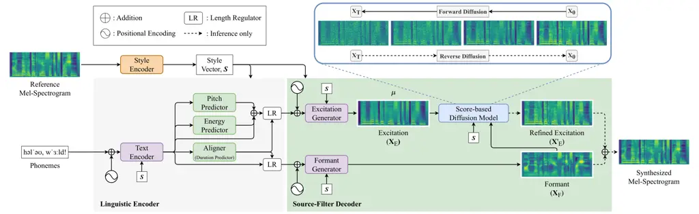
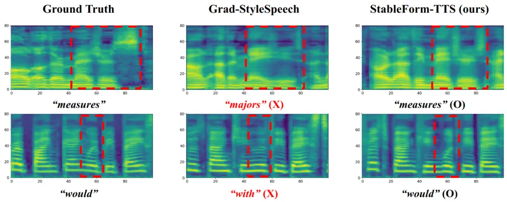

# Improving Robustness of Diffusion-Based Zero-Shot Speech Synthesis via Stable Formant Generation

Changjin Han Affiliation: DeepBrain AI  
Seoul, South Korea  
colin@deepbrain.io    Seokgi Lee Affiliation: DeepBrain AI  
Seoul, South Korea  
fredrick@deepbrain.io    Gyuhyeon Nam Affiliation: DeepBrain AI  
Seoul, South Korea  
noah@deepbrain.io    Gyeongsu Chae Affiliation: DeepBrain AI  
Seoul, South Korea  
gc@deepbrain.io

###### Abstract

Diffusion models have achieved remarkable success in text-to-speech
(TTS), even in zero-shot scenarios. Recent efforts aim to address the
trade-off between inference speed and sound quality, often considered
the primary drawback of diffusion models. However, we find a critical
mispronunciation issue is being overlooked. Our preliminary study
reveals the unstable pronunciation resulting from the diffusion process.
Based on this observation, we introduce StableForm-TTS, a novel
zero-shot speech synthesis framework designed to produce robust
pronunciation while maintaining the advantages of diffusion modeling. By
pioneering the adoption of source-filter theory in diffusion TTS, we
propose an elaborate architecture for stable formant generation.
Experimental results on unseen speakers show that our model outperforms
the state-of-the-art method in terms of pronunciation accuracy and
naturalness, with comparable speaker similarity. Moreover, our model
demonstrates effective scalability as both data and model sizes
increase. Audio samples are available online:
[https://deepbrainai-research.github.io/stableformtts/](https://deepbrainai-research.github.io/stableformtts/).

###### Index Terms: 

zero-shot TTS, diffusion, source-filter theory

## I Introduction

In pursuit of seamless interaction between humans and computers, there
has been a surge of interest in text-to-speech (TTS) synthesis.
Particularly, diffusion models \[1, 2, 3\] have shown notable progress
in conventional two-stage TTS, which converts text input into
corresponding acoustic representation (e.g., mel-spectrogram) with
acoustic models \[4, 5\], and then reconstructs them into waveform using
vocoders \[6, 7\]. The recent progress in resolving the trade-off
between inference speed and sound quality of diffusion-based TTS
promotes its real-world application \[8, 9, 10\].

Zero-shot approaches are blossoming trends that require only a single
sample of a target speaker, driven by the demand for custom voice
synthesis \[11, 12, 13, 14\]. Among diffusion-based zero-shot TTS models
\[15, 16, 17\], Grad-StyleSpeech (GSS) \[17\] demonstrates excellent
performance by enjoying the benefit of the non-autoregressive method
based on the feed-forward transformer (FFT) \[18, 19\], alignment
modeling \[20, 21\], style encoding \[22\], and score-based diffusion
model \[3\].

However, we empirically find that diffusion-based models suffer from a
catastrophic mispronunciation problem in zero-shot scenarios, despite
the robustness in a single-speaker setting \[4\]. Based on our
preliminary study (Fig. 1a), we reveal that there is drastic degradation
in pronunciation accuracy correlated to these factors: 1) complexity of
target data distribution, which is highest in zero-shot scenarios; 2)
diffusion stochasticity, which accumulates with the number of reverse
steps, especially in SDE solver. Additionally, we observe that the
phonetic signals with weak magnitude or contrast, particularly formants,
can be damaged (Fig. 3).

Fig. 1: Line charts of CER ratio
($`\frac{CER_{n}}{CER_{0}},n\in[0,100]`$) against reverse steps for each
diffusion TTS model. Capital letters attached to model names stand for
S: single speaker, M: multi speaker, and ZS: zero-shot, respectively. We
denote solver and train dataset names in parentheses as abbreviations.

Meanwhile, the source-filter theory \[23, 24, 25\] elucidates the
mechanism of human speech production into disentangled control of a
source sound and a filter. The pitch, i.e. fundamental frequency, is
primarily determined by the excitation signal of the source, resulting
from the vibrations of the vocal folds, while the formant frequencies
are shaped by the vocal tract’s filter. FastPitchFormant \[26\] first
adopted the source-filter theory in a neural acoustic model and
successfully synthesized intelligible speech across varying sizes of
pitch shift scale.



Fig. 2: Overall architecture of StableForm-TTS. For brevity, the
phoneme, pitch, and energy embedding layers are omitted.

In this paper, we propose StableForm-TTS, a diffusion-based zero-shot
TTS model that focuses on pronunciation stability. To resolve the
adverse effect of the diffusion model on pronunciation, we incorporate
two inductive biases: 1) variance features that alleviate the
over-smoothing problem of speech signals \[27\]; 2) novel architecture
based on the source-filter theory. To the best of our knowledge, this
paper is the first attempt to exploit the source-filter theory in
diffusion TTS.

Experimental results show that StableForm-TTS outperforms the baseline,
and ablation studies verify the effectiveness of our method. Scalability
tests demonstrate that our model can achieve comparable performance to
state-of-the-art open-source zero-shot TTS models with significantly
fewer parameters.

## II StableForm-TTS

In this section, we introduce StableForm-TTS tailored to generate speech
with stable pronunciation. To embed appropriate inductive biases,
StableForm-TTS comprises three core modules: a style encoder, a
linguistic encoder, and a source-filter decoder. We illustrate the
overall architecture in Fig. 2.

### II-A Style Encoder

To effectively convert a reference speech into a latent style vector, we
utilize the mel-style encoder derived from Meta-StyleSpeech \[22\]. The
style vector encapsulates various attributes such as speaker identity,
prosody, recording settings, and other pertinent features for capturing
the nuanced elements of speech. We represent the style vector as
$`\boldsymbol{s}\in\mathbb{R}^{d_{s}}`$ where $`{d_{s}}`$ is the hidden
dimension. The reference speech matches the target speech during
training but differs during inference.

### II-B Linguistic Encoder

The linguistic encoder generates two hidden sequences with different
information from the text input. This module consists of a text encoder
and a decomposed variance adaptor.

#### II-B1 Text Encoder

The text encoder transforms the phoneme embedding sequence to the
phoneme hidden sequence through the multiple FFT blocks. Following \[22,
17\], we adopt the style-adaptive layer normalization (SALN) receiving
the style vector to compute and apply gains and biases within the FFT
blocks instead of the conventional layer normalization.

#### II-B2 Decomposed Variance Adaptor

Similar to FastPitchFormant \[26\], we introduce a decomposed structure
into the variance adaptor \[20, 28\]. This module has five submodules: a
pitch predictor, an energy predictor, an aligner, a duration predictor,
and a length regulator.

To produce two distinct representations—one enriched with prosody and
the other preserving non-prosodic information—we split the variance
adaptor into two pathways. Specifically, the excitation pathway adds the
phoneme-level pitch and energy embedding sequences to the phoneme hidden
sequence, while the formant pathway solely handles the phoneme hidden
sequence.

The ground truth pitch and energy are determined by averaging the F0
values and the L2-norms of the magnitude of each frame over every
phoneme, respectively. In training, we use the ground truth to train the
pitch and energy predictors proposed in \[20, 28\], and employ the
predicted values in inference.

The aligner and the duration predictor aim to get duration information
for the length regulation during training and inference, respectively.
We use the aligner proposed in \[21\] that learns the alignment between
the target mel-spectrogram and the phoneme hidden sequence using the
Viterbi algorithm. Concurrently, the duration predictor is trained to
predict the target duration of each phoneme extracted from the aligner.
The length regulator upsamples the phoneme-level representations using
the predicted durations.

### II-C Source-Filter Decoder

The source-filter decoder succeeds the dual pathways of the decomposed
variance adaptor to transform the linguistic encoder outputs into a
couple of mel-spectrograms, where one contains excitation (source)
information and the other contains formant (filter) information. This
module includes an excitation generator, a formant generator, and a
score-based diffusion model. We only apply the diffusion model to the
excitation pathway for variable prosody generation while the formant
pathway is separated from the diffusion process to retain non-prosodic
content.

#### II-C1 Excitation and Formant Generators

Our design of excitation and formant generators (E-F generators) is
motivated by \[26\]. Each generator receives the asymmetric information
from the excitation or formant pathways and is induced to generate
corresponding representations as shown in Fig. 2. We also adopt SALN
within both generators. We denote the excitation representation as
$`\boldsymbol{X}_{E}\in\mathbb{R}^{D\times T}`$, and the formant
representation as $`\boldsymbol{X}_{F}\in\mathbb{R}^{D\times T}`$ where
$`D`$ is the dimension of mel-spectrograms different from \[26\], and
$`T`$ is the number of frames.

#### II-C2 Score-based Diffusion Model

We utilize the score-based diffusion model to enhance speech quality and
diversity. The diffusion model \[1, 2, 3\] involves two processes:
forward and reverse. The forward process gradually distorts the original
data $`\boldsymbol{X}_{0}\sim p(\boldsymbol{X}_{0})`$ to a simple prior,
typically a standard Gaussian, by adding random noise. Conversely, the
reverse process learns to progressively reconstruct the data from
Gaussian noise in order to form a generative model.

Following the use of data-driven prior in TTS research \[4, 17\], we
define the forward and reverse diffusion processes in terms of
stochastic differential equations (SDEs). The forward diffusion process
can be formulated as follows:

```math
\displaystyle d\boldsymbol{X}_{t}=\frac{1}{2}\beta_{t}(\boldsymbol{\mu}-\boldsymbol{X}_{t})dt+\sqrt{\beta_{t}}d\boldsymbol{W}_{t}, \tag{1}
```

where $`t\in[0,T]`$ is the continuous time step, $`\beta_{t}`$ is a
non-negative noise schedule, $`\boldsymbol{\mu}`$ is the data-driven
prior, and $`\boldsymbol{W}_{t}`$ is the Brownian motion. Due to the
conditional distribution $`p(\boldsymbol{X}_{t}|\boldsymbol{X}_{0})`$ is
Gaussian, the forward diffusion converts any data distribution into
$`\mathcal{N}(\boldsymbol{\mu},\boldsymbol{I})`$ as a terminal
distribution \[3\].

The reverse diffusion process can be stated as follows:

```math
\begin{split}d\boldsymbol{X}_{t}=&\Bigl(\frac{1}{2}(\boldsymbol{\mu}-\boldsymbol{X}_{t})-\nabla\log{p(\boldsymbol{X}_{t})}\Bigl)\beta_{t}dt+\sqrt{\beta_{t}}d\boldsymbol{\widetilde{W}}_{t},\end{split} \tag{2}
```

where $`\boldsymbol{\widetilde{W}}_{t}`$ is the reverse-time Brownian
motion, $`\nabla\log{p(\boldsymbol{X}_{t})}`$ is the gradient of the
log-density of noisy data referred to as score. Since (2) has the same
marginal probability densities with following ordinary differential
equation (ODE):

```math
\displaystyle d\boldsymbol{X}_{t}=\frac{1}{2}\Bigl((\boldsymbol{\mu}-\boldsymbol{X}_{t})-\nabla\log{p(\boldsymbol{X}_{t})}\Bigl)\beta_{t}dt, \tag{3}
```

we can use numerical SDE or ODE solver to generate samples
$`\boldsymbol{X}_{0}`$ from noise $`\boldsymbol{X}_{T}`$. Note that
calculating the exact score of distribution is intractable. Therefore,
we train an U-Net based neural network
$`\boldsymbol{\varepsilon}_{\phi}(\boldsymbol{X}_{t},t,\boldsymbol{\mu},\boldsymbol{s},\boldsymbol{X}_{F})`$
to estimate the score of $`p(\boldsymbol{X}_{t})`$ for every time step.
We concatenate $`\boldsymbol{s}`$ and $`\boldsymbol{X}_{F}`$
channel-wise to $`\boldsymbol{\mu}`$ as condition, after adjusting
dimension size according to $`D`$ with projection layers.

Unlike previous diffusion-based TTS works \[4, 10, 17\], we only pass
the excitation representation $`\boldsymbol{X}_{E}`$ as
$`\boldsymbol{\mu}`$ while keeping the formant representation
$`\boldsymbol{X}_{F}`$ unchanged. Thus, our StableForm-TTS synthesizes
the final output $`\boldsymbol{\hat{X}}`$ by adding the refined
excitation representation $`\boldsymbol{X}^{\prime}_{E}`$ and the
formant representation during inference:

```math
\displaystyle\boldsymbol{\hat{X}}=\boldsymbol{X}^{\prime}_{E}+\boldsymbol{X}_{F}. \tag{4}
```

### II-D Training Objective

To calculate the prediction error of the duration $`\mathcal{L}_{d}`$,
pitch $`\mathcal{L}_{p}`$ and energy $`\mathcal{L}_{e}`$, we adopt MSE
loss as in FastSpeech 2 \[20\]. The alignment loss
$`\mathcal{L}_{align}`$ \[21\] contains CTC-based forward sum loss and
KL-divergence loss between soft alignments and hard alignments to train
the aligner. As a reconstruction loss, we use
$`\mathcal{L}_{prior}={\lVert\boldsymbol{\mu}-(\boldsymbol{X}-\boldsymbol{X}_{F})\rVert}^{2}_{2}`$,
where $`\boldsymbol{X}`$ is the target mel-spectrogram. We also
formulate diffusion loss $`\mathcal{L}_{diff}`$ to optimize the score
estimation network $`\boldsymbol{\varepsilon}_{\phi}`$ as follows:

```math
\begin{split}\mathcal{L}_{diff}=\mathbb{E}_{\boldsymbol{X}_{0},t}\Bigg[\boldsymbol{\lambda}_{t}\mathbb{E}_{\boldsymbol{\epsilon}_{t}}&{\Big\lVert\boldsymbol{\varepsilon}_{\phi}(\boldsymbol{X}_{t},t,\boldsymbol{\mu},\boldsymbol{s},\boldsymbol{X}_{F})+\frac{\boldsymbol{\epsilon}_{t}}{\sqrt{\boldsymbol{\lambda}_{t}}}\Big\rVert}^{2}_{2}\Bigg],\\
\boldsymbol{\epsilon}_{t}\sim\mathcal{N}(\boldsymbol{0},\boldsymbol{I}),\quad&\boldsymbol{\lambda}_{t}=\boldsymbol{I}-e^{-\int^{t}_{0}\beta_{s}ds}.\end{split} \tag{5}
```

Consequently, the total loss for training StableForm-TTS is:

```math
\displaystyle\mathcal{L}_{total}=\mathcal{L}_{d}+\mathcal{L}_{p}+\mathcal{L}_{e}+\mathcal{L}_{align}+\mathcal{L}_{prior}+\mathcal{L}_{diff}. \tag{6}
```

|                      |                       |                      |                      |                      |                          |                    |                     |                       |             |           |
| -------------------- | --------------------- | -------------------- | -------------------- | -------------------- | ------------------------ | ------------------ | ------------------- | --------------------- | ----------- | --------- |
| Dataset              | Model                 | Objective Evaluation |                      |                      |                          |                    |                     | Subjective Evaluation |             | \# Params |
| CER ($`\downarrow`$) | WER ($`\downarrow`$)  | SECS ($`\uparrow`$)  | UTMOS ($`\uparrow`$) | WVMOS ($`\uparrow`$) | MOSA-Net+ ($`\uparrow`$) | MOS ($`\uparrow`$) | SMOS ($`\uparrow`$) |                       |             |           |
| \-                   | Ground Truth          | 1.66 ± 0.14          | 3.75 ± 0.30          | 80.95 ± 0.21         | 4.065 ± 0.007            | 4.402 ± 0.009      | 4.031 ± 0.008       | 3.81 ± 0.13           | 3.71 ± 0.12 | \-        |
| \-                   | Ground Truth (voc.)   | 1.82 ± 0.15          | 4.05 ± 0.32          | 80.41 ± 0.21         | 3.845 ± 0.009            | 4.299 ± 0.010      | 4.014 ± 0.008       | 3.79 ± 0.12           | 3.63 ± 0.14 | \-        |
| LT-460               | GSS                   | 2.73 ± 0.07          | 6.49 ± 0.14          | 79.45 ± 0.06         | 3.958 ± 0.004            | 4.443 ± 0.004      | 3.873 ± 0.004       | 3.73 ± 0.04           | 3.66 ± 0.05 | 33.98M    |
|                      | StableForm-TTS (ours) | 1.44 ± 0.05          | 3.64 ± 0.10          | 78.64 ± 0.07         | 4.131 ± 0.003            | 4.545 ± 0.004      | 4.072 ± 0.004       | 3.76 ± 0.04           | 3.68 ± 0.05 | 34.86M    |
| LT-R                 | GSS                   | 5.80 ± 0.11          | 11.95 ± 0.21         | 78.45 ± 0.07         | 3.694 ± 0.004            | 4.189 ± 0.004      | 3.593 ± 0.004       | 3.67 ± 0.05           | 3.67 ± 0.05 | 33.98M    |
|                      | StableForm-TTS (ours) | 3.04 ± 0.08          | 6.74 ± 0.15          | 78.43 ± 0.07         | 3.976 ± 0.004            | 4.360 ± 0.004      | 3.844 ± 0.004       | 3.76 ± 0.04           | 3.70 ± 0.05 | 34.86M    |

TABLE I: English zero-shot TTS results on VCTK

## III Experiments

### III-A Experimental Setup

#### III-A1 Datasets

Except for the pre-trained models²² 2
[https://github.com/huawei-noah/Speech-Backbones/tree/main/Grad-TTS](https://github.com/huawei-noah/Speech-Backbones/tree/main/Grad-TTS),
i.e. Grad-TTS-S and Grad-TTS-M used in the preliminary study, we train
all the models on two datasets. One is LibriTTS train-clean-460 (LT-460)
\[29\] following \[17\], and the other is all subsets of LibriTTS-R
(LT-R) \[30\], to include phonetically noisier samples while ensuring
high audio quality. For the evaluation on unseen speakers, we utilize
VCTK \[31\] and use all of the samples from 11 speakers following
previous zero-shot TTS studies \[32, 12\]. In the pre-processing stage,
we convert the text inputs into phonemes using Phonemizer \[33\] with
the eSpeak NG³³ 3
[https://github.com/espeak-ng/espeak-ng](https://github.com/espeak-ng/espeak-ng)
backend, and resample the audio to 22,050 Hz. Also, we extract the
80-dim mel-spectrograms with a fast Fourier transform size of 1024, a
window size of 1024, and a hop size of 256. We obtain the F0 values by
PRAAT toolkit \[34\].

#### III-A2 Implementation Details

To maintain our model’s capacity comparable to \[17\], we use four FFT
blocks for the text encoder and two FFT blocks for each of the
excitation and the formant generators. The components in the mel-style
encoder and the decomposed variance adaptor are the same as the original
papers \[22, 21, 20, 28\]. We adopt the U-Net architecture and the noise
schedule introduced in Grad-TTS \[4\] for diffusion modeling, and the
temperature $`\tau`$ is set to 1.5, i.e.
$`\boldsymbol{X}_{T}\sim\mathcal{N}(\boldsymbol{\mu},\frac{\boldsymbol{I}}{1.5})`$
for inference. For the reverse process, we employ the probability flow
(PF) \[4\] as an ODE solver and the maximum likelihood (ML) \[35, 17\]
as an SDE solver. We train the models for 1 million steps on a single
NVIDIA A100 GPU with a batch size of 16. We use the Adam optimizer and
the learning rate schedule \[18\] with 4,000 warmup steps. The
pre-trained HiFi-GAN \[36\] serves as a vocoder to convert the generated
mel-spectrograms into waveforms.

#### III-A3 Evaluation Metrics

For objective evaluation, we calculate the character error rate (CER)
and the word error rate (WER) to assess robustness leveraging the
CTC-based conformer ASR model⁴⁴ 4
[https://catalog.ngc.nvidia.com/models](https://catalog.ngc.nvidia.com/models).
We adopt the speaker embedding cosine similarity (SECS) using the
pre-trained speaker encoder from Resemblyzer⁵⁵ 5
[https://github.com/resemble-ai/Resemblyzer](https://github.com/resemble-ai/Resemblyzer)
to assess speaker similarity. Also, we employ MOS prediction models
(UTMOS \[37\], WVMOS \[38\], MOSA-Net+ \[39\]) to evaluate speech
quality. We denote the average of the MOS predictions as MOS-pred. For
subjective evaluation, we randomly select 10 speakers from the test set
and conduct human ratings through Amazon Mechanical Turk⁶⁶ 6
[https://www.mturk.com/](https://www.mturk.com/), involving 20
participants. These participants are instructed to rate the audio
samples presented with matching texts on a 5-point Likert scale across
three tasks: 1) mean opinion score (MOS) for naturalness assessment; 2)
similarity MOS (SMOS) to evaluate speaker similarity; and 3) comparative
MOS (CMOS) for comparing naturalness. We filtered out responses where
the response time was shorter than the audio length. In addition,
loudness normalization is applied to all audio samples to alleviate
volume-related bias. Unless otherwise stated, we compute the metrics by
averaging across two solver types (PF and ML) and four reverse steps (5,
10, 50, and 100) with 95% confidence intervals.



Fig. 3: Visual comparison. The text beneath the mel-spectrogram
indicates the ASR model’s transcription of the area enclosed within the
red dotted box.

### III-B Experimental Results

#### III-B1 Zero-Shot Speech Synthesis

We compare the zero-shot speech synthesis performance of StableForm-TTS
with other systems, which include i) Ground Truth, the ground truth
audio; ii) Ground Truth (voc.), where we transform the ground truth
audio into mel-spectrograms, then reconstruct the audio using the
vocoder; and iii) GSS, a cutting-edge zero-shot TTS model forming the
foundation of our approach.

As shown in Table I, StableForm-TTS outperforms GSS in terms of CER and
WER, regardless of the training dataset. Notably, it surpasses the
Ground Truth when trained on LT-460. Additionally, we plot the CER ratio
in Fig. 1b to illustrate the relative increase in CER across different
reverse steps, and it shows that our method demonstrates improved
robustness compared to GSS. Our model also improves naturalness (UTMOS,
WVMOS, MOSA-Net+, and MOS) and preserves speaker similarity (SECS and
SMOS) being on par with the baseline.

For visual inspection, we select two speakers from VCTK and plot the
speech segments’ mel-spectrograms of the ground truth, GSS, and
StableForm-TTS. Fig. 3 shows the pitch and formant contours of
StableForm-TTS are clearly visible and similar to the ground truth. In
contrast, GSS distorts the phonetic content, highlighted in the red
dotted boxes, leading to incorrect pronunciations.

#### III-B2 Ablation Study

We perform ablation studies on our architecture using the two training
datasets. As shown in Table II, the removal of either the E-F generators
or the energy predictor results in salient performance drops. Therefore,
splitting the acoustic modeling based on the source-filter theory and
injecting not only the pitch but the energy, which was neglected in
\[26\], are deemed beneficial.

#### III-B3 Scalability Test

We expand the English training datasets to 19,000 hours by including
LT-R, LJSpeech\[41\], DailyTalk\[42\], HiFi-TTS\[43\], Common
Voice\[44\], and MLS\[45\], and increase the model size by a factor of
two (StableForm-large). Using the Coqui TTS toolkit⁷⁷ 7
[https://github.com/coqui-ai/TTS](https://github.com/coqui-ai/TTS), we
benchmark open-source zero-shot TTS models (Bark⁸⁸ 8
[https://github.com/suno-ai/bark](https://github.com/suno-ai/bark),
Tortoise\[46\], XTTS-v2\[47\], and YourTTS\[12\]), excluding
VoiceCraft\[48\], which has an official implementation. Table III shows
that StableForm-large either matches or outperforms leading zero-shot
TTS benchmarks in terms of intelligibility, speaker similarity, and
naturalness, while using substantially fewer parameters. Notably, the
scale-up improves the pronunciation, and the effectiveness of our design
is amplified compared to GSS-large. We expect applying large-scale
vocoders will further improve the overall performance.

| Dataset | Model              | CER ($`\downarrow`$) | WER ($`\downarrow`$) | SECS ($`\uparrow`$) | MOS-pred ($`\uparrow`$) | CMOS ($`\uparrow`$) | \# Params |
| ------- | ------------------ | -------------------- | -------------------- | ------------------- | ----------------------- | ------------------- | --------- |
| LT-460  | StableForm-TTS     | 1.44 ± 0.05          | 3.64 ± 0.10          | 78.64 ± 0.07        | 4.249 ± 0.002           | 0.00                | 34.86M    |
|         | w/o E-F generators | 1.63 ± 0.05          | 4.05 ± 0.11          | 79.12 ± 0.06        | 4.235 ± 0.003           | -0.38 ± 0.05        | 34.78M    |
|         | w/o Energy         | 1.87 ± 0.05          | 4.52 ± 0.11          | 77.87 ± 0.07        | 4.191 ± 0.003           | -0.39 ± 0.05        | 34.47M    |
| LT-R    | StableForm-TTS     | 3.04 ± 0.08          | 6.74 ± 0.15          | 78.43 ± 0.07        | 4.060 ± 0.003           | 0.00                | 34.86M    |
|         | w/o E-F generators | 3.32 ± 0.08          | 7.35 ± 0.15          | 77.86 ± 0.07        | 4.057 ± 0.003           | -0.43 ± 0.05        | 34.78M    |
|         | w/o Energy         | 4.09 ± 0.09          | 8.73 ± 0.18          | 77.01 ± 0.07        | 3.957 ± 0.003           | -0.39 ± 0.05        | 34.47M    |

TABLE II: Ablation Study

|                  |                      |                      |                     |                         |       |           |
| ---------------- | -------------------- | -------------------- | ------------------- | ----------------------- | ----- | --------- |
| Model            | CER ($`\downarrow`$) | WER ($`\downarrow`$) | SECS ($`\uparrow`$) | MOS-pred ($`\uparrow`$) | Hours | \# Params |
| Bark             | 5.38 ± 0.57          | 8.05 ± 0.69          | 74.64 ± 0.29        | 3.655 ± 0.011           | \-    | 1100.59M  |
| Tortoise         | 0.44 ± 0.12          | 1.02 ± 0.16          | 76.51 ± 0.18        | 4.336 ± 0.006           | 49K   | 972.57M   |
| VoiceCraft       | 1.72 ± 0.19          | 3.51 ± 0.29          | 79.05 ± 0.26        | 3.897 ± 0.007           | 20K   | 839.61M   |
| XTTS-v2          | 0.43 ± 0.06          | 1.51 ± 0.16          | 81.43 ± 0.16        | 4.219 ± 0.006           | 14K   | 466.87M   |
| YourTTS          | 2.53 ± 0.17          | 5.83 ± 0.36          | 76.17 ± 0.20        | 4.031 ± 0.009           | 14K   | 86.82M    |
| GSS-large        | 1.80 ± 0.09          | 4.31 ± 0.20          | 77.93 ± 0.15        | 3.912 ± 0.003           | 19K   | 68.13M    |
| StableForm-large | 0.52 ± 0.08          | 1.55 ± 0.18          | 79.26 ± 0.17        | 4.333 ± 0.006           | 19K   | 69.30M    |

TABLE III: Scalability Test. We use the PF solver with 10 reverse steps
for StableForm-large. (Bold: best, Underline: second best)

## IV Conclusion

We propose StableForm-TTS, a diffusion-based zero-shot TTS system that
surpasses the state-of-the-art baseline in terms of pronunciation
accuracy and naturalness. Based on our preliminary findings, we
effectively integrate the variance information and the source-filter
theory into diffusion model to enhance pronunciation. StableForm-TTS
minimizes the inherent mispronunciation issue in diffusion-based TTS by
generating stable formant representation.

## References

- \[1\] J. Sohl-Dickstein, E. Weiss, N. Maheswaranathan, and S.
  Ganguli, “Deep unsupervised learning using nonequilibrium
  thermodynamics,” in ICML, 2015.
- \[2\] J. Ho, A. Jain, and P. Abbeel, “Denoising diffusion
  probabilistic models,” in NeurIPS, 2020.
- \[3\] Y. Song, J. Sohl-Dickstein, D. P. Kingma, A. Kumar, S. Ermon,
  and B. Poole, “Score-based generative modeling through stochastic
  differential equations,” in ICLR, 2020.
- \[4\] V. Popov, I. Vovk, V. Gogoryan, T. Sadekova, and M. Kudinov,
  “Grad-tts: A diffusion probabilistic model for text-to-speech,” in
  ICML, 2021.
- \[5\] M. Jeong, H. Kim, S. J. Cheon, B. J. Choi, and N. S. Kim,
  “Diff-tts: A denoising diffusion model for text-to-speech,” arXiv
  preprint arXiv:2104.01409, 2021.
- \[6\] N. Chen, Y. Zhang, H. Zen, R. J. Weiss, M. Norouzi, and W.
  Chan, “Wavegrad: Estimating gradients for waveform generation,” in
  ICLR, 2020.
- \[7\] Z. Kong, W. Ping, J. Huang, K. Zhao, and B. Catanzaro,
  “Diffwave: A versatile diffusion model for audio synthesis,” in
  ICLR, 2020.
- \[8\] Z. Chen, Y. Wu, Y. Leng, J. Chen, H. Liu, X. Tan, Y. Cui, K.
  Wang, L. He, S. Zhao et al., “Resgrad: Residual denoising diffusion
  probabilistic models for text to speech,” arXiv preprint
  arXiv:2212.14518, 2022.
- \[9\] R. Huang, Z. Zhao, H. Liu, J. Liu, C. Cui, and Y. Ren,
  “Prodiff: Progressive fast diffusion model for high-quality
  text-to-speech,” in ACM Multimedia, 2022.
- \[10\] J. Chen, X. Song, Z. Peng, B. Zhang, F. Pan, and Z. Wu,
  “Lightgrad: Lightweight diffusion probabilistic model for
  text-to-speech,” in ICASSP, 2023.
- \[11\] R. Huang, Y. Ren, J. Liu, C. Cui, and Z. Zhao, “Generspeech:
  Towards style transfer for generalizable out-of-domain
  text-to-speech,” in NeurIPS, 2022.
- \[12\] E. Casanova, J. Weber, C. D. Shulby, A. C. Junior, E. Gölge,
  and M. A. Ponti, “Yourtts: Towards zero-shot multi-speaker tts and
  zero-shot voice conversion for everyone,” in ICML, 2022.
- \[13\] C. Wang, S. Chen, Y. Wu, Z. Zhang, L. Zhou, S. Liu, Z.
  Chen, Y. Liu, H. Wang, J. Li et al., “Neural codec language models are
  zero-shot text to speech synthesizers,” arXiv preprint
  arXiv:2301.02111, 2023.
- \[14\] Z. Jiang, J. Liu, Y. Ren, J. He, Z. Ye, S. ji, Q. Yang, C.
  Zhang, P. Wei, C. Wang, X. Yin, Z. Ma et al., “Mega-tts 2: Boosting
  prompting mechanisms for zero-shot speech synthesis,” in ICLR, 2024.
- \[15\] H. Chen and P. N. Garner, “Diffusion transformer for adaptive
  text-to-speech,” in SSW, 2023.
- \[16\] K. Shen, Z. Ju, X. Tan, Y. Liu, Y. Leng, L. He, T. Qin, S.
  Zhao, and J. Bian, “Naturalspeech 2: Latent diffusion models are
  natural and zero-shot speech and singing synthesizers,” in ICLR, 2024.
- \[17\] M. Kang, D. Min, and S. J. Hwang, “Grad-stylespeech:
  Any-speaker adaptive text-to-speech synthesis with diffusion models,”
  in ICASSP, 2023.
- \[18\] A. Vaswani, N. Shazeer, N. Parmar, J. Uszkoreit, L.
  Jones, A. N. Gomez, Ł. Kaiser, and I. Polosukhin, “Attention is all
  you need,” in NeurIPS, 2017.
- \[19\] N. Li, S. Liu, Y. Liu, S. Zhao, and M. Liu, “Neural speech
  synthesis with transformer network,” in AAAI, 2019.
- \[20\] Y. Ren, C. Hu, X. Tan, T. Qin, S. Zhao, Z. Zhao, and T.-Y.
  Liu, “Fastspeech 2: Fast and high-quality end-to-end text to speech,”
  in ICLR, 2020.
- \[21\] R. Badlani, A. Ła´ncucki, K. J. Shih, R. Valle, W. Ping,
  and B. Catanzaro, “One tts alignment to rule them all,” in
  ICASSP, 2022.
- \[22\] D. Min, D. B. Lee, E. Yang, and S. J. Hwang,
  “Meta-stylespeech: Multi-speaker adaptive text-to-speech generation,”
  in ICML, 2021.
- \[23\] T. Chiba and M. Kajiyama, The vowel: Its nature and structure.
  Tokyo, Japan: Kaiseikan, 1941.
- \[24\] G. Fant, Acoustic theory of speech production. The Hague, The
  Netherlands: Mouton, 1960.
- \[25\] I. Tokuda, “The source–filter theory of speech,” in Oxford
  Research Encyclopedia of Linguistics, 2021.
- \[26\] T. Bak, J. S. Bae, H. Bae, Y. I. Kim, and H. Y. Cho,
  “Fastpitchformant: Source-filter based decomposed modeling for speech
  synthesis,” in Interspeech, 2021.
- \[27\] Y. Ren, X. Tan, T. Qin, Z. Zhao, and T.-Y. Liu, “Revisiting
  over-smoothness in text to speech,” in ACL, 2022.
- \[28\] A. Łańcucki, “Fastpitch: Parallel text-to-speech with pitch
  prediction,” in ICASSP, 2021.
- \[29\] H. Zen, V. Dang, R. Clark, Y. Zhang, R. J. Weiss, Y. Jia, Z.
  Chen, and Y. Wu, “Libritts: A corpus derived from librispeech for
  text-to-speech,” in Interspeech, 2019.
- \[30\] Y. Koizumi, H. Zen, S. Karita, Y. Ding, K. Yatabe, N.
  Morioka, M. Bacchiani, Y. Zhang, W. Han, and A. Bapna, “Libritts-r: A
  restored multi-speaker text-to-speech corpus,” in Interspeech, 2023.
- \[31\] J. Yamagishi, C. Veaux, and K. MacDonald, “Cstr vctk corpus:
  English multi-speaker corpus for cstr voice cloning toolkit (ver-sion
  0.92),” 2019, https://doi.org/10.7488/ds/2645.
- \[32\] E. Casanova, C. Shulby, E. Gölge, N. M. Müller, F. S. de
  Oliveira, A. C. Junior, A. d. S. Soares, S. M. Aluisio, and M. A.
  Ponti, “Sc-glowtts: an efficient zero-shot multi-speaker
  text-to-speech model,” in Interspeech, 2021.
- \[33\] M. Bernard and H. Titeux, “Phonemizer: Text to phones
  transcription for multiple languages in python,” Journal of Open
  Source Software, vol. 6, no. 68, p. 3958, 2021. \[Online\]. Available:
  https://doi.org/10.21105/joss.03958
- \[34\] P. Boersma, “Accurate short-term analysis of the fundamental
  frequency and the harmonics-to-noise ratio of a sampled sound,” in
  Proc. institute of phonetic sciences, 1993, pp. 97–110.
- \[35\] V. Popov, I. Vovk, V. Gogoryan, T. Sadekova, M. S. Kudinov,
  and J. Wei, “Diffusion-based voice conversion with fast maximum
  likelihood sampling scheme,” in ICLR, 2021.
- \[36\] J. Kong, J. Kim, and J. Bae, “Hifi-gan: Generative adversarial
  networks for efficient and high fidelity speech synthesis,” in
  NeurIPS, 2020.
- \[37\] T. Saeki, D. Xin, W. Nakata, T. Koriyama, S. Takamichi, and H.
  Saruwatari, “Utmos: Utokyo-sarulab system for voicemos challenge
  2022,” in Interspeech, 2022.
- \[38\] P. Andreev, A. Alanov, O. Ivanov, and D. Vetrov, “Hifi++: a
  unified framework for bandwidth extension and speech enhancement,” in
  ICASSP, 2023.
- \[39\] R. E. Zezario, Y. W. Chen, S. W. Fu, Y. Tsao, H. M. Wang,
  and C. S. Fuh, ”A study on incorporating whisper for robust speech
  assessment,” in ICME, 2024.
- \[40\] D. Lyth and S. King, ”Natural language guidance of
  high-fidelity text-to-speech with synthetic annotations,” arXiv
  preprint arXiv:2402.01912, 2024.
- \[41\] K. Ito and L. Johnson, “The lj speech dataset,”
  https://keithito.com/LJ-Speech-Dataset/, 2017.
- \[42\] K. Lee, K. Park, and D. Kim, “Dailytalk: Spoken dialogue
  dataset for conversational text-to-speech,” in ICASSP, 2023.
- \[43\] E. Bakhturina, V. Lavrukhin, B. Ginsburg, and Y. Zhang, “Hi-fi
  multi-speaker english tts dataset,” arXiv preprint
  arXiv:2104.01497, 2021.
- \[44\] R. Ardila, M. Branson, K. Davis, M. Kohler, J. Meyer, M.
  Henretty, R. Morais, L. Saunders, F. Tyers, and G. Weber, “Common
  voice: A massively-multilingual speech corpus,” in LREC, 2020.
- \[45\] V. Pratap, Q. Xu, A. Sriram, G. Synnaeve, and R. Collobert,
  “Mls: A large-scale multilingual dataset for speech research,” in
  Interspeech, 2020.
- \[46\] J. Betker, “Better speech synthesis through scaling,” arXiv
  preprint arXiv:2305.07243, 2023.
- \[47\] E. Casanova, K. Davis, E. Gölge, G. Göknar, I. Gulea, L.
  Hart, A. Aljafari, J. Meyer, R. Morais, S. Olayemi et al., “Xtts: a
  massively multilingual zero-shot text-to-speech model,” in
  Interspeech, 2024.
- \[48\] P. Peng, P.-Y. Huang, D. Li, A. Mohamed, and D. Harwath,
  “Voicecraft: Zero-shot speech editing and text-to-speech in the wild,”
  in ACL, 2024.
