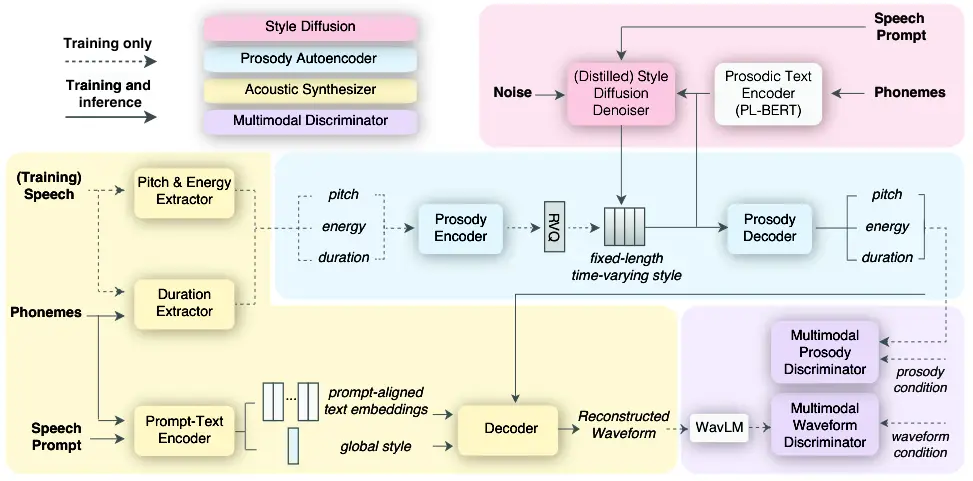

# StyleTTS-ZS: Efficient High-Quality Zero-Shot Text-to-Speech Synthesis with Distilled Time-Varying Style Diffusion

Yinghao Aaron Li    Xilin Jiang    Cong Han    and Nima Mesgarani

###### Abstract

The rapid development of large-scale text-to-speech (TTS) models has led
to significant advancements in modeling diverse speaker prosody and
voices. However, these models often face issues such as slow inference
speeds, reliance on complex pre-trained neural codec representations,
and difficulties in achieving naturalness and high similarity to
reference speakers. To address these challenges, this work introduces
StyleTTS-ZS, an efficient zero-shot TTS model that leverages distilled
time-varying style diffusion to capture diverse speaker identities and
prosodies. We propose a novel approach that represents human speech
using input text and fixed-length time-varying discrete style codes to
capture diverse prosodic variations, trained adversarially with
multi-modal discriminators. A diffusion model is then built to sample
this time-varying style code for efficient latent diffusion. Using
classifier-free guidance, StyleTTS-ZS achieves high similarity to the
reference speaker in the style diffusion process. Furthermore, to
expedite sampling, the style diffusion model is distilled with
perceptual loss using only 10k samples, maintaining speech quality and
similarity while reducing inference speed by 90%. Our model surpasses
previous state-of-the-art large-scale zero-shot TTS models in both
naturalness and similarity, offering a 10-20× faster sampling speed,
making it an attractive alternative for efficient large-scale zero-shot
TTS systems. The audio demo, code and models are available at
[https://styletts-zs.github.io/](https://styletts-zs.github.io/).

## I Introduction

Recent advancements in text-to-speech (TTS) technology have achieved
remarkable progress, bringing TTS systems close to, or even surpassing,
human-level performance on various benchmark datasets \[1, 2, 3\]. With
studio-level TTS capabilities nearly perfected, there is a growing
demand for more sophisticated tasks such as diverse and personalizable
zero-shot speaker adaptation \[4\]. These tasks present a significant
challenge due to the need to replicate the unique characteristics and
prosodic variations of a vast array of speakers without extensive
training data for each individual.

Although there have been rapid developments in zero-shot adaptation,
driven by large-scale modeling techniques in large language models
(LLMs) \[5, 6, 7, 8, 9\], high-quality discrete audio codecs \[10, 11,
12\], and diffusion-based models \[2, 13, 14, 15, 16\], current models
face crucial limitations. Many large-scale speech synthesis models rely
on auto-regressive modeling \[5, 6, 17, 18, 7, 8, 9, 19\], which results
in slower scaling of inference speed as the length of the target speech
increases. Alternatively, diffusion-based models are used for building
large-scale speech synthesis models \[2, 14, 13, 15, 16, 20\]. However,
since these models require iterative refinement to produce high-quality
results, they also suffer from efficiency issues. Moreover, these models
often depend on pre-trained neural codecs not specifically designed for
TTS tasks \[6, 17, 2\], limiting their ability to naturally model
diverse human speech, which encompasses a wide range of speaking styles
that can be challenging to control with existing codecs.

In this work, we introduce StyleTTS-ZS, an innovative approach to
diverse speech synthesis that aims to address these limitations. Our
model decomposes human speech into a global style vector derived from a
speaker prompt and prompt-aligned text embeddings that encapsulate the
timbre and acoustic features of the speech. Additionally, it includes a
fixed-length time-varying style vector that encodes the diverse prosodic
variations, such as pitch and duration changes over time. By carefully
designing the bottleneck for the style vector space with vector
quantization \[21\] and multimodal adversarial training \[22\], we can
reconstruct speech with high fidelity. We then train a diffusion model
\[23\] to sample the time-varying style vector, effectively modeling the
diversity of prosodic variations conditioned on the speaker prompt. This
results in efficient latent diffusion \[24\], as the latent variable is
a fixed-length style vector. The simplicity and efficiency of our latent
space enable us to distill the teacher diffusion model into a student
model using only 10k samples. This distillation maintains diversity and
similarity to the prompt speaker while reducing inference to one step.

Our evaluation results demonstrate the effectiveness of StyleTTS-ZS.
When trained on the small-scale LibriTTS dataset \[25\], our model
surpasses several public zero-shot TTS baseline models. Furthermore,
when trained on the large-scale LibriLight dataset \[26\], comprising
60k hours of data, our model outperforms previous large-scale
state-of-the-art (SOTA) TTS models in terms of similarity and
naturalness for unseen speakers on the LibriSpeech dataset using only a
3-second reference speaker prompt. Remarkably, StyleTTS-ZS achieves this
with nearly 10-20 times faster inference speeds compared to previous
SOTA models, showcasing its real-time applicability.

## II Related Work



Fig. 1: Overview of StyleTTS-ZS architecture. During training, the model
uses ground truth speech to extract prosodic features and encode text
and style with prompt speech. The prosody encoder compresses these
features into a fixed-length time-varying style vector, which is
regularized and decoded back by the prosody decoder. The style diffusion
denoiser uses this vector for diffusion model training, and the decoder
reconstructs speech using prosodic features, text embeddings, and global
style, with multimodal discriminators assessing the output. Bold
indicates system input, where speech prompts and phonemes are used for
both style diffusion and acoustic synthesizer.

Zero-Shot TTS Synthesis. Zero-shot TTS aims to synthesize speech with
the voices of unseen speakers using reference speech from the target
speaker, making it highly attractive due to its ability to adapt without
additional training data. Traditionally, these models are trained on
small datasets, using either pre-trained speaker embeddings \[4, 27, 28,
29\] or speaker encoders in an end-to-end (E2E) manner \[3, 30, 31,
32\]. However, since the zero-shot TTS task requires generalization to a
wide range of unseen speakers, which benefits significantly from
large-scale training data, recent advancements in large-scale modeling
have shifted focus to in-context learning with reference prompts \[6\],
employing either auto-regressive models, such as large language models
to predict subsequent speech tokens \[2, 14, 13, 15, 16, 20\], or
non-autoregressive approaches that predict the whole speech given part
of speech as a prompt, which often involve diffusion-based techniques
for iterative refinement to achieve high-quality results \[5, 6, 17, 18,
7, 8, 9, 19, 16, 33\]. Our approach combines traditional encoder methods
and in-context learning by modeling speech as prompt-aligned text
embeddings to capture local acoustic features with a joint text-prompt
encoder while predicting the more global time-varying style vector of
the whole speech with diffusion-based models using prompt speech for
diverse prosodic variations.

Efficient High-Quality Speech Synthesis. Autoregressive models have been
shown to produce expressive and diverse speech \[6\], but they are prone
to erroneous enunciations \[34\] and suffer from slow inference speeds
proportional to the duration of the target speech. Non-autoregressive
approaches \[35\] accelerate inference by generating speech in parallel,
but often lack fine details, resulting in blurred speech or flat
prosody. These issues have been addressed by adversarial training \[36\]
and diffusion models \[37\], although diffusion models introduce
additional inference time. Recent efforts to speed up diffusion-based
models include distilling pre-trained diffusion models \[38, 39\] or
using consistency \[40\] or rectified flow matching training \[41\].
However, since these models operate in the design space of
mel-spectrograms or pre-trained neural codecs not specifically crafted
for TTS synthesis, there is a trade-off between quality and inference
steps due to the "no free lunch principle" \[42\], where attempts to
speed up models generally result in a loss of quality or diversity, as
seen in recent diffusion distillation works \[43\]. Motivated by the
fact that acoustic features are stable and do not need to be modeled
stochastically using a diffusion model, while prosody varies over time
and hence benefits from diffusion modeling, StyleTTS-ZS carefully
designs the latent space only to include prosody information to lessen
the burden of diffusion models and minimizes quality loss during
distillation. By balancing reconstruction error of autoencoder and
diffusion model complexity, we identify a simple and structured latent
space for diffusion and then distill the diffusion model in a single
inference step. As a result, StyleTTS-ZS significantly outperforms a
very recent large-scale efficient high-quality TTS model \[40\] while
maintaining similar inference speed.

## III StyleTTS-ZS

StyleTTS-ZS consists of four modules: acoustic synthesizer, prosody
autoencoder, time-varying style diffusion, and multimodal
discriminators. We detail these four modules in the following sections
with an overview of our framework in Figure 1 and implementation details
in Appendix D and C.

### III-A Acoustic Synthesizer

The role of the acoustic synthesizer is to reconstruct input speech
$`\bm{x}`$ using its text transcription $`\bm{t}`$ and a speech prompt
$`\bm{x}^{\prime}`$ from the same speaker into the reconstructed speech
$`\hat{\bm{x}}`$. This process starts with extracting pitch $`p`$,
energy $`n`$, and duration $`d`$ from the input speech $`\bm{x}`$. The
joint prompt-text encoder $`T`$ then encodes the phoneme text $`\bm{t}`$
and the prompt speech $`\bm{x}^{\prime}`$ into prompt-aligned text
embeddings $`\bm{h}_{\text{text}}=T(\bm{t},\bm{x}^{\prime})`$ and a
global style $`\bm{s}`$. The speech is then reconstructed as
$`\hat{\bm{x}}=G(\bm{h}_{\text{text}},p,n,d,\bm{s})`$.

We use the same pitch extractor $`F`$, duration extractor $`A`$, and
decoder $`G`$ as in \[3\]. Unlike previous works that rely solely on
global speaker embeddings or style vectors \[30, 4, 31, 3\] or
prompt-aligned text embeddings \[44, 45\], we combine both approaches
and jointly encode the speech prompt and text to produce both
prompt-aligned text embeddings and a style vector (Figure 2c). Our
prompt-text encoder is similar to \[45\] but uses conformer blocks
\[46\] instead of transformer blocks \[47\] to better model the speech.
Moreover, instead of discarding the output portion from the speech
input, we apply average pooling and use the pooled results as the global
style. Utilizing both prompt-aligned text embeddings and global style
vectors enhances speaker similarity, as demonstrated in Section V-B.

When training on large-scale datasets with thousands of speakers, we
observed that the mel-spectrogram reconstruction loss alone was
insufficient for achieving high-fidelity voice similarity due to the
limited capacity of the acoustic synthesizer, which does not use
transformers to optimize the inference speed. To address this, we
introduced an additional reconstruction loss that aligns with the
intermediate features of speaker embedding models \[48\]. Since our
model operates directly in the waveform domain and generates waveforms
end-to-end without relying on any codec decoder or vocoder, we can
compute and match these intermediate features directly within the
speaker embedding space. This significantly enhances speaker similarity,
as shown in Section V-B.

The AdaIN-based decoder from \[3\] is easier to train than the
attention-based module in the prompt-text encoder, causing the model to
over-rely on the global style vector. Consequently, the prompt-aligned
text embeddings become too similar to plain text embeddings. To mitigate
this, we apply a 20% dropout to the global style vector during training,
which compels the prompt-text encoder to focus more on aligning text
with the prompt and producing a global style. This strategy enhances
reconstruction quality by ensuring the prompt-text encoder actively
contributes to acoustic synthesis.

### III-B Vector Quantized Prosody Autoencoder

While the acoustic synthesizer can reconstruct speech from
prompt-aligned text embeddings, phoneme duration, pitch, energy, and a
global style vector with high fidelity, we lack ground truth for these
prosodic features during inference. Predicting these features from text
alone is challenging due to their variability and diversity, especially
in large-scale datasets with various speakers. Prosodic features are
crucial for both speech naturalness and speaker similarity; unnatural
prosody can make speech sound robotic, while uncharacteristic prosody
produces dissimilar voices to the prompt speaker despite having the same
timbre. Recent works in large-scale TTS models attempt to model this
variability on large datasets using methods from large language models
(LLMs) \[5, 18\] and large diffusion models \[13\]. However, these
methods are inefficient as the computation required to infer prosody is
proportional to the length of the target speech. We take an innovative
approach to compressing these prosodic features into a fixed-length
time-varying style vector via a prosody autoencoder, allowing efficient
diffusion sampling for diverse prosody of human speech.

The prosody encoder (Figure 2a) processes stacked pitch, energy, and
duration inputs, mapping them into a fixed-length vector. We represent
duration using upsampled positional embeddings $`\text{PE}(\cdot)`$,
where for each $`i\in\{1,\ldots,N\}`$, the positional embedding
$`\text{PE}(i)`$ is repeated $`d_{i}`$ times. This representation
efficiently distinguishes each phoneme’s duration without complicating
the latent space by taking additional text embeddings as input. The
stacked prosody representations are fed into conformer blocks to extract
variable-length prosody representations $`\bm{h}_{\text{vl}}`$. To
compress these into a fixed-length vector, we use cross-attention
$`\text{Attn}(k,q,v)`$ with $`\bm{h}_{\text{vl}}`$ as the query and
value, and learnable fixed-length positional embeddings
$`\bm{h}_{\text{pe}}`$ as the key. This yields the final latent
$`\bm{h}_{\text{style}}=\text{Attn}(\bm{h}_{\text{pe}},\bm{h}_{\text{vl}},\bm{h}_{\text{vl}})`$,
which we name time-varying style to differentiate it from previous works
that use global style vectors to represent speech styles. The prosody
decoder $`\text{PD}(\cdot)`$ (Figure 2b) then uses
$`\bm{h}_{\text{style}}`$ to decode the duration $`\hat{d}`$, pitch
$`\hat{p}`$, and energy $`\hat{n}`$ conditioned on the PL-BERT \[49\]
phoneme embeddings from $`\bm{t}`$.

We noticed that this method achieves almost perfect prosody
reconstruction with minimal perceptual difference from the input, even
with a vector length of $`K=50`$ for up to 30 seconds of speech without
adversarial training. However, this leads to a latent space that is
overly detailed, making diffusion modeling and one-step distillation
difficult. To address this, we apply residual vector quantization (RVQ)
\[10\], simplifying the latent space by quantizing it. This reduces
details in the latent space and simplifies the diffusion model’s task at
the cost of reconstruction accuracy of the autoencoder, which can be
mitigated using adversarial training with multimodal discriminators. We
use 9 codebooks with 1024 codes each and project the time-varying style
with $`d=512`$ into a lower space with $`d=8`$ for efficient
quantization following \[12\], achieving a balance between diffusion
model difficulty and prosody reconstruction fidelity (see Appendix A-A
for more discussions).

Fig. 2: Architectures for newly proposed components in StyleTTS-ZS. For
(b) and (d), the dark part of the output means this part is discarded
for output, and only the grey part is used.

To further shift the burden of the diffusion model to the prosody
decoder, we randomly mask the input pitch, energy, and duration fed to
the prosody encoder. This technique encourages the prosody decoder to
learn to reconstruct prosodic features from partial input, which is
particularly beneficial for zero-shot TTS scenarios where the input
prompt is short.

### III-C Distilled Time-Varying Style Diffusion

We sample the latent $`\bm{h}_{\text{style}}`$ which we denote as
$`\bm{h}`$ for the rest of this section conditioned on the PL-BERT
embeddings from input text $`\bm{t}`$ and speech prompt
$`\bm{x}^{\prime}`$ by modeling $`p(\bm{h}|\bm{t},\bm{x}^{\prime})`$
using a diffusion model. We follow the probability flow ODE formulation
in \[50\] for deterministic sampling:

```math
\begin{split}d\bm{h}=&\left[f(\bm{h},\tau)-\frac{1}{2}g^{2}(\tau)\nabla_{\bm{h}}\log p_{\tau}(\bm{h}|\bm{t},\bm{x}^{\prime})\right]\,d\tau,\\
&\bm{h}(1)\sim\mathcal{N}(0,\sigma_{1}^{2}I),\end{split} \tag{1}
```

where $`f(\bm{h},\tau):=\frac{d}{d\tau}\log\alpha_{\tau}`$ is the drift
coefficient,
$`g(\cdot,\tau):=\frac{d}{d\tau}\sigma_{\tau}^{2}\left(1-2\log\left(\alpha_{\tau}\right)\right)`$
is the diffusion coefficient, $`\sigma_{\tau}`$ is the noise level,
$`\alpha_{\tau}`$ is the schedule for $`\sigma_{\tau}`$, and
$`\nabla_{\bm{h}}\log p_{\tau}(\bm{h}|\bm{t},\bm{x}^{\prime})`$ is the
score function at time $`\tau`$, estimated using a denoiser
$`K(\cdot\;;\sigma_{\tau},\bm{t},\bm{x}^{\prime})`$ with architecture in
Figure 2d:

```math
\nabla_{\bm{h}}\log p_{\tau}(\bm{h}|\bm{t},\bm{x}^{\prime})=\frac{\alpha_{\tau}K(\bm{h}(\tau);\sigma_{\tau},\bm{t},\bm{x}^{\prime})-\bm{h}(\tau)}{{\sigma_{\tau}}}. \tag{2}
```

We train the denoiser using the velocity formulation \[51\] with the
following objective:

```math
\begin{split}\mathcal{L}_{\text{diff}}=\mathbb{E}_{\bm{x},\bm{x^{\prime}},\bm{t},\tau\sim\mathcal{U}([0,1]),\bm{\xi}\sim\mathcal{N}(0,I)}[\lVert K(\alpha_{\tau}E(\bm{x})+\\
\sigma_{\tau}\bm{\xi};\theta,\sigma_{\tau},\bm{t},\bm{x}^{\prime})-\bm{v}(\sigma_{\tau},E(\bm{x}))\rVert_{1}],\end{split} \tag{3}
```

where $`E(\cdot):\mathcal{X}\rightarrow\mathcal{H}`$ denotes combined
pitch, energy and duration extractor and prosody encoder that maps
speech $`\bm{x}\in\mathcal{X}`$ to latent $`\bm{h}\in\mathcal{H}`$. The
velocity $`\bm{v}`$ is defined as
$`\bm{v}(\sigma_{\tau},x):=\alpha_{\tau}\bm{\xi}-\sigma_{\tau}x`$, with
an angular scheduler $`\alpha_{\tau}:=\cos(\phi_{\tau})`$ and
$`\sigma_{\tau}:=\sin(\phi_{\tau})`$ for
$`\phi_{\tau}=\frac{\pi}{2}\tau`$.

|                        |              |               |               |                     |                    |                  |                                  |                      |
| ---------------------- | ------------ | ------------- | ------------- | ------------------- | ------------------ | ---------------- | -------------------------------- | -------------------- |
| Model                  | Training Set | CMOS-N        | CMOS-S        | UT-MOS $`\uparrow`$ | WER $`\downarrow`$ | SIM $`\uparrow`$ | $`\text{CV}_{p+n}`$ $`\uparrow`$ | RTF $`\downarrow`$   |
| Ground Truth           | —            | $`-0.44^{*}`$ | $`0.77^{**}`$ | 4.17                | 0.34               | 0.67             | 1.49                             | —                    |
| Vall-E \[6\]           | LibriLight   | $`1.07^{**}`$ | $`0.65^{**}`$ | 3.31                | 4.97               | 0.47             | 0.94                             | 0.62 ^(†)            |
| NaturalSpeech 2 \[2\]  | MLS          | $`0.57^{**}`$ | $`0.19^{*}`$  | 3.78                | 1.25               | 0.55             | 1.07                             | 0.37 ^($`\ddagger`$) |
| VoiceCraft \[7\]       | GigaSpeech   | $`0.84^{**}`$ | $`0.11^{*}`$  | 3.58                | 3.73               | 0.54             | 0.79                             | 1.24 ^($`\ddagger`$) |
| FlashSpeech \[40\]     | MLS          | $`0.42^{*}`$  | $`0.52^{**}`$ | 3.98                | 1.47               | 0.50             | 0.50                             | 0.02 ^($`\ddagger`$) |
| NaturalSpeech 3 \[13\] | LibriLight   | $`0.28^{*}`$  | 0.01          | 4.09                | 1.81               | 0.66             | 1.23                             | 0.30 ^($`\ddagger`$) |
| StyleTTS-ZS (LT)       | LibriTTS     | $`0.21^{*}`$  | $`0.31^{*}`$  | 4.24                | 0.90               | 0.47             | 1.06                             | 0.03 ^($`\ddagger`$) |
| StyleTTS-ZS (LL)       | LibriLight   | 0.00          | 0.00          | 4.16                | 0.79               | 0.56             | 1.67                             | 0.03 ^($`\ddagger`$) |

TABLE I: Comparative mean opinion scores of naturalness (CMOS-N) and
similarity (COMS-S) for StyleTTS-ZS (LL) relative to other models
(positive scores indicate StyleTTS-SZ is better; one asterisk \*
indicates $`p<0.05`$ and two asterisks \*\* indicate $`p<0.01`$),
predicted MOS (UT-MOS), speaker embedding similarity (SIM), word error
rate (WER), coefficient of variation for pitch and energy
($`\text{CV}_{p+n}`$) and real-time factor (RTF)^(V-A) in comparison to
other recent large-scale models and StyleTTS-ZS (LT).

We apply classifier-free guidance (CFG) \[52\] using both speech prompt
$`\bm{x}^{\prime}`$ and text $`\bm{t}`$ as a condition. The modified
denoiser with CFG is:

```math
\begin{split}\tilde{K}&(\cdot\;;\omega,\sigma_{n},\bm{t},\bm{x}^{\prime}):=K(\cdot\;;\sigma_{n},\emptyset)+\\
&\omega\cdot\left(K(\cdot\;;\sigma_{n},\bm{t},\bm{x}^{\prime})-K(\cdot\;;\sigma_{n},\emptyset)\right),\end{split} \tag{4}
```

where $`\omega`$ is the guidance scale and $`\emptyset`$ indicates null
condition embeddings. We randomly dropped out the condition
$`\bm{x}^{\prime}`$ with rate of 0.1 during training and fixed
$`\omega=5`$ during inference.

Equation 1 can be viewed as a neural ODE following a trajectory that
maps a Gaussian noise $`\xi\in\mathcal{N}(0,I)`$ to the time-varying
style $`\bm{h}\in\mathcal{H}`$ conditioned on $`\bm{x}^{\prime}`$ and
$`\bm{t}`$. We denote this map as
$`h(\cdot\;;\omega,\bm{x}^{\prime},\bm{t}):\mathcal{N}\rightarrow\mathcal{H}`$.
We solve this ODE using the deterministic solver DDIM \[53\] for later
distillation that repeatedly applies the followings for
$`n\in\{L,L-1,\ldots,0\}`$:

```math
\begin{split}\bm{h}_{\sigma_{n-1}}=\alpha_{n-1}{\bm{v}}_{n}+\sigma_{n-1}\tilde{\bm{v}}_{n},\end{split} \tag{5}
```

where
$`{\bm{v}}_{n}:=\alpha_{n}{\bm{v}}_{n}-\sigma_{n}\tilde{K}(\bm{h}_{\sigma_{n}};\omega,\sigma_{n},\bm{t},\bm{x}^{\prime})`$
and
$`\tilde{\bm{v}}_{n}=\sigma_{n}{\bm{v}}_{n}+\alpha_{n}\tilde{K}(\bm{h}_{\sigma_{n}};\omega,\sigma_{n},\bm{t},\bm{x}^{\prime})`$
for $`L=100`$.

We can train a student network
$`H(\cdot\;;\omega,\bm{x}^{\prime},\bm{t})`$ to approximate $`h`$ as it
is a deterministic map. Since obtaining samples to train $`H`$ through
equation 5 can be expensive especially with large integration steps
$`L=100`$ due to the need to accurately reflect the effects of CFG, we
initialize our student network using a pre-trained network
$`H^{\prime}`$ that predicts prosody decoder output from the text
$`\bm{t}`$ and a speech prompt $`\bm{x}^{\prime}`$. This student
initialization allows sample reduction to as small as 10k samples as
shown in Appendix A-B, since the model has already learned a
deterministic map from the speech prompt and text to the time-varying
style as we match the initial student network and target distilled
diffusion sampler in the output space. The student network can be
pre-trained during the style diffusion training. We use perpetual loss
for distillation \[54\], for which our perpetual metric is the prosody
decoder’s output. The distillation loss is defined as:

```math
\begin{split}\mathcal{L}_{\text{dist}}=\mathbb{E}_{\begin{subarray}{c}\bm{x^{\prime}},\bm{t},\bm{\xi}\sim\mathcal{N}(0,I),\\
\omega\in\mathcal{U}([1,15])\end{subarray}}&[\lvert\text{PD}\left(H(\bm{\xi};\omega,\bm{x}^{\prime},\bm{t})\right)\\
&-\text{PD}\left(h(\bm{\xi};\omega,\bm{x}^{\prime},\bm{t})\right)\rvert_{1}].\end{split} \tag{6}
```

We show this simulation-based approach for distillation is superior to
other simulation-free methods that use bootstrapping, such as
consistency distillation \[55\] and adversarial diffusion distillation
\[56\] in Appendix A-B. This is because our latent space is a
$`50\times 512`$ vector and can be sampled fairly fast and distilled
with 10k samples, which took a few hours to obtain on 8 NVIDIA RTX 3090
GPUs.

### III-D Multimodal Discriminators

One observation we made is the trade-off between latent space
complexity, reconstruction error, and the difficulty of diffusion model
training and distillation (see Appendix A-A). A simpler latent space
makes the diffusion model easier to train and distill but increases the
reconstruction error for the autoencoder. To achieve efficient latent
diffusion and high-fidelity distillation, we opted to simplify the
latent space for the time-varying style and optimize the autoencoder for
high-quality reconstruction. We introduce multimodal discriminators that
evaluate not only the decoder output to determine if the sample is real
or fake but also consider the decoder input as an additional modality,
which has been shown to improve speech quality for zero-shot speech
synthesis \[22\].

Specifically, we use two multimodal discriminators (Figure 2e): one for
the waveform decoder and one for the prosody decoder. The waveform
discriminator takes the WavLM \[57\] features of the decoder’s output
following the idea of SLM discriminator in \[3\] that has been
subsequently demonstrated effectively \[58, 40\] and conditions on all
the inputs to the decoder (prompt-aligned text embeddings, global style,
pitch, energy, and duration). The prosody discriminator takes the
prosody decoder’s output and conditions on all the inputs to the prosody
decoder, including the time-varying style and PL-BERT text embeddings.
This approach significantly enhances the naturalness and similarity of
the reconstructed speech, as demonstrated in Section V-B. In addition to
the multimodal discriminator, we also have the multi-period
discriminator (MPD) \[59\] and multi-resolution STFT discriminator (MRD)
\[12\] for the waveform decoder.

## IV Experiments

### IV-A Model Training

We performed experiments on two datasets: LibriTTS and LibriLight.
First, we trained our model on the small-scale LibriTTS dataset \[25\],
which contains about 585 hours of audio from 1,185 speakers. Utterances
longer than 30 seconds or shorter than one second were excluded. The
training set comprised the combined train-clean-100, train-clean-360,
and train-other-500 subsets. Next, we trained our model on the
large-scale LibriLight dataset \[26\], consisting of 57,706.4 hours of
audio from 7,439 speakers. Since this dataset lacks text transcriptions,
we obtained them using methods from \[60\]. All datasets were resampled
to 24 kHz to match LibriTTS, and texts were converted into phonemes
using Phonemizer \[61\]. We randomly truncated the input speech to the
smallest length in the batch and used the truncated speech as prompts
during training.

We trained our model for 30 epochs on the LibriTTS dataset and 1 million
steps on the LibriLight dataset. After training, we distilled the style
diffusion denoiser using 10k samples with texts and prompts randomly
sampled from the training set, and trained the student model for 10
epochs. We employed the AdamW optimizer \[62\] with $`\beta_{1}=0`$,
$`\beta_{2}=0.99`$, weight decay $`\lambda=10^{-4}`$, learning rate
$`\gamma=10^{-4}`$, and a batch size of 32 samples. Since waveforms
require more GPU RAM than prosody features, for acoustic synthesizer
training, waveforms were randomly segmented to a maximum length of 3
seconds, while the prosody autoencoder and style diffusion denoiser were
trained with full audio lengths up to 30 seconds. Training was conducted
on four NVIDIA L40 GPUs.

### IV-B Evaluations

We employed two metrics in our experiments: Mean Opinion Score of
Naturalness (MOS-N) for human-likeness, and Mean Opinion Score of
Similarity (MOS-S) for similarity to the prompt speaker. These
evaluations were conducted by native English speakers from the U.S. on
Amazon Mechanical Turk. All evaluators reported normal hearing and
provided informed consent. We conducted two experiments with different
groups of baseline models: one for small-scale models and another for
large-scale models.

For small-scale models, we compared our model to three high-performing
public models: XTTS-v2 \[4\], StyleTTS 2 \[3\], and HierSpeech++ \[63\]
on the LibriTTS dataset. Each synthesized speech set was rated by 10
evaluators on a 1-5 scale, with 0.5 increments. We randomized the model
order and kept their labels hidden, similar to the MUSHRA approach \[64,
31\]. We tested 40 samples from the LibriSpeech \[65\] test-clean subset
with 3-second refernece speech, following \[6\]. Official checkpoints
trained on LibriTTS were used for all baseline models (see Appendix B-A
for more information about baseline models).

|              |                         |                         |                    |                    |
| ------------ | ----------------------- | ----------------------- | ------------------ | ------------------ |
| Model        | MOS-N (CI) $`\uparrow`$ | MOS-S (CI) $`\uparrow`$ | WER $`\downarrow`$ | RTF $`\downarrow`$ |
| Ground Truth | 4.67 ($`\pm`$ 0.11)     | 4.32 ($`\pm`$ 0.10)     | 0.34               | —                  |
| StyleTTS-ZS  | 4.54 ($`\pm`$ 0.11)     | 4.33 ($`\pm`$ 0.11)     | 0.90               | 0.0320             |
| StyleTTS 2   | 4.23 ($`\pm`$ 0.11)     | 3.42 ($`\pm`$ 0.09)     | 1.61               | 0.0671             |
| HierSpeech++ | 3.54 ($`\pm`$ 0.12)     | 4.27 ($`\pm`$ 0.12)     | 7.82               | 0.1969             |
| XTTSv2       | 3.68 ($`\pm`$ 0.09)     | 3.74 ($`\pm`$ 0.10)     | 6.17               | 0.3861             |

TABLE II: Comparison of MOS with 95% confidence intervals (CI), word
error rate (WER) and real-time factor (RTF) for public models trained on
LibriTTS. StyleTTS-ZS uses LT model, and StyleTTS 2 uses 5 steps for
style diffusion.

For large-scale experiments, since most state-of-the-art large-scale
models are not publicly available, we compared our model to audio
samples obtained from the authors or official demo pages using
comparative MOS (CMOS) tests, as raters can ignore subtle differences in
MOS experiments, making it difficult to estimate accurate performance
from limited samples. Raters compared pairs of samples and rated whether
the second was better or worse (or more or less similar to the prompt
speaker) than the first on a -6 to 6 scale, with 1-point increments. We
included five recent models: Vall-E, NaturalSpeech 2, NaturalSpeech 3,
FlashSpeech, and VoiceCraft. For Vall-E, NaturalSpeech 2/3 and
FlashSpeech, we obtained 40 samples from the authors with 3-second of
prompt speech of unseen speakers in LibriSpeech test-clean subset and
used these samples for evaluations. Since the model of VoiceCraft is
publicly available, we synthesized the samples using the same 40 prompts
and texts.

In addition to subjective evaluations, we followed \[2, 13, 40\] for
objective evaluations of sound quality using predicted MOS (UT-MOS)
\[66\], robustness using word error rate (WER) from a pre-trained ASR
model ¹¹ 1
[https://huggingface.co/facebook/hubert-large-ls960-ft](https://huggingface.co/facebook/hubert-large-ls960-ft)
and similarity to the reference speaker (SIM) by cosine similarity from
a pre-trained speaker verification model ²² 2
[https://github.com/microsoft/UniSpeech/tree/main/downstreams/speaker_verification](https://github.com/microsoft/UniSpeech/tree/main/downstreams/speaker_verification).
We also measured the pitch and energy coefficient of variation following
\[3\] for expressiveness. Additionally, we measured prosody similarity
by computing the Pearson correlation coefficients of acoustic features
associated with emotions and speech duration between the prompt and the
synthesized speech, following \[31\].

## V Results

Model CMOS-N CMOS-S UT-MOS SIM WER StyleTTS-ZS (LT) 0 0 4.24 0.47 0.90
w/o PATE $`-0.24^{*}`$ $`-0.18^{*}`$ 3.98 0.38 1.14 w/o global style
$`-0.31^{*}`$ $`-0.47^{*}`$ 3.54 0.34 1.45 w/o SEFM Loss $`-0.02`$
$`-0.23^{*}`$ 4.31 0.41 0.10

Model CMOS-N CMOS-S UT-MOS SIM WER StyleTTS-ZS (LT) 0 0 4.24 0.47 0.90
w/o distillation $`-0.02`$ $`0.06`$ 4.12 0.43 0.90 w/o MMWD
$`-0.24^{*}`$ $`-0.29^{*}`$ 3.97 0.39 1.22 w/o MMPD $`-0.58^{*}`$
$`-0.32^{*}`$ 4.19 0.40 0.96

TABLE III: Ablation study on LibriTTS for verifying the effectiveness of
each proposed component. Significant results ($`p<0.05`$) are marked by
an asterisk (\*). For w/o distillation, the RTF is 0.28.

### V-A Model Performance

³³footnotetext: †: device unknown for RTF and results are taken from the
original paper. $`\ddagger`$: RTF was computed on an NVIDIA V100 GPU.

As shown in Table I, our model trained on the large dataset has
outperformed previous state-of-the-art (SOTA) large-scale TTS models in
multiple metrics: human rated naturalness (CMOS-N), predicted sound
quality (UT-MOS), similarity (CMOS-S), expressiveness (CV), inference
time (RTF), and robustness (as indicated by WER). We note that we
achieve competitive performance in SIM with most models except
NaturalSpeech 3 despite having a statistically insignificant CMOS-S
compared to it. This may be due to our model’s adversarial training with
multimodal discriminators, which enhances speaker likeness from a human
perception perspective, whereas other models use a pre-trained neural
codec that aligns more with neural network perceptions but not
necessarily human perceptions \[13\]. Although the current SOTA
NaturalSpeech 3 has achieved ground-truth level performance in terms of
similarity measured by speaker verification models, it still falls short
of robustness and naturalness where our model excels. Notably, our model
has demonstrated similar performance in terms of human-perceived
similarity as NaturalSpeech 3 and has achieved similarly superior
perceived similarity than ground truth. In addition, our model is
10$`\times`$ faster than NaturalSpeech 3.

Since our model does not use iterative refinement methods, it is among
the fastest large-scale TTS models, second only to FlashSpeech in
efficiency, while significantly surpassing it in both naturalness and
similarity. Additionally, our model exhibits greater robustness than all
other models, as indicated by the WER scores. The expressiveness of our
model, shown by the pitch and energy standard deviation, indicates that
it closely matches the ground truth in terms of speech variation and
expressiveness. We also include an breakdown of time taken for each
module in Appendix V-D.

Our model also outperforms other public models on small-scale data with
only 585 hours of audio, as shown in Table II. Moreover, when comparing
our model trained on larger data (StyleTTS-ZS LL), both CMOS-N and
CMOS-S scores are significantly higher than the model trained on smaller
data (StyleTTS-ZS LT), despite using the same amount of parameters. This
demonstrates our model’s scalability and capability to handle larger
datasets effectively. In Table V, we see that our model has outperformed
other zero-shot TTS models in most of the acoustic characteristics
associated with emotions, demonstrating its ability to reproduce the
speech style of prompt speech.

### V-B Ablation Study

To verify the effectiveness of each proposed component, we conducted
extensive ablation studies on LibriTTS using two subjective metrics,
CMOS-N for naturalness and CMOS-S for similarity, and evaluated UT-MOS,
speaker embedding similarity (SIM) and word error rate (WER) for
robustness. We used the same 40 texts and prompt speech as in the other
MOS experiments and tested the following variations:

- •
  w/o PATE: Using only global styles in acoustic synthesizer without
  prompt-aligned text embeddings (PATE). In this case, global styles are
  computed along with the prompt, but the text embeddings are computed
  with a prompt of value all 0.
- •
  w/o global style: Using only prompt-aligned embeddings in the acoustic
  synthesizer without global styles. All AdaIN layers in the decoder
  were replaced with instance normalization.
- •
  w/o SEFM Loss: No speaker embedding feature matching (SEFM) loss as in
  eq. 14.
- •
  w/o distillation: Using the original diffusion model instead of
  distilled one for inference.
- •
  w/o MMWD: No multimodal waveform discriminator (MMWD) for acoustic
  synthesizer.
- •
  w/o MMPD: No multimodal prosody discriminator (MMPD) for the prosody
  autoencoder.

As shown in Table III, both prompt-aligned text embeddings and global
style vectors are crucial for high-quality speech synthesis with high
fidelity to the prompt speaker, with global style being more important
likely because the AdaIN-based decoder benefits significantly from the
global style, as demonstrated in \[31\]. Omitting classifier-free
guidance results in decreased speaker similarity, as the prosody becomes
less characteristic of the prompt, though it slightly lowers the word
error rate. This is likely because speaker-characteristic duration
causes the ASR model to misrecognize certain words, but it has minimal
impact on perceived naturalness. Using the distilled instead of the
original diffusion model has minimal impact on perceived naturalness and
similarity with even a boost of predicted MOS due to mode shrinkage
during distillation as the model learns sample the mode of the
distributions. However, it significantly reduces inference speed by
nearly 90%, proving the effectiveness and efficiency of our distillation
design. Lastly, removing either the multimodal waveform discriminator or
multimodal prosody discriminator significantly decreases perceived
naturalness and similarity, with the multimodal prosody discriminator
having a more substantial impact. This is because the acoustic
synthesizer still benefits from MPD and MRD during training, while the
prosody autoencoder only relies on $`\ell_{1}`$ loss without adversarial
training. However, since UT-MOS primarily focuses on the acoustic
aspects of speech for naturalness while largely ignores the prosody
naturalness, the predicted MOS is unaffected.

|                                 |        |
| ------------------------------- | ------ |
| Module                          | % Time |
| Prompt-Text Encoder             | 6.1%   |
| Distilled Style Diffusion Model | 12.3 % |
| Prosody Decoder                 | 9.9 %  |
| Acoustic Decoder                | 71.7 % |

TABLE IV: The average percentage of processing time for each module for
synthesizing varying lengths of speech.

|                  |            |                          |             |                           |                           |               |        |         |
| ---------------- | ---------- | ------------------------ | ----------- | ------------------------- | ------------------------- | ------------- | ------ | ------- |
| Model            | Pitch mean | Pitch standard deviation | Energy mean | Energy standard deviation | Harmonics- to-noise ratio | Speaking rate | Jitter | Shimmer |
| Ground Truth     | 0.86       | 0.35                     | 0.56        | 0.63                      | 0.68                      | 0.38          | 0.36   | 0.62    |
| NaturalSpeech 2  | 0.88       | 0.41                     | 0.81        | 0.40                      | 0.83                      | 0.03          | 0.57   | 0.74    |
| FlashSpeech      | 0.89       | 0.02                     | 0.83        | 0.23                      | 0.67                      | 0.03          | 0.64   | 0.49    |
| VoiceCraft       | 0.96       | 0.69                     | 0.63        | 0.33                      | 0.74                      | 0.10          | 0.72   | 0.76    |
| XTTSv2           | 0.93       | 0.39                     | 0.70        | 0.26                      | 0.73                      | 0.45          | 0.84   | 0.63    |
| StyleTTS-ZS (LT) | 0.94       | 0.53                     | 0.74        | 0.32                      | 0.84                      | 0.26          | 0.76   | 0.77    |
| StyleTTS-ZS (LL) | 0.96       | 0.53                     | 0.88        | 0.70                      | 0.81                      | 0.46          | 0.88   | 0.81    |

TABLE V: Comparison of Pearson correlation coefficients of acoustic
features associated with emotions between prompt and synthesized speech.

### V-C Other Applications

Speech Editing. By training our prosody decoder with masked prosody, we
enable speech editing. To edit a specific part of the speech, we mask
the prosody of that segment and decode the prosody conditioned on the
new text and input speech as a prompt. This approach retains the
original prosody as much as possible while generating new prosody for
the edited segment. Re-synthesizing the speech using the edited prosody
and the input speech prompt allows for seamless speech editing.

Zero-Shot Voice Conversion. Our model also supports zero-shot voice
conversion conditioned on the text of the input speech, which can be
accurately obtained through modern ASR models. We extract the duration,
energy, and pitch from the input speech, and the energy and pitch from
the prompt. By computing the median of both input and prompt pitch and
energy and re-normalizing the input pitch and energy to match the
prompt’s median values, we ensure consistency. Using the ground truth
duration, rescaled pitch, and energy, we can re-synthesize the speech
with the prompt speech, achieving effective zero-shot voice conversion.
We provide samples on our audio demo page.

### V-D Processing Time Analysis

We analyzed the processing time of each module using the same 40 samples
as those used for computing the real-time factor (RTF). The percentage
of time taken by each module is shown in Table IV. The results indicate
that the acoustic decoder is the most time-consuming component,
suggesting a potential area for improvement. Future work could focus on
reducing the acoustic synthesis time by employing ultra-fast acoustic
decoders, such as those utilizing inverse short-time Fourier transform
(iSTFT), as demonstrated in Voco \[67\] and HiFT-NET \[68\].

## VI Conclusions and Limitations

In this work, we propose StyleTTS-ZS, a highly efficient and
high-quality zero-shot TTS system that achieves performance on par with
previous state-of-the-art (SOTA) models while being 10-20 times faster.
Our proposed StyleTTS-ZS model has demonstrated significant advancements
in zero-shot TTS synthesis by leveraging novel distilled time-varying
style diffusion to efficiently capture diverse speaker identities and
prosodies. The results also indicate strong scalability and performance
improvements over the LibriTTS model when trained on large-scale
datasets such as LibriLight. This model paves the way for various
applications, including enhanced real-time human-computer interactions
using speech synthesis technology, especially with the integration of
large language models that have seen rapid development in recent years
\[69\]. For example, StyleTalker \[70\] has demonstrated an end-to-end
integration of style-based TTS models for spoken dialog generation,
where StyleTTS-ZS can be a plug-in for the TTS module. This advancement
enables the development of customized real-time assistants and virtual
companions. Additionally, the reduced computational load required for
high-quality speech synthesis makes it ideal for applications such as
audiobook narration and other long-form content, improving accessibility
tools for individuals with speech impairments by providing more natural
and personalized speech outputs. Furthermore, it allows for personalized
and dynamic content creation in media, entertainment, and virtual
environments.

However, the capabilities of our model also bring potential negative
impacts. The ability to generate high-quality, recognizable speech could
be misused for voice spoofing, posing risks to personal and financial
security. There is also the potential for creating convincing deepfake
audio, which can be used maliciously in misinformation campaigns, fraud,
or defamation. To mitigate these risks, we recommend controlled access
to the model, with strict licensing agreements that require users to
obtain consent from individuals whose voices are being cloned.
Establishing ethical guidelines and usage policies is essential to
prevent misuse. Additionally, encouraging collaboration in the research
community to develop and improve deepfake detection technologies and
incorporating mechanisms to watermark or trace synthetic audio to ensure
accountability and traceability are necessary steps.

Although our model outperforms previous state-of-the-art models, it
still has not achieved human-level performance for zero-shot TTS with
unseen speakers, as models trained on small-scale datasets for seen
speakers have achieved \[1, 3\]. Moreover, our model prioritizes speed
over quality, meaning the acoustic synthesizer does not benefit from the
latest generative modeling developments with iterative refinements that
could further enhance speech quality and fidelity to the prompt speaker.
Additionally, the models were trained on English audiobook reading
datasets rather than audio from more diverse, real-world environments
and other languages. Future research should explore higher-quality
generation methods to improve quality without compromising speed, expand
training to include more diverse datasets and languages to enhance
generalizability, and further refine prosody modeling to achieve even
more natural and expressive speech synthesis. Overall, our findings
indicate that StyleTTS-ZS is a robust and efficient solution for
zero-shot TTS synthesis, with promising potential for applications on
large-scale real-world data and future research directions.

## VII Acknowledgments

We thank Gavin Mischler and Ashley Thomas for assessing the quality of
synthesized samples and providing feedback on the quality of models
during the development stage of this work. We also thank Kundan Kumar
for his feedback on the manuscript. This work was done during the
internship at Descript Inc. (Y.A. Li) and was funded by the National
Institute of Health (NIHNIDCD) and a grant from Marie-Josee and Henry R.
Kravis.

## References

- \[1\] X. Tan, J. Chen, H. Liu, J. Cong, C. Zhang, Y. Liu, X. Wang,
  Y. Leng, Y. Yi, L. He _et al._, “Naturalspeech: End-to-end
  text-to-speech synthesis with human-level quality,” _IEEE Transactions
  on Pattern Analysis and Machine Intelligence_, 2024.
- \[2\] K. Shen, Z. Ju, X. Tan, E. Liu, Y. Leng, L. He, T. Qin, J. Bian
  _et al._, “Naturalspeech 2: Latent diffusion models are natural and
  zero-shot speech and singing synthesizers,” in _The Twelfth
  International Conference on Learning Representations_, 2024.
- \[3\] Y. A. Li, C. Han, V. Raghavan, G. Mischler, and N. Mesgarani,
  “Styletts 2: Towards human-level text-to-speech through style
  diffusion and adversarial training with large speech language models,”
  _Advances in Neural Information Processing Systems_, vol. 36, 2024.
- \[4\] E. Casanova, J. Weber, C. D. Shulby, A. C. Junior, E. Gölge, and
  M. A. Ponti, “Yourtts: Towards zero-shot multi-speaker tts and
  zero-shot voice conversion for everyone,” in _International Conference
  on Machine Learning_. PMLR, 2022, pp. 2709–2720.
- \[5\] Z. Jiang, Y. Ren, Z. Ye, J. Liu, C. Zhang, Q. Yang, S. Ji,
  R. Huang, C. Wang, X. Yin _et al._, “Mega-tts: Zero-shot
  text-to-speech at scale with intrinsic inductive bias,” _arXiv
  preprint arXiv:2306.03509_, 2023.
- \[6\] C. Wang, S. Chen, Y. Wu, Z. Zhang, L. Zhou, S. Liu, Z. Chen,
  Y. Liu, H. Wang, J. Li _et al._, “Neural codec language models are
  zero-shot text to speech synthesizers,” _arXiv preprint
  arXiv:2301.02111_, 2023.
- \[7\] P. Peng, P.-Y. Huang, D. Li, A. Mohamed, and D. Harwath,
  “Voicecraft: Zero-shot speech editing and text-to-speech in the wild,”
  _arXiv preprint arXiv:2403.16973_, 2024.
- \[8\] J. Kim, K. Lee, S. Chung, and J. Cho, “Clam-tts: Improving
  neural codec language model for zero-shot text-to-speech,” _arXiv
  preprint arXiv:2404.02781_, 2024.
- \[9\] S. Chen, S. Liu, L. Zhou, Y. Liu, X. Tan, J. Li, S. Zhao,
  Y. Qian, and F. Wei, “Vall-e 2: Neural codec language models are human
  parity zero-shot text to speech synthesizers,” _arXiv preprint
  arXiv:2406.05370_, 2024.
- \[10\] N. Zeghidour, A. Luebs, A. Omran, J. Skoglund, and
  M. Tagliasacchi, “Soundstream: An end-to-end neural audio codec,”
  _IEEE/ACM Transactions on Audio, Speech, and Language Processing_,
  vol. 30, pp. 495–507, 2021.
- \[11\] A. Défossez, J. Copet, G. Synnaeve, and Y. Adi, “High fidelity
  neural audio compression,” _arXiv preprint arXiv:2210.13438_, 2022.
- \[12\] R. Kumar, P. Seetharaman, A. Luebs, I. Kumar, and K. Kumar,
  “High-fidelity audio compression with improved rvqgan,” _Advances in
  Neural Information Processing Systems_, vol. 36, 2024.
- \[13\] Z. Ju, Y. Wang, K. Shen, X. Tan, D. Xin, D. Yang, Y. Liu,
  Y. Leng, K. Song, S. Tang _et al._, “Naturalspeech 3: Zero-shot speech
  synthesis with factorized codec and diffusion models,” _arXiv preprint
  arXiv:2403.03100_, 2024.
- \[14\] M. Le, A. Vyas, B. Shi, B. Karrer, L. Sari, R. Moritz,
  M. Williamson, V. Manohar, Y. Adi, J. Mahadeokar _et al._, “Voicebox:
  Text-guided multilingual universal speech generation at scale,”
  _Advances in neural information processing systems_, vol. 36, 2024.
- \[15\] K. Lee, D. W. Kim, J. Kim, and J. Cho, “Ditto-tts: Efficient
  and scalable zero-shot text-to-speech with diffusion transformer,”
  _arXiv preprint arXiv:2406.11427_, 2024.
- \[16\] D. Yang, R. Huang, Y. Wang, H. Guo, D. Chong, S. Liu, X. Wu,
  and H. Meng, “Simplespeech 2: Towards simple and efficient
  text-to-speech with flow-based scalar latent transformer diffusion
  models,” _arXiv preprint arXiv:2408.13893_, 2024.
- \[17\] X. Wang, M. Thakker, Z. Chen, N. Kanda, S. E. Eskimez, S. Chen,
  M. Tang, S. Liu, J. Li, and T. Yoshioka, “Speechx: Neural codec
  language model as a versatile speech transformer,” _arXiv preprint
  arXiv:2308.06873_, 2023.
- \[18\] Z. Jiang, J. Liu, Y. Ren, J. He, C. Zhang, Z. Ye, P. Wei,
  C. Wang, X. Yin, Z. Ma _et al._, “Mega-tts 2: Zero-shot text-to-speech
  with arbitrary length speech prompts,” _arXiv preprint
  arXiv:2307.07218_, 2023.
- \[19\] L. Meng, L. Zhou, S. Liu, S. Chen, B. Han, S. Hu, Y. Liu,
  J. Li, S. Zhao, X. Wu _et al._, “Autoregressive speech synthesis
  without vector quantization,” _arXiv preprint arXiv:2407.08551_, 2024.
- \[20\] S. E. Eskimez, X. Wang, M. Thakker, C. Li, C.-H. Tsai, Z. Xiao,
  H. Yang, Z. Zhu, M. Tang, X. Tan _et al._, “E2 tts: Embarrassingly
  easy fully non-autoregressive zero-shot tts,” _arXiv preprint
  arXiv:2406.18009_, 2024.
- \[21\] A. Van Den Oord, O. Vinyals _et al._, “Neural discrete
  representation learning,” _Advances in neural information processing
  systems_, vol. 30, 2017.
- \[22\] J. Janiczek, D. Chong, D. Dai, A. Faria, C. Wang, T. Wang, and
  Y. Liu, “Multi-modal adversarial training for zero-shot voice
  cloning,” _arXiv preprint arXiv:2408.15916_, 2024.
- \[23\] J. Ho, A. Jain, and P. Abbeel, “Denoising diffusion
  probabilistic models,” _Advances in neural information processing
  systems_, vol. 33, pp. 6840–6851, 2020.
- \[24\] R. Rombach, A. Blattmann, D. Lorenz, P. Esser, and B. Ommer,
  “High-resolution image synthesis with latent diffusion models,” in
  _Proceedings of the IEEE/CVF conference on computer vision and pattern
  recognition_, 2022, pp. 10 684–10 695.
- \[25\] H. Zen, V. Dang, R. Clark, Y. Zhang, R. J. Weiss, Y. Jia,
  Z. Chen, and Y. Wu, “Libritts: A corpus derived from librispeech for
  text-to-speech,” _arXiv preprint arXiv:1904.02882_, 2019.
- \[26\] J. Kahn, M. Riviere, W. Zheng, E. Kharitonov, Q. Xu, P.-E.
  Mazaré, J. Karadayi, V. Liptchinsky, R. Collobert, C. Fuegen _et al._,
  “Libri-light: A benchmark for asr with limited or no supervision,” in
  _ICASSP 2020-2020 IEEE International Conference on Acoustics, Speech
  and Signal Processing (ICASSP)_. IEEE, 2020, pp. 7669–7673.
- \[27\] E. Casanova, C. Shulby, E. Gölge, N. M. Müller, F. S.
  De Oliveira, A. C. Junior, A. d. S. Soares, S. M. Aluisio, and M. A.
  Ponti, “Sc-glowtts: An efficient zero-shot multi-speaker
  text-to-speech model,” _arXiv preprint arXiv:2104.05557_, 2021.
- \[28\] Y. Wu, X. Tan, B. Li, L. He, S. Zhao, R. Song, T. Qin, and
  T.-Y. Liu, “Adaspeech 4: Adaptive text to speech in zero-shot
  scenarios,” _arXiv preprint arXiv:2204.00436_, 2022.
- \[29\] S.-H. Lee, S.-B. Kim, J.-H. Lee, E. Song, M.-J. Hwang, and
  S.-W. Lee, “Hierspeech: Bridging the gap between text and speech by
  hierarchical variational inference using self-supervised
  representations for speech synthesis,” _Advances in Neural Information
  Processing Systems_, vol. 35, pp. 16 624–16 636, 2022.
- \[30\] D. Min, D. B. Lee, E. Yang, and S. J. Hwang, “Meta-stylespeech:
  Multi-speaker adaptive text-to-speech generation,” in _International
  Conference on Machine Learning_. PMLR, 2021, pp. 7748–7759.
- \[31\] Y. A. Li, C. Han, and N. Mesgarani, “Styletts: A style-based
  generative model for natural and diverse text-to-speech synthesis,”
  _arXiv preprint arXiv:2205.15439_, 2022.
- \[32\] H.-S. Choi, J. Yang, J. Lee, and H. Kim, “Nansy++: Unified
  voice synthesis with neural analysis and synthesis,” _arXiv preprint
  arXiv:2211.09407_, 2022.
- \[33\] J. Lovelace, S. Ray, K. Kim, K. Q. Weinberger, and F. Wu,
  “Simple-tts: End-to-end text-to-speech synthesis with latent
  diffusion,” 2023.
- \[34\] Y. Song, Z. Chen, X. Wang, Z. Ma, and X. Chen, “Ella-v: Stable
  neural codec language modeling with alignment-guided sequence
  reordering,” _arXiv preprint arXiv:2401.07333_, 2024.
- \[35\] Y. Ren, C. Hu, X. Tan, T. Qin, S. Zhao, Z. Zhao, and T.-Y. Liu,
  “Fastspeech 2: Fast and high-quality end-to-end text to speech,”
  _arXiv preprint arXiv:2006.04558_, 2020.
- \[36\] J. Kim, J. Kong, and J. Son, “Conditional variational
  autoencoder with adversarial learning for end-to-end text-to-speech,”
  in _International Conference on Machine Learning_. PMLR, 2021, pp.
  5530–5540.
- \[37\] V. Popov, I. Vovk, V. Gogoryan, T. Sadekova, and M. Kudinov,
  “Grad-tts: A diffusion probabilistic model for text-to-speech,” in
  _International Conference on Machine Learning_. PMLR, 2021, pp.
  8599–8608.
- \[38\] R. Huang, Z. Zhao, H. Liu, J. Liu, C. Cui, and Y. Ren,
  “Prodiff: Progressive fast diffusion model for high-quality
  text-to-speech,” in _Proceedings of the 30th ACM International
  Conference on Multimedia_, 2022, pp. 2595–2605.
- \[39\] Z. Ye, W. Xue, X. Tan, J. Chen, Q. Liu, and Y. Guo,
  “Comospeech: One-step speech and singing voice synthesis via
  consistency model,” in _Proceedings of the 31st ACM International
  Conference on Multimedia_, 2023, pp. 1831–1839.
- \[40\] Z. Ye, Z. Ju, H. Liu, X. Tan, J. Chen, Y. Lu, P. Sun, J. Pan,
  W. Bian, S. He _et al._, “Flashspeech: Efficient zero-shot speech
  synthesis,” _arXiv preprint arXiv:2404.14700_, 2024.
- \[41\] W. Guan, Q. Su, H. Zhou, S. Miao, X. Xie, L. Li, and Q. Hong,
  “Reflow-tts: A rectified flow model for high-fidelity text-to-speech,”
  in _ICASSP 2024-2024 IEEE International Conference on Acoustics,
  Speech and Signal Processing (ICASSP)_. IEEE, 2024, pp. 10 501–10 505.
- \[42\] Y.-C. Ho and D. L. Pepyne, “Simple explanation of the
  no-free-lunch theorem and its implications,” _Journal of optimization
  theory and applications_, vol. 115, pp. 549–570, 2002.
- \[43\] W. Luo, “A comprehensive survey on knowledge distillation of
  diffusion models,” _arXiv preprint arXiv:2304.04262_, 2023.
- \[44\] R. Huang, Y. Ren, J. Liu, C. Cui, and Z. Zhao, “Generspeech:
  Towards style transfer for generalizable out-of-domain
  text-to-speech,” _Advances in Neural Information Processing Systems_,
  vol. 35, pp. 10 970–10 983, 2022.
- \[45\] S. Kim, K. Shih, J. F. Santos, E. Bakhturina, M. Desta,
  R. Valle, S. Yoon, B. Catanzaro _et al._, “P-flow: A fast and
  data-efficient zero-shot tts through speech prompting,” _Advances in
  Neural Information Processing Systems_, vol. 36, 2024.
- \[46\] A. Gulati, J. Qin, C.-C. Chiu, N. Parmar, Y. Zhang, J. Yu,
  W. Han, S. Wang, Z. Zhang, Y. Wu _et al._, “Conformer:
  Convolution-augmented transformer for speech recognition,” _arXiv
  preprint arXiv:2005.08100_, 2020.
- \[47\] A. Vaswani, N. Shazeer, N. Parmar, J. Uszkoreit, L. Jones,
  A. N. Gomez, Ł. Kaiser, and I. Polosukhin, “Attention is all you
  need,” _Advances in neural information processing systems_,
  vol. 30, 2017.
- \[48\] H. Wang, C. Liang, S. Wang, Z. Chen, B. Zhang, X. Xiang,
  Y. Deng, and Y. Qian, “Wespeaker: A research and production oriented
  speaker embedding learning toolkit,” in _ICASSP 2023-2023 IEEE
  International Conference on Acoustics, Speech and Signal Processing
  (ICASSP)_. IEEE, 2023, pp. 1–5.
- \[49\] Y. A. Li, C. Han, X. Jiang, and N. Mesgarani, “Phoneme-level
  bert for enhanced prosody of text-to-speech with grapheme
  predictions,” in _ICASSP 2023-2023 IEEE International Conference on
  Acoustics, Speech and Signal Processing (ICASSP)_. IEEE, 2023, pp.
  1–5.
- \[50\] Y. Song, J. Sohl-Dickstein, D. P. Kingma, A. Kumar, S. Ermon,
  and B. Poole, “Score-based generative modeling through stochastic
  differential equations,” _arXiv preprint arXiv:2011.13456_, 2020.
- \[51\] T. Salimans and J. Ho, “Progressive distillation for fast
  sampling of diffusion models,” _arXiv preprint
  arXiv:2202.00512_, 2022.
- \[52\] J. Ho and T. Salimans, “Classifier-free diffusion guidance,”
  _arXiv preprint arXiv:2207.12598_, 2022.
- \[53\] J. Song, C. Meng, and S. Ermon, “Denoising diffusion implicit
  models,” _arXiv preprint arXiv:2010.02502_, 2020.
- \[54\] X. Liu, X. Zhang, J. Ma, J. Peng _et al._, “Instaflow: One step
  is enough for high-quality diffusion-based text-to-image generation,”
  in _The Twelfth International Conference on Learning
  Representations_, 2023.
- \[55\] Y. Song, P. Dhariwal, M. Chen, and I. Sutskever, “Consistency
  models,” _arXiv preprint arXiv:2303.01469_, 2023.
- \[56\] A. Sauer, D. Lorenz, A. Blattmann, and R. Rombach, “Adversarial
  diffusion distillation,” _arXiv preprint arXiv:2311.17042_, 2023.
- \[57\] S. Chen, C. Wang, Z. Chen, Y. Wu, S. Liu, Z. Chen, J. Li,
  N. Kanda, T. Yoshioka, X. Xiao _et al._, “Wavlm: Large-scale
  self-supervised pre-training for full stack speech processing,” _IEEE
  Journal of Selected Topics in Signal Processing_, vol. 16, no. 6, pp.
  1505–1518, 2022.
- \[58\] Y. A. Li, C. Han, and N. Mesgarani, “Slmgan: Exploiting speech
  language model representations for unsupervised zero-shot voice
  conversion in gans,” in _2023 IEEE Workshop on Applications of Signal
  Processing to Audio and Acoustics (WASPAA)_. IEEE, 2023, pp. 1–5.
- \[59\] J. Kong, J. Kim, and J. Bae, “Hifi-gan: Generative adversarial
  networks for efficient and high fidelity speech synthesis,” _Advances
  in neural information processing systems_, vol. 33, pp.
  17 022–17 033, 2020.
- \[60\] W. Kang, X. Yang, Z. Yao, F. Kuang, Y. Yang, L. Guo, L. Lin,
  and D. Povey, “Libriheavy: a 50,000 hours asr corpus with punctuation
  casing and context,” in _ICASSP 2024-2024 IEEE International
  Conference on Acoustics, Speech and Signal Processing (ICASSP)_. IEEE,
  2024, pp. 10 991–10 995.
- \[61\] M. Bernard and H. Titeux, “Phonemizer: Text to Phones
  Transcription for Multiple Languages in Python,” _Journal of Open
  Source Software_, vol. 6, no. 68, p. 3958, 2021. \[Online\].
  Available:
  [https://doi.org/10.21105/joss.03958](https://doi.org/10.21105/joss.03958)
- \[62\] I. Loshchilov and F. Hutter, “Fixing Weight Decay
  Regularization in Adam,” 2018. \[Online\]. Available:
  [https://openreview.net/forum?id=rk6qdGgCZ](https://openreview.net/forum?id=rk6qdGgCZ)
- \[63\] S.-H. Lee, H.-Y. Choi, S.-B. Kim, and S.-W. Lee, “Hierspeech++:
  Bridging the gap between semantic and acoustic representation of
  speech by hierarchical variational inference for zero-shot speech
  synthesis,” _arXiv preprint arXiv:2311.12454_, 2023.
- \[64\] Y. A. Li, A. Zare, and N. Mesgarani, “StarGANv2-VC: A Diverse,
  Unsupervised, Non-parallel Framework for Natural-Sounding Voice
  Conversion,” _arXiv preprint arXiv:2107.10394_, 2021.
- \[65\] V. Panayotov, G. Chen, D. Povey, and S. Khudanpur,
  “Librispeech: an asr corpus based on public domain audio books,” in
  _2015 IEEE international conference on acoustics, speech and signal
  processing (ICASSP)_. IEEE, 2015, pp. 5206–5210.
- \[66\] T. Saeki, D. Xin, W. Nakata, T. Koriyama, S. Takamichi, and
  H. Saruwatari, “Utmos: Utokyo-sarulab system for voicemos challenge
  2022,” _arXiv preprint arXiv:2204.02152_, 2022.
- \[67\] H. Siuzdak, “Vocos: Closing the gap between time-domain and
  fourier-based neural vocoders for high-quality audio synthesis,”
  _arXiv preprint arXiv:2306.00814_, 2023.
- \[68\] Y. A. Li, C. Han, X. Jiang, and N. Mesgarani, “Hiftnet: A fast
  high-quality neural vocoder with harmonic-plus-noise filter and
  inverse short time fourier transform,” _arXiv preprint
  arXiv:2309.09493_, 2023.
- \[69\] Y. Chang, X. Wang, J. Wang, Y. Wu, L. Yang, K. Zhu, H. Chen,
  X. Yi, C. Wang, Y. Wang _et al._, “A survey on evaluation of large
  language models,” _ACM Transactions on Intelligent Systems and
  Technology_, vol. 15, no. 3, pp. 1–45, 2024.
- \[70\] Y. A. Li, J. Xilin, J. Darefsky, G. Zhu, and N. Mesgarani,
  “Style-talker: Finetuning audio language model and style-based
  text-to-speech model for fast spoken dialogue generation,” _First
  Conference on Language Modeling_, 2024.
- \[71\] T. Karras, M. Aittala, T. Aila, and S. Laine, “Elucidating the
  design space of diffusion-based generative models,” _Advances in
  Neural Information Processing Systems_, vol. 35, pp.
  26 565–26 577, 2022.
- \[72\] S. Luo, Y. Tan, L. Huang, J. Li, and H. Zhao, “Latent
  consistency models: Synthesizing high-resolution images with few-step
  inference,” _arXiv preprint arXiv:2310.04378_, 2023.
- \[73\] V. Pratap, Q. Xu, A. Sriram, G. Synnaeve, and R. Collobert,
  “Mls: A large-scale multilingual dataset for speech research,” _arXiv
  preprint arXiv:2012.03411_, 2020.

## Appendix A Additional Results

### A-A Prosody Autoencoder Bottleneck

(a) Effects of codebook size with $`K=50`$.

(b) Effects of $`K`$ with codebooks size of 1024.

Fig. 3: Effects of bottleneck complexity of prosody autoencoder and
diffusion denoiser’s performance. (a) Fixed time-varying style length
$`K=50`$ and varying codebook size. (b) Fixed codebook size of 1024 and
varying style length $`K`$.

We examine the trade-off between the reconstruction error of the prosody
autoencoder and the diffusion modeling difficulty by varying the
codebook size with the length $`K=50`$ of time-varying style and varying
length with a fixed codebook size of 1024. We measure the reconstruction
error by the aggregated prosody loss
$`\mathcal{L}_{prosody}=\mathcal{L}_{dur}+\mathcal{L}_{f0}+\mathcal{L}_{n}`$
as defined in C-B. We use the normalized standard deviation error as a
measure for diffusion modeling complexity:

```math
\sigma_{\text{error}}=\frac{\left\lVert\sigma_{\text{data}}-\sigma_{\text{diff}}\right\rVert_{1}}{\sigma_{\text{data}}}, \tag{7}
```

where $`\sigma_{\text{data}}`$ is the standard deviation of the data
distribution $`\mathcal{D}`$ and $`\sigma_{\text{diff}}`$ is that of
diffusion samples after re-normalization. When the diffusion model
converges but the error in standard deviation is large, it indicates
that the diffusion model is not powerful enough to sample from
$`\mathcal{D}`$ starting from a unit standard deviation distribution
$`\mathcal{N}(0,1)`$, an observation made in \[71\].

As shown in Figure 3 (a), higher codebook size results in lower
reconstruction error but higher $`\sigma_{\text{error}}`$, with
reconstruction error being the lowest while $`\sigma_{\text{erorr}}`$
being the highest when no RVQ is used. This finding justifies the
importance of using RVQ in our prosody autoencoder design. Similarly,
with a fixed codebook size, the higher the length of the time-varying
style, the lower the reconstruction error but the higher the
$`\sigma_{\text{error}}`$. When varying length style vector is used as
in the “No FT" case, the prosody encoder is the same as just applying
RVQ to the input prosody, and thus, the diffusion complexity is
proportional to the input size. This finding motivates us to apply
adversarial training with multimodal discriminators for our prosody
autoencoder training in order to shift the burden from the diffusion
model to the prosody decoder for efficient sample generation.

### A-B Diffusion Distillation

We compare our simulation-based distillation with perceptual loss to
simulation-free bootstrapping methods such as consistency distillation
\[55\] and adversarial diffusion distillation \[56\] with varying sample
sizes and whether the student network is initialized with a pre-trained
model that predicts the ground truth time-varying style conditioned on
the input text $`\bm{t}`$ and prompt $`\bm{x}^{\prime}`$. We use the
$`\ell_{1}`$ distance of the decoded duration
($`\mathcal{L}_{\text{dur}}`$), pitch ($`\mathcal{L}_{f0}`$) and energy
($`\mathcal{L}_{n}`$) between teacher and student models from the same
input noise conditioned on unseen text and speaker prompts as the metric
to measure the distillation performance. We tested the model performance
using the guidance $`\omega=5`$ as during our inference process.

|                                                   |             |                              |                      |                     |
| ------------------------------------------------- | ----------- | ---------------------------- | -------------------- | ------------------- |
| Method                                            | Sample size | $`\mathcal{L}_{\text{dur}}`$ | $`\mathcal{L}_{f0}`$ | $`\mathcal{L}_{n}`$ |
| Consistency distillation \[55\]                   | —           | 0.34                         | 0.83                 | 0.36                |
| Adversarial diffusion distillation \[56\]         | —           | 0.29                         | 0.77                 | 0.24                |
| Simulation-based (w/ pre-trained initialization)  | 1k          | 0.37                         | 1.07                 | 0.34                |
| Simulation-based (w/ pre-trained initialization)  | 5k          | 0.29                         | 0.93                 | 0.29                |
| Simulation-based (w/ pre-trained initialization)  | 10k         | 0.18                         | 0.64                 | 0.18                |
| Simulation-based (w/ pre-trained initialization)  | 30k         | 0.16                         | 0.52                 | 0.13                |
| Simulation-based (w/ pre-trained initialization)  | 50k         | 0.13                         | 0.43                 | 0.09                |
| Simulation-based (w/ pre-trained initialization)  | 100k        | 0.11                         | 0.44                 | 0.07                |
| Simulation-based (w/o pre-trained initialization) | 1k          | 0.65                         | 1.74                 | 0.59                |
| Simulation-based (w/o pre-trained initialization) | 5k          | 0.58                         | 1.63                 | 0.52                |
| Simulation-based (w/o pre-trained initialization) | 10k         | 0.53                         | 1.35                 | 0.44                |
| Simulation-based (w/o pre-trained initialization) | 30k         | 0.44                         | 1.02                 | 0.29                |
| Simulation-based (w/o pre-trained initialization) | 50k         | 0.38                         | 0.81                 | 0.24                |
| Simulation-based (w/o pre-trained initialization) | 100k        | 0.24                         | 0.67                 | 0.18                |

TABLE VI: Comparison of $`\mathcal{L}_{\text{dur}}`$,
$`\mathcal{L}_{f0}`$ and $`\mathcal{L}_{n}`$ with various distillation
methods and sample size. The method used in our experiments is
highlighted in italics.

For the consistency distillation (CD) baseline, we follow Algorithm 1 in
\[72\] for guided distillation. We use the DDIM solver with noise
schedule specified in section III-C, $`\ell_{1}`$ norm for distance, EMA
rate $`\mu=0.999943`$ as in \[55\] and guidance scale range
$`\omega_{\text{min}}=1,\omega_{\text{max}}=15`$ as in equation 6. For
the adversarial diffusion distillation (ADD) baseline, we use the
architecture of multimodal prosody discriminator as the discriminator
that takes the denoised time-varying style as input and text embeddings
$`\bm{t}`$ and prompt $`\bm{x}^{\prime}`$ as conditions. We set
$`\tau_{n}=200`$ as our simulation-based method uses 100 steps and the
student step $`N=4`$ as in \[56\]. We initialized the student network
with the teacher network for both CD and ADD baselines as in \[56\]. For
the case of the simulation-based approach without pre-trained
initialization, we also initialized our student network with the teacher
network for fair comparison. We trained our model for 100k steps with a
batch size of 32.

As shown in Table VI, our simulation-based approach with only 10k
samples achieves better results than both CD and ADD baselines and much
lower perceptual discrepancies compared to student models without the
pre-trained initialization. This is likely because the classifier-free
guidance is not easily approximated with bootstrapping-based methods, as
their effects depend on fine-grained trajectories with small step sizes.
These bootstrapping-based methods are useful for distilling large-scale
diffusion models that are expensive to run sampling processes to get
samples directly. However, since our latent is a fixed-size
$`50\times 512`$ vector, it is straightforward to run simulations and
obtain enough samples to cover the latent space, particularly with our
novel initialization approach with pre-trained networks that directly
predict the ground truth latent.

## Appendix B Evaluation Details

### B-A Baseline Models and Samples

In this section, we provide brief introductions to each baseline model
and our methods to obtain samples to conduct our evaluations.

- •
  Vall-E: Vall-E \[6\] is a previous state-of-the-art (SOTA) model
  trained on the LibriLight dataset that consists of 60k hours of speech
  data. This is also the first large-scale zero-shot TTS model using
  language modeling techniques in large language model (LLM) research.
  Since this model is not publicly available, we obtained 40 samples
  from the authors along with the text transcription and 3-second prompt
  speech to synthesize the corresponding speech of our models for
  comparison. These samples were also used to compute the speaker
  embedding similarity (SIM) and word error rate (WER).
- •
  NaturalSpeech 2: NaturalSpeech 2 \[2\] is a previous SOTA zero-shot
  TTS model trained on Multilingual LibriSpeech (MLS) dataset \[73\]
  with 44k hours of audio that shows strong performance on zero-shot
  speech synthesis with high quality and fidelity. Since this model is
  not publicly available, we obtained 40 samples from the authors along
  with the text transcription and 3-second prompt speech to synthesize
  the corresponding speech of our models for comparison. These 40
  samples have the same texts and speech prompts as provided by Vall-E
  authors. These samples were also used to compute the speaker embedding
  similarity (SIM) and word error rate (WER).
- •
  FlashSpeech: FlashSpeech \[40\] is the current SOTA TTS model trained
  on the Multilingual LibriSpeech (MLS) dataset with significantly
  faster inference speed compared to most other large-scale high-quality
  zero-shot TTS models. Since this model is not publicly available, we
  obtained 40 samples from the authors along with the text transcription
  and 3-second prompt speech to synthesize the corresponding speech of
  our models for comparison. These 40 samples have the same texts and
  speech prompts as provided by Vall-E and NaturalSpeech 2 authors.
  These samples were also used to compute the speaker embedding
  similarity (SIM) and word error rate (WER).
- •
  NaturalSpeech 3: NaturalSpeec 3 \[13\] is the current state-of-the-art
  (SOTA) model in zero-shot speech synthesis trained on LibriLight with
  factorized codec and diffusion models. It has achieved close-to-human
  performance in terms of prompt speaker similarity. Since this model is
  not publicly available, we obtained 40 samples from the authors along
  with the text transcription and 3-second prompt speech to synthesize
  the corresponding speech of our models for comparison. These 40
  samples have the same texts and speech prompts as provided by Vall-E
  and NaturalSpeech 2 authors. These samples were also used to compute
  the speaker embedding similarity (SIM) and word error rate (WER).
- •
  VoiceCraft: VoiceCraft \[7\] is a strong autoregressive baseline model
  for zero-shot speech synthesis trained on the GigaSpeech dataset that
  exhibits high performance in terms of speaker similarity for prompt
  speech in the wild. This model is publicly available at
  [https://github.com/jasonppy/VoiceCraft](https://github.com/jasonppy/VoiceCraft)
  and we synthesized 40 samples using the same text and 3-second speech
  prompts as provided by the authors of \[6, 2, 40\] for fair
  comparison.
- •
  XTTSv2: XTTSv2 \[4\] is a strong baseline model for zero-shot speech
  synthesis trained on the various public datasets. This model is
  publicly available at
  [https://huggingface.co/coqui/XTTS-v2](https://huggingface.co/coqui/XTTS-v2)
  and we synthesized 40 samples using the same text and 3-second speech
  prompts as provided by the authors of \[6, 2, 40\] for fair
  comparison.
- •
  StyleTTS 2: StyleTTS 2 \[3\] is a SOTA model for single-speaker
  synthesis with fast inference speed and the capability to perform
  high-quality zero-shot speech synthesis. This model is publicly
  available at
  [https://github.com/yl4579/StyleTTS2](https://github.com/yl4579/StyleTTS2)
  and we synthesized 40 samples using the same text and 3-second speech
  prompts as provided by the authors of \[6, 2, 40\] for fair comparison
  with the LibriTTS checkpoint at
  [https://huggingface.co/yl4579/StyleTTS2-LibriTTS/tree/main](https://huggingface.co/yl4579/StyleTTS2-LibriTTS/tree/main).
- •
  HierSpeech++: HierSpeech++ \[63\] is a strong baseline model that
  exhibits high speaker similarity with limited training sets. This
  model is publicly available at
  [https://github.com/sh-lee-prml/HierSpeechpp](https://github.com/sh-lee-prml/HierSpeechpp).
  We synthesized 40 samples using the same text and 3-second speech
  prompts as provided by the authors of \[6, 2, 40\] for a fair
  comparison with the LibriTTS-train-960 checkpoint.

### B-B Subjective Evaluations

To ensure high-quality evaluation from MTurk, we followed \[3\] by
enabling the following filters on MTurk:

- •
  HIT Approval Rate (%) for all Requesters’ HITS: `greater than 95`.
- •
  Location: `is UNITED STATES (US)`.
- •
  Number of HITs Approved: `greater than 50`.

We provided the following instructions for rating the naturalness and
similarity of our MOS experiments following \[3\]:

- •
  Naturalness:

  ```ltx_verbatim
  Some of them may be synthesized while
  others may be spoken by an American
  audiobook narrator.

  Rate how natural each audio clip
  sounds on a scale of 1 to 5 with 1
  indicating completely unnatural
  speech (bad) and 5 completely natural
  speech (excellent).

  Here, naturalness includes whether you
  feel the speech is spoken by a native
  American English speaker from a human
  source.
  ```

- •
  Similarity:

  ```ltx_verbatim
  Rate whether the two audio clips could
  have been produced by the same speaker
  or not on a scale of 1 to 5 with 1
  indicating completely different
  speakers and 5 indicating exactly the
  same speaker.

  Some samples may sound somewhat
  degraded/distorted; for this question,
  please try to listen beyond the
  distortion of the speech and
  concentraten on identifying the voice
  (including the person’s accent and
  speaking habits, if possible).
  ```

An example survey used for our MOS evaluation can be found at
[https://survey.alchemer.com/s3/7858362/styletts-new-MOS-521](https://survey.alchemer.com/s3/7858362/styletts-new-MOS-521).

For CMOS experiments, since all the models have high-quality synthesis
results, we removed the instruction regarding audio distortion and used
the following instructions instead:

- •
  Naturalness:

  ```ltx_verbatim
  Some of them may be synthesized while
  others may be spoken by an American
  audiobook narrator.

  Rate how natural is B compared to A on
  a scale of -6 to 6, with 6 indicating
  that B is much better than A.

  Here, naturalness includes whether
  you feel the speech is spoken by a
  native American English speaker from
  a human source.
  ```

- •
  Similarity:

  ```ltx_verbatim
  Rate how similar is the speaker in B
  to the reference voice, compared to A.
  Here, "similar" means that you feel
  that the recording and the reference
  voice are produced by the same speaker.
  ```

An example survey used for our CMOS evaluation is available at
[https://survey.alchemer.com/s3/7854889/CMOS-stylettsz-flashspeech-librispeech-0519](https://survey.alchemer.com/s3/7854889/CMOS-stylettsz-flashspeech-librispeech-0519).

We ensured the survey quality by applying additional attention checking
following \[3\]. In the MOS assessment, we utilized the average score
given by a participant to ground truth audios, unbeknownst to the
participants, to ascertain their attentiveness. We excluded ratings from
those whose average score for the ground truth did not rank in the top
three among all five models. In the CMOS evaluation, we checked the
consistency of the rater’s scores: if the score’s sign (indicating
whether A was better or worse than B) differed for over half the sample
set, the rater was disqualified. Four raters were eliminated through
this process in all of our experiments.

For the CMOS experiments with \[6, 2, 40, 7\] and ground truth, since we
have 40 samples, we divided it into two batches with 20 samples each. We
recruited 10 raters for the first batch, which consisted of 20 pairs of
samples, and obtained 200 ratings from this batch. We then launched a
second batch with another 20 pairs of samples and obtained another 200
ratings. For other models, since we did not have enough samples, we
recruited more raters until we had 400 ratings, excluding disqualified
raters. For example, for the experiments with VoiceBox, as we have only
15 samples, we recruited 28 raters after one rater was disqualified.

## Appendix C Training Objectives

In this section, we provide detailed training objectives for our
acoustic synthesizer and prosody autoencoder, as the training objective
for style diffusion is provided in Section III-C.

### C-A Acoustic Synthesizer Training

In this section, we follow the notation of \[3\] where the decoder
$`G(\cdot)`$ takes upsampled text embeddings
$`\bm{h}_{\text{text}}\cdot\bm{a}`$, pitch $`p_{\bm{x}}`$, energy
$`n_{\bm{x}}`$, and global style $`\bm{s}`$ instead of five inputs as in
Section III-A for consistency with \[3\]. In section III-A, we use
duration $`d_{\bm{x}}`$ as a compact representation for the
phoneme-speech alignment $`\bm{a}`$, which is what is being used in the
actual implementation. $`\bm{a}`$ can be obtained by repeating the value
1 for $`d_{i}`$ times at $`\ell_{i-1}`$, where $`\ell_{i}`$ is the end
position of the $`i^{\text{th}}`$ phoneme $`\bm{t}_{i}`$ calculated by
summing $`d_{k}`$ for $`k\in\{1,\ldots,i\}`$, and $`d_{i}`$ is the
duration of $`\bm{t}_{i}`$.

Mel-spectrogram reconstruction. The decoder is trained on waveform
$`\bm{y}`$, its corresponding mel-spectrogram $`\bm{x}`$, a speech
prompt mel-spectrogram $`\bm{x}^{\prime}`$ which is a small chunk of
$`\bm{x}`$, and the text $`\bm{t}`$, using $`L_{1}`$ reconstruction loss
as

```math
\mathcal{L}_{\text{mel}}=\mathbb{E}_{\bm{x},\bm{t}}\left[{\left\lVert\bm{x}-M\left(G\left(\bm{h}_{\text{text}}\cdot\bm{a}_{\text{algn}},\bm{s},p_{\bm{x}},n_{\bm{x}}\right)\right)\right\rVert_{1}}\right]. \tag{8}
```

Here, $`\bm{h}_{\text{text}},\bm{s}=T(\bm{t},\bm{x}^{\prime})`$ is the
encoded phoneme representation aligned with the prompt
$`\bm{x}^{\prime}`$ and global style of $`\bm{x}^{\prime}`$, and the
attention alignment is denoted by
$`\bm{a}_{\text{algn}}=A(\bm{x},\bm{t})`$. $`p_{\bm{x}}`$ is the pitch
F0 and $`n_{\bm{x}}`$ indicates energy of $`\bm{x}`$, which are
extracted by a pitch extractor $`p_{\bm{x}}=F(\bm{x})`$, and
$`M(\cdot)`$ represents mel-spectrogram transformation. Following
\[31\], half of the time, raw attention output from $`A`$ is used as
alignment, allowing backpropagation through the text aligner. For
another 50% of the time, a monotonic version of $`\bm{a}_{\text{algn}}`$
is utilized via dynamic programming algorithms (see Appendix A in
\[31\]).

TMA objectives. We follow \[31\] and use the original
sequence-to-sequence ASR loss function $`\mathcal{L}_{\text{s2s}}`$ to
fine-tune the pre-trained text aligner, preserving the attention
alignment during end-to-end training:

```math
\mathcal{L}_{\text{s2s}}=\mathbb{E}_{\bm{x},\bm{t}}\left[\sum\limits_{i=1}^{N}{\textbf{CE}(\bm{t}_{i},\hat{\bm{t}}_{i})}\right], \tag{9}
```

where $`N`$ is the number of phonemes in $`\bm{t}`$, $`\bm{t}_{i}`$ is
the $`i`$-th phoneme token of $`\bm{t}`$, $`\hat{\bm{t}}_{i}`$ is the
$`i`$-th predicted phoneme token, and $`\textbf{CE}(\cdot)`$ denotes the
cross-entropy loss function.

Additionally, we apply the monotonic loss $`\mathcal{L}_{\text{mono}}`$
to ensure that soft attention approximates its non-differentiable
monotonic version:

```math
\mathcal{L}_{\text{mono}}=\mathbb{E}_{\bm{x},\bm{t}}\left[\left\lVert\bm{a}_{\text{algn}}-\bm{a}_{\text{hard}}\right\rVert_{1}\right], \tag{10}
```

where $`\bm{a}_{\text{hard}}`$ is the monotonic version of
$`\bm{a}_{\text{algn}}`$ obtained through dynamic programming algorithms
(see Appendix A in \[31\] for more details).

Adversarial objectives. Two adversarial loss functions, originally used
in HifiGAN \[59\], are employed to enhance the sound quality of the
reconstructed waveforms: the LSGAN loss function
$`\mathcal{L}_{\text{adv}}`$ for adversarial training and the
feature-matching loss $`\mathcal{L}_{\text{fm}}`$.

```math
\begin{split}&\mathcal{L}_{\text{adv}}(G;D)=\\
&\mathbb{E}_{\bm{t},\bm{x}}\left[\left(D\left(\left({G\left(\bm{h}_{\text{text}}\cdot\bm{a}_{\text{algn}},\bm{s},p_{\bm{x}},n_{\bm{x}}\right)}\right);\mathcal{C}\right)-1\right)^{2}\right],\\
\end{split} \tag{11}
```

```math
\displaystyle\mathcal{L}_{\text{adv}}(D;G)=\text{ } \tag{12}
```

```math
\displaystyle\mathbb{E}_{\bm{t},\bm{x}}\left[\left(D\left(\left(G\left(\bm{h}_{\text{text}}\cdot\bm{a}_{\text{algn}},\bm{s},p_{\bm{x}},n_{\bm{x}}\right)\right)\right);\mathcal{C}\right)^{2}\right]+
```

```math
\displaystyle\mathbb{E}_{\bm{y}}\left[\left(D(\bm{y};\mathcal{C})-1\right)^{2}\right],
```

```math
\displaystyle\mathcal{L}_{\text{fm}}=\mathbb{E}_{\bm{y},\bm{t},\bm{x}}\left[\sum\limits_{l=1}^{\Lambda}\frac{1}{N_{l}}\left\lVert D^{l}(\bm{y};\mathcal{C})-D^{l}\left(\bm{\hat{y}};\mathcal{C}\right)\right\rVert_{1}\right], \tag{13}
```

where
$`\bm{\hat{y}}=G\left(\bm{h}_{\text{text}}\cdot\bm{a}_{\text{algn}},\bm{s},p_{\bm{x}},n_{\bm{x}}\right)`$
is the generated waveform and $`D`$ represents both MPD, MRD, and
multimodal waveform discriminator (MMWD). $`\mathcal{C}`$ denotes the
conditional input to MMWD (see Section III-D) and is $`\emptyset`$ for
MPD and MRD. $`\Lambda`$ is the total number of layers in $`D`$, and
$`D^{l}`$ denotes the output feature map of $`l`$-th layer with
$`N_{l}`$ number of features.

Speaker Embedding Feature Matching Loss. We compute the intermediate
features of a ResNet-based speaker embedding model \[48\] $`V`$ for the
following loss:

```math
\displaystyle\mathcal{L}_{\text{fm}}=\mathbb{E}_{\bm{y},\bm{t},\bm{x}}\left[\sum\limits_{l=1}^{\Lambda}\frac{1}{N_{l}}\left\lVert V^{l}(\bm{y})-V^{l}\left(\bm{\hat{y}}\right)\right\rVert_{1}\right], \tag{14}
```

$`\bm{\hat{y}}=G\left(\bm{h}_{\text{text}}\cdot\bm{a}_{\text{algn}},\bm{s},p_{\bm{x}},n_{\bm{x}}\right)`$
is the generated waveform, $`\Lambda`$ is the total number of layers in
$`V`$, $`V^{l}`$ denotes the output feature map of $`l`$-th layer with
$`N_{l}`$ number of features.

Acoustic synthesizer full objectives. Our full objective functions in
acoustic synthesizer training can be summarized as follows with
hyperparameters $`\lambda_{\text{s2s}}`$ and $`\lambda_{\text{mono}}`$:

```math
\displaystyle\min_{G,A,T,F}\text{ } \displaystyle\mathcal{L}_{\text{mel}}+\lambda_{\text{s2s}}\mathcal{L}_{\text{s2s}}+\lambda_{\text{mono}}\mathcal{L}_{\text{mono}} \tag{15}
```

```math
\displaystyle+\mathcal{L}_{\text{adv}}(G;D)+\mathcal{L}_{\text{fm}}
```

```math
\displaystyle\min_{D}\text{ } \displaystyle\mathcal{L}_{\text{adv}}(D;G) \tag{16}
```

Following \[31\], we set $`\lambda_{\text{s2s}}=0.2`$ and
$`\lambda_{\text{mono}}=5`$.

### C-B Prosody Autoencoder Training

Duration reconstruction. We employ the $`L`$-1 loss to reconstruct the
duration:

```math
\mathcal{L}_{\text{dur}}=\mathbb{E}_{\bm{x}}\left[\left\lVert{d}_{\bm{x}}-\hat{d}_{\bm{x}}\right\rVert_{1}\right], \tag{17}
```

where
$`\hat{d}_{\bm{x}}=\text{PD}_{d}(\text{PAE}(d_{\bm{x}},p_{\bm{x}},n_{\bm{x}}),\bm{t})`$
is the decoded duration conditioned on $`\bm{t}`$ from the duration
decoder $`\text{PD}_{d}(\cdot)`$ after being encoded by the prosody
encoder $`\text{PAE}(\cdot)`$.

Prosody reconstruction. We use $`\mathcal{L}_{f_{0}}`$ and
$`\mathcal{L}_{n}`$, which are F0 and energy reconstruction loss,
respectively:

```math
\mathcal{L}_{f0}=\mathbb{E}_{{\bm{x}}}\left[\left\lVert{p}_{\bm{x}}-\hat{p}_{\bm{x}}\right\rVert_{1}\right] \tag{18}
```

```math
\mathcal{L}_{n}=\mathbb{E}_{{\bm{x}}}\left[\left\lVert{n}_{\bm{x}}-\hat{n}_{\bm{x}}\right\rVert_{1}\right] \tag{19}
```

where
$`\hat{p}_{\bm{x}},\hat{n}_{\bm{x}}=\text{PD}_{p}(\text{PAE}(d_{\bm{x}},p_{\bm{x}},n_{\bm{x}}),\bm{t})`$
are the decoded pitch and energy of $`\bm{x}`$ conditioned on $`\bm{t}`$
from the pitch and energy decoder $`\text{PD}_{p}(\cdot)`$.

Adversarial objectives. We employed similar adversarial objectives as
during the acoustic synthesizer training:

```math
\mathcal{L}_{\text{adv}}(G;D)=\text{ }\mathbb{E}_{\bm{t},\bm{x}}\left[\left(D\left(\left({G\left(\mathcal{P}\right)}\right);\mathcal{C}\right)-1\right)^{2}\right],\\
 \tag{20}
```

```math
\displaystyle\mathcal{L}_{\text{adv}}(D;G)=\text{ } \displaystyle\mathbb{E}_{\bm{t},\bm{x}}\left[\left(D\left(\left(G\left(\mathcal{P}\right)\right)\right);\mathcal{C}\right)^{2}\right] \tag{21}
```

```math
\displaystyle+\mathbb{E}_{\bm{y}}\left[\left(D(\mathcal{P};\mathcal{C})-1\right)^{2}\right],
```

```math
\mathcal{L}_{\text{fm}}=\mathbb{E}_{\bm{y},\bm{t},\bm{x}}\left[\sum\limits_{l=1}^{\Lambda}\frac{1}{N_{l}}\left\lVert D^{l}(\mathcal{P};\mathcal{C})-D^{l}\left(G\left(\mathcal{P}\right);\mathcal{C}\right)\right\rVert_{1}\right], \tag{22}
```

where $`D`$ represents the multimodal prosody discriminator (MMPD) for
duration and pitch and energy and $`G`$ represents the combined prosody
encoder and decoder $`\text{PD}(\text{PAE}(\cdot),\bm{t})`$.
$`\mathcal{C}`$ denotes the conditional input to MMPD and
$`\mathcal{P}`$ denotes either duration, pitch or energy. $`\Lambda`$ is
the total number of layers in $`D`$, and $`D^{l}`$ denotes the output
feature map of $`l`$-th layer with $`N_{l}`$ number of features.

Prosody autoencoder training full objectives. Our full objective
functions in joint training can be summarized as follows with
hyperparameters $`\lambda_{\text{dur}},\lambda_{f0}`$, and
$`\lambda_{n}`$:

```math
\displaystyle\min_{G,D}\text{ } \displaystyle\mathcal{L}_{\text{dur}}+\lambda_{\text{f0}}\mathcal{L}_{\text{f0}}+\lambda_{\text{n}}\mathcal{L}_{\text{n}} \tag{23}
```

```math
\displaystyle+\mathcal{L}_{\text{adv}}(G;D)+\mathcal{L}_{\text{fm}}
```

```math
\displaystyle\min_{D}\text{ } \displaystyle\mathcal{L}_{\text{adv}}(D;G) \tag{24}
```

where $`G`$ represents both prosody encoder and decoder. Following
\[3\], we set $`\lambda_{f0}=0.1`$ and $`\lambda_{n}=1`$.

## Appendix D Model Architectures

This section provides a detailed outline of StyleTTS-ZS architecture. We
keep the same architecture for the waveform decoder, duration extractor
(or text aligner in \[3\]), and pitch extractor as in \[3\]. The
prosodic text encoder is a pre-trained PL-BERT \[49\] available at
[https://github.com/yl4579/PL-BERT](https://github.com/yl4579/PL-BERT).
Additionally, we adopt the same acoustic discriminators as in \[12\].
This section focuses primarily on our new proposed components as
outlined in Figure 2.

|                                           |                     |                                                                                |                                 |
| ----------------------------------------- | ------------------- | ------------------------------------------------------------------------------ | ------------------------------- |
| Submodule                                 | Input               | Layer                                                                          | Output Shape                    |
| Embedding                                 | $`\bm{t}`$          | Phoneme Embedding                                                              | 512 $`\times N`$                |
|                                           | $`\bm{x}^{\prime}`$ | Linear $`80\times 512`$                                                        | 512 $`\times T`$                |
|                                           | $`-`$               | Concat                                                                         | $`512\times(N+T)`$              |
| Conformer Block $`\left(\times 1\right)`$ | $`-`$               | \# of head: 8, head features: 64, kernel size: 31, feedforward dimension: 1024 | 512 $`\times(N+T)`$             |
| Conformer Block $`\left(\times 5\right)`$ | $`-`$               | \# of head: 8, head features: 64, kernel size: 15, feedforward dimension: 1024 | 512 $`\times(N+T)`$             |
| Output                                    | $`-`$               | Split w.r.t. $`\bm{t}`$ and $`\bm{x}^{\prime}`$                                | $`512\times N`$ $`512\times T`$ |
|                                           | $`-`$               | Adaptive Average Pool w.r.t. $`\bm{x}^{\prime}`$                               | $`512\times 1`$                 |
|                                           | $`-`$               | Linear $`512\times 512`$ w.r.t. $`\bm{t}`$                                     | $`512\times T`$                 |

TABLE VII: Prompt-text encoder architecture. $`N`$ represents the input
phoneme length of the mel-spectrogram and $`T`$ represents the prompt
length, $`\bm{t}`$ represents the input phonemes with shape
$`1\times N`$, $`\bm{x}^{\prime}`$ is the speech prompt mel-spectrogram
with shape $`80\times T`$.

|                                                                               |                 |                                                                                 |                  |
| ----------------------------------------------------------------------------- | --------------- | ------------------------------------------------------------------------------- | ---------------- |
| Submodule                                                                     | Input           | Layer                                                                           | Output Shape     |
| Input                                                                         | $`d,k_{T}`$     | Position Upsampling with $`d`$ and Embedding                                    | 512 $`\times T`$ |
|                                                                               | $`p,n`$         | Concat                                                                          | 514 $`\times T`$ |
|                                                                               | $`-`$           | Linear $`514\times 512`$                                                        | 512 $`\times T`$ |
| Conformer Block $`\left(\times 1\right)`$                                     | $`-`$           | \# of heads: 8, head features: 64, kernel size: 31, feedforward dimension: 1024 | 512 $`\times T`$ |
| Conformer Block $`\left(\times 5\right)`$ (output denoted as $`\bm{h}_{vl}`$) | $`-`$           | \# of heads: 8, head features: 64, kernel size: 15, feedforward dimension: 1024 | 512 $`\times T`$ |
| Output                                                                        | $`k_{50}`$      | Embedding                                                                       | $`512\times 50`$ |
|                                                                               | $`\bm{h}_{vl}`$ | 8-Head Cross Attention with 64 head features                                    | $`512\times 50`$ |

TABLE VIII: Prosody encoder architecture. $`T`$ represents the length of
pitch $`p`$ and energy $`n`$ with shape $`1\times T`$, while $`N`$
represents the length of duration $`d`$ with shape $`1\times N`$.
$`k_{l}`$ represents position inputs from $`\{1,\ldots,l\}`$.

|                                           |                   |                                                                                 |                      |
| ----------------------------------------- | ----------------- | ------------------------------------------------------------------------------- | -------------------- |
| Submodule                                 | Input             | Layer                                                                           | Output Shape         |
| Input                                     | $`\bm{t},\bm{h}`$ | Concat                                                                          | 512 $`\times(N+50)`$ |
| Conformer Block $`\left(\times 6\right)`$ | $`-`$             | \# of heads: 8, head features: 64, kernel size: 31, feedforward dimension: 1024 | 512 $`\times(N+50)`$ |
| Output                                    | $`-`$             | Truncate w.r.t. $`\bm{t}`$                                                      | $`512\times N`$      |
|                                           | $`-`$             | Linear $`512\times k`$                                                          | $`k\times N`$        |

TABLE IX: Prosody decoder architecture. $`\bm{t}`$ represents the input
text embeddings from PL-BERT with size $`512\times N`$ where $`N`$ is
the text length. $`\bm{h}`$ represents the time-varying style output
from the prosody encoder with size $`512\times 50`$. $`k=2`$ for pitch
and energy decoder and $`k=1`$ for duration decoder.

|                                            |                     |                                                                                |                        |
| ------------------------------------------ | ------------------- | ------------------------------------------------------------------------------ | ---------------------- |
| Submodule                                  | Input               | Layer                                                                          | Output Shape           |
| Input                                      | $`\bm{x}^{\prime}`$ | Linear $`80\times 512`$                                                        | 512 $`\times N`$       |
|                                            | $`\bm{t},\bm{\xi}`$ | Concat as output $`\bm{x}`$                                                    | 512 $`\times(T+N+50)`$ |
| Embedding                                  | $`\bm{\sigma}`$     | Sinusoidal Embedding                                                           | 512 $`\times 1`$       |
|                                            | $`-`$               | Repeat                                                                         | 512 $`\times(T+N+50)`$ |
|                                            | $`\bm{x}`$          | Addition                                                                       | 512 $`\times(T+N+50)`$ |
| Conformer Block $`\left(\times 2\right)`$  | $`-`$               | \# of head: 8, head features: 64, kernel size: 31, feedforward dimension: 1024 | 512 $`\times(N+T+50)`$ |
| Conformer Block $`\left(\times 10\right)`$ | $`-`$               | \# of head: 8, head features: 64, kernel size: 15, feedforward dimension: 1024 | 512 $`\times(N+T+50)`$ |
| Output                                     | $`-`$               | Truncate w.r.t. $`\bm{\xi}`$                                                   | $`512\times 50`$       |

TABLE X: Style diffusion denoiser architecture. We used the same
architecture for the distilled student model. $`\bm{t}`$ represents the
input text embeddings from PL-BERT with size $`512\times N`$ where $`N`$
is the text length and $`\bm{x}^{\prime}`$ is the prompt speech with
size $`80\times T`$. $`\bm{\xi}`$ represents the noisy input with the
size $`512\times 50`$. $`\sigma`$ represents either the noise level (for
the teacher diffusion model) or the guidance scale (for the distilled
student model). During pre-training of student model, $`\sigma=0`$ and
$`\bm{\xi}=0`$.

|                                           |                 |                                                                                 |                     |
| ----------------------------------------- | --------------- | ------------------------------------------------------------------------------- | ------------------- |
| Submodule                                 | Input           | Layer                                                                           | Output Shape        |
| Input                                     | $`\bm{x}`$      | Linear $`d\times 512`$                                                          | $`512\times N`$     |
|                                           | $`\mathcal{C}`$ | Linear $`k\times 512`$                                                          | $`512\times T`$     |
|                                           | $`-`$           | Concat                                                                          | $`512\times(T+N)`$  |
| Conformer Block $`\left(\times 6\right)`$ | $`-`$           | \# of heads: 8, head features: 64, kernel size: 15, feedforward dimension: 1024 | 512 $`\times(T+N)`$ |
| Output                                    | $`-`$           | Linear $`1024\times 1`$                                                         | $`1\times(T+N)`$    |

TABLE XI: Multimodal discriminator architecture. $`\bm{x}`$ represents
the decoder output with shape $`d\times N`$ and $`\mathcal{C}`$
represents conditions for the discriminator with shape $`k\times T`$.
