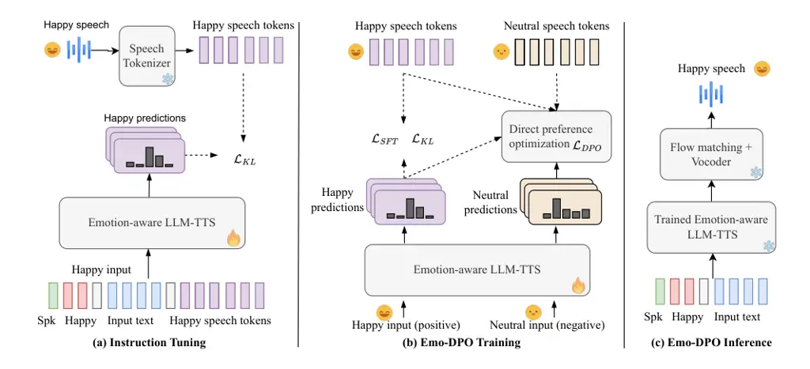
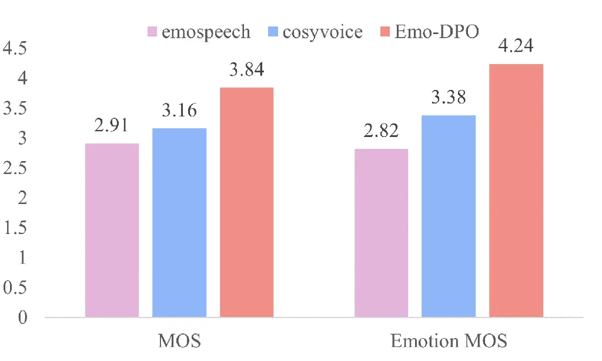
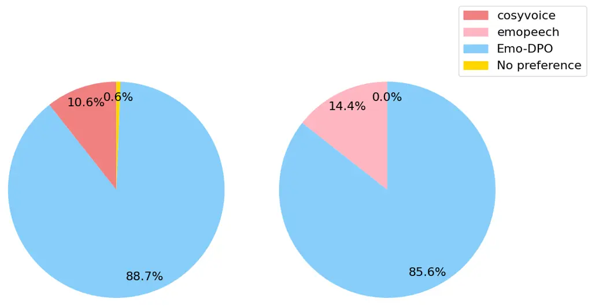

# Emo-DPO: Controllable Emotional Speech Synthesis through Direct Preference Optimization

1^(st) Xiaoxue Gao Affiliation:  Agency for Science, Technology, and
Research  
Gao_Xiaoxue@i2r.a-star.edu.sg     2^(nd) Chen Zhang Affiliation: 
National University of Singapore  
chen_zhang@u.nus.edu     3^(rd) Yiming Chen Affiliation:  National
University of Singapore  
yiming.chen@u.nus.edu     4^(th) Huayun Zhang Affiliation:  Agency for
Science, Technology, and Research  
Zhang_Huayun@i2r.a-star.edu.sg     5^(th) Nancy F. Chen Affiliation: 
Agency for Science, Technology, and Research  
nfychen@i2r.a-star.edu.sg

###### Abstract

Current emotional text-to-speech (TTS) models predominantly conduct
supervised training to learn the conversion from text and desired
emotion to its emotional speech, focusing on a single emotion per
text-speech pair. These models only learn the correct emotional outputs
without fully comprehending other emotion characteristics, which limits
their capabilities of capturing the nuances between different emotions.
We propose a controllable Emo-DPO approach, which employs direct
preference optimization to differentiate subtle emotional nuances
between emotions through optimizing towards preferred emotions over less
preferred emotional ones. Instead of relying on traditional neural
architectures used in existing emotional TTS models, we propose
utilizing the emotion-aware LLM-TTS neural architecture to leverage
LLMs’ in-context learning and instruction-following capabilities.
Comprehensive experiments confirm that our proposed method outperforms
the existing baselines.

###### Index Terms: 

Speech synthesis, large language models, text-to-speech (TTS), emotion.

## I Introduction

Humans produce speech that naturally varies in different emotions \[1,
2, 3, 4\]. Emotional speech synthesis aims to replicate this complexity
by generating human-like speech from text and the desired emotional
tone, with significant advancements achieved through machine learning
techniques \[5, 6, 7, 8\]. To generate realistic emotional speech,
emotional text-to-speech (TTS) models must account for various factors
beyond simple text input, such as the nuanced expression of emotions
through stress, intonation, rhythm, and the complex interplay of human
emotional characteristics \[4, 9\].

Current emotional TTS models predominantly rely on traditional
architectures such as LSTM \[10\], BLSTM \[11\], Tacotron \[12, 13, 8,
9\], FastSpeech \[14, 6, 7, 8, 15\], VITS \[16\], diffusion-based model
\[17\] and the flow-matching model \[18\]. They neglect the integration
of large language models (LLMs) to enhance speech synthesis with LLMs’
in-context learning and instruction-following capabilities regarding
quality, naturalness and emotional expressiveness. In contrast, LLMs
have demonstrated success in advancing speech synthesis by effectively
modeling speech tokens \[19\] and achieving high-quality synthesized
voices in zero-shot scenarios \[20, 21\]. Despite this, the application
of LLMs for emotion rendering in TTS models remains underexplored. This
paper aims to address this gap by investigating the application of LLMs
to enhance emotional speech synthesis, particularly in capturing the
nuanced distinctions between different emotions.

Supervised learning is predominantly used in training existing emotional
TTS models, where text is paired with corresponding emotional speech,
typically focusing on a single emotion per instance \[22, 6, 7, 8\].
This constrains the model’s control over multiple emotions and hinders
its capacity to capture subtle differences in prosody and intonation
among emotions. To address this, we draw inspiration from reinforcement
learning from human feedback (RLHF) \[23\] and direct preference
optimization (DPO) \[24\]. DPO has recently demonstrated remarkable
effectiveness in distinguishing preferred signals from less preferred
ones in LLMs \[25, 24, 26\] and generative models \[27, 28, 29, 30\].
RLHF, which underpins the success of modern LLMs \[23, 31, 32\],
requires training a reward model to approximate human preferences, while
DPO offers a more efficient way of optimizing preference data directly,
eliminating the need for an explicit reward model and reducing the
computational burden \[27, 28\].



Fig. 1: Overview of the proposed Emo-DPO approach: (a) instruction
tuning, (b) Emo-DPO training, and (c) the inference process.

Motivated by the success of DPO and its role in preference alignment, we
propose leveraging DPO to address the limitations of conventional
emotional TTS models that control only individual emotions. We introduce
Emo-DPO, an emotional TTS approach utilizing DPO to capture the nuanced
prosodic and intonational differences between positive-negative emotion
pairs, thereby enhancing emotional expressiveness in speech synthesis.
Unlike traditional supervised learning methods that lack emotional
preference, our Emo-DPO fine-tunes the TTS model by aligning it with
preferred emotional expression, optimizing the generation of preferred
emotional outputs over less favored ones. By incorporating both positive
and negative emotional feedback, Emo-DPO enables expressive speech
synthesis go beyond single emotion modeling, and thereby better
differentiating between emotions and generating more controllable and
expressive emotional speech.

Our contributions of this paper include: 1) Beyond Single Emotions: we
propose Emo-DPO, a novel controllable emotional TTS approach that
leverages direct preference optimization to differentiate subtle
differences between emotions for the first time, and 2) Emotion-aware
LLM-TTS: we investigate the integration of emotion-aware LLMs within
emotional TTS neural architectures.

## II Methodology

We propose an Emo-DPO method for emotional TTS through direct preference
optimization (DPO) with an LLM-based TTS neural architecture, as
illustrated in Fig 1.

### II-A Emo-DPO Overview

We propose an emotional TTS approach Emo-DPO that aims to synthesize
emotional speech from text, speaker x-vector, and desired emotion
inputs. Our approach combines (a) instruction tuning and (b) Emo-DPO
training with an integration of Emotion-aware LLM-TTS, optimizing the
likelihood of generating a speech token sequence that corresponds to the
specified emotional prompt in predefined instruction data. During
inference, Emo-DPO generates speech tokens from text, desired emotion
and speaker x-vector inputs, followed by a frozen flow-matching model
and a frozen vocoder to produce emotional speech (see Fig 1 (c)). We
next detail the proposed instruction tuning and Emo-DPO training
processes.

### II-B Instruction Tuning

In the first stage, we propose to perform supervised finetuning on
LLM-TTS $`\pi`$ to benefit from LLM’s instruction-following and
in-context learning capabitlities using parallel emotion text-to-speech
data $`D_{\texttt{sft}}`$ as shown in Fig 1 (a). The data is formatted
with the following instruction template:

```math
d_{j}\in D_{\texttt{sft}}=E.\texttt{<endofprompt>}x_{j}\texttt{</s>}y_{j}^{+}\texttt{</s>}
```

where $`E`$, $`x_{j}`$, $`y_{j}^{+}`$, \<endofprompt\>, and \</s\>
denote the emotion prompt word, such as Happy and Angry, the text token
sequence, the speech token sequence that corresponds to $`E`$, the
special token indicating the end of emotion trigger, and the separator
token, respectively. The speech tokenizer extracts the speech token
sequence, while the LLM-TTS model, comprising a text encoder and an
LLM-based decoder, predicts the probability distribution of emotional
speech tokens (eg. happy). Following \[20\], we apply a label smoothing
Kullback-Leibler (KL) loss to minimize the divergence between the
probability distribution prediction induced by $`\pi`$, $`P_{\pi}`$ and
the target (happy) distribution $`P`$:

```math
\mathcal{L}_{KL}=KL(P_{\pi}||P)=\mathbb{E}_{d_{j}\sim D_{\texttt{sft}}}\left[p(y^{+}_{j}|E,x_{j})\log\frac{p(y^{+}_{j}|E,x_{j})}{p_{\pi}(y^{+}_{j}|E,x_{j})}\right]
```

In this way, $`\pi`$ learns to generate speech token sequences that
align with the specified emotional prompt in the input text, ensuring
that the generated speech reflects the desired emotion as indicated by
$`E`$.

### II-C Emo-Direct Preference Optimization Training

Motivation: Yet, simply conducting instruction tuning on $`\pi`$ may be
insufficient, as the model only learns to generate the correct output
without fully understanding why it is correct. To equip the model with
the ability to capture subtle differences between the desired emotional
speech and other emotions with the same semantic content, we turn to
preference learning to further refine its performance. DPO \[24\]
provides an effective solution, allowing the model to learn directly
from preference data. This ensures that the generated speech aligns more
closely with the intended emotional nuances.

#### II-C1 Beyond One Emotion - DPO Training

To construct pairwise preference data for Emo-DPO fine-tuning (see Fig 1
(b)), we treat $`d_{j}`$ defined above as the positive instance (eg.
happy). For the negative instance, we sample from the training data
other instances that share the same $`x_{j}`$ (text input) but have
different emotional speech outputs (eg. neutral). Formally, the paired
data $`(d_{j}^{+},d_{j}^{-})\in D_{\texttt{pref}}`$ is formulated as
$`E.\texttt{<endofprompt>}x_{j}\texttt{</s>}y_{j}^{+}\texttt{</s>}`$ and
$`E.\texttt{<endofprompt>}x_{j}\texttt{</s>}y_{j}^{-}\texttt{</s>}`$.

Denote the LLM-TTS model after the first-stage instruction tuning as
$`\pi_{\texttt{sft}}`$. Given the pairwise dataset $`D_{\texttt{pref}}`$
and LLM-TTS $`\pi`$ to optimize, the DPO objective is defined as:

```math
\displaystyle\mathcal{L}_{\texttt{DPO}}(\pi;\pi_{\texttt{sft}})=-\mathbb{E}_{(d_{j}^{+},d_{j}^{-})\sim D_{\texttt{pref}}}\Bigg[ \displaystyle\log\sigma\Big(\beta\log\frac{\pi(y^{+}_{j}|E,x_{j})}{\pi_{\texttt{sft}}(y^{+}_{j}|E,x_{j})}
```

```math
\displaystyle-\beta\log\frac{\pi(y^{-}_{j}|E,x_{j})}{\pi_{\texttt{sft}}(y^{-}_{j}|E,x_{j})}\Big)\Bigg]
```

where $`\pi`$ is initialized as $`\pi_{\texttt{sft}}`$. $`\pi(\cdot)`$
refers to the conditional probability of $`\pi`$ generating the output
sequence. $`\beta`$ is the hyperparameter that modulates the sharpness
of $`\pi`$’s preference of $`y_{j}^{+}`$ over $`y_{j}^{-}`$. $`\sigma`$
is the sigmoid function. The DPO objective essentially maximizes the
likelihood of $`\pi`$ generating $`y_{j}^{+}`$ while minimizing the
likelihood of generating $`y_{j}^{-}`$ conditioned on $`x_{j}`$ and the
emotion trigger word $`E`$.

#### II-C2 Emo-DPO Training Objective

To further stabilize the training, we introduce two regularization
strategies. One strategy is to introduce a Jensen-Shannon (JS)
divergence \[33\] manipulation to the DPO objective:

```math
\displaystyle\text{(1) logits}=logratio_{\texttt{chosen}}-logratio_{\texttt{reject}}
```

```math
\displaystyle=\log\left(\frac{\pi(y^{+}_{j}|E,x_{j})}{\pi_{\texttt{sft}}(y^{+}_{j}|E,x_{j})}\right)-\log\left(\frac{\pi(y^{-}_{j}|E,x_{j})}{\pi_{\texttt{sft}}(y^{-}_{j}|E,x_{j})}\right)
```

```math
\displaystyle\text{(2) JSD}=\log\left(1+e^{logratio_{\texttt{chosen}}}\right)-\log\left(1+e^{logratio_{\texttt{reject}}}\right)
```

```math
\displaystyle\text{(3) logits}=\text{logits}-\text{JSD}
```

```math
\displaystyle\text{(4) }\mathcal{L}_{\texttt{DPO}}(\pi;\pi_{\texttt{sft}})=-\mathbb{E}_{(d_{j}^{+},d_{j}^{-})\sim D_{\texttt{pref}}}\left[\log\sigma\left(\beta\cdot\text{logits}\right)\right]
```

The above operations smooth the optimization process and prevent extreme
logit differences, thus improving training stability. Additionally, they
provide a more balanced and interpretable preference learning process
through the bounded and symmetric nature of JS divergence.

The other strategy is to jointly optimize the JS-regularized DPO
objective, the label-smoothing KL objective defined in stage 1 of
instruction tuning, and an additional SFT objective. Specifically, the
total loss term is defined as:

```math
\mathcal{L}=\alpha\mathcal{L}_{\texttt{DPO}}+\gamma\mathcal{L}_{\texttt{KL}}+\theta\mathcal{L}_{\texttt{SFT}}
```

where $`\mathcal{L}_{\texttt{SFT}}=-\log(\pi(y^{+}_{j}|E,x_{j}))`$ while
$`\alpha`$, $`\gamma`$, and $`\theta`$ are the hyperparameters that
control the strength of each loss term. Both the label-smoothing KL loss
and the SFT loss help stabilize the training by ensuring that the model
remains aligned with the pre-trained LLM-TTS distribution while
progressively adapting to the task-specific emotional speech generation.
The JS-regularized DPO loss, on the other hand, enables the model to
learn nuanced preferences from pairwise comparisons, guiding the model
towards more refined and emotionally aligned outputs.

|                  | Emo SIM | Prosody SIM | Intelligibility |         | Speech | Emotion | Recognition |          |
| ---------------- | ------- | ----------- | --------------- | ------- | ------ | ------- | ----------- | -------- |
| TTS models       |         |             |                 | Neutral | Angry  | Happy   | Sad         | Surprise |
| emoepeech \[6\]  | 98.26   | 3.35        | 7.17            | 0.24    | 0.01   | 0.00    | 0.55        | 0.56     |
| cosyvoice \[20\] | 98.73   | 3.69        | 4.94            | 0.69    | 0.83   | 0.60    | 0.69        | 0.65     |
| Emo-DPO          | 98.87   | 3.89        | 4.54            | 0.76    | 0.84   | 0.60    | 0.71        | 0.72     |

TABLE I: Objective evaluation results comparison of the proposed Emo-DPO
with baselines on emotion similarity, prosody similarity,
intelligibility and speech emotion recognition accuracy.

## III Experiments

### III-A Datasets and Experimental Setup

We use English part of the ESD dataset \[34\] for experiments, with 10
speakers expressing 5 emotions: Angry, Happy, Sad, Surprise, and
Neutral, with 350 utterances per speaker and emotion (about 1750
utterances and 1.2 hours per speaker). We follow official
train/valid/test splits \[34, 6\], where the validation and test sets
consists of 20 and 30 utterances in 5 emotions and 10 speakers,
resulting in 1000 and 1500 utterances. We use Cosyvoice-300M-Instruct
model (cosyvoice) \[20\] and fastspeech2 based emospeech \[6\] as strong
baselines, both with publicly accessible codes. The same X-vectors for
both cosyvoice and the proposed Emo-DPO are extracted from training data
for test speakers. Emo-DPO is trained for 2 epochs with dynamic
batching, followed by 3-epoch DPO training with a batch size of 8 on 4
GPUs. TTS-LLM, speech tokenizer, and text encoder in Emo-DPO are
initialized from cosyvoice, with the same architectures, and inference
uses a pretrained flow-matching model and HifiGan vocoder \[20\].
Parameters $`\alpha`$, $`\theta`$ and $`\gamma`$ are set to 1 and other
settings follow cosyvoice. For Emo-DPO training, we create pairwise
preference data with the same text by marking desired emotion audio as
preferred (e.g., happy) and other emotion audio (e.g., neutral) as
dis-preferred.

### III-B Evaluation Metrics

Extensive objective and subjective evaluations are conducted to compare
the proposed Emo-DPO with baselines.

Objective evaluations: to assess the intelligibility of generated audio,
we apply Whisper-Large-v3 on the audios to recognize the text and
calculate the word-error-rate (WER). Prosody similarity (SIM): we use
AutoPCP \[35\] as an utterance-level estimator to quantify the prosody
similarity between generated and ground-truth speech samples ¹¹ 1
https://github.com/facebookresearch/seamless_communication following
\[18\]. Emotion Similarity (SIM): we use the emotion2vec-base
model \[36\] to extract emotion embeddings from ground-truth and
generated audio, computing cosine similarity and averaging the results
across the test set for the EMO SIM score. Speech emotion recognition is
conducted using the pretrained model ²² 2
https://huggingface.co/emotion2vec/emotion2vec_plus_large on the
generated audios to identify the emotion categories, where Scores of 1
and 0 indicate correct and incorrect emotion identifications,
respectively. Averaged scores over 1,500 test utterances are computed
for each system.

Subjective evaluations include mean opinion score (MOS), emotion mean
opinion score (Emotion MOS) and AB preference test. 20 listeners
participate in all tests. MOS rates overall audio quality and
naturalness from 1 (bad) to 5 (excellent), while Emotion MOS scores the
similarity of emotion between the ground-truth audio and the generated
speech from 1 (not at all similar) to 5 (extremely similar). In AB
preference tests, listeners choose the better one between samples from
two systems (A and B) based on quality and emotion generation. Two AB
tests are conducted: cosy vs. Emo-DPO and emospeech vs. Emo-DPO, each
using 8 balanced emotion samples. For MOS and Emotion MOS tests,
listeners are asked rate 30 samples with balanced emotions (6 samples
per emotion) for cosyvoice, emospeech and Emo-DPO models.

## IV Results and Discussion

We study the effects of multiple emotion control, emotion-aware LLM-TTS
integration, SFT training, DPO training and training objective design.
We present objective evaluation results in Table I and subjective
evaluation results in Fig. 2 and Fig 3. We also conduct an ablation
study in Table II.

### IV-A Effectiveness of Emo-DPO training on LLM-TTS

To assess the effectiveness of DPO training for emotional TTS, we
compare baseline models (emospeech, cosyvoice) with the proposed Emo-DPO
in Table I. Emo-DPO outperforms the baselines in intelligibility,
prosody similarity, and emotion similarity, demonstrating its ability to
capture more subtle emotional and prosodic nuances for emotional TTS. A
similar trend is seen in subjective evaluations (MOS and emotion MOS) in
Fig. 2, showing that Emo-DPO excels in speech quality, naturalness, and
diverse emotion control. This confirms the success of DPO training in
advancing emotional TTS toward more controllable, higher-quality
performance. Speech emotion recognition results show that Emo-DPO
outperforms baselines, generating more controllable speech across
emotions, especially for sad and surprised audios.

To facilitate a clear comparison of TTS model performance, we present AB
preference test results in Fig. 3, showing that 85.6% of listeners
preferred the proposed Emo-DPO over emospeech, highlighting the
advantage of integrating emotion-aware LLM-TTS architecture over the
traditional FastSpeech2. The superiority of the propose Emo-DPO (88.7 %)
over cosyvoice (10.6 %) demonstrates the enhanced ability of DPO
training to capture nuanced emotional details through pairwise
preference guidance. A demo page with audio samples of this work is
available in the link ³³ 3 https://xiaoxue1117.github.io/Emo-tts-dpo/.



Fig. 2: Comparison of subjective evaluation results for MOS and Emotion
MOS tests across cosyvoice, emospeech, and the proposed Emo-DPO models.

### IV-B Ablation Study

To analyze the sources of contributions, we perform an ablation study on
the proposed Emo-DPO in Table II. We observe that removing the DPO loss
leads to a decline in intelligibility and prosody similarity
performance, indicating that the DPO loss contributes to clearer
linguistic pronunciation and better capture of diverse, time-varying
prosody changes. Further removal of the SFT loss results in decreased
emotional similarity, suggesting that the SFT loss helps stabilize
training. Omitting the DPO, SFT, and KL losses leads to an overall
performance drop, highlighting the effectiveness of the proposed
optimization design. Additionally, removing instruction tuning and
further omitting the SFT loss results in worse performance compared to
the proposed model across all evaluation metrics, underscoring the
importance of instruction tuning in capturing in-domain emotional
characteristics.



Fig. 3: Comparison of subjective evaluation results from AB preference
tests: 1) left: cosyvoice vs. Emo-DPO and 2) right: emospeech vs.
Emo-DPO.

| TTS Models                                                                                         | Emo SIM | Prosody SIM | Intelligibility |
| -------------------------------------------------------------------------------------------------- | ------- | ----------- | --------------- |
| Emo-DPO                                                                                            | 98.87   | 3.89        | 4.54            |
| \- $`\mathcal{L}_{\texttt{DPO}}`$                                                                  | 98.87   | 3.64        | 4.94            |
| \- $`\mathcal{L}_{\texttt{DPO}}`$ - $`\mathcal{L}_{\texttt{SFT}}`$                                 | 98.77   | 3.78        | 4.52            |
| \- $`\mathcal{L}_{\texttt{DPO}}`$ - $`\mathcal{L}_{\texttt{SFT}}`$ - $`\mathcal{L}_{\texttt{KL}}`$ | 98.73   | 3.69        | 4.94            |
| \- Instruction Tuning                                                                              | 98.74   | 3.83        | 4.80            |
| \- Instruction Tuning - $`\mathcal{L}_{\texttt{SFT}}`$                                             | 98.80   | 3.72        | 4.55            |

TABLE II: Ablation study on the proposed Emo-DPO with different
components removed w.r.t speech synthesis performances. Symbol ”$`-`$”
is removal operation.

## V Conclusion

This paper presents a controllable emotional TTS approach with the
integration of emotion-aware TTS-LLM architecture, opening doors for
advancing emotional speech synthesis in the era of LLMs. Our proposed
Emo-DPO approach utilizes novel direct preference optimization with
advanced objective designs to capture subtle emotional nuances by
favoring preferred emotions over less preferred ones. Extensive
experiments validate the effectiveness of Emo-DPO. The codes will be
released upon acceptance for research community.

## References

- \[1\] Yusuke Yasuda and Tomoki Toda, “Text-to-speech synthesis based
  on latent variable conversion using diffusion probabilistic model and
  variational autoencoder,” in IEEE ICASSP, 2023, pp. 1–5.
- \[2\] Li-Wei Chen, Shinji Watanabe, and Alexander Rudnicky, “A vector
  quantized approach for text to speech synthesis on real-world
  spontaneous speech,” arXiv preprint arXiv:2302.04215, 2023.
- \[3\] Fahima Khanam, Farha Akhter Munmun, Nadia Afrin Ritu,
  Aloke Kumar Saha, and Muhammad Firoz, “Text to speech synthesis: A
  systematic review, deep learning based architecture and future
  research direction,” Journal of Advances in Information Technology
  Vol, vol. 13, no. 5, 2022.
- \[4\] Takashi Nose, Junichi Yamagishi, Takashi Masuko, and Takao
  Kobayashi, “A style control technique for hmm-based expressive speech
  synthesis,” IEICE TRANSACTIONS on Information and Systems, vol. 90,
  no. 9, pp. 1406–1413, 2007.
- \[5\] Kun Zhou, Berrak Sisman, Rajib Rana, Björn W Schuller, and
  Haizhou Li, “Speech synthesis with mixed emotions,” IEEE Transactions
  on Affective Computing, vol. 14, no. 4, pp. 3120–3134, 2022.
- \[6\] Daria Diatlova and Vitalii Shutov, “Emospeech: guiding
  fastspeech2 towards emotional text to speech,” in 12th Speech
  Synthesis Workshop (SSW) 2023.
- \[7\] Younggun Lee, Azam Rabiee, and Soo-Young Lee, “Emotional
  end-to-end neural speech synthesizer,” arXiv preprint
  arXiv:1711.05447, 2017.
- \[8\] Xiang Li, Zhi-Qi Cheng, Jun-Yan He, Xiaojiang Peng, and
  Alexander G Hauptmann, “Mm-tts: A unified framework for multimodal,
  prompt-induced emotional text-to-speech synthesis,” arXiv preprint
  arXiv:2404.18398, 2024.
- \[9\] Yuxuan Wang, Daisy Stanton, Yu Zhang, RJ-Skerry Ryan, Eric
  Battenberg, Joel Shor, Ying Xiao, Ye Jia, Fei Ren, and Rif A Saurous,
  “Style tokens: Unsupervised style modeling, control and transfer in
  end-to-end speech synthesis,” in International conference on machine
  learning. PMLR, 2018, pp. 5180–5189.
- \[10\] Yi Lei, Shan Yang, and Lei Xie, “Fine-grained emotion strength
  transfer, control and prediction for emotional speech synthesis,” in
  2021 IEEE Spoken Language Technology Workshop (SLT). IEEE, 2021, pp.
  423–430.
- \[11\] Rui Liu, Yifan Hu, Yi Ren, Xiang Yin, and Haizhou Li, “Emotion
  rendering for conversational speech synthesis with heterogeneous
  graph-based context modeling,” in Proceedings of the AAAI Conference
  on Artificial Intelligence, 2024, vol. 38, pp. 18698–18706.
- \[12\] Tao Li, Shan Yang, Liumeng Xue, and Lei Xie, “Controllable
  emotion transfer for end-to-end speech synthesis,” in 2021 12th
  International Symposium on Chinese Spoken Language Processing
  (ISCSLP). IEEE, 2021, pp. 1–5.
- \[13\] Se-Yun Um, Sangshin Oh, Kyungguen Byun, Inseon Jang, ChungHyun
  Ahn, and Hong-Goo Kang, “Emotional speech synthesis with rich and
  granularized control,” in ICASSP 2020-2020 IEEE International
  Conference on Acoustics, Speech and Signal Processing (ICASSP). IEEE,
  2020, pp. 7254–7258.
- \[14\] Minchan Kim, Sung Jun Cheon, Byoung Jin Choi, Jong Jin Kim, and
  Nam Soo Kim, “Expressive text-to-speech using style tag,” arXiv
  preprint arXiv:2104.00436, 2021.
- \[15\] Dongchao Yang, Songxiang Liu, Rongjie Huang, Chao Weng, and
  Helen Meng, “Instructtts: Modelling expressive tts in discrete latent
  space with natural language style prompt,” IEEE/ACM Transactions on
  Audio, Speech, and Language Processing, 2024.
- \[16\] Wei Zhao and Zheng Yang, “An emotion speech synthesis method
  based on vits,” Applied Sciences, vol. 13, no. 4, pp. 2225, 2023.
- \[17\] Yiwei Guo, Chenpeng Du, Xie Chen, and Kai Yu, “Emodiff:
  Intensity controllable emotional text-to-speech with soft-label
  guidance,” in ICASSP 2023-2023 IEEE International Conference on
  Acoustics, Speech and Signal Processing (ICASSP). IEEE, 2023, pp. 1–5.
- \[18\] Haibin Wu, Xiaofei Wang, Sefik Emre Eskimez, Manthan Thakker,
  Daniel Tompkins, Chung-Hsien Tsai, Canrun Li, Zhen Xiao, Sheng Zhao,
  Jinyu Li, et al., “Laugh now cry later: Controlling time-varying
  emotional states of flow-matching-based zero-shot text-to-speech,”
  arXiv preprint arXiv:2407.12229, 2024.
- \[19\] Jaehyeon Kim, Keon Lee, Seungjun Chung, and Jaewoong Cho,
  “Clam-tts: Improving neural codec language model for zero-shot
  text-to-speech,” in The Twelfth International Conference on Learning
  Representations.
- \[20\] Zhihao Du, Qian Chen, Shiliang Zhang, Kai Hu, Heng Lu, Yexin
  Yang, Hangrui Hu, Siqi Zheng, Yue Gu, Ziyang Ma, et al., “Cosyvoice: A
  scalable multilingual zero-shot text-to-speech synthesizer based on
  supervised semantic tokens,” arXiv preprint arXiv:2407.05407, 2024.
- \[21\] Chengyi Wang, Sanyuan Chen, Yu Wu, Ziqiang Zhang, Long Zhou,
  Shujie Liu, Zhuo Chen, Yanqing Liu, Huaming Wang, Jinyu Li, et al.,
  “Neural codec language models are zero-shot text to speech
  synthesizers,” arXiv preprint arXiv:2301.02111, 2023.
- \[22\] Xiong Cai, Dongyang Dai, Zhiyong Wu, Xiang Li, Jingbei Li, and
  Helen Meng, “Emotion controllable speech synthesis using
  emotion-unlabeled dataset with the assistance of cross-domain speech
  emotion recognition,” in ICASSP 2021-2021 IEEE International
  Conference on Acoustics, Speech and Signal Processing (ICASSP). IEEE,
  2021, pp. 5734–5738.
- \[23\] Long Ouyang, Jeffrey Wu, Xu Jiang, Diogo Almeida, Carroll
  Wainwright, Pamela Mishkin, et al., “Training language models to
  follow instructions with human feedback,” in Advances in Neural
  Information Processing Systems, S. Koyejo, S. Mohamed, A. Agarwal,
  D. Belgrave, K. Cho, and A. Oh, Eds. 2022, vol. 35, pp. 27730–27744,
  Curran Associates, Inc.
- \[24\] Rafael Rafailov, Archit Sharma, Eric Mitchell, Christopher D
  Manning, Stefano Ermon, and Chelsea Finn, “Direct preference
  optimization: Your language model is secretly a reward model,” in
  Thirty-seventh Conference on Neural Information Processing
  Systems, 2023.
- \[25\] Bofei Gao, Feifan Song, Yibo Miao, Zefan Cai, Zhe Yang, Liang
  Chen, Helan Hu, Runxin Xu, Qingxiu Dong, Ce Zheng, Wen Xiao, Ge Zhang,
  Daoguang Zan, Keming Lu, Bowen Yu, Dayiheng Liu, Zeyu Cui, Jian Yang,
  Lei Sha, Houfeng Wang, Zhifang Sui, Peiyi Wang, Tianyu Liu, and Baobao
  Chang, “Towards a unified view of preference learning for large
  language models: A survey,” arXiv preprint arXiv: 2409.02795, 2024.
- \[26\] Abhimanyu Dubey, Abhinav Jauhri, Abhinav Pandey, Abhishek
  Kadian, Ahmad Al-Dahle, Aiesha Letman, Akhil Mathur, Alan Schelten,
  Amy Yang, Angela Fan, et al., “The llama 3 herd of models,” arXiv
  preprint arXiv:2407.21783, 2024.
- \[27\] Dong Zhang, Zhaowei Li, Shimin Li, Xin Zhang, Pengyu Wang,
  Yaqian Zhou, and Xipeng Qiu, “Speechalign: Aligning speech generation
  to human preferences,” arXiv preprint arXiv:2404.05600, 2024.
- \[28\] Geoffrey Cideron, Sertan Girgin, Mauro Verzetti, Damien
  Vincent, Matej Kastelic, Zalán Borsos, Brian McWilliams, Victor
  Ungureanu, Olivier Bachem, Olivier Pietquin, et al., “Musicrl:
  Aligning music generation to human preferences,” arXiv preprint
  arXiv:2402.04229, 2024.
- \[29\] Sanghyeon Na, Yonggyu Kim, and Hyunjoon Lee, “Boost your own
  human image generation model via direct preference optimization with
  ai feedback,” arXiv preprint arXiv:2405.20216, 2024.
- \[30\] Bram Wallace, Meihua Dang, Rafael Rafailov, Linqi Zhou, Aaron
  Lou, Senthil Purushwalkam, Stefano Ermon, Caiming Xiong, Shafiq Joty,
  and Nikhil Naik, “Diffusion model alignment using direct preference
  optimization,” in Proceedings of the IEEE/CVF Conference on Computer
  Vision and Pattern Recognition, 2024, pp. 8228–8238.
- \[31\] Josh Achiam, Steven Adler, Sandhini Agarwal, Lama Ahmad, Ilge
  Akkaya, Florencia Leoni Aleman, Diogo Almeida, Janko Altenschmidt, Sam
  Altman, Shyamal Anadkat, et al., “GPT-4 technical report,” arXiv
  preprint arXiv:2303.08774, 2023.
- \[32\] Gemini Team Google, Rohan Anil, Sebastian Borgeaud, Yonghui Wu,
  Jean-Baptiste Alayrac, Jiahui Yu, Radu Soricut, Johan Schalkwyk,
  Andrew M Dai, Anja Hauth, et al., “Gemini: a family of highly capable
  multimodal models,” arXiv preprint arXiv:2312.11805, 2023.
- \[33\] María Luisa Menéndez, JA Pardo, L Pardo, and MC Pardo, “The
  jensen-shannon divergence,” Journal of the Franklin Institute, vol.
  334, no. 2, pp. 307–318, 1997.
- \[34\] Kun Zhou, Berrak Sisman, Rui Liu, and Haizhou Li, “Emotional
  voice conversion: Theory, databases and esd,” Speech Communication,
  vol. 137, pp. 1–18, 2022.
- \[35\] Loïc Barrault, Yu-An Chung, Mariano Coria Meglioli, David Dale,
  Ning Dong, Mark Duppenthaler, Paul-Ambroise Duquenne, Brian Ellis,
  Hady Elsahar, Justin Haaheim, et al., “Seamless: Multilingual
  expressive and streaming speech translation,” arXiv preprint
  arXiv:2312.05187, 2023.
- \[36\] Ziyang Ma, Zhisheng Zheng, Jiaxin Ye, Jinchao Li, Zhifu Gao,
  Shiliang Zhang, and Xie Chen, “emotion2vec: Self-supervised
  pre-training for speech emotion representation,” arXiv preprint
  arXiv:2312.15185, 2023.
