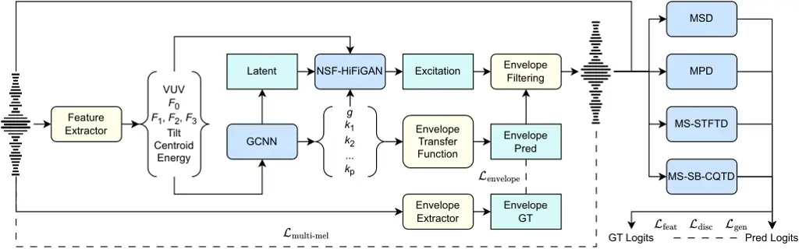

# HiFi-Glot: High-Fidelity Neural Formant Synthesis with Differentiable Resonant Filters

Yicheng Gu    Pablo Pérez Zarazaga    Chaoren Wang    Zhizheng Wu   
Zofia Malisz    Gustav Eje Henter    Lauri Juvela ^(†)^(†)thanks: This
work was supported by the Swedish Research Council grant no. 2017-02861
“Multimodal encoding of prosodic prominence in voiced and whispered
speech” and partially supported by the Wallenberg AI, Autonomous Systems
and Software Program (WASP) funded by the Knut and Alice Wallenberg
Foundation. We acknowledge the computational resources provided by the
Aalto Science-IT project. We acknowledge the EuroHPC Joint Undertaking
for awarding this project access to the EuroHPC supercomputer LUMI,
hosted by CSC (Finland) and the LUMI consortium through a EuroHPC
Regular Access call. (Corresponding author: Lauri
Juvela.)^(†)^(†)thanks: Yicheng Gu and Lauri Juvela are with the
Acoustic Lab, Department of Information Communications Engineering,
Aalto University, Espoo, Finland.^(†)^(†)thanks: Yicheng Gu, Chaoren
Wang, and Zhizheng Wu are with the School of Data Science, The Chinese
University of Hong Kong, Shenzhen, China.^(†)^(†)thanks: Pablo Pérez
Zarazaga, Zofia Malisz, and Gustav Eje Henter are with the Department of
Speech, Music and Hearing, KTH Royal Institute of Technology, Stockholm,
Sweden.

###### Abstract

Formant synthesis aims to generate speech with controllable formant
structures, enabling precise control of vocal resonance and phonetic
features. However, while existing formant synthesis approaches enable
precise formant manipulation, they often yield an impoverished speech
signal by failing to capture the complex co-occurring acoustic cues
essential for naturalness. To address this issue, this letter presents
HiFi-Glot, an end-to-end neural formant synthesis system that achieves
both precise formant control and high-fidelity speech synthesis.
Specifically, the proposed model adopts a source–filter architecture
inspired by classical formant synthesis, where a neural vocoder
generates the glottal excitation signal, and differentiable resonant
filters model the formants to produce the speech waveform. Experiment
results demonstrate that our proposed HiFi-Glot model can generate
speech with higher perceptual quality and naturalness while exhibiting a
more precise control over formant frequencies, outperforming
industry-standard formant manipulation tools such as Praat. Code,
checkpoints, and representative audio samples are available at
[https://www.yichenggu.com/HiFi-Glot/](https://www.yichenggu.com/HiFi-Glot/).

###### Index Terms: 

neural formant synthesis, differentiable resonant filters, speech
synthesis, differentiable digital signal processing.

## I Introduction

The ability to explicitly control speech parameters, such as the
fundamental frequency and formant frequencies, is crucial for deep
learning applications in speech science. For instance, phoneticians and
psycholinguists require synthetic stimuli to experimentally disentangle
the perceptual effects of different acoustic speech properties \[1, 2\].
Meanwhile, transgender voice therapists must adjust speech materials in
terms of pitch, resonance, and vocal weight to provide effective
guidance for their patients \[3, 4\]. To construct such speech material,
experts need to control low-level speech parameters such as formant
frequencies, spectral tilt, spectral centroid, and energy independently
and accurately. However, while speech technologies have made significant
progress \[5, 6\] in recent years, the fine-grained control of such
parameters has not been thoroughly explored, leaving a notable research
gap \[7, 8\].

Traditionally, speech modification has utilized DSP-based methods.
Techniques such as time-domain pitch-synchronous overlap-add (TD-PSOLA)
and its extensions \[9, 10\] remain common for pitch and timing
manipulation but cannot control formants. Meanwhile, the source-filter
model \[11\] presents a methodology for speech generation that mimics
the human speech production system. It allows independent analysis of
the signal’s spectral envelope (e.g., formant analysis) and glottal
excitation (e.g., pitch analysis). Conventional formant synthesizers
based on the source-filter model can achieve parametric control over the
speech signal \[12\]. However, while formant synthesis performs well in
specific tasks, it generally fails to generate natural-sounding
speech \[13\]. Even with advanced source-filter vocoders like
STRAIGHT \[14\], a naturalness gap remains. Another method for
manipulating formants is to apply linear predictive inverse filtering,
which modifies the formants in the spectral envelope and uses the
original residual excitation signal. Praat \[15\] provides a widely used
implementation of this. However, imperfect source-filter separation
leaves residual formant information in the source signal, leading to
artifacts when manipulating formants.

In contrast, deep learning–based approaches generally adopt neural
vocoders to synthesize speech from speech parameters. Neural vocoders
are neural networks used to transform a set of acoustic features into a
speech waveform. The most common acoustic input features for neural
vocoders are mel-spectrograms \[16, 17\]; while mel-spectrograms can
effectively represent speech, they do not offer intuitive or
disentangled control over its phonetic characteristics. To enable more
explicit and interpretable control over speech parameters, neural
source–filter models are used. Control of the source component has been
achieved through harmonic-oscillator excitation models \[18\] and
pitch-synchronous synthesis \[19\], enabling explicit control regarding
the fundamental frequency. Complementary to source modeling, the filter
component captures the speech spectral envelope, reflecting the vocal
tract’s resonant characteristics. Some approaches incorporate this part
using all-pole filters \[20\], while others use cepstral
representations \[21\] to parameterize the spectral envelope.



Fig. 1: Architecture and training schemes for HiFi-Glot. The model
consists of a GCNN feature mapper, an NSF-HiFiGAN decoder, and four
different discriminators. Dark-blue blocks represent trainable neural
networks, light-blue blocks represent intermediate features, yellow
blocks are differentiable DSP modules, and dashed lines indicate
loss-function input pairings.

Building upon these works, several studies have explored neural speech
synthesis directly from interpretable speech parameters. In particular,
WavebenderGAN \[22\] employs a feature-mapping network to convert input
parameters into mel-spectrograms, which are then converted into the
speech signals via a pre-trained neural vocoder. Subsequent work \[7\]
uses a simplified feature-mapping model, enabling speaker-independent
synthesis. However, as these models still follow a two-stage generation
paradigm, explicit modeling of vocal tract characteristics and
audio-level supervision are lacking, degrading parameter control
precision and speech quality.

To address these issues, this letter presents HiFi-Glot, an end-to-end
neural speech synthesis system that uses source–filter modeling with
differentiable all-pole filters. HiFi-Glot implements the source-filter
model by predicting the spectral envelope and glottal excitation, which
will then be converted to the speech signal using an all-pole filter
whose resonances are easy to inspect. Both the spectral envelope and the
glottal excitation are obtained from interpretable speech parameters
using our proposed fully differentiable and computationally efficient
methods. Experimental results show that our proposed HiFi-Glot achieves
more precise control over formant frequencies and generates speech
signals with higher perceptual quality and naturalness than
baselines \[15, 7\].

## II Methodology

This section details the model architecture, training scheme, and
differentiable all-pole filter designs of HiFi-Glot.

### II-A Model Architecture

As shown in Fig. 1, our proposed HiFi-Glot consists of a gated
convolution neural network (GCNN) \[7\]-based feature mapper, an
NSF-HiFiGAN decoder \[23\], and four different discriminators. The
feature mapping model consists of a group of cascaded, non-causal, gated
CNN layers that convert the input speech parameters into all-pole filter
parameters and a latent representation. The NSF-HiFiGAN then takes in
the latent representation and the pitch contour to generate an
excitation signal, which is subsequently passed through the predicted
all-pole filter to produce the speech waveform.

To improve synthesis quality without damaging parameter controllability,
we follow \[24\] and add adversarial loss terms based on both
time-domain and time-frequency-representation-based discriminators,
specifically: multi-period discriminator (MPD) \[17\], multi-scale
discriminator (MSD) \[17\], multi-scale STFT discriminator
(MS-STFTD) \[25\], and multi-scale sub-band CQT discriminator
(MS-SB-CQTD) \[26\].

### II-B All-Pole Synthesis Filter

The all-pole synthesis filter is essential to the proposed system.
Previous work on GAN-excited linear prediction (GELP) \[20\] enabled
gradient propagation from the filtered output back to the excitation
signal but was not differentiable with respect to the filter parameters.
End-to-end LPCNet \[27\] addressed this by parameterizing reflection
coefficients to ensure filter stability and gradient flow, but its
efficiency is limited due to its autoregressive scheme. Here, we present
a method that achieves both computational efficiency and full
differentiability, enabling fast parallel synthesis on GPUs:

Treat a tensor as reflection coefficients
$`\bm{k}\in\mathbb{R}^{M\times P}`$, where $`M`$ is the number of
frames, $`P`$ is the filter order, and the batch dimension is omitted
for simplicity. The direct-form linear predictor polynomial
$`\bm{a}\in\mathbb{R}^{M\times(P+1)}`$ is then obtained using the
forward Levinson recursion (which is differentiable). For parallel
filtering, an FIR approximation of the synthesis filter response for
each frame is obtained by:

```math
\bm{H}(z)=\frac{\bm{g}}{\text{FFT}(\bm{a},N)+\varepsilon}\in\mathbb{C}^{M\times N}, \tag{1}
```

where $`N`$ is the FFT length and $`\bm{g}`$ contains positive scalar
gain terms for each frame. A time-domain excitation signal
$`\bm{e}(t)\in\mathbb{R}^{T}`$ is transformed to a complex spectrogram
of matching size through a suitable STFT configuration, where:

```math
\bm{E}(z)=\text{STFT}(\bm{e}(t))\in\mathbb{C}^{M\times N}. \tag{2}
```

Filtering is then performed simply via complex multiplication in the
STFT domain, obtaining:

```math
\bm{X}(z)=\bm{H}(z)\bm{E}(z)\in\mathbb{C}^{M\times N}, \tag{3}
```

and a time-domain filtered signal is reconstructed via inverse FFT and
overlap add, giving us the final result:

```math
\bm{x}(t)=\text{ISTFT}(\bm{X}(z))\in\mathbb{R}^{T}. \tag{4}
```

### II-C Training Targets

Fig. 2: Box plots of speech-parameter manipulation results. Each
parameter is scaled over the range $`[0.7,\dots,1.3]`$ and then
re-synthesized using different systems. Box edges represent
1$`{}^{\text{st}}`$ and 3$`{}^{\text{rd}}`$ quartiles and whiskers
extend to $`1.5\times\text{IQL}`$. Note that all metrics are computed on
voiced speech segments only, since we only manipulate speech parameter
trajectories there. Additionally, Praat has no results for Tilt,
Centroid, and Energy as it does not support manipulating these speech
parameters.

We adapted the training scheme from HiFi-GAN \[17\] to train the
HiFi-Glot model, which is illustrated as follows:

```math
\begin{split}&\mathcal{L}_{\text{generator}}=15\mathcal{L}_{\text{multi-mel}}(x,\hat{x})+\mathcal{L}_{\text{envelope}}(\bm{H}(z),\hat{\bm{H}}(z))\\
&+\sum\nolimits_{r=1}^{R}[\mathcal{L}_{\text{adv}}(G;D_{r})+2\mathcal{L}_{\text{feat}}(G;D_{r})];\\
&\mathcal{L}_{\text{envelope}}=\sum\nolimits_{m,n=1}^{M,N}||\log(|\bm{H}(z)|)-\log(|\hat{\bm{H}}(z)|)||_{1};\\
&\mathcal{L}_{\text{discriminator}}=\sum\nolimits_{r=1}^{R}\mathcal{L}_{\text{adv}}(D_{r};G);\\
\end{split} \tag{5}
```

where $`x`$ and $`\hat{x}`$ are the ground-truth and predicted speech
signal, $`|\hat{\bm{H}}(z)|`$ is the model output envelope spectrogram
and $`|\bm{H}(z)|`$ is the ground truth LPC envelope spectrogram,
$`\mathcal{L}_{\text{multi-mel}}`$ is the multi-scale mel-spectrogram
loss adopted from DAC \[25\], $`D_{r}`$ is the $`r^{\text{th}}`$
discriminator, $`G`$ is the HiFi-Glot model,
$`\mathcal{L}_{\text{adv}}`$ and $`\mathcal{L}_{\text{feat}}`$ are the
adversarial losses and feature-matching loss, and
$`\mathcal{L}_{\text{envelope}}`$ is the envelope spectrogram loss.

## III Experiments

### III-A Experiment Setup

#### III-A1 Datasets

We used the same training set as in \[28\], which contains 1664 hours of
speech. We randomly selected 1000 utterances from HiFi-TTS2 \[29\] for
evaluation.

#### III-A2 Baselines

We used Praat \[15\] for the DSP baseline system. For F0 manipulation,
we used Parselmouth \[30\] for batch processing. For formant
manipulation, we applied the following pipeline: 1) Estimate up to five
formants, 2) adjust one or all of the first three formants in voiced
speech segments, 3) combine the modified vocal tract envelope with the
original excitation obtained via LPC inverse filtering, and 4) reimpose
the original intensity trajectory on the modified speech.

For the neural-network baseline, we used the neural formant synthesis
(NFS) model from \[7\], denoted as NFS-HiFiGAN, and reimplemented it at
a 44.1 kHz sampling rate, with its decoder replaced by a mel-spectrogram
pre-trained NSF-HiFiGAN model \[23\] (same as HiFi-Glot) for fair
comparison.

#### III-A3 Configuration

HiFi-Glot adapted the implementation of \[7\] to full-band operation.
For the feature-mapping model, 8 GCNN layers were used, with residual
and skip channels of 256 and a kernel size of 5. We used a
128-dimensional latent representation. We used 51 values to represent
the predicted all-pole filter parameters, consisting of 50
log-area-ratios (LARs) and a gain factor. The envelope parameters were
transformed to reflection coefficients using a tanh function to enforce
filter stability. We implemented the NSF-HiFiGAN decoder \[23\] with a
modified multi-scale oscillator as in \[31\], and used the code from
Amphion \[32\] for the discriminators. We used periods of \[2, 3, 5, 7,
11, 17, 23, 37\] for the MPD; we computed 10 octaves and changed the hop
sizes to \[1024, 512, 512\] for the MS-SB-CQTD, and left MSD, MS-STFTD,
and other hyperparameters unmodified.

#### III-A4 Preprocessing

We processed the training and evaluation datasets to 44.1 kHz mono WAV
files. $`F_{0}`$, $`F_{1}`$, $`F_{2}`$, $`F_{3}`$, and the voicing
boundary were extracted using Praat \[15\], the spectral tilt was
extracted as the predictor coefficient of the first-order all-pole
polynomial, the spectral centroid was extracted as the average of
frequency bin values weighted by their corresponding frequency value,
and the energy was a log-scale value of the frame energy. All features
were extracted using a Hann window with a length of 2048 and a hop size
of 512. $`F_{0}`$, $`F_{1}`$, $`F_{2}`$, $`F_{3}`$, and spectral tilt
values were linearly interpolated in unvoiced regions. Formant contours
were further smoothed using a median filter with a kernel size of 7. All
features were then min-max normalized to \[$`-`$1, 1\].

#### III-A5 Training

All the models were trained using the AdamW optimizer with
$`\beta_{1}=0.8`$ and $`\beta_{2}=0.99`$, a learning rate of 2e$`-`$5,
and an exponential decay scheduler with a factor $`\gamma=0.999996`$.
All the experiments were done on an H200 GPU with a batch size of 16 and
a 1 s segment length for 1M steps.

Fig. 3: Bar plots of the MUSHRA-like listening test results with 95%
confidence intervals (CIs). All formant parameters are scaled over the
range $`[0.7,\dots,1.3]`$ and then re-synthesized using different
systems.

### III-B Evaluation Metrics

We computed the root-mean-square error (RMSE) between the estimated
feature values of the re-synthesized and ground-truth speech for
objective evaluation. For subjective evaluation, we employed a
MUSHRA-like test \[33\] comprising 35 distinct test trials. In each
trial, synthesized samples from all systems for a given utterance were
presented on the same screen to allow for side-by-side comparison.
Unlike the standard MUSHRA test, a labeled ground-truth reference and a
16 kHz-resampled hidden anchor were provided only when a ground-truth
recording was available; otherwise, no reference was presented.
Listeners were asked to provide scores (denoted as Quality- and
Naturalness-MUSHRA) ranging from 0 to 100. To ensure data reliability,
we integrated 5 attention-check trials in which listeners were
explicitly instructed by the audio to grade a sample within a specific
score range; failure at any check resulted in exclusion. We recruited 20
participants via Prolific, screening for native English speakers with an
approval rate of at least 95%. Participants who passed all
attention-check trials received 12 EUR as compensation.

### III-C Effectiveness on Speech Parameter Manipulation

Fig. 2 illustrates the manipulation errors for different speech
parameters across various scaling factors. For Tilt, Centroid, and
Energy, HiFi-Glot consistently outperformed the baseline model, with
lower median errors across all scaling factors. Regarding $`F_{0}`$,
HiFi-Glot outperformed the baselines across most scaling factors. The
only exception is at the 0.7 scale, where it performed comparably to
NFS-HiFiGAN, though it remained superior to Praat. For $`F_{1}`$,
$`F_{2}`$, and $`F_{3}`$, HiFi-Glot demonstrated clear advantages when
the scaling factors were below 1.0 (downward scaling). Meanwhile, when
the scaling factors were greater than or equal to 1.0 (upward scaling),
HiFi-Glot performed on par with the NFS-HiFiGAN baseline while
consistently outperforming Praat. Overall, these results validated the
effectiveness of the proposed HiFi-Glot model, highlighting its
exceptional accuracy in downward scaling and competitive performance in
upward scaling. Note that the Praat baseline benefits from access to the
original excitation signal and the LPC envelope, and it simply performs
LPC copy-synthesis at a unit-scale (1.0) modification. In contrast,
neural methods need to generate signals directly from the speech
parameters; despite this, our model remains competitive.

### III-D Effectiveness on Vocal Tract Length Modification

We evaluate the perceptual quality and naturalness of the proposed
method in a vocal tract length modification scenario using a MUSHRA-like
listening test. We simulate changes in vocal tract length by scaling all
formant parameters ($`F_{1}`$, $`F_{2}`$, and $`F_{3}`$) simultaneously
by factors in the range $`[0.7,\dots,1.3]`$. The subjective evaluation
results are shown in Fig. 3. Note that the relatively low absolute
scores are expected, as globally scaling formant parameters inherently
results in speech that sounds less natural compared to the original
recordings.

While Praat achieves the highest scores at the unit scale (1.0, i.e., no
manipulation) by essentially applying LPC copy-synthesis, its
performance degrades rapidly as the scaling factor deviates from unity.
For all these scaling factors, speech manipulation using HiFi-Glot has
superior performance and robustness in terms of both quality and
naturalness, compared to both Praat and NFS-HiFiGAN. This confirms that
our proposed HiFi-Glot offers a better trade-off between high-fidelity
reconstruction and flexible formant control.

## IV Conclusion

This letter presents HiFi-Glot, an end-to-end neural formant synthesis
system that combines a source-filter architecture with resonant all-pole
filters. Through a fully differentiable filter design, HiFi-Glot enables
accurate, interpretable control of key speech parameters, including
formants, spectral tilt, centroid, energy, and pitch. Experimental
results illustrate that our proposed HiFi-Glot can generate speech of
higher quality and naturalness, with superior manipulation accuracy,
compared with baseline systems, confirming its effectiveness.

## References

- \[1\] A. J. Van Hessen and M. E. H. Schouten (1999) Categorical
  perception as a function of stimulus quality. Phonetica 56 (1-2),
  pp. 56–72. Cited by: §I.
- \[2\] L. Lisker and A. S. Abramson (1970) The voicing dimension: some
  experiments in comparative phonetics. In Proc. ICPhS, pp. 563–567.
  Cited by: §I.
- \[3\] R. Netzorg, B. Yu, A. Guzman, P. Wu, L. McNulty, and G. K.
  Anumanchipalli (2024) Towards an interpretable representation of
  speaker identity via perceptual voice qualities. In Proc. ICASSP,
  pp. 12391–12395. Cited by: §I.
- \[4\] R. Netzorg, A. Jalal, L. McNulty, and G. K.
  Anumanchipalli (2023) PerMod: perceptually grounded voice modification
  with latent diffusion models. In Proc. ASRU, pp. 1–8. Cited by: §I.
- \[5\] Y. Wang et al. (2025) MaskGCT: zero-shot text-to-speech with
  masked generative codec transformer. In Proc. ICLR, Cited by: §I.
- \[6\] H. He et al. (2025) Emilia: a large-scale, extensive,
  multilingual, and diverse dataset for speech generation. IEEE/ACM
  Trans. Audio Speech Lang. Process.. Cited by: §I.
- \[7\] P. Pérez Zarazaga, Z. Malisz, G. E. Henter, and L. Juvela (2023)
  Speaker-independent neural formant synthesis. In Proc. Interspeech,
  pp. 5556–5560. Cited by: §I, §I, §I, §II-A, §III-A2, §III-A3.
- \[8\] S. Kobayashi, T. Kosaka, and T. Nose (2024) End-to-end neural
  formant synthesis using low-dimensional acoustic parameters. In Proc.
  GCCE, pp. 820–823. Cited by: §I.
- \[9\] F. Charpentier and M. Stella (1986) Diphone synthesis using an
  overlap-add technique for speech waveforms concatenation. In Proc.
  ICASSP, Vol. 11, pp. 2015–2018. Cited by: §I.
- \[10\] T. Dutoit, V. Pagel, N. Pierret, F. Bataille, and O. Van der
  Vrecken (1996) The MBROLA project: towards a set of high quality
  speech synthesizers free of use for non commercial purposes. In Proc.
  ICSLP, pp. 1393–1396. Cited by: §I.
- \[11\] G. Fant (1960) Acoustic Theory of Speech Production. Mouton,
  The Hague. Cited by: §I.
- \[12\] M. J. Hunt and C. E. Harvenberg (1986) Generation of controlled
  speech stimulating by pitch-synchronous lpc analysis of natural
  utterances. In Proc. ICA, pp. A4–2. Cited by: §I.
- \[13\] Z. Malisz, G. E. Henter, C. Valentini-Botinhao, O. Watts, J.
  Beskow, and J. Gustafson (2019) Modern speech synthesis for phonetic
  sciences: a discussion and an evaluation. In Proc. ICPhS, pp. 487–491.
  Cited by: §I.
- \[14\] H. Kawahara (2006) STRAIGHT, exploitation of the other aspect
  of VOCODER: perceptually isomorphic decomposition of speech sounds.
  Acoust. Sci. Technol. 27, pp. 349–353. Cited by: §I.
- \[15\] P. Boersma and D. Weenink (2001) Praat, a system for doing
  phonetics by computer. In Glot International, pp. 341–345. Cited by:
  §I, §I, §III-A2, §III-A4.
- \[16\] A. Van Den Oord et al. (2016) WaveNet: a generative model for
  raw audio. arXiv:1609.03499. Cited by: §I.
- \[17\] J. Kong, J. Kim, and J. Bae (2020) HiFi-GAN: generative
  adversarial networks for efficient and high fidelity speech synthesis.
  Advances in neural information processing systems 33, pp. 17022–17033.
  Cited by: §I, §II-A, §II-C.
- \[18\] X. Wang, S. Takaki, and J. Yamagishi (2019) Neural
  source-filter waveform models for statistical parametric speech
  synthesis. IEEE/ACM Trans. Audio Speech Lang. Process. 28,
  pp. 402–415. Cited by: §I.
- \[19\] O. Watts, L. Wihlborg, and C. Valentini-Botinhao (2023) Puffin:
  pitch-synchronous neural waveform generation for fullband speech on
  modest devices. In Proc. ICASSP, pp. 1–5. Cited by: §I.
- \[20\] L. Juvela, B. Bollepalli, J. Yamagishi, and P. Alku (2019)
  GELP: GAN-excited linear prediction for speech synthesis from
  mel-spectrogram. In Proc. Interspeech, pp. 694–698. Cited by: §I,
  §II-B.
- \[21\] R. Yoneyama, Y. Wu, and T. Toda (2023) Source-filter HiFi-GAN:
  fast and pitch controllable high-fidelity neural vocoder. In Proc.
  ICASSP, pp. 1–5. Cited by: §I.
- \[22\] G. T. Döhler Beck, U. Wennberg, Z. Malisz, and G. E.
  Henter (2022) Wavebender GAN: an architecture for phonetically
  meaningful speech manipulation. In Proc. ICASSP, pp. 6187–6191. Cited
  by: §I.
- \[23\] J. Liu, C. Li, Y. Ren, F. Chen, and Z. Zhao (2022) DiffSinger:
  singing voice synthesis via shallow diffusion mechanism. In Proc.
  AAAI, pp. 11020–11028. Cited by: §II-A, §III-A2, §III-A3.
- \[24\] Y. Gu, X. Zhang, L. Xue, H. Li, and Z. Wu (2024) An
  investigation of time-frequency representation discriminators for
  high-fidelity vocoders. IEEE/ACM Trans. Audio Speech Lang. Process.
  32, pp. 4569–4579. Cited by: §II-A.
- \[25\] R. Kumar, P. Seetharaman, A. Luebs, I. Kumar, and K.
  Kumar (2023) High-fidelity audio compression with improved RVQGAN. In
  Proc. NeurIPS, Cited by: §II-A, §II-C.
- \[26\] Y. Gu, X. Zhang, L. Xue, and Z. Wu (2024) Multi-scale sub-band
  constant-Q transform discriminator for high-fidelity vocoder. In Proc.
  ICASSP, pp. 10616–10620. Cited by: §II-A.
- \[27\] K. Subramani, J. Valin, U. Isik, P. Smaragdis, and A.
  Krishnaswamy (2022) End-to-end LPCNet: a neural vocoder with
  fully-differentiable LPC estimation. In Proc. Interspeech,
  pp. 818–822. Cited by: §II-B.
- \[28\] Y. Gu, J. Zhang, C. Wang, J. Li, Z. Wu, and L. Juvela (2025)
  Aliasing free neural audio synthesis. arXiv:2512.20211. Cited by:
  §III-A1.
- \[29\] R. Langman et al. (2025) HiFiTTS-2: A Large-Scale High
  Bandwidth Speech Dataset. arXiv:2506.04152. Cited by: §III-A1.
- \[30\] Y. Jadoul, B. Thompson, and B. de Boer (2018) Introducing
  Parselmouth: a python interface to Praat. J. Phonetics 71, pp. 1–15.
  Cited by: §III-A2.
- \[31\] Y. Gu, C. Wang, Z. Wu, and L. Juvela (2025) Neurodyne: neural
  pitch manipulation with representation learning and cycle-consistency
  GAN. In Proc. Interspeech, pp. 1253–1257. Cited by: §III-A3.
- \[32\] X. Zhang et al. (2024) Amphion: an open-source audio, music,
  and speech generation toolkit. In Proc. SLT, pp. 879–884. Cited by:
  §III-A3.
- \[33\] M. Schoeffler et al. (2018) A comprehensive framework for
  web-based listening tests. J. Open Source Softw. 6 (1). Cited by:
  §III-B.
