# ![[Uncaptioned image]](arxiv-2409-18042--8f717e2b456f.figures/figure-1.webp) EMOVA: Empowering Language Models to See, Hear and Speak with Vivid Emotions

Kai Chen    Yunhao Gou    Runhui Huang    Zhili Liu    Daxin Tan    Jing
Xu Affiliation: Huawei Noah’s Ark Lab  The Chinese University of Hong
Kong    Chunwei Wang    Yi Zhu    Yihan Zeng    Kuo Yang    Dingdong
Wang Affiliation: Huawei Noah’s Ark Lab  The Chinese University of Hong
Kong    Kun Xiang    Haoyuan Li    Haoli Bai    Jianhua Han    Xiaohui
Li    Weike Jin    Nian Xie    Yu Zhang Affiliation: Sun Yat-sen
University  Southern University of Science and Technology Project Page:
[https://emova-ollm.github.io/](https://emova-ollm.github.io/)    James
T. Kwok    Hengshuang Zhao Affiliation: Hong Kong University of Science
and Technology  The University of Hong Kong    Xiaodan Liang    Dit-Yan
Yeung    Xiao Chen    Zhenguo Li    Wei Zhang    Qun Liu    Jun Yao   
Lanqing Hong    Lu Hou    Hang Xu

###### Abstract

GPT-4o, an omni-modal model that enables vocal conversations with
diverse emotions and tones, marks a milestone for omni-modal foundation
models. However, empowering Large Language Models to perceive and
generate images, texts, and speeches end-to-end with publicly available
data remains challenging for the open-source community. Existing
vision-language models rely on external tools for speech processing,
while speech-language models still suffer from limited or totally
without vision-understanding capabilities. To address this gap, we
propose the EMOVA (EMotionally Omni-present Voice Assistant), to enable
Large Language Models with end-to-end speech abilities while maintaining
the leading vision-language performance. With a semantic-acoustic
disentangled speech tokenizer, we surprisingly notice that omni-modal
alignment can further enhance vision-language and speech abilities
compared with the bi-modal aligned counterparts. Moreover, a lightweight
style module is introduced for the flexible speech style controls
including emotions and pitches. For the first time, EMOVA achieves
state-of-the-art performance on both the vision-language and speech
benchmarks, and meanwhile, supporting omni-modal spoken dialogue with
vivid emotions.

⁰⁰footnotetext: ^(∗)Equal contribution, listed in alphabetical order by
surname.⁰⁰footnotetext: ^(†)Corresponding authors:
{honglanqing,houlu3,xu.hang}@ huawei.com

## 1 Introduction

OpenAI GPT-4o \[70\], a novel milestone for the omni-modal foundation
models, has rekindled people’s attention on intelligent assistants that
can see (_i.e_., perceiving fine-grained visual inputs), hear (_i.e_.,
understanding vocal instructions) and speak (_i.e_., generating vocal
responses) simultaneously. Existing Multi-modal Large Language Models
(MLLMs) mostly focus on two modalities only, either vision-language \[1,
40\] or speech-language \[11, 87\], demonstrating severe demands for
omni-modal models with visual, language and speech abilities. How to
empower Large Language Models (LLMs) to effectively process omni-modal
data in an end-to-end manner remains an open question.

Figure 1: EMOVA is the very first omni-modal LLM with state-of-the-art
performance on both vision-language and speech benchmarks
simultaneously. See detailed results in Table 2.

Existing omni-modal LLMs \[10, 19\] generally build on Vision LLMs and
integrate the speech modality by adopting a speech encoder like
Whisper \[74\], which extracts continuous speech features, similar to
how images are processed, to enable speech understanding. These models,
however, still rely on external Text-to-Speech (TTS) tools for
generating speech responses, limiting their ability to support real-time
interactions. AnyGPT \[93\], on the contrary, opts for a fully
discretization way, which first discretizes all data modalities (_i.e_.,
images, texts, and speeches), followed by omni-modal auto-regressive
modeling. This enables AnyGPT to handle multiple modalities with a
unified end-to-end framework, facilitating real-time interactions with
the help of streaming decoding. However, the discrete vision tokenizer
used by AnyGPT struggles to capture visual details, especially for
high-resolution images, falling far behind its continuous counterparts
on vision-language benchmarks. Furthermore, none of the existing works
explore the speech style controls (_e.g_., emotions and pitches) with
LLMs. Thus, our question arises: How to build an end-to-end omni-modal
LLM enabling emotional spoken dialogue while maintaining
state-of-the-art vision-language performance?

In this paper, we propose EMOVA (EMotionally Omni-present Voice
Assistant), a novel end-to-end omni-modal LLM with state-of-the-art
vision-language and speech capabilities while supporting emotional
spoken dialogue. Fig. 2 shows an overview of the model framework. A
continuous vision encoder captures fine-grained visual details, while a
discrete speech tokenizer and detokenizer empower end-to-end speech
understanding and generation. Specifically, the speech-to-unit (S2U)
tokenizer tokenizes the input speech waveforms to discrete speech units,
while the unit-to-speech (U2S) detokenizer reconstructs the speech
waveforms from LLM’s output speech units. To seamlessly integrate speech
modality with LLMs, we meticulously design a semantic- acoustic
disentangled speech tokenizer to decouple the semantic contents and
acoustic styles of input speeches \[77\], where 1) semantic content
(_i.e_., what it says) captures the semantic meanings of the input
speeches, which is finally discretized and aligned with LLMs, while 2)
acoustic style (_i.e_., how it says) captures the diverse speech styles
(_e.g_., emotions and pitches). Utilizing the semantic-acoustic
disentanglement of our speech tokenizer, we further introduce a
lightweight style module to support spoken dialogue with vivid emotions
and pitches. As in Sec. 4.1, this disentanglement design better
facilitates the modality alignment among texts and speeches while
maintaining flexibility for diverse speech style controllability and
personalization.

With EMOVA’s end-to-end omni-modal framework, we empirically demonstrate
publicly available bi-modal image-text and speech-text data are
sufficient for the omni-modal alignment with the text modality as a
bridge, eliminating the need for omni-modal data (_i.e_.,
image-text-speech), which is usually scarce. Surprisingly, we find that
the omni-modal alignment can further improve both the vision-language
and speech capabilities via joint optimization, even when compared with
their bi-modal aligned counterparts. Ultimately, only a small amount of
omni-modality samples are required to teach the model to respond in the
desired format. For the first time, EMOVA obtains state-of-the-art
results on both vision-language and speech benchmarks (see Table 2). The
main contributions of this work contain three parts:

1.  1.  We propose EMOVA, a novel end-to-end omni-modal LLM that can see,
        hear and speak. A continuous vision encoder with a semantic-acoustic
        disentangled speech tokenizer is adopted for seamless omni-modal
        alignment and diverse speech style controllability.
2.  2.  We introduce an efficient text-centric omni-modal alignment which
        can further enhance the vision-language and speech abilities,
        surpassing their bi-modal aligned counterparts (_i.e_., image-text
        only and speech-text only).
3.  3.  For the first time, EMOVA obtains state-of-the-art comparable
        results on both the vision-language and speech benchmarks
        simultaneously and further supports flexible spoken dialogues with
        vivid emotions.

|                                  |        |      |            |      |         |
| -------------------------------- | ------ | ---- | ---------- | ---- | ------- |
| Method                           | Visual | Text | Speech     |      |         |
|                                  |        |      | Understand | Gen. | Emotion |
| Vision Large Language Models     |        |      |            |      |         |
| LLaVA \[49\]                     | ✓      | ✓    | ✗          | ✗    | ✗       |
| Intern-VL \[10\]                 | ✓      | ✓    | ✗          | ✗    | ✗       |
| Speech Large Language Models     |        |      |            |      |         |
| Qwen-Audio \[11\]                | ✗      | ✓    | ✓          | ✗    | ✗       |
| Mini-Omni \[87\]                 | ✗      | ✓    | ✓          | ✓    | ✗       |
| LLaMA-Omni \[17\]                | ✗      | ✓    | ✓          | ✓    | ✗       |
| Omni-modal Large Language Models |        |      |            |      |         |
| VITA \[19, 20\]                  | ✓      | ✓    | ✓          | ✗    | ✗       |
| Ola \[55\]                       | ✓      | ✓    | ✓          | ✗    | ✗       |
| Any-GPT \[93\]                   | ✓      | ✓    | ✓          | ✓    | ✗       |
| Baichuan-Omni \[43\]             | ✓      | ✓    | ✓          | ✓    | ✗       |
| EMOVA (ours)                     | ✓      | ✓    | ✓          | ✓    | ✓       |

Table 1: Comparison of Multi-modal Large Language Models. EMOVA is the
very first Omni-modal LLM capable of emotional spoken dialogue with
state-of-the-art vision-language and speech capabilities simultaneously.
“Gen.” stands for Generation.

## 2 Related Work

#### Vision Large Language Models

(VLLMs) integrate the vision modality into LLMs \[81, 7\], enabling the
advanced understanding and reasoning over visual instructions \[49, 1,
26, 27\]. Recent VLLM works can be categorized into three directions, 1)
Vision encoders \[71, 5, 6\] are enhanced and aggregated for robust
representations \[46, 45, 80\]. 2) High-resolution methods are proposed
to overcome the fixed resolution of pre-trained vision encoders (e.g.,
$`336\times 336`$ for CLIP \[73\]), enabling LLMs to perceive
fine-grained visual information \[48, 14, 31, 58\]. 3) High-quality
instruction data is essential for VLLMs to generate accurate and
well-formed responses \[36, 40, 10\]. Besides achieving state-of-the-art
vision-language performance, we further introduce speech understanding
and generating abilities to EMOVA.

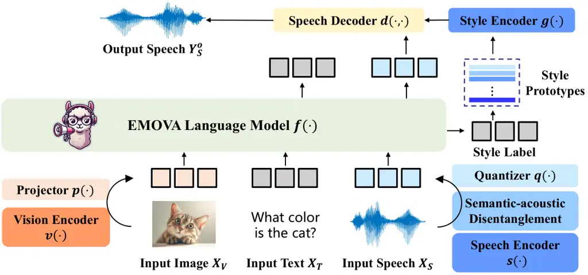

Figure 2: Model architecture of EMOVA. The vision encoder extracts
continuous visual features, which are projected into the textual
embedding space as visual tokens, while the input speech is encoded and
quantized into discrete speech units. Given the omni-modal inputs, EMOVA
can generate both textual and speech responses with vivid emotional
controls. Check Sec. 3 for more architectural details.

#### Speech Large Language Models

(SLLMs) empower the speech interaction with LLMs. Continuous SLLMs \[84,
11\] adopt the speech encoders \[74\] to extract continuous speech
embeddings for LLM, which, however, only support speech understanding,
relying on external TTS modules for speech generation, and therefore,
hampering real-time interaction. Discrete SLLMs \[95\], instead, first
discretize speech signals with speech tokenizers, followed by
auto-regressive modeling. Recent works \[17, 87\] further combine the
continuous speech encoders with discrete speech tokenizers for better
results. Although effective, none of the existing works explore speech
style controllability in SLLMs (_e.g_., emotions and pitches), which is
essential for spoken dialogue.

#### Omni-modal Large Language Models

support visual, text, and speech abilities with a unified architecture.
Similar to continuous SLLMs, InternOmni \[10\] and VITA \[19\] connect a
speech encoder with VLLMs, supporting speech understanding only.
Instead, AnyGPT \[93\] proposes a unified architecture to discretize and
conduct auto-regressive modeling for image, text, and audio
simultaneously, which, however, suffers from inevitable information loss
brought by discretization, especially for the high-resolution visual
inputs. Our EMOVA is the very first unified Omni-modal LLM with
state-of-the-art vision-language and speech performance at the same
time.

## 3 Architecture

### 3.1 Formulation

Denote LLM as $`f(\cdot)`$ and text, visual and speech inputs as
$`\textbf{X}_{T}`$, $`\textbf{X}_{V}`$ and $`\textbf{X}_{S}`$,
respectively. $`\textbf{X}_{T}`$ is converted to discrete tokens
$`\textbf{U}_{T}`$ via a text tokenizer \[21\], while the
$`\textbf{X}_{V}`$ is first encoded with a vision encoder $`v(\cdot)`$
as $`\textbf{E}_{V}=v(\textbf{X}_{V})`$, and then projected into the
textual embedding space with a projector $`p(\cdot)`$ as
$`\textbf{H}_{V}=p(\textbf{E}_{V})`$. As for the speech input
$`\textbf{X}_{S}`$, a Speech-to-Unit (S2U) procedure is required.
Specifically, $`\textbf{X}_{S}`$ first goes through a speech encoder
$`s(\cdot)`$ as $`\textbf{E}_{S}=s(\textbf{X}_{S})`$, which is then
discretized by the quantizer $`q(\cdot)`$ as
$`\textbf{U}_{S}=q(\textbf{E}_{S})`$. The LLM $`f(\cdot)`$ is then
trained to compute the joint probability of the output texts
$`\textbf{U}_{T}^{o}`$ and speech units $`\textbf{U}_{S}^{o}`$ as

```math
\mathbb{P}(\textbf{U}_{T}^{o},\textbf{U}_{S}^{o}|\textbf{U}_{omni})=\prod_{i=1}^{L}\mathbb{P}(\boldsymbol{x}_{i}|\textbf{U}_{T,<i}^{o},\textbf{U}_{S,<i}^{o},\textbf{U}_{omni}), \tag{1}
```

where $`\boldsymbol{x}_{i}\in\textbf{U}_{T}^{o}\cup\textbf{U}_{S}^{o}`$,
$`L=|\textbf{U}_{T}^{o}|+|\textbf{U}_{S}^{o}|`$ and
$`\textbf{U}_{omni}=\textbf{U}_{T}\cup\textbf{U}_{S}\cup\textbf{H}_{V}`$,
which stands for the omni-modal inputs. The output response units
$`\textbf{U}_{S}^{o}`$ are then recovered into the output speech
waveform $`\textbf{Y}_{S}^{o}`$ via a Unit-to-Speech (U2S) decoder
$`d(\cdot,\cdot)`$ with an emotion style embedding
$`\textbf{E}_{style}^{o}`$ to realize the vivid emotional spoken
dialogue controllability (Sec. 3.2).

#### LLM.

We utilize the Qwen-2.5 \[79\] model families as the base LLMs of EMOVA
with three configurations (_i.e_., 3B, 7B, and 72B) for usage under
different budgets.

#### Vision encoder and projector.

We use the QwenViT \[78\] as the visual encoder $`v(\cdot)`$ with an MLP
vision projector $`p(\cdot)`$ with a $`4\times`$ downsample rate for all
variants of EMOVA.

Figure 3: Comparison between different omni-modal alignment
paradigms. 1) Joint training demonstrates consistent improvements over
VL and Speech, suggesting that omni-modal alignment can be beneficial
across modalities. 2) Joint training outperforms both
VL$`\rightarrow`$Speech and Speech$`\rightarrow`$VL, revealing that
joint training is more superior and efficient than sequential training. 3) Joint is superior to Joint-entangled, highlighting the effectiveness
of the semantic-acoustic disentanglement, as discussed in Sec. 3.2.

### 3.2 Speech Tokenization

#### Speech-to-unit (S2U) tokenizer.

Following \[77\], we use the SPIRAL \[32\] architecture for the speech
encoder $`s(\cdot)`$ to capture both phonetic and tonal information,
which is then discretized by the quantizer $`q(\cdot)`$ with finite
scalar quantization (FSQ) \[64\]. The size of the speech codebook is
4,096, while the sample rate is 25 tokens per second. Once discretized,
the speech modality can be integrated into LLMs by concatenating the
text vocabulary and speech codebook.

Our S2U tokenizer provides the following advantages: 1) Data efficiency:
after pre-training on large-scale unlabeled speech data, it requires
only a small amount of speech-text pair data for easy adaptation. 2)
Bilingual: the speech codebook is shared among languages (_i.e_.,
English and Chinese), sharing unit modeling capabilities across
languages. Check more training details and comparisons in Appendix A.1.

#### Semantic-acoustic disentanglement.

To align the speech units seamlessly with the highly semantic embedding
space of LLMs, we opt for decoupling the semantic contents and acoustic
styles of input speeches. Given input speechs $`\textbf{X}_{S}`$, both
semantic embedding $`\textbf{E}_{semantic}`$ and style embeddings
$`\textbf{E}_{style}`$ are extracted separately as

```math
\{\textbf{E}_{semantic},\textbf{E}_{style}\}=\textbf{E}_{S}=s(\textbf{X}_{S}). \tag{2}
```

Only $`\textbf{E}_{semantic}`$ is quantified by $`q(\cdot)`$ to generate
the speech units $`\textbf{U}_{S}`$. By using different
$`\textbf{E}_{style}`$ while maintaining the same
$`\textbf{E}_{semantic}`$, we can easily control the recovered speech
styles without disturbing the semantic contents of recovered speeches.
Moreover, the disentanglement facilitates modality alignment among
speeches and texts, as later in Sec. 4.1.

#### Unit-to-speech (U2S) detokenizer with style controls.

Building on VITS \[35\], our U2S detokenizer adopts a conditional VAE
architecture (_cf_., Fig. 7). To achieve flexible style controls, we
utilize the semantic-acoustic disentanglement of our S2U tokenizer (as
discussed above) and adopt a novel style embedding to control the speech
styles (_e.g_., genders, emotions, and pitches). Specifically, the LLM
$`f(\cdot)`$ is trained to generate both the output speech units
$`\textbf{U}_{S}^{o}`$ and a style label. The speech units
$`\textbf{U}_{S}^{o}`$ are converted to the unit embeddings
$`\textbf{E}_{semantic}^{o}`$, while the style label is utilized to
generate a unique style prototype $`\textbf{E}_{style}^{o}`$. Both
$`\textbf{E}_{semantic}^{o}`$ and $`\textbf{E}_{style}^{o}`$ are taken
as inputs to speech decoder $`d(\cdot,\cdot)`$ to synthesize output
speeches
$`\textbf{Y}_{S}^{o}=d(\textbf{E}_{semantic}^{o},,\textbf{E}_{style}^{o})`$.

Our U2S detokenizer is pre-trained on LibriTTS \[92\] and
AISHELL-1 \[2\] and subsequently fine-tuned on synthetic style-rich
speech data. Due to the scarcity of real-life style-rich data, we
utilize TTS tools \[16\] to synthesize the speech samples diverse in
genders, pitches, and emotions. As for the style prototypes,
Emotion2Vec \[59\] is adopted to select the most representative samples
with the highest confidence in conveying the desired style. Our
empirical results reveal that even one representative style reference
speech has been sufficient to control the speech styles flexibly and
precisely. Check Appendix A.2 for more details.

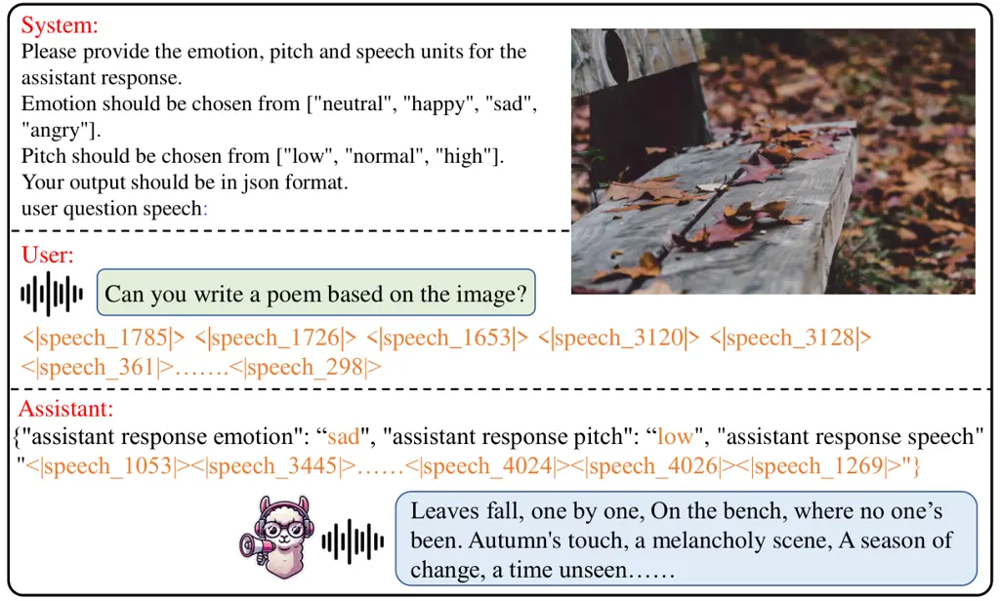

Figure 4: Demonstration of EMOVA omni-modal instruction tuning. 1) To
support emotional spoken dialogues, EMOVA is trained to explicitly
select speech style labels with output speech units. 2) For ease of
parsing, the data elements are organized in the JSON format.

## 4 Training Omni-modal LLMs

To achieve omni-model alignment, it is ideal to use large-scale
omni-modal image-text-speech data, which, however, is either without
reach due to copyrights \[67\] or limited in quality \[65\]. An
alternative is to use the existing image-text data with the
TTS-synthesized speeches, which is not only computationally expensive
but also hampers data diversity, as most TTS tools generate speeches in
similar patterns. Recent works \[10, 19\] choose to integrate the speech
modality into a well-structured VLLM via a sequential training manner
with bi-modal alignment data. However, the relationships among
modalities and how to effectively leverage multiple bi-modal alignment
datasets remain unclear.

In this work, we explore omni-modal text-centric alignment by utilizing
the publicly available bi-modal alignment datasets, including image-text
(_e.g_., image captioning) and speech-text (_e.g_., ASR and TTS)
datasets. With text modality as a bridge, our EMOVA ultimately becomes a
unified system capable of understanding and generating multiple
modalities in a coherent and integrated manner. In Sec. 4.1, we first
explore the following three questions:

1.  1.  Does the integration of the speech modality conflict with the
        vision-language capabilities?
2.  2.  Is sequential alignment of multiple modalities optimal?
3.  3.  How to represent speech modality to foster omni-modal alignment?

We then discuss the omni-modal instruction tuning pipeline and the
overall training paradigm of EMOVA in Sec. 4.2 and Sec. 4.3,
respectively.

### 4.1 Omni-modal Text-Centric Alignment

#### Settings.

We consider the following omni-modal training paradigms: 1)
VL$`\rightarrow`$Speech conducts the image-text alignment first followed
by speech-unit-text alignment using the full speech data with 10% of the
image-text alignment data to prevent catastrophic forgetting, similarly
with \[10, 19\]. 2) Speech$`\rightarrow`$VL instead performs
speech-unit-text alignment first and then aligns images with texts using
10% of the speech unit-text data and full image-text data. 3) Joint
aligns both modalities simultaneously. Note that unless otherwise
specified, we utilize the S2U tokenizer introduced in Sec. 3.2 to
extract speech units for all speech data, which effectively disentangles
the semantic and acoustic features. 4) Joint-entangled derives the
speech units using HuBERT \[30\], which does not achieve
semantic-acoustic disentanglement effectively with only K-means
clustering. 5) VL and Speech only align vision and speech modalities
with texts, respectively, serving as bi-modal baselines (see
Appendix B.1 for more details).

#### Evaluation.

For speech abilities, we evaluate the aligned model’s performance on the
ASR task of LibriSpeech \[72\], while for the vision-language, we
fine-tune the model with a small amount of high-quality visual
instruction data (_i.e_., 665K SFT data from the ShareGPT4V \[9\]) and
evaluate the fine-tuned model on common vision-language benchmarks.
Check Appendix C for evaluation details. Fig. 3 shows the comparison
among different paradigms on vision-language (left and middle) and ASR
(right, where we report the $`1-\text{WER}`$ value for better
readability) benchmarks, from which we can derive the following
observations:

#### Observation 1: image-text and speech-unit-text data benefit each other.

Contrary to the common assumption that multiple modalities might compete
and create conflicts, we notice that introducing additional modalities
is actually beneficial. As in Fig. 3, Joint consistently surpasses both
VL and Speech across vision-language and speech benchmarks. Moreover,
even models aligned sequentially, (_i.e_., VL$`\rightarrow`$Speech and
Speech$`\rightarrow`$VL, which are typically prone to catastrophic
forgetting, demonstrate superior performance on most vision-language
tasks. We speculate that the requirement to align multiple modalities
with text leads to more robust representations, which in turn generalize
better across different downstream tasks. This finding aligns with
ImageBind \[25\], where joint alignment of audio and depth with images
results in improved performance.

#### Observation 2: semantic-acoustic disentanglement benefits omni-modal alignment.

We find that 1) Joint outperforms Joint-entangled on vision-language
benchmarks, and 2) in the speech tasks, Joint maintains significant
advantages over its entangled counterpart. This can be attributed to the
semantic-acoustic disentanglement which makes speech units more
analogous to languages.

|                                 |       |       |       |         |      |      |         |       |          |      |           |
| ------------------------------- | ----- | ----- | ----- | ------- | ---- | ---- | ------- | ----- | -------- | ---- | --------- |
| Benchmarks                      | EMOVA | EMOVA | EMOVA | Gemini  | GPT- | GPT- | Whisper | Mini- | VITA     | VITA | Baichuan- |
|                                 | 3B    | 7B    | 72B   | Pro 1.5 | 4V   | 4o   | Large   | Omni2 | 8x7B     | 1.5  | Omni-7B   |
| MME                             | 2175  | 2317  | 2402  | \-      | 1927 | 2310 | \-      | \-    | 2097     | 2311 | 2187      |
| MMBench                         | 79.2  | 83.0  | 86.4  | \-      | 75.0 | 83.4 | \-      | \-    | 71.8     | 76.6 | 76.2      |
| SEED-Image                      | 74.9  | 75.5  | 76.6  | \-      | 71.6 | 77.1 | \-      | \-    | 72.6^(∗) | 74.2 | 74.1      |
| MM-Vet                          | 57.3  | 59.4  | 64.8  | \-      | 67.7 | \-   | \-      | \-    | 41.6     | 51.1 | 65.4      |
| RealWorldQA                     | 62.6  | 67.5  | 71.0  | 68.7    | 61.4 | 75.4 | \-      | \-    | 59.0^(∗) | 66.8 | 62.6      |
| TextVQA                         | 77.2  | 78.0  | 81.4  | 73.5    | 77.4 | \-   | \-      | \-    | 71.8^(∗) | 74.9 | 74.3      |
| ChartQA                         | 81.5  | 84.9  | 88.7  | 81.3    | 78.5 | 85.7 | \-      | \-    | 76.6^(∗) | 79.6 | 79.6      |
| DocVQA (test)                   | 93.5  | 94.2  | 95.9  | 86.5    | 88.4 | 92.8 | \-      | \-    | \-       | \-   | \-        |
| InfoVQA (test)                  | 71.2  | 75.1  | 83.2  | 72.7    | \-   | \-   | \-      | \-    | \-       | \-   | \-        |
| OCRBench                        | 803   | 814   | 843   | \-      | 656  | 736  | \-      | \-    | 678      | 752  | 700       |
| AI2D                            | 78.6  | 81.7  | 85.8  | 80.3    | 78.2 | 84.6 | \-      | \-    | 73.1     | 79.3 | \-        |
| ScienceQA-Img                   | 92.7  | 96.4  | 98.2  | \-      | 75.7 | \-   | \-      | \-    | \-       | \-   | \-        |
| MMMU                            | 45.8  | 49.8  | 59.7  | 58.5    | 56.8 | 69.2 | \-      | \-    | 47.3     | 52.1 | 47.3      |
| MathVista                       | 62.6  | 65.5  | 69.9  | 52.1    | 49.9 | 63.8 | \-      | \-    | 44.9     | 66.2 | 51.9      |
| Mathverse                       | 31.4  | 40.9  | 50.0  | \-      | 33.6 | \-   | \-      | \-    | \-       | \-   | \-        |
| Librispeech (WER$`\downarrow`$) | 5.4   | 4.1   | 2.9   | \-      | \-   | \-   | 3.0     | 4.8   | 3.4      | 8.1  | \-        |

Table 2: Comparison on vision-language and speech benchmarks. 1) EMOVA
outperforms GPT-4o/4V and Gemini Pro 1.5 on 11 of the 15 vision-language
benchmarks, providing a powerful open-sourced alternative. 2) Meanwhile,
our EMOVA achieves state-of-the-art performance on Librispeech,
surpassing its speech and omni-modal counterparts significantly. ^(∗):
reported by \[43\].

#### Observation 3: sequential alignment is not optimal.

We notice that Joint consistently outperforms its sequential
counterparts (_i.e_., VL$`\rightarrow`$Speech and
Speech$`\rightarrow`$VL) on both vision-language and speech benchmarks,
probably due to catastrophic forgetting when integrating a new modality.
In light of these observations, we have chosen to pursue the ultimate
alignment strategy that simultaneously aligns image-text and
speech-unit-text for EMOVA, which offers two important benefits, 1) it
fosters the mutual enhancement among vision-language and speech, and 2)
it avoids catastrophic forgetting during sequential alignment.

### 4.2 Omni-modal Instruction Tuning

After the omni-modal text-centric alignment in Sec. 4.1, the model
learns the fundamental vision-language (_e.g_., captioning) and speech
capabilities (_e.g_., ASR and TTS). However, instruction tuning is
essential to better follow complicated user instructions and respond
with vivid emotions.

#### Emotion-enriched instruction data synthesis.

Due to the scarcity of omni-modal instruction data (_i.e_., dialogues
involving images, speeches, and texts simultaneously), we opt for
synthesizing omni-modal instruction data from existing text and visual
instruction datasets. First, we select instruction data suitable for the
vocal expression by filtering out the non-vocal data (_e.g_., code and
mathematical formulas). Second, we clean the selected data to be more
vocal by removing text formatting elements (_e.g_., $`**`$ and \n\n). We
then obtain style labels for the remaining dialog contexts, including
genders (male, female), pitches (normal, low, high), and emotions
(happy, sad, angry, neutral), resulting in totally $`24`$ different
speech styles. The style labels are generated by prompting GPT-4o ¹¹ 1
https://chatgpt.ust.hk to make reasonable inferences given the dialogue
context. Finally, we convert the textual instructions and responses into
speeches utilizing the latest TTS tools (_i.e_., CosyVoice \[16\] and
Azure AI Speech), and the style labels are used to control the style of
synthesized speech data. To further improve the diversity of the data,
each instruction is synthesized by randomly choosing one of the 39
available speakers. Finally, we gather 120K speech-text and 110K
speech-image data pairs. Check more details in Appendix B.2.

#### Data organization and the chain of modality.

The omni-modal instruction data can be represented as
$`D_{\text{omni}}=\{(x_{V},u_{S},x^{o}_{T},c^{o}_{\text{style}},u^{o}_{S})_{i}\}_{i=1}^{N}`$,
where the input consists of the optional queried image $`x_{V}`$ and the
speech units of the instruction $`u_{S}`$, while the output consists of
the textual response $`x^{o}_{T}`$, the predicted speech style labels
$`c^{o}_{\text{style}}`$, and the output speech unit $`u^{o}_{S}`$. Note
that we train EMOVA to explicitly select styles (_e.g_., emotions and
pitches), which are utilized to determine the corresponding style
embedding for the U2S detokenizer (Sec. 3.2). Furthermore, since
directly generating speech responses is challenging, we decompose the
speech response procedure into three primary steps: 1) recognizing user
instructions into texts; 2) generating textual responses based on the
recognized instructions; 3) generating the style labels and response
speech units based on the textual responses. For ease of parsing during
deployment, the target outputs are formatted as JSON, as in Fig. 4.

|                 |                        |               |         |                      |       |                       |                           |
| --------------- | ---------------------- | ------------- | ------- | -------------------- | ----- | --------------------- | ------------------------- |
| Datasets        | End-to-end$`\uparrow`$ | Text response |         | Style Categorization |       | Recognition/Synthesis |                           |
|                 |                        | Unit In       | Text In | Emotion              | Pitch | WER/CER$`\downarrow`$ | TTS-WER/CER$`\downarrow`$ |
| Speech-Image-EN | 7.45                   | 7.56          | 7.95    | 82.50                | 97.70 | 2.40                  | 3.20                      |
| Speech-Text-EN  | 6.85                   | 6.90          | 7.38    | 81.20                | 84.70 | 6.90                  | 2.90                      |
| Speech-Image-ZH | 6.48                   | 7.02          | 6.82    | 77.60                | 95.90 | 1.70                  | 12.00                     |
| Speech-Text-ZH  | 5.25                   | 5.58          | 6.60    | 80.90                | 93.20 | 10.70                 | 12.20                     |

Table 3: Evaluation of EMOVA-7B on Speech Dialogue. By default, we
evaluate on the corresponding test set of the evaluated datasets.

### 4.3 Overall Training Paradigm

Inspired by \[9\], a three-stage training paradigm is adopted,

- •
  Stage-1: Vision-language pre-alignment. The purpose is to align the
  visual features into the embedding space of LLMs. Only the vision
  projector $`p(\cdot)`$ is trained.
- •
  Stage-2: Omni-modal text-centric alignment. This stage performs
  vision-language and speech-language alignment jointly. We train the
  LLM $`f(\cdot)`$, vision projector $`p(\cdot)`$, and the deeper half
  of vision encoder $`v(\cdot)`$ layers.
- •
  Stage-3: Omni-modal instruction tuning. We organize different datasets
  with various types of instructions to learn generalization across
  tasks, as detailed in Sec. 5.1.

## 5 Experiments

### 5.1 Training configuration

#### Stage-1.

In this stage, we only train the parameters of the vision projector
$`p(\cdot)`$ for vision-language pre-alignment with the LCS-558K
dataset \[49\], with the high-resolution image-slicing strategy \[48\]
adopted.

#### Stage-2.

We assemble a unified dataset with 7.4M samples for both the image-text
and speech-text alignment, as summarized in Fig. 9. Specifically, we
utilize pre-training datasets from ShareGPT4V \[9\], ALLaVA \[4\] (both
the original English version and the Chinese version translated on our
own), and ShareGPT-4o \[12\] for general perception, while for the OCR
capabilities, we leverage SynthDog \[34\], MMC-Alignment \[47\], K12
Printing, and the UReader Text Reading subset \[89\]. Moreover, we adopt
the 2,000 hours of ASR and TTS data from LibriSpeech \[72\] and
AISHELL-2 \[15\] for speech-text alignment, and to preserve the language
capabilities of LLMs, we further incorporate the text-only data from
Magpie Pro \[88\]. Check more details in Fig. 9.

#### Stage-3.

We collect the EMOVA-SFT dataset consisting of 4.4M multi-task
omni-modal samples (see Fig. 8). We start by gathering high-quality
open-sourced visual instruction datasets, including ShareGPT4V \[9\],
InternVL \[10\], Meteor \[38\], Idefics-2 \[36\], Cambrian \[80\], and
LLaVA-Onevision \[40\], followed by quality checking, re-formatting all
data samples with a unified template, and removing the duplicated data.
For speech, we include the training split of EMOVA omni-model
instruction data (_cf_., Sec. 4.2), with 10% of speech alignment
datasets to maintain ASR and TTS performance. We train with 128 Ascend
910B (64GB) NPUs in parallel (check more details in Table 5).

### 5.2 Comparison to SOTA Models

Experimental results are provided in Table 2. We compare a wide range of
state-of-the-art VLLMs, including Gemini Pro 1.5 \[75\], GPT-4V \[69\],
GPT-4o \[70\], together with the Speech LLM (_i.e_., Mini-Omni2 \[87\])
together with the ASR expert Whisper-Large \[74\], and the omni-modal
LLMs (_i.e_., VITA-8x7B \[19\], VITA-1.5 \[20\] and
Baichuan-Omni \[43\]).

#### Comparison with SOTA VLLMs.

As an omni-modal model, EMOVA obtains comparable performance with the
state-of-the-art VLLMs on multiple vision-language benchmarks, while
showing superior proficiency in solving math problems needing precise
visual content interpretation. Our EMOVA-7B surpasses GPT-4V by +7.3 on
MathVerse, and our EMOVA-72B exceeds GPT-4o by +6.1 on MathVista. On 11
out of the 15 benchmarks, our EMOVA outperforms both GPT-4o/4V and
Gemini Pro 1.5, providing a powerful open-sourced alternative.

#### Comparison with SOTA omni-modal LLMs.

Under the similar 7B capacity, EMOVA-7B is 220 points higher than VITA
on MME, surpassing VITA by 20.6% on OCRBench (814 vs. 678). Moreover, it
surpasses Baichuan-Omni-7B, a more recent Omni-modal LLM, on nearly all
the evaluated benchmarks, underscoring the effectiveness of our approach
and potential to push the boundary of omni-modal abilities.

Moreover, ASR results show that EMOVA significantly outperforms the most
recent omni-modal model VITA, even surpassing its SLLM counterparts
Mini-Omni2 and ASR-specialized Whisper-Large, showing the effectiveness
of the semantic-acoustic disentanglement and omni-modal mutual benefits.
We further report TTS results in Table 6, and provide the qualitative
examples in Fig. 5 and Appendix G. For the first time, EMOVA obtains
state-of-the-art results on both the speech and vision-language
benchmarks.

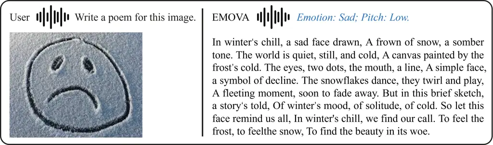

Figure 5: EMOVA engages in omni-modal emotional spoken dialogue
expressing sadness.

### 5.3 Evaluation of Emotion-Rich Spoken Dialogue

In this section, we evaluate the end-to-end spoken dialogue abilities of
EMOVA-7B. As stated in Sec. 4.2, the model takes an input image
$`x_{V}`$ and user instructions in the form of speech units $`u_{S}`$,
and outputs text responses, style labels, and corresponding speech
units. To ensure comprehensive evaluation, we propose the following
evaluation metrics:

1.  1.  End-to-end spoken dialogue score assesses the model’s dialogue
        performance based on the generated speeches, with a score ranging
        from 0 to 10, reporting the average.
2.  2.  Unit-input-text-output score focuses on the quality of the textual
        responses of LLM when the inputs are speech units, bypassing errors
        from speech synthesis.
3.  3.  Text-input-text-output score inputs the ground-truth user
        instruction texts and evaluates the model’s text outputs. This helps
        disentangle the impact of speech recognition errors and eliminates
        the effect of JSON format.
4.  4.  ASR and TTS evaluate how accurately the model recognizes the speech
        units and how effectively it generates speech units from text. See
        Appendix D for more details.
5.  5.  Style label classification accuracy evaluates the accuracy in
        selecting the appropriate speech style labels.
6.  6.  Style controllablity assesses the controllability of U2S detokenizer
        with the given conditional style labels using the confusion matrix
        comparing the generated and recognized style labels. See Appendix D
        for more details.

Due to the lack of emotionally rich spoken dialogue evaluation datasets,
we split a test set from our synthesized omni-modal instruction-tuning
data (Sec. 4.1). GPT-4o is used for automated evaluation. See details in
Appendix D.

#### Results.

Table 3 the spoken dialogue performance.

(i) By comparing the end-to-end dialogue score with the
unit-input-text-output score, we notice that the two scores are closely
aligned, with a maximum gap of only $`0.33`$, except for
Speech-Image-ZH. TTS-WER/CER is generally low for English, revealing
that EMOVA can synthesize accurate speech based on textual responses,
which, however, is harder for Chinese, which we attribute to its
complexity. It includes tasks such as generating poetries and answering
riddles, resulting in more intricate responses.

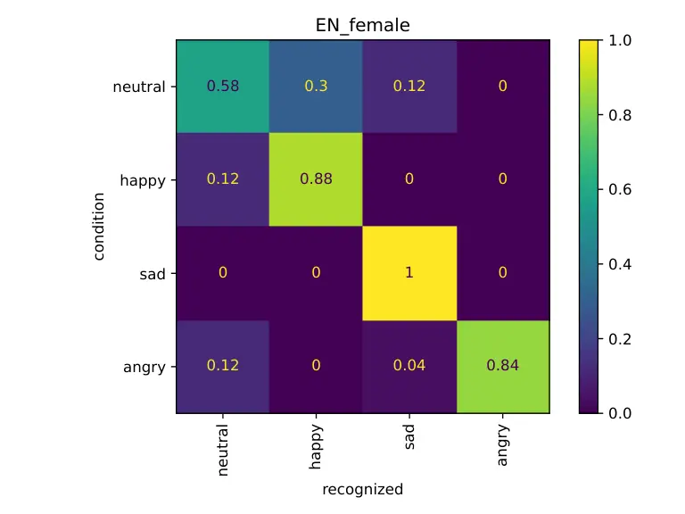

Figure 6: Confusion matrix between the generated and recognized
emotions. The emotions generated by our U2S detokenizer are recognized
with high probability. Best view with zooming in.

(ii) Comparing the unit-input-text-output score with the
text-input-text-output score, we notice that their differences correlate
with the ASR performance of the speech instructions, especially for
Speech-Text-EN and Speech-Text-ZH, which involve more complex
instructions.

Our EMOVA-7B reports inferior ASR performance ($`6.9`$ and $`10.7`$,
respectively) compared to other datasets ($`2.4`$ and $`1.7`$).
Consequently, when we replace speech instructions with ground-truth
transcriptions, EMOVA shows significant improvements from unit-input to
text input score. On the contrary, for datasets with accurate ASR
performance, the results are quite similar, suggesting EMOVA retains
robust dialogue capabilities when using the JSON format.

(iii) Examining the classification accuracy of style labels, we find
that EMOVA performs satisfactorily in classifying emotions and pitches
during speech conversations, achieving an accuracy of over 75%. The
confusion matrix comparing the conditional and recognized emotion labels
is shown in Fig. 6. The results indicate that the four emotions are
recognized with high probabilities, with three achieving over 80%
accuracy. This demonstrates that our U2S detokenizer effectively
controls common emotions, endowing the synthesized speech with vivid
emotional expression.

## 6 Conclusion

Our work builds EMOVA, a novel end-to-end omni-modal large language
model that effectively aligns vision, speech, and text simultaneously.
With text as a bridge, we show that omni-modal alignment is achievable
without relying on omni-modal image-text-speech data, meanwhile,
enhancing both vision-language and speech abilities. For the first time,
EMOVA achieves state-of-the-art performance on both vision-language and
speech benchmarks, setting a new standard for versatile omni-modal
interactions.

#### Acknowledgments.

We gratefully acknowledge supports of MindSpore, CANN (Compute
Architecture for Neural Networks) and Ascend AI Processor used for this
research. This work has been made possible by a Research Impact Fund
project (RIF R6003-21) and a General Research Fund project (GRF 16203224) funded by the Research Grants Council (RGC) of the Hong Kong
Government. This work was partially supported by the Research Grants
Council of the Hong Kong Special Administrative Region (Grants
C7004-22G-1 and 16202523) and the Joint Centre for Artificial
Intelligence (Grant FB453). This work is supported by National Key
Research and Development Program of China (2024YFE0203100) and National
Natural Science Foundation of China (No. 62441615, 62201484 and
62136005).

## References

- \[1\] Jinze Bai, Shuai Bai, Shusheng Yang, Shijie Wang, Sinan Tan,
  Peng Wang, Junyang Lin, Chang Zhou, and Jingren Zhou. Qwen-vl: A
  versatile vision-language model for understanding, localization, text
  reading, and beyond. _arXiv preprint arXiv:2308.12966_, 2023.
- \[2\] Hui Bu, Jiayu Du, Xingyu Na, Bengu Wu, and Hao Zheng. AISHELL-1:
  An open-source mandarin speech corpus and a speech recognition
  baseline. In _O-COCOSDA_, 2017.
- \[3\] Guoguo Chen, Shuzhou Chai, Guanbo Wang, Jiayu Du, Wei-Qiang
  Zhang, Chao Weng, Dan Su, Daniel Povey, Jan Trmal, Junbo Zhang, et al.
  Gigaspeech: An evolving, multi-domain asr corpus with 10,000 hours of
  transcribed audio. _arXiv preprint arXiv:2106.06909_, 2021a.
- \[4\] Guiming Hardy Chen, Shunian Chen, Ruifei Zhang, Junying Chen,
  Xiangbo Wu, Zhiyi Zhang, Zhihong Chen, Jianquan Li, Xiang Wan, and
  Benyou Wang. Allava: Harnessing gpt4v-synthesized data for a lite
  vision-language model. _arXiv preprint arXiv:2402.11684_, 2024a.
- \[5\] Kai Chen, Lanqing Hong, Hang Xu, Zhenguo Li, and Dit-Yan Yeung.
  Multisiam: Self-supervised multi-instance siamese representation
  learning for autonomous driving. In _ICCV_, 2021b.
- \[6\] Kai Chen, Zhili Liu, Lanqing Hong, Hang Xu, Zhenguo Li, and
  Dit-Yan Yeung. Mixed autoencoder for self-supervised visual
  representation learning. In _CVPR_, 2023a.
- \[7\] Kai Chen, Chunwei Wang, Kuo Yang, Jianhua Han, Lanqing Hong, Fei
  Mi, Hang Xu, Zhengying Liu, Wenyong Huang, Zhenguo Li, Dit-Yan Yeung,
  Lifeng Shang, Xin Jiang, and Qun Liu. Gaining wisdom from setbacks:
  Aligning large language models via mistake analysis. _arXiv preprint
  arXiv:2310.10477_, 2023b.
- \[8\] Kai Chen, Enze Xie, Zhe Chen, Lanqing Hong, Zhenguo Li, and
  Dit-Yan Yeung. Integrating geometric control into text-to-image
  diffusion models for high-quality detection data generation via text
  prompt. _arXiv preprint arXiv:2306.04607_, 2023c.
- \[9\] Lin Chen, Jisong Li, Xiaoyi Dong, Pan Zhang, Conghui He, Jiaqi
  Wang, Feng Zhao, and Dahua Lin. ShareGPT4V: Improving large
  multi-modal models with better captions. _arXiv preprint
  arXiv:2311.12793_, 2023d.
- \[10\] Zhe Chen, Jiannan Wu, Wenhai Wang, Weijie Su, Guo Chen, Sen
  Xing, Muyan Zhong, Qinglong Zhang, Xizhou Zhu, Lewei Lu, et al.
  InternVL: Scaling up vision foundation models and aligning for generic
  visual-linguistic tasks. In _CVPR_, 2024b.
- \[11\] Yunfei Chu, Jin Xu, Qian Yang, Haojie Wei, Xipin Wei, Zhifang
  Guo, Yichong Leng, Yuanjun Lv, Jinzheng He, Junyang Lin, et al.
  Qwen2-audio technical report. _arXiv preprint arXiv:2407.10759_, 2024.
- \[12\] Erfei Cui, Yinan He, Zheng Ma, Zhe Chen, Hao Tian, Weiyun Wang,
  Kunchang Li, Yi Wang, Wenhai Wang, Xizhou Zhu, Lewei Lu, Tong Lu, Yali
  Wang, Limin Wang, Yu Qiao, and Jifeng Dai. ShareGPT-4o: Comprehensive
  multimodal annotations with GPT-4o, 2023.
- \[13\] Alexandre Défossez, Laurent Mazaré, Manu Orsini, Amélie Royer,
  Patrick Pérez, Hervé Jégou, Edouard Grave, and Neil Zeghidour. Moshi:
  a speech-text foundation model for real-time dialogue.
  [http://kyutai.org/Moshi.pdf](http://kyutai.org/Moshi.pdf), 2024.
- \[14\] Xiaoyi Dong, Pan Zhang, Yuhang Zang, Yuhang Cao, Bin Wang,
  Linke Ouyang, Songyang Zhang, Haodong Duan, Wenwei Zhang, Yining Li,
  et al. Internlm-xcomposer2-4khd: A pioneering large vision-language
  model handling resolutions from 336 pixels to 4k hd. _arXiv preprint
  arXiv:2404.06512_, 2024.
- \[15\] Jiayu Du, Xingyu Na, Xuechen Liu, and Hui Bu. Aishell-2:
  Transforming mandarin asr research into industrial scale. _arXiv
  preprint arXiv:1808.10583_, 2018.
- \[16\] Zhihao Du, Qian Chen, Shiliang Zhang, Kai Hu, Heng Lu, Yexin
  Yang, Hangrui Hu, Siqi Zheng, Yue Gu, Ziyang Ma, et al. CosyVoice: A
  scalable multilingual zero-shot text-to-speech synthesizer based on
  supervised semantic tokens. _arXiv preprint arXiv:2407.05407_, 2024.
- \[17\] Qingkai Fang, Shoutao Guo, Yan Zhou, Zhengrui Ma, Shaolei
  Zhang, and Yang Feng. LLaMA-Omni: Seamless speech interaction with
  large language models. _arXiv preprint arXiv:2409.06666_, 2024.
- \[18\] Chaoyou Fu, Peixian Chen, Yunhang Shen, Yulei Qin, Mengdan
  Zhang, Xu Lin, Jinrui Yang, Xiawu Zheng, Ke Li, Xing Sun, Yunsheng Wu,
  and Rongrong Ji. Mme: A comprehensive evaluation benchmark for
  multimodal large language models. _arXiv preprint arXiv:2306.13394_,
  2024a.
- \[19\] Chaoyou Fu, Haojia Lin, Zuwei Long, Yunhang Shen, Meng Zhao,
  Yifan Zhang, Xiong Wang, Di Yin, Long Ma, Xiawu Zheng, et al. VITA:
  Towards open-source interactive omni multimodal llm. _arXiv preprint
  arXiv:2408.05211_, 2024b.
- \[20\] Chaoyou Fu, Haojia Lin, Xiong Wang, Yi-Fan Zhang, Yunhang Shen,
  Xiaoyu Liu, Yangze Li, Zuwei Long, Heting Gao, Ke Li, et al. Vita-1.5:
  Towards gpt-4o level real-time vision and speech interaction. _arXiv
  preprint arXiv:2501.01957_, 2025.
- \[21\] Philip Gage. A new algorithm for data compression. _The C Users
  Journal_, 1994.
- \[22\] Ruiyuan Gao, Kai Chen, Enze Xie, Lanqing Hong, Zhenguo Li,
  Dit-Yan Yeung, and Qiang Xu. Magicdrive: Street view generation with
  diverse 3d geometry control. _arXiv preprint arXiv:2310.02601_, 2023.
- \[23\] Ruiyuan Gao, Kai Chen, Zhihao Li, Lanqing Hong, Zhenguo Li, and
  Qiang Xu. Magicdrive3d: Controllable 3d generation for any-view
  rendering in street scenes. _arXiv preprint arXiv:2405.14475_, 2024a.
- \[24\] Ruiyuan Gao, Kai Chen, Bo Xiao, Lanqing Hong, Zhenguo Li, and
  Qiang Xu. Magicdrivedit: High-resolution long video generation for
  autonomous driving with adaptive control. _arXiv preprint
  arXiv:2411.13807_, 2024b.
- \[25\] Rohit Girdhar, Alaaeldin El-Nouby, Zhuang Liu, Mannat Singh,
  Kalyan Vasudev Alwala, Armand Joulin, and Ishan Misra. Imagebind: One
  embedding space to bind them all. In _CVPR_, 2023.
- \[26\] Yunhao Gou, Zhili Liu, Kai Chen, Lanqing Hong, Hang Xu, Aoxue
  Li, Dit-Yan Yeung, James T Kwok, and Yu Zhang. Mixture of
  cluster-conditional lora experts for vision-language instruction
  tuning. _arXiv preprint arXiv:2312.12379_, 2023.
- \[27\] Yunhao Gou, Kai Chen, Zhili Liu, Lanqing Hong, Hang Xu, Zhenguo
  Li, Dit-Yan Yeung, James T Kwok, and Yu Zhang. Eyes closed, safety on:
  Protecting multimodal llms via image-to-text transformation. _arXiv
  preprint arXiv:2403.09572_, 2024.
- \[28\] Yunhao Gou, Hansi Yang, Zhili Liu, Kai Chen, Yihan Zeng,
  Lanqing Hong, Zhenguo Li, Qun Liu, James T Kwok, and Yu Zhang.
  Corrupted but not broken: Rethinking the impact of corrupted data in
  visual instruction tuning. _arXiv preprint arXiv:2502.12635_, 2025.
- \[29\] Jianhua Han, Xiwen Liang, Hang Xu, Kai Chen, Lanqing Hong,
  Chaoqiang Ye, Wei Zhang, Zhenguo Li, Xiaodan Liang, and Chunjing Xu.
  Soda10m: Towards large-scale object detection benchmark for autonomous
  driving. _arXiv preprint arXiv:2106.11118_, 2021.
- \[30\] Wei-Ning Hsu, Benjamin Bolte, Yao-Hung Hubert Tsai, Kushal
  Lakhotia, Ruslan Salakhutdinov, and Abdelrahman Mohamed. Hubert:
  Self-supervised speech representation learning by masked prediction of
  hidden units. In _TASLP_, 2021.
- \[31\] Runhui Huang, Xinpeng Ding, Chunwei Wang, Jianhua Han, Yulong
  Liu, Hengshuang Zhao, Hang Xu, Lu Hou, Wei Zhang, and Xiaodan Liang.
  Hires-llava: Restoring fragmentation input in high-resolution large
  vision-language models. _arXiv preprint arXiv:2407.08706_, 2024.
- \[32\] Wenyong Huang, Zhenhe Zhang, Yu Ting Yeung, Xin Jiang, and Qun
  Liu. SPIRAL: Self-supervised perturbation-invariant representation
  learning for speech pre-training. _arXiv preprint
  arXiv:2201.10207_, 2022.
- \[33\] Aniruddha Kembhavi, Mike Salvato, Eric Kolve, Minjoon Seo,
  Hannaneh Hajishirzi, and Ali Farhadi. A diagram is worth a dozen
  images. In _ECCV_, 2016.
- \[34\] Geewook Kim, Teakgyu Hong, Moonbin Yim, JeongYeon Nam, Jinyoung
  Park, Jinyeong Yim, Wonseok Hwang, Sangdoo Yun, Dongyoon Han, and
  Seunghyun Park. Ocr-free document understanding transformer. In
  _ECCV_, 2022.
- \[35\] Jaehyeon Kim, Jungil Kong, and Juhee Son. Conditional
  variational autoencoder with adversarial learning for end-to-end
  text-to-speech. In _ICML_, 2021.
- \[36\] Hugo Laurençon, Léo Tronchon, Matthieu Cord, and Victor Sanh.
  What matters when building vision-language models? _arXiv preprint
  arXiv:2405.02246_, 2024.
- \[37\] Ann Lee, Hongyu Gong, Paul-Ambroise Duquenne, Holger Schwenk,
  Peng-Jen Chen, Changhan Wang, Sravya Popuri, Yossi Adi, Juan Pino,
  Jiatao Gu, et al. Textless speech-to-speech translation on real data.
  _arXiv preprint arXiv:2112.08352_, 2021.
- \[38\] Byung-Kwan Lee, Chae Won Kim, Beomchan Park, and Yong Man Ro.
  Meteor: Mamba-based traversal of rationale for large language and
  vision models. _arXiv preprint arXiv:2405.15574_, 2024.
- \[39\] Bohao Li, Rui Wang, Guangzhi Wang, Yuying Ge, Yixiao Ge, and
  Ying Shan. Seed-bench: Benchmarking multimodal llms with generative
  comprehension. _arXiv preprint arXiv:2307.16125_, 2023a.
- \[40\] Bo Li, Yuanhan Zhang, Dong Guo, Renrui Zhang, Feng Li, Hao
  Zhang, Kaichen Zhang, Yanwei Li, Ziwei Liu, and Chunyuan Li.
  LLaVA-OneVision: Easy visual task transfer. _arXiv preprint
  arXiv:2408.03326_, 2024a.
- \[41\] Kaican Li, Kai Chen, Haoyu Wang, Lanqing Hong, Chaoqiang Ye,
  Jianhua Han, Yukuai Chen, Wei Zhang, Chunjing Xu, Dit-Yan Yeung,
  et al. Coda: A real-world road corner case dataset for object
  detection in autonomous driving. _arXiv preprint
  arXiv:2203.07724_, 2022.
- \[42\] Pengxiang Li, Zhili Liu, Kai Chen, Lanqing Hong, Yunzhi Zhuge,
  Dit-Yan Yeung, Huchuan Lu, and Xu Jia. Trackdiffusion: Multi-object
  tracking data generation via diffusion models. _arXiv preprint
  arXiv:2312.00651_, 2023b.
- \[43\] Yadong Li, Haoze Sun, Mingan Lin, Tianpeng Li, Guosheng Dong,
  Tao Zhang, Bowen Ding, Wei Song, Zhenglin Cheng, Yuqi Huo, Song Chen,
  Xu Li, Da Pan, Shusen Zhang, Xin Wu, Zheng Liang, Jun Liu, Tao Zhang,
  Keer Lu, Yaqi Zhao, Yanjun Shen, Fan Yang, Kaicheng Yu, Tao Lin,
  Jianhua Xu, Zenan Zhou, and Weipeng Chen. Baichuan-omni technical
  report. _arXiv preprint arXiv:2410.08565_, 2024b.
- \[44\] Yanze Li, Wenhua Zhang, Kai Chen, Yanxin Liu, Pengxiang Li,
  Ruiyuan Gao, Lanqing Hong, Meng Tian, Xinhai Zhao, Zhenguo Li, et al.
  Automated evaluation of large vision-language models on self-driving
  corner cases. _arXiv preprint arXiv:2404.10595_, 2024c.
- \[45\] Yanwei Li, Yuechen Zhang, Chengyao Wang, Zhisheng Zhong, Yixin
  Chen, Ruihang Chu, Shaoteng Liu, and Jiaya Jia. Mini-gemini: Mining
  the potential of multi-modality vision language models. _arXiv
  preprint arXiv:2403.18814_, 2024d.
- \[46\] Ziyi Lin, Chris Liu, Renrui Zhang, Peng Gao, Longtian Qiu, Han
  Xiao, Han Qiu, Chen Lin, Wenqi Shao, Keqin Chen, et al. Sphs, and
  visual embeddings for multi-modal large language models. _arXiv
  preprint arXiv:2311.07575_, 2023.
- \[47\] Fuxiao Liu, Xiaoyang Wang, Wenlin Yao, Jianshu Chen, Kaiqiang
  Song, Sangwoo Cho, Yaser Yacoob, and Dong Yu. Mmc: Advancing
  multimodal chart understanding with large-scale instruction tuning.
  _arXiv preprint arXiv:2311.10774_, 2023a.
- \[48\] Haotian Liu, Chunyuan Li, Yuheng Li, Bo Li, Yuanhan Zhang,
  Sheng Shen, and Yong Jae Lee. Llava-next: Improved reasoning, ocr, and
  world knowledge.
  [https://llava-vl.github.io/blog/2024-01-30-llava-next/](https://llava-vl.github.io/blog/2024-01-30-llava-next/),
  2024a.
- \[49\] Haotian Liu, Chunyuan Li, Qingyang Wu, and Yong Jae Lee. Visual
  instruction tuning. In _NeurIPS_, 2024b.
- \[50\] Yuan Liu, Haodong Duan, Yuanhan Zhang, Bo Li, Songyang Zhang,
  Wangbo Zhao, Yike Yuan, Jiaqi Wang, Conghui He, Ziwei Liu, et al.
  Mmbench: Is your multi-modal model an all-around player? _arXiv
  preprint arXiv:2307.06281_, 2023b.
- \[51\] Yuliang Liu, Zhang Li, Biao Yang, Chunyuan Li, Xucheng Yin,
  Cheng-lin Liu, Lianwen Jin, and Xiang Bai. On the hidden mystery of
  ocr in large multimodal models. _arXiv preprint arXiv:2305.07895_,
  2023c.
- \[52\] Zhili Liu, Jianhua Han, Kai Chen, Lanqing Hong, Hang Xu,
  Chunjing Xu, and Zhenguo Li. Task-customized self-supervised
  pre-training with scalable dynamic routing. In _AAAI_, 2022.
- \[53\] Zhili Liu, Kai Chen, Yifan Zhang, Jianhua Han, Lanqing Hong,
  Hang Xu, Zhenguo Li, Dit-Yan Yeung, and James Kwok. Geom-erasing:
  Geometry-driven removal of implicit concept in diffusion models.
  _arXiv preprint arXiv:2310.05873_, 2023d.
- \[54\] Zhili Liu, Yunhao Gou, Kai Chen, Lanqing Hong, Jiahui Gao, Fei
  Mi, Yu Zhang, Zhenguo Li, Xin Jiang, Qun Liu, et al. Mixture of
  insightful experts (mote): The synergy of thought chains and expert
  mixtures in self-alignment. _arXiv preprint arXiv:2405.00557_, 2024c.
- \[55\] Zuyan Liu, Yuhao Dong, Jiahui Wang, Ziwei Liu, Winston Hu,
  Jiwen Lu, and Yongming Rao. Ola: Pushing the frontiers of omni-modal
  language model with progressive modality alignment. _arXiv preprint
  arXiv:2502.04328_, 2025.
- \[56\] Pan Lu, Swaroop Mishra, Tony Xia, Liang Qiu, Kai-Wei Chang,
  Song-Chun Zhu, Oyvind Tafjord, Peter Clark, and Ashwin Kalyan. Learn
  to explain: Multimodal reasoning via thought chains for science
  question answering. In _NeurIPS_, 2022.
- \[57\] Pan Lu, Hritik Bansal, Tony Xia, Jiacheng Liu, Chunyuan Li,
  Hannaneh Hajishirzi, Hao Cheng, Kai-Wei Chang, Michel Galley, and
  Jianfeng Gao. Mathvista: Evaluating mathematical reasoning of
  foundation models in visual contexts. In _ICLR_, 2024.
- \[58\] Gen Luo, Yiyi Zhou, Yuxin Zhang, Xiawu Zheng, Xiaoshuai Sun,
  and Rongrong Ji. Feast your eyes: Mixture-of-resolution adaptation for
  multimodal large language models. _arXiv preprint
  arXiv:2403.03003_, 2024.
- \[59\] Ziyang Ma, Zhisheng Zheng, Jiaxin Ye, Jinchao Li, Zhifu Gao,
  Shiliang Zhang, and Xie Chen. emotion2vec: Self-supervised
  pre-training for speech emotion representation. _arXiv preprint
  arXiv:2312.15185_, 2023.
- \[60\] Ziyang Ma, Yakun Song, Chenpeng Du, Jian Cong, Zhuo Chen,
  Yuping Wang, Yuxuan Wang, and Xie Chen. Language model can listen
  while speaking. _arXiv preprint arXiv:2408.02622_, 2024.
- \[61\] Ahmed Masry, Do Xuan Long, Jia Qing Tan, Shafiq Joty, and
  Enamul Hoque. Chartqa: A benchmark for question answering about charts
  with visual and logical reasoning. _arXiv preprint
  arXiv:2203.10244_, 2022.
- \[62\] Minesh Mathew, Dimosthenis Karatzas, and CV Jawahar. Docvqa: A
  dataset for vqa on document images. In _WACV_, 2021.
- \[63\] Minesh Mathew, Viraj Bagal, Rubèn Tito, Dimosthenis Karatzas,
  Ernest Valveny, and CV Jawahar. Infographicvqa. In _WACV_, 2022.
- \[64\] Fabian Mentzer, David Minnen, Eirikur Agustsson, and Michael
  Tschannen. Finite scalar quantization: Vq-vae made simple. _arXiv
  preprint arXiv:2309.15505_, 2023.
- \[65\] Antoine Miech, Dimitri Zhukov, Jean-Baptiste Alayrac, Makarand
  Tapaswi, Ivan Laptev, and Josef Sivic. HowTo100M: Learning a
  Text-Video Embedding by Watching Hundred Million Narrated Video Clips.
  In _ICCV_, 2019.
- \[66\] Dongchan Min, Dong Bok Lee, Eunho Yang, and Sung Ju Hwang.
  Meta-stylespeech: Multi-speaker adaptive text-to-speech generation. In
  _ICML_, 2021.
- \[67\] Arsha Nagrani, Paul Hongsuck Seo, Bryan Seybold, Anja Hauth,
  Santiago Manen, Chen Sun, and Cordelia Schmid. Learning audio-video
  modalities from image captions. In _ECCV_, 2022.
- \[68\] Tu Anh Nguyen, Eugene Kharitonov, Jade Copet, Yossi Adi,
  Wei-Ning Hsu, Ali Elkahky, Paden Tomasello, Robin Algayres, Benoit
  Sagot, Abdelrahman Mohamed, et al. Generative spoken dialogue language
  modeling. In _TACL_, 2023.
- \[69\] OpenAI. GPT-4V.
  [https://openai.com/index/gpt-4v-system-card/](https://openai.com/index/gpt-4v-system-card/), 2023.
- \[70\] OpenAI. Hello GPT-4o.
  [https://openai.com/index/hello-gpt-4o/](https://openai.com/index/hello-gpt-4o/), 2024.
- \[71\] Maxime Oquab, Timothée Darcet, Théo Moutakanni, Huy Vo, Marc
  Szafraniec, Vasil Khalidov, Pierre Fernandez, Daniel Haziza, Francisco
  Massa, Alaaeldin El-Nouby, et al. Dinov2: Learning robust visual
  features without supervision. _arXiv preprint arXiv:2304.07193_, 2023.
- \[72\] Vassil Panayotov, Guoguo Chen, Daniel Povey, and Sanjeev
  Khudanpur. Librispeech: An asr corpus based on public domain audio
  books. In _ICASSP_, 2015.
- \[73\] Alec Radford, Jong Wook Kim, Chris Hallacy, Aditya Ramesh,
  Gabriel Goh, Sandhini Agarwal, Girish Sastry, Amanda Askell, Pamela
  Mishkin, Jack Clark, et al. Learning transferable visual models from
  natural language supervision. In _ICML_, 2021.
- \[74\] Alec Radford, Jong Wook Kim, Tao Xu, Greg Brockman, Christine
  McLeavey, and Ilya Sutskever. Robust speech recognition via
  large-scale weak supervision. In _ICML_, 2023.
- \[75\] Machel Reid, Nikolay Savinov, Denis Teplyashin, Dmitry
  Lepikhin, Timothy Lillicrap, Jean-baptiste Alayrac, Radu Soricut,
  Angeliki Lazaridou, Orhan Firat, Julian Schrittwieser, et al. Gemini
  1.5: Unlocking multimodal understanding across millions of tokens of
  context. _arXiv preprint arXiv:2403.05530_, 2024.
- \[76\] Amanpreet Singh, Vivek Natarjan, Meet Shah, Yu Jiang, Xinlei
  Chen, Devi Parikh, and Marcus Rohrbach. Towards vqa models that can
  read. In _CVPR_, 2019.
- \[77\] Dehua Tao, Daxin Tan, Yu Ting Yeung, Xiao Chen, and Tan Lee.
  ToneUnit: A speech discretization approach for tonal language speech
  synthesis. _arXiv preprint arXiv:2406.08989_, 2024.
- \[78\] Qwen team. Qwen2-vl. 2024.
- \[79\] Qwen Team. Qwen2.5: A party of foundation models, 2024.
- \[80\] Shengbang Tong, Ellis Brown, Penghao Wu, Sanghyun Woo, Manoj
  Middepogu, Sai Charitha Akula, Jihan Yang, Shusheng Yang, Adithya
  Iyer, Xichen Pan, et al. Cambrian-1: A fully open, vision-centric
  exploration of multimodal llms. _arXiv preprint
  arXiv:2406.16860_, 2024.
- \[81\] Hugo Touvron, Thibaut Lavril, Gautier Izacard, Xavier Martinet,
  Marie-Anne Lachaux, Timothée Lacroix, Baptiste Rozière, Naman Goyal,
  Eric Hambro, Faisal Azhar, et al. Llama: Open and efficient foundation
  language models. _arXiv preprint arXiv:2302.13971_, 2023.
- \[82\] Xinlong Wang, Xiaosong Zhang, Zhengxiong Luo, Quan Sun, Yufeng
  Cui, Jinsheng Wang, Fan Zhang, Yueze Wang, Zhen Li, Qiying Yu, et al.
  Emu3: Next-token prediction is all you need. _arXiv preprint
  arXiv:2409.18869_, 2024a.
- \[83\] Yibo Wang, Ruiyuan Gao, Kai Chen, Kaiqiang Zhou, Yingjie Cai,
  Lanqing Hong, Zhenguo Li, Lihui Jiang, Dit-Yan Yeung, Qiang Xu, and
  Kai Zhang. Detdiffusion: Synergizing generative and perceptive models
  for enhanced data generation and perception. _arXiv preprint
  arXiv:2403.13304_, 2024b.
- \[84\] Jian Wu, Yashesh Gaur, Zhuo Chen, Long Zhou, Yimeng Zhu,
  Tianrui Wang, Jinyu Li, Shujie Liu, Bo Ren, Linquan Liu, et al. On
  decoder-only architecture for speech-to-text and large language model
  integration. In _IEEE ASRU_, 2023.
- \[85\] Junjie Wu, Tsz Ting Chung, Kai Chen, and Dit-Yan Yeung. Unified
  triplet-level hallucination evaluation for large vision-language
  models. _arXiv preprint arXiv:2410.23114_, 2024.
- \[86\] xAI. Grok, 2024.
- \[87\] Zhifei Xie and Changqiao Wu. Mini-Omni: Language models can
  hear, talk while thinking in streaming. _arXiv preprint
  arXiv:2408.16725_, 2024.
- \[88\] Zhangchen Xu, Fengqing Jiang, Luyao Niu, Yuntian Deng, Radha
  Poovendran, Yejin Choi, and Bill Yuchen Lin. Magpie: Alignment data
  synthesis from scratch by prompting aligned llms with nothing. _arXiv
  preprint arXiv:2406.08464_, 2024.
- \[89\] Jiabo Ye, Anwen Hu, Haiyang Xu, Qinghao Ye, Ming Yan, Guohai
  Xu, Chenliang Li, Junfeng Tian, Qi Qian, Ji Zhang, Qin Jin, Liang He,
  Xin Alex Lin, and Fei Huang. Ureader: Universal ocr-free
  visually-situated language understanding with multimodal large
  language model. _arXiv preprint arXiv:2310.05126_, 2023.
- \[90\] Weihao Yu, Zhengyuan Yang, Linjie Li, Jianfeng Wang, Kevin Lin,
  Zicheng Liu, Xinchao Wang, and Lijuan Wang. Mm-vet: Evaluating large
  multimodal models for integrated capabilities. In _ICML_, 2024.
- \[91\] Xiang Yue, Yuansheng Ni, Kai Zhang, Tianyu Zheng, Ruoqi Liu, Ge
  Zhang, Samuel Stevens, Dongfu Jiang, Weiming Ren, Yuxuan Sun, et al.
  Mmmu: A massive multi-discipline multimodal understanding and
  reasoning benchmark for expert agi. In _CVPR_, 2024.
- \[92\] Heiga Zen, Viet Dang, Rob Clark, Yu Zhang, Ron J Weiss, Ye Jia,
  Zhifeng Chen, and Yonghui Wu. LibriTTS: A corpus derived from
  librispeech for text-to-speech. _arXiv preprint
  arXiv:1904.02882_, 2019.
- \[93\] Jun Zhan, Junqi Dai, Jiasheng Ye, Yunhua Zhou, Dong Zhang,
  Zhigeng Liu, Xin Zhang, Ruibin Yuan, Ge Zhang, Linyang Li, et al.
  Anygpt: Unified multimodal llm with discrete sequence modeling. _arXiv
  preprint arXiv:2402.12226_, 2024.
- \[94\] Binbin Zhang, Hang Lv, Pengcheng Guo, Qijie Shao, Chao Yang,
  Lei Xie, Xin Xu, Hui Bu, Xiaoyu Chen, Chenchen Zeng, et al.
  Wenetspeech: A 10000+ hours multi-domain mandarin corpus for speech
  recognition. In _ICASSP_, 2022.
- \[95\] Dong Zhang, Shimin Li, Xin Zhang, Jun Zhan, Pengyu Wang, Yaqian
  Zhou, and Xipeng Qiu. Speechgpt: Empowering large language models with
  intrinsic cross-modal conversational abilities. _arXiv preprint
  arXiv:2305.11000_, 2023a.
- \[96\] Renrui Zhang, Dongzhi Jiang, Yichi Zhang, Haokun Lin, Ziyu Guo,
  Pengshuo Qiu, Aojun Zhou, Pan Lu, Kai-Wei Chang, Peng Gao, et al.
  Mathverse: Does your multi-modal llm truly see the diagrams in visual
  math problems? _arXiv preprint arXiv:2403.14624_, 2024.
- \[97\] Xin Zhang, Dong Zhang, Shimin Li, Yaqian Zhou, and Xipeng Qiu.
  Speechtokenizer: Unified speech tokenizer for speech large language
  models. _arXiv preprint arXiv:2308.16692_, 2023b.
- \[98\] LIU Zhili, Kai Chen, Jianhua Han, HONG Lanqing, Hang Xu,
  Zhenguo Li, and James Kwok. Task-customized masked autoencoder via
  mixture of cluster-conditional experts. In _ICLR_, 2023.
- \[99\] Jian Zhu, Cong Zhang, and David Jurgens. Phone-to-audio
  alignment without text: A semi-supervised approach. In _ICASSP_, 2022.

## Appendix

## Appendix A More on Speech Tokenizer

### A.1 Speech-to-Unit (S2U) Tokenizer

#### Overview.

To process the speech input $`\textbf{X}_{S}`$, our S2U tokenizer
consists of a speech encoder $`s(\cdot)`$ with a quantization module
$`q(\cdot)`$. First, the speech input is passed through $`s(\cdot)`$,
producing a continuous latent representation
$`\textbf{E}_{S}=s(\textbf{X}_{S})`$. Then, the quantization module
$`q(\cdot)`$ converts $`\textbf{E}_{s}`$ into discrete units
$`\textbf{U}_{S}=q(\textbf{E}_{s})`$. The final output is an ID sequence
$`\textbf{U}_{S}=[u_{1},u_{2},\cdots]`$, where each $`u_{i}`$
corresponds to a unique speech unit in the speech codebook.

After this S2U extraction procedure, the speech is represented by
quantized IDs instead of quantized embeddings. For example, a speech
signal is represented as an ID sequence like $`[782,463,550,\cdots]`$,
which can be treated as a special form of text. As a result, to
integrate speech tokens into LLM $`f(\cdot)`$, we only need to expand
the LLM’s original vocabulary $`V_{T}`$ by adding a set of speech unit
tokens $`V_{S}`$, similar to \[95\]. The expanded vocabulary is thus the
union $`V=V_{T}\cup V_{S}`$. In this work, the same codebook is shared
across multiple languages, such as English and Chinese, enabling the
unit modeling abilities to be shared across languages. This design
enables simply integration of the speech modality into the LLM with
minimal data requirements (see experiments in Sec. 4.1).

#### Training of S2U.

The training of the S2U encoder involves three primary components: the
speech encoder, the quantization module, and the phone decoder. First,
the speech encoder is trained with a large amount of unlabeled speech
with contrastive loss in a self-supervised learning manner \[77\]. The
dataset utilized is the 10000-hour English speeches from
GigaSpeech \[3\] and the 10000-hour Chinese speeches from the
WenetSpeech \[94\], both of which encode large variations in speakers,
styles, and acoustic environments. Subsequently, the speech encoder,
along with the quantization module and phone decoder, are optimized on a
small amount of speech-text pair data, which is derived from the
train-clean-100 subset of LibriSpeech \[72\] in English and
AISHELL-1 \[2\] in Chinese. The phone label is obtained using the phone
set in Charsiu \[99\]. During training, the speech encoder encodes input
speeches into continuous latent representations that are rich in both
phonetic and tonal information. Then, the quantization module is used to
convert the continuous outputs from the speech encoder into discrete
units. Finally, the phone decoder converts the quantized embeddings into
a sequence of non-tonal/tonal phones, ensuring that the speech units
capture necessary information related to semantic contents in both
non-tonal and tonal languages. After training, only the speech encoder
and the quantization module are used in EMOVA.

#### Comparisons with SpeechTokenizer in AnyGPT.

Our S2U tokenizer differs from the SpeechTokenizer \[97\] adopted in
AnyGPT \[93\], in the following aspects:

\(1\) SpeechTokenizer encodes both semantic contents and acoustic
details of speeches, while our S2U tokenizer focuses solely on semantic
contents. This design reduces the LLMs’ burden of disentangling
different aspects of speech information, facilitating the modality
alignment between speech and text modalities during LLM training.

\(2\) Compared with SpeechTokenizer, our S2U tokenizer offers a more
concise representation and helps to simplify and accelerate generation.
SpeechTokenizer employs tokens from eight RVQ layers with a 50Hz frame
rate to represent speech, thus a 10-second speech corresponds to 500 × 8
= 4000 tokens. However, we reduce the frame rate from 50Hz to 25Hz and
utilize only one token to represent each frame, and thus, a 10-second
speech can be represented by only 250 tokens. Moreover, AnyGPT requires
a two-stage generation process, involving autoregressive (AR) semantic
token generation followed by the non-autoregressive (NAR) acoustic token
generation. Instead, we only need to generate speech units capturing the
semantic contents in a fully AR manner.

\(3\) SpeechTokenizer lacks an explicit structure design to deal with
tonal languages like Chinese, therefore, the processing ability in
Chinese is not demonstrated in either SpeechTokenizer or AnyGPT. In
contrast, our S2U tokenizer incorporates training constraints to better
capture tone variation in phone, making it effective for both the
non-tonal and tonal languages. This further enhances EMOVA’s
multilingual speech processing capabilities, enabling it to effectively
handle both English and Chinese.

In summary, our S2U tokenizer improves the compactness and generality of
speech representation, facilitates LLM training, and enhances its
multilingual speech ability. Experimental results show that our model
significantly outperforms AnyGPT in ASR tasks, as shown in Table 6.

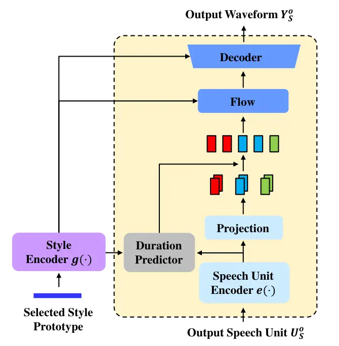

Figure 7: U2S detokenizer with style control.

### A.2 Unit-to-Speech (U2S) Detokenizer with Style Control

#### Overview.

The LLM, along with the vision encoder and speech tokenizer, is trained
end-to-end to generate responses in the form of the speech units, given
the input images and speeches. Specifically, the output speech units can
be obtained via
$`\textbf{U}_{S}^{o}=f(\textbf{U}_{T},\textbf{U}_{S},\textbf{H}_{V})`$,
followed by a U2S detokenizer to convert the discrete speech units
$`\textbf{U}_{S}^{o}`$ into the final output speech waveforms.

The proposed U2S detokenizer involves three core modules: the speech
unit encoder $`e(\cdot)`$, the speech style encoder $`g(\cdot)`$, and
the speech decoder $`d(\cdot,\cdot)`$. First, the speech unit encoder
converts the speech units $`\textbf{U}_{S}^{o}`$ into unit embeddings
$`\textbf{E}_{unit}^{o}`$. Meanwhile, the style encoder $`g(\cdot)`$,
adopting the structure of Meta-StyleSpeech \[66\], is utilized to
extract a style embedding $`\textbf{E}_{style}^{o}`$ from the chosen
reference speech. Lastly, the speech decoder $`d(\cdot,\cdot)`$
reconstructs the speech waveform $`\textbf{Y}_{S}^{o}`$ from the unit
embedding $`\textbf{E}_{unit}^{o}`$ and style embedding
$`\textbf{E}_{style}^{o}`$.

#### Training of U2S.

Training a U2S detokenizer with emotion controls is challenging
considering the lack of labeled emotional speech data since most
open-source speech data is predominantly neutral in emotion or lacks
emotion labels. Due to the limited availability of emotion-rich data, we
utilize TTS tools \[16\] to generate a small set of style-rich speech
samples diverse in speaker identities, genders, emotions, and pitches.
Our U2S detokenizer is first pre-trained on LibriTTS \[92\] and
AISHELL-1 \[2\] to acquire fundamental speech synthesis capabilities,
and subsequently, the synthesized style-rich speech data is utilized to
fine-tune the U2S detokenizer, enhancing its controllability over
diverse speech styles.

#### Style Prototypes.

To better facilitate controls of genders, emotions, and pitches,
inspired by \[66\] that a small number of style reference speeches can
effectively transfer the target styles, we adopt a “store-for-usage”
manner, _i.e_., we construct a style prototype codebook in advance for
speech style assignation. Specifically, we synthesize $`K`$ reference
candidates with external TTS tools for each possible combination of the
following styles: two genders (male, female), four emotions (neutral,
happy, sad, angry), and three pitches (normal, high, low), leading to 24
unique styles and $`24\times K`$ candidates. Empirically we find that
genders and pitches are easy to control using any of the candidate
references, while the emotion intensity varies across speeches. To
tackle this, we adopt Emotion2Vec \[59\], a powerful speech emotion
recognition (SER) tool, to measure the emotion intensity of each
candidate reference, and rank them in terms of the confidence of the
desired emotion. We select the Top-1 candidate reference in each
combination style to be the prototype of this condition. Finally, the
most representative 24 reference speeches are selected from the
$`24\times K`$ candidates.

## Appendix B More on Omni-modality

### B.1 Omni-modal Text-Centric Alignment

#### Modality alignment data

is summarized in Fig. 9.

#### Experiments on Omni-modal Alignment Paradigms.

The training configuration adopted in Sec. 4.1 is mostly identical to
Table 5 except we use a unique resolution of 448 for all stages and
replace EMOVA-SFT-4M in Stage-3 with ShareGPT4V \[9\] for efficiency.

Given the space constraints, the evaluation benchmarks in Fig. 3
represent selected benchmarks from each category in Table 2.
Specifically, for general image perception and understanding, we choose
MMBench and MM-Vet; for mathematical problem solving, we adopt MathVista
(testmini); for science understanding, we select ScienceQA-Img; and for
automatic speech recognition (ASR), we utilize the test-clean split of
the LibriSpeech dataset.

### B.2 Omni-modal Instruction Data Synthesis

#### Dataset construction.

To obtain emotion and pitch labels, we leverage GPT-4o using the prompt
in Fig. 23. Table 4 shows the distribution of speech styles of our
speech instruction dataset.

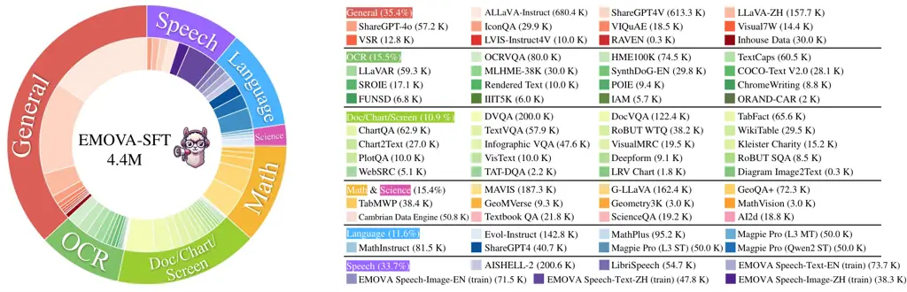

Figure 8: Overview of the data composition for EMOVA omni-modal
instruction tuning. (Left) Distribution of instruction data across
categories, with the outer circle representing overall categories and
the inner circle depicting subset distributions. (Right) Quantitative
breakdown of data sources.

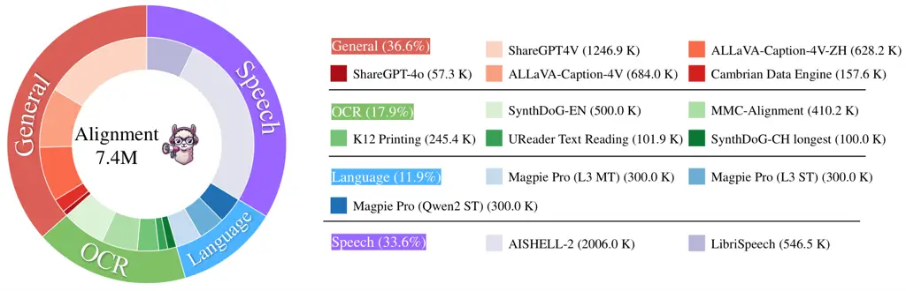

Figure 9: Overview of EMOVA omni-modal alignment data composition.

#### Detailed data organization.

As previously discussed in Sec. 4.2, the omni-modal instruction data is
formulated as
$`D_{\text{omni}}=\{(x_{V},u_{S},x^{o}_{T},c^{o}_{\text{style}},u^{o}_{S})_{i}\}_{i=1}^{N}`$.
In details, the textual outputs
$`x_{T}^{o}=(x_{T}^{o^{1}},x_{T}^{o^{2}})`$ contain the transcribed
textual instructions $`x_{T}^{o^{1}}`$ and the textual responses
$`x_{T}^{o^{2}}`$. The styles labels
$`c^{o}_{\text{style}}=(c^{o}_{\text{emo}},c^{o}_{\text{p}})`$ include
the emotion and pitch labels, respectively.

#### Mathematical formulation of chain of modality.

Based on the notations above, the sequential chain of modality approach
can be mathematically formulated by decomposing the conditional
likelihood of the desired outputs
$`(x_{T}^{o^{1}},x_{T}^{o^{2}},c^{o}_{\text{emo}},c^{o}_{\text{p}},u^{o}_{S})`$
given the inputs $`(x_{V},u_{S})`$. Specifically, let
$`z_{1}=x_{T}^{o^{1}},z_{2}=x_{T}^{o^{2}},z_{3}=c^{o}_{\text{emo}},z_{4}=c^{o}_{\text{p}},\text{and},z_{5}=u^{o}_{S}`$,
the decomposition is expressed as:

```math
\mathbb{P}(x_{T}^{o^{1}},x_{T}^{o^{2}},c^{o}_{\text{emo}},c^{o}_{\text{p}},u^{o}_{S}\mid x_{V},u_{S})=\prod_{i=1}^{5}\mathbb{P}(z_{i}\mid z_{1:i-1},x_{V},u_{S}). \tag{3}
```

[TABLE]

Table 4: Statistics of the EMOVA speech instruction tuning datasets.

|          |                  |                                  |                                  |                                  |
| -------- | ---------------- | -------------------------------- | -------------------------------- | -------------------------------- |
|          | Settings         | Stage-1                          | Stage-2                          | Stage-3                          |
| Vision   | Resolution       | Min $`56^{2}`$, Max $`1792^{2}`$ | Min $`56^{2}`$, Max $`1792^{2}`$ | Min $`56^{2}`$, Max $`1792^{2}`$ |
|          | \# Tokens        | Min $`4`$, Max $`4096`$          | Min $`4`$, Max $`4096`$          | Min $`4`$, Max $`4096`$          |
| Data     | Dataset          | LCS                              | EMOVA-Alignment (Fig. 9)         | EMOVA-SFT (Fig. 8)               |
|          | \# Samples       | 558K                             | 7.4M                             | 4.4M                             |
| Training | Trainable        | Projector                        | Full Model (Half ViT)            | Full Model                       |
|          | Batch Size       | 256                              | 256                              | 128                              |
|          | Context Length   | 8192                             | 8192                             | 8192                             |
|          | LR: $`p(\cdot)`$ | $`1\times 10^{-3}`$              | $`2\times 10^{-5}`$              | $`2\times 10^{-5}`$              |
|          | LR: $`v(\cdot)`$ | \-                               | $`2\times 10^{-5}`$              | $`2\times 10^{-6}`$              |
|          | LR: $`f(\cdot)`$ | \-                               | $`2\times 10^{-5}`$              | $`2\times 10^{-5}`$              |
|          | Epoch            | 1                                | 1                                | 1                                |

Table 5: Detailed configuration for different training stages of EMOVA.
The table illustrates the vision configurations, dataset
characteristics, and training hyperparameters.

## Appendix C More on Benchmark Evaluation

To thoroughly evaluate our model’s vision-language abilities, 15
benchmarks covering four different aspects of the real-life scenarios
are utilized for a comprehensive assessment across multiple domains.
Moreover, Automatic Speech Recognition (ASR) and Text-to-speech (TTS)
are adopted to evaluate speech-language abilities.

#### Document/chart understanding and OCR abilities.

Benchmarks including TextVQA \[76\], ChartQA \[61\], DocVQA \[62\],
InfoVQA \[63\], and OCRBench \[51\], focus on recognition and
understanding of structured data (_e.g_., charts, documents, and
characters), challenging the model to extract, comprehend, and reason
with structural and textual data. We adopt the corresponding test set
for evaluation.

#### General image perception and understanding.

MME \[18\], MMBench \[50\], SEED-Bench-Image \[39\], MM-Vet \[90\], and
RealWorldQA \[86\] evaluate models on perception and reasoning among
general vision domains, providing a comprehensive measurement of models’
real-world generalization abilities.

#### Mathematical problem solving.

MathVista (testmini) \[57\] and MathVerse (vision-mini) \[96\] evaluate
the model’s ability to deal with diverse mathematical problems,
including both arithmetic and complex reasoning questions across
different levels of complexity.

#### Science understanding.

MMMU \[91\], ScienceQA-Img \[56\] and AI2D \[33\] are used to assess
models’ ability to deal with scientific questions and diagrams, which
requires reasoning across various subjects and interpreting structured
visual content.

#### Automatic speech recognition (ASR).

We utilize the test-clean set of LibriSpeech \[72\] for English,
reporting the Word Error Rate (WER) as the evaluation metric. For
Chinese, evaluation is conducted on the test set of AISHELL-2 \[15\],
using the Character Error Rate (CER). Both WER and CER assess ASR
performance, calculated by comparing the recognized texts with the
ground-truth transcripts.

#### Text-to-speech (TTS).

To evaluate the TTS abilities, we first prompt EMOVA to generate speech
units, which are then converted to the speech waveforms by our U2S
detokenizer. Using the synthesized speech as input, we conduct ASR with
Whisper-large-v3 and Paraformer-zh for English and Chinese,
respectively, to obtain transcribed texts. We then compute the WER and
CER between the ground truth texts and the transcribed texts as metrics
for TTS. The resulting metrics are denoted as TTS-WER and TTS-CER for
English and Chinese.

## Appendix D More on Evaluation of Speech-Language Capabilities

### D.1 Calculation of Evaluation Metrics

#### End-to-end spoken dialogue score.

We prompt GPT-4o with the original question $`x_{T}^{o^{1}}`$, the
ground-truth text answer $`x_{T}^{o^{2}}`$ and the transcribed text from
the generated speech, to obtain a score ranging from 0 to 10 and report
an average of them. The prompt can be found in Fig. 25.

#### Unit-input-text-output score.

Similar to end-to-end spoken dialogue score, but we use the predicted
text response $`\tilde{x_{T}^{o^{2}}}`$ as answer instead of the
transcribed text from the generated speech, to obtain a score ranging
from 0 to 10 and report an average of them. See the prompt in Fig. 24.

#### Text-input-text-output score.

The prompt can be found in Fig. 24.

#### Style label classification accuracy.

We use GPT-4o to decide whether the style predictions
$`\tilde{c_{\text{emo}}^{o}},\tilde{c_{\text{p}}^{o}}`$ are correct
given the transcribed instruction $`\tilde{x_{T}^{o^{1}}}`$ and the
predicted text response $`\tilde{x_{T}^{o^{2}}}`$. The prompt can be
found in Fig. 26.

#### Emotion controllablity

of our U2S detokenizer is assessed by providing texts to LLM to generate
corresponding units (_i.e_., TTS), which, along with the given
conditional emotion labels, are then fed into our U2S detokenizer to
synthesize speech. We choose the female voice due to its large variation
of styles. We evaluate on 4 commonly-seen emotions, _i.e_.,“neutral”,
“happy”, “sad”, and “angry”. We synthesize 200 speech utterances for
testing, with 50 utterances per emotion. The output speeches are
analyzed by a Speech Emotion Recognition (SER) model named
Emotion2Vec \[59\], which identifies the emotion with the greatest
likelihood among these four emotions.

Models Librispeech (EN) AISHELL-2 (ZH) WER$`\downarrow`$
TTS-WER$`\downarrow`$ CER$`\downarrow`$ TTS-CER$`\downarrow`$
Whisper-Large \[74\] 3.0 - - - Mini-Omni \[87\] 4.5 - - - AnyGPT \[93\]
8.5 - - - VITA \[19\] 8.1 - - - EMOVA-3B (ours) 5.4 5.8 16.6 17.5
EMOVA-7B (ours) 4.1 3.6 14.4 10.1 EMOVA-72B (ours) 2.9 3.5 7.2 5.8

Table 6: Comparison on the ASR and TTS benchmarks.

### D.2 Comparison with other Omni Models

Experimental results of ASR and TTS are reported in Table 2 and 6. EMOVA
achieves significant improvements over other omni-modal models (_i.e_.,
AnyGPT and VITA), even surpassing its SLLM counterpart Mini-Omni \[87\],
demonstrating the effectiveness of semantic-acoustic disentanglement and
omni-modal mutual benefits. For the first time, our EMOVA obtains
state-of-the-art performance on both the vision-language and speech
benchmarks simultaneously.

## Appendix E More on Vision-language Architecture

|        |                     |          |      |         |            |         |         |        |         |          |               |      |
| ------ | ------------------- | -------- | ---- | ------- | ---------- | ------- | ------- | ------ | ------- | -------- | ------------- | ---- |
| ViT    | ViT LR              | Template | MME  | MMBench | SEED-Image | TextVQA | ChartQA | DocVQA | InfoVQA | OCRBench | ScienceQA-Img | AI2D |
| Full   | 2$`\times 10^{-6}`$ | QA       | 1928 | 68.8    | 72.5       | 64.3    | 29.9    | 45.2   | 28.7    | 495      | 76.3          | 61.8 |
| Half   | 2$`\times 10^{-6}`$ | QA       | 1838 | 71.3    | 72.8       | 63.3    | 31.4    | 46.0   | 28.5    | 489      | 76.1          | 63.7 |
| Frozen | 2$`\times 10^{-6}`$ | QA       | 1887 | 68.8    | 72.2       | 61.3    | 30.2    | 44.7   | 28.0    | 478      | 75.9          | 62.8 |
| Half   | 2$`\times 10^{-5}`$ | QA       | 1833 | 68.3    | 73.1       | 62.2    | 27.8    | 42.4   | 27.3    | 461      | 74.7          | 63.4 |
| Half   | 2$`\times 10^{-6}`$ | Plain    | 1909 | 70.1    | 72.0       | 61.5    | 24.5    | 38.9   | 30.1    | 410      | 77.0          | 63.6 |

Table 7: Ablation on the ViT configurations and templates for
vision-language alignment.

This section analyzes the pre-training configurations of the vision
encoder and the prompt template during Stage 2, as shown in Table. 7.
Our final selection is the colored setting. We find that training the
ViT model with half of the deeper parameters \[9\] with a learning rate
of 2$`\times 10^{-6}`$ \[48\] yields the best performance. Furthermore,
we compare the QA template with the plain template \[49\] and find that
the QA template is superior for pre-training.

## Appendix F Limitations

#### Duplex modeling.

In the current version, EMOVA can only process either visual/speech/text
inputs or produce speech/text outputs at the same time. For a
communication experience that mirrors human interaction, handling inputs
and outputs simultaneously is crucial. Recent works like VITA \[19\] and
LSLM \[60\] have begun to explore duplex modeling. VITA focuses on
recognizing speech in noisy environments during the generation process
to facilitate timely responses. LSLM, on the other hand, attempts to
halt speech production when it detects a command or voice. Recently, a
ground-breaking work named Moshi \[13\] develops a model supporting
fully duplex modeling. The adeptness at simultaneously managing the
information streams from both the user and the assistant allows Moshi to
converse with human beings in real-time scenarios.

However, incorporating emotions into this duplex modeling presents
additional challenges. Emotional states can fluctuate throughout a
conversation, and how to generate appropriate responses given the user’s
previous and current emotional cues has not been thoroughly
investigated. We will dive into this topic in the future work.

#### Direct unit-to-unit generation.

Although the speech units have served as the speech representation, they
are predominantly adopted in conjunction with text-based
assistance \[95\]. However, the direct generation from unit to unit
without text assistance is an area that has not been extensively
explored. In \[37\], speeches from the source language are directly
translated into speech units of the target language for speech-to-speech
translation. Similarly, \[68\] builds a language model directly on
speech units, enabling spoken dialogue generation from raw audio. Both
works develop models in speech-only data.

In the current version of EMOVA, the text modality is integrated into
the speech generation process to transfer textual knowledge to the
speech modality, thereby enhancing the correctness of speech responses.
In the future, we will strengthen the model’s direct unit-to-unit
generation capabilities to boost the speed of speech generation and
augment the model’s comprehension of speech modality.

#### Vision configurations.

Currently, we only utilize a single vision encoder pre-trained via a
vision-language manner, while recent works have shown effectiveness by
combining vision encoders pre-trained by different manners (_e.g_.,
self-supervised pre-training \[52\]) and architectures (_e.g_., MoE
\[98, 54\]). We prioritize visual understanding in this work, while the
incorporation of (controllable) visual generation \[8, 22, 42, 83, 53,
23, 24\] is also appealing to better empower EMOVA in real-life
applications \[44, 41, 29, 85\]. Digging into its robustness towards
noisy vision inputs \[28\] is also an appealing direction.

#### Comparison with Emu3 \[82\].

Both our EMOVA and Emu3 build end-to-end MLLMs with discrete
tokenization. Emu3 discretizes visual data, enabling visual
understanding and generation, while our EMOVA discretizes speech data
with a continuous visual encoder, building an Omni-modal LLM with
visual, text, and speech abilities simultaneously.

## Appendix G Qualitative Results

#### Advanced Vision-language Abilities.

Our EMOVA exhibits advanced vision-language abilities in humor
understanding (Fig. 10), numerical calculations (Fig. 11), coding (Fig.
12), geometry problem solving (Fig. 16).

#### (Omni-modal) Emotional Spoken Dialogue.

EMOVA can engage in omni-modal emotional spoken dialogue (Figs. 5, 13,
14, 18). For demonstration purposes, we present only the speech
transcriptions²² 2 For speech files, please refer to our project page.
of the instruction and EMOVA’s response. The text highlighted in blue
indicates the style labels predicted by EMOVA, reflecting the emotion
and pitch of generated speeches.

#### Omni-modal Spoken Dialogue with Structural Data Understanding.

EMOVA can perform structural data understanding even in spoken dialogue.
The data types include PDF files (Fig. 15), movie posters (Figs. 17 and
19), personal résumés (Fig. 20), charts (Fig. 21), and websites (Fig.
22). Remarkably, EMOVA is not specifically trained on spoken dialogue
data involving these data types. This suggests that our chain of
modality data introduced in Sec. 4.2 effectively activates both
vision-language abilities and speech understanding acquired during the
text-centric alignment stage.

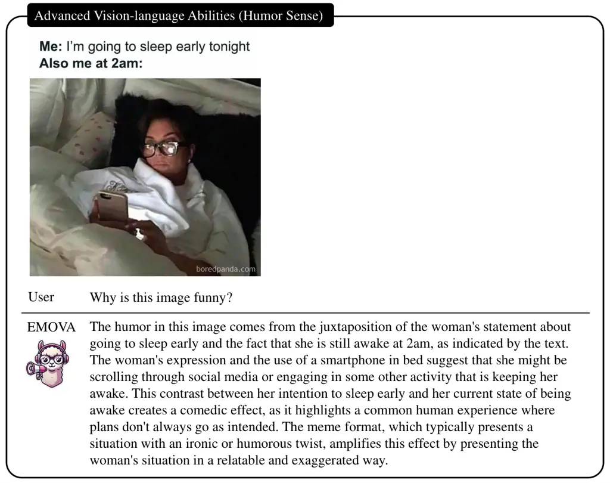

Figure 10: EMOVA exhibits advanced vision-language abilities in humor
sense.

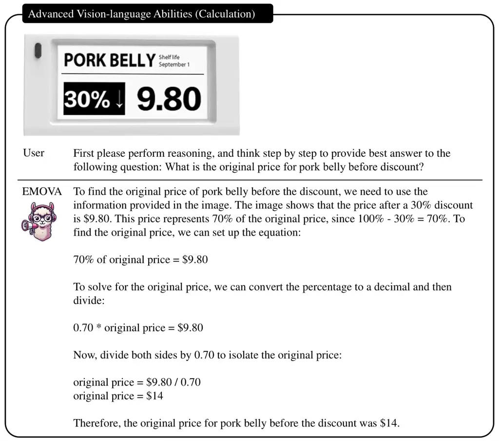

Figure 11: EMOVA exhibits advanced vision-language abilities in
numerical calculations.

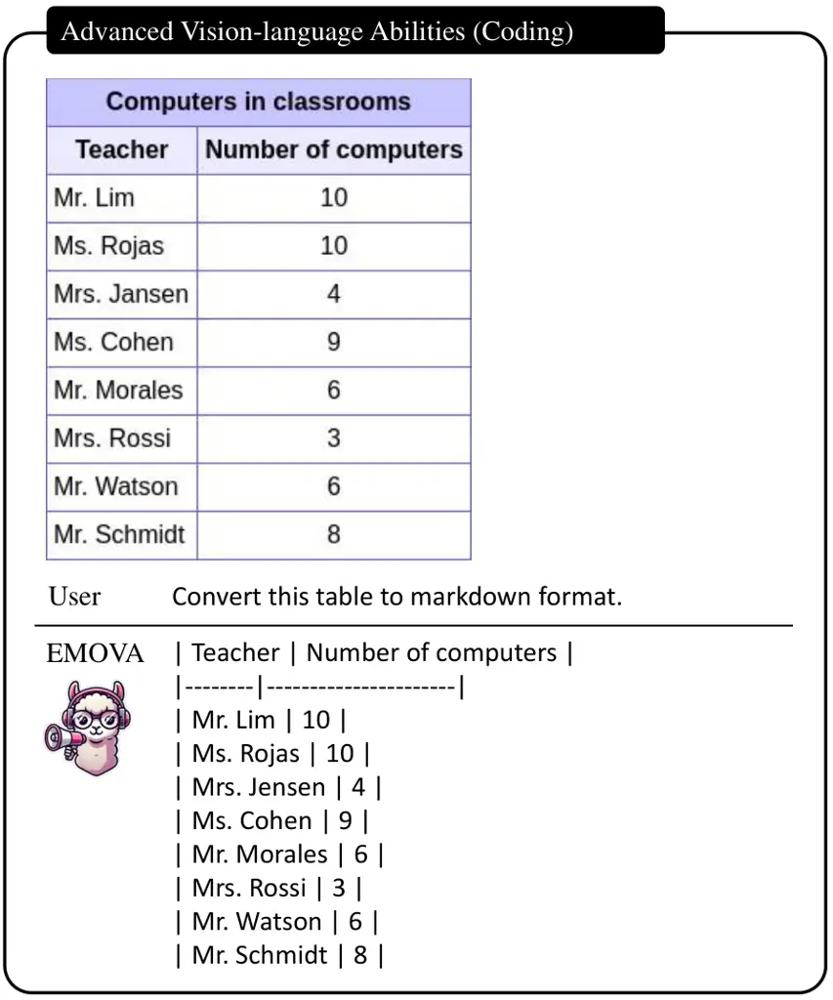

Figure 12: EMOVA exhibits advanced vision-language abilities in coding.

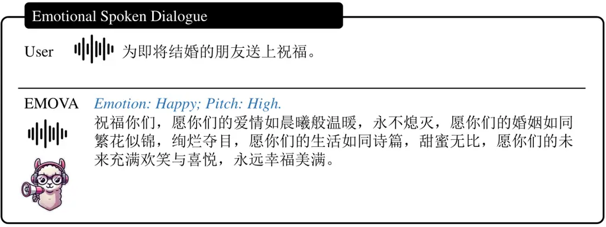

Figure 13: EMOVA engages in spoken dialogue with a cheerful tone.

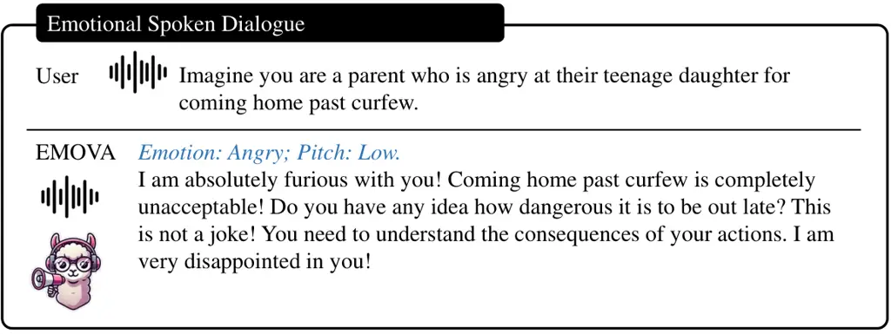

Figure 14: EMOVA engages in emotional spoken dialogue.

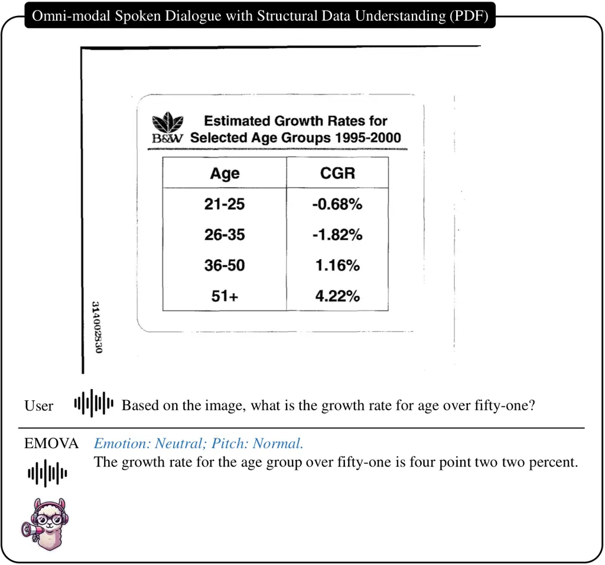

Figure 15: EMOVA engages in omni-modal spoken dialogue with structural
data understanding.

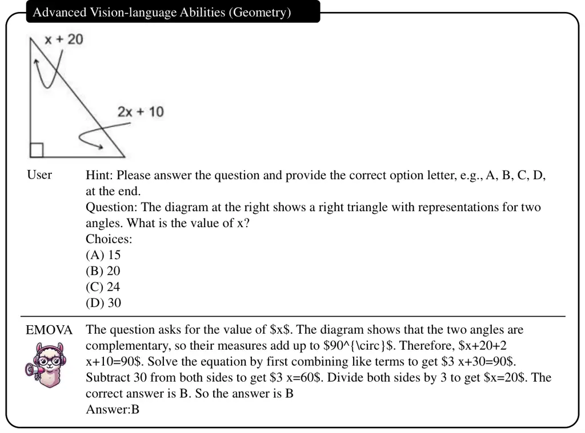

Figure 16: EMOVA exhibits advanced vision-language abilities in math.

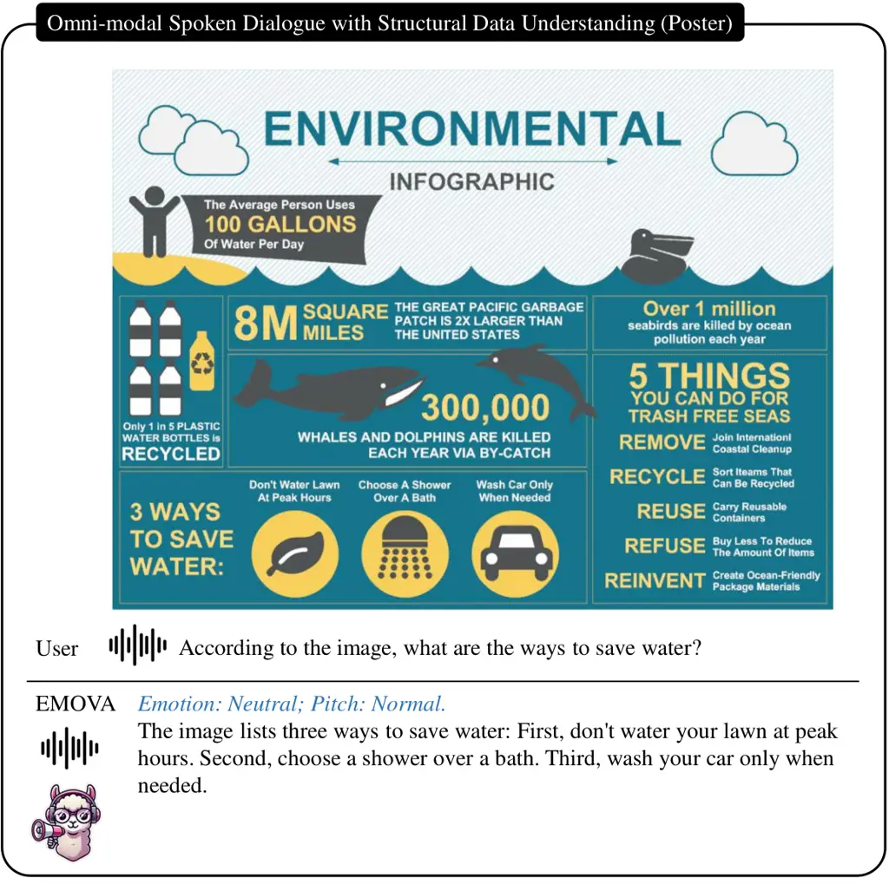

Figure 17: EMOVA engages in omni-modal spoken dialogue with structural
data understanding (_i.e_., poster).

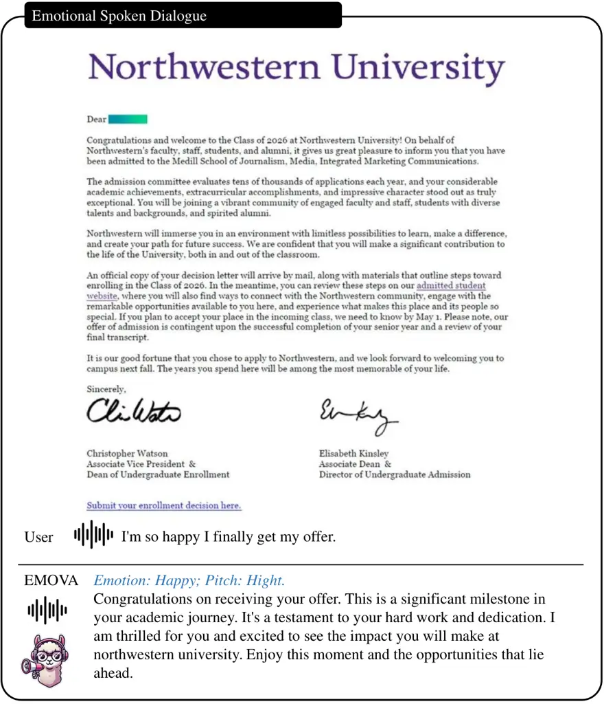

Figure 18: EMOVA engages in omni-modal emotional spoken dialogue.

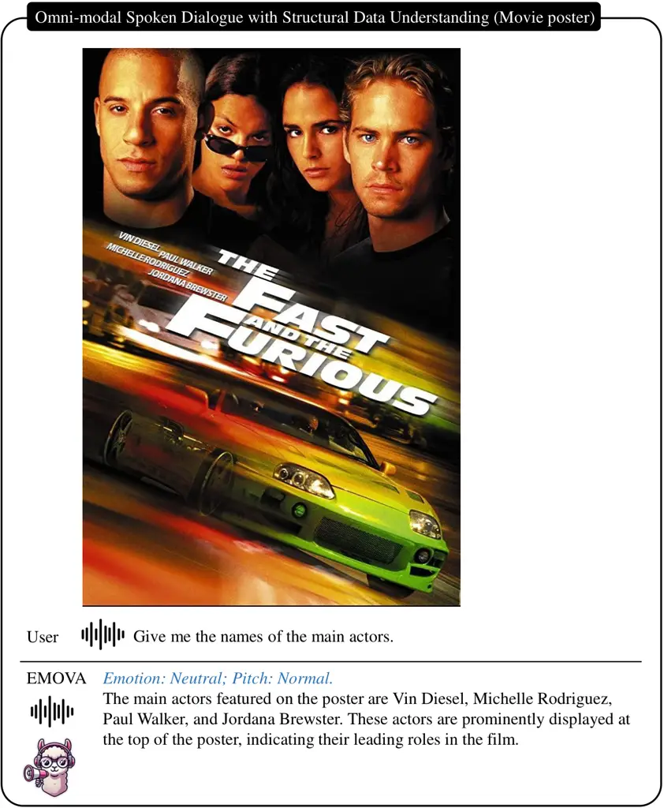

Figure 19: EMOVA engages in omni-modal spoken dialogue with structural
data understanding (_i.e_., movie posters).

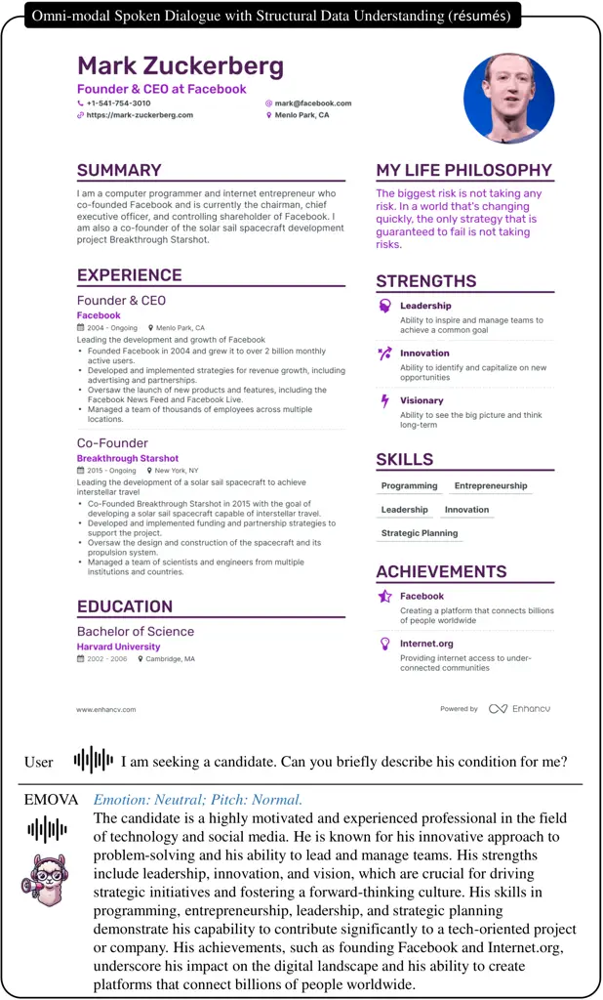

Figure 20: EMOVA engages in omni-modal spoken dialogue with structural
data understanding (_i.e_., résumé).

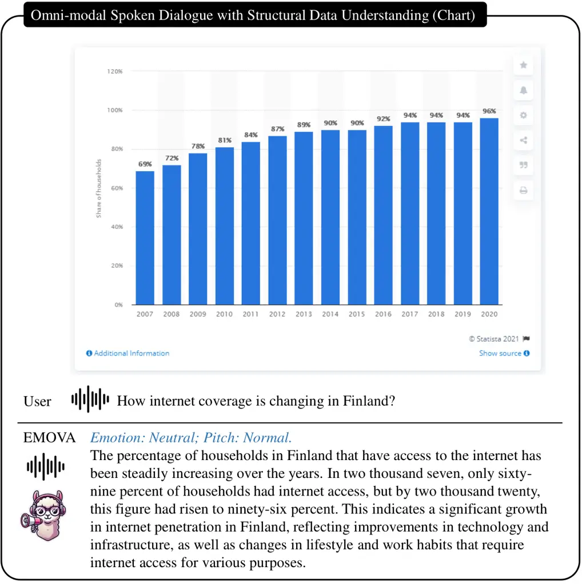

Figure 21: EMOVA engages in omni-modal spoken dialogue with structural
data understanding (_i.e_., chart).

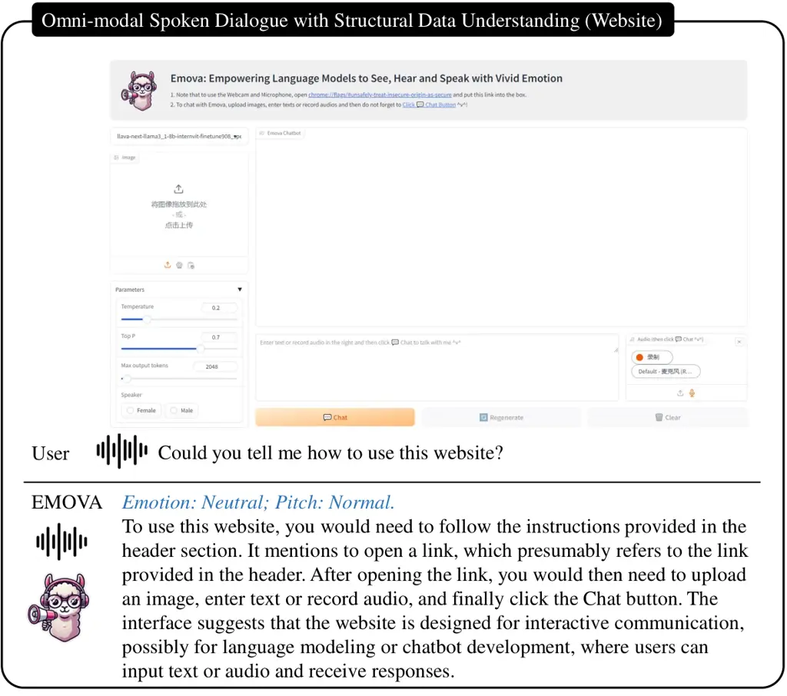

Figure 22: EMOVA engages in omni-modal spoken dialogue with structural
data understanding (_i.e_., website).

Figure 23: Prompt used to obtain style labels of the speech instruction
dataset.

Figure 24: Prompt used to obtain Unit-Input-Text-Output Score and
Text-Input-Text-Output Score.

Figure 25: Prompt used to obtain End-to-end Spoken Dialogue Score.

Figure 26: Prompt used to obtain Classification Accuracy of Style Label.
