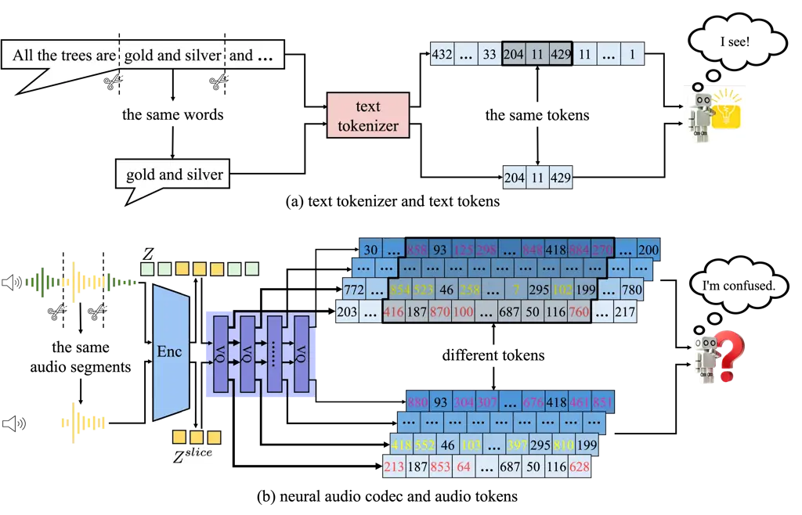
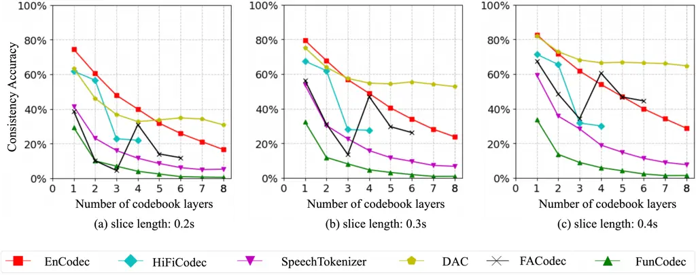
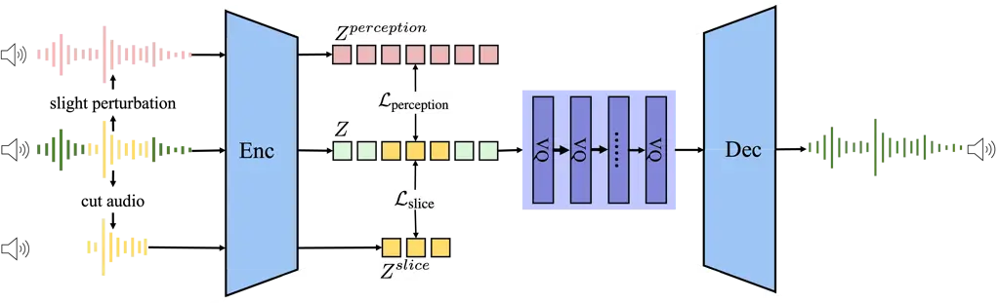
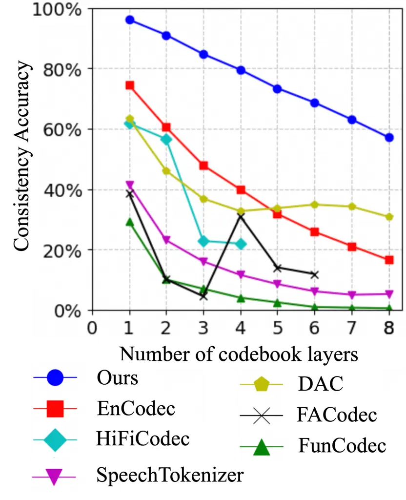

# Analyzing and Mitigating Inconsistency in Discrete Audio Tokens for Neural Codec Language Models

Wenrui Liu¹¹ 1 Equal contribution. Affiliation: Zhejiang University
Email: [liuwenrui@zju.edu.cn](mailto:)    Zhifang Guo¹¹footnotemark: 1
Affiliation: Alibaba Group Email: [zhaozhou@zju.edu.cn](mailto:)    Jin
Xu¹¹footnotemark: 1 Affiliation: Alibaba Group
Email: [liuwenrui.lwr@alibaba-inc.com](mailto:)    ²² 2 Corresponding
author. Email: [guozhifang.gzf@alibaba-inc.com](mailto:)    Yuanjun Lv
Affiliation: Alibaba Group Email: [renjun.xj@alibaba-inc.com](mailto:)
   Yunfei Chu Affiliation: Alibaba Group
Email: [lvyuanjun.lyj@alibaba-inc.com](mailto:)    Zhou
Zhao²²footnotemark: 2 Affiliation: Zhejiang University
Email: [fay.cyf@alibaba-inc.com](mailto:)    Junyang Lin
Affiliation: Alibaba Group Email: [junyang.ljy@alibaba-inc.com](mailto:)

|     |
| --- |
|     |

## 1 abstract

Building upon advancements in Large Language Models (LLMs), the field of
audio processing has seen increased interest in training audio
generation tasks with discrete audio token sequences. However, directly
discretizing audio by neural audio codecs often results in sequences
that fundamentally differ from text sequences. Unlike text, where text
token sequences are deterministic, discrete audio tokens can exhibit
significant variability based on contextual factors, while still
producing perceptually identical audio segments. We refer to this
phenomenon as Discrete Representation Inconsistency (DRI). This
inconsistency can lead to a single audio segment being represented by
multiple divergent sequences, which creates confusion in neural codec
language models and results in omissions and repetitions during speech
generation. In this paper, we quantitatively analyze the DRI phenomenon
within popular audio tokenizers such as EnCodec. Our approach
effectively mitigates the DRI phenomenon of the neural audio codec.
Furthermore, extensive experiments on the neural codec language model
over LibriTTS and large-scale MLS datases (44,000 hours) demonstrate the
effectiveness and generality of our method. The demo of audio samples is
available online ¹¹ 1
[https://consistencyinneuralcodec.github.io](https://consistencyinneuralcodec.github.io).

## 2 Introduction

Recently, speech Large Language Models (LLMs) (Zhan et al., 2024;
Anastassiou et al., 2024; Du et al., 2024b) have demonstrated
significant strides in generating high-quality speech, largely due to
the contributions of neural audio codecs in high-fidelity audio
reconstruction (Zeghidour et al., 2021; Défossez et al., 2022; Yang
et al., 2023). The neural codec language model (Wang et al., 2023; Yang
et al., 2024; Zhang et al., 2024) employs the neural audio codec as the
audio tokenizer to quantize continuous audio signals into discrete
tokens, and it can generate discrete tokens autoregressively (Zhang
et al., 2023a; Yang et al., 2024), and then detokenize them back to
audio signals by the neural audio codec. Despite the advantages of
autoregressive modeling can assist those works achieve better zero-shot
performance and naturalness, the synthesized speech frequently yields
higher Word Error Rate (WER) due to the issue of instability in discrete
token generation (Song et al., 2024; Xin et al., 2024; Du et al.,
2024a).



Figure 1: Discrete Representation Inconsistency (DRI) phenomenon.
Subfigure (a) shows that text, whether it includes contextual
information or not, can be encoded by the text tokenizer into the same
text tokens. In contrast, Subfigure (b) illustrates that audio, with or
without contextual information, is encoded by the audio tokenizer into
different audio tokens. The DRI phenomenon within the audio tokenizer
poses a many-to-one mapping problem, and the complexity of this
many-to-one mapping raises the uncertainty for neural codec language
models in predicting the next token.

The discrete sequence of text is context-independent. In contrast,
acoustic discrete representations are encoded by integrating the
contextual information. The advantage of this approach is that discrete
audio tokens consider a larger receptive field of information, thus
achieving a higher compression ratio of information. However, the
drawback is that the representation itself becomes more fragile,
sensitive, and easily affected by minor signal changes, leading to
drastic drifts in the entire sequence as demonstrated in Figure 1.

The previous work (Yang et al., 2024) has noticed that audio segments
containing the same sound events aren’t encoded into completely
consistent discrete acoustic tokens by the neural audio codec. In this
paper, we call this phenomenon Discrete Representation Inconsistency
(DRI), and further dig into the problem on Vector Quantization
(VQ) (Défossez et al., 2022) based acoustic tokens due to its popularity
as an audio tokenizer and its high-quality reconstruction capabilities.
We compare the consistency of the discrete sequences of audio segments
with and without context on a large amount of audio. Our quantitative
analyses reveal that the existing audio tokenizers suffer from low
consistency. In particular, we find that for Residual Vector
Quantization (RVQ) (Défossez et al., 2022) approaches, consistency
declines significantly with deeper layer of codebooks.

Although audio with or without contextual audio is encoded into
different discrete audio token sequences, both sequences can be used to
reconstruct the original audio information, which leads to a many-to-one
mapping problem that becomes more complex as the sequence length
increases. This complexity results in increased uncertainty for neural
codec language models in predicting the next token. One direct approach
to address this issue is to prevent the audio tokenizer from considering
contextual information during sequence encoding, such as by setting the
convolutional layer’s kernel size to 1 in the encoder. While this method
allows for independent discretization of each audio frame, it also
significantly reduces encoding efficiency and degrades the quality of
the reconstructed audio. Therefore, this study aims to maintain the
original receptive field while enabling the model to address the
trade-offs between audio reconstruction quality and resolving the
many-to-one problem. To achieve this objective, we introduce the
slice-consistency method, wherein a segment of audio is randomly sliced,
and the encoded representation from this segment is required to closely
approximate the corresponding representation obtained from the entire
audio. In addition, in order to further alleviate the issue of
many-to-one mapping, we propose perturbation-consistency method, whereby
the representation of an audio and its representation after applying
slight spectral perturbation should closely align. Compared to
EnCodec (Défossez et al., 2022), our method has shown an average
consistency improvement of 21.47%, 29.17%, and 36.29% in the first
layer, the first 3 layers, and the first 8 layers, respectively.
Extensive experiments on the neural codec language model (e.g.,
VALL-E (Wang et al., 2023)) on LibriTTS (Zen et al., 2019) dataset (960
hours) and large-scale MLS (Pratap et al., 2020) dataset (44,000 hours)
confirm that improving consistency results in better performance. Our
contributions are summarized as below:

- •
  We shed light on the Discrete Representation Inconsistency (DRI)
  phenomenon and conduct quantitative analyses for various neural audio
  codecs. We find that the existing audio tokenizers suffer from low
  consistency.
- •
  Inspired by our analyses, we propose two methods, slice-consistency
  method and perturbation-consistency method, to enhance the consistency
  of the neural audio codec from two particular perspectives and
  mitigate the many-to-one problem.
- •
  Experiments show that our method achieves an average consistency
  improvement of 21.47%, 29.17%, and 36.29% in the first layer, the
  first 3 layers, and the first 8 layers, respectively. Additionally, we
  conduct extensive experiments on the neural codec language model,
  VALL-E, on the LibriTTS dataset (960 hours) and further expand the
  training dataset to the large-scale MLS dataset (44,000 hours),
  resulting in 3.72% WER reduction and 5.68% speaker similarity
  improvement. These findings confirm that enhancing consistency leads
  to improved performance.

## 3 Analysis on consistency of neural audio codecs



Figure 2: Results of consistency accuracy for popular neural audio
codecs under different layers and slice lengths. Subfigure (a)(b)(c)
show slice lengths across 0.2s, 0.3s and 0.4s, respectively, and all of
them exhibit similar conclusions that consistency accuracy declines
significantly in the deeper layers of the codebook, indicating that the
DRI phenomenon becomes more pronounced with layers in neural audio
codecs increasing.

In this section, we extract discrete audio tokens from audio segments
with and without context using popular neural audio codecs (Défossez
et al., 2022; Yang et al., 2023; Zhang et al., 2023b; Du et al., 2024c;
Kumar et al., 2024; Ju et al., 2024) to analyze the DRI phenomenon.
First, we introduce the overall experiment design. Then we propose using
consistency accuracy as an evaluation metric to conduct quantitative
analyses. Finally, we analyze the results and discuss the potential
implications of the DRI phenomenon.

### 3.1 Experimental Design On DRI Phenomenon

Recent advancements on neural audio codecs have adopted an
encoder-decoder architecture combined with the RVQ module to effectively
compress continuous audio signals into discrete audio tokens (Défossez
et al., 2022; Yang et al., 2023; Zhang et al., 2023b; Du et al., 2024c;
Kumar et al., 2024; Ju et al., 2024), which is typically composed of 3
components: (1) An encoder, composed of convolutional layers to capture
contextual information, maps the audio signal into a latent
representation $`Z`$. (2) A RVQ module contains $`N`$ quantization
layers to quantize the latent representation $`Z`$ into the discrete
audio tokens at each time step. (3) A decoder reconstructs the quantized
latent representation back to the audio signal.

To analyze the DRI phenomenon, we use popular neural audio
codecs (Défossez et al., 2022; Yang et al., 2023; Zhang et al., 2023b;
Du et al., 2024c; Kumar et al., 2024; Ju et al., 2024) as audio
tokenizers to quantize both the entire audio and an audio segment within
that audio, and then compare the results of their corresponding discrete
audio tokens. Obviously, these two audio segments are exactly identical
with the only difference being whether there is context, and we expect
that both discrete audio tokens should be identical after quantization.
But the encoders in current neural audio codecs introduce the contextual
information that gives rise to the DRI phenomenon, leading to both
discrete audio token sequences showing significant differences.

### 3.2 Consistency Accuracy

To quantitatively analyze the degree of the DRI phenomenon in neural
audio codecs, we propose using consistency accuracy as an evaluation
metric:

```math
Acc_{\text{consistency}}=\frac{1}{T}\frac{1}{N}\sum_{t=1}^{T}\sum_{i=1}^{N}\mathbb{I}(\text{RVQ}(Z^{\text{slice}})[t,i]=\text{RVQ}(Z)[t,i]),
```

where $`Z`$ is the latent representation of the original audio after
encoding by the encoder, and $`N`$ represents the number of codebooks in
the RVQ module. We randomly extract an audio segment of length $`T`$
from the original audio, and encode it by the encoder to obtain
$`Z^{\text{slice}}`$.

### 3.3 Results And Analysis

Audio tokenizer vs. text tokenizer. As shown in Figure 1 (a), regardless
of whether the context is included, the same text is tokenized into the
same text tokens, indicating that the text tokenizer is
context-independent. In contrast, Figure 1 (b) demonstrates that using a
neural audio codec as the audio tokenizer produces different discrete
audio token sequences for identical audio segments. Although it is
difficult for human auditory perception to distinguish the reconstructed
audio from both sequences, the many-to-one mapping caused by the DRI
phenomenon still increases the difficulty for model training, leading to
a decline in speech reconstruction and generation performance.

The results of consistency accuracy. To quantitatively analyze the DRI
phenomenon, we calculate the consistency accuracy for popular neural
audio codecs under different layers and slice lengths. The results are
shown in Figure 2 and the low consistency accuracy reveals that the DRI
phenomenon is present in the current neural audio codecs (Défossez
et al., 2022; Yang et al., 2023; Zhang et al., 2023b; Du et al., 2024c;
Kumar et al., 2024; Ju et al., 2024). Furthermore, we find that with
deeper layers of codebooks, neural audio codecs demonstrate lower
consistency. This may be attributed to the fact that audio tokens in
shallow layers exhibit a high alignment with context-independent
semantic information, resulting in better consistency. In contrast,
deeper layers focus on more fragile and sensitive acoustic information
that can easily change due to minor disturbances, leading to a decrease
in consistency accuracy (Zhang et al., 2023b).

The potential implications of the DRI phenomenon. There are many minor
disturbances that can cause the DRI phenomenon, such as contextual
information and phase perturbation (Lee et al., 2023) that do not alter
the auditory perception of the reconstructed audio but can lead to
changes in the discrete audio token sequences, which can greatly confuse
models. Especially when neural codec language models need to predict
different audio tokens due to the DRI phenomenon, this confusion can
cause the predicted probability distributions of the next token to
converge towards uniformity, resulting in inaccurate predictions and
negatively impacting overall performance. Therefore, it is necessary to
ease the many-to-one mapping problem to improve the consistency of
neural audio codecs, which in turn enhances the performance of
downstream speech generation.

## 4 Method



Figure 3: The overview of the proposed consistency constraint method.
For the slice-consistency method, a segment of audio is randomly sliced,
and its encoded representation must closely match the representation
derived from the entire audio. For the perturbation-consistency method,
the representation of an audio and its representation after slight
spectral perturbation should be closely aligned.

According to the analysis in Section 3, we can draw a conclusion that an
ideal neural audio codec should balance the trade-offs between high
audio reconstruction quality and addressing the many-to-one problem. To
achieve this objective, we introduce two consistency constraint methods:
slice-consistency method and perturbation-consistency method, which
enhance the consistency of the neural audio codec from two particular
perspectives. Since these methods can be integrated into any neural
audio codec, we demonstrate their application using a neural audio codec
based on RVQ which utilizes an encoder to transform the audio signal
into the latent representation $`Z`$ and reconstructs the waveform from
the quantized latent representation.

### 4.1 Consistency Constraint Methods

Slice-consistency requests that audio segments with and without context
should be encoded into consistent latent representations. To achieve
this object, as shown in Figure 3, we slice a segment of audio from the
original audio, and then encode it using the encoder in the neural audio
codec to obtain the latent representation $`Z^{\text{slice}}`$. Compared
with the latent representation $`Z`$ from the entire audio,
$`Z^{\text{slice}}`$ is not influenced by contextual information. To
reduce the influence of context on the latent representation $`Z`$, we
use Mean Squared Error (MSE) as a constraint to enhance the consistency
between $`Z^{\text{slice}}`$ and the corresponding latent representation
in $`Z`$:

```math
\mathcal{L}_{\text{slice}}=\frac{1}{T}\sum_{t=1}^{T}\text{MSE}(Z^{\text{slice}}[t],Z[t]).
```

As analyzed in Appendix 9.1 about the receptive field, the convolutional
layers in the encoder of neural audio codecs introduce contextual
information, leading to identical audio segments being tokenized into
different discrete audio token sequences. It is clear that reducing the
kernel size of the convolutional layers in the encoder can enhance
consistency, but this can also result in a decline in both
reconstruction efficiency and quality. Therefore, applying the
slice-consistency method is necessary to maintain the original receptive
field while enabling models to balance the trade-offs between audio
reconstruction quality and alleviating the DRI phenomenon.

Perturbation-Consistency refers to the latent representations of audio,
which should remain consistent before and after being applied
imperceptible perturbations to human ears. Specifically, as shown in
Figure 3, we slightly adjust the phase of the the original audio without
significantly altering the waveform structure, and encode it using the
encoder in the neural audio codec to obtain the latent representation
$`Z^{\text{perception}}`$. Since human ears have a limited ability to
directly perceive phase changes, we hope that the robustness of the
model can also eliminate inconsistency caused by such slight
perturbations. Therefore, we utilize MSE to maintain consistency of both
latent representations with and without phase perturbation (Lee et al.,
2023):

```math
\mathcal{L}_{\text{perception}}=\text{MSE}(Z^{\text{perception}},Z).
```

It is evident that the perturbation-consistency method differs from
audio-based data augmentation methods. Data augmentation methods such as
SpecAugment (Park et al., 2019) and environment noise (Snyder et al., 2015) significantly alter the original audio to create new audio. The
newly generated audio has a considerable difference in perception
compared to the original audio, which aims to expand the training data
and increase the robustness of models. In contrast, the
perception-consistency method requires that changes to audio should be
imperceptible to human ears to avoid severe perturbations that disrupt
the audio reconstruction quality. Since the phase is difficult to be
perceived by human, we apply phase perturbation (Lee et al., 2023) as a
slight perturbation method, which can enhance the
perturbation-consistency without expanding the training data.

### 4.2 Implementation Details

In order to satisfy both methods and enhance training efficiency, we
align the latent representation $`Z^{perception}`$ obtained by the
slice-consistency method and the latent representation
$`Z^{perception}`$ obtained by the perturbation-consistency method:

```math
\mathcal{L}_{\text{consistency}}=\frac{1}{T}\sum_{t=1}^{T}\text{MSE}(Z^{slice}[t],Z^{perception}[t]).
```

By introducing consistency constraint
$`\mathcal{L}_{\mathrm{consistency}}`$, our method can be applied to any
neural audio codec and we build our method on RVQ-GAN framework (Kumar
et al., 2024) that also includes reconstruction loss
$`\mathcal{L}_{\mathrm{rec}}`$, adversarial loss
$`\mathcal{L}_{\mathrm{adv}}`$, feature matching loss
$`\mathcal{L}_{\mathrm{fm}}`$, and commit loss
$`\mathcal{L}_{\mathrm{rvq}}`$:

```math
\mathcal{L}=\mathcal{L}_{\mathrm{rec}}+\lambda_{\mathrm{adv}}\mathcal{L}_{\mathrm{adv}}+\lambda_{\mathrm{fm}}\mathcal{L}_{\mathrm{fm}}+\lambda_{\mathrm{rvq}}\mathcal{L}_{\mathrm{rvq}}+\lambda_{\mathrm{con}}\mathcal{L}_{\mathrm{consistency}}.
```

## 5 Experiment Setting

### 5.1 Experimental Configuration

Datasets. During the training process of the neural audio codec and the
neural codec language model, we utilize LibriTTS (Zen et al., 2019)
dataset, which comprises 960 hours of transcribed speech data. The test
set of LibriTTS (Zen et al., 2019) is used as test data, which is
randomly selected 2,300 audio samples to verify the consistency of
neural audio codecs and 350 audio samples to validate speech generation
performance. To verify the effectiveness of data scaling on our proposed
method, we expand the training dataset to 44,000 hours of large-scale
MLS (Pratap et al., 2020) dataset for both speech reconstruction and
speech generation tasks.

Training settings. To validate effectiveness of consistency constraint
in speech reconstruction, we apply it on the RVQ based neural audio
codec (denoted as Ours) that uses the Adam optimizer (Diederik, 2014),
with an initial learning rate of 3e-4 and beta parameters set to (0.5,
0.9), to train for 350,000 iterations. All audio samples are truncated
to a fixed length of 1.28 seconds and resampled to 16 kHz with the batch
size of 384. To demonstrate the effectiveness of our method for the
downstream speech generation task, we take the neural audio codec based
on our method as the audio tokenizer for the neural codec language
model, VALL-E (Wang et al., 2023) that generates audio by predicting the
first layer of audio tokens in an autoregressive manner, and then
predicting the remaining audio tokens in a non-autoregressive manner.
The reproducted VALL-E (Wang et al., 2023) is trained for 1,300,000
steps with the batch size of 56 and optimized by the Adam
optimizer (Diederik, 2014), with parameters $`\beta`$ = (0.9, 0.95). And
we set the weight $`\lambda_{con}`$ for the consistency constraint to
10.0.

Baseline models. For speech reconstruction, we use the official
open-source checkpoints from EnCodec (Défossez et al., 2022),
HiFiCodec (Yang et al., 2023), SpeechTokenizer (Zhang et al., 2023b),
DAC (Kumar et al., 2024), and FunCodec (Du et al., 2024c) as baseline
models. To ensure fair comparison, we set the bandwidth of different
neural audio codecs closely to 4.0 kbps or 8.0 kbps. For speech
generation, we employ the SOTA neural codec language models as
baselines, including SpeechGPT (Zhang et al., 2023a),
SpeechTokenizer-based USLM (Zhang et al., 2023b), AnyGPT (Zhan et al.,
2024), VoiceCraft (Peng et al., 2024), XTTS v2 (Casanova et al., 2024)
and VALL-E (Wang et al., 2023) reproduced by Amphion (Zhang et al.,
2023c). More details about baseline neural codec language models in
Appendix 9.2.

### 5.2 Evaluation Metrics

#### 5.2.1 Evaluation of Speech Reconstruction

We adopt consistency accuracy across all layers of neural audio codecs
to measure the DRI phenomenon. Given that the codewords in the first few
layers of the neural audio codec store the most information, their
consistency significantly affects the performance of downstream neural
codec language models. Therefore, we especially present the first 3
layers’ consistency accuracy. Since the conclusions obtained from
different lengths are generally consistent, we set $`T`$ in the
consistency accuracy to 0.2. In addition, we also use ViSQOL (Chinen
et al., 2020) and PESQ (Rix et al., 2001) to measure the quality of the
reconstructed speech (Défossez et al., 2022; Zeghidour et al., 2021),
with higher scores indicating the better speech quality.

#### 5.2.2 Evaluation of Speech Generation

Objective evaluation. We use Whisper (Radford et al., 2023) model to
transcribe the generated speech and calculate the WER. To evaluate
speaker similarity, we firstly use 3D-speaker (Chen et al., 2024)
toolkit to extract speaker embeddings from the generated speech and
reference speech, and then compute the cosine similarity between the
normalized embeddings. We also employ UTMOS (Saeki et al., 2022) as an
automatic Mean Opinion Score (MOS) prediction system to assess the
naturalness of the speech.

Subjective evaluation. We randomly select 50 audio samples from the
LibriTTS (Zen et al., 2019) test set to conduct MOS (Chu & Peng, 2006)
and Similarity Mean Opinion Score (SMOS) (Chu & Peng, 2006) test. MOS
assesses the naturalness of the generated speech, while SMOS measures
the similarity between the generated speech and the original speaker’s
voice. Both MOS and SMOS range from 1 to 5, with higher values
indicating better speech quality and greater speaker similarity.

## 6 Result

In this section, we evaluate the effectiveness of slice-consistency
method and perturbation-consistency method. Firstly, We compare the
speech reconstruction results of the neural audio codec wiht consistency
constraint and baseline models. And then we demonstrate that introducing
our method to speech generation model like VALL-E (Wang et al., 2023)
can effectively enhance speech generation performance on both
small-scale and large-scale data. Finally, we conduct ablation studies
to illustrate the effects of the slice-consistency method and
perturbation-consistency method, respectively.

### 6.1 Speech Reconstruction Results

|                    |           |               |                     |              |                              |         |       |
| ------------------ | --------- | ------------- | ------------------- | ------------ | ---------------------------- | ------- | ----- |
| Neural Audio Codec | Bandwidth | Sampling Rate | Number of Codebooks | Consistency↑ | First 3 Layers’ Consistency↑ | ViSQOL↑ | PESQ↑ |
| EnCodec            | 4.5 kbps  | 24kHz         | 6                   | 47.43%       | 61.49%                       | 4.25    | 2.41  |
|                    | 6.0 kbps  |               | 8                   | 40.46%       | 61.49%                       | 4.35    | 2.73  |
|                    | 8.25 kbps |               | 11                  | 32.77%       | 61.49%                       | 4.44    | 3.02  |
| HiFiCodec          | 3.0 kbps  | 24kHz         | 4                   | 40.77%       | 46.92%                       | 4.32    | 2.76  |
| SpeechTokenizer    | 4.0 kbps  | 16kHz         | 8                   | 14.70%       | 26.91%                       | 4.36    | 2.62  |
| DAC                | 4.0 kbps  | 16kHz         | 8                   | 39.14%       | 48.43%                       | 4.44    | 2.68  |
| FunCodec           | 4.0 kbps  | 16kHz         | 8                   | 6.86%        | 16.39%                       | 4.47    | 3.26  |
|                    | 8.0 kbps  |               | 16                  | 3.58%        | 15.49%                       | 4.57    | 3.62  |
| Ours               | 4.0 kbps  | 16kHz         | 8                   | 71.03%       | 88.82%                       | 4.45    | 3.25  |
|                    | 8.0 kbps  |               | 16                  | 56.32%       | 90.66%                       | 4.64    | 3.59  |

Table 1: The speech reconstruction results on LibriTTS test set. Bold
means the best result, and underline means the second-best result. Ours
denotes the neural audio codec with consistency constraint.

We evaluate the effectiveness of our method from the perspectives of
consistency and reconstructed speech quality. First, we compare the
consistency accuracy between the neural audio codec with consistency
constraint and baseline models. The results presented in Table 1
demonstrate that the neural audio codec based on our method can
reconstruct speech with superior consistency accuracy compared to
baseline models, achieving 71.03% across all layers at the bandwidth
setting of 4.0 kbps and 90.66% across the first 3 layers at the
bandwidth setting of 8.0 kbps. In contrast, the baseline models suffer
from low consistency accuracy, indicating that the same audio segments
are encoded into different discrete audio token sequences.



Figure 4: Consistency accuracy of each layer in neural audio codecs.
Ours denotes the neural audio codec with consistency constraint.

As shown in Figure 4, we can observe that consistency accuracy declines
significantly in the deeper layers of the codebooks, particularly in
baseline models. This observation may stem from the fact that the
semantic information in the shallow layers is relevant to text that is
more context-independent, resulting in higher consistency accuracy. In
contrast, the acoustic information in the deeper layers is more fragile
and sensitive, making it more susceptible to contextual influences,
which may pose challenges for downstream neural codec language models
when predicting audio tokens from these deeper layers (Zhang et al.,
2023b). More details about the accuracy of each layer can be found in
Appendix 9.3. Then we evaluate ViSQOL (Chinen et al., 2020) and
PESQ (Rix et al., 2001) to evaluate the reconstructed speech quality.
The results in Table 1 show that the ViSQOL (Chinen et al., 2020) of the
neural audio codec based on our method surpasses all baseline models,
achieving the score of 4.64. Additionally, its PESQ (Rix et al., 2001)
is also comparable to that of the baseline models, with only 0.03 lower
than the best result. This suggests that our method can be confidently
applied to neural audio codecs without negatively impacting
reconstruction performance.

### 6.2 Speech Generation Results

|                                 |           |                             |           |        |        |            |       |
| ------------------------------- | --------- | --------------------------- | --------- | ------ | ------ | ---------- | ----- |
| Neural Audio Codec              | Bandwidth | Neural Codec Language Model | Objective |        |        | Subjective |       |
|                                 |           |                             | WER↓      | SIM↑   | UTMOS↑ | MOS↑       | SMOS↑ |
| Ground Truth                    | /         | /                           | 1.37      | /      | 4.15   | 4.43       | 4.23  |
| mHuBERT                         | 0.5 kbps  | SpeechGPT\_(72Kh)           | 13.39     | 11.87% | 4.10   | 3.08       | 1.63  |
| EnCodec                         | 2.2 kbps  | VoiceCraft\_(330M,9Kh)      | 2.57      | 71.05% | 3.55   | 3.58       | 3.47  |
|                                 |           | VoiceCraft\_(830M,9Kh)      | 2.80      | 78.26% | 3.76   | 3.72       | 3.43  |
| Mel VQ-VAE                      | /         | XTTS*v2*(27Kh)              | 1.64      | 83.96% | 3.92   | 3.58       | 3.85  |
| SpeechTokenizer                 | 4.0 kbps  | USLM\_(960h)                | 6.86      | 43.36% | 3.05   | 3.07       | 2.90  |
|                                 |           | AnyGPT\_(57Kh)              | 18.93     | 34.60% | 3.15   | 2.77       | 2.63  |
|                                 |           | VALL-E\_(960h)              | 9.55      | 66.77% | 3.82   | 3.56       | 3.27  |
| Ours w/o consistency constraint | 4.0 kbps  | VALL-E\_(960h)              | 4.73      | 76.95% | 4.10   | 3.73       | 3.50  |
|                                 |           | VALL-E\_(44Kh)              | 5.09      | 78.46% | 4.14   | 3.92       | 3.40  |
| Ours                            | 4.0 kbps  | VALL-E\_(960h)              | 1.84      | 83.71% | 4.31   | 3.97       | 3.73  |
|                                 |           | VALL-E\_(44Kh)              | 1.37      | 84.14% | 4.30   | 4.02       | 3.95  |

Table 2: The speech generation results on LibriTTS test set. Bold means
the best result, and underline means the second-best result. Ours and
Ours w/o consistency constraint denote the same neural audio codecs with
and without consistency constraint. The subscripts of the neural codec
language models (e.g., $`330M,44Kh`$) denote the model size and data
scale.

In this section, we utilize the neural audio codec both with and without
the consistency constraint to replicate VALL-E (Wang et al., 2023). From
both subjective and objective perspectives, we evaluate the generated
speech to demonstrate the effectiveness of our method for the downstream
speech generation task. Furthermore, we increase the training data from
960 hours of LibriTTS  (Zen et al., 2019) dataset to 44,000 hours of
large-scale MLS (Pratap et al., 2020) dataset to verify that our method
is equally effective on larger scale datasets.

Objective Evaluation. According to Table 2, we have the following
observations: (1) VALL-E (Wang et al., 2023), which is based on our
method and trained by large-scale MLS (Pratap et al., 2020) dataset,
outperforms all other baseline models on WER, SIM and UTMOS, indicating
that our method can help speech generation models synthesize speech with
better intelligibility, similarity and naturalness. (2) Compared to the
VALL-E model without the consistency constraint, our method can help
VALL-E achieve significant improvement in intelligibility and
similarity, with 3.72% WER reduction and 5.68% SIM improvement. This
indicates that improving the consistency of the neural audio codec can
reduce the complexity of predicting discrete audio tokens and result in
better performance. (3) The results show that VALL-E (Wang et al.,
2023), which is based on our method and trained by 44,000 hours, shows
superior speech generation results than that trained on 960 hours,
achieving the average reduction of 0.47 in WER and improvement of 0.43%
in SIM, illustrating the scalability of our method across different
dataset scales.

Subjective Evaluation. In subjective evaluation, we conduct MOS and SMOS
tests to assess speech quality and speaker similarity for all of the
neural codec language models, as shown in Table 2. The results of MOS
and SMOS show similar outcomes to objective evaluations, showing that
VALL-E (Wang et al., 2023) based on our method achieves higher speech
quality and speaker similarity.

### 6.3 Ablation Study

|                    |               |              |                              |                             |        |        |
| ------------------ | ------------- | ------------ | ---------------------------- | --------------------------- | ------ | ------ |
| Neural Audio Codec |               |              |                              | Neural Codec Language Model |        |        |
| Slice              | Perturbation  | Consistency↑ | First 3 Layers’ Consistency↑ | Objective                   |        |        |
|                    |               |              |                              | WER↓                        | SIM↑   | UTMOS↑ |
| 20%                | phase perturb | 76.75%       | 90.66%                       | 1.84                        | 83.71% | 4.31   |
| /                  | phase perturb | 7.03%        | 16.20%                       | 2.24                        | 77.09% | 4.15   |
| 20%                | /             | 75.91%       | 90.85%                       | 2.36                        | 81.84% | 4.14   |
| /                  | /             | 6.94%        | 15.49%                       | 4.73                        | 76.95% | 4.10   |
| 40%                | phase perturb | 64.74%       | 85.44%                       | 1.90                        | 82.81% | 4.27   |
| 60%                | phase perturb | 31.79%       | 60.95%                       | 3.02                        | 82.41% | 4.25   |

Table 3: Ablation study on the slice-consistency method and
perturbation-consistency method. In the Slice column, the percentage
(e.g., 20%) represents the proportion of the sliced audio segments to
the entire audio. In the Perturbation column, phase perturb means
whether to use perturbation-consistency method.

In this section, we conduct ablation experiments to respectively verify
the effects of slice-consistency method and perturbation-consistency
method. As shown in Table 3, we use the case of slicing the audio at 20%
and applying perturbation-consistency method as a reference, which
achieves the best results in both speech reconstruction and speech
generation. Then we remove the design of slice-consistency method or
perturbation-consistency method. The drop in all evaluation metrics
demonstrates that both slice-consistency method and
perturbation-consistency method are beneficial for speech reconstruction
and generation. Finally, we conduct ablation studies on the proportion
of slicing audio segments, and the results show that the slice
percentage of 20% outperforms the model with the slice percentages of
40% and 60%. This suggests that shorter audio segments containing less
contextual information can effectively alleviate the contextual
dependence of original audio representation during the alignment
process, thereby enhancing its consistency and ultimately leading to
better performance in the downstream speech generation model.

Considering the better consistency in shallow layers, we further analyze
VALL-E (Wang et al., 2023) based on our method with fewer codebooks in
Appendix 9.4. The experimental results demonstrate that our method is
effective across different numbers of codebooks, indicating the
generalizability of the proposed method.

## 7 Related work

Discrete speech representations. Discrete speech representations can be
categorized into semantic and acoustic tokens. Discrete semantic tokens
are extracted from self-supervised speech models like HuBERT (Hsu
et al., 2021) and WavLM (Chen et al., 2022), or Automatic Speech
Recognition (ASR) models like SenseVoice (SpeechTeam, 2024). K-means or
VQ models serve as information bottlenecks, filtering out paralinguistic
information while retaining semantic information. In contrast, discrete
acoustic tokens are encoded by neural audio codecs, preserving complete
acoustic information and aiming to reconstruct high-fidelity audio.
SoundStream (Zeghidour et al., 2021) and EnCodec (Défossez et al., 2022)
adopt RVQ framework to encode speech into multi-level discrete acoustic
tokens. SingleCodec (Li et al., 2024) and Disen-TF-Codec (Jiang et al., 2023) utilize a reference encoder to capture global time-invariant
information, thereby reducing the number of codebooks.
SpeechTokenizer (Zhang et al., 2023b) and FACodec (Ju et al., 2024)
decouple speech into different attributes, making discrete tokens more
suitable for downstream speech modeling tasks. However, the synthesized
speech from the neural codec language model, which relies on discrete
audio tokens, often leads to a higher WER (Song et al., 2024; Xin
et al., 2024; Du et al., 2024a). This is because these discrete audio
tokens are fragile and sensitive, easily affected by minor changes in
the audio signal. Inspired by the context-independent text tokens, we
propose enhancing the consistency of audio token sequences to address
the many-to-one mapping problem and improve the stability of discrete
audio tokens.

Audio tokenizers and neural codec language models. After tokenizing
continuous audio signals into discrete tokens by a neural audio codec, a
neural codec language model can be trained on these discrete audio
tokens. VALL-E (Wang et al., 2023) and SpearTTS (Kharitonov et al., 2023) employ EnCodec (Défossez et al., 2022) and SoundStream (Zeghidour
et al., 2021) as audio tokenizers to extract discrete acoustic tokens,
aiming to retain all acoustic information. SpearTTS (Kharitonov et al., 2023) and SoundStorm (Borsos et al., 2023) adopt a coarse-to-fine
approach to generate discrete acoustic tokens. VoiceCraft (Peng et al., 2024) rearrange audio tokens through an autoregressive way to perform
speech generation and editing tasks. LLM-Codec (Yang et al., 2024)
represents audio tokens with words or subwords from the vocabulary of
LLMs, aligning audio modality with text modality. Although
LLM-Codec (Yang et al., 2024) has noticed that even when audio segments
contain the same sound events, the discrete tokens generated by the
audio tokenizer may still exhibit inconsistency. Therefore, to address
this DRI phenomenon, we propose slice-consistency method and
perturbation-consistency method to enhance the consistency within neural
audio codecs, thereby improving the performance of downstream speech
generation.

## 8 Conclusion

We conduct a detailed analysis on the consistency of the discrete audio
token sequences, and shed light on the Discrete Representation
Inconsistency (DRI) phenomenon within the existing neural audio codecs.
To mitigate the DRI phenomenon, we propose two consistency enhancement
methods: (1) The slice-consistency method requires that the
representation from a randomly sliced audio segment should match the
corresponding representation from the entire audio. (2) The
perturbation-consistency method aims to align the representation
obtained from the audio after applying slight spectral perturbations
with that from the original audio. Experimental results indicate that
our proposed methods can successfully increase the consistency of
discrete audio token sequences, thereby enabling the neural codec
language model based on these audio tokens to outperform the SOTA speech
generation model and show better performance by scaling up data. For
future work, we plan to try more consistency enhancement methods and
apply our method to various modalities to assess its generalizability.

## References

- Anastassiou et al. (2024) Philip Anastassiou, Jiawei Chen, Jitong
  Chen, Yuanzhe Chen, Zhuo Chen, Ziyi Chen, Jian Cong, Lelai Deng,
  Chuang Ding, Lu Gao, et al. Seed-tts: A family of high-quality
  versatile speech generation models. _arXiv preprint
  arXiv:2406.02430_, 2024.
- Borsos et al. (2023) Zalán Borsos, Matt Sharifi, Damien Vincent,
  Eugene Kharitonov, Neil Zeghidour, and Marco Tagliasacchi. Soundstorm:
  Efficient parallel audio generation, 2023.
- Casanova et al. (2024) Edresson Casanova, Kelly Davis, Eren Gölge,
  Görkem Göknar, Iulian Gulea, Logan Hart, Aya Aljafari, Joshua Meyer,
  Reuben Morais, Samuel Olayemi, et al. Xtts: a massively multilingual
  zero-shot text-to-speech model. _arXiv preprint
  arXiv:2406.04904_, 2024.
- Chen et al. (2022) Sanyuan Chen, Chengyi Wang, Zhengyang Chen, Yu Wu,
  Shujie Liu, Zhuo Chen, Jinyu Li, Naoyuki Kanda, Takuya Yoshioka, Xiong
  Xiao, et al. Wavlm: Large-scale self-supervised pre-training for full
  stack speech processing. _IEEE Journal of Selected Topics in Signal
  Processing_, 16(6):1505–1518, 2022.
- Chen et al. (2024) Yafeng Chen, Siqi Zheng, Hui Wang, Luyao Cheng,
  et al. 3d-speaker-toolkit: An open source toolkit for multi-modal
  speaker verification and diarization. 2024. URL
  [https://arxiv.org/pdf/2403.19971](https://arxiv.org/pdf/2403.19971).
- Chinen et al. (2020) Michael Chinen, Felicia SC Lim, Jan Skoglund,
  Nikita Gureev, Feargus O’Gorman, and Andrew Hines. Visqol v3: An open
  source production ready objective speech and audio metric. In _2020
  twelfth international conference on quality of multimedia experience
  (QoMEX)_, pp. 1–6. IEEE, 2020.
- Chu & Peng (2006) Min Chu and Hu Peng. Objective measure for
  estimating mean opinion score of synthesized speech, April 4 2006. US
  Patent 7,024,362.
- Défossez et al. (2022) Alexandre Défossez, Jade Copet, Gabriel
  Synnaeve, and Yossi Adi. High fidelity neural audio compression.
  _arXiv preprint arXiv:2210.13438_, 2022.
- Diederik (2014) P Kingma Diederik. Adam: A method for stochastic
  optimization. _(No Title)_, 2014.
- Du et al. (2024a) Chenpeng Du, Yiwei Guo, Hankun Wang, Yifan Yang,
  Zhikang Niu, Shuai Wang, Hui Zhang, Xie Chen, and Kai Yu. Vall-t:
  Decoder-only generative transducer for robust and
  decoding-controllable text-to-speech. _arXiv preprint
  arXiv:2401.14321_, 2024a.
- Du et al. (2024b) Zhihao Du, Qian Chen, Shiliang Zhang, Kai Hu, Heng
  Lu, Yexin Yang, Hangrui Hu, Siqi Zheng, Yue Gu, Ziyang Ma, Zhifu Gao,
  and Zhijie Yan. Cosyvoice: A scalable multilingual zero-shot
  text-to-speech synthesizer based on supervised semantic tokens, 2024b.
  URL
  [https://arxiv.org/abs/2407.05407](https://arxiv.org/abs/2407.05407).
- Du et al. (2024c) Zhihao Du, Shiliang Zhang, Kai Hu, and Siqi Zheng.
  Funcodec: A fundamental, reproducible and integrable open-source
  toolkit for neural speech codec. In _ICASSP 2024-2024 IEEE
  International Conference on Acoustics, Speech and Signal Processing
  (ICASSP)_, pp. 591–595. IEEE, 2024c.
- Hsu et al. (2021) Wei-Ning Hsu, Benjamin Bolte, Yao-Hung Hubert Tsai,
  Kushal Lakhotia, Ruslan Salakhutdinov, and Abdelrahman Mohamed.
  Hubert: Self-supervised speech representation learning by masked
  prediction of hidden units. _IEEE/ACM transactions on audio, speech,
  and language processing_, 29:3451–3460, 2021.
- Jiang et al. (2023) Xue Jiang, Xiulian Peng, Yuan Zhang, and Yan Lu.
  Disentangled feature learning for real-time neural speech coding. In
  _ICASSP 2023-2023 IEEE International Conference on Acoustics, Speech
  and Signal Processing (ICASSP)_, pp. 1–5. IEEE, 2023.
- Ju et al. (2024) Zeqian Ju, Yuancheng Wang, Kai Shen, Xu Tan, Detai
  Xin, Dongchao Yang, Yanqing Liu, Yichong Leng, Kaitao Song, Siliang
  Tang, et al. Naturalspeech 3: Zero-shot speech synthesis with
  factorized codec and diffusion models. _arXiv preprint
  arXiv:2403.03100_, 2024.
- Kharitonov et al. (2023) Eugene Kharitonov, Damien Vincent, Zalán
  Borsos, Raphaël Marinier, Sertan Girgin, Olivier Pietquin, Matt
  Sharifi, Marco Tagliasacchi, and Neil Zeghidour. Speak, read and
  prompt: High-fidelity text-to-speech with minimal supervision.
  _Transactions of the Association for Computational Linguistics_,
  11:1703–1718, 2023.
- Kumar et al. (2024) Rithesh Kumar, Prem Seetharaman, Alejandro Luebs,
  Ishaan Kumar, and Kundan Kumar. High-fidelity audio compression with
  improved rvqgan. _Advances in Neural Information Processing Systems_,
  36, 2024.
- Lee et al. (2023) Junhyeok Lee, Seungu Han, Hyunjae Cho, and Wonbin
  Jung. Phaseaug: A differentiable augmentation for speech synthesis to
  simulate one-to-many mapping. In _ICASSP 2023 - 2023 IEEE
  International Conference on Acoustics, Speech and Signal Processing
  (ICASSP)_, pp. 1–5, 2023. doi: 10.1109/ICASSP49357.2023.10096374.
- Li et al. (2024) Hanzhao Li, Liumeng Xue, Haohan Guo, Xinfa Zhu,
  Yuanjun Lv, Lei Xie, Yunlin Chen, Hao Yin, and Zhifei Li.
  Single-codec: Single-codebook speech codec towards high-performance
  speech generation. _arXiv preprint arXiv:2406.07422_, 2024.
- Park et al. (2019) Daniel S Park, William Chan, Yu Zhang, Chung-Cheng
  Chiu, Barret Zoph, Ekin D Cubuk, and Quoc V Le. Specaugment: A simple
  data augmentation method for automatic speech recognition. _arXiv
  preprint arXiv:1904.08779_, 2019.
- Peng et al. (2024) Puyuan Peng, Po-Yao Huang, Daniel Li, Abdelrahman
  Mohamed, and David Harwath. Voicecraft: Zero-shot speech editing and
  text-to-speech in the wild. _arXiv preprint arXiv:2403.16973_, 2024.
- Pratap et al. (2020) Vineel Pratap, Qiantong Xu, Anuroop Sriram,
  Gabriel Synnaeve, and Ronan Collobert. Mls: A large-scale multilingual
  dataset for speech research. _arXiv preprint arXiv:2012.03411_, 2020.
- Radford et al. (2023) Alec Radford, Jong Wook Kim, Tao Xu, Greg
  Brockman, Christine McLeavey, and Ilya Sutskever. Robust speech
  recognition via large-scale weak supervision. In _International
  conference on machine learning_, pp. 28492–28518. PMLR, 2023.
- Rix et al. (2001) Antony W Rix, John G Beerends, Michael P Hollier,
  and Andries P Hekstra. Perceptual evaluation of speech quality
  (pesq)-a new method for speech quality assessment of telephone
  networks and codecs. In _2001 IEEE international conference on
  acoustics, speech, and signal processing. Proceedings (Cat. No.
  01CH37221)_, volume 2, pp. 749–752. IEEE, 2001.
- Saeki et al. (2022) Takaaki Saeki, Detai Xin, Wataru Nakata, Tomoki
  Koriyama, Shinnosuke Takamichi, and Hiroshi Saruwatari. Utmos:
  Utokyo-sarulab system for voicemos challenge 2022. _arXiv preprint
  arXiv:2204.02152_, 2022.
- Snyder et al. (2015) David Snyder, Guoguo Chen, and Daniel Povey.
  Musan: A music, speech, and noise corpus. _arXiv preprint
  arXiv:1510.08484_, 2015.
- Song et al. (2024) Yakun Song, Zhuo Chen, Xiaofei Wang, Ziyang Ma, and
  Xie Chen. Ella-v: Stable neural codec language modeling with
  alignment-guided sequence reordering. _arXiv preprint
  arXiv:2401.07333_, 2024.
- SpeechTeam (2024) Tongyi SpeechTeam. Funaudiollm: Voice understanding
  and generation foundation models for natural interaction between
  humans and llms. _arXiv preprint arXiv:2407.04051_, 2024.
- Van Den Oord et al. (2017) Aaron Van Den Oord, Oriol Vinyals, et al.
  Neural discrete representation learning. _Advances in neural
  information processing systems_, 30, 2017.
- Wang et al. (2023) Chengyi Wang, Sanyuan Chen, Yu Wu, Ziqiang Zhang,
  Long Zhou, Shujie Liu, Zhuo Chen, Yanqing Liu, Huaming Wang, Jinyu Li,
  et al. Neural codec language models are zero-shot text to speech
  synthesizers. _arXiv preprint arXiv:2301.02111_, 2023.
- Xin et al. (2024) Detai Xin, Xu Tan, Kai Shen, Zeqian Ju, Dongchao
  Yang, Yuancheng Wang, Shinnosuke Takamichi, Hiroshi Saruwatari, Shujie
  Liu, Jinyu Li, et al. Rall-e: Robust codec language modeling with
  chain-of-thought prompting for text-to-speech synthesis. _arXiv
  preprint arXiv:2404.03204_, 2024.
- Yang et al. (2023) Dongchao Yang, Songxiang Liu, Rongjie Huang,
  Jinchuan Tian, Chao Weng, and Yuexian Zou. Hifi-codec: Group-residual
  vector quantization for high fidelity audio codec. _arXiv preprint
  arXiv:2305.02765_, 2023.
- Yang et al. (2024) Dongchao Yang, Haohan Guo, Yuanyuan Wang, Rongjie
  Huang, Xiang Li, Xu Tan, Xixin Wu, and Helen Meng. Uniaudio 1.5: Large
  language model-driven audio codec is a few-shot audio task learner.
  _arXiv preprint arXiv:2406.10056_, 2024.
- Zeghidour et al. (2021) Neil Zeghidour, Alejandro Luebs, Ahmed Omran,
  Jan Skoglund, and Marco Tagliasacchi. Soundstream: An end-to-end
  neural audio codec. _IEEE/ACM Transactions on Audio, Speech, and
  Language Processing_, 30:495–507, 2021.
- Zen et al. (2019) Heiga Zen, Viet Dang, Rob Clark, Yu Zhang, Ron J.
  Weiss, Ye Jia, Zhifeng Chen, and Yonghui Wu. Libritts: A corpus
  derived from librispeech for text-to-speech, 2019. URL
  [https://arxiv.org/abs/1904.02882](https://arxiv.org/abs/1904.02882).
- Zhan et al. (2024) Jun Zhan, Junqi Dai, Jiasheng Ye, Yunhua Zhou, Dong
  Zhang, Zhigeng Liu, Xin Zhang, Ruibin Yuan, Ge Zhang, Linyang Li,
  et al. Anygpt: Unified multimodal llm with discrete sequence modeling.
  _arXiv preprint arXiv:2402.12226_, 2024.
- Zhang et al. (2023a) Dong Zhang, Shimin Li, Xin Zhang, Jun Zhan,
  Pengyu Wang, Yaqian Zhou, and Xipeng Qiu. Speechgpt: Empowering large
  language models with intrinsic cross-modal conversational abilities.
  _arXiv preprint arXiv:2305.11000_, 2023a.
- Zhang et al. (2024) Dong Zhang, Xin Zhang, Jun Zhan, Shimin Li, Yaqian
  Zhou, and Xipeng Qiu. Speechgpt-gen: Scaling chain-of-information
  speech generation. _arXiv preprint arXiv:2401.13527_, 2024.
- Zhang et al. (2023b) Xin Zhang, Dong Zhang, Shimin Li, Yaqian Zhou,
  and Xipeng Qiu. Speechtokenizer: Unified speech tokenizer for speech
  large language models. _arXiv preprint arXiv:2308.16692_, 2023b.
- Zhang et al. (2023c) Xueyao Zhang, Liumeng Xue, Yuancheng Wang,
  Yicheng Gu, Xi Chen, Zihao Fang, Haopeng Chen, Lexiao Zou, Chaoren
  Wang, Jun Han, et al. Amphion: An open-source audio, music and speech
  generation toolkit. _arXiv preprint arXiv:2312.09911_, 2023c.

## 9 Appendix

### 9.1 Analysis of Inconsistency Caused by Receptive Field Sizes

|          |             |        |          |                            |                              |
| -------- | ----------- | ------ | -------- | -------------------------- | ---------------------------- |
| Layer ID | Kernel Size | Stride | Dilation | Strides of Previous Layers | Receptive Field Size         |
| 1        | 7           | 1      | 1        | 0                          | $`7`$                        |
| 2        | 3           | 1      | 1        | 1                          | $`7+(3-1)\times 1=9`$        |
| 3        | 1           | 1      | 1        | 1                          | $`9+(1-1)\times 1=9`$        |
| 4        | 1           | 1      | 1        | 1                          | $`9+(1-1)\times 1=9`$        |
| 5        | 4           | 2      | 1        | 1                          | $`9+(4-1)\times 1=12`$       |
| 6        | 3           | 1      | 1        | 2                          | $`12+(3-1)\times 2=16`$      |
| 7        | 1           | 1      | 1        | 2                          | $`16+(1-1)\times 2=16`$      |
| 8        | 1           | 1      | 1        | 2                          | $`16+(1-1)\times 2=16`$      |
| 9        | 8           | 4      | 1        | 2                          | $`16+(8-1)\times 2=30`$      |
| 10       | 3           | 1      | 1        | 8                          | $`30+(3-1)\times 8=46`$      |
| 11       | 1           | 1      | 1        | 8                          | $`46+(1-1)\times 8=46`$      |
| 12       | 1           | 1      | 1        | 8                          | $`46+(1-1)\times 8=46`$      |
| 13       | 10          | 5      | 1        | 8                          | $`46+(10-1)\times 8=118`$    |
| 14       | 3           | 1      | 1        | 40                         | $`118+(3-1)\times 40=198`$   |
| 15       | 1           | 1      | 1        | 40                         | $`198+(1-1)\times 40=198`$   |
| 16       | 1           | 1      | 1        | 40                         | $`198+(1-1)\times 40=198`$   |
| 17       | 16          | 8      | 1        | 40                         | $`198+(16-1)\times 40=798`$  |
| 18       | 7           | 1      | 1        | 320                        | $`798+(7-1)\times 320=2718`$ |

Table 4: The parameters of the convolutional layers and the receptive
field size in neural audio codec’s encoder.

The size of the receptive field is related to the number of
convolutional layers and pooling layers:

```math
\text{RF}_{i}=\text{RF}_{i-1}+(k-1)\times S_{i},
```

where $`\text{RF}_{i}`$ represents the receptive field size of the
current layer, and $`\text{RF}_{i-1}`$ denotes the receptive field size
of the previous layer. $`S_{i}`$ represents the product of the strides
of all previous layers (excluding the current layer), and is given by:

```math
S_{i}=\prod_{i=1}^{L_{i}}stride_{i}.
```

As shown in Table 4, a larger receptive field in the encoder of neural
audio codec brings more contextual information. Although this can
enhance audio quality and improve encoding efficiency, it also leads to
a significant decline in consistency and gives rise to the DRI
phenomenon. Therefore, it is crucial to preserve the original receptive
field while allowing the model to balance the trade-offs between audio
reconstruction quality and addressing the many-to-one problem.

### 9.2 Evaluation baselines

SpeechGPT ²² 2
[https://huggingface.co/fnlp/SpeechGPT-7B-com](https://huggingface.co/fnlp/SpeechGPT-7B-com) (Zhang
et al., 2023a) is a neural codec language model based on HuBERT (Hsu
et al., 2021) with conversational abilities, capable of providing
various styles of speech responses based on context and human
instructions.

USLM ³³ 3
[https://huggingface.co/fnlp/USLM](https://huggingface.co/fnlp/USLM) (Zhang
et al., 2023b) is built upon SpeechTokenizer (Zhang et al., 2023b) and
consists of both autoregressive and non-autoregressive models to
hierarchically model information in speech. The autoregressive model
captures the content information, while the non-autoregressive model
complements it by adding paralinguistic information.

AnyGPT ⁴⁴ 4
[https://huggingface.co/fnlp/AnyGPT-chat](https://huggingface.co/fnlp/AnyGPT-chat) (Zhan
et al., 2024) is an any-to-any multimodal neural codec language model
that utilizes discrete representations for various modalities, including
speech, text, images, and music. It also uses SpeechTokenizer (Zhang
et al., 2023b) to quantize speech.

VoiceCraft ⁵⁵ 5
[https://huggingface.co/pyp1/VoiceCraft_giga330M](https://huggingface.co/pyp1/VoiceCraft_giga330M)⁶⁶
6
[https://huggingface.co/pyp1/VoiceCraft_830M_TTSEnhanced](https://huggingface.co/pyp1/VoiceCraft_830M_TTSEnhanced) (Peng
et al., 2024) is a token-infilling neural codec language model. It
introduces a token rearrangement procedure that combines causal masking
and delayed stacking to enhance voice cloning ability.

XTTS v2 ⁷⁷ 7
[https://huggingface.co/coqui/XTTS-v2](https://huggingface.co/coqui/XTTS-v2) (Casanova
et al., 2024) is a multilingual speech generation model and employs a
VQ-VAE (Van Den Oord et al., 2017) module to discretize the
mel-spectrogram.

VALL-E ⁸⁸ 8
[https://github.com/open-mmlab/Amphion/tree/main/egs/tts/VALLE_V2](https://github.com/open-mmlab/Amphion/tree/main/egs/tts/VALLE_V2) (Wang
et al., 2023) is reproduced by Amphion (Zhang et al., 2023c) that adopts
SpeechTokenizer (Zhang et al., 2023b) as the neural audio codec.

### 9.3 Consistency accuracy of each layer

|                    |                           |        |        |        |        |        |        |        |
| ------------------ | ------------------------- | ------ | ------ | ------ | ------ | ------ | ------ | ------ |
| Neural Audio Codec | Every Layer’s Consistency |        |        |        |        |        |        |        |
|                    | 1                         | 2      | 3      | 4      | 5      | 6      | 7      | 8      |
| EnCodec            | 74.66%                    | 61.20% | 48.62% | 41.30% | 32.47% | 26.30% | 21.25% | 17.89% |
| HiFiCodec          | 61.87%                    | 55.73% | 23.15% | 22.34% | /      | /      | /      | /      |
| SpeechTokenizer    | 41.52%                    | 23.13% | 16.09% | 11.64% | 8.59%  | 6.21%  | 5.08%  | 5.31%  |
| DAC                | 63.44%                    | 46.17% | 36.88% | 32.77% | 33.75% | 34.92% | 34.26% | 30.90% |
| FunCodec           | 29.34%                    | 10.12% | 7.03%  | 4.10%  | 2.54%  | 1.02%  | 0.78%  | 0.59%  |
| Ours               | 96.13%                    | 91.09% | 84.77% | 79.57% | 73.44% | 68.71% | 63.13% | 57.19% |

Table 5: Detailed results of consistency accuracy of each layer in
neural audio codecs. Ours denotes the neural audio codec with
consistency constraint.

As shown in Table 5, we provide a detailed display of the consistency
accuracy at each layer for all neural audio codecs, and the accuracy of
the neural audio codec with consistency constraint surpasses that of the
baseline models at every layer. Specifically, compared to
EnCodec (Défossez et al., 2022), our method has shown an average
consistency improvement of 21.47%, 29.17%, and 36.29% in the first
layer, the first 3 layers, and the first 8 layers, respectively. We can
observe that consistency accuracy significantly decreases as the number
of layers increases, particularly in baseline models. This may suggest
that the semantic information in the shallow layers is more relevant to
context-independent text, which results in higher consistency accuracy.
In contrast, the acoustic information in the deeper layers is more
fragile and sensitive, making it more influenced by context (Zhang
et al., 2023b). This could create challenges for downstream neural codec
language models when predicting audio tokens from these deeper layers.

### 9.4 Explore generality of our method on the number of codebooks.

|                     |           |       |               |                             |        |        |            |       |
| ------------------- | --------- | ----- | ------------- | --------------------------- | ------ | ------ | ---------- | ----- |
| Neural Audio Codec  |           |       |               | Neural Codec Language Model |        |        |            |       |
| Number of Codebooks | Bandwidth | Slice | Perturbation  | Objective                   |        |        | Subjective |       |
|                     |           |       |               | WER↓                        | SIM↑   | UTMOS↑ | MOS↑       | SMOS↑ |
| 4                   | 2.0 kbps  | /     | /             | 1.93                        | 69.86% | 4.29   | 3.88       | 3.35  |
|                     |           | 20%   | phase perturb | 1.15                        | 72.50% | 4.24   | 4.06       | 3.40  |
|                     |           | 40%   | phase perturb | 1.39                        | 72.54% | 4.21   | 3.93       | 3.37  |
| 8                   | 4.0 kbps  | /     | /             | 4.73                        | 76.95% | 4.10   | 3.73       | 3.50  |
|                     |           | 20%   | phase perturb | 1.84                        | 83.71% | 4.31   | 3.97       | 3.73  |
|                     |           | 40%   | phase perturb | 1.90                        | 82.81% | 4.27   | 3.84       | 3.70  |

Table 6: The speech generation results on LibriTTS test set for VALL-E
based on our method with different number of codebooks.

We find that consistency declines significantly with deeper layers. To
validate that our method is still effective on shallow layers, we
evaluate the speech generation performance of VALL-E (Wang et al., 2023)
based on our method with different numbers of codebooks. As shown in
Table 6, with different numbers of codebooks, the improvement across all
evaluation metrics demonstrates the generalizability of our proposed
method.
