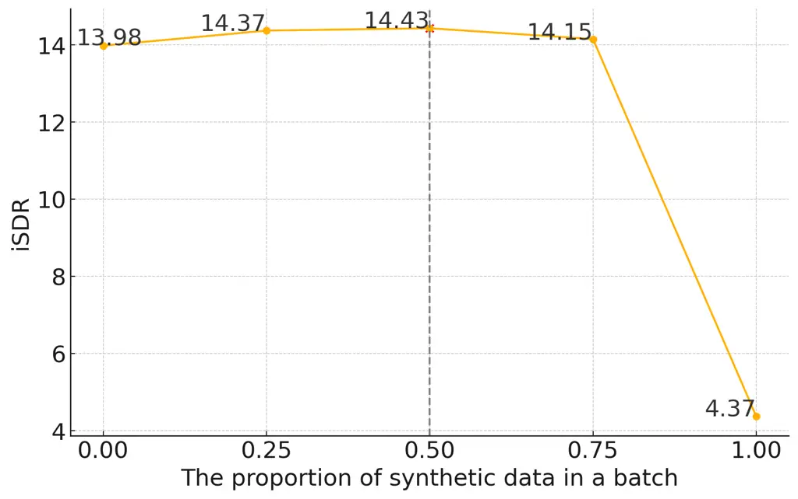

# Improving curriculum learning for target speaker extraction with synthetic speakers

Yun Liu    Xuechen Liu    Junichi Yamagishi ^(†)^(†)thanks: This study
is partially supported by MEXT KAKENHI Grants (24K21324) and JST, the
establishment of university fellowships towards the creation of science
technology innovation (JPMJFS2136).

###### Abstract

Target speaker extraction (TSE) aims to isolate individual speaker
voices from complex speech environments. The effectiveness of TSE
systems is often compromised when the speaker characteristics are
similar to each other. Recent research has introduced curriculum
learning (CL), in which TSE models are trained incrementally on speech
samples of increasing complexity. In CL training, the model is first
trained on samples with low speaker similarity between the target and
interference speakers, and then on samples with high speaker similarity.
To further improve CL, this paper uses a $`k`$-nearest neighbor-based
voice conversion method to simulate and generate speech of diverse
interference speakers, and then uses the generated data as part of the
CL. Experiments demonstrate that training data based on synthetic
speakers can effectively enhance the model’s capabilities and
significantly improve the performance of multiple TSE systems.

###### Index Terms: 

Curriculum learning, Target speaker extraction, Voice conversion,
Synthetic data

^(†)^(†)address: ¹National Institute of Informatics, Tokyo, Japan  
²Sokendai, Kanagawa, Japan  
{yunliu, xuecliu, jyamagis}@nii.ac.jp

## 1 Introduction

Target speaker extraction (TSE) aims to isolate the voice of a specific
speaker from a mixture of voices from various speakers and sounds,
including background noise. This technology is crucial in enhancing the
quality of tele-commuting, improving the functionality of hearing aids,
and refining automatic speech recognition (ASR) systems. Despite
advancements facilitated by deep neural networks \[1, 2\], TSE continues
to face significant challenges, particularly when the speakers have
similar vocal characteristics. This similarity makes the extraction
process more complex and error-prone, highlighting the need for
effective training models.

Simulated audio mixtures are often employed to training neural TSE. Such
mixed speech is usually created by directly adding the speech of the
isolated target speaker to the various interference speakers. TSE models
are then trained to solve the inverse problem of estimating a single
speaker’s waveform from the mixed speech. Given the diversity of speaker
characteristics, it is crucial that a wide variety of speakers are
included in the training data as interference speakers. However, the
Librispeech \[3\] and WSJ0 \[4\] databases, which are standard databases
for TSE tasks, contain a limited number of speakers, which is
insufficient to account for the diversity of speaker characteristics.
Speaker recognition models typically use data from several thousand
speakers. However, the quality of this data is often not clean enough
for effective TSE training.

One way to generate large amounts of data with such diverse speaker
characteristics is to use speech generative models. Significant advances
in speech generative models have made it possible to generate speech
with human-level naturalness and speaker similarity \[5, 6, 7, 8, 9\].
This situation raises an important question of whether such generative
models can be used to generate specialized training data for target
speaker extraction. There are various possible strategies for generating
training data using generative models, one of which is to generate
diverse synthetic interference speakers from given interference
speakers’ audio that are different from given interference speakers.

Figure 1: Three stage curriculum learning

In this paper, we propose the use of generated synthetic interference
speakers in the learning procedure of a recently proposed curriculum
learning (CL)-based TSE  \[10\] in order to answer the above scientific
question. The CL-based TSE starts with training on ’easy’ data samples
and progressively schedules the training data to include ’harder’
training samples \[11\]. The previous study  \[10\] reported that
speaker similarity, which is measured by cosine similarity between
target and interference speakers, serves as an effective difficulty
measure when selecting and scheduling training data. Therefore, we
introduce a new curriculum of much more complex training data using
synthetic interference speakers based on voice conversion (VC) as well
as real interference speakers. The VC framework used is a recently
proposed $`k`$-nearest neighbor ($`k`$-NN)-based VC \[8, 9\]. This
strategy is expected to enrich the training set and improve the
performance of various TSE systems.

Figure 2: Synthetic speaker generation using the $`k`$-NN VC / SALT
system.

The remainder of this paper is structured as follows: Section 2 reviews
related works. Section 3 describes the proposed method for generating
new speakers via the speech generative model. Section 4 presents the
experimental settings and results, and Section 5 concludes our findings
with future work.

## 2 Related work

### 2.1 Designing effective training data for TSE

Many recent studies have aimed to make the training data for TSE or
speech enhancement more realistic and useful. For example,
LibriCSS \[12\] achieves more realistic training data by recording
overlapped speech in a real setting, using multiple loudspeakers at
different positions to play audio from a single speaker. Another
study \[13\] suggests directly using real training data with supervised
learning for speech enhancement models to potentially reduce mismatches
between training and inference. Moreover, separation models trained with
data augmentation \[14\] generalize better to unseen conditions and also
enhance the robustness of the model. \[15\] used neural speech
synthesis-based data augmentation for personalized speech enhancement to
address the typical lack of personal data. However, these methods
randomly select all of the data for training without considering the
strategic use of real or synthetic speakers.

### 2.2 CL for TSE

Such synthetic interference speakers can be used from the beginning of
training, but if they are too diverse, they may be too complex for a TSE
model that has not been well trained. CL for TSE \[10\] is also relevant
in this sense. As illustrated in Figure 1, in Stage 1 of the CL, the
training data consists of target and interference speaker pairs that
exhibit low similarity, identified using a speaker encoder. This first
stage focuses on easier tasks to establish foundational skills in
identifying speaker characteristics. In Stage 2, the model is then
exposed to speaker pairs with higher similarity. It has been reported
that performance can be improved by using this two-step curriculum.

## 3 Improved CL using synthetic speakers

### 3.1 Main concept

The concept of our method proposed in this paper involves adding a new
training stage to the CL framework for TSE, as proposed by Liu et al.
\[10\]. This new stage, designated as Stage 3 and illustrated in Figure
1 , specifically involves using pairs of a real target speaker with a
synthetic interference speaker, as well as pairs of real target and real
interference speakers. The increased diversity of interference speakers
is expected to further strengthen the models enhanced by the two stages
of CL.

### 3.2 Synthetic speaker generation based on VC

#### 3.2.1 Outline

Our goal is to use a speech generative model to generate a set of
diverse synthetic interference speakers that differ from a given set of
interference speakers. The speech generative model may either be VC or
text-to-speech (TTS). However, we chose not to use a TTS model because
we wanted to preserve the original content information in the
interference speech.

After initial experiments, we selected $`k`$-NN VC \[8\] and its
application to a speaker anonymization system \[9\] called SALT¹¹ 1
https://github.com/BakerBunker/SALT as our speaker generation model. As
Figure 2 shows, SALT comprises three primary components: a pre-trained
self-supervised latent encoder based on WavLM \[16\], a $`k`$-NN
regression module, and a vocoder based on HiFi-GAN \[17\]. It performs
speaker anonymization by first randomly selecting $`N`$ reference
speakers in the reference pool. Then probabilistic weighting is applied
to the WavLM representations of $`k`$ neighbors chosen from these $`N`$
reference speakers, using the $`k`$-NN algorithm where the input
speaker’s representation serves as a query. The input speaker’s
representations are replaced with this weighted summed representation.
We use this system to generate many synthetic interference speakers.

Note that in the WaveLM-based encoder, only one specific layer’s (the
third layer) features that are strongly correlated with the speaker
information are extracted. This produces a single 1024-dimensional
vector for every 20 ms. The vocoder is also trained using the specific
layer’s features as input features.

#### 3.2.2 Generation of synthetic interference speakers

Here, we describe how we use the SALT system to generate synthetic
interference speakers. Let $`s_{t}`$ be a given interference speaker’s
audio of TSE. We first extract the input speaker’s WavLM representation,
$`\text{WavLM}(s_{t})`$, of the audio $`s_{t}`$. Using the extracted
representation $`\text{WavLM}(s_{t})`$ as a query, the basic $`k`$-NN is
used at each time step to select $`k`$ neighbors from the
representations of the $`N`$ reference speakers. The cosine distance is
employed to determine the nearest neighbors in the $`k`$-NN process.

After selecting $`k`$ neighbors, we assign a random weight $`w_{j}`$ to
each selected neighbor’s WaveLM representation, $`\mathbf{R}_{j}`$.
These weights are sampled from a normal distribution and then normalized
so that their sum equals 1. A weighted sum of these representations is
then calculated. This sum is blended with the original interference
speaker’s representation through linear interpolation to generate a
synthetic speaker similar to the input speaker, as follows:

```math
\displaystyle(\mathbf{R}_{1},\cdots,\mathbf{R}_{k}) \displaystyle=\text{kNN}(\text{WavLM}(s_{t})) \tag{1}
```

```math
\displaystyle\mathbf{O} \displaystyle=(1-p)\sum_{j=1}^{k}w_{j}\mathbf{R}_{j}+p\text{WavLM}(s_{t}) \tag{2}
```

where $`p`$ is a hyperparameter that needs to be adjusted. We then input
$`\mathbf{O}`$ into the HiFiGAN vocoder to generate a waveform.

This framework is ideal for generating synthetic interference speakers.
By adjusting the parameters $`k`$ and $`p`$, it is possible to create a
large and diverse array of new interference speakers that are distinct
from the existing set. Additionally, the number of interference speakers
can be expanded by generating as many random weights as needed.

## 4 Experiments

### 4.1 Dataset

We conducted our proof-of-concept experiments using the Libri2talker
dataset \[18\], a 2-talker simulated mixture audio dataset derived from
LibriSpeech \[3\]. Compared with Libri2Mix \[19\], modifications were
made to the dataset by alternating the target and interference speakers.
Additionally, each 2-talker mixture was utilized twice, consistent with
the experimental setup in the previous study \[18\].

### 4.2 Feature extraction

The sampling frequency of the speech waveform was set to 16 kHz. The
reference speech samples normalized to a length of 15 seconds, either by
padding or segmenting, while all mixture speeches were clipped to 6
seconds. The STFT parameters for the mixture signal included a window
length of 32 ms, a hop size of 8 ms, and an FFT length of 512.

### 4.3 Hyperparameters

Training involved an Adam optimizer, initiated with a learning rate of
$`1\times 10^{-3}`$. Following an adaptive scheme, the learning rate was
increased over the first 5,000 batches and then gradually reduced to
ensure it did not fall below $`1\times 10^{-5}`$. Each model underwent
three training iterations with different random seeds, and the results
were average. We used the early stopping method, stopping training if
the dev set results did not improve for six consecutive epochs. The
model with the highest iSDR on the dev set was selected for the final
evaluation.

### 4.4 Model setting

For TSE, we utilize the Conformer 4-layer model described in  \[10\] as
our main TSE model. In addition, BLSTM, SpeakerBeam \[20\] and
VoiceFilter-based TSE models \[21\] were also trained.

The main Conformer-based TSE model estimates complex masking
ratios \[22\] for the real and imaginary parts of a complex-valued
spectrum. The input sequence consists of a time-domain waveform of the
mixed signal and features from the mixture are then concatenated with
the speaker embeddings extracted by the speaker encoder. These
embeddings were obtained using a pre-trained ECAPA-TDNN model \[23\]
that was pre-trained on the VoxCeleb2 dataset \[24\].

For VC, we utilize the WavLM-Base model trained on the LibriSpeech
dataset and extract the latent space representations from the third
layer. As the reference pool, we randomly selected $`N=20`$ speakers
from the LibriSpeech train-clean-100 dataset, which was also used as the
training set for the vocoder. This means that the VC model also used the
same training set, LibriSpeech, as the TSE model, without introducing
any new training data. For each selected speaker, we randomly choose 50
audio samples to extract features.

### 4.5 Synthetic data generation setting

The Libri2talker dataset contains 127k data triplets for training, each
including a mixture, target speech, and reference speech.

For each data triplet in the training set, we input the interference
speech (mixture-target speech) into the SALT system to create a new
different interference speaker. For each combination of $`k`$ and $`p`$,
we simply generate 127k synthetic speakers offline unless stated
otherwise. The $`k`$ value is set to 4, 8, or 20. The interpolation
factor $`p`$ is set to 0.2, 0.5, or 0.8.

To incorporate both real and synthetic interference speakers in the
training process, we set the batch size of each mini-batch to 48. Each
mini-batch includes an equal number of real and synthetic speakers.

### 4.6 Evaluation metric

For the evaluation metric, we use improved signal-to-distortion ratio
(iSDR) in dB, which is commonly used to validate TSE, speech
enhancement, and speech separation. The iSDR is measured as the relative
increase in SDR compared to the original mixture. A higher score
indicates higher model performance.

### 4.7 Results

| TSE method              | Stage2         | Stage3         | iSDR \[dB\] |
| ----------------------- | -------------- | -------------- | ----------- |
| Conformer w/o CL \[10\] | $`\times`$     | $`\times`$     | 12.57       |
| Conformer \[10\]        | $`\checkmark`$ | $`\times`$     | 13.44       |
| Conformer (real only)   | $`\checkmark`$ | $`\checkmark`$ | 13.98       |
| Conformer (real+syn)    | $`\checkmark`$ | $`\checkmark`$ | 14.43       |

Table 1: Experimental results before and after adding Stage 3, which
uses synthetic speakers, to the TSE model based on Conformer in \[10\].
Hyperparameters are $`k`$=4 and $`p`$=0.5.

Table 1 shows the experimental results of using the main TSE model based
on the Conformer. First, the Conformer (real only) configuration, which
involves simply adding Stage 3 to the curriculum proposed by Liu et
al. \[10\] and continuing training without synthetic speakers, shows an
improvement in iSDR from 13.44 dB to 13.98 dB. Next, the Conformer
(real+syn) configuration, which incorporates synthetic interference
speakers in Stage 3, achieved an iSDR of 14.43 dB. This result not only
surpasses the Stage 2 outcome but also exceeds the performance of
training without synthetic speakers. These findings clearly demonstrate
the benefits of integrating synthetic interference speakers into TSE
training.

### 4.8 Analysis

This subsection analyzes some of the questions that arise in using the
proposed method.

Q1: Should real and generated speakers be used together?

To determine whether the synthetic interference speakers alone are
sufficient or whether real interference speakers should be used in
conjunction, we adjusted the proportion of synthetic interference
speakers within each mini batch and compared the performance using the
Conformer model. Figure 3 shows the iSDR (dB) performance as a function
of the proportion of synthetic interference speakers within a mini
batch. An x-axis value of 1 indicates the exclusive use of synthetic
interference speakers without real interference speakers.



Figure 3: Comparison on the ratio of synthetic speakers within a
mini-batch.

The highest iSDR of 14.43 dB was observed at the ratio of 0.50. However,
the performance sharply declined to 4.37 dB when the ratio of synthetic
speakers increased to 1.00. This significant drop can be attributed to
data mismatch as the model, initially trained on real data, is only
fine-tuned with synthetic data, which differs significantly from the
real data distribution of the test set.

Q2: What is the impact of hyper-parameters used for speaker generation?

SALT contains two hyperparameters: $`k`$, which represents represents
the number of selected $`k`$-nearest neighbors, and $`p`$, which
dictates the preservation factor of retaining the original interference
speaker. Here, we investigate the impact of these two hyperparameters.
Table 2 displays the iSDR (dB) outcomes across various configurations of
the parameters $`k`$ and $`p`$.

|          | $`p`$=0.2 | $`p`$=0.5 | $`p`$=0.8 |
| -------- | --------- | --------- | --------- |
| $`k`$=4  | 14.16     | 14.43     | 14.15     |
| $`k`$=8  | 14.17     | 14.32     | 14.25     |
| $`k`$=20 | 14.39     | 14.42     | 14.36     |

Table 2: iSDR (dB) results of methods with varying parameters $`k`$ and
$`p`$.

A general trend of improvement in iSDR values is observed as the
hyperparameter $`k`$ increases, demonstrating the benefits of increasing
$`k`$. Particularly noteworthy is the stability of the results at
$`p=0.5`$, where the iSDR values show less variation and maintain higher
performance as $`k`$ changes from 4 to 20. This suggests that a $`p`$
value of 0.5 is a suitable interpolation factor to use for TSE.

Q3: What happens if more interference speakers are generated?

Previous experiments used the same number of synthetic interference
speakers as real speakers during the TSE training. However, it is
possible to generate a more diverse set of synthetic speakers, and we
investigate this potential here using the following two methods. The
first method uses different values of $`k`$ and $`p`$, generating an
equal number of speakers for each combination and then mixing them. The
second method keeps the values of $`k`$ and $`p`$, but re-samples the
weights $`w_{j}`$ to generate more speakers.

|                         |                        |           |
| ----------------------- | ---------------------- | --------- |
| TSE dataset             | Data amount            | iSDR (dB) |
| 1:1                     | 127k utt.              | 14.43     |
| Different $`k`$ & $`p`$ | 127k $`\times`$ 5 utt. | 14.35     |
| Same $`k`$ & $`p`$      | 127k $`\times`$ 5 utt. | 14.49     |
|                         |                        |           |

Table 3: iSDR results with different numbers of synthetic speakers.

Table 3 shows the iSDR results for experiments that utilized additional
synthetic interference speakers. The original Libri2Talker dataset
contained 127k utterances. For the “Different $`k`$ & $`p`$” condition,
we either used $`k=20`$ or $`p=0.5`$, which expanded the data volume to
five times the original amount, comprising five distinct datasets. The
“Same $`k`$ & $`p`$” configuration consistently used $`k=4`$ and
$`p=0.5`$, but generated five times the amount of data; each dataset was
unique due to random variations in the weights assigned to speakers
during generation.

The results indicate that merely increasing the volume of synthetic data
does not significantly enhance results; both modified conditions
produced similar iSDR values around 14.35 dB and 14.49 dB, respectively,
compared to 14.43 dB when the ratio was 1:1. This suggests that the 127k
utterances seem to suffice for the network to learn the current limited
speaker variations of Libri2Talker’s test set.

### 4.9 Experiments using other architectures

| TSE networks       | base | real only | real+syn |
| ------------------ | ---- | --------- | -------- |
| Naive-BLSTM        | 8.30 | 19.79     | 10.32    |
| SpeakerBeam \[20\] | 9.78 | 10.10     | 10.51    |
| VoiceFilter \[21\] | 7.17 | 18.66     | 9.32     |

Table 4: iSDR results using different TSE architecture. Hyper-parameters
for speaker generation are $`k`$=4 and $`p`$=0.5.

Table 4 shows the iSDR (dB) for several network architectures, each
adapted for specific functionalities. The Naive-BLSTM aligns with the
input-output configuration of the Conformer TSE, substituting its four
Conformer blocks with a two-layer, 512-unit BLSTM. SpeakerBeam utilizes
the established structure from prior research as referenced in \[20\].
Meanwhile, VoiceFilter modifies the approach from \[21\] by replacing
the d-vector with a speaker embedding using ECAPA-TDNN.

In training scenarios, the base category employs curriculum learning
with an initial focus on speaker similarity scores under 0.6 for 100
epochs, followed by a 5-epoch finetuning. The real setup fine-tunes
exclusively with real data during Stage 3, while the real+syn setup
fine-tunes with a mix of real and synthetic data. The proportion of
synthetic speaker in each mini batch is also 0.5.

The improvement in iSDR values when using synthetic and real speakers
simultaneously highlights the advantages of the proposed approach and
demonstrates that it is possible to increase accuracy even with models
from different architectures.

## 5 Conclusion and future work

In this paper, we have focused on addressing the limited diversity of
speakers in the standard training database for TSE. We proposed a method
to generate different synthetic interference speakers from a given set
of interference speakers using the $`k`$-NN VC system and use them as
part of the data to create mixtures. The performance of the four TSE
models was improved by using both the synthetic interference/real target
speaker pairs and the real interference/real target speaker pairs
simultaneously in a new stage added to the curriculum learning. It is
important to emphasize that this VC system uses the same training
dataset as the TSE, meaning no new real data has been added, and the
structure of the TSE model has not been altered in any way.

Experiments aimed at increasing the number of interference speakers did
not yield significant improvements, suggesting that the diversity of
interference speakers in the test set of the standard TSE database may
be inherently limited and insufficient. Consequently, a new TSE database
that incorporates a broader range of target and interference speakers
may be necessary in the future.

Our future work will focus not only on increasing the diversity of
interference speakers but on generating interference speakers that are
more similar to the target speaker to be separated, as well as producing
multi-speaker interference speech.

## References

- \[1\] Kateřina Žmolíková, Marc Delcroix, Keisuke Kinoshita, Tsubasa
  Ochiai, Tomohiro Nakatani, Lukáš Burget, and Jan Černocký,
  “Speakerbeam: Speaker aware neural network for target speaker
  extraction in speech mixtures,” IEEE Journal of Selected Topics in
  Signal Processing, vol. 13, no. 4, pp. 800–814, 2019.
- \[2\] Quan Wang, Hannah Muckenhirn, Kevin Wilson, Prashant Sridhar,
  Zelin Wu, John R. Hershey, Rif A. Saurous, Ron J. Weiss, Ye Jia, and
  Ignacio Lopez Moreno, “VoiceFilter: Targeted Voice Separation by
  Speaker-Conditioned Spectrogram Masking,” in Proc. Interspeech 2019,
  2019, pp. 2728–2732.
- \[3\] Vassil Panayotov, Guoguo Chen, Daniel Povey, and Sanjeev
  Khudanpur, “Librispeech: an asr corpus based on public domain audio
  books,” in 2015 IEEE international conference on acoustics, speech and
  signal processing (ICASSP). IEEE, 2015, pp. 5206–5210.
- \[4\] John S. Garofolo et al., “Csr-i (wsj0) complete,” LDC93S6A,
  Linguistic Data Consortium, 1993, 1993.
- \[5\] Zeqian Ju, Yuancheng Wang, Kai Shen, Xu Tan, Detai Xin, Dongchao
  Yang, Yanqing Liu, Yichong Leng, Kaitao Song, Siliang Tang, et al.,
  “Naturalspeech 3: Zero-shot speech synthesis with factorized codec and
  diffusion models,” arXiv preprint arXiv:2403.03100, 2024.
- \[6\] Edresson Casanova, Julian Weber, Christopher D Shulby,
  Arnaldo Candido Junior, Eren Gölge, and Moacir A Ponti, “Yourtts:
  Towards zero-shot multi-speaker tts and zero-shot voice conversion for
  everyone,” in International Conference on Machine Learning. PMLR,
  2022, pp. 2709–2720.
- \[7\] Chengyi Wang, Sanyuan Chen, Yu Wu, Ziqiang Zhang, Long Zhou,
  Shujie Liu, Zhuo Chen, Yanqing Liu, Huaming Wang, Jinyu Li, et al.,
  “Neural codec language models are zero-shot text to speech
  synthesizers,” arXiv preprint arXiv:2301.02111, 2023.
- \[8\] Matthew Baas, Benjamin van Niekerk, and Herman Kamper, “Voice
  conversion with just nearest neighbors,” in Interspeech, 2023.
- \[9\] Yuanjun Lv, Jixun Yao, Peikun Chen, Hongbin Zhou, Heng Lu, and
  Lei Xie, “Salt: Distinguishable speaker anonymization through latent
  space transformation,” in 2023 IEEE Automatic Speech Recognition and
  Understanding (ASRU), 2023.
- \[10\] Yun Liu, Xuechen Liu, Xiaoxiao Miao, and Junichi Yamagishi,
  “Target speaker extraction with curriculum learning,” arXiv preprint
  arXiv:2406.07845, 2024.
- \[11\] Xin Wang, Yudong Chen, and Wenwu Zhu, “A survey on curriculum
  learning,” IEEE Transactions on Pattern Analysis and Machine
  Intelligence, vol. 44, no. 9, pp. 4555–4576, 2021.
- \[12\] Zhuo Chen, Takuya Yoshioka, Liang Lu, Tianyan Zhou, Zhong Meng,
  Yi Luo, Jian Wu, Xiong Xiao, and Jinyu Li, “Continuous speech
  separation: Dataset and analysis,” in ICASSP 2020-2020 IEEE
  International Conference on Acoustics, Speech and Signal Processing
  (ICASSP). IEEE, 2020, pp. 7284–7288.
- \[13\] Ziyi Xu, Marvin Sach, Jan Pirklbauer, and Tim Fingscheidt,
  “Employing real training data for deep noise suppression,” in ICASSP
  2024 - 2024 IEEE International Conference on Acoustics, Speech and
  Signal Processing (ICASSP), 2024, pp. 10731–10735.
- \[14\] Ashish Alex, Lin Wang, Paolo Gastaldo, and Andrea Cavallaro,
  “Data augmentation for speech separation,” Speech Communication, vol.
  152, pp. 102949, 2023.
- \[15\] Anastasia Kuznetsova, Aswin Sivaraman, and Minje Kim, “The
  potential of neural speech synthesis-based data augmentation for
  personalized speech enhancement,” in ICASSP 2023-2023 IEEE
  International Conference on Acoustics, Speech and Signal Processing
  (ICASSP). IEEE, 2023, pp. 1–5.
- \[16\] Sanyuan Chen, Chengyi Wang, Zhengyang Chen, Yu Wu, Shujie Liu,
  Zhuo Chen, Jinyu Li, Naoyuki Kanda, Takuya Yoshioka, Xiong Xiao,
  et al., “Wavlm: Large-scale self-supervised pre-training for full
  stack speech processing,” IEEE Journal of Selected Topics in Signal
  Processing, vol. 16, no. 6, pp. 1505–1518, 2022.
- \[17\] Jungil Kong, Jaehyeon Kim, and Jaekyoung Bae, “Hifi-gan:
  Generative adversarial networks for efficient and high fidelity speech
  synthesis,” Advances in neural information processing systems, vol.
  33, pp. 17022–17033, 2020.
- \[18\] Chenglin Xu, Wei Rao, Jibin Wu, and Haizhou Li, “Target speaker
  verification with selective auditory attention for single and
  multi-talker speech,” IEEE/ACM Transactions on audio, speech, and
  language processing, vol. 29, pp. 2696–2709, 2021.
- \[19\] Joris Cosentino, Manuel Pariente, Samuele Cornell, Antoine
  Deleforge, and Emmanuel Vincent, “Librimix: An open-source dataset for
  generalizable speech separation,” 2020.
- \[20\] Kateřina Žmolíková, Marc Delcroix, Keisuke Kinoshita, Tsubasa
  Ochiai, Tomohiro Nakatani, Lukáš Burget, and Jan Černocký,
  “Speakerbeam: Speaker aware neural network for target speaker
  extraction in speech mixtures,” IEEE Journal of Selected Topics in
  Signal Processing, vol. 13, no. 4, pp. 800–814, 2019.
- \[21\] Quan Wang, Hannah Muckenhirn, Kevin Wilson, Prashant Sridhar,
  Zelin Wu, John R. Hershey, Rif A. Saurous, Ron J. Weiss, Ye Jia, and
  Ignacio Lopez Moreno, “VoiceFilter: Targeted Voice Separation by
  Speaker-Conditioned Spectrogram Masking,” in Proc. Interspeech, 2019,
  pp. 2728–2732.
- \[22\] Donald S. Williamson, Yuxuan Wang, and DeLiang Wang, “Complex
  ratio masking for monaural speech separation,” IEEE/ACM Transactions
  on Audio, Speech, and Language Processing, vol. 24, no. 3, pp.
  483–492, 2016.
- \[23\] Brecht Desplanques, Jenthe Thienpondt, and Kris Demuynck,
  “Ecapa-tdnn: Emphasized channel attention, propagation and aggregation
  in tdnn based speaker verification,” Proc. Interspeech 2020, pp.
  3830–3834, 2020.
- \[24\] J. S. Chung, A. Nagrani, and A. Zisserman, “Voxceleb2: Deep
  speaker recognition,” in INTERSPEECH, 2018.
