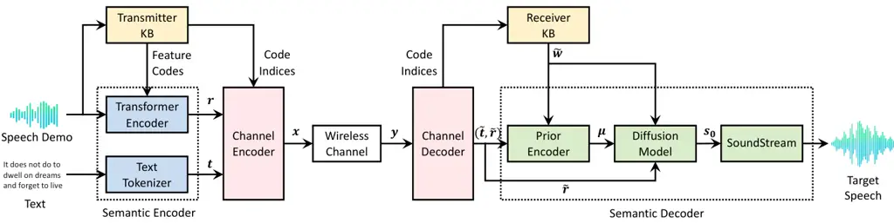
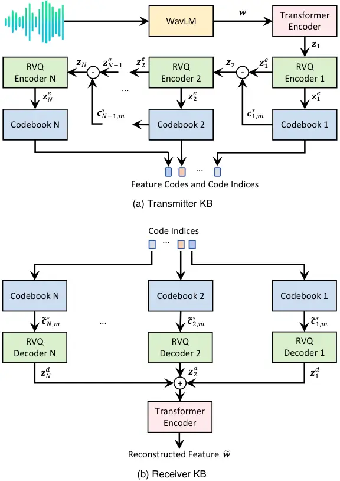

# Generative Semantic Communication for Text-to-Speech SynthesisThanks: The work was supported in part by NSFC with Grant No. 62293482, the Basic Research Project No. HZQB-KCZYZ-2021067 of Hetao Shenzhen-HK S&T Cooperation Zone, the Shenzhen Outstanding Talents Training Fund 202002, the Guangdong Research Projects No. 2017ZT07X152 and No. 2019CX01X104, the Guangdong Provincial Key Laboratory of Future Networks of Intelligence (Grant No. 2022B1212010001), and the Shenzhen Key Laboratory of Big Data and Artificial Intelligence (Grant No. ZDSYS201707251409055). $`*`$ indicates equal contribution. Jinke Ren is the corresponding author.

Jiahao Zheng^(1,2,3∗), Jinke Ren^(1,2,3∗), Peng Xu^(1,2,3), Zhihao
Yuan^(1,2,3),  
Jie Xu^(2,1,3), Fangxin Wang^(2,1,3), Gui Gui⁴, and Shuguang Cui^(2,1,3)
Affiliation: ¹Shenzhen Future Network of Intelligence Institute, ²School
of Science and Engineering,  
and ³Guangdong Provincial Key Laboratory of Future Networks of
Intelligence,  
The Chinese University of Hong Kong (Shenzhen), Shenzhen, China  
⁴School of Automation, Central South University, Changsha, China  
E-mail: {jiahaozheng1, pengxu1, zhihaoyuan}@link.cuhk.edu.cn;  
{jinkeren, xujie, wangfangxin, shuguangcui}@cuhk.edu.cn;
guigui@csu.edu.cn Affiliation: 

###### Abstract

Semantic communication is a promising technology to improve
communication efficiency by transmitting only the semantic information
of the source data. However, traditional semantic communication methods
primarily focus on data reconstruction tasks, which may not be efficient
for emerging generative tasks such as text-to-speech (TTS) synthesis. To
address this limitation, this paper develops a novel generative semantic
communication framework for TTS synthesis, leveraging generative
artificial intelligence technologies. Firstly, we utilize a pre-trained
large speech model called WavLM and the residual vector quantization
method to construct two semantic knowledge bases (KBs) at the
transmitter and receiver, respectively. The KB at the transmitter
enables effective semantic extraction, while the KB at the receiver
facilitates lifelike speech synthesis. Then, we employ a transformer
encoder and a diffusion model to achieve efficient semantic coding
without introducing significant communication overhead. Finally,
numerical results demonstrate that our framework achieves much higher
fidelity for the generated speech than four baselines, in both cases
with additive white Gaussian noise channel and Rayleigh fading channel.

## I Introduction

The rapid proliferation of intelligent applications, such as augmented
reality and the metaverse, presents significant challenges to
next-generation wireless networks. Traditional communication
technologies struggle to meet the massive data transmission requirements
of these applications while ensuring ultra-reliability and low latency.
To address these issues, semantic communication has emerged as a
promising solution. By prioritizing the transmission of task-relevant
information rather than the entire source data, semantic communication
can significantly reduce communication overhead and enhance
communication efficiency \[1\].

The appeal of semantic communication lies in its potential to extract
and transmit semantic information from the source data. To date,
numerous studies have explored semantic communication using deep
learning algorithms \[2, 3, 4, 5, 6\]. However, the majority of these
works focus on data reconstruction tasks, such as image restoration \[2,
3, 4\] and text transmission \[5, 6\]. These designs often necessitate
specialized models, thus limiting their generalizability across diverse
contexts.

In recent years, the advent of generative artificial intelligence (GAI)
technologies has motivated a growing interest in generative tasks, such
as image-to-video generation and text-to-speech (TTS) synthesis. To meet
the various requirements of generative tasks, a new generative semantic
communication paradigm has been proposed, which aims to generate desired
contents based on received signals and semantic knowledge bases (KB)
\[7\]. Specifically, the semantic KB is constructed by GAI technologies,
which is capable of learning intrinsic data structures and generating
new content not presented in the training data. Due to the significant
advantages of semantic KBs, generative semantic communication offers a
novel solution to undertake various tasks, such as image generation
\[8\] and remote surveillance \[9\].

In this paper, we consider a TTS synthesis task in a point-to-point
communication system. The objective is to generate natural speech at the
receiver, guided by a speech demonstration and a piece of text at the
transmitter. To achieve this goal, there exist two common methods. One
involves generating speech directly at the transmitter, and then
transmitting the synthesized speech to the receiver. The other involves
encoding the speech demonstration and text into digital signals for
transmission, followed by generating speech at the receiver based on the
received signals. However, both methods encounter high communication
overhead. To improve the communication efficiency, a pioneering work
\[10\] has proposed a deep learning-based semantic communication system
for speech recognition and synthesis. However, the resultant
computational cost at the receiver is intensive due to the employment of
complex speech synthesis algorithms.

To reduce both computational costs and communication overhead, this
paper proposes to incorporate two semantic KBs to enable semantic
extraction and speech synthesis at the transmitter and receiver,
respectively. Specifically, the two semantic KBs are constructed using a
pre-trained large speech model called WavLM \[11\], which is able to
extract the key speech characteristics from the speech demonstration.
Additionally, a transformer encoder is employed to extract the residual
information from the speech demonstration that is not captured by the KB
at the transmitter. Furthermore, a diffusion-based semantic decoder is
developed to generate lifelike speech using the KB at the receiver.
Simulation results show that our method produces higher-quality speech
and is more resilient to channel dynamics compared to traditional
syntactic communication and existing semantic communication methods.

The rest of this paper is organized as follows. Section II introduces
the system model. Section III presents the specific designs of the
semantic KBs and semantic decoder. Section IV provides a two-stage
training algorithm. Section V discusses the experimental results and
Section VI concludes the paper.



Fig. 1: Generative semantic communication system for text-to-speech
synthesis.

## II System Model

As shown in Fig. 1, we consider a point-to-point communication system,
in which a transmitter possesses a piece of text and a speech
demonstration, while a receiver aims to generate a target speech that
aligns with both the content of the text and the characteristics of the
speech demonstration. Instead of encoding the speech demonstration and
text into bit sequences for transmission, we consider the semantic
communication technology. Specifically, two semantic KBs are deployed at
the transmitter and receiver to facilitate semantic extraction and
speech synthesis, respectively. The detailed working mechanism is
described as follows. At the transmitter, a text tokenizer converts the
input text into a token vector $`\boldsymbol{t}\in\mathbb{R}^{d_{t}}`$,
where $`{d_{t}}`$ is the dimension of the token vector. Meanwhile, the
speech demonstration is input into the transmitter KB, which outputs a
set of feature codes as well as the corresponding code indices. The
feature codes contain the key knowledge necessitated for speech
synthesis, which are input into a transformer encoder. Then, the
transformer encoder extracts the residual information
$`\boldsymbol{r}\in\mathbb{R}^{d_{r}}`$ from the speech demonstration
not captured by the feature codes, where $`d_{r}`$ denotes the dimension
of the residual vector. Notably, the combination of the transformer
encoder and the text tokenizer is defined as the semantic encoder.

After semantic encoding, the token vector $`\boldsymbol{t}`$, residual
vector $`\boldsymbol{r}`$, and the code indices are embedded into one
packet, which is encoded by a channel encoder before transmitting to the
receiver. In this work, we use a neural network to perform channel
encoding. It consists of two cascaded modules, in which each module
includes one convolutional layer followed by a transformer encoder. Let
$`\boldsymbol{x}\in\mathbb{R}^{d_{x}}`$ denote the transmit signal,
where $`d_{x}`$ is the dimension of the output of channel encoder. Then,
the received signal is expressed as

```math
\boldsymbol{y}=h\boldsymbol{x}+\boldsymbol{n}, \tag{1}
```

where $`h`$ denotes the channel coefficient,
$`\boldsymbol{n}\sim\mathcal{CN}(0,\sigma^{2}\boldsymbol{I})`$
represents the independent and identically distributed circularly
symmetric complex Gaussian noise vector with noise power $`\sigma^{2}`$,
and $`\boldsymbol{I}`$ is an identity matrix.

Once receiving the signal $`\boldsymbol{y}`$, the receiver performs
channel decoding to obtain the decoded token vector
$`\tilde{\boldsymbol{t}}\in\mathbb{R}^{d_{t}}`$, residual vector
$`\tilde{\boldsymbol{r}}\in\mathbb{R}^{d_{r}}`$, and code indices.
Similar to the channel encoder, the channel decoder also consists of two
cascaded modules, where each module includes a trans-convolutional layer
and a transformer encoder. Subsequently, the code indices are input into
the receiver KB to reconstruct the speech feature corresponding to the
speech demonstration, denoted by $`\tilde{\boldsymbol{w}}`$ with
dimension $`{d_{w}}`$. Finally, $`\tilde{\boldsymbol{w}}`$,
$`\tilde{\boldsymbol{t}}`$, and $`\tilde{\boldsymbol{r}}`$ are all input
into a semantic decoder to generate the target speech.

According to the above working mechanism, we observe that the two
semantic KBs and the semantic decoder are the key components of the
whole system. Therefore, we present their specific designs in the next
section.



Fig. 2: Illustration of the semantic KBs.

Fig. 3: Illustration of the prior encoder.

## III Semantic KBs and Semantic Decoder

### III-A Design of Semantic KBs

Fig. 2(a) shows the structure of the semantic KB at the transmitter. It
consists of a large speech model called WavLM \[11\], a transformer
encoder, $`N`$ residual vector quantization (RVQ) encoders \[12\], and
$`N`$ feature codebooks.

WavLM is a pre-trained large speech model, which can extract key
information from speeches and has been widely employed to solve
full-stack downstream speech tasks. Therefore, it serves as the key
component of the transmitter KB. Specifically, WavLM extracts a speech
feature vector from the the speech demonstration, denoted by
$`\boldsymbol{w}\in\mathbb{R}^{d_{w}}`$ with dimension $`d_{w}`$. For
convenience, we name $`\boldsymbol{w}`$ as the WavLM feature, which
reflects the characteristics of the speech demonstration, such as pitch,
timbre, and loudness.

Since the dimension of $`\boldsymbol{w}`$ is generally large, we
compress it to improve communication efficiency. As the speech feature
$`\boldsymbol{w}`$ is compositional hierarchies, we propose a
multi-scale hierarchical model to compress it. As illustrated in Fig.
2(a), a transformer encoder first converts $`\boldsymbol{w}`$ into a
source vector $`\boldsymbol{z}_{1}\in\mathbb{R}^{d_{w}}`$. Next,
$`\boldsymbol{z}_{1}`$ is sequentially quantized by $`N`$ RVQ encoders,
where each RVQ encoder extracts the remained speech information from the
output of the previous RVQ encoder. Let $`\boldsymbol{z}_{i}`$ denote
the input of the $`i`$-th RVQ encoder. Then, its output is defined as

```math
\boldsymbol{z}_{i}^{e}=\mathsf{RVQE}(\boldsymbol{z}_{i};\boldsymbol{\theta}_{\text{RVQE},i}), \tag{2}
```

where $`\boldsymbol{\theta}_{\text{RVQE},i}`$ is the parameter of the
$`i`$-th RVQ encoder. Moreover, each RVQ encoder connects with a
particular feature codebook, which is composed of $`M`$ feature codes
for speech representation. Let
$`\boldsymbol{C}_{{i}}=[\boldsymbol{c}_{{i,1}},\boldsymbol{c}_{{i,2}},...,\boldsymbol{c}_{{i,M}}]`$
denote the feature codebook associated with the $`i`$-th RVQ encoder,
where $`\boldsymbol{c}_{{i,m}}`$ represents the $`m`$-th feature code.
Next, the output of each RVQ encoder $`\boldsymbol{z}_{i}^{e}`$ is
mapped to a feature code $`\boldsymbol{c}^{*}_{{i,m}}`$ via the nearest
neighbor look-up method, which is given by

```math
\boldsymbol{c}^{*}_{{i,m}}=\argmin_{\boldsymbol{c}_{{i,m}}}{\|\boldsymbol{c}_{{i,m}}-\boldsymbol{z}_{i}^{e}\|}. \tag{3}
```

Then, the input of the $`(i+1)`$-th RVQ encoder is computed by

```math
\boldsymbol{z}_{i+1}=\boldsymbol{z}_{i}^{e}-\boldsymbol{c}^{*}_{{i,m}}. \tag{4}
```

We note that $`\boldsymbol{z}_{i+1}`$ contains the fine-grained speech
information of $`\boldsymbol{z}_{i}^{e}`$ not captured by
$`\boldsymbol{c}^{*}_{{i,m}}`$. Based on this hierarchical compression
model, the WavLM feature $`\boldsymbol{w}`$ is finally represented by
$`N`$ feature codes, i.e.,
$`\{\boldsymbol{c}^{*}_{{1,m}},\boldsymbol{c}^{*}_{{2,m}},\cdots,\boldsymbol{c}^{*}_{{N,m}}\}`$.

As shown in Fig. 2(b), the KB at the receiver is composed of $`N`$
feature codebooks, $`N`$ RVQ decoders, and a transformer encoder. The
feature codebooks in the receiver KB are the same as those in the
transmitter KB. Therefore, we use the code indices to search the feature
codes output by the transmitter KB. Let
$`\widetilde{\boldsymbol{c}}^{*}_{{i,m}}`$ denote the feature code that
matches the $`i`$-th code index. Then, each
$`\widetilde{\boldsymbol{c}}^{*}_{{i,m}}`$ is further input into a RVQ
decoder to compute a latent feature

```math
\boldsymbol{z}_{i}^{d}=\mathsf{RVQD}(\widetilde{\boldsymbol{c}}^{*}_{{i,m}};\boldsymbol{\theta}_{\text{RVQD},i}), \tag{5}
```

where $`\boldsymbol{\theta}_{\text{RVQD},i}`$ is the parameter of the
$`i`$-th RVQ decoder. Finally, the outputs of all RVQ decoders are
summed up, and the result is input into a transformer encoder to
reconstruct the WavLM feature, denoted by
$`\tilde{\boldsymbol{w}}\in\mathbb{R}^{d_{w}}`$.

### III-B Design of Semantic Decoder

As shown in the right half of Fig. 1, the semantic decoder is composed
of three modules, including a prior encoder \[13\], a diffusion model
\[14\], and a SoundStream \[12\].

The prior encoder is designed to generate conditional information, which
controls the speech synthesis process of the diffusion model. As
illustrated in Fig. 3, the prior encoder consists of a text encoder, an
expansion module, and a pitch predictor. The text encoder and pitch
predictor adopt the transformer encoder structure. Specifically, by
taking the token vector $`\tilde{\boldsymbol{t}}`$, reconstructed WavLM
feature $`\tilde{\boldsymbol{w}}`$, and residual vector
$`\tilde{\boldsymbol{r}}`$ as input, the text encoder outputs a
phoneme-level hidden sequence $`\boldsymbol{h}_{p}`$ and a duration
vector $`\boldsymbol{d}_{1}`$ of the phonemes. Next,
$`\boldsymbol{h}_{p}`$ is expanded to a frame-level hidden sequence
$`\boldsymbol{h}_{f}`$ according to the duration vector
$`\boldsymbol{d}_{1}`$. Then, the pitch predictor uses
$`\tilde{\boldsymbol{r}}`$, $`\tilde{\boldsymbol{w}}`$, and
$`\boldsymbol{h}_{f}`$ to predict the pitch information
$`\boldsymbol{p}_{1}`$ of the target speech. Finally,
$`\boldsymbol{p}_{1}`$ and $`\boldsymbol{h}_{f}`$ are summed up to
obtain the final conditional information, denoted by
$`\boldsymbol{\mu}`$.

The diffusion model aims to generate the SoundStream feature associated
with the target speech. Its working mechanism includes a forward process
and a backward process, which can be formulated as two stochastic
differential equations. Specifically, the forward process adds noise to
a ground-truth SoundStream feature $`\boldsymbol{s}^{\text{g}}_{0}`$,
transforming it into Gaussian noise $`\boldsymbol{s}_{T}`$, where
$`T\in[0,1]`$ is the normalized step. The backward process removes the
noise from $`\boldsymbol{s}_{T}`$ and predicts the SoundStream feature,
denoted by $`\boldsymbol{s}_{0}`$. According to \[14\], the forward
process is expressed as

```math
\boldsymbol{s}_{T}=e^{-\frac{1}{2}\int_{0}^{T}{\beta_{t}dt}}\boldsymbol{s}^{\text{g}}_{0}+\int_{0}^{T}{\sqrt{\beta_{s}}e^{-\frac{1}{2}\int_{0}^{T}{\beta_{t}}dt}d\boldsymbol{\omega}_{s}}, \tag{6}
```

where $`\boldsymbol{\omega}_{s}`$ denotes standard Brownian motion,
while $`\beta_{t}`$ and $`\beta_{s}`$ are two schedule functions for
noise prediction.

In the backward process, for each normalized step $`t\in[0,T]`$, the
noisy SoundStream feature $`\boldsymbol{s}_{t}`$ given
$`\boldsymbol{s}_{0}`$ follows a Gaussian distribution, i.e.,
$`p(\boldsymbol{s}_{t}\mid{\boldsymbol{s}_{0}})\sim\mathcal{N}(\boldsymbol{\rho}_{t}(\boldsymbol{s}_{0}),\sigma_{t}\boldsymbol{I})`$,
where $`\boldsymbol{\rho}_{t}(\boldsymbol{s}_{0})`$ is the mean vector,
$`\sigma_{t}`$ is the variance value, and $`\boldsymbol{I}`$ is an
identity matrix \[14\]. Let $`\nabla{\log{p_{t}(\boldsymbol{s}_{t})}}`$
denote the gradient vector of the log probability density function of
$`\boldsymbol{s}_{t}`$. Then, the backward process for predicting the
SoundStream feature $`\boldsymbol{s}_{0}`$ is given by

```math
\boldsymbol{s}_{0}=\boldsymbol{s}_{T}+\int_{0}^{T}{-\left(\frac{1}{2}\boldsymbol{s}_{t}+\nabla{\log{p_{t}(\boldsymbol{s}_{t})}}\right)\beta_{t}dt}. \tag{7}
```

We note that both the forward and backward processes are performed
during the training stage, but only the backward process operates during
the inference stage. Specifically, for each normalized step
$`t\in[0,T]`$ in the inference stage, $`\boldsymbol{\mu}`$,
$`\tilde{\boldsymbol{w}}`$, $`\tilde{\boldsymbol{r}}`$ and
$`\boldsymbol{s}_{t}`$ are all input into a WaveNet \[15\] to predict
the value of $`\boldsymbol{\rho}_{t}(\boldsymbol{s}_{0})`$. Then, we
approximate the probability density function
$`p_{t}(\boldsymbol{s}_{t})`$, followed by computing the SoundStream
feature $`\boldsymbol{s}_{0}`$ according to (7). Finally, the
SoundStream converts the SoundStream feature $`\boldsymbol{s}_{0}`$ to
the target speech.

Input: Speech demonstration $`\boldsymbol{D}`$, original text
$`\boldsymbol{T}`$, number of training epochs $`J`$.

1 Initialize parameters
$`\boldsymbol{\theta}_{r}^{0},\boldsymbol{\theta}_{e}^{0},\boldsymbol{\theta}_{d}^{0},\boldsymbol{\theta}_{p}^{0},\boldsymbol{\theta}_{\text{diff}}^{0}`$.

2 $`\boldsymbol{t}\leftarrow\mathtt{Text~Tokenizer}(\boldsymbol{T})`$.

3 Feature codes and indices
$`\leftarrow\mathtt{Transmitter~KB}(\boldsymbol{D})`$.

4 for _$`j=0,1,\cdots,J-1`$_ do

    5
$`\boldsymbol{r}^{j}\!\!\leftarrow\!\!\mathtt{Transformer~Encoder}({\text{feature codes}},\boldsymbol{D};\boldsymbol{\theta}_{r}^{j})`$.

    6
$`\boldsymbol{f}_{e}^{j}\leftarrow\mathtt{Padding}({\text{code indices}},\boldsymbol{r}^{j},\boldsymbol{t})`$.

    7
$`\boldsymbol{x}^{j}\leftarrow\mathtt{Channel~Encoder}(\boldsymbol{f}_{e}^{j};\boldsymbol{\theta}_{e}^{j})`$.

    8 Transmit $`\boldsymbol{x}^{j}`$ to the receiver via
$`\boldsymbol{y}^{j}=h^{j}{\boldsymbol{x}}^{j}+{\boldsymbol{n}}^{j}`$.

    9
$`\boldsymbol{f}_{d}^{j}\leftarrow\mathtt{Channel~Decoder}(\boldsymbol{y}^{j};\boldsymbol{\theta}_{d}^{j})`$.

    10 Identify
$`\boldsymbol{\widetilde{r}}^{j},\boldsymbol{\widetilde{t}}^{j},`$ and
code indices from $`\boldsymbol{f}_{d}^{j}`$.

    11
$`\widetilde{\boldsymbol{w}}^{j}\leftarrow\mathtt{Receiver~KB}({\text{code indices}})`$.

    12
$`\boldsymbol{\mu}^{j}\leftarrow\mathtt{Prior~Encoder}(\widetilde{\boldsymbol{r}}^{j},\widetilde{\boldsymbol{t}}^{j},\widetilde{\boldsymbol{w}}^{j};\boldsymbol{\theta}_{p}^{j})`$.

    13
$`\boldsymbol{s}_{0}^{j}\leftarrow\mathtt{Diffusion~Model}(\boldsymbol{\mu}^{j},\widetilde{\boldsymbol{w}}^{j},\widetilde{\boldsymbol{r}}^{j};\boldsymbol{\theta}_{\text{diff}}^{j})`$.

    14 Compute the loss function $`L_{\text{total}}`$ according to (12).

    15 Perform stochastic gradient descent to minimize
$`L_{\text{total}}`$ and obtain $`\boldsymbol{\theta}_{r}^{j+1}`$,
$`\boldsymbol{\theta}_{e}^{j+1}`$, $`\boldsymbol{\theta}_{d}^{j+1}`$,
$`\boldsymbol{\theta}_{p}^{j+1}`$,
$`\boldsymbol{\theta}_{\text{diff}}^{j+1}`$.

16 end for

Output: Trained models $`\boldsymbol{\theta}_{r}^{J}`$,
$`\boldsymbol{\theta}_{e}^{J}`$, $`\boldsymbol{\theta}_{d}^{J}`$,
$`\boldsymbol{\theta}_{p}^{J}`$,
$`\boldsymbol{\theta}_{\text{diff}}^{J}`$.

Algorithm 1 Training Algorithm in the Second Stage.

## IV Two-stage Training Algorithm

This section presents a two-stage training algorithm for the proposed
generative semantic communication system. To mitigate the influence of
other modules on the semantic KBs, we first train the semantic KBs
before proceeding to train other modules, thus enhancing the reliability
of the semantic KBs.

In the first stage, all modules except the two semantic KBs are fixed
and the channel impairments are ignored. Moreover, we adopt a
pre-trained WavLM model in \[11\] and fix it across the training
process. Define
$`\boldsymbol{\Theta}_{{\text{RVQE}}}=\left[\boldsymbol{\theta}_{{\text{RVQE},1}},\cdots,\boldsymbol{\theta}_{{\text{RVQE},N}}\right],\boldsymbol{\Theta}_{{\text{RVQD}}}=\left[\boldsymbol{\theta}_{{\text{RVQD},1}},\cdots,\boldsymbol{\theta}_{{\text{RVQD},N}}\right]`$,
$`\boldsymbol{\phi}_{{t}}`$, and $`\boldsymbol{\phi}_{{r}}`$ as the
parameters of all RVQ encoders, RVQ decoders, the transformer encoder in
the transmitter KB, and the transformer encoder in the receiver KB,
respectively. Then, the loss function for training semantic KBs can be
divided into three parts: 1) reconstruction loss, which is defined as
the mean squared error of the WavLM feature $`\boldsymbol{w}`$ and the
reconstructed WavLM feature $`\tilde{\boldsymbol{w}}`$, i.e.,
$`L_{r}(\boldsymbol{\Theta}_{{\text{RVQE}}},\boldsymbol{\Theta}_{{\text{RVQD}}},\boldsymbol{\phi}_{{t}},\boldsymbol{\phi}_{{r}},\boldsymbol{C}_{i})=\|\boldsymbol{w}-\tilde{\boldsymbol{w}}\|_{2}^{2}`$,
where $`\|\cdot\|_{2}`$ denotes the L2 norm; 2) embedding loss for all
feature codebooks, which is defined as
$`L_{e}(\boldsymbol{C}_{i})=\sum_{i=1}^{N}\|\mathsf{ng}[{\boldsymbol{z}}_{i}^{e}]-\widetilde{\boldsymbol{c}}_{i,m}^{*}\|_{2}^{2}`$,
where $`\mathsf{ng}[\cdot]`$ is the non-gradient operator, indicating
that there is no gradient passed to the variable and its gradients is
zero \[16\]; and 3) commitment loss for all RVQ encoders, i.e.,
$`L_{c}(\boldsymbol{\Theta}_{\text{RVQE}},\boldsymbol{\phi}_{{t}})=\sum_{i=1}^{N}\|\boldsymbol{z}_{i}^{e}-\mathsf{ng}[\widetilde{\boldsymbol{c}}_{i,m}^{*}]\|_{2}^{2}`$.
Hence, the training loss function for the two semantic KBs is given by

```math
\displaystyle L_{\text{KB}}(\boldsymbol{\Theta}_{{\text{RVQE}}},\boldsymbol{\Theta}_{{\text{RVQD}}},\boldsymbol{\phi}_{{t}},\boldsymbol{\phi}_{{r}},\boldsymbol{C}_{i}) \tag{8}
```

```math
\displaystyle=\alpha_{1}\times L_{r}(\boldsymbol{\Theta}_{{\text{RVQE}}},\boldsymbol{\Theta}_{{\text{RVQD}}},\boldsymbol{\phi}_{{t}},\boldsymbol{\phi}_{{r}},\boldsymbol{C}_{i})
```

```math
\displaystyle+\alpha_{2}\times L_{e}(\boldsymbol{C}_{i})+\alpha_{3}\times L_{c}(\boldsymbol{\Theta}_{\text{RVQE}},\boldsymbol{\phi}_{{t}}),
```

where $`\alpha_{1}`$, $`\alpha_{2}`$, and $`\alpha_{3}`$ are weight
coefficients.

In the second stage, we train other modules based on the well-trained
semantic KBs. At the transmitter, the token vector $`\boldsymbol{t}`$,
residual vector $`\boldsymbol{r}`$, and code indices are padded to the
same dimension and concatenated into a whole vector, denoted by
$`\boldsymbol{f}_{e}`$. Next, $`\boldsymbol{f}_{e}`$ is passed through
the channel encoder, wireless channel, and channel decoder. Let
$`\boldsymbol{f}_{d}`$ denote the output vector of the channel decoder.
Then, the training loss function for the channel encoder and channel
decoder is expressed as

```math
L_{\text{ED}}(\boldsymbol{\theta}_{e},\boldsymbol{\theta}_{d})=\|\boldsymbol{f}_{e}-\boldsymbol{f}_{d}\|, \tag{9}
```

where $`\boldsymbol{\theta}_{e}`$ and $`\boldsymbol{\theta}_{d}`$ are
the parameters of the channel encoder and channel decoder, and
$`\|\cdot\|`$ represents the Euclidean norm.

Let $`\boldsymbol{\theta}_{p}`$ and $`\boldsymbol{\theta}_{r}`$ denote
the parameters of the prior encoder and the transformer encoder in the
semantic encoder. Then, the training loss function for the prior encoder
and transformer encoder is given by

```math
L(\boldsymbol{\theta}_{p},\boldsymbol{\theta}_{r})=\|\boldsymbol{d}_{1}-\boldsymbol{d}_{0}\|+\|\boldsymbol{p}_{1}-\boldsymbol{p}_{0}\|+\|\boldsymbol{\mu}-\boldsymbol{s}_{0}\|, \tag{10}
```

where $`\boldsymbol{d}_{0}`$ and $`\boldsymbol{p}_{0}`$ are the
ground-truth phoneme-level duration vector and the frame-level pitch
information of the training sample, respectively. Furthermore, let
$`\boldsymbol{\theta}_{\text{diff}}`$ denote the parameter of the
diffusion model. Then, for a given normalized step $`t`$, the training
loss function for the diffusion model and transformer encoder is defined
as

```math
L(\boldsymbol{\theta}_{\text{diff}},\boldsymbol{\theta}_{r})=\|\nabla{\log{p_{t}(\boldsymbol{s}_{t})}}-\sigma^{-1}_{t}(\boldsymbol{\rho}_{t}(\boldsymbol{s}_{0})-\boldsymbol{s}_{t})\|. \tag{11}
```

Based on the above analysis, the total loss function in the second stage
is given by

```math
L_{\text{total}}=L_{\text{ED}}(\boldsymbol{\theta}_{e},\boldsymbol{\theta}_{d})+L(\boldsymbol{\theta}_{p},\boldsymbol{\theta}_{r})+L(\boldsymbol{\theta}_{\text{diff}},\boldsymbol{\theta}_{r}). \tag{12}
```

The corresponding training algorithm is given in Algorithm 1.

## V Experimental Results

In this section, we conduct experiments to demonstrate the effectiveness
of the proposed framework. All experiments are implemented in a Linux
environment equipped with one NVIDIA Tesla A100 40GB GPU.

### V-A Experiment Settings

Datasets. We use the LibriTTS dataset \[17\] for experiments, which is a
multi-speaker English corpus of nearly 585 hours of read English speech
at a 24kHz sampling rate. Our model is trained on the LibriTTS
train-other set and is evaluated on the LibriTTS test-other set.

Models. In the transmitter KB, we use a pre-trained WavLM feature
extractor, i.e., the module before the post-project layer \[11\], to
reduce the computational overhead at the transmitter. The numbers of RVQ
encoders and codebooks are both set as $`N=8`$. Specifically, each RVQ
encoder contains a linear projection layer followed by a residual block,
and each RVQ decoder contains a residual block followed by a linear
projection layer. The number of feature codes of each feature codebook
is set as $`M=1024`$. The weight coefficients in (8) are set as
$`\alpha_{1}=\alpha_{2}=1`$ and $`\alpha_{3}=0.25`$. The diffusion model
contains 24 WaveNet layers, each consisting of 1D dilated convolution
layer. Other configurations are shown in Table I.

|                       |                    |       |
| --------------------- | ------------------ | ----- |
| Module                | Configuration      | Value |
| Prior encoder         | Conv1D layers      | 30    |
|                       | Conv1D kernel size | 5     |
|                       | Conv1D filter size | 1024  |
|                       | Attention layers   | 18    |
|                       | Attention heads    | 4     |
|                       | Hidden dimension   | 256   |
|                       | Dropout            | 0.2   |
|                       | Attention layers   | 3     |
| Transformer encoder   | Attention heads    | 4     |
| (in semantic encoder) | Hidden dimension   | 256   |
|                       | Dropout            | 0.2   |
| Channel encoder       | Conv1D layers      | 4     |
|                       | Attention layers   | 2     |
|                       | Attention heads    | 4     |
|                       | Hidden dimension   | 256   |
| Channel decoder       | Conv1D layers      | 4     |
|                       | Attention layers   | 2     |
|                       | Attention heads    | 4     |
|                       | Hidden dimension   | 256   |
| Diffusion model       | WaveNet layers     | 24    |
|                       | Hidden dimension   | 256   |
|                       | Dropout            | 0.2   |

TABLE I: Model Configurations

Baselines. We consider four baseline schemes for performance
comparison: 1) PCM+LDPC+YourTTS, which uses the classical pulse-code
modulation (PCM) method and low-density parity-check (LDPC) code for
separate source and channel coding, followed by a popular YourTTS \[18\]
algorithm to generate the target speech; 2) PCM+LDPC+NS2, which uses the
PCM method and LDPC code for separate source and channel coding, while
using the state-of-the-art NaturalSpeech2 (NS2) algorithm \[13\] for
speech synthesis; 3) JSCC+YourTTS, which performs joint semantic and
channel coding (JSCC) \[2\] and uses the YourTTS algorithm for speech
synthesis; 4) JSCC+NS2, which employs the JSCC method \[2\] while using
the NS2 algorithm to generate the target speech. In the NS2 algorithm,
the speech demonstration is converted to an audio codec latent vector
before being input into the channel encoder. The main difference between
the four baselines and our scheme is that we incorporate two semantic
KBs.

Metrics. We consider two performance metrics to evaluate the quality of
the synthesized speech. The first one is word error rate (WER), which
measures the accuracy of the synthesized speech with respect to the
original text. Lower WER indicates better speech. The second one is
speaker similarity score (SPK), which represents the degree of
similarity between the vocal characteristics of the synthesized speech
and the ground-truth speech. The higher the SPK is, the higher
probability that the speech pairs come from the same speaker.

Fig. 4: WER and SPK of different schemes with AWGN channel.

Fig. 5: WER and SPK of different schemes with Rayleigh fading channel.

### V-B Performance Comparison with Different Channels

We first compare the performance of our generative scheme with the four
baseline schemes. Both additive white Gaussian noise (AWGN) channel and
Rayleigh fading channel are simulated. The data sizes of the original
text and the speech demonstration are 6.4 Kbits and 2,304 Kbits,
respectively. For fair comparison, the communication overhead of each
scheme is bounded by 160 Kbits. The results are shown in Fig. 4 and Fig.
5, respectively. It is observed that our generative scheme always
achieves the lowest WER and highest SPK among all schemes in both AWGN
and Rayleigh fading scenarios, demonstrating the effectiveness and
generalization of our generative scheme. Moreover, in low
signal-to-noise ratio (SNR) regimes, the two baselines associated with
JSCC achieve lower WER and higher SPK than the other two baselines
associated with PCM and LDPC, reflecting the superiority of semantic
communication over traditional communication.

| Schemes          | Computation                | Storage |
| ---------------- | -------------------------- | ------- |
|                  | ($`\times 10^{10}`$ FLOPs) | (MByte) |
| PCM+LDPC+YourTTS | 21                         | 406     |
| PCM+LDPC+NS2     | 15213                      | 1908    |
| JSCC+YourTTS     | 29                         | 425     |
| JSCC+NS2         | 15222                      | 1919    |
| Ours             | 3878                       | 873     |

TABLE II: Computation and Storage of Different Schemes

We further evaluate the computation and storage requirements for all
schemes, and the results are presented in Table II. It is observed that
our generative scheme requires fewer computations and less storage than
the two baseline schemes associated with NS2. However, the two baseline
schemes associated with YourTTS demand even fewer computations and less
storage than our scheme. Despite this advantage, the synthesized speech
quality of the YourTTS baseline schemes is unsatisfactory. Therefore,
our scheme achieves a better balance between computation, storage, and
speech quality.

### V-C Performance Comparison with Different Communication Budgets

To validate the robustness of the proposed generative scheme, we test
the performance of all schemes with different communication budgets,
i.e., the number of bits being transmitted, which determines the
communication latency. We take the AWGN channel as an example and set
SNR as 5dB. The result is shown in Fig. 6. It is seen that our
generative scheme outperforms the four baselines. In particular, when
the communication budget decreases, the performance gaps between the
proposed scheme and other four schemes become more evident. This
demonstrates that our generative scheme can generate better speech in
communication-limited scenarios.

Fig. 6: WER and SPK of all schemes with different communication budgets.

## VI Conclusion

This paper proposed a new generative semantic communication framework
for TTS synthesis. Two semantic KBs are constructed leveraging the large
speech model WavLM, which is able to capture the key characteristics of
the speech demonstration. By integrating the two semantic KBs into the
transmitter and receiver, along with the utilization of a transformer
encoder and a diffusion model for semantic coding, our framework
generates lifelike speech with low communication overhead and
computational cost. This work opens a new direction for future research
on semantic communication, highlighting the promising applications of
GAI technologies in various communication-intensive tasks.

## References

- \[1\] Q. Lan, D. Wen, Z. Zhang, Q. Zeng, X. Chen, P. Popovski, and K.
  Huang, “What is semantic communication? A view on conveying meaning in
  the era of machine intelligence,” J. Commun. Inform. Netw., vol. 6,
  no. 4, pp. 336–371, Dec. 2021.
- \[2\] E. Bourtsoulatze, D. B. Kurka, and D. Gündüz, “Deep joint
  source-channel coding for wireless image transmission,” IEEE Trans.
  Cogn. Commun. Netw., vol. 5, no. 3, pp. 567-579, Sep. 2019.
- \[3\] D. Huang, F. Gao, X. Tao, Q. Du, and J. Lu, “Toward semantic
  communications: Deep learning-based image semantic coding,” IEEE J.
  Sel. Areas Commun., vol. 41, no. 1, pp. 55-71, Jan. 2023.
- \[4\] H. Wu, Y. Shao, E. Ozfatura, K. Mikolajczyk, and D. Gündüz,
  “Transformer-aided wireless image transmission with channel feedback,”
  _IEEE Trans. Wireless Commun._, vol. 23, no. 9, pp. 11904-11919,
  Sep. 2024.
- \[5\] Y. Wang, M. Chen, T. Luo, W. Saad, D. Niyato, H. V. Poor,
  and S. Cui, “Performance optimization for semantic communications: An
  attention-based reinforcement learning approach,” IEEE J. Sel. Areas
  Commun., vol. 40, no. 9, pp. 2598-2613, Sep. 2022.
- \[6\] X. Peng, Z. Qin, D. Huang, X. Tao, J. Lu, G. Liu, and C. Pan,
  “A robust deep learning enabled semantic communication system for
  text,” in _Proc. IEEE Global Commun. Conf. (Globecom)_, Rio de
  Janeiro, Brazil, Dec. 2022, pp. 2704-2709.
- \[7\] J. Ren, Z. Zhang, J. Xu, G. Chen, Y. Sun, P. Zhang, and S. Cui,
  “Knowledge base enabled semantic communication: A generative
  perspective,” _IEEE Wireless Commun._, vol. 31, no. 4, pp. 14-22,
  Aug. 2024.
- \[8\] P. Ye, Y. Sun, S. Yao, H. Chen, X. Xu, and S. Cui,
  “Codebook-enabled generative end-to-end semantic communication powered
  by transformer,” _arXiv preprint arXiv:2402.16868_, 2024.
- \[9\] W. Yang, Z. Xiong, Y. Yuan, W. Jiang, T. Q. S. Quek, and M.
  Debbah, “Agent-driven generative semantic communication for remote
  surveillance,” _arXiv preprint arXiv:2404.06997_, 2024.
- \[10\] Z. Weng, Z. Qin, X. Tao, C. Pan, G. Liu, and G. Y. Li, “Deep
  learning enabled semantic communications with speech recognition and
  synthesis,” _IEEE Trans. Wireless Commun._, vol. 22, no. 9, pp.
  6227-6240, Sep. 2023.
- \[11\] S. Chen _et al._, “WavLM: Large-scale self-supervised
  pre-training for full stack speech processing,” _IEEE J. Sel. Top
  Signal Process._, vol. 16, no. 6, pp. 1505-1518, Oct. 2022.
- \[12\] A. Défossez, J. Copet, G. Synnaeve, and Y. Adi, “High fidelity
  neural audio compression,” _arXiv preprint arXiv:2210.13438_,
  Oct. 2022.
- \[13\] K. Shen _et al._, “Naturalspeech 2: Latent diffusion models
  are natural and zero-shot speech and singing synthesizers,” _arXiv
  preprint arXiv:2304.09116_, Apr. 2023.
- \[14\] V. Popov, I. Vovk, V. Gogoryan, T. Sadekova, and M. Kudinov,
  “Grad-tts: A diffusion probabilistic model for text-to-speech,” in
  _Proc. Int. Conf. Mach. Learn. (ICML)_, virtual, Jul. 2021, pp.
  8599-8608.
- \[15\] A. Oord, S. Dieleman, H. Zen, K. Simonyan, O. Vinyals, A.
  Graves, N. Kalchbrenner, A. Senior, and K. Kavukcuoglu, “Wavenet: A
  generative model for raw audio,” _arXiv preprint arXiv:1609.03499_,
  Sep. 2016.
- \[16\] Q. Hu, G. Zhang, Z. Qin, Y. Cai, G. Yu, and G. Y. Li, “Robust
  semantic communications with masked VQ-VAE enabled codebook,” _IEEE
  Trans. Wireless Commun._, vol. 22, no. 12, pp. 8707-8722, Dec. 2023.
- \[17\] H. Zen, V. Dang, R. Clark, Y. Zhang, R. J. Weiss, Y. Jia, Z.
  Chen, and Y. Wu, “Libritts: A corpus derived from librispeech for
  text-to-speech,” _arXiv preprint arXiv:1904.02882_, Apr. 2019.
- \[18\] E. Casanova, J. Weber, C. D. Shulby, A. C. Junior, E. Gölge,
  and M. A. Ponti, “Yourtts: Towards zero-shot multi-speaker tts and
  zero-shot voice conversion for everyone,” in _Proc. Int. Conf. Mach.
  Learn. (ICML)_, Baltimore, Maryland, USA, Jul. 2022, pp. 2709-2720.
