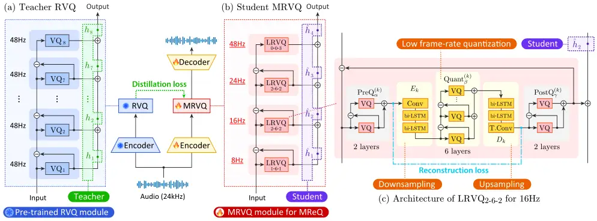
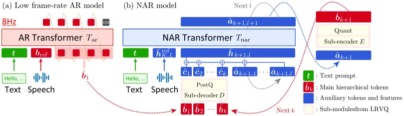
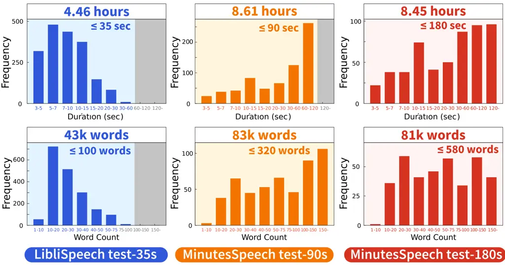
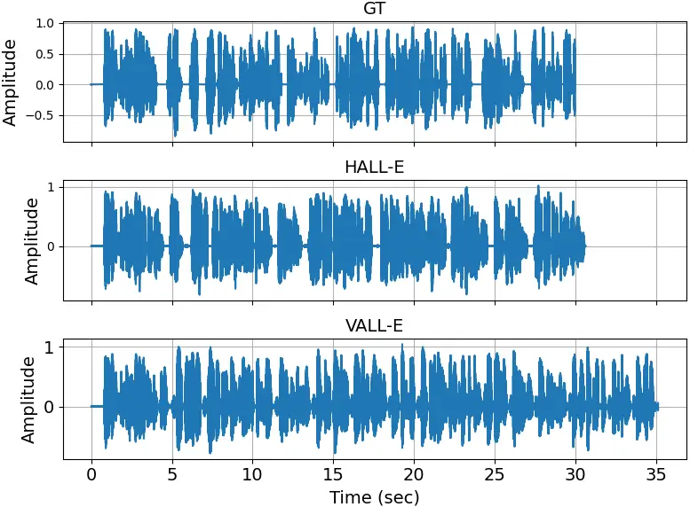
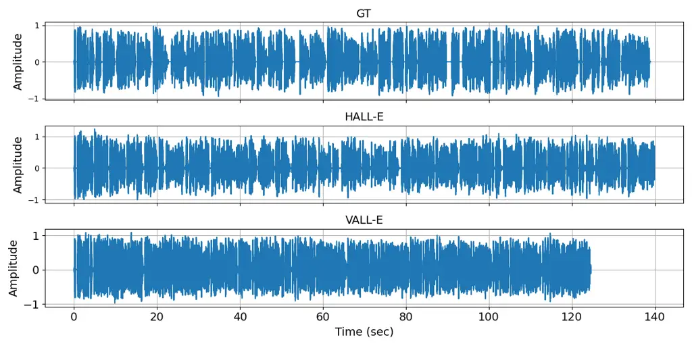
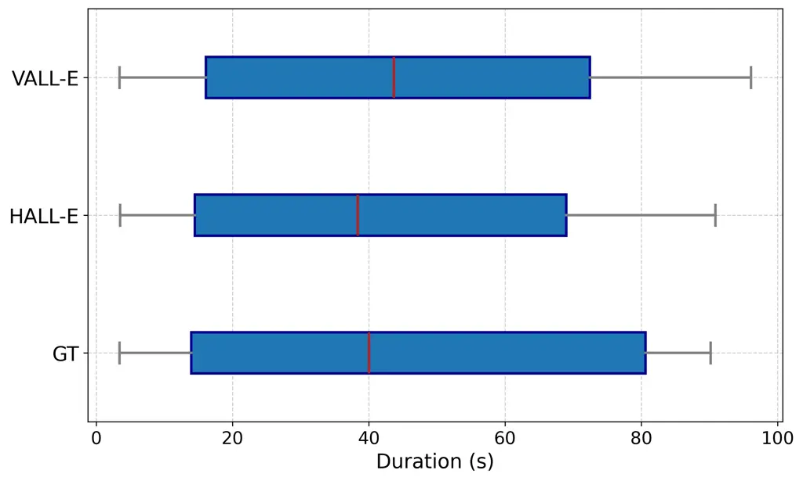
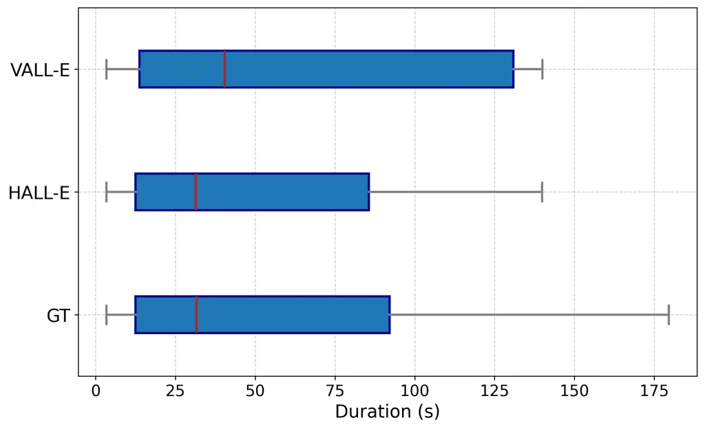

# HALL-E: Hierarchical Neural Codec Language Model for Minute-Long Zero-Shot Text-to-Speech Synthesis

Yuto Nishimura Affiliation:  The University of Tokyo Affiliation: 
Institute of Science Tokyo
Email: [yutonishimurav2@g.ecc.u-tokyo.ac.jp](mailto:)    Takumi Hirose
Affiliation:  Institute of Science Tokyo    Masanari Ohi Affiliation: 
Institute of Science Tokyo    Hideki Nakayama Affiliation:  The
University of Tokyo    Nakamasa Inoue Affiliation:  Institute of Science
Tokyo

###### Abstract

Recently, Text-to-speech (TTS) models based on large language models
(LLMs) that translate natural language text into sequences of discrete
audio tokens have gained great research attention, with advances in
neural audio codec (NAC) models using residual vector quantization
(RVQ). However, long-form speech synthesis remains a significant
challenge due to the high frame rate, which increases the length of
audio tokens and makes it difficult for autoregressive language models
to generate audio tokens for even a minute of speech. To address this
challenge, this paper introduces two novel post-training approaches: 1)
Multi-Resolution Requantization (MReQ) and 2) HALL-E. MReQ is a
framework to reduce the frame rate of pre-trained NAC models.
Specifically, it incorporates multi-resolution residual vector
quantization (MRVQ) module that hierarchically reorganizes discrete
audio tokens through teacher-student distillation. HALL-E is an
LLM-based TTS model designed to predict hierarchical tokens of MReQ.
Specifically, it incorporates the technique of using MRVQ sub-modules
and continues training from a pre-trained LLM-based TTS model.
Furthermore, to promote TTS research, we create MinutesSpeech, a new
benchmark dataset consisting of 40k hours of filtered speech data for
training and evaluating speech synthesis ranging from 3s up to 180s. In
experiments, we demonstrated the effectiveness of our approaches by
applying our post-training framework to VALL-E. We achieved the frame
rate down to as low as 8 Hz, enabling the stable minitue-long speech
synthesis in a single inference step. Audio samples, dataset, codes and
pre-trained models are available at
[https://yutonishimura-v2.github.io/HALL-E_DEMO](https://yutonishimura-v2.github.io/HALL-E_DEMO).

|     |
| --- |
|     |

## 1 Introduction

Recent advances in large language models (LLMs) have enabled us to model
complex linguistic structures and patterns with unprecedented precision
in natural language processing tasks (Brown et al., 2020; Chowdhery
et al., 2023; Zeng et al., 2023). Motivated by these developments,
LLM-based text-to-speech (TTS) models have gained significant research
interest for their ability to model complex speech structures and
patterns, enabling the synthesis of more natural-sounding speech in a
zero-shot manner (Wang et al., 2023; Zhang et al., 2023b; Song et al.,
2024; Han et al., 2024a; Chen et al., 2024a; Xin et al., 2024; Meng
et al., 2024). The core concept behind LLM-based TTS models is to
translate natural language text into a sequence of audio tokens,
typically using frozen natural audio codec (NAC) models that quantize
audio signals into discrete tokens via vector quantization
techniques (Zeghidour et al., 2021; Défossez et al., 2022; Kumar et al.,
2023; Zhang et al., 2024; Wu et al., 2023; Huang et al., 2023; Du
et al., 2024; Yang et al., 2023a).

Since LLMs are becoming capable of capturing long context in text (Guo
et al., 2022; Chen et al., 2024b; Han et al., 2024b), LLM-based TTS
models are also expected to handle long context to synthesize speech
over extended periods. However, this presents significant challenges,
mainly because the length of audio tokens per second is typically large.
More specifically, when using an autoregressive language model to
predict audio tokens, as in the VALL-E architecture (Wang et al., 2023),
the high frame rate¹¹ 1 We refer to the number of audio tokens per
second as the frame rate (Hz). at the first layer of residual vector
quantization (RVQ) (Zeghidour et al., 2021) in NAC models often becomes
a major factor that hinders the synthesis of long speech. As recently
discussed and investigated by Han et al. (2024a); Chen et al. (2024a),
reducing the frame rate is essential, but not straightforward. Simply
reducing the frame rate in NAC models results in degraded audio quality
and incorrect phoneme pronunciation. Addressing this issue requires
novel solutions that bridge NAC models and LLM-based TTS models.

In this paper, we propose a novel approach to tackle the challenge of
minitue-long speech synthesis in LLM-based TTS models by introducing a
hierarchical post-training framework that effectively manages the
trade-off between reducing frame rate and producing high-quality speech.
Our contributions are summarized as follows:

1.  1.  We propose Multi-Resolution Requantization (MReQ), a post-training
        framework for hierarchically reorganizing pre-trained RVQ module to
        reduce the frame rate at lower quantization layers. MReQ
        incorporates a multi-resolution residual vector quantization (MRVQ)
        module into a pre-trained NAC model and continues training in a
        teacher-student distillation manner. This results in reducing the
        frame rate at the first quantization layer to 8 Hz.
2.  2.  We propose HALL-E, a hierarchical LLM-based TTS model designed to
        predict hierarchical tokens of MReQ. The AR model is trained using
        8Hz tokens, while the NAR model is trained by using sub-modules in
        MRVQ, and continues training from a pre-trained LLM-based TTS model.
3.  3.  We introduce MinutesSpeech, a new benchmark dataset to promote TTS
        research, particularly for minute-long speech synthesis. The
        training set consists of 40k hours of automatically filtered and
        balanced speech data. The test set consists of 8 hours of speech
        data with transcriptions created by professional transcribers.
4.  4.  We thoroughly conducted experiments to provide best practices for
        managing the trade-off between reducing frame rate and producing
        high-quality speech, while demonstrating the effectiveness and
        efficiency of our approach. We open-source dataset, codes and
        pre-trained models along with audio samples at
        [https://yutonishimura-v2.github.io/HALL-E_DEMO](https://yutonishimura-v2.github.io/HALL-E_DEMO).

## 2 Related Work

Neural audio codec models. NAC models produce discrete audio tokens by
quantizing audio signals. SoundStream (Zeghidour et al., 2021) and
Encodec (Défossez et al., 2022) are pioneering NAC models, which
significantly improved compression efficiency over traditional audio
codecs. Recent studies have proposed NAC models with a focus on
maintaining performance in speech processing tasks. Examples include
SpeechTokenizer (Zhang et al., 2024), Descript Audio Code (Kumar et al.,
2023), AcademiCodec (Yang et al., 2023a), AudioDec (Wu et al., 2023),
RepCodec (Huang et al., 2023), and FunCodec (Du et al., 2024). Many
studies have focused on reducing bps, while few have explored lowering
the frame rate. Défossez et al. (2024) achieved the lowest frame rate
for a NAC model, reaching 12.5Hz by incorporating Transformer models and
SpeechTokenizer. We report achieving an even lower frame rate of 8Hz,
which is about 1.5 times shorter than it.

Zero-shot TTS. Zero-Shot TTS aims to synthesize speech from text in the
voice of a target speaker using only a short reference audio segment
from that speaker. Early models relied on speaker embeddings or speaker
adaptation (Casanova et al., 2022; Arik et al., 2018; Chen et al.,
2019), while recent studies have focused on LLM-based models that use
NAC models in conjunction with LLMs. VALL-E (Wang et al., 2023) was the
first LLM-based model, demonstrating impressive capabilities in
zero-shot TTS tasks. Follow-up studies have explored various extensions
such as VALL-E X for cross-lingual TTS (Zhang et al., 2023b), ELLA-V
using Montreal forced aligner (Song et al., 2024), RALL-E using prosody
features (Xin et al., 2024), VALL-E R using monotonic alignment (Han
et al., 2024a), VALL-E 2 using grouped code modeling (Chen et al.,
2024a), and MELLE using mel-spectrogram features (Meng et al., 2024).
Prosody information can also be modeled by LLMs latent language mode
Mega-TTS (Jiang et al., 2023) and Mega-TTS 2 (Jiang et al., 2024)
introduced prosody LLMs to generate more natural prosody. Meanwhile,
diffusion-based models (e.g., NaturalSpeech2/3 (Shen et al., 2024; Ju
et al., 2024) and Voicebox (Le et al., 2024)) and prompt-based models
(e.g., Prompt-TTS2 (Guo et al., 2023; Leng et al., 2024)) are also known
to be effective to generate high-quality controllable speech. Beyond
speech synthesis, several studies proposed audio generation models such
as UniAudio (Yang et al., 2023b), Audiobox (Vyas et al., 2023). In
contrast, this work explores post-training methods to reduce the frame
rate of LLM-based models, aiming at minute-long speech synthesis given a
pre-trained NAC model such as Encodec.

## 3 Preliminaries

Neural audio codec. A NAC model typically consists of three components:
an encoder $`\mathrm{Enc}(\cdot)`$, a vector quantizer
$`\mathrm{VQ}(\cdot)`$, and a decoder $`\mathrm{Dec}(\cdot)`$. The
quantizer is the core component that produces discrete audio tokens.
This work assumes that an RVQ module (Zeghidour et al., 2021) is used as
the quantizer, which is defined as follows:

```math
\displaystyle\bm{z}_{l}=\mathrm{VQ}_{l}(\bm{x}_{l-1}), \tag{1}
```

```math
\displaystyle\bm{x}_{l+1}=\bm{x}_{l}-\tilde{\bm{z}}_{l}, \tag{2}
```

```math
\displaystyle\bm{h}=\sum_{l=1}^{L}\tilde{\bm{z}}_{l}, \tag{3}
```

where
$`\bm{x}_{0}=\mathrm{Enc}(\bm{x}_{\mathrm{in}})\in\mathbb{R}^{d\times n}`$
is the encoder output for the input audio $`\bm{x}_{\mathrm{in}}`$,
$`d`$ is the latent dimension, $`n`$ is the sequence length,
$`\mathrm{VQ}_{l}`$ is a vector quantizer,
$`\bm{z}_{l}\in\mathbb{N}^{n}`$ is a discrete token sequence,
$`\tilde{\bm{z}}_{l}=\mathrm{Emb}_{l}(\bm{z}_{l})\in\mathbb{R}^{d\times n}`$
is a sequence of embeddings corresponding to $`\bm{z}_{l}`$ obtained
through a learnable embedding layer $`\mathrm{Emb}_{l}(\cdot)`$²² 2 In
this paper, the tilde symbol ( $`\tilde{}`$ ) denotes the embeddings
corresponding to a token sequence., $`l\in\{1,2,\cdots,L\}`$ is the
layer index, and $`L`$ is the number of layers. The output
$`\bm{h}\in\mathbb{R}^{d\times n}`$ is then fed into the decoder to
reconstruct the input audio as $`\bm{y}=\mathrm{Dec}(\bm{h})`$.

LLM-based TTS. An LLM-based TTS typically consists of two decoder-only
language models: an autoregressive (AR) model $`T_{\mathrm{ar}}`$ and a
non-autoregressive (NAR) model $`T_{\mathrm{nar}}`$ (Wang et al., 2023).
The speech synthesis procedure is given by the following equations:

```math
\displaystyle\hskip-35.0pt\hat{\bm{z}}_{1}=T_{\mathrm{ar}}(\bm{t},\bm{z}_{1}^{\mathrm{pr}}),\hskip-20.0pt \tag{4}
```

```math
\displaystyle\hat{\bm{z}}_{l+1}=T_{\mathrm{nar}}(\bm{t},\bm{h}^{\mathrm{pr}}_{L},\hat{\bm{h}}_{l},l),\hskip-2.0pt \tag{5}
```

```math
\displaystyle\hat{\bm{h}}_{l}=\sum_{l^{\prime}=1}^{l}\hat{\tilde{\bm{z}}}_{l^{\prime}},\hskip-11.0pt \tag{6}
```

```math
\displaystyle\hat{\bm{y}}=\mathrm{Dec}([\bm{h}^{\mathrm{pr}}_{L},\hat{\bm{h}}_{L}]),\hskip-8.0pt \tag{7}
```

where $`[\bm{h}^{\mathrm{pr}}_{L},\hat{\bm{h}}_{L}]`$ denotes the
concatenation of these two matrices along the time axis. In Eq. (4),
$`T_{\mathrm{ar}}`$ generates an audio token sequence
$`\hat{\bm{z}}_{1}\in\mathbb{N}^{n^{\prime}}`$ corresponding to the
first layer of RVQ given two inputs: a text prompt $`\bm{t}`$ and an
audio prompt
$`\bm{z}^{\mathrm{pr}}_{1}=\mathrm{VQ}_{1}(\mathrm{Enc}(\bm{x}_{\mathrm{pr}}))`$
extracted from an audio input $`\bm{x}_{\mathrm{pr}}`$. In Eq. (5),
$`T_{\mathrm{nar}}`$ iteratively generates token sequences
$`\hat{\bm{z}}_{l+1}\in\mathbb{N}^{n^{\prime}}`$ from the accumulated
hidden features $`\hat{\bm{h}}_{l}`$ in Eq. (6) and the audio prompt’s
hidden features $`\bm{h}^{\mathrm{pr}}_{L}`$. Finally, in Eq. (7),
speech $`\hat{\bm{y}}`$ is generated. Note that
$`\mathrm{Enc},\mathrm{VQ}_{1}`$, and $`\mathrm{Dec}`$ are from a frozen
NAC model.

Figure 1: Preliminary experiments on varying the frame rate of Encodec.

Preliminary experiments. LLM-based TTS models have a predefined context
window size and are typically trained with speech data ranging from
several seconds to several tens of seconds. To generate long speech
segments, a straightforward approach is to reduce the frame rate in the
NAC model. However, reducing the frame rate below 48 Hz significantly
decreases speech reconstruction performance as shown in Figure 1, where
we evaluated the performance of Encodec (Défossez et al., 2022) in terms
of the Perceptual Evaluation of Speech Quality (PESQ) scores and word
error rates (WERs) as functions of frame rates. Specifically, it is
confirmed that training becomes entirely difficult at 8Hz. Therefore, in
this study, we propose a NAC model that works even at an 8Hz,
demonstrating a significant improvement over existing limitations.

## 4 MReQ: Multi-Resolution Requantization

This section introduces MReQ, a post-training framework for
hierarchically reorganizing a pre-trained RVQ module to reduce the frame
rate. Specifically, MReQ incorporates a multi-resolution residual vector
quantization (MRVQ) module to a pre-trained NAC model as shown in
Figure 2, and continues training the NAC model in a teacher-student
distillation manner. For a pre-trained 48Hz Encodec model, MReQ reduces
the frame rate at the first quantization layer to 8 Hz. This enables
LLM-based TTS models to handle longer contexts.

### 4.1 Architecture

The MRVQ module is a nested structure of RVQ. Specifically, it consists
of a residual structure composed of multiple low frame-rate residual
vector quantization (LRVQ) blocks, each of which is itself a residual
structure operating at a different frame rate. The definition is given
as follows.

Definition 1 (MRVQ module). Let
$`\bm{x}_{0}\in\mathbb{R}^{d\times n_{0}}`$ be an encoder output, where
$`d`$ is the latent dimension and $`n_{0}=Ts_{0}`$ is the sequence
length depending on the time length $`T`$ (sec) and the frame rate
$`s_{0}`$ (Hz). The MRVQ module is defined as follows:

```math
\displaystyle\bm{c}_{k}=\mathrm{LRVQ}^{(k)}_{\alpha\mathchar 45\beta\mathchar 45\gamma}(\bm{x}_{k-1}), \tag{8}
```

```math
\displaystyle\bm{x}_{k+1}=\bm{x}_{k}-\tilde{\bm{c}}_{k}, \tag{9}
```

```math
\displaystyle\bm{h}=\sum_{k=1}^{K}\tilde{\bm{c}}_{k}, \tag{10}
```

where
$`\mathrm{LRVQ}^{(k)}_{\alpha\mathchar 45\beta\mathchar 45\gamma}`$ is
an LRVQ block, $`K`$ is the number of blocks,
$`\alpha\mathchar 45\beta\mathchar 45\gamma`$ is a triplet of
hyperparameters to determine the block structure.

Definition 2 (LRVQ block).

Each LRVQ block
$`\mathrm{LRVQ}^{(k)}_{\alpha\mathchar 45\beta\mathchar 45\gamma}`$
consists of five components: a pre-quantizer
$`\mathrm{PreQ}^{(k)}_{\alpha}`$, a sub-encoder $`E_{k}`$ for down
sampling, a main quantizer $`\mathrm{Quant}^{(k)}_{\beta}`$,

a sub-decoder $`D_{k}`$ for upsampling, and a post-quantizer
$`\mathrm{PostQ}^{(k)}_{\gamma}`$. The quantization procedure is given
by  
$`\displaystyle\bm{a}_{k}=\mathrm{PreQ}^{(k)}_{\alpha}(\bm{x}_{k-1}),\hskip-4.0pt`$
(11)
$`\displaystyle\bm{b}_{k}=\mathrm{Quant}^{(k)}_{\beta}(E_{k}(\tilde{\bm{a}}_{k})),\hskip-4.0pt`$
(12)
$`\displaystyle\bm{c}_{k}=\mathrm{PostQ}^{(k)}_{\gamma}(D_{k}(\tilde{\bm{b}}_{k})),\hskip-4.0pt`$
(13)

where $`\bm{a}_{k},\bm{b}_{k},\bm{c}_{k}`$ are token sequences. The
three quantizers
$`\mathrm{PreQ}^{(k)}_{\alpha},\mathrm{Quant}^{(k)}_{\beta}`$ and
$`\mathrm{PostQ}^{(k)}_{\gamma}`$ are implemented using RVQ with
$`\alpha`$, $`\beta`$, and $`\gamma`$ layers, respectively. Note that
$`\bm{b}_{k}\in\mathbb{N}^{\beta\times n_{k}}`$ is the token sequence
representing audio in a low frame rate. Its length is given by
$`n_{k}=Ts_{k}`$, where $`s_{k}`$ is the frame rate satisfying
$`s_{1}<s_{2}<\cdots<s_{K}`$ and $`s_{K}=s_{0}`$. The other two
sequences $`\bm{a}_{k}`$ and $`\bm{c}_{k}`$ are used only for
facilitating training of NAR models used in LLM-based TTS models.



Figure 2: MReQ post-training based on teacher-student distillation. (a)
Pre-trained RVQ module is used to extract teacher embeddings
$`{\bm{h}_{t}}`$. (b) MRVQ module consists of multiple LRVQ blocks and
learns to reduce the frame rates. Student embeddings $`{\bm{h}_{s}}`$
are extracted. (c) Each LRVQ block consists of a pre-quantizer
$`\mathrm{PreQ}`$, a sub-encoder $`E`$, a main quantizer
$`\mathrm{Quant}`$, a sub-decoder $`D`$, and a post-quantizer
$`\mathrm{PostQ}`$ to reduce frame rate from $`s_{0}`$ to $`s_{k}`$.

| $`k`$ | $`s_{k}`$ | $`\alpha\mathchar 45\beta\mathchar 45\gamma`$ | Stride |
| ----- | --------- | --------------------------------------------- | ------ |
| 1     | 8         | 1-6-1                                         | 6      |
| 2     | 16        | 2-6-2                                         | 3      |
| 3     | 24        | 2-4-2                                         | 2      |
| 4     | 48        | 3-0-0                                         | \-     |

Table 1: Implementation details

Implementation details. Figure 2a shows the MRVQ module applied to the
Encodec model, where the frame rate is reduced from $`s_{0}=48`$ Hz to
$`s_{1}=8`$ Hz using $`4`$ LRVQ blocks. Figure 2b shows the LRVQ block.
Each sub-encoder $`E_{k}`$ consists of a convolution layer followed by
two bi-LSTM layers, which reduces the frame rate from $`s_{0}`$ to
$`s_{k}`$. Each sub-decoder $`D_{k}`$ consists of two bi-LSTM layers
followed by a transposed convolution layer, which is symmetric to
$`E_{k}`$. Table 1 lists frame rates $`s_{k}`$, hyperparameter triplets
$`\alpha\mathchar 45\beta\mathchar 45\gamma`$, and strides for the
convolution and transposed convolution layers. For $`k=4`$, only the
pre-quantize is used, and the other components are replaced with
identical functions, reducing Eqs. (12, 13) to $`\bm{b}_{4}=\bm{a}_{4}`$
and $`\bm{c}_{4}=\bm{b}_{4}`$, respectively.

### 4.2 Post-Training with Teacher-Student Distillation

Training NAC models with the MRVQ module is challenging because
quantization layers with lower frame rates are prone to be ignored. To
address this, we introduce a post-training technique based on
teacher-student distillation, where a NAC model pre-trained with a high
frame rate serves as the teacher model. As shown in Figure 2a, teacher
embeddings (in green) are extracted from the frozen RVQ module, while
student embeddings (in purple) are extracted from the MRVQ module. We
then minimize the feature-level distillation (FLD) loss and the
hidden-state reconstruction (HSR) loss.

FLD loss. The FLD loss is a mean absolute error (MAE) loss between
teacher and student embeddings, defined as follows:  
$`\displaystyle L_{\mathrm{FLD}}=\sum_{({s},{t})\in\mathcal{P}}\lambda^{\mathrm{FLD}}_{({s},{t})}\|{\hat{\bm{h}}_{s}}-{\bm{h}_{t}}\|_{1},\hskip 0.0pt`$
(14)
$`\displaystyle{\hat{\bm{h}}_{s}}=\sum_{k=1}^{{s}}\tilde{\bm{c}}_{k},\hskip-4.0pt`$
(15)
$`\displaystyle{\bm{h}_{t}}=\sum_{l=1}^{{t}}\tilde{\bm{z}}_{l},\hskip-4.0pt`$
(16)  
where $`{\bm{h}_{s}}`$ is a student embedding, $`{\bm{h}_{t}}`$ is a
teacher embedding, $`\mathcal{P}`$ is a set of student-teacher index
pairs, and $`\lambda^{\mathrm{FLD}}_{({s},{t})}`$ is a weight
coefficient. We use
$`\mathcal{P}=\{({1},{1}),({2},{3}),({3},{5}),({4},{8})\}`$ for RVQ with
eight layers and MRVQ with four LRVQ blocks. Note that
$`\tilde{\bm{c}}_{k}`$ and $`\tilde{\bm{z}}_{l}`$ are obtained from
Eqs. (8) and Eqs. (1), respectively. The student-teacher pairs in
$`\mathcal{P}`$ are determined so that the cumulative number of
student’s post-quantization layers matches that of the teacher’s
quantization layers.

HSR loss. The HSR loss is introduced to further facilitate training of
each LRVQ block:

```math
\displaystyle L_{\mathrm{HSR}}=\sum_{k=1}^{K}\lambda^{\mathrm{HSR}}_{k}\|\tilde{\bm{a}}_{k}-D_{k}(\tilde{\bm{b}}_{k})\|_{1} \tag{17}
```

where $`\tilde{\bm{a}}_{k},\tilde{\bm{b}}_{k}`$ are from Eqs. (11, 12),
and $`\lambda^{\mathrm{HSR}}_{k}`$ is a weight coefficient.

Total loss. The total loss is given by
$`L_{\mathrm{total}}=L_{\mathrm{NAC}}+L_{\mathrm{FLD}}+L_{\mathrm{HSR}}`$,
where $`L_{\mathrm{NAC}}`$ is the loss used to train the NAC model. We
continue to train the encoder and decoder with the MRVQ module using a
copied weight from the NAC model, which is used as a teacher model.
Compared to training from scratch, this allows for more efficient and
stable convergence.

Discussion. Our post-training approach is designed to be independent of
the encoder-decoder architecture of the original NAC model, as we only
assumed the use of RVQ. Consequently, by utilizing state-of-the-art NAC
models such as SpeechTokenizer (Zhang et al., 2024) instead of
Encodec (Défossez et al., 2022), it is possible to achieve higher
performance at a lower frame rate.

## 5 Hierarchical Neural Codec Language Model

This section introduces HALL-E, a hierarchical LLM-based TTS model that
learns to generate hierarchical tokens. Inspired by VALL-E (Wang et al.,
2023), HALL-E consists of a pair of language models: an AR model and an
NAR model. There are two key differences compared to VALL-E. First, our
AR model handles low frame-rate sequences, as low as 8 Hz in our
experiments, enabling stable generation of audio tokens for longer
speech segments. Second, we incorporate frozen sub-modules obtained by
decomposing the MRVQ module into the token prediction process using the
NAR model. This integration facilitates training and results in
high-quality speech synthesis. The whole inference process is
illustrated in Figure 3.



Figure 3: HALL-E architecture. (a) AR model generates a low frame-rate
token sequence $`\hat{\bm{b}}_{1}`$. (b) NAR model predicts
$`\hat{\bm{b}}_{k+1}`$ from $`\hat{\bm{b}}_{k}`$ iteratively by
utilizing frozen sub-modules of MRVQ.

AR model.

Given a text prompt $`\bm{t}`$ and an audio $`\bm{x}_{\mathrm{pr}}`$ as
a prompt, the AR model predicts a low frame-rate token sequence
$`\hat{\bm{b}}_{1}`$ corresponding to $`\bm{t}`$. This step is
formulated as
$`\hat{\bm{b}}_{1}=T_{\mathrm{ar}}(\bm{t},\bm{b}^{\mathrm{pr}}_{1})`$,
similar to Eq. (4) for VALL-E, where $`T_{\mathrm{ar}}`$ is an AR
transformer decoder and $`\bm{b}^{\mathrm{pr}}_{1}`$ is the audio prompt
obtained by the first LRVQ block.

NAR model. Given a token sequence $`\hat{\bm{b}}_{k}`$, the NAR model
predicts the next token sequence $`\hat{\bm{b}}_{k+1}`$ iteratively.
Specifically, $`\hat{\bm{b}}_{k+1}`$ is predicted in three steps by
utilizing frozen sub-modules obtained from the MRVQ module. First, the
sub-decoder and the post-quantizer are applied to $`\hat{\bm{b}}_{k}`$
to obtain
$`\hat{\bm{c}}_{k}=\mathrm{PostQ}^{(k)}_{\gamma}(D_{k}(\hat{\tilde{\bm{b}}}_{k}))`$.
Second, an NAR transformer decoder $`T_{\mathrm{nar}}`$ is employed to
predict $`\hat{\bm{a}}_{k+1}`$ from $`\hat{\bm{c}}_{k}`$. Because MRVQ
has a nested structure, this step requires applying the decoder
$`\alpha_{k+1}`$ times, where $`\alpha_{k+1}`$ is the number of layers
in the pre-quantizer at the block $`k+1`$. Specifically, for the layer
$`l+1`$ in block $`k+1`$, denoted as $`\hat{\bm{a}}_{k+1,l+1}`$, is
computed $`\alpha_{k+1}`$ times using the following equation:
$`\hat{\bm{a}}_{k+1,l+1}=T_{\mathrm{nar}}(\bm{t},\bar{\bm{h}}^{\mathrm{pr}}_{K,L},\bar{\bm{h}}_{k+1,l},\ell_{k+1,l})`$
similar to Eq. (5), where
$`\bar{\bm{h}}_{k+1,l}=\sum_{k^{\prime}=1}^{k}\hat{\tilde{\bm{c}}}_{k^{\prime}}+\sum_{l^{\prime}=1}^{l}\hat{\tilde{\bm{a}}}_{k+1,l^{\prime}}`$
is the accumulated feature and $`\bar{\bm{h}}^{\mathrm{pr}}_{K,L}`$ is
the one for prompt. The layer id
$`\ell_{k+1,l}=\sum_{k^{\prime}=1}^{k}\alpha_{k}+l`$ is the cumulative
sum of the number of pre-quantization layers.

Finally, $`\hat{\bm{b}}_{k+1}`$ is obtained by applying the sub-encoder
and the main quantizer to $`\hat{\bm{a}}_{k+1}`$ as
$`\hat{\bm{b}}_{k+1}=\mathrm{Quant}^{(k+1)}(E_{{k+1}}(\hat{\tilde{\bm{a}}}_{k+1}))`$.
This process enables the NAR model to effectively generate high-fidelity
token sequences.

Training. The AR model is trained using a cross-entropy loss
$`L_{\mathrm{CE}}(\hat{\bm{b}}_{1},\bm{b}_{1})`$ measured between a
prediction $`\hat{\bm{b}}_{1}`$ and the corresponding ground truth
$`\bm{b}_{1}`$ obtained from training speech data. The delay pattern
used in MusicGen (Copet et al., 2023a) is also applied. The NAR model is
also trained using a cross-entropy loss
$`L_{\mathrm{CE}}(\hat{\bm{a}}_{k+1,l+1},\bm{a}_{k+1,l+1})`$, where
$`\hat{\bm{a}}_{k+1,l+1}`$ is a prediction and $`\bm{a}_{k+1,l+1}`$ is
the ground truth. HALL-E is also post-trained given a pre-trained
LLM-based TTS model.

Discussion.

This work focuses on post-training approaches for reducing frame rate,
but further exploration in token merging and grouping structures (Han
et al., 2024a; Chen et al., 2024a) would also be interesting in future
research. Another architecture design involves incorporating learnable
upsampling layers into the NAR model to directly predict
$`\hat{\bm{b}}_{k+1}`$ from $`\hat{\bm{b}}_{k}`$. However, handling
different frame rates with a single NAR transformer is challenging.
Additionally, a sub-encoder and sub-decoder are placed between
$`\hat{\bm{b}}_{k+1}`$ and $`\hat{\bm{b}}_{k}`$, making the
relationships between them more complex compared to the RVQ-based
approach. To mitigate this, we employ the MRVQ sub-modules like above,
which simplify the relationships to resemble the previous method,
thereby improving the efficiency of the training.

## 6 MinutesSpeech benchmark dataset

This section introduces MinutesSpeech, a benchmark dataset for
minutes-long TTS synthesis. Unlike previous datasets such as
LibriSpeech, which are primarily designed for automatic speech
recognition, our dataset is curated to advance TTS research from the
following three perspectives.

1. Benchmarking Minutes-long TTS Synthesis. We provide two subsets for
   benchmarking: MinutesSpeech-90s and MinutesSpeech-180s, consisting of
   speech segments ranging from 3 seconds to 90 seconds and 3 seconds to
   180 seconds, respectively. All test audio files are under Creative
   Commons licenses. For each speech segment, we provide transcriptions
   created by two professional native transcribers. Since LLM-based TTS
   models have been typically evaluated using audio segments ranging from 4
   to 10 seconds from LibriSpeech in previous studies, our dataset promotes
   research on longer speech synthesis by providing substantially longer
   segments.

2. Balanced Audio Length for Training. We also provide a training set
   consisting of 40,000 hours of audio data. To successfully train TTS
   models capable of stably generating audio ranging from a few seconds to
   over a minute in a single inference, we carefully designed the
   distribution of audio lengths in the training dataset, covering
   durations from 3 seconds up to 180 seconds. Automatically generated
   transcriptions are provided for this subset to facilitate large-scale
   training.

3. Variety of Speaking Styles. To encompass a variety of conversational
   speech styles, we curated data from podcasts. Compared to the audiobook
   speech in LibriSpeech, synthesizing conversational speech is more
   challenging due to its spontaneous nature. We believe this is an
   important research direction that can help bridge the gap between LLMs
   and LLM-based TTS models.

Data Curation Pipeline. To create the training set, we first curated
296,464 podcast files, ranging from 10 to 90 minutes, totaling about
186k hours. We evaluated these audio files using the PESQ score. The
audio was segmented every 30 seconds, and the score was calculated for
each segment. We then computed the mean and standard deviation for each
audio file, retaining only those with a mean score higher than 2.5 and a
standard deviation lower than 0.6. As a result, approximately 25% of the
data remained. We then applied automatic speech recognition and speaker
diarization to extract speech segments, each associated with a single
speaker. Specifically, Whisper distil Large v3³³ 3
[https://huggingface.co/distil-whisper/distil-large-v3](https://huggingface.co/distil-whisper/distil-large-v3)
was used for automatic transcriptions, and Pyannote⁴⁴ 4
[https://huggingface.co/pyannote/speaker-diarization-3.1](https://huggingface.co/pyannote/speaker-diarization-3.1)
was employed for speaker diarization. We then segmented each audio file
into segments ranging from 3 to 90 or 180 seconds. Lastly, we removed a
certain proportion of utterances with text lengths that were either too
long or too short, based on their respective distributions, resulting in
a final dataset of approximately 40k hours.



Figure 4: Duration and word count distributions.

For the test set, we manually collected audio files under Creative
Commons licenses and asked professional transcribers to select
high-quality audio and create accurate transcriptions. Note that
filtering based on the maximum and minimum text lengths used in the
training set was also applied to each test set.

Dataset Statistics. Figure 4 shows the distributions of speech durations
and the number of words per segment in the test sets. As shown, our
dataset provides a diverse range of speech lengths, facilitating the
development and evaluation of TTS models capable of handling varying
durations and linguistic content.

|               |                 |       |                     |               |         |                  |      |      |
| ------------- | --------------- | ----- | ------------------- | ------------- | ------- | ---------------- | ---- | ---- |
| Dataset       | Split           | Clips | Audio duration      |               | Words   | Max Token length |      |      |
|               |                 |       | Average (sec)       | Total (hours) |         | Audio            | Text | Sum  |
| LibriSpeech   | train-clean-100 | 27949 | 12.90 $`\pm`$ 3.29  | 100.18        | 986k    | 1176             | 240  | 1416 |
| LibriSpeech   | test-35s        | 1937  | 8.29 $`\pm`$ 5.10   | 4.46          | 43k     | 1680             | 340  | 2020 |
| MinutesSpeech | train-28s       | 7385k | 19.11 $`\pm`$ 7.31  | 39.21k        | 407501k | 1344             | 314  | 1658 |
| MinutesSpeech | train-90s       | 4181k | 34.37 $`\pm`$ 28.32 | 39.92k        | 407689k | 720^(†)          | 933  | 1655 |
| MinutesSpeech | train-54s       | 4984k | 28.82 $`\pm`$ 17.45 | 39.91k        | 409261k | 2592             | 579  | 3171 |
| MinutesSpeech | train-180s      | 3762k | 37.69 $`\pm`$ 41.94 | 39.39k        | 401816k | 1440^(†)         | 1733 | 3173 |
| MinutesSpeech | test-90s        | 685   | 45.28 $`\pm`$ 31.35 | 8.61          | 83k     | 720^(†)          | 925  | 1645 |
| MinutesSpeech | test-180s       | 536   | 56.76 $`\pm`$ 55.24 | 8.45          | 81k     | 1440^(†)         | 1715 | 3155 |

Table 2: Dataset statistics calculated on audio segments longer than 3s.
$`\dagger`$ marks the results at 8Hz.

## 7 Experiments

### 7.1 Experimental setup

Baseline models. As a competitive comparison, we chose VALL-E (Wang
et al., 2023) using Encodec (Défossez et al., 2022) at 48Hz as the
baseline model, which is already lower than 75Hz used in previous
studies, based on our preliminary experiments (see Figure 1). We also
demonstrate the effectiveness of our approach on SpeechTokenizer (Zhang
et al., 2024).

Datasets. For training, we used the MinutesSpeech training set,
specifically train-90s and -180s for HALL-E, and train-28s, -54s, -90s,
and -180s for VALL-E. The train-28s and -54s are designed for 48Hz to
match the token length in train-90s and -180s at 8Hz (see Table 2). For
evaluation, MinutesSpeech test-90s, -180s, and LibriSpeech test_clean
set are used. The minimum audio length was set to 4s, while the maximum
audio lengths were set to 90s, 180s, and 35s, respectively. The audio
length for prompt was consistently set to 3s.

Evaluation metrics. Two evaluation metrics are used for speech
reconstruction experiments: WER and PESQ. WER is calculated using the
conformer-transducer⁵⁵ 5
[https://huggingface.co/nvidia/stt_en_conformer_transducer_xlarge](https://huggingface.co/nvidia/stt_en_conformer_transducer_xlarge).
Six evaluation metrics are used for zero-shot TTS experiments: WER,
speaker similarity (SIM), deep noise suppression mean opinion score
(DNSMOS), Wasserstein distance (WD) with respect to the duration
distribution, subjective evaluation of naturalness (QMOS), and
subjective evaluation of speaker similarity (SMOS). SIM is calculated
using WavLM-TDNN ⁶⁶ 6
[https://github.com/microsoft/UniSpeech/tree/main/downstreams/speaker_verification](https://github.com/microsoft/UniSpeech/tree/main/downstreams/speaker_verification).
DNSMOS is calculated using the model trained with ground truth human
ratings obtained using ITU-T P.808 (ITU, 2018)⁷⁷ 7
[https://github.com/microsoft/DNS-Challenge/tree/master/DNSMOS](https://github.com/microsoft/DNS-Challenge/tree/master/DNSMOS).
WD is calculated between the duration distributions of the generated
speech and the ground truth speech. For QMOS and SMOS, 40 utterances
were randomly selected from each test set, and three native English
speakers rated their naturalness on a scale from 1 to 5. We then
calculated the mean and confidence intervals.

Training details. Encodec and SpeechTokenizer were pre-trained using the
Adam optimizer for 100k iters with a batch size of 704 for Encodec and
674 for SpeechTokenizer on four H100 GPUs, and a learning rate of
$`9\times 10^{-4}`$. MReQ post-training was performed on a single H100
GPU for 160k iters with a batch size of 160 and a learning rate of
$`3\times 10^{-4}`$. VALL-E was pre-trained using the AdamW optimizer
for 100k iters on four H100 GPUs. To fully utilize GPU memory, the batch
size was adjusted based on the audio length of the training samples. A
cosine annealing learning rate schedule was employed with an initial
learning rate of $`1\times 10^{-4}`$. HALL-E was trained using the same
settings. More details are provided in Appendix A.

### 7.2 Speech reconstruction

|                 |                  |                   |                  |
| --------------- | ---------------- | ----------------- | ---------------- |
| NAC model       | Frame rates (Hz) | WER$`\downarrow`$ | PESQ$`\uparrow`$ |
| GT              | \-               | 1.96              | 3.56             |
| Encodec         | 8                | 100.0             | 1.25             |
| Encodec         | 24               | 2.01              | 3.27             |
| Encodec         | 48               | 2.00              | 3.45             |
| \+ MReQ (ours)  | (8,16,24,48)     | 2.02              | 3.47             |
| SpeechTokenizer | 48               | 2.00              | 3.52             |
| \+ MReQ (ours)  | (8,16,24,48)     | 1.99              | 3.53             |

Table 3: Speech reconstruction on LibriSpeech

Table 3 shows the speech reconstruction performance of Encodec and
SpeechTokenizer before and after applying MReQ. As shown, MReQ achieved
WER and PESQ scores comparable to the original values while
significantly reducing the frame rate at the first quantization layer to
as low as 8 Hz.

### 7.3 Zero-Shot Speech Synthesis

MinutesSpeech evaluation. Table 5 compares performance of zero-shot TTS
synthesis on the MinutesSpeech test sets. Overall, HALL-E significantly
outperformed the VALL-E, achieving comparable or even better WER and
DNSMOS scores than the ground truth audio. This demonstrates the
effectiveness of our approach. VALL-E resulted in a high WER and a low
QMOS score when trained on train-28s because it cannot generate audio
longer than 28 seconds. When trained on train-90s, the WER decreased but
still remained significantly higher than that of ground truth. This is
because training an AR model with a high frame rate is unstable,
indicating that simply changing the training data is not sufficient for
successful training. Our approach addressed this issue by lowering the
frame rate via MReQ. In terms of SIM, VALL-E outperformed HALL-E because
lowering the frame rate sacrifices acoustic information. However, HALL-E
surpassed VALL-E in SMOS, as it generates the speaker’s important style
element, duration, much more naturally than VALL-E (see Figure 5).

LibriSpeech evaluation. Table 5 shows results on LibriSpeech for short
speech synthesis up to 35 seconds. As shown, VALL-E’s WER increased as
the training audio length increases. In contrast, HALL-E achieved a WER
lower than 5% even with train-180s. The gap in WER between the model and
the ground truth is due to the difference between LibriSpeech, which
primarily contains read speech, and MinutesSpeech, which includes a
significant amount of spontaneous speech. Balancing speech synthesis of
both read and spontaneous speech remains a challenge for future work.

|           | TTS model | NAC model    | Training   | WER$`\downarrow`$ | SIM$`\uparrow`$ | WD$`\downarrow`$ | DNSMOS$`\uparrow`$ | QMOS$`\uparrow`$  | SMOS$`\uparrow`$  |
| --------- | --------- | ------------ | ---------- | ----------------- | --------------- | ---------------- | ------------------ | ----------------- | ----------------- |
| test-90s  | GT        | –            | –          | 10.30             | –               | –                | 3.79 $`\pm`$ 0.24  | 3.83 $`\pm`$ 0.30 | \-                |
|           | VALL-E    | Encodec      | train-28s  | 39.77             | 0.726           | 23.62            | 3.84 $`\pm`$ 0.19  | 2.29 $`\pm`$ 0.32 | 2.04 $`\pm`$ 0.25 |
|           | VALL-E    | Encodec      | train-90s  | 16.14             | 0.712           | 2.68             | 3.87$`\pm`$ 0.17   | 2.48 $`\pm`$ 0.28 | 2.36 $`\pm`$ 0.26 |
|           | HALL-E    | MReQ-Encodec | train-90s  | 9.79              | 0.685           | 4.00             | 3.91 $`\pm`$ 0.21  | 3.35 $`\pm`$ 0.26 | 3.15 $`\pm`$ 0.26 |
| test-180s | GT        | –            | –          | 10.20             | –               | –                | 3.78 $`\pm`$ 0.25  | 4.26 $`\pm`$ 0.22 | \-                |
|           | VALL-E    | Encodec      | train-54s  | 36.52             | 0.706           | 25.66            | 3.55 $`\pm`$ 0.53  | 1.68 $`\pm`$ 0.25 | 1.70$`\pm`$ 0.26  |
|           | VALL-E    | Encodec      | train-180s | 21.71             | 0.702           | 12.52            | 3.76 $`\pm`$ 0.30  | 2.11 $`\pm`$ 0.26 | 2.15$`\pm`$ 0.26  |
|           | HALL-E    | MReQ-Encodec | train-180s | 10.53             | 0.660           | 5.79             | 3.91 $`\pm`$ 0.19  | 3.38 $`\pm`$ 0.25 | 3.31$`\pm`$ 0.23  |

| TTS model | NAC model    | Training   | WER$`\downarrow`$ | SIM$`\uparrow`$ | WD$`\downarrow`$ | DNSMOS$`\uparrow`$ | QMOS$`\uparrow`$  | SMOS$`\uparrow`$ |
| --------- | ------------ | ---------- | ----------------- | --------------- | ---------------- | ------------------ | ----------------- | ---------------- |
| GT¹       | \-           | \-         | 1.74              | \-              | \-               | 3.84 $`\pm`$ 0.19  | 4.19 $`\pm`$ 0.22 | \-               |
| GT²       | \-           | \-         | 1.74              | \-              | \-               | 3.84 $`\pm`$ 0.19  | 4.16 $`\pm`$ 0.19 | \-               |
| VALL-E¹   | Encodec      | train-28s  | 4.05              | 0.740           | 0.442            | 3.86 $`\pm`$ 0.19  | 2.71 $`\pm`$ 0.30 | 2.66$`\pm`$0.31  |
| VALL-E²   | Encodec      | train-54s  | 6.03              | 0.741           | 0.414            | 3.86 $`\pm`$ 0.20  | 2.61 $`\pm`$ 0.25 | 2.60$`\pm`$0.28  |
| VALL-E¹   | Encodec      | train-90s  | 7.17              | 0.678           | 1.12             | 3.78 $`\pm`$ 0.22  | 2.08 $`\pm`$ 0.21 | 2.11$`\pm`$0.22  |
| VALL-E²   | Encodec      | train-180s | 95.46             | 0.711           | 12.77            | 3.83 $`\pm`$ 0.21  | 1.74 $`\pm`$ 0.19 | 1.71$`\pm`$0.21  |
| HALL-E¹   | MReQ-Encodec | train-90s  | 4.63              | 0.701           | 0.196            | 3.88 $`\pm`$ 0.19  | 2.74 $`\pm`$ 0.26 | 2.79$`\pm`$0.27  |
| HALL-E²   | MReQ-Encodec | train-180s | 4.49              | 0.676           | 0.166            | 3.88 $`\pm`$ 0.21  | 2.58 $`\pm`$ 0.27 | 2.58$`\pm`$0.27  |

Table 4: Zero-shot TTS performance on MinutesSpeech test sets. Best
results are marked in bold.

Table 5: Zero-shot TTS performance on LibriSpeech test_clean set. Best
results in the same group (1 or 2) are marked in bold. QMOS and SMOS
were conducted in the same group.

NAC models. Table 7 compares the results obtained by Encodec and
SpeechTokenizer. As shown, all metrics except SIM improve with the use
of SpeechTokenizer. Since SpeechTokenizer aims to preserve more
linguistic information in the first VQ layer, it is likely that this
aligns well with maintaining linguistic information better than acoustic
information when the frame rate is reduced. These results suggest the
potential for further performance enhancement by employing more advanced
NAC models in the future.

Computational efficiency. Table 7 compares the real-time factor (RTF) of
VALL-E and HALL-E, measured on an RTX 4090 GPU using the 4s to 10s
segments from LibriSpeech. The results show that HALL-E generates audio
approximately 3.4 times faster than VALL-E. In LLM-based TTS, the
computational bottleneck typically lies in the AR model. Significant
speed improvements were achieved by HALL-E because it reduces the number
of tokens required for generation by a factor of six. This enhancement
shows promising potential not only for LLM-based TTS but also for
various applications, such as spoken language modeling, as part of
future work.

| TTS model | NAC model            | WER$`\downarrow`$ | SIM$`\uparrow`$ | WD$`\downarrow`$ | DNSMOS$`\uparrow`$ |
| --------- | -------------------- | ----------------- | --------------- | ---------------- | ------------------ |
| GT        | \-                   | 10.30             | \-              | \-               | 3.79 $`\pm`$ 0.23  |
| VALL-E    | Encodec              | 39.77             | 0.726           | 23.62            | 3.84 $`\pm`$ 0.19  |
| HALL-E    | MReQ-Encodec         | 9.79              | 0.685           | 4.00             | 3.91 $`\pm`$ 0.21  |
| VALL-E    | SpeechTokenizer      | 35.62             | 0.724           | 24.20            | 3.86 $`\pm`$ 0.18  |
| HALL-E    | MReQ-SpeechTokenizer | 9.12              | 0.678           | 3.09             | 3.95 $`\pm`$ 0.19  |

Table 6: Results for Encodec and SpeechTokenizer. MinutesSpeech
train-90s and test-90s are used for training and testing, respectively.

| Model  | RTF$`\downarrow`$  |
| ------ | ------------------ |
| VALL-E | 0.213$`\pm`$ 0.020 |
| HALL-E | 0.062$`\pm`$ 0.003 |

Table 7: Real-Time Factor (RTF).

### 7.4 Analysis and ablation studies

Is the hierarchical structure essential? The results in Table 11
demonstrate the impact of different frame rates adopted in MReQ on
MinutesSpeech test-90s. For further details, please refer to
Appendix C.1. From this table, it is evident that the proposed method
achieves the best WER, indicating the importance of gradually increasing
the frame rate in a hierarchical manner. We also observed a trade-off
between WER and SIM, as the SIM deteriorates with a reduction in the
number of 48Hz layers in the proposed method.

Can HALL-E handle long audio prompts? Table 11 shows the SIM as a
function of the audio length for prompt. The SIM values were calculated
using audio segments longer than 25 seconds from the MinutesSpeech
test-90s. As expected, longer audio length resulted in better
performance. In zero-shot TTS, due to the limited context, the
voice-cloning results are typically inferior to standard fine-tuning
(Anastassiou et al., 2024). Our proposed method has the potential to
push the limits of such zero-shot TTS capabilities.

| Upsampling | WER$`\downarrow`$ | SIM$`\uparrow`$ |
| ---------- | ----------------- | --------------- |
| (8,48)     | 10.27             | 0.693           |
| (8,16,48)  | 10.71             | 0.693           |
| HALL-E     | 9.79              | 0.685           |

Table 8: Impact of varying hierarchical structure.

| Prompt length | SIM$`\uparrow`$ |
| ------------- | --------------- |
| 3s            | 0.663           |
| 10s           | 0.734           |
| 20s           | 0.815           |

Table 9: SIM as a function of audio length for prompt.

| Model            | WER$`\downarrow`$ | PESQ$`\uparrow`$ |
| ---------------- | ----------------- | ---------------- |
| Proposed         | 2.02              | 3.47             |
| w/o pre-training | 2.08              | 3.44             |
| w/o FLD loss     | 2.03              | 3.47             |
| w/o HSR loss     | 2.15              | 3.44             |

Table 10: Ablation study for MReQ

| Model                  | WER$`\downarrow`$ | SIM$`\uparrow`$ |
| ---------------------- | ----------------- | --------------- |
| Proposed               | 9.79              | 0.685           |
| w/o pre-training       | 49.80             | 0.647           |
| w/ PreQ only training  | 10.36             | 0.682           |
| w/ PostQ only training | 10.11             | 0.683           |

Table 11: Ablation study for HALL-E

Ablation study for MReQ: Table 11 shows the ablation study on the codec
in the proposed method, using the LibriSpeech test set. The results
indicate that both losses and post-training play important roles in the
overall performance. It is important to note that although the impact of
the FLD loss may appear minor, this does not mean that its influence on
TTS is negligible. The codec model has a hierarchical structure with
redundancy, meaning that information lost at the first layer can be
compensated for in subsequent layers. However, when training the AR
model, it is crucial for sufficient information to be present in the
first layer, and the FLD loss is essential for achieving this. For
further details, please refer to Appendix C.1.

Ablation study for HALL-E: Table 11 shows the ablation study on HALL-E
on MinutesSpeech test-90s. As shown, all the proposed methods were found
to be effective. In particular, the results of training only with PreQ
or PostQ highlight the importance of using the MRVQ sub-modules with NAR
model as pointed out in Section 5. This underscores the necessity of
designing the codec model with downstream tasks in mind, ensuring that
it is optimized for the specific requirements of those tasks.



Figure 5: Samples of generated waveforms

Qualitative results. Figure 5 shows the ground truth audio from
MinutesSpeech test-90s and audio generated by each models. Both HALL-E
and VALL-E models were trained on MinutesSpeech train-90s. As can be
observed, HALL-E is able to generate durations very similar to the
ground truth. On the other hand, VALL-E produces an unnatural waveform
with almost no silence. Training the model at a low frame rate not only
enables the generation of long speech segments but also allows for
capturing more natural long-term temporal dynamics. For more examples,
please refer to Appendix D.1.

## 8 Conclusion

We introduced two novel approaches for minute-long zero-shot
text-to-speech synthesis: MReQ and HALL-E. MReQ reduced the frame rate
of the Encodec model to 8 Hz by reorganizing audio tokens via MRVQ.
HALL-E efficiently synthesized minute-long speech by using 8Hz tokens in
the AR model and MRVQ sub-modules in the NAR model. We demonstrated the
effectiveness of these approaches on MinutesSpeech, the newly introduced
dataset consisting of 40,000 hours of speech data. Our work contributed
to promote zero-shot TTS research.

Limitations and future work. By reducing the frame rate to 8 Hz, our AR
model can utilize longer contexts, enhancing the naturalness of the
synthesized speech. We believe that to handle extended context is
particularly advantageous for larger AR models such as AudioLM (Borsos
et al., 2023), SpeechGPT (Zhang et al., 2023a), and PSLM (Mitsui et al.,
2024). Demonstrating the effectiveness of our approach not only in TTS
but also with these models remains a future work. Furthermore, as shown
in Table 2, we have achieved shorter audio token length than the
corresponding text token length. However, in our current AR model, we
concatenate these tokens, which results in the text tokens becoming a
bottleneck in terms of sequence length. Small-E (Lemerle et al., 2024)
propose methods to mitigate this issue by processing each token
individually and fusing them using cross-attention. Exploring such
architectural enhancements is an important direction for future work.
Lastly, as shown in Table 7, our method brought significant improvements
with SpeechTokenizer, even more so than when applied to Encodec. It
means that our approach can further enhance the objective of preserving
linguistic information. This indicates that our method could serve as a
replacement for traditional SSL models (Hsu et al., 2021; Chen et al., 2022) or ASR encoders (Lakhotia et al., 2021; Chu et al., 2023), marking
an important direction for future research.

## Acknowledgement

This work was supported by JSPS KAKENHI Grant Number 22K12089.
Computational resource of AI Bridging Cloud Infrastructure (ABCI)
provided by National Institute of Advanced Industrial Science and
Technology (AIST) was used.

## References

- Anastassiou et al. (2024) Philip Anastassiou, Jiawei Chen, Jitong
  Chen, Yuanzhe Chen, Zhuo Chen, Ziyi Chen, Jian Cong, Lelai Deng,
  Chuang Ding, Lu Gao, et al. Seed-tts: A family of high-quality
  versatile speech generation models. _arXiv preprint
  arXiv:2406.02430_, 2024.
- Arik et al. (2018) Sercan Ömer Arik, Jitong Chen, Kainan Peng, Wei
  Ping, and Yanqi Zhou. Neural voice cloning with a few samples. In
  _Proc. Annual Conference on Neural Information Processing Systems
  (NeurIPS)_, pp. 10040–10050, 2018.
- Borsos et al. (2023) Zalán Borsos, Raphaël Marinier, Damien Vincent,
  Eugene Kharitonov, Olivier Pietquin, Matt Sharifi, Dominik Roblek,
  Olivier Teboul, David Grangier, Marco Tagliasacchi, et al. Audiolm: a
  language modeling approach to audio generation. _IEEE/ACM Transactions
  on Audio, Speech, and Language Processing_, 2023.
- Brown et al. (2020) Tom Brown, Benjamin Mann, Nick Ryder, Melanie
  Subbiah, Jared D Kaplan, Prafulla Dhariwal, Arvind Neelakantan, Pranav
  Shyam, Girish Sastry, Amanda Askell, et al. Language models are
  few-shot learners. _Proc. Annual Conference on Neural Information
  Processing Systems (NeurIPS)_, pp. 1877–1901, 2020.
- Casanova et al. (2022) Edresson Casanova, Julian Weber, Christopher D
  Shulby, Arnaldo Candido Junior, Eren Gölge, and Moacir A Ponti.
  YourTTS: Towards zero-shot multi-speaker TTS and zero-shot voice
  conversion for everyone. In _Proc. International Conference on Machine
  Learning (ICML)_, pp. 2709–2720, 2022.
- Chen et al. (2022) Sanyuan Chen, Chengyi Wang, Zhengyang Chen, Yu Wu,
  Shujie Liu, Zhuo Chen, Jinyu Li, Naoyuki Kanda, Takuya Yoshioka, Xiong
  Xiao, et al. Wavlm: Large-scale self-supervised pre-training for full
  stack speech processing. _IEEE Journal of Selected Topics in Signal
  Processing_, 16(6):1505–1518, 2022.
- Chen et al. (2024a) Sanyuan Chen, Shujie Liu, Long Zhou, Yanqing Liu,
  Xu Tan, Jinyu Li, Sheng Zhao, Yao Qian, and Furu Wei. VALL-E 2: Neural
  codec language models are human parity zero-shot text to speech
  synthesizers. _arXiv preprint arXiv:2406.05370_, 2024a.
- Chen et al. (2024b) Yanda Chen, Ruiqi Zhong, Sheng Zha, George
  Karypis, and He He. Longlora: Efficient fine-tuning of long-context
  large language models. In _Proc. International Conference on Learning
  Representations (ICLR)_, 2024b.
- Chen et al. (2019) Yutian Chen, Yannis M. Assael, Brendan
  Shillingford, David Budden, Scott E. Reed, Heiga Zen, Quan Wang,
  Luis C. Cobo, Andrew Trask, Ben Laurie, Çaglar Gülçehre, Aäron van den
  Oord, Oriol Vinyals, and Nando de Freitas. Sample efficient adaptive
  text-to-speech. In _Proc. International Conference on Learning
  Representations (ICLR)_, 2019.
- Chowdhery et al. (2023) Aakanksha Chowdhery, Sharan Narang, Jacob
  Devlin, Maarten Bosma, Gaurav Mishra, Adam Roberts, Paul Barham,
  Hyung Won Chung, Charles Sutton, and Sebastian Gehrmann et al. Palm:
  Scaling language modeling with pathways. _Journal of Machine Learning
  Research (JMLR)_, 24:1–113, 2023.
- Chu et al. (2023) Yunfei Chu, Jin Xu, Xiaohuan Zhou, Qian Yang,
  Shiliang Zhang, Zhijie Yan, Chang Zhou, and Jingren Zhou. Qwen-audio:
  Advancing universal audio understanding via unified large-scale
  audio-language models. _arXiv preprint arXiv:2311.07919_, 2023.
- Clevert (2015) Djork-Arné Clevert. Fast and accurate deep network
  learning by exponential linear units (elus). _arXiv preprint
  arXiv:1511.07289_, 2015.
- Copet et al. (2023a) Jade Copet, Felix Kreuk, Itai Gat, Tal Remez,
  David Kant, Gabriel Synnaeve, Yossi Adi, and Alexandre Défossez.
  Simple and controllable music generation. In _Proc. Annual Conference
  on Neural Information Processing Systems (NeurIPS)_, 2023a.
- Copet et al. (2023b) Jade Copet, Felix Kreuk, Itai Gat, Tal Remez,
  David Kant, Gabriel Synnaeve, Yossi Adi, and Alexandre Défossez.
  Simple and controllable music generation. In _Thirty-seventh
  Conference on Neural Information Processing Systems_, 2023b.
- Défossez et al. (2022) Alexandre Défossez, Jade Copet, Gabriel
  Synnaeve, and Yossi Adi. High fidelity neural audio compression.
  _Transactions on Machine Learning Research (TMLR)_, 2022.
- Défossez et al. (2024) Alexandre Défossez, Laurent Mazaré, Manu
  Orsini, Amélie Royer, Patrick Pérez, Hervé Jégou, Edouard Grave, and
  Neil Zeghidour. Moshi: a speech-text foundation model for real-time
  dialogue. 2024.
- Du et al. (2024) Zhihao Du, Shiliang Zhang, Kai Hu, and Siqi Zheng.
  Funcodec: A fundamental, reproducible and integrable open-source
  toolkit for neural speech codec. In _Proc. IEEE International
  Conference on Acoustics, Speech, and Signal Processing (ICASSP)_, pp.
  591–595, 2024.
- Guo et al. (2022) Qipeng Guo, Yunfan Shao, Pengfei Liu, Zheng Zhang,
  and Xiangyang Xue. Longt5: Efficient text-to-text transformer for long
  sequences. In _Findings of the Association for Computational
  Linguistics (NAACL Findings)_, pp. 724–736, 2022.
- Guo et al. (2023) Zhifang Guo, Yichong Leng, Yihan Wu, Sheng Zhao, and
  Xu Tan. Prompttts: Controllable text-to-speech with text descriptions.
  In _Proc. IEEE International Conference on Acoustics, Speech, and
  Signal Processing (ICASSP)_, pp. 1–5, 2023.
- Han et al. (2024a) Bing Han, Long Zhou, Shujie Liu, Sanyuan Chen,
  Lingwei Meng, Yanming Qian, Yanqing Liu, Sheng Zhao, Jinyu Li, and
  Furu Wei. VALL-E R: Robust and efficient zero-shot text-to-speech
  synthesis via monotonic alignment. _arXiv preprint arXiv:2406.07855_,
  2024a.
- Han et al. (2024b) Insu Han, Rajesh Jayaram, Amin Karbasi, Vahab
  Mirrokni, David P. Woodruff, and Amir Zandieh. Hyperattention:
  Long-context attention in near-linear time. In _Proc. International
  Conference on Learning Representations (ICLR)_, 2024b.
- Hendrycks & Gimpel (2016) Dan Hendrycks and Kevin Gimpel. Gaussian
  error linear units (gelus). _arXiv preprint arXiv:1606.08415_, 2016.
- Hsu et al. (2021) Wei-Ning Hsu, Benjamin Bolte, Yao-Hung Hubert Tsai,
  Kushal Lakhotia, Ruslan Salakhutdinov, and Abdelrahman Mohamed.
  Hubert: Self-supervised speech representation learning by masked
  prediction of hidden units. _IEEE/ACM Transactions on Audio, Speech,
  and Language Processing_, 29:3451–3460, 2021.
- Huang et al. (2023) Zhichao Huang, Chutong Meng, and Tom Ko. Repcodec:
  A speech representation codec for speech tokenization. _arXiv preprint
  arXiv:2309.00169_, 2023.
- ITU (2018) Rec ITU. P. 808: Subjevtive evaluation of speech quality
  with a crowdsoucing approach. _International Telecommunication
  Standardization Sector (ITU-T)_, 2018.
- Ji et al. (2024) Shengpeng Ji, Minghui Fang, Ziyue Jiang, Rongjie
  Huang, Jialung Zuo, Shulei Wang, and Zhou Zhao. Language-codec:
  Reducing the gaps between discrete codec representation and speech
  language models. _arXiv preprint arXiv:2402.12208_, 2024.
- Jiang et al. (2023) Ziyue Jiang, Yi Ren, Zhenhui Ye, Jinglin Liu, Chen
  Zhang, Qian Yang, Shengpeng Ji, Rongjie Huang, Chunfeng Wang, Xiang
  Yin, Zejun Ma, and Zhou Zhao. Mega-tts: Zero-shot text-to-speech at
  scale with intrinsic inductive bias. _arXiv preprint
  arXiv:2306.03509_, 2023.
- Jiang et al. (2024) Ziyue Jiang, Jinglin Liu, Yi Ren, Jinzheng He,
  Zhenhui Ye, Shengpeng Ji, Qian Yang, Chen Zhang, Pengfei Wei, Chunfeng
  Wang, Xiang Yin, Zejun Ma, and Zhou Zhao. Mega-tts 2: Boosting
  prompting mechanisms for zero-shot speech synthesis. In _Proc.
  International Conference on Learning Representations (ICLR)_, 2024.
- Ju et al. (2024) Zeqian Ju, Yuancheng Wang, Kai Shen, Xu Tan, Detai
  Xin, Dongchao Yang, Yanqing Liu, Yichong Leng, Kaitao Song, Siliang
  Tang, Zhizheng Wu, Tao Qin, Xiang-Yang Li, Wei Ye, Shikun Zhang, Jiang
  Bian, Lei He, Jinyu Li, and Sheng Zhao. Naturalspeech 3: Zero-shot
  speech synthesis with factorized codec and diffusion models. In _Proc.
  International Conference on Machine Learning (ICML)_, 2024.
- Kumar et al. (2023) Rithesh Kumar, Prem Seetharaman, Alejandro Luebs,
  Ishaan Kumar, and Kundan Kumar. High-fidelity audio compression with
  improved RVQGAN. In _Proc. Annual Conference on Neural Information
  Processing Systems (NeurIPS)_, 2023.
- Lakhotia et al. (2021) Kushal Lakhotia, Eugene Kharitonov, Wei-Ning
  Hsu, Yossi Adi, Adam Polyak, Benjamin Bolte, Tu-Anh Nguyen, Jade
  Copet, Alexei Baevski, Abdelrahman Mohamed, et al. On generative
  spoken language modeling from raw audio. _Transactions of the
  Association for Computational Linguistics_, 9:1336–1354, 2021.
- Le et al. (2024) Matthew Le, Apoorv Vyas, Bowen Shi, Brian Karrer,
  Leda Sari, Rashel Moritz, Mary Williamson, Vimal Manohar, Yossi Adi,
  Jay Mahadeokar, et al. Voicebox: Text-guided multilingual universal
  speech generation at scale. _Advances in neural information processing
  systems_, 36, 2024.
- Lemerle et al. (2024) Théodor Lemerle, Nicolas Obin, and Axel Roebel.
  Small-e: Small language model with linear attention for efficient
  speech synthesis. _arXiv preprint arXiv:2406.04467_, 2024.
- Leng et al. (2024) Yichong Leng, Zhifang Guo, Kai Shen, Zeqian Ju,
  Xu Tan, Eric Liu, Yufei Liu, Dongchao Yang, Leying Zhang, Kaitao Song,
  Lei He, Xiangyang Li, Sheng Zhao, Tao Qin, and Jiang Bian. PromptTTS
  2: Describing and generating voices with text prompt. In _Proc.
  International Conference on Learning Representations (ICLR)_, 2024.
- Lyth & King (2024) Dan Lyth and Simon King. Natural language guidance
  of high-fidelity text-to-speech with synthetic annotations. _arXiv
  preprint arXiv:2402.01912_, 2024.
- Meng et al. (2024) Lingwei Meng, Long Zhou, Shujie Liu, Sanyuan Chen,
  Bing Han, Shujie Hu, Yanqing Liu, Jinyu Li, Sheng Zhao, Xixin Wu,
  Helen Meng, and Furu Wei. Autoregressive Speech Synthesis without
  Vector Quantization. _arXiv preprint arXiv:2407.08551_, 2024.
- Mitsui et al. (2023) Kentaro Mitsui, Yukiya Hono, and Kei Sawada.
  Towards human-like spoken dialogue generation between ai agents from
  written dialogue. _arXiv preprint arXiv:2310.01088_, 2023.
- Mitsui et al. (2024) Kentaro Mitsui, Koh Mitsuda, Toshiaki Wakatsuki,
  Yukiya Hono, and Kei Sawada. Pslm: Parallel generation of text and
  speech with llms for low-latency spoken dialogue systems. _arXiv
  preprint arXiv:2406.12428_, 2024.
- Sennrich (2015) Rico Sennrich. Neural machine translation of rare
  words with subword units. _arXiv preprint arXiv:1508.07909_, 2015.
- Shen et al. (2024) Kai Shen, Zeqian Ju, Xu Tan, Yanqing Liu, Yichong
  Leng, Lei He, Tao Qin, Sheng Zhao, and Jiang Bian. Naturalspeech 2:
  Latent diffusion models are natural and zero-shot speech and singing
  synthesizers. In _Proc. International Conference on Learning
  Representations (ICLR)_, 2024.
- Song et al. (2024) Yakun Song, Zhuo Chen, Xiaofei Wang, Ziyang Ma, and
  Xie Chen. ELLA-V: Stable neural codec language modeling with
  alignment-guided sequence reordering. _arXiv preprint
  arXiv:2401.07333_, 2024.
- Vaswani et al. (2017) Ashish Vaswani, Noam Shazeer, Niki Parmar, Jakob
  Uszkoreit, Llion Jones, Aidan N Gomez, Łukasz Kaiser, and Illia
  Polosukhin. Attention is all you need. _Advances in neural information
  processing systems_, 30, 2017.
- Vyas et al. (2023) Apoorv Vyas, Bowen Shi, Matthew Le, Andros Tjandra,
  Yi-Chiao Wu, Baishan Guo, Jiemin Zhang, Xinyue Zhang, Robert Adkins,
  William Ngan, Jeff Wang, Ivan Cruz, Bapi Akula, Akinniyi Akinyemi,
  Brian Ellis, Rashel Moritz, Yael Yungster, Alice Rakotoarison, Liang
  Tan, Chris Summers, Carleigh Wood, Joshua Lane, Mary Williamson, and
  Wei-Ning Hsu. Audiobox: Unified audio generation with natural language
  prompts. _arXiv preprint arXiv:2312.15821_, 2023.
- Wang et al. (2023) Chengyi Wang, Sanyuan Chen, Yu Wu, Ziqiang Zhang,
  Long Zhou, Shujie Liu, Zhuo Chen, Yanqing Liu, Huaming Wang, Jinyu Li,
  et al. Neural codec language models are zero-shot text to speech
  synthesizers. _arXiv preprint arXiv:2301.02111_, 2023.
- Wu et al. (2023) Yi-Chiao Wu, Israel D Gebru, Dejan Marković, and
  Alexander Richard. Audiodec: An open-source streaming high-fidelity
  neural audio codec. In _Proc. IEEE International Conference on
  Acoustics, Speech, and Signal Processing (ICASSP)_, pp. 1–5, 2023.
- Xin et al. (2024) Detai Xin, Xu Tan, Kai Shen, Zeqian Ju, Dongchao
  Yang, Yuancheng Wang, Shinnosuke Takamichi, Hiroshi Saruwatari, Shujie
  Liu, Jinyu Li, and Sheng Zhao. Rall-e: Robust codec language modeling
  with chain-of-thought prompting for text-to-speech synthesis. _arXiv
  preprint arXiv:2404.03204_, 2024.
- Yamamoto et al. (2020) Ryuichi Yamamoto, Eunwoo Song, and Jae-Min Kim.
  Parallel wavegan: A fast waveform generation model based on generative
  adversarial networks with multi-resolution spectrogram. In _ICASSP
  2020-2020 IEEE International Conference on Acoustics, Speech and
  Signal Processing (ICASSP)_, pp. 6199–6203. IEEE, 2020.
- Yang et al. (2023a) Dongchao Yang, Songxiang Liu, Rongjie Huang,
  Jinchuan Tian, Chao Weng, and Yuexian Zou. Hifi-codec: Group-residual
  vector quantization for high fidelity audio codec. _arXiv preprint
  arXiv:2305.02765_, 2023a.
- Yang et al. (2023b) Dongchao Yang, Jinchuan Tian, Xu Tan, Rongjie
  Huang, Songxiang Liu, Xuankai Chang, Jiatong Shi, Sheng Zhao, Jiang
  Bian, Xixin Wu, Zhou Zhao, and Helen Meng. Uniaudio: An audio
  foundation model toward universal audio generation. _arXiv preprint
  arXiv:2310.00704_, 2023b.
- Zeghidour et al. (2021) Neil Zeghidour, Alejandro Luebs, Ahmed Omran,
  Jan Skoglund, and Marco Tagliasacchi. Soundstream: An end-to-end
  neural audio codec. _IEEE/ACM Transactions on Audio, Speech, and
  Language Processing_, 30:495–507, 2021.
- Zeng et al. (2023) Aohan Zeng, Xiao Liu, Zhengxiao Du, Zihan Wang,
  Hanyu Lai, Ming Ding, Zhuoyi Yang, Yifan Xu, Wendi Zheng, Xiao Xia,
  Weng Lam Tam, Zixuan Ma, Yufei Xue, Jidong Zhai, Wenguang Chen, Peng
  Zhang, Yuxiao Dong, and Jie Tang. Glm-130b: An open bilingual
  pre-trained model. In _Proc. International Conference on Learning
  Representations (ICLR)_, 2023.
- Zhang et al. (2023a) Dong Zhang, Shimin Li, Xin Zhang, Jun Zhan,
  Pengyu Wang, Yaqian Zhou, and Xipeng Qiu. Speechgpt: Empowering large
  language models with intrinsic cross-modal conversational abilities.
  _arXiv preprint arXiv:2305.11000_, 2023a.
- Zhang et al. (2024) Xin Zhang, Dong Zhang, Shimin Li, Yaqian Zhou, and
  Xipeng Qiu. Speechtokenizer: Unified speech tokenizer for speech
  language models. In _Proc. International Conference on Learning
  Representations (ICLR)_, 2024.
- Zhang et al. (2023b) Ziqiang Zhang, Long Zhou, Chengyi Wang, Sanyuan
  Chen, Yu Wu, Shujie Liu, Zhuo Chen, Yanqing Liu, Huaming Wang, Jinyu
  Li, et al. Speak foreign languages with your own voice: Cross-lingual
  neural codec language modeling. _arXiv preprint arXiv:2303.03926_,
  2023b.

## Appendix A Model details

### A.1 MReQ

|                     |                                      |                               |
| ------------------- | ------------------------------------ | ----------------------------- |
| Module              | Hyper-Parameter                      | Values                        |
| Encoder & Decoder   | ConvBlock Number                     | 4                             |
|                     | ConvBlock Filter Sizes               | \[128, 256, 512, 1024\]       |
|                     | ConvBlock Strides                    | \[10, 5, 5, 2\]               |
|                     | ConvBlock Kernel size                | 7                             |
|                     | ConvBlock Norm                       | Weight norm                   |
|                     | Activate Function                    | ELU (Clevert, 2015)           |
|                     | LSTM number                          | 2                             |
| RVQ                 | Codebook Number                      | 8                             |
|                     | Codebook Dim                         | 128                           |
|                     | Codebook Vocabulary                  | 1024                          |
| Discriminator       | MS-STFT (Défossez et al., 2022)      |                               |
|                     | Window lengths                       | \[2048, 1024, 512, 256, 128\] |
| Loss Function       | Adversarial Loss                     | 4                             |
| Weight Coefficients | Feature Matching Loss                | 4                             |
|                     | L1 Loss                              | 0.1                           |
|                     | MS-SPEC Loss (Yamamoto et al., 2020) | 2                             |

|                     |                           |                                                                                                                                                 |
| ------------------- | ------------------------- | ----------------------------------------------------------------------------------------------------------------------------------------------- |
| Module              | Hyper-Parameter           | Values                                                                                                                                          |
| Sub-Encoders        | ConvBlock Number          | 2                                                                                                                                               |
| & Sub-Decoders      | ConvBlock Filter Sizes    | \[512, 1024\]                                                                                                                                   |
|                     | ConvBlock Strides         |                                                                                                                                                 |
|                     | k = 1                     | \[6, 1\]                                                                                                                                        |
|                     | k = 2                     | \[3, 1\]                                                                                                                                        |
|                     | k = 3                     | \[2, 1\]                                                                                                                                        |
|                     | ConvBlock Kernel size     | 7                                                                                                                                               |
|                     | ConvBlock Norm            | Weight norm                                                                                                                                     |
|                     | Activate Function         | ELU (Clevert, 2015)                                                                                                                             |
|                     | Bidiractional LSTM number | 2                                                                                                                                               |
| LRVQ                | Codebook Number           | $`\alpha`$-$`\beta`$-$`\gamma`$                                                                                                                 |
|                     | k = 1                     | 1-6-1                                                                                                                                           |
|                     | k = 2                     | 2-6-2                                                                                                                                           |
|                     | k = 3                     | 2-4-2                                                                                                                                           |
|                     | k = 4                     | 3-0-0                                                                                                                                           |
|                     | Codebook Dim              | 128                                                                                                                                             |
|                     | Codebook Vocabulary       | 1024                                                                                                                                            |
| Loss Function       | FLD Loss                  | $`(\lambda^{\mathrm{FLD}}_{(1,1)},\lambda^{\mathrm{FLD}}_{(2,3)},\lambda^{\mathrm{FLD}}_{(3,5)},\lambda^{\mathrm{FLD}}_{(4,8)})=`$ (8, 6, 4, 2) |
| Weight Coefficients | HSR Loss                  | $`(\lambda^{\mathrm{HSR}}_{1},\lambda^{\mathrm{HSR}}_{2},\lambda^{\mathrm{HSR}}_{3},\lambda^{\mathrm{HSR}}_{4})=`$ (8, 6, 4, 2)                 |

Table 12: Hyper-parameters of Encodec

Table 13: Hyper-parameters of MReQ-Encodec

Encodec: Table 13 lists the various hyperparameters of the Encodec used
in this study. Essentially, we utilized the configuration from the
original Audiocraft (Copet et al., 2023b) implementation. The main
difference is the modification of the strides within the encoder and
decoder from the original \[8, 5, 4, 2\] to \[10, 5, 5, 2\]. This change
increases the overall stride from 320 to 500, resulting in an
improvement in the frame rate of the generated token sequences from 75Hz
to 48Hz.

MReQ-Encodec: Table 13 presents the list of hyperparameters for the
proposed MReQ-Encodec method. Modules added by MReQ, such as the
sub-encoder, sub-decoder, and LRVQ, are the only ones listed, as all
other modules are identical to those in Encodec. Essentially, the
parameters for the sub-encoder, sub-decoder, and LRVQ are based on the
hyperparameters of the original encoder, decoder, and RVQ, respectively.
We anticipate that applying MReQ to architectures other than Encodec
will similarly yield stable hyperparameters by basing them on those of
the original architecture, ensuring ease of adaptation.

SpeechTokenizer: In this paper, the implementation of SpeechTokenizer is
almost identical to the Encodec architecture presented in Table 13. The
only difference is that a bidirectional LSTM was used instead of an
LSTM. For the teacher used in the teacher forcing process of Layer 1’s
RVQ, we followed the original paper and employed Hubert base ls960 ⁸⁸ 8
[https://huggingface.co/facebook/hubert-base-ls960](https://huggingface.co/facebook/hubert-base-ls960).

In the original paper, 16,000Hz audio was used as the input data, with a
stride of 320, resulting in a frame rate of 50Hz. Additionally, the SSL
model typically employs a window size of 20ms with a 16,000Hz input,
also yielding a frame rate of 50Hz. This setup enabled the application
of the teacher forcing framework without any special adjustments in the
temporal direction.

However, in this study, to ensure a fair comparison with Encodec, we
adopted a 24,000Hz input and a stride of 500. Consequently, the frame
rate became 48Hz, creating a mismatch with the 50Hz frame rate of the
SSL model. To address this issue, we adjusted the audio input to the SSL
model by speeding it up by a factor of $`50/48`$, ensuring that the
duration of the SSL output aligns with that of the first layer of RVQ.

Moreover, while the original work utilized not only the MS-STFT
discriminator employed by Encodec but also added a multi-period
discriminator (MPD) and a multi-scale discriminator (MSD), as in
HiFi-Codec (Yang et al., 2023a), it was observed that the discriminators
were too strong under the aforementioned settings. As a result, using
only the MS-STFT discriminator, similar to Encodec, yielded the best
performance.

MReQ-SpeechTokenizer: As described above, the SpeechTokenizer ultimately
uses an SSL model and, apart from the Bi-LSTM, matches the Encodec
architecture in all respects. Therefore, when extending to MReQ, the
architecture is identical to that of MReQ-Encodec, that is, the only
difference between MReQ-SpeechTokenizer and MReQ-Encodec lies in the
pretrained weights used.

In this study, we did not use SSL models to train the
MReQ-SpeechTokenizer. This is because an SSL model was already utilized
during the training of SpeechTokenizer, and since the features from that
model were used for distillation, we deemed it unnecessary to reapply
the SSL model.

A similar concept can be applied to models like Language-Codec (Ji
et al., 2024). The goal of this model is to restrict the quantizers of
the first three channels to learn only the compressed audio frame
information in the specified space by applying masking during RVQ
training. However, since the features obtained in this manner are used
in MReQ training, there is no need to perform masking again. In other
words, MReQ is flexible enough to be easily adapted and extended to new
NAC models that may be developed in the future to learn better features.

### A.2 HALL-E

| Module      | Hyper-Parameter     | Values                                    |
| ----------- | ------------------- | ----------------------------------------- |
| Transformer | Dim                 | 1280                                      |
|             | Number of Heads     | 20                                        |
|             | Number of Layers    | 36                                        |
|             | Dim of FFN          | 5120                                      |
|             | Norm                | Layer norm                                |
|             | Activate Function   | GELU (Hendrycks & Gimpel, 2016)           |
|             | Positional Encoding | sin (Vaswani et al., 2017)                |
|             | Text Tokenizer      | Byte-Pair Encoding (BPE) (Sennrich, 2015) |
|             | Text Vocab          | 258                                       |

| Module      | Hyper-Parameter     | Values                                    |
| ----------- | ------------------- | ----------------------------------------- |
| Transformer | Dim                 | 1024                                      |
|             | Number of Heads     | 16                                        |
|             | Number of Layers    | 24                                        |
|             | Dim of FFN          | 4096                                      |
|             | Norm                | Layer norm                                |
|             | Activate Function   | GELU (Hendrycks & Gimpel, 2016)           |
|             | Positional Encoding | sin (Vaswani et al., 2017)                |
|             | Text Tokenizer      | Byte-Pair Encoding (BPE) (Sennrich, 2015) |
|             | Text Vocab          | 258                                       |

Table 14: Hyper-parameters of AR LM in VALL-E

Table 15: Hyper-parameters of NAR LM in VALL-E

VALL-E: Table 15 presents the hyperparameters of the AR LM in the VALL-E
model. For this implementation, we based our work on the LM of
Audiocraft’s MusicGen (Copet et al., 2023b) and referred to an
unofficial VALL-E implementation ⁹⁹ 9
[https://github.com/lifeiteng/vall-e](https://github.com/lifeiteng/vall-e).

Table 15 presents the hyperparameters of the NAR LM in the VALL-E model.
The fundamental hyperparameters are similar to those of the AR LM, with
differences in the values for Dim, Heads, and Layers, resulting in a
smaller number of parameters compared to the AR LM. It is generally
known that the task of generating acoustic tokens from acoustic input
tokens handled by the NAR LM is simpler than the task of generating
tokens, including linguistic elements, from text handled by the AR LM.
Indeed, in our preliminary experiments, increasing the model size of the
NAR LM to match that of the AR LM resulted in minimal differences in
performance.

HALL-E: The architecture of the AR LM in HALL-E is almost identical to
that of VALL-E, as shown in Table 15. The only difference lies in the
input tokens being fed in a delayed format. This method was introduced
in MusicGen and adopted in TTS systems such as Lyth & King (2024). By
employing this approach, it becomes possible to efficiently train
multi-layer token sequences within the framework of next-token
prediction.

In HALL-E’s AR LM, although it operates at a very low frame rate of 8Hz,
it needs to handle six layers of tokens. If this were trained in a
flattened format, the sequence length would be equivalent to 48Hz,
rendering the frame rate reduction meaningless. However, by handling it
in a delayed format, the sequence length can be maintained at nearly the
8Hz frame rate, allowing for the optimal utilization of tokens obtained
through MReQ.

The architecture of HALL-E’s NAR model similarly shares many points with
VALL-E’s NAR LM, as shown in Table 15. There are two major
differences: 1) a cross-attention layer is additionally inserted into
each transformer layer, using text tokens as input for the
cross-attention, and 2) as described in Section 5, the output tokens of
PostQ and PreQ are combined for input and output.

1. In this study, HALL-E handles very long audio segments, such as 90s
   or 180s. However, as the NAR LM processes tokens at 48Hz, it is
   difficult to train with all the tokens as input. Therefore, we consider
   training with only a portion of these long tokens. Specifically, by
   clipping the audio length corresponding to 90s or 180s so that it
   becomes 28s or 54s, it is possible to train sequences of the same length
   as VALL-E’s NAR LM. However, VALL-E’s NAR LM requires the text
   corresponding to the audio tokens to be concatenated with the audio
   tokens as input. In this study, where there is no alignment between the
   text and audio, it is difficult to extract the corresponding text
   portion for the clipped audio tokens and concatenate them.

To address this, we stopped using the traditional concatenation method
for inputting text information and instead used cross-attention to input
the text information. This allows the attention mechanism to
automatically learn the alignment with the input audio tokens. To our
knowledge, no model in the VALL-E framework has incorporated this kind
of cross-attention mechanism to add text information. Small-E (Lemerle
et al., 2024) introduces this idea in a more refined form with Linear
Causal Language Models.

During inference, only audio up to 28s or 54s can be processed at most,
so a method is employed where new audio is generated sequentially by
sliding 5s at a time. For more detailed inference algorithms and other
information, please refer to our publicly available GitHub
repository¹⁰¹⁰ 10 [Comingsoon](https://Comingsoon).

2. The technique of appropriately combining PostQ and PreQ for input,
   introduced in Section 5, was implemented with the aim of promoting
   learning by bringing the structure closer to the original form of the
   VALL-E NAR LM, as explained in that section. While this is indeed
   another major difference from VALL-E, it should be noted that this
   operation involves using the modules acquired through MReQ to properly
   transform tokens outside of the NAR LM, and no changes have been made to
   the architecture of the NAR LM itself.

## Appendix B Dataset details

### B.1 MinutesSpeech test set details

As mentioned in Section 6, the test set was gathered from broadcasts
available under a Creative Commons license. The goal was to collect
redistributable data to facilitate future research on long-form speech
generation. The collection method involved first filtering English
podcast descriptions for those containing Creative Commons-related
terms. Subsequently, podcasts explicitly labeled with Creative Commons
were manually selected. In most cases, the Creative Commons license
applied only to the music used in the broadcasts, with few instances of
the license covering the broadcasts themselves. Next, ASR was used to
generate provisional transcripts, which were then refined by native
English speakers. Simultaneously, the quality of the audio was
evaluated, and broadcasts with high audio quality, suitable for speech
synthesis, were selected. The list of podcast broadcasts included in the
final dataset is presented in Table 16.

| URLs                                                                                                                                 | Total Duration (h) | License                     |
| ------------------------------------------------------------------------------------------------------------------------------------ | ------------------ | --------------------------- |
| [https://anchor.fm/s/6f51ed88/podcast/rss/](https://anchor.fm/s/6f51ed88/podcast/rss/)                                               | 6.0                | CC BY 4.0                   |
| [https://feeds.captivate.fm/research-culture//](https://feeds.captivate.fm/research-culture//)                                       | 1.8                | CC BY-SA 4.0 & CC BY-ND 4.0 |
| [https://anchor.fm/s/640d7168/podcast/rss/](https://anchor.fm/s/640d7168/podcast/rss/)                                               | 0.9                | CC BY-NC-ND 4.0             |
| [https://feeds.hubhopper.com/b38dfaea594789a83b87cb96d3f79004.rss](https://feeds.hubhopper.com/b38dfaea594789a83b87cb96d3f79004.rss) | 0.4                | CC BY-NC                    |

Table 16: The list of podcast broadcasts under the Creative Commons
license included in the MinutesSpeech test set

### B.2 Examples of the transcripts

Table 17 shows a portion of an actual transcript. This example from the
MinutesSpeech test-90s was generated by combining segments using ASR
timestamps and speaker identification annotations by native English
speakers, ensuring that the maximum duration does not exceed 90 seconds.
As illustrated in this example, podcasts often feature a dialogue format
between two individuals, which leads to variability in the duration of a
single speaker’s continuous utterance. In fact, even within this table,
the durations range from a minimum of 3.68 seconds to a maximum of 79.82
seconds. For the complete dataset and further details, please refer to
[Comingsoon](https://Comingsoon).

| Start (s) | End (s) | Duration (s) | Transcript                                                                                                                                                                                 |
| --------- | ------- | ------------ | ------------------------------------------------------------------------------------------------------------------------------------------------------------------------------------------ |
| 8.11      | 27.47   | 19.36        | Welcome to Deconstructing Management, a podcast made by college students for college students. We’ve interviewed the chapter authors of the OpenStack’s Principles of Management textbook… |
| 34.57     | 92.55   | 57.98        | I’m here with Chapter 7 author, Siri Terjesen. Dr. Terjesen holds a postdoctoral degree from the Queensland University of Technology…                                                      |
| 96.19     | 99.99   | 3.80         | Very good, Eric. Thanks so much for inviting me to join you in your class today.                                                                                                           |
| 100.53    | 104.65  | 4.12         | Do you believe that successful entrepreneurs are born, or are they made?                                                                                                                   |
| 104.65    | 110.61  | 5.96         | That’s a great question. And I think there are quite a lot of entrepreneurs that are born, right?                                                                                          |
| 123.79    | 142.33  | 18.54        | And we didn’t instigate that. But I think that they can also be made…                                                                                                                      |
| 156.81    | 168.57  | 11.76        | I would have to agree with you because they could be born or, like my cousin…                                                                                                              |
| 172.33    | 180.27  | 7.94         | He’s going to start, like a party business, kind of like where he has bouncy houses…                                                                                                       |
| 180.85    | 252.06  | 71.21        | That’s neat. So really your cousin is a great example of a serial or even a portfolio entrepreneur…                                                                                        |
| 252.06    | 259.86  | 7.80         | So going straight to another question, what are the most important traits a person must have to become a successful entrepreneur?                                                          |
| 260.12    | 313.72  | 53.60        | That’s a great question, Eric. And you may have seen this in your cousin, right?…                                                                                                          |
| 318.13    | 357.97  | 39.84        | Well, you’re never too old! So there’s a huge opportunity there…                                                                                                                           |
| 365.94    | 445.76  | 79.82        | That’s a great question. So, I think folks who have low-risk preferences may not make good entrepreneurs…                                                                                  |
| 459.27    | 526.33  | 67.06        | That’s the first step, right? It’s thinking about what the business would be…                                                                                                              |
| 527.01    | 541.68  | 14.67        | It’s mainly, it’s also like, to start with like, shirts, like something so simple, like shirts…                                                                                            |
| 544.02    | 547.70  | 3.68         | So, so like, the controllers for like, Xbox, and like, PS4.                                                                                                                                |

Table 17: Example transcript from
[https://anchor.fm/s/6f51ed88/podcast/rss/](https://anchor.fm/s/6f51ed88/podcast/rss/)

## Appendix C Ablation studies

### C.1 MReQ

Further information of the ablation study for a hierarchical structure
in MReQ. In Section 7.4, we demonstrated that the proposed method
achieves better results compared to other upsampling approaches. The
parameters used are as follows: For (8, 48), $`K=2`$,
$`(\alpha_{1},\beta_{1},\gamma_{1})=(1,6,1)`$,
$`(\alpha_{2},\beta_{2},\gamma_{2})=(7,0,0)`$. For (8, 16, 48), $`K=3`$,
$`(\alpha_{1},\beta_{1},\gamma_{1})=(1,6,1)`$,
$`(\alpha_{2},\beta_{2},\gamma_{2})=(2,6,2)`$,
$`(\alpha_{3},\beta_{3},\gamma_{3})=(5,0,0)`$.

Additionally, there is an important point that needs to be addressed.
when the upsampling rate is (8, 48), the loss diverged after about 60%
of training. This is likely due to the instability caused by the
difference in the 1st layer between the Encodec used for the
pre-training and MReQ-Encodec used for the post-training, which led to
unstable learning. This highlights the importance of hierarchical
modeling to prevent sudden distribution shifts.

| Model        | WER$`\downarrow`$ | SIM$`\uparrow`$ | WD$`\downarrow`$ | DNSMOS$`\uparrow`$ |
| ------------ | ----------------- | --------------- | ---------------- | ------------------ |
| HALL-E       | 9.79              | 0.685           | 4.00             | 3.91 $`\pm`$ 0.21  |
| w/o FLD loss | 9.07              | 0.704           | 4.51             | 3.88 $`\pm`$ 0.20  |

Table 18: Ablation study for FLD loss in MReQ

Is FLD loss needed? Table 18 compares the case where MReQ-Encodec was
trained without using the FLD loss and HALL-E was trained using it.
Here, MinutesSpeech-90s was used for evaluation. Interestingly, when the
FLD loss is excluded, the results do not worsen across all metrics—WER
and SIM actually improve. However, WD and DNSMOS deteriorate to a
non-negligible extent. This indicates that using the FLD loss allows for
generating more natural, human-like speech. Below, we will discuss the
reasons for this.

According to preliminary experiments, when MReQ is trained entirely
without a pre-trained model, LRVQ at frame rates like 8Hz is ignored,
and the learning process progresses to supplement all the information at
higher frame rates. Since post-training with pre-trained model weights
is applied here, this issue is relatively mitigated, and relatively good
results are achieved even without the FLD loss.

On the other hand, when the frame rate is compressed, there is a
tendency for finer temporal information to be lost. This means, in
principle, that acoustic information is more likely to be lost than
linguistic information. The first layer of Encodec’s RVQ, which serves
as the pre-trained model, contains not only linguistic information but
also a rich amount of acoustic information. Therefore, applying the FLD
loss facilitates learning that retains both linguistic and acoustic
information. This is believed to contribute to more natural speech
generation. In contrast, when the FLD loss is not used, more acoustic
information is lost. As a result, while the retention of linguistic
information may improve WER, the overall outcome is less natural.

For this reason, we have adopted the FLD loss, which enables the
generation of more natural speech. Further improvements in WER and SIM
while using this method remain a task for future work.

Is it possible to use an even lower frame rate? Table 19 shows the
results of HALL-E trained using a lower frame rate adopted in MReQ. The
evaluation was conducted similarly using MinutesSpeech-90s. Here, a very
low frame rate of 4Hz was applied to the first LRVQ quantization. As the
results indicate, this caused a significant deterioration in WER. In
general, the average duration of each phoneme is known to be around
100ms, which corresponds to approximately 10Hz. Therefore, using a frame
rate as low as 4Hz is likely to be fundamentally challenging.

| Upsampling         | WER$`\downarrow`$ | SIM$`\uparrow`$ | WD$`\downarrow`$ | DNSMOS$`\uparrow`$ |
| ------------------ | ----------------- | --------------- | ---------------- | ------------------ |
| $`(8,16,24,48)`$   | 9.79              | 0.685           | 4.00             | 3.91 $`\pm`$ 0.21  |
| $`(4,8,16,24,48)`$ | 20.07             | 0.690           | 1.95             | 3.90 $`\pm`$ 0.21  |

Table 19: Ablation study for lower frame rate

On the other hand, we can see a substantial improvement in WD. This
suggests that lowering the frame rate to 4Hz makes it easier to learn
longer-term temporal dynamics, enabling the generation of more natural
durations. From this, it is evident that while further lowering the
frame rate involves significant difficulties, the potential benefits are
also considerable.

| $`\beta`$s   | WER$`\downarrow`$ | PESQ$`\uparrow`$ |
| ------------ | ----------------- | ---------------- |
| (6, 6, 4, 0) | 2.02              | 3.47             |
| (3, 3, 2, 0) | 2.13              | 3.42             |

Table 20: Ablation study for lower bps in MReQ

Is it possible to reduce a bps? In MReQ, the number of Quant layers can
be freely adjusted. Therefore, we considered reducing the number of
Quant layers by half. In the original MReQ, the bitrate is set to match
that of Encodec, which is 3.84 kbps, but by reducing the number of Quant
layers in this way, it can be decreased to 2.64 kbps. Table 20 shows the
performance changes of MReQ on the LibriSpeech test set when the bitrate
is reduced in this manner. As the table indicates, significant
performance degradation occurs even for a relatively simple task like
Speech Reconstruction. This suggests that it is preferable to reduce the
bitrate through improvements on the NAC model side, rather than by
reducing the frame rate within the MReQ framework.

| $`\beta`$s   | WER$`\downarrow`$ | SIM$`\uparrow`$ | WD$`\downarrow`$ | DNSMOS$`\uparrow`$ |
| ------------ | ----------------- | --------------- | ---------------- | ------------------ |
| (6, 6, 4, 0) | 9.79              | 0.685           | 4.00             | 3.91 $`\pm`$ 0.21  |
| (3, 3, 2, 0) | 13.31             | 0.713           | 2.76             | 3.92 $`\pm`$ 0.21  |

Table 21: Ablation study for lower bps in HALL-E

Table 21 shows the performance of HALL-E using this MReQ evaluated on
the MinutesSpeech-90s dataset. As indicated by the WER degradation
already observed in MReQ, WER worsens significantly when training
HALL-E. On the other hand, improvements are seen in all other metrics
besides WER. This can be attributed to the fact that the reduction in
the number of layers handled by the AR LM—from 6 layers to 3—makes the
training process much easier, allowing for better learning of aspects
like duration. Additionally, reducing the number of Quant layers, and
thereby the amount of information contained in each block, results in
smaller relative differences between blocks, making it easier for the
NAR LM to learn, which likely contributes to improvements in metrics
like SIM. However, the deterioration in WER is too significant to
ignore, indicating that it is generally better to maintain the same
bitrate.

### C.2 HALL-E

| Dataset           | TTS model | $`(\alpha_{1},\alpha_{2},\alpha_{3},\alpha_{4})`$ | WER$`\downarrow`$ | SIM$`\uparrow`$ | WD$`\downarrow`$ | DNSMOS$`\uparrow`$ |
| ----------------- | --------- | ------------------------------------------------- | ----------------- | --------------- | ---------------- | ------------------ |
|                   | GT        | \-                                                | 10.30             | \-              | \-               | 3.79 $`\pm`$ 0.24  |
|                   | HALL-E    | (1, 1, 2, 4)                                      | 9.77              | 0.688           | 4.25             | 3.92 $`\pm`$ 0.23  |
| MinutesSpeech-90s | HALL-E    | (1, 1, 3, 3)                                      | 9.60              | 0.702           | 4.59             | 3.93 $`\pm`$ 0.22  |
|                   | HALL-E    | (1, 2, 2, 3)                                      | 9.79              | 0.685           | 4.00             | 3.91 $`\pm`$ 0.21  |
|                   | HALL-E    | (1, 2, 3, 2)                                      | 10.58             | 0.696           | 4.09             | 3.90 $`\pm`$ 0.19  |
|                   | GT        | \-                                                | 1.74              | \-              | \-               | 3.84 $`\pm`$ 0.19  |
|                   | HALL-E    | (1, 1, 2, 4)                                      | 4.37              | 0.706           | 0.201            | 3.89 $`\pm`$ 0.19  |
| LibriSpeech       | HALL-E    | (1, 1, 3, 3)                                      | 4.67              | 0.703           | 0.165            | 3.88 $`\pm`$ 0.20  |
|                   | HALL-E    | (1, 2, 2, 3)                                      | 4.63              | 0.701           | 0.196            | 3.88 $`\pm`$ 0.19  |
|                   | HALL-E    | (1, 2, 3, 2)                                      | 5.68              | 0.688           | 0.178            | 3.89 $`\pm`$ 0.19  |

Table 22: Zero-shot TTS performances of HALL-E with different
$`\alpha`$-$`\beta`$-$`\gamma`$ pairs

Is different $`\alpha`$-$`\beta`$-$`\gamma`$ pair more effective?
Table 22 shows the performance changes when the
$`\alpha`$-$`\beta`$-$`\gamma`$ combinations used in each LRVQ of MReQ
are modified. It should be noted that in all cases, the bps is adjusted
to be equal to that of Encodec, and $`\beta_{4}=\gamma_{4}=0`$. As the
results indicate, there is no consistently strong combination across all
metrics. On the other hand, when $`\alpha_{4}=2`$, the results are
consistently the worst. This implies that reducing the number of layers
corresponding to 48Hz too much leads to performance degradation. As
shown in Figure 1, significant performance deterioration starts from
48Hz in Encodec, suggesting that this layer should be retained as much
as possible.

In this study, we propose $`(1,2,2,3)`$ as the recommended method, as it
consistently achieved balanced and good results across both datasets.
However, other configurations also produced satisfactory results,
demonstrating the robustness of our method to variations in
hyperparameters.

## Appendix D More qualitative results

### D.1 Duration Analysis



Figure 6: A sample from MinutesSpeech test-180s. Both the HALL-E and
VALL-E models were trained using MinutesSpeech train-180s.





Figure 7: Comparison of the distribution of generated speech durations
across different methods in the MinutesSpeech test sets. The left plot
shows the distribution for the test-90s set, while the right plot shows
the distribution for the test-180s set. Both the HALL-E and VALL-E
models were trained using the corresponding training sets (train-90s and
train-180s).

Figure 6 shows the waveform of a different sample compared to Figure 5.
Similar to the observations in Figure 5, VALL-E generates an unnatural
waveform with almost no silence, while HALL-E produces a more natural
waveform, closely resembling the ground truth with appropriate amounts
of silence.

Figure 7 presents the duration distribution for the entire dataset,
calculated from MinutesSpeech test-90s and test-180s. As consistently
demonstrated by the WD in Table 5, HALL-E’s distribution is consistently
closer to the GT compared to VALL-E. In addition to the issue of failing
to insert silent pauses, VALL-E tends to overly repeat breathing sounds
and fillers, resulting in longer durations. HALL-E, by utilizing a very
small frame rate of 8Hz, overcomes these issues specific to AR models
and achieves a more natural duration.

### D.2 Filler Analysis

| TTS model | Avg. Fillers per text | Total Fillers |
| --------- | --------------------- | ------------- |
| GT        | 3.74 $`\pm`$ 3.66     | 2567          |
| HALL-E    | 3.45 $`\pm`$ 3.35     | 2364          |
| VALL-E    | 3.22 $`\pm`$ 3.30     | 2207          |

| TTS model | Avg. Fillers per text | Total Fillers |
| --------- | --------------------- | ------------- |
| GT        | 4.64 $`\pm`$ 5.22     | 2493          |
| HALL-E    | 4.19 $`\pm`$ 4.66     | 2254          |
| VALL-E    | 3.87 $`\pm`$ 7.05     | 2081          |

Table 23: The comparison of filler generation abilities between HALL-E
and VALL-E. The left table presents the analysis results for the
MinutesSpeech test-90s, while the right table shows the results for the
test-180s. In each case, HALL-E and VALL-E are trained on the
corresponding train-90s and train-180s datasets.

Fillers are an essential component for generating more natural
human-like speech (Mitsui et al., 2023). In this study, we propose and
use the MinutesSpeech dataset collected from podcasts. This dataset
includes numerous instances of human dialogue, naturally containing many
fillers. The ability to generate fillers at a frequency similar to human
speech could be considered a future benchmark for TTS systems.

Here, using the MinutesSpeech test set, we demonstrate the spontaneous
speech generation capability of HALL-E by analyzing and comparing the
frequency of filler words in both ground truth and generated speech. The
list of filler words present in the MinutesSpeech test set is shown in
Table 24.

|                          |          |      |          |       |      |        |     |         |           |           |     |
| ------------------------ | -------- | ---- | -------- | ----- | ---- | ------ | --- | ------- | --------- | --------- | --- |
| The list of filler words |          |      |          |       |      |        |     |         |           |           |     |
| so                       | you know | like | actually | right | well | i mean | um  | you see | basically | literally | uh  |

Table 24: Filler Words List used in MinutesSpeech test set

Table 23 shows the statistics of fillers in each MinutesSpeech test set.
In all cases, HALL-E generates fillers at a frequency closer to the
ground truth compared to VALL-E. This improvement is likely due to the
use of an 8Hz frame rate, which facilitates better language
understanding in the AR LM.

Notably, in the 180s results for VALL-E, the standard deviation is
significantly large. This is because VALL-E, as an AR model, sometimes
exhibits repeated generation, producing fillers consecutively. Such
cases were not observed in HALL-E, suggesting that a lower frame rate is
crucial for suppressing repeats.

However, there is still a gap between the generated results and the GT.
This is likely because more advanced role-playing capabilities are
needed. It is expected that utilizing models such as SLMs, which extend
LLMs to speech, could enable more human-like filler generation with
their advanced language processing abilities.
