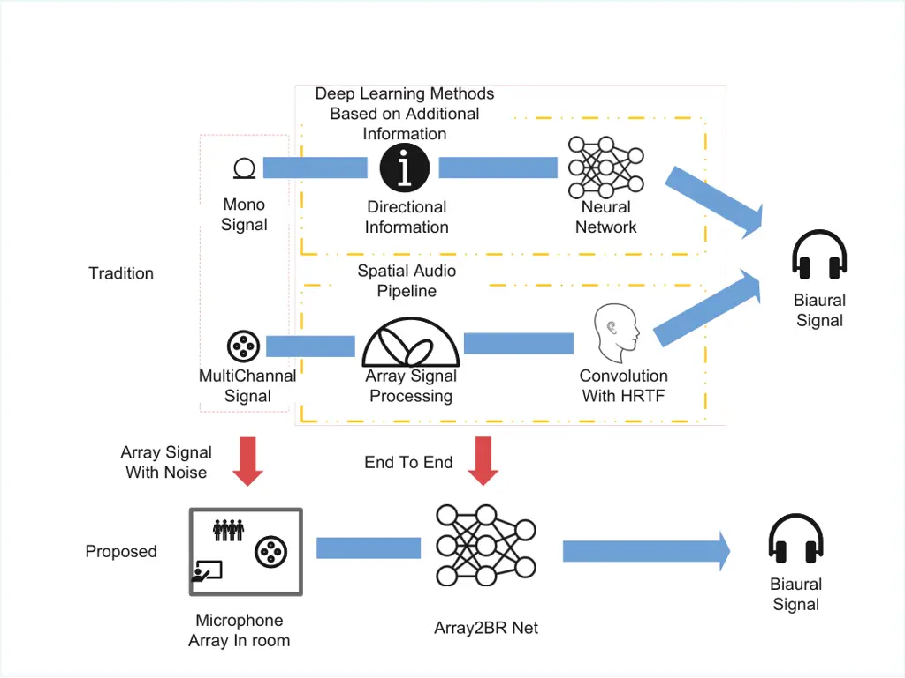
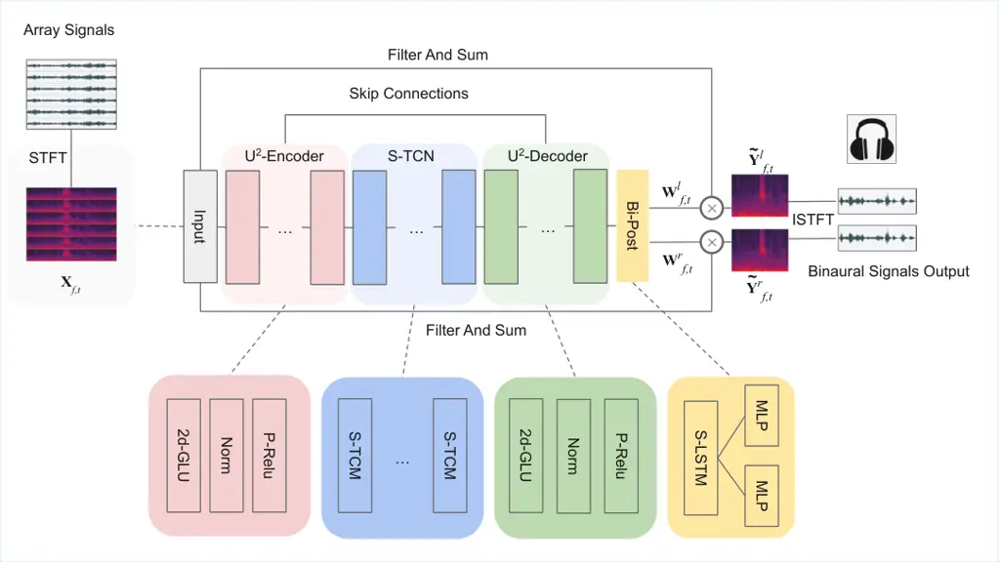
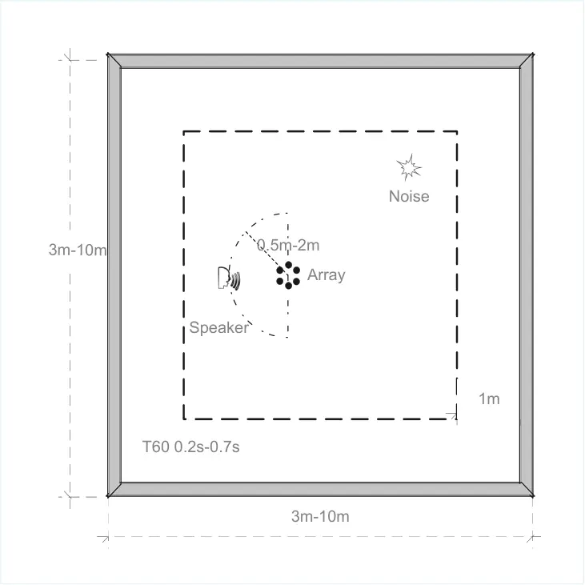

# End-to-end multi-channel speaker extraction and binaural speech synthesis

Cheng Chi Affiliation: Laboratory of Noise and Audio Research, Institute
of Acoustics, Chinese Academy of Sciences, Beijing, China
Affiliation: University of Chinese Academy of Sciences, Beijing, China
   Xiaoyu Li Affiliation: Laboratory of Noise and Audio Research,
Institute of Acoustics, Chinese Academy of Sciences, Beijing, China
Affiliation: Communication University of China, Beijing, China    Yuxuan
Ke Affiliation: Laboratory of Noise and Audio Research, Institute of
Acoustics, Chinese Academy of Sciences, Beijing, China
Affiliation: University of Chinese Academy of Sciences, Beijing, China
   Qunping Ni Affiliation: Tianjin 712 Communication & Broadcasting Co.,
Ltd.    Yao Ge Affiliation: Tianjin Tianan Borui Technology Co., Ltd.   
Xiaodong Li Affiliation: Laboratory of Noise and Audio Research,
Institute of Acoustics, Chinese Academy of Sciences, Beijing, China
Affiliation: University of Chinese Academy of Sciences, Beijing, China
   Chengshi Zheng ^(†)^(†)thanks: \*Corresponding author. E-mail:
cszheng@mail.ioa.ac.cn Affiliation: Laboratory of Noise and Audio
Research, Institute of Acoustics, Chinese Academy of Sciences, Beijing,
China Affiliation: University of Chinese Academy of Sciences, Beijing,
China

###### Abstract

Speech clarity and spatial audio immersion are the two most critical
factors in enhancing remote conferencing experiences. Existing methods
are often limited: either due to the lack of spatial information when
using only one microphone, or because their performance is highly
dependent on the accuracy of direction-of-arrival estimation when using
microphone array. To overcome this issue, we introduce an end-to-end
deep learning framework that has the capacity of mapping multi-channel
noisy and reverberant signals to clean and spatialized binaural speech
directly. This framework unifies source extraction, noise suppression,
and binaural rendering into one network. In this framework, a novel
magnitude-weighted interaural level difference loss function is proposed
that aims to improve the accuracy of spatial rendering. Extensive
evaluations show that our method outperforms established baselines in
terms of both speech quality and spatial fidelity.

## 1 Introduction

Binaural speech spatialization technique is crucial to improve the
immersive experience of a remote conference for attendees when using
VR/AR devices \[1, 2, 3\]. Besides, because there often exist various
noise sources in conference scenarios, such as air conditioning noise,
typing noise, and whispering noise, speaker extraction is also highly
demanded to improve speech clarity and intelligibility \[4, 5, 6\]. This
paper focuses on the tasks of speaker extraction and binaural speech
synthesis to guarantee the quality of remote conferences.

So far, many efforts have been made to achieve this goal. Among these
efforts, single-channel-to-binaural synthesis has demonstrated
impressive results \[7, 8, 9\]. For this type of methods, their
practical utility is often constrained by their reliance on auxiliary
information, such as visual data or pre-defined source positions. \[10,
11, 12, 13\].

Alternatively, microphone array offers a more self-contained solution
because they can conduct speaker localization and speech separation
without requiring auxiliary data. Using microphone array can capture
spatial information from the soundfield directly \[14, 15\], which makes
it popular for creating immersive experiences in telepresence
applications. Traditionally, multi-channel-based systems obtain binaural
speech through a multi-stage pipeline: at first, the
direction-of-arrival (DOA) of the desired speech source is
estimated \[6, 16\], and beamforming is then applied to reduce the
background noise as well as the interference \[17, 18\]. Finally, the
head-related transfer function (HRTF) is utilized to render the
extracted speech into binaural signals \[19, 20, 21\]. Nevertheless,
this cascaded method has inherent limitations, including suboptimal
noise reduction performance and the propagation of errors from early
stages, such as inaccurate DOA estimation, which can degrade both the
speech quality and the accuracy of spatial rendering.



Figure 1: The diagram of the proposed framework.



Figure 2: The overall diagram of the proposed architecture.

To overcome the above-mentioned limitations, we propose an end-to-end
framework that directly synthesizes binaural speech from multi-channel
noisy and reverberant signals. As illustrated in Fig. 1, our method
replaces the traditional multi-stage pipeline with a single network.
This network learns the entire process as one unified task,
simultaneously handling speaker localization, noise suppression, and
binaural synthesis. The main contributions of this work are summarized
as follows:

- •
  We propose a novel end-to-end architecture that directly synthesizes
  clean binaural speech from noisy multi-channel signals, unifying
  speaker extraction and spatial rendering.
- •
  We introduce a magnitude-weighted Interaural Level Difference (mwILD)
  loss function, improving the preservation of spatial cues by focusing
  on perceptually significant components of the signal \[22\].
- •
  We conduct a comprehensive evaluation and show that our method
  outperforms established baselines in tests, achieving superior speech
  quality and spatial accuracy.

The remainder of the paper is organized as follows. Section 2 formulates
the problem. Section 3 elaborates on the proposed model, and its loss
function is also presented in detail. In Sec. 4, the configurations of
the simulation experiment are introduced, and in Sec. 5, results and
analysis are presented. In Sec. 6, some conclusions are drawn.

## 2 Problem Formulation

In the context of remote meetings, which often involves a local and one
or more remote sites, the quality of telepresence can be enhanced by
audio processing. We consider a scenario where both a target speech
source and ambient background noise are present. An M-channel microphone
array is employed to capture the sound field. The observed signal in the
short-time Fourier transform (STFT) domain \[23, 24\] can be modeled as:

```math
\mathbf{X}_{f,t}=\mathbf{c}_{f}S_{f,t}+\mathbf{N}_{f,t}, \tag{1}
```

where $`f\in\{1,\dots,F\}`$ and $`t\in\{1,\dots,T\}`$ are the frequency
and time indices, respectively.
$`\mathbf{X}_{f,t}\in\mathbb{C}^{M\times 1}`$ is the complex-valued
vector for the observed signal at the array.
$`\mathbf{c_{f}}\in\mathbb{C}^{M\times 1}`$ represents the transfer
functions from the speech source to the array microphones, and
$`S_{f,t}`$ is the target speech signals.
$`\mathbf{N}_{f,t}\in\mathbb{C}^{M\times 1}`$ is the complex-valued
vector representing the ambient noise field captured by the array.

The desired output of our system, the clean binaural signals
$`\mathbf{Y}_{f,t}`$, can be expressed as:

```math
\displaystyle\mathbf{Y}_{f,t} \displaystyle=\mathbf{a}_{f}{S}_{f,t}, \tag{2}
```

```math
\displaystyle\mathbf{Y}_{f,t} \displaystyle=\left[Y^{l}_{f,t},Y^{r}_{f,t}\right]^{T},
```

where $`\mathbf{a}_{f}\in\mathbb{C}^{2\times 1}`$ represents HRTFs, and
the superscripts ’l’ and ’r’ in $`Y^{l}_{f,t}`$ and $`Y^{r}_{f,t}`$
denote the left and right ear signals. Our goal is to design a neural
network that directly maps the noisy and reverberant array observations
$`\mathbf{X}_{f,t}`$ to the clean binaural signals $`\mathbf{Y}_{f,t}`$.

## 3 Proposed Method

### 3.1 Network Architecture

Our proposed network, illustrated in Fig. 2, is an end-to-end
U-Net-based architecture \[25\] that is designed to directly map noisy
multi-channel signals to clean binaural speech. The core of our model is
a symmetric encoder-decoder structure enhanced with a specialized
bottleneck for spatio-temporal modeling and a binaural synthesis head.

The process begins by transforming the M-channel input signals into the
time-frequency (T-F) domain using STFT. The complex spectra of the
multi-channel input signals are fed into the U²-Encoder. The encoder
consists of a series of downsampling blocks, and each block employs a 2D
Gated Linear Unit (2D-GLU) to capture significant local patterns in the
spectro-temporal domain, followed by normalization and P-ReLU
activation \[26\] for feature extraction.

At the bottleneck of the U-Net, we introduce spatial-temporal
correlation network (S-TCN). This module is composed of several
spatial-temporal correlation module (S-TCM) blocks, specifically
designed to model the intricate dependencies across microphone channels
and time frames \[27\]. By effectively processing these correlations,
the S-TCN can disentangle the spatial and temporal characteristics of
the desired speaker from background noise and interference.

The U²-Decoder then reconstructs the signal representation. It mirrors
the structure of the encoder, progressively upsampling the features
while integrating high-resolution information from the encoder via skip
connections. This U-Net topology is crucial for preserving the details
necessary for speech synthesis.

Finally, instead of directly outputting spectrograms, the output of the
encoder is passed to a binaural post-processing (Bi-Post) module. This
module features two parallel branches, and each branch comprises a
spatial LSTM (S-LSTM) and a multi-layer perceptron (MLP). These two
branches generate two distinct complex-valued filters,
$`\mathbf{W}^{l}_{f,t}\in\mathbb{C}^{M\times 1}`$ and
$`\mathbf{W}^{r}_{f,t}\in\mathbb{C}^{M\times 1}`$, for each
time-frequency (T-F) bin. The final binaural signals are synthesized by
applying these filters to the corresponding T-F vectors of the
multi-channel input, $`\mathbf{X}_{f,t}`$. The synthesis process can be
expressed as:

```math
\displaystyle\tilde{Y}^{l|r}_{f,t}=(\mathbf{W}^{l|r}_{f,t})^{H}\mathbf{X}_{f,t} \tag{3}
```

where $`\tilde{Y}^{l|r}_{f,t}`$ is the estimated binaural speech signal,
with $`l,r`$ denoting the left or the right ear. The final two-channel
time-domain signal is then obtained via Inverse STFT (ISTFT). Note that
the entire architecture is trained in an end-to-end manner, allowing the
network to jointly optimize for speaker extraction and accurate spatial
rendering.

### 3.2 Loss function

To ensure both high speech quality and accurate spatial rendering, we
design a composite loss function, which is a weighted sum of three
different components: a real-imaginary (RI) loss, a magnitude (Mag)
loss, and the proposed magnitude-weighted interaural level difference
(mwILD) loss. Thus, the loss function is defined as:

```math
\mathcal{L}=\lambda_{1}\mathcal{L}_{RI}+\lambda_{2}\mathcal{L}_{Mag}+\lambda_{3}\mathcal{L}_{mwILD}. \tag{4}
```

In  (4), the $`\mathcal{L}_{RI}`$ and $`\mathcal{L}_{Mag}`$ are defined
as follows:

```math
\displaystyle\mathcal{L}_{RI}(\tilde{\mathbf{Y}},\mathbf{Y}) \displaystyle=\|\tilde{\mathbf{Y}}_{r}-\mathbf{Y}_{r}\|_{F}^{2}+\|\tilde{\mathbf{Y}}_{i}-\mathbf{Y}_{i}\|_{F}^{2}, \tag{5}
```

```math
\displaystyle\mathcal{L}_{Mag}(\tilde{\mathbf{Y}},\mathbf{Y}) \displaystyle=\|\sqrt{|\tilde{\mathbf{Y}}_{r}|^{2}+|\tilde{\mathbf{Y}}_{i}|^{2}}-\sqrt{|\mathbf{Y}_{r}|^{2}+|\mathbf{Y}_{i}|^{2}}\|_{F}^{2},
```

where the time and frequency indices $`(f,t)`$ are omitted for brevity
when no confusion arises.
$`\tilde{\mathbf{Y}}=[\tilde{Y}^{l},\tilde{Y}^{r}]^{T}`$ and
$`\mathbf{Y}=[Y^{l},Y^{r}]^{T}`$ represent the estimated and target
binaural complex spectra, respectively.
$`\{\tilde{\mathbf{Y}}_{r},\tilde{\mathbf{Y}}_{i}\}`$ and
$`\{\mathbf{Y}_{r},\mathbf{Y}_{i}\}`$ denote the real and imaginary
parts of $`\tilde{\mathbf{Y}}`$ and $`\mathbf{Y}`$, respectively.
$`||\cdot||_{F}`$ denotes the Frobenius norm. The mwILD loss is defined
as:

```math
\mathcal{L}_{mwILD}(\tilde{\mathbf{Y}},\mathbf{Y})=\left\|\frac{\sum\limits_{f,t}\sigma_{f,t}\left(\mathrm{ILD}(\tilde{\mathbf{Y}}_{f,t})-\mathrm{ILD}(\mathbf{Y}_{f,t})\right)}{\sum\limits_{f,t}\sigma_{f,t}}\right\|_{1}. \tag{6}
```

Note that a conventional ILD loss treats all time-frequency (T-F) bins
uniformly, and this loss can be inaccurate. For example, a near-zero
overall ILD might mask significantly but opposing ILD variations across
different frequency bands, providing an inadequate learning signal for
the network. To align the loss with this physical principle, the
proposed mwILD loss introduces an energy-based weighting mechanism.
Here, the weight $`\sigma_{f,t}`$ is the sum of the energy from the left
and right channels of the desired signal. This approach scales the ILD
error at each T-F bin, prioritizing spatial accuracy in the most
perceptually salient, high-energy components. The L1 norm is applied to
the final error term to enhance robustness against outliers. The weights
$`\left\{\lambda_{1},\lambda_{2},\lambda_{3}\right\}`$ in (4) are
empirically set to $`\left\{1,1,3\right\}`$ to balance the contributions
of each term.



Figure 3: Spatial configurations of the room, showing the random
placement of sound sources within the designated area and the minimum
distance requirements from walls.

| Model    | Params. \[M\]$`\downarrow`$ | FLOPs \[G/s\]$`\downarrow`$ | $`\mathbf{\Delta ITD}`$ \[ms\]$`\downarrow`$ | $`\mathbf{\Delta ILD}`$ \[dB\]$`\downarrow`$ | PESQ$`\uparrow`$ | ESTOI$`\uparrow`$ | SD \[dB\]$`\downarrow`$ |
| -------- | --------------------------- | --------------------------- | -------------------------------------------- | -------------------------------------------- | ---------------- | ----------------- | ----------------------- |
| LBH-MVDR | -                           | -                           | -                                            | -                                            | 2.31             | 0.54              | 0.72                    |
| LBH-NN   | 2.16                        | 0.89                        | -                                            | -                                            | 2.98             | 0.79              | 0.15                    |
| MIF      | -                           | -                           | 0.250                                        | 1.06                                         | 1.96             | 0.45              | 40.25                   |
| MDFnet   | 6.36                        | 2.14                        | 0.012                                        | 0.74                                         | 2.41             | 0.55              | 0.44                    |
| Proposed | 2.37                        | 1.01                        | 0.002                                        | 0.21                                         | 2.89             | 0.71              | 0.23                    |

Table 1: Objective evaluation of different models on the test set,
averaged across all SNR conditions. Our proposed model demonstrates
superior performance with significantly lower complexity.

## 4 Experimental Setup

### 4.1 Dataset configuration

For comprehensive evaluation of the proposed method, we constructed a
large-scale dataset using the DNS-Challenge corpus \[28\]. The dataset
was partitioned into training, validation, and testing sets with the
ratio of 20:2:1. A six-element uniform circular array (UCA) with a
diameter of 8 cm was employed to capture the spatial acoustic
information \[29\].

To create acoustically diverse scenarios, we simulated various room
configurations and obtained the simulated room impulse responses (RIRs)
by using the image method \[23, 30, 31\]. Fig. 3 illustrates the spatial
setup of our simulated environment. The room dimensions were randomly
sampled between 3 m and 10 m for both length and width, while the
reverberation time was set from 0.2 s to 0.7 s to represent different
acoustic environments. Considering the boundary effects, both the sound
sources and the microphone array were placed at least 1 m away from the
wall, and the area of them was indicated by a dashed line in Fig. 3.
Besides, the distance between the target sound source and the array was
set randomlly from 0.5 m to 2 m.

To simulate realistic conference scenarios, the noise was selected from
the DNS-Challenge noise corpus. Their distances from the array ranged
from 0.5 m to 2 m, and their azimuth range was set from $`-90^{\circ}`$
to $`90^{\circ}`$. The signal-to-noise ratio (SNR) varied from 0 dB to
30 dB to evaluate system performance under different noise conditions.
For each configuration, we generated the mixed signals by convolving
clean speech with the simulated RIRs, while the target binaural signals
were synthesized by applying HRTFs \[32\] corresponding to the source
directions.

### 4.2 Training configuration

In our experiment, all the utterances were sampled at 16 kHz. For STFT,
a squared-root Hanning window was selected between adjacent frames with
50 % overlap, so the frame length and frame shift were, respectively,
set to 20 ms and 10 ms. Adam optimizer was utilized to train the
model \[33\]. The initial learning rate was set to 5e-4, which would be
halved if the loss value does not decrease for three continuous epochs.
The training procedure would stop once the learning rate halves for
fourth time. Both the training and the testing of neural networks were
conducted using a Nvidia Tesla V100 GPU.

## 5 Results and Analysis

We compared our proposed framework against both conventional and deep
learning-based methods. The conventional baselines include: 1)
LBH-MVDR \[21\], a classic pipeline involving Localization, Beamforming,
and HRTF filtering, with MVDR used as beamforming; 2) LBH-NN, which used
the same architecture as our proposed model but with only a single MLP
branch for beamforming to generate monaural audio \[34\], followed by
HRTF filtering; and 3) MIF \[35\], a multi-channel inverse filtering
method. As for the deep learning-based baseline, 4) MDFNet \[36\], a
recent high-quality end-to-end model, was also chosen.

We employed seven objective metrics to conduct a comprehensive
evaluation. Model complexity was measured by the number of Parameters
and FLOPs. Spatialization accuracy was assessed by the absolute error in
interaural time difference ($`\Delta`$ITD) and interaural level
difference ($`\Delta`$ILD) \[37\]. Speech quality and intelligibility
were evaluated using perceptual evaluation of speech quality
(PESQ) \[38\] and extended short-time objective intelligibility
(ESTOI) \[39\]. Finally, the spectral distortion between the synthesized
and target signals was measured by spectral distance (SD). The
evaluation was performed on a test set with new, randomly generated room
configurations, and the results were averaged across all SNR conditions.

As shown in Table 1, our proposed model demonstrates a superior balance
between performance and computational efficiency. With 2.37 M parameters
and 1.01 G/s FLOPs, it is more lightweight than MDFnet. In terms of
spatial accuracy, our model surpassed all baselines, achieving the
$`\Delta`$ITD (0.002 ms) and $`\Delta`$ILD (0.21 dB). For perceptual
quality and intelligibility, it scored a competitive PESQ of 2.89 and an
ESTOI of 0.71. Furthermore, it obtained a low SD of 0.23 dB, indicating
high fidelity in spectral reconstruction. While the LBH-NN pipeline
achieved the best scores on speech quality metrics, it requires external
DOA information and is not an end-to-end system. In contrast, our method
achieved comparable performance without such auxiliary information,
highlighting its practical advantages. MIF had a much higher spectral
distance, and this is because this method does not include a denoising
component. In summary, our framework establishes a new state-of-the-art
by delivering superior spatialization with a highly efficient model,
crucially without the need for external directional information.

Regarding spatial rendering accuracy, the results of the LBH-based
methods are not presented in Table 1 as their spatialization is the
ground-truth. These methods rely on oracle directional information for
HRTF filtering, thus introducing no spatial rendering error. Among the
end-to-end models that learn to spatialize, our proposed method
demonstrates superior performance. As shown in Table 1, our method
achieves much lower $`\Delta`$ITD and $`\Delta`$ILD compared with both
MIF and MDFnet. This highlights the effectiveness of our framework in
learning and generating spatial cues directly from the multi-channel
signals, without estimating the direction-of-arrival of the desired
speaker explicitly.

## 6 Conclusions

In this paper, a novel end-to-end framework is proposed for generating
clean and spatialized binaural speech directly from the multi-channel
noisy and reverberant signals, which is achieved by unifying source
extraction, noise suppression, and binaural rendering into a single
network. A magnitude-weighted ILD loss function is also introduced to
effectively enhance spatial rendering accuracy. Experimental results
demonstrated that our method effectively improves both speech quality
and spatial fidelity when compared with existing methods.

Despite its promising performance, our work has many limitations. The
current framework is designed to handle only one desired speaker.
Real-world conferencing scenarios, however, often involve multiple
simultaneous desired talkers. A key direction for future research is to
extend our model to multi-talker scenarios. Addressing this challenge
will be a crucial step toward creating truly immersive and practical
telepresence systems.

## 7 Acknowledgement

The authors would like to express their sincere gratitude to Yicheng Hsu
at National Tsing Hua University for his invaluable assistance and
support in testing and evaluating the baseline models.

## References

- \[1\] WS Gan, J He, R Ranjan and R Gupta “Natural and augmented
  listening for VR, and AR/MR”, IEEE International Conference on
  Acoustics, Speech and Signal Processing (ICASSP) 2018 tutorial, 2018
- \[2\] Sailin Zhong et al. “Binaural Audio in Hybrid Meetings: Effects
  on Speaker Identification, Comprehension, and User Experience” In
  _Proceedings of the ACM on Human-Computer Interaction_ 6.CSCW2 ACM New
  York, NY, USA, 2022, pp. 1–24
- \[3\] HE Jianjun, Ee Tan and Woon-Seng Gan “Natural sound rendering
  for headphones: integration of signal processing techniques” In _IEEE
  Signal Processing Magazine_ 32.2 IEEE, 2015, pp. 100–113
- \[4\] BM Hameed et al. “Will ”hybrid” meetings replace face-to-face
  meetings post COVID-19 era? Perceptions and views from the urological
  community” In _Urology_ 156 Elsevier, 2021, pp. 52–57
- \[5\] Monica Hawley, Ruth Litovsky and John Culling “The benefit of
  binaural hearing in a cocktail party: Effect of location and type of
  interferer” In _The Journal of the Acoustical Society of America_
  115.2 Acoustical Society of America, 2004, pp. 833–843
- \[6\] John Middlebrooks “Sound localization” In _Handbook of Clinical
  Neurology_ 129 Elsevier, 2015, pp. 99–116
- \[7\] Jinglin Liu et al. “DopplerBAS: Binaural Audio Synthesis
  Addressing Doppler Effect” In _arXiv preprint arXiv:2212.07000_, 2022
- \[8\] Susan Liang et al. “BinauralFlow: A Causal and Streamable
  Approach for High-Quality Binaural Speech Synthesis with Flow Matching
  Models” In _arXiv preprint arXiv:2505.22865_, 2025
- \[9\] Kranti Parida, Siddharth Srivastava and Gaurav Sharma “Beyond
  mono to binaural: Generating binaural audio from mono audio with depth
  and cross modal attention” In _Proceedings of the IEEE/CVF Winter
  Conference on Applications of Computer Vision_, 2022, pp. 3347–3356
- \[10\] Alexander Richard et al. “Neural synthesis of binaural speech
  from mono audio” In _International Conference on Learning
  Representations_, 2020
- \[11\] Ruohan Gao and Kristen Grauman “2.5D visual sound” In
  _Proceedings of the IEEE/CVF Conference on Computer Vision and Pattern
  Recognition_, 2019, pp. 324–333
- \[12\] Pedro Morgado, Nuno Nvasconcelos, Timothy Langlois and Oliver
  Wang “Self-supervised generation of spatial audio for 360 video” In
  _Advances in neural information processing systems_ 31, 2018
- \[13\] Hansung Kim et al. “Immersive audio-visual scene reproduction
  using semantic scene reconstruction from 360 cameras” In _Virtual
  Reality_ 26.3 Springer, 2022, pp. 823–838
- \[14\] Shulin He et al. “3S-TSE: Efficient three-stage target speaker
  extraction for real-time and low-resource applications” In _ICASSP
  2024-2024 IEEE International Conference on Acoustics, Speech and
  Signal Processing (ICASSP)_, 2024, pp. 421–425 IEEE
- \[15\] Quan Tian and Ruiyan Cai “A low-complexity DOA estimation
  algorithm for distributed source localization” In _IEEE Transactions
  on Instrumentation and Measurement_ 72 IEEE, 2023, pp. 1–4
- \[16\] V Krishnaveni, T Kesavamurthy and B Aparna “Beamforming for
  direction-of-arrival (DOA) estimation-a survey” In _International
  Journal of Computer Applications_ 61.11 Citeseer, 2013
- \[17\] Andong Li, Guochen Yu, Chengshi Zheng and Xiaodong Li
  “TaylorBeamformer: Learning All-Neural Beamformer for Multi-Channel
  Speech Enhancement from Taylor’s Approximation Theory” In
  _Interspeech_, 2022
- \[18\] Andong Li, Wenzhe Liu, Chengshi Zheng and Xiaodong Li
  “Embedding and Beamforming: All-Neural Causal Beamformer for
  Multichannel Speech Enhancement” In _ICASSP 2022 - 2022 IEEE
  International Conference on Acoustics, Speech and Signal Processing
  (ICASSP)_, 2022, pp. 6487–6491 DOI:
  [10.1109/ICASSP43922.2022.9746432](https://dx.doi.org/10.1109/ICASSP43922.2022.9746432)
- \[19\] Maximo Cobos, Jens Ahrens, Konrad Kowalczyk and Archontis
  Politis “An overview of machine learning and other data-based methods
  for spatial audio capture, processing, and reproduction” In _EURASIP
  Journal on Audio, Speech, and Music Processing_ 2022.1 Springer, 2022,
  pp. 10
- \[20\] Boaz Rafaely et al. “Spatial audio signal processing for
  binaural reproduction of recorded acoustic scenes–review and
  challenges” In _Acta Acustica_ 6 EDP Sciences, 2022, pp. 47
- \[21\] Hanan Beit-On et al. “Audio signal processing for telepresence
  based on wearable array in noisy and dynamic scenes” In _ICASSP
  2022-2022 IEEE International Conference on Acoustics, Speech and
  Signal Processing (ICASSP)_, 2022, pp. 8797–8801 IEEE
- \[22\] Sebastian Nagel and Peter Jax “Dynamic binaural cue adaptation”
  In _2018 16th International Workshop on Acoustic Signal Enhancement
  (IWAENC)_, 2018, pp. 96–100 IEEE
- \[23\] Jont Allen and David Berkley “Image method for efficiently
  simulating small-room acoustics” In _The Journal of the Acoustical
  Society of America_ 65.4 Acoustical Society of America, 1979, pp.
  943–950
- \[24\] Uwe Stephenson “Comparison of the mirror image source method
  and the sound particle simulation method” In _Applied Acoustics_ 29.1
  Elsevier, 1990, pp. 35–72
- \[25\] Xuebin Qin et al. “U2-Net: Going deeper with nested U-structure
  for salient object detection” In _Pattern Recognition_ 106 Elsevier,
  2020, pp. 107404
- \[26\] Kaiming He, Xiangyu Zhang, Shaoqing Ren and Jian Sun “Delving
  deep into rectifiers: Surpassing human-level performance on ImageNet
  classification” In _Proceedings of the IEEE International Conference
  on Computer Vision_, 2015, pp. 1026–1034
- \[27\] Shaojie Bai, J Kolter and Vladlen Koltun “An empirical
  evaluation of generic convolutional and recurrent networks for
  sequence modeling” In _arXiv preprint arXiv:1803.01271_, 2018
- \[28\] Chandan Reddy et al. “The InterSpeech 2020 deep noise
  suppression challenge: Datasets, subjective testing framework, and
  challenge results” In _arXiv preprint arXiv:2005.13981_, 2020
- \[29\] Ibrahim Aboumahmoud, Ali Muqaibel, Mohammad Alhassoun and Saleh
  Alawsh “A review of sparse sensor arrays for two-dimensional
  direction-of-arrival estimation” In _IEEE Access_ 9 IEEE, 2021, pp.
  92999–93017
- \[30\] Emanuel Habets “Room impulse response generator” In _Technische
  Universiteit Eindhoven, Tech. Rep_ 2.2.4, 2006, pp. 1
- \[31\] Eric Lehmann and Anders Johansson “Prediction of energy decay
  in room impulse responses simulated with an image-source model” In
  _The Journal of the Acoustical Society of America_ 124.1 AIP
  Publishing, 2008, pp. 269–277
- \[32\] Michael Evans, James Angus and Anthony Tew “Analyzing
  head-related transfer function measurements using surface spherical
  harmonics” In _The Journal of the Acoustical Society of America_ 104.4
  Acoustical Society of America, 1998, pp. 2400–2411
- \[33\] Diederik Kingma and Jimmy Ba “Adam: A method for stochastic
  optimization” In _arXiv preprint arXiv:1412.6980_, 2014
- \[34\] Chengshi Zheng et al. “Sixty years of frequency-domain monaural
  speech enhancement: From traditional to deep learning methods” In
  _Trends in Hearing_ 27 SAGE Publications Sage CA: Los Angeles, CA,
  2023, pp. 23312165231209913
- \[35\] Yicheng Hsu, Chenghung Ma and Mingsian Bai “Model-matching
  principle applied to the design of an array-based all-neural binaural
  rendering system for audio telepresence” In _ICASSP 2023-2023 IEEE
  International Conference on Acoustics, Speech and Signal Processing
  (ICASSP)_, 2023, pp. 1–5 IEEE
- \[36\] Masato Miyoshi and Yutaka Kaneda “Inverse filtering of room
  acoustics” In _IEEE Transactions on Acoustics, Speech, and Signal
  Processing_ 36.2 IEEE, 1988, pp. 145–152
- \[37\] George Eason, Benjamin Noble and Ian Sneddon “On certain
  integrals of Lipschitz-Hankel type involving products of Bessel
  functions” In _Philosophical Transactions of the Royal Society of
  London. Series A, Mathematical and Physical Sciences_ 247.935 The
  Royal Society London, 1955, pp. 529–551
- \[38\] Bernd Geiser et al. “Bandwidth extension for hierarchical
  speech and audio coding in ITU-T Rec. G. 729.1” In _IEEE Transactions
  on Audio, Speech, and Language Processing_ 15.8 IEEE, 2007, pp.
  2496–2509
- \[39\] Jesper Jensen and Cees Taal “An algorithm for predicting the
  intelligibility of speech masked by modulated noise maskers” In
  _IEEE/ACM Transactions on Audio, Speech, and Language Processing_
  24.11 IEEE, 2016, pp. 2009–2022
