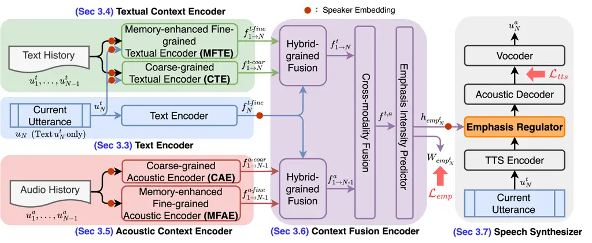
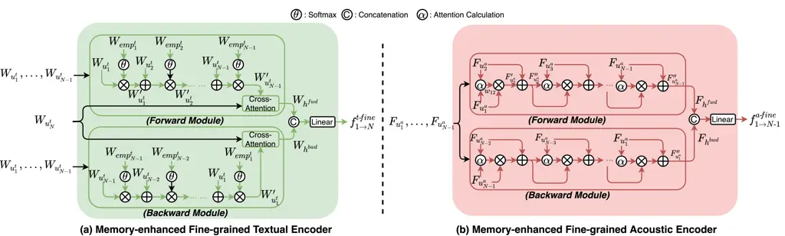
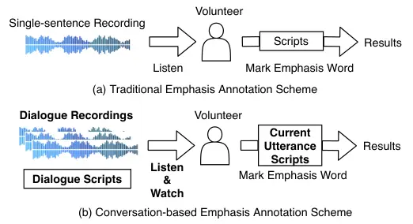
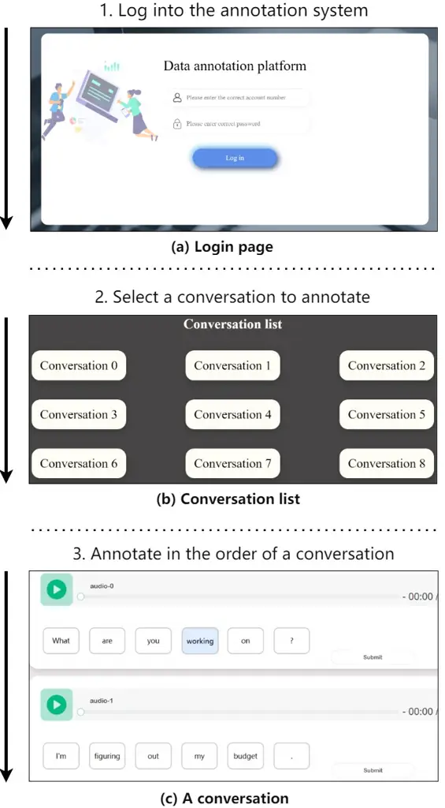
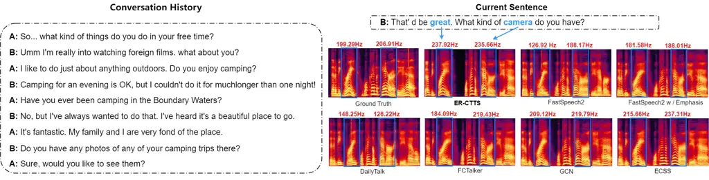

# Emphasis Rendering for Conversational Text-to-Speech with Multi-modal Multi-scale Context Modeling

Rui Liu    Zhenqi Jia    Jie Yang    Yifan Hu    Haizhou Li
^(†)^(†)thanks: The research by Rui Liu was funded by the Young
Scientists Fund (No. 62206136) and the General Program (No. 62476146) of
the National Natural Science Foundation of China, Guangdong Provincial
Key Laboratory of Human Digital Twin (No. 2022B121201 0004), and the
“Inner Mongolia Science and Technology Achievement Transfer and
Transformation Demonstration Zone, University Collaborative Innovation
Base, and University Entrepreneurship Training Base” Construction
Project (Supercomputing Power Project) (No.21300-231510). The research
by Haizhou Li was partly supported by Internal Project Fund from
Shenzhen Research Institute of Big Data (Grant No.˜T00120220002), and
Shenzhen Science and Technology Research Fund (Fundamental Research Key
Project Grant No.˜JCYJ20220818103001002). ^(†)^(†)thanks: Rui Liu,
Zhenqi Jia, Jie Yang and Yifan Hu are with the Department of Computer
Science, Inner Mongolia University, Hohhot 010021, China. (e-mail:
liurui_imu@163.com).^(†)^(†)thanks: Haizhou Li is with School of Data
Science, The Chinese University of Hong Kong, Shenzhen 518172, China. He
is also with University of Bremen, Faculty 3 Computer Science /
Mathematics, Enrique-Schmidt-Str. 5 Cartesium, 28359 Bremen, Germany
(e-mail: haizhouli@cuhk.edu.cn). ^(†)^(†)thanks: Manuscript received Sep
29, 2024; revised August 16, 2021.

###### Abstract

Conversational Text-to-Speech (CTTS) aims to accurately express an
utterance with the appropriate style within a conversational setting,
which attracts more attention nowadays. While recognizing the
significance of the CTTS task, prior studies have not thoroughly
investigated speech emphasis expression, which is essential for
conveying the underlying intention and attitude in human-machine
interaction scenarios, due to the scarcity of conversational emphasis
datasets and the difficulty in context understanding. In this paper, we
propose a novel Emphasis Rendering scheme for the CTTS model, termed
ER-CTTS, that includes two main components: 1) we simultaneously take
into account textual and acoustic contexts, with both global and local
semantic modeling to understand the conversation context
comprehensively; 2) we deeply integrate multi-modal and multi-scale
context to learn the influence of context on the emphasis expression of
the current utterance. Finally, the inferred emphasis feature is fed
into the neural speech synthesizer to generate conversational speech. To
address data scarcity, we create emphasis intensity annotations on the
existing conversational dataset (DailyTalk). Both objective and
subjective evaluations suggest that our model outperforms the baseline
models in emphasis rendering within a conversational setting. The code
and audio samples are available at
https://github.com/CodeStoreTTS/ER-CTTS.

###### Index Terms: 

Emphasis, Speech Synthesis, Conversational TTS, Multi-scale, Multi-modal

## I Introduction

Conversational Text-to-Speech (Conversational TTS, CTTS) aims to
synthesize speech with suitable prosody according to the conversation
context \[1\]. As Human-Computer Interaction (HCI) systems become more
prevalent in our daily lives, CTTS garners significant attention \[2, 3,
4\]. We note that speech emphasis, an important prosodic feature in the
dialogue process, plays an important role in distinguishing the focus of
the utterance from the rest and conveys the underlying intention and
attitude \[5\]. In HCI scenarios, synthesizing emphasis helps computer
systems to express semantics more accurately and enhances user
experience, thus attracting increasing interest \[5\].

However, emphasis rendering is currently limited to the isolated
utterance condition \[6, 7\] and lacks in-depth research in the context
of CTTS \[1\]. For example, Zhong et al. \[8\] build an Emphatic
Expressive TTS system by leveraging multi-level linguistic information
from syntax and semantics to predict the emphasis position for the
current utterance. Chi et al. \[9\] propose a multi-granularity,
including phrase- and word-level, emphasis prediction model for TTS
\[10, 11\]. There are also similar concepts, such as prosodic prominence
\[12, 13, 14\], stress \[9, 15\], etc., that refer to certain words in a
sentence being pronounced more prominently than others, but they do not
take into account the relation between prominence and HCI. We note that
these methods ignore the complex semantic dependencies between dialogue
history and the emphasis expression of the current utterance. Therefore,
how to understand the context information in a dialogue to make
appropriate emphasis inferences for the current utterance, to achieve
emphasis rendering for CTTS, is the focus of our paper.

Note that there are two challenges that currently pose difficulties in
achieving this goal: 1) Multi-modal and multi-scale context. The
dialogue history comprises both text and audio modalities \[16\]. The
text modality consists of a hierarchical semantic structure, ranging
from sentence-level to word-level, and even phoneme-level \[17, 18\].
Similarly, the audio modality follows a hierarchical acoustic structure,
from sentence-level to frame-level \[18\]. Such multi-modal and
multi-scale features play a crucial role in the expressiveness of the
current utterance in conversation \[19, 16\]. However, there is still a
lack of clear conclusions and in-depth research on the specific impact
of multi-modal and multi-scale features on the emphasis expression of
the current sentence. 2) Emphatic CTTS dataset. Currently, some emphasis
speech datasets only focus on isolated sentences \[8\] and are not
openly available. For emphasis speech datasets in conversational
scenarios, there is a lack of a reasonable annotation scheme and readily
available open-source data. Consequently, it becomes challenging to meet
the research needs for emphasis rendering in CTTS.

In this work, we propose a new Emphasis Rendering scheme for CTTS,
termed ER-CTTS, that consists of two novel modules. 1) To
comprehensively understand the conversation context, we simultaneously
model both textual and acoustic contexts with both coarse- and
fine-grained modeling in the dialogue history. For all granularities of
information, we adopt a bidirectional modeling approach to model the
conversation history. In addition, for fine-grained information, we
employ a memory enhancement method to capture historical emphasis cues. 2) To further effectively capture the implicit relationship between the
rich context and the emphasis expression of the current utterance, we
propose hybrid-grained and cross-modality fusion modules, which allow
for the comprehensive fusion of context knowledge, facilitating the
inference of emphasis intensity for the current utterance. Afterward, we
incorporate the inferred emphasis feature into the FastSpeech2-based
backbone to achieve emphasis rendering in CTTS.

To address the dataset gap, we propose an emphasis annotation scheme,
specifically for conversation scenarios, on the popular DailyTalk \[20\]
dataset for CTTS. This annotation scheme allows for the acquisition of
emphasis and emphasis intensity information. All the annotated data will
be made open source. To summarize, we outline the main contributions of
this work as follows:

- •
  We propose a novel emphatic conversational speech synthesis model,
  termed ER-CTTS. To our knowledge, this is the first in-depth
  conversational speech synthesis study that models emphasis rendering.
- •
  Our ER-CTTS aims to uncover implicit emphasis cues from multi-modal
  and multi-scale context information and effectively integrate this
  information to infer emphasis for the current utterance.
- •
  Objective and subjective experiments show that the proposed model
  outperforms all state-of-the-art baselines in terms of emphasis
  expressiveness.

## II Related Works

### II-A Conversational Text-to-Speech

The conventional CTTS works primarily focus on improving expressiveness
through context understanding from various aspects, such as inter- and
intra-speaker \[21\], and multi-modal context \[21, 22, 16\]
dependencies modeling, emotion understanding \[23\], etc. The above
research contributes to understanding the conversational context and
determining appropriate speaking styles in synthesized speech. However,
the explicit modeling of emphasis and its intensity in CTTS has not been
extensively explored and requires further research.

In more recent studies, we also note some attempts to model the
multi-modal and multi-scale context simultaneously. For example, the
multi-scale relational graph convolutional network (MRGCN) proposed by
\[22\] and the multi-scale multi-modal CTTS (M²-CTTS) model proposed by
\[16\], among others. However, our ER-CTTS has some clear differences
from these works: 1) We develop a memory-enhanced fine-grained textual
encoder to focus on local emphasis information in the dialogue history
and avoid information loss; 2) Our context fusion encoder
comprehensively integrates information from different granularities and
modalities to make reasonable predictions about the emphasis information
in the current utterance; 3) Our model learns more subtle emphasis
intensity information within the dialogue history to assist in emphasis
rendering for the final synthesized speech.



Fig. 1: The overview of ER-CTTS, that consists of Text Encoder, Textual
Context Encoder, Acoustic Context Encoder, Context Fusion Encoder and
the Speech Synthesizer.

### II-B Conversational Dataset

Many existing speech datasets for conversation focus on emotion
recognition \[24, 25, 26\], but the audio quality often suffers from
noise, making them less suitable for the data requirements of CTTS
\[1\]. While there are some datasets specifically recorded for CTTS,
such as DailyTalk \[20\], MagicData-RAMC \[27\], etc., they lack
explicit emphasis-related labels, which makes it challenging to model
explicit emphasis rendering. In this work, we aim to construct an
open-source emphasis rendering dataset for CTTS based on the DailyTalk
dataset.

## III ER-CTTS: Methodology

### III-A Task Definition

A human-machine conversation can be defined as a sequence of utterances
$`U=\{[u_{1},s_{1}],[u_{2},s_{2}],...,[u_{N-1},s_{N-1}],[u_{N},s_{N}]`$},
where {$`u_{1},u_{2},...,u_{N-1}`$} is the sentence-level dialogue
history till round $`N-1`$ while $`u_{N}`$ means the current utterance
to be synthesized and $`s_{i}`$ ($`i\in[1,N]`$) is the speaker identity
for each utterance. Assuming that each utterance $`u_{j}`$
($`j\in[1,N-1]`$) in the dialogue history is annotated with word-level
emphasis information $`W_{emp^{t}_{j}}`$, achieving emphasis rendering
in CTTS involves utilizing multi-modal information from the previous
$`N-1`$ dialogue history to predict the emphasis information for the
current utterance $`u_{N}`$. Note that $`u_{j}`$ includes $`u^{t}_{j}`$
and $`u^{a}_{j}`$ where $`t`$ and $`a`$ mean the text and acoustic
modalities respectively. Additionally, the current utterance only
consists of a text modality without the audio modality, as the audio
signal is to be synthesized.

Subsequently, the conversational speech $`u^{a}_{N}`$ for $`u_{N}`$ is
synthesized with the text input $`u^{t}_{N}`$ and the corresponding
word-level emphasis information $`W{{emp^{t}_{N}}}`$. In other words,
the emphasis expression of the synthesized speech $`u^{a}_{N}`$ should
reflect the emphasis in the conversational context characterized by the
multi-modal and multi-scale dialogue history. To this end, the emphasis
rendering for CTTS methods needs to consider: 1) How to model the
emphasis cues from the multi-modal and multi-scale conversation history; 2) How to integrate the knowledge of conversation history to infer the
emphasis indicator for the current utterance; 3) How to render the
appropriate emphasis expression during speech synthesis.

### III-B Model Overview

As shown in Fig. 1, the proposed ER-CTTS consists of five components,
which are 1) Text Encoder, 2) Textual Context Encoder, 3) Acoustic
Context Encoder, 4) Context Fusion Encoder, and 5) Speech Synthesizer.
The text encoder aims to generate the semantic encoding for the current
utterance. The Textual and Acoustic Context Encoders seek to capture
both textual and acoustic information from the conversation history,
with utterance-level and phoneme-level context modeling. The Context
Fusion Encoder is responsible for integrating the cross-grained and
cross-modality interaction and inferring the emphasis expression for the
current utterance. Finally, the Speech Synthesizer takes the current
utterance and the emphasis expression as input to project the emphasis
onto conversational speech ¹¹ 1 As shown by the red dots in Fig. 1, the
speaker embeddings corresponding to each sentence are fed into all the
context encoders to distinguish speaker information. The speaker
embedding of the current sentence is also fed into the emphasis
regulator to synthesize the speech of the target speaker..

### III-C Text Encoder

To extract the high-level semantic representation of the word-level
sequence $`W_{u^{t}_{N}}`$ of the current utterance $`u^{t}_{N}`$, we
use XLNet \[28\] as the backbone to produce the fine-grained word-level
feature $`f^{t\text{-}\!fine}_{N}`$.

### III-D Textual Context Encoder

To understand the dialogue context, with global and local views, by
modeling the interaction between the history and the current utterance,
the textual context encoder includes a Coarse-grained Textual Encoder
(CTE) and a Memory-enhanced Fine-grained Textual Encoder (MFTE).

#### III-D1 CTE

The CTE is used to learn mutual dependencies \[29\] between the dialogue
history and the current utterance at the sentence level. Therefore, we
model the bidirectional dependency relationships to obtain the final
coarse-grained textual context features.

Specifically, the dialogue textual history $`u^{t}_{1},...,u^{t}_{N-1}`$
and $`u^{t}_{N}`$ are fed to Sentence-BERT \[30\] to extract the
sentence-level hidden vectors $`h_{u^{t}_{1}},...,h_{u^{t}_{N-1}}`$ and
$`h_{u^{t}_{N}}`$, respectively. After that, unlike \[1\], which just
uses GRU to encode the dialogue history, we employ bi-directional GRU
(Bi-GRU) to encode the $`h_{u^{t}_{1}},...,h_{u^{t}_{N-1}}`$ into the
state vector $`h^{t-coar}_{N-1}`$, representing the historical dialogue.
Then, $`h_{u^{t}_{N}}`$ is concatenated with $`h^{t-coar}_{N-1}`$ and
fed into a linear layer to obtain the interactive prosodic features as
the final coarse-grained context feature
$`f^{t\text{-}coar}_{1\rightarrow N}`$.

#### III-D2 MFTE

Inspired by real-world conversations, individuals tend to recall and
review specific emphasized words from previous dialogues during the
temporal discourse and respond accordingly \[31\] ²² 2 We assume that
the emphasis word annotation in the conversation history is known in
this work. During the inference stage, the emphasis words in the
conversation history are predicted using the same method to better
predict the emphasis words in the current sentence.. Therefore, MFTE is
employed to remember and organize the emphasized information in the
historical conversation, which also helps mitigate information loss
during sequence learning and ensures that the important emphasis details
are not forgotten.

The core idea of MFTE is to merge the word-level emphasis intensity
value with the words of the current sentence. These combined features
are then added to the words of the next sentence, and this process is
repeated iteratively. Firstly, we follow \[19\] and feed the sentence
sequence $`u^{t}_{1},...,u^{t}_{N}`$ into the conversational language
model, which is TOD-BERT \[32\], to extract word-level hidden vectors
$`W_{u^{t}_{1}},...,W_{u^{t}_{N}}`$. The word-level dialogue history is
represented as $`W_{u^{t}_{1}},...,W_{u^{t}_{N-1}}`$, and the current
sentence is represented as $`W_{u^{t}_{N}}`$. As shown in Fig. 2(a), the
MFTE consists of forward and backward modules. We note that the
$`W_{u^{t}_{1}},...,W_{u^{t}_{N-1}}`$ and the $`W_{u^{t}_{N-1}}`$ are
fed into these two modules to obtain forward and backward textual
representations $`W_{h^{fwd}}`$ and $`W_{h^{bwd}}`$.



Fig. 2: The detailed diagrams of Memory-enhanced Fine-grained Textual
Encoder and Memory-enhanced Fine-grained Acoustic Encoder.

Specifically, taking the forward module as an example, the forward
encoding process is divided into $`N-1`$ steps. For each step $`j`$, the
emphasis information $`W_{emp^{t}_{j}}`$ is first combined with
$`W_{u^{t}_{j}}`$ to output the enhanced representation
$`W^{\prime}_{u^{t}_{j}}`$ for $`W_{u^{t}_{j}}`$:

```math
W^{\prime}_{u^{t}_{j}}=Mul(W_{u^{t}_{j}},Softmax(W^{\prime}_{emp^{t}_{j}})) \tag{1}
```

where “Mul” indicates the multiplication operation and the “Softmax” is
used to smooth out word-level emphasis intensity to a range of 0 to 1.

The above process involves iterative computations until obtaining the
output $`W^{\prime}_{u^{t}_{N-1}}`$ of the $`N-1`$ step. Then we adopt
cross-attention, which treats the $`W^{\prime}_{u^{t}_{N-1}}`$ as the
Key, Value and $`W_{u^{t}_{N}}`$ as the Query, to calculate the final
forward context encoding $`W_{h^{fwd}}`$. Note that the reverse process
follows the same computation method, starting from the $`N-1`$ step and
continuing until the $`1st`$ step, resulting in the reverse encodings
$`W_{h^{bwd}}`$. At last, $`W_{h^{fwd}}`$ and $`W_{h^{bwd}}`$ are
concatenated and fed into a linear layer to obtain the memory-enhanced
context features as the final fine-grained textual context features
$`f^{t-fine}_{1\rightarrow N}`$.

### III-E Acoustic Context Encoder

The acoustic context encoder aims to understand the dialogue context
with global and local views for acoustic, which is similar to the
textual context encoder. However, the global and local views for
acoustic refer to the sentence and speech frame levels, respectively. It
consists of two modules that include Coarse-grained Acoustic Encoder
(CAE) and Memory-enhanced Fine-grained Acoustic Encoder (MFAE).

#### III-E1 CAE

Similar to the coarse-grained textual encoder, the coarse-grained
Acoustic Encoder also obtains the final coarse-grained acoustic context
features by considering bidirectional dependency modeling. Specifically,
we follow \[16\] and adopt a pre-trained Wav2vec 2.0 \[33\] fine-tuned
on IEMOCAP \[24\] to extract the sentence-level prosody feature. Then,
we also encode the sentence-level prosody feature using Bi-GRU to obtain
the $`f^{a-coar}_{1\rightarrow N-1}`$ as the coarse-grained acoustic
context feature.

#### III-E2 MFAE

Unlike the MFTE, the MFAE directly accumulates frame-level prosodic
features, learning acoustic rhythm knowledge from the dialogue history.
Note that we also adopt a bidirectional memory-enhanced structure, which
includes the forward and backward modules, similar to the MFTE, as shown
in Fig. 2(b).

The core idea is to capture the prosodic interaction information between
the previous and current utterances and then append it to the current
utterance as its representation. Firstly, we follow \[16\] and employ
Wav2vec 2.0 \[33\] to extract frame-level acoustic features
$`F_{u^{a}_{1}},...,F_{u^{a}_{N-1}}`$.

Take the forward module as an example; it reads the
$`F_{u^{a}_{1}},...,F_{u^{a}_{N-1}}`$ and is also divided into $`N-2`$
steps. For step $`k`$, the frame-level representations of the previous
sentence $`F_{u^{a}_{k-1}}`$ and the current sentence $`F_{u^{a}_{k}}`$
are treated as the Query, Key, and Value, respectively, to compute the
attention weights $`w_{k-1,k}`$ at the frame level. These attention
weights are then combined with the representation of the previous
sentence $`F_{u^{a}_{k-1}}`$ to obtain $`F^{\prime}_{u^{a}_{k}}`$.
Subsequently, $`F^{\prime}_{u^{a}_{k}}`$ is fused with the
representation $`F_{u^{a}_{k}}`$ of the current sentence to obtain the
final representation of the current sentence
$`F^{\prime\prime}_{u^{a}_{k}}`$. Then, $`F^{\prime\prime}_{u^{a}_{k}}`$
will be computed with the next sentence $`F_{u^{a}_{k+1}}`$ in the same
way, and this process continues until reaching the final $`N-1`$ step,
outputting the final $`F^{\prime\prime}_{u^{a}_{N-1}}`$ as the final
output $`F_{h^{fwd}}`$ of the forward module.

Similarly, we start from the $`N-1`$ step and perform the same
computation with the history sentence, iteratively continuing until
reaching the 1st utterance. This process generates the final output
$`F_{h^{bwd}}`$ of the backward module. Subsequently, $`F_{h^{fwd}}`$
and $`F_{h^{bwd}}`$ are concatenated and fed into a linear layer to
obtain the memory-enhanced frame-level prosodic features, serving as the
final fine-grained acoustic context features
$`f^{a-fine}_{1\rightarrow N-1}`$.

### III-F Context Fusion Encoder

Context Fusion Encoder aims to comprehensively understand the emphasis
cues from different granularities and modalities in the dialogue history
and infer the emphasis intensity for the current utterance.

#### III-F1 Hybrid-grained Fusion

Hybrid-grained Fusion first fuse coarse-grained and fine-grained
contextual features within each modality. 1) For the text modality, we
first repeat the sentence-level context features
$`f^{t-coar}_{1\rightarrow N}`$ to each word in the current utterance,
and add them to the word-level feature $`f^{t-fine}_{N}`$ to enable each
word to focus on global semantic features, termed $`f^{t-gbl}`$. To
integrate finer textual semantic emphasis cues, we treat the
$`f^{t-gbl}`$ as the Query and $`f^{t-fine}_{1->N}`$ as the Key and
Value, and obtain the fusion feature $`f^{t}_{1\rightarrow N}`$ with the
cross-attention mechanism. 2) For the audio modality, we also first
extend the coarse-grained context acoustic features
$`f^{a-coar}_{1\rightarrow N-1}`$ and assign it to the word-level
feature $`f^{t-fine}_{N}`$ to obtain the enhanced feature $`f^{a-gbl}`$,
allowing each word to focus on global prosodic features. We then treat
$`f^{a-gbl}`$ as the Query and $`f^{a-fine}_{1->N-1}`$ as the Key and
Value, and input into the cross-attention mechanism to obtain the fused
frame-level prosodic cues, resulting in the feature
$`f^{a}_{1\rightarrow N-1}`$.

#### III-F2 Cross-modality Fusion

Cross-modality Fusion aims to integrate multi-modal knowledge to
understand the emphasis cues in a dialogue history. Specifically, we
treat the fused text contextual features $`f^{t}_{1\rightarrow N}`$ as
the Query, and the fused audio contextual features
$`f^{a}_{1\rightarrow N-1}`$ as the Key and Value to calculate the final
integrated contextual features $`f^{t,a}`$ which combine both
multi-modal and multi-scale aspects of the dialogue history. This design
is intended to better capture the correlation between the text and audio
modalities, thereby improving the accurate prediction of emphasis
intensity.

#### III-F3 Emphasis Intensity Predictor

The emphasis intensity predictor reads the fused context features
$`f^{t,a}`$ to predict the emphasis intensity value $`W_{emp^{t}_{N}}`$
for each word of the current utterance $`u^{t}_{N}`$. For the emphasis
prediction loss $`\mathcal{L}_{emp}`$, we adopt the binary cross entropy
loss to close the gap between the ground truth word-level emphasis
information $`W^{\prime}_{emp^{t}_{N}}`$ and the predicted label
$`W_{emp^{t}_{N}}`$:

```math
\begin{split}\mathcal{L}_{emp}=-\Big(&W^{\prime}_{emp^{t}_{N}}\cdot\log(W_{emp^{t}_{N}})\\
&+(1-W^{\prime}_{emp^{t}_{N}})\cdot\log(1-W_{emp^{t}_{N}})\Big)\end{split} \tag{2}
```

### III-G Speech Synthesizer

As shown in the right panel in Fig. 1, the Speech Synthesizer takes
FastSpeech2 as the backbone. It consists of TTS encoder, Acoustic
Decoder and the Vocoder. TTS encoder aims to extract the phoneme-level
linguistic encoding $`P_{u^{t}_{N}}`$ for current utterance
$`u^{t}_{N}`$. The Acoustic Decoder involves a length regulator and
variance adaptor to predict duration, energy, and pitch, and then adopts
the Mel Decoder to predict Mel-spectrum features. Finally, a pre-trained
HiFi-GAN Vocoder is used to generate the conversational speech
$`u^{a}_{N}`$ with the desired emphasis expression.

Note that we include a new Emphasis Regulator on the top of TTS encoder
to inject the emphasis knowledge for the linguistic encoding. Unlike
previous approaches \[9\] that directly inject one-hot emphasis label,
we follow \[6\] and utilize hidden representation, that captures
word-level emphasis information to achieve a more robust emphasis
rendering effect. . Specifically, we first extract the word-level hidden
emphasis feature $`h_{emp^{t}_{N}}`$ from the last MLP layer of the
emphasis intensity predictor. Emphasis Regulator takes the
$`h_{emp^{t}_{N}}`$ along with the $`P_{u^{t}_{N}}`$ as inputs. We
follow the word-phoneme alignment and integrate them into phoneme-level
emphasis-enhanced feature representations, that are fed into subsequent
acoustic decoder and vocoder to generate the final emphatic speech
$`u^{a}_{N}`$.

The speech generation loss $`\mathcal{L}_{tts}`$ just follows the same
style of FastSpeech2 \[34\] to ensure that the synthesized speech is
natural and close to ground truth speech.



Fig. 3: Conversation-based Emphasis Annotation Scheme.

## IV Dataset Annotation

To meet our ER-CTTS training, we construct a new emphasis-aware
conversational speech corpus based on the DailyTalk dataset, termed
Emp-DailyTalk. We invite six volunteers to annotate emphasized words.
Traditional emphasis annotation schemes, as shown in Fig. 3(a), often
involve volunteers listening to a single sentence’s audio and annotating
the word-level emphasis in the corresponding text scripts \[35\]. In
contrast, our conversation-based emphasis annotation scheme, as shown in
Fig. 3(b), requires volunteers to first listen to the audio of the
entire dialogue history and read the text of the dialogue history. Then
they annotate the emphasized words in the current sentence text scripts.
This approach considers the influence of both the semantic and acoustic
features of the dialogue history on the current emphasis annotation,
resulting in more accurate emphasis annotation. The detailed emphasis
annotation scheme is as follows:

#### IV-1 Conversation-based Emphasis Annotation Scheme

We adopt the IO scheme \[36\], using a set of dialogues as a unit and
labeling each word in every utterance within the dialogues with “I” or
“O”. “I” represents the emphasis words, while “O” means the non-emphasis
words. We invite six professional English graduate students with
expertise in English language skills, including listening, speaking,
reading, and writing, to annotate the data. Each sentence is annotated
by all six volunteers, resulting in six emphasis annotations for each
sentence. To further obtain the subtle emphasis intensity for each
utterance, we follow \[37\] and calculate the emphasis intensity label
for each word in the entire sentence by taking the count of the “I”
label among the six annotations and dividing it by 6. This provides us
with the emphasis intensity label for each word. Table I shows an
example.

| Words   | A1  | A2  | A3  | A4  | A5  | A6  | Emphasis Intensity |
| ------- | --- | --- | --- | --- | --- | --- | ------------------ |
| What    | O   | O   | O   | O   | O   | O   | 0                  |
| are     | O   | O   | O   | O   | O   | O   | 0                  |
| you     | O   | O   | O   | O   | O   | O   | 0                  |
| working | I   | O   | I   | I   | I   | I   | 0.83               |
| on      | O   | O   | O   | O   | 1   | O   | 0.17               |

TABLE I: An example of the emphasis annotation and the emphasis
intensity calculation. “A” means the annotator.

#### IV-2 Annotation Statistics

Using the aforementioned annotation method, we perform emphasis
annotation on 23,773 sentences from the Dailytalk dataset, resulting in
emphasis annotation information for 23,773 sentences. Assuming a
threshold of 0.5 for emphasis intensity, words with a value greater than
0.5 are considered emphasized words, while those with a value below 0.5
are considered non-emphasized words. Ultimately, the percentage of
emphasized words in the entire dataset is approximately 23.76%. We
partition the data into training, validation, and test sets at a ratio
of 7:2:1.

#### IV-3 Availability Verification

We validate the consistency of emphasis annotations by calculating the
kappa coefficient \[38\], resulting in a value of 0.35. In our study, as
shown in Table II, \[35\] reports a kappa coefficient of 0.35 for
emphasis annotations, while \[14\] reports a kappa coefficient of 0.226.
Despite some differences between emphasis annotations and emotion
annotations (emphasis annotations focus on the word level, while emotion
annotations focus on the sentence level), we still compare our results
with emotion speech datasets. For example, the Emotionlines dataset
achieves a kappa score of 0.34, slightly lower than our result. This
evidence suggests that our data annotations are highly reliable,
reaching a level comparable to or even higher than publicly available
datasets.

| Dataset                   | Kappa Coefficient |
| ------------------------- | ----------------- |
| Emotionlines \[39\]       | 0.340             |
| Emphasis Dataset 1 \[35\] | 0.350             |
| Emphasis Dataset 2 \[14\] | 0.226             |
| Emp-DailyTalk             | 0.350             |

TABLE II: Comparison of Kappa coefficients between other datasets and
Our Emp-DailyTalk.

#### IV-4 Crowdsourced Annotation Instructions

Speech emphasis, an essential prosodic feature in dialogue, plays a
pivotal role in distinguishing the focal points of utterances, conveying
underlying intentions, and expressing attitudes. Prior to annotating the
emphasized words in a sentence, volunteers are required to consider both
the textual and audio components of the dialogue history. As depicted in
Fig. 4 (a), volunteers begin by logging into the annotation platform.
They then proceed to select a conversation from the conversation list,
as shown in Fig. 4(b). The text and audio of the selected conversation
are displayed in the order of the conversation, as illustrated in Fig.
4(c). Volunteers are required to annotate the emphasis in the sequence
of the conversation. Volunteers receive their annotation tasks online.
To ensure fair compensation, we use a unit of ten sentences for each
task. Annotating ten sentences typically takes around 10 minutes. We
offer a compensation of \$3 for each completed unit, which amounts to an
estimated \$18 per hour.



Fig. 4: The annotation process of the Emp-DailyTalk.

## V Experiments

### V-A Comparative Systems

To validate the ER-CTTS from a more comprehensive perspective, we
categorize all baselines into the following four classes:

(1) Single-sentence TTS without emphasis: FastSpeech2 \[34\] is a TTS
model without emphasis and contextual modeling, representing
state-of-the-art non-dialogue TTS systems.

(2) Single-sentence TTS with emphasis: FastSpeech2 w/ Emphasis \[6\]
focuses on synthesizing emphasis speech for individual sentences. It
leverages FastSpeech2 as the backbone and is studied to change the
degree of emphasis by adjusting specific acoustic features, such as
pitch and energy.

(3) CTTS without emphasis: DailyTalk \[20\] is an advanced CTTS
baseline. It proposes coarse-grained text context modeling in dialogue
history to enhance speech expressiveness. FCTalker \[19\] further
employs coarse-grained and fine-grained context modeling. M²-CTTS \[16\]
designs a textual context module and an acoustic context module with
both coarse-grained and fine-grained modeling. GCN \[22\] adopts the
homogeneous graph to model the multi-modal context in conversation.

(4) Expressive CTTS: ECSS \[23\] is a powerful expressive conversational
TTS. It utilizes heterogeneous graph-based context modeling to achieve
expressive rendering for CTTS.

### V-B Evaluation Metrics

Emphasis Prediction: To evaluate the performance of emphasis prediction
objectively, we follow \[37\] and adopt $`\text{Match}{m}`$ \[37\] and
$`\text{F1}{m}`$ \[37\] as the accuracy metrics. We set $`m={1,2}`$.
Both metrics are higher the better. Emphasis Rendering: To validate the
emphasis rendering for ER-CTTS, we follow \[23\] and conduct
dialogue-level Mean Opinion Score (DMOS) \[40\] as the subjective
evaluation metric. Note that in this paper, DMOS consists of natural
DMOS (N-DMOS) and emphasis DMOS (E-DMOS), where N-DMOS focuses on speech
naturalness while E-DMOS assesses whether the emphasis expression in
terms of position and intensity of the current utterance matches the
context. The detailed scoring criteria of E-DMOS are shown in Table III
of Appendix . For the objective evaluation metrics, we calculate the
Mean Absolute Error (MAE) between the predicted and real acoustic
features. Specifically, we assess the acoustic feature in terms of
pitch, energy, and duration with MAE-P, MAE-E, and MAE-D.

$`\text{Match}_{m}`$ For each instance u in the test set $`D_{test}`$,
we select a set $`G_{m}^{(u)}`$ of $`m\in\{1,2\}`$ words with the top
$`m`$ probabilities according to the ground truth. Analogously. We
select a prediction set $`\hat{G}_{m}^{(u)}`$ for each $`m`$, based on
the predicted probabilities. We define the metric $`\text{Match}_{m}`$
as follows:

```math
\begin{split}\operatorname{Match}_{m}=\frac{\sum_{u\in D_{\text{test }}}\left|G_{m}^{(u)}\cap\hat{G}_{m}^{(u)}\right|/\min(m,|u|)}{\left|D_{\text{test }}\right|}\end{split} \tag{3}
```

$`\text{F1}_{m}`$ Similarly to $`\text{Match}_{m}`$, for each instance
$`u`$, we select the top $`m`$ = $`\{1,2\}`$ words with the highest
probabilities from both ground truth and prediction. Then F1-score per
each $`m`$ can be computed accordingly.

E-DMOS scoring criteria: As shown in Table III, the volunteers refer to
the dialogue history of the current sentence and evaluate the alignment
of emphasis position and intensity with the dialogue contextual, on a
scale of 1 to 5.

| Score | Criteria                                                      |
| ----- | ------------------------------------------------------------- |
| 5     | Emphasis position and intensity are perfectly appropriate     |
| 4     | Emphasis position and intensity are reasonable                |
| 3     | Emphasis position is reasonable but intensity is unreasonable |
| 2     | Emphasis position and intensity are unreasonable              |
| 1     | Emphasis position and intensity are completely inappropriate  |

TABLE III: E-DMOS subjective evaluation scoring criteria.

### V-C Ablation Systems

We utilize the following ablation methods to assess the contributions
offered by different components of ER-CTTS. Abl.Exp.1-7 are used to
verify the contributions of different components to Emphasis Rendering,
while Abl.Exp.8-20 are used to verify the contributions of different
components to Emphasis Prediction.

Abl.Exp.1&2: w/o Coarse-grained Encoders (CTE & CAE) and w/o
Fine-grained Encoders (MFTE & MFAE) mean we eliminate two coarse-grained
and two fine-grained encoders respectively;

Abl.Exp.3&4: w/o Hybrid-grained Fusion and w/o Cross-modality Fusion
indicate that we replace those two fusion modules with simple feature
addition;

Abl.Exp.5: w/o Bidirectional Context Modeling means we remove the
bidirectional modeling mechanism from the context encoders and replace
it with forward modeling only;

Abl.Exp.6: w/o Memory Enhancement solely employs feature concatenation
for accumulating historical information.;

Abl.Exp.7: w/o Emphasis Intensity represent emphasis features as 0/1
labels instead of intensity features.

Abl.Exp.8-16: exhaustively explores all possible combinations of the
four encoders, including CTE, MFTE, CAE and MFAE.

Abl.Exp.17-20: are similar to Abl.Exp.3-6, which also involve removing
the respective modules. However, the difference is that Abl.Exp.17-20
focus only on evaluating emphasis intensity prediction and do not
consider emphasis rendering.

### V-D Implementation Details

For Textual encoders, the dimensions of
$`h_{u^{t}_{1}},...,h_{u^{t}_{N-1}}`$,
$`W_{u^{t}_{1}},...,W_{u^{t}_{N-1}}`$ and $`W_{u^{t}_{N}}`$ are set to
512, 768 and 1024 respectively. For Acoustic encoders, the dimensions of
$`h_{u^{a}_{1}},...,h_{u^{a}_{N-1}}`$ and
$`F_{u^{a}_{1}},...,F_{u^{a}_{N-1}}`$ are set to 768. All speaker
embeddings $`s_{1},s_{2},...,s_{N}`$ are mapped to a vector with
768-dimension. In all coarse-grained encoders, the output dimension of
the Bi-GRU is 128, and the GRU layer is set to 2. The final output
dimension is 256. For all two memory-enhanced fine-grained encoders, the
number of attention heads in the attention module is 3. The dimensions
of Query, Key, and Value are all 768. The input dimension of the Linear
layer is 768, and the output dimension is 256. In the context fusion
encoder, the number of attention heads is set to 2, and the dimensions
of Query, Key, and Value are all 256. The Emphasis Intensity Predictor
consists of two MLP layers with {256,64,1} dimension setup. For speech
synthesizer, we employ the Adam optimizer with $`\beta`$1 = 0.9 and
$`\beta`$2 = 0.98. Grapheme-to-Phoneme (G2P) toolkit ³³ 3
[https://github.com/Kyubyong/g2p](https://github.com/Kyubyong/g2p) is
used for converting all text inputs into their respective phoneme
sequences. We utilize the Montreal Forced Alignment (MFA) \[41\] tool to
extract phoneme duration alignment. All speech samples are re-sampled to
22.05 kHz. Mel-spectrum features are extracted with a window length of
25ms and a shift of 10ms. The model is trained on an A100 GPU with a
batch size of 16 for 900k steps.

|                                                    |     |                       |     |                       |     |                        |     |                        |     |                        |     |
| -------------------------------------------------- | --- | --------------------- | --- | --------------------- | --- | ---------------------- | --- | ---------------------- | --- | ---------------------- | --- |
| Systems                                            |     | N-DMOS ($`\uparrow`$) |     | E-DMOS ($`\uparrow`$) |     | MAE-P ($`\downarrow`$) |     | MAE-E ($`\downarrow`$) |     | MAE-D ($`\downarrow`$) |     |
| FastSpeech2 \[34\]                                 |     | 3.602 $`\pm`$ 0.017   |     | 3.559 $`\pm`$ 0.016   |     | 0.645                  |     | 0.558                  |     | 0.240                  |     |
| FastSpeech2 w/ Emphasis \[6\]                      |     | 3.636 $`\pm`$ 0.019   |     | 3.664 $`\pm`$ 0.017   |     | 0.622                  |     | 0.581                  |     | 0.240                  |     |
| DailyTalk \[20\]                                   |     | 3.637 $`\pm`$ 0.021   |     | 3.647 $`\pm`$ 0.021   |     | 0.395                  |     | 0.282                  |     | 0.183                  |     |
| FCTalker \[19\]                                    |     | 3.686 $`\pm`$ 0.016   |     | 3.683 $`\pm`$ 0.016   |     | 0.397                  |     | 0.282                  |     | 0.181                  |     |
| M²-CTTS \[16\]                                     |     | 3.716 $`\pm`$ 0.015   |     | 3.705 $`\pm`$ 0.016   |     | 0.433                  |     | 0.200                  |     | 0.157                  |     |
| GCN \[22\]                                         |     | 3.725 $`\pm`$ 0.018   |     | 3.704 $`\pm`$ 0.019   |     | 0.456                  |     | 0.204                  |     | 0.150                  |     |
| ECSS \[23\]                                        |     | 3.749 $`\pm`$ 0.019   |     | 3.713 $`\pm`$ 0.019   |     | 0.455                  |     | 0.215                  |     | 0.152                  |     |
| ER-CTTS (Proposed)                                 |     | 3.852 $`\pm`$ 0.018   |     | 3.893 $`\pm`$ 0.023   |     | 0.342                  |     | 0.199\*                |     | 0.148                  |     |
| Abl.Exp.1: w/o Coarse-grained Encoders (CTE & CAE) |     | 3.788 $`\pm`$ 0.016   |     | 3.798 $`\pm`$ 0.023   |     | 0.398                  |     | 0.176                  |     | 0.169                  |     |
| Abl.Exp.2: w/o Fine-grained Encoders (MFTE & MFAE) |     | 3.693 $`\pm`$ 0.022   |     | 3.720 $`\pm`$ 0.020   |     | 0.458                  |     | 0.497                  |     | 0.210                  |     |
| Abl.Exp.3: w/o Hybrid-grained Fusion               |     | 3.752 $`\pm`$ 0.017   |     | 3.761 $`\pm`$ 0.017   |     | 0.423                  |     | 0.235                  |     | 0.178                  |     |
| Abl.Exp.4: w/o Cross-modality Fusion               |     | 3.766 $`\pm`$ 0.016   |     | 3.809 $`\pm`$ 0.024   |     | 0.401                  |     | 0.188                  |     | 0.157                  |     |
| Abl.Exp.5: w/o Bidirectional Context Modeling      |     | 3.766 $`\pm`$ 0.018   |     | 3.775 $`\pm`$ 0.012   |     | 0.402                  |     | 0.214                  |     | 0.165                  |     |
| Abl.Exp.6: w/o Memory Enhancement                  |     | 3.703 $`\pm`$ 0.019   |     | 3.705 $`\pm`$ 0.018   |     | 0.396                  |     | 0.182                  |     | 0.176                  |     |
| Abl.Exp.7: w/o Emphasis Intensity                  |     | 3.756 $`\pm`$ 0.015   |     | 3.735 $`\pm`$ 0.028   |     | 0.403                  |     | 0.197                  |     | 0.182                  |     |

TABLE IV: Subjective (with 95% confidence interval ) and objective
results for comparative and ablation experiments in terms of emphasis
rendering. (Bold text indicates the best performance in the comparative
experiment, while \* denotes the suboptimal performance in the ablation
results.)

|                                                |                |                |                |                |                                        |                                     |                                        |                                  |                                  |                                     |
| ---------------------------------------------- | -------------- | -------------- | -------------- | -------------- | -------------------------------------- | ----------------------------------- | -------------------------------------- | -------------------------------- | -------------------------------- | ----------------------------------- |
| Systems                                        | Ablation Setup |                |                |                | Emphasis Intensity Prediction Accuracy |                                     |                                        |                                  |                                  |                                     |
|                                                | CTE            | MFTE           | CAE            | MFAE           | $`\text{Match}_{1}`$ ($`\uparrow`$)    | $`\text{Match}_{2}`$ ($`\uparrow`$) | $`\text{Match}_{mean}`$ ($`\uparrow`$) | $`\text{F1}_{1}`$ ($`\uparrow`$) | $`\text{F1}_{2}`$ ($`\uparrow`$) | $`\text{F1}_{mean}`$ ($`\uparrow`$) |
| Abl.Exp.8                                      | \-             | \-             | \-             | \-             | 0.7014                                 | 0.8010                              | 0.7512                                 | 0.5818                           | 0.7046                           | 0.6432                              |
| Abl.Exp.9                                      | $`\checkmark`$ | \-             | \-             | \-             | 0.7040                                 | 0.8025                              | 0.7533                                 | 0.5858                           | 0.7071                           | 0.6465                              |
| Abl.Exp.10                                     | \-             | $`\checkmark`$ | \-             | \-             | 0.7095                                 | 0.8027                              | 0.7561                                 | 0.5900                           | 0.7059                           | 0.6480                              |
| Abl.Exp.11                                     | $`\checkmark`$ | $`\checkmark`$ | \-             | \-             | 0.7069                                 | 0.8040                              | 0.7555                                 | 0.5879                           | 0.7077                           | 0.6478                              |
| Abl.Exp.12                                     | \-             | \-             | $`\checkmark`$ | \-             | 0.7027                                 | 0.8034                              | 0.7531                                 | 0.5831                           | 0.7064                           | 0.6448                              |
| Abl.Exp.13                                     | \-             | \-             | \-             | $`\checkmark`$ | 0.7107                                 | 0.8027                              | 0.7567                                 | 0.5902                           | 0.7062                           | 0.6482                              |
| Abl.Exp.14                                     | \-             | \-             | $`\checkmark`$ | $`\checkmark`$ | 0.7099                                 | 0.8024                              | 0.7562                                 | 0.5894                           | 0.7058                           | 0.6476                              |
| Abl.Exp.15                                     | $`\checkmark`$ | \-             | $`\checkmark`$ | \-             | 0.7078                                 | 0.8040                              | 0.7559                                 | 0.5889                           | 0.7079                           | 0.6484                              |
| Abl.Exp.16                                     | \-             | $`\checkmark`$ | \-             | $`\checkmark`$ | 0.7082                                 | 0.8030                              | 0.7556                                 | 0.5892                           | 0.7073                           | 0.6483                              |
| ER-CTTS                                        | $`\checkmark`$ | $`\checkmark`$ | $`\checkmark`$ | $`\checkmark`$ | 0.7116                                 | 0.8045                              | 0.7581                                 | 0.5915                           | 0.7079                           | 0.6497                              |
| Abl.Exp.17: w/o Bidirectional Context Modeling | $`\checkmark`$ | $`\checkmark`$ | $`\checkmark`$ | $`\checkmark`$ | 0.7090                                 | 0.8026                              | 0.7558                                 | 0.5896                           | 0.7061                           | 0.6479                              |
| Abl.Exp.18: w/o Memory Enhancement             | $`\checkmark`$ | $`\checkmark`$ | $`\checkmark`$ | $`\checkmark`$ | 0.7031                                 | 0.8017                              | 0.7524                                 | 0.5847                           | 0.7058                           | 0.6453                              |
| Abl.Exp.19: w/o Hybrid-grained Fusion          | $`\checkmark`$ | $`\checkmark`$ | $`\checkmark`$ | $`\checkmark`$ | 0.7057                                 | 0.8021                              | 0.7539                                 | 0.5862                           | 0.7052                           | 0.6457                              |
| Abl.Exp.20: w/o Cross-modality Fusion          | $`\checkmark`$ | $`\checkmark`$ | $`\checkmark`$ | $`\checkmark`$ | 0.7073                                 | 0.8026                              | 0.7550                                 | 0.5889                           | 0.7057                           | 0.6473                              |

TABLE V: The ablation results in terms of emphasis intensity prediction.
“-” indicates the removal of a particular module, while “$`\checkmark`$”
indicates its retention.

## VI Results and Discussions

### VI-A Main Results

The subjective and objective results of our ER-CTTS along with other
baseline systems are reported in Table IV. For subjective evaluations,
we invite 20 volunteers, including ten English major graduate students
(5 male, 5 female) and ten speech processing major graduate students (5
male, 5 female), to participate in the listening experiments. They all
have a strong command of the English language in terms of listening and
speaking skills. Each volunteer provides individual ratings for a total
of 140 synthesized samples, with each sample receiving a rating on a
scale from 1 to 5.

From the first 8 rows of Table IV, it can be observed that ER-CTTS
achieves the optimal performance in MAE-P (0.342), MAE-E (0.199), and
MAE-D (0.148). However, for emphasis rendering, subjective performance
is more reflective of human real feelings. In the subjective experiment,
our proposed ER-CTTS achieves an N-DMOS score of 3.852 and an E-DMOS
score of 3.893, surpassing all baseline models. ER-CTTS accurately
extracts emphasis cues from dialogue history, infers the emphasized
words in the current utterance based on the multi-modal and multi-scale
knowledge within context, and thus synthesizes speech with notable
emphasis intensity.

### VI-B Ablation Results

We conduct ablation experiments from both emphasis rendering and
prediction perspectives to validate the effectiveness and rationality of
various modules in our ER-CTTS model.

Emphasis Rendering: The subjective and objective results are shown in
rows 8-15 of Table IV. Note that Abl.Exp.1-4 are conducted to validate
the effectiveness of the entire module, while Abl.Exp.5-7 verify the
effectiveness of the corresponding key techniques within the module. It
is observed that both subjective and objective results of the ablation
experiments exhibit a significant decrease. Based on this, we draw the
following three conclusions.

- •
  1. ER-CTTS effectively integrates information from multi-modal and
     multi-scale contexts: Comparing ER-CTTS with Abl.Exp.1 and 2, the MOS
     scores of Exp show a significant decrease, indicating that both the
     coarse-grained and fine-grained encoders effectively extract
     multi-scale information from the conversation history. Furthermore,
     comparing ER-CTTS with Abl.Exp.3 and 4, all subjective and objective
     metrics also exhibit a noticeable decrease, demonstrating that our
     context fusion encoder successfully integrates multi-modal and
     multi-scale information for understanding the dialogue context and
     facilitating emphasis word inference.
- • 2) ER-CTTS fully leverages the inherent characteristics of dialogue to
  understand the emphasis cues in dialogue history: Comparing ER-CTTS
  with Abl.Exp.5 and 6, our ER-CTTS also exhibits a clear advantage.
  This further demonstrates that ER-CTTS takes advantage of the
  bidirectional nature of information flow in dialogue and utilizes the
  emphasis information from the conversation history to enhance the
  overall information, thereby facilitating the inference of emphasis
  expression in the current sentence.
- • 3) The emphasis intensity information extracted from our designed
  emphasis annotation scheme strongly supports expressive emphasis
  rendering: Comparing ER-CTTS with Abl.Exp.7, it is evident that
  emphasis features provide better emphasis expression capabilities
  compared to emphasis labels. This enables ER-CTTS to synthesize
  smoother speech with emphasized word expressions.

Emphasis Prediction: To provide a more objective and comprehensive
analysis of the effectiveness of emphasis prediction in ER-CTTS, we
conduct ablation experiments by systematically combining the four
encoders, namely CTE, MFTE, CAE, and MFAE. Subsequently, we perform
ablations on the bidirectional context modeling and memory enhancement
mechanism. The objective results of the emphasis prediction are
summarized in Table V.

It is not surprising to find that Abl.Exp.8 achieves the lowest results
in all metrics because it does not comprehensively model the
conversation history. From the experimental results of Abl.Exp.10 vs.
Abl.Exp.9 and Abl.Exp.13 vs. Abl.Exp.12, it can be observed that in both
text and audio modalities, fine-grained encoding with memory enhancement
performs better compared to coarse-grained encoders. From Abl.Exp.11 and
Abl.Exp.14, we find that simply fusing multi-scale context of the single
modality leads to a performance drop. By observing Abl.Exp.15 and
Abl.Exp.16, we can conclude that solely fusing coarse-grained or
fine-grained information alone cannot lead the model to achieve optimal
performance. When all encoders are incorporated, the ER-CTTS model
achieves optimal performance in all metrics. Additionally, by observing
the last four rows of Table V, all observations again demonstrate that
the multi-scale and multi-modal context fusion mechanism fully
understands the contextual information of dialogue history, infers the
position and intensity of emphasis words in the current sentence, and
thus achieves satisfactory emphasis prediction results.

### VI-C Context Length Analysis

We also explore the effectiveness of emphasis modeling with different
context lengths. Specifically, considering the average number of 9.3
dialogue turns in DailyTalk, we set the utterance length of dialogue
history ranging from 4 to 16 to compare the objective performance of
emphasis prediction. As shown in Table VI, the experiments demonstrate
that the emphasis prediction achieves optimal performance when the
context length is 10. This indicates that either insufficient or
redundant context information can interfere with the model’s ability to
understand emphasis cues in the context.

| Length | $`\text{Match}_{1}`$ ($`\uparrow`$) | $`\text{Match}_{2}`$ ($`\uparrow`$) | $`\text{Match}_{mean}`$ ($`\uparrow`$) | $`\text{F1}_{1}`$ ($`\uparrow`$) | $`\text{F1}_{2}`$ ($`\uparrow`$) | $`\text{F1}_{mean}`$ ($`\uparrow`$) |
| ------ | ----------------------------------- | ----------------------------------- | -------------------------------------- | -------------------------------- | -------------------------------- | ----------------------------------- |
| 4      | 0.7082                              | 0.8012                              | 0.7547                                 | 0.5894                           | 0.7049                           | 0.6472                              |
| 6      | 0.7069                              | 0.8020                              | 0.7545                                 | 0.5877                           | 0.7060                           | 0.6469                              |
| 8      | 0.7073                              | 0.8020                              | 0.7547                                 | 0.5886                           | 0.7057                           | 0.6472                              |
| 10     | 0.7116                              | 0.8045                              | 0.7581                                 | 0.5915                           | 0.7079                           | 0.6497                              |
| 12     | 0.7057                              | 0.8033                              | 0.7545                                 | 0.5868                           | 0.7067                           | 0.6468                              |
| 14     | 0.7111                              | 0.8024                              | 0.7568                                 | 0.5915                           | 0.7060                           | 0.6488                              |
| 16     | 0.7090                              | 0.8034                              | 0.7562                                 | 0.5913                           | 0.7067                           | 0.6490                              |

TABLE VI: Objective results of various context lengths.



Fig. 5: The mel-spectrogram and F0 plots of synthesized speech from
different TTS systems. (The pitch value was separately computed. Blue
boxes indicate annotated emphasis positions. The red font indicates the
top F0 of the emphasized words that represent the emphasis intensity.)

### VI-D Visualization Study

To visually demonstrate the emphasis expressiveness of our ER-CTTS, we
plot the Mel spectrograms of the synthesized speech samples for all
systems and the Ground Truth. As shown in Fig. 5, the blue boxes
indicate the emphasis positions “great” and “camera”. We can observe
that the synthesized speech by ER-CTTS can restore more detailed
spectral structures at these two positions. Additionally, it exhibits
better rendering effects in terms of pitch, with higher pitch values at
the two emphasized word positions compared to all other baselines. This
demonstrates that our method can fully understand the context, enabling
more accurate emphasis rendering in the current sentence. More speech
samples are available at:
[https://codestoretts.github.io/ER-CTTS/](https://codestoretts.github.io/ER-CTTS/).

## VII Conclusion

To improve the emphasis rendering capability of CTTS systems, this paper
proposes a novel ER-CTTS model. Our model can adequately model
multi-modal and multi-scale contexts while mining implicit emphasis cues
in the conversation history. It fully learns the underlying relationship
between the conversation history and the emphasis expression in the
current sentence, ultimately achieving accurate emphasis information
inference and synthesizing expressive speech with emphasis rendering.
Experimental results demonstrate the superiority of ER-CTTS over
state-of-the-art CTTS systems. To the best of our knowledge, ER-CTTS is
the first in-depth conversational speech synthesis study that models
emphasis expressiveness. We hope that our work will serve as a basis for
future intelligent HCI studies.

## VIII Limitations

One limitation of our work is that during the inference of emphasis
information in the current sentence, we assume that the emphasis
information in the conversation history is known. In the training stage,
our data provides emphasis labels for the entire conversation. However,
it is important to note that in the actual deployment of the model, we
can initially predict emphasis words using single-sentence information
of the first sentence that represents the conversation start. From the
second sentence onwards, we can use the ER-CTTS method to predict the
emphasis information in the current sentence. Another limitation is that
our model does not utilize visual modality information. Factors such as
the speaker’s facial expressions can also influence the emphasis
expression in dialogue \[25\]. This aspect will be considered for
further research. In addition, the focus of our work is on accurately
predicting emphasized words in the current sentence using contextual
information, rather than modeling the spontaneous phenomenon during
conversational speech generation. This aspect also will be considered
for further research to further improve the naturalness of CTTS. Lastly,
it is important to note that our method focuses solely on the
effectiveness of emphasis rendering. Regarding speech quality, with the
advancements in TTS systems trained on large-scale datasets \[42\], the
duration of our Emp-DailyTak dataset may still be considered limited.
Therefore, in the future, we plan to collect larger-scale high-fidelity
datasets or adopt an effective pretraining strategy with found data to
achieve good performance in both speech quality and emphasis rendering.

## References

- \[1\] H. Guo, S. Zhang, F. K. Soong, L. He, and L. Xie,
  “Conversational end-to-end tts for voice agents,” in _2021 IEEE Spoken
  Language Technology Workshop (SLT)_. IEEE, 2021, pp. 403–409.
- \[2\] A. S. Tulshan and S. N. Dhage, “Survey on virtual assistant:
  Google assistant, siri, cortana, alexa,” in _Advances in Signal
  Processing and Intelligent Recognition Systems: 4th International
  Symposium SIRS 2018, Bangalore, India, September 19–22, 2018, Revised
  Selected Papers 4_. Springer, 2019, pp. 190–201.
- \[3\] K. Seaborn, N. P. Miyake, P. Pennefather, and M. Otake-Matsuura,
  “Voice in human–agent interaction: A survey,” _ACM Computing Surveys
  (CSUR)_, vol. 54, no. 4, pp. 1–43, 2021.
- \[4\] M. McTear, “Conversational ai: Dialogue systems, conversational
  agents, and chatbots,” _Synthesis Lectures on Human Language
  Technologies_, vol. 13, no. 3, pp. 1–251, 2020.
- \[5\] L. Liu, J. Hu, Z. Wu, S. Yang, S. Yang, J. Jia, and H. Meng,
  “Controllable emphatic speech synthesis based on forward attention for
  expressive speech synthesis,” in _2021 IEEE Spoken Language Technology
  Workshop (SLT)_. IEEE, 2021, pp. 410–414.
- \[6\] S. Seshadri, T. Raitio, D. Castellani, and J. Li, “Emphasis
  control for parallel neural tts,” _arXiv preprint
  arXiv:2110.03012_, 2021.
- \[7\] T. Raitio, J. Li, and S. Seshadri, “Hierarchical prosody
  modeling and control in non-autoregressive parallel neural tts,” in
  _ICASSP 2022-2022 IEEE International Conference on Acoustics, Speech
  and Signal Processing (ICASSP)_. IEEE, 2022, pp. 7587–7591.
- \[8\] Y. Zhong, C. Zhang, X. Liu, C. Sun, W. Deng, H. Hu, and Z. Sun,
  “Ee-tts: Emphatic expressive tts with linguistic information,” _arXiv
  preprint arXiv:2305.12107_, 2023.
- \[9\] W. Chi, X. Feng, L. Xue, Y. Chen, L. Xie, and Z. Li,
  “Multi-granularity semantic and acoustic stress prediction for
  expressive tts,” in _2023 Asia Pacific Signal and Information
  Processing Association Annual Summit and Conference (APSIPA
  ASC)_. IEEE, 2023, pp. 2409–2415.
- \[10\] R. Liu, Y. Hu, H. Zuo, Z. Luo, L. Wang, and G. Gao,
  “Text-to-speech for low-resource agglutinative language with
  morphology-aware language model pre-training,” _IEEE/ACM Transactions
  on Audio, Speech, and Language Processing_, vol. 32, pp.
  1075–1087, 2024.
- \[11\] R. Liu, B. Sisman, G. Gao, and H. Li, “Controllable accented
  text-to-speech synthesis with fine and coarse-grained intensity
  rendering,” _IEEE/ACM Transactions on Audio, Speech, and Language
  Processing_, vol. 32, pp. 2188–2201, 2024.
- \[12\] J. Cole, T. Mahrt, and J. I. Hualde, “Listening for sound,
  listening for meaning: Task effects on prosodic transcription.”
- \[13\] J. Cole, T. Mahrt, and J. Roy, “Crowd-sourcing prosodic
  annotation,” _Computer Speech & Language_, vol. 45, pp. 300–325, 2017.
- \[14\] M. Morrison, P. Pawar, N. Pruyne, J. Cole, and B. Pardo,
  “Crowdsourced and automatic speech prominence estimation,” in _ICASSP
  2024-2024 IEEE International Conference on Acoustics, Speech and
  Signal Processing (ICASSP)_. IEEE, 2024, pp. 12 281–12 285.
- \[15\] W. He, Y. Lin, J. Ye, H. Zhou, K. Ren, T. He, P. Tan, and
  H. Lu, “Automatic stress annotation and prediction for expressive
  mandarin tts,” in _National Conference on Man-Machine Speech
  Communication_. Springer, 2022, pp. 306–317.
- \[16\] J. Xue, Y. Deng, F. Wang, Y. Li, Y. Gao, J. Tao, J. Sun, and
  J. Liang, “M 2-ctts: End-to-end multi-scale multi-modal conversational
  text-to-speech synthesis,” in _ICASSP 2023-2023 IEEE International
  Conference on Acoustics, Speech and Signal Processing (ICASSP)_. IEEE,
  2023, pp. 1–5.
- \[17\] S. Lei, Y. Zhou, L. Chen, Z. Wu, X. Wu, S. Kang, and H. Meng,
  “Msstyletts: Multi-scale style modeling with hierarchical context
  information for expressive speech synthesis,” _IEEE/ACM Transactions
  on Audio, Speech, and Language Processing_, 2023.
- \[18\] Z. Shang, P. Shi, P. Zhang, L. Wang, and G. Zhao, “Hiertts:
  Expressive end-to-end text-to-waveform using a multi-scale
  hierarchical variational auto-encoder,” _Applied Sciences_, vol. 13,
  no. 2, p. 868, 2023.
- \[19\] Y. Hu, R. Liu, G. Gao, and H. Li, “Fctalker: Fine and coarse
  grained context modeling for expressive conversational speech
  synthesis,” _arXiv preprint arXiv:2210.15360_, 2022.
- \[20\] K. Lee, K. Park, and D. Kim, “Dailytalk: Spoken dialogue
  dataset for conversational text-to-speech,” in _ICASSP 2023-2023 IEEE
  International Conference on Acoustics, Speech and Signal Processing
  (ICASSP)_. IEEE, 2023, pp. 1–5.
- \[21\] J. Li, Y. Meng, C. Li, Z. Wu, H. Meng, C. Weng, and D. Su,
  “Enhancing speaking styles in conversational text-to-speech synthesis
  with graph-based multi-modal context modeling,” in _ICASSP 2022-2022
  IEEE International Conference on Acoustics, Speech and Signal
  Processing (ICASSP)_. IEEE, 2022, pp. 7917–7921.
- \[22\] J. Li, Y. Meng, X. Wu, Z. Wu, J. Jia, H. Meng, Q. Tian,
  Y. Wang, and Y. Wang, “Inferring speaking styles from multi-modal
  conversational context by multi-scale relational graph convolutional
  networks,” in _Proceedings of the 30th ACM International Conference on
  Multimedia_, 2022, pp. 5811–5820.
- \[23\] R. Liu, Y. Hu, Y. Ren, X. Yin, and H. Li, “Emotion rendering
  for conversational speech synthesis with heterogeneous graph-based
  context modeling,” in _Proceedings of the AAAI Conference on
  Artificial Intelligence_, 2024, pp. 1–9.
- \[24\] C. Busso, M. Bulut, C.-C. Lee, A. Kazemzadeh, E. Mower, S. Kim,
  J. N. Chang, S. Lee, and S. S. Narayanan, “Iemocap: Interactive
  emotional dyadic motion capture database,” _Language resources and
  evaluation_, vol. 42, pp. 335–359, 2008.
- \[25\] S. Poria, D. Hazarika, N. Majumder, G. Naik, E. Cambria, and
  R. Mihalcea, “Meld: A multimodal multi-party dataset for emotion
  recognition in conversations,” in _Proceedings of the 57th Annual
  Meeting of the Association for Computational Linguistics_. Association
  for Computational Linguistics, 2019.
- \[26\] J. Zhao, T. Zhang, J. Hu, Y. Liu, Q. Jin, X. Wang, and H. Li,
  “M3ed: Multi-modal multi-scene multi-label emotional dialogue
  database,” in _Proceedings of the 60th Annual Meeting of the
  Association for Computational Linguistics (Volume 1: Long Papers)_,
  2022, pp. 5699–5710.
- \[27\] Z. Yang, Y. Chen, L. Luo, R. Yang, L. Ye, G. Cheng, J. Xu,
  Y. Jin, Q. Zhang, P. Zhang _et al._, “Open source magicdata-ramc: A
  rich annotated mandarin conversational (ramc) speech dataset,” _arXiv
  preprint arXiv:2203.16844_, 2022.
- \[28\] Z. Yang, Z. Dai, Y. Yang, J. Carbonell, R. R. Salakhutdinov,
  and Q. V. Le, “Xlnet: Generalized autoregressive pretraining for
  language understanding,” _Advances in neural information processing
  systems_, vol. 32, 2019.
- \[29\] D. Ghosal, N. Majumder, S. Poria, N. Chhaya, and A. Gelbukh,
  “Dialoguegcn: A graph convolutional neural network for emotion
  recognition in conversation,” in _Proceedings of the 2019 Conference
  on Empirical Methods in Natural Language Processing and the 9th
  International Joint Conference on Natural Language Processing
  (EMNLP-IJCNLP)_, 2019, pp. 154–164.
- \[30\] N. Reimers and I. Gurevych, “Sentence-bert: Sentence embeddings
  using siamese bert-networks,” in _Proceedings of the 2019 Conference
  on Empirical Methods in Natural Language Processing and the 9th
  International Joint Conference on Natural Language Processing
  (EMNLP-IJCNLP)_, 2019, pp. 3982–3992.
- \[31\] Y. Liu, H. Zhang, S. Liu, X. Yin, Z. Ma, and Q. Jin,
  “Emotionally situated text-to-speech synthesis in user-agent
  conversation,” in _Proceedings of the 31st ACM International
  Conference on Multimedia_, 2023, pp. 5966–5974.
- \[32\] C.-S. Wu, S. C. Hoi, R. Socher, and C. Xiong, “TOD-BERT:
  Pre-trained natural language understanding for task-oriented
  dialogue,” in _Proceedings of the 2020 Conference on Empirical Methods
  in Natural Language Processing (EMNLP)_, B. Webber, T. Cohn, Y. He,
  and Y. Liu, Eds. Online: Association for Computational Linguistics,
  Nov. 2020, pp. 917–929. \[Online\]. Available:
  [https://aclanthology.org/2020.emnlp-main.66](https://aclanthology.org/2020.emnlp-main.66)
- \[33\] A. Baevski, Y. Zhou, A. Mohamed, and M. Auli, “wav2vec 2.0: A
  framework for self-supervised learning of speech representations,”
  _Advances in neural information processing systems_, vol. 33, pp.
  12 449–12 460, 2020.
- \[34\] Y. Ren, C. Hu, X. Tan, T. Qin, S. Zhao, Z. Zhao, and T.-Y. Liu,
  “Fastspeech 2: Fast and high-quality end-to-end text to speech,”
  _arXiv preprint arXiv:2006.04558_, 2020.
- \[35\] Y. Mass, S. Shechtman, M. Mordechay, R. Hoory, O. Sar Shalom,
  G. Lev, and D. Konopnicki, “Word Emphasis Prediction for Expressive
  Text to Speech,” in _Proc. Interspeech 2018_, 2018, pp. 2868–2872.
- \[36\] E. T. K. Sang and F. De Meulder, “Introduction to the
  conll-2003 shared task: Language-independent named entity
  recognition,” in _Proceedings of the Seventh Conference on Natural
  Language Learning at HLT-NAACL 2003_, 2003, pp. 142–147.
- \[37\] A. Shirani, F. Dernoncourt, P. Asente, N. Lipka, S. Kim,
  J. Echevarria, and T. Solorio, “Learning emphasis selection for
  written text in visual media from crowd-sourced label distributions,”
  in _Proceedings of the 57th Annual Meeting of the Association for
  Computational Linguistics_, 2019, pp. 1167–1172.
- \[38\] J. L. Fleiss, B. Levin, and M. C. Paik, _Statistical methods
  for rates and proportions_. john wiley & sons, 2013.
- \[39\] S. Y. Chen, C. C. Hsu, C. C. Kuo, T. H. K. Huang, and L. W. Ku,
  “Emotionlines: An emotion corpus of multi-party conversations,” in
  _11th International Conference on Language Resources and Evaluation,
  LREC 2018_. European Language Resources Association (ELRA), 2019, pp.
  1597–1601.
- \[40\] R. C. Streijl, S. Winkler, and D. S. Hands, “Mean opinion score
  (mos) revisited: methods and applications, limitations and
  alternatives,” _Multimedia Systems_, vol. 22, no. 2, pp.
  213–227, 2016.
- \[41\] M. McAuliffe, M. Socolof, S. Mihuc, M. Wagner, and
  M. Sonderegger, “Montreal Forced Aligner: Trainable Text-Speech
  Alignment Using Kaldi,” in _Proc. Interspeech 2017_, 2017, pp.
  498–502.
- \[42\] M. Łajszczak, G. Cámbara, Y. Li, F. Beyhan, A. van Korlaar,
  F. Yang, A. Joly, Álvaro Martín-Cortinas, A. Abbas, A. Michalski,
  A. Moinet, S. Karlapati, E. Muszyńska, H. Guo, B. Putrycz, S. L.
  Gambino, K. Yoo, E. Sokolova, and T. Drugman, “Base tts: Lessons from
  building a billion-parameter text-to-speech model on 100k hours of
  data,” _arXiv preprint arXiv:2402.08093_, 2024.
