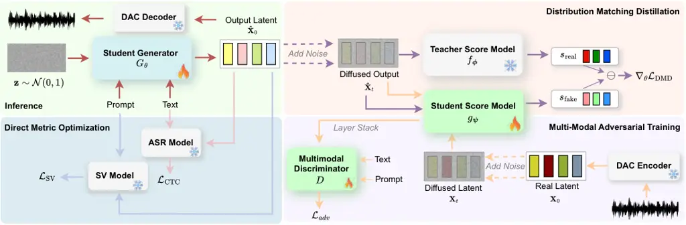
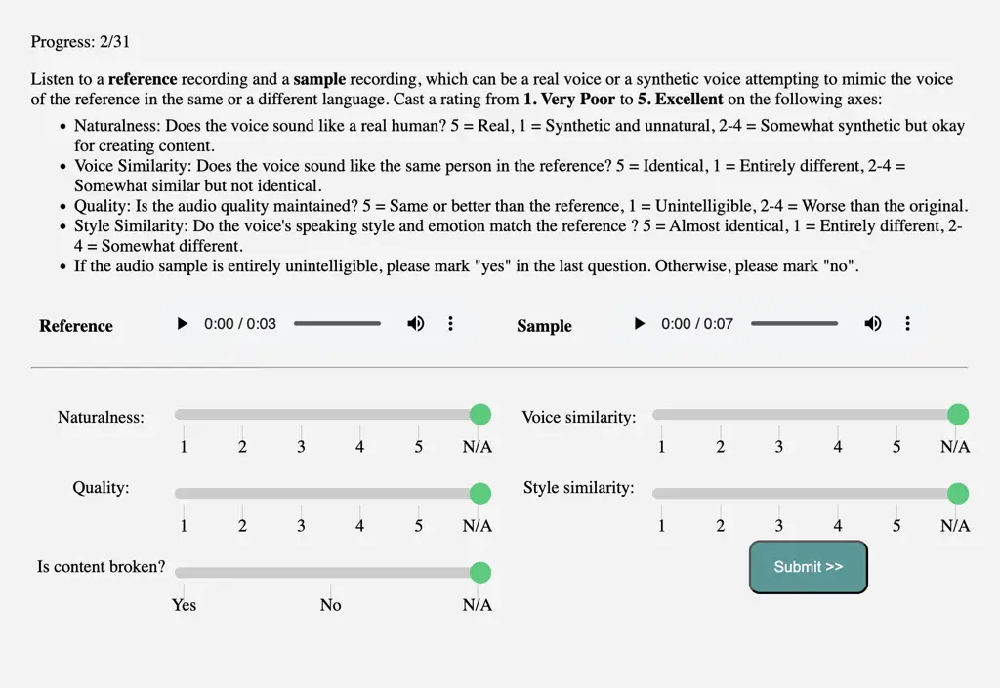

# DMOSpeech: Direct Metric Optimization via Distilled Diffusion Model in Zero-Shot Speech Synthesis

Yingahao Aaron Li ^(†)^(†)thanks: Work done during an internship at
Adobe. Affiliation: Columbia University
Email: [yl4579@columbia.edu](mailto:)    Rithesh Kumar & Zeyu Jin
Affiliation: Adobe Research Affiliation: {ritheshk, zjin}@adobe.com

###### Abstract

Diffusion models have demonstrated significant potential in speech
synthesis tasks, including text-to-speech (TTS) and voice cloning.
However, their iterative denoising processes are computationally
intensive, and previous distillation attempts have shown consistent
quality degradation. Moreover, existing TTS approaches are limited by
non-differentiable components or iterative sampling that prevent true
end-to-end optimization with perceptual metrics. We introduce DMOSpeech,
a distilled diffusion-based TTS model that uniquely achieves both faster
inference and superior performance compared to its teacher model. By
enabling direct gradient pathways to all model components, we
demonstrate the first successful end-to-end optimization of
differentiable metrics in TTS, incorporating Connectionist Temporal
Classification (CTC) loss and Speaker Verification (SV) loss. Our
comprehensive experiments, validated through extensive human evaluation,
show significant improvements in naturalness, intelligibility, and
speaker similarity while reducing inference time by orders of magnitude.
This work establishes a new framework for aligning speech synthesis with
human auditory preferences through direct metric optimization. The audio
samples are available at
[https://dmospeech.github.io/](https://dmospeech.github.io/).

|     |
| --- |
|     |

## 1 Introduction

Text-to-speech (TTS) technology has witnessed remarkable progress over
the past few years, achieving near-human or even superhuman performance
on various benchmark datasets (Tan et al., 2024; Li et al., 2024a; Ju
et al., 2024). With the rise of large language models (LLMs) and scaling
law (Kaplan et al., 2020), the focus of TTS research has shifted from
small-scale datasets to large-scale models trained on tens to hundreds
of thousands of hours of data encompassing a wide variety of speakers
(Wang et al., 2023a; Wang et al., 2023c; Shen et al., 2024; Peng et al.,
2024; Łajszczak et al., 2024; Li et al., 2024b). Two primary
methodologies have emerged for training these large-scale models:
diffusion-based approaches and autoregressive language modeling
(LM)-based methods. Both frameworks enable end-to-end speech generation
without the need for hand-engineered features such as prosody and
duration modeling as seen in works before the LLM era (Ren et al., 2020;
Kim et al., 2021), simplifying the TTS pipeline and improving
scalability.

As these models scale to handle increasingly diverse speakers and
scenarios, ensuring consistent quality and speaker similarity becomes
paramount. While directly optimizing relevant perceptual metrics would
be a natural approach, it remains a main challenge across all TTS
approaches. Traditional models that rely on monotonic alignment and
duration predictors (Shen et al., 2024) cannot propagate gradients
through these non-differentiable components, preventing true end-to-end
optimization of critical elements such as text encoders and duration
predictors. While some approaches like YourTTS (Casanova et al., 2022)
have attempted to incorporate speaker similarity loss, these
architectural limitations resulted in minimal improvements and prevented
optimization of other key metrics like word error rate (WER). Modern
end-to-end models face different challenges with direct optimization due
to their reliance on iterative sampling. Autoregressive models require
sampling steps that scale linearly with the length of the generated
speech; diffusion models, while more efficient, still require iterative
sampling: even the most advanced approaches need at least 16 steps
(chen2024f5). This iterative nature not only makes backpropagation
computationally prohibitive but also leads to gradient instability.
Furthermore, direct optimization through the diffusion process is
impossible because intelligible speech can only be generated at low
noise levels, making the gradients from perceptual metrics uninstructive
at higher noise levels. ¹¹ 1 An illustration is available at
[https://dmospeech.github.io/demo#noise](https://dmospeech.github.io/demo#noise).
This suggests that achieving direct metric optimization requires first
addressing the fundamental limitations of iterative sampling. While
previous work has explored distillation (Salimans & Ho, 2022; Song
et al., 2023; Sauer et al., 2023) as a way to reduce sampling steps,
these approaches have focused solely on inference speed, consistently
showing performance degradation through the distillation process from
teacher to student models (bai2023accelerating; Ye et al., 2023). These
challenges highlight the need for a fundamentally new approach that not
only reduces sampling steps but also enables true end-to-end
optimization while maintaining or improving speech quality.

In this work, we introduce Direct Metric Optimization Speech, a
distilled diffusion-based speech synthesis model that achieves both
superior performance and faster inference compared to existing
approaches. Our key innovation is to enable, for the first time, true
end-to-end (E2E) optimization of differentiable metrics in TTS, with two
technical advances: (1) reducing sampling steps from 128 to 4 via
distribution matching distillation (Yin et al., 2024b; Yin et al.,
2024a), and (2) providing a direct gradient pathway from the noise input
to speech output without non-differentiable components. This allows us
to directly optimize speaker similarity and word error rate through
speaker verification (SV) and CTC losses respectively, a capability not
achievable in previous TTS approaches due to either non-differentiable
components like duration predictors (Casanova et al., 2022) or
prohibitively expensive backpropagation through hundreds of sampling
steps. Our comprehensive experiments demonstrate that this E2E
optimization leads to significant improvements across all metrics,
outperforming both the teacher model and other recent baselines in both
subjective and objective evaluations. Importantly, we discover that our
optimized metrics strongly correlate with human perception, and the
distillation process induces beneficial mode shrinkage that improves
quality in strongly conditional generation by focusing on
high-probability regions without compromising output diversity across
different prompts and text inputs.

Our contributions are threefold:

- •
  We present the first distilled TTS model that consistently outperforms
  its teacher, achieving superior results while reducing inference time
  by over 13×.
- •
  We introduce a framework enabling true E2E optimization of any
  differentiable metric in TTS, demonstrating its effectiveness through
  substantial improvements in speaker similarity and word error rate.
- •
  We provide comprehensive ablations establishing correlations between
  objective metrics and human perceptions, revealing new insights into
  sampling speed and diversity trade-offs in strong conditional
  generation.

## 2 Related Works

Zero-Shot Text-to-Speech Synthesis  Zero-shot TTS has evolved
significantly in its approach to quality optimization. Early methods
relied on speaker embeddings from pre-trained encoders (Casanova et al.,
2022; Casanova et al., 2021; Wu et al., 2022; Lee et al., 2022) or
end-to-end speaker encoders (Li et al., 2024a; Min et al., 2021; Li
et al., 2022; Choi et al., 2022), but struggled with generalization and
quality optimization due to their reliance on extensive feature
engineering and non-differentiable components. More recent prompt-based
methods have demonstrated improved scalability using both autoregressive
(Shen et al., 2024; Le et al., 2024; Ju et al., 2024; Lee et al., 2024;
Yang et al., 2024; Eskimez et al., 2024; Liu et al., 2024) and diffusion
frameworks (Jiang et al., 2023b; Wang et al., 2023a; Wang et al., 2023c;
Jiang et al., 2023a; Peng et al., 2024; Kim et al., 2024; Chen et al.,
2024b; Meng et al., 2024; Yang et al., 2024; Lovelace et al., 2023; Liu
et al., 2024). However, these models face fundamental limitations in
optimizing perceptual metrics due to their reliance on iterative
sampling. DMOSpeech addresses these limitations by enabling true
end-to-end metric optimization while maintaining efficient inference.

Diffusion Distillation  Previous approaches to accelerating diffusion
models have explored various distillation techniques, each with distinct
trade-offs. Progressive distillation (Huang et al., 2022) and
consistency distillation (Ye et al., 2023; Ye et al., 2024) attempt to
match intermediate states of the teacher’s sampling trajectory, while
rectified flow methods (Guo et al., 2024; Guan et al., 2024) focus on
straightening these trajectories. However, these approaches often
compromise quality by constraining the student to follow the exact path
of the teacher, which may be suboptimal for models with reduced
capacity. Distribution matching approaches, whether adversarial (Sauer
et al., 2023; Sauer et al., 2024) or via score function matching (Yin
et al., 2024b), offer an alternative by aligning the student with the
teacher in distribution rather than trajectory. While these methods
typically require computationally expensive noise-data pair generation
(Sauer et al., 2024; Yin et al., 2024b; Liu et al., 2023), DMD2 (Yin
et al., 2024a) overcomes this limitation by prioritizing efficiency over
diversity. Prior studies have typically viewed this tendency to reduce
output diversity as a limitation. However, we demonstrate in this work
that in strongly conditional generation tasks like TTS, where strict
adherence to input text and speaker prompts is required, this diversity
reduction can enhance output quality while maintaining sufficient
variation across different inputs. This insight makes DMD2 particularly
suitable for zero-shot TTS, offering a natural way to balance quality
and diversity.

Direct Metric Optimization  While optimizing perceptual metrics has
shown promise in speech enhancement through approaches like MetricGAN
(Fu et al., 2019) for PESQ and STOI, and recent attempts have explored
RLHF for improving naturalness (Zhang et al., 2024; Chen et al., 2024a),
implementing these approaches in modern TTS systems has remained
challenging. This difficulty stems from architectural limitations such
as non-differentiable duration upsamplers (Li et al., 2024b; Ye et al., 2024) or computationally intensive iterative sampling (Lee et al., 2024;
Peng et al., 2024). Previous attempts like YourTTS (Casanova et al., 2022) reported minimal improvements from speaker similarity optimization
due to their inability to propagate gradients through all model
components. DMOSpeech overcomes these limitations by enabling
comprehensive optimization of all model elements through direct gradient
pathways, marking the first successful demonstration of true end-to-end
metric optimization in speech synthesis while maintaining fast inference
and high quality.

## 3 Methods

### 3.1 Preliminary: End-to-End Latent Speech Diffusion

Our model starts with a pre-trained teacher model based on an end-to-end
latent speech diffusion framework such as SimpleTTS (Lovelace et al., 2023) and DiTTo-TTS (Lee et al., 2024). This section outlines the
formulation of the diffusion process, noise scheduling, and the
objective function.

We begin by encoding raw audio waveforms
$`\mathbf{y}\in\mathbb{R}^{1\times T}`$, where $`T`$ is the audio
length, into latent representations
$`\mathbf{x}_{0}=\mathcal{E}(\mathbf{y})`$ using a latent autoencoder
$`\mathcal{E}`$. The latent autoencoder follows DAC (Kumar et al., 2024)
with residual vector quantization replaced by the variational
autoencoder loss (see Appendix C.1 for more information). We denote the
ground truth latent distribution as $`p_{\text{data}}`$. The diffusion
process involves adding noise to $`\mathbf{x}_{0}\sim p_{\text{data}}`$
over continuous time $`t\in[0,1]`$ through a noise schedule. Our noise
schedule follows Lovelace et al. (2023), which is a shifted cosine noise
schedule formulated with $`\alpha_{t}`$ and $`\sigma_{t}`$ that control
the amount of signal and noise (see Appendix C.2.1).

During training, the model learns to remove noise added to the latent
representations. Given a latent variable $`\mathbf{x}_{0}`$ and noise
$`\bm{\epsilon}\sim\mathcal{N}(\mathbf{0},\mathbf{I})`$, the noisy
latent $`\mathbf{x}_{t}`$ at time step $`t`$ is generated as
$`\mathbf{x}_{t}=\alpha_{t}\mathbf{x}_{0}+\sigma_{t}\bm{\epsilon}`$. We
use a binaray prompt mask $`\mathbf{m}`$ to selectively preserve the
original values in regions corresponding to the prompt. The noisy latent
$`\mathbf{x}_{t}`$ is adjusted as
$`{\mathbf{x}}_{t}\leftarrow\mathbf{x}_{t}\odot(1-\mathbf{m})+\mathbf{x}_{0}\odot\mathbf{m}`$,
where $`\odot`$ denotes element-wise multiplication. The binary mask
$`\mathbf{m}`$ is randomly sampled to mask between 0% to 50% of the
length of $`\mathbf{x}_{0}`$. We define a reparameterized velocity
$`\mathbf{v}=\alpha_{t}\bm{\epsilon}-\sigma_{t}\mathbf{x}_{0}`$, which
serves as the training objective as in Huang et al. (2022). We train our
diffusion transformer (Peebles & Xie, 2023) model $`f_{\bm{\phi}}`$,
parameterized by $`\bm{\phi}`$, to predict the target $`\mathbf{v}`$
given the noisy latent $`\mathbf{x}_{t}`$, conditioned on text
embeddings $`\mathbf{c}`$, prompt mask indicators $`\mathbf{m}`$, and
the time step $`t`$:

```math
\mathcal{L}_{\text{diff}}(f_{\bm{\phi}};p_{\text{data}})=\mathbb{E}_{\mathbf{x}_{0}\sim p_{\text{data}},t\sim\mathcal{U}(0,1),\bm{\epsilon}\sim\mathcal{N}(0,I)}\left[\left\lVert{\mathbf{v}}-f_{\bm{\phi}}({\mathbf{x}}_{t}\,;\mathbf{c},\mathbf{m},t)\right\rVert_{2}\right]. \tag{1}
```

During inference, the model takes noise
$`\mathbf{z}\in\mathcal{N}(0,I)`$ with fixed size $`[d,L]`$ where $`L`$
is the total duration of the target speech. $`L`$ is estimated by
multiplying the number of phonemes in the target text with the speaking
rate of the prompt speech (see Appendix C.2.3 for more implementation
details).



Figure 1: Overview of the DMOSpeech framework. The framework consists of
inference and three main components for training: (1) Inference (upper
left): A few-step distilled generator $`G_{\theta}`$ synthesizes speech
directly from noise, conditioned on the text and speaker prompt (red
arrow). (2) Distribution Matching Distillation (upper right): Gradient
computation for DMD loss where the student score model $`g_{\bm{\psi}}`$
matches the teacher score model $`f_{\bm{\phi}}`$ to align the
distribution of student generator $`G_{\theta}`$ with the teacher
distribution (purple arrow). (3) Multi-Modal Adversarial Training (lower
right): The discriminator $`D`$ uses stacked features from the student
score model to distinguish between real and synthesized noisy latents
conditioned on both text and prompt (yellow arrows). (4) Direct Metric
Optimization (lower left): Direct metric optimization for word error
rate (WER) via CTC loss (pink arrow) and speaker embedding cosine
similarity (SIM) via SV loss (blue arrow).

### 3.2 Improved Distribution Matching Distillation

We employ improved Distribution Matching Distillation (Yin et al.,
2024a), or DMD 2, to distill our teacher model for fast sampling and
direct metric optimization. DMD 2 improves upon DMD (Yin et al., 2024b)
by incorporating adversarial training on the real data, eliminating the
need for noise-data pair generation and significantly reducing the
training cost. This section details how we adapt DMD for efficient
speech synthesis, including the formulations corresponding to our
implementation.

Background on Distribution Matching Distillation  DMD aims to train a
student generator $`G_{\theta}`$ to produce samples whose distribution
matches the data distribution $`p_{\text{data}}`$ after a forward
diffusion process. The objective is to minimize the Kullback-Liebler
(KL) divergence between the distributions of the diffused real data
$`p_{\text{data},t}`$ and the diffused student generator outputs
$`p_{\theta,t}`$ across all time $`t\in[0,1]`$:

```math
\displaystyle\mathcal{L}_{\text{DMD}} \displaystyle=\mathbb{E}_{t\sim\mathcal{U}(0,1)}\left[D_{KL}(p_{\theta,t}||p_{\text{data},t})\right]=\mathbb{E}_{t\sim\mathcal{U}(0,1)}\left[\mathbb{E}_{\mathbf{x}\sim p_{\theta,t}}\left[\log\left(\frac{p_{\theta,t}(\mathbf{x})}{p_{\text{data},t}(\mathbf{x})}\right)\right]\right] \tag{2}
```

```math
\displaystyle=-\mathbb{E}_{t\sim\mathcal{U}(0,1)}\left[\mathbb{E}_{\mathbf{x}\sim p_{\theta,t}}\left[\log\left({p_{\text{data},t}(\mathbf{x})}\right)-\log\left({p_{\theta,t}(\mathbf{x})}\right)\right]\right]. \tag{3}
```

Since DMD trains $`G_{\theta}`$ through gradient descent, the
formulation DMD only requires the gradient of the DMD loss with respect
to the generator parameters $`\theta`$, which is derived in Yin et al.
(2024b) as:

```math
\nabla_{\theta}\mathcal{L}_{\text{DMD}}=-\mathbb{E}_{t\sim\mathcal{U}(0,1)}\left[\mathbb{E}_{\mathbf{x}_{t}\sim p_{\theta,t},\bm{z}\sim\mathcal{N}(\mathbf{0},\mathbf{I})}\left[\omega_{t}\alpha_{t}\left(s_{\text{real}}(\mathbf{x}_{t},t)-s_{\theta}(\mathbf{x}_{t},t)\right)\nabla_{\theta}G_{\theta}(\bm{z})\right]\right], \tag{4}
```

where $`\mathbf{x}_{t}`$ is the diffused version of
$`\mathbf{x}_{0}=G_{\theta}(\bm{z})`$, the distilled generator output
for $`\mathbf{z}\sim\mathcal{N}(\mathbf{0},\mathbf{I})`$,
$`s_{\text{real}}(\mathbf{x}_{t},t)`$ and
$`s_{\theta}(\mathbf{x}_{t},t)`$ are neural network approximation of
score functions of the diffused data distribution and student output
distribution, and $`\omega_{t}`$ is a weighting factor defined in eq. 32.

In our speech synthesis task, the generator $`G_{\theta}`$ produces
latent speech representations $`\mathbf{x}_{0}`$ conditioned on input
text $`\mathbf{c}`$ and a speaker prompt. The teacher diffusion model
$`f_{\bm{\phi}}`$ serves as the score function $`s_{\text{real}}`$ for
the real data distribution. We train another diffusion model
$`g_{\bm{\psi}}`$ to approximate the score of the distilled generator’s
output distribution $`p_{\theta}`$ following eq. 1. The scores are
estimated as:

```math
s_{\text{real}}(\mathbf{x}_{t},t)=-\frac{\mathbf{x}_{t}-\alpha_{t}\hat{\mathbf{x}}^{\text{real}}_{0}}{\sigma_{t}^{2}}, \tag{5}
```

```math
s_{\theta}(\mathbf{x}_{t},t)=-\frac{\mathbf{x}_{t}-\alpha_{t}\hat{\mathbf{x}}^{\text{fake}}_{0}}{\sigma_{t}^{2}}. \tag{6}
```

where $`\hat{\mathbf{x}}^{\text{real}}_{0}`$ and
$`\hat{\mathbf{x}}^{\text{fake}}_{0}`$ are estimation of
$`\mathbf{x}_{0}`$ from the teacher and student diffusion models,
respectively:

```math
\hat{\mathbf{x}}^{\text{real}}_{0}=\frac{\mathbf{x}_{t}-\sigma_{t}f_{\bm{\phi}}({\mathbf{x}}_{t}\,;\mathbf{c},\mathbf{m},t)}{\alpha_{t}}, \tag{7}
```

```math
\hat{\mathbf{x}}^{\text{fake}}_{0}=\frac{\mathbf{x}_{t}-\sigma_{t}g_{\bm{\psi}}({\mathbf{x}}_{t}\,;\mathbf{c},\mathbf{m},t)}{\alpha_{t}}. \tag{8}
```

The parameters of $`G_{\theta}`$ and $`g_{\bm{\psi}}`$ are both
initialized from the teacher diffusion model’s parameters $`\bm{\phi}`$.

DMD 2 for Speech Synthesis  We notice that the one-step student model
results in noticeable artifacts, as the student model lacks the
computational capacity to capture all the acoustic details that the
teacher model generates through multiple iterative steps. To address
this issue, we adopt the DMD 2 framework from Yin et al. (2024a) by
conditioning the student generator $`G_{\theta}`$ on the noise level
$`t`$. This conditioning allows the model to estimate the clean latent
speech representation $`\mathbf{x}_{0}`$ from its noisy counterpart
$`\mathbf{x}_{t}`$ for a sequence of predefined time steps
$`t\in\{t_{1},\ldots,t_{N}\}`$. This multi-step sampling process
(Algorithm 1) is similar to the consistency model proposed by Song
et al. (2023).

The process goes as follows: for each time step $`t_{n}`$, the student
model produces an estimate
$`\hat{\mathbf{x}}_{0}^{n}=G_{\theta}(\mathbf{x}_{t_{n}}\,;\mathbf{c},\mathbf{m},t_{n})`$,
and this estimate is then re-noised to obtain $`\mathbf{x}_{t_{n+1}}`$
as input for the next time step:

```math
\mathbf{x}_{t_{n+1}}=\alpha_{t_{n+1}}\hat{\mathbf{x}}_{0}^{n}+\sigma_{t_{n+1}}\bm{\epsilon},\quad\bm{\epsilon}\sim\mathcal{N}(0,\mathbf{I}). \tag{9}
```

This process generates progressively less noisy versions of
$`\mathbf{x}_{0}`$ at decreasing noise levels
$`\sigma_{t_{n+1}}<\sigma_{t_{n}}`$.

For our four-step model, we use a schedule of time steps
$`\{1.0,0.75,0.50,0.25\}`$ mapped from the teacher’s full range
$`t\in[0,1]`$. We simulate the one-step inference during training to
minimize the training/inference mismatch. Instead of using the noisy
version of ground truth
$`\alpha_{t_{n}}\mathbf{x}_{0}+\sigma_{t_{n}}\bm{\epsilon}`$ as input,
we use the noisy version of student prediction
$`\alpha_{t_{n}}G_{\theta}\left(\alpha_{t_{n-1}}\mathbf{x}_{0}+\sigma_{t_{n-1}}\bm{\epsilon}\,;\mathbf{c},\mathbf{m},t_{n-1}\right)+\sigma_{t_{n}}\bm{\epsilon}`$
from the noisy ground truth at the noise level
$`\sigma_{n-1}>\sigma_{n}`$. This is different from Yin et al. (2024a),
which simulates all four steps, as we found that simulating just one
step is sufficient for producing high-quality speech while saving GPU
memory during training.

To further improve the performance of the student model, we incorporate
adversarial training following the approach of Yin et al. (2024a) that
allows the students to learn from the real data. However, unlike in
text-to-image synthesis, where text acts as a weak condition for the
generated image, text-to-speech synthesis requires strong conditioning
on both text and speaker prompt. The generated speech must strictly
adhere to the semantic content of the text and the prompt speaker’s
voice and style. To this end, we modify the adversarial discriminator
used in Yin et al. (2024a) to a conditional multimodal discriminator,
inspired by Janiczek et al. (2024). Following Li et al. (2024b), our
discriminator $`D`$ is a conformer that takes as input the stacked
features from all transformer layers of the student score network
$`g_{\bm{\psi}}`$ with noisy input, along with the text embeddings
$`\mathbf{c}`$, prompt mask $`\mathbf{m}`$, and noise level $`t`$
(denoted as $`\mathcal{C}`$). The discriminator is trained with the
LSGAN loss (Mao et al., 2017):

```math
\mathcal{L}_{\text{adv}}(G_{\theta};D)=\mathbb{E}_{t}\left[\mathbb{E}_{\hat{\mathbf{x}}_{t}\sim p_{\theta,t},,\mathbf{m}}\left[\left(D\left(\tilde{g}_{\bm{\psi}}(\hat{\mathbf{x}}_{t}\,;\mathcal{C})\,;\mathcal{C}\right)-1\right)^{2}\right]\right],\\
 \tag{10}
```

```math
\displaystyle\mathcal{L}_{\text{adv}}(D;G_{\theta})= \displaystyle\mathbb{E}_{t}\left[\mathbb{E}_{\hat{\mathbf{x}}_{t}\sim p_{\theta,t},\mathbf{m}}\left[\left(D\left(\tilde{g}_{\bm{\psi}}(\hat{\mathbf{x}}_{t}\,;\mathcal{C})\,;\mathcal{C}\right)\right)^{2}\right]\right]+ \tag{11}
```

```math
\displaystyle\mathbb{E}_{t}\left[\mathbb{E}_{{\mathbf{x}}_{t}\sim p_{\text{data},t},\mathbf{m}}\left[\left(D\left(\tilde{g}_{\bm{\psi}}({\mathbf{x}}_{t}\,;\mathcal{C})\,;\mathcal{C}\right)-1\right)^{2}\right]\right], \tag{12}
```

where $`\mathcal{C}=\{\mathbf{c},\mathbf{m},t\}`$ is the conditional
input, $`\tilde{g}_{\bm{\psi}}(\cdot)`$ denotes the stacked features
from all layers of $`g_{\bm{\psi}}`$, and
$`\hat{\mathbf{x}}_{t}=\alpha_{t}G_{\theta}(\mathbf{z};\mathcal{C})+\sigma_{t}\bm{\epsilon}`$
is the noisy version of the student-generated speech at time step $`t`$.

### 3.3 Direct Metric Optimization

We directly optimize two metrics, speaker embedding cosine similarity
(SIM) and word error rate (WER), which are commonly used for evaluating
zero-shot speech synthesis models and are both shown to correlate with
human perception for speaker similarity (Thoidis et al., 2023) and
naturalness (Alharthi et al., 2023). To improve WER, we incorporate a
Connectionist Temporal Classification (CTC) loss (Graves et al., 2006).
The CTC loss aligns the synthesized speech with the input text at the
character level, reducing word error rates and enhancing robustness. It
is defined as:

```math
\mathcal{L}_{\text{CTC}}=\mathbb{E}_{\mathbf{x}_{\text{fake}}\sim p_{\theta},\mathbf{c}}\left[-\log p(\mathbf{c}|C(\mathbf{x}_{\text{fake}}))\right], \tag{13}
```

where $`\mathbf{x}_{\text{fake}}`$ is the student-generated speech,
$`\mathbf{c}`$ is the text transcript, and $`C(\cdot)`$ is a pre-trained
CTC-based ASR model on speech latent (see Appendix C.3 for details). We
also employ a Speaker Verification (SV) loss to ensure the synthesized
speech matches the target speaker’s identity. We use a pre-trained
speaker verification model $`S`$ on latent (see Appendix C.4 for
details) for the SV loss:

```math
\mathcal{L}_{\text{SV}}=\mathbb{E}_{\begin{subarray}{c}\mathbf{x}_{\text{real}}\sim p_{\text{data}},\\
\mathbf{x}_{\text{fake}}\sim p_{\theta},\mathbf{m}\end{subarray}}\left[1-\frac{\mathbf{e}_{\text{real}}\cdot\mathbf{e}_{\text{fake}}}{\left\lVert\mathbf{e}_{\text{real}}\right\rVert\left\lVert\mathbf{e}_{\text{fake}}\right\rVert}\right],\quad\mathbf{e}_{\text{fake}}={S}(\mathbf{x}_{\text{fake}}),\quad\mathbf{e}_{\text{real}}={S}(\mathbf{x}_{\text{real}}\odot\mathbf{m}), \tag{14}
```

where $`\mathbf{e}_{\text{real}}`$ and $`\mathbf{e}_{\text{fake}}`$ are
the speaker embeddings of the prompt and student-generated speech.

### 3.4 Training Objectives and Stability

The overall training objective for $`G_{\theta}`$ combines DMD and
adversarial losses with SV and CTC losses:

```math
\min_{\theta}\text{ }\mathcal{L}_{\text{DMD}}+\lambda_{\text{adv}}\mathcal{L}_{\text{adv}}(G_{\theta};D)+\lambda_{\text{SV}}\mathcal{L}_{\text{SV}}+\lambda_{\text{CTC}}\mathcal{L}_{\text{CTC}}, \tag{15}
```

and the training objectives for $`g_{\bm{\psi}}`$ and $`D`$ are:

```math
\min_{\bm{\psi}}\text{ }\mathcal{L}_{\text{diff}}\left(g_{\bm{\psi}};p_{\theta}\right), \tag{16}
```

```math
\min_{D}\text{ }\mathcal{L}_{\text{adv}}\left(D;G_{\theta}\right). \tag{17}
```

We employ an alternating training strategy where the student generator
$`G_{\theta}`$, the student score estimator $`g_{\bm{\psi}}`$, and the
discriminator $`D`$ are updated at different frequencies to maintain
training stability. Specifically, for every update of $`G_{\theta}`$, we
perform five updates of $`g_{\bm{\psi}}`$. This ensures that the score
estimator $`g_{\bm{\psi}}`$ can adapt quickly to the dynamic changes in
the generator distribution $`p_{\theta}`$. Unlike Yin et al. (2024a),
where $`D`$ are updated five times for every single update of
$`G_{\theta}`$, we update $`D`$ and $`G_{\theta}`$ at the same rate.
This prevents the discriminator from becoming too powerful and
destabilizing training.

The learning rates for $`G_{\theta}`$ and $`g_{\bm{\psi}}`$ play a
critical role in maintaining training stability since both models are
initialized from the teacher’s parameters, $`\bm{\phi}`$. Treating this
as a fine-tuning process, we set their learning rates close to the
teacher model’s final learning rate to prevent catastrophic forgetting
and training collapse. The teacher model was trained using a cosine
annealing warmup scheduler, which gradually reduced the learning rate
over time. Thus, starting with a high learning rate for $`G_{\theta}`$
and $`g_{\bm{\psi}}`$ can cause them to deviate significantly from the
pre-trained knowledge, leading to training failure. Conversely, the
learning rate for $`D`$ is less sensitive and does not require such
precise tuning.

Balancing the different loss components in the overall objective
function is crucial for successful training. The primary loss,
$`\mathcal{L}_{\text{DMD}}`$, is responsible for transferring knowledge
from the teacher model, aligning the synthesized speech with the text.
Other losses, such as $`\mathcal{L}_{\text{adv}}`$,
$`\mathcal{L}_{\text{SV}}`$, and $`\mathcal{L}_{\text{CTC}}`$, need to
be scaled properly to match the gradient of
$`\mathcal{L}_{\text{DMD}}`$. We set $`\lambda_{\text{adv}}=10^{-3}`$ to
ensure the gradient norm of $`\mathcal{L}_{\text{adv}}`$ is comparable
to that of $`\mathcal{L}_{\text{DMD}}`$. During early training stage, we
observed that the gradient norms of $`\mathcal{L}_{\text{SV}}`$ and
$`\mathcal{L}_{\text{CTC}}`$ were significantly higher than
$`\mathcal{L}_{\text{DMD}}`$, likely because $`G_{\theta}`$ was still
learning to generate intelligible speech from single step. To address
this, we set $`\lambda_{\text{CTC}}=0`$ for the first 5,000 iterations
and $`\lambda_{\text{SV}}=0`$ for the first 10,000 iterations. This
allows $`G_{\theta}`$ to stabilize under the influence of
$`\mathcal{L}_{\text{DMD}}`$ before integrating these additional losses.
After that, both $`\lambda_{\text{CTC}}`$ and $`\lambda_{\text{SV}}`$
are set to 1.

## 4 Experiments

### 4.1 Model Training

We conducted our experiments on the LibriLight dataset (Kahn et al.,
2020), which consists of 57,706.4 hours of audio from 7,439 speakers.
The data and transcripts were obtained using Python scripts provided by
the LibriLight authors²² 2 Available at
[https://github.com/facebookresearch/libri-light/](https://github.com/facebookresearch/libri-light/).
All audio files were resampled to 48 kHz to match the configuration of
our DAC autoencoder, and the text was converted into phonemes using
Phonemizer (Bernard & Titeux, 2021). To manage memory constraints, we
segmented the audio into 30-second chunks using WhisperX (Bain et al.,
2023). The teacher model $`f_{\bm{\phi}}`$ was trained for 400,000 steps
with a batch size of 384, using the AdamW optimizer (Loshchilov &
Hutter, 2018) with $`\beta_{1}=0.9`$, $`\beta_{2}=0.999`$, weight decay
of $`10^{-2}`$, and an initial learning rate of $`10^{-4}`$. The
learning rate followed a cosine decay schedule with a 4,000-step warmup,
gradually decreasing to $`10^{-5}`$. Model weights were updated using an
exponential moving average (EMA) with a decay factor of 0.99 every 100
steps. The teacher model consists of 450M parameters in total. For
student training, we initialized both the student generator
$`G_{\theta}`$ and the student score model $`g_{\bm{\psi}}`$ with the
EMA-weighted teacher parameters. The initial learning rate was set to
match the final learning rate of the teacher model
($`\lambda=10^{-5}`$), while the batch size was reduced to 96 due to
memory constraints. Reducing the batch size further negatively impacted
performance, as a sufficiently large batch size is required for accurate
score estimation due to the Monte Carlo nature of DMD (see Section 4.4
for further discussion). The student generator $`G_{\theta}`$ and the
discriminator $`D`$ were trained for an additional 40,000 steps, and the
student score model $`g_{\bm{\psi}}`$ for 200,000 steps accordingly
using the same optimization settings as the teacher. All models were
trained on 24 NVIDIA A100 40GB GPUs.

Model MOS-N MOS-Q SMOS-V SMOS-S Ground Truth 4.47 ($`\pm`$ 0.03) 4.61
($`\pm`$ 0.03) 3.86 ($`\pm`$ 0.05)^(∗∗) 3.81 ($`\pm`$ 0.05)^(∗∗) Ours
(DMOSpeech, N=4) 4.42 ($`\pm`$ 0.03) 4.59 ($`\pm`$ 0.03) 4.49 ($`\pm`$
0.03) 4.30 ($`\pm`$ 0.03) Ours (Teacher, N=128) 4.32 ($`\pm`$ 0.04)^(∗)
4.55 ($`\pm`$ 0.03) 4.17 ($`\pm`$ 0.04)^(∗∗) 4.00 ($`\pm`$ 0.04)^(∗∗)
NaturalSpeech 3 (Ju et al., 2024) 4.24 ($`\pm`$ 0.04)^(∗∗) 4.55 ($`\pm`$
0.03) 4.44 ($`\pm`$ 0.03) 4.25 ($`\pm`$ 0.04) StyleTTS-ZS (Li et al.,
2024b) 4.40 ($`\pm`$ 0.03) 4.54 ($`\pm`$ 0.03) 4.34 ($`\pm`$ 0.04)^(∗∗)
4.20 ($`\pm`$ 0.03)^(∗)

Table 1: Comparison between our models and non-E2E baselines on four
subjective metrics: naturalness (MOS-N), sound quality (MOS-Q), voice
similarity (SMOS-V), and speaking style similarity (SMOS-S). Scoes are
presented as means ($`\pm`$ standard error). One asterisk (\*) indicates
a statistically significant difference ($`p<0.05`$) and double asterisk
(\*\*) indicates $`p<0.01`$ compared to DMOSpeech. The best models and
those within one standard error of the best are highlighted.

Model MOS-N MOS-Q SMOS-V SMOS-S Ground Truth 4.37 ($`\pm`$ 0.03)^(∗)
4.49 ($`\pm`$ 0.03) 3.51 ($`\pm`$ 0.05)^(∗∗) 3.39 ($`\pm`$ 0.05)^(∗∗)
Ours (DMOSpeech, N=4) 4.27 ($`\pm`$ 0.03) 4.45 ($`\pm`$ 0.03) 4.35
($`\pm`$ 0.03) 4.16 ($`\pm`$ 0.03) Ours (Teacher, N=128) 4.22 ($`\pm`$
0.04) 4.40 ($`\pm`$ 0.03) 4.03 ($`\pm`$ 0.04)^(∗∗) 3.87 ($`\pm`$
0.04)^(∗∗) DiTTo-TTS (Lee et al., 2024) 4.28 ($`\pm`$ 0.04) 4.41
($`\pm`$ 0.03) 4.16 ($`\pm`$ 0.04)^(∗∗) 4.07 ($`\pm`$ 0.03)^(∗)
VoiceCraft (Peng et al., 2024) 3.76 ($`\pm`$ 0.05)^(∗∗) 3.88 ($`\pm`$
0.04)^(∗∗) 3.41 ($`\pm`$ 0.05)^(∗∗) 3.37 ($`\pm`$ 0.05)^(∗∗) CLaM-TTS
(Kim et al., 2024) 3.77 ($`\pm`$ 0.05)^(∗∗) 3.87 ($`\pm`$ 0.04)^(∗∗)
3.67 ($`\pm`$ 0.05)^(∗∗) 3.43 ($`\pm`$ 0.05)^(∗∗) XTTS (Casanova et al., 2024) 3.63 ($`\pm`$ 0.05)^(∗∗) 3.89 ($`\pm`$ 0.04)^(∗∗) 3.25 ($`\pm`$
0.05)^(∗∗) 3.22 ($`\pm`$ 0.05)^(∗∗)

Table 2: Comparison between our models and end-to-end baseline models.

### 4.2 Evaluation Metrics

We performed both subjective and objective evaluations to assess the
performance of our model and several state-of-the-art baselines. For
subjective evaluation, we employed four metrics rated on a scale from 1
to 5. The Mean Opinion Score for Naturalness (MOS-N) assessed the
human-likeness of the synthesized speech, where 1 indicates fully
synthesized audio and 5 indicates completely human speech. The Mean
Opinion Score for Sound Quality (MOS-Q) evaluated audio quality
degradation relative to the prompt, with 1 representing severe
degradation and 5 indicating no degradation. The Similarity Mean Opinion
Score for Voice (SMOS-V) measured the similarity of the synthesized
voice to the prompt speaker’s voice, where 1 means completely different
and 5 means identical. Lastly, the Similarity Mean Opinion Score for
Style (SMOS-S) assessed the speaking style similarity to the prompt
speaker with the same scale. These subjective evaluations were conducted
through a listening test survey on the crowdsourcing platform Prolific,
with 1,000 tests (30 samples each) taken by native English speakers with
no hearing impairments who had experience in content creation or
audio/video editing, ensuring they could better differentiate
synthesized audio from real human. The prompt speech served as an anchor
that is supposed to score 5 on all metrics; we also included
intentionally mismatched speakers serving as low anchor for similarity,
which should have a rating lower than 3. The participants who fails to
correctly rate the anchors hidden in the test are disqualified and their
answers removed (details in Appendix E.2). For objective evaluation, we
followed the approach from previous works (Wang et al., 2023a; Lee
et al., 2024) and measured speaker similarity using the cosine
similarity between speaker embeddings of the generated speech and the
promot (SIM), using the WavLM-TDCNN speaker embedding model³³ 3 WavLM
large fine-tuned checkpoint:
[https://github.com/microsoft/UniSpeech/tree/main/downstreams/speaker_verification](https://github.com/microsoft/UniSpeech/tree/main/downstreams/speaker_verification).
We also calculated the Word Error Rate (WER) with a CTC-based HuBERT ASR
model ⁴⁴ 4
[https://huggingface.co/facebook/hubert-large-ls960-ft](https://huggingface.co/facebook/hubert-large-ls960-ft)
following (Ju et al., 2024; Shen et al., 2024).

### 4.3 Comparison to Other Models

We conducted two evaluation experiments to compare our models against
two categories of baselines: state-of-the-art (SOTA) non-end-to-end
(E2E) models that include explicit duration and prosody modeling, and
recent E2E models without such explicit modeling. For both experiments,
the samples were downsampled to 16 kHz for fairness and prompts were
transcribed using WhisperX for synthesis.

In the first experiment, we compared our model to NaturalSpeech 3 and
StyleTTS-ZS, both of which utilize explicit duration and prosody
modeling and were trained on the large-scale LibriLight dataset. Since
neither model has public source code or official checkpoints available,
we used 47 official samples from the authors and other sources (details
in Appendix E.1) from the LibriSpeech test-clean subset, covering all 40
speakers. As shown in Table 1, our distilled model significantly
outperformed NaturalSpeech 3 in naturalness and StyleTTS-ZS in
similarity metrics. It also outperformed the teacher model in terms of
naturalness, voice similarity, and style similarity.

|                       |                            |               |                    |                  |                    |
| --------------------- | -------------------------- | ------------- | ------------------ | ---------------- | ------------------ |
| Model                 | Training Set               | \# Parameters | WER $`\downarrow`$ | SIM $`\uparrow`$ | RTF $`\downarrow`$ |
| Ground Truth          | —                          | —             | 2.19               | 0.67             | —                  |
| Ours (DMOSpeech, N=4) | LL ($`\sim`$58k hrs)       | 450M          | 1.94               | 0.69             | 0.07               |
| Ours (Teacher, N=128) | LL ($`\sim`$58k hrs)       | 450M          | 9.51               | 0.55             | 0.96               |
| NaturalSpeech 3       | LL ($`\sim`$58k hrs)       | 500M          | 1.81               | 0.67             | 0.30               |
| VoiceCraft            | G+LL ($`\sim`$69k hrs)     | 830M          | 6.32               | 0.61             | 1.12               |
| DiTTo-TTS             | Assorted ($`\sim`$56k hrs) | 740M          | 2.56               | 0.62             | 0.16               |
| CLaM-TTS              | Assorted ($`\sim`$56k hrs) | 584M          | 5.11               | 0.49             | 0.42               |
| XTTS                  | Assorted ($`\sim`$17k hrs) | 482M          | 4.93               | 0.49             | 0.37               |

Table 3: Objective evaluation results between our models and other
baseline models. For training data, LL stands for LibriLight, G stands
for GigaSpeech, and assorted means combination of various datasets (see
Appendix E.1 for details). The real-time factor (RTF) was computed on a
NVIDIA V100 GPU except DiTTo-TTS and CLaM-TTS, whose RTF is obtained
from their papers using the inference time needed to synthesize 10s of
speech divided by 10 on unknown devices. Additional evaluation results
on emotion reflection are presented in Table 6.

In the second experiment, we evaluated E2E speech synthesis models
without explicit duration modeling, including three popular
autoregressive models, XTTS , CLaM-TTS, VoiceCraft, and one
diffusion-based SOTA model, DiTTo-TTS. Since official code and
checkpoints for CLaM-TTS and DiTTo-TTS were unavailable, we obtained
3,711 samples from the authors based on the LibriSpeech test-clean
subset⁵⁵ 5 Prompts and samples were generated according to instructions
provided in
[https://github.com/keonlee9420/evaluate-zero-shot-tts](https://github.com/keonlee9420/evaluate-zero-shot-tts)
and synthesized the corresponding samples using XTTS, VoiceCraft, and
our models. For subjective evaluation, we selected 80 samples, ensuring
that each speaker from the test-clean subset was represented by two
samples. As shown in Table 2, our model significantly outperformed all
recent E2E speech synthesis baselines except DiTTo-TTS in MOS, with
which it achieved comparable performance in naturalness and sound
quality. This indicates that our model is consistently preferred across
both naturalness and similarity by human listeners.

All baselines, except for NaturalSpeech 3, were evaluated using the
3,711 samples as per Lee et al. (2024). Since we lacked sufficient
samples for a direct evaluation of NaturalSpeech 3, its results are
taken from their original paper. Table 5 shows that our model achieved
the highest speaker similarity score (SIM) to the prompt, even
surpassing the ground truth. The Real-Time Factor (RTF) of the distilled
model is 13.7 times lower than the teacher model, which is lower than
all baseline methods by a large margin. Although our model had a
slightly higher WER (1.94) compared to NaturalSpeech 3 (1.81), it is
important to note that our model is entirely end-to-end without explicit
duration modeling, unlike NaturalSpeech 3. Both DMOSpeech and
NaturalSpeech 3 also exhibited lower WER than the ground truth. One
point to consider is the high WER of our teacher model, which is mainly
due to cutoff at the end of sentences in the training set caused by
faulty segmentation with WhisperX. It affects about 10% of the
utterances. After distillation, this issue was resolved due to mode
shrinkage (discussed in Section 4.4). Moreover, our model demonstrates
significantly faster inference speed compared to all baseline models, as
it only requires four sampling steps.

Figure 2: Illustration of mode shrinkage in terms of pitch. Speech with
the same text and prompt were synthesized 50 times, and their
frame-level F0 values are shown as histograms and kernel density
estimates. The red dashed line represents the mean F0 value of the
prompt. In both examples, the student’s distribution shifts toward the
most likely region, centering around the prompt’s mean value.

### 4.4 Ablation Study

We conducted ablation studies to assess the contribution of each
proposed component, with results summarized in Table 4. We evaluated
models trained solely with DMD 2 using one sampling step (DMD 2 only,
N=1) and four sampling steps (DMD 2 only, N=4), as well as models
trained with only CTC loss or SV loss on top of four-step DMD 2 model.
Additionally, we examined the impact of reducing the batch size from 96
to 16 (B. S. 96 $`\rightarrow`$ 16). The ablation study used the same 80
samples for subjective evaluation as in the second experiment and 3,711
samples for objective evaluation. To measure the trade-off between
speech diversity and model capacity, we included the coefficient of
variation of pitch ($`\text{CV}_{f_{0}}`$). This metric was calculated
by synthesizing speech with the same text and prompt 50 times and
computing the coefficient of variation of the frame-level F0 values
averaged over the speech frames. The final results reported were
averaged over 40 prompts from the LibriSpeech test-clean subset,
covering all 40 speakers.

Effects of Distribution Matching Distillation Using a single sampling
step resulted in significantly degraded performance compared to the full
DMOSpeech model. While increasing to four sampling steps improved
naturalness and sound quality to approach the teacher model’s level,
speaker similarity remained significantly lower. Interestingly, the
speaker verification model’s SIM score showed only a slight decrease,
suggesting a phenomenon we term mode shrinkage (Figure 2), where
distillation emphasizes high-probability regions of the data
distribution. This focus can result in a more generic speaker profile,
reducing perceived uniqueness in the prompt speaker’s voice, while
maintaining global speaker features as reflected in the SIM score. To
address this, we introduced speaker verification loss in this work to
better capture the distinct characteristics of the prompt speaker.

Figure 3: Scatter plot of human-rated voice similarity (SMOS-V) versus
speaker embedding cosine similarity (SIM) at the utterance level. The
correlation coefficient is 0.55.

Mode shrinkage also led to reduced diversity, as indicated by a lower
$`\text{CV}_{f_{0}}`$ across student models compared to the teacher.
There is also a trade-off between diversity and sample quality, as
one-step student obtained close-to-teacher diversity despite its lowest
sample quality. However, as shown in Figure 5, this reduction in
diversity applies only when synthesizing speech from the same prompt and
text. Given that zero-shot TTS is highly conditional, requiring strict
adherence to the input text and speaker prompt, this reduction in
diversity is not necessarily undesirable. As we found out in the
subjective test, MOS-N increases even when diversity decreases. The
distilled model achieves sufficient mode coverage across varying prompts
and texts while benefiting from direct metric optimization and faster
inference. Notably, mode shrinkage also corrected a cut-off issue in the
teacher model, which mimicked the cutoff patterns in the training data.
Since these cutoff samples represent a small portion of the dataset,
they were significantly reduced by the student models during
distillation, leading to a much lower word error rate. This observation
prompted us to include CTC loss, further enhancing the model’s
intelligibility and robustness. For more discussion on mode shrinkage
and its implications, see Appendix A.

Lastly, since DMD training involves estimating the score functions from
training data through Monte Carlo simulation in a mini-batch, the batch
size plays a critical role in the accuracy of distribution matching.
Reducing the batch size from 96 to 16 significantly decreases sound
quality and speaker similarity. Maintaining a sufficiently large batch
size is crucial for stable DMD training.

Effects of Direct Metric Optimization  We first demonstrate that the
metrics we directly optimize are significantly correlated with human
subjective ratings at the utterance level. Figure 3 shows the scatter
plot between human-rated similarity SMOS-V and SIM, one of the optimized
metrics, with a correlation coefficient $`\rho=0.55`$. Another metric,
word error rate (WER), is significantly correlated with naturalness
(MOS-N) even at the utterance level, with a correlation $`\rho=-0.15`$
(see Figure 5). These correlations suggest a notable impact of these
metrics on their associated subjective ratings.

When using only the CTC loss, we observe a substantial reduction in WER
(from 5.67 to 1.79), but no improvement in speaker similarity, alongside
a slight reduction in diversity and a minor improvement in naturalness.
This aligns with the correlation between WER and human-rated naturalness
with $`\rho=-0.15`$ ($`p\ll 0.01`$). In contrast, with only the SV loss,
we see significant improvements in all speaker similarity metrics
(SMOS-V, SMOS-S, SIM), but these gains come with a decrease in
naturalness and sound quality, as well as an increase in WER. This
suggests that while SV loss can enhance speaker similarity, it
negatively impacts intelligibility and naturalness. Therefore, combining
both CTC and SV losses achieves a balance between these metrics,
yielding the best overall performance, with improvements across speaker
similarity, intelligibility, and naturalness.

Model MOS-N MOS-Q SMOS-V SMOS-S WER SIM $`\text{CV}_{f_{0}}`$ Teacher
(N=128) 4.22 ($`\pm`$ 0.04) 4.40 ($`\pm`$ 0.03) 4.03 ($`\pm`$ 0.04)^(∗)
3.87 ($`\pm`$ 0.04)^(∗) 9.51 0.55 0.70 DMD 2 only (N=1) 3.11 ($`\pm`$
0.05)^(∗) 2.99 ($`\pm`$ 0.05)^(∗) 2.57 ($`\pm`$ 0.05)^(∗) 2.74 ($`\pm`$
0.05)^(∗) 5.93 0.42 0.68 DMD 2 only (N=4) 4.19 ($`\pm`$ 0.03)^(∗) 4.43
($`\pm`$ 0.04) 3.69 ($`\pm`$ 0.05)^(∗) 3.62 ($`\pm`$ 0.05)^(∗) 5.67 0.53
0.61 $`+\mathcal{L}_{\text{CTC}}`$ only 4.25 ($`\pm`$ 0.04) 4.42
($`\pm`$ 0.03) 3.73 ($`\pm`$ 0.05)^(∗) 3.62 ($`\pm`$ 0.05)^(∗) 1.79 0.55
0.57 $`+\mathcal{L}_{\text{SV}}`$ only 4.07 ($`\pm`$ 0.04)^(∗) 4.33
($`\pm`$ 0.03) ^(∗) 4.35 ($`\pm`$ 0.04) 4.15 ($`\pm`$ 0.04) 6.62 0.70
0.61 DMOSpeech (N=4) 4.27 ($`\pm`$ 0.03) 4.45 ($`\pm`$ 0.03) 4.35
($`\pm`$ 0.03) 4.16 ($`\pm`$ 0.03) 1.94 0.69 0.58 B. S.
$`96\rightarrow 16`$ 4.20 ($`\pm`$ 0.04) 4.30 ($`\pm`$ 0.03)^(∗) 4.27
($`\pm`$ 0.04)^(∗) 4.11 ($`\pm`$ 0.04) 3.38 0.67 0.60

Table 4: Ablation study comparing our proposed model with different
conditions. MOS-N, MOS-Q, SMOS-V, and SMOS-S are reported as mean
($`\pm`$ standard error). Models with statistically significant
differences ($`p<0.05`$) compared to DMOSpeech are marked with one
asterisk (\*). Additional evaluation results on emotion reflection are
presented in Table 7.

## 5 Conclusions

In this work, we presented DMOSpeech, a distilled diffusion-based
text-to-speech (TTS) model based on prompt continuation. By employing
distribution matching distillation (DMD), our model generates
high-quality speech in just 4 steps and enables direct metric
optimization. Through speaker verification (SV) and connectionist
temporal classification (CTC) losses, DMOSpeech significantly improves
speaker similarity and text-speech alignment, outperforming several
state-of-the-art baselines.

The ability to directly optimize any differentiable metrics offers
substantial progress in bridging the gap between generative modeling and
human perception. As these metrics continue to improve, the alignment
with human auditory preferences is expected to strengthen. This creates
promising future directions, such as using reinforcement learning from
human feedback to further improve TTS systems. Additionally, developing
new differentiable metrics that better capture human perception could
provide more robust optimization targets, aligning models more closely
with human preferences.

However, DMOSpeech raises important ethical concerns. Our model has
demonstrated the ability to generate speech with higher perceived
similarity to the prompt than real utterances by the same speaker, as
judged by both human listeners and speaker verification systems. This
highlights limitations in current speaker verification models and
presents risks of misuse, such as deepfake generation. To mitigate these
risks, more advanced speaker verification techniques capable of
distinguishing synthetic from real speech are necessary, alongside
robust watermarking to identify synthesized audio. Clear ethical
guidelines and legal frameworks will also be crucial to prevent abuse in
sensitive areas.

We also observed that while DMOSpeech benefits from fast sampling and
direct metric optimization, this comes with a trade-off in speech
diversity. The reduction in diversity, which arises from prioritizing
sampling speed and quality, warrants further investigation and
improvement. Scaling the model with larger datasets and incorporating
diverse languages may help mitigate this trade-off.

## 6 Acknowledgements

We extend our gratitude to Tianwei Yin, the author of DMD, for valuable
discussions and insights regarding DMD. We also thank Jiaqi Su for their
support and assistance to Y.A. Li during the internship.

## References

- Alharthi et al. (2023) Dareen Alharthi, Roshan Sharma, Hira Dhamyal,
  Soumi Maiti, Bhiksha Raj, and Rita Singh. Evaluating speech synthesis
  by training recognizers on synthetic speech. _arXiv preprint
  arXiv:2310.00706_, 2023.
- Ardila et al. (2019) Rosana Ardila, Megan Branson, Kelly Davis,
  Michael Henretty, Michael Kohler, Josh Meyer, Reuben Morais, Lindsay
  Saunders, Francis M Tyers, and Gregor Weber. Common voice: A
  massively-multilingual speech corpus. _arXiv preprint
  arXiv:1912.06670_, 2019.
- Bain et al. (2023) Max Bain, Jaesung Huh, Tengda Han, and Andrew
  Zisserman. Whisperx: Time-accurate speech transcription of long-form
  audio. _INTERSPEECH 2023_, 2023.
- Bernard & Titeux (2021) Mathieu Bernard and Hadrien Titeux.
  Phonemizer: Text to Phones Transcription for Multiple Languages in
  Python. _Journal of Open Source Software_, 6(68):3958, 2021. doi:
  10.21105/joss.03958. URL
  [https://doi.org/10.21105/joss.03958](https://doi.org/10.21105/joss.03958).
- Cai & Li (2024) Danwei Cai and Ming Li. Leveraging asr pretrained
  conformers for speaker verification through transfer learning and
  knowledge distillation. _IEEE/ACM Transactions on Audio, Speech, and
  Language Processing_, 2024.
- Casanova et al. (2021) Edresson Casanova, Christopher Shulby, Eren
  Gölge, Nicolas Michael Müller, Frederico Santos De Oliveira,
  Arnaldo Candido Junior, Anderson da Silva Soares, Sandra Maria
  Aluisio, and Moacir Antonelli Ponti. Sc-glowtts: An efficient
  zero-shot multi-speaker text-to-speech model. _arXiv preprint
  arXiv:2104.05557_, 2021.
- Casanova et al. (2022) Edresson Casanova, Julian Weber, Christopher D
  Shulby, Arnaldo Candido Junior, Eren Gölge, and Moacir A Ponti.
  Yourtts: Towards zero-shot multi-speaker tts and zero-shot voice
  conversion for everyone. In _International Conference on Machine
  Learning_, pp. 2709–2720. PMLR, 2022.
- Casanova et al. (2024) Edresson Casanova, Kelly Davis, Eren Gölge,
  Görkem Göknar, Iulian Gulea, Logan Hart, Aya Aljafari, Joshua Meyer,
  Reuben Morais, Samuel Olayemi, et al. Xtts: a massively multilingual
  zero-shot text-to-speech model. _arXiv preprint
  arXiv:2406.04904_, 2024.
- Chen et al. (2024a) Chen Chen, Yuchen Hu, Wen Wu, Helin Wang,
  Eng Siong Chng, and Chao Zhang. Enhancing zero-shot text-to-speech
  synthesis with human feedback. _arXiv preprint arXiv:2406.00654_,
  2024a.
- Chen et al. (2021) Guoguo Chen, Shuzhou Chai, Guanbo Wang, Jiayu Du,
  Wei-Qiang Zhang, Chao Weng, Dan Su, Daniel Povey, Jan Trmal, Junbo
  Zhang, et al. Gigaspeech: An evolving, multi-domain asr corpus with
  10,000 hours of transcribed audio. _arXiv preprint
  arXiv:2106.06909_, 2021.
- Chen et al. (2024b) Sanyuan Chen, Shujie Liu, Long Zhou, Yanqing Liu,
  Xu Tan, Jinyu Li, Sheng Zhao, Yao Qian, and Furu Wei. Vall-e 2: Neural
  codec language models are human parity zero-shot text to speech
  synthesizers. _arXiv preprint arXiv:2406.05370_, 2024b.
- Choi et al. (2022) Hyeong-Seok Choi, Jinhyeok Yang, Juheon Lee, and
  Hyeongju Kim. Nansy++: Unified voice synthesis with neural analysis
  and synthesis. _arXiv preprint arXiv:2211.09407_, 2022.
- Desplanques et al. (2020) Brecht Desplanques, Jenthe Thienpondt, and
  Kris Demuynck. Ecapa-tdnn: Emphasized channel attention, propagation
  and aggregation in tdnn based speaker verification. _arXiv preprint
  arXiv:2005.07143_, 2020.
- Eskimez et al. (2024) Sefik Emre Eskimez, Xiaofei Wang, Manthan
  Thakker, Canrun Li, Chung-Hsien Tsai, Zhen Xiao, Hemin Yang, Zirun
  Zhu, Min Tang, Xu Tan, et al. E2 tts: Embarrassingly easy fully
  non-autoregressive zero-shot tts. _arXiv preprint
  arXiv:2406.18009_, 2024.
- Fu et al. (2019) Szu-Wei Fu, Chien-Feng Liao, Yu Tsao, and Shou-De
  Lin. Metricgan: Generative adversarial networks based black-box metric
  scores optimization for speech enhancement. In _International
  Conference on Machine Learning_, pp. 2031–2041. PmLR, 2019.
- Graves et al. (2006) Alex Graves, Santiago Fernández, Faustino Gomez,
  and Jürgen Schmidhuber. Connectionist temporal classification:
  labelling unsegmented sequence data with recurrent neural networks. In
  _Proceedings of the 23rd international conference on Machine
  learning_, pp. 369–376, 2006.
- Guan et al. (2024) Wenhao Guan, Qi Su, Haodong Zhou, Shiyu Miao,
  Xingjia Xie, Lin Li, and Qingyang Hong. Reflow-tts: A rectified flow
  model for high-fidelity text-to-speech. In _ICASSP 2024-2024 IEEE
  International Conference on Acoustics, Speech and Signal Processing
  (ICASSP)_, pp. 10501–10505. IEEE, 2024.
- Gulati et al. (2020) Anmol Gulati, James Qin, Chung-Cheng Chiu, Niki
  Parmar, Yu Zhang, Jiahui Yu, Wei Han, Shibo Wang, Zhengdong Zhang,
  Yonghui Wu, et al. Conformer: Convolution-augmented transformer for
  speech recognition. _arXiv preprint arXiv:2005.08100_, 2020.
- Guo et al. (2024) Yiwei Guo, Chenpeng Du, Ziyang Ma, Xie Chen, and Kai
  Yu. Voiceflow: Efficient text-to-speech with rectified flow matching.
  In _ICASSP 2024-2024 IEEE International Conference on Acoustics,
  Speech and Signal Processing (ICASSP)_, pp. 11121–11125. IEEE, 2024.
- Ho et al. (2020) Jonathan Ho, Ajay Jain, and Pieter Abbeel. Denoising
  diffusion probabilistic models. _Advances in neural information
  processing systems_, 33:6840–6851, 2020.
- Hoogeboom et al. (2023) Emiel Hoogeboom, Jonathan Heek, and Tim
  Salimans. simple diffusion: End-to-end diffusion for high resolution
  images. In _International Conference on Machine Learning_, pp.
  13213–13232. PMLR, 2023.
- Huang et al. (2022) Rongjie Huang, Zhou Zhao, Huadai Liu, Jinglin Liu,
  Chenye Cui, and Yi Ren. Prodiff: Progressive fast diffusion model for
  high-quality text-to-speech. In _Proceedings of the 30th ACM
  International Conference on Multimedia_, pp. 2595–2605, 2022.
- Ito & Johnson (2017) Keith Ito and Linda Johnson. The lj speech
  dataset.
  [https://keithito.com/LJ-Speech-Dataset/](https://keithito.com/LJ-Speech-Dataset/), 2017.
- Janiczek et al. (2024) John Janiczek, Dading Chong, Dongyang Dai, Arlo
  Faria, Chao Wang, Tao Wang, and Yuzong Liu. Multi-modal adversarial
  training for zero-shot voice cloning. _arXiv preprint
  arXiv:2408.15916_, 2024.
- Jiang et al. (2023a) Ziyue Jiang, Jinglin Liu, Yi Ren, Jinzheng He,
  Chen Zhang, Zhenhui Ye, Pengfei Wei, Chunfeng Wang, Xiang Yin, Zejun
  Ma, et al. Mega-tts 2: Zero-shot text-to-speech with arbitrary length
  speech prompts. _arXiv preprint arXiv:2307.07218_, 2023a.
- Jiang et al. (2023b) Ziyue Jiang, Yi Ren, Zhenhui Ye, Jinglin Liu,
  Chen Zhang, Qian Yang, Shengpeng Ji, Rongjie Huang, Chunfeng Wang,
  Xiang Yin, et al. Mega-tts: Zero-shot text-to-speech at scale with
  intrinsic inductive bias. _arXiv preprint arXiv:2306.03509_, 2023b.
- Ju et al. (2024) Zeqian Ju, Yuancheng Wang, Kai Shen, Xu Tan, Detai
  Xin, Dongchao Yang, Yanqing Liu, Yichong Leng, Kaitao Song, Siliang
  Tang, et al. Naturalspeech 3: Zero-shot speech synthesis with
  factorized codec and diffusion models. _arXiv preprint
  arXiv:2403.03100_, 2024.
- Kahn et al. (2020) Jacob Kahn, Morgane Riviere, Weiyi Zheng, Evgeny
  Kharitonov, Qiantong Xu, Pierre-Emmanuel Mazaré, Julien Karadayi,
  Vitaliy Liptchinsky, Ronan Collobert, Christian Fuegen, et al.
  Libri-light: A benchmark for asr with limited or no supervision. In
  _ICASSP 2020-2020 IEEE International Conference on Acoustics, Speech
  and Signal Processing (ICASSP)_, pp. 7669–7673. IEEE, 2020.
- Kaplan et al. (2020) Jared Kaplan, Sam McCandlish, Tom Henighan, Tom B
  Brown, Benjamin Chess, Rewon Child, Scott Gray, Alec Radford, Jeffrey
  Wu, and Dario Amodei. Scaling laws for neural language models. _arXiv
  preprint arXiv:2001.08361_, 2020.
- Kim et al. (2021) Jaehyeon Kim, Jungil Kong, and Juhee Son.
  Conditional variational autoencoder with adversarial learning for
  end-to-end text-to-speech. In _International Conference on Machine
  Learning_, pp. 5530–5540. PMLR, 2021.
- Kim et al. (2024) Jaehyeon Kim, Keon Lee, Seungjun Chung, and Jaewoong
  Cho. Clam-tts: Improving neural codec language model for zero-shot
  text-to-speech. _arXiv preprint arXiv:2404.02781_, 2024.
- Kingma et al. (2021) Diederik Kingma, Tim Salimans, Ben Poole, and
  Jonathan Ho. Variational diffusion models. _Advances in neural
  information processing systems_, 34:21696–21707, 2021.
- Kingma (2013) Diederik P Kingma. Auto-encoding variational bayes.
  _arXiv preprint arXiv:1312.6114_, 2013.
- Koizumi et al. (2023) Yuma Koizumi, Heiga Zen, Shigeki Karita, Yifan
  Ding, Kohei Yatabe, Nobuyuki Morioka, Michiel Bacchiani, Yu Zhang, Wei
  Han, and Ankur Bapna. Libritts-r: A restored multi-speaker
  text-to-speech corpus. _arXiv preprint arXiv:2305.18802_, 2023.
- Kumar et al. (2024) Rithesh Kumar, Prem Seetharaman, Alejandro Luebs,
  Ishaan Kumar, and Kundan Kumar. High-fidelity audio compression with
  improved rvqgan. _Advances in Neural Information Processing Systems_,
  36, 2024.
- Łajszczak et al. (2024) Mateusz Łajszczak, Guillermo Cámbara, Yang Li,
  Fatih Beyhan, Arent van Korlaar, Fan Yang, Arnaud Joly, Álvaro
  Martín-Cortinas, Ammar Abbas, Adam Michalski, et al. Base tts: Lessons
  from building a billion-parameter text-to-speech model on 100k hours
  of data. _arXiv preprint arXiv:2402.08093_, 2024.
- Le et al. (2024) Matthew Le, Apoorv Vyas, Bowen Shi, Brian Karrer,
  Leda Sari, Rashel Moritz, Mary Williamson, Vimal Manohar, Yossi Adi,
  Jay Mahadeokar, et al. Voicebox: Text-guided multilingual universal
  speech generation at scale. _Advances in neural information processing
  systems_, 36, 2024.
- Lee et al. (2024) Keon Lee, Dong Won Kim, Jaehyeon Kim, and Jaewoong
  Cho. Ditto-tts: Efficient and scalable zero-shot text-to-speech with
  diffusion transformer. _arXiv preprint arXiv:2406.11427_, 2024.
- Lee et al. (2022) Sang-Hoon Lee, Seung-Bin Kim, Ji-Hyun Lee, Eunwoo
  Song, Min-Jae Hwang, and Seong-Whan Lee. Hierspeech: Bridging the gap
  between text and speech by hierarchical variational inference using
  self-supervised representations for speech synthesis. _Advances in
  Neural Information Processing Systems_, 35:16624–16636, 2022.
- Li et al. (2022) Yinghao Aaron Li, Cong Han, and Nima Mesgarani.
  Styletts: A style-based generative model for natural and diverse
  text-to-speech synthesis. _arXiv preprint arXiv:2205.15439_, 2022.
- Li et al. (2024a) Yinghao Aaron Li, Cong Han, Vinay Raghavan, Gavin
  Mischler, and Nima Mesgarani. Styletts 2: Towards human-level
  text-to-speech through style diffusion and adversarial training with
  large speech language models. _Advances in Neural Information
  Processing Systems_, 36, 2024a.
- Li et al. (2024b) Yinghao Aaron Li, Xilin Jiang, Cong Han, and Nima
  Mesgarani. Styletts-zs: Efficient high-quality zero-shot
  text-to-speech synthesis with distilled time-varying style diffusion.
  _arXiv preprint arXiv:2409.10058_, 2024b.
- Liu et al. (2023) Xingchao Liu, Xiwen Zhang, Jianzhu Ma, Jian Peng,
  et al. Instaflow: One step is enough for high-quality diffusion-based
  text-to-image generation. In _The Twelfth International Conference on
  Learning Representations_, 2023.
- Liu et al. (2024) Zhijun Liu, Shuai Wang, Sho Inoue, Qibing Bai, and
  Haizhou Li. Autoregressive diffusion transformer for text-to-speech
  synthesis. _arXiv preprint arXiv:2406.05551_, 2024.
- Loshchilov & Hutter (2018) Ilya Loshchilov and Frank Hutter. Fixing
  Weight Decay Regularization in Adam, 2018. URL
  [https://openreview.net/forum?id=rk6qdGgCZ](https://openreview.net/forum?id=rk6qdGgCZ).
- Lovelace et al. (2023) Justin Lovelace, Soham Ray, Kwangyoun Kim,
  Kilian Q Weinberger, and Felix Wu. Simple-tts: End-to-end
  text-to-speech synthesis with latent diffusion. 2023.
- Mao et al. (2017) Xudong Mao, Qing Li, Haoran Xie, Raymond YK Lau,
  Zhen Wang, and Stephen Paul Smolley. Least squares generative
  adversarial networks. In _Proceedings of the IEEE international
  conference on computer vision_, pp. 2794–2802, 2017.
- Meng et al. (2024) Lingwei Meng, Long Zhou, Shujie Liu, Sanyuan Chen,
  Bing Han, Shujie Hu, Yanqing Liu, Jinyu Li, Sheng Zhao, Xixin Wu,
  et al. Autoregressive speech synthesis without vector quantization.
  _arXiv preprint arXiv:2407.08551_, 2024.
- Min et al. (2021) Dongchan Min, Dong Bok Lee, Eunho Yang, and Sung Ju
  Hwang. Meta-stylespeech: Multi-speaker adaptive text-to-speech
  generation. In _International Conference on Machine Learning_, pp.
  7748–7759. PMLR, 2021.
- Nguyen et al. (2023) Tu Anh Nguyen, Wei-Ning Hsu, Antony d’Avirro,
  Bowen Shi, Itai Gat, Maryam Fazel-Zarani, Tal Remez, Jade Copet,
  Gabriel Synnaeve, Michael Hassid, et al. Expresso: A benchmark and
  analysis of discrete expressive speech resynthesis. _arXiv preprint
  arXiv:2308.05725_, 2023.
- Peebles & Xie (2023) William Peebles and Saining Xie. Scalable
  diffusion models with transformers. In _Proceedings of the IEEE/CVF
  International Conference on Computer Vision_, pp. 4195–4205, 2023.
- Peng et al. (2024) Puyuan Peng, Po-Yao Huang, Daniel Li, Abdelrahman
  Mohamed, and David Harwath. Voicecraft: Zero-shot speech editing and
  text-to-speech in the wild. _arXiv preprint arXiv:2403.16973_, 2024.
- Pratap et al. (2020) Vineel Pratap, Qiantong Xu, Anuroop Sriram,
  Gabriel Synnaeve, and Ronan Collobert. Mls: A large-scale multilingual
  dataset for speech research. _arXiv preprint arXiv:2012.03411_, 2020.
- Ren et al. (2020) Yi Ren, Chenxu Hu, Xu Tan, Tao Qin, Sheng Zhao, Zhou
  Zhao, and Tie-Yan Liu. Fastspeech 2: Fast and high-quality end-to-end
  text to speech. _arXiv preprint arXiv:2006.04558_, 2020.
- Salimans & Ho (2022) Tim Salimans and Jonathan Ho. Progressive
  distillation for fast sampling of diffusion models. _arXiv preprint
  arXiv:2202.00512_, 2022.
- Sauer et al. (2023) Axel Sauer, Dominik Lorenz, Andreas Blattmann, and
  Robin Rombach. Adversarial diffusion distillation. _arXiv preprint
  arXiv:2311.17042_, 2023.
- Sauer et al. (2024) Axel Sauer, Frederic Boesel, Tim Dockhorn, Andreas
  Blattmann, Patrick Esser, and Robin Rombach. Fast high-resolution
  image synthesis with latent adversarial diffusion distillation. _arXiv
  preprint arXiv:2403.12015_, 2024.
- Shen et al. (2024) Kai Shen, Zeqian Ju, Xu Tan, Eric Liu, Yichong
  Leng, Lei He, Tao Qin, Jiang Bian, et al. Naturalspeech 2: Latent
  diffusion models are natural and zero-shot speech and singing
  synthesizers. In _The Twelfth International Conference on Learning
  Representations_, 2024.
- Song et al. (2023) Yang Song, Prafulla Dhariwal, Mark Chen, and Ilya
  Sutskever. Consistency models. _arXiv preprint
  arXiv:2303.01469_, 2023.
- Tan et al. (2024) Xu Tan, Jiawei Chen, Haohe Liu, Jian Cong, Chen
  Zhang, Yanqing Liu, Xi Wang, Yichong Leng, Yuanhao Yi, Lei He, et al.
  Naturalspeech: End-to-end text-to-speech synthesis with human-level
  quality. _IEEE Transactions on Pattern Analysis and Machine
  Intelligence_, 2024.
- Thoidis et al. (2023) Iordanis Thoidis, Clément Gaultier, and Tobias
  Goehring. Perceptual analysis of speaker embeddings for voice
  discrimination between machine and human listening. In _ICASSP
  2023-2023 IEEE International Conference on Acoustics, Speech and
  Signal Processing (ICASSP)_, pp. 1–5. IEEE, 2023.
- Wang et al. (2023a) Chengyi Wang, Sanyuan Chen, Yu Wu, Ziqiang Zhang,
  Long Zhou, Shujie Liu, Zhuo Chen, Yanqing Liu, Huaming Wang, Jinyu Li,
  et al. Neural codec language models are zero-shot text to speech
  synthesizers. _arXiv preprint arXiv:2301.02111_, 2023a.
- Wang et al. (2023b) Hongji Wang, Chengdong Liang, Shuai Wang,
  Zhengyang Chen, Binbin Zhang, Xu Xiang, Yanlei Deng, and Yanmin Qian.
  Wespeaker: A research and production oriented speaker embedding
  learning toolkit. In _ICASSP 2023-2023 IEEE International Conference
  on Acoustics, Speech and Signal Processing (ICASSP)_, pp. 1–5. IEEE,
  2023b.
- Wang et al. (2023c) Xiaofei Wang, Manthan Thakker, Zhuo Chen, Naoyuki
  Kanda, Sefik Emre Eskimez, Sanyuan Chen, Min Tang, Shujie Liu, Jinyu
  Li, and Takuya Yoshioka. Speechx: Neural codec language model as a
  versatile speech transformer. _arXiv preprint arXiv:2308.06873_,
  2023c.
- Wu et al. (2022) Yihan Wu, Xu Tan, Bohan Li, Lei He, Sheng Zhao,
  Ruihua Song, Tao Qin, and Tie-Yan Liu. Adaspeech 4: Adaptive text to
  speech in zero-shot scenarios. _arXiv preprint
  arXiv:2204.00436_, 2022.
- Yamagishi et al. (2019) Junichi Yamagishi, Christophe Veaux, Kirsten
  MacDonald, et al. Cstr vctk corpus: English multi-speaker corpus for
  cstr voice cloning toolkit (version 0.92). 2019.
- Yang et al. (2024) Dongchao Yang, Rongjie Huang, Yuanyuan Wang, Haohan
  Guo, Dading Chong, Songxiang Liu, Xixin Wu, and Helen Meng.
  Simplespeech 2: Towards simple and efficient text-to-speech with
  flow-based scalar latent transformer diffusion models. _arXiv preprint
  arXiv:2408.13893_, 2024.
- Ye et al. (2023) Zhen Ye, Wei Xue, Xu Tan, Jie Chen, Qifeng Liu, and
  Yike Guo. Comospeech: One-step speech and singing voice synthesis via
  consistency model. In _Proceedings of the 31st ACM International
  Conference on Multimedia_, pp. 1831–1839, 2023.
- Ye et al. (2024) Zhen Ye, Zeqian Ju, Haohe Liu, Xu Tan, Jianyi Chen,
  Yiwen Lu, Peiwen Sun, Jiahao Pan, Weizhen Bian, Shulin He, et al.
  Flashspeech: Efficient zero-shot speech synthesis. _arXiv preprint
  arXiv:2404.14700_, 2024.
- Yin et al. (2024a) Tianwei Yin, Michaël Gharbi, Taesung Park, Richard
  Zhang, Eli Shechtman, Fredo Durand, and William T Freeman. Improved
  distribution matching distillation for fast image synthesis. _arXiv
  preprint arXiv:2405.14867_, 2024a.
- Yin et al. (2024b) Tianwei Yin, Michaël Gharbi, Richard Zhang, Eli
  Shechtman, Fredo Durand, William T Freeman, and Taesung Park. One-step
  diffusion with distribution matching distillation. In _Proceedings of
  the IEEE/CVF Conference on Computer Vision and Pattern Recognition_,
  pp. 6613–6623, 2024b.
- Zhang et al. (2024) Dong Zhang, Zhaowei Li, Shimin Li, Xin Zhang,
  Pengyu Wang, Yaqian Zhou, and Xipeng Qiu. Speechalign: Aligning speech
  generation to human preferences. _arXiv preprint
  arXiv:2404.05600_, 2024.

## Appendix A Mode Shrinkage

To further explore the effects of mode shrinkage, we conducted
experiments on unconditional diversity and mode coverage. Specifically,
we used a continuation task where the model was asked to generate speech
following a truncated prompt with its full text transcription, allowing
us to compare the generated speech to its corresponding ground truth
from real speakers. We evaluated two key aspects of speech: pitch (F0)
and energy. As shown in Figure 5, the student model closely matches the
teacher’s distribution in both F0 and energy, demonstrating minimal mode
shrinkage in contrast to the results shown in Figure 2, where mode
shrinkage was evident.

Figure 4: Two examples for mode coverage with continuation task from
LibriSpeech test-clean subset. The model continues from a prompt with
the exact same text as the ground truth. This task synthesizes speech
with varying prompts and texts but from the same speaker, allowing us to
compare the mode coverage without the same text and prompt. The student
exhibits very similar behavior to the teacher and shows minimal mode
shrinkage. The misalignment in energy between ground truth and our
models is caused by normalization during data pre-processing where the
audio is normalized between -1 to 1 in amplitude, causing the generated
samples to have a different amplitude range.

We further assessed the model’s mode coverage quantitatively by
calculating the Wasserstein distance between the student and teacher
models, as well as the ground truth, in terms of pitch (F0) and energy.
The Wasserstein distances $`W_{f_{0}}`$ (for pitch) and $`W_{N}`$ (for
energy) were computed across all 40 speakers in the LibriSpeech
test-clean subset. Additionally, we compared the Wasserstein distance
between the student and teacher $`W(p_{\theta},p_{\phi})`$ in both
conditional and unconditional settings. The conditional case involved
synthesizing speech 50 times with the same text and prompt, while the
unconditional case used varying texts and prompts from the same speaker
as a speech continuation task.

As shown in Table 5, the difference between the student and teacher in
terms of Wasserstein distance to the ground truth is relatively small in
the unconditional case, and the distance between the student and teacher
is much smaller compared to the conditional case ($`2.55`$ vs.
$`16.53`$). This suggests that the reduction in diversity, or mode
shrinkage, primarily occurs in the conditional setting (i.e., when
synthesizing with the same text and prompt). In the unconditional
setting, the student model still spans the entire support of the
teacher’s distribution and closely matches the ground truth
distribution.

Given that zero-shot TTS is highly conditional, where the output must
closely match the prompt in both voice and style, this reduction in
conditional diversity is not necessarily a drawback. In fact, this
narrowing of diversity is often preferred by human listeners, as it
leads to outputs that are more aligned with the prompt, as demonstrated
in Figure 2 and Table 4.

|                                           |                        |                                   |                                      |                                 |
| ----------------------------------------- | ---------------------- | --------------------------------- | ------------------------------------ | ------------------------------- |
| Sample Conditons                          | Aspect                 | $`W(p_{\theta},p_{\text{data}})`$ | $`W(p_{\bm{\phi}},p_{\text{data}})`$ | $`W(p_{\theta},p_{\bm{\phi}})`$ |
| Varying text-prompt pairs (unconditional) | Pitch ($`W_{f_{0}}`$ ) | 3.35                              | 2.25                                 | 2.55                            |
| Same text-prompt pairs (conditional)      | Pitch ($`W_{f_{0}}`$ ) | —                                 | —                                    | 16.53                           |
| Varying text-prompt pairs (unconditional) | Energy ($`W_{N}`$)     | 5.47                              | 4.88                                 | 1.34                            |
| Same text-prompt pairs (conditional)      | Energy ($`W_{N}`$)     | —                                 | —                                    | 12.49                           |

Table 5: Wasserstein distance between student distribution
($`p_{\theta}`$), teacher distribution ($`p_{\phi}`$) and real data
distribution ($`p_{\text{real}}`$) when samples are generated with the
same text and prompt and varying texts and prompts in terms of pitch
(F0) and log energy.

## Appendix B Additional Evaluation Results

We conducted additional evaluations of acoustic features that capture
emotional nuances in speech, following Li et al. (2022), focusing on
pitch (mean and standard deviation), energy (mean and standard
deviation), Harmonics-to-Noise Ratio (HNR), jitter, and shimmer.

Table 6 compares our model with several baselines. Our model
consistently outperforms others across all metrics, except for energy
mean, likely due to data normalization during preprocessing, which
scales audio between -1 and 1, misaligning the energy with the prompt.
Nevertheless, our model’s higher scores across other features
demonstrate its capability to reproduce the emotional content of the
prompt speech effectively.

|                 |            |                          |             |                           |      |        |         |
| --------------- | ---------- | ------------------------ | ----------- | ------------------------- | ---- | ------ | ------- |
| Model           | Pitch mean | Pitch standard deviation | Energy mean | Energy standard deviation | HNR  | Jitter | Shimmer |
| DMOSpeech (N=4) | 0.93       | 0.52                     | 0.40        | 0.52                      | 0.86 | 0.77   | 0.69    |
| Teacher (N=128) | 0.86       | 0.37                     | 0.30        | 0.34                      | 0.79 | 0.65   | 0.56    |
| DiTTo-TTS       | 0.89       | 0.41                     | 0.76        | 0.17                      | 0.82 | 0.71   | 0.65    |
| VoiceCraft      | 0.84       | 0.38                     | 0.74        | 0.23                      | 0.78 | 0.61   | 0.60    |
| CLaM-TTS        | 0.85       | 0.39                     | 0.61        | 0.31                      | 0.79 | 0.66   | 0.61    |
| XTTS            | 0.91       | 0.42                     | 0.38        | 0.01                      | 0.85 | 0.70   | 0.64    |

Table 6: Correlation of acoustic features related to speech emotions
between synthesized speech and prompt compared to other baseilne
models.

In the ablation study presented in Tables in 7, we compare the impact of
different training strategies on preserving emotional content in
synthesized speech. The teacher model shows strong correlations for most
acoustic features, while DMD 2 only models demonstrate performance
improvements with additional sampling steps, similar to SIM results in
Table 4. Adding CTC loss improves word error rate (WER) but does not
significantly enhance speaker-related features. However, including SV
loss significantly improves speaker-related features, with the model
trained with SV loss only achieving the highest scores in multiple
metrics, such as pitch mean (0.94), HNR (0.87), and shimmer (0.65). This
highlights the importance of SV loss in capturing speaker identity and
emotional content.

Finally, reducing the batch size from 96 to 16 resulted in a slight
performance drop across most metrics, demonstrating the importance of
maintaining a larger batch size for optimal performance in distribution
matching distillation.

|                                       |            |                          |             |                           |      |        |         |
| ------------------------------------- | ---------- | ------------------------ | ----------- | ------------------------- | ---- | ------ | ------- |
| Model                                 | Pitch mean | Pitch standard deviation | Energy mean | Energy standard deviation | HNR  | Jitter | Shimmer |
| Teacher (N=128)                       | 0.86       | 0.37                     | 0.30        | 0.34                      | 0.79 | 0.65   | 0.56    |
| DMD 2 only (N=1)                      | 0.84       | 0.32                     | 0.15        | 0.43                      | 0.65 | 0.60   | 0.10    |
| DMD 2 only (N=4)                      | 0.87       | 0.36                     | 0.38        | 0.36                      | 0.76 | 0.64   | 0.44    |
|    $`+\mathcal{L}_{\text{CTC}}`$ only | 0.91       | 0.40                     | 0.34        | 0.40                      | 0.77 | 0.63   | 0.46    |
|    $`+\mathcal{L}_{\text{SV}}`$ only  | 0.94       | 0.54                     | 0.41        | 0.52                      | 0.87 | 0.77   | 0.65    |
| DMOSpeech (N=4)                       | 0.93       | 0.52                     | 0.40        | 0.52                      | 0.86 | 0.77   | 0.69    |
|    B. S. $`96\rightarrow 16`$         | 0.92       | 0.48                     | 0.39        | 0.51                      | 0.85 | 0.74   | 0.60    |

Table 7: Correlation of acoustic features related to speech emotions
between synthesized speech and prompt for the ablation study. The
best-performing model is highlighted while the second best model is
underlined.

## Appendix C Implementation Details

### C.1 DAC Variational Autoencoder

We utilize a latent audio autoencoder to compress raw waveforms into
compact latent representations for diffusion modeling. Our architecture
follows the DAC model proposed by Kumar et al. (2024), with a key
modification to use a variational autoencoder (VAE) bottleneck instead
of residual vector quantization, enabling continuous latent spaces and
end-to-end differentiable training.

The DAC consists of an encoder $`\mathcal{E}`$, a VAE bottleneck, and a
decoder $`\mathcal{D}`$. The encoder maps the input waveform
$`\mathbf{y}\in\mathbb{R}^{1\times T}`$ into a latent representation
$`\mathbf{x}\in\mathbb{R}^{C\times L}`$, where $`C`$ and $`L`$ denote
channels and downsampled temporal resolution. The VAE bottleneck
introduces stochasticity by modeling $`\mathbf{x}`$ as a distribution,
and the decoder reconstructs the waveform by minimizing the
reconstruction loss.

The encoder applies an initial convolution followed by residual units
with dilated convolutions at scales $`1,3,9`$ to capture multi-scale
temporal features. After each block, strided convolutions reduce the
temporal resolution by a factor of 1200. For 48 kHz audio, the encoded
latent is 40 Hz, making it ideal for efficient speech synthesis tasks.
The latent channel dimension of our autoencoder is $`C=64`$.

The encoder’s output is split into mean $`\bm{\mu}`$ and scale
$`\bm{\sigma}`$ parameters:

```math
\mathbf{z}=\bm{\mu}+\bm{\sigma}\odot\bm{\epsilon},\quad\bm{\epsilon}\sim\mathcal{N}(\mathbf{0},\mathbf{I}), \tag{18}
```

where $`\mathbf{z}`$ is sampled using the reparameterization trick
(Kingma, 2013). The decoder mirrors the encoder with transposed
convolutions and residual units to upsample latent representations back
to the original waveform $`\hat{\mathbf{y}}=\mathcal{D}(\mathbf{z})`$,
where $`\hat{\mathbf{y}}`$ is the reconstructed waveform. The encoder
and decoder architectures are the same as DAC (Kumar et al., 2024).

The KL divergence between the approximate posterior
$`q(\mathbf{z}|\mathbf{y})`$ and prior $`p(\mathbf{z})`$ is computed as:

```math
\mathcal{L}_{\text{KL}}=\mathbb{E}_{\mathbf{y}}\left[\frac{1}{N}\sum_{i=1}^{N}\left(\mu_{i}^{2}+\sigma_{i}^{2}-\log\sigma_{i}^{2}-1\right)\cdot\mathbf{m}_{i}\right], \tag{19}
```

where $`N`$ is the number of channels, and $`\mathbf{m}_{i}`$ is the
channel mask. The autoencoder is trained to minimize a combination of
reconstruction loss and KL divergence:

```math
\mathcal{L}_{\text{AE}}=\mathbb{E}_{\mathbf{y}}\left[\|\mathbf{y}-\hat{\mathbf{y}}\|_{1}\right]+\lambda_{\text{KL}}\mathcal{L}_{\text{KL}}, \tag{20}
```

where $`\lambda_{\text{KL}}=0.1`$ to balance the KL loss. In addition to
the KL loss, we also employ adversarial training following Kumar et al.
(2024) with the complex STFT discriminator.

### C.2 DMOSpeech

In this section, we present the implementation details of our DMOSpeech
model, including the noise schedule, gradient calculation of DMD loss,
detailed architecture, and sampling algorithm.

#### C.2.1 Shifted Cosine Noise Schedule

We follow Lovelace et al. (2023); Hoogeboom et al. (2023) and use the
shifted cosine noise schedule with $`\alpha_{t}`$ and $`\sigma_{t}`$
denoting the amount of signal and noise at time $`t`$. The
noise-to-signal ratio (SNR) $`\lambda_{t}=\alpha_{t}/\sigma_{t}`$ of the
noise schedule is shifted by a factor $`s`$, from which the shifted SNR
$`\lambda_{t,s}`$ and noise schedule $`\alpha_{t,s},\sigma_{t,s}`$ are
defined:

```math
\alpha_{t}=\cos\left(\frac{\pi}{2}t\right) \tag{21}
```

```math
\lambda_{t,s}=\frac{\alpha_{t,s}}{\sigma_{t,s}}=\lambda_{t}\cdot s^{2}=\frac{\alpha_{t}}{\sigma_{t}}\cdot s^{2}, \tag{22}
```

Using the fact
$`\alpha_{t}=\text{sigmoid}\left(\log(\lambda_{t})\right)`$ as stated in
Kingma et al. (2021), the shifted noise schedule can then be computed in
the log space for numerical stability:

```math
\alpha_{t,s}=\text{sigmoid}\left(\log(\lambda_{t})+2\log(s)\right), \tag{23}
```

```math
\sigma_{t,s}=\sqrt{1-\alpha_{t,s}^{2}}. \tag{24}
```

Lower $`s`$ emphasizes the higher noise levels and can potentially
improve the model’s performance. We set $`s=0.5`$ following Lovelace
et al. (2023) as it is shown to produce the most robust results.

#### C.2.2 Gradient Calculation of DMD Loss

The gradient of the DMD loss with respect to the generator parameters
$`\theta`$ is given by eq. 4. The actual implementation of gradient
calculation follows the following steps.

We first sample latent variables $`\mathbf{x}_{t}`$ are generated via
forward diffusion process as:

```math
\mathbf{x}_{t}=\alpha_{t}\mathbf{x}_{0}+\sigma_{t}\bm{\epsilon}, \tag{25}
```

where $`\mathbf{x}_{0}`$ is the clean latent representation, and
$`\bm{\epsilon}\sim\mathcal{N}(0,\mathbf{I})`$.

The clean latents $`\hat{\mathbf{x}}_{0}^{\text{real}}`$ and
$`\hat{\mathbf{x}}_{0}^{\text{fake}}`$ then are estimated using the
predicted noise by both of the teacher $`f_{\bm{\phi}}`$ and student
$`g_{\bm{\psi}}`$ diffusion models following eq. 7 and eq. 8,
respectively.

From there, we calculate the numerical gradient of
$`\mathcal{L}_{\text{DMD}}`$. We define the following quantity as the
difference between the ground truth clean latent and estimated latents:

```math
p_{\text{real}}=\mathbf{x}_{0}-\hat{\mathbf{x}}_{0}^{\text{real}}, \tag{26}
```

```math
p_{\text{fake}}=\mathbf{x}_{0}-\hat{\mathbf{x}}_{0}^{\text{fake}}. \tag{27}
```

Then the difference in score $`\Delta`$ (numerical gradient) can be
calculated as:

```math
\displaystyle\Delta \displaystyle=\omega_{t}\alpha_{t}\left(s_{\text{real}}-s_{{\theta}}\right) \tag{28}
```

```math
\displaystyle=\omega_{t}\alpha_{t}\left(-\frac{\left(\mathbf{x}_{t}-\alpha_{t}\hat{\mathbf{x}}^{\text{real}}_{0}\right)-\left(\mathbf{x}_{t}-\alpha_{t}\hat{\mathbf{x}}^{\text{fake}}_{0}\right)}{\sigma_{t}^{2}}\right) \tag{29}
```

```math
\displaystyle=\omega_{t}\frac{\alpha_{t}^{2}}{\sigma_{t}^{2}}\left(-\left(\hat{\mathbf{x}}_{0}^{\text{real}}-\hat{\mathbf{x}}_{0}^{\text{fake}}\right)\right). \tag{30}
```

where the weighting factor $`\omega_{t}`$ is defined as:

```math
\omega_{t}=\frac{\sigma_{t}^{2}}{\alpha_{t}\left\lVert\mathbf{x}_{0}-\hat{\mathbf{x}}_{0}^{\text{real}}\right\rVert_{1}}=\frac{\sigma_{t}^{2}}{\alpha_{t}\left\lVert p_{\text{real}}\right\rVert_{1}}. \tag{32}
```

Hence, eq. 28 can be written as:

```math
\Delta=\frac{\left(p_{\text{real}}-p_{\text{fake}}\right)}{\left\lVert p_{\text{real}}\right\rVert_{1}}, \tag{33}
```

which is back-propagated to $`G_{\theta}`$ via gradient descent
algorithm.

#### C.2.3 Detailed Architecture

In this section, we present the architecture of our Diffusion
Transformer (DiT) model (Peebles & Xie, 2023). The DiT model integrates
diffusion processes with transformer architectures to generate
high-quality speech representations conditioned on textual input.

Our DiT model consists of the following key components:

- •
  Embedding Layers: Transform input IPA tokens, binary prompt masks, and
  speech latents into continuous embeddings.
- •
  Transformer Encoder: Encodes the textual input (IPA tokens) into
  contextual representations.
- •
  Transformer Decoder: Decodes the latent representations conditioned on
  the encoder outputs and additional embeddings.

The model parameters are summarized in Table 8.

|                                       |        |
| ------------------------------------- | ------ |
| Parameter                             | Value  |
| Latent dimension                      | 64     |
| Model dimension                       | 1024   |
| Feed-forward dimension                | 3072   |
| Number of attention heads             | 8      |
| Number of encoder layers              | 8      |
| Number of decoder layers              | 16     |
| Feed-forward activation function      | SwiGLU |
| Text conditioning dropout             | 0.1    |
| Noise schedule shifting scale ($`s`$) | 0.5    |

Table 8: DMOSpeech DiT model parameters.

The embedding layer maps input tokens and latent variables into
continuous embeddings. Specifically, IPA tokens are embedded into
vectors of size 1024 using an embedding matrix, and speech latents are
projected from dimension 64 to 1024 using a linear layer. A binary mask
prompt indicating prompt positions $`\mathbf{m}`$ in the latent sequence
is encoded into a mask embedding, and a sinusoidal time embedding
represents the diffusion timestep $`t`$. Positional embeddings are added
to both IPA and latent embeddings to encode positional information.

The encoder processes the embedded IPA tokens through 8 layers, each
containing multi-head self-attention and feed-forward sublayers with
layer normalization and residual connections. The feed-forward sublayers
use a hidden dimension of 3072 and the SwiGLU activation function. The
encoder outputs the text condition $`\mathbf{c}`$.

The decoder generates latent representations conditioned on the encoder
outputs and additional embeddings over 16 layers. Each layer includes
self-attention, cross-attention with the encoder outputs, and
feed-forward sublayers. Adaptive layer normalization (AdaLN),
conditioned on the timestep embedding, is applied within the decoder.
The output layer projects the decoder outputs back to the latent space
dimension of 64 using a linear layer.

Classifier-free guidance (CFG) is employed by randomly dropping the
textual conditioning during training with a probability of 0.1 and
$`\omega`$ is the guidance scale. The modified $`s_{\text{real}}`$ with
CFG becomes:

```math
s_{\text{real}}(\mathbf{x}_{t};\omega)=f_{\bm{\phi}}({\mathbf{x}}_{t}\,;\mathbf{c},\mathbf{m},t)+\omega\left(f_{\bm{\phi}}({\mathbf{x}}_{t}\,;\mathbf{c},\mathbf{m},t)-f_{\bm{\phi}}({\mathbf{x}}_{t}\,;\emptyset,\mathbf{m},t)\right), \tag{34}
```

where $`\emptyset`$ denotes the null condition of $`\mathbf{c}`$ which
is a fixed embedding. We set $`\omega=2`$ both for inference of the
teacher model and DMD training.

The teacher model generates samples through DDPM sampler (Ho et al., 2020) with discrete time steps $`\{t_{i}\}_{i=1}^{N}\subset[0,1]`$ where
$`N`$ is the total sampling steps:

```math
\mathbf{x}_{n-1}=\frac{1}{\alpha_{t_{n}}}\left(\mathbf{x}_{n}-\frac{\sigma_{t_{n}}^{2}}{\alpha_{t_{n}}}f_{\bm{\phi}}({\mathbf{x}}_{n}\,;\mathbf{c},\mathbf{m},t_{n})\right)+\sigma_{t_{n-1}}\bm{\epsilon}, \tag{35}
```

where $`\bm{\epsilon}\sim\mathcal{N}(0,\mathbf{I})`$ if $`n>1`$, and
$`\bm{\epsilon}=\mathbf{0}`$ if $`n=1`$.

#### C.2.4 DMD Sampling

Our sampling algorithm of the student (DMOSpeech) is similar to that of
the consistency model (Song et al., 2023). The sampling procedure is
outlined in Algorithm 1.

1:

2:

- •
  $`\mathbf{c}`$: the text embeddings
- •
  $`\mathbf{x}_{\text{prompt}}`$: the prompt latent
- •
  $`L`$: total length of the target speech
- •
  $`\{t_{i}\}_{i=1}^{N}`$: noise level schedule with $`N`$ steps

3: Initialize noisy latent
$`\mathbf{x}_{t}\sim\mathcal{N}(0,\mathbf{I})`$ of shape
$`(L,d_{\text{latent}})`$

4: for $`i=1`$ to $`N`$ do

5:
  $`\mathbf{x}_{t}\leftarrow\mathbf{x}_{t}\odot(1-\mathbf{m})+\mathbf{x}_{\text{prompt}}\odot\mathbf{m}`$
$`\triangleright`$ Re-apply prompt

6:
  $`v\leftarrow G_{\theta}(\mathbf{x}_{t};\mathbf{c},\mathbf{m},t_{i})`$
$`\triangleright`$ Run student network

7:
  $`\mathbf{x}_{0}\leftarrow\mathbf{x}_{t}\cdot\alpha_{t_{i}}-\sigma_{t_{i}}\cdot v`$
$`\triangleright`$ Predict $`\mathbf{x}_{0}`$ from $`v`$

8:
  $`\mathbf{x}_{0}\leftarrow\mathbf{x}_{0}\odot(1-\mathbf{m})+\mathbf{x}_{\text{prompt}}\odot\mathbf{m}`$
$`\triangleright`$ Re-apply prompt to $`\mathbf{x}_{0}`$

9:   if $`i<N`$ then

10:    $`\bm{\epsilon}\sim\mathcal{N}(0,\mathbf{I})`$

11:
   $`\mathbf{x}_{t}=\alpha_{t_{i+1}}\mathbf{x}_{0}+\sigma_{t_{i+1}}\bm{\epsilon}`$
$`\triangleright`$ Re-noise $`\mathbf{x}_{0}`$ to get new
$`\mathbf{x}_{t}`$ at $`t_{i+1}`$

12:   end if

13: end for

14: return $`\mathbf{x}_{0}`$

Algorithm 1 DMD Multi-Step Sampling Procedure

### C.3 Latent CTC-based ASR Model

To directly optimize word error rate (WER) within our speech synthesis
framework, we implement a Connectionist Temporal Classification
(CTC)-based ASR model that operates on latent speech representations.
Traditional ASR models work on raw audio or mel-spectrograms, adding
computational overhead and potential mismatches when integrated with
latent-based synthesis since we need to decode the latent back into
waveforms before computing the ASR output. Our latent ASR model
processes these representations directly, enabling efficient, end-to-end
computation of the CTC loss and direct WER optimization.

The ASR model is based on the Conformer architecture (Gulati et al.,
2020), which effectively captures local and global dependencies using
convolution and self-attention. Input latent representations
$`\mathbf{z}\in\mathbb{R}^{T\times d}`$ are processed through a 6-layer
conformer stack and the model outputs a logit for each latent token over
IPA phonemes.

The ASR model is trained using the CTC loss, allowing alignment-free
training of sequence-to-sequence models. The CTC loss is defined using
softmax function:

```math
\mathcal{L}_{\text{CTC}}=-\log p\left(\mathbf{y}\mid\mathbf{o}\right), \tag{36}
```

where $`\mathbf{y}`$ is the target IPA sequence, $`\mathbf{o}`$
represents the logits over the IPA symbols, and
$`p\left(\mathbf{y}\mid\mathbf{o}\right)`$ is computed by summing over
all valid alignments between the input and target sequences. The
probabilities are calculated as:

```math
p_{\pi_{t}}(t)=\frac{\exp\left(o_{t,\pi_{t}}\right)}{\sum_{k=1}^{V}\exp\left(o_{t,k}\right)}. \tag{37}
```

We trained our ASR model on CommonVoice (Ardila et al., 2019) and
LibriLight (Kahn et al., 2020) datasets for 200k steps with the AdamW
(Loshchilov & Hutter, 2018) optimizer. The optimizer configuration is
the same as teacher training described in Section 4.1.

### C.4 Latent Speaker Verification Model

We develop a latent speaker verification (SV) model that operates
directly on latent speech representations in order to optimize speaker
similarity within our speech synthesis framework. Unlike traditional SV
models, which process raw audio waveforms, our latent SV model
integrates seamlessly with our latent-based synthesis, enabling
efficient, end-to-end computation of speaker verification loss for
direct speaker similarity optimization.

Our latent SV model fine-tunes our CTC-based ASR model for feature
extraction following (Cai & Li, 2024) and integrates it with an
ECAPA-TDNN architecture (Desplanques et al., 2020) for speaker embedding
extraction. We train the latent SV model using a distillation approach,
transferring knowledge from two pre-trained teacher models: a
ResNet-based SV model ⁶⁶ 6 Available at
[https://huggingface.co/pyannote/wespeaker-voxceleb-resnet34-LM](https://huggingface.co/pyannote/wespeaker-voxceleb-resnet34-LM)
from the WeSpeaker (Wang et al., 2023b) and EPACA-TDNN with a fine-tuned
WavLM Large model ⁷⁷ 7
[https://github.com/microsoft/UniSpeech/tree/main/downstreams/speaker_verification](https://github.com/microsoft/UniSpeech/tree/main/downstreams/speaker_verification)
as the feature extractor. The training objective minimizes the cosine
similarity loss between embeddings from the latent SV model and the
concatenated embeddings from the teacher models:

```math
\mathcal{L}_{\text{SV}}=\mathbb{E}_{\mathbf{z},\mathbf{y}}\left[1-\frac{\mathbf{e}_{\text{teacher}}\cdot\mathbf{e}_{\text{latent}}}{\left\lVert\mathbf{e}_{\text{teacher}}\right\rVert\left\lVert\mathbf{e}_{\text{latent}}\right\rVert}\right], \tag{38}
```

where $`\mathbf{e}_{\text{latent}}`$ and $`\mathbf{e}_{\text{teacher}}`$
are the embeddings from the latent SV and teacher models, respectively.

Our latent SV model was trained on CommonVoice (Ardila et al., 2019) and
LibriLight (Kahn et al., 2020) datasets for 400k steps with the AdamW
optimizer. Since we did not use VoxCeleb dataset that was used
originally to train the teacher SV models, we used data augmentation ⁸⁸
8
[https://github.com/facebookresearch/WavAugment](https://github.com/facebookresearch/WavAugment)
to shift the pitch of the speakers to create new speaker identity to
prevent overfitting during training.

## Appendix D Human Rating Correlations

We generated scatter plots to visualize the relationships between the
four subjective metrics: MOS-N (naturalness), MOS-Q (sound quality),
SMOS-V (voice similarity), and SMOS-S (style similarity), and two
objective evaluation metrics: word error rate (WER) and speaker
embedding cosine similarity (SIM). The scatter plots are displayed in
Figure 5, and they cover all subjective evaluation experiments conducted
in this work at the utterance level.

Despite the noise and variance in the utterance-level subjective
ratings, the plots reveal important trends. A strong correlation exists
between human-rated speaker similarity (SMOS-V and SMOS-S) and the SIM
score from the speaker verification model, with correlation coefficients
of 0.55 and 0.50, respectively. This highlights the alignment between
subjective human judgments and the objective speaker embedding
similarity. On the other hand, there is a weaker but still significant
negative correlation between WER and both naturalness (MOS-N) and sound
quality (MOS-Q), with coefficients of $`-0.16`$ for both. These findings
validate our approach to directly optimize these metrics. Future
research could explore other differentiable metrics or reward models
that align even more closely with human auditory preferences.

Figure 5: Top: Scatter plots showing the relationship between
human-rated naturalness (MOS-N) and sound quality (MOS-Q) versus word
error rate (WER). The correlation coefficients are -0.16 for both,
indicating a weak negative correlation ($`p\ll 0.01`$). Bottom: Scatter
plots of human-rated voice similarity (SMOS-V) and style similarity
(SMOS-S) versus speaker embedding cosine similarity (SIM). The
correlation coefficients are 0.55 and 0.50, reflecting a strong positive
correlation ($`p\ll 0.01`$). These plots demonstrate how objective
evaluations (WER and SIM) align with subjective human ratings.

## Appendix E Evaluation Details

### E.1 Baseline Models

This section briefly introduces the baseline models used in our
evaluations and the methods employed to obtain the necessary samples.

- •
  CLaM-TTS: CLaM-TTS (Kim et al., 2024) is a strong autoregressive
  baseline for zero-shot speech synthesis, trained on various datasets
  including Multilingual LibriSpeech (MLS) (Pratap et al., 2020),
  GigaSpeech (Chen et al., 2021), LibriTTS-R (Koizumi et al., 2023),
  VCTK (Yamagishi et al., 2019), and LJSpeech (Ito & Johnson, 2017).
  Since this model is not publicly available, we obtained 3,711 samples
  from the authors using instructions provided by the authors at
  [https://github.com/keonlee9420/evaluate-zero-shot-tts](https://github.com/keonlee9420/evaluate-zero-shot-tts).
- •
  DiTTo-TTS: DiTTo-TTS (Lee et al., 2024) is a previous state-of-the-art
  (SOTA) end-to-end model for zero-shot speech synthesis, trained on the
  same datasets as CLaM-TTS, with the addition of Expresso (Nguyen
  et al., 2023). Like CLaM-TTS, this model is also not publicly
  available, so we acquired the same set of 3,711 samples from the
  authors.
- •
  NaturalSpeech 3: NaturalSpeech 3 (Ju et al., 2024) is a previous SOTA
  model in zero-shot speech synthesis, trained on LibriLight (Kahn
  et al., 2020). Using factorized codec and discrete diffusion models,
  it achieves near-human performance in prompt speaker similarity. Since
  it is not publicly available, we collected 40 samples from the
  authors, along with text transcriptions and 3-second prompt speeches,
  to synthesize speech for comparison. We also sourced 7 official
  samples from
  [https://www.microsoft.com/en-us/research/project/e2-tts/](https://www.microsoft.com/en-us/research/project/e2-tts/)
  tested on the LibriSpeech test-clean subset, totally 47 samples.
- •
  StyleTTS-ZS: StyleTTS-ZS (Li et al., 2024b) is another previous SOTA
  model for zero-shot speech synthesis, known for its fast inference
  speed and high naturalness and speaker similarity. As the model is not
  publicly available, we requested 47 samples from the authors to match
  those provided by Ju et al. (2024).
- •
  VoiceCraft: VoiceCraft (Peng et al., 2024) is a strong autoregressive
  baseline model trained on GigaSpeech (Chen et al., 2021) and
  LibriLight (Kahn et al., 2020), performing well in speaker similarity
  and can be used for speech editing. This model is publicly available
  at
  [https://github.com/jasonppy/VoiceCraft](https://github.com/jasonppy/VoiceCraft),
  and we synthesized 3,711 samples using the same text and 3-second
  speech prompts provided for CLaM-TTS and DiTTo-TTS with the 830M
  TTS-enhanced model.
- •
  XTTS: XTTS (Casanova et al., 2024) is another strong zero-shot speech
  synthesis baseline, trained on various public and proprietary datasets
  totaling around 17k hours. The model is publicly available at
  [https://huggingface.co/coqui/XTTS-v2](https://huggingface.co/coqui/XTTS-v2),
  and we synthesized the same 3,711 samples as above.

### E.2 Subjective Evaluation



Figure 6: Screenshot of the subjective evaluation survey used for the
perceptual quality assessment of speech synthesis models. Participants
are presented with a reference (prompt) and sample to be evaluated and
are asked to rate various attributes such as naturalness, voice
similarity, style similarity, and quality on a scale from 1 to 5. If the
sample is unintelligible, participants must mark it as "Yes" under the
"Is content broken?" section. The survey prevents submission if any
slider remains at the default "N/A" position, ensuring that each aspect
is rated.

We conducted two subjective evaluations using the Prolific crowdsourcing
platform ⁹⁹ 9 [https://www.prolific.com/](https://www.prolific.com/) to
assess the perceptual quality of the generated speech samples. These
evaluations measured key attributes including naturalness, voice
similarity, style similarity, and audio quality based on a reference
speech sample provided to the raters.

Because some workers may “game” the systems by answering randomly, or
skipping the reference sample, we used two forms of validation tests.
The first uses mismatched speaker where the test presents the workers
with different voices for the reference and test sample, both being real
speakers. If a participant rated these mismatched samples with a speaker
similarity score above 3, all their ratings were excluded from the
analysis. The second validation test involved identical sample pairs,
where participants were asked to rate identical reference and sample
pairs. If any of the subjective attributes, including naturalness,
similarity, style, or quality, were rated below 4 for these identical
pairs, all responses from that participant were excluded.

The first subjective evaluation experiment, referred to as the “bigger”
experiment, involved 501 unique workers. There are a total of 80
parallel utterances for each method, which include all end-to-end (E2E)
baselines and models in the ablation study were rated. The results were
present in Table 2 and 4. Each worker was assigned provide ratings for
30 samples. There are 4 validation tests in this experiment.
Approximately 30% of the responses were invalidated due to participants
failing the validation test at least once. The second, “smaller”
experiment that compared non-E2E baselines over 47 utterances per
method. There are 290 unique workers, with each worker completing 28
ratings. The validation test is doubled to 8 per test. In this smaller
study, 40% of the ratings were invalidated because the stricter
validation process led to more failures. The number of invalid samples
are consistent with prior work carried out on similar platforms.

The survey (Figure 6) interface presented participants with a reference
(prompt) and a corresponding sample recording. Participants rated each
sample on a scale from 1 to 5 across several categories:

1.  1.  Naturalness, evaluating how real or synthetic the voice sounded;
2.  2.  Quality, determining whether the audio quality was maintained or
        degraded compared to the prompt;
3.  3.  Voice similarity, assessing how closely the sample matched the
        reference speaker;
4.  4.  Style similarity, considering the alignment of the speaking style
        and emotion;
5.  5.  Intelligibility, for which raters were asked to mark it as such to
        flag broken samples during the analysis if the audio sample was
        entirely unintelligible.

The last rating category “is the content broken¿‘ helps us to identify
if any samples are unintelligible which would indicate completely failed
generation or corrupted files. In the end, we do not have any samples
that are rated "broken" by the majority.

Compensation for both experiments is set to a rate of \$15 per hour,
higher than Prolific’s recommendation of \$12 per hour with a target
average time of 12 minutes per test.
