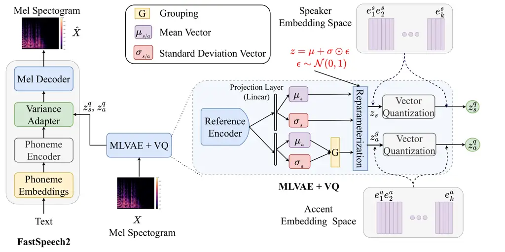
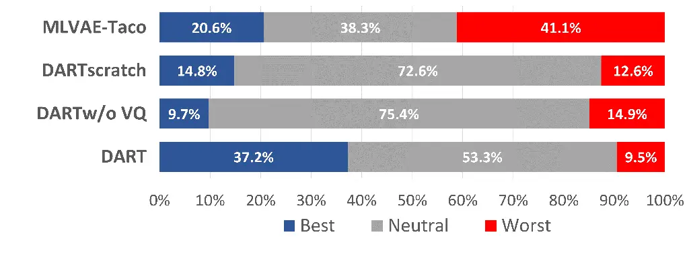
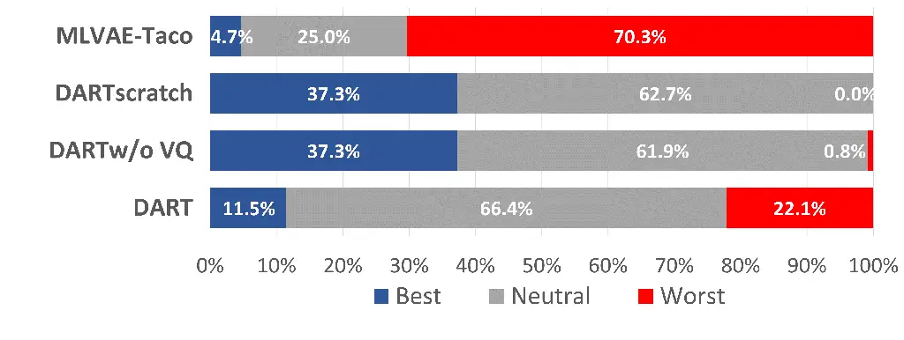
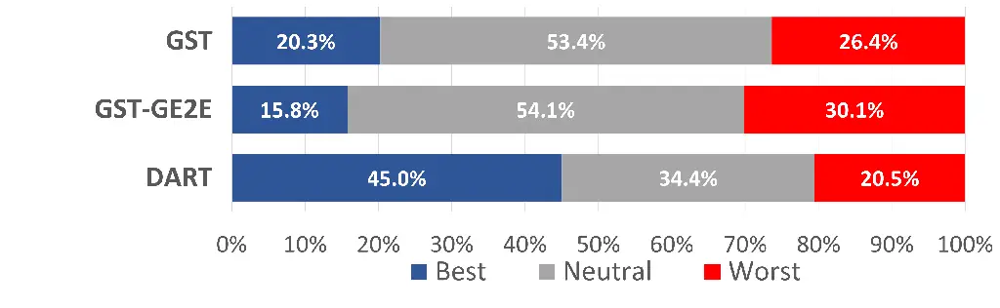
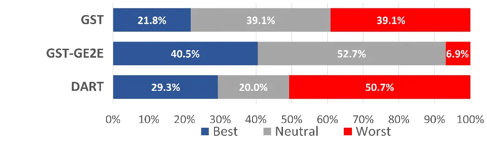
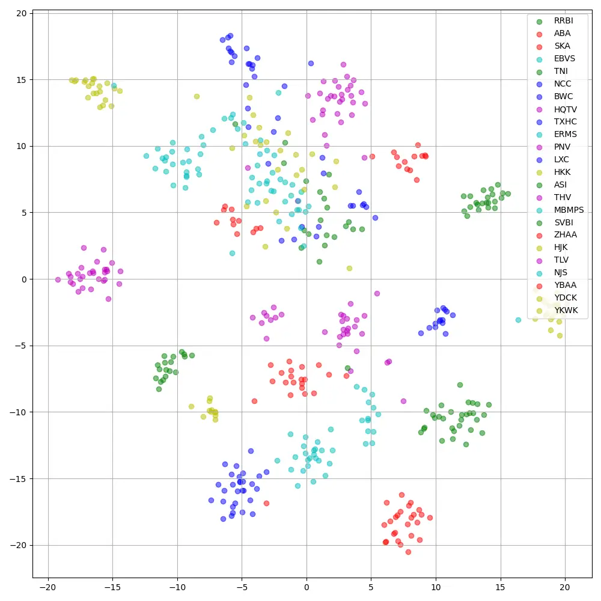
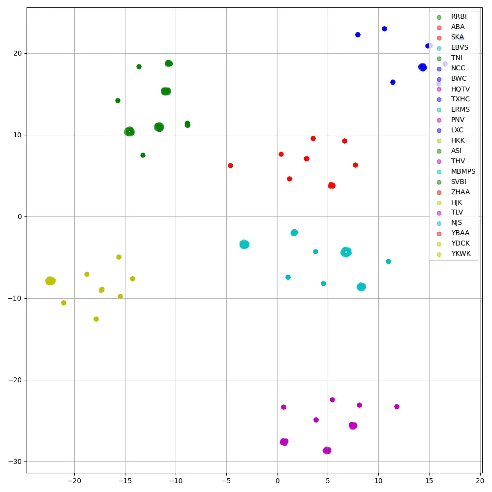
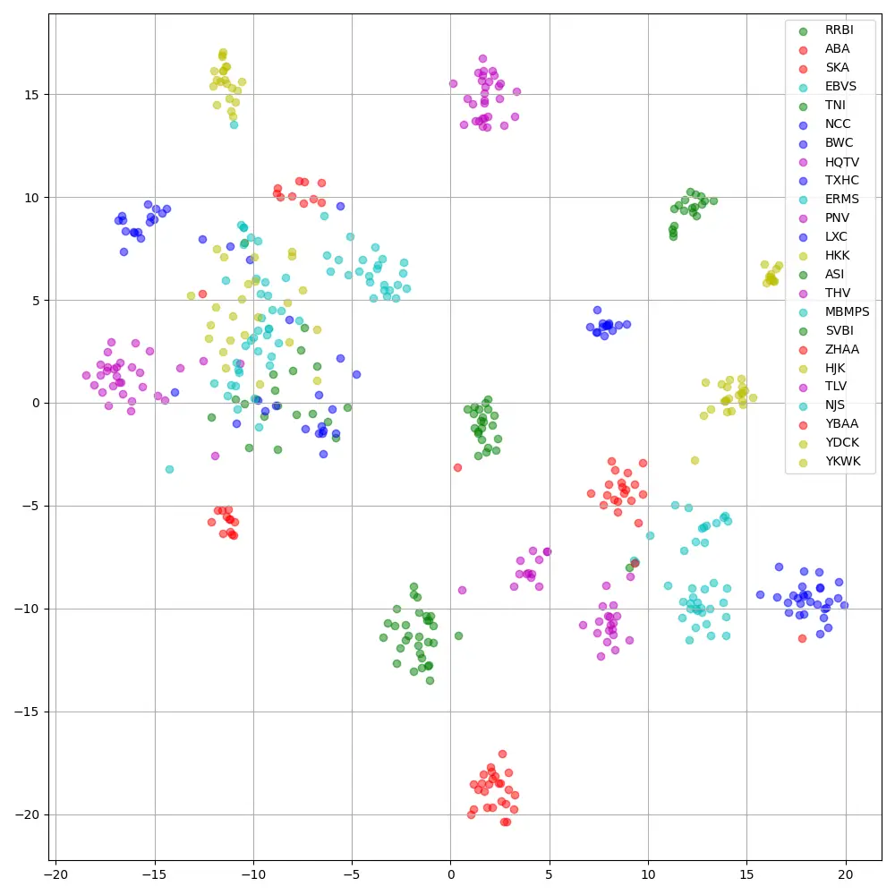

# DART: Disentanglement of Accent and Speaker Representation in Multispeaker Text-to-Speech

Jan Melechovsky^(\*)    Ambuj Mehrish^(\*)    Berrak Sisman^(†)   
Dorien Herremans^(\*) Affiliation: ^(\*)Audio, Music, and AI Lab,
Singapore University of Technology and Design, Singapore
Affiliation: ^(†)Speech & Machine Learning Lab, The University of Texas
at Dallas, USA Email: [jan_melechovsky@mymail.sutd.edu.sg](mailto:)

###### Abstract

Recent advancements in Text-to-Speech (TTS) systems have enabled the
generation of natural and expressive speech from textual input. Accented
TTS aims to enhance user experience by making the synthesized speech
more relatable to minority group listeners, and useful across various
applications and context. Speech synthesis can further be made more
flexible by allowing users to choose any combination of speaker identity
and accent, resulting in a wide range of personalized speech outputs.
Current models struggle to disentangle speaker and accent
representation, making it difficult to accurately imitate different
accents while maintaining the same speaker characteristics. We propose a
novel approach to disentangle speaker and accent representations using
multi-level variational autoencoders (ML-VAE) and vector quantization
(VQ) to improve flexibility and enhance personalization in speech
synthesis. Our proposed method addresses the challenge of effectively
separating speaker and accent characteristics, enabling more
fine-grained control over the synthesized speech. Code and speech
samples are publicly available¹¹ 1
[https://amaai-lab.github.io/DART/](https://amaai-lab.github.io/DART/).

## 1 Introduction

In recent years, Text-to-Speech (TTS) technology has advanced
significantly, allowing high audio quality synthesis in multiple voices
for applications such as voice assistants, audiobooks, and entertainment
\[1\]. Despite their advancements, a significant challenge remains:
effectively disentangling speaker identity and accent representations to
achieve precise and personalized speech synthesis. With globalization,
accents in speech technology are vital for effective communication,
since a listener’s ability to understand a speaker is determined by both
the speaker’s accent and the listener’s familiarity with that particular
accent \[2\]. However, expecting everyone to learn a single standard
accent is impractical. Instead, we should focus on developing
technologies that can generate accents according to the user’s needs.
Accents involve phonetic and prosodic variations influenced by factors
like mother tongue or region \[2, 3\]. Since accent forms a part of
one’s idiolect, it may often overlap with speaker identity \[2\], which
makes the disentanglement a challenge. Successfully disentangling the
two elements would allow for personalized speech synthesis, improving
user experiences for minorities by aligning the system’s accent with
their own to promote intelligibility, thus enhancing interaction with
TTS voice assistants and audiobook narrators.

The introduction of deep learning to TTS pushed the research forward
with models like WaveNet \[4\], Tacotron \[5, 6\], and Fastspeech2
\[7\]. Multi-speaker TTS systems have advanced this field further,
enabling speech synthesis in different voices and styles by training on
diverse datasets with recordings from multiple speakers \[8, 9, 10\].
These systems can mimic accents \[11, 12, 13\] and emotional expressions
\[14, 15\]. Continued research in multi-speaker TTS is expected to
enhance synthesized speech quality and versatility. However, previous
studies (for related works, please see A.1) have not thoroughly explored
disentangling accent and speaker representation, which could unlock the
potential to further improve personalization level and help promote
underrepresented foreign accents. In similar work, Melechovsky et. al.
\[16\] proposed ML-VAE along with Tacotron2 to disentangle speakers and
accents. However, the resulting accent similarity was not shown to be
overwhelming and experiments were done on native accents of English
only. Inspired by this work, we aim to expand on this idea to strive for
even better disentanglement with focus on foreign accents.

In this paper, we propose Disentanglement of Accent and Speaker
RepresenTation DART, which combines Multi-Level Variational Autoencoders
(ML-VAE) \[17\] and Vector Quantization (VQ) \[18\] to learn meaningful
disentangled latent representations for speaker and accent. The ML-VAE
architecture forms the core of accent and speaker identity
disentanglement. Through this variational framework, the model learns a
latent space to represent the two, offering precise control during
speech synthesis. Furthermore, VQ discretizes the continuous latent
variables obtained from the ML-VAE. This discretization maps the
continuous latent space into a predefined codebook of discrete vectors,
reducing the complexity of the latent space and promoting better
separation of speaker and accent embeddings. Through extensive
experiments on diverse accented speech data \[19\], we evaluate the
effectiveness of our proposed approach. Our major contributions are as
follows: (1) We propose a novel architecture for disentangling speaker
and accent representation using ML-VAE and VQ. (2) Through comprehensive
experiments, we demonstrate the critical role of pre-training the TTS
backbone on a multi-speaker English corpus for effective accent
conversion and speaker/accent disentanglement.

## 2 DART

### 2.1 Backbone TTS Model

The first component of DART is the TTS backbone, which closely resembles
Fastspeech2 architecture, comprising of phoneme encoder, Variance
Adapter, and Mel-Decoder, as depicted in Figure 1. To initialize the
backbone, we perform pre-training on LibriTTS, an extensive
multi-speaker dataset. The model is trained using the reconstruction
loss between the predicted mel spectrogram $`\hat{X}`$ and the ground
truth mel spectrogram $`X`$ is computed using Eq 1, where $`||.||_{2}`$
denotes $`L_{2}`$ norm.

```math
L_{recon}=||\hat{X}-X||_{2} \tag{1}
```



Figure 1: Architecture of DART including encoder, the ML-VAE, VQ,
variance adapter, and decoder.

### 2.2 ML-VAE Encoder

ML-VAE \[17\] leverage the hierarchical structure of data to model the
joint distribution of observed data and latent variables across multiple
levels. This allows to encode dependencies among latent variables and
disentangle different factors of variation in data generation.
Additionally, it can utilize grouping information from real-world
datasets, identifying shared variations and learning group-specific
factors. This makes it ideal for datasets with natural grouping or
clustering, such as categorical images or multi-sensor time series data.
The architecture is based on variational inference techniques, which
enable the learning of model parameters and efficient posterior
inference. ML-VAE encodes disentangled representations of grouped
observations characterized by different accents, examining their
influence on underlying speech factors. To achieve latent representation
separation, we utilize two variables: $`z_{s}`$ for speaker-related
variation and $`z_{a}^{g}`$ for accent-related variation, where the
superscript $`g`$ denotes speaker grouping based on accent. These
variables allow us to disentangle distinct factors of variation in
speech data. During ML-VAE training, we optimize an objective function
similar to previous work \[16\]. The ML-VAE effectively captures salient
variation factors in speech while disregarding irrelevant factors.
Interested readers can refer to \[17\] for detail analysis of the ML-VAE
architecture, implementation, and experimental setup. The KL loss
$`\mathcal{L}_{kl}`$ is computed by maximizing the group ELBO over
mini-batches.

### 2.3 Vector Quantization

We extend the ML-VAE framework from \[16\] by integrating VQ into a
unified architecture, DART. Our design incorporates separate VQ modules
for accent and speaker in the ML-VAE encoder (Figure 1, with codebook
dimensions $`d_{i}`$ for speaker ($`s`$) and accent ($`a`$). The
reparametrized speaker $`z_{s}`$ and grouped accent $`z^{g}_{a}`$
representations pass through the VQ layer, acting as a bottleneck
\[18\], filtering out irrelevant information. This integration improves
accent conversion and preserves key information by effectively
disentangling speaker and accent attributes. The VQ block incorporates
an information bottleneck, ensuring effective utilization of codebooks.
We define a latent embedding space
$`e^{i}\in\mathcal{R}^{d_{i}}\times D`$, where $`d_{i}`$ represents the
size of the discrete latent space, $`i\in\{s,a\}`$ denotes speaker and
accent, and $`D`$ corresponds to the dimensionality of each latent
embedding vector $`e^{i}`$. It is important to note that within this
space, $`d_{i}`$ embedding vectors $`e_{j}^{i}\in\mathcal{R}^{D}`$
exist, where $`j`$ ranges from 1 to $`d_{i}`$. To ensure that the
representation sequence effectively commits to an embedding and to
prevent its output from growing, we incorporate a commitment loss,
following prior research \[18\], for each VQ module. This loss helps in
stabilizing the training process:

```math
\mathcal{L}_{c}=||z_{e^{i}}(x)-sg[e^{i}]||^{2}_{2} \tag{2}
```

where $`z_{e^{i}}(x)`$ is the output of the $`i^{th}`$ vector
quantization block ( $`i\in\{s,a\}`$), and $`sg`$ stands for the stop
gradient operator. Finally, by adding the KL loss multiplied by
coefficient $`\beta`$, the total loss for training is computed as:

```math
\mathcal{L}_{total}=\mathcal{L}_{recon}+\beta\mathcal{L}_{kl}+\mathcal{L}_{c} \tag{3}
```

## 3 Experimental Setup and Results

### 3.1 Datasets and Baselines

We use two datasets for training: the train-clean-100 subset of LibriTTS
\[20\] (LTS), and the L2-ARCTIC dataset \[19\]. LTS includes $`247`$
English speakers, whereas the L2-ARCTIC dataset comprises $`24`$ L2
(second-language) speakers representing $`6`$ accents, with each accent
having $`4`$ speakers (two females and two males). The evaluation is
conducted on the L2-ARCTIC validation set.

We train the baselines and the proposed model using two strategies.
First, we train the TTS system from scratch with accented data. Second,
a two-step process where the TTS backbone is initially trained on an
English-only corpus, yielding a pre-trained multispeaker backbone model
which uses GE2E speaker embeddings \[21\], and then fine-tuned with
accented data. In this case, if the model uses GST or ML-VAE modules,
they replace the GE2E speaker embeddings from pre-training. Details on
training parameters and procedure can be found in A.2. We then evaluate
and compare DART’s performance against various TTS architectures with
both autoregressive and non-autoregressive frameworks. We define the
baselines and different variants of the proposed model as follows:

Baselines: MLVAE-Taco represents the TTS architecture proposed in
\[16\]. It consists of Tacotron2 with ML-VAE and is trained with
L2-ARCTIC. Multispk-FS2 is our pre-trained multispeaker FastSpeech2
backbone model, pre-trained on LTS, fine-tuned on L2-ARCTIC. GST-FS2 is
a pre-trained multispeaker FastSpeech2 model with a GST to model
speakers/accents. GST-GE2E-FS2 is a pre-trained multispeaker FastSpeech2
model with a GST to model accents and GE2E embeddings to model speakers.

DART versions: DART*(scratch) represents the proposed architecture,
however, the entire model is trained from scratch on L2-ARCTIC.
DART$`{}*{w/o~VQ}`$ denotes the DART architecture that uses pre-trained
multispeaker TTS as a backbone with ML-VAE but without Vector
Quantization modules in ML-VAE. DART leverages a pre-trained
multi-speaker TTS system as its foundational architecture, enhanced by
the ML-VAE and a Vector Quantization module, as illustrated in Figure 1.
To thoroughly assess the efficacy of our proposed approach, we also
explored various versions of DART with differing codebook sizes
$`d\_{i}`$ of $`512`$, $`128`$, and $`64`$. Based on the objective
results and human evaluation, we chose the size of $`512`$ for further
experiments. More details in A.3.

### 3.2 Objective & Subjective Evaluation

We evaluate timbre and prosody similarity between synthesized and
reference audio using Cosine Similarity (CS) \[22\] and F0 Frame Error
(FFE) \[23\], calculating average CS between embeddings from synthesized
and ground truth data for speaker similarity, while FFE captures
fundamental frequency information by combining voicing decision error
and F0 error metrics. To assess perceptual dissimilarities, we use Mel
Cepstral Distortion (MCD) \[24\], which measures the divergence between
the MFCCs of synthesized and original speech, and compute the WER \[25\]
to measure speech intelligibility using enterprise-grade, pre-trained
Silero speech-to-text.

To assess speech quality and accent-speaker disentanglement, we
conducted subjective listening tests with two groups: AR and NAR. In the
AR group, we compared different variants of DART with ground truth and
speech generated from an autoregressive model (MLVAE-Taco). In the NAR
group, we compared different variants of DART with ground truth and
speech generated from non-autoregressive models (GST-FS2, GST-GE2E-FS2).
In each group, we evaluated naturalness through the Mean Opinion Score
(MOS). Additionally, we aimed to evaluate the accent-speaker
disentanglement by asking listeners to rate accent-converted samples on
both speaker and accent similarity metrics. For this purpose, we
performed Best-Worst Scaling (BWS) tests \[26\] in each group. The
samples in the AR group are evaluated by $`11`$ listeners, whereas
$`12`$ listeners evaluated the samples in the NAR group²² 2 The
evaluators are NLP and speech processing researchers, who are familiar
with subjective evaluation..

|                      |                    |                 |                    |                    |                       |        |             |        |
| -------------------- | ------------------ | --------------- | ------------------ | ------------------ | --------------------- | ------ | ----------- | ------ |
| Objective Evaluation |                    |                 |                    |                    | Subjective Evaluation |        |             |        |
| Metric               | MCD $`\downarrow`$ | CS $`\uparrow`$ | FFE $`\downarrow`$ | WER $`\downarrow`$ | MOS                   | 95% CI | MOS         | 95% CI |
| GT                   | \-                 | \-              | \-                 | 0.137              | 4.510                 | 0.154  | 4.498       | 0.219  |
| Autoregressive       |                    |                 |                    |                    | DART vs AR            |        |             |        |
| MLVAE-Taco           | 6.952              | 0.785           | 0.490              | 0.216              | 2.556                 | 0.213  | \-          | \-     |
| Non-Autoregressive   |                    |                 |                    |                    |                       |        | DART vs NAR |        |
| Multispk-FS2         | 6.952              | 0.850           | 0.426              | 0.174              | \-                    | \-     | 3.335       | 0.297  |
| GST-FS2              | 6.731              | 0.841           | 0.438              | 0.184              | \-                    | \-     | 3.286       | 0.246  |
| GST-GE2E-FS2         | 6.571              | 0.828           | 0.449              | 0.187              | \-                    | \-     | 3.615       | 0.185  |
| DART$`{}_{w/o~VQ}`$  | 6.731              | 0.841           | 0.426              | 0.186              | 3.389                 | 0.189  | \-          | \-     |
| DART₅₁₂              | 6.934              | 0.842           | 0.431              | 0.164              | 3.150                 | 0.162  | 3.346       | 0.133  |
| DART\_(scratch)      | 6.669              | 0.859           | 0.409              | 0.169              | 3.484                 | 0.214  | \-          | \-     |

Table 1: Objective & Subjective evaluation. GT represents the ground
truth.

### 3.3 Results and Discussion

Objective Evaluation: Table 1 presents the objective evaluation results
for various baselines and DART. In both autoregressive (AR) and
non-autoregressive (NAR) baselines, DART demonstrates improvement across
all metrics. Furthermore, DART\_(scratch) achieves the best overall
scores in various objective metrics, e.g., the highest speaker cosine
similarity score of $`0.859`$, demonstrating the effectiveness of the
proposed architecture in multispeaker speech synthesis.



(a) Accent similarity: DART vs AR



(b) Speaker similarity: DART vs AR.



(c) Accent similarity: DART vs NAR



(d) Speaker similarity: DART vs NAR.

Figure 2: Subjective evaluation: Best-Worst-Scaling (BWS).

Subjective Evaluation: We perform comprehensive subjective evaluation as
discussed in Section 3.2 to assess the effectiveness of DART for accent
conversion. In the subjective evaluation results for AR group (Table 1,
Fig. 2), we can observe that all variants of DART outperform MLVAE-Taco
in naturalness and in speaker and accent similarity. Interestingly,
among the different variants, DART₅₁₂ exhibits a slightly lower MOS
score of $`3.150`$ compared to both DART*(scratch) and
DART$`{}*{w/o~VQ}`$. Further analysis of the results reveals that
DART_(scratch) and DART$`{}\_{w/o~VQ}`$ perform poorly in accent
similarity, they achieve higher speaker similarity than DART₅₁₂ (Figure
2(a) & 2(b)). This observation supports our hypothesis that leveraging a
pretrained TTS backbone and VQ aids in the disentanglement with slight
dip in overall naturalness.

Similarly, the MOS (Table 1) and BWS (Figures 2(c) & 2(d)) results for
the NAR group further validate our claim that DART₅₁₂ effectively
disentangles accent and speaker representation. This is evident in
Figure 2(c), where speech samples generated using DART₅₁₂ are preferred
$`45.0\%`$ of the time for accent similarity over GST-FS2 and
GST-GE2E-FS2. It is important to note that the higher speaker similarity
score of GST-GE2E-FS2 is due to its use of state-of-the-art speaker
embedding \[21\] for generating speech samples. Additionally, GST-FS2
fails to effectively capture both accent and speaker characteristics, as
highlighted by the results in Figures 2(c) & 2(d). Furthermore, we want
to highlight that the lower performance in the MOS score for DART₅₁₂ can
be attributed to several factors related to the trade-offs between
accent and speaker similarity. Achieving a perfect balance between
maintaining speaker identity and accurately converting the accent may
result in slightly compromised overall naturalness, as reflected in the
MOS.

Importance of pre-training: We observe that DART*(scratch) and DART₅₁₂
share the same architecture but differ in training strategy.
DART*(scratch) is trained from scratch (Backbone & ML-VAE), while in
DART₅₁₂, the backbone TTS was first pre-trained on a multi-speaker
English corpus, followed by training the ML-VAE with accent data
alongside the TTS backbone. Although DART\_(scratch) demonstrates better
performance in objective metrics, DART₅₁₂ performs significantly better
in accent conversion. We attribute this to DART₅₁₂’s prior knowledge of
many different voices, gained through pre-training, as accent-converted
voices represent new, unseen voices. Thus, there is a trade-off in
designing speech synthesis systems that specifically account for
accents. Pre-training can enhance accent conversion at the cost of a
slight reduction in perceived identity. In future work, we aim to bridge
this gap and simultaneously improve both accent conversion and perceived
identity.

## 4 Conclusion

Our proposed approach significantly enhances the capabilities of
multispeaker TTS models by effectively disentangling speaker and accent
representations, resulting in more flexible and personalized speech
synthesis. This has broad applications in entertainment; personalization
of virtual assistants, narrators; and more. By utilizing ML-VAE and VQ,
our proposed method achieves superior accent conversion. In future work,
we will focus on further advancing the disentanglement between speaker
and accent in multispeaker TTS. This includes addressing the trade-off
between disentanglement and naturalness, expanding datasets and
exploring real-time zero-shot adaptation techniques.

## Acknowledgments and Disclosure of Funding

This project has received funding from SUTD Kickstarter Initiative no.
SKI 2021_04_06.  
The work by Berrak Sisman was funded by NSF CAREER award IIS-2338979.

## References

- \[1\] Ambuj Mehrish, Navonil Majumder, Rishabh Bharadwaj, Rada
  Mihalcea, and Soujanya Poria. A review of deep learning techniques for
  speech processing. Information Fusion, page 101869, 2023.
- \[2\] John C Wells and John Corson Wells. Accents of English: Volume
  1. Cambridge University Press, 1982.
- \[3\] Rosina Lippi-Green. English with an accent: Language, ideology,
  and discrimination in the US. Routledge, 2012.
- \[4\] Aäron van den Oord, Sander Dieleman, Heiga Zen, Karen Simonyan,
  Oriol Vinyals, Alex Graves, Nal Kalchbrenner, Andrew Senior, and Koray
  Kavukcuoglu. Wavenet: A generative model for raw audio. In 9th ISCA
  Speech Synthesis Workshop, pages 125–125.
- \[5\] Yuxuan Wang, RJ Skerry-Ryan, Daisy Stanton, Yonghui Wu, Ron J
  Weiss, Navdeep Jaitly, Zongheng Yang, Ying Xiao, Zhifeng Chen, Samy
  Bengio, et al. Tacotron: Towards end-to-end speech synthesis. arXiv
  preprint arXiv:1703.10135, 2017.
- \[6\] Jonathan Shen, Ruoming Pang, Ron J Weiss, Mike Schuster, Navdeep
  Jaitly, Zongheng Yang, Zhifeng Chen, Yu Zhang, Yuxuan Wang,
  Rj Skerrv-Ryan, et al. Natural tts synthesis by conditioning wavenet
  on mel spectrogram predictions. In 2018 IEEE international conference
  on acoustics, speech and signal processing (ICASSP), pages 4779–4783.
  IEEE, 2018.
- \[7\] Yi Ren, Chenxu Hu, Tao Qin, Sheng Zhao, Zhou Zhao, and Tie-Yan
  Liu. Fastspeech 2: Fast and high-quality end-to-end text-to-speech.
  arXiv preprint arXiv:2006.04558, 2020.
- \[8\] Andrew Gibiansky, Sercan Arik, Gregory Diamos, John Miller,
  Kainan Peng, Wei Ping, Jonathan Raiman, and Yanqi Zhou. Deep voice 2:
  Multi-speaker neural text-to-speech. NeurIPS, 30, 2017.
- \[9\] Jinlong Xue, Yayue Deng, Yichen Han, Ya Li, Jianqing Sun, and
  Jiaen Liang. Ecapa-tdnn for multi-speaker text-to-speech synthesis. In
  2022 13th ISCSLP, pages 230–234. IEEE, 2022.
- \[10\] Jaehyeon Kim, Jungil Kong, and Juhee Son. Conditional
  variational autoencoder with adversarial learning for end-to-end
  text-to-speech. In ICML, pages 5530–5540. PMLR, 2021.
- \[11\] Rui Liu, Berrak Sisman, Guanglai Gao, and Haizhou Li.
  Controllable accented text-to-speech synthesis with fine and
  coarse-grained intensity rendering. IEEE/ACM TASLP, 2024.
- \[12\] Jan Melechovsky, Ambuj Mehrish, Berrak Sisman, and Dorien
  Herremans. Accented text-to-speech synthesis with a conditional
  variational autoencoder. arXiv preprint arXiv:2211.03316, 2022.
- \[13\] Yi Zhou, Zhizheng Wu, Mingyang Zhang, Xiaohai Tian, and Haizhou
  Li. Tts-guided training for accent conversion without parallel data.
  IEEE Signal Processing Letters, 2023.
- \[14\] Chae-Bin Im, Sang-Hoon Lee, Seung-Bin Kim, and Seong-Whan Lee.
  Emoq-tts: Emotion intensity quantization for fine-grained controllable
  emotional text-to-speech. In ICASSP 2022-2022 IEEE International
  Conference on Acoustics, Speech and Signal Processing (ICASSP), pages
  6317–6321. IEEE, 2022.
- \[15\] Yi Lei, Shan Yang, Xinsheng Wang, and Lei Xie. Msemotts:
  Multi-scale emotion transfer, prediction, and control for emotional
  speech synthesis. IEEE/ACM Transactions on Audio, Speech, and Language
  Processing, 30:853–864, 2022.
- \[16\] Jan Melechovsky, Ambuj Mehrish, Dorien Herremans, and Berrak
  Sisman. Learning accent representation with multi-level vae towards
  controllable speech synthesis. In 2022 IEEE Spoken Language Technology
  Workshop (SLT), pages 928–935. IEEE, 2023.
- \[17\] Diane Bouchacourt, Ryota Tomioka, and Sebastian Nowozin.
  Multi-level variational autoencoder: Learning disentangled
  representations from grouped observations. In Proceedings of the AAAI
  Conference on Artificial Intelligence, volume 32, 2018.
- \[18\] Aaron Van Den Oord, Oriol Vinyals, et al. Neural discrete
  representation learning. Advances in neural information processing
  systems, 30, 2017.
- \[19\] Guanlong Zhao, Sinem Sonsaat, Alif Silpachai, Ivana Lucic,
  Evgeny Chukharev, John Levis, and Ricardo Gutierrez. L2-arctic: A
  non-native english speech corpus. In INTERSPEECH, pages
  2783–2787, 2018.
- \[20\] Heiga Zen, Viet Dang, Rob Clark, Yu Zhang, Ron J Weiss, Ye Jia,
  Zhifeng Chen, and Yonghui Wu. Libritts: A corpus derived from
  librispeech for text-to-speech. arXiv preprint arXiv:1904.02882, 2019.
- \[21\] Li Wan, Quan Wang, Alan Papir, and Ignacio Lopez Moreno.
  Generalized end-to-end loss for speaker verification. In 2018 IEEE
  ICASSP, pages 4879–4883. IEEE, 2018.
- \[22\] Najim Dehak, Patrick J Kenny, Réda Dehak, Pierre Dumouchel, and
  Pierre Ouellet. Front-end factor analysis for speaker verification.
  IEEE Transactions on Audio, Speech, and Language Processing,
  19(4):788–798, 2010.
- \[23\] David Talkin and W Bastiaan Kleijn. A robust algorithm for
  pitch tracking (rapt). Speech coding and synthesis, 495:518, 1995.
- \[24\] R. Kubichek. Mel-cepstral distance measure for objective speech
  quality assessment. Communications, Computers and Signal Processing,
  pages 125–128, 1993.
- \[25\] Silero models:pre-trained enterprise-grade stt/tts models and
  benchmarks. Accessed: 2022-07-10.
- \[26\] Jordan J Louviere, Terry N Flynn, and Anthony Alfred John
  Marley. Best-worst scaling: Theory, methods and applications.
  Cambridge University Press, 2015.
- \[27\] Berrak Sisman, Junichi Yamagishi, Simon King, and Haizhou Li.
  An overview of voice conversion and its challenges: From statistical
  modeling to deep learning. IEEE/ACM Transactions on Audio, Speech, and
  Language Processing, 29:132–157, 2020.
- \[28\] Xuexue Zang, Fei Xie, and Fuliang Weng. Foreign accent
  conversion using concentrated attention. In 2022 IEEE International
  Conference on Knowledge Graph (ICKG), pages 386–391, 2022.
- \[29\] Daniel Felps, Heather Bortfeld, and Ricardo Gutierrez-Osuna.
  Foreign accent conversion in computer assisted pronunciation training.
  Speech communication, 51(10):920–932, 2009.
- \[30\] Pamela M Rogerson-Revell. Computer-assisted pronunciation
  training (capt): Current issues and future directions. RELC Journal,
  52(1):189–205, 2021.
- \[31\] Sandesh Aryal, Daniel Felps, and Ricardo Gutierrez-Osuna.
  Foreign accent conversion through voice morphing. In Interspeech,
  pages 3077–3081, 2013.
- \[32\] Daniel Felps and Ricardo Gutierrez-Osuna. Developing objective
  measures of foreign-accent conversion. IEEE Transactions on Audio,
  Speech, and Language Processing, 18(5):1030–1040, 2010.
- \[33\] Mark Huckvale and Kayoko Yanagisawa. Spoken language conversion
  with accent morphing. 2007.
- \[34\] Lifa Sun, Kun Li, Hao Wang, Shiyin Kang, and Helen Meng.
  Phonetic posteriorgrams for many-to-one voice conversion without
  parallel data training. In 2016 IEEE International Conference on
  Multimedia and Expo (ICME), pages 1–6. IEEE, 2016.
- \[35\] Guanlong Zhao, Shaojin Ding, and Ricardo Gutierrez-Osuna.
  Foreign accent conversion by synthesizing speech from phonetic
  posteriorgrams. In Interspeech, pages 2843–2847, 2019.
- \[36\] Zhichao Wang, Wenshuo Ge, Xiong Wang, Shan Yang, Wendong Gan,
  Haitao Chen, Hai Li, Lei Xie, and Xiulin Li. Accent and speaker
  disentanglement in many-to-many voice conversion. In 2021 12th ISCSLP,
  pages 1–5. IEEE, 2021.
- \[37\] Shaojin Ding, G Zhao, and Ricardo Gutierrez-Osuna. Accentron:
  Foreign accent conversion to arbitrary non-native speakers using
  zero-shot learning. Computer Speech & Language, 72:101302, 2022.
- \[38\] Wei-Ning Hsu, Yu Zhang, Ron J Weiss, Heiga Zen, Yonghui Wu,
  Yuxuan Wang, Yuan Cao, Ye Jia, Zhifeng Chen, Jonathan Shen, et al.
  Hierarchical generative modeling for controllable speech synthesis.
  arXiv preprint arXiv:1810.07217, 2018.
- \[39\] Yuxuan Wang, Daisy Stanton, Yu Zhang, RJ-Skerry Ryan, Eric
  Battenberg, Joel Shor, Ying Xiao, Ye Jia, Fei Ren, and Rif A Saurous.
  Style tokens: Unsupervised style modeling, control and transfer in
  end-to-end speech synthesis. In International Conference on Machine
  Learning, pages 5180–5189. PMLR, 2018.
- \[40\] Ping Liang Tan and Robert Peharz. Hierarchical decompositional
  mixtures of variational autoencoders. In ICML, pages 6115–6124.
  PMLR, 2019.
- \[41\] Mingyang Zhang, Xuehao Zhou, Zhizheng Wu, and Haizhou Li.
  Towards zero-shot multi-speaker multi-accent text-to-speech synthesis.
  IEEE Signal Processing Letters, pages 1–5, 2023.
- \[42\] Yi Ren, Chenxu Hu, Xu Tan, Tao Qin, Sheng Zhao, Zhou Zhao, and
  Tie-Yan Liu. Fastspeech 2: Fast and high-quality end-to-end text to
  speech. arXiv preprint arXiv:2006.04558, 2020.
- \[43\] Vassil Panayotov, Guoguo Chen, Daniel Povey, and Sanjeev
  Khudanpur. Librispeech: an asr corpus based on public domain audio
  books. In 2015 IEEE international conference on acoustics, speech and
  signal processing (ICASSP), pages 5206–5210. IEEE, 2015.
- \[44\] Arsha Nagrani, Joon Son Chung, and Andrew Zisserman. Voxceleb:
  a large-scale speaker identification dataset. Telephony,
  3:33–039, 2017.

## Appendix A Appendix / supplemental material

### A.1 Related works in accented speech synthesis

There are a few related works in accented speech synthesis. In Voice
Conversion (VC) \[27, 28\], the sub-field of Foreign Accent Conversion
(FAC) focuses on transforming L2 speaker’s voice to an L1 native accent.
It is oftentimes used for applications like Computer-Assisted
Pronunciation Training (CAPT) \[29, 30\], which aims to help L2 speakers
improve their pronunciation towards a more native-sounding one. Early
FAC methods used spectral or cepstral features from native and
non-native speakers \[31, 32, 29, 33\], while others incorporated
phonetic posteriorgrams (PPGs) to capture phonetic variations \[34, 28,
35\]. Recent advancements leverage deep learning; Wang et al. used
adversarial learning to disentangle accent and speaker identity \[36\],
and Accentron employed ResNet-34 classifiers for accent and speaker
recognition \[37\]. In TTS, some approaches treat accent as a style
component, as seen in GMVAE-Tacotron \[38\] and GST-Tacotron \[39\]. Liu
et al. improved L2 accent intensity using a variance adaptor \[11\].
Melechovsky et al. proposed disentangling accent and speaker with ML-VAE
and Tacotron2 \[12, 16\], achieving results comparable to GMVAE \[40,
38\], while other works \[41\] enhanced encoder-decoder frameworks with
accent ID conditioning for varied phoneme representations.

### A.2 Training parameters

Here, we brielfy describe the training parameters used in our
experiments. The FastSpeech2 \[42\] TTS backbone follows the original
architecture with a hidden state dimension of $`256`$. During training,
the speaker embeddings are added to the text representation in the
variance adapter. Speaker embeddings are computed using a speaker
verification model trained with the GE2E loss \[21\], incorporating
LibriSpeech (train-other-500), Voxceleb1, and Voxceleb2 datasets \[43\],
Voxceleb1, and Voxceleb2 \[44\]. To improve model convergence for
unsupervised duration modeling, variance adapter training begins at 50K
steps. All speech samples are downsampled to $`16`$ kHz. The models are
trained using the Adam optimizer with $`4`$K warmup steps, followed by
annealing at $`300`$K, $`400`$K, and $`500`$K steps, and a total
training duration of $`600`$K steps.

The ML-VAE along with the TTS backbone is fine-tuned using L2-ARCTIC
\[19\], with the text encoder frozen while updating the weights of the
variance adapter, mel-decoder, and ML-VAE module. KL loss coefficient
$`\beta`$ in Eq 3 is set to $`10^{-4}`$. The fine-tuned models,
including DART and DART$`{}_{w/o~VQ}`$, undergo training for $`100K`$
steps to achieve convergence. Meanwhile, the baseline models MLVAE-Taco
and DART\_(scratch), constructed from scratch, are trained for $`200K`$
steps to reach convergence.

| Metric  | MCD $`\downarrow`$ | CS $`\uparrow`$ | FFE $`\downarrow`$ | WER $`\downarrow`$ |
| ------- | ------------------ | --------------- | ------------------ | ------------------ |
| DART₆₄  | 6.972              | 0.842           | 0.425              | 0.161              |
| DART₁₂₈ | 7.019              | 0.842           | 0.427              | 0.168              |
| DART₅₁₂ | 6.934              | 0.842           | 0.431              | 0.164              |

Table 2: Comparative analysis of codebook sizes.

### A.3 Effect of VQ codebook size

Here, we present the objective results for our VQ codebook size
experiment, as seen in Table 2. We observe that while DART₅₁₂ achieves
the best performance in MCD and CS, DART₆₄ demonstrates superior
performance in FFE and WER. This indicates that the choice of codebook
size involves balancing various objective metrics, with smaller sizes
favoring some metrics and larger sizes favoring others. Since the
differences in FFE and WER were negligible and we aimed to select a
model with low distortion and high speaker similarity, we used DART₅₁₂
for subjective evaluation.

### A.4 Plottings of accent and speaker embeddings

The t-SNE plots for accent and speaker embeddings from DART₅₁₂, shown in
Figures 3 (a) and (b), further illustrate the effectiveness of the
ML-VAE and VQ modules in capturing and clustering accent representations
across various speakers. Furthermore, Figure 3 (c) visualizes the
model’s capability to disentangle accent (depicted by different colors)
and speaker attributes, resulting in enhanced accent conversion and
robust accent representation.



(a) Accent embeddings without grouping $`z_{a}`$



(b) Accent embeddings with grouping $`z_{a}^{g}`$



(c) Speaker embeddings $`z_{s}`$

Figure 3: The t-SNE plot demonstrating effective clustering and
disentanglement of accent and speaker embeddings.
