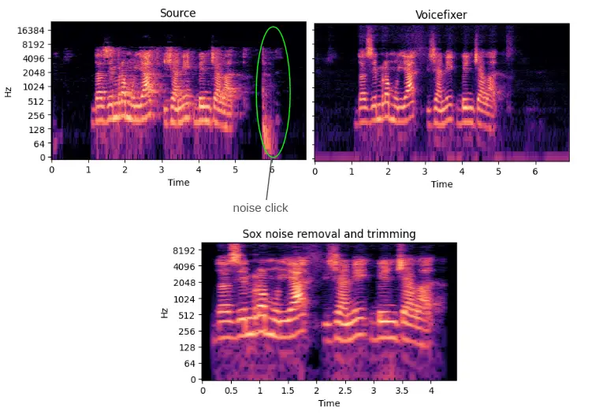
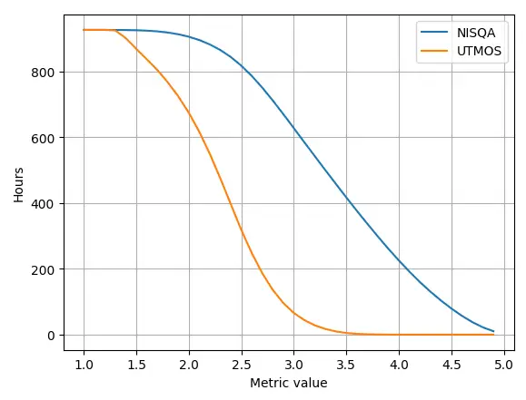
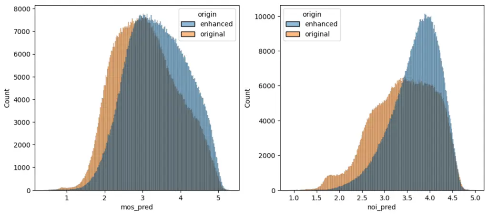

# Enhancing Crowdsourced Audio for Text-to-Speech Models

José Giraldo    Martí Llopart-Font    Alex Peiró-Lilja    Carme
Armentano-Oller    Gerard Sant    Baybars Külebi

###### Abstract

High-quality audio data is a critical prerequisite for training robust
text-to-speech models, which often limits the use of opportunistic or
crowdsourced datasets. This paper presents an approach to overcome this
limitation by implementing a denoising pipeline on the Catalan subset of
Commonvoice, a crowdsourced corpus known for its inherent noise and
variability. The pipeline incorporates an audio enhancement phase
followed by a selective filtering strategy. We developed an automatic
filtering mechanism leveraging Non-Intrusive Speech Quality Assessment
(NISQA) models to identify and retain the highest quality samples
post-enhancement. To evaluate the efficacy of this approach, we trained
a state of the art diffusion-based TTS model on the processed dataset.
The results show a significant improvement, with an increase of 0.4 in
the UTMOS Score compared to the baseline dataset without enhancement.
This methodology shows promise for expanding the utility of crowdsourced
data in TTS applications, particularly for mid to low resource languages
like Catalan.

###### keywords

speech data, text-to-speech, Catalan

^(†)^(†)address: ¹ Barcelona Supercomputing Center (BSC), Spain  
² Centre de Llenguatge i Computació (CLiC), Universitat de Barcelona,
Spain ³ Universität Zürich, Switzerland ^(†)^(†)email:
{jose.giraldo,marti.llopart,alexandre.peiro,carme.armentano,baybars.kulebi}@bsc.es

## 1 Introduction

It is challenging to create multi-speaker text-to-speech (TTS) models
because they rely on high-quality datasets reflecting the traits of each
speaker. These types of datasets are both very scarce and not usually
available for minority languages such as Catalan. Therefore, we had to
find a way to recycle existing datasets for our task at hand.

In recent years, crowdsourced datasets have seen a surge in quantity and
quality, especially in Catalan \[1\]. More specifically, Commonvoice
\[2\] stands out as a large-scale, crowdsourced and open-source
collection of voice recordings created by the Mozilla Common Voice
project. It is designed to provide a diverse and extensive range of
voice data, and it’s mainly used to train and improve automatic speech
recognition (ASR) systems. Commonvoice audio files contain very rich
information about each speaker’s variability, a fundamental aspect
needed to train multi-speaker TTS model. However, the samples from these
datasets are noisy due to their recording conditions. In addition to
background noise, recording artifacts and such, words are usually
mispronounced \[3\]. Hence, the development of a strategy to take
advantage of the existing crowdsourced data for TTS models is highly
desirable in low to mid resource languages.

### 1.1 Related works

There have been some attempts to train multi-speaker TTS models with ASR
datasets. For instance, Deep Voice 3 \[4\] was trained with LibriSpeech
(English ASR dataset) \[5\]. The authors achieved this by using two
preprocessing steps, involving firstly a standard denoising with SoX
\[6\] and secondly a sentence segmentation step with Gentle \[7\]. In
Cantonese, conditional diffusion models have also been used to enhance
mel-spectrograms from an already existing ASR corpus. This technique
includes text information and aims to address multiple types of audio
degradation simultaneously \[8\]. Other researchers trained the
TF-GridNet speech enhancement model to low-resource datasets collected
for ASR in Arabic, to then train a discrete unit-based TTS model on the
enhanced speech \[9\].

Since it is not possible to manually evaluate and filter out the miriad
of audio these datasets contain, there has recently emerged a viable
solution to alleviate this problem: Deep learning (DL) models that
leverage self-supervised representations to estimate the quality of the
audio. These DL models have been tested to be superior than conventional
metrics such as WBPESQ \[10\], STOI \[11\] and scale-invariant
signal-to-distortion ratio (SI-SDR) \[12\], which provide objective
evaluations.

With the help of these novel automatic techniques, there are some papers
where the authors instead opted for using crowdsourced datasets,
successfully so. In previous research, a study used WM-MOS \[13\] to
filter the Commonvoice dataset with the objetive of training a
multi-speaker TTS model for English \[14\]. In their work, they used the
pretrained DPTNet model of Asteroid \[15\] for denoising. For the
pan-African accented English, a study proposed to create a multi-speaker
multi-accent TTS model with a crowdsourced dataset \[16\]. In a similar
study, the Commonvoice dataset was used to create a multi-speaker TTS
model for the Luganda language \[17\]. In this case, before training
they denoised the dataset with a pre-trained speech enhancement model,
\[18\] and then filtered the audio files with WM-MOS.

Other studies trained multispeaker TTS models without removing the noise
from the training datasets, and then applied a filter during the
inference \[19, 20\]. Then, different groups opted for also encoding the
characteristics of the environment within these models \[21\]. Other
metrics, such as the word error rate (WER) or the Mel cepstral
distortion, have been also used to automatically filter out noise from
small datasets \[22, 23\]. Nonetheless, they haven’t yet been applied to
larger datasets. Unfortunately, apart from DL based models, recent
attempts to automatically evaluate speech data have failed to perform
well with previously unseen data \[24, 25\]. This reason had extra
weight with our project, where we are evaluating Catalan speech audio, a
minority language.

In comparison to all of these previous studies, we used Voicefixer
\[26\], which is designed to do audio restoration and has been proven to
outperform single-task models at denoising and declipping at the time of
starting this study. Then, we are using the Commonvoice Catalan dataset,
which contains more hours and has more validation than any other
language. This is a substantial reason for undertaking these denoising
and filtering efforts, given that previous research succeeded with less
data. Then, in our study, we used NISQA \[27\] for automatic speech
quality assessment.

As a continuation, the second section of this paper relates the
different open options for multi-speaker Catalan datasets. Section 3
then walks through the main components of the denoising pipeline while
sections 4 explores how we executed this pipeline to train. Section 5
presents the results of our work and what consequences the different
thresholds of NISQA have over the generated models.

## 2 TTS datasets

A TTS dataset is a collection of pairs of audio files and text
transcriptions, some datasets include an additional column for the
normalized text, however, the most important feature of a good TTS
dataset is the quality of the audio files. These datasets don’t contain
background noises, have been recorded on a professional studio, and the
prosody style is homogeneous per each speaker. Two notable TTS datasets
for the Catalan language are Festcat \[28\] and OpenSLR69 \[29\],
containing respectively 22 and 5 hours of audio material. However, these
corpora are substantially smaller in comparison to widely-used English
TTS datasets, such as VCTK \[30\], with 44 hours of speech and LJSpeech
\[31\] with 24 hours.

Commonvoice \[2\] is a crowdsourced dataset which is mainly used to
train ASR systems. Usually, the audio samples are polluted with
background noises, the equipments used for the recording have low
quality and a high variability between speakers. Commonvoice, in
contrast with the previous Catalan TTS datasets contains more than 3000
hours of audio material.

## 3 Methodology

### 3.1 Dataset

For this paper we used the Commonvoice version 12, which contains
1,783,602 audio clips summing up to 2,721.97 hours of audio material. We
use the validated set which contains 1,866 hours which we filtered to
kept only the speakers that had more than 1400 seconds of audio,
arriving finally to 826,900 clips. It is important to note that 66% of
the corpus contains male samples, while female samples only amount for
the remaining 33%. Also, more than 40% of the dataset contains samples
from people older than 40 years, meaning that there’s a low
representation of the younger population in this dataset.

### 3.2 Enhancement pipeline

Due to the suitability to our dataset, we choose to use Voicefixer
\[26\] for the enhancement phase. In an earlier exploration, we listened
a random set of restored samples with Voicefixer, and the model was able
to denoise and upsample low bandwidth audio from Commonvoice, A common
problem with this dataset is the presence of click noises at the end of
the recording which Voicefixer was able to remove.

Figure 1: Spectrogram of an audio example, previously processed with the
enhancement pipeline

Despite the quality obtained with Voicefixer was quite good, there was a
remaining noise as seen in The figure 1 Because of that, we choose to
remove it using spectral subtraction implementation from SoX

The final version of the audio enhancement pipeline has the following
steps:

1.  1.  Format conversion: Mp3 to Wav using FFmpeg
2.  2.  Enhancement model: Voicefixer enhancement model
3.  3.  Denoise: Get 0.5 seconds from the end of the audio. Build a noise
        profile using the extracted 0.5 seconds. Perform Spectral Noise
        removal using the noise profile with Sox.
4.  4.  Trimming: Remove silences longer than 0.1 seconds and below -55dB
        from both the beginning and the end of the audio. Add padding of 0.1
        seconds of silence at both the start and the end of the audio.

The enhancement pipeline was optimized for CPUs, including the inference
of the VoiceFixer model. For that, we implemented a parallel processing
pipeline to maximize computational efficiency. This optimized
configuration enabled us to process a substantial corpus of 826,900
audio samples in 48 hours. The system demonstrated a high-throughput
performance, achieving an average processing rate of 4.5 audio files per
second. This parallelization strategy significantly reduced the total
processing time, making large-scale audio enhancement feasible on
standard CPU infrastructures without the need for specialized GPU
hardware.

### 3.3 Enhancement model

VoiceFixer is a unified framework for high-fidelity speech restoration.
It can restore speech from multiple distortions (e.g. noise,
reverberation and clipping) and can expand degraded speech (e.g., noisy
speech) with a low bandwidth, to 44.1 kHz full-bandwidth high-fidelity
speech. This model uses a ResUNet to remove the distortions from 128 bin
mel spectrograms, which are later used as inputs to a neural vocoder
that output the final waveform.

### 3.4 Filtering strategy

We chose UTMOS \[32\] and NISQA \[27\] to filter the dataset. NISQA was
developed to asses the speech quality of an audio, and provides
predictions for the quality dimensions of Noisiness, Coloration,
Discontinuity, and Loudness. UTMOS, in contrast is a system trained to
predict mean opinion score (MOS). Both models are open source¹¹ 1 UTMOS:
https://github.com/tarepan/SpeechMOS²² 2 NISQA:
https://github.com/gabrielmittag/NISQA and available to use

Using the aforementioned models, the quality scores were obtained per
each audio, both in the enhanced and the original dataset. This allowed
us to make a relationship between a certain quality threshold and the
number of hours available. Although the NISQA Scores are distributed
over all the range of values between 1 to 5, it’s interesting to see
that,in our enhanced dataset very few UTMOS values go higher than 3.0.

Figure 2: Relationship between hours in the enhanced dataset and
different thresholds based on 2 quality metrics

## 4 Experimental setup

With the filtering strategy, we built 4 subsets of 800, 200, 100 and 50
hours from the enhanced dataset, which respectively corresponds to NISQA
values greater than 2.0, 4.0, 4.4 and 4.6. Rather than using the full
NISQA scale, we opted to investigate the model’s performance as we
progressively reduced the dataset size, starting from the 200 hour
subset (NISQA $`\geq`$ 4.0) as the breaking point for high quality
audio. For that, we halved the duration in subsequent subsets to assess
the impact of data quantity versus quality.  
Additionally, we created a control subset by matching the audio samples
from the 100 hour enhanced subset with their non-enhanced counterparts.
This allows for a direct comparison between enhanced and non-enhanced
data of equivalent content and duration.  
These carefully curated subsets were then used to train separate TTS
systems. Our objective was to evaluate the influence of data curation,
based on automated audio quality metrics, on the final output quality of
the generated speech samples. This experimental design enabled us to
assess the trade-offs between data quantity, audio quality, and the
effectiveness of our enhancement pipeline in improving TTS model
performance.

We used Matcha-TTS \[33\] as architecture for the TTS system, coupled
with a custom espeak-ng ³³ 3 https://github.com/projecte-aina/espeak-ng
backend, to convert input text to IPA phonemes. As a vocoder we used an
adapted version of Vocos \[34\] that was pretrained with Catalan audio.
We trained each of the experiments from scratch for 400K updates, using
a single H100. The learning rate was set to 1e-4 for all the
experiments, with a batch size of 32. Adamw optimizer was used without a
scheduler.

### 4.1 TTS model

Matcha-TTS \[33\] is an encoder-decoder architecture designed for fast
acoustic modelling in TTS. The encoder part is based on a text encoder
and a phoneme duration prediction, that together predict averaged
acoustic features. The decoder essentially has a U-Net backbone inspired
by Grad-TTS \[35\], which is based on the Transformer architecture. In
the latter, by replacing 2D CNNs by 1D CNNs, a large reduction in memory
consumption and fast synthesis is achieved.

## 5 Results

### 5.1 Enhancement pipeline

The enhancement phase resulted in a significant improvement in the Mean
Opinion Score (MOS) dimension of the NISQA metric. We observed an
increase of 0.3 points, raising the average mos score from 3.1 to 3.4.

| MOS scale | Original | Enhanced | Diff |
| --------- | -------- | -------- | ---- |
| 1-2       | 1.78     | 1.79     | 0.01 |
| 2-3       | 2.53     | 2.64     | 0.11 |
| 3-4       | 3.45     | 3.48     | 0.03 |
| 4-5       | 4.39     | 4.40     | 0.01 |

Table 1: NISQA Scores on enhanced and non-enhanced samples.

The effect of the enhancement process is mostly noticeable in the
lower-quality samples, as evidenced by the shift in the distribution of
NISQA scores on Figure 3. Specifically, the enhancement procedure
induces a rightward shift in the lower end of the NISQA score
distribution, increasing the scores of previously low-quality samples.
Conversely, samples initially exhibiting high NISQA scores demonstrate
minimal alteration, suggesting a ceiling effect or diminishing returns
for already high-quality audio. This asymmetric impact on the score
distribution underscores the targeted nature of the enhancement
algorithm, preferentially improving low-quality samples while preserving
the integrity of high-quality recordings.

A similar pattern is observed in the lowest quality samples, which may
be attributed to the limitations of the enhancement algorithm in
reconstructing severely degraded audio signals. This suggests that there
exists a threshold of initial audio quality, below which the enhancement
process becomes ineffective or potentially counterproductive. ⁴⁴ 4
https://langtech-bsc.github.io/tts-enhancement-demo/

Figure 3: Distribution of NISQA scores over the datasets with and
without enhancement.

| Sex    | Original | Enhanced | Diff  |
| ------ | -------- | -------- | ----- |
| Female | 3.19     | 3.379    | 0.185 |
| Male   | 3.076    | 3.424    | 0.348 |

Table 2: NISQA Scores by sex variable.

As seen on Table 2 the enhancement technique appears more effective on
male voices; despite starting lower, male audio achieves slightly better
final quality.

### 5.2 TTS Experiments

We synthesized 15 phonetically balanced sentences using the top 20
speakers with the best quality from the dataset. We then employed the
UTMOS model to get an score of each sentence, allowing us to evaluate
the performance of each trained model. We also obtained the scores of
PESQ, STOI and SI-SDR using the squim model, \[36\] which doesn’t
require a reference audio.

| Enhanced | UTMOS $`\uparrow`$           | PESQ $`\uparrow`$ | STOI $`\uparrow`$ | SI-SDR $`\uparrow`$ |
| -------- | ---------------------------- | ----------------- | ----------------- | ------------------- |
| no       | $`2.54_{\pm 0.06}`$          | 3.19              | 0.95              | 20.14               |
| yes      | $`\mathbf{2.94_{\pm 0.05}}`$ | 3.38              | 0.98              | 22.61               |

Table 3: Comparison of metrics between TTS models trained with and
without the enhancement pipeline

As a first result, applying the enhancement pipeline on the dataset
yields significant improvements across all objective audio quality
metrics. Table 3 presents a comparative analysis of the TTS models
trained with and without the enhancement pipeline. The enhanced dataset
demonstrates superior performance across all measured parameters.
Notably, UTMOS increased from 2.54 to 2.94, indicating a substantial
improvement in perceived speech quality. The Perceptual Evaluation of
Speech Quality (PESQ) score rose from 3.19 to 3.38, suggesting enhanced
speech clarity and intelligibility. Short-Time Objective Intelligibility
(STOI) improved from 0.95 to 0.98, reflecting increased speech
intelligibility. Additionally, the Scale-Invariant Signal-to-Distortion
Ratio (SI-SDR) showed a marked increase from 20.14 to 22.61, indicating
a reduction in background noise. These quantitative improvements
correlate with informal subjective listening assessments, further
validating the efficacy of the enhancement pipeline.

| Hours | UTMOS $`\uparrow`$           | PESQ $`\uparrow`$ | STOI $`\uparrow`$ | SI-SDR $`\uparrow`$ |
| ----- | ---------------------------- | ----------------- | ----------------- | ------------------- |
| 800   | $`2.82_{\pm 0.04}`$          | 3.34              | 0.99              | 22.54               |
| 200   | $`2.92_{\pm 0.05}`$          | 3.30              | 0.99              | 22.22               |
| 100   | $`\mathbf{2.94_{\pm 0.05}}`$ | 3.38              | 0.98              | 22.61               |
| 50    | $`2.90_{\pm 0.05}`$          | 3.33              | 0.99              | 22.27               |

Table 4: Audio Quality metrics for different subsets of the dataset
filtered with NISQA

Based on the data presented in Table 4, we observe an improvement of the
UTMOS score when the models are trained on the filtered high quality
data(NISQA $`\geq`$ 4.0). Contrary to the intuitive assumption that
larger datasets give superior results, our findings reveal that the
100-hour subset, curated through NISQA-based filtering, consistently
outperforms other subsets across multiple quality metrics. This subset
achieved the highest scores in UTMOS (2.94), PESQ (3.38), and SI-SDR
(22.61). All subsets maintained high STOI scores (0.98-0.99), indicating
robust intelligibility across different dataset sizes.

The observed decline in performance metrics for the 50-hour subset
indicates a complex relationship between dataset size and audio quality
filtering policy. For a TTS dataset with varying sample quality, there
exists an optimal balance point between corpus size and filtering
threshold. This optimum represents the most effective trade-off between
data quantity and quality for maximizing TTS model performance. Our
experiments suggest this optimal point in our dataset lies within the
range of 50 to 200 hours of audio data, corresponding to NISQA
thresholds between 4.0 and 4.6. This finding highlights the critical
nature of precise dataset curation. Excessively strict filtering may
lead to diminishing returns due to insufficient training data, while
insufficiently rigorous filtering may introduce detrimental noise into
the training process, compromising model quality.

## 6 Conclusions

We have presented an enhancement and data curation pipeline which is
able to take advantage of crowdsourced datasets in order to train
multispeaker TTS models in low to mid resource scenarios. These results
suggest that in TTS model training, the qualitative aspects of the
dataset can be more critical than sheer quantity. Our NISQA-based
filtering strategy demonstrates its effectiveness in distilling larger
datasets into more refined, quality-centric subsets to reach improved
audio output quality, potentially optimizing the trade-off between
dataset size and model performance.

## 7 Future Work

Given the variability in performance obtained during the enhancement
step, we believe the enhancement pipeline could be improved by making it
adaptable to the specific distortions present in the audio. It would
also be beneficial to test other enhancement models that can be scaled
for large-scale inference. This approach could potentially lead to more
consistent and effective results across a wider range of audio quality
issues.

## 8 Acknowledgements

This work is funded by the Ministerio para la Transformación Digital y
de la Función Pública and Plan de Recuperación, Transformación y
Resiliencia - Funded by EU – NextGenerationEU within the framework of
the project ILENIA with reference 2022/TL22/00215337. Development of the
data and evaluation pipelines of this work has been promoted and
financed by the Generalitat de Catalunya through the Aina project.
Training was performed at Barcelona Supercomputing Center in MareNostrum 5.

## References

- \[1\] C. Armentano-Oller, M. Marimon, and M. Villegas, “Becoming a
  high-resource language in speech: The catalan case in the common voice
  corpus,” in _Proceedings of the 2024 Joint International Conference on
  Computational Linguistics, Language Resources and Evaluation
  (LREC-COLING 2024)_. Torino, Italia: ELRA and ICCL, May 2024, pp.
  2142–2148.
- \[2\] R. Ardila, M. Branson, K. Davis, M. Henretty, M. Kohler,
  J. Meyer, R. Morais, L. Saunders, F. M. Tyers, and G. Weber, “Common
  voice: A massively-multilingual speech corpus,” 2020.
- \[3\] B. Naderi, R. Cutler, and N.-C. Ristea, “Multi-dimensional
  speech quality assessment in crowdsourcing,” 2023.
- \[4\] W. Ping, K. Peng, A. Gibiansky, S. O. Arik, A. Kannan,
  S. Narang, J. Raiman, and J. Miller, “Deep voice 3: Scaling
  text-to-speech with convolutional sequence learning,” 2018.
- \[5\] V. Panayotov, G. Chen, D. Povey, and S. Khudanpur, “Librispeech:
  An asr corpus based on public domain audio books,” in _2015 IEEE
  International Conference on Acoustics, Speech and Signal Processing
  (ICASSP)_, 2015, pp. 5206–5210.
- \[6\] B. Barras, “Sox: Sound exchange,” _Flash informatique_, no. 9,
  pp. 3–6, 2012.
- \[7\] R. Ochshorn and M. Hawkins, “lowerquality/gentle.”
- \[8\] Y. Tian, W. Liu, and T. Lee, “Diffusion-based mel-spectrogram
  enhancement for personalized speech synthesis with found data,” 2023.
- \[9\] Z. Ni, S. Popuri, N. Dong, K. Saijo, X. Zhang, G. L. Lan,
  Y. Shi, V. Chandra, and C. Wang, “Exploring speech enhancement for
  low-resource speech synthesis,” 2023.
- \[10\] A. Rix, J. Beerends, M. Hollier, and A. Hekstra, “Perceptual
  evaluation of speech quality (pesq)-a new method for speech quality
  assessment of telephone networks and codecs,” in _2001 IEEE
  International Conference on Acoustics, Speech, and Signal Processing.
  Proceedings (Cat. No.01CH37221)_, vol. 2, 2001, pp. 749–752 vol.2.
- \[11\] C. H. Taal, R. C. Hendriks, R. Heusdens, and J. Jensen, “An
  algorithm for intelligibility prediction of time–frequency weighted
  noisy speech,” _IEEE Transactions on Audio, Speech, and Language
  Processing_, vol. 19, no. 7, pp. 2125–2136, 2011.
- \[12\] J. L. Roux, S. Wisdom, H. Erdogan, and J. R. Hershey, “Sdr -
  half-baked or well done?” 2018.
- \[13\] P. Andreev, A. Alanov, O. Ivanov, and D. Vetrov, “Hifi++: A
  unified framework for bandwidth extension and speech enhancement,” in
  _ICASSP 2023 - 2023 IEEE International Conference on Acoustics, Speech
  and Signal Processing (ICASSP)_. IEEE, jun 2023.
- \[14\] S. Ogun, V. Colotte, and E. Vincent, “Can we use common voice
  to train a multi-speaker tts system?” in _2022 IEEE Spoken Language
  Technology Workshop (SLT)_, 2023, pp. 900–905.
- \[15\] M. Pariente, S. Cornell, J. Cosentino, S. Sivasankaran,
  E. Tzinis, J. Heitkaemper, M. Olvera, F.-R. Stöter, M. Hu, J. M.
  Martín-Doñas, D. Ditter, A. Frank, A. Deleforge, and E. Vincent,
  “Asteroid: the pytorch-based audio source separation toolkit for
  researchers,” 2020.
- \[16\] S. Ogun, A. T. Owodunni, T. Olatunji, E. Alese, B. Oladimeji,
  T. Afonja, K. Olaleye, N. A. Etori, and T. Adewumi, “1000 african
  voices: Advancing inclusive multi-speaker multi-accent speech
  synthesis,” _arXiv preprint arXiv:2406.11727_, 2024.
- \[17\] S. Kagumire, A. Katumba, J. Nakatumba-Nabende, and J. Quinn,
  “Building a luganda text-to-speech model from crowdsourced data,”
  _arXiv preprint arXiv:2405.10211_, 2024.
- \[18\] A. Defossez, G. Synnaeve, and Y. Adi, “Real time speech
  enhancement in the waveform domain,” 2020.
- \[19\] C. Zhang, Y. Ren, X. Tan, J. Liu, K. Zhang, T. Qin, S. Zhao,
  and T.-Y. Liu, “Denoispeech: Denoising text to speech with frame-level
  noise modeling,” 2020.
- \[20\] W.-N. Hsu, Y. Zhang, R. J. Weiss, Y.-A. Chung, Y. Wang, Y. Wu,
  and J. Glass, “Disentangling correlated speaker and noise for speech
  synthesis via data augmentation and adversarial factorization,” in
  _ICASSP 2019 - 2019 IEEE International Conference on Acoustics, Speech
  and Signal Processing (ICASSP)_, 2019, pp. 5901–5905.
- \[21\] J.-H. R. Chang, A. Shrivastava, H. S. Koppula, X. Zhang, and
  O. Tuzel, “Style equalization: Unsupervised learning of controllable
  generative sequence models,” 2022.
- \[22\] F.-Y. Kuo, S. Aryal, G. Degottex, S. Kang, P. Lanchantin, and
  I. Ouyang, “Data selection for improving naturalness of tts voices
  trained on small found corpuses,” in _2018 IEEE Spoken Language
  Technology Workshop (SLT)_, 2018, pp. 319–324.
- \[23\] E. Cooper, X. Wang, A. Chang, Y. Levitan, and J. Hirschberg,
  “Utterance Selection for Optimizing Intelligibility of TTS Voices
  Trained on ASR Data,” in _Proc. Interspeech 2017_, 2017, pp.
  3971–3975.
- \[24\] C.-C. Lo, S.-W. Fu, W.-C. Huang, X. Wang, J. Yamagishi,
  Y. Tsao, and H.-M. Wang, “Mosnet: Deep learning-based objective
  assessment for voice conversion,” in _Interspeech 2019_. ISCA,
  Sep. 2019.
- \[25\] B. Patton, Y. Agiomyrgiannakis, M. Terry, K. Wilson, R. A.
  Saurous, and D. Sculley, “Automos: Learning a non-intrusive assessor
  of naturalness-of-speech,” 2016.
- \[26\] H. Liu, X. Liu, Q. Kong, Q. Tian, Y. Zhao, D. Wang, C. Huang,
  and Y. Wang, “Voicefixer: A unified framework for high-fidelity speech
  restoration,” in _Interspeech 2022_. ISCA, Sep. 2022.
- \[27\] G. Mittag, B. Naderi, A. Chehadi, and S. Möller, “Nisqa: A deep
  cnn-self-attention model for multidimensional speech quality
  prediction with crowdsourced datasets,” in _Interspeech 2021_. ISCA,
  Aug. 2021.
- \[28\] A. Bonafonte, L. Aguilar, I. Esquerra, S. Oller, and A. Moreno,
  “Recent work on the FESTCAT database for speech synthesis,” in _Proc.
  First Iberian SLTech (SLTech 2009)_, 2009, pp. 131–132.
- \[29\] O. Kjartansson, A. Gutkin, A. Butryna, I. Demirsahin, and
  C. Rivera, “Open-Source High Quality Speech Datasets for Basque,
  Catalan and Galician,” in _Proceedings of the 1st Joint Workshop on
  Spoken Language Technologies for Under-resourced languages (SLTU) and
  Collaboration and Computing for Under-Resourced Languages
  (CCURL)_. Marseille, France: European Language Resources association
  (ELRA), May 2020, pp. 21–27.
- \[30\] J. Yamagishi, C. Veaux, and K. MacDonald, “Cstr vctk corpus:
  English multi-speaker corpus for cstr voice cloning toolkit (version
  0.92),” 2019.
- \[31\] K. Ito and L. Johnson, “The lj speech dataset,” 2017.
  \[Online\]. Available:
  [https://keithito.com/LJ-Speech-Dataset](https://keithito.com/LJ-Speech-Dataset)
- \[32\] T. Saeki, D. Xin, W. Nakata, T. Koriyama, S. Takamichi, and
  H. Saruwatari, “Utmos: Utokyo-sarulab system for voicemos challenge
  2022,” 2022.
- \[33\] S. Mehta, R. Tu, J. Beskow, Éva Székely, and G. E. Henter,
  “Matcha-tts: A fast tts architecture with conditional flow
  matching,” 2024.
- \[34\] H. Siuzdak, “Vocos: Closing the gap between time-domain and
  fourier-based neural vocoders for high-quality audio synthesis,” 2023.
- \[35\] V. Popov, I. Vovk, V. Gogoryan, T. Sadekova, and M. A. Kudinov,
  “Grad-tts: A diffusion probabilistic model for text-to-speech,”
  _CoRR_, vol. abs/2105.06337, 2021.
- \[36\] A. Kumar, K. Tan, Z. Ni, P. Manocha, X. Zhang, E. Henderson,
  and B. Xu, “Torchaudio-squim: Reference-less speech quality and
  intelligibility measures in torchaudio,” 2023.
