# Speech Synthesis From Continuous Features Using Per-Token Latent Diffusion

Arnon Turetzky^(1,2,§), Avihu Dekel^(2,§), Nimrod Shabtay^(2,3), Slava
Shechtman²,  
David Haws², Hagai Aronowitz², Ron Hoory², Yossi Adi¹ Affiliation: ¹The
Hebrew University of Jerusalem Affiliation: ²IBM Research
Affiliation: ³Tel Aviv University Affiliation: ^(§)Core Contributors

###### Abstract

We present SALAD, a zero-shot TTS (TTS) autoregressive model operating
over continuous speech representations. SALAD utilizes a per-token
diffusion process to refine and predict continuous representations for
the next time step. We compare our approach against a discrete variant
of SALAD as well as publicly available zero-shot TTS systems, and
conduct a comprehensive analysis of discrete versus continuous modeling
techniques. Our results show that SALAD achieves superior
intelligibility while matching the speech quality and speaker similarity
of ground-truth audio.

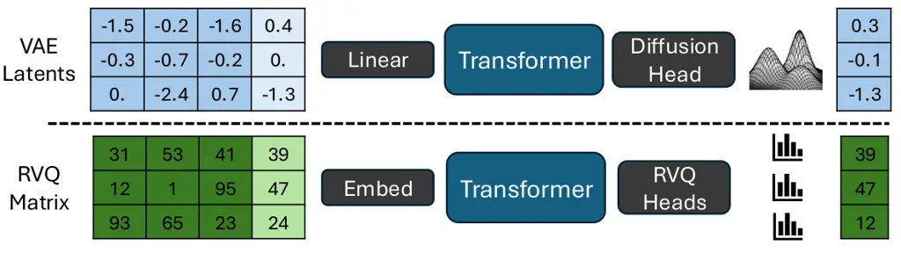

Fig. 1: Continuous vs. discrete modeling

## I Introduction

Discrete AR (AR) models have become the leading approach in natural
language processing. Their remarkable success has motivated researchers
to extend these models to image and speech domains. Modeling continuous
domains with discrete approaches typically involves quantization. In
image generation, quantization is often realized using discrete
autoencoders \[41\], which are further optimized with adversarial losses
\[12, 32, 13\]. In audio generation, techniques like Residual Vector
Quantization (RVQ) \[45, 11\] iteratively quantize the residual,
producing multiple discrete codes per frame that can be modeled
autoregressively \[12, 42, 10\].

While presenting impressive results, discrete approaches have several
limitations. First, modeling multiple dependent streams simultaneously
is inherently complex and often requires additional strategies like
two-stage modeling \[42, 7, 46\] or token interleaving \[10\]. Second,
similarity among consecutive codec codes has been shown to cause
robustness issues, leading to continuous stretches of silence or
persistent noise \[7\]. Third, quantization methods inherently impose a
fidelity upper-bound, constrained by continuous representations such as
mel-spectrogram features \[30\]. This raises the question: _Can we
optimize an AR model to directly generate high-quality speech over
continuous features?_

Recently, several studies have explored language modeling with
continuous-valued tokens. In image generation, GIVT \[40\] proposes
representing the continuous distribution of images obtained by a VAE
using a GMM (GMM), while AR-Diffusion \[23\] suggests a per-token image
diffusion head to model similar representations. For speech generation,
\[25\] presented an AR modeling approach over mel spectrograms,
incorporating a Gaussian sampling module followed by a post-net.
Concurrently with our work, \[24\] propose a similar modeling approach
to GIVT but for spoken data.

Inspired by AR-Diffusion \[23\], we propose SALAD (Speech synthesis with
Autoregressive LAtent Diffusion), an autoregressive per-token latent
diffusion model for zero-shot speech synthesis over continuous features.
By operating directly in continuous space, SALAD eliminates the need for
signal quantization, thus enabling higher-fidelity speech generation. As
an autoregressive model, SALAD also naturally supports variable-length
outputs, addressing a fundamental challenge not encountered in
fixed-length image generation methods. We use semantic tokens \[16, 1,
9\] which are not used for signal synthesis but rather to enhance
robustness and define the generation-stopping condition.

We evaluate SALAD against the discrete representation alternative
employing RVQ quantization, specifically following the delay prediction
pattern introduced by \[10\] (see Figure 1). Additionally, we compare
SALAD with two leading publicly available zero-shot TTS systems,
XTTS \[5\] and VoiceCraft \[27\]. Our experimental results demonstrate
that SALAD achieves superior intelligibility and maintains speech
quality and speaker similarity comparable to ground-truth audio, as
confirmed by both objective metrics and subjective listening tests ¹¹ 1
Samples available at:
[https://s3.us-south.objectstorage.softlayer.net/zk-wav-data/Webpages/SynthesisPerTokenLatentDiffusion/index.html](https://s3.us-south.objectstorage.softlayer.net/zk-wav-data/Webpages/SynthesisPerTokenLatentDiffusion/index.html).

Our contributions:  (i) We introduce SALAD, the first autoregressive
per-token latent diffusion model for zero-shot speech synthesis directly
over continuous acoustic representations, eliminating the need for
discrete quantization. (ii) We empirically demonstrate that continuous
latent diffusion modeling can surpass discrete modeling approaches in
intelligibility and match them in quality and speaker similarity. (iii)
Through comprehensive experiments and ablation studies, we analyze the
advantages and trade-offs of continuous versus discrete speech modeling,
providing practical insights into the design of zero-shot speech
generation models.

## II Related Work

Zero-Shot TTS.  Inspired by the success of in-context learning, there
has been significant interest in zero-shot TTS systems that generalize
to unseen speakers during inference, offering flexibility and improved
quality \[42\]. Zero-shot TTS methods typically formulate the task as
language modeling over text and audio tokens, leveraging short speaker
prompts to synthesize speech aligned with the target speaker’s voice
characteristics \[22, 38, 47, 27\]. Our method follows this paradigm but
operates directly over continuous speech representations.

Semantic Tokens.  Quantized embeddings from self-supervised audio
models, termed semantic tokens \[16, 1, 9\], capture phonetic and
prosodic information beneficial for speech synthesis \[18, 17, 4\],
unconditional audio generation \[3\], and multimodal text-audio
tasks \[35\]. SALAD utilizes semantic tokens as an auxiliary
representation defining a precise stopping condition for continuous
acoustic modeling.

RVQ Codes Prediction.  Discrete audio generation methods commonly
utilize Residual Vector Quantization (RVQ), involving multiple
quantization layers \[45, 11\]. Methods such as AudioLM \[3\] flatten
RVQ codes into sequences, whereas others, like Vall-E \[42\], employ
two-stage prediction approaches or token interleaving strategies \[10\].
Differently, SALAD  directly predicts a continuous latent space, thus
avoiding the need to predict multiple residuals codes.

Continuous Models.  When learning a continuous distribution, recent
works typically use diffusion models, which were developed to sample
from complex continuous probability distributions, inspired by
non-equilibrium thermodynamics \[14\]. Several works attempt to
synthesize speech using a diffusion process, which has the challenge of
generating variable length outputs \[19, 6, 28\]. For that end, most
diffusion-based works rely on a duration predictor that predicts the
audio length in advance, which might be inferior to determining the
length on-the-fly during synthesis \[38, 22\]. MELLE \[25\] predicts Mel
spectrograms autoregressively using a Gaussian sampling module, and
parameterizes the next frame using a Gaussian distribution, which
restricts it to learn only unimodal distributions. MELLE relies on an
additional binary classifier that indicates when to stop, which is a
highly imbalanced classification problem. In contrast, SALAD operates on
VAE latent tokens, which allows sampling diverse inputs while training,
and uses a diffusion head, capable of modeling multimodal distributions.
SALAD relies on semantic-tokens to determine the stopping condition, a
more balanced representation which also provides contextual information.

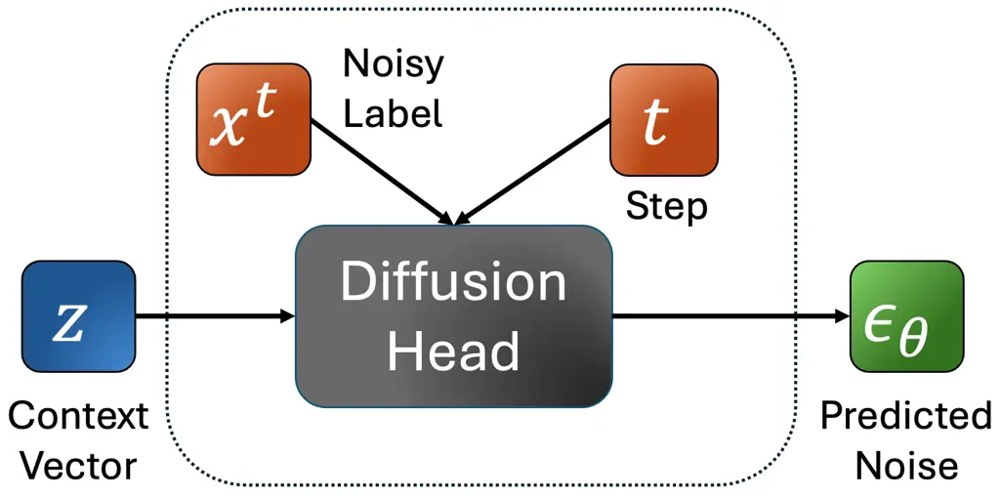

(a) Training


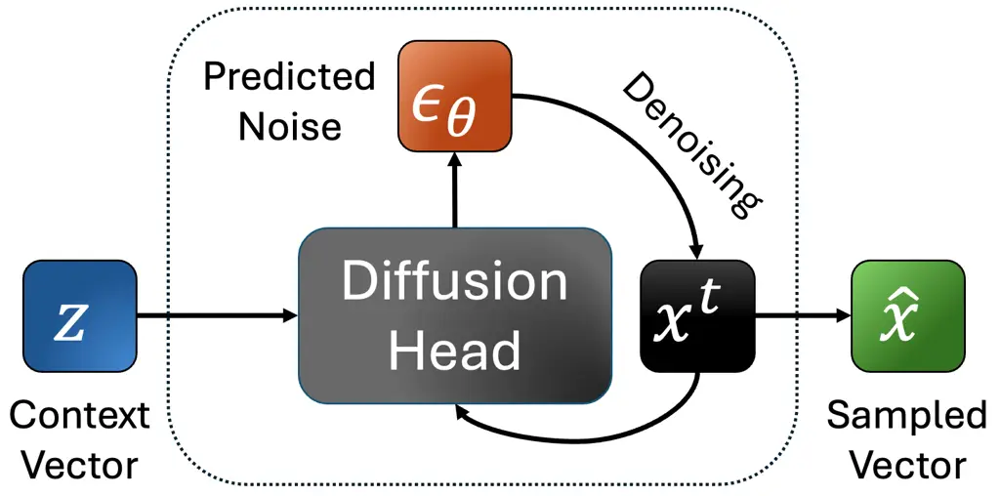

(b) Inference

Fig. 2: The per-token diffusion head

## III Background

Definitions.  We denote the raw audio sequence as
$`\boldsymbol{a}=(a_{1},...,a_{m})`$ where $`a_{i}\in[-1,1]`$ with
sampling rate $`f_{S}`$. The text is $`\boldsymbol{y}=(y_{1},..,y_{k})`$
where $`y_{i}\in\mathcal{A}`$, and $`\mathcal{A}`$ is the text
vocabulary. We obtain compressed audio representations using a
variational autoencoder (VAE), trained with adversarial losses to obtain
high-fidelity reconstructions. The VAE’s encoder $`\mathcal{E}`$
predicts a sequence of means and variances of normal distribution:
$`(\mu_{1},...,\mu_{n}),(\sigma^{2}_{1},...,\sigma^{2}_{n})=\mathcal{E}(\boldsymbol{a})`$
where $`\sigma_{i},\mu_{i}\in\mathbb{R}^{d}`$ and $`d`$ is the VAE
bottleneck dimension. The VAE downsamples the sequence with a stride
$`r`$. We sample $`x_{i}\sim\mathcal{N}(\mu_{i},\sigma_{i}^{2})`$ and
denote $`\boldsymbol{x}=(x_{1},..,x_{n})`$ as the continuous acoustic
tokens. Hereafter, we refer to these continuous VAE latents
interchangeably as acoustic tokens or continuous acoustic
representations, following prior usage in speech-diffusion
literature\[25\]. The VAE’s decoder $`\mathcal{D}`$ is used for
reconstruction
$`\hat{a}_{1},...,\hat{a}_{m}=\mathcal{D}(x_{1},..,x_{n}).`$ We also
extract semantic tokens and denote them by
$`\boldsymbol{w}=(w_{1},..,w_{m})`$, which have the same downsampling
stride as the VAE. Our goal is to predict the audio based on the desired
text and the speaker prompt. Denoting the speaker prompt latent features
as $`\boldsymbol{s}=s_{1},...,s_{p}`$, our training objective can be
formulated by: $`p(\boldsymbol{x}|\boldsymbol{y},\boldsymbol{s})`$.

Diffusion Process.  A diffusion process starts from a continuous signal,
and gradually destroys it using a forward noise process. Our method
performs latent diffusion, and attempts to predict the VAE latent
vectors $`x_{1},...,x_{n}`$. Given noising coefficients
$`\beta_{0},...,\beta_{T}`$ and some continuous vector $`x`$, we define
$`x^{0}=x`$ and $`\epsilon\sim\mathcal{N}(0,I)`$; the Markov structure
is $`x^{t}=\sqrt{1-\beta_{t}}x^{t-1}+\sqrt{\beta_{t}}\epsilon`$. This
iterative denoising process can be simplified. By defining
$`\alpha_{t}=1-\beta_{t}`$ and
$`\bar{\alpha}_{t}=\prod^{t}_{i=1}\alpha_{i}`$, we get that
$`x^{t}=\sqrt{\bar{\alpha_{t}}}x+\sqrt{1-\bar{\alpha_{t}}}\epsilon`$.
The diffusion process is often defined such that
$`\bar{\alpha}_{T}\to 0`$ and $`x^{T}`$ distributes closely to the
standard normal distribution. Diffusion models $`\epsilon_{\theta}`$ are
trained to perform the reverse diffusion process, which denoises the
corrupted signal by predicting the added noise. Their denoising loss is
defined as
$`\mathcal{L}(x)=\mathbb{E}_{\epsilon,t}\left[\|\epsilon-\epsilon_{\theta}(t,x^{t})\|^{2}\right]`$.
Most diffusion models operate on a sequence $`x_{1},..,x_{n}`$ and
attempt to denoise all tokens in parallel using
$`\epsilon_{\theta}(t,x_{1}^{t},...,x_{n}^{t})`$.

Per-Token Diffusion Head.  \[23\] proposed an MLP diffusion head for
image generation. Unlike standard diffusion models, the diffusion head
denoises each token independently, which gives additional flexibility
when defining the conditioning information (e.g., predicting on
previously predicted tokens). The authors rely on a transformer model
$`\Theta`$ that extracts contextual per-token conditioning vectors
$`z_{1},..,z_{n}`$ based on the input features and optional context
vectors that we denote by $`C`$

```math
\boldsymbol{z}=z_{1},...,z_{n}=\Theta(C,x_{1},...,x_{n}).
```

The diffusion head (noise estimator) $`\epsilon_{\theta}`$ takes a
contextual conditioning vector $`z`$ and attempts to model the
continuous distribution $`p(x|z)`$. Given a target token $`x`$, a
diffusion process is being applied conditioned on $`z`$. The loss is:

```math
\mathcal{L}(x,z)=\mathbb{E}_{\epsilon,t}\left[\|\epsilon-\epsilon_{\theta}(x^{t},t,z)\|^{2}\right]. \tag{1}
```

During training, $`t\sim[T],\epsilon\sim\mathcal{N}(0,I)`$ is sampled
for each token $`x`$, resulting in noisy targets $`x^{t}`$, and
$`\mathcal{L}(x,z)`$ is minimized. See Figure 2(a). The denoising
network is trained jointly with the transformer $`\Theta`$, and the
gradient with respect to $`z`$ is propagated to the transformer. $`K`$
different values of $`t,\epsilon`$ may be sampled for a given context
vector and target $`z,x`$, with the additional complexity of just the
MLP head rather than the entire model. During inference, a continuous
vector is sampled from $`x^{T}\sim\mathcal{N}(0,I)`$ and the final
result is obtained from the reverse diffusion process (see Figure 2(b)):

```math
x^{t-1}=\frac{1}{\sqrt{\alpha_{t}}}\left(x^{t}-\frac{\beta_{t}}{\sqrt{1-\bar{\alpha}_{t}}}\epsilon_{\theta}(x^{t},t,z)\right)+\sqrt{\beta_{t}}\epsilon. \tag{2}
```

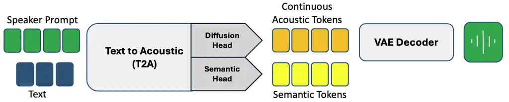

Fig. 3: System overview. Conditioned on text $`t`$ and a speaker prompt
$`s`$, SALAD emits semantic tokens $`w`$ and acoustic latents $`x`$,
which a VAE decoder converts to waveform.

## IV SALAD

SALAD is an end-to-end zero-shot TTS model, that given text and a
speaker prompt autoregressively predicting continuous VAE latents
$`\boldsymbol{x}`$ using per-token latent diffusion. Our method utilizes
semantic tokens $`\boldsymbol{w}`$ as an auxiliary representation that
provides contextual information and determines the stopping condition.
We project both the semantic and acoustic representations into a shared
space, and sum them to obtain a fused representation. We adopt the delay
pattern suggested by \[10\], such that each acoustic token $`x_{i}`$ is
predicted based on the semantic token $`w_{i}`$, for which we define
$`r_{i}=f(w_{i},x_{i-1})`$.

Formally, model predicts both discrete semantic tokens and continuous
acoustic tokens autoregressively, based on the text and speaker, using a
causal transformer:

```math
p\!\big((w_{1},x_{0}),\ldots,(w_{n},x_{n-1})\mid t,s\big)\\
=\prod_{i=1}^{n}p\!\big((w_{i},x_{i-1})\mid t,s,r_{1},\ldots,r_{i-1}\big). \tag{3}
```

For each autoregressive step $`i`$, we extract contextual features from
our transformer backbone, based on the text and speaker prompt
$`z_{i}=\Theta(t,s,r_{1},...r_{i})`$, which is used to predict
$`w_{i+1}`$ using the cross-entropy loss $`L_{s}`$ by the MLP head, and
$`x_{i}`$ using the diffusion loss $`L_{a}`$ by the diffusion head (see
the system overview in Figure 3). We halt the generation once the
semantic prediction head samples an EOS token. We note that audio
duration is predicted on the-fly based on the model’s predictions,
unlike most diffusion-based TTS models, where the audio duration is
predetermined.

## V Experiments

### V-A Experimental Setup

Datasets.  We train our models on the English subset of multi-lingual
LibriSpeech (MLS) \[29\], which contains 10M examples of 10-20 seconds,
resulting in 45K hours. To avoid over-exposure of a few speakers, we
limit the maximal number of utterances per speaker to 10K, resulting in
5.2M examples. We evaluate all models on LibriSpeech test-clean \[26\],
which consists of 2620 utterances by 40 speakers. All speakers in the
test set are excluded from the training set. We filter the dataset to
utterances with lengths of 8-25 seconds, and then limit to at most 15
samples per speaker, resulting in 564 utterances for evaluation.

Tokenization.  To derive acoustic tokens, we train continuous
$`\beta`$-VAE-GAN, with a varying bottleneck dimension
$`d\in\left\{8,16,24,32\right\}`$, and set the KL-divergence
regularization to $`\beta=5\cdot 10^{-5}`$, as done in \[40\]. We also
train discrete RVQ-GAN models with $`q\in\left\{4,8,12\right\}`$
codebooks, each with 1024 entries. In addition, we apply quantizer
dropout \[45\] with $`p=0.5`$. All compression models are trained on
MLS-English, DAPS, LibriTTS, LibriTTS-R and LJ-Speech, which balance
between high and mid quality recordings \[37\]. The all-training
hyperparameters follow the original recipe proposed by \[21\]. We
extract semantic tokens by quantizing the embeddings of the 11th layer
of W2V-BERT \[2\] using minibatch K-means with 1024 centroids.

Architecture.  We use a transformer backbone with $`d=1024`$,
$`d_{ff}=4096`$, $`24`$ layers, $`16`$ heads, sinusoidal positional
embedding, GeLU activation, and a dropout rate of $`0.1`$, resulting in
models with roughly $`350`$M parameters. VAE embeddings are projected
using a linear layer, while RVQ tokens are embedded using $`Q`$ lookup
tables, which are summed into a single embedding. We use Classifier-Free
Guidance (CFG) \[15\] and randomly omit the speaker prompt with
$`p=0.1`$ during training.

RVQ codes are predicted using a $`Q`$ MLP heads with four hidden layers.
For discrete distributions we apply top $`k=10`$ sampling, with a
temperature of $`\tau=1`$, a repetition penalty of $`1.05`$, and a CFG
scale of $`\alpha=3`$.

We use a diffusion process with $`T=1000`$ steps, where betas are
logarithmicly spaced between $`\beta_{0}=2e-4`$ and $`\beta_{T}=0.03`$.
Our per-token diffusion head is an MLP network with 12 residual layers,
that predicts the noise $`\epsilon`$ given the transformer embedding
vector $`z`$, the noisy input $`x^{t}`$, and the diffusion step $`t`$.
Each residual block consists of layer normalization, linear layer, SiLU
activation, and dropout with $`p=0.1`$. During inference, we apply
$`20`$ diffusion steps for sampling, with a default noise scale of
$`1`$. We use the AdamW optimizer, with $`lr_{max}=3e-4`$ and
$`lr_{min}=3e-5`$, weight decay $`0.1`$, and a clip gradient norm of
$`1`$, and train with FP16 mixed precision. We linearly warm up the
learning rate from $`lr_{min}`$ across 32K iterations to $`lr_{max}`$
and decay the learning rate back to $`lr_{min}`$ over 300K steps using a
cosine schedule. Each global batch size has $`\sim`$150K acoustic
tokens. Each model was trained with 8 A100 80GB GPUs.

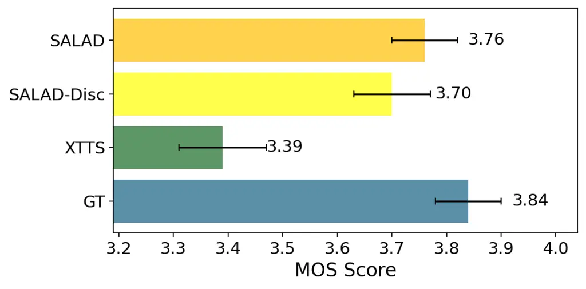

(a) MOS Listening Test (1-5 scale)

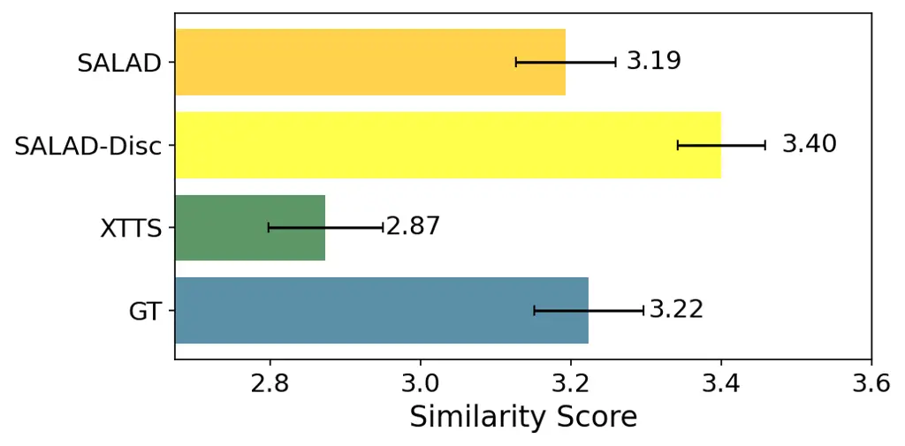

(b) Speaker Similarity Listening Test (1-4 scale)

Fig. 4: Subjective listening results

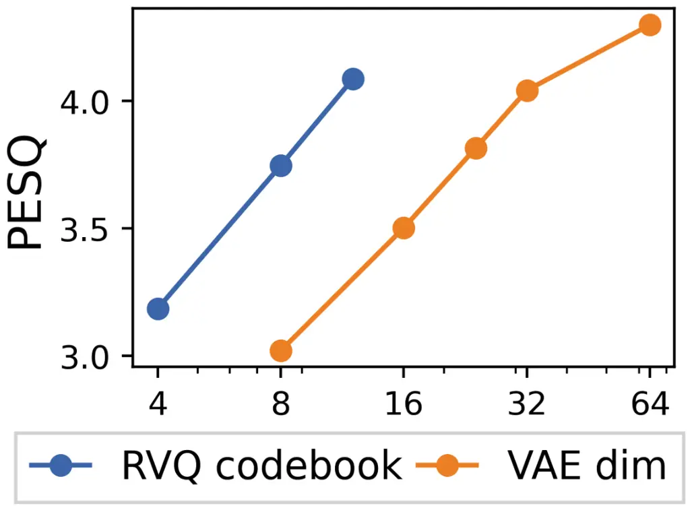

(a) VQ/VAE reconstruction

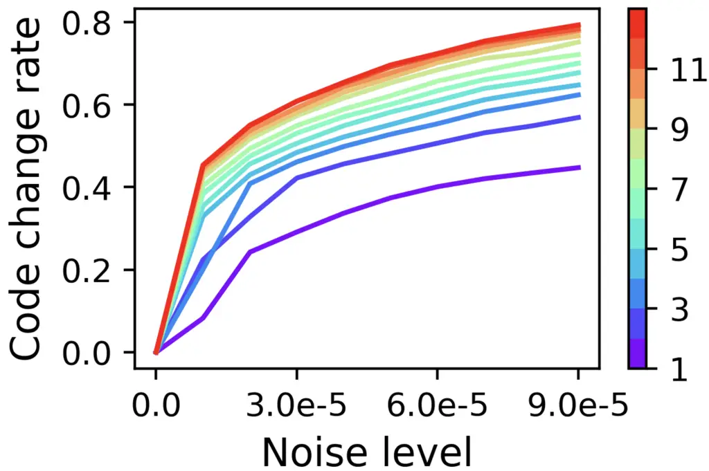

(b) Codewise Noise sensitivity

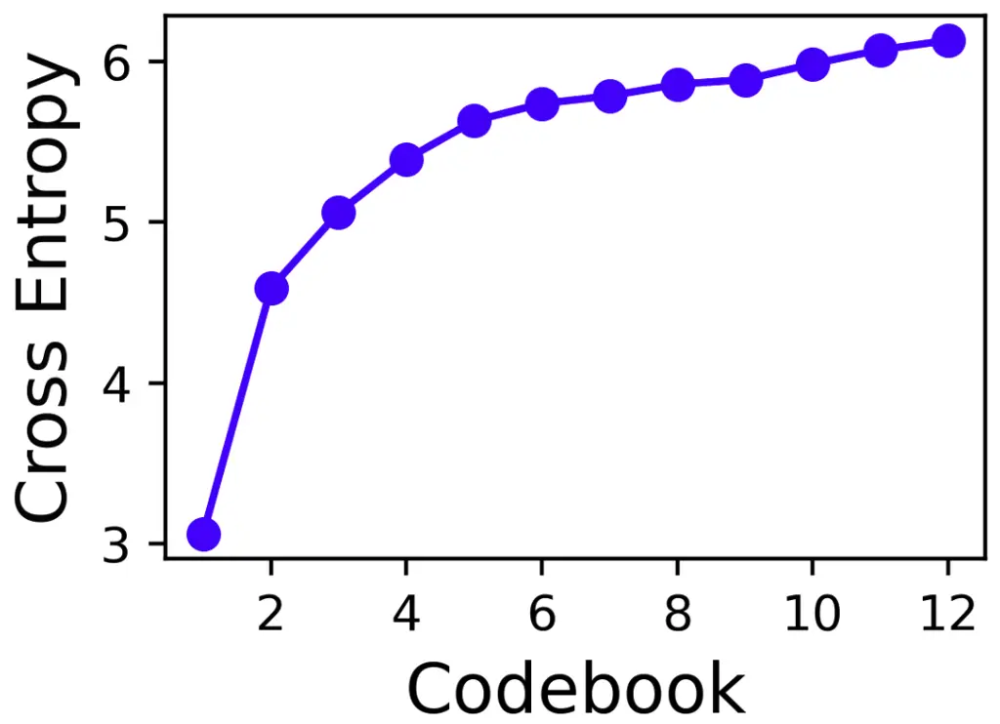

(c) Codewise cross entropy loss

Fig. 5: High-fidelity RVQ codes

| Model      | Type  | UTMOS | CER   | Sim.  |
| ---------- | ----- | ----- | ----- | ----- |
| GT         | –     | 4.121 | 0.528 | 0.736 |
| XTTS       | Disc. | 3.91  | 0.787 | 0.544 |
| VoiceCraft | Disc. | 3.986 | 4.067 | 0.598 |
| SALAD      | Disc. | 4.27  | 2.298 | 0.600 |
| SALAD      | Cont. | 4.28  | 0.739 | 0.539 |

TABLE I: Objective evaluation of LibriSpeech test-clean

Metrics.  We measure Audio Quality using UTMOS \[36\] which produces a
quality score in the range of 1-5 (higher is better). Intelligibility is
measured by the character error rate (CER) in percentages (%) between
the ground-truth text and the Whisper transcripts \[31\] of the
synthesized audio. Speaker Similarity is measured by the cosine
similarity to the prompt, comparing the embedding of WavLM-TDNN \[8\], a
popular speaker verification model. This metric was also reported in
Vall-E and subsequent studies \[42, 7\]. The similarity score predicted
is in the range of $`[-1,1]`$, where a larger value indicates a higher
similarity.

For the subjective listening tests, we selected one random utterance for
every speaker in LibriSpeech test-clean (20 female and 20 male
speakers), resulting in 40 utterances for evaluation. For each sample,
we selected a three-second-long speaker prompt from another random
utterance of the same speaker. Each system synthesizes the desired
utterance based on the same text and speaker prompt. All experiments
were conducted on the Amazon Mechanical Turk crowd-sourcing platform
with votes collected from 39-58 subjects qualified as *masters* \[39\].

In the first listening test we assess speech quality and naturalness by
the standard 5-point scale Mean Opinion Score (MOS)  \[33\]. 25 distinct
subjects assessed each utterance. We report the average scores and the
95% confidence interval.

In the second listening test we asses the Speaker Similarity by a
4-level pairwise similarity test, as in \[43, 20\], where subjects were
presented with (utterance, prompt) pairs and asked to rank speaker
similarity of each pair on a 4-level categorical scale (definitely
different speakers, probably different speakers, probably the same
speaker, definitely the same speaker). Each utterance was assessed by 20
distinct subjects on average. We report the mean similarity score and
the 95% confidence interval while attaching 1-4 numerical values to the
above categories, as in \[20\].

We further compare SALAD with two leading publicly available zero-shot
TTS systems: XTTS \[5\], run with its official package using default
inference settings; and VoiceCraft \[27\], using the
$`330M_{T}TSEnhanced`$ model configured for top-k sampling (k = 40),
nucleus sampling (p = 1), temperature = 1, and repetition penalty = 3.
The VoiceCraft authors report that this configuration outperforms their
reimplementation of VALL-E2\[7\], which we do not include directly in
our evaluation, as it is not publicly available and its demo set is too
limited for reliable batch metrics.

### V-B Results

Subjective Evaluation.  We conduct the two subjective listening tests,
described above, to compare the following systems: (1) Ground Truth
audio (2) XTTSv2 \[5\] (3) SALAD (4) SALAD - Discrete. Figure 4(a)
reports the mean opinion score (MOS) results, suggesting that the
difference between the ground-truth audio (GT) to SALAD is statistically
insignificant ($`p>0.01`$). Figure 4(b) presents the speaker similarity
average score with 95% confidence intervals, suggesting similar or
better speaker similarity scores for all the systems but XTTSv2. More
precise analysis with two-sided Wilkinson rank-sum test \[44\] reveals
that SALAD  do not differ ($`p>>0.01`$) from the GT in terms of speaker
similarity, while SALAD-discrete is marginally better than the GT
($`p=0.0105`$).

Objective Evaluation.  We evaluate all models on zero-shot TTS. Given a
text and a three-second speaker prompt, which is taken randomly from
another utterance of the same speaker, the model attempts to synthesize
the audio with the identity and prosody similar to the prompt. All
models use the same random prompt for each sample.

Table I shows that SALAD achieves superior intelligibility (lowest CER)
making it the most reliable model when having to synthesize an exact
text, with comparable UTMOS quality to the discrete baseline. However,
in terms of speaker similarity SALAD  is comparable to XTTS but the
discrete baseline is superior.

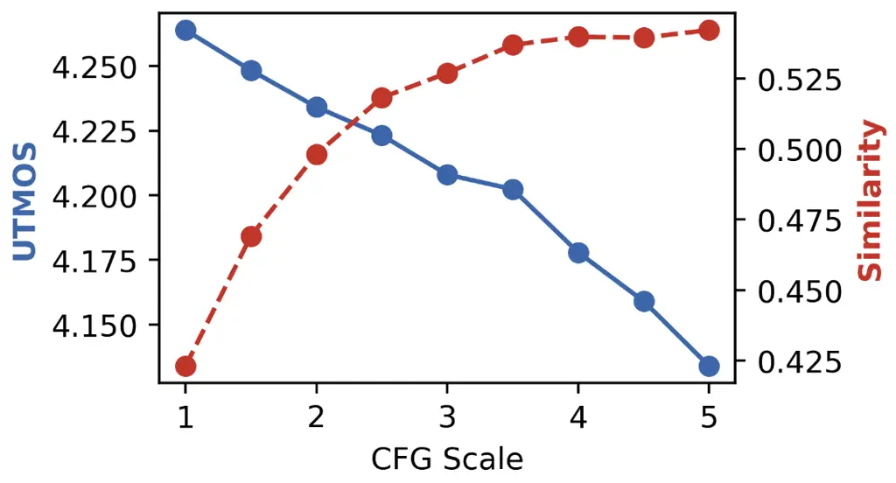

(a) CFG scale

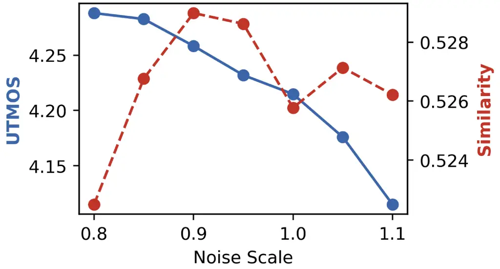

(b) Noise scale

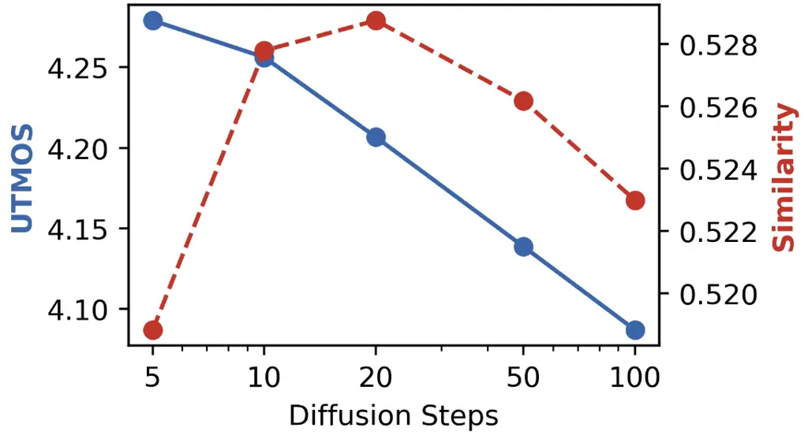

(c) Diffusion steps

Fig. 6: Inference hyperparameters influence

### V-C Ablation Study

High-Fidelity Modeling.  When increasing the number of RVQ codebooks or
the VAE embedding dimension, the reconstruction quality increases, but
language modeling can be difficult \[38\]. Figure 5(a) shows the
reconstruction quality measured by PESQ \[34\], for different numbers of
RVQ codebooks and VAE embedding dimensions. One concern regarding RVQ
modeling is that the fine codes quantize noise, leading to a high
gradient contribution of random classification problems. We measure the
noise sensitivity per codebook by adding Gaussian noise into raw
samples, compressing them with the RVQ model, and checking the ratio of
change per codebook. Figure 5(b) suggests that fine codebooks are more
noise-sensitive. Figure 5(c) shows per-codebook validation cross-entropy
loss in the discrete 12-codebook model, indicating difficulty in
reducing uncertainty in finer codebooks. This occurs despite the delay
pattern in Section IV, where finer RVQ levels are conditioned on coarser
layers of the same frame. Finally, we compare the generation quality
with less-compressed representations. Table II shows that higher
fidelity causes a greater intelligibility drop in the high-fidelity
discrete model than in the continuous model.

VAE Sampling  Unlike discrete codebooks or Mel spectrograms, VAE models
enable diverse sampling, which may enhance robustness and mitigate the
mismatch between training and inference(where prediction rely on
previous noisy outputs). To validate this, we compare two SALAD models -
one sampling from the VAE distribution $`x=\mu+\epsilon\cdot\sigma`$ and
the other using only the mean $`x=\mu`$. The results presented in
Table III, show a large gap in UTMOS and intelligibility indicating that
sampling improves synthesized quality. Listening to VAE-NoSample outputs
we observed increasing speaker-inconsistency artifacts, likely due to
the absence of sampling noise during training. We suspect this noise
improves robustness, and we hypothesize that the high similarity score
of VAE-NoSample results from these artifacts.

Inference Hyperparameters  We investigate CFG, noise scale and the
number diffusion steps. In every experiment, we fix all values to the
default inference values following those described in Section V, and
change only a single hyperparameter. The CFG linear extrapolation
coefficient increases the speaker similarity, but degrades the automatic
quality metric, as seen in Figure 6(a). Next, we scale the noise level
added in each diffusion step by scaling the $`\beta_{t}\epsilon`$ term
in Equation 2, and see improvements in similarity but degradation in the
UTMOS quality score (Figure 6(b)). We also examine the number of
diffusion steps, which improve similarity until reaching 20 diffusion
steps, and also degrade UTMOS (Figure 6(c)).

|                   |                    |                                |                         |
| ----------------- | ------------------ | ------------------------------ | ----------------------- |
|                   | UTMOS $`\uparrow`$ | Intelligibility $`\downarrow`$ | Similarity $`\uparrow`$ |
| Continuous (d=32) | 4.271              | 1.157                          | 0.545                   |
| Discrete (Q=12)   | 4.203              | 5.461                          | 0.597                   |

TABLE II: Discrete vs. continuous SALAD  with high-fidelity
representations. Intelligibility (CER) and Similarity (speaker
similarity) are defined in Section. V (Metrics).

## VI Discussion

Compressing complex signals like audio and images involves a tradeoff
between perception and generation. While compression can degrade
perception by losing information, it benefits generation by simplifying
the learned distribution. Developing generative methods for
less-compressed representations could help mitigate this tradeoff.
Though RVQ enables high-fidelity compression, it may quantize noise.
Using continuous representations can be more robust to noise, as
continuous models scale the noise according to its magnitude.

Future work.  Our approach could be extended by developing multimodal
models capable of both perception and generation. Additionally,
exploring generation stopping conditions that do not rely on discrete
representations would be valuable. Adaptive inference strategies, such
as adjusting the number of diffusion steps per token (e.g., using more
steps for early tokens), could improve efficiency. Finally, developing
quality metrics for the diffusion process could enable the use of
decoding algorithms like beam search during inference.

Limitations  The diffusion head inference process is slower than the RVQ
prediction heads, as it requires an iterative process for the token
sampling. Moreover, it does not allow to measure likelihood or
confidence, which can be useful for decoding algorithms such as beam
search or confidence based unmasking. Optimal balancing of the discrete
and continuous losses in SALADis not easy to obtain. During training,
the gradients of the discrete semantic loss increase, while the
gradients of the continuous diffusion loss decrease.

Ethical Statement  SALAD is capable of zero-shot voice cloning, which
presents potential risks, including misuse for voice spoofing. To
mitigate these risks, it is essential to implement strict protocols that
verify and ensure the speaker’s consent and authorization before their
voice is used in any real-world application, especially when dealing
with previously unseen speakers. Safeguards must be in place to prevent
unauthorized use and protect individuals’ privacy and identity.

|          |                    |                                |                         |
| -------- | ------------------ | ------------------------------ | ----------------------- |
|          | UTMOS $`\uparrow`$ | Intelligibility $`\downarrow`$ | Similarity $`\uparrow`$ |
| Sample   | 4.280              | 0.739                          | 0.539                   |
| NoSample | 3.468              | 1.891                          | 0.613                   |

-0.2cm

TABLE III: Influence of VAE sampling during training

AI Tools Usage  AI-based tools may have assisted in code writing and
paraphrasing, but all content was thoroughly reviewed by the authors and
used only as a support tool.

## Acknowledgment

This research work was partially supported by Mobileye Academic Grant
Program and by the Israel Innovation Authority, grant number 78563.

## References

- \[1\] A. Baevski, Y. Zhou, A. Mohamed, and M. Auli (2020) Wav2vec 2.0:
  a framework for self-supervised learning of speech representations.
  Advances in neural information processing systems 33, pp. 12449–12460.
  Cited by: §I, §II.
- \[2\] L. Barrault, Y. Chung, M. C. Meglioli, D. Dale, N. Dong, M.
  Duppenthaler, P. Duquenne, B. Ellis, H. Elsahar, J. Haaheim, et
  al. (2023) Seamless: multilingual expressive and streaming speech
  translation. arXiv preprint arXiv:2312.05187. Cited by: §V-A.
- \[3\] Z. Borsos, R. Marinier, D. Vincent, E. Kharitonov, O.
  Pietquin, M. Sharifi, D. Roblek, O. Teboul, D. Grangier, M.
  Tagliasacchi, and N. Zeghidour (2023) AudioLM: a language modeling
  approach to audio generation. External Links:
  [Link](https://doi.org/10.48550/arXiv.2209.03143), 2209.03143 Cited
  by: §II, §II.
- \[4\] Z. Borsos, M. Sharifi, D. Vincent, E. Kharitonov, N. Zeghidour,
  and M. Tagliasacchi (2023) Soundstorm: efficient parallel audio
  generation. arXiv preprint arXiv:2305.09636. Cited by: §II.
- \[5\] E. Casanova, K. Davis, E. Gölge, G. Göknar, I. Gulea, L.
  Hart, A. Aljafari, J. Meyer, R. Morais, S. Olayemi, et al. (2024)
  XTTS: a massively multilingual zero-shot text-to-speech model. arXiv
  preprint arXiv:2406.04904. Cited by: §I, §V-A, §V-B.
- \[6\] N. Chen, Y. Zhang, H. Zen, R. J. Weiss, M. Norouzi, and W.
  Chan (2020) Wavegrad: estimating gradients for waveform generation.
  arXiv preprint arXiv:2009.00713. Cited by: §II.
- \[7\] S. Chen, S. Liu, L. Zhou, Y. Liu, X. Tan, J. Li, S. Zhao, Y.
  Qian, and F. Wei (2024) VALL-e 2: neural codec language models are
  human parity zero-shot text to speech synthesizers. arXiv preprint
  arXiv:2406.05370. Cited by: §I, §V-A, §V-A.
- \[8\] S. Chen, C. Wang, Z. Chen, Y. Wu, S. Liu, Z. Chen, J. Li, N.
  Kanda, T. Yoshioka, X. Xiao, J. Wu, L. Zhou, S. Ren, Y. Qian, Y.
  Qian, J. Wu, M. Zeng, X. Yu, and F. Wei (2022) WavLM: large-scale
  self-supervised pre-training for full stack speech processing. IEEE
  Journal of Selected Topics in Signal Processing 16 (6), pp. 1505–1518.
  External Links:
  [Document](https://dx.doi.org/10.1109/JSTSP.2022.3188113) Cited by:
  §V-A.
- \[9\] Y. Chung, Y. Zhang, W. Han, C. Chiu, J. Qin, R. Pang, and Y.
  Wu (2021) W2v-bert: combining contrastive learning and masked language
  modeling for self-supervised speech pre-training. In 2021 IEEE
  Automatic Speech Recognition and Understanding Workshop (ASRU),
  pp. 244–250. Cited by: §I, §II.
- \[10\] J. Copet, F. Kreuk, I. Gat, T. Remez, D. Kant, G. Synnaeve, Y.
  Adi, and A. Défossez (2024) Simple and controllable music generation.
  Advances in Neural Information Processing Systems 36. Cited by: §I,
  §I, §I, §II, §IV.
- \[11\] A. Défossez, J. Copet, G. Synnaeve, and Y. Adi (2022) High
  fidelity neural audio compression. arXiv preprint arXiv:2210.13438.
  Cited by: §I, §II.
- \[12\] P. Esser, R. Rombach, and B. Ommer (2021) Taming transformers
  for high-resolution image synthesis. In Proceedings of the IEEE/CVF
  conference on computer vision and pattern recognition,
  pp. 12873–12883. Cited by: §I.
- \[13\] O. Gafni, A. Polyak, O. Ashual, S. Sheynin, D. Parikh, and Y.
  Taigman (2022) Make-a-scene: scene-based text-to-image generation with
  human priors. In European Conference on Computer Vision, pp. 89–106.
  Cited by: §I.
- \[14\] J. Ho, A. Jain, and P. Abbeel (2020) Denoising diffusion
  probabilistic models. Advances in neural information processing
  systems 33, pp. 6840–6851. Cited by: §II.
- \[15\] J. Ho and T. Salimans (2022) Classifier-free diffusion
  guidance. arXiv preprint arXiv:2207.12598. Cited by: §V-A.
- \[16\] W. Hsu, B. Bolte, Y. H. Tsai, K. Lakhotia, R. Salakhutdinov,
  and A. Mohamed (2021) Hubert: self-supervised speech representation
  learning by masked prediction of hidden units. IEEE/ACM transactions
  on audio, speech, and language processing 29, pp. 3451–3460. Cited by:
  §I, §II.
- \[17\] R. Huang, C. Zhang, Y. Wang, D. Yang, L. Liu, Z. Ye, Z.
  Jiang, C. Weng, Z. Zhao, and D. Yu (2023) Make-a-voice: unified voice
  synthesis with discrete representation. arXiv preprint
  arXiv:2305.19269. Cited by: §II.
- \[18\] E. Kharitonov, D. Vincent, Z. Borsos, R. Marinier, S.
  Girgin, O. Pietquin, M. Sharifi, M. Tagliasacchi, and N.
  Zeghidour (2023) Speak, read and prompt: high-fidelity text-to-speech
  with minimal supervision. External Links:
  [Link](https://doi.org/10.48550/arXiv.2302.03540), 2302.03540 Cited
  by: §II.
- \[19\] Z. Kong, W. Ping, J. Huang, K. Zhao, and B. Catanzaro (2020)
  Diffwave: a versatile diffusion model for audio synthesis. arXiv
  preprint arXiv:2009.09761. Cited by: §II.
- \[20\] Z. Kons, S. Shechtman, A. Sorin, R. Hoory, C. Rabinovitz,
  and E. D. S. Morais (2018) Neural tts voice conversion. In 2018 IEEE
  Spoken Language Technology Workshop (SLT), pp. 290–296. Cited by:
  §V-A.
- \[21\] R. Kumar, P. Seetharaman, A. Luebs, I. Kumar, and K.
  Kumar (2024) High-fidelity audio compression with improved rvqgan.
  Advances in Neural Information Processing Systems 36. Cited by: §V-A.
- \[22\] M. Le, A. Vyas, B. Shi, B. Karrer, L. Sari, R. Moritz, M.
  Williamson, V. Manohar, Y. Adi, J. Mahadeokar, et al. (2024) Voicebox:
  text-guided multilingual universal speech generation at scale.
  Advances in neural information processing systems 36. Cited by: §II,
  §II.
- \[23\] T. Li, Y. Tian, H. Li, M. Deng, and K. He (2024) Autoregressive
  image generation without vector quantization. arXiv preprint
  arXiv:2406.11838. Cited by: §I, §I, §III.
- \[24\] W. Lin and C. HE (2025) Continuous autoregressive modeling with
  stochastic monotonic alignment for speech synthesis. In The Thirteenth
  International Conference on Learning Representations, External Links:
  [Link](https://openreview.net/forum?id=cuFzE8Jlvb) Cited by: §I.
- \[25\] L. Meng, L. Zhou, S. Liu, S. Chen, B. Han, S. Hu, Y. Liu, J.
  Li, S. Zhao, X. Wu, et al. (2024) Autoregressive speech synthesis
  without vector quantization. arXiv preprint arXiv:2407.08551. Cited
  by: §I, §II, §III.
- \[26\] V. Panayotov, G. Chen, D. Povey, and S. Khudanpur (2015)
  Librispeech: an asr corpus based on public domain audio books. In 2015
  IEEE international conference on acoustics, speech and signal
  processing (ICASSP), pp. 5206–5210. Cited by: §V-A.
- \[27\] P. Peng, P. Huang, D. Li, A. Mohamed, and D. Harwath (2024)
  VoiceCraft: zero-shot speech editing and text-to-speech in the wild.
  arXiv preprint arXiv:2403.16973. Cited by: §I, §II, §V-A.
- \[28\] V. Popov, I. Vovk, V. Gogoryan, T. Sadekova, and M.
  Kudinov (2021) Grad-tts: a diffusion probabilistic model for
  text-to-speech. In International Conference on Machine Learning,
  pp. 8599–8608. Cited by: §II.
- \[29\] V. Pratap, Q. Xu, A. Sriram, G. Synnaeve, and R.
  Collobert (2020) Mls: a large-scale multilingual dataset for speech
  research. arXiv preprint arXiv:2012.03411. Cited by: §V-A.
- \[30\] K. C. Puvvada, N. R. Koluguri, K. Dhawan, J. Balam, and B.
  Ginsburg (2024) Discrete audio representation as an alternative to
  mel-spectrograms for speaker and speech recognition. In ICASSP
  2024-2024 IEEE International Conference on Acoustics, Speech and
  Signal Processing (ICASSP), pp. 12111–12115. Cited by: §I.
- \[31\] A. Radford, J. W. Kim, T. Xu, G. Brockman, C. McLeavey, and I.
  Sutskever (2023) Robust speech recognition via large-scale weak
  supervision. In International conference on machine learning,
  pp. 28492–28518. Cited by: §V-A.
- \[32\] A. Ramesh, M. Pavlov, G. Goh, S. Gray, C. Voss, A. Radford, M.
  Chen, and I. Sutskever (2021) Zero-shot text-to-image generation. In
  International conference on machine learning, pp. 8821–8831. Cited by:
  §I.
- \[33\] F. Ribeiro, D. Florêncio, C. Zhang, and M. Seltzer (2011)
  Crowdmos: an approach for crowdsourcing mean opinion score studies. In
  2011 IEEE international conference on acoustics, speech and signal
  processing (ICASSP), pp. 2416–2419. Cited by: §V-A.
- \[34\] A. W. Rix, J. G. Beerends, M. P. Hollier, and A. P.
  Hekstra (2001) Perceptual evaluation of speech quality (pesq)-a new
  method for speech quality assessment of telephone networks and codecs.
  In 2001 IEEE international conference on acoustics, speech, and signal
  processing. Proceedings (Cat. No. 01CH37221), Vol. 2, pp. 749–752.
  Cited by: §V-C.
- \[35\] P. K. Rubenstein, C. Asawaroengchai, D. D. Nguyen, A. Bapna, Z.
  Borsos, F. d. C. Quitry, P. Chen, D. E. Badawy, W. Han, E. Kharitonov,
  et al. (2023) Audiopalm: a large language model that can speak and
  listen. arXiv preprint arXiv:2306.12925. Cited by: §II.
- \[36\] T. Saeki, D. Xin, W. Nakata, T. Koriyama, S. Takamichi, and H.
  Saruwatari (2022) Utmos: utokyo-sarulab system for voicemos challenge 2022. arXiv preprint arXiv:2204.02152. Cited by: §V-A.
- \[37\] S. Shechtman and A. Dekel (2024) Low bitrate high-quality
  rvqgan-based discrete speech tokenizer. In Interspeech 2024,
  pp. 4174–4178. External Links:
  [Document](https://dx.doi.org/10.21437/Interspeech.2024-2366), ISSN
  2958-1796 Cited by: §V-A.
- \[38\] K. Shen, Z. Ju, X. Tan, Y. Liu, Y. Leng, L. He, T. Qin, S.
  Zhao, and J. Bian (2023) Naturalspeech 2: latent diffusion models are
  natural and zero-shot speech and singing synthesizers. arXiv preprint
  arXiv:2304.09116. Cited by: §II, §II, §V-C.
- \[39\] I. Sodré and F. Brasileiro (2017) An analysis of the use of
  qualifications on the amazon mechanical turk online labor market.
  Computer Supported Cooperative Work (CSCW) 26, pp. 837–872. Cited by:
  §V-A.
- \[40\] M. Tschannen, C. Eastwood, and F. Mentzer (2023) Givt:
  generative infinite-vocabulary transformers. arXiv preprint
  arXiv:2312.02116. Cited by: §I, §V-A.
- \[41\] A. Van Den Oord O. Vinyals et al. (2017) Neural discrete
  representation learning. Advances in neural information processing
  systems 30. Cited by: §I.
- \[42\] C. Wang, S. Chen, Y. Wu, Z. Zhang, L. Zhou, S. Liu, Z. Chen, Y.
  Liu, H. Wang, J. Li, et al. (2023) Neural codec language models are
  zero-shot text to speech synthesizers. arXiv preprint
  arXiv:2301.02111. Cited by: §I, §I, §II, §II, §V-A.
- \[43\] M. Wester, Z. Wu, and J. Yamagishi (2016) Analysis of the voice
  conversion challenge 2016 evaluation results. In Interspeech 2016,
  pp. 1637–1641. External Links:
  [Document](https://dx.doi.org/10.21437/Interspeech.2016-1331), ISSN
  2958-1796 Cited by: §V-A.
- \[44\] F. Wilcoxon (1945) Individual comparisons by ranking methods.
  biom. bull., 1, 80–83. Cited by: §V-B.
- \[45\] N. Zeghidour, A. Luebs, A. Omran, J. Skoglund, and M.
  Tagliasacchi (2021) Soundstream: an end-to-end neural audio codec.
  IEEE/ACM Transactions on Audio, Speech, and Language Processing 30,
  pp. 495–507. Cited by: §I, §II, §V-A.
- \[46\] Z. Zhang, L. Zhou, C. Wang, S. Chen, Y. Wu, S. Liu, Z. Chen, Y.
  Liu, H. Wang, J. Li, et al. (2023) Speak foreign languages with your
  own voice: cross-lingual neural codec language modeling. arXiv
  preprint arXiv:2303.03926. Cited by: §I.
- \[47\] M. Łajszczak, G. Cámbara, Y. Li, F. Beyhan, A. van Korlaar, F.
  Yang, A. Joly, Á. Martín-Cortinas, A. Abbas, A. Michalski, et
  al. (2024) BASE tts: lessons from building a billion-parameter
  text-to-speech model on 100k hours of data. arXiv preprint
  arXiv:2402.08093. Cited by: §II.
