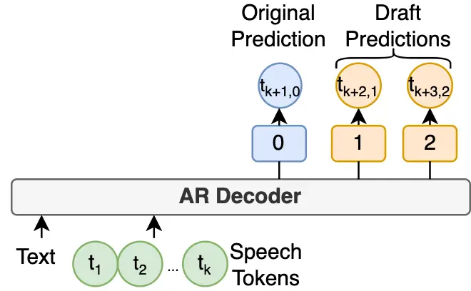
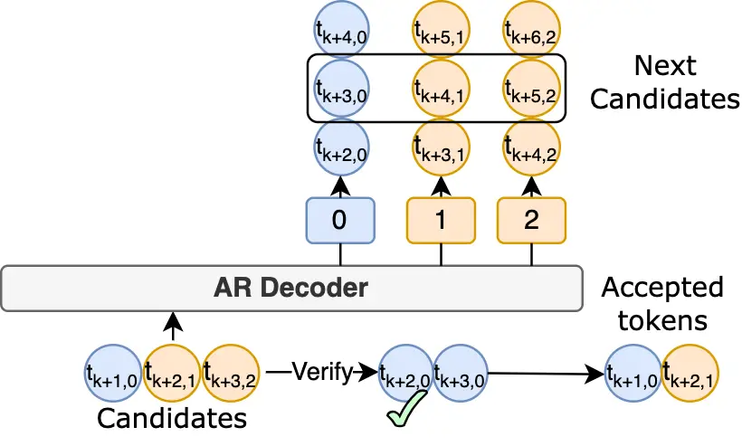
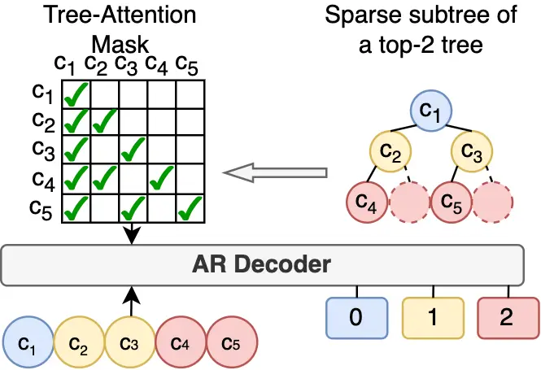

# Fast and High-Quality Auto-Regressive Speech Synthesis via Speculative Decoding

Bohan Li, Hankun Wang, Situo Zhang, Yiwei Guo, Kai Yu^(†)
^(†)^(†)thanks: \$ˆ†\$Kai Yu is the corresponding author.
Affiliation: MoE Key Lab of Artificial Intelligence, AI Institute;  
X-LANCE Lab, Department of Computer Science and Engineering,  
Shanghai Jiao Tong University, Shanghai, China  
{everlastingnight, wanghankun, situozhang, yiwei.guo,
kai.yu}@sjtu.edu.cn Affiliation: 

###### Abstract

The auto-regressive (AR) architecture, exemplified by models such as
GPT, is extensively utilized in modern Text-to-Speech (TTS) systems.
However, it often leads to considerable inference delays, primarily due
to the challenges associated with next-token prediction in long speech
sequences. In this work, we introduce VADUSA, one of the first
approaches to accelerate AR-based TTS through speculative decoding. Our
findings demonstrate that VADUSA not only delivers a significant
reduction in inference time but also enhances TTS quality by employing
draft heads to predict future speech tokens in an auto-regressive
manner. Additionally, the incorporation of a tolerance mechanism during
the sampling process further boosts performance, yielding approximately
a 3 $`\times`$ speedup in AR TTS. Moreover, our approach exhibits strong
generalization across diverse datasets and various speech token types.

###### Index Terms: 

text-to-speech, speculative decoding, inference speedup

## I Introduction

Large language models (LLMs) with auto-regressive (AR)
architectures \[1, 2\] have gained significant success in recent years.
They generate text byte-pair encoding (BPE) tokens using a next-token
prediction strategy \[3\]. This strategy samples the next token from a
multinomial distribution generated based on the history tokens, which is
simple but effective in building coherence over a long context. With the
invention of discrete neural audio tokens \[4, 5, 6, 7, 8\], a speech
utterance can also be coded as a discrete token sequence. The paradigm
in LLMs is then introduced to the speech modeling and synthesis field.
Studies like SPEAR-TTS \[9\], VALL-E \[10\] and BASE-TTS \[11\] and
other works \[12, 13\] implement decoder-only AR architectures for
speech codec generation with large-scale training data, allowing for
generating natural-sounding speech.

However, there is a significant difference between text and speech data:
the sequence of speech tokens is often much longer than that of text
tokens for the same sentence. For example, a piece of 10-second speech
needs 500 HuBERT tokens ($`50\text{\,}\mathrm{Hz}`$) \[4\] to represent,
while the text transcription of the same utterance only costs
approximately 20 to 40 text BPE tokens. It is reasonable because the
text is more information-dense, while speech captures finer acoustic
details over time, resulting in a longer token sequence. Moreover, the
trivial AR architecture predicts only one token at each inference step,
causing speech generation time especially long. This creates a challenge
between the need for low-latency spoken language synthesis and modeling
long speech sequences.

To mitigate the issue, one way of previous efforts is to reduce the
input/output sequence length via distillation or better information
compression, i.e., build low bitrate speech tokens. A bunch of works on
neural codec \[14, 15, 16\] attempt to lower the bitrate via a nicely
configured vector quantize (VQ) module and a well-designed training
process. Another inspiring research is aBPE \[17, 18\], which applies
BPE to discrete speech tokens, achieving lossless compression and
showing big potential in accelerating speech synthesis. However, these
low-bitrate tokens either compromise speech reconstruction accuracy or
make the frameshift variant, affecting the naturalness and quality of
speech synthesis.

Another way is to predict more speech tokens at one decoding step, which
is the main focus of this paper. This idea has developed since the RNN
era, started by Subscale WavRNN \[19\]. It folds the wav token sequence
in a subscaling way to realize predicting multiple tokens in parallel.
Recently, VALL-E 2 \[20\] uses a chunk-wise manner to generate a chunk
of future tokens (typically 2 tokens) in one AR iteration. However, such
methods usually lead to quality degradation because the history
condition is insufficient when predicting at least half of a sequence.
In contrast, speculative decoding \[21\], which is widely used in LLM
inference, provides acceleration without performance loss by simply
incorporating an additional draft model.

In light of the potential of speculative decoding, we apply the advanced
speculative decoding strategy, MEDUSA \[22\], to an AR TTS model, VALL-E
\[10\], conducting comprehensive experiments on various discrete tokens.
In attempting to do it, we observed significant challenges. The
complexity and variability inherent in speech synthesis often resulted
in suboptimal prediction accuracy and acceptance rates, making it
difficult to achieve the desired acceleration and quality. This prompted
us to innovate beyond mere adaptation, leading to the development of the
VADUSA method. By integrating a tolerance mechanism, VADUSA not only
accelerates the decoding process but also enhances the overall synthesis
robustness and quality by effectively managing the speculative
decoding’s inherent uncertainty. This novel approach proves crucial in
bridging the gap between fast decoding and maintaining high synthesis
fidelity.

## II VADUSA: Fast and High-Quality AR TTS

In this section, we elaborate VADUSA, a novel AR TTS decoding method
that simultaneously achieves fast decoding and high-quality speech
synthesis. The section first introduces MEDUSA \[22\], an effective and
lossless speculative decoding method for AR transformer-based models.
Then we dig into an unsatisfactory vanilla combination of VALL-E and
MEDUSA and analyze where its limitations come from. After that,
incorporating the tolerance mechanism, we propose VADUSA, a non-trivial
integration for MEDUSA and VALL-E, realizing both decoding acceleration
and synthesis quality improvements. Finally, we briefly describe the
design of TTS-oriented sparse candidate trees.

(a) Prefill the model with transcript text and prompt speech tokens.

(b) Speculative decoding and vanilla verification process.

(c) Structures of Sparse Tree and Tree-Attention mask.

Fig. 1: The overview framework of vanilla VADUSA.

### II-A Speculative Decoding and MEDUSA

Speculative decoding \[21\] is an efficient, lossless technique for
accelerating AR decoding. The key idea is to use a small, fast draft
model to generate predictions, which are then verified by the target
model in parallel. To avoid the expensive process of training a separate
draft model, MEDUSA \[22\] introduces several additional draft heads on
top of the original model. We directly implement this method on the
vanilla VADUSA. Specifically, as demonstrated in Fig.1(a), in the
prefilling pass with the prompt text and speech sequence
$`\{t_{1},t_{2},...,t_{k}\}`$, say the original prediction head predicts
the first next token $`t_{k+1,0}`$, then the $`i`$-th draft head is
responsible for predicting the $`(i+1)`$-th next token
$`t_{k+(i+1),i}(i\geq 1)`$ by the supervision of a cross-entropy loss
multiplied with $`\lambda^{i},\lambda\in(0,1)`$, enabling the generation
of multiple tokens in parallel. The generated first next token and draft
tokens will be concatenated in order and input into the same model for
the next forward pass. In the decoding pass, the model will verify the
draft tokens almost in parallel. For example, $`t_{k+2,1}`$ will be
accepted iff. it matches the ‘correct token’ sampled from the
distribution produced by the original head of $`t_{k+2,0}`$. Similarly,
$`t_{k+3,2}`$ will be accepted iff. $`t_{k+2,1}`$ is accepted and it
matches the original prediction $`t_{k+3,0}`$. As shown in Fig. 1(b), if
$`t_{k+2,1}`$ is accepted but $`t_{k+3,2}`$ is rejected, the original
head continues from $`t_{k+3,0}`$, which is the prediction of the last
accepted token, appending new draft predictions $`t_{k+4,1}`$ and
$`t_{k+5,2}`$ as candidates for the subsequent decoding pass. In this
scenario, the _acceptance length_ for the current pass is 2.

To make better ‘guesses’, MEDUSA also considers multiple candidate
tokens for each head and constructs a draft tree where the root node
represents the first next token, each node a candidate token, and each
root path a candidate continuation. For each draft head, the tokens with
top-$`k`$ logits are chosen as candidates. Each non-leaf node has $`k`$
children. The $`(i+1)`$-th layer has $`k^{i-1}`$ nodes and is filled
with the top-$`k`$ tokens produced by the $`i`$-th draft head. All the
root-to-leaf paths form all possible combinations of the candidates.
With a carefully constructed tree-attention mask, the whole tree of
tokens can be verified within one forward pass (named tree attention).
This approach significantly improves both the acceptance length of
drafts and the extra computational cost is also reasonable by
facilitating sparse trees that will be introduced in Section II-D. The
simplicity of MEDUSA draft heads and the compatibility with any
transformer-based AR model make MEDUSA highly adaptable and efficient.

### II-B Vanilla Combination and Re-thinking

In the vanilla version of VADUSA, we simply use a VALL-E TTS model as a
base model for speech synthesis and integrate several MEDUSA heads on
top of it to speed up generation and implement a kv-cache for in-context
memory. However, in initial experiments, we found its acceptance length
is not comparable to the results of MEDUSA on text LLMs. This is because
speech tokens such as those generated by systems like EnCodec \[8\],
HuBERT \[4\], and wav2vec 2.0 \[5\], are obtained through vector
quantization or clustering of IDs, rather than having distinct abstract
semantic differences like text tokens \[23\]. Under the AR language
modeling paradigm, multiple speech tokens often have very similar
statistical features. This means that the multinomial distributions
predicted by models like VALL-E tend to be more ‘average’ and selecting
the highest probability top-$`k`$ tokens using draft heads only covers a
small probability range. Given that during validation the original head
samples only once as the ‘correct token’, it is challenging for the
draft heads in VALL-E to make accurate predictions.

Moreover, from the perspective of improving sample quality, tree
attention can be seen as an efficient version of beam search. In beam
search, by foreseeing tokens of the next few steps, we can select the
combination with the highest probability to improve the sample quality.
Similarly, under tree attention, we use draft heads to foresee the
future tokens, and we hope the model accepts a candidate path with a
higher accept probability.

0:  AR decoder $`D`$, number of draft heads $`k`$, a branch of
candidates $`\mathcal{B}:=\{c_{0},c_{1},...,c_{k}\}`$, tolerance
$`\tau`$.

1:  $`\mathcal{L}\leftarrow D(\mathcal{B})`$

2:  for $`i=0,1,...,k`$ do

3:
  $`v_{i}\leftarrow multinomial\_sampling(top\_p(\mathcal{L}(i)),\tau)`$

4:  end for

5:  $`a_{0}=c_{0}`$

6:  $`k^{*}=k`$

7:  for $`i=0,1,...,k-1`$ do

8:   if $`c_{i+1}\in v_{i}`$ then

9:    $`a_{i+1}=c_{i+1}`$

10:   else

11:    $`k^{*}=i`$

12:    break

13:   end if

14:  end for

15:  return $`\mathcal{A}\leftarrow(a_{0},a_{1},...,a_{k^{*}})`$

Algorithm 1 Verification with tolerance mechanism

### II-C VADUSA Decoding with the Tolerance Mechanism

We propose VADUSA decoding method with tolerance mechanism to help the
VALL-E model achieve a higher acceleration rate and better synthesis
quality concurrently. The tolerance mechanism allows the original head
to sample multiple times, which means the ‘correct tokens’ is also
multiple. The number of original head’s samplings is controlled by the
tolerance value $`\tau`$. Alg. 1 demonstrates the verification process
of one branch of candidates on the top-$`k`$ tree with tolerance
mechanism. Between the accepted results on the top-$`k`$ branches, we
first select the longest sequences. Among those, we choose the one with
the highest acceptance probability. In other words, if nodes on the left
side of the top-$`k`$ tree correspond to smaller $`k`$ values during its
construction, we prioritize results from the leftmost branches when the
lengths are equal. In this way, on the one hand, with a slightly higher
cost of the verification process, the acceptance length is considerably
increased and finally leads to a higher real acceleration rate. On the
other hand, by choosing the best candidate path among all accepted
paths, the sample quality is improved compared to a trivial single-time
sampling strategy.

Note that VADUSA can still be compatible with any improved sampling
strategy. For instance, methods such as avoiding sequential repetition
in VALL-E 2 \[20\] and constraining the attention window in ACI \[22\]
can be integrated simply by taking the sampling outcomes of these
strategies as the predictions of the original head. If multiple
tolerances are present, we can sample multiple times using the
aforementioned strategies. This ensures that while the quality of
sampling is maintained, acceleration effects are also achieved. In our
experiments, we will evaluate using only the normal sampling method.

### II-D TTS-Oriented Sparse Tree Design

As demonstrated in Fig.1(c), we simply visualize the sparse tree and its
tree-attention mask of a top-$`2`$ tree In practice, $`k`$ is usually
set as 10, i.e., each non-leaf candidate node has 10 children, which
leads to an exponential explosion in the node number of the full
candidate tree. To reduce the computational cost of tree attention, we
need to design a sparse tree that only contains a tiny part of the
candidate tree. Within a constrained number of nodes, we expect the
sparse tree to help the model make as many acceptances as possible.
Therefore, the design of sparse trees depends on the choice of
calibration dataset and the output distribution of draft heads
(otherwise, we cannot obtain the acceptance probability). Unfortunately,
the existing trees provided by MEDUSA are based on text datasets and BPE
tokenizers, which may not fit in speech synthesis scenarios.

Using the criterion of maximizing the expectation of accepted length, we
use the off-the-shelf greedy algorithm in MEDUSA \[22\] to build a
TTS-oriented sparse tree. Specifically, for each type of discrete audio
token we use, we separately train a VADUSA model. Then, we run forward
passes with the full tree on a subset of LibriTTS \[24\] to obtain the
accepted probability of each node. Finally, we run the greedy algorithm
to build the sparse tree for each token type.

| Settings                        | Tuned | WER$`\downarrow`$(%) | UTMOS$`\uparrow`$  | Speedup$`\uparrow`$ | Acc. $`\uparrow`$ |
| ------------------------------- | ----- | -------------------- | ------------------ | ------------------- | ----------------- |
| w/o. VADUSA                     | ✗     | 7.61                 | 4.34 $`\pm`$ 0.014 | \-                  | \-                |
|                                 | ✔    | 7.29                 | 4.35 $`\pm`$ 0.013 | \-                  | \-                |
| 4$`\times`$ VADUSA              | ✗     | 7.21                 | 4.35 $`\pm`$ 0.014 | 2.37$`\times`$      | 2.85              |
|                                 | ✔    | 6.56                 | 4.35 $`\pm`$ 0.014 | 2.43$`\times`$      | 3.00              |
| 4$`\times`$ VADUSA + $`\tau`$=3 | ✗     | 5.94                 | 4.36 $`\pm`$ 0.013 | 2.89$`\times`$      | 3.80              |
|                                 | ✔    | 5.71                 | 4.36 $`\pm`$ 0.013 | 2.94$`\times`$      | 3.87              |

TABLE I: Performance on AR TTS inference. “Tuned” refers to whether
fine-tune the base model(VADUSA-wot or VADUSA-wt) and “Acc.” refers to
the mean number of accepted tokens.

## III Experiments

All experiments are conducted on NVIDIA A800-SXM4-80GB GPUs, including
training with different strategies and evaluation on both objective and
subjective metrics. Our implementation is adapted from the open-source
repositories¹¹ 1 https://github.com/lifeiteng/vall-e²² 2
https://github.com/FasterDecoding/MEDUSA.

### III-A Experimental Setups

#### III-A1 Architecture of TTS system and draft heads

The whole system is cascaded by tokenizers of text and speech, a codec
language model, and a speech-codec-based vocoder. The codec language
model, which is the main part of the system, consisted of 12 transformer
layers, with 16 attention heads with independent kv-caches, 1024 hidden
dimensions and 4096 feed-forward dimensions. We utilize a
grapheme-to-phoneme converter as the text tokenizer. We tokenize speech
with 2048 k-means clustering on features from the last layer of a
HuBERT-large \[4\] model. Two additional speech tokens are used in the
ablation study: wav2vec 2.0 \[5\] with its 2-group vector quantization
using IDs of top 16000 statistically occuring frequency groups on
LibriTTS \[24\], and EnCodec \[8\] with its 8-layer residual vector
quantization of 1024 size per codebook. All models used in tokenizers
are pretrained. The vocoder, CTX-vec2wav \[25\], is constructed by two
conformer blocks with 2 layers and 184 attention dimensions and a
HifiGAN \[26\], trained for converting semantic tokens to waveform.
VADUSA draft heads are connected to the last transformer layer of the
codec language model, constructed by a residual block with a linear
layer and a SiLU activation layer \[27\].

#### III-A2 Training Settings

We perform experiments on both LibriHeavy \[28\] with 50k hours of
English speech data and LibriTTS \[24\] with 585 hours. For the codec
language model, we train two versions as the base model on them
separately as foundational training stage: one epoch on Libriheavy or 20
epochs on LibriTTS, where the learning rates are 0.05 and the warm-up
steps are set as 200. Then we trained VADUSA heads on LibriTTS for 10
epochs with a fixed base model, mentioned as VADUSA-wot(without tuning)
and fine-tuning base model, mentioned as VADUSA-wt(with tuning), with
$`\lambda`$ set as 0.8, 40 of warm-up steps and 0.002 of learning rates.
For the vocoder, replicas of CTX-vec2wav \[25\] are trained for senmatic
tokens of HuBERT and wav2vec2.0 on LibriTTS for 1 million steps.

#### III-A3 Configurations in decoding strategy

We apply the nuclear sampling method with top-$`p`$, setting the
temperature to 0.9 and 1.0, on both the original head of the base model
and the draft heads of VADUSA. The number of draft heads is set to 4 or 6. For the draft tree, the top-$`k`$ value is fixed at 10 to define the
branching factor, and 64 nodes are selected as candidates by default,
with 96 and 128 nodes used for ablation studies. Candidate expectations
were calculated using over 3000 audio samples, each longer than 6
seconds, from the LibriTTS dataset to construct the sparse tree. For the
tolerance mechanism, we set $`\tau`$ values ranging from 1 to 4 across
all configurations.

### III-B Evaluations

The exploration of inference speedup is conducted by measuring the
number of discrete tokens generated per second during AR inference in
the codec language model. All metrics are measured on UniCATS Testset
B\[25\]. The speedup ratio is calculated by dividing the output rate of
the model equipped with VADUSA heads by that of the baseline model.
Additionally, the number of the mean accepted tokens is used to assess
the effectiveness of the VADUSA decoding with the tolerance mechanism.
TTS performance is evaluated using word error rates (WER) measured by a
conformer-transducer model³³ 3
https://huggingface.co/nvidia/stt_en_fastConformer_transducer_large. We
also use the UTokyo-SaruLab MOS (UTMOS) prediction system⁴⁴ 4
https://github.com/sarulab-speech/UTMOS22 to evaluate synthesis quality
of the generated speech objectively. As shown in Table I, the
experimental settings varies in three key aspects: (1) whether 4 VADUSA
heads or only base model participates during inference; (2) VADUSA-wot
or VADUSA-wt is used; and (3) whether the tolerance mechanism is applied
by setting $`\tau`$=3.

The results suggest that VADUSA performs well in AR TTS systems.
Inference acceleration is substantial, with no degradation in generation
quality—in fact, performance improved when the tolerance mechanism is
applied or when the base model is tuned. This improvement is
particularly noticeable in models trained on smaller datasets, where the
VADUSA heads help capture in-context information. This behavior
contrasts with the application of similar strategies in LLMs for natural
language modeling tasks.

### III-C Ablation Study

In this section, we present results from various configurations of the
proposed methods. Furthermore, we demonstrate their overall
effectiveness on large public datasets and different types of discrete
speech tokens, which can serve as a valuable reference for future
implementations.

#### III-C1 Effectiveness analysis of VADUSA configurations and tolerance mechanism

Fig. 2: Performances of different VADUSA configurations, with the same
base model trained on HuBERT+k-means2048 tokens.

We adjust the candidate length to represent the number of selected nodes
in sparse tree construction. The results, shown in Fig. 2, reveal
performance variations of VADUSA-wt with draft heads set to 4, 6 and
candidate choices set to 64, 96, 128. Contrary to expectations,
increasing the number of candidates does not result in improved speedup
performance, due to the increased computational cost associated with
accepting a higher number of candidates. The tolerance mechanism is
varied between 1 and 4, with 4 or 6 heads trained using either the
VADUSA-wot or VADUSA-wt strategy. As illustrated in Fig. 3, the
tolerance mechanism performs well in general VADUSA configurations, with
a larger tolerance value leading to better acceleration.

Fig. 3: Speedup performance and mean number of accepted tokens in
increasing number set in tolerance strategy, with base model trained on
HuBERT+k-means 2048 tokens, selecting 64 candidates per decoding step.

#### III-C2 Performance of different speech tokens

To demonstrate the effectiveness of the methods across different tokens,
we conduct experiments on both semantic and acoustic tokens. For
semantic tokens, we utilize HuBERT-extracted tokens with 2048 k-means
clusters, as well as wav2vec2.0-extracted tokens with the top-16000
frequency in LibriTTS of a combined 2-group codebook. For acoustic
tokens, we employ the EnCodec model, pre-trained with 50Hz RVQ and 8
codebooks of size 1024. The results presented in Tab. II indicate that
VADUSA training strategies and the proposed tolerance mechanism are
adaptable to both large-codebook semantic tokens and acoustic tokens.
However, due to the large codebook size of wav2vec2.0 and the remaining
seven codebooks of EnCodec, the logit distributions from the prediction
heads are relatively flat, resulting in low prediction accuracy and
consequently reduced acceptance rates for draft heads. This explains the
suboptimal performance of decoding speedup observed in both cases.
Adjusting the top-$`k`$ parameter during sparse tree construction may
offer a potential solution.

| Tokens         | Strategies                                            | WER$`\downarrow`$(%) | Speedup$`\uparrow`$ | Acc.$`\uparrow`$ |
| -------------- | ----------------------------------------------------- | -------------------- | ------------------- | ---------------- |
| HuBERT 2048    | VADUSA-wt base-model-only                             | 7.29                 | -                   | \-               |
| wav2vec2.0 16k |                                                       | 5.71                 | \-                  | \-               |
| EnCodec 1024   |                                                       | 3.91                 | \-                  | \-               |
| HuBERT 2048    | VADUSA-wt + 4$`\times`$heads, + 3$`\times`$ tolerance | 5.71                 | 2.94$`\times`$      | 3.87             |
| wav2vec2.0 16k |                                                       | 3.48                 | 1.30$`\times`$      | 1.89             |
| EnCodec 1024   |                                                       | 3.17                 | 1.85$`\times`$      | 1.96             |

TABLE II: Results of base-model-only inference and inference with
best-performing strategies(VADUSA-wt strategy with 4 draft heads and
$`\tau`$=3) in different token types.

#### III-C3 Generality in large dataset

Our strategies also demonstrate generalizability on a scaled-up dataset,
LibriHeavy, which contains approximately 50,000 hours of audiobook
audio. Aside from the Word Error Rates (WERs), the performance of the
proposed methods is consistent with that observed on the smaller
LibriTTS dataset. The discrepancy in WERs is understandable, as the
capacity of additional heads to learn in-context information has
inherent limitations. This reflects a trade-off that arises when relying
on draft heads within the constraints of the base model.

| Dataset    | Tuned | WER$`\downarrow`$(%) | UTMOS$`\uparrow`$  | Speedup$`\uparrow`$ | Acc.$`\uparrow`$ |
| ---------- | ----- | -------------------- | ------------------ | ------------------- | ---------------- |
| LibriTTS   | ✗     | 5.94                 | 4.36 $`\pm`$ 0.013 | 2.89$`\times`$      | 3.80             |
|            | ✔    | 5.71                 | 4.36 $`\pm`$ 0.013 | 2.94$`\times`$      | 3.87             |
| LibriHeavy | ✗     | 2.65                 | 4.35 $`\pm`$ 0.013 | 2.94$`\times`$      | 3.88             |
|            | ✔    | 2.85                 | 4.36 $`\pm`$ 0.012 | 2.95$`\times`$      | 3.88             |

TABLE III: The effectiveness of the proposed methods in scaled-up
dataset. We compare the performance on settings of 4-head fine-tuned or
not VADUSA model(VADUSA-wt or VADUSA-wot) with $`\tau`$=3.

## IV Conclusion

In conclusion, VADUSA, inspired by the integration of VALL-E and MEDUSA,
demonstrates impressive effectiveness in accelerating AR TTS decoding
and enhancing speech quality. This is due to the draft heads’ ability to
learn in-context information, expanding the capabilities of TTS models.
This approach benefits AR models like VALL-E, which often exhibit
instability in speech synthesis. By selecting the most appropriate
tokens in just a few decoding steps, VADUSA reduces the likelihood of
collapse caused by incorrect token selection. The proposed tolerance
mechanism further enhances this effect. Moreover, experimental results
highlight the method’s generalizability, offering valuable insights for
future exploration and implementation.

## Acknowledgment

This work was supported by the China NSFC Project (No. 92370206), the
Key Lab of Suzhou on Linguistic Computing (SZS2024005) and Shanghai
Municipal Science and Technology Major Project (2021SHZDZX0102).

## References

- \[1\] T. Brown, B. Mann, N. Ryder, M. Subbiah, J. D. Kaplan,
  P. Dhariwal, and et al., “Language models are few-shot learners,” in
  _Advances in Neural Information Processing Systems_, H. Larochelle,
  M. Ranzato, R. Hadsell, M. Balcan, and H. Lin, Eds., vol. 33. Curran
  Associates, Inc., 2020, pp. 1877–1901.
- \[2\] H. Touvron, T. Lavril, G. Izacard, X. Martinet, M.-A. Lachaux,
  T. Lacroix, B. Rozière, N. Goyal, E. Hambro, F. Azhar _et al._,
  “Llama: Open and efficient foundation language models,” _arXiv
  preprint arXiv:2302.13971_, 2023.
- \[3\] A. Vaswani, N. M. Shazeer, N. Parmar, J. Uszkoreit, L. Jones,
  A. N. Gomez, L. Kaiser, and I. Polosukhin, “Attention is all you
  need,” in _Neural Information Processing Systems_, 2017.
- \[4\] W.-N. Hsu, B. Bolte, Y.-H. H. Tsai, K. Lakhotia,
  R. Salakhutdinov, and A. Mohamed, “Hubert: Self-supervised speech
  representation learning by masked prediction of hidden units,”
  _IEEE/ACM Trans. Audio, Speech and Lang. Proc._, vol. 29, p.
  3451–3460, oct 2021.
- \[5\] A. Baevski, Y. Zhou, A. Mohamed, and M. Auli, “wav2vec 2.0: A
  Framework for Self-Supervised Learning of Speech Representations,”
  _Proc. NeurIPS_, vol. 33, pp. 12 449–12 460, 2020.
- \[6\] A. Baevski, S. Schneider, and M. Auli, “vq-wav2vec:
  Self-Supervised Learning of Discrete Speech Representations,” in
  _Proc. ICLR_, 2020.
- \[7\] C. Du, Y. Guo, X. Chen, and K. Yu, “VQTTS: high-fidelity
  text-to-speech synthesis with self-supervised VQ acoustic feature,” in
  _Interspeech_, 2022.
- \[8\] A. Défossez, J. Copet, G. Synnaeve, and Y. Adi, “High fidelity
  neural audio compression,” _Transactions on Machine Learning
  Research_, 2023.
- \[9\] E. Kharitonov, D. Vincent, Z. Borsos, R. Marinier, S. Girgin,
  O. Pietquin, M. Sharifi, M. Tagliasacchi, and N. Zeghidour, “Speak,
  read and prompt: High-fidelity text-to-speech with minimal
  supervision,” _Transactions of the Association for Computational
  Linguistics_, vol. 11, pp. 1703–1718, 12 2023.
- \[10\] C. Wang, S. Chen, Y. Wu, Z.-H. Zhang, L. Zhou, S. Liu, Z. Chen,
  Y. Liu, H. Wang, J. Li, L. He, S. Zhao, and F. Wei, “Neural codec
  language models are zero-shot text to speech synthesizers,” _ArXiv_,
  vol. abs/2301.02111, 2023.
- \[11\] M. Łajszczak, G. Cámbara, Y. Li, F. Beyhan, A. van Korlaar,
  F. Yang, A. Joly, Á. Martín-Cortinas, A. Abbas, A. Michalski _et al._,
  “Base tts: Lessons from building a billion-parameter text-to-speech
  model on 100k hours of data,” _arXiv preprint arXiv:2402.08093_, 2024.
- \[12\] C. Du, Y. Guo, H. Wang, Y. Yang, Z. Niu, S. Wang, H. Zhang,
  X. Chen, and K. Yu, “Vall-t: Decoder-only generative transducer for
  robust and decoding-controllable text-to-speech,” _arXiv preprint
  arXiv:2401.14321_, 2024.
- \[13\] Y.-Z. Song, Z. Chen, X. Wang, Z. Ma, and X. Chen, “Ella-v:
  Stable neural codec language modeling with alignment-guided sequence
  reordering,” _ArXiv_, vol. abs/2401.07333, 2024.
- \[14\] Y. Ren, T. Wang, J. Yi, L. Xu, J. Tao, C. Y. Zhang, and
  J. Zhou, “Fewer-token neural speech codec with time-invariant codes,”
  in _Proc. IEEE ICASSP_. IEEE, 2024, pp. 12 737–12 741.
- \[15\] H. Li, L. Xue, H. Guo, X. Zhu, Y. Lv, L. Xie, Y. Chen, H. Yin,
  and Z. Li, “Single-Codec: Single-Codebook Speech Codec towards
  High-Performance Speech Generation,” in _Proc. ISCA Interspeech_,
  2024, pp. 3390–3394.
- \[16\] S. Ji, Z. Jiang, X. Cheng, Y. Chen, M. Fang, J. Zuo, Q. Yang,
  R. Li, Z. Zhang, X. Yang _et al._, “WavTokenizer: an Efficient
  Acoustic Discrete Codec Tokenizer for Audio Language Modeling,” _arXiv
  preprint arXiv:2408.16532_, 2024.
- \[17\] F. Shen, Y. Guo, C. Du, X. Chen, and K. Yu, “Acoustic bpe for
  speech generation with discrete tokens,” _ICASSP 2024 - 2024 IEEE
  International Conference on Acoustics, Speech and Signal Processing
  (ICASSP)_, pp. 11 746–11 750, 2023.
- \[18\] B. Li, F. Shen, Y. Guo, S. Wang, X. Chen, and K. Yu, “On the
  effectiveness of acoustic bpe in decoder-only tts,” _arXiv preprint
  arXiv:2407.03892_, 2024.
- \[19\] N. Kalchbrenner, E. Elsen, K. Simonyan, S. Noury,
  N. Casagrande, E. Lockhart, F. Stimberg, A. van den Oord, S. Dieleman,
  and K. Kavukcuoglu, “Efficient neural audio synthesis,” in
  _International Conference on Machine Learning_, 2018.
- \[20\] S. Chen, S. Liu, L. Zhou, Y. Liu, X. Tan, J. Li, S. Zhao,
  Y. Qian, and F. Wei, “Vall-e 2: Neural codec language models are human
  parity zero-shot text to speech synthesizers,” _ArXiv_, vol.
  abs/2406.05370, 2024.
- \[21\] Y. Leviathan, M. Kalman, and Y. Matias, “Fast inference from
  transformers via speculative decoding,” in _International Conference
  on Machine Learning_, 2022.
- \[22\] T. Cai, Y. Li, Z. Geng, H. Peng, J. D. Lee, D. huai Chen, and
  T. Dao, “Medusa: Simple llm inference acceleration framework with
  multiple decoding heads,” _ArXiv_, vol. abs/2401.10774, 2024.
- \[23\] K. Choi, A. Pasad, T. Nakamura, S. Fukayama, K. Livescu, and
  S. Watanabe, “Self-supervised speech representations are more phonetic
  than semantic,” _ArXiv_, vol. abs/2406.08619, 2024.
- \[24\] H. Zen, V.-T. Dang, R. A. J. Clark, Y. Zhang, R. J. Weiss,
  Y. Jia, Z. Chen, and Y. Wu, “Libritts: A corpus derived from
  librispeech for text-to-speech,” in _Interspeech_, 2019.
- \[25\] C. Du, Y. Guo, F. Shen, Z. Liu, Z. Liang, X. Chen, S. Wang,
  H. Zhang, and K. Yu, “Unicats: A unified context-aware text-to-speech
  framework with contextual vq-diffusion and vocoding,” in _AAAI
  Conference on Artificial Intelligence_, 2024.
- \[26\] J. Kong, J. Kim, and J. Bae, “Hifi-gan: Generative adversarial
  networks for efficient and high fidelity speech synthesis,” _ArXiv_,
  vol. abs/2010.05646, 2020.
- \[27\] S. Elfwing, E. Uchibe, and K. Doya, “Sigmoid-weighted linear
  units for neural network function approximation in reinforcement
  learning,” _Neural networks : the official journal of the
  International Neural Network Society_, vol. 107, pp. 3–11, 2017.
- \[28\] W. Kang, X. Yang, Z. Yao, F. Kuang, Y. Yang, L. Guo, L. Lin,
  and D. Povey, “Libriheavy: a 50,000 hours asr corpus with punctuation
  casing and context,” in _ICASSP 2024-2024 IEEE International
  Conference on Acoustics, Speech and Signal Processing (ICASSP)_. IEEE,
  2024, pp. 10 991–10 995.
