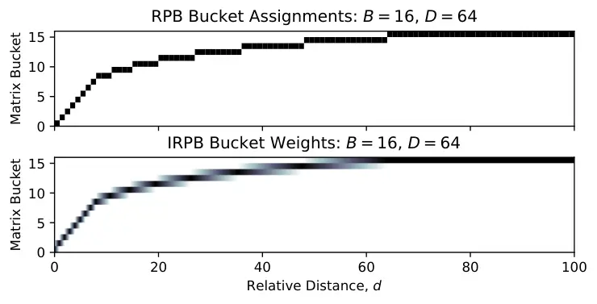
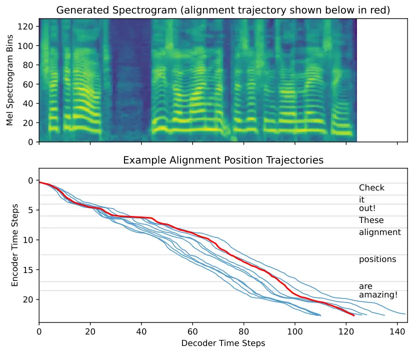
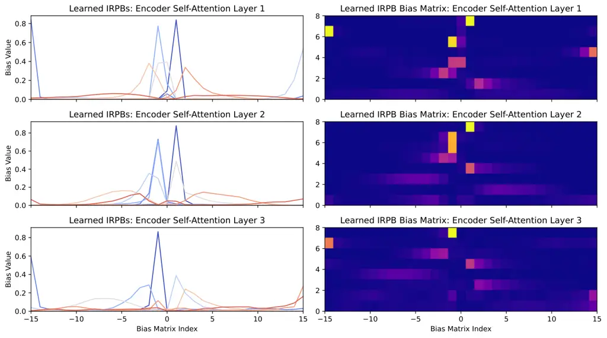
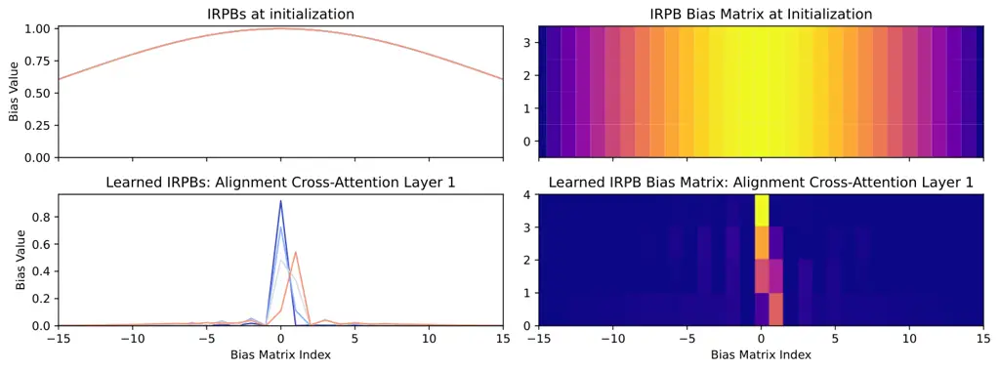
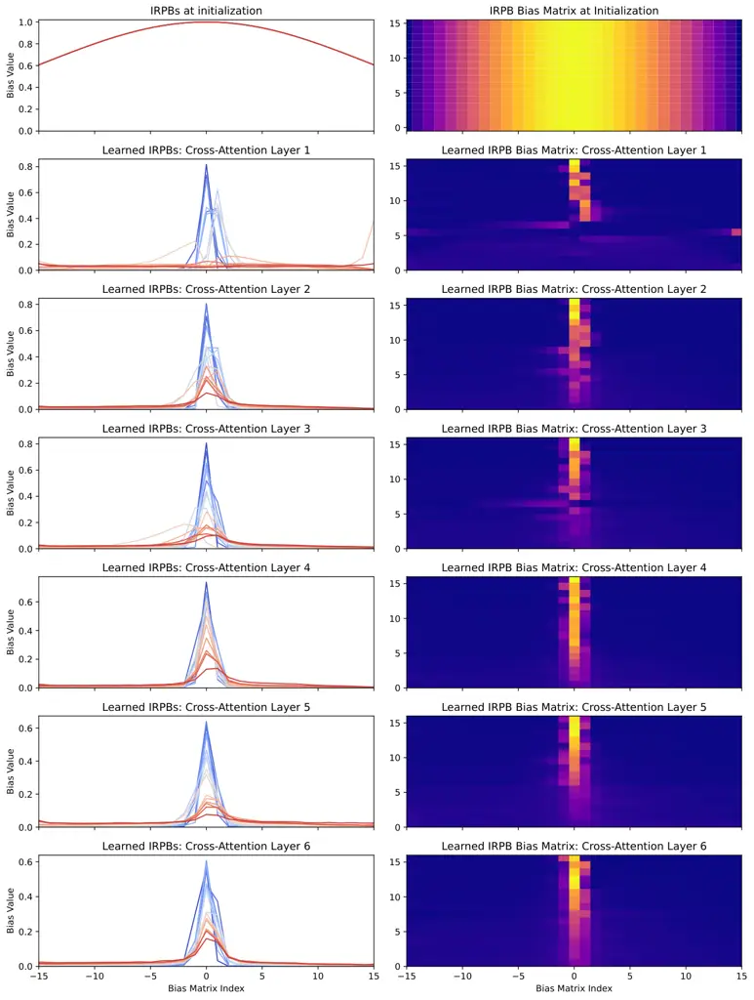
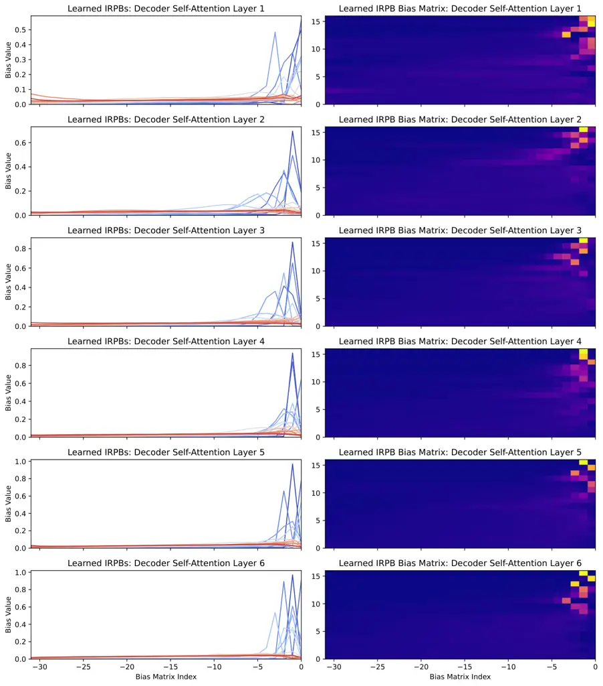

# Robust and Unbounded Length Generalization in Autoregressive Transformer-Based Text-to-Speech

Eric Battenberg    RJ Skerry-Ryan    Daisy Stanton    Soroosh Mariooryad
Affiliation: Matt Shannon    Julian Salazar    David Kao
Affiliation: Google DeepMind
Email: [{ebattenberg,rjryan,daisy,soroosh,mattshannon,julsal,davidkao}@google.com](mailto:)

###### Abstract

Autoregressive (AR) Transformer-based sequence models are known to have
difficulty generalizing to sequences longer than those seen during
training. When applied to text-to-speech (TTS), these models tend to
drop or repeat words or produce erratic output, especially for longer
utterances. In this paper, we introduce enhancements aimed at AR
Transformer-based encoder-decoder TTS systems that address these
robustness and length generalization issues. Our approach uses an
alignment mechanism to provide cross-attention operations with relative
location information. The associated alignment position is learned as a
latent property of the model via backpropagation and requires no
external alignment information during training. While the approach is
tailored to the monotonic nature of TTS input-output alignment, it is
still able to benefit from the flexible modeling power of interleaved
multi-head self- and cross-attention operations. A system incorporating
these improvements, which we call Very Attentive Tacotron, matches the
naturalness and expressiveness of a baseline T5-based TTS system, while
eliminating problems with repeated or dropped words and enabling
generalization to any practical utterance length.

## 1 Introduction

Figure 1: Unlike the baseline T5-based TTS system, Very Attentive
Tacotron (VAT) is able to generalize to transcripts of virtually
unbounded length despite only training on utterances shorter than 9.6
seconds.

Autoregressive (AR) Transformer-based sequence models Vaswani et al.
(2017) are used today in a majority of state-of-the-art systems across
text, vision, and audio domains. Though swiftly adopted for
sequence-to-sequence text-output tasks like machine translation, video
captioning Zhou et al. (2018), and speech recognition Dong et al.
(2018), adoption for audio-output tasks like text-to-speech (TTS) is
notably more recent. Inherent difficulties in reliably evaluating TTS
systems coupled with the low quality of public TTS datasets likely
played a role in the delayed adoption. This was exacerbated by the
failure of AR models of continuous sequences (e.g., spectrograms) to
match the performance of their discrete counterparts in the text domain.
It was only after the arrival of audio discretization techniques
suitable for speech generation tasks Borsos et al. (2023) that the TTS
community began to direct more effort toward AR Transformer-based
models.

A key challenge faced by such models, however, stems from their
extensive reliance on attention operations, which tend to cause
robustness issues that make them unfit for use in a production TTS
environment. Early attention-based TTS models, such as Tacotron Wang
et al. (2017); Shen et al. (2018), often exhibited problems like word
omission or repetition, and struggled to generalize beyond the training
lengths. Attempts to mitigate these issues using monotonic alignment
mechanisms yielded some success Raffel et al. (2017); Zhang et al.
(2018); Battenberg et al. (2020), but many ultimately turned to
non-autoregressive, duration-based models, which were more robust and
efficient during synthesis Kim et al. (2020); Shen et al. (2020); Ren
et al. (2021). While significant research has focused on improving
robustness and length generalization for Transformers in general, these
issues still persist in the latest AR TTS systems (Song et al., 2024; Du
et al., 2024).

In this paper we introduce a system called Very Attentive Tacotron
(VAT), a discrete AR Transformer-based encoder-decoder model designed
for robust speech synthesis. VAT augments a baseline T5-based Raffel
et al. (2020) TTS architecture with an alignment mechanism that exploits
the monotonic nature of the text-to-speech task, while preserving the
powerful modeling capabilities of stacked self- and cross-attention
layers. This leads to virtually limitless length generalization, while
matching the naturalness and expressiveness of the T5 baseline system
and eliminating issues with repeated or dropped words.

## 2 Comparisons to Related Work

Our work was inspired by AudioLM Borsos et al. (2023), which showed
impressive speech generation results using a decoder-only AR Transformer
trained to model discrete targets produced by a self-supervised speech
representation and a neural audio codec. This was extended with text
inputs for TTS in the decoder-only case by VALL-E Wang et al. (2023),
and in the encoder-decoder case by SPEAR-TTS Kharitonov et al. (2023)
and MQ-TTS Chen et al. (2023).

However, Song et al. (2024) found that VALL-E was highly non-robust (in
ways we note are reminiscent of early attention-based TTS) and proposed
ELLA-V, which essentially performs duration modeling by learning to
predict “end-of-phoneme” markers via forced alignments of training data.
With similar motivations, VALL-T Du et al. (2024) extends VALL-E by
replacing the objective with a Transducer mechanism Graves (2012) that
marginalizes over hard alignments during training and interacts with
alignment-shifted text-side relative position embeddings. Unlike
standard AR decoding, this scheme requires a costly sequence-wide
inference pass each time the alignment shifts, and it is unclear whether
it can generalize significantly beyond the training lengths. Finally, to
prevent major transcript deviations, MQ-TTS had to limit cross-attention
to a single layer and head which is applied over a very narrow (3-6
input tokens) monotonically advancing window. In summary, current work
has not resolved robustness issues without also sacrificing the power
and flexibility of the underlying AR Transformer.

In this work, we focus on encoder-decoder models with cross-attention
which we adapt for robustness and length generalization. The
cross-attention operations are informed by a single monotonic alignment
position that produces stability without degrading the modeling power of
the repeated multi-head cross-attention layers present in the original
Transformer architecture. The scalar alignment position is learned
directly and doesn’t rely on dynamic programming or forced alignments
during training.

## 3 Very Attentive Tacotron

Figure 2: High-level discrete AR Transformer TTS system overview (left),
T5 baseline decoder based on Raffel et al., 2020 (center), and the VAT
decoder (right). Decoder blocks are expanded in Figure 3.

### 3.1 System Overview

Our VAT model and the baseline T5 model are based on the architecture of
the T5 encoder-decoder Transformer originally used for a wide variety of
NLP tasks Raffel et al. (2020) and later used in SPEAR-TTS Kharitonov
et al. (2023). The diagrams in Figure 2 give an overview of our discrete
TTS setup and then breakdown the differences between the decoders used
in the two models.

For audio discretization, we use a neural vocoder paired with a VQ-VAE
Van Den Oord et al. (2017) trained to autoencode the vocoder’s input
spectrograms. This allows us to quickly retrain the spectrogram
discretization for different bitrates or frame rates without having to
retrain an entire neural audio codec model, which can be a time
consuming and finicky process. The VQ-VAE is trained using a simple L1
reconstruction loss, and to improve reconstruction quality, its encoder
yields multiple categorical codes per frame using product quantization
(PQ) El-Nouby et al. (2023) over multiple codebooks. The neural vocoder
we use is GAN-based and combines features from Parallel WaveGAN Yamamoto
et al. (2020) and Hifi-GAN Kong et al. (2020).

Unlike the systems covered in Section 2 that do “zero-shot” speaker
cloning via audio prompting, we learn separate speaker embeddings for
each speaker in the training set. We find this better suited for
medium-sized datasets and industry use cases, where we care about
creating high quality voices for specific target speakers.

At the input side, we use a self-attention-based encoder to process the
text followed by an autoregressive decoder that interacts with the
encoded text via multiple cross-attention layers. We train the decoder
to model the sequence of PQ categorical codes produced by the VQ-VAE.
Not only is the decoder trained autoregressively across time, but we
also model the joint distribution of the PQ codes contained in one frame
using an AR decomposition. Full system details can be found in
Appendix A.

(a) Blocks used in the decoder of the T5 baseline architecture.

(b) New blocks used in the VAT model. The Relative Cross-Attention Block
replaces the standard Cross-Attention Block in Figure 3(a).

Figure 3: Diagrams for decoder sub-blocks.

### 3.2 T5 Relative Position Biases

T5 introduced an efficient parameterization of relative position biases
(RPBs) used to encode locality information in self-attention operations,
which was subsequently shown to outperform other position encoding
schemes with respect to length generalization on certain sequence tasks
Kazemnejad et al. (2023). RPBs are used in dot product self-attention
when computing attention scores, $`s_{i,j}^{(k)}`$, and attention
weights, $`\alpha_{i,j}^{(k)}`$, for attention head $`k`$:

```math
\displaystyle s_{i,j}^{(k)} \displaystyle=\frac{\mathbf{q}_{i}^{(k)}\cdot\mathbf{k}_{j}^{(k)}}{\sqrt{L}}+b_{\lfloor f(i-j)\rfloor_{0}}^{(k)} \tag{1}
```

```math
\displaystyle\alpha_{i,j}^{(k)} \displaystyle=\frac{\exp\left(s_{i,j}^{(k)}\right)}{\sum_{l}\exp\left(s_{i,l}^{(k)}\right)} \tag{2}
```

where $`\mathbf{q}_{i}^{(k)}`$ and $`\mathbf{k}_{j}^{(k)}`$ are
length-$`L`$ query and key vectors at positions $`i`$ and $`j`$,
respectively, and
$`\lfloor x\rfloor_{0}\vcentcolon=\sgn(x)\lfloor\lvert x\rvert\rfloor`$
rounds toward zero. The bias, $`b_{\lfloor f(i-j)\rfloor_{0}}^{(k)}`$,
is taken from a matrix of learned bias values using a function,
$`f(d)`$, to map relative distances into $`B`$ different buckets:

```math
f(d)=\\
\begin{cases}d,&d\in[0,\nicefrac{{B}}{{2}})\\
\nicefrac{{B}}{{2}}+\frac{\log\left(\frac{d}{\nicefrac{{B}}{{2}}}\right)}{\log\left(\frac{D}{\nicefrac{{B}}{{2}}}\right)}\left(\nicefrac{{B}}{{2}}-1\right),&d\in[\nicefrac{{B}}{{2}},D)\\
B-1,&d\geq D\\
-f(-d),&d<0\end{cases} \tag{3}
```

So, the first half of the buckets are spaced linearly, the second half
logarithmically, and distances beyond $`D`$ are all mapped to the final
bucket. Negative relative distances are associated with a separate set
of $`B-1`$ buckets which we denote using negative indices. The top of
Figure 4 shows an example of how distances are mapped to RPB buckets for
$`B=16`$ and $`D=64`$.



Figure 4: Standard RPB mapping of distances to bias matrix indices (top)
and Interpolated RPB mapping of distances to bias matrix index weights
(bottom).

While RPBs provide locality information for self-attention, they can’t
be used in cross-attention because there is no sense of relative
distance between encoder and decoder time steps. This lack of location
information in cross-attention is a big reason why attention-based TTS
systems tend to have issues with reliability and length generalization.
One way to introduce a sense of relative distance for use with
cross-attention RPBs is to compute an alignment position for each
decoder time step that serves as the “zero” relative position along the
time dimension of the encoder outputs.

### 3.3 Interpolated Relative Position Biases

Our approach involves learning the alignment position directly via
backprop; however, this means we need to be able to differentiate the
RPBs with respect to the alignment position. Since standard RPBs only
deal with integer relative positions, we cannot do this directly.
Instead, we bypass the round-toward-zero operation from the bias index
expression in eq. (1) and use $`f(d)`$ from eq. (3) directly as a
real-valued bucket index, $`\eta`$. This non-integer index is then
translated into a bias value by linearly interpolating between the two
bias values at the adjacent integer indices in the bias matrix. For
real-valued bucket index $`\eta=f(d)`$ and bias matrix row
$`\mathbf{b}^{(k)}`$, the interpolated bias for head $`k`$ and relative
distance $`d`$ can be written as:

```math
\beta^{(k)}(d)=b_{\lfloor\eta\rfloor_{0}}^{(k)}+\left(\lvert\eta\rvert-\lfloor\lvert\eta\rvert\rfloor\right)\left(b_{\lceil\eta\rceil_{0}}^{(k)}-b_{\lfloor\eta\rfloor_{0}}^{(k)}\right)\\
 \tag{4}
```

where
$`\lceil x\rceil_{0}\vcentcolon=\sgn(x)\lceil\lvert x\rvert\rceil`$
rounds away from zero. The bottom of Figure 4 shows an example of how
relative distances are mapped to the bias index weights used to compute
these interpolated relative position biases, or IRPBs.

### 3.4 Alignment Layer

Because we can backprop through IRPBs, the alignment position can be
learned directly as a latent property of the model. We use an RNN-based
alignment layer to produce a monotonically advancing alignment position
for each decoder time step as shown at the top of Figure 3(b). The RNN
is fed with both the input to the alignment layer and the output of a
multi-head, location-based cross-attention operation where the attention
scores are produced using alignment-informed IRPBs and no content-based
query-key comparisons:

```math
s_{i,j}^{(k)}=\beta^{(k)}(p_{i}-j) \tag{5}
```

where $`j`$ is the encoder position, $`p_{i}`$ is the alignment position
at decoder step $`i`$, and attention weights are produced using the
softmax function in eq. (2).

We use purely location-based attention here because the alignment layer
has the fairly simple job of maintaining a rough alignment with the
input, while finer-grained, phoneme-level awareness and deeper
linguistic understanding can be handled by subsequent cross-attention
layers that use content-based queries across multiple heads. This idea
is explored further in Appendix E where we visualize the learned IRPBs
across all layers.

To enforce monotonicity of the alignment, alignment deltas are produced
by projecting the RNN output to a scalar and passing it through a
softplus function. We further process the output of the RNN by composing
the alignment layer into an alignment block as shown in the center of
Figure 3(b).

Because the alignment position is unobserved, it cannot be teacher
forced, so the alignment layer needs to be executed serially during
training; however, subsequent decoder layers that consume the alignment
position can still be run in parallel. To minimize the impact of this
serialization on training speed, we make the alignment layer as
lightweight as possible by using a single-layer LSTM and the
location-based attention mechanism in eq. (5).

### 3.5 Relative Cross-Attention

To stabilize multi-head cross-attention throughout the rest of the
decoder, we augment standard dot product cross-attention with
alignment-informed IRPBs:

```math
s_{i,j}^{(k)}=\frac{\mathbf{q}_{i}^{(k)}\cdot\mathbf{k}_{j}^{(k)}}{\sqrt{L}}+\beta^{(k)}(p_{i}-j) \tag{6}
```

where $`\mathbf{q}_{i}^{(k)}`$ is the query at decoder step $`i`$,
$`\mathbf{k}_{j}^{(k)}`$ is the key at encoder position $`j`$, and
attention weights are produced using the softmax function in eq. (2).

This operation is used within the relative cross-attention block
pictured at the bottom of Figure 3(b). As shown on the right side of
Figure 2, the alignment position produced by the alignment layer is fed
to every instance of relative cross-attention throughout the model, and
each instance separately attends to the encoder outputs via multi-head
relative cross-attention.

### 3.6 Initializing IRPBs

In order to reliably learn a meaningful emergent alignment position (as
visualized in Figure 6), we found it helpful to use a structured
initialization scheme for the cross-attention IRPBs. We chose a Gaussian
window centered at zero relative distance with its maximum value
normalized to 1. Due to the softmax operation used in dot product
attention, we take the log of the Gaussian window values when
initializing the IRPB matrix, but we find it useful to visualize the
exponentiated biases in all figures.

Figure 5(a) shows three examples of this scheme at different standard
deviations, $`\sigma`$.

(a) IRPB Gaussian initialization scheme. Note that negative bucket
indices denote the biases associated with negative relative distances.

(b) Effective IRPBs using the initialization schemes from Figure 5(a)
with $`D=64`$ and no MDP. The vertical black lines denote hypothetical
maximum training lengths.

(c) Effective IRPBs using the initialization schemes from Figure 5(a)
with $`D=64`$ and an MDP of $`P_{\textrm{MD}}=1.0`$.

Figure 5: Visualizing IRPB matrix initialization.

Given these initial matrix values, the corresponding effective
interpolated biases for different relative distances are shown in
Figure 5(b).

In early experiments, we found it necessary to initialize the IRPBs
using lower standard deviations that heavily suppress attention
contributions from relative distances beyond the training lengths. This
was done to prevent undefined behavior at distances not seen during
training and was sufficient to guarantee length generalization.

### 3.7 Maximum Distance Penalty

However, using lower standard deviations for IRPB initialization
prevents the cross-attention layers from learning longer distance
dependencies, which could degrade the model’s text understanding
capabilities. To work around this issue, we incorporate a maximum
distance penalty (MDP) that explicitly reduces contributions from
relative distances greater than $`D`$:

```math
\beta_{\textrm{MD}}^{(k)}(d)=\begin{cases}\beta^{(k)}(d),&\lvert d\rvert<D\\
\beta^{(k)}(d)-P_{\textrm{MD}}(\lvert d\rvert-D),&\lvert d\rvert\geq D\end{cases} \tag{7}
```

where $`P_{\textrm{MD}}`$ is the configurable maximum distance penalty.
This allows us to choose wider standard deviations for the Gaussian
initialization and still generalize beyond the training lengths. The
effect of this penalty is shown in Figure 5(c).

Despite not being necessary for length generalization in our
experiments, we felt it prudent to also apply the MDP to IRPBs used in
self-attention layers in order to eliminate additional sources of
undefined behavior at relative distances not seen during training.



Figure 6: Example alignment position trajectories for the transcript
“Check it out! These alignment positions are amazing!” The trajectory
associated with the displayed spectrogram is shown in red.

## 4 Experiments

### 4.1 Model Configuration

Our main comparison is between the baseline T5-based TTS model and the
augmented VAT model. We also compare against additional non-Transformer
baseline models that were designed for stability, including Tacotron
with GMM-based attention (Tacotron-GMMA) Battenberg et al. (2020) and
the unsupervised duration variant of Non-Attentive Tacotron (NAT) Shen
et al. (2020), a duration-based model.

The reference configuration for the T5 baseline and VAT models uses 6
decoder blocks with 16 attention heads and hidden width 1024. For VAT,
the alignment block uses a single 256-width LSTM layer and 4 heads in
the location-based attention mechanism. The encoder contains 2 residual
convolution stages that downsample the input phoneme sequence by 2x in
time, followed by 3 non-causal self-attention blocks with 8 heads and
width 512. All dropout layers use a rate of 0.1. At test time, we use a
sample temperature of 0.7 when sampling from the AR categorical
distribution at the decoder output.

The VQ-VAE operates on 80Hz mel spectrograms with 128 bins, downsampling
by 2x to produce output at a rate of 40Hz. Each output frame contains 8
PQ codes with codebook size 256 for an overall bitrate of 2.56 kbps.

For both T5 and VAT, we use position biases with 32 buckets and learn a
separate set of biases for every layer, unlike the original T5 paper
which shares biases across layers. For causal self-attention layers in
the decoder, all 32 buckets are used for negative relative distances
($`B=32`$), whereas in cross-attention and non-causal self-attention,
the 32 buckets are split evenly between positive and negative distances
($`B=16`$ per side). Max distances, $`D`$, are set to be shorter than
the maximum sequence lengths that appear during training, which are 96
for the encoder outputs (192-length phoneme sequence downsampled by 2x)
and 384 for the decoder (9.6-second utterances with 40Hz codes). We
chose max distances of $`D=64`$ for cross-attention and encoder
self-attention and $`D=128`$ for decoder self-attention.

The T5 baseline uses standard RPBs in all self-attention operations,
including in the encoder. VAT uses IRPBs in all self- and
cross-attention operations, including the purely location-based
attention in the alignment layer. IRPBs use an MDP of
$`P_{\textrm{MD}}=1.0`$. Self-attention bias matrices are randomly
initialized using a truncated normal, while cross-attention biases use
the Gaussian initialization scheme with $`\sigma=15`$.

Full model configuration details can be found in Appendix A, and
reference implementations for the encoder and decoder are available
online.¹¹ 1
[https://github.com/google/sequence-layers/blob/main/examples/very_attentive_tacotron.py](https://github.com/google/sequence-layers/blob/main/examples/very_attentive_tacotron.py)

### 4.2 Datasets

We run experiments using two different English language datasets. The
first is an internal multi-speaker dataset containing a variety of
audio, including book-reading, news-reading, and assistant-like
utterances. This dataset consists of 670 hours of audio (~700,000 total
utterances) spoken by 117 distinct speakers. Also included are audiobook
recodings from the _Lessac_ dataset used in the 2013 Blizzard challenge
Lessac Technologies, Inc. (2013), which we use as a common point of
comparison with the single-speaker Tacotron-GMMA baseline model. The
second dataset is the clean-460 subset of LibriTTS Zen et al. (2019),
consisting of 213 hours (~150,000 utterances) of book-reading audio
spoken by 1226 speakers.

### 4.3 Training

We train our T5 and VAT models for 650,000 steps using the Adam
optimizer to minimize the negative log-likelihood of the spectrogram VQ
codes. When using the internal multi-speaker dataset, we use the
reference configuration from Section 4.1. When using LibriTTS data, in
order to prevent overfitting, we shrink all layer widths to 3/8 scale
(e.g., 1024 to 384) compared to the reference configuration.

We use Tacotron-GMMA as a stability-oriented baseline for the internal
dataset. However, we found that single-speaker versions of the model
sounded better than ones trained on the full multi-speaker dataset.
Therefore, we only train Tacotron-GMMA on the Lessac single-speaker data
and only evaluate using the Lessac voice when comparing against models
trained on the full internal multi-speaker dataset.

Non-Attentive Tacotron is used as a LibriTTS baseline and is trained in
unsupervised duration mode, following Shen et al. (2020). Full training
details are available in Appendix C.

### 4.4 Evaluations

#### MOS Naturalness.

We evaluate synthesis quality using a pool of raters to judge
naturalness on a 5-point scale. For the Lessac voice, we use 885
utterances from the test set, and for LibriTTS we use 900 utterances
from the test set. We report 99% confidence intervals along with the
mean rating for each model and the ground truth data.

#### AB7 Side-By-Side (SxS).

Since MOS ratings tend to have calibration and noisiness issues, we
complement them with side-by-side naturalness ratings where blinded
samples from two models are directly compared on a 7-point
(\[$`-3,3`$\]) comparative scale.

#### ASR-Based Robustness.

For the rated audio, we report character error rate (CER) computed by
comparing the input text to the output of a pre-trained speech
recognizer that is run on the synthesized audio. This addresses the fact
that raters don’t have access to target transcripts so can’t account for
dropped or repeated words in their ratings.

#### ASR-Based Length Generalization.

Additionally, for each model, we run a length generalization stress test
using 1034 transcripts of varying lengths (100–1500 characters) and
report CER as utterance length is increased.

#### Repeated Words Stress Test.

Attention-based TTS models tend to have trouble when repeated words
appear in the input text. We test the ability of the T5 and VAT models
to correctly synthesize all the words in three repeated-word templates,
each instantiated with 1–9 repetitions of a specific word. These
templates along with additional evaluation details can be found in
Appendix D.

## 5 Results

To aid the reader, audio examples from the naturalness evaluation,
length generalization assessment, and repeated words stress test are
available online.²² 2
[https://google.github.io/tacotron/publications/very_attentive_tacotron/index.html](https://google.github.io/tacotron/publications/very_attentive_tacotron/index.html)

| Lessac Voice                                                                                                                                                                                                | MOS              | SxS vs VAT         | CER  |
| ----------------------------------------------------------------------------------------------------------------------------------------------------------------------------------------------------------- | ---------------- | ------------------ | ---- |
| Ground Truth                                                                                                                                                                                                | 4.00 $`\pm`$0.07 |                    | 2.9  |
| VAT                                                                                                                                                                                                         | 3.68 $`\pm`$0.08 | —                  | 3.3  |
| T5 Baseline                                                                                                                                                                                                 | 3.75 $`\pm`$0.07 | -0.06 $`\pm`$0.14  | 10.2 |
| Tacotron-GMMA³³ 3 Tacotron-GMMA is only trained on the single-speaker Lessac data, whereas the T5 baseline and VAT are trained on the full internal multi-speaker dataset, which includes the Lessac voice. | 3.62 $`\pm`$0.08 | \-0.32 $`\pm`$0.14 | 3.7  |
| LibriTTS                                                                                                                                                                                                    | MOS              | SxS vs VAT         | CER  |
| Ground Truth                                                                                                                                                                                                | 3.70 $`\pm`$0.09 |                    | 3.6  |
| VAT                                                                                                                                                                                                         | 3.16 $`\pm`$0.09 | —                  | 4.6  |
| T5 Baseline                                                                                                                                                                                                 | 3.07 $`\pm`$0.09 | 0.01 $`\pm`$0.14   | 10.7 |
| NAT                                                                                                                                                                                                         | 3.22 $`\pm`$0.08 | -0.12 $`\pm`$0.15  | 3.3  |

Table 1: MOS naturalness, AB7 side-by-side (SxS) versus VAT, and ASR
robustness character error rates (CER) for Lessac voice models (top) and
LibriTTS models (bottom). Error bars correspond to 99% confidence
intervals.

### 5.1 Naturalness Evaluations

MOS naturalness results are shown in the left column of Table 1. Note
that for both datasets, the confidence intervals are overlapping for all
models, so there are no clear winners. This was surprising given that in
informal comparisons the Transformer-based models (T5 and VAT) sounded
clearly more expressive and natural to us compared to the Tacotron and
NAT baselines.

In cases such as this, side-by-side evals can be helpful due to their
increased sensitivity and better calibration. The naturalness
side-by-sides with the VAT model do show that it is preferred over
Tacotron-GMMA. Due to its deterministic regression-based objective,
Tacotron sounds less expressive than the Transformer-based models which
are trained with a fully probabilistic objective. VAT also seems to be
preferred over NAT, though the result was not quite significant with
respect to the 99% confidence interval. Samples from the NAT model sound
quite monotonous and robotic, and it is clear that its unsupervised
duration mechanism was unable to produce a naturally-varying duration
predictor. However, some of the raters seemed to prefer its highly
enunciated and hyper-intelligible style compared to the more varied and
expressive samples produced by VAT and the T5 baseline. Lastly, VAT is
shown to be very even with T5 in terms of naturalness, which is expected
given that the two models use very similar architectural backbones and
identical training objectives.

### 5.2 ASR-Based Robustness

Despite the similarity in naturalness scores between T5 and VAT, the
ASR-based robustness results in Table 1 show that the T5 baseline
produced a significantly higher CER than other models. This is due to
the fact that it tends to drop or repeat words, especially on longer
utterances (some utterances in the test sets are up to 20 sec long,
which exceeds the 9.6 sec training lengths). Interesting, the NAT model
produced a CER below that of the ground truth audio, which is a result
of its overly enunciated style.

### 5.3 ASR-Based Length Generalization

Length generalization results are shown in the plots in Figure 1 where
we plot CER against input text length in characters. The max training
length for the Transformer-based models is 9.6 sec, and we see that soon
after the training length is exceeded, the CER of the T5 baseline model
sharply increases. Not only does it drop or repeat individual words, but
beyond the training length, it frequently drops or repeats entire
clauses and sometimes babbles incomprehensibly.

The other models, including VAT and the two stability-oriented
baselines, generalize well all the way up to the max tested lengths
(1500 characters, or around 90 seconds). We can also see that due to the
hyper-intelligibility of the duration-based NAT model, it achieves
slightly better CER than the VAT model across all text lengths – though
at the expense of expressivity, as is apparent in the audio examples.

### 5.4 Repeated Words Stress Test

The T5 baseline model has difficulty with the repeated words stress test
as well. Over the 27 test phrases, VAT makes no mistakes, whereas T5
makes errors on 14 of the phrases (52%). These errors tend to become
increasingly severe as the number of repetitions is increased. For
example, one of the phrases with 9 target repetitions produces 52
repetitions with the T5 model. The majority of the mistakes, however,
are off by one errors in the number of repetitions, but the T5 baseline
produced errors on transcripts that contained as few as 2 repetitions of
the target word. Note that these repetition errors occur even when the
synthesis length is shorter than the max training length.

## 6 Discussion

We have shown that the proposed attention enhancements are able to
eliminate robustness issues typically observed in Transformer-based TTS
systems while matching the synthesis quality of a contemporary T5-based
system. The VAT model that incorporates these enhancements is able to
reliably produce all words in the input text out to seemingly unbounded
lengths, and the alignment-informed, multi-layer, multi-head cross
attention it uses is inherently more powerful than the single-phoneme
alignment mechanisms used in other robustness-oriented TTS models (see
Appendix E).

This approach can be directly applied to any encoder-decoder model that
uses cross-attention layers in the decoder. Because the alignment
position is constrained to be monotonic, it is best suited for tasks
that exhibit broad monotonic alignment between input and output (e.g.,
TTS and ASR). However, the flexibility afforded by query-key comparisons
within wide IRPB windows should allow the model to adapt well to
off-monotonic alignments if needed (e.g., when using unverbalized text).

Due to the scalability of Transformer-based models, future work should
test VAT on significantly larger datasets, potentially with encoder or
decoder pre-training on unpaired text or audio, respectively.
Additionally, using fancier, more powerful approaches to discretization
and waveform generation is likely to yield low-level audio quality
improvements especially if paired with cleaner, higher-quality datasets.

## Limitations

#### Implementation Effort.

There is additional implementation and configuration effort required for
VAT compared to more homogeneous Transformer-based models; however, the
code and example configurations we provide online should be helpful for
researchers attempting to reproduce our work.

#### Training Speed Impact.

The primary practical downside of VAT is the potential for slower
training speed due to serialization of the alignment layer during
training. Because most of the model is still able to be trained in
parallel, at the training lengths we use, alignment layer serialization
had a relatively small impact on training speed (~12 – 20% depending on
model size). Ways to narrow this speed gap further include slimming down
the alignment layer RNN or decreasing the VQ-VAE frame rate so that
fewer decoder steps are required to model the same amount of audio.

#### Discrete TTS Comparisons.

Transformer-based discrete TTS is a rapidly developing area with a short
history, so it is difficult to make meaningful comparisons with existing
systems, especially since dataset size/quality and model scale can vary
drastically. Additionally, most discrete TTS systems we encountered are
based on prompt-based zero-shot speaker cloning which further
complicates direct comparisons. Therefore, the discrete TTS baseline we
use is based on an existing and well-known Transformer architecture (T5)
applied directly to multi-speaker TTS.

#### Hyper-Parameter Exploration.

A deeper exploration of the effect of various hyper-parameter choices
would be helpful, but was beyond the scope of this initial work.
However, we do cover the most important choices when it comes to
enabling robust length generalization in our model.

#### English Language Focus.

We use English language datasets in our experiments. Since text-speech
alignment tends to be broadly monotonic for the vast majority of written
languages, our approach should generalize to other languages; however,
this needs to be tested experimentally.

#### Potential Risks.

Our work does not introduce any notable societal or ethical risks beyond
those that may already exist for long-form text-to-speech in general.

## References

- Battenberg et al. (2020) Eric Battenberg, R.J. Skerry-Ryan, Soroosh
  Mariooryad, Daisy Stanton, David Kao, Matt Shannon, and Tom
  Bagby. 2020. [Location-relative attention mechanisms for robust
  long-form speech
  synthesis](https://doi.org/10.1109/ICASSP40776.2020.9054106). In
  _ICASSP 2020 - 2020 IEEE International Conference on Acoustics, Speech
  and Signal Processing (ICASSP)_, pages 6194–6198.
- Borsos et al. (2023) Zalán Borsos, Raphaël Marinier, Damien Vincent,
  Eugene Kharitonov, Olivier Pietquin, Matt Sharifi, Dominik Roblek,
  Olivier Teboul, David Grangier, Marco Tagliasacchi, and Neil
  Zeghidour. 2023. [AudioLM: A language modeling approach to audio
  generation](https://doi.org/10.1109/TASLP.2023.3288409). _IEEE/ACM
  Transactions on Audio, Speech, and Language Processing_, 31:2523–2533.
- Chen et al. (2023) Li-Wei Chen, Shinji Watanabe, and Alexander
  Rudnicky. 2023. A vector quantized approach for text to speech
  synthesis on real-world spontaneous speech. In _Proceedings of the
  AAAI Conference on Artificial Intelligence_, volume 37, pages
  12644–12652.
- Dong et al. (2018) Linhao Dong, Shuang Xu, and Bo Xu. 2018.
  Speech-transformer: A no-recurrence sequence-to-sequence model for
  speech recognition. In _ICASSP_, pages 5884–5888. IEEE.
- Du et al. (2024) Chenpeng Du, Yiwei Guo, Hankun Wang, Yifan Yang,
  Zhikang Niu, Shuai Wang, Hui Zhang, Xie Chen, and Kai Yu. 2024.
  [Vall-t: Decoder-only generative transducer for robust and
  decoding-controllable
  text-to-speech](https://arxiv.org/abs/2401.14321). _Preprint_,
  arXiv:2401.14321.
- El-Nouby et al. (2023) Alaaeldin El-Nouby, Matthew J. Muckley, Karen
  Ullrich, Ivan Laptev, Jakob Verbeek, and Herve Jegou. 2023. [Image
  compression with product quantized masked image
  modeling](https://openreview.net/forum?id=Z2L5d9ay4B). _Transactions
  on Machine Learning Research_.
- Germain et al. (2015) Mathieu Germain, Karol Gregor, Iain Murray, and
  Hugo Larochelle. 2015. MADE: Masked autoencoder for distribution
  estimation. In _International conference on machine learning_, pages
  881–889. PMLR.
- Graves (2012) Alex Graves. 2012. [Sequence transduction with recurrent
  neural networks](https://arxiv.org/abs/1211.3711). _Preprint_,
  arXiv:1211.3711.
- Kazemnejad et al. (2023) Amirhossein Kazemnejad, Inkit Padhi,
  Karthikeyan Natesan Ramamurthy, Payel Das, and Siva Reddy. 2023. [The
  impact of positional encoding on length generalization in
  transformers](https://proceedings.neurips.cc/paper_files/paper/2023/file/4e85362c02172c0c6567ce593122d31c-Paper-Conference.pdf).
  In _Advances in Neural Information Processing Systems_, volume 36,
  pages 24892–24928. Curran Associates, Inc.
- Kharitonov et al. (2023) Eugene Kharitonov, Damien Vincent, Zalán
  Borsos, Raphaël Marinier, Sertan Girgin, Olivier Pietquin, Matt
  Sharifi, Marco Tagliasacchi, and Neil Zeghidour. 2023. Speak, read and
  prompt: High-fidelity text-to-speech with minimal supervision.
  _Transactions of the Association for Computational Linguistics_,
  11:1703–1718.
- Kim et al. (2020) Jaehyeon Kim, Sungwon Kim, Jungil Kong, and Sungroh
  Yoon. 2020. [Glow-tts: A generative flow for text-to-speech via
  monotonic alignment
  search](https://proceedings.neurips.cc/paper_files/paper/2020/file/5c3b99e8f92532e5ad1556e53ceea00c-Paper.pdf).
  In _Advances in Neural Information Processing Systems_, volume 33,
  pages 8067–8077. Curran Associates, Inc.
- Kong et al. (2020) Jungil Kong, Jaehyeon Kim, and Jaekyoung Bae. 2020.
  [Hifi-gan: Generative adversarial networks for efficient and high
  fidelity speech
  synthesis](https://proceedings.neurips.cc/paper_files/paper/2020/file/c5d736809766d46260d816d8dbc9eb44-Paper.pdf).
  In _Advances in Neural Information Processing Systems_, volume 33,
  pages 17022–17033. Curran Associates, Inc.
- Lessac Technologies, Inc. (2013) Lessac Technologies, Inc. 2013.
  [Release of voice factory audiobook recordings for Blizzard
  2013](https://www.cstr.ed.ac.uk/projects/blizzard/2013/lessac_blizzard2013/).
- Papamakarios et al. (2017) George Papamakarios, Theo Pavlakou, and
  Iain Murray. 2017. Masked autoregressive flow for density estimation.
  _Advances in neural information processing systems_, 30.
- Raffel et al. (2017) Colin Raffel, Minh-Thang Luong, Peter J. Liu,
  Ron J. Weiss, and Douglas Eck. 2017. [Online and Linear-time Attention
  by Enforcing Monotonic
  Alignments](http://dl.acm.org/citation.cfm?id=3305890.3305974). In
  _Proceedings of the 34th International Conference on Machine
  Learning - Volume 70_, ICML’17, pages 2837–2846. JMLR.org.
- Raffel et al. (2020) Colin Raffel, Noam Shazeer, Adam Roberts,
  Katherine Lee, Sharan Narang, Michael Matena, Yanqi Zhou, Wei Li, and
  Peter J Liu. 2020. Exploring the limits of transfer learning with a
  unified text-to-text transformer. _The Journal of Machine Learning
  Research_, 21(1):5485–5551.
- Ren et al. (2021) Yi Ren, Chenxu Hu, Xu Tan, Tao Qin, Sheng Zhao, Zhou
  Zhao, and Tie-Yan Liu. 2021. [Fastspeech 2: Fast and high-quality
  end-to-end text to
  speech](https://openreview.net/forum?id=piLPYqxtWuA). In
  _International Conference on Learning Representations_.
- Shen et al. (2018) J. Shen, R. Pang, R. J. Weiss, M. Schuster,
  N. Jaitly, Z. Yang, Z. Chen, Y. Zhang, Y. Wang, R. Skerrv-Ryan, R. A.
  Saurous, Y. Agiomvrgiannakis, and Y. Wu. 2018. [Natural TTS Synthesis
  by Conditioning Wavenet on Mel Spectrogram
  Predictions](https://doi.org/10.1109/ICASSP.2018.8461368). In _2018
  IEEE International Conference on Acoustics, Speech and Signal
  Processing (ICASSP)_, pages 4779–4783.
- Shen et al. (2020) Jonathan Shen, Ye Jia, Mike Chrzanowski, Yu Zhang,
  Isaac Elias, Heiga Zen, and Yonghui Wu. 2020. Non-attentive tacotron:
  Robust and controllable neural TTS synthesis including unsupervised
  duration modeling. _arXiv preprint arXiv:2010.04301_.
- Song et al. (2024) Yakun Song, Zhuo Chen, Xiaofei Wang, Ziyang Ma, and
  Xie Chen. 2024. [Ella-v: Stable neural codec language modeling with
  alignment-guided sequence
  reordering](https://arxiv.org/abs/2401.07333). _Preprint_,
  arXiv:2401.07333.
- Van Den Oord et al. (2017) Aaron Van Den Oord, Oriol Vinyals,
  et al. 2017. Neural discrete representation learning. _Advances in
  neural information processing systems_, 30.
- Vaswani et al. (2017) Ashish Vaswani, Noam Shazeer, Niki Parmar, Jakob
  Uszkoreit, Llion Jones, Aidan N Gomez, Łukasz Kaiser, and Illia
  Polosukhin. 2017. [Attention is all you
  need](https://proceedings.neurips.cc/paper_files/paper/2017/file/3f5ee243547dee91fbd053c1c4a845aa-Paper.pdf).
  In _Advances in Neural Information Processing Systems_, volume 30.
  Curran Associates, Inc.
- Wang et al. (2023) Chengyi Wang, Sanyuan Chen, Yu Wu, Ziqiang Zhang,
  Long Zhou, Shujie Liu, Zhuo Chen, Yanqing Liu, Huaming Wang, Jinyu Li,
  Lei He, Sheng Zhao, and Furu Wei. 2023. [Neural codec language models
  are zero-shot text to speech
  synthesizers](https://arxiv.org/abs/2301.02111). _Preprint_,
  arXiv:2301.02111.
- Wang et al. (2017) Yuxuan Wang, R.J. Skerry-Ryan, Daisy Stanton,
  Yonghui Wu, Ron J. Weiss, Navdeep Jaitly, Zongheng Yang, Ying Xiao,
  Zhifeng Chen, Samy Bengio, Quoc Le, Yannis Agiomyrgiannakis, Rob
  Clark, and Rif A. Saurous. 2017. [Tacotron: Towards End-to-End Speech
  Synthesis](https://doi.org/10.21437/Interspeech.2017-1452). In _Proc.
  Interspeech 2017_, pages 4006–4010.
- Yamamoto et al. (2020) Ryuichi Yamamoto, Eunwoo Song, and Jae-Min
  Kim. 2020. [Parallel wavegan: A fast waveform generation model based
  on generative adversarial networks with multi-resolution
  spectrogram](https://doi.org/10.1109/ICASSP40776.2020.9053795). In
  _ICASSP 2020 - 2020 IEEE International Conference on Acoustics, Speech
  and Signal Processing (ICASSP)_, pages 6199–6203.
- Zen et al. (2019) Heiga Zen, Viet Dang, Rob Clark, Yu Zhang, Ron J
  Weiss, Ye Jia, Zhifeng Chen, and Yonghui Wu. 2019. Libritts: A corpus
  derived from librispeech for text-to-speech. _Interspeech 2019_.
- Zhang et al. (2018) J. Zhang, Z. Ling, and L. Dai. 2018. [Forward
  attention in sequence- to-sequence acoustic modeling for speech
  synthesis](https://doi.org/10.1109/ICASSP.2018.8462020). In _2018 IEEE
  International Conference on Acoustics, Speech and Signal Processing
  (ICASSP)_, pages 4789–4793.
- Zhou et al. (2018) Luowei Zhou, Yingbo Zhou, Jason J. Corso, Richard
  Socher, and Caiming Xiong. 2018. End-to-end dense video captioning
  with masked transformer. In _CVPR_, pages 8739–8748. Computer Vision
  Foundation / IEEE Computer Society.

## Appendix A Model Details

All models are implemented using TensorFlow.⁴⁴ 4
[https://www.tensorflow.org/](https://www.tensorflow.org/) The following
sections provide additional configuration details. Example code for the
T5 baseline and VAT models is available online.⁵⁵ 5
[https://github.com/google/sequence-layers/blob/main/examples/very_attentive_tacotron.py](https://github.com/google/sequence-layers/blob/main/examples/very_attentive_tacotron.py)

### A.1 Conv Blocks

Figure 7: Residual convolution blocks used in text encoder and VQ-VAE.

The residual convolution blocks that we use in the text encoder and
VQ-VAE are pictured in Figure 7. The basic Conv Block uses a 1D conv
layer with filter size 3 along with the GeLU nonlinearity. A dense layer
without a nonlinearity processes the conv output before it is mixed back
into the residual line. A Conv Stage composes multiple Conv Blocks after
a resampling operation that is implemented using strided convolution for
downsampling and transposed convolution for upsampling, which both use
filter size 3. For a specified stage width, $`W_{\textrm{c}}`$, we set
the number of conv filters and dense units to all be $`W_{\textrm{c}}`$
throughout a single Conv Stage.

### A.2 Transformer Blocks

The Transformer blocks we use are shown in Figure 3 and are used in both
the text encoder and the decoder. For each Transformer block, we specify
a width, $`W`$, that is used to set the number of output units in each
underlying layer. For self-attention and cross-attention operations in
Figures 3(a) and 3(b), the dimension used for the queries, keys, and
values is simply the block width divided by the number of heads,
$`W/H`$. All Dense layers have width $`W`$, with the exception of the
“Dense+GeLU” layer in the feedforward block, which has a width of
$`4W`$. The number of units in the RNN (LSTM) in the alignment layer is
specified separately. For the T5 baseline, the self-attention blocks use
standard RPBs; and for VAT, self-attention, relative cross-attention,
and location-based cross-attention all use IRPBs as described in
Section 4.1.

### A.3 Text Encoder

Here we expand on the encoder description in Section 4.1. The encoder
takes phonemes as input and begins with 2 Conv Stages that each contain
3 Conv Blocks. The resampling layer uses a stride of 1 in the first
stage and 2 in the second stage for an overall downsampling factor of
2x.

The Conv Stages are followed by 3 Transformer blocks which each contain
the self-attention block and feedforward block shown in Figure 3(a)
(unlike the Transformer block used in the decoder, there is no
cross-attention).

For a specified encoder width, $`W_{\textrm{e}}`$, the first Conv Stage
has width $`W_{\textrm{e}}/2`$, while the second has width
$`W_{\textrm{e}}`$. The widths of the Transformer blocks are
$`W_{\textrm{e}}`$ and attention layers use 8 heads. For the full-size
reference configuration, we use $`W_{\textrm{e}}=512`$, and for the 3/8
scale LibriTTS configuration, we use $`W_{\textrm{e}}=192`$. The example
code available online includes text encoder configurations and
implementations of all encoder blocks.

### A.4 Decoders

The T5 and VAT decoder architectures are depicted in Figures 2 and 3,
and described in Sections 3 and 4.1. Transformer block specifics are
covered above in Section A.2. For the full-size reference configuration,
we use a decoder width of $`W_{\textrm{d}}=1024`$ with 16 attention
heads, and for the 3/8 scale LibriTTS configuration, we use
$`W_{\textrm{d}}=384`$ with 8 attention heads. In VAT, the alignment
layer RNN is an LSTM with width 256 in the reference configuration and
96 in the smaller configuration. The location-based cross-attention in
the alignment layer uses 4 heads. One element that was not described in
the main paper is an initial 1d (causal) convolution with filter size 3
that projects the decoder input (the previous decoder outputs) to the
decoder width, $`W_{\textrm{d}}`$. The example code available online
includes decoder configurations and implementations of all decoder
blocks.

### A.5 VQ-VAE

The VQ-VAE is covered in the main text in Sections 3.1 and 4.1. We
implement the VQ-VAE encoder and decoder using a mirrored architecture
constructed using the Conv Stages described in Section A.1. Both use 2
Conv Stages each containing 4 Conv Blocks. The encoder uses widths 512
and 1024 for its 2 stages, while the decoder uses 1024 and 512. The
encoder downsamples by 2x at the beginning of its second stage, and the
decoder upsamples by 2x at the beginning of its second stage.

As described in Section 3.1, the VQ-VAE produces multiple categorical
codes per frame using product quantization (PQ) El-Nouby et al. (2023),
To accomplish this, for each frame, the encoder outputs a vector that is
divided into $`M`$ smaller vectors, which are each quantized using
separate codebooks.

We use the standard VQ-VAE training objective from Van Den Oord et al.
(2017) with equal weighting between the reconstruction, quantization,
and commitment losses. The reconstruction term is a simple L1 loss on
the 3 second spectrogram segments we use during training. To improve
codebook utilization, we use codebook restarting during training, where
individual centroids that drop below a certain moving average usage
frequency are reinitialized.

For the spectrogram VQ-VAE models we train on the 2 datasets, we use
$`M=8`$ PQ codebooks which are each comprised of 256 codes. Because the
input spectrograms have a frame rate of 80Hz and the encoder downsamples
by 2x in time, this gives an overall quantization bit rate of 2560.

### A.6 Autoregressive Categorical

Section 3.1 mentions that we model the $`M`$ categorical codes produced
in each VQ-VAE frame using an autoregressive (AR) decomposition to model
the joint distribution of these codes across time. While the decoder
handles the AR decomposition across time, we use a separate AR
decomposition to handle the joint distribution of the $`M`$ codes in a
single decoder frame. Because the number of codes in a single frame is
fixed, we can train a separate feedforward network to predict the
distribution of each categorical variable given the previous
categoricals in the frame and the decoder hidden state:

```math
p(y_{n}^{(m)}|y_{n}^{(m-1)},\dots,y_{n}^{(1)},\mathbf{d}_{n})\\
=f_{m}(y_{n}^{(m-1)},\ldots,y_{n}^{(1)},\mathbf{d}_{n}) \tag{8}
```

where $`y_{n}^{(m)}`$ is the $`m`$th categorical code at frame $`n`$,
$`\mathbf{d}_{n}`$ is the decoder hidden state at frame $`n`$, and
$`f_{m}`$ is a trainable feedforward network.

These $`M`$ separate feedforward networks can be trained in parallel
using teacher forcing and causal masking of the inputs similar to what
is done in Masked Autoregressive Flows Papamakarios et al. (2017) or
MADE Germain et al. (2015). We implement each function, $`f_{m}`$, using
3 dense feedforward layers with the first 2 using the GeLU nonlinearity,
and there is no parameter sharing between functions. The widths of the
layers are set to match the decoder width, $`W_{\textrm{d}}`$.

### A.7 Neural Vocoder

The neural vocoder we use is GAN-based, borrowing from Parallel WaveGAN
Yamamoto et al. (2020) and Hifi-GAN Kong et al. (2020). We use the
generator from Parallel WaveGAN which consists of 30 layers of dilated
convolutions spread over 3 dilation stages. The discriminators we use
are very similar to the multi-scale and multi-period critics used by
Hifi-GAN; however, we train both conditional and unconditional versions
of them and do not use any feature matching.

### A.8 Parameter Counts

The full-size reference configurations for T5 and VAT have 138 million
and 143 million parameters, respectively. The 3/8 scale LibriTTS
versions of T5 and VAT have 24 million and 25 million parameters. The
VQ-VAE model we train has 62 million parameters. The neural vocoder has
39 million parameters.

## Appendix B Datasets Details

The LibriTTS dataset Zen et al. (2019) is released under a CC BY 4.0
license.⁶⁶ 6 [https://openslr.org/60/](https://openslr.org/60/) The
Lessac dataset Lessac Technologies, Inc. (2013) that is included in the
internal multi-speaker dataset mentioned in Section 4.2 contains 150
hours of audio (120,000 utterances) from a single female speaker. It is
released under a non-commercial license as specified at the following
URL.⁷⁷ 7
[https://www.cstr.ed.ac.uk/projects/blizzard/2013/lessac_blizzard2013/license.html](https://www.cstr.ed.ac.uk/projects/blizzard/2013/lessac_blizzard2013/license.html)
Our use of these datasets is consistent with their licenses.

## Appendix C Training Details

### C.1 T5 Baseline and VAT

The T5 and VAT models were trained for 650k (650,000) steps using the
Adam optimizer with $`\beta_{1}=0.9`$ and $`\beta_{2}=0.999`$, and
gradient clipping with threshold 1,000. The initial learning rate was
set using the expression
$`0.01/\textrm{sqrt}(\textrm{decoder\_width})`$, and the learning rate
was decayed to 0.5, 0.25, and 0.1 times the initial learning rate at
500k, 550k, and 600k steps, respectively.

When training VAT, we initialized the bias in the “Dense(1)+Softplus”
operation in the Alignment Layer shown in Figure 3(b) so that it
produces initial alignment deltas at about the average rate at which the
alignment should proceed across the encoder outputs. For a 40Hz VQ-VAE
frame rate on the decoder side and 2x downsampled phonemes on the
encoder side, the initial bias value was set to $`-1.25`$, which yields
an initial average alignment delta of $`0.25`$ when passed through the
softplus function. We found that this caused the alignment layer to
start producing meaningful alignment trajectories after fewer training
steps.

These models were trained using Google Cloud TPUv5e⁸⁸ 8
[https://cloud.google.com/tpu/docs/v5e](https://cloud.google.com/tpu/docs/v5e)
in a 4x4 topology (16 chips) with a batch size of 128 and maximum audio
length of 9.6 seconds. For the larger reference versions of the models
with decoder width 1024, training took about 10 hours for the T5
baseline and 12 hours for VAT. The smaller 3/8 scale versions with
decoder width 384 trained in about 4.2 hours for T5 and 5 hours for VAT.

### C.2 Spectrogram VQ-VAE

The spectrogram VQ-VAE models were trained for 1M (1,000,000) steps
using the Adam optimizer with $`\beta_{1}=0.9`$ and $`\beta_{2}=0.999`$
and gradient clipping with threshold 1,000. The initial learning rate
was set to 0.0002 and decayed to 0.5, 0.25, and 0.1 times the initial
learning rate at 700k, 800k, and 900k steps, respectively. On a 4x4
TPUv5e, these models trained in about 4.6 hours using a batch size of 64.

### C.3 GAN-Based Neural Vocoder

Our GAN-based neural vocoder was trained for 2M (2,000,000) steps using
the Adam optimizer with $`\beta_{1}=0.9`$ and $`\beta_{2}=0.999`$. We
used initial learning rate 1e-4, halving it at 200k, 400k, 600k, and
800k steps. Training on a 4x4 TPUv5e took about 33 hours using a batch
size of 64 and audio segment size of 300ms.

### C.4 Tacotron-GMMA

We trained the Tacotron-GMMA model on the Lessac dataset, following the
training procedure for the GMMv2b model from Battenberg et al. (2020).
This involved training for 300k (300,000) steps using the Adam optimizer
and a gradient clipping threshold of 5. The learning rate was initially
set to 1e-3 and reduced to 5e-4, 3e-4, and 1e-4, at 50k, 100k, and 200k
steps, respectively. Training on a 4x4 TPUv5e took around 8 hours using
a batch size of 256 and maximum audio length of 5 seconds.

The associated WaveRNN vocoder was trained for 2.5M (2,500,000) steps
using the Adam optimizer. Teacher forced predicted spectrograms produced
by the Tacotron model were used as input to the vocoder during training,
rather than ground truth spectrograms. The initial learning rate was set
to 2e-4 and then decayed to 1e-4, 5e-5, 2e-5, 1e-5, and 5e-6 at 250k,
450k, 650k, 850k, and 1M steps, respectively. Training took around 72
hours (3 days) using a batch size of 128 and waveform segment size of
37.5ms.

### C.5 Non-Attentive Tacotron

We trained the NAT model using the unsupervised duration training
procedure from Shen et al. (2020). Training was done using Google Cloud
TPUv3⁹⁹ 9
[https://cloud.google.com/tpu/docs/v3](https://cloud.google.com/tpu/docs/v3)
in a 4x4 configuration (16 chips). Training the NAT model for 150k
(150,000) steps took 91.5 hours (3.8 days). Pre-training the WaveRNN
vocoder for 500k steps took 74.5 hours (3 days). And the joint
fine-tuning of both for 500k steps took 146 hours (6 days).

## Appendix D Evaluation Details

### D.1 MOS and Side-By-Side Ratings

To gather the MOS and side-by-side naturalness ratings, we used a pool
of professional raters recruited for their ability to judge the quality
of English speech. Raters are paid per rating at a rate dependent on
average task length. Individual raters were limited to 6 ratings for a
single evaluation experiment, and each item was rated once. For both
tasks, we report mean scores along with 99% confidence intervals.¹⁰¹⁰ 10
[https://www.itl.nist.gov/div898/handbook/eda/section3/eda352.htm](https://www.itl.nist.gov/div898/handbook/eda/section3/eda352.htm)

Rating templates were reviewed and approved by an internal group
responsible for wording clarity and overall rater experience.

#### MOS Naturalness

For MOS naturalness, the rater instructions were as follows:

> In this task, you will be given one or more audio clips. For each
> clip, please listen to the speech very carefully and then select a
> rating for each audio clip. The rating should be based on how natural
> or unnatural the sentence sounded. Please do not judge the grammar or
> the content of the sentence. Instead, just focus on how natural the
> speech sounds.

The rater then answers the question “How natural does the speech sound?”
by choosing a response on a 5-point scale with labels: Bad, Poor, Fair,
Good, Excellent.

#### Side-by-Side Naturalness

For side-by-side naturalness, the rater instructions were as follows:

> In this task, your job is to listen to two different audio samples
> containing speech. The text spoken will be the same for both Speech
> Samples. Please listen to both samples before selecting a rating.

The rater then answers the question “Which side sounds better?” using
the horizontally arranged choices: Much Better, Better, Slightly Better,
About The Same, Slightly Better, Better, Much Better; which correspond
to integers in \[-3, 3\] when tallying scores.

### D.2 ASR Length Generalization

The 1034 transcripts we use in the length generalization metric are
between 100 and 1500 characters long and were taken from the first Harry
Potter novel. The longest transcripts tend to yield speech up to around
90 seconds in length.

### D.3 Repeated Words Stress Test Templates

The 3 repeated word templates we used in the repeated words stress test
are shown below. For each template, the word that is repeated between 1
and 9 times is shown in square brackets. In the transcripts, repetitions
are joined using a comma followed by a space. The templates are listed
below:

1.  1.  I am \[really\], super duper tired.
2.  2.  My phone number is 1, 800, \[9\], 2.
3.  3.  Wow! That’s \[pretty\] good!

## Appendix E Visualizing Learned IRPBs

### E.1 IRPB Visualizations

In Section 3.4, we mentioned that the alignment layer was designed to
maintain a rough alignment with the input, and therefore, it wasn’t
crucial for it to handle exact phoneme-level alignment due to the
flexibility afforded by the content-based query-key comparisons in
multi-head relative cross-attention.

In this section, we show the learned IRPB values from the larger
reference version of the VAT model when trained on the internal
multi-speaker dataset. In the figures, all bias values are exponentiated
to aid visual comparisons and to account for their use inside of a
softmax when computing attention weights. On the left side of each
figure, we show the biases for each head as overlapping scalar plots,
with the lines colored according to their peakedness (kurtosis). On the
right we show the same values in image format where each row contains
the biases for a single head, and the rows are sorted according to their
peakedness.

The x-axis denotes the index in the bias matrix, where negative indices
are associated with negative relative distances. Note that encoder
self-attention, alignment cross-attention, and relative cross-attention
use both positive and negative relative distances, whereas decoder
self-attention only uses negative relative distances because it is
causal.

### E.2 Encoder Self-Attention IRPBs

In Figure 8, we see the IRPBs learned in each layer of the (non-causal)
self attention layers in the text encoder. We can see that the 8 heads
are arranged in an interesting lobed pattern at a variety of scales,
presumably to handle things like syllable formation and different types
of text understanding. There are also heads that focus on the edges of
the bias index range, which corresponds to a max distance of $`D=64`$.

### E.3 Alignment Layer Location-Based Cross-Attention IRPBs

IRPBs for the location-based cross-attention operation contained within
the alignment layer (eq. (5)) are shown in Figure 9. At the top, we also
show the IRPBs at initialization (when using the Gaussian initialization
scheme with $`\sigma=15`$). Because this purely location-based mechanism
doesn’t use content-based query-key comparisons, the 4 heads learn very
simple IRPBs that distribute their weight mainly between the current
alignment position (relative distance 0) and one step ahead. This is
likely because the primary task of the alignment layers is to decide
whether to move the alignment position forward. Deeper understanding of
the text and phonetics can be handled by subsequent relative
cross-attention layers.

### E.4 Relative Cross-Attention IRPBs

Figure 10 shows the IRPBs learned for the 16 heads of each of the 6
relative cross-attention layers (using the expression in eq. (6)). Also
shown at the top are the IRPB values at intialization. Across the 6
layers, we see that much of the IRPB weight is centered at relative
distance zero (the current alignment position) but each head seems to
learn a different amount of focus, with some learning a quite broad
focus that can even reach out to the max distance, $`D=64`$. We also see
that some of the layers (especially the first layer), contain heads with
learned bias windows that are offset from the zero position or have a
lobed configuration that looks forward or backward in time. The fact
that the IRPBs used in relative cross-attention layers haven’t all just
collapsed to focus solely on the current alignment position suggests
that the model is able to benefit from the ability to cross-attend to
the input in more complicated ways.

### E.5 Decoder Self-Attention IRPBs

Lastly, Figure 11 shows the IRPBs learned by the each of 6 decoder
self-attention layers across their 16 heads. Because these layers use
causal self-attention, all 32 bias buckets for each head are used for
negative relative distances. The IRPB windows appear to be arranged so
that some of the heads focus on the recent past, while others have a
very broad focus that reaches all the way out to the max distance,
$`D=128`$.



Figure 8: Learned IRPBs for encoder self-attention layers.



Figure 9: Learned IRPBs for alignment layer location-based
cross-attention. Also shown are the initial IRPB values when using the
Gaussian initialization scheme with $`\sigma=15`$ (top).



Figure 10: Learned IRPBs for relative cross-attention layers. Also shown
are the initial IRPB values when using the Gaussian initialization
scheme with $`\sigma=15`$ (top).



Figure 11: Learned IRPBs for decoder self-attention layers (which use
causal self-attention, so only negative relative distances are used).
