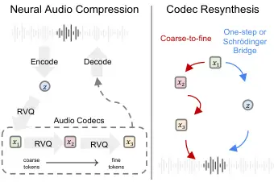

# A Closer Look at Neural Codec Resynthesis: Bridging the Gap between Codec and Waveform Generation

Alexander H. Liu Affiliation:  MIT CSAIL
Email: [alexhliu@mit.edu](mailto:)    Qirui Wang Affiliation: 
University of Washington    Yuan Gong ^(†)^(†)thanks: Yuan Gong did this
work at MIT, now he is with xAI Corp. Affiliation:  MIT CSAIL    James
Glass Affiliation:  MIT CSAIL

###### Abstract

Neural Audio Codecs, initially designed as a compression technique, have
gained more attention recently for speech generation. Codec models
represent each audio frame as a sequence of tokens, i.e., discrete
embeddings. The discrete and low-frequency nature of neural codecs
introduced a new way to generate speech with token-based models. As
these tokens encode information at various levels of granularity, from
coarse to fine, most existing works focus on how to better generate the
coarse tokens. In this paper, we focus on an equally important but often
overlooked question: How can we better resynthesize the waveform from
coarse tokens? We point out that both the choice of learning target and
resynthesis approach have a dramatic impact on the generated audio
quality. Specifically, we study two different strategies based on token
prediction and regression, and introduce a new method based on
Schrödinger Bridge. We examine how different design choices affect
machine and human perception. Audio demo page:
[https://alexander-h-liu.github.io/codec-resyn.github.io/](https://alexander-h-liu.github.io/codec-resyn.github.io/)

## 1 Introduction

Neural Codec models \[1, 2, 3\] initially emerged as compression
techniques for audio compression. Despite being originally proposed for
compression, neural audio codec models significantly impacted speech and
audio modeling \[4\] due to their discrete and low-frequency nature.
Having a tokenized representation of audio introduces many benefits. For
example, token-based modeling approaches similar to language models can
be adopted for audio generation: VALL-E \[5\], Speech-X \[6\],
AudioLM \[7\], MusicLM \[8\] and MusicGEN \[9\], just to name a few.
Besides audio generation tasks, audio codecs can also be applied to
cross-modality applications, e.g., making audio and large language model
(LLM) integration seamless  \[10\].

As shown in Fig. 1, codec models are trained to compress audio into
discrete tokens at a low frequency rate to reduce the cost of
transmission and storage. Formally, an encoder would first encode a
slice (typically around 10 to 20ms) of signal $`s`$ into a latent
$`d`$-dimensional embedding $`z\in\mathbb{R}^{d}`$. $`z`$ will then be
iteratively quantized through $`N`$ Residual Vector Quantization \[11,
12\] (RVQ) layers into $`x_{1},x_{2},...,x_{N}`$ where

```math
x_{i}=\operatorname*{\argmin}_{q\in Q_{i}}\lVert(\underbrace{z-\sum_{j=1}^{i-1}x_{j})}_{\text{residual}})-q\rVert, \tag{1}
```

and $`Q_{i}\in\mathbb{R}^{V\times d}`$ is the codebook containing $`V`$
codes ($`d`$-dimensional vectors) of the $`i`$-th RVQ layer. Notice how
each quantized embedding $`x_{i}`$ is a code within the corresponding
codebook $`Q_{i}`$. The input audio can therefore be compressed into a
sequence of discrete variables which are the indices of the codes in
their corresponding codebook. The bandwidth of neural audio codec models
can be controlled by varying the number of codebooks $`N`$ and the size
of each codebook $`V`$. The goal of audio codec models is to restore the
input signal with the quantized embedding and a decoder such that
$`s\approx\text{Decoder}(\sum_{i=1}^{N}x_{i}).`$

Due to the hierarchical structure of RVQ layers, the information carried
by the first layer RVQ code $`x_{1}`$ is at a coarse level¹¹ 1 In
practice, the set of coarse tokens can be defined as the first $`c`$ RVQ
codes $`x_{1:c}`$. This work considers the most common case $`c=1`$
without loss of generality since all methods can be extended to
$`c>1`$., and that of the remaining layers $`x_{2:N}`$ gradually becomes
more fine-grained \[7\]. Recent speech generation models \[5, 6, 7, 10,
13, 14\] have chosen to prioritize generating the coarse embedding
$`x_{1}`$. With the generated coarse embedding $`x_{1}`$, the final step
to synthesize audio is treated as a separate follow-up question and has
received less attention. Solutions are often ad-hoc, for example,
training a coarse-to-fine codec predictor with task-specific information
like text and enrolled audio recordings   \[5, 6\], or building a
text-and-audio-conditioned codec vocoder \[10\].

In this work, we aim to study a question that has been overlooked in
codec-based speech generation thus far – How to resynthesize speech
using only the coarse representation? We focus on unconditional
resynthesis that assumes only the coarse embedding $`x_{1}`$ is
available, and no other task-specific information (such as
transcription, speaker, or audio prompt) of the target speech is given.
This assumption allows us to develop general methods not restricted to
tasks or data annotation. We refer to the problem as Codec Resynthesis
since the ultimate goal is to resynthesize audio from limited codes.
Starting from coarse-to-fine resynthesis, we take a deep dive into
unconditional codec resynthesis. With the insight into the learning
target, we show how regressing continuous embedding instead of tokens is
better. We further improve the modeling approach, introducing a
discrete-to-continuous Codec Schrödinger Bridge. Finally, we present the
strengths as well as the limitations of different methods, along with
more challenges in codec resynthesis.



Figure 1: (Left) Illustration of neural codec compression with $`N=3`$.
RVQ stands for Residual Vector Quantization. (Right) Codec resynthesis
methods that generates audio from the first RVQ code $`x_{1}`$.

Figure 2: SI-SNR and ESTOI \[15\] of decoded  
audio. See §A.1 for data and metric description.

## 2 Neural Codec Resynthesis

We consider codec resynthesis at the sequence level with
non-autoregressive models, i.e., generating complete speech from the
sequence of discrete embeddings
$`(x_{1}^{(1)},...,x_{1}^{(l)},...,x_{1}^{(L)})`$ where $`L`$ is the
sequence length. We shorthand $`x_{i}\equiv x_{i}^{(1:L)}`$ hereafter
for simplicity.

Coarse-to-fine Resynthesis. Due to the hierarchical structure of RVQ
layers, each RVQ code $`x_{i}`$ depends on all the codes from prior
layers $`x_{1:i-1}`$. A simple method for codec resynthesis is therefore
to iteratively predict the RVQ codes $`x_{2:N}`$ given the first
$`x_{1}`$. This can be achieved by training a model, parameterized by
$`\theta`$, to maximize

```math
\sum_{i=2}^{N}p_{\theta}(x_{i}|x_{1:i-1},i) \tag{2}
```

where $`p_{\theta}(x_{i}|\cdot)`$ is a categorical distribution over
codebook $`Q_{i}`$. The process can be viewed as a coarse-to-fine
prediction since the later RVQ codes encode fine-grained audio
information. We note that similar coarse-to-fine models have been
studied in prior works where they are autoregressive \[7\] or
text-and-audio-conditioned \[5, 6\].

Is predicting the remaining RVQ codes $`x_{2:N}`$ necessary? While it is
reasonable to resynthesize speech in a coarse-to-fine manner, modeling
codes from all RVQ layers introduces a multi-task learning overhead
during training and the risk of error propagation during inference.
Prior work \[9\] attempted to address the issue through parallel
prediction but found coarse-to-fine prediction worked best empirically.

To find an alternative, we take a closer look at the quality of the
audio decoded from representations at different layers of the codec
model. Results are shown in Fig. 2. As expected, audio quality gradually
improved when involving more fine-grain embeddings. However, a key
observation is that the pre-quantized embedding $`z`$, although never
used as decoder input during training, yields the best audio quality.
Since the ultimate goal is to generate high-fidelity audio, this
observation suggests that predicting the remaining RVQ codes $`x_{2:N}`$
may not be necessary.

One-step Resynthesis. In light of our previous finding, we can train a
one-step resynthesis model that simply predicts $`z`$ directly from
$`x_{1}`$ through a regression model $`f_{\theta}`$ that minimizes

```math
\lVert f_{\theta}(x_{1})-z\rVert. \tag{3}
```

We refer to this regression-based method as one-step resynthesis since
projecting $`x_{1}`$ to $`z`$ requires only a single forward pass of the
model, and the result can be directly applied for decoding. Conversely,
the coarse-to-fine method requires $`N-1`$ iterations to acquire
$`x_{2:N}`$. Prior work has found one-step resynthesis to be beneficial
with audio and text conditions available \[10\], but it is unclear
whether unconditional resynthesis is possible.

Codec Schrödinger Bridge Resynthesis. Although one-step generation
sounds appealing, recent trends in generative models suggested iterative
models, such as diffusion model \[16\], tend to synthesize data of
better quality. From the output audio of one-step resynthesis (see demo
page), we also find it results in robotic-sounding artifacts in the
speech. This motivated us to explore iterative methods operating in the
continuous embedding space to learn the mapping between $`x_{1}`$ and
$`z`$.

The Schrödinger Bridge (SB) problem \[17\] aimed to find the
entropy-regularized optimal transport between two arbitrary
distributions, $`p_{x_{0}}`$ and $`p_{x_{1}}`$. The solution to SB can
be expressed by the following forward (4a) and backward (4b) stochastic
differential equations (SDEs) \[18\]:

```math
\displaystyle{\textnormal{d}}x_{t} \displaystyle=[f_{t}+\beta_{t}~{\nabla\log}{\Psi}_{t}]{\mathrm{d}t}+{\sqrt{\beta_{t}}}{\textnormal{d}}W_{t},x_{0}\sim p_{x_{0}}, \tag{4a}
```

```math
\displaystyle{\textnormal{d}}x_{t} \displaystyle=[f_{t}-\beta_{t}~{\nabla\log}\hat{{\Psi}}_{t}]{\mathrm{d}t}+{\sqrt{\beta_{t}}}{\textnormal{d}}\overline{W}_{t},x_{1}\sim p_{x_{1}}, \tag{4b}
```

where the $`T`$-step stochastic process is represented by $`x_{t}`$ with
$`t\in\{0,\frac{1}{T},\frac{2}{T},...,1\}`$, $`f_{t}(x_{t})`$ is the
linear drift, $`\beta_{t}\in\mathbb{R}^{d}`$ is the diffusion,
$`W_{t},\overline{W}_{t}\in\mathbb{R}^{d}`$ are the standard and
reversed Wiener process. The terms $`{\nabla\log}{\Psi}_{t}(x_{t})`$ and
$`{\nabla\log}\hat{{\Psi}}_{t}(x_{t})`$ are the forward and backward
non-linear drifts for SB with $`\Psi,\hat{{\Psi}}`$ being the solution
to the following coupled PDEs

```math
\begin{cases}\frac{\partial\Psi}{\partial t}=-\nabla\Psi^{\top}f-\frac{1}{2}\beta\Delta\Psi\\
\frac{\partial\hat{{\Psi}}}{\partial t}=-\nabla\cdot(\hat{{\Psi}}f)+\frac{1}{2}\beta\Delta\hat{{\Psi}}\end{cases}s.t.\Psi_{0}\hat{{\Psi}}_{0}=p_{0},\Psi_{1}\hat{{\Psi}}=p_{1}. \tag{5}
```

SB provides a general mathematical framework for distribution mapping,
but solving it can be challenging in practice since $`\Psi`$ and
$`\hat{{\Psi}}`$ are often intractable in real world applications.

Fortunately, prior work has shown that SB can be tractable for certain
applications where paired data of the two distributions is
available \[19\]. By setting $`f:=0`$ (merging linear drift into
non-linear drift) and $`\hat{{\Psi}}_{0}:=\delta_{x_{0}}`$ (Dirac delta
distribution centered around $`x_{0}`$), a neural network
$`\epsilon_{\theta}`$ for estimating the score function
$`{\nabla\log}\hat{{\Psi}}_{t}`$ of the backward SDE (4b) can be trained
through minimizing

```math
\lVert\epsilon_{\theta}(x_{t},t)-\frac{x_{t}-x_{0}}{\sigma_{t}}\rVert,~~x_{t}\sim\mathcal{N}(~\frac{\bar{\sigma}_{t}^{2}}{\bar{\sigma}_{t}^{2}+{\sigma}_{t}^{2}}x_{0}+\frac{{\sigma}_{t}^{2}}{\bar{\sigma}_{t}^{2}+{\sigma}_{t}^{2}}x_{1}~,~\frac{{\sigma}_{t}^{2}\bar{\sigma}_{t}^{2}}{\bar{\sigma}_{t}^{2}+{\sigma}_{t}^{2}}\cdot I~), \tag{6}
```

with $`\sigma^{2}_{t}{:=}\int_{0}^{t}\beta_{\tau}{\textnormal{d}}\tau`$
and
$`\bar{\sigma}^{2}_{t}{:=}\int_{t}^{1}\beta_{\tau}{\textnormal{d}}\tau`$.

|                                        |     |                       |                      |                       |                        |                    |                    |
| -------------------------------------- | --- | --------------------- | -------------------- | --------------------- | ---------------------- | ------------------ | ------------------ |
| Decoder input                          | NFE | Intrusive Metrics     |                      |                       | Perceptual Metrics     |                    |                    |
|                                        |     | SI-SNR ($`\uparrow`$) | ESTOI ($`\uparrow`$) | ViSQOL ($`\uparrow`$) | WER(%; $`\downarrow`$) | SIM ($`\uparrow`$) | MOS ($`\uparrow`$) |
| Baseline                               |     |                       |                      |                       |                        |                    |                    |
| 1$`{}^{\text{st}}`$ RVQ code $`x_{1}`$ |     | -5.39                 | 0.56                 | 2.99                  | 24.7                   | 0.217              | \-                 |
| Resynthesis Methods                    |     |                       |                      |                       |                        |                    |                    |
| Coarse-to-fine                         | 7   | -3.09                 | 0.71                 | 3.36                  | 22.2                   | 0.469              | 3.19 $`\pm`$ 0.12  |
| One-step regression                    | 1   | -1.12                 | 0.75                 | 3.52                  | 11.5                   | 0.495              | 3.06 $`\pm`$ 0.13  |
| Schrödinger Bridge                     | 1   | -1.38                 | 0.74                 | 3.49                  | 14.5                   | 0.491              | 2.95 $`\pm`$ 0.14  |
|                                        | 4   | -1.55                 | 0.74                 | 3.47                  | 18.3                   | 0.507              | \-                 |
|                                        | 7   | -1.90                 | 0.73                 | 3.42                  | 19.7                   | 0.506              | 3.43 $`\pm`$ 0.11  |
|                                        | 16  | -2.30                 | 0.72                 | 3.37                  | 21.1                   | 0.501              | 3.46 $`\pm`$ 0.11  |
|                                        | 32  | -2.52                 | 0.71                 | 3.33                  | 22.2                   | 0.493              | \-                 |
| Topline                                |     |                       |                      |                       |                        |                    |                    |
| 8 RVQ code $`x_{1:8}`$                 |     | 4.34                  | 0.88                 | 4.27                  | 2.7                    | 0.861              | \-                 |
| Pre-quantize emb. $`z`$                |     | 4.87                  | 0.95                 | 4.55                  | 2.7                    | 0.922              | \-                 |
| Ground Truth                           |     | \-                    | 1.00                 | 5.00                  | 2.4                    | 1.000              | 3.74 $`\pm`$ 0.11  |

Table 1: Codec resynthesis results. All metrics are the higher the
better except WER, see §A.1 for detailed explanation. Best results are
bolded. Number of function evaluations (NFE) reflects the number of
forward passes required for synthesis.

For codec resynthesis, we are interested in transporting between the
distribution $`p_{x_{0}}\equiv p_{z}`$ of pre-quantized embedding
$`x_{0}\equiv z`$ and the first RVQ code distribution $`p_{x_{1}}`$.
Since the pair relation $`(x_{0},x_{1})`$ is available through the audio
encoding process, Codec Schrödinger Bridge can be trained directly with
Eq. 6. During inference, Codec Schrödinger Bridge can be used to
construct the backward SDE (Eq. 4b) and derive pre-quantized embedding
$`x_{0}`$ from $`x_{1}`$ using DDPM \[16\]. The backward process can be
simulated with different step sizes by breaking down the schedule from
$`t=1`$ to $`t=0`$ into more/less segments, traversing iteratively from
$`x_{1}`$ to $`x_{0}`$. In practice, smaller step sizes result in better
generation quality \[20, 18, 19\] at a cost of more forward passes
through the model.

## 3 Experiments

Due to space constraints, details on model architecture, training
hyperparameters, datasets, and evaluation metrics are provided in
Appendix Section A.1. In Table 1, we report resynthesis results on
LibriSpeech \[21\] test-clean. The performance baseline is obtained from
audio decoded from the first RVQ code $`x_{1}`$ without resynthesis. For
resynthesis methods, the decoder of Encodec takes the resynthesis model
output as input. Different toplines should be considered for different
methods: (1) decoding with full RVQ codes $`x_{1:8}`$, which is the
topline for coarse-to-fine method; (2) decoding with pre-quantized
embedding $`z`$, which is the topline for one-step regression and
Schrödinger Bridge. Ground truth is the raw audio used as the reference
for intrusive metrics.

The pre-quantized embedding is consistently a better target. As in the
findings shown in Fig 2, the results in Table 1 indicate that
pre-quantized embedding $`z`$ not only provides a higher performance
upper bound (see toplines), but also results in better models when used
as a learning target. The one-step regression model performs better on
all intrusive metrics at a significantly lower inference cost (NFE=1).
In addition, Schrödinger Bridge consistently performs better than the
coarse-to-fine model in both objective and subjective metrics at the
same (NFE=7) or lower (NFE=4) inference cost. In short, pre-quantized
representations of codec models are better than tokens for resynthesis.

A good objective score does not imply better audio quality. It is worth
noting that the one-step regression model is considered the best model
in terms of WER and all intrusive metrics in Table 1, including SI-SNR
and ViSQOL that are commonly adopted for codec model development \[2,
3\]. However, this result contradicts human perception as reflected by
MOS. In fact, resynthesized speech from one-step regression exhibited a
lot of artificial sounding and robotic voices (see audio samples on the
demo page), resulting a similar MOS to the coarse-to-fine model. In
contrast, Codec Schrödinger Bridge significantly reduced the artifacts
when taking a smaller step size (more NFE as a trade-off), resulting in
more natural output as reflected by MOS. This finding suggests that the
well-known concept that denoising methods like diffusion \[16\] are
strong in generating high-fidelity data also holds for codec
resynthesis.

Figure 3: Word error rate (WER) and speaker similarity (SIM) w.r.t.
different NFEs for iterative methods.

|                |                |       |                |       |
| -------------- | -------------- | ----- | -------------- | ----- |
| Decoder input  | Training data  |       |                |       |
|                | LL (60k hours) |       | LS (960 hours) |       |
|                | WER(%)         | SIM   | WER(%)         | SIM   |
| Coarse-to-fine | 22.2           | 0.469 | 24.6           | 0.435 |
| One-step       | 11.5           | 0.495 | 28.8           | 0.233 |
| SB (NFE=1)     | 14.5           | 0.491 | 16.0           | 0.482 |
| SB (NFE=7)     | 19.7           | 0.506 | 22.7           | 0.485 |

Table 2: Codec resynthesis result with different amounts of training
data. LibriLight \[22\] (LL) contains more than 60k hours of speech. It
is more than 62.5x larger than LibriSpeech \[21\] (LS) which contains
960 hours of speech only.

Iterative methods improve sound quality, not content. Next, we are
interested in finding out the reason why iterative methods provided a
better MOS yet worse WER. Interestingly, we found that speech
intelligibility (as measured by Whisper) does not increase as a function
of NFE as shown in Fig. 3. This is surprising since single NFE
degenerates these iterative methods into one-step methods. For the
coarse-to-fine model, single NFE predicts only the second RVQ code
$`x_{2}`$, which suggests that the (predicted) fine-grain representation
$`x_{3:8}`$ actually introduces more noise than signal with regard to
content. Single NFE Schrödinger Bridge is conceptually the same as the
one-step regression model, which results in 14.5% WER that is closer to
that of the latter 11.5% (Table 1). This indicates that the content of
speech is harder to preserve through a more sophisticated backward
process. We note that the problem could potentially be solved with
ad-hoc model design for specific applications, e.g., conditioning the
coarse-to-fine model with phone sequence \[5\]. On the other hand,
speaker similarity generally improved as NFE increased, and we
hypothesize that naturalness plays an important role. The difference in
reference-free MOS between different NFEs with Schrödinger Bridge in
Table 1 also supported this hypothesis.

Iterative methods are less prone to overfitting. In Table 2, we report
the results of training models on LibriSpeech (960 hour) instead of
LibriLight (60k hour) to observe model behavior when massive training
data is not available. Surprisingly, the one-step method suffered
significantly from the lack of training data, resulting in the worst WER
and SIM. In contrast, the coarse-to-fine and Schrödinger Bridge models
have significantly less loss in performance. In practice, we also found
that the one-step regression model overfit the smaller training set
after 300k updates (best result reported), whereas both the
coarse-to-fine and Schrödinger Bridge model consistently improved
throughout the 500k training steps. These results suggest that iterative
methods that partition the task into smaller subtasks are less prone to
overfitting and more robust to low-resource scenarios.

## 4 Conclusion

Summarizing different methods. We first conclude that among the methods
explored in this work, coarse-to-fine generation is the least ideal
method with poor audio quality and high inference cost. The one-step
regression model is efficient and effective in subjective metrics but
results in worse objective scores and robustness. Codec Schrödinger
Bridge falls slightly behind but can be particularly useful for
generating high-fidelity audio. Finally, we note that while a clear
improvement is made by all three methods over the baseline, results
suggest that these methods still have much room for improvement.

Rethinking the evaluation metrics. We note that the ultimate goal of
codec resynthesis is finding the mapping between a coarse-level codec
and realistic audio, which can be a one-to-many mapping. In other words,
any resynthesized codec embedding that decodes into realistic audio
should be considered a success, the “ground truth” should only be used
for training but not evaluation. This is especially true for
applications like text-to-speech. Therefore, intrusive metrics are not
ideal for the task. While reference-free machine perceptual metrics like
WER can be a good alternative, it does not reflect human preference.
Finding a better automatic subjective metric that better reflects human
preference is still an important open question.

Revisiting token-based and bridge-style generation. Recent token-based
models \[5, 6\] and bridge-style models \[23, 24, 25\] each have their
strengths in speech generation. While they appear as two distinct
concepts, our findings suggest it is possible to combine the advantages
of the two different methods, as demonstrated by the proposed Codec
Schrödinger Bridge.

Limitations. We left exploring the generalizability of codec resynthesis
as an important future work. For example, the multilingual setup is
expected to be even more challenging. Besides speech, sound and music
are also common uses of audio codec models. Generalizing codec
resynthesis beyond speech can potentially reduce the burden of more
audio generative models, e.g., music generation model \[9\] that have to
autoregressively generate codec both left-to-right and course-to-fine.

Acknowledgments. The authors would like to thank Guan-Horng Liu for the
helpful discussion, Roham Mehrabi and Pei-Ling Chiang for setting up
human evaluation on AmazonTurk.

## References

- \[1\] Neil Zeghidour et al. “Soundstream: An end-to-end neural audio
  codec” In _IEEE/ACM Transactions on Audio, Speech, and Language
  Processing_ 30 IEEE, 2021, pp. 495–507
- \[2\] Alexandre Défossez, Jade Copet, Gabriel Synnaeve and Yossi Adi
  “High fidelity neural audio compression” In _arXiv preprint
  arXiv:2210.13438_, 2022
- \[3\] Rithesh Kumar et al. “High-fidelity audio compression with
  improved rvqgan” In _Advances in Neural Information Processing
  Systems_ 36, 2024
- \[4\] Haibin Wu et al. “Towards audio language modeling-an overview”
  In _arXiv preprint arXiv:2402.13236_, 2024
- \[5\] Chengyi Wang et al. “Neural codec language models are zero-shot
  text to speech synthesizers” In _arXiv preprint arXiv:2301.02111_,
  2023
- \[6\] Xiaofei Wang et al. “Speechx: Neural codec language model as a
  versatile speech transformer” In _arXiv preprint arXiv:2308.06873_,
  2023
- \[7\] Zalán Borsos et al. “Audiolm: a language modeling approach to
  audio generation” In _IEEE/ACM Transactions on Audio, Speech, and
  Language Processing_ IEEE, 2023
- \[8\] Andrea Agostinelli et al. “Musiclm: Generating music from text”
  In _arXiv preprint arXiv:2301.11325_, 2023
- \[9\] Jade Copet et al. “Simple and controllable music generation” In
  _Advances in Neural Information Processing Systems_ 36, 2023
- \[10\] Qian Chen et al. “Lauragpt: Listen, attend, understand, and
  regenerate audio with gpt” In _arXiv preprint arXiv:2310.04673_, 2023
- \[11\] Biing-Hwang Juang and A Gray “Multiple stage vector
  quantization for speech coding” In _ICASSP’82. IEEE International
  Conference on Acoustics, Speech, and Signal Processing_ 7, 1982, pp.
  597–600 IEEE
- \[12\] A Vasuki and PT Vanathi “A review of vector quantization
  techniques” In _IEEE Potentials_ 25.4 IEEE, 2006, pp. 39–47
- \[13\] Tianrui Wang et al. “VioLA: Unified Codec Language Models for
  Speech Recognition, Synthesis, and Translation” In _arXiv preprint
  arXiv:2305.16107_, 2023
- \[14\] Paul Rubenstein et al. “AudioPaLM: A Large Language Model That
  Can Speak and Listen” In _arXiv preprint arXiv:2306.12925_, 2023
- \[15\] Jesper Jensen and Cees Taal “An algorithm for predicting the
  intelligibility of speech masked by modulated noise maskers” In
  _IEEE/ACM Transactions on Audio, Speech, and Language Processing_
  24.11 IEEE, 2016, pp. 2009–2022
- \[16\] Jonathan Ho, Ajay Jain and Pieter Abbeel “Denoising diffusion
  probabilistic models” In _Advances in neural information processing
  systems_ 33, 2020, pp. 6840–6851
- \[17\] Erwin Schrödinger “Sur la théorie relativiste de l’électron et
  l’interprétation de la mécanique quantique” In _Annales de l’institut
  Henri Poincaré_ 2.4, 1932, pp. 269–310
- \[18\] Tianrong Chen, Guan-Horng Liu and Evangelos Theodorou
  “Likelihood training of Schrödinger Bridge using forward-backward sdes
  theory” In _arXiv preprint arXiv:2110.11291_, 2021
- \[19\] Guan-Horng Liu et al. “I²SB: Image-to-Image Schrödinger Bridge”
  In _arXiv preprint arXiv:2302.05872_, 2023
- \[20\] Valentin De, James Thornton, Jeremy Heng and Arnaud Doucet
  “Diffusion schrödinger bridge with applications to score-based
  generative modeling” In _Advances in Neural Information Processing
  Systems_ 34, 2021, pp. 17695–17709
- \[21\] Vassil Panayotov, Guoguo Chen, Daniel Povey and Sanjeev
  Khudanpur “Librispeech: an asr corpus based on public domain audio
  books” In _2015 IEEE international conference on acoustics, speech and
  signal processing (ICASSP)_, 2015, pp. 5206–5210 IEEE
- \[22\] J. Kahn et al. “Libri-Light: A Benchmark for ASR with Limited
  or No Supervision”
  [https://github.com/facebookresearch/libri-light](https://github.com/facebookresearch/libri-light)
  In _ICASSP 2020 - 2020 IEEE International Conference on Acoustics,
  Speech and Signal Processing (ICASSP)_, 2020, pp. 7669–7673
- \[23\] Matthew Le et al. “Voicebox: Text-guided multilingual universal
  speech generation at scale” In _Advances in neural information
  processing systems_ 36, 2024
- \[24\] Alexander Liu et al. “Generative pre-training for speech with
  flow matching” In _arXiv preprint arXiv:2310.16338_, 2023
- \[25\] Apoorv Vyas et al. “Audiobox: Unified audio generation with
  natural language prompts” In _arXiv preprint arXiv:2312.15821_, 2023
- \[26\] Ashish Vaswani et al. “Attention is all you need” In _Advances
  in neural information processing systems_ 30, 2017
- \[27\] Jingjing Xu et al. “Understanding and improving layer
  normalization” In _Advances in neural information processing systems_
  32, 2019
- \[28\] Michael Chinen et al. “ViSQOL v3: An open source production
  ready objective speech and audio metric” In _2020 twelfth
  international conference on quality of multimedia experience (QoMEX)_,
  2020, pp. 1–6 IEEE
- \[29\] Alec Radford et al. “Robust speech recognition via large-scale
  weak supervision” In _International Conference on Machine Learning_,
  2023, pp. 28492–28518 PMLR
- \[30\] Brecht Desplanques, Jenthe Thienpondt and Kris Demuynck
  “Ecapa-tdnn: Emphasized channel attention, propagation and aggregation
  in tdnn based speaker verification” In _arXiv preprint
  arXiv:2005.07143_, 2020
- \[31\] Mirco Ravanelli et al. “SpeechBrain: A general-purpose speech
  toolkit” In _arXiv preprint arXiv:2106.04624_, 2021
- \[32\] Babak Naderi and Ross Cutler “An open source implementation of
  itu-t recommendation p. 808 with validation” In _arXiv preprint
  arXiv:2005.08138_, 2020
- \[33\] Flávio Ribeiro, Dinei Florêncio, Cha Zhang and Michael Seltzer
  “Crowdmos: An approach for crowdsourcing mean opinion score studies”
  In _2011 IEEE international conference on acoustics, speech and signal
  processing (ICASSP)_, 2011, pp. 2416–2419 IEEE

## Appendix A Appendix

### A.1 Experiment Setup

Model. The 6kbps Encodec \[2\] is used for the codec model with
$`d=128`$ dimensional embedding at 75Hz, $`N=8`$ RVQ layers each with a
codebook of size $`V=1024`$. For all three methods, the input is the
discrete embedding $`x_{1}`$ of the first Encodec RVQ layer. We trained
a 12-layer Transformer Encoder \[26\] with a 16-head self-attention, an
embedding dimension of 1024/4096 for self-attention/feedforward layers,
and a 0.05 layer dropout. For the coarse-to-fine model, we used a
learnable stage embedding to encode the state $`i`$. For the Schrödinger
Bridge model, we used sinusoidal positional embedding \[26\] to encode
the timestep $`t`$. Adaptive LayerNorm \[27\] is used to normalize the
output of each layer conditioning on the stage or time embedding. We
used the Adam optimizer with a weight decay of 0.01 to train each model
for 1M steps, with learning ramping up in 32k steps and then linearly
decaying to 0 for the remaining steps. The peak learning rate for each
method is swept, 1e-4/5e-4/5e-4 is used for the
coarse-to-fine/one-step/SB model based on validation loss. Models have
around 210M parameters, and training takes 9 days on 4 A6000 GPUs. For
the Schrödinger Bridge model, we set $`T=1000`$ and $`\beta_{t}`$
followed a symmetric noise scheduling \[20\] peaking at 0.3.
Additionally, we found that conditioning the model on initial point
$`x_{1}`$ (by projecting and adding it to the Transformer input)
regardless of $`t`$ helpful.

Data. All models are trained on LibriLight \[22\], an audiobook corpus
with 60k hours of English speech. The dev-clean / test-clean subset of
LibriSpeech \[21\] is used for validation/evaluation respectively. Each
audio is randomly cropped to equal length to form an 800-second batch.

Evaluation Metrics. To assess the quality of the resynthesized speech,
the following metrics were used: Scale-Invariant Signal-to-Noise Ratio
(SI-SNR); Extended Short-Time Objective Intelligibility (ESTOI; \[15\]);
ViSQOL \[28\], an intrusive perceptual metric that estimates mean
opinion score based on spectral similarity; Word Error Rate (WER)
comparing the recognition result of Whisper v2 \[29\] on resynthesized
speech versus ground truth transcriptions; Speaker Similarity (SIM), the
cosine similarity between the speaker embedding of ground truth and
resynthesized speech extracted by ECAPA-TDNN\[30, 31\]; Subjective Mean
Opinion Score (MOS) assessing audio naturalness and quality on a scale
of 1 to 5, with increments of 1. We randomly selected 40 sentences from
the test set and collected 10 ratings for each model for each sample. We
followed the standard approach to collect ratings through
AmazonTurk \[32, 33\] with the reward of \$0.05 per rating. Each worker
rated 8 sentences and for each sentence audio from 6 different systems
were presented. We reported the average rating for each system on a 95%
confidence interval.
