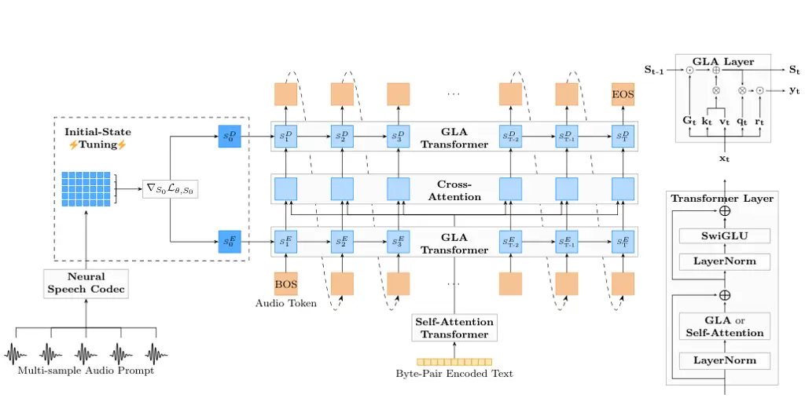

# Lina-Speech: Gated Linear Attention and Initial-State Tuning for Multi-Sample Prompting Text-To-Speech Synthesis

Théodor Lemerle    Téo Guichoux    Axel Roebel    Nicolas Obin

###### Abstract

Neural codec language models, built on transformer architecture, have
revolutionized text-to-speech (TTS) synthesis, excelling in voice
cloning by treating it as a prefix continuation task. However, their
limited context length hinders their effectiveness to short speech
samples. As a result, the voice cloning ability is restricted to a
limited coverage and diversity of the speaker’s prosody and style.
Besides, adapting prosody, accent, or appropriate emotion from a short
prefix remains a challenging task. Finally, the quadratic complexity of
self-attention limits inference throughput. In this work, we introduce
Lina-Speech, a TTS model with Gated Linear Attention (GLA) to replace
standard self-attention as a principled backbone, improving inference
throughput while matching state-of-the-art performance. Leveraging the
stateful property of recurrent architecture, we introduce an
Initial-State Tuning (IST) strategy that unlocks the possibility of
multiple speech sample conditioning of arbitrary numbers and lengths and
provides a comprehensive and efficient strategy for voice cloning and
out-of-domain speaking style and emotion adaptation. We demonstrate the
effectiveness of this approach for controlling fine-grained
characteristics such as prosody and emotion. Code, checkpoints, and demo
are freely available: https://github.com/theodorblackbird/lina-speech

¹Science and Technology of Music and Sound (STMS)

IRCAM – CNRS – Sorbonne Université – Ministère de la Culture, Paris,
France

² Institut des Sytèmes Intelligents et de Robotique (ISIR)

CNRS – Sorbonne Université, Paris, France

## 1 Introduction

Scaling text-to-speech (Betker 2023) (TTS) models and data has led to
drastic improvements with regard to quality, diversity, and cloning
capabilities. Leveraging neural audio codecs (Zeghidour et al. 2021;
Défossez et al. 2023) and next-token prediction has shown
state-of-the-art results in zero-shot voice cloning, extending
in-context learning abilities observed primarily on natural language to
codec language. Under this setting, zero-shot voice cloning is
formulated as a prompt continuation task and provides state-of-the-art
performance starting with as few as 3 seconds of audio prompt. In
contrast with prior works, this approach puts more pressure on the
pre-training stage where large-scale speech datasets are needed in order
to get sufficient in-context learning abilities and less on domain
knowledge. In this direction, transformers have been the leading
architecture for scalable autoregressive speech models; however, because
the inherent length of speech token streams is set by the codec
downsampling rate (typically  12–75 tokens/s), the quadratic scaling of
self-attention remains a key limitation. As a promising solution,
several works have introduced models based on linear-attention
(Katharopoulos et al. 2020) to improve TTS models efficiency regarding
long sequences.

In this work, we introduce Lina-Speech, a TTS model built on neural
codec language modeling. The main contributions of this paper can be
listed as follows:

- •
  We propose Gated Linear Attention (GLA) (Yang et al. 2024c) as a
  principled choice for scalable TTS, mitigating both the inference
  inefficiency of self-attention and the shortcomings of voice
  continuation by leveraging recurrent structure. In its streaming form,
  GLA admits a linear-RNN interpretation with a matrix-valued hidden
  state—the gated accumulator of key-value outer products—that serves as
  the model’s memory;
- •
  Leveraging the persistent state in GLA, we introduce _initial-state
  tuning_ (IST) as an effective conditioning mechanism for speaker and
  style. IST provides multi-sample voice conditioning through
  optimization of the initial-state, making Lina-Speech a prefix-free
  TTS;
- •
  We propose a low-rank parameterization of the initial state that
  stabilizes tuning across data scales and domains, while reducing
  embedding size and preserving output quality.

The overall architecture of Lina-Speech is presented in Figure 2.

Lina-Speech achieves competitive performance compared to
state-of-the-art baselines in terms of naturalness and similarity. At
the same time, it significantly outperforms self-attention-based codec
language models in inference throughput, making it highly efficient for
real-time serving. Additionally, the experiments conducted provide
empirical evidence that IST is a parameter-efficient learner for voice
and speaking style cloning, especially in the challenging out-of-domain
setup.

### 1.1 Related Work

Figure 1: Voice cloning by prompt continuation imposes a trade-off
between prompt length and generation length. Neural Codec Language
Models based on transformers exhibit quality degradation when generation
exceeds the context length $`L_{max}`$, which is determined by the
maximum sequence length seen during training. This creates a trade-off
between prompt length and the feasible continuation length, posing a
significant challenge for TTS where training samples are typically
limited to under 30 seconds.

#### Principled backbones for large-scale TTS

State-of-the-art large-scale TTS models heavily relied on transformer
architectures, either autoregressive (AR) (Wang et al. 2023; Betker
2023; Lyth and King 2024) or non-autoregressive (NAR) (Chang et al.
2022; Shen et al. 2024; Le et al. 2023).

AR models have shown strong performance when trained on in-the-wild
data, eliminating the need for intermediate feature representations.
Although the transformer still remains the dominant architecture for
large-scale AR generative models, the attention weights learned during
text-to-speech synthesis suggest that self-attention might be a
suboptimal choice for this particular task (Lemerle et al. 2024; Jiang
et al. 2024). Indeed, as observed in previous work, transformers in the
audio modality tend to focus on local information (Parcollet et al.
2024), leading to weights of self-attention that are concentrated near
the diagonal and a few heads of cross-attention with a strong monotonic
pattern (Lemerle et al. 2024; Shen et al. 2018). The use of self
attention for the representation of local dependencies leads to
increased computational costs and can also be seen as a lack of
inductive biases towards monotonicity, which results in instabilities
compared to non-autoregressive TTS models (Yang et al. 2024b).
Importantly, the quadratic complexity of self-attention combined with
the relatively high framerate of neural audio codec prevents training
with long context and is a bottleneck for inference throughput.

On the other hand, NAR transformers, particularly those based on
diffusion or flow-matching, traditionally require either precomputed
durations or an auxiliary generative model. While producing fine-grained
duration annotations can be challenging for noisy, large-scale datasets,
recent approaches have adopted coarser duration estimates, such as word-
or sentence-level measurements (Yang et al. 2024a). Although NAR models
often outperform AR models in terms of inference speed and robustness,
they struggle with issues like over-smoothness (Yang et al. 2024a; Ren
et al. 2022), which leads to reduced diversity and less expressive
prosody. Finally, recent research seeks to blend NAR and AR techniques:
(Xin et al. 2024) introduces explicit duration modeling in an AR
transformer to enhance robustness, while (Yang et al. 2024b) explores AR
generative models for prosody and duration modeling atop a NAR
flow-matching acoustic model.

#### Zero-shot TTS and Voice cloning by prompt continuation

Zero-shot text-to-speech (TTS) refers to the task of synthesizing speech
from unseen samples during inference. Traditional methods include the
use of speaker encoders that generate embeddings for conditioning (Wang
et al. 2018). In contrast, large-scale TTS models leverage in-context
learning capabilities with techniques like prompt continuation (Wang et
al. 2023; Peng et al. 2024b) and infilling strategies (Le et al. 2023),
and showing success using as little as 3 seconds of audio. These methods
are robust to noisy input, such as spontaneous speech (Peng et al.
2024b) and in-the-wild data.

However, self-attention for TTS typically fails to extrapolate to longer
transcripts than those seen during training (Battenberg et al. 2024). As
a consequence, during inference, voice cloning by continuation faces a
trade-off between a long prefix, containing more information about the
target speaker’s voice, and a short prefix that allows the model to
synthesize over a longer segment of the remaining context window (see
Figure 1). The use of a relatively short prefix prevents the model from
capturing fine details or particularities of a speaker. Typically:
speech prosody, speaking style, accent, or emotions require a long
observation context to fully cover the diversity and the specificity of
a speaker. Some approaches, such as Mega-TTS2 include a speaker encoder
that accepts multiple samples (Jiang et al. 2024). However, they rely on
speaker-labeled data, preventing training on weakly labeled data that
form modern large-scale datasets.

#### Soft-prompting

Soft-prompting has emerged as a powerful technique for adapting
pretrained language models to downstream tasks without fine-tuning their
parameter set. Unlike standard forms of prompting relying on manually
designed prompts, soft-prompting learns continuous vector
representations that are optimized for task-specific objectives.
Prompt-Tuning (Liu et al. 2022; Xu et al. 2023) optimizes these
embeddings directly in the input space, enabling task adaptation without
modifying the model’s core parameters. Prefix-Tuning (Li and Liang 2021)
extends this idea by prepending learned continuous vectors, or prefixes,
at every layer, effectively steering the model toward task-specific
outputs. It demonstrates strong performance in NLP tasks while reducing
computational overhead compared to full fine-tuning. Recent work on RWKV
(Peng et al. 2023; Peng et al. 2024a; Fish 2024) has demonstrated that
the initial-state of its recurrent memory can be tuned for domain
adaptation or instruction tuning of large language models. Since the
state encodes past information without growing along the time axis, it
provides a compact alternative to prompt and prefix-tuning. To the best
of our knowledge, soft-prompting techniques have not yet been explored
in the context of speech synthesis.

## 2 Preliminaries

Given an input $`\mathbf{X}\in\mathbb{R}^{N\times d}`$ self-attention
for autoregressive modeling uses the following three linear projections:
the query matrix $`\mathbf{Q}\in\mathbb{R}^{N\times d_{k}}`$, the key
matrix $`\mathbf{K}\in\mathbb{R}^{N\times d_{k}}`$, the value matrix
$`\mathbf{V}\in\mathbb{R}^{N\times d_{v}}`$, and a causal mask
$`\mathbf{M}_{i,j}=\mathbf{1}_{i<j}`$
$`\mathbf{M}\in\{0,1\}^{N\times N}`$. The parallel form of attention is
defined as:

```math
\text{Attention}(\mathbf{Q},\mathbf{K},\mathbf{V})=\text{Softmax}\left(\frac{\mathbf{Q}\mathbf{K}^{\top}}{\sqrt{d}}\odot\mathbf{M}\right)\mathbf{V},
```

where $`\odot`$ denotes element-wise multiplication, and admits the
sequential form,

```math
\displaystyle\text{Attention}(\mathbf{Q},\mathbf{K},\mathbf{V})_{t} \displaystyle=\frac{\sum_{i=1}^{t}exp(\mathbf{q_{t}k_{i}^{\top}})\mathbf{v_{i}}}{\sum_{i=1}^{t}exp(\mathbf{q_{t}k_{i}^{\top}})}.
```

during inference.

### 2.1 Linear Attention

(Katharopoulos et al. 2020) proposed to replace the softmax in
self-attention with a general kernel function $`k`$ and its associated
feature map $`\phi`$. This approach, known as linear attention, can be
expressed as:

```math
\displaystyle\text{LinearAttention}(\mathbf{Q},\mathbf{K},\mathbf{V})_{t} \displaystyle=\frac{\sum_{i=1}^{t}\phi(\mathbf{q_{t}})\phi(\mathbf{k_{i}})^{\top}\mathbf{v_{i}}}{\sum_{i=1}^{t}\phi(\mathbf{q_{t}})\phi(\mathbf{k_{i}})^{\top}}. \tag{1}
```

Denote

```math
\displaystyle\mathbf{S_{t}}=\sum_{i=1}^{t}\phi(\mathbf{k_{i}})^{\top}\mathbf{v_{i}},\quad\mathbf{z_{t}}=\sum_{i=1}^{t}\phi(\mathbf{k_{i}})^{\top},\mathbf{o_{t}}=\frac{\mathbf{\phi({q_{t}}})\mathbf{S_{t}}}{\mathbf{\phi(q_{t})z_{t}}}
```

Eq. 1 can be reformulated into a recursive form through the update rule:

```math
\displaystyle\mathbf{S_{t}} \displaystyle=\mathbf{S_{t-1}}+\phi(\mathbf{k_{t}})^{\top}\mathbf{v_{t}}, \tag{2}
```

```math
\displaystyle\mathbf{z_{t}} \displaystyle=\mathbf{z_{t-1}}+\phi(\mathbf{k_{t}})^{\top},\mathbf{o_{t}} \displaystyle=\frac{\phi(\mathbf{q_{t}})\,\mathbf{S_{t}}}{\phi(\mathbf{q_{t}})\,\mathbf{z_{t}}}.
```

revealing that it essentially functions as a recurrent neural network
with a matrix-valued state.

The choice of $`\phi`$ being the linear kernel ($`\phi=Id`$) has been a
popular line of research (Peng et al. 2024a; Yang et al. 2024c; Sun et
al. 2023). Furthermore, it has been observed that in practice the
normalization term can be omitted, thus simplifying Eq. 2 into:

```math
\mathbf{S_{t}}=\mathbf{S_{t-1}}+\mathbf{k_{t}}^{\top}\mathbf{v_{t}},\quad\mathbf{o_{t}}=\mathbf{q_{t}}\mathbf{S_{t}}, \tag{3}
```

where: $`\mathbf{S_{t}}`$ acts as a constant-size kv-cache in
traditional self-attention transformer.

### 2.2 Gated Linear Attention (GLA)

While linear attention provides a constant memory footprint and achieves
linear time complexity during inference, its parallel form remains
constrained by quadratic time complexity, and the recurrent form poses
challenges for efficient training on modern hardware. Recent advances in
linear-complexity language models—such as RWKV-6 (Peng et al. 2023; Peng
et al. 2024a), GLA (Yang et al. 2024c), and Mamba (Gu and Dao 2024; Dao
and Gu 2024) demonstrate that introducing data-dependent gating
mechanism (Sun et al. 2023; Peng et al. 2023) substantially closes the
performance gap with self-attention transformers. Additionally, various
techniques have been proposed to enhance hardware-efficiency for
linear-scaling language models, including the prefix-sum algorithm (Gu
and Dao 2024; Katsch 2023) and chunk-wise computation (Yang et al.
2024c; Dao and Gu 2024; Sun et al. 2023).



Figure 2: Lina-Speech model. $`S^{E}_{t}`$ and $`S^{D}_{t}`$ are encoder
and decoder states at time-step $`t`$ respectively. These states consist
of one matrix per GLA layer and per head. For $`t=0`$, they default to
$`\mathbf{0}`$ but can be tuned efficiently on a specific speaker or
style. Initial-state tuning consists of replacing the initial 0 by means
of an initial state that is learned using a soft prompt while freezing
the models parameters $`\theta`$.

For these reasons, Gated Linear Attention (Yang et al. 2024c) (GLA)
comes with a data-dependent structured gating mechanism, resulting in
the following update rule:

```math
\mathbf{S_{t}}=\mathbf{G_{t}}\odot\mathbf{S_{t-1}}+\mathbf{k_{t}^{\top}}\mathbf{v_{t}},\quad\mathbf{o_{t}}=\mathbf{q_{t}}\mathbf{S_{t}}, \tag{4}
```

where: $`\mathbf{G_{t}=\alpha_{t}^{\top}1}`$ is a decay matrix that
modulates the contribution of past states.

#### Performance

GLA achieved state-of-the-art results at linear-complexity language
modeling, even matching or surpassing transformer models for some tasks
at large scale.

#### Efficiency

GLA admits hardware-efficient implementation (Yang et al. 2024c) by
imposing some structure to the gating term $`\mathbf{G_{t}}`$ and
leveraging chunk-wise calculation of Eq. (4). It enables higher
inference throughput compared to a similar size transformer on long
sequences when doing batch inference. Its recurrent nature and constant
memory footprint make it an attractive option for tasks like audio
modeling, streaming, or on-device applications.

#### Principled choice for scalable TTS

While these linear complexity language models are known to underperform
on recall-intensive tasks (Arora et al. 2024), we hypothesize that they
could mitigate the inefficiency of self-attention in domains like speech
modeling (Parcollet et al. 2024; Lemerle et al. 2024; Jiang et al.
2024), where it appears to be less critical or even unnecessary.

## 3 Method

Lina-Speech is an autoregressive generative model $`p_{\theta}`$
designed to approximate the distribution of neural audio codec token
sequence, denoted as $`c`$, conditioned on text input $`x`$, with
$`\theta`$ representing the model parameters, that is:

```math
p_{\theta}(c|x)=\prod_{t=1}^{T}p_{\theta}(c_{t}|c_{<t},x). \tag{5}
```

### 3.1 Model architecture and inference

The general architecture of Lina-Speech is presented in Figure 2.

#### Model architecture

The text encoder is a non-causal transformer encoder with self-attention
as time-mixing operator and SwiGLU (Shazeer 2020) as a feed-forward
network. It employs RoPE positional encoding (Su et al. 2024). The
acoustic model includes both an audio encoder and a decoder, featuring a
causal transformer architecture with GLA as a time-mixing operator,
SwiGLU (Shazeer 2020) as a feed-forward network, and no positional
encoding.

The decoder takes input from the audio encoder and a cross-attention
layer between the text and audio encoder outputs. To improve robustness,
we used the position-aware cross-attention from (Lemerle et al. 2024),
and replaced sinusoidal positional encoding with convolutional
positional encoding for enhanced training stability.

#### Inference

We use top-$`k`$ sampling with $`k=100`$ and treat the EOS token as an
additional token in the audio codebook.

### 3.2 Initial-state tuning

We have seen that Gated Linear Attention achieves linear complexity by
replacing the expanding key-value cache of traditional transformers with
a constant-sized memory, represented by the matrix-valued state
$`\mathbf{S_{t}}`$ in Eq. (4). During inference, the initial states are
initialized by default to zeros, i.e., $`\mathbf{S_{0}}=\mathbf{0}`$.
This memory can be subject to soft-prompting by treating them as
learnable parameters while freezing the model parameters. We refer to
this strategy as initial-state tuning (IST) and it can be formalized as
follows:

Let $`S^{(i)}_{0}(\phi)`$ denote the learnable initial state of layer
$`i`$, and let $`S_{0}(\phi)=\{S^{(i)}_{0}(\phi)\}_{i=1}^{L}`$. We write
the TTS backbone as $`f(x;\,\theta,S_{0}(\phi))`$, where $`\theta`$ are
pretrained weights kept frozen. Given paired text-speech samples
$`(x,y)\sim\mathcal{D}`$ of the target speaker’s voice, we optimize only
$`\phi`$:

```math
\min_{\phi}\;\mathbb{E}_{(x,y)\sim\mathcal{D}}\Big[\mathrm{CE}\big(f(x;\,\theta,S_{0}(\phi)),\,y\big)\Big],\qquad\text{with }\frac{\partial\mathcal{L}}{\partial\theta}=0.
```

In practice, we found that a low-rank matrix representation of the
Initial States, $`S_{0}(\phi)`$, improved performance. This aspect is
further discussed in Section 5.3.

#### IST for Prefix-Free and Multi-Sample Prompting TTS

Voice continuation relies on using audio and text references as a
prefix, which reduces the remaining available context length. In
contrast, IST relies solely on the initial-state, enabling generation up
to the maximum length observed during training. Because the resulting
state is text-agnostic, it prevents semantic leaks from a particular
text prompt. We show that this approach is particularly well-suited for
voice cloning and adaptation using multiple samples without requiring
any architectural or training modifications. In practice, initializing
the model’s recurrent state with an observation of arbitrary length and
number of segments provides a richer context window. This method enables
the model to more accurately capture the distribution and diversity of
speech prosody, addressing a key challenge in voice cloning either with
speaker embedding or voice continuation.

Experimental evaluation reported in Section 5.3 provide empirical
evidence that IST is an efficient strategy for zero-shot voice-cloning
and speaking style adaptation, among some other empirical properties
such as: fast tuning, efficient low-rank approximation of the
initial-state, and low-sensitivity to tuning parameters.

## 4 Experiments

Three experiments were conducted to assess the performance of the
proposed Lina-Speech architecture for TTS, by comparison with existing
baselines, and by providing specific further experiments to address the
efficiency of Gated-Linear Attention (GLA) and Initial-State Tuning
(IST). The remainder of this section describes the three experiments,
the general experimental setup, the metrics used, and the baselines
selected for the comparison.

### 4.1 Experiment \#1: Zero-Shot Voice Cloning

As a first experiment, we conducted an evaluation of Lina-Speech on a
zero-shot voice cloning task, using voice continuation and initial-state
tuning, with comparison to the baselines. In order to assess the
zero-shot voice-cloning ability both on in- and out-of-domain datasets,
we conducted two series of evaluations. For the in-domain setup, we
evaluated on the two test splits of LibriTTS. For the out-of-domain
setup, we evaluated on the Expresso dataset (Nguyen et al. 2023), which
consists of studio-quality recordings of 4 speakers labeled with
different emotions or styles (happy, sad, whisper …). As a baseline for
this experiment, we fine-tuned Parler-TTS from the official repository
on the Expresso dataset.

### 4.2 Experiment \#2: Focus Study on GLA vs. Self-Attention

A second experiment was conducted with a particular focus on the
properties of the attention mechanisms used in Lina-Speech. In
particular, a comparison of Self-Attention (SA) and Gated Linear
Attention (GLA) within the same Lina-Speech architecture is provided.
Firstly, SA and GLA were compared in terms of inference speed. Then,
they were additionally compared on the Zero-Shot Voice-Cloning task
described in the previous experiment.

### 4.3 Experiment \#3: Focus Study on Initial-State Tuning

A third experiment was conducted with a particular focus on the
properties of the IST in Lina-Speech.

### 4.4 Experimental setup

#### Datasets

We trained Lina-Speech on a publicly available English subset of MLS¹¹ 1
parler-tts/mls˙eng˙10k (Lacombe et al. 2024) which consists of 10k hours
of librivox recordings. We do not use the provided transcription and
rather use the Automatic Speech Recognition (ASR) model NeMo²² 2
https://catalog.ngc.nvidia.com/orgs/nvidia/teams/nemo/models/stt˙en˙fastconformer˙hybrid˙large˙pcstt_en_fastconformer_hybrid_large_pc.
We also added both LibriTTS (Zen et al. 2019) and its restored version
LibriTTS-R (Koizumi et al. 2023) with their normalized transcripts. We
used WavTokenizer (Ji et al. 2024)³³ 3
https://huggingface.co/novateur/WavTokenizer-medium-speech-75token/tree/mainWavTokenizer-medium-speech-75token
as a neural audio codec that encodes speech at a rate of 75 token/s,
with a codebook size of 4096 (Koizumi et al. 2023). For text
representation, we trained a byte-pair encoding tokenizer with a
vocabulary size of 256 on the lower-cased transcripts from LibriTTS.

#### Training and Inference

The main model is trained for next-token prediction with cross-entropy
loss for 500k steps with a batch size of approximately 100k tokens
($`\approx 22`$ min of speech). We use AdamW optimizer with a learning
rate of $`2\text{\times}{10}^{-4}`$, a cosine learning rate schedule
with linear warmup for the first 1k steps, a weight decay of $`0.1`$ and
gradient clipping of $`1.`$ We group samples of similar lengths within
10 buckets in order to avoid padding. We rely on the official
hardware-efficient implementation of GLA provided in the
flash-linear-attention repository(Yang and Zhang 2024).

#### Objective metrics

We measure word error rate (WER) and character error rate (CER) using
the same ASR model from NeMo as for speech transcription. We also
measured speaker similarity (Sim-O) as the cosine similarity of WavLM
(Chen et al. 2022) embedding of target and synthesized speech using a
pretrained checkpoint⁴⁴ 4 wavlm-base-plus-sv.

#### Subjective metrics

We conducted a subjective experiment using Mean Opinion Score (MOS) to
rate the perceived naturalness (N-MOS) and similarity to the target
speaker (S-MOS) via the platform Prolific. 165 subjects participated in
the experiment, each subject rated 20 speech stimuli randomly drawn from
real-speech, Lina-Speech and the baselines generated speech. We applied
several filters to assess the qualification of the subjects, to reject
those who do not fulfill the necessary conditions to be considered
qualified for the evaluation. The list of exclusion conditions
comprises: non-native English speaker, rate below 3 any real speech
sample on the N-MOS, time spent to complete the experiment is below 3m
30s, the mean MOS of the subject deviates from the overall mean of all
subjects by more than two standard deviations, as proposed by (Kim et
al. 2024). A subject was considered not qualified if at least one of the
conditions was not fulfilled. Applying these filters, the qualification
rate of the subjects was about 76%. We rejected 39 subjects from a total
of 165, so the total of qualified subjects was 126 whose ratings were
further used for analysis.

|                          |                    |                |                   |                   |                   |                               |                               |           |
| ------------------------ | ------------------ | -------------- | ----------------- | ----------------- | ----------------- | ----------------------------- | ----------------------------- | --------- |
| Dataset                  | Model              | Method         | Obj. Eval.        |                   |                   | Subj. Eval.                   |                               | \#Params. |
|                          |                    |                | CER$`\downarrow`$ | WER$`\downarrow`$ | Sim-O$`\uparrow`$ | N-MOS$`\uparrow`$             | S-MOS$`\uparrow`$             |           |
| LibriTTS (in-domain)     | Ground Truth       | \-             | 1.5%              | 4.5%              | \-                | $`4.41\pm 0.14`$              | $`4.31\pm 0.17`$              | \-        |
|                          | StyleTTS2          | Sp. Enc.       | 0.8%              | 3.2%              | 0.89              | $`4.02\pm 0.16`$              | $`3.95\pm 0.22`$              | 148M      |
|                          | XTTS v2            | Sp. Enc.       | 2.5%              | 5.5%              | 0.93              | $`3.62\pm 0.20`$              | $`3.23\pm 0.24`$              | 443M      |
|                          | VoiceCraft         | Pr. Cont.      | 2.8%              | 7.5%              | 0.94              | $`3.73\pm 0.24`$              | $`3.57\pm 0.23`$              | 830M      |
|                          | CosyVoice2         | Pr. Cont.      | 1.1%              | 3.8%              | 0.95              | $`3.89\pm 0.19`$              | $`3.98\pm 0.18`$              | 500M      |
|                          | Lina-Speech (ours) | Pr. Cont.      | 2.8%              | 6.9%              | 0.93              | $`{4.14\pm 0.20}`$            | $`{4.07\pm 0.18}`$            | 311M      |
|                          | Lina-Speech (ours) | IST            | 2.8%              | 6.5%              | 0.93              | $`\boldsymbol{4.16\pm 0.19}`$ | $`\boldsymbol{4.14\pm 0.17}`$ | 311M      |
| Expresso (out-of-domain) | Ground Truth       | \-             | 1.6%              | 5.1%              | \-                | $`4.59\pm 0.24`$              | $`4.34\pm 0.22`$              | \-        |
|                          | Parler-TTS (FT)    | Nat. Lang. Pr. | 2.6%              | 4.4%              | 0.88              | $`{3.59\pm 0.29}`$            | $`3.41\pm 0.28`$              | 674M      |
|                          | XTTS v2            | Sp. Enc.       | 1.0%              | 2.7%              | 0.85              | $`3.64\pm 0.26`$              | $`3.09\pm 0.27`$              | 443M      |
|                          | VoiceCraft         | Pr. Cont.      | 3.5%              | 5.4%              | 0.85              | $`3.54\pm 0.20`$              | $`3.14\pm 0.24`$              | 830M      |
|                          | CosyVoice2         | Pr. Cont.      | 0.4%              | 1.7%              | 0.89              | $`{3.85\pm 0.26}`$            | $`3.25\pm 0.27`$              | 500M      |
|                          | Lina-Speech (ours) | Pr. Cont.      | $`{1.1\%}`$       | $`{3.1\%}`$       | 0.82              | $`3.79\pm 0.24`$              | $`3.11\pm 0.27`$              | 311M      |
|                          | Lina-Speech (ours) | IST            | $`{1.3\%}`$       | $`{3.2\%}`$       | $`{0.86}`$        | $`{3.94\pm 0.20}`$            | $`\boldsymbol{3.63\pm 0.28}`$ | 311M      |

Table 1: Zero-shot voice-cloning experiment conducted on in-domain
(LibriTTS test clean split) and out-of-domain (Expresso) datasets. The
objective evaluation includes: Word Error Rate (WER), Character Error
Rate (CER), and cosine similarity to the reference speaker (Sim-O). The
subjective evaluation includes: MOS for naturalness (N-MOS) and MOS for
similarity to the reference speaker (S-MOS). The results obtained for
the subjective evaluation are reported along with their 95% confidence
interval. Lina-Speech presents the highest scores both in terms of
naturalness and similarity to the reference speaker. The number of
parameters for each model is reported in \#Params.

### 4.5 Baselines

The baselines used for comparison include:

- •
  The TTS enhanced version of VoiceCraft (Peng et al. 2024b), a
  decoder-only transformer trained on GigaSpeech and Libri-light, which
  includes an EnCodec model specifically trained for speech.
- •
  StyleTTS2 (Li et al. 2024) an end-to-end TTS model that leverages
  latent diffusion for style modeling. We evaluate it only on LibriTTS
  as we have found it unable to adapt to highly expressive data.
- •
  Parler-TTS (Lacombe et al. 2024), is a series of reproduction of (Lyth
  and King 2024) that allows synthesis controlled by textual description
  of the voice. Interestingly, this reproduction differs from the
  original paper by separating text and audio sequence and employing
  cross-attention between the two modalities instead of self-attention
  on the concatenation of both, making the architecture closer to
  Lina-Speech. They leverage DAC (Kumar et al. 2024) as audio codec. We
  used a fine-tuned checkpoint on Expresso and evaluated it on this
  dataset only.
- •
  XTTS v2 (Casanova et al. 2024), a large-scale multilingual TTS model
  that extends on the architecture of Tortoise (Betker 2023).
- •
  CosyVoice2 (Du et al. 2024), a recently introduced large-scale Neural
  Codec LM combined with a flow-matching decoder, which includes many
  improvements related to semantic modeling and is built on top of a
  text language model.

The choices of the baselines provides a strong benchmark of existing TTS
models with a variety of strategies for zero-shot voice-cloning (see
Fig. 1): speaker embedding (StyleTTS2 and XTTS v2), prompt continuation
(VoiceCraft, CosyVoice2, and Lina-Speech), natural language prompting
(Parler-TTS), and initial-state tuning (Lina-Speech).

## 5 Results

This section presents the results obtained for the three experiments.

### 5.1 Experiment \#1: Zero-Shot Voice-Cloning

Table 1 presents the results obtained for in- and out-of-domain datasets
with Lina-Speech and the other baselines. On the LibriTTS dataset,
Lina-Speech performs competitively with existing models. When using
Initial-State Tuning, Lina-Speech shows comparable performance to other
leading models in terms of both objective and subjective metrics.
Notably, Lina-Speech achieves the highest MOS scores for naturalness and
speaker similarity, outperforming several models with significantly
larger parameter sizes. On the Expresso dataset, Lina-Speech continues
to demonstrate strong performance, particularly in speaker similarity.
While other models, such as CosyVoice2, show better results in objective
evaluations, Lina-Speech (Initial-State Tuning) achieves notable
improvements in subjective evaluations, particularly in speaker
similarity.

#### Prompt Continuation vs. Initial-State Tuning

Lina-Speech with IST consistently enhances speaker similarity (S-MOS)
compared to Lina-Speech with the standard voice continuation method,
both on in- and out-of-domain datasets. The improvement on Expresso is
particularly noteworthy, as Lina-Speech was trained exclusively on
LibriVox recordings, while other baselines include models that have
undergone fine-tuning or large-scale pretraining.

### 5.2 Experiment \#2: GLA vs. Self-Attention

Figure 3: Inference speed comparison between self-attention and gated
linear attention. The inference speed was measured on a RTX4090 for
varying batch sizes. We compared Lina-Speech against a Self-Attention
equivalent model. While self-attention is slightly faster for small
batch sizes, Lina-Speech benefits from a much higher inference
throughput.

#### Efficient inference

The linear nature of GLA greatly improves inference throughput over
self-attention for batched generation and long sequences (see Fig. (3))
and presents slightly better performance (see Tab. 2). In particular,
the inference throughput of GLA is below real-time inference regardless
of the batch size, making it an attractive option for efficient
low-latency serving. Moreover, once tuned with IST the state can be
reused across different generations, which makes the tuning process
amortizable, unlike voice continuation. Indeed, prefix continuation
incurs a constant prefill cost and adequate padding for batched
generation. In contrast, since IST leaves the model weights unchanged so
that a single model can generate in parallel from different initial
states for the same computational cost as unconditional generation.

|                    | CER $`\downarrow`$ | WER $`\downarrow`$ | Sim-O $`\uparrow`$ | ppl $`\downarrow`$ |
| ------------------ | ------------------ | ------------------ | ------------------ | ------------------ |
| Lina-Speech w. GLA | 2.8                | 6.9                | 0.93               | 49.6               |
| Lina-Speech w. SA  | 3.2                | 7.8                | 0.93               | 50.4               |

Table 2: GLA Ablation study. We report test perplexity as ppl and
evaluate on LibriTTS test clean split.

### 5.3 Experiment \#3: Initial-State Tuning

#### Efficient tuning

The method typically achieves convergence within 100 steps (see Fig.
(4)), with a runtime ranging from 5s to 20s on an RTX 4090 for a target
speaker or style, providing from 45s to 20min of audio.

Figure 4: Initial-State Tuning convergence speed. IST converges rapidly,
typically within 100 steps, with an average runtime of under 20s on an
RTX 4090. Example shown for speaker ex01 with the emotion ”sad” from the
Expresso dataset. We report training and test losses. We also reported
the loss averaged over 16 different prompts (voice continuation) and
unconditioned (base model) for comparison.

#### Low-rank initial-state

We successfully experimented with a special variant of IST, where
$`\mathbf{S_{0}}`$ is represented as a low-rank matrix. In practice we
have found that the state matrix can be parameterized as a rank-1 matrix
(that is $`\mathbf{S_{0}}=\mathbf{k_{0}^{T}v_{0}}`$), reducing the
parameters set to a pair of vectors per head and per layer, while
maintaining across all datasets near optimal performance (see Fig. (5)),
and demonstrated in all cases, better performance than a full-rank
initial-state matrix.

#### Low sensitivity to tuning parameters

We have found initial-state tuning to be remarkably stable across
different datasets with various backgrounds, recording conditions and
sizes (see Fig. (5)), such as audiobooks (Zen et al. 2019), high-quality
expressive speech (Nguyen et al. 2023) or recorded conferences
(Hernandez et al. 2018). In practice, we do not need to tune the
learning parameters for each speaker nor do we use early stopping as we
have found the low-rank parametrization to play a crucial role in
regularization. This contrasts with fine-tuning which typically needs
supervision in order to avoid catastrophic forgetting, especially when
the amount of data is low (e.g., few minutes). In practice, and in all
the experiments below, we tune $`\mathbf{S_{0}}`$ using AdamW, a
learning rate of $`2^{-3}`$, a batch size of 8 for a maximum of 100
steps over the samples per speaker or style.

Figure 5: Impact of the rank and learning rate for initial-state tuning
on the test loss, from left to right on Expresso, TED-LIUM and LibriTTS
datasets. For each dataset we report the best test loss averaged over 20
random speakers/styles. In particular, initial-state parameterized as a
rank-one matrix performs best on TED-LIUM (Hernandez et al. 2018) and
LibriTTS and is close to the best rank on Expresso. Notably, the optimal
learning rate does not vary across datasets.

### 5.4 Summary

The main empirical findings of the three experiments presented in
Section 5 can be summarized as follows.

First, Lina-Speech achieves strong performance, particularly in
naturalness and speaker similarity, while maintaining a moderate model
size. In particular, it remains competitive in both objective and
subjective evaluations with comparable or higher performance when
compared to larger models such as VoiceCraft and CosyVoice2. It also
presents a constant memory footprint and a much higher inference
throughput compared to the standard self-attention.

Second, IST is proven to be efficient for zero-shot voice and speaking
style cloning, in particular to out-of-domain speaking styles or
emotions. It outperforms all the existing strategies used for
voice-cloning, either with speaker embeddings or prompt continuation. We
observed that the multi-sample prompting allows to reproduce more finely
the diversity and the specificity of the speaking style of a speaker.
Furthermore, IST is simple and fast to tune, has an efficient low-rank
approximation, and has low-sensitivity to tuning parameters.

In conclusion, Lina-Speech presents comparable performance to the other
LM TTS models in terms of objective metrics and demonstrates significant
improvements in terms of subjective metrics, while having much less
parameters than the other models. We note a slight degradation in
naturalness that co-occurs with the increase in similarity with
initial-state tuning. We associate this with the increasing difficulty
related to the highly expressive data that composes Expresso and the
fact that our training data is less diverse than other baselines, as
corroborated by the lowest similarity in prompt continuation among all.

## 6 Limitations and future work

#### Audio Codec

We found that WavTokenizer (Ji et al. 2024) generalizes less effectively
across diverse voices, languages, and recording conditions compared to
EnCodec (Défossez et al. 2023) and DAC (Kumar et al. 2024). However, its
semantically richer latent space may contribute to higher overall
generation quality. This could explain why Lina-Speech outperforms
larger or end-to-end models, particularly on LibriTTS. Future work in
latent audio modeling should be considered to better understand and
refine our architectural improvements.

#### Streamability

Although Lina-Speech demonstrates nearly linear time complexity within
its context window, additional work is needed in order to enable
seamless streaming. To achieve this, we plan to explore chunk-based text
encoding and windowed cross-attention to enable fully linear, streaming
synthesis.

#### Initial-state tuning

In this work we introduced low-rank structured initial-state. This
approach has been successful for adapting to a small amount of data
samples and may benefit other modalities such as natural language. We
also plan to use initial-state tuning for generating high-quality
synthetic dataset.

## 7 Conclusion

In this paper, we introduce Lina-Speech, a novel text-to-speech (TTS)
model built upon a neural codec language model. We demonstrate that
Gated Linear Attention (GLA) constitutes a robust foundation for
scalable TTS systems, achieving state-of-the-art performance while
substantially improving inference throughput. Moreover, we propose a new
technique for conditioning the model on a larger amount of audio by
tuning a low-rank constrained initial state. This approach effectively
addresses the limitations of fixed context length, allowing the model to
handle more—and longer—conditioning audio efficiently. Our experimental
results show that this method leads to significant improvements in tasks
such as audiobooks narration and expressive speech generation.

## 8 Impact statement

This paper presents an approach to improving TTS through principled
architecture choices and better prompting strategies. While our work
improves the quality and flexibility of voice cloning, we acknowledge
potential ethical concerns, particularly regarding misuse in deepfake
generation, unauthorized voice replication, and speaker identity theft.
To mitigate these risks, we advocate for the responsible use of our
techniques, including watermarking, speaker verification safeguards, and
adherence to ethical AI deployment guidelines. By improving
controllability and fidelity in TTS, our research contributes to both
scientific advancements and practical applications, with the potential
to benefit individuals who rely on synthetic speech while emphasizing
ethical considerations in voice cloning technology.

## References

- Arora et al. (2024) S. Arora, S. Eyuboglu, M. Zhang, A. Timalsina, S.
  Alberti, D. Zinsley, J. Zou, A. Rudra, and C. Ré Simple linear
  attention language models balance the recall-throughput tradeoff. In
  ES-FoMo II: 2nd Workshop on Efficient Systems for Foundation Models,
  International Conference on Machine Learning (ICML), Cited by: §2.2.
- Battenberg et al. (2024) E. Battenberg, R. Skerry-Ryan, D. Stanton, S.
  Mariooryad, M. Shannon, J. Salazar, and D. Kao Robust and unbounded
  length generalization in autoregressive transformer-based
  text-to-speech. arXiv preprint arXiv:2410.22179. Cited by: §1.1.
- Betker (2023) J. Betker Better Speech Synthesis through Scaling. arXiv
  preprint arXiv:2305.07243. Cited by: §1.1, §1, 4th item.
- Casanova et al. (2024) E. Casanova, K. Davis, E. Gölge, G. Göknar, I.
  Gulea, L. Hart, A. Aljafari, J. Meyer, R. Morais, S. Olayemi, and J.
  Weber XTTS: a massively multilingual zero-shot text-to-speech model.
  In Interspeech 2024, pp. 4978–4982. External Links:
  [Document](https://dx.doi.org/10.21437/Interspeech.2024-2016), ISSN
  2958-1796 Cited by: 4th item.
- Chang et al. (2022) H. Chang, H. Zhang, L. Jiang, C. Liu, and W. T.
  Freeman MaskGIT: Masked Generative Image Transformer. In Proceedings
  of the IEEE/CVF Conference on Computer Vision and Pattern Recognition
  (CVPR), pp. 11315–11325. Cited by: §1.1.
- Chen et al. (2022) S. Chen, C. Wang, Z. Chen, Y. Wu, S. Liu, Z.
  Chen, J. Li, N. Kanda, T. Yoshioka, X. Xiao, et al. WavLM: Large-Scale
  Self-Supervised Pre-Training for Full Stack Speech Processing. IEEE
  Journal of Selected Topics in Signal Processing 16 (6), pp. 1505–1518.
  Cited by: §4.4.
- Dao and Gu (2024) T. Dao and A. Gu Transformers are SSMs: Generalized
  Models and Efficient Algorithms Through Structured State Space
  Duality. In International Conference on Machine Learning (ICML),
  pp. 10041–10071. Cited by: §2.2.
- Défossez et al. (2023) A. Défossez, J. Copet, G. Synnaeve, and Y. Adi
  High Fidelity Neural Audio Compression. Transactions on Machine
  Learning Research. Cited by: §1, §6.
- Du et al. (2024) Z. Du, Y. Wang, Q. Chen, X. Shi, X. Lv, T. Zhao, Z.
  Gao, Y. Yang, C. Gao, H. Wang, et al. CosyVoice 2: scalable streaming
  speech synthesis with large language models. arXiv preprint
  arXiv:2412.10117. Cited by: 5th item.
- Fish (2024) J. Fish Init State Tuning repository. Note:
  https://github.com/Jellyfish042/RWKV-StateTuning Cited by: §1.1.
- Gu and Dao (2024) A. Gu and T. Dao Mamba: Linear-Time Sequence
  Modeling with Selective State Spaces. In Submitted to International
  Conference on Learning Representations (ICLR), Cited by: §2.2.
- Hernandez et al. (2018) F. Hernandez, V. Nguyen, S. Ghannay, N.
  Tomashenko, and Y. Esteve TED-lium 3: twice as much data and corpus
  repartition for experiments on speaker adaptation. In Speech and
  Computer: 20th International Conference, SPECOM 2018, Leipzig,
  Germany, September 18–22, 2018, Proceedings 20, pp. 198–208. Cited by:
  Figure 5, Figure 5, §5.3.
- Ji et al. (2024) S. Ji, Z. Jiang, X. Cheng, Y. Chen, M. Fang, J.
  Zuo, Q. Yang, R. Li, Z. Zhang, X. Yang, et al. WavTokenizer: an
  Efficient Acoustic Discrete Codec Tokenizer for Audio Language
  Modeling. arXiv preprint arXiv:2408.16532. Cited by: §4.4, §6.
- Jiang et al. (2024) Z. Jiang, J. Liu, Y. Ren, J. He, Z. Ye, S. Ji, Q.
  Yang, C. Zhang, P. Wei, C. Wang, X. Yin, Z. Ma, and Z. Zhao Mega-TTS
  2: Boosting Prompting Mechanisms for Zero-Shot Speech Synthesis. In
  International Conference on Learning Representations (ICLR), Cited by:
  §1.1, §1.1, §2.2.
- Katharopoulos et al. (2020) A. Katharopoulos, A. Vyas, N. Pappas,
  and F. Fleuret Transformers are RNNs: Fast Autoregressive Transformers
  with Linear Attentionn. In International Conference on Machine
  Learning (ICML), pp. 5156–5165. Cited by: §1, §2.1.
- Katsch (2023) T. Katsch Gateloop: fully data-controlled linear
  recurrence for sequence modeling. arXiv preprint arXiv:2311.01927.
  Cited by: §2.2.
- Kim et al. (2024) J. Kim, K. Lee, S. Chung, and J. Cho CLaM-TTS:
  Improving Neural Codec Language Model for Zero-Shot Text-to-Speech. In
  International Conference on Learning Representations (ICLR), Cited by:
  §4.4.
- Koizumi et al. (2023) Y. Koizumi, H. Zen, S. Karita, Y. Ding, K.
  Yatabe, N. Morioka, M. Bacchiani, Y. Zhang, W. Han, and A. Bapna
  LibriTTS-R: A Restored Multi-Speaker Text-to-Speech Corpus.
  pp. 5496–5500. External Links:
  [Document](https://dx.doi.org/10.21437/Interspeech.2023-1584) Cited
  by: §4.4.
- Kumar et al. (2024) R. Kumar, P. Seetharaman, A. Luebs, I. Kumar,
  and K. Kumar High-Fidelity Audio Compression with Improved RVQGAN.
  Advances in Neural Information Processing Systems (NeurIPS) 36. Cited
  by: 3rd item, §6.
- Lacombe et al. (2024) Y. Lacombe, V. Srivastav, and S. Gandhi
  Parler-TTS. GitHub. Note: https://github.com/huggingface/parler-tts
  Cited by: 3rd item, §4.4.
- Le et al. (2023) M. Le, A. Vyas, B. Shi, B. Karrer, L. Sari, R.
  Moritz, M. Williamson, V. Manohar, Y. Adi, J. Mahadeokar, et al.
  Voicebox: Text-guided Multilingual Universal Speech Generation at
  Scale. Advances in Neural Information Processing Systems (NeurIPS).
  Cited by: §1.1, §1.1.
- Lemerle et al. (2024) T. Lemerle, N. Obin, and A. Roebel Small-E:
  Small Language Model with Linear Attention for Efficient Speech
  Synthesis. In Interspeech, pp. 3420–3424. External Links:
  [Document](https://dx.doi.org/10.21437/Interspeech.2024-508), ISSN
  2958-1796 Cited by: §1.1, §2.2, §3.1.
- Li and Liang (2021) X. L. Li and P. Liang Prefix-tuning: optimizing
  continuous prompts for generation. In Proceedings of the 59th Annual
  Meeting of the Association for Computational Linguistics and the 11th
  International Joint Conference on Natural Language Processing (Volume
  1: Long Papers), pp. 4582–4597. Cited by: §1.1.
- Li et al. (2024) Y. A. Li, C. Han, V. Raghavan, G. Mischler, and N.
  Mesgarani StyleTTS 2: Towards Human-Level Text-to-Speech through Style
  Diffusion and Adversarial Training with Large Speech Language Models.
  Advances in Neural Information Processing Systems (NeurIPS) 36. Cited
  by: 2nd item.
- Liu et al. (2022) X. Liu, K. Ji, Y. Fu, W. L. Tam, Z. Du, Z. Yang,
  and J. Tang P-Tuning v2: Prompt Tuning Can Be Comparable to
  Fine-tuning Universally Across Scales and Tasks. In Proceedings of the
  60th Annual Meeting of the Association of Computational Linguistics
  (ACL), pp. 61–68. Cited by: §1.1.
- Lyth and King (2024) D. Lyth and S. King Natural Language guidance of
  High-Fidelity Text-To-Speech with Synthetic Annotations. arXiv
  preprint arXiv:2402.01912. Cited by: §1.1, 3rd item.
- Nguyen et al. (2023) T. A. Nguyen, W. Hsu, A. d’Avirro, B. Shi, I.
  Gat, M. Fazel-Zarani, T. Remez, J. Copet, G. Synnaeve, M. Hassid, et
  al. EXPRESSO: A Benchmark and Analysis of Discrete Expressive Speech
  Resynthesis. In Interspeech, External Links:
  [Document](https://dx.doi.org/10.21437/Interspeech.2023-1905) Cited
  by: §4.1, §5.3.
- Parcollet et al. (2024) T. Parcollet, R. van Dalen, S. Zhang, and S.
  Bhattacharya SummaryMixing: A Linear-Complexity Alternative to
  Self-Attention for Speech Recognition. In Interspeech, pp. 3460–3464.
  External Links:
  [Document](https://dx.doi.org/10.21437/Interspeech.2024-40) Cited by:
  §1.1, §2.2.
- Peng et al. (2023) B. Peng, E. Alcaide, Q. G. Anthony, A. Albalak, S.
  Arcadinho, S. Biderman, H. Cao, X. Cheng, M. Chung, M. Grella, G.
  Kranthikiran, X. He, H. Hou, P. Kazienko, J. Kocoń, J. Kong, B.
  Koptyra, H. Lau, K. S. I. Mantri, F. Mom, A. Saito, X. Tang, B.
  Wang, J. S. Wind, S. Wozniak, R. Zhang, Z. Zhang, Q. Zhao, P. Zhou, J.
  Zhu, and R. Zhu RWKV: Reinventing RNNs for the Transformer Era. In
  Conference on Empirical Methods in Natural Language Processing
  (EMNLP), Cited by: §1.1, §2.2.
- Peng et al. (2024a) B. Peng, D. Goldstein, Q. Anthony, A. Albalak, E.
  Alcaide, S. Biderman, E. Cheah, T. Ferdinan, H. Hou, P. l aw
  Kazienko, G. Kranthikiran, J. Koco’n, B. Koptyra, S. Krishna, R.
  McClelland, N. Muennighoff, F. Obeid, A. Saito, G. Song, H. Tu, S.
  Wo’zniak, R. Zhang, B. Zhao, Q. Zhao, P. Zhou, J. Zhu, and R. Zhu
  Eagle and Finch: RWKV with Matrix-Valued States and Dynamic
  Recurrence. Cited by: §1.1, §2.1, §2.2.
- Peng et al. (2024b) P. Peng, P. Huang, A. Mohamed, and D. Harwath
  VoiceCraft: Zero-Shot Speech Editing and Text-to-Speech in the Wild.
  In Proceedings of the 62nd Annual Meeting of the Association for
  Computational Linguistics (ACL), pp. 12442–12462. Cited by: §1.1, 1st
  item.
- Ren et al. (2022) Y. Ren, X. Tan, T. Qin, Z. Zhao, and T. Liu
  Revisiting Over-Smoothness in Text to Speech. In Proceedings of the
  60th Annual Meeting of the Association for Computational Linguistics
  (ACL), pp. 8197–8213. External Links:
  [Document](https://dx.doi.org/10.18653/v1/2022.acl-long.564) Cited by:
  §1.1.
- Shazeer (2020) N. M. Shazeer GLU Variants Improve Transformer. ArXiv
  abs/2002.05202. External Links:
  [Link](https://arxiv.org/abs/2002.05202) Cited by: §3.1.
- Shen et al. (2018) J. Shen, R. Pang, R. J. Weiss, M. Schuster, N.
  Jaitly, Z. Yang, Z. Chen, Y. Zhang, Y. Wang, R. Skerrv-Ryan, R. A.
  Saurous, Y. Agiomvrgiannakis, and Y. Wu Natural TTS Synthesis by
  Conditioning Wavenet on Mel Spectrogram Predictions. In IEEE
  International Conference on Acoustics, Speech and Signal Processing
  (ICASSP), Vol. , pp. 4779–4783. Cited by: §1.1.
- Shen et al. (2024) K. Shen, Z. Ju, X. Tan, Y. Liu, Y. Leng, L. He, T.
  Qin, S. Zhao, and J. Bian NaturalSpeech 2: Latent Diffusion Models are
  Natural and Zero-Shot Speech and Singing Synthesizers. In
  International Conference on Learning Representations (ICLR), Cited by:
  §1.1.
- Su et al. (2024) J. Su, M. Ahmed, Y. Lu, S. Pan, W. Bo, and Y. Liu
  Roformer: enhanced transformer with rotary position embedding.
  Neurocomputing 568, pp. 127063. Cited by: §3.1.
- Sun et al. (2023) Y. Sun, L. Dong, S. Huang, S. Ma, Y. Xia, J. Xue, J.
  Wang, and F. Wei Retentive Network: A Successor to Transformer for
  Large Language Models. In submitted to International Conference on
  Learning Representations (ICLR), Cited by: §2.1, §2.2.
- Wang et al. (2023) C. Wang, S. Chen, Y. Wu, Z. Zhang, L. Zhou, S.
  Liu, Z. Chen, Y. Liu, H. Wang, J. Li, et al. Neural Codec Language
  Models are Zero-Shot Text to Speech Synthesizers. arXiv preprint
  arXiv:2301.02111. Cited by: §1.1, §1.1.
- Wang et al. (2018) Y. Wang, D. Stanton, Y. Zhang, R. Ryan, E.
  Battenberg, J. Shor, Y. Xiao, Y. Jia, F. Ren, and R. A. Saurous Style
  tokens: unsupervised style modeling, control and transfer in
  end-to-end speech synthesis. In International conference on machine
  learning, pp. 5180–5189. Cited by: §1.1.
- Xin et al. (2024) D. Xin, X. Tan, K. Shen, Z. Ju, D. Yang, Y. Wang, S.
  Takamichi, H. Saruwatari, S. Liu, J. Li, and S. Zhao RALL-E: Robust
  Codec Language Modeling with Chain-of-Thought Prompting for
  Text-to-Speech Synthesis. External Links: 2404.03204,
  [Link](https://arxiv.org/abs/2404.03204) Cited by: §1.1.
- Xu et al. (2023) L. Xu, H. Xie, S. J. Qin, X. Tao, and F. L. Wang
  Parameter-Efficient Fine-Tuning Methods for Pretrained Language
  Models: A Critical Review and Assessment. Nature Machine Intellingence
  5, pp. 220–235. Cited by: §1.1.
- Yang et al. (2024a) D. Yang, R. Huang, Y. Wang, H. Guo, D. Chong, S.
  Liu, X. Wu, and H. Meng SimpleSpeech 2: Towards Simple and Efficient
  Text-to-Speech with Flow-based Scalar Latent Transformer Diffusion
  Models. Submitted to IEEE Transactions on Audio, Speech and Language
  (TASLP). Cited by: §1.1.
- Yang et al. (2024b) D. Yang, D. Wang, H. Guo, X. Chen, X. Wu, and H.
  Meng SimpleSpeech: towards simple and efficient text-to-speech with
  scalar latent transformer diffusion models. In Interspeech 2024,
  pp. 4398–4402. External Links:
  [Document](https://dx.doi.org/10.21437/Interspeech.2024-1392), ISSN
  2958-1796 Cited by: §1.1, §1.1.
- Yang et al. (2024c) S. Yang, B. Wang, Y. Shen, R. Panda, and Y. Kim
  Gated Linear Attention Transformers with Hardware-Efficient Training.
  In Proceedings of the 41st International Conference on Machine
  Learning (PMLR), External Links:
  [Document](https://dx.doi.org/235%3A56501-56523) Cited by: 1st item,
  §2.1, §2.2, §2.2, §2.2.
- Yang and Zhang (2024) FLA: A Triton-Based Library for
  Hardware-Efficient Implementations of Linear Attention Mechanism
  External Links:
  [Link](https://github.com/sustcsonglin/flash-linear-attention) Cited
  by: §4.4.
- Zeghidour et al. (2021) N. Zeghidour, A. Luebs, A. Omran, J. Skoglund,
  and M. Tagliasacchi SoundStream: An End-to-End Neural Audio Codec.
  IEEE/ACM Transactions on Audio, Speech, and Language Processing
  (TASLP) 30, pp. 495–507. Cited by: §1.
- Zen et al. (2019) H. Zen, V. Dang, R. Clark, Y. Zhang, R. J. Weiss, Y.
  Jia, Z. Chen, and Y. Wu LibriTTS: A Corpus Derived from LibriSpeech
  for Text-to-Speech. pp. 1526–1530. External Links:
  [Document](https://dx.doi.org/10.21437/Interspeech.2019-2441) Cited
  by: §4.4, §5.3.
