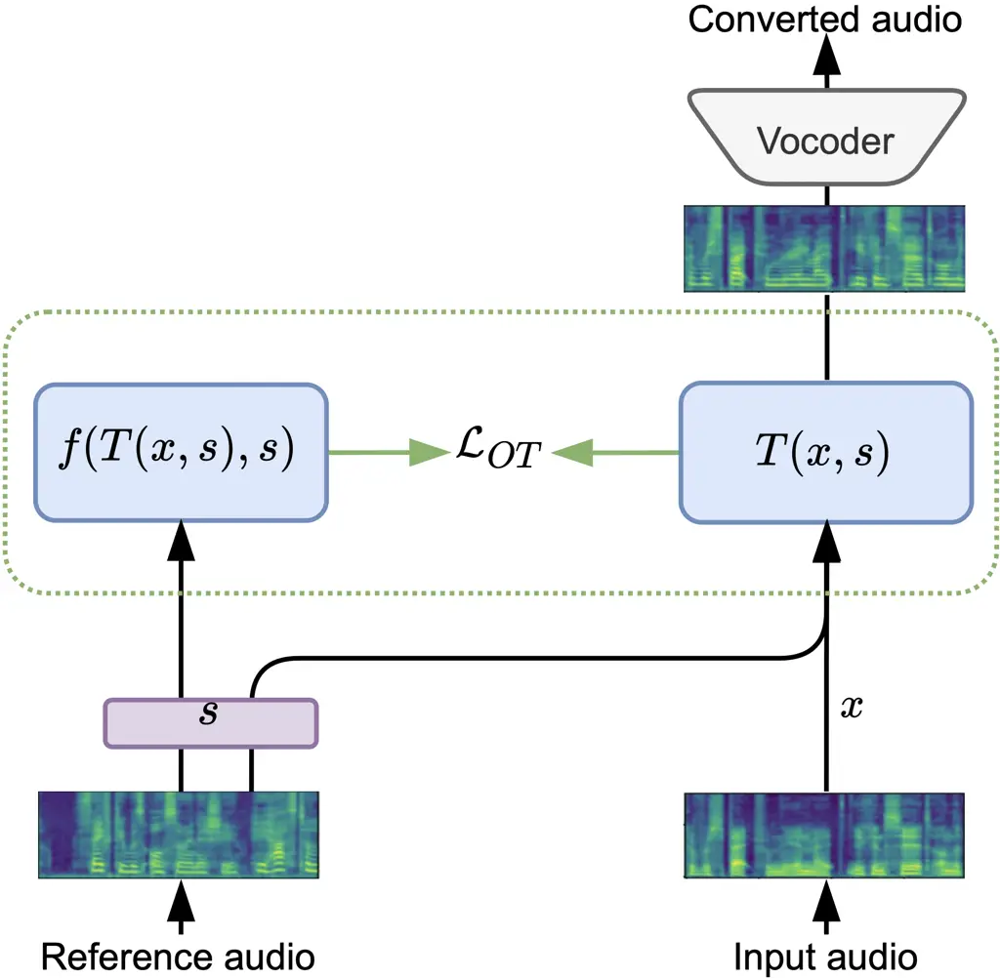
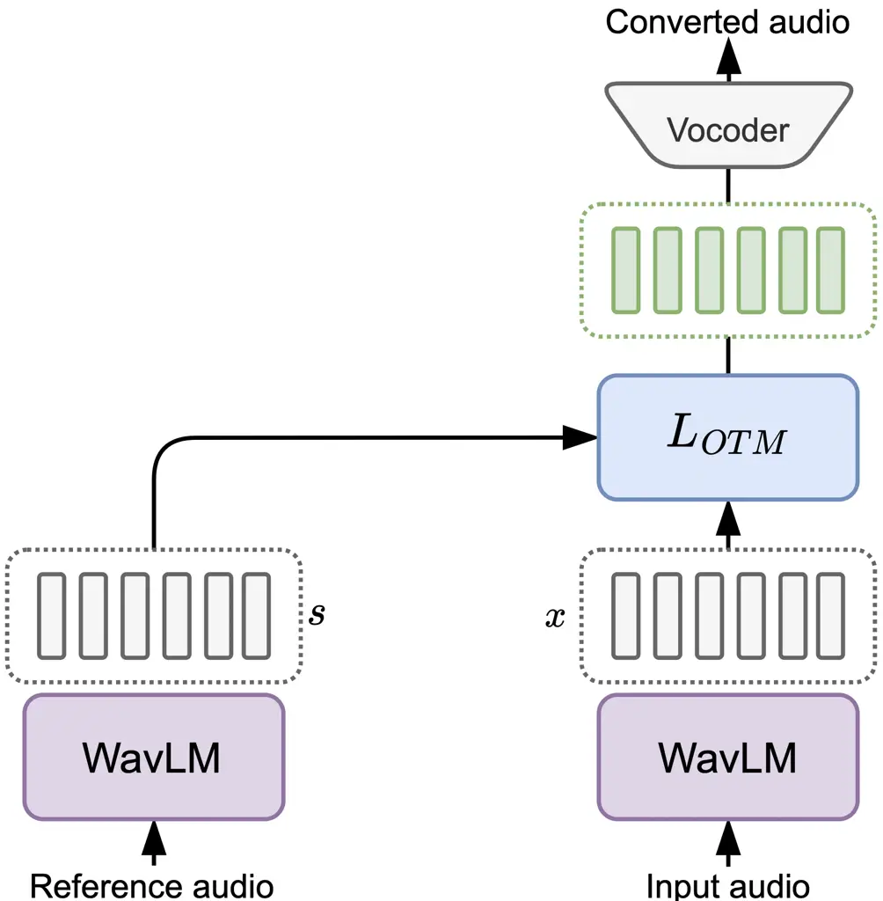
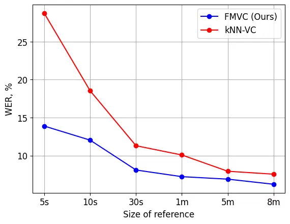
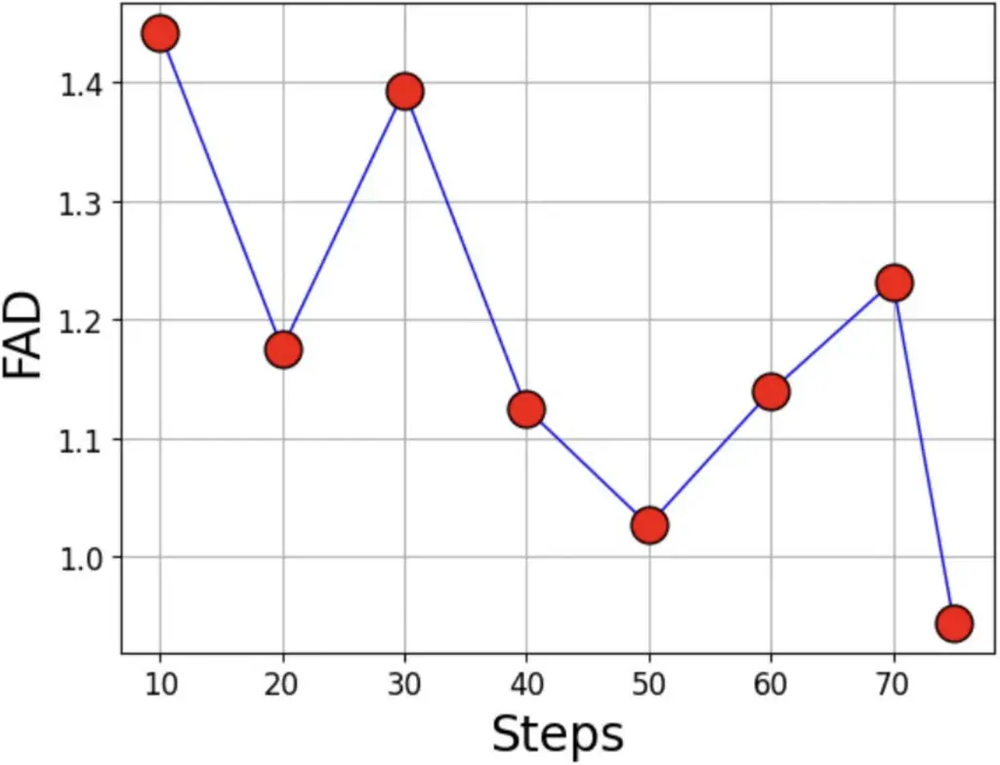
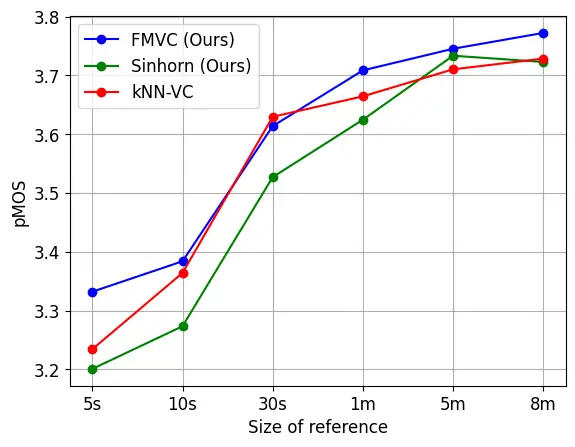
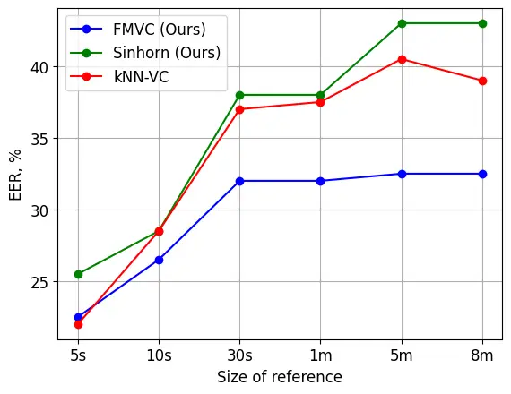
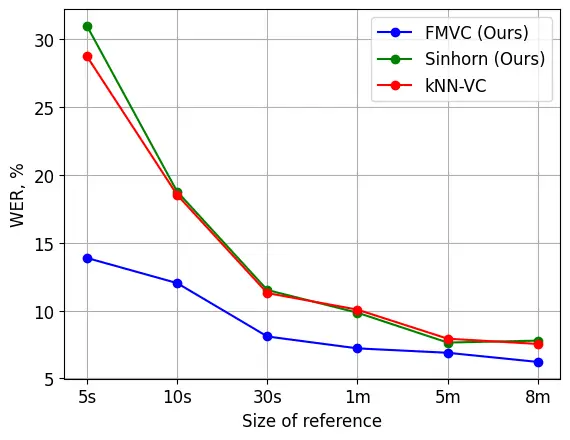

# Optimal Transport Maps are Good Voice Converters

Arip Asadulaev    Rostislav Korst    Vitalii Shutov    Alexander Korotin
   Yaroslav Grebnyak    Vahe Egiazarian    Evgeny Burnaev

###### Abstract

Recently, neural network-based methods for computing optimal transport
maps have been effectively applied to style transfer problems. However,
the application of these methods to voice conversion is underexplored.
In our paper, we fill this gap by investigating optimal transport as a
framework for voice conversion. We present a variety of optimal
transport algorithms designed for different data representations, such
as mel-spectrograms and latent representation of self-supervised speech
models. For the mel-spectogram data representation, we achieve strong
results in terms of Fréchet Audio Distance (FAD). This performance is
consistent with our theoretical analysis, which suggests that our method
provides an upper bound on the FAD between the target and generated
distributions. Within the latent space of the WavLM encoder, we achived
state-of-the-art results and outperformed existing methods even with
limited reference speaker data.

###### keywords

voice conversion, optimal transport, neural networks

^(†)^(†)address: ¹AIRI, ²ITMO ³MIPT ⁴Skoltech ⁵Yandex ^(†)^(†)email:
aripasadulaev@airi.net

## 1 Introduction

The goal of VC is to generate a modified voice that maintains the
linguistic content of the source speaker while adopting the prosody and
vocal characteristics of a target speaker \[1\]. It has various
applications including voice modification \[2\], singing voice
conversion \[3\], and privacy \[4\]. The most common case is
non-parallel VC, i.e. when the speech content is different for the
source and target speaker datasets. Existing VC methods such as
StarGAN-VC \[5, 6\], Diff-VC \[7\] and kNN-VC \[8\] deliver impressive
results. But these models have an drawbacks, such as complex training
procedures, significant computational resources required for inference
or large quantity of target speaker data (\wasyparagraph2.2).  
There has been recent interest in the use of neural network-based
optimal transport (OT) maps for generative modelling in
high-dimensions \[9, 10, 11\]. However, the potential of optimal
transport maps in voice conversion has not been comprehensively
explored. In this paper, we fill this gap by proposing variants of OT
methods for voice conversion.

- •
  For mel-spectogram representation we present a neural network-based OT
  approach called NOT-VC (\wasyparagraph3). This method proves to be
  resource-efficient in terms of inference and simpler in terms of
  training compared to its predecessors as DiffVC and StarGAN-VC
  respectively. We justify our approach theoretically by analyzing the
  recovered maps and show that the learned map upper bounds the
  FAD \[12\] between real and generated data (\wasyparagraph3.1).
  Furthermore, we extend this method to create an Extremal NOT \[13\]
  named XNOT-VC (\wasyparagraph3.2) and demonstrate state-of-the-art
  (SOTA) performance according to FAD.
- •
  For voice conversion within the latent space of the WavLM \[14\] model
  (\wasyparagraph3.3), we propose an OT-based Flow-Matching \[15, 16\]
  approach named FMVC. This method is lightweight and effectively
  circumvents the limitations of the current best-performing any-to-any
  VC method named kNN-VC \[8\], providing SOTA results even with limited
  target data (\wasyparagraph5).

In our paper, we explore the applicability of optimal transport to
non-parallel VC. The main contribution is the development and
theoretical justification of several OT methods that achieve impressive
results and avoid the limitations of existing VC approaches.

## 2 Background and Related Work

### 2.1 Optimal Transport

Optimal transport is a mathematical tool designed to minimize the cost
of moving mass between distributions. Suppose there are two probability
distributions $`\mu`$ and $`\nu`$ over measurable spaces $`\mathcal{X}`$
and $`\mathcal{Y}`$ respectively, where
$`\mathcal{X},\mathcal{Y}\subset\mathbb{R}^{D}`$. We want to find a
measurable map $`T:\mathcal{X}\rightarrow\mathcal{Y}`$ such that mapped
distribution is equal to the target $`\nu`$, $`T_{\#}\mu=\nu`$. For a
cost function $`c:\mathcal{X}\times\mathcal{Y}\rightarrow\mathbb{R}`$,
the OT problem between $`\mu,\nu`$ is

```math
\inf_{T_{\sharp}\mu=\nu}\int_{\mathcal{X}}c(x,T(x))\,d\mu(x). \tag{1}
```

In the Kantorovich OT formulation \[17\], we are seek for a probability
measure $`\pi`$ over $`\mathcal{X}\times\mathcal{Y}`$ where marginals
over $`\pi`$ satisfying $`\pi_{x}=\nu`$ and $`\pi_{y}=\mu`$,
respectively \[18, \wasyparagraph1\]. Denote the set of all such $`\pi`$
by $`\Pi(\mathcal{X},\mathcal{Y})`$, the problem is to find an optimal
transportation plan $`\pi^{*}`$ that minimizes

```math
\inf_{\pi\in\Pi(\mu,\nu)}\int_{\mathcal{X}\times\mathcal{Y}}c(x,y)d\pi(x,y). \tag{2}
```

For the cost function $`c(x,y)=\frac{1}{2}|x-y|_{2}^{2}`$, the solution
value of (1, 2) is called Wasserstein-2 ($`\mathbb{W}_{2}`$) distance
\[18, \wasyparagraph1\]. To solve the OT problem in practice, different
discrete solvers such as Sinkhorn can be used \[19\]. For continuous OT
in high dimensions, maximin form of (1) with a neural approximators is
used \[9, 10, 11\]. Recently the Flow-Matching (FM) approach \[15\] with
a simple training objective that regress onto a target vector field was
proposed. For the target vector field that corresponds to an OT
displacement interpolant, this methods provides a straight paths between
points, and approximates OT map \[15, 20\].

### 2.2 Voice Conversion

Most VC methods operate with the mel-spectrogram representations \[1\].
These representations convert raw audio signals into a 2D time-frequency
representation that displays the frequency of speech over time. After
conversion, vocoder models are typically used to transform these
mel-spectrograms back into raw audio. Despite their effectiveness, this
VC methods have specific drawbacks related to their distinct approaches.
Diffusion-based models as Diff-VC \[7\] require substantial
computational resources due to the numerous steps involved in inference.
On the other hand, generative adversarial networks-based (GANs) \[5\]
methods, such as StarGAN-VC \[5, 6\], optimize multiple losses which –
when combined with different coefficients – complicate the optimization
and hyperparameter tuning process. A more detailed discussion on related
works in provided in Appendix (\wasyparagraphB.3)  
Within the latent space of the speech representation model,
unit-selection methods have been introduced. These methods convert
speech between the pair of the source and target speakers by replacing
each frame of the source speech with its selected correspondence in the
target representation. A strong result was achieved by the kNN-VC \[8\]
method. It was shown that replacing the source speech frames with their
nearest neighbors in the target speech provides a SOTA result for
any-to-any conversion. Despite its advantages, this method requires
extensive recordings (5-10 minutes) of the target speaker for accurate
speech conversion, see Figure 2 in \[8\]. This is an obvious limitation,
because if the recording of the target speech is too short, we simply
won’t be able to find where to match the phones and biphones present in
the source utterance \[8, \wasyparagraph5.2\].

## 3 Voice Conversion with Optimal Transport

### 3.1 Conditional Neural Optimal Transport

To solve OT problems in high dimensions, the most popular
approaches \[9, 10, 11\] consider maximin form of (1):

```math
\max_{f}\min_{T}\int_{\mathcal{X}}c\big(x,T(x)\big)-f\big(T(x)\big)d\mu(x)+\int_{\mathcal{Y}}f(y)d\nu(y). \tag{3}
```

Where potential $`f`$ is Lagrangian multiplier \[21\], that aims to
ensure that the generated distribution by $`T`$ matches the target
distribution $`\nu`$, and penalizes the former if it does not. Within
neural approximations for $`T`$ and $`f`$, this type of methods are
called Neural Optimal Transport (NOT) \[10\]. To build OT map for VC
across multiple domains, we propose a conditional reformulation of the
NOT method \[22\]. Let denote distributions, of source speaker $`\mu`$,
target speaker$`\nu`$, and reference speaker $`\eta`$ over measurable
spaces $`\mathcal{X}`$, $`\mathcal{Y}`$ and $`\mathcal{S}`$
respectively, where
$`\mathcal{X},\mathcal{Y},\mathcal{S}\subset\mathbb{R}^{D}`$. We want to
find the transport map $`T`$ that for any $`s`$ map conditioned
distribution $`\mu(\cdot|s)`$ to the respected one $`\nu(\cdot|s)`$.
Formally we can write our objective as:

```math
\displaystyle\mathcal{L}_{OT}=\displaystyle\max_{f}\min_{T}\displaystyle\int_{\mathcal{X}\times\mathcal{S}}(c\big(x,T(x,s)\big)-
```

```math
\displaystyle f\big(T(x,s),s\big))d\mu(x,s)+\displaystyle\int_{\mathcal{Y}\times\mathcal{S}}f(y,s)d\nu(y,s). \tag{4}
```

Now, the Lagrangian multiplier $`f`$, aims to ensure that the generated
distribution $`T_{\sharp}\mu(\cdot|s)`$ matches the target distribution
$`\nu(\cdot|s)`$ for any given $`s`$. The solution to the problem (4)
can be practically carried out by using neural networks
$`T_{\theta}:\mathbb{R}^{D}\times\mathbb{R}^{S}\rightarrow\mathbb{R}^{D}`$
and $`f_{\psi}:\mathbb{R}^{D}\rightarrow\mathbb{R}`$ to parameterize
$`T`$ and $`f`$ respectively. In practice, the speaker encoder model
$`E_{\omega}`$ to embed the reference speaker $`s`$ is used. The entire
optimization procedure can be found in Appendix (\wasyparagraph B.1),
the visual illustration is given in Figure 1.  
Given a pair ($`\hat{f},\hat{T}`$) that approximately solves equation
(4), it is natural to question the quality of the recovered map $`T`$.
To answer this, we provide a bound on the difference between the optimal
$`T^{*}`$ that maps into the target and $`T`$.  
Theorem 1. (informal). Assume that there exists a unique deterministic
OT plan for quadratic cost between $`\mu`$ and $`\nu`$, i.e.,
$`\pi^{*}`$ for
$`T^{*}:\mathbb{R}^{D}\times\mathbb{R}^{S}\rightarrow\mathbb{R}^{D}`$.
Assume that $`\hat{f}`$ is $`\beta`$-strongly convex $`(\beta>0)`$ and
$`\hat{T}:\mathbb{R}^{D}\times\mathbb{R}^{S}\rightarrow\mathbb{R}^{D}`$.
Then the map obtained by minimizing (4 upper bounds the FAD between the
$`\nu`$ and distribution generated by $`T`$. More details and proof are
given in Appendix (\wasyparagraphA).



Figure 1: First, the mel-spectrogram of the source speaker is fed into
the map $`T`$, while the reference is fed into the speaker encoder and
also used as input for $`T`$ and $`f`$ (during training). The map $`T`$
outputs the converted spectrogram, which is transformed back into raw
audio by the vocoder..

### 3.2 Extremal Conditional Optimal Transport

Usually, samples in the target domain may be noisy or too different from
the source, especially in non-parallel VC setups. Thus, in some cases,
it would be beneficial to not use only the part of the target
distribution. For this, the extremal transport maps \[13\] can be used.
Extremal transport performs outlier detection in the target space by
ignoring samples that are too different from the source distribution
with respect to the given cost. In this formulation, we learn the $`T`$
that maps only into the part of the target distribution that reduces the
cost. To obtain the extremal formulation from NOT-VC we simply need to
add $`f\leq 0`$ constraints over $`f`$ and multiply $`f(y,s)`$ by a
weight parameter $`w\geq 1`$. This results in the following
optimization:

```math
\displaystyle\mathcal{L}_{EOT}=\displaystyle\max_{{\color[rgb]{0.75,0,0.25}f\leq 0}}\min_{T}\displaystyle\int_{\mathcal{X}\times\mathcal{S}}(c\big(x,T(x,s)\big)- \tag{5}
```

```math
\displaystyle f\big(T(x,s),s\big))d\mu(x,s)+{\color[rgb]{0.75,0,0.25}w}\displaystyle\int_{\mathcal{Y}\times\mathcal{S}}f(y,s)d\nu(y,s).
```

This method can be seen as a tool for finding the nearest neighbors of
the input samples to the target, according to the cost function, (see
Figure 1 in \[13\]). Importantly, the parameter $`w`$ in this
formulation controls the closeness of the generated samples to the input
ones, see  \[13\] for more details.

### 3.3 Flow-Matching Optimal Transport



Figure 2: Wav audio is fed into the WavLM. At the same time, the
reference is fed into the WavLM. Then the OT matching
$`\mathcal{L}_{OTM}`$ (SinkVC or FMVC) converts the voice into the given
latent representations. After inference, the results are transformed
back into raw audio using the vocoder.

It has been shown that self-supervised models extract representations
where nearby features have similar phonetic content. We propose a method
that uses a self-supervised speech representation model to encode the
audio \[14\]. This approach provides an encoder-converter-vocoder
structure. Firstly, we extract self-supervised representations of the
source and reference speech. Then, conversion to the target speaker
takes place, by replacing each frame of the source representation by
frame from the reference via OT map. Finally, a pre-trained vocoder
synthesizes audio from the converted representation. We solve a matching
OT problem (2) between source and target bag-of-vectors, using the
Sinkhorn algorithm \[23\]. The OT plan $`\pi`$ provides optimal pairs
between source and reference speaker representations. This plan already
provides a solution to the VC problem. By replacing each source frame
with its corresponding frame given by the plan, we can solve the VC
problem in real-time. We call this approach SinkVC.  
However, SinkVC, as well as kNN-VC, provides a discrete solution which
may prove inefficient in cases where the amount of reference speech is
limited. Denoting pairs given by a plan as $`(x_{0},x_{1})\sim\pi`$, we
can train an FM algorithm (6) that generates a continuous OT map for VC
(FMVC). OT-based Flow Matching predicts a target velocity field, which
is defined by the OT interpolation between points. Formally, using an OT
plan given by Sinkhorn, we sample pairs $`(x_{0},x_{1})\sim\pi`$ \[20,
16\] while minimize:

```math
L_{OTM}(\theta)=\mathbb{E}_{t,(x_{0},x_{1})\sim\pi}||v_{\theta}(t,x_{t})-(x_{0}-x_{1})||^{2}. \tag{6}
```

FMVC produces a flow induced by a neural velocity field
$`(v_{t},\theta),t\in[0,1]`$, constructing probability paths between
individual data samples. The solution generates individual straight
paths between source and target pairs. It has been shown that the
obtained flow asymptotically approximates an OT map see Theorem 4.2 in
\[20\]. A visual illustration is shown in Figure 1.

## 4 Experiments with Mel-Spectogram Audio Representation

|                |                    |                  |                   |
| -------------- | ------------------ | ---------------- | ----------------- |
| Model          | FAD $`\downarrow`$ | EER $`\uparrow`$ | pMOS $`\uparrow`$ |
| AutoVC         | 10.9               | 0.18             | 3.51              |
| StarGANv2-VC   | 1.18               | 0.24             | 4.29              |
| DiffVC         | 1.34               | 0.38             | 3.83              |
| NOT-VC (Ours)  | 1.04               | 0.18             | 4.18              |
| XNOT-VC (Ours) | 0.87               | 0.17             | 3.85              |

Table 1: Many-to-many conversion results on the VCTK dataset. The symbol
$`\uparrow`$ indicates that a higher score is better, while
$`\downarrow`$ indicates that a lower score is better.

| Model          | FAD $`\downarrow`$ | EER $`\uparrow`$ | pMOS $`\uparrow`$ |
| -------------- | ------------------ | ---------------- | ----------------- |
| StarGANv2-VC   | 1.34               | 0.076            | 4.22              |
| DiffVC         | 1.46               | 0.380            | 3.56              |
| NOT-VC (Ours)  | 1.46               | 0.078            | 4.00              |
| XNOT-VC (Ours) | 1.33               | 0.043            | 3.74              |

Table 2: Any-to-many conversion results on the VCTK dataset. The symbol
$`\uparrow`$ indicates that a higher score is better, while
$`\downarrow`$ indicates that a lower score is better.

### 4.1 Dataset and Baselines

In this section we provide experiments using the common multi-speaker
VCTK dataset  \[24\]. This dataset contains recorded speech data from
109 native English speakers, amounting to approximately 44 hours of
speech. Similar to StarGANv2-VC, we used 20 randomly chosen speakers
from the dataset for training. Data prepossessing details are given in
Appendix (\wasyparagraphB.2).  
We compared our method with the range of methods such as AutoVC \[4\], a
127M parameters pre-trained Diff-VCTK \[7\], and StarGANv2-VC \[6\]. In
all experiments, we used pre-trained modes provided by the authors. The
detailed explanation of experiments is given in Appendix
(\wasyparagraphB.3).

### 4.2 Settings

For the transport map $`T_{\theta}`$, a UNET network with 46 M
parameters was utilized. Meanwhile, for the potential $`f_{\psi}`$, a
ResNet model with 55.1 M parameters was employed. AdamW \[25\] was
selected as the optimizer for both the map $`T`$ and the potential
$`f`$. Our methods were trained using Algorithm 1 given in the Appendix,
incorporating a quadratic cost $`c(x,y)=\frac{1}{2}|x-y|_{2}^{2}`$. The
complete details of our training are available in
Appendix (\wasyparagraphB.5). For a fair comparison with StarGANv2-VC,
we applied the JDC \[26\] model for $`F_{0}`$ and Parallel WaveGAN as
vocoder \[27\]. In our many-to-many evaluation, speakers from the
training dataset were used, but with their new, unseen utterances. For
the any-to-many scenarios, also known as unseen-to-seen settings, we
used an utterance from the previously unseen speakers as input and
translated it into the speaking style of the 20 reference speakers from
training. To evaluate the performance of the models, we computed the
FAD \[12\], the Equal Error Rate (EER), and the perceptual Mean Opinion
Score (pMOS) given by \[28\]. Further information about the metrics can
be found in Appendix (\wasyparagraphB.4). In all Tables, an average
score is reported.

### 4.3 Results

Qualitative results for many-to-many settings are shown in Appendix
Table 1, and any-to-many in Table 2. The inference speed time is
presented in Table 4. The FAD curve is shown in Appendix Figure 4. It
can be seen in Table 1 that our method provided highest results
according to FAD metric, which is well-correlated with human judgment,
making it effective in evaluating the quality of voice conversion
systems \[12\]. However, our approach provides lower scores on the EER
metrics and pMOS. But its important to note that our model has 2x less
trainable parameters than DiffVC model, $`\sim`$25x faster in inference,
and trained only on 20 speakers. In comparison to StarGANv2-VC which is
training via the weighted sum of $`7`$ different objectives, see
Appendix (\wasyparagraphB.3), our method is training only via single
objective (4) or (5) aimed to find Wasserstein-2 transport map. In the
next section we show how OT can be used to achieve high performance
according to EER and pMOS as well.

## 5 Experiments within Audio Latent Space Representation

### 5.1 Dataset and Baselines

For a fair comparison with kNN-VC, we used the LibriSpeech test-clean
set and sampled 200 utterances, allowing for 5 per speaker. We converted
each utterance to the remaining 39 speakers, resulting in a total of
7800 outputs per model. We compared our method to the kNN-VC as well as
other any-to-any voice conversion systems including VQMIVC \[29\],
FreeVC \[30\], and YourTTS \[31\]. We applied the same settings as
presented in kNN-VC experiments \[8, Section 4\].

### 5.2 Settings

In addition to the metrics used in previous experiments, we also
evaluated the word/character error rate (W/CER) of the converted speech
using a pre-trained Whisper-base automatic speech recognition
model \[32\], utilizing its default decoding parameters for
transcription.  
In line with the baseline kNN-VC, we utilized features extracted from
layer 6 of WavLM-Large \[14\], which generates a single vector for every
20 ms of 16 kHz audio. For SinkVC, we employed the Sinkhorn algorithm
with a cost matrix determined by cosine similarity and entropy
regularization set to 0.1. The four vectors with the highest scores in
the recovered optimal plan were averaged to generate the resulting
feature vector. We did not engage in pre-matching training \[8\] of the
vocoder in our experiments and used default Hifi-GAN provided by \[8\].
For FMVC, we separated the speaker’s utterances into training and test
categories. Subsequently, we trained the flow matching continuous map on
pairs derived from the discrete Sinkhorn plan and tested on the unseen
100 utterance for the given speaker. A 3-layer MLP network was used to
parameterize $`v_{\theta}(t,x_{t})`$, with an additional input for time
$`t`$ and a hidden size of 512. A batch size of 1000 feature vectors was
used for 1000 iterations, alongside the Adam optimizer with a learning
rate of $`0.001`$.

### 5.3 Results



Figure 3: The figure displays the WER score in relation to the size of
the target speaker’s speech.

|         |                    |                    |                  |                    |                   |
| ------- | ------------------ | ------------------ | ---------------- | ------------------ | ----------------- |
| Model   | WER $`\downarrow`$ | CER $`\downarrow`$ | EER $`\uparrow`$ | FAD $`\downarrow`$ | pMOS $`\uparrow`$ |
| VQMIVC  | 59.46              | 37.55              | 2.22             | -                  | -                 |
| YourTTS | 11.93              | 5.51               | 25.23            | -                  | -                 |
| FreeVC  | 7.61               | 3.17               | 8.87             | -                  | -                 |
| kNN-VC  | 7.54               | 3.41               | 40.5             | 2.92               | 3.72              |
| SinkVC  | 7.54               | 3.57               | 43.5             | 2.68               | 3.72              |
| FMVC    | 6.21               | 2.88               | 32.5             | 2.50               | 3.77              |

Table 3: Any-to-any conversion results on the Librispeech dataset. The
symbol $`\uparrow`$ indicates that a higher score is better, while
$`\downarrow`$ indicates that a lower score is better.

As can be seen in Table 3, our method consistently outperforms the
kNN-VC predecessor across various metrics. To demonstrate that the
continuous OT map provided by FMVC requires less data in the target
domain, we conducted an ablation study on target size. For this, we
applied VC and evaluated results using different metrics and various
quantities of reference data (5s, 10s, 30s, 1m, 5m, 8m). As shown in
Figure 3, our method yields results that are twice as effective as those
of kNN-VC when using just 5 seconds of data, consistently outperforming
on different target sizes. In Appendix (\wasyparagraphC.1), we provide a
visual representation for the other metrics, demonstrating superior
performance as well. The EER scores are lower for FMVC, even though this
method generates new points that may statistically differ from the data
on which the ASR model was trained. Our method strikes a balance between
complexity and performance, providing a continuous solution that can map
to new points and consequently mitigate the limitations of its
predecessor.

## 6 Conclusion

In contrast to StarGANv2-VC approach, our proposed method for
mel-spectrogram representation is far simpler in terms of optimization,
with its sole objective being to identify the Wasserstein-2 optimal
transport map. We evaluated the quality of the speech conversion models
using several automatic quality metrics
(\wasyparagraph4.3)(\wasyparagraph5.3). Compared to DiffVC, our method
demonstrated superior performance according to the FAD metric and proved
to be more resource-efficient (as shown in Table 4). For the WavLM
representation, we proposed a computationally lightweight FMVC approach
(see Table 3), which avoids the limitations of the SOTA any-to-any
kNN-VC approach. We justify our algorithm by analyzing the recovered
maps and showing that the learned map upper-bounded the FAD \[12\]
between real and generated target data. We anticipate that our method
will pave the way for future developments in the application of optimal
transport in voice conversion tasks.

## References

- \[1\] T. Walczyna and Z. Piotrowski, “Overview of voice conversion
  methods based on deep learning,” _Applied Sciences_, vol. 13,
  no. 5, p. 3100, 2023.
- \[2\] S. E. Eskimez, T. Yoshioka, H. Wang, X. Wang, Z. Chen, and
  X. Huang, “Personalized speech enhancement: New models and
  comprehensive evaluation,” in _ICASSP 2022-2022 IEEE International
  Conference on Acoustics, Speech and Signal Processing (ICASSP)_. IEEE,
  2022, pp. 356–360.
- \[3\] W.-C. Huang, L. P. Violeta, S. Liu, J. Shi, Y. Yasuda, and
  T. Toda, “The singing voice conversion challenge 2023,” _arXiv
  preprint arXiv:2306.14422_, 2023.
- \[4\] K. Qian, Y. Zhang, S. Chang, X. Yang, and M. Hasegawa-Johnson,
  “AUTOVC: Zero-shot voice style transfer with only autoencoder loss,”
  2019, arXiv:1905.05879.
- \[5\] I. Goodfellow, J. Pouget-Abadie, M. Mirza, B. Xu,
  D. Warde-Farley, S. Ozair, A. Courville, and Y. Bengio, “Generative
  adversarial nets,” in _Advances in neural information processing
  systems_, 2014, pp. 2672–2680.
- \[6\] Y. A. Li, A. Zare, and N. Mesgarani, “StarGANv2-VC: A diverse,
  unsupervised, non-parallel framework for natural-sounding voice
  conversion,” 2021, arXiv:2107.10394.
- \[7\] V. Popov, I. Vovk, V. Gogoryan, T. Sadekova, M. Kudinov, and
  J. Wei, “Diffusion-based voice conversion with fast maximum likelihood
  sampling scheme,” _arXiv preprint arXiv:2109.13821_, 2021.
- \[8\] M. Baas, B. van Niekerk, and H. Kamper, “Voice conversion with
  just nearest neighbors,” _arXiv preprint arXiv:2305.18975_, 2023.
- \[9\] A. Korotin, V. Egiazarian, A. Asadulaev, A. Safin, and
  E. Burnaev, “Wasserstein-2 generative networks,” in _International
  Conference on Learning Representations_, 2021. \[Online\]. Available:
  [https://openreview.net/forum?id=bEoxzW_EXsa](https://openreview.net/forum?id=bEoxzW_EXsa)
- \[10\] A. Korotin, D. Selikhanovych, and E. Burnaev, “Neural optimal
  transport,” in _International Conference on Learning
  Representations_, 2023. \[Online\]. Available:
  [https://openreview.net/forum?id=d8CBRlWNkqH](https://openreview.net/forum?id=d8CBRlWNkqH)
- \[11\] A. Asadulaev, A. Korotin, V. Egiazarian, and E. Burnaev,
  “Neural optimal transport with general cost functionals,” _arXiv
  preprint arXiv:2205.15403_, 2022.
- \[12\] K. Kilgour, M. Zuluaga, D. Roblek, and M. Sharifi,
  “Fr$`\backslash`$’echet audio distance: A metric for evaluating music
  enhancement algorithms,” _arXiv preprint arXiv:1812.08466_, 2018.
- \[13\] M. Gazdieva, A. Korotin, D. Selikhanovych, and E. Burnaev,
  “Extremal domain translation with neural optimal transport,” _arXiv
  preprint arXiv:2301.12874_, 2023.
- \[14\] S. Chen, C. Wang, Z. Chen, Y. Wu, S. Liu, Z. Chen, J. Li,
  N. Kanda, T. Yoshioka, X. Xiao _et al._, “Wavlm: Large-scale
  self-supervised pre-training for full stack speech processing,” _IEEE
  Journal of Selected Topics in Signal Processing_, vol. 16, no. 6, pp.
  1505–1518, 2022.
- \[15\] Y. Lipman, R. T. Chen, H. Ben-Hamu, M. Nickel, and M. Le, “Flow
  matching for generative modeling,” _arXiv preprint
  arXiv:2210.02747_, 2022.
- \[16\] A. Tong, N. Malkin, G. Huguet, Y. Zhang, J. Rector-Brooks,
  K. Fatras, G. Wolf, and Y. Bengio, “Improving and generalizing
  flow-based generative models with minibatch optimal transport,” _arXiv
  preprint arXiv:2302.00482_, 2023.
- \[17\] L. Kantorovitch, “On the translocation of masses,” _Management
  Science_, vol. 5, no. 1, pp. 1–4, 1958.
- \[18\] C. Villani, _Optimal transport: old and new_. Springer Science
  & Business Media, 2008, vol. 338.
- \[19\] G. Peyré, M. Cuturi _et al._, “Computational optimal
  transport,” _Foundations and Trends® in Machine Learning_, vol. 11,
  no. 5-6, pp. 355–607, 2019.
- \[20\] A.-A. Pooladian, H. Ben-Hamu, C. Domingo-Enrich, B. Amos,
  Y. Lipman, and R. Chen, “Multisample flow matching: Straightening
  flows with minibatch couplings,” _arXiv preprint
  arXiv:2304.14772_, 2023.
- \[21\] G. Peyre, “Course notes on computational optimal transport,”
  _/mathematical-tours.github.io/_, 2021. \[Online\]. Available:
  [https://mathematical-tours.github.io/book-sources/optimal-transport/CourseOT.pdf](https://mathematical-tours.github.io/book-sources/optimal-transport/CourseOT.pdf)
- \[22\] A. Korotin, L. Li, A. Genevay, J. Solomon, A. Filippov, and
  E. Burnaev, “Do neural optimal transport solvers work? a continuous
  wasserstein-2 benchmark,” _arXiv preprint arXiv:2106.01954_, 2021.
- \[23\] M. Cuturi, “Sinkhorn distances: Lightspeed computation of
  optimal transport,” in _Advances in neural information processing
  systems_, 2013, pp. 2292–2300.
- \[24\] C. Veaux, J. Yamagishi, K. MacDonald _et al._, “Superseded-cstr
  vctk corpus: English multi-speaker corpus for cstr voice cloning
  toolkit,” 2016.
- \[25\] I. Loshchilov and F. Hutter, “Decoupled weight decay
  regularization,” 2019, arXiv:1711.05101.
- \[26\] S. Kum and J. Nam, “Joint detection and classification of
  singing voice melody using convolutional recurrent neural networks,”
  _Applied Sciences_, 2019.
- \[27\] R. Yamamoto, E. Song, and J.-M. Kim, “Parallel WaveGAN: A fast
  waveform generation model based on generative adversarial networks
  with multi-resolution spectrogram,” 2020, arXiv:1910.11480.
- \[28\] C.-C. Lo, S.-W. Fu, W.-C. Huang, X. Wang, J. Yamagishi,
  Y. Tsao, and H.-M. Wang, “MOSNet: Deep Learning-Based Objective
  Assessment for Voice Conversion,” in _Proc. Interspeech 2019_, 2019,
  pp. 1541–1545.
- \[29\] D. Wang, L. Deng, Y. T. Yeung, X. Chen, X. Liu, and H. Meng,
  “Vqmivc: Vector quantization and mutual information-based unsupervised
  speech representation disentanglement for one-shot voice conversion,”
  _arXiv preprint arXiv:2106.10132_, 2021.
- \[30\] J. Li, W. Tu, and L. Xiao, “Freevc: Towards high-quality
  text-free one-shot voice conversion,” in _ICASSP 2023-2023 IEEE
  International Conference on Acoustics, Speech and Signal Processing
  (ICASSP)_. IEEE, 2023, pp. 1–5.
- \[31\] E. Casanova, J. Weber, C. D. Shulby, A. C. Junior, E. Gölge,
  and M. A. Ponti, “Yourtts: Towards zero-shot multi-speaker tts and
  zero-shot voice conversion for everyone,” in _International Conference
  on Machine Learning_. PMLR, 2022, pp. 2709–2720.
- \[32\] A. Radford, J. W. Kim, T. Xu, G. Brockman, C. McLeavey, and
  I. Sutskever, “Robust speech recognition via large-scale weak
  supervision,” in _International Conference on Machine Learning_. PMLR,
  2023, pp. 28 492–28 518.
- \[33\] A. v. d. Oord, S. Dieleman, H. Zen, K. Simonyan, O. Vinyals,
  A. Graves, N. Kalchbrenner, A. Senior, and K. Kavukcuoglu, “Wavenet: A
  generative model for raw audio,” _arXiv preprint
  arXiv:1609.03499_, 2016.
- \[34\] J. Kong, J. Kim, and J. Bae, “Hifi-gan: Generative adversarial
  networks for efficient and high fidelity speech synthesis,” _Advances
  in Neural Information Processing Systems_, vol. 33, pp.
  17 022–17 033, 2020.
- \[35\] M. Malik, M. K. Malik, K. Mehmood, and I. Makhdoom, “Automatic
  speech recognition: a survey,” _Multimedia Tools and Applications_,
  vol. 80, pp. 9411–9457, 2021.
- \[36\] R. Yamamoto, E. Song, and J.-M. Kim, “Parallel wavegan: A fast
  waveform generation model based on generative adversarial networks
  with multi-resolution spectrogram,” in _ICASSP 2020-2020 IEEE
  International Conference on Acoustics, Speech and Signal Processing
  (ICASSP)_. IEEE, 2020, pp. 6199–6203.
- \[37\] S. Chen, C. Wang, Z. Chen, Y. Wu, S. Liu, Z. Chen, J. Li,
  N. Kanda, T. Yoshioka, X. Xiao, J. Wu, L. Zhou, S. Ren, Y. Qian,
  Y. Qian, J. Wu, M. Zeng, and F. Wei, “Wavlm: Large-scale
  self-supervised pre-training for full stack speech processing,” 2021.

## Appendix A Analysis of the Recovered Map

Given a pair ($`\hat{f},\hat{T}`$) that approximately solves equation
(4), it is natural to question the quality of the recovered map $`T`$.
To answer this, we provide a bound on the difference between the optimal
$`T^{*}`$ and $`T`$, which is based on the duality gaps for solving
outer and inner optimization problems. For this, we need to consider
optimization over convex functions $`f`$, as shown in \[18, case 5.17\].
Our results assume the convexity of $`\hat{f}`$, however, this may not
hold in practice, since $`\hat{f}`$ is typically a neural network.  
Theorem 1. Assume that there exists a unique deterministic OT plan for
quadratic cost between $`\mu`$ and $`\nu`$, i.e., $`\pi^{*}`$ for
$`T^{*}:\mathbb{R}^{D}\times\mathbb{R}^{S}\rightarrow\mathbb{R}^{D}`$.
Assume that $`\hat{f}`$ is $`\beta`$-strongly convex $`(\beta>0)`$ and
$`\hat{T}:\mathbb{R}^{D}\times\mathbb{R}^{S}\rightarrow\mathbb{R}^{D}`$.
Define:

```math
\displaystyle\epsilon_{1}=\sup_{T}\mathcal{L}_{OT}(\hat{f},T)-\mathcal{L}_{OT}(\hat{f},\hat{T})\text{ and }
```

```math
\displaystyle\epsilon_{2}=\sup_{T}\mathcal{L}_{OT}(\hat{f},T)-\inf_{f}\sup_{T}\mathcal{L}_{OT}(f,T).
```

Then the following bound holds true for the $`T^{*}`$ from $`\mu`$ to
$`\nu`$:

```math
\displaystyle\int_{\mathcal{S}}\frac{\text{FAD}(T_{\sharp}\mu(\cdot|s),\nu(\cdot|s))}{L^{2}}\leq\int_{\mathcal{S}}2\mathbb{W}^{2}_{2}(T_{\sharp}\mu(\cdot|s),\nu(\cdot|s))d\eta(s)\leq
```

```math
\displaystyle\int_{\mathcal{X}\times\mathcal{S}}||T(x,s)-T^{*}(x,s)||d\mu(x,s)\leq\frac{2}{\beta}(\sqrt{\epsilon_{1}}+\sqrt{\epsilon_{2}})^{2}
```

where FAD is the Frechet Audio Distance \[12\] and $`L`$ is the
Lipschitz constant of the feature extractor of the pretrained neural
network \[12\].  
The duality gaps upper-bound the $`\mathcal{L}^{2}(\mu)`$ norm between
the computed $`T`$ maps and the true $`T^{*}`$ maps, as well as the
$`\mathbb{W}_{2}`$ between the true $`\nu(\cdot|s)`$ distributions and
the generated $`T_{\sharp}\mu(\cdot|s)`$ distributions for all $`s`$.

Proof. Lets pick any
$`T^{*}\in\argsup_{T}\mathcal{L}(\hat{f},T)=\argsup_{T}\int_{\mathcal{X}\times\mathcal{S}}\{\langle x,T(x,s)\rangle-\hat{f}(T(x,s),s)\}d\mu(x,s)`$.

Consequently, for all $`y\in R^{D}`$ and $`s\in R^{D}`$:

```math
\langle x,T^{*}(x,s)\rangle-\hat{f}(T^{*}(x,s),s)\geq\langle x,y\rangle-\hat{f}(y,s) \tag{7}
```

which, after regrouping the terms, results in

```math
\hat{f}(y,s)\geq\hat{f}(T^{*}(x,s),s)+\langle x,y-T^{*}(x,s)\rangle \tag{8}
```

since $`\hat{f}`$ is $`\beta`$ strongly convex, for points $`T(x,s)`$,
$`T^{\prime}(x,s)\in\mathbb{R}^{D}`$ we derive.

```math
\hat{f}(T(x,s),s)\geq\hat{f}\left(T^{*}(x,s),s\right)+\left\langle x,T(x,s)-T^{*}(x,s)\right\rangle+\frac{\beta}{2}\left|T^{*}(x,s)-T(x,s)\right|^{2}. \tag{9}
```

By regrouping the terms we get

```math
\left[\left\langle x,T^{*}(x,s)\right\rangle-\hat{f}\left(T^{*}(x,s),s\right)\right]-[\langle x,T(x,s)\rangle-\hat{f}(T(x,s),s)]\geq\frac{\beta}{2}\left|T^{*}(x,s)-T(x,s)\right|^{2}. \tag{10}
```

Integration with respect to $`x,s\sim\mu(x|s)\eta(s)`$ gives us

```math
\epsilon_{1}=\mathcal{L}(\hat{f},T^{*})-\mathcal{L}(\hat{f},T)\geq\beta\int_{\mathcal{X}\times\mathcal{S}}\frac{1}{2}\left|T^{*}(x,s)-T(x,s)\right|^{2}d\mu(x,s)=\frac{\beta}{2}\cdot\left|T-T^{*}\right|_{L^{2}(\mu)}^{2}. \tag{11}
```

Lets $`T^{*}`$ be the OT map from $`\mu`$ to $`\nu`$. Using the fact
that $`T^{*}_{\sharp}\mu=\nu`$.

```math
\begin{array}[]{r}\mathcal{L}\left(\hat{f},T^{*}\right)=\int_{\mathcal{X}\times\mathcal{S}}\left\{\left\langle x,T^{*}(x,s)\right\rangle-\hat{f}\left(T^{*}(x,s),s\right)\right\}d\mu(x,s)+\int_{\mathcal{Y}\times\mathcal{S}}\hat{f}(y,s)d\nu(y,s)=\\
\int_{\mathcal{X}\times\mathcal{S}}\left\{\left\langle x,T^{*}(x,s)\right\rangle-\hat{f}\left(T^{*}(x,s),s\right)\right\}d\mu(x,s)+\int_{\mathcal{X}\times\mathcal{S}}\hat{f}\left(T^{*}(x,s),s\right)d\mu(x,s)=\\
\int_{\mathcal{X}\times\mathcal{S}}\{\underbrace{\left\langle x,T^{*}(x,s)\right\rangle-\hat{f}\left(T^{*}(x,s),s\right)+\hat{f}\left(T^{*}(x,s),s\right)}_{\geq\left\langle x,T^{*}(x,s)\right\rangle+\beta\frac{1}{2}\left|T^{*}-T^{*}\right|^{2}}\}d\mu(x,s)\geq\\
\int_{\mathcal{X}\times\mathcal{S}}\left\langle x,T^{*}(x,s)\right\rangle d\mu(x,s)+\beta\int_{\mathcal{X}\times\mathcal{S}}\frac{1}{2}\left|T^{*}-T^{*}\right|^{2}d\mu(x,s).\end{array} \tag{12}
```

Let $`f^{*}`$ be an optimal potential in $`\mathcal{L_{OT}}`$ (6).
Thanks to Lemma 4.2 according to Rout et. al, 2022 we can obtain that

```math
\begin{array}[]{r}\inf_{f}\sup_{T}\mathcal{L}(f,T)=\mathcal{L}\left(f^{*},T^{*}\right)=\\
\int_{\mathcal{X}\times\mathcal{S}}\left\{\left\langle x,T^{*}(x,s)\right\rangle-f^{*}\left(T^{*}(x,s),s\right)\right\}d\mu(x,s)+\int_{\mathcal{Y}\times\mathcal{S}}f^{*}(y,s)d\nu(y,s)=\\
\int_{\mathcal{X}\times\mathcal{S}}\left\{\left\langle x,T^{*}(x,s)\right\rangle-f^{*}\left(T^{*}(x,s),s\right)\right\}d\mu(x,s)+\int_{\mathcal{X}\times\mathcal{S}}f^{*}\left(T^{*}(x,s),s\right)d\mu(x,s)=\\
\int_{\mathcal{X}\times\mathcal{S}}\left\langle x,T^{*}(x,s)\right\rangle d\mu(x,s).\end{array} \tag{13}
```

By combining the last two formulas (6) and (7) we get

```math
\epsilon_{2}=\mathcal{L}\left(\hat{f},T^{*}\right)-\mathcal{L}\left(f^{*},T^{*}\right)\geq\beta\int_{\mathcal{X}\times\mathcal{S}}\frac{1}{2}\left|T^{*}-T^{*}\right|^{2}d\mu(x,s)=\frac{\beta}{2}\cdot\left|T^{*}-T^{*}\right|_{L^{2}(\mu)}^{2}. \tag{14}
```

The inequality
$`\int_{\mathcal{X}\times\mathcal{S}}||T(x,s)-T^{*}(x,s)||d\mu(x,s)\leq\frac{2}{\beta}(\sqrt{\epsilon_{1}}+\sqrt{\epsilon_{2}})^{2}`$
follows from the triangle inequality combined with (7) and (10). The
inequality
$`\int_{\mathcal{S}}2\mathbb{W}^{2}_{2}(T_{\sharp}\mu(\cdot|s),\nu(\cdot|s))d\eta(s)\leq\int_{\mathcal{X}\times\mathcal{S}}||T(x,s)-T^{*}(x,s)||d\mu(x,s)`$
follows from the fact that for any $`s`$ the optimal map
$`T^{*}_{\sharp}\mu(\cdot|s)=\nu(\cdot|s)`$ and Lemma A.2\[23\].

Now, let $`F`$ be a VGGis model for extracting features from
mel-spectograms, then the FAD score between the real and generated
distributions is

```math
\int_{\mathcal{S}}\operatorname{FAD}\left(\hat{T}_{\sharp}\mu(\cdot|s),\nu(\cdot|s)\right)d\eta(s)=\int_{\mathcal{S}}\operatorname{FD}\left(F(\hat{T}_{\sharp}\mu(\cdot|s)),F(\nu(\cdot|s))\right)d\eta(s)\leq\int_{\mathcal{S}}2\mathbb{W}_{2}^{2}\left(F(\hat{T}_{\sharp}\mu(\cdot|s)),F(\nu(\cdot|s))\right)d\eta(s) \tag{15}
```

Where FD is the Frechet distance that lower bounds
2$`\mathbb{W}_{2}^{2}`$ following (Dowson and Landau 1982). Finally
following Lemma 1 given in \[23\]:

```math
\int_{\mathcal{S}}\mathcal{W}_{2}^{2}\left(F(\hat{T}_{\sharp}\mu(\cdot|s)),F(\nu(\cdot|s))\right)d\eta(s)\leq\int_{\mathcal{S}}L^{2}\mathbb{W}_{2}^{2}\left(\hat{T}_{\sharp}\mu(\cdot|s),\nu(\cdot|s)\right)d\eta(s). \tag{16}
```

Here L is the Lipschitz constant of $`F`$. Finally combining (9) and
(10) we obtain

```math
\displaystyle\int_{\mathcal{S}}\frac{\text{FAD}(T_{\sharp}\mu(\cdot|s),\nu(\cdot|s))}{L^{2}}leqint_{\mathcal{S}}2\mathbb{W}^{2}_{2}(T_{\sharp}\mu(\cdot|s),\nu(\cdot|s))d\eta(s)\leq\int_{\mathcal{X}\times\mathcal{S}}||T(x,s)-T^{*}(x,s)||d\mu(x,s)\leq\frac{2}{\beta}(\sqrt{\epsilon_{1}}+\sqrt{\epsilon_{2}})^{2}
```

$`\square`$

## Appendix B Mel-Spectogram Optimal Transport: Method and Evaluation Details

### B.1 Algorithm

Input : conditional distributions $`\mu(\cdot|s),\nu(\cdot|s)`$ for all
$`s`$ accessible by samples, map $`T_{\theta}`$, potential $`f_{\psi}`$,
cost $`c(x,y)`$; number of inner iterations $`K_{T}`$.

Output : approximate OT map
$`(T_{\theta})_{\#}\mu(\cdot|s)=\nu(\cdot|s)`$

repeat

   sample $`s\sim\eta`$; $`x\sim\mu(\cdot|s)`$, $`y\sim\nu(\cdot|s)`$;
$`\mathcal{L}_{f}\leftarrow\frac{1}{|Y|}\sum\limits_{y\in Y}f_{\psi}(y,s)-\frac{1}{|X|}\sum\limits_{x\in X}f_{\psi}\big(T_{\theta}(x,s),s\big)`$;
update $`\psi`$ by using
$`\frac{\partial\mathcal{L}_{f}}{\partial\psi}`$ to maximize
$`\mathcal{L}_{f}`$;

   for _$`k_{T}=1,2,\dots,K_{T}`$_ do

      sample $`s\sim\eta`$; $`x\sim\mu(\cdot|s)`$,
$`y\sim\nu(\cdot|s)`$;
$`{\mathcal{L}_{T}\leftarrow\frac{1}{|X|}\sum\limits_{x\in X}\big[c\big(x,T_{\theta}(x,s)\big)-f_{\psi}\big(T_{\theta}(x,s),s\big)\big]}`$;
update $`\theta`$ by using
$`\frac{\partial\mathcal{L}_{T}}{\partial\theta}`$ to minimize
$`\mathcal{L}_{T}`$;

until _not converged_;

Algorithm 1 Voice Conversion with Neural OT

|      |              |           |              |
| ---- | ------------ | --------- | ------------ |
|      | StarGANv2-VC | DiffVC    | NOT-VC(Ours) |
| Time | 0.107 sec    | 3.171 sec | 0.127 sec    |

Table 4: Inference time for 5 seconds generation on GPU Tesla
V100-SXM3-32GB.



Figure 4: FAD scores for the many-to-many conversion problem, during
training of our proposed XNOT-VC method. Steps are in 10e4 scale.

### B.2 Dataset Preprocessing

In our experiments we trained models on the common multi-speaker VCTK
dataset  \[24\]. This dataset contains recorded speech data from 109
native English speakers, amounting to approximately 44 hours of speech.
Similar to StarGANv2-VC, we used only 20 speakers from the dataset. The
implemented chalk spectrogram used a window of 1200 frames, a stepwise
shift of 300 frames, and 80 chalk axis segments. The data was
pre-processed similarly to StarGANv2-VC. All audio was resampled to
24,000 Hz, speech pauses longer than 100 ms were removed, audio per
speaker was merged, and chunks of approximately five seconds were
created. During training, chunks with an approximate length of 2.5
seconds were randomly selected. In all experiments the data is
non-parallel, i.e the different contend is in the source and target
speaker. We tested the methods in many-to-many and any-to-many
settings(\wasyparagraphB.6). For the fair comparison with the
StarGANv2-VC, we utilized the JDC \[26\] model for $`F_{0}`$ and
Parallel WaveGAN as vocoder \[27\].

### B.3 Related Work and Baselines

To compare our method we considered a different methods that solves
many-to many voice conversion training, in which, each speaker is
treated as an individual domain. Importantly the data is non-parallel,
i.e the different contend is in the source and target speaker. We tested
the methods in many-to-many and any to many settings.  
AutoVC. First of all we compare our method to the currently the simplest
approach for the VC \[4\]. Auto VC provides a style transfer scheme that
involves only an autoencoder loss with a carefully designed bottleneck
size. The WaveNet \[33\] vocoder is used to transform spectograms back
into the raw audio.  
DiffVC: We also considered a comparison with the diffusion-based VC
model \[7\]. The generator network of this model consists of 127M
parameters. This model receives a mel-spectrogram and,by using 30
diffusion steps, converts the voice style of the source speaker. We
compared our method with the pre-trained Diff-VCTK model provided by the
authors. The Hifi-GAN \[34\] was used for the final audio generation.  
StarGANv2-VC: Finally we compared our method to the StarGANv2-VC\[6\].
This architecture based on a discriminator and generator. The generator
converts a mel-spectrogram into the target speaker spectrogram, using
the style encoder output $`h`$ and the $`F_{0}`$ network outputs
$`G(\mathcal{X},s,F_{0})`$. To avoid confusion, it is important to note
that there exists a similar model named StarGAN-VC2 \[6\]. Although the
idea behind both models are the same, StarGANv2-VC shown better results.
StarGANv2-VC operate directly in the input space, which allows the
preservation of sample’s intrinsic structure and ensures generator
network validation. However, these methods requires complex training
strategies. Specifically, these methods involve a range of training
objectives with an loss-specific weight coefficient $`\lambda`$. For
example, the total objective $`\mathcal{L}_{GAN}`$ for the
StarGANv2-VC \[6\] model can be written as:

```math
\displaystyle\mathcal{L}_{GAN}=\lambda_{adv}\mathcal{L}_{adv}+\lambda_{sty}\mathcal{L}_{sty}+\lambda_{cyc}\mathcal{L}_{cyc}+\lambda_{norm}\mathcal{L}_{norm}-\lambda_{div}\mathcal{L}_{div}+\lambda_{F0}\mathcal{L}_{F0}+\lambda_{asr}\mathcal{L}_{asr}. \tag{17}
```

Where $`\mathcal{L}_{adv}`$ represents adversarial loss that renders the
converted feature indistinguishable from the real target feature via GAN
discriminator \[5\]. The style restoration loss or classification loss
($`\mathcal{L}_{sty}`$) aims to obtain a style embedding approximately
equal to the target audio. Identity loss ($`\mathcal{L}_{id}`$)
preserves properties of the input audio. The relative pitch loss
($`\mathcal{L}_{F0}`$) controls the ratio of the frequency at which a
person speaks. Linguistic content loss ($`\mathcal{L}_{asr}`$) preserves
the speech content by minimizing the distance in the hidden layer of the
pretrained Automated Speech Recognition (ASR) \[35\] model. Finally,
cyclical loss ($`\mathcal{L}_{cyc}`$) is also used to penalize the
generator if converted audio turned again into the reference one is not
equal to the input one. The incorporation of all these losses into
training complicates the optimization and requires an intensive
hyper-parameter search on $`\lambda`$. Hence, the convergence property
of GAN-based VC models is fragile \[4\].

We compared our solution to the pre-trained models on the VCTK dataset
provided by the authors \[6\]. The Parallel WaveGAN \[36\] was used for
the audio generation.

### B.4 Metrics

FAD \[12\]:Calculates the distance between the distribution of the real
and converted voices. FAD is based on the audio embedding, from a
pre-trained audio or speech recognition model on the real and converted
speech signals. Lower FAD scores indicate that the converted voice is
closer to the distribution of the real voice. We calculated the metric
value separately for each speaker, and then calculated the average value
for all speakers. As the original data, we calculated statistics on the
training dataset, for the generated data, we randomly sampled 1000 audio
examples from the test data and converted to the target speaker.  
EER: Equal Error Rate is calculating the False Acceptance Rate and False
Rejection Rate of the voice recognition system and find the point at
which they are equal. We chose WavLM Base+ \[37\] as the speaker
verification model for all experiments. The Equal Error Rate provides a
single value that balances these two rates against each other. In voice
conversion models, an EER close to 0 would represent a high-performing
model.  
pMOS: The Perceptual Mean Opinion Score is represents the average
ratings given by human evaluators. Evaluators rate the quality of the
voice on a scale, typically from 1 (worst) to 5 (best). Using the
provided human demonstrations, neural approximation is built. Higher
pMOS indicating a better performance. In experiments we used model
proposed in \[28\].

### B.5 Training

For the NOT-VC and XNOT-VC, transport map network $`T_{\theta}`$ with
46.0 M parameters UNET neural network was used. For the potential
$`f_{\omega}`$ 55.1 M parameters model was utilized. The optimization
parameters: AdamW \[25\] was chosen as the optimizer for both the map
$`T`$ and the potential $`f`$, the learning rate equal to
$`5\cdot 10^{-5}`$, weight decay was chosen to be $`1\cdot 10^{-10}`$.
Learning rates of generator and potential is equal to 0.001. The number
of generator optimization steps $`K_{T}`$ in algorithm1 was set to 10
per one potential $`f`$ parameters update. The batch size was equal to 5. The code is written using PyTorch framework and will be made publicly
available. We trained two models, model with the loss (4) called NOT-VC,
and the model trained in the eXtremal formulation (5) with the parameter
$`w=12`$ called XNOT-VC.  
Additionally, to show that our approach is suitable for learning a
mapping with a loss other than $`\ell^{2}`$, we have provided additional
experiments using the ASR-based cost function.

### B.6 Testing

We used two evaluation pipelines: the many-to-many and the any-to-many
settings. In the many-to-many settings, we evaluated the performance of
the models using the input and reference speakers from our training
dataset, but on the new utterances of these speakers. In the any-to-many
settings (often referred to as unseen-to-seen), we used as input an
utterance from the a previously unseen speakers and converted it to the
speaking style of the 20 reference speakers used in training. We
computed the FAD metric by sampling 1000 examples from the target
speakers. We then randomly selected 100 input samples from speakers in
the test set. Each new sample was then converted to match the speech
style of 10 reference speakers. We calculated the FAD by comparing the
real target data with the generated data and reported the average.  
In the any-to-many setting, we followed the same procedure, but selected
100 samples from speakers not presented in the training set. We used the
same data for the pMOs metric. To compute the EER, we sampled 50 unseen
audio clips from each speaker in the training set. For each of these
clips, we converted it to match all reference speaker sets, for a total
of 20. Then we randomly sampled one audio clip from the training set for
the reference speaker, called the target audio. This process resulted in
50 \* 20 scores for the generated audio and 50 \* 20 scores for the
original audio.

## Appendix C WavLM Optimal Transport: Method and Evaluation Details

### C.1 Reference size ablation



Figure 5: pMOS scores in depending of the provided target len.



Figure 6: EER scores in depending of the provided target len. EER scores
is lower for FMVC, while this method generates a new score that may be
statistically different from the data on which EER ASR model was
trained.



Figure 7: WER scores in depending of the provided target len.
