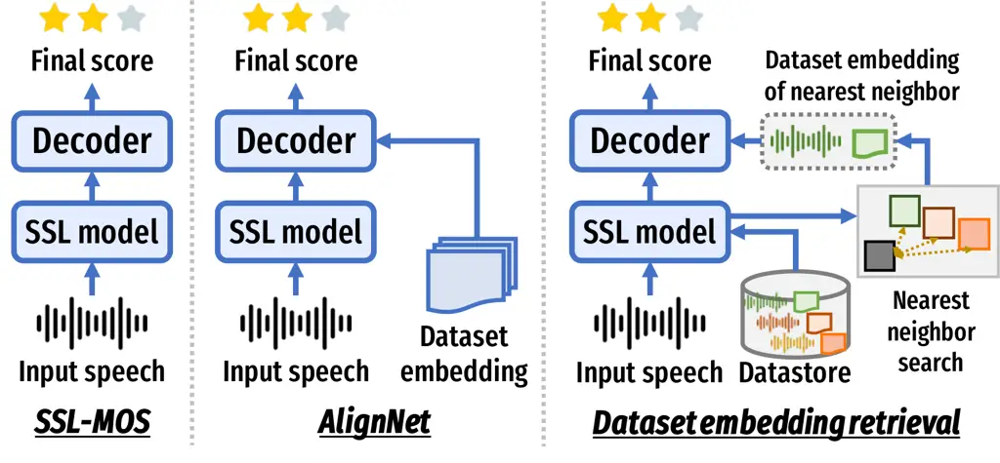
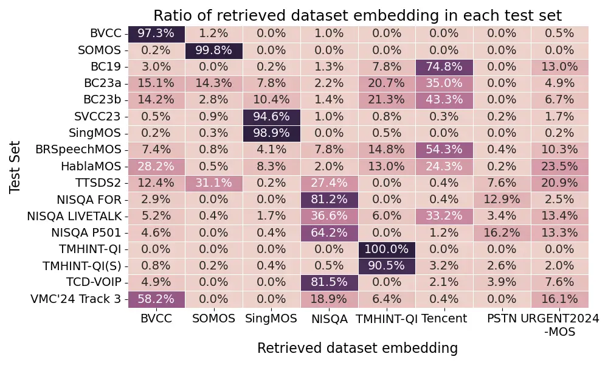

# MOS-Bench: Benchmarking Generalization Abilities of Subjective Speech Quality Assessment Models

Wen-Chin Huang    Erica Cooper    and Tomoki Toda ^(†)^(†)thanks:
Wen-Chin Huang is with the Graduate School of Informatics, Nagoya
University, Japan (e-mail: wen.chinhuang@g.sp.m.is.nagoya-u.ac.jp).
Erica Cooper is with the National Institute of Information and
Communications Technology (NICT), Japan. Tomoki Toda is with the
Information Technology Center, Nagoya University, Japan.

###### Abstract

In this paper, we study the task of subjective speech quality assessment
(SSQA), which refers to predicting the perceptual quality of speech.
Owing to the development of deep neural network models, SSQA has greatly
advanced and has been widely applied in scientific papers to evaluate
speech generation systems. Nonetheless, the insufficient out-of-domain
(OOD) generalization ability of current SSQA models is underexplored and
often overlooked by researchers. To study this problem systematically,
we present MOS-Bench, a diverse SSQA dataset collection that currently
contains 8 training sets and 17 test sets. Through extensive
experiments, we first highlight the OOD generalization challenges of
existing models. We then evaluate the efficacy of multiple-dataset
training, comparing straightforward data pooling against AlignNet, an
existing domain-aware method. We demonstrate that pooling multiple
training sets provides a simple yet effective solution, and variation in
the data is a key factor for robust generalization beyond training data
size.

###### Index Terms: 

speech quality assessment, mean opinion score, out-of-domain
generalization, benchmark

## I Introduction

Speech quality assessment (SQA) refers to evaluating the quality of a
speech sample \[1, 2\]. Since most “end listeners” of speech are humans,
the most accurate way to assess quality is through subjective listening
tests \[3\]. A common listening test protocol is the mean opinion score
(MOS) test, in which the quality of a query speech sample is presented
as the average of ratings from multiple listeners, usually on a
five-point scale. However, conducting listening tests is inarguably very
costly and time-consuming. Therefore, researchers have dedicated efforts
to developing automated objective evaluation methods, which can ease the
evaluation process and accelerate the development iteration. In this
work, we use the term subjective speech quality assessment (SSQA) to
refer to the task of predicting the perceptual quality of speech.

The progress in the development of deep neural network (DNN) models has
in turn greatly accelerated the development of model-based objective
methods for SSQA, which directly learn from datasets consisting of
$`\langle`$speech $`\textendash`$ human rating$`\rangle`$ pairs.
Researchers have explored various approaches, including different model
architectures \[4, 5, 6\] and training objectives \[7, 8, 9\]. These
efforts have advanced SSQA models to the point where they exhibit very
strong correlations with human perception. For example, in the VoiceMOS
Challenge (VMC) 2022 \[10\], a scientific competition dedicated to SSQA,
the best-performing system, UTMOS \[11\], achieved an exceptionally high
correlation (0.959) with human ratings. Such results have encouraged
speech generation researchers to increasingly adopt SSQA models in their
work \[12, 13, 14\], and even to use them as primary evaluation metrics
in scientific challenges \[15, 16, 17, 18, 19, 20\].

However, an underexplored aspect of current state-of-the-art SSQA models
is their ability to generalize to out-of-domain (OOD) data, as first
noted in \[21\]. In machine learning, a model exhibits good in-domain
generalization when it performs well on test data drawn from the same
distribution as the training data. In contrast, OOD generalization
refers to scenarios in which test and training data come from different
distributions. We argue that in SSQA, almost all practical applications
correspond to OOD settings. Most SSQA models are trained on a single
dataset derived from one listening test, which represents a unique
context: distinct contents (text, speakers, etc.), recruited listeners,
ranges of systems evaluated, and even instructions. During testing,
incoming samples often come from, for example, a newly developed
text-to-speech system or speech corrupted by previously unseen
distortions. Such scenarios are naturally OOD.

A concrete demonstration of the limited OOD generalization ability of
modern SSQA models comes from the results of VMC’23 \[22\]. The high
correlation with human ratings observed in VMC’22 largely reflected an
in-domain evaluation setting. In contrast, VMC’23 employed a fully
zero-shot setup, where participants were asked to predict scores on
three OOD test sets without access to any data from the corresponding
domains. Consequently, most teams struggled to achieve strong
performance across all sets. These results underscore the limitations of
relying on current SSQA models as quality metrics in practical settings,
such as those in scientific studies.

From these observations, we aim to systematically study the
generalization ability of SSQA models in a standardized, large-scale
setting. To this end, we introduce MOS-Bench, an open-sourced and
ongoing collection of datasets for training and benchmarking subjective
speech quality predictors. The currently released version includes eight
training sets and 17 test sets, encompassing diverse sampling
frequencies, languages, and speech types, ranging from the synthetic
speech generated by text-to-speech (TTS), voice conversion (VC), and
singing voice synthesis (SVS) systems to the naturally distorted or
processed speech affected by noise, reverberation, codec artifacts,
telephony, and more. Using each of the 8 training sets individually, we
first benchmark the OOD generalization performance of state-of-the-art
SSQA models across all 17 test sets, highlighting the challenges of OOD
generalization. Building on this, we demonstrate the effectiveness of a
simple yet overlooked approach: training on multiple datasets
simultaneously. We compared a simple data-pooling approach against more
complex, domain-aware architectures such as AlignNet \[23\].
Experimental results show that multiple dataset training substantially
improves performance across all test sets, and that revealing data
diversity, beyond dataset size, is crucial for robust generalization.
Moreover, we show that the simple strategy of pooling diverse datasets
yields superior and more robust performance. These findings provide
practical guidance for constructing training corpora and developing
future SSQA models with stronger OOD resilience.

The contributions of this work are summarized as follows.

- •
  We introduce MOS-Bench, a standardized and reproducible benchmarking
  framework for SSQA, to address the long-standing challenge of
  fragmented evaluation and enable consistent protocols across the
  research community.
- •
  We conduct a large-scale systematic study of OOD generalization in
  SSQA, providing a comprehensive analysis of the current state of the
  field, highlighting critical gaps in model robustness across diverse
  conditions and domains.
- •
  We demonstrate the empirical effectiveness of multiple-dataset
  training, revealing that dataset size alone does not determine OOD
  resilience, and provide indirect evidence that data diversity may play
  a more critical role. Our results further show that a straightforward
  data-pooling strategy can outperform specialized, complex
  architectures such as AlignNet, providing a high-performing and
  accessible baseline for future research.

## II Related works

### II-A Benchmarking in subjective speech quality assessment

In recent years, the field of SSQA has been driven forward by a surge in
scientific challenges, with one of the most prominent being the VoiceMOS
Challenge series \[10, 22, 24\], recently renamed as the AudioMOS
Challenge \[25\]. Before these challenges emerged, SSQA datasets were
mostly proprietary, making it difficult to compare results across
studies because of differences in data collection and evaluation
procedures. In contrast, these challenges provided standardized datasets
and evaluation protocols, which enabled direct comparisons and
reproducibility. The VoiceMOS Challenge series, in particular,
stimulated innovation by attracting more than 40 participating teams
over three consecutive years, and its datasets have since been widely
reused in follow-up research. Similar initiatives have also been
launched, such as the ConferencingSpeech Challenge 2022 \[26\], which
focused on online conferencing scenarios, and the URGENT Challenge 2026
\[27\], which emphasized the assessment of enhanced speech.

Despite these advances, scientific challenges inherently constrain
progress by fixing the dataset and evaluation protocol, thereby
narrowing the scope of model development. This setting encourages system
optimization toward the challenge data but often leads to overfitting to
particular corpora. As a result, models that perform strongly in these
tracks may struggle to generalize to unseen datasets with different
domains, languages, or distortion types, as we saw in VMC’23. These
observations highlight the need for benchmarks that explicitly emphasize
OOD generalization, such as MOS-Bench, as well as models and evaluation
methodologies tailored to assessing and improving cross-dataset
robustness.

### II-B Improving generalization ability in speech quality assessment

In this subsection, we discuss techniques that have been applied to
improving the generalization ability of SSQA. The first technique is
transfer learning, where knowledge learned from a pretext task is
utilized on the task at hand. A representative method is self-supervised
learning (SSL), which has been shown to be extremely effective in a wide
range of speech processing tasks \[28\]. First, pretraining is conducted
on a large-scale unlabeled speech dataset w.r.t. some pretext task, such
as contrastive learning \[29\] or masked prediction \[30, 31\], followed
by fine-tuning with a labeled dataset for the downstream task. Although
there have been many attempts to apply SSL to the task of SSQA \[32, 33,
34, 35\], perhaps the most representative approach is SSL-MOS \[21\],
where the authors applied a very simple model architecture by attaching
a linear head onto SSL models. SSL-MOS was shown to not only improve
performance on in-domain datasets but also provide reasonable
correlations in the zero-shot setting.

The second technique is ensemble learning, which aims to reduce model
variance and improve robustness by combining multiple models. For
instance, UTMOS \[11\], which was the top-performing team in VMC’22,
performed stacking \[36\] with a set of strong and weak learners, where
they employed regression models, including linear regression, decision
trees, and kernel methods as the weak learners. LE-SSL-MOS \[37\], the
top performing team in VMC’23, combined scores from multiple models,
including a vanilla SSL-MOS model, an SSL-MOS model with listener
modeling, a SpeechLMScore model \[38\], and the confidence score of an
ASR model. LE-SSL-MOS was the only team in VMC’23 that performed well on
all tracks, demonstrating its strong generalization ability.

Perhaps the most straightforward way to increase the generalization
ability is multiple-dataset training by simply pooling several listening
test datasets into one large training set. In fact, this
multiple-dataset training has been adopted in some research papers \[6,
39, 40\]. However, this approach has an issue regarding the phenomenon
called the “corpus effect” as defined in \[41\]. The corpus effect
refers to the problem of the same type of speech receiving different
scores on different listening tests. For instance, it was reported that
the same TTS system received a lower score when systems with higher
qualities were present in the listening test \[42\]. This is because MOS
can be affected by listener preferences and the range of conditions
included in one listening test. The latter is sometimes called the
“range-equalizing bias” \[43\]. A pioneering attempt to solve this
problem is the bias-aware loss \[44\], which attempts to assign
different weights to different datasets, with the cost of a complex
training process. Recently, AlignNet has been proposed \[23\], with a
much simpler training process than the bias-aware loss but higher
performance.

[TABLE]

TABLE I: Details of the training and development sets in MOS-Bench.
Abbreviations: En. = English, Ch. = Chinese, Ja. = Japanese, fs =
sampling frequency, SVS = singing voice synthesis, SVC = singing voice
conversion, VC = voice conversion, TTS = text-to-speech, PSTN = public
switched telephone network. An asterisk (\*) in the interlistener
variance column indicates that samples with only one rating were
assigned variance = 0, so the actual variance may be higher than
reported. The listener-wise scores were not provided for Tencent, so the
interlistener variance could not be calculated.

[TABLE]

TABLE II: Details of the test sets in MOS-Bench. Abbreviations: En. =
English, Ch. = Chinese, Ja. = Japanese, Fr. = French, Pt. = Portuguese,
Nl. = Dutch, fs = sampling frequency, SVS = singing voice synthesis, SVC
= singing voice conversion, VC = voice conversion, TTS = text-to-speech,
VoIP = voice over Internet protocol. The listener-wise scores were not
provided for TCD-VOIP, so statistics could not be calculated. An
asterisk (\*) in the interlistener variance column indicates that
samples with only one rating were assigned variance = 0, so the actual
variance may be higher than reported.

## III Description of MOS-Bench

### III-A General description

The MOS-Bench collection contains two parts: the 8 training and
development sets, as summarized in Table I, and the 17 test sets, as
summarized in Table II. All datasets included in MOS-Bench are publicly
available and can be easily accessed using the SHEET toolkit \[45\]. The
listening test protocol in each dataset was a MOS test with scores
ranging from 1 to 5. Although most datasets come with a train/dev/test
split, for those without an official split, we randomly divided them
into a train/dev set with a 9:1 ratio.

The MOS-Bench demonstrates a diverse collection of datasets with
different properties. In this paper, we roughly divide speech into two
types:

- •
  Synthetic speech: speech generated by, but not limited to, TTS, VC,
  SVS, and SVC systems
- •
  Distorted speech: speech that underwent various distortions, including
  artificially added and real noise, reverberation, voice-over-IP
  (VoIP), codec, and replay

The main difference is that for the distorted speech, there exists a
ground truth to be compared with, typically the speech before undergoing
the distortion. The synthetic speech, on the other hand, often does not
come with a clear ground truth owing to the one-to-many problem in
speech synthesis. In addition, MOS-Bench covers a broad spectrum of
languages: English, Chinese, Japanese, French, Spanish, Dutch, and
Brazilian-Portuguese. MOS-Bench also covers a wide range of sampling
frequencies, ranging from 8 kHz to 48 kHz.

### III-B Brief descriptions of each dataset

In this subsection, we briefly describe the properties of each dataset.
For details, please refer to the respective original papers.

#### III-B1 BVCC

The BVCC dataset \[46\] is a large-scale listening test covering English
samples from 187 different TTS and VC systems, which mainly come from
past years of the Blizzard Challenges (BC) and Voice Conversion
Challenges (VCC), as well as published samples from ESPnet-TTS \[47\].
We used the official partition, where the dev and test sets contain
unseen synthesis systems, speakers, texts, and listeners not in the
training set, whereas the rating distribution of each set is matched as
closely as possible.

#### III-B2 SOMOS

The SOMOS dataset \[48\] contains samples from 200 neural TTS systems,
which were all trained on LJSpeech \[49\], a single-speaker English
female corpus, with a shared LPCNet vocoder \[50\]. These TTS systems
differ mainly in the acoustic model architecture, as well as input
variations, including syntactic, linguistic, and prosodic clues. In
addition, clean speech samples were also included. We used the official
train/dev/test partition within the clean set.

#### III-B3 SingMOS

The SingMOS dataset \[51\] focuses on singing voices and includes
samples collected from 35 modern neural SVS and SVC systems, including
natural singing voice samples. These systems are trained on open-source
Chinese and Japanese singing voice datasets. The SingMOS dataset was
also used in VMC’24 track 2, and we used the official train/dev/test
split in the challenge.

#### III-B4 NISQA

The NISQA dataset \[6\] was designed to evaluate speech with distortions
occurring in communication networks. In MOS-Bench, the train and dev
sets combined the NISQA TRAIN SIM, NISQA TRAIN LIVE sets, and the NISQA
VAL SIM, NISQA VAL LIVE sets, respectively. The NISQA TRAIN SIM and
NISQA VAL SIM sets contained (1) simulated speech distortions, such as
packet loss, bandpass filter, different codecs, and clipping, and (2)
artificially added background noises. The NISQA TRAIN LIVE and NISQA VAL
LIVE sets contained live Skype and phone recordings, with real
distortions created during recording, such as keyboard typing and street
noise.

The NISQA TEST P501, NISQA TEST FOR, and NISQA TEST LIVETALK sets were
used as the test sets in MOS-Bench¹¹ 1 The NISQA TEST NSC set was
excluded since it was not publicly available anymore.. The NISQA TEST
P501 and NISQA TEST FOR sets included samples with simulated
distortions, as well as live VoIP calls where speech samples were played
back directly from a laptop, followed by a simulated packet loss,
warping, a low bitrate, etc. Finally, NISQA TEST LIVETALK is a German
dataset with real phone call recordings, where talkers spoke directly
into the terminal device in different backgrounds with different
distortions. Talkers can be called either through the mobile network or
via VoIP.

#### III-B5 TMHINT-QI

The TMHINT-QI dataset \[52\] contained Taiwanese Mandarin samples with
four added artificial noise types (babble, street, pink, and white) at
four signal-to-noise (SNR) ratio levels (-2, 0, 2, and 5), along with
their enhanced versions using five speech enhancement systems. We used
the official train/dev/test split. Note that all noise types, SNR
levels, and enhancement systems are the same across the splits.

#### III-B6 Tencent

The Tencent dataset \[26\] was a Chinese dataset designed for speech
quality assessment in online conference scenarios. First, samples from
three publicly available datasets were artificially distorted with
either background noise, clipping, or codec compression loss. Then,
noise suppression and packet loss concealment were applied to simulate a
realistic online conference scenario. In addition, samples with either
simulated reverberation or recorded in a reverberant environment were
also considered, each with a different room size and reverberation
delay. Most samples have a sampling frequency of 16 kHz, whereas some
are at 48 kHz. As part of the dataset of the ConferencingSpeech2022
challenge \[26\], the organizers only provided the training partition.
Therefore, we used a random 9:1 train/dev split.

#### III-B7 PSTN

The PSTN dataset \[53\] was collected to study the speech quality of a
public switched telephone network. Similar to the Tencent dataset, the
PSTN dataset was also part of the ConferencingSpeech2022 challenge, so
we used the filtered version provided by the organizers and used a
random 9:1 train/dev split. The PSTN dataset contains automatically
conducted phone calls between a PSTN and a VoIP endpoint. The 500,000
original automated calls were further filtered to maintain a reasonable
quality distribution. Then, background noises were artificially added to
simulate real-world phone calls.

#### III-B8 URGENT2024-MOS

The URGENT2024-MOS dataset \[54, 55\] was part of the dataset of the
URGENT challenge 2024, a challenge designed to evaluate the performance
of speech enhancement systems in handling various distortions and input
conditions. The URGENT2024-MOS dataset consists of the original noisy
and 22 enhanced versions of a subset (300 samples) of the blind test
set, resulting in 6900 speech samples in total. The original noisy
subset contained both artificial and real distorted English monaural
samples with sampling frequencies ranging from 8 kHz to 48 kHz. The
ratings were collected following the P.808 \[56\] recommendation using
the Amazon Mechanical Turk platform. The raw ratings from each subject
were averaged to obtain the final MOS score.

#### III-B9 BC19

The Blizzard Challenge 2019 \[57\] listening test data served as the OOD
track of VMC 2022. This dataset contains Chinese TTS samples.

#### III-B10 BC23 a and BC23 b

The BC 2023 \[58\] listening test data served as tracks 1a and 1b of VMC 2023. The task setting in the Blizzard Challenge 2023 was French TTS,
with two subtasks: the main Hub task provided 50 h of training data from
a female speaker, and the Spoke task was a speaker adaptation task where
2 h of data from a different female speaker was provided. Two different
listening tests were conducted separately on the submitted TTS samples
for these two tasks.

#### III-B11 SVCC23

The Singing Voice Conversion Challenge (SVCC) 2023 \[59\] listening test
data served as track 2 of VMC 2023. SVCC’23 focused on singing voice
conversion, where there were two tasks: an in-domain task, where the
singing voice samples of the target were provided, and a cross-domain
task, where the normal voice samples were provided. Each sample was
rated by six listeners.

#### III-B12 BRSpeechMOS

The BRSpeechMOS dataset \[60\] contains
Brazilian$`\textendash`$Portuguese TTS and natural samples at 16 kHz.
Unfortunately, very little metadata information, such as the number of
speakers and TTS systems, could be found. From manual inspection, the
dataset seems to contain clean and noisy natural samples, in addition to
samples from two neural TTS systems.

#### III-B13 HablaMOS

The HablaMOS dataset \[61\] consists of 16 kHz single-speaker TTS
samples from 52 different systems, as well as natural samples. These
systems vary in gender, accent, and region. 100 text samples were
randomly sampled from the Argentinian Spanish speech dataset \[62\]. In
addition, vocal tract length perturbation and phase alteration were also
applied to increase the variation of the dataset. The listening test was
based on the ITU-T Rec. P.807 standard \[63\], and a total of 92
listeners participated.

#### III-B14 TTSDS2

The TTSDS2 dataset \[64\] contains samples from 20 TTS systems from 2022
to 2024 whose quality was claimed to reach human parity. The materials
cover four domains: clean and noisy audiobooks, in-the-wild YouTube
speech, and children’s dialogue. A crowdsourcing listening test was
conducted with a total of 200 native listeners.

#### III-B15 TMHINT-QI (S)

The TMHINT-QI(S) \[65\] dataset served as track 3 in VMC 2023. The base
speech samples and the noisy utterance generation process were the same
as those in the TMHINT-QI dataset. Two out of five enhancement methods
in TMHINT-QI(S) were different from those in TMHINT-QI, resulting in
five partially different enhancement methods. In addition, a separate
listening test with non-overlapping listeners was conducted.

#### III-B16 TCD-VOIP

The TCD-VOIP dataset \[66\] was created to study speech quality
degradations typical in VoIP applications. It contains speech distorted
by five platform-independent degradations: background noise, competing
speakers, echo effects, amplitude clipping, and choppy speech (simulated
packet loss). The base speech samples are from the TSP speech database
\[67\] with four speakers (two males and two females) reading Harvard
sentences \[68\]. 24 native, normal hearing listeners participated in
the listening test.

#### III-B17 VMC24 track3

The VMC24 track 3 dataset \[24\] was based on the VoiceBank-DEMAND
\[69\] dataset. First, 40 clean utterances were contaminated by one of
the four types of noise at an SNR of 0 dB. Then, each noisy utterance
was processed by five speech enhancement systems, resulting in a total
of 280 utterances. A total of ten listeners (six males and four females,
all native English speakers) participated in the listening test.

### III-C Dataset quality assessment

In recent years, the MOS test has faced criticism \[42, 70, 71\],
particularly regarding inconsistencies in its design across different
studies. Researchers have emphasized the importance of carefully
reporting listening test details \[72, 73\], as factors such as the
number of ratings and the type of listener can strongly affect the
reliability of the results \[74, 75\]. Assessing the quality of the
listening test datasets in MOS-Bench is challenging, as we are
aggregating existing datasets and have no control over missing or
incomplete metadata.

Therefore, in this subsection, we report statistics of two types of
listening test metadata. First, we report the minimum, maximum, mean,
and standard deviation of the number of ratings per sample, as shown in
Tables I and II. Although there is no clear guideline for how many
ratings per sample are “enough”, many datasets contain samples with
extremely few ratings – some even with just one. We also observed that
several datasets have an average of two ratings or fewer per sample
(TMHINT-QI training set, BRSpeechMOS, and HablaMOS), and some datasets
exhibit a standard deviation larger than two (SOMOS train and test sets,
SVCC23, SingMOS, BRSpeechMOS, TTSDS2, NISQA FOR, and NISQA P501), a
natural consequence of crowdsourced listening tests where some samples
receive far fewer ratings than others, creating an imbalance in
reliability across samples.

Next, we report the mean and standard deviation of a quantity we call
the interlistener variance. This quantity is designed to measure the
agreement across listeners. Specifically, in an SSQA dataset where each
sample may receive a different number of ratings, we first determine,
for each sample, how spread out the ratings are by computing the
variance across its listeners. We refer to this value as the
interlistener variance. Finally, we report the mean and standard
deviation of these interlistener variances across the entire dataset.

From Tables I and II, we find that the mean interlistener variance for
most datasets is below one, with the exception of the SOMOS train and
test sets. To interpret this value, note that the maximum possible
interlistener variance is four, which occurs when half of the listeners
rate a sample as one and the other half as five. A variance of one, by
contrast, corresponds to a situation where ratings are closer together
(for instance, half of the listeners rate two and the other half rate
four). Thus, on average, listener agreement is high in most datasets.
However, the standard deviation of the interlistener variance is also
relatively large, indicating that whereas many samples yield consistent
judgments, others trigger substantial disagreement among listeners.

Note that each of the above-mentioned two statistics alone cannot serve
as the sole indicator of dataset quality. For instance, if a dataset has
a reasonable number of listeners and still a high variance, instead of
being considered a low-quality dataset, it may be considered a
challenging dataset, as listeners may reasonably disagree for good
reasons. We would also like to emphasize that in this subsection, we
focus on the critical analysis of dataset quality. Given the limited
number of available SSQA datasets, excluding datasets with lower quality
would likely cause more harm than benefit.

Note that neither of the two statistics discussed above can serve as a
standalone indicator of dataset quality. For example, a dataset with a
sufficient number of listeners but a high variance should not be
regarded as a low-quality dataset; rather, it may simply be more
challenging, reflecting reasonable disagreement among listeners. We also
emphasize that in this subsection, we provide only a critical assessment
of dataset quality. Given the limited availability of SSQA datasets,
excluding those as being of “lower quality” would likely cause more harm
than benefit.



Fig. 1: Models and inference methods used in this work. The time pooling
operation is omitted.

## IV Models

### IV-A Main model backbone: SSL-MOS

The main model backbone adopted in most experiments in this work was
SSL-MOS \[21\], one of the most popular architectures in SSQA, because
of its simplicity and excellent performance. The left side of Fig. 1
illustrates SSL-MOS. Given an input speech $`x`$, the SSL model
$`\textsc{SSL}(\cdot)`$ outputs a sequence of frame-wise hidden
representations, which is further sent into the decoder
$`\textsc{Dec}(\cdot)`$ to generate a frame-wise score sequence. The
predicted score $`\hat{y}`$ is then obtained by time pooling over the
frame-wise score sequence:

```math
\hat{y}=\text{TimePooling}(\textsc{Dec}(\textsc{SSL}(x))). \tag{1}
```

Finally, the training objective is an L1 loss between the ground truth
score $`y`$ and the predicted score $`\hat{y}`$. During training,
$`\textsc{SSL}(\cdot)`$ and $`\textsc{Dec}(\cdot)`$ are jointly
optimized. During inference, the process to obtain the predicted score
$`\hat{y}`$ is the same as that during training.

### IV-B AlignNet

The AlignNet was a model designed to tackle the potential corpus effect
in multi-dataset training \[23\], as illustrated in the middle of
Fig. 1. The core idea is similar to listener modeling \[76, 77\], which
is to have the encoder behave in a dataset-independent fashion, whose
output is then mapped to the dataset-specific score by the decoder.

#### IV-B1 Original formulation

Suppose we combine $`K`$ training sets to form a large training set,
$`\mathcal{D}_{\text{train}}`$, where each training sample is associated
with the dataset ID $`d(x)`$, denoting which training set it originally
belonged to: $`d(x)\in\{1,\dots,K\}`$. The AlignNet model consists of an
encoder and a decoder, where we use the same network architecture as
that of SSL-MOS. In addition, a set of learnable dataset embeddings is
maintained: $`\mathcal{E}=\{e_{1},\dots,e_{K}\}`$.

In the forward pass, the only difference between AlignNet and SSL-MOS is
that the decoder $`\textsc{Dec}(\cdot,\cdot)`$ now takes two inputs: the
encoder output and a dataset embedding. The encoding and decoding
processes are identical to those of SSL-MOS, and the predicted score is
obtained as

```math
\hat{y}=\text{TimePooling}(\textsc{Dec}(\textsc{SSL}(x),e_{d(x)})). \tag{2}
```

During training, for each training sample, the dataset ID is already
known, so we can directly use it. However, during inference, we need to
decide which dataset embedding to use. The solution proposed in the
original AlignNet paper was to select a reference dataset from all the
training datasets beforehand. During training, for all the samples in
the reference dataset, the decoder is forced to become the identity
function. Then, during inference, the embedding of the reference dataset
is used, regardless of the type of input speech. Such an approach can
also ground the encoder to produce meaningful quality scores. However,
the behavior of AlignNet will largely depend on the choice of the
reference dataset. For instance, the experiments described in the
original paper used NISQA as the reference dataset; therefore, there
would be an obvious mismatch when the input speech is from a TTS system.

#### IV-B2 Proposed inference method: dataset embedding retrieval

We therefore propose a new inference method called dataset embedding
retrieval, illustrated on the right side of Fig. 1, which is inspired by
recent retrieval-based methods in SQA \[78\]. After the model training
phase, we construct a datastore, $`\mathcal{R}`$, as follows:

```math
\displaystyle h(x) \displaystyle=\text{TimePooling}(\textsc{SSL(x)}), \tag{3}
```

```math
\displaystyle\mathcal{R} \displaystyle=\bigl\{\bigr(h(x),d(x)\bigr)~|~x\in\mathcal{D}_{\text{train}}\bigr\}, \tag{4}
```

where each pair contains $`h(x)`$, the time-pooled SSL representations
of each training sample $`x`$, and $`d(x)`$, the dataset ID associated
with it. During inference, given the input test sample
$`x_{\text{test}}`$, we first extract its time-pooled SSL
representation, $`h(x_{\text{test}})`$. Then, from the datastore, we
retrieve the nearest neighbor to $`h(x_{\text{test}})`$ w.r.t. some
predefined distance measure $`\textsc{dist}(\cdot,\cdot)`$:

```math
(h^{*},d^{*})=\arg\min_{(h_{i},d_{i})\in\mathcal{R}}\textsc{dist}(h_{i},h(x_{\text{test}})). \tag{5}
```

We may then use the dataset ID to decide the retrieved dataset embedding
$`e_{d^{*}}`$. Here, we use the negative cosine similarity as the
distance measure. Finally, the predicted score $`\hat{y}`$ can be
obtained by retrieved dataset embedding:

```math
\hat{y}=\text{TimePooling}(\textsc{Dec}(\textsc{SSL}(x),e_{d^{*}}). \tag{6}
```

(a) Utterance-level SRCC

(b) Utterance-level MSE

Fig. 2: Heatmap results of the single dataset training and multiple
dataset training experiments. For both figures, the higher the color
intensity, the higher the performance. For SRCC, the higher the color
intensity, the higher the performance. For MSE, the lower the color
intensity, the better the performance. Color intensity is normalized
row-wise to compare models on a specific test set.

## V Experimental settings

### V-A Training settings

All experiments were conducted using the SHEET toolkit \[45\]. For all
experiments, following \[21\], we set the training batch size to 16 and
used the SGD optimizer with an initial learning rate of 0.001 and a
momentum of 0.9. Early stopping with patience was applied: at fixed
intervals, we computed utterance-level SRCC (which will be explained in
Sec.V-B) on the validation set and retained the five best checkpoints.
Training stopped when none of these were updated after 20 validations or
when the maximum number of training steps was reached. For
single-dataset experiments described in Sec.VI, validation was performed
every 100 steps with a cap of 100,000 steps. For multi-dataset
experiments described in Sec. VII, validation was conducted every 1,000
steps with a cap of 200,000 steps.

For single-dataset training experiments described in Sec. VI, the
SSL-MOS model was used, and for multi-dataset training experiments in
Sec. VII, we used SSL-MOS and AlignNet. For both models, we considered
the choice of the SSL model as a hyperparameter and chose the best among
the following three: HuBERT large (HuBERT-L) \[30\], wav2vec 2.0 large
(wav2vec 2.0 L) \[29\], and WavLM large (WavLM-L) \[31\]. We always used
the last layer. Since all the above-mentioned SSL models took 16 kHz
waveforms as input, all input speech samples were resampled to 16 kHz.

### V-B Evaluation metrics

We report two metrics: the utterance-level mean square error (UTT-MSE)
and the utterance-level Spearman’s rank correlation coefficient
(UTT-SRCC). For readers interested in the implementation, we provide a
code snippet online²² 2
[https://gist.github.com/unilight/883726c94640cca1f4d4068e29c3d20f](https://gist.github.com/unilight/883726c94640cca1f4d4068e29c3d20f).

One might ask why SRCC is adopted instead of the linear correlation
coefficient (LCC, also known as Pearson’s correlation coefficient, PCC),
which is commonly used in the literature on SQA \[6\]. The reason is
that SRCC captures ranking relationships more effectively, which we
consider particularly important in SQA. For example, in challenges such
as BC or VCC, organizers and participants are more likely to be
interested in the relative ranking of systems.

Another question may concern why metrics are calculated at the utterance
level rather than at the system level, as in the VMCs. In many cases,
such as speech distorted with background noise, the noise type and level
can vary across utterances, making it difficult and less meaningful to
define a “system”. Moreover, when system-level metrics are applicable
(e.g., in the comparison of TTS systems), we usually observe a strong
correlation between system-level and utterance-level results. For this
reason, in this paper, we adopt utterance-level metrics consistently
across all speech types.

(a) Low MSE, high SRCC

(b) High MSE, high SRCC

(c) Low MSE, low SRCC

(d) High MSE, low SRCC

Fig. 4: Sample scatter plots of true MOS against predicted MOS in
different combinations of MSE and SRCC. All numbers are calculated at
the utterance level.

## VI Single-dataset training experiments

In this section, we trained SSL-MOS models using either one of the eight
training sets in MOS-Bench listed in Table I, and we benchmarked their
performance on the 17 test sets in MOS-Bench listed in Table II.

### VI-A Main results

Figure 2 shows the UTT-SRCC and UTT-MSE results of the single-dataset
experiments in the form of heatmaps. For each test set, color intensity
indicates the relative performance of a training set across all eight.
For example, the first row of Fig. 2(a) shows UTT-SRCC on the BVCC test
set. As expected, the model trained on BVCC achieved the highest
performance, as whosn by the darkest cell.

From the UTT-SRCC results in Fig. 2(a), SOMOS performed substantially
worse than all other training sets. This outcome is unsurprising, as
SOMOS mainly consists of single-speaker neural TTS samples with various
prosodic inputs, whereas the vocoder and training dataset remained
fixed. Such characteristics limited the quality variation, reducing the
effectiveness of the model trained on this dataset. For the other
datasets, no clear trend was observed, but NISQA consistently yielded
the highest performance, followed by PSTN.

Regarding the UTT-MSE results in Fig. 2(b), BVCC, SOMOS, SingMOS, and
TMHINT-QI performed poorly, each with an average UTT-MSE above 1.0
across test sets. TMHINT-QI was the weakest overall, with an average
UTT-MSE of 1.333. Interestingly, SOMOS – although the worst in UTT-SRCC
– was not the worst in UTT-MSE. The remaining four datasets performed
well on most test sets, with NISQA again achieving the highest overall
results.

The strong performance of NISQA carries an important implication:
building an effective SSQA training set does not necessarily require
collecting samples from a wide range of speech generation systems.
Instead, generating distorted speech with high diversity may be more
beneficial. In fact, we observed that synthetic training sets such as
BVCC, SOMOS, and SingMOS did not perform notably higher on synthetic
test sets, nor did distorted training sets outperform others on
distorted test sets.

We are also interested in whether language plays a role, but found no
clear trend. For example, Chinese training sets (SingMOS, TMHINT-QI, and
Tencent) did not show superior performance on Chinese test sets (BC19,
SingMOS, TMHINT-QI, and TMHINT-QI (S)). Finally, since NISQA and PSTN
were the top two training sets in both UTT-SRCC and training size, we
hypothesize that dataset size may be an important factor. We examine
this hypothesis in Sec. VII-B.

### VI-B Performance pattern analysis

Given the contrasting trends when using UTT-SRCC and UTT-MSE as
evaluation metrics as shown in Fig. 2, we are interested in how
predictions actually look like. For instance, if a model has not only a
high UTT-SRCC but also a large UTT-MSE, what does it mean? To this end,
we selected two representative cases for each scenario and plotted
scatter plots of true MOS versus predicted MOS in Fig. 4. A perfect
system would show all points on the diagonal line, indicating that the
predicted MOS values are identical to the true MOS. In the ideal case –
small MSE and large SRCC (Fig. 4(a)) – most points lie close to the
diagonal line, indicating that predictions are accurate for individual
samples and rankings are preserved. This situation typically arises when
training and test sets share similar distributions, often, though not
always, in the in-domain setting.

Figure 4(b) illustrates the case of high SRCC but also large MSE. Here,
points are far from the diagonal line, leading to large MSEs, yet they
align along an oblique line, showing that the model preserves relative
rankings, thus a high SRCC. In contrast, Fig. 4(c) shows the opposite:
predictions cluster near the diagonal line, yielding a small MSE, but
the points fail to form an oblique pattern. This indicates that the
model predicts similar MOS values across samples, regardless of their
true MOS, resulting in a low SRCC. Finally, Fig. 4(d) shows the worst
case, where both metrics are poor: predictions deviate substantially
from the diagonal line, and exhibit no clear ranking structure.

[TABLE]

TABLE III: Utterance-level SRCC and MSE results (mean $`\pm`$ standard
deviation), which are calculated across all 17 test sets in MOS-Bench.
“All” denotes training on the combination of all eight training sets in
MOS-Bench. The best results for each metric are highlighted in bold.

## VII Multi-dataset training experiments

In this section, we aim to investigate the effectiveness and outcomes of
training SSQA models (specifically, SSL-MOS and AlignNet) using a
combination of multiple training sets. To this end, we trained models
using the combination of the eight training sets in MOS-Bench as listed
in Table I. Throughout this section, we denote the combined dataset as
“All”. Then, we benchmarked the models trained with “All” on the 17 test
sets in MOS-Bench listed in Table II.

### VII-A Main results

We are mainly interested in whether combining multiple datasets can
bring overall improvements compared with single-dataset training, so
instead of showing test-set-wise performance breakdown in heatmaps as in
the previous section, we report UTT-SRCC and UTT-MSE averaged across all
17 test sets, along with their standard deviations, in Table III.

To rigorously evaluate the effectiveness of multi-dataset training, we
performed a paired t-test across the 17 test sets to compare the SSL-MOS
model trained on the pooled “All” dataset against the best-performing
single-dataset model (NISQA). The analysis reveals that the pooled model
achieves a statistically significant improvement in UTT-SRCC, increasing
from 0.631 to 0.692 with $`p=0.039`$. Regarding UTT-MSE, although the
average error numerically decreased from 0.642 to 0.440, the test
yielded a p-value of 0.225. Although the absolute error reduction is
numerically large, we suspect that its statistical significance is
affected by the scale shifts between different MOS datasets.
Importantly, however, the pooled training strategy notably reduces the
standard deviation for both SRCC ($`\pm`$0.193 to $`\pm`$0.160) and MSE
($`\pm`$0.617 to $`\pm`$0.497). This narrowed variance demonstrates that
multi-dataset training yields a more consistent and robust estimator
across diverse acoustic domains.

On the other hand, the AlignNet model was outperformed by the SSL-MOS
model. We will discuss this outcome in Sec. VII-C.

(a) Utterance-level MSE

(b) Utterance-level SRCC

Fig. 5: Scatter plot between training data size (log scale) and averaged
utterance-level MSE/SRCC across all test sets. “All-$`X`$” indicates a
subset of the full training data, where $`X`$ denotes the fraction used.
For example, “All-0.5” corresponds to using half of the full training
set.

### VII-B Does increasing training data size always lead to higher performance?

It is natural to attribute a model’s success primarily to the size of
its training data. As shown in the single-dataset results in Sec. VI-A,
the two highest-performing models were trained on NISQA and PSTN, both
of which are relatively large training sets in MOS-Bench. Similarly, in
Sec. VII-A, the “All” dataset – containing 113,194 samples, more than
twice the size of the largest training set, PSTN – achieved the most
stable overall generalization.. However, we hypothesize that
_diversity_, not just size, also plays a vital role in improving
performance.

To test this hypothesis, we conducted an ablation study by gradually
reducing the size of the “All” dataset. Specifically, we randomly
sampled fractions of the data and trained SSL-MOS models on the
resulting subsets. The sampling ratios were 0.5, 0.25, 0.1, 0.05, 0.025,
and 0.01. The smallest subset contained only 1,131 samples – fewer than
those in SingMOS, the smallest dataset in MOS-Bench. Figure 5 shows the
results as scatter plots, where the x-axis (log scale) represents the
number of training samples and the y-axis shows utterance-level MSE and
SRCC.

We first note that, in the single-dataset training setting, a larger
dataset does not necessarily guarantee higher performance. For example,
SOMOS, despite being the second-largest dataset, performed the worst in
terms of UTT-SRCC. Similarly, PSTN, the largest dataset, underperformed
compared with NISQA and URGENT2024-MOS in terms of UTT-MSE, and was also
inferior to NISQA in terms of UTT-SRCC.

Turning to the “All” subsets, Fig. 5(a) shows that in terms of UTT-MSE,
reduced versions of “All” consistently outperformed training sets of
comparable size. For instance, among training sets with around 10,000
samples, “All-0.1” achieved the lowest UTT-MSE, outperforming TMHINT-QI,
SOMOS, Tencent, and NISQA. A similar trend is evident in terms of
UTT-SRCC in Fig. 5(b), with one exception, that is, BVCC achieved a
slightly higher UTT-SRCC than “All-0.05,” despite having fewer training
samples.

These results demonstrate that training data size alone does not
guarantee robust generalization. Larger datasets can still yield high
variance or subpar ranking ability if they lack sufficient variability.
In contrast, combining multiple datasets – even when downsampled –
consistently yields improved rank correlation and reduced performance
variance, emphasizing that _diversity_ in training data is just as
critical as size for stable OOD prediction.



Fig. 6: Ratio of the retrieved dataset embedding during inference with
each test set using AlignNet trained with the eight training sets in
MOS-Bench.

(a) SSL-MOS

(b) AlignNet

Fig. 7: t-SNE visualization of SSL representations extracted from 100
randomly sampled utterances per test set.

### VII-C Why does AlignNet not improve?

We now analyze why AlignNet did not yield improvements over SSL-MOS, as
shown in Table III. A straightforward explanation is that the problem
AlignNet was designed to address – namely, the corpus effect – may not
be prominent in the current MOS-Bench training set collection. That
being said, the corpus effect is inherently difficult to prove for
existence directly. Recall that the corpus effect refers to the same
type of speech receiving different quality scores across listening
tests. To confirm its presence, a substantial amount of overlapping
speech across multiple listening tests would be required, which is not
available in the current eight training sets. Thus, our results can only
indirectly suggest that the corpus effect might not be a major issue. On
this basis, we consider another approach, that is, analyzing the
behavior of AlignNet itself.

#### VII-C1 Analysis of the retrieved dataset embeddings

We first revisit the dataset embedding retrieval mechanism, in which,
during inference, the dataset embedding of the nearest neighbor to the
input sample is retrieved. Ideally, the retrieved embedding should come
from a dataset whose domain is close to the input sample. For instance,
if the input is a singing voice, the embedding of SingMOS should be
selected. To examine this, we computed the distribution of retrieved
embeddings across test sets, as shown in Fig. 6.

The results reveal both expected and unexpected patterns. For test sets
such as BVCC, SOMOS, SingMOS, NISQA, and TMHINT-QI, the embedding from
the corresponding training set was retrieved most frequently, which
aligns with the in-domain scenario. However, the expected cross-domain
behavior was not consistently observed: for example, in the BC19 test
set which contains Chinese TTS samples, we expected that embeddings from
BVCC or SOMOS (both are synthetic datasets) to be retrieved. Instead,
the Tencent embedding dominated, likely because it also contains Chinese
speech. In BC23 a and BC23 b, which consist of French TTS samples,
embeddings from Tencent and TMHINT-QI were retrieved rather than BVCC or
SOMOS. Similarly, for the VMC’24 Track 3 test set, which primarily
includes noisy and enhanced speech, BVCC was retrieved in more than half
of the cases.

#### VII-C2 Visualizing the learned SSL representations

Another expected behavior of AlignNet is that conditioning the decoder
with dataset embeddings should promote dataset-invariant SSL
representations. To evaluate this, we compared the SSL representation
spaces of SSL-MOS and AlignNet, both trained on “All”. From each
training set, we extracted SSL representations of 1,000 randomly sampled
utterances, applied t-SNE for dimensionality reduction, and visualized
the resulting embeddings in two dimensions.

The results are shown in Fig. 7. For SSL-MOS (Fig. 7(a)), clear
separation between datasets is evident, although some meaningful
relationships appear. For example, TMHINT-QI (purple) and Tencent
(brown) – both Chinese datasets – cluster together. PSTN (pink), NISQA
(red), and URGENT2024-MOS (gray) – all English distorted datasets – form
a nearby group, whereas BVCC (blue) and SOMOS (orange) – English
synthetic datasets – also cluster together. In contrast, the AlignNet
space (Fig. 7(b)) shows more overlap: distorted datasets such as
TMHINT-QI, Tencent, PSTN, NISQA, and URGENT2024-MOS are mixed together
in the middle-left region, with some BVCC samples interspersed.
Nonetheless, distinct dataset boundaries remain visible, suggesting that
although dataset conditioning promotes greater invariance, it does not
fully eliminate dataset-specific clustering.

Taken together, these analyses suggest that AlignNet only partially
achieves the expected behaviors. Further refinement of SSL
representation learning and a deeper understanding of how dataset
embeddings interact with the latent space remain important directions
for future work.

## VIII Conclusion and Future Directions

We presented MOS-Bench, a collection of SSQA datasets designed to
benchmark the generalization ability of SSQA models. The currently
released version consists of eight training sets and 17 test sets,
covering a wide variety of speech types, languages, and sampling
frequencies. We provided brief descriptions of each dataset and
critically analyzed label quality. Our experiments demonstrated that
models trained on certain commonly used datasets (including BVCC and
NISQA) fail to generalize across the full range of test sets in
MOS-Bench. Beyond this, three key findings emerged: (1) datasets with
diverse distortions tend to be more effective than those primarily
covering many speech synthesis systems; (2) multi-dataset training
consistently improves generalization; and (3) variation in the training
data, not just dataset size, is crucial for robust performance.

MOS-Bench is an ongoing effort. As the SSQA research community continues
to grow, we anticipate more initiatives focused on collecting and
releasing new datasets, and we plan to update MOS-Bench accordingly to
ensure it remains a relevant and valuable benchmark. Future directions
for SSQA research include the following:

- •
  Including datasets of other listening test protocols. As mentioned in
  Sec. III-C, MOS tests have been criticized in recent years, leading to
  increasing interest in other listening test protocols including
  preference-based tests \[79, 80\] and multidimensional evaluation
  \[81\]. Including such datasets may increase the reliability and
  explainability of SSQA models.
- •
  Data selection. Despite the effectiveness of multiple dataset
  training, naively training with all possible data may be sub-optimal
  in general. However, the goodness of the data at the sample or the
  dataset level should be defined in order to perform filtering. In
  other speech processing tasks such as speech recognition, “good data”
  is usually “unseen data” and can be determined on the basis of model
  confidence \[82\]. In the context of SQA, since the label itself is
  noisy, goodness may be ill-defined. Nonetheless, this is still a
  promising direction worth exploring.

## Acknowledgment

This work was partly supported by JSPS KAKENHI Grant Number 25K00143 and
JST AIP Acceleration Research JPMJCR25U5, Japan. The authors would like
to thank Jaden Pieper and Stephen Voran, the authors of the AlignNet
paper, for providing references to various datasets used in their work,
as well as for fruitful discussions. The authors would also like to
thank Alejandro Sosa Welford, the provider of the HablaMOS dataset, for
clarification of the dataset. The authors are grateful to all the
authors and curators of every dataset in MOS-Bench for kindly
open-sourcing them.

## References

- \[1\] S. Möller, W. Chan, N. Côté, T. H. Falk, A. Raake, and M.
  Wältermann (2011) Speech Quality Estimation: Models and Trends. IEEE
  Signal Processing Magazine 28 (6), pp. 18–28. External Links:
  [Document](https://dx.doi.org/10.1109/MSP.2011.942469) Cited by: §I.
- \[2\] E. Cooper, W.-C. Huang, Y. Tsao, H.-M. Wang, T. Toda, and J.
  Yamagishi (2024) A review on subjective and objective evaluation of
  synthetic speech. Acoustical Science and Technology 45 (4),
  pp. 161–183. External Links:
  [Document](https://dx.doi.org/10.1250/ast.e24.12) Cited by: §I.
- \[3\] ITUT Recommendation (1998) Recommendation p.800: methods for
  subjective determination of transmission quality. International
  Telecommunications Union—Radiocommunication (ITU-T). Cited by: §I.
- \[4\] C.-C. Lo, S.-W. Fu, W.-C. Huang, X. Wang, J. Yamagishi, Y. Tsao,
  and H.-M. Wang (2019) MOSNet: Deep Learning-Based Objective Assessment
  for Voice Conversion. In Proc. Interspeech, pp. 1541–1545. Cited by:
  §I.
- \[5\] A. A. Catellier and S. D. Voran (2020) Wawenets: A No-Reference
  Convolutional Waveform-Based Approach to Estimating Narrowband and
  Wideband Speech Quality. In Proc. ICASSP, pp. 331–335. Cited by: §I.
- \[6\] G. Mittag, B. Naderi, A. Chehadi, and S. Möller (2021) NISQA: A
  Deep CNN-Self-Attention Model for Multidimensional Speech Quality
  Prediction with Crowdsourced Datasets. In Proc. Interspeech,
  pp. 2127–2131. Cited by: §I, §II-B, §III-B4, §V-B.
- \[7\] Z. Zhang, P. Vyas, X. Dong, and D. S. Williamson (2021) An
  End-To-End Non-Intrusive Model for Subjective and Objective Real-World
  Speech Assessment Using a Multi-Task Framework. In Proc. ICASSP,
  pp. 316–320. Cited by: §I.
- \[8\] Pranay Manocha and Anurag Kumar (2022) Speech Quality Assessment
  through MOS using Non-Matching References. In Proc. Interspeech,
  pp. 654–658. Cited by: §I.
- \[9\] A. Ragano, J. Skoglund, and A. Hines (2024) SCOREQ: Speech
  Quality Assessment with Contrastive Regression. In Proc. NeruIPS, Vol.
  37, pp. 105702–105729. External Links:
  [Document](https://dx.doi.org/10.52202/079017-3353) Cited by: §I.
- \[10\] W.-C. Huang, E. Cooper, Y. Tsao, H.-M. Wang, T. Toda, and J.
  Yamagishi (2022) The VoiceMOS Challenge 2022. In Proc. Interspeech,
  pp. 4536–4540. Cited by: §I, §II-A.
- \[11\] T. Saeki, D. Xin, W. Nakata, T. Koriyama, S. Takamichi, and H.
  Saruwatari (2022) UTMOS: UTokyo-SaruLab System for VoiceMOS Challenge 2022. In Proc. Interspeech, pp. 4521–4525. Cited by: §I, §II-B.
- \[12\] Z. Ju, Y. Wang, K. Shen, X. Tan, D. Xin, D. Yang, E. Liu, Y.
  Leng, K. Song, S. Tang, Z. Wu, T. Qin, X. Li, W. Ye, S. Zhang, J.
  Bian, L. He, J. Li, and S. Zhao (2024) NaturalSpeech 3: Zero-Shot
  Speech Synthesis with Factorized Codec and Diffusion Models. In Proc.
  ICML, Vol. 235, pp. 22605–22623. Cited by: §I.
- \[13\] E. Casanova, K. Davis, E. Gölge, G. Göknar, I. Gulea, L.
  Hart, A. Aljafari, J. Meyer, R. Morais, S. Olayemi, and J.
  Weber (2024) XTTS: a Massively Multilingual Zero-Shot Text-to-Speech
  Model. In Proc. Interspeech, pp. 4978–4982. Cited by: §I.
- \[14\] Q. Fang, S. Guo, Y. Zhou, Z. Ma, S. Zhang, and Y. Feng (2025)
  LLaMA-Omni: Seamless Speech Interaction with Large Language Models. In
  Proc. ICLR, Cited by: §I.
- \[15\] C. K. Reddy, V. Gopal, and R. Cutler (2021) DNSMOS: A
  non-intrusive perceptual objective speech quality metric to evaluate
  noise suppressors. In Proc. ICASSP, pp. 6493–6497. Cited by: §I.
- \[16\] C. K. Reddy, V. Gopal, and R. Cutler (2022) DNSMOS P.835: A
  non-intrusive perceptual objective speech quality metric to evaluate
  noise suppressors. In Proc. ICASSP, Cited by: §I.
- \[17\] X. Chang, J. Shi, J. Tian, Y. Wu, Y. Tang, Y. Wu, S.
  Watanabe, Y. Adi, X. Chen, and Q. Jin (2024) The interspeech 2024
  challenge on speech processing using discrete units. In Proc.
  Interspeech, pp. 2559–2563. Cited by: §I.
- \[18\] K. Saijo, W. Zhang, S. Cornell, R. Scheibler, C. Li, Z. Ni, A.
  Kumar, M. Sach, Y. Fu, W. Wang, T. Fingscheidt, and S. Watanabe (2025)
  Interspeech 2025 URGENT Speech Enhancement Challenge. In Proc.
  Interspeech, pp. 858–862. Cited by: §I.
- \[19\] S. Leglaive, L. Borne, E. Tzinis, M. Sadeghi, M. Fraticelli, S.
  Wisdom, M. Pariente, D. Pressnitzer, and J. R. Hershey (2023) The
  CHiME-7 UDASE task: Unsupervised domain adaptation for conversational
  speech enhancement. In 7th International Workshop on Speech Processing
  in Everyday Environments (CHiME), Cited by: §I.
- \[20\] S. Leglaive, M. Fraticelli, H. ElGhazaly, L. Borne, M.
  Sadeghi, S. Wisdom, M. Pariente, J. R. Hershey, D. Pressnitzer,
  and J. P. Barker (2025) Objective and subjective evaluation of speech
  enhancement methods in the UDASE task of the 7th CHiME challenge.
  Computer Speech & Language 89, pp. 101685. Cited by: §I.
- \[21\] E. Cooper, W.-C. Huang, T. Toda, and J. Yamagishi (2022)
  Generalization ability of MOS prediction networks. In Proc. ICASSP,
  pp. 8442–8446. Cited by: §I, §II-B, §IV-A, §V-A.
- \[22\] E. Cooper, W.-C. Huang, Y. Tsao, H.-M. Wang, T. Toda, and J.
  Yamagishi (2023) The Voicemos Challenge 2023: Zero-Shot Subjective
  Speech Quality Prediction for Multiple Domains. In Proc. ASRU,
  pp. 1–7. Cited by: §I, §II-A.
- \[23\] J. Pieper and S. Voran (2024) AlignNet: learning dataset score
  alignment functions to enable better training of speech quality
  estimators. In Proc. Interspeech, pp. 82–86. Cited by: §I, §II-B,
  §IV-B.
- \[24\] W.-C. Huang, S.-W. Fu, E. Cooper, R. Zezario, T. Toda, H.-M.
  Wang, J. Yamagishi, and Y. Tsao (2024) The Voicemos Challenge 2024:
  Beyond Speech Quality Prediction. In Proc. SLT, pp. 803–810. Cited by:
  §II-A, §III-B17.
- \[25\] W. Huang, H. Wang, C. Liu, Y. Wu, A. Tjandra, W. Hsu, E.
  Cooper, Y. Qin, and T. Toda (2025) The AudioMOS Challenge 2025. In
  Proc. ASRU, Cited by: §II-A.
- \[26\] G. Yi, W. Xiao, Y. Xiao, B. Naderi, S. Möller, W. Wardah, G.
  Mittag, R. Culter, Z. Zhang, D. S. Williamson, F. Chen, F. Yang,
  and S. Shang (2022) ConferencingSpeech 2022 Challenge: Non-intrusive
  Objective Speech Quality Assessment (NISQA) Challenge for Online
  Conferencing Applications. In Proc. Interspeech, pp. 3308–3312. Cited
  by: §II-A, §III-B6.
- \[27\] C. Li, W. Wang, M. Sach, W. Zhang, K. Saijo, S. Cornell, Y.
  Fu, Z. Ni, T. Fingscheidt, S. Watanabe, et al. (2026) ICASSP 2026
  URGENT Speech Enhancement Challenge. In Proc. ICASSP, Cited by: §II-A.
- \[28\] A. Mohamed, H. Lee, L. Borgholt, J. D. Havtorn, J. Edin, C.
  Igel, K. Kirchhoff, S. Li, K. Livescu, L. Maaløe, et al. (2022)
  Self-supervised speech representation learning: a review. IEEE Journal
  of Selected Topics in Signal Processing 16 (6), pp. 1179–1210. Cited
  by: §II-B.
- \[29\] A. Baevski, H. Zhou, A. Mohamed, and M. Auli (2020) wav2vec
  2.0: A framework for self-supervised learning of speech
  representations. In Proc. NeruIPS, Cited by: §II-B, §V-A.
- \[30\] W. Hsu, B. Bolte, Y. H. Tsai, K. Lakhotia, R. Salakhutdinov,
  and A. Mohamed (2021) HuBERT: self-supervised speech representation
  learning by masked prediction of hidden units. IEEE/ACM TASLP 29,
  pp. 3451–3460. Cited by: §II-B, §V-A.
- \[31\] S. Chen, C. Wang, Z. Chen, Y. Wu, S. Liu, Z. Chen, J. Li, N.
  Kanda, T. Yoshioka, X. Xiao, et al. (2022) WavLM: Large-scale
  self-supervised pre-training for full stack speech processing. IEEE
  Journal of Selected Topics in Signal Processing 16 (6), pp. 1505–1518.
  Cited by: §II-B, §V-A.
- \[32\] W. Tseng, C. Huang, W. Kao, Y. Y. Lin, and H. Lee (2021)
  Utilizing self-supervised representations for mos prediction. In Proc.
  Interspeech, pp. 2781–2785. External Links:
  [Document](https://dx.doi.org/10.21437/Interspeech.2021-2013), ISSN
  2958-1796 Cited by: §II-B.
- \[33\] T. Sellam, A. Bapna, J. Camp, D. Mackinnon, A. P. Parikh,
  and J. Riesa (2023) SQuId: measuring speech naturalness in many
  languages. In ICASSP 2023-2023 IEEE International Conference on
  Acoustics, Speech and Signal Processing (ICASSP), pp. 1–5. Cited by:
  §II-B.
- \[34\] R. E. Zezario, S.-W. Fu, F. Chen, C.-S. Fuh, H.-M. Wang, and Y.
  Tsao (2023) Deep learning-based non-intrusive multi-objective speech
  assessment model with cross-domain features. IEEE/ACM TASLP 31,
  pp. 54–70. Cited by: §II-B.
- \[35\] K. El Hajal, Z. Wu, N. Scheidwasser-Clow, G. Elbanna, and M.
  Cernak (2023) Efficient Speech Quality Assessment Using
  Self-Supervised Framewise Embeddings. In Proc. ICASSP, pp. 1–5.
  External Links:
  [Document](https://dx.doi.org/10.1109/ICASSP49357.2023.10095132) Cited
  by: §II-B.
- \[36\] D. H. Wolpert (1992) Stacked generalization. Neural networks 5
  (2), pp. 241–259. Cited by: §II-B.
- \[37\] Z. Qi, X. Hu, W. Zhou, S. Li, H. Wu, J. Lu, and X. Xu (2023)
  LE-SSL-MOS: Self-Supervised Learning MOS Prediction with Listener
  Enhancement. In Proc. IEEE ASRU, pp. 1–6. Cited by: §II-B.
- \[38\] S. Maiti, Y. Peng, T. Saeki, and S. Watanabe (2023)
  SpeechLMScore: evaluating speech generation using speech language
  model. In Proc. ICASSP, pp. 1–5. Cited by: §II-B.
- \[39\] K. Baba, W. Nakata, Y. Saito, and H. Saruwatari (2024) The T05
  System for the voicemos challenge 2024: Transfer Learning from Deep
  Image Classifier to Naturalness MOS Prediction of High-Quality
  Synthetic Speech. In Proc. SLT, pp. 818–824. External Links:
  [Document](https://dx.doi.org/10.1109/SLT61566.2024.10832315) Cited
  by: §II-B.
- \[40\] W. Wardah, R. P. Spang, V. Barriac, J. Reimes, A.
  Llagostera, J. Berger, and S. Möller (2025) SQ-AST: A
  Transformer-Based Model for Speech Quality Prediction. In Proc.
  Interspeech, pp. 2335–2339. Cited by: §II-B.
- \[41\] ITUT Recommendation (2001) Recommendation p.1401: methods,
  metrics and procedures for statistical evaluation, qualification and
  comparison of objective quality prediction models. International
  Telecommunications Union—Radiocommunication (ITU-T). Cited by: §II-B.
- \[42\] S. Le Maguer, S. King, and N. Harte (2022) Back to the future:
  extending the blizzard challenge 2013. In Interspeech, pp. 2378–2382.
  Cited by: §II-B, §III-C.
- \[43\] E. Cooper and J. Yamagishi (2023) Investigating
  Range-Equalizing Bias in Mean Opinion Score Ratings of Synthesized
  Speech. In Proc. Interspeech, pp. 1104–1108. Cited by: §II-B.
- \[44\] G. Mittag, S. Zadtootaghaj, T. Michael, B. Naderi, and S.
  Möller (2021) Bias-aware loss for training image and speech quality
  prediction models from multiple datasets. In International Conference
  on Quality of Multimedia Experience (QoMEX), pp. 97–102. Cited by:
  §II-B.
- \[45\] W. Huang, E. Cooper, and T. Toda (2025) SHEET: A Multi-purpose
  Open-source Speech Human Evaluation Estimation Toolkit. In Proc.
  Interspeech, pp. 2355–2359. Cited by: §III-A, §V-A.
- \[46\] E. Cooper and J. Yamagishi (2021) How do voices from past
  speech synthesis challenges compare today?. In Proc. Speech Synthesis
  Workshop (SSW), pp. 183–188. Cited by: §III-B1.
- \[47\] T. Hayashi, R. Yamamoto, K. Inoue, T. Yoshimura, S.
  Watanabe, T. Toda, K. Takeda, Y. Zhang, and X. Tan (2020) Espnet-TTS:
  Unified, Reproducible, and Integratable Open Source End-to-End
  Text-to-Speech Toolkit. In Proc. ICASSP, pp. 7654–7658. Cited by:
  §III-B1.
- \[48\] G. Maniati, A. Vioni, N. Ellinas, K. Nikitaras, K.
  Klapsas, J. S. Sung, G. Jho, A. Chalamandaris, and P.
  Tsiakoulis (2022) SOMOS: The Samsung Open MOS Dataset for the
  Evaluation of Neural Text-to-Speech Synthesis. In Proc. Interspeech,
  pp. 2388–2392. Cited by: §III-B2.
- \[49\] K. Ito and L. Johnson (2017) The LJ Speech Dataset. Note:
  [https://keithito.com/LJ-Speech-Dataset/](https://keithito.com/LJ-Speech-Dataset/)
  Cited by: §III-B2.
- \[50\] J. Valin and J. Skoglund (2019) LPCNet: Improving neural speech
  synthesis through linear prediction. In Proc. ICASSP, pp. 5891–5895.
  Cited by: §III-B2.
- \[51\] Y. Tang, J. Shi, Y. Wu, and Q. Jin (2024) SingMOS: an extensive
  open-source singing voice dataset for mos prediction. arXiv preprint
  arXiv:2406.10911. Cited by: §III-B3.
- \[52\] Y. Chen and Y. Tsao (2022) InQSS: a speech intelligibility and
  quality assessment model using a multi-task learning network. In Proc.
  Interspeech, pp. 3088–3092. Cited by: §III-B5.
- \[53\] G. Mittag, R. Cutler, Y. Hosseinkashi, M. Revow, S.
  Srinivasan, N. Chande, and R. Aichner (2020) DNN No-Reference PSTN
  Speech Quality Prediction. In Proc. Interspeech, pp. 2867–2871. Cited
  by: §III-B7.
- \[54\] W. Zhang, R. Scheibler, K. Saijo, S. Cornell, C. Li, Z. Ni, J.
  Pirklbauer, M. Sach, S. Watanabe, T. Fingscheidt, and Y. Qian (2024)
  URGENT Challenge: Universality, Robustness, and Generalizability For
  Speech Enhancement. In Proc. Interspeech, pp. 4868–4872. Cited by:
  §III-B8.
- \[55\] M. Sach, Y. Fu, K. Saijo, W. Zhang, S. Cornell, R.
  Scheibler, C. Li, A. Kumar, W. Wang, Y. Qian, S. Watanabe, and T.
  Fingscheidt (2025) P.808 Multilingual Speech Enhancement Testing:
  Approach and Results of URGENT 2025 Challenge. arXiv preprint
  arXiv:2507.11306. Cited by: §III-B8.
- \[56\] ITUT Recommendation (2001) Recommendation p.808: subjective
  evaluation of speech quality with a crowdsourcing approach.
  International Telecommunications Union—Radiocommunication (ITU-T).
  Cited by: §III-B8.
- \[57\] Z. Wu, Z. Xie, and S. King (2019) The Blizzard Challenge 2019.
  In Proc. Blizzard Challenge Workshop, Vol. 2019. Cited by: §III-B9.
- \[58\] O. Perrotin, B. Stephenson, S. Gerber, and G. Bailly (2023) The
  Blizzard Challenge 2023. In Proc. 18th Blizzard Challenge Workshop,
  Grenoble, France. Cited by: §III-B10.
- \[59\] W.-C. Huang, L. P. Violeta, S. Liu, J. Shi, and T. Toda (2023)
  The Singing Voice Conversion Challenge 2023. In Proc. ASRU, pp. 1–8.
  Cited by: §III-B11.
- \[60\] F. S. Oliveira, E. Casanova, A. C. Junior, L. R. S. Gris, A. S.
  Soares, and A. R. Galvão Filho (2023) Evaluation of speech
  representations for mos prediction. In Proc. Text, Speech, and
  Dialogue, pp. 270–282. Cited by: §III-B12.
- \[61\] A. Sosa Welford and L. Pepino (2025) A Dataset for Automatic
  Assessment of TTS Quality in Spanish. In Proc. Interspeech,
  pp. 4813–4817. Cited by: §III-B13.
- \[62\] A. Guevara-Rukoz, I. Demirsahin, F. He, S. C. Chu, S. Sarin, K.
  Pipatsrisawat, A. Gutkin, A. Butryna, and O. Kjartansson (2020)
  Crowdsourcing Latin American Spanish for low-resource text-to-speech.
  In Proc. LREC, N. Calzolari, F. Béchet, P. Blache, K. Choukri, C.
  Cieri, T. Declerck, S. Goggi, H. Isahara, B. Maegaard, J. Mariani, H.
  Mazo, A. Moreno, J. Odijk, and S. Piperidis (Eds.), pp. 6504–6513.
  Cited by: §III-B13.
- \[63\] ITUT Recommendation (2016) Recommendation p.808: subjective
  test methodology for assessing speech intelligibility. International
  Telecommunications Union—Radiocommunication (ITU-T). Cited by:
  §III-B13.
- \[64\] C. Minixhofer, O. Klejch, and P. Bell (2025) TTSDS2: Robust
  Objective Evaluation for Human-Quality Synthetic Speech. In Proc.
  Speech Synthesis Workshop (SSW), pp. 68–75. Cited by: §III-B14.
- \[65\] R. E. Zezario, Y. Chen, S. Fu, Y. Tsao, H. Wang, and C.
  Fuh (2024) A study on incorporating Whisper for robust speech
  assessment. In Proc. ICME, Cited by: §III-B15.
- \[66\] N. Harte, E. Gillen, and A. Hines (2015) TCD-VoIP, a research
  database of degraded speech for assessing quality in VoIP
  applications. In Proc. International Workshop on Quality of Multimedia
  Experience (QoMEX), pp. 1–6. Cited by: §III-B16.
- \[67\] P. Kabal (2002) TSP speech database. McGill University,
  Database Version. Cited by: §III-B16.
- \[68\] E. H. Rothauser (1969) IEEE Recommended Practice for
  SpeechQuality Measurements. IEEE Transactions on Audio and
  Electroacoustics 17 (3), pp. 225–246. Cited by: §III-B16.
- \[69\] C. Valentini-Botinhao, X. Wang, S. Takaki, and J.
  Yamagishi (2016) Investigating rnn-based speech enhancement methods
  for noise-robust text-to-speech.. In Proc. Speech Synthesis Workshop
  (SSW), pp. 146–152. Cited by: §III-B17.
- \[70\] A. Kirkland, S. Mehta, H. Lameris, G. E. Henter, E. Szekely,
  and J. Gustafson (2023) Stuck in the mos pit: a critical analysis of
  mos test methodology in tts evaluation. In Proc. Speech Synthesis
  Workshop (SSW), pp. 41–47. Cited by: §III-C.
- \[71\] S. Le Maguer, S. King, and N. Harte (2024) The limits of the
  Mean Opinion Score for speech synthesis evaluation. Computer Speech &
  Language 84, pp. 101577. Cited by: §III-C.
- \[72\] C. Chiang, W. Huang, and H. Lee (2023) Why We Should Report the
  Details in Subjective Evaluation of TTS More Rigorously. In Proc.
  Interspeech, pp. 5551–5555. Cited by: §III-C.
- \[73\] E. Cooper, S. L. Maguer, E. Klabbers, and J. Yamagishi (2025)
  Good practices for evaluation of synthesized speech. arXiv preprint
  arXiv:2503.03250. Cited by: §III-C.
- \[74\] M. Wester, C. Valentini-Botinhao, and G. E. Henter (2015) Are
  we using enough listeners? no! — an empirically-supported critique of
  interspeech 2014 TTS evaluations. In Proc. Interspeech, pp. 3476–3480.
  Cited by: §III-C.
- \[75\] Y. Yasuda and T. Toda (2023) Analysis of Mean Opinion Scores in
  Subjective Evaluation of Synthetic Speech Based on Tail Probabilities.
  In Proc. Interspeech, pp. 5491–5495. Cited by: §III-C.
- \[76\] Y. Leng, X. Tan, S. Zhao, F. Soong, X.-Y. Li, and T. Qin (2021)
  MBNET: MOS Prediction for Synthesized Speech with Mean-Bias Network.
  In Proc. ICASSP, pp. 391–395. Cited by: §IV-B.
- \[77\] W.-C. Huang, E. Cooper, J. Yamagishi, and T. Toda (2022) LDNet:
  unified listener dependent modeling in MOS prediction for synthetic
  speech. In Proc. ICASSP, pp. 896–900. Cited by: §IV-B.
- \[78\] H. Wang, S. Zhao, X. Zheng, and Y. Qin (2023) RAMP:
  Retrieval-Augmented MOS Prediction via Confidence-based Dynamic
  Weighting. In Proc. Interspeech, pp. 1095–1099. Cited by: §IV-B2.
- \[79\] C. Hu, Y. Yasuda, and T. Toda (2023) Preference-based training
  framework for automatic speech quality assessment using deep neural
  network. In Proc. Interspeech, pp. 546–550. Cited by: 1st item.
- \[80\] X. Zhang, C. Wang, H. Liao, Z. Li, Y. Wang, L. Wang, D. Jia, Y.
  Chen, X. LI, Z. Chen, and Z. Wu (2026) SpeechJudge: Towards
  Human-Level Judgment for Speech Naturalness. In Proc. ICLR, Cited by:
  1st item.
- \[81\] A. Tjandra, Y. Wu, B. Guo, J. Hoffman, B. Ellis, A. Vyas, B.
  Shi, S. Chen, M. Le, N. Zacharov, C. Wood, A. Lee, and W. Hsu (2025)
  Meta Audiobox Aesthetics: Unified Automatic Quality Assessment for
  Speech, Music, and Sound. In Proc. ASRU, Cited by: 1st item.
- \[82\] D. Hakkani-Tür, G. Riccardi, and A. Gorin (2002) Active
  learning for automatic speech recognition. In Proc. ICASSP, Vol. 4,
  pp. 3904–3907. Cited by: 2nd item.
