# Rethinking MUSHRA: Addressing Modern Challenges in Text-to-Speech Evaluation

Praveen Srinivasa Varadhan Affiliation: AI4Bharat, Indian Institute of
Technology Madras    Amogh Gulati Affiliation: Gan.AI .    Ashwin Sankar
Affiliation: AI4Bharat, Indian Institute of Technology Madras    Srija
Anand Affiliation: AI4Bharat, Indian Institute of Technology Madras   
Anirudh Gupta Affiliation: Gan.AI .    Anirudh Mukherjee
Affiliation: Gan.AI .    Shiva Kumar Marepally Affiliation: AI4Bharat,
Indian Institute of Technology Madras    Ankur Bhatia
Affiliation: Gan.AI .    Saloni Jaju Affiliation: Gan.AI .    Suvrat
Bhooshan Affiliation: Gan.AI .    Mitesh M. Khapra {cs21d201
Affiliation: AI4Bharat, Indian Institute of Technology Madras   
miteshk}@cse.iitm.ac.in

###### Abstract

Despite rapid advancements in TTS models, a consistent and robust human
evaluation framework is still lacking. For example, MOS tests fail to
differentiate between similar models, and CMOS’s pairwise comparisons
are time-intensive. The MUSHRA test is a promising alternative for
evaluating multiple TTS systems simultaneously, but in this work we show
that its reliance on matching human reference speech unduly penalises
the scores of modern TTS systems that can exceed human speech quality.
More specifically, we conduct a comprehensive assessment of the MUSHRA
test, focusing on its sensitivity to factors such as rater variability,
listener fatigue, and reference bias. Based on our extensive evaluation
involving 492 human listeners across Hindi and Tamil we identify two
primary shortcomings: (i) reference-matching bias, where raters are
unduly influenced by the human reference, and (ii) judgement ambiguity,
arising from a lack of clear fine-grained guidelines. To address these
issues, we propose two refined variants of the MUSHRA test. The first
variant enables fairer ratings for synthesized samples that surpass
human reference quality. The second variant reduces ambiguity, as
indicated by the relatively lower variance across raters. By combining
these approaches, we achieve both more reliable and more fine-grained
assessments. We also release Mango¹¹ 1 The dataset is publicly available
at
[https://huggingface.co/datasets/ai4bharat/MANGO](https://huggingface.co/datasets/ai4bharat/MANGO).,
a massive dataset of 246,000 human ratings, the first-of-its-kind
collection for Indian languages, aiding in analyzing human preferences
and developing automatic metrics for evaluating TTS systems .

Reviewed on OpenReview:
[https://openreview.net/forum?id=oYmRiWCQ1W](https://openreview.net/forum?id=oYmRiWCQ1W)

## 1 Introduction

Human evaluation is widely regarded as the gold standard for
Text-To-Speech (TTS) assessment; however, it lacks standardization. This
issue is more realized with the rapid advancements in TTS synthesis,
where numerous models claim superiority over prior systems or human
speech (Li et al., 2023; Wang et al., 2023; Tan et al., 2024).
Deciphering the true extent of improvement from one model to the next is
highly challenging due to inconsistent and often inadequately described
subjective evaluation methodologies across studies.

The above problem is well studied for the Mean Opinion Scores (MOS) test
(Wester et al., 2015; Finkelstein et al., 2023; Kirkland et al., 2023;
Le Maguer et al., 2024) which has received much constructive criticism
over the past few years. Specifically, in a MOS test, listeners assess
each system independently, which can result in an inability to
accurately capture the subtle relative differences between similar
systems. This poses a significant challenge in modern TTS evaluation
where systems that perform equally well need to be compared against each
other. To address these issues some of the recent works rely on CMOS
tests (Loizou, 2011). However, this test is costly and time-consuming as
it involves $`\binom{N}{2}`$ comparisons between all pairs of $`N`$
systems.

The MUSHRA test has been gaining popularity in addressing these issues.
This test scales better by enabling a parallel comparison of the $`N`$
systems, and addresses the limitations of MOS tests that only allow
isolated evaluation. However, we show that even the MUSHRA test is not
devoid of issues. To begin with, we note that the MUSHRA test was
conventionally designed to assess intermediate-quality audio systems
(ITU-R, 2015). However, state-of-the-art TTS systems (Ju et al., 2024)
are not of intermediate quality and instead generate audios having
quality on par or even better than human recordings. To align with these
modern developments, several works adopt variants of MUSHRA (Merritt
et al., 2022; Li et al., 2023; Shen et al., 2024), which differ in
implementation but the validity of these modified tests is unknown.

Given this situation, we critically assess the reliability, sensitivity,
and validity of the MUSHRA tests by asking a series of research
questions, such as: Is MUSHRA a reliable test, consistently yielding
results comparable to other widely adopted subjective tests such as
CMOS? Is the mean statistic reported in MUSHRA reliable, or is there
significant variance across listeners and utterances? How sensitive is
MUSHRA to implementation details? Particularly, how many listeners and
utterances are required to yield statistically significant results? Is
the conventional MUSHRA reject rule appropriate when TTS outputs
sometimes outperform ground-truths? How does the choice of anchor affect
MUSHRA scores, and what is the optimal anchor? While some of these
questions have been studied for MOS (Wester et al., 2015), a
comprehensive assessment of MUSHRA remains lacking.

With the goal of seeking answers to the above questions, we collected
246,000 human ratings by conducting the MUSHRA test involving 3 systems
across two languages, viz., Tamil and Hindi. Our in-depth analysis based
on these ratings, reveals two primary shortcomings: (i)
reference-matching bias and (ii) judgement ambiguity. To mitigate these
issues, we propose two refined variants of the MUSHRA test. The first
variant does not explicitly identify the human reference to the rater.
Doing so, prevents unfair penalties for well-synthesized samples that
differ from the human reference, such as those with natural prosody that
do not match the reference’s prosody. In the second variant, raters are
provided scoresheets to systematically calculate MUSHRA scores, by
explicitly marking pronunciation mistakes, unnatural pauses, digital
artifacts, word skips, liveliness, voice quality, rhythm, etc. Using the
scores for these fine-grained criteria, they arrive at the final MUSHRA
score. Our studies show that both these variants lead to a more reliable
evaluation with the second variant also allowing for fine-grained fault
isolation during evaluation. While MUSHRA-DG does require additional
time to complete the tests, we believe that, given the limitations of
the current MUSHRA setup, a slightly more time-intensive solution is
justified to ensure the integrity and reliability of the evaluation
process. We then show that a combination of these two approaches that
leverages their individual strengths ensures both consistency and
granularity. It allows modern TTS systems to be evaluated without being
unfairly penalized for surpassing the reference in naturalness or
prosody. The detailed scoring for pronunciation, prosody, and other
factors provides actionable insights, and helps practitioners understand
precisely where their systems excel and where improvements are needed.
This combination creates a more balanced and sensitive evaluation
framework, offering a clearer and more reliable assessment of TTS system
performance.

In summary, our main contributions are:

1.  1.  A comprehensive assessment of the reliability, sensitivity, and
        validity of the MUSHRA test implementation in evaluating modern
        high-quality TTS systems.
2.  2.  Identification of two primary shortcomings of the MUSHRA test: (i)
        Reference-matching bias and (ii) Judgement Ambiguity.
3.  3.  Proposal of two variants of MUSHRA aimed at addressing these
        shortcomings.
4.  4.  Large-scale empirical validation of proposed variants resulting in
        Mango, a dataset of 246,000 ratings from 492 listeners across Hindi
        and Tamil, examining three TTS systems.

## 2 Related Work

Perceptual Judgments. TTS evaluation primarily relies on naturalness,
which, while lacking a universally agreed-upon definition
(Shirali-Shahreza & Penn, 2023), generally refers to how closely
synthesized speech resembles human speech in perception. This concept
aligns with standard evaluation practices and is typically assessed
through subjective listening tests such as MOS (Łańcucki, 2021; Ren
et al., 2021; Kim et al., 2021), CMOS (Shen et al., 2024; Tan et al.,
2024; Li et al., 2023) or MUSHRA (Lajszczak et al., 2024), where
listeners rate speech samples based on their perceived realism and
overall fidelity.

Critiques of TTS Evaluation. Prior works mainly focused on a critique of
MOS tests. Wester et al. (2015) analyze results from the Blizzard
Challenge 2013 and highlight that an adequate number of listeners and
utterances are needed to accurately identify significant differences.
Clark et al. (2019) find that MOS tests are context-sensitive and yield
different results when evaluating sentences in isolation as opposed to
rating whole paragraphs. MOS tests are also known to show high variance
in ratings (Finkelstein et al., 2023), subject to how raters are chosen.
Kirkland et al. (2023) realize the importance of reporting scale labels,
increments, and instructions, and show how these variables can affect
scores. A recent study (Cooper & Yamagishi, 2023) highlights the
presence of range-equalizing bias in MOS tests. Chiang et al. (2023)
analyze over 80 papers, noting insufficient description of evaluation
details and its impact on evaluation outcomes. Similarly, Le Maguer
et al. (2024) highlight the need for better evaluation protocols.

Emergence of Modern Tests. Several variants of MUSHRA have been employed
to overcome known shortcomings. To evaluate the robustness of TTS
trained on imperfect transcripts, Fong et al. (2019), adopt the MUSHRA
test without an anchor and also provide text transcripts during
evaluation. Taylor & Richmond (2020) measure impact of morphology using
a hidden natural reference, and utterances containing out-of-vocabulary
words. Aggarwal et al. (2020) extend the MUSHRA test to also measure
emotional strength of the synthesised speech. Merritt et al. (2022)
adopt MUSHRA for evaluating speaker and accent similarity, by including
both an upper-anchor and lower-anchor along with hidden reference. Li
et al. (2023) adopt a variant of the MOS test, similar to MUSHRA, for
testing naturalness and speaker similarity.

Learnings from Human Evaluations in NLP Freitag et al. (2021)
highlighted the need for comprehensive, standardized evaluation
frameworks like Multidimensional Quality Metrics for MT, which is
crucial for TTS too. Ethayarajh & Jurafsky (2022) show that the average
of Likert ratings (as followed in MOS tests in TTS) can be a biased
estimate potentially leading to misleading rankings. Amidei et al.
(2019) discuss how insufficient descriptions can make it difficult to
interpret evaluation results. Howcroft & Rieser (2021) emphasize that
current evaluations are inadequate for detecting subtle distinctions
between systems; a problem we find recurring in TTS evaluations. Direct
assessments have been popular in WMT evaluations (Barrault et al., 2020;
Akhbardeh et al., 2021), however Knowles (2021) highlight several of its
issues, a caution that carries over to human evaluations for TTS. They
also advocate evaluating multiple systems on the same subset of
documents, a practice we mirror in this work using audio samples
instead.

## 3 MANGO: A Corpus of Human Ratings for Speech

We introduce a new dataset, Mango: MUSHRA Assessment corpus using Native
listeners and Guidelines to understand human Opinions at scale. It is a
first-of-its-kind collection for any Indian language, comprising 246,000
human ratings of TTS systems and ground-truth human speech in both Hindi
and Tamil, making it an expensive endeavour but one that we hope will
contribute meaningfully to research in speech evaluation. Given the
shortcomings of Mean Opinion Score (MOS) and Comparative Mean Opinion
Score (CMOS) tests, our goal is to critically examine a promising
alternative—the MUSHRA test—by conducting a large-scale evaluation
involving multiple raters, systems, and languages. To do so, we adopt
the standard MUSHRA test (ITU-R, 2015).

Raters evaluate multiple stimuli on each page, including an explicit
(mentioned) reference that serves as a benchmark for high-quality
speech, along with an anchor and implicit (hidden) reference to
calibrate judgments. Each stimulus is rated on a continuous scale from 0
to 100, which is also discretized: 100-80 (Excellent), 80-60 (Good),
60-40 (Fair), 40-20 (Poor), and 20-0 (Bad). We describe our evaluation
setup below, and provide the detailed instructions provided to
participants in Appendix A.1.

### 3.1 MUSHRA-Based Annotation Framework

To evaluate TTS systems, we use the standard MUSHRA test ITU-R (2015), a
methodology originally developed for codec evaluation and widely used in
speech and audio quality assessment. MUSHRA is particularly suited for
listeners with normal hearing and experience in critical listening, as
it requires evaluating multiple stimuli side by side while referencing a
high-quality benchmark. Raters assess multiple stimuli per page,
including an explicit reference (a high-quality speech benchmark), an
anchor (a lower-quality version for calibration), and an implicit
(hidden) reference to normalize judgments. Each stimulus is rated on a
continuous 0–100 scale, discretized into five categories: 100-80
(Excellent), 80-60 (Good), 60-40 (Fair), 40-20 (Poor), and 20-0 (Bad).
To ensure reliable and consistent evaluations, MUSHRA follows
established guidelines according to the standard. Listeners must
complete pre-test training to familiarize themselves with impairments
and test signals. Stimuli should be around 10 seconds long, with a
maximum of 12 seconds, to minimize listener fatigue and enhance response
stability. An assessor’s responses are excluded if they rate the hidden
reference below 90 in more than 15% of test items. Tests must use either
headphones or loudspeakers, but not both within a session, ensuring
consistency across participants. When listening conditions are
technically and behaviorally controlled, data from as few as 20 subjects
can yield statistically reliable conclusions. These measures help
maintain the rigor and reproducibility of MUSHRA-based speech
evaluations, making it a robust choice for large-scale TTS assessment.

Comparison with Alternative Tests. MUSHRA offers several advantages over
Mean Opinion Score (MOS) and Comparative MOS (CMOS) for speech quality
assessment. MOS, despite its widespread use, has been criticized for its
poor reliability and inability to distinguish between similar-sounding
systems due to its single-stimulus nature and the absence of an explicit
reference. While CMOS provides pairwise comparisons, it is inherently
limited to evaluating only two systems at a time, making large-scale
assessments both expensive and difficult to scale. In contrast, MUSHRA
enables simultaneous comparisons across multiple systems, allowing
listeners to switch between samples and directly compare quality, which
enhances sensitivity to subtle differences that MOS often fails to
capture. The continuous 0–100 scale provides finer granularity than
MOS’s coarse 5-point rating, allowing for more nuanced judgments.
Additionally, MUSHRA is more efficient than exhaustive pairwise CMOS
tests, as it allows multiple systems to be evaluated in a single trial
rather than requiring numerous pairwise comparisons. Another key
strength is reference-based calibration, where listeners rate systems
relative to a known high-quality reference and an anchor, with the aim
of reducing scoring variability. Ribeiro et al. (2015) further confirm
MUSHRA’s advantages, demonstrating that it more effectively
distinguishes between models compared to MOS, reinforcing its
suitability for evaluating modern TTS systems.

Evolution of MUSHRA. Over time, researchers have refined the MUSHRA
framework to better align with the evolving demands of speech synthesis
evaluation. While the standard MUSHRA test remains widely used, several
variations have emerged, modifying key aspects such as reference
anchoring and test structure to address specific challenges in assessing
TTS quality. For instance, BaseTTS (Lajszczak et al., 2024) follows the
MUSHRA framework but omits anchors, suggesting that explicit anchoring
may not always be necessary for reliable judgments. NaturalSpeech2 (Shen
et al., 2024) further questions the necessity of strict reference
matching by employing a MUSHRA-like CMOS setup without an explicit
reference. Additionally, Expressive-MUSHRA has been introduced to
evaluate expressiveness in speech synthesis (Huybrechts et al., 2021;
Varadhan et al., 2024), highlighting MUSHRA’s flexibility in capturing
prosodic variation and expressive nuances. Beyond these structural
modifications, studies have also examined MUSHRA’s effectiveness and
limitations. For example, Merritt et al. (2018) critique the traditional
3.5 kHz anchor, arguing that it may not be ideal for modern speech
synthesis, as distortions in neural TTS systems differ from those
originally considered in codec evaluations. These adaptations reflect a
growing recognition that MUSHRA, while valuable, may require refinements
to remain effective for contemporary TTS evaluation. Recognizing this
need, we systematically explore alternative test designs and their
impact on evaluation reliability.

### 3.2 Online Annotation Platform

We enhance the webMUSHRA (Schoeffler et al., 2018) platform to address
its key limitations. Specifically, we modify a fork (Pauwels et al., 2021) and introduce session management to enable saving test progress,
and thereby allowing for breaks for listeners. We integrate consent
forms and controls, such as ensuring raters listen to all audio samples
in their entirety, to ensure more reliable ratings. We also integrate an
event-tracking system to analyze the time spent per page.

### 3.3 Synthesizing Speech Samples for Annotation

To generate samples for TTS evaluation, we train TTS systems on the
Hindi and Tamil subsets of the IndicTTS database (Baby et al., 2016).
Each language consists of recordings from a female and male speaker
(Hindi: 20.17 hours; Tamil: 20.59 hours). We train FastSpeech2 (FS2)
(Ren et al., 2021) with HiFiGAN v1 (Kong et al., 2020) and VITS (Kim
et al., 2021) from scratch on the train-test splits using
hyper-parameters suggested in a recent study (Kumar et al., 2023b). We
finetune StyleTTS2 (ST2) (Li et al., 2023) from the LibriTTS checkpoint.

### 3.4 Annotation Process and Dataset Statistics

To ensure reliable evaluation, we recruited native speakers of the
target languages through reputable recruitment agencies. These agencies
played a vital role in guaranteeing participant demographics aligned
with the target language of each test. Please refer to Section A.9 for
details on recruitment, consent, and compensation. Once recruited, the
annotators underwent a comprehensive training process comprising
multiple sessions aimed at familiarizing them with the evaluation
platform, test interface, and evaluation criteria. As part of this
process, demo calls were conducted, where participants were introduced
to the rating interface and guided through a sample rating task. These
sessions allowed participants to ask questions and receive
clarifications in real time. Additionally, a structured review process
was implemented, wherein participants initially rated five pilot
samples. This phase allowed them to seek clarifications, provide
feedback, and ensure their understanding of the evaluation criteria
before proceeding to rate the 100 test samples. All instructions
provided to participants are included in Appendix A.6 for transparency.
This approach not only improved their confidence, but also helped
standardize the assessment process across all evaluators.

With the above process, we collected 246,000 human ratings for TTS
systems. We also collect demographic information from a majority of the
492 participants, while a subset of 21 individuals preferred not to
disclose their details. Table 1 shows the demographic distribution, the
number of participants, and the total number of ratings across all
MUSHRA tests and our proposed variants (MUSHRA-NMR, MUSHRA-DG,
MUSHRA-DG-NMR) which are described in Section 5. The table reflects
responses from participants who disclosed demographic details, while a
small subset preferred not to share this information.

|          |            |        |      |       |       |       |       |     |                                    |     |     |        |
| -------- | ---------- | ------ | ---- | ----- | ----- | ----- | ----- | --- | ---------------------------------- | --- | --- | ------ |
| Language | \# Ratings | Gender |      | Age   |       |       |       |     | \# Participants in MUSHRA Variants |     |     |        |
|          |            | Female | Male | 18-25 | 25-30 | 30-35 | 35-40 | 40+ | Original                           | NMR | DG  | DG-NMR |
| Hindi    | 127,500    | 73     | 163  | 140   | 60    | 18    | 11    | 7   | 113                                | 102 | 20  | 20     |
| Tamil    | 118,500    | 154    | 81   | 82    | 73    | 36    | 28    | 16  | 100                                | 97  | 20  | 20     |

Table 1: Dataset statistics of Mango.

## 4 Key Insights on MUSHRA

In this section, we address the research questions outlined in Section 1
and identify key challenges based on ratings collected in the Mango
dataset.

### 4.1 Is MUSHRA A Reliable Test?

| System | Hindi   |            |      | Tamil   |            |      |
| ------ | ------- | ---------- | ---- | ------- | ---------- | ---- |
|        | $`\mu`$ | $`\sigma`$ | CI   | $`\mu`$ | $`\sigma`$ | CI   |
| FS2    | 64.17   | 22.89      | 0.42 | 64.98   | 19.23      | 0.38 |
| ST2    | 66.74   | 21.65      | 0.40 | 71.38   | 18.31      | 0.33 |
| VITS   | 67.65   | 20.58      | 0.38 | 65.66   | 18.91      | 0.37 |
| ANC    | 70.81   | 20.92      | 0.39 | 20.08   | 16.69      | 0.38 |
| REF    | 84.18   | 15.49      | 0.29 | 85.22   | 15.98      | 0.31 |

Table 2: MUSHRA scores for Hindi and Tamil using Anchor-X and Anchor-Y,
respectively, as anchors (ANC). $`\mu`$ represents the mean, $`\sigma`$
represents the standard deviation, and the $`95\%`$ confidence intervals
(CI) are provided.

| System | Hindi              | Tamil              |
| ------ | ------------------ | ------------------ |
| REF    | \-                 | \-                 |
| ST2    | -0.11 $`\pm`$ 0.08 | 0.24 $`\pm`$ 0.09  |
| VITS   | -0.10 $`\pm`$ 0.07 | -0.57 $`\pm`$ 0.09 |
| FS2    | -0.66 $`\pm`$ 0.08 | -0.60 $`\pm`$ 0.09 |

Table 3: Mean Comparitive-Mean-Opinion-Scores (CMOS) with 95% confidence
intervals for Hindi & Tamil.

In Table 3, we present the results of the MUSHRA test among 3 systems
and find VITS and ST2 score highest in Hindi and Tamil respectively.
Surprisingly, all systems attain scores in the “Good” bin with MUSHRA
scores between 60 and 80, while the reference surpasses all systems with
scores in the “Excellent" bin. Given that state-of-the-art TTS systems
are able to reach quality on par with references, one would expect a
much smaller gap between the reference and systems. To confirm this, we
conduct the more reliable but expensive CMOS test with 15 listeners in
each language. In this test, we ask the rater to compare a given system,
such as VITS, with a reference audio sample. The rater evaluates both
the reference and the output from a system being tested without prior
knowledge of which audio sample corresponds to which system, ensuring an
unbiased comparison. The raters assign a single score ranging from -3 to
+3 in increments of 0.5. A score of -3 indicates that System A is much
worse than System B . A score of +3 indicates that System A is much
better than System B. A score of 0 means that both systems are equal in
quality. As seen from the scores in Table 3, CMOS indicates that the
outputs synthesised by VITS and ST2 are very close in quality to the
reference in Hindi and Tamil respectively, while MUSHRA scores do not
reflect this at all. We hypothesize that listeners in the MUSHRA test
are subject to various biases, one of which we term the
reference-matching bias. This bias may lead to situations where systems
that perform comparably to or better than the reference are rated less
favorably, as listeners tend to focus on aligning their ratings with the
reference outputs while evaluating the systems. While this may have been
acceptable when TTS systems lagged behind human speech quality, it is
undesirable in the current scenario where modern TTS systems often
exceed the reference in aspects like naturalness and prosody (Li et al.,
2023; Shen et al., 2024). This suggests that the MUSHRA test, in its
conventional form, may no longer be sufficient for evaluating
state-of-the-art TTS systems. Instead, alternative methodologies, such
as the variants we propose in Section 5, may help ensure more fair and
accurate assessments.

Further evidence questioning the role of the reference as the highest
standard in MUSHRA evaluations is provided in Appendix A.2, where we
analyze CMOS-derived preference ratings and highlight cases where TTS
systems are notably preferred over the human reference.

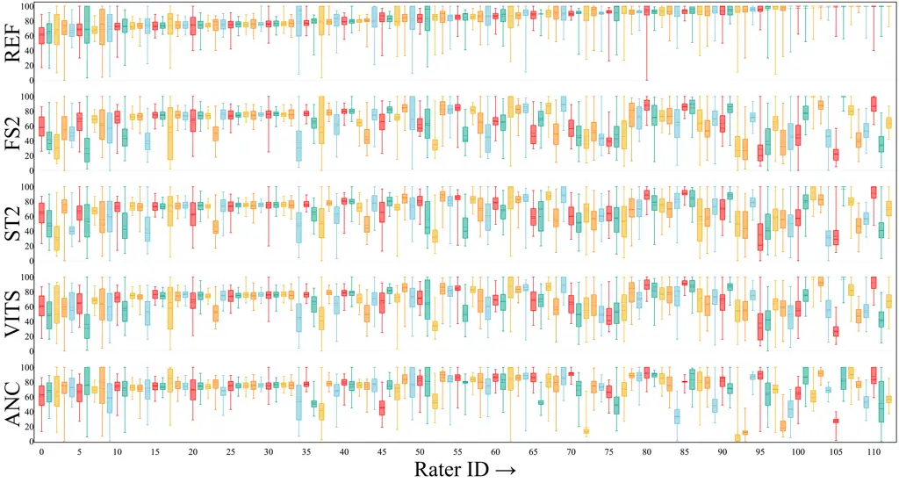

Figure 1: Visualization of the MUSHRA score distributions per rater
across three systems— FS2, ST2, and VITS, along with the reference (REF)
and anchor (ANC) for Hindi. Each boxplot represents ratings (0-100)
across all test utterances for a system by one rater.While some boxplots
exhibit relatively low variance, several display substantial height,
indicating that certain raters assign widely varying scores to the same
system across utterances. The variation in the means of the boxplot
across raters suggests a high level of inter-rater variance. Raters are
sorted in ascending order of their mean scores for the reference.

### 4.2 How reliable is the mean statistic in MUSHRA scores?

As mentioned earlier, each rater rates 100 utterances. In Figure 1, we
use box-plots to visualize the distribution of MUSHRA scores (y-axis)
for each rater (x-axis) across these utterances for each system,
including the reference and anchor. While we acknowledge that the figure
may appear overwhelming, we believe it is crucial for conveying the
comprehensive view across both raters and utterances. We make two
important observations from the figure. First, many the individual
box-plots (especially of a system) have a high variance indicating that
the same rater rates the system very differently across utterances.
Second, looking at the means of the box-plots across different raters,
we observe that there is a high variance in the means, indicating
ambiguity in the perception of the MUSHRA labels across raters. We refer
to this phenomenon as judgement ambiguity. This highlights the
shortcomings of reporting mean statistics for MUSHRA scores, even when
reported with confidence intervals (CI).

To delve deeper into judgment ambiguity, we examine variations between
two systems. We consider an utterance where the mean scores for the
samples generated by VITS and ST2 are nearly identical, but the variance
across raters for each system is high. This high variance indicates
significant ambiguity. Upon listening to many such utterances and
speaking to many raters, we hypothesize that the ambiguity likely stems
from different raters focusing on different aspects of the generated
samples. For instance, some raters may prioritize prosody, others voice
quality, and yet others the presence of digital artifacts. We
hypothesize that asking raters to highlight these subtle differences
across multiple dimensions while assigning a single score can lead to
ambiguity in determining how much to penalize or reward a system’s
output. Hence, clear guidelines which take into account a fine-grained
evaluation across different aspects would help (as proposed later in
Section 5).

### 4.3 How sensitive is MUSHRA to number of listeners and utterances?

We use the procedure outlined in (Wester et al., 2015) to study the
effect of number of listeners and utterances on MUSHRA scores.
Specifically, we are interested in knowing if a smaller number of
listeners and utterances would result in the same rankings of systems as
obtained using the full set of listeners and utterances. To achieve
this, we randomly sample a smaller subset of utterances and listeners
and compute the mean system scores. We then calculate the Spearman rank
correlation with the mean system scores obtained using all utterances
and listeners. We repeat this process 1000 times, and compute the
average over these large number of trials.

Figure 3 illustrates the average correlation of MUSHRA ratings in Hindi
between a subset of listeners and utterances compared to the
fully-scaled test (involving all listeners and utterances). Firstly, it
is evident that using a minimum of 20 listeners is crucial to achieve
correlations above 90%. Secondly, when employing a smaller number of
listeners and utterances (e.g., fewer than 40 in both cases), increasing
the number of listeners proves to be more beneficial than increasing the
number of utterances. Using more than 30 listeners and 30 utterances
invariably yields correlations above 95%. We notice similar trends for
Tamil, but with higher correlations achieved with lesser number of
listeners and utterances (Appendix 8). These results highlight the
sensitivity of MUSHRA evaluations to the number of listeners and
utterances, emphasizing the importance of careful selection and scaling
of these factors to ensure reliable and meaningful evaluations.

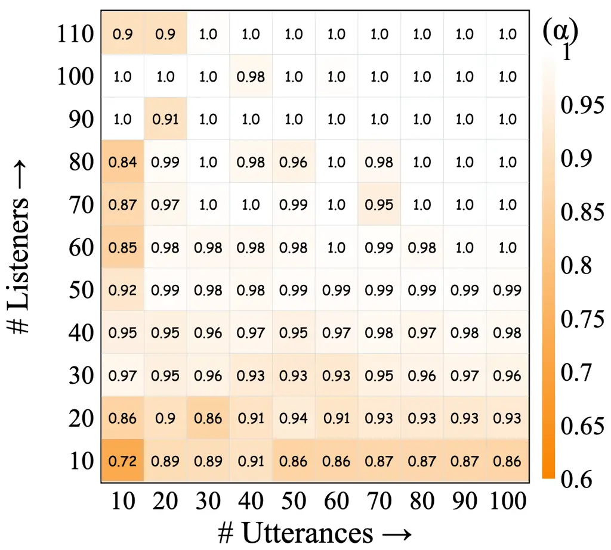

Figure 2: Rank correlation of mean scores obtained using subsets of
listeners and utterances and mean scores obtained using all listeners
and utterances in Hindi.

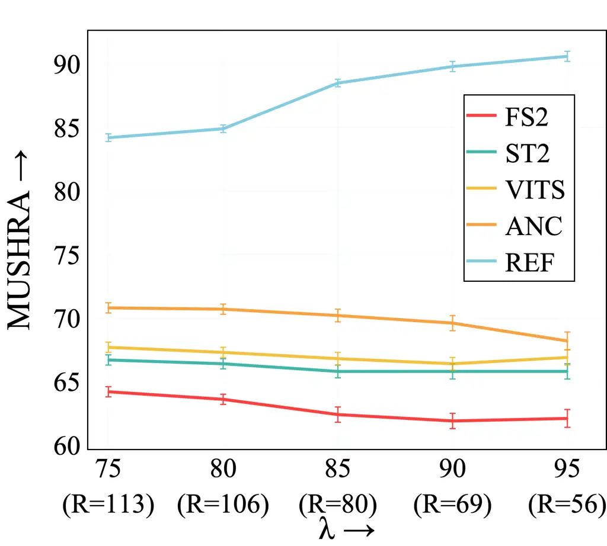

Figure 3: MUSHRA Scores in Hindi show score-variance but rank-invariance
across systems when raters who rate Reference $`\leq\lambda`$ for more
than $`15\%`$ of utterances are rejected. R is the number of raters
retained.

### 4.4 What is the impact of rejecting raters per standard MUSHRA protocol?

Traditionally, MUSHRA employs a rater rejection criterion, wherein
raters scoring the hidden reference (HR) below a threshold ($`\lambda`$)
more than 15% of the time are rejected. This rejection rule stems from
the inherent assumption that the HR is the gold standard, which is not
true in modern TTS settings where TTS systems (Li et al., 2023; Shen
et al., 2024) are either on par with or surpass the reference. In such
cases, a rater consistently scoring the HR lower might not necessarily
reflect unreliability, but rather a nuanced perception of the
reference’s limitations compared to the evaluated systems. This is
reinforced by observations from Table 3 where raters clearly prefer ST2
over reference for Tamil with a mean CMOS score of 0.24. This
observation is further supported by the MUSHRA scores shown in Figure 3.
The table shows that while rejecting raters based on the conventional
MUSHRA criterion does not affect system rankings, it does notably shift
scores. Specifically, system scores decrease with increasing
$`\lambda`$, while reference scores increase. This trend hints at the
reference-matching bias wherein raters who give the HR high scores might
be unconsciously matching system samples to the mentioned reference,
rather than rating based on their absolute perception of quality.

### 4.5 How does Anchor affect scores?

In MUSHRA tests, the anchor serves the purpose of setting the
expectation of what a “Fair” sample sounds like. Typically, the anchor
is created by minimally degrading the ground-truth by first downsampling
it to 3.5 kHz and then upsampling it to 24 kHz. We refer to such an
anchor as Anchor-X. In Table 3, the mean scores for Anchor-X in Hindi
indicate that this anchor performs significantly better than all other
systems, attaining a high score of 70.81. We believe these scores are
explained by the resampling strategy used to create the Anchor-X, which
introduces some artifacts in the audio but retains similar naturalness
to the reference, especially in terms of prosody. Once again, this
intuition indicates the tendency of raters to rate systems that match
the reference with higher scores (reference-matching bias). We conclude
that using this anchor may not be ideal, as it can lead to potentially
“Excellent” TTS systems being unfairly rated as “Good”. Essentially, the
raters may perceive that if one of systems (anchor, in this case) sounds
very similar to the reference, there is little justification for rating
other systems highly.

Next, we study the use of an alternative anchor (Anchor-Y) that we know
would likely fall in the “Poor” or “Fair” category, given its
construction process. Specifically, we construct Anchor-Y by degrading
ST2 outputs by averaging the pitch, reducing the number of diffusion
steps, slowing the audio by 1.2 times, and inducing mispronunciation via
the input text, along with word skips and word repeats in 20% of the
samples. To obtain average voice quality, we set the number of diffusion
steps to 3 with $`\alpha=\beta=0.8`$. As expected, from the Tamil MUSHRA
scores in Table 3, this anchor does indeed score poorly with a mean of
20.08. Interestingly, we see that despite a very low-quality anchor,
other systems are not rated very highly, and there is still a huge
disparity between ST2 (71.38) and the Reference (85.22). Given that
high-quality anchors unfairly bias raters against other systems, while
low-quality anchors seem to have no effect on the ratings for other
systems, we believe there is merit in conducting MUSHRA evaluations
without anchors (Lajszczak et al., 2024), which also saves costs by
reducing human effort.

### 4.6 Does adding more systems affect scores?

To better understand cognitive overload in the MUSHRA test, we scale up
the number of systems to be rated by introducing one new competitive
system - XTTSv2, and repeating an existing system - VITS (VITS-R) in the
original Hindi MUSHRA test. We finetune XTTSv2 (CoquiAI, 2023) starting
from the multilingual checkpoint with the hyper-parameters from their
original implementations on the same splits described in Section 3.3. We
call this test - MUSHRA-Extended. The results show that raters were
highly consistent, with VITS and VITS-R receiving nearly identical
scores (68.99 and 68.47, respectively), despite the randomized order.
Introducing XTTS, which outperformed other systems with a score of
73.65, did not disrupt the relative ranking of the remaining systems,
which remained consistent with the original MUSHRA test. Thus, there
does not seem to be significant cognitive overload, as we still observe
consistent results. Note that we study cognitive load using $`n=7`$
systems, but it remains to be seen how large $`n`$ can be before
cognitive overload starts impacting the scores. For detailed scores,
please refer to Table 4.

[TABLE]

Table 4: MUSHRA-Extended scores with 95% CI for Hindi.

| System | Hindi |      |        | Tamil |      |        |
| ------ | ----- | ---- | ------ | ----- | ---- | ------ |
|        | STOI  | PESQ | SI-SDR | STOI  | PESQ | SI-SDR |
| ANC    | 0.964 | 3.39 | 27.53  | 0.995 | 3.65 | 22.29  |
| ST2    | 0.997 | 3.72 | 24.72  | 0.998 | 3.99 | 28.63  |
| REF    | 0.997 | 3.93 | 27.76  | 0.998 | 4.08 | 30.25  |
| VITS   | 0.998 | 4.11 | 30.17  | 0.997 | 3.98 | 25.63  |
| FS2    | 0.999 | 4.17 | 28.89  | 0.998 | 4.09 | 26.74  |

Table 5: Objective evaluation of TTS systems in Hindi and Tamil,
measuring intelligibility, speech quality, and signal distortion.

### 4.7 Do objective metrics align with human perception?

To complement our subjective evaluations, we compute three widely used
objective metrics — (i) PESQ (Perceptual Evaluation of Speech Quality),
(ii) STOI (Short-Time Objective Intelligibility), and (iii) SI-SDR
(Scale-Invariant Signal-to-Distortion Ratio), using TorchAudio-Squim
(Kumar et al., 2023a). PESQ estimates speech quality by assessing
distortions caused by noise and compression, while STOI measures
intelligibility by evaluating how well speech information is preserved.
SI-SDR, commonly used in speech enhancement, quantifies the level of
distortion in a signal relative to a clean reference. These metrics
offer quantifiable insights, but are primarily designed and validated on
English datasets, making their applicability to languages like Hindi and
Tamil uncertain.

Table 5 reveals weak alignment between MUSHRA scores and both PESQ and
STOI, suggesting that these metrics do not fully capture perceptual
speech quality. This misalignment may stem from their focus on
intelligibility and signal distortions rather than higher-level
perceptual attributes such as naturalness, prosody, and timbre. In
contrast, SI-SDR exhibits a strong Pearson correlation of 0.76 with
MUSHRA scores, indicating that the degree of signal distortion plays a
key role in perceptual judgments, or that SI-SDR effectively captures
aspects of TTS quality that influence human ratings. These findings
highlight the limitations of existing objective metrics and the need for
more refined evaluation methods that better align with perceptual
judgments, either as complementary measures or as reliable alternatives
to subjective ratings.

## 5 Rethinking MUSHRA

We summarize two issues identified in Section 4. First,
reference-matching bias that arises when listeners rate systems that
perform at or above the level of the reference lower than deserved due
to their efforts to align system outputs with the reference during
evaluation. Second, judgement ambiguity that arises when listeners rate
a system on a single scale using broadly defined metrics like
“naturalness”, leaving room for subjective interpretation of
sub-criteria such as “prosody”, “voice quality”, “liveliness”, etc.
leading to high variability in ratings. Findings from our
post-evaluation survey (Appendix A.5) further confirm the presence of
these challenges, highlighting the influence of reference-matching and
the inconsistencies in how raters interpret evaluation criteria. In
response to this, we propose two refined variants of the MUSHRA test to
address the identified challenges, as described below.

MUSHRA-NMR. The first variant, MUSHRA-NMR (MUSHRA with No Mentioned
Reference), aims to mitigate the reference-matching bias observed in our
analysis. MUSHRA-NMR follows all other standard protocols of the MUSHRA
(ITU-R, 2015) test, except for the omission of the explicitly mentioned
ground-truth reference that is presented to the listener. In the absence
of this explicilty mentioned reference, the listener will be able to
independently assess the quality of the TTS systems without trying to
match them against the reference.

MUSHRA-DG. The second variant, MUSHRA-DG (MUSHRA With Detailed
Guidelines), introduces comprehensive guidelines to reduce the ambiguity
in rating samples for naturalness. In this test, we present raters with
scoresheets and a formula to arrive at MUSHRA scores systematically.
Each rater was asked to mark the number of (i) mild pronunciation
mistakes, (ii) severe pronunciation mistakes, (iii) unnatural pauses,
speedups, or slowdowns, (iv) digital artifacts, (v) sudden energy
fluctuations, and (vi) word skips. Further, raters were also asked to
rate more perceptual measures such as (i) liveliness, (ii) voice
quality, and (iii) rhythm on a continuous scale from 0-100. The detailed
guidelines provided to raters to assess across each of these dimensions
can be found in Appendix A.6. We analytically derive a MUSHRA
naturalness score for raters using an intuitive formula with weights
(provided in Appendix A.6) for different dimensions listed above. These
weights can be tweaked depending on the specific use-case. For example,
in a TTS application designed for audiobooks, where fluidity and
expressiveness are crucial for user engagement, we might assign higher
weights to liveliness and rhythm.

We understand that devising a scoring formula involves some
subjectivity. To address this, we encouraged raters to review their
evaluations and adjust their fine-grained scores if they felt the
overall scores from the formula did not accurately reflect the
differences they perceived between system pairs. Notably, we tracked
these revisions and found that they occurred in only 1.3% of cases. This
suggests that raters likely found the computed scores to align with
their assessments. Such alignment is reasonable, as the test design and
the formula, including its specific weights and penalties, were refined
through iterative evaluations and sustained engagement with raters over
several months. Throughout this process, adjustments to the guidelines
were made based on direct feedback and practical insights from raters,
while also being guided by the intuition of TTS practitioners.

More interestingly, we notice that the scores derived from the MUSHRA-DG
test preserve the rankings obtained from the gold-standard Comparative
Mean Opinion Score (CMOS) tests (Table 3), thus reinforcing the validity
of our evaluations. Additionally, the variance in MUSHRA scores
calculated using the formula is significantly lower, indicating reduced
ambiguity in ratings and providing a clearer distinction between
different systems’ performances.

## 6 Results

We present human evaluation results of our proposed MUSHRA variants from
the Mango dataset.

### 6.1 Evaluations using MUSHRA-NMR

Does our proposed variant help mitigate the reference-matching bias?

In Table 6, we present the results of the MUSHRA-NMR test. We find the
results to be rank-consistent with the scaled-up MUSHRA tests (Table 3).
In the case of Tamil, we observe that the best performing system (ST2)
is now scored much closer to the reference, clearly suggesting that the
reference-matching bias has been mitigated. We observed that the score
assigned to the reference itself decreased, indicating that the raters
were strict. In the case of Hindi, the gap between the best performing
system and the reference has again decreased but is not as small as in
the case of Tamil.

We want to re-emphasize that this expectation of a reduced gap between
the system and reference scores is well-founded. Feedback from TTS
practitioners, including some of the authors who are native speakers,
revealed that while some of the systems performed impressively in
practice, the original MUSHRA scores did not seem to fully reflect their
quality. This shortcoming is also clearly seen by the significant score
differences between the reference and the other systems in the original
MUSHRA test, whereas the CMOS scores in Table 3 indicate a closer
alignment of a system’s performance with the human ground-truth
reference. Collectively, our findings above reinforce the merits of our
proposed MUSHRA-NMR variant, which offers more reliable relative
assessments compared to the MUSHRA test while retaining the advantages
MUSHRA has over the CMOS test.

|          |           | MUSHRA-NMR |            |        | MUSHRA-DG |            |        | MUSHRA-DG-NMR |            |        |
| -------- | --------- | ---------- | ---------- | ------ | --------- | ---------- | ------ | ------------- | ---------- | ------ |
| Language | System    | $`\mu`$    | $`\sigma`$ | 95% CI | $`\mu`$   | $`\sigma`$ | 95% CI | $`\mu`$       | $`\sigma`$ | 95% CI |
|          | FS2       | 61.99      | 23.86      | 0.46   | 72.73     | 11.65      | 0.51   | 81.51         | 11.50      | 0.50   |
|          | ST2       | 68.09      | 22.01      | 0.43   | 73.41     | 12.03      | 0.53   | 84.97         | 12.22      | 0.54   |
|          | VITS      | 68.75      | 21.04      | 0.41   | 75.62     | 10.97      | 0.48   | 85.68         | 10.29      | 0.45   |
|          | Anchor-X  | 71.83      | 19.97      | 0.39   | 80.67     | 13.57      | 0.59   | 88.45         | 7.38       | 0.32   |
| Hindi    | Reference | 76.39      | 18.08      | 0.35   | 90.87     | 9.34       | 0.41   | 88.63         | 7.39       | 0.32   |
|          | Anchor-Y  | 21.94      | 16.74      | 0.38   | 45.00     | 11.47      | 0.35   | 54.66         | 17.91      | 0.46   |
|          | FS2       | 66.77      | 19.12      | 0.35   | 82.36     | 8.06       | 0.32   | 82.87         | 10.48      | 0.35   |
|          | VITS      | 68.52      | 18.28      | 0.36   | 81.96     | 7.41       | 0.35   | 83.86         | 10.12      | 0.44   |
|          | ST2       | 76.64      | 17.68      | 0.33   | 88.82     | 7.88       | 0.50   | 91.10         | 8.05       | 0.78   |
| Tamil    | Reference | 78.69      | 17.26      | 0.34   | 94.61     | 6.98       | 0.31   | 95.99         | 6.86       | 0.30   |

Table 6: Comparison of MUSHRA scores and Proposed Variants for Hindi and
Tamil languages.

How sensitive is MUSHRA-NMR to number of listeners and utterances?

Subjective evaluations are often resource-intensive, making it desirable
to minimize the number of listeners and utterances without compromising
assessment quality. To explore this, we present the correlation between
the scores derived from the MUSHRA variants using a subset of listeners
and the scores obtained from the complete listener set, as shown in
Figure 4. We also do a similar comparison across utterances. Our
findings reveal that MUSHRA-NMR achieves a Spearman rank correlation
exceeding 95% with the fully scaled-up MUSHRA test using just 20
utterances or 40 listeners. This indicates that significant reductions
in both parameters are possible while maintaining reliability.
Interestingly, our analysis indicates that enhancing the number of
listeners has a greater impact on the accuracy of assessments compared
to simply increasing the number of utterances.

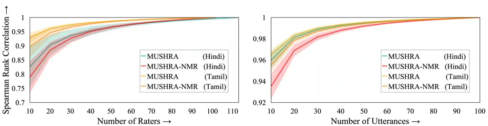

Figure 4: (Left) Correlation between scores from a subset of listeners
and all listeners. (Right) Correlation between scores from a subset of
utterances and all utterances.

### 6.2 Evaluations using MUSHRA-DG

Does our proposed variant help mitigate judgement ambiguity while
rating? In Table 6, we show the effects of presenting detailed
guidelines along with scoresheets to 20 participants to systematically
arrive at MUSHRA scores. We find MUSHRA-DG scores to be rank-consistent
with the CMOS tests , while systems scores are much higher and closer to
the “Excellent” label, as expected. More importantly, the standard
deviation of scores across all systems reduced by 43% in Hindi and 53%
in Tamil when compared to the original MUSHRA, indicating that our
proposed variant is able to reduce the ambiguity of rating naturalness
on a single bar while preserving ranks.

It is important to explicitly address the apparent discrepancy in the
ranking of VITS and FS2 systems in Tamil to clearly validate our claim
that our proposed test also preserves rankings. While the MUSHRA-DG
scores for these systems in Tamil suggest a reversed ranking between
these systems, a closer inspection at the scores reveals that their
perceived naturalness is highly comparable. This observation is also
corroborated by the CMOS scores presented in Table 3, which show minimal
separation between the two systems in Tamil. To confirm this more
appropriately, we conducted a focused CMOS test that directly compared
FS2 and VITS. Using a scale from +3 (indicating FS2 is significantly
better) to -3 (indicating VITS is significantly better), 15 listeners
rated the systems, and we obtained a CMOS score of 0.13. This result
reinforces the notion that the two systems perform similarly.

While system rankings in closely matched scenarios can be debated, we
argue that such cases highlight the need to focus on fine-grained
differences. Understanding the specific contexts in which one model
outperforms another provides valuable insights into system behavior and
guides targeted improvements. Keeping this in mind, we subsequently
discuss the effectiveness of the MUSHRA-DG test in fault isolation.

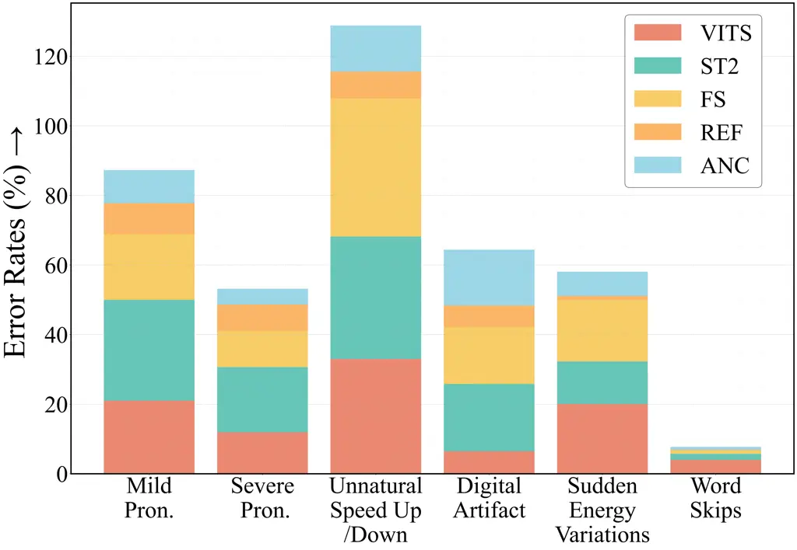

(a) Objective (Hindi)

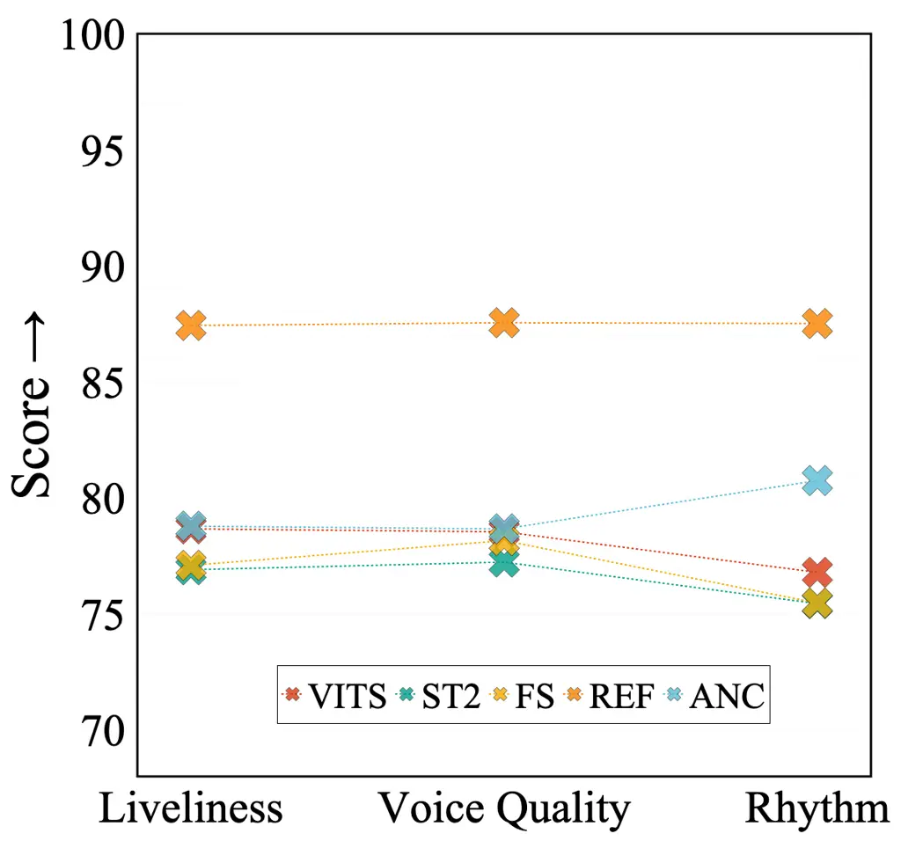

(b) Perceptual (Hindi)

Figure 5: Visualization of the six objective and three perceptual
dimensions of the MUSHRA-DG test. The objective scores are represented
using stacked bars, where multiple error categories are displayed
cumulatively rather than as independent percentages. The subjective
dimensions are represented using a scatter plot with scores ranging from
0 to 100.

Fault Isolation. We collate the scoresheets of participants to obtain
more fine-grained insights on where each model underperforms. In Figure
5(a), we report the error rates of instances where an attribute received
a rating greater than 0 for the six objective attributes and in Figure
5(b) the absolute perceptual scores on a scale of 100 for the remaining
attributes. The granular ratings reveal the true power of this test in
identifying defects in TTS outputs, especially among systems that
achieved similar mean scores in the original MUSHRA. Specifically, we
observe that for Hindi, a deterministic system like FS2 performs well in
terms of pronunciation but suffers in prosody and word-skipping.
Conversely, the close difference between VITS and ST2 is better
explained by noting that VITS nearly outperforms in all dimensions,
except that VITS exhibits nearly twice as many sudden energy
fluctuations as ST2 and performs slightly worse in terms of rhythm.

Similarly, for Tamil, as detailed in Figure 10 in Appendix A.7, the
marginal differences across dimensions clarify the perceived
inconsistency in the rankings of VITS and FS2 mentioned earlier, which,
upon closer inspection, is not truly an inconsistency but rather a
reflection of their comparable overall performance. We also take this
opportunity to address the inflated anchor scores observed in the
MUSHRA-DG test compared to the original MUSHRA scores in Tamil. One
explanation for this inflation could be attributed to leniency in the
scoring formula applied to subjective dimensions, resulting in higher
anchor scores. However, a more compelling explanation is that the
original MUSHRA test may be influenced by a Range Equalizing Bias
Zielinski (2016), where participants tend to stretch scores across the
entire scale. Consequently, low-quality anchors are often relegated to
the extreme lower end of the scale, even when the perceived degradation
is not as severe. In contrast, fine-grained evaluations like MUSHRA-DG
emphasize detailed attributes and systematic scoring, which mitigate
this bias. This approach reduces the tendency to artificially stretch
scores, leading to higher and arguably more accurate anchor ratings.
Crucially, this inflation does not affect the relative rankings of
systems or the conclusions drawn from MUSHRA-DG. By minimizing variance
and enhancing scoring consistency, MUSHRA-DG continues to demonstrate
its robustness as a reliable and effective diagnostic and ranking tool
for TTS evaluation.

Moreover, while the Reference scores appear higher in MUSHRA-DG, this
increase is not merely a case of inflation. Notably, the scores of the
systems also increase, resulting in all systems being classified within
the “Excellent” category. This trend aligns with the expectations set by
the CMOS scores shown in Table 3. Furthermore, MUSHRA-DG brings the
scores of the top-performing models closer to the Reference scores, a
pattern consistent with the results from CMOS evaluations. This
alignment highlights the effectiveness of MUSHRA-DG in providing
fine-grained assessments that capture subtle distinctions between
systems while ensuring the overall scores accurately represent system
performance.

Time Complexity of MUSHRA-DG. We hypothesize that the additional detail
of evaluating each audio sample across multiple dimensions inevitably
increases the time required for participants to complete the test. To
verify this hypothesis, we visualize the average time taken across pages
in Figure 6 and find that the MUSHRA-DG test indeed takes nearly twice
as much time as the original MUSHRA test. However, we believe this extra
time results in a much more comprehensive understanding of TTS system
performance, and allows for fine-grained fault isolation, making the
trade-off worthwhile.

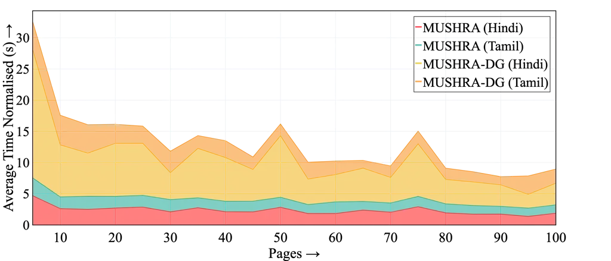

Figure 6: MUSHRA-DG exhibits higher average time (normalized by audio
durations) across pages compared to MUSHRA.

### 6.3 Evaluations using MUSHRA-DG-NMR

In Table 6, we present the results of our combined variant, wherein we
provide detailed guidelines (DG) and remove the mentioned reference
(NMR). We observe that the majority of system scores now align more
closely with the reference ratings and predominantly fall within the
“Excellent” category, as anticipated from the CMOS tests. Moreover,
compared to the MUSHRA-NMR test, the variance in scores has
significantly diminished, indicating a marked reduction in rating
ambiguity.

As TTS practitioners and native speakers of the language, we would like
to emphasize that, despite the relative rankings being preserved in
nearly all variants of the test, the combined variant is more reliable
because the scores now reflect the expected proximity of the systems to
the reference (also established by the CMOS scores).

## 7 Generalization to English

Thus far, our study has primarily focused on Hindi and Tamil, two
low-resource languages from distinct language families, Indo-Aryan and
Dravidian, spoken by a combined 562 million people. This choice ensures
coverage, diversity, and generalizability across language families in
India. We do realize that evaluating our proposed MUSHRA variants on a
high-resource language like English would further assess the broader
applicability of our findings. Expanding the analysis requires
additional resources, as human evaluations are both time and cost
intensive. Given constraints, we focus our exploration on MUSHRA and the
combined variant, MUSHRA-DG-NMR, drawing parallels with CMOS to analyze
how our refinements translate to English. We conducted these evaluations
on English TTS systems trained on the LJSpeech dataset, with 30 native
US English speakers rating 30 utterances each, balanced across age (18
to 60) and gender. Additionally, we performed a CMOS test, where 15
participants compared all systems against the reference, rating 30
utterances each. Table 7 presents the results, which closely align with
our earlier findings in Hindi and Tamil, reinforcing the robustness of
our proposed evaluation methodologies.

### 7.1 Does the Reference-Matching Bias exist?

A key motivation for our work was to assess whether MUSHRA reliably
captures the perceptual differences between TTS systems. The scores for
English TTS systems in Table 7 reinforce our previous findings: while
the reference (REF) is the only system placed in the "Excellent" bin,
all other systems are restricted to the "Good" or "Fair" bins. However,
CMOS results tell a different story, showing that ST2 and VITS are
comparable to, or even preferred over, the reference. This discrepancy
highlights MUSHRA’s inability to fully capture perceptual parity or
superiority when modern TTS systems approach or exceed reference
quality.

These findings further confirm the presence of reference-matching bias
(RMB) in English. As a result, MUSHRA scores may misrepresent true
perceptual differences, reinforcing the need for evaluation methods that
minimize the influence of reference dependence.

### 7.2 Does Judgement Ambiguity Exist?

To assess the reliability of the mean statistic in MUSHRA for English,
we visualize the distribution of MUSHRA scores across raters and systems
(see Appendix: Figure 13). These results reaffirm the two key issues
previously observed in Tamil and Hindi -

1.  1.  High variability in individual ratings: A single rater does not
        always score a system consistently across different utterances,
        leading to fluctuations in their assessments.
2.  2.  Significant perceptual differences across raters: The mean scores
        assigned by different raters vary widely, indicating inconsistency
        in how MUSHRA labels are perceived and applied.

These findings highlight the presence of judgment ambiguity, where
raters interpret and use the MUSHRA scale differently, leading to
inconsistencies in scoring. This further reinforces our claim that the
mean statistic alone is not a reliable measure of perceived quality, as
it is strongly influenced by both intra-rater inconsistency and
inter-rater variation.

|        |        |        |               |        |       |        |
| ------ | ------ | ------ | ------------- | ------ | ----- | ------ |
| System | MUSHRA |        | MUSHRA-DG-NMR |        | CMOS  |        |
|        | µ      | 95% CI | µ             | 95% CI | µ     | 95% CI |
| ANC    | 41.93  | 3.30   | 56.38         | 3.91   | \-    | \-     |
| FS2    | 56.86  | 3.76   | 63.33         | 3.32   | -0.78 | 0.22   |
| VITS   | 72.77  | 2.75   | 75.89         | 2.96   | 0.02  | 0.12   |
| ST2    | 73.27  | 2.81   | 78.47         | 2.84   | 0.21  | 0.12   |
| REF    | 82.62  | 1.54   | 79.57         | 2.96   | 0     | 0      |

Table 7: Comparison of MUSHRA, MUSHRA-DG-NMR, and CMOS for English.

### 7.3 Does our proposed variant (MUSHRA-DG-NMR) help?

Our proposed MUSHRA-DG-NMR test was designed to mitigate
reference-matching bias (RMB) and judgment ambiguity, and the English
results further confirm its effectiveness. As seen in Table 7,
MUSHRA-DG-NMR brings system scores closer to the reference, suggesting
that RMB is reduced. At the same time, it preserves the relative
rankings of systems while shifting scores, mirroring our findings in
Hindi and Tamil. This is particularly important, as it indicates that
MUSHRA-DG-NMR does not distort system rankings but instead provides
scores that may better reflect perceptual judgments.

While score variance in English does not show a significant reduction, a
key strength of MUSHRA-DG-NMR lies in its ability to provide
fine-grained insights beyond a single score. This is especially valuable
when systems receive similar MUSHRA scores but differ in perceptual
quality. By analyzing both subjective and objective dimensions, we can
pinpoint the specific factors shaping listener preferences. For example,
VITS exhibits nearly twice as many sudden energy variations as ST2,
while ST2 has almost double the digital artifacts of VITS. Despite these
trade-offs, ST2 is preferred overall due to its improved rhythmic
consistency, reinforcing that a simple numerical score does not capture
all aspects of TTS quality. For reference, visualizations of both
objective and subjective dimensions are provided in Appendix A.7.
Although MUSHRA-DG-NMR requires additional time for evaluation, its
ability to uncover detailed system strengths and weaknesses makes it a
valuable tool for TTS research and development. These fine-grained
insights go beyond aggregated scores, offering a deeper understanding of
where synthetic speech systems excel and where refinements are needed.

Summary. We release all English ratings, expanding our annotation
dataset to 255,000 subjective annotations. These results confirm that
MUSHRA scores are affected by reference-matching bias, mean scores can
be unreliable due to rating inconsistencies, and MUSHRA-DG-NMR
effectively mitigates bias while preserving system rankings.
Additionally, our fine-grained analysis provides deeper insights beyond
a single score, allowing for a more precise evaluation of system
strengths and weaknesses. Overall, these findings further validate our
conclusions across both high-resource (English) and low-resource (Hindi
and Tamil) languages.

## 8 Future Work

While our study introduces refined MUSHRA variants to enhance the
evaluation of modern TTS systems, several promising directions remain
unexplored. The ITU-R standard ITU-R (2015) advises rating no more than
12 signals at a time, yet real-world evaluations could require
comparisons across a much larger set of systems for creating a
leaderboard. A natural extension of our work would be to adapt
MUSHRA-DG-NMR for tournament-style evaluations, allowing new systems to
be seamlessly integrated while maintaining a dynamic leaderboard.
Another compelling avenue is the development of objective metrics that
can either complement subjective evaluations or, in certain cases, serve
as viable replacements, offering a more holistic perspective on TTS
quality while improving efficiency. Additionally, refining MUSHRA-DG to
make it more accessible for large-scale studies could further extend its
impact, without sacrificing the fine-grained insights it provides into
pronunciation, prosody, and other key speech attributes. Beyond this,
exploring cultural and demographic biases within the MUSHRA framework
could illuminate potential disparities in how different listener groups
perceive synthesized speech, leading to fairer and more representative
evaluations. Furthermore, validating our refined MUSHRA variants in
practical deployment settings will be crucial to ensure their seamless
integration into real-world use cases, fostering broader adoption and
iterative refinements based on real-world feedback. These directions
build upon our proposed MUSHRA variants and pave the way for more
rigorous, equitable, and insightful assessments of TTS systems.

## 9 Conclusion

Our comprehensive study reveals significant shortcomings in the current
use of the MUSHRA test for evaluating modern high-quality TTS systems.
Through an extensive analysis involving 246,000 human ratings for Hindi
and Tamil, we identified two primary issues: reference-matching bias and
judgment ambiguity. To address these issues, we propose two refined
variants of the MUSHRA test: MUSHRA-NMR, which omits explicit
identification of the human reference, and MUSHRA-DG, which uses
detailed guidelines to calculate MUSHRA scores systematically. Our
findings indicate that both variants lead to more reliable evaluations,
with MUSHRA-DG offering the additional benefit of fine-grained fault
isolation during assessment. Through this work, we also release MANGO, a
large human rating dataset, to further support research in this area.

## References

- Aggarwal et al. (2020) Vatsal Aggarwal, Marius Cotescu, Nishant
  Prateek, Jaime Lorenzo-Trueba, and Roberto Barra-Chicote. Using vaes
  and normalizing flows for one-shot text-to-speech synthesis of
  expressive speech. In _2020 IEEE International Conference on
  Acoustics, Speech and Signal Processing, ICASSP 2020, Barcelona,
  Spain, May 4-8, 2020_, pp. 6179–6183. IEEE, 2020. doi:
  10.1109/ICASSP40776.2020.9053678. URL
  [https://doi.org/10.1109/ICASSP40776.2020.9053678](https://doi.org/10.1109/ICASSP40776.2020.9053678).
- Akhbardeh et al. (2021) Farhad Akhbardeh, Arkady Arkhangorodsky,
  Magdalena Biesialska, Ondrej Bojar, Rajen Chatterjee, Vishrav
  Chaudhary, Marta R. Costa-jussà, Cristina España-Bonet, Angela Fan,
  Christian Federmann, Markus Freitag, Yvette Graham, Roman
  Grundkiewicz, Barry Haddow, Leonie Harter, Kenneth Heafield,
  Christopher Homan, Matthias Huck, Kwabena Amponsah-Kaakyire, Jungo
  Kasai, Daniel Khashabi, Kevin Knight, Tom Kocmi, Philipp Koehn,
  Nicholas Lourie, Christof Monz, Makoto Morishita, Masaaki Nagata, Ajay
  Nagesh, Toshiaki Nakazawa, Matteo Negri, Santanu Pal,
  Allahsera Auguste Tapo, Marco Turchi, Valentin Vydrin, and Marcos
  Zampieri. Findings of the 2021 conference on machine translation
  (WMT21). In Loïc Barrault, Ondrej Bojar, Fethi Bougares, Rajen
  Chatterjee, Marta R. Costa-jussà, Christian Federmann, Mark Fishel,
  Alexander Fraser, Markus Freitag, Yvette Graham, Roman Grundkiewicz,
  Paco Guzman, Barry Haddow, Matthias Huck, Antonio Jimeno-Yepes,
  Philipp Koehn, Tom Kocmi, André Martins, Makoto Morishita, and
  Christof Monz (eds.), _Proceedings of the Sixth Conference on Machine
  Translation, WMT@EMNLP 2021, Online Event, November 10-11, 2021_, pp.
  1–88. Association for Computational Linguistics, 2021. URL
  [https://aclanthology.org/2021.wmt-1.1](https://aclanthology.org/2021.wmt-1.1).
- Amidei et al. (2019) Jacopo Amidei, Paul Piwek, and Alistair Willis.
  The use of rating and likert scales in natural language generation
  human evaluation tasks: A review and some recommendations. In Kees van
  Deemter, Chenghua Lin, and Hiroya Takamura (eds.), _Proceedings of the
  12th International Conference on Natural Language Generation, INLG
  2019, Tokyo, Japan, October 29 - November 1, 2019_, pp. 397–402.
  Association for Computational Linguistics, 2019. doi:
  10.18653/V1/W19-8648. URL
  [https://aclanthology.org/W19-8648/](https://aclanthology.org/W19-8648/).
- Baby et al. (2016) Arun Baby, Anju Leela Thomas, NL Nishanthi, TTS
  Consortium, et al. Resources for indian languages. In _Proceedings of
  Text, Speech and Dialogue_, 2016.
- Barrault et al. (2020) Loïc Barrault, Magdalena Biesialska, Ondrej
  Bojar, Marta R. Costa-jussà, Christian Federmann, Yvette Graham, Roman
  Grundkiewicz, Barry Haddow, Matthias Huck, Eric Joanis, Tom Kocmi,
  Philipp Koehn, Chi-kiu Lo, Nikola Ljubesic, Christof Monz, Makoto
  Morishita, Masaaki Nagata, Toshiaki Nakazawa, Santanu Pal, Matt Post,
  and Marcos Zampieri. Findings of the 2020 conference on machine
  translation (WMT20). In Loïc Barrault, Ondrej Bojar, Fethi Bougares,
  Rajen Chatterjee, Marta R. Costa-jussà, Christian Federmann, Mark
  Fishel, Alexander Fraser, Yvette Graham, Paco Guzman, Barry Haddow,
  Matthias Huck, Antonio Jimeno-Yepes, Philipp Koehn, André Martins,
  Makoto Morishita, Christof Monz, Masaaki Nagata, Toshiaki Nakazawa,
  and Matteo Negri (eds.), _Proceedings of the Fifth Conference on
  Machine Translation, WMT@EMNLP 2020, Online, November 19-20, 2020_,
  pp. 1–55. Association for Computational Linguistics, 2020. URL
  [https://aclanthology.org/2020.wmt-1.1/](https://aclanthology.org/2020.wmt-1.1/).
- Chiang et al. (2023) Cheng-Han Chiang, Wei-Ping Huang, and Hung
  yi Lee. Why we should report the details in subjective evaluation of
  tts more rigorously, 2023.
- Clark et al. (2019) Rob Clark, Hanna Silén, Tom Kenter, and Ralph
  Leith. Evaluating long-form text-to-speech: Comparing the ratings of
  sentences and paragraphs. _CoRR_, abs/1909.03965, 2019. URL
  [http://arxiv.org/abs/1909.03965](http://arxiv.org/abs/1909.03965).
- Cooper & Yamagishi (2023) Erica Cooper and Junichi Yamagishi.
  Investigating range-equalizing bias in mean opinion score ratings of
  synthesized speech. _arXiv preprint arXiv:2305.10608_, 2023.
- CoquiAI (2023) CoquiAI. Xtts v2.
  [https://github.com/coqui-ai/TTS](https://github.com/coqui-ai/TTS), 2023.
- Ethayarajh & Jurafsky (2022) Kawin Ethayarajh and Dan Jurafsky. The
  authenticity gap in human evaluation. In Yoav Goldberg, Zornitsa
  Kozareva, and Yue Zhang (eds.), _Proceedings of the 2022 Conference on
  Empirical Methods in Natural Language Processing, EMNLP 2022, Abu
  Dhabi, United Arab Emirates, December 7-11, 2022_, pp. 6056–6070.
  Association for Computational Linguistics, 2022. doi:
  10.18653/V1/2022.EMNLP-MAIN.406. URL
  [https://doi.org/10.18653/v1/2022.emnlp-main.406](https://doi.org/10.18653/v1/2022.emnlp-main.406).
- Finkelstein et al. (2023) Lev Finkelstein, Joshua Camp, and Rob Clark.
  Importance of human factors in text-to-speech evaluations. In _12th
  Speech Synthesis Workshop (SSW) 2023_, 2023.
- Fong et al. (2019) Jason Fong, Pilar Oplustil Gallegos, Zack Hodari,
  and Simon King. Investigating the robustness of sequence-to-sequence
  text-to-speech models to imperfectly-transcribed training data. In
  Gernot Kubin and Zdravko Kacic (eds.), _Interspeech 2019, 20th Annual
  Conference of the International Speech Communication Association,
  Graz, Austria, 15-19 September 2019_, pp. 1546–1550. ISCA, 2019. doi:
  10.21437/INTERSPEECH.2019-1824. URL
  [https://doi.org/10.21437/Interspeech.2019-1824](https://doi.org/10.21437/Interspeech.2019-1824).
- Freitag et al. (2021) Markus Freitag, George F. Foster, David
  Grangier, Viresh Ratnakar, Qijun Tan, and Wolfgang Macherey. Experts,
  errors, and context: A large-scale study of human evaluation for
  machine translation. _Trans. Assoc. Comput. Linguistics_,
  9:1460–1474, 2021. doi: 10.1162/TACL\\A\\00437. URL
  [https://doi.org/10.1162/tacl_a_00437](https://doi.org/10.1162/tacl_a_00437).
- Howcroft & Rieser (2021) David M. Howcroft and Verena Rieser. What
  happens if you treat ordinal ratings as interval data? human
  evaluations in NLP are even more under-powered than you think. In
  Marie-Francine Moens, Xuanjing Huang, Lucia Specia, and Scott Wen-tau
  Yih (eds.), _Proceedings of the 2021 Conference on Empirical Methods
  in Natural Language Processing, EMNLP 2021, Virtual Event / Punta
  Cana, Dominican Republic, 7-11 November, 2021_, pp. 8932–8939.
  Association for Computational Linguistics, 2021. doi:
  10.18653/V1/2021.EMNLP-MAIN.703. URL
  [https://doi.org/10.18653/v1/2021.emnlp-main.703](https://doi.org/10.18653/v1/2021.emnlp-main.703).
- Huybrechts et al. (2021) Goeric Huybrechts, Thomas Merritt, Giulia
  Comini, Bartek Perz, Raahil Shah, and Jaime Lorenzo-Trueba.
  Low-resource expressive text-to-speech using data augmentation. In
  _ICASSP 2021-2021 IEEE International Conference on Acoustics, Speech
  and Signal Processing (ICASSP)_, pp. 6593–6597. IEEE, 2021.
- ITU-R (2015) ITU-R. Method for the subjective assessment of
  intermediate quality level of audio systems.
  [https://www.itu.int/dms_pubrec/itu-r/rec/bs/R-REC-BS.1534-3-201510-I!!PDF-E.pdf](https://www.itu.int/dms_pubrec/itu-r/rec/bs/R-REC-BS.1534-3-201510-I!!PDF-E.pdf), 2015.
- Ju et al. (2024) Zeqian Ju, Yuancheng Wang, Kai Shen, Xu Tan, Detai
  Xin, Dongchao Yang, Yanqing Liu, Yichong Leng, Kaitao Song, Siliang
  Tang, Zhizheng Wu, Tao Qin, Xiang-Yang Li, Wei Ye, Shikun Zhang, Jiang
  Bian, Lei He, Jinyu Li, and Sheng Zhao. Naturalspeech 3: Zero-shot
  speech synthesis with factorized codec and diffusion models, 2024.
- Kim et al. (2021) Jaehyeon Kim, Jungil Kong, and Juhee Son.
  Conditional variational autoencoder with adversarial learning for
  end-to-end text-to-speech. In Marina Meila and Tong Zhang (eds.),
  _Proceedings of the 38th International Conference on Machine
  Learning_, volume 139 of _Proceedings of Machine Learning Research_,
  pp. 5530–5540. PMLR, 18–24 Jul 2021. URL
  [https://proceedings.mlr.press/v139/kim21f.html](https://proceedings.mlr.press/v139/kim21f.html).
- Kirkland et al. (2023) Ambika Kirkland, Shivam Mehta, Harm Lameris,
  Gustav Eje Henter, Eva Szekely, and Joakim Gustafson. Stuck in the MOS
  pit: A critical analysis of MOS test methodology in TTS evaluation. In
  _Proc. 12th ISCA Speech Synthesis Workshop (SSW2023)_, pp.
  41–47, 2023. doi: 10.21437/SSW.2023-7.
- Knowles (2021) Rebecca Knowles. On the stability of system rankings at
  WMT. In Loïc Barrault, Ondrej Bojar, Fethi Bougares, Rajen Chatterjee,
  Marta R. Costa-jussà, Christian Federmann, Mark Fishel, Alexander
  Fraser, Markus Freitag, Yvette Graham, Roman Grundkiewicz, Paco
  Guzman, Barry Haddow, Matthias Huck, Antonio Jimeno-Yepes, Philipp
  Koehn, Tom Kocmi, André Martins, Makoto Morishita, and Christof Monz
  (eds.), _Proceedings of the Sixth Conference on Machine Translation,
  WMT@EMNLP 2021, Online Event, November 10-11, 2021_, pp. 464–477.
  Association for Computational Linguistics, 2021. URL
  [https://aclanthology.org/2021.wmt-1.56](https://aclanthology.org/2021.wmt-1.56).
- Kong et al. (2020) Jungil Kong, Jaehyeon Kim, and Jaekyoung Bae.
  Hifi-gan: Generative adversarial networks for efficient and high
  fidelity speech synthesis, 2020.
- Kumar et al. (2023a) Anurag Kumar, Ke Tan, Zhaoheng Ni, Pranay
  Manocha, Xiaohui Zhang, Ethan Henderson, and Buye Xu.
  Torchaudio-squim: Reference-less speech quality and intelligibility
  measures in torchaudio. In _ICASSP 2023-2023 IEEE International
  Conference on Acoustics, Speech and Signal Processing (ICASSP)_, pp.
  1–5. IEEE, 2023a.
- Kumar et al. (2023b) Gokul Karthik Kumar, Praveen S V, Pratyush Kumar,
  Mitesh M. Khapra, and Karthik Nandakumar. Towards building
  text-to-speech systems for the next billion users. In _ICASSP 2023 -
  2023 IEEE International Conference on Acoustics, Speech and Signal
  Processing (ICASSP)_, pp. 1–5, 2023b. doi:
  10.1109/ICASSP49357.2023.10096069.
- Lajszczak et al. (2024) Mateusz Lajszczak, Guillermo Cámbara, Yang Li,
  Fatih Beyhan, Arent van Korlaar, Fan Yang, Arnaud Joly, Álvaro
  Martín-Cortinas, Ammar Abbas, Adam Michalski, Alexis Moinet, Sri
  Karlapati, Ewa Muszynska, Haohan Guo, Bartosz Putrycz, Soledad López
  Gambino, Kayeon Yoo, Elena Sokolova, and Thomas Drugman. BASE TTS:
  lessons from building a billion-parameter text-to-speech model on 100k
  hours of data. _CoRR_, abs/2402.08093, 2024. doi:
  10.48550/ARXIV.2402.08093. URL
  [https://doi.org/10.48550/arXiv.2402.08093](https://doi.org/10.48550/arXiv.2402.08093).
- Łańcucki (2021) Adrian Łańcucki. Fastpitch: Parallel text-to-speech
  with pitch prediction. In _ICASSP 2021-2021 IEEE International
  Conference on Acoustics, Speech and Signal Processing (ICASSP)_, pp.
  6588–6592. IEEE, 2021.
- Le Maguer et al. (2024) Sébastien Le Maguer, Simon King, and Naomi
  Harte. The limits of the mean opinion score for speech synthesis
  evaluation. _Computer Speech and Language_, 84:101577, 2024. ISSN
  0885-2308. doi: https://doi.org/10.1016/j.csl.2023.101577. URL
  [https://www.sciencedirect.com/science/article/pii/S0885230823000967](https://www.sciencedirect.com/science/article/pii/S0885230823000967).
- Li et al. (2023) Yinghao Aaron Li, Cong Han, Vinay S Raghavan, Gavin
  Mischler, and Nima Mesgarani. StyleTTS 2: Towards human-level
  text-to-speech through style diffusion and adversarial training with
  large speech language models. In _Thirty-seventh Conference on Neural
  Information Processing Systems_, 2023. URL
  [https://openreview.net/forum?id=m0RbqrUM26](https://openreview.net/forum?id=m0RbqrUM26).
- Loizou (2011) Philipos C. Loizou. _Speech Quality Assessment_, pp.
  623–654. Springer Berlin Heidelberg, Berlin, Heidelberg, 2011. ISBN
  978-3-642-19551-8. doi: 10.1007/978-3-642-19551-8_23. URL
  [https://doi.org/10.1007/978-3-642-19551-8_23](https://doi.org/10.1007/978-3-642-19551-8_23).
- Merritt et al. (2018) Thomas Merritt, Bartosz Putrycz, Adam Nadolski,
  Tianjun Ye, Daniel Korzekwa, Wiktor Dolecki, Thomas Drugman,
  Viacheslav Klimkov, Alexis Moinet, Andrew Breen, et al. Comprehensive
  evaluation of statistical speech waveform synthesis. In _2018 IEEE
  Spoken Language Technology Workshop (SLT)_, pp. 325–331. IEEE, 2018.
- Merritt et al. (2022) Thomas Merritt, Abdelhamid Ezzerg, Piotr
  Bilinski, Magdalena Proszewska, Kamil Pokora, Roberto Barra-Chicote,
  and Daniel Korzekwa. Text-free non-parallel many-to-many voice
  conversion using normalising flows. _CoRR_, abs/2203.08009, 2022. doi:
  10.48550/ARXIV.2203.08009. URL
  [https://doi.org/10.48550/arXiv.2203.08009](https://doi.org/10.48550/arXiv.2203.08009).
- Pauwels et al. (2021) J. Pauwels, S. Dixon, and J. D. Reiss. A front
  end for adaptive online listening tests. Centre for Digital Music,
  Queen Mary University of London, 2021.
- Ren et al. (2021) Yi Ren, Chenxu Hu, Xu Tan, Tao Qin, Sheng Zhao, Zhou
  Zhao, and Tie-Yan Liu. Fastspeech 2: Fast and high-quality end-to-end
  text to speech. In _9th International Conference on Learning
  Representations, ICLR 2021, Virtual Event, Austria, May 3-7, 2021_.
  OpenReview.net, 2021. URL
  [https://openreview.net/forum?id=piLPYqxtWuA](https://openreview.net/forum?id=piLPYqxtWuA).
- Ribeiro et al. (2015) Manuel Sam Ribeiro, Junichi Yamagishi, and
  Robert AJ Clark. A perceptual investigation of wavelet-based
  decomposition of f0 for text-to-speech synthesis. In _INTERSPEECH 2015
  16th Annual Conference of the International Speech Communication
  Association_, pp. 1586–1590. International Speech Communication
  Association, 2015.
- Schoeffler et al. (2018) M. Schoeffler, S. Frees, S. Goetze, and
  J. Habets. webmushra — a comprehensive framework for web-based
  listening tests. volume 6, pp.  8, 2018. doi: 10.5334/jors.163.
- Shen et al. (2024) Kai Shen, Zeqian Ju, Xu Tan, Eric Liu, Yichong
  Leng, Lei He, Tao Qin, sheng zhao, and Jiang Bian. Naturalspeech 2:
  Latent diffusion models are natural and zero-shot speech and singing
  synthesizers. In _The Twelfth International Conference on Learning
  Representations_, 2024. URL
  [https://openreview.net/forum?id=Rc7dAwVL3v](https://openreview.net/forum?id=Rc7dAwVL3v).
- Shirali-Shahreza & Penn (2023) Sajad Shirali-Shahreza and Gerald Penn.
  Better replacement for tts naturalness evaluation. In _12th Speech
  Synthesis Workshop (SSW) 2023_, 2023.
- Tan et al. (2024) Xu Tan, Jiawei Chen, Haohe Liu, Jian Cong, Chen
  Zhang, Yanqing Liu, Xi Wang, Yichong Leng, Yuanhao Yi, Lei He, Sheng
  Zhao, Tao Qin, Frank Soong, and Tie-Yan Liu. Naturalspeech: End-to-end
  text-to-speech synthesis with human-level quality. _IEEE Transactions
  on Pattern Analysis and Machine Intelligence_, pp. 1–12, 2024. doi:
  10.1109/TPAMI.2024.3356232.
- Taylor & Richmond (2020) Jason Taylor and Korin Richmond. Enhancing
  sequence-to-sequence text-to-speech with morphology. In Helen Meng,
  Bo Xu, and Thomas Fang Zheng (eds.), _Interspeech 2020, 21st Annual
  Conference of the International Speech Communication Association,
  Virtual Event, Shanghai, China, 25-29 October 2020_, pp. 1738–1742.
  ISCA, 2020. doi: 10.21437/INTERSPEECH.2020-1547. URL
  [https://doi.org/10.21437/Interspeech.2020-1547](https://doi.org/10.21437/Interspeech.2020-1547).
- Varadhan et al. (2024) Praveen Srinivasa Varadhan, Ashwin Sankar, Giri
  Raju, and Mitesh M. Khapra. Rasa: Building Expressive Speech Synthesis
  Systems for Indian Languages in Low-resource Settings. In _Proc.
  INTERSPEECH 2024_, 2024.
- Wang et al. (2023) Chengyi Wang, Sanyuan Chen, Yu Wu, Ziqiang Zhang,
  Long Zhou, Shujie Liu, Zhuo Chen, Yanqing Liu, Huaming Wang, Jinyu Li,
  Lei He, Sheng Zhao, and Furu Wei. Neural codec language models are
  zero-shot text to speech synthesizers. _CoRR_, abs/2301.02111, 2023.
  doi: 10.48550/ARXIV.2301.02111. URL
  [https://doi.org/10.48550/arXiv.2301.02111](https://doi.org/10.48550/arXiv.2301.02111).
- Wester et al. (2015) Mirjam Wester, Cassia Valentini-Botinhao, and
  Gustav Eje Henter. Are we using enough listeners? no! - an
  empirically-supported critique of interspeech 2014 TTS evaluations. In
  _INTERSPEECH 2015, 16th Annual Conference of the International Speech
  Communication Association, Dresden, Germany, September 6-10, 2015_,
  pp. 3476–3480. ISCA, 2015. doi: 10.21437/INTERSPEECH.2015-689. URL
  [https://doi.org/10.21437/Interspeech.2015-689](https://doi.org/10.21437/Interspeech.2015-689).
- Zielinski (2016) Slawomir Zielinski. On some biases encountered in
  modern audio quality listening tests (part 2): Selected graphical
  examples and discussion. _Journal of the Audio Engineering Society_,
  64(1/2):55–74, 2016.

## Appendix A Appendix

### A.1 Instructions For MUSHRA

Figure 7: Guidelines sent to participants taking the MUSHRA test. They
were given a live demo of the rating page and walked through the
guideline sheet.

### A.2 CMOS Evidence of Limitations of Reference Matching

The assumption that the human reference always represents the highest
quality standard in MUSHRA evaluations may not hold in practice,
particularly as modern TTS systems continue to improve. Since MUSHRA
inherently relies on reference matching, this approach may
unintentionally penalize systems that perform on par with or even
surpass the reference. If raters subconsciously anchor their judgments
to the provided human reference, systems that differ from it, even in a
perceptually superior way, may receive lower scores.

To investigate this, we analyze CMOS-derived preference ratings, where
CMOS \> 0 indicates a preference for the TTS system over the reference,
CMOS \< 0 indicates preference for the reference, and CMOS = 0 suggests
no preference. As shown in Table 8, StyleTTS2 is preferred over the
reference in 54% of cases in Tamil and 43.8% in English, demonstrating
that model outputs can surpass human recordings in perceptual quality.
Even VITS is preferred 37.2% of times against the reference in English,
further challenging the assumption that the human reference should
always be treated as the gold standard.

These findings provide direct evidence that MUSHRA’s reliance on
reference matching may skew evaluations when systems outperform the
reference. This motivates us to explore MUSHRA-NMR, a variant where no
explicit reference is provided, allowing for fairer assessments when TTS
models reach or exceed human quality. While inspired by multiple
listening test methodologies, our goal remains to refine MUSHRA to
better accommodate the evolving capabilities of TTS models while
preserving its core strengths.

| Language | System | Reference (%) | Equal (%) | System (%) |
| -------- | ------ | ------------- | --------- | ---------- |
|          | ST2    | 39.1          | 17.1      | 43.8       |
|          | VITS   | 38.7          | 24.1      | 37.2       |
| English  | FS2    | 68.3          | 13.5      | 18.2       |
|          | ST2    | 42.8          | 18.0      | 39.2       |
|          | VITS   | 43.9          | 18.2      | 37.8       |
| Hindi    | FS2    | 59.9          | 11.8      | 28.3       |
|          | ST2    | 41.0          | 5.0       | 54.0       |
|          | VITS   | 63.6          | 4.8       | 31.5       |
| Tamil    | FS2    | 62.9          | 3.5       | 33.5       |

Table 8: CMOS-Derived Preference percentages for TTS Systems in English,
Hindi, and Tamil.

### A.3 Visualizing MUSHRA Distributions

In Section 4, we discussed the distribution of MUSHRA scores across
raters for Hindi using Figure 1. Similarly, in Figure 12 and Figure 13,
we visualize the MUSHRA scores per rater across the systems for Tamil
and English, respectively. Figure 14 and Figure 15, visualizes the
MUSHRA scores for each utterance, averaged across raters, for Hindi and
Tamil respectively.

### A.4 Sensitivity of MUSHRA in Tamil

In Figure 8, we present the rank correlation of MUSHRA scores in Tamil,
comparing a subset of listeners and utterances to the scores obtained
using all listeners and utterances. Similar trends are observed as in
the case of Hindi.

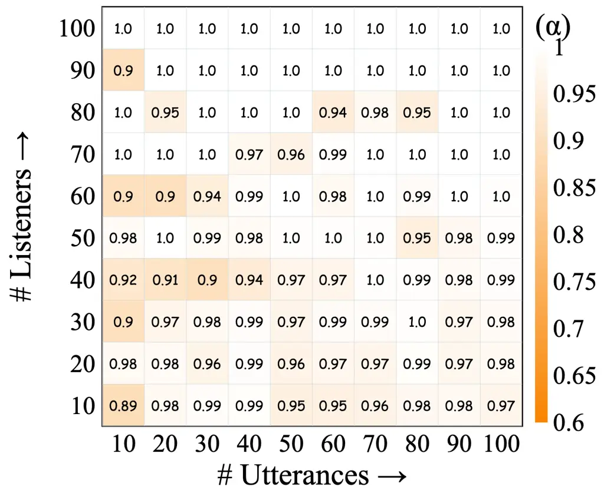

Figure 8: Spearman rank correlation of MUSHRA scores in Tamil

Figure 9: Summary of participant responses from the post-evaluation
survey conducted after the MUSHRA test.

### A.5 Post-Evaluation Survey

To better understand how raters made their judgments during the MUSHRA
test, we conducted a structured post-evaluation survey with 89
participants after the main evaluation. This survey provided direct
insights into participant decision-making, particularly regarding
reference-matching bias, judgment ambiguity, rating confusion, and
cognitive load. The results, summarized in Figure 9, reinforce key
concerns about strict reference dependence in MUSHRA-based evaluations.

A majority of participants (55%) preferred the system that was closer to
the reference, confirming that reference-matching plays a strong role in
decision-making. However, this bias was not absolute—18% preferred a
system that deviated from the reference, and 11% rated solely based on
overall quality, demonstrating that strict reference dependence may not
always be ideal. Furthermore, responses highlighted judgment ambiguity:
while 56% prioritized voice quality over pronunciation errors, 33%
favored better pronunciation over voice quality, showing that raters
face trade-offs that are not always resolved by aligning with the
reference.

Despite the provided instructions, 56% of participants reported
experiencing rating confusion at least a few times, confirming that
label ambiguity exists in the MUSHRA framework. Notably, 58% of raters
did not rate the reference as "Excellent," with 19% rating it as Fair
and 1% as Poor, further challenging the assumption that the reference
always represents the highest quality standard. Additionally, 22% of
participants found the MUSHRA test difficult or very difficult,
suggesting that cognitive load may impact rating consistency.

These findings support our argument that while MUSHRA remains a valuable
evaluation tool, strict reference-matching and scoring assumptions may
not always be ideal. The observed ambiguity, cognitive challenges, and
frequent encounters with confusing rating situations, reinforce the need
for alternative evaluation setups, such as MUSHRA-NMR, which relaxes
reference dependence while maintaining the benefits of comparative
evaluation. The survey results directly informed our analysis, ensuring
that our interpretations were grounded in participant responses rather
than speculation. For additional details, the full survey findings are
referenced in Figure 9.

### A.6 Detailed Guidelines for MUSHRA-DG

We present the complete guidelines shown to raters in Figure 16. We
derive a formula that takes into account several factors: mild
pronunciation mistakes ($`MP`$), severe pronunciation mistakes ($`SP`$),
unnatural speedup or slowdown ($`US`$), liveliness ($`L`$), voice
quality ($`VQ`$), rhythm ($`R`$), digital artifacts ($`DA`$), sudden
energy fluctuations ($`SEF`$), and word skips ($`WS`$). The MUSHRA score
is calculated by averaging the perceptual measures and then penalizing
for various mistakes and artifacts. Specifically, we penalize every word
skip by deducting 25 points, every severe pronunciation mistake by
deducting 10 points, and every mild pronunciation mistake by deducting 5
points. Likewise, all other non-perceptual measures are penalized by 5
points. The MUSHRA score ($`S_{M}`$) for a system is given by,

```math
S_{M}=\frac{L+VQ+R}{3}-\min(MP,15)\times 5-\min(SP,7)\times 10-US\times 5-DA\times 5
```

```math
\quad\quad\quad-WS\times 25-SEF\times 5
```

We believe this formulation ensures a systematic approach to scoring,
accounting for both perceptual qualities and penalizing observable
errors effectively.

### A.7 Fault Isolation in English and Tamil

Similar to Figure 5, we visualize the granular ratings across the
objective and perceptual dimensions for English in Figure 11 and, Tamil
in Figure 10.

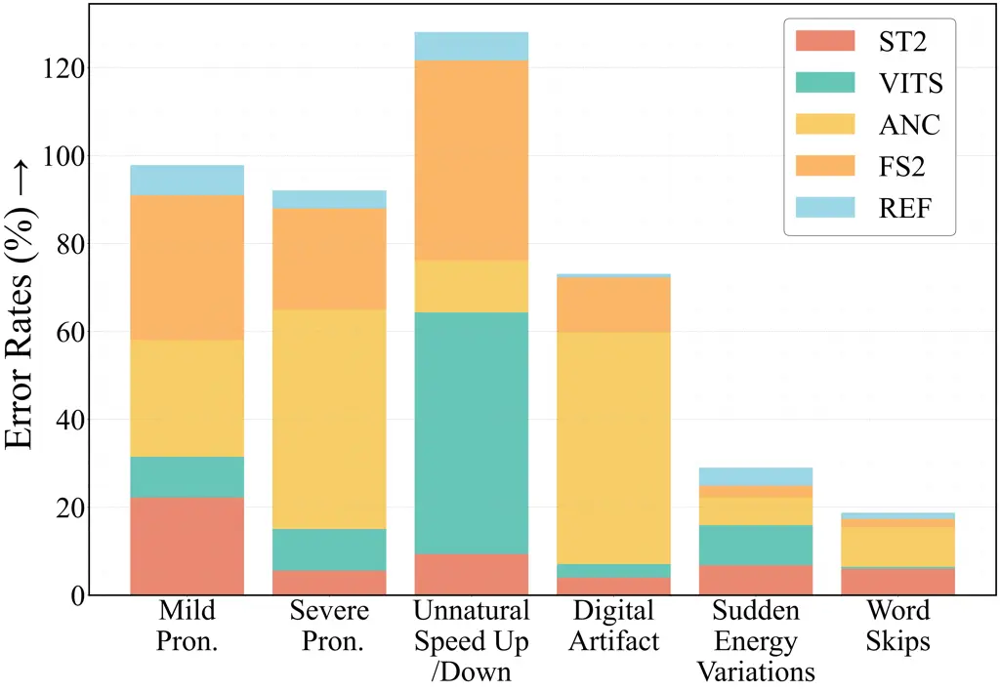

(a) Objective (Tamil)

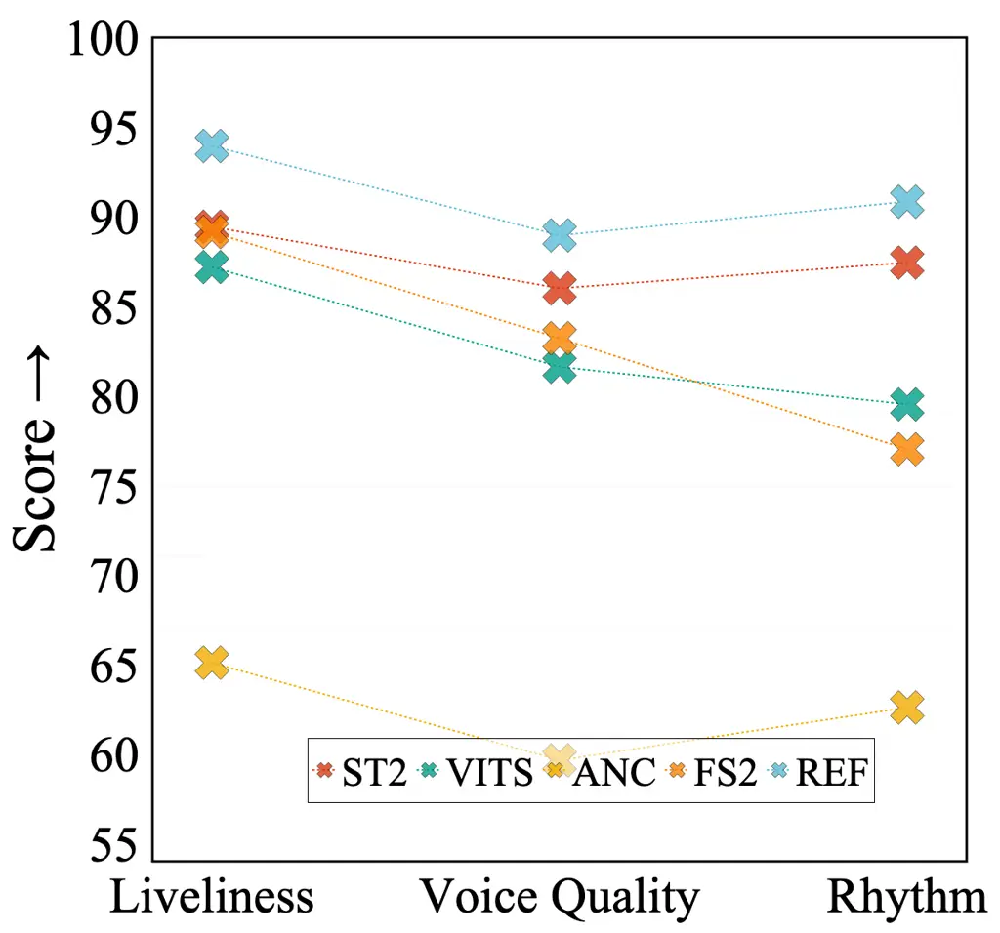

(b) Perceptual (Tamil)

Figure 10: Visualization of the 6 objective and 3 perceptual dimensions
of the MUSHRA-DG test.

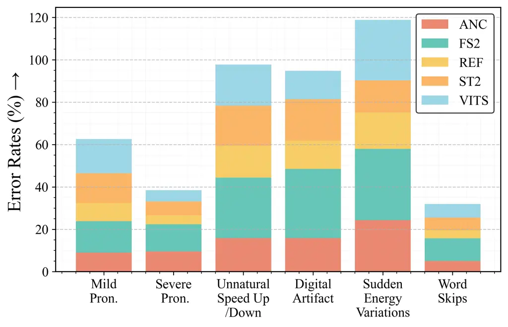

(a) Objective (English)

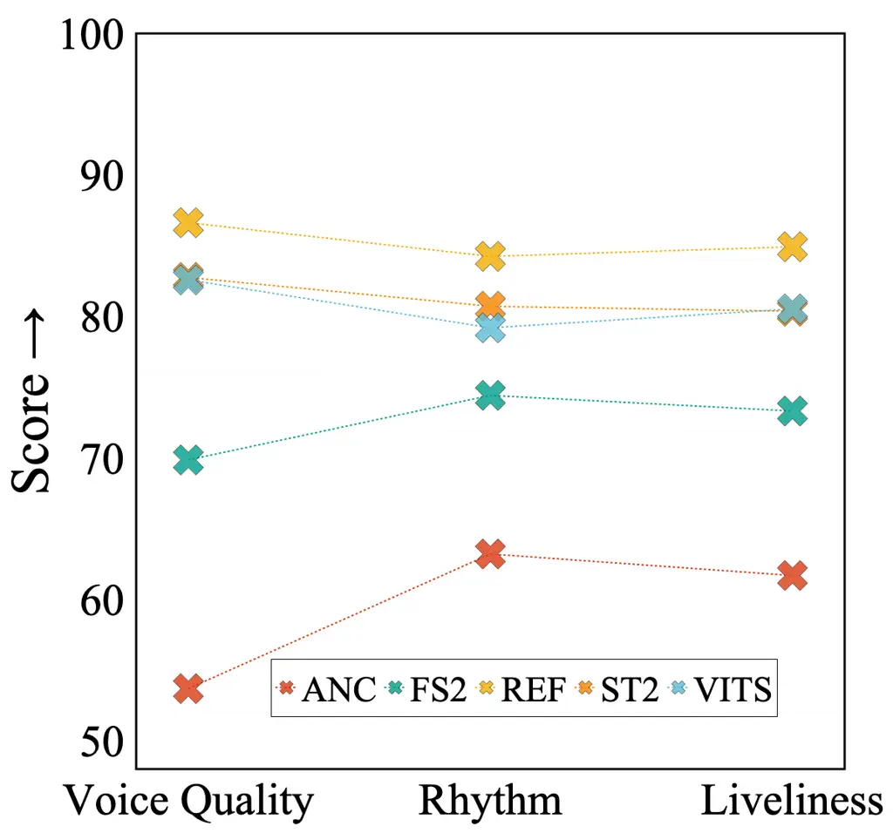

(b) Perceptual (English)

Figure 11: Visualization of the 6 objective and 3 perceptual dimensions
of the MUSHRA-DG test.

### A.8 Limitations

Our study focuses on human evaluations for Hindi and Tamil, representing
a major Indo-Aryan and Dravidian language, respectively. However, we did
not extend our analysis to English, a widely spoken and diverse
language. This limitation is due to the scope of our current research
and resource constraints. We also wish to state that while the
demographics table summarizes the age and gender of participants,
details for 21 out of the 492 participants are missing as raters opted
out from providing this information. This constitutes a minor fraction
and we believe does not significantly affect the analysis. While this
work focuses on identifying two key issues — reference-matching bias and
judgment ambiguity — several other biases may also exist in TTS
evaluations, which warrant further investigation. A more broader
analysis could provide more comprehensive insights into the
applicability and robustness of our proposed MUSHRA variants across
diverse linguistic contexts and practical applications.

### A.9 Ethical Considerations

We prioritized ethical conduct throughout our research. All human
listeners involved in the study provided informed consent before
participating in the evaluation, recruited through professional data
annotation agencies. These agencies verified participant language
proficiency for task relevance. We established an education criterion of
completing high school to ensure participants’ ability to accurately
annotate audio content. Participants were compensated fairly for their
time and expertise, following industry standards. They were also fully
informed about the study nature, procedures, and their right to withdraw
at any point without consequence. We ensured that our study adhered to
ethical guidelines by obtaining approval from the Institutional Ethics
Committee, which reviewed our methodology and confirmed compliance with
ethical standards.

We strived for inclusivity and bias mitigation. Participants came from
diverse demographic backgrounds, and we recruited only native speakers
to capture the subtle linguistic and cultural nuances of each language.
To minimize rater burden and bias in the new MUSHRA test variations, we
prioritized user-friendliness and transparency in the design, providing
clear guidelines.

We release the evaluations dataset under CC-BY-4.0 license after careful
consideration of privacy and ethical use. Identifiable information about
the participants was anonymized to protect their privacy. We encourage
the use of this dataset for advancing TTS evaluation metrics,
emphasizing that it should be used responsibly and ethically, adhering
to principles of transparency and fairness. Finally, we acknowledge that
our study focuses on Hindi and Tamil, and we recognize the importance of
extending such evaluations to other languages, including English, to
generalize our findings. Future research should continue to explore
these ethical dimensions, ensuring that the development and evaluation
of TTS systems are conducted with respect for the diversity and rights
of all participants involved.

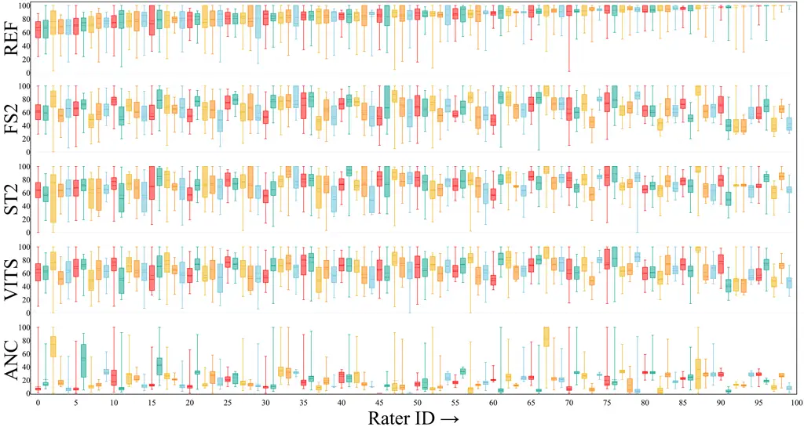

Figure 12: Visualization of the MUSHRA score distributions per rater
across three systems— FS2, ST2, and VITS, along with the reference (REF)
and anchor (ANC) for Tamil. Each boxplot represents ratings (0-100)
across all test utterances for a system by one rater. The substantial
heights of some boxplots indicate significant variance in the scores of
that rater. The variation in boxplot means across raters suggests a high
level of inter-rater variance

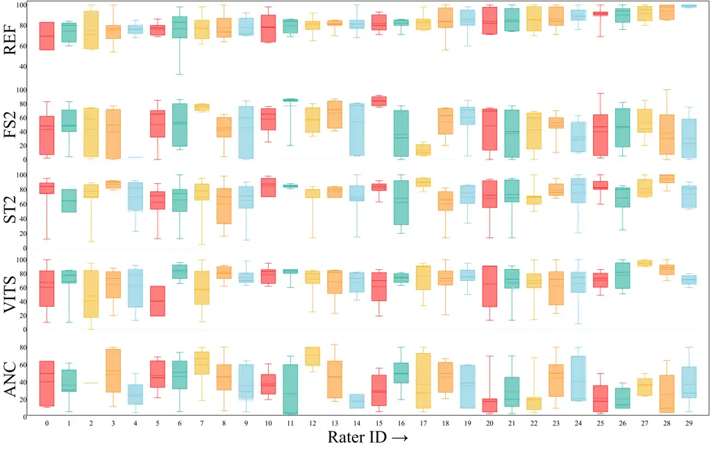

Figure 13: Visualization of the MUSHRA score distributions per rater
across three systems— FS2, ST2, and VITS, along with the reference (REF)
and anchor (ANC) for English. Each boxplot represents ratings (0-100)
across all test utterances for a system by one rater. The substantial
heights of some boxplots indicate significant variance in the scores of
that rater. The variation in boxplot means across raters suggests a high
level of inter-rater variance

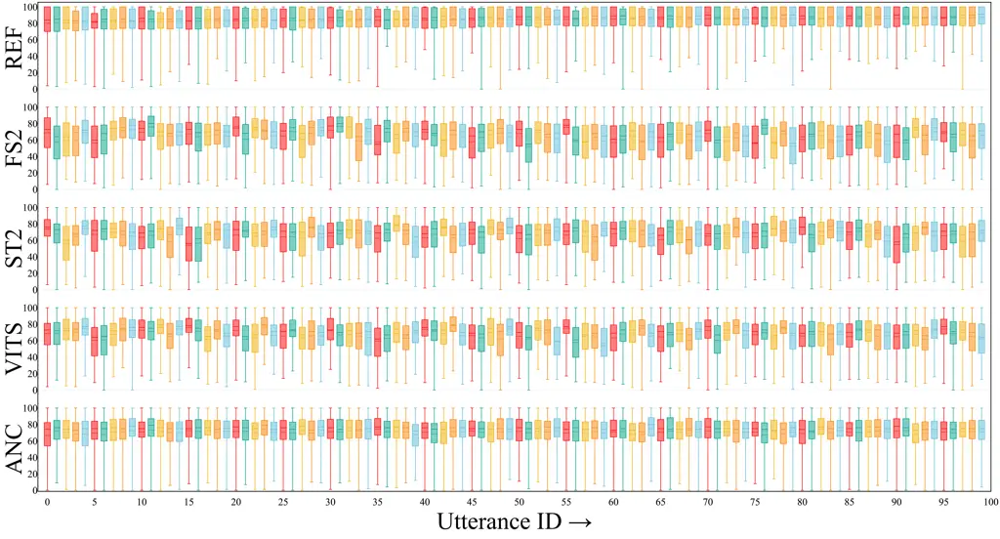

Figure 14: Visualization of the MUSHRA score distributions per utterance
across three systems— FS2, ST2, and VITS, along with the reference (REF)
and anchor (ANC) for Hindi. The X-axis represents each of the 100
utterances. Each boxplot represents ratings (0-100) across all raters
for a system for a given utterance. The substantial heights of some
boxplots indicate significant variance in the scores given by different
raters for a single utterance.

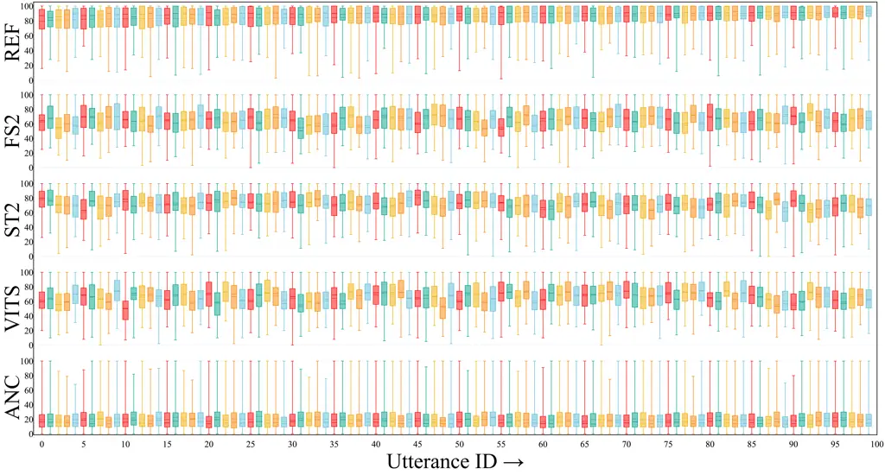

Figure 15: Visualization of the MUSHRA score distributions per utterance
across three systems— FS2, ST2, and VITS, along with the reference (REF)
and anchor (ANC) for Tamil.

Figure 16: Guidelines presented to raters across multiple evaluation
criteria in the MUSHRA-DG Test.
