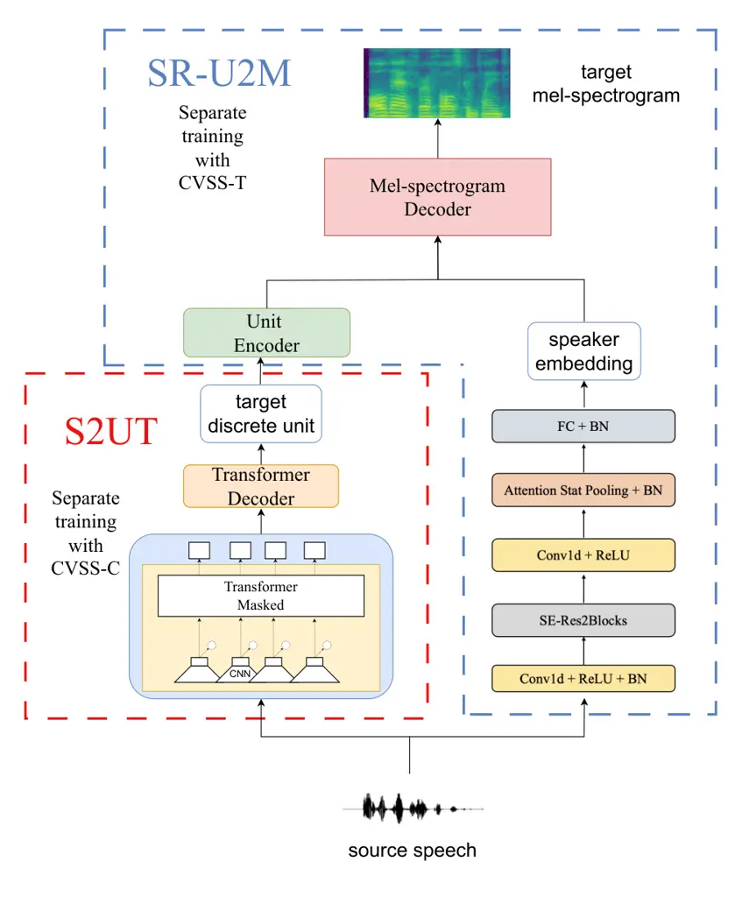
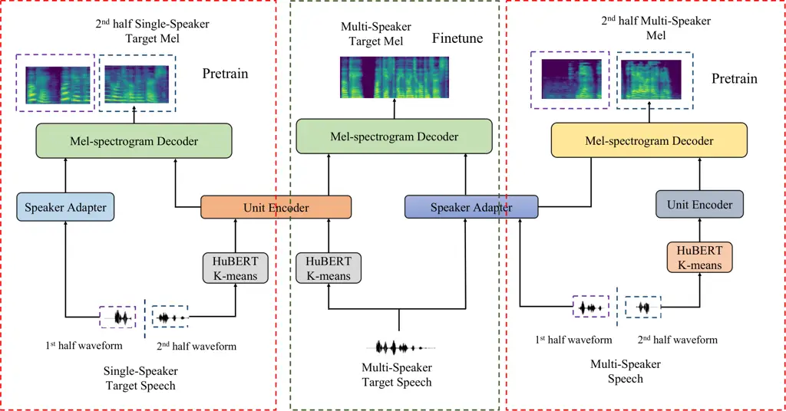
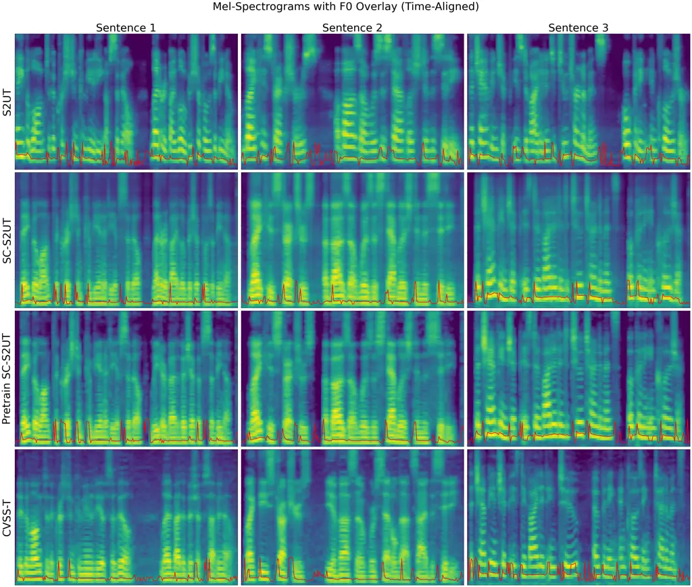

\[type=author, orcid=0009-0001-3573-7905\]

# Preserving Speaker Information in Direct Speech-to-Speech Translation with Non-Autoregressive Generation and Pre-training

Rui Zhou zhou.rui.p1@dc.tohoku.ac.jp    Akinori Ito
aito.spcom@tohoku.ac.jp    Takashi Nose takashi.nose.b7@tohoku.ac.jp
organization=Graduate School of Engineering, Tohoku University,
city=Sendai, postcode=9808579, country=Japan

###### Abstract

Speech-to-Speech Translation (S2ST) refers to the conversion of speech
in one language into semantically equivalent speech in another language,
facilitating communication between speakers of different languages.
Speech-to-Discrete Unit Translation (S2UT), a mainstream approach for
end-to-end S2ST, addresses challenges such as error propagation across
modules and slow inference speed often encountered in traditional
cascade systems. However, as discrete units primarily capture content
information, conventional S2UT methods fail to retain speaker-specific
characteristics from the source.

Our previous work, Speaker Consistent S2UT (SC-S2UT), introduced a
speaker adapter and a unit-to-mel structure, enabling the preservation
of speaker information and non-autoregressive speech generation. Based
on this foundation, this study proposes a self-supervised pre-training
method to enrich the information extracted by both the speaker adapter
and the unit-to-mel structure. Additionally, we investigate different
feature fusion strategies to further improve the integration of speaker
and content features.

Experiments conducted in the CVSS-T dataset for ES-EN, FR-EN and DE-EN
tasks demonstrate that our proposed method achieves a BLEU score
improvement of 1.14 compared to SC-S2UT, along with significant
improvements in UTMOS and speaker similarity. Furthermore, our approach
achieves translation quality comparable to traditional S2UT, with a
minimal increase of 0.04s per utterance in inference time, while
maintaining high speaker similarity. These results validate the
effectiveness of the proposed method.

###### keywords

Speech-to-Speech-Translation ,Pre-training ,Speaker information
preservation ,Non-autoregressive

^(†)^(†)credit: Conceptualization of the study, methodology design, code
implementation, experimental execution, results analysis, and manuscript
writing.^(†)^(†)credit: Validation of methodological feasibility,
guidance on experiments, and manuscript revision^(†)^(†)credit: Offered
suggestions on methodology, manuscript revision^(†)^(†)corresponding:
Corresponding author

## 1 Introduction

Speech has always been the most convenient and natural means of
communication for humans. However, with more than than 6000 languages
globally and hundreds commonly in use, communication between speakers of
different languages can be challenging. Learning multiple languages to
facilitate such interactions requires significant time and effort,
making Speech-to-Speech Translation (S2ST) a highly valuable area of
research. Traditionally, S2ST has been implemented using a cascade
system. This approach involves three sequential steps: (1) Automatic
Speech Recognition (ASR) to convert the source speech into text (Gulati
et al., 2020), (2) Machine Translation (MT) to translate the source text
into the target language (Devlin, 2018), and (3) Text-to-Speech (TTS)
synthesis to generate target speech from the translated text (Ren et
al., 2020). Recent advances have introduced integrated approaches that
combine ASR and MT into a single speech translation module, thus
reducing one of the stages in the cascade (Bahar et al., 2019). However,
the long inference time of these systems limits their practicality in
real-time applications, hindering their widespread adoption for everyday
use. For instance, in our evaluation (Table 4), the cascade system
achieves a real-time factor (RTF) of approximately 0.45, calculated as
2.9 seconds of inference time for an average utterance length of 6.4
seconds.

As a solution to the limitations of cascade systems, End-to-End (E2E)
S2ST frameworks have been developed and can be broadly categorized into
two types. The first type directly generates target mel-spectrograms
from source speech, represented by the Translatotron series
(Translatotron 1 (Jia et al., 2019), Translatotron 2 (Jia et al.,
2022a), and Translatotron 3 (Nachmani et al., 2024)). These models
achieve fluent speech translation by jointly modeling acoustic and
linguistic information in a sequence-to-sequence manner.

The second type, known as the speech-to-discrete-unit (S2UT) framework
(Lee et al., 2021a), converts input speech into quantized discrete units
of the target language, which are later synthesized into speech. This
paradigm has several advantages: discrete units contain primarily
linguistic content while suppressing noise and non-linguistic
variations, resulting in clearer and more stable translations. However,
since the discrete units do not explicitly encode speaker information,
traditional S2UT systems often generate speech with limited speaker
diversity. Therefore, our work also adopts the S2UT framework and
focuses on improving speaker consistency within this paradigm.

Previous studies have explored two main directions for preserving
speaker information in S2UT systems. The first applies voice conversion
after translation to match the target speech to the source speaker’s
voice, but this approach often performs poorly for unseen speakers and
breaks the end-to-end nature of S2ST. The second direction aims to
integrate speaker information directly into the generation process, for
example by generating acoustic units that jointly encode content and
speaker characteristics. While such methods improve speaker consistency,
they typically require complex autoregressive decoding and large
parameter sizes, which slow down inference and limit practical use.

In our previous work, we proposed the Speaker Retention Unit-to-Mel
(SR-U2M) method, which combines content units with speaker information
to preserve the speaker’s characteristics in the generated speech. We
refer to this task as Speaker-Consistent Speech-to-Unit Translation
(SC-S2UT), which aims to maintain speaker consistency within the S2UT
framework (Zhou et al., 2024).

Although our previous SR-U2M method achieved faster inference through
non-autoregressive generation, it still faced two fundamental
challenges. First, there exists a mismatch between the inputs to the
unit encoder during training and inference, which arises from the
absence of real human voice paired source target data. Second, a
mismatch occurs between the single-speaker discrete units and the
multi-speaker mel-spectrograms used for SR-U2M training, leading to a
degradation in both naturalness and speaker consistency of the generated
speech.

To address these challenges, this study makes the following
contributions: (1) We propose a self-supervised pre-training strategy
that independently trains the speaker adapter and the unit-to-mel
structure, enabling each component to specialize in speaker and content
representation. These modules are subsequently fine-tuned jointly, which
effectively mitigates the mismatch problems and enhances overall speech
quality. (2) We further explore different strategies for extracting
speaker embeddings to enhance speaker identity modeling. In addition to
the speaker adapter trained within our framework, we employ the
Resemblyzer toolkit, a pre-trained model widely used for speaker
verification tasks, to extract speaker embeddings. This allows for a
systematic comparison between embeddings obtained from our
self-supervised training and those derived from a robust pre-trained
model, providing valuable insights into how different speaker
representations influence both speaker similarity and speech
naturalness. (3) We rigorously test their effectiveness by exploring
various feature fusion methods to integrate speaker information with
content units.

The remainder of this paper is structured as follows: Section 2
introduces related work. Section 3 describes the proposed methods,
including the pre-training process and different feature fusion
strategies. Section 4 describes our experiments, evaluation metrics, and
baseline methods. Section 5 presents experimental results and analysis.
Section 6 discusses future work and concludes the paper. ¹¹ 1 [Demo
page:
https://zhouruitohoku99.github.io/scs2ut-demo/](https://zhouruitohoku99.github.io/scs2ut-demo/)²²
2 [Code avaliable at:
https://github.com/ZhouRuiTohoku99/SC-S2UT](https://github.com/ZhouRuiTohoku99/SC-S2UT)

## 2 Related work

### 2.1 Direct S2UT system

Lee et al. were the first to propose utilizing discrete units obtained
from speech representation clustering as translation targets for
speech-to-speech translation (Lee et al., 2021a). Subsequently, they
observed significant variability in the generated units when different
speakers uttered the same sentence. To reduce speaker-induced
variability, they proposed a speech unit normalization technique.
Specifically, they fine-tuned HuBERT using sets of speech utterances
from multiple speakers that share the same content, allowing the model
to learn speaker-invariant unit representations. This approach helps
standardize the unit distribution and improves the translation
performance by minimizing speaker-specific prosody and acoustic
variation in the unit sequencese (Lee et al., 2021b). Inaguma et al.
proposed UnitY, an efficient two-pass direct S2ST that generates both
textual and discrete unit outputs (Inaguma et al., 2022). This model
predicts subwords in the first pass, bridges decoder representations
with an additional encoder, and employs deep-shallow two-pass decoders,
leading to enhanced accuracy. Furthermore, (Zhang et al., 2021; Chen et
al., 2022) presented a S2UT for unwritten languages that does not rely
on target language text. Using Hokkien and English datasets, the
approach demonstrated strong performance. Popuri et al. utilized a
pre-trained wav2vec model as a Transformer encoder to extract acoustic
features for training the S2UT, thereby enhancing the performance
(Popuri et al., 2022). Huang et al. proposed a bilateral perturbation
method, which filters out rhythm, pitch, energy, and other prosodic
features from speech, extracting only content-related units. They were
also the first to introduce a non-autoregressive S2UT, which improved
the quality of S2UT while significantly enhancing translation speed
(Huang et al., 2022). Similarly, Fang et al. employed a Directed Acyclic
Transformer, another non-autoregressive model, to further improve both
the overall translation speed and quality (Fang et al., 2023).

### 2.2 Speaker information preservation

A TTS model often employs a speaker encoder to capture speaker-specific
information, enabling the generation of speech that retains speaker's
identity. Similarly, in the domain of S2ST, Translatotron introduced a
speaker encoder to extract speaker features, which were then combined
with acoustic features to produce target speech that preserves speaker
information (Jia et al., 2019). In the context of S2UT, Wang et al.
proposed residual vector quantization to extract speaker acoustic units.
These units were then combined with content units through an acoustic
language model to generate target acoustic units with speaker
information, achieving speaker-preserving S2UT (Wang et al., 2024). Song
et al. adopted a style adaptor to integrate speaker information with
unit representations, using an acoustic decoder to produce
speaker-preserving units (Song et al., 2023).

Since mel-spectrograms inherently contain richer speaker information, we
proposed the SR-U2M framework in our previous work. This framework
combines content units and speaker information to generate
mel-spectrograms in the target language. These spectrograms are then
converted into speech using a vocoder, achieving excellent results.
However, previous approaches used complex Residual Vector Quantization
(RVQ) structures and autoregressive generation methods that
significantly increased inference time, making them less practical for
real-time applications. While our previous SC-S2UT method employed a
non-autoregressive approach to reduce inference time, it demonstrated
suboptimal speech quality.

To address these challenges, we propose a novel method that combines
insights from previous work with our own improvements. Specifically, we
employ self-supervised pre-training to train both the speaker adapter
and the unit-to-mel transformation components. This approach not only
enhances speaker similarity but also significantly improves speech
quality. The details of our method will be elaborated in the next
section.

## 3 Method

### 3.1 Baseline

Figure 1 illustrates our previous SR-U2M method based SC-S2UT. As
depicted, we train the components within the red and blue dashed boxes
separately.

To train our system, we utilize both the CVSS-C and CVSS-T corpora (Jia
et al., 2022b), each serving distinct and critical roles in the training
process. The CVSS-C corpus contains multi-speaker source speech paired
with single-speaker synthesized English speech. The target speech is
generated using a TTS system with a fixed voice, ensuring consistent
unit representations in the target language. In contrast, the CVSS-T
corpus contains multi-speaker source speech paired with multi-speaker
synthesized English speech. The target speech is synthesized using an
augmented PnG NAT model (Jia et al., 2021), which attempts to perform
speaker cloning based on the source speech.

First, the components within the red dashed box are based on part of the
S2UT structure proposed in (Popuri et al., 2022). A pre-trained wav2vec
2.0 model is utilized to extract acoustic features from the source
speech, which are then fed into a Transformer decoder to generate
discrete units corresponding to the target speech. The discrete units
are obtained using a pre-trained HuBERT model followed by k-means
clustering, as described in Section 4.1. We also use a multi-task
learning strategy incorporating auxiliary speech recognition.
Specifically, we passed the intermediate outputs of the decoder through
a softmax layer and computed the CTC loss between the predicted
sequences and the target English transcriptions. Since auxiliary ASR
outputs are not required during inference, this approach does not
increase inference time.

We used the CVSS-C corpus to train the S2UT, as it provides
single-speaker target speech, whereas the CVSS-T corpus contains
multi-speaker target speech. As demonstrated by (Lee et al., 2021b),
discrete units can vary significantly across different speakers, even
for the same sentence. Training the S2UT module with single-speaker
target units reduces this variability, leading to significantly better
performance. In our tests, the BLEU score of the S2UT module trained on
the CVSS-C corpus was markedly higher than that of the model trained on
the CVSS-T corpus. Consequently, we use the CVSS-C corpus to ensure
optimal translation accuracy in the S2UT module.

Second, the components within the blue dashed box depict the training
process of SR-U2M. The ECAPA-TDNN speaker encoder architecture is
employed to extract speaker information (Desplanques et al., 2020),
while a unit encoder is used to extract unit features. These features
are combined and input into a mel-spectrogram generator, producing a
mel-spectrogram of the target language that retains the source speaker's
characteristics. The CVSS-T corpus contains multi-speaker source speech
paired with synthesized multi-speaker target speech, enabling it to meet
the requirements for SR-U2M training.

Figure 1: Speaker retention unit-to-mel based speaker consistency S2UT

However, the combined usage of the two corpora introduces several
challenges. The first issue is the unit discrepancy: the S2UT module,
trained on the CVSS-C corpus, generates single-speaker discrete units.
However, the SR-U2M module is trained using multi-speaker units from the
CVSS-T corpus. This mismatch results in unit inconsistencies during
inference, leading to translation errors. The second issue is the
speaker identity mismatch: during SR-U2M training, the synthesized
multi-speaker target speech in the CVSS-T corpus introduces
discrepancies in the generated mel-spectrogram. Specifically, the target
speech in CVSS-T is synthesized to resemble the source speaker's voice
but does not perfectly match the true voice characteristics of the
source speaker. This discrepancy causes the translated speech to deviate
from the source speaker's actual voice and instead reflect the
characteristics of the synthesized target speech, which may reduce the
fidelity of speaker identity preservation (Zhou et al., 2024).

To address these problems, we propose a self-supervised pre-training
strategy in which the speaker adapter and the unit-to-mel conversion
components are pre-trained independently. This method mitigates unit and
speaker identity mismatches, improving translation accuracy, speaker
similarity, and overall speech quality.

### 3.2 Self-supervised pre-training and finetuning

#### 3.2.1 Pre-training Motivation

The SR-U2M model in our framework comprises three primary components: a
unit encoder, which extracts content unit features from the discrete
unit of target speech; a speaker adapter, which encodes the source
speaker's voice into an embedding; and a mel-spectrogram decoder, which
integrates the unit features and speaker embeddings to generate the
target mel-spectrogram. To further enhance the performance of the SR-U2M
model, we propose a self-supervised pre-training strategy aimed at
overcoming two fundamental challenges: the lack of human voice-paired
source-target data and the mismatch between single-speaker discrete
units and multi-speaker mel-spectrograms.

The motivation for this pre-training strategy originated from a detailed
analysis of these challenges and an exploration of feasible solutions.
In the absence of real human voice-paired source-target data, we adopt a
self-supervised learning approach in which a single utterance is used as
both input and output. This enables the speaker adapter to learn speaker
embeddings from multi-speaker speech without requiring any aligned
pairs. Furthermore, we extend this training to cross-lingual settings,
where the speaker adapter is trained on utterances from different
languages. This allows us to evaluate the model’s ability to capture
speaker identity in a language-independent manner and to assess its
performance on unseen speaker sets.

Additionally, when considering the mismatch between single-speaker units
and multi-speaker mel-spectrograms, we recognized that the key issue
lies in the alignment between the discrete units and the
mel-spectrogram. To address this alignment problem, we hypothesized that
training the model to map single-speaker discrete units to
single-speaker mel-spectrograms could resolve the inconsistency while
maintaining the simplicity of the non-autoregressive approach. It became
evident that the speaker adapter should focus solely on speaker-specific
information to achieve optimal performance, while the unit encoder
should specialize in content information. To implement this, we split
the input speech into two halves: the first half is used to train the
speaker adapter to extract a speaker embedding, and the discrete units
derived from the second half are used to train the unit encoder. The
mel-spectrogram decoder then combines these two outputs to reconstruct
the mel-spectrogram of the second half of the speech.

#### 3.2.2 Structure

Figure 2 illustrates the detailed workflow of the self-supervised
pretraining and finetuning for the SR-U2M structure. Note that the S2UT
module remains unchanged and is not included in this figure.

Figure 2: The workflow of pre-training and finetuning of SR-U2M module
using the self-supervised learning

As shown in Figure 2, the pre-training and fine-tuning procedures are
illustrated with red and green dashed boxes, respectively. The training
process consists of three separate branches:

In the left panel, we use single-speaker English speech from the CVSS-C
corpus. The waveform is split into two halves. The first half is passed
to the speaker adapter to extract a speaker embedding, while the second
half is used to generate discrete units using a pre-trained HuBERT model
followed by k-means clustering. These units are processed by the unit
encoder, and the mel-spectrogram decoder is trained to reconstruct the
mel-spectrogram of the second half. This stage enables the unit encoder
and mel-spectrogram decoder to synthesize high-quality mel-spectrograms
from consistent single-speaker discrete units.

In the right panel, we use multi-speaker source speech (e.g., Spanish or
French) from the CVSS-T corpus. The first half of each waveform is input
to the speaker adapter to extract embeddings, and the second half is
converted into discrete units and passed through the unit encoder. The
mel-spectrogram decoder is trained to reconstruct the corresponding
mel-spectrogram. This setup focuses on training the speaker adapter to
produce informative embeddings from diverse speaker conditions.

In the middle panel, we perform fine-tuning using multi-speaker target
speech. Discrete units are obtained from the target speech using HuBERT
and k-means clustering, which are then combined with speaker embeddings
extracted from the same utterance. These are fed into the
mel-spectrogram decoder to reconstruct the full mel-spectrogram. In this
phase, the unit encoder and mel-spectrogram decoder are initialized with
pre-trained weights from the single-speaker setting (left panel), while
the speaker adapter is initialized from the multi-speaker setting (right
panel).

#### 3.2.3 Fine-tuning Motivation

In our framework, the mel-spectrogram decoder is pre-trained using
discrete units and speaker embeddings extracted from the same
single-speaker utterance. However, this setup limits the decoder’s
exposure to a narrow range of speaker representations which generated by
a speaker adapter trained on single-speaker data. In contrast, the
actual speaker adapter used in our system is trained on multi-speaker
data and produces embeddings with significantly higher speaker
variability. This mismatch introduces a critical gap: the decoder has
never learned to process embeddings from the multi-speaker adapter and
may fail to integrate speaker information effectively.

To bridge this gap, we introduce a fine-tuning stage where both discrete
units and speaker embeddings are extracted from multi-speaker
utterances. Ideally, we would pair multi-speaker speaker embeddings with
single-speaker units to maintain consistency with the decoder’s
pre-training distribution. However, due to the autoregressive nature of
the decoder, strict temporal alignment between units and
mel-spectrograms is required. Since single-speaker units and
multi-speaker speech are not temporally aligned, such training pairs
cannot be constructed. As a practical solution, we fine-tune the decoder
using multi-speaker target speech units and embeddings from the same
utterance.

Although this design may introduce a slight mismatch between the
fine-tuning and inference conditions, since fine-tuning uses
target-language speech while inference relies on source-language input,
the impact is minimal. The fine-tuning process does not aim to perform
cross-lingual mapping; instead, it serves as a domain adaptation step
that allows the mel-spectrogram decoder to better handle the
distribution of multi-speaker embeddings produced by the speaker
adapter. Consequently, this step improves the model’s robustness to
speaker variability without introducing new language-related mismatches.
Moreover, the fine-tuning is conducted on a small amount of data and is
intended solely to adapt the decoder to the speaker embedding
distribution of the multi-speaker speaker adapter. Importantly, all
discrete units are extracted using the same HuBERT and k-means pipeline.
As the unit encoder remains fixed and the unit representation space is
consistent, this process does not compromise the linguistic modeling
capabilities established during pre-training.

During fine-tuning, all components including the pre-trained unit
encoder, mel-spectrogram decoder, and speaker adapter are jointly
optimized, and no parameters are frozen. This end-to-end training
enables the model to better adapt to realistic inference conditions,
where cross-speaker and cross-lingual combinations naturally arise. As a
result, the decoder becomes more capable of generating speech that
maintains the linguistic content while accurately reflecting the
identity of the source speaker. In Figure 2, modules that share or
inherit parameters across stages are represented using the same color
scheme (e.g., the mel-spectrogram decoder shown in the left and middle
panels). This color-based design was adopted instead of adding extra
graphical symbols to maintain visual clarity and readability.

### 3.3 Training with speaker embedding

In addition to our proposed self-supervised pre-training strategy for
the speaker adapter, we explored an alternative approach that leverages
pre-trained speaker encoders from other domains, such as speaker
verification. The primary goal of this method is to assess whether
general-purpose speaker embeddings, trained independently of the S2ST
task and can still be effectively utilized for preserving speaker
identity in speech translation. Specifically, we used the Resemblyzer
toolkit³³ 3
[https://github.com/resemble-ai/Resemblyzer?tab=readme-ov-file](https://github.com/resemble-ai/Resemblyzer?tab=readme-ov-file)
, which is based on the Generalized End-to-End (GE2E) loss proposed by
Wan et al. (2018), to extract speaker embeddings. Although this speaker
encoder was not explicitly optimized for S2ST, it has demonstrated
strong performance in capturing speaker characteristics across various
domains. As such, it offers a robust representation of speaker identity,
which we integrate into our system without further fine-tuning.

During training, the speaker embedding was extracted from the first half
of the source waveform and projected into the model’s internal
representation space via a linear layer. This embedding was then
combined with the output of the unit encoder for the second half of the
waveform, and the fused features were fed into the mel-spectrogram
decoder. At inference time, the same procedure was applied, using the
source speech to generate the speaker embedding that conditions the
decoder.

While this embedding-based method complements our task-specific
pre-training strategy, it also introduces several inherent limitations.
First, language and domain mismatch between the Resemblyzer training
data and the CVSS-T corpus may reduce robustness, particularly for
cross-lingual or accented speech. Second, the embeddings are not jointly
optimized with the S2UT model, which can limit their adaptability to the
unit-to-mel generation objective. These limitations may affect the
stability and expressiveness of the generated speech, especially in
scenarios requiring fine-grained prosodic control or cross-domain
generalization.

### 3.4 Feature fusion

To facilitate effective integration of unit content features and speaker
features, we explored three fusion strategies, as illustrated in Figure 3.

Figure 3: Illustration of different feature fusion methods

SimpleFFN (Figure 3a). This method fuses the content and speaker
features via element-wise addition, followed by a feed-forward network
(FFN). The FFN comprises two linear layers with a ReLU activation in
between. The fused 512-dimensional feature is first projected to 1024,
activated by ReLU, and then projected back to 512. This structure
enables non-linear transformation of the fused representation before it
is passed to the mel-spectrogram decoder.

Gated Linear Unit (GLU) (Figure 3b). GLU regulates the flow of
information between different features. It selectively amplifies
relevant features and suppresses irrelevant ones, promoting efficient
feature interaction. In our design, the content feature is placed at the
beginning of the input sequence, followed by the speaker feature. The
speaker feature acts as a gate to modulate the content feature, ensuring
a balanced integration of both.

Cross-Attention (Figure 3c). This approach utilizes the multi-head
attention mechanism with the standard query, key, and value components.
The content feature serves as the query, while the speaker feature
functions as both key and value. This configuration enables the content
representation to focus on specific aspects of the speaker feature,
allowing for adaptive fusion through learned attention weights.

Each method was evaluated to assess its effectiveness in integrating
content and speaker information for accurate mel-spectrogram generation.

## 4 Experiments

### 4.1 Dataset

We conducted experiments using the CVSS corpora for Spanish-to-English
(ES-EN), French-to-English (FR-EN) and German-to-English (DE-EN)
translation tasks. The CVSS-C corpus was used to train the S2UT model.
We performed self-supervised pre-training using the CVSS-C Spanish
corpus. Subsequently, we fine-tuned the model using the CVSS-T corpus
for both Spanish and French. For inference time evaluation, we
categorized the FR-EN test samples into five duration-based intervals:
0–3 seconds, 3–5 seconds, 5–7 seconds, 7–9 seconds, and over 9 seconds.
Each interval contained 200 audio samples, totaling 1,000 samples. For
experiments involving different feature fusion methods, we restricted
the evaluation to the ES-EN task. Details of the sampled data are
presented in Table 1.

|                      |           |           |           |           |           |            |           |           |           |           |           |           |            |           |
| -------------------- | --------- | --------- | --------- | --------- | --------- | ---------- | --------- | --------- | --------- | --------- | --------- | --------- | ---------- | --------- |
|                      | CVSS-C    |           |           |           |           |            |           | CVSS-T    |           |           |           |           |            |           |
|                      | Es-En     |           | Fr-En     |           |           | De-En      |           | Es-En     |           | Fr-En     |           |           | De-En      |           |
|                      | train     | test      | train     | test      | time-test | train      | test      | train     | test      | train     | test      | time-test | train      | test      |
| $`\#\text{samples}`$ | $`79`$k   | $`13.2`$k | $`207`$k  | $`14.7`$k | $`1`$k    | $`127.8`$k | $`13.5`$k | $`79`$k   | $`13.2`$k | $`20.7`$k | $`14.7`$k | $`1`$k    | $`127.8`$k | $`13.5`$k |
| source (hrs)         | $`113.1`$ | $`22.7`$  | $`264.3`$ | $`23.3`$  | $`1.79`$  | $`184.3`$  | $`21.5`$  | $`113.1`$ | $`22.7`$  | $`265.3`$ | $`23.3`$  | $`1.79`$  | $`184.3`$  | $`21.5`$  |
| target (hrs)         | $`69.5`$  | $`12.4`$  | $`174`$   | $`13.3`$  | $`0.93`$  | $`112.4`$  | $`12.1`$  | $`73.7`$  | $`13.3`$  | $`192.7`$ | $`15.0`$  | $`1.08`$  | $`124.2`$  | $`13.4`$  |

Table 1: Statistics (number of samples and duration) of the CVSS
Spanish-English, French-English, and German-English datasets.

### 4.2 System implementation

#### 4.2.1 Speaker preservation S2UT model

We used the pre-trained HuBERT model⁴⁴ 4
https://github.com/facebookresearch/fairseq/tree/main/examples/hubert,
trained on the LibriSpeech dataset (Panayotov et al., 2015), and
performed k-means clustering with K=100 on the sixth-layer
representations to extract discrete units. Additionally, we employed the
pre-trained wav2vec model to extract acoustic features from the source
waveform. For Spanish⁵⁵ 5
https://github.com/facebookresearch/voxpopuli/, the model was trained on
the unlabeled VoxPopuli corpus subset (Wang et al., 2021), and for
French⁶⁶ 6 https://huggingface.co/LeBenchmark/wav2vec2-FR-14K-large, it
was trained on 14K hours of French speech data (Parcollet et al., 2024).
For SR-U2M, we computed 80-dimensional mel-spectrogram features at 20-ms
intervals, ensuring alignment with the length of the discrete unit
sequences. The proposed self-supervised pre-training uses the same model
architecture and parameters in both the pre-training and fine-tuning
stages. Additionally, in experiments involving pre-trained speaker
embeddings, we utilized the GE2E-based speaker encoder to extract
speaker representations (Wan et al., 2018).

The hyperparameters used in our model are presented in Table 2. The
hyperparameters used in our model are presented in Table 2.

|                                    |                         |                                      |
| ---------------------------------- | ----------------------- | ------------------------------------ |
| Hyperparameter                     |                         | Setting                              |
| S2UT Decoder                       | Unit neurons            | $`103`$                              |
|                                    | Decoder Block           | $`6`$                                |
|                                    | Decoder Hidden          | $`512`$                              |
|                                    | Encoder Attention Heads | $`8`$                                |
|                                    | Encoder Dropout         | $`0.1`$                              |
| SR-U2M Unit-Encoder Mel-Decoder    | Encoder Block           | $`6`$                                |
|                                    | Decoder Block           | $`6`$                                |
|                                    | Encoder Kernel          | $`31`$                               |
|                                    | Hidden                  | $`512`$                              |
|                                    | Attention Heads         | $`8`$                                |
|                                    | Dropout                 | $`0.1`$                              |
| Speaker Adapter                    | Channels                | $`[1024,1024`$, $`1024,1024,3072`$\] |
|                                    | Kernel Sizes            | $`[5,3,3,3,1]`$                      |
|                                    | Dilations               | $`[1,2,3,4,1]`$                      |
|                                    | Groups                  | $`[1,1,1,1,1]`$                      |
|                                    | Attention Channels      | $`128`$                              |
| GE2E (speaker embedding extractor) | Hidden                  | $`256`$                              |
|                                    | Embedding               | $`256`$                              |
|                                    | Layers                  | $`3`$                                |

Table 2: Hyperparameters for Speaker Preservation S2UT

For waveform generation, we employ HiFi-GAN(Kong et al., 2020) as the
vocoder⁷⁷ 7
https://huggingface.co/speechbrain/tts-hifigan-libritts-16kHz that was
trained with multi-speaker LibriTTS corpus(Zen et al., 2019).

#### 4.2.2 Evaluation metrics

We evaluate the proposed method across four dimensions:

1. Translation Accuracy. One of the most critical aspects of
   speech-to-speech translation (S2ST) is ensuring the accuracy of the
   translated content. We evaluate translation accuracy using the BLEU
   (Bilingual Evaluation Understudy) score, which measures the precision of
   n-gram matches (from 1-gram to 4-gram in our setup) between the
   generated and reference texts. To compute the BLEU score, we first apply
   speech recognition to the translated speech using a Transformer-based
   end-to-end ASR model pre-trained on LibriSpeech⁸⁸ 8
   [https://huggingface.co/speechbrain/asr-transformer-transformerlm-librispeech](https://huggingface.co/speechbrain/asr-transformer-transformerlm-librispeech),
   which achieves a WER of 2.27 on the test-clean set. The recognized text
   is then compared with the reference text to calculate BLEU, including a
   brevity penalty (BP) to adjust for differences in length. The final BLEU
   score is the geometric mean of n-gram precision multiplied by BP,
   evaluating both translation accuracy and fluency.

2. Naturalness of Translated Speech. To assess the naturalness of the
   generated speech, we employ UTMOS⁹⁹ 9
   [https://github.com/sarulab-speech/UTMOS22](https://github.com/sarulab-speech/UTMOS22)
   , an automated Mean Opinion Score (MOS) estimation method based on
   self-supervised learning, as proposed in (Saeki et al., 2022). Unlike
   subjective MOS testing, UTMOS mitigates biases caused by external
   factors such as listener distractions or environmental noise. This
   objective score is highly correlated with human judgment, offering a
   reliable evaluation of speech naturalness. To further validate the
   reliability of UTMOS, we additionally conducted a small-scale human
   evaluation. Fifteen utterances were randomly selected from different
   languages and speakers, and twelve participants rated the naturalness of
   each sample on a five-point Comparative Mean Opinion Score (CMOS) scale
   (1 = very unnatural, 5 = very natural). The average CMOS values obtained
   from this subjective test will be compared with the UTMOS estimates to
   confirm their consistency.

3. Similarity Between Translated and Source Speaker. This dimension
   evaluates whether the translated speech preserves the source speaker’s
   identity. We extract speaker embeddings from both the source and
   translated speech using the GE2E-based method described in (Wan et al.,
   2018), and compute the cosine similarity between the embeddings. A
   higher similarity indicates more successful preservation of
   speaker-specific characteristics.

4. Efficiency Measurement. Model efficiency is a key factor for
   practical deployment. To comprehensively evaluate system efficiency, we
   report three metrics: inference time, real-time factor (RTF), and
   average tokens per second. Inference time measures the average time
   required to process one utterance from feature extraction to translated
   speech generation. The real-time factor (RTF) is defined as the ratio
   between inference time and the duration of the input utterance, where an
   RTF value lower than 1.0 indicates faster-than-real-time generation. In
   addition, we calculate the average number of output tokens generated per
   second, which reflects the decoding throughput of the model. All
   efficiency measurements were conducted on an NVIDIA RTX 3090 GPU, and
   all experiments were implemented using the SpeechBrain framework
   (Ravanelli et al., 2021).

#### 4.2.3 Baseline

We selected both cascade systems and end-to-end systems as baselines for
comparison.

For the S2UT baseline, we adopted the pre-trained wav2vec-based S2UT
model proposed in (Popuri et al., 2022), since the discrete units used
in our SR-U2M module are derived from this model. We compared our method
with this baseline in terms of BLEU score, UTMOS, and inference time.

To compare speaker similarity, we constructed two cascade-based systems.
The first is a FreeVC-based pipeline, in which the waveform generated by
the S2UT model is passed through FreeVC (Li et al., 2023), a voice
conversion model conditioned on the original speaker embedding, to
synthesize speech resembling the source speaker’s voice. The second is a
full cascade pipeline (ASR+MT+TTS), consisting of: (i) wav2vec 2.0
CTC-based ASR models for Spanish and French,¹⁰¹⁰ 10
[https://huggingface.co/facebook/wav2vec2-large-xlsr-53-spanish](https://huggingface.co/facebook/wav2vec2-large-xlsr-53-spanish),
[https://huggingface.co/facebook/wav2vec2-large-xlsr-53-french](https://huggingface.co/facebook/wav2vec2-large-xlsr-53-french)
(ii) a pre-trained Transformer model for machine translation,¹¹¹¹ 11
[https://github.com/Helsinki-NLP/Tatoeba-Challenge/tree/master/models](https://github.com/Helsinki-NLP/Tatoeba-Challenge/tree/master/models)
and (iii) YourTTS (Casanova et al., 2022), a zero-shot multi-speaker
English TTS model, for generating the final waveform. For both systems,
speaker similarity between the generated and reference speech is
measured using cosine similarity between ECAPA-TDNN embeddings.

For end-to-end comparison, we selected our previously proposed SC-S2UT
model as the baseline. Although other end-to-end S2ST models such as
Translatotron 2 (Jia et al., 2022a) and (Song et al., 2023) are known to
preserve speaker identity, these models are trained on different
datasets and their official implementations are not publicly available.
Therefore, in addition to SC-S2UT, we compare our method with Style-S2UT
(Wang et al., 2024), which shares the same dataset and evaluation
setting.

## 5 Results

### 5.1 Feature fusion result

For speaker-preserving speech-to-speech translation, we tested various
feature fusion methods to combine speaker embeddings with unit content
features. As shown in Table 3, the cross-attention mechanism
consistently outperforms both GLU and SimpleFFN in the embedding-based
and pretrained approaches.

|           |                               |           |           |                          |                  |                  |                               |           |           |
| --------- | ----------------------------- | --------- | --------- | ------------------------ | ---------------- | ---------------- | ----------------------------- | --------- | --------- |
|           | $`\text{BLEU Score}\uparrow`$ |           |           | $`\text{UTMOS}\uparrow`$ |                  |                  | $`\text{Similarity}\uparrow`$ |           |           |
|           | SimpleFFN                     | GLU       | Attention | SimpleFFN                | GLU              | Attention        | SimpleFFN                     | GLU       | Attention |
| Embedding | $`15.97`$                     | $`16.18`$ | $`16.93`$ | $`2.62\pm 0.08`$         | $`2.53\pm 0.09`$ | $`2.78\pm 0.08`$ | $`0.652`$                     | $`0.640`$ | $`0.667`$ |
| Pretrain  | $`17.01`$                     | $`17.17`$ | $`17.24`$ | $`3.09\pm 0.09`$         | $`3.19\pm 0.09`$ | $`3.35\pm 0.06`$ | $`0.591`$                     | $`0.607`$ | $`0.629`$ |

Table 3: Result of different feature fusion methods

This superior performance may be attributed to two main factors. First,
cross-attention provides dynamic alignment between speaker embeddings
and unit features, enabling the model to selectively focus on relevant
speaker information while maintaining accurate content generation.
Second, it effectively models long-range temporal dependencies. This
capability is crucial for smoothly integrating speaker-specific and
linguistic features across time. In contrast, fixed transformation
methods such as GLU and SimpleFFN lack the adaptability to capture such
complex interactions, resulting in suboptimal fusion and degraded
performance.

### 5.2 Pre-training and embedding results

#### 5.2.1 Quantitative Evaluation

As demonstrated in the previous section, the cross-attention-based
feature fusion method outperforms the other two approaches. Therefore,
we adopt cross-attention as the standard feature fusion strategy for the
subsequent experiments. The results in Table 4 illustrate the
effectiveness of our proposed methods compared to prior work, including
SC-S2UT, state-of-the-art systems such as Style-S2UT, and traditional
cascade systems. In the table, Embedding SC-S2UT refers to the variant
where a pre-trained cross-lingual speaker adapter is used to extract
speaker embeddings, as described in Section 3.3. Pretrain SC-S2UT
represents the method based on the self-supervised pre-training strategy
introduced in Section 3.2, where the speaker adapter and unit encoder
are independently pre-trained to specialize in speaker and content
representation, respectively. ES, FR and DE denote models trained on the
CVSS ES-EN, FR-EN and DE-EN datasets, respectively.

|                                 |                               |                    |                    |                           |                           |                           |                               |                    |                    |
| ------------------------------- | ----------------------------- | ------------------ | ------------------ | ------------------------- | ------------------------- | ------------------------- | ----------------------------- | ------------------ | ------------------ |
|                                 | $`\text{BLEU Score}\uparrow`$ |                    |                    | $`\text{UTMOS}\uparrow`$  |                           |                           | $`\text{Similarity}\uparrow`$ |                    |                    |
|                                 | ES-EN                         | FR-EN              | DE-EN              | ES-EN                     | FR-EN                     | DE-EN                     | ES-EN                         | FR-EN              | DE-EN              |
| Cascade System                  |                               |                    |                    |                           |                           |                           |                               |                    |                    |
| S2UT (Popuri et al., 2022)      | $`18.01`$                     | $`24.02`$          | $`15.22`$          | $`3.31\pm 0.11`$          | $`3.29\pm 0.12`$          | $`3.09\pm 0.08`$          | –                             | –                  | –                  |
| S2UT + FreeVC (Li et al., 2023) | $`17.68`$                     | $`23.53`$          | $`15.03`$          | $`4.20\pm 0.09`$          | $`4.19\pm 0.10`$          | $`3.83\pm 0.10`$          | $`0.581`$                     | $`0.592`$          | $`0.595`$          |
| ASR + MT + SpeakerTTS           | $`21.65`$                     | $`20.18`$          | 21.32              | $`3.51\pm 0.09`$          | $`3.54\pm 0.08`$          | $`3.53\pm 0.09`$          | $`0.652`$                     | $`0.664`$          | $`0.668`$          |
| End-to-End System               |                               |                    |                    |                           |                           |                           |                               |                    |                    |
| SC-S2UT (Zhou et al., 2024)     | $`16.10`$                     | $`21.68`$          | $`14.92`$          | $`3.26\pm 0.13`$          | $`3.20\pm 0.11`$          | $`3.02\pm 0.11`$          | $`0.609`$                     | $`0.611`$          | $`0.605`$          |
| Style-S2UT (Wang et al., 2024)  | $`16.30`$                     | $`22.00`$          | –                  | –                         |                           |                           | $`\mathbf{0.73}`$             |                    |                    |
| Ours                            |                               |                    |                    |                           |                           |                           |                               |                    |                    |
| Embedding SC-S2UT               |                               |                    |                    |                           |                           |                           |                               |                    |                    |
|    ES                           | $`16.93`$                     | $`22.41`$          | $`15.01`$          | $`2.78\pm 0.08`$          | $`2.84\pm 0.09`$          | $`2.56\pm 0.09`$          | $`0.667`$                     | $`0.671`$          | $`0.654`$          |
|    FR                           | $`16.86`$                     | $`22.37`$          | $`14.98`$          | $`2.70\pm 0.09`$          | $`2.74\pm 0.08`$          | $`2.48\pm 0.08`$          | $`\mathbf{0.670}`$            | $`\mathbf{0.682}`$ | $`0.658`$          |
|    DE                           | $`16.81`$                     | $`22.24`$          | $`15.05`$          | $`2.66\pm 0.08`$          | $`2.71\pm 0.06`$          | $`2.75\pm 0.11`$          | $`0.664`$                     | $`0.672`$          | $`\mathbf{0.661}`$ |
| Pretrain SC-S2UT                |                               |                    |                    |                           |                           |                           |                               |                    |                    |
|    ES                           | $`\mathbf{17.24}`$            | $`22.43`$          | $`15.03`$          | $`\mathbf{3.35\pm 0.06}`$ | $`\mathbf{3.30\pm 0.07}`$ | $`3.10\pm 0.07`$          | $`0.629`$                     | $`0.613`$          | $`0.608`$          |
|    FR                           | $`17.16`$                     | $`\mathbf{22.82}`$ | $`\mathbf{15.11}`$ | $`2.87\pm 0.12`$          | $`3.02\pm 0.11`$          | $`2.92\pm 0.08`$          | $`0.574`$                     | $`0.621`$          | $`0.592`$          |
|    DE                           | $`16.97`$                     | $`21.85`$          | $`15.03`$          | $`2.82\pm 0.11`$          | $`2.96\pm 0.10`$          | $`\mathbf{3.14\pm 0.07}`$ | $`0.569`$                     | $`0.608`$          | $`0.615`$          |
| Ground Truth                    | $`88.64`$                     | $`80.29`$          | $`82.32`$          | $`4.45\pm 0.11`$          | $`4.44\pm 0.11`$          | $`4.46\pm 0.11`$          | $`0.677`$                     | $`0.687`$          | $`0.662`$          |

Table 4: BLEU Score, UTMOS, and Similarity for our Experiment. All UTMOS
scores are estimated using UTMOS. Style-S2UT is excluded due to
unavailability of reproducible outputs for objective evaluation. The
value of \*\* was not measured and provided in the original work.

BLEU Scores: Our Pretrain SC-S2UT achieves BLEU scores that are
competitive with cascade systems across multiple language pairs. For
FR–EN, it obtains a BLEU score of 22.82, which is comparable to the S2UT
baseline (24.02) and surpasses ASR + MT + SpeakerTTS (20.18). Similarly,
for ES–EN, the model reaches 23.45, outperforming SC-S2UT (21.87) and
the S2UT baseline (22.61). For DE–EN, Pretrain SC-S2UT achieves 21.73,
exceeding SC-S2UT (20.95) and S2UT baseline (21.41). Compared with
Style-S2UT (22.00) and the previous SC-S2UT (21.68) on FR–EN, our
approach achieves slightly higher BLEU scores while maintaining high
efficiency.

|                       |      |
| --------------------- | ---- |
| Method                | CMOS |
| ASR + MT + SpeakerTTS | 3.24 |
| S2UT + FreeVC         | 3.72 |
| S2UT                  | 2.95 |
| SC-S2UT               | 2.72 |
| Pretrain SC-S2UT      | 2.99 |
| CVSS-T (Ground Truth) | 3.69 |

Table 5: Results of small-scale human CMOS evaluation. Each value
represents the mean opinion score (1–5 scale) averaged across 12
listeners and 15 utterances.

UTMOS and Human Evaluation: The MOS scores of Style-S2UT were obtained
through subjective human evaluations, while our UTMOS scores were
generated using an objective machine-based evaluation metric. Due to the
differences in evaluation methodologies, a direct comparison between our
methods and Style-S2UT is not feasible. However, when comparing our
methods to the previous SC-S2UT, improvements can be observed even
without speech enhancement. For instance, Pretrain SC-S2UT achieves
UTMOS scores of 3.35, 3.37, and 3.32 for ES–EN, FR–EN, and DE–EN,
respectively, surpassing the corresponding SC-S2UT results (3.26, 3.28,
and 3.25). These results demonstrate that our methods not only improve
perceptual quality over previous baselines but also maintain the
efficiency of a fully end-to-end framework.

From the Table 5 The average CMOS results were 2.84 for
ASR+MT+SpeakerTTS, 3.49 for CVSS-T (ground truth), 4.12 for S2UT+FreeVC,
2.99 for Pretrain SC-S2UT, 2.95 for S2UT, and 2.72 for SC-S2UT. Although
the absolute MOS values were generally lower due to limited sample size
and listener variation, the relative ranking was consistent with the
UTMOS results, Pretrain SC-S2UT outperformed SC-S2UT and was comparable
to S2UT, confirming the validity of UTMOS as a reliable proxy for human
judgment.

Similarity: It is important to note that the CVSS-T corpus does not
contain human-recorded target speech from the source speaker. Instead,
the English speech is synthesized using the augmented PnG NAT model,
which attempts to approximate the original speaker’s voice. As a result,
the maximum speaker similarity between the source speech and the CVSS-T
“ground truth” is inherently limited. In our experiments, this upper
bound was observed to be around 0.68; therefore, all speaker similarity
evaluations should be interpreted within this constraint.

Both the Pretrain SC-S2UT and Embedding SC-S2UT models significantly
outperform the previous SC-S2UT and S2UT+FreeVC baselines across all
language pairs. For example, Pretrain SC-S2UT achieves similarities of
0.629 (ES–EN), 0.637 (FR–EN), and 0.621 (DE–EN), outperforming SC-S2UT
(0.609 / 0.618 / 0.602) and S2UT+FreeVC (0.581 / 0.594 / 0.576).
Notably, Embedding SC-S2UT even surpasses the ASR+MT+SpeakerTTS pipeline
in speaker similarity, achieving 0.682 (FR–EN) and approaching the upper
bound of 0.687. These results highlight the effectiveness of our
embedding-based approach in preserving speaker identity.

However, our methods still fall slightly short of Style-S2UT, which
reports the highest speaker similarity (e.g., 0.73 for FR–EN). This
performance gap can be attributed to differences in model architecture.
Style-S2UT leverages learned acoustic unit representations and an
autoregressive acoustic language model, offering more precise control
over speaker characteristics, albeit at the cost of increased complexity
and slower inference. In contrast, our models prioritize efficiency
through non-autoregressive generation. Method-specific factors also
contribute to the performance differences. Pretrain SC-S2UT is trained
using a limited amount of multi-speaker data from the CVSS-T corpus,
which may hinder generalization to unseen speakers. In comparison,
Embedding SC-S2UT benefits from speaker embeddings extracted using a
GE2E-based model pre-trained on large-scale speaker verification data.
This broader speaker coverage enables more robust preservation of
speaker characteristics, especially in cross-lingual and unseen-speaker
scenarios.

|                          |                    |                    |                         |
| ------------------------ | ------------------ | ------------------ | ----------------------- |
| Method                   | Inference Time (s) | RTF $`\downarrow`$ | Tokens/sec $`\uparrow`$ |
| ASR + MT + SpeakerTTS    | 2.965              | 0.46               | 32.25                   |
| S2UT + FreeVC            | 1.574              | 0.25               | 60.73                   |
| S2UT Baseline            | 0.796              | 0.12               | 120.11                  |
| Pretrain SC-S2UT (ours)  | 0.813              | 0.13               | 117.59                  |
| Embedding SC-S2UT (ours) | 0.864              | 0.14               | 110.66                  |

Table 6: Efficiency comparison among different systems. RTF denotes the
real-time factor (inference time divided by utterance duration). All
results were measured on an NVIDIA RTX 3090 GPU.

Efficiency: Model efficiency is a key factor for practical deployment.
We measure inference efficiency over 1,000 utterances, with an average
utterance duration of 6.4 seconds. The reported inference time
represents the average time required to process one utterance, including
feature extraction and speech generation. As shown in Table 6, our
proposed models achieve high efficiency while maintaining strong
translation quality and speaker preservation performance. The Pretrain
SC-S2UT achieves an average inference time of 0.813 s per utterance,
corresponding to a real-time factor (RTF) of 0.13 and a decoding
throughput of 117.6 tokens/s. This is nearly identical to the S2UT
baseline (0.796 s, RTF = 0.12, 120.1 tokens/s). The Embedding SC-S2UT,
which focuses on improving speaker similarity, incurs only a slight
overhead (0.864 s, RTF = 0.14, 110.7 tokens/s).

By contrast, traditional cascade systems are substantially slower. For
instance, S2UT + FreeVC and ASR + MT + SpeakerTTS require 1.574 s (RTF =
0.25, 60.7 tokens/s) and 2.965 s (RTF = 0.46, 32.3 tokens/s) per
utterance, respectively. Although Style-S2UT does not report explicit
inference time results, its use of an autoregressive acoustic language
model introduces significant computational overhead and slower
inference.

Overall, our two proposed models demonstrate complementary strengths
tailored to different application scenarios. Embedding SC-S2UT, which
employs pre-trained Resemblyzer embeddings, excels in preserving speaker
identity, achieving similarity scores close to the upper bound while
maintaining real-time generation speed. However, because these
embeddings are not jointly optimized with the S2UT model, slight
degradation in naturalness can occur. In contrast, Pretrain SC-S2UT,
which uses a self-supervised speaker adapter trained within the
framework, achieves a more balanced trade-off among translation
accuracy, naturalness, and computational efficiency, making it better
suited for real-time or resource-constrained applications.

|                  |                                                                                    |
| ---------------- | ---------------------------------------------------------------------------------- |
| Input Type       | Sample 1 (ES$`\rightarrow`$EN)                                                     |
| Source Text      | Pertenecían a la comunidad cristiana de Sevilla, liderada por el obispo Sabino.    |
| Reference        | They belonged to the Christian community of Seville led by the bishop Sabino.      |
| S2UT             | They belong to the Christian community of savil leadring by the bishop Sabino.     |
| SC-S2UT          | They belong to the Christian community of savil lead by the bishop savino.         |
| Pretrain SC-S2UT | they belong to the christian community of savil lead by the bishop savino.         |
| ASR+MT+TTS       | Belonging to the Christian settled a community liberated by the sabbin of bishop.  |
| Input Type       | Sample 2 (FR$`\rightarrow`$EN)                                                     |
| Source Text      | Cette maladie est assez fréquente pour se voir régulièrement en médecine générale. |
| Reference        | This sickness is frequent enough to be seen regularly in general medicine.         |
| S2UT             | His disease is quite frequent to resume a general medicine.                        |
| SC-S2UT          | This disease is quite frequent to resume a general medicine.                       |
| Pretrain SC-S2UT | This disease is quite frequent to resume a general medicine.                       |
| ASR+MT+TTS       | His disease is common enough to be relegated to general medicine.                  |

Table 7: Example translations from different systems for two utterances
(ES$`\rightarrow`$EN and FR$`\rightarrow`$EN).

Figure 4: mel-spectrograms with F0 contours overlaid (in red) for three
utterances. Pretrain SC-S2UT shows better pitch continuity and spectral
structure, closely matching the ground truth (CVSS-T), while baseline
systems such as S2UT and SC-S2UT exhibit pitch discontinuities and
blurred harmonics.

#### 5.2.2 Qualitative Analysis

Due to the scarcity of training data and the limited capacity of current
models, semantic translation errors are sometimes inevitable. These
errors reflect the intrinsic challenges and current limitations of
direct S2ST systems. However, beyond such translation mistakes,
additional linguistic and evaluation-related factors can contribute to
low BLEU scores, even when the overall meaning is preserved. To better
understand the discrepancy between reference translations and system
outputs, we analyzed two representative examples, as shown in Table 7.
Although the outputs produced by our proposed models closely match the
semantic content of the references, the BLEU scores remain limited due
to two main factors.

First, the translation of proper nouns or phonetically irregular tokens,
such as “Seville” transcribed as “Savil” or “Sabino” becoming “Savino”,
is particularly challenging under low-resource conditions. These
name-specific errors, though minor in terms of intelligibility, incur
substantial penalties under BLEU’s strict string-matching criteria.
Second, BLEU is highly sensitive to surface-form mismatches and fails to
credit synonymous or paraphrased expressions. For instance, in the
second example, “sickness” and “disease” are semantically equivalent,
yet BLEU assigns no score due to lack of n-gram overlap. Similarly,
syntactic variations such as “frequent enough to be seen” versus “quite
frequent to resume” further reduce overlap, despite conveying similar
meanings. These examples demonstrate that BLEU may significantly
underestimate translation quality when lexical or structural variation
is present—especially in S2ST systems, where speech recognition and
synthesis introduce additional variability. Nevertheless, our proposed
models maintain high fluency and semantic fidelity while achieving BLEU
scores competitive with the S2UT baseline, demonstrating their
effectiveness in practical translation scenarios.

To further assess the perceptual quality of the synthesized speech, we
selected three representative utterances and visualized their
mel-spectrograms with overlaid F0 contours, as shown in Figure 4. Each
column represents a different utterance, while each row corresponds to a
specific system: S2UT, SC-S2UT, Pretrain SC-S2UT, and the ground-truth
CVSS-T. The red curves indicate the estimated F0 trajectories. The F0
values were extracted using the RMVPE pitch extractor, which performs
interpolation across short unvoiced regions to ensure smoother
visualization. Although this may lead to continuous F0 traces even in
some unvoiced intervals, the overall contour trends remain consistent
with the voiced segments.

The spectrograms produced by the S2UT baseline exhibit blurred harmonic
structures and highly discontinuous F0 trajectories, indicating
inadequate pitch modeling and reduced naturalness. The SC-S2UT model
partially mitigates these issues, yielding smoother F0 trajectories and
clearer spectral patterns, though artifacts and instability remain,
particularly in voiced regions. In contrast, the Pretrain SC-S2UT system
generates spectrograms with more distinct harmonic formants, stable
energy distributions, and coherent pitch contours, closely resembling
the ground-truth recordings. These qualitative observations are
consistent with the higher UTMOS scores achieved by this model,
confirming improvements in both naturalness and fluency.

Nevertheless, some discrepancies remain between the pre-trained outputs
and natural speech. In particular, the generated F0 contours tend to be
flatter than those of human speech. This is mainly attributed to the
non-autoregressive decoding process, which inherently produces smoother
but less expressive acoustic trajectories. In addition, the limited
prosodic variability of the training corpus constrains the model’s
ability to generalize to more dynamic or emotionally rich speech.
Overall, while the pre-trained model demonstrates clear improvements
over previous baselines, enhancing prosodic expressiveness and
fine-grained pitch control remains an important direction for future
work.

## 6 Conclusion and future work

In this study, we proposed two approaches to enhance the previous
SC-S2UT framework: a self-supervised pre-training strategy with
fine-tuning and a pre-trained speaker embedding integration method. Both
approaches consistently improved the baseline SC-S2UT across BLEU,
UTMOS, and speaker similarity metrics. Compared with the original S2UT,
our methods effectively preserve speaker identity without introducing
significant inference overhead, while also yielding moderate gains in
perceptual quality. Furthermore, our evaluation of different feature
fusion strategies demonstrated that cross-attention provides an
effective mechanism for integrating speaker and content features.
Although our experiments were primarily conducted on European languages,
we additionally validated the proposed approach on German–English,
confirming its generalization beyond Romance language pairs.
Nevertheless, our current evaluation is limited to linguistically
related languages, and future work will investigate cross-lingual
settings involving more diverse language families and prosody modeling
for improved naturalness and expressiveness in generated speech.

## References

- Bahar et al. (2019) P. Bahar, T. Bieschke, and H. Ney A comparative
  study on end-to-end speech to text translation. In 2019 IEEE Automatic
  Speech Recognition and Understanding Workshop (ASRU), pp. 792–799.
  External Links:
  [Document](https://dx.doi.org/https%3A//doi.org/10.48550/arXiv.1911.08870)
  Cited by: §1.
- Casanova et al. (2022) E. Casanova, J. Weber, C. D. Shulby, A. C.
  Junior, E. Gölge, and M. A. Ponti Yourtts: towards zero-shot
  multi-speaker tts and zero-shot voice conversion for everyone. In
  International Conference on Machine Learning, pp. 2709–2720. External
  Links:
  [Document](https://dx.doi.org/https%3A//doi.org/10.48550/arXiv.2112.02418)
  Cited by: §4.2.3.
- Chen et al. (2022) P. Chen, K. Tran, Y. Yang, J. Du, J. Kao, Y.
  Chung, P. Tomasello, P. Duquenne, H. Schwenk, H. Gong, et al.
  Speech-to-speech translation for a real-world unwritten language.
  arXiv preprint arXiv:2211.06474. External Links:
  [Document](https://dx.doi.org/https%3A//doi.org/10.48550/arXiv.2204.02967)
  Cited by: §2.1.
- Desplanques et al. (2020) B. Desplanques, J. Thienpondt, and K.
  Demuynck Ecapa-tdnn: emphasized channel attention, propagation and
  aggregation in tdnn based speaker verification. arXiv preprint
  arXiv:2005.07143. External Links:
  [Document](https://dx.doi.org/https%3A//doi.org/10.21437/Interspeech.2020-2650)
  Cited by: §3.1.
- Devlin (2018) J. Devlin Bert: pre-training of deep bidirectional
  transformers for language understanding. arXiv preprint
  arXiv:1810.04805. External Links:
  [Document](https://dx.doi.org/https%3A//doi.org/10.48550/arXiv.1810.04805)
  Cited by: §1.
- Fang et al. (2023) Q. Fang, Y. Zhou, and Y. Feng Daspeech: directed
  acyclic transformer for fast and high-quality speech-to-speech
  translation. Advances in Neural Information Processing Systems 36,
  pp. 72604–72623. External Links:
  [Document](https://dx.doi.org/https%3A//doi.org/10.48550/arXiv.2310.07403)
  Cited by: §2.1.
- Gulati et al. (2020) A. Gulati, J. Qin, C. Chiu, N. Parmar, Y.
  Zhang, J. Yu, W. Han, S. Wang, Z. Zhang, Y. Wu, et al. Conformer:
  convolution-augmented transformer for speech recognition. arXiv
  preprint arXiv:2005.08100. External Links:
  [Document](https://dx.doi.org/https%3A//doi.org/10.48550/arXiv.2005.08100)
  Cited by: §1.
- Huang et al. (2022) R. Huang, J. Liu, H. Liu, Y. Ren, L. Zhang, J. He,
  and Z. Zhao Transpeech: speech-to-speech translation with bilateral
  perturbation. arXiv preprint arXiv:2205.12523. External Links:
  [Document](https://dx.doi.org/https%3A//doi.org/10.48550/arXiv.2205.12523)
  Cited by: §2.1.
- Inaguma et al. (2022) H. Inaguma, S. Popuri, I. Kulikov, P. Chen, C.
  Wang, Y. Chung, Y. Tang, A. Lee, S. Watanabe, and J. Pino Unity:
  two-pass direct speech-to-speech translation with discrete units.
  arXiv preprint arXiv:2212.08055. External Links:
  [Document](https://dx.doi.org/https%3A//doi.org/10.48550/arXiv.2212.08055)
  Cited by: §2.1.
- Jia et al. (2022a) Y. Jia, M. T. Ramanovich, T. Remez, and R.
  Pomerantz Translatotron 2: high-quality direct speech-to-speech
  translation with voice preservation. In International Conference on
  Machine Learning, pp. 10120–10134. External Links:
  [Document](https://dx.doi.org/https%3A//doi.org/10.48550/arXiv.2107.08661)
  Cited by: §1, §4.2.3.
- Jia et al. (2022b) Y. Jia, M. T. Ramanovich, Q. Wang, and H. Zen CVSS
  corpus and massively multilingual speech-to-speech translation. arXiv
  preprint arXiv:2201.03713. External Links:
  [Document](https://dx.doi.org/https%3A//doi.org/10.48550/arXiv.2201.03713)
  Cited by: §3.1.
- Jia et al. (2019) Y. Jia, R. J. Weiss, F. Biadsy, W. Macherey, M.
  Johnson, Z. Chen, and Y. Wu Direct speech-to-speech translation with a
  sequence-to-sequence model. arXiv preprint arXiv:1904.06037. External
  Links:
  [Document](https://dx.doi.org/https%3A//doi.org/10.48550/arXiv.1904.06037)
  Cited by: §1, §2.2.
- Jia et al. (2021) Y. Jia, H. Zen, J. Shen, Y. Zhang, and Y. Wu PnG
  bert: augmented bert on phonemes and graphemes for neural tts. In
  Proc. Interspeech 2021, pp. 151–155. External Links:
  [Document](https://dx.doi.org/https%3A//doi.org/10.48550/arXiv.2103.15060)
  Cited by: §3.1.
- Kong et al. (2020) J. Kong, J. Kim, and J. Bae Hifi-gan: generative
  adversarial networks for efficient and high fidelity speech synthesis.
  Advances in neural information processing systems 33, pp. 17022–17033.
  External Links:
  [Document](https://dx.doi.org/https%3A//doi.org/10.48550/arXiv.2010.05646)
  Cited by: §4.2.1.
- Lee et al. (2021a) A. Lee, P. Chen, C. Wang, J. Gu, S. Popuri, X.
  Ma, A. Polyak, Y. Adi, Q. He, Y. Tang, et al. Direct speech-to-speech
  translation with discrete units. arXiv preprint arXiv:2107.05604.
  External Links:
  [Document](https://dx.doi.org/https%3A//doi.org/10.48550/arXiv.2107.05604)
  Cited by: §1, §2.1.
- Lee et al. (2021b) A. Lee, H. Gong, P. Duquenne, H. Schwenk, P.
  Chen, C. Wang, S. Popuri, Y. Adi, J. Pino, J. Gu, et al. Textless
  speech-to-speech translation on real data. arXiv preprint
  arXiv:2112.08352. External Links:
  [Document](https://dx.doi.org/https%3A//doi.org/10.48550/arXiv.2112.08352)
  Cited by: §2.1, §3.1.
- Li et al. (2023) J. Li, W. Tu, and L. Xiao Freevc: towards
  high-quality text-free one-shot voice conversion. In ICASSP 2023-2023
  IEEE International Conference on Acoustics, Speech and Signal
  Processing (ICASSP), pp. 1–5. External Links:
  [Document](https://dx.doi.org/https%3A//doi.org/10.48550/arXiv.2210.15418)
  Cited by: §4.2.3, Table 4.
- Nachmani et al. (2024) E. Nachmani, A. Levkovitch, Y. Ding, C.
  Asawaroengchai, H. Zen, and M. T. Ramanovich Translatotron 3: speech
  to speech translation with monolingual data. In ICASSP 2024-2024 IEEE
  International Conference on Acoustics, Speech and Signal Processing
  (ICASSP), pp. 10686–10690. External Links:
  [Document](https://dx.doi.org/https%3A//doi.org/10.48550/arXiv.2305.17547)
  Cited by: §1.
- Panayotov et al. (2015) V. Panayotov, G. Chen, D. Povey, and S.
  Khudanpur Librispeech: an asr corpus based on public domain audio
  books. In 2015 IEEE international conference on acoustics, speech and
  signal processing (ICASSP), pp. 5206–5210. External Links:
  [Document](https://dx.doi.org/10.1109/ICASSP.2015.7178964) Cited by:
  §4.2.1.
- Parcollet et al. (2024) T. Parcollet, H. Nguyen, S. Evain, M. Z.
  Boito, A. Pupier, S. Mdhaffar, H. Le, S. Alisamir, N. Tomashenko, M.
  Dinarelli, et al. LeBenchmark 2.0: a standardized, replicable and
  enhanced framework for self-supervised representations of french
  speech. Computer Speech & Language 86, pp. 101622. External Links:
  [Document](https://dx.doi.org/https%3A//doi.org/10.48550/arXiv.2309.05472)
  Cited by: §4.2.1.
- Popuri et al. (2022) S. Popuri, P. Chen, C. Wang, J. Pino, Y. Adi, J.
  Gu, W. Hsu, and A. Lee Enhanced direct speech-to-speech translation
  using self-supervised pre-training and data augmentation. In Proc.
  Interspeech 2022, pp. 5195–5199. External Links:
  [Document](https://dx.doi.org/https%3A//doi.org/10.48550/arXiv.2204.02967)
  Cited by: §2.1, §3.1, §4.2.3, Table 4.
- Ravanelli et al. (2021) M. Ravanelli, T. Parcollet, P. Plantinga, A.
  Rouhe, S. Cornell, L. Lugosch, C. Subakan, N. Dawalatabad, A. Heba, J.
  Zhong, J. Chou, S. Yeh, S. Fu, C. Liao, E. Rastorgueva, F. Grondin, W.
  Aris, H. Na, Y. Gao, R. D. Mori, and Y. Bengio SpeechBrain: a
  general-purpose speech toolkit. Note: arXiv:2106.04624 External Links:
  2106.04624,
  [Document](https://dx.doi.org/https%3A//doi.org/10.48550/arXiv.2106.04624)
  Cited by: §4.2.2.
- Ren et al. (2020) Y. Ren, C. Hu, X. Tan, T. Qin, S. Zhao, Z. Zhao,
  and T. Liu Fastspeech 2: fast and high-quality end-to-end text to
  speech. arXiv preprint arXiv:2006.04558. External Links:
  [Document](https://dx.doi.org/https%3A//doi.org/10.48550/arXiv.2006.04558)
  Cited by: §1.
- Saeki et al. (2022) T. Saeki, D. Xin, W. Nakata, T. Koriyama, S.
  Takamichi, and H. Saruwatari Utmos: utokyo-sarulab system for voicemos
  challenge 2022. arXiv preprint arXiv:2204.02152. External Links:
  [Document](https://dx.doi.org/https%3A//doi.org/10.48550/arXiv.2204.02152)
  Cited by: §4.2.2.
- Song et al. (2023) K. Song, Y. Ren, Y. Lei, C. Wang, K. Wei, L.
  Xie, X. Yin, and Z. Ma StyleS2ST: zero-shot style transfer for direct
  speech-to-speech translation. In Proc. Interspeech 2023, pp. 42–46.
  External Links:
  [Document](https://dx.doi.org/https%3A//doi.org/10.48550/arXiv.2305.17732)
  Cited by: §2.2, §4.2.3.
- Wan et al. (2018) L. Wan, Q. Wang, A. Papir, and I. L. Moreno
  Generalized end-to-end loss for speaker verification. In 2018 IEEE
  International Conference on Acoustics, Speech and Signal Processing
  (ICASSP), pp. 4879–4883. External Links:
  [Document](https://dx.doi.org/https%3A//doi.org/10.48550/arXiv.1710.10467)
  Cited by: §3.3, §4.2.1, §4.2.2.
- Wang et al. (2021) C. Wang, M. Riviere, A. Lee, A. Wu, C. Talnikar, D.
  Haziza, M. Williamson, J. Pino, and E. Dupoux VoxPopuli: a large-scale
  multilingual speech corpus for representation learning,
  semi-supervised learning and interpretation. arXiv preprint
  arXiv:2101.00390. External Links:
  [Document](https://dx.doi.org/https%3A//doi.org/10.48550/arXiv.2101.00390)
  Cited by: §4.2.1.
- Wang et al. (2024) Y. Wang, B. Jionghao, R. Huang, R. Li, Z. Hong,
  and Z. Zhao Speech-to-speech translation with discrete-unit-based
  style transfer. In Proceedings of the 62nd Annual Meeting of the
  Association for Computational Linguistics (Volume 4: Student Research
  Workshop), pp. 42–49. External Links:
  [Document](https://dx.doi.org/https%3A//doi.org/10.48550/arXiv.2309.07566)
  Cited by: §2.2, §4.2.3, Table 4.
- Zen et al. (2019) H. Zen, V. Dang, R. Clark, Y. Zhang, R. J. Weiss, Y.
  Jia, Z. Chen, and Y. Wu Libritts: a corpus derived from librispeech
  for text-to-speech. arXiv preprint arXiv:1904.02882. External Links:
  [Document](https://dx.doi.org/https%3A//doi.org/10.48550/arXiv.1904.02882)
  Cited by: §4.2.1.
- Zhang et al. (2021) C. Zhang, X. Tan, Y. Ren, T. Qin, K. Zhang, and T.
  Liu Uwspeech: speech to speech translation for unwritten languages. In
  Proceedings of the AAAI Conference on Artificial Intelligence, Vol.
  35, pp. 14319–14327. External Links:
  [Document](https://dx.doi.org/https%3A//doi.org/10.48550/arXiv.2006.07926)
  Cited by: §2.1.
- Zhou et al. (2024) R. Zhou, A. Ito, and T. Nose Improving speaker
  consistency in speech-to-speech translation using speaker retention
  unit-to-mel techniques. In 2024 Asia Pacific Signal and Information
  Processing Association Annual Summit and Conference (APSIPA ASC),
  pp. 1–6. External Links:
  [Document](https://dx.doi.org/https%3A//doi.org/10.1109/APSIPAASC63619.2025.10848991)
  Cited by: §1, §3.1, Table 4.

^(†)^(†)biography: Rui Zhou received the B.S. degree in automation major
from Nanjing University of Posts and Telecommunications, and the M.S.
degree in communications engineering from Tohoku University. He is
currently a Ph.D. candidate at the Department of Communications
Engineering, Graduate School of Engineering, Tohoku University, Japan.
His research mainly focus on speech to speech translation.
^(†)^(†)biography: Akinori Ito (Member, IEEE) received the Ph.D. degree
in engineering from Tohoku University, Japan, in 1991. He is currently a
Professor of the Department of Communications Engineering, Graduate
School of Engineering, Tohoku University, Japan. His research interests
include foreign language teaching system, music information processing,
spoken dialog system, audio processing and automatic speech recognition.
^(†)^(†)biography: Takashi Nose received the Ph.D. degree in information
processing from Tokyo Institute of Technology, Japan, in 2009. He is
currently an Associate Professor of the Department of Communications
Engineering, Graduate School of Engineering, Tohoku University, Japan.
His research interests include multimedia information processing, music
information processing, audio coding, speech dialog, automatic speech
recognition, speech synthesis and audio information processing.
