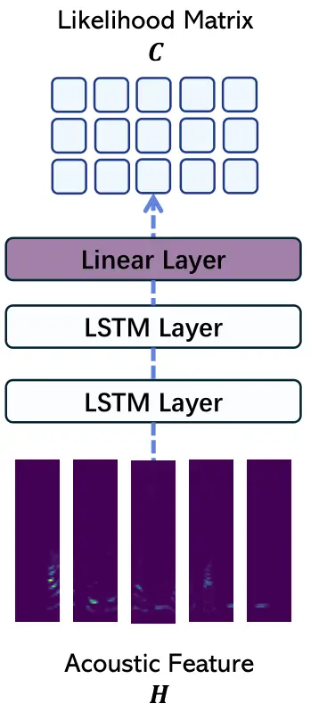
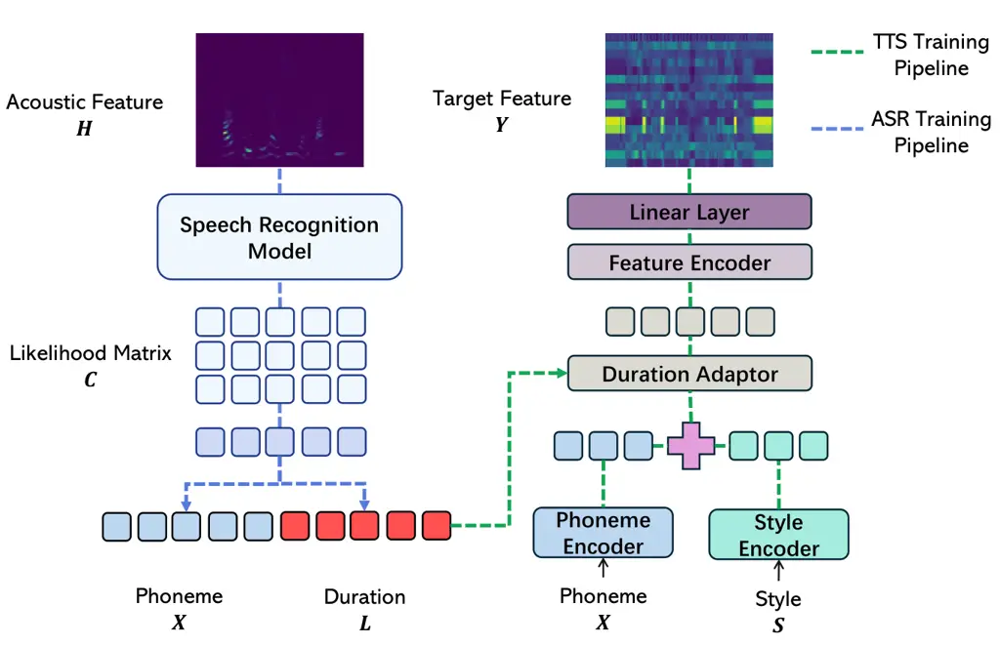
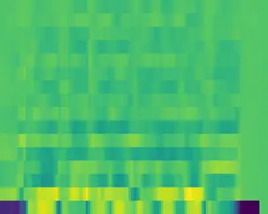
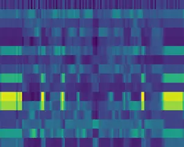

# Aligner-Guided Training Paradigm: Advancing Text-to-Speech Models with Aligner Guided Duration

1^(st) Haowei Lou Affiliation: UNSW Sydney  
Kensington, Australia  
0009-0009-1359-872X    2^(nd) Helen Paik Affiliation: UNSW Sydney  
Kensington, Australia  
0000-0003-4425-7388    3^(rd) Wen Hu Affiliation: UNSW Sydney  
Kensington, Australia  
0000-0002-4076-1811    4^(th) Lina Yao Affiliation: UNSW Sydney  
Kensington, Australia  
0000-0002-4149-839X

###### Abstract

Recent advancements in text-to-speech (TTS) systems, such as FastSpeech
and StyleSpeech, have significantly improved speech generation quality.
However, these models often rely on duration generated by external tools
like the Montreal Forced Aligner, which can be time-consuming and lack
flexibility. The importance of accurate duration is often
underestimated, despite their crucial role in achieving natural prosody
and intelligibility. To address these limitations, we propose a novel
Aligner-Guided Training Paradigm that prioritizes accurate duration
labelling by training an aligner before the TTS model. This approach
reduces dependence on external tools and enhances alignment accuracy. We
further explore the impact of different acoustic features, including
Mel-Spectrograms, MFCCs, and latent features, on TTS model performance.
Our experimental results show that aligner-guided duration labelling can
achieve up to a 16% improvement in word error rate and significantly
enhance phoneme and tone alignment. These findings highlight the
effectiveness of our approach in optimizing TTS systems for more natural
and intelligible speech generation.

###### Index Terms: 

Text-to-Speech, Speech Generation, Duration Alignment, Generative
Artificial Intelligence

## I Introduction

Text-to-speech (TTS) systems have seen significant advancements with the
development of state-of-the-art models such as FastSpeech \[1, 2\] and
StyleSpeech \[3\]. These models feature efficient architectures that
enable high-quality and natural-sounding speech generation. FastSpeech
uses a non-autoregressive approach to generate speech quickly, while
StyleSpeech incorporates style information to produce speech with
diverse prosodic variations. However, both models share a common
practice in their training paradigm: they rely on duration label to
align phonemes with their corresponding speech segments. These durations
are typically treated as ground truth and are generated using external
tools.

The Montreal Forced Aligner (MFA)\[4\] is a widely used tool for phoneme
alignment, designed to align phonemes with their corresponding segments
in speech using the Kaldi-ASR Toolkit \[5\]. It automates the alignment
process through a model based on Hidden Markov Models (HMMs) \[6\],
which efficiently processes phonetic transcriptions and audio recordings
to generate time-aligned phoneme boundaries. These boundaries provide
the duration labels that serve as the ground truth for training TTS
models, ensuring that phonemes are accurately synchronized with the
corresponding audio. The use of MFA has become a standard practice in
the field, as it offers a convenient and reliable method to produce
essential alignment data for TTS training.

Fig. 1: Phoneme Duration Alignment

The MFA approach has facilitated the training of TTS models. However, it
presents two significant limitations to the current TTS training
paradigm. First, the importance of accurate duration is often
underestimated, with much of the focus on improving model architecture
or other components. Precise duration alignment is crucial for achieving
natural prosody and intelligibility; inaccuracies in duration labelling
can negatively impact the quality of the generated speech. Second, the
use of MFA, which relies on HMM-based approaches, involves long training
times and lacks flexibility. This makes it less adaptable for rapidly
evolving TTS development environments.

To address these limitations, this work proposes a novel approach that
emphasizes the importance of duration in the training process. We
introduce an Aligner-Guided Training Paradigm, where an aligner is first
trained to generate accurate duration. These labels are then used to
guide the training of the TTS model, ensuring better alignment and more
natural speech generation. Our experimental results demonstrate that
this approach significantly improves the performance of TTS models,
achieving higher accuracy in phoneme and tone alignment and producing
more natural-sounding speech. By leveraging aligner-guided duration
labeling, our method provides a more efficient and flexible solution for
training state-of-the-art TTS models. The main contributions of this
work are:

1.  1.  We validate that duration plays a crucial role in TTS systems. Our
        results show that TTS models trained with accurate duration can
        achieve more than a 15% improvement in speech accuracy.
2.  2.  We propose a novel TTS training paradigm, called the Aligner-Guided
        Training Paradigm. It reduces reliance on external tools such as MFA
        and provides more reliable and accurate duration information.
3.  3.  We explore the impact of different acoustic features, including
        Mel-Spectrograms, MFCCs, and latent features, on the performance of
        TTS models. Our empirical results show that Mel-Spectrograms
        significantly enhance TTS training and offer the best performance
        among the features studied.

## II Method

In this section, we present the Aligner-Guided Training Paradigm in
detail. Given a speech signal $`A`$, a phoneme sequence $`X`$, and a
target representation $`Y`$ for the TTS model. We first encode the
speech signal into an acoustic feature $`H`$, such as a
Mel-Spectrogram (MelSpec), Mel-frequency cepstral coefficients (MFCC),
or a latent feature. Next, we train an Automatic Speech
Recognition (ASR) model to recognise $`X`$ based on $`H`$ and employ an
aligner module to calculate the duration $`L`$ for each phoneme in
$`X`$. Finally, the TTS model is trained using the phoneme sequence
$`X`$ and its corresponding duration $`L`$ to reconstruct the target
output $`Y`$. Figure 2(b) presents an overview of the proposed
Aligner-Guided Training Paradigm.

### II-A Automatic Speech Recognition

Assume we have a set of phonemes with a totally $`P`$ distinct phoneme,
and a speech signal $`A`$. We first encode $`A`$ into an acoustic
feature $`H\in\mathbb{R}^{N\times T}`$, where $`T`$ is the number of
frames in the acoustic feature and $`N`$ is the frame dimension. The
Automatic Speech Recognition (ASR) model takes $`H`$ as input and
generates a likelihood matrix,
$`C=\mathbf{ASR}(H)\in\mathbb{R}^{P\times T}`$, where each element
$`C_{i,j}`$ represents the likelihood of the $`j`$-th frame being
associated with the $`i`$-th phoneme.

We construct a simple deep learning-based model to implement the ASR
model. Figure 2(a) presents the architecture of the ASR model. It
contains two bidirectional Long-Short Term Memory (LSTM) layers followed
by a linear layer to capture temporal dependencies in the acoustic
feature and map the LSTM outputs to phoneme space to predict the
likelihood of each phoneme for every frame.

The proposed ASR model cannot be directly applied to perform speech
recognition tasks. The ASR model outputs a sequence of frame-level
probabilities, each corresponding to a particular time step in the input
signal. However, the phoneme sequence $`L`$ is typically much shorter,
as each phoneme can span multiple frames. The mismatch between the
output size $`T`$ and target size $`L`$ creates a significant challenge
in aligning the predicted phoneme probabilities with the actual phoneme
sequence. It leads to errors in recognizing and predicting the correct
phonemes.

We impose Connectionist Temporal Classification Loss (CTCLoss) \[7\] to
train our ASR model to address the issue of mismatch. It allows the
model to learn the most likely alignment between the input frames and
the target phoneme sequence without requiring explicit frame-level
labels. Specifically, CTCLoss considers all possible alignments of $`H`$
to the target phoneme sequence and then maximizes the probability
distribution of correct alignment over all possible alignments. The loss
function is formally defined as:

```math
\mathbf{CTCLoss}=-\mathbf{log}\sum_{\pi\in\mathbf{Align}(X,H)}\prod_{t=1}^{T}p(\pi_{t}|H_{t}) \tag{1}
```

where $`\pi`$ represents a possible alignment between the input sequence
$`H`$ and the target sequence $`X`$, $`\text{Align}(X,H)`$ is the set of
all valid alignments, and $`p(\pi_{t}\mid H_{t})`$ is the probability of
the $`t`$-th frame in the alignment $`\pi`$ being assigned to the
corresponding phoneme in $`X`$.

After training, the ASR model predicts a likelihood matrix
$`C\in\mathbb{R}^{(P+1)\times T}`$. The additional dimension corresponds
to the probability of a blank phoneme, which is typically removed in
standard speech recognition tasks. However, in our method, this blank
phoneme is preserved and plays a crucial role in the subsequent stages.



(a) ASR Model



(b) Aligner-Guided Training Paradigm.

Fig. 2: Architecture Diagram

### II-B Phoneme Duration Alignment

Once the ASR model is well-trained and we have the likelihood matrix
$`C`$. The next step is to determine the duration of each phoneme in the
sequence $`X`$. Specifically, we need to calculate a sequence of
duration $`L`$, where each duration $`L_{i}`$ is a non-negative integer
representing the time span of the $`i`$-th phoneme $`X_{i}`$. This
sequence must satisfy the conditions $`L_{i}\geq 0`$ and
$`T=\sum_{i=0}^{N-1}L_{i}`$, where $`T`$ is the total number of frames
in $`H`$.

To achieve this, we define a Phoneme Duration Alignment (PDA) algorithm.
The algorithm’s objective is to collapse consecutive frames
corresponding to the same phoneme and count their occurrences to
determine the duration of each phoneme. The first step in this process
involves applying a column-wise argmax function to the likelihood matrix
$`C`$. This operation produces a frame-level phoneme sequence, where
each entry corresponds to the phoneme with the highest probability for
that frame in the acoustic feature $`H`$.

Next, we iterate through the frame-level phoneme sequence. For each
phoneme in the sequence, we check if it is the same as the previous
phoneme or if it represents silence $`\epsilon`$. If the phoneme is the
same as the previous one or is a silence, we increase its duration by
one. If we encounter a different phoneme, we record the duration of the
previous phoneme and then reset the counter to start counting the
duration of the new phoneme. This process continues until we have found
the duration for each phoneme in the sequence. Figure 1 provides a
clearer and more intuitive illustration of the duration alignment
process.

### II-C Aligner Guided Training

The duration collected by the PDA algorithm are used to guide the
training process of the TTS model. During training, the TTS model is
provided with the phoneme sequence $`X`$, the corresponding
duration $`L`$, and the TTS feature
target $`Y\in\mathbb{R}^{M\times T}`$, where $`M`$ represents the
feature dimension and $`T`$ is the number of feature frames, which
corresponds to the number of frames in $`H`$. The target feature is
flexible. In this study, we follow the approach of RVAE \[8\]. We train
an autoencoder to encode speech into a latent feature and use the
trained decoder to reconstruct the speech. This speech-encoded latent
feature serves as the TTS feature target $`Y`$.

We use the StyleSpeech \[3\] model as the backbone to build our TTS
system. The StyleSpeech model provides a robust architecture that
integrates subtle tonal style change into the speech generation process.
It allows us to generate speech with diverse prosodic variations. In
this model, the phoneme sequence $`X`$ and the corresponding style
sequence $`S`$ are first encoded into vector embeddings. These phoneme
and style embeddings are then fused to produce the acoustic
embedding $`E`$ by combining them through element-wise addition:
$`E=\mathrm{embed}(X)+\mathrm{embed}(S)`$.

The sequence of acoustic embeddings $`E`$ is then passed through a
duration adapter. The duration adapter predicts the
duration $`L^{\prime}`$ for each acoustic embedding and duplicates each
embedding $`E_{i}`$ to match the predicted duration $`L^{\prime}_{i}`$.
This duration-adapted acoustic embedding is subsequently fed into a
feature encoder to generate the output $`H^{\prime}`$.

The TTS model is optimized using two loss functions: (1) Speech Loss,
which minimizes the difference between the generated output and the
target output using Mean-Square-Error (MSE), and (2) Duration Loss,
which minimizes the difference between the predicted
duration $`L^{\prime}`$ and the aligner-guided duration $`L`$ using
Mean-Absolute-Error (MAE).

```math
\mathrm{\textbf{TTSLoss}}=\mathrm{MSE}(H,H^{\prime})+\mathrm{MAE}(L,L^{\prime}) \tag{2}
```

After applying the loss optimization, and the TTS model is trained. The
generated features $`H^{\prime}`$ are passed through the trained decoder
and produce the final generated speech $`A^{\prime}`$.

|                              |                      |                        |                        |                      |                     |
| ---------------------------- | -------------------- | ---------------------- | ---------------------- | -------------------- | ------------------- |
| Model                        | WER ($`\downarrow`$) | WER-P ($`\downarrow`$) | WER-S ($`\downarrow`$) | MCD ($`\downarrow`$) | PESQ ($`\uparrow`$) |
| StyleSpeech (Origin)         | 0.361 $`\pm`$ 0.187  | 0.271 $`\pm`$ 0.180    | 0.226 $`\pm`$ 0.131    | 11.726 $`\pm`$ 3.761 | 1.057 $`\pm`$ 0.054 |
| With Duration Aligner        |                      |                        |                        |                      |                     |
| StyleSpeech (Latent Feature) | 0.276 $`\pm`$ 0.161  | 0.193 $`\pm`$ 0.155    | 0.162 $`\pm`$ 0.110    | 12.482 $`\pm`$ 3.995 | 1.060 $`\pm`$ 0.067 |
| StyleSpeech (MFCC)           | 0.219 $`\pm`$ 0.140  | 0.130 $`\pm`$ 0.122    | 0.146 $`\pm`$ 0.108    | 11.971 $`\pm`$ 3.891 | 1.055 $`\pm`$ 0.053 |
| StyleSpeech (MelSpecs)       | 0.199 $`\pm`$ 0.137  | 0.110 $`\pm`$ 0.117    | 0.131 $`\pm`$ 0.103    | 11.338 $`\pm`$ 3.845 | 1.068 $`\pm`$ 0.072 |

TABLE I: Evaluation Results of TTS systems. ($`\downarrow`$) indicates
that lower values are better, and ($`\uparrow`$) indicates that higher
values are better. The best-performing method for each metric within
each training strategy is highlighted in bold.

## III Experiments and Result Analysis

Dataset: We use the Baker dataset \[9\] to train and evaluate this
study. We select Chinese as our evaluation language due to its complex
phonetic and tonal structure. The Baker dataset contains approximately
12 hours of speech recorded using professional instruments at a
frequency of 48kHz. The dataset consists of 10k speech samples from a
female Mandarin speaker.

Experimental setup: The phoneme, style, and feature encoders each
consist of four Feed-Forward Transformer (FFT) blocks \[2\]. We set the
dimension of the target feature to 16. For optimization, we employ a
learning rate schedule with a warm-up strategy inspired by the
Transformer model \[10\]. To prevent overfitting, dropout rates are set
at 0.5 for the FFT blocks and 0.1 for the length adapter.

The experiment is conducted on an NVIDIA RTX A5000 GPU using a PyTorch
implementation. We select 4,000 sentences from the Baker dataset for
training and 1,000 sentences for testing. The batch size is set to 64,
and the model is trained for 600 epochs.

An ablation study on the training of acoustic features for the ASR model
is conducted to evaluate the impact of different types of acoustic
features on both the duration prediction and the overall performance of
the TTS model. We trained the ASR model using MelSpec, MFCC, and latent
features. The source code will be released upon acceptance of this
study.

Metrics: We employ Word Error Rate (WER), Mel Cepstral
Distortion (MCD) \[11\], and Perceptual Evaluation of Speech
Quality (PESQ) \[12\], to evaluate model’s performance. For WER, we
further evaluate the Phoneme-level WER (WER-P) and Style-level WER
(WER-S). We assess the accuracy of generated speech using WER by first
generating speech with the trained TTS model and then transcribing it
through OpenAI’s Whisper API \[13\].


(a) MelSpec



(b) MFCC



(c) Latent Feature

Fig. 3: Visualization of Acoustic Features

Result: Table I presents the results of our experiment. StyleSpeech
trained with aligner-guided duration shows significant improvements over
models using duration labelled by external tools like the MFA, as
provided in the Baker dataset. Specifically, it achieves approximately
9% improvement when using latent features, 14% with MFCCs, and 16% with
Mel-Spectrograms for overall WER. Additionally, for phoneme-level and
tone-level WER, the model trained with aligner-guided duration shows
significant improvements of around 15% and 9%, respectively.

In terms of the impact of different types of acoustic features, MelSpecs
yield the best performance, followed by MFCCs, with latent features
ranking third. All three types of acoustic features outperformed the use
of duration that comes with the dataset that is labelled using external
tools like MFA. The results indicate that the choice of acoustic
features significantly affects the quality of duration prediction and,
consequently, has a substantial impact on the overall performance of the
TTS model. Figure 3 provides a visualization of these different feature
types. MelSpec exhibits a more continuous representation with clear
boundaries between acoustic patterns, making it easier to detect and
accurately align underlying phonemes. In contrast, MFCCs and latent
features are more compact and abstract. MFCCs, being closer to the
acoustic space, still maintain a reasonable level of detail for accurate
alignment. Latent features, however, are more related to the latent
space, which can lead to less distinct phoneme boundaries. This
abstraction increases the likelihood of phoneme mismatches during
alignment, resulting in weaker performance compared to MelSpec and
MFCCs.

### III-A Analysis of predicted duration

| Phoneme | H   | AO  | H   | AO  | X   | UE  | X   | I   |
| ------- | --- | --- | --- | --- | --- | --- | --- | --- |
| Origin  | 4   | 8   | 3   | 5   | 4   | 7   | 5   | 11  |
| Latent  | 2   | 10  | 2   | 9   | 1   | 11  | 2   | 22  |
| MFCC    | 5   | 6   | 5   | 6   | 2   | 8   | 3   | 20  |
| MelSpec | 8   | 5   | 4   | 6   | 2   | 10  | 6   | 10  |

TABLE II: TTS Predicted Phoneme duration

Table II presents the predicted phoneme duration for a sequence of
phonemes (H, AO, H, AO, X, UE, X, I) using TTS models trained with
duration generated by aligners trained using different feature types,
Origin, Latent, MelSpec, and MFCC. Each row in the table represents the
duration predictions from one of these features. It highlights how the
choice of features impacts the alignment and timing of phonemes.

TTS model trained with Latent features shows a high variability. It
tends to predict a very short duration for the initial phoneme (e.g.,
’H’) and an extremely long duration for the final phoneme (e.g., ’I’),
as seen with values of 2 and 22, respectively. This suggests that Latent
features may have a tendency to underrepresent the temporal extent of
certain phonemes while overemphasizing others. It causes potentially
unnatural pacing in the generated speech. The higher variability and
extremities in duration predictions with Latent features may indicate
difficulties in accurately capturing and aligning the phoneme
boundaries.

MFCC feature shows moderate variability, with predicted duration ranging
from 2 to 20. While MFCCs provide reasonable accuracy in phoneme
duration prediction, the presence of outliers, such as the duration of
20 for the final phoneme, suggests occasional misalignment, which might
affect the naturalness of the generated speech. MelSpec feature results
in more balanced duration predictions across the phonemes, ranging from
2 to 10. This distribution suggests that MelSpec provides a better
representation of phoneme length. It facilitates more natural and
consistent speech output. The consistent duration predictions across
different phonemes indicate effective alignment, which likely
contributes to MelSpec’s superior performance in TTS models.

## IV Conclusion

In this study, we validate the significance of duration in TTS training
and propose an effective aligner-guided training paradigm. Our
experiments show that Mel-Spectrograms outperform other acoustic
features. These contributions provide valuable insights into optimizing
TTS systems for more natural and accurate speech generation.

## References

- \[1\] Yi Ren, Yangjun Ruan, Xu Tan, Tao Qin, Sheng Zhao, Zhou Zhao,
  and Tie-Yan Liu, “Fastspeech: Fast, robust and controllable text to
  speech,” Advances in neural information processing systems, vol.
  32, 2019.
- \[2\] Yi Ren, Chenxu Hu, Xu Tan, Tao Qin, Sheng Zhao, Zhou Zhao, and
  Tie-Yan Liu, “Fastspeech 2: Fast and high-quality end-to-end text to
  speech,” arXiv preprint arXiv:2006.04558, 2020.
- \[3\] Haowei Lou, Helen Paik, Wen Hu, and Lina Yao, “Stylespeech:
  Parameter-efficient fine tuning for pre-trained controllable
  text-to-speech,” 2024.
- \[4\] Michael McAuliffe, Michaela Socolof, Sarah Mihuc, Michael
  Wagner, and Morgan Sonderegger, “Montreal forced aligner: Trainable
  text-speech alignment using kaldi.,” in Interspeech, 2017, vol. 2017,
  pp. 498–502.
- \[5\] Daniel Povey, Arnab Ghoshal, Gilles Boulianne, Lukas Burget,
  Ondrej Glembek, Nagendra Goel, Mirko Hannemann, Petr Motlicek, Yanmin
  Qian, Petr Schwarz, Jan Silovsky, Georg Stemmer, and Karel Vesely,
  “The kaldi speech recognition toolkit,” in IEEE 2011 Workshop on
  Automatic Speech Recognition and Understanding. Dec. 2011, IEEE Signal
  Processing Society, IEEE Catalog No.: CFP11SRW-USB.
- \[6\] Lawrence Rabiner and Biinghwang Juang, “An introduction to
  hidden markov models,” ieee assp magazine, vol. 3, no. 1, pp.
  4–16, 1986.
- \[7\] Alex Graves, Santiago Fernández, Faustino Gomez, and Jürgen
  Schmidhuber, “Connectionist temporal classification: labelling
  unsegmented sequence data with recurrent neural networks,” in
  Proceedings of the 23rd international conference on Machine learning,
  2006, pp. 369–376.
- \[8\] Antoine Caillon and Philippe Esling, “Rave: A variational
  autoencoder for fast and high-quality neural audio synthesis,” arXiv
  preprint arXiv:2111.05011, 2021.
- \[9\] Databaker, “Chinese mandarin female corpus,”
  https://en.data-baker.com/datasets/freeDatasets/, 2020, Accessed:
  2023-04-20.
- \[10\] Ashish Vaswani, Noam Shazeer, Niki Parmar, Jakob Uszkoreit,
  Llion Jones, Aidan N Gomez, Łukasz Kaiser, and Illia Polosukhin,
  “Attention is all you need,” Advances in neural information processing
  systems, vol. 30, 2017.
- \[11\] Robert Kubichek, “Mel-cepstral distance measure for objective
  speech quality assessment,” in Proceedings of IEEE pacific rim
  conference on communications computers and signal processing. IEEE,
  1993, vol. 1, pp. 125–128.
- \[12\] Antony W Rix, John G Beerends, Michael P Hollier, and Andries P
  Hekstra, “Perceptual evaluation of speech quality (pesq)-a new method
  for speech quality assessment of telephone networks and codecs,” in
  2001 IEEE international conference on acoustics, speech, and signal
  processing. Proceedings (Cat. No. 01CH37221). IEEE, 2001, vol. 2, pp.
  749–752.
- \[13\] Alec Radford, Jong Wook Kim, Tao Xu, Greg Brockman, Christine
  McLeavey, and Ilya Sutskever, “Robust speech recognition via
  large-scale weak supervision,” in International Conference on Machine
  Learning. PMLR, 2023, pp. 28492–28518.
