# Multimodal Latent Language Modeling with Next-Token Diffusion

Yutao Sun      Hangbo Bao¹¹footnotemark: 1       Wenhui
Wang¹¹footnotemark: 1       Zhiliang Peng¹¹footnotemark: 1       Li
Dong¹¹footnotemark: 1 ^(†)^(†)thanks: ˜Core contributors.˜˜\$△\$ Tech
lead.˜˜\$⋄\$ Corresponding author. Affiliation:  Microsoft Research     
   Shaohan Huang   Jianyong Wang   Furu Wei^(⋄) Affiliation:  Microsoft
Research      Affiliation:  Tsinghua
University[https://aka.ms/GeneralAI](https://aka.ms/GeneralAI)

###### Abstract

Multimodal generative models require a unified approach to handle both
discrete data (e.g., text and code) and continuous data (e.g., image,
audio, video). In this work, we propose Latent Language Modeling
(LatentLM), which seamlessly integrates continuous and discrete data
using causal Transformers. Specifically, we employ a variational
autoencoder (VAE) to represent continuous data as latent vectors and
introduce next-token diffusion for autoregressive generation of these
vectors. Additionally, we develop $`\sigma`$-VAE to address the
challenges of variance collapse, which is crucial for autoregressive
modeling. Extensive experiments demonstrate the effectiveness of
LatentLM across various modalities. In image generation, LatentLM
surpasses Diffusion Transformers in both performance and scalability.
When integrated into multimodal large language models, LatentLM provides
a general-purpose interface that unifies multimodal generation and
understanding. Experimental results show that LatentLM achieves
favorable performance compared to Transfusion and vector quantized
models in the setting of scaling up training tokens. In text-to-speech
synthesis, LatentLM outperforms the state-of-the-art VALL-E 2 model in
speaker similarity and robustness, while requiring 10$`\times`$ fewer
decoding steps. The results establish LatentLM as a highly effective and
scalable approach to advance large multimodal models.

Figure 1: Latent Language Modeling (LatentLM) seamlessly handles
continuous (e.g., image, audio, video) and discrete (e.g., text and
code) data using causal Transformers. We introduce next-token diffusion
to autoregressively generate the latent vectors one by one. The proposed
method provides a general-purpose interface that unifies multimodal
generation and understanding.

## 1 Introduction

Multimodal generative models need a unified modeling method to process
both discrete data (e.g., text and code) and continuous data (e.g.,
video, audio, and robot actions). Most previous systems rely on building
pipelines or calling external tools. For example, language models
perceive and produce audio or image data using independent modules,
i.e., automatic speech recognition, text-to-speech, and text-to-image
models. However, it is difficult to perform end-to-end optimization for
pipeline-based methods. Information loss between modules also restricts
performance, as the modules typically use text prompts for
communication.

In order to natively handle discrete and continuous data in multimodal
large language models, there have been three main strands of research.
The first one \[56, 78, 69\] uses VQ-VAE \[75, 18\] to quantize
continuous data into discrete codes and treats everything as discrete
tokens in autoregressive language models. The continuous data are then
recovered by the VQ-VAE decoder by conditioning on discrete codes. The
performance is often limited by lossy tokenization, which creates a
restrictive bottleneck during quantization. The low compression ratio
also renders the length of discrete codes long. Given the success of
diffusion models on continuous data generation \[25, 53\], another
strand of work \[5, 74\] unifies the modeling of discrete data into
diffusion models. However, the unification compromises by following the
diffusion-based method, which harms the modeling performance of discrete
data. The third strand of research \[82\] shares model weights while
using sequence-level diffusion for continuous data and next-token
prediction for discrete data. Although sharing parameters, they have
different objectives (i.e., denoising for diffusion of continuous data
and next-token prediction for discrete data) and implementation details
(i.e., bidirectional attention for diffusion and causal attention for
next-token prediction). The bidirectional diffusion also restricts the
model’s applications to variable-length sequences. Moreover, the noise
added in diffusion training interferes with joint training of
interleaved data.

In this work, we propose latent language modeling (LatentLM), which
seamlessly supports continuous and discrete data with causal
Transformers in a unified manner. Specifically, we represent continuous
data as latent vectors using variational autoencoder (VAE). We introduce
next-token diffusion to autoregressively predict the latent vectors,
where diffusion heads produce latent vectors by conditioning on each
Transformer hidden state. Then the generated continuous data can be
recovered by the VAE decoder. For discrete data, the shared Transformer
backbone is used to perform next-token prediction with softmax heads.
Moreover, in order to make representations suitable for autoregressive
decoding, we propose $`\sigma`$-VAE to maintain the variance of the
latent space.

LatentLM unifies the generation of discrete and continuous tokens under
the language modeling paradigm, allowing information sharing among
different modalities. The proposed method simplifies implementation by
reusing the existing distributed training infrastructure of large
language models. Another advantage is that LatentLM unifies generation
and understanding with a general-purpose interface, which perceives and
produces any combination of multimodal data, e.g., text, image, audio,
video, and robot action data. Compared to quantizing continuous data,
LatentLM has a higher compression ratio while maintaining relatively
lossless reconstruction quality.

We conduct experiments on image generation, multimodal large language
models, and text-to-speech synthesis to show the flexibility and
effectiveness of LatentLM across modalities. First, image generation on
ImageNet \[15\] shows that LatentLM achieves competitive performance
with the models based on diffusion or discrete tokens. The results
demonstrate that LatentLM outperforms DiT \[51\] in the setting of
scaling model size. Second, we train multimodal large language models
with text, image-text pairs, and interleaved data. The results show that
LatentLM outperforms Transfusion \[82\] and the model with
vector-quantized image tokenizers, in terms of language modeling,
text-to-image generation, and vision-language understanding metrics. We
also scale up the number of training tokens and find that LatentLM has
favorable scaling properties. Third, experimental results on
text-to-speech synthesis show that LatentLM achieves better performance
than previous systems. Because our tokenizer uses continuous
representations, the compression ratio is much larger than previous
vector-quantized tokenizers, which improves both the training and
inference efficiency.

## 2 Latent Language Modeling

Figure 2: LatentLM unifies the modeling of continuous and discrete data.
We introduce $`\sigma`$-VAE (Section 2.3) to represent continuous data
as latent vectors. We perform next-token diffusion (Section 2.1) to
autoregressively predict the latent vectors one by one. The diffusion
head generates vectors by conditioning on the output states of
Transformer. The predicted vectors can be decoded to produce the final
outputs.

Latent language modeling (LatentLM) autoregressively perceives and
generates multimodal sequences (with discrete and continuous data) in a
unified way. As shown in Figure 2, the model is a causal Transformer,
where the $`t`$-th token is predicted by conditioning on previous
$`t-1`$ tokens. Continuous data are generated by next-token diffusion
(Section 2.1), where the diffusion head is used to produce continuous
vectors for each position. In addition, discrete tokens are generated by
next-token prediction, similar to conventional language modeling.

Specifically, let $`x=x_{1}\cdots x_{N}`$ denote an input sequence of
discrete and continuous tokens. For a discrete token, we use a lookup
table to get its vector representation. For continuous data, variational
autoencoder (VAE) \[35\] is used as tokenizer to compress input data to
latent vectors (Section 2.3). After obtaining the vector
representations, we pack the input vectors into
$`X^{0}=[{\bm{x}}_{1},\cdots,{\bm{x}}_{N}]\in\mathbb{R}^{N\times d}`$,
where $`d`$ represents the hidden dimension of the model. $`X^{0}`$ is
fed into a language model based on causal Transformer.

The language model is stacked with $`L`$ Transformer layers. Causal
masking is used for autoregressive generation. We also adopt
pre-RMSNorm \[81\] and SwiGLU \[64, 57\] as improvements after
LLaMA \[72\]. The input $`X^{0}`$ is further contextualized to obtain
the output $`X^{L}`$, i.e.,
$`X^{l}=\operatorname{Decoder}(X^{l-1}),\ l\in[1,L]`$. The output states
of Transformer
$`[{\bm{h}}_{1},\cdots,{\bm{h}}_{N}]=\mathrm{RMSNorm}(X^{L})`$ are used
to decode the predictions:

```math
\displaystyle\mathrm{Decode}({x}_{i}|{x}_{<i}) \displaystyle=\left\{\begin{array}[]{ll}\mathrm{Sample}\left(P_{d}({x}_{i}|{x}_{<i})\right)&\text{$x_{i}$ is a discrete token}\\
\mathrm{Diffusion}({\bm{h}}_{i})&\text{$x_{i}$ is a continuous vector}\end{array}\right. \tag{1}
```

```math
\displaystyle P_{d}({x}_{i}|{x}_{<i}) \displaystyle=\mathrm{softmax}({\bm{h}}_{i}W_{v})
```

where $`W_{v}\in\mathbb{R}^{d\times|\mathcal{V}|}`$ is the
$`\mathrm{softmax}`$ classifier weight, $`|\mathcal{V}|`$ is the
vocabulary size, and $`\mathrm{Sample}(\cdot)`$ is a sampling algorithm
(e.g., greedy decoding, and top-$`p`$ sampling). The
$`\mathrm{Diffusion}(\cdot)`$ head is described in Section 2.1, which
decodes continuous vectors by conditioning on the hidden state
$`{\bm{h}}_{i}`$. The latent vectors are generated autoregressively one
by one, i.e., next-token diffusion. Then the VAE decoder is used to
generate raw data from the predicted latent vectors.

### 2.1 Next-Token Diffusion

LatentLM autoregressively generates the continuous tokens. We use
diffusion as the language model head for each continuous token. The
diffusion head progressively refines and generates the latent vector
$`{\bm{x}}_{i}`$ by conditioning on the hidden state $`{\bm{h}}_{i}`$.
Then the predicted $`{\bm{x}}_{i}`$ is used as input for the next step
of Transformer.

In our experiments, we use either denoising diffusion probabilistic
model (DDPM) \[25\] or flow matching \[38\] as our design choice. We use
DDPM as an example to describe the details. Diffusion is formulated as
two processes, i.e., the forward process gradually adds noise to the
input, and the reverse process learns to denoise step by step.

##### Forward Process

Noise is introduced incrementally into the original vector in $`T`$
steps. Let $`{{\bm{x}}}_{i}^{0}={{\bm{x}}}_{i}`$ denote the original
data and $`{{\bm{x}}}_{i}^{t}`$ the noisy version, where
$`t=1,\cdots,T`$. The Markov noise-addition process is defined as
$`q({{\bm{x}}}_{i}^{t}|{{\bm{x}}}_{i}^{t-1})=\mathcal{N}({{\bm{x}}}_{i}^{t};\sqrt{1-{\beta}_{t}}{{\bm{x}}}_{i}^{t-1},\beta_{t}{\bm{I}})`$,
where Gaussian noise is injected in each step, $`\beta_{t}`$ follows a
predefined noise schedule, and $`{\bm{I}}`$ is the identity covariance
matrix. A nice property is that we can directly sample
$`{{\bm{x}}}_{i}^{t}`$ from the original data $`{{\bm{x}}}_{i}`$
through:

```math
{{\bm{x}}}_{i}^{t}=\sqrt{\overline{\alpha}_{t}}{{\bm{x}}}_{i}+\sqrt{1-\overline{\alpha}_{t}}\bm{\epsilon} \tag{2}
```

where $`\overline{\alpha}_{t}=\prod_{i=1}^{t}(1-\beta_{i})`$, and
$`\bm{\epsilon}\sim\mathcal{N}(0,{\bm{I}})`$.

##### Reverse Process

The diffusion head is trained to denoise the data step by step to
recover the original vectors, which is parameterized by a probabilistic
model
$`p_{\theta}({{\bm{x}}}_{i}^{t-1}|{{\bm{x}}}_{i}^{t},{\bm{h}}_{i})`$.
DDPM learns a model
$`\epsilon_{\theta}({{\bm{x}}}_{i}^{t},t,{\bm{h}}_{i})`$ to estimate the
noise $`\bm{\epsilon}`$ (as described in Equation (2)) of
$`{{\bm{x}}}_{i}^{t}`$ in the $`t`$-th step, conditioning on the
Transformer state $`{\bm{h}}_{i}`$. The model parameters are learned by
minimizing the following loss:

```math
\mathcal{L}_{\text{Diff}}({{\bm{x}}}_{i},{\bm{h}}_{i})=\mathbb{E}_{{\bm{x}}_{i},t,\bm{\epsilon}}\parallel\bm{\epsilon}-\bm{\epsilon}_{\theta}({{\bm{x}}}_{i}^{t},t,{\bm{h}}_{i})\parallel^{2} \tag{3}
```

where $`\bm{\epsilon}`$ is the actual Gaussian noise.

##### Head Architecture

We use a lightweight neural network as $`\bm{\epsilon}_{\theta}(\cdot)`$
in Equation (3), which is a residual architecture incorporating
pre-RMSNorm \[81\] and feedforward networks \[43\]. The network input is
a vector that contains noise. The output is the predicted noise
$`\bm{\epsilon}_{\theta}(\cdot)`$. We also utilize AdaLN-Zero \[51\]
which conditions on both the timestep $`t`$ and the Transformer output
$`{\bm{h}}_{i}`$. This head processes a noised continuous vector and
predicts the corresponding noise.

##### Inference

The Transformer state $`{\bm{h}}_{i}`$ is used as the condition for
diffusion head. The diffusion process iteratively denoises data. At
first, a vector of pure Gaussian noise $`{\bm{x}}_{T}`$ is given. In
each step, the predicted noise
$`\bm{\epsilon}_{\theta}({{\bm{x}}}_{i}^{t},t,{\bm{h}}_{i})`$ is used to
produce $`{\bm{x}}_{t-1}`$ from $`{\bm{x}}_{t}`$, which also considers
the noise schedule for scaling \[25\]. In our experiments, we utilize
DPM-Solver \[45, 46\] to accelerate the denoising process, significantly
reducing the number of inference steps compared to the training phase.

### 2.2 Model Training and Inference

##### Training

During training, we compute the token-level loss for training sequences.
For discrete data, we use the standard language modeling objective to
maximize the likelihood of data. Specifically, the loss is computed as
$`\mathcal{L}_{\text{LM}}=-\sum_{x,i}{\log P_{d}({x}_{i}|{x}_{<i})}`$,
where the prediction probability is presented in Equation (1). For
continuous data, the loss function $`\mathcal{L}_{\text{Diff}}`$
described in Equation (3) is used. The training objective is to minimize
$`{\mathcal{L}_{\text{LM}}+\alpha\mathcal{L}_{\text{Diff}}}`$, where
$`\alpha`$ is a hyperparameter. In practice, we sample multiple
diffusion timesteps, typically four, for a single forward pass \[43\].
As the diffusion head is usually lightweight, reusing the computation of
the Transformer backbone improves training efficiency while introducing
minimal overhead.

##### Inference

The decoding process is similar to that of standard causal Transformers,
i.e., predicting the next token based on the generation history that has
come before it. The tokens are produced following Equation (1). Notice
that the Transformer backbone is computed in a single pass, and only the
lightweight diffusion head requires multiple denoising steps. In
addition, we use special tokens to indicate the switch between the
language modeling head and the diffusion head. For instance, we use
\<BOD\> to denote the beginning of the diffusion head usage, and \<EOD\>
to indicate the switch back to the language modeling head.

### 2.3 Latent Vector Representation of Continuous Data

Figure 3: Compared to variational autoencoder (VAE), $`\sigma`$-VAE uses
a fixed variance for the latent space. It avoids variance collapse and
makes LatentLM more robust to exposure bias during autoregressive
generation. In our method, $`\sigma`$ is a scalar that is sampled from
$`\mathcal{N}(0,C_{\sigma})`$ for each example.

The tokenizer compresses continuous data into latent vectors. It is
based on variational autoencoder (VAE) \[35\], which encodes the input
data into a latent space and then decodes it back to the original space.
Let $`x`$ denote the continuous input and $`z`$ the compressed vector
representations. VAEs maximize the evidence lower bound of
log-likelihood $`\log p(x)`$ via:

```math
\mathrm{maximize}~~\mathbb{E}_{q_{\phi}(z|x)}\left[\log p_{\psi}(x|z)\right]-\mathcal{D}_{\text{KL}}\left[q_{\phi}(z|x)\parallel p(z)\right] \tag{4}
```

where the encoder $`q_{\phi}(z|x)`$ encodes input $`x`$ to latent
vectors $`z`$, the decoder $`p_{\psi}(x|z)`$ reconstructs data by
conditioning on $`z`$, and the KL term encourages that the latent space
follows a Gaussian prior distribution.

Because autoregressive generation introduces sampling uncertainty, the
representation variance of the latent space affects the performance of
next-token diffusion. Larger variance of latent representation makes the
model more robust to exposure bias during inference \[70\], as confirmed
in Figure 6. However, for vanilla VAEs, the variance of some channels
tends to collapse, which harms autoregressive modeling.

In this work, we propose $`\sigma`$-VAE to prevent variance collapse by
enforcing a fixed variance in the latent space. The reconstruction pass
is computed as:

```math
\displaystyle\mu \displaystyle=\mathrm{Encoder}_{\phi}(x) \tag{5}
```

```math
\displaystyle z \displaystyle=\mu+\sigma\odot\bm{\epsilon},\text{where}~\bm{\epsilon}\sim\mathcal{N}(0,1),~\sigma\sim\mathcal{N}(0,C_{\sigma})
```

```math
\displaystyle\hat{x} \displaystyle=\mathrm{Decoder}_{\psi}(z)
```

where $`\sigma`$ is a scalar, $`C_{\sigma}`$ is a hyperparameter,
$`\mathrm{Encoder}_{\phi}(\cdot)`$ and
$`\mathrm{Decoder}_{\psi}(\cdot)`$ are learnable models. The input $`x`$
is fed into the encoder to obtain $`\mu`$. The re-parameterization trick
is used to make $`z`$ follow the Gaussian distribution. The variance
$`\sigma`$ is fixed across channels, and is sampled from
$`\mathcal{N}(0,C_{\sigma})`$ for each example. It allows us to
manipulate the latent space to better align with the expectation of
autoregressive models. Then $`z`$ is fed into the decoder for
reconstruction. According to Equation (4), the training objective of
$`\sigma`$-VAE is:

```math
\mathrm{minimize}~~\left\|\hat{x}-x\right\|_{2}^{2}+\beta\left\|\mu\right\|_{2}^{2} \tag{6}
```

where the first term is the reconstruction error, and the hyperparameter
$`\beta`$ controls the trade-off between reconstruction quality and
adherence to the prior distribution \[26\].

## 3 Experiments

We evaluate LatentLM through multiple dimensions to thoroughly assess
its effectiveness and scalability. We conduct experiments on various
types of tasks and modalities as follows:

- •
  Section 3.1: Image Generation¹¹ 1  The code and pretrained weights are
  available at
  [https://aka.ms/next-token-diffusion](https://aka.ms/next-token-diffusion).
  - –
    Category $`\rightarrow`$ Image

- •
  Section 3.2: Multimodal Large Language Models
  - –
    1\) Interleaved Image-Text Data; 2) Text $`\rightarrow`$ Image; 3)
    Image $`\rightarrow`$ Text; 4) Text

- •
  Section 3.3: Text-to-Speech Synthesis
  - –
    Speech Prompt + Text $`\rightarrow`$ Speech

### 3.1 Image Generation: Scalable Autoregressive Modeling

The image generation experiments are conducted on ImageNet \[15\]. Given
a category, the goal is to generate the corresponding images. First, we
systematically benchmark our model against state-of-the-art baselines to
demonstrate the advantages of next-token diffusion. We also investigate
the scalability of our approach by evaluating it with larger model sizes
and higher resolutions. Furthermore, we compare the design choices of
$`\sigma`$-VAE tokenizers. Finally, we assess the inference efficiency
to highlight the practical deployment benefits of our method.

#### 3.1.1 System Evaluation

|                               |                        |          |          |                   |                |
| ----------------------------- | ---------------------- | -------- | -------- | ----------------- | -------------- |
| Type                          | Model                  | \#Params | \#Epochs | FID$`\downarrow`$ | IS$`\uparrow`$ |
| Non-Causal-Masking Generation |                        |          |          |                   |                |
| Diffusion                     | LDM-4 \[53\]           | 400M     | —        | 3.60              | 247.7          |
|                               | DiT-XL/2 \[51\]        | 675M     | 400      | 2.27              | 278.2          |
|                               | U-ViT-H/2 \[4\]        | 501M     | 400      | 2.29              | 263.9          |
| Masked Generative             | MaskGIT \[13\]         | 227M     | 300      | 4.02              | 355.6          |
|                               | MAR-L \[43\]           | 479M     | 800      | 1.78              | 296.0          |
| Causal-Masking Generation     |                        |          |          |                   |                |
| Causal-Discrete               | VQGAN \[18\]           | 1.4B     | 240      | 5.20              | 280.3          |
|                               | ViT-VQGAN \[79\]       | 1.7B     | 240      | 3.04              | 227.4          |
|                               | LlamaGen-XL \[66\]     | 775M     | 300      | 2.62              | 244.1          |
|                               | LlamaGen-XXL \[66\]    | 1.4B     | 300      | 2.34              | 253.9          |
| Causal-Continuous             | GIVT-Causal-L+A \[70\] | 1.67B    | 500      | 2.59              | —              |
|                               | LatentLM-L (This Work) | 479M     | 400      | 2.24              | 253.8          |

Table 1: Image generation results on ImageNet \[15\]. We evaluate
FID \[27\] and IS \[62\]. LatentLM achieves competitive performance,
especially compared with other causal-masking image generation models.

##### Setup

We scale up model size and number of training steps. We set the
Transformer’s hidden size to $`1024`$ and the number of layers to
$`32`$. The intermediate dimension of feedforward networks is $`2730`$.
The diffusion head has six layers. We use the AdamW \[39\] optimizer
with $`\beta=(0.9,0.98)`$. We use a cosine learning rate schedule with
the maximal value of 5e-4 and 100 warmup steps. The weight decay is set
to $`0.1`$. We train models with 250,000 steps with batch size of 2048.
The number of training epochs is about $`400`$. Classifier-free
guidance \[28\] is set to $`1.65`$. As shown in Table 1, the model
configurations have been aligned with those of previous models to ensure
fair comparisons.

Table 1 presents a comprehensive comparison between LatentLM and various
image generation methods. These methods can be categorized into two main
groups: (1) non-causal-masking models, including image-level diffusion
models (LDM \[53\], DiT \[51\], U-ViT \[4\]) and masked generative
models (MaskGIT \[13\], MAR \[43\]); and (2) causal-masking models,
comprising discrete-token generation approaches (VQGAN \[18\],
ViT-VQGAN \[79\], LlamaGen \[66\]) and continuous autoregressive
generation methods (GIVT-Causal \[70\]).

##### Results

Table 1 shows that LatentLM achieves competitive performance compared to
previous work. Notice that non-causal-masking models typically require
iterative forward computation during inference. Consequently, the
inference FLOPs of non-causal-masking models tend to be larger due to
multiple forward passes. Moreover, models using continuous
representations typically outperform those using discrete code, even
though LatentLM-L has fewer parameters. Among the methods, MAR \[43\]
and GIVT \[70\] are the most relevant. In comparison, MAR uses a
bidirectional Transformer to implement masked autoregressive modeling,
instead of causal Transformer, which renders MAR unable to reuse
key-value caches for multiple forward passes. Furthermore, unifying MAR
and language modeling in multimodal models remains challenging due to
their distinct modeling approaches. In contrast, Section 3.2 shows that
our approach can be naturally applied to multimodal large language
models. In addition, GIVT directly predicts latent vectors of VAEs with
Gaussian mixture models. The main difference is that LatentLM integrates
diffusion into causal Transformers, which tends to offer more powerful
modeling expressivity. The results also indicate that our approach
outperforms GIVT with a smaller model size and fewer training epochs.

#### 3.1.2 Scalability

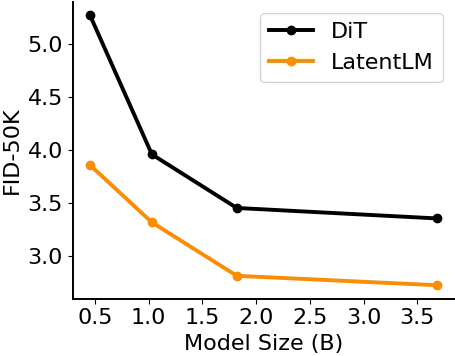

Figure 4: Scaling curves of DiT and LatentLM. FID \[27\] consistently
becomes better with larger model size.

We compare the scalability properties of Diffusion Transformer
(DiT) \[51\] and LatentLM, in terms of model size, and image resolution.

##### Setup

In order to be consistent with LatentLM, we also augment DiT with
RMSNorm \[81\] and SwiGLU \[57, 64\]. All models were trained with
75,000 steps, i.e., approximately $`120`$ epochs, for scaling
experiments. Classifier-free guidance \[28\] is set to $`1.75`$ during
inference. Detailed hyperparameters are presented in Appendix A.

##### Scaling Model Size

As shown in Figure 4, we trained models of varying sizes, i.e., 455M,
1.03B, 1.82B, 3.68B. LatentLM consistently outperforms DiT models. The
results demonstrate our approach’s effective scaling properties in terms
of model size.


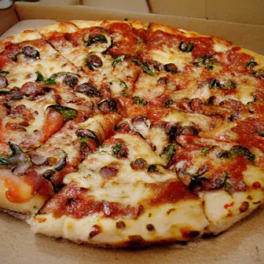

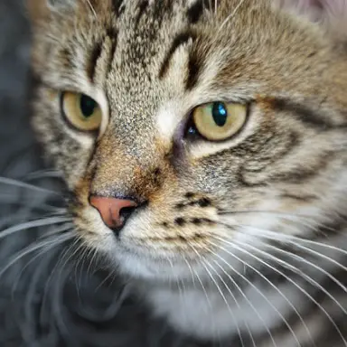


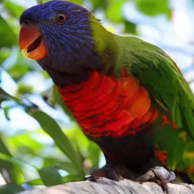


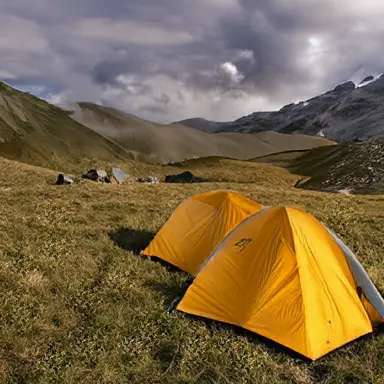

Figure 5: Samples of LatentLM trained on ImageNet. The resolution is
384$`\times`$384. The image is generated by models described in
Section 3.1.2.

|                   |                       |
| ----------------- | --------------------- |
| Resolution        | FID-50k$`\downarrow`$ |
| $`256\times 256`$ | 3.19                  |
| $`384\times 384`$ | 2.51                  |

Table 2: FID \[27\] of scaling up image resolution.

##### Scaling Resolution

As shown in Table 2, we conduct experiments at a resolution of 384,
training a 1.82B model for 100,000 steps. The results reveal significant
improvements over the 256-pixel resolution when using classifier-free
guidance \[28\]. The improvement stems from the richer details and
additional information captured in the tokenizer with higher
resolutions. Moreover, increasing resolution leads to longer sequences,
which scales the decoding computation up.

#### 3.1.3 Effects of Tokenizer

As shown in Figure 6, we analyze the effects of $`\sigma`$-VAE
tokenizers with various configurations. We evaluate their performance in
both the DiT and LatentLM frameworks. Specifically, we train the
$`\sigma`$-VAE tokenizers with different variance. To simplify the
analysis, we use fixed variance values $`\sigma`$, rather than sampling
them from $`\mathcal{N}(0,C_{\sigma})`$.

##### Setup

We train $`\sigma`$-VAE with perceptual loss \[80, 30\] and GAN
loss \[29\], following \[53, 18\]. We initialize the encoder from the
base-size BEiT-3 \[77\] checkpoint, and append a randomly initialized
decoder. Both encoder and decoder have 12 Transformer layers, totaling
172 million parameters. The image patch size is 16. We train tokenizers
on the ImageNet training set \[15\] with 200 epochs. The batch size is 256. The optimizer is AdamW \[39\] with $`\beta=(0.0,0.99)`$ and a
learning rate of 3e-4. The weight decay is set to 0.01. We apply
layer-wise learning rate decay \[3\] of 0.65 on the encoder. For DiT and
LatentLM training, we follow the training recipes of \[51\]. More
training details are presented in Appendix B.

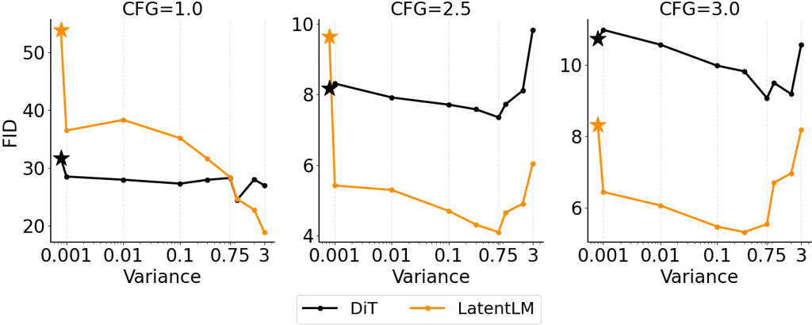

Figure 6: Image generation results of Diffusion Transformer (DiT) \[51\]
and LatentLM on ImageNet. We report FID \[27\] scores (lower is better)
in the settings of different tokenizer variance and CFG \[28\] scale.
The “stars” represent the tokenizers tuned for previous image-level
diffusion models \[53\], which are ineffective for LatentLM. The results
indicate that LatentLM favors tokenizers with larger variances.

Figure 6 presents the FID-50K scores of DiT and LatentLM using
tokenizers with different variance. The “stars” in the figure represent
tokenizers that were tuned for previous latent diffusion models \[53\],
which usually have a small variance, i.e., being more like an
autoencoder instead of VAE. The other “dots” are $`\sigma`$-VAE with
fixed variance. We summarize the findings as follows:

The tokenizers tuned for previous image-level diffusion models are
ineffective for LatentLM. For LatentLM, the “stars” (in Figure 6)
perform significantly worse than the others that have larger tokenizer
variances. The results indicate that directly adopting tokenizer
configurations from previous diffusion models is suboptimal for
LatentLM. The tokenizers with small variances are not robust to
autoregressive error \[70\].

LatentLM favors tokenizers with larger variances. For the example
without classifier-free guidance (i.e., CFG=1.0 in Figure 6), LatentLM
improves monotonically with increased variance. In contrast, the choice
of variance is not critical for DiT models. The analysis highlights the
advantage of $`\sigma`$-VAE, whose variance is easily controllable. So
we recommend to use re-trained $`\sigma`$-VAE as tokenizers for
LatentLM, rather than directly using previous ones.

#### 3.1.4 Inference Efficiency

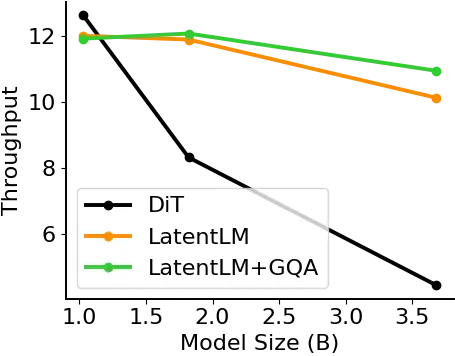

(a) Throughput with increasing model sizes.

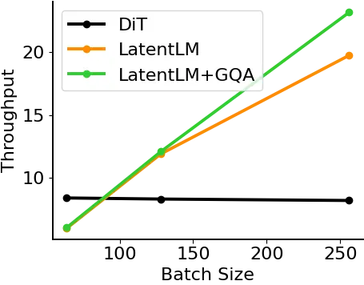

(b) Throughput with increasing batch sizes.

Figure 7: We compare the inference throughput of Diffusion Transformer
(DiT) \[51\] and LatentLM in the settings of different model size and
batch size. “GQA” stands for group-query attention \[2\].

As shown in Figure 7, we investigate the inference capabilities of
LatentLM by examining the effects of model size and batch size. We
perform efficiency comparisons using 20 diffusion inference steps on a
single H100 GPU.

First, we evaluate models ranging from 1B to 3.8B parameters with a
fixed batch size of 128. Figure 7(a) shows that DiT’s throughput
decreases significantly with larger model size. Because DiT has to
iteratively perform multiple forward passes, it incurs higher
computational costs. For the largest model with 3.8B parameters,
LatentLM achieves a 2.47$`\times`$ increase in throughput, demonstrating
its scalability advantages.

As presented in Figure 7(b), we then assess the 1.82B models with
varying batch sizes. As the batch size increases, the throughput of
LatentLM scales favorably with DiT. In addition, group-query attention
(GQA) \[2\] further improves throughput. For a batch size of 256, our
approach achieves a 2.84$`\times`$ throughput improvement. The results
indicate that LatentLM benefits from significantly reduced FLOPs
compared to image-level diffusion models, particularly at larger batch
sizes. Additional experiments on other model sizes are provided in
Appendix C.

### 3.2 Multimodal LLMs: Unified Understanding and Generation

We train multimodal large language models with LatentLM for unified
understanding and generation. In this section, we focus on
vision-language models. By unifying next-token prediction and diffusion,
the model can seamlessly handle interleaved image-text data, text-only
data, and image-text pairs. The proposed method simplifies the
multimodal training and inference processes, allowing to learn in
context (e.g., few-shot), follow multimodal instructions, and perform
multimodal dialogue. Moreover, unified modeling enables new
capabilities. For example, we can edit or generate images by
conditioning on text and multiple input images.

#### 3.2.1 Training Setup

##### Training Data

We use three types of data in the training stage: text-only data,
image-text pair data, and interleaved text-image data. The mix-up ratio
is 2:1:1. The data sources are described as follows:

- •
  Text-Only Data The text training corpus follows \[61\], including
  Common Crawl, RefinedWeb \[49\], and StarCoder \[37\].
- •
  Image-Text Pairs We follow \[24, 50\] to construct the paired data,
  i.e., English LAION-2B \[58\], LAION-400M \[67\], COYO-700M \[6\], and
  Conceptual Captions \[60, 11\].
- •
  Interleaved Image-Text Data We use the same interleaved multimodal
  documents as in \[24, 50\]. The web pages are filtered from Common
  Crawl archives. The documents are interleaved with text and image.

##### Configuration

We train a 1.3B-size Transformer as the backbone. We set the hidden size
to 2048. The number of layers is 24. The training sequence length is 4096. We use tiktoken-cl100k_base as the text tokenizer. The batch size
is 4M tokens. We use the AdamW \[39\] optimizer with
$`\beta=(0.9,0.98)`$. The maximal learning rate is 3e-4 with 500 warmup
steps. The total schedule is set to 1T tokens. We train the model with
50k steps (i.e., 200B tokens) for comparison. More hyperparameters are
detailed in Appendix D.

#### 3.2.2 Results

We compare LatentLM with Transfusion \[82\], and vector quantized models
(VQ-MLLM; i.e., the models using vector quantized image tokenizers).
Specifically, Transfusion shares Transformer weights for autoregressive
language modeling and image-level diffusion, which uses bidirectional
iterative denoising for images and causal masking for text. Moreover,
VQ-MLLM uses VQ-VAE \[75, 18\] as the tokenizer for images, where images
are compressed to discrete code. We use the VQ-VAE tokenizer
open-sourced by LlamaGen \[66\] in VQ-MLLM. We use the same training
configuration and tokenizer settings for comparison. To align the number
of parameters, we use a 6-layer ViT as the image head of Transfusion.

|             |                         |                   |                  |                     |                   |
| ----------- | ----------------------- | ----------------- | ---------------- | ------------------- | ----------------- |
| Model       | Text                    | Text-to-Image     |                  | Image-to-Text       |                   |
|             | Valid PPL$`\downarrow`$ | FID$`\downarrow`$ | CLIP$`\uparrow`$ | MS-COCO$`\uparrow`$ | VQAv2$`\uparrow`$ |
| VQ-MLLM     | 2.79                    | 16.92             | 29.33            | 37.4                | 30.19             |
| Transfusion | 2.74                    | 16.10             | 28.66            | 43.4                | 35.36             |
| LatentLM    | 2.73                    | 14.54             | 28.75            | 54.5                | 38.72             |

Table 3: Results of multimodal large language models on text language
modeling, image-to-text, and text-to-image generation. We compare with
Transfusion \[82\] and vector quantized models (VQ-MLLM; i.e., using
discrete code to represent images). “PPL” is perplexity. CLIP \[54\]
score measures the similarity. We report CIDEr \[76\] score for
MS-COCO \[40\] and accuracy for VQAv2 \[21\].

##### Language Modeling

Table 3 presents the evaluation results on language modeling,
text-to-image generation, and multimodal understanding. First, LatentLM
achieves a better perplexity in language modeling. The results indicate
that our method tends to better share knowledge between modalities with
less conflicts. The similarity between next-token prediction and
next-token diffusion also benefits the unified modeling.

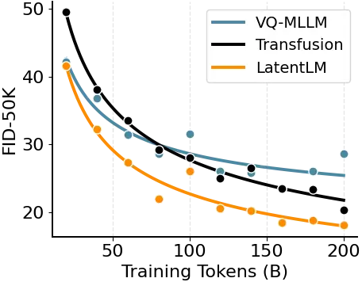

(a) Text-to-image FID \[27\].

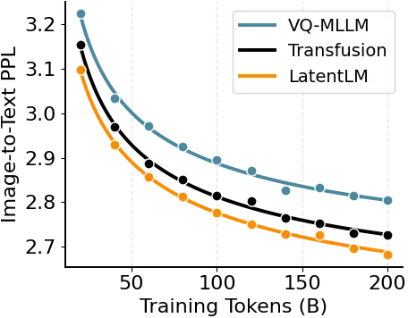

(b) Image-to-text validation perplexity.

Figure 8: We scale up the number of training tokens for multimodal large
language models. LatentLM outperforms vector quantized models (VQ-MLLM)
and Transfusion \[82\] for both text-to-image and image-to-text
generation. The FID scores are evaluated on MS-COCO \[40\].


(c) A majestic mountain range covered in snow.


(d) A city street illuminated by lights.


(e) A crystal lake surrounded by autumn trees.


(f) A small house in a wooden at sunset.

Figure 9: Text-to-image examples of LatentLM.

##### Text-to-Image Generation

Then we evaluate text-to-image generation on MS-COCO \[41\]. Table 3
shows that LatentLM achieves lower FID scores, i.e., better generation
quality. The trend is also consistent with Table 1, where Transfusion is
aligned with DiT, and VQ-MLLM with LlamaGen. In addition, Figure 8(a)
presents the scaling curves in terms of the number of training tokens,
where LatentLM consistently achieves better FID scores. It is worth
noting that the performance of VQ-MLLM seems saturated compared to the
other methods. Figure 9 also shows several text-to-image samples of
LatentLM.

##### Image-to-Text Generation

Table 3 reports image captioning on MS-COCO \[41\] and visual question
answering on VQAv2 \[21\]. LatentLM achieves better performance in both
multimodal understanding tasks. Compared to VQ-MLLM, the continuous
representations used by Transfusion and LatentLM are more lossless than
discrete code. Compared to Transfusion, LatentLM keeps training and
inference consistent, rather than adding noise to input images during
training. Figure 8(b) presents the text perplexity on the image-to-text
validation data. The results are also consistent with those reported in
Table 3.

### 3.3 Text-to-Speech Synthesis: Higher Compression Ratio, Fewer Decoding Steps

We apply LatentLM to text-to-speech synthesis (TTS). Due to continuous
representations, $`\sigma`$-VAE achieves superior reconstruction results
with a significantly higher compression ratio and lower frame rate than
previous speech tokenizers \[14, 34, 59, 31, 17\]. LatentLM outperforms
the state-of-the-art VALL-E 2 \[10\] model on both speaker similarity
score and robustness while requiring 10$`\times`$ fewer decoding steps.

#### 3.3.1 Training Setup

Considering the variable-length nature of speech data, our speech
tokenizer employs a convolutional architecture that supports streaming
encoding and decoding. Specifically, $`\sigma`$-VAE for speech consists
of a convolutional encoder, a continuous VAE quantizer, and a
convolutional decoder. The encoder comprises multiple stages and
downsampling layers organized in a hierarchical structure. Each stage
includes several ConvNeXt blocks \[42\], where the original 2D
convolution is replaced with 1D causal convolution. For compression
ratios of 1600, 3200, and 6400, the downsampling layer reduces the input
waveform by factors of \[2, 4, 5, 5, 8\], \[4, 4, 5, 5, 8\], and \[4, 5,
5, 8, 8\], respectively. Each time the downsampling layer is applied,
the number of channels doubles, starting from 32 and increasing to 1024.
The encoder contains around 120 million parameters in total. The decoder
is a mirror of the encoder. As for the discriminator, we use the
multi-period discriminator \[32\] and the complex STFT discriminator in
DAC \[34\].

The hidden size of LatentLM is 1024, with 24 layers and 16 attention
heads. The intermediate FFN dimension is set to 4096. The diffusion head
contains three layers of feedforward networks. We use the same
Transformer architecture as VALL-E 2 \[10\] for comparison. Additional
hyperparameters are described in Appendix E.

#### 3.3.2 Training Data

##### Tokenizer

We train $`\sigma`$-VAE on a large and diverse corpus that includes
speech, audio, and music. For speech, we use the clean speech subset
from DNS Challenge 4 \[16\] and all splits from the Common Voice v7
dataset \[1\]. For audio, we use the FSD50K dataset \[19\], along with
the balanced and unbalanced splits from AudioSet \[20\]. For music, we
use the MUSDB dataset \[55\] and the Jamendo dataset \[7\]. All the data
are resampled to 24kHz monophonic format.

##### TTS Model

We utilize Libriheavy corpus \[36\] as training data following VALL-E
2 \[10\]. This corpus is a labeled version of the Librilight
corpus \[33\], which features 50,000 hours of speech from approximately
7,000 different speakers, sourced from open-access English audiobooks
associated with the LibriVox project²² 2
[https://librivox.org](https://librivox.org).

#### 3.3.3 Evaluation Metrics

We evaluate our speech tokenizer using several automatic metrics,
including: Mel Distance, which measures the distance between log Mel
spectrograms as configured in DAC \[34\]; PESQ-WB \[52\], an intrusive
metric for speech quality by comparing perceptual differences;
STOI \[71\], which assesses speech intelligibility through short-time
segment correlation; VISQOL \[9\], a perceptual quality metric based on
spectral similarity; UTMOS \[68\], a reference-free mean opinion score
for audio quality; Speaker Similarity (SIM), measured using
WavLM-TDNN \[12\]; and Word Error Rate (WER), calculated using both
Conformer-Transducer \[22\] (WER-C) and HuBERT-Large \[23\] (WER-H)
models.

#### 3.3.4 System Evaluation

|                 |                                    |     |                         |                     |                     |     |                     |                     |                     |
| --------------- | ---------------------------------- | --- | ----------------------- | ------------------- | ------------------- | --- | ------------------- | ------------------- | ------------------- |
| System          | Frame Rate Length/s $`\downarrow`$ |     | Ref Utterance as Prompt |                     |                     |     | 3s Prefix as Prompt |                     |                     |
|                 |                                    |     | SIM$`\uparrow`$         | WER-C$`\downarrow`$ | WER-H$`\downarrow`$ |     | SIM$`\uparrow`$     | WER-C$`\downarrow`$ | WER-H$`\downarrow`$ |
| Ground Truth    | \-                                 |     | 0.779                   | 1.6                 | 2.2                 |     | 0.668               | 1.6                 | 2.2                 |
| VALL-E 2 \[10\] | 75                                 |     | 0.643                   | 1.5                 | 2.4                 |     | 0.504               | 1.6                 | 2.3                 |
| Voicebox \[44\] | 100                                |     | 0.662                   | \-                  | 1.9                 |     | 0.593               | \-                  | 2.0                 |
| MELLE \[48\]    | 62                                 |     | 0.625                   | 1.5                 | 2.1                 |     | 0.508               | 1.5                 | 2.0                 |
| LatentLM        | 15                                 |     | 0.697                   | 1.2                 | 1.8                 |     | 0.571               | 1.4                 | 2.0                 |
| LatentLM        | 7.5                                |     | 0.656                   | 1.2                 | 1.7                 |     | 0.532               | 1.6                 | 2.3                 |
| LatentLM        | 3.75                               |     | 0.598                   | 1.7                 | 2.3                 |     | 0.467               | 3.1                 | 4.5                 |

Table 4: LatentLM outperforms previous systems on zero-shot speech
synthesis in both settings. Moreover, the number of decoding steps is
much less than others, achieving faster inference speed. The results are
reported on LibriSpeech test-clean set. The WER-H and SIM results of
VALL-E 2 using 3s prefix as prompt are from \[48\].

Table 4 presents zero-shot text-to-speech (TTS) results on the
LibriSpeech test-clean dataset. We evaluate the synthesis quality under
two distinct settings: (1) using a reference utterance from the same
speaker as the prompt, and (2) evaluating speech continuation by using
the first 3 seconds of speech as the prompt.

Our model, operating at a frame rate of 15 (i.e., generating 1 second of
speech in 15 autoregressive steps), surpasses previous state-of-the-art
methods when using a same-speaker reference utterance as the prompt.
LatentLM with a frame rate of 7.5 achieves superior performance compared
to the neural codec language model VALL-E 2 \[10\], while requiring an
order of magnitude ($`10\times`$) fewer autoregressive inference steps.
Moreover, LatentLM eliminates the need for the non-autoregressive (NAR)
model employed in VALL-E 2, resulting in improved computational
efficiency. Even at a lower frame rate of 3.75, LatentLM maintains
competitive performance. The higher compression ratio reduces the
sequence length, which in turn greatly accelerates the decoding speed.

#### 3.3.5 Evaluating the Quality of Tokenizers

[TABLE]

Table 5: The $`\sigma`$-VAE tokenizers obtain competitive reconstruction
quality while having high compression ratio. We report results on the
LibriTTS test-other set. “$`N_{q}`$” represents the number of
quantizers. We define the compression ratio as the audio sample rate
divided by $`N_{q}`$ and the frame rate. “$`\sigma`$-VAE₃₂” denotes that
the latent dimension of the tokenizer is 32.

Table 5 compares $`\sigma`$-VAE and other codec models on the LibriTTS
test-other set. $`\sigma`$-VAE achieves better reconstruction quality in
a compression ratio of 1600$`\times`$ compared to Encodec \[14\]
(40$`\times`$), DAC$`{}_{\text{low}}`$ \[59\] (160$`\times`$),
WavTokenizer \[31\] (320$`\times`$), and Mimi \[17\] (480$`\times`$).
Notably, as we further increase the compression ratio, the
reconstruction quality does not deteriorate significantly. At a
compression ratio of 6400, the resulting sequence length when used in a
language model is already comparable to BPE tokenization \[65\],
approaching a 1:1 ratio.

#### 3.3.6 Ablation Studies

|                   |            |                  |     |                               |                 |                     |     |                 |                     |
| ----------------- | ---------- | ---------------- | --- | ----------------------------- | --------------- | ------------------- | --- | --------------- | ------------------- |
| Compression Ratio | Frame Rate | Latent Dimension |     | $`\sigma`$-VAE Reconstruction |                 |                     |     | Zero-Shot TTS   |                     |
|                   |            |                  |     | Mel Dist.$`\downarrow`$       | SIM$`\uparrow`$ | WER-C$`\downarrow`$ |     | SIM$`\uparrow`$ | WER-C$`\downarrow`$ |
| 640$`\times`$     | 37.5       | 16               |     | 0.929                         | 0.866           | 1.9                 |     | 0.655           | 1.4                 |
| 1600$`\times`$    | 15         | 16               |     | 1.080                         | 0.700           | 2.7                 |     | 0.545           | 1.6                 |
| 1600$`\times`$    | 15         | 32               |     | 0.950                         | 0.870           | 1.9                 |     | 0.661           | 1.5                 |

Table 6: Ablation results of different $`\sigma`$-VAE compression ratios
and latent dimensions. We report tokenizer reconstruction quality and
zero-shot speech synthesis.

##### Compression Ratio and Latent Dimension

We find that increasing the latent dimension enables the model to
achieve a higher compression ratio and a lower frame rate. Table 6
presents the $`\sigma`$-VAE reconstruction and zero-shot speech
synthesis results with different compression ratios and latent
dimensions. We report the in-domain Mel distance performance of
$`\sigma`$-VAE, along with the speaker similarity score and WER-C for
tokenizer reconstruction and zero-shot speech generation on the
LibriSpeech test-clean set. We use a 12-layer Transformer model for the
TTS ablation studies. If the latent dimension remains unchanged, a
higher compression ratio leads to a decrease in reconstruction
performance and TTS speaker similarity score. However, by increasing the
latent dimension of $`\sigma`$-VAE, we can compensate for this loss,
allowing our model to use a higher compression ratio and a lower frame
rate. Our model can generate 1 second of speech using significantly
fewer autoregressive inference steps, compared to VALL-E 2.

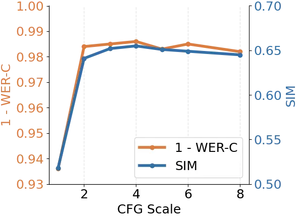

(a) Results using different CFG scales.

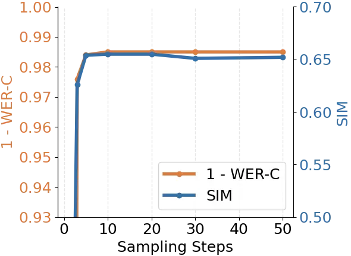

(b) Results using different sampling steps.

Figure 10: Ablation results of different CFG \[28\] scales and inference
sampling steps. We report zero-shot speech synthesis results.

##### CFG Scale

Figure 10(a) illustrates the zero-shot speech synthesis results using
classifier-free guidance (CFG) \[28\]. When the CFG scale is set to 1,
CFG is not applied. The use of classifier-free guidance significantly
enhances the model’s performance. Furthermore, we find that setting the
CFG scale to 4 yields the best results.

##### Inference Sampling Step

Figure 10(b) presents the results of zero-shot speech synthesis using
different inference sampling steps of the diffusion head. We set the CFG
scale to 4 for the ablation studies. More sampling steps require more
inference time. We find that a sampling step of 3 yields competitive
results, and increasing it to 5 leads to further improvement. When the
sampling step is increased further, the results improve only slightly.
Using a sampling step of 5 allows the model to achieve strong
performance while maintaining a fast inference speed.

## 4 Conclusion and Future Work

The work can be advanced from the following perspectives:

- •
  Latent Multimodal Reasoning The proposed unified modeling facilitates
  complex multimodal reasoning tasks that require simultaneous
  understanding of multiple modalities. For instance, self-reflection
  can automatically correct produced images, which requires the
  multimodal language model to understand the generated image without
  encoding it again. Moreover, multimodal-native reasoning enables the
  model to track the search states via latent vectors, for example,
  step-by-step plotting the planned trajectory on the image of input
  map.
- •
  Video Generation and World Modeling The autoregressive nature of
  LatentLM fits well with video data, which shows particular promise in
  maintaining temporal consistency and spatial coherence. Moreover,
  LatentLM can perform planning by generating scripts and videos in an
  interleaved way, making it particularly suitable for long-video
  generation. The approach’s higher compression ratio compared to
  traditional quantization methods enables efficient generation without
  sacrificing visual quality. In addition, we can integrate actions to
  control and simulate the interactive environment, which can be used as
  a world model.
- •
  Cross-Modal Transfer Between Speech and Text Because of the high
  compression ratio of continuous representations, we can use similar
  tokenization granularity for speech and text data, which tends to ease
  knowledge transfer across modalities. Similarly, multilingual
  pretraining enables zero-shot cross-lingual transfer, where training
  on English benefits other languages. It is useful to achieve seamless
  code switch between speech and text and opens new opportunities for
  user interface.
- •
  Embodied AI and Robot Action By representing robot actions as
  continuous data, we enable end-to-end learning of robot behaviors that
  can be seamlessly integrated with language instructions, visual
  observations, and other sensory inputs. The unified framework
  simplifies the development of robots that can understand commands in
  natural language, learn from demonstrations, and adapt to new
  environments while maintaining a consistent internal representation
  across all modalities.
- •
  Text Data We can also apply latent language modeling to text data,
  rather than predicting words as discrete tokens. The VAE tokenizer
  tends to achieve a higher compression ratio than previous discrete
  tokenizers. The shorter sequence length improves the generation
  efficiency by reducing the autoregressive steps.

## Acknowledgement

We would like to acknowledge Ben Huntley for maintaining the GPU
cluster, and Zhikang Niu for the help of training speech tokenizer. We
implement DiT \[51\] based on
[https://github.com/facebookresearch/DiT](https://github.com/facebookresearch/DiT).
The experiments on multimodal large language models utilize the curated
data from Kosmos \[24, 50\] and RedStone \[8\]. The implementation is
based on the TorchScale \[47\] library.

## References

- \[1\] R. Ardila, M. Branson, K. Davis, M. Henretty, M. Kohler,
  J. Meyer, R. Morais, L. Saunders, F. M. Tyers, and G. Weber. Common
  voice: A massively-multilingual speech corpus. In Proceedings of the
  12th Conference on Language Resources and Evaluation (LREC 2020),
  pages 4211–4215, 2020.
- \[2\] Joshua Ainslie, James Lee-Thorp, Michiel de Jong, Yury
  Zemlyanskiy, Federico Lebrón, and Sumit Sanghai. Training generalized
  multi-query transformer models from multi-head checkpoints. arXiv
  preprint arXiv:2305.13245, 2023.
- \[3\] Hangbo Bao, Li Dong, Songhao Piao, and Furu Wei. BEiT: BERT
  pre-training of image Transformers. In International Conference on
  Learning Representations, 2022.
- \[4\] Fan Bao, Shen Nie, Kaiwen Xue, Yue Cao, Chongxuan Li, Hang Su,
  and Jun Zhu. All are worth words: A vit backbone for diffusion models.
  In Proceedings of the IEEE/CVF conference on computer vision and
  pattern recognition, pages 22669–22679, 2023.
- \[5\] Fan Bao, Shen Nie, Kaiwen Xue, Chongxuan Li, Shi Pu, Yaole Wang,
  Gang Yue, Yue Cao, Hang Su, and Jun Zhu. One transformer fits all
  distributions in multi-modal diffusion at scale. In Proceedings of the
  40th International Conference on Machine Learning, pages
  1692–1717, 2023.
- \[6\] Minwoo Byeon, Beomhee Park, Haecheon Kim, Sungjun Lee, Woonhyuk
  Baek, and Saehoon Kim. Coyo-700m: Image-text pair dataset, 2022.
- \[7\] Dmitry Bogdanov, Minz Won, Philip Tovstogan, Alastair Porter,
  and Xavier Serra. The mtg-jamendo dataset for automatic music tagging.
  In ICML, 2019.
- \[8\] Yaoyao Chang, Lei Cui, Li Dong, Shaohan Huang, Yangyu Huang,
  Yupan Huang, Scarlett Li, Tengchao Lv, Shuming Ma, Qinzheng Sun,
  et al. RedStone: Curating general, code, math, and QA data for large
  language models. arXiv preprint arXiv:2412.03398, 2024.
- \[9\] Michael Chinen, Felicia SC Lim, Jan Skoglund, Nikita Gureev,
  Feargus O’Gorman, and Andrew Hines. Visqol v3: An open source
  production ready objective speech and audio metric. In 2020 twelfth
  international conference on quality of multimedia experience (QoMEX),
  pages 1–6. IEEE, 2020.
- \[10\] Sanyuan Chen, Shujie Liu, Long Zhou, Yanqing Liu, Xu Tan, Jinyu
  Li, Sheng Zhao, Yao Qian, and Furu Wei. VALL-E 2: Neural codec
  language models are human parity zero-shot text to speech
  synthesizers. CoRR, abs/2406.05370, 2024.
- \[11\] Soravit Changpinyo, Piyush Sharma, Nan Ding, and Radu Soricut.
  Conceptual 12m: Pushing web-scale image-text pre-training to recognize
  long-tail visual concepts. In Proceedings of the IEEE/CVF Conference
  on Computer Vision and Pattern Recognition, pages 3558–3568, 2021.
- \[12\] Sanyuan Chen, Chengyi Wang, Zhengyang Chen, Yu Wu, Shujie Liu,
  Zhuo Chen, Jinyu Li, Naoyuki Kanda, Takuya Yoshioka, Xiong Xiao,
  et al. Wavlm: Large-scale self-supervised pre-training for full stack
  speech processing. IEEE Journal of Selected Topics in Signal
  Processing, 16(6):1505–1518, 2022.
- \[13\] Huiwen Chang, Han Zhang, Lu Jiang, Ce Liu, and William T
  Freeman. Maskgit: Masked generative image transformer. In Proceedings
  of the IEEE/CVF Conference on Computer Vision and Pattern Recognition,
  pages 11315–11325, 2022.
- \[14\] Alexandre Défossez, Jade Copet, Gabriel Synnaeve, and Yossi
  Adi. High fidelity neural audio compression. arXiv preprint
  arXiv:2210.13438, 2022.
- \[15\] Jia Deng, Wei Dong, Richard Socher, Li-Jia Li, Kai Li, and
  Li Fei-Fei. ImageNet: A large-scale hierarchical image database. In
  2009 IEEE conference on computer vision and pattern recognition, pages
  248–255. Ieee, 2009.
- \[16\] Harishchandra Dubey, Vishak Gopal, Ross Cutler, Sergiy
  Matusevych, Sebastian Braun, Emre Sefik Eskimez, Manthan Thakker,
  Takuya Yoshioka, Hannes Gamper, and Robert Aichner. Icassp 2022 deep
  noise suppression challenge. In ICASSP, 2022.
- \[17\] Alexandre Défossez, Laurent Mazaré, Manu Orsini, Amélie Royer,
  Patrick Pérez, Hervé Jégou, Edouard Grave, and Neil Zeghidour. Moshi:
  a speech-text foundation model for real-time dialogue. Technical
  report, Kyutai, September 2024.
- \[18\] Patrick Esser, Robin Rombach, and Bjorn Ommer. Taming
  transformers for high-resolution image synthesis. In Proceedings of
  the IEEE/CVF conference on computer vision and pattern recognition,
  pages 12873–12883, 2021.
- \[19\] Eduardo Fonseca, Xavier Favory, Jordi Pons, Frederic Font, and
  Xavier Serra. Fsd50k: an open dataset of human-labeled sound events.
  IEEE/ACM Transactions on Audio, Speech, and Language Processing,
  30:829–852, 2021.
- \[20\] Jort F Gemmeke, Daniel PW Ellis, Dylan Freedman, Aren Jansen,
  Wade Lawrence, R Channing Moore, Manoj Plakal, and Marvin Ritter.
  Audio set: An ontology and human-labeled dataset for audio events. In
  2017 IEEE international conference on acoustics, speech and signal
  processing (ICASSP), pages 776–780. IEEE, 2017.
- \[21\] Yash Goyal, Tejas Khot, Douglas Summers-Stay, Dhruv Batra, and
  Devi Parikh. Making the v in vqa matter: Elevating the role of image
  understanding in visual question answering. In Proceedings of the IEEE
  conference on computer vision and pattern recognition, pages
  6904–6913, 2017.
- \[22\] Anmol Gulati, James Qin, Chung-Cheng Chiu, Niki Parmar,
  Yu Zhang, Jiahui Yu, Wei Han, Shibo Wang, Zhengdong Zhang, Yonghui Wu,
  et al. Conformer: Convolution-augmented transformer for speech
  recognition. arXiv preprint arXiv:2005.08100, 2020.
- \[23\] Wei-Ning Hsu, Benjamin Bolte, Yao-Hung Hubert Tsai, Kushal
  Lakhotia, Ruslan Salakhutdinov, and Abdelrahman Mohamed. Hubert:
  Self-supervised speech representation learning by masked prediction of
  hidden units. IEEE ACM Trans. Audio Speech Lang. Process.,
  29:3451–3460, 2021.
- \[24\] Shaohan Huang, Li Dong, Wenhui Wang, Yaru Hao, Saksham Singhal,
  Shuming Ma, Tengchao Lv, Lei Cui, Owais Khan Mohammed, Qiang Liu,
  Kriti Aggarwal, Zewen Chi, Johan Bjorck, Vishrav Chaudhary, Subhojit
  Som, Xia Song, and Furu Wei. Language is not all you need: Aligning
  perception with language models. ArXiv, abs/2302.14045, 2023.
- \[25\] Jonathan Ho, Ajay Jain, and Pieter Abbeel. Denoising diffusion
  probabilistic models. Advances in neural information processing
  systems, 33:6840–6851, 2020.
- \[26\] Irina Higgins, Loïc Matthey, Arka Pal, Christopher P. Burgess,
  Xavier Glorot, Matthew M. Botvinick, Shakir Mohamed, and Alexander
  Lerchner. beta-VAE: Learning basic visual concepts with a constrained
  variational framework. In International Conference on Learning
  Representations, 2016.
- \[27\] Martin Heusel, Hubert Ramsauer, Thomas Unterthiner, Bernhard
  Nessler, and Sepp Hochreiter. GANs trained by a two time-scale update
  rule converge to a local nash equilibrium. In Proceedings of the 31st
  International Conference on Neural Information Processing Systems,
  page 6629–6640, 2017.
- \[28\] Jonathan Ho and Tim Salimans. Classifier-free diffusion
  guidance. arXiv preprint arXiv:2207.12598, 2022.
- \[29\] Phillip Isola, Jun-Yan Zhu, Tinghui Zhou, and Alexei A Efros.
  Image-to-image translation with conditional adversarial networks. In
  Proceedings of the IEEE conference on computer vision and pattern
  recognition, pages 1125–1134, 2017.
- \[30\] Justin Johnson, Alexandre Alahi, and Li Fei-Fei. Perceptual
  losses for real-time style transfer and super-resolution. In Computer
  Vision–ECCV 2016: 14th European Conference, Amsterdam, The
  Netherlands, October 11-14, 2016, Proceedings, Part II 14, pages
  694–711. Springer, 2016.
- \[31\] Shengpeng Ji, Ziyue Jiang, Xize Cheng, Yifu Chen, Minghui Fang,
  Jialong Zuo, Qian Yang, Ruiqi Li, Ziang Zhang, Xiaoda Yang, et al.
  Wavtokenizer: an efficient acoustic discrete codec tokenizer for audio
  language modeling. arXiv preprint arXiv:2408.16532, 2024.
- \[32\] Jungil Kong, Jaehyeon Kim, and Jaekyoung Bae. Hifi-gan:
  Generative adversarial networks for efficient and high fidelity speech
  synthesis. In Advances in neural information processing systems,
  volume 33, pages 17022–17033, 2020.
- \[33\] Jacob Kahn, Morgane Rivière, Weiyi Zheng, Evgeny Kharitonov,
  Qiantong Xu, Pierre-Emmanuel Mazaré, Julien Karadayi, Vitaliy
  Liptchinsky, Ronan Collobert, Christian Fuegen, Tatiana Likhomanenko,
  Gabriel Synnaeve, Armand Joulin, Abdelrahman Mohamed, and Emmanuel
  Dupoux. Libri-light: A benchmark for ASR with limited or no
  supervision. In 2020 IEEE International Conference on Acoustics,
  Speech and Signal Processing, ICASSP 2020, Barcelona, Spain, May 4-8,
  2020, pages 7669–7673. IEEE, 2020.
- \[34\] Rithesh Kumar, Prem Seetharaman, Alejandro Luebs, Ishaan Kumar,
  and Kundan Kumar. High-fidelity audio compression with improved
  rvqgan. In Proceedings of the 37th International Conference on Neural
  Information Processing Systems, pages 27980–27993, 2023.
- \[35\] Diederik P. Kingma and Max Welling. Auto-Encoding Variational
  Bayes. In 2nd International Conference on Learning
  Representations, 2014.
- \[36\] Wei Kang, Xiaoyu Yang, Zengwei Yao, Fangjun Kuang, Yifan Yang,
  Liyong Guo, Long Lin, and Daniel Povey. Libriheavy: A 50, 000 hours
  ASR corpus with punctuation casing and context. In IEEE International
  Conference on Acoustics, Speech and Signal Processing, ICASSP 2024,
  Seoul, Republic of Korea, April 14-19, 2024, pages 10991–10995.
  IEEE, 2024.
- \[37\] Raymond Li, Loubna Ben Allal, Yangtian Zi, Niklas Muennighoff,
  Denis Kocetkov, Chenghao Mou, Marc Marone, and StarCoder Team.
  StarCoder: may the source be with you! ArXiv, abs/2305.06161, 2023.
- \[38\] Yaron Lipman, Ricky TQ Chen, Heli Ben-Hamu, Maximilian Nickel,
  and Matt Le. Flow matching for generative modeling. arXiv preprint
  arXiv:2210.02747, 2022.
- \[39\] Ilya Loshchilov and Frank Hutter. Decoupled weight decay
  regularization. In International Conference on Learning
  Representations, 2019.
- \[40\] Tsung-Yi Lin, Michael Maire, Serge Belongie, James Hays, Pietro
  Perona, Deva Ramanan, Piotr Dollár, and C Lawrence Zitnick. Microsoft
  coco: Common objects in context. In ECCV, pages 740–755, 2014.
- \[41\] Tsung-Yi Lin, Michael Maire, Serge Belongie, James Hays, Pietro
  Perona, Deva Ramanan, Piotr Dollár, and C Lawrence Zitnick. Microsoft
  COCO: Common objects in context. In Computer Vision–ECCV 2014: 13th
  European Conference, Zurich, Switzerland, September 6-12, 2014,
  Proceedings, Part V 13, pages 740–755. Springer, 2014.
- \[42\] Zhuang Liu, Hanzi Mao, Chao-Yuan Wu, Christoph Feichtenhofer,
  Trevor Darrell, and Saining Xie. A convnet for the 2020s. In
  Proceedings of the IEEE/CVF conference on computer vision and pattern
  recognition, pages 11976–11986, 2022.
- \[43\] Tianhong Li, Yonglong Tian, He Li, Mingyang Deng, and Kaiming
  He. Autoregressive image generation without vector quantization. arXiv
  preprint arXiv:2406.11838, 2024.
- \[44\] Matthew Le, Apoorv Vyas, Bowen Shi, Brian Karrer, Leda Sari,
  Rashel Moritz, Mary Williamson, Vimal Manohar, Yossi Adi, Jay
  Mahadeokar, and Wei-Ning Hsu. Voicebox: Text-guided multilingual
  universal speech generation at scale. In Alice Oh, Tristan Naumann,
  Amir Globerson, Kate Saenko, Moritz Hardt, and Sergey Levine, editors,
  Advances in Neural Information Processing Systems 36: Annual
  Conference on Neural Information Processing Systems 2023, NeurIPS
  2023, New Orleans, LA, USA, December 10 - 16, 2023, 2023.
- \[45\] Cheng Lu, Yuhao Zhou, Fan Bao, Jianfei Chen, Chongxuan Li, and
  Jun Zhu. DPM-Solver: A fast ode solver for diffusion probabilistic
  model sampling in around 10 steps. Advances in Neural Information
  Processing Systems, 35:5775–5787, 2022.
- \[46\] Cheng Lu, Yuhao Zhou, Fan Bao, Jianfei Chen, Chongxuan Li, and
  Jun Zhu. DPM-Solver++: Fast solver for guided sampling of diffusion
  probabilistic models. arXiv preprint arXiv:2211.01095, 2022.
- \[47\] Shuming Ma, Hongyu Wang, Shaohan Huang, Wenhui Wang, Zewen Chi,
  Li Dong, Alon Benhaim, Barun Patra, Vishrav Chaudhary, Xia Song, and
  Furu Wei. TorchScale: Transformers at scale. CoRR,
  abs/2211.13184, 2022.
- \[48\] Lingwei Meng, Long Zhou, Shujie Liu, Sanyuan Chen, Bing Han,
  Shujie Hu, Yanqing Liu, Jinyu Li, Sheng Zhao, Xixin Wu, Helen Meng,
  and Furu Wei. Autoregressive speech synthesis without vector
  quantization. CoRR, abs/2407.08551, 2024.
- \[49\] Guilherme Penedo, Quentin Malartic, Daniel Hesslow,
  Ruxandra-Aimée Cojocaru, Alessandro Cappelli, Hamza Alobeidli,
  Baptiste Pannier, Ebtesam Almazrouei, and Julien Launay. The
  RefinedWeb dataset for Falcon LLM: Outperforming curated corpora with
  web data, and web data only. ArXiv, abs/2306.01116, 2023.
- \[50\] Zhiliang Peng, Wenhui Wang, Li Dong, Yaru Hao, Shaohan Huang,
  Shuming Ma, and Furu Wei. Kosmos-2: Grounding multimodal large
  language models to the world. ArXiv, abs/2306.14824, 2023.
- \[51\] William Peebles and Saining Xie. Scalable diffusion models with
  transformers. In Proceedings of the IEEE/CVF International Conference
  on Computer Vision, pages 4195–4205, 2023.
- \[52\] Antony W Rix, John G Beerends, Michael P Hollier, and Andries P
  Hekstra. Perceptual evaluation of speech quality (pesq)-a new method
  for speech quality assessment of telephone networks and codecs. In
  2001 IEEE international conference on acoustics, speech, and signal
  processing. Proceedings (Cat. No. 01CH37221), volume 2, pages 749–752.
  IEEE, 2001.
- \[53\] Robin Rombach, Andreas Blattmann, Dominik Lorenz, Patrick
  Esser, and Björn Ommer. High-resolution image synthesis with latent
  diffusion models. In Proceedings of the IEEE/CVF conference on
  computer vision and pattern recognition, pages 10684–10695, 2022.
- \[54\] Alec Radford, Jong Wook Kim, Chris Hallacy, Aditya Ramesh,
  Gabriel Goh, Sandhini Agarwal, Girish Sastry, Amanda Askell, Pamela
  Mishkin, Jack Clark, et al. Learning transferable visual models from
  natural language supervision. In International Conference on Machine
  Learning, pages 8748–8763. PMLR, 2021.
- \[55\] Zafar Rafii, Antoine Liutkus, Fabian-Robert Stöter,
  Stylianos Ioannis Mimilakis, and Rachel Bittner. The musdb18 corpus
  for music separation, 2017.
- \[56\] Aditya Ramesh, Mikhail Pavlov, Gabriel Goh, Scott Gray, Chelsea
  Voss, Alec Radford, Mark Chen, and Ilya Sutskever. Zero-shot
  text-to-image generation. ArXiv, abs/2102.12092, 2021.
- \[57\] Prajit Ramachandran, Barret Zoph, and Quoc V. Le. Swish: a
  self-gated activation function. arXiv: Neural and Evolutionary
  Computing, 2017.
- \[58\] Christoph Schuhmann, Romain Beaumont, Richard Vencu, Cade
  Gordon, Ross Wightman, Mehdi Cherti, Theo Coombes, Aarush Katta,
  Clayton Mullis, Mitchell Wortsman, et al. Laion-5b: An open
  large-scale dataset for training next generation image-text models.
  arXiv preprint arXiv:2210.08402, 2022.
- \[59\] Slava Shechtman and Avihu Dekel. Low bitrate high-quality
  rvqgan-based discrete speech tokenizer. In Annual Conference of the
  International Speech Communication Association, 2024.
- \[60\] Piyush Sharma, Nan Ding, Sebastian Goodman, and Radu Soricut.
  Conceptual captions: A cleaned, hypernymed, image alt-text dataset for
  automatic image captioning. In Proceedings of the 56th Annual Meeting
  of the Association for Computational Linguistics, ACL 2018, Melbourne,
  Australia, July 15-20, 2018, Volume 1: Long Papers, pages 2556–2565.
  Association for Computational Linguistics, 2018.
- \[61\] Yutao Sun, Li Dong, Yi Zhu, Shaohan Huang, Wenhui Wang, Shuming
  Ma, Quanlu Zhang, Jianyong Wang, and Furu Wei. You only cache once:
  Decoder-decoder architectures for language models. In The
  Thirty-eighth Annual Conference on Neural Information Processing
  Systems, 2024.
- \[62\] Tim Salimans, Ian Goodfellow, Wojciech Zaremba, Vicki Cheung,
  Alec Radford, and Xi Chen. Improved techniques for training gans. In
  Proceedings of the 30th International Conference on Neural Information
  Processing Systems, NIPS’16, page 2234–2242, 2016.
- \[63\] Tim Salimans and Jonathan Ho. Progressive distillation for fast
  sampling of diffusion models. arXiv preprint arXiv:2202.00512, 2022.
- \[64\] Noam Shazeer. Glu variants improve transformer. arXiv preprint
  arXiv:2002.05202, 2020.
- \[65\] Rico Sennrich, Barry Haddow, and Alexandra Birch. Neural
  machine translation of rare words with subword units. arXiv preprint
  arXiv:1508.07909, 2015.
- \[66\] Peize Sun, Yi Jiang, Shoufa Chen, Shilong Zhang, Bingyue Peng,
  Ping Luo, and Zehuan Yuan. Autoregressive model beats diffusion: Llama
  for scalable image generation. arXiv preprint arXiv:2406.06525, 2024.
- \[67\] Christoph Schuhmann, Richard Vencu, Romain Beaumont, Robert
  Kaczmarczyk, Clayton Mullis, Aarush Katta, Theo Coombes, Jenia Jitsev,
  and Aran Komatsuzaki. Laion-400m: Open dataset of clip-filtered 400
  million image-text pairs. arXiv preprint arXiv:2111.02114, 2021.
- \[68\] Takaaki Saeki, Detai Xin, Wataru Nakata, Tomoki Koriyama,
  Shinnosuke Takamichi, and Hiroshi Saruwatari. Utmos: Utokyo-sarulab
  system for voicemos challenge 2022. arXiv preprint
  arXiv:2204.02152, 2022.
- \[69\] Chameleon Team. Chameleon: Mixed-modal early-fusion foundation
  models. ArXiv, abs/2405.09818, 2024.
- \[70\] Michael Tschannen, Cian Eastwood, and Fabian Mentzer. Givt:
  Generative infinite-vocabulary transformers. arXiv preprint
  arXiv:2312.02116, 2023.
- \[71\] Cees H Taal, Richard C Hendriks, Richard Heusdens, and Jesper
  Jensen. A short-time objective intelligibility measure for
  time-frequency weighted noisy speech. In 2010 IEEE international
  conference on acoustics, speech and signal processing, pages
  4214–4217. IEEE, 2010.
- \[72\] Hugo Touvron, Thibaut Lavril, Gautier Izacard, Xavier Martinet,
  Marie-Anne Lachaux, Timothée Lacroix, Baptiste Rozière, Naman Goyal,
  Eric Hambro, Faisal Azhar, et al. Llama: Open and efficient foundation
  language models. arXiv preprint arXiv:2302.13971, 2023.
- \[73\] Michael Tschannen, André Susano Pinto, and Alexander
  Kolesnikov. JetFormer: An autoregressive generative model of raw
  images and text, 2024.
- \[74\] Zineng Tang, Ziyi Yang, Chenguang Zhu, Michael Zeng, and Mohit
  Bansal. Any-to-any generation via composable diffusion. arXiv preprint
  arXiv:2305.11846, 2023.
- \[75\] Aäron van den Oord, Oriol Vinyals, and Koray Kavukcuoglu.
  Neural discrete representation learning. In Neural Information
  Processing Systems, 2017.
- \[76\] Ramakrishna Vedantam, C Lawrence Zitnick, and Devi Parikh.
  Cider: Consensus-based image description evaluation. In CVPR, pages
  4566–4575, 2015.
- \[77\] Wenhui Wang, Hangbo Bao, Li Dong, Johan Bjorck, Zhiliang Peng,
  Qiang Liu, Kriti Aggarwal, Owais Khan Mohammed, Saksham Singhal,
  Subhojit Som, and Furu Wei. Image as a foreign language: Beit
  pretraining for vision and vision-language tasks. In Proceedings of
  the IEEE/CVF Conference on Computer Vision and Pattern Recognition
  (CVPR), pages 19175–19186, June 2023.
- \[78\] Chengyi Wang, Sanyuan Chen, Yu Wu, Ziqiang Zhang, Long Zhou,
  Shujie Liu, Zhuo Chen, Yanqing Liu, Huaming Wang, Jinyu Li, Lei He,
  Sheng Zhao, and Furu Wei. Neural codec language models are zero-shot
  text to speech synthesizers. CoRR, abs/2301.02111, 2023.
- \[79\] Jiahui Yu, Xin Li, Jing Yu Koh, Han Zhang, Ruoming Pang, James
  Qin, Alexander Ku, Yuanzhong Xu, Jason Baldridge, and Yonghui Wu.
  Vector-quantized image modeling with improved vqgan. arXiv preprint
  arXiv:2110.04627, 2021.
- \[80\] Richard Zhang, Phillip Isola, Alexei A Efros, Eli Shechtman,
  and Oliver Wang. The unreasonable effectiveness of deep features as a
  perceptual metric. In Proceedings of the IEEE conference on computer
  vision and pattern recognition, pages 586–595, 2018.
- \[81\] Biao Zhang and Rico Sennrich. Root mean square layer
  normalization. Advances in Neural Information Processing Systems,
  32, 2019.
- \[82\] Chunting Zhou, Lili Yu, Arun Babu, Kushal Tirumala, Michihiro
  Yasunaga, Leonid Shamis, Jacob Kahn, Xuezhe Ma, Luke Zettlemoyer, and
  Omer Levy. Transfusion: Predict the next token and diffuse images with
  one multi-modal model. arXiv preprint arXiv:2408.11039, 2024.

## Appendix A Hyperparameters for Image Generation Scaling

Table 7 details the hyperparameters used for Section 3.1.2, where we
compare the scalability properties of Diffusion Transformer (DiT) \[51\]
and LatentLM. We describe the hidden dimension, the number of layers,
and the number of heads for the models. Specifically, we follow \[51\]
for the DiT architecture. In addition, we augment DiT with
RMSNorm \[81\] and SwiGLU \[57, 64\]. To align the number of parameters,
the FFN size for DiT is set to $`\frac{8}{3}d`$, while for LatentLM, it
is set to $`4d`$. We train the models for 75,000 steps, which
corresponds to approximately 120 epochs, to facilitate scaling
comparisons.

|        |       |             |          |         |                       |
| ------ | ----- | ----------- | -------- | ------- | --------------------- |
|        | Size  | Hidden Dim. | \#Layers | \#Heads | Learning Rate         |
| Medium | 455M  | 1024        | 24       | 16      | $`8\times 10^{-4}`$   |
| Large  | 1.03B | 1536        | 24       | 12      | $`3\times 10^{-4}`$   |
| XL     | 1.82B | 2048        | 24       | 16      | $`2\times 10^{-4}`$   |
| 3B     | 3.68B | 2560        | 32       | 20      | $`1.6\times 10^{-4}`$ |

Table 7: Model size and hyperparameters used for the scaling experiments
in Section 3.1.2.

## Appendix B Hyperparameters for Tokenizer Analysis

We present the hyperparameters used for Section 3.1.3. We follow the
training recipes of \[51\] for DiT and LatentLM training. We set the
hidden size to 1024. The number of layers is 24. Because LatentLM does
not have AdaLN in the Transformer backbone, we adjust the intermediate
FFN dimension (i.e., 2730 in DiT, and 4096 in LatentLM) to match their
model size. The diffusion head has three layers of feedforward networks.

We use the AdamW \[39\] optimizer with $`\beta=(0.9,0.98)`$. We use the
cosine learning rate schedule with a maximal value of 1e-4 and 100
warmup steps. The weight decay is $`0.1`$. We train models using a batch
size of 256 for 200,000 steps, which is approximately equivalent to 40
epochs. We use the cosine beta schedule and v-prediction \[63\] for
diffusion. We use DDPM \[25\] with 1000 steps during training.
DPM-Solver \[45, 46\] with 20 steps is used during inference.

## Appendix C Inference Efficiency with Different Model Sizes

In Section 3.1.4, we compare the inference throughput for DiT and
LatentLM on a H100 GPU card. As shown in Figure 11, we evaluate the
efficiency with various model size and batch size. The results show that
LatentLM’s throughput increases with a larger batch size. Our approach
benefits from key-value caches of causal Transformers, which avoids
recomputation of history predictions. In contrast, DiT’s throughput
remains similar. In addition, group-query attention (GQA) \[2\] further
improves the inference efficiency of LatentLM. Another advantage is that
we can directly reuse the inference infrastructure of large language
models to deploy LatentLM.

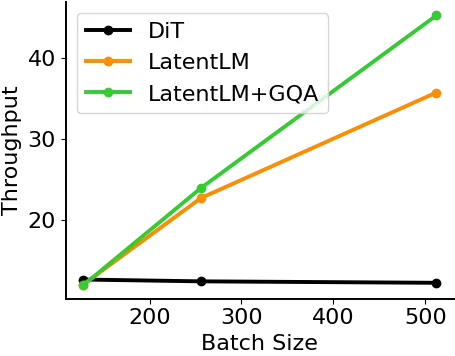

(a) Model Size: 1.03B

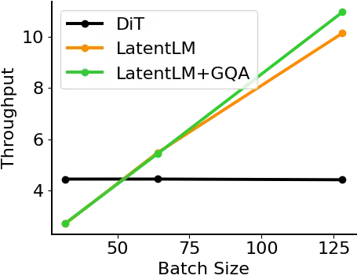

(b) Model Size: 3.68B

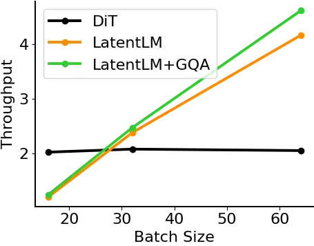

(c) Model Size: 9.35B

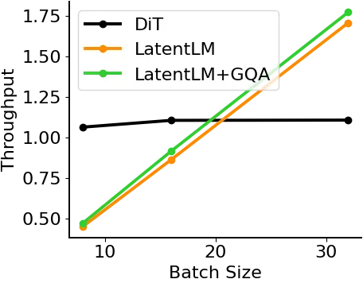

(d) Model Size: 17.96B

Figure 11: Inference throughput of various model size and batch size.
“GQA” stands for group-query attention \[2\].

## Appendix D Hyperparameters for Multimodal Large Language Model

Table 8 details the hyperparameters employed for multimodal large
language models, as described in Section 3.2.

|                |                     |
| -------------- | ------------------- |
| Params         | Values              |
| Layers         | 24                  |
| Hidden size    | 2048                |
| FFN size       | 6144                |
| Vocab size     | 100,288             |
| Heads          | 16                  |
| Adam $`\beta`$ | (0.9, 0.98)         |
| LR             | $`3\times 10^{-4}`$ |
| Batch size     | 4M                  |
| Warmup steps   | 500                 |
| Weight decay   | 0.1                 |
| Head Layers    | 6                   |

Table 8: Hyperparameters used for multimodal large language models
in Section 3.2.

## Appendix E Hyperparameters for Text-to-Speech Synthesis

Table 9 lists the hyperparameters utilized for multimodal large language
models, as discussed in Section 3.3.

|                |                       |
| -------------- | --------------------- |
| Params         | Values                |
| Layers         | 24                    |
| Hidden size    | 1024                  |
| FFN size       | 4096                  |
| Heads          | 16                    |
| Adam $`\beta`$ | (0.9, 0.98)           |
| LR             | $`7.5\times 10^{-4}`$ |
| LR schedule    | cosine                |
| Batch size     | 5M                    |
| Warmup steps   | 10k                   |
| Training steps | 100k                  |
| Weight decay   | 0.01                  |
| Head Layers    | 3                     |

Table 9: Hyperparameters used for text-to-speech synthesis in
Section 3.3.

70667343
