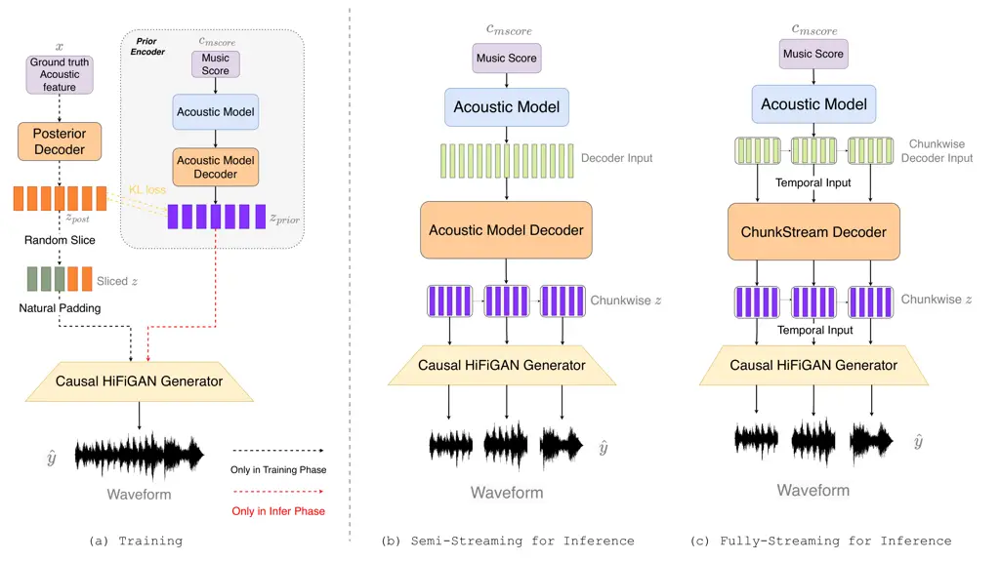
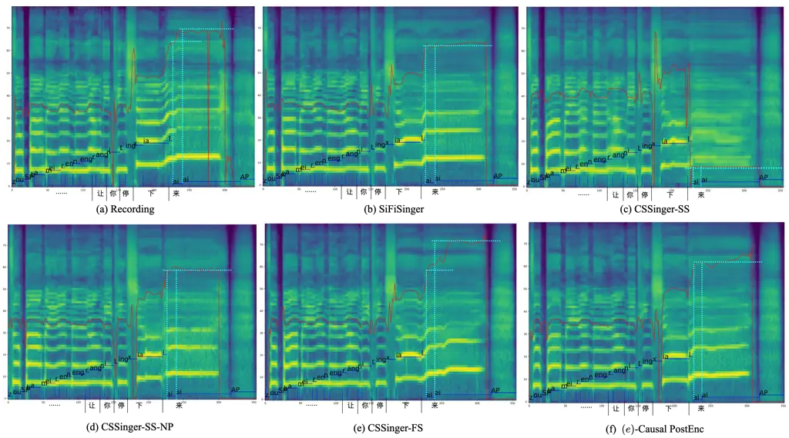

# CSSinger: End-to-End Chunkwise Streaming Singing Voice Synthesis System Based on Conditional Variational Autoencoder

Jianwei Cui ^(†)^(†)thanks: This work was done at Tencent AI Lab as an
internship    Yu Gu    Shihao Chen    Jie Zhang    Liping Chen    Lirong
Dai ^(†)^(†)thanks: Corresponding author

###### Abstract

Singing Voice Synthesis (SVS) aims to generate singing voices of high
fidelity and expressiveness. Conventional SVS systems usually utilize an
acoustic model to transform a music score into acoustic features,
followed by a vocoder to reconstruct the singing voice. It was recently
shown that end-to-end modeling is effective in the fields of SVS and
Text to Speech (TTS). In this work, we thus present a fully end-to-end
SVS method together with a chunkwise streaming inference to address the
latency issue for practical usages. Note that this is the first attempt
to fully implement end-to-end streaming audio synthesis using latent
representations in VAE. We have made specific improvements to enhance
the performance of streaming SVS using latent representations.
Experimental results demonstrate that the proposed method achieves
synthesized audio with high expressiveness and pitch accuracy in both
streaming SVS and TTS tasks. Synthesized audio samples are available at:
https://sounddemos.github.io/cssinger.

¹NERC-SLIP, University of Science and Technology of China (USTC), Hefei,
China

²Tencent AI Lab

{jwcui,shchen16}@mail.ustc.edu.cn, colinygu@tencent.com,
{jzhang6,lrdai}@ustc.edu.cn

## Introduction

Singing Voice Synthesis (SVS) refers to the task of synthesizing
high-quality singing voices by taking the music score in terms of, e.g.,
lyrics, pitch and duration, as input (Gu et al. 2021; Nishimura et al.
2016; Hono et al. 2021; Lu et al. 2020; Hono et al. 2019). Similarly to
Text to Speech (TTS), the SVS system typically consists of two
components: an acoustic model and a vocoder. The former is responsible
for modeling the music score as acoustic features, while the vocoder
reconstructs the audio waveform using these acoustic features. In this
context, Mel-spectrogram is the commonly-employed acoustic
representation.



Figure 1: Visualization of the CSSinger Model Structure: (a) Overall
Training Process, (b) Semi-Streaming inference pipeline, (c) Fully
Streaming inference pipeline.

Recently, conditional variational autoencoder (VAE) (Ma et al. 2019;
Kingma and Welling 2014) based fully end-to-end systems have been
proposed for TTS tasks. For example, unlike two-stage systems that
independently develop modules for each stage, VITS (Kim, Kong, and Son 2021) employs a prior encoder and a posterior encoder to learn latent
space representations and directly generate synthetic audio. The entire
system is optimized within a unified training phase. It was shown that
the generated synthesized audio by VITS is highly natural.

Based on VITS, VISinger (Zhang et al. 2022) and VISinger2 (Zhang et al. 2023) introduce an end-to-end SVS system with variational inference. By
incorporating a duration predictor and a frame prior network,
frame-level means and variances are calculated as acoustic features,
facilitating the modeling of rich acoustic variations in singing and
achieving natural vocal performance. SiFiSinger (Cui et al. 2024), as an
extension of VISinger, improves the pitch control by introducing a
source module to generate F0-controlled excitation signals. It decouples
acoustic features from F0 information during modeling, in order to avoid
error propagation when predicting acoustic features. For waveform
generation, SiFiSinger continuously integrates F0-modulated excitation
signals to provide multi-scale pitch guidance during audio synthesis.
These can potentially improve the pitch accuracy and naturalness of
synthesized singing signals.

The applicability of these high-performing models is still limited in
practice in aspects like computational resources and latency
requirements, particularly in the case of deployment on edge devices
and/or online network services with data transmission in batches. On one
hand, these parallel computation models suffer from a significant
computational strain when processing long sequences. On the other hand,
their real-time performance is not optimal. Under these practical
constraints, there is a growing need for handling audio synthesis tasks
in a streaming and autoregressive manner. In both acoustic modeling and
waveform generation stages, some research focuses on streaming
autoregressive modeling. For instance, Tacotron2 (Shen et al. 2018)
employs Bi-directional Long Short-term Memory (BLSTM) recurrent networks
(Schuster and Paliwal 1997; Hochreiter and Schmidhuber 1997) for
acoustic modeling, which suffers from inefficient inference and cannot
effectively model long-term dependencies. Similarly, WaveNet (Oord
et al. 2016) introduces an autoregressive approach for waveform
generation but encounters the challenge of slow generation speeds.
WaveRNN (Kalchbrenner et al. 2018) uses a smaller architecture and
weight sparsification to accelerate the generation process without
significantly compromising quality. The WaveRNN is thus more suitable
for real-time application, but requires a complex pipeline.

In this paper, we propose an end-to-end chunk-based streaming SVS system
called ChunkStreamSinger (CSSinger), which is somewhat based on
SiFiSinger (Cui et al. 2024) (an end-to-end SVS system using conditional
VAE). Initially, we explored a semi-streaming framework that directly
adapts the HiFi-GAN (Kong, Kim, and Bae 2020) vocoder for streaming.
However, generating audio using latent representations from VAE is not
straightforward, particularly for singing voice. In the vocoder, we
employed causal transposed convolutions to generate audio in a
chunk-wise sequence, but the synthesized audio exhibits significant
artifacts, leading to severe quality degradation. We experimentally
found that using longer real-valued latent representations as padding
for causal convolutions during vocoder training rather than traditional
constant padding can substantially improve the audio quality.

Building on this, we thus investigate the chunk streaming acoustic model
decoder, which directly models frame-level acoustic features in a
chunk-wise streaming manner and captures the corresponding means and
variances. This enables the entire system fit a streaming paradigm, from
the acoustic model decoder to the HiFi-GAN vocoder, thus avoiding the
quadratic time complexity and computational cost faced by
attention-based decoders with sequence length. The proposed model
achieves subjective and objective metrics that surpass or are on par
with the parallel baseline systems on two Chinese singing voice datasets
and one TTS dataset, and exhibits a latency significantly lower than the
parallel systems. The contributions of this paper can be summarized as
follows:

- •
  This is the first attempt for streaming SVS within an end-to-end
  conditional VAE framework. We consider sequential generation across
  chunks and allow parallel computation within each chunk.
- •
  We address the problem of using latent representations as inputs for
  causal streaming vocoders, which were showed to be inappropriate for
  streaming applications.
- •
  We employed a chunk streaming acoustic model decoder to implement a
  fully streaming paradigm. The final model achieved subjective
  evaluations comparable to those of parallel baseline systems with the
  lowest latency.

## ChunkStreamSinger

### Model Architecture

Figure 1 illustrates the overall model of the proposed method, which is
still trained upon the conditional VAE framework of SiFiSinger (see the
left part) and follows the semi-streaming scheme based on chunks (see
the right part).

#### Prior Encoder

In the semi-streaming framework, the structure of the prior encoder
remains consistent with the configuration in SiFiSinger. The prior
encoder takes the music score $`c_{mscore}`$ (lyrics, duration, pitch)
as input and extends the input sequence to the frame level via a length
regulator, resulting in a prior frame-level latent representation
$`z_{prior}`$. More specifically, during the training process of the
acoustic model, we calculate the prediction losses for F0 and
Mel-cepstrum ($`mcep`$), denoted by $`L_{F0}`$ and $`L_{mcep}`$
respectively, as well as the duration loss $`L_{dur}`$. This duration
loss is designed to update a duration predictor, facilitating the
extension of phone-level representations to frame-level lengths.
Subsequently, the decoder of the acoustic (AM Decoder) generates a
frame-level prior distribution. The F0 and mcep prediction modules and
the AM Decoder are all composed of Feed-Forward Transformer (FFT) (Ren
et al. 2019) blocks. We denote the loss function of the prior encoder
during the training process as $`L_{am}`$, given by

```math
L_{am}=L_{F0}+L_{mcep}+L_{dur}, \tag{1}
```

#### Posterior Encoder

The posterior encoder consists of a series of 1-D convolutional layers
and LayerNorm layers. The posterior encoder directly takes the real
acoustic features (mcep, F0) as conditional inputs ($`c_{acous}`$) and
predicts the mean $`\mu_{\phi}\left(x\right)`$ and variance
$`\sigma_{\phi}\left(x\right)`$ of the frame-level posterior
distribution, from which the posterior distribution $`z_{post}`$ is
subsequently sampled. Within this conditional VAE training framework,
the training objective is to maximize the variational lower bound of the
marginal log-likelihood $`\log p_{\theta}(x\mid c_{mscore})`$. This can
be viewed as the sum of the reconstruction loss $`L_{recon}`$ and the KL
divergence, i.e.,

```math
\begin{aligned} L_{kl}&=\log q_{\phi}\left(z\mid x\right)-\log p_{\theta}\left(z\mid c_{mscore}\right),\\
z&\sim q_{\phi}\left(z\mid x\right)=\mathcal{N}\left(z;\mu_{\phi}\left(x\right),\sigma_{\phi}\left(x\right)\right),\end{aligned} \tag{2}
```

where $`p_{\theta}\left(z\mid c_{mscore}\right)`$ is the prior
distribution of the latent variable $`z`$ conditioned by $`c_{mscore}`$,
and $`q_{\phi}\left(z\mid x\right)`$ an approximate posterior
distribution.

In the full-stream framework of ChunkStreamSinger, we replace all the
convolutions in the Posterior Encoder with causal convolutions, making
the entire Posterior Encoder causal. Replacing the convolutions in the
Posterior Encoder with causal ones would not significantly affect the
modeling process of the posterior distribution. However, to some extent,
this operation may help the ChunkStream Decoder in the full-stream
framework to effectively capture the dependencies between chunks,
thereby better modeling the prior distribution.

Figure 2: Illustration of the Natural Padding Process

#### Causal HiFi-GAN Generator

Based on the public AudioDec¹¹ 1
https://github.com/facebookresearch/AudioDec (Wu et al. 2023), we
replace both the convolutions and transposed convolutions in the
HiFi-GAN generator with causal versions. For the generation of waveforms
$`\hat{y}`$ in chunks, causal convolutions retain information from
previous chunks based on the receptive field size. This helps to avoid
discontinuities in the synthesized audio between chunks. The
reconstruction loss $`L_{recon}`$ is calculated between the
mel-spectrograms of the real waveform $`y`$ and synthesized waveform
$`\hat{y}`$ as

```math
L_{recon}=\|mel(y)-mel(\hat{y})\|_{1}, \tag{3}
```

The training paradigm of adversarial training and the discriminator are
consistent with those in SiFiSinger. We compute the generator loss
$`L_{adv}(G)`$, the discriminator loss $`L_{adv}(D)`$ and the feature
matching loss $`L_{fm}(G)`$. The total loss for training can be
expressed as

```math
L=L_{recon}+L_{am}+L_{kl}+L_{adv}(G)+L_{fm}(G), \tag{4}
```

#### Natural Padding

In the Semi-Streaming context, we directly segment the latent
representation $`z`$ into chunks, which are then reconstructed into
audio waveforms using the Causal HiFi-GAN generator. Chunking the input
significantly reduces the size handled by the generator. Additionally,
the entire HiFi-GAN generator is configured with causality during
training. This approach can significantly reduce the systematic latency
when synthesizing audio without causing discontinuities at the chunk
boundaries, thereby preserving the quality of the synthesized audio.

However, we experimentally found that this approach is not
straightforward as expected. In case we configure the HiFi-GAN generator
with general causal convolutions and causal transposed convolutions to
sequentially process chunks of $`z`$, the quality of the synthesized
audio significantly degrades with extensive artifacts. This is due to
the fact that the default causal convolutions typically uses one-sided
padding (zero padding or replication padding), where the padding values
are usually constant. For mel-spectrograms, a constant value has a
specific meaning, e.g., zero represents silence. For latent
representations $`z`$, a constant value would be ambiguous, as the
patterns within $`z`$ evolve over training, that is, $`z`$ is randomly
sliced at each training step. Compared to non-causal convolutions,
causal convolutions require more padding on one side. The direct
application of common padding strategies would lead the training process
to be more fragile, resulting in a greater mismatch between training and
inference. This is the main reason for the degradation of the quality of
the synthesized audio.

In the original causal transposed convolution, each layer performs left
padding of length $`(kernel\_size//stride-1)`$ and trims the output
sequence on both sides by the length of the $`stride`$. This ensures
causality and eliminates the impact of padding on the output length. In
this work, we introduce a natural padding strategy. Specifically, we
eliminate the manual one-side padding operations in all causal
convolutions and causal transposed convolutions in the Causal HiFi-GAN
generator. In each training step, we extend the beginning of the
randomly sliced $`z`$ with additional $`z`$ values as padding for the
input segment of the generator, which passes through several causal
convolution and causal transposed convolution layers within the
generator. It is unnecessary to precisely calculate the exact receptive
field for each layer or the entire generator. As long as the length of
the natural padding ensures that the generator’s output length exceeds
the original length ($`slice\_length\times hop\_size`$), the receptive
field overflow does not occur. We then trim the output from the tail to
match the original length, in order to produce the final valid output.

Figure 3: The proposed ChunkStream Decoder, where Current Decoder Input
Chunk represents the current input feature vector chunk
$`\mathbf{C}_{i}^{n}`$, $`z_{i}`$ the corresponding output latent
distribution chunk, and $`\mathbf{R}_{i}^{n}`$ the right contextual
input feature vector extracted from $`\mathbf{C}_{i}^{n}`$.

Figure  2 shows a simple example of the generator processing natural
padding. A length-2 input sequence sequentially passes through a causal
convolution with $`kernel\_size=4,stride=1`$ and a causal transposed
convolution with $`kernel\_size=4,stride=2`$. Based on the upsampling
ratio of the transposed convolution, we expect an valid output length of 4. We extend the beginning of the input sequence with $`z`$-values as
natural padding. After obtaining the output, we still trim $`stride`$
lengths from both ends and take the valid length of 4 from the tail to
get the final output. It can be observed that no receptive field
overflow occurs throughout the process, and the valid output is obtained
strictly according to the expected upsampling ratio.

#### Chunkwise Fully-Streaming Framework

In the semi-streaming architecture, the AM decoder consists of FFT
blocks with an attention (Vaswani et al. 2017) mechanism. The attention
mechanism employs a fully parallel computation approach, but the
computational complexity is proportional to the square of the sequence
length. When handling long sequences, it incurs significant
computational resource and time costs.

Based on the semi-streaming architecture, we further propose a
chunk-based fully streaming inference method. As shown in Figure 3, we
use the ChunkStream Decoder to transform the generation of the latent
representation $`z`$ into a chunk-based streaming. Specifically, we draw
on the attention mechanism from Emformer (Shi et al. 2021), breaking
down the complete input feature vectors into several fixed-length
chunks. For the calculation of attention, contextual Key, Value and
memory bank embeddings extracted from the previous chunk are provided.
The memory bank, in an autoregressive manner similar to recurrent neural
networks, supplies prior context information. These measures ensure that
the attention is performed on a chunk-by-chunk basis and avoid the loss
of contextual and global information. The above attention computation
process can be summarized as:

```math
\displaystyle\left[\hat{\mathbf{C}}_{i}^{n},\hat{\mathbf{R}}_{i}^{n}\right]=\operatorname{LayerNorm}\left(\left[\mathbf{C}_{i}^{n},\mathbf{R}_{i}^{n}\right]\right), \tag{5}
```

```math
\displaystyle\mathbf{K}_{i}^{n}=\left[\mathbf{W}_{\mathrm{k}}\mathbf{M}_{i}^{n},\mathbf{K}_{L,i}^{n},\mathbf{W}_{\mathrm{k}}\mathbf{C}_{i}^{n},\mathbf{W}_{\mathrm{k}}\mathbf{R}_{i}^{n}\right], \tag{6}
```

```math
\displaystyle\mathbf{V}_{i}^{n}=\left[\mathbf{W}_{\mathrm{v}}\mathbf{M}_{i}^{n},\mathbf{V}_{L,i}^{n},\mathbf{W}_{\mathrm{v}}\mathbf{C}_{i}^{n},\mathbf{W}_{\mathrm{v}}\mathbf{R}_{i}^{n}\right], \tag{7}
```

```math
\displaystyle\mathbf{h}_{\mathrm{C},i}^{n}=\operatorname{Attn}\left(\mathbf{W}_{\mathrm{q}}\hat{\mathbf{C}}_{i}^{n},\mathbf{K}_{i}^{n},\mathbf{V}_{i}^{n}\right)+\mathbf{C}_{i}^{n}, \tag{8}
```

```math
\displaystyle\mathbf{h}_{\mathrm{R},i}^{n}=\operatorname{Attn}\left(\mathbf{W}_{\mathrm{q}}\hat{\mathbf{R}}_{i}^{n},\mathbf{K}_{i}^{n},\mathbf{V}_{i}^{n}\right)+\mathbf{R}_{i}^{n}, \tag{9}
```

```math
\displaystyle\mathbf{m}_{i}^{n+1}=\operatorname{Attn}\left(\mathbf{W}_{\mathrm{q}}\mathbf{s}_{i}^{n};\mathbf{K}_{i}^{n},\mathbf{V}_{i}^{n}\right), \tag{10}
```

```math
\displaystyle\mathbf{C}_{i}^{n+1}=\operatorname{FFN}(\mathbf{h}_{\mathrm{C},i}^{n}), \tag{11}
```

```math
\displaystyle\mathbf{R}_{i}^{n+1}=\operatorname{FFN}(\mathbf{h}_{\mathrm{R},i}^{n}), \tag{12}
```

where $`\mathbf{C}_{i}^{n}`$ is the $`i`$-th input chunk of layer $`n`$
and $`\mathbf{R}_{i}^{n}`$ is the right contextual block. The summary
vector $`\mathbf{s}_{i}^{n}`$ is the average of $`\mathbf{C}_{i}^{n}`$.
The memory vector $`\mathbf{M}_{i}^{n}`$ is obtained from the lower
layer of the previous chunk. The left contextual key and value matrices
$`\mathbf{K}_{L,i}^{n}`$ and $`\mathbf{V}_{L,i}^{n}`$ are directly
retrieved from the key and value projections computed in the previous
chunk without additional computation. The entire attention operation can
be parallelized during training without the need for sequential
training.

In this attention mechanism, the contextual dependencies between chunks
are captured using key, value and memory bank vectors. To further reduce
boundary effects, we introduce the Causal Smooth Layer, which consists
of two layers of one-dimensional causal convolutions and LayerNorm
layers. The one-dimensional causal convolutions retain features from the
same layer of the previous chunk $`\mathbf{C}_{i-1}`$ based on the
causal receptive field length. Similarly, the tail of the current chunk
will also slice features of the causal receptive field length and feed
them to the next chunk $`\mathbf{C}_{i+1}`$. These measures provide
finer smoothing at the boundaries to enhance the naturalness and fluency
of the synthesized audio quality.

## Experiments

In this section, we will present the experimental setup and evaluation
results of the proposed method for both SVS and TTS tasks.

### Dataset

We use the Opencpop²² 2 https://wenet.org.cn/opencpop/ (Wang et al. 2022) dataset, a publicly available high-quality Chinese singing voice
dataset designed for SVS systems. It includes 100 Mandarin songs
performed by a professional female singer. All songs were phonetically
annotated with utterance/note/phoneme boundaries and pitch types. The
final dataset comprises 3,756 utterances, totaling 5.2 hours of audio.
The test set consists of 5 songs, comprising a total of 206 utterances
and official test set partitions. We also use the PopCS (Liu et al. 2022) dataset, a Chinese Mandarin singing voice dataset, which contains
117 songs ($`\approx`$5.89 hours, all performed by a professional female
singer). PopCS provides lyrics and phoneme-level alignments between song
pieces, and the corresponding lyrics were obtained using the Montreal
Forced Aligner tool (MFA) (McAuliffe et al. 2017). We randomly selected
140 utterances from 10 songs as the test set.

For the TTS task, we use the Baker³³ 3
https://en.data-baker.com/datasets/freeDatasets/ dataset, a Chinese
female speech dataset ($`\approx`$12 hours of standard Mandarin female
speech), which contains 10,000 sentences and each has 16 characters on
average. We select 200 sentences from all the audio recordings to form
the test set. The data was collected in a professional recording studio.
The dataset provides wav audio files, text annotations and phoneme
boundary duration annotation files.

### Comparison methods

We train several systems for comparison: 1) Recording, using the
ground-truth singing voice audio; 2) SiFiSinger, a fully parallel
inference system used as the baseline (Cui et al. 2024); 3) CSSinger-SS,
the semi-streaming method of ChunkStream Singer , where only the
HiFi-GAN generator runs in a chunkwise streaming manner; 4)
CSSinger-SS-NP, the semi-streaming structure with Natural Padding added
to the HiFi-GAN generator; 5) CSSinger-FS (proposed model), the fully
streaming framework of ChunkStream Singer, which uses the ChunkStream
Decoder to enable streaming inference in both the generation of latent
representation $`z`$ and the generator.

[TABLE]

Table 1: Subjective MOS tests results with 95% confidence interval for
SVS.

### Implementation Details

For the singing voice datasets Opencpop and PopCS, we used audio sampled
at 44.1KHz with 16-bit quantization. For the TTS task, the Baker dataset
provides audio sampled at 48KHz, which we resampled to 16KHz. Opencpop
offers detailed music scores (lyrics, phoneme, note, duration, slur
flag). We followed the same data processing pipeline as SiFiSinger for
Opencpop. The PopCS dataset does not provide MIDI information, so we
extracted pitch using the phoneme-level timestamps provided and
converted these to corresponding note annotations for model input. The
Baker dataset provides Chinese text annotations and corresponding
pinyin, which we further segmented into initials and finals as
phone-level inputs for the model. All three datasets provide phone-level
duration information, which can be directly used to train the duration
predictor in the model.

The specific configuration of the model is largely consistent with
SiFiSinger. The model’s hidden size is set to 192, and the channel
number in the FFN hidden layer is 768. The Acoustic Model Decoder and
ChunkStream Decoder both have 4 attention layers ($`N=4`$). We use
diffsptk⁴⁴ 4 https://github.com/sp-nitech/diffsptk (Yoshimura et al. 2023) to extract 80-dimensional mel-cepstrum (mcep) as the acoustic
features. The hop size is set to 512 for the Opencpop and PopCS
datasets, while it is set to 256 for the Baker dataset. In the TTS task,
there is no note information, so the text encoder only receives phoneme
text inputs to predict acoustic features and F0.

In all experiments, the size of the random slice for training the
HiFi-GAN generator is set to 20. In all CSSinger models, the chunk size
for both training and inference is also 20. In the fully streaming
structure of CSSinger, the left context window size is set to 10 and the
right context window size is 4. This also determines the length of the
Key and Value vectors ($`\mathbf{K}_{L,i}^{n}`$,
$`\mathbf{K}_{R,i}^{n}`$, $`\mathbf{V}_{L,i}^{n}`$,
$`\mathbf{V}_{R,i}^{n}`$) from the left and right contexts (e.g., see
Section Chunkwise Fully-Streaming Framework).



Figure 4: Mel-spectrograms with phoneme boundaries and pitch contour for
the same audio sample obtained by comparison models.

### Main Results & Analysis

#### Evaluation of SVS

To verify the efficacy of the proposed model for SVS, we evaluate the
mean opinion score (MOS) on the test sets of Opencpop and PopCS. We
randomly select 20 samples from each dataset and invite 20 native
speaker to perform subjective evaluations. The results are shown in
Table 1, from which it is clear that the proposed fully streaming
structure of ChunkStreamSinger (CSSinger-FS) achieves the best
performance on both datasets. It significantly outperforms the
semi-streaming structures (CSSinger-SS and CSSinger-SS-NP) and is even
better than the fully parallel baseline (SiFiSinger). On the Opencpop
dataset, the semi-streaming structure (CSSinger-SS) suffers from
significant degradation in audio quality due to the Causal HiFi-GAN
generator that applies one-sided constant padding to the input latent
representation $`z`$. This causes instability in the modeling of $`z`$
and a significant mismatch between training and inference, resulting in
poor performance in MOS tests. As described in Section Natural Padding,
the introduction of Natural Padding (CSSinger-SS) can partially overcome
this, leading to a significant increase in the MOS score. The fully
streaming structure also adopts a chunk-streaming approach for modeling
$`z`$, aligning the behavior paradigm with the process of reconstructing
audio waveforms from $`z`$. Owing to the ChunkStream Decoder, the latent
representation $`z`$ is better at capturing local contextual variations
and connections, which is thus more useful to produce vivid, natural and
pitch-accurate singing voices.

|                |                       |                     |                        |                   |                   |
| -------------- | --------------------- | ------------------- | ---------------------- | ----------------- | ----------------- |
| Models         | F0 RMSE$`\downarrow`$ | F0 Corr$`\uparrow`$ | U/UV Err$`\downarrow`$ | MSE$`\downarrow`$ | MCD$`\downarrow`$ |
| SiFiSinger     | 34.295                | 0.908               | 0.117                  | 1.120             | 6.882             |
| CSSinger-SS    | 56.625                | 0.654               | 0.172                  | 1.304             | 8.006             |
| CSSinger-SS-NP | 29.517                | 0.911               | 0.122                  | 1.226             | 7.529             |
| CSSinger-FS    | 28.601                | 0.919               | 0.107                  | 1.093             | 6.715             |

Table 2: Objective evaluation on Opencpop dataset

We also conduct objective tests on all test set entries, for which
calculate root mean square error (F0 RMSE) and correlation coefficient
(F0 Corr) of F0 between the synthesized audio and the ground truth.
Besides, we measure the unvoiced/voiced error rate (U/UV Err), the mean
square error (MSE) of the Mel-cepstrum and the mel-cepstral distortion
(MCD). The results on the two datasets are shown in Tables 2 and 3,
respectively. It can be seen that on the Opencpop dataset, CSSinger-FS
achieves the best performance in all metrics, and the poor audio quality
of CSSinger-SS is also reflected in the objective metrics. On the PopCS
dataset, the objective metrics of the proposed model also surpasses the
SiFiSinger baseline.

|                |                       |                     |                        |                   |                   |
| -------------- | --------------------- | ------------------- | ---------------------- | ----------------- | ----------------- |
| Models         | F0 RMSE$`\downarrow`$ | F0 corr$`\uparrow`$ | U/UV err$`\downarrow`$ | MSE$`\downarrow`$ | MCD$`\downarrow`$ |
| SiFiSinger     | 27.064                | 0.872               | 0.144                  | 1.430             | 8.783             |
| CSSinger-SS    | 26.593                | 0.876               | 0.144                  | 1.426             | 8.756             |
| CSSinger-SS-NP | 25.748                | 0.886               | 0.142                  | 1.415             | 8.690             |
| CSSinger-FS    | 26.150                | 0.885               | 0.145                  | 1.425             | 8.749             |

Table 3: Objective evaluation of PopCS dataset

Figure 4 visualizes the Mel-spectrograms of a synthesized singing voice
sample obtained by comparison models, where we include the phoneme
boundaries at the frame level and the pitch contour (in red). The last
Chinese character in the lyrics consists of the phonemes ”l” and ”ai”,
with ”ai” occupying two phoneme inputs. The note labels for the two ”ai”
phonemes are ”D#5/Eb5” and ”F5”, respectively. This indicates that the
ending of the song should be a high pitch transition on the same phoneme
”ai”. From the plot of the recording in Figure 4(a), we observe the
pitch transition of the ”ai” phoneme with a light blue dashed line on
the corresponding pitch contour. Among the tested models, only
CSSinger-FS successfully models this upward pitch transition. In
contrast, in the synthesized audio obtained by other models, the pitch
of the last two ”ai” phonemes remains unchanged, resulting in a flat
pitch ending.

|                |                           |                               |                   |                           |                               |                   |                           |                               |                   |
| -------------- | ------------------------- | ----------------------------- | ----------------- | ------------------------- | ----------------------------- | ----------------- | ------------------------- | ----------------------------- | ----------------- |
|                | GPU                       |                               |                   | CPU                       |                               |                   | CPU-Limited               |                               |                   |
| Models         | Latency (s)$`\downarrow`$ | Process Time(s)$`\downarrow`$ | RTF$`\downarrow`$ | Latency (s)$`\downarrow`$ | Process Time(s)$`\downarrow`$ | RTF$`\downarrow`$ | Latency (s)$`\downarrow`$ | Process Time(s)$`\downarrow`$ | RTF$`\downarrow`$ |
| SiFiSinger     | 0.180                     | 0.180                         | 0.038             | 1.508                     | 1.508                         | 0.311             | 4.058                     | 4.058                         | 0.835             |
| CSSinger-SS    | 0.176                     | 0.542                         | 0.112             | 0.523                     | 1.614                         | 0.334             | 1.280                     | 3.657                         | 0.752             |
| CSSinger-SS-NP | 0.176                     | 0.542                         | 0.112             | 0.536                     | 1.660                         | 0.344             | 1.119                     | 3.248                         | 0.668             |
| CSSinger-FS    | 0.051                     | 0.476                         | 0.099             | 0.483                     | 1.675                         | 0.347             | 0.965                     | 3.082                         | 0.635             |

Table 4: The inference latency and efficiency indicators with different
hardware configurations.

Apart from the pitch accuracy, the proposed model also exhibits a good
audio quality in the spectrogram. As Figure 4(c) shows that CSSinger-SS
exhibits extensive artifacts in the harmonic components, the audio
quality might degrade as well as pitch extraction. Due to the
introduction of Natural Padding, CSSinger-SS-NP greatly improves the
synthesized audio quality. However, due to the inconsistency between the
Acoustic Model Decoder and the generator, some discontinuities and
spikes appear in the spectrogram. In contrast, the proposed model
achieves an audio quality comparable to the ground truth and the
baseline.

#### Evaluation on Text-to-Speech

|                |             |             |
| -------------- | ----------- | ----------- |
| Models         | Sample Rate | MOS         |
| Recording      | 16KHz       | 4.244±0.075 |
| SiFiSinger     | 16KHz       | 3.911±0.088 |
| CSSinger-SS    | 16KHz       | 3.428±0.079 |
| CSSinger-SS-NP | 16KHz       | 3.708±0.082 |
| CSSinger-FS    | 16KHz       | 3.828±0.071 |

Table 5: Subjective MOS tests with 95% confidence interval on the Baker
dataset for TTS.

To verify the generality of the proposed method, we also conduct
experiments on the TTS task. We randomly select twenty samples from the
synthesized audio in the Baker test set, and invite twenty native
speakers to conduct subjective evaluations. The results in terms of MOS
score are shown in Table 5. It can be seen that the introduction of
Natural Padding and the fully streaming framework turns out significant
improvements. The corresponding objective evaluations are shown in
Table 6. The proposed fully streaming framework achieves the best
performance among the CSSinger-related models in objective metrics as
well. These demonstrate the effectiveness of our proposed method for
TTS.

|                |                       |                     |                        |                   |                   |
| -------------- | --------------------- | ------------------- | ---------------------- | ----------------- | ----------------- |
| Models         | F0 RMSE$`\downarrow`$ | F0 Corr$`\uparrow`$ | U/UV err$`\downarrow`$ | MSE$`\downarrow`$ | MCD$`\downarrow`$ |
| SiFiSinger     | 38.187                | 0.817               | 0.144                  | 1.255             | 7.706             |
| CSSinger-SS    | 42.687                | 0.736               | 0.199                  | 1.481             | 9.099             |
| CSSinger-SS-NP | 42.518                | 0.747               | 0.202                  | 1.483             | 9.110             |
| CSSinger-FS    | 41.278                | 0.783               | 0.205                  | 1.427             | 8.763             |

Table 6: Objective results on the Baker dataset for TTS.

#### Latency Evaluation

In order to evaluate the latency of the proposed model, we measure the
latency from input features to the generation of synthesized audio
(Latency in seconds), the total processing time from input features to
the completion of audio processing (Process Time) and the Real-Time
Factor (RTF) as indicators of systematic efficiency. The GPU environment
used in the experiments is a single NVIDIA 32GB V100 GPU, and the CPU is
an Intel(R) Xeon(R) Platinum 8255C CPU @2.50GHz with 10 cores and 20
threads. We test the latency metrics in three scenarios: GPU inference
(GPU), CPU inference (CPU), and single-core single-thread CPU-limited
inference (CPU-Limited). This experiment is conducted on all test set
entries of Opencpop, using the same ground-truth duration during
inference.

The latency results are shown in Table 4, from which we see that in the
GPU inference scenario, the semi-streaming models (CSSinger-SS and
CSSinger-SS-NP) can reduce the latency compared to the parallel
inference baseline (SiFiSinger), while CSSinger-FS significantly
shortens the latency during audio synthesis. Since the streaming
framework processes audio chunk by chunk, SiFiSinger achieves the best
RTF. In the CPU inference case, the RTF of the CSSinger-based models
remains on par with SiFiSinger, while their latency metrics are
significantly better than SiFiSinger. In the limited CPU inference case,
the gap in latency between SiFiSinger and the chunk streaming
CSSinger-related models widens even further, with SiFiSinger showing the
lowest RTF. This indicates that the sequence length imposes a
substantial computational burden in constrained environments. In both
CPU scenarios, CSSinger-FS still achieves the lowest latency and the
best RTF in the constrained case. This demonstrates that the proposed
fully-streaming structure not only achieves superior or comparable
synthesized audio quality to fully-parallel and semi-streaming models
but also excels in latency and real-time inference efficiency. This
conclusion highlights the superiority of our method in real-time
demanding or resource-constrained applications like terminal devices.

## Conclusion

In this study, we proposed a chunk-based streaming SVS system (called
CSSinger) and a fully-streaming variant (named CSSinger-FS). By
incorporating strategies including Natural Padding and Causal Smooth
Layer, the proposed method can effectively improve the quality of
synthesized audio and significantly reduce the latency. Results
demonstrate that CSSinger-FS excels in multiple objective and subjective
metrics. It was shown that CSSinger-FS outperforms existing parallel and
semi-streaming systems in MOS scores and objective metrics on both the
Opencpop and PopCS datasets. It also exhibits a superiority in latency
in both GPU and CPU hardware configurations. This is rather important
for high real-time demanding applications and low computational resource
scenarios.

## References

- Bonada, Loscos, and Kenmochi (2003) Bonada, J.; Loscos, A.; and
  Kenmochi, H. 2003. Sample-based singing voice synthesizer by spectral
  concatenation. In _Proceedings of Stockholm Music Acoustics
  Conference_, 1–4.
- Cui et al. (2024) Cui, J.; Gu, Y.; Weng, C.; Zhang, J.; Chen, L.; and
  Dai, L. 2024. Sifisinger: A High-Fidelity End-to-End Singing Voice
  Synthesizer Based on Source-Filter Model. In _ICASSP 2024-2024 IEEE
  International Conference on Acoustics, Speech and Signal Processing
  (ICASSP)_, 11126–11130. IEEE.
- Dutoit and Gosselin (1996) Dutoit, T.; and Gosselin, B. 1996. On the
  use of a hybrid harmonic/stochastic model for TTS
  synthesis-by-concatenation. _Speech Communication_, 19(2): 119–143.
- Goodfellow et al. (2020) Goodfellow, I.; Pouget-Abadie, J.; Mirza, M.;
  Xu, B.; Warde-Farley, D.; Ozair, S.; Courville, A.; and
  Bengio, Y. 2020. Generative adversarial networks. _Communications of
  the ACM_, 63(11): 139–144.
- Gu et al. (2021) Gu, Y.; Yin, X.; Rao, Y.; Wan, Y.; Tang, B.; Zhang,
  Y.; Chen, J.; Wang, Y.; and Ma, Z. 2021. ByteSing: A Chinese Singing
  Voice Synthesis System Using Duration Allocated Encoder-Decoder
  Acoustic Models and WaveRNN Vocoders. In _2021 12th International
  Symposium on Chinese Spoken Language Processing (ISCSLP)_, 1–5.
- Hochreiter and Schmidhuber (1997) Hochreiter, S.; and
  Schmidhuber, J. 1997. Long short-term memory. _Neural computation_,
  9(8): 1735–1780.
- Hono et al. (2019) Hono, Y.; Hashimoto, K.; Oura, K.; Nankaku, Y.; and
  Tokuda, K. 2019. Singing voice synthesis based on generative
  adversarial networks. In _ICASSP 2019-2019 IEEE International
  Conference on Acoustics, Speech and Signal Processing (ICASSP)_,
  6955–6959. IEEE.
- Hono et al. (2021) Hono, Y.; Hashimoto, K.; Oura, K.; Nankaku, Y.; and
  Tokuda, K. 2021. Sinsy: A deep neural network-based singing voice
  synthesis system. _IEEE/ACM Transactions on Audio, Speech, and
  Language Processing_, 29: 2803–2815.
- Kalchbrenner et al. (2018) Kalchbrenner, N.; Elsen, E.; Simonyan, K.;
  Noury, S.; Casagrande, N.; Lockhart, E.; Stimberg, F.; Oord, A.;
  Dieleman, S.; and Kavukcuoglu, K. 2018. Efficient neural audio
  synthesis. In _International Conference on Machine Learning_,
  2410–2419. PMLR.
- Kim et al. (2018) Kim, J.; Choi, H.; Park, J.; Kim, S.; Kim, J.; and
  Hahn, M. 2018. Korean singing voice synthesis system based on an LSTM
  recurrent neural network. In _Proc. Interspeech_, 1551–1555.
- Kim, Kong, and Son (2021) Kim, J.; Kong, J.; and Son, J. 2021.
  Conditional variational autoencoder with adversarial learning for
  end-to-end text-to-speech. In _International Conference on Machine
  Learning_, 5530–5540. PMLR.
- Kingma et al. (2016) Kingma, D. P.; Salimans, T.; Jozefowicz, R.;
  Chen, X.; Sutskever, I.; and Welling, M. 2016. Improved variational
  inference with inverse autoregressive flow. _Advances in neural
  information processing systems_, 29.
- Kingma and Welling (2014) Kingma, D. P.; and Welling, M. 2014.
  Auto-Encoding Variational Bayes. In _International Conference on
  Learning Representations_.
- Kong, Kim, and Bae (2020) Kong, J.; Kim, J.; and Bae, J. 2020.
  Hifi-gan: Generative adversarial networks for efficient and high
  fidelity speech synthesis. _Advances in neural information processing
  systems_, 33: 17022–17033.
- Lee, Shin, and Jung (2020) Lee, Y.; Shin, J.; and Jung, K. 2020.
  Bidirectional variational inference for non-autoregressive
  text-to-speech. In _International conference on learning
  representations_.
- Liu et al. (2022) Liu, J.; Li, C.; Ren, Y.; Chen, F.; and
  Zhao, Z. 2022. Diffsinger: Singing voice synthesis via shallow
  diffusion mechanism. In _Proceedings of the AAAI conference on
  artificial intelligence_, volume 36, 11020–11028.
- Lu et al. (2020) Lu, P.; Wu, J.; Luan, J.; Tan, X.; and Zhou, L. 2020.
  Xiaoicesing: A high-quality and integrated singing voice synthesis
  system. _arXiv preprint arXiv:2006.06261_.
- Ma et al. (2019) Ma, X.; Zhou, C.; Li, X.; Neubig, G.; and
  Hovy, E. 2019. FlowSeq: Non-Autoregressive Conditional Sequence
  Generation with Generative Flow. In Inui, K.; Jiang, J.; Ng, V.; and
  Wan, X., eds., _Proceedings of the 2019 Conference on Empirical
  Methods in Natural Language Processing and the 9th International Joint
  Conference on Natural Language Processing (EMNLP-IJCNLP)_, 4282–4292.
  Hong Kong, China: Association for Computational Linguistics.
- Macon et al. (1997) Macon, M.; Jensen-Link, L.; George, E. B.;
  Oliverio, J.; and Clements, M. 1997. Concatenation-based
  midi-to-singing voice synthesis. In _Audio Engineering Society
  Convention 103_. Audio Engineering Society.
- McAuliffe et al. (2017) McAuliffe, M.; Socolof, M.; Mihuc, S.; Wagner,
  M.; and Sonderegger, M. 2017. Montreal forced aligner: Trainable
  text-speech alignment using kaldi. In _Interspeech_, volume 2017,
  498–502.
- Nakamura et al. (2019) Nakamura, K.; Hashimoto, K.; Oura, K.; Nankaku,
  Y.; and Tokuda, K. 2019. Singing voice synthesis based on
  convolutional neural networks. _arXiv preprint arXiv:1904.06868_.
- Nishimura et al. (2016) Nishimura, M.; Hashimoto, K.; Oura, K.;
  Nankaku, Y.; and Tokuda, K. 2016. Singing Voice Synthesis Based on
  Deep Neural Networks. In _Interspeech_, 2478–2482.
- Oord et al. (2016) Oord, A. v. d.; Dieleman, S.; Zen, H.; Simonyan,
  K.; Vinyals, O.; Graves, A.; Kalchbrenner, N.; Senior, A.; and
  Kavukcuoglu, K. 2016. Wavenet: A generative model for raw audio.
  _arXiv preprint arXiv:1609.03499_.
- Ren et al. (2019) Ren, Y.; Ruan, Y.; Tan, X.; Qin, T.; Zhao, S.; Zhao,
  Z.; and Liu, T.-Y. 2019. Fastspeech: Fast, robust and controllable
  text to speech. _Advances in neural information processing
  systems_, 32.
- Saino et al. (2006) Saino, K.; Zen, H.; Nankaku, Y.; Lee, A.; and
  Tokuda, K. 2006. An HMM-based singing voice synthesis system. In
  _Ninth International Conference on Spoken Language Processing_.
- Schuster and Paliwal (1997) Schuster, M.; and Paliwal, K. K. 1997.
  Bidirectional recurrent neural networks. _IEEE transactions on Signal
  Processing_, 45(11): 2673–2681.
- Shen et al. (2018) Shen, J.; Pang, R.; Weiss, R. J.; Schuster, M.;
  Jaitly, N.; Yang, Z.; Chen, Z.; Zhang, Y.; Wang, Y.; Skerrv-Ryan, R.;
  et al. 2018. Natural tts synthesis by conditioning wavenet on mel
  spectrogram predictions. In _2018 IEEE international conference on
  acoustics, speech and signal processing (ICASSP)_, 4779–4783. IEEE.
- Shi et al. (2021) Shi, Y.; Wang, Y.; Wu, C.; Yeh, C.-F.; Chan, J.;
  Zhang, F.; Le, D.; and Seltzer, M. 2021. Emformer: Efficient memory
  transformer based acoustic model for low latency streaming speech
  recognition. In _ICASSP 2021-2021 IEEE International Conference on
  Acoustics, Speech and Signal Processing (ICASSP)_, 6783–6787. IEEE.
- Vaswani et al. (2017) Vaswani, A.; Shazeer, N.; Parmar, N.; Uszkoreit,
  J.; Jones, L.; Gomez, A. N.; Kaiser, Ł.; and Polosukhin, I. 2017.
  Attention is all you need. _Advances in neural information processing
  systems_, 30.
- Wang et al. (2017) Wang, Y.; Skerry-Ryan, R.; Stanton, D.; Wu, Y.;
  Weiss, R. J.; Jaitly, N.; Yang, Z.; Xiao, Y.; Chen, Z.; Bengio, S.;
  et al. 2017. Tacotron: Towards end-to-end speech synthesis. _arXiv
  preprint arXiv:1703.10135_.
- Wang et al. (2022) Wang, Y.; Wang, X.; Zhu, P.; Wu, J.; Li, H.; Xue,
  H.; Zhang, Y.; Xie, L.; and Bi, M. 2022. Opencpop: A high-quality open
  source chinese popular song corpus for singing voice synthesis. _arXiv
  preprint arXiv:2201.07429_.
- Wu et al. (2023) Wu, Y.-C.; Gebru, I. D.; Marković, D.; and
  Richard, A. 2023. AudioDec: An Open-Source Streaming High-Fidelity
  Neural Audio Codec. In _ICASSP 2023 - 2023 IEEE International
  Conference on Acoustics, Speech and Signal Processing (ICASSP)_.
- Yoshimura et al. (2023) Yoshimura, T.; Fujimoto, T.; Oura, K.; and
  Tokuda, K. 2023. SPTK4: An open-source software toolkit for speech
  signal processing. In _12th ISCA Speech Synthesis Workshop (SSW 2023)_, 211–217.
- Zhang et al. (2022) Zhang, Y.; Cong, J.; Xue, H.; Xie, L.; Zhu, P.;
  and Bi, M. 2022. Visinger: Variational inference with adversarial
  learning for end-to-end singing voice synthesis. In _ICASSP 2022-2022
  IEEE International Conference on Acoustics, Speech and Signal
  Processing (ICASSP)_, 7237–7241. IEEE.
- Zhang et al. (2023) Zhang, Y.; Xue, H.; Li, H.; Xie, L.; Guo, T.;
  Zhang, R.; and Gong, C. 2023. VISinger2: High-Fidelity End-to-End
  Singing Voice Synthesis Enhanced by Digital Signal Processing
  Synthesizer. In _Proc. INTERSPEECH 2023_, 4444–4448.
- Zhang et al. (2019) Zhang, Y.-J.; Pan, S.; He, L.; and Ling,
  Z.-H. 2019. Learning latent representations for style control and
  transfer in end-to-end speech synthesis. In _ICASSP 2019-2019 IEEE
  International Conference on Acoustics, Speech and Signal Processing
  (ICASSP)_, 6945–6949. IEEE.

## Appendix A Implementation Details

Each set of experiments was trained for 500k steps on four NVIDIA V100
GPUs. The batch size for experiments on the Opencpop and Baker datasets
was 16, while the batch size for experiments on the PopCS dataset was 8.
It is worth noting that due to the length of each audio sample in the
PopCS dataset (mostly ranging from 10 to 20 seconds), we applied random
slicing to the input feature sequences before the Acoustic Model Decoder
in the PopCS experiments to alleviate computational pressure.

## Appendix B Related Work

### Singing Voice Synthesis

Singing Voice Synthesis (SVS) aims to generate high-quality singing
voices based on music scores. Similar to Text-to-Speech (TTS) tasks,
early works in singing voice synthesis employed concatenative or
parametric approaches (Macon et al. 1997; Bonada, Loscos, and Kenmochi
2003; Saino et al. 2006; Dutoit and Gosselin 1996), which often involved
complex pipelines and lacked naturalness. Thanks to the rapid
advancements in deep learning, many SVS systems based on deep neural
networks have emerged in recent years (Hono et al. 2021; Kim et al.
2018; Nakamura et al. 2019; Nishimura et al. 2016). XiaoiceSing (Lu
et al. 2020) adopts an acoustic model based on FastSpeech (Ren et al.
2019), while ByteSing (Gu et al. 2021) employs an autoregressive
architecture similar to Tacotron (Wang et al. 2017). VISinger (Zhang
et al. 2022) and VISinger2 (Zhang et al. 2023) have proposed fully
end-to-end singing voice synthesis systems based on the VITS (Kim, Kong,
and Son 2021) conditional VAE architecture and adversarial training
(Goodfellow et al. 2020). SiFiSinger (Cui et al. 2024) further optimizes
pitch accuracy in acoustic modeling and improves the quality of
synthesized singing voices, building on the foundation of VISinger2.

### Conditional VAE for Speech Synthesis

Variational Autoencoder (VAE) (Kingma and Welling 2014) is one of the
most widely used deep generative models today, with numerous
applications in the Speech Synthesis domain. (Zhang et al. 2019)
introduced VAE into Tacotron2 (Shen et al. 2018) to learn latent
representations of speaker states, enabling better control over the
speaking style in synthesized speech. (Lee, Shin, and Jung 2020) applied
BVAE (Kingma et al. 2016) to TTS, proposing a non-autoregressive TTS
system for generating mel-spectrograms that improves inference speed
while maintaining the quality of the synthesized speech.

VITS (Kim, Kong, and Son 2021) introduced the conditional VAE framework
in TTS tasks, modeling the prior distribution of latent variables based
on text conditions. VITS incorporates the MAS mechanism to explicitly
align latent sequences with source sequences. Unlike previous two-stage
approaches, VITS is a fully end-to-end TTS system. It enhances the
generative model’s expressiveness using normalizing flows and
variational inference, resulting in audio samples with greater
naturalness and realism. The work of (Zhang et al. 2022; Zhang et al.
2023; Cui et al. 2024) has leveraged the conditional VAE architecture
from VITS for singing voice synthesis.

Figure 5: Bar chart of CMOS scores with 95% confidence intervals for the
ablation study

## Appendix C Ablation Study

To verify the effectiveness of the proposed modules, we conducted
ablation experiments on the Opencpop dataset. We sequentially removed
key components and conducted comparative mean opinion score (CMOS) tests
and objective metric evaluations to observe their impact on model
performance. The CMOS test results and objective test results are shown
in Figure 5 and Table 7, respectively.

|                         |                       |                     |                        |                   |                   |
| ----------------------- | --------------------- | ------------------- | ---------------------- | ----------------- | ----------------- |
| Models                  | F0 RMSE$`\downarrow`$ | F0 corr$`\uparrow`$ | U/UV Err$`\downarrow`$ | MSE$`\downarrow`$ | MCD$`\downarrow`$ |
| CSSinger-FS             | 28.101                | 0.919               | 0.107                  | 1.093             | 6.715             |
|    -Causal PostEnc      | 28.334                | 0.923               | 0.109                  | 1.092             | 6.708             |
|    -Natural Padding     | 30.519                | 0.874               | 0.123                  | 1.097             | 6.736             |
|    -Causal Smooth Layer | 37.872                | 0.826               | 0.115                  | 1.109             | 6.810             |

Table 7: Objective metrics of the ablation study

First, we replaced the causal Posterior Encoder in CSSinger-FS with a
non-causal version (-Causal PostEnc). The results showed a decline in
both MOS scores and objective metrics. As shown in Figure 4(f), the
model’s ability to express high pitch transitions that were previously
captured correctly disappeared after removing the causal Posterior
Encoder, indicating that the causal Posterior Encoder helps model
consistent patterns in prior and posterior distributions during training
in the fully streaming framework, thus enabling the model to more
accurately capture pitch variations. Next, we removed the Natural
Padding(-Natural Padding). Consistent with previous experimental results
and discussions, the quality of the generated audio decreased.

Finally, we removed the Causal Smooth Layer from the ChunkStream
Decoder(-Causal Smooth Layer). While there was a decline in subjective
metrics, it is noteworthy that the F0 RMSE showed a more significant
decline compared to the previous two components. As discussed earlier
and shown in Figure 4, the Causal Smooth Layer plays a role in smoothing
the outputs of the attention layers, better handling local contextual
dependencies between chunks. Despite being composed of simple
one-dimensional causal convolutions, it effectively filters out
discontinuities and spikes in the spectrogram, significantly enhancing
the quality of the synthesized audio.

|        |            |            |             |            |
| ------ | ---------- | ---------- | ----------- | ---------- |
| Models | Recording  | DiffSinger | CSSinger-FS | VISinger2  |
| MOS    | 4.77±0.072 | 3.43±0.083 | 4.07±0.081  | 3.83±0.091 |

Table 8: Horizontal comparison between various SVS systems

## Appendix D Horizontal Comparison

To demonstrate that the proposed method not only improves performance
compared to the baseline but also shows superiority over other models
for the same task, we conducted a horizontal comparison between the
proposed model(CSSinger-FS) and two other mainstream singing synthesis
systems: VISinger2(Zhang et al. 2023) and DiffSinger(Liu et al. 2022).
We performed a subjective MOS evaluation on the Opencpop dataset, with
the results presented in Table 8.

It is important to note that we reproduced VISinger2 using the official
implementation, while for DiffSinger, we directly used the official
checkpoint files (including the acoustic model and NSF HiFiGAN vocoder).
In the original DiffSinger paper, ground truth F0 was provided for the
singing voice synthesis task. However, the official code repository also
offers a DiffSinger system with an integrated F0 predictor for inferring
F0 values during synthesis. We followed this pipeline to generate the
synthesized audio, ensuring consistency across the workflows of the
comparison systems.
