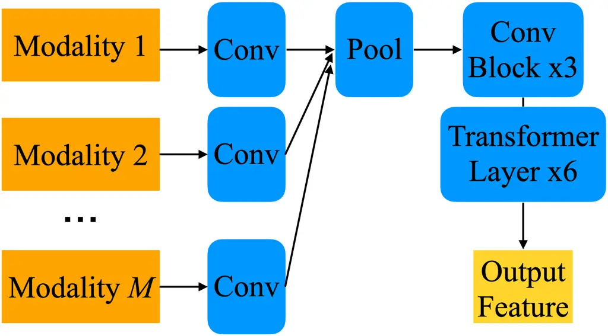

# Deep Speech Synthesis from Multimodal Articulatory Representations

Peter Wu    Bohan Yu    Kevin Scheck    Alan W Black    Aditi S.
Krishnapriyan    Irene Y. Chen    Tanja Schultz    Shinji Watanabe   
Gopala K. Anumanchipalli

###### Abstract

The amount of articulatory data available for training deep learning
models is much less compared to acoustic speech data. In order to
improve articulatory-to-acoustic synthesis performance in these
low-resource settings, we propose a multimodal pre-training framework.
On single-speaker speech synthesis tasks from real-time magnetic
resonance imaging and surface electromyography inputs, the
intelligibility of synthesized outputs improves noticeably. For example,
compared to prior work, utilizing our proposed transfer learning methods
improves the MRI-to-speech performance by 36% word error rate. In
addition to these intelligibility results, our multimodal pre-trained
models consistently outperform unimodal baselines on three objective and
subjective synthesis quality metrics.

###### keywords

articulatory synthesis, multimodal learning

^(†)^(†)address: ¹University of California, Berkeley  
²University of Bremen  
³Carnegie Mellon University^(†)^(†)email: peterw1@berkeley.edu

## 1 Introduction

Articulatory synthesis incorporates information about the vocal tract
into speech synthesizers to improve interpretability, generalizability,
and efficiency \[1, 2, 3, 4, 5\]. Since these models are biologically
grounded, they can be applied to decoding speech from biosignals for
health technology applications \[6, 7, 8, 9, 10, 11, 12, 13\]. These
qualities make articulatory synthesis a promising direction for building
speech synthesizers that support all types of speakers and perform well
in low-resource settings.

However, there is much less articulatory data than other types of
language data like acoustics and text \[14, 15, 16\]. Thus, current
articulatory synthesizers output lower-fidelity speech than
non-articulatory ones \[3, 4, 9\]. To improve the generalizability of
articulatory synthesizers, prior work has studied appending acoustic-
and articulatory-derived features to the input \[3\], modifying the
model architecture \[8, 3\], fine-tuning from pre-trained weights \[4\],
and training cross-speaker models \[17\].

Another way to improve articulatory synthesizers is multimodal learning,
i.e., jointly training with multiple speech modalities \[18\]. Each
modality offers a different view of the same underlying speech
representation space, and the unique pros and cons of each articulatory
modality make them complementary. For example, there is more
electromyography (EMG) data than electromagnetic articulography (EMA)
data since EMG is easier to collect, but EMG is much noiser \[8, 14\].
Real-time magnetic resonance imaging (MRI) scans of the vocal tract
provide articulator position information at a much higher spatial
density than EMA and EMG. However, audio recorded during MRI scans is
much noiser than recordings with the EMA and EMG. We summarize several
characteristics of these modalities in Table 1.

We propose a multimodal pre-training approach for improving articulatory
synthesis, validated through MRI- and EMG-to-speech tasks. With less
than 10 minutes of single-speaker training data, our MRI-to-speech model
achieves a test-set automatic speech recognition (ASR) word error rate
(WER) of 33.4%, compared to 69.5% from the previous model \[4\]. Our
EMG-to-speech model similarly noticeably outperforms the baseline, and
additional objective and human listening tests results match these
trends.

## 2 Related Work

### 2.1 Deep Articulatory Synthesis

Deep articulatory synthesis involves synthesizing acoustics from
articulatory features using deep learning \[2, 6, 7, 8, 3, 4, 9, 5\].
Current approaches can generally be described as either direct or
involving an intermediate feature. Direct synthesis maps articulatory
inputs to acoustics with a single end-to-end model \[3, 4, 19\]. On the
other hand, synthesis with intermediates maps inputs to intermediate
features, which are then mapped to acoustics \[8, 9\]. While prior work
has proposed multiple models that can synthesize intelligible speech,
these models focus on a single articulatory modality. In this paper, we
extend the intermediate-based approach popular in EMG-to-speech
synthesis \[8, 9\] to the multimodal setting.

### 2.2 Multimodal Pre-Training

Multimodal pre-training involves training a model with multiple
modalities jointly, with the resulting model able to perform better in
downstream tasks compared to models trained with fewer modalities \[18,
20\]. Multimodal speech processing has seen success in many tasks, from
emotion recognition to text-to-speech, but utilizing multimodal learning
to improve articulatory synthesis remains underexplored \[21, 22, 23,
24, 25\]. \[26\] identifies the usefulness of multimodal inputs for
articulatory synthesis, and we explore this idea in the context of deep
learning, which current state-of-the-art methods use. \[27\] describes a
speech synthesizer with EMA and spectrogram inputs, providing a deep
architecture for multimodal articulatory synthesis. Since they
experiment with only one articulatory modality, EMA, we study whether
jointly training with multiple articulatory modalities improves
synthesis quality. We also introduce a simpler model that omits their
deep feature training loss but still noticeably improves performance.
The deep feature loss requires datapoints to have labels for multiple
modalities. Since most articulatory datasets only label one articulatory
modality \[14, 15, 28, 8, 9, 29\], omitting this loss term enables us to
do multimodal learning with these unimodal datasets.

## 3 Methods

We propose an encoder-decoder-based framework for multimodal
articulatory synthesis. Like \[8\], the encoder and decoder are trained
separately, since the former requires articulatory labels whereas the
latter does not. Our encoder utilizes a multimodal fusion layer to
jointly encode multiple modalities, and our decoder is an articulatory
vocoder that maps encoder outputs to waveforms end-to-end, detailed
below.

### 3.1 Multimodal Encoder

Our encoder accepts multiple articulatory modalities as input and
outputs a deep representation that is inputted to the decoder. Encoder
inputs and outputs are sequences of vectors, and inputs all have the
same sampling rate and are temporally aligned with outputs. Given
modalities $`\{1,2,\dots,M\}`$, for each modality $`m\in[M]`$, its
datapoint $`x_{m}\in\{x_{mi}\}_{i}`$ is fed into unimodal encoder
$`e_{m}`$. Then, $`\{e_{m}(x_{m})\}_{m}`$ is fed into pooling layer
$`f`$, followed by multimodal encoder $`g`$. Our encoder can thus be
written as

```math
e(\{x_{m}\}_{m})=g(f(\{e_{m}(x_{m})\}_{m})). \tag{1}
```

Our encoder is visualized in Figure 1. We build on the EMG-to-spectrum
model in \[8\], setting $`g`$ to be three residual convolution blocks
\[30\] followed by a six-layer Transformer \[31\]. Each residual block
consists of three convolutions followed by a ReLU non-linearity \[32\],
as detailed in \[8\]. Our unimodal encoders are one-dimensional
convolutions for simplicity, given the linear relationships between
modalities in Section 4.4. We train the encoder using multimodal
pre-training followed by fine-tuning with a single articulatory
modality, detailed in Section 3.4.

### 3.2 Multimodal Fusion

We design our pooling layer $`f`$ such that our encoder output is
invariant with respect to the choices of modalities inputted. For
unimodal articulatory input $`x_{n}`$, we let $`x_{m}=\vec{0}`$ for all
$`m\neq n`$. For conciseness, we write $`e(\{x_{m}\}_{m})`$ in this case
as $`e(x_{n})`$. Defining

```math
f(Z)=\sum_{z\in Z}z \tag{2}
```

and $`e_{m}(\vec{0})=\vec{0}`$, $`\forall m\in[M]`$, e.g., convolution
with $`\vec{0}`$ bias, yields

```math
e(x_{n})=g(e_{n}(x_{n})). \tag{3}
```

This is desirable as unimodal encoders besides $`e_{n}`$ should not
contribute to the encoder output when $`n`$ is the only input modality,
motivating our architecture choice.

One optimality condition for our encoder is
$`e_{m}(x_{m})=e_{n}(x_{n})`$ given $`x_{m}`$ and $`x_{n}`$ are
representative of the same datapoint $`x`$, $`\forall m,n\in[M]`$, as
reflected in the deep feature loss in \[27\]. By extension, modality
invariance suggests that different views of the same datapoint should
have the same encoding $`e(\cdot)`$. In other words, zeroing out
different subsets of $`\{x_{m}\}_{m}`$ should yield the same
$`e(\{x_{m}\}_{m})`$. To satisfy this condition, we scale $`f`$ based on
the number of inputted modalities, i.e.,

```math
f(Z)=(\sum_{z\in Z}z)/N, \tag{4}
```

where $`N=|X_{N}|`$ and $`X_{N}=\{x_{m}|x_{m}\neq\vec{0}\}_{m}`$. Our
multimodal encoder and fusion methods are compatible with prior loss
functions requiring more than one modality as input \[33, 27\].
Moreover, our approach supports settings where only one input modality
is available per datapoint, as is often the case \[15, 29, 8\],
elaborated in Section 3.4.

### 3.3 Decoder

Given the output of the encoder as input, our decoder outputs an
acoustic waveform. Our decoder architecture is HiFi-CAR, an
auto-regressive temporal convolutional network optimized with
adversarial training \[3, 34, 35\]. HiFi-CAR is composed of convolution
blocks and an autoregression module. The convolution blocks alternate
between transposed convolutions that upsample their inputs and residual
blocks \[30\] that can perform more complex transformations \[34\]. The
autoregression module is a feedforward model that encodes the last chunk
of generated audio in order to improve phase prediction \[35\]. We refer
the reader to \[34\], \[35\], and \[3\] for full details and code.
Similarly to \[4\], we fine-tune the decoder from pre-trained
spectrum-to-waveform vocoder weights to improve generalizability. Like
other speech synthesis tasks where this model has been successfully
applied \[3, 10\], our decoder inputs and outputs are temporally
aligned. Like spectrum-to-waveform vocoders \[34, 35\], our decoder
inputs can be extracted from waveforms. Thus, our decoder training
input-output pairs can be generated from any speech corpus. This avoids
the articulatory data scarcity challenge, letting us only need
multimodal pre-training for training the encoder.



Figure 1: Multimodal encoder architecture.

### 3.4 Multimodal Pre-Training and Unimodal Fine-Tuning

During multimodal pre-training, we train the encoder on a dataset with
multiple articulatory modalities. For each input datapoint
$`x=\{x_{m}\}_{m}`$, we set $`x_{m}=\vec{0}`$ for all modalities
$`m\in[M]`$ that are not present in the ground truth. We optimize with
the L1 loss function, given by $`L_{1}(x,y)=|e(x)-y|`$, where $`e(x)`$
and $`y`$ are the predicted and ground-truth outputs, respectively.
Based on \[33, 27\], we also experiment with adding a deep feature loss
to $`L_{1}`$ to align unimodal encoder outputs:

```math
L_{2}(x,y)=\left(\sum_{\begin{subarray}{c}m,n\in X_{N}\\
m<n\end{subarray}}|e_{m}(x_{m})-e_{n}(x_{n})|\right)/\binom{N}{2}, \tag{5}
```

dividing by $`\binom{N}{2}`$ so that $`L_{2}`$ has the same scale for
any $`X_{N}`$. After multimodal pre-training, we fine-tune the model on
the low-resource articulatory modality of interest, e.g., MRI or EMG.
Here, we also set the other inputted modalities to $`\vec{0}`$ and
optimize with $`L_{1}`$.

## 4 Results

### 4.1 Datasets

We study jointly training an articulatory synthesizer with
electromagnetic articulography (EMA), real-time magnetic resonance
imaging (MRI), and surface electromyography (EMG) datasets. We summarize
characteristics of these three modalities in Table 1 and provide
detailed descriptions of each dataset below.

#### 4.1.1 EMA Dataset

EMA data is comprised of the midsagittal x-y coordinates of 6
articulatory positions: lower incisor, upper lip, lower lip, tongue tip,
tongue body, tongue dorsum \[36, 3\]. We use the Haskins Production Rate
Comparison database (HPRC), an 8-speaker dataset containing 7.9 hours of
44.1 kHz speech and 100 Hz EMA \[15\]. Waveforms are downsampled to 16
kHz to match the sampling rate of waveforms in other datasets used in
this work. To maintain consistency with prior work \[3, 37, 38\], we
focus only on the midsagittal plane and discarded the provided mouth
left and jaw left data in HPRC. We concatenate the 6 x-y coordinates to
form a 12-dimensional vector at each time step. In addition to the
12-dimensional EMA data, like \[3\], we concatenate pitch to the input
due to the lack of voicing information in EMA, forming a 13-dimensional
vector input at each time step. We compute pitch using CREPE \[39\],
extracting pitch at the EMA data sampling rate. Following \[9\], we use
HuBERT-Soft \[40\] as the decoder input feature. HuBERT-Soft is a
256-dimensional representation with a sampling rate of 50 Hz that we
extract from 16 kHz waveforms using a pre-trained Transformer \[31,
40\]. We choose HuBERT-Soft due to prior results highlighting its
suitability for speech synthesis over other deep representations \[40\].
The EMA data is randomly divided into an 85%-5%-10% train-validation-set
split, yielding 10,935, 643, and 1287 utterances, respectively.

|                              | EMA       | MRI            | EMG       |
| ---------------------------- | --------- | -------------- | --------- |
| Hours of Data                | $`7.9`$   | $`0.2`$        | $`3.9`$   |
| Noisy Audio                  | False     | True           | False     |
| Channels                     | $`12`$    | $`310`$        | $`8`$     |
| Sampling Rate (Hz)           | $`100`$   | $`83.\bar{3}`$ | $`1,000`$ |
| Approx. Cost of Device (USD) | $`1,000`$ | $`100,000`$    | $`1,000`$ |

Table 1: Summary of articulatory datasets in this work.

#### 4.1.2 MRI Dataset

MRI provides a more comprehensive feature set of the human vocal tract
than EMA \[29, 4, 41\]. In addition to the six locations described by
EMA, midsagittal MRI images contain locations of the hard palate,
pharynx, epiglottis, velum, and larynx, all of which are useful for
speech synthesis \[4\]. We use the 11-minute, 236-utterance,
single-speaker MRI dataset in \[4\]. This dataset is comprised of $`20`$
kHz speech and $`83.\bar{3}`$ Hz midsagittal MRI data, with 170 x-y
points annotated for each MRI frame. Following \[4\], we apply their
deep speech enhancement technique to denoise target audio and discard
annotated points on the back, reducing the number of points from 170 to 155. We use their 200-11-25 train-dev-test split, but omit single-word
gibberish test set utterances unsuitable for the speech recognition
metric in \[4\], yielding 12 test utterances. To match the sampling
rates of other datasets, we upsample the MRI features to $`100`$ Hz and
downsample the waveforms to $`16`$ kHz. Like our EMA dataset in Section
4.1.1, we extract 100 Hz pitch \[39\] and 50 Hz HuBERT-Soft \[40\]
features from waveforms. Prior work also shows that we can accurately
estimate EMA from acoustics \[37, 38, 28, 42\]. Following \[42\], we
train a linear regression model to map WavLM \[43\] features extracted
from waveforms to the 12-dimensional EMA in Section 4.1.1. As in \[42\],
we use the output of the 9th layer of WavLM, a 50 Hz 1024-dimensional
feature that we linearly interpolate to 100 Hz to match the sampling
rate of the EMA data. Since \[42\] found that 20s of training data is
sufficient, we also train on 2000 frames, randomly chosen from the HPRC
train set in Section 4.1.1 \[15\]. We use WavLM \[43\] and the trained
regression model to extract EMA from waveforms in our MRI dataset,
concatenating pitch to the regression output to form the 13-dimensional
EMA feature in Section 4.1.1.

#### 4.1.3 EMG Dataset

EMG measures electrical potentials caused by nearby muscle activity
using electrodes placed on top of the skin \[44\]. When placed near
articulators, EMG provides another low-dimensional manifold of
articulatory movements \[44, 45, 8, 9\]. We use the the 3.9-hour
vocalized speech subset of the dataset in \[8\], which consists of
8-dimensional EMG data and aligned speech, denoted “Parallel Vocalized
Speech” in \[8\]. \[8\] also has ”silent” utterances which where the
participant silently articulated the sentence without any vocalization.
However, since our other articulatory modalities have aligned acoustics
and silent EMG does not, we omit the silent subset in this work.
Following \[9\], Our train-dev-test data split contains 6,755, 199, and
98 utterances, respectively. Speech waveforms have a sampling rate of 16
kHz, and EMG 1000 Hz. Since raw EMG signals are noisy, these signals are
commonly processed first before being used downstream \[8\]. \[8\] found
processing EMG with three residual convolution blocks \[30\] to be
better than statistical methods. Thus, we also process EMG with their
convolutional feature extractor, yielding 768-dimensional EMG features
with a sampling rate of 100 Hz that are inputted to our encoder. To
avoid spurious results due to overfitting, we make sure that our EMG
train, dev, and test sets are subsets of the respective sets used to
train the EMG feature extractor. We also extract 13-dimensional EMA
features from the waveforms in this dataset using the WavLM-regression
approach in Section 4.1.2.

#### 4.1.4 Decoder Dataset

We train our decoder in Section 3.3 with VCTK, which has 110 English
speakers and a total of 44 hours of 44.1 kHz speech, randomly dividing
speakers into an 85%-5%-10% train-validation-test split \[46\]. We
downsample audio to 16 kHz in order to match the sampling rate of other
datasets in this work. Like the aforementioned datasets, we extract 50
Hz HuBERT-Soft \[40\] features from waveforms.

### 4.2 Experimental Setup

For our encoder, described in Section 3.1, Transformer layers have a
hidden dimension of 768 and a dropout value of 0.2. The three residual
blocks in the encoder have strides of 2, 1, and 1, in that order, in
order to downsample the 100 Hz input to 50 Hz. Like \[8\], convolutions
in these blocks have a kernel size of 3. Our unimodal encoders have a
kernel size of 5, stride 1, and padding 2 so that their input sequence
lengths match the output lengths. When training the encoder, like \[3\],
we randomly crop a 0.6 to 2.0 second window from each sample in the
size-64 batch, with the window length fixed within the batch.

Our decoder, described in Section 3.3, contains 4 upsampling blocks,
each composed of a Leaky ReLU nonlinearity \[47\] followed by a
transposed convolution like \[34\]. Transposed convolutions have strides
of 8, 5, 4, and 2, in that order, in order to upsample 50 Hz inputs to
16000 Hz waveforms. Like \[34\], each upsampling block is followed by 3
residual blocks with kernel sizes of 3, 7, and 11. Each residual block
contains 3 dilated convolutions with dilations of 1, 3, and 5 \[34\].
Following \[3\], the autoregression module is a 5-layer feedforward
network with Leaky ReLU nonlinearity \[47\] and input, hidden, and
output dimensions of 512, 256, and 128, respectively. We also train the
decoder with the random cropping approach used for the encoder, using a
0.16 to 1.0 second window and a batch size of 32. For pre-trained
weights, we use the LibriTTS \[16\] HiFi-GAN mel-spectrogram to speech
vocoder weights in \[34, 4\]. Since some decoder weights have different
sizes than those of the pre-trained vocoder, we only load the weights
with matching dimensions.

We apply our multimodal pre-training method to improving MRI-to-speech
and EMG-to-speech models, omitting EMA-to-speech since existing models
are already intelligible \[3\]. For MRI-to-speech, we do multimodal
pre-training with EMA and MRI, as well as with EMA, MRI, and EMG.
Similarly, we pre-train with EMA + EMG and EMA + MRI + EMG for
EMG-to-speech. For each modality subset experiment, we also study
whether including the EMA features estimated from waveforms in Section
4.1 improves model performance. To compare with prior work, we use the
HiFi-CAR (Section 3.3) articulatory vocoder in \[4\] as our
MRI-to-speech baseline, which has upsample scales \[8, 5, 3, 2\] and
directly maps $`83.\bar{3}`$ Hz MRI to $`20`$ kHz acoustics. Since our
voiced EMG task does not have a baseline to our knowledge \[8\], we also
use HiFi-CAR, here with upsample scales \[5, 4, 4, 2\] to map the
$`100`$ Hz EMG features in Section 4.1.3 to $`16`$ kHz acoustics. All
models are trained using the Adam optimizer \[48\] with betas {0.5, 0.9}
and a learning rate of $`10^{-4}`$.

### 4.3 Metrics

Following prior speech synthesis work, we evaluate models with both
subjective and objective metrics \[49, 3\]. For subjective evaluation,
we use the popular 5-scale mean opinion score (MOS) test. Each model
receives 100 unique ratings. Objective metrics include: (1) automatic
speech recognition (ASR) performance for measuring intelligibility, (2)
mel-cepstral distortion (MCD) \[50\], and (3) SpeechBERTScore \[51\].
ASR character error rate (CER) and word error rate (WER) is computed
with the Whisper Large model \[52\]. MCD measures voice quality by
comparing spectrums of generated speech to those of ground truth
waveforms and is often used to measure speech synthesis performance \[3,
51\]. SpeechBERTScore utilizes self-supervised representations to
automatically estimate synthesis quality, correlating higher with human
ratings compared to prior objective metrics \[51\].

| Input $`\backslash`$ Output | EMA   | EMG   | MRI   | \[40\] |
| --------------------------- | ----- | ----- | ----- | ------ |
| EMA                         | \-    | 0.107 | 0.309 | 0.158  |
| EMG                         | 0.510 | \-    | \-    | 0.347  |
| MRI                         | 0.577 | \-    | \-    | 0.203  |
| \[40\]                      | 0.702 | 0.224 | 0.423 | \-     |

Table 2: Correlation between linear regression and ground truth outputs
for different speech features. Same and unavailable input-output pairs
are omitted.

| Model                                            | CER (%) $`\downarrow`$ | WER (%) $`\downarrow`$ | MCD$`\downarrow`$ | SpeechBERTScore$`\uparrow`$ | MOS$`\uparrow`$            |
| ------------------------------------------------ | ---------------------- | ---------------------- | ----------------- | --------------------------- | -------------------------- |
| Tri-modal Encoder-Decoder with Deep Feature Loss | 26.427                 | 41.326                 | 8.3359            | 0.7305                      | 3.30 $`\pm`$ 0.93          |
| Tri-modal Encoder-Decoder                        | 21.361                 | 39.005                 | 8.3961            | 0.7257                      | 3.11 $`\pm`$ 1.11          |
| Bi-modal Encoder-Decoder with Deep Feature Loss  | 20.098                 | 33.434                 | 8.1961            | 0.7390                      | 3.48 $`\mathbf{\pm}`$ 0.86 |
| Bi-modal Encoder-Decoder                         | 21.938                 | 39.239                 | 8.2466            | 0.7291                      | 3.16 $`\pm`$ 1.08          |
| Unimodal Encoder-Decoder                         | 30.988                 | 50.865                 | 8.4652            | 0.6956                      | 3.06 $`\pm`$ 1.00          |
| Vocoder \[4\]                                    | 48.208                 | 69.451                 | \-                | \-                          | \-                         |

Table 3: MRI-to-speech, training proposed model with tri-modal (EMA,
MRI, EMG), bi-modal (EMA, MRI), and unimodal (MRI) data.

| Model                                            | CER (%) $`\downarrow`$ | WER (%) $`\downarrow`$ | MCD$`\downarrow`$ | SpeechBERTScore$`\uparrow`$ | MOS$`\uparrow`$            |
| ------------------------------------------------ | ---------------------- | ---------------------- | ----------------- | --------------------------- | -------------------------- |
| Tri-modal Encoder-Decoder with Deep Feature Loss | 18.342                 | 18.091                 | 5.2336            | 0.8341                      | 3.69 $`\mathbf{\pm}`$ 0.86 |
| Tri-modal Encoder-Decoder                        | 17.240                 | 18.866                 | 5.3110            | 0.8323                      | 3.63 $`\pm`$ 0.94          |
| Bi-modal Encoder-Decoder with Deep Feature Loss  | 16.537                 | 19.616                 | 5.3107            | 0.8339                      | 3.67 $`\pm`$ 0.82          |
| Bi-modal Encoder-Decoder                         | 16.542                 | 21.021                 | 5.3442            | 0.8284                      | 3.46 $`\pm`$ 1.01          |
| Unimodal Encoder-Decoder                         | 22.993                 | 24.394                 | 5.3800            | 0.8198                      | 3.51 $`\pm`$ 0.96          |
| Vocoder \[4\]                                    | 40.445                 | 43.561                 | \-                | \-                          | \-                         |

Table 4: EMG-to-speech, training proposed model with tri-modal (EMA,
MRI, EMG), bi-modal (EMA, EMG), and unimodal (EMG) data.

### 4.4 Relationship Between Speech Representations

We check the linear relationship between our different speech
representations in order to gain intuition on the efficacy of training
with them jointly. This is motivated by \[26\], which found a high
correlation between face- and tongue-based articulatory features and
improved unit selection synthesis when utilizing both instead of one.
Following the setup in \[42\], we train a linear regression model to map
one speech feature to another and calculate the Pearson correlation
between predicted and ground truth outputs on a held-out test set. We
train on 2000 frames like \[42\] and Section 4.1.1, and test on 200
frames randomly chosen from the remaining data. We train regression
models for the following speech features: EMA, MRI, EMG, and HuBERT-Soft
\[40\]. For experiments with EMG, we choose frames from the EMG dataset
in Section 4.1, and likewise for MRI. Since we lack a dataset with
EMG-MRI pairs, we do not train a regression model mapping between these
modalities. To map between HuBERT-Soft and EMA, we use the EMA dataset
in Section 4.1.1.

Table 2 summarizes our linear regression results. There is a high
correlation between EMA estimated from HuBERT-Soft \[40\] and ground
truth EMA, reflecting prior intelligible EMA-to-speech \[3\] and SSL-EMA
correlation \[42\] results. The EMG-to-EMA and MRI-to-EMA correlation
results are also reasonably high, suggesting that EMG and MRI share
information with EMA and can benefit from joint training. Estimating
HuBERT-Soft from these 3 articulatory modalities is difficult,
reflecting the articulatory synthesis challenges faced in prior work
\[3, 4, 8, 9, 24, 7, 6\]. Likewise, the difficulty of estimating EMG and
MRI from HuBERT-Soft reflects prior articulatory inversion challenges
\[53, 54\].

### 4.5 Synthesis Quality

Tables 3 and 4 summarize our MRI-to-speech and EMG-to-speech results,
respectively. Multimodal pre-training results in much better ASR
performance than the baseline for both MRI-to-speech and voiced
EMG-to-speech. Our best MRI-to-speech WER, 33.4%, is noticeably better
than the 69.5% WER from the previous model \[4\]. Adding more modalities
generally improves model performance across all of our metrics, with the
largest improvement when going from unimodal to bi-modal training.
Multimodal pre-training with estimated EMA features and our deep feature
loss in Equation 5 also generally improves synthesis quality, suggesting
that adding this loss term increases multimodal alignment.

## 5 Conclusion

We devise a multimodal pre-training framework for improving the
performance of deep MRI- and EMG-to-speech models. Our MRI-to-speech
synthesizer outperforms the test-set ASR WER of the previous model \[4\]
by 36% WER, with our EMG-to-speech model similarly outperforming the
baseline. On all of our objective and subjective synthesis quality
metrics, our multimodal models outperform the unimodal ones,
highlighting the effectiveness of multimodal pre-training. In the
future, we are interested in extending these results to multi-speaker
tasks and additional datasets.

## References

- \[1\] C. P. Browman _et al._, “Articulatory synthesis from underlying
  dynamics,” _JASA_, 1984.
- \[2\] S. Aryal and R. Gutierrez-Osuna, “Data driven articulatory
  synthesis with deep neural networks,” _Computer Speech &
  Language_, 2016.
- \[3\] P. Wu _et al._, “Deep speech synthesis from articulatory
  representations,” _Interspeech_, 2022.
- \[4\] ——, “Deep speech synthesis from mri-based articulatory
  representations,” _Interspeech_, 2023.
- \[5\] P. K. Krug _et al._, “Self-Supervised Solution to the Control
  Problem of Articulatory Synthesis,” in _Interspeech_, 2023.
- \[6\] T. G. Csapó _et al._, “Dnn-based ultrasound-to-speech conversion
  for a silent speech interface,” _Interspeech_, 2017.
- \[7\] N. Kimura _et al._, “Sottovoce: An ultrasound imaging-based
  silent speech interaction using deep neural networks,” in _CHI_, 2019.
- \[8\] D. Gaddy and D. Klein, “An improved model for voicing silent
  speech,” _arXiv_, 2021.
- \[9\] K. Scheck and T. Schultz, “Multi-speaker speech synthesis from
  electromyographic signals by soft speech unit prediction,” in
  _ICASSP_, 2023.
- \[10\] S. L. Metzger _et al._, “A high-performance neuroprosthesis for
  speech decoding and avatar control,” _Nature_, 2023.
- \[11\] J. Lian _et al._, “Unconstrained dysfluency modeling for
  dysfluent speech transcription and detection,” in _ASRU_, 2023.
- \[12\] F. Bocquelet _et al._, “Real-time control of an
  articulatory-based speech synthesizer for brain computer interfaces,”
  _PLoS computational biology_, 2016.
- \[13\] S. Luo _et al._, “Brain-computer interface: applications to
  speech decoding and synthesis to augment communication,”
  _Neurotherapeutics_, 2023.
- \[14\] K. Richmond _et al._, “Announcing the electromagnetic
  articulography (day 1) subset of the mngu0 articulatory corpus,” in
  _Interspeech_, 2011.
- \[15\] M. K. Tiede _et al._, “Quantifying kinematic aspects of
  reduction in a contrasting rate production task,” _JASA_, 2017.
- \[16\] H. Zen _et al._, “Libritts: A corpus derived from librispeech
  for text-to-speech,” _Interspeech_, 2019.
- \[17\] K. Scheck _et al._, “Cross-Speaker Training and Adaptation for
  Electromyography-to-Speech Conversion,” in _EMBC_, 2024.
- \[18\] P. P. Liang _et al._, “Multibench: Multiscale benchmarks for
  multimodal representation learning,” _NeurIPS_, 2021.
- \[19\] K. Scheck _et al._, “Stream-ets: Low-latency end-to-end speech
  synthesis from electromyography signals,” in _Speech
  Communication_, 2023.
- \[20\] X. Wang _et al._, “Large-scale multi-modal pre-trained models:
  A comprehensive survey,” _Machine Intelligence Research_, 2023.
- \[21\] K. Zhao _et al._, “A real-time speech driven talking avatar
  based on deep neural network,” in _APSIPA_, 2013.
- \[22\] S. Tamura _et al._, “Audio-visual speech recognition using deep
  bottleneck features and high-performance lipreading,” in
  _APSIPA_, 2015.
- \[23\] Y. Yoon _et al._, “Speech gesture generation from the trimodal
  context of text, audio, and speaker identity,” _TOG_, 2020.
- \[24\] J.-X. Zhang _et al._, “Talnet: Voice reconstruction from tongue
  and lip articulation with transfer learning from text-to-speech
  synthesis,” in _AAAI_, 2021.
- \[25\] Z. Wang _et al._, “The multimodal information based speech
  processing (misp) 2022 challenge: Audio-visual diarization and
  recognition,” in _ICASSP_, 2023.
- \[26\] R. Carlson and B. Granström, “Data-driven multimodal
  synthesis,” _Speech communication_, 2005.
- \[27\] Y.-W. Chen _et al._, “Ema2s: An end-to-end multimodal
  articulatory-to-speech system,” in _ISCAS_, 2021.
- \[28\] S. Udupa _et al._, “Estimating articulatory movements in speech
  production with transformer networks,” _arXiv_, 2021.
- \[29\] Y. Lim _et al._, “A multispeaker dataset of raw and
  reconstructed speech production real-time mri video and 3d volumetric
  images,” _Scientific data_, 2021.
- \[30\] K. He _et al._, “Deep residual learning for image recognition,”
  in _CVPR_, 2016.
- \[31\] A. Vaswani _et al._, “Attention is all you need,”
  _NeurIPS_, 2017.
- \[32\] K. Fukushima, “Cognitron: A self-organizing multilayered neural
  network,” _Biological cybernetics_, 1975.
- \[33\] F. G. Germain _et al._, “Speech denoising with deep feature
  losses,” _arXiv preprint arXiv:1806.10522_, 2018.
- \[34\] J. Su _et al._, “Hifi-gan: High-fidelity denoising and
  dereverberation based on speech deep features in adversarial
  networks,” in _Interspeech_, 2017.
- \[35\] M. Morrison _et al._, “Chunked autoregressive gan for
  conditional waveform synthesis,” _ICLR_, 2021.
- \[36\] P. W. Schönle _et al._, “Electromagnetic articulography: Use of
  alternating magnetic fields for tracking movements of multiple points
  inside and outside the vocal tract,” _Brain and Language_, 1987.
- \[37\] P. Wu _et al._, “Speaker-independent acoustic-to-articulatory
  speech inversion,” in _ICASSP_, 2023.
- \[38\] Y. M. Siriwardena and C. Espy-Wilson, “The secret source:
  Incorporating source features to improve acoustic-to-articulatory
  speech inversion,” in _ICASSP_, 2023.
- \[39\] J. W. Kim _et al._, “Crepe: A convolutional representation for
  pitch estimation,” in _ICASSP_, 2018.
- \[40\] B. van Niekerk _et al._, “A comparison of discrete and soft
  speech units for improved voice conversion,” in _ICASSP_, 2022.
- \[41\] Y. Otani _et al._, “Speech Synthesis from Articulatory
  Movements Recorded by Real-time MRI,” in _Interspeech_, 2023.
- \[42\] C. J. Cho _et al._, “Evidence of vocal tract articulation in
  self-supervised learning of speech,” in _ICASSP_, 2023.
- \[43\] S. Chen _et al._, “Wavlm: Large-scale self-supervised
  pre-training for full stack speech processing,” _JSTSP_, 2022.
- \[44\] K. S. Harris _et al._, “Component gestures in the production of
  oral and nasal labial stops,” _JASA_, 1962.
- \[45\] B. Denby _et al._, “Silent speech interfaces,” _Speech
  Communication_, 2010.
- \[46\] C. Veaux _et al._, “Cstr vctk corpus: English multi-speaker
  corpus for cstr voice cloning toolkit,” _CSTR_, 2017.
- \[47\] A. L. Maas _et al._, “Rectifier nonlinearities improve neural
  network acoustic models,” in _ICML_, 2013.
- \[48\] D. P. Kingma and J. Ba, “Adam: A method for stochastic
  optimization,” _ICLR_, 2015.
- \[49\] T. Hayashi _et al._, “Espnet2-tts: Extending the edge of tts
  research,” _arXiv_, 2021.
- \[50\] T. Fukada _et al._, “An adaptive algorithm for mel-cepstral
  analysis of speech.” in _ICASSP_, 1992.
- \[51\] T. Saeki _et al._, “SpeechBERTScore: Reference-aware automatic
  evaluation of speech generation leveraging nlp evaluation metrics,”
  _arXiv_, 2024.
- \[52\] A. Radford _et al._, “Robust speech recognition via large-scale
  weak supervision,” in _ICML_, 2023.
- \[53\] M. Sharma _et al._, “A comparative study of different emg
  features for acoustics-to-emg mapping.” in _Interspeech_, 2021.
- \[54\] K. Scheck and T. Schultz, “STE-GAN: Speech-to-Electromyography
  Signal Conversion using Generative Adversarial Networks,” in
  _Interspeech_, 2023.
