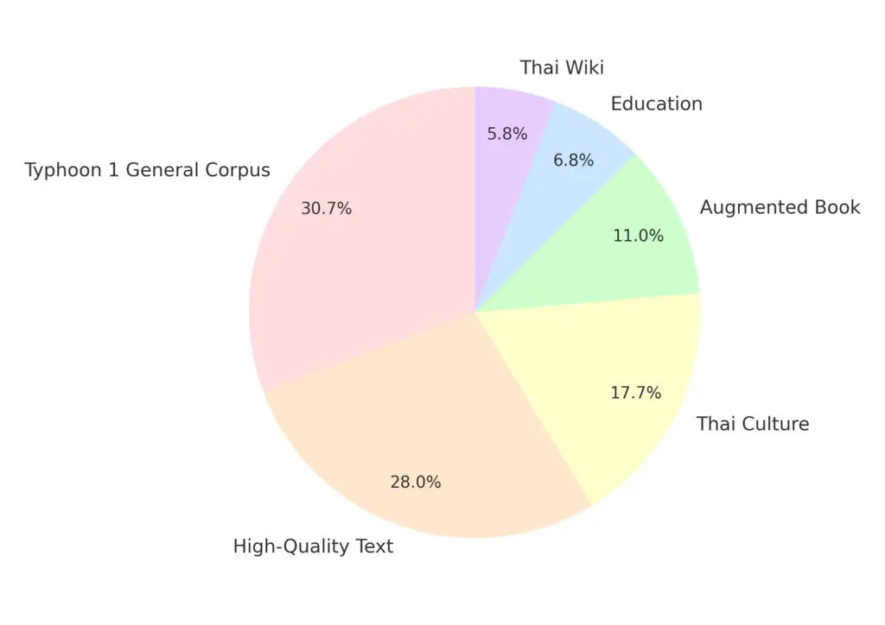
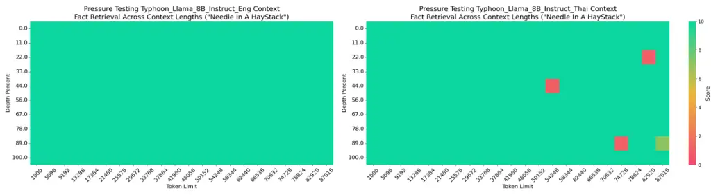
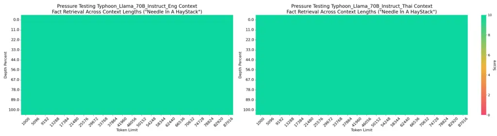
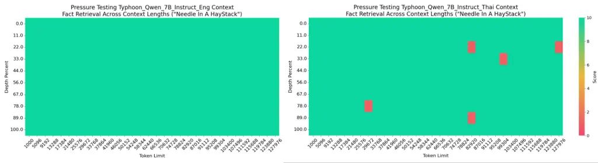
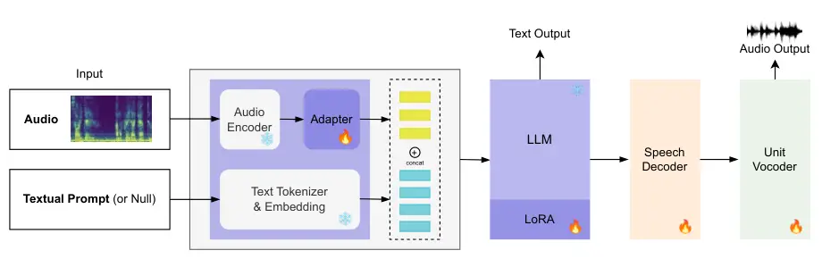
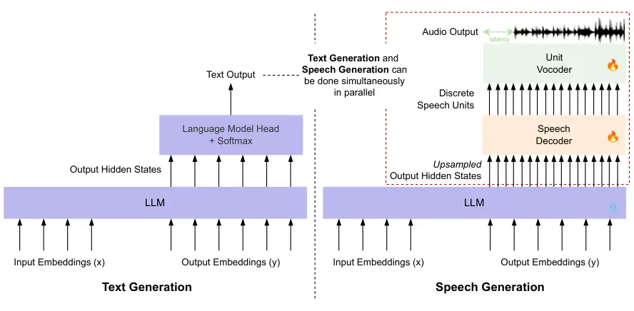

# ![[Uncaptioned image]](arxiv-2412-13702--3c1c07d387f8.figures/figure-1.webp) Typhoon 2: A Family of Open Text and Multimodal ABE.Thai Large Language Models

###### Abstract

This paper introduces Typhoon 2, a series of text and multimodal large
language models optimized for the Thai language. The series includes
models for text, vision, and audio. Typhoon2-Text builds on
state-of-the-art open models, such as Llama 3 and Qwen2, and we perform
continual pre-training on a mixture of English and Thai data. We employ
post-training techniques to enhance Thai language performance while
preserving the base models’ original capabilities. We release text
models across a range of sizes, from 1 to 70 billion parameters,
available in both base and instruction-tuned variants. To guardrail text
generation, we release Typhoon2-Safety, a classifier enhanced for Thai
cultures and language. Typhoon2-Vision improves Thai document
understanding while retaining general visual capabilities, such as image
captioning. Typhoon2-Audio introduces an end-to-end speech-to-speech
model architecture capable of processing audio, speech, and text inputs
and generating both text and speech outputs.

|     |
| --- |
|     |

### Summary of the Typhoon2 Models

| Model                 | Base Model           | Link to HuggingFace                                                                                             |
| --------------------- | -------------------- | --------------------------------------------------------------------------------------------------------------- |
| Text                  |                      |                                                                                                                 |
| Typhoon2-1B-Base      | Llama-3.2-1B         | [scb10x/llama3.2-typhoon2-1b](https://huggingface.co/scb10x/llama3.2-typhoon2-1b)                               |
| Typhoon2-1B-Instruct  |                      | [scb10x/llama3.2-typhoon2-1b-instruct](https://huggingface.co/scb10x/llama3.2-typhoon2-1b-instruct)             |
| Typhoon2-3B-Base      | llama-3.2-3B         | [scb10x/llama3.2-typhoon2-3b](https://huggingface.co/scb10x/llama3.2-typhoon2-3b)                               |
| Typhoon2-3B-Instruct  |                      | [scb10x/llama3.2-typhoon2-3b-instruct](https://huggingface.co/scb10x/llama3.2-typhoon2-3b-instruct)             |
| Typhoon2-7B-Base      | Qwen2.5-7B           | [scb10x/typhoon2-qwen2.5-7b](https://huggingface.co/scb10x/typhoon2-qwen2.5-7b)                                 |
| Typhoon2-7B-Instruct  |                      | [scb10x/typhoon2-qwen2.5-7b-instruct](https://huggingface.co/scb10x/typhoon2-qwen2.5-7b-instruct)               |
| Typhoon2-8B-Base      | Llama-3.1-8B         | [scb10x/llama3.1-typhoon2-8b](https://huggingface.co/scb10x/llama3.1-typhoon2-8b)                               |
| Typhoon2-8B-Instruct  |                      | [scb10x/llama3.1-typhoon2-8b-instruct](https://huggingface.co/scb10x/llama3.1-typhoon2-8b-instruct)             |
| Typhoon2-70B-Base     | Llama-3.1-70B        | [scb10x/llama3.1-typhoon2-70b](https://huggingface.co/scb10x/llama3.1-typhoon2-70b)                             |
| Typhoon2-70B-Instruct |                      | [scb10x/llama3.1-typhoon2-70b-instruct](https://huggingface.co/scb10x/llama3.1-typhoon2-70b-instruct)           |
| Safety Classifier     |                      |                                                                                                                 |
| Typhoon2-Safety       | mdeberta-v3-base     | [scb10x/typhoon2-safety-preview](https://huggingface.co/scb10x/typhoon2-safety-preview)                         |
| Multimodal            |                      |                                                                                                                 |
| Typhoon2-Vision       | Qwen2-VL-7B-Instruct | [scb10x/typhoon2-qwen2vl-7b-vision-instruct](https://huggingface.co/scb10x/typhoon2-qwen2vl-7b-vision-instruct) |
| Typhoon2-Audio        | Typhoon2-8B-Instruct | [scb10x/llama3.1-typhoon2-audio-8b-instruct](https://huggingface.co/scb10x/llama3.1-typhoon2-audio-8b-instruct) |

Table 1: Models released in the Typhoon2 series

###### Contents

1.  1 Introduction
2.  2 Pre-training
    1.  2.1 Data Source & Typhoon1-Corpus
        1.  2.1.1 Base Corpus Preparation
        2.  2.1.2 Typhoon 1 General Corpus
    2.  2.2 Gathering Diverse and High-Quality Thai Documents
        1.  2.2.1 Culturally Relevant Thai Text
        2.  2.2.2 High-Quality Text Selection
        3.  2.2.3 Synthetic Textbook
        4.  2.2.4 High-Educational Content
        5.  2.2.5 Other High-Quality Sources
    3.  2.3 Data Mixture
    4.  2.4 Training
    5.  2.5 Evaluation
    6.  2.6 Results and Findings
3.  3 Post-training
    1.  3.1 General Supervised Fine Tuning (SFT)
        1.  3.1.1 Data
        2.  3.1.2 Experimental Setup
        3.  3.1.3 Results and Findings
    2.  3.2 Domain-Specific SFT
        1.  3.2.1 Data
        2.  3.2.2 Experimental Setup
        3.  3.2.3 Results and Findings
    3.  3.3 Long Context
        1.  3.3.1 Data
        2.  3.3.2 Experimental Setup
        3.  3.3.3 Results and Findings
    4.  3.4 Function Calling
        1.  3.4.1 Data
        2.  3.4.2 Experimental Setup
        3.  3.4.3 Results and Findings
    5.  3.5 Distillation
        1.  3.5.1 Top-k Logits Distillation
        2.  3.5.2 Experimental Setup
        3.  3.5.3 Results and Findings
    6.  3.6 Model Merging
        1.  3.6.1 Experimental Setup
        2.  3.6.2 Results and Findings
    7.  3.7 Final Combination Strategy
    8.  3.8 Post-Training Configuration Summary
    9.  3.9 Full Evaluation Results
    10. 3.10 Safety
        1.  3.10.1 Data Generation
        2.  3.10.2 Experimental Setup
        3.  3.10.3 Results and Findings
4.  4 Vision
    1.  4.1 Architecture
    2.  4.2 General Data
    3.  4.3 Thai OCR Enhancement
        1.  4.3.1 Data Sources: Thai Book and Thai Financial
        2.  4.3.2 Agentic Framework for Thai VQA Data Curation
    4.  4.4 Experimental Setup
    5.  4.5 Results and Findings
5.  5 Audio & Speech
    1.  5.1 End-to-End Model Architecture
    2.  5.2 Speech Encoding
        1.  5.2.1 Speech Encoder
        2.  5.2.2 Data
        3.  5.2.3 Experimental Setup
        4.  5.2.4 Results and Findings
    3.  5.3 Speech Generation
        1.  5.3.1 Speech Decoder
        2.  5.3.2 Discrete Speech Tokens
        3.  5.3.3 Unit Vocoder
        4.  5.3.4 Data
        5.  5.3.5 Experimental Setup
        6.  5.3.6 Results and Findings
    4.  5.4 End-to-End Speech-to-Speech Evaluation
6.  6 Conclusions
7.  7 Acknowledgments
8.  References

## 1 Introduction

Foundation models are general models which can serve as the backbone in
a wide range of AI applications involving language, vision, speech, and
other modalities. There are a number of widely popular language model
families, including open¹¹ 1 In this paper, we do not make a distinction
between open-source and open-weights. The term open is used for
referring to both options. families such as Llama 3 (Grattafiori et al.,
2024), Qwen2.5 (Yang et al., 2024a), Phi 3 (Abdin et al., 2024) and
proprietary families, such as GPT-4o, Claude 3, Gemini 1.5. However,
although these models are multilingual and can work in a range of
languages, they are developed as English-centric. Hence, the community
has considered enhancing the performance of open foundation models on a
small set of languages for their country or region.

In South East Asia (SEA), the efforts to enhance foundation language
models for SEA languages include SeaLLM (Zhang et al., 2024), SEA-LION
(Singapore, 2024), and Sailor (Dou et al., 2024). When it comes to the
Thai language, there are model families such as WangChan (Polpanumas
et al., 2023), Typhoon (Pipatanakul et al., 2023), OpenThaiGPT (Yuenyong
et al., 2024), and Pathumma (NECTEC, 2024).

To continue our commitment in advancing Thai foundation models, this
work introduces a new series of state-of-the-art Thai language and
multimodal models, Typhoon2. Following our previous releases, these
models are optimized for Thai and English, building on open-source
models such as Llama 3 and Qwen2.5. The text models, Typhoon2-Text, are
improved over Typhoon 1.5 in various aspects, including data filtering
techniques for pre-training, complex instruction data development for
improved post-training, long context, and function calling capabilities
of the models. These text models are also now available in a range of
sizes, consisting of 1B, 3B, 7B, 8B, and 70B parameters. We offer both
pre-trained and instruction-tuned variants for each size. In addition,
we introduce Typhoon2-Safety a safety text classifier designed to detect
Thai-sensitive content and enhance the security of LM-integrated
systems.

Furthermore, the Typhoon2 series is multimodal. The vision model,
Typhoon2-Vision, builds on the first Typhoon-Vision model by enhancing
Thai document understanding capabilities, such as optical character
recognition (OCR). The audio model, Typhoon2-Audio, extends the first
Typhoon-Audio model, evolving into an end-to-end speech processing and
generation model capable of understanding audio, speech, and text, while
generating text and speech outputs in parallel. This report provides
details and insights from our development. We make the weights of all
models publicly available on Hugging Face Hub where the summary of our
release is shown in Table 1.

## 2 Pre-training

This section of the report details the pre-training phase of Typhoon 2,
which continues to build on the same motivation as its predecessor: to
construct the highest-quality corpus that represents the Thai culture
and language. Typhoon 2 builds upon the foundation laid by the previous
iteration of Typhoon. The primary objective of this iteration is to
develop a more diverse and high-quality dataset in Thai for
pre-training. This goal is accomplished by implementing multiple
data-gathering pipelines designed to target various domains and subsets
within the Thai language.

### 2.1 Data Source & Typhoon1-Corpus

This section outlines the preparation process for Typhoon 1, which can
be summarized in five steps. The first four steps involve preparing the
base corpus, which will serve as a reference dataset used for filtering
additional data in Section 2.2. The fifth step focuses on selecting the
general Typhoon1-Corpus (Pipatanakul et al., 2023).

#### 2.1.1 Base Corpus Preparation

Step1 - Scaling the Data: We initiate the process by increasing the
number of Common Crawl (CommonCrawl) packages compared to the previous
iteration, where we process a total of 40 packs of the CommonCrawl data.

Step2 - Text Extraction: Although CommonCrawl provides a pre-extracted
WET subset, several studies suggest that WET files exhibit lower quality
compared to WARC files extracted using external tools such as
Trafilatura (Li et al., 2024a; Penedo et al., 2023). In our study, we
begin with a total of 40 packs of Thai CommonCrawl data with a cut-off
date of September 2023 and perform HTML extraction from scratch using
Trafilatura²² 2
[https://trafilatura.readthedocs.io/en/latest/](https://trafilatura.readthedocs.io/en/latest/).
This process results in a significantly larger dataset, comprising
approximately 3 TB of Thai text, or approximately 200 billion Llama3
tokens.

Step3 - Strict Deduplication: To ensure data quality and minimize
redundancy, we implement a fuzzy deduplication pipeline using MinHash
and locality-sensitive hashing (LSH) algorithms.³³ 3
[https://github.com/ChenghaoMou/text-dedup](https://github.com/ChenghaoMou/text-dedup)

Step4 - Heuristic Filtering: To filter out pages containing excessive
search engine optimization (SEO) content, very short documents, and
low-quality texts, we evaluate each line using signals such as the ratio
of numbers to text and the punctuation density. At the document level,
document filtering is done based on other metrics, including newline
ratios and overall document length. After deduplication and heuristic
filtering, we have approximately 44B tokens of Thai text.

#### 2.1.2 Typhoon 1 General Corpus

To ensure that the pre-trained data accurately represents the Thai
language and culture, we employ a filtering process on the base corpus,
involving a human-in-the-loop at the domain level in the same manner as
Typhoon (Pipatanakul et al., 2023). This approach ensures that the
content is both relevant and appropriate, preserving its authenticity.
Consequently, we obtain 5 billion high-quality Thai tokens, which serve
as the foundation for training the original Typhoon and Typhoon 1.5
models.

### 2.2 Gathering Diverse and High-Quality Thai Documents

To enhance our dataset, we observed a growing trend in pre-training
large language models (LLMs) that emphasizes sourcing high-quality data
from general corpora. Following this approach, we develop multiple
pipelines to collect documents from a range of diverse domains, focusing
on high-quality content absent from our existing general corpus.

Our approach is aimed to address two key questions:

1.  1.  What represents “Thai"? – We curate data encapsulating Thai cultural
        knowledge.
2.  2.  What defines a “state-of-the-art" LLM? – We follow the global trend
        of filtering the web corpus to gather high quality & high
        educational text (Penedo et al., 2024; Li et al., 2024a; Grattafiori
        et al., 2024).

As a result, we augment our dataset with an additional 12B high-quality
Thai tokens through this process.

#### 2.2.1 Culturally Relevant Thai Text

A tailored methodology for content collection is developed to address
cultural nuances in the text data, drawing upon principles of the
fine-web educational approach (Penedo et al., 2024). Specifically, we
use an LLM to annotate 50,000 randomly selected entries from the base
corpus. Each entry is assessed for its cultural relevancy and
educational value in understanding Thai culture, using a scale ranging
from 1 to 5. Next, we fine-tune the classification head of BGE-M3 (Chen
et al., 2024a) using the labeled dataset obtained from the previous
process. We employ a smaller model to predict the Thai cultural value of
samples within our base corpus. Subsequently, we filter only those with
a predicted value of 4 or higher and use these instances to train
Typhoon 2.

#### 2.2.2 High-Quality Text Selection

Inspired by DCLM (Li et al., 2024a) and the importance of high-quality
text filtering in Thai, we develop a fastText (Joulin et al., 2017)
classifier tailored for the Thai language. Given the low-resource nature
of Thai, we conduct multiple iterations of training to refine our
classifier. First, we compile an instruction-following dataset in Thai,
drawing from WangchanThaiInstruct (Vistec, 2024) and samples from our
Typhoon Instruct dataset (Pipatanakul et al., 2023) as positive
examples, while incorporating random examples, including toxic content
and junk websites, as negative examples. Next, we apply the classifier
developed in the initial iteration to classify approximately 200,000
samples from a base corpus. After manual inspection and filtering, we
train another iteration of the fastText classifier. This iterative
approach results in a high-quality Thai text classifier capable of
filtering content with a predicted quality ratio exceeding 0.5 as a
high-quality sample.

#### 2.2.3 Synthetic Textbook

To address the lack of textbooks in our general corpus, we employ a
method inspired by the Phi and Cosmopedia (Ben Allal et al., 2024;
Gunasekar et al., 2023) approach. We use LLM to create an augmented
dataset of 5,000 text samples with styles that emulate textbooks, blog
posts, and academic materials. This augmented dataset is then used to
fine-tune typhoon-1.5-8b-instruct on a text augmentation task involving
raw text and style information. The fine-tuned model is used to augment
20% of our general corpus to resemble textbook-style content.

#### 2.2.4 High-Educational Content

To gather high educational content in Thai, we use a similar approach as
in collected culture-related text in Thai and fine-web edu (Penedo
et al., 2024). Specifically, an LLM is used to annotate 50K samples and
we fine-tune the BGE-M3 classification head. We filter only with a
predicted value of 3 or higher due to the low level of educational
content.

#### 2.2.5 Other High-Quality Sources

We also incorporate highly educational sources, such as Thai Wikipedia,
into our final pre-training dataset.

### 2.3 Data Mixture

To ensure good final model performance, it is imperative to determine
the proportion of various data sources within the pre-training dataset.
Since our approach involves continual pre-training (CPT), maintaining an
awareness of the original pre-trained distribution is crucial.

We conduct a series of experiments to optimize the final model’s
performance. In the first stage, we independently evaluate each new data
source to ensure that individual subsets contribute positively. We
examine this by performing CPT on the 1.5B Qwen2.5 (Yang et al., 2024a)
model using a similar recipe to Blakeney et al. (2024) and verify that
each of the data sources improves one of the metrics or scores based on
M3Exam (Zhang et al., 2023b) and/or ThaiExam (Pipatanakul et al., 2023).

Next, we explore simple data mixture strategies. Our English dataset
ratio, which is 50%, is inspired by previous studies, including
Typhoon (Pipatanakul et al., 2023) and SambaLingo (Csaki et al., 2023)
to mitigate catastrophic forgetting. For each large corpus, we repeat
the data for 1 time, for smaller corpus (such as education documents and
Wikipedia) we repeat the data up to three times. Additionally, we
experimented with Doremi (Xie et al., 2023) but did not observe a
significant improvement. Ultimately, our best approach is based on a
simple data mixture strategy where our English subset is sourced from
Shen et al. (2024); Weber et al. (2024), and each of the datasets is
repeated 1 time, except for the education content (2 times) and
Wikipedia (3 times). The Thai subset of our pretraining data mixture is
illustrated in Figure 1.



Figure 1: Thai Pretraining Data Mixture

### 2.4 Training

Based on our experiments, although current foundation models were
already trained on some Thai texts, we do not extend the Thai tokenizer
as done in Typhoon (Pipatanakul et al., 2023). This decision is because
recent findings showed that adding more tokens to the tokenizer (which
requires training their corresponding embeddings) can degrade overall
performance (Dou et al., 2024; Zhao et al., 2024) despite yielding high
generation efficiency. We use this configuration during the model
pre-training.

For all models, the AdamW optimizer is used in conjunction with a cosine
learning rate scheduler. Gradient clipping is applied with a threshold
value of 1.0. Our training is conducted using a context length of 8192.
The DeepSpeed ZeRO optimization framework at Stage 2 without offloading
is employed, as it provides the highest throughput in our experimental
setup. All models are pre-trained on a single node comprising eight H100
GPUs. The learning rate is optimized individually for each model. We
select the Llama 3 series (Grattafiori et al., 2024) and Qwen 2.5 series
(Yang et al., 2024a) as the base models due to their high performance on
global leaderboards at the time of conducting pre-training. We perform
full fine-tuning for models with 8B parameters or fewer and we apply
LoRA (Hu et al., 2022) with a rank of 32 for models with 70B parameters.
Due to our resource constraints, we train on sub-sampling instead of the
full dataset.

#### Base Model

Initially, we examined the performance of several 7–8B base models, as
this is a standard size in academic scaling due to our resource
constraints. Ultimately, we identified two families of base models that
demonstrated significant potential for practical use:

1\. Llama 3 series: A state-of-the-art open-source model developed by
Meta. It is primarily trained for English performance. The
instruction-tuned version also demonstrates excellent performance and is
competitive with proprietary models.

2\. Qwen2.5 series: A state-of-the-art open-source model developed by
Alibaba. Its performance on knowledge-driven leaderboards is
exceptional, surpassing many open-source and proprietary LLMs. It is
optimized for English and Chinese as its primary languages.

As our Typhoon adaptation recipe is model-agnostic, we select both
models as the base for the 7-8B category. Subsequently, we apply this
recipe to other model sizes in the Llama 3 family since we observed a
lower hallucination rate and better code-switching performance in our
investigation.

### 2.5 Evaluation

We evaluate the models using the ThaiExam and M3Exam datasets. While
this evaluation method has been widely used for pre-trained language
models, the scores obtained using these datasets are highly above the
average level of a typical Thai person⁴⁴ 4
[https://www.niets.or.th/th/content/view/11821](https://www.niets.or.th/th/content/view/11821).
This can be attributed to contamination and saturation due to
overfitting (Fourrier et al., 2024). Nevertheless, we utilize this
signal to measure whether the model has acquired knowledge of the Thai
language and context, as well as a development signal for improvement.

### 2.6 Results and Findings

|                          |          |       |       |         |       |       |        |       |         |        |       |
| ------------------------ | -------- | ----- | ----- | ------- | ----- | ----- | ------ | ----- | ------- | ------ | ----- |
| Model                    | ThaiExam | ONET  | IC    | A-Level | TGAT  | TPAT  | M3Exam | Math  | Science | Social | Thai  |
| Llama3.2-1B              | 25.38    | 18.51 | 20.00 | 26.77   | 32.30 | 29.31 | 25.30  | 23.52 | 25.36   | 27.48  | 24.82 |
| Typhoon2-Llama-1B-base   | 26.83    | 19.75 | 16.84 | 17.32   | 49.23 | 31.03 | 26.10  | 21.71 | 25.60   | 32.83  | 24.27 |
| Llama3.2-3B              | 40.42    | 30.86 | 46.31 | 20.47   | 63.07 | 41.37 | 36.81  | 21.71 | 36.23   | 50.74  | 38.54 |
| Typhoon2-Llama-3B-base   | 44.53    | 40.12 | 40.00 | 26.77   | 69.23 | 46.55 | 41.84  | 24.43 | 41.30   | 60.07  | 41.56 |
| Llama3.1-8B              | 45.80    | 38.27 | 46.31 | 34.64   | 61.53 | 48.27 | 43.33  | 27.14 | 40.82   | 58.33  | 47.05 |
| Typhoon1.5-8B-base       | 48.82    | 41.35 | 41.05 | 40.94   | 70.76 | 50.00 | 43.88  | 22.62 | 43.47   | 62.81  | 46.63 |
| Typhoon2-Llama-8B-base   | 51.20    | 49.38 | 47.36 | 43.30   | 67.69 | 48.27 | 47.52  | 27.60 | 44.20   | 68.90  | 49.38 |
| Qwen2.5-7B               | 55.74    | 51.23 | 60.00 | 41.73   | 72.30 | 53.44 | 55.65  | 46.15 | 54.10   | 66.54  | 55.82 |
| Typhoon2-Qwen2.5-7B-base | 58.86    | 58.64 | 65.26 | 55.11   | 66.15 | 49.13 | 59.90  | 42.98 | 59.42   | 75.62  | 61.59 |
| Llama3.1-70B             | 60.74    | 62.34 | 67.36 | 53.54   | 66.15 | 54.31 | 60.35  | 38.91 | 62.56   | 76.99  | 62.96 |
| Typhoon2-Llama-70B-base  | 63.38    | 65.43 | 69.47 | 59.84   | 66.15 | 56.03 | 62.33  | 42.98 | 63.28   | 78.60  | 64.47 |
| Avg. Human               | \-       | 31.80 | \-    | 47.20   | 40.60 | \-    | 31.80  | \-    | \-      | \-     |       |

Table 2: The performance of pre-trained models on Exam in Thai. Human
averages are estimated from of Educational Testing Service (2021);
of University Presidents of Thailand (2023); of Thai Medical Schools
(2023)

The evaluation results are shown in Table 2. We found the following
insights from our experiments and evaluations.

- •
  Each filtering subset has its own performance gain: We observe a
  performance gain in the “Science" score on “High-Quality Text
  Selection," while we achieve a gain in the “Social" score on “Culture
  Related Text in Thai" and a gain in the “Thai" score on the “General
  subset" during the first-stage data mixture setup on M3Exam.
- •
  CPT-performance depends on the based model: While CPT improves the
  model’s performance, the based model’s performance has a more
  significant effect on the overall score.
- •
  Data Mixture Effects in CPT Setup: Qwen2.5 and Llama 3.1 respond
  differently to data mixtures, requiring distinct configurations to
  achieve comparable performance improvements. Exploring this phenomenon
  remains an area for future work.
- •
  Avoid Optimizing Solely for Knowledge: While knowledge is a crucial
  aspect of LLMs, it is only one of many dimensions. Other objectives,
  such as instruction-following, task specificity, reasoning
  capabilities, and ease of parameter tuning, are equally vital for
  maximizing the overall utility of LLMs.

## 3 Post-training

In our post-training process, the goal is to improve Typhoon’s
usability. We focus on instruction-following abilities, such as
multi-turn response capabilities, system prompt following, and
reasoning. We also focus on enhancing Typhoon 2’s capabilities on tasks
such as function calling and long context for both Thai and English.
This section details our approaches and findings in the post-training
stage of Typhoon 2.

### 3.1 General Supervised Fine Tuning (SFT)

To make Typhoon 2 follow human instruction, we employ SFT as the
principal strategy for aligning its outputs with human requirements.
However, achieving effective human alignment is inherently
multidimensional, as language models must accommodate a range of human
values, preferences, and constraints. Recognizing this complexity, we
design a comprehensive dataset encompassing multiple facets and
specialized skills, enabling Typhoon 2 to meet diverse human needs
better.

#### 3.1.1 Data

We develop a dataset and combine it with the open-source dataset to
ensure Typhoon 2’s instruction-following performance based on these
categories.

$`\mathbin{\vbox{\hbox{\scalebox{.75}{$\bullet$}}}}`$ English
Instruction-Dataset: We combine several public datasets based on
multiple iterations of our Typhoon development. In this version, we
incorporate SystemChat⁵⁵ 5
[https://huggingface.co/datasets/abacusai/SystemChat-1.1](https://huggingface.co/datasets/abacusai/SystemChat-1.1),
Capybara⁶⁶ 6
[https://huggingface.co/datasets/LDJnr/Capybara](https://huggingface.co/datasets/LDJnr/Capybara),
OpenChat (Wang et al., 2024a) and a subset of the Tulu 3 (Lambert
et al., 2024) dataset as examples to retain the base model’s English
language comprehension. These datasets are selected primarily to align
with human feedback patterns and various use cases in leveraging LLMs.
For example, SystemChat supports system role-following features;
Capybara facilitates multi-turn conversations, and OpenChat and Tulu 3
provide a rich diversity of instructions.

$`\mathbin{\vbox{\hbox{\scalebox{.75}{$\bullet$}}}}`$ Thai General
Instruction-Dataset: We utilize the Typhoon self-instruct instruction
dataset for training to align it to Thai. Unlike the original Typhoon
(Pipatanakul et al., 2023) development, we do not use any translated
English instruction data as it introduces hallucination.

$`\mathbin{\vbox{\hbox{\scalebox{.75}{$\bullet$}}}}`$ TyphoonIF Dataset:
A new dataset is constructed based on AutoIF (Dong et al., 2024),
available in both Thai and English. Seed constraints for the English and
Thai versions are manually crafted to represent typical prompts that
humans might use when interacting with LLMs in specific tasks.
Additionally, random queries are taken from
airesearch/WangchanThaiInstruct (Vistec, 2024) and
Suraponn/thai_instruction_sft⁷⁷ 7
[https://huggingface.co/datasets/Suraponn/thai_instruction_sft](https://huggingface.co/datasets/Suraponn/thai_instruction_sft),
along with randomly sampled queries from the English dataset as
previously described in this subsection. Rejected samples, identified
through an instruction evaluation function, are filtered and added to
the final dataset. The final instruction set comprises 150,000
question/instruction and response pairs. These pairs are randomly
designated as either system or user turns to enhance generalization. To
further improve cross-lingual transfer capabilities, instruction turns
are randomly translated between Thai and English encouraging the models
to align both Thai and English spaces to be similar to each other.

$`\mathbin{\vbox{\hbox{\scalebox{.75}{$\bullet$}}}}`$ Typhoon
Personality Dataset In addition, we curate an introductory prompt for
Typhoon to incorporate its personality into the model.

|                                  |              |             |           |
| -------------------------------- | ------------ | ----------- | --------- |
| Dataset                          | Subset       | \# Examples | \# Tokens |
| English Instruction-Dataset      | SystemChat   | 7 K         | 4 M       |
|                                  | Capybara     | 16 K        | 15 M      |
|                                  | OpenChat     | 10 K        | 19 M      |
|                                  | Flan-fewshot | 50 K        | 25 M      |
|                                  | Others       | 160 K       | 88 M      |
| Thai General Instruction-Dataset | \-           | 10 K        | 4 M       |
| TyphoonIF Dataset                | \-           | 150 K       | 49 M      |
| Typhoon Personality Dataset      | \-           | 350         | 0.1 K     |

Table 3: Detailed data composition of our general instruction-tuning.

We present our SFT data mixture in Table 3. The table shows the
composition of the full general SFT dataset, highlighting its structure
and the proportion of each component included.

#### 3.1.2 Experimental Setup

Training: We perform full fine-tuning for SFT post-training, using the
AdamW optimizer with a learning rate of 2e-5 for all experiments on the
7-8B model. We use a batch size of 16, and packing for a 32K context
length during SFT. The SFT training is conducted for around 1,000 steps,
resulting in approximately 700M tokens processed in total.

Evaluation: We evaluate the performance of general SFT using three
datasets, focusing on assessing general instruction-following
performance and the usability of LLMs in Thai and English. The three
datasets are as follows:

- •
  IFEval: We employ IFEval (Zhou et al., 2023), a method designed to
  evaluate instruction-following capabilities using a set of verifiable
  instructions. These instructions are assessed against predefined rules
  implemented through test cases. The evaluation metric for IFEval is
  accuracy, which measures how well LLMs adhere to user-provided
  instructions. In addition to the standard IFEval (English version), we
  introduce IFEval-TH, a Thai version of IFEval. The original English
  instructions are translated into Thai, followed by a manual
  verification and correction process to ensure accuracy and content
  consistency. In this case, we evaluate the average of all four metrics
  from the original work.
- •
  Code-Switching: We observed that English monolingual and
  English-Chinese bilingual LLMs exhibit a high tendency to produce
  code-switching responses when prompted to respond in Thai. To quantify
  this behavior, we propose a simple code-switching evaluation designed
  to assess the model’s propensity to output non-Thai characters when
  following Thai instructions. The evaluation involves scenarios where
  the input instructions are sampled from the test subset of
  airesearch/WangchanThaiInstruct (Vistec, 2024). The assessment is
  conducted across two temperature settings, $`T=0.7`$ and $`T=1.0`$, to
  measure the model’s consistency in producing Thai-majority responses.
- •
  MT-Bench: We utilize MT-Bench, a variant of the LLM-as-a-judge
  evaluation framework, which employs a strong LLM to assess responses
  to open-ended questions based on correctness, fluency, and adherence
  to instructions. For the ThaiLLM leaderboard (10X et al., 2024), we
  use the Thai version of MT-Bench developed by VISTEC (VISTEC, 2024),
  while the English version follows the LMSYS implementation (Zheng
  et al., 2023).

For Code-switching (CS) evaluation, the metric is accuracy, defined as:

1.  1.  The response does not contain characters from other languages.
2.  2.  Thai characters constitute the majority of the response content.

Baseline: We compare the Typhoon 2 model based on Llama 8B fine-tuning
on the newly developed dataset with Typhoon 1.5 (Llama-based) and Llama
3.1 8B Instruct.

#### 3.1.3 Results and Findings

We present our results and findings from the selection process of our
SFT dataset in Table 4.

| Model                      | IFEval |       | MT-Bench |      | Code-switch |       |
| -------------------------- | ------ | ----- | -------- | ---- | ----------- | ----- |
|                            | TH     | EN    | TH       | EN   | 1.0         | 0.7   |
| Llama3.1-8B-Instruct       | 58.04  | 77.64 | 5.11     | 8.12 | 11.20       | 93.00 |
| Typhoon1.5-8B-Instruct     | 58.68  | 71.33 | 5.18     | 7.34 | 98.80       | 98.60 |
| Typhoon2-Llama-8B-Instruct | 72.60  | 76.43 | 5.74     | 7.58 | 98.00       | 98.80 |

Table 4: Performance on General instruction following

We found the following insights:

Impact of English Data on Thai Performance: Our preliminary experiments
indicate that the inclusion of a high-quality English dataset
contributes to improving the performance of Thai language models. This
suggests that cross-lingual benefits can be obtained when using
high-quality data from a related or dominant language.

Thai-English Ratio: To enable the model to generate fluent responses in
Thai, we initially experimented with a Thai-English ratio of 1:9.
Despite the low proportion of Thai data, the model demonstrated the
ability to respond adequately in Thai. However, increasing the ratio of
Thai data leads to a performance improvement. After conducting multiple
trials, we empirically found that the optimal Thai-to-English ratio is
3:7.

Importance of Data Quality: The presence of low-quality data from a
single source can lead to a performance degradation of up to 20% across
the entire system.

Quality over Quantity: We examine combining multiple large datasets, but
the performance levels are only comparable to or even worse than those
achieved with a smaller curated dataset tailored to specific functions
and use cases.

### 3.2 Domain-Specific SFT

The model’s performance on general domain instruction-following tasks is
satisfactory across all datasets. However, a noticeable drop in
domain-specific abilities, particularly in coding and mathematics, is
observed. To address this issue, we examine incorporating math and
coding instruction data in the experiment.

#### 3.2.1 Data

Math & Code Dataset

To improve math and coding performance, we examine domain-specific
datasets and select three based on their competitive results as follows,

- •
  Dart-math (Tong et al., 2024b): An augmented math dataset verified
  using a rejection sampling method, focusing on complex questions. The
  answers are sampled from DeepSeekMath (Shao et al., 2024).
- •
  ScaleQuest-Math (Ding et al., 2024): A technique to scale diverse math
  instruction using a small seed math problem. The responses are sampled
  through a combination of DeepSeekMath-RL (Shao et al., 2024) and
  Qwen2.5-Math (Yang et al., 2024b).
- •
  OpenCoder-Instruct (Huang et al., 2024): Stage 2 instruction dataset
  from the OpenCoder project contributes to the strong performance of
  fully open code LLMs. The dataset is created by leverage multiple
  methods to scale code instruction dataset such as Magicoder (Wei
  et al., 2024) and Wizardcoder (Luo et al., 2024).

We also translate a subset of each dataset into Thai using an early
version of our Typhoon2 model. Invalid translations are filtered out by
validating the responses against the final answers of the math
solutions, and we use an LLM as a judge to evaluate coding correctness.
In total, we translate approximately 12K examples in the dataset.

Data Mixture

The dataset consists of approximately 250,000 code samples and 200,000
math problems. Code samples are sourced from OpenCoder-Instruct, while
math problems are collected from two sources, ScaleQuest-Math and
Dart-Math, in an equal proportion (1:1). Preliminary experiments
indicated that combining both math datasets results in better
performance compared to using a single source. Additionally, a
Thai-translated subset is incorporated, containing 6,000 samples per
domain (code and math).

#### 3.2.2 Experimental Setup

We evaluate the Typhoon 2 models’ performance under various training
scenarios, focusing on the impact of code and math domain-specific
subsets. Three key evaluations are conducted as follows,

- •
  Training Data Impact: Models trained on the General-only subset are
  compared to those using General + Code & Math to assess the benefits
  of domain-specific data.
- •
  Math Performance: Typhoon 2, fine-tuned on General + Code & Math, is
  compared to Llama 3.1 8B Instruct and Qwen2.5 7B Instruct to evaluate
  math task effectiveness.
- •
  Code Performance: Typhoon 2’s code performance, also fine-tuned on
  General + Code & Math, is compared against the same base models to
  assess the coding ability.

Training: The training process and hyperparameters are identical to
those described in Section 3.1.2 for General-SFT training.

Evaluation Data: We evaluate hard domain-specific tasks for LLMs, such
as coding and math, which are also related to reasoning performance. We
also incorporate evaluations from the general domain to ensure the model
does not overfit specific domain tasks.

- •
  GSM8K: The Grade School Math 8K (Cobbe et al., 2021) consists of
  diverse grade school math word problems which are basic mathematical
  problems that require multiple-step reasoning.
- •
  MATH: The Mathematics Aptitude Test of Heuristics (Hendrycks et al., 2021) is a hard math dataset consisting of problems from mathematics
  competitions.
- •
  HumanEval: HumanEval (Chen et al., 2021b) consists of programming
  problems with a function signature, docstring, body, and several unit
  tests.
- •
  MBPP: MBPP (Austin et al., 2021) is a set of Python programming
  problems designed to be solvable by entry-level programmers, covering
  programming fundamentals, standard library functionality, and related
  topics.

Evaluation Implementation: The mathematical evaluation is zero-shot
based on the dartmath implementation (Tong et al., 2024b). Code
evaluation is zero-shot based on the evalplus implementation (Liu
et al., 2023b) – we report the base subset result. The Thai subset is
created by directly translating the original dataset into Thai using
GPT-4o, with automatic verification performed using the LLM-as-judge
technique.

#### 3.2.3 Results and Findings

| Model                 | IFEval(Avg) | MT-Bench(Avg) | GSM8K | Math  | HumanEval | MBPP  |
| --------------------- | ----------- | ------------- | ----- | ----- | --------- | ----- |
| General only          | 73.75       | 6.581         | 39.10 | 16.34 | 49.70     | 54.35 |
| General + Code & Math | 74.7        | 6.715         | 81.00 | 49.04 | 63.70     | 61.90 |

Table 5: Typhoon2-Llama-8B Performance difference when adding
domain-specific dataset

| Model                         | GSM8K-TH | GSM8K-EN | Math-TH | Math-EN |
| ----------------------------- | -------- | -------- | ------- | ------- |
| Llama3.1-8B-Instruct          | 45.18    | 62.40    | 24.42   | 48.00   |
| Typhoon2-Llama3.1-8B-Instruct | 71.72    | 81.00    | 38.48   | 49.04   |
| Qwen2.5-7B-Instruct           | 47.53    | 81.00    | 17.41   | 73.40   |
| Typhoon2-Qwen2.5-7B-Instruct  | 79.07    | 84.20    | 55.42   | 66.42   |

Table 6: Math only performance compared to SOTA model

| Model                         | HumanEval-TH | HumanEval-EN | MBPP-TH | MBPP-EN |
| ----------------------------- | ------------ | ------------ | ------- | ------- |
| Llama3.1-8B-Instruct          | 51.8         | 67.7         | 64.6    | 66.9    |
| Typhoon2-Llama3.1-8B-Instruct | 58.5         | 68.9         | 60.8    | 63.0    |
| Qwen2.5-7B-Instruct           | 58.5         | 68.9         | 60.8    | 63.0    |
| Typhoon2-Qwen2.5-7B-Instruct  | 73.2         | 79.3         | 78.3    | 81.7    |

Table 7: Code only performance compare to SOTA model

Evaluation results for math and code subsets are presented in Table 6
and Table 7, respectively. We found the following insights:

- •
  Math & Code also improve general performance: The addition of the Math
  & Code data shows an improvement to the overall performance, as
  indicated by the IFEval/MT-Bench results presented in Table 5.
- •
  Math performance in English does not automatically transfer to Thai:
  Results in Tables 6 and 7 highlight that state-of-the-art LLMs, while
  exhibiting strong mathematical capabilities in English, show a notable
  drop in performance when applied to Thai. In contrast, performance on
  coding tasks remains similar between English and Thai.
- •
  Larger Model Requires Fewer Data Points: In our adaptation study with
  a 70B model, the model reaches its performance saturation using only
  50K coding samples and 60K math problems. In comparison, the smaller
  7B model requires the entire dataset, consisting of 250K coding
  samples and 200K math problems, to achieve a similar performance
  level. Based on these findings, we use 50K coding samples and 60K math
  problems for the final evaluation of the 70B model.

### 3.3 Long Context

The capability to handle long contexts is essential for LLMs to process
and understand complex and lengthy texts. Numerous real-world
applications, such as summarizing academic papers and analyzing legal
documents, demand models capable of handling inputs that go beyond
standard context length limitations. However, training LLMs with
extended context sizes is computationally demanding, often requiring
significant training time and GPU resources. In practice, this
limitation typically restricts the maximum context length to 32,768
tokens on four A100 (80GB) GPUs with Deepspeed ZeRO Stage 3. To enhance
the long-context capabilities of Typhoon 2, we extend its context length
from 8,192 tokens in Typhoon 1.5 to 32,768 tokens and generalize support
for context lengths up to 128K tokens. We evaluate this capability
through experiments on SFT tasks following CPT with an 8,192-token
context size.

#### 3.3.1 Data

We construct the dataset based on Section 3.1 combined with three
primary sources to ensure both effective exploitation of long contexts
and robust multilingual support. These three primary sources are:

- •
  LongAlign (Bai et al., 2024): This dataset is derived from the
  LongAlign framework, which is specifically designed to enhance LLMs
  for long-context understanding and instruction-following. While the
  full framework encompasses data creation, training strategies, and
  evaluation for long-context alignment, we selectively incorporate the
  dataset component for our work.
- •
  Anti-haystack⁸⁸ 8
  [https://huggingface.co/datasets/wenbopan/anti-haystack](https://huggingface.co/datasets/wenbopan/anti-haystack):
  This dataset is designed for enhancing the ability of LLMs to locate
  short and precise facts within long, noisy documents, emulating a
  “needle in a haystack" challenge.
- •
  IApp-Wiki-QA Dataset (Viriyayudhakorn & Polpanumas, 2021): To enhance
  Thai long-context capabilities, we utilize the Thai Wikipedia Question
  Answering dataset, consisting of 1,500 unique context records. We
  extend and reformat the data using the following processes:
  - –
    Irrelevant Content Addition: Random irrelevant contents are sampled
    from the ThaiSum dataset (Chumpolsathien, 2020), a news
    summarization dataset in the Thai language, to introduce noise and
    increase the context length.
  - –
    Question and Answer Integration: Questions and answers from the
    IApp-Wiki-QA dataset are randomly positioned within the extended
    context.
  - –
    Token Length Requirement: Each row in the dataset is structured to
    ensure that the Thai token count exceeds 30,000 tokens.

#### 3.3.2 Experimental Setup

Evaluation: We evaluate the long context abilities using the
Needle-in-a-Haystack (NIAH) method (Kamradt, 2023). This framework
assesses a model’s ability to retrieve specific “needle sentences"
hidden within random segments of lengthy documents.

The evaluation involves completing sentences such as:

> “The best thing to do in San Francisco is to eat a sandwich and sit in
> Dolores Park on a sunny day."

where the corresponding input prompt is:

> “What is the best thing to do in San Francisco?"

We evaluate the long context abilities in both English and Thai. To
ensure linguistic consistency, the Thai dataset was created using our
in-house machine translation model to translate the English dataset.

This work considers two model architectures:

- •
  Llama3.1-based Model (Grattafiori et al., 2024): The model underwent
  continued pre-training with a context length of 8,192 tokens, using
  the original RoPE (Su et al., 2023) base frequency hyperparameter of
  500,000. This was followed by supervised fine-tuning to extend the
  context length to 32,768 tokens.
- •
  Qwen2.5-based Model (Yang et al., 2024a): A similar training pipeline
  was applied, starting with pre-training using Qwen2.5’s original
  RoPE (Su et al., 2023) configuration, which employs a base frequency
  of 1,000,000. Additionally, this model leverages the YARN
  mechanism (Peng et al., 2024), optimized for long-context scenarios.

#### 3.3.3 Results and Findings

Findings from Typhoon2-Llama3.1-8B,70B-Instruct Evaluation



Figure 2: Evaluation of Typhoon2-Llama3.1-8B-Instruct on
Needle-in-a-Haystack for both English (Left) and Thai (Right).



Figure 3: Evaluation of Typhoon2-Llama3.1-70B-Instruct on
Needle-in-a-Haystack for both English (Left) and Thai (Right).

As illustrated in Figures 2 and 3, both
Typhoon2-Llama-3.1-8B,70B-Instruct models support a maximum context
length of approximately 90,000 tokens. This is a reduction compared to
the original Llama 3.1 model, which supports up to 128,000 tokens. We
hypothesize that this limitation is due to two key factors:

1.  1.  The original Llama 3.1 model was trained incrementally across
        multiple stages, progressively extending its context length to
        128,000 tokens.
2.  2.  Our CPT approach is restricted to a context length of 8,192 tokens,
        potentially limiting the model’s ability to generalize to longer
        contexts, despite adjustments to the RoPE scaling (Su et al., 2023).

Addressing these limitations could pave the way for future enhancements
to the Llama-based Typhoon 2 models.

Findings from Typhoon2-Qwen2.5-7B-Instruct Evaluation



Figure 4: Evaluation of Typhoon2-Qwen2.5-7B-Instruct on
Needle-in-a-Haystack for both English (Left) and Thai (Right).

As shown in Figure 4, Typhoon2-Qwen2.5-7B-Instruct successfully supports
a maximum context length of 128,000 tokens, matching the original
performance of Qwen2.5. Remarkably, despite training with shorter
context lengths, the Qwen-based Typhoon model demonstrates effective
extrapolation to significantly longer contexts, surpassing the
32,768-token range.

Dataset Composition and Recommendations: Our analysis highlights the
importance of data composition in achieving robust long-context
performance, as follows:

1\. Models trained exclusively on English long-context tasks often
underperform on Thai tasks, but incorporating Thai long-context data
into training can mitigate this problem.

2\. Training solely on short-context data leads to substantial
degradation in long-context performance. Conversely, overemphasis on
long-context data negatively impacts performance on other benchmarks.

Based on our experiments, a good dataset composition consists of 15%
long-context data (with a 20:80 ratio of Thai to English) and 85%
short-context data. This approach yields the best overall performance
across both long- and short-context tasks.

### 3.4 Function Calling

Function calling is essential for enhancing the capabilities of LLMs to
tackle complex, real-world tasks. By enabling LLMs to interact with
external tools and third-party services, function calling facilitates
impactful applications such as workflow automation and financial
analysis. To equip the Typhoon models with this capability, we utilize
existing function-calling datasets described in the following
subsection.

#### 3.4.1 Data

We construct the general instruction dataset from Section 3.1 combined
with three sources to ensure diversity, quality, and multilingual
support:

- •
  APIGen (Liu et al., 2024d): This synthetic dataset emphasizes
  diversity and quality through a multi-stage hierarchical verification
  process. A Flan-style approach is used to generate outputs in various
  formats (e.g., JSON, YAML, XML). An in-house translation system is
  employed to translate data from English to Thai, ensuring robust
  bilingual representation.
- •
  ToolACE (Liu et al., 2024a): This dataset builds on a prior study,
  focusing on enhancing the function-calling capabilities of LLMs.
  Synthetic data is translated into Thai using the same in-house machine
  translation system, enabling bilingual support and increasing dataset
  complexity and diversity.
- •
  Glaive-v2⁹⁹ 9
  [https://huggingface.co/datasets/glaiveai/glaive-function-calling-v2](https://huggingface.co/datasets/glaiveai/glaive-function-calling-v2):
  The popular Glaive-function-calling-v2 dataset is incorporated into
  the training data mix, complementing APIGen and ToolACE datasets to
  provide a comprehensive foundation for training.

This data combination ensures high-quality, diverse, and multilingual
data to train and evaluate models effectively.

#### 3.4.2 Experimental Setup

Evaluation: The trained models are evaluated using the Berkeley
Function-Calling Benchmark (BFCL) (Patil et al., 2023), a comprehensive
framework for assessing the function-calling capabilities of large
language models across diverse domains. The evaluation is conducted in
both English and Thai, with the Thai dataset generated using our
in-house machine translation from the English dataset. The assessment
consists of two key components:

- •
  Abstract Syntax Tree (AST) Evaluation: This component measures the
  syntactic correctness of generated function calls by comparing them to
  predefined specifications, focusing on function names, parameters, and
  data types.
- •
  Executable Function (Exec) Evaluation: This component verifies
  operational correctness by executing the generated functions to ensure
  they compile and perform as intended.

Baselines: For evaluation, we compare our model, Typhoon 2, against
open-weight models, including variants of Qwen2.5 and Llama 3.1, to
benchmark performance.

#### 3.4.3 Results and Findings

|                             |         |       |       |       |           |       |        |
| --------------------------- | ------- | ----- | ----- | ----- | --------- | ----- | ------ |
| Model                       | Overall | AST   | Exec  | Live  | MultiTurn | Relv  | Irrelv |
| 1B                          |         |       |       |       |           |       |        |
| Typhoon2-Llama-1B-Instruct  | 45.60   | 64.15 | 66.20 | 49.53 | 24.00     | 82.93 | 52.99  |
| Qwen2.5-1.5B-Instruct       | 36.50   | 59.40 | 57.96 | 39.14 | 16.62     | 73.17 | 24.05  |
| Llama3.2-1B-Instruct        | 17.88   | 21.62 | 19.73 | 29.99 | 0.12      | 46.34 | 53.75  |
| 3B                          |         |       |       |       |           |       |        |
| Typhoon2-Llama-3B-Instruct  | 75.90   | 77.85 | 78.77 | 66.50 | 81.25     | 74.61 | 83.20  |
| Qwen2.5-3B-Instruct         | 62.55   | 80.56 | 75.27 | 60.06 | 51.38     | 87.80 | 55.08  |
| Llama3.2-3B-Instruct        | 53.87   | 81.17 | 80.48 | 55.44 | 27.00     | 82.93 | 55.43  |
| 7-8B                        |         |       |       |       |           |       |        |
| Typhoon2-Qwen-7B-Instruct   | 79.08   | 83.21 | 83.05 | 68.90 | 84.50     | 92.68 | 77.88  |
| Typhoon2-Llama-8B-Instruct  | 75.44   | 81.88 | 79.00 | 70.15 | 74.25     | 85.37 | 84.19  |
| Qwen2.5-7B-Instruct         | 74.81   | 83.92 | 85.00 | 65.30 | 75.75     | 85.37 | 65.23  |
| Openthaigpt1.5-7B-Instruct  | 73.10   | 82.98 | 81.64 | 64.37 | 73.62     | 87.80 | 64.04  |
| Llama3.1-8B-Instruct        | 65.09   | 83.98 | 83.36 | 57.71 | 58.00     | 78.05 | 41.73  |
| 70B                         |         |       |       |       |           |       |        |
| Typhoon2-Llama-70B-Instruct | 65.78   | 90.29 | 83.36 | 76.63 | 33.62     | 75.61 | 80.35  |
| Llama-3.3-70B-Instruct      | 56.36   | 87.10 | 86.89 | 65.57 | 18.25     | 97.56 | 58.88  |
| Llama-3.1-70B-Instruct      | 53.61   | 88.73 | 83.68 | 61.00 | 15.00     | 92.68 | 57.56  |

Table 8: BFCL V3 Benchmark on English Dataset where we report accuracies
for overall, AST, Exec, Live, Multi-turn as well as relevance and
irrelevance scores.

|                             |         |       |       |       |           |       |        |
| --------------------------- | ------- | ----- | ----- | ----- | --------- | ----- | ------ |
| Model                       | Overall | AST   | Exec  | Live  | MultiTurn | Relv  | Irrelv |
| 1B                          |         |       |       |       |           |       |        |
| Typhoon2-Llama-1B-Instruct  | 34.96   | 45.31 | 60.05 | 36.12 | 18.75     | 92.68 | 32.26  |
| Qwen2.5-1.5B-Instruct       | 29.88   | 32.69 | 50.98 | 30.25 | 20.62     | 60.98 | 25.54  |
| Llama3.2-1B-Instruct        | 13.83   | 12.98 | 0.18  | 26.61 | 0.75      | 41.46 | 67.01  |
| 3B                          |         |       |       |       |           |       |        |
| Typhoon2-Llama-3B-Instruct  | 71.36   | 61.92 | 73.48 | 56.77 | 87.50     | 78.05 | 74.70  |
| Qwen2.5-3B-Instruct         | 53.78   | 55.71 | 70.55 | 48.73 | 49.88     | 82.93 | 54.19  |
| Llama3.2-3B-Instruct        | 35.43   | 37.40 | 59.89 | 33.90 | 25.00     | 82.93 | 34.92  |
| 7-8B                        |         |       |       |       |           |       |        |
| Typhoon2-Qwen-7B-Instruct   | 75.12   | 71.00 | 76.62 | 57.44 | 95.38     | 87.80 | 55.65  |
| Typhoon2-Llama-8B-Instruct  | 74.24   | 70.79 | 74.05 | 64.68 | 84.00     | 87.80 | 78.86  |
| Qwen2.5-7B-Instruct         | 66.06   | 57.48 | 77.79 | 54.69 | 75.75     | 85.37 | 61.52  |
| Openthaigpt1.5-7B-Instruct  | 65.53   | 59.77 | 75.37 | 53.35 | 75.62     | 80.49 | 60.47  |
| Llama3.1-8B-Instruct        | 36.92   | 50.94 | 76.18 | 39.63 | 12.88     | 82.93 | 18.66  |
| 70B                         |         |       |       |       |           |       |        |
| Typhoon2-Llama-70B-Instruct | 70.89   | 78.83 | 82.32 | 67.88 | 64.38     | 90.24 | 70.21  |
| Llama-3.3-70B-Instruct      | 50.30   | 68.21 | 80.71 | 56.91 | 21.75     | 97.56 | 49.86  |
| Llama-3.1-70B-Instruct      | 48.79   | 69.92 | 81.95 | 47.89 | 26.88     | 92.68 | 33.00  |

Table 9: BFCL V3 Benchmark on Thai Dataset where we report accuracies
for overall, AST, Exec, Live, Multi-turn as well as relevance and
irrelevance scores.

Performance Enhancement in English and Thai: Tables  8 and  9
demonstrate that our English-Thai data mixing approach leads to
substantial performance improvements across both languages.
Specifically, the Typhoon2-Qwen2.5-7B model consistently achieves the
highest overall accuracy in both English (79.08%) and Thai (75.12%),
outperforming other baselines, including OpenThaiGPT-1.5, which is also
a Qwen2.5 based model. Notably, Qwen-based Typhoon models outperform
their Llama-based counterparts across all evaluation metrics,
emphasizing the effectiveness of Qwen in this multilingual setting.

Data Proportion and Balance: Our results indicate that the proportion of
token data from tool-calling datasets should not exceed or equal that of
instruction-following datasets. Maintaining an appropriate balance is
critical to ensuring practical model training.

Accuracy vs. Generalization: While the model demonstrates high accuracy
on tool-calling tasks, it exhibits limited generalization capabilities
across other tasks. This highlights the need for a more diverse and
balanced training dataset.

Dataset Composition Recommendations:

- •
  Tool-calling data should comprise 5-10% of the total dataset to
  balance specialization with generalization.
- •
  Thai-translated tool-calling data should represent approximately 40%
  of the tool-calling subset to ensure adequate multilingual support.
- •
  High-quality instruction-following datasets are essential for
  improving both generalization and tool-calling performance, suggesting
  a synergistic relationship between these components.

### 3.5 Distillation

Distillation is a widely recognized method to transfer knowledge from a
stronger model to a smaller model, as seen from the era of BERT to
DistilBERT(Sanh et al., 2020), and so on. In the case of LLMs, there
have also been successful examples such as Minitron (Sreenivas et al., 2024) and Llama 3.2¹⁰¹⁰ 10
[https://ai.meta.com/blog/llama-3-2-connect-2024-vision-edge-mobile-devices/](https://ai.meta.com/blog/llama-3-2-connect-2024-vision-edge-mobile-devices/).
Following this approach, we apply a distillation technique to enhance
the performance of the smaller Typhoon models.

#### 3.5.1 Top-k Logits Distillation

We employ top-k logits distillation, drawing inspiration from Arcee-AI’s
methodology¹¹¹¹ 11
[https://blog.arcee.ai/introducing-arcee-supernova-medius-a-14b-model-that-rivals-a-70b-2](https://blog.arcee.ai/introducing-arcee-supernova-medius-a-14b-model-that-rivals-a-70b-2).
The objective of this approach is to transfer knowledge from a larger
teacher model to a smaller student model. Our method involves
constructing logit data from a larger teacher model, where only the
top-k predictions for each vocabulary token are retained. The top-k
logits are obtained from early versions of the Llama-based Typhoon 2
models, specifically the 8B and 70B variants. This method assumes that
the teacher and student models share identical vocabularies.

To achieve effective knowledge distillation, the loss function includes
Kullback-Leibler (KL) divergence for logits alignment and a
cross-entropy loss for supervised training. The formulation of the loss
function is as follows:

```math
L_{\text{KD}}=\alpha\cdot T^{2}\cdot\text{KL}\left(\sigma\left(\frac{\mathbf{z}_{\text{student}}^{(k)}}{T}\right)\parallel\sigma\left(\frac{\mathbf{z}_{\text{teacher}}^{(k)}}{T}\right)\right)+(1-\alpha)\cdot L_{\text{CE}}(\mathbf{y}_{\text{true}},\mathbf{z}_{\text{student}})\text{,}
```

where $`L_{\text{KD}}`$ denotes the knowledge distillation loss,
$`\mathbf{z}_{\text{student}}^{(k)}`$ denotes top-k logits from the
student model, $`\mathbf{z}_{\text{teacher}}^{(k)}`$ denotes top-k
logits from the teacher model, $`\sigma`$ denotes the softmax operation,
$`T`$ denotes a temperature hyperparameter, $`\alpha`$ denotes a weight
for balancing between the two loss components, $`L_{\text{CE}}`$ is a
cross-entropy loss of the ground-truth labels
($`\mathbf{y}_{\text{true}}`$), and $`k`$ denotes the number of top
logits retained.

In our configuration, the hyperparameters are set as follows:
$`\alpha=0.5`$, $`k=8`$ and $`T=1`$. This combination ensures a balanced
trade-off between the distillation objective (matching the top-k logits
of the teacher) and the supervised training objective (matching true
labels).

#### 3.5.2 Experimental Setup

In this experiment, we compare two approaches: (1) SFT-only and (2)
combining SFT with top-k distillation. Both approaches are experimented
on three datasets: 1) English Instruction, 2) Thai General Instruction,
and 3) TyphoonIF. These datasets are the same as those used in
Section 3.1.2. The experiments utilize Llama-based Typhoon 1B as the
base model. For all experiments, we apply the same learning rate used
for SFT.

Evaluation: We evaluate the distillation technique following the same
approach as in Section 3.1.2, which are used for evaluating
instruction-following tasks.

#### 3.5.3 Results and Findings

The results of the distillation experiment are presented in Table 10.

|              |        |       |          |      |             |       |
| ------------ | ------ | ----- | -------- | ---- | ----------- | ----- |
| Model        | IFEval |       | MT-Bench |      | Code-switch |       |
| TH           | EN     | TH    | EN       | 1.0  | 0.7         |       |
| SFT          | 49.53  | 53.76 | 3.68     | 5.37 | 85.40       | 92.20 |
| Distillation | 52.46  | 53.35 | 3.97     | 5.40 | 88.00       | 96.40 |

Table 10: Performance comparison between standard SFT and distillation

We found the following key insights:

- •
  Impact of Distillation on Performance: Based on the results,
  distillation yields a performance improvement in most of the aspects
  of the small model.
- •
  Does a larger model’s logits improve performance? In our preliminary
  experiments, we distil the logits from both Typhoon2-8B and
  Typhoon2-70B models. Based on this setup, we observe a similar results
  on the 1B and 3B models in our settings.

### 3.6 Model Merging

Model merging, a method to combine the weights of two models, has
recently been shown to improve performance in LLMs (Akiba et al., 2024)
. We previously performed model merging for our Typhoon 1.5X series¹²¹²
12
[https://blog.opentyphoon.ai/typhoon-1-5x-our-experiment-designed-for-application-use-cases-7b85d9e9845c](https://blog.opentyphoon.ai/typhoon-1-5x-our-experiment-designed-for-application-use-cases-7b85d9e9845c),
resulting in significant improvements for Thai and English
instruction-following tasks. Notably, our larger-size models, such as
those with 70B parameters, demonstrated remarkable performance gains.
Therefore, we apply model merging techniques to our 70B models in this
iteration.

#### 3.6.1 Experimental Setup

In our experiment involving the Arcee-AI Mergekit (Goddard et al.,
2024), we explore merging methods implemented in the Arcee-AI Mergekit,
such as linear, slerp, TIES (Yadav et al., 2023), and DARE (Yu et al.,
2024). We manually search for each merge hyperparameter.

Model to Merge: Our strategy is to merge the model with the strongest
performance in its family–based on the same pretraining foundation and
selected according to its pre-trained model. In this case, we merge
Llama-based Typhoon 2 70B SFT with Llama 3.3 70B Instruct.

Evaluation: We evaluate the merging technique, as described in
Section 3.1.2, which is used for instruction-following tasks. In
addition to using evaluation sets, we qualitatively evaluate the
responses, as the merged model tends to exhibit code-switching and
output gibberish responses.

#### 3.6.2 Results and Findings

The final configuration of the DARE + linear (Yu et al., 2024) merge
method is based on the Typhoon model with a density of 1.0 and the
original instruction model with a density of 0.2. In this setup, the
original instruction model contributes primarily to the early layers,
while 50% of the later layers are dedicated mostly to Typhoon. The
details of merging hyperparameters are provided in Listing 3.6.2.

[⬇](data:text/plain;base64,bW9kZWxzOgogIC0gbW9kZWw6IG1ldGEtbGxhbWEvTGxhbWEtMy4xLTcwQgogIC0gbW9kZWw6IFR5cGhvb24yLTcwYi1TRlQKICAgIHBhcmFtZXRlcnM6CiAgICAgIGRlbnNpdHk6IDEuMAogICAgICB3ZWlnaHQ6IDAuNgogIC0gbW9kZWw6IG1ldGEtbGxhbWEvTGxhbWEtMy4zLTcwQi1JbnN0cnVjdAogICAgcGFyYW1ldGVyczoKICAgICAgZGVuc2l0eTogMC4yCiAgICAgIHdlaWdodDogWzAuNCwgMC40LCAwLjAsIDAuMF0KbWVyZ2VfbWV0aG9kOiBkYXJlX2xpbmVhcgpiYXNlX21vZGVsOiBtZXRhLWxsYW1hL0xsYW1hLTMuMS03MEIKcGFyYW1ldGVyczoKICBub3JtYWxpemU6IHRydWUKZHR5cGU6IGJmbG9hdDE2)

models:

- model: meta-llama/Llama-3.1-70B

- model: Typhoon2-70b-SFT

parameters:

density: 1.0

weight: 0.6

- model: meta-llama/Llama-3.3-70B-Instruct

parameters:

density: 0.2

weight: \[0.4, 0.4, 0.0, 0.0\]

merge_method: dare_linear

base_model: meta-llama/Llama-3.1-70B

parameters:

normalize: true

dtype: bfloat16

Listing 0: Merge configuration for Typhoon 2 70B Instruct

|                            |        |       |          |      |             |       |
| -------------------------- | ------ | ----- | -------- | ---- | ----------- | ----- |
| Model                      | IFEval |       | MT-Bench |      | Code-switch |       |
| Th                         | En     | Th    | En       | 1.0  | 0.7         |       |
| Typhoon2-Llama-70B-SFT     | 78.42  | 87.05 | 6.70     | 8.45 | 92.20       | 99.00 |
| Merged model (DARE+linear) | 81.45  | 88.72 | 7.36     | 8.86 | 94.80       | 98.80 |

Table 11: Performance comparison between SFT and Merged Model

Merge vs Non-Merge: Additionally, we examine the difference in
performance between merged and non-merged language models. We utilize
Llama-based Typhoon2 70B as our base model, which has undergone SFT.
Subsequently, we merge this model with Llama 3.3 70B Instruct. The
results of our quantitative analysis in Table 11 show significant
improvements across multiple instruction-following benchmarks compared
to the baseline.

### 3.7 Final Combination Strategy

To combine multiple datasets—consisting of General, Domain-Specific,
Function Call, and Long-Context datasets—we perform a direct
concatenation of the datasets. During this process,

- •
  Datasets are subsampled when the performance metrics they optimize for
  have already saturated.
- •
  Datasets causing model collapse are excluded from the combination.

The resulting combined dataset is used to train models with the
following total token counts (including repeated data),

- •
  7-8B parameter models – a total of approximately 1.2B tokens.
- •
  Smaller models and 70B model – approximately 600-800M tokens.

Training: The training process and hyperparameter settings generally
follow the methodology described in Section 3.1.2 for General-SFT
training. However, the batch size is set individually for each model to
meet specific training targets. Specifically, for a target of 1.2B
tokens, the training process is designed to achieve approximately 2,000
steps, while for a target of 600-800M tokens, the training process aims
for approximately 1,000 steps.

### 3.8 Post-Training Configuration Summary

Given various configurations of our Typhoon 2 models, in many stages and
features, including CPT, long-context adaption, and other post-training
configurations, we summarize all the configurations we use for
post-training in Table 12.

| Model                          | SFT     |          | LongContext | FuncCall | Distill | Merging |
| ------------------------------ | ------- | -------- | ----------- | -------- | ------- | ------- |
|                                | General | Specific |             |          |         |         |
| Typhoon2-Llama3.2-1B-Instruct  | ✓       | ✗        | ?           | ✓        | ✓       | ✗       |
| Typhoon2-Llama3.2-3B-Instruct  | ✓       | ✗        | ?           | ✓        | ✓       | ✗       |
| Typhoon2-Qwen2.5-7B-Instruct   | ✓       | ✓        | ✓           | ✓        | ✗       | ✗       |
| Typhoon2-Llama3.1-8B-Instruct  | ✓       | ✓        | ✓           | ✓        | ✗       | ✗       |
| Typhoon2-Llama3.1-70B-Instruct | ✓       | ✓        | ✓           | ✓        | ✗       | ✓       |

Table 12: The Summary of Features of Typhoon2-Text Models

### 3.9 Full Evaluation Results

Full evaluation results of the Typhoon2-Text models in all sizes are
shown in Table 13 (1B), Table 14 (3B), Table 15 (7-8B) and Table 16
(70B).

| Model                         | IFEval |       | MT-Bench |       | CS    |       | FC    |       |
| ----------------------------- | ------ | ----- | -------- | ----- | ----- | ----- | ----- | ----- |
|                               | TH     | EN    | TH       | EN    | t=0.7 | t=1.0 | TH    | EN    |
| Typhoon2-Llama3.2-1B-Instruct | 52.46  | 53.35 | 3.972    | 5.212 | 96.40 | 88.00 | 34.96 | 45.60 |
| Llama-3.2-1B-Instruct         | 31.76  | 51.15 | 2.582    | 6.229 | 97.80 | 22.60 | 29.88 | 36.50 |
| Qwen2.5-1.5B-Instruct         | 44.42  | 48.45 | 2.939    | 6.934 | 82.60 | 20.60 | 13.83 | 17.88 |

Table 13: 1B Model Performance

| Model                         | IFEval |       | MT-Bench |       | CS    |       | FC    |       |
| ----------------------------- | ------ | ----- | -------- | ----- | ----- | ----- | ----- | ----- |
|                               | TH     | EN    | TH       | EN    | t=0.7 | t=1.0 | TH    | EN    |
| Typhoon2-Llama3.2-3B-Instruct | 68.36  | 72.18 | 5.335    | 7.206 | 99.20 | 96.00 | 71.36 | 75.90 |
| Llama3.2-3B-Instruct          | 44.84  | 71.98 | 4.324    | 7.725 | 93.80 | 21.20 | 35.43 | 53.87 |
| Qwen2.5-3B-Instruct           | 58.86  | 67.25 | 4.626    | 7.846 | 78.60 | 38.00 | 53.78 | 62.55 |

Table 14: 3B Model Performance

|                        |        |      |         |      |      |      |      |      |       |      |      |      |         |      |      |      |
| ---------------------- | ------ | ---- | ------- | ---- | ---- | ---- | ---- | ---- | ----- | ---- | ---- | ---- | ------- | ---- | ---- | ---- |
| Model                  | IFEval |      | MTBench |      | CS   |      | FC   |      | GSM8K |      | Math |      | HumanEv |      | MBPP |      |
|                        | TH     | EN   | TH      | EN   | 0.7  | 1.0  | TH   | EN   | TH    | EN   | TH   | EN   | TH      | EN   | TH   | EN   |
| Typhoon2-Q-7B-Instruct | 74.3   | 73.3 | 6.18    | 8.09 | 99.2 | 96.8 | 74.2 | 75.4 | 79.0  | 84.2 | 55.4 | 66.4 | 73.2    | 79.3 | 78.3 | 81.7 |
| Qwen2.5-7B-Instruct    | 68.4   | 76.8 | 6.00    | 8.53 | 85.8 | 20.4 | 66.0 | 74.8 | 47.5  | 81.0 | 17.4 | 73.4 | 77.4    | 81.1 | 80.4 | 79.6 |
| OpenThaiGPT 1.5 7B     | 67.3   | 75.4 | 5.69    | 8.10 | 93.8 | 28.0 | 65.5 | 73.1 | 65.7  | 68.0 | 24.4 | 69.6 | 71.3    | 78.7 | 77.5 | 79.1 |
| Typhoon2-L-8B-Instruct | 72.6   | 76.4 | 5.74    | 7.58 | 98.8 | 98.0 | 75.1 | 79.0 | 71.7  | 81.0 | 38.4 | 49.0 | 58.5    | 68.9 | 60.8 | 63.0 |
| Llama3.1-8B-instruct   | 58.0   | 77.6 | 5.10    | 8.11 | 93.0 | 11.2 | 36.9 | 66.0 | 45.1  | 62.4 | 24.4 | 48.0 | 51.8    | 67.7 | 64.6 | 66.9 |

Table 15: Performance of 7-8B Models: Q denotes Qwen2.5, and L denotes
Llama 3.1.

|                        |        |      |         |      |      |      |      |      |       |      |      |      |         |      |      |      |
| ---------------------- | ------ | ---- | ------- | ---- | ---- | ---- | ---- | ---- | ----- | ---- | ---- | ---- | ------- | ---- | ---- | ---- |
| Model                  | IFEval |      | MTBench |      | CS   |      | FC   |      | GSM8K |      | Math |      | HumanEv |      | MBPP |      |
|                        | TH     | EN   | TH      | EN   | 0.7  | 1.0  | TH   | EN   | TH    | EN   | TH   | EN   | TH      | EN   | TH   | EN   |
| Typhoon2-70B-Instruct  | 81.4   | 88.7 | 7.36    | 8.85 | 98.8 | 94.8 | 70.8 | 65.7 | 88.7  | 93.4 | 59.6 | 64.9 | 79.9    | 83.5 | 86.0 | 84.9 |
| Llama-3.1-70B-Instruct | 64.9   | 86.3 | 6.29    | 9.10 | 90.2 | 53.0 | 47.9 | 53.2 | 61.1  | 60.0 | 40.6 | 63.6 | 73.8    | 79.9 | 83.6 | 82.8 |
| Llama-3.3-70B-Instruct | 81.0   | 91.5 | 6.79    | 8.83 | 72.6 | 39.2 | 50.3 | 56.3 | 61.6  | 87.7 | 44.3 | 73.5 | 81.7    | 84.1 | 84.9 | 87.3 |
| Qwen2.5-72B-Instruct   | 78.6   | 86.5 | 7.46    | 9.28 | 91.6 | 48.6 | 70.8 | 77.9 | 71.7  | 94.6 | 47.9 | 83.1 | 84.1    | 87.2 | 88.6 | 90.5 |
| OpenThaiGPT 1.5 72B    | 80.3   | 84.5 | 7.31    | 9.08 | 95.6 | 50.4 | 67.1 | 74.6 | 79.1  | 89.9 | 43.6 | 81.8 | 81.7    | 84.8 | 88.9 | 89.7 |

Table 16: 70B Model Performance

### 3.10 Safety

Given distinct cultural sensitivities present in Thai society, where
certain topics may be considered sensitive but are not perceived as such
in other countries, and the language differences between Thai and other
languages, we develop a guardrail model specifically for the Thai
language. This model is referred to as Typhoon2-Safety, which is a
lightweight binary classifier designed to address both Thai-specific
sensitive topics and universally relevant topics. Additionally, it is
designed to guardrail both prompts and responses.

#### 3.10.1 Data Generation

We develop a data generation pipeline to create a Thai culturally aware
safety dataset. Our methodology emphasizes both Thai-specific cultural
sensitivities and universal safety concerns through a structured
six-step process as follows:

1.  1.  Topic Definition: First, we identify sensitive topics in Thai
        culture. We look at cultural customs, sensitive subjects, and social
        rules that are important in Thai society, as well as general safety
        concerns.
2.  2.  Subtopic Generation: For each topic we found, we use an LLM to
        create detailed subtopics. We prompt the LLM with simple questions
        such as "Given the sensitive topic, what are some possible
        subtopics?" to break down each main topic into smaller and more
        specific issues.
3.  3.  Text Generation: We use an LLM with carefully designed prompting
        techniques to generate contextually relevant content. Our prompting
        strategy utilizes structured templates (e.g., “You are a writer
        discussing {subtopic}…") to ensure consistent and contextually
        appropriate content generation.
4.  4.  Automated Scoring: We adopt an automated scoring system using an LLM
        as a judge to evaluate the potential harm level of generated
        content. The scoring system utilizes a standardized prompt format:
        “Please evaluate the following text according to these policy
        guidelines, rating from 1-10…" This approach enables consistent
        evaluation across datasets.
5.  5.  Binary Labeling: We select a harm threshold score of 5, with texts
        scoring above this threshold classified as harmful (1) and those
        below as unharmful (0).
6.  6.  Translation: We translate all generated and labeled texts from
        English to Thai using a 4:1 ratio, using an LLM for the translation
        process.

Figure 5: Pipeline of Thai topic data generation

Initially, we investigate direct text classification through LLM
prompting (e.g., “classify the following text"). However, this approach
is less effective than the scoring method and lacks the flexibility to
adjust model behaviors, resulting in significantly lower performance.

The complete data generation pipeline is illustrated in Figure 5. We
note that during the data generation process, we observe that many
Thai-specific topics (shown in Table 18) overlap with existing WildGuard
(Han et al., 2024) categories. For simplicity, we combine the two
datasets, which are shown in Table 19.

To create our final train dataset, we perform a two-step integration
process: First, we translate the entire WildGuard training dataset (Han
et al., 2024) into Thai, maintaining a 1:1 ratio between English and
Thai samples. We then merge this translated dataset with our
Thai-specific sensitive topic dataset.

| Label         | Count   | Percentage (%) |
| ------------- | ------- | -------------- |
| 0 (Unharmful) | 117,442 | 49.8           |
| 1 (Harmful)   | 118,229 | 50.2           |
| Total         | 235,671 | 100.0          |

Table 17: Distribution of Harmful and Unharmful Samples in the Dataset

As shown in Table 17, the final dataset comprises 235,671 samples with a
relatively balanced distribution between harmful (50.2%) and unharmful
(49.8%) content. This distribution helps ensure robust model training
across both classes while maintaining a sufficient representation of
harmful content for effective detection.

The test set for Thai sensitive topics is partitioned by allocating 20%
of the samples from each individual topic category in both Thai and
English languages. The test set for Thai sensitive topics contains 9,527
samples, ensuring balanced representation across all topic categories in
both languages.

|                                      |           |        |
| ------------------------------------ | --------- | ------ |
| Category                             | \#English | \#Thai |
| The Monarchy                         | 1,380     | 352    |
| Gambling                             | 1,075     | 264    |
| Cannabis                             | 818       | 201    |
| Drug Policies                        | 448       | 111    |
| Thai-Burmese Border Issues           | 442       | 119    |
| Military and Coup d’États            | 297       | 72     |
| LGBTQ+ Rights                        | 275       | 75     |
| Religion and Buddhism                | 252       | 57     |
| Political Corruption                 | 237       | 58     |
| Freedom of Speech and Censorship     | 218       | 56     |
| National Identity and Immigration    | 216       | 57     |
| Southern Thailand Insurgency         | 211       | 56     |
| Sex Tourism and Prostitution         | 198       | 55     |
| Student Protests and Activism        | 175       | 44     |
| Cultural Appropriation               | 171       | 42     |
| Human Trafficking                    | 158       | 39     |
| Political Divide                     | 156       | 43     |
| Foreign Influence                    | 124       | 30     |
| Vaping                               | 127       | 24     |
| COVID-19 Management                  | 105       | 27     |
| Migrant Labor Issues                 | 79        | 23     |
| Royal Projects and Policies          | 55        | 17     |
| Environmental Issues and Land Rights | 19        | 5      |
| Sum of Thai Sensitive Topics         | 9,321     | 4,563  |

Table 18: Distribution of Thai Sensitive Topics in train Dataset

| Category                                | \#English | \#Thai |
| --------------------------------------- | --------- | ------ |
| Others                                  | 10,827    | 10,827 |
| Social Stereotypes & Discrimination     | 7,761     | 7,763  |
| Disseminating False Information         | 5,031     | 5,034  |
| Toxic Language & Hate Speech            | 3,836     | 3,838  |
| Violence and Physical Harm              | 3,692     | 3,693  |
| Sensitive Information Organization      | 3,605     | 3,607  |
| Defamation & Unethical Actions          | 3,057     | 3,060  |
| Private Information Individual          | 2,962     | 2,962  |
| Fraud Assisting Illegal Activities      | 2,828     | 2,829  |
| Sexual Content                          | 2,785     | 2,786  |
| Mental Health Over-reliance Crisis      | 2,226     | 2,226  |
| Cyberattack                             | 2,045     | 2,045  |
| Copyright Violations                    | 2,067     | 2,067  |
| Causing Material Harm by Misinformation | 1,835     | 1,835  |
| Sum of Wildguard Topics                 | 51,772    | 51,786 |

Table 19: Distribution of Wildguard Topics in train Dataset

#### 3.10.2 Experimental Setup

Our objective is to develop a model capable of classifying both Thai
culture-specific sensitive and universal harmful content. We selected
mDeBERTa-v3 (He et al., 2023) as our base architecture, prioritizing
computational efficiency while maintaining robust performance. This
choice was motivated by the model’s demonstrated effectiveness in
multilingual tasks and its modest computational requirements compared to
larger LMs. We detail our hyperparameter settings in Table 20.

| Parameter               | Configuration   |
| ----------------------- | --------------- |
| Maximum Sequence Length | 1,280 tokens    |
| Learning Rate           | 4e-5            |
| Batch Size (per device) | 32              |
| Number of Epochs        | 4               |
| Weight Decay            | 0.01            |
| Optimizer               | AdamW (PyTorch) |
| Learning Rate Schedule  | Cosine decay    |
| Training Precision      | Mixed FP16      |

Table 20: Typhoon Safety (mDeBERTa-v3 based) Training Configuration

#### 3.10.3 Results and Findings

Evaluation Benchmarks: To ensure a comprehensive evaluation of our
model’s performance, we utilized multiple widely adopted safety
benchmarks as follows:

- •
  WildGuard Test Set (Han et al., 2024) is an evaluation dataset with
  1,703 pairs of prompts and responses. It includes a diverse range of
  harmful content categories and serves as our primary evaluation
  dataset.
- •
  SafeRLHF Test Set (Dai et al., 2023) is an evaluation dataset. It
  includes safety meta-labels across 19 harm categories with three
  severity levels (minor to severe). We subsample select 1K dataset.
- •
  HarmbenchResponse (Mazeika et al., 2024) is an evaluation data set
  with 602 pairs of prompts and responses. This dataset evaluates the
  robustness of LLMs to conduct jailbreak attacks.
- •
  BeaverTails Test Set (Ji et al., 2023) is an evaluation dataset with
  3,021 pairs of prompts and responses, following wildguard (Han et al.,
  2024). The prompts are based on the prompts from the HH-RLHF red
  teaming split, and the responses are generated by an LLM.
- •
  Thai Sensitive Topic Test Set is an evaluation test set with 9,587
  pairs of prompts and responses. It contains various topics as shown in
  Table 18.

All evaluations followed WildGuard’s methodology of using F1 scores for
binary classification tasks, with Typhoon2-Safety being applied to the
full token length. For the Thai language evaluations, all benchmark
datasets were created by directly translating the English benchmarks
using an LLM.

Baseline Models: We compare our model against several SOTA safety
classifiers:

- •
  WildGuard (Han et al., 2024): The current SOTA safety classification
  model. The model was shown to be robust across multiple safety
  benchmarks.
- •
  LlamaGuard 2 (Inan et al., 2023): An 8B parameter model specifically
  instruction-tuned for safety classification, capable of identifying
  both harmful prompts and harmful model responses.
- •
  LlamaGuard 3 (Grattafiori et al., 2024): Is a upgrade version of
  LlamaGuard 2 based on Llama 3 series available in two size variants
  (8B and 1B parameters). These models can be used to classify content
  in both LLM inputs and response.

[TABLE]

Table 21: Model performance across benchmarks in English as measured by
F1 scores.

[TABLE]

Table 22: Model performance across benchmarks in Thai as measured by F1
scores.

The experimental results in Tables 21 and 22 demonstrate the
effectiveness of our Typhoon2-Safety model. The model achieves superior
performance across all benchmarks, particularly excelling in handling
Thai-specific content while maintaining strong capabilities on standard
safety evaluation tasks. This performance is especially noteworthy as it
demonstrates the model’s ability to generalize across both languages
without compromising effectiveness in either domain.

In cross-lingual scenarios, our model exhibited remarkable robustness,
consistently outperforming larger and more resource-intensive models.
This performance gap was particularly evident when compared against
established models like LlamaGuard 2 and LlamaGuard 3 8B, with the
largest improvement against LlamaGuard 3 1B. These results suggest that
our approach can bridge the linguistic gap while maintaining high
detection accuracy, proving that effective safety models can be
developed without relying solely on model scaling.

Remarks: These policy differences mean that direct numerical comparisons
of F1 scores may not depict the complete story, since: (1) each model
may excel in its specifically targeted safety domains, (2) lower scores
in certain benchmarks might reflect policy choices rather than model
limitations, (3) some models may intentionally be more conservative or
permissive in their classifications based on their intended use case.

## 4 Vision

We introduce Typhoon2-Vision, a vision-language model based on Qwen2-VL,
and it is optimized for Thai document understanding such as Thai OCR,
and Chart VQA. This section covers its architecture, training data
preparation based on our agentic data curation framework and
experimental results and findings on our Thai vision-language models.

### 4.1 Architecture

The Typhoon vision model is derived from Qwen2-VL (Wang et al., 2024b),
one of the most recent vision-language models in the Qwen series.
Qwen2-VL integrates a Vision Transformer (ViT) with the Qwen2 language
model, offering advanced capabilities for multimodal tasks.

A key feature of Qwen2-VL is its implementation of Naive Dynamic
Resolution, which enables the model to handle arbitrary image
resolutions by dynamically mapping them into a variable number of visual
tokens. Additionally, the model incorporates Multimodal Rotary Position
Embedding (M-ROPE), which significantly enhances its ability to process
and interpret complex multimodal data.

While Qwen2-VL is designed to process both image and video inputs,
Typhoon2-VL is specialized for image-based tasks. The Qwen2-VL series
offers three open-weight models with parameter counts of 2B, 7B, and
72B. For Typhoon2-VL, we select the 7-billion-parameter model as the
base, providing an optimal balance between dataset requirements and
computational resource constraints.

### 4.2 General Data

To develop Thai capabilities in Typhoon2-Vision, we built on the
Cambrian-737K dataset (Tong et al., 2024a), which serves as our
foundation for vision-language tasks. Our approach involves both
translation and distillation strategies to create Thai-language
equivalents while preserving the original English dataset for better
bilingual understanding.

For translation, we employ a high-quality in-house translation model,
followed by quality estimation using the COMET model
(Unbabel/wmt23-cometkiwi-da-xl). For each source, we only select the top
10% translations based on COMET scores, thus maintaining the quality of
the translation by semantic preservation.

For visual question-answering (VQA) datasets that contain text embedded
in images (OCR-VQA, DocVQA, AI2D, ChartQA, DVQA), direct translation
would alter the original task semantics. Hence, we employ a distillation
approach in which a Thai-capable vision-language model generates
responses in Thai while preserving the original visual contexts. This
ensures that text-heavy visual elements maintain their integrity while
enabling Thai language interaction.

The combination of translated and distilled data results in a
comprehensive bilingual vision-language data set that preserves the
strengths of the original Cambrian-737K while adding Thai language
capabilities. The summary of data for our vision-language model training
is summarized in Table 23.

| Dataset                                                  | Task                      | \#Examples |
| -------------------------------------------------------- | ------------------------- | ---------- |
| Base Data                                                |                           |            |
| Cambrian-737K                                            | Multi-task                | 737,000    |
| $`\rightarrow`$ LLaVA-665K Liu et al. (2023a)            | General vision tasks      | 665,000    |
| $`\longrightarrow`$ COCO (Lin et al., 2015)              | Image Captioning          | 360,000    |
| $`\longrightarrow`$ Visual Genome (Krishna et al., 2016) | Image Captioning          | 86,000     |
| $`\longrightarrow`$ GQA (Hudson & Manning, 2019)         | VQA                       | 72,000     |
| $`\longrightarrow`$ ChartQA (Masry et al., 2022)         | Chart Understanding       | 28,000     |
| $`\longrightarrow`$ OCR-VQA (Mishra et al., 2019)        | Text VQA                  | 80,000     |
| $`\rightarrow`$ AI2D (Kembhavi et al., 2016)             | Diagram Understanding     | 15,501     |
| $`\rightarrow`$ DocVQA (Mathew et al., 2020)             | Document VQA              | 14,999     |
| $`\rightarrow`$ DVQA (Kafle et al., 2018)                | Data Visualization QA     | 13,000     |
| Translated Data (Top 10% COMET-scored)                   |                           |            |
| COCO                                                     | Image Captioning          | 36,000     |
| Visual Genome                                            | Dense Captioning          | 8,600      |
| GQA                                                      | Visual Question Answering | 7,200      |
| Distilled Data (Thai responses)                          |                           |            |
| OCR-VQA                                                  | Text VQA                  | 8,000      |
| DocVQA                                                   | Document VQA              | 1,500      |
| AI2D                                                     | Diagram Understanding     | 1,500      |
| ChartQA                                                  | Chart Understanding       | 2,800      |
| DVQA                                                     | Data Visualization QA     | 1,300      |
| Thai OCR Data                                            |                           |            |
| Econ Reports - Fin Research                              | Multi-task                | 41,888     |
| Thai Book                                                | Multi-task                | 55,509     |

Table 23: Summary of data composition for Typhoon2-Vision. Base data,
translated data, and distilled data are described in Section 4.2 and
Thai OCR Data is described in Section 4.3.

### 4.3 Thai OCR Enhancement

In our efforts to enhance the capabilities of document understanding for
Thai Vision, with a focus on finance and general Thai books, we present
our systematic Agentics methods to improve and enable tasks such as
ChatQA, Document VQA, Data Visualisation QA, and Image Captioning within
documents. This pipeline is designed to follow a structured and
systematic approach:

1.  1.  Data Preparation: Initially, data from the Thai Economic
        Report-Finance Research and the Thai Book are collected and
        organised in Section 4.3.1.
2.  2.  Content Extraction: Open-weight models are used to derive structured
        and unstructured content from this data set.
3.  3.  Agentic Refine Ground Truth and TextVQA Generation: The extracted
        data undergo agentic refinement to improve the quality of the label
        and annotation, while Agentic systems simultaneously generate
        TextVQA data, including tasks like Caption, Q&A, and Conversations,
        as explained in detail in Section 4.3.

#### 4.3.1 Data Sources: Thai Book and Thai Financial

As shown in Table 24, our goal is on the intricate process of data
filtration, which serves to enhance and elevate the caliber of data
employed in our comprehensive analysis. Initially, the data set includes
a substantial volume of images and text dialogues obtained from the Thai
Economic Report and the Thai Book. Our multi-step filtering
methodologies (to be described in Section 4.3.2) are designed to filter
out data and retain only the entries that are deemed most pertinent and
exhibit the highest quality, deemed essential for subsequent analytical
processing.

| Dataset                          | Raw Data |               | Filtered Data |               |
| -------------------------------- | -------- | ------------- | ------------- | ------------- |
|                                  | Images   | Conversations | Images        | Conversations |
| Thai Econ Reports - Fin Research | 50K      | 35M           | 42K           | 27M           |
| Thai Book                        | 108K     | 359K          | 55K           | 224K          |

Table 24: Comprehensive Overview of Data Statistics Before and After
Filtering

The curated data, central to our OCR-related applications in
publications, guarantees datasets adhere to the requisite quality
standards vital for advanced analysis and modeling, particularly in
question answering, summarization, and conversational AI training. These
enhanced datasets are supplemented with structured field data, allowing
for more precise use in various domains. The field data are categorized
as follows:

- •
  Extract Content: The text retrieved from the document, which includes
  summarised economic metrics, statistical data, or text descriptions
  derived from graphs or tables.
- •
  Caption: A textual explanation of the graph, figure, or visual
  element, providing context for the depicted data.
- •
  QA: Question-Answer sets pertinent to the interpreted material,
  enhanced by chain-of-thought (CoT) logic to foster comprehension.
- •
  Conversations: A simulated dialogue between a user and a virtual
  assistant to produce Q&A from extracted content, QA (1-shot) and
  caption. The Agentic TextVQA technique in Section 4.3 was used.
- •
  Refined Content: Adapting self-reflection instruction is facilitated
  by labels from the Agentic refine ground truth Section 4.3, resulting
  in a revised list to amend numbers and specific details.

#### 4.3.2 Agentic Framework for Thai VQA Data Curation

In dominian data-centric AI (DCAI), it emerges as a paradigm aimed at
improving the veracity label of the data sets. This is achieved by
applying an agentic framework that systematically revisits the
perspective through which data are analysed and interpreted, thereby
refining the truthfulness inherent within the data. The method is
tailored to tackle highly intricate tasks, beginning with initial labels
and adjusting them to accurately represent the data.

#### Agentic Refine Ground Truth

The framework utilizes a meta-prompt mechanism that extends the CoT (Wei
et al., 2023) methodology into a family tree-of-thought (ToT) (Yao
et al., 2023) strategy, which systematically distributes and oversees
the execution of individual tasks among a network of diverse agents.
These agents integrate Typhoon 1.5X with the cutting-edge model designed
for each task, ensuring precise and efficient results.

Figure 6: Agentic Refine Ground Truth Framework

We adhere to the outlined automated design framework specific to agentic
systems as documented in Hu et al. (2024) for structuring each
individual agent. Thereafter, our method is influenced by the Buffer of
Thoughts (BoT) approach (Yang et al., 2024c), incorporating the
technique of routing within the meta-prompt as a central feature.
Throughout the development stages of each generational cycle, our
methodology closely mirrors the strategy observed in Close-Quarters
Battle (CQB), focusing on pinpointing areas that require refinement and
ensuring appropriate modifications are executed. Additionally, this
system facilitates the transfer of knowledge across different
iterations, making it similar to the ToT framework while maintaining a
maximum depth level of 3. Our method distinctly diverges as it includes
a mechanism for assigning a self-evaluation score aimed at reducing
self-bias, a principle discussed in Xu et al. (2024).

This broad overview of the system’s architecture and functionality is
depicted in Figure 6. An exhaustive explanation of each component is
provided in the subsequent sections:

- •
  Initial Content Acquisition Techniques: The genesis of our content
  relied on the deployment of the most advanced open-weight models
  available. In our methodology, Docling (Auer et al., 2024) played a
  pivotal role in content extraction, while textual data was
  systematically retrieved using the Easy-OCR utility.,
- •
  Meta-Prompt-CoT Configuration: We meticulously custom-designed a
  CoT-prompt strategy for each specific task, refining it through the
  incorporation of over 8 distinct variables to accommodate a wide range
  of requirements.,
- •
  Cutting-Edge Model: Subtle modifications were implemented on the
  Easy-OCR framework, which we then augmented with the TF-ID technique.
  This enhancement was pivotal in the identification of tabular data and
  distinct visual elements, including analytical charts and financial
  graphs. Furthermore, we used a cutting-edge open-weight Vision LLM to
  further analyse these visual datasets.

This agentic process works in the following steps:

1\. Initial Input (Original Content): The pipeline is initiated with the
parsed text extracted from a provided document, which we designate as
the original content. It is common for this original content to exhibit
certain inaccuracies, which might involve incorrect numerical data or
incomplete pieces of information. Such issues frequently stem from the
document being parsed with an insufficient context range, leading to the
extraction of text that is either incomplete or erroneous. Furthermore,
it is also possible for the initial ground truth within the dataset to
inherently possess inconsistent information or omitted details.

2\. Processing via Agentic Refine Steps

2.1) The 1st Agent iteration identifies the key points in the initial
content that require refinement, and examines the extracted text to
pinpoint errors or ambiguities, particularly focusing on incorrect
numerical data or phrases, and contextually inconsistent segments.

2.2) The 2nd Agent iteration then takes the refined content from the
first round and re-evaluates it, guided by the logical reasoning
employed previously. Re-visiting the 1st Agent’s output, the second
iteration seeks to further eliminate subtle inaccuracies, correct any
overlooked details, and improve the overall coherence and fidelity of
the text.

2.3) The 3rd Agent iteration (final check) performs a complete
verification. References of both initial and secondary refinements are
made to ensure that all crucial elements are accurate and that any
lingering issues are addressed. This additional quality assurance step
provides a more robust verification mechanism, thus selecting the “final
content” that is contextually sound and reliably corrected.

3\. Output (Corrected Content): Following these three iterative
refinement steps, the system produces a “final-content” that is
significantly more accurate, contextually aligned, and ready for use in
downstream tasks such as Agentic TextVQA. The corrected content is now
more faithful to the source and more comprehensible, enabling improved
performance in subsequent vision-language applications.

An example of the Agentic Refine Ground Truth system is provided in
Figure 7. This process is integral to the subsequent use of this content
in Agentic TextVQA.

Figure 7: An Example of Agentic Refine Ground Truth

#### Agentic TextVQA

The ultimate content chosen from Agentic Refine Ground Truth, as
indicated by Section 4.3, has been used to produce data sets consisting
of question-context-answer dialogues. This specific Agentic data set is
generated using [LlamaIndex](https://www.llamaindex.ai). Subsequent
refinement is achieved by integrating the Synthesiser-Refine technique
into the process. Furthermore, our meta-prompt-CoT strategy is used to
systematically create questions, relying exclusively on the capabilities
of the Typhoon-1.5X model.

The methodologies discussed previously are implemented using an
open-source external dataset. In these cases, the foundational approach
is preserved; however, specific modifications are introduced. These
alterations include adjusting the meta-prompt identification number and,
in certain situations, opting to employ a singular agent rather than the
complete multi-agent configuration.

#### Data Filtering

Utilizing the Typhoon 1.5X model, we refine the content pattern by
excluding question-answer pairs that have no answers from data. This
process employs the sentence transformers
[paraphrase-multilingual-MiniLM-L12-v2](https://huggingface.co/sentence-transformers/paraphrase-multilingual-MiniLM-L12-v2)
model with a similarity threshold of 0.2337.

In the subsequent phase of this experiment, we compile a comprehensive
dataset specifically tailored for fine-tuning instruction-based tasks
conducted in the Thai language. This dataset is instrumental in the
automation of issue detection and labeling. These functions are critical
elements in the methodology aimed at transitioning towards the
establishment of a reliable and trustworthy model.

### 4.4 Experimental Setup

#### Evaluation

This evaluation evaluates models’ performance in tasks such as ChartQA,
MTVQ (TH), OCR (TH), OCRBench and TextVQA against other baselines,
including Llama-3.2-Vision, Qwen2-VL, and Pathumma-Vision. We focus on
Thai-specific OCR and visual question-answering tasks. We use standard
evaluation metrics for these tasks which are Accuracy and ROUGE-L – the
measure of the longest n-gram overlap between the generated text and its
reference.

#### Training

The model training process utilizes a multi-GPU setup comprising four
NVIDIA A100 GPUs, each with 80 GB of memory. Fine-tuning is performed
using the Low-Rank Adaptation (LoRA) technique (Hu et al., 2022) with a
rank parameter $`r=8`$ and an alpha scaling factor $`\alpha=16`$,
applying to all linear layers of the model. The fine-tuning process
follows the SFT stage configuration and is conducted over 2 epochs,
using a learning rate of $`1.0\times 10^{-4}`$. A cosine learning rate
scheduler is employed to dynamically adjust the learning rate during
training, ensuring a smooth convergence. This setup balances
computational efficiency and model performance optimization.

### 4.5 Results and Findings

In our instruction tuning experiments, we consider two base models,
Llama 3.2 and Qwen2, and employ the same data set to fine-tune both
models.

We evaluate the performance in both Thai and English tasks using four
evaluation datasets per language. The results in Table 25 show the
following findings:

- •
  Efficiency: Typhoon2-Qwen2-VL, despite have fewer parameters, can
  match the performance of Typhoon2-Llama-3.2.
- •
  Superior Performance: Typhoon2-Qwen2-VL excels in key areas such as
  ChartQA, OCR (TH), MTVQ (TH), and M3Exam Images (TH) compared to other
  competitive models.
- •
  ChartQA Emphasis: ChartQA takes precedence due to inadequate existing
  solutions (e.g., Docling, EasyOCR, PyTesseract), which focus primarily
  on TextVQA and do not adequately address the unique challenges of
  ChartQA.

Based on these results, Typhoon2-Qwen2-VL is chosen for this release due
to its superior performance and fewer parameter counts.

| Benchmark                           | Metric   | Llama-3.2    | Qwen2-VL    | Pathumma        | Typhoon2-llama-3.2 | Typhoon2-qwen2vl   |
| ----------------------------------- | -------- | ------------ | ----------- | --------------- | ------------------ | ------------------ |
|                                     |          | 11B-Instruct | 7B-Instruct | Vision-1.0.0-8B | 11B-Instruct (Exp) | 7B-vision-instruct |
| OCRBench                            | ROUGE-L  | 72.84        | 72.31       | 32.74           | 81.20              | 64.38              |
| Liu et al. (2024c)                  | Accuracy | 51.10        | 57.90       | 25.87           | 71.70              | 49.60              |
| MMBench (Dev)                       | ROUGE-L  | \-           | \-          | \-              | \-                 | \-                 |
| Liu et al. (2024b)                  | Accuracy | 76.54        | 84.10       | 19.51           | 83.66              | 83.66              |
| ChartQA                             | ROUGE-L  | 13.41        | 47.45       | 64.20           | 74.12              | 75.71              |
| Masry et al. (2022)                 | Accuracy | x            | 45.00       | 57.83           | 67.36              | 72.56              |
| TextVQA                             | ROUGE-L  | 32.82        | 91.40       | 32.54           | 89.44              | 91.45              |
| Singh et al. (2019)                 | Accuracy | x            | 88.70       | 28.84           | 85.74              | 88.97              |
| OCR (TH)                            | ROUGE-L  | 64.41        | 56.47       | 6.38            | 79.51              | 64.24              |
| Sapsathien & Jaroenkantasima (2024) | Accuracy | 35.58        | 55.34       | 2.88            | 58.65              | 63.11              |
| M3Exam Images-(TH)                  | ROUGE-L  | \-           | \-          | \-              | \-                 | \-                 |
| Zhang et al. (2023c)                | Accuracy | 25.46        | 32.17       | 29.01           | 27.93              | 33.67              |
| GQA (TH)                            | ROUGE-L  | 31.33        | 34.55       | 10.20           | 44.51              | 50.25              |
| Hudson & Manning (2019)             | Accuracy | \-           | \-          | \-              | \-                 | \-                 |
| MTVQ (TH)                           | ROUGE-L  | 11.21        | 23.39       | 7.63            | 15.20              | 30.59              |
| Tang et al. (2024b)                 | Accuracy | 4.31         | 13.79       | 1.72            | 7.56               | 21.55              |
| Average (ROUGE-L)                   |          | 37.67        | 54.26       | 25.61           | 64.16              | 62.77              |
| Average (Accuracy)                  |          | x            | 53.85       | 23.67           | 58.75              | 59.02              |

Table 25: Comprehensive Overview of Benchmark Performance Across Models,
including the Typhoon2-Vision model. For each cell, the upper value (top
row) represents ROUGE-L, while the lower value (bottom row) indicates
Accuracy (normalized such that ROUGE-L = 100%). Additionally, cells
labeled with ‘x‘ represent outcomes lacking CoT reasoning, thus
complicating verification.

## 5 Audio & Speech

We introduce Typhoon2-Audio, an end-to-end speech processing and
generation model. It integrates advanced techniques for encoding audio,
speech, and text and generating text and speech. This section covers its
end-to-end model architecture, followed by audio and speech encoding and
speech generation. Each section features model components, data,
experiments, and findings. The section concludes with an end-to-end
speech-to-speech evaluation, comparing Typhoon2-Audio against other
existing end-to-end speech models.

The model code and weights are available at
[https://github.com/scb-10x/typhoon2-audio/](https://github.com/scb-10x/typhoon2-audio/)

### 5.1 End-to-End Model Architecture

The architecture of Typhoon2-Audio, illustrated in Figure 8, processes
both text and audio/speech¹³¹³ 13 In this section, the terms “audio” and
“speech” will be used interchangeably. The input may consist of human
speech or general audio events, but the output is speech generated by a
single voice. modalities, integrating pre-trained components for text
and speech handling. It starts with an encoding module comprising a text
tokenizer for converting textual input into representations and a speech
encoder that embeds speech and audio-event inputs into a shared
representation space. These embeddings are passed to an LLM for
reasoning and generating outputs. The speech generation module then
converts LLM outputs into: (1) text via a language model head, and (2)
speech via a speech decoder and unit vocoder, producing speech output.
Text and speech outputs can be decoded in parallel. The encoding module
adopts the design of Typhoon-Audio (Manakul et al., 2024) based on
SALMONN (Tang et al., 2024a), while the speech generation module follows
Llama-Omni (Fang et al., 2024).



Figure 8: Typhoon2-Audio End-to-End Model Architecture

Specifically, the final configuration of Typhoon2-Audio is based on the
following pre-trained components with the corresponding number of
parameters presented in Table 26.

| Component       | Initialization                | Parameters (Billion) |
| --------------- | ----------------------------- | -------------------- |
| Whisper Encoder | Thonburian Whisper            | 0.637                |
| BEATs           | BEATs pre-trained weights     | 0.091                |
| Q-Former        | Randomly Initialized          | 0.080                |
| Linear Layers   | Randomly Initialized          | 0.003                |
| LLM             | Typhoon2-8B (Llama-3.1-based) | 8.030                |
| Speech Decoder  | Randomly Initialized          | 0.830                |
| Vocoder         | Randomly Initialized          | 0.017                |
| Total           | \-                            | 9.688                |

Table 26: The breakdown of the number of parameters and initialization
of each component of Typhoon2-Audio. Parameters to be trained in
different stages are shown in Figure 8.

### 5.2 Speech Encoding

Speech encoding bridges audio/speech and text modalities, enabling large
language models to process audio/speech inputs while generating text
outputs. This alignment allows the model to gain audio and speech
understanding, enabling it to handle tasks like transcription, spoken
language comprehension, and multimodal reasoning through speech prompts.

#### 5.2.1 Speech Encoder

Encoder Architecture: Our model leverages the SALMONN architecture (Tang
et al., 2024a), employing Whisper Encoder for speech understanding,
BEATs for audio event understanding, and Q-Former with an MLP to align
speech and text representations With Thai and English as target
languages, our model is based on an LLM from the Typhoon series (e.g.,
Typhoon 1.5, Typhoon 2), Whisper-large-v3 fine-tuned to Thai (Aung
et al., 2024) coupled with BEATs (Chen et al., 2023) as the audio
encoder, and Q-Former (Li et al., 2023a) trained from scratch as the
adapter. Note that we also examine other variants of LLM and audio
encoder backbones in Section 5.2.

Training Strategies: The audio encoder maps the spectrogram into a
representation, which is then transformed into the audio representation
$`a`$ in the text embedding space via an adapter. The model $`\theta`$
is trained to maximize the probability of the next word $`y_{t}`$ in the
textual response, conditioned on previous words $`y_{1:t-1}`$, textual
prompt input $`x`$ and the audio input $`a`$:
$`P(y_{t}|y_{1:t-1},x,a;\theta)`$. Training occurs in two phases:

1\) Pre-training: As the adapter is the only component initialized with
random weights, this phase trains only the adapter to align audio and
textual representations. We use ASR and audio captioning data shown in
Table 27 in this phase.

2\) Supervised Fine-Tuning (SFT): This phase trains both the adapter and
the LoRA weight (Hu et al., 2022) of the LLM ($`r`$=8, $`\alpha`$=32).
During SFT, the model is trained on diverse tasks and instruction
prompts to enhance its instruction-following capabilities. Table 28
presents the final SFT data configuration, and Section 5.2 presents our
findings from SFT data mixture.

#### 5.2.2 Data

Each example comprises an {audio, textual_prompt} pair. For pre-training
data (Table 27), a few task-specific prompts (e.g., “Transcribe this
audio" for ASR) are predefined, with the prompt language matching the
response language. Since no Thai audio-captioning data exists, AudioCaps
and Clotho are translated into Thai. For SFT data (Table 28), 10% of
prompts and responses in existing QA data are translated into Thai. To
enhance prompt diversity, GPT-4o generates prompts for ASR, translation,
and audio-captioning tasks. For speech instruction following, where the
model listens and responds to spoken instructions, the prompt is null.
Newly created datasets, grouped by tasks, are described next:

|                                      |               |       |             |
| ------------------------------------ | ------------- | ----- | ----------- |
| Dataset                              | Task          | Lang  | \#Examples  |
| LibriSpeech (Panayotov et al., 2015) | ASR           | En    | 281K        |
| GigaSpeech-M (Chen et al., 2021a)    | ASR           | En    | 900K        |
| CommonVoice-Th (Ardila et al., 2020) | ASR           | Th    | 436K        |
| Fleurs-Th (Conneau et al., 2022)     | ASR           | Th    | 7.8K        |
| Vulcan+Elderly+Gowajee               | ASR           | Th    | 65.1K       |
| AudioCaps (Kim et al., 2019)         | Audio Caption | En+Th | 48.3K+48.3K |
| Clotho (Drossos et al., 2020)        | Audio Caption | En+Th | 19.2K+19.2K |

Table 27: Pre-training data – 1.82M examples in total

| Dataset                                                    | Task                  | New | \#Examples |
| ---------------------------------------------------------- | --------------------- | --- | ---------- |
| QA pairs taken from SALMONN used in SFT-v1, SFT-v2, SFT-v3 |                       |     |            |
| LibriSpeech (Panayotov et al., 2015)                       | QA (Speech-En)        | ✗   | 40.0K      |
| AudioCaps (Kim et al., 2019)                               | QA (Audio)            | ✗   | 30.0K      |
| QA pairs taken from LTU-AS used in SFT-v1, SFT-v2, SFT-v3  |                       |     |            |
| LibriTTS (Zen et al., 2019)                                | QA (Speech-En)        | ✗   | 21.1K      |
| IEMOCAP (Busso et al., 2008)                               | QA (Speech-En)        | ✗   | 4.3K       |
| FSD50K (Fonseca et al., 2021)                              | QA (Audio)            | ✗   | 11.5K      |
| AudioSet (Gemmeke et al., 2017)                            | QA (Audio-Speech)     | ✗   | 20.0K      |
| AS20k (Hershey et al., 2021)                               | QA (Audio-Speech)     | ✗   | 12.0K      |
| ASR, Translation, Audio Caption, QA used in SFT-v2, SFT-v3 |                       |     |            |
| LibriSpeech (Panayotov et al., 2015)                       | ASR (En)              | ✗   | 32.0K      |
| CommonVoice-Th (Ardila et al., 2020)                       | ASR (Th)              | ✗   | 52.0K      |
| SelfInstruct-Th                                            | ASR (Th)              | ✓   | 18.9K      |
| AudioCaps(Gemini)                                          | Audio Caption         | ✓   | 48.3K      |
| Covost2 (Wang et al., 2021)                                | Translate (X2Th)      | ✗   | 30.0K      |
| CommonVoice-Th (Ardila et al., 2020)                       | Translate (Th2X)      | ✗   | 7.3K       |
| VISTEC-SER (VISTEC, 2021)                                  | QA (Emotion & Gender) | ✓   | 18.0K      |
| Yodas2-30S (Li et al., 2023b)                              | QA (Speech-Th)        | ✓   | 90.0K      |
| Speech Instruction Following used in SFT-v3                |                       |     |            |
| GigaSpeech (Chen et al., 2021a)                            | SpeechIF-Type1 (En)   | ✓   | 20.0K      |
| CommonVoice-Th (Ardila et al., 2020)                       | SpeechIF-Type1 (Th)   | ✓   | 120.5K     |
| jan-hq-instruction-v1 (Dao et al., 2024)                   | SpeechIF-Type2 (En)   | ✗   | 20.0K      |
| Airoboros-Th                                               | SpeechIF-Type2 (Th)   | ✓   | 5.7K       |
| Alpaca-Th                                                  | SpeechIF-Type2 (Th)   | ✓   | 20.0K      |
| SelfInstruct-Th                                            | SpeechIF-Type2 (Th)   | ✓   | 18.9K      |

Table 28: SFT data of Typhoon-Audio – 640K examples in total

$`\bullet`$

ASR: Existing datasets are used as shown in Table 27. An example prompt
is "Transcribe this audio".

$`\bullet`$

Audio Caption: This task involves generating audio descriptions using
the AudioCaps test set (Kim et al., 2019), with English references
translated into Thai for Thai Audio Captioning. The evaluation metric is
METEOR.

$`\bullet`$

Speech Translation: Thai-to-English is from CommonVoice (Thai), and
target English texts are derived from translation. English/X-to-Thai is
from Covost2, and target Thai texts are derived from translating English
texts. X refers to a non-English audio language (Arabic, German,
Spanish, French, Indonesian, Italian, Japanese, Chinese) taken from
Covost2. The translation was performed using our internal system, which
matches Google Translate API performance. An example prompt is
"Translate this audio into language". Each setup includes 2000 examples.
The evaluation metric is BLEU.

$`\bullet`$

Gender Classification: Fleurs is used as gender labels are available for
both English and Thai. The metric is accuracy.

$`\bullet`$

QA examples in SALMONN/LTU are based on short spoken documents (under 10
seconds). To enable longer audio understanding, we segmented Yodas2 (Li
et al., 2023b) audio into 30-second chunks and used GPT-4o to generate
QA pairs, including multiple-choice questions (MCQs) to improve SpokenQA
performance (Section 5.2). We focused on the Thai subset of Yodas2 to
address the dominance of English in existing QA datasets. Additionally,
we generated QA pairs from the VISTEC-SER dataset (VISTEC, 2021),
leveraging metadata like speaker gender and emotional state to capture
voice-specific characteristics.

$`\bullet`$

Audio Caption: AudioCaps is used for pre-training, but its short
ground-truth captions limit detailed response generation. To address
this, we provide Gemini-1.5-Pro with both audio input and the short
caption, prompting it to generate detailed responses. This augmented
data is called AudioCaps (Gemini).

$`\bullet`$

Speech Instruction Following (SpeechIF): This task requires models to
listen to spoken instructions and directly respond. Current models like
SALMONN lack specific data for this ability. We propose two methods for
generating SpeechIF data (Figure 9). Type1 leverages ASR datasets to
generate text responses from transcripts. However, since ASR data
typically contains non-question utterances, LLMs often default to safe
responses such as “I’m sorry, as an AI assistant I cannot…" in up to 30%
of cases. While it offers voice diversity, it does not fully reflect
real-world interactions. Type2 synthesizes speech from
instruction-response pairs (e.g., Alpaca, Airoboros), providing more
practical commands but struggles with unsuitable instructions like math
or coding. Though lacking voice diversity, it represents real
interactions better. For evaluation, we selected instructions from
AlpacaEval (English) and SelfInstruct (Thai), creating SpeechIF
benchmark for both languages. The prompt for baseline models (e.g.,
SALMONN) is “Listen to the audio and answer the question".

Figure 9: Speech Instruction Following Data Creation Pipeline

$`\bullet`$

Complex Instruction Following (ComplexIF): We propose ComplexIF to
assess models’ ability to follow unseen, compound instructions, where
each instruction involves two to three audio tasks (such as transcribe,
then translate). In ComplexIF, models have to respond in specific
formats (e.g., JSON, XML), with format templates provided in the
instruction prompt. As it evaluates the general instruction following
ability, only English speech data is used. ComplexIF is used exclusively
for evaluation, without additional training.

#### 5.2.3 Experimental Setup

Evaluation: For existing tasks, we use standard metrics. For SpeechIF
and ComplexIF, we follow MT-Bench (Zheng et al., 2023) in using an LLM
judge (GPT-4o), and we adapt the single-turn evaluation prompt from
MT-Bench and score responses on a scale from 1.0 to 10.0. For ComplexIF,
we prompt the judge to evaluate the response on two aspects:

(1) Quality considers helpfulness, relevance, accuracy, depth,
creativity, and level of detail of the response.

(2) Format considers how well the response follows the format required
by the user (e.g., JSON, XML, Markdown, etc).

Baselines: Competitive audio language models include,

(1) Open-weights: Qwen-Audio (Qwen-7B) (Chu et al., 2023), SALMONN
(Vicuna-13B) (Tang et al., 2024a), and DiVA (Llama3-8B) (Held et al.,
2024). For these open models, we use available weights on HuggingFace.

(2) Proprietary: Gemini-1.5-Pro (Audio) gemini-1.5-pro-001 through
Google API with {audio, text_instruction} as input.

#### 5.2.4 Results and Findings

Remarks: The majority of experiments in Section 5.2.4 were conducted
prior to the development of the Typhoon2 Text series. Thus, the best
performing 8B Typhoon backbone at the time, Typhoon1.5
"llama-3-typhoon-v1.5-8b-instruct", was selected as the main LLM
backbone. In the final experiment (discussed in Finding 4), we provide
the performance of the new audio model with Typhoon2
"typhoon-2-llama-31-8b-instruct-beta-v1".

#### Finding 1: Performance Disparities of Audio Language Models in English vs. Thai

The results in Table 31 and Table 32 demonstrate that: (1) Baselines
using multilingual backbones exhibit significant performance degradation
in Thai, while Gemini-1.5-Pro maintains strong performance across both
Thai and English. (2) Among the baselines, DiVA is the only model that
performs well on the SpeechIF task, but it experiences a notable drop
when tested on Thai. Thus, the subsequent experiments aim to develop a
model that can effectively handle these tasks in both English and a
low-resource language such as Thai.

#### Finding 2: Pre-training Speech Encoder and LLM Backbones

This experiment focuses on selecting backbones, and comparing Whisper
with its English+Thai fine-tuned variant. Similarly, Typhoon is a
Llama-3 model fine-tuned to English+Thai. Our results (in Table 29) show
that for ASR, models where both backbones are matched with the target
language yield the best results. However, for audio captioning, the
performance difference between these models is marginal. As a
low-resource language such as Thai is our goal, Whisper+Th coupled with
Typhoon-1.5 are selected.

| Backbone            |             | ASR (WER$`\downarrow`$) |       | AC (METEOR$`\uparrow`$) |       |
| ------------------- | ----------- | ----------------------- | ----- | ----------------------- | ----- |
| Speech              | LLM         | En                      | Th\*  | En                      | Th    |
| Whisper-v3-large    | Llama-3     | 6.02                    | 16.66 | 30.75                   | 20.04 |
| Whisper-v3-large    | Typhoon-1.5 | 7.76                    | 20.01 | 29.56                   | 20.62 |
| Whisper-v3-large-Th | Llama-3     | 7.35                    | 15.68 | 29.52                   | 19.94 |
| Whisper-v3-large-Th | Typhoon-1.5 | 9.15                    | 13.52 | 30.83                   | 20.55 |

Table 29: Pre-training Results on ASR: LibriSpeech (other), CommonVoice
(\*subset-1K), AC: AudioCaps (En&Th-translated)

#### Finding 3: Recipe for Supervised Fine Tuning (SFT) Data Mixture

This experiment focuses on data mixture to enhance instruction-following
abilities across tasks and languages. Training is initialized using the
pre-trained model from the previous section. The results in Table 30
show that: First, the pre-trained model does not exhibit task ability
and it simply provides transcriptions of speech regardless of
instructions. Second, when fine-tuned on only English prompt-response
pairs (a subset of around 600K pairs in total taken from SALMONN and
LTU), the model achieves better performance on new tasks, but performs
poorly on Thai ASR, showing similar characteristics to SALMONN in
Table 31. Ultimately, our SFT recipe significantly improves the model
performance on evaluated tasks, while not significantly degrading its
ASR abilities. Further information on our SFT recipe is provided our the
Typhoon-Audio paper (Manakul et al., 2024).

| Experiment       | \#Ex | ASR\*$`\downarrow`$ | Th2En$`\uparrow`$ | SpokenQA$`\uparrow`$ | SpeechIF$`\uparrow`$ | ComplexIF^(†)$`\uparrow`$ |
| ---------------- | ---- | ------------------- | ----------------- | -------------------- | -------------------- | ------------------------- |
| Pre-trained      | \-   | 13.52               | 0.00              | 28.33                | 1.12                 | 1.41                      |
| 100% English SFT | 600K | 80.86               | 6.01              | 36.88                | 1.48                 | 6.35                      |
| Our SFT recipe   | 640K | 16.89               | 24.14             | 64.60                | 6.11                 | 7.54                      |

Table 30: SFT Results on Thai Tasks and English ComplexIF. ^(∗)ASR is
eval on subset-1K of CV17. ^(†)Average of Qual and Format. For 100%
English SFT, around 600K QA pairs were taken from SALMONN and LTU
datasets.

#### Finding 4: Typhoon-Audio & Typhoon2-Audio versus Existing Audio Language Models

Typhoon-Audio: We evaluate our Typhoon-Audio model, based on the Typhoon
1.5 LLM, against competitive benchmarks (Tables 31 and 32). For ASR,
Typhoon-Audio is one of two models (along with Gemini) achieving a WER
below 15.0 on Thai ASR, despite underperforming in English. In
translation, it surpasses SALMONN and Gemini 1.5 Pro in Thai-to-English,
demonstrating strong Thai comprehension and English generation. For
voice characteristics, Typhoon-Audio performs comparably to SALMONN in
English-to-Thai gender recognition. In spoken document QA, it matches
Gemini 1.5 Pro, making it the only open-source model for Thai QA. For
speech instruction following, Typhoon-Audio outperforms Gemini-1.5-Pro
in both English and Thai and approaches Gemini 1.5 Pro in handling
complex instructions. It also has a lower hallucination rate than prior
models (Sun et al., 2024), though hallucination in speech instruction
remains a challenge.

Typhoon2-Audio: As noted at the beginning, most experiments were
conducted before the development of the Typhoon 2 LLM. Once available,
we applied the same pre-training and SFT methodologies, using the same
speech backbones, to create Typhoon2-Audio. Results in Tables 31 and 32
show improved performance over Typhoon-Audio in ASR, speech translation,
spoken QA, and speech instruction following. However, Typhoon2-Audio
underperforms in gender classification and occasionally fails to respond
to spoken instructions during complex tasks, despite strong
question-answering capabilities.

|                |      |                         |       |                                |       |       |                          |       |
| -------------- | ---- | ----------------------- | ----- | ------------------------------ | ----- | ----- | ------------------------ | ----- |
| Model          | Size | ASR (WER$`\downarrow`$) |       | Translation (BLEU$`\uparrow`$) |       |       | Gender (Acc$`\uparrow`$) |       |
|                |      | En                      | Th    | Th2En                          | En2Th | X2Th  | En                       | Th    |
| Qwen-Audio     | 7B   | 6.94                    | 95.12 | 0.00                           | 2.48  | 0.29  | 37.09                    | 67.97 |
| SALMONN        | 13B  | 5.79                    | 98.07 | 14.97                          | 0.07  | 0.10  | 95.69                    | 93.26 |
| DiVA           | 8B   | 30.28                   | 65.21 | 7.97                           | 9.82  | 5.31  | 47.30                    | 50.12 |
| Gemini-1.5-Pro | \-   | 5.98                    | 13.56 | 22.54                          | 20.69 | 13.52 | 90.73                    | 81.32 |
| Typhoon-Audio  | 8B   | 8.72                    | 14.17 | 24.14                          | 17.52 | 10.67 | 98.76                    | 93.74 |
| Typhoon2-Audio | 8B   | 5.83                    | 14.04 | 33.25                          | 27.15 | 15.93 | 76.51                    | 75.65 |

Table 31: Audio LM Evaluation in English and Thai on ASR, Translation,
Gender Classification. Size refers to the size of the LLM.

|                |      |                           |       |                              |      |                               |        |      |
| -------------- | ---- | ------------------------- | ----- | ---------------------------- | ---- | ----------------------------- | ------ | ---- |
| Model          | Size | SpokenQA (F1$`\uparrow`$) |       | SpeechIF (Judge$`\uparrow`$) |      | ComplexIF (Judge$`\uparrow`$) |        |      |
|                |      | En                        | Th    | En                           | Th   | Qual                          | Format | Avg. |
| Qwen-Audio     | 7B   | 25.34                     | 0.00  | 1.07                         | 1.03 | 3.13                          | 1.68   | 2.41 |
| SALMONN        | 13B  | 52.92                     | 2.95  | 2.47                         | 1.18 | 4.10                          | 5.09   | 4.60 |
| DiVA           | 8B   | 44.52                     | 15.13 | 6.81                         | 2.68 | 6.33                          | 7.83   | 7.08 |
| Gemini-1.5-Pro | \-   | 74.09                     | 62.10 | 3.24                         | 3.93 | 7.25                          | 8.99   | 8.12 |
| Typhoon-Audio  | 8B   | 48.83                     | 64.60 | 5.62                         | 6.11 | 6.34                          | 8.73   | 7.54 |
| Typhoon2-Audio | 8B   | 69.22                     | 70.01 | 6.00                         | 6.79 | 5.35^(†)                      | 9.01   | 7.18 |

Table 32: Audio LM Evaluation in English and Thai on Spoken QA, Speech
Instruction Following, and English Complex Instruction Following. Size
refers to the size of the LLM. ^(†)We observed examples where
Typhoon2-Audio did not provide any answer to speech instruction in
nested commands; hence, receiving very low scores on these examples.

### 5.3 Speech Generation

The speech encoding components (Section 5.2) and LLM enable processing
of audio, speech, and text inputs to produce text outputs. For speech
output, the generated text can be passed to a text-to-speech (TTS)
system, but this pipelined approach delays TTS until text generation
finishes, causing high time-to-first-token latency. This section
explores extending the output to enable parallel speech and text
generation.

We extend the output side for speech generation using the Llama-Omni
architecture (Fang et al., 2024), as shown in Figure 10. Hidden states
from the LLM are upsampled and fed into a non-autoregressive speech
decoder, producing discrete speech units. A unit vocoder then maps these
tokens to a waveform.



Figure 10: Text Generation (left) and Speech Generation (right)

The training process has two stages. First, the speech decoder is
trained with Connectionist Temporal Classification (CTC) (Graves et al., 2006) to predict discrete speech units. Second, the unit vocoder is
trained using multiple losses: (1) reconstruction loss (e.g., L1, L2, or
spectral) for waveform accuracy, (2) adversarial loss for naturalness,
(3) feature matching loss to align intermediate features, and (4)
duration prediction loss (MSE) to improve temporal alignment of unit
segments.

#### 5.3.1 Speech Decoder

The LLM encodes output tokens, $`y_{1:t}`$, into their hidden
representations:

```math
\mathbf{h}_{1:t}=f(y_{1:t};\boldsymbol{\theta}_{\texttt{LLM}}) \tag{1}
```

To perform text generation, these hidden representations
$`\mathbf{h}_{1:t}`$ are passed to a linear layer, mapping them into the
vocabulary space. To perform speech generation, $`\mathbf{h}_{1:t}`$ are
passed to a speech decoder, which can operate in parallel with text
generation.

Since a speech waveform requires a higher number of discrete tokens
compared to their corresponding textual form, the hidden representations
is upsampled by a factor of $`\lambda`$ to obtain the input of the
speech decoder:

```math
\mathbf{h}^{\prime}_{1:\lambda\times t}=[\underbrace{\mathbf{h}_{1},...,\mathbf{h}_{1}}_{\lambda},\underbrace{\mathbf{h}_{2},...,\mathbf{h}_{2}}_{\lambda},...,\underbrace{\mathbf{h}_{t},...,\mathbf{h}_{t}}_{\lambda}] \tag{2}
```

where upsampling factor, $`\lambda`$, is set to 25. Next, upsampled
hidden representations $`\mathbf{h}^{\prime}`$ are passed to the speech
decoder, which is implemented with a stack of causal decoder layers
(e.g., 4 Llama’s layers in this work) and a feedforward network. This
speech decoder is causal but non-autoregressive in both training and
inference. Subsequently, the outputs of the speech decoder
$`\mathbf{o}_{1:\lambda\times t}`$ are aligned with the target discrete
speech units using CTC.

#### 5.3.2 Discrete Speech Tokens

The discrete unit based architecture follows Llama-Omni (Fang et al., 2024) and SpeechGPT (Zhang et al., 2023a). However, instead of using
HuBERT (Hsu et al., 2021), this work adopts XEUS (Chen et al., 2024b) to
generate discrete speech tokens. This is because XEUS is a model
designed to support multiple languages, which is crucial for efficient
speech synthesis and vocoder applications. Essentially, XEUS converts
continuous a speech waveform into discrete speech units. These discrete
units correspond to the number of clusters ($`K`$) from the k-means
clustering algorithm applied to XEUS representations. The centroids or
k-means vectors are trained on 20% of 28.7K audio examples randomly
selected from Mix-1 by using the TTS system (described in Section
5.3.4).

#### 5.3.3 Unit Vocoder

A unit vocoder (Polyak et al., 2021), based on the HiFi-GAN architecture
(Kong et al., 2020), takes a sequence of self-supervised discrete
representations (in our case, they are k-means of XEUS tokens) to
resynthesize speech. By disentangling essential components of
speech—such as linguistic content, prosodic features, and speaker
identity—into distinct low-bitrate representations, it enables efficient
and high-quality speech synthesis. In this work, the unit vocoder is
employed to generate speech outputs from discrete units.

#### 5.3.4 Data

As developing a single-speaker speech generation system is simpler than
a multi-speaker one, this work focuses on single-speaker output.
However, due to limited single-speaker Thai TTS data, we use the Google
Cloud Platform TTS system (th-TH-Standard-A) to synthesize speech
waveforms from textual data. The synthesized data are derived from:

$`\bullet`$

Mix-1: This data mixture includes 28.7K examples derived from Thai
self-instruct (8.7K) and a translated Alpaca subset (20K). Responses are
regenerated using GPT-4o-mini in a conversational style, following
Llama-Omni’s setup.¹⁴¹⁴ 14 It was intended to fine-tune the speech
encoder + LLM for more conversational responses, but experiments showed
it degraded text generation, so the original speech encoder + LLM was
retained.

$`\bullet`$

Mix-2: This mixture comprises 220K examples derived from: (1) 75K
re-written Thai SFT data,¹⁵¹⁵ 15 Dataset sourced from
[https://huggingface.co/datasets/Suraponn/thai_instruction_sft](https://huggingface.co/datasets/Suraponn/thai_instruction_sft).
(2) responses generated from re-written instructions, and (3) 70K
examples of sentences using Thai unique names (e.g., companies,
locations).¹⁶¹⁶ 16 Thai company names were limited, so this portion was
upsampled. Instructions and responses follow the same GPT-4o-mini
conversational generation style as Mix-1 but on a larger scale.

$`\bullet`$

Mix-3: This mixture focuses on diversity and contains 155K examples. It
includes: (1) responses from Mix-2 SFT data (excluding instructions),
(2) Thai unique name data (without upsampling), (3) 21K English Alpaca
examples rewritten conversationally and LJSpeech for English TTS, (4)
code-mixed sentences with Thai sentences containing English words, and
(5) generated sentences involving numbers (e.g., phone numbers, dates,
years). , with Table 33 provides the summary.

| Dataset           | \#Examples |
| ----------------- | ---------- |
| Thai Response     | 75,120     |
| Thai Unique Names | 12,787     |
| Alpaca (English)  | 21,816     |
| LJSpeech          | 13,100     |
| Thai-English Mix  | 21,000     |
| Number            | 11,550     |
| Total             | 155,371    |

Table 33: The final data mixture (Mix-3) for speech decoder.

#### 5.3.5 Experimental Setup

Evaluation: In speech generation (similar to TTS), we evaluate the
quality of generated speech on two aspects: Accuracy and Naturalness as
follows:

$`\bullet`$

Accuracy: The generated speech was transcribed using
Whisper-v3-large-turbo as the ASR system, and the character error rate
(CER) was computed by comparing the transcribed text to the original
text.

$`\bullet`$

Naturalness: The UTokyo-SaruLab MOS (UTMOS) system (Saeki et al., 2022),
developed for the VoiceMOS Challenge 2022 (Huang et al., 2022), is a
state-of-the-art tool for predicting speech quality using Mean Opinion
Scores (MOS) from 1 (poor) to 5 (excellent). It should be noted that
while UTMOS performs well across diverse contexts, its accuracy declines
with non-English speech, highlighting the need for improvements to
better handle language-specific features and support multilingual
environments.

Baselines:

$`\bullet`$

When evaluating Typhoon2-Audio-as-TTS, we benchmark it against systems,
including, (1) Open-source: (1.1) PyThaiTTS (Phatthiyaphaibun, 2022),
Thai text-to-speech model based on Coqui-TTS trained on TSync-1 and
TSync-2 data; (1.2) Seamless (seamless-m4t-v2-large) (Communication
et al., 2023), a unified multilingual system that can synthesize Thai
speech among many languages; (1.3) MMS-TTS (facebook/mms-tts) (Pratap
et al., 2023), massively multilingual speech project, aiming to provide
speech technology across a diverse range of languages. (2) Proprierary:
(2.1) Google Cloud Platform (GCP) \_TTS (th-TH-Standard-A) and (2.2)
Microsoft Azure TTS (Premwadee) through their APIs.

$`\bullet`$

When evaluating Typhoon2-Audio for end-to-end speech-to-speech tasks, we
benchmark it against existing end-to-end models, including Llama-Omni
(open-source) and GPT-4o-Audio (proprietary through API).

#### 5.3.6 Results and Findings

#### Finding 1: Developing a Thai unit vocoder

We evaluated several unit vocoder models trained on different data
mixtures. One model consistently outperformed the others, providing
superior synthesis quality, even when trained on a large dataset.
However, models trained on larger datasets did not always perform
better. In some cases, performance declined, suggesting that too much
diverse data might complicate the learning process. Although we could
not identify a concrete reason for this, further investigation may be
needed.

Model selection was primarily based on qualitative evaluation. We
assessed audio quality through perceptual listening and coherence
checks, selecting the model that produced the most natural,
high-fidelity audio. While subjective, this method effectively
identified the best model. This evaluation highlights the need to
balance data diversity with performance and to use flexible criteria for
model selection.

#### Finding 2: Data Mixture for Speech Decoder

Here, we investigate different data mixes (described in Section 5.3.4)
for speech decoder. The vocoder (trained on data Mix-2) is fixed, and we
train only the speech decoder for around 8 epochs. The results in
Table 34 and Table 35 show that data Mix-3 yields the best overall
accuracy and naturalness.

| Training Data        | Overall (1k) | En+Th | Name  | General-Th | Number |
| -------------------- | ------------ | ----- | ----- | ---------- | ------ |
| Mix-1                | 21.29        | 38.23 | 19.26 | 11.73      | 22.04  |
| Mix-2                | 20.15        | 34.15 | 19.43 | 11.88      | 21.43  |
| Mix-3 (base)         | 18.76        | 28.71 | 19.72 | 11.93      | 23.28  |
| \+ LJSpeech          | 19.35        | 28.65 | 18.62 | 11.05      | 37.87  |
| \+ LJSpeech + Number | 18.27        | 28.19 | 17.73 | 13.16      | 14.65  |

Table 34: Character Error Rate (CER) $`\downarrow`$ of synthesized
speech across different categories.

| Training Data        | Overall (1k) | En+Th | Name | General-Th | Number |
| -------------------- | ------------ | ----- | ---- | ---------- | ------ |
| Mix-1                | 3.05         | 2.93  | 3.06 | 3.13       | 3.06   |
| Mix-2                | 3.08         | 3.02  | 3.04 | 3.13       | 3.07   |
| Mix-3 (base)         | 3.10         | 3.11  | 3.04 | 3.13       | 3.01   |
| \+ LJSpeech          | 3.11         | 3.14  | 3.07 | 3.12       | 2.98   |
| \+ LJSpeech + Number | 3.13         | 3.16  | 3.12 | 3.13       | 3.08   |

Table 35: Objective Quality Assessment (UTMOS) $`\uparrow`$ scores
across different categories

#### Finding 3: Typhoon2-Audio as Text-to-Speech

As Typhoon2-Audio can take text as input without audio or text inputs,
the model (LLM + speech decoder + unit vocoder) is capable of
synthesizing speech from raw text. This means that Typhoon2-Audio can
act as a text-to-speech (TTS) system. It should be noted that using
Typhoon2-Audio for TTS is entirely non-autoregressive. This experiment
investigates the TTS performance and compares it with existing TTS
systems.

As shown in Table 36 and Table 37, Typhoon2-Audio-as-TTS achieves the
lowest CER, below 20%, on the overall (1k) subset among open TTS models.
In terms of naturalness, while Seamless attains a higher UTMOS score,
its synthesized English speech resembles native English speakers
speaking Thai. Conversely, Typhoon2-Audio-as-TTS produces English speech
that sounds more like native Thai speakers speaking English.

| System                | Type        | Overall (1k) | En+Th | Name  | General-Th | Number |
| --------------------- | ----------- | ------------ | ----- | ----- | ---------- | ------ |
| PyThaiTTS             | Open        | 81.74        | 92.39 | 70.00 | 81.53      | 63.04  |
| Seamless              | Open        | 27.90        | 33.40 | 22.12 | 23.90      | 41.68  |
| MMS-TTS               | Open        | 27.50        | 38.04 | 25.32 | 18.44      | 48.51  |
| GCP_TTS               | Proprietary | 12.64        | 23.76 | 12.44 | 7.13       | 6.61   |
| Azure_Premwadee       | Proprietary | 12.28        | 23.50 | 11.92 | 6.58       | 7.26   |
| Typhoon2-Audio-as-TTS | Open        | 18.27        | 28.19 | 17.73 | 13.16      | 14.65  |

Table 36: Character Error Rate (CER) $`\downarrow`$ of synthesized
speech across different categories.

| System                | Type        | Overall (1k) | En+Th | Name | General-Th | Number |
| --------------------- | ----------- | ------------ | ----- | ---- | ---------- | ------ |
| PyThaiTTS             | Open        | 2.79         | 2.95  | 2.63 | 2.72       | 2.87   |
| Seamless              | Open        | 3.71         | 3.82  | 3.61 | 3.67       | 3.71   |
| MMS-TTS               | Open        | 3.71         | 3.74  | 3.55 | 3.73       | 3.66   |
| GCP_TTS               | Proprietary | 3.60         | 3.64  | 3.62 | 3.57       | 3.62   |
| Azure_Premwadee       | Proprietary | 4.06         | 4.07  | 3.99 | 4.05       | 4.10   |
| Typhoon2-Audio-as-TTS | Open        | 3.13         | 3.16  | 3.12 | 3.13       | 3.08   |

Table 37: Objective Quality Assessment (UTMOS) $`\uparrow`$ scores
across different categories

### 5.4 End-to-End Speech-to-Speech Evaluation

Typhoon2-Audio’s ability to generate text and speech responses from
spoken instructions is evaluated through speech-to-text (S2TIF) and
speech-to-speech (S2SIF) tasks, with a focus on S2SIF here. Two aspects
are assessed: content generation and speech quality. Content generation
is evaluated using the LLM-as-a-judge framework, while speech quality is
measured by accuracy (e.g., CER, WER) and naturalness (e.g., UTMOS).

Spoken instructions are taken from SpeechIF (English and Thai splits)
(Manakul et al., 2024), using the prompt: "Respond conversationally to
the speech provided in the language it is spoken in", similar to Talk
Arena (Li et al., 2024b). For content evaluation, automatic speech
recognition (ASR) (Gemini-1.5-Flash) transcribes the generated speech.
The LLM judge (GPT-4o) assesses the transcript on two aspects:

- •
  Quality: helpfulness, relevance, accuracy, depth, creativity.
- •
  Style: suitability in a conversational setting.

The results in Table 38 show that Typhoon2-Audio outperforms Llama-Omni
for English but falls short of GPT-4o-Audio. For Thai, Typhoon2-Audio
significantly outperforms Llama-Omni, which responds in English to Thai
inputs, and performs competitively with GPT-4o-Audio. All models show
reduced performance on transcribed speech due to imperfections in speech
generation, with Typhoon2-Audio showing a larger drop in English, as its
speech generation is optimized for Thai. Despite this, transcribed
scores suggest the generated speech remains usable.

|                                  |                       |                     |                       |                     |
| -------------------------------- | --------------------- | ------------------- | --------------------- | ------------------- |
| Model                            | SpeechIF (English)    |                     | SpeechIF (Thai)       |                     |
|                                  | Quality($`\uparrow`$) | Style($`\uparrow`$) | Quality($`\uparrow`$) | Style($`\uparrow`$) |
| Results using Text Output        |                       |                     |                       |                     |
| Llama-Omni                       | 5.58                  | 6.52                | 1.88                  | 2.53                |
| GPT-4o-Audio                     | 7.23                  | 8.25                | 6.96                  | 8.38                |
| Typhoon2-Audio                   | 6.34                  | 7.12                | 7.43                  | 8.18                |
| Results using Transcribed Speech |                       |                     |                       |                     |
| Llama-Omni                       | 5.15                  | 5.79                | 1.71                  | 2.14                |
| GPT-4o-Audio                     | 6.82                  | 7.86                | 6.66                  | 8.07                |
| Typhoon2-Audio                   | 4.92                  | 5.39                | 7.19                  | 8.04                |

Table 38: S2TIF Evaluation of end-to-end systems.

We evaluate end-to-end systems on speech generation quality, measuring
transcription error rates and UTMOS scores, similar to Section 5.3.

As shown in Table 39, Typhoon2-Audio performs comparably to GPT-4o-Audio
in Thai but requires improvement in English. While Llama-Omni achieves
the lowest WER and CER for Thai, it responds exclusively in English,
unlike the other models.

Typhoon2-Audio also shows lower UTMOS scores than GPT-4o and Llama-Omni,
indicating its speech output is perceived as less natural.

|                |                     |                     |                     |                     |                     |                     |
| -------------- | ------------------- | ------------------- | ------------------- | ------------------- | ------------------- | ------------------- |
| Model          | SpeechIF (English)  |                     |                     | SpeechIF (Thai)     |                     |                     |
|                | WER($`\downarrow`$) | CER($`\downarrow`$) | UTMOS($`\uparrow`$) | WER($`\downarrow`$) | CER($`\downarrow`$) | UTMOS($`\uparrow`$) |
| Llama-Omni     | 4.98                | 3.40                | 3.932               | 8.51^(†)            | 6.30^(†)            | 3.928^(†)           |
| GPT-4o-Audio   | 4.88                | 3.20                | 3.652               | 11.71               | 8.05                | 3.464               |
| Typhoon2-Audio | 33.00               | 26.50               | 2.285               | 10.04               | 8.67                | 2.348               |

Table 39: Speech Quality: End-to-End Evaluation (without ASR or TTS
systems). ^(†)Llama-Omni fails to respond in Thai. As Llama-Omni simply
responds in English, its responses achieve good results in Thai SpeechIF
as measured by WER, CER, UTMOS.

## 6 Conclusions

This technical report introduced Typhoon 2, a series of Thai LLMs,
comprising text models in multiple sizes (both base and
instruction-tuned variants) and multimodal models for vision and audio
tasks. Our evaluation demonstrates superior performance across a
majority of evaluated tasks, including math and reasoning. Typhoon2-Text
models have an extended context length of up to 100,000 tokens, compared
to 8,192 tokens of Typhoon 1.5. Typhoon2-Text also features function
calling capabilities, achieving state-of-the-art results. Additionally,
we include a safety classifier that delivers state-of-the-art
performance specifically for Thai.

Typhoon 2 series also includes multimodal models, focusing on vision and
audio. For visual understanding, Typhoon2-Vision achieves significantly
improved Thai document understanding such as Thai OCR performance
compared to its predecessor, while Typhoon2-Audio has evolved into an
end-to-end speech-to-speech model, capable of generating simultaneous
text and speech outputs. We have made all research artifacts, including
models’ weights, publicly available. We hope this work will accelerate
AI advancements for the Thai language and inspire further innovation in
the field.

## 7 Acknowledgments

We thank Thanapong Boontaeng for his insightful advice and feedback on
this technical report and the overall project. We also thank Mukaya
Panich and other members of SCB 10X for their invaluable support and
guidance throughout the project. We also extend our appreciation to
Kaweewut Temphuwapat and the SCBX Innovation Team for their support,
resources, and valuable insights that have made this project possible.
Lastly, we are grateful to the global and local AI communities for
open-sourcing resources and knowledge.

## References

- 10X et al. (2024) SCB 10X, VISTEC, and SEACrowd. Thai LLM
  Leaderboard, 2024. URL
  [https://huggingface.co/spaces/ThaiLLM-Leaderboard/leaderboard](https://huggingface.co/spaces/ThaiLLM-Leaderboard/leaderboard).
- Abdin et al. (2024) Marah Abdin, Jyoti Aneja, Hany Awadalla, Ahmed
  Awadallah, Ammar Ahmad Awan, Nguyen Bach, Amit Bahree, Arash
  Bakhtiari, Jianmin Bao, Harkirat Behl, et al. Phi-3 technical report:
  A highly capable language model locally on your phone. _arXiv preprint
  arXiv:2404.14219_, 2024.
- Akiba et al. (2024) Takuya Akiba, Makoto Shing, Yujin Tang, Qi Sun,
  and David Ha. Evolutionary Optimization of Model Merging
  Recipes, 2024. URL
  [https://arxiv.org/abs/2403.13187](https://arxiv.org/abs/2403.13187).
- Ardila et al. (2020) R. Ardila, M. Branson, K. Davis, M. Henretty,
  M. Kohler, J. Meyer, R. Morais, L. Saunders, F. M. Tyers, and
  G. Weber. Common Voice: A Massively-Multilingual Speech Corpus. In
  _Proceedings of the 12th Conference on Language Resources and
  Evaluation (LREC 2020)_, 2020.
- Auer et al. (2024) Christoph Auer, Maksym Lysak, Ahmed Nassar, Michele
  Dolfi, Nikolaos Livathinos, Panos Vagenas, Cesar Berrospi Ramis,
  Matteo Omenetti, Fabian Lindlbauer, Kasper Dinkla, Lokesh Mishra,
  Yusik Kim, Shubham Gupta, Rafael Teixeira de Lima, Valery Weber, Lucas
  Morin, Ingmar Meijer, Viktor Kuropiatnyk, and Peter W. J. Staar.
  Docling Technical Report, 2024. URL
  [https://arxiv.org/abs/2408.09869](https://arxiv.org/abs/2408.09869).
- Aung et al. (2024) Zaw Htet Aung, Thanachot Thavornmongkol, Atirut
  Boribalburephan, Vittavas Tangsriworakan, Knot Pipatsrisawat, and
  Titipat Achakulvisut. Thonburian Whisper: Robust Fine-tuned and
  Distilled Whisper for Thai. In Mourad Abbas and Abed Alhakim Freihat
  (eds.), _Proceedings of the 7th ICNLSP 2024_, pp. 149–156, Trento,
  October 2024. Association for Computational Linguistics. URL
  [https://aclanthology.org/2024.icnlsp-1.17](https://aclanthology.org/2024.icnlsp-1.17).
- Austin et al. (2021) Jacob Austin, Augustus Odena, Maxwell Nye,
  Maarten Bosma, Henryk Michalewski, David Dohan, Ellen Jiang, Carrie
  Cai, Michael Terry, Quoc Le, and Charles Sutton. Program Synthesis
  with Large Language Models, 2021. URL
  [https://arxiv.org/abs/2108.07732](https://arxiv.org/abs/2108.07732).
- Bai et al. (2024) Yushi Bai, Xin Lv, Jiajie Zhang, Yuze He, Ji Qi, Lei
  Hou, Jie Tang, Yuxiao Dong, and Juanzi Li. LongAlign: A Recipe for
  Long Context Alignment of Large Language Models. In Yaser Al-Onaizan,
  Mohit Bansal, and Yun-Nung Chen (eds.), _Findings of the Association
  for Computational Linguistics: EMNLP 2024_, pp. 1376–1395, Miami,
  Florida, USA, November 2024. Association for Computational
  Linguistics. URL
  [https://aclanthology.org/2024.findings-emnlp.74](https://aclanthology.org/2024.findings-emnlp.74).
- Ben Allal et al. (2024) Loubna Ben Allal, Anton Lozhkov, Guilherme
  Penedo, Thomas Wolf, and Leandro von Werra. Cosmopedia, February 2024.
  URL
  [https://huggingface.co/datasets/HuggingFaceTB/cosmopedia](https://huggingface.co/datasets/HuggingFaceTB/cosmopedia).
- Blakeney et al. (2024) Cody Blakeney, Mansheej Paul, Brett W. Larsen,
  Sean Owen, and Jonathan Frankle. Does your data spark joy? Performance
  gains from domain upsampling at the end of training. In _First
  Conference on Language Modeling_, 2024. URL
  [https://openreview.net/forum?id=vwIIAot0ff](https://openreview.net/forum?id=vwIIAot0ff).
- Busso et al. (2008) Carlos Busso, Murtaza Bulut, Chi-Chun Lee, Abe
  Kazemzadeh, Emily Mower, Samuel Kim, Jeannette N Chang, Sungbok Lee,
  and Shrikanth S Narayanan. IEMOCAP: Interactive emotional dyadic
  motion capture database. _Language resources and evaluation_, 2008.
- Chen et al. (2021a) Guoguo Chen, Shuzhou Chai, Guanbo Wang, Jiayu Du,
  Wei-Qiang Zhang, Chao Weng, Dan Su, Daniel Povey, Jan Trmal, Junbo
  Zhang, Mingjie Jin, Sanjeev Khudanpur, Shinji Watanabe, Shuaijiang
  Zhao, Wei Zou, Xiangang Li, Xuchen Yao, Yongqing Wang, Yujun Wang,
  Zhao You, and Zhiyong Yan. GigaSpeech: An Evolving, Multi-domain ASR
  Corpus with 10,000 Hours of Transcribed Audio. In _Proc. Interspeech
  2021_, 2021a.
- Chen et al. (2024a) Jianlyu Chen, Shitao Xiao, Peitian Zhang, Kun Luo,
  Defu Lian, and Zheng Liu. M3-Embedding: Multi-Linguality,
  Multi-Functionality, Multi-Granularity Text Embeddings Through
  Self-Knowledge Distillation. In Lun-Wei Ku, Andre Martins, and Vivek
  Srikumar (eds.), _Findings of the Association for Computational
  Linguistics: ACL 2024_, pp. 2318–2335, Bangkok, Thailand, August
  2024a. Association for Computational Linguistics. URL
  [https://aclanthology.org/2024.findings-acl.137](https://aclanthology.org/2024.findings-acl.137).
- Chen et al. (2021b) Mark Chen, Jerry Tworek, Heewoo Jun, Qiming Yuan,
  Henrique Ponde de Oliveira Pinto, Jared Kaplan, Harri Edwards, Yuri
  Burda, Nicholas Joseph, Greg Brockman, Alex Ray, Raul Puri, Gretchen
  Krueger, Michael Petrov, Heidy Khlaaf, Girish Sastry, Pamela Mishkin,
  Brooke Chan, Scott Gray, Nick Ryder, Mikhail Pavlov, Alethea Power,
  Lukasz Kaiser, Mohammad Bavarian, Clemens Winter, Philippe Tillet,
  Felipe Petroski Such, Dave Cummings, Matthias Plappert, Fotios
  Chantzis, et al. Evaluating Large Language Models Trained on Code,
  2021b. URL
  [https://arxiv.org/abs/2107.03374](https://arxiv.org/abs/2107.03374).
- Chen et al. (2023) Sanyuan Chen, Yu Wu, Chengyi Wang, Shujie Liu,
  Daniel Tompkins, Zhuo Chen, Wanxiang Che, Xiangzhan Yu, and Furu Wei.
  BEATs: audio pre-training with acoustic tokenizers. In _Proceedings of
  the 40th International Conference on Machine Learning_, 2023.
- Chen et al. (2024b) William Chen, Wangyou Zhang, Yifan Peng, Xinjian
  Li, Jinchuan Tian, Jiatong Shi, Xuankai Chang, Soumi Maiti, Karen
  Livescu, and Shinji Watanabe. Towards Robust Speech Representation
  Learning for Thousands of Languages. In Yaser Al-Onaizan, Mohit
  Bansal, and Yun-Nung Chen (eds.), _Proceedings of the 2024 Conference
  on Empirical Methods in Natural Language Processing_, pp. 10205–10224,
  Miami, Florida, USA, November 2024b. Association for Computational
  Linguistics. doi: 10.18653/v1/2024.emnlp-main.570. URL
  [https://aclanthology.org/2024.emnlp-main.570](https://aclanthology.org/2024.emnlp-main.570).
- Chu et al. (2023) Yunfei Chu, Jin Xu, Xiaohuan Zhou, Qian Yang,
  Shiliang Zhang, Zhijie Yan, Chang Zhou, and Jingren Zhou. Qwen-audio:
  Advancing universal audio understanding via unified large-scale
  audio-language models. _arXiv preprint arXiv:2311.07919_, 2023.
- Chumpolsathien (2020) Nakhun Chumpolsathien. Using Knowledge
  Distillation from Keyword Extraction to Improve the Informativeness of
  Neural Cross-lingual Summarization. Master’s thesis, Beijing Institute
  of Technology, 2020.
- Cobbe et al. (2021) Karl Cobbe, Vineet Kosaraju, Mohammad Bavarian,
  Mark Chen, Heewoo Jun, Lukasz Kaiser, Matthias Plappert, Jerry Tworek,
  Jacob Hilton, Reiichiro Nakano, Christopher Hesse, and John Schulman.
  Training Verifiers to Solve Math Word Problems, 2021. URL
  [https://arxiv.org/abs/2110.14168](https://arxiv.org/abs/2110.14168).
- Communication et al. (2023) Seamless Communication, Loïc Barrault,
  Yu-An Chung, Mariano Coria Meglioli, David Dale, Ning Dong, Mark
  Duppenthaler, Paul-Ambroise Duquenne, Brian Ellis, Hady Elsahar,
  Justin Haaheim, John Hoffman, Min-Jae Hwang, Hirofumi Inaguma,
  Christopher Klaiber, Ilia Kulikov, Pengwei Li, Daniel Licht, Jean
  Maillard, Ruslan Mavlyutov, Alice Rakotoarison, Kaushik Ram Sadagopan,
  Abinesh Ramakrishnan, Tuan Tran, Guillaume Wenzek, Yilin Yang, Ethan
  Ye, Ivan Evtimov, Pierre Fernandez, Cynthia Gao, et al. Seamless:
  Multilingual Expressive and Streaming Speech Translation, 2023.
- Conneau et al. (2022) Alexis Conneau, Min Ma, Simran Khanuja,
  Yu Zhang, Vera Axelrod, Siddharth Dalmia, Jason Riesa, Clara Rivera,
  and Ankur Bapna. FLEURS: Few-shot Learning Evaluation of Universal
  Representations of Speech. _arXiv preprint arXiv:2205.12446_, 2022.
  URL
  [https://arxiv.org/abs/2205.12446](https://arxiv.org/abs/2205.12446).
- Csaki et al. (2023) Zoltan Csaki, Pian Pawakapan, Urmish Thakker, and
  Qiantong Xu. Efficiently Adapting Pretrained Language Models To New
  Languages, 2023. URL
  [https://arxiv.org/abs/2311.05741](https://arxiv.org/abs/2311.05741).
- Dai et al. (2023) Josef Dai, Xuehai Pan, Ruiyang Sun, Jiaming Ji,
  Xinbo Xu, Mickel Liu, Yizhou Wang, and Yaodong Yang. Safe RLHF: Safe
  Reinforcement Learning from Human Feedback, 2023. URL
  [https://arxiv.org/abs/2310.12773](https://arxiv.org/abs/2310.12773).
- Dao et al. (2024) Alan Dao, Dinh Bach Vu, and Huy Hoang Ha. Ichigo:
  Mixed-Modal Early-Fusion Realtime Voice Assistant. _arXiv preprint
  arXiv:2410.15316_, 2024.
- Ding et al. (2024) Yuyang Ding, Xinyu Shi, Xiaobo Liang, Juntao Li,
  Qiaoming Zhu, and Min Zhang. Unleashing Reasoning Capability of LLMs
  via Scalable Question Synthesis from Scratch, 2024. URL
  [https://arxiv.org/abs/2410.18693](https://arxiv.org/abs/2410.18693).
- Dong et al. (2024) Guanting Dong, Keming Lu, Chengpeng Li, Tingyu Xia,
  Bowen Yu, Chang Zhou, and Jingren Zhou. Self-play with Execution
  Feedback: Improving Instruction-following Capabilities of Large
  Language Models, 2024. URL
  [https://arxiv.org/abs/2406.13542](https://arxiv.org/abs/2406.13542).
- Dou et al. (2024) Longxu Dou, Qian Liu, Guangtao Zeng, Jia Guo, Jiahui
  Zhou, Wei Lu, and Min Lin. Sailor: Open Language Models for South-East
  Asia, 2024. URL
  [https://arxiv.org/abs/2404.03608](https://arxiv.org/abs/2404.03608).
- Drossos et al. (2020) Konstantinos Drossos, Samuel Lipping, and Tuomas
  Virtanen. Clotho: an Audio Captioning Dataset. In _IEEE International
  Conference on Acoustics, Speech and Signal Processing (ICASSP)_, pp.
  736–740, 2020. doi: 10.1109/ICASSP40776.2020.9052990.
- Fang et al. (2024) Qingkai Fang, Shoutao Guo, Yan Zhou, Zhengrui Ma,
  Shaolei Zhang, and Yang Feng. Llama-omni: Seamless speech interaction
  with large language models. _arXiv preprint arXiv:2409.06666_, 2024.
- Fonseca et al. (2021) Eduardo Fonseca, Xavier Favory, Jordi Pons,
  Frederic Font, and Xavier Serra. Fsd50k: an open dataset of
  human-labeled sound events. _IEEE/ACM Transactions on Audio, Speech,
  and Language Processing_, 30:829–852, 2021.
- Fourrier et al. (2024) Clémentine Fourrier, Nathan Habib, Alina
  Lozovskaya, Konrad Szafer, and Thomas Wolf. Open LLM Leaderboard v2.
  [https://huggingface.co/spaces/open-llm-leaderboard/open_llm_leaderboard](https://huggingface.co/spaces/open-llm-leaderboard/open_llm_leaderboard), 2024.
- Gemmeke et al. (2017) Jort F. Gemmeke, Daniel P. W. Ellis, Dylan
  Freedman, Aren Jansen, Wade Lawrence, R. Channing Moore, Manoj Plakal,
  and Marvin Ritter. Audio Set: An ontology and human-labeled dataset
  for audio events. In _2017 IEEE International Conference on Acoustics,
  Speech and Signal Processing (ICASSP)_, pp. 776–780, 2017. doi:
  10.1109/ICASSP.2017.7952261.
- Goddard et al. (2024) Charles Goddard, Shamane Siriwardhana, Malikeh
  Ehghaghi, Luke Meyers, Vladimir Karpukhin, Brian Benedict, Mark
  McQuade, and Jacob Solawetz. Arcee’s MergeKit: A Toolkit for Merging
  Large Language Models. In Franck Dernoncourt, Daniel Preoţiuc-Pietro,
  and Anastasia Shimorina (eds.), _Proceedings of the 2024 Conference on
  Empirical Methods in Natural Language Processing: Industry Track_, pp.
  477–485, Miami, Florida, US, November 2024. Association for
  Computational Linguistics. doi: 10.18653/v1/2024.emnlp-industry.36.
  URL
  [https://aclanthology.org/2024.emnlp-industry.36](https://aclanthology.org/2024.emnlp-industry.36).
- Grattafiori et al. (2024) Aaron Grattafiori, Abhimanyu Dubey, Abhinav
  Jauhri, Abhinav Pandey, Abhishek Kadian, Ahmad Al-Dahle, Aiesha
  Letman, Akhil Mathur, Alan Schelten, Alex Vaughan, Amy Yang, Angela
  Fan, Anirudh Goyal, Anthony Hartshorn, Aobo Yang, Archi Mitra, Archie
  Sravankumar, Artem Korenev, Arthur Hinsvark, Arun Rao, Aston Zhang,
  Aurelien Rodriguez, Austen Gregerson, Ava Spataru, Baptiste Roziere,
  Bethany Biron, Binh Tang, Bobbie Chern, Charlotte Caucheteux, Chaya
  Nayak, et al. The Llama 3 Herd of Models, 2024. URL
  [https://arxiv.org/abs/2407.21783](https://arxiv.org/abs/2407.21783).
- Graves et al. (2006) Alex Graves, Santiago Fernández, Faustino Gomez,
  and Jürgen Schmidhuber. Connectionist temporal classification:
  labelling unsegmented sequence data with recurrent neural networks. In
  _Proceedings of the 23rd ICML_, pp. 369–376, 2006.
- Gunasekar et al. (2023) Suriya Gunasekar, Yi Zhang, Jyoti Aneja, Caio
  César Teodoro Mendes, Allie Del Giorno, Sivakanth Gopi, Mojan
  Javaheripi, Piero Kauffmann, Gustavo de Rosa, Olli Saarikivi, Adil
  Salim, Shital Shah, Harkirat Singh Behl, Xin Wang, Sébastien Bubeck,
  Ronen Eldan, Adam Tauman Kalai, Yin Tat Lee, and Yuanzhi Li. Textbooks
  Are All You Need, 2023. URL
  [https://arxiv.org/abs/2306.11644](https://arxiv.org/abs/2306.11644).
- Han et al. (2024) Seungju Han, Kavel Rao, Allyson Ettinger, Liwei
  Jiang, Bill Yuchen Lin, Nathan Lambert, Yejin Choi, and Nouha Dziri.
  WildGuard: Open One-Stop Moderation Tools for Safety Risks,
  Jailbreaks, and Refusals of LLMs, 2024. URL
  [https://arxiv.org/abs/2406.18495](https://arxiv.org/abs/2406.18495).
- He et al. (2023) Pengcheng He, Jianfeng Gao, and Weizhu Chen.
  DeBERTaV3: Improving DeBERTa using ELECTRA-Style Pre-Training with
  Gradient-Disentangled Embedding Sharing, 2023. URL
  [https://arxiv.org/abs/2111.09543](https://arxiv.org/abs/2111.09543).
- Held et al. (2024) William Held, Ella Li, Michael Ryan, Weiyan Shi,
  Yanzhe Zhang, and Diyi Yang. Distilling an end-to-end voice assistant
  without instruction training data. _arXiv preprint
  arXiv:2410.02678_, 2024.
- Hendrycks et al. (2021) Dan Hendrycks, Collin Burns, Saurav Kadavath,
  Akul Arora, Steven Basart, Eric Tang, Dawn Song, and Jacob Steinhardt.
  Measuring Mathematical Problem Solving With the MATH Dataset. In
  _Thirty-fifth Conference on Neural Information Processing Systems
  Datasets and Benchmarks Track (Round 2)_, 2021. URL
  [https://openreview.net/forum?id=7Bywt2mQsCe](https://openreview.net/forum?id=7Bywt2mQsCe).
- Hershey et al. (2021) Shawn Hershey, Daniel P W Ellis, Eduardo
  Fonseca, Aren Jansen, Caroline Liu, R Channing Moore, and Manoj
  Plakal. The Benefit of Temporally-Strong Labels in Audio Event
  Classification. In _ICASSP 2021 - 2021 IEEE International Conference
  on Acoustics, Speech and Signal Processing (ICASSP)_, pp.
  366–370, 2021. doi: 10.1109/ICASSP39728.2021.9414579.
- Hsu et al. (2021) Wei-Ning Hsu, Benjamin Bolte, Yao-Hung Hubert Tsai,
  Kushal Lakhotia, Ruslan Salakhutdinov, and Abdelrahman Mohamed.
  Hubert: Self-supervised speech representation learning by masked
  prediction of hidden units. _IEEE/ACM transactions on audio, speech,
  and language processing_, 29:3451–3460, 2021.
- Hu et al. (2022) Edward J Hu, yelong shen, Phillip Wallis, Zeyuan
  Allen-Zhu, Yuanzhi Li, Shean Wang, Lu Wang, and Weizhu Chen. LoRA:
  Low-Rank Adaptation of Large Language Models. In _ICLR_, 2022. URL
  [https://openreview.net/forum?id=nZeVKeeFYf9](https://openreview.net/forum?id=nZeVKeeFYf9).
- Hu et al. (2024) Shengran Hu, Cong Lu, and Jeff Clune. Automated
  Design of Agentic Systems, 2024. URL
  [https://arxiv.org/abs/2408.08435](https://arxiv.org/abs/2408.08435).
- Huang et al. (2024) Siming Huang, Tianhao Cheng, J. K. Liu, Jiaran
  Hao, Liuyihan Song, Yang Xu, J. Yang, J. H. Liu, Chenchen Zhang,
  Linzheng Chai, Ruifeng Yuan, Zhaoxiang Zhang, Jie Fu, Qian Liu,
  Ge Zhang, Zili Wang, Yuan Qi, Yinghui Xu, and Wei Chu. OpenCoder: The
  Open Cookbook for Top-Tier Code Large Language Models, 2024. URL
  [https://arxiv.org/abs/2411.04905](https://arxiv.org/abs/2411.04905).
- Huang et al. (2022) Wen-Chin Huang, Erica Cooper, Yu Tsao, Hsin-Min
  Wang, Tomoki Toda, and Junichi Yamagishi. The VoiceMOS Challenge 2022.
  _Proc. Interspeech 2022_, 2022.
- Hudson & Manning (2019) Drew A. Hudson and Christopher D. Manning.
  GQA: A New Dataset for Real-World Visual Reasoning and Compositional
  Question Answering, 2019. URL
  [https://arxiv.org/abs/1902.09506](https://arxiv.org/abs/1902.09506).
- Inan et al. (2023) Hakan Inan, Kartikeya Upasani, Jianfeng Chi, Rashi
  Rungta, Krithika Iyer, Yuning Mao, Michael Tontchev, Qing Hu, Brian
  Fuller, Davide Testuggine, and Madian Khabsa. Llama Guard: LLM-based
  Input-Output Safeguard for Human-AI Conversations, 2023. URL
  [https://arxiv.org/abs/2312.06674](https://arxiv.org/abs/2312.06674).
- Ji et al. (2023) Jiaming Ji, Mickel Liu, Juntao Dai, Xuehai Pan, Chi
  Zhang, Ce Bian, Chi Zhang, Ruiyang Sun, Yizhou Wang, and Yaodong Yang.
  BeaverTails: Towards Improved Safety Alignment of LLM via a
  Human-Preference Dataset, 2023. URL
  [https://arxiv.org/abs/2307.04657](https://arxiv.org/abs/2307.04657).
- Joulin et al. (2017) Armand Joulin, Edouard Grave, Piotr Bojanowski,
  and Tomas Mikolov. Bag of Tricks for Efficient Text Classification. In
  Mirella Lapata, Phil Blunsom, and Alexander Koller (eds.),
  _Proceedings of the 15th Conference of the European Chapter of the
  Association for Computational Linguistics: Volume 2, Short Papers_,
  pp. 427–431, Valencia, Spain, April 2017. Association for
  Computational Linguistics. URL
  [https://aclanthology.org/E17-2068](https://aclanthology.org/E17-2068).
- Kafle et al. (2018) Kushal Kafle, Scott Cohen, Brian Price, and
  Christopher Kanan. DVQA: Understanding Data Visualizations via
  Question Answering. In _CVPR_, 2018.
- Kamradt (2023) Gregory Kamradt. LLMTest - Needle In A Haystack, 2023.
  URL
  [https://github.com/gkamradt/LLMTest_NeedleInAHaystack/blob/main/README.md](https://github.com/gkamradt/LLMTest_NeedleInAHaystack/blob/main/README.md).
  GitHub repository.
- Kembhavi et al. (2016) Aniruddha Kembhavi, Mike Salvato, Eric Kolve,
  Minjoon Seo, Hannaneh Hajishirzi, and Ali Farhadi. A Diagram Is Worth
  A Dozen Images, 2016.
- Kim et al. (2019) Chris Dongjoo Kim, Byeongchang Kim, Hyunmin Lee, and
  Gunhee Kim. AudioCaps: Generating Captions for Audios in The Wild. In
  _NAACL-HLT_, 2019.
- Kong et al. (2020) Jungil Kong, Jaehyeon Kim, and Jaekyoung Bae.
  Hifi-gan: Generative adversarial networks for efficient and high
  fidelity speech synthesis. _Advances in neural information processing
  systems_, 33:17022–17033, 2020.
- Krishna et al. (2016) Ranjay Krishna, Yuke Zhu, Oliver Groth, Justin
  Johnson, Kenji Hata, Joshua Kravitz, Stephanie Chen, Yannis
  Kalantidis, Li-Jia Li, David A. Shamma, Michael S. Bernstein, and
  Fei-Fei Li. Visual Genome: Connecting Language and Vision Using
  Crowdsourced Dense Image Annotations, 2016. URL
  [https://arxiv.org/abs/1602.07332](https://arxiv.org/abs/1602.07332).
- Lambert et al. (2024) Nathan Lambert, Jacob Morrison, Valentina
  Pyatkin, Shengyi Huang, Hamish Ivison, Faeze Brahman, Lester James V.
  Miranda, Alisa Liu, Nouha Dziri, Shane Lyu, Yuling Gu, Saumya Malik,
  Victoria Graf, Jena D. Hwang, Jiangjiang Yang, Ronan Le Bras, Oyvind
  Tafjord, Chris Wilhelm, Luca Soldaini, Noah A. Smith, Yizhong Wang,
  Pradeep Dasigi, and Hannaneh Hajishirzi. Tulu 3: Pushing Frontiers in
  Open Language Model Post-Training, 2024. URL
  [https://arxiv.org/abs/2411.15124](https://arxiv.org/abs/2411.15124).
- Li et al. (2024a) Jeffrey Li, Alex Fang, Georgios Smyrnis, Maor Ivgi,
  Matt Jordan, Samir Yitzhak Gadre, Hritik Bansal, Etash Kumar Guha,
  Sedrick Keh, Kushal Arora, Saurabh Garg, Rui Xin, Niklas Muennighoff,
  Reinhard Heckel, Jean Mercat, Mayee F Chen, Suchin Gururangan,
  Mitchell Wortsman, Alon Albalak, Yonatan Bitton, Marianna Nezhurina,
  Amro Kamal Mohamed Abbas, et al. DataComp-LM: In search of the next
  generation of training sets for language models. In _The Thirty-eight
  Conference on Neural Information Processing Systems Datasets and
  Benchmarks Track_, 2024a. URL
  [https://openreview.net/forum?id=CNWdWn47IE](https://openreview.net/forum?id=CNWdWn47IE).
- Li et al. (2023a) Junnan Li, Dongxu Li, Silvio Savarese, and Steven
  Hoi. BLIP-2: bootstrapping language-image pre-training with frozen
  image encoders and large language models. In _Proceedings of the 40th
  International Conference on Machine Learning_, ICML’23. JMLR.org,
  2023a.
- Li et al. (2024b) Minzhi Li, Will Held, Michael J. Ryan, Kunat
  Pipatanakul, Potsawee Manakul, Hao Zhu, and Diyi Yang. Talk Arena:
  Interactive Evaluation of Large Audio Models, 2024b.
- Li et al. (2023b) Xinjian Li, Shinnosuke Takamichi, Takaaki Saeki,
  William Chen, Sayaka Shiota, and Shinji Watanabe. Yodas:
  Youtube-Oriented Dataset for Audio and Speech. In _2023 IEEE Automatic
  Speech Recognition and Understanding Workshop (ASRU)_, pp. 1–8. IEEE,
  2023b.
- Lin et al. (2015) Tsung-Yi Lin, Michael Maire, Serge Belongie, Lubomir
  Bourdev, Ross Girshick, James Hays, Pietro Perona, Deva Ramanan,
  C. Lawrence Zitnick, and Piotr Dollár. Microsoft COCO: Common Objects
  in Context, 2015. URL
  [https://arxiv.org/abs/1405.0312](https://arxiv.org/abs/1405.0312).
- Liu et al. (2023a) Haotian Liu, Chunyuan Li, Qingyang Wu, and Yong Jae
  Lee. Visual Instruction Tuning, 2023a. URL
  [https://arxiv.org/abs/2304.08485](https://arxiv.org/abs/2304.08485).
- Liu et al. (2023b) Jiawei Liu, Chunqiu Steven Xia, Yuyao Wang, and
  LINGMING ZHANG. Is Your Code Generated by ChatGPT Really Correct?
  Rigorous Evaluation of Large Language Models for Code Generation. In
  _Thirty-seventh Conference on Neural Information Processing Systems_,
  2023b. URL
  [https://openreview.net/forum?id=1qvx610Cu7](https://openreview.net/forum?id=1qvx610Cu7).
- Liu et al. (2024a) Weiwen Liu, Xu Huang, Xingshan Zeng, Xinlong Hao,
  Shuai Yu, Dexun Li, Shuai Wang, Weinan Gan, Zhengying Liu, Yuanqing
  Yu, Zezhong Wang, Yuxian Wang, Wu Ning, Yutai Hou, Bin Wang, Chuhan
  Wu, Xinzhi Wang, Yong Liu, Yasheng Wang, Duyu Tang, Dandan Tu, Lifeng
  Shang, Xin Jiang, Ruiming Tang, Defu Lian, Qun Liu, and Enhong Chen.
  ToolACE: Winning the Points of LLM Function Calling, 2024a. URL
  [https://arxiv.org/abs/2409.00920](https://arxiv.org/abs/2409.00920).
- Liu et al. (2024b) Yuan Liu, Haodong Duan, Yuanhan Zhang, Bo Li,
  Songyang Zhang, Wangbo Zhao, Yike Yuan, Jiaqi Wang, Conghui He, Ziwei
  Liu, Kai Chen, and Dahua Lin. MMBench: Is Your Multi-modal Model an
  All-around Player?, 2024b. URL
  [https://arxiv.org/abs/2307.06281](https://arxiv.org/abs/2307.06281).
- Liu et al. (2024c) Yuliang Liu, Zhang Li, Mingxin Huang, Biao Yang,
  Wenwen Yu, Chunyuan Li, Xucheng Yin, Cheng lin Liu, Lianwen Jin, and
  Xiang Bai. OCRBench: On the Hidden Mystery of OCR in Large Multimodal
  Models, 2024c. URL
  [https://arxiv.org/abs/2305.07895](https://arxiv.org/abs/2305.07895).
- Liu et al. (2024d) Zuxin Liu, Thai Hoang, Jianguo Zhang, Ming Zhu,
  Tian Lan, Shirley Kokane, Juntao Tan, Weiran Yao, Zhiwei Liu, Yihao
  Feng, et al. APIGen: Automated Pipeline for Generating Verifiable and
  Diverse Function-Calling Datasets. _arXiv preprint arXiv:2406.18518_,
  2024d.
- Luo et al. (2024) Ziyang Luo, Can Xu, Pu Zhao, Qingfeng Sun, Xiubo
  Geng, Wenxiang Hu, Chongyang Tao, Jing Ma, Qingwei Lin, and Daxin
  Jiang. WizardCoder: Empowering Code Large Language Models with
  Evol-Instruct. In _The Twelfth International Conference on Learning
  Representations_, 2024. URL
  [https://openreview.net/forum?id=UnUwSIgK5W](https://openreview.net/forum?id=UnUwSIgK5W).
- Manakul et al. (2024) Potsawee Manakul, Guangzhi Sun, Warit
  Sirichotedumrong, Kasima Tharnpipitchai, and Kunat Pipatanakul.
  Enhancing low-resource language and instruction following capabilities
  of audio language models. _arXiv preprint arXiv:2409.10999_, 2024.
- Masry et al. (2022) Ahmed Masry, Do Xuan Long, Jia Qing Tan, Shafiq
  Joty, and Enamul Hoque. ChartQA: A Benchmark for Question Answering
  about Charts with Visual and Logical Reasoning, 2022. URL
  [https://arxiv.org/abs/2203.10244](https://arxiv.org/abs/2203.10244).
- Mathew et al. (2020) Minesh Mathew, Dimosthenis Karatzas, R Manmatha,
  and CV Jawahar. DocVQA: A Dataset for VQA on Document Images. CoRR
  abs/2007.00398 (2020). _arXiv preprint arXiv:2007.00398_, 2020.
- Mazeika et al. (2024) Mantas Mazeika, Long Phan, Xuwang Yin, Andy Zou,
  Zifan Wang, Norman Mu, Elham Sakhaee, Nathaniel Li, Steven Basart,
  Bo Li, David Forsyth, and Dan Hendrycks. HarmBench: A Standardized
  Evaluation Framework for Automated Red Teaming and Robust
  Refusal, 2024. URL
  [https://arxiv.org/abs/2402.04249](https://arxiv.org/abs/2402.04249).
- Mishra et al. (2019) Anand Mishra, Shashank Shekhar, Ajeet Kumar
  Singh, and Anirban Chakraborty. OCR-VQA: Visual Question Answering by
  Reading Text in Images. In _ICDAR_, 2019.
- NECTEC (2024) NECTEC. PathummaLLM V 1.0.0 Release.
  [https://medium.com/nectec/pathummallm-v-1-0-0-release-6a098ddfe276](https://medium.com/nectec/pathummallm-v-1-0-0-release-6a098ddfe276), 2024.
- of Educational Testing Service (2021) The National Institute
  of Educational Testing Service. Basic Statistical Values of O-NET Test
  Results.
  [https://www.niets.or.th/th/content/view/11821](https://www.niets.or.th/th/content/view/11821), 2021.
- of Thai Medical Schools (2023) Consortium of Thai Medical Schools.
  Scores report of the TPAT1 exam for thai medical schools admission.
  [https://www9.si.mahidol.ac.th/cotmes_stat.html](https://www9.si.mahidol.ac.th/cotmes_stat.html), 2023.
- of University Presidents of Thailand (2023) Council of University
  Presidents of Thailand. Basic Statistical Report TGAT/TPAT
  Examination.
  [https://www.mytcas.com/stat/](https://www.mytcas.com/stat/), 2023.
- Panayotov et al. (2015) Vassil Panayotov, Guoguo Chen, Daniel Povey,
  and Sanjeev Khudanpur. Librispeech: an asr corpus based on public
  domain audio books. In _2015 IEEE international conference on
  acoustics, speech and signal processing (ICASSP)_, pp. 5206–5210.
  IEEE, 2015.
- Patil et al. (2023) Shishir G. Patil, Tianjun Zhang, Xin Wang, and
  Joseph E. Gonzalez. Gorilla: Large Language Model Connected with
  Massive APIs. _arXiv preprint arXiv:2305.15334_, 2023.
- Penedo et al. (2023) Guilherme Penedo, Quentin Malartic, Daniel
  Hesslow, Ruxandra Cojocaru, Hamza Alobeidli, Alessandro Cappelli,
  Baptiste Pannier, Ebtesam Almazrouei, and Julien Launay. The
  RefinedWeb Dataset for Falcon LLM: Outperforming Curated Corpora with
  Web Data Only. In _Thirty-seventh Conference on Neural Information
  Processing Systems Datasets and Benchmarks Track_, 2023. URL
  [https://openreview.net/forum?id=kM5eGcdCzq](https://openreview.net/forum?id=kM5eGcdCzq).
- Penedo et al. (2024) Guilherme Penedo, Hynek Kydlíček, Loubna Ben
  allal, Anton Lozhkov, Margaret Mitchell, Colin Raffel, Leandro Von
  Werra, and Thomas Wolf. The FineWeb Datasets: Decanting the Web for
  the Finest Text Data at Scale, 2024. URL
  [https://arxiv.org/abs/2406.17557](https://arxiv.org/abs/2406.17557).
- Peng et al. (2024) Bowen Peng, Jeffrey Quesnelle, Honglu Fan, and
  Enrico Shippole. YaRN: Efficient Context Window Extension of Large
  Language Models. In _The Twelfth International Conference on Learning
  Representations_, 2024. URL
  [https://openreview.net/forum?id=wHBfxhZu1u](https://openreview.net/forum?id=wHBfxhZu1u).
- Phatthiyaphaibun (2022) Wannaphong Phatthiyaphaibun. PyThaiTTS, 2022.
  URL
  [https://pythainlp.org/PyThaiTTS/](https://pythainlp.org/PyThaiTTS/).
- Pipatanakul et al. (2023) Kunat Pipatanakul, Phatrasek Jirabovonvisut,
  Potsawee Manakul, Sittipong Sripaisarnmongkol, Ruangsak Patomwong,
  Pathomporn Chokchainant, and Kasima Tharnpipitchai. Typhoon: Thai
  large language models. _arXiv preprint arXiv:2312.13951_, 2023.
- Polpanumas et al. (2023) Charin Polpanumas, Wannaphong
  Phatthiyaphaibun, Patomporn Payoungkhamdee, Peerat Limkonchotiwat,
  Lalita Lowphansirikul, Can Udomcharoenchaikit, Titipat Achakulwisut,
  Ekapol Chuangsuwanich, and Sarana Nutanong. WangChanGLM — The
  Multilingual Instruction- Following Model, April 2023. URL
  [https://doi.org/10.5281/zenodo.7878101](https://doi.org/10.5281/zenodo.7878101).
- Polyak et al. (2021) Adam Polyak, Yossi Adi, Jade Copet, Eugene
  Kharitonov, Kushal Lakhotia, Wei-Ning Hsu, Abdelrahman Mohamed, and
  Emmanuel Dupoux. Speech Resynthesis from Discrete Disentangled
  Self-Supervised Representations. In _Proc. Interspeech 2021_, 2021.
- Pratap et al. (2023) Vineel Pratap, Andros Tjandra, Bowen Shi, Paden
  Tomasello, Arun Babu, Sayani Kundu, Ali Elkahky, Zhaoheng Ni, Apoorv
  Vyas, Maryam Fazel-Zarandi, Alexei Baevski, Yossi Adi, Xiaohui Zhang,
  Wei-Ning Hsu, Alexis Conneau, and Michael Auli. Scaling Speech
  Technology to 1,000+ Languages, 2023. URL
  [https://arxiv.org/abs/2305.13516](https://arxiv.org/abs/2305.13516).
- Saeki et al. (2022) Takaaki Saeki, Detai Xin, Wataru Nakata, Tomoki
  Koriyama, Shinnosuke Takamichi, and Hiroshi Saruwatari. UTMOS:
  UTokyo-SaruLab System for VoiceMOS Challenge 2022. _Proc. Interspeech
  2022_, 2022.
- Sanh et al. (2020) Victor Sanh, Lysandre Debut, Julien Chaumond, and
  Thomas Wolf. Distilbert, a distilled version of bert: smaller, faster,
  cheaper and lighter, 2020. URL
  [https://arxiv.org/abs/1910.01108](https://arxiv.org/abs/1910.01108).
- Sapsathien & Jaroenkantasima (2024) Suchut Sapsathien and Jillaphat
  Jaroenkantasima. openthaigpt/thai-ocr-evaluation.
  [https://huggingface.co/datasets/openthaigpt/thai-ocr-evaluation](https://huggingface.co/datasets/openthaigpt/thai-ocr-evaluation), 2024.
  Available online at Hugging Face.
- Shao et al. (2024) Zhihong Shao, Peiyi Wang, Qihao Zhu, Runxin Xu,
  Junxiao Song, Mingchuan Zhang, Y.K. Li, Y. Wu, and Daya Guo.
  DeepSeekMath: Pushing the Limits of Mathematical Reasoning in Open
  Language Models, 2024. URL
  [https://arxiv.org/abs/2402.03300](https://arxiv.org/abs/2402.03300).
- Shen et al. (2024) Zhiqiang Shen, Tianhua Tao, Liqun Ma, Willie
  Neiswanger, Zhengzhong Liu, Hongyi Wang, Bowen Tan, Joel Hestness,
  Natalia Vassilieva, Daria Soboleva, and Eric Xing. SlimPajama-DC:
  Understanding Data Combinations for LLM Training, 2024. URL
  [https://arxiv.org/abs/2309.10818](https://arxiv.org/abs/2309.10818).
- Singapore (2024) AI Singapore. SEA-LION (Southeast Asian Languages In
  One Network): A Family of Large Language Models for Southeast Asia.
  [https://github.com/aisingapore/sealion](https://github.com/aisingapore/sealion), 2024.
- Singh et al. (2019) Amanpreet Singh, Vivek Natarajan, Meet Shah,
  Yu Jiang, Xinlei Chen, Dhruv Batra, Devi Parikh, and Marcus Rohrbach.
  Towards VQA Models That Can Read, 2019. URL
  [https://arxiv.org/abs/1904.08920](https://arxiv.org/abs/1904.08920).
- Sreenivas et al. (2024) Sharath Turuvekere Sreenivas, Saurav
  Muralidharan, Raviraj Joshi, Marcin Chochowski, Ameya Sunil
  Mahabaleshwarkar, Gerald Shen, Jiaqi Zeng, Zijia Chen, Yoshi Suhara,
  Shizhe Diao, Chenhan Yu, Wei-Chun Chen, Hayley Ross, Oluwatobi
  Olabiyi, Ashwath Aithal, Oleksii Kuchaiev, Daniel Korzekwa, Pavlo
  Molchanov, Mostofa Patwary, Mohammad Shoeybi, Jan Kautz, and Bryan
  Catanzaro. LLM Pruning and Distillation in Practice: The Minitron
  Approach, 2024. URL
  [https://arxiv.org/abs/2408.11796](https://arxiv.org/abs/2408.11796).
- Su et al. (2023) Jianlin Su, Yu Lu, Shengfeng Pan, Ahmed Murtadha,
  Bo Wen, and Yunfeng Liu. RoFormer: Enhanced Transformer with Rotary
  Position Embedding, 2023. URL
  [https://arxiv.org/abs/2104.09864](https://arxiv.org/abs/2104.09864).
- Sun et al. (2024) Guangzhi Sun, Potsawee Manakul, Adian Liusie, Kunat
  Pipatanakul, Chao Zhang, Phil Woodland, and Mark Gales. CrossCheckGPT:
  Universal Hallucination Ranking for Multimodal Foundation Models.
  _arXiv preprint arXiv:2405.13684_, 2024.
- Tang et al. (2024a) Changli Tang, Wenyi Yu, Guangzhi Sun, Xianzhao
  Chen, Tian Tan, Wei Li, Lu Lu, Zejun MA, and Chao Zhang. SALMONN:
  Towards Generic Hearing Abilities for Large Language Models. In _The
  Twelfth International Conference on Learning Representations_, 2024a.
  URL
  [https://openreview.net/forum?id=14rn7HpKVk](https://openreview.net/forum?id=14rn7HpKVk).
- Tang et al. (2024b) Jingqun Tang, Qi Liu, Yongjie Ye, Jinghui Lu, Shu
  Wei, Chunhui Lin, Wanqing Li, Mohamad Fitri Faiz Bin Mahmood, Hao
  Feng, Zhen Zhao, Yanjie Wang, Yuliang Liu, Hao Liu, Xiang Bai, and Can
  Huang. MTVQA: Benchmarking Multilingual Text-Centric Visual Question
  Answering, 2024b. URL
  [https://arxiv.org/abs/2405.11985](https://arxiv.org/abs/2405.11985).
- Tong et al. (2024a) Shengbang Tong, Ellis Brown, Penghao Wu, Sanghyun
  Woo, Manoj Middepogu, Sai Charitha Akula, Jihan Yang, Shusheng Yang,
  Adithya Iyer, Xichen Pan, Austin Wang, Rob Fergus, Yann LeCun, and
  Saining Xie. Cambrian-1: A Fully Open, Vision-Centric Exploration of
  Multimodal LLMs. _arXiv preprint arXiv:2406.16860_, 2024a.
- Tong et al. (2024b) Yuxuan Tong, Xiwen Zhang, Rui Wang, Ruidong Wu,
  and Junxian He. DART-Math: Difficulty-Aware Rejection Tuning for
  Mathematical Problem-Solving. In _The Thirty-eighth Annual Conference
  on Neural Information Processing Systems_, 2024b. URL
  [https://openreview.net/forum?id=zLU21oQjD5](https://openreview.net/forum?id=zLU21oQjD5).
- Viriyayudhakorn & Polpanumas (2021) Kobkrit Viriyayudhakorn and Charin
  Polpanumas. iapp_wiki_qa_squad, February 2021. URL
  [https://doi.org/10.5281/zenodo.4539916](https://doi.org/10.5281/zenodo.4539916).
- VISTEC (2021) VISTEC. Thai Speech Emotion Dataset, 2021.
- VISTEC (2024) VISTEC. MT-Bench Thai, 2024. URL
  [https://huggingface.co/datasets/ThaiLLM-Leaderboard/mt-bench-thai](https://huggingface.co/datasets/ThaiLLM-Leaderboard/mt-bench-thai).
- Vistec (2024) Vistec. airesearch/WangchanThaiInstruct, 2024. URL
  [https://huggingface.co/datasets/airesearch/WangchanThaiInstruct](https://huggingface.co/datasets/airesearch/WangchanThaiInstruct).
- Wang et al. (2021) Changhan Wang, Anne Wu, Jiatao Gu, and Juan Pino.
  CoVoST 2 and Massively Multilingual Speech Translation. In _Proc.
  Interspeech 2021_, pp. 2247–2251, 2021. doi:
  10.21437/Interspeech.2021-2027.
- Wang et al. (2024a) Guan Wang, Sijie Cheng, Xianyuan Zhan, Xiangang
  Li, Sen Song, and Yang Liu. OpenChat: Advancing Open-source Language
  Models with Mixed-Quality Data. In _The Twelfth International
  Conference on Learning Representations_, 2024a. URL
  [https://openreview.net/forum?id=AOJyfhWYHf](https://openreview.net/forum?id=AOJyfhWYHf).
- Wang et al. (2024b) Peng Wang, Shuai Bai, Sinan Tan, Shijie Wang,
  Zhihao Fan, Jinze Bai, Keqin Chen, Xuejing Liu, Jialin Wang, Wenbin
  Ge, Yang Fan, Kai Dang, Mengfei Du, Xuancheng Ren, Rui Men, Dayiheng
  Liu, Chang Zhou, Jingren Zhou, and Junyang Lin. Qwen2-VL: Enhancing
  Vision-Language Model’s Perception of the World at Any Resolution.
  _arXiv preprint arXiv:2409.12191_, 2024b.
- Weber et al. (2024) Maurice Weber, Daniel Y Fu, Quentin Gregory
  Anthony, Yonatan Oren, Shane Adams, Anton Alexandrov, Xiaozhong Lyu,
  Huu Nguyen, Xiaozhe Yao, Virginia Adams, Ben Athiwaratkun, Rahul
  Chalamala, Kezhen Chen, Max Ryabinin, Tri Dao, Percy Liang,
  Christopher Re, Irina Rish, and Ce Zhang. RedPajama: an Open Dataset
  for Training Large Language Models. In _The Thirty-eight Conference on
  Neural Information Processing Systems Datasets and Benchmarks
  Track_, 2024. URL
  [https://openreview.net/forum?id=lnuXaRpwvw](https://openreview.net/forum?id=lnuXaRpwvw).
- Wei et al. (2023) Jason Wei, Xuezhi Wang, Dale Schuurmans, Maarten
  Bosma, Brian Ichter, Fei Xia, Ed Chi, Quoc Le, and Denny Zhou.
  Chain-of-Thought Prompting Elicits Reasoning in Large Language
  Models, 2023. URL
  [https://arxiv.org/abs/2201.11903](https://arxiv.org/abs/2201.11903).
- Wei et al. (2024) Yuxiang Wei, Zhe Wang, Jiawei Liu, Yifeng Ding, and
  Lingming Zhang. Magicoder: Empowering Code Generation with
  OSS-Instruct, 2024. URL
  [https://arxiv.org/abs/2312.02120](https://arxiv.org/abs/2312.02120).
- Xie et al. (2023) Sang Michael Xie, Hieu Pham, Xuanyi Dong, Nan Du,
  Hanxiao Liu, Yifeng Lu, Percy Liang, Quoc V Le, Tengyu Ma, and
  Adams Wei Yu. DoReMi: Optimizing Data Mixtures Speeds Up Language
  Model Pretraining. In _Thirty-seventh Conference on Neural Information
  Processing Systems_, 2023. URL
  [https://openreview.net/forum?id=lXuByUeHhd](https://openreview.net/forum?id=lXuByUeHhd).
- Xu et al. (2024) Wenda Xu, Guanglei Zhu, Xuandong Zhao, Liangming Pan,
  Lei Li, and William Yang Wang. Pride and Prejudice: LLM Amplifies
  Self-Bias in Self-Refinement, 2024. URL
  [https://arxiv.org/abs/2402.11436](https://arxiv.org/abs/2402.11436).
- Yadav et al. (2023) Prateek Yadav, Derek Tam, Leshem Choshen, Colin
  Raffel, and Mohit Bansal. TIES-Merging: Resolving Interference When
  Merging Models. In _Thirty-seventh Conference on Neural Information
  Processing Systems_, 2023. URL
  [https://openreview.net/forum?id=xtaX3WyCj1](https://openreview.net/forum?id=xtaX3WyCj1).
- Yang et al. (2024a) An Yang, Baosong Yang, Binyuan Hui, Bo Zheng,
  Bowen Yu, Chang Zhou, Chengpeng Li, Chengyuan Li, Dayiheng Liu, Fei
  Huang, Guanting Dong, Haoran Wei, Huan Lin, Jialong Tang, Jialin Wang,
  Jian Yang, Jianhong Tu, Jianwei Zhang, Jianxin Ma, Jianxin Yang, Jin
  Xu, Jingren Zhou, Jinze Bai, Jinzheng He, Junyang Lin, Kai Dang,
  et al. Qwen2 Technical Report, 2024a. URL
  [https://arxiv.org/abs/2407.10671](https://arxiv.org/abs/2407.10671).
- Yang et al. (2024b) An Yang, Beichen Zhang, Binyuan Hui, Bofei Gao,
  Bowen Yu, Chengpeng Li, Dayiheng Liu, Jianhong Tu, Jingren Zhou,
  Junyang Lin, Keming Lu, Mingfeng Xue, Runji Lin, Tianyu Liu, Xingzhang
  Ren, and Zhenru Zhang. Qwen2.5-Math Technical Report: Toward
  Mathematical Expert Model via Self-Improvement, 2024b. URL
  [https://arxiv.org/abs/2409.12122](https://arxiv.org/abs/2409.12122).
- Yang et al. (2024c) Ling Yang, Zhaochen Yu, Tianjun Zhang, Shiyi Cao,
  Minkai Xu, Wentao Zhang, Joseph E. Gonzalez, and Bin Cui. Buffer of
  Thoughts: Thought-Augmented Reasoning with Large Language Models,
  2024c. URL
  [https://arxiv.org/abs/2406.04271](https://arxiv.org/abs/2406.04271).
- Yao et al. (2023) Shunyu Yao, Dian Yu, Jeffrey Zhao, Izhak Shafran,
  Thomas L. Griffiths, Yuan Cao, and Karthik Narasimhan. Tree of
  Thoughts: Deliberate Problem Solving with Large Language Models, 2023.
  URL
  [https://arxiv.org/abs/2305.10601](https://arxiv.org/abs/2305.10601).
- Yu et al. (2024) Le Yu, Bowen Yu, Haiyang Yu, Fei Huang, and Yongbin
  Li. Language Models are Super Mario: Absorbing Abilities from
  Homologous Models as a Free Lunch, 2024. URL
  [https://arxiv.org/abs/2311.03099](https://arxiv.org/abs/2311.03099).
- Yuenyong et al. (2024) Sumeth Yuenyong, Kobkrit Viriyayudhakorn,
  Apivadee Piyatumrong, and Jillaphat Jaroenkantasima. OpenThaiGPT 1.5:
  A Thai-Centric Open Source Large Language Model. _arXiv preprint
  arXiv:2411.07238_, 2024.
- Zen et al. (2019) Heiga Zen, Viet Dang, Rob Clark, Yu Zhang, Ron J
  Weiss, Ye Jia, Zhifeng Chen, and Yonghui Wu. LibriTTS: A Corpus
  Derived from LibriSpeech for Text-to-Speech. In _Proc. Interspeech
  2019_, 2019.
- Zhang et al. (2023a) Dong Zhang, Shimin Li, Xin Zhang, Jun Zhan,
  Pengyu Wang, Yaqian Zhou, and Xipeng Qiu. Speechgpt: Empowering large
  language models with intrinsic cross-modal conversational abilities.
  _arXiv preprint arXiv:2305.11000_, 2023a.
- Zhang et al. (2023b) Wenxuan Zhang, Mahani Aljunied, Chang Gao,
  Yew Ken Chia, and Lidong Bing. M3Exam: A Multilingual, Multimodal,
  Multilevel Benchmark for Examining Large Language Models. In
  _Thirty-seventh Conference on Neural Information Processing Systems
  Datasets and Benchmarks Track_, 2023b. URL
  [https://openreview.net/forum?id=hJPATsBb3l](https://openreview.net/forum?id=hJPATsBb3l).
- Zhang et al. (2023c) Wenxuan Zhang, Sharifah Mahani Aljunied, Chang
  Gao, Yew Ken Chia, and Lidong Bing. M3Exam: A Multilingual,
  Multimodal, Multilevel Benchmark for Examining Large Language Models,
  2023c. URL
  [https://arxiv.org/abs/2306.05179](https://arxiv.org/abs/2306.05179).
- Zhang et al. (2024) Wenxuan Zhang, Hou Pong Chan, Yiran Zhao\*, Mahani
  Aljunied\*, Jianyu Wang\*, Chaoqun Liu, Yue Deng, Zhiqiang Hu, Weiwen
  Xu, Yew Ken Chia, Xin Li, and Lidong Bing. SeaLLMs 3: Open Foundation
  and Chat Multilingual Large Language Models for Southeast Asian
  Languages, 2024. URL
  [https://arxiv.org/abs/2407.19672](https://arxiv.org/abs/2407.19672).
- Zhao et al. (2024) Jun Zhao, Zhihao Zhang, Luhui Gao, Qi Zhang, Tao
  Gui, and Xuanjing Huang. LLaMA Beyond English: An Empirical Study on
  Language Capability Transfer, 2024. URL
  [https://arxiv.org/abs/2401.01055](https://arxiv.org/abs/2401.01055).
- Zheng et al. (2023) Lianmin Zheng, Wei-Lin Chiang, Ying Sheng, Siyuan
  Zhuang, Zhanghao Wu, Yonghao Zhuang, Zi Lin, Zhuohan Li, Dacheng Li,
  Eric Xing, Hao Zhang, Joseph E. Gonzalez, and Ion Stoica. Judging
  LLM-as-a-Judge with MT-Bench and Chatbot Arena. In _Thirty-seventh
  Conference on Neural Information Processing Systems Datasets and
  Benchmarks Track_, 2023. URL
  [https://openreview.net/forum?id=uccHPGDlao](https://openreview.net/forum?id=uccHPGDlao).
- Zhou et al. (2023) Jeffrey Zhou, Tianjian Lu, Swaroop Mishra,
  Siddhartha Brahma, Sujoy Basu, Yi Luan, Denny Zhou, and Le Hou.
  Instruction-Following Evaluation for Large Language Models, 2023. URL
  [https://arxiv.org/abs/2311.07911](https://arxiv.org/abs/2311.07911).

## Contributions

Typhoon Text: Kunat Pipatanakul, Surapon Nonesung, Teetouch Jaknamon

Typhoon Vision: Natapong Nitarach, Surapon Nonesung, Parinthapat
Pengpun, Kunat Pipatanakul

Typhoon Audio: Potsawee Manakul, Warit Sirichotedumrong, Kunat
Pipatanakul

Engineering & Infrastructure & Applications: Sittipong
Sripaisarnmongkol, Pittawat Taveekitworachai

Data Annotation: Adisai Na-Thalang

Business & Leadership: Krisanapong Jirayoot, Kasima Tharnpipitchai
