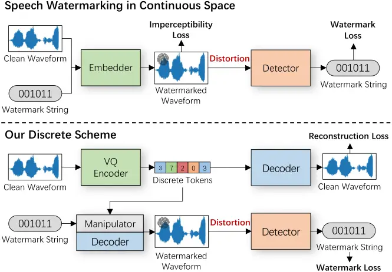
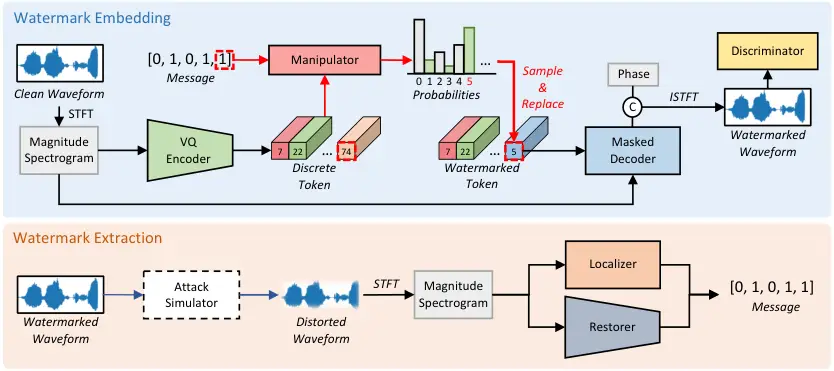
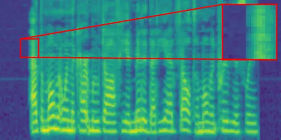
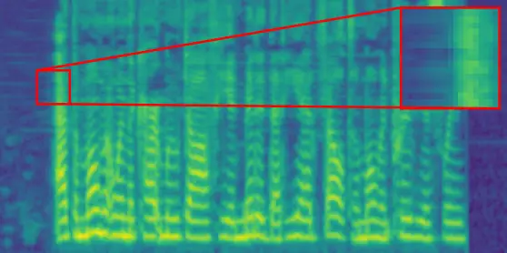
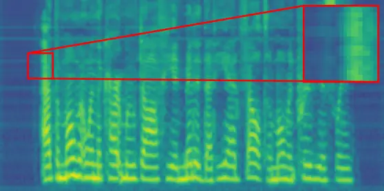
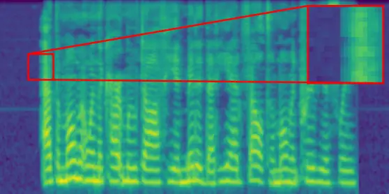

# Speech Watermarking with Discrete Intermediate Representations

Shengpeng Ji    Ziyue Jiang    Jialong Zuo    Minghui Fang    Yifu Chen
   Tao Jin    Zhou Zhao ^(†)^(†)thanks: Corresponding author.

###### Abstract

Speech watermarking techniques can proactively mitigate the potential
harmful consequences of instant voice cloning techniques. These
techniques involve the insertion of signals into speech that are
imperceptible to humans but can be detected by algorithms. Previous
approaches typically embed watermark messages into continuous space.
However, intuitively, embedding watermark information into robust
discrete latent space can significantly improve the robustness of
watermarking systems. In this paper, we propose DiscreteWM, a novel
speech watermarking framework that injects watermarks into the discrete
intermediate representations of speech. Specifically, we map speech into
discrete latent space with a vector-quantized autoencoder and inject
watermarks by changing the modular arithmetic relation of discrete IDs.
To ensure the imperceptibility of watermarks, we also propose a
manipulator model to select the candidate tokens for watermark
embedding. Experimental results demonstrate that our framework achieves
state-of-the-art performance in robustness and imperceptibility,
simultaneously. Moreover, our flexible frame-wise approach can serve as
an efficient solution for both voice cloning detection and information
hiding. Additionally, DiscreteWM can encode 1 to 150 bits of watermark
information within a 1-second speech clip, indicating its encoding
capacity. Audio samples are available
at https://DiscreteWM.github.io/discrete˙wm.

¹Zhejiang University

$`\{`$shengpengji, zhaozhou$`\}`$@zju.edu.cn



Figure 1: Illustration for speech watermarking strategies. Upper: The
embedder learns to encode the watermark string into the continuous space
with imperceptibility loss and watermark loss. Lower: In our discrete
scheme, the vector-quantized variational autoencoder (VQVAE) maps speech
into discrete latent space, and the manipulator conceals the watermark
string within the modulus relations of discrete token IDs.

## 1 Introduction

In recent years, the significant breakthrough in zero-shot
text-to-speech (TTS) (Casanova et al. 2022; Wang et al. 2023; Shen
et al. 2023; Le et al. 2023; Jiang et al. 2023b; Ji et al. 2024c; Ji
et al. 2024f; Ji et al. 2024e; SpeechTeam 2024) enables instant voice
cloning with only a few seconds of speech. However, this technological
advancement also brings security concerns to personal voices (Duquenne
et al. 2023; Liu et al. 2023c). To avoid potential misuse of voice
cloning technology, passive detection strategies (Tak et al. 2022b;
Ahmed et al. 2020; Tak et al. 2022a; Tak et al. 2021) are developed to
classify whether a speech clip is synthesized and adversarial-based
methods (Huang et al. 2021; Li et al. 2023; Ji et al. 2024b; Yu, Zhai,
and Zhang 2023) are proposed to prevent voice cloning with adversarial
noise. However, these approaches still struggle with generalization
issues (Liu et al. 2023b). In comparison, speech watermarking has been
developed to (Pavlović et al. 2022; Liu et al. 2023a; Chen et al. 2023;
Liu et al. 2023b) proactively embed robust watermark information into
the target voice, which has demonstrated its generalizable performance
in practical voice cloning detection (Duquenne et al. 2023). By
utilizing this technology, users can not only identify whether a speech
clip is AI-generated but also trace the source of the speech, thus
offering reliable privacy protection in the era of large-scale voice
models.

Despite recent advances in speech watermarking, current solutions still
encounter two primary challenges: 1) trade-off among imperceptibility,
robustness, and encoding capacity; In other words, maintaining
robustness against various distortions while preserving a high encoding
capacity affects the imperceptibility of watermarks (Liu et al. 2023a).
Although GAN-based architectures have been introduced to minimize the
distribution difference between watermarked speech and clean speech, the
embedder still encodes the watermark into perceptible noise patterns in
the mel-spectrogram, as shown in Figure 3; 2) fixed length issues; Most
DNN-based speech watermarking methods can only process a fixed length of
waveform with a pre-defined length of watermark string. In the detection
stage, they require a sliding window to decode a watermark starting at
each frame (Chen et al. 2023), which is inefficient and constrains the
resolution of watermarks to speeches larger than one second (Duquenne
et al. 2023). Although some works integrate time-independent features
into the watermarking algorithm (Liu et al. 2023b), the capacity of the
watermark string can not be changed during the inference stage, which
also limits the resolution of watermarks and affects the flexibility in
handling various scenarios.

Intuitively, compared to encoding watermarks into continuous latent
space, watermarks in robust discrete latent space are more robust
against distortions. Therefore, to achieve a superior trade-off among
imperceptibility, robustness, and encoding capacity, we propose
DiscreteWM, a framework that utilizes discrete speech representations to
embed watermark information. As shown in Figure 1, we first propose a
masked vector-quantized variational autoencoder (VQVAE) to map clean
speech into frame-level discrete latent space. We ensure that the parity
of the discrete token IDs can be detected from the reconstructed speech
even when it is severely distorted. Then we propose a manipulator model
to learn the probability distribution of discrete speech tokens.
Finally, the watermark information can be embedded into the modular
arithmetic relationship of discrete token IDs selected by the
manipulator model. By utilizing the modular arithmetic relationship of
discrete acoustic tokens in the latent space, our work enjoys an
imperceptible and flexible watermarking pipeline where the users can
freely decide the strength, capacity, and formats of the watermark
information in the inference stage.

The contributions of the paper are summarized as follows:

- •
  DiscreteWM is the first attempt to embed watermark information in the
  robust discrete latent space. Our method outperforms other
  state-of-the-art (SOTA) speech watermarking models on both voice
  cloning detection and information hiding tasks.
- •
  Our frame-wise strategy also resolves the challenges related to
  fixed-length training in speech watermarking and achieves 22.1x times
  faster detection speed.
- •
  DiscreteWM allows users to freely manipulate the encoding capacity (up
  to 150 bits per second) and formats of the watermark without
  re-training the model.
- •
  We further propose a statistical Z-test to transform our frame-wise
  accuracy to utterance level for AI-generated content detection. The
  extensive studies demonstrate that our method achieves a false
  positive rate of $`3\times 10^{-5}`$ while maintaining extreme
  imperceptibility.

## 2  Related Works

### 2.1  Speech Watermarkiing

Speech watermarking technology has always been used as a fundamental
tool for copyright protection of human speech (Hua et al. 2016).
Traditional speech watermarking typically embeds watermark information
in the time domain (e.g., Least Significant Bit (Cvejic and Seppanen
2004), Echo Hiding (Gruhl, Lu, and Bender 1996)) and the transform
domain (e.g., Spread Spectrum (Cox et al. 1997), Patchwork (Yeo and Kim
2003)). In terms of robustness, some researches have successfully
achieved resilience against distortion (Zhang et al. 2023),
desynchronization (Zhao et al. 2021), re-recording (Liu, Huang, and
Huang 2018), etc. However, the encoding process of traditional methods
relies heavily on hand-crafted empirical rules, which are challenging to
implement, resulting in a low encoding capacity with limited robustness
against a wider range of attacks.

Recently, DNN-based speech watermarking algorithms (Jiang et al. 2020;
Pavlović et al. 2022; Liu et al. 2023a; Chen et al. 2023; Liu et al.
2023b; Duquenne et al. 2023) have demonstrated superior encoding
capacity, invisibility, and robustness when compared to traditional
methods. Their frameworks typically include an encoder for watermark
embedding and a detector for watermark extraction. The encoding and
decoding strategies are learned in an end-to-end manner. In terms of
imperceptibility, DeAR (Liu et al. 2023a) utilizes an adversarial
discriminator to minimize the domain gap between clean speech and
watermarked speech. WavMark (Chen et al. 2023) regards the encoding and
decoding as reciprocal processes and adopts invertible neural networks,
which improves the overall fidelity and robustness of the watermark. And
in terms of robustness, some of the most advanced methods can resist
voice cloning attacks (Liu et al. 2023b), desynchronization
attacks (Chen et al. 2023), and re-recording attacks (Liu et al. 2023a).
However, most of their methods, unfortunately, have limitations in that
they can only process speech signals of a predetermined length. In order
to locate the watermark, they rely on the Brute Force Detection (BFD)
method, which involves sliding through the speech and attempting to
decode a watermark starting at each frame (Duquenne et al. 2023). The
latency of these approaches is excessively high, making them impractical
as proactive defense mechanisms for real-world voice cloning systems.
Besides, current solutions only embed the watermark as continuous noise
patterns, leaving speech watermarking with discrete intermediate
representation unexplored. Therefore, we propose a frame-wise approach
to solve the watermark localization issues and investigate the algorithm
that adopts discrete intermediate representations to further enhance the
imperceptibility and robustness of watermarks. We include additional
discussions about the vector quantised discrete representation and its
applications in Appendix F.

## 3  Method

This section introduces DiscreteWM. To begin with, we provide an
intuitive formulation and prerequisites of our watermarking strategy.
Next, we provide detailed descriptions of our architecture design and
the training process of the proposed model. Finally, we propose
inference strategies for information hiding and AI-generated content
detection separately and propose a statistical measure for detecting the
watermark with the one proportion Z-test. Due to space limitations, we
provide technical details in Appendix A.



Figure 2: The overall architecture of DiscreteWM. “VQ” represents the
“vector quantization” operation, and \tiny{C}⃝ denotes the concatenation
operation. During the watermark embedding process, the manipulator
forces the discrete tokens to have the same modular arithmetic relation
with the watermark message, as indicated by the red dashed line. For
instance, if we intend to conceal the value “1” into the last discrete
token, the manipulator will selectively sample from the odd tokens
(highlighted in green) according to their probability distribution. The
original token will then be replaced with the sampled token that has the
highest probability (the 5th token). In watermark extraction, the
localizer is responsible for watermark localization, while the restorer
focuses on recovering the watermark message.

### 3.1  Watermarking Strategy

The outline of our watermark strategy is: transforming speech into
discrete latent space and enforcing the discrete token IDs to have the
same modular arithmetic relations with the watermarks.  
Strategy formulation. Denote $`s=\{s^{(0)},\cdots,s^{(T)}\}`$ as the
magnitude spectrogram of speech waveform $`y`$ and $`w`$ as the
watermark string, where $`T`$ is the number of spectrogram frames. The
watermark embedding process is performed according to the following
steps: 1) an encoder $`\mathbf{E}`$ learns to represent the spectrogram
$`s`$ with acoustic code sequence $`z=\{z^{(0)},\cdots,z^{(T)}\}`$,
where $`z^{(t)}`$ is obtained from a discrete codebook $`\mathcal{Z}`$; 2) Then, we inject the watermark string $`w`$ into $`z`$ by manipulating
the modulus relation of token IDs $`c`$. For simplicity, we only
consider the case of “$`c\bmod 2`$” in this section, as it is a suitable
setting for speech watermarking (Chen et al. 2023). Specifically, when
we want to embed the watermark character “0” or “1” in the $`t`$-th
frame, we replace the $`t`$-th discrete code with the even or odd code
ID that has features similar to the original one, respectively. The
watermarked acoustic codes are denoted as $`\hat{z}`$; 3) Given
$`\hat{z}`$, a decoder $`\mathbf{G}`$ learns to reconstruct the
watermarked spectrogram $`\hat{s}`$. $`\hat{s}`$ and the original phase
spectrogram are converted to the watermarked speech $`\hat{y}`$ through
the inverse Short-Time Fourier Transform operation (iSTFT); 4) A
localizer $`\mathbf{D}`$ is designed to locate the watermarked frames
and a restorer $`\mathbf{R}`$ is utilized to recover $`\hat{z}`$.
Finally, we can obtain the watermark string $`w`$ from $`\hat{z}`$.  
Prerequisites of the proposed strategy. However, the above strategy can
not guarantee the imperceptibility and robustness of the watermark until
now. In practical scenarios, in terms of imperceptibility, the
perceptual differences of $`y`$ and $`\hat{y}`$ should be minimized.
Therefore, the proposed watermarking strategy needs the following
prerequisites:

###### Prerequisite 0.1.

$`\mathbf{G}\left(z\right)=\bar{s}\to s`$, the difference between the
reconstructed spectrogram $`\bar{s}`$ and the original spectrogram $`s`$
should be minimized.

###### Prerequisite 0.2.

$`\hat{z}\to z`$, the distance between the manipulated acoustic code
$`\hat{z}`$ and the original code $`z`$ in the latent space should be
minimized.

In terms of robustness, it is crucial to accurately extract the
watermark string $`w`$ even when $`\hat{y}`$ is distorted in signal
transmission processes or is maliciously attacked:

###### Prerequisite 0.3.

$`\mathbf{R}\left(\mathbf{D}\left(Dist\left(\hat{y}\right)\right)\right)\to\hat{c}\bmod 2=w`$,
where $`Dist\left(\cdot\right)`$ is the distortion function.

We describe how we achieved the aforementioned prerequisites in the
following subsection.

### 3.2  Architecture Design

Our framework comprises a two-stage training process. In the first
stage, we train an autoencoder to represent the speech into discrete
tokens. Then, we construct a localizer model $`D`$ to locate the
reconstructed frames and design a restoration loss to ensure
$`\mathbf{R}`$ can restore the parity of discrete token IDs
($`\hat{c}\bmod 2`$) even when the reconstructed speech is heavily
distorted. In the second stage, we train a probability-based manipulator
model to conceal the watermark string within the modular arithmetic
relationships among these discrete tokens while ensuring
imperceptibility.

#### 3.2.1  Robust Discrete Latent Space

Representing speech in discrete latent space. Given a clean speech
$`y`$, we first represent it in the discrete latent space. As shown in
Figure 2, we apply the Short-Time Fourier Transform operation (STFT) on
$`y`$ to produce a magnitude spectrogram $`s`$. Then, to discretize
$`s`$, we adopt a vector quantized variational autoencoder architecture
(VQVAE) (Van Den Oord, Vinyals et al. 2017). The VQ encoder
$`\mathbf{E}`$ and decoder $`\mathbf{G}`$ reconstruct the spectrogram
$`s`$ through:
$`\bar{s}=\mathbf{G}\left(z\right)=\mathbf{G}\left(\mathbf{E}\left(s\right)\right)`$.
Additionally, to satisfy Prerequisite 0.1, the system is trained through
a mask-infilling process with a frame-level random mask. Due to the
spectro-temporal locality of speech signals (Espi et al. 2015), the
unmasked contextual speech can provide rich information to significantly
reduce the difficulty of the spectrogram reconstruction. The discrete
codes of the masked region are also fed into the decoder to provide the
missing information during the masking process. Finally, the
reconstructed spectrogram of the masked region is concatenated with the
unmasked original spectrogram. The overall reconstruction process
$`\bar{s}\approx s`$ is formulated as:

```math
\displaystyle\bar{s}=\omega\cdot\mathbf{G}\left(\omega\cdot\mathbf{E}\left(s\right),\left(1-\omega\right)\cdot s\right)+\left(1-\omega\right)\cdot s\ , \tag{1}
```

where $`\omega`$ is the binary mask. $`\omega`$ is obtained by
$`\omega=\textit{Mask}\left(s,\gamma\right)`$, where
$`\textit{Mask}\left(\cdot\right)`$ is the mask function and
$`\gamma\in[0.1,0.5]`$ is the mask ratio. To further minimize the
perceptual differences between $`\hat{y}`$ and $`y`$, we introduce extra
discriminators for adversarial training, including the multi-period
discriminator and the multi-scale discriminator (Kong, Kim, and Bae
2020). Finally, the training loss of the VQ-VAE can be formulated as:

```math
\displaystyle\mathcal{L_{VQ}}=\mathcal{L}_{\mathrm{rec}}+\mathcal{L}_{\mathrm{code}}+\lambda_{adv}\mathcal{L}_{\mathrm{adv}}\ , \tag{2}
```

where $`\mathcal{L}_{\mathrm{rec}}`$ is the reconstruction loss,
$`\mathcal{L}_{\mathrm{code}}`$ is the standard VQ codebook loss (Van
Den Oord, Vinyals et al. 2017), and $`\mathcal{L}_{\mathrm{Adv}}`$ is
the adversarial loss. We use the multi-resolution STFT loss (Yamamoto,
Song, and Kim 2020) as $`\mathcal{L}_{\mathrm{rec}}`$. $`\lambda_{adv}`$
is the hyper-parameter to balance the three terms, which is set to
$`10^{-2}`$. To enhance the codebook usage rate and further decrease the
reconstruction error, we adopt the clustering vector quantizer
(CVQ) (Zheng and Vedaldi 2023) as the element-wise quantization function
in $`E`$ that maps each acoustic code onto its closest codebook entry.  
Detecting the Parity of Token IDs. Here we describe how to restore the
parity of discrete token IDs ($`\hat{c}\bmod 2`$) from the reconstructed
speech, which is the necessary condition for watermark embedding in the
discrete latent space. As shown in Figure 2, our frame-wise framework
has two primary objectives: localization and discrete code restoration.
Regarding localization, we aim at distinguishing between the original
frames and the reconstructed frames with the localizer model
$`\mathbf{D}`$; We train $`\mathbf{D}`$ by minimizing the binary
cross-entropy loss between its output and a binary mask representing the
presence of the reconstructed frames. With the localizer model
$`\mathbf{D}`$, our algorithm successfully resolves the location issues
in current fixed-length counterparts. Compared to the previous
sliding-window detection method, the proposed localizer significantly
reduces the time required for watermark localization. In terms of
discrete code restoration, we focus on converting the reconstructed
speech $`\hat{y}`$ back to the manipulated discrete token $`\hat{z}`$
using the restorer model $`\mathbf{R}`$ even when $`\hat{y}`$ is
severely distorted. We design the following restoration loss to achieve
this objective:

```math
\displaystyle\mathcal{L}_{res}=\mathbb{E}_{\tilde{s}\sim p(\tilde{s})}[-\log p(\hat{c}\bmod 2)], \tag{3}
```

where $`\tilde{s}`$ is the magnitude spectrogram of $`Dist(\hat{y})`$
and $`\hat{c}`$ is the token IDs of $`\hat{z}`$. Furthermore, to fulfill
Prerequisite 0.3, an attack simulator is employed in our framework
following previous works (Chen et al. 2023; Liu et al. 2023b), which
assists our model in acquiring adaptive robustness against various
attacks $`Dist\left(\cdot\right)`$. Until now, we have finally built a
robust discrete latent space, in which the parity of the discrete code
IDs can be easily detected.

#### 3.2.2  Injecting Watermarks into Discrete Latent Space

Concealing watermarks with the manipulator. As illustrated in Section
3.1, our DiscreteWM embeds watermarks by ensuring that the discrete
token IDs have identical modular arithmetic relationships with the
watermarks. However, if we manually adjust the code IDs to embed
watermark information, it will have a significant impact on the speech
quality. For instance, if we replace the discrete code representing
silence with the discrete code of normal speech, there will be a
significant amount of noise in the watermarked frame. To satisfy
Prerequisite 0.2, we introduce a probability-based manipulator model
$`\mathbf{M}`$ to help us select the optimal code ID in the watermark
embedding process. During the second-stage training process, we first
extract $`z`$ through $`\mathbf{E}\left(s\right)`$ using the proposed
VQVAE structure. Given $`\omega\cdot z`$ as the prediction target, the
manipulator model $`\mathbf{M}`$ is trained through a parallel
mask-prediction process:

```math
\displaystyle P\left(\omega\cdot z\mid\left(1-\omega\right)\cdot z;\theta_{M}\right)\ , \tag{4}
```

where $`\omega`$ is the aforementioned binary mask and
$`\theta_{\mathbf{M}}`$ is the parameter of $`\mathbf{M}`$. The
manipulator model is trained with the cross-entropy loss. After
training, $`\mathbf{M}`$ can be utilized to sample the odd or even
optimal tokens according to the watermark information and replace the
original discrete token to construct $`\hat{z}`$.  
Sampling strategy of the manipulator. As shown in Figure 2, to embed the
watermark value “1” into the last frame, if the ID value of the last
discrete token is even, we replace it with odd tokens sampled from the
probability distribution given by the manipulator model $`\mathbf{M}`$:

```math
\displaystyle P(z^{(t)}_{k})=softmax(l^{(t)}_{k})=\frac{\mathrm{e}^{l^{(t)}_{k}}}{\sum_{i}\mathrm{e}^{l^{(t)}_{i}}}, \tag{5}
```

where $`l^{(t)}_{k}`$ represents the logit of token $`k`$ at timestep
$`t`$. If the ID value of the last discrete token is odd, we directly
use the original token for reconstruction. During the watermark
embedding process, we randomly select a portion of the discrete codes
and substitute them non-autoregressively to ensure the efficiency of the
system.

### 3.3  Inference Strategies

During the inference stage, our frame-wise solution offers remarkable
flexibility, enabling us to select different encoding strategies for
various scenarios and to freely control the trade-off between
imperceptibility and robustness. In this subsection, we discuss the
watermark strategies for information hiding and AI-generated content
detection separately. Additionally, we perform a statistical analysis on
the detection sensitivity of the watermarked speech using the one
proportion Z-test.

#### Watermark for Information Hiding.

Speech watermarking for information hiding mainly aims at hiding a
binary message (such as 32 bits) to the speech segments (Liu et al.
2023b; Chen et al. 2023), which can be used for tracing provenance,
copyright protection, and privacy protection. The basic idea of our
frame-wise watermarking strategy, as mentioned in Section 3.1, is to
embed the watermark character “0” or “1” by enforcing the token ID to be
even or odd, respectively. In the information hiding pipeline, we first
map clean speech into discrete latent space following Section 3.2.1 and
embed watermark information into the discrete codes following Section
3.2.2. Then, the watermarked latent codes $`\hat{z}`$ are converted into
the watermarked speech $`\hat{y}`$. Finally, following the watermark
detection algorithms described in Section 3.2, we can recover the
watermark string from $`\hat{y}`$. Since our watermarking method is
frame-wise, it is free from the time-consuming watermark localization
process like previous DNN-based methods (Chen et al. 2023). Moreover,
our framework can freely adjust the encoding capacity according to
users’ requirements. Suppose the hop size is set to 80 and the maximum
mask ratio $`\gamma`$ is set to 50%, we can store 1 to 150 bits of
information within one-second speech sampled at 24 kHz, which
demonstrates the flexibility of our method.

#### Watermark for AI-Generated Detection.

Speech watermarking is a crucial proactive defense strategy against
voice cloning attacks (Duquenne et al. 2023). In this scenario, online
services or individual users can add watermarks when cloning voices. In
this way, people can easily determine whether the speech is generated by
AI through the watermark detection process, which significantly reduces
the possible abuses of voice cloning techniques.

As discussed in Section 3.2, our localizer $`\mathbf{D}`$ can be
employed to identify whether a speech frame is reconstructed by our
VQVAE or not. Therefore, we can utilize this characteristic to achieve
AI-generated content detection. In an ideal scenario, when a natural
speech is given as input, the localizer $`\mathbf{D}`$ should output a
sequence of zeros. If any frame in the output sequence of $`\mathbf{D}`$
is non-zero, it indicates that the audio segment has been watermarked,
i.e., the audio segment is generated by AI. However, in practical
situations, the frame-wise accuracy of $`\mathbf{D}`$ will ultimately
affect our decision. In order to convert the frame-wise accuracy to
utterance level, we adopt a Z-test as our robust detection approach. In
practical scenarios, we can detect the utterance-level watermark if the
Z-statistic is above a pre-defined threshold (e.g., Z-statistic $`>4`$).
Denote $`T`$ as the number of speech frames. Let’s assume that the
frame-level true positive rate and false positives rate of
$`\mathbf{D}`$ on the test set are $`\alpha`$ and $`\beta`$,
respectively. Then, given a clean speech $`y`$, the number of its
detected watermarked frames $`|f|_{w}`$ has expected value
$`\beta\cdot T`$ and variance $`\beta\left(1-\beta\right)\cdot T`$. The
Z-statistic can be calculated as:

```math
\displaystyle\textit{Z-statistic}=\frac{\left(|f|_{w}-\beta\cdot T\right)}{\sqrt{\beta\left(1-\beta\right)\cdot T}}. \tag{6}
```

Denote $`m=10\%`$ as the watermark ratio and let $`\alpha=95\%`$,
$`\beta=10\%`$, and $`T=200`$. In the detection stage, a watermarked
speech will produce
$`|f|_{w}=\alpha\cdot m\cdot T+\beta\cdot(1-m)\cdot T=37`$, which means
the z-statistic is $`4.01`$ and the one-sided p-value is
$`3\times 10^{-5}`$ approximately. In this case, the utterance-level
probability of a false positive is only $`3\times 10^{-5}`$, indicating
that the watermark can be easily detected with extremely high
confidence. Moreover, since $`m`$ can be adjusted in inference, users
are free to decide whether to add more watermarks to enhance robustness
or reduce watermarks to enhance imperceptibility. The summary of the
proposed inference strategies is in Appendix D.

| Models         | BPS($`\uparrow`$) | PESQ($`\uparrow`$) | SNR($`\uparrow`$) | BER(%)($`\downarrow`$) |       |      |       |      |       |      |      |      |
| -------------- | ----------------- | ------------------ | ----------------- | ---------------------- | ----- | ---- | ----- | ---- | ----- | ---- | ---- | ---- |
|                |                   |                    |                   | ND                     | GN    | AS   | RS    | MP3  | MF    | LP   | EA   | MEAN |
| Audiowmark^(∗) | 20                | 4.39               | 29.85             | 5.89                   | 18.13 | 5.89 | 15.10 | 6.65 | 12.83 | 5.89 | 7.61 | 9.75 |
| DeAR           | 8.8               | 3.75               | 26.31             | 0.45                   | 0.48  | 0.46 | 0.42  | 0.58 | 0.48  | 0.91 | 0.51 | 0.54 |
| Chang Liu’s    | 30                | 3.97               | 24.18             | 0.00                   | 2.68  | 0.00 | 0.02  | 0.00 | 0.06  | 0.00 | 0.04 | 0.35 |
| WavMark        | 32                | 4.31               | 38.61             | 0.43                   | 5.72  | 0.61 | 0.65  | 0.56 | 6.07  | 2.08 | 4.49 | 2.58 |
| Ours-32bps     | 32                | 4.45               | 38.08             | 0.12                   | 0.73  | 0.12 | 0.17  | 0.13 | 0.69  | 0.19 | 0.12 | 0.28 |

Table 1: Comparison with existing speech watermarking methods for
information hiding. “MEAN” represents the average BER. “Ours-32bps”
means we insert 32 bits of watermark information to one-second speech
segments in inference.

## 4 Experiments

### 4.1 Experimental Setup

Datasets. For training, we employ the standard training set of
LibriTTS (Zen et al. 2019), which contains approximately 585 hours of
English speech at 24kHz sampling rate. For the Short-Time Fourier
Transform operation (STFT), we adopt a filter length of 400, a hop
length of 80, and a window function applied to each frame with a length
of 400. In our experiment, we find that a smaller hop length will
increase the encoding capacity of the watermark, but setting the hop
size too small is harmful for speech reconstruction. For evaluation, we
adopt two state-of-the-art zero-shot voice cloning models, NaturalSpeech
2 (Shen et al. 2023) and Mega-TTS 2 (Jiang et al. 2023a), to generate
high-quality synthesized audio that sounds authentic. We randomly select
100 text transcriptions and 100 speech prompts from the LibriTTS
test-clean set. Each speech prompt is fed into the voice cloning model
to generate speeches according to the 100 target sentences. The test set
also includes all of the speech samples from the “test-clean” set of
LibriTTS. As a result, a test set consisting of 24,837 sentences is
obtained, with all speakers in the test set being unseen. We use all
samples in the test set for evaluations. We provide implementation
details in Appendix A. Evaluation Metrics. For imperceptibility, we
adopt Signal-to-Noise Ratio (SNR) and Perceptual Evaluation of Speech
Quality (PESQ) (Rix et al. 2001) as metrics following previous
works (Liu et al. 2023b). Among them, SNR is only used to measure the
magnitude of differences between the watermarked speech and the original
speech. In comparison, PESQ provides a more accurate assessment of
imperceptibility by considering the specifics of the human auditory
system. For evaluating the effectiveness and robustness of watermark
extraction, we use the bit error rate (BER) as the metric. For encoding
capacity, we use bit per second (BPS) as the metric, which refers to how
many bits of watermark information can be injected into one second of
speech.

### 4.2 Results of Information Hiding

In this subsection, we compare our DiscreteWM with different baseline
systems to evaluate its ability of information hiding. To demonstrate
the performance of different models in a concise and fair manner, we
conduct a segment-based evaluation where we randomly extract a 1-second
speech segment from each test sample. In this evaluation, the models aim
to watermark one-second speech clips while remaining robust against
various distortions and maintaining imperceptibility. The distortions
include: 1) no distortion (ND); 2) Gaussian noise (GN); 3) amplitude
scaling (AS); 4) re-sampling (RS); 5) MP3 compression (MP3); 6) median
filter (MF); 7) low-pass filter (LP); 8) echo addition (EA); We provide
further explanation for these distortions in Appendix B.

We compare our model with existing state-of-the-art (SOTA) neural
network based methods: 1) Audiowmark (Westerfeld 2020), a SOTA
traditional watermarking toolkit that utilizes the patchwork-based
watermarking method (Liu, Huang, and Huang 2018) and incorporates BCH
codes (Bose and Ray-Chaudhuri 1960) for error correction. We used the
default setting of Audiowmark; 2) DeAR (Liu et al. 2023a), one of the
pioneer deep learning frameworks for robust speech watermarking; 3)
Chang Liu’s method (Liu et al. 2023b), a strong and robust baseline that
embeds the watermark into the frequency domain; 4) WavMark (Chen et al.
2023), a concurrent solution that employs invertible neural networks
(INN) to ensure the inaudibility and robustness. Since we found that
Audiowmark can hardly embed watermarks into the one-second speech
segment, we use the utterance-level evaluation for it. The encoding
capacity of Audiowmark is referenced from previous works (Chen et al.
2023). Although WavMark has an encoding capacity of 32bps, it still
requires 10 to 16 bits of information for watermark localization.

Increased signal-to-noise ratio (SNR) and perceptual evaluation of
speech quality (PESQ) score indicate higher imperceptibility, while a
lower bit error rate (BER) represents superior robustness. In the
imperceptibility evaluation, distortions are not applied to the
watermarked speech. As shown in Table 1, our speech watermarking method,
referred to as ours-32bps, achieves comparable imperceptibility to
WavMark and is on par with Chang Liu’s approach in terms of robustness.
This indicates that our method achieves a superior balance between
imperceptibility and robustness, thus further validating the
effectiveness of the discrete representations.

| Models         | PESQ($`\uparrow`$) | SNR($`\uparrow`$) | MEAN($`\downarrow`$) | RTF($`\downarrow`$) |
| -------------- | ------------------ | ----------------- | -------------------- | ------------------- |
| WavMark        | 4.24               | 37.92             | 1.02                 | 0.1438              |
| SeamlessWM^(∗) | 3.77               | 29.62             | 0.18                 | 0.0065              |
| Ours           | 4.37               | 38.01             | 0.32                 | 0.0044              |

Table 2: Evaluation for AI-generated speech detection. “MEAN” represents
the average BER across all distortions. The RTF (Real-Time Factor)
evaluation is conducted with 1 NVIDIA A100 GPU and batch size 1.



(a) Ground Truth



(b) WavMark, capacity=32 bit



(c) Chang Liu’s, capacity=30 bit



(d) Ours, capacity=32 bit

Figure 3: Visualizations of the ground-truth and watermarked
mel-spectrograms by different speech watermarking methods. For a fair
comparison, we directly download the example from WavMark’s demo page
and use the pre-trained Chang Liu’s model.

### 4.3  Watermarking for AI-Generated Speech Detection

In this subsection, we compare our DiscreteWM with different baseline
systems to evaluate its ability to effectively put and detect an
imperceptible watermark on top of AI-generated speech. To ensure
reliable protection across various audio lengths in real-world
applications, it is important for the model to accurately locate the
positions of the watermarks and decode the original watermark.
Therefore, in this experiment, we conduct an utterance-level evaluation.
As for the baseline systems, in addition to Audiowmark and WavMark, we
also include SeamlessWM (Duquenne et al. 2023), which is a
state-of-the-art concurrent work focused on detecting AI-generated
content. Since SeamlessWM does not provide the pre-trained models and
source code, we use the reproduced version for our experiments. We
evaluate the imperceptibility (PESQ and SNR), robustness (MEAN: the
averaged BER (%) across all distortions), and inference efficiency (RTF)
of these systems. The distortions follow the same setting in Section
4.2. In addition, when measuring RTF, we include both the watermark
embedding and detection processes. We set the watermark ratio $`m`$ of
DiscreteWM to $`10\%`$.

The results presented in Table 2 indicate that our method achieves
comparable robustness compared to SeamlessWM, while also exhibiting
superior imperceptibility. It also demonstrates that our method can
provide a highly effective and reliable security guarantee for online
speech synthesis services. In terms of the inference speed, the RTF of
WavMark is significantly higher than other methods. In the experiments,
we find that the sliding window localization process costs most of its
inference time. Meanwhile, compared with WavMark, our frame-wise
solution speeds up the speech watermarking process by 22.1x.

### 4.4 Ablation Studies

Encoding Capacity. Our method can flexibly change the encoding capacity
during the inference process. In this experiment, we evaluate the
performance of DiscreteWM using various encoding capacities on the
information hiding task. As shown in Table 3, we can see that DiscreteWM
maintains a high level of imperceptibility when its encoding capacity
ranges from 10 to 50bps, and it also performs well even under the
extreme condition of 150bps. Additionally, the robustness of our method
remains consistently high across different encoding capacities.  
Discrete vs Continuous. We evaluate the performance of DiscreteWM using
discrete intermediate representation and continuous representation on
the information hiding task. To make fair comparisons, we only remove
the VQ layer and replace the manipulator with a watermark encoder to
build the continuous baseline. The encoding capacity of the continuous
baseline is set to 32bps. From Table 3, it can be seen that our method
with discrete intermediate representation achieved a better balance
between imperceptibility and robustness than the continuous baseline,
demonstrating the advantages of discrete intermediate representation.  
Manipulator vs Manual. We test the effectiveness of the proposed
manipulator model on the information hiding task. The encoding
capacities of baseline systems in this experiment are set to 32bps. For
“wo/ manipulator”, we manually choose random codes for watermark
embedding. The results in Table 3 demonstrate that without the
manipulator, the imperceptibility of our method significantly drops,
indicating the advantages of the proposed manipulator.  
Utterance-level Reliability. In this experiment, we evaluated the
utterance-level reliability of DiscreteWM on the AI-generated content
detection task with the Z-test. The segment-wise methods like WavMark
can only determine that the speech contains watermarks when the
extracted watermark is the same as the preset one, which is not suitable
for the proposed Z-test. Therefore, we do not compare our method with
them here. In this evaluation, the watermarked speech is randomly
attacked with the distortions following Section 4.2. We visualize the
Z-statistic score (reliability) and PESQ (Imperceptibility) with
different watermark ratios $`m`$ in Figure 4. When the watermark ratio
$`m`$ is $`0.03`$, the Z-statistic is 4.07. In this case, the false
positive rate is only $`2.3\times 10^{-5}`$. Moreover, given the
Z-statistic=4.0 as the classification threshold, the utterance-level
true positive rate and false positive rate are 1.0 and 0.0 when the
watermark ratio is above 0.10. These results indicate that our method
exhibits high imperceptibility while maintaining a high level of
accuracy.

| Setting         | PESQ($`\uparrow`$) | SNR($`\uparrow`$) | MEAN($`\downarrow`$) |
| --------------- | ------------------ | ----------------- | -------------------- |
| Ours-10bps      | 4.47               | 41.30             | 0.31                 |
| Ours-32bps      | 4.45               | 38.08             | 0.28                 |
| Ours-50bps      | 4.27               | 34.92             | 0.30                 |
| Ours-150bps     | 3.92               | 28.49             | 0.27                 |
| w/ continuous   | 4.32               | 34.90             | 2.39                 |
| wo/ manipulator | 3.96               | 29.55             | 0.95                 |

Table 3: Ablation studies of DiscreteWM for information hiding.

Figure 4: The tradeoff between reliability and imperceptibility on the
AI-generated content detection task. “Z-statistic = 4.0” is shown as the
red dashed line.

## 5 Conclusions

In this paper, we present DiscreteWM, a framework that injects
watermarks within the discrete intermediate representations of speech.
Our approach outperforms the continuous counterparts in terms of
robustness and imperceptibility. Besides, our frame-wise solution allows
for encoding 1 to 150 bits of watermark information into only a 1-second
speech clip, demonstrating its flexibility and encoding capacity.
Moreover, the proposed utterance-level Z-test also indicates the
reliability of our method for voice cloning detection.

## Appendix A Acknowledgments

This work was supported by the National Natural Science Foundation of
China under Grant No.62222211 and No.U24A20326

## References

- Ahmed et al. (2020) Ahmed, M. E.; Kwak, I.-Y.; Huh, J. H.; Kim, I.;
  Oh, T.; and Kim, H. 2020. Void: A fast and light voice liveness
  detection system. In _29th USENIX Security Symposium (USENIX Security 20)_, 2685–2702.
- Bose and Ray-Chaudhuri (1960) Bose, R. C.; and Ray-Chaudhuri,
  D. K. 1960. On a class of error correcting binary group codes.
  _Information and control_, 3(1): 68–79.
- Casanova et al. (2022) Casanova, E.; Weber, J.; Shulby, C. D.; Junior,
  A. C.; Gölge, E.; and Ponti, M. A. 2022. Yourtts: Towards zero-shot
  multi-speaker tts and zero-shot voice conversion for everyone. In
  _International Conference on Machine Learning_, 2709–2720. PMLR.
- Chen et al. (2023) Chen, G.; Wu, Y.; Liu, S.; Liu, T.; Du, X.; and
  Wei, F. 2023. Wavmark: Watermarking for audio generation. _arXiv
  preprint arXiv:2308.12770_.
- Cox et al. (1997) Cox, I. J.; Kilian, J.; Leighton, F. T.; and
  Shamoon, T. 1997. Secure spread spectrum watermarking for multimedia.
  _IEEE transactions on image processing_, 6(12): 1673–1687.
- Cvejic and Seppanen (2004) Cvejic, N.; and Seppanen, T. 2004.
  Increasing robustness of LSB audio steganography using a novel
  embedding method. In _International Conference on Information
  Technology: Coding and Computing, 2004. Proceedings. ITCC 2004._,
  volume 2, 533–537. IEEE.
- Défossez et al. (2022) Défossez, A.; Copet, J.; Synnaeve, G.; and
  Adi, Y. 2022. High fidelity neural audio compression. _arXiv preprint
  arXiv:2210.13438_.
- Du et al. (2022) Du, C.; Guo, Y.; Chen, X.; and Yu, K. 2022. VQTTS:
  High-fidelity text-to-speech synthesis with self-supervised VQ
  acoustic feature. _arXiv preprint arXiv:2204.00768_.
- Duquenne et al. (2023) Duquenne, P.-A.; Ellis, B.; Elsahar, H.;
  Haaheim, J.; Hoffman, J.; Inaguma, H.; Klaiber, C.; Kulikov, I.; Li,
  P.; Licht, D.; Maillard, J.; Rakotoarison, A.; Sadagopan, K. R.;
  Ramakrishnan, A.; Tran, T.; Yang, Y.; Ye, E.; Evtimov, I.; Fernandez,
  P.; Gao, C.; Hansanti, P.; Kallet, A.; Kozhevnikov, A.; Gonzalez,
  G. M.; Roman, R. S.; Touret, C.; Wong, C.; Wood, C.; Yu, B.; Andrews,
  P.; Balioglu, C.; Chen, P.-J.; Costa-jussa, M. R.; Elbayad, M.; Gong,
  H.; Guzman, F.; Heffernan, K.; Jain, S.; Kao, J.; Lee, A.; Mourachko,
  A.; Peloquin, B.; Pino, J.; Popuri, S.; Ropers, C.; Saleem, S.;
  Schwenk, H.; Sun, A.; Tomasello, P.; Wang, C.; Wang, J.; Wang, S.; and
  Williamson, M. 2023. Seamless: Multilingual Expressive and Streaming
  Speech Translation.
- Espi et al. (2015) Espi, M.; Fujimoto, M.; Kinoshita, K.; and
  Nakatani, T. 2015. Exploiting spectro-temporal locality in deep
  learning based acoustic event detection. _EURASIP Journal on Audio,
  Speech, and Music Processing_, 2015: 1–12.
- Esser, Rombach, and Ommer (2021) Esser, P.; Rombach, R.; and
  Ommer, B. 2021. Taming transformers for high-resolution image
  synthesis. In _Proceedings of the IEEE/CVF conference on computer
  vision and pattern recognition_, 12873–12883.
- Gruhl, Lu, and Bender (1996) Gruhl, D.; Lu, A.; and Bender, W. 1996.
  Echo hiding. In _Information Hiding: First International Workshop
  Cambridge, UK, May 30–June 1, 1996 Proceedings 1_, 295–315. Springer.
- Hu et al. (2022) Hu, M.; Wang, Y.; Cham, T.-J.; Yang, J.; and
  Suganthan, P. N. 2022. Global context with discrete diffusion in
  vector quantised modelling for image generation. In _Proceedings of
  the IEEE/CVF Conference on Computer Vision and Pattern Recognition_,
  11502–11511.
- Hua et al. (2016) Hua, G.; Huang, J.; Shi, Y. Q.; Goh, J.; and Thing,
  V. L. 2016. Twenty years of digital audio watermarking—a comprehensive
  review. _Signal processing_, 128: 222–242.
- Huang et al. (2021) Huang, C.-y.; Lin, Y. Y.; Lee, H.-y.; and Lee,
  L.-s. 2021. Defending your voice: Adversarial attack on voice
  conversion. In _2021 IEEE Spoken Language Technology Workshop (SLT)_,
  552–559. IEEE.
- Ji et al. (2024a) Ji, S.; Chen, Y.; Fang, M.; Zuo, J.; Lu, J.; Wang,
  H.; Jiang, Z.; Zhou, L.; Liu, S.; Cheng, X.; et al. 2024a. WavChat: A
  Survey of Spoken Dialogue Models. _arXiv preprint arXiv:2411.13577_.
- Ji et al. (2024b) Ji, S.; Fang, M.; Jiang, Z.; Huang, R.; Zuo, J.;
  Wang, S.; and Zhao, Z. 2024b. Language-codec: Reducing the gaps
  between discrete codec representation and speech language models.
  _arXiv preprint arXiv:2402.12208_.
- Ji et al. (2024c) Ji, S.; Jiang, Z.; Wang, H.; Zuo, J.; and Zhao, Z.
  2024c. MobileSpeech: A Fast and High-Fidelity Framework for Mobile
  Zero-Shot Text-to-Speech. _arXiv preprint arXiv:2402.09378_.
- Ji et al. (2024d) Ji, S.; Jiang, Z.; Wang, W.; Chen, Y.; Fang, M.;
  Zuo, J.; Yang, Q.; Cheng, X.; Wang, Z.; Li, R.; et al. 2024d.
  Wavtokenizer: an efficient acoustic discrete codec tokenizer for audio
  language modeling. _arXiv preprint arXiv:2408.16532_.
- Ji et al. (2024e) Ji, S.; Zuo, J.; Fang, M.; Jiang, Z.; Chen, F.;
  Duan, X.; Huai, B.; and Zhao, Z. 2024e. Textrolspeech: A text style
  control speech corpus with codec language text-to-speech models. In
  _ICASSP 2024-2024 IEEE International Conference on Acoustics, Speech
  and Signal Processing (ICASSP)_, 10301–10305. IEEE.
- Ji et al. (2024f) Ji, S.; Zuo, J.; Fang, M.; Zheng, S.; Chen, Q.;
  Wang, W.; Jiang, Z.; Huang, H.; Cheng, X.; Huang, R.; et al. 2024f.
  ControlSpeech: Towards Simultaneous Zero-shot Speaker Cloning and
  Zero-shot Language Style Control With Decoupled Codec. _arXiv preprint
  arXiv:2406.01205_.
- Jiang et al. (2020) Jiang, S.; Ye, D.; Huang, J.; Shang, Y.; and
  Zheng, Z. 2020. SmartSteganogaphy: Light-weight generative audio
  steganography model for smart embedding application. _Journal of
  Network and Computer Applications_, 165: 102689.
- Jiang et al. (2023a) Jiang, Z.; Liu, J.; Ren, Y.; He, J.; Zhang, C.;
  Ye, Z.; Wei, P.; Wang, C.; Yin, X.; Ma, Z.; et al. 2023a. Mega-tts 2:
  Zero-shot text-to-speech with arbitrary length speech prompts. _arXiv
  preprint arXiv:2307.07218_.
- Jiang et al. (2023b) Jiang, Z.; Ren, Y.; Ye, Z.; Liu, J.; Zhang, C.;
  Yang, Q.; Ji, S.; Huang, R.; Wang, C.; Yin, X.; et al. 2023b.
  Mega-TTS: Zero-Shot Text-to-Speech at Scale with Intrinsic Inductive
  Bias. _arXiv preprint arXiv:2306.03509_.
- Kong, Kim, and Bae (2020) Kong, J.; Kim, J.; and Bae, J. 2020.
  Hifi-gan: Generative adversarial networks for efficient and high
  fidelity speech synthesis. _Advances in Neural Information Processing
  Systems_, 33: 17022–17033.
- Le et al. (2023) Le, M.; Vyas, A.; Shi, B.; Karrer, B.; Sari, L.;
  Moritz, R.; Williamson, M.; Manohar, V.; Adi, Y.; Mahadeokar, J.;
  et al. 2023. Voicebox: Text-guided multilingual universal speech
  generation at scale. _arXiv preprint arXiv:2306.15687_.
- Li et al. (2023) Li, J.; Ye, D.; Tang, L.; Chen, C.; and Hu, S. 2023.
  Voice guard: protecting voice privacy with strong and imperceptible
  adversarial perturbation in the time domain. In _Proceedings of the
  Thirty-Second International Joint Conference on Artificial
  Intelligence_, 4812–4820.
- Liu et al. (2023a) Liu, C.; Zhang, J.; Fang, H.; Ma, Z.; Zhang, W.;
  and Yu, N. 2023a. Dear: A deep-learning-based audio re-recording
  resilient watermarking. In _Proceedings of the AAAI Conference on
  Artificial Intelligence_, volume 37, 13201–13209.
- Liu et al. (2023b) Liu, C.; Zhang, J.; Zhang, T.; Yang, X.; Zhang, W.;
  and Yu, N. 2023b. Detecting Voice Cloning Attacks via Timbre
  Watermarking. _arXiv preprint arXiv:2312.03410_.
- Liu et al. (2023c) Liu, X.; Wang, X.; Sahidullah, M.; Patino, J.;
  Delgado, H.; Kinnunen, T.; Todisco, M.; Yamagishi, J.; Evans, N.;
  Nautsch, A.; et al. 2023c. Asvspoof 2021: Towards spoofed and deepfake
  speech detection in the wild. _IEEE/ACM Transactions on Audio, Speech,
  and Language Processing_.
- Liu, Huang, and Huang (2018) Liu, Z.; Huang, Y.; and Huang, J. 2018.
  Patchwork-based audio watermarking robust against de-synchronization
  and recapturing attacks. _IEEE transactions on information forensics
  and security_, 14(5): 1171–1180.
- Pavlović et al. (2022) Pavlović, K.; Kovačević, S.; Djurović, I.; and
  Wojciechowski, A. 2022. Robust speech watermarking by a jointly
  trained embedder and detector using a DNN. _Digital Signal
  Processing_, 122: 103381.
- Rakhimov et al. (2020) Rakhimov, R.; Volkhonskiy, D.; Artemov, A.;
  Zorin, D.; and Burnaev, E. 2020. Latent video transformer. _arXiv
  preprint arXiv:2006.10704_.
- Razavi, Van den Oord, and Vinyals (2019) Razavi, A.; Van den Oord, A.;
  and Vinyals, O. 2019. Generating diverse high-fidelity images with
  vq-vae-2. _Advances in neural information processing systems_, 32.
- Rix et al. (2001) Rix, A. W.; Beerends, J. G.; Hollier, M. P.; and
  Hekstra, A. P. 2001. Perceptual evaluation of speech quality (PESQ)-a
  new method for speech quality assessment of telephone networks and
  codecs. In _2001 IEEE international conference on acoustics, speech,
  and signal processing. Proceedings (Cat. No. 01CH37221)_, volume 2,
  749–752. IEEE.
- Shen et al. (2023) Shen, K.; Ju, Z.; Tan, X.; Liu, Y.; Leng, Y.; He,
  L.; Qin, T.; Zhao, S.; and Bian, J. 2023. Naturalspeech 2: Latent
  diffusion models are natural and zero-shot speech and singing
  synthesizers. _arXiv preprint arXiv:2304.09116_.
- SpeechTeam (2024) SpeechTeam, T. 2024. FunAudioLLM: Voice
  Understanding and Generation Foundation Models for Natural Interaction
  Between Humans and LLMs. _arXiv preprint arXiv:2407.04051_.
- Tak et al. (2022a) Tak, H.; Kamble, M.; Patino, J.; Todisco, M.; and
  Evans, N. 2022a. Rawboost: A raw data boosting and augmentation method
  applied to automatic speaker verification anti-spoofing. In _ICASSP
  2022-2022 IEEE International Conference on Acoustics, Speech and
  Signal Processing (ICASSP)_, 6382–6386. IEEE.
- Tak et al. (2021) Tak, H.; Patino, J.; Todisco, M.; Nautsch, A.;
  Evans, N.; and Larcher, A. 2021. End-to-end anti-spoofing with
  rawnet2. In _ICASSP 2021-2021 IEEE International Conference on
  Acoustics, Speech and Signal Processing (ICASSP)_, 6369–6373. IEEE.
- Tak et al. (2022b) Tak, H.; Todisco, M.; Wang, X.; Jung, J.-w.;
  Yamagishi, J.; and Evans, N. 2022b. Automatic speaker verification
  spoofing and deepfake detection using wav2vec 2.0 and data
  augmentation. _arXiv preprint arXiv:2202.12233_.
- Takida et al. (2022) Takida, Y.; Shibuya, T.; Liao, W.; Lai, C.-H.;
  Ohmura, J.; Uesaka, T.; Murata, N.; Takahashi, S.; Kumakura, T.; and
  Mitsufuji, Y. 2022. Sq-vae: Variational bayes on discrete
  representation with self-annealed stochastic quantization. _arXiv
  preprint arXiv:2205.07547_.
- Van Den Oord, Vinyals et al. (2017) Van Den Oord, A.; Vinyals, O.;
  et al. 2017. Neural discrete representation learning. _Advances in
  neural information processing systems_, 30.
- Vaswani et al. (2017) Vaswani, A.; Shazeer, N.; Parmar, N.; Uszkoreit,
  J.; Jones, L.; Gomez, A. N.; Kaiser, Ł.; and Polosukhin, I. 2017.
  Attention is all you need. _Advances in neural information processing
  systems_, 30.
- Wang et al. (2023) Wang, C.; Chen, S.; Wu, Y.; Zhang, Z.; Zhou, L.;
  Liu, S.; Chen, Z.; Liu, Y.; Wang, H.; Li, J.; et al. 2023. Neural
  codec language models are zero-shot text to speech synthesizers.
  _arXiv preprint arXiv:2301.02111_.
- Westerfeld (2020) Westerfeld, S. 2020. Audiowmark: Audio Watermarking.
  https://uplex.de/audiowmark.
- Yamamoto, Song, and Kim (2020) Yamamoto, R.; Song, E.; and Kim,
  J.-M. 2020. Parallel WaveGAN: A fast waveform generation model based
  on generative adversarial networks with multi-resolution spectrogram.
  In _ICASSP 2020-2020 IEEE International Conference on Acoustics,
  Speech and Signal Processing (ICASSP)_, 6199–6203. IEEE.
- Yan et al. (2021) Yan, W.; Zhang, Y.; Abbeel, P.; and
  Srinivas, A. 2021. Videogpt: Video generation using vq-vae and
  transformers. _arXiv preprint arXiv:2104.10157_.
- Yang et al. (2023) Yang, D.; Liu, S.; Huang, R.; Lei, G.; Weng, C.;
  Meng, H.; and Yu, D. 2023. Instructtts: Modelling expressive tts in
  discrete latent space with natural language style prompt. _arXiv
  preprint arXiv:2301.13662_.
- Yeo and Kim (2003) Yeo, I.-K.; and Kim, H. J. 2003. Modified patchwork
  algorithm: A novel audio watermarking scheme. _IEEE Transactions on
  speech and audio processing_, 11(4): 381–386.
- Yu, Zhai, and Zhang (2023) Yu, Z.; Zhai, S.; and Zhang, N. 2023.
  AntiFake: Using Adversarial Audio to Prevent Unauthorized Speech
  Synthesis. In _Proceedings of the 2023 ACM SIGSAC Conference on
  Computer and Communications Security_, 460–474.
- Zen et al. (2019) Zen, H.; Dang, V.; Clark, R.; Zhang, Y.; Weiss,
  R. J.; Jia, Y.; Chen, Z.; and Wu, Y. 2019. Libritts: A corpus derived
  from librispeech for text-to-speech. _arXiv preprint
  arXiv:1904.02882_.
- Zhang et al. (2023) Zhang, G.; Zheng, L.; Su, Z.; Zeng, Y.; and
  Wang, G. 2023. M-sequences and sliding window based audio watermarking
  robust against large-scale cropping attacks. _IEEE Transactions on
  Information Forensics and Security_, 18: 1182–1195.
- Zhao et al. (2021) Zhao, J.; Zong, T.; Xiang, Y.; Gao, L.; Zhou, W.;
  and Beliakov, G. 2021. Desynchronization attacks resilient
  watermarking method based on frequency singular value coefficient
  modification. _IEEE/ACM Transactions on Audio, Speech, and Language
  Processing_, 29: 2282–2295.
- Zheng and Vedaldi (2023) Zheng, C.; and Vedaldi, A. 2023. Online
  clustered codebook. In _Proceedings of the IEEE/CVF International
  Conference on Computer Vision_, 22798–22807.

## Appendix B A Model and Training Details

### A.1 Network Structure

##### VQ Encoder.

We visualize the network structure of the VQ encoder in Figure 5 (a).
The VQ encoder maps the magnitude spectrogram into discrete codes with
the convolutional residual blocks and the vector quantizer. The
convolutional residual blocks consist of 3 1D convolutional blocks with
128 hidden size and 3 kernel size. We do not use pooling layers so that
the information will pass through the VQ encoder as much as possible to
minimize the reconstruction error.

##### Masked Decoder.

The detailed network structure of the proposed masked decoder is shown
in Figure 5 (b), which utilized the discrete codes and masked magnitude
spectrogram to reconstruct the original magnitude spectrogram. We first
concatenate the discrete code embedding and the masked magnitude
spectrogram in a channel-wise manner. Then, the features are fed into
several 1D convolutional residual blocks. Finally, we use 1D convolution
layer to map the output of the model to the magnitude spectrogram. The
convolutional residual blocks consist of 3 1D convolutional blocks with
128 hidden size and 3 kernel size.

##### Manipulator.

As shown in Figure 5 (c), the manipulator is built with a stack of
Transformer blocks (Vaswani et al. 2017), which aims at predicting the
discrete code sequence given by the pre-trained VQ-VAE model in a
non-autoregressive manner. The Transformer blocks consist of 4
Transformer layers with 128 hidden size and 2 attention heads.

##### Localizer and Restorer.

The localizer and restorer share the same architecture with the masked
decoder. The input of the localizer and restorer is both the magnitude
spectrogram. The localizer aims at locating the watermarked frames and
the restorer recovers the watermark information from the located frames.

##### Codebook.

To solve the codebook collapse issue of the vanilla VQ-VAE (Takida
et al. 2022) and enhance the convergence of the training process, we
adopt a dynamical initialization strategy based on CVQ-VAE (Zheng and
Vedaldi 2023) during training, which ensures the code vectors that are
less-used or unused to be modified more than frequently used ones. But
we do not use the contrastive loss in CVQ-VAE to encourage code
sparsity, which will affect the performance of our watermark detection.
The codebook embedding size is 128 and the hidden size of the codebook
vector is 128.

##### Discriminator.

The discriminator follows the default architecture of the multi-period
discriminators and multi-scale discriminator proposed in Kong, Kim, and
Bae (2020).

Figure 5: The structure of the VQ encoder, the masked decoder, and the
manipulator.

### A.2 Model Configuration

We provide the hyper-parameter settings of our DiscreteWM in Table 4.

|                            |                      |           |
| -------------------------- | -------------------- | --------- |
| Hyper-parameter            |                      | Value     |
| VQ Encoder                 | Encoder Layers       | 3         |
|                            | Hidden Size          | 128       |
|                            | Conv1D Kernel        | 3         |
|                            | Conv1D Dilation      | \[1,1,1\] |
|                            | VQ Embedding Size    | 128       |
|                            | VQ Embedding Channel | 32        |
| Masked Decoder             | Decoder Layers       | 3         |
|                            | Hidden Size          | 128       |
|                            | Conv1D Kernel        | 3         |
|                            | Conv1D Dilation      | \[1,2,1\] |
| Localizer                  | Decoder Layers       | 3         |
|                            | Hidden Size          | 128       |
|                            | Conv1D Kernel        | 3         |
|                            | Conv1D Dilation      | \[1,2,1\] |
| Restorer                   | Decoder Layers       | 3         |
|                            | Hidden Size          | 128       |
|                            | Conv1D Kernel        | 3         |
|                            | Conv1D Dilation      | \[1,2,1\] |
| Manipulator                | Decoder Layers       | 4         |
|                            | Hidden Size          | 128       |
|                            | Filter Size          | 512       |
|                            | Kernel Size          | 5         |
|                            | Code Embedding Size  | 128       |
|                            | Attention Headss     | 2         |
| Total Number of Parameters |                      | 6.22M     |

Table 4: Model configuration of DiscreteWM.

### A.3 Training Details

We train DiscreteWM on 8 NVIDIA A100 GPU, with a batch size of 20
sentences. We use the Adam optimizer with $`\beta_{1}=0.9`$,
$`\beta_{2}=0.999`$, $`\epsilon=10^{-9}`$ and follow the same learning
rate schedule in (Vaswani et al. 2017). During training, the mask ratio
$`\gamma`$ is randomly sampled from $`\text{Uniform}(0.1,0.5)`$ for each
training step. It takes 200k steps for the first stage model’s training
(the VQ encoder, masked decoder, localizer, and restorer) and 100k steps
for the second stage model’s training (the manipulator) until
convergence. During the first-stage training, the overall loss can be
formulated as:

```math
\mathcal{L}_{1st}=\mathcal{L}_{loc}+\lambda_{res}\mathcal{L}_{res}+\mathcal{L}_{VQ} \tag{7}
```

```math
~~\mathcal{L_{VQ}}=\mathcal{L}_{\mathrm{rec}}+\mathcal{L}_{\mathrm{code}}+\lambda_{adv}\mathcal{L}_{\mathrm{adv}}, \tag{8}
```

where $`\lambda_{res}`$ and $`\lambda_{adv}`$ are hyper-parameters to
balance these terms. $`\mathcal{L}_{loc}`$, $`\mathcal{L}_{res}`$, and
$`\mathcal{L}_{VQ}`$ represent the training loss of the localizer,
restorer, and the VQ-VAE, respectively. $`\lambda_{adv}`$ is set to
$`10^{-2}`$. In the first 100k steps of the first-stage training,
$`\lambda_{res}`$ is set to $`1`$ to learn robust encoding and detection
capabilities. Then, $`\lambda_{res}`$ is set to $`0.5`$ to enhance the
imperceptibility.

### A.4 Random Seeds

We ran the experiments with 10 different random seeds
(1234,1111,2222,3333,4444,5555,6666,7777,8888,9999) and obtained the
averaged results.

### A.5 About the Setting of Baselines

1.  1.  For Audiowmark (Westerfeld 2020), we use its default setting (i.e.,
        the strength is set to 10 and the length of the payload is set to
        the standard type).
2.  2.  For DeAR (Liu et al. 2023a), we successfully implement their
        algorithm and achieve comparable results of their paper.
3.  3.  For Chang Liu’s method (Liu et al. 2023b), we use the 30 BPS version
        of their pre-trained model.
4.  4.  For WavMark (Chen et al. 2023), we use its official implementation
        and pre-trained parameters.
5.  5.  For Seamless (Chen et al. 2023), we successfully reproduce their
        model and achieve comparable results of their paper.

### A.6 About the segment-based evaluation and utterance-level evaluation

We use the segment-based evaluation for information hiding in Section
4.2 and use the utterance-level evaluation for AI-generated content
detection in Section 4.3. In the segment-based evaluation, the carrier
speech is only one second long, which will greatly increase the
difficulty of watermarking. We use this setting to better illustrate the
differences between different methods. Besides, DeAR can not directly be
applied to the utterance-based scenario. Therefore, we use segment-based
evaluation for information hiding. On the other hand, for AI-generated
content detection, utterance-level evaluation is more in line with
practical application scenarios.

## Appendix C B Details of Distortions

Due to the limited page space, our experiments in Section 4 consider the
following common distortion types:

1.  1.  Gaussian Noise (GN): a Gaussian noise signal was introduced into the
        speech, while ensuring a Signal-to-Noise Ratio (SNR) range of 20
        $`\sim`$ 40 dB.
2.  2.  Amplitude Scaling (AS): decreasing the amplitude of the speech
        signal to 90% of its original level.
3.  3.  Re-Sampling (RS): Converting the sampling rate to either twice or
        half of the original, followed by re-conversion to the original
        frequency.
4.  4.  MP3 Compression (MP3): Converting the speech clip to the MP3 format
        at 64 kbps and then converting it back.
5.  5.  Median Filter (MF): Applying a filter kernel size of 3 to smooth the
        signal.
6.  6.  Low-pass Filter (LP): Using a low-pass filter with a cutoff
        frequency of 5 kHz to remove the high-frequency components in the
        speech.
7.  7.  Echo Addition (EA): Attenuating the audio volume by a factor of 0.1
        $`\sim`$ 0.3, delaying it by 100 $`\sim`$ 300 ms, and then
        overlaying it with the original.

Additionally, we also evaluate our method under the following
distortions. The experimental settings are consistent with the settings
in Section 4.2. The results are shown in Table 5. It can be seen that
compared to baseline systems, our approach simultaneously achieves
state-of-the-art levels in terms of imperceptibility and robustness.

1.  1.  Quantization (QTZ): Quantizing the sample points to $`2^{8}`$
        levels.
2.  2.  Sample Suppression (SS): Randomly setting 0.1% of the sample points
        to zero.
3.  3.  Pink Noise (PN): a type of random noise characterized by having
        equal energy per octave, meaning that each octave carries an equal
        amount of energy. The noise amplitude ratio is set to 0.1.

| Models      | BPS($`\uparrow`$) | PESQ($`\uparrow`$) | SNR($`\uparrow`$) | BER(%)($`\downarrow`$) |      |      |
| ----------- | ----------------- | ------------------ | ----------------- | ---------------------- | ---- | ---- |
|             |                   |                    |                   | QTZ                    | SS   | PN   |
| Chang Liu’s | 30                | 3.97               | 24.18             | 0.05                   | 0.01 | 0.07 |
| WavMark     | 32                | 4.31               | 38.61             | 3.51                   | 1.22 | 1.30 |
| Ours-32bps  | 32                | 4.45               | 38.08             | 0.09                   | 0.09 | 0.12 |

Table 5: Additional information hiding results under quantization,
sample suppression, pink noise, and vocoder reconstruction distortions.

| Setting        | PESQ($`\uparrow`$) | SNR($`\uparrow`$) | MEAN($`\downarrow`$) |
| -------------- | ------------------ | ----------------- | -------------------- |
| Ours-random-1  | 4.46               | 37.93             | 0.29                 |
| Ours-random-10 | 4.46               | 38.64             | 0.27                 |
| Ours-random-50 | 4.48               | 39.70             | 0.27                 |

Table 6: Results for random mask selection on the information hiding
task. “MEAN” represents the average BER across all distortions.
Ours-random-50 denotes we randomly select the watermark positions for 50
times.

| Setting     | PESQ($`\uparrow`$) | SNR($`\uparrow`$) | MEAN($`\downarrow`$) | RTF($`\downarrow`$) |
| ----------- | ------------------ | ----------------- | -------------------- | ------------------- |
| spectrogram | 4.37               | 38.01             | 0.32                 | 0.0044              |
| wave        | 4.31               | 33.59             | 0.53                 | 0.0039              |

Table 7: Comparisons for different input types. “MEAN” represents the
average BER across all distortions.

## Appendix D C Random mask selection.

Since our method is frame-wise, we can iteratively select the frames
where the watermarks are embedded to further improve the
imperceptibility. However, currently, an efficient algorithm for
selecting the watermarked frames with the highest imperceptibility is
lacking. Additionally, the frame-by-frame recursive searching is
excessively time-consuming. Therefore, we choose to randomly select
watermark positions repeatedly and use the set of watermark positions
that offer the best imperceptibility. Due to the high computational
cost, we do not use the entire test set in previous experiments.
Instead, we randomly selected 2,000 audio samples from the 24,837 test
samples to construct the new test set. We set the encoding capacity of
all systems to 32 BPS. The results are in Table 6. It can be seen that
the imperceptibility (SNR) of our method can be further improved by the
mask selection techniques. However, since the variances of PESQ and BER
are relatively small, the mask selection mechanism has minor
improvements for them.

## Appendix E D  Inference Strategies of DiscreteWM

Below is a detailed schematic representation of the algorithmic process.

 Input: clean speech, y      watermark string, $`w`$

 if Information hiding then

  

1.  1.  Transform $`y`$ to discrete tokens $`z`$ and apply the manipulater
        model $`\mathbf{M}`$ to get $`P(z^{(t)}_{k})`$ for each watermarked
        frame $`t`$.
2.  2.  Sample the watermarked tokens from $`P(z^{(t)}_{k})`$ and make sure
        that the sampled tokens have the same modular arithmetic relation
        with the embedded watermark string.
3.  3.  Reconstruct the watermarked speech $`\hat{y}`$ and decode the
        watermarks from $`\hat{y}`$ with $`\mathbf{D}`$ and $`\mathbf{R}`$

 else if AI-generated content detection then

  

1.  1.  Reconstruct a portion of frames of $`y`$ to produce $`\hat{y}`$
2.  2.  Use $`\mathbf{D}`$ to obtain the number of watermarked frames and
        calculate the Z-statistic
3.  3.  Detect the utterance-level watermark when the Z-statistic is larger
        than a pre-defined threshold

 end if

Algorithm 1 Inference Strategies of DiscreteWM

## Appendix F E  Spectrogram VQ vs Wave VQ

In previous works, some of them utilize spectrogram features (Chen
et al. 2023; Liu et al. 2023b) while others directly use waveform as
input (Duquenne et al. 2023). Different input types will affect the
overall performance, inference speed, and other metrics of the model.
Therefore, this section mainly discusses whether to use Spectrogram VQ
or Wave VQ for DiscreteWM. We set the encoding capacity of all systems
to 32 BPS. The results of the AI-generated speech detection task are
shown in Table 7. “Ours-spectrogram” is the original version of
DiscreteWM. “Ours-wave” adopts the backbone architecture of
Encodec (Défossez et al. 2022) so that it can take waveform as inputs.
We keep the vector quantization module and total parameters of the model
consistent between the two systems. In terms of inference speed, both
systems are very efficient. Although the STFT and iSTFT process is
relatively time-consuming, the waveform encoder also requires a
down-sampling process and more complicated network architecture. In
terms of imperceptibility and robustness, the performance of the
spectrogram-based system is slightly better. Compared to the waveform,
the magnitude spectrogram is easier for the model to spectrogram.
Besides, we concatenate the ground-truth phase spectrum to the output of
“Ours-spectrogram”. Compared to “Ours-spectrogram”, “Ours-wave” has to
learn the complicated distribution of phase spectrogram.

## Appendix G F  Disccusions about the Vector Quantised Discrete Representation

Vector-quantized variational autoencoder (VQVAE) is a method that learns
to discretize continuous features into discrete space using a limited
number of codebook vectors (Van Den Oord, Vinyals et al. 2017; Zheng and
Vedaldi 2023). This discrete feature is typically used as an
intermediate representation for downstream generation tasks, such as
image generation (Esser, Rombach, and Ommer 2021; Razavi, Van den Oord,
and Vinyals 2019; Hu et al. 2022), video generation (Rakhimov et al.
2020; Yan et al. 2021), and speech synthesis (Du et al. 2022; Wang
et al. 2023; Yang et al. 2023; Shen et al. 2023). In the field of speech
synthesis, VQVAE can compress speech information into a more compact
latent space. Compared to directly using continuous waveform or
mel-spectrogram as the training target, using latent discrete codes as
intermediate features can reduce the difficulty of learning and improve
the overall performance of speech synthesis models (Shen et al. 2023).
Inspired by these, we construct a robust discrete latent space and
integrate the robust discrete intermediate representation into the
speech watermarking framework to ensure the robustness of our scheme.

## Appendix H G  Disccusions about different architectures

we conduct experiments for the ours-32bps setting with different
manipulator architectures, including Conv1d (similar to the architecture
of the masked decoder used in our model) and Conformer. As shown in the
following Table 8, attention-based models such as Transformer and
Conformer perform well, while purely convolutional structures show
relatively lower performance.

Manipulator Architectures PESQ($`\uparrow`$) SNR($`\uparrow`$)
MEAN($`\downarrow`$) Conv1d 4.305 36.97 0.54 Transformer 4.451 38.08
0.28 Conformer 4.453 38.14 0.27

Table 8: Comparisons for different manipulator architectures. “MEAN”
represents the average BER across all distortions.

## Appendix I H  Disccusions about different codebook lengths

An increased codebook length would enhance audio quality and encoding
capacity. However, once the codebook length reaches a certain threshold,
further increases do not yield additional performance gains, which is
similar to the experimental results in the field of speech synthesis (Ji
et al. 2024d; Ji et al. 2024a). The corresponding experimental results
are shown in Table 9. We observed that the model reaches its best
performance once the number of discrete tokens exceeds 128. Therefore,
as outlined in Appendix A.1, we use a VQ codebook with 128 codes and an
embedding size of 128.

Codebook length PESQ($`\uparrow`$) SNR($`\uparrow`$)
MEAN($`\downarrow`$) 24 3.63 26.55 0.25 64 4.18 32.30 0.29 128 4.45
38.08 0.28 256 4.42 38.11 0.36

Table 9: Comparisons for different codebook length. “MEAN” represents
the average BER across all distortions.

## Appendix J I  Limitations and Future Work

In this section, we discuss the limitations of the proposed method and
outline our plans for future work to address them. Firstly, although the
manipulator model helps us to select the watermarked code, different
codes in the discrete codebook have different characteristics (e.g.,
robustness and imperceptibility). Our method lacks an appropriate way to
analyze the characteristics of codes. We plan to address this problem by
designing further experiments and visualizations for the codebook
vector. Secondly, in this paper, we adopt a GAN-based architecture for
efficient speech watermarking. However, the diffusion-based models have
shown superior performance on various tasks. We will investigate the
application of diffusion-based models for speech watermarking. Finally,
the inference speed can be further improved by introducing more
efficient network structures.

## Appendix K J  Impact Statements

In the era of large-scale voice models, AI security and privacy
preservation are particularly important. Speech watermarking technology
offers a proactive and efficient solution for copyright protection,
voice source tracking, and defense against voice cloning attacks. Our
DiscreteWM enhances the overall robustness and imperceptibility and
addresses the fixed length issues for speech watermarking. With its
versatility and flexibility, our technology will enhance security and
trust in voice-based applications, thereby facilitating individual
users, social media, and cloud service providers. Generally speaking,
our scheme will not raise ethical concerns in society. On the contrary,
our approach will restrict the development of voice spoofing and
guarantee the security of online voice services.
