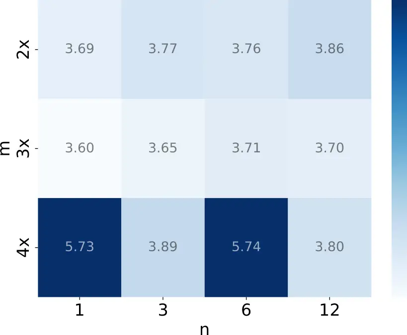
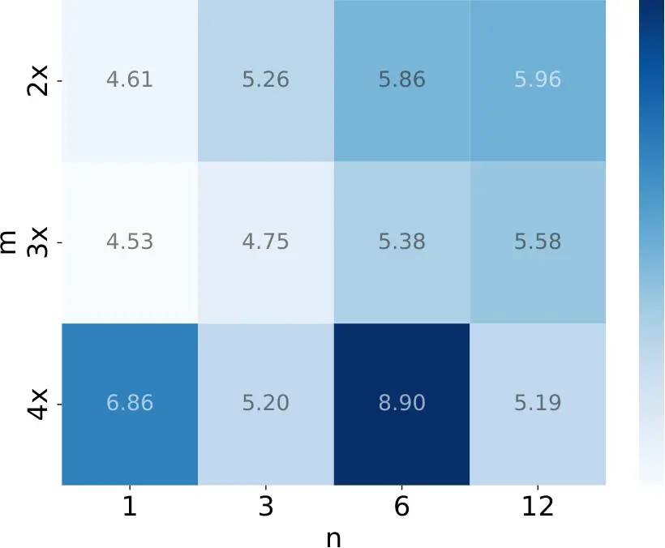

# Interleaved Speech-Text Language Models for Simple Streaming Text-to-Speech Synthesis

Yifan Yang ^(†)^(†)thanks: \*Work done during an internship at
Microsoft. Affiliation: Shanghai Jiao Tong University    Shujie Liu
Affiliation: Microsoft Corporation    Jinyu Li Affiliation: Microsoft
Corporation    Hui Wang Affiliation: Microsoft Corporation    Lingwei
Meng Affiliation: Microsoft Corporation    Haiyang Sun
Affiliation: Microsoft Corporation    Yuzhe Liang Affiliation: Shanghai
Jiao Tong University    Ziyang Ma Affiliation: Shanghai Jiao Tong
University    Yuxuan Hu Affiliation: Microsoft Corporation    Rui Zhao
Affiliation: Microsoft Corporation    Jianwei Yu Affiliation: Microsoft
Corporation    Yan Lu Affiliation: Microsoft Corporation    Xie Chen
Affiliation: Shanghai Jiao Tong University

###### Abstract

This paper introduces Interleaved Speech-Text Language Model (IST-LM)
for zero-shot streaming Text-to-Speech (TTS). Unlike many previous
approaches, IST-LM is directly trained on interleaved sequences of text
and speech tokens with a fixed ratio, eliminating the need for
additional efforts like forced alignment or complex designs. The ratio
of text chunk size to speech chunk size is crucial for the performance
of IST-LM. To explore this, we conducted a comprehensive series of
statistical analyses on the training data and performed correlation
analysis with the final performance, uncovering several key factors: 1)
the distance between speech tokens and their corresponding text tokens, 2) the number of future text tokens accessible to each speech token, and 3) the frequency of speech tokens precedes their corresponding text
tokens. Experimental results demonstrate how to achieve an optimal
streaming TTS system with a limited performance gap compared to its
non-streaming counterpart. IST-LM is conceptually simple and empirically
powerful, enabling streaming TTS with minimal overhead while largely
preserving performance, and offering broad potential for integration
with real-time text streams from large language models.

## 1 Introduction

Text-to-speech (TTS) synthesis, which aims to generate high-fidelity
speech from text, has made remarkable progress, driven by advancements
in generative modeling Shen et al. (2018); Li et al. (2019); Kim et al.
(2021); Ren et al. (2021); Jeong et al. (2021); Wang et al. (2023), as
well as the growing availability of computational power and data Ma
et al. (2024a); Kang et al. (2024); He et al. (2024); Chen et al.
(2021a); Yang et al. (2025b). Consequently, modern TTS systems exhibit
human-level parity in terms of naturalness and intelligibility, for both
predefined speakers Tan et al. (2024) and zero-shot scenarios Chen
et al. (2024a).

While existing zero-shot TTS systems Chen et al. (2024a); Meng et al.
(2024); Du et al. (2024a); Wang et al. (2024); Eskimez et al. (2024);
Chen et al. (2024b) demonstrate promising performance in synthesizing
speech for unseen speakers, they are typically trained in an offline
mode and process the entire input text before generating speech. As a
result, these systems suffer from high latency and prohibitive
computational costs when handling very long texts. To mitigate these
challenges, existing zero-shot streaming TTS systems Dang et al.
(2024a); Dang et al. (2024b) break long text inputs into smaller chunks
and synthesize speech for each chunk separately. However, this leads to
inconsistencies across different chunks. There remains substantial room
for improving streaming TTS.

A more intuitive but less explored solution to this challenge involves
interleaving text and speech tokens at a fixed ratio. This strategy
leverages the in-context learning (ICL) capabilities of language models
(LMs) to ensure consistent timbre and prosody across speech segments
while aligning naturally with the steady output rate of large language
models (LLMs).

With this perspective in mind, this paper introduces Interleaved
Speech-Text Language Model (IST-LM) for zero-shot streaming TTS, a novel
paradigm that directly trains an LM on interleaved sequences of text and
speech tokens with a fixed ratio. This eliminates the need for
additional efforts such as forced alignment to prepare training data and
complex system designs. To investigate the key factors involved in the
interleaving design, specifically chunk-internal size and chunk-mutual
ratio, we propose four sets of word-level, position-aware statistical
measures, and perform statistical analyses on the entire training
dataset. By correlating these measures with the final model performance,
we uncover several key insights:

- •
  The ratio of text chunk size to speech chunk size directly affects 1)
  the distance between speech tokens and their corresponding text
  tokens, 2) the number of future text tokens accessible to each speech
  token, and 3) the frequency of speech tokens preceding their
  corresponding text tokens.
- •
  The mean distance between speech tokens and their corresponding text
  tokens reflects a trade-off: shorter distances impose stronger
  constraints on speech synthesis while limiting the available
  contextual information as fewer upcoming text tokens are accessible to
  the current speech token, further impacting model performance.
- •
  The variance in the distances between speech tokens and their
  corresponding text tokens indicates the modeling difficulty of the LM.
  When the chunk-mutual ratio is fixed, the variance changes very
  little.
- •
  The frequency of speech tokens preceding their corresponding text
  tokens is highest at the start of the interleaved sequence, increasing
  modeling difficulty during training due to the lack of context from
  text tokens. However, this typically does not affect inference with
  speech prompts.

Experiments conducted on LibriTTS, using the LibriSpeech test-clean set
for zero-shot TTS evaluation, demonstrate that IST-LM with a
$`1\colon 3`$ ratio increases the word error rate (WER) by only 8%
relatively compared to the non-streaming counterpart while maintaining
comparable speaker similarity and overall perceived quality. IST-LM is
conceptually simple and empirically powerful, presenting a promising
solution for streaming TTS. We hope that our streaming TTS model and the
insights derived from our analysis will contribute to the advancement of
the voice interaction field.

## 2 Related Work

### 2.1 Speech Language Models

The advent of LLMs has spurred the integration of multiple modalities by
converting them into continuous or discrete tokens for joint training,
which has emerged as a promising approach. Previous studies have
explored the joint modeling of speech and text for various applications,
including automatic speech recognition (ASR) Ma et al. (2024b); Bai
et al. (2024), text-to-speech synthesis (TTS) Du et al. (2024a);
Anastassiou et al. (2024), and voice dialog systems Zhang et al. (2023);
Zeng et al. (2024b). In these studies, some approaches treat text and
speech tokens separately, with text tokens guiding speech tokens Du
et al. (2024a); Anastassiou et al. (2024), or speech tokens guiding text
tokens Ma et al. (2024b); Wu et al. (2023); Bai et al. (2024). Other
approaches interleave text and speech tokens. SpiritLM Nguyen et al.
(2024) randomly replaces paired speech and text token spans to enhance
modality switching during generation, while ELLAV Song et al. (2024b)
interleaves phonemes and their corresponding speech tokens to enforce
the constraint of text-to-speech synthesis. However, these two methods
depend heavily on forced alignment, which introduces additional
computational overhead and poses challenges for scalability.
GLM-4-Voice Zeng et al. (2024a) is pre-trained on interleaved sequences
of text and corresponding synthesized speech data, bypassing forced
alignment, yet the speech and text chunks remain paired during training.
OmniFlatten Zhang et al. (2024) is trained on interleaved dialogue
sequences of text and speech chunks with fixed sizes, where the text
chunk size is 2 and the speech chunk size is 10. However, these chunk
sizes are large and empirically chosen, with the ratio selected solely
to prevent the output text from excessively preceding the speech
content, lacking a deeper exploration or analysis of alternative ratios.
The investigation of interleaving speech and text tokens at a fixed
ratio remains limited.

### 2.2 Zero-Shot TTS

Zero-shot TTS systems enable speech synthesis for unseen speakers by
capturing the timbre, prosody, and style from merely several seconds of
speech prompts. Early approaches primarily focus on speaker
adaptation Arik et al. (2018); Chen et al. (2019); Chen et al. (2021c)
and speaker encoding Jia et al. (2018), often requiring model
fine-tuning, feature engineering, or complex structural designs. As
language modeling rapidly advances, the performance of zero-shot TTS
systems has greatly improved, achieving human-level quality in
naturalness and intelligibility Chen et al. (2024a).

Recent research in zero-shot TTS can be broadly classified into two
categories: some use speech prompts Wang et al. (2023); Chen et al.
(2024a); Du et al. (2025); Meng et al. (2024); Wang et al. (2025); Wang
et al. (2024); Eskimez et al. (2024) or speaker vectors Lajszczak et al.
(2024) for in-context learning (ICL), and others disentangle speaker
information from speech signals Ju et al. (2024). More recent works Du
et al. (2024a); Du et al. (2024b); Yang et al. (2025a) combine speaker
disentanglement and ICL to achieve better performance.

### 2.3 Streaming TTS

Streaming TTS systems incrementally convert incoming text into a speech
stream, aiming to reduce perceived latency, particularly for long
inputs, by enabling audio playback before the entire text is processed.
With the advent of LLMs, streaming TTS has been adapted for real-time
voice synthesis from LLM outputs, improving the naturalness of voice
interactions and enhancing user experience.

Existing streaming TTS systems can be broadly divided into chunk-level
and frame-level generation methods. Traditional chunk-level
systems Dekel et al. (2024); Dang et al. (2024a) segment the long text
into chunks based on punctuation or word boundaries, and synthesize
speech for each chunk separately, leading to inconsistencies and
unnatural transitions across chunks. Subsequent work Dang et al. (2024b)
adopts sliding window and context pruning to alleviate these issues.
Nevertheless, these methods heavily rely on complex rule-based
segmentation and engineering optimization. Frame-level systems leverage
the inherently streaming nature of neural Transducers Graves et al.
(2013). Early work like Speech-T Chen et al. (2021b) focuses on
single-speaker synthesis without zero-shot capabilities. Several recent
approaches Du et al. (2025); Bataev et al. (2025); Kim et al. (2023);
Lee et al. (2024) incorporate zero-shot capabilities but are primarily
designed for non-streaming scenarios.

Given that LLMs generate text at a constant rate, there is considerable
potential for developing more efficient streaming TTS systems without
intricate engineering efforts. This naturally raises the question: can
speech be synthesized in parallel with LLM-generated text at a fixed
ratio? In this work, we explore the feasibility of interleaving text and
speech tokens with a fixed ratio, demonstrating its potential in voice
dialogue systems.

Figure 1: An overview of the proposed IST-LM model, comprising (1) a
BPE-based text tokenizer, (2) a supervised speech tokenizer, (3) a
decoder-only LM modeling interleaved sequence of speech and text tokens
with a fixed ratio ($`1\colon 2`$ is used for illustration in the
figure) as input, and (4) a conditional flow matching decoder with a
vocoder.

## 3 Problem Formulation: Regarding Streaming TTS as Interleaved Speech-Text Language Modeling

Streaming TTS systems are required to continuously synthesize speech
segments from an incoming text stream, generating speech outputs in
real-time scenarios. In this paper, we regard zero-shot streaming TTS as
an interleaved speech-text language modeling task, treating streaming
speech synthesis as a joint sequential modeling problem.

Formulation Consider a speech sample $`\mathbf{y}`$ and its
corresponding transcription $`\mathbf{x}`$. The transcription
$`\mathbf{x}`$ is converted into subword units using Byte Pair Encoding
(BPE) Sennrich et al. (2016), resulting in BPE token sequence
$`\bm{x}=[x_{0},x_{1},\ldots,x_{S-1}]`$, where $`S`$ is the length of
the tokenized sequence. A pre-trained speech tokenizer is used to encode
the speech sample into speech tokens, denoted as
$`\bm{y}=[y_{0},y_{1},\ldots,y_{T-1}]=\text{Encode}_{\text{spch}}(\mathbf{y})`$,
where $`\bm{y}`$ represents the speech token sequence of downsampled
length $`T`$. After quantization, a pre-trained speech detokenizer along
with a vocoder can reconstruct the waveform, denoted as
$`\text{Decode}_{\text{spch}}(\bm{y})\approx\hat{\bm{y}}`$.

We train a neural LM on the interleaved sequence of BPE tokens
$`\bm{x}`$ and speech tokens $`\bm{y}`$ with a predefined fixed ratio of
$`n\colon m`$. The interleaved sequence $`\bm{l}`$ is constructed as
follows:

```math
\bm{l}=[x_{0:n-1},y_{0:m-1},x_{n:2n-1},y_{m:2m-1},\ldots], \tag{1}
```

where the BPE tokens and speech tokens are alternated in blocks of size
$`n`$ and $`m`$, respectively. Once the BPE tokens are consumed, the
remaining speech tokens are appended to the end of the sequence. The LM
is optimized to predict this interleaved sequence $`\bm{l}`$ using
cross-entropy loss. Specifically, at each timestep $`t`$, the LM is
expected to predict the next speech token $`y_{t}`$ conditioned on the
previously generated sequence $`\bm{l}_{<t}`$. The optimization
objective is:

```math
\arg\max_{\theta}p(\bm{l}_{t}\mid\bm{l}_{<t};\theta), \tag{2}
```

where $`\bm{l}_{<t}`$ represents the sequence
$`[l_{0},l_{1},\ldots,l_{t-1}]`$, and $`\theta`$ denotes the parameters
of the LM. Notably, only losses for speech tokens are computed.

During inference, given the BPE tokens $`\bm{x}`$ of the text to be
synthesized, the speech tokens $`\tilde{\bm{y}}`$ from the speech
prompt, and the BPE tokens $`\tilde{\bm{x}}`$ of the corresponding text
prompt, the LM generates the target speech tokens $`\bm{y}`$ in a
streaming manner while preserving the speaker characteristics of the
speech prompt. The BPE tokens $`\bm{x}`$ and $`\tilde{\bm{x}}`$ are
concatenated and treated as a unified sequence, which is then segmented
into chunks of size $`n`$. For each chunk of $`n`$ BPE tokens, the model
generates $`m`$ speech tokens, repeating this process until either the
\<EOS\> token is produced or all BPE tokens are consumed. In the latter
case, the model continues to generate the remaining speech tokens
sequentially until the \<EOS\> token is emitted.

## 4 IST-LM

### 4.1 Architecture

The overall architecture of IST-LM is illustrated in Fig. 1. IST-LM
comprises the following main components: a BPE-based text tokenizer that
converts raw text into sub-word tokens; a speech tokenizer that encodes
speech samples into discrete speech tokens; a decoder-only LM that
models interleaved sequences of speech and text tokens; a speech
detokenizer with a built-in vocoder that synthesizes waveform from the
speech tokens.

### 4.2 Speech Tokenization and Detokenization

For speech tokenization, we utilize the pre-trained S3Tokenizer from
CosyVoice Du et al. (2024a) to extract discrete semantic speech tokens
from the waveform at a token rate of 50 Hz. This model is a fine-tuned
version of the SenseVoice-Large An et al. (2024) ASR model, which is
trained on a large multilingual speech dataset, providing robust speech
understanding capabilities. By leveraging ASR loss during training, the
S3Tokenizer can extract semantic information while disregarding
irrelevant noise and speaker information. This enables the S3Tokenizer
to implicitly denoise and disentangle speakers Song et al. (2024a).

For speech detokenization, we adopt the pre-trained optimal-transport
conditional flow matching model (OT-CFM) from CosyVoice Du et al.
(2024a) to decode speech tokens into mel spectrograms, which are then
transformed into the waveform using the pre-trained HiFi-GAN Kong et al.
(2020) vocoder from CosyVoice Du et al. (2024a).

### 4.3 Interleaved Speech-Text Language Model

We use a unidirectional Transformer decoder as the LM to
autoregressively generate discrete speech tokens from the interleaved
sequence of text and speech tokens with a fixed ratio. Input text
tokens, appended with an \<EOS\> token, are embedded via the text
embedding layer, while speech tokens are projected into the semantic
space of LM through the acoustic embedding layer. By using distinct
positional encodings for text and speech, the LM clearly distinguishes
between the two modalities, leveraging multi-head attention and
feed-forward layers to capture dependencies between semantic and
acoustic information.

|                                    |                     |                   |                     |                   |                   |
| ---------------------------------- | ------------------- | ----------------- | ------------------- | ----------------- | ----------------- |
| System                             | Continuation        |                   | Cross-Sentence      |                   |                   |
|                                    | WER-H$`\downarrow`$ | SIM-o$`\uparrow`$ | WER-H$`\downarrow`$ | SIM-o$`\uparrow`$ | RTF$`\downarrow`$ |
| Ground Truth                       | 2.15                | 0.905             | 2.15                | 0.779             | \-                |
| Ground Truth (EnCodec)             | 2.33                | 0.823             | 2.33                | 0.715             | \-                |
| Ground Truth (S3Tokenizer v1 50Hz) | 2.94                | 0.791             | 3.09                | 0.746             | \-                |
| Trained on Large-Scale Dataset     |                     |                   |                     |                   |                   |
| VALL-E Wang et al. (2023)          | 3.80                | 0.773             | 5.90                | 0.633             | 0.73              |
| MaskGCT^(∗)                        | \-                  | \-                | 4.22                | 0.756             | 0.65              |
| E2 TTS (32 NFE)^(∗)                | \-                  | \-                | 2.92                | 0.756             | 0.68              |
| Trained on Small-Scale Dataset     |                     |                   |                     |                   |                   |
| VALL-E                             | 4.47                | 0.730             | 8.64                | 0.531             | 0.73              |
| IST-LM\_(∞:∞)                      | 3.35                | 0.756             | 4.16                | 0.652             | 0.40              |
| IST-LM\_(1:2)                      | 3.69                | 0.754             | 4.61                | 0.649             | 0.40              |
| IST-LM\_(1:3)                      | 3.60                | 0.757             | 4.53                | 0.653             | 0.40              |
| IST-LM\_(1:4)                      | 5.73                | 0.757             | 6.86                | 0.645             | 0.40              |
| IST-LM\_(3:6)                      | 3.77                | 0.757             | 5.26                | 0.650             | 0.40              |
| IST-LM\_(3:9)                      | 3.65                | 0.757             | 4.75                | 0.652             | 0.40              |
| IST-LM\_(3:12)                     | 3.89                | 0.757             | 5.20                | 0.649             | 0.40              |
| IST-LM\_(6:12)                     | 3.76                | 0.758             | 5.86                | 0.650             | 0.40              |
| IST-LM\_(6:18)                     | 3.71                | 0.755             | 5.38                | 0.647             | 0.40              |
| IST-LM\_(6:24)                     | 5.74                | 0.753             | 8.90                | 0.643             | 0.40              |
| IST-LM\_(12:24)                    | 3.86                | 0.757             | 5.96                | 0.646             | 0.40              |
| IST-LM\_(12:36)                    | 3.70                | 0.754             | 5.58                | 0.649             | 0.40              |
| IST-LM\_(12:48)                    | 3.80                | 0.756             | 5.19                | 0.646             | 0.40              |

Table 1: Objective performance comparison on continuation and
cross-sentence zero-shot speech synthesis tasks. IST-LM*(n:m) represents
streaming systems with a text chunk size of $`n`$ and a speech chunk
size of $`m`$, while IST-LM*(∞:∞) refers to non-streaming system. Bold
highlights the best result among streaming systems, while underlined
marks the second-best. ^(∗)Metrics not reported in the original papers
are calculated using the checkpoints provided by their authors.

|                                    |                     |
| ---------------------------------- | ------------------- |
| System                             | UTMOSv2$`\uparrow`$ |
| Ground Truth                       | 3.22                |
| Ground Truth (S3Tokenizer v1 50Hz) | 3.30                |
| Trained on Large-Scale Dataset     |                     |
| MaskGCT                            | 2.92                |
| E2 TTS (32 NFE)                    | 2.82                |
| Trained on Small-Scale Dataset     |                     |
| VALL-E                             | 2.12                |
| IST-LM\_(∞:∞)                      | 3.32                |
| IST-LM\_(1:3)                      | 3.30                |

Table 2: Predicted MOS comparison on cross-sentence zero-shot speech
synthesis tasks.

|            |               |                     |                   |                     |                   |
| ---------- | ------------- | ------------------- | ----------------- | ------------------- | ----------------- |
| Chunk Size | Right Context | Continuation        |                   | Cross-Sentence      |                   |
|            |               | WER-H$`\downarrow`$ | SIM-o$`\uparrow`$ | WER-H$`\downarrow`$ | SIM-o$`\uparrow`$ |
| \-         | \-            | 3.60                | 0.757             | 4.53                | 0.653             |
| 50         | 20            | 3.75                | 0.762             | 5.36                | 0.663             |
| 25         | 10            | 3.74                | 0.753             | 5.50                | 0.651             |
| 15         | 6             | 4.24                | 0.722             | 5.82                | 0.628             |

Table 3: Objective performance of IST-LM\_(1:3) using the decoder in
chunk-wise streaming mode. Once the generated tokens reach the sum of
Chunk Size and Right Context, they are fed into the decoder, with Right
Context as lookahead.

## 5 Experiments

### 5.1 Experimental Setup

#### 5.1.1 Dataset

We conduct experiments on the LibriTTS Zen et al. (2019) dataset, a
multi-speaker English corpus with approximately 580 hours of speech from
2,306 speakers. For text tokenization, we use 2,000-class BPE word
pieces. Speech tokenization is carried out using the off-the-shelf
S3Tokenizer model¹¹ 1
[https://github.com/xingchensong/S3Tokenizer](https://github.com/xingchensong/S3Tokenizer)
from CosyVoice Du et al. (2024a) at a token rate of 50Hz. Speech
reconstruction is performed using the off-the-shelf OT-CFM model with
the built-in vocoder, also from CosyVoice Du et al. (2024a).

#### 5.1.2 Model

We employ a decoder-only transformer architecture with 12 layers, 16
attention heads, 1024-dimensional embeddings, and 4096-dimensional
feed-forward layers, with a total of 161.8M parameters. All models are
trained on 8 NVIDIA V100 32GB GPUs with a 160-second batch duration per
GPU for 50 epochs. We utilize the ScaledAdam Yao et al. (2024) optimizer
and Eden Yao et al. (2024) scheduler, with a peak learning rate of
0.045.

### 5.2 Evaluation

#### 5.2.1 Evaluation Settings

We use the LibriSpeech Panayotov et al. (2015) test-clean set for
zero-shot TTS evaluation, ensuring no overlap in speakers with the
training set. Following previous practice Wang et al. (2023), the same
test set is employed, which comprises audio segments ranging from 4 to
10 seconds, totaling 2.2 hours of data from 40 unique speakers and 1,234
samples. We evaluate IST-LM under two inference tasks:

- •
  Continuation: Using the text transcription and the first 3 seconds of
  an utterance as a prompt, the model synthesizes the remainder of the
  speech;
- •
  Cross-Sentence: Using a reference utterance and its transcription as
  the prompt, the model generates speech for the target text while
  preserving the characteristics of the speaker.

#### 5.2.2 Evaluation Metrics

We employ the following objective metrics, including WER, SIM, and
UTMOSv2, to assess the robustness, speaker similarity, overall perceived
quality, and efficiency of the proposed method, respectively. For the
continuation task, we evaluate the entire utterance rather than just the
continuation segment for a more complete comparison.

- •
  WER-H (Word Error Rate) is used to evaluate the robustness and
  intelligibility of synthesized speech. Neural TTS systems often
  encounter robustness issues. To evaluate these, we perform speech
  recognition on the synthesized output using the HuBERT-Large Hsu
  et al. (2021) ASR model²² 2
  [https://huggingface.co/facebook/hubert-large-ls960-ft](https://huggingface.co/facebook/hubert-large-ls960-ft)
  and calculate the WER between the generated transcripts and the ground
  truth text.
- •
  SIM-o (Speaker Similarity) measures the similarity between the
  original prompt and synthesized speech. We use the state-of-the-art
  speaker verification model WavLM-TDNN³³ 3
  [https://github.com/microsoft/UniSpeech/tree/main/downstreams/speaker_verification#pre-trained-models](https://github.com/microsoft/UniSpeech/tree/main/downstreams/speaker_verification#pre-trained-models) Chen
  et al. (2022). The similarity score predicted by WavLM-TDNN ranges
  from $`[-1,1]`$, with a higher score indicating greater speaker
  similarity.
- •
  UTMOSv2 measures the naturalness and overall quality of synthesized
  speech. We use the UTokyo-SaruLab Mean Opinion Score Prediction System
  v2 (UTMOSv2) Baba et al. (2024), a model-based, non-intrusive speech
  quality metric trained on human ratings. The predicted score ranges
  from 1 to 5, with higher scores denoting better perceptual quality.
  UTMOSv2 offers an efficient and reliable estimation of human judgment
  in speech synthesis evaluation.
- •
  RTF (Real-Time Factor) measures the time taken to synthesize one
  second of speech and reflects system efficiency, especially in
  real-time scenarios. We report RTF on an NVIDIA TESLA A100 80G GPU,
  calculated from the average inference time for generating 10 seconds
  of speech with a batch size of 1.

#### 5.2.3 Baseline Systems

We evaluate our systems against several state-of-the-art (SOTA)
zero-shot TTS systems. For a fair comparison, we reproduce VALL-E using
the same training data. In addition, we compare our systems with
multiple SOTA systems, including MaskGCT, E2-TTS, and the original
VALL-E trained on a large-scale dataset. Note that our goal is not to
pursue SOTA performance, but rather to comprehensively explore the
proposed interleaved speech-text language modeling paradigm on a
relatively small dataset. More details about the baseline systems are
provided in Appendix A.

### 5.3 Main Results

Table 1 presents comparisons between our proposed IST-LM and the
baselines in terms of robustness, similarity, and efficiency on the
LibriSpeech test-clean set. Table 2 reports the overall perceived
quality of IST-LM compared to the baselines.

#### 5.3.1 Comparison with Baselines

IST-LM\_(∞:∞) consistently outperforms two VALL-E variants across all
evaluation metrics for both continuation and cross-sentence tasks,
despite the reconstructed ground truth from S3Tokenizer being notably
inferior in quality to that from EnCodec. IST-LM is based on 50Hz
single-layer semantic speech tokens from S3Tokenizer, whereas VALL-E
relies on 75Hz eight-layer acoustic speech tokens from EnCodec. This
suggests that single-layer semantic representations are more amenable to
effective modeling by language models.

Remarkably, despite being trained with much less data, IST-LM*(∞:∞)
outperforms the large-scale trained MaskGCT in both intelligibility and
overall perceived quality, albeit with reduced similarity. Furthermore,
both our non-streaming IST-LM*(∞:∞) and streaming IST-LM\_(1:3) achieve
human-level overall perceived quality, outperforming the ground-truth
recordings, MaskGCT, and E2 TTS on the cross-sentence task. We also
observe that the reconstructed ground-truth speech from the S3Tokenizer
surpasses the original in overall perceived quality, which we attribute
to flow matching in the speech detokenizer.

Compared to all baselines, IST-LM achieves the lowest RTF, which can be
attributed to its compact design. Speech detokenization is performed
once after all speech tokens are generated. The total number of
generated tokens remains the same regardless of streaming mode or
interleaving ratio. As a result, the RTF exhibits only minor variation
and is reported as a single value.

#### 5.3.2 Comparison among Streaming Variants

Among all streaming systems, IST-LM*(1:3) achieves the best overall
performance on both continuation and cross-sentence tasks. Compared to
its non-streaming counterpart IST-LM*(∞:∞), IST-LM\_(1:3) exhibits a
relatively small WER gap, specifically 6.94% for continuation and 8.17%
for cross-sentence, and comparable similarity. These results demonstrate
that IST-LM effectively maintains performance for streaming without the
need for complex engineering.

#### 5.3.3 Comparison under Chunk-wise Streaming

Table 3 provides results for IST-LM\_(1:3) with the decoder in chunk-wise
streaming mode. The model generates speech tokens concurrently with
waveform synthesis, and the response latency is controlled by the chunk
size and right context.



(a) Continuation



(b) Cross-Sentence

Figure 2: Heatmap of WER of continuation and cross-sentence tasks as the
ratio of text chunk size $`n`$ to speech chunk size $`m`$ varies. The
horizontal axis represents the text chunk size $`n`$, while the vertical
axis represents the speech chunk size $`m`$. The color intensity
reflects the magnitude of the WER values.

(a) Average $`\mu_{D}`$

(b) Average $`\sigma_{D}`$

(c) Average $`A`$

Figure 3: Correlation between the three statistical measures and the
WERs of continuation and cross-sentence tasks. The WERs are grouped by
the values of the ratio $`n\colon m`$, with the central points of each
group represented by large circles ($`x\colon 2x`$, $`x\colon 3x`$,
$`x\colon 4x`$). For each group, the four data points are fitted using
Linear Regression with Random Sample Consensus (RANSAC), and the fitted
lines are shown as dashed lines.

## 6 Analyses

### 6.1 Impact of Ratio on Performance

Fig. 2 shows a heatmap of WERs for two tasks. The horizontal axis
represents text chunk size $`n`$, while the vertical axis represents
speech chunk size $`m`$. As $`n`$ increases, WER for both continuation
and cross-sentence tasks generally increases, except for two noise
outliers ($`1\colon 4`$ and $`12\colon 48`$), indicating that larger
chunk sizes tend to have worse performance. Additionally, as the value
of ratio $`n:m`$ increases, WER first decreases and then increases,
reflecting the influence of multiple factors.

### 6.2 Definitions of Position-Aware Measures

To investigate the key factors involved in the interleaving design,
including chunk-internal size and chunk-to-chunk ratio, we propose four
sets of word-level, position-aware statistical measures. Each training
sample comprises up to 72 words. For each word $`j`$ in sample $`i`$, it
can be encoded into multiple BPE tokens
$`x_{ij}^{0},x_{ij}^{1},\dots,x_{ij}^{l_{1}}`$, and corresponding speech
tokens $`y_{ij}^{0},y_{ij}^{1},\dots,y_{ij}^{l_{2}}`$ are obtained
through word-level forced alignment. We define the distance between
tokens $`x`$ and $`y`$ as $`d(x,y)`$. The speech-text distance for word
$`j`$ in sample $`i`$, denoted $`D_{ij}`$, is calculated as the average
distance between each speech token and all corresponding BPE tokens:
$`D_{ij}=\frac{1}{l_{2}}\sum_{k=1}^{l_{2}}\frac{1}{l_{1}}\sum_{r=1}^{l_{1}}d(x_{ij}^{r},y_{ij}^{k})`$.
The mean and standard deviation of the speech-text distance for each
word position $`j`$ across the entire training set are denoted as
$`\mu_{D_{j}}`$ and $`\sigma_{D_{j}}`$, respectively. Similarly, we
define the average number of future words accessible by the speech
tokens corresponding to each word position as $`A_{j}`$. Additionally,
we analyze the frequency with which the speech tokens corresponding to
each word position precede the BPE tokens of the current word, denoted
as $`F_{j}`$. We perform statistical analyses on the training dataset
using the above-mentioned measures. Fig. 4 visualizes $`\mu_{D_{j}}`$,
$`\sigma_{D_{j}}`$, $`A_{j}`$, and $`F_{j}`$ for each word position
$`j`$ across different ratio settings.

### 6.3 Impact of Position-Aware Measures on Performance

Fig. 3 shows the correlation between average measures of all word
positions and WERs for two tasks, leading to the following conclusions:

- •
  Effect of $`n\colon m`$: The ratio $`n\colon m`$ directly affects
  $`\mu_{D_{j}}`$, $`\sigma_{D_{j}}`$, $`A_{j}`$, and $`F_{j}`$.
  Specifically, when the value of ratio is fixed and $`n`$ (i.e.,
  chunk-internal size) increases, both $`\mu_{D_{j}}`$ and $`A_{j}`$
  increase, $`\sigma_{D_{j}}`$ slightly increases, and $`F_{j}`$
  decreases. Conversely, when $`n`$ is fixed and the ratio (i.e.,
  chunk-to-chunk ratio) increases, $`\mu_{D_{j}}`$ and
  $`\sigma_{D_{j}}`$ decrease, $`A_{j}`$ decreases, and $`F_{j}`$
  increases.
- •
  Effect of $`\mu_{D_{j}}`$, $`\sigma_{D_{j}}`$, $`A_{j}`$: When
  $`\mu_{D_{j}}`$ increases, $`\sigma_{D_{j}}`$ and $`A_{j}`$ also
  increases. The WER for both continuation and cross-sentence tasks
  first decreases and then increases. This reflects a trade-off, where
  shorter distances impose stronger constraints on speech synthesis,
  limiting contextual information as fewer upcoming text tokens are
  accessible to the current speech token while increasing the modeling
  difficulty for the LM.
- •
  Effect of $`F_{j}`$: The frequency of speech tokens preceding text
  tokens occurs mainly at the start of the interleaved sequence when
  $`n`$ is small and the ratio is large. This increases training
  difficulty, as the speech tokens lack text context, but typically do
  not affect inference with the speech prompt, except for the
  $`1\colon 4`$ ratio, which exhibits abnormally high WERs.
- •
  Outlier analysis: IST-LM\_(12:48) exhibits abnormally low WERs, as
  around 40% of test samples in the continuation task contain no more
  than 24 text tokens, resembling non-streaming behavior.

## 7 Conclusion

This paper introduces IST-LM for zero-shot streaming TTS, which is
directly trained on interleaved text and speech tokens at a fixed ratio.
Experiments on LibriTTS demonstrate that IST-LM with a $`1\colon 3`$
ratio significantly outperforms other streaming systems, achieving
acceptably worse intelligibility compared to non-streaming counterpart
while maintaining comparable speaker similarity and overall perceived
quality. Furthermore, our analysis provides several insights into how
the ratio impacts performance, revealing the trade-offs between
enforcing textual constraints and leveraging contextual information in
speech synthesis. We hope that the language modeling paradigm of IST-LM
and the insights gained from our analysis will contribute to advancing
the field of voice interaction.

## Limitations

Despite the promising performance and compact topology, we acknowledge
several limitations. This work initially employed a non-streaming
decoder and simulated streaming inference by chunking speech tokens, due
to the unavailability of an off-the-shelf streaming decoder at the time.
This led to first-packet latency constrained by the chunk size and
degraded speech quality. We anticipate that performance will improve
with an advanced streaming decoder.

## References

- An et al. (2024) Keyu An, Qian Chen, Chong Deng, and 1 others. 2024.
  [Funaudiollm: Voice understanding and generation foundation models for
  natural interaction between humans and
  llms](https://arxiv.org/abs/2407.04051). _Preprint_, arXiv:2407.04051.
- Anastassiou et al. (2024) Philip Anastassiou, Jiawei Chen, Jitong
  Chen, and 1 others. 2024. [Seed-TTS: A family of high-quality
  versatile speech generation models](https://arxiv.org/abs/2406.02430).
  _Preprint_, arXiv:2406.02430.
- Arik et al. (2018) Sercan Ömer Arik, Jitong Chen, Kainan Peng, and 1
  others. 2018. Neural voice cloning with a few samples. In _Proc.
  NeurIPS_, Montréal.
- Baba et al. (2024) Kaito Baba, Wataru Nakata, Yuki Saito, and 1
  others. 2024. The t05 system for the VoiceMOS Challenge 2024: Transfer
  learning from deep image classifier to naturalness MOS prediction of
  high-quality synthetic speech. In _Proc. SLT_, Macao.
- Bai et al. (2024) Ye Bai, Jingping Chen, and 1 others. 2024.
  [Seed-ASR: Understanding diverse speech and contexts with llm-based
  speech recognition](https://arxiv.org/abs/2407.04675). _Preprint_,
  arXiv:2407.04675.
- Bataev et al. (2025) Vladimir Bataev, Subhankar Ghosh, Vitaly
  Lavrukhin, and Jason Li. 2025. TTS-Transducer: End-to-end speech
  synthesis with neural transducer. In _Proc. ICASSP_, Hyderabad.
- Chen et al. (2021a) Guoguo Chen, Shuzhou Chai, Guan-Bo Wang, and 1
  others. 2021a. GigaSpeech: An evolving, multi-domain ASR corpus with
  10, 000 hours of transcribed audio. In _Interspeech_, Brno.
- Chen et al. (2021b) Jiawei Chen, Xu Tan, Yichong Leng, and 1 others.
  2021b. Speech-t: Transducer for text to speech and beyond. In _Proc.
  NeurIPS_, virtual.
- Chen et al. (2021c) Mingjian Chen, Xu Tan, Bohan Li, and 1 others.
  2021c. Adaspeech: Adaptive text to speech for custom voice. In _Proc.
  ICLR_, Virtual.
- Chen et al. (2024a) Sanyuan Chen, Shujie Liu, Long Zhou, and 1 others.
  2024a. [VALL-E 2: Neural codec language models are human parity
  zero-shot text to speech
  synthesizers](https://arxiv.org/abs/2406.05370). _Preprint_,
  arXiv:2406.05370.
- Chen et al. (2022) Sanyuan Chen, Chengyi Wang, Zhengyang Chen, and 1
  others. 2022. WavLM: Large-scale self-supervised pre-training for full
  stack speech processing. _IEEE Journal of Selected Topics in Signal
  Processing_, 16.
- Chen et al. (2024b) Yushen Chen, Zhikang Niu, Ziyang Ma, and 1 others.
  2024b. [F5-TTS: A fairytaler that fakes fluent and faithful speech
  with flow matching](https://arxiv.org/abs/2410.06885). _Preprint_,
  arXiv:2410.06885.
- Chen et al. (2019) Yutian Chen, Yannis M. Assael, Brendan
  Shillingford, and 1 others. 2019. Sample efficient adaptive
  text-to-speech. In _Proc. ICLR_, New Orleans.
- Dang et al. (2024a) Trung Dang, David Aponte, Dung N. Tran, and 1
  others. 2024a. [LiveSpeech: Low-latency zero-shot text-to-speech via
  autoregressive modeling of audio discrete
  codes](https://arxiv.org/abs/2406.02897). _Preprint_,
  arXiv:2406.02897.
- Dang et al. (2024b) Trung Dang, David Aponte, Dung N. Tran, and 1
  others. 2024b. [Zero-shot text-to-speech from continuous text
  streams](https://arxiv.org/abs/2410.00767). _Preprint_,
  arXiv:2410.00767.
- Défossez et al. (2023) Alexandre Défossez, Jade Copet, Gabriel
  Synnaeve, and Yossi Adi. 2023. High fidelity neural audio compression.
  _Transactions on Machine Learning Research_.
- Dekel et al. (2024) Avihu Dekel, Slava Shechtman, Raul Fernandez, and
  1 others. 2024. Speak while you think: Streaming speech synthesis
  during text generation. In _Proc. ICASSP_, Seoul.
- Du et al. (2025) Chenpeng Du, Yiwei Guo, Hankun Wang, Yifan Yang, and
  1 others. 2025. VALL-T: Decoder-only generative transducer for robust
  and decoding-controllable text-to-speech. In _Proc. ICASSP_,
  Hyderabad.
- Du et al. (2024a) Zhihao Du, Qian Chen, Shiliang Zhang, and 1 others.
  2024a. [CosyVoice: A scalable multilingual zero-shot text-to-speech
  synthesizer based on supervised semantic
  tokens](https://arxiv.org/abs/2407.05407). _Preprint_,
  arXiv:2407.05407.
- Du et al. (2024b) Zhihao Du, Yuxuan Wang, Qian Chen, and 1 others.
  2024b. [Cosyvoice 2: Scalable streaming speech synthesis with large
  language models](https://arxiv.org/abs/2412.10117). _Preprint_,
  arXiv:2412.10117.
- Eskimez et al. (2024) Sefik Emre Eskimez, Xiaofei Wang, Manthan
  Thakker, and 1 others. 2024. E2 TTS: embarrassingly easy fully
  non-autoregressive zero-shot TTS. In _Proc. SLT_, Macao.
- Graves et al. (2013) Alex Graves, Abdel-rahman Mohamed, and
  Geoffrey E. Hinton. 2013. Speech recognition with deep recurrent
  neural networks. In _Proc. ICASSP_, Vancouver.
- He et al. (2024) Haorui He, Zengqiang Shang, Chaoren Wang, and 1
  others. 2024. Emilia: An extensive, multilingual, and diverse speech
  dataset for large-scale speech generation. In _Proc. SLT_, Macao.
- Hsu et al. (2021) Wei Ning Hsu, Benjamin Bolte, Yao Hung Hubert Tsai,
  and 1 others. 2021. HuBERT: Self-supervised speech representation
  learning by masked prediction of hidden units. _IEEE/ACM Transactions
  on Audio, Speech, and Language Processing_, 29.
- Jeong et al. (2021) Myeonghun Jeong, Hyeongju Kim, Sung Jun Cheon, and
  1 others. 2021. Diff-TTS: A denoising diffusion model for
  text-to-speech. In _Proc. Interspeech_, Brno.
- Jia et al. (2018) Ye Jia, Yu Zhang, Ron J. Weiss, and 1 others. 2018.
  Transfer learning from speaker verification to multispeaker
  text-to-speech synthesis. In _Proc. NeurIPS_, Montréal.
- Ju et al. (2024) Zeqian Ju, Yuancheng Wang, Kai Shen, and 1
  others. 2024. NaturalSpeech 3: Zero-shot speech synthesis with
  factorized codec and diffusion models. In _Proc. ICML_, Vienna.
- Kahn et al. (2020) Jacob Kahn, Morgane Rivière, Weiyi Zheng, and 1
  others. 2020. Libri-Light: A benchmark for ASR with limited or no
  supervision. In _Proc. ICASSP_, Barcelona.
- Kang et al. (2024) Wei Kang, Xiaoyu Yang, Zengwei Yao, and 1
  others. 2024. Libriheavy: a 50,000 hours ASR corpus with punctuation
  casing and context. In _Proc. ICASSP_, Seoul.
- Kim et al. (2021) Jaehyeon Kim, Jungil Kong, and Juhee Son. 2021.
  Conditional variational autoencoder with adversarial learning for
  end-to-end text-to-speech. In _Proc. ICML_, Virtual.
- Kim et al. (2023) Minchan Kim, Myeonghun Jeong, Byoung Choi, and 1
  others. 2023. Transduce and Speak: Neural transducer for
  text-to-speech with semantic token prediction. In _Proc. ASRU_,
  Taipei.
- Kong et al. (2020) Jungil Kong, Jaehyeon Kim, and Jaekyoung Bae. 2020.
  HiFi-GAN: Generative adversarial networks for efficient and high
  fidelity speech synthesis. In _Proc. NeurIPS_, Virtual.
- Lajszczak et al. (2024) Mateusz Lajszczak, Guillermo Cámbara, Yang Li,
  and 1 others. 2024. [BASE TTS: Lessons from building a
  billion-parameter text-to-speech model on 100k hours of
  data](https://arxiv.org/abs/2402.08093). _Preprint_, arXiv:2402.08093.
- Lee et al. (2024) Joun Yeop Lee, Myeonghun Jeong, Minchan Kim, and 1
  others. 2024. High fidelity text-to-speech via discrete tokens using
  token transducer and group masked language model. In _Proc.
  Interspeech_, Kos Island.
- Li et al. (2019) Naihan Li, Shujie Liu, Yanqing Liu, and 1
  others. 2019. Neural speech synthesis with transformer network. In
  _Proc. AAAI_, Honolulu.
- Ma et al. (2024a) Linhan Ma, Dake Guo, Kun Song, and 1 others. 2024a.
  WenetSpeech4TTS: A 12,800-hour mandarin TTS corpus for large speech
  generation model benchmark. In _Proc. Interspeech_, Kos Island.
- Ma et al. (2024b) Ziyang Ma, Guanrou Yang, Yifan Yang, and 1 others.
  2024b. [An embarrassingly simple approach for LLM with strong ASR
  capacity](https://arxiv.org/abs/2402.08846). _Preprint_,
  arXiv:2402.08846.
- Meng et al. (2024) Lingwei Meng, Long Zhou, Shujie Liu, and 1
  others. 2024. [Autoregressive speech synthesis without vector
  quantization](https://arxiv.org/abs/2407.08551). _Preprint_,
  arXiv:2407.08551.
- Nguyen et al. (2024) Tu Anh Nguyen, Benjamin Muller, Bokai Yu, and 1
  others. 2024. [SpiRit-LM: Interleaved spoken and written language
  model](https://arxiv.org/abs/2402.05755). _Preprint_,
  arXiv:2402.05755.
- Panayotov et al. (2015) Vassil Panayotov, Guoguo Chen, Daniel Povey,
  and 1 others. 2015. Librispeech: an ASR corpus based on public domain
  audio books. In _Proc. ICASSP_, South Brisbane.
- Ren et al. (2021) Yi Ren, Chenxu Hu, Xu Tan, and 1 others. 2021.
  FastSpeech 2: Fast and high-quality end-to-end text to speech. In
  _Proc. ICLR_, Virtual.
- Sennrich et al. (2016) Rico Sennrich, Barry Haddow, and Alexandra
  Birch. 2016. Neural machine translation of rare words with subword
  units. In _Proc. ACL_, Berlin.
- Shen et al. (2018) Jonathan Shen, Ruoming Pang, Ron J. Weiss, and 1
  others. 2018. Natural TTS synthesis by conditioning wavenet on MEL
  spectrogram predictions. In _Proc. ICASSP_, Calgary.
- Song et al. (2024a) Xingchen Song, Mengtao Xing, Changwei Ma, and 1
  others. 2024a. [TouchTTS: An embarrassingly simple tts framework that
  everyone can touch](https://arxiv.org/abs/2412.08237). _Preprint_,
  arXiv:2412.08237.
- Song et al. (2024b) Yakun Song, Zhuo Chen, Xiaofei Wang, and 1 others.
  2024b. ELLA-V: Stable neural codec language modeling with
  alignment-guided sequence reordering. In _Proc. AAAI_, Philadelphia.
- Tan et al. (2024) Xu Tan, Jiawei Chen, Haohe Liu, and 1 others. 2024.
  NaturalSpeech: End-to-end text-to-speech synthesis with human-level
  quality. _IEEE Transactions on Pattern Analysis and Machine
  Intelligence_, 46(6):4234–4245.
- Wang et al. (2023) Chengyi Wang, Sanyuan Chen, Yu Wu, and 1
  others. 2023. [Neural codec language models are zero-shot text to
  speech synthesizers](https://arxiv.org/abs/2301.02111). _Preprint_,
  arXiv:2301.02111.
- Wang et al. (2025) Hui Wang, Shujie Liu, Lingwei Meng, and 1
  others. 2025. [FELLE: autoregressive speech synthesis with token-wise
  coarse-to-fine flow matching](https://arxiv.org/abs/2502.11128).
  _Preprint_, arXiv:2502.11128.
- Wang et al. (2024) Yuancheng Wang, Haoyue Zhan, Liwei Liu, and 1
  others. 2024. MaskGCT: Zero-shot text-to-speech with masked generative
  codec transformer. In _Proc. ICLR_, Singapore.
- Wu et al. (2023) Jian Wu, Yashesh Gaur, Zhuo Chen, and 1 others. 2023.
  On decoder-only architecture for speech-to-text and large language
  model integration. In _Proc. ASRU_, Taipei.
- Yang et al. (2025a) Yifan Yang, Shujie Liu, Jinyu Li, and 1 others.
  2025a. [Pseudo-autoregressive neural codec language models for
  efficient zero-shot text-to-speech
  synthesis](https://arxiv.org/abs/2504.10352). _Preprint_,
  arXiv:2504.10352.
- Yang et al. (2025b) Yifan Yang, Zheshu Song, Jianheng Zhuo, and 1
  others. 2025b. GigaSpeech 2: An evolving, large-scale and multi-domain
  ASR corpus for low-resource languages with automated crawling,
  transcription and refinement. In _Proc. ACL_, Vienna.
- Yao et al. (2024) Zengwei Yao, Liyong Guo, Xiaoyu Yang, and 1
  others. 2024. Zipformer: A faster and better encoder for automatic
  speech recognition. In _Proc. ICLR_, Vienna.
- Zen et al. (2019) Heiga Zen, Viet Dang, Rob Clark, and 1 others. 2019.
  Libritts: A corpus derived from librispeech for text-to-speech. In
  _Proc. Interspeech_, Graz.
- Zeng et al. (2024a) Aohan Zeng, Zhengxiao Du, Mingdao Liu, and 1
  others. 2024a. [GLM-4-Voice: Towards intelligent and human-like
  end-to-end spoken chatbot](https://arxiv.org/abs/2412.02612).
  _Preprint_, arXiv:2412.02612.
- Zeng et al. (2024b) Aohan Zeng, Zhengxiao Du, and 1 others. 2024b.
  [Scaling speech-text pre-training with synthetic interleaved
  data](https://arxiv.org/abs/2411.17607). _Preprint_, arXiv:2411.17607.
- Zhang et al. (2023) Dong Zhang, Shimin Li, Xin Zhang, and 1
  others. 2023. SpeechGPT: Empowering large language models with
  intrinsic cross-modal conversational abilities. In _Proc. EMNLP
  Findings_, Singapore.
- Zhang et al. (2024) Qinglin Zhang, Luyao Cheng, Chong Deng, and 1
  others. 2024. [OmniFlatten: An end-to-end GPT model for seamless voice
  conversation](https://arxiv.org/abs/2410.17799). _Preprint_,
  arXiv:2410.17799.

## Appendix A Details of Baselines

- •
  VALL-E Wang et al. (2023): A two-stage TTS system that includes both
  autoregressive (AR) and non-autoregressive (NAR) models to generate
  RVQ tokens at 75Hz, based on EnCodec Défossez et al. (2023). We
  consider two VALL-E variants: (1) the version trained on the
  Librilight corpus Kahn et al. (2020), for which we use the performance
  results from the original paper Wang et al. (2023) and RTF reported
  in Meng et al. (2024) using the official checkpoint; and (2) a
  reproduction trained on LibriTTS Zen et al. (2019), using the publicly
  available codebase⁴⁴ 4
  [https://github.com/lifeiteng/vall-e](https://github.com/lifeiteng/vall-e).
- •
  E2 TTS Eskimez et al. (2024): A fully NAR system based on
  flow-matching, comprising 333M parameters. We use the publicly
  available pre-trained checkpoint⁵⁵ 5
  [https://huggingface.co/SWivid/E2-TTS](https://huggingface.co/SWivid/E2-TTS),
  trained on 100K hours of in-the-wild Chinese and English data from the
  Emilia corpus He et al. (2024).
- •
  MaskGCT Wang et al. (2024): A fully NAR two-stage TTS system based on
  masked language modeling, comprising a 695M text-to-semantic model and
  a 353M semantic-to-acoustic model. We use the official pre-trained
  checkpoint⁶⁶ 6
  [https://huggingface.co/amphion/MaskGCT](https://huggingface.co/amphion/MaskGCT),
  trained on 100K hours of in-the-wild Chinese and English data from
  Emilia corpus He et al. (2024).

## Appendix B Visualization of Statistical Measures

Fig. 4 presents heatmaps illustrating the values of four statistical
metrics across different positions (from top to bottom) and varying
ratios of text chunk size to speech chunk size (from left to right).
Darker colors indicate higher values.


(a) Text-Speech Distance (Mean)


(b) Text-Speech Distance (Std)


(c) Accessible Future Words


(d) Unbound Speech Tokens

Figure 4: Visualization of four statistical measures. From left to right
in each plot, the ratios are $`1\colon 2`$, $`1\colon 3`$,
$`1\colon 4`$, $`3\colon 6`$, $`3\colon 9`$, $`3\colon 12`$,
$`6\colon 12`$, $`6\colon 18`$, $`6\colon 24`$, $`12\colon 24`$,
$`12\colon 36`$, and $`12\colon 48`$. From top to bottom, the plots
correspond to the first through the 72nd word. The color intensity
reflects the magnitude of the values.
