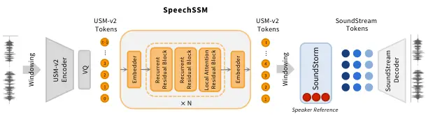
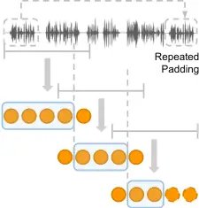
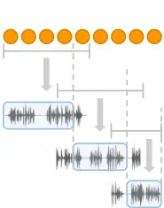

# Long-Form Speech Generation with Spoken Language Models

Se Jin Park Affiliation: Google DeepMind. Affiliation: Integrated Vision
and Language Lab, KAIST Correspondence to: <jinny960812@kaist.ac.kr>   
Julian Salazar Affiliation: Google DeepMind. Correspondence to:
<julsal@google.com>    Aren Jansen Affiliation: Google DeepMind.   
Keisuke Kinoshita Affiliation: Google DeepMind.    Yong Man Ro
Affiliation: Integrated Vision and Language Lab, KAIST    RJ Skerry-Ryan
Affiliation: Google DeepMind.

###### Abstract

We consider the generative modeling of speech over multiple minutes, a
requirement for long-form multimedia generation and audio-native voice
assistants. However, textless spoken language models struggle to
generate plausible speech past tens of seconds, due to high temporal
resolution of speech tokens causing loss of coherence, architectural
issues with long-sequence training or extrapolation, and memory costs at
inference time. From these considerations we derive SpeechSSM, the first
speech language model family to learn from and sample long-form spoken
audio (e.g., 16 minutes of read or extemporaneous speech) in a single
decoding session without text intermediates. SpeechSSMs leverage recent
advances in linear-time sequence modeling to greatly surpass current
Transformer spoken LMs in coherence and efficiency on multi-minute
generations while still matching them at the utterance level. As we
found current spoken language evaluations uninformative, especially in
this new long-form setting, we also introduce: LibriSpeech-Long, a
benchmark for long-form speech evaluation; new embedding-based and
LLM-judged metrics; and quality measurements over length and time.
Speech samples, the LibriSpeech-Long dataset, and any future code or
model releases can be found at
[https://google.github.io/tacotron/publications/speechssm/](https://google.github.io/tacotron/publications/speechssm/).

###### Keywords: 

Speech Generation, Spoken Language Models, Machine Learning, ICML

^(†)^(†)affiliationnotice: ^(\*)Primary contributors. Se Jin’s work was
done as a student researcher at Google DeepMind.

## 1 Introduction

Generative spoken language models (Lakhotia et al., 2021; Dieleman
et al., 2021; van den Oord et al., 2017) are autoregressive models of
invertible audio representations, enabling the direct learning and
generation of intelligible speech and its paralinguistic aspects, such
as prosody (Kharitonov et al., 2022) and turn-taking (Nguyen et al.,
2023b). These capabilities make speech-native language models (LMs)
promising for applications like media understanding and co-creation,
audio-native voice assistants, and textless NLP. However, real-world
use-cases of spoken LMs require the ability to both understand and
generate long-form speech. For example, voice interactions can last many
minutes, requiring a model to maintain a growing conversational history
in real time, and expressive media like audiobooks and podcasts can
require semantic, paralinguistic, and speaker coherence over a chapter
or episode.

Figure 1: Maximum sequence lengths considered by various spoken LMs.
Italicized models used text intermediates at generation time. Our models
can generate indefinitely due to their constant memory footprint, but we
cap our evaluations to 16 minutes.

Figure 2: Automated transcripts of 4min speech continuations generated
by SpeechSSM-2B (ours) and a Spirit LM Expressive (7B) model (Nguyen
et al., 2025) under slide-and-prompt generation (Section 7), extending a
10-second audio-only prompt from our proposed LibriSpeech-Long
(test-clean). Aspects like recurring proper nouns show SpeechSSM’s
relative semantic consistency over time.

This presents significant challenges for existing spoken language
models, as spoken audio’s textual content is entangled with
paralinguistic and acoustic properties that detract from learning
invariant representations of meaning. Additionally, current audio
representations have high temporal rates, requiring 10+ speech tokens to
cover the duration of 1-2 text tokens (Hassid et al., 2023). Hence,
models must disentangle, aggregate, and generate content coherently over
longer time horizons. A single-stage Transformer (Vaswani et al., 2017)
LM is impractical, as its initial cost grows quadratically with prompt
length, and its per-step cost grows linearly when decoding. Furthermore,
it may also be ineffective, as suggested by Transformer’s degraded
performance on long-range tasks (Tay et al., 2021). Though a few works
have improved speech coherence via joint modeling with text (Section 2),
the challenge of directly modeling long-form speech, particularly
generation, remains unstudied by existing spoken LMs (Figure 1) and the
field overall. Our work proposes and makes initial progress on
generative long-form speech:

Modeling. We discuss the design choices required to enable the practical
training, generation, and extrapolation to tens of minutes of audio,
from tokenization to speaker conditioning to complexity with respect to
sequence length. The result is SpeechSSM, a new (textless) spoken
language model family (2B, 9B) designed for long-form generation, being
the first to model and generate unbounded long-form speech in bounded
memory and the first state-space spoken LM. As baselines, we also train
spoken Transformer LMs to perform multi-minute generations. Finally, we
demonstrate SpeechSSM-X, an extemporaneous variant for naturalistic
spontaneous speech.

Evaluation. We observe that existing metrics in speech generation
evaluation are noisy and poorly discriminative, and propose the use of
reference-based semantic metrics, side-by-side LLM-as-judge, and
time-stratified evaluations for speech generation. To scale these to
long-form evaluation, we introduce the LibriSpeech-Long benchmark, which
reprocesses LibriSpeech’s (Panayotov et al., 2015) dev and test sets’
original chapter-level audio into utterance-aligned spans of up to 4
minutes. This enables much longer prompts and ground truths for
reference-based evaluations in tasks like long-form speech continuation,
speech recognition, and text to speech.

We find that SpeechSSM matches existing spoken LMs on short generations,
while outperforming their sliding window extensions on long generations
(e.g., Figure 2), and that our proposed metrics and benchmark distinctly
quantify the quality gaps between past work, our work, and human-level
speech generation---enabling future development. We release examples of
read- and extemporaneous-style generations of up to 16 minutes in
length,¹¹ 1
[https://google.github.io/tacotron/publications/speechssm/](https://google.github.io/tacotron/publications/speechssm/)
and we release the LibriSpeech-Long evaluation dataset²² 2
[https://github.com/google-deepmind/librispeech-long/](https://github.com/google-deepmind/librispeech-long/)
under a CC-BY 4.0 license.

## 2 Related Works

Generating with Spoken LMs. The family of GSLM models (Lakhotia et al.,
2021; Kharitonov et al., 2022) are Transformer decoder LMs trained on
discrete units obtained from $`k`$-means clustering of HuBERT (Hsu
et al., 2021) features and synthesized via unit-to-spectrogram or
unit-to-waveform models. This approach gave promising temporal coherence
but poor audio quality, and so AudioLM (Borsos et al., 2023a) proposed
separate LMs, one for semantic tokens as before, and two for modeling
coarse-to-fine acoustic tokens that are residual codes of a neural audio
codec (Zeghidour et al., 2022); this was simplified and made
non-autoregressive by Borsos et al. (2023b). TWIST (Hassid et al., 2023)
found that text LM initialization improved content-level coherence, atop
which VoxtLM (Maiti et al., 2024) and Spirit LM (Nguyen et al., 2025)
found that joint or interleaved training with text gave further
improvements.

Beyond the scope of this work, there are audio-text models like
SpeechGPT (Zhang et al., 2023a) trained for sequence-to-sequence and not
generative continuation; there are also dual-channel and
text-intermediate models like dGSLM (Nguyen et al., 2023b) whose
semantic evaluations are \<20s, Spectron (Nachmani et al., 2024) which
passes through text, and Moshi (Défossez et al., 2024) which had
few-minute dialogues via time-aligned text.

State-Space Models for Long-Form Audio. State-space models (SSMs; Gu
et al., 2021) have become popular among efficient (sub-quadratic)
replacements for Transformer-based architectures, giving the first model
(S4; Gu et al., 2022) to perform all tasks in the Long-Range Arena (Tay
et al., 2021), outperforming the vanilla Transformer. They utilize
constant computation and memory requirements to generate tokens during
inference and can be efficiently trained. Recent focus has shifted to
hybrid models (Glorioso et al., 2024; Lenz et al., 2025; De et al., 2024) which integrate state-space layers and variants like linear
recurrent units (LRU; Orvieto et al., 2023) with finite-context
self-attention layers. Recent works have considered SSMs in audio,
primarily to support long speech inputs for text-out tasks like
automatic speech recognition (ASR) and summarization. None are spoken
LMs for speech continuation, with only one considering (acoustic-level)
tokens (Gao & Chen, 2024); most works involve spectrogram encoders or
outputs (Shams et al., 2024; Erol et al., 2024; Lin & Hu, 2024; Miyazaki
et al., 2024). Closest in spirit is SaShiMi (Goel et al., 2022), a
multi-scale S4 operating directly on waveform samples; though they
generated only 1s of speech, this corresponds to a sequence of 16k
discretized scalars.

Evaluating Spoken LM Generations. Lakhotia et al. (2021) was first to
evaluate the generations of spoken LMs, proposing ASR as a path to
automated text metrics like text perplexity (PPL) and proportion of
repeated $`k`$-grams (auto-BLEU), along with human evaluations of
intelligibility and meaningfulness with mean opinion scores (MOS and
MMOS respectively). For their spoken LMs, zero-shot (non-generative)
metrics based on logprobs of contrastive pairs (sWUGGY and sBLIMP;
Nguyen et al., 2020) were predictive of generation performance, though
scores varied with token vocabulary size. However, these initial metrics
seem to lack robustness or are saturating with respect to newer spoken
LMs. Hassid et al. (2023) found transcript PPL and auto-BLEU to be
noisy, favoring MMOS and expanding zero-shot metrics (sStoryCloze and
tStoryCloze). In turn, Défossez et al. (2024) found that sWUGGY and
sBLIMP scores degraded despite experiential improvement from noise
augmentation and instruction-tuning, instead favoring spoken
question-answering (Nachmani et al., 2024) evaluated via ASR.

Closest to our work was the use of LLMs to assign absolute,
reference-free scores to assess the instruction-following of turn-based
text-and-speech LMs in Zhang et al. (2023a); Zhang et al. (2024). As for
observing saturation, Borsos et al. (2023a) found that humans could not
distinguish between a synthetic 7s continuation versus the real 7s
continuation of a 3s prompt on a holistic side-by-side evaluation,
suggesting the need for more targeted and longer-form evaluations.

## 3 Unbounded Speech Generation

Figure 3: Overview of SpeechSSM. Left: A causally-masked hybrid
state-space model (Griffin) is trained with an LM objective on semantic
tokens (USM-v2) encoded via overlapping fixed-size windows. Right: A
non-autoregressive synthesizer (SoundStorm) converts overlapping windows
of semantic tokens to the acoustic tokens of a neural codec
(SoundStream) in a speaker-conditioned manner.

We begin by proposing a set of requirements for a general, unbounded,
speech generation system:

- •
  Constant memory during decoding, to enable indefinite AR sampling
  without running out of memory.
- •
  Infinite context, so that arbitrarily distant dependencies can be
  expressed, at least in theory. With the above, this means relevant
  context must fit in a fixed-size state.
- •
  Generative length extrapolation, so that speech quality remains
  consistent over time, in particular beyond audio durations seen during
  training.

The first leads us to linear-complexity sequence modeling with a
fixed-size state. The second leads us to models with aggregation
mechanisms such as recurrences or compressive memories. We show that
with some care, one can also achieve the third requirement of generative
extrapolation.

Finally, there is also a soft requirement for efficient training, e.g.,
train-time dependence on sequence length that is subquadratic, to enable
longer sequences and reduce reliance on extrapolation. This favors a
parallelizable weight learning scheme, which naturally leads to
state-space models (broadly defined, i.e., including linear recurrence
models and certain hybrid variants; Patro & Agneeswaran, 2024; Dao & Gu, 2024) and thus SpeechSSM, a family of hybrid state-space spoken language
models for efficient long-form speech generation that fulfills all these
desiderata:

Architecture. For our decoder-only hybrid SSM we choose Griffin (De
et al., 2024), which interleaves a gated variant of LRUs (Orvieto
et al., 2023) and local (sliding-window) multi-query attention (MQA)
blocks in a fixed pattern (two recurrent, one local-MQA; see Figure 3,
left). Local attention efficiently captures recent context, while the
states of the gated recurrences transmit information across arbitrary
distances. Griffin’s performance matched comparable Transformers while
greatly improving inference speed and enabling context-side
extrapolation at least 4x longer than seen in training. As RoPE (Su
et al., 2024) in the local-MQA blocks still encodes absolute position,
we follow recent work on position embeddings (PEs) under causal
self-attention (NoPE; Kazemnejad et al., 2023) and remove all explicit
PEs from SpeechSSM to promote extrapolation.

Initialization. Inspired by Hassid et al. (2023)’s success with
text-initialized spoken language models (TWIST), we initialize our
models with RecurrentGemma-{2B,9B} IT (Botev et al., 2024), which are
open-weight LMs with the Griffin architecture, trained on 2 trillion
text tokens. We discard the pretrained text token embeddings and
initialize new ones for our audio token vocabulary.

Semantic Tokenizer. We use the pretrained USM-v2 speech tokenizer
(Vashishth et al., 2024; Rubenstein et al., 2023). Its encoder (Zhang
et al., 2023b) is trained with masked language modeling on untranscribed
audio and an auxiliary ASR loss on transcribed audio. Inner
representations are vector-quantized into 32k units that serve as
fixed-rate (25Hz) pseudo-text for our speech LM. Vashishth et al. (2024)
found that USM-v2 was by far the most speaker-invariant token among
common speech tokenizers.

Speaker-Prompted Audio Synthesis. Following Borsos et al. (2023a), we
have a second stage that generates low-level acoustic tokens conditioned
on semantic tokens. We use a SoundStorm model (Borsos et al., 2023b) to
non-autoregressively generate SoundStream tokens (Zeghidour et al.,
2022), a standard neural audio codec that efficiently reconstructs to
high-quality audio. Notably, one can train SoundStorm to support 3s
voice prompts (a frozen prefix of semantic and acoustic tokens), such
that output acoustic tokens reflect its speaker characteristics.

By choosing a token and model decomposition that isolates speaker
characteristics to the acoustic stage, SpeechSSM focuses capacity on
modeling semantic coherence along the temporal axis.

(a) Tokenization

(b) Decoding

Figure 4: Depiction of how input and output windowing work, shown here
with 5-token window widths and 2-token overlaps.

Windowed Tokenization and Decoding. To process long-form speech while
bounding the memory of the (non-SSM) semantic tokenizer and acoustic
decoder, we divide audio into fixed segments, with overlaps between
neighbors. Each window is tokenized independently, then merged into a
single stream at each overlap by taking the first half’s tokens from one
window and the second half’s tokens from its successor (Figure 4(a)).
For synthesis, fixed token windows, each conditioned on a short speaker
prompt (3s), are synthesized into waveform independently then merged
with the same boundary overlap adjustment (Figure 4(b)). We find these
strategies minimize boundary artifacts while enabling continuous
tokenization and decoding over time.

Avoiding Implicit EOSes. Despite having no end-of-sequence (EOS) tokens,
our early models did not generatively extrapolate (e.g., a 4min model
reaching 4.5min before degrading to noise/silence). In non-causal
semantic tokenizers like USM-v2, we found the remaining length-in-window
may be implicitly encoded in tokens, making tokens in final windows look
“different.” As evidence, padding the last window to 30s using silence,
tokenizing, then dropping those tokens led to silence, as “future”
silence was now in the kept tokens. What worked was (1) to pad the last
window to 30s using speech from the beginning of the example (depicted
in Figure 4(a)) so that final tokens were tokenized as if there was
further speech, and (2) in the case of LibriLight, to still drop the
last 10s of examples—as the padded beginnings were disproportionately
"Chapter \<number\>"!

## 4 Improved Evaluations for Spoken LMs

Updated NLG Evaluations. The shortcomings found in recent work
(Section 2) align with recent developments in natural language
generation (NLG) evaluation, which have moved beyond intrinsic and/or
surface word metrics like PPL, auto-BLEU, self-BLEU (Zhu et al., 2018),
especially for open-ended generation. One major shift has been the
adoption of embedding-based metrics, where distances are computed
between embeddings of generated versus reference text (Sai et al.,
2022). A more recent trend uses instruction-tuned LLMs to perform
automated Likert-scaled evaluations (Li et al., 2024b), as applied by
Zhang et al. (2023a); Zhang et al. (2024) to text-instructed speech
generation and could be extended to speech as well.

However, to tackle the saturation of acoustic evaluations and to
leverage text references, we in particular propose automated
side-by-sides (LLM-as-a-Judge; Zheng et al., 2023) of total transcripts
to scalably compare systems against the ground truth and each other.
This has particular advantages for spoken LMs: (1) It mitigates the
noise from ASR issues highlighted by Hassid et al. (2023), as the
compared generations will be both afflicted (the ground truth should
also be re-transcribed by ASR, for fairness). (2) It works around the
subtle issue of fixed-duration slices occurring mid-word, degrading
PPLs; instead, one can always transcribe prompt and continuation
together, leaving the LLM to focus on the contrast. We implement both
proposed evaluation types in Sections 6.2 and 7.1.

LibriSpeech-Long. To extend reference-based metrics to long-form speech,
one needs long-form reference speech and transcripts. Although 3s
prompts from LibriSpeech (Panayotov et al., 2015) have been the standard
benchmark for spoken LMs since Lakhotia et al. (2021), their provided
references have an average length of 10s, making them unsuitable beyond
7-10s continuations. Observing that the LibriSpeech dev and test sets
are derived from full chapters of public-domain audiobooks which have
been excluded from the standard LibriLight training set (Kahn et al., 2020) used by many spoken LMs, we reprocessed their source uncut audio
files, similar to the convenience script³³ 3
[libri-light/data_preparation/cut_by_vad.py](https://github.com/facebookresearch/libri-light/blob/main/data_preparation/cut_by_vad.py)
on GitHub. in LibriLight which agglomerates utterances up to a target
length of 4 minutes (240s) along utterance boundaries. The results
enable longer prompts and references for our side-by-side and similarity
metrics. Statistics are shown in Table 1; 64%–76% of each split’s
examples are \>3min long.

|            |          |             |               |             |          |
| ---------- | -------- | ----------- | ------------- | ----------- | -------- |
| Subset     | \# Hours | \# Examples | Avg. Dur. (s) | \# Chapters | \# Spkrs |
| dev-clean  | 16.0     | 295         | 194.8         | 97          | 40       |
| dev-other  | 9.5      | 188         | 182.4         | 91          | 33       |
| test-clean | 14.8     | 270         | 197.6         | 87          | 40       |
| \>3.5min   | 12.6     | 193         | 234.2         | 82          | 40       |
| test-other | 10.7     | 207         | 185.9         | 90          | 33       |
| \>3.5min   | 8.2      | 126         | 234.4         | 77          | 32       |

Table 1: Statistics of our proposed LibriSpeech-Long benchmark, which
was generated with a maximum target duration of 4 minutes.

Generation Quality over Time. While ASR can capture degenerate cases
like repeated words (Figure 2), we found that it can fail on cases
exacerbated by long-form generation, such as extended silences and
voiced non-speech, suggesting the continued importance of audio-native
evaluations. Furthermore, we find that generation failures generally
increase as decoding progresses over time, which we must quantify to
determine if our model has the desired property of generative length
extrapolation (Section 3). Towards this, we propose computing semantic
and acoustic metrics that are stratified over the decoding process. This
progression can be expressed in terms of semantic content (number of
words into the ASR transcript), or acoustic content (time offset into
the generated speech). We describe our implementations of both in
Section 7.2.

|                             |                  |         |                   |                   |                                |              |                   |             |                     |                   |
| --------------------------- | ---------------- | ------- | ----------------- | ----------------- | ------------------------------ | ------------ | ----------------- | ----------- | ------------------- | ----------------- | ------------------ | ------------------ |
| Method                      | Text-Based (ASR) |         |                   |                   |                                | Speech-Based |                   |             |                     |                   |
|                             | Text-PT          | Text-FT | PPL$`\downarrow`$ | SBERT$`\uparrow`$ | Win%$`{}_{\text{GT}}\uparrow`$ | $`           | V\_{\text{audio}} | `$          | SpkrSim$`\uparrow`$ | N-MOS$`\uparrow`$ | sWUGGY$`\uparrow`$ | sBLiMP$`\uparrow`$ |
| GSLM (0.2B)                 | ✗                | ✗       | 6.28              | 0.17              | 1.4                            | 100          | 0.36              | 2.23 ± 0.11 | 64.8                | 54.2              |
| AudioLM (0.9B)              | ✗                | ✗       | –                 | –                 | –                              | 1k           | –                 | –           | 71.5                | 64.7              |
| TWIST-1.3B                  | ✓                | ✗       | 7.25              | 0.18              | 3.6                            | 500          | 0.41              | 3.09 ± 0.12 | 72.7                | 57.0              |
| TWIST-7B                    | ✓                | ✗       | 6.54              | 0.20              | 15.5                           | 500          | 0.41              | 3.24 ± 0.13 | 73.9                | 59.0              |
| VoxtLM (1.3B)               | ✓                | ✓       | –                 | –                 | –                              | 200          | –                 | –           | 65.6                | 57.1              |
| Spirit LM Expressive (7B)   | ✓                | ✓       | 6.17              | 0.19              | 7.7                            | 665          | 0.45              | 3.00 ± 0.08 | 65.0                | 54.2              |
| SpeechSSM-2B                | ✓                | ✗       | 5.76              | 0.23              | 7.9                            | 32k          | 0.79              | 3.87 ± 0.07 | 55.8                | 60.9              |
|    without LM init.         | ✗                | ✗       | 6.15              | 0.23              | 7.7                            | 32k          | 0.79              | 3.80 ± 0.07 | –                   | –                 |
|    with Transformer instead | ✓                | ✗       | 6.16              | 0.22              | 8.4                            | 32k          | 0.79              | 3.74 ± 0.08 | –                   | –                 |
|    with 30s segs. instead   | ✓                | ✗       | 5.73              | 0.22              | 10.5                           | 32k          | 0.79              | 3.84 ± 0.08 | 57.3                | 61.1              |
|    with 16min segs. instead | ✓                | ✗       | 5.84              | 0.20              | 4.0                            | 32k          | 0.79              | 3.86 ± 0.07 | 54.3                | 60.4              |
| SpeechSSM-9B                | ✓                | ✗       | 5.60              | 0.23              | 13.5                           | 32k          | 0.79              | 3.94 ± 0.07 | –                   | –                 |
| Ground Truth                | –                | –       | 5.63              | 1.00              | 50.0                           | –            | 0.84              | 4.02 ± 0.07 | –                   | –                 |

Table 2: Results on short-form generation on LibriSpeech test-clean.
Generations are 7s continuations of 3s prompts. Bolded are ours.
Text-PT, FT denote pretraining (via LM init.) and finetuning with text.
Win%$`{}_{\text{GT}}`$ denotes the win rate of the model over the ground
truth. $`|V_{\text{audio}}|`$ denotes speech token vocabulary size. For
naturalness mean opinion score (N-MOS) we report 99% confidence
intervals.

## 5 Experimental Setup

Training and Generation. Following Borsos et al. (2023a), Nachmani
et al. (2024), and others, we train on the unlab-60k split from
LibriLight (Kahn et al., 2020). Unlike prior work, we study the effect
of sequence length on long-form generation, segmenting the audiobooks
into training sequences of up to a target duration. The default for
SpeechSSM is 4min (240s) during training, though we compare with target
durations of 30s and 16min (960s) as well (“with 30s/16min segments”).
We train -2B and -9B variants, corresponding to RecurrentGemma. Each
model is trained with 16 TPUs (v5p) and data parallelism for 100k steps
with 768k tokens per batch, and a checkpoint is chosen via transcript
perplexity on LibriSpeech-Long dev-clean; more details in Section B.1.
We sample semantic (USM-v2) tokens with temperature 1. Then the
SoundStorm model (speaker-prompted with the first 3 seconds of the
prompt) and windowing (30s with 4s overlaps) give acoustic (SoundStream)
tokens, which a SoundStream codec turns into waveform; model details for
these are in Section B.2.

Baselines. We compare SpeechSSM with decoder-only speech LMs. We use
GSLM (Lakhotia et al., 2021)’s best model (HuBERT-L6 tokens with vocab
200), trained on the clean 6k hours of LibriLight. For TWIST (Hassid
et al., 2023), we use both the OPT-1.3B and LLaMA-7B versions, trained
on 150k speech hours. For the 7B Spirit LM (Nguyen et al., 2025), we use
the Expressive version model which adds expressiveness via pitch and
style tokens in addition to HuBERT tokens. We also cite numbers from
AudioLM (Borsos et al., 2023a) and VoxtLM (Maiti et al., 2024), which
are both 2B models trained on unlab-60k. VoxtLM and Spirit LM see text
data during training. Due to variations in token, initialization, and
training data choices, we also define SpeechTransformer (“with
Transformer”), a spoken LM initialized with Gemma-2B (Gemma Team et al., 2024) but otherwise matched with SpeechSSM-2B.⁴⁴ 4 Note that Gemma saw
50% more text than RecurrentGemma.

## 6 Short-Form Continuation Experiments

Before considering long-form, we compare SpeechSSM to its
Transformer-based counterparts as in past work. This takes 3s prefixes
from LibriSpeech’s test-clean set and generates 7s continuations, which
one then transcribes with an ASR model (our details in Section B.3). We
used test examples with ground-truth continuations $`\geq`$5s.

### 6.1 Existing Metrics and Results

Transcript Perplexity (PPL): As in prior work, we compute the
log-perplexity of the transcript of the generated continuation under
Gemma-2B, as an initial proxy for content fluency.

Speaker Similarity (SpkrSim): To analyze voice preservation, we
speaker-embed both the prompt and its generated continuation and compute
their cosine similarity. We use a speaker classifier used in AudioLM
(Borsos et al., 2023a) as the speaker embedder.

Naturalness Mean Opinion Score (N-MOS): We evaluate how natural the
speech sounds, ignoring the grammar and content of the utterance; this
focuses attention on issues not visible on transcripts, ranging from
synthesis issues and unintelligible speech through to coherent but
unnatural prosody; rater details in Appendix C.

sWUGGY and sBLiMP: These probe if the spoken language model can
implicitly perform lexical and syntactic contrasts (Nguyen et al.,
2020).⁵⁵ 5 sWUGGY: audio pairs of a real word and a fake but
similar-sounding word. sBLIMP: audio pairs of a syntactically correct
sentence and an incorrect one. One reports the % of time the model’s
log-likelihood ranks the semantic tokens of a correct utterance versus
its incorrect counterpart.

Our models’ continuations (Table 2) are most speaker-similar to the
prompt, which we attribute to our speaker-promptable acoustic stage; in
contrast, GSLM and TWIST can only propagate speaker identity via their
semantic tokens (plus coarse style and pitch tokens in Spirit LM
Expressive). Our N-MOS scores suggest high semantic-to-audio synthesis
quality, which we attribute to USM-v2’s large vocabulary (32k) and the
staged approach via existing codec (SoundStream). SpeechSSM’s
naturalness is on par or better than a comparable Transformer and close
to real speech; see supplementary. Meanwhile, our sWUGGY scores are much
worse, while our sBLiMP scores are neutral to above-average. These do
not positively correlate with text-based scores or subjective quality;
instead, they match Lakhotia et al. (2021)’s observations and Borsos
et al. (2023a)’s Figure 2, where sWUGGY scores hit relatively sharp
maxima at vocabularies of a few hundred tokens. We argue increased noise
is expected with larger vocabularies, as then tokens of an audio
utterance represents less of the probability mass of all possible
renditions of its text. Hence, separately from Défossez et al. (2024),
we move towards transcript-based evaluations, as these marginalize over
spoken renditions to get less noisy evaluations. Finally, even the 2B
SpeechSSMs had the lowest transcript perplexities, which is surprising
given the other models are larger (7B) and/or have jointly trained with
text, and one would not expect SSMs to confer a semantic edge in the
$`\leq`$10s speech horizon. We note that Lakhotia et al. (2021) already
caveated—and Hassid et al. (2023) actively discouraged—the use of ASR
PPL given its sensitivity to e.g. audio sampling temperature; such
metrics may simply indicate model repetitiveness at default settings.

|                                |                   |                   |                                      |                                  |                     |                                   |             |             |              |
| ------------------------------ | ----------------- | ----------------- | ------------------------------------ | -------------------------------- | ------------------- | --------------------------------- | ----------- | ----------- | ------------ |
| Method                         | Text-Based (ASR)  |                   |                                      |                                  | Speech-Based        |                                   |             |             |              |
|                                | PPL$`\downarrow`$ | Gecko$`\uparrow`$ | Win%$`{}_{\text{SSM-2B}}\!\uparrow`$ | Win%$`{}_{\text{GT}}\!\uparrow`$ | SpkrSim$`\uparrow`$ | N-MOS-$`T`$ $`\uparrow`$ (99% CI) |             |             |              |
|                                |                   |                   |                                      |                                  |                     | $`<`$1min                         | 1-2min      | 2-3min      | $`\geq`$3min |
| GSLM (0.2B)^(⊞)                | 4.74              | 0.67              | 17.6                                 | 0.0                              | 0.33                | 2.00 ± 0.22                       | 2.01 ± 0.23 | 1.93 ± 0.21 | 2.09 ± 0.22  |
| TWIST-1.3B^(⊞)                 | 5.70              | 0.60              | 16.2                                 | 0.0                              | 0.38                | 1.96 ± 0.22                       | 1.59 ± 0.13 | 1.40 ± 0.09 | 1.36 ± 0.09  |
| TWIST-7B^(⊞)                   | 4.93              | 0.65              | 24.0                                 | 0.0                              | 0.37                | 2.43 ± 0.27                       | 2.15 ± 0.22 | 1.83 ± 0.20 | 1.84 ± 0.18  |
| Spirit LM Expressive (7B)      | 5.71              | 0.63              | 24.2                                 | 0.0                              | 0.41                | 2.77 ± 0.12                       | 2.52 ± 0.12 | 2.56 ± 0.11 | 2.60 ± 0.10  |
| SpeechSSM-2B                   | 3.75              | 0.70              | 50.0                                 | 0.0                              | 0.85                | 4.12 ± 0.08                       | 4.13 ± 0.06 | 4.13 ± 0.07 | 4.16 ± 0.08  |
|    without LM init.            | 4.57              | 0.71              | 42.4                                 | 0.0                              | 0.85                | 3.76 ± 0.09                       | 3.76 ± 0.10 | 3.71 ± 0.10 | 3.80 ± 0.08  |
|    with Transformer instead    | 4.71              | 0.71              | 33.9                                 | 0.0                              | 0.85                | 4.03 ± 0.09                       | 3.88 ± 0.08 | 3.98 ± 0.09 | 3.89 ± 0.12  |
|    with 16min segments instead | 3.83              | 0.70              | 46.1                                 | 0.0                              | 0.85                | 3.83 ± 0.08                       | 3.89 ± 0.08 | 3.87 ± 0.09 | 3.88 ± 0.09  |
| SpeechSSM-9B                   | 3.57              | 0.71              | 75.0                                 | 0.0                              | 0.85                | 3.86 ± 0.08                       | 3.90 ± 0.08 | 3.88 ± 0.07 | 3.95 ± 0.07  |
| Ground Truth                   | 3.61              | 1.00              | 100.0                                | 50.0                             | 0.92                | 4.12 ± 0.08                       | 4.11 ± 0.08 | 4.10 ± 0.08 | 4.09 ± 0.08  |

Table 3: Evaluations on LibriSpeech-Long test-clean. $`\boxplus`$
denotes model extension via windowed generation. Generations are 4m
completions of the 10s prompt. Win%$`{}_{\text{SSM-2B}}`$ and
Win%$`{}_{\text{GT}}`$ are model wins versus SpeechSSM-2B and ground
truths (\>3.5min) respectively. For naturalness MOS over time
(N-MOS-$`T`$), the same 5s time span is sampled over all models from
each minute of completion.

### 6.2 Proposed Metrics and Results

The above points—noise from contrastive audio probes, saturation of
N-MOS and SpkrSim, suspicious results from transcript perplexity—all
motivate our proposed shift to newer, reference-based NLG metrics
(Section 4):

Semantic Similarity (SBERT). We measure the distance between the
semantic embedding of the transcriptions of the generated speech and the
reference, using Sentence-BERT MiniLM-L6-v2 (Reimers & Gurevych, 2019)
as the semantic embedder. This expresses contextual alignment between
the generated text to the ground truth, focusing on semantic meaning
over surface-form patterns.

Side-by-Side Win Rates (Win%$`{}_{\text{vs.\,model}}`$). We ask the
model to analyze then rate (Chiang & Lee, 2023), forking the format of
Arena-Hard-Auto’s LLM-Judge System Instruction (Li et al., 2024a). Given
the book domain and the relatively unconstrained nature of speech
continuation, we base our criteria on questionnaires from story
generation evaluation (Xie et al., 2023) around fluency, coherence,
logicality, and interestingness; see Appendix D for the template. We
evaluate each prompt twice with order of presentation flipped. Gemini
2.0 Flash (Gemini Team et al., 2025) re-transcribes both model and true
audio (without windowing and jointly with prefix) and performs
judgments.

Benefits are evident in side-by-sides versus a transcript of the ground
truth, with results (Table 2) now matching qualitative experience and
expectations (larger models performing better, with Spirit LM Expressive
underperforming TWIST perhaps due to capacity spent on pitch/style).
However, even SpeechSSM-9B and TWIST-7B win \<20% versus transcribed
ground truth, suggesting that (automated) side-by-side comparison on
transcripts is more discriminative than a holistic human side-by-side
audio task in selecting the synthetic sample, where humans performed at
random in Borsos et al. (2023a), as it focuses on the content of the
speech rather than superficial naturalness. Though our model is not the
most fluent in this regime, SBERT foreshadows benefits in faithfulness
(our models’ continuations are semantically closest to the true ones).

## 7 Long-Form Generation Experiments

We conduct the first evaluation of long-form speech generation, taking
extended prompts of 10s from our proposed LibriSpeech-Long (test-clean)
and having each model continue them through to 4 and 16 minutes. As
other off-the-shelf models trained on sequences well below 4min and were
not designed to generate beyond their training length (e.g., use of
position encodings), we found them unable to generate beyond a minute
without being stuck in noise or silence. To give functional baselines,
we propose applying slide-and-prompt generation (Borsos et al., 2023b)
to the semantic LM itself; that is, we generate to each model’s maximum
completion length (Figure 1) first, and then repeat generation using the
last 3s of the previous window as context. Example generations are in
Appendix E.

### 7.1 Semantic and Acoustic Results

We again measure existing and our proposed metrics, with two key
changes: first, we replace Sentence-BERT with Gecko (Lee et al., 2024)
as embedder for semantic similarity as Sentence-BERT’s 512-token context
cannot handle the transcripts of 4min+ generations; more long-form
evaluation details in Section B.3. Second, extrapolation failures cause
e.g., GSLM and TWIST to generate far less than our models; for fairness
in side-by-sides, we truncate to the shorter transcript’s length.⁶⁶ 6
Note this means the relative order of models in a single
Win%$`{}_{\text{vs.\,model}}`$ column should not be read into too much,
as challenger models induce truncation to very different lengths.

Our results are in Table 3. The SpkrSims of SpeechTransformer,
SpeechSSM, and ground truth increased from 0.79 in short-form to 0.85,
likely from increased confidence from longer prompt and continuations;
all other decreased. This shows the advantage of our more
speaker-invariant USM-v2 tokens and a speaker-prompted audio stage;
identity is modulated by the semantic-to-acoustic model, instead of
consuming capacity, and being imperfectly carried by, the semantic LM
and windowing. SpeechSSM has the best ASR PPL and wins a majority of
time vs. all models; our 2B Transformer variant is close at 30sec, but
not at 16min (Table 4) —recall that 16min is 24,000 USM-v2 tokens!

However, models achieve zero wins over the ground truth. As generation
length increases, faults in fluency, coherence, logicality and
interestingness become increasingly apparent, showing that side-by-side
comparison versus LibriSpeech-Long ground-truths is a new and difficult
benchmark for (long-form) spoken language generation.

### 7.2 Proposed Extrapolation Metrics and Results

|                                |                    |                                      |
| ------------------------------ | ------------------ | ------------------------------------ |
| Method                         | PPL $`\downarrow`$ | Win%$`{}_{\text{SSM-2B}}\!\uparrow`$ |
| GSLM (0.2B)^(⊞)                | 4.48               | 18.4                                 |
| TWIST-1.3B^(⊞)                 | 4.76               | 17.5                                 |
| TWIST-7B^(⊞)                   | 4.45               | 32.8                                 |
| Spirit LM Expressive (7B)^(⊞)  | 5.66               | 37.7                                 |
| SpeechSSM-2B                   | 3.59               | 50.0                                 |
|    with Transformer instead    | 5.91               | 24.9                                 |
|    with 16min segments instead | 3.55               | 48.4                                 |
| SpeechSSM-9B                   | 3.39               | 68.3                                 |

Table 4: 16min completions of 10s prefixes of our LibriSpeech-Long
test-clean. As there are no 16min ground truths, we only take
reference-free metrics. $`\boxplus`$ denotes model extension via
slide-and-prompt. Win%$`{}_{\text{SSM-2B}}`$ denotes win rate over
SpeechSSM-2B.

Naturalness Mean Opinion Score over Time (N-MOS-$`T`$). To balance cost
and informativeness, for each example we select a 5 sec. span from each
minute; specifically \[$`t_{\text{prompt}}`$, 60), \[60, 120), \[120,
180), and \[180, $`t_{\text{max}}`$) where $`t_{\text{prompt}}`$ is
prompt duration and $`t_{\text{max}}`$ is ground truth duration, and
extract each span’s audio from every model’s generated continuation.

Semantic Coherence over Length (SC-$`L`$). To evaluate semantic
faithfulness to the original prompt over time while mitigating the
effect of speech rate, we take each continuation’s transcripts and
divide them into spans of 100 words (as determined by whitespace). Each
100-word segment represents $`\sim`$30 seconds of speech, with the
advantage of normalizing out differences in generated speech rate as
well as degenerate silences. Our SC scores are cosine similarities
between the embedding of the original prompt
$`\mathbf{e}_{\text{prompt}}`$ with that of each 100-word segment
$`\mathbf{e}_{100\ell:100(\ell+1)}`$.

Figure 5: Semantic similarity between a 10s prompt and the 100-word
segment starting at word 100$`L`$ in the 16min completion, as measured
by cosine similarity of Gecko embeddings (SC-$`L`$).

These metrics, motivated in Section 4 and shown in Tables 3 and 4, show
that windowed model extension is a poor length extrapolator. GSLM and
TWIST are already low in our proposed N-MOS-$`T`$ by minute one, having
trained on even shorter sequences. Spirit LM, which has seen sequences
up to 200s (though rarely, due to text interleaves), degrades
acoustically over time, though slower.

Our proposed SC-$`L`$ is plotted for 16 minutes in Figure 5 (table in
Appendix A). As generation progresses, we see a decline in SC-$`L`$
scores, aligning with the natural flow of speech starting on a topic and
evolving over time. However, existing models except GSLM sharply drop in
semantic coherence (SC) scores around 200 words ($`\sim`$1min; around
their training lengths). GSLM fares better as its failures are
untranscribed noise which do not show in SC-$`L`$ (but do in
N-MOS-$`T`$), but still worse than our models which are closest to the
3-4min ground truths’ performance. At 16min (Table 4, Figure 5), we do
not see obvious degradation from SpeechSSM-2B generating beyond its
training length. In contrast, SpeechTransformer-2B had comparable PPL,
win-rate, and SC scores up to its training length, but these metrics
quickly degrade at 16min. This suggests an edge for SSMs in long-form
speech generation, complementing past work (Gu et al., 2022). In all,
SpeechSSM’s design and architecture lead to generative length
extrapolation.

### 7.3 Qualitative Discussion

We invite the reader to listen to the samples on our website. For
convenience, Figure 2 shows that even SpeechSSM-2B generates
intelligible and more coherent speech over the 4min duration, with
ongoing references to the "Philip" in the prompt, along with new
recurring entities like "Prince Maria", "Prince Albert", and "Horace
Barrows" also consistently appear, maintaining contextual relevance. We
provide further transcripts for ours as well as other models in
Appendix E, showing how their decline in SC-$`L`$ is qualitatively
visible as e.g., degeneration into repetitive outputs.

Given our use of windows during synthesis (Section 3), one may wonder if
audio quality differs at transitions (every 25 + 23$`n`$ seconds; the
multiple comes from 30s, minus 3s for the prompt and 2s truncation per
side). We ran human evaluation comparing 5-second windows centered at
chunk boundaries vs. chunk midpoints, and found no clear effect on MOSes
or six categories of rater-flaggable issues (Section A.2), which matches
our informal listening.⁷⁷ 7 That said, targeted listening does reveal
e.g., subtle loudness shifts at times; still a massive reduction versus
synthesizing without overlaps or without a fixed prompt.

### 7.4 Inference Efficiency

Throughput measures the maximum number of tokens that can be
successfully decoded per second given fixed memory, e.g., by increasing
the batch size. In Figure 6, SpeechSSM attains higher throughput due to
its recurrent layers that maintain a constant-size state; furthermore,
its self-attention has a maximum context of size 2048, giving a lower
bound. In all, this confirms SpeechSSM’s capped memory use and thus
capacity for unbounded generation, with \>120x the throughput of
SpeechTransformer once decoding 16.4k-token sequences in batch (also
depicted in Section A.3). Decoding time measures the speed at which a
sample can be decoded to a desired length Figure 7. We see that
SpeechSSM also increases speed per step versus SpeechTransformer; an
additional factor in SpeechSSM’s improved throughput. On the TPU v5e,
the 2B SpeechSSM decodes 16.4k tokens (roughly 10.9 minutes) in just
over 100 seconds, a real-time factor well under 0.2x.

Figure 6: Max throughput under batch decoding per model and sampling
length on one TPU v5e (unconditional generation).

Figure 7: Time taken to decode a single sample (batch size 1) to a
target length on one TPU v5e (unconditional generation).

### 7.5 Extemporaneous Speech Generation

With few exceptions (dGSLM, Spirit LM Expressive), most spoken LMs are
trained on read speech such as LibriLight. However, long-form multimedia
and assistant applications likely require modeling of spontaneous
speech, which has its own long-term discourse structures (e.g.,
podcasts; Nishimura et al., 2025). Hence, we also developed SpeechSSM-X,
a 2B SpeechSSM model trained on a 216k-hour corpus of eXtemporaneous
monologues (see Section B.4 for details). We find that it is able to
generate natural monologue speech in a more informal, extemporaneous
style, while showing similar coherence at the multi-sentence level; see
our website for examples.

## 8 Conclusion

We considered the task of generative modeling of long-form speech. For
modeling, this led us to SpeechSSM, the first spoken state-space LM,
allowing generation than can go indefinitely without running out of
memory. For evaluation we created the LibriSpeech-Long benchmark and
proposed new evaluations for long-form speech continuation. We hope our
work will simplify and enable new audio generation applications
involving long-form media, such as audiobooks, podcasts, voice agent
sessions, and video-related content.

## Acknowledgements

We are grateful to Zalán Borsos for their technical feedback; to
Tongzhou Chen, Roshan Sharma, and members of our Speech and Griffin
teams for infrastructure support; and to Soroosh Mariooryad for general
assistance. We also thank the anonymous reviewers and area chair for
their support and helpful feedback.

## Impact Statement

Progress on coherent, efficient, and unbounded audio-native speech
language models will improve the availability and accessibility of
audio-based human-computer interfaces, particularly towards the
generation of speech with paralinguistic nuances often inexpressible in
a standard text-to-speech prompt, as well as enabling models in
primarily oral languages (textless NLP). It should also stimulate the
use of synthetic speech in long-form creative multimedia applications,
and could conceivably generalize to non-speech audio such as music.

We recognize that increased efficiencies in speech language modeling may
increase the proliferation of audio deepfakes or low-quality synthetic
media. However, for these uses we do not believe our work exacerbates
what is already achievable (at higher content quality) by cascading text
large language models (LLMs) with modern voice-promptable text-to-speech
systems. We hope our work increases public awareness that direct methods
in deep learning now enable large-scale generation of expressive speech,
analogous to the situation in text media due to LLMs.

As in prior work for generative speech language modeling, speaker
prompts used in our read-speech demos come from public domain LibriVox
audiobooks and are only used to generate spoken continuations in the
same setting, albeit for longer durations. For our spontaneous-speech
demos, the voices have been explicitly licensed for speech synthesis. We
do not currently release model weights.

## References

- Ardila et al. (2020) Ardila, R., Branson, M., Davis, K., Kohler, M.,
  Meyer, J., Henretty, M., Morais, R., Saunders, L., Tyers, F. M., and
  Weber, G. Common Voice: A massively-multilingual speech corpus. In
  _LREC_, pp. 4218–4222. European Language Resources Association, 2020.
- Baevski et al. (2020) Baevski, A., Zhou, Y., Mohamed, A., and Auli, M.
  wav2vec 2.0: A framework for self-supervised learning of speech
  representations. In _NeurIPS_, 2020.
- Borsos et al. (2023a) Borsos, Z., Marinier, R., Vincent, D.,
  Kharitonov, E., Pietquin, O., Sharifi, M., Roblek, D., Teboul, O.,
  Grangier, D., Tagliasacchi, M., and Zeghidour, N. AudioLM: A language
  modeling approach to audio generation. _IEEE ACM Trans. Audio Speech
  Lang. Process._, 31:2523–2533, 2023a.
- Borsos et al. (2023b) Borsos, Z., Sharifi, M., Vincent, D.,
  Kharitonov, E., Zeghidour, N., and Tagliasacchi, M. SoundStorm:
  Efficient parallel audio generation. _CoRR_, abs/2305.09636, 2023b.
- Botev et al. (2024) Botev, A., De, S., Smith, S. L., Fernando, A.,
  Muraru, G., Haroun, R., Berrada, L., Pascanu, R., Sessa, P. G.,
  Dadashi, R., Hussenot, L., Ferret, J., Girgin, S., Bachem, O.,
  Andreev, A., Kenealy, K., Mesnard, T., Hardin, C., Bhupatiraju, S.,
  Pathak, S., Sifre, L., Rivière, M., Kale, M. S., Love, J., Tafti, P.,
  Joulin, A., Fiedel, N., Senter, E., Chen, Y., Srinivasan, S.,
  Desjardins, G., Budden, D., Doucet, A., Vikram, S., Paszke, A., Gale,
  T., Borgeaud, S., Chen, C., Brock, A., Paterson, A., Brennan, J.,
  Risdal, M., Gundluru, R., Devanathan, N., Mooney, P., Chauhan, N.,
  Culliton, P., Martins, L. G., Bandy, E., Huntsperger, D., Cameron, G.,
  Zucker, A., Warkentin, T., Peran, L., Giang, M., Ghahramani, Z.,
  Farabet, C., Kavukcuoglu, K., Hassabis, D., Hadsell, R., Teh, Y. W.,
  and de Frietas, N. RecurrentGemma: Moving past Transformers for
  efficient open language models. _CoRR_, abs/2404.07839, 2024.
- Chiang & Lee (2023) Chiang, D. C. and Lee, H. A closer look into using
  large language models for automatic evaluation. In _EMNLP (Findings)_,
  pp. 8928–8942. Association for Computational Linguistics, 2023.
- Dao & Gu (2024) Dao, T. and Gu, A. Transformers are SSMs: Generalized
  models and efficient algorithms through structured state space
  duality. In _ICML_. OpenReview.net, 2024.
- De et al. (2024) De, S., Smith, S. L., Fernando, A., Botev, A.,
  Muraru, G., Gu, A., Haroun, R., Berrada, L., Chen, Y., Srinivasan, S.,
  Desjardins, G., Doucet, A., Budden, D., Teh, Y. W., Pascanu, R.,
  de Freitas, N., and Gulcehre, C. Griffin: Mixing gated linear
  recurrences with local attention for efficient language models.
  _CoRR_, abs/2402.19427, 2024.
- Défossez et al. (2024) Défossez, A., Mazaré, L., Orsini, M., Royer,
  A., Pérez, P., Jégou, H., Grave, E., and Zeghidour, N. Moshi: A
  speech-text foundation model for real-time dialogue. _CoRR_,
  abs/2410.00037, 2024.
- Dieleman et al. (2021) Dieleman, S., Nash, C., Engel, J. H., and
  Simonyan, K. Variable-rate discrete representation learning. _CoRR_,
  abs/2103.06089, 2021.
- Erol et al. (2024) Erol, M. H., Senocak, A., Feng, J., and Chung,
  J. S. Audio Mamba: Bidirectional state space model for audio
  representation learning. _IEEE Signal Process. Lett._,
  31:2975–2979, 2024.
- Gao & Chen (2024) Gao, X. and Chen, N. F. Speech-Mamba: Long-context
  speech recognition with selective state spaces models. In _SLT_, pp.
  1–8. IEEE, 2024.
- Gemini Team et al. (2025) Gemini Team, Comanici, G., Bieber, E.,
  Schaekermann, M., Pasupat, I., Sachdeva, N., Dhillon, I., Blistein,
  M., Ram, O., Zhang, D., Rosen, E., Marris, L., Petulla, S., Gaffney,
  C., Aharoni, A., Lintz, N., Pais, T. C., Jacobsson, H., Szpektor, I.,
  Jiang, N.-J., Haridasan, K., Omran, A., Saunshi, N., Bahri, D.,
  Mishra, G., et al. Gemini 2.5: Pushing the frontier with advanced
  reasoning, multimodality, long context, and next generation agentic
  capabilities. _CoRR_, abs/2507.06261, 2025.
- Gemma Team et al. (2024) Gemma Team, Mesnard, T., Hardin, C., Dadashi,
  R., Bhupatiraju, S., Pathak, S., Sifre, L., Rivière, M., Kale, M. S.,
  Love, J., et al. Gemma: Open models based on gemini research and
  technology. _CoRR_, abs/2403.08295, 2024.
- Glorioso et al. (2024) Glorioso, P., Anthony, Q., Tokpanov, Y.,
  Whittington, J., Pilault, J., Ibrahim, A., and Millidge, B. Zamba: A
  compact 7B SSM hybrid model. _CoRR_, abs/2405.16712, 2024.
- Goel et al. (2022) Goel, K., Gu, A., Donahue, C., and Ré, C. It’s raw!
  Audio generation with state-space models. In _ICML_, volume 162 of
  _Proceedings of Machine Learning Research_, pp. 7616–7633. PMLR, 2022.
- Gu et al. (2021) Gu, A., Johnson, I., Goel, K., Saab, K., Dao, T.,
  Rudra, A., and Ré, C. Combining recurrent, convolutional, and
  continuous-time models with linear state space layers. In _NeurIPS_,
  pp. 572–585, 2021.
- Gu et al. (2022) Gu, A., Goel, K., and Ré, C. Efficiently modeling
  long sequences with structured state spaces. In _ICLR_.
  OpenReview.net, 2022.
- Hassid et al. (2023) Hassid, M., Remez, T., Nguyen, T. A., Gat, I.,
  Conneau, A., Kreuk, F., Copet, J., Défossez, A., Synnaeve, G., Dupoux,
  E., Schwartz, R., and Adi, Y. Textually pretrained speech language
  models. In _NeurIPS_, 2023.
- Hsu et al. (2021) Hsu, W., Bolte, B., Tsai, Y. H., Lakhotia, K.,
  Salakhutdinov, R., and Mohamed, A. HuBERT: Self-supervised speech
  representation learning by masked prediction of hidden units. _IEEE
  ACM Trans. Audio Speech Lang. Process._, 29:3451–3460, 2021.
- Kahn et al. (2020) Kahn, J., Riviere, M., Zheng, W., Kharitonov, E.,
  Xu, Q., Mazaré, P.-E., Karadayi, J., Liptchinsky, V., Collobert, R.,
  Fuegen, C., et al. Libri-Light: A benchmark for ASR with limited or no
  supervision. In _ICASSP_, pp. 7669–7673. IEEE, 2020.
- Kazemnejad et al. (2023) Kazemnejad, A., Padhi, I., Ramamurthy, K. N.,
  Das, P., and Reddy, S. The impact of positional encoding on length
  generalization in Transformers. In _NeurIPS_, 2023.
- Kharitonov et al. (2022) Kharitonov, E., Lee, A., Polyak, A., Adi, Y.,
  Copet, J., Lakhotia, K., Nguyen, T. A., Rivière, M., Mohamed, A.,
  Dupoux, E., and Hsu, W. Text-free prosody-aware generative spoken
  language modeling. In _ACL (1)_, pp. 8666–8681. Association for
  Computational Linguistics, 2022.
- Lakhotia et al. (2021) Lakhotia, K., Kharitonov, E., Hsu, W.-N., Adi,
  Y., Polyak, A., Bolte, B., Nguyen, T.-A., Copet, J., Baevski, A.,
  Mohamed, A., et al. On generative spoken language modeling from raw
  audio. _Transactions of the Association for Computational
  Linguistics_, 9:1336–1354, 2021.
- Lee et al. (2024) Lee, J., Dai, Z., Ren, X., Chen, B., Cer, D., Cole,
  J. R., Hui, K., Boratko, M., Kapadia, R., Ding, W., et al. Gecko:
  Versatile text embeddings distilled from large language models.
  _CoRR_, abs/2403.20327, 2024.
- Lenz et al. (2025) Lenz, B., Lieber, O., Arazi, A., Bergman, A.,
  Manevich, A., Peleg, B., Aviram, B., Almagor, C., Fridman, C., Padnos,
  D., Gissin, D., Jannai, D., Muhlgay, D., Zimberg, D., Gerber, E. M.,
  Dolev, E., Krakovsky, E., Safahi, E., Schwartz, E., Cohen, G., and
  et al. Jamba: Hybrid Transformer-Mamba language models. In _ICLR_.
  OpenReview.net, 2025.
- Li et al. (2024a) Li, T., Chiang, W., Frick, E., Dunlap, L., Wu, T.,
  Zhu, B., Gonzalez, J. E., and Stoica, I. From crowdsourced data to
  high-quality benchmarks: Arena-Hard and BenchBuilder pipeline. _CoRR_,
  abs/2406.11939, 2024a.
- Li et al. (2024b) Li, Z., Xu, X., Shen, T., Xu, C., Gu, J., Lai, Y.,
  Tao, C., and Ma, S. Leveraging large language models for NLG
  evaluation: Advances and challenges. In _EMNLP_, pp. 16028–16045.
  Association for Computational Linguistics, 2024b.
- Lin & Hu (2024) Lin, J. and Hu, H. Audio Mamba: Pretrained audio state
  space model for audio tagging. _CoRR_, abs/2405.13636, 2024.
- Maiti et al. (2024) Maiti, S., Peng, Y., Choi, S., Jung, J., Chang,
  X., and Watanabe, S. VoxtLM: Unified decoder-only models for
  consolidating speech recognition, synthesis and speech, text
  continuation tasks. In _ICASSP_, pp. 13326–13330. IEEE, 2024.
- Miyazaki et al. (2024) Miyazaki, K., Masuyama, Y., and Murata, M.
  Exploring the capability of Mamba in speech applications. In
  _INTERSPEECH_. ISCA, 2024.
- Nachmani et al. (2024) Nachmani, E., Levkovitch, A., Hirsch, R.,
  Salazar, J., Asawaroengchai, C., Mariooryad, S., Rivlin, E.,
  Skerry-Ryan, R. J., and Ramanovich, M. T. Spoken question answering
  and speech continuation using spectrogram-powered LLM. In _ICLR_.
  OpenReview.net, 2024.
- Nguyen et al. (2020) Nguyen, T. A., de Seyssel, M., Rozé, P., Rivière,
  M., Kharitonov, E., Baevski, A., Dunbar, E., and Dupoux, E. The Zero
  Resource Speech Benchmark 2021: Metrics and baselines for unsupervised
  spoken language modeling. _CoRR_, abs/2011.11588, 2020.
- Nguyen et al. (2023a) Nguyen, T. A., Hsu, W., D’Avirro, A., Shi, B.,
  Gat, I., Fazel-Zarandi, M., Remez, T., Copet, J., Synnaeve, G.,
  Hassid, M., Kreuk, F., Adi, Y., and Dupoux, E. Expresso: A benchmark
  and analysis of discrete expressive speech resynthesis. In
  _INTERSPEECH_, pp. 4823–4827. ISCA, 2023a.
- Nguyen et al. (2023b) Nguyen, T. A., Kharitonov, E., Copet, J., Adi,
  Y., Hsu, W., Elkahky, A., Tomasello, P., Algayres, R., Sagot, B.,
  Mohamed, A., and Dupoux, E. Generative spoken dialogue language
  modeling. _Trans. Assoc. Comput. Linguistics_, 11:250–266, 2023b.
- Nguyen et al. (2025) Nguyen, T. A., Muller, B., Yu, B., Costa-Jussa,
  M. R., Elbayad, M., Popuri, S., Ropers, C., Duquenne, P.-A., Algayres,
  R., Mavlyutov, R., et al. SpiRit-LM: Interleaved spoken and written
  language model. _Transactions of the Association for Computational
  Linguistics_, 13:30–52, 2025.
- Nishimura et al. (2025) Nishimura, Y., Hirose, T., Ohi, M., Nakayama,
  H., and Inoue, N. HALL-E: Hierarchical neural codec language model for
  minute-long zero-shot text-to-speech synthesis. In _ICLR_.
  OpenReview.net, 2025.
- Orvieto et al. (2023) Orvieto, A., Smith, S. L., Gu, A., Fernando, A.,
  Gülçehre, Ç., Pascanu, R., and De, S. Resurrecting recurrent neural
  networks for long sequences. In _ICML_, volume 202 of _Proceedings of
  Machine Learning Research_, pp. 26670–26698. PMLR, 2023.
- Panayotov et al. (2015) Panayotov, V., Chen, G., Povey, D., and
  Khudanpur, S. LibriSpeech: An ASR corpus based on public domain audio
  books. In _ICASSP_, pp. 5206–5210. IEEE, 2015.
- Patro & Agneeswaran (2024) Patro, B. N. and Agneeswaran, V. S.
  Mamba-360: Survey of state space models as Transformer alternative for
  long sequence modelling: Methods, applications, and challenges.
  _CoRR_, abs/2404.16112, 2024.
- Pratap et al. (2020) Pratap, V., Xu, Q., Sriram, A., Synnaeve, G., and
  Collobert, R. MLS: A large-scale multilingual dataset for speech
  research. In _INTERSPEECH_, pp. 2757–2761. ISCA, 2020.
- Reimers & Gurevych (2019) Reimers, N. and Gurevych, I. Sentence-BERT:
  Sentence embeddings using Siamese BERT-networks. In _EMNLP/IJCNLP
  (1)_, pp. 3980–3990. Association for Computational Linguistics, 2019.
- Rubenstein et al. (2023) Rubenstein, P. K., Asawaroengchai, C.,
  Nguyen, D. D., Bapna, A., Borsos, Z., de Chaumont Quitry, F., Chen,
  P., Badawy, D. E., Han, W., Kharitonov, E., Muckenhirn, H., Padfield,
  D., Qin, J., Rozenberg, D., Sainath, T. N., Schalkwyk, J., Sharifi,
  M., Ramanovich, M. T., Tagliasacchi, M., Tudor, A., Velimirovic, M.,
  Vincent, D., Yu, J., Wang, Y., Zayats, V., Zeghidour, N., Zhang, Y.,
  Zhang, Z., Zilka, L., and Frank, C. H. AudioPaLM: A large language
  model that can speak and listen. _CoRR_, abs/2306.12925, 2023.
- Sai et al. (2022) Sai, A. B., Mohankumar, A. K., and Khapra, M. M. A
  survey of evaluation metrics used for NLG systems. _ACM Comput.
  Surv._, 55(2):26:1–26:39, 2022.
- Shams et al. (2024) Shams, S., Dindar, S. S., Jiang, X., and
  Mesgarani, N. SSAMBA: Self-supervised audio representation learning
  with Mamba state space model. In _SLT_, pp. 1053–1059. IEEE, 2024.
- Su et al. (2024) Su, J., Ahmed, M. H. M., Lu, Y., Pan, S., Bo, W., and
  Liu, Y. Roformer: Enhanced transformer with rotary position embedding.
  _Neurocomputing_, 568:127063, 2024.
- Tay et al. (2021) Tay, Y., Dehghani, M., Abnar, S., Shen, Y., Bahri,
  D., Pham, P., Rao, J., Yang, L., Ruder, S., and Metzler, D. Long Range
  Arena: A benchmark for efficient Transformers. In _ICLR_.
  OpenReview.net, 2021.
- van den Oord et al. (2017) van den Oord, A., Vinyals, O., and
  Kavukcuoglu, K. Neural discrete representation learning. In _NIPS_,
  pp. 6306–6315, 2017.
- Vashishth et al. (2024) Vashishth, S., Singh, H., Bharadwaj, S.,
  Ganapathy, S., Asawaroengchai, C., Audhkhasi, K., Rosenberg, A.,
  Bapna, A., and Ramabhadran, B. STAB: Speech tokenizer assessment
  benchmark. _CoRR_, abs/2409.02384, 2024.
- Vaswani et al. (2017) Vaswani, A., Shazeer, N., Parmar, N., Uszkoreit,
  J., Jones, L., Gomez, A. N., Kaiser, L., and Polosukhin, I. Attention
  is all you need. In _NIPS_, pp. 5998–6008, 2017.
- Wang et al. (2021) Wang, C., Rivière, M., Lee, A., Wu, A., Talnikar,
  C., Haziza, D., Williamson, M., Pino, J. M., and Dupoux, E. VoxPopuli:
  A large-scale multilingual speech corpus for representation learning,
  semi-supervised learning and interpretation. In _ACL/IJCNLP (1)_, pp.
  993–1003. Association for Computational Linguistics, 2021.
- Xie et al. (2023) Xie, Z., Cohn, T., and Lau, J. H. The next chapter:
  A study of large language models in storytelling. In _INLG_, pp.
  323–351. Association for Computational Linguistics, 2023.
- Zeghidour et al. (2022) Zeghidour, N., Luebs, A., Omran, A., Skoglund,
  J., and Tagliasacchi, M. SoundStream: An end-to-end neural audio
  codec. _IEEE ACM Trans. Audio Speech Lang. Process._,
  30:495–507, 2022.
- Zhang et al. (2023a) Zhang, D., Li, S., Zhang, X., Zhan, J., Wang, P.,
  Zhou, Y., and Qiu, X. SpeechGPT: Empowering large language models with
  intrinsic cross-modal conversational abilities. In _EMNLP (Findings)_,
  pp. 15757–15773. Association for Computational Linguistics, 2023a.
- Zhang et al. (2024) Zhang, D., Li, Z., Wang, P., Zhang, X., Zhou, Y.,
  and Qiu, X. SpeechAgents: Human-communication simulation with
  multi-modal multi-agent systems. _CoRR_, abs/2401.03945, 2024.
- Zhang et al. (2023b) Zhang, Y., Han, W., Qin, J., Wang, Y., Bapna, A.,
  Chen, Z., Chen, N., Li, B., Axelrod, V., Wang, G., Meng, Z., Hu, K.,
  Rosenberg, A., Prabhavalkar, R., Park, D. S., Haghani, P., Riesa, J.,
  Perng, G., Soltau, H., Strohman, T., Ramabhadran, B., Sainath, T. N.,
  Moreno, P. J., Chiu, C., Schalkwyk, J., Beaufays, F., and Wu, Y.
  Google USM: Scaling automatic speech recognition beyond 100 languages.
  _CoRR_, abs/2303.01037, 2023b.
- Zheng et al. (2023) Zheng, L., Chiang, W., Sheng, Y., Zhuang, S., Wu,
  Z., Zhuang, Y., Lin, Z., Li, Z., Li, D., Xing, E. P., Zhang, H.,
  Gonzalez, J. E., and Stoica, I. Judging LLM-as-a-judge with MT-bench
  and Chatbot Arena. In _NeurIPS_, 2023.
- Zhu et al. (2018) Zhu, Y., Lu, S., Zheng, L., Guo, J., Zhang, W.,
  Wang, J., and Yu, Y. Texygen: A benchmarking platform for text
  generation models. In _SIGIR_, pp. 1097–1100. ACM, 2018.

## Appendix A Additional Results

### A.1 SC-$`L`$ (16 min.)

|                               |                       |         |           |           |
| ----------------------------- | --------------------- | ------- | --------- | --------- |
| Method                        | SC-$`L`$ $`\uparrow`$ |         |           |           |
|                               | 0-100                 | 600-700 | 1200-1300 | 1800-1900 |
| GSLM (0.2B)^(⊞)               | 0.531                 | 0.464   | 0.451     | –         |
| TWIST-1.3B^(⊞)                | 0.499                 | 0.420   | 0.429     | 0.423     |
| TWIST-7B^(⊞)                  | 0.520                 | 0.429   | 0.420     | 0.423     |
| Spirit LM Expressive (7B)^(⊞) | 0.540                 | 0.422   | 0.417     | 0.416     |
| SpeechSSM-2B                  | 0.549                 | 0.482   | 0.471     | 0.470     |
| with Transformer instead      | 0.533                 | 0.491   | 0.464     | 0.445     |
| with 16min segments instead   | 0.537                 | 0.483   | 0.473     | 0.469     |
| SpeechSSM-9B                  | 0.561                 | 0.487   | 0.472     | 0.471     |
| Ground Truth                  | 0.556                 | 0.498   | –         | –         |

Table 5: Semantic coherence scores are over the indicated spans of words
for the transcripts of 16-minute completions. $`\boxplus`$ denotes model
extension via windowed generation. GSLM’s blank is due to not generating
that many words in the time period. Ground Truth’s blanks are due to its
audio being $`\leq`$4min.

### A.2 Human Ratings around Synthesis Boundaries

From SpeechSSM-2B’s long-form continuations to 4 minutes, we take our
subset of 50 prompts (Section B.3). For each, we take five-second
windows centered at synthesis chunk boundaries versus synthesis chunk
centers, giving 10 windows of each type. Each gets 2 ratings, to give
1,000 ratings per condition (Table 6). The mean opinion scores (MOSes)
are nearly identical (4.05±0.07 vs. 4.07±0.07) and there is no clear
trend in synthesis issues, suggesting concatenation boundaries do not
lead to net loss in naturalness to an attentive but non-specialist
listener.

|                |             |           |               |       |         |           |       |
| -------------- | ----------- | --------- | ------------- | ----- | ------- | --------- | ----- |
| Location       | MOS         | Artifacts | Pronunciation | Speed | Prosody | Sentiment | Other |
| Chunk boundary | 4.05 ± 0.07 | 115       | 16            | 41    | 72      | 38        | 26    |
| Chunk center   | 4.07 ± 0.07 | 122       | 16            | 53    | 78      | 32        | 20    |

Table 6: Human evaluation of generation quality of SpeechSSM-2B at and
away from chunk boundaries. We report Mean Opinion Scores (MOS) with 99%
confidence intervals along with rater-flagged error categories.

### A.3 Relative Throughputs

In Figure 8 we compare SpeechSSM-2B’s throughput versus
SpeechTransformer.

Figure 8: Ratio of SpeechSSM to SpeechTransformer’s throughput on a
single TPU v5e performing unconditional generation at different sampling
lengths, based on Figure 6.

## Appendix B Additional Implementation Details

### B.1 Model Training and Selection

SpeechSSM-2B w/ 30s, 4min, and 16min segments get 750, 5760, and 24k
tokens per segment respectively, under USM-v2’s frame rate of 25Hz. For
the 4min’s length extrapolation (Section 3), we drop the last 10s of
each segment. Each version is trained on groups of 512, 128, and 32
sequences respectively, amounting to 768k tokens per batch. We train
with the Adam optimizer with a learning rate of 5e-4 and weight decay
0.6 for 100k steps (with a warmup of 1k steps and a cosine decay
schedule to 1/20th the learning rate). We select the best model on a
fixed random subset of LibriSpeech-Long dev-clean, by generating
continuations with each model to its target length over 5 checkpoints,
then choosing the one which minimizes transcript perplexity
(Section 6.1).

### B.2 SoundStorm and SoundStream

Our SoundStorm follows the original hyperparameters for a
voice-promptable model as described in Borsos et al. (2023b) (30s
windows), except we double the number of layers to 24 to give 600M
parameters, and our model was pretrained on a mixture of Common Voice
v11.0 (Ardila et al., 2020), Multilingual LibriSpeech (Pratap et al.,
2020), and VoxPopuli (Wang et al., 2021). This is comparable to other
works which do not restrict their synthesizer data to LibriLight: TWIST
(Hassid et al., 2023) does not explicitly indicate its vocoder data, but
for HuBERT and the speech LM itself the English splits of these three
datasets were used in training among many others; Spirit LM (Nguyen
et al., 2025) used Expresso (Nguyen et al., 2023a) to train its vocoder.

### B.3 Model Evaluation

For text-based evaluations, we transcribe the generated speech to enable
the application of natural language generation (NLG) metrics (Lakhotia
et al., 2021). Unless stated otherwise, we use wav2vec2-base-960h
(Baevski et al., 2020) for ASR, applied on 180s windows. To reduce cost
and to mitigate length/duration as an indicator for ground truth, for
more intensive evaluations (N-MOS, side-by-sides) we randomly selected
200 test-clean utterances with ground-truth continuations $`\geq 7`$s.

For long-form evaluations: Gecko is a text embedding model trained on a
variety of tasks including document retrieval, semantic similarity, and
classification using long passages, and is more suited for extracting
semantic embedding of long texts in open-domain generation. The choice
of task is given via prompting; we use ‘search results’ as the prompt
which was used to train on clustering tasks. For win-rates, to mitigate
length bias we only consider the 193 examples $`\geq`$3.5min (71% of
test-clean). For MOS computations, we randomly selected 50 from these.

### B.4 SpeechSSM-X

We use speaker-based detection to categorize audio files into long-form
monologue content, with turns marked by voice activity detection. We
take contiguous turns of up to 16min in length as training sequences.

## Appendix C Additional MOS Evaluation Details

For short-form N-MOS, we took our subset of 200 prompts (Section B.3)
and collected 6 ratings for each model continuation. For N-MOS-$`T`$, we
took our subset of 50 prompts and collected 24 ratings for each model
continuation and slice. Hence, each score represents 1200 ratings unless
stated otherwise.

The following prompt was used in all cases:

[⬇](data:text/plain;base64,ClRoaXMgdGFzayByZXF1aXJlcyB5b3UgdG8gbGlzdGVuIHRvIGF1ZGlvIGNsaXBzIHVzaW5nIGhlYWRwaG9uZXMgaW4gYSBxdWlldCBlbnZpcm9ubWVudC4KCkluIHRoaXMgdGFzaywgeW91IHdpbGwgYmUgZ2l2ZW4gYXVkaW8gY2xpcHMuIEZvciBlYWNoIGNsaXAsIHBsZWFzZSBsaXN0ZW4gdG8gdGhlIHNwZWVjaCB2ZXJ5IGNhcmVmdWxseSBhbmQgdGhlbiBzZWxlY3QgYSByYXRpbmcgb24gYSBzY2FsZSBvZiAxICh2ZXJ5IHVubmF0dXJhbCkgdG8gNSAodmVyeSBuYXR1cmFsKSB1c2luZyAwLjUgcG9pbnQgaW5jcmVtZW50cy4gVGhlIHJhdGluZyBzaG91bGQgYmUgYmFzZWQgb24gaG93IG5hdHVyYWwgb3IgdW5uYXR1cmFsIHRoZSBzcGVlY2ggc291bmRlZC4gUGxlYXNlIGRvIG5vdCBqdWRnZSB0aGUgZ3JhbW1hciBvciB0aGUgY29udGVudCBvZiB0aGUgc2VudGVuY2UuIEluc3RlYWQsIGp1c3QgZm9jdXMgb24gaG93IG5hdHVyYWwgdGhlIHNwZWVjaCBzb3VuZHMuCgpQb3NzaWJsZSBSYXRpbmdzCjE6IEJhZAoxLjUKMjogUG9vcgoyLjUKMzogRmFpcgozLjUKNDogR29vZAo0LjUKNTogRXhjZWxsZW50Cg==)

This task requires you to listen to audio clips using headphones in a
quiet environment.

In this task, you will be given audio clips. For each clip, please
listen to the speech very carefully and then select a rating on a scale
of 1 (very unnatural) to 5 (very natural) using 0.5 point increments.
The rating should be based on how natural or unnatural the speech
sounded. Please do not judge the grammar or the content of the sentence.
Instead, just focus on how natural the speech sounds.

Possible Ratings

1: Bad

1.5

2: Poor

2.5

3: Fair

3.5

4: Good

4.5

5: Excellent

## Appendix D LLM-as-a-Judge Example

This is our model prompt, with the example of comparing a transcript of
the ground truth versus a transcript of GSLM’s (Lakhotia et al., 2021)
generation. This example was chosen to highlight the rater model’s
acknowledgement of the prompt request to not penalize incomplete
sentences:

[⬇](data:text/plain;base64,CiMgSW5zdHJ1Y3Rpb25zCgpQbGVhc2UgYWN0IGFzIGFuIGltcGFydGlhbCBqdWRnZSBhbmQgZXZhbHVhdGUgdGhlIHF1YWxpdHkgb2YgdHdvIHRleHRzIHdoaWNoIG9jY3VyIGluIHRoZSBjb250ZXh0IG9mIGEgYm9vay4gVGhlc2UgdGV4dHMgYXJlIHRyYW5zY3JpYmVkIGZyb20gYXVkaW8gcmVjb3JkaW5ncyB0aGF0IHdlcmUgdHJ1bmNhdGVkIHRvIGEgZml4ZWQgZHVyYXRpb24uIFlvdXIgam9iIGlzIHRvIGNvbnNpZGVyIHRoZSBmb2xsb3dpbmcgY3JpdGVyaWEgdG8gZXZhbHVhdGUgd2hpY2ggdGV4dCBpcyBiZXR0ZXI6Ci0gRmx1ZW5jeTogSG93IGdyYW1tYXRpY2FsbHkgY29ycmVjdCBpcyB0aGUgdGV4dD8KLSBDb2hlcmVuY2U6IEhvdyB3ZWxsIGRvIHRoZSBzZW50ZW5jZXMgb2YgdGhlIHRleHQgZml0IHRvZ2V0aGVyPwotIExvZ2ljYWxpdHk6IEhvdyBtdWNoIGRvZXMgdGhlIHRleHQgb2JleSBjb21tb24gc2Vuc2U/Ci0gSW50ZXJlc3RpbmduZXNzOiBIb3cgZW5qb3lhYmxlIGlzIHRoZSB0ZXh0IHRvIHJlYWQ/CgpGaXJzdCwgcmVhZCB0ZXh0IEEgYW5kIGNvbnNpZGVyIGl0cyBmbHVlbmN5LCBjb2hlcmVuY2UsIGxvZ2ljYWxpdHksIGFuZCBpbnRlcmVzdGluZ25lc3MuIERvIG5vdCBwZW5hbGl6ZSB0aGUgdGV4dCBmb3IgZW5kaW5nIG1pZC1zZW50ZW5jZSBvciBtaWQtcGFyYWdyYXBoLgoKVGhlbiwgcmVhZCB0ZXh0IEIgYW5kIGNvbnNpZGVyIGl0cyBmbHVlbmN5LCBjb2hlcmVuY2UsIGxvZ2ljYWxpdHksIGFuZCBpbnRlcmVzdGluZ25lc3MuIERvIG5vdCBwZW5hbGl6ZSB0aGUgdGV4dCBmb3IgZW5kaW5nIG1pZC1zZW50ZW5jZSBvciBtaWQtcGFyYWdyYXBoLgoKQWZ0ZXJ3YXJkcywgY29tcGFyZSB0aGUgZmx1ZW5jeSwgY29oZXJlbmNlLCBsb2dpY2FsaXR5LCBhbmQgaW50ZXJlc3RpbmduZXNzIG9mIHRoZSB0d28gdGV4dHMuIERvIG5vdCBwZW5hbGl6ZSBlaXRoZXIgdGV4dCBmb3IgZW5kaW5nIG1pZC1zZW50ZW5jZSBvciBtaWQtcGFyYWdyYXBoLgoKRmluYWxseSwgYWZ0ZXIgcHJvdmlkaW5nIHlvdXIgZXhwbGFuYXRpb25zLCB5b3UgbXVzdCBvdXRwdXQgb25seSBvbmUgb2YgdGhlIGZvbGxvd2luZyBjaG9pY2VzIGFzIHlvdXIgZmluYWwgdmVyZGljdCB3aXRoIGEgbGFiZWw6CjEuIFRleHQgQSBpcyBzaWduaWZpY2FudGx5IGJldHRlcjogW1tBPj5CXV0KMi4gVGV4dCBBIGlzIHNsaWdodGx5IGJldHRlcjogW1tBPkJdXQozLiBUaWUsIHJlbGF0aXZlbHkgdGhlIHNhbWU6IFtbQT1CXV0KNC4gVGV4dCBCIGlzIHNsaWdodGx5IGJldHRlcjogW1tCPkFdXQo1LiBUZXh0IEIgaXMgc2lnbmlmaWNhbnRseSBiZXR0ZXI6IFtbQj4+QV1dCgpFeGFtcGxlIG91dHB1dDogIk15IGZpbmFsIHZlcmRpY3QgaXMgdGllOiBbW0E9Ql1dIi4KCiMgQ29tcGFyaXNvbiB0YXNrCgojIyAtLS0tLS0tLS0tIFRleHQgQSAtLS0tLS0tLS0tCgpQZWFybCBhY2NvcmRpbmdseSByYW4gdG8gdGhlIGJvdyB3aW5kb3cgYXQgdGhlIGZ1cnRoZXIgZW5kIG9mIHRoZSBoYWxsIGFuZCBsb29rZWQgYWxvbmcgdGhlIHZpc3RhIG9mIGEgZ2FyZGVuIHdhbGsgY2FycGV0ZWQgd2l0aCBjbG9zZWx5IHNoYXZlbiBncmFzcyBhbmQgYm9yZGVyZWQgd2l0aCBzb21lCgojIyAtLS0tLS0tLS0tIFRleHQgQiAtLS0tLS0tLS0tCgpQZWFybCBhY2NvcmRpbmdseSByYW4gdG8gdGhlIGJvdyB3aW5kb3cgYXQgdGhlIGZ1cnRoZXIgZW5kIG9mIHRoZSB0YWJsZS4gIlBhbG1lciB0byBBdXN0aW4gYW5kIHR3byBib3lzLCIgc2FpZCB0aGUgbmV4dCBmb3JlIGtlZXBlci4KCiMjIC0tLS0tLS0tLS0gRGV0YWlsZWQgQ29tcGFyaXNvbiBvZiBDb250aW51YXRpb25zIC0tLS0tLS0tLS0K)

\# Instructions

Please act as an impartial judge and evaluate the quality of two texts
which occur in the context of a book. These texts are transcribed from
audio recordings that were truncated to a fixed duration. Your job is to
consider the following criteria to evaluate which text is better:

- Fluency: How grammatically correct is the text?

- Coherence: How well do the sentences of the text fit together?

- Logicality: How much does the text obey common sense?

- Interestingness: How enjoyable is the text to read?

First, read text A and consider its fluency, coherence, logicality, and
interestingness. Do not penalize the text for ending mid-sentence or
mid-paragraph.

Then, read text B and consider its fluency, coherence, logicality, and
interestingness. Do not penalize the text for ending mid-sentence or
mid-paragraph.

Afterwards, compare the fluency, coherence, logicality, and
interestingness of the two texts. Do not penalize either text for ending
mid-sentence or mid-paragraph.

Finally, after providing your explanations, you must output only one of
the following choices as your final verdict with a label:

1. Text A is significantly better: \[\[A\>\>B\]\]

2. Text A is slightly better: \[\[A\>B\]\]

3. Tie, relatively the same: \[\[A=B\]\]

4. Text B is slightly better: \[\[B\>A\]\]

5. Text B is significantly better: \[\[B\>\>A\]\]

Example output: "My final verdict is tie: \[\[A=B\]\]".

\# Comparison task

\## ---------- Text A ----------

Pearl accordingly ran to the bow window at the further end of the hall
and looked along the vista of a garden walk carpeted with closely shaven
grass and bordered with some

\## ---------- Text B ----------

Pearl accordingly ran to the bow window at the further end of the table.
"Palmer to Austin and two boys," said the next fore keeper.

\## ---------- Detailed Comparison of Continuations ----------

Below is the rater model’s response:

[⬇](data:text/plain;base64,KipGbHVlbmN5OioqIEJvdGggdGV4dHMgZGVtb25zdHJhdGUgZ29vZCBncmFtbWF0aWNhbCBzdHJ1Y3R1cmUuIFRleHQgQSBpcyBhIGNvbXBsZXRlIHNlbnRlbmNlLCB3aGlsZSBUZXh0IEIgZW5kcyBtaWQtc2VudGVuY2UsIGJ1dCB0aGlzIGlzbid0IHBlbmFsaXplZCBhcyBwZXIgdGhlIGluc3RydWN0aW9ucy4gIFRodXMsIHRoZXkgYXJlIHJvdWdobHkgZXF1YWwgaW4gZmx1ZW5jeS4KCioqQ29oZXJlbmNlOioqIFRleHQgQSBwcmVzZW50cyBhIHNlZW1pbmdseSBkaXNjb25uZWN0ZWQgc3RhdGVtZW50LiAgV2hvIGlzIFBhbG1lcj8gV2h5IGFyZSBBdXN0aW4gYW5kIHR3byBib3lzIGJlaW5nIG1lbnRpb25lZD8gV2l0aG91dCBmdXJ0aGVyIGNvbnRleHQsIGl0IGxhY2tzIGNvaGVyZW5jZS4gVGV4dCBCIGRlc2NyaWJlcyBQZWFybCdzIGFjdGlvbiBhbmQgdGhlIHNjZW5lIHNoZSBvYnNlcnZlcywgY3JlYXRpbmcgYSBtb3JlIGNvaGVyZW50IHBpY3R1cmUuCgoqKkxvZ2ljYWxpdHk6KiogIFRleHQgQSBsYWNrcyBsb2dpY2FsaXR5IGR1ZSB0byB0aGUgbGFjayBvZiBjb250ZXh0LiAgSXQncyBhIGdyYW1tYXRpY2FsbHkgY29ycmVjdCBzZW50ZW5jZSwgYnV0IHRoZSBpbmZvcm1hdGlvbiBwcmVzZW50ZWQgZG9lc24ndCBtYWtlIG11Y2ggc2Vuc2Ugb24gaXRzIG93bi4gVGV4dCBCIGRlc2NyaWJlcyBhIHBsYXVzaWJsZSBzY2VuYXJpbyBcdTIwMTMgc29tZW9uZSBydW5uaW5nIHRvIGEgd2luZG93IGFuZCBsb29raW5nIGF0IGEgZ2FyZGVuLgoKKipJbnRlcmVzdGluZ25lc3M6KiogVGV4dCBCIGlzIG1vcmUgaW50ZXJlc3RpbmcuICBUaGUgaW1hZ2VyeSBvZiB0aGUgZ2FyZGVuIHdhbGsgd2l0aCBjbG9zZWx5IHNoYXZlbiBncmFzcyBpcyBtb3JlIGV2b2NhdGl2ZSB0aGFuIHRoZSBzZWVtaW5nbHkgcmFuZG9tIGluZm9ybWF0aW9uIHByZXNlbnRlZCBpbiBUZXh0IEEuCgpPdmVyYWxsLCBUZXh0IEIgaXMgc3VwZXJpb3IgZHVlIHRvIGl0cyBiZXR0ZXIgY29oZXJlbmNlLCBsb2dpY2FsaXR5LCBhbmQgaW50ZXJlc3RpbmduZXNzLCBkZXNwaXRlIGJvdGggaGF2aW5nIGdvb2QgZmx1ZW5jeS4KCk15IGZpbmFsIHZlcmRpY3QgaXM6IFRleHQgQiBpcyBzbGlnaHRseSBiZXR0ZXI6IFtbQj5BXV0K)

\*\*Fluency:\*\* Both texts demonstrate good grammatical structure. Text
A is a complete sentence, while Text B ends mid-sentence, but this isn’t
penalized as per the instructions. Thus, they are roughly equal in
fluency.

\*\*Coherence:\*\* Text A presents a seemingly disconnected statement.
Who is Palmer? Why are Austin and two boys being mentioned? Without
further context, it lacks coherence. Text B describes Pearl’s action and
the scene she observes, creating a more coherent picture.

\*\*Logicality:\*\* Text A lacks logicality due to the lack of context.
It’s a grammatically correct sentence, but the information presented
doesn’t make much sense on its own. Text B describes a plausible
scenario \\u2013 someone running to a window and looking at a garden.

\*\*Interestingness:\*\* Text B is more interesting. The imagery of the
garden walk with closely shaven grass is more evocative than the
seemingly random information presented in Text A.

Overall, Text B is superior due to its better coherence, logicality, and
interestingness, despite both having good fluency.

My final verdict is: Text B is slightly better: \[\[B\>A\]\]

## Appendix E Generated Samples

Figure 9 presents transcripts of 4min and 16min speech continuations
generated by SpeechSSM-2B, and Figure 10 compares 4min speech
continuations generated by SpeechSSM-2B with those from other models.
The recurring proper nouns are highlighted in consistent colors,
demonstrating SpeechSSM’s superior performance in semantic coherence and
context maintenance over long generations. ‘4min’ denotes the default
SpeechSSM-2B and ‘16min’ the variant trained on 16min segments.

Figure 9: Automated transcripts of 4min and 16min speech continuations
generated by SpeechSSM-2B, atop a 10-second audio-only prompt from our
proposed LibriSpeech-Long (test-clean). The prompt is underlined, and
parts abbreviated with (more speech…) for emphasis. Recurring proper
nouns are highlighted in consistent colors to show SpeechSSM’s relative
semantic consistency over time.

Figure 10: Automated transcripts of 4min speech continuations generated
by SpeechSSM and baselines. Parts abbreviated with (more speech…) for
emphasis. Recurring proper nouns are highlighted in consistent colors to
show SpeechSSM’s relative semantic consistency over time. Non-sense
sentences and proper noun errors are highlighted in grey.
