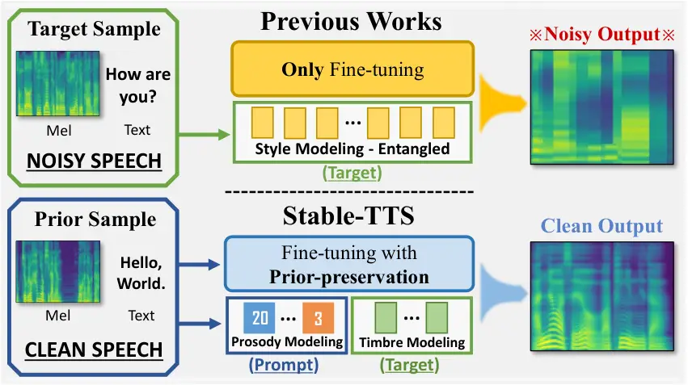
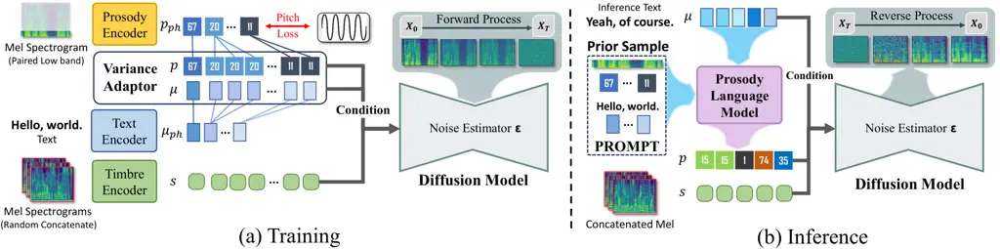
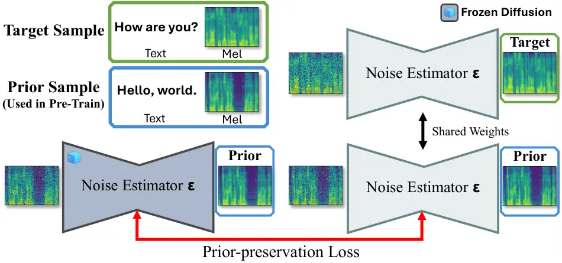
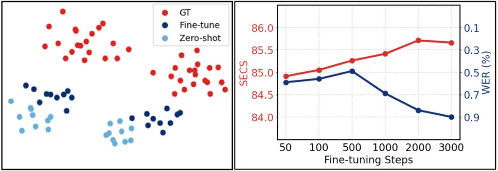

# Stable-TTS: Stable Speaker-Adaptive Text-to-Speech Synthesis via Prosody Prompting

Wooseok Han^(∗) ^(†)^(†)thanks: \$ˆ\*\$Equal contribution Affiliation: 
AITRICS  
hwrg@aitrics.com    Minki Kang^(∗) Affiliation:  KAIST  
zzxc1133@kaist.ac.kr    Changhun Kim Affiliation:  KAIST, AITRICS  
changhun.kim@kaist.ac.kr    Eunho Yang Affiliation:  KAIST, AITRICS  
eunhoy@kaist.ac.kr

###### Abstract

Speaker-adaptive Text-to-Speech (TTS) synthesis has attracted
considerable attention due to its broad range of applications, such as
personalized voice assistant services. While several approaches have
been proposed, they often exhibit high sensitivity to either the
quantity or the quality of target speech samples. To address these
limitations, we introduce Stable-TTS, a novel speaker-adaptive TTS
framework that leverages a small subset of a high-quality pre-training
dataset, referred to as prior samples. Specifically, Stable-TTS achieves
prosody consistency by leveraging the high-quality prosody of prior
samples, while effectively capturing the timbre of the target speaker.
Additionally, it employs a prior-preservation loss during fine-tuning to
maintain the synthesis ability for prior samples to prevent overfitting
on target samples. Extensive experiments demonstrate the effectiveness
of Stable-TTS even under limited amounts of and noisy target speech
samples.¹¹ 1 Speech samples are available at
[https://Stable-TTS.github.io](https://Stable-TTS.github.io).

###### Index Terms: 

Text-to-Speech Synthesis, Low-Resource TTS, Voice Cloning, Prior Prosody
Prompting, Prior-Preservation

## I Introduction

Recent advancements in zero-shot TTS models have showcased their ability
to generate near-human quality speech resembling the voice of any
speaker, using only a few seconds of target speech \[1, 2, 3, 4, 5\].
However, these models frequently face two major issues. First, extensive
pre-training on large datasets, comprising thousands of hours of speech,
is necessary to achieve high-quality zero-shot TTS for any
speaker \[2\]. Second, despite extensive pre-training on vast amounts of
speech corpora, it remains challenging to generate natural-sounding
speech that perfectly mirrors the voice of any speaker, particularly
given the distribution shift between source corpora and the target
speaker.



Fig. 1: Concept. Our objective is to build a speaker-adaptive TTS model
that utilizes prosody prompt and prior-preservation with prior samples
(blue box) to generate a high-quality voice even when fine-tuning with
noisy target samples (green box).

To tackle these challenges, an alternative approach called _transfer
learning_, which leverages knowledge from the source domain and involves
fine-tuning on speech samples of target speaker, has been widely
employed in TTS synthesis \[6, 7, 8\]. These models have achieved high
stability with small pre-training datasets and effective personalization
through fine-tuning on diverse few-shot speech samples, usually under a
minute. However, they often struggle with generating speech that
satisfies both _naturalness_ and _speaker similarity_ criteria,
particularly in situations where the few-shot samples suffer from issues
such as noise, clipping, or distortion. For instance, fine-tuning a TTS
model with ‘in-the-wild’ recordings \[9\] is challenging due to unclear
pronunciation and severe background noise, unlike the clear speech data
in pre-training \[10\]. In such cases, fewer fine-tuning steps may
reduce voice similarity, while excessive fine-tuning can compromise the
TTS model’s integrity to produce clear and intelligible speech.



Fig. 2: Overview of Stable-TTS. (a) During training, we utilize both the
prosody encoder and timbre encoder to enhance timbre and ensure prosody
consistency. All representations are utilized as a condition for the
diffusion model. (b) During the inference phase, we leverage a Prosody
Language Model (PLM) to predict the prosody code utilizing the prompt
from a prior sample and generate a timbre vector by concatenating
multiple mel-spectrograms derived from the same speaker.

Motivated by these limitations, we introduce _Stable-TTS_, a novel
speaker-adaptive TTS framework designed to ensure prosody consistency
and enhance timbre, even under conditions of limited amount of noisy
target samples. Stable-TTS achieves this by leveraging a small subset of
high-quality _prior samples_ from the pre-training dataset.
Specifically, Stable-TTS utilizes a prosody encoder and a Prosody
Language Model (PLM) \[4\] to guide prosody generation while using a
style encoder primarily as a timbre encoder to reinforce the target
speaker’s timbre. Furthermore, we exploit a *prior-preservation
loss* \[11\] during fine-tuning to maintain synthesis ability for prior
samples, thereby preventing overfitting on target samples. Extensive
experiments demonstrate the effectiveness of Stable-TTS in producing
high-quality speech samples, excelling in intelligibility, naturalness,
and speaker similarity, even under challenging conditions of limited and
noisy target samples.

To summarize, our contributions are as follows:

- •
  We propose Stable-TTS, a speaker-adaptive TTS framework using a small
  subset of the high-quality prior samples from a pre-training dataset.
- •
  Stable-TTS leverages prior samples by incorporating prosody encoder
  and PLM to ensure prosody consistency, and employs prior-preservation
  loss to prevent overfitting.
- •
  Extensive experiments show that Stable-TTS produces high-quality
  speech with strong naturalness and speaker similarity, even with
  limited and noisy target samples.

## II Stable-TTS

In this section, we introduce Stable-TTS, a speaker-adaptive TTS
framework that ensures prosody consistency even with limited noisy
target speech samples. This is achieved by leveraging high-quality
_prior samples_ from the pre-training dataset during both fine-tuning
and inference stages. The architecture of Stable-TTS incorporates prior
samples to stabilize the fine-tuning process, as shown in Fig. 2,
allowing for high-quality, consistent output even under challenging
conditions. The following sections detail the architecture
(Section II-A), the use of prior samples in inference (Section II-B),
and fine-tuning stabilization (Section II-C).

### II-A Diffusion-Based Zero-Shot TTS Models

Our model stems from diffusion-based zero-shot TTS models \[3, 12\].
Specifically, our model consists of five key modules: text encoder
$`T`$, prosody encoder $`P`$ \[4\], variance adaptor $`V`$ \[13, 14\],
timbre encoder $`S`$ \[15\], and the diffusion model \[12\]. To train
this model, we use the training dataset consisting of paired samples of
the text $`{\bm{t}}`$ in the form of phoneme sequences and its speech
$`{\bm{X}}`$ in the form of a mel-spectrogram. First, the text encoder
$`T`$ and prosody encoder $`P`$ encode text $`{\bm{t}}`$ and speech
$`{\bm{X}}`$ into latent representations,
$`{\bm{\mu}}_{ph}=T({\bm{t}})`$ and $`{\bm{p}}_{ph}=P({\bm{X}})`$,
respectively. Here, $`{\bm{p}}_{ph}`$ represents prosody codes at the
phoneme level, matching the length of $`{\bm{\mu}}_{ph}`$. Notably, the
prosody encoder includes a vector quantization layer \[16\] at the end,
to discretize the prosody representations into the fixed set of discrete
prosody codes. The variance adaptor $`V`$ then expands both
$`{\bm{\mu}}_{ph}`$ and $`{\bm{p}}_{ph}`$ to sequences
$`{\bm{\mu}}=V({\bm{\mu}}_{ph})`$ and $`{\bm{p}}=V({\bm{p}}_{ph})`$
respectively, where both sequences are in the same length with the
target mel-spectrogram $`{\bm{X}}`$.

Next, the timbre encoder $`S`$ extracts timbre features from
mel-spectrograms. During training, we sample $`k`$ mel-spectrograms from
the same speaker as $`{\bm{X}}`$ and concatenate them to strengthen the
timbre characteristics of the target speaker \[4\] using the timbre
encoder as follows:

```math
{\bm{s}}=S({\bm{X}}_{R}),\quad{\bm{X}}_{R}=\texttt{concat}({\bm{X}}_{r_{1}},\ldots,{\bm{X}}_{r_{k}}), \tag{1}
```

where concat is the concatenation operator and $`{\bm{X}}_{r_{1}}`$,
$`\ldots`$ , $`{\bm{X}}_{r_{k}}`$ are the mel-spectrograms from the
target speaker.

The diffusion model \[17, 18\] generates the speech, using a noise
estimator $`{\bm{\epsilon}}`$ trained to estimate noise during the
forward process from the noisy mel-spectrogram. The forward process is
modeled by the following stochastic differential equation, which
gradually transforms mel-spectrogram $`{\bm{X}}`$ into $`{\bm{X}}_{T}`$:

```math
d{\bm{X}}_{t}=-\frac{1}{2}{\bm{X}}_{t}\beta_{t}dt+\sqrt{\beta_{t}}dW_{t},\quad t\in[0,T], \tag{2}
```

where $`{\bm{X}}_{T}`$ is a random noise drawn from Gaussian
distribution $`\mathcal{N}(0,{\bm{I}})`$, $`\beta_{t}`$ is a noise
scheduling constant, and $`W_{t}`$ is the standard Wiener process for
randomness. In a certain timestep $`t`$, the noise estimator
$`{\bm{\epsilon}}`$ is trained to estimate the noise given the
representations as follows:

```math
\mathcal{L}_{diff}=\mathbb{E}_{t,{\bm{X}},\epsilon}\|{\bm{\epsilon}}({\bm{X}}_{t},t,{\bm{\mu}},{\bm{p}},{\bm{s}})+\epsilon\sigma_{t}^{-1}\|_{2}^{2}, \tag{3}
```

where $`{\bm{X}}_{t}`$ is a forwarded noisy input $`{\bm{X}}`$ at
timestep $`t`$, $`\sigma_{t}=\sqrt{1-e^{-\int_{0}^{t}\beta_{s}ds}}`$,
and $`\epsilon`$ is a noise sampled from
$`\mathcal{N}(0,\sigma_{t}^{2})`$.

### II-B Prosody Language Model for Prior Prosody Prompting

As detailed in Section II-A, our TTS model encodes prosody $`{\bm{p}}`$
and timbre $`{\bm{s}}`$ into distinct representations\[4, 19\]. The
timbre vector $`{\bm{s}}`$ is continuous and unconstrained, while the
prosody codes $`{\bm{p}}`$ are discrete and limited to a predefined
codebook. These codes are designed to align with the input text
$`{\bm{t}}`$, as their purpose is to apply appropriate prosodic elements
to the textual content.

During inference, since the target speech and input text are not
directly aligned, an additional module is required to predict the
prosody codes for the input text. Mega-TTS \[4\] introduced a Prosody
Language Model (PLM) to predict prosody codes in an auto-regressive
manner, similar to a decoder-only language model used in GPT-2 \[20\].
The PLM is trained with a language modeling objective \[4\], predicting
the prosody codes $`{\bm{p}}`$, given the prompt speech
$`\tilde{{\bm{X}}}`$, as follows:

```math
\argmax_{{\bm{p}}_{t}}\texttt{PLM}({\bm{p}}_{t}|\tilde{{\bm{p}}},\tilde{{\bm{\mu}}},{\bm{p}}_{<t},{\bm{\mu}}_{\leq t}), \tag{4}
```

where PLM is the trained PLM,
$`\tilde{{\bm{p}}}=V(P(\tilde{{\bm{X}}}))`$ represents the prompt
prosody codes derived from the prompt speech $`\tilde{{\bm{X}}}`$, and
$`\tilde{{\bm{\mu}}}=V(T(\tilde{{\bm{t}}}))`$ is the encoded text from
the prompt speech $`\tilde{{\bm{t}}}`$.

By constraining the predicted prosody codes $`{\bm{p}}`$ to the
predefined set in the codebook, we ensure that the prosody of the
synthesized speech remains consistent with the pre-training samples,
even after fine-tuning. Moreover, instead of using target speech as the
prompt speech $`\tilde{{\bm{X}}}`$ \[4\], we propose leveraging prior
samples—clean speech from the pre-training dataset as a prompt. This
allows the PLM to generate a more stable sequence of prosody codes by
leveraging those encountered during training. This approach is
particularly effective when the target speech is noisy or of poor
quality.

### II-C Prior-Preservation Loss for Fine-Tuning

Fine-tuning the TTS model with the target speaker’s speech samples is
crucial for accurately cloning the speaker’s voice while preserving
naturalness \[7\]. However, this becomes challenging when the available
samples are limited and noisy, which is common in real-world recordings.
A well-known issue is that fine-tuning on a few noisy samples can lead
to overfitting, causing the model to generate noisy speech \[3\].

To address this, we focus on fine-tuning the diffusion model,
considering its critical role in synthesizing speech from
representations. However, overfitting to limited noisy samples often
results in noisy outputs and reduces the effectiveness of prosody codes,
making it harder to generate clean speech.



Fig. 3: Details of Fine-tuning. We train the diffusion models only using
both diffusion and prior-preservation loss.

To mitigate this, we introduce prior-preservation loss during
fine-tuning, inspired by a personalized text-to-image diffusion
model \[11\]. This loss maintains the pre-trained distribution by
minimizing the difference in estimated noise between clean and noisy
samples. As illustrated in Fig. 3, we use a subset of high-quality
_prior samples_ from the pre-training dataset, aiming to minimize the
mean squared error between the estimated noise of two diffusion
models—one with frozen pre-trained weights and the other with modified
weights during fine-tuning—based on these prior samples as follows:

```math
\mathcal{L}_{ppl}=\mathbb{E}_{t,{\bm{X}}}{\|{\bm{\epsilon}}({\bm{X}}_{t},t,{\bm{\mu}},{\bm{p}},{\bm{s}};\theta^{\prime})-{\bm{\epsilon}}({\bm{X}}_{t},t,{\bm{\mu}},{\bm{p}},{\bm{s}};\theta)\|}_{2}^{2}, \tag{5}
```

where $`{\bm{X}}`$ is prior samples from the pre-training dataset, and
$`{\bm{X}}_{t}`$ is a forwarded noisy input $`{\bm{X}}`$ at timestep
$`t`$. In this process, $`\theta^{\prime}`$ is the pre-trained and
frozen parameter of the noise estimator, and $`\theta`$ is a parameter
to be fine-tuned. The prior-preservation loss ensures that the diffusion
model retains the ability to synthesize clean speech. During
fine-tuning, the noise estimator is fine-tuned by minimizing both
$`\mathcal{L}_{diff}`$ in Equation 3 and an auxiliary loss
$`\mathcal{L}_{ppl}`$. This approach allows the diffusion model to
generate high-quality speech with the voice of the target speaker, even
when only a few noisy samples of the target speaker are available.

## III Experiments

|                               |                             |                             |                              |                              |                             |                             |                              |                              |                             |                             |                              |                              |
| ----------------------------- | --------------------------- | --------------------------- | ---------------------------- | ---------------------------- | --------------------------- | --------------------------- | ---------------------------- | ---------------------------- | --------------------------- | --------------------------- | ---------------------------- | ---------------------------- |
|                               | LibriTTS test-clean         |                             |                              |                              | VCTK                        |                             |                              |                              | VoxCeleb                    |                             |                              |                              |
| Model                         | MOS ($`\uparrow`$)          | SMOS ($`\uparrow`$)         | WER ($`\downarrow`$)         | SECS ($`\uparrow`$)          | MOS ($`\uparrow`$)          | SMOS ($`\uparrow`$)         | WER ($`\downarrow`$)         | SECS ($`\uparrow`$)          | MOS ($`\uparrow`$)          | SMOS ($`\uparrow`$)         | WER ($`\downarrow`$)         | SECS ($`\uparrow`$)          |
| Ground Truth                  | 3.99$`{}_{\pm\text{0.20}}`$ | 3.61$`{}_{\pm\text{0.21}}`$ | 4.76$`{}_{\pm\text{1.09}}`$  | 83.08$`{}_{\pm\text{0.08}}`$ | 4.17$`{}_{\pm\text{0.17}}`$ | 3.95$`{}_{\pm\text{0.21}}`$ | 2.96$`{}_{\pm\text{0.90}}`$  | 90.90$`{}_{\pm\text{0.10}}`$ | \-                          | \-                          | \-                           | \-                           |
| Grad-StyleSpeech \[3\]        | 3.11$`{}_{\pm\text{0.22}}`$ | 3.19$`{}_{\pm\text{0.23}}`$ | 11.31$`{}_{\pm\text{1.52}}`$ | 85.69$`{}_{\pm\text{0.69}}`$ | 2.88$`{}_{\pm\text{0.20}}`$ | 2.94$`{}_{\pm\text{0.22}}`$ | 14.55$`{}_{\pm\text{2.01}}`$ | 87.19$`{}_{\pm\text{0.19}}`$ | 2.60$`{}_{\pm\text{0.21}}`$ | 2.86$`{}_{\pm\text{0.22}}`$ | 16.06$`{}_{\pm\text{1.98}}`$ | 85.27$`{}_{\pm\text{0.27}}`$ |
| UnitSpeech^(†) \[6\]          | 2.16$`{}_{\pm\text{0.20}}`$ | 2.55$`{}_{\pm\text{0.22}}`$ | 6.00$`{}_{\pm\text{1.92}}`$  | 80.39$`{}_{\pm\text{1.39}}`$ | 2.49$`{}_{\pm\text{0.21}}`$ | 2.94$`{}_{\pm\text{0.22}}`$ | 4.64$`{}_{\pm\text{1.11}}`$  | 80.89$`{}_{\pm\text{0.89}}`$ | 2.63$`{}_{\pm\text{0.21}}`$ | 2.59$`{}_{\pm\text{0.24}}`$ | 19.76$`{}_{\pm\text{5.08}}`$ | 73.81$`{}_{\pm\text{1.81}}`$ |
| Stable-TTS (w/o PLM)          | 3.16$`{}_{\pm\text{0.23}}`$ | 3.21$`{}_{\pm\text{0.26}}`$ | 11.50$`{}_{\pm\text{1.51}}`$ | 85.75$`{}_{\pm\text{0.75}}`$ | 2.65$`{}_{\pm\text{0.21}}`$ | 2.95$`{}_{\pm\text{0.22}}`$ | 14.35$`{}_{\pm\text{2.03}}`$ | 87.13$`{}_{\pm\text{0.13}}`$ | 2.59$`{}_{\pm\text{0.20}}`$ | 2.93$`{}_{\pm\text{0.22}}`$ | 14.06$`{}_{\pm\text{1.78}}`$ | 84.73$`{}_{\pm\text{0.73}}`$ |
| Stable-TTS (w/o P.P.)         | 2.73$`{}_{\pm\text{0.24}}`$ | 2.73$`{}_{\pm\text{0.24}}`$ | 3.16$`{}_{\pm\text{1.04}}`$  | 82.16$`{}_{\pm\text{1.16}}`$ | 3.30$`{}_{\pm\text{0.20}}`$ | 3.55$`{}_{\pm\text{0.20}}`$ | 1.69$`{}_{\pm\text{0.64}}`$  | 85.36$`{}_{\pm\text{0.36}}`$ | 2.69$`{}_{\pm\text{0.23}}`$ | 2.53$`{}_{\pm\text{0.22}}`$ | 5.64$`{}_{\pm\text{1.45}}`$  | 81.85$`{}_{\pm\text{0.85}}`$ |
| Stable-TTS (w/o Prior Prompt) | 3.65$`{}_{\pm\text{0.21}}`$ | 3.37$`{}_{\pm\text{0.21}}`$ | 0.83$`{}_{\pm\text{0.37}}`$  | 83.16$`{}_{\pm\text{0.16}}`$ | 3.34$`{}_{\pm\text{0.19}}`$ | 3.76$`{}_{\pm\text{0.20}}`$ | 0.72$`{}_{\pm\text{0.46}}`$  | 85.41$`{}_{\pm\text{0.41}}`$ | 2.62$`{}_{\pm\text{0.23}}`$ | 2.44$`{}_{\pm\text{0.22}}`$ | 1.02$`{}_{\pm\text{0.46}}`$  | 82.04$`{}_{\pm\text{1.04}}`$ |
| Stable-TTS                    | 3.37$`{}_{\pm\text{0.20}}`$ | 3.41$`{}_{\pm\text{0.22}}`$ | 1.13$`{}_{\pm\text{0.42}}`$  | 83.13$`{}_{\pm\text{1.13}}`$ | 3.82$`{}_{\pm\text{0.19}}`$ | 4.04$`{}_{\pm\text{0.22}}`$ | 0.49$`{}_{\pm\text{0.34}}`$  | 85.26$`{}_{\pm\text{0.26}}`$ | 3.00$`{}_{\pm\text{0.22}}`$ | 2.65$`{}_{\pm\text{0.23}}`$ | 1.32$`{}_{\pm\text{0.50}}`$  | 82.09$`{}_{\pm\text{1.09}}`$ |

TABLE I: Subjective and Objective Experimental Results on the fine-tuned
models on the LibriTTS test-clean \[10\], VCTK \[21\], and
VoxCeleb \[9\] speech dataset of less than one minute for each speaker.
Speech samples used in this human evaluation are randomly selected. We
report the training dataset for a fair comparison and note that
UnitSpeech^(†) \[6\] is trained on the LibriTTS train set \[10\].
Evaluation for ground truth on VoxCeleb is unavailable since all but a
limited number of target samples are used.

### III-A Experimental Setup

*Datasets.* Stable-TTS is pre-trained on the clean-100 and clean-360
subsets of LibriTTS-R \[22\], an English multi-speaker dataset with 245
hours of audio from 553 speakers. For fine-tuning, we utilize the
configuration from 24 speakers in the test-clean subset of
LibriTTS \[10\], and the configuration from 24 speakers in the
VCTK \[21\] dataset, with each containing 20 audio clips averaging 1-4
seconds in length. Furthermore, to validate Stable-TTS in real-world
noisy scenarios, we utilize 20 speakers from VoxCeleb \[9\], comprising
audio-visual short clips extracted from the interview video dataset. The
transcripts are generated using Whisper \[23\] ASR, and each dataset
contains 5-7 audio clips, ranging from 4-8 seconds in length.

*Baselines.* We compare Stable-TTS with two recent diffusion-based TTS
models, Grad-StyleSpeech \[3\] and UnitSpeech \[6\]. _Grad-StyleSpeech_
is an any-speaker adaptive TTS model, comprising a diffusion and a
style-adaptive encoder with style-adaptive layer normalization \[15\].
_UnitSpeech_, based on Grad-TTS \[12\], enables speaker adaptation with
untranscribed speech using self-supervised unit representation as a
pseudo transcript, along with a unit encoder.

*Evaluation metrics.* For objective evaluation, we employ Word Error
Rate (WER) to assess the intelligibility of synthesized speech and
Speaker Embedding Cosine Similarity (SECS) to measure the speaker
similarity, utilizing speaker verification model of Resemblyzer \[24\].
For subjective evaluation, we employ Mean Opinion Score (MOS) for
naturalness and Similarity Mean Opinion Score (SMOS) for speaker
similarity, where 20 evaluators rate the synthesized speech on a scale
from 1 to 5, measuring each attribute separately.

*Implementation details.* We set the audio config to 16khz sampling rate
and 80 mel bin. Our diffusion-based zero-shot TTS model, based on
Grad-StyleSpeech \[3\], closely follows its pre-training setup. For the
prosody encoder, we use a vector quantization module, using a low band
with rich prosodic contents of size 15 from paired mel-spectrogram as
input for the prosody vector. As mentioned in Section II-A, three random
mel-spectrograms from the same speaker are concatenated into one for the
timbre vector input, i.e., $`k=3`$ in Equation 1. We randomly choose
prior samples from the pre-training dataset, where each sample has a
mel-spectrogram length ranging from 100 to 150. Moreover, for the prior
prosody prompts in inference, we carefully choose one speech sample for
each male and female which are exclusively used in most cases. We adopt
HiFi-GAN \[25\] as a vocoder.

### III-B Main Results

We compare the performance of Stable-TTS against baselines across
diverse datasets to ascertain its efficacy in enhancing intelligibility,
naturalness, and similarity. As shown in TABLE I, Stable-TTS exhibits
superior performance in terms of both MOS and SMOS across all datasets.
It is worth noting that Stable-TTS significantly reduces the WER of
existing baselines (by 81%, 89%, and 92% for three datasets,
respectively), demonstrating exceptional improvement in intelligibility.
This confirms that Stable-TTS performs excellently not only with clean
speech samples (LibriTTS, VCTK) but also with noisy speech samples
(VoxCeleb). Remarkably, this achievement has been accomplished with only
a slight (VCTK, VoxCeleb) or no sacrifice (LibriTTS) in SECS, indicating
that Stable-TTS significantly outperforms other baselines in terms of
the intelligibility-similarity trade-off.

### III-C Ablation Study

*Components of Stable-TTS.* We validate the core strategies of
Stable-TTS, namely PLM for prior prosody prompting (Section II-B) and
prior-preservation loss (P.P., Section II-C) as well as utilizing prior
samples (Section II-C). As shown in TABLE I, we find that removing
either component results in a degradation of performance in terms of
MOS, SMOS, and WER across all scenarios. Notably, even Stable-TTS
without P.P. already outperforms baselines, underscoring the efficacy of
prosody prompting with PLM. Removing P.P. maintains SECS but
significantly degrades MOS, SMOS, and WER, showing that prior
preservation prevents overfitting to the target samples, enabling
intelligible and natural speech synthesis. It is worth highlighting that
using prior samples on PLM for prosody prompting rather than target
samples significantly enhances naturalness, especially for out-of-domain
datasets (VCTK, VoxCeleb).

|             | Stable-TTS                  |                              |
| ----------- | --------------------------- | ---------------------------- |
| Setting     | WER ($`\downarrow`$)        | SECS ($`\uparrow`$)          |
| Zero-shot   | 0.91$`{}_{\pm\text{0.33}}`$ | 84.18$`{}_{\pm\text{0.18}}`$ |
| Fine-tuning | 0.49$`{}_{\pm\text{0.34}}`$ | 85.26$`{}_{\pm\text{0.26}}`$ |

TABLE II: Zero-shot vs. Fine-tuning. Analysis in zero-shot and
fine-tuning utilizing 24 speakers from the VCTK \[21\].

*Zero-shot vs. fine-tuning.* Stable-TTS can also be used in a zero-shot
setting without fine-tuning on the target speaker. To evaluate
fine-tuning’s effectiveness, we compare zero-shot performance with
fine-tuning improvements. In TABLE II and Fig. 4 (left), Stable-TTS
already exhibits commendable performance in zero-shot scenarios.
However, fine-tuning enhances both naturalness and similarity. Further
analysis of fine-tuning steps in Fig. 4 (right) reveals that fine-tuning
is not sensitive to the number of steps, indicating the presence of a
‘sweet spot’. Specifically, 500 steps appear to strike the optimal
balance.



Fig. 4: Zero-shot vs. Fine-tuning. t-SNE visualization (left) analysis
of SECS and WER with fine-tuning iterations (right).

### III-D Evaluation under Limited Amounts of Target Samples

Since our objective is to excel not only in noisy datasets (e.g.,
VoxCeleb in TABLE I) but also in scenarios with limited amounts of data,
we conduct experiments on restricted samples of the target speaker by
decreasing the number of samples used during fine-tuning using VCTK
dataset. In TABLE III, we prove that Stable-TTS maintains stable WER of
less than 1% even with limited target samples. This is in stark contrast
to Grad-StyleSpeech, where the performance deteriorates as the number of
target samples decreases.

|            | Grad-StyleSpeech \[3\]       |                              | Stable-TTS                  |                              |
| ---------- | ---------------------------- | ---------------------------- | --------------------------- | ---------------------------- |
| \# Samples | WER ($`\downarrow`$)         | SECS ($`\uparrow`$)          | WER ($`\downarrow`$)        | SECS ($`\uparrow`$)          |
| 1          | 48.92$`{}_{\pm\text{9.11}}`$ | 84.23$`{}_{\pm\text{0.23}}`$ | 0.97$`{}_{\pm\text{0.67}}`$ | 83.88$`{}_{\pm\text{0.88}}`$ |
| 5          | 18.66$`{}_{\pm\text{3.40}}`$ | 86.87$`{}_{\pm\text{0.87}}`$ | 0.52$`{}_{\pm\text{0.53}}`$ | 84.97$`{}_{\pm\text{0.03}}`$ |
| 20         | 18.58$`{}_{\pm\text{3.33}}`$ | 86.93$`{}_{\pm\text{0.07}}`$ | 0.35$`{}_{\pm\text{0.42}}`$ | 84.74$`{}_{\pm\text{0.74}}`$ |
| 100        | 14.16$`{}_{\pm\text{3.02}}`$ | 86.34$`{}_{\pm\text{0.34}}`$ | 0.25$`{}_{\pm\text{0.29}}`$ | 84.61$`{}_{\pm\text{0.61}}`$ |

TABLE III: Fine-tuning Data Scale. The experiment involves 10 speakers
from the VCTK \[21\], each with more than 100 samples, and the steps are
kept consistent.

## IV Conclusion

In this paper, we have introduced Stable-TTS, a speaker-adaptive TTS
framework under limited and noisy speech samples. The core idea of
Stable-TTS is to use a small subset of high-quality _prior samples_ from
a pre-training dataset. Stable-TTS integrates a prosody language model
into our TTS system to conduct prior prosody prompting and incorporates
a prior-preservation loss during fine-tuning. Extensive experiments
demonstrated the effectiveness of Stable-TTS in terms of naturalness and
speaker similarity, even with limited amounts and poor-quality speech
samples.

## References

- \[1\] K. Shen, Z. Ju, X. Tan, Y. Liu, Y. Leng, L. He, T. Qin, S. Zhao,
  and J. Bian, “NaturalSpeech 2: Latent Diffusion Models are Natural and
  Zero-Shot Speech and Singing Synthesizers,” _International Conference
  on Learning Representations (ICLR)_, 2024.
- \[2\] C. Wang, S. Chen, Y. Wu, Z. Zhang, L. Zhou, S. Liu, Z. Chen,
  Y. Liu, H. Wang, J. Li _et al._, “Neural Codec Language Models are
  Zero-Shot Text to Speech Synthesizers,” _arXiv preprint
  arXiv:2301.02111_, 2023.
- \[3\] M. Kang, D. Min, and S. J. Hwang, “Grad-StyleSpeech: Any-Speaker
  Adaptive Text-to-Speech Synthesis with Diffusion Models,” in _IEEE
  International Conference on Acoustics, Speech, and Signal Processing
  (ICASSP)_, 2023.
- \[4\] Z. Jiang, Y. Ren, Z. Ye, J. Liu, C. Zhang, Q. Yang, S. Ji,
  R. Huang, C. Wang, X. Yin _et al._, “Mega-TTS: Zero-Shot
  Text-to-Speech at Scale with Intrinsic Inductive Bias,” _arXiv
  preprint arXiv:2306.03509_, 2023.
- \[5\] E. Casanova, J. Weber, C. D. Shulby, A. C. Júnior, E. Gölge, and
  M. A. Ponti, “YourTTS: Towards Zero-Shot Multi-Speaker TTS and
  Zero-Shot Voice Conversion for Everyone,” in _International Conference
  on Machine Learning (ICML)_, 2022.
- \[6\] H. Kim, S. Kim, J. Yeom, and S. Yoon, “UnitSpeech:
  Speaker-adaptive Speech Synthesis with Untranscribed Data,” in
  _Conference of the International Speech Communication Association
  (Interspeech)_, 2023.
- \[7\] M. Chen, X. Tan, B. Li, Y. Liu, T. Qin, S. Zhao, and T. Liu,
  “AdaSpeech: Adaptive Text to Speech for Custom Voice,” in
  _International Conference on Learning Representations (ICLR)_, 2021.
- \[8\] P. Neekhara, J. Li, and B. Ginsburg, “Adapting TTS models For
  New Speakers using Transfer Learning,” _arXiv preprint
  arXiv:2110.05798_, 2021.
- \[9\] A. Nagrani, J. S. Chung, and A. Zisserman, “VoxCeleb: A
  Large-Scale Speaker Identification Dataset,” in _Conference of the
  International Speech Communication Association (Interspeech)_, 2017.
- \[10\] H. Zen, V. Dang, R. Clark, Y. Zhang, R. J. Weiss, Y. Jia,
  Z. Chen, and Y. Wu, “LibriTTS: A Corpus Derived from LibriSpeech for
  Text-to-Speech,” in _Conference of the International Speech
  Communication Association (Interspeech)_, 2019.
- \[11\] N. Ruiz, Y. Li, V. Jampani, Y. Pritch, M. Rubinstein, and
  K. Aberman, “DreamBooth: Fine Tuning Text-to-Image Diffusion Models
  for Subject-Driven Generation,” in _IEEE/CVF Conference on Computer
  Vision and Pattern Recognition (CVPR)_, 2023.
- \[12\] V. Popov, I. Vovk, V. Gogoryan, T. Sadekova, and M. A. Kudinov,
  “Grad-TTS: A Diffusion Probabilistic Model for Text-to-Speech,” in
  _International Conference on Machine Learning (ICML)_, 2021.
- \[13\] Y. Ren, Y. Ruan, X. Tan, T. Qin, S. Zhao, Z. Zhao, and T. Liu,
  “FastSpeech: Fast, Robust and Controllable Text to Speech,” in
  _Conference on Neural Information Processing Systems (NeurIPS)_, 2019.
- \[14\] R. Badlani, A. Lancucki, K. J. Shih, R. Valle, W. Ping, and
  B. Catanzaro, “One TTS alignment to rule them all,” in _IEEE
  International Conference on Acoustics, Speech, and Signal Processing
  (ICASSP)_, 2022.
- \[15\] D. Min, D. B. Lee, E. Yang, and S. J. Hwang, “Meta-StyleSpeech
  : Multi-Speaker Adaptive Text-to-Speech Generation,” in _International
  Conference on Machine Learning (ICML)_, 2021.
- \[16\] A. van den Oord, O. Vinyals, and K. Kavukcuoglu, “Neural
  Discrete Representation Learning,” in _Conference on Neural
  Information Processing Systems (NeurIPS)_, 2017.
- \[17\] J. Ho, A. Jain, and P. Abbeel, “Denoising Diffusion
  Probabilistic Models,” in _Conference on Neural Information Processing
  Systems (NeurIPS)_, 2020.
- \[18\] Y. Song, J. Sohl-Dickstein, D. P. Kingma, A. Kumar, S. Ermon,
  and B. Poole, “Score-Based Generative Modeling through Stochastic
  Differential Equations,” in _International Conference on Learning
  Representations (ICLR)_, 2021.
- \[19\] Y. Ren, M. Lei, Z. Huang, S. Zhang, Q. Chen, Z. Yan, and
  Z. Zhao, “ProsoSpeech: Enhancing Prosody With Quantized Vector
  Pre-training in Text-to-Speech,” in _IEEE International Conference on
  Acoustics, Speech, and Signal Processing (ICASSP)_, 2022.
- \[20\] A. Radford, J. Wu, R. Child, D. Luan, D. Amodei, I. Sutskever
  _et al._, “Language Models are Unsupervised Multitask Learners,”
  _OpenAI blog_, 2019.
- \[21\] J. Yamagishi, C. Veaux, and K. MacDonald, “CSTR VCTK Corpus:
  English Multi-speaker Corpus for CSTR Voice Cloning Toolkit (version
  0.92),” University of Edinburgh. The Centre for Speech Technology
  Research (CSTR), Tech. Rep., 2019.
- \[22\] Y. Koizumi, H. Zen, S. Karita, Y. Ding, K. Yatabe, N. Morioka,
  M. Bacchiani, Y. Zhang, W. Han, and A. Bapna, “LibriTTS-R: A Restored
  Multi-Speaker Text-to-Speech Corpus,” in _Conference of the
  International Speech Communication Association (Interspeech)_, 2023.
- \[23\] A. Radford, J. W. Kim, T. Xu, G. Brockman, C. McLeavey, and
  I. Sutskever, “Robust Speech Recognition via Large-Scale Weak
  Supervision,” in _International Conference on Machine Learning
  (ICML)_, 2023.
- \[24\] Resemble.AI, “Resemblyzer,”
  [https://github.com/resemble-ai/Resemblyzer](https://github.com/resemble-ai/Resemblyzer), 2020.
- \[25\] J. Kong, J. Kim, and J. Bae, “HiFi-GAN: Generative Adversarial
  Networks for Efficient and High Fidelity Speech Synthesis,” in
  _Conference on Neural Information Processing Systems (NeurIPS)_, 2020.
