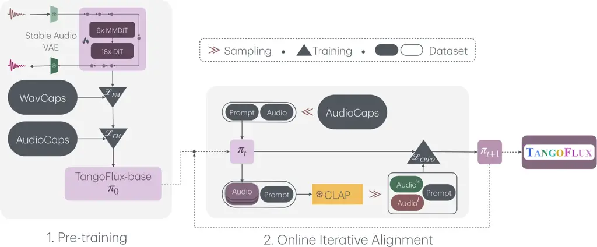
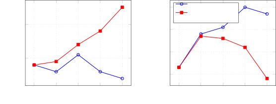
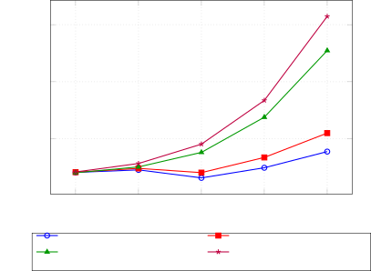
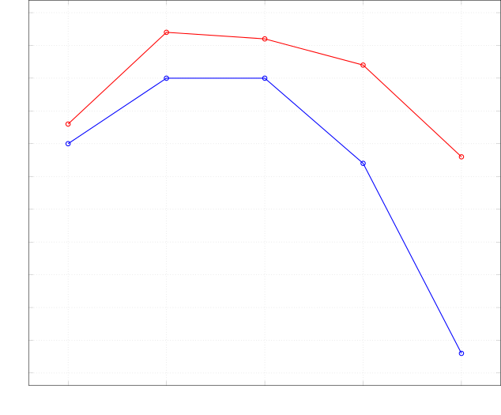
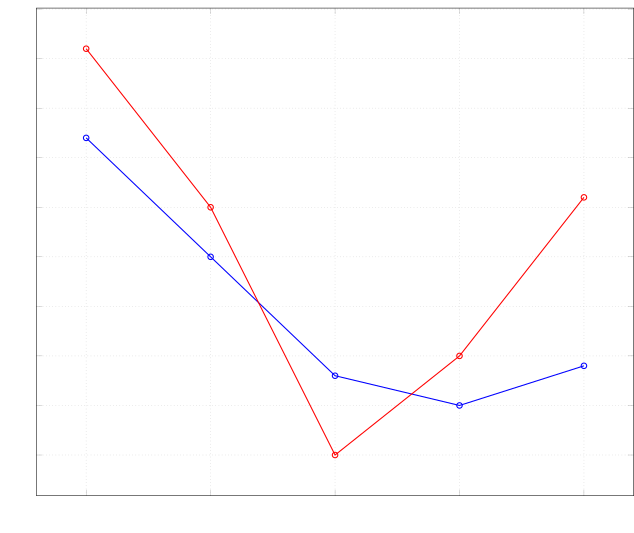
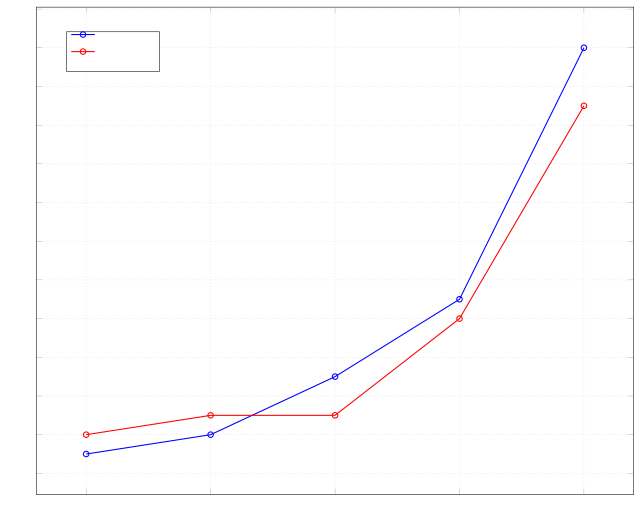
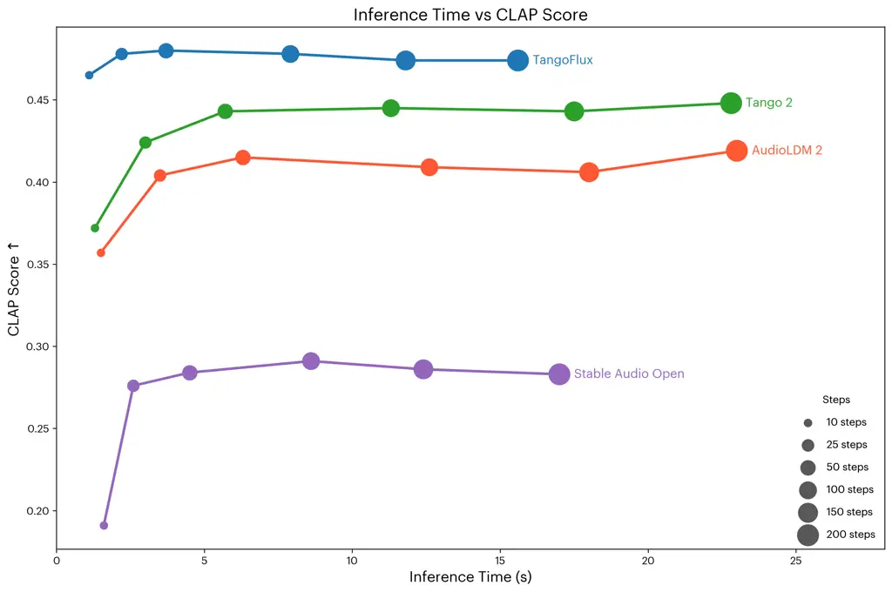
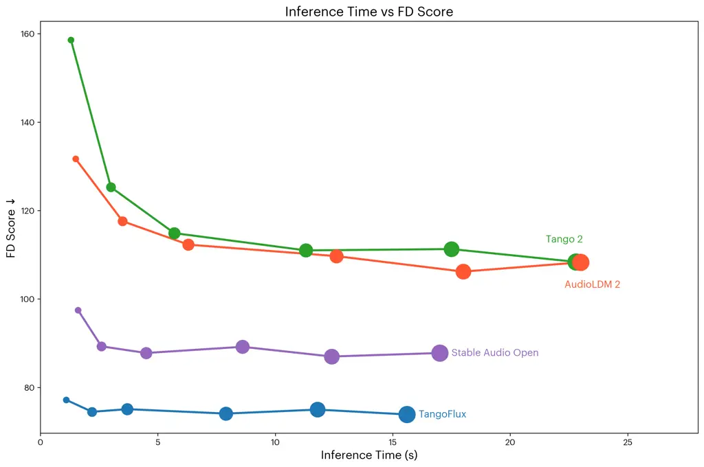
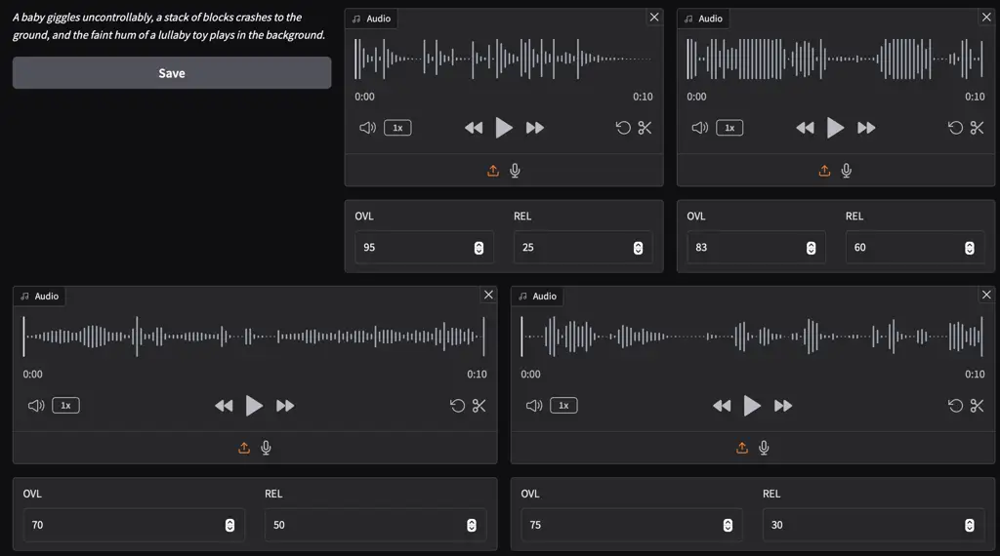

# TangoFlux: Super Fast and Faithful Text to Audio Generation with Flow Matching and Clap-Ranked Preference Optimization

Chia-Yu Hung Affiliation: Singapore University of Technology and Design
(SUTD) Email: [chiayuhung@sutd.edu.sg](mailto:)    Navonil Majumder
Affiliation: Singapore University of Technology and Design (SUTD)
Email: [navonilmajumder@sutd.edu.sg](mailto:)    Zhifeng Kong
Affiliation: NVIDIA Email: [ambujmehrish@sutd.edu.sg](mailto:)    Ambuj
Mehrish Affiliation: Singapore University of Technology and Design
(SUTD) Email: [sporia@sutd.edu.sg](mailto:)    Amir Ali Bagherzadeh
  Chuan Li   Rafael Valle   Bryan Catanzaro   Soujanya Poria
Affiliation: Singapore University of Technology and Design (SUTD)
Affiliation: NVIDIA Affiliation: Lambda Labs
Email: [zkong@nvidia.com](mailto:)
Email: [rafaelvalle@nvidia.com](mailto:)
Email: [bcatanzaro@nvidia.com](mailto:)
Email: [amirali.zadeh@lambdal.com](mailto:)
Email: [c@lambdal.com](mailto:)

###### Abstract

We introduce TangoFlux, an efficient Text-to-Audio (TTA) generative
model with 515M parameters, capable of generating up to 30 seconds of
44.1kHz audio in just 3.7 seconds on a A40 GPU. A key challenge in
aligning TTA models lies in creating preference pairs, as TTA lacks
structured mechanisms like verifiable rewards or gold-standard answers
available for Large Language Models (LLMs). To address this, we propose
CLAP-Ranked Preference Optimization (CRPO), a novel framework that
iteratively generates and optimizes preference data to enhance TTA
alignment. We show that the audio preference dataset generated using
CRPO outperforms existing alternatives. With this framework, TangoFlux
achieves state-of-the-art performance across both objective and
subjective benchmarks.

|     |
| --- |
|     |

![[Uncaptioned
image]](arxiv-2412-21037--af426a159eeb.figures/figure-1.webp)

TangoFlux Resources


Website → [https://tangoflux.github.io](https://tangoflux.github.io)

Code Repository →
[https://github.com/declare-lab/TangoFlux](https://github.com/declare-lab/TangoFlux)

Pretrained Model →
[https://huggingface.co/declare-lab/TangoFlux](https://huggingface.co/declare-lab/TangoFlux)

Dataset Fork →
[https://huggingface.co/datasets/declare-lab/CRPO](https://huggingface.co/datasets/declare-lab/TangoFlux)

Interactive Demo →
[https://huggingface.co/spaces/declare-lab/TangoFlux](https://huggingface.co/spaces/declare-lab/TangoFlux)


## 1 Introduction

Audio plays a vital role in daily life and creative industries, from
enhancing communication and storytelling to enriching experiences in
music, sound effects, and podcasts. However, creating high-quality
audio, such as foley effects or music compositions, demands significant
effort, expertise, and time. Recent advancements in text-to-audio (TTA)
generation Majumder et al. (2024); Ghosal et al. (2023); Liu et al.
(2023); Liu et al. (2024b); Xue et al. (2024); Vyas et al. (2023); Huang
et al. (2023b); Huang et al. (2023a) offer a transformative approach,
enabling the automatic creation of diverse and expressive audio content
directly from textual descriptions. This technology holds immense
potential to streamline audio production workflows and unlock new
possibilities in multimedia content creation. However, many existing
models face challenges with controllability, occasionally struggling to
fully capture the details in the input prompts, especially when the
prompts are complex. This sometimes results in audios that omit certain
events or diverges from the user intent. At times, the generated audio
may even contain input-adjacent, but unmentioned and unintended, events,
that could be characterized as hallucinations.

In contrast, the recent advancements in Large Language Models (LLMs)
Ouyang et al. (2022) have been significantly driven by the alignment
stage after pre-training and supervised fine-tuning. Alignment often
leverages reinforcement learning from human feedback (RLHF) or other
reward-based optimization methods to endow the generated outputs with
human preferences, ethical considerations, and task-specific
requirements Ouyang et al. (2022). Until recently Majumder et al.
(2024), alignment, that could mitigate the aforementioned issues with
audio outputs, has not been a mainstay in TTA model training.

One critical challenge in implementing alignment for TTA lies in the
creation of preference pairs. Unlike LLM alignment, where off-the-shelf
reward models Lambert et al. (2024a); Lambert et al. (2024b) and human
feedback data or verifiable gold answers are available, TTA domain as
yet lacks such tooling. For instance, for LLM safety alignment, tools
exist for categorizing specific safety risks Inan et al. (2023).

While audio language models Chu et al. (2024); Chu et al. (2023); Tang
et al. (2024) can take audio inputs and generate textual outputs, they
usually produce noisy feedback, unfit for preference pair creation for
audio. BATON Liao et al. (2024) employs human annotators to assign a
binary label 0/1 to each audio sample based on its alignment with a
given prompt. However, such labor-intensive manual approach is often
impractical at a large scale.

To address these issues, we propose CLAP-Ranked Preference Optimization
(CRPO), a simple yet effective approach to generate audio preference
data and perform preference optimization on rectified flows. As shown in
Fig. 1, CRPO consists of iterative cycles of data sampling, generating
preference pairs, and performing preference optimization, resembling a
self-improvement algorithm. A key aspect of our approach is its ability
to evolve by generating its own training dataset, dynamically aligning
itself over multiple iterations. We first demonstrate that the CLAP
model Wu\* et al. (2023) can serve as a proxy reward model for ranking
generated audios by alignment with the text description. Using this
ranking, we construct an audio preference dataset that post alignment
yields superior performance to other static audio preference datasets,
such as, BATON and Audio-Alpaca Majumder et al. (2024).

Many TTA models are trained on proprietary data Evans et al. (2024b);
Evans et al. (2024a); Copet et al. (2024), with closed weights and
accessible only via private APIs, hindering public use and foundational
research. Moreover, the diffusion-based TTA models Ghosal et al. (2023);
Majumder et al. (2024); Liu et al. (2024b) are known to require too many
denoising steps for a decent output, consuming much compute and time.

To address this, we introduce TangoFlux, trained on completely
non-proprietary data, achieving state-of-the-art performance on
benchmarks and out-of-distribution human evaluation, despite its smaller
size. TangoFlux also supports variable-duration audio generation up to
30 seconds with an inference time of  3.7 seconds on an A40 GPU. This is
achieved using a transformer Vaswani et al. (2023) backbone that
undergoes pretraining, fine-tuning, and preference optimization with
rectified flow matching training objective—yielding quality audio from
much fewer sampling steps.

Our contributions:

1.  (i)
    We introduce TangoFlux, a small and fast TTA model based on
    rectified flow with state-of-the-art performance for fully
    non-proprietary training data.
2.  (ii)
    We propose CRPO, a simple yet effective strategy for dynamically
    generating audio preference data and aligning rectified flows. By
    iteratively refining the preference data, CRPO continuously improves
    itself, outperforming static audio preference datasets.
3.  (iii)
    We conduct extensive experiments and highlight the importance of
    each component of CRPO in aligning rectified flows for improving
    scores on benchmarks.
4.  (iv)
    We plan to release the code and model weights.

## 2 Method

TangoFlux consists of FluxTransformer blocks which are Diffusion
Transformer (DiT) Peebles & Xie (2023) and Multimodal Diffusion
Transformer (MMDiT) Esser et al. (2024), conditioned on textual prompt
and duration embedding to generate audio at 44.1kHz up to 30 seconds.
TangoFlux learns a rectified flow trajectory to audio latent
representation encoded by a variational autoencoder (VAE) Kingma &
Welling (2022). As shown in Fig. 1, the training pipeline consists of
two stages: pre-training and fine-tuning with alignment. TangoFlux is
aligned via CRPO which iteratively generates new synthetic data and
constructs preference pairs for preference optimization.



Figure 1: A depiction of the overall training pipeline of TangoFlux.

### 2.1 Audio Encoding

We use the VAE from Stable Audio Open Evans et al. (2024c), which is
capable of encoding 44.1kHz stereo audio waveforms into latent
representations. Given a stereo audio
$`X\in\mathbb{R}^{2\times d\times sr}`$ with $`d`$ as the duration and
$`sr`$ as the sampling rate, the VAE encodes $`X`$ into a latent
representation $`Z\in\mathbb{R}^{L\times C}`$, with $`L`$, $`C`$ being
the latent sequence length and channel size, respectively. The VAE
decodes the latent representation $`Z`$ into the original stereo audio
$`X`$. The entire VAE is kept frozen during TangoFlux training.

### 2.2 Model Conditioning

To control the generation of audio of varying lengths, we employ (i)
text conditioning to control the content of the generated audio and (ii)
duration conditioning to dictate the output audio length, up to a
maximum of 30 seconds.

Text Conditioning. We obtain an encoding $`c_{text}`$ of the given
textual description from a pretrained text-encoder. Given the strong
performance of FLAN-T5 Chung et al. (2022); Raffel et al. (2023) as
conditioning in text-to-audio generation Majumder et al. (2024); Ghosal
et al. (2023), we select FLAN-T5 as our text encoder.

Duration Encoding. Inspired by the recent works Evans et al. (2024c);
Evans et al. (2024a); Evans et al. (2024b), to generate audios with
variable length, we use a small neural network to encode the audio
duration into a duration embedding $`c_{dur}`$ that is concatenated with
the text encoding $`c_{text}`$ and fed into TangoFlux to control the
duration of audio output.

### 2.3 Model Architecture

Following the recent success of FLUX models in image generation¹¹ 1
[https://blackforestlabs.ai/](https://blackforestlabs.ai/), we adopt a
hybrid MMDiT and DiT architecture as the backbone for TangoFlux. While
MMDiT blocks demonstrated a strong performance, simplifying some of them
into single DiT block improved scalability and parameter efficiency²² 2
[https://blog.fal.ai/auraflow/](https://blog.fal.ai/auraflow/). These
lead us to select a model architecture with $`6`$ blocks of MMDiT,
followed by $`18`$ blocks of DiT. Each block has $`8`$ attention heads
of $`128`$ width, totaling a width of $`1024`$. This setting amounts to
515M parameters.

### 2.4 Flow Matching

Several generative models have been successfully trained under the
diffusion framework Ho et al. (2020); Song et al. (2022); Liu et al.
(2022). However, this approach is known to be sensitive to the choice of
noise scheduler, which may significantly affect performance. In
contrast, the flow matching (FM) framework Lipman et al. (2023); Albergo
& Vanden-Eijnden (2023) has been shown to be more robust to the choice
of noise scheduler, making it a preferred choice in many applications,
including text-to-audio (TTA) and text-to-speech (TTS) tasks Liu et al.
(2024a); Le et al. (2023); Vyas et al. (2023).

Flow matching builds upon the continuous normalizing flows
framework Onken et al. (2021). It generates samples from a target
distribution by learning a time-dependent vector field that maps samples
from a simple prior distribution (e.g., Gaussian) to a complex target
distribution. Prior work in TTA, such as AudioBox Vyas et al. (2023) and
Voicebox Le et al. (2023), has predominantly adopted the Optimal
Transport conditional path proposed by Lipman et al. (2023). However, we
utilize rectified flows Liu et al. (2022) instead, which is a straight
line path from noise to distribution, corresponding to the shortest
path.

Rectified Flows. Given a latent representation of an audio sample
$`x_{1}`$, a noise sample
$`x_{0}\sim\mathcal{N}(\mathbf{0},\mathbf{I})`$, time-step
$`t\in[0,1]`$, we can construct a training sample $`x_{t}`$ where the
model learns to predict a velocity $`v_{t}=\frac{dx_{t}}{dt}`$ that
guides $`x_{t}`$ to $`x_{1}`$. While there exist several methods of
constructing transport path $`x_{t}`$ , we used rectified flows (RFs)
Liu et al. (2022), in which the forward process are straight paths
between target distribution and noise distribution, defined in Eq. 1. It
is empirically shown that rectified flows are more sample efficient and
degrade less than other formulations, while consuming fewer sampling
steps Esser et al. (2024). The model $`u(\mathbf{x}_{t},t;\theta)`$
directly regresses the ground truth velocity $`\mathbf{v}_{t}`$ using
the flow matching loss in Eq. 2.

```math
\displaystyle x_{t}=(1-t)x_{1}+t\tilde{x}_{0},v_{t}=\frac{dx_{t}}{dt}=\tilde{x}_{0}-x_{1}, \tag{1}
```

```math
\displaystyle\mathcal{L}_{\text{FM}}=\mathbb{E}_{x_{1},x_{0},t}\left\|u(x_{t},t;\theta)-v_{t}\right\|^{2}. \tag{2}
```

Inference. For inference, we sample a noise
$`\tilde{x}_{0}\sim\mathcal{N}(\mathbf{0},\mathbf{I})`$ and use Euler
solver to compute $`x_{1}`$, based on the model-predicted velocity
$`u(\cdot;\theta)`$ at each time step $`t`$.

### 2.5 CLAP-Ranked Preference Optimization (CRPO)

CLAP-Ranked Preference Optimization (CRPO) leverages a text-audio
joint-embedding model like CLAP Wu\* et al. (2023) as a proxy reward
model to rank the generated audios by similarity with the input
description and subsequently construct the preference pairs.

We set $`\pi_{0}`$ to a pre-trained checkpoint TangoFlux-base to align.
Thereafter, CRPO iteratively aligns checkpoint
$`\pi_{k}\coloneqq u(\cdot;\theta_{k})`$ into checkpoint $`\pi_{k+1}`$,
starting from $`k=0`$. Each alignment iteration consists of three steps:
(i) batched online data generation, (ii) reward estimation and
preference dataset creation, and (iii) fine-tuning $`\pi_{k}`$ into
$`\pi_{k+1}`$ via direct preference optimization. This alignment process
allows the model to continuously self-improve by generating and
leveraging its own preference data.

This approach of alignment is inspired by a few LLM alignment
approaches Zelikman et al. (2022); Kim et al. (2024a); Yuan et al.
(2024); Pang et al. (2024). However, there are key distinctions to our
work: (i) we align rectified flows for audio generation, rather than
autoregressive language models; (ii) while LLM alignment benefits from
numerous off-the-shelf reward models Lambert et al. (2024b), which ease
the construction of preference datasets based on reward scores, LLM
judged outputs, or programmatically verifiable answers, the audio domain
lacks such models or method for evaluating audio. We demonstrate that
the CLAP model can serve as an effective proxy audio reward model,
enabling the creation of preference datasets (see Section 4.3). Finally,
we highlight the necessity of generating online data at every iteration,
as iterative optimization on offline data leads to quicker performance
saturation and subsequent degradation.

#### 2.5.1 CLAP as a Reward Model

CLAP reward score is calculated as the cosine similarity between textual
and audio embeddings encoded by the model. Thus, we assume that CLAP can
serve as a reasonable proxy reward model for evaluating audio outputs
against the textual description. In Section 4.3, we demonstrate that
using CLAP as a judge to choose the best-of-N inferred policies improves
performance in terms of objective metrics.

#### 2.5.2 Batched Online Data Generation

To construct a preference dataset at iteration $`k`$, we first sample a
set of prompts $`M_{k}`$ from a larger pool $`B`$. Subsequently, we
generate $`N`$ audios for each prompt $`y_{i}\in M_{k}`$ using
$`\pi_{k}`$ and use CLAP³³ 3
[https://huggingface.co/lukewys/laion_clap/blob/main/630k-audioset-best.pt](https://huggingface.co/lukewys/laion_clap/blob/main/630k-audioset-best.pt) Wu\*
et al. (2023) to rank those audios by similarity with $`y_{i}`$. For
each prompt $`y_{i}`$, we select the highest-rewarded or -ranking audio
$`x^{w}_{i}`$ as the winner and the lowest-rewarded audio $`x^{l}_{i}`$
as the loser, yielding a preference dataset
$`\mathcal{D}_{k}=\{(x^{w}_{i},x^{l}_{i},y_{i})\mid y_{i}\in M_{k}\}`$.

#### 2.5.3 Preference Optimization

Direct preference optimization (DPO) Rafailov et al. (2024c) is shown to
be effective at instilling human preferences in LLMs Ouyang et al.
(2022). Consequently, DPO is successfully translated into
DPO-Diffusion Wallace et al. (2023) for alignment of diffusion models.
The DPO-diffusion loss is defined as

```math
\displaystyle L_{\text{DPO-Diff}} \displaystyle=-\mathbb{E}_{n,\epsilon^{w},\epsilon^{l}}\log\sigma\Big(-\beta\Big[
```

```math
\displaystyle\|\epsilon^{w}_{n}-\epsilon_{\theta}(x^{w}_{n})\|^{2}_{2}-\|\epsilon^{w}_{n}-\epsilon_{\text{ref}}(x^{w}_{n})\|^{2}_{2}
```

```math
\displaystyle-\big(\|\epsilon^{l}_{n}-\epsilon_{\theta}(x^{l}_{n})\|^{2}_{2}-\|\epsilon^{l}_{n}-\epsilon_{\text{ref}}(x^{l}_{n})\|^{2}_{2}\big)\Big]\Big). \tag{3}
```

$`n\sim U(0,T)`$ is a diffusion step among $`T`$ steps; $`x^{l}_{n}`$
and $`x^{w}_{n}`$ represent the losing and winning audios, with
$`\epsilon\sim\mathcal{N}(0,\mathbf{I})`$.

Following Esser et al. (2024), DPO-Diffusion loss is applicable to
rectified flow through the equivalence Lipman et al. (2023) between
$`\epsilon_{\theta}`$ and $`u(\cdot;\theta)`$, thereby the noise
matching loss terms can be substituted with flow matching terms:

```math
\displaystyle L_{\text{DPO-FM}}=-\mathbb{E}_{t\sim\mathcal{U}(0,1),x^{w},x^{l}}\log\sigma\Big(
```

```math
\displaystyle-\beta\Big[\underbrace{\|u(x^{w}_{t},t;\theta)-v^{w}_{t}\|_{2}^{2}}_{\text{Winning loss}}-\underbrace{\|u(x^{l}_{t},t;\theta)-v^{l}_{t}\|_{2}^{2}}_{\text{Losing loss}}
```

```math
\displaystyle-\Big(\underbrace{\|u(x^{w}_{t},t;\theta_{\text{ref}})-v^{w}_{t}\|_{2}^{2}}_{\text{Winning reference loss}}-\underbrace{\|u(x^{l}_{t},t;\theta_{\text{ref}})-v^{l}_{t}\|_{2}^{2}}_{\text{Losing reference loss}}\Big)\Big]\Big), \tag{4}
```

where $`t`$ is the flow matching timestep and $`x^{l}_{t}`$ and
$`x^{w}_{t}`$ represent losing and winning audio, respectively.

The DPO loss for LLMs models the relative likelihood of the winner and
loser responses, allowing minimization of the loss by increasing their
margin, even if both log-likelihoods decrease Pal et al. (2024). As DPO
optimizes the relative likelihood of the winning responses over the
losing ones, not their absolute values, convergence actually requires
both likelihoods to decrease despite being counterintuitive Rafailov
et al. (2024b). The decrease in likelihood does not necessarily decrease
performance, but required for improvement Rafailov et al. (2024a).
However, in the context of rectified flows, this behavior is less clear
due to the challenges in estimating the likelihood of generating samples
with classifier-free guidance (CFG). A closer look at
$`\mathcal{L}_{\text{DPO-FM}}`$ (Eq. 4) reveals that it can similarly be
minimized by increasing the margin between the winning and losing
losses, even if both losses increase. In Section 4.5, we demonstrate
that preference optimization of rectified flows via
$`\mathcal{L}_{\text{DPO-FM}}`$ suffer from this phenomenon as well.

To remedy this, we directly add the winning loss to the optimization
objective to prevent winning loss from increasing:

```math
\mathcal{L}_{\text{CRPO}}\coloneqq\mathcal{L}_{\text{DPO-FM}}+\mathcal{L}_{\text{FM}},
```

where $`\mathcal{L}_{\text{FM}}`$ is the flow matching loss computed on
the winning audio as shown in Eq. 2. While the DPO loss is effective at
improving preference rankings between chosen and rejected audio, relying
on it alone can lead to overoptimization. This can distort the semantic
and structural fidelity of the winning audio, causing the model’s
outputs to drift from the desired distribution. Adding the
$`\mathcal{L}_{\text{FM}}`$ component mitigates this risk by anchoring
the model to the high-quality attributes of the chosen data. This
regularization stabilizes training and preserves the essential
properties of the winning examples, ensuring a balanced and robust
optimization process. Our empirical results demonstrates
$`\mathcal{L}_{\text{CRPO}}`$ outperform $`\mathcal{L}_{\text{DPO-FM}}`$
as shown in Section 4.5.

## 3 Experiments

### 3.1 Model Training

We pretrained TangoFlux on Wavcaps Mei et al. (2024) for 80 epochs with
the AdamW Loshchilov & Hutter (2019), $`\beta_{1}=0.9,\beta_{2}=0.95`$,
a max learning rate of $`5\times 10^{-4}`$. We used a linear learning
rate scheduler for $`2000`$ steps. We used five A40 GPUs with a batch
size of $`16`$ on each device, resulting in an overall batch size of
$`80`$. After pretraining, TangoFlux was finetuned on the AudioCaps
training set for 65 additional epochs. Several works find that sampling
timesteps $`t`$ from the middle of its range $`[0,1]`$ leads to superior
results Hang et al. (2024); Kim et al. (2024b); Karras et al. (2022),
thus, we sampled $`t`$ from a logit-normal distribution with a mean of
$`0`$ and variance of $`1`$, following the approach in Esser et al.
(2024). We name this version as TangoFlux-base.

During the alignment phase, we used the same optimizer, but an overall
batch size of $`48`$, a maximum learning rate of $`10^{-5}`$, and a
linear warmup of 100 steps. For each iteration of CRPO, we train for
$`8`$ epochs and select the last epoch checkpoint to perform batched
online data generation. We performed 5 iterations of CRPO due to the
manifestation of performance saturation.

### 3.2 Datasets

Training dataset. We use complete open source data which consists of
approximately 400k audios from Wavcaps Mei et al. (2024) and 45k audios
from the training set of AudioCaps. Kim et al. (2019). Audios shorter
than $`30`$ seconds are padded with silence to 30s. Longer than 30
second audios are center cropped to 30 seconds. Since the audio files
are mono, we duplicated the channel to create pseudostereo audios for
compatibility with the VAE.

CRPO dataset. We initialize the prompt bank as the prompts of AudioCaps
training set, with a total of  45k prompts. At the start of each
iteration of CRPO, we randomly sample 20k prompts from the prompt bank
and generate 5 audios per prompt, and use the CLAP model to construct
20k preference pairs.

Evaluation dataset. For the main results, we evaluated TangoFlux on the
AudioCaps test set, using the same 886-sample split as Majumder et al.
(2024). Objective metrics are reported on this subset. Additionally, we
categorized AudioCaps prompts using GPT-4 to identify those with
multiple distinct events, such as ”Birds chirping and thunder strikes,”
which includes “sound of birds chirping” and “sound of thunder.” Results
on these multi-event captions are reported separately. Subjective
evaluation was conducted on an out-of-distribution dataset with 50
challenging prompts.

### 3.3 Objective Evaluation

Baselines. We compare TangoFlux to three existing strong text-to-audio
generation baselines: Tango 2, AudioLDM 2, and Stable Audio Open,
including the previous SOTA models. Across the baselines, we use the
default recommended classifier free guidance (CFG) scale Ho & Salimans
(2022) and the number of steps. For TangoFlux, we use a CFG scale of 4.5
and 50 steps for inference. Since TangoFlux and Stable Audio Open allow
variable audio generation length, we set the duration conditioning to 10
seconds and use the first 10 seconds of generated audio to perform the
evaluation. We also report the effect of CFG scale in the appendix A.1.

Evaluation metrics. We evaluate TangoFlux using both objective and
subjective metrics. Following Evans et al. (2024a), we report the four
objective metrics: Fréchet Distance (FD$`{}_{\text{openl3}}`$) Cramer
et al. (2019), Kullback–Leibler divergence (KL$`{}_{\text{passt}}`$) ,
CLAP$`{}_{\text{score}}`$, and Inception Score (IS) Salimans et al.
(2016). These metrics allow high-quality audio evaluation up to 48kHz.
FD$`{}_{\text{openl3}}`$ evaluates the similarity between the statistics
of a generated audio set and another reference audio set in the feature
space. A low FD$`{}_{\text{openl3}}`$ indicates a realistic audio that
closely resembles the reference audio. KL$`{}_{\text{passt}}`$ computes
the KL divergence over the probabilities of the labels between the
generated and the reference audio given the state-of-the-art audio
tagger PaSST. A low KL$`{}_{\text{passt}}`$ signifies the generated and
reference audio share similar semantics tags. CLAP$`{}_{\text{score}}`$
is a reference-free metric that measures the cosine similarity between
the audio and the text prompt. High CLAP$`{}_{\text{score}}`$ score
denotes the generated audio aligns with the textual prompt. IS measures
the specificity and coverage of a set of samples. A high IS score
represents the diversity in the generated audio. We use
stable-audio-metrics Evans et al. (2024a) to compute
FD$`{}_{\text{openl3}}`$, KL$`{}_{\text{passt}}`$,
CLAP$`{}_{\text{score}}`$ and AudioLDM evaluation toolkit Liu et al.
(2023) to compute IS. Note that we use different CLAP checkpoints to
create our preference dataset (630k-audioset-best) and to perform
evaluation (630k-audioset-fusion-best)⁴⁴ 4
[https://huggingface.co/lukewys/laion_clap/blob/main/630k-audioset-fusion-best](https://huggingface.co/lukewys/laion_clap/blob/main/630k-audioset-fusion-best).
These results are indicated in Tables 1 and 2 as
CLAP$`{}_{\text{score}}`$.

### 3.4 Human Evaluation

Following prior studies Ghosal et al. (2023); Majumder et al. (2024),
our subjective evaluation covers two key attributes of the generated
audio: overall audio quality (OVL) and relevance to the text input
(REL). OVL captures the general sound quality, including clarity and
naturalness, ignoring the alignment with the input prompt. In contrast,
REL quantifies the alignment of the generated audio with the provided
text input. At least four annotators rate each audio sample on a scale
from 0 (worst) to 100 (best) on both OVL and REL. This evaluation is
performed on 50 GPT4o-generated and human-vetted prompts and reported in
terms of three metrics: $`z`$-score, Ranking, and Elo score. The
evaluation instructions, annotators, and metrics are in Section A.3.

## 4 Results

### 4.1 Main Results

Table 1 objectively compares TangoFlux with prior text-to-audio
generation models on AudioCaps. Performances on the prompts with more
than one event, namely _multi-event_ prompts, are reported in Table 2.
These results suggest that TangoFlux consistently outperforms the prior
works on all objective metrics, except Tango 2 on
KL$`{}_{\text{passt}}`$. Interestingly, the margin on
CLAP$`{}_{\text{score}}`$ between TangoFlux and baselines is higher for
multi-event prompts, indicating the superiority of TangoFlux at grasping
complex instructions with multiple events and effectively capturing
their nuanced details and relationships in the generated audio.

[TABLE]

Table 1: Comparison of text-to-audio models. Output length represents
the duration of the generated audio. Objective metrics include
FD$`{}_{\text{openl3}}`$ for Fréchet Distance, KL$`{}_{\text{passt}}`$
for KL divergence, and CLAP$`{}_{\text{score}}`$ for alignment. All
inferences are performed on the same A40 GPU. We report the trainable
parameters in the \#Params column.

|                   |           |          |                                         |                                        |                                        |                |
| ----------------- | --------- | -------- | --------------------------------------- | -------------------------------------- | -------------------------------------- | -------------- |
| Model             | \#Params. | Duration | FD$`{}_{\text{openl3}}`$ $`\downarrow`$ | KL$`{}_{\text{passt}}`$ $`\downarrow`$ | CLAP$`{}_{\text{score}}`$ $`\uparrow`$ | IS$`\uparrow`$ |
| AudioLDM 2-large  | 712M      | 10 sec   | 107.9                                   | 1.83                                   | 0.415                                  | 7.3            |
| Stable Audio Open | 1056M     | 47 sec   | 88.5                                    | 2.67                                   | 0.286                                  | 9.3            |
| Tango 2           | 866M      | 10 sec   | 108.3                                   | 1.14                                   | 0.452                                  | 8.4            |
| TangoFlux-base    | 515M      | 30 sec   | 79.7                                    | 1.23                                   | 0.438                                  | 10.7           |
| TangoFlux         | 515M      | 30 sec   | 75.2                                    | 1.20                                   | 0.488                                  | 11.1           |

Table 2: Comparison of text-to-audio models on multi-event inputs.

### 4.2 Batched Online Data Generation is Necessary



Figure 2: The trajectory of CLAP score and KL divergence across the
training iterations. This plot shows the stark difference between online
and offline training. Offline training clearly peaks early, by the
second iteration, indicated by the peaking CLAP score and increasing KL.
In contrast, the CLAP score of online training continues to increase
until iteration 4, while the KL divergence has a clear downward trend
throughout.

In Fig. 2, we present the results of five training iterations of CRPO,
both with and without generating new data at each iteration. Our
findings suggest that training on the same dataset over multiple
iterations leads to quick performance saturation and eventual
degradation. Specifically, for offline CRPO, the CLAP score decreases
after the second iteration, while the KL increases significantly. By the
final iteration, the performance degradation is evident from CLAP score
and KL being worse than first iteration, emphasizing the limitations of
offline data. In contrast, the online CRPO with data generation before
each iteration outperforms the offline CRPO in terms of CLAP score and
KL.

This performance degradation could be ascribed to reward
over-optimization Rafailov et al. (2024a); Gao et al. (2022). Kim et al.
(2024a) showed that the reference model serves as a regularizer in DPO
training for language models. Several iterations of updating the
reference model with the same dataset thus may hamper the due
regularization of the loss. In Section 4.5, we show the paradoxical
performance degradation with loss minimization, indicating
over-optimization.

|              |                                         |                                        |                                        |
| ------------ | --------------------------------------- | -------------------------------------- | -------------------------------------- |
| Dataset      | FD$`{}_{\text{openl3}}`$ $`\downarrow`$ | KL$`{}_{\text{passt}}`$ $`\downarrow`$ | CLAP$`{}_{\text{score}}`$ $`\uparrow`$ |
| BATON        | 80.5                                    | 1.20                                   | 0.437                                  |
| Audio Alpaca | 80.0                                    | 1.20                                   | 0.448                                  |
| CRPO         | 79.1                                    | 1.18                                   | 0.453                                  |

Table 3: Comparison of TangoFlux checkpoints aligned with three
preference datasets. FD$`{}_{\text{openl3}}`$ $`\coloneqq`$ Fréchet
Distance and KL$`{}_{\text{passt}}`$ $`\coloneqq`$ KL divergence.

### 4.3 CLAP as Reward Model

To validate CLAP as a proxy reward model for evaluating audio output, we
further evaluate TangoFlux under a CLAP-driven Best-of-$`N`$ policy,
where $`N\in\{1,5,10,15\}`$. We use CLAP 630k-audioset-best.pt
checkpoint to rank the generated audios. The results in Table 4 suggest
that increasing $`N`$ yield better CLAP$`{}_{\text{score}}`$ and
KL$`{}_{\text{passt}}`$ while FD$`{}_{\text{openl3}}`$ remains about the
same. This indicates that the CLAP can identify well-aligned audio
outputs that better represent the textual descriptions, without
compromising diversity or quality, as implied by the lower
KL$`{}_{\text{passt}}`$ and similar FD$`{}_{\text{openl3}}`$.



Figure 3: Winning and Losing losses of $`\mathcal{L}_{\text{DPO-FM}}`$
and $`\mathcal{L}_{\text{CRPO}}`$ at each iteration. Winning and Losing
losses increase each iteration, as well as their margin.

### 4.4 CRPO surpasses Static Audio Preference Datasets

To show the superiority of CRPO, we compare its performance with two
other static audio preference datasets: Audio-Alpaca Majumder et al.
(2024) and BATON Liao et al. (2024) (see Section A.4 for details).

We apply preference optimization to TangoFlux-base, lasting only one
iteration since Audio-Alpaca and BATON are fixed datasets. Table 3
reports objective metrics FDopenl3, KLpasst, and CLAPscore,
demonstrating that preference optimization with the CRPO dataset
outperforms the other two audio preference datasets across all metrics.
Despite its simplicity, CRPO proves highly effective for constructing
audio preference datasets for optimization.

|           |     |                                         |                                        |                                        |
| --------- | --- | --------------------------------------- | -------------------------------------- | -------------------------------------- |
| Model     | N   | FD$`{}_{\text{openl3}}`$ $`\downarrow`$ | KL$`{}_{\text{passt}}`$ $`\downarrow`$ | CLAP$`{}_{\text{score}}`$ $`\uparrow`$ |
| TangoFlux | 1   | 75.0                                    | 1.15                                   | 0.480                                  |
|           | 5   | 74.3                                    | 1.14                                   | 0.494                                  |
|           | 10  | 75.8                                    | 1.08                                   | 0.499                                  |
|           | 15  | 75.1                                    | 1.11                                   | 0.502                                  |
| Tango 2   | 1   | 108.4                                   | 1.11                                   | 0.447                                  |
|           | 5   | 108.8                                   | 1.05                                   | 0.467                                  |
|           | 10  | 108.4                                   | 1.08                                   | 0.474                                  |
|           | 15  | 108.7                                   | 1.06                                   | 0.473                                  |

Table 4: Best-of-$`N`$ FD, KL, and CLAP scores.

### 4.5 $`\mathcal{L}_{\text{CRPO}}`$ vs $`\mathcal{L}_{\text{DPO-FM}}`$

To study the relationship between the winning and losing losses of
$`\mathcal{L}_{\text{CRPO}}`$ and $`\mathcal{L}_{\text{DPO-FM}}`$ (see
Eq. 4), we calculate the average winning and losing losses of the final
checkpoint (epoch 8) of each iteration on the training set. The losses
are plotted in Fig. 3. Simultaneously in Fig. 4, we present the
benchmark performances of the checkpoints by
$`\mathcal{L}_{\text{CRPO}}`$ and $`\mathcal{L}_{\text{DPO-FM}}`$ on
AudioCaps training set. Here, we only use fixed preference data by
TangoFlux-base.



(a) CLAP$`{}_{\text{score}}`$



(b) FD$`{}_{\text{openl3}}`$



(c) KL$`{}_{\text{passt}}`$

Figure 4: Comparison between $`\mathcal{L}_{\text{DPO-FM}}`$ and
$`\mathcal{L}_{\text{CRPO}}`$ w.r.t. (a) CLAP$`{}_{\text{score}}`$, (b)
FD$`{}_{\text{openl3}}`$, and (c) KL$`{}_{\text{passt}}`$ across
iterations.

As shown in Fig. 3, the winning and losing losses of both
$`\mathcal{L}_{\text{CRPO}}`$ and $`\mathcal{L}_{\text{DPO-FM}}`$
increase with each iteration, along with their difference/margin.
Despite the increase in losses, Fig. 4 shows that benchmark performance
improves, with $`\mathcal{L}_{\text{CRPO}}`$ achieving superior results
in CLAP$`{}_{\text{score}}`$ while maintaining similar
KL$`{{}_{\text{passt}}}`$ and FD$`{}_{\text{openl3}}`$ across all
iterations. We observe a notable acceleration in loss growth from
$`\mathcal{L}_{\text{DPO-FM}}`$ after iteration 3, which may indicate
performance saturation or degradation. In contrast,
$`\mathcal{L}_{\text{CRPO}}`$ exhibits a more gradual and stable
increase in loss, maintaining a smaller margin and more controlled
growth, leading to less performance degradation as compared to
$`\mathcal{L}_{\text{DPO-FM}}`$. This highlights the role of the winning
loss as a regularizer of the optimization dynamics by preventing the
increase in margin at the cost of unmitigated increase of both winning
loss and losing loss.

Our findings of increase in winning and losing losses in tandem with the
margin is consistent with aligning LLMs with DPO Rafailov et al.
(2024b). This paradoxical performance improvement from both
$`\mathcal{L}_{\text{CRPO}}`$ and $`\mathcal{L}_{\text{DPO-FM}}`$ is
also noted by Rafailov et al. (2024a) in the context of LLMs.


### 4.6 Human Evaluation Results

The results of the human evaluation are presented in Table 5, with
detailed comparisons of the models across the evaluated metrics:
z-scores, rankings, and Elo scores for both overall audio quality (OVL)
and relevance to the text input (REL).

z-scores: z-score mitigates individual scoring biases by normalization
into a standard normal variable with zero mean and one standard
deviation. TangoFlux demonstrated the highest performance across both
metrics, with z-scores of 0.2486 for OVL and 0.6919 for REL. This
indicates its superior quality and strong alignment with the input
prompts. Conversely, AudioLDM 2 scored the lowest with z-scores of
-0.3020 (OVL) and -0.4936 (REL), suggesting both lower sound quality and
weaker adherence to textual inputs as compared to the other models.

Ranking: Rankings provide an ordinal measure of performance,
complementing z-score findings. TangoFlux achieved the best rankings
with a mean rank of 1.7 (OVL) and 1.1 (REL), and mode ranks of 2 (OVL)
and 1 (REL), affirming its superiority in subjective evaluations. In
contrast, AudioLDM 2 consistently ranked lowest, with mean ranks of 3.5
(OVL) and 3.7 (REL), and mode ranks of 4 for both metrics. StableAudio
and Tango 2 had similar mean ranks for OVL (2.4), but Tango 2
outperformed StableAudio on REL (mean ranks: 1.9 vs. 3.3). Notably,
StableAudio’s bimodal OVL ranks (modes 1 and 3) suggest polarized
annotator perceptions, likely due to misalignment between prompts and
outputs, as reflected in its REL rankings (mean 3.3, mode 3).

Elo Scores: Elo scores provide a probabilistic measure of model
performance, by accounting for pairwise relative performance. Here,
TangoFlux again excelled, achieving the highest Elo scores for both OVL
(1,501) and REL (1,628). The Elo results highlight the robustness of
TangoFlux, as it consistently outperformed other models in pairwise
comparisons. Tango 2 emerged as the second-best performer, with Elo
scores of 1,419 (OVL) and 1,507 (REL). StableAudio follows, showing
competitive performance in OVL (1,444), but a weaker REL score (1,268).
Like other metrics, AudioLDM 2 ranked last with the least Elo scores
(1,236 for OVL and 1,196 for REL).


|            |          |         |         |      |      |      |       |       |
| ---------- | -------- | ------- | ------- | ---- | ---- | ---- | ----- | ----- |
| Model      | z-scores |         | Ranking |      |      |      | Elo   |       |
|            | OVL      | REL     | OVL     |      | REL  |      | OVL   | REL   |
|            |          |         | Mean    | Mode | Mean | Mode |       |       |
| AudioLDM 2 | -0.3020  | -0.4936 | 3.5     | 4    | 3.7  | 4    | 1,236 | 1,196 |
| SA Open    | 0.0723   | -0.3584 | 2.4     | 1, 3 | 3.3  | 3    | 1,444 | 1,268 |
| Tango 2    | -0.019   | 0.1602  | 2.4     | 2    | 1.9  | 2    | 1,419 | 1,507 |
| TangoFlux  | 0.2486   | 0.6919  | 1.7     | 2    | 1.1  | 1    | 1,501 | 1,628 |

Table 5: Human evaluation results on OVL (quality) and REL (relevance);
SA Open $`\coloneqq`$ Stable Audio Open.

### 4.7 Inference Time vs Performance

TangoFlux beats the other models in terms of performance per unit of
inference time, measured w.r.t. CLAP and FD score. See Section A.2 for
more details.

## 5 Related Works

Text-To-Audio Generation. TTA Generation has lately drawn attention due
to AudioLDM Liu et al. (2024b); Liu et al. (2023), Tango Majumder et al.
(2024); Ghosal et al. (2023); Kong et al. (2024), and Stable Audio Evans
et al. (2024a); Evans et al. (2024c); Evans et al. (2024b) series of
models. These adopt the diffusion framework Song & Ermon (2020); Rombach
et al. (2022); Song et al. (2022); Ho et al. (2020), which trains a
latent diffusion model conditioned on textual embedding. Another common
framework for TTA generation is flow matching which was employed in
models such as VoiceBox Le et al. (2023), AudioBox Vyas et al. (2023),
FlashAudio Liu et al. (2024c).

Alignment Method. Preference optimization is the standard approach for
aligning LLMs, achieved either by training a reward model to capture
human preferences Ouyang et al. (2022) or by using the LLM itself as the
reward model Rafailov et al. (2024c). Recent advances improve this
process through iterative alignment, leveraging human annotators to
construct preference pairs or utilizing pre-trained reward models. Kim
et al. (2024a); Chen et al. (2024); Gulcehre et al. (2023); Yuan et al.
(2024). Verifiable answers can enhance the construction of preference
pairs. For diffusion and flow-based models, Diffusion-DPO shows that
these models can be aligned similarly Wallace et al. (2023). However,
constructing preference pairs for TTA is challenging due to the absence
of ”gold” audio for given text prompts and the subjective nature of
audio. BATON Liao et al. (2024) relies on human annotations, which is
not scalable.

## 6 Conclusion

We introduce TangoFlux, a fast flow-based text-to-audio model aligned
using synthetic preference data generated online during training.
Objective and human evaluations show that TangoFlux produces audio more
representative of user prompts than existing diffusion-based models,
achieving state-of-the-art performance with significantly fewer
parameters. Additionally, TangoFlux demonstrates greater robustness,
maintaining performance even when sampling with fewer time steps. These
advancements make TangoFlux a practical and scalable solution for
widespread adoption.

## References

- Albergo & Vanden-Eijnden (2023) Michael S. Albergo and Eric
  Vanden-Eijnden. Building normalizing flows with stochastic
  interpolants, 2023. URL
  [https://arxiv.org/abs/2209.15571](https://arxiv.org/abs/2209.15571).
- Chen et al. (2024) Zixiang Chen, Yihe Deng, Huizhuo Yuan, Kaixuan Ji,
  and Quanquan Gu. Self-play fine-tuning converts weak language models
  to strong language models, 2024. URL
  [https://arxiv.org/abs/2401.01335](https://arxiv.org/abs/2401.01335).
- Chu et al. (2023) Yunfei Chu, Jin Xu, Xiaohuan Zhou, Qian Yang,
  Shiliang Zhang, Zhijie Yan, Chang Zhou, and Jingren Zhou. Qwen-audio:
  Advancing universal audio understanding via unified large-scale
  audio-language models, 2023. URL
  [https://arxiv.org/abs/2311.07919](https://arxiv.org/abs/2311.07919).
- Chu et al. (2024) Yunfei Chu, Jin Xu, Qian Yang, Haojie Wei, Xipin
  Wei, Zhifang Guo, Yichong Leng, Yuanjun Lv, Jinzheng He, Junyang Lin,
  Chang Zhou, and Jingren Zhou. Qwen2-audio technical report, 2024. URL
  [https://arxiv.org/abs/2407.10759](https://arxiv.org/abs/2407.10759).
- Chung et al. (2022) Hyung Won Chung, Le Hou, Shayne Longpre, Barret
  Zoph, Yi Tay, William Fedus, Yunxuan Li, Xuezhi Wang, Mostafa
  Dehghani, Siddhartha Brahma, Albert Webson, Shixiang Shane Gu, Zhuyun
  Dai, Mirac Suzgun, Xinyun Chen, Aakanksha Chowdhery, Alex Castro-Ros,
  Marie Pellat, Kevin Robinson, Dasha Valter, Sharan Narang, Gaurav
  Mishra, Adams Yu, Vincent Zhao, Yanping Huang, Andrew Dai, Hongkun Yu,
  Slav Petrov, Ed H. Chi, Jeff Dean, Jacob Devlin, Adam Roberts, Denny
  Zhou, Quoc V. Le, and Jason Wei. Scaling instruction-finetuned
  language models, 2022. URL
  [https://arxiv.org/abs/2210.11416](https://arxiv.org/abs/2210.11416).
- Copet et al. (2024) Jade Copet, Felix Kreuk, Itai Gat, Tal Remez,
  David Kant, Gabriel Synnaeve, Yossi Adi, and Alexandre Défossez.
  Simple and controllable music generation, 2024. URL
  [https://arxiv.org/abs/2306.05284](https://arxiv.org/abs/2306.05284).
- Cramer et al. (2019) Aurora Linh Cramer, Ho-Hsiang Wu, Justin Salamon,
  and Juan Pablo Bello. Look, listen, and learn more: Design choices for
  deep audio embeddings. In _ICASSP 2019 - 2019 IEEE International
  Conference on Acoustics, Speech and Signal Processing (ICASSP)_, pp.
  3852–3856, 2019. doi: 10.1109/ICASSP.2019.8682475.
- Esser et al. (2024) Patrick Esser, Sumith Kulal, Andreas Blattmann,
  Rahim Entezari, Jonas Müller, Harry Saini, Yam Levi, Dominik Lorenz,
  Axel Sauer, Frederic Boesel, Dustin Podell, Tim Dockhorn, Zion
  English, Kyle Lacey, Alex Goodwin, Yannik Marek, and Robin Rombach.
  Scaling rectified flow transformers for high-resolution image
  synthesis, 2024. URL
  [https://arxiv.org/abs/2403.03206](https://arxiv.org/abs/2403.03206).
- Evans et al. (2024a) Zach Evans, CJ Carr, Josiah Taylor, Scott H.
  Hawley, and Jordi Pons. Fast timing-conditioned latent audio
  diffusion, 2024a. URL
  [https://arxiv.org/abs/2402.04825](https://arxiv.org/abs/2402.04825).
- Evans et al. (2024b) Zach Evans, Julian D. Parker, CJ Carr, Zack
  Zukowski, Josiah Taylor, and Jordi Pons. Long-form music generation
  with latent diffusion, 2024b. URL
  [https://arxiv.org/abs/2404.10301](https://arxiv.org/abs/2404.10301).
- Evans et al. (2024c) Zach Evans, Julian D. Parker, CJ Carr, Zack
  Zukowski, Josiah Taylor, and Jordi Pons. Stable audio open, 2024c. URL
  [https://arxiv.org/abs/2407.14358](https://arxiv.org/abs/2407.14358).
- Gao et al. (2022) Leo Gao, John Schulman, and Jacob Hilton. Scaling
  laws for reward model overoptimization, 2022. URL
  [https://arxiv.org/abs/2210.10760](https://arxiv.org/abs/2210.10760).
- Ghosal et al. (2023) Deepanway Ghosal, Navonil Majumder, Ambuj
  Mehrish, and Soujanya Poria. Text-to-audio generation using
  instruction-tuned llm and latent diffusion model, 2023. URL
  [https://arxiv.org/abs/2304.13731](https://arxiv.org/abs/2304.13731).
- Gulcehre et al. (2023) Caglar Gulcehre, Tom Le Paine, Srivatsan
  Srinivasan, Ksenia Konyushkova, Lotte Weerts, Abhishek Sharma, Aditya
  Siddhant, Alex Ahern, Miaosen Wang, Chenjie Gu, Wolfgang Macherey,
  Arnaud Doucet, Orhan Firat, and Nando de Freitas. Reinforced
  self-training (rest) for language modeling, 2023. URL
  [https://arxiv.org/abs/2308.08998](https://arxiv.org/abs/2308.08998).
- Hang et al. (2024) Tiankai Hang, Shuyang Gu, Chen Li, Jianmin Bao,
  Dong Chen, Han Hu, Xin Geng, and Baining Guo. Efficient diffusion
  training via min-snr weighting strategy, 2024. URL
  [https://arxiv.org/abs/2303.09556](https://arxiv.org/abs/2303.09556).
- Ho & Salimans (2022) Jonathan Ho and Tim Salimans. Classifier-free
  diffusion guidance, 2022. URL
  [https://arxiv.org/abs/2207.12598](https://arxiv.org/abs/2207.12598).
- Ho et al. (2020) Jonathan Ho, Ajay Jain, and Pieter Abbeel. Denoising
  diffusion probabilistic models, 2020. URL
  [https://arxiv.org/abs/2006.11239](https://arxiv.org/abs/2006.11239).
- Huang et al. (2023a) Jiawei Huang, Yi Ren, Rongjie Huang, Dongchao
  Yang, Zhenhui Ye, Chen Zhang, Jinglin Liu, Xiang Yin, Zejun Ma, and
  Zhou Zhao. Make-an-audio 2: Temporal-enhanced text-to-audio
  generation, 2023a. URL
  [https://arxiv.org/abs/2305.18474](https://arxiv.org/abs/2305.18474).
- Huang et al. (2023b) Rongjie Huang, Jiawei Huang, Dongchao Yang,
  Yi Ren, Luping Liu, Mingze Li, Zhenhui Ye, Jinglin Liu, Xiang Yin, and
  Zhou Zhao. Make-an-audio: Text-to-audio generation with
  prompt-enhanced diffusion models, 2023b. URL
  [https://arxiv.org/abs/2301.12661](https://arxiv.org/abs/2301.12661).
- Inan et al. (2023) Hakan Inan, Kartikeya Upasani, Jianfeng Chi, Rashi
  Rungta, Krithika Iyer, Yuning Mao, Michael Tontchev, Qing Hu, Brian
  Fuller, Davide Testuggine, and Madian Khabsa. Llama guard: Llm-based
  input-output safeguard for human-ai conversations, 2023. URL
  [https://arxiv.org/abs/2312.06674](https://arxiv.org/abs/2312.06674).
- Karras et al. (2022) Tero Karras, Miika Aittala, Timo Aila, and Samuli
  Laine. Elucidating the design space of diffusion-based generative
  models, 2022. URL
  [https://arxiv.org/abs/2206.00364](https://arxiv.org/abs/2206.00364).
- Kim et al. (2019) Chris Dongjoo Kim, Byeongchang Kim, Hyunmin Lee, and
  Gunhee Kim. AudioCaps: Generating captions for audios in the wild. In
  Jill Burstein, Christy Doran, and Thamar Solorio (eds.), _Proceedings
  of the 2019 Conference of the North American Chapter of the
  Association for Computational Linguistics: Human Language
  Technologies, Volume 1 (Long and Short Papers)_, pp. 119–132,
  Minneapolis, Minnesota, June 2019. Association for Computational
  Linguistics. doi: 10.18653/v1/N19-1011. URL
  [https://aclanthology.org/N19-1011](https://aclanthology.org/N19-1011).
- Kim et al. (2024a) Dahyun Kim, Yungi Kim, Wonho Song, Hyeonwoo Kim,
  Yunsu Kim, Sanghoon Kim, and Chanjun Park. sdpo: Don’t use your data
  all at once, 2024a. URL
  [https://arxiv.org/abs/2403.19270](https://arxiv.org/abs/2403.19270).
- Kim et al. (2024b) Myunsoo Kim, Donghyeon Ki, Seong-Woong Shim, and
  Byung-Jun Lee. Adaptive non-uniform timestep sampling for diffusion
  model training, 2024b. URL
  [https://arxiv.org/abs/2411.09998](https://arxiv.org/abs/2411.09998).
- Kingma & Welling (2022) Diederik P Kingma and Max Welling.
  Auto-encoding variational bayes, 2022. URL
  [https://arxiv.org/abs/1312.6114](https://arxiv.org/abs/1312.6114).
- Kong et al. (2024) Zhifeng Kong, Sang gil Lee, Deepanway Ghosal,
  Navonil Majumder, Ambuj Mehrish, Rafael Valle, Soujanya Poria, and
  Bryan Catanzaro. Improving text-to-audio models with synthetic
  captions, 2024. URL
  [https://arxiv.org/abs/2406.15487](https://arxiv.org/abs/2406.15487).
- Lambert et al. (2024a) Nathan Lambert, Jacob Morrison, Valentina
  Pyatkin, Shengyi Huang, Hamish Ivison, Faeze Brahman, Lester James V.
  Miranda, Alisa Liu, Nouha Dziri, Shane Lyu, Yuling Gu, Saumya Malik,
  Victoria Graf, Jena D. Hwang, Jiangjiang Yang, Ronan Le Bras, Oyvind
  Tafjord, Chris Wilhelm, Luca Soldaini, Noah A. Smith, Yizhong Wang,
  Pradeep Dasigi, and Hannaneh Hajishirzi. Tulu 3: Pushing frontiers in
  open language model post-training, 2024a. URL
  [https://arxiv.org/abs/2411.15124](https://arxiv.org/abs/2411.15124).
- Lambert et al. (2024b) Nathan Lambert, Valentina Pyatkin, Jacob
  Morrison, LJ Miranda, Bill Yuchen Lin, Khyathi Chandu, Nouha Dziri,
  Sachin Kumar, Tom Zick, Yejin Choi, Noah A. Smith, and Hannaneh
  Hajishirzi. Rewardbench: Evaluating reward models for language
  modeling, 2024b. URL
  [https://arxiv.org/abs/2403.13787](https://arxiv.org/abs/2403.13787).
- Le et al. (2023) Matthew Le, Apoorv Vyas, Bowen Shi, Brian Karrer,
  Leda Sari, Rashel Moritz, Mary Williamson, Vimal Manohar, Yossi Adi,
  Jay Mahadeokar, and Wei-Ning Hsu. Voicebox: Text-guided multilingual
  universal speech generation at scale, 2023. URL
  [https://arxiv.org/abs/2306.15687](https://arxiv.org/abs/2306.15687).
- Liao et al. (2024) Huan Liao, Haonan Han, Kai Yang, Tianjiao Du, Rui
  Yang, Zunnan Xu, Qinmei Xu, Jingquan Liu, Jiasheng Lu, and Xiu Li.
  Baton: Aligning text-to-audio model with human preference
  feedback, 2024. URL
  [https://arxiv.org/abs/2402.00744](https://arxiv.org/abs/2402.00744).
- Lipman et al. (2023) Yaron Lipman, Ricky T. Q. Chen, Heli Ben-Hamu,
  Maximilian Nickel, and Matt Le. Flow matching for generative
  modeling, 2023. URL
  [https://arxiv.org/abs/2210.02747](https://arxiv.org/abs/2210.02747).
- Liu et al. (2024a) Alexander H. Liu, Matt Le, Apoorv Vyas, Bowen Shi,
  Andros Tjandra, and Wei-Ning Hsu. Generative pre-training for speech
  with flow matching, 2024a. URL
  [https://arxiv.org/abs/2310.16338](https://arxiv.org/abs/2310.16338).
- Liu et al. (2023) Haohe Liu, Zehua Chen, Yi Yuan, Xinhao Mei, Xubo
  Liu, Danilo Mandic, Wenwu Wang, and Mark D. Plumbley. Audioldm:
  Text-to-audio generation with latent diffusion models, 2023. URL
  [https://arxiv.org/abs/2301.12503](https://arxiv.org/abs/2301.12503).
- Liu et al. (2024b) Haohe Liu, Yi Yuan, Xubo Liu, Xinhao Mei, Qiuqiang
  Kong, Qiao Tian, Yuping Wang, Wenwu Wang, Yuxuan Wang, and Mark D.
  Plumbley. Audioldm 2: Learning holistic audio generation with
  self-supervised pretraining, 2024b. URL
  [https://arxiv.org/abs/2308.05734](https://arxiv.org/abs/2308.05734).
- Liu et al. (2024c) Huadai Liu, Jialei Wang, Rongjie Huang, Yang Liu,
  Heng Lu, Wei Xue, and Zhou Zhao. Flashaudio: Rectified flows for fast
  and high-fidelity text-to-audio generation, 2024c. URL
  [https://arxiv.org/abs/2410.12266](https://arxiv.org/abs/2410.12266).
- Liu et al. (2022) Xingchao Liu, Chengyue Gong, and Qiang Liu. Flow
  straight and fast: Learning to generate and transfer data with
  rectified flow, 2022. URL
  [https://arxiv.org/abs/2209.03003](https://arxiv.org/abs/2209.03003).
- Loshchilov & Hutter (2019) Ilya Loshchilov and Frank Hutter. Decoupled
  weight decay regularization, 2019. URL
  [https://arxiv.org/abs/1711.05101](https://arxiv.org/abs/1711.05101).
- Majumder et al. (2024) Navonil Majumder, Chia-Yu Hung, Deepanway
  Ghosal, Wei-Ning Hsu, Rada Mihalcea, and Soujanya Poria. Tango 2:
  Aligning diffusion-based text-to-audio generations through direct
  preference optimization, 2024. URL
  [https://arxiv.org/abs/2404.09956](https://arxiv.org/abs/2404.09956).
- Mei et al. (2024) Xinhao Mei, Chutong Meng, Haohe Liu, Qiuqiang Kong,
  Tom Ko, Chengqi Zhao, Mark D. Plumbley, Yuexian Zou, and Wenwu Wang.
  WavCaps: A ChatGPT-assisted weakly-labelled audio captioning dataset
  for audio-language multimodal research. _IEEE/ACM Transactions on
  Audio, Speech, and Language Processing_, pp. 1–15, 2024.
- Onken et al. (2021) Derek Onken, Samy Wu Fung, Xingjian Li, and Lars
  Ruthotto. Ot-flow: Fast and accurate continuous normalizing flows via
  optimal transport, 2021. URL
  [https://arxiv.org/abs/2006.00104](https://arxiv.org/abs/2006.00104).
- Ouyang et al. (2022) Long Ouyang, Jeff Wu, Xu Jiang, Diogo Almeida,
  Carroll L. Wainwright, Pamela Mishkin, Chong Zhang, Sandhini Agarwal,
  Katarina Slama, Alex Ray, John Schulman, Jacob Hilton, Fraser Kelton,
  Luke Miller, Maddie Simens, Amanda Askell, Peter Welinder, Paul
  Christiano, Jan Leike, and Ryan Lowe. Training language models to
  follow instructions with human feedback, 2022. URL
  [https://arxiv.org/abs/2203.02155](https://arxiv.org/abs/2203.02155).
- Pal et al. (2024) Arka Pal, Deep Karkhanis, Samuel Dooley, Manley
  Roberts, Siddartha Naidu, and Colin White. Smaug: Fixing failure modes
  of preference optimisation with dpo-positive, 2024. URL
  [https://arxiv.org/abs/2402.13228](https://arxiv.org/abs/2402.13228).
- Pang et al. (2024) Richard Yuanzhe Pang, Weizhe Yuan, Kyunghyun Cho,
  He He, Sainbayar Sukhbaatar, and Jason Weston. Iterative reasoning
  preference optimization, 2024. URL
  [https://arxiv.org/abs/2404.19733](https://arxiv.org/abs/2404.19733).
- Peebles & Xie (2023) William Peebles and Saining Xie. Scalable
  diffusion models with transformers, 2023. URL
  [https://arxiv.org/abs/2212.09748](https://arxiv.org/abs/2212.09748).
- Rafailov et al. (2024a) Rafael Rafailov, Yaswanth Chittepu, Ryan Park,
  Harshit Sikchi, Joey Hejna, Bradley Knox, Chelsea Finn, and Scott
  Niekum. Scaling laws for reward model overoptimization in direct
  alignment algorithms, 2024a. URL
  [https://arxiv.org/abs/2406.02900](https://arxiv.org/abs/2406.02900).
- Rafailov et al. (2024b) Rafael Rafailov, Joey Hejna, Ryan Park, and
  Chelsea Finn. From $`r`$ to $`q^{*}`$: Your language model is secretly
  a q-function, 2024b. URL
  [https://arxiv.org/abs/2404.12358](https://arxiv.org/abs/2404.12358).
- Rafailov et al. (2024c) Rafael Rafailov, Archit Sharma, Eric Mitchell,
  Stefano Ermon, Christopher D. Manning, and Chelsea Finn. Direct
  preference optimization: Your language model is secretly a reward
  model, 2024c. URL
  [https://arxiv.org/abs/2305.18290](https://arxiv.org/abs/2305.18290).
- Raffel et al. (2023) Colin Raffel, Noam Shazeer, Adam Roberts,
  Katherine Lee, Sharan Narang, Michael Matena, Yanqi Zhou, Wei Li, and
  Peter J. Liu. Exploring the limits of transfer learning with a unified
  text-to-text transformer, 2023. URL
  [https://arxiv.org/abs/1910.10683](https://arxiv.org/abs/1910.10683).
- Rombach et al. (2022) Robin Rombach, Andreas Blattmann, Dominik
  Lorenz, Patrick Esser, and Björn Ommer. High-resolution image
  synthesis with latent diffusion models, 2022. URL
  [https://arxiv.org/abs/2112.10752](https://arxiv.org/abs/2112.10752).
- Salimans et al. (2016) Tim Salimans, Ian Goodfellow, Wojciech Zaremba,
  Vicki Cheung, Alec Radford, and Xi Chen. Improved techniques for
  training gans, 2016. URL
  [https://arxiv.org/abs/1606.03498](https://arxiv.org/abs/1606.03498).
- Song et al. (2022) Jiaming Song, Chenlin Meng, and Stefano Ermon.
  Denoising diffusion implicit models, 2022. URL
  [https://arxiv.org/abs/2010.02502](https://arxiv.org/abs/2010.02502).
- Song & Ermon (2020) Yang Song and Stefano Ermon. Generative modeling
  by estimating gradients of the data distribution, 2020. URL
  [https://arxiv.org/abs/1907.05600](https://arxiv.org/abs/1907.05600).
- Tang et al. (2024) Changli Tang, Wenyi Yu, Guangzhi Sun, Xianzhao
  Chen, Tian Tan, Wei Li, Lu Lu, Zejun Ma, and Chao Zhang. Salmonn:
  Towards generic hearing abilities for large language models, 2024. URL
  [https://arxiv.org/abs/2310.13289](https://arxiv.org/abs/2310.13289).
- Vaswani et al. (2023) Ashish Vaswani, Noam Shazeer, Niki Parmar, Jakob
  Uszkoreit, Llion Jones, Aidan N. Gomez, Lukasz Kaiser, and Illia
  Polosukhin. Attention is all you need, 2023. URL
  [https://arxiv.org/abs/1706.03762](https://arxiv.org/abs/1706.03762).
- Vyas et al. (2023) Apoorv Vyas, Bowen Shi, Matthew Le, Andros Tjandra,
  Yi-Chiao Wu, Baishan Guo, Jiemin Zhang, Xinyue Zhang, Robert Adkins,
  William Ngan, Jeff Wang, Ivan Cruz, Bapi Akula, Akinniyi Akinyemi,
  Brian Ellis, Rashel Moritz, Yael Yungster, Alice Rakotoarison, Liang
  Tan, Chris Summers, Carleigh Wood, Joshua Lane, Mary Williamson, and
  Wei-Ning Hsu. Audiobox: Unified audio generation with natural language
  prompts, 2023. URL
  [https://arxiv.org/abs/2312.15821](https://arxiv.org/abs/2312.15821).
- Wallace et al. (2023) Bram Wallace, Meihua Dang, Rafael Rafailov,
  Linqi Zhou, Aaron Lou, Senthil Purushwalkam, Stefano Ermon, Caiming
  Xiong, Shafiq Joty, and Nikhil Naik. Diffusion model alignment using
  direct preference optimization, 2023. URL
  [https://arxiv.org/abs/2311.12908](https://arxiv.org/abs/2311.12908).
- Wu\* et al. (2023) Yusong Wu\*, Ke Chen\*, Tianyu Zhang\*, Yuchen
  Hui\*, Taylor Berg-Kirkpatrick, and Shlomo Dubnov. Large-scale
  contrastive language-audio pretraining with feature fusion and
  keyword-to-caption augmentation. In _IEEE International Conference on
  Acoustics, Speech and Signal Processing, ICASSP_, 2023.
- Xue et al. (2024) Jinlong Xue, Yayue Deng, Yingming Gao, and Ya Li.
  Auffusion: Leveraging the power of diffusion and large language models
  for text-to-audio generation, 2024. URL
  [https://arxiv.org/abs/2401.01044](https://arxiv.org/abs/2401.01044).
- Yuan et al. (2024) Weizhe Yuan, Richard Yuanzhe Pang, Kyunghyun Cho,
  Xian Li, Sainbayar Sukhbaatar, Jing Xu, and Jason Weston.
  Self-rewarding language models, 2024. URL
  [https://arxiv.org/abs/2401.10020](https://arxiv.org/abs/2401.10020).
- Zelikman et al. (2022) Eric Zelikman, Yuhuai Wu, Jesse Mu, and Noah D.
  Goodman. Star: Bootstrapping reasoning with reasoning, 2022. URL
  [https://arxiv.org/abs/2203.14465](https://arxiv.org/abs/2203.14465).

## Appendix A Appendix

### A.1 Effect of CFG scale

We conduct an ablation of the effect of CFG scale for TangoFlux and show
the result in Table 6. It reveals a trade-off: higher CFG values improve
FD score (lower FD) but slightly reduce semantic alignment (CLAP score),
which peaks at CFG=3.5. The results emphasize CFG=3.5 as the optimal
balance between fidelity and semantic relevance.

|           |       |     |                                         |                                        |                                        |
| --------- | ----- | --- | --------------------------------------- | -------------------------------------- | -------------------------------------- |
| Model     | Steps | CFG | FD$`{}_{\text{openl3}}`$ $`\downarrow`$ | KL$`{}_{\text{passt}}`$ $`\downarrow`$ | CLAP$`{}_{\text{score}}`$ $`\uparrow`$ |
| TangoFlux | 50    | 3.0 | 77.7                                    | 1.14                                   | 0.479                                  |
|           | 50    | 3.5 | 76.1                                    | 1.14                                   | 0.481                                  |
|           | 50    | 4.0 | 74.9                                    | 1.15                                   | 0.476                                  |
|           | 50    | 4.5 | 75.1                                    | 1.15                                   | 0.480                                  |
|           | 50    | 5.0 | 74.6                                    | 1.15                                   | 0.472                                  |

Table 6: TangoFlux with different classifier free guidance (CFG) values.

### A.2 Inference Time vs Performance Comparison



(a)



(b)

Figure 5: Comparison of (a) CLAP and (b) FD Scores vs Inference Time for
each model. Results are plotted for step counts of 10, 25, 50, 100, 150,
and 200.

Across models, we compare the trajectory of CLAP and FD scores with
increasing inference time for steps 10, 25, 50, 100, 150, and 200, as
shown in Figure 5. TangoFlux demonstrates a remarkable balance between
efficiency and performance, consistently achieving higher CLAP scores
and lower FD scores while requiring significantly less inference time
compared to other models. For example, at 50 steps, TangoFlux achieves a
CLAP score of 0.480 and an FD score of 75.1 in just 3.7 seconds. In
comparison, Stable Audio Open requires 4.5 seconds for the same step
count but only achieves a CLAP score of 0.284 (41% lower than TangoFlux)
and an FD score of 87.8 (17% worse than TangoFlux). This demonstrates
that TangoFlux achieves superior performance metrics in less time.
Additionally, at a lower step count of 10, TangoFlux maintains strong
performance with a CLAP score of 0.465 and an FD score of 77.2 in just
1.1 seconds. In contrast, Audioldm2 at the same step count achieves a
lower CLAP score of 0.357 (23% lower) and a significantly worse FD score
of 131.7 (70% higher), while requiring 1.5 seconds (36% more time). We
also observe that reducing the step count from 200 to 10 has a minimal
impact on TangoFlux’s performance, highlighting its robustness.
Specifically, TangoFlux’s CLAP score decreases by only 3.2% (from 0.480
to 0.465), and its FD score increases by only 4.5% (from 73.9 to 77.2).
In contrast, Tango 2 shows a larger degradation, with its CLAP score
decreasing by 16.0% (from 0.443 to 0.372) and its FD score increasing by
37.8% (from 108.4 to 158.6).

These results highlight TangoFlux’s effectiveness in delivering
high-quality outputs with lower computational requirements, making it a
highly efficient choice for scenarios where inference time is critical.

### A.3 Human Evaluation

The human evaluation was performed using a web-based Gradio⁵⁵ 5
https://www.gradio.app app. Each annotator was presented with 20
prompts, each having four audio samples generated by four distinct
text-to-audio models, shuffled randomly, as shown in Fig. 6. Before the
annotation process, the annotators were instructed with the following
directive:

Welcome _username_ \# Instructions for evaluating audio clips Please
carefully read the instructions below. \## Task You are to evaluate four
10-second-long audio outputs to each of the 20 prompts below. These four
outputs are from four different models. You are to judge each output
with respect to two qualities: • Overall Quality (OVL): The overall
quality of the audio is to be judged on a scale from 0 to 100: 0 being
absolute noise with no discernible feature. Whereas, 100 is perfect.
Overall fidelity, clarity, and noisiness of the audio are important
here. • Relevance (REL): The extent of audio alignment with the prompt
is to be judged on a scale from 0 to 100: with 0 being absolute
irrelevance to the input description. Whereas, 100 is a perfect
representation of the input description. You are to judge if the
concepts from the input prompt appear in the audio in the described
temporal order. You may want to compare the audios of the same prompt
with each other during the evaluation. \## Listening guide 1. Please
use a head/earphone to listen to minimize exposure to the external
noise. 2. Please move to a quiet place as well, if possible. \## UI
guide 1. Each audio clip has two attributes OVL and REL below. You may
select the appropriate option from the dropdown list. 2. To save your
judgments, please click on any of the _save_ buttons. All the _save_
buttons function identically. They are placed everywhere to avoid the
need to scroll to save. Hope the instructions were clear. Please feel
free to reach out to us for any queries.



Figure 6: The Gradio-based human evaluation form created for the
annotators to score the model generated audios with respect to the input
prompts.

#### A.3.1 Evaluation Dataset

To evaluate the instruction-following capabilities and robustness of TTA
models, we created 50 out-of-distribution complex captions, such as “A
pile of coins spills onto a wooden table with a metallic clatter,
followed by the hushed murmur of a tavern crowd and the creak of a
swinging door”. These captions describe 3–6 events and aim to go beyond
conventional or overused sounds in the evaluation sets, such as simple
animal noises, footsteps, or city ambiance. Events were identified using
GPT4o to evaluate the captions generated. Each of the generated prompts
contains multiple events including several where the temporal order of
the events must be maintained. Details of our caption generation
template and samples of generated captions can be found in the
Section A.3.

#### A.3.2 Metrics

We report three key metrics for subjective evaluation:

$`z`$-score: The average of the scores assigned by individual
annotators. Due to the subjective nature of these scores and the
significant variance observed in the annotator scoring patterns, the
ratings were normalized to z-scores at the annotator level:
$`z_{ij}=(s_{ij}-\mu_{i})/{\sigma_{i}}`$. $`z_{ij}`$: The z-score for
annotator $`i`$’s score of model $`M_{j}`$. This is the score after
applying z-score normalization. $`s_{ij}`$: The raw score assigned by
annotator $`i`$ to model $`j`$. This is the original score before
normalization. $`\mu_{i}`$: The mean score assigned by annotator $`i`$
across all models. It represents the central tendency of the annotator’s
scoring pattern. $`\sigma_{i}`$: The standard deviation of annotator
$`i`$’s scores across all models. This measures the variability or
spread in the annotator’s ratings.

This normalization procedure adjusts the raw scores, centering them
around the annotator’s mean score and scaling by the annotator’s score
spread (standard deviation). This ensures that scores from different
annotators are comparable, helping to mitigate individual scoring
biases.

Ranking: Despite z-score normalization, the variability in annotator
scoring can still introduce noise into the evaluation process. To
address this, models are also ranked based on their absolute scores. We
utilize the mean (average rank of a model), and mode (the most common
rank of a model) as metrics for evaluating these rankings.

Elo: Elo-based evaluation, a widely adopted method in language model
assessment, involves pairwise model comparisons. We first normalized the
absolute scores of the models using z-score normalization and then
derived Elo scores from these pairwise comparisons. Elo score mitigates
the noise and inconsistencies observed in scoring and ranking
techniques. Specifically, Elo considers the relative performance between
models rather than relying solely on absolute or averaged scores,
providing a more robust measure of model quality under subjective
evaluation. While ranking-based evaluation provides an ordinal
comparison of models, determining the order of performance (e.g., Model
A ranks first, Model B ranks second), it does not capture the magnitude
of differences between ranks. For instance, if the difference between
the first and second rankers is minimal, this is not evident from ranks
alone. Elo scoring addresses this limitation by integrating both ranking
and pairwise performance data. In ranking-based systems, the rank
$`R_{i}`$ of a model $`M_{i}`$ is determined purely by its position
relative to others:

```math
R_{i}=\text{position of }M_{i}\text{ in the sorted list of models based on performance.}
```

However, this approach fails to quantify: 1) The gap in performance
between consecutive ranks. 2) The consistency of relative performance
across different pairwise comparisons. Elo scoring provides a
probabilistic measure of model performance based on pairwise
comparisons. By leveraging annotator scores, Elo assigns a continuous
score $`E_{i}`$ to each model $`M_{i}`$, capturing its relative
strength.

#### A.3.3 Prompts Used in the Evaluation

|                                                                                                                                                                        |                 |                 |
| ---------------------------------------------------------------------------------------------------------------------------------------------------------------------- | --------------- | --------------- |
| Prompts                                                                                                                                                                | Multiple Events | Temporal Events |
| A robotic arm whirs frantically while an electric plasma arc crackles and a metallic voice counts down ominously, interspersed with glass vials clinking to the floor. | ✓               | ✓               |
| Unfamiliar chirps overlap with a low, throbbing hum as bioluminescent plants audibly crackle and squelch with movement.                                                | ✓               | ✗               |
| Dripping water echoes sharply, a distant growl reverberates through the cavern, and soft scraping metal suggests something lurking unseen.                             | ✓               | ✗               |
| Alarms blare with rising urgency as fragments clatter against a metallic hull, interrupted by a faint hiss of escaping air.                                            | ✓               | ✓               |
| Hundreds of tiny wings buzz with a chaotic pitch shift, joined by the faint clattering of mandibles and an organic squish as they collide.                             | ✓               | ✗               |
| Jagged rocks crumble underfoot while distant ocean waves crash below, punctuated by the sudden snap of a rope.                                                         | ✓               | ✓               |
| Digital beeps and chirps meld with overlapping chatter in multiple languages, as automated drones whiz past, scanning barcodes audibly.                                | ✓               | ✗               |
| Rusted swings creak in rhythmic disarray, a faint mechanical laugh stutters from a distant speaker, and the sound of gravel crunches under unseen footsteps.           | ✓               | ✗               |
| Bubbling lava gurgles ominously, instruments beep irregularly, and faint crackling signals static from a failing radio.                                                | ✓               | ✓               |
| Tiny pops and hisses of chemical reactions intermingle with the rhythmic pumping of a centrifuge and the soft whirr of air filtration.                                 | ✓               | ✗               |
| The faint hiss of a gas leak grows louder as metal chains rattle and a single marble rolls across the floor.                                                           | ✓               | ✓               |
| A hand slaps a table sharply, followed by the shuffle of playing cards and the hum of an overhead fan.                                                                 | ✓               | ✓               |
| A train horn blares in the distance as a bicycle bell chimes and a soda can pops open with a fizzy hiss.                                                               | ✓               | ✗               |
| A drawer creaks open, papers rustle wildly, and the sharp click of a lock snapping shut echoes.                                                                        | ✓               | ✗               |
| A burst of static interrupts soft typing sounds, followed by the distant chirp of a pager and a cough.                                                                 | ✓               | ✓               |
| A heavy book thuds onto a desk, accompanied by the faint buzz of a fluorescent light and a muffled sneeze.                                                             | ✓               | ✗               |
| The sharp squeak of sneakers on a gym floor blends with the rhythmic bounce of a basketball and the screech of a metal door.                                           | ✓               | ✗               |
| An elevator dings, its doors sliding open, as muffled voices overlap with the shuffle of heavy bags.                                                                   | ✓               | ✗               |
| A clock ticks steadily, a light switch clicks on, and the crackle of a fire igniting briefly fills the silence.                                                        | ✓               | ✓               |
| A fork scrapes a plate, water drips slowly into a sink, and the faint hum of a refrigerator lingers in the background.                                                 | ✓               | ✗               |
| A cat hisses sharply as glass shatters nearby, followed by hurried footsteps and the slam of a closing door.                                                           | ✓               | ✓               |
| A parade marches through a town square, with drumbeats pounding, children clapping, and a horse neighing amidst the commotion.                                         | ✓               | ✓               |
| A basketball bounces rhythmically on a court, shoes squeak against the floor, and a referee’s whistle cuts through the air.                                            | ✓               | ✗               |
| A baby giggles uncontrollably, a stack of blocks crashes to the ground, and the faint hum of a lullaby toy plays in the background.                                    | ✓               | ✗               |
| The rumble of a subway train grows louder, followed by the screech of brakes and muffled announcements over a crackling speaker.                                       | ✓               | ✓               |
| A beekeeper moves carefully as bees buzz intensely, a smoker puffs softly, and wooden frames creak as they’re lifted.                                                  | ✓               | ✗               |
| A dog shakes off water with a noisy splatter, a bicycle bell rings, and a distant lawnmower hums faintly in the background.                                            | ✓               | ✗               |
| Books fall off a shelf with a heavy thud, a chair scrapes loudly across a wooden floor, and a surprised gasp echoes.                                                   | ✓               | ✗               |
| A soccer ball hits a goalpost with a metallic clang, followed by cheers, clapping, and the distant hum of a commentator’s voice.                                       | ✓               | ✓               |
| A hiker’s pole taps against rocks, a mountain goat bleats sharply, and loose gravel tumbles noisily down a steep slope.                                                | ✓               | ✓               |
| A rooster crows loudly at dawn, joined by the rustle of feathers and the crunch of chicken feed scattered on the ground.                                               | ✓               | ✗               |
| A carpenter saws through wood with steady strokes, a hammer strikes nails rhythmically, and a measuring tape snaps back with a metallic zing.                          | ✓               | ✗               |
| A frog splashes into a pond as dragonflies buzz nearby, accompanied by the distant croak of toads echoing through the marsh.                                           | ✓               | ✗               |
| The crack of a whip startles a herd of cattle, their hooves clatter against a dirt path as a rancher shouts commands.                                                  | ✓               | ✗               |
| A paper shredder whirs noisily, the rustle of documents being fed in grows louder, and a stapler clicks shut in rapid succession.                                      | ✓               | ✗               |
| An elephant trumpets in the savanna as a herd stomps through dry grass, accompanied by the buzz of flies and the distant roar of a lion.                               | ✓               | ✗               |
| A mime claps silently as a juggling act clinks glass balls together, and a crowd bursts into laughter at the clatter of a dropped prop.                                | ✓               | ✗               |
| A train conductor blows a sharp whistle, metal wheels screech on the rails, and passengers murmur while settling into their seats.                                     | ✓               | ✓               |
| A squirrel chitters nervously as acorns drop from a tree, landing with dull thuds, while leaves rustle above in quick bursts of movement.                              | ✓               | ✗               |
| A blacksmith hammers molten iron with rhythmic clangs, a bellows pumps air with a whoosh, and sparks sizzle on a stone floor.                                          | ✓               | ✗               |
| A skateboard grinds loudly against a metal rail, followed by the sharp slap of wheels hitting pavement and a triumphant cheer from the rider.                          | ✓               | ✗               |
| An old typewriter clacks rapidly as paper rustles with each keystroke, interrupted by the sharp ding of the carriage return.                                           | ✓               | ✗               |
| A pack of wolves howls in unison as dry leaves crunch underfoot, and the faint trickle of a nearby stream echoes through the forest.                                   | ✓               | ✗               |

Table 7: Prompts used in human evaluation and their characteristics.

### A.4 BATON as a Preference Dataset

BATON contains human-annotated data where annotators assign a binary
label of 0 or 1 to each audio sample based on its alignment with a given
prompt: 1 indicates alignment, while 0 indicates misalignment. We
construct a preference dataset by pairing audio samples labeled 1
(winners) with those labeled 0 (losers) for the same prompt, creating a
set of winner-loser pairs.

### A.5 Multi-Staged Relation-Aware Evaluation

|                   |                                     |                                                                                       |
| ----------------- | ----------------------------------- | ------------------------------------------------------------------------------------- |
| Main Relation     | Sub- Relation                       | Sample Text Prompt                                                                    |
| Temporal Order    | before; after; simultaneity         | generate dog barking audio, followed by cat meowing;                                  |
| Spatial Distance  | close first; far first; equal dist. | generate dog barking audio that is 1 meter away, follow- ed by another 5 meters away. |
| Count             | count                               | produce 3 audios: dog bark- ing, cat meowing and talking.                             |
| Composit ionality | and; or; not; if-then-else          | create dog barking audio or cat meowing audio.                                        |

Table 8: Audio Events Relation Corpus.

|                           |                                                                          |
| ------------------------- | ------------------------------------------------------------------------ |
| Main Category             | Sub-Category                                                             |
| Human Audio               | baby crying; talking; laughing; coughing; whistling                      |
| Animal Audio              | cat meowing; bird chirping; dog barking; rooster crowing; sheep bleating |
| Machinery                 | boat horn; car horn; door bell; paper shredder; telephone ring           |
| Human-Object Interaction  | vegetable chopping; door slam; footstep; keyboard typing; toilet flush   |
| Object-Object Interaction | emergent brake; glass drop; hammer nailing; key jingling; wood sawing    |

Table 9: Audio Events Category Corpus.

langley00
