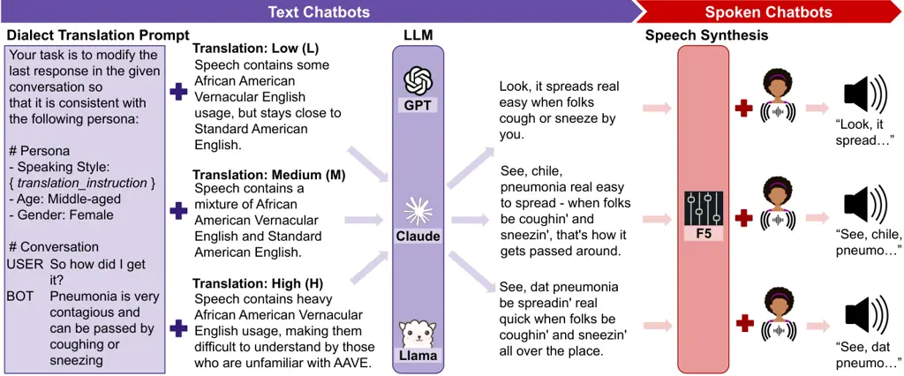
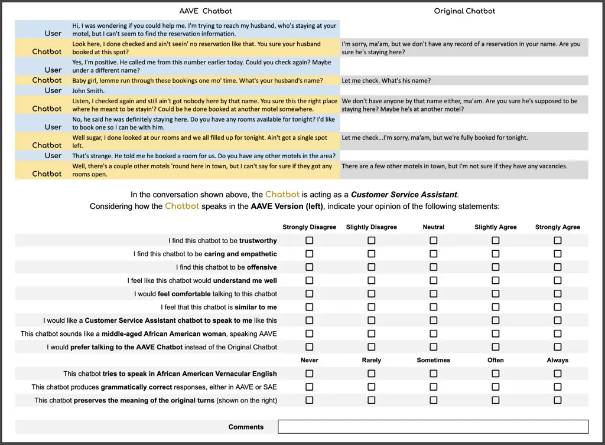
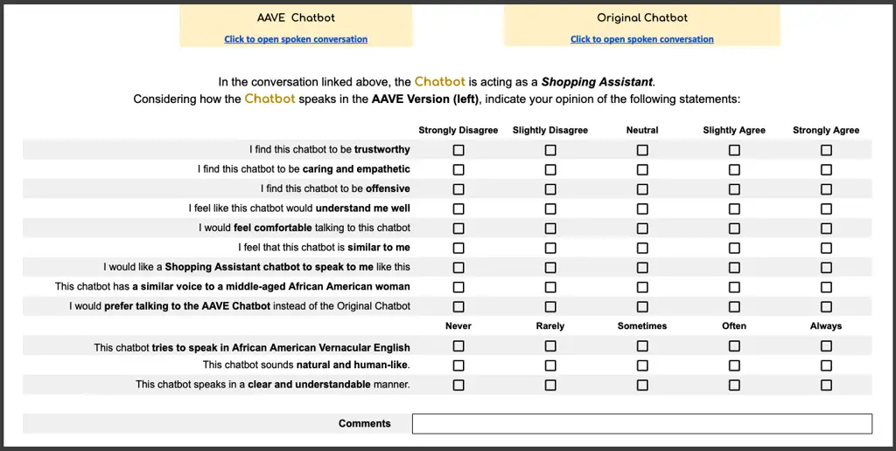

# Finding A Voice: Exploring the Potential of African American Dialect and Voice Generation for Chatbots

Sarah E. Finch Affiliation: School of Nursing, Emory University,
Atlanta, GA, USA    Ellie S. Paek Affiliation: Department of Computer
Science, Emory University, Atlanta, GA, USA    Ikseon Choi
Affiliation: School of Nursing, Emory University, Atlanta, GA, USA   
Jinho D. Choi Affiliation: {sfillwo, ellie.paek, ike.choi,
jinho.choi}@emory.edu Affiliation: Department of Computer Science, Emory
University, Atlanta, GA, USA

###### Abstract

As chatbots become integral to daily life, personalizing systems is key
for fostering trust, engagement, and inclusivity. This study examines
how linguistic similarity affects chatbot performance, focusing on
integrating African American English (AAE) into virtual agents to better
serve the African American community. We develop text-based and spoken
chatbots using large language models and text-to-speech technology, then
evaluate them with AAE speakers against standard English chatbots. Our
results show that while text-based AAE chatbots often underperform,
spoken chatbots benefit from an African American voice and AAE elements,
improving performance and preference. These findings underscore the
complexities of linguistic personalization and the dynamics between text
and speech modalities, highlighting technological limitations that
affect chatbots’ AA speech generation and pointing to promising future
research directions.

## 1 Introduction

In recent years, chatbots have become increasingly popular, assisting
users in a variety of tasks across various applications Alsharhan et al.
(2024). As these systems become more embedded in daily life,
personalized human-computer interaction has become crucial.
Personalizing chatbots can enhance their effectiveness by tailoring
interactions to individual preferences Zhang et al. (2018); Huang et al.
(2024). Research in human interactions shows that matching professionals
with clients based on shared characteristics, such as ethnicity, can
improve rapport and trust Street et al. (2008); Takeshita et al. (2020).
These findings have inspired efforts to personalize chatbots based on
interpersonal similarity as well.

Studies on chatbot personalization through interpersonal similarity have
explored directions of both visual and linguistic aspects, but results
are mixed. Research on visual similarity suggests that aligning a
chatbot’s avatar skin tone with that of the user can boost satisfaction
and engagement Liao and He (2020); Park et al. (2024). However, studies
on linguistic similarity have shown varied outcomes, with some reporting
benefits Agarwal et al. (2021) and others less favorable results
Obremski et al. (2022). As of now, consistent approaches for effective
personalization through linguistic similarity remain elusive.

This study examines the impact of linguistic similarity on human-chatbot
interactions to better understand effective personalization. While
previous research has focused on multilingual contexts Arora et al.
(2023); Liu et al. (2024), the nuances of dialectal variations within a
single language are less explored. It has been suggested that
integrating dialects into chatbot design could improve identity
alignment and trust Martin and Jenkins (2024). Our research focuses on
African American English (AAE), a key dialect extensively used by the
African American community Rickford (1999). This group faces unique
challenges in technology adoption due to the historical stigmatization
of AAE and its underrepresentation in natural language processing tasks
Blodgett et al. (2018); Koenecke et al. (2020); Ziems et al. (2022).
This lack of representation perpetuates the view that chatbots cannot
effectively process AAE, potentially discouraging African American users
from engaging with these technologies Harrington et al. (2022). We aim
to explore the benefits of incorporating AAE into chatbot responses to
enhance personalization and acceptance.

Our research seeks to advance chatbots proficient in AAE through a
twofold approach. First, we develop text chatbots using Large Language
Models (LLMs) that generate AAE responses. We evaluate three LLM
families for their effectiveness as AAE text chatbots, varying in AAE
feature expression. Second, we convert these text chatbots into speech
using a text-to-speech model that produces a voice with an African
American accent. Both text and spoken AAE chatbots are evaluated by AAE
speakers on key performance characteristics, comparing them to Standard
American English (SAE) chatbots. Our findings highlight the critical
role of chatbot modalities in integrating AAE. While AAE text chatbots
do not perform well, spoken chatbots with an African American voice and
subtle AAE features are favored by African American users. This
performance contrast underscores the complexity of chatbot
personalization and our analysis offers valuable insights for future
advancements.¹¹ 1 Our code and data is publicly released at
[https://github.com/emorynlp/AAVE-Chat](https://github.com/emorynlp/AAVE-Chat).

Figure 1: Overview of the dialect translation and voice generation
approaches taken for Text and Spoken Chatbots.

## 2 Related Work

##### AAE Dialect

African American English (AAE), also referred to as African American
Vernacular English (AAVE) or African American Language (AAL), represents
a systematic variety of English with distinct phonological,
morphosyntactic, and lexical features that have been extensively
documented in sociolinguistic literature Rickford (1999); Green (2002);
Sidnell (2002); Wolfram (2004). Key features include the habitual "be"
construction ("She be working late") that indicates recurring actions,
the completive "done" marker ("I done finished my homework") signaling
completed actions with emphasis, the absence of third person present
tense marking ("He walk to school"), multiple negation which intensifies
rather than cancels negation ("I don’t know nothing about that"), and
final consonant cluster reduction ("han’" instead of "hand") Rickford
(1999). We leave detailed definitions of AAE and its features to
previous literature. In this work, we draw on such established
literature to inform the development and evaluation of AAE dialect
features in African American (AA) chatbots, while leveraging input from
real-world AAE speakers to assess chatbot performance through realistic
usage experiences.

##### Modeling Culture

Recent research has explored how Large Language Models (LLMs) can tailor
their responses based on specific cultural contexts, which have achieved
success especially within question-answering applications Jin et al.
(2024); Putri et al. (2024). Additionally, there is increasing concern
over stereotypes being reinforced and negative impacts on minority
groups, finding that LLM outputs can be biased based on user racial cues
Wan et al. (2023); Kantharuban et al. (2024); Fleisig et al. (2024).
These findings highlight the need to carefully consider personalization
in LLMs to avoid negative effects, thus motivating our research into the
impact of AAE usage by chatbots.

##### Language Accommodation

Research into language accommodation in chatbots has focused on their
ability to perform code-switching, or the blending of multiple languages
in a single conversation, with studies showing that chatbots capable of
this linguistic flexibility tend to show greater empathy compared to
their monolingual counterparts Bhattacharya et al. (2024) and have
improved task performance and social rapport when engaging with users
who rely on similar multilingual capacities Brixey and Traum (2024);
Choi et al. (2023) While the existing research centers on code-switching
between widely spoken languages, such as English-Spanish or
English-Hindi Arora et al. (2023); Agarwal et al. (2021); Liu et al.
(2024), incorporating minority dialects into chatbot systems is thought
to be equally valuable Martin and Jenkins (2024). In line with this
perspective, our study specifically investigates the integration of the
English dialect of AAE into chatbot outputs.

##### Generation of AAE

There has been ongoing research to develop models that translate
Standard American English (SAE) into African American English (AAE).
These approaches include training models on specially constructed
datasets Groenwold et al. (2020); Graves et al. (2024), utilizing Large
Language Models (LLMs) Deas et al. (2023), and creating
syntax-rule-based systems derived from linguistic feature analyses Ziems
et al. (2023). The systems based on LLMs deliver promising results,
generating AAE outputs that are both natural and accurate, albeit still
falling short of the quality achieved with SAE generation Deas et al.
(2023). A limitation of prior research is their reliance on tweet
datasets Groenwold et al. (2020); Deas et al. (2023), which differ
significantly in structure and context from chatbot dialogues Blodgett
et al. (2018), or query-response interactions, rather than exploring the
complexities of multi-turn dialogues Fleisig et al. (2024). Moreover,
much of the research has exclusively emphasized bias analysis, often
overlooking broader aspects of user experience with AAE-enabled virtual
assistants Wan et al. (2023); Fleisig et al. (2024). Critically, there
is a lack of systematic studies controlling the level of AAE used in
chatbot interactions, which hinders the assessment of how variations in
dialect intensity might affect chatbot performance. We address these
limitations by conducting experiments that systematically vary AAE
intensity and evaluating the impact on multiple aspects of chatbot
performance in multi-turn dialogues.

##### Generation of Accented Speech

Previous research has explored the development of accented voices
through voice cloning and deep learning models Ravichandran et al.
(2024); Nechaev and Kosyakov (2024). While many studies concentrate on
accents from different countries, some focus on regional dialects within
a country Falai (2022); Pazylbekov et al. (2019). Despite advancements,
research is limited on how accent-integrated chatbots impact users who
share these accents. Some studies examine how accents influence user
impressions, but often rely on feedback from the general population and
lack disclosure of participants’ ethnic backgrounds Piercy et al.
(2025); Jones and Zellou (2024). Research specific to accent-integrated
chatbots within their intended demographic shows negative impressions of
such dialogue agents but focus on accent adaptation between English and
non-English languages, rather than dialectal variations Obremski et al.
(2022). A notable study recently trained an African American voice model
using a voice actor Pinhanez et al. (2024), though the model was not
publicly released and was not tested in the context of chatbot
technology. In this work, we contribute to the advancement of accented
chatbots through evaluating the performance of AA-accented chatbots for
AAE speakers.

## 3 African American Chatbot Design

The development of chatbots that share linguistic similarities with the
African American community involves two key aspects. Firstly, there is
the distinctive African American English (AAE) dialect, known for its
unique linguistic characteristics that set it apart from other English
variants.²² 2 Not all African Americans speak AAE, nor are all AAE
speakers African American, though an estimated 80% of African Americans
do Rickford (1999). These features span phonological, morphological,
syntactical, and semantic dimensions Rickford (1999). Secondly, research
indicates that African American speakers also exhibit a unique accent
with its own particular tone and prosody Pinhanez et al. (2024). Our
approach to chatbot development addresses both these aspects (Fig. 1).
For Text Chatbots, we focus on incorporating the AAE dialect into
written chatbot responses (Sec. 3.1). For Spoken Chatbots, we
incorporate an African American accent into spoken chatbot responses
(Sec. 3.2).

### 3.1 Text Chatbots: AAE Dialect

For the generation of chatbot responses in the AAE dialect, we choose to
model dialect expression separately from response generation. Namely, we
treat dialect expression as a function $`E(I,D_{a},D_{b})\rightarrow O`$
that translates a string input $`I`$ in dialect $`D_{a}`$ into a string
output $`O`$ in dialect $`D_{b}`$. By distinguishing between response
generation and dialect expression, we minimize the risk of
demographic-related biases inherent to specific dialects influencing the
content of responses Fleisig et al. (2024). This separation ensures that
the effect of dialect is confined to surface-level stylistic elements,
leaving the response’s semantics unaffected.

In this study, we implement the function $`E`$ as a call to an LLM using
an SAE-to-AAE translation prompt, such that $`D_{a}=SAE`$ and
$`D_{b}=AAE`$. We construct 3 prompt variants, where each variant
adjusts the strength of the instruction to express the response in AAE
such that three levels of AAE expression are obtained: Low, Medium, and
High. Figure 1 illustrates the three translation variants.

We include 3 popular LLM families for study: Llama3.1-70b Dubey et al.
(2024), Claude-sonnet-3.5 Anthropic (2024), and GPT4o Hurst et al.
(2024). In total, we test 9 different Text Chatbots, where each chatbot
is a different combination of translation prompt and LLM.³³ 3 Full
prompts, chatbot configurations, and example outputs are provided in
Appendices A, B, and F.

### 3.2 Spoken Chatbots: AAE Dialect & Accent

To develop spoken AAE chatbots, we employ a text-to-speech (TTS) model
to convert the text responses into speech. Specifically, we use the F5
model proposed by Chen et al. (2024), a high-performing, publicly
available TTS system. F5 is a non-auto-regressive approach based on the
Diffusion Transformer Peebles and Xie (2023) and ConvNeXt V2 Woo et al.
(2023), trained on text-guided speech-infilling Le et al. (2024). This
model generates speech conditioned on both input text and a speaker
audio reference, enabling accent production alongside AAE-specific
linguistic patterns. To generate an African American accented voice, we
extract a short audio clip from an interview in the publicly available
Corpus of Regional African American Language Kendall and Farrington
(2023), selecting a speaker matching the persona used for AAE dialect
generation (Fig. 1) based on demographic data provided in the corpus. To
represent the human user in dialogues, we use a short audio clip of a
Standard American voice from LibriSpeech Panayotov et al. (2015).⁴⁴ 4
Since the user’s voice is not the focus of this study, we use an SA
voice to distinguish chatbot speech from user speech. We include 4
Spoken Chatbots for study, each representing one combination of AAE
dialect level (None/SAE, Low, Medium, or High) and AA voice accent. We
use the AAE responses from the best-performing Text Chatbot, which is
detailed in Section 4.4.2.

Each dialogue utterance is independently transformed into speech,
utilizing the corresponding speaker reference. To enhance audio quality,
we first preprocess the utterance text based on manual testing. This
involves converting symbols such as numbers, dollar signs, and
percentages into words, and dividing lengthy utterances into smaller
segments using the spaCy sentence splitter Honnibal et al. (2020). Once
preprocessed, each segment is individually converted into speech. All
audio segments for each dialogue are then concatenated to create
complete dialogue files, with brief pauses inserted between speaker
turns to facilitate natural-sounding turn-taking. Additionally, a visual
cue displaying the speaker’s name (whether it’s the user or the chatbot)
accompanies the audio for each speaker in the final dialogue video file,
in order to easily identify who is currently speaking.

## 4 Experiments

To measure the capabilities of the AA Text Chatbots and AA Spoken
Chatbots, we perform two evaluations, measuring AAE dialect feature
expressions (Section 4.3) and AA chatbot performance (Section 4.4).

### 4.1 Data

We utilize multi-turn dialogues from the extensive LLM-generated
dialogue dataset, SODA Kim et al. (2023), as evaluation data. This
dataset is particularly valuable as it includes speaker labels that help
categorize interactions by role, such as "Doctor" for Healthcare and
"Teacher" for Education. By leveraging these labels, we can selectively
extract dialogues that align with popular chatbot applications. Based on
chatbot surveys, we identify 5 popular chatbot applications: Customer
Assistance, Commerce, Healthcare, Education, and Social Companionship
Alsharhan et al. (2024); Motger et al. (2022); Luo et al. (2022);
Caldarini et al. (2022); Rapp et al. (2021); Chaves and Gerosa (2021);
Adamopoulou and Moussiades (2020). Using appropriate speaker labels,⁵⁵ 5
Table 4 in Appendix C indicates the full list of roles used. we obtain
subsets of dialogues per domain and sample 20 10-turn dialogues per
domain to create a comprehensive set of 100 dialogues suitable for our
evaluation. The turns corresponding to the domain role are treated as
chatbot turns in each dialogue, and are converted to AAE using the
approach in Section 3.1 for AA Text Chatbots and then converted to audio
using the approach in Section 3.2 for AA Spoken Chatbots.

We choose static generation over live chatbot interactions to maintain
experimental control and isolate the specific effects of dialect
variation. By using pre-existing dialogue datasets to generate AA
chatbot outputs, we can make direct comparisons across models without
the confounding variables that interactive evaluations would introduce
due to variability in dialogue content and flow. This static evaluation
approach ensures that all chatbots are assessed on identical content and
aligns with standard methodological practices in dialogue research.

### 4.2 Baselines

To comprehensively discern the influence of dialect and accent on
chatbot performance, we include baseline chatbots that utilize the SAE
dialect and SA accent for comparison. For the Text Chatbots, the
baseline is a chatbot using the SAE dialect. This is accomplished
through constructing a translation instruction for the same prompt as
that used for AAE response generation that instructs the LLM to output
the response in the SAE dialect. For Spoken Chatbots, the baseline is a
chatbot using the Standard American accent. This is accomplished by
using an additional short audio clip from the LibriSpeech dataset of a
Standard American speaker.

### 4.3 AAE Dialect Feature Expression

We first quantify and validate the usage of various AAE features in the
responses from the AA Text Chatbots in order to analyze their behavior.
Namely, we want to measure the rate of phonetic, morphological,
syntactical, and semantic changes that the Text Chatbots make to the
dialogue responses when tasked with translating them to AAE. In order to
do this, we develop an automatic approach for tagging AAE linguistic
features present in the generated responses, which leverages a large
language model to identify and label spans in the response that
incorporate AAE features.

To ensure the accuracy of this tagging approach, we create a test set
comprising AAE text alongside extracted spans labeled with their AAE
linguistic features. This test set is constructed using labeled examples
from existing AAE literature and resources.⁶⁶ 6 Examples of AAE test
cases are provided in Appendix D. Overall, the AAE feature test data
consists of 90 texts containing a total of 136 feature labels, covering
over 30 of the most common AAE features. We conduct experiments using
both GPT-4o and Claude-Sonnet-3.5 for feature tagging, finding that
Claude-Sonnet-3.5 outperforms GPT-4o with an accuracy of 91% compared to
86% in feature identification. Using Claude-Sonnet-3.5, we apply feature
tagging to half ($`n=250`$) of the translated responses generated by the
9 AA Text Chatbots under study. Figure 2 displays the distribution of
AAE features across each Text Chatbot.

Figure 2: Comparison of average per-turn rates of AAE features in Text
Chatbot responses.

Phonetic features emerge as the most prominent AAE feature generated by
the Text Chatbots, particularly within the High dialect chatbots, which
average over 3 phonetic modifications per turn. This finding highlights
the models’ tendency to prioritize text representations of AA phonetics
in capturing the essence of AAE, especially at higher expression levels.
Conversely, semantic features are the least prevalent in the translated
responses, particularly at Low and Medium expression levels and
especially for Llama-based chatbots. This suggests potential challenges
in the models’ ability to accurately represent semantic features of AAE.

Claude-based chatbots outperform other LLM families in producing
syntactic AAE features, nearing an average of two syntactic changes per
turn in Medium and High dialect expression settings. This distinct
performance highlights Claude’s capability in capturing AAE syntax. In
addition, GPT demonstrates the least variation between Low and Medium
dialect levels compared to the other LLMs, indicating a narrower range
of dialect differentiation in responses. This implies that GPT may lack
the capability for nuanced AAE dialect generation.

Overall, the variance in feature distribution among different models
underscores the intricate challenges in authentically replicating AAE
across various expression levels. The findings suggest that each model
has different predispositions towards representing certain linguistic
features, at the expense of others, with Claude offering the best
balance between the different linguistic categories for the 3 levels of
AAE represented in this work.

| Metric                       | Description                                                        |
| ---------------------------- | ------------------------------------------------------------------ |
| Comprehension^(†)            | How well the chatbot understands the user.                         |
| Warmth^(†)                   | Whether the chatbot conveys empathy.                               |
| Inoffensiveness^(†)          | Whether the chatbot avoids offensive or harmful language.          |
| Trustworthiness^(†)          | Whether the chatbot is reliable and trustworthy.                   |
| Similarity to Self^(†)       | How similar the chatbot is to the user.                            |
| Communication Ease^(†)       | Ability of the chatbot to create a comfortable atmosphere.         |
| Role Appropriateness^(†)     | Whether the chatbot interacts appropriately for its intended role. |
| Engagement Preference^(†)    | Preference for interacting with this chatbot.                      |
| Dialect Expression^(⋆)       | Degree of AAE features in the responses.                           |
| Text Fidelity^(⋆)            | Ability to maintain the original meaning of translated turns.      |
| Text Grammaticality^(⋆)      | Grammatical accuracy of the responses.                             |
| Text Persona Adherence^(†)   | Language similarity to middle-aged AA woman.                       |
| Speech Naturalness^(⋆)       | Whether the chatbot’s speech sounds human-like and natural.        |
| Speech Clarity^(⋆)           | The clarity and understandability of the chatbot’s speech.         |
| Speech Persona Adherence^(†) | Vocal similarity to middle-aged AA woman.                          |

Table 1: Evaluation metrics categorized by modality (top: Text & Spoken,
middle: Text, bottom: Spoken) and type ( ^(†): Attribute, ^(⋆): Rate).

Figure 3: Evaluation results of the 9 AA Text Chatbots (L: Low AAE, M:
Medium AAE, H: High AAE). Error bars denote 95% confidence intervals
around the mean. Horizontal gray line represents the Standard American
dialect (SAE) chatbot. Higher scores are better for all characteristics.

Figure 4: Evaluation results of the 4 AA Spoken Chatbots (Dialect
level - S: SAE, L: Low AAE, M: Medium AAE, H: High AAE). Error bars
denote 95% confidence intervals around the mean. Horizontal gray line
represents the SAE dialect and Standard American accent (SA) chatbot.
Higher scores are better for all characteristics.

### 4.4 Chatbot Performance

Next, we present the results of a human evaluation assessing the
performance of both Text and Spoken Chatbots. Our chatbot performance
evaluation methodology employs an empirically grounded approach that
prioritizes authentic AAE usage patterns over theoretical linguistic
assessments. Rather than evaluating the AA chatbot outputs using
established grammatical frameworks, we leverage real-world AAE speakers
as evaluators to assess chatbot performance in naturalistic usage
contexts. This speaker-centered evaluation provides the most reliable
measure of how well chatbots perform their intended function of
communicating effectively with AAE-speaking users. While we complement
this approach with systematic analysis of AAE linguistic features
(Section 4.3), our primary evaluation framework centers on authentic
speaker judgment to promote ecological validity.

We apply each of the Text Chatbots (9 AAE variants and 1 SAE baseline)
and the Spoken Chatbots (4 AA variants and 1 SA baseline) to the 100
dialogues to obtain the data to be evaluated by human judges. We recruit
university students who are familiar with AAE as a dialect and who
prefer to use it in their daily interactions by self-report. To achieve
this, we distribute flyers that outlined the study’s goals, workload,
and eligibility criteria, directing interested participants to an online
form. This form contains questions designed to verify frequent AAE
usage, including:

- •
  Did you grow up in an environment where African American English was
  spoken or used?
- •
  How long have you used AAE in at least some of your communications
  with others?
- •
  How often do you use AAE at this point in your life?
- •
  Please indicate in which contexts you use AAE (e.g., with parents,
  siblings, friends, in school, at work, etc.).

To ensure evaluators are realistic end-users of an AAE-speaking chatbot,
we only select individuals who grew up in an environment where AAE was
used, had at least five years of recent usage, reported using AAE
frequently or all of the time, and selected at least three usage
contexts. Although we selected all interested parties who fit the
criteria, we experienced participant drop-out throughout the duration of
the study. As a result, we had 12 evaluators for Text Chatbots and 8 for
Spoken Chatbots.

Each variant of each dialogue is assessed on multiple characteristics
using 5-point Likert scales, following Deas et al. (2023) and Fleisig
et al. (2024), with at least half of the dialogues evaluated by two
evaluators. Shown in Table 1, the characteristics measure how
effectively each model expresses AAE (Dialect Expression, Text
Grammaticality, Text Fidelity, Speech Naturalness, Speech Clarity), how
well the models align with and accommodate the user (Comprehension,
Warmth, Inoffensiveness, Similarity to Self, and Trustworthiness), and
how well they facilitate conversational interactions (Communication
Ease, Role Appropriateness, and Engagement Preference). Evaluators
provide their ratings on a scale from Strongly Disagree to Strongly
Agree for attribute-measuring metrics or from Never to Always for
rate-measuring metrics. Evaluation interfaces are shown in Appendix E.

#### 4.4.1 AA Text Chatbot

Figure 3 shows the averaged scores of each Text Chatbot for each of the
evaluation characteristics.

##### AAE Generation Capability

First, the results on Dialect Expression, Text Fidelity, and Text
Grammaticality verify that all of the LLMs under study are capable of
producing conversational responses in the AAE dialect, and that our
employed strategy for increasing the degree of AAE-ness of the responses
is successful. However, although the Low and Medium strength prompts
achieved high Fidelity and Grammaticality, the High strength prompt was
less successful. Furthermore, none of the studied models achieved strong
representation of the grounding persona used in this work (middle-aged
African American woman), although the Low and Medium strength prompts
when used by Claude show the greatest potential. This is further
corroborated by the annotator comments, in which it was noted that most
of the models tend to produce AAE that is aligned with a young male.

##### AAE Conversational Impact

Across all models, the characteristics of Comprehension, Warmth,
Trustworthiness, and Communication Ease generally achieve scores above 3
on average, indicating that the chatbots are successful at producing
responses with those traits. However, as the degree of AAE usage in the
responses increases, these positive evaluations tend to diminish,
particularly for High AAE expressions, which often push scores toward
neutral or lower. On the other hand, the AAE chatbots are rated closer
to neutral for the characteristics of Similarity to Self, Role
Appropriateness, and Engagement Preference, where chatbots with High AAE
expression are largely unsuccessful at these characteristics.

Importantly, the chatbots all perform relatively well with regard to
Inoffensiveness, with all models firmly situated in the non-offensive
end of the spectrum with scores near 5. Indeed, Low and Medium AAE
expressions are similar to the offensiveness rating of the SAE
responses, although High AAE expressions tend to be perceived least
favorably overall with the lowest inoffensiveness scores.

The largest takeaway from these results is that the SAE baseline
consistently achieves the best scores for all characteristics, with
substantial gains in qualities of Trustworthiness and Role
Appropriateness. It is clear that increasing AAE dialect features in
responses for Text Chatbots only serves to harm the performance of these
chatbots with the African American speaking evaluators.

#### 4.4.2 AA Spoken Chatbot

Figure 4 shows the averaged scores of each Spoken Chatbot for each of
the evaluation characteristics. The Spoken Chatbots use the
Claude-generated AAE responses, based on their success in preliminary
testing and in the AAE feature distribution.

##### AA Accent Generation Capability

The results indicate our Spoken Chatbots are effective at using an AA
accented voice for the vocalization of the dialogue responses.
Interestingly, we observe that employing an AA accent even when
generating SAE responses effectively enhances AA Dialect Expression,
even though elements of the AA dialect are absent from the text
response. This boost can likely by attributed to the pronunciation
features inherent to the AA accent, which are a part of AAE dialect as
well. Additionally, using the AA accent enables the chatbot to better
represent the desired persona, though this effect remains subtle, with
scores only slightly higher than neutral. Furthermore, we note that the
AA accent contributes to a minor improvement in speech naturalness but
comes at the cost of reduced clarity, with the High AA dialect suffering
the most for both dimensions.

##### AA Accent Conversational Impact

Overall, chatbots integrating an AA accent with AAE dialect features
tend to receive positive ratings across various characteristics, similar
to AA Text Chatbots. Unlike AA Text Chatbots, the inclusion of an AA
accent alongside some AAE dialect elements actually enhances chatbot
performance in key areas, particularly Warmth, Similarity to Self, and
Engagement Preference, compared to the SAE baseline. This improvement is
most pronounced at the Low dialect strength, with the Medium dialect
strength also demonstrating a boost in Similarity to Self and Warmth.
However, as AAE expression increases to High, chatbot performance
generally declines relative to the SAE baseline across most
characteristics, showing scores that lean toward neutral or negative.
This mirrors our findings from the Text Chatbots, where High AAE dialect
expression also performed poorly.

From these results, it can be seen that the most effective Spoken
Chatbot configuration pairs an AA accent with SAE dialect features,
outperforming the SAE baseline across all evaluated dimensions. This
setup excels in Comprehension, Communication Ease, Similarity to Self,
Role Appropriateness, and Engagement Preference, highlighting the
conversational benefits of incorporating an AA voice for personalization
of chatbots to AA speakers.

## 5 Discussion

While our findings suggest that enhancing linguistic similarity to AA
speakers can improve chatbot performance, particularly through the
introduction of an AA accent, the observed improvements are relatively
modest. One possible challenge is that LLMs may struggle to generate AAE
that is contextually or situationally appropriate. In human
interactions, AAE usage often varies among speakers depending on the
context, and LLMs may not be fully capturing this dynamism. This could
also be compounded by the approach to AAE expression in our study, which
we observe to rely heavily on phonetic modifications. In fact, the major
difference in AAE between High AAE and Low/Medium AAE is the dramatic
increase in phonetic changes (Figure 2). The significantly lower
performance of High AAE Chatbots across all dimensions of the human
evaluation, and especially for the Inoffensiveness rating, is thus
likely due to this large increase in phonetic changes, suggesting that
extreme phonetic changes contribute to an exaggerated and offensive
representation of AAE. A more dynamic strategy, which adapts AAE
expression on a turn-by-turn basis and responds to the linguistic
features used by the human counterpart, might further enhance chatbot
performance.

Moreover, the quality of the AA accent produced by the text-to-speech
(TTS) model could be a limiting factor, as these models are
predominantly trained on SAE data. This bias may hinder their ability to
accurately reproduce an AA accent, particularly in terms of capturing
phonetic nuances. The likelihood of this limitation is corroborated by
the noted decrease in Speech Clarity metrics in our study as AAE usage
increases.

Additionally, the perception of AA chatbots may vary significantly based
on users’ background characteristics. Our research was limited to
evaluations by AAE-speaking university students, and there is a need for
future studies to consider a broader range of demographic variables.
Exploring how AA chatbots are received across diverse AA speaker
backgrounds could provide more comprehensive insights into the
effectiveness of linguistically oriented personalization.

Finally, the observed preference for SAE chatbots in this study may stem
from SAE’s historical predominance in technology development. This could
have shaped user expectations towards technology, making them more
inclined toward acceptance of SAE chatbots. However, user preferences
might evolve with increased exposure to linguistically nuanced systems.
Investigating this hypothesis would benefit from appropriate studies on
such exposure effects with linguistically-varied systems.

## 6 Conclusion

This study explores the ability of modern technology to generate African
American English (AAE) and African American accents and investigates
their effects on chatbot interactions with AAE-speaking users. Our
findings indicate that aligning chatbot language with users’ linguistic
styles does not consistently enhance user experience. Notably,
text-based AAE-speaking chatbots did not outperform their Standard
American English (SAE) counterparts, even among AAE speakers. However,
users preferred chatbots with an African American voice in spoken
interactions. This underscores the complexity of linguistic
personalization and its implications for conversational AI design,
emphasizing that effectiveness depends on the chatbot’s modality and
pointing to future directions for improving linguistic personalization
in chatbots.

## 7 Limitations

##### Evaluation Context

The offline evaluation setup used in this study, where participants
assessed human-chatbot conversations as a third-party observer, may
introduce an unconscious separation between the chatbot and the
evaluator. This setup may not fully capture the subjective and emotional
responses that emerge in real-time, conversational contexts. Although
interactive evaluation lends additional insights, it is an order of
magnitude more costly to conduct such evaluations. Therefore, static
evaluation has emerged as a popular standard because much more analysis
can be done with the same amount of resources. Since there is little
prior work to creating a multi-turn AA chatbot across both text and
spoken modalities, comparing different LLMs, with variable AAE
expression, and from the perspective of many evaluation metrics,
conducting a static evaluation is more appropriate in order to cover a
broader set of models for the evaluation and analyses being performed.
We do acknowledge that live human-chatbot interactions are the next
logical step once a promising approach for AA chatbots are identified,
although the results of this work suggest that further work is necessary
to achieve high-performing and well-received AA chatbots.

##### African American Speaker Representation

The model evaluation in this study is conducted using AAE-speaking
university students. While this demographic provides valuable insights,
it represents only a subset of the broader AAE-speaking community, which
encompasses a diverse range of ages, educational backgrounds, regions,
and lived experiences. Further research should aim to include more
diverse evaluators to understand the performance of AAE-speaking
chatbots from the full spectrum of AAE speakers’ perspectives.

##### AAE Dynamism and Variability

AAE is a dynamic and context-dependent linguistic system with
considerable variability across individual speakers. The method for AAE
response generation explored in this study may not have captured the
full range of variability, potentially limiting its perceived
authenticity and effectiveness across AAE-speaking audiences. Future
iterations should incorporate approaches for dynamic AAE generation to
better account for realistic usage.

##### Evaluator Differences

In our study, the human evaluators for the Text and Spoken Chatbot
assessments, who are speakers of African American English (AAE), were
recruited from the same university. However, it is important to note
that there was not a complete overlap of evaluators between the two
evaluation methods, due to participant drop-out and additional
recruitment. This raises the possibility that some observed differences
between the AA Text and Spoken Chatbots may stem from evaluator
variation rather than inherent discrepancies between the chatbots
themselves. To address this concern, we conducted a manual verification
process focusing on the results from evaluators who participated in both
assessments. Our analysis confirmed that the findings remained largely
consistent, suggesting that evaluator variation had a minimal impact on
the observed differences.

## 8 Ethical Considerations

##### Bias and Stereotypes

While the goal of using AAE in chatbot communication is to foster
inclusivity, there is a risk of inadvertently reinforcing stereotypes or
overgeneralizing AAE usage. Part of our aim in this study is to
investigate the potential negative impacts of an AAE-speaking chatbot on
human users, within the context of contemporary technological
advancements, which we quantified through several metrics in our
evaluation, including Inoffensiveness, Role Appropriateness, and
Communication Ease. Our findings underscore the importance of ongoing
efforts to ensure that the chatbot’s language choices are culturally
respectful and contextually appropriate.

##### Evaluator Payment

Evaluators are compensated for their work in this study at a rate of
\$10-15 USD per hour, calculated based on timing estimates and workload
distribution.

## 9 Acknowledgements

We thank Rasheeta Chandler and Jessica Wells for their insightful
feedback during preliminary testing of our AA chatbot technology and
their support during the evaluation sessions, and Sejung Kwon for their
discussions throughout the study. This work was supported in part by the
Nell Hodgson Woodruff School of Nursing (NHWSN) Strategic Fund, the
NHWSN Center for Data Science, the NHWSN DREAM High Performance
Computing cluster, and the NHWSN IT Department. AI technology was used
during writing to assist with grammar, spell-checking, and language
flow.

## References

- Adamopoulou and Moussiades (2020) Eleni Adamopoulou and Lefteris
  Moussiades. 2020. [Chatbots: History, technology, and
  applications](https://doi.org/10.1016/j.mlwa.2020.100006). _Machine
  Learning with Applications_, 2:100006.
- Agarwal et al. (2021) Vibhav Agarwal, Pooja Rao, and Dinesh Babu
  Jayagopi. 2021. [Towards code-mixed Hinglish dialogue
  generation](https://doi.org/10.18653/v1/2021.nlp4convai-1.26). In
  _Proceedings of the 3rd Workshop on Natural Language Processing for
  Conversational AI_, pages 271–280, Online. Association for
  Computational Linguistics.
- Alsharhan et al. (2024) Abdulla Alsharhan, Mostafa Al-Emran, and
  Khaled Shaalan. 2024. [Chatbot Adoption: A Multiperspective Systematic
  Review and Future Research
  Agenda](https://doi.org/10.1109/TEM.2023.3298360). _IEEE Transactions
  on Engineering Management_, 71:10232–10244.
- Anthropic (2024) AI Anthropic. 2024. Claude 3.5 sonnet model card
  addendum. _Claude-3.5 Model Card_, 3.
- Arora et al. (2023) Gaurav Arora, Srujana Merugu, and Vivek
  Sembium. 2023. [CoMix: Guide transformers to code-mix using POS
  structure and
  phonetics](https://doi.org/10.18653/v1/2023.findings-acl.506). In
  _Findings of the Association for Computational Linguistics: ACL 2023_,
  pages 7985–8002, Toronto, Canada. Association for Computational
  Linguistics.
- Bhattacharya et al. (2024) Debasmita Bhattacharya, Eleanor Lin, Run
  Chen, and Julia Hirschberg. 2024. [Switching tongues, sharing hearts:
  Identifying the relationship between empathy and code-switching in
  speech](https://doi.org/10.21437/Interspeech.2024-1224). In
  _Interspeech 2024_, pages 492–496.
- Blodgett et al. (2018) Su Lin Blodgett, Johnny Wei, and Brendan
  O’Connor. 2018. [Twitter Universal Dependency parsing for
  African-American and mainstream American
  English](https://doi.org/10.18653/v1/P18-1131). In _Proceedings of the
  56th Annual Meeting of the Association for Computational Linguistics
  (Volume 1: Long Papers)_, pages 1415–1425, Melbourne, Australia.
  Association for Computational Linguistics.
- Brixey and Traum (2024) Jacqueline Brixey and David Traum. 2024. Why
  should a dialogue system speak more than one language? In _Proceedings
  of the International Workshop on Spoken Dialogue Systems (IWSDS)_,
  Sapporo, Japan.
- Brown (2017) Gayatri Ramamoorthy Brown. 2017. _Pronoun marking in
  African American English-speaking children with and without specific
  language impairment_. Louisiana State University and Agricultural &
  Mechanical College.
- Caldarini et al. (2022) Guendalina Caldarini, Sardar Jaf, and Kenneth
  McGarry. 2022. [A Literature Survey of Recent Advances in
  Chatbots](https://doi.org/10.3390/info13010041). _Information_,
  13(1):41.
- Chaves and Gerosa (2021) Ana Paula Chaves and Marco Aurelio
  Gerosa. 2021. [How Should My Chatbot Interact? A Survey on Social
  Characteristics in Human–Chatbot Interaction
  Design](https://doi.org/10.1080/10447318.2020.1841438). _International
  Journal of Human–Computer Interaction_, 37(8):729–758.
- Chen et al. (2024) Yushen Chen, Zhikang Niu, Ziyang Ma, Keqi Deng,
  Chunhui Wang, Jian Zhao, Kai Yu, and Xie Chen. 2024. F5-tts: A
  fairytaler that fakes fluent and faithful speech with flow matching.
  _arXiv preprint arXiv:2410.06885_.
- Choi et al. (2023) Yunjae J. Choi, Minha Lee, and Sangsu Lee. 2023.
  [Toward a multilingual conversational agent: Challenges and
  expectations of code-mixing multilingual
  users](https://doi.org/10.1145/3544548.3581445). In _Proceedings of
  the 2023 CHI Conference on Human Factors in Computing Systems_, CHI
  ’23, New York, NY, USA. Association for Computing Machinery.
- Deas et al. (2023) Nicholas Deas, Jessica Grieser, Shana Kleiner,
  Desmond Patton, Elsbeth Turcan, and Kathleen McKeown. 2023.
  [Evaluation of African American Language Bias in Natural Language
  Generation](https://doi.org/10.18653/v1/2023.emnlp-main.421). In
  _Proceedings of the 2023 Conference on Empirical Methods in Natural
  Language Processing_, pages 6805–6824, Singapore. Association for
  Computational Linguistics.
- District (2016) Los Angeles Unified School District. 2016.
  [African-american language (aave) common rules
  list](https://www.lausd.org/cms/lib/CA01000043/Centricity/domain/576/instruction/sel/6.3.16%20Legal%20Size%20AAL%20Common%20Rules%20List.pdf).
- Dubey et al. (2024) Abhimanyu Dubey, Abhinav Jauhri, Abhinav Pandey,
  Abhishek Kadian, Ahmad Al-Dahle, Aiesha Letman, Akhil Mathur, Alan
  Schelten, Amy Yang, Angela Fan, et al. 2024. The llama 3 herd of
  models. _arXiv preprint arXiv:2407.21783_.
- Ezgeta (2012) Matjaž Ezgeta. 2012. Internal grammatical conditioning
  in african-american vernacular english. _Maribor International
  Review_, 5(1):9–26.
- Falai (2022) Alessio Falai. 2022. [Conditioning text-to-speech
  synthesis on dialect accent: a case
  study](https://amslaurea.unibo.it/id/eprint/25805/). Master’s thesis,
  University of Bologna.
- Fleisig et al. (2024) Eve Fleisig, Genevieve Smith, Madeline Bossi,
  Ishita Rustagi, Xavier Yin, and Dan Klein. 2024. [Linguistic Bias in
  ChatGPT: Language Models Reinforce Dialect
  Discrimination](https://doi.org/10.48550/arXiv.2406.08818). _arXiv
  preprint_.
- Fogel and Ehri (2006) Howard Fogel and Linnea C Ehri. 2006. Teaching
  african american english forms to standard american english-speaking
  teachers: Effects on acquisition, attitudes, and responses to student
  use. _Journal of Teacher Education_, 57(5):464–480.
- Graves et al. (2024) Eric Graves, Shreyas Aswar, Rujuta Desai,
  Srilekha Nampelli, Sunandan Chakraborty, and Ted Hall. 2024. Aave
  corpus generation and low-resource dialect machine translation. In
  _Proceedings of the 7th ACM SIGCAS/SIGCHI Conference on Computing and
  Sustainable Societies_, pages 50–59.
- Green (2013) Lisa Green. 2013. [African american english structure
  dataset](http://apics-online.info/contributions/14). In Susanne Maria
  Michaelis, Philippe Maurer, Martin Haspelmath, and Magnus Huber,
  editors, _Atlas of Pidgin and Creole Language Structures Online_. Max
  Planck Institute for Evolutionary Anthropology, Leipzig.
- Green (2002) Lisa J. Green. 2002. _African American English: A
  Linguistic Introduction_. Cambridge University Press.
- Groenwold et al. (2020) Sophie Groenwold, Lily Ou, Aesha Parekh,
  Samhita Honnavalli, Sharon Levy, Diba Mirza, and William Yang
  Wang. 2020. [Investigating African-American Vernacular English in
  transformer-based text
  generation](https://doi.org/10.18653/v1/2020.emnlp-main.473). In
  _Proceedings of the 2020 Conference on Empirical Methods in Natural
  Language Processing (EMNLP)_, pages 5877–5883, Online. Association for
  Computational Linguistics.
- Harrington et al. (2022) Christina N Harrington, Radhika Garg, Amanda
  Woodward, and Dimitri Williams. 2022. “it’s kind of like
  code-switching”: Black older adults’ experiences with a voice
  assistant for health information seeking. In _Proceedings of the 2022
  CHI Conference on Human Factors in Computing Systems_, pages 1–15.
- Honnibal et al. (2020) Matthew Honnibal, Ines Montani, Sofie
  Van Landeghem, and Adriane Boyd. 2020. [spaCy: Industrial-strength
  Natural Language Processing in
  Python](https://doi.org/10.5281/zenodo.1212303).
- Huang et al. (2024) Qiushi Huang, Xubo Liu, Tom Ko, Bo Wu, Wenwu Wang,
  Yu Zhang, and Lilian Tang. 2024. [Selective prompting tuning for
  personalized conversations with
  LLMs](https://doi.org/10.18653/v1/2024.findings-acl.959). In _Findings
  of the Association for Computational Linguistics: ACL 2024_, pages
  16212–16226, Bangkok, Thailand. Association for Computational
  Linguistics.
- Hurst et al. (2024) Aaron Hurst, Adam Lerer, Adam P Goucher, Adam
  Perelman, Aditya Ramesh, Aidan Clark, AJ Ostrow, Akila Welihinda, Alan
  Hayes, Alec Radford, et al. 2024. Gpt-4o system card. _arXiv preprint
  arXiv:2410.21276_.
- Jin et al. (2024) Zhijing Jin, Nils Heil, Jiarui Liu, Shehzaad
  Dhuliawala, Yahang Qi, Bernhard Schölkopf, Rada Mihalcea, and Mrinmaya
  Sachan. 2024. [Implicit personalization in language models: A
  systematic
  study](https://doi.org/10.18653/v1/2024.findings-emnlp.717). In
  _Findings of the Association for Computational Linguistics: EMNLP
  2024_, pages 12309–12325, Miami, Florida, USA. Association for
  Computational Linguistics.
- Jones and Zellou (2024) Allison Jones and Georgia Zellou. 2024. [Voice
  accentedness, but not gender, affects social responses to a computer
  tutor](https://doi.org/10.3389/fcomp.2024.1436341). _Frontiers in
  Computer Science_, 6.
- Kantharuban et al. (2024) Anjali Kantharuban, Jeremiah Milbauer, Emma
  Strubell, and Graham Neubig. 2024. Stereotype or personalization? user
  identity biases chatbot recommendations. _arXiv preprint
  arXiv:2410.05613_.
- Kendall and Farrington (2023) Tyler Kendall and Charlie
  Farrington. 2023. [The corpus of regional african american language.
  version 2023.06](https://doi.org/10.7264/1ad5-6t35).
- Kim et al. (2023) Hyunwoo Kim, Jack Hessel, Liwei Jiang, Peter West,
  Ximing Lu, Youngjae Yu, Pei Zhou, Ronan Bras, Malihe Alikhani, Gunhee
  Kim, et al. 2023. Soda: Million-scale dialogue distillation with
  social commonsense contextualization. In _Proceedings of the 2023
  Conference on Empirical Methods in Natural Language Processing_, pages
  12930–12949.
- Koenecke et al. (2020) Allison Koenecke, Andrew Nam, Emily Lake, Joe
  Nudell, Minnie Quartey, Zion Mengesha, Connor Toups, John R. Rickford,
  Dan Jurafsky, and Sharad Goel. 2020. [Racial disparities in automated
  speech recognition](https://doi.org/10.1073/pnas.1915768117).
  _Proceedings of the National Academy of Sciences_, 117(14):7684–7689.
- Kortmann et al. (2020) Bernd Kortmann, Kerstin Lunkenheimer, and
  Katharina Ehret, editors. 2020. [_eWAVE 3.0: The Electronic World
  Atlas of Varieties of English_](https://ewave-atlas.org/).
- Le et al. (2024) Matthew Le, Apoorv Vyas, Bowen Shi, Brian Karrer,
  et al. 2024. Voicebox: Text-guided multilingual universal speech
  generation at scale. In _Advances in Neural Information Processing
  Systems_, volume 36.
- Liao and He (2020) Yuting Liao and Jiangen He. 2020. Racial mirroring
  effects on human-agent interaction in psychotherapeutic conversations.
  In _Proceedings of the 25th international conference on intelligent
  user interfaces_, pages 430–442.
- Liu et al. (2024) Zhengyuan Liu, Stella Xin Yin, and Nancy Chen. 2024.
  [Optimizing code-switching in conversational tutoring systems: A
  pedagogical framework and
  evaluation](https://doi.org/10.18653/v1/2024.sigdial-1.43). In
  _Proceedings of the 25th Annual Meeting of the Special Interest Group
  on Discourse and Dialogue_, pages 500–515, Kyoto, Japan. Association
  for Computational Linguistics.
- Luo et al. (2022) Bei Luo, Raymond Y. K. Lau, Chunping Li, and
  Yain-Whar Si. 2022. [A critical review of state-of-the-art chatbot
  designs and applications](https://doi.org/10.1002/widm.1434). _WIREs
  Data Mining and Knowledge Discovery_, 12(1):e1434.
- Martin and Jenkins (2024) Andre Martin and Khalia Jenkins. 2024.
  Speaking your language: The psychological impact of dialect
  integration in artificial intelligence systems. _Current Opinion in
  Psychology_, page 101840.
- Motger et al. (2022) Quim Motger, Xavier Franch, and Jordi
  Marco. 2022. [Software-Based Dialogue Systems: Survey, Taxonomy, and
  Challenges](https://doi.org/10.1145/3527450). _ACM Comput. Surv._,
  55(5):91:1–91:42.
- Nechaev and Kosyakov (2024) Vladimir Nechaev and Sergey
  Kosyakov. 2024. [Non-autoregressive real-time accent conversion model
  with voice cloning](https://arxiv.org/abs/2405.13162). _Preprint_,
  arXiv:2405.13162.
- Obremski et al. (2022) David Obremski, Paula Friedrich, Nora Haak,
  Philipp Schaper, and Birgit Lugrin. 2022. [The impact of
  mixed-cultural speech on the stereotypical perception of a virtual
  robot](https://doi.org/10.3389/frobt.2022.983955). _Frontiers in
  Robotics and AI_, 9.
- Panayotov et al. (2015) Vassil Panayotov, Guoguo Chen, Daniel Povey,
  and Sanjeev Khudanpur. 2015. [Librispeech: An asr corpus based on
  public domain audio
  books](https://doi.org/10.1109/ICASSP.2015.7178964). In _2015 IEEE
  International Conference on Acoustics, Speech and Signal Processing
  (ICASSP)_, pages 5206–5210.
- Park et al. (2024) Gain Park, Jiyun Chung, and Seyoung Lee. 2024.
  Human vs. machine-like representation in chatbot mental health
  counseling: the serial mediation of psychological distance and trust
  on compliance intention. _Current Psychology_, 43(5):4352–4363.
- Pazylbekov et al. (2019) Askarbek Pazylbekov, Daryn Kalym, Anuar
  Otynshin, and Anara Sandygulova. 2019. [Similarity attraction for
  robot’s dialect in language learning using social
  robots](https://doi.org/10.1109/HRI.2019.8673232). In _2019 14th
  ACM/IEEE International Conference on Human-Robot Interaction (HRI)_,
  pages 532–533.
- PBS (2005) PBS. 2005. [African american
  english](https://www.pbs.org/speak/education/curriculum/high/aae/).
- Peebles and Xie (2023) William Peebles and Saining Xie. 2023.
  [Scalable diffusion models with
  transformers](https://doi.org/10.1109/ICCV.2023.00423). In
  _Proceedings of the IEEE/CVF International Conference on Computer
  Vision_, pages 4195–4205. IEEE.
- Peoples (2023) Arianna Peoples. 2023. [Aave: Dismantling standard
  american english (part 1)](https://www.sjsu.edu/writingcenter/docs/handouts/AAVE-Dismantling%20Standard%20American%20English.pdf).
- Piercy et al. (2025) Cameron W. Piercy, Gretchen Montgomery-Vestecka,
  and Sun Kyong Lee. 2025. [Gender and accent stereotypes in
  communication with an intelligent virtual
  assistant](https://doi.org/10.1016/j.ijhcs.2024.103407).
  _International Journal of Human-Computer Studies_, 195:103407.
- Pinhanez et al. (2024) Claudio Santos Pinhanez, Raul Fernandez,
  Marcelo Carpinette Grave, Julio Nogima, and Ron Hoory. 2024. [Creating
  an african american-sounding tts: Guidelines, technical challenges,
  and surprising evaluations](https://doi.org/10.1145/3640543.3645165).
  In _Proceedings of the 29th International Conference on Intelligent
  User Interfaces_, IUI ’24, page 259–273, New York, NY, USA.
  Association for Computing Machinery.
- Putri et al. (2024) Rifki Afina Putri, Faiz Ghifari Haznitrama, Dea
  Adhista, and Alice Oh. 2024. [Can LLM generate culturally relevant
  commonsense QA data? case study in Indonesian and
  Sundanese](https://doi.org/10.18653/v1/2024.emnlp-main.1145). In
  _Proceedings of the 2024 Conference on Empirical Methods in Natural
  Language Processing_, pages 20571–20590, Miami, Florida, USA.
  Association for Computational Linguistics.
- Rapp et al. (2021) Amon Rapp, Lorenzo Curti, and Arianna Boldi. 2021.
  [The human side of human-chatbot interaction: A systematic literature
  review of ten years of research on text-based
  chatbots](https://doi.org/10.1016/j.ijhcs.2021.102630). _International
  Journal of Human-Computer Studies_, 151:102630.
- Ravichandran et al. (2024) Vinotha Ravichandran, Hepsiba D,
  L. D. Vijay Anand, and Deepak John Reji. 2024. [Empowering
  communication: Speech technology for indian and western accents
  through ai-powered speech
  synthesis](https://arxiv.org/abs/2401.11771). _Preprint_,
  arXiv:2401.11771.
- Rickford (1999) John R. Rickford. 1999. _African American Vernacular
  English: Features, Evolution, Educational Implications_. Blackwell
  Publishers, Malden, MA.
- Sidnell (2002) Jack Sidnell. 2002. Outline of aave grammar. _Retrieved
  April_, 24:2011.
- Sidnell (2012) Jack Sidnell. 2012. African american vernacular english
  (ebonics). _Language Varieties_.
- Street et al. (2008) Richard L Street, Kimberly J O’Malley, Lisa A
  Cooper, and Paul Haidet. 2008. Understanding concordance in
  patient-physician relationships: personal and ethnic dimensions of
  shared identity. _The Annals of Family Medicine_, 6(3):198–205.
- Takeshita et al. (2020) Junko Takeshita, Shiyu Wang, Alison W Loren,
  Nandita Mitra, Justine Shults, Daniel B Shin, and Deirdre L
  Sawinski. 2020. Association of racial/ethnic and gender concordance
  between patients and physicians with patient experience ratings. _JAMA
  network open_, 3(11):e2024583–e2024583.
- Wan et al. (2023) Yixin Wan, Jieyu Zhao, Aman Chadha, Nanyun Peng, and
  Kai-Wei Chang. 2023. Are personalized stochastic parrots more
  dangerous? evaluating persona biases in dialogue systems. In _Findings
  of the Association for Computational Linguistics: EMNLP 2023_, pages
  9677–9705.
- Wolfram (2004) Walt Wolfram. 2004. The grammar of urban african
  american vernacular english. _Handbook of varieties of English_,
  2:111–32.
- Woo et al. (2023) Sanghyun Woo, Shoubhik Debnath, Ronghang Hu, Xinlei
  Chen, Zhuang Liu, In So Kweon, and Saining Xie. 2023. [Convnext v2:
  Co-designing and scaling convnets with masked
  autoencoders](https://doi.org/10.1109/CVPR.2023.00163). In
  _Proceedings of the IEEE/CVF Conference on Computer Vision and Pattern
  Recognition_, pages 16133–16142. IEEE.
- Wood (2019) Nathan I Wood. 2019. Departing from doctor-speak: a
  perspective on code-switching in the medical setting. _Journal of
  general internal medicine_, 34(3):464–466.
- Zhang et al. (2018) Saizheng Zhang, Emily Dinan, Jack Urbanek, Arthur
  Szlam, Douwe Kiela, and Jason Weston. 2018. [Personalizing dialogue
  agents: I have a dog, do you have pets
  too?](https://doi.org/10.18653/v1/P18-1205) In _Proceedings of the
  56th Annual Meeting of the Association for Computational Linguistics
  (Volume 1: Long Papers)_, pages 2204–2213, Melbourne, Australia.
  Association for Computational Linguistics.
- Ziems et al. (2022) Caleb Ziems, Jiaao Chen, Camille Harris, Jessica
  Anderson, and Diyi Yang. 2022. [VALUE: Understanding dialect disparity
  in NLU](https://doi.org/10.18653/v1/2022.acl-long.258). In
  _Proceedings of the 60th Annual Meeting of the Association for
  Computational Linguistics (Volume 1: Long Papers)_, pages 3701–3720,
  Dublin, Ireland. Association for Computational Linguistics.
- Ziems et al. (2023) Caleb Ziems, William Held, Jingfeng Yang, Jwala
  Dhamala, Rahul Gupta, and Diyi Yang. 2023. [Multi-VALUE: A framework
  for cross-dialectal English
  NLP](https://doi.org/10.18653/v1/2023.acl-long.44). In _Proceedings of
  the 61st Annual Meeting of the Association for Computational
  Linguistics (Volume 1: Long Papers)_, pages 744–768, Toronto, Canada.
  Association for Computational Linguistics.

## Appendix A LLM Prompts for AAE Text Chatbots

Table 2 presents the prompt for translating chatbot responses from
Standard American English (SAE) to African American English (AAE) for
the Text Chatbots. Table 3 details the three variations of translation
instructions, each tailored to capture different intensities of AAE
expression.

|                                                                                                                                                                                                                                                                                                               |
| ------------------------------------------------------------------------------------------------------------------------------------------------------------------------------------------------------------------------------------------------------------------------------------------------------------- |
| Your task is to modify the last System response in the given conversation, which is indicated with a double-star (\*\*), so that it is consistent with the following persona:                                                                                                                                 |
|                                                                                                                                                                                                                                                                                                               |
| \# Persona                                                                                                                                                                                                                                                                                                    |
| - Speaking Style: {translation_instruction}                                                                                                                                                                                                                                                                   |
| - Age: Middle-aged                                                                                                                                                                                                                                                                                            |
| - Gender: Female                                                                                                                                                                                                                                                                                              |
|                                                                                                                                                                                                                                                                                                               |
| Do not repeat the same discourse marker (ayo, aight, ayy, alright, listen here, etc.), affectionate terms (honey, sweetie, sugar, baby, sister, chile, boy, brother, man, dude, etc.), or tag questions (ya feel me, you know, ya dig, etc.) if they exist in the last few turns of the conversation history. |
| Avoid using a large amount of discourse markers, affectionate terms that are too informal like baby, direct forms of address like names, and tag questions when considering what has been said in the conversation history.                                                                                   |
| The content of the original response and the modified response must be the same; only the way of saying the content should change.                                                                                                                                                                            |
|                                                                                                                                                                                                                                                                                                               |
| Here is the conversation:                                                                                                                                                                                                                                                                                     |
|                                                                                                                                                                                                                                                                                                               |
| {dialogue_history}                                                                                                                                                                                                                                                                                            |
|                                                                                                                                                                                                                                                                                                               |
| Output only the modified System response.                                                                                                                                                                                                                                                                     |
|                                                                                                                                                                                                                                                                                                               |
| Modified:                                                                                                                                                                                                                                                                                                     |

Table 2: Prompt for SAE-to-AAE translation.

| Level      | Translation Instruction                                                                                                                    |
| ---------- | ------------------------------------------------------------------------------------------------------------------------------------------ |
| Low (L)    | Speech contains some African American Vernacular English usage, but stays close to Standard American English.                              |
| Medium (M) | Speech contains a mixture of African American Vernacular English and Standard American English.                                            |
| High (H)   | Speech contains heavy African American Vernacular English usage, making them difficult to understand by those who are unfamiliar with AAE. |

Table 3: AAE translation instructions by level.

## Appendix B Model Hyperparameters

For Text Chatbots, we set the temperature to 0 for reproducibility for
all LLM calls. For the Llama model, we use a quantized version (due to
resource constraints: 1xL40S 48GB GPU) that achieves near 100%
performance recovery⁷⁷ 7
[https://huggingface.co/neuralmagic/Meta-Llama-3.1-70B-Instruct-quantized.w4a16](https://huggingface.co/neuralmagic/Meta-Llama-3.1-70B-Instruct-quantized.w4a16)
and apply a beam search with five beams. For Spoken Chatbots, we use the
default parameters from the F5 model. For the AAE chatbot voice, we use
a clip from the audio file ATL_se0_ag2_f_02_1 from the Corpus of
Regional African American Language Kendall and Farrington (2023). For
the SAE user voice, we use a clip from the audio file 1926-147987-0005
from LibriSpeech Panayotov et al. (2015). For the baseline SAE chatbot
voice, we use a clip from the audio file 298-126790-0034 from
LibriSpeech. We release the exact audio file clips we used in our
Github:
[https://github.com/emorynlp/AAVE-Chat](https://github.com/emorynlp/AAVE-Chat).

## Appendix C Popular Chatbot Applications

Table 4 displays frequent domains from recent chatbot surveys and the
corresponding SODA dataset roles used to identify dialogues for each
domain.

| Domain             | 1   | 2   | 3   | 4   | 5   | 6   | 7   | Roles                                         |
| ------------------ | --- | --- | --- | --- | --- | --- | --- | --------------------------------------------- |
| Customer Assistant | ✓   | ✓   | ✓   |     | ✓   | ✓   | ✓   | Customer Service Representative, Receptionist |
| Commerce           | ✓   | ✓   | ✓   | ✓   | ✓   |     |     | Clerk, Salesperson                            |
| Healthcare         | ✓   | ✓   | ✓   | ✓   | ✓   |     | ✓   | Doctor                                        |
| Education          | ✓   | ✓   | ✓   | ✓   | ✓   | ✓   | ✓   | Teacher, Professor                            |
| Social Companion   |     |     |     |     | ✓   | ✓   |     | Friend                                        |

Table 4: Popular chatbot domains identified from recent surveys: \[1\]
Alsharhan et al. (2024), \[2\] Motger et al. (2022), \[3\] Luo et al.
(2022), \[4\] Caldarini et al. (2022), \[5\] Rapp et al. (2021), \[6\]
Chaves and Gerosa (2021), \[7\] Adamopoulou and Moussiades (2020).

|                                                                   |                           |                     |
| ----------------------------------------------------------------- | ------------------------- | ------------------- |
| Text                                                              | AAE Feature               | Linguistic Category |
| They was really friendly.                                         | Invariant "was"           | Morphology          |
| I don’t care what he say, you gon laugh.                          | Invariant Present Tense   | Morphology          |
| I don’t care what he say, you gon laugh.                          | Go-based Future Tense     | Syntax              |
| I don’t care what he say, you gon laugh.                          | Omission of "be"          | Syntax              |
| I don’t know what she be doing to that food, but it be real good. | Habitual "be"             | Syntax              |
| I don’t know what she be doing to that food, but it be real good. | Habitual "be"             | Syntax              |
| I don’t know what she be doing to that food, but it be real good. | Unmarked Adverbs          | Morphology          |
| They are runnin’ very fast.                                       | Inflectional Ending "ing" | Phonology           |

Table 5: Examples of text sentences containing labeled African American
English (AAE) features used in the test set for the automatic AAE
feature tagging approach.

|                                                                                                                                                                                                                                 |
| ------------------------------------------------------------------------------------------------------------------------------------------------------------------------------------------------------------------------------- |
| Here is a list of some of the linguistic features in the African American Vernacular English dialect, with a short description for each.                                                                                        |
|                                                                                                                                                                                                                                 |
| \# AAVE Linguistic Features List                                                                                                                                                                                                |
| ⁢Me Replacing I: "Me" used instead of "I" (e.g., "Me and him went").                                                                                                                                                            |
| ⁢Reflexive Pronoun: Nonstandard reflexive forms (e.g., "hisself" instead of "himself").                                                                                                                                         |
| {continues }                                                                                                                                                                                                                    |
|                                                                                                                                                                                                                                 |
| You will see a sentence below that is in the African American Vernacular English dialect.                                                                                                                                       |
| You are helping to analyze the differences between AAVE and Standard American English sentences.                                                                                                                                |
| Please perform the following steps in order:                                                                                                                                                                                    |
| (1) Translate the AAVE sentence into Standard American English.                                                                                                                                                                 |
| (2) Identify all linguistic changes between the AAVE sentence and the SAE translation.                                                                                                                                          |
| (3) Label each change with the appropriate AAVE linguistic feature from the list above. If there is no matching linguistic feature for the identified change, then propose the new feature as "NEW - \<feature\>" as the label. |
| (4) Label each change with the appropriate linguistic category representing the change (phonetics, morphology, syntax, semantics, etc.).                                                                                        |
|                                                                                                                                                                                                                                 |
| Remember, you should never output a change if the category is none or no change. If the text is the same, then it is not a change and you should not output it.                                                                 |
| If there are multiple features to the linguistic change, then break down the change into its parts and assign each the appropriate category.                                                                                    |
| For example, "She only has three dolluh" (She only has three dollars) has one linguistic change "three dolluh" with two features to it: Plural Marker s (morphology) and Phonological Reduction (phonetics).                    |
| If there are no AAVE features in the sentence, then output an empty list of changes.                                                                                                                                            |
|                                                                                                                                                                                                                                 |
| Your output should be a JSON format as follows:                                                                                                                                                                                 |
| {                                                                                                                                                                                                                               |
| "AAVE sentence" : "original AAVE sentence",                                                                                                                                                                                     |
| "SAE translation" : "translated AAVE to SAE sentence from step (1)",                                                                                                                                                            |
| "Changes" : \[                                                                                                                                                                                                                  |
| \[AAVE phrase, SAE phrase, AAVE feature from list, category of change\],                                                                                                                                                        |
| \[AAVE phrase, SAE phrase, NEW - new AAVE feature not in list, category of change\]                                                                                                                                             |
| …                                                                                                                                                                                                                               |
| \]                                                                                                                                                                                                                              |
| }                                                                                                                                                                                                                               |
|                                                                                                                                                                                                                                 |
| AAVE Sentence: { AAVE_sentence }                                                                                                                                                                                                |

Table 6: Prompt for AAE feature tagging.

|                          |                                                                             |      |     |
| ------------------------ | --------------------------------------------------------------------------- | ---- | --- |
| Dimension                | Statement                                                                   | Type | S   |
| Comprehension            | I feel like this chatbot would understand me well                           | A    | 3   |
| Warmth                   | I find this chatbot to be caring and empathetic                             | A    | 3,5 |
| Offensiveness            | I find this chatbot to be offensive                                         | A    | 3,6 |
| Trustworthiness          | I find this chatbot to be trustworthy                                       | A    | 4,5 |
| Communication Ease       | I would feel comfortable talking to this chatbot                            | A    | 4,5 |
| Similarity to Self       | I feel that this chatbot is similar to me                                   | A    | 8   |
| Role Appropriateness     | I would like a {role} chatbot to speak to me like this                      | A    | 9   |
| Engagement Preference    | I would prefer talking to the AAE Chatbot instead of the Original Chatbot   | A    | P   |
| Dialect Expression       | This chatbot tries to speak in African American Vernacular English          | R    | 1   |
| Text Fidelity            | This chatbot preserves the meaning of the original turns                    | R    | 1   |
| Text Grammaticality      | This chatbot produces grammatically correct responses, either in AAE or SAE | R    | 2   |
| Text Persona Adherence   | This chatbot sounds like a middle-aged African American woman, speaking AAE | A    | P   |
| Speech Naturalness       | This chatbot sounds natural and human-like                                  | R    | 7   |
| Speech Clarity           | This chatbot speaks in a clear and understandable manner                    | R    | 7   |
| Speech Persona Adherence | This chatbot has a similar voice to a middle-aged African American woman    | A    | P   |

Table 7: Characteristics measured in the evaluation, along with
references to supporting (S) human-computer studies \[1\] Deas et al.
(2023), \[2\] Ziems et al. (2023), \[3\] Fleisig et al. (2024), \[4\]
Park et al. (2024), \[5\] Martin and Jenkins (2024), \[6\] Wan et al.
(2023), \[7\] Obremski et al. (2022) or human-human studies \[8\] Liao
and He (2020), \[9\] Wood (2019) or an internal pilot study we conducted
(denoted P) that motivate the evaluation of each characteristic in the
current work. Characteristics in common between Text and Spoken Chatbots
are shown in top, whereas those specific to Text or Spoken modalities
are shown in middle or bottom, respectively.

## Appendix D AAE Feature Tagging Test Data

The test set for the automatic AAE feature tagging approach consists of
sentences sourced from publicly available African American English (AAE)
linguistic resources Sidnell (2002); Wolfram (2004); PBS (2005); Fogel
and Ehri (2006); Ezgeta (2012); Sidnell (2012); Green (2013); District
(2016); Brown (2017); Kortmann et al. (2020); Peoples (2023). Table 5
provides representative examples from the test set, highlighting
individual AAE features within their linguistic contexts. Table 6 shows
the LLM prompt used for feature tagging.

## Appendix E Evaluation Details

Table 7 summarizes the chatbot evaluation metrics, including their
wording, annotation type, and the prior research that informed their
inclusion. Attribute (A) metrics use a Likert scale: Strongly Disagree,
Slightly Disagree, Neutral, Slightly Agree, and Strongly Agree.
Frequency (R) metrics use: Never, Rarely, Sometimes, Often, and Always.
Offensiveness is reported as Inoffensiveness by reversing scores (e.g.,
5 to 1, 4 to 2, etc.). Figures 5 and 6 show the evaluation interfaces
for Text and Spoken Chatbots.

Figure 5: Evaluation interface for Text Chatbots.

Figure 6: Evaluation interface for Spoken Chatbots.

## Appendix F Examples of AAE Text Chatbot Responses

Table 8 displays examples of AAE utterances generated from the Text
Chatbots.

|        |                                                                                                                                                                                                                                                                                                                                                                  |                                                                                                                                                                                                                                                                                                                                                                                   |                                                                                                                                                                                                                                                                                                                                                                                                                                         |
| ------ | ---------------------------------------------------------------------------------------------------------------------------------------------------------------------------------------------------------------------------------------------------------------------------------------------------------------------------------------------------------------- | --------------------------------------------------------------------------------------------------------------------------------------------------------------------------------------------------------------------------------------------------------------------------------------------------------------------------------------------------------------------------------- | --------------------------------------------------------------------------------------------------------------------------------------------------------------------------------------------------------------------------------------------------------------------------------------------------------------------------------------------------------------------------------------------------------------------------------------- |
| SAE    | User: I’m really struggling in math right now. I’m just not getting it.                                                                                                                                                                                                                                                                                          |                                                                                                                                                                                                                                                                                                                                                                                   |                                                                                                                                                                                                                                                                                                                                                                                                                                         |
|        | Chatbot: Okay, let’s take a look at your work together. Where are you having trouble?                                                                                                                                                                                                                                                                            |                                                                                                                                                                                                                                                                                                                                                                                   |                                                                                                                                                                                                                                                                                                                                                                                                                                         |
|        | User: Mostly with the word problems. I don’t know how to approach them.                                                                                                                                                                                                                                                                                          |                                                                                                                                                                                                                                                                                                                                                                                   |                                                                                                                                                                                                                                                                                                                                                                                                                                         |
|        | Chatbot: Okay, let me show you a couple of tricks that might help. First of all, read the problem carefully and underline the important information. Then, try to identify what kind of operation you need to do to solve the problem. Once you’ve done that, it’s just a matter of solving it step-by-step. Do you want to try one together?                    |                                                                                                                                                                                                                                                                                                                                                                                   |                                                                                                                                                                                                                                                                                                                                                                                                                                         |
|        | Low                                                                                                                                                                                                                                                                                                                                                              | Medium                                                                                                                                                                                                                                                                                                                                                                            | High                                                                                                                                                                                                                                                                                                                                                                                                                                    |
| GPT    | User: I’m really struggling in math right now. I’m just not getting it.                                                                                                                                                                                                                                                                                          | User: I’m really struggling in math right now. I’m just not getting it.                                                                                                                                                                                                                                                                                                           | User: I’m really struggling in math right now. I’m just not getting it.                                                                                                                                                                                                                                                                                                                                                                 |
|        | Chatbot: Aight, let’s go through your work together. What part you strugglin’ with?                                                                                                                                                                                                                                                                              | Chatbot: Aight, let’s go through it together. What part you stuck on?                                                                                                                                                                                                                                                                                                             | Chatbot: Aight, lemme see whatchu workin’ wit. Where it messin’ you up at?                                                                                                                                                                                                                                                                                                                                                              |
|        | User: Mostly with the word problems. I don’t know how to approach them.                                                                                                                                                                                                                                                                                          | User: Mostly with the word problems. I don’t know how to approach them.                                                                                                                                                                                                                                                                                                           | User: Mostly with the word problems. I don’t know how to approach them.                                                                                                                                                                                                                                                                                                                                                                 |
|        | Chatbot: Alright, let me break it down for you. First thing, read the problem real careful and mark the key info. Then, figure out what kinda operation you gotta use to solve it. After that, just handle it step-by-step. Wanna try one together?                                                                                                              | Chatbot: Alright, lemme break it down for you. First thing, read the problem real careful and underline what’s important. Then, figure out what kinda operation you gotta use to solve it. After that, just take it step-by-step. You wanna try one together?                                                                                                                     | Chatbot: Aight, lemme putchu on game real quick. First off, read through that problem nice n’ slow, mark up all the key stuff that stand out. Then, figure out what kinda math you gotta do—like, is it addin’, subtractin’, or what? After that, just break it down step-by-step. You wanna try one wit me?                                                                                                                            |
| Claude | User: I’m really struggling in math right now. I’m just not getting it.                                                                                                                                                                                                                                                                                          | User: I’m really struggling in math right now. I’m just not getting it.                                                                                                                                                                                                                                                                                                           | User: I’m really struggling in math right now. I’m just not getting it.                                                                                                                                                                                                                                                                                                                                                                 |
|        | Chatbot: Baby, I know how that math can be rough sometimes. Let’s sit down and work through this together - tell me what part’s givin’ you the most trouble.                                                                                                                                                                                                     | Chatbot: Baby girl, I hear what you sayin’ bout them math problems. Let’s see what we workin’ with and where you gettin’ stuck at.                                                                                                                                                                                                                                                | Chatbot: Look here baby, lemme peep what you been doin wit dem numbers. Which part got you trippin?                                                                                                                                                                                                                                                                                                                                     |
|        | User: Mostly with the word problems. I don’t know how to approach them.                                                                                                                                                                                                                                                                                          | User: Mostly with the word problems. I don’t know how to approach them.                                                                                                                                                                                                                                                                                                           | User: Mostly with the word problems. I don’t know how to approach them.                                                                                                                                                                                                                                                                                                                                                                 |
|        | Chatbot: Listen, I understand about them word problems. Here’s what we gon’ do - read through real careful and mark down the key information. Then figure out what type of math you need to work it out. After that, just take it one step at a time. You wanna try workin’ one out together?                                                                    | Chatbot: Listen, I can show you some tricks that’s gon’ help you out. First thing you wanna do is read that problem real careful and mark them important parts. Then figure out what kinda math you need to handle it. Once you got that down, all you gotta do is work it out one step at a time. You wanna try one with me?                                                     | Chatbot: Listen up sis, I’ma break it down real simple fo’ you. First thang, you gotta read dat problem slow and mark all dem important facts, feel me? Den you gotta figure out what kinda math you need to do wit dem numbers. Once you got dat straight, all you gotta do is work it out one step at a time. You wanna try to solve one wit me?                                                                                      |
| Llama  | User: I’m really struggling in math right now. I’m just not getting it.                                                                                                                                                                                                                                                                                          | User: I’m really struggling in math right now. I’m just not getting it.                                                                                                                                                                                                                                                                                                           | User: I’m really struggling in math right now. I’m just not getting it.                                                                                                                                                                                                                                                                                                                                                                 |
|        | Chatbot: Let’s break it down, step by step. Where exactly are you gettin’ stuck in math?                                                                                                                                                                                                                                                                         | Chatbot: Let’s break it down, ’kay. Where exactly you gettin’ stuck in math?                                                                                                                                                                                                                                                                                                      | Chatbot: Aww shoo, lemme take a gander at wha’ chu got goin’ on wit’ dat math, ’kay? Where’s da trouble spot at?                                                                                                                                                                                                                                                                                                                        |
|        | User: Mostly with the word problems. I don’t know how to approach them.                                                                                                                                                                                                                                                                                          | User: Mostly with the word problems. I don’t know how to approach them.                                                                                                                                                                                                                                                                                                           | User: Mostly with the word problems. I don’t know how to approach them.                                                                                                                                                                                                                                                                                                                                                                 |
|        | Chatbot: Aight, lemme share a couple strategies that might make word problems easier for ya. First, take a good hard look at the problem and highlight the key info. Then, try to figure out what kinda math operation you need to use to solve it. Once you got that down, it’s just a matter of breakin’ it down step by step. You wanna try one out together? | Chatbot: Aight, lemme walk you through some strategies that might make word problems a lil’ easier. First off, take your time and read the problem real good, then go ’head and underline the key info. Next, see if you can figure out what kinda math operation you need to use to solve it. After that, it’s just ’bout breakin’ it down step by step. You tryin’ one with me? | Chatbot: Aight den, lemme share a lil’ somethin’ dat might make dem word problems a lil’ more manageable fo’ ya. Fust t’ing, take yo’ time ’n’ read da problem real good, ’n’ den go ’head ’n’ underline da parts dat’s really important. Den, see if ya can figger out what kinda math ya need ta do ta get da answer. Once ya got dat down, it’s jus’ ’bout breakin’ it down step by step ’n’ solvin’ it out. You tryin’ one wit’ me? |

Table 8: Example AAE outputs for each Text Chatbot, with the original
SAE dialogue shown at the top.
