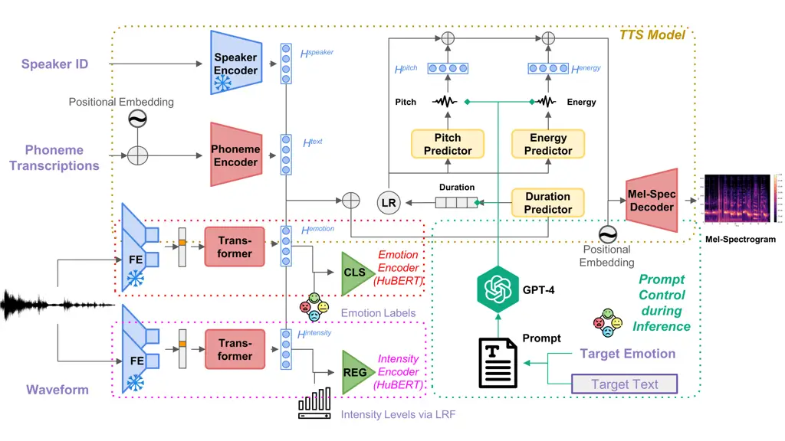
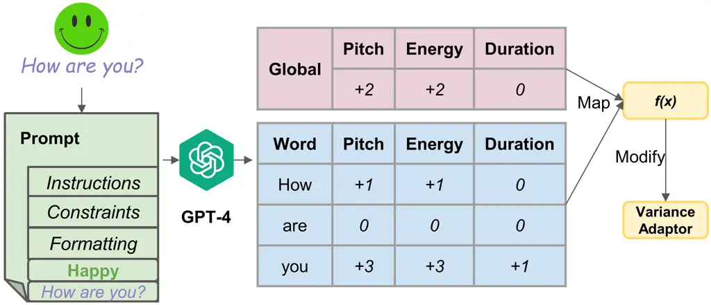
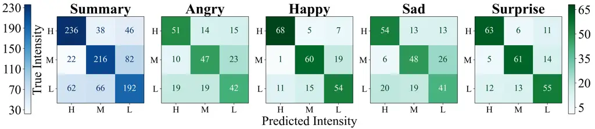
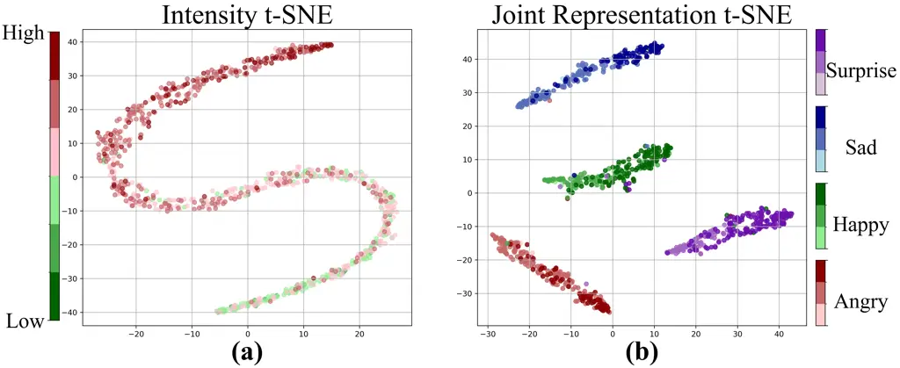

# ProEmo: Prompt-Driven Text-to-Speech Synthesis Based on Emotion and Intensity Control

Shaozuo Zhang    Ambuj Mehrish    Yingting Li    Soujanya Poria

###### Abstract

Speech synthesis has significantly advanced from statistical methods to
deep neural network architectures, leading to various text-to-speech
(TTS) models that closely mimic human speech patterns. However,
capturing nuances such as emotion and style in speech synthesis is
challenging. To address this challenge, we introduce an approach
centered on prompt-based emotion control. The proposed architecture
incorporates emotion and intensity control across multi-speakers.
Furthermore, we leverage large language models (LLMs) to manipulate
speech prosody while preserving linguistic content. Using embedding
emotional cues, regulating intensity levels, and guiding prosodic
variations with prompts, our approach infuses synthesized speech with
human-like expressiveness and variability. Lastly, we demonstrate the
effectiveness of our approach through a systematic exploration of the
control mechanisms mentioned above.

###### keywords

Text-to-Speech, Emotion Conversion, Large Language Models

^(†)^(†)address: ¹Singapore University of Technology and Design,
Singapore  
²Beijing University of Posts and Telecommunications, China
^(†)^(†)email: shaozuo_zhang@mymail.sutd.edu.sg,
ambuj_mehrish@sutd.edu.sg, yingting_li@sutd.edu.sg, sporia@sutd.edu.sg

## 1 Introduction

Speech synthesis has witnessed remarkable advances in recent years,
driven primarily by the integration of deep learning techniques \[1\].
While modern speech synthesis systems can produce increasingly
natural-sounding speech \[2, 3\], the challenge of imbuing synthesized
speech with expressive qualities akin to human speech remains a focal
point of research. Expressive speech synthesis \[4\], which aims to
replicate the nuances of human prosody, including emotion, intonation,
and speaking style, holds immense potential for various applications
such as audiobook narration \[5\], virtual assistants, and
conversational agents. However, achieving truly expressive speech
synthesis poses significant challenges, particularly in controlling
prosody to convey the desired emotional or contextual cues.

In recent years, there has been a growing interest in expressive speech
synthesis \[1, 6, 7, 8, 9\], which aims to imbue synthesized speech with
human-like prosody, emotion, and speaking style. Researchers have
explored various approaches to enhance the expressiveness of synthesized
speech, including prosody modeling \[10, 11\], emotion information
embedded in speaker embeddings \[12, 13\], and style transfer techniques
\[14\]. Additionally, the use of LLMs \[15, 16\] has emerged as a
promising avenue for controlling emotion in synthesized speech through
prompt-based methods.

A previous research \[16\], has delved into the fusion of LLMs and TTS
systems. They utilize prompts within LLMs to predict word-level
alterations corresponding to a range of emotions, thereby facilitating
the generation of expressive speech. However, their methodology lacks
provisions for generating multi-speaker expressive speech. Furthermore,
their approach relies solely on the output of LLMs for generating speech
with varying emotions. Given that the output of LLMs can be noisy, this
dependence potentially compromises the expressiveness of the generated
speech. The proposed architecture \[16\] also overlooks the
incorporation of emotional intensity within its structural framework.

Generating speech with varying emotional intensity presents a
significant challenge in TTS \[17, 18\]. This challenge is exacerbated
by the absence of explicit intensity labels in most emotional speech
datasets, hindering the accurate conveyance of nuanced emotions. Emotion
intensity, being highly subjective and complex, poses a greater
challenge compared to discrete emotion categorization. Existing
approaches in the literature mainly fall into two categories for
controlling emotion intensity in TTS. One approach involves
incorporating auxiliary features such as the state of voiced, unvoiced,
and silence (VUS), attention weights, or saliency maps. The other
approach manipulates internal representations of emotion through
techniques like interpolation or scaling. Despite these efforts,
effectively controlling emotion intensity in TTS remains an
underexplored area.



Figure 1: Overview of proposed expressive speech generation framework
composed of $`4`$ modules: TTS backbone based on FS2(yellow-dotted),
HuBERT for Emotion Encoder(red-dotted), HuBERT for Intensity
Encoder(purple-dotted), GPT-4 Prompting for prosody
control(green-dotted). FE: Feature Extractor, CLS: Classification Head,
REG: Regression Head. LRF: Learned Rank Function

In this paper, we propose integrating emotion and intensity encoders
into the FastSpeech 2 (FS2) architecture to enhance the expressiveness
and versatility of synthesized speech. Additionally, we leverage the
capabilities of LLMs (GPT-4) to predict prosody and modulate emotions in
speech during inference. Our approach represents a departure from
traditional methods of emotion manipulation, offering a promising avenue
for enhancing the expressiveness and naturalness of synthesized speech.
Our main contributions are summarized as follows:

- •
  We propose a novel TTS framework that extends FS2 for prompt-based
  prosody prediction, enabling emotion manipulation during inference.
- •
  We successfully control pitch, energy and duration in both utterance
  and word level via the novel LLM prompt.
- •
  Our framework can generate multi-speaker expressive speech with
  varying emotional intensity.

## 2 Related Works

Recent TTS advancements explore specifying target prosody, emotion, or
speaking style through natural language prompts. PromptTTS \[15\]
introduces a style encoder trained on ’style prompts’, natural language
descriptions of desired speaking styles. This encoder predicts values
for categorical parameters (e.g., gender and emotion) to guide speech
generation, akin to models like InstructGPT \[19\]. While simplifying
style specification, this approach heavily relies on scarce training
data labeled with ground-truth style prompts. InstructTTS \[20\] also
employs prompt-based control by generating a latent speaking-style
representation from speech, text, and a ground-truth style prompt. This
representation conditions both the text encoder and a diffusion-based
decoder allowing for defining new speaking styles via natural language
but requiring a corpus annotated with style prompts for effective
training.

## 3 Methodology

The proposed pipeline is structured into distinct stages. Initially, we
pre-train a multispeaker English TTS backbone model utilizing a large
publicly accessible dataset. Then, we add emotion and intensity encoders
and fine-tune the model with an emotional dataset. During inference, we
use a LLM to predict prosody aligned with the target emotion and make
subtle adjustments in pitch, duration, and energy for desired effects.

### 3.1 Text-to-Speech Backbone

Our TTS system employs FS2 \[2\] as its backbone, comprising a phoneme
encoder, a speaker encoder, a variance adaptor, and a mel-spectrogram
decoder. The Mel-Spectrogram is converted into a waveform using a
pre-trained HiFiGAN \[21\] vocoder. FS 2 is chosen for its interpretable
prosody modification capability: during inference, predicted pitch,
energy, and duration can be adjusted to meet specific prosodic
requirements.

### 3.2 Emotion Encoder

FS2 enhances speed and voice quality, yet its architecture lacks
inherent emotional expression, hindering expressive speech generation.
To address this, we integrate an emotion encoder to enhance its
expressiveness. The emotion encoder learns emotion representations
directly from the waveform, utilizing Hubert \[22\] for feature
extraction and a classification head for emotion recognition. During
training, only the transformer layer of Hubert and the classification
head are fine-tuned, while the convolutional layers remain frozen. The
resulting emotion embeddings seamlessly integrate with the backbone TTS
model. This integrated architecture is denoted as FS2\_(w/Emo).

### 3.3 Intensity Encoder

Expressive speech relies heavily on intensity to convey emotions
sincerely. To enhance synthesized speech with nuanced emotions, we
introduce an intensity encoder. Similar to the emotion encoder, it
utilizes Hubert \[22\] and a regression head to predict emotion
intensity levels. Modeling emotion intensity becomes crucial as most
emotional speech datasets lack intensity annotation. Inspired by \[23\],
we view emotion intensity as a fundamental attribute of the emotional
speech. However, annotating intensity labels poses challenges, even for
humans \[24\]. \[23\] addresses this by using relative attribute
labeling, similar to its success in computer vision \[24\]. We intend to
improve upon the algorithm proposed in \[23\] for predicting emotion
intensity levels using a multispeaker emotive speech dataset.

We quantify intensity by comparing emotional and neutral speeches using
acoustic features. We utilize an open-source implementation to train a
relative ranking function for emotion intensity, denoted as
$`r(x_{A})=\textbf{W}x_{A}`$. Here, $`x_{A}`$ represents
$`384`$-dimensional acoustic features extracted from openSMILE \[25\], W
denotes trainable weighting parameters, and $`r(x_{A})`$ normalizes
intensity values from 0 to 1. Departing from the prior work, we propose
learning $`r(x_{A})`$ for each speaker $`A`$ in the training set $`T`$,
allowing nuanced modeling of intensity variations tailored to individual
speakers. We also develop distinct ranking functions for each emotion
category, leveraging both neural and emotional utterances. During
training, the weighting matrix is computed akin to an SVM problem,
detailed in \[26\]. This learned function enables scoring new data based
on its acoustic features. As intensity is continuous, the intensity
encoder’s training is supervised through a regression task. We denote
the TTS architecture with the intensity encoder as FS2\_(w/Emo&Int).

### 3.4 Prompt Control

During inference, the FS2 predicts duration ($`d`$), energy ($`e`$), and
pitch ($`p`$) per phoneme based on the input text. Inspired by \[16\],
we aim to enhance speech generation to match desired emotional tones by
adjusting $`d`$, $`p`$, and $`e`$ values per phoneme. Following a
similar method, we adopt a two-level modification approach to regulate
prosodic effects at both the utterance (”global”) and word (”local”)
levels sequentially. The global modification establishes the overall
emotional tone, while subsequent local modifications refine voice
variances between individual words for a more nuanced, emotionally
expressive output. We term this as ”prompt control,” illustrated in
Figure 2.

Similar to \[16\], we mathematically formulate the modification process
with Equations 1, 2, and 3. Let $`i`$ denote the $`i`$-th word in the
utterance, with predicted values by the variance adaptor as $`d_{i}`$,
$`e_{i}`$, and $`p_{i}`$ for duration, energy, and pitch respectively.
Their scaled counterparts are denoted as $`d^{\prime}_{i}`$,
$`e^{\prime}_{i}`$, and $`p^{\prime}_{i}`$. Additionally, $`G_{d}`$,
$`G_{e}`$, and $`G_{p}`$ indicate the global scaling factors for
duration, energy, and pitch respectively, while $`\sigma_{j}`$,
$`\epsilon_{j}`$, and $`\pi_{i}`$ represent the corresponding local
scaling factors.

```math
\displaystyle d^{\prime}_{i}=d_{i}\cdot G_{d}\cdot\sigma_{i}, \displaystyle G_{d},\sigma_{i} \displaystyle\in[0.74,1.34] \tag{1}
```

```math
\displaystyle e^{\prime}_{i}=e_{i}\cdot G_{e}\cdot\epsilon_{i}, \displaystyle G_{e},\epsilon_{i} \displaystyle\in[0.5,2] \tag{2}
```

```math
\displaystyle p^{\prime}_{i}=p_{i}+G_{p}+\pi_{i}, \displaystyle G_{p}+\pi_{i} \displaystyle\in[p_{\text{min}},p_{\text{max}}] \tag{3}
```

where $`p_{min}`$ and $`p_{max}`$ denote the minimum and maximum pitch
values predicted by the FS2 variance adaptor. For both global and local
scaling factors related to duration and energy, we confine the range
between $`[0.5,2]`$, equivalent to halving and doubling the duration and
energy, respectively, to preserve naturalness in speech \[16\]. However,
our experimental observations reveal that scaling duration is more
sensitive than scaling energy. Consequently, we empirically narrowed the
interval for $`G_{d}`$ and $`\sigma_{i}`$ to $`[0.74,1.34]`$. We direct
GPT-4 to predict both global and local scaling factors within $`[-5,5]`$
for pitch and energy, and $`[-2,2]`$ for duration. Subsequently, we map
the predicted values using the quadratic map function
$`f(x)=ax^{2}+bx+c`$¹¹ 1 where $`a`$, $`b`$, and $`c`$ are estimated
using defined boundary condition of $`[0.5,2]`$. to intervals specified
in Eq. 1, 2, and 3.



Figure 2: Introduction to Prompt Control: The scaling factors suggested
by the LLM (shown in red and blue tables) directly affect the Variance
Adaptor

The prompt design is a crucial aspect of our methodology. Initially, we
tried a prompt from \[16\] but faced instability in GPT-4 output. This
instability caused consistent changes in pitch, energy, and duration,
leading to poor expressiveness. To tackle this, we created a
comprehensive prompt template ( Figure 2) covering task description and
output requirements. We then used the GPT-4 model via the OpenAI API
\[27\] to obtain appropriate scaling factors. Our prompt encourages
reasoning at each decision step to reduce potential noise.



Figure 3: Perceptual Intensity Ranking. H,M,L: High, Medium and Low
intensities.

## 4 Experimental Setup

### 4.1 Baselines and Datasets

We utilize the LibriTTS \[28\] for pretraining, which includes
$`33,236`$ training samples (equating to $`53.78`$ hours) collected from
$`247`$ speakers. To capture various emotions, we turn to the Emotional
Speech Database (ESD) for fine-tuning. This dataset consists of $`350`$
utterances, totaling approximately 13.4 hours of recordings, by $`10`$
English speakers, and encompasses five emotion categories: Angry, Happy,
Neutral, Sad, and Surprise.

For expressive speech synthesis, we utilize two established
architectures: Daft-Exprt \[29\] and FS2. Following the approach in
\[30\], we pre-train the Daft-Exprt model on LJSpeech before fine-tuning
it on the ESD. Despite attempts to pre-train on LibriTTS, it failes to
converge, resulting in poor-quality speech. Hence, we stick to the
method proposed in \[29\] for training. We experiment with different FS2
configurations: 1) FS2, 2) FS2*(w/Emo) with an emotion encoder, and 3)
FS2*(w/Emo&Int) with both emotion and intensity encoders. During
inference, we maintain consistency by applying the prompt control
discussed in Section 3.4 across all models for a uniform evaluation.

### 4.2 Training and Evaluation

The training process involves two main stages: initial pre-training on a
substantial English corpus, followed by fine-tuning on an emotional
corpus with auxiliary supervision tasks. In the pre-training phase,
multispeaker FS2 training is conducted on the LibriTTS-100 for 900K
steps, with a batch size of $`16`$. Speaker embeddings are computed
using a speaker verification model trained with the GE2E loss \[31\].

In the subsequent stage of training, we refine the pre-trained
multispeaker FS2 model on the ESD corpus by incorporating emotion and
intensity encoders as discussed in section 3. These encoders, based on
the HuBERT \[32\], are trained with the backbone FS2 model in an
end-to-end fashion. During training, the feature extractor module of
HuBERT remains fixed, while only the transformer parameters, along with
the classification/regression head parameters, are updated for $`50`$K
steps on the ESD dataset. We train different versions of FS2, each
detailed in Table 1. During inference, prosody control is achieved using
GPT4, as elaborated in Section 3.4²² 2 Source codes, the prompt template
with examples and audio samples are available at
[https://anonymous.4open.science/r/FastSpeech2EmoInt-072F](https://anonymous.4open.science/r/FastSpeech2EmoInt-072F)..
For evaluation, we use the ESD test set with four distinct emotions. To
compute objective metrics, we generate expressive speech under three
distinct prompt control settings: (1) without any prompt control; (2)
with both global and local level prompt controls; and (3) exclusively
with local level control.

To assess our methodology’s effectiveness, we employ a comprehensive
framework with various metrics. These include emotion classification
accuracy (ECA) to gauge prosody control’s impact on speech
expressiveness. We also use Mel Cepstral Distortion (MCD) \[33\] to
measure speech distortion. Word Error Rate (WER) and Character Error
Rate (CER) \[34\] to evaluate alignment with ground truth. Additionally,
Mean Opinion Score (MOS) tests \[35\] involve human listeners rating
synthesized speech quality numerically.

Furthermore, we follow the methodology outlined in \[36\] the Perceptual
Intensity Ranking (PIR) test, for subjectively comparing synthesized
speech samples with different intensity levels. In our experiments, we
generate speech samples at three intensity levels: Low, Medium, and
High. Since ground truth intensity annotations are lacking, we derive
them using the learned ranked function, detailed in Section 3.3, for the
evaluation dataset. These annotations serve as a reference during the
PIR test. Participants rank generated samples based on perceived
intensity, categorizing them into predefined levels, which are then
compared with intensity annotations derived from the learned rank
function.

## 5 Results

### 5.1 Objective Evaluation

To assess synthesized speech expressiveness, we analyze emotion
recognition across different models. We train an emotion encoder
independently using the ESD training set. This encoder achieves $`95\%`$
accuracy on the ESD evaluation set, showcasing its ability to capture
subtle emotional nuances. Further insights into emotion representation
quality and intensity are depicted in Fig. 4, illustrating the encoders’
discriminative ability in recognizing emotions and gauging intensity
with acceptable deviation. We then use this trained emotion encoder to
classify emotions in speech generated by different models, as shown in
Table 1.



Figure 4: t-SNE of embeddings for the ESD validation set. (a) Intensity
embeddings computed using the relative ranking function, $`r(.)`$. (b)
Joint emotion and intensity embeddings.

| Model        | PC   | ECA $`\uparrow`$ | MCD $`\downarrow`$ | WER $`\downarrow`$ | CER $`\downarrow`$ | MOS $`\uparrow`$ |
| ------------ | ---- | ---------------- | ------------------ | ------------------ | ------------------ | ---------------- |
| Daft-Exprt   | None | 0.663            | 6.278              | 0.353              | 0.123              | 3.450            |
| Daft-Exprt   | G&L  | 0.683            | 6.659              | 0.657              | 0.386              | –                |
| Daft-Exprt   | L    | 0.481            | 5.889              | 0.969              | 0.833              | –                |
| FS2          | None | 0.247            | 6.710              | 0.125              | 0.040              | –                |
| FS2          | G&L  | 0.297            | 7.160              | 0.135              | 0.049              | –                |
| FS2          | L    | 0.296            | 6.865              | 0.129              | 0.042              | –                |
| FS2\_(w/E)   | None | 0.762            | 6.619              | 0.127              | 0.039              | –                |
| FS2\_(w/E)   | G&L  | 0.782            | 6.968              | 0.131              | 0.044              | –                |
| FS2\_(w/E)   | L    | 0.820            | 6.767              | 0.129              | 0.039              | –                |
| FS2\_(w/E&I) | None | 0.748            | 6.594              | 0.125              | 0.038              | 3.194            |
| FS2\_(w/E&I) | G&L  | 0.771            | 7.058              | 0.130              | 0.043              | 3.728            |
| FS2\_(w/E&I) | L    | 0.797            | 6.741              | 0.128              | 0.040              | 3.408            |

.

Table 1: Objective & Subjective Evaluation Performance. PC: Prompt
Control; ECA: Emotion Classification Accuracy; FS2: FastSpeech 2; G&L:
Both global & local level prompt control; L: Local level prompt control

Table 1 reveals a consistent trend: incorporating local-level
modification during inference consistently leads to higher emotion
classification accuracy compared to both global and local-level control,
as well as instances without any prompt control. For instance, in the
case of FS2*(w/Emo&Int), classification accuracy improves to $`79.72\%`$
with local-level control compared to $`74.80\%`$ without any prompt
control. This trend persists across both FS2*(w/Emo&Int) and FS2\_(w/Emo)
models, highlighting the significant enhancement in speech
expressiveness through prompt-level control. Additionally, analysis of
MCD, WER, and CER scores from Table 1 suggests that the inclusion of
emotion and intensity embeddings, alongside prompt control, does not
significantly affect speech generation. Moreover, the lower performance
of Daft-Exprt compared to FastSpeech2 can be attributed to the former’s
pretraining on a single-speaker dataset, limiting its ability to adapt
to various prosodic changes inherent in expressive speech synthesis.

### 5.2 Human Subjective Study

We invite $`20`$ participants (7 females, 13 males) for a human
subjective study. These participants from diverse geographical regions
are expertise in speech and NLP.

Mean Opinion Score(MOS) Test We instruct GPT-4 to generate five
sentences randomly for each emotion category. Then, we synthesize speech
based on three different prompt control settings detailed in Section
3.4. Participants evaluate each audio clip based on expressiveness and
naturalness, using a rating scale from $`0`$ to $`5`$. The MOS results
in Table 1 reveal that the FS2\_(w/Emo&Int) configuration with global &
local level prompt control outperforms others across all generated
emotions.

PIR Test: We randomly select four utterances per emotion category from
the ESD evaluation set and reconstruct them at three intensity levels
(Low, Medium, and High) using intensity annotations from the learned
rank function (Section 4.2). This yields a total of $`16\times 3=48`$
samples for evaluation. Participants rank these audio samples based on
perceived intensity. Results in Figure 3 show confusion matrices for
FS2\_(w/E&I) with word-level prompt control. Overall, participants
achieve approximately $`72\%`$ accuracy in perceiving correct intensity
levels, indicating the effectiveness of our method in generating speech
with varied intensity.

## 6 Conclusion

In conclusion, our proposed approach, focused on prompt-based emotion
control in speech synthesis, represents a significant advancement in
infusing synthesized speech with human-like expressiveness and
variability. By integrating emotion and intensity control across
multi-speakers and utilizing large LLMs to manipulate speech prosody
while preserving linguistic content, we’ve presented a novel framework
that enhances the naturalness and versatility of synthesized speech. Our
systematic exploration of control mechanisms has yielded promising
results in generating expressive speech with varying emotional
intensity. Moving forward, future research and development opportunities
include considerations for Multilingual and Cross-cultural contexts,
enhancing Robustness and Generalization, and exploring Real-time
Applications in virtual assistants or live communications platforms.

## References

- \[1\] A. Mehrish, N. Majumder, R. Bharadwaj, R. Mihalcea, and
  S. Poria, “A review of deep learning techniques for speech
  processing,” _Information Fusion_, p. 101869, 2023.
- \[2\] Y. Ren, C. Hu, X. Tan, T. Qin, S. Zhao, Z. Zhao, and T.-Y. Liu,
  “Fastspeech 2: Fast and high-quality end-to-end text to speech,”
  _arXiv preprint arXiv:2006.04558_, 2020.
- \[3\] J. Kim, J. Kong, and J. Son, “Conditional variational
  autoencoder with adversarial learning for end-to-end text-to-speech,”
  in _International Conference on Machine Learning_. PMLR, 2021, pp.
  5530–5540.
- \[4\] D. Govind and S. M. Prasanna, “Expressive speech synthesis: a
  review,” _International Journal of Speech Technology_, vol. 16, pp.
  237–260, 2013.
- \[5\] M. Le, A. Vyas, B. Shi, B. Karrer, L. Sari, R. Moritz,
  M. Williamson, V. Manohar, Y. Adi, J. Mahadeokar _et al._, “Voicebox:
  Text-guided multilingual universal speech generation at scale,”
  _Advances in neural information processing systems_, vol. 36, 2024.
- \[6\] S. Lei, Y. Zhou, L. Chen, Z. Wu, X. Wu, S. Kang, and H. Meng,
  “Msstyletts: Multi-scale style modeling with hierarchical context
  information for expressive speech synthesis,” _IEEE/ACM Transactions
  on Audio, Speech, and Language Processing_, 2023.
- \[7\] X. Zhu, Y. Lei, K. Song, Y. Zhang, T. Li, and L. Xie,
  “Multi-speaker expressive speech synthesis via multiple factors
  decoupling,” in _ICASSP 2023-2023 IEEE International Conference on
  Acoustics, Speech and Signal Processing (ICASSP)_. IEEE, 2023, pp.
  1–5.
- \[8\] T. H. Teh, V. Hu, D. S. R. Mohan, Z. Hodari, C. G. Wallis, T. G.
  Ibarrondo, A. Torresquintero, J. Leoni, M. Gales, and S. King,
  “Ensemble prosody prediction for expressive speech synthesis,” in
  _ICASSP 2023-2023 IEEE International Conference on Acoustics, Speech
  and Signal Processing (ICASSP)_. IEEE, 2023, pp. 1–5.
- \[9\] A. Triantafyllopoulos, B. W. Schuller, G. İymen, M. Sezgin,
  X. He, Z. Yang, P. Tzirakis, S. Liu, S. Mertes, E. André _et al._, “An
  overview of affective speech synthesis and conversion in the deep
  learning era,” _Proceedings of the IEEE_, 2023.
- \[10\] G. Pamisetty and K. Sri Rama Murty, “Prosody-tts: An end-to-end
  speech synthesis system with prosody control,” _Circuits, Systems, and
  Signal Processing_, vol. 42, no. 1, pp. 361–384, 2023.
- \[11\] Z.-C. Liu, Z.-H. Ling, Y.-J. Hu, J. Pan, J.-W. Wang, and Y.-D.
  Wu, “Speech Synthesis with Self-Supervisedly Learnt Prosodic
  Representations,” in _Proc. INTERSPEECH 2023_, 2023, pp. 7–11.
- \[12\] Z. Shaheen, T. Sadekova, Y. Matveeva, A. Shirshova, and
  M. Kudinov, “Exploiting emotion information in speaker embeddings for
  expressive text-to-speech,” in _INTERSPEECH_, vol. 2023, 2023, pp.
  2038–2042.
- \[13\] H. Tang, X. Zhang, J. Wang, N. Cheng, and J. Xiao, “EmoMix:
  Emotion Mixing via Diffusion Models for Emotional Speech Synthesis,”
  in _Proc. INTERSPEECH 2023_, 2023, pp. 12–16.
- \[14\] Y. Wang, D. Stanton, Y. Zhang, R.-S. Ryan, E. Battenberg,
  J. Shor, Y. Xiao, Y. Jia, F. Ren, and R. A. Saurous, “Style tokens:
  Unsupervised style modeling, control and transfer in end-to-end speech
  synthesis,” in _International conference on machine learning_. PMLR,
  2018, pp. 5180–5189.
- \[15\] Z. Guo, Y. Leng, Y. Wu, S. Zhao, and X. Tan, “Prompttts:
  Controllable text-to-speech with text descriptions,” in _ICASSP
  2023-2023 IEEE International Conference on Acoustics, Speech and
  Signal Processing (ICASSP)_. IEEE, 2023, pp. 1–5.
- \[16\] A. T. Sigurgeirsson and S. King, “Controllable speaking styles
  using a large language model,” 2023.
- \[17\] Y. Guo, C. Du, X. Chen, and K. Yu, “Emodiff: Intensity
  controllable emotional text-to-speech with soft-label guidance,” in
  _ICASSP 2023-2023 IEEE International Conference on Acoustics, Speech
  and Signal Processing (ICASSP)_. IEEE, 2023, pp. 1–5.
- \[18\] S. Inoue, K. Zhou, S. Wang, and H. Li, “Fine-grained
  quantitative emotion editing for speech generation,” 2024.
- \[19\] L. Ouyang, J. Wu, X. Jiang, D. Almeida, C. Wainwright,
  P. Mishkin, C. Zhang, S. Agarwal, K. Slama, A. Ray _et al._, “Training
  language models to follow instructions with human feedback,” _Advances
  in Neural Information Processing Systems_, vol. 35, pp.
  27 730–27 744, 2022.
- \[20\] D. Yang, S. Liu, R. Huang, G. Lei, C. Weng, H. Meng, and D. Yu,
  “Instructtts: Modelling expressive tts in discrete latent space with
  natural language style prompt,” _arXiv preprint
  arXiv:2301.13662_, 2023.
- \[21\] J. K. Jungil Kong and J. Bae, “Hifi-gan: Generative adversarial
  networks for efficient and high fidelity speech synthesis,” in
  _Advances in Neural Information Processing Systems_, vol. 33, 2020,
  pp. 17 022–17 033.
- \[22\] W.-N. Hsu, B. Bolte, Y.-H. H. Tsai, K. Lakhotia,
  R. Salakhutdinov, and A. Mohamed, “Hubert: Self-supervised speech
  representation learning by masked prediction of hidden units,”
  _IEEE/ACM Transactions on Audio, Speech, and Language Processing_,
  vol. 29, pp. 3451–3460, 2021.
- \[23\] K. Zhou, B. Sisman, R. Rana, B. W. Schuller, and H. Li,
  “Emotion intensity and its control for emotional voice conversion,”
  _IEEE Transactions on Affective Computing_, vol. 14, no. 1, pp.
  31–48, 2022.
- \[24\] V. Ferrari and A. Zisserman, “Learning visual attributes,”
  _Advances in neural information processing systems_, vol. 20, 2007.
- \[25\] F. Eyben, M. Wöllmer, and B. Schuller, “opensmile: The munich
  versatile and fast open-source audio feature extractor,” in
  _Proceedings of the 18th ACM International Conference on
  Multimedia_. ACM, 2010, pp. 1459–1462.
- \[26\] D. Parikh and K. Grauman, “Relative attributes,” in _2011
  International Conference on Computer Vision_. IEEE, 2011, pp. 503–510.
- \[27\] OpenAI, “Gpt-4 system card,”
  [https://openai.com/research/gpt-4](https://openai.com/research/gpt-4), 2023.
- \[28\] H. Zen, V. Dang, R. Clark, Y. Zhang, R. J. Weiss, Y. Jia,
  Z. Chen, and Y. Wu, “Libritts: A corpus derived from librispeech for
  text-to-speech,” _arXiv preprint arXiv:1904.02882_, 2019.
- \[29\] J. Zaıdi, H. Seuté, B. van Niekerk12, and M.-A. Carbonneau,
  “Daft-exprt: Cross-speaker prosody transfer on any text for expressive
  speech synthesis,” _arXiv preprint arXiv:2108.02271_, 2022.
- \[30\] J. Zaïdi, H. Seuté, B. van Niekerk, and M.-A. Carbonneau,
  “ubisoft-laforge-daft-exprt,”
  [https://github.com/ubisoft/ubisoft-laforge-daft-exprt.git](https://github.com/ubisoft/ubisoft-laforge-daft-exprt.git), 2021.
- \[31\] L. Wan, Q. Wang, A. Papir, and I. L. Moreno, “Generalized
  end-to-end loss for speaker verification,” in _2018 IEEE International
  Conference on Acoustics, Speech and Signal Processing (ICASSP)_. IEEE,
  2018, pp. 4879–4883.
- \[32\] Facebook, “Hubert-base,”
  [https://huggingface.co/facebook/hubert-base-ls960](https://huggingface.co/facebook/hubert-base-ls960), 2021.
- \[33\] J. Kominek, T. Schultz, and A. W. Black, “Synthesizer voice
  quality of new languages calibrated with mean mel cepstral
  distortion.” in _SLTU_, 2008, pp. 63–68.
- \[34\] A. Radford, J. W. Kim, T. Xu, G. Brockman, C. McLeavey, and
  I. Sutskever, “Robust speech recognition via large-scale weak
  supervision,” in _ICML_. PMLR, 2023, pp. 28 492–28 518.
- \[35\] R. C. Streijl, S. Winkler, and D. S. Hands, “Mean opinion score
  (mos) revisited: Methods and applications, limitations and
  alternatives,” _Multimedia Systems_, vol. 22, no. 2, pp.
  213–227, 2016.
- \[36\] S. Wang, J. Guðnason, and D. Borth, “Fine-grained emotional
  control of text-to-speech: Learning to rank inter-and intra-class
  emotion intensities,” in _ICASSP 2023-2023 IEEE International
  Conference on Acoustics, Speech and Signal Processing (ICASSP)_. IEEE,
  2023, pp. 1–5.
