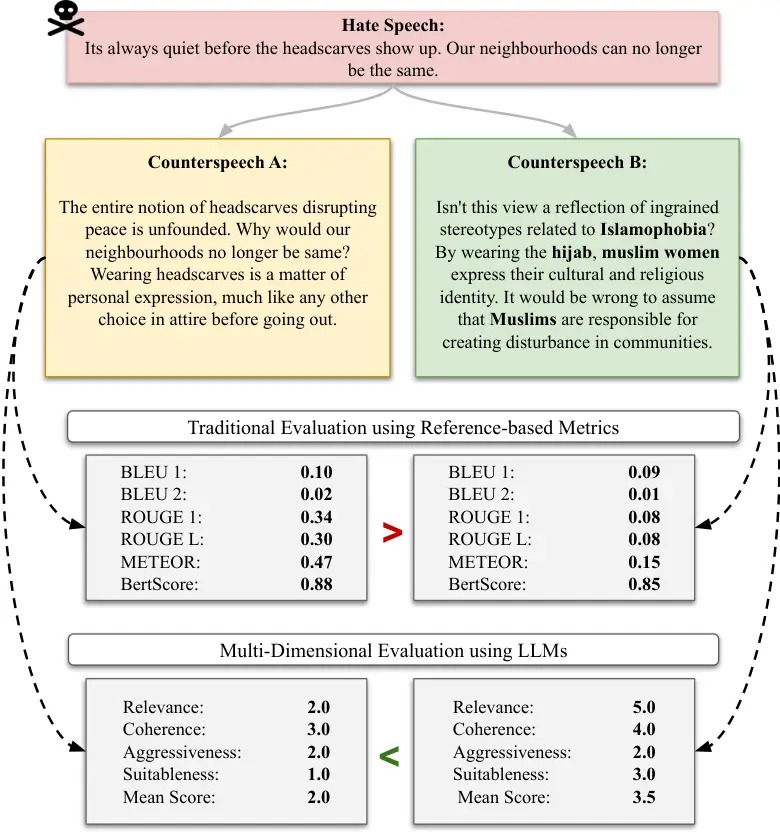
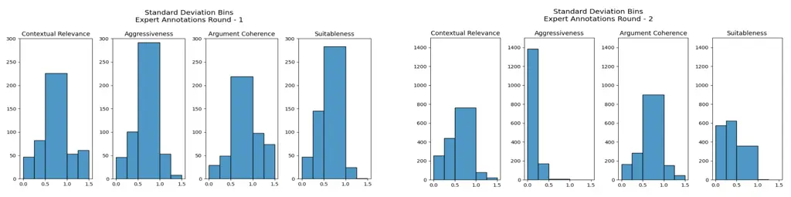

# CSEval: Towards Automated, Multi-Dimensional, and Reference-Free Counterspeech Evaluation using Auto-Calibrated LLMs

Amey Hengle ^(†)^(†)thanks: \* Equal contribution Affiliation: Indian
Institute of Technology Delhi, India; Email: <tanchak@iitd.ac.in>   
Aswini Kumar    Anil Bandhakavi Affiliation: Logically.ai {
ameyhengle22, aswinikumarpadhi1995 } @gmail.com    Tanmoy Chakraborty
Affiliation: Indian Institute of Technology Delhi, India;

###### Abstract

Counterspeech has emerged as a popular and effective strategy for
combating online hate speech, sparking growing research interest in
automating its generation using language models. However, the field
still lacks standardised evaluation protocols and reliable automated
evaluation metrics that align with human judgement. Current automatic
evaluation methods, primarily based on similarity metrics, do not
effectively capture the complex and independent attributes of
counterspeech quality, such as contextual relevance, aggressiveness, or
argumentative coherence. This has led to an increased dependency on
labor-intensive human evaluations to assess automated counter-speech
generation methods. To address these challenges, we introduce CSEval, a
novel dataset and framework for evaluating counterspeech quality across
four dimensions: contextual-relevance, aggressiveness,
argument-coherence, and suitableness. Furthermore, we propose
Auto-Calibrated COT for Counterspeech Evaluation (Auto-CSEval), a
prompt-based method with auto-calibrated chain-of-thoughts (CoT) for
scoring counterspeech using large language models. Our experiments show
that Auto-CSEval outperforms traditional metrics like ROUGE, METEOR, and
BertScore in correlating with human judgement, indicating a significant
improvement in automated counterspeech evaluation. ¹¹ 1 Warning: The
content in this paper may be upsetting or offensive.



Figure 1: An example comparing classical evaluation (ROUGE, METEOR,
etc.) vs LLM-based multidimensional evaluation for two counterspeech, A
and B. We observe that while B is more relevant and addresses the
implied bias expressed in the hate speech, it is scored lower than A by
traditional metrics. In contrast, LLM-based multidimensional evaluation
aligns more with human judgement, scoring B higher than A.

## 1 Introduction

Online hate speech (HS) is on the rise in social media, making it a
hostile platform for targeted individuals. Counterspeech (CS) provides
an efficient way to combat hate speech with the help of constructive
statements Benesch et al. (2016); Chandrasekharan et al. (2017) without
violating the speaker’s freedom of speech Schieb and Preuss (2016);
Wright et al. (2017). Moreover, counterspeech has popularly emerged as
an effective strategy for countering hateful comments without content
moderation and deletion Kalev (2019); Saha et al. (2019). Due to the
tediousness of human-generated counterspeech, the natural language
generation (NLG) approach motivates the researchers to focus on
generating automated counterspeech Mathew et al. (2019); Qian et al.
(2019); Chung et al. (2024); Fanton et al. (2021a); Bonaldi et al.
(2022); Hengle et al. (2024).

The rapid development of automated counterspeech generation methods
using pre-trained language models (PLMs) calls for a high-quality
evaluation of generated counterspeech. However, the evaluation process
is still dominated by traditional similarity-based NLG metrics like BLEU
Papineni et al. (2002a), ROUGE Lin (2004), and METEOR Banerjee and Lavie
(2005) These metrics focus on surface-level text differences and often
fall short in semantic aspects Freitag et al. (2020). Additionally,
other methods based on neural embeddings Zhang et al. (2020a); Yuan
et al. (2021) are inflexible and limited in scope Freitag et al. (2021).
Moreover, these metrics show low alignment with human judgment,
especially for open-ended generation tasks, where there is a possibility
of multiple correct outputs Guan and Huang (2020); Zhong et al. (2022);
Liu et al. (2023a). This problem is particularly pertinent in
counterspeech evaluation, where the reference text (HS) is characterized
by short, indirect, and implied expressions of hate Hengle et al.
(2024).

We support our argument by providing an example in Figure 1, where for a
given hate speech, we contrast two counterspeech, A and B, generated by
GPT3.5 Ouyang et al. (2022). We observe while A makes valid arguments, B
is more effective and relevant in countering the hate speech compared to
A, as it accurately refutes the underlying Islamophobic sentiment and
addresses both the stereotype and broader context of cultural and
religious identity. However, all traditional methods consistently score
A higher than B, given their lexical and semantic proximity to the
reference text. These shortcomings motivate the need for more nuanced,
multi-dimensional, and human-aligned evaluation methods for automated
counterspeech generation.

The emergent capabilities of LLMs such as instruction tuning Wei et al.
(2022), and preference tuning through human feedback Ouyang et al.
(2022), and as Chain-of-Thought (CoT) reasoning Wei et al. (2023) have
presented a promising direction towards NLG evaluation based on LLMs.
Recent studies have proposed using LLMs as reference-free NLG evaluators
directly, offering a better human-aligned evaluation compared to
traditional methods. Wang et al. (2023); Fu et al. (2023); Liu et al.
(2023a); Jones et al. (2024). However, the validity and reliability of
using LLMs as NLG evaluators have yet to be systematically investigated
in automated counterspeech generation Chung et al. (2024). Specifically,
there is an issue with how automated metrics are evaluated themselves.
Jones et al. (2024) took an initial step in this direction by proposing
a dataset and framework for reference-free counterspeech evaluation.
However, they lack expert annotations and have a relatively small test
size (180 samples) Jones et al. (2024). Thus, there is no dataset with
expert human judgements evaluating specific quality aspects of
model-generated counterspeech.

We address these gaps in complementary ways. First, we build CSEval, a
large and diverse collection (in terms of model-types) of human
judgements of model-generated counterspeech across four quality aspects:
contextual-relevance, aggressiveness, argument-coherence, and
suitableness. We release aligned model outputs for five of the current
state-of-the-art (SoTA) models on counterspeech generation. We benchmark
CSEval on multiple reference-based as well as reference-free evaluation
methods. Finally, we propose Auto Calibrated Chain-of-Thoughts for
Counterspeech Evaluation (Auto-CSEval), a prompt-based method with
auto-calibrated evaluation steps (CoT) to score each quality dimension
of the counterspeech. Experimental results show that our proposed
approach outperforms the traditional and LLM-based evaluation methods in
terms of correlation with human judgement.

To summarize our contribution, in this paper, we – (i) introduce CSEval,
the largest and most diverse collection of human judgments of
model-generated counterspeech across four quality aspects: context
relevance, aggressiveness, argument coherence, and suitableness; (ii)
benchmark the CSEval dataset across multiple popular automatic
evaluation methods and find that none of them reliably measure the
quality of counterspeech, showing poor correlation with human-judgments;
(iii) propose Auto-CSEval, a prompt-based method with auto-calibrated
CoTs to score each quality dimension of the counterspeech, and show that
it outperforms the traditional and LLM-based evaluation strategies which
are correlated with the human judgment ²² 2 The source code and datasets
are available at https://github.com/AmeyHengle/cs-eval.

## 2 Related Work

There has been an increased interest in research focusing on building
datasets and related resources Chung et al. (2019); Liu et al. (2019);
Gupta et al. (2023) along with automated methods for counterspeech
generation Zhu and Bhat (2021); Zhang et al. (2020b); Gupta et al.
(2023); Hengle et al. (2024). Within this context, the IntentCONAN
dataset Gupta et al. (2023) is particularly notable for reflecting the
style-guided of the counterspeech generation task, providing multiple
ground-truth counterspeech for a given hate speech statement. Further,
some recent efforts Mun et al. (2023); Saha et al. (2024) have started
leveraging prompting-based strategies for counterspeech generation.

With the recent progress in this domain, automated evaluation of
model-generated counterspeech remains an open problem. Generally
speaking, almost all of the previous studies Zhu and Bhat (2021); Gupta
et al. (2023); Saha et al. (2022); Hengle et al. (2024) extensively
employ lexical overlap Papineni et al. (2002b); Lin (2004); Banerjee and
Lavie (2005), semantic similarity Zhang et al. (2020a), and diversity Li
et al. (2016) metrics for counterspeech evaluation. However,
reference-based metrics have been consistently shown to have poor
correlation with human judgements, especially for evaluating the quality
of open-ended generation tasks Zhong et al. (2022); Fu et al. (2023); Li
et al. (2024). Furthermore, these metrics are incapable of representing
the aspect-level quality of a counterspeech, such as soundness,
relevance, or non-toxicity Chung et al. (2024). Due to these reasons,
research in counterspeech generation is heavily dependent on human
evaluation, which is often very costly to conduct and difficult to
scale.

With their growing reasoning and generation capabilities, LLMs are now
being considered as an alternative to human evaluation, showing a high
degree of correlation with human judgement on evaluating tasks like
summarisation, dialog-generation, and code generation Wang et al.
(2023); Liu et al. (2023b); Fu et al. (2023); Liu et al. (2023a); Li
et al. (2024). Fu et al. (2023) propose GPTScore, an automated framework
that evaluates text quality with pre-trained generative models like
GPT3. Kocmi and Federmann (2023) propose to use GPT-based models for
scoring machine translation outputs. Li et al. (2024) conduct an
extensive survey on the usage of LLMs for NLG evaluation. Recently,
Jones et al. (2024) introduced a reference-free evaluation framework
that leverages LLMs to assess counterspeech quality across multiple
dimensions. They showed that LLM-based evaluation aligns more closely
with human judgement compared to traditional methods. Liu et al. (2023a)
propose a prompt-based method to further improve correlation with human
judgement by generating detailed evaluation steps using the CoT
reasoning capability of GPT-4. Our proposed approach, Auto-CSEval,
builds on both these works. However, instead of relying solely on
model-generated CoT reasoning like Liu et al. (2023a), we actively
calibrate the LLM using a small set of human judgements. Our method
ensures a more robust and human-aligned scoring of counterspeech using
LLMs.

## 3 Dataset

We build and release CSEval, a benchmark dataset for reference-free and
multi-dimensional counterspeech evaluation. CSEval contains expert human
assessments of $`7,926`$ model-generated CS, across four quality
dimensions (or aspects). In this section, we give a detailed overview of
the data curation process, evaluation dimensions, and the models used in
CSEval.

### 3.1 Data Curation

We used the publicly available IntentCONAN Gupta et al. (2023) dataset,
which offers a diverse set of CS spanning multiple categories like
empathy, counter-questions, fact-checking, and denouncing. We selected
IntentCONAN over other counterspeech datasets Chung et al. (2019);
Fanton et al. (2021b), as it accurately reflects the open-ended nature
of counterspeech generation, accommodating multiple valid CS for a given
HS. We began by randomly sampling approximately $`2000`$ unique HS
instances from IntentCONAN. For each HS instance, we then generated a CS
using five popular counterspeech generation models, as detailed in
Appendix A.1.1. We ended up creating the base corpus of CSEval with
$`2,223`$ unique HS, $`4,318`$ ground-truth (reference) CS, and
$`7,926`$ model-generated CS instances.

### 3.2 Evaluation Dimensions

We define the evaluation process across four dimensions (or aspects) of
counterspeech quality $`-`$ relevance, aggressiveness, coherence, and
suitableness. We select these dimensions as they are most frequently
reported in human evaluation studies in counterspeech literature. We
discuss this in detail in Appendix C.1.

\(i\) Relevance assesses whether the counterspeech is in line with the
hate speech’s central theme, subject, or topic. Contextual relevance is
an important counterspeech quality, especially considering the implied
nature of hate speech that can confuse language models.

\(ii\) Coherence measures whether a counterspeech provides specific and
coherent arguments to effectively refute or counter any bias,
stereotype, or prejudice expressed in the hate speech. A high score
indicates that the counterspeech provides arguments that are consistent,
evidence-based, and follow a clear logical flow and use.

\(iii\) Aggressiveness evaluates the level of confrontational or
inflammatory content in the counterspeech, including the use of any
abusive language, the intensity of disagreement, the tone, and whether
it contains personal attacks. A lower score indicates less aggressive
and hence more effective counterspeech.

\(iv\) Suitableness measures whether a counterspeech can be directly
used without editing in a real setting. It considers a counterspeech’s
overall stance and potential impact on the listener.

### 3.3 Models

We include counterspeeches generated using both supervised and
prompt-based methods. In terms of supervised methods, we include three
popular counterspeech generation models – QUARC Gupta et al. (2023), Zhu
and Bhat (2021), DialoGPT Zhang et al. (2020b), and
Generate-Prune-Select (GPS). As our prompting baselines, we include
counterspeeches generated by two popular LLMs –GPT-3.5-Turbo (ChatGPT)
and GPT-4 Ouyang et al. (2022). For each of them,we include both zero-
and few-shot prompting baselines. Further details surrounding model
training and prompting are provided under Appendix A.1.1.

### 3.4 Annotation Process

We recruited five expert annotators who have either published papers or
completed senior theses in the domain of hate speech and counterspeech
³³ 3 All annotators were aged between 20-30 years, with a gender
distribution of 80% male and 20% female. We used expert annotators for
our evaluation process due to the task’s sensitivity and the quality
issues of crowd-sourced annotations reported in previous work Gillick
and Liu (2010). Given a HS, reference CS, and model-generated CS,
annotators are asked to rate the model output across each of the four
dimensions on a Likert scale. Relevance, coherence, and aggressiveness
are rated on a scale of $`1`$ to $`5`$, while suitableness is rated on a
scale of $`1`$ to $`3`$. Higher scores indicate better quality, except
for aggressiveness, where lower scores indicate better quality. Further
details about the background and discussion process with the annotators
can be found in Appendix A.

##### Inter-Annotator Agreement.

We used Krippendorff’s alpha coefficient Klaus (2011) to measure the
inter-annotator agreement of the expert annotations. For the first round
of annotations, we obtained a decent inter-annotator interval of
Krippendorff’s (averaged across the four dimensions) of $`0.473`$.
However, the 2nd round increases the overall inter-annotator agreement
with an average Krippendoff coefficient of $`0.681`$. We also calculate
the standard deviation of annotator scores within the respective groups.
We plot the histogram of these statistics in Appendix Figure 3. Here, we
observe that suitableness remains the most contentious dimension among
experts. Further details about the annotation process are provided under
Appendix Section A.

Figure 2: An overview of the multi-phase auto-calibration framework of
Auto-CSEval, including the generation and refinement of CoT
instructions, evaluation criteria formulation, and the iterative
calibration process aligned with expert human judgement.

## 4 Proposed Method

Figure 2 illustrates the overall framework of our proposed method,
Auto-CSEval (Auto-Calibrated Chain-of-Thoughts for Counterspeech
Evaluation). Auto-CSEval is a prompt-based evaluator with three main
components: (i) An instruction describing the evaluation task at hand,
(ii) Evaluation CoT, i.e., a brief description of the evaluation aspect,
and (iii) CoT that is the set of intermediate instructions describing
the detailed evaluation steps for the desired evaluation CoT. To
calibrate the LLM, we focus on optimising the CoT steps $`T`$, while
keeping the instruction and evaluation CoT parts of the prompt
consistent. Specifically, we mine and tune the CoT steps by constructing
a small validation set, containing human-labelled $`\langle`$HS,
CS$`\rangle`$ pairs. Following this, we adopt a step-by-step procedure
to iteratively refine the candidate CoT. This includes two phases, i)
drafting and ii) revisiting as shown in 2. The first set of candidate
CoT drafts is obtained by running inference with in-context labels using
an induction prompt. These are then evaluated and filtered on expert
labels and then refined to accommodate erroneous evaluations.

##### Instruction:

The prompt is a natural language instruction that defines the evaluation
task at a high level. In our study, we use a common instruction prompt
for all four evaluation dimensions.

> You will be given one counterspeech (also called counterspeech or
> counter-narrative) written for a hateful statement (hate speech). Your
> task is to rate the counterspeech on one metric. Please make sure you
> read and understand these instructions carefully.

Definition: The definition provides a brief description of the
evaluation dimension. Below is an example of the definition prompt for
aggressiveness.

> Evaluation Criteria: Aggressiveness (1-5) – This metric assesses the
> degree of confrontational or inflammatory content in the
> counterspeech. It considers factors such as abusive language,
> intensity of disagreement, tone, engagement style, and the presence of
> personal attacks, with higher scores indicating greater aggression.

Auto Evaluation Steps (CoT): CoT is a prompt engineering technique that
encourages LLMs to break down a complex task into a sequence of
intermediate steps and has been shown to improve LLMs in their reasoning
abilities and generate more accurate and informative responses for
multi-step problems, such as arithmetic, common-sense, and symbolic
reasoning Wang et al. (2023); Zheng et al. (2023). For evaluation tasks,
some candidate CoTs need more detailed instructions (evaluation steps).
It is generally time-consuming to design such evaluation steps for each
task manually. Liu et al. (2023a) found that an LLM can generate such
evaluation steps by itself and proposed an auto-CoT approach to evaluate
NLG tasks. However, this approach may result in sub-optimal and
misaligned CoT where the scoring guidelines are absent and only output
categorical ranges (e.g., 0-5) are provided. LLM-based evaluators are
shown to suffer from insufficient prompting, resulting in inconsistent
and misaligned evaluations Lu et al. (2023). However, manually defining
CoT instructions or evaluation steps is both challenging and
time-consuming and may require an expert who has the requisite domain
knowledge to establish the evaluation criteria. Furthermore, manually
defining an evaluation criteria may also lead to personal bias of the
evaluator. Recently, Liu et al. (2023b) proposed a framework to
auto-calibrate LLM prompts based on a validation set of human judgments.
Drawing inspiration from this, we propose a data-driven approach to
calibrating the most optimal CoT instructions (or evaluation steps) for
a given dimension. As illustrated in Figure 2, our method follows a
two-phase procedure.

In the first phase, we begin by constructing a validation set $`D^{*}`$
of $`500`$ model outputs by randomly sampling from the CSEval dev set.
This is denoted by $`D`$. After this step, we prompt an LLM to
independently generate the scoring CoT $`C`$ from few-shot HS-CS
exemplars. While doing this, it is also important to make sure that the
generated CoT are non-repetitive. Monte-Carlo Hastings (1970) trials are
shown to help in countering any kind of label- or position-related bias
during sampling. Therefore, following Liu et al. (2023b), we conduct
Monte-Carlo trials and sample fewshot exemplars from the development set
$`D^{*}`$, which are then used directly in the prompt.

Given an arbitrary sample $`d_{i}\in D`$, the prompt template for chain
of thought (CoT) drafting $`T_{D}`$, evaluation dimension $`a`$ (e.g.,
relevance, aggressiveness), and a counterspeech-model $`LLM(\cdot)`$,
the quality dimension $`d_{i}`$ is evaluated as
$`\hat{s}_{i,a}=LLM(T_{D}(d_{i},C,a))`$. With this setup in place, a
corresponding candidate CoT can be inferred as follows:

```math
\hat{C}=\underset{C}{\mathrm{argmax}}\;P_{\theta}(C|T_{D}(D_{s},a)) \tag{1}
```

In the given equation,
$`D_{s}=\bigcup_{i}(d_{i}^{*},s_{i,a})\subset D^{*}`$ represents the
subset of few-shot exemplars. On the other hand, $`P_{\theta}`$ denotes
the probability distribution modeled by the LLM’s parameters $`\theta`$.
To allow for diversity in candidate CoT prompts, we apply temperature
sampling to draw scoring CoT from the LLM, similar to Liu et al.
(2023b). The temperature values for temperature sampling are dynamically
selected from a range of ($`0`$ to $`0.5`$), for generation diversity
while curating the candidate CoT. The prompt templates used in this
process are provided in Appendix B. After obtaining the initial set of
candidate CoTs in the first phase, we move to evaluation and refinement
in the second phase.

In the second phase, we iteratively refine the candidate CoT pool
obtained from the previous phase using $`D^{*}`$. The CoTs obtained in
the first phase may be sub-optimal. In order to filter out high-quality
candidates, we first evaluate them using the dev set $`D^{*}`$. We then
sample only the best-performing candidate CoT $`C`$ based on their
Spearman correlation scores (the higher the better). To address the low
correlation between human ratings and the initial CoT, we prompt the LLM
to refine its previously generated CoT through self-editing. In this
process, we use examples with the lowest correlation scores (strong
disagreement). Specifically, we identify the top-3 instances with the
highest absolute difference between the predicted and human scores and
use these as fewshot examples for the CoT-refinement step.. This
self-editing step ensures that all candidate CoT $`C`$ are progressively
aligned with human ratings at each iteration. This improves diversity
and helps to reduce any biases in the final prompt Liu et al. (2023b).

1.  1.  Modify: Alter parts of the generated chain-of-thought evaluation
        steps (CoT) with the aim of increasing its correlation with human
        scores.
2.  2.  Paraphrase: If a candidate chain-of-thought (CoT) scores below the
        correlation threshold, paraphrase it to make it clearer and more
        concise.
3.  3.  Addition of new rules or evaluation steps: If the model
        $`LLM(T_{D}(d_{i},C,a))`$ finds new scoring rules that are not
        present in the current candidate CoT $`C`$, append $`C`$ with the
        new rules.
4.  4.  Calibrate: Any other modifications that the LLM infers to improve
        correlation with human judgments.

Figure 2 provides an overview of our two-phased calibration process. As
shown in the figure, after obtaining a new candidate CoT $`C`$, we
sample them using the validation set $`D^{*}`$. After this step, we
combine the new CoT $`\hat{C}`$ with the pre-filtered draft CoTs. This
gives us a final calibrated set of scoring rules (evaluation steps).
Algorithm 1 details the pseudo-code followed for CoT selection and
iterative refinement.

|                                                                    |                    |                    |                    |                    |                    |                    |                    |                    |                    |                    |
| ------------------------------------------------------------------ | ------------------ | ------------------ | ------------------ | ------------------ | ------------------ | ------------------ | ------------------ | ------------------ | ------------------ | ------------------ |
| Metrics                                                            | Context Relevance  |                    | Aggressiveness     |                    | Argument Coherence |                    | Suitableness       |                    | AVG                |                    |
|                                                                    | $`\rho`$           | $`\tau`$           | $`\rho`$           | $`\tau`$           | $`\rho`$           | $`\tau`$           | $`\rho`$           | $`\tau`$           | $`\rho`$           | $`\tau`$           |
| Similarity-based Metrics                                           |                    |                    |                    |                    |                    |                    |                    |                    |                    |                    |
| BLEU-1                                                             | $`0.002`$          | $`0.000`$          | $`-0.137`$         | $`-0.114`$         | $`0.104`$          | $`0.076`$          | $`0.010`$          | $`0.008`$          | $`-0.005`$         | $`-0.007`$         |
| BLEU-2                                                             | $`-0.075`$         | $`-0.055`$         | $`0.155`$          | $`0.120`$          | $`-0.231`$         | $`-0.176`$         | $`-0.097`$         | $`-0.071`$         | $`-0.062`$         | $`-0.046`$         |
| BLEU-3                                                             | $`-0.091`$         | $`-0.067`$         | $`0.160`$          | $`0.123`$          | $`-0.251`$         | $`-0.191`$         | $`-0.114`$         | $`-0.085`$         | $`-0.074`$         | $`-0.055`$         |
| BLEU-4                                                             | $`-0.091`$         | $`-0.067`$         | $`0.160`$          | $`0.123`$          | $`-0.251`$         | $`-0.191`$         | $`-0.114`$         | $`-0.085`$         | $`-0.074`$         | $`-0.055`$         |
| ROUGE-1                                                            | $`0.200`$          | $`0.150`$          | $`-0.167`$         | $`-0.130`$         | $`0.344`$          | $`0.251`$          | $`0.193`$          | $`0.149`$          | $`0.143`$          | $`0.105`$          |
| ROUGE-2                                                            | $`0.200`$          | $`0.164`$          | $`-0.212`$         | $`-0.180`$         | $`0.359`$          | $`0.283`$          | $`0.221`$          | $`0.186`$          | $`0.142`$          | $`0.113`$          |
| ROUGE-L                                                            | $`0.202`$          | $`0.151`$          | $`-0.163`$         | $`-0.127`$         | $`0.352`$          | $`0.257`$          | $`0.199`$          | $`0.154`$          | $`0.148`$          | $`0.109`$          |
| METEOR                                                             | $`0.172`$          | $`0.130`$          | $`-0.205`$         | $`-0.160`$         | $`0.353`$          | $`0.260`$          | $`0.166`$          | $`0.130`$          | $`0.121`$          | $`0.090`$          |
| BERTScore                                                          | $`0.223`$          | $`0.165`$          | $`-0.075`$         | $`-0.058`$         | $`0.348`$          | $`0.256`$          | $`0.250`$          | $`0.190`$          | $`0.186`$          | $`0.139`$          |
| Unified Evaluators                                                 |                    |                    |                    |                    |                    |                    |                    |                    |                    |                    |
| BARTScore                                                          | $`0.276`$          | $`0.206`$          | $`-0.197`$         | $`-0.153`$         | $`0.389`$          | $`0.283`$          | $`0.256`$          | $`0.196`$          | $`0.181`$          | $`0.133`$          |
| UniEval                                                            | $`0.197`$          | $`0.143`$          | $`0.034`$          | $`0.024`$          | $`0.176`$          | $`0.127`$          | $`0.213`$          | $`0.159`$          | $`0.155`$          | $`0.113`$          |
| Independent Evaluators                                             |                    |                    |                    |                    |                    |                    |                    |                    |                    |                    |
| PDScore                                                            | $`0.019`$          | $`0.013`$          | —                  | —                  | $`-0.106`$         | $`-0.074`$         | $`-0.005`$         | $`-0.004`$         | $`0.033`$          | $`0.027`$          |
| Pro-Con (PC)                                                       | —                  | —                  | $`0.015`$          | $`0.012`$          | $`0.051`$          | $`0.037`$          | —                  | —                  | $`0.064`$          | $`0.048`$          |
| Argument Quality (AQ)                                              | —                  | —                  | —                  | —                  | $`0.136`$          | $`0.098`$          | $`0.084`$          | $`0.063`$          | $`0.050`$          | $`0.035`$          |
| Toxicity Score                                                     | —                  | —                  | $`0.219`$          | $`0.283`$          | —                  | —                  | —                  | —                  | $`0.087`$          | $`0.068`$          |
| LLM-based Evaluators                                               |                    |                    |                    |                    |                    |                    |                    |                    |                    |                    |
| Llama3 (zero-shot)                                                 | $`0.330`$          | $`0.286`$          | $`0.199`$          | $`0.185`$          | $`0.328`$          | $`0.279`$          | $`0.163`$          | $`0.150`$          | $`0.255`$          | $`0.225`$          |
| Llama3 (G-EVAL)                                                    | $`0.318`$          | $`0.271`$          | $`0.136`$          | $`0.126`$          | $`0.318`$          | $`0.269`$          | $`0.263`$          | $`0.239`$          | $`0.259`$          | $`0.226`$          |
| Llama3 (Auto-CSEval)                                               | $`0.340`$          | $`0.293`$          | $`0.171`$          | $`0.159`$          | $`0.326`$          | $`0.278`$          | $`0.278`$          | $`0.252`$          | $`0.279`$          | $`0.246`$          |
| Mistral (zero-shot)                                                | $`0.322`$          | $`0.284`$          | $`0.278`$          | $`0.254`$          | $`0.339`$          | $`0.284`$          | $`0.302`$          | $`0.277`$          | $`0.310`$          | $`0.275`$          |
| Mistral (G-EVAL)                                                   | $`0.360`$          | $`0.319`$          | $`0.315`$          | $`0.289`$          | $`0.366`$          | $`0.313`$          | $`0.350`$          | $`0.319`$          | $`0.348`$          | $`0.310`$          |
| Mistral (Auto-CSEval)                                              | $`0.372`$          | $`0.332`$          | $`0.291`$          | $`0.268`$          | $`0.349`$          | $`0.293`$          | $`0.363`$          | $`0.333`$          | $`0.344`$          | $`0.306`$          |
| GPT-4 (zero-shot)                                                  | $`0.532`$          | $`0.476`$          | $`0.349`$          | $`0.328`$          | $`0.435`$          | $`0.377`$          | $`0.414`$          | $`0.383`$          | $`0.433`$          | $`0.391`$          |
| GPT-4 (G-EVAL)                                                     | $`0.626`$          | $`0.572`$          | $`0.379`$          | $`0.351`$          | $`0.582`$          | $`0.488`$          | $`0.524`$          | $`0.464`$          | $`0.527`$          | $`0.469`$          |
| GPT-4 (Auto-CSEval)                                                | $`0.687`$          | $`0.637`$          | $`0.447`$          | $`0.425`$          | $`0.600`$          | $`0.506`$          | $`0.567`$          | $`0.504`$          | $`0.575`$          | $`0.518`$          |
| $`\Delta_{\mathrm{GPT-4(Auto-CSEval)(Ours)}-\mathrm{BestMethod}}`$ | $`\uparrow 0.062`$ | $`\uparrow 0.065`$ | $`\uparrow 0.068`$ | $`\uparrow 0.075`$ | $`\uparrow 0.015`$ | $`\uparrow 0.019`$ | $`\uparrow 0.018`$ | $`\uparrow 0.040`$ | $`\uparrow 0.048`$ | $`\uparrow 0.049`$ |

Table 1: Sample-level Spearman ($`\rho`$) and Kendall-Tau ($`\tau`$)
correlations of different metrics on CSEval benchmark. For any given
evaluation aspect (Relevance, for example), the correlation scores are
computed against their respective human ratings. LLM-based evaluators
are reported in three settings: zero-shot, chain-of-thoughts (G-EVAL),
and auto-calibrated chain-of-thoughts (Auto-CSEval). Automatic and
human-evaluation scores were normalised to a scale of (0,1) before
computing correlation.

## 5 Experimental Setup

### 5.1 Evaluation Metrics

We benchmark CSEval on traditional similarity-based metrics, as well as
multiple popular single-dimensional (independent), unified, and
LLM-based evaluators.

\(i\) Similarity-based metrics measure the degree of lexical or semantic
overlap between the predicted and reference counterspeech. Specifically,
we report BLEU Papineni et al. (2002a), ROUGE Lin (2004), METEOR
Banerjee and Lavie (2005), and BERTScore Zhang et al. (2020a), the most
widely reported metrics in the counterspeech literature.

\(ii\) Single-dimensional evaluators include some popular models that
score uni-dimensional quality attributes of a counterspeech, such as
degree of toxicity, quality of arguments, etc. We report Pro-Con
Bar-Haim et al. (2021), Argument-Quality Bar-Haim et al. (2021), and
Toxicity Hanu and Unitary team (2020) pretrained classifiers evaluating
the stance, quality of arguments, and degree of toxicity in a
counterspeech respectively. Further, we include PD-Score Halim et al.
(2023), which evaluates the effectiveness of counterspeech.

\(iii\) Unified evaluators are neural networks trained to predict
aspect-level scores for a given text. We report BARTScore, which is a
unified evaluator that uses the average likelihood of the model output
as the metric. We also report UniEval Zhong et al. (2022), which uses a
pre-trained T5 model to encode the evaluation task. It encodes source
and target texts as question-answer pairs and then computes the QA score
as the evaluation score.

\(iv\) LLM-based evaluators are methods that leverage LLMs to assess the
quality of the generated text using natural language instructions or
automated prompting techniques. We include zero-shot baselines of Llama
Touvron et al. (2023) Mistral Jiang et al. (2023), and GPT-4 Ouyang
et al. (2022). Furthermore, we report G-EVAL Liu et al. (2023a), an
auto-CoT prompting framework, and the current state-of-the-art in NLG
evaluation.

## 6 Results

We adopt the same approach suggested by Zhong et al. (2022) and Liu
et al. (2023a) to evaluate different CS generation metrics using
CS-level Spearman ($`\rho`$) and Kendall-Tau ($`\tau`$) correlation. We
report the correlation scores between automated metrics and human
judgments in Table 1. The first part of Table 1 shows metrics that
compare lexical or semantic similarity between the model output and
reference CS. We find that overlap-based metrics perform poorly on
almost all dimensions, with metrics such as BLEU, ROUGE, and METEOR even
displaying negative correlations in some cases. This observation is
consistent with similar studies in summarisation and dialogue
generation, where overlap-based metrics are shown to be poor
multidimensional evaluators Fabbri et al. (2021); Zhong et al. (2022);
Liu et al. (2023a). The second part shows results of metrics that use
neural networks to learn from human ratings of text quality. In
particular, BERTScore and BARTScore show a higher correlation with human
judgement than all other similarity-based metrics. This shows that they
are more reliable for CS evaluation.

The third part of Table 1 shows the results of some popular models used
for CS evaluation. These models independently evaluate specific quality
aspects of a CS. We observe that most independent evaluators display
poor correlation with human judgements for the aspect that they
evaluate. While the Toxicity score Hanu and Unitary team (2020) shows
moderate correlation, it still lags behind LLM-based evaluators in
assessing aggressiveness of a CS.

Lastly, we observe that LLM-based evaluators achieve the highest
correlations with human judgements across all dimensions, underlying
their reliability as reference-free counterspeech evaluators. Our
proposed Auto-CSEval method with GPT-4 as the base model consistently
outperforms all the other LLM baselines, especially for relevance,
coherence, and suitableness. Furthermore, we observe that for each of
the three LLMs, prompting methods with CoT (G-EVAL and Auto-CSEval)
perform much better than their respective zero-shot counterparts. This
validates our hypothesis that CoT in the form of evaluation steps helps
LLMs achieve improved alignment, bringing them closer towards human
reasoning for counterspeech evaluation.

## 7 Analysis

##### Effect of Calibration.

In Table 1, we compare the performance of Auto-CSEval with and without
auto-calibrated CoT on the CSEval benchmark. shows that Auto-CSEval
(GPT-4) outperforms G-EVAL (GPT-4) on both Spearman and Kendall-Tau
correlations. We observe a similar trend for Mistral and Llama models.
This suggests that auto-calibration helps align the CoT towards human
judgement.

##### Is there a case for a single, unified score to assess counterspeech quality?

Our proposed framework is designed to independently evaluate a CS across
different quality dimensions. This is in line with the broader
counterspeech literature, which supports the notion that there is no
single, absolute metric or aspect that completely represents a
counterspeech’s quality or effectiveness Benesch (2014); Chung et al.
(2024). However, research following CS generation often requires to
relatively compare different NLG methods. To aid this, we experiment
with the efficacy of having a unified score for CS evaluation.
Specifically, for a given model output, we compute the unified score as
a mean of individual scores – relevance, coherence, aggressiveness, and
suitableness.

```math
\displaystyle=\frac{\text{Relevance}+(6-\text{Aggressiveness})+\text{Coherence}}{4}
```

```math
\displaystyle\quad+\frac{\left(\frac{\text{Suitableness}-1}{2}\times 4+1\right)}{4} \tag{2}
```

As shown in the equation above, Aggressiveness score is normalised as
$`6-\text{Aggressiveness}`$ since it is a "lower the better" score.
Similarly, Suitableness is transformed from the original scale of 1-3 to
1-5. This is the same logic used to compute scores in Figure 1.

For this experiment, we construct a meta-evaluation by randomly sampling
model outputs from CSEval. For a given HS, we ask human evaluators to
rank model outputs from best to worst according to their preference⁴⁴ 4
We conduct the meta-evaluation on 372 randomly selected data points from
the CSEval test set, representing approximately 15% of the total set.
Each data point was independently ranked by three human annotators, and
the final rankings were determined by averaging the individual rankings
from the three annotators.. Table 2 shows the system-level ranking
performance of Llama, Mistral, and GPT-4, computed using the Normalized
Discounted Cumulative Gain (NDCG) score. We observe that all LLM-based
methods show excellent ranking performance, displaying alignment with
human preferences. These results support the use of a unified score,
indicating that it can be effective in comparing the relative quality of
CS generation models.

| Model                 | System-level preference ranking |
| --------------------- | ------------------------------- |
| LLama-3 (GEval)       | $`0.874`$                       |
| Mistral (GEval)       | $`0.862`$                       |
| GPT-4 (GEval)         | $`0.894`$                       |
| LLama-3 (Auto-CSEval) | $`0.890`$                       |
| Mistral (Auto-CSEval) | $`0.891`$                       |
| GPT-4 (Auto-CSEval)   | $`0.898`$                       |

Table 2: The performance of various methods in system-level preference
ranking evaluated using the NDCG score, which ranges from 0 to 1.
Notably, all LLM-based evaluators demonstrate exceptional effectiveness
in ranking model outputs.

## 8 Conclusion

This paper presents CSEval, a novel multidimensional framework for
evaluating the quality of automated counterspeech against online hate
speech. Our work addresses a critical gap in the current research
landscape of automated counterspeech generation by providing a
comprehensive and automated approach for assessing counterspeech quality
along four key dimensions: context relevance, aggressiveness, argument
coherence, and suitableness. We observe that traditional
similarity-based evaluation metrics, while prevalent, often fail to
capture the nuanced complexity of effective counterspeech. We further
introduce Auto-CSEval, a prompt-based evaluation method with an
auto-calibrated chain-of-thoughts mechanism, which leverages LLMs to
offer a more refined and human-aligned evaluation. Our experiments with
multiple automated metrics on the CSEval dataset illustrate that
Auto-CSEval displays a significant improvement in correlation with human
judgment, particularly when juxtaposed against existing evaluation
methods. In conclusion, while our framework marks a significant advance
in the automated evaluation of counterspeech, it also underscores the
complexity and multi-faceted nature of this domain.

## 9 Limitations

Our study focuses on four dimensions of text quality that are specific
to counterspeech generation: relevance, coherence, aggressiveness, and
appropriateness. However, there are other quality aspects, such as
fluency, naturalness, opposition (stance), and specificity Chung et al.
(2024); Jones et al. (2024). In future work, we plan to extend CSEval to
incorporate these quality dimensions, since it can add value to the
notion of "unified score" as discussed in section 7. Recent studies have
shown that using LLMs as reference-free evaluators (LLMs-as-a-judge) may
lead to unseen problems like bias, prompt sensitivity, leniency, and
questionable reasoning Thakur et al. (2025); Li et al. (2025).
Furthermore, LLM evaluations may also be affected by decoding strategies
(temperature or top-k sampling). Our study does not include any analysis
on such weakness of LLMs-as-a-judge. Lastly, we would also like to
explore the trade-offs between different text quality dimensions and how
they affect the perception and reception of counterspeeches. We leave
this to future work.

## 10 Ethics Statement

We acknowledge that we are dealing with a sensitive topic of research as
it deals with online hate speech. We understand that we must adhere to
strict ethical considerations while dealing with hatespeech-related
data. First, our dataset is based on a publicly available, open-source
dataset in the counterspeech domain. As we were largely dealing with
online hate speech in the form of social media posts, we ensure that
they were fully anonymised and untraceable to the source user. During
the data annotation process, we ensured that each of the annotators was
fully aware and had context about the nature and degree of offensive
statements that they were responsible to annotate.

## 11 Acknowledgments

We extend our gratitude to our students Shaily Desai, Osho Anand, and
Apporv Jain for their active participation during data curation and the
central HPC facility (Padum) at IIT Delhi for computing. We also
sincerely thank Logically and Anusandhan National Research Foundation
(CRG/2023/001351) for financial support. Tanmoy acknowledges the support
of Rajiv Khemani Young Faculty Chair Professorship in Artificial
Intelligence.

## References

- Ashida and Komachi (2022) Mana Ashida and Mamoru Komachi. 2022.
  [Towards automatic generation of messages countering online hate
  speech and
  microaggressions](https://doi.org/10.18653/v1/2022.woah-1.2). In
  _Proceedings of the Sixth Workshop on Online Abuse and Harms (WOAH)_,
  pages 11–23, Seattle, Washington (Hybrid). Association for
  Computational Linguistics.
- Banerjee and Lavie (2005) Satanjeev Banerjee and Alon Lavie. 2005.
  [METEOR: An automatic metric for MT evaluation with improved
  correlation with human judgments](https://aclanthology.org/W05-0909).
  In _Proceedings of the ACL Workshop on Intrinsic and Extrinsic
  Evaluation Measures for Machine Translation and/or Summarization_,
  pages 65–72, Ann Arbor, Michigan. Association for Computational
  Linguistics.
- Bar-Haim et al. (2021) Roy Bar-Haim, Yoav Kantor, Elad Venezian, Yoav
  Katz, and Noam Slonim. 2021. [Project Debater APIs: Decomposing the AI
  grand challenge](https://doi.org/10.18653/v1/2021.emnlp-demo.31). In
  _Proceedings of the 2021 Conference on Empirical Methods in Natural
  Language Processing: System Demonstrations_, pages 267–274, Online and
  Punta Cana, Dominican Republic. Association for Computational
  Linguistics.
- Benesch et al. (2016) Sarah Benesch, Derek Ruths, Kevin P. Dillon,
  H. M. Saleem, and Laura Wright. 2016. [Considerations for successful
  counterspeech](https://cdn.prod.website-files.com/646feeef1697362ad70b19d9/666c6ae2a6fe138c69276b6a_Considerations-for-Successful-Counterspeech.pdf).
  Technical Report Kanishka Project, Public Safety Canada.
- Benesch (2014) Susan Benesch. 2014. _Countering dangerous speech: New
  ideas for genocide prevention_. US Holocaust Memorial Museum,
  Washington, DC.
- Bonaldi et al. (2022) Helena Bonaldi, Sara Dellantonio, Serra Sinem
  Tekiroğlu, and Marco Guerini. 2022. [Human-machine collaboration
  approaches to build a dialogue dataset for hate speech
  countering](https://doi.org/10.18653/v1/2022.emnlp-main.549). In
  _Proceedings of the 2022 Conference on Empirical Methods in Natural
  Language Processing_, pages 8031–8049, Abu Dhabi, United Arab
  Emirates. Association for Computational Linguistics.
- Chandrasekharan et al. (2017) Eshwar Chandrasekharan, Umashanthi
  Pavalanathan, Anirudh Srinivasan, Adam Glynn, Jacob Eisenstein, and
  Eric Gilbert. 2017. You can’t stay here: The efficacy of reddit’s 2015
  ban examined through hate speech. _Proc. ACM Hum.-Comput. Interact._,
  1(CSCW).
- Chung et al. (2024) Yi-Ling Chung, Gavin Abercrombie, Florence Enock,
  Jonathan Bright, and Verena Rieser. 2024. [Understanding counterspeech
  for online harm
  mitigation](https://doi.org/10.3384/nejlt.2000-1533.2024.5203).
  _Northern European Journal of Language Technology_, 10:30–49.
- Chung et al. (2019) Yi-Ling Chung, Elizaveta Kuzmenko, Serra Sinem
  Tekiroğlu, and Marco Guerini. 2019. Conan-counter narratives through
  nichesourcing: a multilingual dataset of responses to fight online
  hate speech. In _Proceedings of the 57th Annual Meeting of the
  Association for Computational Linguistics_, pages 2819–2829.
- Chung et al. (2021) Yi-Ling Chung, Serra Sinem Tekiroğlu, and Marco
  Guerini. 2021. [Towards knowledge-grounded counter narrative
  generation for hate
  speech](https://doi.org/10.18653/v1/2021.findings-acl.79). In
  _Findings of the Association for Computational Linguistics: ACL-IJCNLP
  2021_, pages 899–914, Online. Association for Computational
  Linguistics.
- Fabbri et al. (2021) Alexander R. Fabbri, Wojciech Kryściński, Bryan
  McCann, Caiming Xiong, Richard Socher, and Dragomir Radev. 2021.
  [Summeval: Re-evaluating summarization
  evaluation](http://arxiv.org/abs/2007.12626).
- Fanton et al. (2021a) Margherita Fanton, Helena Bonaldi, Serra Sinem
  Tekiroğlu, and Marco Guerini. 2021a. Human-in-the-loop for data
  collection: a multi-target counter narrative dataset to fight online
  hate speech. In _Proceedings of the 59th Annual Meeting of the
  Association for Computational Linguistics and the 11th International
  Joint Conference on Natural Language Processing (Volume 1: Long
  Papers)_, pages 3226–3240.
- Fanton et al. (2021b) Margherita Fanton, Helena Bonaldi, Serra Sinem
  Tekiroglu, and Marco Guerini. 2021b. Human-in-the-loop for data
  collection: a multi-target counter narrative dataset to fight online
  hate speech. In _Proceedings of the 59th Annual Meeting of the
  Association for Computational Linguistics and the 11th International
  Joint Conference on Natural Language Processing (Volume 1: Long
  Papers)_, pages 3226–3240. Association for Computational Linguistics.
- Freitag et al. (2021) Markus Freitag, George Foster, David Grangier,
  Viresh Ratnakar, Qijun Tan, and Wolfgang Macherey. 2021. [Experts,
  errors, and context: A large-scale study of human evaluation for
  machine translation](https://doi.org/10.1162/tacl_a_00437).
  _Transactions of the Association for Computational Linguistics_,
  9:1460–1474.
- Freitag et al. (2020) Markus Freitag, David Grangier, and Isaac
  Caswell. 2020. [BLEU might be guilty but references are not
  innocent](https://doi.org/10.18653/v1/2020.emnlp-main.5). In
  _Proceedings of the 2020 Conference on Empirical Methods in Natural
  Language Processing (EMNLP)_, pages 61–71, Online. Association for
  Computational Linguistics.
- Fu et al. (2023) Jinlan Fu, See-Kiong Ng, Zhengbao Jiang, and Pengfei
  Liu. 2023. [Gptscore: Evaluate as you
  desire](http://arxiv.org/abs/2302.04166).
- Gillick and Liu (2010) Dan Gillick and Yang Liu. 2010. [Non-expert
  evaluation of summarization systems is
  risky](https://aclanthology.org/W10-0722). In _Proceedings of the
  NAACL HLT 2010 Workshop on Creating Speech and Language Data with
  Amazon’s Mechanical Turk_, pages 148–151, Los Angeles. Association for
  Computational Linguistics.
- Gopalakrishnan et al. (2023) Karthik Gopalakrishnan, Behnam
  Hedayatnia, Qinlang Chen, Anna Gottardi, Sanjeev Kwatra, Anu
  Venkatesh, Raefer Gabriel, and Dilek Hakkani-Tur. 2023. [Topical-chat:
  Towards knowledge-grounded open-domain
  conversations](http://arxiv.org/abs/2308.11995).
- Guan and Huang (2020) Jian Guan and Minlie Huang. 2020. [UNION: An
  Unreferenced Metric for Evaluating Open-ended Story
  Generation](https://doi.org/10.18653/v1/2020.emnlp-main.736). In
  _Proceedings of the 2020 Conference on Empirical Methods in Natural
  Language Processing (EMNLP)_, pages 9157–9166, Online. Association for
  Computational Linguistics.
- Gupta et al. (2023) Rishabh Gupta, Shaily Desai, Manvi Goel, Anil
  Bandhakavi, Tanmoy Chakraborty, and Md. Shad Akhtar. 2023.
  [Counterspeeches up my sleeve! intent distribution learning and
  persistent fusion for intent-conditioned counterspeech
  generation](https://doi.org/10.18653/v1/2023.acl-long.318). In
  _Proceedings of the 61st Annual Meeting of the Association for
  Computational Linguistics (Volume 1: Long Papers)_, pages 5792–5809,
  Toronto, Canada. Association for Computational Linguistics.
- Halim et al. (2023) Sadaf MD Halim, Saquib Irtiza, Yibo Hu, Latifur
  Khan, and Bhavani Thuraisingham. 2023. Wokegpt: Improving
  counterspeech generation against online hate speech by intelligently
  augmenting datasets using a novel metric. In _2023 International Joint
  Conference on Neural Networks (IJCNN)_, pages 1–10. IEEE.
- Hanu and Unitary team (2020) Laura Hanu and Unitary team. 2020.
  Detoxify. Github. https://github.com/unitaryai/detoxify.
- Hastings (1970) W. K. Hastings. 1970. [Monte carlo sampling methods
  using markov chains and their
  applications](https://doi.org/https://doi.org/10.1093/biomet/57.1.97).
  _Biometrika_, 57(1):97–109.
- Hengle et al. (2024) Amey Hengle, Aswini Kumar, Sahajpreet Singh, Anil
  Bandhakavi, Md Shad Akhtar, and Tanmoy Chakroborty. 2024.
  [Intent-conditioned and non-toxic counterspeech generation using
  multi-task instruction tuning with
  rlaif](http://arxiv.org/abs/2403.10088).
- Jiang et al. (2023) Albert Q. Jiang, Alexandre Sablayrolles, Arthur
  Mensch, Chris Bamford, Devendra Singh Chaplot, Diego de las Casas,
  Florian Bressand, Gianna Lengyel, Guillaume Lample, Lucile Saulnier,
  Lélio Renard Lavaud, Marie-Anne Lachaux, Pierre Stock, Teven Le Scao,
  Thibaut Lavril, Thomas Wang, Timothée Lacroix, and William El
  Sayed. 2023. [Mistral 7b](http://arxiv.org/abs/2310.06825).
- Jones et al. (2024) Jaylen Jones, Lingbo Mo, Eric Fosler-Lussier, and
  Huan Sun. 2024. [A multi-aspect framework for counter narrative
  evaluation using large language
  models](http://arxiv.org/abs/2402.11676).
- Kalev (2019) Leetaru Kalev. 2019. [Online toxicity is as old as the
  web itself but the return to communities may help. forbes
  magazin](https://www.forbes.com/sites/kalevleetaru/2019/05/27/online-toxicity-is-as-old-as-the-web-itself-but-the-return-to-communities-may-help/).
  _Forbes_.
- Klaus (2011) Krippendorff Klaus. 2011. [Computing krippendorff’s
  alpha-reliability](https://api.semanticscholar.org/CorpusID:59901023).
  In _Krippendorff, K. (2013) pp. 221–250_. Annenberg School for
  Communication, University of Pennsylvania.
- Kocmi and Federmann (2023) Tom Kocmi and Christian Federmann. 2023.
  [Large language models are state-of-the-art evaluators of translation
  quality](http://arxiv.org/abs/2302.14520).
- Li et al. (2025) Dawei Li, Bohan Jiang, Liangjie Huang, Alimohammad
  Beigi, Chengshuai Zhao, Zhen Tan, Amrita Bhattacharjee, Yuxuan Jiang,
  Canyu Chen, Tianhao Wu, Kai Shu, Lu Cheng, and Huan Liu. 2025. [From
  generation to judgment: Opportunities and challenges of
  llm-as-a-judge](http://arxiv.org/abs/2411.16594).
- Li et al. (2016) Jiwei Li, Michel Galley, Chris Brockett, Jianfeng
  Gao, and Bill Dolan. 2016. [A diversity-promoting objective function
  for neural conversation models](http://arxiv.org/abs/1510.03055).
- Li et al. (2024) Zhen Li, Xiaohan Xu, Tao Shen, Can Xu, Jia-Chen Gu,
  and Chongyang Tao. 2024. [Leveraging large language models for nlg
  evaluation: A survey](http://arxiv.org/abs/2401.07103).
- Lin (2004) Chin-Yew Lin. 2004. [ROUGE: A package for automatic
  evaluation of summaries](https://aclanthology.org/W04-1013). In _Text
  Summarization Branches Out_, pages 74–81, Barcelona, Spain.
  Association for Computational Linguistics.
- Liu et al. (2019) Xiaodong Liu, Pengcheng He, Weizhu Chen, and
  Jianfeng Gao. 2019. [Multi-task deep neural networks for natural
  language understanding](https://doi.org/10.18653/v1/P19-1441). In
  _Proceedings of the 57th Annual Meeting of the Association for
  Computational Linguistics_, pages 4487–4496, Florence, Italy.
  Association for Computational Linguistics.
- Liu et al. (2023a) Yang Liu, Dan Iter, Yichong Xu, Shuohang Wang,
  Ruochen Xu, and Chenguang Zhu. 2023a. [G-eval: Nlg evaluation using
  gpt-4 with better human alignment](http://arxiv.org/abs/2303.16634).
- Liu et al. (2023b) Yuxuan Liu, Tianchi Yang, Shaohan Huang, Zihan
  Zhang, Haizhen Huang, Furu Wei, Weiwei Deng, Feng Sun, and Qi Zhang.
  2023b. [Calibrating llm-based
  evaluator](http://arxiv.org/abs/2309.13308).
- Lu et al. (2023) Qingyu Lu, Baopu Qiu, Liang Ding, Kanjian Zhang, Tom
  Kocmi, and Dacheng Tao. 2023. [Error analysis prompting enables
  human-like translation evaluation in large language models: A case
  study on chatgpt](http://arxiv.org/abs/2303.13809).
- Mathew et al. (2019) Binny Mathew, Punyajoy Saha, Hardik Tharad,
  Subham Rajgaria, Prajwal Singhania, Suman Kalyan Maity, Pawan Goyal,
  and Animesh Mukherjee. 2019. Thou shalt not hate: Countering online
  hate speech. In _Proceedings of the international AAAI conference on
  web and social media_, volume 13, pages 369–380.
- Mehri and Eskenazi (2020) Shikib Mehri and Maxine Eskenazi. 2020.
  [Unsupervised evaluation of interactive dialog with
  DialoGPT](https://doi.org/10.18653/v1/2020.sigdial-1.28). In
  _Proceedings of the 21th Annual Meeting of the Special Interest Group
  on Discourse and Dialogue_, pages 225–235, 1st virtual meeting.
  Association for Computational Linguistics.
- Mun et al. (2023) Jimin Mun, Emily Allaway, Akhila Yerukola, Laura
  Vianna, Sarah-Jane Leslie, and Maarten Sap. 2023. [Beyond denouncing
  hate: Strategies for countering implied biases and stereotypes in
  language](http://arxiv.org/abs/2311.00161).
- Ouyang et al. (2022) Long Ouyang, Jeff Wu, Xu Jiang, Diogo Almeida,
  Carroll L. Wainwright, Pamela Mishkin, Chong Zhang, Sandhini Agarwal,
  Katarina Slama, Alex Ray, John Schulman, Jacob Hilton, Fraser Kelton,
  Luke Miller, Maddie Simens, Amanda Askell, Peter Welinder, Paul
  Christiano, Jan Leike, and Ryan Lowe. 2022. [Training language models
  to follow instructions with human
  feedback](http://arxiv.org/abs/2203.02155).
- Papineni et al. (2002a) Kishore Papineni, Salim Roukos, Todd Ward, and
  Wei-Jing Zhu. 2002a. Bleu: A method for automatic evaluation of
  machine translation. In _Proceedings of the 40th Annual Meeting of the
  Association for Computational Linguistics_, pages 311–318,
  Philadelphia, Pennsylvania, USA. Association for Computational
  Linguistics.
- Papineni et al. (2002b) Kishore Papineni, Salim Roukos, Todd Ward, and
  Wei-Jing Zhu. 2002b. [Bleu: a method for automatic evaluation of
  machine translation](https://doi.org/10.3115/1073083.1073135). In
  _Proceedings of the 40th Annual Meeting of the Association for
  Computational Linguistics_, pages 311–318, Philadelphia, Pennsylvania,
  USA. Association for Computational Linguistics.
- Qian et al. (2019) Jing Qian, Anna Bethke, Yinyin Liu, Elizabeth
  Belding, and William Yang Wang. 2019. A benchmark dataset for learning
  to intervene in online hate speech. In _Proceedings of the 2019
  Conference on Empirical Methods in Natural Language Processing and the
  9th International Joint Conference on Natural Language Processing
  (EMNLP-IJCNLP)_, pages 4755–4764.
- Reimers and Gurevych (2019) Nils Reimers and Iryna Gurevych. 2019.
  [Sentence-BERT: Sentence embeddings using Siamese
  BERT-networks](https://doi.org/10.18653/v1/D19-1410). In _Proceedings
  of the 2019 Conference on Empirical Methods in Natural Language
  Processing and the 9th International Joint Conference on Natural
  Language Processing (EMNLP-IJCNLP)_, pages 3982–3992, Hong Kong,
  China. Association for Computational Linguistics.
- Saha et al. (2019) Amrita Saha, Ghulam Ahmed Ansari, Abhishek Laddha,
  Karthik Sankaranarayanan, and Soumen Chakrabarti. 2019. Complex
  program induction for querying knowledge bases in the absence of gold
  programs. _Transactions of the Association for Computational
  Linguistics_, 7:185–200.
- Saha et al. (2024) Punyajoy Saha, Aalok Agrawal, Abhik Jana, Chris
  Biemann, and Animesh Mukherjee. 2024. [On zero-shot counterspeech
  generation by llms](http://arxiv.org/abs/2403.14938).
- Saha et al. (2022) Punyajoy Saha, Kanishk Singh, Adarsh Kumar, Binny
  Mathew, and Animesh Mukherjee. 2022. [Countergedi: A controllable
  approach to generate polite, detoxified and emotional
  counterspeech](https://doi.org/10.24963/ijcai.2022/716). In
  _Proceedings of the Thirty-First International Joint Conference on
  Artificial Intelligence, IJCAI-22_, pages 5157–5163. International
  Joint Conferences on Artificial Intelligence Organization. AI for
  Good.
- Schieb and Preuss (2016) Carla Schieb and Mike Preuss. 2016. Governing
  hate speech by means of counterspeech on facebook. In _66th ICA Annual
  Conference, at Fukuoka, Japan_, pages 1–23.
- Tekiroğlu et al. (2022) Serra Sinem Tekiroğlu, Helena Bonaldi,
  Margherita Fanton, and Marco Guerini. 2022. [Using pre-trained
  language models for producing counter narratives against hate speech:
  a comparative
  study](https://doi.org/10.18653/v1/2022.findings-acl.245). In
  _Findings of the Association for Computational Linguistics: ACL 2022_,
  pages 3099–3114, Dublin, Ireland. Association for Computational
  Linguistics.
- Thakur et al. (2025) Aman Singh Thakur, Kartik Choudhary,
  Venkat Srinik Ramayapally, Sankaran Vaidyanathan, and Dieuwke
  Hupkes. 2025. [Judging the judges: Evaluating alignment and
  vulnerabilities in llms-as-judges](http://arxiv.org/abs/2406.12624).
- Touvron et al. (2023) Hugo Touvron, Thibaut Lavril, Gautier Izacard,
  Xavier Martinet, Marie-Anne Lachaux, Timothée Lacroix, Baptiste
  Rozière, Naman Goyal, Eric Hambro, Faisal Azhar, Aurelien Rodriguez,
  Armand Joulin, Edouard Grave, and Guillaume Lample. 2023. [Llama: Open
  and efficient foundation language
  models](http://arxiv.org/abs/2302.13971).
- Wang et al. (2023) Jiaan Wang, Yunlong Liang, Fandong Meng, Zengkui
  Sun, Haoxiang Shi, Zhixu Li, Jinan Xu, Jianfeng Qu, and Jie
  Zhou. 2023. [Is chatgpt a good nlg evaluator? a preliminary
  study](http://arxiv.org/abs/2303.04048).
- Wei et al. (2022) Jason Wei, Maarten Bosma, Vincent Y. Zhao, Kelvin
  Guu, Adams Wei Yu, Brian Lester, Nan Du, Andrew M. Dai, and Quoc V.
  Le. 2022. [Finetuned language models are zero-shot
  learners](http://arxiv.org/abs/2109.01652).
- Wei et al. (2023) Jason Wei, Xuezhi Wang, Dale Schuurmans, Maarten
  Bosma, Brian Ichter, Fei Xia, Ed Chi, Quoc Le, and Denny Zhou. 2023.
  [Chain-of-thought prompting elicits reasoning in large language
  models](http://arxiv.org/abs/2201.11903).
- Wright et al. (2017) Lucas Wright, Derek Ruths, Kelly P Dillon,
  Haji Mohammad Saleem, and Susan Benesch. 2017. Vectors for
  counterspeech on twitter. In _Proceedings of the First Workshop on
  Abusive Language Online_, pages 57–62.
- Yuan et al. (2021) Weizhe Yuan, Graham Neubig, and Pengfei Liu. 2021.
  [Bartscore: Evaluating generated text as text
  generation](http://arxiv.org/abs/2106.11520).
- Zhang et al. (2020a) Tianyi Zhang, Varsha Kishore, Felix Wu, Kilian Q.
  Weinberger, and Yoav Artzi. 2020a. [Bertscore: Evaluating text
  generation with bert](http://arxiv.org/abs/1904.09675).
- Zhang et al. (2020b) Yizhe Zhang, Siqi Sun, Michel Galley, Yen-Chun
  Chen, Chris Brockett, Xiang Gao, Jianfeng Gao, Jingjing Liu, and
  William B Dolan. 2020b. Dialogpt: Large-scale generative pretraining
  for conversational response generation. In _ACL: System
  Demonstrations_.
- Zheng et al. (2023) Lianmin Zheng, Wei-Lin Chiang, Ying Sheng, Siyuan
  Zhuang, Zhanghao Wu, Yonghao Zhuang, Zi Lin, Zhuohan Li, Dacheng Li,
  Eric P. Xing, Hao Zhang, Joseph E. Gonzalez, and Ion Stoica. 2023.
  [Judging llm-as-a-judge with mt-bench and chatbot
  arena](http://arxiv.org/abs/2306.05685).
- Zhong et al. (2022) Ming Zhong, Yang Liu, Da Yin, Yuning Mao, Yizhu
  Jiao, Pengfei Liu, Chenguang Zhu, Heng Ji, and Jiawei Han. 2022.
  [Towards a unified multi-dimensional evaluator for text
  generation](https://doi.org/10.18653/v1/2022.emnlp-main.131). In
  _Proceedings of the 2022 Conference on Empirical Methods in Natural
  Language Processing_, pages 2023–2038, Abu Dhabi, United Arab
  Emirates. Association for Computational Linguistics.
- Zhu and Bhat (2021) Wanzheng Zhu and Suma Bhat. 2021. [Generate,
  prune, select: A pipeline for counterspeech generation against online
  hate speech](https://doi.org/10.18653/v1/2021.findings-acl.12). In
  _Findings of the Association for Computational Linguistics: ACL-IJCNLP
  2021_, pages 134–149, Online. Association for Computational
  Linguistics.



Figure 3: Histograms of standard deviations of inter-annotator scores
between first-round expert annotations and second-round expert
annotations.

| Generated Counterspeech                                                                                                                                                                                                                                                                                                                                                                                                                                                                                                                                                                                          | Model | Expert Scores (avg)                 |
| ---------------------------------------------------------------------------------------------------------------------------------------------------------------------------------------------------------------------------------------------------------------------------------------------------------------------------------------------------------------------------------------------------------------------------------------------------------------------------------------------------------------------------------------------------------------------------------------------------------------- | ----- | ----------------------------------- |
| It’s vital for us to approach each other with understanding and empathy. While economic concerns can be challenging for everyone, it’s important to remember that people of all backgrounds contribute to our society in many ways. Rather than focusing on divisions, let’s strive to recognize our shared human experiences and the value of diverse contributions. By fostering a sense of community and understanding, we can create a more inclusive and supportive environment for everyone, regardless of their background.                                                                               | M1    | Rel: 1.4 Agg: 1.1 Coh: 4.8 Sui: 1.5 |
| Your statement is blatantly racist and ignorant. People of every race can face legal or illegal immigration statuses, and work ethic is not defined by skin color. Spouting such nonsense only reveals a deep-seated prejudice and lack of understanding about the realities of our diverse society.                                                                                                                                                                                                                                                                                                             | M2    | Rel: 3.4 Agg: 4.5 Coh: 2.1 Sui: 1.0 |
| Is it really fair to claim that an entire racial group is here illegally and unable to work?                                                                                                                                                                                                                                                                                                                                                                                                                                                                                                                     | M3    | Rel: 2.1 Agg: 1.5 Coh: 1.0 Sui: 1.0 |
| Being in a country illegally is not exclusive to any race, including Black people. Legal status depends on individual circumstances, not race. Secondly, statistical evidence shows that Black individuals are actively contributing to the workforce in various sectors. The claim that they ’cannot work’ is unsupported by data. Additionally, the need for financial assistance is a situation that can affect anyone, regardless of their racial background. Misrepresenting these facts not only perpetuates harmful stereotypes but also undermines the reality of our diverse and collaborative society. | M4    | Rel: 4.6 Agg: 1.5 Coh: 4.8 Sui: 3.0 |

((a))

| Reference Counterspeech                                                                                                                                                                                                                                                                                                                                                                                                                                                                                                                                                                                                                                              | Model | Expert Scores (avg)                 |
| -------------------------------------------------------------------------------------------------------------------------------------------------------------------------------------------------------------------------------------------------------------------------------------------------------------------------------------------------------------------------------------------------------------------------------------------------------------------------------------------------------------------------------------------------------------------------------------------------------------------------------------------------------------------- | ----- | ----------------------------------- |
| Firstly, the legality of a person’s presence in a country is governed by immigration laws, not their race. People of all races can be found in both legal and illegal statuses. Second, employment statistics clearly show that Black individuals are an active and integral part of the workforce in various sectors. The idea that they ’cannot work’ is simply untrue. Lastly, the need for financial support is a circumstance that can affect anyone, regardless of race. It’s important we base our discussions on facts and evidence, not stereotypes. Spreading inaccurate information only serves to deepen divisions and misunderstandings in our society. | \-    | Rel: 4.1 Agg: 2.5 Coh: 4.0 Sui: 3.0 |
| Your views on Black people are based on myths. Legal status isn’t defined by race. Many Black individuals work hard and contribute to our economy. It’s unfair and incorrect to stereotype them as you did.                                                                                                                                                                                                                                                                                                                                                                                                                                                          | \-    | Rel: 5.0 Agg: 1.0 Coh: 5.0 Sui: 3.0 |

((b))

Table 3: Overview of data from the CSEval dataset. We provide expert
human annotations spanning four quality aspects of counterspeech, rated
for outputs from different counterspeech models - contextual-relavance
(Rel), aggressiveness (Agg), argument-coherence (Coh), and suitableness
(Sui).

LLM model $`\theta`$, human judgments dataset $`H`$, correlation metric
$`f(\cdot)`$, Monte Carlo trials $`N`$, set of few-shot example sizes
$`L=\{l_{1},l_{2},\ldots,l_{m}\}`$, evaluation aspect $`a`$, target CoT
candidate pool size $`k`$

$`\triangleright`$ Iterate over few-shot example sizes

for $`l_{i}\in L`$ do $`\triangleright`$ Perform $`N`$ Monte Carlo
trials

  for $`j=1`$ to $`N`$ do

   Sample few-shot examples $`H_{s}=\bigcup(h_{i},s_{i},a)`$ from $`H`$

   Generate CoT candidate using $`\theta`$ with temperature sampling

   Add CoT candidate $`C_{i}`$ to global set $`C`$

  end for

end for

$`\triangleright`$ Select top-$`k`$ CoT candidates based on correlation

$`C\leftarrow\text{Top-}k\{c_{i}\in C\mid f(c_{i},H)\}`$

$`\triangleright`$ Refine misaligned or low-scoring candidates

for $`c_{i}\in C`$ do

  Collect misaligned examples $`H_{M_{i}}`$ for $`c_{i}`$

  for $`j=1`$ to $`N`$ do

   Sample examples $`H_{M_{s}}=\bigcup(h_{M_{i}},s_{M_{i}},a)`$ from
$`H_{M_{i}}`$

   Refine candidate CoT with $`\theta`$ and add to $`C`$

  end for

end for

$`\triangleright`$ Return the best-calibrated CoT

return Calibrated CoT $`C_{f}\leftarrow\arg\max_{c_{i}\in C}f(c_{i},H)`$

Algorithm 1 Calibrating CoT Evaluation Steps Using Auto-CSEval

Figure 4: Prompt template: Candidate CoT drafting.

Figure 5: Prompt template: Scoring a counterspeech.

Figure 6: Prompt template: Candidate CoT refinement.

## Appendix A Dataset

### A.1 Annotation Process

We recruited five expert annotators who either published papers or
completed senior theses in the domain of hate speech and counterspeech.
We used expert annotators for our evaluation process, due to the task’s
sensitivity and the quality issues of crowd-sourced annotations reported
in previous work Gillick and Liu (2010). Before starting the annotation
process, we conducted a joint discussion session among the annotators.
Here, we reviewed resources such as the field manual for responding to
online abuse ⁵⁵ 5 [https://onlineharassmentfieldmanual.
pen.org/.](https://onlineharassmentfieldmanual.pen.org/.) with the goal
of achieving a common understanding of the task.

We designed a simple data annotation interface that showed the
annotators a hate speech statement and three model-generated
counterspeeches randomly grouped together. Each group of model outputs
included the reference counterspeech to provide a common point of
reference across groups. Annotators were then asked to rate the
counterspeech on a Likert scale for all four dimensions as described in
the main text.

We conducted three rounds of annotation to ensure the high quality and
reliability of the annotations. The first round involved three
annotators rating a randomly sampled set of 500 examples for each of the
four dimensions. At the end of the first round, annotators were asked to
review odd-man-out cases, i.e., examples where their score of a
dimension differed from other annotators by more than 2 points. For
cases where such a pattern did not exist, all annotators examined the
annotation. When re-rating examples, annotators could see the scores
given by other expert annotators in the first round of annotations.
Although this setting could bias the re-assigned scores towards the
average judgement from the first round, we urged experts to be critical
and discuss disputed examples when needed. We found that these
discussions helped improve agreement across all dimensions in the second
round, where the annotators rated another randomly sampled set of 1000
examples. Finally, after achieving good agreement scores in the second
round, the third round was done independently, where each annotator
rated a separate set of examples.

#### A.1.1 Supervised Methods

We train three state-of-the-art models for counterspeech generation
using the IntentConan train set. For each model, we detail the specific
hyperparameters used during the fine-tuning process below.

M1 - Generate Prune Select (GPS) Zhu and Bhat (2021): This model employs
a three-step process of generating, pruning, and selecting
counterspeeches using an autoencoder, a grammatical filter, and a vector
similarity measure. We fine-tune the GPS model on the IntentCONAN train
set with the following hyperparameters: learning rate = 1e-3, batch size
= $`8`$, number of epochs = $`500`$, mixed precision = False.

M2 - DialoGPT Zhang et al. (2020b): DialoGPT is a large-scale
pre-trained language model that excels in generating context-aware
responses, surpassing models like GPT-2. Specifically, we use the
microsoft/DialoGPT-small version of DialoGPT. We fine-tune DialoGPT on
the IntentCONAN train set with the following hyperparameters: learning
rate = 5e-5, batch size = $`4`$, number of epochs = $`3`$, mixed
precision = False.

M3 - QUARC Gupta et al. (2023): QUARC represents the state-of-the-art in
generating counterspeeches tailored to specific intents. We fine-tune
the QUARC model on the IntentCONAN train set with the following
hyperparameters: learning rate = 5e-5, batch size = $`4`$, number of
epochs = $`3`$, mixed precision = False.

#### A.1.2 Prompt-Based Methods

These methods use natural language prompts to generate counterspeeches
from pre-trained language models without any fine-tuning. We include the
following two models in this category:

M4 - ChatGPT (GPT3.5-turbo) Gupta et al. (2023) uses a single prompt to
generate counterspeeches for different intents from a large-scale
pre-trained language model. Specifically, we use the gpt-3.5-turbo model
version. We include both zero- and few-shot strategies of prompting.

M5 - GPT-4 Gupta et al. (2023) uses a few examples of counterspeeches
for each intent to guide the generation of new counterspeeches from a
large-scale pre-trained language model. Specifically, we use the gpt-4
model version. We include both zero- and few-shot strategies of
prompting.

To provide relevant ICL examples for few-shot prompting of GPT-3.5 and
GPT-4, we followed these steps:

1.  1.  We identify semantically similar instances to the input hatespeech
        from the IntentCONAN dataset. We used these similar instances as
        in-context learning (ICL) examples in the prompt.
2.  2.  We use the all-mpnet-base-v1 model from the sentence-transformers
        library Reimers and Gurevych (2019) to retrieve the semantically
        similar examples. This model calculates similarity scores between
        the input hatespeech and the instances in the dataset.
3.  3.  We select the top three instances with the highest similarity
        scores. These three most relevant examples were then included in the
        prompt for few-shot learning.

## Appendix B Prompting Templates

In this section, we list prompt templates applied throughout this study,
including induction templates for CoT criteria drafting, evaluation
templates that utilize the generated CoT for scoring, and templates for
self-refinement of CoT.

### B.1 CoT Drafting Templates

Prompt templates for CoT prompt drafting are listed in Figure 4. The
\[Aspect\] denotes placeholders for aspects to evaluate (e.g.,
coherence, relevance, etc.), and sampled few-shot in-context exemplars
are placed at \[In-Context Few-Shot Samples\], including samples and
their expert scores.

### B.2 Evaluation Templates

Prompt templates for evaluation are listed in Figure 5. The \[Aspect\]
denotes placeholders for aspects to evaluate (e.g., coherence,
aggressiveness, etc.). Evaluation samples and calibrated CoT prompts for
each aspect are filled into corresponding placeholders during
evaluation.

### B.3 CoT Refinement Templates

An example prompt template for CoT prompt refinement can be found in
Figure 6. As illustrated in the figure, we first fill in the aspect and
tasks to the instructions, then prompt the LLM with the previous CoT,
few-shot in-context samples of misaligned evaluations, together with
suggested means of modifications to obtain a modified version of scoring
criteria for this task.

## Appendix C Evaluation Strategy

Assume a set of conditioned text (reference counterspeech)
$`\{c_{1},c_{2},...,c_{n}\}`$ and $`M`$ NLG models. The generated text
of $`m`$-th model for the $`i`$-th condition text is denoted as
$`g_{i,m}`$. Sample-level evaluation strategy computes the correlation
scores as follows:

```math
\displaystyle\text{Corr}_{\text{sample}}=\frac{1}{n}\sum_{i=1}^{n}(\rho([f_{\text{auto}}(g_{i,1}),...,f_{\text{auto}}(g_{i,M})], \tag{3}
```

```math
\displaystyle[f_{\text{human}}(g_{i,1}),...,f_{\text{human}}(g_{i,M})]))
```

where $`\rho`$ denotes Spearman correlation, and $`f_{\text{auto}}`$ and
$`f_{\text{human}}`$ indicate the automatic and human evaluation
functions, respectively.

### C.1 Select of Evaluation Dimensions

Our rationale for selecting the evaluation dimensions — relevance,
aggressiveness, coherence, and suitability was based on their frequent
reporting in existing literature. In Table 4, we highlight each
evaluation dimension and the studies that report them in their human
evaluations.

Suitableness is scored a Likert scale of 1-3 because we found that it
more appropriate given it’s definition - its also similar to -or-Not
used by Tekiroğlu et al. (2022). All the other dimensions are scored on
a Likert scale of 1-5.

Furthermore, our decision to adopt a Likert (1-5) scoring scale was
informed by past research in curating NLG evaluation benchmarks. This
includes well-established benchmarks such as SummEval Fabbri et al.
(2021), Topical Chat Gopalakrishnan et al. (2023), and FED Mehri and
Eskenazi (2020). In fact, in contemporary literature, discrete, ordinal
Likert scales are the most commonly used method for human evaluation of
NLG Wang et al. (2023); Liu et al. (2023a); Fu et al. (2023)

[TABLE]

Table 4: An overview of selected evaluation dimensions in CSEval, along
with their mentions in human evaluation studies conducted by
contemporary literature.

## Appendix D Statistical Tests

| Model               | Relevance Score |       | Aggressiveness Score |       | Coherence Score |       | Suitableness Score |       |
| ------------------- | --------------- | ----- | -------------------- | ----- | --------------- | ----- | ------------------ | ----- |
|                     | Mean            | Std   | Mean                 | Std   | Mean            | Std   | Mean               | Std   |
| BLEU_1              | -0.007          | 0.022 | -0.147               | 0.043 | 0.115           | 0.040 | 0.005              | 0.025 |
| ROUGE_l             | 0.213           | 0.037 | -0.167               | 0.020 | 0.354           | 0.027 | 0.200              | 0.027 |
| METEOR_score        | 0.178           | 0.032 | -0.207               | 0.020 | 0.355           | 0.025 | 0.169              | 0.023 |
| BERT_score          | 0.227           | 0.027 | -0.077               | 0.027 | 0.342           | 0.020 | 0.249              | 0.014 |
| Toxicity            | -0.019          | 0.030 | 0.272                | 0.018 | -0.184          | 0.037 | -0.107             | 0.028 |
| BART_score          | 0.272           | 0.024 | -0.198               | 0.023 | 0.394           | 0.024 | 0.249              | 0.021 |
| GPT-4 (zeroshot)    | 0.529           | 0.031 | 0.336                | 0.061 | 0.444           | 0.025 | 0.422              | 0.039 |
| GPT-4 (GEval)       | 0.629           | 0.012 | 0.392                | 0.030 | 0.578           | 0.031 | 0.522              | 0.014 |
| GPT-4 (Auto-CSEval) | 0.687           | 0.010 | 0.461                | 0.035 | 0.597           | 0.032 | 0.566              | 0.014 |

Table 5: Spearman ($`\rho`$) correlation results for selected methods
based on statistical testing.

| Model                                 | Relevance Score | Aggressiveness Score | Coherence Score | Suitableness Score |
| ------------------------------------- | --------------- | -------------------- | --------------- | ------------------ |
|                                       | Mean            | Mean                 | Mean            | Mean               |
| Auto-CSEval - Best Traditional Metric | 0.415           | 0.189                | 0.202           | 0.317              |
| Auto-CSEval - Best Method             | 0.058           | 0.069                | 0.019           | 0.044              |

Table 6: Delta values comparing Auto-CSEval against the best traditional
metric and best method across evaluation aspects.

To verify the reliability of the correlation scores reported in Table 1,
we conduct statistical tests for Spearman ($`\rho`$) correlation values
by averaging results across multiple trials. The details of our
experimental setup are as follows:

- •
  Table 1 reports sample-level Spearman ($`\rho`$) and Kendall-Tau
  ($`\tau`$) correlations of different metrics on the CSEval test set.
  These results are averaged over the entire dataset.
- •
  We define a “trial” using two variables: sample size ($`n`$) and
  random state ($`s`$). In each trial, we randomly sample $`n`$ data
  points from the CSEval test set using the specified random state
  $`s`$.
- •
  We vary the sample sizes linearly, starting from 100 samples and
  increasing by 500 samples at each step, i.e., 100, 600, 1100, and so
  on, up to the size of the test set (13 values in total).
- •
  Following this, we compute correlation scores (same as Table 1) on the
  randomly sampled subset ($`n`$ data points) of CSEval.
- •
  We repeat this procedure for three different seed values: \[1, 2, 3\].

Thus, we conduct a total of 39 unique trials (13 sample sizes,
$`\times`$ 3 random states). We then average the scores across all 39
trials to finalise our results. The spearman ($`\rho`$) correlation
results for selected methods are presented in Table 5.

In Table 6, we calculated the delta values between (i) Auto-CSEval
versus the best traditional metric and (ii) Auto-CSEval versus the best
method. These delta values provide a statistically more reliable
comparison than those reported in Table 1 of the original manuscript, as
the results are averaged across 13 sample sizes and three seed values.
We find that our proposed method, Auto-CSEval, shows an average
improvement of 0.190 points over the best traditional metric. This
improvement is consistent across four evaluation aspects: relevance,
coherence, aggressiveness, and suitableness.
