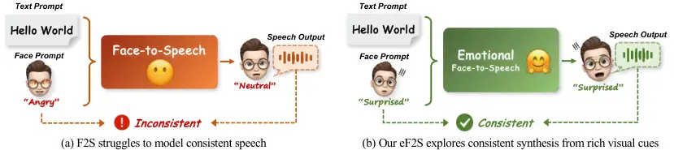
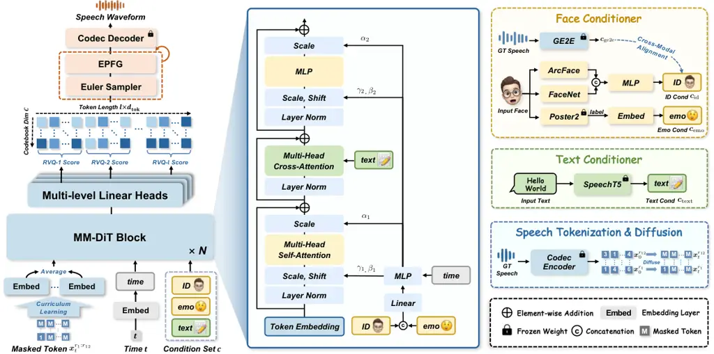
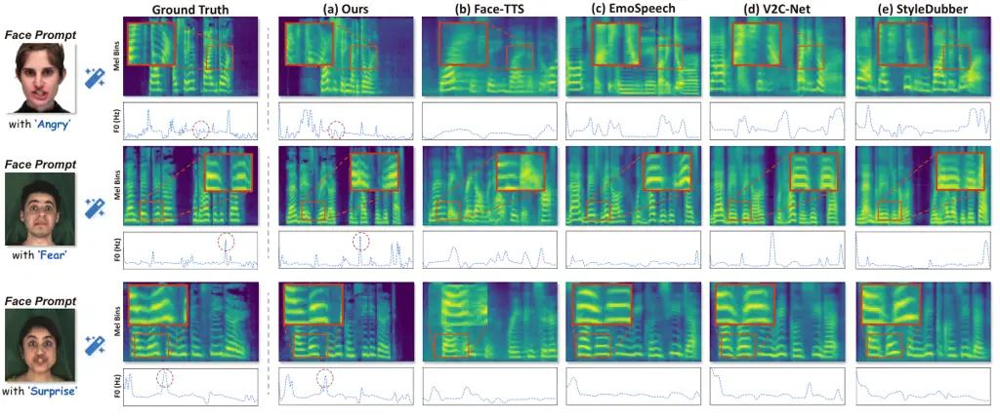
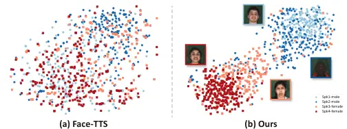
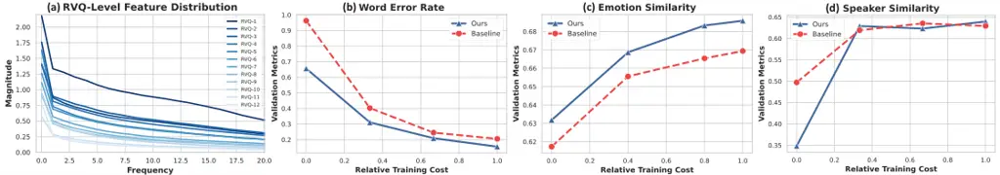
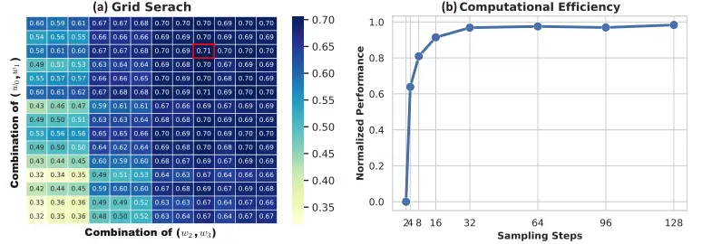
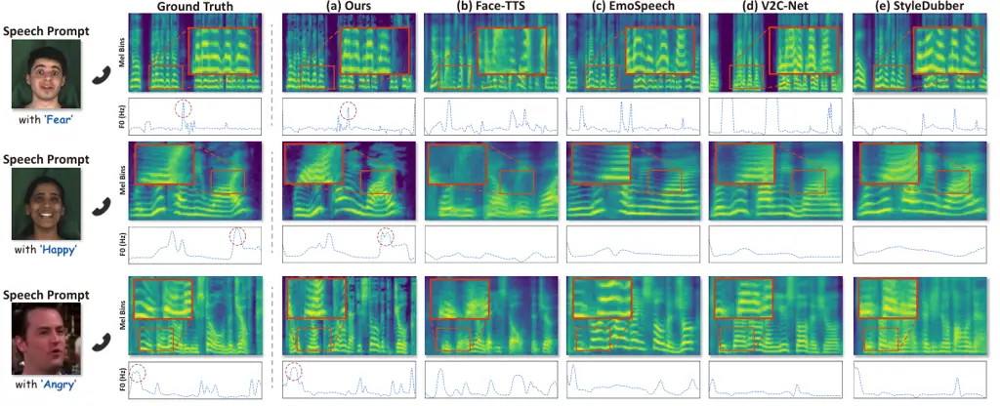
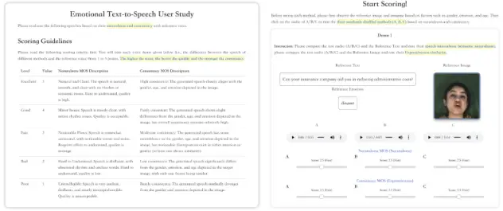

# Emotional Face-to-Speech

Jiaxin Ye Affiliation: Institute of Science and Technology for
Brain-Inspired Intelligence, Fudan University, Shanghai, China    Boyuan
Cao Affiliation: Institute of Science and Technology for Brain-Inspired
Intelligence, Fudan University, Shanghai, China    Hongming Shan
Affiliation: Institute of Science and Technology for Brain-Inspired
Intelligence, Fudan University, Shanghai, China Correspondence to:
<hmshan@fudan.edu.cn>

###### Abstract

How much can we infer about an emotional voice solely from an expressive
face? This intriguing question holds great potential for applications
such as virtual character dubbing and aiding individuals with expressive
language disorders. Existing face-to-speech methods offer great promise
in capturing identity characteristics but struggle to generate diverse
vocal styles with emotional expression. In this paper, we explore a new
task, termed _emotional face-to-speech_, aiming to synthesize emotional
speech directly from expressive facial cues. To that end, we introduce
DEmoFace, a novel generative framework that leverages a discrete
diffusion transformer (DiT) with curriculum learning, built upon a
multi-level neural audio codec. Specifically, we propose multimodal DiT
blocks to dynamically align text and speech while tailoring vocal styles
based on facial emotion and identity. To enhance training efficiency and
generation quality, we further introduce a coarse-to-fine curriculum
learning algorithm for multi-level token processing. In addition, we
develop an enhanced predictor-free guidance to handle diverse
conditioning scenarios, enabling multi-conditional generation and
disentangling complex attributes effectively. Extensive experimental
results demonstrate that DEmoFace generates more natural and consistent
speech compared to baselines, even surpassing speech-driven methods.
Demos are shown at
[https://demoface-ai.github.io/](https://demoface-ai.github.io/).

###### Keywords: 

Generative Model

## 1 Introduction

When we encounter a person’s face on platforms like Instagram or
Facebook without hearing their voice, our minds instinctively generate
auditory expectations based on visual cues. These expectations are
shaped by our experiences and cultures, influencing how we perceive
individuals to sound based on their external appearance, such as age,
gender, nationality, or emotion (Paris et al., 2017; Taitelbaum-Swead &
Fostick, 2016). These preconceived notions drive us to form judgments
about others’ voices even before they speak.

In recent years, face-guided Text-to-Speech (TTS) (Goto et al., 2020;
Kang et al., 2023; Jang et al., 2024), also known as Face-to-Speech or
F2S, has attracted growing interest with diverse applications, such as
virtual character dubbing and assistance for individuals with expressive
language disorders. The goal of F2S is to create voices that are
consistent with the guided face. However, users increasingly expect
generated speech that not only replicates speakers’ identities but also
conveys rich emotional expression, enhancing their experience in
human-machine interactions. This expectation is beyond the scope of F2S
tasks (Fig. 1(a)), lacking explicit guidance to produce desired
emotional speech.

Considering that facial expressions are the most direct indicators of
emotion, we propose an extension to F2S task grounded in visual cues,
termed emotional Face-to-Speech (eF2S). An example of the proposed eF2S
task is illustrated in Fig. 1(b). Unlike the conventional F2S task,
which converts text to speech guided solely by identity embeddings
extracted from a reference face, our eF2S task further decouples
identity and emotion from the facial input, producing speech that
preserves the speaker’s identity while enriching it with the emotional
expression derived from the reference face. While the new eF2S task may
initially appear to only require the generated speech to convey
emotions, it raises several novel challenges. On one hand, traditional
F2S methods are insufficient for eF2S, as they focus on converting text
into speech that reflects facial characteristics without considering
emotional states. On the other hand, previous expressive TTS methods
often focus on generating speech tied to either a specific identity or a
specific emotion, but customizing both simultaneously remains a
significant challenge—particularly in the absence of speech prompts.



Figure 1: Tasks comparison. (a) Conventional Face-to-Speech (F2S). (b)
The introduced Emotional Face-to-Speech (eF2S). Given text and face
prompts, the model is expected to generate speech that aligns with both
the facial identity and emotional expression. Our eF2S offers a novel
perspective for generating consistent speech without relying on any
vocal cues.

To address these challenges, we propose a novel discrete Diffusion
framework for Emotional Face-to-speech, called DEmoFace, which is the
first attempt to generate consistent auditory expectations
(i.e. identity and emotions) directly from visual cues. Specifically, to
mitigate the one-to-many issues inherent in continuous speech
features (Xue et al., 2023), we begin by discretizing the speech
generation process utilizing neural audio codec with Residual Vector
Quantization (RVQ). Considering the low-to-high frequency distributions
across different RVQ levels, we then introduce a discrete diffusion
model with a coarse-to-fine curriculum learning, to enhance both
training efficiency and diversity of generated speech. Building on this,
we propose a multimodal DiT (MM-DiT) for the reverse diffusion process,
which dynamically aligns speech and text prompt, and customizes
face-style linguistic expressions. Furthermore, for multi-conditional
generation, we develop enhanced predictor-free guidance (EPFG) on the
discrete diffusion model, boosting efficient response to the global
condition while facilitating the decoupling of local conditions.
Comprehensive experiments demonstrate that DEmoFace achieves diverse and
high-quality speech synthesis, outperforming the state-of-the-art models
in naturalness and consistency—exceeding even speech-guided methods. The
contributions of this paper are summarized below:

- •
  We introduce an extension to F2S task, named Emotional Face-to-Speech
  (eF2S), which is the first attempt to customize a consistent vocal
  style solely from the face.
- •
  We propose a novel discrete diffusion framework for speech generation,
  which incorporates multimodal DiT and RVQ-based curriculum learning,
  achieving high-fidelity generation and efficient training.
- •
  We devise enhanced predictor-free guidance to boost sampling quality
  in multi-conditional scenarios of eF2S.
- •
  Extensive experimental results demonstrate that DEmoFace can generate
  more consistent, natural speech with enhanced emotions compared to
  previous methods.

## 2 Related Work

### 2.1 Residual Vector Quantization for TTS

Neural audio codecs (Zeghidour et al., 2022; Zhang et al., 2024) enable
discrete speech modeling by reconstructing high-quality audio at low
bitrates. Residual Vector Quantization (RVQ) (Vasuki & Vanathi, 2006;
Zheng et al., 2024) is a standard technique for the codecs that
quantizes audio frames by multiple hierarchical layers of quantizers.
Recent models (Kharitonov et al., 2023; Shen et al., 2024) rely on
codecs with the RVQ to synthesize speech, and show promising performance
on naturalness. For example, VALL-E (Wang et al., 2023) employs
Encodec (Défossez et al., 2023) to transform the speech into a sequence
of discrete tokens, then uses an auto-regressive (AR) model to predict
tokens. However, existing methods are mainly based on the AR manner
leading to unstable and inefficient sampling. We propose a discrete
diffusion framework DEmoFace to reconstruct tokens from the RVQ codec,
achieving faster and more diverse sampling by parallel iterative
refinement.

### 2.2 Face-driven TTS

Face-driven TTS (F2S) aims to synthesize speech based on visual
information about the speaker (Plüster et al., 2021; Lee et al., 2024;
Goto et al., 2020; Kang et al., 2023). Previous F2S methods focus on how
to learn visual representation from speech supervision. For example,
Goto et al. (Goto et al., 2020) propose a supervised generalized
end-to-end loss to minimize the distance between visual embedding and
vocal speaker embedding. However, existing methods ignore the rich
emotional cues inherent in the face, which often generate over-smoothing
speech lacking diverse emotion naturalness. Although, Kang et al. (Kang
et al., 2023) additionally introduce speech prosody codes to enhance the
naturalness. They still depend on the speech prompt to achieve natural
generation, which do not satisfy the requirements of eF2S. In contrast,
our DEmoFace only utilizes visual cues to form the emotional auditory
expectations without relying on any vocal features.

### 2.3 Emotional TTS

Emotional TTS aims to enhance synthesized speech with emotional
expressiveness (Li et al., 2024; Guo et al., 2023b; Chen et al., 2022).
Existing methods can be divided into two categories based on how to
integrate emotion information into TTS systems. For emotion label
conditioning, EmoDiff (Guo et al., 2023b) introduces a diffusion model
with soft emotion labels as a classifier guidance. In contrast,
V2C-Net (Chen et al., 2022) employs emotion and speaker embeddings from
reference face and speech individually for speech customization.
However, previous methods do not explore how to learn both speaker
identity and emotion from the face image. Our DEmoFace offers a novel
perspective of the relationship between auditory expectations and visual
cues for TTS without relying on any vocal cues.

## 3 Preliminary: Discrete Diffusion Models

Continuous Diffusion Models (CDM) (Blattmann et al., 2023; Li et al.,
2023; Ruan et al., 2023) have achieved state-of-the-art results in
generative modeling, but face challenges in speech generation due to
high-dimensional speech features and excessive diffusion steps,
frustrating practical application. The fundamental solution lies in
compressing the speech feature space, such as a discrete space.

Recently, Discrete Diffusion Models (DDMs) have shown promise in
language modeling (Meng et al., 2022; Lou et al., 2024) and speech
generation (Yang et al., 2023; Wu et al., 2024). We emphasize that DDM
has yet to be explored in multi-conditional speech generation with
high-quality audio compression. In this paper, to our knowledge, we take
the first attempt to generate RVQ-based speech tokens with DDM. Below,
we outline the forward and reverse processes of the DDM, along with its
training objective.

#### Forward diffusion process.  

Given a sequence of tokens $`\bm{x}=x^{1}\ldots x^{d}`$ from a state
space of length $`d`$ like $`\mathcal{X}^{d}=\{1,\ldots,n\}^{d}`$. The
continuous-time discrete Markov chain at time $`t`$ is characterized by
the diffusion matrix $`{\bm{Q}}_{t}\in\mathbb{R}^{n^{d}\times n^{d}}`$
(i.e. transition rate matrix), as follows:

```math
p({x}_{t+\Delta t}^{i}|x_{t}^{i})=\delta_{{x}^{i}_{t+\Delta t}x^{i}_{t}}+{\bm{Q}}_{t}({x}^{i}_{t+\Delta t},x^{i}_{t})\Delta t+o(\Delta t), \tag{1}
```

where $`x^{i}_{t}`$ denotes $`i`$-th element of $`\bm{x}_{t}`$,
$`{\bm{Q}}_{t}({x}^{i}_{t+\Delta t},x^{i}_{t})`$ is the
$`({x}^{i}_{t+\Delta t},x^{i}_{t})`$ element of $`{\bm{Q}}_{t}`$,
denoting the transition rate from state $`x^{i}_{t}`$ to state
$`{x}^{i}_{t+\Delta t}`$ at time $`t`$, and $`\delta`$ is Kronecker
delta. Since the exponential size of $`{\bm{Q}}_{t}`$, existing
works (Lou et al., 2024; Ou et al., 2024) propose to assume dimensional
independence, conducting a one-dimensional diffusion process for each
dimension with the same token-level diffusion matrix
$`{\bm{Q}}_{t}^{\text{tok}}=\sigma(t){\bm{Q}}^{\text{tok}}\in\mathbb{R}^{n\times n}`$,
where $`\sigma(t)`$ is the noise schedule and $`{\bm{Q}}^{\text{tok}}`$
is designed to diffuse towards an absorbing state \[MASK\]. Then the
forward equation is formulated as
$`{\bm{P}}({x}^{i}_{t},x^{i}_{0})=\exp\left(\bar{\sigma}(t){\bm{Q}}^{\text{tok}}({x}^{i}_{t},x^{i}_{0})\right)`$,
where transition probability matrix
$`{\bm{P}}({x}^{i}_{t},x^{i}_{0}):=p({x}^{i}_{t}|x_{0})`$, and
cumulative noise $`\bar{\sigma}(t)=\int_{0}^{t}\sigma(s)ds`$. There are
two probabilities in the $`{\bm{P}}_{t|0}`$: $`1-e^{-\bar{\sigma}(t)}`$
for replacing the current tokens with \[MASK\], $`e^{-\bar{\sigma}(t)}`$
for keeping it unchanged.

#### Reverse denoising process.  

As the diffusion matrix $`{\bm{Q}}^{\text{tok}}_{t}`$ is known, the
reverse process can be given by a reverse transition rate matrix
$`\bar{{\bm{Q}}}_{t}`$ (Sun et al., 2023; Kelly, 2011), where
$`\bar{{\bm{Q}}}_{t}(x^{i}_{t-\Delta t},x^{i}_{t})=\frac{p(x^{i}_{t-\Delta t})}{p(x^{i}_{t})}{\bm{Q}}^{\text{tok}}_{t}(x^{i}_{t},x^{i}_{t-\Delta t})`$
and $`x^{i}_{t-\Delta t}\neq x^{i}_{t}`$, or
$`\bar{{\bm{Q}}}_{t}(x^{i}_{t-\Delta t},x^{i}_{t})=-\sum_{z\neq x_{t}}\bar{{\bm{Q}}}_{t}(z,x^{i}_{t})`$.
The reverse equation is formulated as follows:

```math
p({x}^{i}_{t-\Delta t}|x^{i}_{t})=\delta_{{x}^{i}_{t-\Delta t}x^{i}_{t}}+\bar{{\bm{Q}}}_{t}({x}^{i}_{t-\Delta t},x^{i}_{t})\Delta t+o(\Delta t),\\
 \tag{2}
```

where we can estimate the ratio
$`\frac{p(x^{i}_{t-\Delta t})}{p(x^{i}_{t})}`$ (which is known as the
concrete score (Lou et al., 2024; Meng et al., 2022) to measure the
transition probability or closeness from a state $`x^{i}`$ at time $`t`$
to a state $`\hat{x}^{i}`$ at time $`t-\Delta t`$) of
$`\bar{{\bm{Q}}}_{t}`$ by a score network
$`s_{\theta}({x}^{i}_{t},t)_{x^{i}_{t-\Delta t}}\approx[\frac{p(x^{i}_{t-\Delta t})}{p(x^{i}_{t})}]_{x^{i}_{t}\neq x^{i}_{t-\Delta t}}`$.
So that the reverse matrix is parameterized to model the reverse process
$`q_{\theta}({x}^{i}_{t-\Delta t}|x^{i}_{t})`$ (i.e. parameterize the
concrete score).

#### Training objective.  

Denoising score entropy (DSE) (Lou et al., 2024) is introduced to train
the score network $`s_{\theta}`$:

```math
\displaystyle\int_{0}^{T}\mathbb{E}_{\bm{x}_{t}\sim p\left(\bm{x}_{t}\mid\bm{x}_{0}\right)}\sum_{{\hat{\bm{x}}_{t}}\neq\bm{x}_{t}}{\bm{Q}}_{t}\left(\hat{{x}}^{i}_{t},{x}^{i}_{t}\right)\Big[s_{\theta}\left({x}^{i}_{t},t\right)_{\hat{{x}}^{i}_{t}} \tag{3}
```

```math
\displaystyle-c_{\hat{{x}}^{i}_{t}{x}^{i}_{t}}\log s_{\theta}\left({x}^{i}_{t},t\right)_{\hat{{x}}^{i}_{t}}+\text{N}(c_{\hat{{x}}^{i}_{t}{x}^{i}_{t}})\Big]dt \displaystyle,
```

where the concrete score
$`c_{\hat{{x}}^{i}_{t}{x}^{i}_{t}}=\frac{p\left({\hat{{x}}^{i}_{t}}\mid{x}^{i}_{0}\right)}{p\left({x}^{i}_{t}\mid{x}^{i}_{0}\right)}`$
and a normalizing constant function $`\text{N}(c):=c\log c-c`$ that
ensures loss non-negative. During sampling, we can replace the concrete
score with the trained score network on Equation 2.

## 4 Methodology

In this section, we describe our DEmoFace, the first RVQ-based discrete
diffusion for eF2S. We present the task formulation in Sec. 4.1 and an
overview of DEmoFace in Sec. 4.2.



Figure 2: Overall framework of DEmoFace. The MM-DiT inputs masked token
$`x_{t}^{r_{1}:r_{12}}`$, time $`t`$, and condition set $`\bm{c}`$ to
synthesize speech, consisting of $`N`$ blocks for conditioning and
$`12`$ linear heads to predict concrete scores. During training, we
propose a curriculum learning that first inputs low-level tokens and
refines them by adding high-level tokens progressively. During sampling,
an Euler sampler with our EPFG refines the tokens, while a codec decoder
reconstructs the waveform.

### 4.1 Task Formulation for eF2S

Given a triplet of multimodal-driven conditions
$`\bm{c}=\{\bm{c}_{\text{id}},\bm{c}_{\text{emo}},\bm{c}_{\text{text}}\}`$,
which correspond to reference identity, emotion, and text, respectively,
the eF2S task aims to synthesize speech based on the $`\bm{c}`$. More
precisely, the synthesized speech content aligns with the text condition
$`\bm{c}_{\text{text}}`$, while its voice identity and emotional
attributes correspond to the identity condition $`\bm{c}_{\text{id}}`$
and emotion condition $`\bm{c}_{\text{emo}}`$, respectively—both
extracted from the input face.

### 4.2 Overview of DEmoFace

Fig. 2 illustrates the overview of DEmoFace. The MM-DiT comprises $`N`$
blocks for conditional information injection and 12 linear heads for
concrete score prediction. The masked tokens $`x_{t}^{r_{1}:r_{12}}`$
are obtained via speech tokenization and forward diffusion, with face
and text conditioners forming the condition set $`\bm{c}`$. Meanwhile,
identity and emotion conditions with time are injected through adaptive
layer normalization (AdaLN) (Peebles & Xie, 2023), and the text
condition is injected with cross-attention. During training, we propose
a curriculum learning algorithm, which first inputs low-level tokens
$`\bm{x}_{t}^{r_{1}:r_{l-1}}`$ and refines them by adding high-level
token $`\bm{x}_{t}^{r_{l}}`$ progressively. During sampling, we utilize
an Euler sampler with our EPFG to iteratively refine the generated
tokens, while a codec decoder reconstructs the waveform. Notably, when
ground truth speech is provided during training, the reference features
$`\bm{c}_{\text{ge2e}}`$ are extracted from the GE2E (Wan et al., 2018)
to guide identity customization. During inference, we use the
cross-modal aligned face encoder to extract the $`\bm{c}_{\text{id}}`$
instead of $`\bm{c}_{\text{ge2e}}`$.

Next, we detail the key components in DEmoFace.

### 4.3 Conditional Concrete Score Modeling

For the concrete score $`s_{\theta}`$ modeling, we first define the
tokenization and forward diffusion processes, followed by a description
of the conditioners and architecture, and conclude with the modulation
of the concrete score using EPFG.

#### RVQ speech tokenization.  

We utilize the recent RVQ-based codec (Wang et al., 2024) as the
tokenizer, which achieves hierarchical modeling of diverse information
across different RVQ layers. Given a single-channel speech signal, the
tokenizer compresses it to the output tokens
$`\bm{x}^{r_{1}:r_{12}}=\{1,\ldots,C_{\text{code}}\}^{12\times d_{\text{tok}}}`$,
where $`r_{i}`$ is the $`i`$-th RVQ level of token, $`d_{\text{tok}}`$
is the length of the token sequence, respectively. The number of RVQ
layers is 12 with a codebook size $`C_{\text{code}}=1,024`$ in each
layer.

#### RVQ token diffusion process.  

Given the hierarchical structure of RVQ tokens, following the previous
diffusion process (Lou et al., 2024), we randomly corrupt each level
token $`\bm{x}^{r_{i}}_{t}`$ at timestep $`t`$. Specifically, we first
extract input tokens $`\bm{x}^{r_{1}:r_{l}}_{0}`$ from the codec encoder
according to the curriculum training stage, where $`r_{l}`$ denotes the
max level for the current input. We then conduct the diffusion process
as defined in Equation 1 for $`\bm{x}^{r_{i}}_{t}`$, where
$`1\leq i\leq l`$.

#### Conditioners.  

For face conditioner, as presented in Fig. 2, we build identity encoder
and emotion encoder to learn identity embedding $`\bm{c}_{\text{id}}`$
and emotion embedding $`\bm{c}_{\text{emo}}`$, respectively.
Specifically, we first employ a composite identity embedding by
introducing two face recognition models ArcFace (Deng et al., 2022) and
FaceNet (Schroff et al., 2015), then utilize a multilayer perceptron
(MLP) for transformation and shape alignment. To precisely model the
high-fidelity vocal style associated with the face, we extract the
speech speaker embedding $`\bm{c}_{\text{ge2e}}`$ from the speaker
recognition model GE2E (Wan et al., 2018), and make
$`\bm{c}_{\text{id}}`$ aligned with the $`\bm{c}_{\text{ge2e}}`$ across
modalities using cosine similarity, L1, and L2 losses, as detailed in
Sec. 4.4. For the emotion embedding, we employ a strong facial
expression recognition model Poster2 (Mao et al., 2023). Since the
continuous emotion embedding of backbone is insufficient for decoupling
identity information (Liu et al., 2024), we leverage the predicted label
and a learnable embedding layer to learn identity-agnostic embedding
$`\bm{c}_{\text{emo}}`$.

For text conditioner, we introduce a text encoder to learn text
embedding $`\bm{c}_{\text{text}}`$. Specifically, raw text is
preprocessed into an International Phonetic Alphabet (IPA) phone
sequence using a standard IPA phonemizer. Next, embedding is extracted
from a pre-trained text-speech encoder SpeechT5 (Ao et al., 2022), and
is then subsequently projected into the hidden state via an MLP.

#### Multimodal DiT.  

We propose the Multimodal DiT (MM-DiT), which differs from DiT (Peebles
& Xie, 2023) in three aspects. (1) _Input_, the masked speech tokens
$`\bm{x}^{r_{1}:r_{12}}_{t}`$ at timestep $`t`$ are fed to embedding
layers and subsequently averaged to serve as the input. (2)
_Conditioning_, to customize face-style speech generation, we
concatenate $`\bm{c}_{\text{id}}`$ and $`\bm{c}_{\text{emo}}`$ along
with the timestep embedding, is passed through an MLP to inject the
global face-style condition. The MLP aims to regress the scale and shift
parameters
$`\alpha_{1},\gamma_{1},\beta_{1},\alpha_{2},\gamma_{2},\beta_{2}`$ for
the AdaLN. Additionally, to learn face-style linguistic expressions, we
apply cross-attention with rotary position embeddings (Su et al., 2024)
enabling dynamic alignment with text $`\bm{c}_{\text{text}}`$. (3)
_Output_, we incorporate 12 linear heads including a combination of
AdaLN and linear layer to predict concrete scores for each RVQ level.

#### Enhanced predictor-free guidance.  

Several guidance tricks can boost sampling quality for the conditional
generation, such as predictor-free guidance (PFG) (Nisonoff et al.,
2024; Ho & Salimans, 2021). However, given $`K`$ conditions
$`\bm{c}=\{\bm{c}_{1},\ldots,\bm{c}_{K}\}`$, these guidance methods are
not readily amenable to multi-conditional scenarios (Liu et al., 2022).
From the perspective of Energy-Based Models (EBMs), we propose an
Enhanced PFG (EPFG) enhancing the efficient response to global condition
while facilitating the decoupling of local conditions.

Specifically, to simplify the notation, we define
$`x^{i}_{t},x^{i}_{t-\Delta t}`$ as $`x,\hat{x}`$. The key of
conditional sampling process is to estimate the concrete score
$`\hat{s}_{\theta}\left({x},t,\bm{c}\right)_{\hat{x}}\approx\frac{p(\hat{x})}{p(x)}`$
linked to the transition probability. Using Bayes rule, we can obtain a
compositional concrete score
$`\hat{s}_{\theta}\left(x,t,\bm{c}\right)_{\hat{x}}`$ from
$`p(x_{t-\Delta t}=\hat{x}|x_{t}=x,\bm{c})`$ based on Equation 2:

```math
\hat{s}_{\theta}\left(x,t,\bm{c}\right)_{\hat{x}}=s_{\theta}(x,t)_{\hat{x}}\prod\limits_{k=1}^{K}\frac{s_{\theta}(x,t,\bm{c}_{k})_{\hat{x}}}{s_{\theta}(x,t)_{\hat{x}}}. \tag{4}
```

Instead of sampling from
$`\hat{s}_{\theta}\left(x,t,\bm{c}\right)_{\hat{x}}`$, we can utilize
temperature sampling (Kingma & Dhariwal, 2018; Mehta et al., 2023) for
more controllable generated outputs by introducing
$`\hat{s}^{(w)}_{\theta}\left(x,t,\bm{c}\right)_{\hat{x}}=s_{\theta}(x,t)_{\hat{x}}\prod_{k=1}^{K}\frac{s^{w_{k}}_{\theta}(x,t,\bm{c}_{k})_{\hat{x}}}{s^{w_{k}}_{\theta}(x,t)_{\hat{x}}}`$,
where $`w_{k}`$ denotes the guidance scale. However, this compositional
guidance lacks interactions among local conditions and struggles to
guide sampling with a global consistent direction. Inspired by the
formulation of the EBM, the score can also be formulated as
$`\hat{s}_{\theta}(x)_{\hat{x}}\approx\frac{p_{\theta}(\hat{x})}{p_{\theta}(x)}=\frac{e^{f_{\theta}(\hat{x})}/Z}{e^{f_{\theta}(x)}/Z}=\frac{e^{f_{\theta}(\hat{x})}}{e^{f_{\theta}(x)}}`$,
where $`Z`$ is the normalizing constant, and $`f_{\theta}`$ is the
energy function. Hence, we can associate compositional and joint
conditions by summing up the energy functions, and finally obtain the
modulated score by multiplying both scores:

```math
\hat{s}^{(w)}_{\theta}\left({x},t\right)_{\hat{x}}\!=\!\underbrace{s_{\theta}({x},t)_{\hat{x}}\prod\limits_{k=1}^{K}\tfrac{s^{w_{i}}_{\theta}({x},t,\bm{c}_{k})_{\hat{x}}}{s^{w_{i}}_{\theta}({x},t)_{\hat{x}}}}_{\text{Compositional}}\cdot\underbrace{\tfrac{s^{w_{0}}_{\theta}({x},t,\bm{c})_{\hat{x}}}{s^{w_{0}-1}_{\theta}({x},t)_{\hat{x}}}}_{\text{Joint}}, \tag{5}
```

where
$`\bm{c}=\{\bm{c}_{\text{id}},\bm{c}_{\text{emo}},\bm{c}_{\text{text}}\}`$,
$`w_{0}`$ controls the scale of guidance strength for the joint
injection of all conditions, while $`w_{i}`$ for $`1\leq k\leq K`$ is
assigned to each independent attribute. Please refer to Appendix C for
detailed derivation.

### 4.4 Curriculum-based Training and Inference

#### Training.  

Curriculum learning aims to progressively train the model from simple to
hard tasks, with the key challenge of identifying samples varying in
difficulty. Previous studies show that neural networks prioritize
low-frequency information first (Rahaman et al., 2019). Fig. 5(a) shows
different frequency distributions across RVQ levels, with low-level
features exhibiting low-frequency patterns. Therefore, we reveal
curriculum learning for RVQ-based tokens from the frequency perspective.
As shown in Fig. 2, we gradually introduce higher-level tokens
$`\bm{x}^{r_{l}}_{t}`$ every 3 epochs, starting from previous low-level
(i.e. low-frequency) tokens $`\bm{x}^{r_{1}:r_{l-1}}_{t}`$ to high-level
tokens $`\bm{x}^{r_{1}:r_{l}}_{t}`$, facilitating effective training.

Furthermore, the training procedure for our DEmoFace contains two
stages: concrete score prediction and identity feature alignment. In the
concrete score prediction, the training objective is the multi-level DSE
loss based on Equation 3 with the sum across current $`r_{l}`$ RVQ
levels as
$`\mathcal{L}_{\text{score}}=\sum_{i=1}^{l}\mathcal{L}_{\text{DSE}}(\bm{x}^{r_{i}},t,\bm{c})`$.
For conducting multi-conditional PFG in Equation 5, we randomly set
$`\varnothing`$ with 10% probability for each condition, and enforce all
conditions set to $`\varnothing`$ for 10% samples. In the feature
alignment, we introduce cosine similarity, L1, and L2 losses to align
the visual identity vectors with speech speaker vectors. With these
compositional losses, the training objective for the face encoder is as
$`\mathcal{L}_{\text{align}}=1-\mathrm{cos}(\bm{c}_{\text{id}},\bm{c}_{\text{ge2e}})+\mathrm{L1}(\bm{c}_{\text{id}},\bm{c}_{\text{ge2e}})+\mathrm{L2}(\bm{c}_{\text{id}},\bm{c}_{\text{ge2e}})`$.
Notably, to avoid information degradation with teacher-student
distillation, we directly train the DEmoFace with ground truth targets
$`\bm{c}_{\text{ge2e}}`$ and use the aligned face identity embedding
$`\bm{c}_{\text{id}}`$ during inference phase.

|                                     |       |        |                    |                    |                    |                   |                      |
| ----------------------------------- | ----- | ------ | ------------------ | ------------------ | ------------------ | ----------------- | -------------------- |
| Methods                             | Audio | Visual | EmoSim$`\uparrow`$ | SpkSim$`\uparrow`$ | RMSE$`\downarrow`$ | MCD$`\downarrow`$ | WER(%)$`\downarrow`$ |
| Ground Truth                        | -     | -      | 1.0000             | 1.0000             | 0.00               | 0.0000            | 10.82                |
| Acoustic-guided Speech Generation   |       |        |                    |                    |                    |                   |                      |
| EmoSpeech (Diatlova & Shutov, 2023) | ✓     | ✗      | 0.7667             | 0.5677             | 114.70             | 7.1328            | 29.59                |
| FastSpeech2 (Ren et al., 2021)      | ✓     | ✓      | 0.7010             | 0.5217             | 115.97             | 7.3461            | 29.49                |
| V2C-Net (Cong et al., 2023)         | ✓     | ✓      | 0.6788             | 0.5773             | 115.55             | 6.8901            | 29.54                |
| HPM (Chen et al., 2022)             | ✓     | ✓      | 0.6817             | 0.4404             | 97.19              | 7.7614            | 77.31                |
| StyleDubber (Cong et al., 2024)     | ✓     | ✓      | 0.6742             | 0.4753             | 103.59             | 7.4497            | 43.14                |
| DEmoFace^(∗) (Ours)                 | ✓     | ✓      | 0.7921             | 0.7990             | 94.68              | 6.5505            | 19.72                |
| Visual-guided Speech Generation     |       |        |                    |                    |                    |                   |                      |
| Face-TTS (Lee et al., 2023)         | ✗     | ✓      | 0.5230             | 0.1968             | 118.96             | 8.4649            | 17.47                |
| DEmoFace (Ours)                     | ✗     | ✓      | 0.6965             | 0.6679             | 101.18             | 6.8601            | 20.78                |

Table 1: Speech quantitative results. The Audio and Visual indicate
whether specific modality conditions are used for speech generation
guidance. $`\uparrow`$ ($`\downarrow`$) means the higher (lower) value
is better. We bold the best-performing method. Notably, the ^(∗) denotes
that we use the speech condition $`\bm{c}_{\text{ge2e}}`$, rather than
the face condition $`\bm{c}_{\text{id}}`$ to guide identity
conditioning.

#### Inference.  

During inference, we introduce a frame-level duration predictor to
estimate speech durations, initializing the input length
$`d_{\text{tok}}`$. Then the reverse process is executed with Euler
sampling (Lou et al., 2024) and EPFG with 96 steps. The details of the
duration predictor refer to Appendix E.1.

## 5 Experimental Results

### 5.1 Experimental Setups

#### Datasets.  

All our models are pre-trained on three datasets with pairs of face
video and speech: RAVDESS (Livingstone & Russo, 2018), MEAD (Wang
et al., 2020; Gan et al., 2023), and MELD-FAIR (Carneiro et al., 2023).
For data pre-processing, we first resample the audio to 16 kHz, and
apply a speech separation model SepFormer (Subakan et al., 2021) to
enhance voice. Then, we introduce Whisper (Radford et al., 2023) to
filter non-aligned text-speech pairs. Then, all models are trained on a
combination of all three datasets. The RAVDESS and MEAD of the combined
one are randomly segmented into training, validation, and test sets
without any speaker overlap. For the MELD-FAIR, we follow the original
splits. Additionally, these datasets lack sufficient semantic units in
real-world environments, making it challenging to train a TTS model. We
incorporate a 10-hour subset from LRS3 (Afouras et al., 2018) for
pre-training, allowing the model to be comparable to Face-TTS trained on
400 hours of LRS3. Finally, the combined dataset comprises 31.33 hours
of audio recordings and 26,767 utterances across 7 basic emotions
(i.e. angry, disgust, fear, happy, neutral, sad, and surprised) and 953
speakers.

#### Evaluation metrics.  

For eF2S, we evaluate the generation performance based on naturalness
(i.e. speech quality) and expressiveness. For the naturalness, we employ
Mel Cepstral Distortion (MCD) (Chen et al., 2022) to assess
discrepancies between generated and target speech. Additionally, the
Word Error Rate (WER) (Wang et al., 2018; Radford et al., 2023) is used
to gauge intelligibility. For the expressiveness, we calculate cosine
similarity metrics based on emotion embeddings (Ma et al., 2024) and
x-vectors (Du et al., 2023) to assess emotion similarity (EmoSim) and
speaker identity similarity (SpkSim), as well as the Root Mean Square
Error (RMSE) for F0 (Hayashi et al., 2017).



Figure 3: Speech qualitative results. The red rectangles highlight key
regions with acoustic differences or over-smoothing issues, and the red
dotted circle shows similar F0 contours with ground truth. Zoom in for
more details.

#### Implementation details.  

We implement DEmoFace based on DiT architecture (Peebles & Xie, 2023).
We use a log-linear noise schedule $`\sigma(t)`$ (Lou et al., 2024)
where the expectation of the number of masked tokens is linear with
$`t`$. During training, we use the AdamW optimizer (Loshchilov & Hutter, 2019) with a learning rate of 1e-4, batch size 32. The total number of
iterations is 300k. During inference, we use the Euler sampler to
conduct the reverse process with 96 steps. We set the joint guidance
scale $`w_{0}=1.9`$, and compositional scales $`w_{1}=w_{2}=1.0,`$
$`w_{3}=1.6`$.

### 5.2 Quantitative Evaluation

For quantitative evaluation, we compare DEmoFace with previous
state-of-the-art (SOTA) methods, categorized into two paradigms based on
the type of guidance. The acoustic-guided methods customize identity
using acoustic prompts, and drive emotion generation from either visual
or acoustic cues, while the visual-guided methods aim to customize both
identity and emotion only from visual conditions.

#### Objective evaluation.  

As shown in Tab. 1, compared with Face-TTS, we achieve 17.35% and 47.11%
improvements in terms of EmoSim and SpkSim, reflecting the great ability
to maintain voice-identity while enhancing consistency. For prosody
modeling, we can estimate a more precise F0 contour with relative 14.95%
gains, exhibiting more natural speech expressiveness. The MCD improved
by a relative 18.96%, indicating minimal acoustic difference with the
target speech. While Face-TTS achieves a better WER by utilizing over 10
times the data, DEmoFace significantly improves naturalness and
consistency with fewer data.

Notably, we observe that the visual-guided DEmoFace even outperforms the
acoustic-guided methods, which are the most efficient for speech
generation by leveraging isomorphic features. It demonstrates that
DEmoFace bridges the cross-modal gap using only heterogeneous face
features. Furthermore, we introduce the acoustic-guided DEmoFace^(∗)
replacing face condition $`\bm{c}_{\text{id}}`$ with speech condition
$`\bm{c}_{\text{ge2e}}`$, which gains greater improvements than other
acoustic-guided methods in all metrics by a large margin.

#### Subjective evaluation.  

We further conduct the subjective evaluation with 15 participants, to
compare our DEmoFace with SOTA methods. Specifically, we introduce five
mean opinion scores (MOS) with rating scores from 1 to 5 in 0.5
increments, including $`\text{MOS}_{\text{nat}}`$,
$`\text{MOS}_{\text{con}}`$ for speech naturalness (i.e. quality) and
consistency (i.e. emotion and speaker similarity). We randomly generate
10 samples from the test set. The scoring results of the user study are
presented in Tab. 2. DEmoFace demonstrates a clear advantage over SOTA
methods in both metrics, particularly in achieving higher
$`\text{MOS}_{\text{nat}}`$ with 28% relative improvement, which
validates the effectiveness of our method. Furthermore, compared to
acoustic-guided EmoSpeech, we achieve better
$`\text{MOS}_{\text{con}}`$, demonstrating our ability to generate
speech with greater emotional and identity consistency.

|                 |                                     |                                     |
| --------------- | ----------------------------------- | ----------------------------------- |
| Methods         | $`\text{MOS}_{\text{nat}}\uparrow`$ | $`\text{MOS}_{\text{con}}\uparrow`$ |
| EmoSpeech       | 2.92$`\pm`$0.21                     | 3.20$`\pm`$0.17                     |
| Face-TTS        | 2.81$`\pm`$0.36                     | 2.40$`\pm`$0.22                     |
| DEmoFace (Ours) | 3.75$`\pm`$0.12                     | 3.36$`\pm`$0.13                     |

Table 2: Subjective evaluation on speech naturalness and consistency,
compared with acoustic and visual methods.

### 5.3 Qualitative Results

#### Qualitative comparisons.  

As shown in Fig. 3, from mel-spectrogram in the first row, we observe
severe temporal differences and over-smoothing issues in Face-TTS,
EmoSpeech, and V2C-Net, causing duration asynchronization and quality
degradation. Furthermore, from the F0 curve in the third row, the other
baselines exhibit distinct F0 contours showing different pitch, emotion,
and intonation with the ground truth (GT). In contrast, our results are
closer to the GT, benefiting from enhanced multi-conditional generation
and dynamic synchronization capabilities of DEmoFace.



Figure 4: t-SNE visualization of x-vectors from synthesis speeches. Each
color represents a different speaker.



Figure 5: Ablation study on curriculum learning. (a) Feature
distribution across RVQ levels, with low-level features showing
low-frequency patterns. (b)-(d) For the baseline without curriculum
learning, we vary the number of training epochs compared with three
metrics on the validation set. The effect is evident for WER and EmoSim
while slight on SpkSim.

#### Visualization of speaker embeddings.  

To explore the speaker diversity, we utilize t-SNE technique (Van der
Maaten & Hinton, 2008) to visualize the distribution of x-vectors
extracted from the synthesis speech. As shown in Fig. 4, Face-TTS
exhibits wrong mixing among different speakers and genders, indicating
that they may not generate voices with distinguishable styles. In
contrast, we effectively cluster the speeches from the same speaker,
while maintaining stronger speaker-discriminative properties.

### 5.4 Ablation Studies

#### Ablation on curriculum learning.  

To demonstrate the effectiveness of curriculum learning, we input all
RVQ-level tokens during the whole training process as the variant (a) in
Tab. 3. Based on the fact that RVQ Codec preserves semantic information
in low-level tokens while retaining acoustic details in high-level
tokens (Nishimura et al., 2024), Fig. 3 shows: (1) we achieve better WER
and EmoSim than baseline during early training, as prioritized low-level
learning effectively captures low-level information; (2) SpkSim
initially lags due to unseen high-level tokens but improves as they are
progressively introduced. The results highlight the effectiveness of
curriculum learning.

|      |                    |                    |                    |                   |                      |
| ---- | ------------------ | ------------------ | ------------------ | ----------------- | -------------------- |
| Vars | EmoSim$`\uparrow`$ | SpkSim$`\uparrow`$ | RMSE$`\downarrow`$ | MCD$`\downarrow`$ | WER(%)$`\downarrow`$ |
| (a)  | 0.67               | 0.66               | 104.41             | 7.24              | 27.52                |
| (b)  | 0.69               | 0.58               | 115.30             | 8.33              | 39.06                |
| (c)  | 0.67               | 0.63               | 106.67             | 7.31              | 40.13                |
| Ours | 0.70               | 0.67               | 101.18             | 6.86              | 20.78                |

Table 3: Ablation studies. ”Vars” refers to the ablation variants, with
(a) to (c) indicating the removal of curriculum learning, identity
feature alignment, and EPFG, respectively.

#### Ablation on identity alignment.  

Due to the heterogeneous differences between speaker features from
vision and speech, accurate cross-modal customization is challenging. As
shown in Tab. 3, without identity alignment, the SpkSim drops by 9%,
while noise in the visual features negatively impacts speech generation,
causing a decline in all metrics.

#### Ablation on EPFG.  

The EPFG enables an effective generalization across combinations of
multiple conditions, even those unseen during pre-training. From Tab. 3,
we observe that EmoSim, SpkSim, and WER metrics have degraded when all
conditions are treated as a unified one, showing the incorporation of
EPFG can significantly enhance multi-conditional generation quality.
Furthermore, we conduct a grid search for all parameters of the EPFG on
the validation set. As shown in Fig. 6(a), axes denote two parameter
combinations
(i.e. $`(w_{0}\in[1.0,2.0],w_{1}\in[1.0,1.4]),(w_{1}\in[1.0,1.4],w_{2}\in[1.0,2.0])`$),
the color of the grid indicates normalized performance score, and the
red rectangle marking the final parameter combination we select. We
observe that performance degradation (i.e. the light area) with complex
entanglement, as the unconditional score dominates with low guidance
scales across conditions.



Figure 6: (a) Parameters grid search for the EPFG, with axes as
two-parameter combinations, colors as normalized performance. (b) Effect
on sampling steps.

#### Ablation on sampling steps.  

To explore the effectiveness of sampling steps, we first normalize each
metric to $`[0,1]`$ and obtain the average performance. As shown in
Fig. 6(b), the performance improves with more steps, saturating at 32
steps. It demonstrates that DEmoFace achieves acceptable generation
quality with just 32 steps. To balance performance with efficiency, we
utilize 96 steps in this paper.

## 6 Conclusion

We propose DEmoFace, the first RVQ-based discrete diffusion framework
for eF2S with high diversity and quality, serving as a foundation for
future research in multimodal personalized TTS systems. Both
quantitative and qualitative evaluations demonstrate that we outperform
existing methods. In the future, we will scale up the datasets with more
diverse speakers and languages covering various scenarios.

Social impact.   Given the privacy of identity information in face and
speech, we stress the necessity of consent agreements for using
published models, to ensure responsible application while respecting
individual privacy and rights.

## References

- Afouras et al. (2018) Afouras, T., Chung, J. S., and Zisserman, A.
  LRS3-TED: a large-scale dataset for visual speech recognition. _CoRR_,
  abs/1809.00496, 2018.
- Ao et al. (2022) Ao, J., Wang, R., Zhou, L., Wang, C., Ren, S., Wu,
  Y., Liu, S., Ko, T., Li, Q., Zhang, Y., Wei, Z., Qian, Y., Li, J., and
  Wei, F. SpeechT5: Unified-modal encoder-decoder pre-training for
  spoken language processing. In _Proc. Annu. Meeting Assoc. Comput.
  Linguistics_, pp. 5723–5738. Association for Computational
  Linguistics, 2022.
- Austin et al. (2021) Austin, J., Johnson, D. D., Ho, J., Tarlow, D.,
  and van den Berg, R. Structured denoising diffusion models in discrete
  state-spaces. In _Adv. Neural Inform. Process. Syst._, pp.
  17981–17993, 2021.
- Blattmann et al. (2023) Blattmann, A., Rombach, R., Ling, H.,
  Dockhorn, T., Kim, S. W., Fidler, S., and Kreis, K. Align your
  latents: High-resolution video synthesis with latent diffusion models.
  In _IEEE Conf. Comput. Vis. Pattern Recog._, pp. 22563–22575, 2023.
- Carneiro et al. (2023) Carneiro, H. C. C., Weber, C., and Wermter, S.
  Whose emotion matters? speaking activity localisation without prior
  knowledge. _Neurocomputing_, 545:126271, 2023.
- Carreira & Zisserman (2017) Carreira, J. and Zisserman, A. Quo vadis,
  action recognition? A new model and the kinetics dataset. In _IEEE
  Conf. Comput. Vis. Pattern Recog._, pp. 4724–4733, 2017.
- Chen et al. (2022) Chen, Q., Tan, M., Qi, Y., Zhou, J., Li, Y., and
  Wu, Q. V2C: Visual voice cloning. In _IEEE Conf. Comput. Vis. Pattern
  Recog._, pp. 21210–21219, 2022.
- Chung et al. (2018) Chung, J. S., Nagrani, A., and Zisserman, A.
  VoxCeleb2: Deep speaker recognition. In Yegnanarayana, B. (ed.),
  _Annu. Conf. Int. Speech Commun. Assoc._, pp. 1086–1090, 2018.
- Cong et al. (2023) Cong, G., Li, L., Qi, Y., Zha, Z., Wu, Q., Wang,
  W., Jiang, B., Yang, M., and Huang, Q. Learning to dub movies via
  hierarchical prosody models. In _IEEE Conf. Comput. Vis. Pattern
  Recog._, pp. 14687–14697, 2023.
- Cong et al. (2024) Cong, G., Qi, Y., Li, L., Beheshti, A., Zhang, Z.,
  van den Hengel, A., Yang, M., Yan, C., and Huang, Q. StyleDubber:
  Towards multi-scale style learning for movie dubbing. In _Findings
  Proc. Annu. Meeting Assoc. Comput. Linguistics_, pp. 6767–6779, 2024.
- Défossez et al. (2023) Défossez, A., Copet, J., Synnaeve, G., and
  Adi, Y. High fidelity neural audio compression. _Trans. Mach. Learn.
  Res._, 2023, 2023.
- Deng et al. (2022) Deng, J., Guo, J., Yang, J., Xue, N., Kotsia, I.,
  and Zafeiriou, S. Arcface: Additive angular margin loss for deep face
  recognition. _IEEE Trans. Pattern Anal. Mach. Intell._,
  44(10):5962–5979, 2022.
- Diatlova & Shutov (2023) Diatlova, D. and Shutov, V. EmoSpeech:
  Guiding FastSpeech2 towards emotional text to speech. In _ISCA Speech
  Synthesis Worksh._, pp. 106–112, 2023.
- Du et al. (2023) Du, C., Guo, Y., Chen, X., and Yu, K. Speaker
  adaptive text-to-speech with timbre-normalized vector-quantized
  feature. _IEEE ACM Trans. Audio Speech Lang. Process._,
  31:3446–3456, 2023.
- Gan et al. (2023) Gan, Y., Yang, Z., Yue, X., Sun, L., and Yang, Y.
  Efficient emotional adaptation for audio-driven talking-head
  generation. In _Int. Conf. Comput. Vis._, pp. 22577–22588, 2023.
- Geng et al. (2024) Geng, C., Han, T., Jiang, P., Zhang, H., Chen, J.,
  Hauberg, S., and Li, B. Improving adversarial energy-based model via
  diffusion process. In _Int. Conf. on Mach. Learn._, 2024.
- Goto et al. (2020) Goto, S., Onishi, K., Saito, Y., Tachibana, K., and
  Mori, K. Face2Speech: Towards multi-speaker text-to-speech synthesis
  using an embedding vector predicted from a face image. In _Annu. Conf.
  Int. Speech Commun. Assoc._, pp. 1321–1325, 2020.
- Guo et al. (2023a) Guo, Q., Ma, C., Jiang, Y., Yuan, Z., Yu, Y., and
  Luo, P. EGC: Image generation and classification via a diffusion
  energy-based model. In _Int. Conf. Comput. Vis._, pp. 22895–22905,
  2023a.
- Guo et al. (2023b) Guo, Y., Du, C., Chen, X., and Yu, K. Emodiff:
  Intensity controllable emotional text-to-speech with soft-label
  guidance. In _IEEE Conf. Acoust. Speech Signal Process._, pp. 1–5,
  2023b.
- Hayashi et al. (2017) Hayashi, T., Tamamori, A., Kobayashi, K.,
  Takeda, K., and Toda, T. An investigation of multi-speaker training
  for wavenet vocoder. In _IEEE Autom. Speech Recognit. Understanding
  Worksh._, pp. 712–718, 2017.
- Ho & Salimans (2021) Ho, J. and Salimans, T. Classifier-free diffusion
  guidance. In _Adv. Neural Inform. Process. Syst. Worksh_, pp.
  1–14, 2021.
- Ho et al. (2020) Ho, J., Jain, A., and Abbeel, P. Denoising diffusion
  probabilistic models. In _Adv. Neural Inform. Process. Syst._, 2020.
- Ito & Johnson (2017) Ito, K. and Johnson, L. The lj speech dataset.
  [https://keithito.com/LJ-Speech-Dataset/](https://keithito.com/LJ-Speech-Dataset/), 2017.
- Jang et al. (2024) Jang, Y., Kim, J., Ahn, J., Kwak, D., Yang, H., Ju,
  Y., Kim, I., Kim, B., and Chung, J. S. Faces that speak: Jointly
  synthesising talking face and speech from text. In _IEEE Conf. Comput.
  Vis. Pattern Recog._, pp. 8818–8828, 2024.
- Kang et al. (2023) Kang, M., Han, W., and Yang, E. Face-stylespeech:
  Improved face-to-voice latent mapping for natural zero-shot speech
  synthesis from a face image. _CoRR_, abs/2311.05844, 2023.
- Kelly (2011) Kelly, F. P. _Reversibility and stochastic networks_.
  Cambridge University Press, 2011.
- Kharitonov et al. (2023) Kharitonov, E., Vincent, D., Borsos, Z.,
  Marinier, R., Girgin, S., Pietquin, O., Sharifi, M., Tagliasacchi, M.,
  and Zeghidour, N. Speak, read and prompt: High-fidelity text-to-speech
  with minimal supervision. _Trans. Assoc. Comput. Linguistics_,
  11:1703–1718, 2023.
- Kim & Bengio (2016) Kim, T. and Bengio, Y. Deep directed generative
  models with energy-based probability estimation. _CoRR_,
  abs/1606.03439, 2016.
- Kingma & Ba (2015) Kingma, D. P. and Ba, J. Adam: A method for
  stochastic optimization. In _Int. Conf. Learn. Represent._, 2015.
- Kingma & Dhariwal (2018) Kingma, D. P. and Dhariwal, P. Glow:
  Generative flow with invertible 1x1 convolutions. In _Adv. Neural
  Inform. Process. Syst._, pp. 10236–10245, 2018.
- Lee et al. (2023) Lee, J., Chung, J. S., and Chung, S. Imaginary
  voice: Face-styled diffusion model for text-to-speech. In _IEEE Conf.
  Acoust. Speech Signal Process._, pp. 1–5, 2023.
- Lee et al. (2024) Lee, J., Oh, Y., Hwang, I., and Lee, K. Hear your
  face: Face-based voice conversion with F0 estimation. _CoRR_,
  abs/2408.09802, 2024.
- Li et al. (2024) Li, X., Cheng, Z., He, J., Peng, X., and Hauptmann,
  A. G. MM-TTS: A unified framework for multimodal, prompt-induced
  emotional text-to-speech synthesis. _CoRR_, abs/2404.18398, 2024.
- Li et al. (2023) Li, Y. A., Han, C., Raghavan, V. S., Mischler, G.,
  and Mesgarani, N. StyleTTS 2: Towards human-level text-to-speech
  through style diffusion and adversarial training with large speech
  language models. In _Adv. Neural Inform. Process. Syst._, 2023.
- Liu et al. (2022) Liu, N., Li, S., Du, Y., Torralba, A., and
  Tenenbaum, J. B. Compositional visual generation with composable
  diffusion models. In _Eur. Conf. Comput. Vis._, volume 13677, pp.
  423–439, 2022.
- Liu et al. (2024) Liu, R., Ma, B., Zhang, W., Hu, Z., Fan, C., Lv, T.,
  Ding, Y., and Cheng, X. Towards a simultaneous and granular
  identity-expression control in personalized face generation. In _IEEE
  Conf. Comput. Vis. Pattern Recog._, pp. 2114–2123, 2024.
- Livingstone & Russo (2018) Livingstone, S. R. and Russo, F. A. The
  ryerson audio-visual database of emotional speech and song (RAVDESS):
  A dynamic, multimodal set of facial and vocal expressions in north
  american english. _PLOS ONE_, 13(5):e0196391, 2018.
- Loshchilov & Hutter (2019) Loshchilov, I. and Hutter, F. Decoupled
  weight decay regularization. In _Int. Conf. Learn. Represent._, 2019.
- Lou et al. (2024) Lou, A., Meng, C., and Ermon, S. Discrete diffusion
  modeling by estimating the ratios of the data distribution. In _Int.
  Conf. on Mach. Learn._, 2024.
- Ma et al. (2024) Ma, Z., Zheng, Z., Ye, J., Li, J., Gao, Z., Zhang,
  S., and Chen, X. emotion2vec: Self-supervised pre-training for speech
  emotion representation. In _Findings Proc. Annu. Meeting Assoc.
  Comput. Linguistics_, pp. 15747–15760. Association for Computational
  Linguistics, 2024.
- Mao et al. (2023) Mao, J., Xu, R., Yin, X., Chang, Y., Nie, B., and
  Huang, A. POSTER V2: A simpler and stronger facial expression
  recognition network. _CoRR_, abs/2301.12149, 2023.
- Mehta et al. (2023) Mehta, S., Kirkland, A., Lameris, H., Beskow, J.,
  Székely, É., and Henter, G. E. Overflow: Putting flows on top of
  neural transducers for better TTS. In _Annu. Conf. Int. Speech Commun.
  Assoc._, pp. 4279–4283, 2023.
- Meng et al. (2022) Meng, C., Choi, K., Song, J., and Ermon, S.
  Concrete score matching: Generalized score matching for discrete data.
  In _Adv. Neural Inform. Process. Syst._, 2022.
- Nishimura et al. (2024) Nishimura, Y., Hirose, T., Ohi, M., Nakayama,
  H., and Inoue, N. HALL-E: hierarchical neural codec language model for
  minute-long zero-shot text-to-speech synthesis. _CoRR_,
  abs/2410.04380, 2024.
- Nisonoff et al. (2024) Nisonoff, H., Xiong, J., Allenspach, S., and
  Listgarten, J. Unlocking guidance for discrete state-space diffusion
  and flow models. _CoRR_, abs/2406.01572, 2024.
- Ou et al. (2024) Ou, J., Nie, S., Xue, K., Zhu, F., Sun, J., Li, Z.,
  and Li, C. Your absorbing discrete diffusion secretly models the
  conditional distributions of clean data. _CoRR_, abs/2406.03736, 2024.
- Paris et al. (2017) Paris, T., Kim, J., and Davis, C. Visual form
  predictions facilitate auditory processing at the n1. _Neuroscience_,
  343:157–164, 2017.
- Peebles & Xie (2023) Peebles, W. and Xie, S. Scalable diffusion models
  with transformers. In _Int. Conf. Comput. Vis._, pp. 4172–4182, 2023.
- Plüster et al. (2021) Plüster, B., Weber, C., Qu, L., and Wermter, S.
  Hearing faces: Target speaker text-to-speech synthesis from a face. In
  _IEEE Autom. Speech Recognit. Understanding Worksh._, pp.
  757–764, 2021.
- Radford et al. (2023) Radford, A., Kim, J. W., Xu, T., Brockman, G.,
  McLeavey, C., and Sutskever, I. Robust speech recognition via
  large-scale weak supervision. In _Int. Conf. on Mach. Learn._, volume
  202, pp. 28492–28518, 2023.
- Rahaman et al. (2019) Rahaman, N., Baratin, A., Arpit, D., Draxler,
  F., Lin, M., Hamprecht, F. A., Bengio, Y., and Courville, A. C. On the
  spectral bias of neural networks. In _Int. Conf. on Mach. Learn._,
  volume 97, pp. 5301–5310, 2019.
- Ren et al. (2021) Ren, Y., Hu, C., Tan, X., Qin, T., Zhao, S., Zhao,
  Z., and Liu, T. FastSpeech 2: Fast and high-quality end-to-end text to
  speech. In _Int. Conf. Learn. Represent._, 2021.
- Ruan et al. (2023) Ruan, L., Ma, Y., Yang, H., He, H., Liu, B., Fu,
  J., Yuan, N. J., Jin, Q., and Guo, B. MM-diffusion: Learning
  multi-modal diffusion models for joint audio and video generation. In
  _IEEE Conf. Comput. Vis. Pattern Recog._, pp. 10219–10228, 2023.
- Schroff et al. (2015) Schroff, F., Kalenichenko, D., and Philbin, J.
  Facenet: A unified embedding for face recognition and clustering. In
  _IEEE Conf. Comput. Vis. Pattern Recog._, pp. 815–823, 2015.
- Shen et al. (2024) Shen, K., Ju, Z., Tan, X., Liu, E., Leng, Y., He,
  L., Qin, T., Zhao, S., and Bian, J. NaturalSpeech 2: Latent diffusion
  models are natural and zero-shot speech and singing synthesizers. In
  _Int. Conf. Learn. Represent._, 2024.
- Song et al. (2021) Song, J., Meng, C., and Ermon, S. Denoising
  diffusion implicit models. In _Int. Conf. Learn. Represent._, 2021.
- Su et al. (2024) Su, J., Ahmed, M. H. M., Lu, Y., Pan, S., Bo, W., and
  Liu, Y. Roformer: Enhanced transformer with rotary position embedding.
  _Neurocomputing_, 568:127063, 2024.
- Subakan et al. (2021) Subakan, C., Ravanelli, M., Cornell, S., Bronzi,
  M., and Zhong, J. Attention is all you need in speech separation. In
  _IEEE Conf. Acoust. Speech Signal Process._, pp. 21–25, 2021.
- Sun et al. (2023) Sun, H., Yu, L., Dai, B., Schuurmans, D., and
  Dai, H. Score-based continuous-time discrete diffusion models. In
  _Int. Conf. Learn. Represent._, 2023.
- Taitelbaum-Swead & Fostick (2016) Taitelbaum-Swead, R. and Fostick, L.
  Auditory and visual information in speech perception: A developmental
  perspective. _Clinical linguistics & phonetics_, 30(7):531–545, 2016.
- Van der Maaten & Hinton (2008) Van der Maaten, L. and Hinton, G.
  Visualizing data using t-SNE. _J. Mach. Learn. Res._, 9(11), 2008.
- Vasuki & Vanathi (2006) Vasuki, A. and Vanathi, P. A review of vector
  quantization techniques. _IEEE Potentials_, 25(4):39–47, 2006.
- Vaswani et al. (2017) Vaswani, A., Shazeer, N., Parmar, N., Uszkoreit,
  J., Jones, L., Gomez, A. N., Kaiser, L., and Polosukhin, I. Attention
  is all you need. In _Adv. Neural Inform. Process. Syst._, pp.
  5998–6008, 2017.
- Wan et al. (2018) Wan, L., Wang, Q., Papir, A., and López-Moreno, I.
  Generalized end-to-end loss for speaker verification. In _IEEE Conf.
  Acoust. Speech Signal Process._, pp. 4879–4883, 2018.
- Wang et al. (2023) Wang, C., Chen, S., Wu, Y., Zhang, Z., Zhou, L.,
  Liu, S., Chen, Z., Liu, Y., Wang, H., Li, J., He, L., Zhao, S., and
  Wei, F. Neural codec language models are zero-shot text to speech
  synthesizers. _CoRR_, abs/2301.02111, 2023.
- Wang et al. (2020) Wang, K., Wu, Q., Song, L., Yang, Z., Wu, W., Qian,
  C., He, R., Qiao, Y., and Loy, C. C. MEAD: A large-scale audio-visual
  dataset for emotional talking-face generation. In _Eur. Conf. Comput.
  Vis._, volume 12366 of _Lecture Notes in Computer Science_, pp.
  700–717, 2020.
- Wang et al. (2018) Wang, Y., Stanton, D., Zhang, Y., Skerry-Ryan,
  R. J., Battenberg, E., Shor, J., Xiao, Y., Jia, Y., Ren, F., and
  Saurous, R. A. Style tokens: Unsupervised style modeling, control and
  transfer in end-to-end speech synthesis. In _Int. Conf. on Mach.
  Learn._, volume 80, pp. 5167–5176, 2018.
- Wang et al. (2024) Wang, Y., Zhan, H., Liu, L., Zeng, R., Guo, H.,
  Zheng, J., Zhang, Q., Zhang, S., and Wu, Z. MaskGCT: Zero-shot
  text-to-speech with masked generative codec transformer. _CoRR_,
  abs/2409.00750, 2024.
- Wu et al. (2024) Wu, Z., Li, Q., Liu, S., and Yang, Q. DCTTS: discrete
  diffusion model with contrastive learning for text-to-speech
  generation. In _IEEE Conf. Acoust. Speech Signal Process._, pp.
  11336–11340. IEEE, 2024.
- Xue et al. (2023) Xue, R., Liu, Y., He, L., Tan, X., Liu, L., Lin, E.,
  and Zhao, S. Foundationtts: Text-to-speech for ASR customization with
  generative language model. _CoRR_, abs/2303.02939, 2023.
- Yang et al. (2023) Yang, D., Yu, J., Wang, H., Wang, W., Weng, C.,
  Zou, Y., and Yu, D. Diffsound: Discrete diffusion model for
  text-to-sound generation. _IEEE ACM Trans. Audio Speech Lang.
  Process._, 31:1720–1733, 2023.
- Zeghidour et al. (2022) Zeghidour, N., Luebs, A., Omran, A., Skoglund,
  J., and Tagliasacchi, M. SoundStream: An end-to-end neural audio
  codec. _IEEE ACM Trans. Audio Speech Lang. Process._,
  30:495–507, 2022.
- Zhang et al. (2024) Zhang, X., Zhang, D., Li, S., Zhou, Y., and
  Qiu, X. SpeechTokenizer: Unified speech tokenizer for speech language
  models. In _Int. Conf. Pattern Recog._, 2024.
- Zheng et al. (2024) Zheng, Y., Tu, W., Xiao, L., and Xu, X. Srcodec:
  Split-residual vector quantization for neural speech codec. In _IEEE
  Conf. Acoust. Speech Signal Process._, pp. 451–455, 2024.

## Appendix

This appendix provides the following extra contents:

- •
  Appendix A shows detailed notations and definitions;
- •
  Appendix B provides a preliminary of the discrete diffusion model;
- •
  Appendix C presents a detailed derivation of enhanced predictor-free
  guidance;
- •
  Appendix D includes the statics of datasets used in this paper;
- •
  Appendix E supplements the experimental details of our DEmoFace and
  each baseline method;
- •
  Appendix F contains extra experimental results;
- •
  Appendix G incorporates the details of subjective evaluation; and
- •
  Appendix H discusses the social impact and limitations.

## Appendix A Detailed Notations and Definitions

Tab. A-1 provides the notations and definitions of variables used in the
paper.

|                                             |                                                                                                                                 |
| ------------------------------------------- | ------------------------------------------------------------------------------------------------------------------------------- | ------------------------------------------------------------ |
| Notation                                    | Definition                                                                                                                      |
| $`\bm{x}`$                                  | Vector variables representing a sequence of tokens.                                                                             |
| $`x^{i},\hat{x},x^{i}_{t},\hat{x}^{i}_{t}`$ | Scalar variables representing token or state in discrete diffusion process.                                                     |
| $`\mathcal{X}^{d}`$                         | State space $`\{1,\ldots,n\}^{d}`$ of token sequence length $`d`$ and token dimension $`n`$.                                    |
| $`{\bm{Q}}_{t}`$                            | Diffusion forward matrix (i.e.transition rate matrix) at $`t`$ time.                                                            |
| $`\bar{{\bm{Q}}}_{t}`$                      | Diffusion reverse matrix at $`t`$ time.                                                                                         |
| $`{\bm{Q}}^{\text{tok}}`$                   | Token-level transition rate matrix filled with absorbing state \[MASK\].                                                        |
| $`\delta_{x\hat{x}}`$                       | Kronecker delta function of two variables $`x,\hat{x}`$, which is 1 if the variables are equal, and 0 otherwise.                |
| $`p`$                                       | Probability distribution of the forward diffusion process characterized by $`{\bm{Q}}_{t}`$.                                    |
| $`q_{\theta}`$                              | Probability distribution of the reverse diffusion process characterized by score model $`s_{\theta}`$.                          |
| $`{\bm{P}}\_{t                              | 0}`$                                                                                                                            | Transition probability matrix from time $`0`$ to time $`t`$. |
| $`s_{\theta}`$                              | Score network to estimate the ratio (i.e.  concrete score) $`\frac{p(x^{i}_{t-\Delta t})}{p(x^{i}_{t})}`$.                      |
| $`c_{\hat{{x}}_{t}{x}_{t}}`$                | Concrete score $`\frac{p\left({\hat{{x}}_{t}}\mid{x}_{0}\right)}{p\left({x}_{t}\mid{x}_{0}\right)}`$.                           |
| $`\text{N}(c)`$                             | Normalizing constant function of denoising score entropy loss.                                                                  |
| $`r_{i}`$                                   | $`i`$-th level of RVQ tokens, where $`1\leq i\leq 12`$. $`r_{l}`$ denotes the current max level during our curriculum training. |
| $`C_{\text{code}}`$                         | Codebook size.                                                                                                                  |
| $`d_{\text{tok}}`$                          | Length of the token sequence.                                                                                                   |
| $`\bm{c}`$                                  | Condition set including $`\bm{c}_{\text{id}},\bm{c}_{\text{emo}},\bm{c}_{\text{text}}`$.                                        |
| $`\alpha_{1},\gamma_{1},\beta_{1}`$         | Scale and shift parameters for the adaptive layer normalization.                                                                |

Table A-1: Detailed Notations and Definitions

## Appendix B Preliminary: Discrete Diffusion Models

Continuous Diffusion Models (CDM) have been one of the most prominent
and active areas in generative modeling (Blattmann et al., 2023; Li
et al., 2023; Ruan et al., 2023) , which has shown state-of-the-art
performance in various fields. However, for speech generation, the
high-dimensional speech features and excessive diffusion steps lead to
high resource usage and inefficient inference, frustrating practical
application. The fundamental way lies in compressing the speech feature
space, such as a discrete space.

In recent years, Discrete diffusion models (DDM) have shown promise in
language modeling (Austin et al., 2021; Meng et al., 2022; Lou et al.,
2024; Ou et al., 2024), which are characterized by a forward and reverse
process like continuous diffusion models (Song et al., 2021; Ho et al.,
2020). Nevertheless, DDM has yet to be explored in speech generation. In
this study, we introduce the DDM for speech token generation. Below, we
outline the forward and reverse processes, along with the training
objective.

#### Forward diffusion process.  

Given a sequence of tokens $`\bm{x}=x^{1}\ldots x^{d}`$ from a state
space of length $`d`$ like $`\mathcal{X}^{d}=\{1,\ldots,n\}^{d}`$. The
continuous-time discrete Markov chain at time $`t`$ is characterized by
the diffusion matrix $`{\bm{Q}}_{t}\in\mathbb{R}^{n^{d}\times n^{d}}`$
(i.e. transition rate matrix), as follows:

```math
p({x}_{t+\Delta t}^{i}|x_{t}^{i})=\delta_{{x}^{i}_{t+\Delta t}x^{i}_{t}}+{\bm{Q}}_{t}({x}^{i}_{t+\Delta t},x^{i}_{t})\Delta t+o(\Delta t), \tag{A-1}
```

where $`x^{i}_{t}`$ denotes $`i`$-th element of $`\bm{x}_{t}`$,
$`{\bm{Q}}_{t}({x}^{i}_{t+\Delta t},x^{i}_{t})`$ is the
$`({x}^{i}_{t+\Delta t},x^{i}_{t})`$ element of $`{\bm{Q}}_{t}`$,
denoting the transition rate from state $`x^{i}_{t}`$ to state
$`{x}^{i}_{t+\Delta t}`$ at time $`t`$, and $`\delta`$ is the Kronecker
delta. Since the exponential size of $`{\bm{Q}}_{t}`$, existing
works (Lou et al., 2024; Ou et al., 2024) propose to assume dimensional
independence, conducting a one-dimensional diffusion process for each
dimension with the same token-level diffusion matrix
$`{\bm{Q}}_{t}^{\text{tok}}=\sigma(t){\bm{Q}}^{\text{tok}}\in\mathbb{R}^{n\times n}`$,
where $`\sigma(t)`$ is the noise schedule and $`{\bm{Q}}^{\text{tok}}`$
is designed to diffuse towards an absorbing state \[MASK\] in this
study. Then the forward equation is formulated as follows:

```math
{\bm{P}}({x}^{i}_{t},x^{i}_{0})=\exp\left(\bar{\sigma}(t){\bm{Q}}^{\text{tok}}({x}^{i}_{t},x^{i}_{0})\right), \tag{A-2}
```

where transition probability matrix
$`{\bm{P}}({x}^{i}_{t},x^{i}_{0}):=p({x}^{i}_{t}|x_{0})`$, and
cumulative noise $`\bar{\sigma}(t)=\int_{0}^{t}\sigma(s)ds`$. There are
two probabilities in the $`{\bm{P}}_{t|0}`$: $`1-e^{-\bar{\sigma}(t)}`$
for replacing the current tokens with \[MASK\], $`e^{-\bar{\sigma}(t)}`$
for keeping it unchanged, where the diffusion transition rate matrix
$`{\bm{Q}}^{\text{tok}}`$ is defined as:

```math
\displaystyle{\bm{Q}}^{\text{tok}}=\left[\begin{array}[]{ccccc}\footnotesize-1&0&\cdots&0&1\\
0&-1&\cdots&0&1\\
\vdots&\vdots&\ddots&\vdots&\vdots\\
0&0&\cdots&-1&1\\
0&0&\cdots&0&0\end{array}\right].
```

Therefore, we can parallel sample the corrupted sequence $`\bm{x}_{t}`$
directly from $`\bm{x}_{0}`$ in one step. During the inference, we start
from $`\bm{x}_{T}`$ filled with \[MASK\] tokens and iteratively sample
new set of tokens $`\bm{x}_{t-1}`$ from
$`p_{\theta}(\bm{x}_{t-1}|\bm{x}_{t})`$.

#### Reverse denoising process.  

As the transition rate matrix $`{\bm{Q}}^{\text{tok}}_{t}`$ is known,
the reverse process can be given by a reverse transition rate matrix
$`\bar{{\bm{Q}}}_{t}`$ (Sun et al., 2023; Kelly, 2011) , where
$`\bar{{\bm{Q}}}_{t}(x^{i}_{t-\Delta t},x^{i}_{t})=\frac{p(x^{i}_{t-\Delta t})}{p(x^{i}_{t})}{\bm{Q}}^{\text{tok}}_{t}(x^{i}_{t},x^{i}_{t-\Delta t})`$
and $`x^{i}_{t-\Delta t}\neq x^{i}_{t}`$, or
$`\bar{{\bm{Q}}}_{t}(x^{i}_{t-\Delta t},x^{i}_{t})=-\sum_{z\neq x_{t}}\bar{{\bm{Q}}}_{t}(z,x^{i}_{t})`$.
The reverse equation is formulated as follows:

```math
p({x}^{i}_{t-\Delta t}|x^{i}_{t})=\delta_{{x}^{i}_{t-\Delta t}x^{i}_{t}}+\bar{{\bm{Q}}}_{t}({x}^{i}_{t-\Delta t},x^{i}_{t})\Delta t+o(\Delta t),\\
 \tag{A-8}
```

where we can estimate the ratio
$`\frac{p(x^{i}_{t-\Delta t})}{p(x^{i}_{t})}`$ (which is known as the
concrete score (Lou et al., 2024; Meng et al., 2022) to measure the
transition probability or closeness from a state $`x^{i}`$ at time $`t`$
to a state $`\hat{x}^{i}`$ at time $`t-\Delta t`$) of
$`\bar{{\bm{Q}}}_{t}`$ by a score network
$`s_{\theta}({x}^{i}_{t},t)_{x^{i}_{t-\Delta t}}\approx[\frac{p(x^{i}_{t-\Delta t})}{p(x^{i}_{t})}]_{x^{i}_{t}\neq x^{i}_{t-\Delta t}}`$.
So that the reverse matrix is parameterized to model the reverse process
$`q_{\theta}({x}^{i}_{t-\Delta t}|x^{i}_{t})`$ (i.e. parameterize the
concrete score).

#### Training objective.  

Denoising score entropy (DSE) (Lou et al., 2024) is introduced to train
the score network $`s_{\theta}`$:

```math
\displaystyle\int_{0}^{T}\mathbb{E}_{\bm{x}_{t}\sim p\left(\bm{x}_{t}\mid\bm{x}_{0}\right)}\sum_{{\hat{\bm{x}}_{t}}\neq\bm{x}_{t}}{\bm{Q}}_{t}\left(\hat{{x}}^{i}_{t},{x}^{i}_{t}\right)\Big[s_{\theta}\left({x}^{i}_{t},t\right)_{\hat{{x}}^{i}_{t}}-c_{\hat{{x}}^{i}_{t}{x}^{i}_{t}}\log s_{\theta}\left({x}^{i}_{t},t\right)_{\hat{{x}}^{i}_{t}}+\text{N}(c_{\hat{{x}}^{i}_{t}{x}^{i}_{t}})\Big]dt, \tag{A-9}
```

where the concrete score
$`c_{\hat{{x}}^{i}_{t}{x}^{i}_{t}}=\frac{p\left({\hat{{x}}^{i}_{t}}\mid{x}^{i}_{0}\right)}{p\left({x}^{i}_{t}\mid{x}^{i}_{0}\right)}`$
and a normalizing constant function $`\text{N}(c):=c\log c-c`$ that
ensures loss non-negative. After training, we can replace the concrete
score with the trained score network on Equation A-8, conducting the
sampling process.

## Appendix C Derivation of Enhanced Predictor-free Guidance

For the discrete diffusion model, given the random variable value
$`\bm{x}_{t}=x^{1}_{t}\ldots x^{d}_{t}`$ from a state space of length
$`d`$ with the absorbing state \[MASK\] at time $`t`$, the unconditional
probability distribution
$`p({x}^{i}_{t-\Delta t}|x^{i}_{t})=\delta_{{x}^{i}_{t-\Delta t}x^{i}_{t}}+\bar{{\bm{Q}}}_{t}({x}^{i}_{t-\Delta t},x^{i}_{t})\Delta t+o(\Delta t)`$
during sampling as Equation A-8 shown. For the conditional probability
distribution $`p({x}^{i}_{t-\Delta t}|x^{i}_{t},\bm{c})`$, the key is to
obtain the conditional transition rate matrix
$`\bar{{\bm{Q}}}_{t}({x}^{i}_{t-\Delta t},x^{i}_{t}|\bm{c})`$.

Firstly, following (Nisonoff et al., 2024) to simplify the notation, we
define $`x_{t}^{i}`$ as $`x_{t}`$ and utilize the properties of the
Kronecker delta $`\delta`$ (i.e. the function is 1 if the variables are
equal, and 0 otherwise) to derive another form of the unconditional
probability distribution $`p({x}_{t-\Delta t}=\hat{x}|x_{t}=x)`$:

```math
\displaystyle p(x_{t-\Delta t}=\hat{x}|x_{t}=x) \displaystyle=\delta_{{x}_{t-\Delta t}=\hat{x},x_{t}=x}+\bar{{\bm{Q}}}_{t}({x}_{t-\Delta t}=\hat{x},x_{t}=x)\Delta t+o(\Delta t) \tag{A-10}
```

```math
\displaystyle=\delta_{\hat{x},x}+\delta_{\hat{x},x}\bar{{\bm{Q}}}_{t}(\hat{x},x)\Delta t+(1-\delta_{\hat{x},x})\bar{{\bm{Q}}}_{t}(\hat{x},x)\Delta t+o(\Delta t)
```

```math
\displaystyle=\delta_{\hat{x},x}\left(1+\bar{{\bm{Q}}}_{t}(x,x)\Delta t\right)+(1-\delta_{\hat{x},x})\bar{{\bm{Q}}}_{t}(\hat{x},x)\Delta t+o(\Delta t).
```

Then, we utilize the formulation in Equation A-10 and the Bayes rule to
build the conditional probability distribution
$`p({x}_{t-\Delta t}=\hat{x}|x_{t}=x,\bm{c})`$, combining predictive
distribution $`p(\bm{c}|x)`$ and unconditional distribution
$`p({x}_{t-\Delta t}=\hat{x}|x_{t}=x)`$ as:

```math
\displaystyle p(x_{t-\Delta t}=\hat{x}|x_{t}=x,\bm{c}) \displaystyle=\frac{p(\bm{c}|x_{t-\Delta t}=\hat{x},x_{t}=x)p(x_{t-\Delta t}=\hat{x}|x_{t}=x)}{p(\bm{c}|x_{t}=x)} \tag{A-11}
```

```math
\displaystyle=\frac{p(\bm{c}|x_{t-\Delta t}=\hat{x},x_{t}=x)p(x_{t-\Delta t}=\hat{x}|x_{t}=x)}{\sum\limits_{x^{\prime}}p(\bm{c}|x_{t-\Delta t}=x^{\prime},x_{t}=x)p(x_{t-\Delta t}=x^{\prime}|x_{t}=x)}
```

```math
\displaystyle=\frac{\frac{p(\bm{c}|x_{t-\Delta t}=\hat{x},x_{t}=x)}{p(\bm{c}|x_{t-\Delta t}={x},x_{t}=x)}\left[\delta_{\hat{x},x}\left(1+\bar{{\bm{Q}}}_{t}(x,x)\Delta t\right)+(1-\delta_{\hat{x},x})\bar{{\bm{Q}}}_{t}(\hat{x},x)\Delta t+o(\Delta t)\right]}{\sum\limits_{x^{\prime}}\frac{p(\bm{c}|x_{t-\Delta t}=x^{\prime},x_{t}=x)}{p(\bm{c}|x_{t-\Delta t}=x,x_{t}=x)}\left[\delta_{\hat{x},x}\left(1+\bar{{\bm{Q}}}_{t}(x,x)\Delta t\right)+(1-\delta_{{x^{\prime}},x})\bar{{\bm{Q}}}_{t}({x^{\prime}},x)\Delta t+o(\Delta t)\right]},
```

where we use Equation A-10 to replace
$`p(x_{t-\Delta t}=\hat{x}|x_{t}=x)`$ in A-11 and define
$`p_{c}(\hat{x},x)\equiv p(\bm{c}|x_{t-\Delta t}=\hat{x},x_{t}=x)`$. We
further simplify the formulation:

```math
\displaystyle p(x_{t-\Delta t}=\hat{x}|x_{t}=x,\bm{c}) \displaystyle=\frac{\frac{p_{c}(\hat{x},x)}{p_{c}(x,x)}\left[\delta_{\hat{x},x}\left(1+\bar{{\bm{Q}}}_{t}(x,x)\Delta t\right)+(1-\delta_{\hat{x},x})\bar{{\bm{Q}}}_{t}(\hat{x},x)\Delta t+o(\Delta t)\right]}{\sum_{x^{\prime}}\frac{p_{c}({x^{\prime}},x)}{p_{c}(x,x)}\left[\delta_{\hat{x},x}\left(1+\bar{{\bm{Q}}}_{t}(x,x)\Delta t\right)+(1-\delta_{{x^{\prime}},x})\bar{{\bm{Q}}}_{t}({x^{\prime}},x)\Delta t+o(\Delta t)\right]} \tag{A-12}
```

```math
\displaystyle=\frac{\delta_{\hat{x},x}\left(1+\bar{{\bm{Q}}}_{t}(x,x)\Delta t\right)+\frac{p_{c}(\hat{x},x)}{p_{c}(x,x)}(1-\delta_{\hat{x},x})\bar{{\bm{Q}}}_{t}(\hat{x},x)\Delta t+o(\Delta t)}{\left(1+\bar{{\bm{Q}}}_{t}(x,x)\Delta t\right)+\sum_{x^{\prime}\neq x}\frac{p_{c}({x^{\prime}},x)}{p_{c}(x,x)}\bar{{\bm{Q}}}_{t}({x^{\prime}},x)\Delta t+o(\Delta t)}
```

```math
\displaystyle=\frac{\delta_{\hat{x},x}\left(1+\bar{{\bm{Q}}}_{t}(x,x)\Delta t\right)+\frac{p_{c}(\hat{x},x)}{p_{c}(x,x)}(1-\delta_{\hat{x},x})\bar{{\bm{Q}}}_{t}(\hat{x},x)\Delta t+o(\Delta t)}{1+f({\Delta t,x,x^{\prime}})},
```

where $`f`$ is a function of $`\Delta t`$, and as
$`\Delta t\rightarrow 0`$ we can use Taylor expansion of
$`\frac{1}{1+f({\Delta t,x,x^{\prime}})}\approx 1-f({\Delta t,x,x^{\prime}})+o(\Delta t^{2})`$:

```math
\displaystyle p(x_{t-\Delta t}=\hat{x}|x_{t}=x,\bm{c})= \displaystyle[\delta_{\hat{x},x}\left(1+\bar{{\bm{Q}}}_{t}(x,x)\Delta t\right)+\frac{p_{c}(\hat{x},x)}{p_{c}(x,x)}(1-\delta_{\hat{x},x})\bar{{\bm{Q}}}_{t}(\hat{x},x)\Delta t+o(\Delta t)] \tag{A-13}
```

```math
\displaystyle\times[1-\bar{{\bm{Q}}}_{t}(x,x)\Delta t-\sum_{x^{\prime}\neq x}\frac{p_{c}({x^{\prime}},x)}{p_{c}(x,x)}\bar{{\bm{Q}}}_{t}({x^{\prime}},x)\Delta t+o(\Delta t)]
```

```math
\displaystyle= \displaystyle\delta_{\hat{x},x}\left(1-\sum_{x^{\prime}\neq x}\frac{p_{c}({x^{\prime}},x)}{p_{c}(x,x)}\bar{{\bm{Q}}}_{t}({x^{\prime}},x)\Delta t\right)+(1-\delta_{\hat{x},x})\frac{p_{c}(\hat{x},x)}{p_{c}(x,x)}\bar{{\bm{Q}}}_{t}(\hat{x},x)\Delta t+o(\Delta t).
```

From the expression in Equation A-10 and property of the
$`\bar{{\bm{Q}}}`$
(i.e. $`\bar{{\bm{Q}}}_{t}(x,x)+\sum_{x^{\prime}\neq x}\bar{{\bm{Q}}}_{t}(x^{\prime},x)=0`$) (Lou
et al., 2024), we can derive our conditional transition rate matrix:

```math
\displaystyle\bar{{\bm{Q}}}_{t}(\hat{x},x|\bm{c})=\frac{p_{c}(\hat{x},x)}{p_{c}(x,x)}\bar{{\bm{Q}}}_{t}(\hat{x},x), \tag{A-14}
```

where can be deduced that the matrix also satisfies the same property
$`\bar{{\bm{Q}}}_{t}(x,x|\bm{c})+\sum_{x^{\prime}\neq x}\bar{{\bm{Q}}}_{t}(x^{\prime},x|\bm{c})=0`$.
Therefore, we can rewrite Equation A-13 as:

```math
\displaystyle p(x_{t-\Delta t}=\hat{x}|x_{t}=x,\bm{c}) \displaystyle=\delta_{\hat{x},x}\left(1+\bar{{\bm{Q}}}_{t}(x,x|\bm{c})\Delta t\right)+(1-\delta_{\hat{x},x})\bar{{\bm{Q}}}_{t}(\hat{x},x|\bm{c})\Delta t+o(\Delta t) \tag{A-15}
```

```math
\displaystyle=\delta_{\hat{x},x}+\bar{{\bm{Q}}}_{t}(\hat{x},x|\bm{c})\Delta t+o(\Delta t).
```

Furthermore, to achieve predictor-free guidance (Ho & Salimans, 2021;
Nisonoff et al., 2024), we use the Bayes rule to relive the dependence
on any predictor/classifier:

```math
\displaystyle\bar{{\bm{Q}}}_{t}(\hat{x},x|\bm{c}) \displaystyle=\frac{p(\bm{c}|x_{t-\Delta t}=\hat{x},x_{t}=x)}{p(\bm{c}|x_{t-\Delta t}={x},x_{t}=x)}\bar{{\bm{Q}}}_{t}(\hat{x},x) \tag{A-16}
```

```math
\displaystyle=\frac{p(x_{t-\Delta t}=\hat{x}|x_{t}=x,\bm{c})\bcancel{p(\bm{c}|x_{t}=x)}}{p(x_{t-\Delta t}=\hat{x}|x_{t}=x)}\frac{p(x_{t-\Delta t}=x|x_{t}=x)}{p(x_{t-\Delta t}=x|x_{t}=x,\bm{c})\bcancel{p(\bm{c}|x_{t}=x)}}\bar{{\bm{Q}}}_{t}(\hat{x},x)
```

```math
\displaystyle=\frac{p(x_{t-\Delta t}=\hat{x}|x_{t}=x,\bm{c})}{p(x_{t-\Delta t}=x|x_{t}=x,\bm{c})}\frac{p(x_{t-\Delta t}=x|x_{t}=x)}{p(x_{t-\Delta t}=\hat{x}|x_{t}=x)}\bar{{\bm{Q}}}_{t}(\hat{x},x)
```

```math
\displaystyle\approx\frac{s_{\theta}(x,t,\bm{c})_{\hat{x}}}{s_{\theta}(x,t)_{\hat{x}}}\bar{{\bm{Q}}}_{t}(\hat{x},x),
```

where we utilize the concrete score $`s_{\theta}(x,t,\bm{c})_{\hat{x}}`$
in Equation 2 to estimate the ratio like
$`\frac{p(x_{t-\Delta t}=\hat{x}|x_{t}=x,\bm{c})}{p(x_{t-\Delta t}=x|x_{t}=x,\bm{c})}`$.
Similar to previous methods, we can introduce a guidance scale $`w`$
(i.e.  guidance strength) as:

```math
\displaystyle\bar{{\bm{Q}}}_{t}(\hat{x},x|\bm{c})\approx{\frac{s^{w}_{\theta}(x,t,\bm{c})_{\hat{x}}}{s^{w}_{\theta}(x,t)_{\hat{x}}}}\bar{{\bm{Q}}}_{t}(\hat{x},x)={\frac{s^{w}_{\theta}(x,t,\bm{c})_{\hat{x}}}{s^{w}_{\theta}(x,t)_{\hat{x}}}}\left(s_{\theta}(x,t)_{\hat{x}}\bar{{\bm{Q}}}^{\text{tok}}_{t}(\hat{x},x)\right)={\frac{s^{w}_{\theta}(x,t,\bm{c})_{\hat{x}}}{s^{w-1}_{\theta}(x,t)_{\hat{x}}}}{\bm{Q}}^{\text{tok}}_{t}(\hat{x},x) \tag{A-17}
```

where $`{\bm{Q}}^{\text{tok}}`$ is the fixed diffusion transition rate
matrix in . Since $`\bm{c}=\{\bm{c}_{1},\ldots,\bm{c}_{k}\}`$ contains
$`k`$ independent conditions, we can rewrite Equation A-16 into
multi-conditional form as:

```math
\displaystyle\bar{{\bm{Q}}}_{t}(\hat{x},x|\bm{c}_{1},\ldots,\bm{c}_{k}) \displaystyle=\bar{{\bm{Q}}}_{t}(\hat{x},x)\prod\limits_{i=1}^{k}\frac{p(\bm{c}_{i}|x_{t-\Delta t}=\hat{x},x_{t}=x)}{p(\bm{c}_{i}|x_{t-\Delta t}={x},x_{t}=x)} \tag{A-18}
```

```math
\displaystyle=\bar{{\bm{Q}}}_{t}(\hat{x},x)\prod\limits_{i=1}^{k}\frac{p(x_{t-\Delta t}=\hat{x}|x_{t}=x,\bm{c}_{i})}{p(x_{t-\Delta t}=x|x_{t}=x,\bm{c}_{i})}\frac{p(x_{t-\Delta t}=x|x_{t}=x)}{p(x_{t-\Delta t}=\hat{x}|x_{t}=x)}
```

```math
\displaystyle\approx\bar{{\bm{Q}}}_{t}(\hat{x},x)\prod\limits_{i=1}^{k}\frac{s^{w_{i}}_{\theta}(x,t,\bm{c}_{i})_{\hat{x}}}{s^{w_{i}}_{\theta}(x,t)_{\hat{x}}}
```

```math
\displaystyle=\left[s_{\theta}(x,t)_{\hat{x}}\prod\limits_{i=1}^{k}\frac{s^{w_{i}}_{\theta}(x,t,\bm{c}_{i})_{\hat{x}}}{s^{w_{i}}_{\theta}(x,t)_{\hat{x}}}\right]{\bm{Q}}^{\text{tok}}_{t}(\hat{x},x).
```

Energy-Based Models (EBMs) (Guo et al., 2023a; Geng et al., 2024; Liu
et al., 2022) are a class of generative models and also known as
non-normalized probabilistic models. Given speech token sequence
$`\bm{x}`$ and a learnable neural network $`f_{\theta}`$, the
probability distribution of EBM can be formulated as:

```math
\displaystyle p_{\theta}\left(\bm{x}\right)=\frac{e^{f_{\theta}(x)}}{Z}, \tag{A-19}
```

where $`Z=\sum_{\bm{x}\in\mathcal{X}}e^{f_{\theta}(x)}`$ is a
normalizing constant, and $`f_{\theta}`$ is the energy function.
Inspired by the formulation of the EBM, the score can also be formulated
as
$`\hat{s}_{\theta}(x)_{\hat{x}}\approx\frac{p_{\theta}(\hat{x})}{p_{\theta}(x)}=\frac{e^{f_{\theta}(\hat{x})}/Z}{e^{f_{\theta}(x)}/Z}=\frac{e^{f_{\theta}(\hat{x})}}{e^{f_{\theta}(x)}}`$,
where $`x=x_{t},\hat{x}=x_{t-\Delta t}`$, $`Z`$ is the normalizing
constant, and $`f_{\theta}`$ is the energy function. As we typically
define the energy function as a sum of multiple terms (Kim & Bengio,
2016), we can associate each term with the joint and compositional ones,
and the final probability distribution is expressed as a product of
both. Hence, we can obtain the modulated score
$`\hat{s}_{\theta}\left({x},t\right)_{\hat{x}}`$ by multiplying the
compositional score and joint score (i.e. sum up the energy functions):

```math
\hat{s}^{(w)}_{\theta}\left({x},t\right)_{\hat{x}}\!=\!\underbrace{s_{\theta}(x,t)_{\hat{x}}\prod\limits_{k=1}^{K}\tfrac{s^{w_{i}}_{\theta}(x,t,\bm{c}_{k})_{\hat{x}}}{s^{w_{i}}_{\theta}(x,t)_{\hat{x}}}}_{\text{Compositional}}\cdot\underbrace{\tfrac{s^{w_{0}}_{\theta}(x,t,\bm{c})_{\hat{x}}}{s^{w_{0}-1}_{\theta}(x,t)_{\hat{x}}}}_{\text{Joint}}, \tag{A-20}
```

where
$`\bm{c}=\{\bm{c}_{\text{id}},\bm{c}_{\text{emo}},\bm{c}_{\text{text}}\}`$,
$`w_{0}`$ controls the scale of guidance strength for the joint
injection of all conditions, while $`w_{i}`$ for $`1\leq i\leq k`$ is
assigned to each independent attribute (i.e.  identity, emotion, and
semantics with $`k=3`$). Therefore, we can rewrite Equation A-15 as:

```math
\displaystyle p(x_{t-\Delta t}=\hat{x}|x_{t}=x,\bm{c}) \displaystyle=\delta_{\hat{x},x}+\bar{{\bm{Q}}}_{t}(\hat{x},x|\bm{c})\Delta t+o(\Delta t) \tag{A-21}
```

```math
\displaystyle\approx\delta_{\hat{x},x}+\hat{s}^{(w)}_{\theta}\left({x},t\right)_{\hat{x}}{\bm{Q}}^{\text{tok}}_{t}(\hat{x},x)\Delta t+o(\Delta t)
```

## Appendix D Datasets

### D.1 Dataset Statistics

All our models are pre-trained on three datasets with pairs of face
video and speech: RAVDESS (Livingstone & Russo, 2018), MEAD (Wang
et al., 2020; Gan et al., 2023), and MELD-FAIR (Carneiro et al., 2023).
The RAVDESS contains 1,440 English utterances voiced by 12 male and 12
female actors with eight different emotions. The MEAD is a talking-face
video corpus featuring 60 actors and actresses talking with eight
different emotions at three different intensity levels. The MELD-FAIR
introduces a novel pre-processing pipeline to fix noisy alignment issues
of the MEAD (Wang et al., 2020) consisting of text-audio-video pairs
extracted from the Friends TV series. Then, for the training, we train
all our models using a combination of all three datasets. The RAVDESS
and MEAD of the combined one are randomly segmented into training,
validation, and test sets without any speaker overlap. In contrast, we
follow the original splits of the MELD-FAIR dataset with speaker
overlap. Additionally, these datasets lack sufficient semantic units in
real-world environments, making it challenging to train a TTS model. We
incorporate a 10-hour subset from LRS3 (Afouras et al., 2018) for
pre-training, allowing the model to be comparable to Face-TTS trained on
400 hours of LRS3. Finally, the combined dataset comprises 31.33 hours
of audio recordings and 26,767 utterances across 7 basic emotions (i.e. 
angry, disgust, fear, happy, neutral, sad, and surprised) and 953
speakers.

### D.2 Data Preprocessing Details

For data pre-processing, considering the presence of non-primary
speakers and background noise such as audience interactions in the
recordings, we first resample the audio to a single-channel 16-bit at 16
kHz format, then apply SepFormer (Subakan et al., 2021), a
state-of-the-art model in speech separation, to isolate the primary
speaker’s audio and reduce noise from other voices. Then, we introduce
an automatic speech recognition model Whisper (Radford et al., 2023) to
filter non-aligned text-speech pairs (i.e.  WER higher than 10%).

## Appendix E Model Details

### E.1 Implementation Details of DEmoFace

Table A-2 shows more details about our DEmoFace. Firstly, for our
multimodal diffusion transformer, it contains 12 MM-DiT blocks, with
channel numbers 768, attention heads 12 for each block. We train the
model using the AdamW optimizer (Loshchilov & Hutter, 2019) with
$`\beta_{1}=0.9`$, $`\beta_{2}=0.999`$, a learning rate of 1e-4, batch
size 32, and a 24GB NVIDIA RTX 4090 GPU. The total number of iterations
is 300k. For a fair comparison, we do not perform any pre-training or
fine-tuning on the test set. During inference, we use the Euler sampler
with 96 steps following (Lou et al., 2024).

Secondly, we train our identity encoder achiving face-speech alignment
on a 24GB NVIDIA 4090 GPU, with a total batch size of 12 samples. We use
the AdamW optimizer (Loshchilov & Hutter, 2019) with $`\beta_{1}=0.9`$,
$`\beta_{2}=0.999`$, $`\epsilon=10\text{e-9}`$. It takes 80k steps for
training until convergence.

Lastly, we design frame-level duration predictor to predict the target
speech duration during inference, which obtains the total duration of
the target speech through summing up the phoneme-level inputs. We
directly estimate the total target speech duration instead of the
phoneme-level durations. The duration predictor has three convolution
layers and a MLP architecture to predict duration from the frozen
SpeechT5 (Ao et al., 2022) encoder. The predictor is trained using the
AdamW optimizer with 0.9 and 0.999. The initial learning rate is set to
1e-4 with a learning rate decay of 0.999. We use a total batch size of
32 and train the model with 1 NVIDIA 4090 GPUs at least 100k steps.

|                                  |                                                     |                         |
| -------------------------------- | --------------------------------------------------- | ----------------------- |
| Model                            | Configuration                                       | Parameter               |
| Multimodal Diffusion Transformer | In / Out Channels                                   | 1 / 1                   |
|                                  | Number of Transformer Blocks                        | 12                      |
|                                  | Hidden Channel                                      | 768                     |
|                                  | Attention Heads                                     | 12                      |
|                                  | $`\bm{c}^{\text{id}}`$ Identity Embedding Dimension | 256                     |
|                                  | $`\bm{c}^{\text{emo}}`$ Emotion Embedding Dimension | 128                     |
|                                  | $`\bm{c}^{\text{text}}`$ Text Embedding Dimension   | 768                     |
|                                  | Activate Function                                   | SiLU                    |
|                                  | Dropout                                             | 0.1                     |
| Speech Codec                     | Input                                               | Waveform                |
|                                  | Sampling Rate                                       | 24kHz                   |
|                                  | Hopsize                                             | 480                     |
|                                  | Number of RVQ Blocks                                | 12                      |
|                                  | Codebook size                                       | 1024                    |
|                                  | Coodbook Dimension                                  | 8                       |
|                                  | Decoder Hidden Dimension                            | 512                     |
|                                  | Decoder Kernel Size                                 | 12                      |
|                                  | Number of Decoder Blocks                            | 30                      |
| Identity Encoder                 | ArcFace-Net Output Dimension                        | 512                     |
|                                  | FaceNet Output Dimension                            | 512                     |
|                                  | MLP Channels                                        | (512, 512, 256, 256)    |
|                                  | Activate Function                                   | GeLU                    |
| Duration Predictor               | Input                                               | SpeechT5 Text Embedding |
|                                  | Conv Channel                                        | 256                     |
|                                  | Conv Kernel                                         | 5                       |
|                                  | MLP Channels                                        | (256, 1)                |
|                                  | Activate Function                                   | ReLU                    |

Table A-2: Implementation details about our DEmoFace.

### E.2 Implementation Details of Baselines

#### EmoSpeech.  

Accroding to EmoSpeech (Diatlova & Shutov, 2023) official code¹¹ 1
[https://github.com/deepvk/emospeech](https://github.com/deepvk/emospeech),
we reproduce training process on our pre-training dataset. EmoSpeech
introduces a conditioning mechanism that captures the relationship
between speech intonation and the emotional intensity assigned to each
token in the sequence. Then we train EmoSpeech following the original
setting of its paper. We use the Adam optimizer (Kingma & Ba, 2015) with
$`\beta_{1}`$ = 0.5, $`\beta_{2}`$ = 0.9, $`\epsilon=10^{-9}`$ and
follow the same learning rate schedule in vanilla transformer (Vaswani
et al., 2017). It takes 300k steps with batch size 64 for training until
convergence in a single GPU. In the inference process, the output
mel-spectrograms of the EmoSPeech are also transformed into speech
samples using the pre-trained vocoder²² 2
[https://github.com/jik876/hifi-gan](https://github.com/jik876/hifi-gan).

#### FastSpeech 2.  

Since FastSpeech 2 (Ren et al., 2021) is not open source and
emotion-awareness, we reproduce its method on our pre-training dataset
based on the code³³ 3
[https://github.com/ming024/FastSpeech2](https://github.com/ming024/FastSpeech2)
and its emotion-aware version on V2C-Net (Cong et al., 2023). To model
the emotion-awareness in FastSpeech 2, following previous methods (Chen
et al., 2022; Cong et al., 2023), we utilize emotion embeddings from an
emotion encoder I3D (Carreira & Zisserman, 2017) and speaker embeddings
extracted via a generalized end-to-end speaker verification model (Wan
et al., 2018) as additional inputs. These embeddings are projected and
added to hidden embeddings before the variance adaptor. Then we train
FastSpeech 2 following the original setting of its paper. We use the
Adam optimizer (Kingma & Ba, 2015) with $`\beta_{1}`$ = 0.9,
$`\beta_{2}`$ = 0.98, $`\epsilon=10^{-9}`$ and follow the same learning
rate schedule in vanilla transformer (Vaswani et al., 2017). It takes
300k steps with batch size 48 for training until convergence. In the
inference process, the output mel-spectrograms of the FastSpeech 2 are
also transformed into speech samples using the pre-trained vocoder.

#### V2C-Net.  

The V2C-Net (Chen et al., 2022) is not open source, so we reproduce its
method based on its original paper and project⁴⁴ 4
[https://github.com/chenqi008/V2C](https://github.com/chenqi008/V2C). To
exploit the emotion from the reference video, it utilizes an emotion
encoder I3D (Carreira & Zisserman, 2017) to calculate the emotion
embedding and proposes a speaker encoder comprising 3 LSTM layers and a
linear layer to explore the voice characteristics of different speakers.
Then we train V2C-Net on our pre-training dataset according to the setup
outlined in the original paper. The Adam optimizer (Kingma & Ba, 2015)
is employed with hyperparameters set to $`\beta_{1}=0.9`$, and
$`\beta_{2}=0.98`$. The learning rate schedule followed the approach
used in the vanilla transformer (Vaswani et al., 2017). It takes 300k
steps with a batch size of 48. During inference, the generated
mel-spectrogram is converted into speech using the pre-trained vocoder.

#### HPM.  

According to HPM (Cong et al., 2023) official code⁵⁵ 5
[https://github.com/GalaxyCong/HPMDubbing](https://github.com/GalaxyCong/HPMDubbing),
we reproduce training process on our pre-training dataset. It utilizes
an emotion face-alignment network (EmoFAN) (emofan/ToisoulKBTP21) to
capture the valence and arousal information from facial expressions and
also utilizes an emotion encoder I3D (Carreira & Zisserman, 2017) to
calculate the emotion embedding. For training, we use Adam (Kingma & Ba, 2015) with learning rate $`10^{-5}`$, $`\beta_{1}`$ = 0.9, $`\beta_{2}`$
= 0.98, $`\epsilon=10^{-9}`$ to optimize the HPM. It takes 500k steps
with batch size 16. During inference, the generated mel-spectrogram is
converted into speech using the pre-trained vocoder.

#### StyleDubber.  

According to StyleDubber (Cong et al., 2024) official code⁶⁶ 6
[https://github.com/GalaxyCong/StyleDubber](https://github.com/GalaxyCong/StyleDubber),
we reproduce training process on our dataset CMC-TED. StyleDubber
introduces the cross-attention to enhance the relevance between textual
phonemes of the script and the reference audio as well as visual
emotion. For training, we use Adam (Kingma & Ba, 2015) with learning
rate $`0.00625`$, $`\beta_{1}`$ = 0.9, $`\beta_{2}`$ = 0.98,
$`\epsilon=10^{-9}`$ to optimize the model. It takes 300k steps with
batch size 64. During inference, the generated mel-spectrogram is
converted into speech using the pre-trained vocoder.

#### Face-TTS.  

We use the official-released pre-trained model⁷⁷ 7
[https://github.com/naver-ai/facetts](https://github.com/naver-ai/facetts)
of the Face-TTS (Lee et al., 2023), which is pre-trained on multiple
large-scale TTS datasets (such as LRS3 (Afouras et al., 2018),
VoxCeleb2 (Chung et al., 2018), and LJSpeech (Ito & Johnson, 2017),
etc.). Following its original inference pipeline, the input face image
is resized into 224$`\times`$224 pixels and embeds onto 512-dimensional
vector. The output speech is decoded from their released vocoder in
16kHz sampling rate.

## Appendix F Additional Results

We conduct extra experiments under our acoustic-guided version DEmoFace
^(∗), as shown in Fig. A-1, from mel-spectrograms in the second row, the
other baselines show severe over-smoothing issues, resulting quality
degradation. Furthermore, from the F0 curve in the second row, the other
baselines exhibit distinct F0 contours showing different pitch, emotion,
and intonation with the GT. Our results are closer to the GT with those
acoustic-guided methods.

For More audio samples please refer to our supplementary material.



Figure A-1: Speech qualitative results on acoustic-guided version
DEmoFace ^(∗). The red rectangles highlight key regions with acoustic
differences or over-smoothing issues, and the red dotted circle shows
similar F0 contours with ground truth.

## Appendix G User Evaluation

We conduct the subjective evaluation with 15 participants, to compare
our DEmoFace with SOTA methods. Specifically, we introduce five mean
opinion scores (MOS) with rating scores from 1 to 5 in 0.5 increments,
including $`\text{MOS}_{\text{nat}}`$, $`\text{MOS}_{\text{con}}`$ for
speech naturalness (i.e. quality) and consistency (i.e. emotion and
speaker similarity). We randomly generate 10 samples from the test set.
Here, we give definitions of both MOS scores on Tables A-3, and the user
evaluation interface is shown in Fig. A-2.



Figure A-2: User evaluation interface.

|           |       |                                                                                                                                      |                                                                                                                                                                                                                         |
| --------- | ----- | ------------------------------------------------------------------------------------------------------------------------------------ | ----------------------------------------------------------------------------------------------------------------------------------------------------------------------------------------------------------------------- |
| Level     | Value | $`\text{MOS}_{\text{Nat}}`$ Description                                                                                              | $`\text{MOS}_{\text{Con}}`$ Description                                                                                                                                                                                 |
| Excellent | 5     | Natural and Clear: The speech is natural, smooth, and clear with no rhythm or semantic issues. Easy to understand, quality is high.  | Highly Consistent: The generated speech closely aligns with the gender, age, nationality, and emotion highly depicted in the image.                                                                                     |
| Good      | 4     | Minor Issues: Speech is mostly clear, with minor rhythm issues. Quality is acceptable.                                               | Fairly Consistent: The generated speech shows slight differences from the gender, age, or emotion depicted in the image, at least two of them are about consistent.                                                     |
| Fair      | 3     | Noticeable Flaws: Speech is somewhat unnatural, with noticeable errors and noise. Requires effort to understand, quality is average. | Moderately Consistent: The generated speech has some resemblance to the gender, age, and emotion depicted in the image, but noticeable discrepancies exist in either emotion or gender (at least one shows similarity). |
| Bad       | 2     | Hard to Understand: Speech is disfluent, with abnormal rhythm and unclear words. Hard to understand, the quality is low.             | Low Consistent: The generated speech significantly differs from the gender, emotion, and age depicted in the target image, with no consistent attribute.                                                                |
| Poor      | 1     | Unintelligible: Speech is very unclear, disfluent, and nearly incomprehensible. Quality is unacceptable.                             | Barely Consistent:The generated speech markedly diverges from any attribute depicted in the image.                                                                                                                      |

Table A-3: $`\text{MOS}_{\text{Nat}}`$ and $`\text{MOS}_{\text{Con}}`$
descriptions.

## Appendix H Social Impact and Limitation

#### Social impact.  

Our method achieves speech generation consistent with identity and
emotion, opening up new possibilities in the face-to-speech field.
Nevertheless, it also introduces several ethical concerns, when using
another person’s facial or speech features without explicit
authorization. The ability of our method to replicate voice identity
attributes raises fears about generating deepfakes. Such content has the
potential to deceive audiences or damage reputations without the
approval of the individuals involved. We emphasize the necessity of
clear usage guidelines and consent agreements for using our published
models, to ensure responsible application while respecting individual
privacy and rights.

#### Limitation.  

Despite achieving advanced performance, we struggle to precisely
reconstruct a person’s true voice due to visual-voice biases within the
dataset, tending to produce average-sounding speech.

langley00
