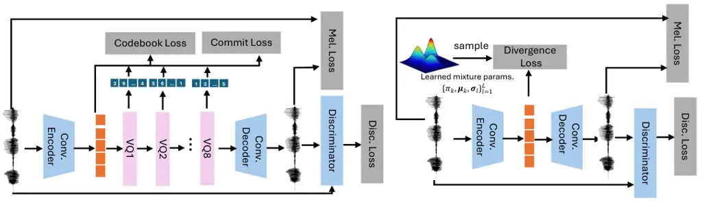
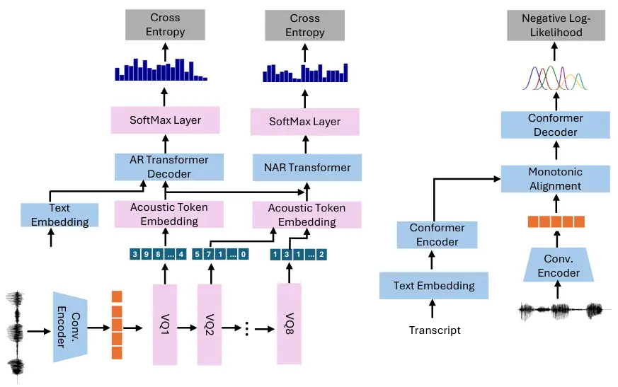

# Continuous Autoregressive Modeling with Stochastic Monotonic Alignment for Speech Synthesis

Weiwei Lin Affiliation: Department of Electrical and Electronic
Engineering Affiliation: The Hong Kong Polytechnic University
Affiliation: Hong Kong SAR, China
Email: [weiwei.lin@connect.polyu.hk](mailto:)    Chenghan He
Affiliation: Department of Computing Affiliation: The Hong Kong
Polytechnic University Affiliation: Hong Kong SAR, China

###### Abstract

We propose a novel autoregressive modeling approach for speech
synthesis, combining a variational autoencoder (VAE) with a multi-modal
latent space and an autoregressive model that uses Gaussian Mixture
Models (GMM) as the conditional probability distribution. Unlike
previous methods that rely on residual vector quantization, our model
leverages continuous speech representations from the VAE’s latent space,
greatly simplifying the training and inference pipelines. We also
introduce a stochastic monotonic alignment mechanism to enforce strict
monotonic alignments. Our approach significantly outperforms the
state-of-the-art autoregressive model VALL-E in both subjective and
objective evaluations, achieving these results with only 10.3% of
VALL-E’s parameters. This demonstrates the potential of continuous
speech language models as a more efficient alternative to existing
quantization-based speech language models. Sample audio can be found at
[https://tinyurl.com/gmm-lm-tts](https://tinyurl.com/gmm-lm-tts).

|     |
| --- |
|     |

## 1 Introduction

Transformers trained with autoregressive (AR) objectives have become the
dominant approach in natural language processing (NLP) (Radford et al.,
2019; Brown et al., 2020; Vaswani, 2017). The vast successes in NLP have
inspired researchers to apply Transformers and autoregressive objectives
to image and speech domains as well (Ramesh et al., 2021; Wang et al., ;
Betker, 2023). Since speech and images are continuous signals,
discretization is a critical first step before applying discrete
autoregressive training. As a result, autoregressive modeling of images
and audio typically involves two stages of training. In the first stage,
a VQ-VAE (Van Den Oord et al., 2017) or a variant of VQ-VAE (Zeghidour
et al., 2021; Défossez et al., 2022; Kumar et al., 2024) is trained to
encode input data into discrete latent representations using a vector
quantization bottleneck. After training the VQ-VAE, an autoregressive
model is trained on the discrete latent codes produced by the encoder
(Ramesh et al., 2021). The AR model captures the sequential dependencies
in the latent space, learning to predict the next latent code based on
previous ones, which enables high-fidelity generation. One of the most
attractive features of AR modeling in speech is its ability to model
both the distribution of acoustic vectors and the duration
simultaneously. This is particularly beneficial compared to
non-autoregressive models, which often require separate duration modules
and external alignments (Ren et al., 2020; Ren et al., 2019; Li et al.,
2022). Another advantage of AR models is their capability for in-context
learning of speaker style and voice through prompting, which has proven
to be more powerful than traditional speaker embedding-based voice
cloning (Wang et al., ; Casanova et al., 2024).

It has been found that to faithfully reconstruct audio signals, the
required codebook size can be prohibitively large (Zeghidour et al.,
2021), and the use of discrete codes often introduces artifacts and
mispronunciation during reconstruction (Casanova et al., 2024; Betker,
2023). Additionally, codebooks are often under-utilized, and training
stability can be compromised due to the use of the Straight-Through (ST)
estimator (Łańcucki et al., 2020; Mentzer et al., 2023). While using
multiple codebooks with residual vector quantization (RVQ) mitigates
some of these issues (Zeghidour et al., 2021; Défossez et al., 2022), it
comes at the cost of requiring a specialized second-stage model to
handle the additional codebooks (Borsos et al., 2023b; Wang et al., ).
To address the computational overhead introduced by these extra
codebooks, some approaches avoid using all tokens in autoregressive
modeling (Wang et al., ; Lyth & King, 2024; Copet et al., 2024).

All of the aforementioned issues stem from the use of quantization
during VAE training. In this paper, we demonstrate that vector
quantization is not a necessary prerequisite for learning an
autoregressive model. By constraining the latent representation to be a
continuous multimodal distribution during VAE training and recovering it
in the second stage with a continuous autoregressive model, we are able
to build an autoregressive model that retains all the advantages of AR
modeling (prompting, integrated duration modeling, and sampling) without
many of the challenges associated with VQ. Table 1 compares our proposed
continuous autoregressive model with VALL-E (Wang et al., ), a
state-of-the-art autoregressive text-to-speech (TTS) model. Without the
need for multiple codebooks from residual vector quantization, we are
able to use a single Conformer model to perform autoregressive modeling
on all tokens, cutting theoretical computation in half compared to
VALL-E’s AR and NAR mixed approach. Furthermore, the removal of
quantization allows us to build an ultra-compact TTS model with only
51.5M parameters, which is 10.3% of VALL-E’s size. Despite its smaller
size, our model achieves lower WER and higher MOS than VALL-E, thanks to
the continuous autoregressive modeling approach.

|                        |                           |             |
| ---------------------- | ------------------------- | ----------- |
| Method                 | VALL-E                    | Ours        |
| Codec Model            | RVQ                       | GMM-VAE     |
| TTS Model              | Decoder-only-Transformers | GMM-LM-Mini |
| Codec Related Param.   | 16.7M                     | 0           |
| TTS Model Param.       | 496.5M                    | 51.5M       |
| Dominant Computation   | $`2DL^{2}`$               | $`DL^{2}`$  |
| All Tokens AR          | No                        | Yes         |
| Strict Mono. Alignment | No                        | Yes         |
| WER $`\downarrow`$     | 6.04                      | 2.83        |
| Q-MOS $`\uparrow`$     | 3.54                      | 4.11        |

Table 1: Comparison of VALL-E and Our Method.

## 2 Related Work

Neural Speech Codecs and Representations. Unsupervised learning speech
representation have long line of research including learn representating
by reconstruction from a bottleneck using autoencoder (Chorowski et al.,
2019; Qian et al., 2019) and mutli-taks learning (Ravanelli et al.,
2020). More recently, the focus is shift to learning discrete
representation, which often refer to as neural speech codecs. Neural
speech codecs can be divided into two categories: semantic codecs and
acoustic codecs. Semantic codecs, typically learned by clustering
features from self-supervised models such as Wav2vec2, HuBERT, and WavLM
(Baevski et al., 2020; Hsu et al., 2021; Chen et al., 2022), primarily
preserve the phonetic information of speech (Choi et al., 2024). Due to
the disentangled nature of these features, semantic codecs are often
coupled with speaker embeddings for TTS (Polyak et al., 2021; Chen &
Duan, 2022). Acoustic codecs, on the other hand, are designed to
reconstruct the speech waveform, preserving all information from the
speech, including phonetic, speaker, and acoustic environment details.
Acoustic codecs are typically trained using a VQ-GAN model (Van Den Oord
et al., 2017; Esser et al., 2021), which learns to reconstruct the input
through a convolutional encoder-decoder architecture with GAN-based
training and quantization layers. The discrete representation
significantly reduces storage requirements and enhances I/O efficiency,
making it an appealing alternative to traditional speech codecs
(Zeghidour et al., 2021; Défossez et al., 2022) . Furthermore, it
enables the direct application of language models, such as BERT and GPT
(Devlin, 2018; Brown et al., 2020), to speech processing tasks. However,
vector quantization can lead to mispronunciations during reconstruction
(Casanova et al., 2024; Betker, 2023), and building a speech codec in
this way often requires a very large codebook (Zeghidour et al., 2021).
To address this, (Zeghidour et al., 2021) proposed using multiple
codebooks during the vector quantization process, where each codebook
quantizes the residuals of the previous one. This approach is referred
to as residual vector quantization (RVQ) in the literature. RVQ was
further extended in Encodec (Défossez et al., 2022), where the authors
employed multiscale spectrogram discriminators, a loss balancer, and
lightweight transformers to improve both the speech quality and
efficiency of RVQ. By introducing several vector quantization techniques
from the image domain, along with improved loss functions, RVQ was
further refined, resulting in very low-bit-rate codecs in (Kumar et al.,
2024).

Autoregressive Models in Speech Synthesis. Tacotron (Shen et al., 2018;
Wang et al., 2017) pioneered autoregressive modeling in TTS using an RNN
trained with a regression loss on Mel-spectrograms. Unlike most
autoregressive models, Tacotron cannot perform sampling because it
relies on a regression loss. In contrast, the use of discrete speech
codecs is appealing, as they can be directly applied to Transformers
using standard cross-entropy loss. However, using multiple codebooks
from RVQ complicates the design of downstream models. Flattening all the
codes leads to a quadratic increase in computational complexity with the
number of codebooks. Significant efforts have been made to reduce
computation for RVQ in downstream models, including strategies where not
all tokens are used during autoregressive modeling or where different
codebook codecs are modeled in separate stages (Copet et al., 2024; Wang
et al., ). In (Borsos et al., 2023a), the authors proposed a three-stage
audio generation process with a semantic codec, a coarse acoustic codec,
and a fine acoustic codec. However, using three autoregressive models
results in slower inference. In (Borsos et al., 2023b), the authors
proposed generating acoustic vectors in parallel across multiple
codebooks by conditioning on semantic codes using a MaskGit decoding
scheme. VALL-E (Wang et al., ) performs autoregressive modeling on
acoustic codecs by first generating the initial acoustic codecs
autoregressively, then using a non-autoregressive model to predict the
remaining codecs.

Non-Autoregressive Models in Speech Synthesis. Non-autoregressive
models, utilizing adversarial learning (Kong et al., 2020; Kim et al.,
2021; Lim et al., 2022), diffusion (Jeong et al., 2021; Popov et al.,
2021; Huang et al., 2022; Liu et al., 2022; Li et al., 2024), and flow
matching (Le et al., 2023; Mehta et al., 2024b), have become strong
competitors to autoregressive models due to their faster inference speed
and more stable generation. The primary challenge for non-AR models is
how to align phonemes with acoustic vectors. FastSpeech (Ren et al.,
2019; Ren et al., 2020) pioneered non-AR modeling by introducing a
duration predictor and extracting phoneme durations from either an
autoregressive model or an external aligner as ground truth. The
duration predictor is trained with a regression loss. However, using
regression loss instead of probabilistic modeling for duration has
limitations. (Mehta et al., 2024a) found that probabilistic modeling
produces better results than a regression-based approach, especially
when modeling spontaneous speech. VITS (Kim et al., 2021) is a
non-autoregressive model that supports probabilistic duration modeling
using stochastic duration modeling. However, monotonic alignment search
requires nested loops over the acoustic vectors and text sequences,
which cannot be vectorized, severely impacting large-scale training.
More recently, VoiceBox (Le et al., 2023) proposed separating the
acoustic model and duration modeling, using conditional flow matching
(CFM) as the objective, which leads to improved speech generation and
better duration modeling.

VAEs with Learned Prior. While the prior distribution in VAEs is
typically fixed as a standard Gaussian, numerous studies have
demonstrated that learning a prior can enhance the latent space
structure, thereby facilitating better representation learning. For
instance, (Dilokthanakul et al., 2016) proposed using a Gaussian mixture
model (GMM) as the prior for VAEs to enable unsupervised clustering,
resulting in interpretable clusters and state-of-the-art performance in
unsupervised tasks. Similarly, (Tomczak & Welling, 2018) introduced a
method where the VAE learns a mixture of posteriors conditioned on
pseudo-data as its prior. They demonstrated that this VAMP prior
consistently outperformed the standard VAE across six image datasets.
Additionally, (Makhzani et al., 2015) showed that instead of relying on
traditional variational inference, it is possible to align the
aggregated posterior with an arbitrary prior distribution using
adversarial learning techniques.

## 3 Autoregressive Modeling with Continuous Neural Speech Codec

In this section, we introduce the three major components of our model:
(1) A Gaussian Mixture Models VAE (GMM-VAE) that compresses speech with
a multi-modal latent constraint. (2) A Gaussian Mixture Models language
model (GMM-LM) that autoregressively models the compressed acoustic
vectors conditioned on text. (3) An attention mechanism that aligns the
encoder and decoder in a strictly monotonic fashion.

### 3.1 Learning Continuous Speech Codecs with Gaussian Mixture Models VAE

Learning compact representations of high-dimensional signals has been a
long-standing area of research. (Hinton & Salakhutdinov, 2006; Vincent
et al., 2008; Kingma & Welling, 2014; Van Den Oord et al., 2017).
Variational autoencoders (VAEs) (Kingma & Welling, 2014) provide a
general framework for learning generative models and performing data
compression. Let $`\bm{\mathbf{x}}`$ denote the input to the VAE and
$`\bm{\mathbf{z}}`$ the latent code. The objective is to maximize the
Evidence Lower Bound (ELBO):

```math
{\cal L}=\mathbb{E}_{q(\bm{\mathbf{z}}|\bm{\mathbf{x}})}[\log p(\bm{\mathbf{x}}|\bm{\mathbf{z}})]-\text{KL}(q(\bm{\mathbf{z}}|\bm{\mathbf{x}})||{\cal N}(\bm{\mathbf{0}},\bm{\mathbf{I}})) \tag{1}
```

where
$`\mathbb{E}_{q(\bm{\mathbf{z}}|\bm{\mathbf{x}})}[\log p(\bm{\mathbf{x}}|\bm{\mathbf{z}})]`$
is the log-likelihood of the reconstructed data, and
$`\text{KL}(q(\bm{\mathbf{z}}|\bm{\mathbf{x}})||{\cal N}(\bm{\mathbf{0}},\bm{\mathbf{I}}))`$
is the KL divergence term that encourages the latent distribution to be
close to a standard Gaussian. The KL divergence acts as a critical
regularization mechanism to ensure a meaningful latent space. In VQ-VAE
(Van Den Oord et al., 2017), the continuous latent variable
$`\bm{\mathbf{z}}`$ is replaced by a discrete latent code $`z`$,
corresponding to an index in a learned codebook with $`K`$ possible
entries. Each codebook entry is a $`D`$-dimensional vector
$`\bm{\mathbf{v}}`$. Instead of sampling from a latent distribution
during decoding, VQ-VAE quantizes the input, mapping the continuous
encoder output to the nearest discrete code. Denote the output of the
VAE encoder as $`\bm{\mathbf{h}}=E(\bm{\mathbf{x}})`$, and the posterior
is defined as:

```math
q(z=k\mid\bm{\mathbf{x}})=\begin{cases}1,&\text{if }k=\underset{b}{\arg\min}\left\|\bm{\mathbf{h}}-\bm{\mathbf{v}}_{b}\right\|_{2}\\
0,&\text{otherwise}\end{cases}, \tag{2}
```

where $`E(.)`$ denotes the encoder, typically composed of several
convolutional layers. Since quantization is a non-differentiable
operation that prevents gradient backpropagation, a straight-through
estimator is used to pass gradients from the decoder to the encoder (Van
Den Oord et al., 2017). A vector quantization objective (codebook loss)
and a commitment loss are added:

```math
\displaystyle\mathcal{L}=\log p\left(\bm{\mathbf{x}}\mid z_{q}\right)+\beta\left\|z_{e}-\operatorname{sg}\left(z_{q}\right)\right\|_{2}^{2}+\left\|\operatorname{sg}\left(z_{e}\right)-z_{q}\right\|_{2}^{2}, \tag{3}
```

```math
\displaystyle{\text{where}}\quad z_{q}(\bm{\mathbf{x}})=\bm{\mathbf{v}}_{k},\quad k=\operatorname{argmin}_{b}\left\|E(\bm{\mathbf{x}})-\bm{\mathbf{v}}_{b}\right\|_{2}
```

where $`\operatorname{sg}`$ represents the stop-gradient operator.
Unlike traditional VAEs, the prior $`p(z)`$ is assumed to be uniform, so
the KL divergence is constant and has not effect on learning.
Nonetheless, regularization is achieved through vector quantization.
Quantization also implicitly defines a categorical distribution during
training, allowing for the second stage where an autoregressive model is
trained to recover the prior/latent distribution (Van Den Oord et al.,
2017). However, it has been observed that the codebook size can be
prohibitively large for compact discrete audio codes (Zeghidour et al.,
2021), and mispronunciations can occur during decoding (Casanova et al.,
2024; Betker, 2023).



Figure 1: Training procedure and architecture difference of typical
residual vector quantitation codec model (left) and our proposed GMM-VAE
speech codec model (right).



Figure 2: Training procedure and architecture difference of VALL-E with
residual vector quantitation codec model (left) and our proposed GMM-LM
with GMM-VAE speech codec model (right).

We propose a VAE compression model that supports a multi-modal latent
space, but without relying on quantization. Our key finding is that as
long as the VAE stage defines a valid latent distribution that can be
recovered in the second stage, quantization is not the only option.
Since our goal is not to build a generative model in the VAE stage, we
use a deterministic mapping but skip the quantization step in Eq. 2. The
posterior can be written as
$`q(\bm{\mathbf{h}}|\bm{\mathbf{x}})=\delta(\bm{\mathbf{h}}-E(\bm{\mathbf{x}}))`$,
where $`\delta`$ is the Dirac delta function. The appeal of the
categorical distribution defined by VQ is its ability to model
multi-modal distributions, which is essential for speech. To achieve a
similar effect, we use a learned mixture of Gaussians prior with
parameters
$`\left\{\pi_{l},\bm{\mu}_{l},\bm{\sigma}_{l}\right\}_{l=1}^{L}`$,
allowing the continuous latent distribution to be multi-modal. The ELBO
for this setup can be written as:

```math
{\cal L}=\mathbb{E}_{q(\bm{\mathbf{h}}|\bm{\mathbf{x}})}[\log p(\bm{\mathbf{x}}|\bm{\mathbf{h}})]-\lambda\text{KL}(q(\bm{\mathbf{h}}|\bm{\mathbf{x}})||\sum_{l=1}^{L}\pi_{l}\mathcal{N}\left(\bm{\mu}_{l},\mathbf{\Sigma}_{l}\right)), \tag{4}
```

where $`\lambda`$ controls the strength of the regularization, $`l`$ is
the mixture index, and $`L`$ is the total number of mixtures. Since our
posterior is a deterministic function and the prior is a mixture of
Gaussians, we no longer have an analytical solution for the KL
divergence. Instead, we use Monte Carlo estimation to compute the KL
divergence. Standard deep learning libraries, such as PyTorch, already
support this estimation, and backpropagation through mixture sampling is
derived in (Graves, 2016). We refer to a VAE trained with the proposed
GMM constraint as GMM-VAE. When training GMM-VAE for speech signals, we
replace the reconstruction term with Mel-spectrogram reconstruction loss
and add discriminators, as done in RVQ, Encodec, and DAC (Zeghidour
et al., 2021; Défossez et al., 2022; Kumar et al., 2024). Figure 1
illustrates the differences in training procedures and model
architecture between the residual vector quantization model and the
proposed GMM-VAE.

### 3.2 Autoregressive Speech Modeling with GMM-LM

Autoregressive models are typically associated with Transformer models
that use discrete inputs and outputs (Vaswani, 2017; Radford et al.,
2019). The conditional probabilities at time step $`t`$ can be expressed
as:

```math
P\left(z_{t}\mid z_{t-1},z_{t-2},\ldots,z_{1},Y\right)=\operatorname{Categorical}\bigg(f(z_{t-1},z_{t-2},\ldots,z_{1},Y)\bigg) \tag{5}
```

where $`f()`$ is a neural network that takes in the previous predictions
$`z_{t-1},z_{t-2},\ldots,z_{1}`$ and the conditioning information $`Y`$,
to predict the next token. The network is typically trained with
standard cross-entropy loss. However, the conditional probability of an
autoregressive model does not necessarily need to follow a categorical
distribution, as long as it is conditioned on the previous token and
produces a valid distribution (Salimans et al., 2017).

To this end, we define an autoregressive model for the continuous random
variable $`\bm{\mathbf{h}}_{t}\in\mathbb{R}^{D}`$, where the conditional
probability is represented as a mixture of Gaussians (Tschannen et al.,
2024):

```math
p\left(\bm{\mathbf{h}}_{t}\mid\bm{\mathbf{h}}_{t-1},\ldots,\bm{\mathbf{h}}_{1},Y\right)=\sum_{n=1}^{N}{\omega}_{n}^{t}\mathcal{N}\left(\bm{\mathbf{h}}_{t};\bm{\mathbf{\nu}}_{n}^{t},\left(\bm{\mathbf{\tau}}_{n}^{t}\right)^{2}\right) \tag{6}
```

where $`\omega_{n}^{t}`$, $`\bm{\mathbf{\nu}}_{n}^{t}`$, and
$`\bm{\mathbf{\tau}}_{n}^{t}`$ represent the $`n`$-th mixture’s weight,
mean, and diagonal variances for frame $`t`$. $`N`$ is the number of
Gaussian components. The mixture parameters are produced by a neural
network $`f()`$ that takes in the previous inputs and conditioning
information:

```math
\displaystyle\left[\omega_{1}^{t},\ldots,\omega_{N}^{t},\bm{\mathbf{\nu}}_{1}^{t},\ldots,\bm{\mathbf{\nu}}_{N}^{t},\bm{\mathbf{\tau}}_{1}^{t},\ldots,\bm{\mathbf{\tau}}_{N}^{t}\right]=f(\bm{\mathbf{h}}_{t-1},\ldots,\bm{\mathbf{h}}_{1},Y). \tag{7}
```

To ensure the mixture weights and variances are valid, we apply softmax
to normalize the $`\omega_{n}^{t}`$ values and softplus to the
$`\bm{\mathbf{\tau}}_{n}^{t}`$ values in the network output. In the case
of Gaussian mixture autoregressive modeling, we no longer need an
embedding layer or a softmax layer. Since there is no stop token in the
continuous case, the model requires an additional linear classifier to
predict the stop token, as in (Shen et al., 2018). The autoregressive
model is implemented using a Conformer encoder-decoder architecture. In
this paper, we refer to the proposed Gaussian Mixture Models based
autoregressive model as GMM-LM. Figure 2 illustrates the differences in
training procedures and architecture between VALL-E with a residual
vector quantization codec model (left) and our proposed GMM-LM with a
GMM-VAE speech codec model (right).

### 3.3 Stochastic Hard Monotonic Alignment Learning

In speech synthesis, monotonic alignments often result in lower word
error rates and improved naturalness in generated speech(Chen et al.,
2023). Our monotonic alignment mechanism is based on the work of (Raffel
et al., 2017). Given the energy $`e_{ij}`$ between encoder state $`j`$
and decoder state $`i`$, we represent the alignment probability using a
sigmoid function:

```math
p_{i,j}=\operatorname{Sigmoid}\left(e_{i,j}\right) \tag{8}
```

If we use dot product to compute the energy, $`p_{i,j}`$ can be computed
in parallel but does not enforce a monotonic constraint. To enforce
monotonic attention, an iterative process (Raffel et al., 2017; He
et al., 2019) is used to compute the attention score from $`p_{i,j}`$:

```math
\alpha_{i,j}=\alpha_{i-1,j-1}\left(1-p_{i,j-1}\right)+\alpha_{i-1,j}p_{ij} \tag{9}
```

Here, $`\alpha_{i,j}`$ represents the attention weight used to sum up
encoder states. However, while $`\alpha_{i,j}`$ is monotonic in
expectation, it does not guarantee that every alignment step will
strictly follow the monotonic constraint for each sample. In (Raffel
et al., 2017), the authors propose adding Gaussian noise to the energy
term to encourage binary $`p_{i,j}`$ during training. However, this
approach introduces bias during optimization, and discrepancy between
training and test time can lead to performance issues (Chiu & Raffel,
2017). We propose replacing the soft $`p_{i,j}`$ with a binary value
$`u_{i,j}^{\text{forward}}`$, sampled from a Bernoulli distribution
during the forward pass:

```math
u_{i,j}^{\text{forward}}\sim\operatorname{Bernoulli}\left(p_{i,j}\right) \tag{10}
```

This ensures that attention weights are always binary. To enable
backpropagation, we approximate the gradient using a Gumbel-Softmax
relaxation of the Bernoulli distribution (Jang et al., 2016):

```math
u_{i,j}^{\text{backward}}=\frac{\exp\left((\log\left(p_{i,j}\right)+g_{1})/s\right)}{\exp\left((\log\left(p_{i,j}\right)+g_{1})/s\right)+\exp\left((\log\left(1-p_{i,j}\right)+g_{2})/s\right)} \tag{11}
```

where $`g_{1},g_{2}\sim\text{Gumbel}(0,1)`$, and $`s`$ is a temperature
parameter that controls the degree of relaxation. We schedule $`s`$ to
decrease gradually toward the end of training. Algorithm 1 provides a
detailed explanation of how encoder and decoder features are
monotonically aligned and fed into the decoder to compute the negative
log-likelihood.

## 4 Experiment Setup

Training Procedure All models were trained on the LibriLight corpus
(Kahn et al., 2020), which contains 60k hours of unlabeled 16kHz
audiobook speech. We transcribed the audio using Whisper V2 (Radford
et al., 2022). Since the number of utterances per speaker vary
significantly, we used a class-balanced sampler to ensure each speaker
was sampled the same number of times during training. For GMM-VAE, we
used the same model architecture as described in the DAC paper (Kumar
et al., 2024), with modifications that removed all quantization-related
layers. Although it is possible to learn all the mixture parameters for
GMM-VAE, in this paper, we only learned the means of each mixture. We
assumed the mixture weights were equal, and the covariance matrices were
set to identity. For GMM-LM, we used the Conformer encoder and decoder
from SpeechBrain (Ravanelli et al., 2021) with monotonic attention
modification proposed in Section 3.3. We trained models with 51.5M
(Mini), 101M, 170M, and 315M (Large) parameters. The details of the
GMM-LM configurations can be found in the Table 7 in Appendix. For
GMM-VAE training, we used 8 GPUs, with a total batch size of 680, and
each segment length was 8960. We used scheduler-free AdamW (Defazio
et al., 2024) with a learning rate of 0.001, training for a total of
1,000k steps. For GMM-LM training, we used 8 GPUs with a total batch
size of 240. We used the same scheduler-free AdamW with a learning rate
of 0.01 and a gradient norm clip of 0.005, training for a total of 200k
steps. We did not observe any impact of random seeds on the runs.

Evaluation Protocol We used the LibriSpeech test set for evaluation
(Panayotov et al., 2015). For zero-shot TTS, we used standard objective
measures such as word error rate (WER) and speaker similarity (SIM) to
assess the content and speaker fidelity of the generated speech. We used
wav2vec2-large (Baevski et al., 2020), fine-tuned on LibriSpeech 960h,
to transcribe the generated speech and then computed the WER against the
ground truth. For SIM, we used the model released by WeSpeaker (Wang
et al., 2023), trained on the VoxCeleb datasets (Nagrani et al., 2017;
Chung et al., 2018). The objective metrics were computed over the entire
test set. For subjective metrics, we conducted mean opinion score (MOS)
evaluations on the generated audio to assess the naturalness and speaker
cloning fidelity. For each model, 40 samples were generated and
evaluated by 20 listeners. The listeners were asked to evaluate the
speech quality and naturalness (Q-MOS) and the speaker similarity
between the prompt speech and the generated speech (S-MOS). In addition
to zero-shot TTS, we were also interested in the quality of GMM-VAE and
GMM-LM reconstructions. We used standard reconstruction metrics such as
Mel Distance, ViSQOL, and SI-SNR, as in (Kumar et al., 2024). For
GMM-LM, we used teacher forcing to generate the reconstructed codec,
which was then used by the GMM-VAE decoder to reconstruct the waveforms.

Baseline Models. We evaluated our model against state-of-the-art TTS
models such as VALL-E (Wang et al., ), HierSpeech++ (Lee et al., 2023)
(97M Parameters), and StyleTTS2 (Li et al., 2024) (142M Parameters). For
HierSpeech++ and StyleTTS2, we used the official implementations to
train the models.

| Prompt Duration | Model        | WER(%)$`\downarrow`$ | SIM$`\uparrow`$ | S-MOS$`\uparrow`$ | Q-MOS $`\uparrow`$ |
| --------------- | ------------ | -------------------- | --------------- | ----------------- | ------------------ |
|                 | GroundTruth  | 2.26                 | \-              | 4.24 $`\pm`$ 0.06 | 4.24 $`\pm`$ 0.10  |
| 3 Seconds       | StyleTTS-2   | 3.32                 | 0.70            | 3.44 $`\pm`$ 0.10 | 3.82 $`\pm`$ 0.06  |
|                 | HierSpeech++ | 3.45                 | 0.71            | 3.52 $`\pm`$ 0.13 | 3.71 $`\pm`$ 0.07  |
|                 | VALL-E       | 6.04                 | 0.73            | 3.65 $`\pm`$ 0.11 | 3.54 $`\pm`$ 0.08  |
|                 | Ours-Mini    | 2.83                 | 0.80            | 3.84 $`\pm`$ 0.13 | 4.11 $`\pm`$ 0.08  |
|                 | Ours-Large   | 2.81                 | 0.85            | 4.04 $`\pm`$ 0.07 | 4.06 $`\pm`$ 0.11  |
| 8 Seconds       | StyleTTS-2   | 3.34                 | 0.77            | 3.57 $`\pm`$ 0.07 | 3.92 $`\pm`$ 0.10  |
|                 | HierSpeech++ | 3.22                 | 0.75            | 3.66 $`\pm`$ 0.10 | 3.80 $`\pm`$ 0.08  |
|                 | VALL-E       | 7.54                 | 0.73            | 3.71 $`\pm`$ 0.11 | 3.58 $`\pm`$ 0.08  |
|                 | Ours-Mini    | 3.02                 | 0.81            | 3.82 $`\pm`$ 0.09 | 3.87 $`\pm`$ 0.12  |
|                 | Ours-Large   | 2.75                 | 0.88            | 3.92 $`\pm`$ 0.13 | 4.02 $`\pm`$ 0.10  |
| 15 Seconds      | StyleTTS-2   | 3.02                 | 0.76            | 3.52 $`\pm`$ 0.13 | 4.02 $`\pm`$ 0.08  |
|                 | HierSpeech++ | 3.12                 | 0.77            | 3.73 $`\pm`$ 0.11 | 3.84 $`\pm`$ 0.07  |
|                 | VALL-E       | 9.68                 | 0.63            | 3.62 $`\pm`$ 0.12 | 3.32 $`\pm`$ 0.12  |
|                 | Ours-Mini    | 2.92                 | 0.80            | 3.78 $`\pm`$ 0.08 | 4.16 $`\pm`$ 0.09  |
|                 | Ours-Large   | 2.72                 | 0.91            | 4.17 $`\pm`$ 0.07 | 3.92 $`\pm`$ 0.06  |

Table 2: Comparison of models’ zero-shot TTS performance on WER, SIM,
S-MOS, and P-MOS across different prompt durations.

## 5 Experiment Results

### 5.1 Zero-shot Text-to-Speech

We evaluated our model’s zero-shot text-to-speech ability using prompts
against both state-of-the-art autoregressive model VALL-E, and
non-autoregressive models, StyleTTS-2 and HierSpeech++. To study the
effect of prompt length on speech synthesis, we divided the prompts into
three groups: 3 seconds, 8 seconds, and 15 seconds. If an utterance
exceeded the specified duration, we truncated it; otherwise, we sampled
another utterance from the same speaker and concatenated it until
reaching the desired duration. We used two versions of our model for
evaluation: a mini version with 51.2M parameters and a large version
with 315M parameters, both of which output 6 Gaussian mixture parameters
with diagonal covariances. Both models were trained on encoder features
from a GMM-VAE model trained with 3 mixture components, constrained by
$`\lambda=50`$. The results are shown in Table 2. The first observation
from Table 2 is that non-AR models such as StyleTTS2 and HierSpeech++
achieved much better WER than VALL-E. We found that VALL-E was prone to
skipping words or failing in the middle of sentences, suggesting that
simple cross-attention mechanisms may not be sufficient for
autoregressive models. Contrary to our expectations, VALL-E’s WER
worsened as the prompt length increased. Another observation is that
non-AR models do not significantly benefit from longer prompts, as there
was no performance improvement from 8-second to 15-second prompts in SIM
and S-MOS for HierSpeech++ and StyleTTS2. By contrast, our proposed
GMM-LM model consistently outperformed both VALL-E and the
state-of-the-art non-AR models in content fidelity and speaker cloning,
demonstrating a clear advantage in speaker-related metrics with longer
prompts. We also found that scaling our model from mini to large
primarily benefited speaker-related metrics (SIM and S-MOS), while WER
and general speech quality did not improve as much.

Figure 3: Comparison on GMM-LM models’ zero-shot TTS performance trained
on Mel-Spectrogram features and GMM-VAE features.

### 5.2 Mel-Spectrogram vs. GMM-VAE Features

In this section, we evaluate GMM-LM models trained on Mel-spectrograms
against GMM-LM models trained on GMM-VAE encoder features. We trained
models with 51.5M, 101M, 170M, and 315M parameters, each outputting 6
Gaussian mixture parameters with diagonal covariances. For models using
GMM-VAE features, the GMM-VAE model was trained with 3 mixture
components, constrained by $`\lambda=50`$. For the Mel-spectrogram
model, we used a 120-dimensional Mel-spectrogram with a hop length of 240. We evaluated the models’ zero-shot TTS performance using objective
metrics on the LibriSpeech test set. The results are presented in
Figure 3. From Figure 3, it can be seen that GMM-LM models trained on
GMM-VAE features significantly outperform those trained on
Mel-spectrogram features. The discrepancy is especially pronounced with
smaller models. Although increasing model size reduces the performance
gap for Mel-based models, this comes at the cost of increased
computation and model size. Thus, we conclude that GMM-LM with GMM-VAE
features is a more efficient approach that delivers better performance
for speech synthesis. Additionally, we found that GMM-LM models using
Mel-spectrograms take much longer to achieve proper alignment compared
to GMM-LM models using GMM-VAE features. We hypothesize that the GMM-VAE
step helps extract semantic information, which greatly aids the
alignment steps.

| Method            | Model   | Mel Distance $`\downarrow`$ | ViSQOL $`\uparrow`$ | SI-SDR $`\uparrow`$ |
| ----------------- | ------- | --------------------------- | ------------------- | ------------------- |
| Encoding-Decoding | Encodec | 1.47                        | 3.41                | 5.66                |
|                   | GMM-VAE | 1.13                        | 3.96                | 8.89                |
| Teacher Forcing   | VALL-E  | 2.26                        | 2.25                | -0.15               |
|                   | GMM-LM  | 1.82                        | 2.86                | 4.45                |

Table 3: Comparison of reconstruction quality for codec models (Encodec
and GMM-VAE) and downstream models with teacher forcing (VALL-E and
GMM-LM).

### 5.3 Reconstruction Quality of Discrete and Continuous Codecs

In this section, we evaluate the reconstruction quality of our GMM-VAE
model in comparison with the RVQ codec model, Encodec. The GMM-VAE model
was trained with 3 mixture components, constrained by $`\lambda=50`$.
Our primary focus is on how well these models can reconstruct the input,
as this greatly impacts tasks like zero-shot TTS. Even if codec models
can perfectly reconstruct the input, if the downstream models are unable
to predict the correct codec, the effort is futile. Therefore, we also
evaluate the reconstruction quality with downstream models such as
VALL-E and our GMM-LM. Specifically, we encode the input speech to
generate speech codecs, then use VALL-E or GMM-LM in teacher forcing
mode to predict the codec. Finally, we reconstruct the speech by
decoding the teacher-forced predicted codec. We use common speech
reconstruction quality metrics, including Mel Distance, ViSQOL (Hines
et al., 2015), and SI-SDR. The results are presented in Table 3. It is
clear from the table that our GMM-VAE significantly outperforms Encodec
in speech reconstruction. The performance gap is even larger when the
downstream models are included.

| No. Gaussian | Mode                   | $`\lambda`$ |          |          |          |          |
| ------------ | ---------------------- | ----------- | -------- | -------- | -------- | -------- |
|              |                        | $`0.1`$     | 1        | 10       | 50       | 100      |
| 1            | GMM-VAE Recon          | $`0.76`$    | $`0.89`$ | $`1.14`$ | $`1.67`$ | $`2.06`$ |
| 1            | GMM-LM Teacher Forcing | –           | $`4.62`$ | $`3.82`$ | $`3.16`$ | $`4.48`$ |
| 3            | GMM-VAE Recon.         | $`0.71`$    | $`0.77`$ | $`0.98`$ | 1.13     | $`1.77`$ |
| 3            | GMM-LM Teacher Forcing | $`6.72`$    | $`3.04`$ | $`1.87`$ | 1.82     | $`4.27`$ |
| 6            | GMM-VAE Recon.         | $`0.73`$    | $`0.86`$ | $`0.95`$ | $`1.37`$ | $`1.83`$ |
| 6            | GMM-LM Teacher Forcing | $`4.63`$    | $`4.07`$ | $`2.54`$ | $`2.44`$ | $`5.26`$ |

Table 4: Reconstruction Quality (Mel Distance $`\downarrow`$) of GMM-VAE
and GMM-LM (with teacher forcing) across different number of Gaussians
and $`\lambda`$ values.

### 5.4 Ablation Study

Divergence constraint. Since we no longer perform quantization when
training the speech codec, the divergence constraint in Eq. 4 becomes
the only factor that directly influences the latent distribution, aside
from the reconstruction loss. Because our goal is to use the codec for
downstream models rather than compress speech per se, we evaluate both
the reconstruction quality of GMM-VAE and the downstream GMM-LM
reconstruction with teacher forcing, using Mel-spectrogram distance. The
GMM-LM model used is the large version with 6 Gaussian mixtures and
diagonal covariances. Specifically, we investigate how the value of
$`\lambda`$ and the number of Gaussian means in the divergence
constraint affect reconstruction. The results are presented in Table 4.
It is important to note that without any divergence constraint, we were
unable to successfully train the downstream GMM-LM models. As expected,
the VAE reconstruction Mel distance increases with larger $`\lambda`$.
However, the effect of $`\lambda`$ on downstream model reconstruction is
less straightforward. With $`\lambda=0.1`$, although we observed very
low Mel distance, we were unable to train downstream models (the model
could not produce intelligible speech conditioned on text). When
increasing $`\lambda`$ from 1 to 50, although the GMM-VAE reconstruction
quality decreases, the downstream model’s teacher forcing reconstruction
quality improves. In terms of the number of Gaussians in the constraint
term, we found that using three Gaussians yields better results than
using a single Gaussian, with both GMM-VAE and GMM-LM showing smaller
Mel distances. However, increasing the number of Gaussians to 6 led to a
general decrease in reconstruction quality. Since our focus is on
improving the GMM-LM generation quality, we selected three Gaussians
with $`\lambda=50`$ as the optimal hyper-parameters.

GMM-LM Parameterization. The GMM parameterization in GMM-LM directly
affects the output distribution. We aim to investigate how the number of
Gaussian mixtures and the choice between full or diagonal covariance
matrices impact model performance. We assess the generated speech using
objective metrics such as WER and SIM. Furthermore, since GMM
parameterization also influences the sampling process, we measure the
diversity of the generated samples under different parameterization
schemes. Specifically, given the target text and speech prompt, we
randomly sample from the parameterized GMM to generate speech three
times. We ask human evaluators to rate the diversity of the three
samples on a scale from 0 to 5. These results are compared with VALL-E,
StyleTTS2, and HierSpeech++, as presented in Table 5. For comparison, we
also included Tacotron’s approach, shown in the first row of Table 5,
which trains an autoregressive model using only the mean and a
regression loss. This approach does not allow for sampling. We found
that using a single Gaussian with an L1 loss led to weaker performance
compared to models with multiple mixtures. As we increased the mixture
count to 3, and then to 6, we observed improved diversity in both
diagonal and full covariance models. However, the WER improvement was
mixed: generally the full covariance model worsened with more mixtures,
while the diagonal covariance model maintained approximately the same
WER. Finally, we did not observe better results with 10 mixtures. In
conclusion, there is no clear advantage in using full covariance
matrices or increasing the number of mixtures beyond 6. When comparing
the speech diversity of GMM-LM with VALL-E, StyleTTS2, and HierSpeech++,
our model consistently produced significantly more diverse samples. For
StyleTTS2 and HierSpeech++, the multiple generated samples showed little
variation. For VALL-E, while some degree of diversity were observed, the
model frequently failed during random sampling. When excluding failed
samples, the diversity remained limited. In contrast, our model
consistently generated samples with diverse speaking styles.

| No. Mixture  | Variance Type | Loss        | WER $`\downarrow`$ | SIM $`\uparrow`$ | Diversity $`\uparrow`$ |
| ------------ | ------------- | ----------- | ------------------ | ---------------- | ---------------------- |
| 1            | None          | L1 Mel-Dist | 4.29               | 0.75             | \-                     |
|              | Diagonal      | NLL         | 3.34               | 0.81             | 2.17                   |
|              | Full          | NLL         | 3.45               | 0.82             | 2.32                   |
| 3            | Diagonal      | NLL         | 2.89               | 0.85             | 3.14                   |
|              | Full          | NLL         | 3.74               | 0.72             | 2.85                   |
| 6            | Diagonal      | NLL         | 2.72               | 0.91             | 3.42                   |
|              | Full          | NLL         | 4.82               | 0.69             | 3.01                   |
| 10           | Diagonal      | NLL         | 5.21               | 0.71             | 3.08                   |
| VALL-E       |               | \-          | 9.68               | 0.63             | 1.47                   |
| StyleTTS2    |               | \-          | 3.02               | 0.76             | 0.6                    |
| HierSpeech++ |               | \-          | 3.12               | 0.77             | 0.3                    |

Table 5: Zero-shot TTS performance of GMM-LM with different mixture
counts and variance types, evaluated on WER, SIM, and sample diversity.

## 6 Conclusion

We presented a new autoregressive modeling approach for speech
synthesis, utilizing a Gaussian Mixture VAE (GMM-VAE) for compression
and a Gaussian Mixture Model language model (GMM-LM) for autoregressive
generation. By eliminating the need for quantization and introducing
stochastic monotonic alignment, our method ensures stable, efficient,
and high-quality speech synthesis. Our experiments showed that this
approach outperforms traditional VQ-based methods, achieving lower WER
and higher MOS scores with reduced model complexity. These results
demonstrate the potential of continuous latent spaces for autoregressive
modeling in speech synthesis, offering a simpler and more effective
alternative to VQ models.

## 7 Acknowledgment

This work was supported by the RGC of Hong Kong SAR, Grant No. PolyU 15228223. We would like to thank Prof. Man-Wai Mak for the leadership in
this project.

## 8 Reproducibility Statement

We have provided detailed descriptions of the hyperparameters and
training procedures in Section 4. Our implementations are based on
publicly available codebases
([descript-audio-codec](https://github.com/descriptinc/descript-audio-codec)
and
[SpeechBrain](https://speechbrain.readthedocs.io/en/latest/API/speechbrain.lobes.models.transformer.Conformer.html))
and datasets. With the detailed explanations of the training process and
hyperparameters, readers should be able to easily reproduce our models.
Additionally, we plan to release the code and pre-trained models soon.

## References

- Baevski et al. (2020) Alexei Baevski, Yuhao Zhou, Abdelrahman Mohamed,
  and Michael Auli. wav2vec 2.0: A framework for self-supervised
  learning of speech representations. In _Proc. Advances in Neural
  Information Processing Systems_, 2020.
- Betker (2023) James Betker. Better speech synthesis through scaling.
  _arXiv preprint arXiv:2305.07243_, 2023.
- Borsos et al. (2023a) Zalán Borsos, Raphaël Marinier, Damien Vincent,
  Eugene Kharitonov, Olivier Pietquin, Matt Sharifi, Dominik Roblek,
  Olivier Teboul, David Grangier, Marco Tagliasacchi, et al. Audiolm: a
  language modeling approach to audio generation. _IEEE/ACM transactions
  on audio, speech, and language processing_, 31:2523–2533, 2023a.
- Borsos et al. (2023b) Zalán Borsos, Matt Sharifi, Damien Vincent,
  Eugene Kharitonov, Neil Zeghidour, and Marco Tagliasacchi. Soundstorm:
  Efficient parallel audio generation. _arXiv preprint
  arXiv:2305.09636_, 2023b.
- Brown et al. (2020) Tom Brown, Benjamin Mann, Nick Ryder, Melanie
  Subbiah, Jared D Kaplan, Prafulla Dhariwal, Arvind Neelakantan, Pranav
  Shyam, Girish Sastry, Amanda Askell, et al. Language models are
  few-shot learners. _Advances in Neural Information Processing
  Systems_, 33:1877–1901, 2020.
- Casanova et al. (2024) Edresson Casanova, Kelly Davis, Eren Gölge,
  Görkem Göknar, Iulian Gulea, Logan Hart, Aya Aljafari, Joshua Meyer,
  Reuben Morais, Samuel Olayemi, et al. Xtts: a massively multilingual
  zero-shot text-to-speech model. _arXiv preprint
  arXiv:2406.04904_, 2024.
- Chen et al. (2023) Li-Wei Chen, Shinji Watanabe, and Alexander
  Rudnicky. A vector quantized approach for text to speech synthesis on
  real-world spontaneous speech. In _Proceedings of the AAAI Conference
  on Artificial Intelligence_, volume 37, pp. 12644–12652, 2023.
- Chen & Duan (2022) Meiying Chen and Zhiyao Duan. Controlvc: Zero-shot
  voice conversion with time-varying controls on pitch and rhythm.
  _arXiv preprint arXiv:2209.11866_, 2022.
- Chen et al. (2022) Sanyuan Chen, Chengyi Wang, Zhengyang Chen, Yu Wu,
  Shujie Liu, Zhuo Chen, Jinyu Li, Naoyuki Kanda, Takuya Yoshioka, Xiong
  Xiao, Jian Wu, Long Zhou, Shuo Ren, Yanmin Qian, Yao Qian, Jian Wu,
  Michael Zeng, Xiangzhan Yu, and Furu Wei. WavLM: Large-scale
  self-supervised pre-training for full stack speech processing.
  _IEEE J. Sel. Top. Signal Process._, 16(6):1505–1518, 2022.
- Chiu & Raffel (2017) Chung-Cheng Chiu and Colin Raffel. Monotonic
  chunkwise attention. _arXiv preprint arXiv:1712.05382_, 2017.
- Choi et al. (2024) Kwanghee Choi, Ankita Pasad, Tomohiko Nakamura,
  Satoru Fukayama, Karen Livescu, and Shinji Watanabe. Self-supervised
  speech representations are more phonetic than semantic. _arXiv
  preprint arXiv:2406.08619_, 2024.
- Chorowski et al. (2019) Jan Chorowski, Ron J Weiss, Samy Bengio, and
  Aäron Van Den Oord. Unsupervised speech representation learning using
  wavenet autoencoders. _IEEE/ACM transactions on audio, speech, and
  language processing_, 27(12):2041–2053, 2019.
- Chung et al. (2018) Joon Son Chung, Arsha Nagrani, and Andrew
  Zisserman. Voxceleb2: Deep speaker recognition. _arXiv preprint
  arXiv:1806.05622_, 2018.
- Copet et al. (2024) Jade Copet, Felix Kreuk, Itai Gat, Tal Remez,
  David Kant, Gabriel Synnaeve, Yossi Adi, and Alexandre Défossez.
  Simple and controllable music generation. _Advances in Neural
  Information Processing Systems_, 36, 2024.
- Defazio et al. (2024) Aaron Defazio, Harsh Mehta, Konstantin
  Mishchenko, Ahmed Khaled, Ashok Cutkosky, et al. The road less
  scheduled. _arXiv preprint arXiv:2405.15682_, 2024.
- Défossez et al. (2022) Alexandre Défossez, Jade Copet, Gabriel
  Synnaeve, and Yossi Adi. High fidelity neural audio compression.
  _arXiv preprint arXiv:2210.13438_, 2022.
- Devlin (2018) Jacob Devlin. Bert: Pre-training of deep bidirectional
  transformers for language understanding. _arXiv preprint
  arXiv:1810.04805_, 2018.
- Dilokthanakul et al. (2016) Nat Dilokthanakul, Pedro AM Mediano, Marta
  Garnelo, Matthew CH Lee, Hugh Salimbeni, Kai Arulkumaran, and Murray
  Shanahan. Deep unsupervised clustering with gaussian mixture
  variational autoencoders. _arXiv preprint arXiv:1611.02648_, 2016.
- Esser et al. (2021) Patrick Esser, Robin Rombach, and Bjorn Ommer.
  Taming transformers for high-resolution image synthesis. In
  _Proceedings of the IEEE/CVF conference on computer vision and pattern
  recognition_, pp. 12873–12883, 2021.
- Graves (2016) Alex Graves. Stochastic backpropagation through mixture
  density distributions. _arXiv preprint arXiv:1607.05690_, 2016.
- He et al. (2019) Mutian He, Yan Deng, and Lei He. Robust
  sequence-to-sequence acoustic modeling with stepwise monotonic
  attention for neural tts. _arXiv preprint arXiv:1906.00672_, 2019.
- Hines et al. (2015) Andrew Hines, Jan Skoglund, Anil C Kokaram, and
  Naomi Harte. Visqol: an objective speech quality model. _EURASIP
  Journal on Audio, Speech, and Music Processing_, 2015:1–18, 2015.
- Hinton & Salakhutdinov (2006) Geoffrey E Hinton and Ruslan R
  Salakhutdinov. Reducing the dimensionality of data with neural
  networks. _science_, 313(5786):504–507, 2006.
- Hsu et al. (2021) Wei-Ning Hsu, Benjamin Bolte, Yao-Hung Hubert Tsai,
  Kushal Lakhotia, Ruslan Salakhutdinov, and Abdelrahman Mohamed.
  Hubert: Self-supervised speech representation learning by masked
  prediction of hidden units. _IEEE ACM Trans. Audio Speech Lang.
  Process._, 29:3451–3460, 2021.
- Huang et al. (2022) Rongjie Huang, Zhou Zhao, Huadai Liu, Jinglin Liu,
  Chenye Cui, and Yi Ren. Prodiff: Progressive fast diffusion model for
  high-quality text-to-speech. In _Proceedings of the 30th ACM
  International Conference on Multimedia_, pp. 2595–2605, 2022.
- Jang et al. (2016) Eric Jang, Shixiang Gu, and Ben Poole. Categorical
  reparameterization with gumbel-softmax. _arXiv preprint
  arXiv:1611.01144_, 2016.
- Jeong et al. (2021) Myeonghun Jeong, Hyeongju Kim, Sung Jun Cheon,
  Byoung Jin Choi, and Nam Soo Kim. Diff-tts: A denoising diffusion
  model for text-to-speech. _arXiv preprint arXiv:2104.01409_, 2021.
- Kahn et al. (2020) Jacob Kahn, Morgane Riviere, Weiyi Zheng, Evgeny
  Kharitonov, Qiantong Xu, Pierre-Emmanuel Mazaré, Julien Karadayi,
  Vitaliy Liptchinsky, Ronan Collobert, Christian Fuegen, et al.
  Libri-light: A benchmark for asr with limited or no supervision. In
  _ICASSP 2020-2020 IEEE International Conference on Acoustics, Speech
  and Signal Processing (ICASSP)_, pp. 7669–7673. IEEE, 2020.
- Kim et al. (2021) Jaehyeon Kim, Jungil Kong, and Juhee Son.
  Conditional variational autoencoder with adversarial learning for
  end-to-end text-to-speech. In _International Conference on Machine
  Learning_, pp. 5530–5540. PMLR, 2021.
- Kingma & Welling (2014) Diederik P. Kingma and Max Welling.
  Auto-encoding variational bayes. In _2nd International Conference on
  Learning Representations, ICLR 2014, Banff, AB, Canada, April 14-16,
  2014, Conference Track Proceedings_, 2014.
- Kong et al. (2020) Jungil Kong, Jaehyeon Kim, and Jaekyoung Bae.
  Hifi-gan: Generative adversarial networks for efficient and high
  fidelity speech synthesis. _Advances in Neural Information Processing
  Systems_, 33:17022–17033, 2020.
- Kumar et al. (2024) Rithesh Kumar, Prem Seetharaman, Alejandro Luebs,
  Ishaan Kumar, and Kundan Kumar. High-fidelity audio compression with
  improved rvqgan. _Advances in Neural Information Processing Systems_,
  36, 2024.
- Łańcucki et al. (2020) Adrian Łańcucki, Jan Chorowski, Guillaume
  Sanchez, Ricard Marxer, Nanxin Chen, Hans JGA Dolfing, Sameer Khurana,
  Tanel Alumäe, and Antoine Laurent. Robust training of vector quantized
  bottleneck models. In _2020 International Joint Conference on Neural
  Networks (IJCNN)_, pp. 1–7. IEEE, 2020.
- Le et al. (2023) Matthew Le, Apoorv Vyas, Bowen Shi, Brian Karrer,
  Leda Sari, Rashel Moritz, Mary Williamson, Vimal Manohar, Yossi Adi,
  Jay Mahadeokar, et al. Voicebox: Text-guided multilingual universal
  speech generation at scale. _arXiv preprint arXiv:2306.15687_, 2023.
- Lee et al. (2023) Sang-Hoon Lee, Ha-Yeong Choi, Seung-Bin Kim, and
  Seong-Whan Lee. Hierspeech++: Bridging the gap between semantic and
  acoustic representation of speech by hierarchical variational
  inference for zero-shot speech synthesis. _arXiv preprint
  arXiv:2311.12454_, 2023.
- Li et al. (2022) Yinghao Aaron Li, Cong Han, and Nima Mesgarani.
  Styletts: A style-based generative model for natural and diverse
  text-to-speech synthesis. _arXiv preprint arXiv:2205.15439_, 2022.
- Li et al. (2024) Yinghao Aaron Li, Cong Han, Vinay Raghavan, Gavin
  Mischler, and Nima Mesgarani. Styletts 2: Towards human-level
  text-to-speech through style diffusion and adversarial training with
  large speech language models. _Advances in Neural Information
  Processing Systems_, 36, 2024.
- Lim et al. (2022) Dan Lim, Sunghee Jung, and Eesung Kim. Jets: Jointly
  training fastspeech2 and hifi-gan for end to end text to speech.
  _arXiv preprint arXiv:2203.16852_, 2022.
- Liu et al. (2022) Songxiang Liu, Dan Su, and Dong Yu. Diffgan-tts:
  High-fidelity and efficient text-to-speech with denoising diffusion
  gans. _arXiv preprint arXiv:2201.11972_, 2022.
- Lyth & King (2024) Dan Lyth and Simon King. Natural language guidance
  of high-fidelity text-to-speech with synthetic annotations. _arXiv
  preprint arXiv:2402.01912_, 2024.
- Makhzani et al. (2015) Alireza Makhzani, Jonathon Shlens, Navdeep
  Jaitly, Ian Goodfellow, and Brendan Frey. Adversarial autoencoders.
  _arXiv preprint arXiv:1511.05644_, 2015.
- Mehta et al. (2024a) Shivam Mehta, Harm Lameris, Rajiv Punmiya, Jonas
  Beskow, Éva Székely, and Gustav Eje Henter. Should you use a
  probabilistic duration model in tts? probably! especially for
  spontaneous speech. _arXiv preprint arXiv:2406.05401_, 2024a.
- Mehta et al. (2024b) Shivam Mehta, Ruibo Tu, Jonas Beskow, Éva
  Székely, and Gustav Eje Henter. Matcha-tts: A fast tts architecture
  with conditional flow matching. In _ICASSP 2024-2024 IEEE
  International Conference on Acoustics, Speech and Signal Processing
  (ICASSP)_, pp. 11341–11345. IEEE, 2024b.
- Mentzer et al. (2023) Fabian Mentzer, David Minnen, Eirikur Agustsson,
  and Michael Tschannen. Finite scalar quantization: Vq-vae made simple.
  _arXiv preprint arXiv:2309.15505_, 2023.
- Nagrani et al. (2017) Arsha Nagrani, Joon Son Chung, and Andrew
  Zisserman. Voxceleb: a large-scale speaker identification dataset.
  _arXiv preprint arXiv:1706.08612_, 2017.
- Panayotov et al. (2015) Vassil Panayotov, Guoguo Chen, Daniel Povey,
  and Sanjeev Khudanpur. Librispeech: An ASR corpus based on public
  domain audio books. In _Proc. International Conference on Acoustics,
  Speech and Signal Processing, ICASSP_, pp. 5206–5210, 2015.
- Polyak et al. (2021) Adam Polyak, Yossi Adi, Jade Copet, Eugene
  Kharitonov, Kushal Lakhotia, Wei-Ning Hsu, Abdelrahman Mohamed, and
  Emmanuel Dupoux. Speech resynthesis from discrete disentangled
  self-supervised representations. _arXiv preprint
  arXiv:2104.00355_, 2021.
- Popov et al. (2021) Vadim Popov, Ivan Vovk, Vladimir Gogoryan, Tasnima
  Sadekova, and Mikhail Kudinov. Grad-tts: A diffusion probabilistic
  model for text-to-speech. In _International Conference on Machine
  Learning_, pp. 8599–8608. PMLR, 2021.
- Qian et al. (2019) Kaizhi Qian, Yang Zhang, Shiyu Chang, Xuesong Yang,
  and Mark Hasegawa-Johnson. Autovc: Zero-shot voice style transfer with
  only autoencoder loss. In _International Conference on Machine
  Learning_, pp. 5210–5219. PMLR, 2019.
- Radford et al. (2019) Alec Radford, Jeffrey Wu, Rewon Child, David
  Luan, Dario Amodei, Ilya Sutskever, et al. Language models are
  unsupervised multitask learners. _OpenAI blog_, 1(8):9, 2019.
- Radford et al. (2022) Alec Radford, Jong Wook Kim, Tao Xu, Greg
  Brockman, Christine McLeavey, and Ilya Sutskever. Robust speech
  recognition via large-scale weak supervision. _CoRR_,
  abs/2212.04356, 2022.
- Raffel et al. (2017) Colin Raffel, Minh-Thang Luong, Peter J Liu,
  Ron J Weiss, and Douglas Eck. Online and linear-time attention by
  enforcing monotonic alignments. In _International conference on
  machine learning_, pp. 2837–2846. PMLR, 2017.
- Ramesh et al. (2021) Aditya Ramesh, Mikhail Pavlov, Gabriel Goh, Scott
  Gray, Chelsea Voss, Alec Radford, Mark Chen, and Ilya Sutskever.
  Zero-shot text-to-image generation. In _International conference on
  machine learning_, pp. 8821–8831. Pmlr, 2021.
- Ravanelli et al. (2020) Mirco Ravanelli, Jianyuan Zhong, Santiago
  Pascual, Pawel Swietojanski, Joao Monteiro, Jan Trmal, and Yoshua
  Bengio. Multi-task self-supervised learning for robust speech
  recognition. In _ICASSP 2020-2020 IEEE International Conference on
  Acoustics, Speech and Signal Processing (ICASSP)_, pp. 6989–6993.
  IEEE, 2020.
- Ravanelli et al. (2021) Mirco Ravanelli, Titouan Parcollet, Peter
  Plantinga, Aku Rouhe, Samuele Cornell, Loren Lugosch, Cem Subakan,
  Nauman Dawalatabad, Abdelwahab Heba, Jianyuan Zhong, Ju-Chieh Chou,
  Sung-Lin Yeh, Szu-Wei Fu, Chien-Feng Liao, Elena Rastorgueva, François
  Grondin, William Aris, Hwidong Na, Yan Gao, Renato De Mori, and Yoshua
  Bengio. SpeechBrain: A general-purpose speech toolkit, 2021.
  arXiv:2106.04624.
- Ren et al. (2019) Yi Ren, Yangjun Ruan, Xu Tan, Tao Qin, Sheng Zhao,
  Zhou Zhao, and Tie-Yan Liu. Fastspeech: Fast, robust and controllable
  text to speech. _Advances in neural information processing systems_,
  32, 2019.
- Ren et al. (2020) Yi Ren, Chenxu Hu, Xu Tan, Tao Qin, Sheng Zhao, Zhou
  Zhao, and Tie-Yan Liu. Fastspeech 2: Fast and high-quality end-to-end
  text to speech. _arXiv preprint arXiv:2006.04558_, 2020.
- Salimans et al. (2017) Tim Salimans, Andrej Karpathy, Xi Chen, and
  Diederik P Kingma. Pixelcnn++: Improving the pixelcnn with discretized
  logistic mixture likelihood and other modifications. _arXiv preprint
  arXiv:1701.05517_, 2017.
- Shen et al. (2018) Jonathan Shen, Ruoming Pang, Ron J Weiss, Mike
  Schuster, Navdeep Jaitly, Zongheng Yang, Zhifeng Chen, Yu Zhang,
  Yuxuan Wang, Rj Skerrv-Ryan, et al. Natural TTS synthesis by
  conditioning WaveNet on mel spectrogram predictions. In _International
  Conference on Acoustics, Speech and Signal Processing_, pp.
  4779–4783, 2018.
- Tomczak & Welling (2018) Jakub Tomczak and Max Welling. Vae with a
  vampprior. In _International conference on artificial intelligence and
  statistics_, pp. 1214–1223. PMLR, 2018.
- Tschannen et al. (2024) Michael Tschannen, Cian Eastwood, and Fabian
  Mentzer. Givt: Generative infinite-vocabulary transformers. In
  _European Conference on Computer Vision_, pp. 292–309. Springer, 2024.
- Van Den Oord et al. (2017) Aaron Van Den Oord, Oriol Vinyals, et al.
  Neural discrete representation learning. _Advances in Neural
  Information Processing Systems_, 30, 2017.
- Vaswani (2017) A Vaswani. Attention is all you need. _Advances in
  Neural Information Processing Systems_, 2017.
- Vincent et al. (2008) Pascal Vincent, Hugo Larochelle, Yoshua Bengio,
  and Pierre-Antoine Manzagol. Extracting and composing robust features
  with denoising autoencoders. In _Proceedings of the 25th international
  conference on Machine learning_, pp. 1096–1103, 2008.
- (65) Chengyi Wang, Sanyuan Chen, Yu Wu, Ziqiang Zhang, Long Zhou,
  Shujie Liu, Zhuo Chen, Yanqing Liu, Huaming Wang, Jinyu Li, et al.
  Neural codec language models are zero-shot text to speech
  synthesizers, 2023. _URL: https://arxiv. org/abs/2301.02111. doi:
  doi_, 10.
- Wang et al. (2023) Hongji Wang, Chengdong Liang, Shuai Wang, Zhengyang
  Chen, Binbin Zhang, Xu Xiang, Yanlei Deng, and Yanmin Qian. Wespeaker:
  A research and production oriented speaker embedding learning toolkit.
  In _ICASSP 2023-2023 IEEE International Conference on Acoustics,
  Speech and Signal Processing (ICASSP)_, pp. 1–5. IEEE, 2023.
- Wang et al. (2017) Yuxuan Wang, RJ Skerry-Ryan, Daisy Stanton, Yonghui
  Wu, Ron J Weiss, Navdeep Jaitly, Zongheng Yang, Ying Xiao, Zhifeng
  Chen, Samy Bengio, et al. Tacotron: Towards end-to-end speech
  synthesis. _arXiv preprint arXiv:1703.10135_, 2017.
- Zeghidour et al. (2021) Neil Zeghidour, Alejandro Luebs, Ahmed Omran,
  Jan Skoglund, and Marco Tagliasacchi. Soundstream: An end-to-end
  neural audio codec. _IEEE/ACM Transactions on Audio, Speech, and
  Language Processing_, 30:495–507, 2021.

## Appendix A Appendix

1: Acoustic features $`\{\bm{\mathbf{h}}_{i}\}_{i=1}^{I}`$ extracted
from the GMM-VAE encoder. Phoneme features
$`\bm{\mathbf{Y}}=\{\bm{\mathbf{y}}_{j}\}_{j=1}^{J}`$ from the GMM-LM
text encoder, and the GMM-LM Decoder $`D`$.

2: Compute energy terms in parallel for all $`i,j`$ using the dot
product:

```math
e_{i,j}=\bm{\mathbf{h}}_{i}^{\top}\bm{\mathbf{y}}_{j}
```

3: Sample initial alignments for all $`i,j`$ from a Bernoulli
distribution:

```math
u_{i,j}^{\text{forward}}\sim\operatorname{Bernoulli}(\text{sigmoid}(e_{i,j}))
```

4: Save the Gumbel-Softmax relaxation $`u_{i,j}^{\text{backward}}`$
(Eq. 11) for gradient computation.

5: Initialize $`\bm{\alpha}_{0}=[1,0,0,\ldots,0]\in\mathbb{R}^{J}`$,
$`\mathcal{L}_{\mathrm{NLL}}=0`$, and $`\bm{\mathbf{C}}_{0}=[]`$ (an
empty sequence for accumulating contexts).

6: for each time step $`i=1`$ to $`I-1`$ do

7:   Let $`\bm{\mathbf{u}}_{i}=[u_{i,1},u_{i,2},\ldots,u_{i,J}]`$.

8:   Refine alignments to enforce monotonicity:

```math
\bm{\alpha}_{i}=\bm{\alpha}_{i-1}\cdot\bm{\mathbf{u}}_{i}+\operatorname{shift}\left(\bm{\alpha}_{i-1}\cdot(1-\bm{\mathbf{u}}_{i}),1\right)
```

$`\triangleright`$ $`\text{shift}(\cdot,1)`$ shifts the vector by one
position to the right, filling the leftmost entry with zero.

9:   Compute the attention context using the refined alignments:

```math
\bm{\mathbf{c}}_{i}=\bm{\mathbf{Y}}^{\top}\bm{\alpha}_{i}+\bm{\mathbf{h}}_{i}
```

10:   Update the accumulated attention contexts:

```math
\bm{\mathbf{C}}_{i}=\operatorname{concat}(\bm{\mathbf{C}}_{i-1},\bm{\mathbf{c}}_{i})
```

11:   Pass the accumulated context $`\bm{\mathbf{C}}_{i}`$ to the
decoder network $`D`$ to obtain $`N`$ mixtures parameters:

```math
D(\bm{\mathbf{C}}_{i})=\left[\omega_{1}^{t+1},\ldots,\omega_{N}^{t+1},\bm{\mathbf{\nu}}_{1}^{t+1},\ldots,\bm{\mathbf{\nu}}_{N}^{t+1},\bm{\mathbf{\tau}}_{1}^{t+1},\ldots,\bm{\mathbf{\tau}}_{N}^{t+1}\right]
```

$`\triangleright`$ $`\omega^{i+1}_{n}`$ are normalized using the softmax
and $`\bm{\tau}^{i+1}_{n}`$ are passed through the softplus to ensure
they are positive.

12:   Compute the negative log-likelihood for the next frame:

```math
\mathcal{L}_{\mathrm{NLL}}\mathrel{+}=-\log p\left(\bm{\mathbf{h}}_{i+1}\mid\{\omega^{i+1}_{n},\bm{\nu}^{i+1}_{n},\bm{\tau}^{i+1}_{n}\}_{n=1}^{N}\right)
```

13: end for

Algorithm 1 GMM-LM Monotonic Alignment and Decoder Training Procedure

### A.1 Ablation Study on Alignment Module

Even with powerful neural codecs, we found that monotonic alignment
forcing remains crucial for the stability of autoregressive models. We
compared our monotonic alignment approach with using direct
cross-attention, location-sensitive attention (Shen et al., 2018), and
various monotonic attention variants. It is worth noting that
location-sensitive attention is not strictly monotonic, meaning it can
still result in word repetition and lookahead errors. We also found that
it was slow to train because energy terms are computed iteratively.
Since the alignment module primarily affects phonetic content, we used
WER to measure the performance of different alignment methods. For
monotonic attention, we explored the use of pre-sigmoid noise, Gumbel
Softmax, and the proposed Straight-Through (ST) Gumbel in Eq. 10 and
Eq. 11. The results are presented in Table 6. As seen from the table,
using cross-attention alone led to poor results—some samples even failed
to produce intelligible speech. Location-sensitive attention performed
better, but it still suffered from frequent word repetition errors, and
both training and inference were slow. Our proposed monotonic alignment
with ST Gumbel outperformed all other methods, including the original
monotonic attention with pre-sigmoid noise.

| Alignment | Cross Att. | Loc. Att. | Monotonic Att. |           |              |
| --------- | ---------- | --------- | -------------- | --------- | ------------ |
|           |            |           | w. Noise       | w. Gumbel | w. ST Gumbel |
| WER(%)    | 6.6        | 6.02      | 3.77           | 3.34      | 2.72         |

Table 6: Word Error Rate (WER) comparison of various alignment methods

### A.2 Details of Model Architecture

For GMM-LM, we used the Conformer encoder and decoder from SpeechBrain
(Ravanelli et al., 2021) with monotonic attention modification proposed
in Section 3.3. We trained models with 51.5M (Mini), 101M, 170M, and
315M (Large) parameters. The details of the GMM-LM configurations can be
found in the Table 7.

|                   |      |      |      |       |
| ----------------- | ---- | ---- | ---- | ----- |
| Name              | Mini | 101M | 170M | Large |
| Encoder           |      |      |      |       |
| No. Layers        | 3    | 3    | 3    | 3     |
| Encoder Dim.      | 512  | 512  | 512  | 512   |
| Feedforward Dim.  | 1024 | 1024 | 1024 | 1024  |
| Decoder           |      |      |      |       |
| No. Layers        | 6    | 6    | 6    | 12    |
| Decoder Dim.      | 512  | 768  | 1024 | 1024  |
| Feedforward Dim.  | 2048 | 3144 | 4096 | 4096  |
| Total Params. (M) | 51.5 | 101  | 170  | 315   |

Table 7: Model Architecture and Parameters

### A.3 Reconstruction Quality on Training Set

Table 4 shows that the GMM-VAE with 3 mixtures and $`\lambda=50`$
achieves the best reconstruction quality on the evaluation set. To
further investigate the underperformance of the 6-mixture model, we
selected a subset of the training data (randomly sampled 200 speakers
with 5 utterances each) and computed the reconstruction loss. The
results, along with the evaluation set reconstruction loss, are
presented in Table 9. From Table 9, we observed that the reconstruction
loss on the training set is consistently lower than that on the
evaluation set across all configurations. This discrepancy may be
attributed to a slight domain difference between the LibriSpeech
evaluation set and the LibriSpeech-Light training set, with the latter
containing noisier recordings. Another key observation is that the
6-mixture model achieves a lower reconstruction loss on the training set
compared to the 3-mixture model, yet it performs slightly worse in terms
of reconstruction quality on the evaluation set. This suggests that the
6-mixture model may suffer from overfitting.

### A.4 Zero-shot Voice Clone Noise Robustness

In this section, we evaluate the robustness of TTS zero-shot voice
cloning against noise. Specifically, we added varying levels of noise to
the LibriSpeech clean test set and used the noisy audio as prompt input
for the TTS models. The generated speech was assessed using WER and SIM
metrics under different noise levels, with the results presented in
Table 8. From the table, we observe that, with the exception of VALL-E,
most models demonstrate robustness to noisy prompts in terms of WER.
However, speaker similarity (SIM) significantly decreases for models
like StyleTTS-2 and HierSpeech+++. In contrast, the proposed method
shows strong robustness to noise for both WER and SIM, particularly in
its large version, where WER and SIM degrade only slightly across
different noise levels.

| Model         | WER (%) |        |        | SIM    |        |        |
| ------------- | ------- | ------ | ------ | ------ | ------ | ------ |
|               | -20 dB  | -15 dB | -10 dB | -20 dB | -15 dB | -10 dB |
| StyleTTS-2    | 3.45    | 3.49   | 3.54   | 0.72   | 0.71   | 0.68   |
| HierSpeech+++ | 3.61    | 3.72   | 3.91   | 0.69   | 0.64   | 0.58   |
| VALL-E        | 9.84    | 10.86  | 12.61  | 0.61   | 0.54   | 0.51   |
| Ours-Mini     | 2.85    | 3.01   | 3.04   | 0.77   | 0.74   | 0.74   |
| Ours-Large    | 2.77    | 2.82   | 2.97   | 0.88   | 0.87   | 0.85   |

Table 8: WER and SIM comparison across models under different prompt
noise levels. Lower WER and higher SIM indicate better performance.

| No. Gaussian | Mode           | $`\lambda`$ |          |          |          |          |
| ------------ | -------------- | ----------- | -------- | -------- | -------- | -------- |
|              |                | $`0.1`$     | 1        | 10       | 50       | 100      |
| 1            | Training Set   | $`0.72`$    | $`0.78`$ | $`0.98`$ | $`1.54`$ | $`1.85`$ |
| 1            | Evaluation Set | $`0.76`$    | $`0.89`$ | $`1.14`$ | $`1.67`$ | $`2.06`$ |
| 3            | Training Set   | $`0.68`$    | $`0.70`$ | $`0.93`$ | $`1.11`$ | $`1.54`$ |
| 3            | Evaluation Set | $`0.71`$    | $`0.77`$ | $`0.98`$ | $`1.13`$ | $`1.77`$ |
| 6            | Training Set   | $`0.67`$    | $`0.73`$ | $`0.86`$ | $`1.02`$ | $`1.32`$ |
| 6            | Evaluation Set | $`0.73`$    | $`0.86`$ | $`0.95`$ | $`1.37`$ | $`1.83`$ |

Table 9: Reconstruction Quality (Mel Distance $`\downarrow`$) of GMM-VAE
and GMM-LM (with teacher forcing) across different number of Gaussians
and $`\lambda`$ values.

| Model                        | Output                 | Codec Model | Cross Att. | Mono. Align. |
| ---------------------------- | ---------------------- | ----------- | ---------- | ------------ |
| Discrete AR                  | Logits Group           | VQ-VAE      | 8.02       | 5.35         |
| Discrete AR with Delay Pred. | Multiple Logits Groups | DAC         | 7.83       | 5.87         |
| GMM-LM                       | GMM Parameters         | GMM-VAE     | 6.60       | 2.72         |

Table 10: WER (%) of the models using different codec models, with and
without the proposed monotonic alignment on LibriSpeech-test-clean.

### A.5 GMM-VAE Model Details

The GMM-VAE architecture is inspired by the DAC model Kumar et al.
(2024) and comprises a convolutional encoder and decoder. Both the
encoder and decoder feature a convolutional layer, which performs
upsampling or downsampling based on the stride, followed by a residual
block. Each residual block combines convolutional layers with non-linear
Snake activations. The encoder progressively downsamples the input audio
waveform with strides of \[2, 4, 8, 8\], while the decoder mirrors this
by upsampling at corresponding rates of \[8, 8, 4, 2\]. The
dimensionality of the encoder and decoder is configured to 64 and 1536,
respectively. The GMM-VAE contains a total of 76.5M parameters,
distributed as 22.4M in the encoder and 54.1M in the decoder.

### A.6 Comparison of GMM-LM and VQ-based LM with Monotonic Alignment

As shown in Table 6, the proposed monotonic alignment significantly
improves the WER of the GMM-LM model. This raises a natural question:
can discrete AR models benefit from the proposed monotonic alignment in
a similar way? To investigate this, we conducted a comparison using
discrete autoregressive (AR) models with the proposed monotonic
alignment method, implemented using the same architecture as the GMM-LM
large version (315m), except for the discrete codec embedding layer and
softmax layers. Specifically, we implemented two discrete AR
encoder-decoder models:

- •
  Discrete AR. The first model used discrete codes extracted from a
  VQ-VAE codec model, implemented with a single codebook containing 8192
  entries and using the same architecture as the DAC model (Kumar
  et al., 2024). This model was trained to predict the next tokens using
  standard cross-entropy with a single softmax layer.
- •
  Discrete AR with Delay Pred. The second model used discrete codes
  extracted from the DAC model with 8 codebooks, each containing 1024
  entries. The model adopted delayed codebook prediction with multiple
  softmax layers, as proposed in MusicGen (Copet et al., 2024) and (Lyth
  & King, 2024).

The results of these experiments are presented in Table 10 of the
revised manuscript and summarized below. The results clearly show that
monotonic alignment contributes to WER improvement. However, even with
monotonic alignment, the discrete models do not achieve the same
performance as the proposed GMM-based version. We believe this
performance gap can be attributed to two factors:

1.  1.  Quantization and discrete representations introduce limitations:
        Discrete representations can result in mispronunciations and
        artifacts. This is why some researchers use embeddings before the AR
        model’s softmax layer as input to waveform decoders as a workaround
        (Casanova et al., 2024; Betker, 2023).
2.  2.  Challenges of applying monotonic alignment to RVQ-based models. RVQ
        models increase the complexity of TTS systems, as they require
        multiple softmax heads to predict codes from different codebooks.
        While it is possible to predict all codebooks in parallel at each
        timestep, this approach ignores dependencies between codebooks and
        yields suboptimal results. A better approach, as used in VALL-E and
        the delayed prediction model in Table 10, is to predict ”coarse”
        codes first, followed by ”fine” codes. However, this approach
        complicates monotonic alignment because alignment must be performed
        using only the coarse codes at each timestep. This limitation likely
        contributes to the higher WER observed with RVQ-based models.
