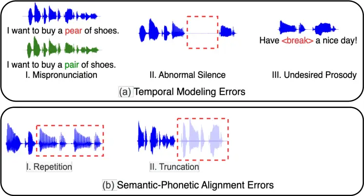
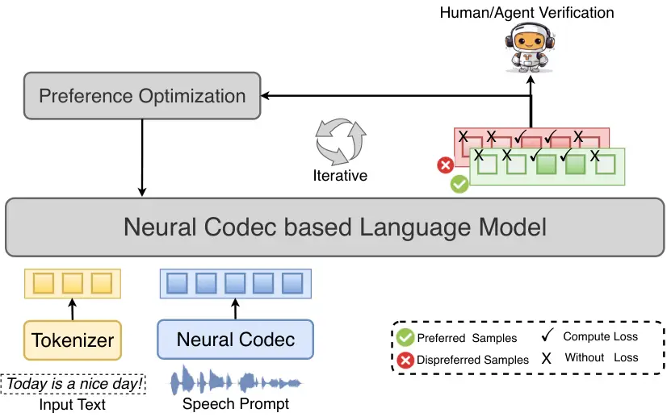

# FPO: Fine-grained Preference Optimization Improves Zero-shot Text-to-Speech

Jixun Yao    Yang Yuguang    Yuan Feng    Yu Pan    Ziqian Ning   
Jianhao Ye Affiliation: Hongbin Zhou, Lei Xie,  

###### Abstract

Integrating reinforcement learning to align generated speech with human
preferences has proven effective in improving the robustness of language
model-based text-to-speech (TTS) systems. Current approaches primarily
rely on preference data annotated at the utterance level. However,
frequent issues affecting the listening experience, such as unnatural
prosody, mispronunciations, or semantic inconsistencies, often arise
only in specific segments of audio, while other segments may be
well-generated and require no correction. This mismatch between
coarse-grained supervision and fine-grained quality variation limits the
effectiveness of preference-based optimization. In this study, we
propose a fine-grained preference optimization approach (FPO) to enhance
the robustness of TTS systems. FPO shifts the optimization paradigm from
global utterance-level tuning to targeted local refinement, focusing on
addressing localized issues in generated samples rather than uniformly
optimizing the entire utterance. We begin by analyzing the types of
common generation issues and categorizing them into temporal modeling
errors and semantic-phonetic alignment errors, which frequently degrade
intelligibility and naturalness. To tackle these problems, we introduce
a selective training loss strategy that leverages fine-grained labels
for each issue type, allowing the model to focus on learning signals
where they are most needed. Experimental results demonstrate that FPO
substantially improves the robustness of zero-shot TTS systems by
effectively correcting problematic regions in the output. This leads to
a significant reduction in the bad case ratio, improved intelligibility,
and overall perceptual quality. Moreover, FPO exhibits strong data
efficiency, achieving comparable or superior performance to baseline
methods while requiring notably fewer training samples. Audio samples
can be found at
[https://yaoxunji.github.io/fpo/](https://yaoxunji.github.io/fpo/).

###### Index Terms: 

Article submission, IEEE, IEEEtran, journal, LaTEX, paper, template,
typesetting.

## I Introduction

Large language models (LLMs) demonstrate remarkable in-context learning
abilities in natural language processing (NLP) tasks through scaling
model parameters and dataset sizes \[1, 2, 3\]. This scaling has enabled
them to generalize across a wide range of tasks with minimal
supervision, often achieving near-human or even superhuman performance
in many domains. However, their vast and diverse training data
encompasses varied goals, priorities, and content, not all of which are
desirable to imitate. Selecting desired responses and behaviors from the
model’s broad knowledge and capabilities is crucial for developing safe,
high-performing, and controllable AI systems \[4\]. A key solution
involves aligning LLMs with human preferences through reinforcement
learning (RL), effectively calibrating outputs to reduce harmful content
risks. This approach underpins widely-used systems like ChatGPT \[5\]
and has recently expanded beyond pure language generation to multimodal
tasks, including vision-language understanding \[6\], code
generation \[7\], and speech processing \[8\].

Speech, a key modality in generative artificial intelligence, is
experiencing rapid advancements inspired by developments in text-based
LLMs. Recent text-to-speech (TTS) studies \[9, 10, 11\] tokenize speech
signals into discrete units via neural codec models, aligning them with
phoneme or text inputs. These tokens are then processed by a language
model to predict subsequent tokens in a next-token prediction manner
using phoneme inputs and speech prompts. By scaling up model parameters
and training data size, the in-context learning capabilities also emerge
in TTS language models, enabling zero-shot generation of high-quality,
personalized speech. Mirroring RL’s role in refining text LLMs, emerging
interest focuses on applying RL to TTS systems \[12, 13, 14, 15\].
Typical approaches introduce direct preference optimization (DPO) \[16\]
or Kahneman-Tversky Optimization (KTO) \[17\] to align TTS systems,
while the key challenge is to collect desirable and relevant preference
datasets. By annotating generated speech samples using professional
annotators at the utterance-level, these approaches effectively enhance
the speech quality and zero-shot capabilities of TTS systems by
post-training in an RL manner.

Despite significant advancements in integrating RL into TTS systems, we
believe two primary challenges remain. The first challenge is
efficiently calibrating pre-trained TTS systems with limited preference
data. RL in TTS studies typically requires preference data evaluated by
human annotators, which is then used to align TTS systems with human
preferences. However, obtaining large-scale human-annotated speech
preference data is prohibitively expensive. Compared to annotating text
data, annotating speech data is more difficult due to its inclusion of
both linguistic content and paralinguistic information.

The second challenge is achieving fine-grained alignment of specific
segments in generated samples with human feedback. While issues like
poor speaker similarity and degraded audio quality—referred to as
systemic errors—have largely been mitigated in TTS systems by scaling up
training data, more frequent issues affecting the listening experience
often occur in specific segments of the audio. We refer to these as
segmental errors, which include mispronunciations, abnormal pauses,
repetitions, and other disruptions. Current speech RL approaches
typically annotate preference data at the utterance level, failing to
capture these fine-grained issues. Moreover, using utterance-level
preference data to optimize TTS systems needs to calculate losses of the
entire sequence, even when many segments are already well-trained,
leading to ineffective gradient updates and inefficient optimization
\[18\]. We believe that a more fine-grained approach to optimizing
problematic segments would be both more effective and data-efficient.

To address the above challenges, we propose a novel fine-grained
preference optimization (FPO) framework for TTS systems—an RL-based
approach designed to address segmental errors in generated samples and
enhance the robustness of zero-shot TTS systems. FPO employs a
fine-grained sampling-annotation pipeline for preference data
collection, which plays a crucial role in the RL-based approaches.
Pre-trained TTS systems first generate representative audio samples
multiple times as the candidate preference data, while the
utterance-level preference and dispreference data are annotated from
human listening perspectives using these candidate data. For each paired
preference data, we further identify the problematic segment and
annotate it with fine-grained token-level preference labels, enabling
more precise optimization than traditional methods. Furthermore, we
analyze the types of issues across different segments from an evaluation
perspective and divide the two types of errors in the annotated
dispreference data. A selective training loss strategy is proposed to
optimize different types of issues during preference optimization.
Specifically, FPO processes the entire sequence through the TTS models
but computes loss exclusively for the problematic segments, which can
effectively resolve fine-grained issues while enhancing training
efficiency. Experimental results demonstrate that FPO significantly
enhances the robustness of zero-shot TTS systems and exhibits superior
data efficiency compared to baseline systems, improving the quality of
generated speech across both subjective and objective metrics. The main
contributions can be summarized as follows:

- •
  We propose FPO, an RL-based approach designed to align problematic
  segments in generated samples, thereby enhancing the robustness of TTS
  systems. The key novelty of FPO lies in its fine-grained preference
  optimization, which focuses on optimizing specific problematic
  segments rather than entire utterances. This approach avoids
  unnecessary computation on well-learned tokens, resulting in a more
  data-efficient optimization process.
- •
  By analyzing issues in generated samples, FPO optimizes TTS systems by
  aligning problematic segments through a selective training strategy.
  This approach offers a new perspective for addressing fine-grained
  fixes in TTS preference optimization, which resolves bad cases both
  efficiently and effectively.
- •
  Both subjective and objective experiments demonstrate the efficiency
  and effectiveness of FPO. Notably, FPO significantly reduces the
  occurrence of bad cases compared to baseline systems and can achieve
  similar performance with fewer training samples.

## II Related Work

### II-A Neural codec based Zero-shot TTS

Inspired by the success of LLMs in NLP, formatting the TTS task as a
next-token prediction problem has gained significant popularity in
recent years \[19, 20\]. This formulation allows TTS systems to benefit
from autoregressive modeling and in-context learning capabilities that
have proven effective in text generation tasks. VALL-E \[9\], as a
pioneering work in this direction, introduced the first neural
codec-based TTS framework, leveraging large-scale speech data to develop
strong generalization and prompt-based adaptation abilities. It can
synthesize high-quality, personalized speech in a zero-shot manner using
only a 3-second enrolled recording as an acoustic prompt, without
requiring speaker-specific fine-tuning or additional adaptation steps.
Building on this foundation, a series of neural codec-based TTS
systems \[21, 22, 23\] have been developed. These models typically
involve a three-stage pipeline: (1) discretizing continuous speech
waveforms into semantic and/or acoustic tokens using a neural audio
codec \[24, 25, 26, 27\], (2) training a decoder-only language model to
predict these tokens conditioned on phoneme sequences and optional
prompts, and (3) reconstructing the speech waveform from predicted
tokens using the codec’s decoder. This discrete tokenization enables
autoregressive modeling and makes the TTS task more analogous to
language modeling.

Another prevalent approach introduces self-supervised speech
representation models \[28, 29, 30\] to extract semantic tokens that
capture linguistic content in a speaker-agnostic manner. These semantic
tokens serve as intermediate targets for language models, which eases
the token prediction task compared to directly modeling raw acoustic
tokens\[24\]. To reconstruct the waveform, many systems further employ
diffusion-based vocoders or conditional decoders that synthesize speech
from the generated semantic tokens, optionally guided by acoustic
features or speaker embeddings. These neural codec-based frameworks have
demonstrated strong scalability with increasing data and model size,
enabling high-fidelity speech synthesis and robust zero-shot
generalization to unseen speakers, speaking styles, and acoustic
conditions \[31, 11\]. Despite their impressive performance, these
models still face challenges in terms of robustness, particularly under
mismatched conditions, and often suffer from localized quality
degradations that are not effectively addressed by global training
objectives.



Fig. 1: Typical examples of segmental errors can be categorized into two
types: temporal modeling errors and semantic-phonetic alignment errors.
The problematic segments in the generated samples are highlighted using
red boxes or symbols.

### II-B Learning from Human Feedback

Human feedback has been widely utilized in LLMs for NLP tasks \[32,
33\], where RL techniques play a crucial role in aligning model behavior
with human preferences. This alignment paradigm has been instrumental in
developing AI agents that are helpful, harmless, and honest, paving the
way for controllable language models. Traditionally, RL-based preference
optimization follows a two-step pipeline. First, a reward model is
trained on human-annotated preference data, where annotators compare
model outputs and indicate which one is preferred. Then, the language
model is fine-tuned using reinforcement learning, typically with
Proximal Policy Optimization (PPO) \[34\], to maximize the expected
reward as estimated by the reward model. While effective, this approach
is computationally intensive and sensitive to reward model quality and
policy instability during RL fine-tuning.

To address these limitations, recent approaches such as Direct
Preference Optimization (DPO) \[16\] propose a more efficient
alternative. DPO introduces a closed-form loss function that operates
directly on preference pairs, eliminating the need for an explicit
reward model or reinforcement learning loop. This formulation simplifies
the training pipeline while achieving alignment performance comparable
to traditional RLHF methods. Other variants \[35\], such as Implicit
Preference Optimization (IPO) \[36\] and Kahneman-Tversky Optimization
(KTO) \[17\], explore related directions to improve preference learning
stability and generalization. Although these methods have been
extensively applied to NLP tasks, their adoption in speech-related
domains remains relatively limited. Recent works begin exploring
learning from human preferences in speech synthesis and voice
conversion, yet most rely on utterance-level binary labels, which can be
insufficient to capture the fine-grained nature of perceptual quality
issues in speech.

Learning from human feedback in TTS remains in its infancy compared to
its advancements in NLP. SpeechAlign first introduced RLHF in
TTS \[12\], exploring multiple preference alignment methods using paired
preference data. UNO \[13\] and RIO \[14\] extended this by optimizing
unpaired preference data: UNO accounts for annotation uncertainty in
subjective evaluations, while RIO introduces a reverse preference data
selection method based on Bayesian principles. Recent studies \[15\]
have conducted thorough empirical evaluations of how preference
alignment algorithms enhance LM-based TTS, and Seed-TTS \[37\] has also
adopted the RL method during the post-training stage of LM-based TTS.
However, current RL-based speech synthesis approaches are limited to
utterance-level preference optimization and overlook the potential of
fine-grained alignment. While token-level alignment methods (e.g.,
Mask-DPO \[38\], Rho-1 \[18\]) have been explored in NLP, we adapt and
extend it to speech-specific issues such as temporal modeling and
semantic-phonetic misalignment, which are absent in text-based tasks.

## III Methodology

### III-A Background

Neural codec based zero-shot TTS comprises two components: a neural
codec model and a language model. The codec model tokenizes the speech
signal into discrete acoustic tokens $`a\in\mathbb{R}^{n\times l}`$,
where $`n`$ is the number of quantizer layers in the codec model and
$`l`$ is the temporal length. The tokenized acoustic tokens can later be
reconstructed into speech signals by the codec decoder. Given a text
transcript $`t`$, the language model predicts the acoustic tokens using
a next-token prediction approach. A widely used codec model employs a
single quantizer \[39\], resulting in the extracted acoustic token being
a single sequence along the temporal dimension. This setup simplifies
the process of directly concat $`t`$ and $`a`$ and computing their joint
probabilities in an auto-regressive manner:

```math
p(x)=\prod_{i=1}^{l}p\left(a_{l}\mid a_{1},\ldots,a_{l-1},t\right), \tag{1}
```

it can also be regarded as a speech continuation task, conditioned on
both the text and prompt speech during inference.

RL with Preference Data. The language model is first employed to
generate paired speech samples ($`y_{1}`$,$`y_{2}`$) with prompts $`x`$.
Humans then evaluate these pairs and express preferences for one sample,
denoted as $`y_{w}\succ y_{l}\mid x`$, where $`y_{w}`$ and $`y_{l}`$
represent the preferred and dispreferred samples respectively. The
probability of preference data can be modeled using a reward model,
which is trained via maximum likelihood estimation. During the
reinforcement learning phase, the reward model provides feedback to the
language model, which is then optimized by maximizing the rewards.

### III-B Preference Data Collection

The selection of preference data plays a critical role in the RL
process. We propose a fine-grained sampling-annotation pipeline that
begins with annotating pairwise preference data. Specifically, we first
sample speech prompts from an unseen speaker pool for each text
transcript and use them as input to the TTS system. To promote more
diverse zero-shot TTS generation, we adjust sampling hyperparameters
during inference and perform multiple inference times for each prompt,
constructing a generated sample dataset
$`\{y_{1}^{b},y_{2}^{b},\ldots,y_{k}^{b}\}`$, where $`b`$ is the
$`b`$-th inference process.

After the sampling process, human annotators evaluate the generated
samples from each inference process, identifying preferred and
dispreferred ones. To mitigate the high human resource demands for
annotations, we draw inspiration from previous studies \[40\] and use
pre-trained speech perceptual systems to simulate human feedback. We
propose a comprehensive scoring method that combines multiple
metrics—including intelligibility, quality, similarity, and duration—to
determine the final score of each sample. This scoring system can
identify preferred samples based on their final scores $`s(y)`$:

```math
s(y)=\lambda_{w}\cdot w(y)^{p}+\lambda_{m}\cdot m(y)^{p}+\lambda_{c}\cdot c(y)^{p}+\lambda_{d}\cdot\text{Dur}(y)^{p}, \tag{2}
```

where $`w(\cdot)`$ and $`m(\cdot)`$ represent the intelligibility
evaluation metric and quality evaluation metric, respectively. $`c(y)`$
measures the speaker similarity and $`\text{Dur}(y)`$ measures the
duration difference between the generated samples and ground truth
samples. The weights $`\lambda_{*}`$ normalize each metric to ensure
they operate at the same amplitude and scale the range of $`s(y)`$ at
\[0,1\]. Meanwhile, $`p`$ is used to increase sensitivity to metrics
with small changes. These metrics are computed using pre-trained
automatic systems, simulating various aspects of human evaluation.
Therefore, the selection of preference data can be described as follows:

```math
\displaystyle(y_{l},y_{w})\in\Big\{y_{l}=\min \displaystyle\{s(y)\},\,y_{w}=\max\{s(y)\},
```

```math
\displaystyle y_{w}-y_{l}>\tau\Big\}, \tag{3}
```

where $`\tau`$ is introduced to constrain sufficient differences between
the preferred and dispreferred samples. We set $`\tau=0.3`$ to enhance
the reliability of preference data for training.



Fig. 2: The preference optimization process of our proposed FPO. The
language model is optimized using a selective training loss strategy,
which focuses loss on the problematic segments while avoiding
well-learned tokens.

### III-C Fine-grained Annotation

To achieve fine-grained alignment of TTS systems, we first thoroughly
investigate the characteristics of segmental errors and categorize them
into two types: temporal modeling errors and semantic-phonetic alignment
errors. As illustrated in Figure 1, temporal modeling errors stem from
the model’s limitations in capturing the temporal dynamics of speech,
leading to issues such as mispronunciation, where abrupt or unstable
pronunciation changes occur due to insufficient modeling of pitch
continuity or variation trends. Another common problem is abnormal
silence, where the model erroneously inserts silent frames or extends
silent segments, disrupting the naturalness of generated speech.
Additionally, the generated speech may exhibit unnatural prosody (i.g.
unnatural pause), as the model may fail to adequately capture local
rhythmic patterns, including stress, duration, and speaking rate,
resulting in speech that deviates from natural prosody.

For mispronunciations and abnormal silences, we employ
Whisper-timestamped¹¹ 1
[https://github.com/linto-ai/whisper-timestamped](https://github.com/linto-ai/whisper-timestamped)
and voice activity detection systems to annotate the timestamps of these
errors. To address unnatural prosody, we leverage the capabilities of
text LLMs and professional human annotators to precisely identify
affected segments. Specifically, we focus on abnormal pauses and
annotate fine-grained prosody errors through a three-step process.
First, we use an automatic speech recognition system to transcribe the
speech into text. Next, we employ text LLMs to determine optimal pause
placements and insert break tags accordingly. Finally, professional
annotators evaluate the speech samples using these break tags,
identifying preferred and dispreferred prosody patterns. Fine-grained
timestamps are then obtained using force-alignment tools based on the
text and break tags. This allows us to obtain timestamps for problematic
segments and annotate fine-grained preference labels for temporal
modeling errors at the token level.

Semantic-phonetic alignment errors, on the other hand, arise from the
mapping between phonetic input and acoustic output. These errors often
manifest as repetitions or truncations, where the TTS system either
over-relies on its previous outputs or fails to encode essential
phonetic information. Alternatively, truncation errors may occur when
the language model fails to encode key phonetic information from the
input or neglects certain critical elements, leading to synthesized
speech that lacks completeness and accuracy. Annotating these error
segments relies on automatic speech recognition systems and ground truth
transcripts with force alignment tools. However, unlike temporal
modeling errors, which affect only specific segments, repetition and
truncation errors often cause cascading issues after the initial error
segment. Therefore, we apply different annotation strategies for each
error type. For temporal modeling errors, only the problematic segments
are annotated as error segments. In contrast, for semantic-phonetic
alignment errors, all segments following the onset of the issue are
annotated as error segments. The token-level preference annotation can
be described as an indicator function:

```math
I\left(y^{i}\right)=\begin{cases}1&\text{ if }y^{i}\text{ in the error segment }\\
0&\text{ otherwise }\end{cases}, \tag{4}
```

where $`i`$ represents the $`i`$-th token of preference data.

In the fine-grained annotation process, preference data is first
identified, followed by the annotation of fine-grained preference labels
by human annotators or automated agents—steps not included in
conventional annotation methods. While fine-grained annotation involves
additional steps, it requires less data than the traditional approach.
Although utterance-level annotation is faster for human annotators, it
demands more data to achieve the same level of alignment as fine-grained
preference optimization. Therefore, we believe the additional cost of
fine-grained annotation is both more acceptable and more efficient than
conventional utterance-level annotation.

### III-D Preference Optimization

The preference optimization process of our proposed FPO is illustrated
in Figure 2. A typical preference optimization process of RL with a
reward model $`r_{\phi}(x,y)`$ can be formulated as

```math
\max_{\pi_{\theta}}\mathbb{E}\left[r_{\phi}(x,y)\right]-\beta\mathbb{D}_{\mathrm{KL}}\left[\pi_{\theta}(y\mid x)\|\pi_{\mathrm{ref}}(y\mid x)\right], \tag{5}
```

where $`\beta`$ is a parameter controlling the deviation between the TTS
model $`\pi_{\theta}`$ and the reference model $`\pi_{\text{ref}}`$.
However, estimating a reward model is computationally expensive and
introduces additional complexity during training. To address this, we
follow the DPO approach \[16\] to directly align the TTS system using
preference data, eliminating the need for a reward model.

Following previous studies \[41, 42\], the optimal solution to the
KL-constrained reward maximization objective in Eq.(5) can be described
as follows:

```math
\pi_{r}(y\mid x)=\frac{1}{Z(x)}\pi_{\text{ref }}(y\mid x)\exp\left(\frac{1}{\beta}r(x,y)\right). \tag{6}
```

where $`r(x,y)`$ is the reward function widely defined as
$`r(x,y)=r_{\phi}(x,y)-\beta(\log\pi_{\theta}(y|x)-\log\pi_{\text{ref}}(y|x))`$,
while $`r(x,y)`$ in optimization can be expressed in terms of the
corresponding optimal policy, the reference policy, and the unknown
partition function $`Z(\cdot)`$. This reward function is formulated as

```math
r(x,y)=\beta\log\frac{\pi_{r}(y\mid x)}{\pi_{\mathrm{ref}}(y\mid x)}+\beta\log Z(x). \tag{7}
```

Since the Bradley-Terry model depends only on the difference in rewards
between two completions, the partition function $`Z(\cdot)`$ can be
canceled, allowing the human preference probability to be expressed
solely in terms of the optimal TTS model and the reference model.
Finally, to achieve fine-grained optimization, we introduce the
indicator function from Eq. (4) to compute selective training loss for
both preferred and dispreferred samples:

```math
\displaystyle\mathcal{L}_{\text{FPO}}=-\mathbb{E}\Bigg[ \displaystyle\sum_{i}I(y^{i})\cdot\log\sigma\Big(\beta\log\frac{\pi_{\theta}(y_{w}^{i}|x)}{\pi_{\text{ref}}(y_{w}^{i}|x)}
```

```math
\displaystyle-\beta\log\frac{\pi_{\theta}(y_{l}^{i}|x)}{\pi_{\text{ref}}(y_{l}^{i}|x)}\Big)\Bigg]. \tag{8}
```

This function allows us to fit a token-level implicit reward to optimize
the TTS model using preference data while avoiding computational waste
on well-trained tokens.

## IV Experimental Setup

|                      |                    |                   |                    |                   |                    |                   |                    |                             |                       |
| -------------------- | ------------------ | ----------------- | ------------------ | ----------------- | ------------------ | ----------------- | ------------------ | --------------------------- | --------------------- |
|                      | test-zh            |                   | test-en            |                   | test-hard          |                   | UTMOS $`\uparrow`$ | Bad Case (%) $`\downarrow`$ | F0 Corr. $`\uparrow`$ |
|                      | CER $`\downarrow`$ | SECS $`\uparrow`$ | WER $`\downarrow`$ | SECS $`\uparrow`$ | WER $`\downarrow`$ | SECS $`\uparrow`$ |                    |                             |                       |
| CosyVoice \[11\]     | 3.63\_(-0.0%)      | 0.723             | 4.29\_(-0.0%)      | 0.609             | 11.75\_(-0.0%)     | 0.709             | 3.38\_(±0.11)      | 21%                         | 0.71                  |
|    + SDPO \[16\]     | 2.69\_(-25.9%)     | 0.731             | 3.41\_(-20.5%)     | 0.645             | 9.84\_(-16.3%)     | 0.716             | 3.44\_(±0.10)      | 17%                         | 0.70                  |
|    + UNO \[13\]      | 2.57\_(-29.2%)     | 0.735             | 3.06\_(-28.7%)     | 0.667             | 9.06\_(-22.9%)     | 0.722             | 3.67\_(±0.11)      | 15%                         | 0.75                  |
|    + RIO \[14\]      | 2.21\_(-39.1%)     | 0.744             | 2.89\_(-32.6%)     | 0.681             | 9.12\_(-22.4%)     | 0.727             | 3.64\_(±0.10)      | 12%                         | 0.73                  |
|    + Mask-DPO \[38\] | 2.61\_(-28.1%)     | 0.734             | 3.27\_(-23.8%)     | 0.652             | 9.52\_(-19.0%)     | 0.715             | 3.48\_(±0.10)      | 14%                         | 0.65                  |
|    + FPO (Ours)      | 1.83\_(-49.6%)     | 0.728             | 2.77\_(-35.4%)     | 0.614             | 7.98\_(-32.1%)     | 0.708             | 3.47\_(±0.09)      | 9%                          | 0.78                  |
| CosyVoice2 \[43\]    | 1.45\_(-0.0%)      | 0.748             | 2.57\_(-0.0%)      | 0.652             | 8.08\_(-0.0%)      | 0.730             | 3.49\_(±0.11)      | 14%                         | 0.75                  |
|    + SDPO \[16\]     | 1.43\_(-1.4%)      | 0.745             | 2.71\_(+5.4%)      | 0.673             | 8.32\_(+3.0%)      | 0.728             | 3.59\_(±0.08)      | 15%                         | 0.73                  |
|    + UNO \[13\]      | 1.37\_(-5.5%)      | 0.759             | 2.43\_(-5.4%)      | 0.669             | 7.78\_(-3.7%)      | 0.736             | 3.61\_(±0.11)      | 12%                         | 0.75                  |
|    + RIO \[14\]      | 1.40\_(-3.4%)      | 0.751             | 2.47\_(-3.9%)      | 0.675             | 7.94\_(-1.7%)      | 0.737             | 3.73\_(±0.12)      | 9%                          | 0.77                  |
|    + Mask-DPO \[38\] | 1.42\_(-2.1%)      | 0.754             | 2.51\_(-2.3%)      | 0.671             | 7.92\_(-2.0%)      | 0.733             | 3.64\_(±0.10)      | 13%                         | 0.67                  |
|    + FPO (Ours)      | 1.32\_(-9.0%)      | 0.747             | 2.24\_(-12.8%)     | 0.654             | 6.92\_(-14.4%)     | 0.731             | 3.56\_(±0.10)      | 8%                          | 0.81                  |
| Llasa \[39\]         | 1.89\_(-0.0%)      | 0.669             | 3.22\_(-0.0%)      | 0.572             | 12.13\_(-0.0%)     | 0.638             | 3.54\_(±0.12)      | 25%                         | 0.73                  |
|    + SDPO \[16\]     | 1.73\_(-8.5%)      | 0.685             | 2.83\_(-12.1%)     | 0.599             | 11.23\_(-7.4%)     | 0.633             | 3.67\_(±0.11)      | 22%                         | 0.75                  |
|    + UNO \[13\]      | 1.64\_(-13.2%)     | 0.701             | 2.74\_(-14.9%)     | 0.623             | 10.84\_(-10.6%)    | 0.663             | 3.65\_(±0.13)      | 18%                         | 0.74                  |
|    + RIO \[14\]      | 1.58\_(-16.4%)     | 0.709             | 2.79\_(-13.4%)     | 0.625             | 9.45\_(-22.1%)     | 0.671             | 3.75\_(±0.11)      | 15%                         | 0.78                  |
|    + Mask-DPO \[38\] | 1.71\_(-9.5%)      | 0.694             | 2.84\_(-11.8%)     | 0.591             | 9.92\_(-18.2%)     | 0.637             | 3.64\_(±0.10)      | 19%                         | 0.64                  |
|    + FPO (Ours)      | 1.47\_(-22.2%)     | 0.672             | 2.46\_(-23.6%)     | 0.571             | 8.42\_(-30.6%)     | 0.640             | 3.58\_(±0.12)      | 11%                         | 0.79                  |

TABLE I: Objective evaluation results on WER/CER, SECS, and bad case
ratio with different languages. For WER/CER and bad case ratio, lower
values indicate better performance, while for SECS, higher values are
better. The results are averaged by five inference times and the best in
each category are highlighted in bold.

### IV-A Model Configuration

We select the open-source CosyVoice \[11\], CosyVoice2 \[43\] and
Llasa \[39\] as our backbone models. These systems are trained on
large-scale datasets and demonstrate impressive performance. CosyVoice
series consists of a text encoder, a speech tokenizer, a speech language
model and a conditional flow matching model. Specifically, the text
encoder aligns the semantic spaces of text and speech tokens, while the
speech tokenizer extracts semantic tokens. The speech language model
then predicts speech tokens based on text inputs and an acoustic prompt.
A conditional flow matching model converts the predicted speech tokens
into a mel-spectrogram, which is finally reconstructed into speech
signals by a pre-trained vocoder. In contrast, Llasa bypasses flow
matching and the vocoder, directly reconstructing the predicted speech
tokens into waveforms using a codec decoder. Our study focuses on
optimizing the speech language model using fine-grained preference data.
For model training, we use a learning rate of 2e-6 and a batch size of
64, optimized with the AdamW optimizer \[44\]. The model is trained for
only two epochs.

### IV-B Dataset

To construct the training data for preference optimization, we use the
LibriTTS \[45\] and AISHELL-3 \[46\] corpora, which are already included
in the base models’ training. This setup eliminates the influence of
introducing additional high-quality data. Following a prior
study \[14\], we sample a pool of speech prompts containing 100
individual speakers and a separate pool of target transcripts to
generate preference samples using the pre-trained models. With the
proposed fine-grained sampling–annotation pipeline, we then select
sample pairs with substantial differences to build the training set,
resulting in 1,000 utterances for preference optimization.

For evaluation, we use the Seed-TTS eval dataset \[37\] to evaluate
model performance after preference optimization. This test set includes
samples extracted from publicly available English (EN) and Mandarin (ZH)
corpora and is designed to measure performance across various objective
metrics. Each sample in the English and Mandarin test sets consists of
one reference utterance and one target utterance spoken by the same
speaker. The optimized model generates speech for the target text using
the reference speech as an audio prompt.

### IV-C Baseline Systems

In addition to using the CosyVoice series as base models, we reproduce
the following strong RL-based speech approaches based on CosyVoice to
serve as powerful baseline systems for comprehensive comparison:

- •
  Speech-DPO \[16\]: We adapt the popular DPO algorithm to align the
  base model with human feedback, optimizing preference data at the
  utterance level, similar to the approach described in \[12\]. However,
  instead of using ground-truth and generated samples as pairs, we use
  both generated samples as the preference and the other as the
  dispreference. We refer to this baseline as SDPO.
- •
  UNO \[13\]: A recent study proposes an RL framework tailored for
  zero-shot TTS models, which integrates human feedback into the TTS
  learning objective and specifically considers the uncertainty arising
  from inherent variability in subjective human perception and
  evaluation. The preference optimization maximizes the utility of these
  samples in an uncertainty-aware manner.
- •
  RIO \[14\]: An RL-based preference optimization approach tailored to
  the zero-shot TTS system with neural codec modelling. It introduces a
  reverse inference optimization method based on the Bayesian principle
  to select exemplars from speech samples generated by the TTS system,
  which is further employed to generate the original prompt samples. By
  using the reverse inference method, it can effectively select
  preference data to enhance the capacity of an advanced zero-shot TTS
  system.
- •
  Mask-DPO \[38\]: A fine-grained factuality alignment method based on
  DPO that incorporating sentence-level factuality as mask signals and
  only learns from factually correct sentences in the preferred samples
  and prevents the penalty on factual contents in the not preferred
  samples, which resolves the ambiguity in the preference learning.

### IV-D Evaluation Metrics

Subjective Metrics: We employ the naturalness mean opinion score (NMOS)
to evaluate the naturalness of the generated samples. We invited 15
participants to listen to the audio samples and rate the naturalness on
a 5-point scale, where 1 indicates very unnatural and 5 indicates
completely natural. We apply a t-test to assess the statistical
significance between systems with 95% confidence intervals for the mean
opinion scores to better reflect the variability of listener ratings.
Furthermore, we conduct an ABX test in which participants listen to two
generated speech samples from different models based on the same input
and select the more natural-sounding sample. If the samples are too
similar to distinguish, participants are instructed to indicate a tie.

Objective Metrics: For objective evaluation, we use the speaker
embedding cosine similarity (SECS), calculated using pre-trained
WavLM-large fine-tuned automatic speaker verification models²² 2
[https://github.com/microsoft/UniSpeech/tree/main/downstreams/speaker_verification](https://github.com/microsoft/UniSpeech/tree/main/downstreams/speaker_verification),
to evaluate speaker similarity. For intelligibility evaluation, we
employ the word error rate (WER) metric for English samples and the
character error rate (CER) metric for Mandarin samples. English samples
are transcribed using the Whisper-Large-v3 model \[47\]³³ 3
[https://huggingface.co/openai/whisper-large-v3](https://huggingface.co/openai/whisper-large-v3),
while Mandarin samples are transcribed using the Paraformer model
\[48\]⁴⁴ 4
[https://huggingface.co/funasr/paraformer-zh](https://huggingface.co/funasr/paraformer-zh).
Additionally, speech quality is further measured using a predicted mean
opinion score (UTMOS), computed by a neural network model⁵⁵ 5
[https://github.com/sarulab-speech/UTMOS22](https://github.com/sarulab-speech/UTMOS22).
Meanwhile, following previous studies \[14\], we introduce the bad case
ratio to evaluate the robustness of different baseline systems. Samples
are classified as bad cases if their UTMOS is below 3, or if their WER
exceeds 3% on the test-zh and test-en sets, or 6% on the test-hard set.
Finally, we use the Pearson correlation (F0 Corr.) between the generated
and ground-truth pitch sequences as a metric to evaluate prosody
performance.

## V Experimental Results

### V-A Objective Evaluation

We first compare our proposed FPO with baseline systems using objective
metrics, results are shown in TableI. For WER and CER, FPO consistently
achieves the most significant improvements in speech intelligibility
across all backbones. With the CosyVoice model, FPO reduces CER by 49.6%
(from 3.63 to 1.83) and WER by 35.4% (from 4.29 to 2.77), outperforming
all baseline systems, including RIO ($`-`$39.1% CER, $`-`$32.6% WER) and
Mask-DPO ($`-`$28.1% CER, $`-`$23.8% WER). Similarly, when built upon
the stronger CosyVoice2 backbone, FPO further achieves the lowest CER
(1.32) and WER (2.24 and 6.92 on the test-en and test-hard sets,
respectively), surpassing other optimization methods such as UNO and
SDPO. Notably, FPO also maintains desired SECS and UTMOS scores,
indicating improved naturalness without compromising perceptual
quality.Beyond CosyVoice-based models, we additionally evaluate FPO on
Llasa, a more recent TTS backbone. FPO again demonstrates substantial
intelligibility gains, reducing CER by 22.2% (from 1.89 to 1.47) and WER
by 23.6% (from 3.22 to 2.46), while outperforming all other baselines,
including Mask-DPO and RIO.

In terms of robustness, FPO achieves the lowest bad case ratios across
all settings—reducing them from 21% to 9% on CosyVoice, from 14% to 8%
on CosyVoice2, and from 25% to 11% on Llasa, indicating a strong
capability to suppress segmental degradation such as mispronunciations
and unnatural repetitions. These consistent improvements across diverse
architectures validate the generalizability and effectiveness of our
fine-grained preference optimization strategy in enhancing both the
reliability and perceptual consistency of speech synthesis systems.

While FPO demonstrates only marginal improvements over the base model in
metrics like SECS and UTMOS—with RIO and UNO outperforming it in these
aspects—this discrepancy stems from the distinct optimization priorities
of the approaches. FPO’s core design focuses on resolving localized
segmental errors through token-level selective training, whereas
baseline systems like RIO and UNO prioritize utterance-level alignment
for global attributes such as speaker similarity and overall quality.
The base model already achieves strong performance in speaker similarity
and speech quality due to its large-scale pre-training, leaving limited
room for improvement in these dimensions. Consequently, the gains from
RIO and UNO—though statistically significant—represent incremental
refinements rather than transformative advancements. In contrast, FPO’s
targeted optimization reduces critical segmental errors by 40% in
CER/WER and slashes the bad case ratio by a large margin, directly
addressing the most frequent and perceptually salient issues in human
evaluations. This trade-off aligns with practical priorities in
real-world TTS deployment, where eliminating catastrophic local errors
often outweighs minor improvements in global attributes.

|          |               |               |               |
| -------- | ------------- | ------------- | ------------- |
|          | CosyVoice     | CosyVoice2    | Llasa         |
| Base     | 3.64\_(±0.11) | 3.81\_(±0.07) | 3.74\_(±0.12) |
| SDPO     | 3.68\_(±0.09) | 3.83\_(±0.11) | 3.80\_(±0.09) |
| Mask-DPO | 3.60\_(±0.12) | 3.79\_(±0.09) | 3.71\_(±0.11) |
| UNO      | 3.69\_(±0.11) | 3.72\_(±0.10) | 3.75\_(±0.08) |
| RIO      | 3.76\_(±0.08) | 3.87\_(±0.08) | 3.82\_(±0.09) |
| FPO      | 3.83\_(±0.09) | 3.91\_(±0.08) | 3.93\_(±0.10) |

TABLE II: Subjective NMOS results for the generated speech between
baseline systems and FPO with 95% confidence interval.

Fig. 3: Results of ABX preference test, while ”C1” and ”C2” denote
CosyVoice and CosyVoice2 model, respectively. MDPO denotes Mask-DPO
method.

Fig. 4: Results of FPO and baseline systems using different scales of
training data.

### V-B Subjective Evaluation

To further evaluate the effectiveness of FPO, we conduct subjective
evaluations on the naturalness of the generated samples. We can find
that our proposed FPO consistently achieves the highest NMOS scores
among all baseline RLHF alignment approaches, as shown in Table II.
While several baselines (e.g., RIO and SDPO) exhibit modest increases in
naturalness, FPO provides the most substantial and stable enhancement,
improving NMOS by +0.19, +0.10, and +0.19 points on CosyVoice,
CosyVoice2, and Llasa, respectively. To further investigate the source
of these perceptual gains, we combine the objective Pearson correlation
results with the subjective evaluations and find that FPO outperforms
all baseline systems on both metrics. This indicates that the improved
naturalness is not merely due to better intelligibility or fewer
segment-level errors. Instead, FPO more effectively aligns prosodic
structure, directly contributing to the enhanced perceptual quality.
These findings highlight FPO’s superior performance in generating more
natural and consistent speech.

In addition to NMOS, we conduct ABX preference tests to further validate
the performance gains of our proposed FPO compared to baseline systems.
The ABX tests include both CosyVoice and CosyVoice2 models, while all
other baselines are trained based on CosyVoice2. As shown in Figure 3,
FPO is preferred over CosyVoice in 57.1% of cases and ties in 21.4%.
Compared to CosyVoice2, FPO achieves a 44.3% win rate, again
significantly outperforming the base model in terms of listener
preference. Notably, FPO also outperform SDPO by a substantial margin
(40.8% vs. 27.6%, with 31.6% ties), demonstrating the effectiveness of
fine-grained optimization over full-sequence optimization. These ABX
test results further emphasize the advantages of FPO in producing more
preferred and natural speech.

On the other hand, FPO achieves a higher preference score than UNO and
RIO in the ABX test. While UNO and RIO focus on enhancing overall
attributes such as timbre and quality, FPO specifically targets
problematic segments, reducing abrupt errors and improving local
consistency. The higher preference scores in ABX tests suggest that
fine-grained optimization of local segments better aligns with human
perceptual priorities.

These results indicate that while utterance-level optimization methods
effectively align the base model to some extent, FPO directly addresses
critical points in the human listening experience. This leads to higher
practical utility, even when objective metric scores are comparable. The
consistency between subjective and objective evaluations further
validates the effectiveness of the proposed FPO.

### V-C Analysis on Data Efficient

To further evaluate the data efficiency of our proposed FPO, we compare
its performance against baseline systems using small-scale English
training data, with intelligibility evaluated on the test-hard set using
WER as metric and average bad case ratio across three test sets as
another metric. As shown in Figure 4, FPO achieves comparable WER
performance to the UNO system using only 200 training utterances,
whereas the baselines require 600 utterances. This demonstrates that FPO
is up to three times more data-efficient than baseline systems.
Furthermore, FPO consistently outperforms all baselines in terms of bad
case ratio across various data scales and achieves an approximate 4x
speedup compared to UNO.

|            |         |      |      |                |
| ---------- | ------- | ---- | ---- | -------------- |
|            | Num (#) | CER  | WER  | Bad case ratio |
| CosyVoice2 | \-      | 1.45 | 5.33 | 14%            |
|  + SDPO    | 1000    | 1.43 | 5.52 | 15%            |
|            | 2000    | 1.40 | 5.19 | 12%            |
|            | 5000    | 1.31 | 3.94 | 7%             |
|  + FPO     | 1000    | 1.32 | 4.58 | 8%             |
|            | 2000    | 1.29 | 3.76 | 5%             |
|            | 5000    | 1.21 | 3.23 | 3%             |

TABLE III: Comparison results between FPO and SDPO on several
larger-scale datasets. ”Num” represents the number of utterances used
for training.

Furthermore, we scale up the preference data size to compare the data
scalability between the SDPO approach and our proposed FPO. As shown in
Table III, with just 1,000 training utterances, FPO reduces the CER of
the original CosyVoice2 model from 1.45 to 1.32 and the WER from 5.33 to
4.58 for Mandarin and English evaluation datasets, respectively. This
performance outperforms even SDPO trained on 5,000 utterances (CER: 1.32
vs. 1.31; WER: 4.58 vs. 3.94), highlighting FPO’s ability to maximize
efficiency of preference optimization with limited data. Notably, FPO
reduces the bad case ratio from 14% to 8% using only 1,000 samples,
whereas SDPO requires 5,000 samples to achieve a similar performance of
about 7%. These results further demonstrate FPO’s effectiveness in
mitigating critical errors while maintaining high data efficiency.

FPO’s advantage stems from its selective training loss strategy, which
precisely directs optimization toward error-prone segments identified
through fine-grained annotations of temporal modeling and
semantic-phonetic misalignments. By identifying problematic tokens and
excluding well-learned regions from gradient updates, FPO minimizes
computational redundancy while preventing over-optimization of already
proficient segments. This targeted approach not only reduces noise in
parameter updates but also accelerates convergence by prioritizing
problematic segments. In contrast, utterance-level methods like SDPO
apply uniform optimization across entire sequences, inadvertently
diluting the impact of critical segments by averaging gradients from
both optimal and suboptimal regions. This indiscriminate updating forces
such methods to rely on larger datasets (4–5× more samples in ablation
studies) to statistically filter irrelevant signals and achieve
comparable error reduction. Furthermore, the utterance-level
optimization strategy risks destabilizing well-trained segments through
unnecessary perturbations, whereas FPO’s surgical precision preserves
existing capabilities while efficiently resolving localized failures.

|            |                   |                        |                        |                      |                        |
| ---------- | ----------------- | ---------------------- | ---------------------- | -------------------- | ---------------------- |
|            | SDPO              | UNO                    | RIO                    | Mask-DPO             | FPO                    |
| Grain      | Utterance         | Utterance              | Utterance              | Sentence             | Token                  |
| Goal       | Overall quality   | Uncertainty perceptual | Robustness enhancement | Factuality alignment | Targeted correction    |
| Annotation | Global preference | Global preference      | Global preference      | Global preference    | Token-level preference |
| Reward     | Binary            | Binary                 | Binary                 | Binary               | Fine-grained           |

TABLE IV: Comparison between our proposed FPO and other preference
alignment approaches.

## VI Limitations and Discussion

One of the main limitations of this study lies in the construction of
the preference training dataset. The proposed framework relies on
fine-grained manual annotation to ensure the quality and consistency.
This process is both time-consuming and labor-intensive, which may limit
the scalability of the approach to larger or more diverse datasets.
Although our proposed approach is data efficient and need less
annotation data compared with previous works, the fine-grained
annotation at each sample is more difficult than utterance level
annotation. Furthermore, our proposed approach is not inherently
restricted to autoregressive TTS models. Beyond the evaluated
autoregressive backbones, the framework can be naturally extended to
discrete non-autoregressive models. In these cases, the underlying
mechanism of preference-based optimization remains directly applicable
without substantial modification. For TTS paradigms that rely on
continuous representations, the core idea of our method is still
conceptually applicable. However, applying the method in this setting
introduces additional challenges. In particular, constructing
sufficiently diverse and well-controlled paired samples from continuous
representations for effective reinforcement learning becomes
non-trivial. Meanwhile, practical challenges may arise due to
differences in training objectives and generation mechanisms, which we
leave for future work.

## VII Conclusion

In this study, we propose FPO, a novel RL framework that introduces a
new paradigm for enhancing zero-shot TTS robustness through localized
error correction. By systematically categorizing generation errors into
temporal modeling discrepancies and semantic-phonetic misalignments, and
applying token-level preference optimization, FPO adopts a
segment-focused strategy that significantly outperforms baseline
systems. This validates our hypothesis that targeted intervention on
error-prone segments leads to more efficient and effective error
correction. FPO reduces the bad case ratio by 12% compared to base
models through fine-grained perceptual alignment. Additionally, it
achieves comparable performance using fewer training samples than
baseline systems, demonstrating strong data efficiency. Experimental
results confirm that FPO substantially improves the robustness of the
base TTS system, while subjective evaluations further support FPO’s
superiority in naturalness and alignment with human perceptual
preferences.

## References

- \[1\] T. Brown, B. Mann, N. Ryder, M. Subbiah, J. D. Kaplan, P.
  Dhariwal, A. Neelakantan, P. Shyam, G. Sastry, A. Askell, et
  al. (2020) Language models are few-shot learners. Advances in neural
  information processing systems 33, pp. 1877–1901. Cited by: §I.
- \[2\] H. Touvron, T. Lavril, G. Izacard, X. Martinet, M. Lachaux, T.
  Lacroix, B. Rozière, N. Goyal, E. Hambro, F. Azhar, et al. (2023)
  Llama: open and efficient foundation language models. arXiv preprint
  arXiv:2302.13971. Cited by: §I.
- \[3\] A. Grattafiori, A. Dubey, A. Jauhri, A. Pandey, A. Kadian, A.
  Al-Dahle, A. Letman, A. Mathur, A. Schelten, A. Vaughan, et al. (2024)
  The llama 3 herd of models. arXiv e-prints, pp. arXiv–2407. Cited by:
  §I.
- \[4\] P. F. Christiano, J. Leike, T. Brown, M. Martic, S. Legg, and D.
  Amodei (2017) Deep reinforcement learning from human preferences.
  Advances in neural information processing systems 30. Cited by: §I.
- \[5\] J. Achiam, S. Adler, S. Agarwal, L. Ahmad, I. Akkaya, F. L.
  Aleman, D. Almeida, J. Altenschmidt, S. Altman, S. Anadkat, et
  al. (2023) Gpt-4 technical report. arXiv preprint arXiv:2303.08774.
  Cited by: §I.
- \[6\] C. Kelly, L. Hu, B. Yang, Y. Tian, D. Yang, C. Yang, Z.
  Huang, Z. Li, J. Hu, and Y. Zou (2024) Visiongpt: vision-language
  understanding agent using generalized multimodal framework. arXiv
  preprint arXiv:2403.09027. Cited by: §I.
- \[7\] T. Zheng, G. Zhang, T. Shen, X. Liu, B. Y. Lin, J. Fu, W. Chen,
  and X. Yue (2024) Opencodeinterpreter: integrating code generation
  with execution and refinement. arXiv preprint arXiv:2402.14658. Cited
  by: §I.
- \[8\] J. Yao, H. Liu, C. Chen, Y. Hu, E. Chng, and L. Xie (2025)
  Gense: generative speech enhancement via language models using
  hierarchical modeling. arXiv preprint arXiv:2502.02942. Cited by: §I.
- \[9\] C. Wang, S. Chen, Y. Wu, Z. Zhang, L. Zhou, S. Liu, Z. Chen, Y.
  Liu, H. Wang, J. Li, et al. (2023) Neural codec language models are
  zero-shot text to speech synthesizers. arXiv preprint
  arXiv:2301.02111. Cited by: §I, §II-A.
- \[10\] S. Chen, S. Liu, L. Zhou, Y. Liu, X. Tan, J. Li, S. Zhao, Y.
  Qian, and F. Wei (2024) VALL-e 2: neural codec language models are
  human parity zero-shot text to speech synthesizers. arXiv preprint
  arXiv:2406.05370. Cited by: §I.
- \[11\] Z. Du, Q. Chen, S. Zhang, K. Hu, H. Lu, Y. Yang, H. Hu, S.
  Zheng, Y. Gu, Z. Ma, et al. (2024) CosyVoice: a scalable multilingual
  zero-shot text-to-speech synthesizer based on supervised semantic
  tokens. arXiv preprint arXiv:2407.05407. Cited by: §I, §II-A, §IV-A,
  TABLE I.
- \[12\] D. Zhang, Z. Li, S. Li, X. Zhang, P. Wang, Y. Zhou, and X.
  Qiu (2024) SpeechAlign: aligning speech generation to human
  preferences. arXiv preprint arXiv:2404.05600. Cited by: §I, §II-B, 1st
  item.
- \[13\] C. Chen, Y. Hu, W. Wu, H. Wang, E. S. Chng, and C. Zhang (2024)
  Enhancing zero-shot text-to-speech synthesis with human feedback.
  arXiv preprint arXiv:2406.00654. Cited by: §I, §II-B, 2nd item, TABLE
  I, TABLE I, TABLE I.
- \[14\] Y. Hu, C. Chen, S. Wang, E. S. Chng, and C. Zhang (2024) Robust
  zero-shot text-to-speech synthesis with reverse inference
  optimization. arXiv preprint arXiv:2407.02243. Cited by: §I, §II-B,
  3rd item, §IV-B, §IV-D, TABLE I, TABLE I, TABLE I.
- \[15\] J. Tian, C. Zhang, J. Shi, H. Zhang, J. Yu, S. Watanabe, and D.
  Yu (2024) Preference alignment improves language model-based tts.
  arXiv preprint arXiv:2409.12403. Cited by: §I, §II-B.
- \[16\] R. Rafailov, A. Sharma, E. Mitchell, C. D. Manning, S. Ermon,
  and C. Finn (2024) Direct preference optimization: your language model
  is secretly a reward model. Advances in Neural Information Processing
  Systems 36. Cited by: §I, §II-B, §III-D, 1st item, TABLE I, TABLE I,
  TABLE I.
- \[17\] K. Ethayarajh, W. Xu, N. Muennighoff, D. Jurafsky, and D.
  Kiela (2024) Kto: model alignment as prospect theoretic optimization.
  arXiv preprint arXiv:2402.01306. Cited by: §I, §II-B.
- \[18\] Z. Lin, Z. Gou, Y. Gong, X. Liu, Y. Shen, R. Xu, C. Lin, Y.
  Yang, J. Jiao, N. Duan, et al. (2024) Rho-1: not all tokens are what
  you need. arXiv preprint arXiv:2404.07965. Cited by: §I, §II-B.
- \[19\] Z. Borsos, R. Marinier, D. Vincent, E. Kharitonov, O.
  Pietquin, M. Sharifi, O. Teboul, D. Grangier, M. Tagliasacchi, and N.
  Zeghidour (2022) Audiolm: a language modeling approach to audio
  generation.(2022). arXiv preprint arXiv:2209.03143. Cited by: §II-A.
- \[20\] D. Zhang, S. Li, X. Zhang, J. Zhan, P. Wang, Y. Zhou, and X.
  Qiu (2023) Speechgpt: empowering large language models with intrinsic
  cross-modal conversational abilities. arXiv preprint arXiv:2305.11000.
  Cited by: §II-A.
- \[21\] E. Kharitonov, D. Vincent, Z. Borsos, R. Marinier, S.
  Girgin, O. Pietquin, M. Sharifi, M. Tagliasacchi, and N.
  Zeghidour (2023) Speak, read and prompt: high-fidelity text-to-speech
  with minimal supervision. Transactions of the Association for
  Computational Linguistics 11, pp. 1703–1718. Cited by: §II-A.
- \[22\] D. Xin, X. Tan, K. Shen, Z. Ju, D. Yang, Y. Wang, S.
  Takamichi, H. Saruwatari, S. Liu, J. Li, et al. (2024) Rall-e: robust
  codec language modeling with chain-of-thought prompting for
  text-to-speech synthesis. arXiv preprint arXiv:2404.03204. Cited by:
  §II-A.
- \[23\] P. Peng, P. Huang, S. Li, A. Mohamed, and D. Harwath (2024)
  Voicecraft: zero-shot speech editing and text-to-speech in the wild.
  arXiv preprint arXiv:2403.16973. Cited by: §II-A.
- \[24\] A. Défossez, J. Copet, G. Synnaeve, and Y. Adi (2022) High
  fidelity neural audio compression. arXiv preprint arXiv:2210.13438.
  Cited by: §II-A, §II-A.
- \[25\] N. Zeghidour, A. Luebs, A. Omran, J. Skoglund, and M.
  Tagliasacchi (2021) Soundstream: an end-to-end neural audio codec.
  IEEE/ACM Transactions on Audio, Speech, and Language Processing 30,
  pp. 495–507. Cited by: §II-A.
- \[26\] X. Zhang, D. Zhang, S. Li, Y. Zhou, and X. Qiu (2023)
  Speechtokenizer: unified speech tokenizer for speech large language
  models. arXiv preprint arXiv:2308.16692. Cited by: §II-A.
- \[27\] S. Ji, Z. Jiang, W. Wang, Y. Chen, M. Fang, J. Zuo, Q. Yang, X.
  Cheng, Z. Wang, R. Li, et al. (2024) Wavtokenizer: an efficient
  acoustic discrete codec tokenizer for audio language modeling. arXiv
  preprint arXiv:2408.16532. Cited by: §II-A.
- \[28\] W. Hsu, B. Bolte, Y. H. Tsai, K. Lakhotia, R. Salakhutdinov,
  and A. Mohamed (2021) Hubert: self-supervised speech representation
  learning by masked prediction of hidden units. IEEE/ACM transactions
  on audio, speech, and language processing 29, pp. 3451–3460. Cited by:
  §II-A.
- \[29\] S. Chen, C. Wang, Z. Chen, Y. Wu, S. Liu, Z. Chen, J. Li, N.
  Kanda, T. Yoshioka, X. Xiao, et al. (2022) Wavlm: large-scale
  self-supervised pre-training for full stack speech processing. IEEE
  Journal of Selected Topics in Signal Processing 16 (6), pp. 1505–1518.
  Cited by: §II-A.
- \[30\] Y. Chung, Y. Zhang, W. Han, C. Chiu, J. Qin, R. Pang, and Y.
  Wu (2021) W2v-bert: combining contrastive learning and masked language
  modeling for self-supervised speech pre-training. In 2021 IEEE
  Automatic Speech Recognition and Understanding Workshop (ASRU),
  pp. 244–250. Cited by: §II-A.
- \[31\] M. Łajszczak, G. Cámbara, Y. Li, F. Beyhan, A. van Korlaar, F.
  Yang, A. Joly, Á. Martín-Cortinas, A. Abbas, A. Michalski, et
  al. (2024) BASE tts: lessons from building a billion-parameter
  text-to-speech model on 100k hours of data. arXiv preprint
  arXiv:2402.08093. Cited by: §II-A.
- \[32\] L. Ouyang, J. Wu, X. Jiang, D. Almeida, C. Wainwright, P.
  Mishkin, C. Zhang, S. Agarwal, K. Slama, A. Ray, et al. (2022)
  Training language models to follow instructions with human feedback.
  Advances in neural information processing systems 35, pp. 27730–27744.
  Cited by: §II-B.
- \[33\] N. Stiennon, L. Ouyang, J. Wu, D. Ziegler, R. Lowe, C. Voss, A.
  Radford, D. Amodei, and P. F. Christiano (2020) Learning to summarize
  with human feedback. Advances in Neural Information Processing Systems
  33, pp. 3008–3021. Cited by: §II-B.
- \[34\] J. Schulman, F. Wolski, P. Dhariwal, A. Radford, and O.
  Klimov (2017) Proximal policy optimization algorithms. arXiv preprint
  arXiv:1707.06347. Cited by: §II-B.
- \[35\] Y. Gu, W. Zhang, C. Lyu, D. Lin, and K. Chen (2025) Mask-dpo:
  generalizable fine-grained factuality alignment of llms. arXiv
  preprint arXiv:2503.02846. Cited by: §II-B.
- \[36\] S. Garg, A. Singh, S. Singh, and P. Chopra (2025) IPO: your
  language model is secretly a preference classifier. arXiv preprint
  arXiv:2502.16182. Cited by: §II-B.
- \[37\] P. Anastassiou, J. Chen, J. Chen, Y. Chen, Z. Chen, Z. Chen, J.
  Cong, L. Deng, C. Ding, L. Gao, et al. (2024) Seed-tts: a family of
  high-quality versatile speech generation models. arXiv preprint
  arXiv:2406.02430. Cited by: §II-B, §IV-B.
- \[38\] Y. Gu, W. Zhang, C. Lyu, D. Lin, and K. Chen (2025) Mask-DPO:
  generalizable fine-grained factuality alignment of llms. arXiv
  preprint arXiv:2503.02846. Cited by: §II-B, 4th item, TABLE I, TABLE
  I, TABLE I.
- \[39\] Z. Ye, X. Zhu, C. Chan, X. Wang, X. Tan, J. Lei, Y. Peng, H.
  Liu, Y. Jin, Z. Dai, et al. (2025) Llasa: scaling train-time and
  inference-time compute for llama-based speech synthesis. arXiv
  preprint arXiv:2502.04128. Cited by: §III-A, §IV-A, TABLE I.
- \[40\] G. Lin, P. G. Shivakumar, A. Gourav, Y. Gu, A. Gandhe, H. Lee,
  and I. Bulyko (2024) Align-slm: textless spoken language models with
  reinforcement learning from ai feedback. arXiv preprint
  arXiv:2411.01834. Cited by: §III-B.
- \[41\] T. Korbak, H. Elsahar, G. Kruszewski, and M. Dymetman (2022) On
  reinforcement learning and distribution matching for fine-tuning
  language models with no catastrophic forgetting. Advances in Neural
  Information Processing Systems 35, pp. 16203–16220. Cited by: §III-D.
- \[42\] D. Go, T. Korbak, G. Kruszewski, J. Rozen, N. Ryu, and M.
  Dymetman (2023) Aligning language models with preferences through
  f-divergence minimization. arXiv preprint arXiv:2302.08215. Cited by:
  §III-D.
- \[43\] Z. Du, Y. Wang, Q. Chen, X. Shi, X. Lv, T. Zhao, Z. Gao, Y.
  Yang, C. Gao, H. Wang, et al. (2024) Cosyvoice 2: scalable streaming
  speech synthesis with large language models. arXiv preprint
  arXiv:2412.10117. Cited by: §IV-A, TABLE I.
- \[44\] I. Loshchilov and F. Hutter (2017) Decoupled weight decay
  regularization. arXiv preprint arXiv:1711.05101. Cited by: §IV-A.
- \[45\] H. Zen, V. Dang, R. Clark, Y. Zhang, R. J. Weiss, Y. Jia, Z.
  Chen, and Y. Wu (2019) LibriTTS: a corpus derived from librispeech for
  text-to-speech. arXiv preprint arXiv:1904.02882. Cited by: §IV-B.
- \[46\] Y. Shi, H. Bu, X. Xu, S. Zhang, and M. Li (2020) Aishell-3: a
  multi-speaker mandarin tts corpus and the baselines. arXiv preprint
  arXiv:2010.11567. Cited by: §IV-B.
- \[47\] A. Radford, J. W. Kim, T. Xu, G. Brockman, C. McLeavey, and I.
  Sutskever (2022) Robust speech recognition via large-scale weak
  supervision. arXiv. External Links:
  [Document](https://dx.doi.org/10.48550/ARXIV.2212.04356),
  [Link](https://arxiv.org/abs/2212.04356) Cited by: §IV-D.
- \[48\] Z. Gao, S. Zhang, I. McLoughlin, and Z. Yan (2022) Paraformer:
  fast and accurate parallel transformer for non-autoregressive
  end-to-end speech recognition. arXiv preprint arXiv:2206.08317. Cited
  by: §IV-D.
