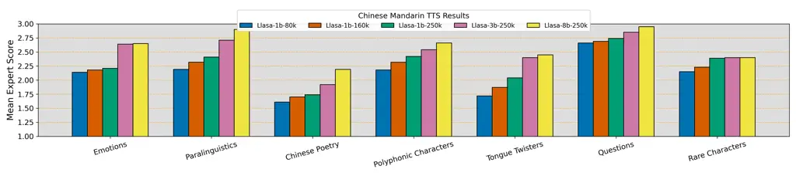
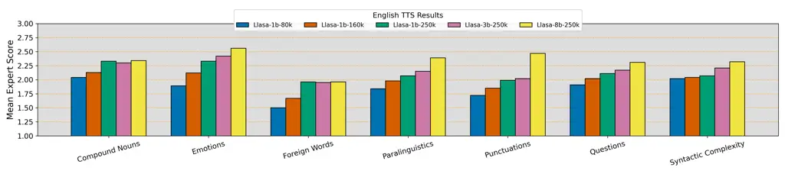
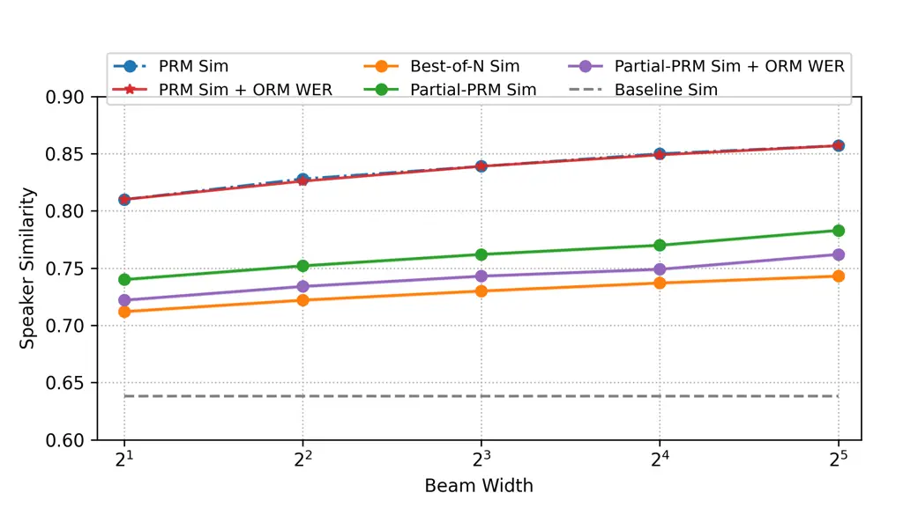
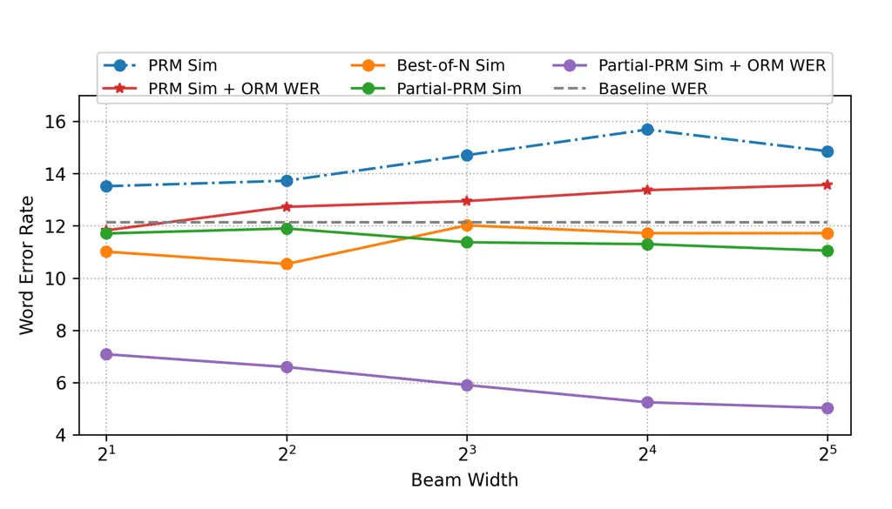

# Llasa: Scaling Train-Time and Inference-Time Compute for Llama-based Speech Synthesis

Zhen Ye Affiliation: The Hong Kong University of Science and Technology
   Xinfa Zhu Affiliation: ASLP Lab, Northwestern Polytechnical
University    Chi-Min Chan Affiliation: The Hong Kong University of
Science and Technology    Xinsheng Wang Affiliation: The Hong Kong
University of Science and Technology    Xu Tan Affiliation: Independent
Researcher    Jiahe Lei Affiliation: University of Science and
Technology Beijing    Yi Peng Affiliation: The Hong Kong University of
Science and Technology    Haohe Liu Affiliation: University of Surrey   
Yizhu Jin Affiliation: The Hong Kong University of Science and
Technology    Zheqi Dai Affiliation: Chinese University of Hong Kong   
Hongzhan Lin Affiliation: Hong Kong Baptist University    Jianyi Chen
Affiliation: The Hong Kong University of Science and Technology   
Xingjian Du Affiliation: University of Rochester    Liumeng Xue
Affiliation: The Hong Kong University of Science and Technology   
Yunlin Chen Affiliation: Shanghai Mobvoi Information Technology Co., Ltd
   Zhifei Li Affiliation: Shanghai Mobvoi Information Technology Co.,
Ltd    Lei Xie Affiliation: ASLP Lab, Northwestern Polytechnical
University    Qiuqiang Kong Affiliation: Chinese University of Hong Kong
   Yike Guo Affiliation: The Hong Kong University of Science and
Technology    Wei Xue Affiliation: The Hong Kong University of Science
and Technology Correspondence to: <weixue@ust.hk>

###### Abstract

Recent advances in text-based large language models (LLMs), particularly
in the GPT series and the o1 model, have demonstrated the effectiveness
of scaling both training-time and inference-time compute. However,
current state-of-the-art TTS systems leveraging LLMs are often
multi-stage, requiring separate models (e.g., diffusion models after
LLM), complicating the decision of whether to scale a particular model
during training or testing. This work makes the following contributions:
First, we explore the scaling of train-time and inference-time compute
for speech synthesis. Second, we propose a simple framework Llasa for
speech synthesis that employs a single-layer vector quantizer (VQ) codec
and a single Transformer architecture to fully align with standard LLMs
such as Llama. Our experiments reveal that scaling train-time compute
for Llasa consistently improves the naturalness of synthesized speech
and enables the generation of more complex and accurate prosody
patterns. Furthermore, from the perspective of scaling inference-time
compute, we employ speech understanding models as verifiers during the
search, finding that scaling inference-time compute shifts the sampling
modes toward the preferences of specific verifiers, thereby improving
emotional expressiveness, timbre consistency, and content accuracy. In
addition, we released the checkpoint and training code for our TTS model
(1B, 3B, 8B) and codec model publicly available.

- •
  Models: [Hugging Face
  Collection](https://huggingface.co/collections/HKUSTAudio/llasa-679b87dbd06ac556cc0e0f44)
- •
  Llasa Training Code: [GitHub
  Repository](https://github.com/zhenye234/LLaSA_training)
- •
  Codec Training Code: [GitHub
  Repository](https://github.com/zhenye234/X-Codec-2.0)
- •
  Inference-time Scaling Code: [GitHub
  Repository](https://github.com/zhenye234/LLaSA_inference)
- •
  Demo page: [Demo page](https://llasatts.github.io/llasatts/)

^(†)^(†)affiliationnotice: Equal contribution

## 1 Introduction

Recent years have witnessed the remarkable success of large language
models (LLMs) in the text domain, represented by the GPT series(Brown
et al., 2020; Achiam et al., 2023; Radford et al., 2019). These advances
have demonstrated that increasing model size and training data
consistently yields better performance across a wide array of natural
language understanding and generation tasks. However, as the text domain
approaches data saturation, new directions are emerging, such as “o1”
models (Jaech et al., 2024) that emphasize extensive computational
effort at test time—thereby exhibiting an inference-time scaling effect.
By investing more resources during inference, these models are able to
produce higher-quality outputs and handle more complex tasks, offering a
flexible avenue for performance improvement after the training phase.

Meanwhile, text-to-speech (TTS) research has also made impressive
strides. Many existing TTS systems focus on devising better model
architectures—leveraging well-designed modules, larger datasets, and
increased model size—to push synthesis quality ever higher. While these
efforts have propelled the field forward, they also tend to narrow the
community’s perspective: the focus on better architectures can
overshadow investigations into broader, potentially transformative
research questions. In contrast, the text LLM community has converged on
a relatively standard framework—a simple Transformer model with a
tokenizer—which allows researchers to concentrate on fundamental issues
such as training-time scaling laws (Kaplan et al., 2020), inference-time
scaling behaviors (Snell et al., 2024), and downstream adaptations
(e.g., fine-tuning (Hu et al., 2021), pruning, and quantization(Zhu
et al., 2024a)). Such a common design philosophy has catalyzed rapid
progress and deeper insights into the text domain.

Motivated by these observations, we propose aligning TTS with the
minimalist yet powerful paradigm of text LLMs. We introduce a single
Transformer-based TTS model that relies on a well-designed speech
tokenizer. More specifically, our TTS system, named Llasa, is
initialized from the Llama (Touvron et al., 2023) model with an expanded
vocabulary that incorporates speech tokens and is trained using the
next-token prediction paradigm. Although this model may not always match
the performance of highly customized TTS systems, its streamlined design
creates a unified foundation for exploring a wider range of research
questions—beyond architecture exploration.

In particular, we systematically investigate both training-time and
inference-time scaling effects under this unified TTS framework. Our
experiments show that scaling training-time compute (e.g., increasing
model size or training data) not only improves naturalness but also
enhances expressive prosody, effectively capturing the meaning conveyed
in text without explicit labels. Additionally, we examine the utility of
inference-time scaling by incorporating speech understanding models as
verifiers in the search process. We find that spending more
computational effort during inference aligns generation outputs more
closely with specific verifier biases, yielding better emotional
expressiveness, timbre consistency, and content accuracy. Evaluations on
LibriSpeech test sets (Panayotov et al., 2015), seed-tts-eval
(Anastassiou et al., 2024) and ESD datasets (zho, 2022) demonstrate
state-of-the-art results, and further highlight how in-context learning
capabilities can be combined with search-based refinements to control
factors such as speaker identity or emotion.

In summary, our paper makes several key contributions. We design a TTS
model named Llasa that is fully aligned with standard LLM architectures
by utilizing a single Transformer and a well-designed speech tokenizer,
thereby creating a simple, flexible, and scalable system. Additionally,
we find that increasing training-time compute for Llasa leads to
significant improvements in speech naturalness and prosody accuracy,
which reflects a deeper semantic understanding of the input text. We
further demonstrate that scaling inference-time compute—achieved by
incorporating speech understanding verifiers—enhances emotional
expressiveness, timbre consistency, and content accuracy in synthesized
speech. Furthermore, by providing open access to our models and
frameworks, we aim to foster further research and development in the TTS
community.

## 2 Methods

### 2.1 Overview

Our TTS framework is designed to fully align with the standard text LLM
paradigm, keeping only two main components: (1) a tokenizer and (2) a
single Transformer-based LLM. We initialize the Transformer parameters
$`\phi`$ from an existing LLM (e.g., Llama), and inherit its tokenizer
for the text portion. Hence, the core new challenge is to convert raw
speech waveforms into sequences of discrete tokens such that the
Transformer can model them in an autoregressive manner.

To achieve this, we introduce our speech tokenizer, X-codec2, which
encodes waveforms into speech tokens and can decode them back to
high-quality audio. Unlike some prior tokenizers for TTS, ours requires
no additional information during decoding, ensuring that all aspects of
the speech signal, such as content, prosody, and timbre, are captured by
the LLM.

Formally, let: 1.
$`\texttt{Tokenize}_{\text{text}}(X)=\{x_{1},\dots,x_{T}\}`$ be the text
tokenizer, which converts input text $`X`$ into $`T`$ text tokens. 2.
$`\texttt{Tokenize}_{\text{speech}}(Y)=\{y_{1},\dots,y_{S}\}`$ be the
speech tokenizer, which converts a speech waveform $`Y`$ into $`S`$
discrete tokens. 3.
$`\texttt{Detokenize}_{\text{speech}}(\{y_{1},\dots,y_{S}\})=\hat{Y}`$
be the speech decoder, which reconstructs the waveform $`\hat{Y}`$ from
its token representation.

Given a dataset $`\mathcal{D}=\{(X_{i},Y_{i})\}_{i=1}^{N}`$, where
$`X_{i}`$ is the text transcription and $`Y_{i}`$ is the corresponding
audio, we represent each pair $`(X_{i},Y_{i})`$ as a token sequence
$`(x_{1},\dots,x_{T},y_{1},\dots,y_{S})`$. Our Transformer, with
parameters $`\phi`$, learns the joint distribution of text and speech
tokens via

```math
\displaystyle P(x_{1},\ldots,x_{T},y_{1},\ldots,y_{S})
```

```math
\displaystyle= \displaystyle P(x_{1},\ldots,x_{T})\cdot P(y_{1},\ldots,y_{S}|x_{1},\ldots,x_{T})
```

Since the text tokens $`\{x_{1},\ldots,x_{T}\}`$ are always given as
input during training and inference, the model focuses on learning the
conditional probability:

```math
\displaystyle P(y_{1},\ldots,y_{S}|x_{1},\ldots,x_{T})
```

```math
\displaystyle= \displaystyle\prod_{s=1}^{S}P(y_{s}|x_{1},\ldots,x_{T},y_{1},\ldots,y_{s-1})
```

Therefore, the loss is calculated over the speech tokens
$`\{y_{1},\ldots,y_{S}\}`$. The objective is to minimize the negative
log-likelihood:

```math
\mathcal{L}=-\sum_{s=1}^{S}\log P(y_{s}|x_{1},\ldots,x_{T},y_{1},\ldots,y_{s-1})
```

which makes the model learn to predict each speech token $`y_{s}`$
conditioned on both the text tokens $`\{x_{1},\ldots,x_{T}\}`$ and the
previously generated speech tokens $`\{y_{1},\ldots,y_{s-1}\}`$.

### 2.2 Speech Tokenizer

As highlighted by AudioLM (Borsos et al., 2023), discrete speech
representations can be categorized into both semantic tokens and
acoustic tokens. Language modeling on semantic tokens excels at
capturing high-level information such as content and emotion, while
modeling with acoustic tokens focuses on low-level details, including
timbre and other acoustic characteristics. Our X-codec2 tokenizer builds
on the concepts from prior work X-codec (Ye et al., 2024). We fuse these
semantic and acoustic features into a unified codebook but introduce a
crucial modification: replacing residual vector quantization with a
single vector quantizer to ensure 1D causal dependency. This design
naturally aligns with the left-to-right autoregressive mechanism of LLMs
and also reflects the inherently left-to-right temporal structure of
audio signals.

Our X-codec2 consists of three main components: the Encoder, the VQ
module, and the Decoder.

##### Encoder

Given a raw speech waveform $`\mathbf{Y}`$, we employ two separate
encoders to derive its semantic and acoustic representations:

- •
  Semantic Encoder $`\mathrm{Enc}_{s}`$: We adopt a pre-trained
  Wav2Vec2-BERT (Barrault et al., 2023) to obtain multilingual speech
  semantic features that capture content and emotional cues.
- •
  Acoustic Encoder $`\mathrm{Enc}_{a}`$: Following the design in Xin
  et al. (2024) and Kumar et al. (2024), this module uses multiple
  residual convolutional blocks with Snake activation functions to
  encode low-level acoustic details.

We then concatenate the two outputs to form a fused feature embedding,

```math
\mathbf{H}=\bigl[\mathrm{Enc}_{s}(\mathbf{Y}),\;\mathrm{Enc}_{a}(\mathbf{Y})\bigr],
```

which serves as the input to our vector quantizer.

##### Vector Quantization

To obtain discrete tokens, we apply $`\mathrm{FSQ}(\cdot)`$ (Mentzer
et al., 2024) to $`\mathbf{H}`$:

```math
\mathbf{H}_{q}\;=\;\mathrm{FSQ}(\mathbf{H}),
```

where $`\mathbf{H}_{q}`$ is the quantized feature. We adopt FSQ due to
its stability in training and high codebook usage efficiency. Notably,
FSQ does not require an explicit VQ objective term (e.g., codebook
commitment loss), simplifying optimization during training.

##### Decoder

From the quantized representation $`\mathbf{H}_{q}`$, we aim to
reconstruct both _semantic_ and _acoustic_ information:

- •
  Semantic Reconstruction: We follow Ye et al. (2024) and employ a
  semantic decoder to predict semantic features, using an $`\ell_{2}`$
  loss for reconstruction. It is worth noting that during inference,
  predicting semantic features is unnecessary; this component is
  designed to provide a supervisory signal to ensure the codebook
  retains sufficient semantic information.
- •
  Acoustic Reconstruction: Following Vocos (Siuzdak, ), we replace the
  ConvNeXt backbone with a Transformer-based decoder that predicts the
  short-time Fourier transform (STFT) magnitude and phase; an inverse
  STFT (iSTFT) head then converts the predicted spectra back to
  time-domain waveforms.

##### Codec Training

The training process closely follows that of X-Codec, simultaneously
optimizing both semantic and acoustic reconstruction. We incorporate a
multi-period discriminator (MPD) (Kong et al., 2020), a multi-scale STFT
(MS-STFT) discriminator, and a spectral discriminator, with FFT sizes
$`\{78,126,206,334,542,876,1418,2296\}`$ (Anonymous, 2025), for
adversarial training. Additionally, following (Anonymous, 2025), we
incorporate a perceptual loss during the final steps of the training
process to further enhance intelligibility.

### 2.3 Scaling Train-time Compute

Our primary goal in this section is not to locate a compute-optimal
configuration for TTS, but rather to show that, akin to text-based LLMs,
increasing train-time resources (either by enlarging the model or
expanding the training dataset) consistently improves performance.
Specifically, we investigate two scaling strategies:

- •
  Fix Training Data, Vary Model Size. We fix the training data at
  $`250\text{k}`$ hours and scale the size of the Transformer $`\phi`$.
  Concretely, we adopt Llama 3.2 with 1B and 3B parameters, as well as
  Llama 3.1 with 8B parameters, which we denote as Llasa-1B-250k,
  Llasa-3B-250k, and Llasa-8B-250k, respectively, to observe how
  increased model capacity influences TTS quality.
- •
  Fix Model Size, Vary Training Data. We choose an LLM initialized from
  Llama 3.2 1B and train on three progressively larger subsets of our
  dataset $`\mathcal{D}`$, containing $`80\text{k}`$, $`160\text{k}`$,
  and $`250\text{k}`$ hours of speech, respectively. Notably, the 80k
  and 160k subsets are randomly sampled as 1/3 and 2/3 partitions of the
  full 250k dataset, which we denote as Llasa-1B-80k, Llasa-1B-160k, and
  Llasa-1B-250k (identical to the previously mentioned Llasa-1B-250k
  model).

We evaluate these on two aspects:

##### Text Understanding Ability

A longstanding challenge in Text-to-Speech (TTS) technology is that TTS
systems often fail to fully comprehend the meaning of text as humans do,
which leads to mechanical pronunciation, lack of emotion, unnatural
pauses, and difficulties in distinguishing homographs. Following BASE
TTS (Łajszczak et al., 2024), we use seven categories of
texts—Questions, Emotions, Compound Nouns, Complex Syntax, Foreign
Words, Paralinguistics, and Punctuation—for English evaluation.
Additionally, we propose seven categories tailored for Chinese:
Questions, Emotions, Paralinguistics, Chinese Poetry, Rare Characters,
Polyphonic Words, and Tongue Twisters (details are provided in Appendix
A). In each case, the TTS system must exhibit a deeper textual
understanding to produce natural and context-appropriate speech (e.g.,
correct pronunciation for polyphonic words and more expressive speech
for emotional content). By examining the synthesized audio for each
category, we measure how increased training data or parameter count
benefits the system’s text understanding ability.

##### In-context Learning Ability

We also evaluate the model’s zero-shot TTS capabilities (Wang et al.,
2023)—whether it can produce intelligible, high-quality speech for
speakers unseen during training. This aligns with prior zero-shot TTS
protocols, which typically assess how well a model generalizes to new
speaker identities, timbres, and emotional expressions with no
additional fine-tuning.

### 2.4 Scaling Inference-time Compute

Recent research has begun exploring the scaling behavior of LLMs during
inference, showing that additional computational resources—often in the
form of sophisticated search strategies—can further enhance performance.
Concretely, such approaches adjust the model’s output distribution at
test time by generating multiple candidate outputs from a baseline model
and then applying post-hoc filtering and refinement via verifiers or
scoring mechanisms, thereby elevating the quality of the generated
content. When extending this concept to text-to-speech (TTS), we
hypothesize that generating multiple speech candidates and performing a
targeted search among them can yield outputs that more closely match the
task requirements. In line with prior work (Snell et al., 2024; Ma
et al., 2025), our search framework centers on two fundamental design
choices:

##### Verifier Selection

For TTS, many off-the-shelf speech understanding models can serve as
verifiers (or reward models) to evaluate synthesized audio from multiple
perspectives. These include speaker verification models for measuring
timbre similarity, emotion representation models (Ma et al., 2023) for
gauging emotional content, prosodic analyzers (e.g., pitch and duration
(Li et al., 2023; Ren et al., 2022)) to ensure natural intonation and
rhythm, speech quality metrics (Saeki et al., 2022; Reddy et al., 2021)
(e.g., SpeechMos) to evaluate naturalness, and automatic speech
recognition (ASR) models (Radford et al., 2023; Gao et al., 2023a) to
assess transcription accuracy. By integrating feedback from these
diverse verifiers, we ensure that the generated speech meets our
requirements across multiple aspects, all in a fully automated process.

##### Algorithms

We categorize the two different reward methods as follows:

- •
  Output Reward Models (ORMs):These models assess the speech segment
  only after it has been fully generated, evaluating it holistically.
  ORMs typically follow a simpler design but may be less efficient due
  to the absence of intermediate guidance signals. A common search
  strategy based on ORMs is the Best-of-N approach, where multiple
  candidate outputs are generated, scored using a reward model, and the
  highest-scoring output is selected.
- •
  Process Reward Models (PRMs): These models evaluate the generation
  process step by step, optimizing at each incremental stage (e.g.,
  every second in a 10-second clip). Unlike conventional reward models
  that produce a single score for the final output, PRMs provide a
  sequence of scores, allowing for more fine-grained feedback throughout
  the generation process. While this approach enables detailed control,
  it also increases the risk of overfitting to intermediate rewards and
  of converging to local optima. The most common search algorithm
  leveraging PRMs is beam search, which systematically explores the
  solution space while optimizing both the sampling and evaluation of
  intermediate steps.

In our experiments, we explore both PRMs and ORMs to analyze how
different search strategies impact the final quality of synthesized
speech. A more detailed discussion of these methods and their outcomes
is provided in the next experiments section.

|                 |            |               |                |            |                    |                   |                      |                      |                      |                    |
| --------------- | ---------- | ------------- | -------------- | ---------- | ------------------ | ----------------- | -------------------- | -------------------- | -------------------- | ------------------ |
| Model           | Token Rate | Codebook Size | Codebook Layer | Frame Rate | WER $`\downarrow`$ | STOI $`\uparrow`$ | PESQ- WB$`\uparrow`$ | PESQ- NB$`\uparrow`$ | SPK- SIM$`\uparrow`$ | UT MOS$`\uparrow`$ |
| Ground Truth    | -          | -             | -              | -          | 1.96               | 1.00              | 4.64                 | 4.55                 | 1.00                 | 4.09               |
| DAC             | 600        | 1024          | 12             | 50         | 2.00               | 0.95              | 4.01                 | 4.15                 | 0.95                 | 4.00               |
| Encodec         | 600        | 1024          | 8              | 75         | 2.15               | 0.94              | 2.77                 | 3.18                 | 0.89                 | 3.09               |
| Encodec         | 150        | 1024          | 2              | 75         | 4.90               | 0.85              | 1.56                 | 1.94                 | 0.60                 | 1.58               |
| DAC             | 100        | 1024          | 2              | 50         | 13.27              | 0.73              | 1.13                 | 1.40                 | 0.32                 | 1.29               |
| SpeechTokenizer | 100        | 1024          | 2              | 50         | 3.92               | 0.77              | 1.25                 | 1.59                 | 0.36                 | 2.28               |
| Mimi            | 100        | 2048          | 8              | 12.5       | 2.96               | 0.91              | 2.25                 | 2.80                 | 0.73                 | 3.56               |
| X-codec         | 100        | 1024          | 2              | 50         | 2.49               | 0.86              | 2.33                 | 2.88                 | 0.72                 | 4.21               |
| BigCodec        | 80         | 8192          | 1              | 80         | 2.76               | 0.93              | 2.68                 | 3.27                 | 0.84                 | 4.11               |
| WavTokenizer    | 75         | 4096          | 1              | 75         | 3.98               | 0.90              | 2.13                 | 2.63                 | 0.65                 | 3.79               |
| Mimi            | 75         | 2048          | 6              | 12.5       | 3.61               | 0.89              | 1.99                 | 2.51                 | 0.65                 | 3.38               |
| Encodec         | 75         | 1024          | 1              | 75         | 28.92              | 0.77              | 1.23                 | 1.48                 | 0.25                 | 1.25               |
| DAC             | 50         | 1024          | 1              | 50         | 74.55              | 0.62              | 1.06                 | 1.20                 | 0.08                 | 1.25               |
| SpeechTokenizer | 50         | 1024          | 1              | 50         | 5.01               | 0.64              | 1.14                 | 1.30                 | 0.17                 | 1.27               |
| Mini            | 50         | 2048          | 4              | 12.5       | 4.89               | 0.85              | 1.64                 | 2.09                 | 0.50                 | 3.03               |
| StableCodec     | 50         | 15625         | 2              | 25         | 5.12               | 0.91              | 2.24                 | 2.91                 | 0.62                 | 4.23               |
| SemantiCodec    | 50         | 32768/8192    | 2              | 25         | 6.89               | 0.84              | 1.66                 | 2.18                 | 0.58                 | 2.71               |
| X-codec         | 50         | 1024          | 1              | 50         | 3.42               | 0.83              | 1.84                 | 2.38                 | 0.52                 | 4.05               |
| WavTokenizer    | 40         | 4096          | 1              | 40         | 11.20              | 0.85              | 1.62                 | 2.06                 | 0.48                 | 3.57               |
| X-codec2 (ours) | 50         | 65536         | 1              | 50         | 2.47               | 0.92              | 2.43                 | 3.04                 | 0.82                 | 4.13               |

Table 1: Comparison between different codec models. Bold values indicate
the best for each token rate. We use token rate instead of bitrate
because, from the perspective of LLMs, it is more intuitive: dividing
the speech context window length by the token rate directly gives the
generated audio duration in seconds.

## 3 Experiments

In this section, first, we compare our proposed speech tokenizer with
existing codecs to assess its effectiveness. Second, we evaluate the
performance of our TTS systems. We explore the effect of scaling both
train-time and inference-time compute and compare our models against
other baseline TTS systems. Lastly, we evaluate the extensibility of our
framework in Appendix 4, particularly its applicability to speech
understanding tasks, highlighting its versatility and potential for
broader applications

### 3.1 Codec Experiments

#### 3.1.1 Training Details

We train our codec model on a corpus of approximately 150k hours of
multilingual speech, drawn from the Emilia dataset
(En/Zh/De/Fr/Ja/Ko)(He et al., 2024) and MLS
(En/Fr/De/Nl/Es/It/Pt/Pl)(Pratap et al., 2020a). All audio is sampled at
16 kHz. We set the total downsampling ratio $`R`$ to 320, use a codebook
size of 65536, and employ a projection dimension of 8 in our VQ module.
During training, we randomly crop 6-second segments from the audio. The
learning rate is $`1\times 10^{-4}`$, preceded by a 3000-step warmup. In
total, we train for 1.4 million steps, we activate perceptual loss at
the final 0.2 million steps.

#### 3.1.2 Evaluation Results

For evaluation, we use the test-clean subset of LibriSpeech (Panayotov
et al., 2015), which contains 2620 utterances at 16 kHz.

We evaluate our system using several metrics. a HuBERT-based ASR system
for Word Error Rate (WER) ¹¹ 1
[https://huggingface.co/facebook/hubert-large-ls960-ft](https://huggingface.co/facebook/hubert-large-ls960-ft).
Short-Time Objective Intelligibility (STOI). Perceptual Evaluation of
Speech Quality (PESQ). A WavLM-based speaker verification model for
speaker similarity (SPK SIM) ²² 2
[https://github.com/microsoft/UniSpeech/tree/main/downstreams/speaker_verification](https://github.com/microsoft/UniSpeech/tree/main/downstreams/speaker_verification),
and UTMOS ³³ 3
[https://github.com/tarepan/SpeechMOS](https://github.com/tarepan/SpeechMOS).

We compare our codec against multiple baselines, including DAC (Kumar
et al., 2024), SpeechTokenizer (Zhang et al., 2024), BigCodec (Xin
et al., 2024), StableCodec (Parker et al., 2024), SemantiCodec (Liu
et al., 2024), X-codec (Ye et al., 2024), Mimi(Défossez et al., 2024),
EnCodec (Défossez et al., 2022), and WavTokenizer (Ji et al., 2024). All
baseline results are obtained using their official checkpoints.

As shown in Table 1, X-codec2 achieves the best performance at a token
rate of 50 for most metrics. Moreover, its UTMOS score closely matches
that of the ground truth, indicating that the reconstructed audio
faithfully preserves the original speech quality. We also observe that
certain models exceed the ground truth in UTMOS when operating at low
token rates. We suspect this occurs because, under limited token
constraints, the decoder behaves partly as a generative model—yielding
plausible speech output but the alignment with the input was less
precise. Additionally, we found that metrics such as WER at a low token
rate can achieve good results by integrating speech semantic
information, as demonstrated by models like Mini, X-codec, and
SpeechTokenizer. Another important observation is that the acoustic
reconstruction capability of codecs at low token rates remains
relatively limited. For instance, DAC operating at 600 tokens achieves a
SPK SIM of 0.95 and a PESQ score exceeding 4. In contrast, current
codecs at lower token rates attain SPK SIM values below 0.85 and PESQ
scores around 3. However, compared to earlier models like DAC and
Encodec, there has been significant improvement in performance at low
token rates. We believe that there is substantial potential for further
advancements in low token rate codecs.





Figure 1: Comparison of mean expert score for Chinese and English

### 3.2 TTS experiments

#### 3.2.1 Experimental details

All TTS models are trained for 3 epochs with a batch size of 2 million
tokens and a maximum learning rate of 5e-5. We employ a cosine learning
rate schedule with a warmup phase covering 3% of an epoch, and the final
learning rate is set to 10% of the peak learning rate. During training,
text sequences are tokenized and placed on the left, followed by
tokenized speech sequences on the right, forming a concatenated sequence
that is then cropped to a maximum length of 2048 tokens.

Our training dataset integrates multiple high-quality speech datasets,
including Libriheavy (Kang et al., 2024), the Chinese-English subset
from the Emilia corpus (He et al., 2024), WenetSpeech4TTS (Ma et al.,
2024), and our internal data. This diverse collection constitutes a
large-scale training corpus of 250,000 hours, comprising mixed Mandarin
Chinese and English speech data. All textual content maintains its
original punctuation.

Our TTS systems are evaluated through a series of comprehensive
experiments designed to assess various aspects of performance.

Evaluation of Text understanding ability

Similar to (Łajszczak et al., 2024), we evaluated the models’ text
understanding capabilities by focusing on their ability to accurately
comprehend and synthesize speech from complex textual inputs. This
assessment aimed to evaluate the text understanding abilities of TTS
systems. The full testset is in Appendix A, each sentence was
synthesized five times by each model. Due to the absence of speech
prompts, timbre and style were generated randomly. The evaluation
criteria are also in Appendix A; a linguistic expert rated the TTS
outputs using a discrete 3-point scale, and we calculated the average
score for each category.

Evaluation of In-Context Learning Ability To assess the in-context
learning capability of our model, we conducted experiments on three test
sets: Seed-TTS-Eval, LibriSpeech test-clean, and the ESD dataset.

The first two datasets primarily evaluate the model’s ability to clone
the voice of an unseen speaker given a short speech clip, focusing on
speaker similarity. For both, speaker similarity (SIM) and Word Error
Rate (WER) are used as key evaluation metrics:

Seed-TTS-Eval⁴⁴ 4
[https://github.com/BytedanceSpeech/seed-tts-eval](https://github.com/BytedanceSpeech/seed-tts-eval)
(Anastassiou et al., 2024) consists of three subsets: test-zh, test-en,
and test-hard. These experiments focus on cross-sentence speaker
similarity and the generation of intelligible speech. LibriSpeech
test-clean (Panayotov et al., 2015) is a widely used benchmark for
English zero-shot TTS evaluation (Wang et al., 2023), providing a
standardized setting to assess the model’s ability to generate natural
and intelligible speech from unseen speakers.

The third test set, ESD (Emotional Speech Dataset)(Zhou et al., 2021;
zho, 2022), evaluates the model’s ability to clone emotions in speech.
This dataset consists of 10 native English speakers and 10 native
Chinese speakers, covering five emotion categories: neutral, happy,
angry, sad and surprised. For reproducibility, we selected the longest
utterance from each speaker as the prompt and the second longest as the
ground truth, resulting in a total of 100 evaluation samples (50
English, 50 Chinese). We used Emotion2Vec-Plus-Large (Ma et al., 2023)
⁵⁵ 5
[https://huggingface.co/emotion2vec/emotion2vec_plus_large](https://huggingface.co/emotion2vec/emotion2vec_plus_large)
to measure emotional similarity.

Through these evaluations, we aimed to provide a comprehensive
assessment of our TTS models, ensuring their effectiveness in speaker
identity preservation, intelligibility, and emotional expressiveness
across diverse linguistic and contextual challenges.

#### 3.2.2 Scaling Train-time Compute

Text Understanding Ability Figure 1 presents expert scores for Chinese
TTS tasks, including Emotion, Paralinguistics, Poetry, Polyphonic
Characters, Tongue Twisters, Questions, and Rare Characters. Increasing
both model size (1B → 3B → 8B) and training data (80k → 160k → 250k
hours) generally improves performance. Specifically, simpler tasks like
Questions already achieve strong results, with only marginal gains from
further scaling. In contrast, larger models (e.g., 8B parameters) yield
significant improvements in emotional speech, Chinese poetry, and tongue
twisters, where deeper semantic comprehension is essential. Meanwhile,
rare characters benefit most from broader data coverage, as increasing
model size alone has little effect. We also evaluate our models on
English TTS tasks—Compound Nouns, Emotions, Foreign Words,
Paralinguistics, Punctuations, Questions, and Syntactic Complexity. As
with Chinese, scaling up both the model size (1B → 3B → 8B) and training
data (80k → 160k → 250k hours) generally yields higher expert scores. We
observe that both Compound Nouns and Foreign Words primarily benefit
from increased training data rather than model scaling, suggesting that
a wider variety of examples is necessary for correct pronunciation and
lexical coverage.

In-context Learning Ability. Based on Table 2, Table 4, and Table 3, we
observe that as the model size and training data increase, the metrics
for speaker similarity, word error rate, and emotional similarity
consistently improve, reflecting the enhancement of in-context learning
ability.





Figure 2: Illustration of inference-time compute scaling for speaker
similarity and word error rates.

#### 3.2.3 Scaling inference-time Compute

In this section, we conduct a series of experiments to explore how
increasing inference-time compute affects the performance of different
strategies, such as PRM and ORM. All experiments are conducted using the
Llasa-1B-250K model and evaluated on seed-tts-eval test-hard testset. We
begin by evaluating zero-shot TTS performance using SIM-O and WER
metrics, with direct inference serving as the baseline. Our initial goal
is to improve SIM, utilizing two key strategies: PRM with beam search
and ORM with best-of-$`N`$. The similarity verifier is a WavLM-finetuned
speaker verification model.

For beam search, we generate $`B`$ candidate beams conditioned on the
speech prompt, where each beam is expanded by $`M`$ tokens per step. We
set $`M=25`$, corresponding to $`0.5`$ seconds in our experiments. Each
beam then expands into $`N=16`$ new candidate sequences. From the
resulting pool of $`B\times N`$ sequences, we select the top $`B`$ based
on their similarity scores. This process repeats until an
end-of-sequence (EOS) token is generated or the sequence length
reaches $`2048`$.

For best-of-$`N`$, we generate multiple independent responses and select
the one with the highest similarity score as the final output. To match
the compute budget of beam search, we also produce $`B\times N`$
candidates.

As shown in Figure 2, our simplest method for improving SIM is
best-of-$`N`$. The orange line indicates that as inference-time compute
grows, SIM improves markedly. Next, the blue line shows that PRM beam
search outperforms ORM under the same compute budget.

However, when we also aim to optimize WER ( using Whisper Large v3 as a
verifier), we select the lowest-WER candidate at the final PRM step from
the $`B\times N`$ sequences. The red line reveals that WER remains poor,
especially for larger beam widths, sometimes lagging behind the
baseline. We suspect that maximizing SIM through PRM leads to locally
optimal speech with inadequate diversity. To address this, we propose a
partial PRM strategy, applying PRM only during the first $`n`$ seconds,
then switching to ORM. Here, $`n=2`$ in our experiments. This hybrid
approach (the green line) achieves higher SIM than best-of-$`N`$ while
maintaining WER near ground truth, indicating sufficient diversity.
Finally, substituting the later ORM step with a WER-based verifier (the
purple line) simultaneously boosts both SIM and WER as inference-time
compute increases, demonstrating that this mixed strategy strikes an
effective balance between speaker similarity and transcription accuracy.

From another perspective, we also compare the impact of inference-time
scaling across different model sizes and test sets. In these
evaluations, we fix the beam width at 16. As shown in Tables 3, 4, and
2, our results show that inference-time scaling not only improves
speaker similarity but also enhances emotion similarity. Additionally,
we generally observe that larger models benefit more from inference-time
scaling. However, for certain relatively simple tasks and metrics, the
performance gap between large and small models after inference-time
scaling remains minimal. This finding suggests a possible parallel with
text-based LLMs: rather than solely focusing on scaling model training,
in some settings, a more efficient approach may be to train smaller
models with less compute and then leverage inference-time compute to
enhance outputs.

|                                 |                                                                                                    |               |         |               |           |               |
| ------------------------------- | -------------------------------------------------------------------------------------------------- | ------------- | ------- | ------------- | --------- | ------------- |
| Model                           | test-zh                                                                                            |               | test-en |               | test-hard |               |
|                                 | CER ↓                                                                                              | sim-o ↑       | WER ↓   | sim-o ↑       | WER ↓     | sim-o ↑       |
| Human                           | 1.26                                                                                               | 0.755         | 2.14    | 0.734         | -         | -             |
| Our Codec Resyn.                | 1.92                                                                                               | 0.677         | 2.91    | 0.619         | -         | -             |
| Seed-TTS                        | 1.12                                                                                               | 0.796         | 2.25    | 0.762         | 7.59      | 0.776         |
| FireRedTTS                      | 1.51                                                                                               | 0.635         | 3.82    | 0.460         | 17.45     | 0.621         |
| MaskGCT                         | 2.27                                                                                               | 0.774         | 2.62    | 0.714         | 10.27     | 0.748         |
| E2 TTS (32 NFE)                 | 1.97                                                                                               | 0.730         | 2.19    | 0.710         | -         | -             |
| F5-TTS (32 NFE)                 | 1.56                                                                                               | 0.741         | 1.83    | 0.6l47        | 8.67      | 0.713         |
| CosyVoice                       | 3.63                                                                                               | 0.723         | 4.29    | 0.609         | 11.75     | 0.709         |
| CosyVoice 2                     | 1.45                                                                                               | 0.748         | 2.57    | 0.652         | 6.83      | 0.724         |
| Train-time Scaling              |                                                                                                    |               |         |               |           |               |
| Llasa-1B-80k                    | 2.69                                                                                               | 0.648 (0.779) | 3.71    | 0.541 (0.685) | 17.11     | 0.618 (0.765) |
| Llasa-1B-160k                   | 2.22                                                                                               | 0.658 (0.783) | 3.60    | 0.563 (0.701) | 16.73     | 0.627 (0.770) |
| Llasa-1B-250k                   | 1.89                                                                                               | 0.669 (0.794) | 3.22    | 0.572 (0.708) | 12.13     | 0.638 (0.779) |
| Llasa-3B-250k                   | 1.60                                                                                               | 0.675 (0.792) | 3.14    | 0.579 (0.708) | 13.37     | 0.652 (0.782) |
| Llasa-8B-250k                   | 1.59                                                                                               | 0.684 (0.798) | 2.97    | 0.574 (0.706) | 11.09     | 0.660 (0.787) |
| Partial PRM (spk sim)           |                                                                                                    |               |         |               |           |               |
| Llasa-1B-80k                    | 1.52                                                                                               | 0.811 (0.849) | 2.30    | 0.761 (0.798) | 16.09     | 0.759 (0.824) |
| Llasa-1B-160k                   | 1.29                                                                                               | 0.815 (0.851) | 2.29    | 0.774 (0.804) | 14.10     | 0.768 (0.830) |
| Llasa-1B-250k                   | 1.11                                                                                               | 0.818 (0.855) | 2.03    | 0.781 (0.809) | 11.30     | 0.773 (0.833) |
| Llasa-3B-250k                   | 1.06                                                                                               | 0.824 (0.856) | 1.89    | 0.784 (0.812) | 11.22     | 0.780 (0.836) |
| Llasa-8B-250k                   | 1.04                                                                                               | 0.827 (0.856) | 1.84    | 0.783 (0.806) | 10.59     | 0.785 (0.839) |
| Partial PRM (spk sim)+ORM (WER) |                                                                                                    |               |         |               |           |               |
| Llasa-1B-80k                    | 0.53                                                                                               | 0.809 (0.840) | 1.43    | 0.761 (0.792) | 7.22      | 0.732 (0.789) |
| Llasa-1B-160k                   | 0.53                                                                                               | 0.812 (0.841) | 1.49    | 0.775 (0.798) | 6.35      | 0.745 (0.799) |
| Llasa-1B-250k                   | 0.45                                                                                               | 0.818 (0.845) | 1.46    | 0.782 (0.801) | 5.24      | 0.750 (0.803) |
| Llasa-3B-250k                   | 0.50                                                                                               | 0.823 (0.848) | 1.31    | 0.783 (0.803) | 5.39      | 0.759 (0.808) |
| Llasa-8B-250k                   | 0.47                                                                                               | 0.825 (0.848) | 1.39    | 0.783 (0.799) | 4.38      | 0.767 (0.812) |
| Llasa-8B-250k                   | Chunking: if $`\text{len(char)}>100\rightarrow 2`$ chunks, $`>200\rightarrow 3`$ chunks, $`\dots`$ |               |         |               | 3.12      | 0.770 (0.791) |

Table 2: Results of Llasa and recent TTS models on the SEED test sets. †
denotes close-sourced models. SIM-o is computed with the original speech
and SIM-r with the reconstructed speech. For Llasa series, sim-o values
include sim-r in parentheses. For WER, we employ Whisper-large-v3
(Radford et al., 2023) and Paraformerzh (Gao et al., 2023b) as the
automatic speech recognition (ASR) engines for English and Mandarin,
respectively. For SIM, we use WavLM-large fine-tuned on the speaker
verification task (Chen et al., 2022)

|                                  |              |       |       |
| -------------------------------- | ------------ | ----- | ----- |
| System                           | Continuation |       |       |
|                                  | WER-H        | SIM-o | SIM-r |
| Ground Truth                     | 2.15         | 0.668 | \-    |
| Our Codec Resyn.                 | 2.49         | 0.580 | 0.638 |
| ELLA-V                           | 2.91         | 0.303 | 0.340 |
| VALL-E R                         | 2.32         | 0.363 | 0.397 |
| CLaM-TTS                         | 2.36         | 0.477 | 0.513 |
| VALL-E                           | 3.8          | \-    | 0.508 |
| VALL-E 2                         | 2.32         | 0.504 | 0.529 |
| Voicebox                         | 2.0          | 0.593 | 0.616 |
| MELLE                            | 1.98         | 0.508 | 0.539 |
| Train-time Scaling               |              |       |       |
| Llasa-1B-80k                     | 2.57         | 0.457 | 0.614 |
| Llasa-1B-160k                    | 2.48         | 0.475 | 0.625 |
| Llasa-1B-250k                    | 2.47         | 0.478 | 0.627 |
| Llasa-3B-250k                    | 2.35         | 0.484 | 0.628 |
| Llasa-8B-250k                    | 2.29         | 0.483 | 0.626 |
| Partial PRM (spk sim)            |              |       |       |
| Llasa-1B-80k                     | 2.43         | 0.699 | 0.738 |
| Llasa-1B-160k                    | 2.36         | 0.712 | 0.744 |
| Llasa-1B-250k                    | 2.37         | 0.712 | 0.743 |
| Llasa-3B-250k                    | 2.26         | 0.715 | 0.745 |
| Llasa-8B-250k                    | 2.24         | 0.714 | 0.741 |
| Partial PRM (spk sim)+ORMs (WER) |              |       |       |
| Llasa-1B-80k                     | 1.76         | 0.700 | 0.738 |
| Llasa-1B-160k                    | 1.66         | 0.710 | 0.743 |
| Llasa-1B-250k                    | 1.62         | 0.712 | 0.744 |
| Llasa-3B-250k                    | 1.57         | 0.714 | 0.742 |
| Llasa-8B-250k                    | 1.49         | 0.714 | 0.740 |

Table 3: Objective performance comparison on continuation zero-shot
speech synthesis tasks. WER-H (%) denotes evaluation with the
HuBERT-Large ASR model. SIM-o is computed with the original speech and
SIM-r with the reconstructed speech.

|                                     |       |       |
| ----------------------------------- | ----- | ----- |
| Model                               | en    | zh    |
| GT                                  | 0.94  | 0.94  |
| Train-time scaling                  |       |       |
| Llasa-1B-80k                        | 0.753 | 0.815 |
| Llasa-1B-160k                       | 0.762 | 0.822 |
| Llasa-1B-250k                       | 0.768 | 0.836 |
| Llasa-3B-250k                       | 0.769 | 0.852 |
| Llasa-8B-250k                       | 0.778 | 0.861 |
| Process Reward Models (emotion sim) |       |       |
| Llasa-1B-80k                        | 0.933 | 0.970 |
| Llasa-1B-160k                       | 0.936 | 0.971 |
| Llasa-1B-250k                       | 0.937 | 0.974 |
| Llasa-3B-250k                       | 0.949 | 0.975 |
| Llasa-8B-250k                       | 0.951 | 0.974 |

Table 4: Evaluation results for Emotion Similarity using
Emotion2Vec-Plus-Large.

#### 3.2.4 Compare with baseline model

In the previous sections, we analyzed our codec and explored the impact
of scaling train-time and inference-time compute on the performance of
TTS systems. In this section, we directly compare our model against
other TTS baselines.

For Seed-TTS-Eval, we select the following baseline models: Seed-TTS
(Anastassiou et al., 2024), MaskGCT (Wang et al., 2024), E2-TTS (32
NFE)^(†) (Eskimez et al., 2024), F5-TTS (32 NFE) (Chen et al., 2024b),
CosyVoice (Du et al., 2024a), CosyVoice 2 (Du et al., 2024b), and
FireRedTTS (Guo et al., 2024). Our results are taken from the original
papers whenever available; otherwise, they are sourced from CosyVoice 2.

The results, as shown in Table 2, indicate that for direct inference,
our model achieves WER performance comparable to these state-of-the-art
(SOTA) models. However, one notable limitation of our approach is SIM-O.
As discussed earlier, the reconstruction capability of single-token
codecs remains constrained compared to mel-based vocoder reconstructions
or RVQ codec-based reconstructions used in the baselines.

For LibriSpeech test-clean, we compare against the following baselines:
ELLA-V (Song et al., 2024), VALL-E R (Han et al., 2024), CLaM-TTS (Kim
et al., ), VALL-E (Wang et al., 2023), VALL-E 2 (Chen et al., 2024a),
Voicebox (Le et al., 2024), and MELLE (Meng et al., 2024b).

As shown in Table 3, we observe similar trends in continuous TTS for
LibriSpeech test-clean. However, an interesting finding is that our
model achieves a high SIM-r score, particularly on LibriSpeech
test-clean, where our best SIM-R (0.626) is already very close to the
ground truth (GT) codec resynthesis (0.638). Given that the continuous
generation task is fully aligned with the autoregressive training
paradigm, this suggests that, from a generative modeling perspective, a
single Transformer-based architecture does not inherently suffer
disadvantages from metric Sim-r and WER compared to carefully designed
AR+NAR hybrid architectures. The only drawback of Sim-o may arise at the
system level, particularly in the final step of codec acoustic
reconstruction, where converting the intermediate representation back
into a waveform may introduce limitations due to single VQ as mentioned
in Sec 3.1.2.

From an inference-time scaling perspective, our approach outperforms all
baselines. While this comparison might not be entirely fair—as our
inference process utilizes more computational resources—it presents an
alternative viewpoint: if the goal is to achieve the best possible
quality, disregarding computational constraints, inference-time scaling
provides a viable solution. Notably, as shown in table 2 our model
achieves a WER of 3.12 on the test-hard of Seed-TTS-Eval, demonstrating
that allocating more compute at inference time is particularly
beneficial for synthesizing challenging speech, effectively addressing
cases where previous models have struggled.

## 4 Extending to Speech Understanding Tasks

While we have primarily demonstrated the viability of our single
Transformer + tokenizer approach for TTS, we also explored its
performance on speech understanding task, in particular, ASR. The only
modification is to swap the position of speech and text tokens: speech
tokens come first, followed by text tokens, and during training we apply
the cross-entropy loss solely to the text tokens. We use the same
tokenizer X-codec2. ASR models are trained on Libriheavy (Kang et al.,
2024), MLS English (Pratap et al., 2020b), and GigaSpeech (Chen et al., 2021) under a learning rate of $`2\times 10^{-5}`$, a batch size of 1M
tokens, a 0.03 warmup ratio, and 2 training epochs. Table 5 presents ASR
results on LibriSpeech. Notably, on the test-clean set, our model is
competitive with Whisper Large v3. Performance on test-other, however,
remains weaker—likely due to our smaller, relatively clean training set
and the lack of data augmentation. Despite these limitations, our
experiments confirm that an entirely discrete ASR paradigm operating on
quantized speech tokens can still achieve promising results, comparable
in many respects to mainstream approaches like Whisper, which relies on
continuous Mel features.

|                  |            |            |
| ---------------- | ---------- | ---------- |
| Model            | Test Clean | Test Other |
| whisper large v3 | 1.8        | 3.6        |
| whisper large v2 | 2.7        | 5.2        |
| Llasa-asr-1b     | 2.3        | 7.2        |
| Llasa-asr-3b     | 1.9        | 5.9        |

Table 5: ASR Performance on LibriSpeech Test Sets

## 5 Related work

### 5.1 Scaling Train-time and Inference-time Compute

In the text domain, large language models (LLMs) like GPT (Brown et al.,
2020; Kaplan et al., 2020) show that increasing data, compute, and model
size enhances performance, pushing LLMs toward cognitive intelligence.
However, further scaling during training faces limits due to data and
compute constraints. To overcome this, a scaling law during testing is
proposed: greater computational effort in inference improves performance
(Ji et al., 2025). Techniques like repeat sampling, self-correction, and
tree search enhance reasoning depth and accuracy in complex tasks. While
this principle has been extensively validated in the text domain, its
impact on speech remains largely unexplored. Base-TTS (Łajszczak et al., 2024) provides a brief investigation into the emergent abilities arising
from scaling both model size and data volume but does not separately
examine the effects of data scaling versus model scaling. Additionally,
it does not explore performance across different languages. To the best
of our knowledge, we are the first to systematically investigate
inference scaling in the speech modality.

### 5.2 LLM-based TTS

Significant progress has been made in using large language models (LLMs)
for TTS tasks, including multi-speaker synthesis (Kharitonov et al., 2023) and zero-shot voice cloning (Wang et al., 2023; Chen et al.,
2024a). VALL-E (Wang et al., 2023) pioneered treating TTS as a
conditional language modeling problem by converting waveforms into
neural codec tokens. However, it employed a multi-stage approach—a
coarse autoregressive (AR) model followed by a non-autoregressive (NAR)
residual model—which complicates training and inference. Extensions like
VALL-E X (Zhang et al., 2023) enable cross-lingual synthesis, and
Spear-TTS (Kharitonov et al., 2023) integrates multiple AR models to
support multi-speaker TTS with minimal supervision. Recent TTS systems
have often combined an AR language model with additional components,
such as diffusion (Betker, 2023; Lajszczak et al., 2024; Anastassiou
et al., 2024; Du et al., 2024a; Guo et al., 2024), to generate more
natural, controllable speech when trained on large datasets. Although
these multi-stage pipelines can yield high-quality results, they remain
cumbersome and less amenable to large-scale training. On the other hand,
single-stage systems like MELL-E (Meng et al., 2024a) and KALL-E (Zhu
et al., 2024b) avoid multi-stage generation but rely on continuous
acoustic features (e.g., spectrograms or latent variables). Storing and
processing these features at scale can be prohibitive, hindering
training on tens or hundreds of billions of tokens. In contrast, our
approach uses a single-stage AR Transformer that directly models
discrete speech tokens, similar to how text LLMs handle words and
subwords. This design avoids multi-stage complexity and the large memory
footprint of continuous representations, making it far more scalable
while retaining the flexibility of a standard LLM.

## 6 Conclusion

This paper presents Llasa, a scalable TTS system that aligns with text
LLM architectures, using a single Transformer and a tokenizer. We
systematically explore train-time and inference-time compute scaling,
showing that larger models and datasets improve speech naturalness,
prosody, and text comprehension. Additionally, inference-time scaling,
leveraging speech understanding models as verifiers, enhances speaker
similarity, emotional expressiveness, and content accuracy. Our
experiments confirm state-of-the-art performance with strong zero-shot
TTS capabilities. We release our models publicly to drive further
research.

## References

- zho (2022) Emotional voice conversion: Theory, databases and esd.
  _Speech Communication_, 137:1–18, 2022. ISSN 0167-6393.
- Achiam et al. (2023) Achiam, J., Adler, S., Agarwal, S., Ahmad, L.,
  Akkaya, I., Aleman, F. L., Almeida, D., Altenschmidt, J., Altman, S.,
  Anadkat, S., et al. Gpt-4 technical report. _arXiv preprint
  arXiv:2303.08774_, 2023.
- Anastassiou et al. (2024) Anastassiou, P., Chen, J., Chen, J., Chen,
  Y., Chen, Z., Chen, Z., Cong, J., Deng, L., Ding, C., Gao, L., et al.
  Seed-tts: A family of high-quality versatile speech generation models.
  _arXiv preprint arXiv:2406.02430_, 2024.
- Anonymous (2025) Anonymous. Scaling transformers for low-bitrate
  high-quality speech coding. In _The Thirteenth International
  Conference on Learning Representations_, 2025. URL
  [https://openreview.net/forum?id=4YpMrGfldX](https://openreview.net/forum?id=4YpMrGfldX).
- Barrault et al. (2023) Barrault, L., Chung, Y.-A., Meglioli, M. C.,
  Dale, D., Dong, N., Duppenthaler, M., Duquenne, P.-A., Ellis, B.,
  Elsahar, H., Haaheim, J., et al. Seamless: Multilingual expressive and
  streaming speech translation. _arXiv preprint arXiv:2312.05187_, 2023.
- Betker (2023) Betker, J. Better speech synthesis through scaling.
  _CoRR_, abs/2305.07243, 2023.
- Borsos et al. (2023) Borsos, Z., Marinier, R., Vincent, D.,
  Kharitonov, E., Pietquin, O., Sharifi, M., Roblek, D., Teboul, O.,
  Grangier, D., Tagliasacchi, M., et al. Audiolm: a language modeling
  approach to audio generation. _IEEE/ACM transactions on audio, speech,
  and language processing_, 31:2523–2533, 2023.
- Brown et al. (2020) Brown, T., Mann, B., Ryder, N., Subbiah, M.,
  Kaplan, J. D., Dhariwal, P., Neelakantan, A., Shyam, P., Sastry, G.,
  Askell, A., et al. Language models are few-shot learners. _Advances in
  neural information processing systems_, 33:1877–1901, 2020.
- Chen et al. (2021) Chen, G., Chai, S., Wang, G., Du, J., Zhang, W.-Q.,
  Weng, C., Su, D., Povey, D., Trmal, J., Zhang, J., et al. Gigaspeech:
  An evolving, multi-domain asr corpus with 10,000 hours of transcribed
  audio. _arXiv preprint arXiv:2106.06909_, 2021.
- Chen et al. (2022) Chen, S., Wang, C., Chen, Z., Wu, Y., Liu, S.,
  Chen, Z., Li, J., Kanda, N., Yoshioka, T., Xiao, X., et al. Wavlm:
  Large-scale self-supervised pre-training for full stack speech
  processing. _IEEE Journal of Selected Topics in Signal Processing_,
  16(6):1505–1518, 2022.
- Chen et al. (2024a) Chen, S., Liu, S., Zhou, L., Liu, Y., Tan, X., Li,
  J., Zhao, S., Qian, Y., and Wei, F. Vall-e 2: Neural codec language
  models are human parity zero-shot text to speech synthesizers. _arXiv
  preprint arXiv:2406.05370_, 2024a.
- Chen et al. (2024b) Chen, Y., Niu, Z., Ma, Z., Deng, K., Wang, C.,
  Zhao, J., Yu, K., and Chen, X. F5-tts: A fairytaler that fakes fluent
  and faithful speech with flow matching. _arXiv preprint
  arXiv:2410.06885_, 2024b.
- Défossez et al. (2022) Défossez, A., Copet, J., Synnaeve, G., and
  Adi, Y. High fidelity neural audio compression. _arXiv preprint
  arXiv:2210.13438_, 2022.
- Défossez et al. (2024) Défossez, A., Mazaré, L., Orsini, M., Royer,
  A., Pérez, P., Jégou, H., Grave, E., and Zeghidour, N. Moshi: a
  speech-text foundation model for real-time dialogue. _arXiv preprint
  arXiv:2410.00037_, 2024.
- Du et al. (2024a) Du, Z., Chen, Q., Zhang, S., Hu, K., Lu, H., Yang,
  Y., Hu, H., Zheng, S., Gu, Y., Ma, Z., et al. Cosyvoice: A scalable
  multilingual zero-shot text-to-speech synthesizer based on supervised
  semantic tokens. _arXiv preprint arXiv:2407.05407_, 2024a.
- Du et al. (2024b) Du, Z., Wang, Y., Chen, Q., Shi, X., Lv, X., Zhao,
  T., Gao, Z., Yang, Y., Gao, C., Wang, H., et al. Cosyvoice 2: Scalable
  streaming speech synthesis with large language models. _arXiv preprint
  arXiv:2412.10117_, 2024b.
- Eskimez et al. (2024) Eskimez, S. E., Wang, X., Thakker, M., Li, C.,
  Tsai, C.-H., Xiao, Z., Yang, H., Zhu, Z., Tang, M., Tan, X., et al. E2
  tts: Embarrassingly easy fully non-autoregressive zero-shot tts. In
  _2024 IEEE Spoken Language Technology Workshop (SLT)_, pp. 682–689.
  IEEE, 2024.
- Gao et al. (2023a) Gao, Z., Li, Z., Wang, J., Luo, H., Shi, X., Chen,
  M., Li, Y., Zuo, L., Du, Z., Xiao, Z., et al. Funasr: A fundamental
  end-to-end speech recognition toolkit. _arXiv preprint
  arXiv:2305.11013_, 2023a.
- Gao et al. (2023b) Gao, Z., Zhang, S., McLoughlin, I., and Yan, Z.
  Paraformer: Fast and accurate parallel transformer for
  non-autoregressive end-to-end speech recognition, 2023b. URL
  [https://arxiv.org/abs/2206.08317](https://arxiv.org/abs/2206.08317).
- Guo et al. (2024) Guo, H.-H., Liu, K., Shen, F.-Y., Wu, Y.-C., Xie,
  F.-L., Xie, K., and Xu, K.-T. Fireredtts: A foundation text-to-speech
  framework for industry-level generative speech applications. _arXiv
  preprint arXiv:2409.03283_, 2024.
- Han et al. (2024) Han, B., Zhou, L., Liu, S., Chen, S., Meng, L.,
  Qian, Y., Liu, Y., Zhao, S., Li, J., and Wei, F. Vall-e r: Robust and
  efficient zero-shot text-to-speech synthesis via monotonic alignment.
  _arXiv preprint arXiv:2406.07855_, 2024.
- He et al. (2024) He, H., Shang, Z., Wang, C., Li, X., Gu, Y., Hua, H.,
  Liu, L., Yang, C., Li, J., Shi, P., et al. Emilia: An extensive,
  multilingual, and diverse speech dataset for large-scale speech
  generation. In _2024 IEEE Spoken Language Technology Workshop (SLT)_,
  pp. 885–890. IEEE, 2024.
- Hu et al. (2021) Hu, E. J., Shen, Y., Wallis, P., Allen-Zhu, Z., Li,
  Y., Wang, S., Wang, L., and Chen, W. Lora: Low-rank adaptation of
  large language models. _arXiv preprint arXiv:2106.09685_, 2021.
- Jaech et al. (2024) Jaech, A., Kalai, A., Lerer, A., Richardson, A.,
  El-Kishky, A., Low, A., Helyar, A., Madry, A., Beutel, A., Carney, A.,
  et al. Openai o1 system card. _arXiv preprint arXiv:2412.16720_, 2024.
- Ji et al. (2024) Ji, S., Jiang, Z., Wang, W., Chen, Y., Fang, M., Zuo,
  J., Yang, Q., Cheng, X., Wang, Z., Li, R., et al. Wavtokenizer: an
  efficient acoustic discrete codec tokenizer for audio language
  modeling. _arXiv preprint arXiv:2408.16532_, 2024.
- Ji et al. (2025) Ji, Y., Li, J., Ye, H., Wu, K., Xu, J., Mo, L., and
  Zhang, M. Test-time computing: from system-1 thinking to system-2
  thinking. _arXiv preprint arXiv:2501.02497_, 2025.
- Kang et al. (2024) Kang, W., Yang, X., Yao, Z., Kuang, F., Yang, Y.,
  Guo, L., Lin, L., and Povey, D. Libriheavy: a 50,000 hours asr corpus
  with punctuation casing and context. In _ICASSP 2024-2024 IEEE
  International Conference on Acoustics, Speech and Signal Processing
  (ICASSP)_, pp. 10991–10995. IEEE, 2024.
- Kaplan et al. (2020) Kaplan, J., McCandlish, S., Henighan, T., Brown,
  T. B., Chess, B., Child, R., Gray, S., Radford, A., Wu, J., and
  Amodei, D. Scaling laws for neural language models. _arXiv preprint
  arXiv:2001.08361_, 2020.
- Kharitonov et al. (2023) Kharitonov, E., Vincent, D., Borsos, Z.,
  Marinier, R., Girgin, S., Pietquin, O., Sharifi, M., Tagliasacchi, M.,
  and Zeghidour, N. Speak, read and prompt: High-fidelity text-to-speech
  with minimal supervision. _Trans. Assoc. Comput. Linguistics_,
  11:1703–1718, 2023.
- (30) Kim, J., Lee, K., Chung, S., and Cho, J. Clam-tts: Improving
  neural codec language model for zero-shot text-to-speech. In _The
  Twelfth International Conference on Learning Representations_.
- Kong et al. (2020) Kong, J., Kim, J., and Bae, J. Hifi-gan: Generative
  adversarial networks for efficient and high fidelity speech synthesis.
  _Advances in neural information processing systems_,
  33:17022–17033, 2020.
- Kumar et al. (2024) Kumar, R., Seetharaman, P., Luebs, A., Kumar, I.,
  and Kumar, K. High-fidelity audio compression with improved rvqgan.
  _Advances in Neural Information Processing Systems_, 36, 2024.
- Lajszczak et al. (2024) Lajszczak, M., Cámbara, G., Li, Y., Beyhan,
  F., van Korlaar, A., Yang, F., Joly, A., Martín-Cortinas, Á., Abbas,
  A., Michalski, A., Moinet, A., Karlapati, S., Muszynska, E., Guo, H.,
  Putrycz, B., Gambino, S. L., Yoo, K., Sokolova, E., and Drugman, T.
  BASE TTS: lessons from building a billion-parameter text-to-speech
  model on 100k hours of data. _CoRR_, abs/2402.08093, 2024.
- Łajszczak et al. (2024) Łajszczak, M., Cámbara, G., Li, Y., Beyhan,
  F., van Korlaar, A., Yang, F., Joly, A., Martín-Cortinas, Á., Abbas,
  A., Michalski, A., et al. Base tts: Lessons from building a
  billion-parameter text-to-speech model on 100k hours of data. _arXiv
  preprint arXiv:2402.08093_, 2024.
- Le et al. (2024) Le, M., Vyas, A., Shi, B., Karrer, B., Sari, L.,
  Moritz, R., Williamson, M., Manohar, V., Adi, Y., Mahadeokar, J.,
  et al. Voicebox: Text-guided multilingual universal speech generation
  at scale. _Advances in neural information processing systems_,
  36, 2024.
- Li et al. (2023) Li, X., Liu, S., Lam, M. W., Wu, Z., Weng, C., and
  Meng, H. Diverse and expressive speech prosody prediction with
  denoising diffusion probabilistic model. _arXiv preprint
  arXiv:2305.16749_, 2023.
- Liu et al. (2024) Liu, H., Xu, X., Yuan, Y., Wu, M., Wang, W., and
  Plumbley, M. D. Semanticodec: An ultra low bitrate semantic audio
  codec for general sound. _arXiv preprint arXiv:2405.00233_, 2024.
- Ma et al. (2024) Ma, L., Guo, D., Song, K., Jiang, Y., Wang, S., Xue,
  L., Xu, W., Zhao, H., Zhang, B., and Xie, L. Wenetspeech4tts: A
  12,800-hour mandarin tts corpus for large speech generation model
  benchmark. _arXiv preprint arXiv:2406.05763_, 2024.
- Ma et al. (2025) Ma, N., Tong, S., Jia, H., Hu, H., Su, Y.-C., Zhang,
  M., Yang, X., Li, Y., Jaakkola, T., Jia, X., et al. Inference-time
  scaling for diffusion models beyond scaling denoising steps. _arXiv
  preprint arXiv:2501.09732_, 2025.
- Ma et al. (2023) Ma, Z., Zheng, Z., Ye, J., Li, J., Gao, Z., Zhang,
  S., and Chen, X. emotion2vec: Self-supervised pre-training for speech
  emotion representation. _arXiv preprint arXiv:2312.15185_, 2023.
- Meng et al. (2024a) Meng, L., Zhou, L., Liu, S., Chen, S., Han, B.,
  Hu, S., Liu, Y., Li, J., Zhao, S., Wu, X., Meng, H., and Wei, F.
  Autoregressive speech synthesis without vector quantization. _CoRR_,
  abs/2407.08551, 2024a.
- Meng et al. (2024b) Meng, L., Zhou, L., Liu, S., Chen, S., Han, B.,
  Hu, S., Liu, Y., Li, J., Zhao, S., Wu, X., et al. Autoregressive
  speech synthesis without vector quantization. _arXiv preprint
  arXiv:2407.08551_, 2024b.
- Mentzer et al. (2024) Mentzer, F., Minnen, D., Agustsson, E., and
  Tschannen, M. Finite scalar quantization: VQ-VAE made simple. In _The
  Twelfth International Conference on Learning Representations_, 2024.
  URL
  [https://openreview.net/forum?id=8ishA3LxN8](https://openreview.net/forum?id=8ishA3LxN8).
- Panayotov et al. (2015) Panayotov, V., Chen, G., Povey, D., and
  Khudanpur, S. Librispeech: an asr corpus based on public domain audio
  books. In _2015 IEEE international conference on acoustics, speech and
  signal processing (ICASSP)_, pp. 5206–5210. IEEE, 2015.
- Parker et al. (2024) Parker, J. D., Smirnov, A., Pons, J., Carr, C.,
  Zukowski, Z., Evans, Z., and Liu, X. Scaling transformers for
  low-bitrate high-quality speech coding. _arXiv preprint
  arXiv:2411.19842_, 2024.
- Pratap et al. (2020a) Pratap, V., Xu, Q., Sriram, A., Synnaeve, G.,
  and Collobert, R. Mls: A large-scale multilingual dataset for speech
  research. _ArXiv_, abs/2012.03411, 2020a.
- Pratap et al. (2020b) Pratap, V., Xu, Q., Sriram, A., Synnaeve, G.,
  and Collobert, R. Mls: A large-scale multilingual dataset for speech
  research. _arXiv preprint arXiv:2012.03411_, 2020b.
- Radford et al. (2019) Radford, A., Wu, J., Child, R., Luan, D.,
  Amodei, D., Sutskever, I., et al. Language models are unsupervised
  multitask learners. _OpenAI blog_, 1(8):9, 2019.
- Radford et al. (2023) Radford, A., Kim, J. W., Xu, T., Brockman, G.,
  McLeavey, C., and Sutskever, I. Robust speech recognition via
  large-scale weak supervision. In _International conference on machine
  learning_, pp. 28492–28518. PMLR, 2023.
- Reddy et al. (2021) Reddy, C. K., Gopal, V., and Cutler, R. Dnsmos: A
  non-intrusive perceptual objective speech quality metric to evaluate
  noise suppressors. In _ICASSP 2021-2021 IEEE International Conference
  on Acoustics, Speech and Signal Processing (ICASSP)_, pp. 6493–6497.
  IEEE, 2021.
- Ren et al. (2022) Ren, Y., Hu, C., Tan, X., Qin, T., Zhao, S., Zhao,
  Z., and Liu, T.-Y. Fastspeech 2: Fast and high-quality end-to-end text
  to speech, 2022. URL
  [https://arxiv.org/abs/2006.04558](https://arxiv.org/abs/2006.04558).
- Saeki et al. (2022) Saeki, T., Xin, D., Nakata, W., Koriyama, T.,
  Takamichi, S., and Saruwatari, H. Utmos: Utokyo-sarulab system for
  voicemos challenge 2022. _arXiv preprint arXiv:2204.02152_, 2022.
- (53) Siuzdak, H. Vocos: Closing the gap between time-domain and
  fourier-based neural vocoders for high-quality audio synthesis. In
  _The Twelfth International Conference on Learning Representations_.
- Snell et al. (2024) Snell, C., Lee, J., Xu, K., and Kumar, A. Scaling
  llm test-time compute optimally can be more effective than scaling
  model parameters. _arXiv preprint arXiv:2408.03314_, 2024.
- Song et al. (2024) Song, Y., Chen, Z., Wang, X., Ma, Z., and Chen, X.
  Ella-v: Stable neural codec language modeling with alignment-guided
  sequence reordering. _arXiv preprint arXiv:2401.07333_, 2024.
- Touvron et al. (2023) Touvron, H., Lavril, T., Izacard, G., Martinet,
  X., Lachaux, M.-A., Lacroix, T., Rozière, B., Goyal, N., Hambro, E.,
  Azhar, F., et al. Llama: Open and efficient foundation language
  models. _arXiv preprint arXiv:2302.13971_, 2023.
- Wang et al. (2023) Wang, C., Chen, S., Wu, Y., Zhang, Z., Zhou, L.,
  Liu, S., Chen, Z., Liu, Y., Wang, H., Li, J., et al. Neural codec
  language models are zero-shot text to speech synthesizers. _arXiv
  preprint arXiv:2301.02111_, 2023.
- Wang et al. (2024) Wang, Y., Zhan, H., Liu, L., Zeng, R., Guo, H.,
  Zheng, J., Zhang, Q., Zhang, X., Zhang, S., and Wu, Z. Maskgct:
  Zero-shot text-to-speech with masked generative codec transformer.
  _arXiv preprint arXiv:2409.00750_, 2024.
- Xin et al. (2024) Xin, D., Tan, X., Takamichi, S., and Saruwatari, H.
  Bigcodec: Pushing the limits of low-bitrate neural speech codec.
  _arXiv preprint arXiv:2409.05377_, 2024.
- Ye et al. (2024) Ye, Z., Sun, P., Lei, J., Lin, H., Tan, X., Dai, Z.,
  Kong, Q., Chen, J., Pan, J., Liu, Q., et al. Codec does matter:
  Exploring the semantic shortcoming of codec for audio language model.
  _arXiv preprint arXiv:2408.17175_, 2024.
- Zhang et al. (2024) Zhang, X., Zhang, D., Li, S., Zhou, Y., and
  Qiu, X. Speechtokenizer: Unified speech tokenizer for speech language
  models. In _The Twelfth International Conference on Learning
  Representations_, 2024.
- Zhang et al. (2023) Zhang, Z., Zhou, L., Wang, C., Chen, S., Wu, Y.,
  Liu, S., Chen, Z., Liu, Y., Wang, H., Li, J., He, L., Zhao, S., and
  Wei, F. Speak foreign languages with your own voice: Cross-lingual
  neural codec language modeling. _CoRR_, abs/2303.03926, 2023.
- Zhou et al. (2021) Zhou, K., Sisman, B., Liu, R., and Li, H. Seen and
  unseen emotional style transfer for voice conversion with a new
  emotional speech dataset. In _ICASSP 2021-2021 IEEE International
  Conference on Acoustics, Speech and Signal Processing (ICASSP)_, pp.
  920–924. IEEE, 2021.
- Zhu et al. (2024a) Zhu, X., Li, J., Liu, Y., Ma, C., and Wang, W. A
  survey on model compression for large language models. _Transactions
  of the Association for Computational Linguistics_, 12:1556–1577,
  2024a.
- Zhu et al. (2024b) Zhu, X., Tian, W., and Xie, L. Autoregressive
  speech synthesis with next-distribution prediction. _arXiv preprint
  arXiv:2412.16846_, 2024b.

## Appendix A Test set for text understanding ability

### A.1 Chinese Evaluation criteria

|                       |                                                                                                       |                                                                                                      |                                                                                                             |
| --------------------- | ----------------------------------------------------------------------------------------------------- | ---------------------------------------------------------------------------------------------------- | ----------------------------------------------------------------------------------------------------------- |
| Category              | Score 1                                                                                               | Score 2                                                                                              | Score 3                                                                                                     |
| Emotion               | No detectable emotion / 无可检测的情感                                                                | Emotion present but not convincingly rendered / 存在情感但表达不够令人信服                           | Correct emotion recognition and appropriate rendering / 正确识别情感并恰当表达                              |
| Paralinguistic        | No recognition of paralinguistic cues like interjections / 未识别出语调学关键词，如“哎呀”或“嘘”       | Attempts to render paralinguistic cues but unnatural / 明确意图表达关键词，但表达不自然              | Natural rendering of paralinguistic cues with appropriate emphasis / 自然表达语调学关键词，恰当强调         |
| Chinese Poetry        | Fails to capture the poetic structure and imagery / 未能捕捉诗歌的结构和意象                          | Captures some poetic elements but lacks depth / 捕捉了一些诗歌元素但缺乏深度                         | Accurately captures the poetic structure, imagery, and emotional depth / 准确捕捉诗歌的结构、意象和情感深度 |
| Polyphonic Characters | Incorrect pronunciation and meaning of polyphonic characters / 多音字发音错误，意义不正确             | Attempts correct pronunciation but with minor errors / 尝试正确发音但有小错误                        | Correct pronunciation and meaning of polyphonic characters / 多音字发音和意义正确                           |
| Questions             | Intonation pattern incorrect, failing to convey questioning tone / 语调模式不正确，未能传达问句的语气 | Intonation pattern largely correct but with minor flaws / 语调模式大体正确，但有细微瑕疵             | Correct intonation patterns that clearly convey the questioning nature / 语调模式正确，清晰传达问句的性质   |
| Tongue Twisters       | Inability to articulate the tongue twister, resulting in errors / 无法清晰表达绕口令，导致错误        | Attempts articulation with some errors / 尝试表达绕口令但有部分错误                                  | Clear and accurate articulation of the tongue twister without errors / 清晰准确地表达绕口令，无错误         |
| Rare Characters       | Mispronunciation or incorrect interpretation of rare characters / 生僻字发音错误或解释不正确          | Attempts correct pronunciation and interpretation with minor mistakes / 尝试正确发音和解释但有小错误 | Accurate pronunciation and insightful interpretation of rare characters / 生僻字发音和解释准确              |

Table 6: Evaluation Criteria for Chinese Test Set

### A.2 Chinese Samples

#### A.2.1 Emotion

1\. 她激动地喊道：“我做到了！真的做到了！”  
2. 他愤怒地说：“你再这样，我就受不了了！”  
3. 她悲伤地低声哭泣：“为什么会这样？”  
4. 他欣喜地笑着说：“这真是太棒了！”  
5. 她紧张地结结巴巴：“我不知道该怎么办。”  
6. 他轻松地说道：“没关系，我们可以解决的。”  
7. 她失望地叹了口气：“我本以为会更好。”  
8. 他兴奋地跳了起来：“我们赢了！”  
9. 她害怕地颤抖：“不要靠近我！”  
10. 他感激地说：“谢谢你，你帮了我大忙。”  
11. 她羞涩地笑了笑：“我不敢相信。”  
12. 他绝望地喊道：“一切都结束了吗？”  
13. 她自豪地说：“这是我的成就。”  
14. 他焦虑地问：“我们还能挽回吗？”  
15. 她愉快地唱起歌来：“今天真是美好的一天！”  
16. 他疲惫地叹息：“我需要休息。”  
17. 她兴奋地说道：“快看，那里有烟花！”  
18. 他冷静地回答：“我们需要保持镇定。”  
19. 她惊讶地说：“这是真的吗？”  
20. 他满足地微笑：“这一切都很值得。”

#### A.2.2 Paralinguistic

1\. 哎呀，这雨下得噼里啪啦的，看来今天的郊游计划又泡汤喽！  
2. 哇塞，烟花在夜空中嗖地一声炸开，瞬间绽放出五彩斑斓的光芒，好美呀！  
3. 哼，他总是大大咧咧的，走路都咚咚咚地响，一点都不安静呢！  
4. 嘿哟，这箱子可真沉啊，我费了好大劲才吭哧吭哧地搬起来。  
5. 咦，这只小猫怎么一直喵喵喵地叫呀，是不是饿了呢？  
6. 哟呵，你看那只小狗，摇着尾巴汪汪汪地跑过来，好可爱呀！  
7. 唉，那我就有点好奇了。  
8. 哇，厨房里传来咕噜咕噜的声音，肯定是妈妈煮的汤快好了，好香啊！  
9. 哈哈，小朋友们在操场上嘻嘻哈哈地玩耍，笑声一阵接着一阵呢！  
10. 哇哦，海浪拍打着沙滩，发出哗哗的声音，好像在演奏一首美妙的乐章呢！  
11. 哎呦，这蚊子嗡嗡嗡地在耳边飞来飞去，烦死我了！  
12. 哎呀妈呀，这只大鹅伸长了脖子嘎嘎嘎地叫着，气势汹汹地朝我冲过来。  
13. “嗯，我觉得这主意不错，”她迟疑地说。  
14. “嘘，小声点，我们不能被发现，”他低语道。  
15. “额，我不知道该怎么说，”她尴尬地回应。  
16. “哦，没关系，我可以处理，”她自信地说。  
17. “啊，天哪！”她惊讶地喊道。  
18. “呃，好吧，那我们开始吧，”她决定性地说。  
19.
“嘘，露西，嘘……别吵醒你弟弟。”汤姆小声叮嘱，两人轻手轻脚地走过婴儿房。  
20. “啊，忘了带钥匙了，”她懊恼地说。

#### A.2.3 Chinese Poetry

1\. 床前明月光，疑是地上霜。举头望明月，低头思故乡。  
2.
恰同学少年，风华正茂；书生意气，挥斥方遒。指点江山，激扬文字，粪土当年万户侯。曾记否，到中流击水，浪遏飞舟？  
3. 人生易老天难老，岁岁重阳。今又重阳，战地黄花分外香。  
4. 雄关漫道真如铁，而今迈步从头越。从头越，苍山如海，残阳如血。  
5. 红军不怕远征难，万水千山只等闲。  
6. 踏遍青山人未老，风景这边独好。  
7.
江山如此多娇，引无数英雄竞折腰。惜秦皇汉武，略输文采；唐宗宋祖，稍逊风骚。一代天骄，成吉思汗，只识弯弓射大雕。俱往矣，数风流人物，还看今朝。  
8. 天若有情天亦老，人间正道是沧桑。  
9. 才饮长沙水，又食武昌鱼。万里长江横渡，极目楚天舒。  
10.
风雨送春归，飞雪迎春到。已是悬崖百丈冰，犹有花枝俏。俏也不争春，只把春来报。待到山花烂漫时，她在丛中笑。  
11. 朱雀桥边野草花，乌衣巷口夕阳斜。旧时王谢堂前燕，飞入寻常百姓家。  
12. 劝君莫惜金缕衣，劝君惜取少年时。花开堪折直须折，莫待无花空折枝。  
13. 红豆生南国，春来发几枝。愿君多采撷，此物最相思。  
14. 绿蚁新醅酒，红泥小火炉。晚来天欲雪，能饮一杯无？  
15. 生当作人杰，死亦为鬼雄。至今思项羽，不肯过江东。  
16.
遥想公瑾当年，小乔初嫁了，雄姿英发。羽扇纶巾，谈笑间樯橹灰飞烟灭。故国神游，多情应笑我，早生华发。人生如梦，一尊还酹江月。  
17.
多情自古伤离别，更那堪，冷落清秋节。今宵酒醒何处？杨柳岸，晓风残月。此去经年，应是良辰好景虚设。便纵有千种风情，更与何人说？  
18.
红藕香残玉簟秋，轻解罗裳，独上兰舟。云中谁寄锦书来？雁字回时，月满西楼。花自飘零水自流，一种相思，两处闲愁。此情无计可消除，才下眉头，却上心头。  
19.
昨夜雨疏风骤，浓睡不消残酒。试问卷帘人，却道海棠依旧。知否，知否？应是绿肥红瘦。  
20.
帘外雨潺潺，春意阑珊。罗衾不耐五更寒。梦里不知身是客，一晌贪欢。独自莫凭栏，无限江山。别时容易见时难。流水落花春去也，天上人间。

#### A.2.4 Polyphonic Characters

1\. 这种弹弓的弹力很强。  
2. 人参苗长得参差不齐，还能让人参观吗？  
3. 下午要召开工作会议，你去通知一下张会计。  
4. 这几张茶几，几乎都要散架了。  
5. 这里有很多畜牧场，养殖了很多牲畜。  
6.
人要是行，干一行行一行，一行行行行行，行行行干哪行都行，要是不行，干一行不行一行，一行不行行行不行，行行不行，干哪行都不行。  
7.
他在长跑比赛中行动迅速，长期的训练让他在行动中表现出色，重视每一次长跑的行动细节。  
8.
他在行业会议上行动自如，行走于各类行动之间，行使政策得以行动实施，令在场行业内人士纷纷称赞他的行动能力。  
9. 他得到了一份得力的行政支持，得亏了他，得以顺利行动。  
10.
她乐于助人，有着乐观的工作态度，在乐队中乐声悠扬，乐迷们对她的乐器演奏赞不绝口。  
11. 他着急地着手准备，着实需要更多时间完成任务，着迷于工作的细节。  
12. 在好莱坞的片场，她很好学，也演好了每一个角色，赢得了观众的好评。  
13. 她干劲十足地干了所有使库房干燥的工作。  
14. 穿上便服，就可以买到便宜的商品，也可也搭乘便车。  
15. 这几天天天天气不好。  
16.
来到杨过曾经生活过的地方，小龙女动情的说：“我也想过过过儿过过的生活。”  
17. 我有一个小本本本来很干净。  
18. 今天下雨，我骑车差点摔倒，好在我一把把把把住了。  
19. 校长说校服上除了校徽别别别的，让你们别别别的你非别别的。  
20. 你去班上数数数数数不好的有多少。

#### A.2.5 Questions

1\. 今天的会议通知你收到了吗？咱们几点在哪个会议室集合呀？  
2. 这部新上映的电影口碑据说很不错，你打算去看吗？看完觉得怎么样？  
3. 你最近工作那么忙，有时间好好休息吗？身体吃得消吗？  
4. 周末咱们一起去郊外野餐怎么样？你有空吗？  
5. 你知道明天的天气预报吗？会不会下雨呀？  
6. 你在大学学的是什么专业？毕业后从事的工作和专业对口吗？  
7. 这道数学题我怎么都解不出来，你会做吗？能教教我吗？  
8. 你喜欢什么类型的音乐？是流行、摇滚还是古典呢？  
9. 你去过国外旅游吗？最喜欢哪个国家？为什么？  
10. 你觉得我们这次的项目计划可行吗？还有哪些地方需要改进？  
11. 难道我们遇到一点困难就应该退缩吗？这可不是我们一贯的作风！  
12. 父母含辛茹苦把我们养大，我们难道不应该好好孝顺他们吗？  
13. 浪费粮食这种行为，难道不应该受到谴责吗？  
14. 保护环境是每个人的责任，难道我们可以置之不理吗？  
15. 他为了集体利益付出了那么多，我们难道不应该感激他吗？  
16. 老师每天辛苦备课、批改作业，我们难道不应该尊重他们的劳动成果吗？  
17. 机会摆在面前，我们难道要眼睁睁地看着它溜走吗？  
18. 努力学习才能有更好的未来，难道这一点还需要怀疑吗？  
19. 大家都在为了目标拼搏奋斗，我们难道能偷懒懈怠吗？  
20. 诚实守信是做人的基本准则，难道我们可以随意违背吗？

#### A.2.6 Tongue Twisters

1\. 老龙恼怒闹老农，老农恼怒闹老龙。农怒龙恼农更怒，龙恼农怒龙怕农。  
2.
四是四，十是十，十四是十四，四十是四十。莫把四字说成十，休将十字说成四。若要分清四十和十四，经常练说十和四。  
3.
石狮寺前有四十四个石狮子，寺前树上结了四十四个涩柿子，四十四个石狮子不吃四十四个涩柿子，四十四个涩柿子倒吃四十四个石狮子。  
4. 粉红墙上画凤凰，凤凰画在粉红墙。红凤凰、粉凤凰，红粉凤凰、花凤凰。  
5. 哥哥挎筐过宽沟，快过宽沟看怪狗，光看怪狗瓜筐扣，瓜滚筐空哥怪狗。  
6.
坡上立着一只鹅，坡下就是一条河。宽宽的河，肥肥的鹅，鹅要过河，河要渡鹅，不知是鹅过河，还是河渡鹅？  
7.
三哥三嫂子，借给我三斗三升酸枣子。等我上山摘了三升三斗酸枣子，再奉还三哥三嫂子这三斗三升酸枣子。  
8.
墙上一个窗，窗上一支枪，窗下一箩糠。枪落进了糠，糠埋住了枪。窗要糠让枪，糠要枪上墙，墙要枪上窗。互相不退让，糠赶不走枪，枪也上不了窗和墙。  
9.
蓝教练是女教练，吕教练是男教练，蓝教练不是男教练，吕教练不是女教练。蓝南是男篮主力，吕楠是女篮主力，吕教练在男篮训练蓝南，蓝教练在女篮训练吕楠。  
10. 任命是任命，人名是人名，任命人名不能错，错了人名错任命。  
11.
小华和胖娃，一同种庄稼。小华种棉花，胖娃种西瓜。小华的棉花开了花，胖娃的西瓜结了瓜。小华摘棉花，胖娃摘西瓜。棉花、西瓜装一塌，小华、胖娃笑哈哈。  
12.
黑豆放在黑斗里，黑斗里边放黑豆，黑豆放黑斗，黑斗放黑豆，不知黑豆放黑斗，还是黑斗放黑豆。  
13.
石小四和史肖石，一同来到阅览室。石小四年十四，史肖石年四十。年十四的石小四爱看诗词，年四十的史肖石爱看报纸。年四十的史肖石发现了好诗词，忙递给年十四的石小四，年十四的石小四见了好报纸，忙递给年四十的史肖石。  
14.
天上七颗星，地上七块冰，台上七盏灯，树上七只莺，墙上七枚钉。吭唷吭唷拔脱七枚钉。喔嘘喔嘘赶走七只莺。乒乒乓乓踏坏七块冰。一阵风来吹来七盏灯。一片乌云遮掉七颗星。  
15.
白老八门前栽了八颗白果树，从北边飞来了八个白八哥儿不知在哪住。白老八拿了八个巴达棍儿要打八个白八哥儿，八个白八哥儿飞上了八颗白果树，不知道白老八拿这八个巴达棍儿打着了八个白八哥儿，还是打着了八颗白果树。  
16. 针蓝线蓝领子蓝，蓝针蓝线蓝领蓝。蓝针蓝线连蓝领，针蓝线蓝领子蓝。  
17. 白猫满白毛房里一白猫，白猫满白毛。毛白白猫白，白猫白毛毛。  
18.
炖冻冬瓜冬瓜冻，冻冬瓜，炖冻冬瓜是炖冻冬瓜，不炖冻冬瓜不是炖冻冬瓜。炖冻冬瓜吃炖冻冬瓜，不炖冻冬瓜不吃炖冻冬瓜。  
19. 补皮裤皮裤破，补皮裤，皮裤不破不补裤。  
20.
父母的父母扶父母，父母扶父母的父母。父母是父母的父母，父母的父母是父母。

#### A.2.7 Rare Characters

1\.
嵇康在刑场抚琴，那曲《广陵散》如黄钟大吕，余音袅袅，展现出他不向世俗低头的狷介（juàn
jiè）风骨。  
2. 林黛玉常常顾影自怜，在潇湘馆里，她的情思如缱绻（qiǎn
quǎn）的丝线，缠绕着无尽的哀愁。  
3.
尼采的思想犹如浩瀚星空中的璀璨流星，以其特立独行的哲思，打破了人们习以为常的谫陋（jiǎn
lòu）认知。  
4.
妲己凭借着自己的妖娆妩媚，在商纣王的宫廷中弄权，她的行为可谓是牝鸡司晨（pìn
jī sī chén），加速了商朝的灭亡。  
5.
李白在月下独酌，酒入愁肠，他的才情如奔涌的江水，挥洒出一篇篇脍炙人口的诗篇，尽显其倜傥不羁（tì
tǎng bù jī）的风采。  
6.
杨绛先生一生笔耕不辍，她的文字温润如玉，蕴含着对生活的深刻洞察，她的智慧与豁达令人肃然起敬，堪称一代懿范（yì
fàn）。  
7.
蒲松龄笔下的狐仙鬼怪，或狡黠灵动，或温婉善良，在他构建的奇幻世界里，演绎着人间的悲欢离合，充满了谲诡（jué
guǐ）的色彩。  
8.
阿基米德在浴缸中顿悟浮力原理的那一刻，灵感如电光石火般闪现，他的智慧光芒照亮了科学发展的漫漫长路，成为了后世敬仰的圭臬（guī
niè）。  
9. 李清照在国破家亡之际，写下了许多凄婉动人的词句，她的愁绪如氤氲（yīn
yūn）的雾气，弥漫在字里行间，令人为之动容。  
10.
苏轼一生宦海沉浮，却始终保持着豁达乐观的心态，他在黄州的岁月里，寄情山水，写下了许多脍炙人口的佳作，尽显其旷达超逸（kuàng
dá chāo yì）的情怀。  
11. 王尔德以其华丽而叛逆的文风著称，他的作品中充满了对传统道德的揶揄（yé
yú）和对人性的深刻剖析。  
12.
阮籍常常在山野间纵酒放歌，他的行为举止看似荒诞不经，实则是对当时黑暗社会的一种隐晦的訾议（zǐ
yì）。  
13.
居里夫人在简陋的实验室里，经过无数次的尝试和失败，终于发现了镭元素，她的坚韧和执着成为了科学界的楷模，是当之无愧的巾帼豪杰（jīn
guó háo jié）。  
14.
卡夫卡的作品中充满了荒诞与迷茫，他笔下的人物常常在孤独和绝望中挣扎，展现出一种难以言喻的幽眇（yōu
miǎo）情感。  
15.
屈原在汨罗江畔徘徊，他的心中充满了对国家和人民的忧虑，最终以投江的方式表达了自己的忠贞不渝，他的精神成为了中华民族的亢宗之子（kàng
zōng zhī zǐ）。  
16.
张爱玲的文字犀利而又细腻，她以独特的视角描绘了旧上海的繁华与落寞，她的才情和孤傲令人侧目，是文坛上一颗璀璨的明珠，散发着独特的姱容修态（kuā
róng xiū tài）。  
17. 王阳明在龙场悟道，创立了心学，他的思想如醍醐灌顶（tí hú guàn
dǐng），对后世的哲学发展产生了深远的影响。  
18.
泰戈尔的诗歌充满了对自然和生命的热爱，他的文字如潺潺溪流，流淌着温暖和希望，他的作品具有一种独特的骀荡（dài
dàng）之美。  
19. 杜甫在战乱年代，目睹了百姓的疾苦，他的诗歌如黄钟毁弃（huáng zhōng
huǐ qì），发出了对社会不公的强烈控诉，成为了历史的真实写照。  
20.
列夫·托尔斯泰在他的作品中，深刻地揭示了人性的善恶美丑，他的思想如振聋发聩（zhèn
lóng fā kuì）的钟声，唤醒了人们对生活的思考。

### A.3 English Evaluation critieria

Copy from Base-TTS (Łajszczak et al., 2024) for better reading.

[TABLE]

Table 7: English evaluation criteria, copy from Base-TTS (Łajszczak
et al., 2024)

### A.4 English Samples

#### A.4.1 Questions

1\. You went to the party, even though I explicitly told you not to?

2\. There is another aircraft still in the air???

3\. Now, seriously, you’re saying I am the one to blame?

4\. But she clearly doesn’t want to?

5\. To Hungary and back?

6\. You’re a copper?

7\. What is Data Informed Diplomacy, with all its various
manifestations?

8\. What’s really happening, and is there more than meets the eye?

9\. How on earth is this Financial Report organized?

10\. Where has Jason Abhisheki moved all the flowers to?

11\. What do we do in this situation, and what are the implications for
Jordan’s water supply?

12\. But the Brexit question remains: After all the trials and
tribulations, will the ministers find the answers in time?

13\. Sorry, can you restate your name and address please?

14\. Here’s the full story for today, would you like to learn more?

15\. Mr. Chairman, your highly anticipated interview with Channel 4 has
turned into a catastrophe, hasn’t it?

16\. Johnny boy, don’t go around acting tough if you can’t back it up,
right?

17\. Are you in favor of the Latex usage policy or you’re just sucking
up to leadership?

18\. Is it a bird, or is it a plane?

19\. Madam, have you tried turning it off and on again?

20\. Were you the one with the hand-held camera or the one with a
weird-looking android phone?

#### A.4.2 Emotions

1\. Her hands shaking with excitement, Alice Monroe stuttered, ”oh..I-I
can’t believe it! Is this really my acceptance letter to Harvard?” Marco
cannot believe it either: ”God damn it! How did you pull this off?”

2\. A surge of anger flashed across the face of Matthew, as he bellowed,
”You have crossed the line this time, and I won’t stand for it any
longer! Get out!”

3\. Gazing at the panoramic view from a mountain in Iceland, Jeff
Farahmand sighed deeply, whispering, ”This… this is truly the face of
the Divine. What more can I ask for?”

4\. ”You mustn’t underestimate how profoundly I’ve missed your
presence,” Ito murmured, his eyes glistening with tears as he embraced
his long lost sister. ”You’re finally back, but where do I find our lost
years?”

5\. ”Oh my gosh! Are we really going to the Maldives? That’s
unbelievable!” Jennie squealed, bouncing on her toes with obvious glee.

6\. ”I can confidently declare that this is the most exquisite chocolate
cake my taste buds have ever had the pleasure to encounter!” Mo
proclaimed, savoring every bite. He could not stop eating!

7\. A proud smile spread across his face as he softly said, ”Son, your
accomplishments fill my heart with such joy and pride.” But then the
smile suddenly ceased. Mike’s hearts were pounding like door knocks. His
dad’s face now looks like that of the devil himself.

8\. Choking back sobs, Mahmoud whimpered, ”I simply can’t fathom a life
without you by my side. Don’t go!”

9\. His voice trembled with palpable fear as he stuttered, ”There’s…
there’s a stranger at the window. Where the hell are you all waiting
for?!”

10\. Tears of joy trickled down her cheeks as she yelled, ”Graduating as
valedictorian… this is a dream come true!”

11\. Jane’s eyes wide with terror, she screamed, ”The brakes aren’t
working! What do we do now? We’re completely trapped!”

12\. A profound sense of realization washed over Beal as he whispered,
”You’ve been there for me all along, haven’t you? I never truly
appreciated you until now.”

13\. Beth collapsed into his arms, sobbing uncontrollably, ”I failed
them, I failed them all. They’re all dead! Nothing we can do will ever
bring them back. How can I ever live with myself again? How?”

14\. His face lit up with pure delight as he exclaimed, ”We did it! We
won the championship! I knew we could do it together!”

15\. Overcome with guilt, Martin hung his head and muttered, ”I’m so
sorry. I never meant to hurt you like this. Can you ever forgive me?” It
was obvious what the answer would be.

16\. The queen danced around the room, eyes twinkling with mischief,
”Guess what? I got the lead role in the play! Can you believe it? Well,
I can’t.”

17\. Staring into the distance, the firefighter said with a melancholic
smile, ”She used to sit right there, you know. I can still hear her
laugh if I close my eyes.” Outside the window, the rain was pouring down
and gushing through every cracks.

18\. The detective’s voice, full of determination and fire, was heard
loud and clear in the room, ”No one will tell me what I can or cannot
do. I’ll prove them all wrong! Get me my gun. What are you all looking
at me for?”

19\. Overwhelmed with confusion and despair, David Darlan cried out,
”What do you want from me? Why can’t you just tell me what’s wrong?
Leave me alone!”

20\. With a gentle touch and a loving smile, she reassured, ”Don’t
worry, my love. We’ll get through this together, just like we always
have. I love you.”

#### A.4.3 Compound Nouns

1\. In the heart of Lagos, there is a public park with a serene duck
pond. Nearby, the children’s outdoor play area is full of joyful
laughter. Nobody knows the darkness descending soon.

2\. At the family reunion, my grandfather, or father-in-law for some,
told many tongue-in-cheek jokes.

3\. The physics teacher asked the students to build a new model solar
system. Students were told to bring a tape measure and a pair of
scissors, to cut the scale-model planet rings.

4\. On this fateful day in 1987, the students boarded the little yellow
school bus, chattering excitedly about their field trip to the zoo.

5\. Hello, we are representatives from Northern Airlines. Please look
out from the big second-floor window seat.

6\. After years of work, Heisenberg finally published a ground-breaking
cutting-edge research paper on quantum physics.

7\. Recipe for a delicious breakfast sandwich: avocado, egg, and cheese
on a bagel, cooked over a stovetop frying pan.

8\. There is nothing more peaceful than a blue water fountain with a
wooden greenhouse. Near there, Joseph installed a hard stone birdbath.

9\. Prague, Czechia: Good morning, Harari! Here come the big shopping
carts and last-minute video game shoppers.

10\. My dog knocked over the tea table and all the books scattered
across the second living room floor.

11\. The hiking trail up Yahu Mountain provides a spectacular view of
the sunrise. Along the path, the wooden signposts with triple-checked
trail maps and green distance markers guided us.

12\. The fish clock tower was striking again, reminding us of that
profound changing of the guard.

13\. Dean Graham sat on the packed wooden park bench, feeding the
pigeons while enjoying the pleasant weather.

14\. The Beckhams decided to rent a charming stone-built quaint
countryside holiday cottage.

15\. The construction of the new Newtown-council town hall has made huge
trouble; rush-hour traffic jam has never been worse.

16\. Owen Farrell has taken England to the Rugby World Cup glory, with a
razor-thin-margin victory against New Zealand in France.

17\. Scientists at AWS teams are making last-minute pre-launch model
preparations.

18\. Bad weather in Northern Europe has caused a god-awful flight
check-in time of 6 AM, when even the airport food court isn’t open.

19\. Jake Park boasts a beautiful hand-built wooden bird feeder.

20\. We visited a quaint bed-and-breakfast establishment, complete with
lighthouse lamp room.

#### A.4.4 Syntactic Complexity

1\. The complex houses married and single soldiers and their families.

2\. Time flies like an arrow; fruit flies like a banana.

3\. The rat the cat the dog chased killed ate the malt.

4\. After the writer the editor the publisher hired fired quit, the
company found itself in quite a bind.

5\. The old man the boats on the shore were manned by had a long history
of seafaring.

6\. Anyone who feels that if so many more students whom we haven’t
actually admitted are sitting in on the course than ones we have that
the room had to be changed, then probably auditors will have to be
excluded, is likely to agree that the curriculum needs revision.

7\. While John, who had been working late every night for a month on his
novel, finally took a break to enjoy the fresh air, his neighbor, a
painter who often found inspiration in the midnight moon, was just
beginning her creative process.

8\. In the old village with its winding roads, colorful marketplaces, a
sense of history that permeates every brick, and a single traffic light,
you’ll find peace and simplicity.

9\. The chef seasoning the fish tossed it gently.

10\. As the sun dipped below the horizon, casting a golden glow over the
ocean, Emily, who had spent her life dreaming of distant shores, stood
on the deck of the ship, feeling a mixture of anticipation and nostalgia
as her adventure began.

11\. During the meeting, where Coke executives debated the future of the
company, Thomas, a young intern who had discovered a solution, mustered
the courage to speak, shifting the direction of the conversation, that
preceded his intervention.

12\. The movie that De Moya who was recently awarded the lifetime
achievement award starred in 2022 was a box-office hit, despite the
mixed reviews.

13\. In the garden, where the flowers that the gardener who retired last
year still bloomed, the children who play there every afternoon find
peace and joy.

14\. The scientist, Mateusz Gorka, who proposed the theory, which many
experts in the field, including those who had initially been skeptical
bordering on disbelieving, now support, was nominated for a prestigious
award.

15\. Although the meal that the chef, who had just returned from a
culinary tour of Italy, prepared was delicious, the Greek guests barely
noticed.

16\. The book that the woman who the man who the child spoke to this
morning was reading became a topic of conversation among the friends who
had all read it.

17\. Despite the fact that the road that led to the Five Villages, which
was known for its scenic beauty, was narrow and winding, tourists
flocked there throughout the year.

18\. CNN journalists tracking the stories behind the officials who
served during the tumultuous period when the protests rocked the nation
to its core noticed significant inconsistencies in the official reports
provided.

19\. The musicians who performed the symphony that the composer, whose
work had often been overlooked in his lifetime, wrote in his early years
received a standing ovation.

20\. Cars displayed in these showrooms with ENERGY-EFFICIENT AND GREEN
decals prominently featured across the windshield aren’t announcing
environmentalism; they’re virtue signaling.

#### A.4.5 Foreign Words

1\. With an ample supply of joie de vivre, Mary danced through the
streets of Nice, stopping only to enjoy a nice cafe with a warm
croissant.

2\. The modern exhibit was a mélange of styles, from German
Expressionism to French Impressionism, capturing the Zeitgeist of the
time.

3\. As a gesture of camaraderie, the Spanish torero invited his rival,
Leo the Monster, to a tapas bar, where they enjoyed jamón ibérico and
the noche.

4\. During Anthony’s wanderlust-filled travels, he discovered the
gemütlich atmosphere of many Austrian villages.

5\. CloudCorp’s CEO believes in gesamtkunstwerk, like integrating a
symphony into a harmonious ensemble.

6\. Mr. Henry, renowned for his mise en place, orchestrated a
seven-course meal, each dish a pièce de résistance.

7\. The fiesta, filled with música, dance, and the warmth of amigos,
continued until dawn, embodying the true spirit of a Catalan
celebration.

8\. At the G20 Summit, leaders discussed rapprochement, trying to step
away from the Schadenfreude of political rivalries.

9\. After a tiring day, Sarah treated herself to a spa experience,
enjoying the sauna and the jacuzzi, and relaxing with a glass of
Riesling.

10\. Lasso’s novella, rich in allegory and imbued with a sense of ennui,
drew from his experiences living in a French château up near the border.

11\. The master from Osaka, Japan, dedicated himself to crafting the
perfect ”nigiri,” with ”umami” flavors dancing on the palate.

12\. Mikhail Gorbachev’s Reforms: Perestroika and Glasnost Define a New
Era.

13\. Lakshmi’s yoga practice, centered around the Sanskrit concept of
”ahimsa,” influenced her approach to life, mirroring the teachings of
Mahatma Gandhi.

14\. As they strolled through the Grand Bazaar in Istanbul, they were
drawn to the beautiful ”kilims,” the best of Turkic craftsmanship.

15\. Inspired by the ancient Chinese philosophy of ”Feng Shui,” Li
rearranged her house to create a ”qi” flow throughout.

16\. Embracing the Japanese aesthetic of ”wabi-sabi,” Hokusai’s
masterpieces were on full display here.

17\. During Rio de Janeiro’s famous Carnaval do Brasil, the streets
pulsated with the rhythms of ”samba”.

18\. The novel’s protagonist, guided by the ancient Greek concept of
”arete,” seeks excellence and virtue, a journey reminiscent of
warrior-philosopher-kings.

19\. As an aficionado of Scandinavian design, Ole Gunnarsson appreciated
the principle of ”hygge,” evident in his Danish home.

20\. These soldiers - they’re supposed to practice with a sense of
”bushido”, the samurai code of honor, but they’re behaving like the
imperial beasts they are.

#### A.4.6 Punctuations

1\. After a moment of silence, Elena Ivanova finally spoke…, —— her
words barely audible over the cracking thunder of a torrential downpour.

2\. What!?! You’re telling me you’ve never seen a single episode of
’Game of Thrones’ before????! (This was not heard by Prof. Johnson, Dr.
Lewis, etc.)

3\. ”Can anyone hear me over there??? Please, we need help!!! NOW!!!!”

4\. “The Power of & and % in the Digital Age.” won the first prize in
this conference.

5\. His latest invention (a device meant to assist in everyday chores
(something he never seemed to run out of)), was nothing short of
brilliant.

6\. She read the label and was surprised to find — that the ”natural”
ingredients were actually ….. heavily processed.

7\. He relayed his conversation with the bartender, saying, ”I told him,
’Your ’signature’ cocktail is simply a Margarita with a fancy garnish.’”

8\. The presently announced laws were announced in 35°N, 80°W. Specific
provisions are to be found in §12 and §17.

9\. Please ensure you replace \[username\] and \[password\] with your
actual credentials before logging in, like jA8!fR3\$mQ1.

10\. When Maria asked, ’What’s happening tonight?’ I replied, ’Well,
John — who’ll be there at 8:00 p.m. — said, ”Let’s meet at Sarah’s
place; bring games, snacks, etc., and don’t be late!”’

11\. ”In the case of Johnson v. Smith, the court found that the
defendant’s actions — e.g., his failure to fulfill the terms of the
contract (see sections 4.1, 4.2, and 4.3), etc. — amounted to a breach
of trust.“

12\. When asked for his thoughts, he simply replied, «I’ll be gone in 5
minutes», and left.

13\. I saw Gordon listing the ingredients as follows: ¡tomatoes¿, ¡fresh
basil¿ (or dried, if unavailable - but it’s essential), ¡olive oil¿,
¡garlic¿; salt and pepper.

14\. She received an odd text from her brother: ’Emergency @ home; call
ASAP! Mom & Dad are worried…#familymatters.’

15\. The sign at the park’s entrance stated, ’Please adhere to the
following rules: no littering; no pets (except service animals); no loud
music after 9 p.m.’

16\. “The Art of /Slash/ and $`\backslash`$backslash$`\backslash`$” was
the best received talk on modern internet lingo.

17\. Jeb’s email was brief, but to the point: ’Meeting rescheduled for 3
p.m. tomorrow – apologies for any inconvenience. Regards, J.’.

18\. The Dead Sea poems contained several annotations, some of which
were quite puzzling: \[Section unclear\]; \[Translation disputed\];
\[Original wording lost\].

19\. Her travel blog post was filled with enthusiastic descriptions:
’Best trip ever!!!’; ’Amazing people & culture!’; ’Can’t wait to go
back…#wanderlust.’

20\. He shouted, ’Everyone, please gather ’round! Here’s the plan: 1)
Set-up at 9:15 a.m.; 2) Lunch at 12:00 p.m. (please RSVP!); 3) Playing —
e.g., games, music, etc. — from 1:15 to 4:45; and 4) Clean-up at 5 p.m.‘

#### A.4.7 Paralinguistics

1\. Principal Dickson began, addressing the Parkside assembly: ”Ahem,
I’d like to talk to you about something real serious.”

2\. ”Aha! Now I understand,” said Staff Sgt. Miller, piecing together
the evidence. ”The culprit left this behind. Phew.”

3\. ”Ouch! That stings,” Lilly cried, as her mother carefully applied
the antiseptic. ”Not beyond salvation, eh?” She dryly asked.

4\. ”Shh, Lucy, sshhh, we mustn’t wake your baby brother,” Tom
whispered, as they tiptoed past the nursery.

5\. ”Hmm, what do you think, is it too high or two low, um… Dr. Carter?”
Haim asked, handing over the instrument.

6\. ”Uh, well, Lisa,” Tarek stuttered, nervously extending the ring he
bought for god-knows how much, ”mmm..will you marry me?”

7\. ”Yawn,” Robert said, stretching out on the park bench, ”this
sunshine makes me sleepy.”

8\. ”Oops! I did it again!” little Katie exclaimed, spilling her milk.

9\. ”Whoa, can you believe this, Mike?” Susan said, staring at the
intruder. ”Wow, you’re right. These men ain’t meanin’ well.”

10\. James leaned back in his chair, wiped his forehead, and sighed,
”Phew, haha, that was a tough meeting. Thanks for being there, Karen.”

11\. psst. psst. look right here.

12\. ”Aha! I’ve found it, Professor Green,” exclaimed Muzi Han, holding
up the rare manuscript. ”This could change our entire understanding of
history.”

13\. ”Ouch, be careful, Henry!” warned his sister, as he climbed the
rickety ladder.

14\. David whispered to Emily as the lights dimmed in the theater, ”Shh,
it’s starting.”

15\. ”Hmm, I don’t know about this, Jim,” Mary said, looking at the
folder paper. ”It doesn’t seem right.”

16\. ”Uh, are you sure about this?” Tim asked nervously, looking at the
steep slope before them. ”Whoa, it’s higher than I thought,” he
continued, his voice filled with trepidation. ”Aha, but look at the
view,” Emily responded with excitement, ”it’s worth the climb!”

17\. Ta-da! well? What do you think? This is the best right?

18\. ”Oops, sorry, Dad!” Jack apologized. ”Ugh! you again”. Dad was
impatient.

19\. ”Whoa, what a game, Alex!” Chris exclaimed. ”I’ve never seen
anything like that final play.”

20\. ”Phew, we made it, Martha,” Tom said, collapsing into the seat
after the completion of the Manhattan Project.

langley00
