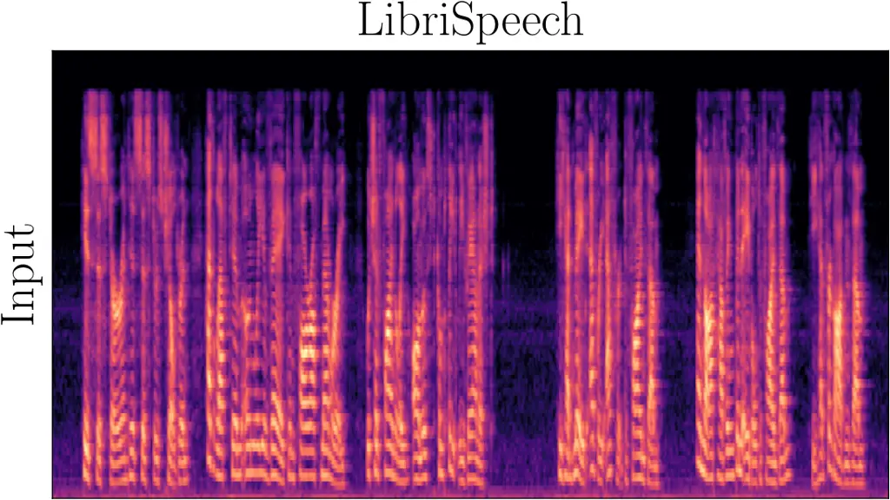
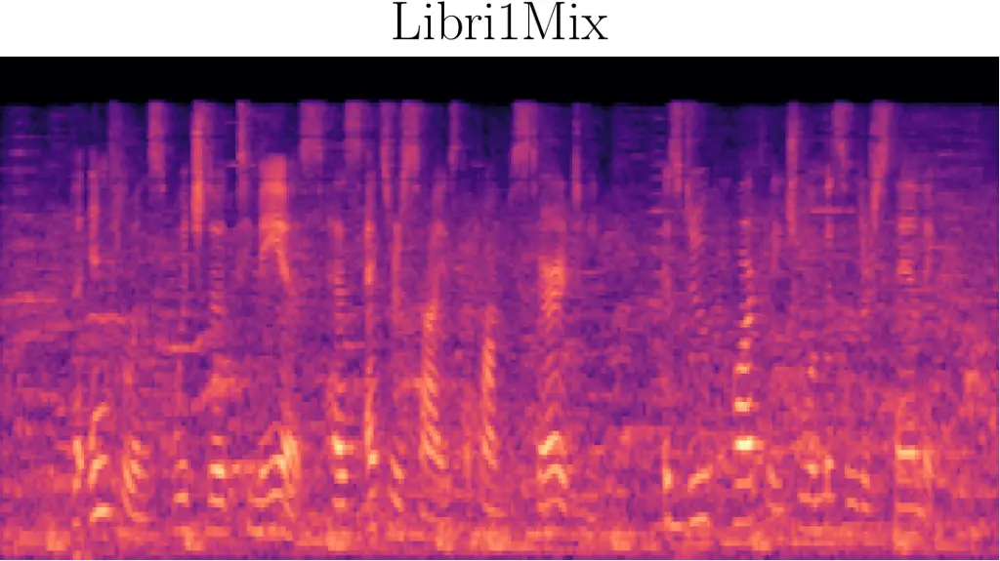
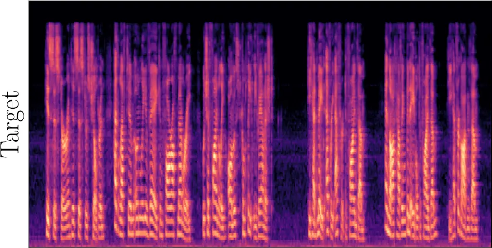
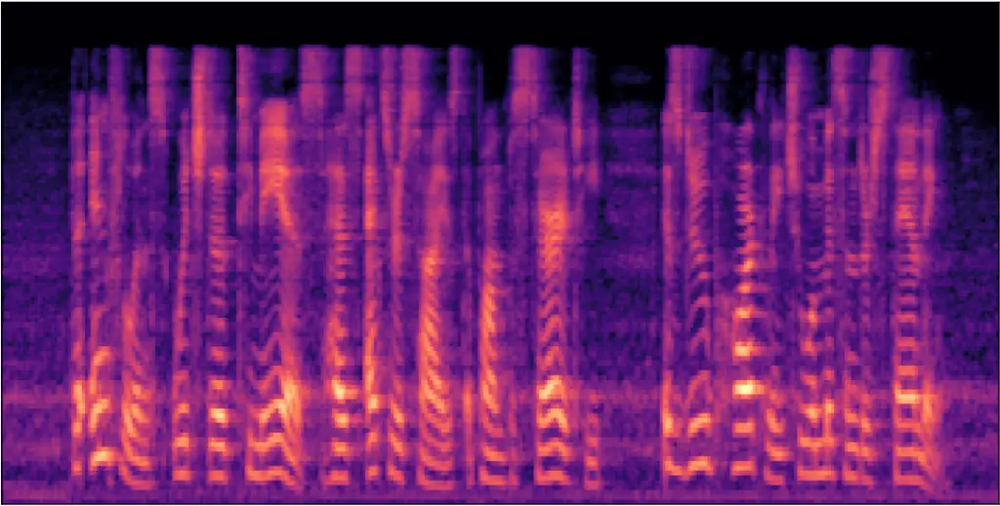
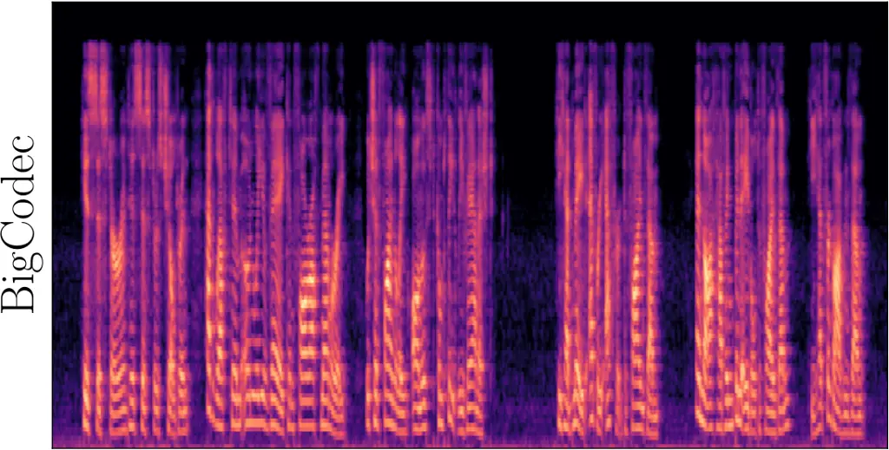
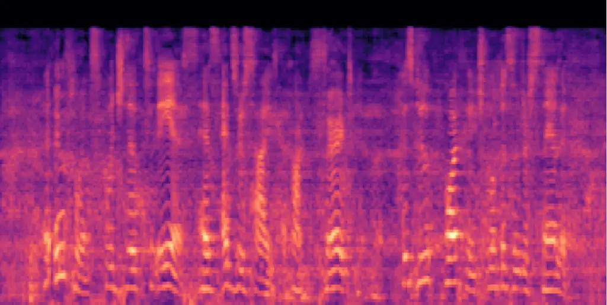
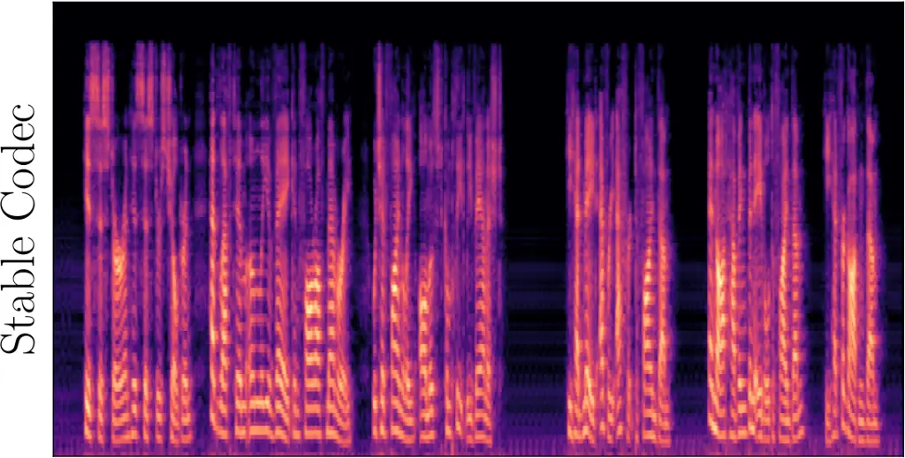
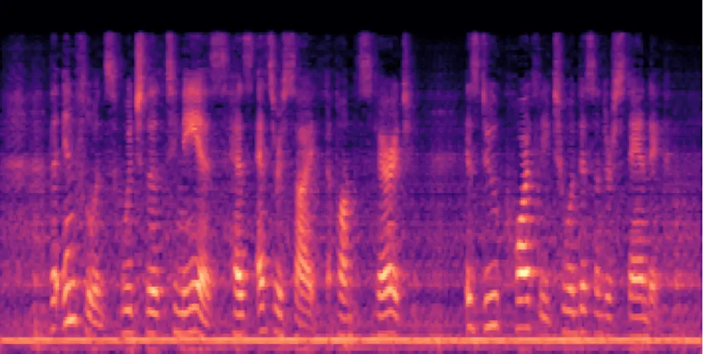
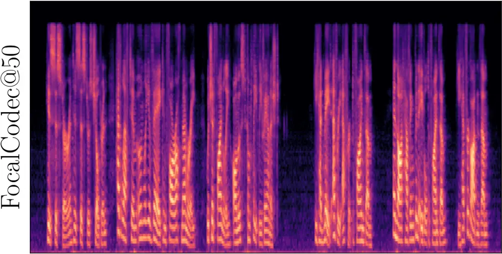
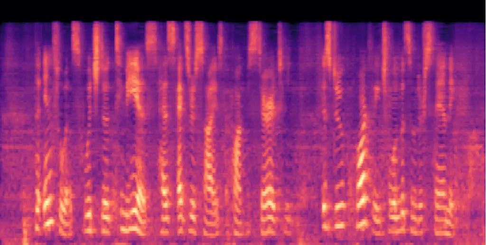

# FocalCodec: Low-Bitrate Speech Coding via Focal Modulation Networks

Luca Della Libera ^(†)^(†)thanks: Correspondence to:
luca.dellalibera@mail.concordia.ca Affiliation: Concordia University
Affiliation: Mila-Quebec AI Institute    Francesco Paissan
Affiliation: Mila-Quebec AI Institute Affiliation: Fondazione Bruno
Kessler Affiliation: University of Trento    Cem Subakan
Affiliation: Concordia University Affiliation: Mila-Quebec AI Institute
Affiliation: Université Laval    Mirco Ravanelli Affiliation: Concordia
University Affiliation: Mila-Quebec AI Institute

###### Abstract

Large language models have revolutionized natural language processing
through self-supervised pretraining on massive datasets. Inspired by
this success, researchers have explored adapting these methods to speech
by discretizing continuous audio into tokens using neural audio codecs.
However, existing approaches face limitations, including high bitrates,
the loss of either semantic or acoustic information, and the reliance on
multi-codebook designs when trying to capture both, which increases
architectural complexity for downstream tasks. To address these
challenges, we introduce FocalCodec, an efficient low-bitrate codec
based on focal modulation that utilizes a single binary codebook to
compress speech between 0.16 and 0.65 kbps. FocalCodec delivers
competitive performance in speech resynthesis and voice conversion at
lower bitrates than the current state-of-the-art, while effectively
handling multilingual speech and noisy environments. Evaluation on
downstream tasks shows that FocalCodec successfully preserves sufficient
semantic and acoustic information, while also being well-suited for
generative modeling. Demo samples and code are available at
[https://lucadellalib.github.io/focalcodec-web/](https://lucadellalib.github.io/focalcodec-web/).

## 1 Introduction

Recent advancements in large language models \[46, 10, 26, 17\] have led
to significant progress in natural language processing, enabling
breakthroughs in tasks such as summarization, translation, question
answering, code generation, and retrieval. Building on this success, the
research community has extended these methods to other modalities, with
speech emerging as a major area of interest. The impressive performance
of text-conditioned audio and speech generation models \[6, 11, 33, 69,
30\], along with recent speech language models \[85, 22, 16, 45\],
highlights the potential of token-based approaches for speech
processing.

A key component of these pipelines is the _neural audio codec_, which
compresses speech into tokens that downstream models can process. These
tokens must preserve acoustic and semantic information to ensure
effective representations for downstream tasks while maintaining high
reconstruction quality. Another important requirement is a low token
rate. As sequence length increases, capturing long-term dependencies
becomes more challenging, and computational costs increase.

Despite recent progress, current codecs still face several challenges.
Acoustic codecs \[14, 34, 25, 76\] achieve high-quality reconstruction
but often rely on multiple codebooks, adding complexity to the design of
downstream models. Additionally, they typically lack strong semantic
representations. Hybrid codecs \[86, 37, 16, 48\] aim to combine both
acoustic and semantic information while maintaining high-quality
resynthesis. Still, they often depend on complex multi-codebook designs,
explicit disentanglement, distillation losses, or supervised
fine-tuning. Single-codebook designs \[36, 21, 25, 76, 74\] offer a
simpler architecture but struggle to balance compression while
maintaining both reconstruction quality and effective representations
for downstream tasks, especially at low bitrates. To address these
limitations, we introduce FocalCodec, an efficient low-bitrate codec
based on focal modulation \[81\] that compresses speech into the space
of a single binary codebook. FocalCodec achieves competitive performance
in reconstruction at lower bitrates than the current state-of-the-art
under a variety of conditions while also preserving sufficient semantic
and acoustic information for downstream tasks.

Figure 1: FocalCodec architecture. The encoder extracts features
containing both acoustic and semantic information. These features are
then mapped to a low-dimensional space by the compressor, binary
quantized, and projected back by the decompressor. The decoder
resynthesizes the waveform from these features.

Our contributions are as follows:

- •
  We introduce FocalCodec, a novel hybrid codec featuring a
  compressor-quantizer-decompressor architecture that compresses speech
  using a single binary codebook at ultra-low bitrates (0.16 to 0.65
  kbps).
- •
  We propose a focal modulation-based architecture with strong inductive
  biases for speech, offering an efficient and scalable solution for
  tokenization.
- •
  We demonstrate the versatility of FocalCodec through comprehensive
  evaluations of reconstruction quality and performance in downstream
  tasks, highlighting its potential for both discriminative and
  generative speech modeling.

Demo samples and code are available at
[https://lucadellalib.github.io/focalcodec-web/](https://lucadellalib.github.io/focalcodec-web/).

## 2 Related Work

#### Acoustic Codecs.

Acoustic codecs, built on the VQ-VAE \[67\] framework, aim for
high-fidelity reconstruction. Notable advancements include hierarchical
RVQ \[83\], lightweight architectures \[14\], improved RVQ
techniques \[34\], and efficiency-driven designs \[78, 57, 1\]. Recent
methods explore scalar quantization \[41, 79\], Mel-spectrogram
discretization \[4\], and novel paradigms like diffusion- and flow-based
decoding \[75, 80, 49\]. To reduce bitrate without compromising
performance, multi-scale RVQ \[63, 52\] achieves improved compression by
varying frame rates in deeper quantizers. However, its hierarchical
design adds complexity to downstream applications, as it requires
flattening the token sequences. Single-codebook designs \[36, 21, 25,
76, 74\] have emerged as a simpler, efficient alternative, delivering
robust performance at low bitrates. Our codec aligns with this trend,
leveraging a novel focal modulation architecture and a pretrained
self-supervised encoder to efficiently unify semantic and acoustic
representation learning.

#### Semantic Codecs.

Semantic codecs leverage self-supervised features from large models
trained with contrastive \[3\] or predictive \[23, 9\] objectives and
k-means clustering \[39\] for quantization, either from a single
layer \[50, 71\] or multiple layers \[44, 61\]. Improvements upon this
paradigm include replacing k-means with RVQ \[24, 90, 20, 70\],
noise-aware \[42\] and speaker-invariant tokenization \[8\]. While these
approaches effectively capture linguistic and content-related
information, they often discard much of the acoustic detail, resulting
in low speaker fidelity when a vocoder is trained to resynthesize speech
directly from these representations. To improve reconstruction quality,
\[90, 20, 70\] incorporate continuous embeddings to capture prosody and
speaker traits. However, this defeats the purpose of using speech
tokenization for unified semantic and acoustic modeling. In contrast,
our codec adopts a self-supervised architecture similar to semantic
codecs but preserves both semantic content and acoustic detail through
its compressor-quantizer-decompressor design and decoupled training
strategy, ensuring high-quality reconstruction while preserving the
advantages of semantic representations.

#### Hybrid Codecs.

Hybrid codecs combine semantic and acoustic features to balance
reconstruction quality and content representation. Some methods \[28,
27, 88\] employ multiple codebooks to disentangle speech into distinct
subspaces, such as content, prosody, and timbre, while others \[37\]
utilize dual encoders to separately capture content and fine-grained
acoustic information. Semantic distillation \[86, 16\] has also been
explored to enrich the first RVQ codebook with semantic information from
HuBERT \[23\] and WavLM \[9\]. More recently, Parker et al. \[48\]
trained a large-scale transformer-based VQ-VAE, achieving exceptional
reconstruction quality at ultra-low bitrates. To enhance semantic
content, they employed supervised fine-tuning on force-aligned phoneme
data. Our codec also belongs to this category but instead of relying on
complex multi-codebook designs with explicit disentanglement,
distillation losses, or supervised fine-tuning, it is purely based on
self-supervised learning. It compresses both semantic and acoustic
information into a single codebook, pushing the boundaries of hybrid
codec design at low bitrates.

## 3 FocalCodec

### 3.1 Architecture

The proposed codec is largely based on the VQ-VAE framework but
incorporates compressor and decompressor modules between the encoder and
decoder (see Figure 1). The discriminator is used only during training
and is discarded afterward.

#### Encoder.

To build a hybrid codec with a simple design, without relying on
distillation losses or multiple encoders, the encoder must capture both
acoustic and semantic information. This ensures high-quality
reconstructions and expressive tokens for training downstream models.
Self-supervised models like HuBERT and WavLM retain significant acoustic
information in their lower layers \[9\], making them suitable for hybrid
codecs. For instance, Baas et al. \[2\] show that a high-quality vocoder
can be trained using continuous representations from layer-6 of
WavLM-large. Following this approach, we use the first 6 layers of
WavLM-large¹¹ 1
[https://github.com/microsoft/unilm/tree/master/wavlm](https://github.com/microsoft/unilm/tree/master/wavlm)
as our encoder. However, effective quantization is critical for
approximating continuous representations with sufficient granularity.
Standard k-means clustering typically fails to preserve essential
acoustic details \[68\]. To address this, we introduce a
compressor-quantizer-decompressor design based on focal modulation,
which allows for granular quantization that preserves both semantic and
acoustic information.

#### Compressor.

The compressor maps the encoder representations to a compact,
low-dimensional latent space. Optionally, it can perform temporal
downsampling to further reduce the frame rate. Prior work typically
relies on convolutional, recurrent, or transformer-based architectures
for compression. In contrast, we introduce a novel focal downscaling
module, which combines a downscaling operation with a focal block. The
downscaling step applies a linear projection to compress the feature
dimension, while a 1D convolution can be used instead to additionally
downsample along the time dimensions. To better capture periodic
patterns, we follow \[34\] and apply Snake activations \[89\] after the
projection.

To build a focal block, we replace the self-attention mechanism in the
standard transformer block with focal modulation. Focal
modulation \[81\] is an efficient alternative to self-attention that
enables fine-to-coarse modeling and introduces useful inductive biases
such as translation equivariance, explicit input dependency, time and
channel specificity, and decoupled feature granularity. While originally
designed for image and video processing, these properties also benefit
speech modeling \[15\]. Unlike self-attention, which directly computes
token-wise interactions, focal modulation first aggregates the global
context and then modulates local interactions based on this aggregated
representation. Intuitively, self-attention mixes tokens by first
computing pairwise similarities and then aggregating, which can make the
result sensitive to a few high-scoring neighbors. Focal modulation
inverts this order: it first forms a compact, multi-scale summary of the
input (local + global context) and then uses this summary to modulate
each token. This ensures that interactions are guided by the overall
context rather than being dominated by individual tokens, while avoiding
quadratic cost.

Formally, focal modulation computes output representation
$`\mathbf{y}_{i}`$ for each input feature $`\mathbf{x}_{i}`$ in sequence
$`\mathbf{x}_{1:n}`$ as:

```math
\mathbf{y}_{i}=q(\mathbf{x}_{i})\odot h\left(\sum_{\ell=1}^{L+1}\mathbf{z}^{\ell}_{i}\odot\mathbf{g}^{\ell}_{i}\right) \tag{1}
```

where $`q(\cdot)`$ and $`h(\cdot)`$ are linear projections, and
$`\mathbf{z}^{\ell}_{i}\in\mathbf{z}_{1:n}^{\ell}`$ and
$`\mathbf{g}^{\ell}_{i}\in\mathbf{g}_{1:n}^{\ell}`$ are the context and
gating vectors at position $`i`$ and focal level
$`\ell\in\{1,\dots,L+1\}`$, with $`\odot`$ denoting element-wise
multiplication. The context sequence $`\mathbf{z}_{1:n}`$ is obtained
via a stack of depth-wise convolutions with increasing kernel sizes to
capture dependencies from short to long range, with average pooling
applied to the last level feature map to incorporate global information.
Then, for each focal level, a point-wise convolution is used to compute
the gating sequence $`\mathbf{g}_{1:n}`$. This hierarchical approach,
operating at multiple granularities, makes focal modulation well-suited
for processing speech features, enabling efficient and scalable
representation learning in linear time while preserving long-range
dependencies.

#### Quantizer.

FocalCodec maps latent representations from the compressor into the
codebook space of a single quantizer, eliminating the need for
hierarchical designs in downstream models. To achieve this, while
maintaining both reconstruction quality and efficiency, the quantizer
should satisfy the following requirements: 1) given that the original
waveform is already significantly compressed into a short sequence of
latents, the quantizer must compensate by using a sufficiently large
codebook size to reduce the quantization error; 2) the quantizer should
make efficient use of the codebook capacity, avoiding under-utilization; 3) code lookup must remain efficient, despite the increased codebook
size, to ensure fast inference.

To address these challenges, we employ binary spherical quantization
(BSQ) \[87\], originally introduced for compression of images and
videos. To the best of our knowledge, this is the first successful
application of binary quantization in the speech domain. BSQ belongs to
the category of lookup-free quantization (LFQ) methods \[41, 82\], i.e.
it utilizes an implicit codebook, defined as:

```math
\mathcal{C}=\left\{-\frac{1}{\sqrt{L}},\frac{1}{\sqrt{L}}\right\}^{L}, \tag{2}
```

which represents an $`L`$-dimensional hypercube projected onto a unit
hypersphere. The codebook size is determined by the latent
representation dimension $`L`$ as $`\lvert\mathcal{C}\rvert=2^{L}`$. For
example, latent representations of dimension 13 correspond to a codebook
size of 8192. The quantization process consists of two steps. First, the
input vector $`\mathbf{v}`$ of dimension $`L`$ is normalized to lie on
the unit hypersphere:

```math
\mathbf{u}=\frac{\mathbf{v}}{\,\,\,\left\|\mathbf{v}\right\|_{2}}. \tag{3}
```

Second, binary quantization with a normalization factor of $`\sqrt{L}`$
is applied independently to each dimension of $`\mathbf{u}`$:

```math
\hat{\mathbf{u}}=\frac{\mathrm{sign}(\mathbf{u})}{\sqrt{L}}, \tag{4}
```

where $`\mathrm{sign}(\cdot)`$ denotes the sign function, with
$`\mathrm{sign}(0)`$ remapped to 1 to ensure the output always lies on
the hypersphere. To make the quantization differentiable, we use the
straight-through estimator \[5\]. BSQ offers several advantages over
traditional quantization methods. First, the parameter-free implicit
codebook is lightweight and computationally efficient. Second, empirical
evidence \[87\] shows that the binary quantization bottleneck encourages
high codebook utilization, even for large values of $`L`$, outperforming
other lookup-free methods such as finite scalar quantization
(FSQ) \[41\]. Third, the quantization error is bounded, resulting in
faster convergence compared to vanilla LFQ, which does not normalize the
representations. Finally, tying the codebook size to the latent
dimension helps prevent performance degradation in downstream generative
models when using larger codebooks \[82\].

#### Decompressor.

The decompressor reconstructs the encoder continuous representations
from the quantizer output. It closely mirrors the structure of the
compressor, with the downscaling layers replaced by upscaling layers.

#### Decoder.

Most codecs use symmetric architectures, where the decoder mirrors the
encoder. However, some works \[4, 25, 37\] explore asymmetric designs
with larger decoders to improve reconstruction quality. In this work, we
adopt an asymmetric design but prioritize the encoder, allocating
$`\sim\text{5}`$x more parameters to it than the decoder. We argue that
a strong encoder is essential for extracting robust, disentangled
representations for downstream tasks. Even with a high compression rate,
a smaller decoder can still generate high-quality audio while offering
faster inference, which is beneficial for streaming applications. For
the decoder, we choose the more efficient Vocos \[62\] architecture over
HiFi-GAN \[32\]. Vocos maintains consistent feature resolution and uses
inverse STFT for upsampling, minimizing aliasing and improving
computational efficiency. The decoder processes features through
ConvNeXt \[38\] blocks and projects the sequence of hidden
representations to Fourier coefficients for waveform reconstruction. The
final audio is synthesized using inverse STFT.

#### Discriminator.

Following HiFi-GAN \[32\], we employ a multi-period discriminator and a
multi-scale discriminator. This approach slightly differs from prior
work \[83, 14, 62, 34, 25\], which utilize multi-resolution and/or
STFT-based discriminators in place of a multi-scale discriminator. The
multi-resolution and STFT-based discriminators are particularly useful
for mitigating over-smoothing artifacts in high-frequency
components \[34\], which are more critical for music and environmental
sounds. Since our focus is on speech (i.e. medium frequency range), we
stick to the simpler HiFi-GAN setup.

### 3.2 Training

The training process consists of two stages. In the first stage, the
compressor, quantizer, and decompressor are jointly trained to
reconstruct the encoder continuous representations, ensuring that the
tokens retain both semantic and acoustic information from the encoder,
which is kept frozen. The training objective includes reconstruction
loss and entropy loss. The reconstruction loss is computed as the
squared L2 distance between the reconstructed and original encoder
features. The entropy loss, defined as in \[82, 87\], encourages both
confident predictions and uniform code utilization. Note that we omit
the commitment loss used in standard VQ, as for BSQ there is no concern
of embedding divergence (quantization error is bounded).

In the second stage, the decoder is trained to resynthesize audio from
the encoder _continuous_ representations. The training objective
includes adversarial loss, reconstruction loss, and feature matching
loss, as in \[32\]. However, following \[83\], we use a hinge loss
formulation instead of least squares. The reconstruction loss is
computed as the L1 distance between the reconstructed and original
log-Mel spectrograms, while the feature matching loss is the mean of the
distances between the $`l`$-th feature maps of the $`k`$-th
subdiscriminator.

This design allows the second stage to run in parallel with the first,
simplifying the training setup. At inference, the same decoder operates
on dequantized features produced by the
compressor-quantizer-decompressor pipeline. Because the decompressor is
trained to reconstruct the original continuous features from the
discrete codes, these dequantized features closely approximate the
originals. As a result, the decoder maintains strong performance even
when using dequantized features as input, without requiring any
additional fine-tuning.

This decoupled training approach ensures that both semantic and acoustic
information are preserved in the tokens, which is crucial for downstream
tasks while maintaining high reconstruction quality. If trained
end-to-end without additional constraints on the hidden representations
(e.g. distillation loss), the reconstruction loss prioritizes acoustic
features, as observed in \[14, 34\].

## 4 Experiments

### 4.1 FocalCodec

We train FocalCodec on LibriTTS \[84\], resampled to 16 kHz. We train
three variants of the model with a codebook size of 8192 and token rates
of 50 Hz, 25 Hz, and 12.5 Hz by adjusting the temporal downsampling
factors in the compressor layers to (1, 1, 1), (2, 1, 1), and (2, 2, 1),
respectively. These patterns are mirrored in the decompressor layers for
upsampling. Information about hyperparameters and training details can
be found in Section E.1.

### 4.2 Baselines

|                  |                |                   |                 |                    |           |            |          |
| ---------------- | -------------- | ----------------- | --------------- | ------------------ | --------- | ---------- | -------- |
| Codec            | Bitrate (kbps) | Sample Rate (kHz) | Token Rate (Hz) | Codebooks          | Code Size | Params (M) | MACs (G) |
| EnCodec          | 1.50           | 24                | 75.0            | 2 $`\times`$ 1024  | 128       | 15         | 2        |
| DAC              | 1.00           | 16                | 50.0            | 2 $`\times`$ 1024  | 8         | 74         | 56       |
| WavLM6-KM        | 0.45           | 16                | 50.0            | 1 $`\times`$ 512   | 1024      | 127        | 28       |
| SpeechTokenizer  | 1.00           | 16                | 50.0            | 2 $`\times`$ 1024  | 1024      | 108        | 17       |
| SemantiCodec     | 0.65           | 16                | 25.0            | 2 $`\times`$ 8192  | 1536      | 1033       | 1599     |
| Mimi             | 0.69           | 24                | 12.5            | 5 $`\times`$ 2048  | 256       | 82         | 11       |
| WavTokenizer     | 0.48           | 24                | 40.0            | 1 $`\times`$ 4096  | 512       | 85         | 3        |
| BigCodec         | 1.04           | 16                | 80.0            | 1 $`\times`$ 8192  | 8         | 160        | 61       |
| Stable Codec     | 0.70           | 16                | 25.0            | 2 $`\times`$ 15625 | 6         | 950        | 37       |
| FocalCodec @50   | 0.65           | 16                | 50.0            | 1 $`\times`$ 8192  | 13        | 142        | 9        |
| FocalCodec @25   | 0.33           | 16                | 25.0            | 1 $`\times`$ 8192  | 13        | 144        | 9        |
| FocalCodec @12.5 | 0.16           | 16                | 12.5            | 1 $`\times`$ 8192  | 13        | 145        | 8        |

Table 1: Codecs considered in our experimental analysis.

We compare our models to recent state-of-the-art low-bitrate codecs
across acoustic, semantic, and hybrid categories. Since this paper
focuses on low-bitrate codecs, when multiple quantizers are available,
we configure them to achieve a bitrate below 1.50 kbps, ensuring a fair
comparison. For acoustic codecs, we compare against EnCodec \[14\],
DAC²² 2 Note that we use the 16 kHz checkpoint, whereas the original
results in \[34\] use the 24 kHz checkpoint. \[34\],
WavTokenizer \[25\], and BigCodec \[76\]. Among these, BigCodec is the
current state-of-the-art for low-bitrate speech reconstruction
quality \[74\]. We use the official checkpoints for these models. We do
not include the recent TS3-Codec \[74\], which matches BigCodec
performance at an even lower bitrate, as it is not publicly available.
However, we contacted the authors to request reconstructed samples for
comparison. Additional results related to TS3-Codec can be found in
Section G.1.

For semantic codecs, we adopt the approach introduced in \[71\], which
quantizes layer-6 representations from WavLM-large using k-means
clustering with 512 centroids. These representations are fed into a
Conformer \[19\] encoder to reconstruct continuous representations,
followed by a HiFi-GAN decoder. This baseline, referred to as WavLM6-KM,
provides a direct comparison between our codec and another model
leveraging WavLM layer-6 features but differing in design and training
methodology. Since the code and checkpoints for WavLM6-KM are not
publicly available, we reimplemented the model using a subset of
LibriSpeech \[47\]. Note that we do not include additional baselines
from this category, as semantic codecs typically underperform in terms
of reconstruction quality \[48\] or require much higher bitrates to be
competitive in this regard \[43\]. Furthermore, most hybrid codecs are
already built on top of semantic representations. Therefore, we
prioritize the hybrid category, to which our codec also belongs. For
hybrid codecs, we compare against SpeechTokenizer \[86\],
SemantiCodec \[37\], Mimi \[16\], and Stable Codec \[48\], using their
official checkpoints. The configurations and details of each model are
summarized in Table 1. Multiply-accumulate operations per second (MACs)
are measured using ptflops³³ 3
[https://pypi.org/project/ptflops/0.7.4/](https://pypi.org/project/ptflops/0.7.4/).
Additional information about the baselines is provided in Appendix D.

### 4.3 Speech Resynthesis

We evaluate FocalCodec on speech resynthesis, considering both English
and multilingual speech. For English speech, we use LibriSpeech \[47\]
test-clean. For multilingual speech, following \[76\], we randomly
select 100 utterances from each of the 7 foreign languages in
Multilingual LibriSpeech \[51\] (Dutch, French, German, Italian, Polish,
Portuguese, and Spanish), resulting in a total of 700 utterances⁴⁴ 4
[https://zenodo.org/records/14791114](https://zenodo.org/records/14791114).
We also consider the more realistic scenario of speech contaminated with
environmental noise. For this, we use the test splits of
VoiceBank \[66\] and the more challenging Libri1Mix, which is
constructed by mixing clean utterances from the first speaker of
LibriMix \[12\] with noise from WHAM! \[73\].

We evaluate the models using objective metrics. To measure naturalness,
we employ UTMOS \[59\] for clean speech and DNSMOS \[56\] for noisy
speech. Note that we do not include signal-level metrics such as SNR,
PESQ \[58\], or STOI \[64\], as these metrics do not correlate well with
perceived reconstruction quality \[48, 71\]. To evaluate speaker
fidelity, we compute the cosine similarity (Sim) between speaker
embeddings extracted from the reconstructed audio and the target audio.
These embeddings are obtained using WavLM-base-SV⁵⁵ 5
[https://huggingface.co/microsoft/wavlm-base-sv](https://huggingface.co/microsoft/wavlm-base-sv) \[9\].
To assess intelligibility, we compute the differential word error rate
(dWER) \[72\], which measures the difference in word error rate between
the reconstructed and target audio, using transcriptions from Whisper
small⁶⁶ 6
[https://huggingface.co/openai/whisper-small](https://huggingface.co/openai/whisper-small) \[53\].
To ensure fairness in evaluation, we do not use more powerful ASR models
(e.g. Whisper large-v3), as these models can correct pronunciation
mistakes and are more robust to noise, potentially hiding flaws in the
reconstruction. We also report code usage, i.e. the ratio of unique
tokens used to the codebook size (averaged over codebooks for
multi-codebook models), and normalized entropy \[13, 48\], where higher
values indicate more uniform codebook usage. For inference speed, we
measure the real-time factor (RTF), i.e. the ratio of the reconstructed
audio duration to the processing time. An RTF greater than 1 indicates
faster-than-real-time performance, measured on an NVIDIA V100 GPU with
32 GB of memory.

Results are presented in Table 2. FocalCodec shows strong performance
across both clean and noisy speech resynthesis tasks. On clean speech,
FocalCodec@50 achieves the best trade-off of quality, intelligibility,
and efficiency. Notably, FocalCodec is the best in terms of dWER,
surpassing BigCodec, which is currently state-of-the-art. It also
generalizes well to multilingual speech, obtaining the lowest dWER and
high Sim. Note that FocalCodec, WavLM6-KM, SpeechTokenizer, BigCodec and
Stable Codec were trained exclusively on English speech. In noisy speech
resynthesis, FocalCodec@50 again excels, achieving the lowest dWER by a
large margin on both VoiceBank and Libri1Mix, while maintaining high
speaker similarity. Meanwhile, FocalCodec@25 and FocalCodec@12.5 exhibit
some degradation in dWER and speaker similarity, particularly in
multilingual settings, due to their significantly lower bitrates.
Nevertheless, despite operating at just 0.16 kbps, FocalCodec@12.5
remains competitive with several baselines that use much higher bitrates
(e.g. EnCodec). It is also worth noting that FocalCodec’s UTMOS tends to
increase at lower bitrates, likely due to the stronger smoothing effect
introduced by downsampling. However, UTMOS tends to saturate and may not
fully capture perceptual quality \[59\]. dWER and Sim are therefore
essential to provide a more comprehensive evaluation. Finally, the high
code usage and normalized entropy across all FocalCodec variants
indicate efficient token utilization, contributing to their strong
overall performance. Additional results on reconstruction quality,
including subjective evaluations, streamability and Mel-spectrogram
analysis, can be found in Sections G.2, G.3 and G.4.

|                  |                               |                                      |                     |                  |                         |                            |                  |                     |                     |                  |                         |                            |                  |
| ---------------- | ----------------------------- | ------------------------------------ | ------------------- | ---------------- | ----------------------- | -------------------------- | ---------------- | ------------------- | ------------------- | ---------------- | ----------------------- | -------------------------- | ---------------- |
| Codec            | Bitrate (kbps) $`\downarrow`$ | UTMOS $`\uparrow`$                   | dWER $`\downarrow`$ | Sim $`\uparrow`$ | Code Usage $`\uparrow`$ | Norm. Entropy $`\uparrow`$ | RTF $`\uparrow`$ | DNSMOS $`\uparrow`$ | dWER $`\downarrow`$ | Sim $`\uparrow`$ | Code Usage $`\uparrow`$ | Norm. Entropy $`\uparrow`$ | RTF $`\uparrow`$ |
|                  |                               | Clean – LibriSpeech test-clean       |                     |                  |                         |                            |                  | Noisy – VoiceBank   |                     |                  |                         |                            |                  |
| Reference        | —                             | 4.09                                 | 0.00                | 100.0            | —                       | —                          | —                | 3.56                | 0.00                | 100.0            | —                       | —                          | —                |
| EnCodec          | 1.50                          | 1.58                                 | 8.08                | 93.8             | 93.4                    | 82.1                       | 109              | 2.76                | 28.16               | 87.7             | 77.5                    | 78.1                       | 44               |
| DAC              | 1.00                          | 1.29                                 | 20.04               | 89.2             | 100.0                   | 91.7                       | 89               | 2.72                | 63.90               | 79.8             | 98.7                    | 88.4                       | 48               |
| WavLM6-KM        | 0.45                          | 3.75                                 | 6.20                | 90.0             | 26.4                    | 95.4                       | 85               | 3.06                | 20.67               | 82.9             | 24.8                    | 92.3                       | 44               |
| SpeechTokenizer  | 1.00                          | 2.28                                 | 5.14                | 91.6             | 95.9                    | 97.0                       | 63               | 2.74                | 34.51               | 82.2             | 88.1                    | 88.4                       | 42               |
| SemantiCodec     | 0.65                          | 2.91                                 | 8.97                | 96.0             | 75.9                    | 94.4                       | 0.62             | 3.13                | 31.46               | 90.6             | 52.4                    | 92.6                       | 0.28             |
| Mimi             | 0.69                          | 3.29                                 | 5.73                | 96.0             | 95.6                    | 91.8                       | 137              | 3.01                | 28.00               | 87.8             | 78.6                    | 85.5                       | 47               |
| WavTokenizer     | 0.48                          | 3.78                                 | 11.55               | 95.4             | 100.0                   | 96.7                       | 181              | 3.09                | 42.12               | 89.8             | 94.8                    | 94.0                       | 63               |
| BigCodec         | 1.04                          | 4.11                                 | 2.55                | 98.5             | 100.0                   | 98.6                       | 22               | 3.19                | 20.67               | 92.3             | 99.8                    | 96.8                       | 17               |
| Stable Codec     | 0.70                          | 4.32                                 | 4.97                | 94.7             | 98.5                    | 94.7                       | 103              | 3.33                | 20.32               | 88.8             | 75.7                    | 95.4                       | 39               |
| FocalCodec @50   | 0.65                          | 4.05                                 | 2.18                | 97.4             | 100.0                   | 98.9                       | 185              | 3.16                | 8.08                | 91.3             | 98.0                    | 96.2                       | 80               |
| FocalCodec @25   | 0.33                          | 4.14                                 | 3.30                | 96.3             | 99.8                    | 98.4                       | 195              | 3.17                | 11.75               | 90.1             | 89.6                    | 96.0                       | 81               |
| FocalCodec @12.5 | 0.16                          | 4.22                                 | 7.94                | 93.9             | 98.2                    | 97.4                       | 208              | 3.22                | 27.97               | 84.7             | 77.3                    | 95.5                       | 79               |
|                  |                               | Clean – Multilingual LibriSpeech 700 |                     |                  |                         |                            |                  | Noisy – Libri1Mix   |                     |                  |                         |                            |                  |
| Reference        | —                             | 2.84                                 | 0.00                | 100.0            | —                       | —                          | —                | 3.73                | 0.00                | 100.0            | —                       | —                          | —                |
| EnCodec          | 1.50                          | 1.33                                 | 29.60               | 95.5             | 93.4                    | 79.2                       | 140              | 2.40                | 55.17               | 86.3             | 84.4                    | 78.7                       | 97               |
| DAC              | 1.00                          | 1.24                                 | 56.08               | 89.1             | 100.0                   | 90.0                       | 97               | 2.40                | 90.92               | 76.6             | 99.1                    | 88.8                       | 91               |
| WavLM6-KM        | 0.45                          | 2.97                                 | 44.54               | 89.5             | 28.1                    | 0.91                       | 125              | 2.87                | 36.60               | 85.9             | 26.8                    | 95.5                       | 65               |
| SpeechTokenizer  | 1.00                          | 1.55                                 | 56.32               | 92.0             | 96.1                    | 94.0                       | 74               | 2.58                | 57.26               | 82.8             | 93.5                    | 96.5                       | 63               |
| SemantiCodec     | 0.65                          | 1.87                                 | 36.21               | 97.7             | 76.4                    | 94.7                       | 0.74             | 2.67                | 51.18               | 89.9             | 64.7                    | 90.8                       | 91               |
| Mimi             | 0.69                          | 2.08                                 | 30.96               | 96.7             | 95.9                    | 89.0                       | 239              | 2.65                | 49.14               | 89.4             | 90.8                    | 90.1                       | 104              |
| WavTokenizer     | 0.48                          | 2.64                                 | 49.73               | 97.0             | 97.6                    | 95.6                       | 290              | 2.53                | 70.10               | 86.3             | 96.4                    | 95.4                       | 165              |
| BigCodec         | 1.04                          | 2.86                                 | 15.24               | 99.1             | 100.0                   | 97.9                       | 24               | 2.75                | 53.26               | 88.3             | 100.0                   | 98.2                       | 19               |
| Stable Codec     | 0.70                          | 3.47                                 | 56.99               | 95.9             | 92.9                    | 93.8                       | 144              | 2.91                | 43.52               | 90.0             | 95.8                    | 93.4                       | 68               |
| FocalCodec @50   | 0.65                          | 2.96                                 | 12.57               | 98.3             | 100.0                   | 98.1                       | 269              | 2.93                | 27.89               | 91.6             | 100.0                   | 98.5                       | 155              |
| FocalCodec @25   | 0.33                          | 3.16                                 | 19.78               | 97.3             | 99.2                    | 97.4                       | 292              | 2.91                | 34.27               | 90.7             | 99.6                    | 97.9                       | 161              |
| FocalCodec @12.5 | 0.16                          | 3.37                                 | 54.15               | 95.2             | 96.4                    | 96.9                       | 296              | 2.92                | 42.59               | 88.9             | 97.2                    | 97.2                       | 164              |

Table 2: Speech resynthesis performance across clean and noisy datasets.

### 4.4 Voice Conversion

We conduct one-shot voice conversion experiments to verify that
FocalCodec can effectively disentangle speaker information from content
despite its single-codebook design. This task involves

|                  |                               |                    |                     |                  |                  |
| ---------------- | ----------------------------- | ------------------ | ------------------- | ---------------- | ---------------- |
| Codec            | Bitrate (kbps) $`\downarrow`$ | UTMOS $`\uparrow`$ | dWER $`\downarrow`$ | Sim $`\uparrow`$ | RTF $`\uparrow`$ |
| Reference        | —                             | 4.09               | 0.00                | 100.0            | —                |
| EnCodec          | 1.50                          | 1.24               | 86.52               | 72.2             | 57               |
| DAC              | 1.00                          | 1.25               | 104.00              | 67.2             | 60               |
| WavLM6-KM        | 0.45                          | 2.90               | 26.68               | 92.4             | 57               |
| SpeechTokenizer  | 1.00                          | 1.49               | 20.32               | 81.2             | 33               |
| SemantiCodec     | 0.65                          | 2.02               | 106.00              | 72.8             | 0.60             |
| Mimi             | 0.69                          | 2.40               | 110.00              | 89.7             | 71               |
| WavTokenizer     | 0.48                          | 3.13               | 43.15               | 73.4             | 89               |
| BigCodec         | 1.04                          | 1.31               | 99.96               | 68.9             | 13               |
| Stable Codec     | 0.70                          | 3.76               | 27.63               | 71.1             | 65               |
| FocalCodec @50   | 0.65                          | 3.38               | 21.27               | 92.2             | 116              |
| FocalCodec @25   | 0.33                          | 3.40               | 23.59               | 92.6             | 118              |
| FocalCodec @12.5 | 0.16                          | 3.43               | 29.93               | 92.6             | 117              |

Table 3: One-shot voice conversion on VCTK \[77\].

converting speech from a source speaker to an arbitrary target speaker
using reference speech from the target speaker. For single-codebook
baselines, including FocalCodec, we use $`k`$-nearest neighbors search
in the codec feature space, as in \[2\]. Specifically, we replace each
frame in the reconstructed feature sequence (right before the decoder)
with the average of the $`k`$ = 4 closest matches in terms of cosine
distance from continuous features extracted from the reference. For
multi-codebook baselines, instead, we follow the procedure in \[86\].
The source and reference speech are tokenized, and the first codebook
tokens from the source are concatenated with the second-to-last codebook
tokens from the reference. The resulting sequence is then forwarded to
the decoder. If sequence lengths differ, the reference is truncated or
circularly padded as needed. Effective disentanglement of content and
speaker information between first and subsequent codebooks is expected
to yield fair voice conversion performance. We conduct voice conversion
experiments on VCTK \[77\], which includes parallel utterances from
different speakers. To create the test set, we randomly select an
utterance from a source speaker, the corresponding utterance from a
target speaker, and an utterance with different content from the same
target speaker to act as the reference. Among available reference
utterances, we select the longest to minimize padding issues. We repeat
this process for each speaker, for each of the $`\sim`$24 parallel
utterances, resulting in a dataset with 2521 samples. To evaluate
performance, we use UTMOS, dWER, Sim, and RTF as defined in Section 4.3.

As reported in Table 3, FocalCodec achieves the highest speaker
similarity while maintaining good intelligibility, confirming its
suitability for voice conversion tasks. This is particularly impressive,
especially compared to other hybrid codecs like SpeechTokenizer and
Mimi, which are explicitly optimized to disentangle semantic information
in the first codebook and acoustic information in the following. Despite
this, FocalCodec outperforms these models, excelling in both speaker
identity preservation and intelligibility, striking a remarkable balance
of quality, efficiency, and speaker similarity. WavLM6-KM ranks as the
second-best performing model, which is expected since it shares the same
encoder as FocalCodec. In contrast, acoustic codecs struggle with this
task, as they do not separate speaker and content information.

### 4.5 Downstream Tasks

To evaluate the quality of the learned discrete representations, we
train downstream models on both discriminative and generative tasks.

#### Discriminative Tasks.

We evaluate performance on automatic speech recognition (ASR), speaker
identification (SI), and speech emotion recognition (SER). These tasks
allow us to assess token quality along three axes: semantic information
retention (ASR), acoustic information retention (SI), and emotion
information retention (SER, which requires a non-trivial combination of
semantic and acoustic clues). To focus on the disentanglement of learned
representations, we employ shallow downstream models, aiming to stay as
close as possible to linear probing. Following \[86\], we employ a
shallow BiLSTM for all tasks. For ASR, we use LibriSpeech \[47\]
train-clean-100 and train-clean-360 for training, dev-clean for
validation, and test-clean for testing. The word error rate (WER) is
reported. For SI, we also use LibriSpeech, grouping utterances from
train-clean-100 and train-clean-360 by speaker ID. Data are randomly
split into training, validation and test sets in a ratio of 80% / 10% /
10%. The speaker error rate (ER) is reported. For SER, we use the
IEMOCAP dataset \[7\], focusing on four emotions: sadness, happiness,
anger, and neutral. Sessions 1-4 are used for training, session 5F for
validation, and session 5M for testing. The emotion ER is reported.
Details about the model architecture, hyperparameters, and training
procedure are provided in Section E.2.

Table 4 shows the results. In ASR, FocalCodec@50 achieves the third
lowest WER. While SpeechTokenizer and Stable Codec perform slightly
better, the former operates at $`\sim`$1.5x higher bitrate using two
codebooks, while the latter was fine-tuned on force-aligned phoneme data
to enhance semantic representations. In contrast, our model is purely
self-supervised. In SI, FocalCodec@50 achieves a marginally higher error
rate ($`\sim`$2%) than codecs such as BigCodec and WavTokenizer.
However, these models perform significantly worse in ASR due to being
trained solely with reconstruction-based objectives. On the other hand,
the purely semantic WavLM-KM6 codec performs competitively in ASR but
exhibits the highest ER in SI despite using the same encoder as
FocalCodec. This further confirms the effectiveness of our codec design,
as it improves WER over WavLM-KM6 while preserving speaker information.
Interestingly, Stable Codec also performs poorly in SI, likely because
semantic fine-tuning tends to remove acoustic information from the
representations. In SER, no codec clearly excels, with FocalCodec@50
performing on par with the best models. Overall, FocalCodec@50 shows
competitive performance across all discriminative tasks, rivaling hybrid
codecs with more complex multi-codebook designs and higher bitrates. The
more compressed variants, FocalCodec@25 and FocalCodec@12.5, still
achieve good performance while operating at ultra-low bitrates.

#### Generative Tasks.

We evaluate performance on speech enhancement (SE), speech separation
(SS), and text-to-speech (TTS). For these tasks, we employ more powerful
transformer-based downstream models, focusing on generation quality. For
SE we use VoiceBank \[66\]. To form a validation set, we randomly select
two speakers from the training set. The input tokens are extracted from
noisy utterances, while the target tokens come from clean utterances.
Performance metrics include DNSMOS, dWER, and Sim. For SS, we use
Libri2Mix \[12\] train-100, dev, and test sets. The setup mirrors that
of speech enhancement: input tokens are derived from speech mixtures,
while target tokens correspond to the two individual sources. For TTS,
we use LibriSpeech train-clean-100 and train-clean-360 for training,
dev-clean for validation, and test-clean for testing. Note that
test-clean contains several utterances longer than 20 seconds
($`\sim`$4%), whereas our training splits include almost none. To reduce
the mismatch between training and testing conditions, we removed these
long utterances from the test set. The input consists of character-based
text tokens, while the target tokens are derived from the corresponding
utterances. Performance is evaluated using UTMOS, dWER, and Sim. Details
about the model architecture, hyperparameters, and training procedure
are provided in Section E.2.

From Table 4, we observe that in SE, FocalCodec@50 significantly
outperforms all other baselines in terms of dWER. A similar trend is
observed for SS, where FocalCodec@50 is consistently superior to the
other baselines. However, the absolute performance is still far from
practical utility, likely due to the loss of information crucial for SS
during quantization. As with discriminative tasks, FocalCodec@25 and
FocalCodec@12.5 show degraded performance, due to their ultra-low
bitrates. However, this trend is reversed for TTS, with FocalCodec@25
achieving the best overall results, followed closely by FocalCodec@12.5.
This can be attributed to the fact that, in autoregressive modeling,
shorter sequences reduce the computational burden and simplify the task
of predicting the next token. Both models, operating at a frame rate
closer to that of text with a single codebook, make next-token
prediction easier and more computationally efficient than other methods.
This highlights the importance of having compact representations for
downstream tasks. Note, however, that we trained on only 460 hours of
speech, which explains why TTS performance is not state-of-the-art.

|                  |                               |                      |                   |                   |                     |                     |                  |                     |                     |                  |                    |                     |                  |
| ---------------- | ----------------------------- | -------------------- | ----------------- | ----------------- | ------------------- | ------------------- | ---------------- | ------------------- | ------------------- | ---------------- | ------------------ | ------------------- | ---------------- |
| Codec            | Bitrate (kbps) $`\downarrow`$ | Discriminative Tasks |                   |                   | Generative Tasks    |                     |                  |                     |                     |                  |                    |                     |                  |
|                  |                               | ASR                  | SI                | SER               | SE                  |                     |                  | SS                  |                     |                  | TTS                |                     |                  |
|                  |                               | WER $`\downarrow`$   | ER $`\downarrow`$ | ER $`\downarrow`$ | DNSMOS $`\uparrow`$ | dWER $`\downarrow`$ | Sim $`\uparrow`$ | DNSMOS $`\uparrow`$ | dWER $`\downarrow`$ | Sim $`\uparrow`$ | UTMOS $`\uparrow`$ | dWER $`\downarrow`$ | Sim $`\uparrow`$ |
| Reference        | —                             | —                    | —                 | —                 | 3.56                | 0.00                | 100.0            | 3.77                | 0.00                | 100.0            | 4.09               | 0.00                | 100.0            |
| EnCodec          | 1.50                          | 27.89                | 3.00              | 47.00             | 3.11                | 37.10               | 85.9             | 3.11                | 78.51               | 87.3             | 1.71               | 64.28               | 83.2             |
| DAC              | 1.00                          | 35.89                | 3.27              | 45.90             | 3.03                | 67.65               | 81.7             | 2.76                | 106.00              | 83.3             | 1.34               | 47.06               | 85.9             |
| WavLM6-KM        | 0.45                          | 19.04                | 22.30             | 42.90             | 3.52                | 22.85               | 83.6             | 3.49                | 76.91               | 85.0             | 3.74               | 38.67               | 88.7             |
| SpeechTokenizer  | 1.00                          | 14.97                | 2.73              | 41.50             | 3.21                | 29.82               | 85.9             | 3.13                | 83.99               | 87.3             | 2.69               | 35.46               | 89.2             |
| SemantiCodec     | 0.65                          | 41.42                | 15.90             | 51.60             | 3.59                | 102.00              | 83.3             | 3.59                | 123.00              | 84.4             | 2.82               | 48.38               | 91.4             |
| Mimi             | 0.69                          | 22.98                | 5.43              | 44.70             | 3.30                | 53.98               | 84.6             | 3.41                | 93.23               | 88.1             | 3.11               | 28.63               | 93.6             |
| WavTokenizer     | 0.48                          | 35.62                | 2.44              | 49.80             | 3.41                | 51.75               | 88.6             | 3.54                | 105.00              | 86.4             | 3.68               | 47.56               | 92.8             |
| BigCodec         | 1.04                          | 26.41                | 2.34              | 47.50             | 3.52                | 26.68               | 93.2             | 3.54                | 89.24               | 89.4             | 3.43               | 54.43               | 89.4             |
| Stable Codec     | 0.70                          | 16.85                | 16.50             | 46.54             | 3.55                | 35.57               | 82.8             | 3.61                | 103.00              | 78.2             | 3.19               | 49.28               | 88.8             |
| FocalCodec @50   | 0.65                          | 17.63                | 4.48              | 45.60             | 3.47                | 10.93               | 91.4             | 3.71                | 73.87               | 89.0             | 4.11               | 28.10               | 93.3             |
| FocalCodec @25   | 0.33                          | 21.12                | 6.07              | 46.80             | 3.49                | 14.74               | 90.0             | 3.69                | 99.96               | 85.4             | 4.16               | 16.75               | 91.6             |
| FocalCodec @12.5 | 0.16                          | 33.24                | 11.69             | 46.30             | 3.58                | 36.98               | 86.9             | 3.57                | 116.00              | 80.8             | 4.12               | 21.59               | 90.8             |

Table 4: Evaluation on discriminative and generative downstream tasks.

### 4.6 Ablation Studies

|                   |                      |           |                    |                     |                  |
| ----------------- | -------------------- | --------- | ------------------ | ------------------- | ---------------- |
| Compression Block | Downscale Activation | Quantizer | UTMOS $`\uparrow`$ | dWER $`\downarrow`$ | Sim $`\uparrow`$ |
| Focal modulation  | Snake                | BSQ       | 3.73               | 2.54                | 95.7             |
| Focal modulation  | Snake                | FSQ       | 3.71               | 2.61                | 94.8             |
| Focal modulation  | Snake                | LFQ       | 3.74               | 2.75                | 95.4             |
| Focal modulation  | Leaky ReLU           | LFQ       | 3.72               | 2.85                | 95.2             |
| Conformer         | Snake                | LFQ       | 3.74               | 3.58                | 94.3             |
| AMP               | Snake                | LFQ       | 3.70               | 4.52                | 94.3             |
| Linear            | Snake                | LFQ       | 2.55               | 9.37                | 82.5             |

Table 5: Ablation studies on LibriSpeech test-clean \[47\].

Due to limited computational resources, we perform ablation studies on a
smaller variant of FocalCodec. This variant is similar to the 50 Hz
model, with the main difference being the model size, as detailed in
Section E.1. We focus on the clean speech resynthesis task using
LibriSpeech test-clean \[47\]. The results are shown in Table 5.
Replacing BSQ with FSQ \[41\] leads to worse UTMOS, dWER, and Sim. It
also results in less uniform code usage, as evidenced by the normalized
entropy measured for these two configurations (99.7 for BSQ vs. 97.7 for
FSQ). Replacing BSQ with vanilla LFQ results in worse dWER and Sim
despite similar UTMOS. Replacing Snake activations with leaky ReLU
causes only minor performance degradation. The most significant
performance drop occurs when the focal modulation blocks are replaced
with Conformer \[19\] blocks, anti-aliased multi-periodicity
(AMP) \[35\] blocks, or linear layers, in this order. This leads to a
notable decrease in both dWER and Sim. This analysis further validates
our design choices, highlighting the importance of the selected
components for achieving optimal performance.

## 5 Conclusions

In this work, we introduced FocalCodec, a low-bitrate single-codebook
speech codec that employs a novel architecture based on focal
modulation. It delivers competitive performance in speech resynthesis
and voice conversion at low and ultra-low bitrates while maintaining
robustness across diverse conditions, including multilingual and noisy
speech. Furthermore, it effectively preserves both semantic and acoustic
information, providing powerful discrete representations for downstream
tasks. A detailed discussion of the limitations and societal impact of
this work is provided in Appendices A and B.

## 6 Acknowledgments

We acknowledge support from NSERC, the Digital Research Alliance of
Canada (alliancecan.ca), the NVIDIA Academic Grant Program for computing
resources, and Translated for funding through the Immediate research
grant.

## References

- \[1\] Y. Ai, X.-H. Jiang, Y.-X. Lu, H.-P. Du, and Z.-H. Ling. APCodec:
  A neural audio codec with parallel amplitude and phase spectrum
  encoding and decoding. IEEE/ACM Transactions on Audio, Speech and
  Language Processing, 32:3256–3269, 2024.
- \[2\] M. Baas, B. van Niekerk, and H. Kamper. Voice conversion with
  just nearest neighbors. In Interspeech, pages 2053–2057, 2023.
- \[3\] A. Baevski, Y. Zhou, A. Mohamed, and M. Auli. wav2vec 2.0: A
  framework for self-supervised learning of speech representations. In
  International Conference on Neural Information Processing Systems
  (NeurIPS), pages 12449–12460, 2020.
- \[4\] H. Bai, T. Likhomanenko, R. Zhang, Z. Gu, Z. Aldeneh, and
  N. Jaitly. dMel: Speech tokenization made simple. arXiv preprint
  arXiv:2407.15835, 2024.
- \[5\] Y. Bengio, N. Léonard, and A. Courville. Estimating or
  propagating gradients through stochastic neurons for conditional
  computation. arXiv preprint arXiv:1308.3432, 2013.
- \[6\] Z. Borsos, R. Marinier, D. Vincent, E. Kharitonov, O. Pietquin,
  M. Sharifi, D. Roblek, O. Teboul, D. Grangier, M. Tagliasacchi, and
  N. Zeghidour. AudioLM: A language modeling approach to audio
  generation. IEEE/ACM Transactions on Audio, Speech and Language
  Processing, 31:2523–2533, 2023.
- \[7\] C. Busso, M. Bulut, C.-C. Lee, A. Kazemzadeh, E. Mower, S. Kim,
  J. N. Chang, S. Lee, and S. S. Narayanan. IEMOCAP: Interactive
  emotional dyadic motion capture database. Language Resources and
  Evaluation, 42(4):335–359, 2008.
- \[8\] H.-J. Chang, H. Gong, C. Wang, J. Glass, and Y.-A. Chung.
  DC-Spin: A speaker-invariant speech tokenizer for spoken language
  models. arXiv preprint arXiv:2410.24177, 2024.
- \[9\] S. Chen, C. Wang, Z. Chen, Y. Wu, S. Liu, Z. Chen, J. Li,
  N. Kanda, T. Yoshioka, X. Xiao, J. Wu, L. Zhou, S. Ren, Y. Qian,
  Y. Qian, J. Wu, M. Zeng, X. Yu, and F. Wei. WavLM: Large-scale
  self-supervised pre-training for full stack speech processing. IEEE
  Journal of Selected Topics in Signal Processing, pages
  1505–1518, 2022.
- \[10\] A. Chowdhery, S. Narang, J. Devlin, M. Bosma, G. Mishra,
  A. Roberts, P. Barham, H. W. Chung, C. Sutton, et al. PaLM: scaling
  language modeling with pathways. Journal of Machine Learning Research,
  24, 2024.
- \[11\] J. Copet, F. Kreuk, I. Gat, T. Remez, D. Kant, G. Synnaeve,
  Y. Adi, and A. Defossez. Simple and controllable music generation. In
  International Conference on Neural Information Processing Systems
  (NeurIPS), volume 36, pages 47704–47720, 2023.
- \[12\] J. Cosentino, M. Pariente, S. Cornell, A. Deleforge, and
  E. Vincent. LibriMix: An open-source dataset for generalizable speech
  separation. arXiv preprint arXiv:2005.11262, 2020.
- \[13\] T. M. Cover and J. A. Thomas. Elements of information theory.
  Wiley-Interscience, 2006.
- \[14\] A. Défossez, J. Copet, G. Synnaeve, and Y. Adi. High fidelity
  neural audio compression. Transactions on Machine Learning Research
  (TMLR), 2023.
- \[15\] L. Della Libera, C. Subakan, and M. Ravanelli. Focal modulation
  networks for interpretable sound classification. In IEEE International
  Conference on Acoustics, Speech, and Signal Processing Workshops
  (ICASSPW), pages 853–857, 2024.
- \[16\] A. Défossez, L. Mazaré, M. Orsini, A. Royer, P. Pérez,
  H. Jégou, E. Grave, and N. Zeghidour. Moshi: A speech-text foundation
  model for real-time dialogue. arXiv preprint arXiv:2410.00037, 2024.
- \[17\] A. Grattafiori, A. Dubey, A. Jauhri, A. Pandey, A. Kadian,
  A. Al-Dahle, A. Letman, A. Mathur, A. Schelten, A. Vaughan, A. Yang,
  A. Fan, et al. The Llama 3 herd of models. arXiv preprint
  arXiv:2407.21783, 2024.
- \[18\] A. Graves, S. Fernández, F. Gomez, and J. Schmidhuber.
  Connectionist temporal classification: labelling unsegmented sequence
  data with recurrent neural networks. In International Conference on
  Machine Learning (ICML), pages 369–376, 2006.
- \[19\] A. Gulati, J. Qin, C.-C. Chiu, N. Parmar, Y. Zhang, J. Yu,
  W. Han, S. Wang, Z. Zhang, Y. Wu, and R. Pang. Conformer:
  Convolution-augmented transformer for speech recognition. In
  Interspeech, pages 5036–5040, 2020.
- \[20\] H.-H. Guo, Y. Hu, K. Liu, F.-Y. Shen, X. Tang, Y.-C. Wu, F.-L.
  Xie, K. Xie, and K.-T. Xu. FireRedTTS: A foundation text-to-speech
  framework for industry-level generative speech applications. arXiv
  preprint arXiv:2409.03283, 2025.
- \[21\] Y. Guo, Z. Li, C. Du, H. Wang, X. Chen, and K. Yu. LSCodec:
  Low-bitrate and speaker-decoupled discrete speech codec. arXiv
  preprint arXiv:2410.15764, 2024.
- \[22\] M. Hassid, T. Remez, T. A. Nguyen, I. Gat, A. Conneau,
  F. Kreuk, J. Copet, A. Défossez, G. Synnaeve, E. Dupoux, R. Schwartz,
  and Y. Adi. Textually pretrained speech language models. In
  International Conference on Learning Representations (ICLR), 2023.
- \[23\] W.-N. Hsu, B. Bolte, Y.-H. H. Tsai, K. Lakhotia,
  R. Salakhutdinov, and A. Mohamed. HuBERT: Self-supervised speech
  representation learning by masked prediction of hidden units. IEEE/ACM
  Trans. Audio Speech Lang. Process., 29:3451–3460, 2021.
- \[24\] Z. Huang, C. Meng, and T. Ko. RepCodec: A speech representation
  codec for speech tokenization. In Annual Meeting of the Association
  for Computational Linguistics (ACL), pages 5777–5790, 2024.
- \[25\] S. Ji, Z. Jiang, W. Wang, Y. Chen, M. Fang, J. Zuo, Q. Yang,
  X. Cheng, Z. Wang, R. Li, Z. Zhang, X. Yang, R. Huang, Y. Jiang,
  Q. Chen, S. Zheng, W. Wang, and Z. Zhao. WavTokenizer: An efficient
  acoustic discrete codec tokenizer for audio language modeling. In
  International Conference on Learning Representations (ICLR), 2025.
- \[26\] A. Q. Jiang, A. Sablayrolles, A. Roux, A. Mensch, B. Savary,
  C. Bamford, D. S. Chaplot, D. de las Casas, and E. B. H. others.
  Mixtral of experts. arXiv preprint arXiv:2401.04088, 2024.
- \[27\] X. Jiang, X. Peng, Y. Zhang, and Y. Lu. Universal speech token
  learning via low-bitrate neural codec and pretrained representations.
  IEEE Journal of Selected Topics in Signal Processing, pages
  1–13, 2024.
- \[28\] Z. Ju, Y. Wang, K. Shen, X. Tan, D. Xin, D. Yang, Y. Liu,
  Y. Leng, K. Song, S. Tang, Z. Wu, T. Qin, X.-Y. Li, W. Ye, S. Zhang,
  J. Bian, L. He, J. Li, and S. Zhao. NaturalSpeech 3: Zero-shot speech
  synthesis with factorized codec and diffusion models. arXiv preprint
  arXiv:2403.03100, 2024.
- \[29\] J. Kahn, M. Riviere, W. Zheng, E. Kharitonov, Q. Xu, P.-E.
  Mazaré, J. Karadayi, V. Liptchinsky, R. Collobert, C. Fuegen, et al.
  Libri-Light: A benchmark for ASR with limited or no supervision. In
  IEEE International Conference on Acoustics, Speech and Signal
  Processing (ICASSP), pages 7669–7673, 2020.
- \[30\] J. Kim, K. Lee, S. Chung, and J. Cho. CLam-TTS: Improving
  neural codec language model for zero-shot text-to-speech. In
  International Conference on Learning Representations (ICLR), 2024.
- \[31\] M. Kolbæk, D. Yu, Z.-H. Tan, and J. Jensen. Multitalker speech
  separation with utterance-level permutation invariant training of deep
  recurrent neural networks. IEEE/ACM Transactions on Audio, Speech, and
  Language Processing, 25:1901–1913, 2017.
- \[32\] J. Kong, J. Kim, and J. Bae. HiFi-GAN: generative adversarial
  networks for efficient and high fidelity speech synthesis. In
  International Conference on Neural Information Processing Systems
  (NeurIPS), 2020.
- \[33\] F. Kreuk, G. Synnaeve, A. Polyak, U. Singer, A. Défossez,
  J. Copet, D. Parikh, Y. Taigman, and Y. Adi. AudioGen: Textually
  guided audio generation. In International Conference on Learning
  Representations (ICLR), 2023.
- \[34\] R. Kumar, P. Seetharaman, A. Luebs, I. Kumar, and K. Kumar.
  High-fidelity audio compression with improved RVQGAN. In International
  Conference on Neural Information Processing Systems (NeurIPS), 2023.
- \[35\] S. Lee, W. Ping, B. Ginsburg, B. Catanzaro, and S. Yoon.
  BigVGAN: A universal neural vocoder with large-scale training. In
  International Conference on Learning Representations (ICLR), 2023.
- \[36\] H. Li, L. Xue, H. Guo, X. Zhu, Y. Lv, L. Xie, Y. Chen, H. Yin,
  and Z. Li. Single-Codec: Single-codebook speech codec towards
  high-performance speech generation. arXiv preprint
  arXiv:2406.07422, 2024.
- \[37\] H. Liu, X. Xu, Y. Yuan, M. Wu, W. Wang, and M. D. Plumbley.
  SemantiCodec: An ultra low bitrate semantic audio codec for general
  sound. arXiv preprint arXiv:2405.00233, 2024.
- \[38\] Z. Liu, H. Mao, C.-Y. Wu, C. Feichtenhofer, T. Darrell, and
  S. Xie. A ConvNet for the 2020s. In IEEE/CVF Conference on Computer
  Vision and Pattern Recognition (CVPR), 2022.
- \[39\] S. P. Lloyd. Least squares quantization in PCM. IEEE
  Transactions on Information Theory, pages 129–137, 1982.
- \[40\] I. Loshchilov and F. Hutter. Decoupled weight decay
  regularization. In International Conference on Learning
  Representations (ICLR), 2019.
- \[41\] F. Mentzer, D. Minnen, E. Agustsson, and M. Tschannen. Finite
  scalar quantization: VQ-VAE made simple. In International Conference
  on Learning Representations (ICLR), 2024.
- \[42\] S. Messica and Y. Adi. NAST: Noise aware speech tokenization
  for speech language models. In Interspeech 2024, pages
  4169–4173, 2024.
- \[43\] P. Mousavi, L. Della Libera, J. Duret, A. Ploujnikov,
  C. Subakan, and M. Ravanelli. DASB - discrete audio and speech
  benchmark. arXiv preprint arXiv:2406.14294, 2024.
- \[44\] P. Mousavi, J. Duret, S. Zaiem, L. Della Libera, A. Ploujnikov,
  C. Subakan, and M. Ravanelli. How should we extract discrete audio
  tokens from self-supervised models? In Interspeech, pages
  2554–2558, 2024.
- \[45\] T. A. Nguyen, B. Muller, B. Yu, M. R. Costa-jussa, M. Elbayad,
  S. Popuri, P.-A. Duquenne, R. Algayres, R. Mavlyutov, I. Gat,
  G. Synnaeve, J. Pino, B. Sagot, and E. Dupoux. SpiRit-LM: Interleaved
  spoken and written language model. arXiv preprint
  arXiv:2402.05755, 2024.
- \[46\] OpenAI, J. Achiam, S. Adler, S. Agarwal, L. Ahmad, I. Akkaya,
  F. L. Aleman, D. Almeida, J. Altenschmidt, et al. GPT-4 technical
  report. arXiv preprint arXiv:2303.08774, 2023.
- \[47\] V. Panayotov, G. Chen, D. Povey, and S. Khudanpur. LibriSpeech:
  An ASR corpus based on public domain audio books. In IEEE
  International Conference on Acoustics, Speech and Signal Processing
  (ICASSP), pages 5206–5210, 2015.
- \[48\] J. D. Parker, A. Smirnov, J. Pons, C. Carr, Z. Zukowski,
  Z. Evans, and X. Liu. Scaling transformers for low-bitrate
  high-quality speech coding. In International Conference on Learning
  Representations (ICLR), 2025.
- \[49\] N. Pia, M. Strauss, M. Multrus, and B. Edler. FlowMAC:
  Conditional flow matching for audio coding at low bit rates. In IEEE
  International Conference on Acoustics, Speech and Signal Processing
  (ICASSP), pages 1–5, 2025.
- \[50\] A. Polyak, Y. Adi, J. Copet, E. Kharitonov, K. Lakhotia, W.-N.
  Hsu, A. Mohamed, and E. Dupoux. Speech resynthesis from discrete
  disentangled self-supervised representations. In Interspeech, pages
  3615–3619, 2021.
- \[51\] V. Pratap, Q. Xu, A. Sriram, G. Synnaeve, and R. Collobert.
  MLS: A large-scale multilingual dataset for speech research. In
  Interspeech, pages 2757–2761, 2020.
- \[52\] K. Qiu, X. Li, H. Chen, J. Sun, J. Wang, Z. Lin, M. Savvides,
  and B. Raj. Efficient autoregressive audio modeling via next-scale
  prediction. arXiv preprint arXiv:2408.09027, 2024.
- \[53\] A. Radford, J. W. Kim, T. Xu, G. Brockman, C. Mcleavey, and
  I. Sutskever. Robust speech recognition via large-scale weak
  supervision. In International Conference on Machine Learning (ICML),
  volume 202, pages 28492–28518, 2023.
- \[54\] M. Ravanelli, T. Parcollet, A. Moumen, S. de Langen,
  C. Subakan, P. Plantinga, Y. Wang, P. Mousavi, L. Della Libera,
  A. Ploujnikov, F. Paissan, D. Borra, S. Zaiem, Z. Zhao, S. Zhang,
  G. Karakasidis, S.-L. Yeh, P. Champion, A. Rouhe, R. Braun, F. Mai,
  J. Zuluaga-Gomez, S. M. Mousavi, A. Nautsch, H. Nguyen, X. Liu,
  S. Sagar, J. Duret, S. Mdhaffar, G. Laperrière, M. Rouvier, R. D.
  Mori, and Y. Estève. Open-source conversational AI with SpeechBrain
  1.0. Journal of Machine Learning Research (JMLR), 25(333):1–11, 2024.
- \[55\] M. Ravanelli, T. Parcollet, P. Plantinga, A. Rouhe, S. Cornell,
  L. Lugosch, C. Subakan, N. Dawalatabad, A. Heba, J. Zhong, J.-C. Chou,
  S.-L. Yeh, S.-W. Fu, C.-F. Liao, E. Rastorgueva, F. Grondin, W. Aris,
  H. Na, Y. Gao, R. D. Mori, and Y. Bengio. SpeechBrain: A
  general-purpose speech toolkit. arXiv preprint arXiv:2106.04624, 2021.
- \[56\] C. K. Reddy, V. Gopal, and R. Cutler. DNSMOS P.835: A
  non-intrusive perceptual objective speech quality metric to evaluate
  noise suppressors. In IEEE International Conference on Acoustics,
  Speech and Signal Processing (ICASSP), 2022.
- \[57\] Y. Ren, T. Wang, J. Yi, L. Xu, J. Tao, C. Y. Zhang, and
  J. Zhou. Fewer-token neural speech codec with time-invariant codes. In
  IEEE International Conference on Acoustics, Speech and Signal
  Processing (ICASSP), pages 12737–12741, 2024.
- \[58\] A. Rix, J. Beerends, M. Hollier, and A. Hekstra. Perceptual
  evaluation of speech quality (PESQ)-a new method for speech quality
  assessment of telephone networks and codecs. In IEEE International
  Conference on Acoustics, Speech and Signal Processing (ICASSP), pages
  749–752, 2001.
- \[59\] T. Saeki, D. Xin, W. Nakata, T. Koriyama, S. Takamichi, and
  H. Saruwatari. UTMOS: UTokyo-SaruLab system for VoiceMOS
  challenge 2022. In Interspeech, pages 4521–4525, 2022.
- \[60\] M. Schoeffler, S. Bartoschek, F.-R. Stöter, M. Roess,
  S. Westphal, B. Edler, and J. Herre. webMUSHRA - a comprehensive
  framework for web-based listening tests. Journal of Open Research
  Software, 2018.
- \[61\] J. Shi, X. Ma, H. Inaguma, A. Sun, and S. Watanabe. MMM:
  Multi-layer multi-residual multi-stream discrete speech representation
  from self-supervised learning model. In Interspeech, pages
  2569–2573, 2024.
- \[62\] H. Siuzdak. Vocos: Closing the gap between time-domain and
  fourier-based neural vocoders for high-quality audio synthesis. In
  International Conference on Learning Representations (ICLR), 2024.
- \[63\] H. Siuzdak, F. Grötschla, and L. A. Lanzendörfer. SNAC:
  Multi-scale neural audio codec. In Audio Imagination: NeurIPS 2024
  Workshop AI-Driven Speech, Music, and Sound Generation, 2024.
- \[64\] C. H. Taal, R. C. Hendriks, R. Heusdens, and J. Jensen. An
  algorithm for intelligibility prediction of time–frequency weighted
  noisy speech. IEEE Transactions on Audio, Speech and Language
  Processing, pages 2125–2136, 2011.
- \[65\] J. Tian, J. Shi, W. Chen, S. Arora, Y. Masuyama, T. Maekaku,
  Y. Wu, J. Peng, S. Bharadwaj, Y. Zhao, S. Cornell, Y. Peng, X. Yue,
  C.-H. H. Yang, G. Neubig, and S. Watanabe. ESPnet-SpeechLM: An open
  speech language model toolkit. In Conference of the Nations of the
  Americas Chapter of the Association for Computational Linguistics
  (NAACL): Human Language Technologies (System Demonstrations), pages
  116–124, 2025.
- \[66\] C. Valentini-Botinhao, X. Wang, S. Takaki, and J. Yamagishi.
  Investigating RNN-based speech enhancement methods for noise-robust
  text-to-speech. In Speech Synthesis Workshop, pages 146–152, 2016.
- \[67\] A. van den Oord, O. Vinyals, and K. Kavukcuoglu. Neural
  discrete representation learning. In International Conference on
  Neural Information Processing Systems (NeurIPS), pages
  6309–6318, 2017.
- \[68\] B. van Niekerk, M.-A. Carbonneau, J. Zaïdi, M. Baas, H. Seuté,
  and H. Kamper. A comparison of discrete and soft speech units for
  improved voice conversion. In IEEE International Conference on
  Acoustics, Speech and Signal Processing (ICASSP), pages
  6562–6566, 2022.
- \[69\] C. Wang, S. Chen, Y. Wu, Z. Zhang, L. Zhou, S. Liu, Z. Chen,
  Y. Liu, H. Wang, J. Li, L. He, S. Zhao, and F. Wei. Neural codec
  language models are zero-shot text to speech synthesizers. arXiv
  preprint arXiv:2301.02111, 2023.
- \[70\] Y. Wang, H. Zhan, L. Liu, R. Zeng, H. Guo, J. Zheng, Q. Zhang,
  X. Zhang, S. Zhang, and Z. Wu. MaskGCT: Zero-shot text-to-speech with
  masked generative codec transformer. In International Conference on
  Learning Representations (ICLR), 2025.
- \[71\] Z. Wang, X. Zhu, Z. Zhang, Y. Lv, N. Jiang, G. Zhao, and
  L. Xie. SELM: Speech enhancement using discrete tokens and language
  models. In IEEE International Conference on Acoustics, Speech and
  Signal Processing (ICASSP), pages 11561–11565, 2024.
- \[72\] Z.-Q. Wang et al. Sequential multi-frame neural beamforming for
  speech separation and enhancement. In IEEE Spoken Language Technology
  Workshop (SLT), pages 905–911, 2021.
- \[73\] G. Wichern, J. Antognini, M. Flynn, L. R. Zhu, E. McQuinn,
  D. Crow, E. Manilow, and J. L. Roux. WHAM!: Extending speech
  separation to noisy environments. In Interspeech, pages
  1368–1372, 2019.
- \[74\] H. Wu, N. Kanda, S. E. Eskimez, and J. Li. TS3-Codec:
  Transformer-based simple streaming single codec. arXiv preprint
  arXiv:2411.18803, 2024.
- \[75\] Y.-C. Wu, D. Marković, S. Krenn, I. D. Gebru, and A. Richard.
  ScoreDec: A phase-preserving high-fidelity audio codec with a
  generalized score-based diffusion post-filter. In IEEE International
  Conference on Acoustics, Speech and Signal Processing (ICASSP), pages
  361–365, 2024.
- \[76\] D. Xin, X. Tan, S. Takamichi, and H. Saruwatari. BigCodec:
  Pushing the limits of low-bitrate neural speech codec. arXiv preprint
  arXiv:2409.05377, 2024.
- \[77\] J. Yamagishi, C. Veaux, and K. MacDonald. CSTR VCTK corpus:
  English multi-speaker corpus for CSTR voice cloning toolkit.
  University of Edinburgh. The Centre for Speech Technology Research
  (CSTR), 6:15, 2017.
- \[78\] D. Yang, S. Liu, R. Huang, J. Tian, C. Weng, and Y. Zou.
  HiFi-Codec: Group-residual vector quantization for high fidelity audio
  codec. arXiv preprint arXiv:2305.02765, 2023.
- \[79\] D. Yang, D. Wang, H. Guo, X. Chen, X. Wu, and H. Meng.
  SimpleSpeech: Towards simple and efficient text-to-speech with scalar
  latent transformer diffusion models. In Interspeech, pages
  4398–4402, 2024.
- \[80\] H. Yang, I. Jang, and M. Kim. Generative de-quantization for
  neural speech codec via latent diffusion. In IEEE International
  Conference on Acoustics, Speech and Signal Processing (ICASSP), 2024.
- \[81\] J. Yang, C. Li, X. Dai, and J. Gao. Focal modulation networks.
  In International Conference on Neural Information Processing Systems
  (NeurIPS), 2022.
- \[82\] L. Yu, J. Lezama, N. B. Gundavarapu, L. Versari, K. Sohn,
  D. Minnen, Y. Cheng, A. Gupta, X. Gu, A. G. Hauptmann, B. Gong, M.-H.
  Yang, I. Essa, D. A. Ross, and L. Jiang. Language model beats
  diffusion - tokenizer is key to visual generation. In International
  Conference on Learning Representations (ICLR), 2024.
- \[83\] N. Zeghidour, A. Luebs, A. Omran, J. Skoglund, and
  M. Tagliasacchi. SoundStream: An end-to-end neural audio codec.
  IEEE/ACM Transactions on Audio, Speech, and Language Processing, pages
  495–507, 2021.
- \[84\] H. Zen, V. Dang, R. Clark, Y. Zhang, R. J. Weiss, Y. Jia,
  Z. Chen, and Y. Wu. LibriTTS: A corpus derived from LibriSpeech for
  text-to-speech. In Interspeech, 2019.
- \[85\] D. Zhang, S. Li, X. Zhang, J. Zhan, P. Wang, Y. Zhou, and
  X. Qiu. SpeechGPT: Empowering large language models with intrinsic
  cross-modal conversational abilities. In Findings of the Association
  for Computational Linguistics: EMNLP, pages 15757–15773, 2023.
- \[86\] X. Zhang, D. Zhang, S. Li, Y. Zhou, and X. Qiu.
  SpeechTokenizer: Unified speech tokenizer for speech large language
  models. In International Conference on Learning Representations
  (ICLR), 2024.
- \[87\] Y. Zhao, Y. Xiong, and P. Krähenbühl. Image and video
  tokenization with binary spherical quantization. In International
  Conference on Learning Representations (ICLR), 2025.
- \[88\] Y. Zheng, W. Tu, Y. Kang, J. Chen, Y. Zhang, L. Xiao, Y. Yang,
  and L. Ma. FreeCodec: A disentangled neural speech codec with fewer
  tokens. arXiv preprint arXiv:2412.01053, 2024.
- \[89\] L. Ziyin, T. Hartwig, and M. Ueda. Neural networks fail to
  learn periodic functions and how to fix it. In International
  Conference on Neural Information Processing Systems (NeurIPS), 2020.
- \[90\] M. Łajszczak, G. Cámbara, Y. Li, F. Beyhan, A. van Korlaar,
  F. Yang, A. Joly, Álvaro Martín-Cortinas, A. Abbas, A. Michalski,
  A. Moinet, S. Karlapati, E. Muszyńska, H. Guo, B. Putrycz, S. L.
  Gambino, K. Yoo, E. Sokolova, and T. Drugman. BASE TTS: Lessons from
  building a billion-parameter text-to-speech model on 100k hours of
  data. arXiv preprint arXiv:2402.08093, 2024.

## Appendix A Limitations

Despite its competitive performance, FocalCodec is undertrained compared
to other state-of-the-art approaches. While the WavLM encoder benefits
from 94k hours of pretraining, the rest of the pipeline was trained on
only a few hundred hours of clean English speech. Expanding the dataset
to include more data, a broader range of domains (e.g. multilingual
speech, mixtures, etc.) could further improve quality, robustness, and
versatility of the model. By comparison, competing methods such as
WavTokenizer (8k hours), StableCodec (105k hours), and Mimi (7M hours)
are trained on significantly larger and more diverse datasets.

## Appendix B Societal Impact

We believe this research has the potential for meaningful societal
benefits. Ultra-low bitrate speech codecs can significantly reduce the
bandwidth and storage requirements for transmitting and storing spoken
content. This has practical implications for improving the accessibility
and efficiency of voice communication in bandwidth-constrained settings,
such as rural or remote areas, and for enabling on-device speech
applications with minimal resource consumption. However, we also
acknowledge potential risks associated with misuse. In particular, voice
conversion capabilities enabled by FocalCodec could potentially be
exploited for malicious purposes, including voice cloning,
impersonation, and the creation of deceptive or harmful deepfake audio
content. To mitigate these risks, we encourage responsible use of this
technology and further research into detection and authentication
mechanisms to ensure secure and ethical deployment. It is worth noting
nevertheless that similar capabilities are already publicly accessible,
with models like
[https://huggingface.co/amphion/Vevo](https://huggingface.co/amphion/Vevo)
offering few-shot voice conversion.

## Appendix C Datasets

The following datasets were used in this work:

- •
  LibriSpeech \[47\] is a large-scale corpus of English read speech
  derived from audiobooks in the LibriVox project. It contains
  approximately 1000 hours of speech sampled at 16 kHz, with predefined
  training, validation, and test splits. License: CC BY 4.0.
- •
  LibriTTS \[84\] is a corpus designed for text-to-speech research,
  constructed from the same source as LibriSpeech. It consists of 585
  hours of transcribed speech with predefined training, validation, and
  test splits. License: CC BY 4.0.
- •
  Multilingual LibriSpeech \[51\] is an extension of LibriSpeech to
  multiple languages, including English, German, Dutch, French, Spanish,
  Italian, Portuguese and Polish. It provides approximately 44,500 hours
  of transcribed English speech and about 6000 hours from other
  languages. License: CC BY 4.0.
- •
  VoiceBank \[66\] is a dataset primarily used for speech enhancement,
  including 11,572 utterances from 28 speakers in the training set
  (noise at 0 dB, 5 dB, 10 dB, and 15 dB), and 872 utterances from 2
  unseen speakers in the test set (noise at 2.5 dB, 7.5 dB, 12.5 dB, and
  17.5 dB). License: CC BY 4.0.
- •
  LibriMix \[12\] is a dataset for speech separation and enhancement,
  created by mixing LibriSpeech utterances with noise from the
  WHAM! \[73\] corpus. It provides mixtures of two or three speakers at
  different signal-to-noise ratios. License: MIT.
- •
  VCTK \[77\] is a corpus of English speech recordings from 110 speakers
  with various accents. It is widely used for speaker adaptation,
  text-to-speech, and voice conversion tasks. License: CC BY 4.0.
- •
  IEMOCAP \[7\] is a dataset designed for emotion recognition,
  consisting of scripted and improvised dialogues performed by 10
  actors. It includes audio, video, and textual transcriptions with
  emotion labels such as happiness, sadness, and anger. License:
  [https://sail.usc.edu/iemocap/iemocap_release.htm](https://sail.usc.edu/iemocap/iemocap_release.htm).

## Appendix D Baselines

Additional information about the baseline codecs is provided in Table 6.
For our WavLM6-KM \[71\] reproduction, we use LibriSpeech
train-clean-100 and train-clean-360. First, we train a k-means quantizer
with 512 centroids on top of layer-6 representations from WavLM-large.
We train on audio chunks of 16,000 samples with a large batch size of
512 for improved stability, and we stop training when cluster centroids
stop changing significantly. Then, we train a dequantizer to minimize
the L2 loss between quantized and original WavLM features. We employ a
Conformer \[19\] encoder with 6 layers, 4 attention heads, a hidden
dimension of 512, and a feed-forward layer dimension of 512. We train on
audio chunks of 7040 samples with a batch size of 16. We use the
AdamW \[40\] optimizer with an initial learning rate of 0.0005,
$`\beta_{1}`$ of 0.8, $`\beta_{2}`$ of 0.99, weight decay of 0.01, and
dropout of 0.1. The learning rate is reduced by a factor of 0.9 if
validation loss does not improve within a margin of 0.0025. Gradients
are clipped to a maximum L2 norm of 5. Training stops when validation
loss does not decrease for several consecutive epochs. Finally, we train
a HiFi-GAN V1 \[32\] decoder on audio chunks of 7040 samples with a
batch size of 16. We use the AdamW optimizer with an initial learning
rate of 0.0002, $`\beta_{1}`$ of 0.8, $`\beta_{2}`$ of 0.99, and weight
decay of 0.01. The learning rate follows an exponential decay schedule
with a factor of 0.999. Training continues until perceived audio quality
stops improving.

|                        |          |                                                                                                                    |             |              |              |                                                                                                                    |                                                                                                |
| ---------------------- | -------- | ------------------------------------------------------------------------------------------------------------------ | ----------- | ------------ | ------------ | ------------------------------------------------------------------------------------------------------------------ | ---------------------------------------------------------------------------------------------- |
| Codec                  | Causal   | Training Datasets                                                                                                  | Hours       | Multilingual | Audio Domain | Checkpoint                                                                                                         | License                                                                                        |
| EnCodec \[14\]         | Optional | DNS, CommonVoice, AudioSet, FSD50K, Jamendo                                                                        | 17k+        | Yes          | General      | [encodec_24khz](https://huggingface.co/facebook/encodec_24khz)                                                     | MIT                                                                                            |
| DAC \[34\]             | No       | DAPS, DNS, CommonVoice, VCTK, MUSDB, Jamendo                                                                       | 10k+        | Yes          | General      | [weights_16khz.pth](https://github.com/descriptinc/descript-audio-codec/releases/download/0.0.5/weights_16khz.pth) | MIT                                                                                            |
| WavLM6-KM \[71\]       | No       | Subset of LibriSpeech (in addition to Libri-Light, GigaSpeech, and VoxPopuli English for WavLM pretraining)        | 460 (+ 94k) | No           | Speech       | [discrete-wavlm-codec](https://huggingface.co/lucadellalib/discrete-wavlm-codec)                                   | Apache 2.0                                                                                     |
| SpeechTokenizer \[86\] | No       | LibriSpeech                                                                                                        | 960         | No           | Speech       | [speechtokenizer_hubert_avg](https://huggingface.co/fnlp/SpeechTokenizer/tree/main/speechtokenizer_hubert_avg)     | Apache 2.0                                                                                     |
| SemantiCodec \[37\]    | No       | GigaSpeech, subset of OpenSLR, Million Song Dataset, MedleyDB, MUSDB18, AudioSet, WavCaps, VGGSound                | 20k+        | Yes          | General      | [semanticodec_tokenrate_50](https://huggingface.co/haoheliu/SemantiCodec/tree/main/semanticodec_tokenrate_50)      | MIT                                                                                            |
| Mimi \[16\]            | Yes      | Predominantly English speech (in addition to Libri-Light, GigaSpeech, and VoxPopuli English for WavLM pretraining) | 7M (+ 94k)  | Likely       | Speech       | [mimi](https://huggingface.co/kyutai/mimi)                                                                         | CC BY 4.0                                                                                      |
| WavTokenizer \[25\]    | No       | LibriTTS, VCTK, subset of CommonVoice, subset of AudioSet, Jamendo, MUSDB                                          | 8k          | Yes          | General      | [WavTokenizer-large-unify-40token](https://huggingface.co/novateur/WavTokenizer-large-unify-40token)               | MIT                                                                                            |
| BigCodec \[76\]        | No       | LibriSpeech                                                                                                        | 960         | No           | Speech       | [bigcodec.pt](https://huggingface.co/Alethia/BigCodec/resolve/main/bigcodec.pt)                                    | MIT                                                                                            |
| Stable Codec \[48\]    | Optional | Libri-Light, Multilingual LibriSpeech English                                                                      | 105k        | No           | Speech       | [stable-codec-speech-16k](https://huggingface.co/stabilityai/stable-codec-speech-16k)                              | [StabilityAI](https://huggingface.co/stabilityai/stable-codec-speech-16k/blob/main/LICENSE.md) |

Table 6: Baseline codecs.

## Appendix E Hyperparameters and Training Details

### E.1 FocalCodec

The compressor processes 1024-dimensional WavLM features and forwards
them through 3 focal downscaling blocks with hidden dimensions of 1024,
512, and 256, respectively. Each block has two focal levels, a window
size of 7, a focal factor of 2, and a layer scale initialization of
0.0001. A final projection maps the 256-dimensional hidden states to
latent representations of dimension 13, which are then quantized with a
binary spherical codebook of 2¹³ = 8192 codes. The decompressor mirrors
the compressor, replacing focal downscaling blocks with focal upscaling
blocks to reconstruct the 1024-dimensional continuous representations
from the quantized latent codes. We use a weight of 1.0 for the
reconstruction loss and a weight of 0.1 for the entropy loss. We train
on LibriTTS \[84\] (585 hours from 2456 speakers) using full utterances
rather than fixed-length chunks, which differs from related work. This
approach allows us to fully exploit the unlimited receptive field of
focal modulation. This is in line with our vision that the encoder
should be as powerful as possible to extract high-quality
representations, while the decoder can be lightweight and use limited
context windows. For this stage, we use the AdamW \[40\] optimizer with
an initial learning rate of 0.0005, $`\beta_{1}`$ of 0.8, $`\beta_{2}`$
of 0.99, and weight decay of 0.01. The learning rate is reduced by a
factor of 0.9 if validation loss does not improve within a margin of
0.0025. Gradients are clipped to a maximum L2 norm of 5. Training stops
when validation loss does not decrease for several consecutive epochs.

The decoder processes 1024-dimensional WavLM features and forwards them
through 8 ConvNeXt blocks with a hidden dimension of 512, a feed-forward
dimension of 1536, a kernel size of 7, and padding of 3. For the STFT,
we set the FFT size to 1024 samples and the hop length to 320. The
feature matching loss is calculated using 80-dimensional log-Mel
spectrograms with the same STFT configuration. The discriminator adopts
the convolutional architecture introduced in \[32\]. We train on
LibriTTS using audio chunks of 7040 samples with a batch size of 16. Due
to resource constraints, our training is limited to the train-clean-100
split. We found this amount of data sufficient to obtain high-quality
reconstructions. We use the AdamW optimizer with an initial learning
rate of 0.0002, $`\beta_{1}`$ of 0.8, $`\beta_{2}`$ of 0.99, and weight
decay of 0.01. The learning rate follows an exponential decay schedule
with a factor of 0.999. Training continues until perceived audio quality
stops improving, which occurs around 3M steps.

For the smaller variant of FocalCodec used in the ablation studies, we
employ the same setup with the following modifications: the hidden sizes
in the three focal downscaling blocks are reduced from 1024, 512, 256 to
512, 256, 128; the codebook size is decreased to 1024; we use
HiFi-GAN-V1 \[32\] decoder instead of Vocos \[62\]; the model is trained
on LibriSpeech train-clean-100 using a batch size of 4.

### E.2 Downstream Tasks

#### Automatic Speech Recognition (ASR).

The model architecture is a 2-layer BiLSTM with 512-dimensional hidden
states. A CTC \[18\] head is stacked on top and trained to predict
either characters or BPE units. Experiments use characters and BPE
vocabularies of sizes 250, 500, and 1000, with the best result reported.
Note that for Mimi and FocalCodec@12.5, training on characters is
infeasible due to the low token rate (12.5 Hz), which results in hidden
sequences shorter than the target, making them incompatible with CTC
loss. For all models except Mimi, performance improves monotonically
with increasing BPE sizes up to 1000, while Mimi achieves the best
results with BPE-500. If the codec employs multiple codebooks, we
compute a weighted sum of the embeddings from each codebook, with the
weights learned during training, as done in \[9\]. The embedding layer
is initialized using the discrete embeddings from the codec quantizer.

#### Speaker Identification (SI).

The SI setup closely mirrors that of ASR. The only difference is that
the BiLSTM output sequence is aggregated using statistics pooling,
followed by a cross-entropy classification head.

#### Speech Emotion Recognition (SER).

The SER setup is the same as SI, where only the number of output classes
is different.

#### Speech Enhancement (SE).

The model architecture is a Conformer \[19\] encoder with 6 layers, 4
attention heads, a model dimension of 512, and a feed-forward layer
dimension of 2048. Codecs with multiple codebooks use a weighted sum of
embeddings for the input, with independent linear heads for each
codebook in the output. The embedding layer is initialized using the
discrete embeddings from the codec quantizer. Training is performed
using cross-entropy loss between predicted and target tokens.

#### Speech Separation (SS).

The SS setup closely mirrors that of SE. The only difference is that
training is performed using cross-entropy loss with permutation
invariant training \[31\], and the number of output heads is doubled to
account for predicting two sources in parallel.

#### Text-To-Speech (TTS).

The model architecture is an autoregressive Llama 3 \[17\] decoder with
12 layers, 4 attention heads, 1 key-value head, a model dimension of
512, a feed-forward layer dimension of 2048, and a base RoPE frequency
of 10,000. To provide speaker information, we extract speaker embeddings
from the target utterance using WavLM-base \[9\], fine-tuned for speaker
verification. The pooled speaker embedding is prepended to the text
embeddings to condition the model on speaker identity. The embedding
layer is initialized using the discrete embeddings from the codec
quantizer. Training is performed with next-token prediction, where the
input sequence consists of pooled speaker embedding, text embeddings,
and speech token embeddings. The cross-entropy loss is computed only on
speech tokens, while the text and speaker embeddings are excluded from
loss computation. For inference, we use top-$`p`$ sampling with $`p`$ =
0.9 and temperature of 1.0. Following the experimental protocol of
\[65\], we generated 5 samples per utterance and selected the one with
the lowest WER relative to the input text, using Whisper-small \[53\] to
obtain the transcription.

#### Training Details.

For all tasks, we use AdamW \[40\] optimizer with a batch size of 16, an
initial learning rate of 0.0001, $`\beta_{1}`$ = 0.8, $`\beta_{2}`$ =
0.99, weight decay of 0.01, and dropout of 0.1. The learning rate is
reduced by a factor of 0.9 if validation loss does not improve within a
margin of 0.0025. Gradients are clipped to a maximum L2 norm of 0.01.
Training stops if validation loss does not decrease for several
consecutive epochs.

## Appendix F Implementation and Hardware

Software for the experimental evaluation was implemented in Python using
the SpeechBrain \[55, 54\] toolkit. Each model is trained on a single
GPU, with the choice between V100 GPUs (16 or 32 GB) and A100 GPUs (40
GB), depending on cluster resource availability.

## Appendix G Additional Results

### G.1 Comparison to TS3-Codec

TS3-Codec \[74\] is a recent transformer-only architecture designed for
low-bitrate streaming speech coding. Despite its lower bitrate and
streamable architecture, it remains competitive with BigCodec, the
current state-of-the-art. Like FocalCodec, it utilizes a single
quantizer. However, its fully transformer-based architecture prioritizes
reconstruction, focusing on acoustic representations. The model was
trained on Libri-Light \[29\]. Since the model is not publicly
available, we reached out to the authors to obtain reconstructions of
the LibriSpeech test-clean for comparison. Table 7 shows the results.
FocalCodec@50 surpasses TS3-Codec across all evaluated metrics, while
FocalCodec@25, despite operating at a significantly lower bitrate, still
achieves superior performance in terms of UTMOS and dWER. These findings
further highlight the effectiveness of the proposed models.

|                  |                |                   |                 |                     |           |            |          |                    |                     |                  |
| ---------------- | -------------- | ----------------- | --------------- | ------------------- | --------- | ---------- | -------- | ------------------ | ------------------- | ---------------- |
| Codec            | Bitrate (kbps) | Sample Rate (kHz) | Token Rate (Hz) | Codebooks           | Code Size | Params (M) | MACs (G) | UTMOS $`\uparrow`$ | dWER $`\downarrow`$ | Sim $`\uparrow`$ |
| Reference        | —              | —                 | —               | —                   | —         | —          | —        | 4.09               | 0.00                | 100.0            |
| TS3-Codec (X2)   | 0.85           | 16                | 50.0            | 1 $`\times`$ 131072 | 16        | 204        | 8        | 3.84               | 4.51                | 97.1             |
| FocalCodec @50   | 0.65           | 16                | 50.0            | 1 $`\times`$ 8192   | 13        | 142        | 9        | 4.05               | 2.18                | 97.4             |
| FocalCodec @25   | 0.33           | 16                | 25.0            | 1 $`\times`$ 8192   | 13        | 144        | 9        | 4.14               | 3.30                | 96.3             |
| FocalCodec @12.5 | 0.16           | 16                | 12.5            | 1 $`\times`$ 8192   | 13        | 145        | 8        | 4.22               | 7.94                | 93.9             |

Table 7: Clean speech resynthesis on LibriSpeech test-clean \[47\].

### G.2 Subjective Evaluation

We conduct a subjective test with 40 participants who rate a total of 10
reconstructions from LibriSpeech test-clean. Following prior work \[14,
86, 37, 48\], we employ the MUSHRA \[60\] format without hidden anchor.
Listeners compare multiple versions of an example at once, including a
labeled reference and a hidden reference. They are asked the following
question: “Please evaluate the quality proximity between an audio sample
and its reference. Please listen carefully to the reference audio and
then rate the quality of each test audio clip compared to the reference.
Use the scale where 0 indicates no resemblance to the reference, and 100
means perfectly the same as the reference." Participants were recruited
online by sharing a link to the test across various public channels. To
keep the subjective test short, we selected a subset of baselines based
on their overall performance in objective metrics. To ensure that
participants spent sufficient time on each listening task, we filtered
out submissions where less than 60 seconds were spent on any of the 10
reconstructions. Out of 40 total submissions, this resulted in 33 valid
entries. As showcased in Figure 2, FocalCodec achieves extremely low
bitrates while maintaining strong performance. In particular,
FocalCodec@50 outperforms most baselines and remains comparable to
BigCodec and Stable Codec.

Figure 2: Subjective evaluation from 33 participants averaged over 10
samples. Left. Trade-off between mean opinion score and bitrate. The
green dashed line highlights the reference score. FocalCodec achieves
extremely low bitrates while maintaining strong performance. Right.
Distribution of mean opinion score. The red lines highlight the mean.
FocalCodec@50 outperforms most baselines and remains comparable to
BigCodec and Stable Codec.

### G.3 Streaming Inference

Although our codec is non-causal, it can be made streamable via chunked
inference. This involves splitting the input signal into fixed-size
chunks with a certain amount of overlap to reduce boundary artifacts. To
assess the streamability of our codec, we use a chunk size of 500
milliseconds with a $`\sim`$4% overlap and a left context of 3 seconds.
The reconstructed chunks are stitched together using the overlap-add
method with linear fade-in/fade-out. As shown in Table 8 (upper
section), despite the gap with the full-context model, FocalCodec@50
maintains acceptable performance at 500 milliseconds latency. However,
this is still too high for strict real-time use. To enable real-time
streaming, we replace all non-causal components with their causal
counterparts, and we distill the non-causal WavLM features into the
causal model using a feature-matching loss during training.
Additionally, we train the decoder to reconstruct 24 kHz waveforms. As
shown in Table 8 (lower section), with these adjustments, together with
increased model capacity and additional training data, we can achieve
competitive performance at 80 milliseconds latency while maintaining a
real-time factor suitable for deployment on consumer-grade GPUs.

|                |                |                   |                 |                   |        |              |                    |                     |                  |
| -------------- | -------------- | ----------------- | --------------- | ----------------- | ------ | ------------ | ------------------ | ------------------- | ---------------- |
| Codec          | Bitrate (kbps) | Sample Rate (kHz) | Token Rate (Hz) | Codebooks         | Causal | Latency (ms) | UTMOS $`\uparrow`$ | dWER $`\downarrow`$ | Sim $`\uparrow`$ |
| FocalCodec @50 | 0.65           | 16                | 50.0            | 1 $`\times`$ 8192 | ✗      | Inf          | 4.05               | 2.18                | 97.4             |
| FocalCodec @50 | 0.65           | 16                | 50.0            | 1 $`\times`$ 8192 | ✗      | 500          | 3.16               | 4.55                | 96.9             |
| EnCodec        | 1.50           | 24                | 75.0            | 2 $`\times`$ 1024 | ✓      | 20           | 1.58               | 8.08                | 93.8             |
| Mimi           | 0.69           | 24                | 12.5            | 5 $`\times`$ 2048 | ✓      | 80           | 3.29               | 5.73                | 96.0             |
| FocalCodec @50 | 0.60           | 24                | 50.0            | 1 $`\times`$ 4096 | ✓      | 80           | 3.87               | 4.38                | 96.3             |

Table 8: Streaming clean speech resynthesis on LibriSpeech
test-clean \[47\].

### G.4 Mel-Spectrogram Analysis

Figure 3 shows examples of reconstructed Mel-spectrograms from
LibriSpeech \[47\] (left) and Libri1Mix \[12\] (right), using the 3
top-performing codecs. The reconstructed speech from LibriSpeech is
almost indistinguishable from the ground truth. For Libri1Mix, the first
row shows audio contaminated with noise, while the second row shows the
original clean audio. It can be observed that BigCodec, a purely
acoustic codec trained for reconstruction, attempts to reconstruct the
noise, resulting in poor intelligibility. In contrast, Stable Codec and
FocalCodec, which have semantically meaningful representations, are able
to perform basic denoising. Notably, FocalCodec assigns more energy to
the frequency bands corresponding to speech, even more than in the
original clean audio, leading to improved intelligibility. On the other
hand, Stable Codec, while providing good denoising, introduces some
artifacts and static noise in the lower part of the spectrogram, which
degrades intelligibility.





















Figure 3: Reconstructed Mel-spectrograms from LibriSpeech \[47\] (left)
and Libri1Mix \[12\] (right).
