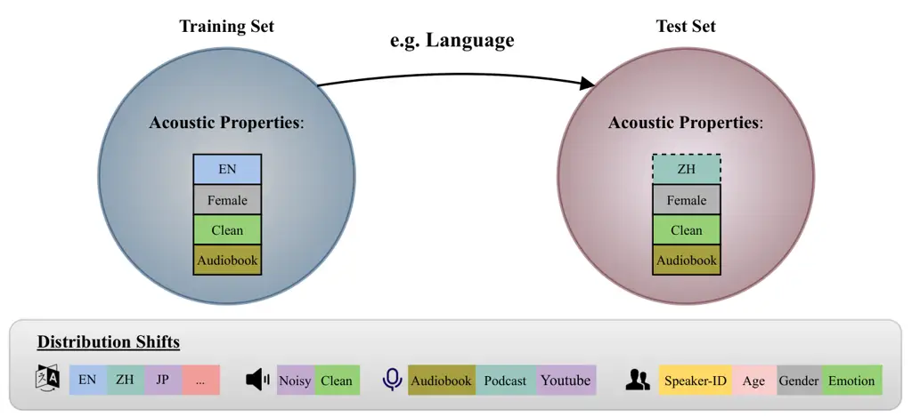
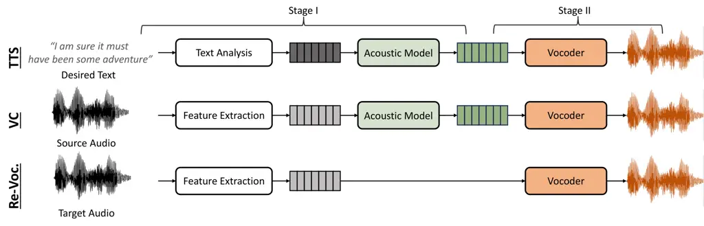

# ShiftySpeech: A Large-Scale Synthetic Speech Dataset with Distribution Shifts

Ashi Garg Affiliation: Johns Hopkins University    Zexin Cai
Affiliation: Johns Hopkins University    Lin Zhang Affiliation: Johns
Hopkins University    Henry Li Xinyuan Affiliation: Johns Hopkins
University    Leibny Paola García-Perera Affiliation: Johns Hopkins
University    Kevin Duh Affiliation: Johns Hopkins University    Sanjeev
Khudanpur Affiliation: Johns Hopkins University    Matthew Wiesner
Affiliation: Johns Hopkins University    Nicholas Andrews
Affiliation: Johns Hopkins University

###### Abstract

The problem of synthetic speech detection has enjoyed considerable
attention, with recent methods achieving low error rates across several
established benchmarks. However, to what extent can low error rates on
academic benchmarks translate to more realistic conditions? In practice,
while the training set is fixed at one point in time, test-time
conditions may exhibit distribution shifts relative to the training
conditions, such as changes in speaker characteristics, emotional
expressiveness, language and acoustic conditions, and the emergence of
novel synthesis methods. Although some existing datasets target subsets
of these distribution shifts, systematic analysis remains difficult due
to inconsistencies between source data and synthesis systems across
datasets. This difficulty is further exacerbated by the rapid
development of new text-to-speech (TTS) and vocoder systems, which
continually expand the diversity of synthetic speech. To enable
systematic benchmarking of model performance under distribution shifts,
we introduce ShiftySpeech, a large-scale benchmark comprising over 3,000
hours of synthetic speech across 7 source domains, 6 TTS systems, 12
vocoders, and 3 languages. ShiftySpeech is specifically designed to
evaluate model generalization under controlled distribution shifts while
ensuring broad coverage of modern synthetic speech generation
techniques. It fills a key gap in current benchmarks by supporting
fine-grained, controlled analysis of generalization robustness. All
tested distribution shifts significantly degrade detection performance
of state-of-the-art detection approaches based on self-supervised
features. Overall, our findings suggest that reliance on synthetic
speech detection methods in production environments should be carefully
evaluated based on anticipated distribution shifts.

 ![[Uncaptioned
image]](arxiv-2502-05674--fc45aed98b4c.figures/figure-1.webp) Code:
[https://github.com/Ashigarg123/ShiftySpeech](https://github.com/Ashigarg123/ShiftySpeech/)

![[Uncaptioned
image]](arxiv-2502-05674--fc45aed98b4c.figures/figure-2.webp) Dataset:
[https://huggingface.co/datasets/ash56/ShiftySpeech](https://huggingface.co/datasets/ash56/ShiftySpeech)

## 1 Introduction

Figure 1: Illustration of distribution shift in ShiftySpeech. Train–test
mismatches can arise from differences in language, speaker, or recording
conditions.

Generalization of synthetic speech detectors is paramount  \[1, 2\],
which are increasingly deployed in security critical systems \[3\] to
detect synthetic speech from many speakers in the presence of varying
acoustic conditions. Harder yet, synthetic speech detectors must
generalize to novel spoofing attacks powered by the rapid pace of change
in generative speech technology—including voice conversion (VC) and
text-to-speech (TTS)—used in consumer products, such as e-readers,
voice-assistants and chatbots \[4, 5, 6, 7, 8, 9, 10\].

Numerous countermeasures have been increasingly proposed, reporting low
Equal Error Rates (EERs) on benchmark datasets \[11, 12, 13\]. These
improvements are typically achieved either by expanding the training
data to include more diverse domain conditions  \[14\] or to improve on
“hard” data by increasing model capacity \[15, 16, 17, 18\]. Several
work \[19, 20\] have also explored the effect of various front-end
self-supervised learning (SSL) based models on the generalization of
synthetic speech detectors using WavLM \[21\], HuBERT \[22\] and
Wav2Vec2 \[23\].

However, evaluations in these works are typically limited to datasets
with relatively narrow distribution shifts, thus limiting our systematic
understanding of how well these systems generalize under distribution
shifts that are likely to occur in real-world scenarios. To explore
generalization in real-world settings, there is growing concern and
corresponding need for newer datasets to assess robustness and
generalizability \[1, 24, 25, 26\]. Although current benchmark datasets
\[11, 12, 13\] facilitate research in synthetic speech detection, they
often lack diversity in domain conditions required to study
generalization under real-world distribution shifts. While a limited
number of datasets such as In-the-Wild \[1\], SpoofCeleb \[27\] capture
natural variability, they provide limited control over distribution
shifts being evaluated to assess robustness (see Figure 1).

To enable more systematic evaluation, we develop a new benchmark
database called ShiftySpeech, with over 3,000 hours of synthetic speech
from 12 vocoders, 6 TTS systems, 3 languages, and 7 source domains. This
benchmark database aims to explore the impact of a wide range of
controlled distribution shifts on detector performance. Utilizing the
proposed ShiftySpeech dataset, we aim to characterize the robustness of
current state-of-the-art SOTA synthetic speech detectors much more
generally and answer the questions: Are SOTA synthetic speech detectors
robust to distribution shifts? Which distribution shifts, if any,
degrade detection performance?

Main contributions: (i) We create a benchmark dataset named ShiftySpeech
comprising synthesized or vocoded speech from a variety of systems to
help further research in robust detection under distribution shifts.
(ii) We systematically study the generalization of SOTA synthetic speech
detectors under the proposed distribution shifts.

## 2 Related Work

Distribution shifts Machine learning models typically follow the
statistical assumption that training and test data are independent and
identically distributed (i.i.d.). However, this assumption often fails
in real-world scenarios, where significant shifts with respect to the
training distribution are frequently encountered. This phenomenon, known
as distribution shift, has been widely studied in machine learning
\[28\] and can be primarily categorized into two major types—covariate
shifts \[29, 30\] and concept or conditional shifts \[31\]. The
ShiftySpeech benchmark specifically addresses covariate shifts
introduced by variations in TTS and vocoder systems, including shifts
due to speaker characteristics, emotional expressiveness and language.
While the standard covariate shift setup focuses on one source domain
and one target domain, we focus on a more realistic scenario in which
the test set may contain multiple unseen domains.

Re-vocoding Training a generalizable detector considering various
test-time shifts is often thought to require diverse training data
generated using multiple TTS or VC systems, but this is computationally
expensive and not always feasible at large scale. Among the datasets
used for training synthetic speech detectors/countermeasures, data
released as a part of ASVspoof challenge \[11, 12\] has been most
commonly used. Recently released ASVspoof5 \[32\], utilizes English
subset of MLS \[33\] as source, with increasing number of speakers.
Recent work has also explored augmenting training data by generating
additional synthetic samples through re-vocoding (also known as
copy-synthesis)—i.e., re-synthesizing real speech using vocoder-only
pipelines that transform intermediate acoustic features (e.g.,
mel-spectrogram or F0) back into waveforms  \[34, 35, 36, 37\].

Apart from training, such re-vocoded data has been increasingly utilized
for evaluating generalization performance \[38, 39\]. While valuable,
the aforementioned datasets remain limited in synthesis diversity—often
relying on vocoders that have since become outdated as newer models
emerged, and focusing primarily on English-language data. For instance,
WaveFake \[13\] majorly includes only GAN based vocoders and clean
speech from LJSpeech \[40\] and JSUT \[41\], with limited speaker
diversity, making it less suitable for test-time evaluations. LibriSeVoc
\[36\] uses multi-speaker dataset (LibriTTS \[42\]) as source and
variety of vocoders, but is limited to English language and audiobook
style recordings. In contrast, ShiftySpeech includes both re-vocoded and
fully synthetic speech from recent models, spans multiple languages, and
covers a diverse set of speakers and acoustic conditions.

Evaluating distribution shifts While recent studies have reported low
Equal Error Rates (EERs) on standard ASVspoof benchmark, several works
have highlighted poor generalization in out-of-domain or real-world
scenarios \[1, 24, 43\]. In order to address this, a range of new
datasets have been proposed to better capture diverse real-world
conditions:

- •
  In-the-Wild (ITW) \[1\] and Fake or Real (FoR) \[44\] source the real
  data from a variety of public sources such as YouTube. ITW uses
  deepfakes of public figures found online, while FoR synthesizes speech
  using a range of TTS systems. However, both datasets are limited to
  English.
- •
  MLAAD \[45\] expands the scope to a multilingual setting, providing
  synthetic speech across 38 languages using various TTS systems.
- •
  SpoofCeleb \[27\] introduces greater speaker diversity by using
  VoxCeleb \[46\] as the source dataset and trains TTS models under
  real-world acoustic conditions rather than clean studio recordings to
  generate more realistic speech.

Dataset Size Source Diversity? TTS Coverage? Vocoder Coverage? Language
Coverage? Speaker Diversity? Acoustic Conditions? Real-Synthetic Pairs?
Controlled Evaluation? WaveFake 196h ✓ ✗ ✓ ✓ ✗ ✗ ✓ ✗ LibriSeVoc 118.08h
✗ ✗ ✓ ✗ ✓ ✗ ✓ ✗ MLAAD 420.7h ✗ ✓ ✗ ✓ ✗ ✗ ✗ ✗ In-the-Wild 17.2h ✓ ✗ ✗ ✗ ✓
✓ ✗ ✗ Fake-or-Real Not available ✓ ✓ ✗ ✗ ✓ ✓ ✓ ✗ SpoofCeleb Not
available ✗ ✓ ✓ ✗ ✓ ✓ ✓ ✗ ShiftySpeech $`>`$3,000h ✓ ✓ ✓ ✓ ✓ ✓ ✓ ✓

Table 1: Comparison of existing datasets and ShiftySpeech with respect
to key characteristics for evaluating distribution shifts.

Despite these contributions, existing datasets often combine multiple
source of variations, including recording conditions and speaker
characteristics. Thus, making it difficult to isolate the impact of
specific distribution shifts or synthesis methods. To address this
limitation, we develop ShiftySpeech. It includes multiple controlled
distribution shifts (e.g., language, emotion, background noise),
provides parallel real and synthetic samples, and ensures consistent use
of the same TTS and vocoder systems across all source datasets. This
design enables systematic comparison and controlled experimentation
across a range of realistic shifts. Table 1 summarizes the existing
datasets and ShiftySpeech

## 3 ShiftySpeech: Benchmarking Distribution Shifts

### 3.1 Overview

The primary objective of ShiftySpeech is to provide the research
community with a benchmark for evaluating the robustness of synthetic
speech detection models under distribution shifts. The dataset is
constructed through a systematic generation process that includes
selecting source domains exhibiting natural variation in speaker
characteristics, emotional expressiveness, language and acoustic
conditions, using publicly available corpora \[47, 48, 41, 49, 50,
51\](see §3.2 for details). Synthetic speech is then generated using a
broad range of modern TTS and vocoder systems (See §3.3), enabling
controlled experimentation across different types of generation
mechanisms and distribution shifts.

Figure 2: ShiftySpeech data generation pipeline illustrating three
synthetic speech generation processes: text-to-speech (TTS), voice
conversion (VC), and re-vocoding.

### 3.2 Source datasets in ShiftySpeech

Below, we describe source datasets used to introduce controlled
distribution shifts for evaluating detection performance.

Language: For language shift, we use JSUT \[41\] and AISHELL \[49\]
datasets. JSUT is a Japanese speech corpus, we resynthesize basic5000
subset of this dataset. It includes one female native Japanese speaker
with audio in reading-style, comprising approximately 6.7 hours of
audio. AISHELL is Mandarin speech corpus, with more than 170 hours of
speech from 400 speakers.

Celebrities / Speaking-style variation: Here, the aim is to comprise the
test set of varied speaking-style. We use VoxCeleb \[52\] dataset for
re-synthesis. It contains audios extracted from YouTube videos of
various celebrities. In total 11 hours of audio samples are generated
for each test vocoder.

Reading-style: We utilize subset of LibriSpeech \[53\] as the source
data for reading-style audio. It consists of audio samples derived from
publicly available audiobooks.

Emotion: MSP-Podcast \[51\] is used as the source dataset. Audio samples
in MSP-Podcast are collected using publicly available podcasts on
various topics.

YouTube: Audio samples are derived from YouTube subset of GigaSpeech
\[48\] dataset. This shift captures the presence of background noise and
spontaneous speech.

Age, Gender and Accent: Here, we re-synthesize subset of data from
CommonVoice \[50\] such that it includes utterances from British and
American accent. It includes seven age groups spanning from teens –
seventies. We cover four age-groups in our evaluations – Twenties,
Thirties, Forties and Fifties. Since, other subsets have relatively less
number of samples they are not included in evaluations but we release
the synthesized samples as part of the dataset. Please refer to §E.1 for
experimentation details.

### 3.3 Data generation process

Figure 2 compares the generation processes of TTS, VC and re-vocoding.
Speech synthesis is generally a two-stage process. Stage I deals with
generating intermediate representations or acoustic features using
source text or aligned linguistic features. These intermediate
representations can be time-aligned features like mel-spectrograms and
fundamental frequency (F0). Stage II deals with transforming these
intermediate features to raw waveform or an audio. VC typically also
follows a two-stage process, with the key difference being that it takes
speech as input in Stage I, rather than text as in TTS. The vocoder
forms the core of Stage II in this pipeline and is widely used to
generate synthetic audio, as it is less computationally expensive than
fully end-to-end synthesis systems, as we mentioned in section 2.
ShiftySpeech consists of two subsets:

#### ShiftySpeech-TTS

For end-to-end TTS and VC systems, we include a variety of model types:
VAE based VITS \[54\], non-autoregressive based FastPitch \[55\],
flow-based Glow-TTS \[56\], diffusion-based Grad-TTS \[57\],
multi-speaker/multi-lingual methods (YourTTS \[7\] and XTTS \[58\]).
Grad-TTS is sourced from their official website ¹¹ 1
[https://github.com/huawei-noah/Speech-Backbones/blob/main/Grad-TTS/README.md](https://github.com/huawei-noah/Speech-Backbones/blob/main/Grad-TTS/README.md),
while remaining models are implemented via the Coqui TTS framework ²² 2
[https://github.com/coqui-ai/TTS/tree/dev](https://github.com/coqui-ai/TTS/tree/dev).
Based on those pretrained TTS/VC models, we synthsize data from diverse
source data as shown in Table 2. In detail, to support language
diversity in synthesized speech, we utilize source transcripts from
multiple reading-style speech datasets: LJSpeech \[40\] and VCTK \[59\]
in English, AISHELL \[49\] in Mandarin and JSUT \[41\]in Japanese.

#### ShiftySpeech-Voc

To generate vocoded data, we utilize publicly available pretrained
checkpoints of vocoders trained on LibriTTS \[42\] from their
repositories as listed in Table 21. For vocoders without available
checkpoints, we train vocoders based on LibriTTS from scratch. In the
re-vocoding process, we firstly extract mel-spectrograms from real
speech samples, then re-vocode it back to wavforms. We include seven
source datasets to cover diverse distribution shifts as shown in Table
Table 3.

UTMOS scores on ShiftySpeech dataset are reported in Table 33. Other
details on vocoder systems and training are provided in Appendix B.

Distribution-shift TTS system Source Hrs TTS VITS LJSpeech 25.54h
Glow-TTS 25.70h Grad-TTS 22.64h TTS vs Vocoder LJSpeech trained HFG
LJSpeech 24.36h Language XTTS JSUT 7.54h Language + TTS VITS VCTK 2.95h
FastPitch 2.69h YourTTS 3.47h XTTS VCTK 32.59h AISHELL (dev) 19.99h
AISHELL (test) 10.38h AISHELL (train) 167.63h Total hours 345.48h

Table 2: Distribution-shifts for TTS systems considered in this paper,
along with the corresponding source datasets and duration. See §4.3 for
experiment details

Distribution-shift Source Hrs Language (ja) JSUT 6.70h Language (zh)
AISHELL 10.00h Celeb / Speaking-style VoxCeleb 11.19h Reading-style
LibriSpeech 21.23h Emotive Speech; Spontaneous MSP-Podcast 31.71h
Background noise; Spontaneous; Near and far field GigaSpeech-YouTube
24.15h Age;Accent;Gender CommonVoice 246.00h Total hours (per vocoder)
350.98h

Table 3: Distribution-shifts for vocoders considered in this paper.
ShiftySpeech includes generated samples corresponding to each listed
distribution-shifts for all test-time vocoders (Table 4). Listed
durations are per vocoder. For CommonVoice dataset following vocoders
are excluded – WaveGrad, APNet2 and iSTFTNet (see Appendix E for age,
accent and gender related experiments).

In the following sections, we demonstrate the utilization of
ShiftySpeech to study robustness under distribution shifts.

## 4 Experiments

Neural vocoders are being developed at a rapid pace and are widely used
in conjunction with text-to-speech (TTS) systems, playing a key role in
synthetic speech generation. Noting their critical role in the synthesis
pipeline, vocoded speech serves as a promising direction for improved
synthetic speech detection. This assumption is motivated by findings in
prior work \[34\], suggesting vocoder artifacts help learn a good
detection system, achieving low EER on ASVspoof and ITW benchmarks.
Crucially, such artifacts are expected to persist even during test-time,
enabling detectors trained on vocoded speech to generalize. §4.2
investigates this by evaluating detection performance across
vocoder-induced distribution shifts in the ShiftySpeech benchmark. In
§4.3, we extend this analysis to explore generalization when training
includes TTS-generated data. Table 4 lists the vocoders used to
synthesize training and evaluation data.

Split Vocoders Train-time Mel, Mel-L, FB-Mel, WaveGlow Test-time
Style-Mel, WaveGrad, Vocos, BigVGAN, BigVSAN, iSTFTNet, APNet2, UniVNET
v1/v2 Train & Test PWG, HFG, MB-Mel

Table 4: Train and test time vocoders. Note that out of 16 vocoders, 3
are used both in training and as part of the evaluation set. Training
details can be found in Appendix B

### 4.1 Setups

We train SSL-AASIST³³ 3
[https://github.com/TakHemlata/SSL_Anti-spoofing](https://github.com/TakHemlata/SSL_Anti-spoofing)
\[60\] for the following experiments. It processes raw waveforms using
wav2vec 2.0⁴⁴ 4
[https://github.com/facebookresearch/fairseq/tree/main/examples/wav2vec](https://github.com/facebookresearch/fairseq/tree/main/examples/wav2vec)
XLSR-53 \[61\] ⁵⁵ 5 Although CommonVoice is one subset of the
pretraining data for XLSR-53, we still include it in ShiftySpeech, as it
is a large-scale dataset that introduces broader distribution shifts in
age, accent, and gender. as front-end and spectro-temporal graph
attention network as backend \[62\]. In order to evaluate performance on
different systems, we use the standard Equal Error Rate (EER) metric.
EER is defined as the value where the false acceptance rate equals the
false rejection rate. Lower EER represents better detection performance.

### 4.2 Distribution shifts and Impact of Vocoder Choice

To evaluate generalization under the distribution shifts included in
ShiftySpeech-Voc, as introduced in the previous subsection, we use
WaveFake as the training data and ShiftySpeech as the evaluation data.
WaveFake \[13\] is constructed by re-vocoding the LJSpeech dataset,
which contains only a single speaker, making it a simpler and more
controlled training source for comparison. We trained countermeasures in
two ways as follows:

#### Trained on a single vocoder

We train seven separate detectors, each one trained on data generated
from exactly one vocoder listed in the train-time column of Table 4.
Table 5 reports the average EER across 12 test-time vocoders for
distribution-shifts present in ShiftySpeech.

Detailed scores can be found in Appendix A. We observe that for each of
the distribution shifts, training on speech vocoded using the HiFiGAN
(HFG) vocoder seems to be most effective, achieving the lowest average
EER (aEER) of 9.14%. However, training on WaveGlow alone leads to the
highest aEER of 32.37%. Results are summarized in Table 5.

|           |          |         |          |           |         |         |                     |
| --------- | -------- | ------- | -------- | --------- | ------- | ------- | ------------------- |
|           | Test set |         |          |           |         |         |                     |
| Train set | JSUT     | AISHELL | VoxCeleb | Audiobook | Podcast | YouTube | aEER $`\downarrow`$ |
| WaveGlow  | 15.98    | 27.36   | 38.27    | 34.22     | 36.20   | 42.23   | 32.37               |
| Mel-L     | 6.97     | 20.83   | 19.81    | 18.19     | 17.58   | 30.26   | 18.94               |
| Mel       | 11.16    | 21.36   | 15.65    | 16.86     | 16.87   | 26.09   | 17.99               |
| PWG       | 3.19     | 17.96   | 18.12    | 18.38     | 21.58   | 26.55   | 17.63               |
| FB-Mel    | 4.89     | 12.61   | 15.55    | 16.18     | 21.27   | 27.14   | 16.27               |
| MB-Mel    | 3.35     | 15.57   | 12.98    | 16.10     | 17.14   | 22.46   | 14.60               |
| HFG       | 1.22     | 10.67   | 8.40     | 9.08      | 8.35    | 17.17   | 9.14                |

Table 5: EERs (%) on 12 test-time vocoders (see Table 3) for each
distribution-shift in ShiftySpeech. Models are trained on LJSpeech
dataset with audio samples generated using each train vocoder.

#### Leave-one-out

We further investigate if training on vocoded speech derived from
multiple systems results in improved generalization. Detectors are
trained by excluding one of the vocoders from the set of training
vocoders. More details can be found in Appendix A. Results from Table 6
indicate that holding out HFG and MelGAN-L degrades the performance on
most of the distribution-shifts. Further, based on the leave-one-out
experiment, holding out HFG leads to the highest aEER of 14.79%. While
holding out MB-Mel, FB-Mel and WaveGlow improves generalization (aEER of
13.78%). Table 5 and Table 6 also highlight the relative difficulty of
individual distribution-shifts.

#### Discussion

Here, we note that SSL-based detectors are not uniformly robust to
distribution shifts. In particular, certain shifts, such as the YouTube
domain representing shift with respect to background noise and
spontaneous speech, consistently degrades the detection performance. For
instance, aEER on the JSUT subset of ShiftySpeech ranges from 1.22% and
15.98%, while for the Youtube subset it falls within a higher range of
17.17% - 42.23%. A similar trend was observed for the leave-one-out
experiment with other distribution shifts, such as emotion (MSP-Podcast)
and varying number of speakers (VoxCeleb) posing intermediate detection
difficulty. Additional results on training the detector with a larger
number of speakers (beyond the single-speaker setting) are presented in
Appendix G. The relative impact of different distribution shifts remains
consistent. For example, the YouTube domain continues to be the most
challenging across both single and multi-speaker training setups.

Test set Train set JSUT AISHELL VoxCeleb Audiobook Podcast YouTube aEER
$`\downarrow`$ Leave HFG 2.18 19.73 12.46 14.28 14.96 25.15 14.79 Leave
Mel-L 1.95 21.08 13.50 12.42 14.44 24.50 14.64 Leave PWG 2.06 18.05
13.17 12.35 14.54 26.75 14.48 Leave Mel 2.07 16.82 13.83 12.49 14.99
26.09 14.38 Leave WaveGlow 1.95 17.84 12.13 11.47 13.39 25.92 13.78
Leave FB-Mel 2.12 15.51 12.78 12.14 13.75 25.22 13.58 Leave MB-Mel 1.93
15.58 11.89 12.53 13.90 25.61 13.57

Table 6: Average EER (%) on 12 test-time vocoders for each
distribution-shift in ShiftySpeech. Models are trained with audio
generated using multiple vocoders (excluding one), with LJSpeech as the
source dataset.

#### Identifying challenging vocoders

While we noted the generalization performance and specific distribution
shifts in the previous section, here we further extend the previous
experiments to identify vocoders particularly degrading overall
generalization performance. For each of the 7 detectors trained on
synthetic speech generated using train-time vocoders in Table 4, we note
the average EER on each of the distribution-shifts and report the scores
in Table 7. Scores on a particular detection system can be found in
Appendix A.

Source Test Vocoder JSUT AISHELL VoxCeleb Audiobook Podcast YouTube aEER
$`\downarrow`$ BigVGAN 26.33 33.08 34.62 37.50 36.38 39.94 34.64 APNet2
10.01 25.08 24.79 26.82 26.56 33.01 24.37 Vocos 5.96 29.45 27.09 23.03
23.93 35.03 24.08 iSTFTNet 10.11 20.43 20.46 22.52 23.23 29.79 21.09 HFG
10.20 19.03 20.83 22.07 24.20 26.68 20.50 BigVSAN 4.18 21.35 18.83 20.08
21.39 30.65 19.41 Univ-2 7.09 17.37 18.97 19.74 20.99 26.50 18.44 Univ-1
3.88 8.79 15.67 15.63 17.23 23.93 14.18 WaveGrad 1.07 11.81 7.34 11.26
14.32 23.31 11.51 Style-Mel 1.02 11.09 11.14 11.06 13.15 21.38 11.47
MB-Mel 0.30 8.79 7.34 6.65 9.57 19.91 8.76 PWG 0.02 5.09 6.19 4.80 7.39
18.85 7.05

Table 7: For a given test vocoder, EER (%) is averaged over scores from
six train-time vocoders. See Table 4 for the list of train-time
vocoders. See Appendix A for a detailed score obtained using each train
vocoder. Detection performance is worse on BigVGAN and best on PWG test
vocoder.

#### Discussion

Detection performance on test vocoders varies significantly, with aEER
values ranging from 7% to 34%. For example, PWG is relatively easier to
detect, as all trained models achieve the lowest aEER on the PWG test
set, with an average aEER of 7.05%. On the other hand, BigVGAN is more
challenging to detect, with higher EER values across all
distribution-shifts and aEER of 34.64%. Additionally, other vocoders
show varying detection difficulty, resulting in intermediate aEER
values. Overall, in addition to HFG, vocoders released in later years
(iSTFTNet, APNet2, Vocos and BigVGAN) achieved high aEER in the range of
20% – 34%. This depicts the generation quality being improved over the
years. Appendix F provides further insight into whether more
natural-sounding vocoders are harder to detect.

### 4.3 TTS distribution-shift

In this section, we study distribution shifts introduced by fully
end-to-end TTS systems from ShiftySpeech-TTS outlined in Table 2.
Training a TTS system typically requires clean and studio-recorded
speech. Therefore, generating data replicating real-world acoustic
conditions with background noise, spontaneous speech and emotional
expressiveness becomes challenging. Given this constraint, we mainly
utilize ShitySpeech-TTS to discuss distribution shifts on language
 \[27\].

Most detection systems are predominantly trained on English-language
data. However, in real-world applications, these systems are often
deployed in multilingual settings where test-time audio samples may span
a wide range of languages. To systematically examine the impact of
train-test language mismatch, we conduct two controlled experiments,
discussed below.

#### Experimental Setup

For the following experiments, we use XTTS ⁶⁶ 6
[https://github.com/coqui-ai/TTS/tree/dev](https://github.com/coqui-ai/TTS/tree/dev)
multi-lingual pre-trained model to generate training data. First, we
train a detection model with generated utterances using the Mandarin
dataset AISHELL as source. During test time we evaluate on English
language multi-speaker dataset (VCTK). The same experiment is repeated
by training on VCTK corpus and evaluating on AISHELL (zh) dataset. This
setup allows us to study cross-language detection performance.

#### Language + TTS shift

We utilize VCTK transcripts and Coqui TTS framework to generate the
corresponding synthetic data. Table 8 reports the generalization
performance on various TTS systems, when a detector is trained on a SOTA
TTS system (XTTS).

In Table 8 we note that models trained with utterances generated from
XTTS generalize well to utterances generated using VITS and YourTTS.
However, these two models do not generalize comparatively as well to
FastPitch.

Train Set Language + TTS Shift Language-only Shift (XTTS) VCTK (EN) VCTK
AISHELL JSUT MLAAD YourTTS VITS FastPitch EN ZH JA PL IT FR DE ES RU
AISHELL-ZH 0.42 1.86 13.73 0.18 0.00 0.00 0.20 2.90 4.80 5.40 4.90 11.50
VCTK-EN 0.20 0.00 0.44 0.02 0.04 0.06 1.20 6.70 6.60 5.40 7.90 10.40

Table 8: EER (%) for models trained on XTTS-generated speech in Mandarin
(AISHELL) and English (VCTK), evaluated under Language + TTS shifts and
Language-only shifts.

#### Language-only shift

To further isolate the effect of language, we train and test using the
same TTS system (XTTS), while varying only the language or source corpus
at test time.

As shown in Table 8, models trained on Mandarin data (AISHELL)
generalize well to English, and vice versa. We further extend the
evaluation dataset to the Japanese language dataset, JSUT. Both models
perform well on this dataset, with the model trained on AISHELL
achieving perfect detection performance.

We further expand the scope of this experiment by utilizing test data
for more languages derived from MLAAD \[45\] dataset and corresponding
real audio samples sourced from M-AILABS \[63\] dataset. Table 8 reports
the result on six different languages using detectors trained on English
and Mandarin data. Surprisingly, the overall generalization of the model
trained on Mandarin utterances is better than that of the model trained
on English. While the performance trend is largely consistent across
models, with languages such as Polish and German being easier to detect,
Russian remains more challenging, showing an EER of 11.50% for the
AISHELL-trained model and 10.40% for the VCTK-trained model.

#### Discussion

Although we were able to train the detection model using utterances
synthesized from the Mandarin corpus, high-quality transcripts for many
other languages are not readily available, limiting the ability to
generate comparable training data. Our results suggest that training
with non-English languages like Mandarin shows potential to improve
generalization to unseen test-time languages. This indicates training on
data beyond English is worth exploring to achieve better generalization
performance. To further complement our analysis, we also include a
comparison between detectors trained on vocoder-based and TTS-based
synthetic speech. Details are provided in Appendix D.

## 5 Conclusion

#### Outlook

Although we observe significant degradations in detection performance
under all tested conditions, certain shifts, such as the introduction of
YouTube speech, have a more drastic impact on performance. While our
findings highlight weaknesses of existing approaches to synthetic speech
detection, we hope the proposed benchmark enable the development of more
robust approaches.

For example, while our study focuses on the zero-shot setting, in
certain applications it is reasonable to assume that a small sample of
synthetic speech from the test conditions is available, which opens the
door to building few-shot detectors that could adapt to evolving test
conditions \[64\]. Second, in settings where it is not feasible to
perform few-shot adaptation, a possible recourse may be to consider
anomaly detection approaches (e.g., \[65\]) that only seek to
characterize in-distribution samples, making no assumptions about the
out-of-distribution data.

#### Limitations

We perform systematic experiments with varying training and test
conditions to understand the impact of distribution shifts on detection
performance. However, due to space and computing limitations, we are
naturally unable to consider all possible conditions. Specifically, we
focus on a relatively narrow set of languages that are well-supported by
existing synthesis methods, including English, Mandarin and Japanese.
Finally, we choose to focus on a small number of state-of-the-art
detector architectures that use self-supervised representations,
specifically SSL-AASIST, as we expect this architecture to be the most
robust to the kinds of distribution shifts we study here.

## References

- \[1\] Nicolas Müller, Pavel Czempin, Franziska Diekmann, Adam
  Froghyar, and Konstantin Böttinger. Does Audio Deepfake Detection
  Generalize? In _Interspeech_, pages 2783–2787, 2022.
- \[2\] Tianxiang Chen, Avrosh Kumar, Parav Nagarsheth, Ganesh
  Sivaraman, and Elie Khoury. Generalization of Audio Deepfake
  Detection. In _The Speaker and Language Recognition Workshop (Odyssey 2020)_, pages 132–137, 2020.
- \[3\] Andre Kassis and Urs Hengartner. Breaking Security-Critical
  Voice Authentication. In _IEEE Symposium on Security and Privacy_,
  pages 951–968, 2023.
- \[4\] Yang Yang, Yury Kartynnik, Yunpeng Li, Jiuqiang Tang, Xing Li,
  George Sung, and Matthias Grundmann. StreamVC: Real-Time Low-Latency
  Voice Conversion. In _IEEE International Conference on Acoustics,
  Speech and Signal Processing_, pages 11016–11020, 2024.
- \[5\] H. Kameoka, T. Kaneko, K. Tanaka, and N. Hojo. StarGAN-VC:
  Non-Parallel Many-to-Many Voice Conversion Using Star Generative
  Adversarial Networks. In _IEEE Spoken Language Technology Workshop_,
  pages 266–273, 2018.
- \[6\] Ha-Yeong Choi, Sang-Hoon Lee, and Seong-Whan Lee. DDDM-VC:
  Decoupled Denoising Diffusion Models with Disentangled Representation
  and Prior Mixup for Verified Robust Voice Conversion. In _Proceedings
  of the AAAI Conference on Artificial Intelligence_, volume 38, pages
  17862–17870, 2024.
- \[7\] Edresson Casanova, Julian Weber, Christopher D Shulby,
  Arnaldo Candido Junior, Eren Gölge, and Moacir A Ponti. YourTTS:
  Towards Zero-Shot Multi-Speaker TTS and Zero-Shot Voice Conversion for
  Everyone. In _International Conference on Machine Learning_, pages
  2709–2720, 2022.
- \[8\] Kaizhi Qian, Yang Zhang, Shiyu Chang, Xuesong Yang, and Mark
  Hasegawa-Johnson. AutoVC: Zero-Shot Voice Style Transfer with Only
  Autoencoder Loss. In _International Conference on Machine Learning_,
  volume 97, pages 5210–5219, 2019.
- \[9\] Takuhiro Kaneko, Hirokazu Kameoka, Kou Tanaka, and Nobukatsu
  Hojo. CycleGAN-VC2: Improved CycleGAN-Based Non-Parallel Voice
  Conversion. In _IEEE International Conference on Acoustics, Speech and
  Signal Processing_, pages 6820–6824, 2019.
- \[10\] Anders R Bargum, Stefania Serafin, and Cumhur Erkut.
  Reimagining Speech: A Scoping Review of Deep Learning-Powered Voice
  Conversion. _arXiv preprint arXiv:2311.08104_, 2023.
- \[11\] Massimiliano Todisco, Xin Wang, Ville Vestman, Md. Sahidullah,
  Héctor Delgado, Andreas Nautsch, Junichi Yamagishi, Nicholas Evans,
  Tomi H. Kinnunen, and Kong Aik Lee. ASVspoof 2019: Future Horizons in
  Spoofed and Fake Audio Detection. In _Interspeech_, pages
  1008–1012, 2019.
- \[12\] Junichi Yamagishi, Xin Wang, Massimiliano Todisco,
  Md Sahidullah, Jose Patino, Andreas Nautsch, Xuechen Liu, Kong Aik
  Lee, Tomi Kinnunen, Nicholas Evans, et al. ASVspoof 2021: Accelerating
  Progress in Spoofed and Deepfake Speech Detection. In _ASVspoof 2021
  Workshop-Automatic Speaker Verification and Spoofing Coutermeasures
  Challenge_, 2021.
- \[13\] Joel Frank and Lea Schönherr. WaveFake: A Data Set to
  Facilitate Audio Deepfake Detection. In _Proceedings of the Neural
  Information Processing Systems Track on Datasets and Benchmarks_,
  volume 1, 2021.
- \[14\] Hye jin Shim, Jee weon Jung, and Tomi Kinnunen. Multi-Dataset
  Co-Training with Sharpness-Aware Optimization for Audio
  Anti-spoofing, 2023.
- \[15\] Yanmin Qian, Nanxin Chen, Heinrich Dinkel, and Zhizheng Wu.
  Deep Feature Engineering for Noise Robust Spoofing Detection.
  _IEEE/ACM Transactions on Audio, Speech, and Language Processing_,
  25(10):1942–1955, 2017.
- \[16\] Heinrich Dinkel, Yanmin Qian, and Kai Yu. Investigating Raw
  Wave Deep Neural Networks for End-to-End Speaker Spoofing Detection.
  _IEEE/ACM Transactions on Audio, Speech, and Language Processing_,
  26(11):2002–2014, 2018.
- \[17\] Alejandro Gomez-Alanis, Antonio M. Peinado, Jose A. Gonzalez,
  and Angel M. Gomez. A Gated Recurrent Convolutional Neural Network for
  Robust Spoofing Detection. _IEEE/ACM Transactions on Audio, Speech,
  and Language Processing_, 27(12):1985–1999, 2019.
- \[18\] Zhuxin Chen, Zhifeng Xie, Weibin Zhang, and Xiangmin Xu. ResNet
  and Model Fusion for Automatic Spoofing Detection. In _Interspeech_,
  pages 102–106, 2017.
- \[19\] Xin Wang and Junichi Yamagishi. Investigating Self-Supervised
  Front Ends for Speech Spoofing Countermeasures. In _The Speaker and
  Language Recognition Workshop (Odyssey 2022)_, pages 100–106, 2022.
- \[20\] Atharva Kulkarni, Hoan My Tran, Ajinkya Kulkarni, Sandipana
  Dowerah, Damien Lolive, and Mathew Maginai Doss. Exploring
  generalization to unseen audio data for spoofing: insights from SSL
  models. In _The Automatic Speaker Verification Spoofing
  Countermeasures Workshop (ASVspoof 2024)_, pages 86–93, 2024.
- \[21\] Sanyuan Chen, Chengyi Wang, Zhengyang Chen, Yu Wu, Shujie Liu,
  Zhuo Chen, Jinyu Li, Naoyuki Kanda, Takuya Yoshioka, Xiong Xiao,
  et al. WavLM: Large-Scale Self-Supervised Pre-Training for Full Stack
  Speech Processing. _IEEE Journal of Selected Topics in Signal
  Processing_, 16(6):1505–1518, 2022.
- \[22\] Wei-Ning Hsu, Benjamin Bolte, Yao-Hung Hubert Tsai, Kushal
  Lakhotia, Ruslan Salakhutdinov, and Abdelrahman Mohamed. HuBERT:
  Self-Supervised Speech Representation Learning by Masked Prediction of
  Hidden Units. _IEEE/ACM Transactions on Audio, Speech, and Language
  Processing_, 29:3451–3460, 2021.
- \[23\] Alexei Baevski, Yuhao Zhou, Abdelrahman Mohamed, and Michael
  Auli. Wav2vec 2.0: A Framework for Self-supervised Learning of Speech
  Representations. _Advances in Neural Information Processing Systems_,
  33:12449–12460, 2020.
- \[24\] Nicolas M. Müller, Nicholas Evans, Hemlata Tak, Philip Sperl,
  and Konstantin Böttinger. Harder or Different? Understanding
  Generalization of Audio Deepfake Detection. In _Interspeech_, pages
  2705–2709, 2024.
- \[25\] Jiangyan Yi, Chenglong Wang, Jianhua Tao, Xiaohui Zhang,
  Chu Yuan Zhang, and Yan Zhao. Audio Deepfake Detection: A
  Survey, 2023. URL
  [https://arxiv.org/abs/2308.14970](https://arxiv.org/abs/2308.14970).
- \[26\] Luca Cuccovillo, Christoforos Papastergiopoulos, Anastasios
  Vafeiadis, Artem Yaroshchuk, Patrick Aichroth, Konstantinos Votis, and
  Dimitrios Tzovaras. Open Challenges in Synthetic Speech Detection. In
  _IEEE International Workshop on Information Forensics and Security_,
  page 1–6, 2022.
- \[27\] Jee weon Jung, Yihan Wu, Xin Wang, Ji-Hoon Kim, Soumi Maiti,
  Yuta Matsunaga, Hye jin Shim, Jinchuan Tian, Nicholas Evans, Joon Son
  Chung, Wangyou Zhang, Seyun Um, Shinnosuke Takamichi, and Shinji
  Watanabe. SpoofCeleb: Speech Deepfake Detection and SASV In The Wild.
  _IEEE Open Journal of Signal Processing_, 6:68–77, 2025.
- \[28\] Robert Geirhos, Carlos RM Temme, Jonas Rauber, Heiko H Schütt,
  Matthias Bethge, and Felix A Wichmann. Generalisation in Humans and
  Deep Neural Networks, 2018.
- \[29\] Masashi Sugiyama, Matthias Krauledat, and Klaus-Robert Müller.
  Covariate Shift Adaptation by Importance Weighted Cross Validation.
  _Journal of Machine Learning Research_, 8(35):985–1005, 2007.
- \[30\] Shai Ben-David, John Blitzer, Koby Crammer, and Fernando
  Pereira. Analysis of Representations for Domain Adaptation.
  volume 19, 2006.
- \[31\] João Gama, Indrė Žliobaitė, Albert Bifet, Mykola Pechenizkiy,
  and Abdelhamid Bouchachia. A Survey on Concept Drift Adaptation. _ACM
  computing surveys (CSUR)_, 46(4):1–37, 2014.
- \[32\] Xin Wang, Héctor Delgado, Hemlata Tak, Jee weon Jung, Hye jin
  Shim, Massimiliano Todisco, Ivan Kukanov, Xuechen Liu, Md Sahidullah,
  Tomi H. Kinnunen, Nicholas Evans, Kong Aik Lee, and Junichi Yamagishi.
  Asvspoof 5: Crowdsourced speech data, deepfakes, and adversarial
  attacks at scale. In _The Automatic Speaker Verification Spoofing
  Countermeasures Workshop_, pages 1–8, 2024.
- \[33\] Vineel Pratap, Qiantong Xu, Anuroop Sriram, Gabriel Synnaeve,
  and Ronan Collobert. MLS: A Large-Scale Multilingual Dataset for
  Speech Research. In _Interspeech 2020_, 2020.
- \[34\] Xin Wang and Junichi Yamagishi. Can Large-Scale Vocoded Spoofed
  Data Improve Speech Spoofing Countermeasure with a Self-Supervised
  Front End? In _IEEE International Conference on Acoustics, Speech and
  Signal Processing_, pages 10311–10315, 2024.
- \[35\] Xin Wang and Junichi Yamagishi. Spoofed Training Data for
  Speech Spoofing Countermeasure Can Be Efficiently Created Using Neural
  Vocoders. In _IEEE International Conference on Acoustics, Speech and
  Signal Processing_, 2023.
- \[36\] Chengzhe Sun, Shan Jia, Shuwei Hou, and Siwei Lyu.
  AI-Synthesized Voice Detection Using Neural Vocoder Artifacts. In
  _2023 IEEE/CVF Conference on Computer Vision and Pattern Recognition
  Workshops (CVPRW)_, pages 904–912, 2023.
- \[37\] Jon Sanchez, Ibon Saratxaga, Inma Hernaez, Eva Navas, and
  Daniel Erro. A Cross-Vocoder Study of Speaker Independent Synthetic
  Speech Detection using Phase Information. In _Interspeech_, pages
  1663–1667, 2014.
- \[38\] Kuiyuan Zhang, Zhongyun Hua, Yushu Zhang, Yifang Guo, and Tao
  Xiang. Robust AI-Synthesized Speech Detection Using Feature
  Decomposition Learning and Synthesizer Feature Augmentation. _IEEE
  Transactions on Information Forensics and Security_, 20:871–885, 2025.
- \[39\] Daeun Song, Nayoung Lee, Jiwon Kim, and Eunjung Choi. Anomaly
  Detection of Deepfake Audio Based on Real Audio Using Generative
  Adversarial Network Model. _IEEE Access_, 12:184311–184326, 2024.
- \[40\] Keith Ito. The LJ Speech Dataset.
  [https://keithito.com/LJ-Speech-Dataset/](https://keithito.com/LJ-Speech-Dataset/), 2017.
- \[41\] Ryosuke Sonobe, Shinnosuke Takamichi, and Hiroshi Saruwatari.
  Jsut corpus: free large-scale japanese speech corpus for end-to-end
  speech synthesis. _arXiv preprint arXiv:1711.00354_, 2017.
- \[42\] Heiga Zen, Viet Dang, Rob Clark, Yu Zhang, Ron J. Weiss,
  Ye Jia, Zhifeng Chen, and Yonghui Wu. LibriTTS: A Corpus Derived from
  LibriSpeech for Text-to-Speech. In _Interspeech_, pages
  1526–1530, 2019.
- \[43\] Wanying Ge, Xin Wang, Junichi Yamagishi, Massimiliano Todisco,
  and Nicholas Evans. Spoofing Attack Augmentation: Can
  Differently-Trained Attack Models Improve Generalisation? In _IEEE
  International Conference on Acoustics, Speech and Signal Processing_,
  pages 12531–12535, 2024.
- \[44\] Ricardo Reimao and Vassilios Tzerpos. FoR: A Dataset for
  Synthetic Speech Detection. In _International Conference on Speech
  Technology and Human-Computer Dialogue_, pages 1–10, 2019.
- \[45\] Nicolas M Müller, Piotr Kawa, Wei Herng Choong, Edresson
  Casanova, Eren Gölge, Thorsten Müller, Piotr Syga, Philip Sperl, and
  Konstantin Böttinger. MLAAD: The Multi-Language Audio Anti-Spoofing
  Dataset. 2024.
- \[46\] Arsha Nagrani, Joon Son Chung, and Andrew Zisserman. Voxceleb:
  A large-scale speaker identification dataset. In _Interspeech_, pages
  2616–2620, 2017.
- \[47\] Changhan Wang, Morgane Riviere, Ann Lee, Anne Wu, Chaitanya
  Talnikar, Daniel Haziza, Mary Williamson, Juan Pino, and Emmanuel
  Dupoux. VoxPopuli: A Large-Scale Multilingual Speech Corpus for
  Representation Learning, Semi-Supervised Learning and Interpretation.
  In _Proceedings of the 59th Annual Meeting of the Association for
  Computational Linguistics and the 11th International Joint Conference
  on Natural Language Processing (Volume 1: Long Papers)_, pages
  993–1003, 2021.
- \[48\] Guoguo Chen, Shuzhou Chai, Guan-Bo Wang, Jiayu Du, Wei-Qiang
  Zhang, Chao Weng, Dan Su, Daniel Povey, Jan Trmal, Junbo Zhang,
  Mingjie Jin, Sanjeev Khudanpur, Shinji Watanabe, Shuaijiang Zhao, Wei
  Zou, Xiangang Li, Xuchen Yao, Yongqing Wang, Zhao You, and Zhiyong
  Yan. GigaSpeech: An Evolving, Multi-Domain ASR Corpus with 10,000
  Hours of Transcribed Audio. In _Interspeech 2021_, pages 3670–3674,
  2021a.
- \[49\] Hui Bu, Jiayu Du, Xingyu Na, Bengu Wu, and Hao Zheng.
  AISHELL-1: An Open-Source Mandarin Speech Corpus and A Speech
  Recognition Baseline. In _20th Conference of the Oriental Chapter of
  the International Coordinating Committee on Speech Databases and
  Speech I/O Systems and Assessment_, 2017.
- \[50\] Rosana Ardila, Megan Branson, Kelly Davis, Michael Kohler, Josh
  Meyer, Michael Henretty, Reuben Morais, Lindsay Saunders, Francis
  Tyers, and Gregor Weber. Common Voice: A Massively-Multilingual Speech
  Corpus. In _Language Resources and Evaluation Conference_, pages
  4218–4222, 2020.
- \[51\] R. Lotfian and C. Busso. Building Naturalistic Emotionally
  Balanced Speech Corpus by Retrieving Emotional Speech From Existing
  Podcast Recordings. _IEEE Transactions on Affective Computing_,
  10(4):471–483, 2019.
- \[52\] Joon Son Chung, Arsha Nagrani, and Andrew Zisserman. VoxCeleb2:
  Deep Speaker Recognition. In _Interspeech 2018_, pages
  1086–1090, 2018.
- \[53\] Vassil Panayotov, Guoguo Chen, Daniel Povey, and Sanjeev
  Khudanpur. Librispeech: An ASR Corpus Based on Public Domain Audio
  Books. In _IEEE International Conference on Acoustics, Speech and
  Signal Processing_, pages 5206–5210, 2015.
- \[54\] Jaehyeon Kim, Jungil Kong, and Juhee Son. Conditional
  Variational Autoencoder with Adversarial Learning for End-to-End
  Text-to-Speech. In _International Conference on Machine Learning_,
  pages 5530–5540, 2021.
- \[55\] Adrian Łańcucki. Fastpitch: Parallel Text-to-Speech with Pitch
  Prediction. In _IEEE International Conference on Acoustics, Speech and
  Signal Processing_, pages 6588–6592, 2021.
- \[56\] Jaehyeon Kim, Sungwon Kim, Jungil Kong, and Sungroh Yoon.
  Glow-TTS: A Generative Flow for Text-to-Speech via Monotonic Alignment
  Search. volume 33, pages 8067–8077, 2020.
- \[57\] Vadim Popov, Ivan Vovk, Vladimir Gogoryan, Tasnima Sadekova,
  and Mikhail Kudinov. Grad-TTS: A Diffusion Probabilistic Model for
  Text-to-Speech. In _International Conference on Machine Learning_,
  pages 8599–8608, 2021.
- \[58\] Edresson Casanova, Kelly Davis, Eren Gölge, Görkem Göknar,
  Iulian Gulea, Logan Hart, Aya Aljafari, Joshua Meyer, Reuben Morais,
  Samuel Olayemi, et al. XTTS: a Massively Multilingual Zero-Shot
  Text-to-Speech Model. _arXiv preprint arXiv:2406.04904_, 2024.
- \[59\] Christophe Veaux, Junichi Yamagishi, Kirsten MacDonald, et al.
  Superseded-CSTR VCTK Corpus: English Multi-Speaker Corpus for CSTR
  Voice Cloning Toolkit. _University of Edinburgh, The Centre for Speech
  Technology Research_, 2016.
- \[60\] Hemlata Tak, Massimiliano Todisco, Xin Wang, Jee weon Jung,
  Junichi Yamagishi, and Nicholas Evans. Automatic Speaker Verification
  Spoofing and Deepfake Detection Using Wav2vec 2.0 and Data
  Augmentation. In _Speaker and Language Recognition Workshop_, pages
  112–119, 2022.
- \[61\] Arun Babu, Changhan Wang, Andros Tjandra, Kushal Lakhotia,
  Qiantong Xu, Naman Goyal, Kritika Singh, Patrick von Platen, Yatharth
  Saraf, Juan Pino, Alexei Baevski, Alexis Conneau, and Michael Auli.
  XLS-R: Self-Supervised Cross-Lingual Speech Representation Learning at
  Scale. In _Interspeech_, pages 2278–2282, 2022.
- \[62\] Jee-weon Jung, Hee-Soo Heo, Hemlata Tak, Hye-jin Shim, Joon Son
  Chung, Bong-Jin Lee, Ha-Jin Yu, and Nicholas Evans. AASIST: Audio
  Anti-Spoofing using Integrated Spectro-Temporal Graph Attention
  Networks. In _IEEE International Conference on Acoustics, Speech and
  Signal Processing_, pages 6367–6371, 2022.
- \[63\] Imdat Solak. The M-AILABS Speech Dataset.
  [https://www.caito.de/2019/01/03/the-m-ailabs-speech-dataset/](https://www.caito.de/2019/01/03/the-m-ailabs-speech-dataset/), 2023.
- \[64\] Rafael Alberto Rivera Soto, Kailin Koch, Aleem Khan, Barry Y.
  Chen, Marcus Bishop, and Nicholas Andrews. Few-Shot Detection of
  Machine-Generated Text using Style Representations. In _International
  Conference on Learning Representations_, 2024.
- \[65\] Jie Ren, Stanislav Fort, Jeremiah Liu, Abhijit Guha Roy,
  Shreyas Padhy, and Balaji Lakshminarayanan. A simple fix to
  mahalanobis distance for improving near-ood detection. _arXiv preprint
  arXiv:2106.09022_, 2021.
- \[66\] Aäron van den Oord, Sander Dieleman, Heiga Zen, Karen Simonyan,
  Oriol Vinyals, Alex Graves, Nal Kalchbrenner, Andrew Senior, and Koray
  Kavukcuoglu. WaveNet: A Generative Model for Raw Audio. In _ISCA
  Speech Synthesis Workshop_, pages 125–125, 2016.
- \[67\] Soroush Mehri, Kundan Kumar, Ishaan Gulrajani, Rithesh Kumar,
  Shubham Jain, Jose Sotelo, Aaron Courville, and Yoshua Bengio.
  SampleRNN: An Unconditional End-to-End Neural Audio Generation Model.
  In _International Conference on Learning Representations_, 2017.
- \[68\] Nal Kalchbrenner, Erich Elsen, Karen Simonyan, Seb Noury,
  Norman Casagrande, Edward Lockhart, Florian Stimberg, Aaron Oord,
  Sander Dieleman, and Koray Kavukcuoglu. Efficient Neural Audio
  Synthesis. In _International Conference on Machine Learning_, pages
  2410–2419, 2018.
- \[69\] Ian Goodfellow, Jean Pouget-Abadie, Mehdi Mirza, Bing Xu, David
  Warde-Farley, Sherjil Ozair, Aaron Courville, and Yoshua Bengio.
  Generative Adversarial Networks. _Communications of the ACM_,
  63(11):139–144, 2020.
- \[70\] Geng Yang, Shan Yang, Kai Liu, Peng Fang, Wei Chen, and Lei
  Xie. Multi-Band Melgan: Faster Waveform Generation For High-Quality
  Text-To-Speech. In _IEEE Spoken Language Technology Workshop_, pages
  492–498, 2021a.
- \[71\] Ryuichi Yamamoto, Eunwoo Song, and Jae-Min Kim. Parallel
  Wavegan: A Fast Waveform Generation Model Based on Generative
  Adversarial Networks with Multi-Resolution Spectrogram. In _IEEE
  International Conference on Acoustics, Speech and Signal Processing_,
  pages 6199–6203, 2020.
- \[72\] Jungil Kong, Jaehyeon Kim, and Jaekyoung Bae. HiFi-GAN:
  Generative Adversarial Networks for Efficient and High Fidelity Speech
  Synthesis. In _Advances in Neural Information Processing Systems_,
  volume 33, pages 17022–17033, 2020.
- \[73\] Geng Yang, Shan Yang, Kai Liu, Peng Fang, Wei Chen, and Lei
  Xie. Multi-Band Melgan: Faster Waveform Generation For High-Quality
  Text-To-Speech. In _IEEE Spoken Language Technology Workshop_, pages
  492–498, 2021b.
- \[74\] Ahmed Mustafa, Nicola Pia, and Guillaume Fuchs. StyleMelGAN: An
  Efficient High-Fidelity Adversarial Vocoder with Temporal Adaptive
  Normalization. In _IEEE International Conference on Acoustics, Speech
  and Signal Processing_, pages 6034–6038, 2021.
- \[75\] Won Jang, Dan Lim, Jaesam Yoon, Bongwan Kim, and Juntae Kim.
  UnivNet: A Neural Vocoder with Multi-Resolution Spectrogram
  Discriminators for High-Fidelity Waveform Generation. In
  _Interspeech_, pages 2207–2211, 2021.
- \[76\] Sang gil Lee, Wei Ping, Boris Ginsburg, Bryan Catanzaro, and
  Sungroh Yoon. BigVGAN: A Universal Neural Vocoder with Large-Scale
  Training. In _The Eleventh International Conference on Learning
  Representations_, 2023.
- \[77\] Takashi Shibuya, Yuhta Takida, and Yuki Mitsufuji. BigVSAN:
  Enhancing GAN-based Neural Vocoders with Slicing Adversarial Network.
  In _IEEE International Conference on Acoustics, Speech and Signal
  Processing_, pages 10121–10125, 2024.
- \[78\] Yuhta Takida, Masaaki Imaizumi, Takashi Shibuya, Chieh-Hsin
  Lai, Toshimitsu Uesaka, Naoki Murata, and Yuki Mitsufuji. SAN:
  Inducing Metrizability of GAN with Discriminative Normalized Linear
  Layer. In _The Twelfth International Conference on Learning
  Representations_, 2024.
- \[79\] Takuhiro Kaneko, Kou Tanaka, Hirokazu Kameoka, and Shogo Seki.
  ISTFTNET: Fast and Lightweight Mel-Spectrogram Vocoder Incorporating
  Inverse Short-Time Fourier Transform. In _IEEE International
  Conference on Acoustics, Speech and Signal Processing_, pages
  6207–6211, 2022.
- \[80\] Hubert Siuzdak. Vocos: Closing the Gap between Time-Domain and
  Fourier-Based Neural Vocoders for High-Quality Audio Synthesis. In
  _The Twelfth International Conference on Learning
  Representations_, 2024.
- \[81\] Yang Ai and Zhen-Hua Ling. APNet: An All-Frame-Level Neural
  Vocoder Incorporating Direct Prediction of Amplitude and Phase
  Spectra. _IEEE/ACM Transactions on Audio, Speech, and Language
  Processing_, 31:2145–2157, 2023.
- \[82\] Hui-Peng Du, Ye-Xin Lu, Yang Ai, and Zhen-Hua Ling. APNet2:
  High-quality and High-efficiency Neural Vocoder with Direct Prediction
  of Amplitude and Phase Spectra. In _National Conference on Man-Machine
  Speech Communication_, pages 66–80.
- \[83\] Ryan Prenger, Rafael Valle, and Bryan Catanzaro. Waveglow: A
  Flow-Based Generative Network for Speech Synthesis. In _IEEE
  International Conference on Acoustics, Speech and Signal Processing_,
  pages 3617–3621, 2019.
- \[84\] Nanxin Chen, Yu Zhang, Heiga Zen, Ron J. Weiss, Mohammad
  Norouzi, and William Chan. WaveGrad: Estimating Gradients for Waveform
  Generation. In _International Conference on Learning Representations_,
  2021b.
- \[85\] Takaaki Saeki, Detai Xin, Wataru Nakata, Tomoki Koriyama,
  Shinnosuke Takamichi, and Hiroshi Saruwatari. UTMOS: UTokyo-SaruLab
  System for VoiceMOS Challenge 2022. In _Interspeech 2022_, pages
  4521–4525, 2022.

## Appendix A Identifying best train-time vocoders

The following tables provide detailed results corresponding to the
experiments discussed in §4.2. These tables record EER (%) across
detector systems and distribution-shifts.

#### Training details

Detection systems are trained on synthetic speech generated from a
single vocoder using a learning rate of 1e-5 and batch size of 64 for 20
epochs. Detectors for leave-one-out experiments are trained for 50
epochs with a learning rate of 1e-6, batch size 64 and weight decay of
0.0001. Model checkpoint with lower validation loss is used for
evaluation.

Average EER (aEER) column represents the overall generalization of each
training model on given test vocoders. On the other hand, aEER row
represents the overall difficulty of detecting a particular vocoder
considering the performance of all detectors.

|                                                   |      |          |         |         |           |            |            |         |              |       |        |          |       |
| ------------------------------------------------- | ---- | -------- | ------- | ------- | --------- | ---------- | ---------- | ------- | ------------ | ----- | ------ | -------- | ----- |
| Train set $`\downarrow`$ Test set $`\rightarrow`$ | PWG  | WaveGrad | BigVGAN | BigVSAN | MB-MelGAN | UniVNet v1 | UniVNet v2 | HiFiGAN | Style-MelGAN | Vocos | APNet2 | iSTFTNet | aEER  |
| PWG                                               | 0.0  | 0.24     | 20.40   | 2.72    | 0.0       | 0.26       | 2.34       | 3.10    | 0.0          | 2.28  | 4.36   | 2.64     | 3.19  |
| HiFiGAN                                           | 0.0  | 0.10     | 10.48   | 0.72    | 0.0       | 0.0        | 0.24       | 0.34    | 0.06         | 0.70  | 1.70   | 0.36     | 1.22  |
| MB-Mel                                            | 0.0  | 0.32     | 20.50   | 2.20    | 0.0       | 0.50       | 2.46       | 2.62    | 0.02         | 3.34  | 5.02   | 3.26     | 3.35  |
| FB-Mel                                            | 0.02 | 0.56     | 23.60   | 6.20    | 0.0       | 1.00       | 3.80       | 4.36    | 0.04         | 6.06  | 8.36   | 4.68     | 4.89  |
| Mel                                               | 0.02 | 3.54     | 34.58   | 7.60    | 0.88      | 4.40       | 11.10      | 10.80   | 0.58         | 14.00 | 28.78  | 17.70    | 11.16 |
| Mel-L                                             | 0.0  | 1.76     | 29.66   | 4.64    | 0.24      | 1.76       | 5.28       | 6.84    | 0.16         | 6.74  | 16.10  | 10.50    | 6.97  |
| WaveGLow                                          | 0.12 | 0.98     | 45.10   | 5.20    | 0.98      | 19.24      | 24.44      | 43.36   | 6.28         | 8.64  | 5.78   | 31.64    | 15.98 |
| aEER                                              | 0.02 | 1.07     | 26.33   | 4.18    | 0.30      | 3.88       | 7.09       | 10.20   | 1.02         | 5.96  | 10.01  | 10.11    | -     |

Table 9: EER (%) on models trained on LJSpeech dataset and generated
utterances from train-time vocoder. Evaluation data is generated using
vocoded speech from test vocoders with JSUT (single-speaker) as the
source dataset. Lowest aEER on all test vocoders is achieved using model
trained with HFG vocoded samples. Higher aEER obtained with WaveGlow
used in training.

|                                                   |     |          |         |         |           |            |            |         |              |       |        |          |      |
| ------------------------------------------------- | --- | -------- | ------- | ------- | --------- | ---------- | ---------- | ------- | ------------ | ----- | ------ | -------- | ---- |
| Train set $`\downarrow`$ Test set $`\rightarrow`$ | PWG | WaveGrad | BigVGAN | BigVSAN | MB-MelGAN | UniVNet v1 | UniVNet v2 | HiFiGAN | Style-MelGAN | Vocos | APNet2 | iSTFTNet | aEER |
| Leave HFG                                         | 0.0 | 0.08     | 17.80   | 1.06    | 0.0       | 0.14       | 0.92       | 1.30    | 0.0          | 1.20  | 2.08   | 1.60     | 2.18 |
| Leave pwg                                         | 0.0 | 0.16     | 16.44   | 1.18    | 0.0       | 0.12       | 0.82       | 1.14    | 0.0          | 1.32  | 2.34   | 1.20     | 2.06 |
| Leave mel                                         | 0.0 | 0.16     | 17.28   | 1.18    | 0.0       | 0.18       | 0.78       | 1.08    | 0.0          | 1.18  | 1.78   | 1.22     | 2.07 |
| Leave mel-l                                       | 0.0 | 0.06     | 16.06   | 1.08    | 0.0       | 0.14       | 0.74       | 1.16    | 0.02         | 1.16  | 1.84   | 1.22     | 1.95 |
| Leave mb-mel                                      | 0.0 | 0.12     | 15.66   | 1.12    | 0.0       | 0.14       | 0.78       | 1.04    | 0.0          | 1.14  | 2.22   | 1.04     | 1.93 |
| Leave fb-mel                                      | 0.0 | 0.18     | 17.82   | 1.12    | 0.0       | 0.10       | 0.82       | 1.26    | 0.0          | 1.16  | 1.80   | 1.22     | 2.12 |
| Leave waveglow                                    | 0.0 | 0.18     | 15.58   | 1.30    | 0.0       | 0.08       | 0.68       | 0.80    | 0.02         | 1.36  | 2.54   | 0.92     | 1.95 |

Table 10: EER (%) on models trained on LJSpeech dataset and generated
utterances from multiple train-time vocoder in leave-one-out fashion.
Evaluation data is generated using vocoded speech from test vocoders
with JSUT (single-speaker) as the source dataset. Leaving Mel-l, MB-Mel
and WaveGlow vocoder from training helps yield low aEER

|                                                   |      |          |         |         |           |            |            |         |              |       |        |          |       |
| ------------------------------------------------- | ---- | -------- | ------- | ------- | --------- | ---------- | ---------- | ------- | ------------ | ----- | ------ | -------- | ----- |
| Train set $`\downarrow`$ Test set $`\rightarrow`$ | PWG  | WaveGrad | BigVGAN | BigVSAN | MB-MelGAN | UniVNet v1 | UniVNet v2 | HiFiGAN | Style-MelGAN | Vocos | APNet2 | iSTFTNet | aEER  |
| PWG                                               | 6.16 | 12.37    | 33.43   | 23.21   | 9.69      | 10.53      | 14.66      | 20.07   | 9.09         | 34.60 | 24.65  | 17.15    | 17.96 |
| HiFiGAN                                           | 2.24 | 8.41     | 25.30   | 12.41   | 2.74      | 3.05       | 6.56       | 8.47    | 4.76         | 31.36 | 16.04  | 6.80     | 10.67 |
| MB-Mel                                            | 4.66 | 11.20    | 34.37   | 19.34   | 5.07      | 8.94       | 14.03      | 16.23   | 3.62         | 28.16 | 24.19  | 17.04    | 15.57 |
| FB-Mel                                            | 3.21 | 6.55     | 31.96   | 20.33   | 1.57      | 5.32       | 10.10      | 10.99   | 3.13         | 22.81 | 22.32  | 13.08    | 12.61 |
| Mel                                               | 6.10 | 15.53    | 36.53   | 24.63   | 12.98     | 16.97      | 21.80      | 20.66   | 11.87        | 31.70 | 32.38  | 25.22    | 21.36 |
| Mel-L                                             | 4.73 | 16.80    | 37.38   | 26.93   | 12.57     | 11.87      | 18.11      | 22.68   | 8.73         | 29.41 | 34.37  | 26.47    | 20.83 |
| WaveGLow                                          | 8.57 | 11.87    | 32.63   | 22.24   | 16.96     | 42.12      | 36.39      | 34.15   | 36.43        | 28.17 | 21.61  | 37.27    | 27.36 |
| aEER                                              | 5.09 | 11.81    | 33.08   | 21.29   | 8.79      | 14.11      | 17.37      | 19.03   | 11.09        | 29.45 | 25.08  | 20.43    | -     |

Table 11: EER (%) on models trained on LJSpeech dataset and generated
utterances from train-time vocoder. Evaluation data is generated using
vocoded speech from test vocoders with AISHELL (multi-speaker +
accented) as the source dataset. BigVGAN and Vocos consistently exhibits
higher EER across all training models.

|                                                   |       |          |         |         |           |            |            |         |              |       |        |          |       |
| ------------------------------------------------- | ----- | -------- | ------- | ------- | --------- | ---------- | ---------- | ------- | ------------ | ----- | ------ | -------- | ----- |
| Train set $`\downarrow`$ Test set $`\rightarrow`$ | PWG   | WaveGrad | BigVGAN | BigVSAN | MB-MelGAN | UniVNet v1 | UniVNet v2 | HiFiGAN | Style-MelGAN | Vocos | APNet2 | iSTFTNet | aEER  |
| Leave HFG                                         | 9.93  | 21.09    | 34.01   | 24.62   | 15.38     | 14.00      | 17.89      | 19.98   | 3.66         | 30.11 | 25.91  | 20.17    | 19.73 |
| Leave pwg                                         | 10.21 | 18.60    | 33.20   | 22.43   | 13.54     | 10.95      | 13.90      | 15.94   | 8.54         | 29.40 | 24.70  | 15.23    | 18.05 |
| Leave mel                                         | 13.08 | 16.17    | 31.49   | 20.05   | 12.83     | 9.88       | 12.61      | 15.49   | 9.88         | 26.28 | 20.56  | 13.60    | 16.82 |
| Leave mel-l                                       | 15.56 | 23.83    | 32.84   | 25.07   | 18.07     | 17.64      | 20.22      | 20.33   | 4.23         | 30.64 | 24.34  | 20.20    | 21.08 |
| Leave mb-mel                                      | 7.24  | 16.48    | 30.08   | 19.14   | 10.88     | 8.82       | 12.48      | 14.42   | 4.43         | 27.73 | 21.12  | 14.15    | 15.58 |
| Leave fb-mel                                      | 7.93  | 15.81    | 29.29   | 18.96   | 11.09     | 10.46      | 13.37      | 14.32   | 5.07         | 27.06 | 19.89  | 13.51    | 15.51 |
| Leave waveglow                                    | 9.25  | 19.98    | 33.06   | 23.29   | 13.26     | 10.82      | 14.31      | 16.06   | 3.97         | 30.72 | 24.05  | 15.30    | 17.84 |

Table 12: EER (%) on models trained on LJSpeech dataset and generated
utterances from multiple train-time vocoder in leave-one-out fashion.
Evaluation data is generated using vocoded speech from test vocoders
with AISHELL (multi-speaker + accented) as the source dataset. Leaving
FB-Mel and MB-Mel vocoders from training helps yield low aEER

|                                                   |       |          |         |         |           |            |            |         |              |       |        |          |       |
| ------------------------------------------------- | ----- | -------- | ------- | ------- | --------- | ---------- | ---------- | ------- | ------------ | ----- | ------ | -------- | ----- |
| Train set $`\downarrow`$ Test set $`\rightarrow`$ | PWG   | WaveGrad | BigVGAN | BigVSAN | MB-MelGAN | UniVNet v1 | UniVNet v2 | HiFiGAN | Style-MelGAN | Vocos | APNet2 | iSTFTNet | aEER  |
| PWG                                               | 5.64  | 17.13    | 36.17   | 20.76   | 5.88      | 12.66      | 17.09      | 20.90   | 9.35         | 29.31 | 24.21  | 18.36    | 18.12 |
| HiFiGAN                                           | 1.00  | 5.80     | 23.49   | 6.81    | 1.04      | 4.22       | 5.02       | 7.14    | 2.31         | 27.39 | 9.99   | 6.70     | 8.40  |
| MB-Mel                                            | 2.15  | 7.03     | 33.62   | 13.97   | 1.95      | 8.06       | 12.12      | 16.31   | 4.06         | 20.84 | 19.94  | 15.67    | 12.98 |
| FB-Mel                                            | 4.06  | 7.50     | 37.64   | 19.75   | 2.62      | 10.15      | 15.59      | 17.19   | 5.13         | 24.10 | 23.82  | 19.10    | 15.55 |
| Mel                                               | 3.77  | 9.27     | 33.54   | 12.72   | 6.13      | 11.26      | 16.31      | 18.79   | 8.22         | 23.20 | 27.37  | 17.23    | 15.65 |
| Mel-L                                             | 6.34  | 15.08    | 35.37   | 20.61   | 10.13     | 14.42      | 19.40      | 23.71   | 11.71        | 24.74 | 33.52  | 22.75    | 19.81 |
| WaveGLow                                          | 25.70 | 36.58    | 42.51   | 37.25   | 23.67     | 48.97      | 47.29      | 41.81   | 37.23        | 40.11 | 34.73  | 43.43    | 38.27 |
| aEER                                              | 6.95  | 14.05    | 34.62   | 18.83   | 7.34      | 15.67      | 18.97      | 20.83   | 11.14        | 27.09 | 24.79  | 20.46    | -     |

Table 13: EER (%) on models trained on LJSpeech dataset and generated
utterances from train-time vocoder. Evaluation data is generated using
vocoded speech from test vocoders with VoxCeleb as the source dataset.
Lowest aEER on all vocoders is achieved using model trained with HFG
vocoded samples. Highest aEER obtained with WaveGlow used in training.

|                                                   |      |          |         |         |           |            |            |         |              |       |        |          |       |
| ------------------------------------------------- | ---- | -------- | ------- | ------- | --------- | ---------- | ---------- | ------- | ------------ | ----- | ------ | -------- | ----- |
| Train set $`\downarrow`$ Test set $`\rightarrow`$ | PWG  | WaveGrad | BigVGAN | BigVSAN | MB-MelGAN | UniVNet v1 | UniVNet v2 | HiFiGAN | Style-MelGAN | Vocos | APNet2 | iSTFTNet | aEER  |
| Leave HFG                                         | 3.48 | 8.71     | 31.33   | 13.66   | 5.58      | 7.83       | 11.75      | 13.68   | 4.00         | 19.45 | 16.72  | 13.39    | 12.46 |
| Leave pwg                                         | 6.81 | 11.22    | 29.62   | 13.19   | 8.24      | 8.08       | 10.89      | 13.17   | 6.93         | 21.50 | 15.65  | 12.74    | 13.17 |
| Leave mel                                         | 8.30 | 10.99    | 31.04   | 14.77   | 8.45      | 9.06       | 11.69      | 13.62   | 7.79         | 21.15 | 16.16  | 12.96    | 13.83 |
| Leave mel-l                                       | 6.77 | 10.58    | 29.87   | 14.87   | 7.79      | 9.41       | 11.85      | 13.60   | 6.48         | 21.91 | 15.84  | 13.07    | 13.50 |
| Leave mb-mel                                      | 4.45 | 9.39     | 28.92   | 11.96   | 6.15      | 6.85       | 9.76       | 12.18   | 4.82         | 21.15 | 15.34  | 11.75    | 11.89 |
| Leave fb-mel                                      | 6.19 | 11.12    | 28.66   | 13.09   | 7.53      | 8.39       | 11.16      | 12.66   | 6.21         | 21.44 | 15.16  | 11.75    | 12.78 |
| Leave waveglow                                    | 6.07 | 9.47     | 29.54   | 13.09   | 7.73      | 6.66       | 9.35       | 11.85   | 5.15         | 20.39 | 15.14  | 11.22    | 12.13 |

Table 14: EER (%) on models trained on LJSpeech dataset and generated
utterances from multiple train-time vocoder in leave-one-out fashion.
Evaluation data is generated using vocoded speech from test vocoders
with VoxCeleb as the source dataset. BigVGAN and Vocos consistently
exhibits higher EER across all training models.

|                                                   |       |          |         |         |           |            |            |         |              |       |        |          |       |
| ------------------------------------------------- | ----- | -------- | ------- | ------- | --------- | ---------- | ---------- | ------- | ------------ | ----- | ------ | -------- | ----- |
| Train set $`\downarrow`$ Test set $`\rightarrow`$ | PWG   | WaveGrad | BigVGAN | BigVSAN | MB-MelGAN | UniVNet v1 | UniVNet v2 | HiFiGAN | Style-MelGAN | Vocos | APNet2 | iSTFTNet | aEER  |
| PWG                                               | 4.37  | 14.53    | 38.18   | 23.15   | 4.96      | 13.91      | 19.85      | 22.06   | 9.40         | 23.02 | 25.55  | 21.67    | 18.38 |
| HiFiGAN                                           | 0.98  | 5.21     | 26.12   | 10.77   | 0.75      | 3.63       | 6.30       | 8.02    | 5.56         | 21.85 | 12.05  | 7.79     | 9.08  |
| MB-Mel                                            | 2.77  | 10.22    | 37.63   | 18.79   | 3.40      | 11.88      | 16.87      | 19.90   | 5.89         | 21.01 | 24.55  | 20.40    | 16.10 |
| FB-Mel                                            | 2.89  | 9.05     | 38.46   | 22.38   | 2.06      | 10.91      | 17.36      | 18.91   | 4.51         | 20.84 | 25.38  | 21.43    | 16.18 |
| Mel                                               | 1.61  | 7.84     | 38.75   | 14.67   | 5.31      | 12.36      | 17.33      | 20.67   | 7.88         | 20.76 | 33.93  | 21.22    | 16.86 |
| Mel-L                                             | 2.73  | 10.53    | 38.45   | 19.67   | 7.40      | 13.18      | 18.18      | 22.46   | 8.70         | 20.79 | 33.04  | 23.23    | 18.19 |
| WaveGLow                                          | 18.31 | 21.47    | 44.94   | 31.14   | 22.71     | 43.55      | 42.34      | 42.50   | 35.52        | 32.95 | 33.30  | 41.91    | 34.22 |
| aEER                                              | 6.23  | 11.26    | 37.50   | 20.08   | 6.65      | 15.63      | 19.74      | 22.07   | 11.06        | 23.03 | 26.82  | 22.52    | -     |

Table 15: EER (%) on models trained on LJSpeech dataset and generated
utterances from train-time vocoder. Evaluation data is generated using
vocoded speech from test vocoders with Audiobook as the source dataset.
Lowest aEER on all test vocoders is achieved using model trained with
HFG vocoded samples. Highest aEER obtained with WaveGlow used in
training.

|                                                   |      |          |         |         |           |            |            |         |              |       |        |          |       |
| ------------------------------------------------- | ---- | -------- | ------- | ------- | --------- | ---------- | ---------- | ------- | ------------ | ----- | ------ | -------- | ----- |
| Train set $`\downarrow`$ Test set $`\rightarrow`$ | PWG  | WaveGrad | BigVGAN | BigVSAN | MB-MelGAN | UniVNet v1 | UniVNet v2 | HiFiGAN | Style-MelGAN | Vocos | APNet2 | iSTFTNet | aEER  |
| Leave HFG                                         | 2.88 | 7.46     | 35.97   | 17.26   | 3.62      | 10.27      | 15.37      | 16.94   | 4.70         | 17.36 | 21.18  | 18.40    | 14.28 |
| Leave pwg                                         | 4.47 | 7.56     | 32.75   | 14.75   | 4.85      | 7.45       | 11.23      | 12.85   | 5.53         | 15.92 | 17.16  | 13.73    | 12.35 |
| Leave mel                                         | 5.21 | 7.25     | 33.32   | 15.58   | 5.41      | 7.45       | 11.82      | 12.90   | 5.41         | 15.06 | 16.88  | 13.69    | 12.49 |
| Leave mel-l                                       | 4.10 | 7.86     | 33.13   | 15.01   | 4.59      | 7.79       | 11.94      | 13.15   | 3.56         | 16.57 | 17.20  | 14.14    | 12.42 |
| Leave mb-mel                                      | 3.26 | 7.82     | 33.92   | 15.58   | 3.66      | 7.25       | 11.89      | 13.53   | 4.10         | 16.88 | 18.14  | 14.36    | 12.53 |
| Leave fb-mel                                      | 3.88 | 7.57     | 33.24   | 14.42   | 4.40      | 7.27       | 11.43      | 12.66   | 5.46         | 15.67 | 16.62  | 13.10    | 12.14 |
| Leave waveglow                                    | 3.77 | 7.16     | 32.31   | 14.72   | 4.17      | 6.12       | 9.94       | 11.46   | 3.61         | 15.50 | 16.67  | 12.23    | 11.47 |

Table 16: EER (%) on models trained on LJSpeech dataset and generated
utterances from multiple train-time vocoder in leave-one-out fashion.
Evaluation data is generated using vocoded speech from test vocoders
with Audiobook as the source dataset. Leaving HFG vocoder degrades the
overall performance.

|                                                   |       |          |         |         |           |            |            |         |              |       |        |          |       |
| ------------------------------------------------- | ----- | -------- | ------- | ------- | --------- | ---------- | ---------- | ------- | ------------ | ----- | ------ | -------- | ----- |
| Train set $`\downarrow`$ Test set $`\rightarrow`$ | PWG   | WaveGrad | BigVGAN | BigVSAN | MB-MelGAN | UniVNet v1 | UniVNet v2 | HiFiGAN | Style-MelGAN | Vocos | APNet2 | iSTFTNet | aEER  |
| PWG                                               | 9.34  | 18.25    | 38.70   | 25.64   | 10.71     | 17.20      | 22.28      | 25.32   | 14.45        | 26.33 | 26.80  | 24.04    | 21.58 |
| HiFiGAN                                           | 1.20  | 5.61     | 24.46   | 9.53    | 1.34      | 3.90       | 5.78       | 8.81    | 4.40         | 16.69 | 11.34  | 7.24     | 8.35  |
| MB-Mel                                            | 4.57  | 11.55    | 36.55   | 19.00   | 5.28      | 13.13      | 18.03      | 22.71   | 7.90         | 21.59 | 24.44  | 21.03    | 17.14 |
| FB-Mel                                            | 7.23  | 15.63    | 40.16   | 27.29   | 7.04      | 16.88      | 23.06      | 25.23   | 10.19        | 26.55 | 29.96  | 26.10    | 21.27 |
| Mel                                               | 3.25  | 11.35    | 34.72   | 15.64   | 7.24      | 12.65      | 17.11      | 21.31   | 8.99         | 20.96 | 28.80  | 20.44    | 16.87 |
| Mel-L                                             | 4.14  | 12.73    | 35.27   | 18.85   | 8.79      | 11.50      | 16.43      | 22.40   | 9.23         | 20.41 | 29.63  | 21.64    | 17.58 |
| WaveGLow                                          | 22.00 | 24.93    | 44.82   | 33.78   | 26.59     | 45.39      | 44.29      | 43.66   | 36.91        | 35.00 | 34.99  | 42.13    | 36.20 |
| aEER                                              | 7.39  | 14.29    | 36.38   | 21.39   | 9.57      | 17.23      | 20.99      | 24.20   | 13.15        | 23.97 | 26.56  | 23.23    | -     |

Table 17: EER (%) on models trained on LJSpeech dataset and generated
utterances from train-time vocoder. Evaluation data is generated using
vocoded speech from test vocoders with Podcast as the source dataset.
Lowest aEER achieved using model trained using HFG vocoded samples.
Higher aEER obtained with WaveGlow used in training.

|                                                   |      |          |         |         |           |            |            |         |              |       |        |          |       |
| ------------------------------------------------- | ---- | -------- | ------- | ------- | --------- | ---------- | ---------- | ------- | ------------ | ----- | ------ | -------- | ----- |
| Train set $`\downarrow`$ Test set $`\rightarrow`$ | PWG  | WaveGrad | BigVGAN | BigVSAN | MB-MelGAN | UniVNet v1 | UniVNet v2 | HiFiGAN | Style-MelGAN | Vocos | APNet2 | iSTFTNet | aEER  |
| Leave HFG                                         | 6.61 | 10.22    | 31.94   | 16.93   | 7.37      | 11.57      | 15.07      | 17.76   | 8.13         | 17.78 | 18.95  | 17.20    | 14.96 |
| Leave pwg                                         | 8.51 | 11.53    | 30.23   | 15.96   | 9.17      | 10.76      | 13.50      | 16.02   | 9.58         | 17.36 | 17.06  | 14.91    | 14.54 |
| Leave mel                                         | 9.85 | 11.75    | 30.91   | 16.85   | 10.12     | 11.16      | 14.04      | 15.98   | 9.84         | 17.25 | 17.09  | 15.05    | 14.99 |
| Leave mel-l                                       | 8.14 | 11.00    | 29.84   | 16.34   | 8.39      | 11.09      | 13.67      | 15.85   | 8.82         | 18.06 | 16.85  | 15.29    | 14.44 |
| Leave mb-mel                                      | 7.20 | 10.67    | 29.81   | 15.73   | 7.77      | 9.88       | 13.03      | 15.72   | 8.16         | 17.07 | 17.13  | 14.71    | 13.90 |
| Leave fb-mel                                      | 7.95 | 11.02    | 29.02   | 14.91   | 9.05      | 10.64      | 12.81      | 14.89   | 8.98         | 16.28 | 15.71  | 13.83    | 13.75 |
| Leave waveglow                                    | 7.36 | 10.46    | 29.94   | 15.51   | 7.76      | 8.82       | 11.76      | 14.29   | 7.66         | 16.94 | 16.73  | 13.44    | 13.39 |

Table 18: EER (%) on models trained on LJSpeech dataset and generated
utterances from multiple train-time vocoder in leave-one-out fashion.
Evaluation data is generated using vocoded speech from test vocoders
with Podcast as the source dataset. Leaving WaveGlow vocoder from
training helps yield low aEER

|                                                   |       |             |         |         |           |            |            |         |              |       |        |          |       |
| ------------------------------------------------- | ----- | ----------- | ------- | ------- | --------- | ---------- | ---------- | ------- | ------------ | ----- | ------ | -------- | ----- |
| Train set $`\downarrow`$ Test set $`\rightarrow`$ | PWG   | WaveGrad V1 | BigVGAN | BigVSAN | MB-MelGAN | UniVNet v1 | UniVNet v2 | HiFiGAN | Style-MelGAN | Vocos | APNet2 | iSTFTNet | aEER  |
| PWG                                               | 17.03 | 23.43       | 40.60   | 32.45   | 17.98     | 20.75      | 23.59      | 28.89   | 18.24        | 35.59 | 31.71  | 28.39    | 26.55 |
| HiFiGAN                                           | 9.45  | 13.29       | 30.84   | 20.65   | 10.37     | 10.88      | 11.51      | 16.61   | 10.33        | 37.11 | 19.17  | 15.92    | 17.17 |
| MB-Mel                                            | 13.26 | 19.71       | 39.86   | 28.46   | 14.97     | 18.54      | 22.43      | 7.44    | 14.68        | 31.67 | 30.91  | 27.59    | 22.46 |
| FB-Mel                                            | 16.17 | 23.83       | 42.25   | 32.87   | 16.42     | 22.87      | 26.54      | 28.61   | 18.41        | 33.38 | 33.94  | 30.39    | 27.14 |
| Mel                                               | 17.66 | 21.04       | 38.61   | 26.82   | 20.10     | 22.23      | 24.66      | 28.33   | 19.16        | 31.59 | 34.86  | 28.03    | 26.09 |
| Mel-L                                             | 21.90 | 26.80       | 41.45   | 33.01   | 25.33     | 25.40      | 28.19      | 31.88   | 24.89        | 33.83 | 38.47  | 32.02    | 30.26 |
| WaveGLow                                          | 36.53 | 35.09       | 45.99   | 40.30   | 34.25     | 46.89      | 48.58      | 45.02   | 43.95        | 42.05 | 42.02  | 46.20    | 42.23 |
| aEER                                              | 18.85 | 23.31       | 39.94   | 30.65   | 19.91     | 23.93      | 26.50      | 26.68   | 21.38        | 35.03 | 33.01  | 29.79    | -     |

Table 19: EER (%) on models trained on LJSpeech dataset and generated
utterances from train-time vocoder. Evaluation data is generated using
vocoded speech from test vocoders with Youtube as the source dataset.
Lowest aEER on all test vocoders is achieved using model trained with
HFG vocoded samples. Highest aEER obtained with WaveGlow used in
training.

|                                                   |       |          |         |         |           |            |            |         |              |       |        |          |       |
| ------------------------------------------------- | ----- | -------- | ------- | ------- | --------- | ---------- | ---------- | ------- | ------------ | ----- | ------ | -------- | ----- |
| Train set $`\downarrow`$ Test set $`\rightarrow`$ | PWG   | WaveGrad | BigVGAN | BigVSAN | MB-MelGAN | UniVNet v1 | UniVNet v2 | HiFiGAN | Style-MelGAN | Vocos | APNet2 | iSTFTNet | aEER  |
| Leave HFG                                         | 21.43 | 22.96    | 36.63   | 26.73   | 21.30     | 22.17      | 23.90      | 25.10   | 20.94        | 27.99 | 27.17  | 25.53    | 25.15 |
| Leave pwg                                         | 23.92 | 25.62    | 36.05   | 27.86   | 23.99     | 24.06      | 24.86      | 26.24   | 23.96        | 30.24 | 27.98  | 26.26    | 26.75 |
| Leave mel                                         | 22.85 | 24.77    | 36.59   | 27.98   | 22.69     | 23.17      | 24.21      | 25.63   | 22.80        | 29.42 | 27.37  | 25.67    | 26.09 |
| Leave mel-l                                       | 20.86 | 23.36    | 35.31   | 26.73   | 20.36     | 21.69      | 23.11      | 24.27   | 19.06        | 29.06 | 25.80  | 24.47    | 24.50 |
| Leave mb-mel                                      | 22.58 | 24.24    | 35.53   | 26.74   | 22.79     | 22.97      | 23.70      | 25.08   | 22.71        | 29.04 | 26.79  | 25.20    | 25.61 |
| Leave fb-mel                                      | 22.01 | 23.97    | 35.00   | 26.63   | 21.76     | 22.73      | 23.77      | 24.71   | 22.04        | 29.03 | 26.34  | 24.73    | 25.22 |
| Leave waveglow                                    | 23.18 | 24.90    | 35.65   | 27.06   | 23.49     | 23.32      | 23.87      | 25.18   | 23.03        | 29.42 | 26.91  | 25.13    | 25.92 |

Table 20: EER (%) on models trained on LJSpeech dataset and generated
utterances from multiple train-time vocoder in leave-one-out fashion.
Evaluation data is generated using vocoded speech from test vocoders
with Youtube as the source dataset. BigVGAN and Vocos consistently
exhibits higher EER across all training models.

## Appendix B Training details

Below, we briefly describe the architectures of the GAN-based vocoders
considered in this study

There are two distinct family of vocoders based on their nature of
generation: Autoregressive (AR) \[66, 67, 68\] and Non-Autoregressive
(NAR). Most of the new generation vocoder belongs to the latter family.
Because AR generation includes sequential sampling and hence
computationally inefficient with slow inference speed. Generative
Adversarial Network (GAN) \[69\] based vocoders were then proposed to
facilitate faster generation. GANs consists of a Generator and
Discriminator network. A Generator maps noise vector to a data
distribution (raw waveforms) and generate samples. While the
Discriminator classifies a generated sample as real or fake with a
probability. This includes training generator and discriminator
simultaneously with generator minimizing the loss and discriminator
maximizing it.

#### GAN-based vocoders:

We include variety of GAN-based vocoders. Archictetural details of these
vocoders are discussed here in brief — MelGAN (Mel) \[70\] follows GAN
based architecture employing multiple window-based discriminators in
order to learn better discriminative features from various frequency
ranges. Parallel-WaveGAN (PWG) \[71\] uses NAR WaveNet based generator
with joint adversarial and multi-resolution short-time Fourier Fourier
transform loss (STFT). Multi-resolution STFT loss helps learn better
time-frequency distribution for producing high quality waveform and also
help stabilize GAN training and convergence. HiFiGAN (HFG) \[72\]
further improved the generation quality of audio by including
Multi-Period Discriminator (MPD) to model varied periodic patterns in an
audio in addition to Multi-Scale Discriminator (MSD) like MelGAN. \[73\]
Multi-band MelGAN (MB-Mel) proposed an improved extension of MelGAN by
expanding receptive field for improved quality. Instead of working with
full-band signal, here generator network initially predicts sub-band
level signals which are then combined to full-band signal and results in
faster generation speed. \[74\] also uses sub-bands and employs temporal
adaptive normalization (TADE) by facilitating conditional information
about target speech to individual layers of general network. \[75\] used
MPD like HFG, in addition to multi-resolution spectrogram discriminator
(MRSD) allowing for multiple spectrograms with different spectral and
temporal resolutions. \[76\] further improves both the generation
quality and speed and used MRD. It further adds periodic inductive bias
using Snake function. \[77\] BigVSAN employs SAN \[78\] instead of
traditional GAN training. \[79, 80, 81\] iSTFTNet, VOCOS and APNet uses
inverse short-time Fourier transform (iSTFT) in order to generate a
waveform by predicting phase and amplitude. This helps avoid the need of
several transposed convolutions to finally upsample input features to
match the required sample rate. \[82\] APNET2 is an extension of APNET
further adding improvements in phase prediction.

In addition to above we also considered WaveGlow \[83\] as a Flow-based
vocoder and WaveGrad \[84\] as a diffusion-based vocoder.

For all the vocoder systems listed below, training data used is
LibriTTS.

|            |                                                                     |             |
| ---------- | ------------------------------------------------------------------- | ----------- |
| Vocoder    | GitHub                                                              | Pre-trained |
| PWG        | [Link](https://github.com/kan-bayashi/ParallelWaveGAN)              | $`\surd`$   |
| MB-Mel     |                                                                     |             |
| Style-Mel  |                                                                     |             |
| HiFiGAN    |                                                                     |             |
| WaveGrad   | [Link](https://github.com/lmnt-com/wavegrad/tree/master)            | $`\times`$  |
| UnivNET v1 | [Link](https://github.com/maum-ai/univnet)                          | $`\surd`$   |
| UnivNET v2 |                                                                     |             |
| BigVSAN    | [Link](https://github.com/sony/bigvsan)                             | $`\surd`$   |
| iSTFTNet   | [Link](https://github.com/rishikksh20/iSTFTNet-pytorch/tree/master) | $`\times`$  |
| APNet2     | [Link](https://github.com/BakerBunker/FreeV/tree/main)              | $`\times`$  |
| Vocos      | [Link](https://github.com/gemelo-ai/vocos/tree/main)                | $`\surd`$   |
| BigVGAN    | [Link](https://github.com/NVIDIA/BigVGAN)                           | $`\surd`$   |

Table 21: Training details of vocoders. For the pre-trained models the
listed GitHub’s are used with models trained on LibriTTS data.

Following are the details for vocoders trained from scratch. WaveGrad is
trained for 1M iterations with linear noise schedule, batch size of 64,
learning rate of 2e-4 and sample rate of 24000. iSTFTNet is trained for
1.05M iterations with batch size of 240, learning rate of 0.0002,
learning rate decay of 0.999, adam optimizer with $`\beta_{1}`$ as 0.8
and $`\beta_{2}`$ as 0.99 APNet2 is trained for 1M iterations with batch
size of 480, learning rate of 0.0002, adam optimizer with $`\beta_{1}`$
as 0.8 and $`\beta_{2}`$ as 0.99

|            |                                                                                      |             |
| ---------- | ------------------------------------------------------------------------------------ | ----------- |
| TTS system | GitHub                                                                               | Pre-trained |
| XTTS       | [Link](https://github.com/coqui-ai/TTS/tree/dev)                                     | $`\surd`$   |
| VITS       |                                                                                      |             |
| YourTTS    |                                                                                      |             |
| Glow-TTS   |                                                                                      |             |
| Grad-TTS   | [Link](https://github.com/huawei-noah/Speech-Backbones/blob/main/Grad-TTS/README.md) | $`\surd`$   |

Table 22: Training details of TTS systems used to generate the data.

A combination of multi-speaker and single-speaker models are used for
TTS systems.

Detector trained on synthetic speech from TTS systems §4.3 are trained
with a learning rate of 1e-6, batch size of 128 and weight decay of
0.0001.

All experiments were conducted using an NVIDIA A100 GPU.

## Appendix C New Generation vocoders

#### Training details

Models are trained for 15 epochs with a learning rate of 1e-6, batch
size of 64 and weight decay of 0.0001. Test vocoders (see Table 4) are
divided based on their year of release.

|                               |      |
| ----------------------------- | ---- |
| Vocoders                      | Year |
| WaveGlow                      | 2018 |
| MelGAN and MelGAN-L           | 2019 |
| PWF, HFG and WaveGrad         | 2020 |
| MB-Mel, UniVNet and Style-Mel | 2021 |
| BigVGAN and iSTFTNet          | 2022 |
| APNet2 and Vocos              | 2023 |
| BigVSAN                       | 2024 |

Table 23: Vocoders and year of release

### C.1 Exploring generalization on newly released vocoders

§4.2Notes for various distribution shifts, certain vocoders impact the
generalization more as compared to others. Given the rapid pace of
development, there is a significant risk that a detection system trained
on older sets of generation methods is unable to distinguish speech
synthesized using new methods from real speech. One possible solution to
improve generalization in this scenario is to continuously update the
training data. Can we improve detection performance by including new
vocoders in the training data as they are released?

From our existing set of vocoders, we include vocoders released in 2018
in training and study the performance on vocoders released in the
following years.⁷⁷ 7 We use the publication year of the corresponding
paper for these experiments, noting that this imperfectly captures the
actual development time frame of the corresponding systems. Similarly,
we gradually include vocoders released in later years as part of
training. Four detection systems are thus trained by including vocoders
from 2018 – 2021 sequentially. The test set includes out-of-domain
vocoders released between 2022 to 2024. Detection performance on
in-domain vocoders is additionally reported in Table 25. Information
about vocoders and year of release can be found in appendix Table 23.

The training data is derived from the WaveFake dataset. For vocoders not
included in WaveFake, we generate fake audio samples using the
respective vocoder with LJSpeech as the source. For evaluation, JSUT is
used as the source dataset. Scores are reported in Table 24. Detailed
scores can be found in Table 25.

|             |           |           |           |
| ----------- | --------- | --------- | --------- |
| Train set   | 2022 aEER | 2023 aEER | 2024 aEER |
| 2018        | 18.42     | 7.21      | 5.20      |
| 2018 – 2019 | 12.38     | 2.83      | 1.46      |
| 2018 – 2020 | 10.69     | 1.74      | 1.12      |
| 2018 – 2021 | 8.41      | 1.35      | 1.08      |

Table 24: Models trained on samples generated using vocoders released in
the year – 2018 to 2021. Average EER is reported on samples generated
using set of vocoders released in later years from 2022 to 2024 with
JSUT dataset as source. Vocoders considered for each year can be found
in Table 23. aEER% dropped significantly as new generation vocoders are
added in training. The EER reduction is slow for vocoders released in
year 2022.

Although there is continuous improvement in generalization performance,
it can be noted that vocoders from 2022 pose a challenge to detection
performance with low reduction aEER as compared to the 2023 evaluation
set. In particular, this difficulty in generalization can be attributed
to BigVGAN vocoder in evaluation set of 2022, which was previously found
to be hard to detect (§4.2). APNet2 and Vocos from 2023 evaluation set
also achieved higher aEER on all distribution-shifts (see Table 7).
However, this set achieved an overall better generalization performance
with aEER of 1.35%. This suggests that newer vocoders may still share
similar artifacts with older ones, enabling the models to generalize
effectively to them. Similar trends were observed for 2024 evaluation
set; however, this test consists of only one vocoder and hence it might
not be a good indicator of systems released in 2024.

Train set $`\downarrow`$ Test set $`\rightarrow`$ PWG 2020 HFG 2020
WaveGrad 2020 MB-Mel 2021 UniVNet c-16 2021 UniVNet c-32 2021 Style-Mel
2021 BigVGAN 2022 iSTFTNet 2022 APNet2 2023 Vocos 2023 BigVSAN 2024 2018
0.12 43.36 0.98 0.98 19.24 24.44 6.28 5.20 31.64 5.78 8.64 5.20 2018 –
2019 0.14 4.08 0.24 0.16 0.82 2.30 0.22 21.10 3.66 3.38 2.28 1.46 2018 –
2020 0.12 1.54 0.08 0.12 0.24 1.06 0.08 19.90 1.48 2.08 1.40 1.12 2018 –
2021 0.02 1.34 0.10 0.02 0.30 1.06 0.02 15.56 1.26 1.54 1.16 1.08
HiFiGAN (best) 0.0 0.34 0.10 0.0 0.0 0.24 0.06 10.48 0.36 1.70 0.70 0.72

Table 25: EER (%) reported for new generation vocoders. Detectors are
inclemently trained by including vocoders released from successive year
in the training set. Test vocoders released in year 2020 achieved low
EER in general. Detection performance improves with more new generation
vocoders in training. Model trained on HFG vocoded samples overall
better generalization performance.

## Appendix D Training on Vocoded speech vs training on TTS speech

For this experimental setup, detectors are trained on LJSpeech dataset
such that TTS system used to generate synthetic speech utilize HFG
vocoder. For the TTS systems, we use the transcripts from LJSpeech
dataset to generate corresponding samples. Each of the TTS system we
utilize are pre-trained on LJSpeech dataset with HFG as the vocoder.
Information about pre-trained models can be found in Table 22. For the
vocoder, we convert the genuine waveform into acoustic features and then
reconstruct the waveform using the HFG vocoder trained on LJSpeech ⁸⁸ 8
[https://huggingface.co/speechbrain/tts-hifigan-ljspeech](https://huggingface.co/speechbrain/tts-hifigan-ljspeech).
While we train individual detectors with different TTS systems, we also
train detectors with synthetic speech consisting of just the vocoded
speech. Additionally, we also train a system using both TTS + vocoded
speech. Please note that the set of TTS systems used in training as well
as evaluations are – Grad-TTS, VITS and Glow-TTS. Evaluation data is a
test split of LJSpeech dataset (in-domain).

Detectors are trained with a learning rate of 1e-6, weight decay of
0.0001 and batch size of 64. In particular, the detectors trained on TTS
speech are trained for 50 epochs, the detector trained on both TTS and
vocoded speech is trained for 30 epochs, and the detector trained on
vocoded speech is trained for 20 epochs.

|               |          |       |          |         |
| ------------- | -------- | ----- | -------- | ------- |
| Training data | Grad-TTS | VITS  | Glow-TTS | Vocoded |
| Grad-TTS      | 0.45     | 38.55 | 1.90     | 38.32   |
| VITS-TTS      | 43.81    | 0.15  | 0.0      | 46.71   |
| Glow-TTS      | 44.58    | 31.60 | 0.0      | 45.34   |
| Vocoded-HFG   | 28.39    | 24.50 | 0.0      | 0.0     |
| TTS+Vocoded   | 0.30     | 0.30  | 0.0      | 0.38    |

Table 26: TTS distribution-shift Detectors are trained using generated
samples from given TTS systems with transcripts from LJSpeech dataset.
Poor generalization when the detection model is trained using TTS
generated samples. Slight performance improvement when synthetic samples
generated with HFG are used in training.

Based on the results from Table 26, it can be observed that training on
synthetic speech generated using one end-to-end TTS system generalizes
poorly to other end-to-end methods of generation as well as vocoded
speech. For example, a model trained on synthetic audio samples from
Grad-TTS achieved an EER of 38.55 % on utterances generated from VITS
dataset and 38.32 % EER on vocoded speech from HFG. Similar can be
observed for models trained on VITS and Glow-TTS. On the other hand
training on just the vocoded speech led to a slight improvement in
generalization with EER of 28.39 % and 24.50 % on Grad-TTS and VITS test
datasets respectively. However, regardless of the generation system used
to generate fake audio samples, Glow-TTS achieved an almost perfect
detection score in all cases.

We also compare the above results with one of the best models trained
with fake audio samples generated from more than one vocoder as reported
in Table 6. EER dropped from 28.39 % using just HFG vocoded speech to
23.43 % using a detector trained with multi-source vocoded speech.
Similarly, for VITS test data EER dropped to 20.45 %. Training on both
the TTS and Vocoded speech results in the best overall generalization
results. This highlights the effect of distribution-shift with respect
to different TTS systems during test time.

#### Discussion:

Poor generalization to unknown generation system reflects yet another
test-time shifts to which detection models are vulnerable. This can also
be regarded as one of most the common distribution-shift possible during
test time. While the performance gain when the model is trained with
fake and real samples generated using all the systems is significant,
this is not an ideal real-world scenario. It can also be noted that
performance gain using fake audio samples generated using vocoders is
significant as compared to training using TTS generated samples.

## Appendix E Age and accent

### E.1 Impact of age and accent

In this experiment we investigate the effect of age, gender and accent
as a distribution-shift.

We evaluate the 7 trained models from §4.2 on CommonVoice dataset for 4
different age-groups (see Table 31). Note that evaluations are done on a
subset of test vocoders belonging to new generation vocoder category
(BigVGAN, BigVSAN, UniVNET v1, UniVNET v2 and Vocos).

|                                           |          |          |         |         |       |
| ----------------------------------------- | -------- | -------- | ------- | ------- | ----- |
| Gender $`\downarrow`$ Age $`\rightarrow`$ | Twenties | Thirties | Forties | Fifties | aEER  |
| Male                                      | 22.02    | 21.67    | 23.87   | 23.41   | 22.74 |
| Female                                    | 26.63    | 24.45    | 26.69   | 28.15   | 26.48 |

Table 27: Detection performance for British accent speech and different
age-groups. EER % is averaged over seven train-time models (see
Table 31). Test vocoders considered are BigVGAN, BigVSAN, UniVNET v1,
UniVNET v2 and Vocos. Low aEER for test data with male speaker labels

|                                           |          |          |         |         |       |
| ----------------------------------------- | -------- | -------- | ------- | ------- | ----- |
| Gender $`\downarrow`$ Age $`\rightarrow`$ | Twenties | Thirties | Forties | Fifties | aEER  |
| Male                                      | 22.09    | 21.79    | 24.98   | 26.16   | 23.75 |
| Female                                    | 22.91    | 24.26    | 23.19   | 23.90   | 23.56 |

Table 28: Detection performance for American accent speech and different
age-groups. EER % is averaged over seven train-time models (See
Table 31). Test vocoders considered are – BigVGAN, BigVSAN, UniVNET v1,
UniVNET v2 and Vocos. Comparable aEER for test data with both male and
female speaker labels

We further extend the evaluation set of vocoders to include few more
vocoders – PWG, HFG, MB-Mel and Style-Mel. In these evaluations we
utilize detector trained on HFG generated samples. Based on these
experiments it can be observed that detection of audio samples with male
speaker labels are comparatively easier to detect for both American and
British accents. However this difference is more profound for British
accented speech. For example, as per Table 29 there is approximately 29%
difference in performance for both genders. While approximately 11.4%
difference for American accented speech Table 30. Similar was observed
based on Table 27 and Table 28 with 14% and 0.8% difference between both
genders with British and American accented speech. Moreover, age-group
fifties were harder to detect in general for both the accents and
genders considered. It can be noted that performance on American accent
is slightly better than British accent. We suspect this difference in
performance stems from pre-training data used for wav2vec 2.0 xlsr.
Moreover, even though the speaker utilized in training has female label,
the detection performance was superior for evaluation data with male
labels. This experiment again highlights the difference in
generalization arising directly from pre-training data of employed
front-end features. For better generalization, these differences should
be taken into account while carefully selecting pre-training data.

|                                           |          |          |         |         |      |
| ----------------------------------------- | -------- | -------- | ------- | ------- | ---- |
| Gender $`\downarrow`$ Age $`\rightarrow`$ | Twenties | Thirties | Forties | Fifties | aEER |
| Male                                      | 7.62     | 6.86     | 6.26    | 7.16    | 6.97 |
| Female                                    | 9.54     | 9.97     | 8.19    | 11.69   | 9.84 |

Table 29: Detection performance for British accent speech and different
age-groups. Test vocoders considered are – BigVGAN, BigVSAN, UniVNET v1,
UniVNET v2, Vocos, PWG, HFG, MB-Mel and Style-Mel. Detector trained with
HFG vocoded samples is used for evaluation. Low aEER for test data with
male speaker labels

|                                           |          |          |         |         |      |
| ----------------------------------------- | -------- | -------- | ------- | ------- | ---- |
| Gender $`\downarrow`$ Age $`\rightarrow`$ | Twenties | Thirties | Forties | Fifties | aEER |
| Male                                      | 8.04     | 6.86     | 7.70    | 8.13    | 7.68 |
| Female                                    | 8.32     | 9.09     | 8.02    | 9.27    | 8.67 |

Table 30: Detection performance for American accent speech and different
age-groups. Test vocoders considered are – BigVGAN, BigVSAN, UniVNET v1,
UniVNET v2, Vocos, PWG, HFG, MB-Mel and Style-Mel. Detector trained with
HFG vocoded samples is used for evaluation. Low aEER for test data with
male speaker labels

|               |          |        |            |          |         |         |
| ------------- | -------- | ------ | ---------- | -------- | ------- | ------- |
| Train Vocoder | Accent   | Gender | Age Groups |          |         |         |
|               |          |        | Twenties   | Thirties | Forties | Fifties |
| PWG           | British  | Female | 28.69      | 25.58    | 26.18   | 32.37   |
|               |          | Male   | 21.51      | 24.87    | 23.71   | 22.21   |
|               | American | Female | 26.13      | 26.31    | 26.47   | 27.30   |
|               |          | Male   | 24.04      | 22.03    | 25.08   | 29.03   |
| HiFiGAN       | British  | Female | 13.52      | 14.11    | 11.52   | 15.86   |
|               |          | Male   | 11.15      | 9.96     | 9.41    | 10.42   |
|               | American | Female | 12.09      | 12.62    | 11.38   | 12.98   |
|               |          | Male   | 11.09      | 9.94     | 10.23   | 11.38   |
| MB-Mel        | British  | Female | 24.38      | 20.78    | 24.42   | 20.17   |
|               |          | Male   | 17.72      | 18.06    | 18.82   | 19.64   |
|               | American | Female | 22.41      | 22.52    | 18.54   | 20.97   |
|               |          | Male   | 16.34      | 16.91    | 20.45   | 22.44   |
| FB-Mel        | British  | Female | 27.53      | 25.70    | 31.45   | 27.72   |
|               |          | Male   | 18.23      | 17.15    | 22.50   | 22.71   |
|               | American | Female | 22.23      | 21.62    | 21.59   | 25.19   |
|               |          | Male   | 20.13      | 19.71    | 24.40   | 26.02   |
| Mel           | British  | Female | 21.92      | 17.28    | 21.62   | 25.47   |
|               |          | Male   | 19.46      | 19.75    | 20.61   | 20.22   |
|               | American | Female | 19.12      | 19.60    | 19.19   | 18.74   |
|               |          | Male   | 18.34      | 18.52    | 21.00   | 21.60   |
| Mel-L         | British  | Female | 21.59      | 18.19    | 21.59   | 26.53   |
|               |          | Male   | 19.36      | 18.50    | 23.29   | 21.06   |
|               | American | Female | 18.66      | 21.72    | 19.34   | 18.68   |
|               |          | Male   | 19.58      | 19.61    | 24.89   | 23.89   |
| WaveGlow      | British  | Female | 48.79      | 49.55    | 50.07   | 48.99   |
|               |          | Male   | 46.72      | 43.45    | 48.80   | 47.63   |
|               | American | Female | 39.74      | 45.47    | 45.84   | 43.45   |
|               |          | Male   | 45.16      | 45.77    | 48.83   | 48.80   |

Table 31: Scores for Each System Across Different Age Groups, Accents,
and Genders. Scores are averaged over five test vocoders for simplicity

For additional test purposes, we also include synthetic speech generated
using end-to-end TTS systems using LJSpeech and VCTK transcripts.

## Appendix F Speech Quality and Detectability

### F.1 Relation between speech quality and vocoder detectability

In this section, we conduct experiments to explore the correlation
between quality score (as reported by automated metric UTMOS \[85\]) and
detection performance (as measured by EER). For each of the datasets, we
get UTMOS score on all 12 test vocoders. In addition we get the EER for
test vocoders by averaging the EER performance obtained on the 7 train
vocoders. We particularly utilize stronger learner model proposed as a
part of UTMOS metric. This strong learner uses wav2vec2.0 pretrained on
LibriSpeech as SSL model. Finally, we calculate the co-relation
coefficient using Pearson Correlation. Scores are reported in Table 32.
We note a strong positive correlation between between two metrics for
Audiobook and Podcast datasets with correlation score as 0.89 and 0.85
respectively. While there is moderate correlation between automatic
quality metric and EER for VoxCeleb dataset with correlation score of
0.74. In addition, Youtube dataset also exhibits a positive
relationship, but not very strongly with correlation score of 0.58.
Further, we note that for hard to detect vocoders – {BigVGAN, HFG and
Vocos} UTMOS score is in higher range with higher EER (See Table 33).
While for compartively easier to detect vocoders like PWG, UTMOS scores
are in moderate range of 2 – 3.

|           |       |
| --------- | ----- |
| Dataset   | Score |
| Audiobook | 0.89  |
| Podcast   | 0.85  |
| YouTube   | 0.58  |
| VoxCeleb  | 0.74  |

Table 32: Co-relation score between UTMOS and EER, calculated using
Pearson Correlation. All of the 12 test vocoders were considered to get
UTMOS score on respective dataset. EER is averaged over score from 7
trained models. Moderate co-relation observed for YouTube and VoxCeleb

|              |     |                    |             |         |          |      |         |             |
| ------------ | --- | ------------------ | ----------- | ------- | -------- | ---- | ------- | ----------- |
| Vocoder      |     | UTMOS $`\uparrow`$ |             |         |          |      |         |             |
|              |     | Audiobook          | MSP-Podcast | Youtube | Voxceleb | JSUT | AISHELL | CommonVoice |
| PWG          |     | 3.00               | 2.32        | 2.01    | 2.17     | 2.75 | 1.72    | 2.71        |
| HiFiGAN      |     | 3.56               | 2.72        | 2.24    | 2.47     | 3.44 | 1.76    | 3.11        |
| MB-MelGAN    |     | 2.99               | 2.29        | 2.01    | 2.03     | 2.72 | 1.57    | 2.68        |
| Style-MelGAN |     | 3.25               | 2.51        | 2.15    | 2.34     | 2.89 | 1.82    | 2.89        |
| BigVGAN      |     | 3.67               | 2.78        | 2.27    | 2.60     | 3.62 | 1.74    | 3.21        |
| BigVSAN      |     | 3.43               | 2.58        | 2.16    | 2.39     | 3.35 | 1.61    | 3.03        |
| UniVNet v1   |     | 3.49               | 2.69        | 2.25    | 2.50     | 3.35 | 1.96    | 3.13        |
| UniVNet v2   |     | 3.57               | 2.76        | 2.29    | 2.55     | 3.50 | 1.96    | 3.17        |
| WaveGrad     |     | 3.20               | 2.42        | 2.08    | 2.20     | 3.11 | 1.54    | –           |
| APNet2       |     | 3.56               | 2.68        | 2.22    | 2.48     | 3.45 | 1.70    | –           |
| Vocos        |     | 3.46               | 2.59        | 2.14    | 2.29     | 3.36 | 1.63    | 2.91        |
| iSTFTNet     |     | 3.50               | 2.65        | 2.22    | 2.45     | 3.43 | 1.81    | –           |

Table 33: UTMOS scores on each dataset. Please note: UTMOS score
calculation requires sampling rate to be 16kHz.

#### Discussion

The results suggest that automatic speech metrics can serve as a proxy
for diagnosing fake audio samples, given their strong correlation with
EER across most distribution sets. However, these metrics have
limitations, particularly in providing consistent results under
different conditions. While we adopt UTMOS as the objective metric for
datasets in our experiments, exploring other automatic MOS prediction
methods could provide valuable insights in the future. For instance,
UTMOS doesn’t seem to generalize well to AISHELL. We confirm this by
getting a relatively low mean UTMOS score of 1.99 on real or bonafide
version of AISHELL.

## Appendix G Impact of training on more speakers

In general, exposing a detection system to a variety of data during
training is expected to help generalization. For example, including
speakers with various speaking styles, pitch, timbre, and so on, may
help generalize well to unseen speakers. Even though it is possible to
access multiple-speakers during training, the number of audio samples
per speaker are usually limited. In the following experiments, we
explore the extent to which increasing the number of speakers in
training helps generalization in this setting.

#### Setup

In order to understand the importance of including different numbers of
speakers in training, we increase the number of speakers from 1 to 10 in
training while keeping the total number of training samples the same.
For each setting, we repeat the experiment 5 times selecting different
sets of speakers at random to account for possible variance due to
speaker properties. For instance, when training a model with 5 speakers,
we randomly select 5 speakers for each of the 5 experiments and train 5
different detection systems. Each of the 5 experiments builds on the
previous one, with the 5-speaker training set expanding on the 4-speaker
set by adding one new speaker. This overlap ensures that performance
gains are solely due to the newly added speakers.

Models are trained on the train-clean-360 subset of LibriTTS and
synthetic speech is generated using HFG vocoder. The detection models
were trained for 40 epochs with a learning rate of 1e-5 and batch size
64, selecting the model with the lowest validation loss.

### G.1 Performance on in-domain vocoder

Detectors are trained on audio samples from HFG vocoder and evaluated on
samples from the same vocoder.

We observed that for each of the distribution shifts, EER% decreased as
number of speakers in training are increased from 1 to 4 (Figure 3).
While performance on certain datasets like AISHELL exhibits inconsistent
behavior, the aEER obtained on this dataset with 4 speakers in training
is comparable to including ten speakers in training. These experimental
results suggest that a dataset with four speakers may be sufficient for
training, and increasing the number of speakers beyond this threshold
might not provide substantial benefits to the model’s performance.

For JSUT dataset, aEER of model trained with one speaker is 3.52% and it
further decreases to 1.34% with 4 speakers in training. While training
with all 10 speakers results in slight increase in aEER to 1.36%.
Although training on 8 speakers led to a reduction in aEER of 11% in
case of audiobook dataset; 35% in case of JSUT dataset; 16% in case of
Podcast dataset. Only 3% and 7% reduction was observed for YouTube and
VoxCeleb dataset respectively. Moreover, we observed similar results
when evaluation was done on an out-of-domain vocoder PWG (see Figure 4).

Figure 3: Average EERs reported with models trained on increasing number
of speakers with HFG generated audio samples (LibriTTS,
train-clean-360). For each dataset average EER on all 12 test vocoders
are plotted. Test samples are also generated using HFG vocoder. aEER
drops significantly when the number of speakers is increased to four. No
significant performance gain was observed thereafter, for most cases.

#### Discussion

These results suggest that there are quickly diminishing returns from
including more than 4 speakers in training. This is a positive finding,
since it suggests that fewer resources need to be spent identifying a
large number of speakers. Detailed results can be found below.

|         |       |       |       |       |       |       |       |       |       |        |
| ------- | ----- | ----- | ----- | ----- | ----- | ----- | ----- | ----- | ----- | ------ |
| Exp no. | spk1  | spks2 | spks3 | spks4 | spks5 | spks6 | spks7 | spks8 | spks9 | spks10 |
| 1       | 0.84  | 0.56  | 0.82  | 0.82  | 1.32  | 0.86  | 0.58  | 0.66  | 1.22  | 1.02   |
| 2       | 1.42  | 0.98  | 0.90  | 1.14  | 1.04  | 1.86  | 0.72  | 1.06  | 1.02  | 1.28   |
| 3       | 1.88  | 1.24  | 1.66  | 1.28  | 0.88  | 1.02  | 0.90  | 0.54  | 1.02  | 1.96   |
| 4       | 11.56 | 4.04  | 2.66  | 2.22  | 0.82  | 2.60  | 1.72  | 0.86  | 2.20  | 1.32   |
| 5       | 1.94  | 2.14  | 1.88  | 1.26  | 0.68  | 1.30  | 0.88  | 1.18  | 1.84  | 1.24   |
| aEER    | 3.52  | 1.79  | 1.58  | 1.34  | 0.94  | 1.52  | 0.96  | 0.86  | 1.46  | 1.36   |

Table 34: Model trained on synthetic audio samples generated using HFG
vocoder, train-clean360 LibriTTS and tested on HFG vocoder generated
samples with JSUT as source dataset. No significant drop in EER % was
observed by increasing number of speakers beyond four

|         |       |       |       |       |       |       |       |       |       |        |
| ------- | ----- | ----- | ----- | ----- | ----- | ----- | ----- | ----- | ----- | ------ |
| Exp no. | spk1  | spks2 | spks3 | spks4 | spks5 | spks6 | spks7 | spks8 | spks9 | spks10 |
| 1       | 29.59 | 16.91 | 9.94  | 9.14  | 12.84 | 10.07 | 12.74 | 10.51 | 14.31 | 9.11   |
| 2       | 23.29 | 12.50 | 10.71 | 10.30 | 9.69  | 9.50  | 9.00  | 8.85  | 10.24 | 8.62   |
| 3       | 12.36 | 10.55 | 8.00  | 9.06  | 8.00  | 8.26  | 7.09  | 7.06  | 8.24  | 9.29   |
| 4       | 23.75 | 17.48 | 28.89 | 9.72  | 12.35 | 11.49 | 10.29 | 9.98  | 9.98  | 9.31   |
| 5       | 27.66 | 13.44 | 11.36 | 12.22 | 9.03  | 10.18 | 11.07 | 8.44  | 9.21  | 9.12   |
| aEER    | 23.33 | 14.17 | 13.78 | 10.08 | 10.38 | 9.90  | 10.03 | 8.96  | 10.39 | 9.09   |

Table 35: Model trained on synthetic audio samples generated using HFG
vocoder, train-clean360 LibriTTS and tested on HFG vocoder generated
samples with Audiobook as source dataset. No significant drop in EER %
was observed by increasing number of speakers beyond four

|         |       |       |       |       |       |       |       |       |       |        |
| ------- | ----- | ----- | ----- | ----- | ----- | ----- | ----- | ----- | ----- | ------ |
| Exp no. | spk1  | spks2 | spks3 | spks4 | spks5 | spks6 | spks7 | spks8 | spks9 | spks10 |
| 1       | 33.29 | 20.36 | 11.33 | 11.61 | 13.78 | 12.40 | 21.08 | 11.85 | 12.42 | 10.58  |
| 2       | 23.01 | 15.50 | 11.09 | 12.48 | 12.38 | 12.55 | 9.79  | 8.71  | 12.54 | 13.51  |
| 3       | 14.47 | 15.04 | 12.79 | 9.90  | 10.11 | 8.88  | 10.86 | 7.31  | 9.17  | 12.29  |
| 4       | 25.19 | 21.00 | 29.80 | 10.99 | 15.09 | 16.03 | 15.10 | 12.38 | 13.02 | 10.36  |
| 5       | 20.98 | 12.11 | 14.90 | 17.71 | 10.28 | 13.84 | 12.68 | 11.89 | 11.24 | 14.49  |
| aEER    | 23.38 | 16.80 | 15.98 | 12.53 | 12.32 | 12.74 | 13.90 | 10.42 | 11.67 | 12.24  |

Table 36: Model trained on synthetic audio samples generated using HFG
vocoder, train-clean360 LibriTTS and tested on HFG vocoder generated
samples with Podcast as source dataset. No significant drop in EER % was
observed by increasing number of speakers beyond four

|         |       |       |       |       |       |       |       |       |       |        |
| ------- | ----- | ----- | ----- | ----- | ----- | ----- | ----- | ----- | ----- | ------ |
| Exp no. | spk1  | spks2 | spks3 | spks4 | spks5 | spks6 | spks7 | spks8 | spks9 | spks10 |
| 1       | 36.99 | 28.33 | 24.41 | 24.89 | 23.50 | 26.08 | 27.15 | 23.44 | 20.96 | 22.99  |
| 2       | 31.32 | 23.81 | 21.48 | 21.76 | 23.75 | 22.24 | 21.70 | 20.05 | 21.05 | 21.45  |
| 3       | 24.45 | 22.90 | 20.64 | 19.77 | 19.33 | 19.86 | 20.07 | 19.21 | 20.07 | 22.44  |
| 4       | 31.14 | 28.22 | 43.36 | 21.32 | 25.31 | 25.52 | 23.94 | 21.72 | 23.13 | 24.66  |
| 5       | 27.74 | 21.44 | 21.86 | 24.68 | 22.74 | 24.01 | 21.93 | 24.64 | 22.33 | 22.37  |
| aEER    | 30.22 | 24.94 | 26.35 | 22.48 | 22.92 | 23.54 | 22.95 | 21.81 | 21.50 | 22.78  |

Table 37: Model trained on synthetic audio samples generated using HFG
vocoder, train-clean360 LibriTTS and tested on HFG vocoder generated
samples with Youtube as source dataset. No significant drop in EER % was
observed by increasing number of speakers beyond four

|         |       |       |       |       |       |       |       |       |       |        |
| ------- | ----- | ----- | ----- | ----- | ----- | ----- | ----- | ----- | ----- | ------ |
| Exp no. | spk1  | spks2 | spks3 | spks4 | spks5 | spks6 | spks7 | spks8 | spks9 | spks10 |
| 1       | 24.00 | 16.86 | 8.24  | 7.83  | 10.38 | 11.75 | 18.15 | 9.06  | 10.23 | 8.14   |
| 2       | 23.40 | 17.07 | 8.71  | 7.91  | 8.86  | 8.69  | 7.44  | 6.52  | 7.63  | 9.62   |
| 3       | 12.98 | 13.25 | 9.29  | 7.79  | 7.32  | 6.70  | 7.71  | 6.23  | 7.14  | 11.12  |
| 4       | 20.53 | 18.85 | 32.21 | 7.75  | 14.01 | 17.68 | 13.23 | 8.76  | 13.21 | 8.33   |
| 5       | 15.77 | 8.06  | 7.91  | 11.88 | 6.81  | 8.02  | 10.03 | 9.72  | 8.90  | 8.67   |
| aEER    | 19.33 | 14.81 | 13.27 | 8.63  | 9.47  | 10.56 | 11.31 | 8.05  | 9.42  | 9.17   |

Table 38: Model trained on synthetic audio samples generated using HFG
vocoder, train-clean360 LibriTTS and tested on HFG vocoder generated
samples with VoxCeleb as source dataset. No significant drop in EER %
was observed by increasing number of speakers beyond four

|         |       |       |       |       |       |       |       |       |       |        |
| ------- | ----- | ----- | ----- | ----- | ----- | ----- | ----- | ----- | ----- | ------ |
| Exp no. | spk1  | spks2 | spks3 | spks4 | spks5 | spks6 | spks7 | spks8 | spks9 | spks10 |
| 1       | 28.84 | 24.34 | 18.91 | 8.32  | 29.01 | 28.31 | 21.72 | 22.33 | 20.19 | 15.51  |
| 2       | 38.51 | 30.63 | 24.17 | 11.27 | 20.13 | 16.09 | 18.74 | 13.54 | 13.47 | 16.90  |
| 3       | 21.40 | 35.49 | 13.43 | 10.98 | 15.24 | 12.23 | 16.57 | 5.18  | 11.92 | 17.22  |
| 4       | 27.02 | 34.76 | 38.68 | 23.23 | 24.12 | 37.90 | 23.76 | 19.05 | 27.85 | 11.92  |
| 5       | 18.61 | 19.74 | 18.22 | 21.80 | 9.04  | 20.37 | 15.11 | 19.07 | 11.65 | 14.11  |
| aEER    | 26.87 | 28.99 | 22.68 | 15.12 | 19.50 | 22.98 | 19.18 | 15.83 | 17.01 | 15.13  |

Table 39: Model trained on synthetic audio samples generated using HFG
vocoder, train-clean360 LibriTTS and tested on HFG vocoder generated
samples with AISHELL as source dataset. No significant drop in EER % was
observed by increasing number of speakers beyond four

### G.2 Performance on out-of-domain vocoder

In the below experiments we investigate if similar behavior is observed
with out-of-domain vocoder used in evaluations. Here, the out-of-domain
vocoder used is PWG

Figure 4: Average EERs reported with models trained on increasing number
of speakers with HFG generated audio samples (LibriTTS,
train-clean-360). For each dataset average EER on all 12 test vocoders
are plotted. Test samples are generated using PWG vocoder. aEER drops
significantly when number of speakers are increased to four. No
significant performance gain was observed thereafter, for most cases.

|         |      |       |       |       |       |       |       |       |       |        |
| ------- | ---- | ----- | ----- | ----- | ----- | ----- | ----- | ----- | ----- | ------ |
| Exp no. | spk1 | spks2 | spks3 | spks4 | spks5 | spks6 | spks7 | spks8 | spks9 | spks10 |
| 1       | 0.02 | 0.02  | 0.08  | 0.0   | 0.10  | 0.02  | 0.40  | 0.0   | 0.0   | 0.0    |
| 2       | 0.02 | 0.04  | 0.0   | 0.0   | 0.18  | 0.16  | 0.04  | 0.0   | 0.0   | 0.22   |
| 3       | 0.22 | 0.02  | 0.58  | 0.06  | 0.20  | 0.0   | 0.02  | 0.02  | 0.08  | 0.02   |
| 4       | 0.30 | 0.04  | 0.34  | 0.06  | 0.0   | 0.02  | 0.0   | 0.0   | 0.02  | 0.0    |
| 5       | 0.0  | 0.0   | 0.04  | 0.10  | 0.0   | 0.64  | 0.0   | 0.02  | 0.38  | 0.28   |
| aEER    | 0.11 | 0.02  | 0.20  | 0.04  | 0.09  | 0.16  | 0.09  | 0.008 | 0.088 | 0.10   |

Table 40: Model trained on synthetic audio samples generated using HFG
vocoder, train-clean360 LibriTTS and tested on PWG vocoder generated
samples with JSUT as source dataset.

|         |       |       |       |       |       |       |       |       |       |        |
| ------- | ----- | ----- | ----- | ----- | ----- | ----- | ----- | ----- | ----- | ------ |
| Exp no. | spk1  | spks2 | spks3 | spks4 | spks5 | spks6 | spks7 | spks8 | spks9 | spks10 |
| 1       | 22.71 | 19.28 | 16.86 | 5.58  | 26.10 | 27.45 | 23.02 | 21.12 | 16.57 | 12.09  |
| 2       | 38.51 | 30.63 | 24.17 | 11.27 | 20.13 | 16.09 | 18.74 | 13.54 | 13.47 | 16.90  |
| 3       | 21.40 | 35.49 | 13.43 | 10.98 | 15.24 | 12.23 | 16.57 | 5.18  | 11.92 | 17.22  |
| 4       | 27.02 | 34.76 | 38.68 | 23.23 | 24.12 | 37.90 | 23.76 | 19.05 | 27.85 | 11.92  |
| 5       | 18.61 | 19.74 | 18.22 | 21.80 | 9.04  | 20.37 | 15.11 | 19.07 | 11.65 | 14.11  |
| aEER    | 25.65 | 27.98 | 22.27 | 14.57 | 18.92 | 22.80 | 19.44 | 15.59 | 16.29 | 14.44  |

Table 41: Model trained on synthetic audio samples generated using HFG
vocoder, train-clean360 LibriTTS and tested on PWG vocoder generated
samples with AISHELL as source dataset.

|         |       |       |       |       |       |       |       |       |       |        |
| ------- | ----- | ----- | ----- | ----- | ----- | ----- | ----- | ----- | ----- | ------ |
| Exp no. | spk1  | spks2 | spks3 | spks4 | spks5 | spks6 | spks7 | spks8 | spks9 | spks10 |
| 1       | 16.18 | 12.39 | 3.40  | 2.44  | 4.76  | 9.72  | 17.37 | 4.61  | 4.45  | 4      |
| 2       | 16.22 | 12.47 | 4.90  | 5.25  | 8.37  | 7.12  | 4.55  | 2.75  | 5.58  | 10.36  |
| 3       | 10.29 | 11.44 | 6.54  | 2.95  | 3.44  | 4.06  | 4.88  | 2.40  | 3.87  | 7.42   |
| 4       | 11.77 | 16.66 | 32.64 | 4.24  | 12.43 | 16.82 | 11.53 | 8.00  | 13.60 | 4.98   |
| 5       | 5.33  | 2.40  | 4.16  | 9.52  | 3.38  | 5.68  | 5.29  | 6.50  | 3.59  | 6.34   |
| aEER    | 11.95 | 11.07 | 10.32 | 4.88  | 6.47  | 8.68  | 8.72  | 4.85  | 6.21  | 6.74   |

Table 42: Model trained on synthetic audio samples generated using HFG
vocoder, train-clean360 LibriTTS and tested on PWG vocoder generated
samples with VoxCeleb as source dataset.

|         |       |       |       |       |       |       |       |       |       |        |
| ------- | ----- | ----- | ----- | ----- | ----- | ----- | ----- | ----- | ----- | ------ |
| Exp no. | spk1  | spks2 | spks3 | spks4 | spks5 | spks6 | spks7 | spks8 | spks9 | spks10 |
| 1       | 20.59 | 12.49 | 4.31  | 2.15  | 6.95  | 6.38  | 11.09 | 4.86  | 6.07  | 3.63   |
| 2       | 14.83 | 7.70  | 6.21  | 5.19  | 7.14  | 5.38  | 4.24  | 2.40  | 5.40  | 6.81   |
| 3       | 9.11  | 5.73  | 3.74  | 3.30  | 2.22  | 2.29  | 2.80  | 1.53  | 2.41  | 3.45   |
| 4       | 10.46 | 11.98 | 28.52 | 3.71  | 8.80  | 7.62  | 6.79  | 6.34  | 6.57  | 2.69   |
| 5       | 14.25 | 3.34  | 6.39  | 8.02  | 2.84  | 5.94  | 3.56  | 3.95  | 3.04  | 6.20   |
| aEER    | 13.84 | 8.24  | 9.83  | 4.47  | 5.59  | 5.52  | 5.69  | 3.81  | 4.69  | 4.55   |

Table 43: Model trained on synthetic audio samples generated using HFG
vocoder, train-clean360 LibriTTS and tested on PWG vocoder generated
samples with Audiobook as source dataset.

|         |       |       |       |       |       |       |       |       |       |        |
| ------- | ----- | ----- | ----- | ----- | ----- | ----- | ----- | ----- | ----- | ------ |
| Exp no. | spk1  | spks2 | spks3 | spks4 | spks5 | spks6 | spks7 | spks8 | spks9 | spks10 |
| 1       | 26.42 | 18.61 | 7.37  | 4.77  | 8.09  | 9.69  | 20.09 | 6.48  | 6.00  | 6.85   |
| 2       | 14.14 | 10.18 | 7.02  | 9.46  | 11.58 | 11.19 | 5.94  | 3.55  | 9.64  | 14.49  |
| 3       | 13.03 | 12.72 | 9.61  | 5.66  | 5.35  | 7.05  | 7.42  | 3.88  | 6.09  | 7.12   |
| 4       | 12.97 | 16.00 | 30.00 | 5.79  | 12.85 | 13.98 | 12.24 | 10.87 | 11.87 | 6.39   |
| 5       | 9.42  | 4.89  | 10.03 | 13.66 | 5.49  | 10.70 | 7.23  | 7.69  | 7.21  | 11.48  |
| aEER    | 15.19 | 12.48 | 12.80 | 6.55  | 8.67  | 10.52 | 10.58 | 6.49  | 8.16  | 9.26   |

Table 44: Model trained on synthetic audio samples generated using HFG
vocoder, train-clean360 LibriTTS and tested on PWG vocoder generated
samples with Podcast as source dataset.

|         |       |       |       |       |       |       |       |       |       |        |
| ------- | ----- | ----- | ----- | ----- | ----- | ----- | ----- | ----- | ----- | ------ |
| Exp no. | spk1  | spks2 | spks3 | spks4 | spks5 | spks6 | spks7 | spks8 | spks9 | spks10 |
| 1       | 30.80 | 25.93 | 21.61 | 22.12 | 20.37 | 24.08 | 25.88 | 21.30 | 19.20 | 20.76  |
| 2       | 26.96 | 22.00 | 19.72 | 19.55 | 22.02 | 20.21 | 20.35 | 18.77 | 18.52 | 20.37  |
| 3       | 21.55 | 21.00 | 17.58 | 16.50 | 16.78 | 18.04 | 17.54 | 17.35 | 18.33 | 20.60  |
| 4       | 23.37 | 26.65 | 43.86 | 18.93 | 23.66 | 23.68 | 21.91 | 20.76 | 21.35 | 22.39  |
| 5       | 20.16 | 17.82 | 19.05 | 23.76 | 20.48 | 22.16 | 20.44 | 23.27 | 20.56 | 20.57  |
| aEER    | 24.56 | 22.68 | 24.36 | 20.17 | 20.66 | 21.63 | 21.22 | 20.29 | 19.59 | 20.93  |

Table 45: Model trained on synthetic audio samples generated using HFG
vocoder, train-clean360 LibriTTS and tested on PWG vocoder generated
samples with YouTube as source dataset.
